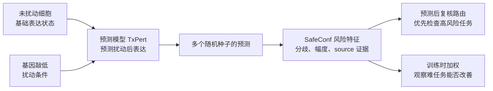
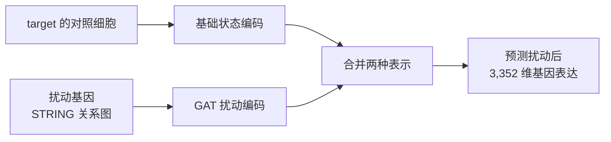
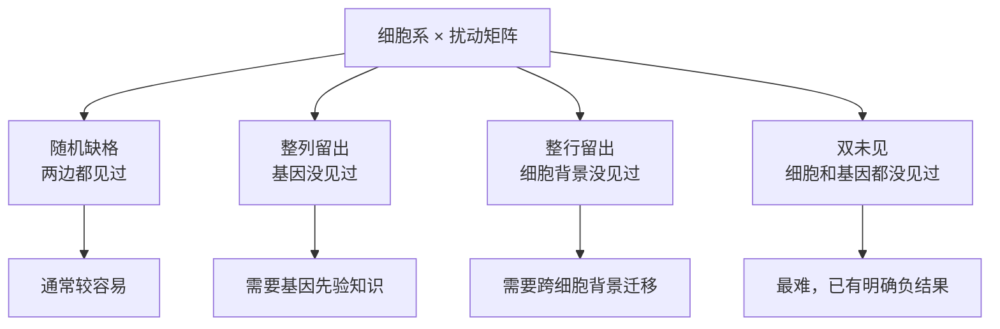
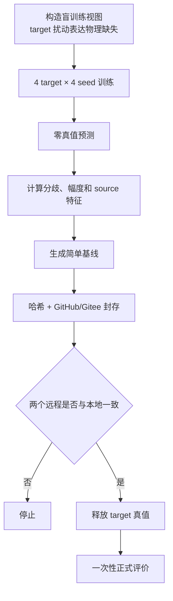
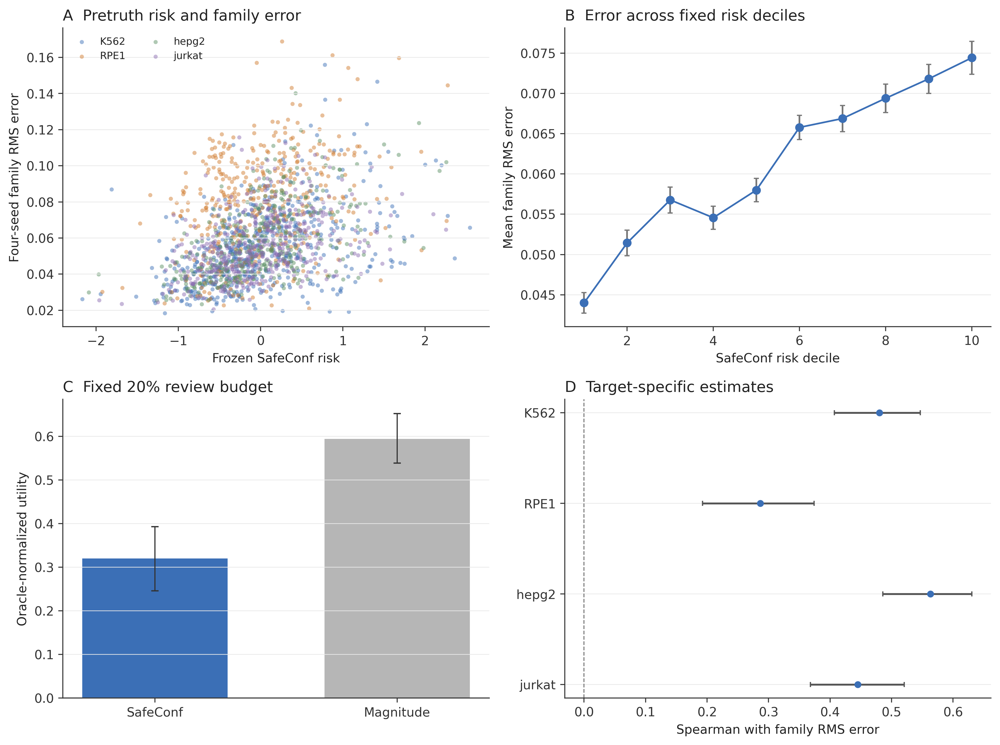
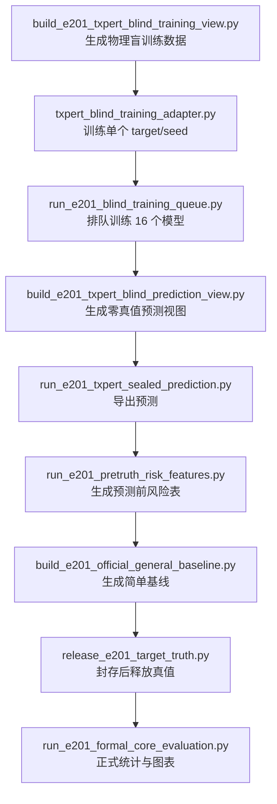
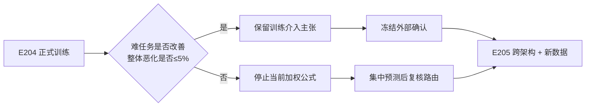

# SafeConf 当前项目手把手学习

> 事实截止：2026-09-05
>
> 当前分支：`exp/task-risk-audit-20260611`
>
> 适合读者：刚开始学单细胞、隔了很久没看项目、或刚拉取仓库的人
>
> 当前事实总结：[E201 后的研究判断](../实验结果/CURRENT_RESEARCH_DECISION_20260905.md)

这是当前唯一建议从头读到尾的教程。早期 HTML、七月稿件、Agent 原始意见和 E1–E194 报告仍然保留，用于追溯。它们和本文状态冲突时，以本文指向的正式报告为准。

2026-09-06 已对本文数字、GPT 论文学习会话和正式报告做过一次对照。从零开始、或想先知道“哪些话能当真”，先读 [小白审核与从零入口](./07_小白审核与从零入口_20260906.md)。

---

## 0. 先花 10 分钟建立全局

### 0.1 项目在解决什么

单细胞扰动预测模型会回答：

> 敲低某个基因以后，这类细胞的几千个基因表达量会怎样变化？

预测模型一次可以给出成百上千个结果，但不同任务的可信程度不同。SafeConf 位于预测之后，它希望解决两件事：

1. 还没查看真实实验结果时，能否先找到较可能出错的预测；
2. 训练时给难任务更多权重，能否真的减少这些任务的误差。

第一件事已在 E201 完成四个细胞系的盲测。第二件事由 E204 执行；四个细胞系的训练程序体检已通过，正式 80 轮对照尚未出结果。

### 0.2 一张图记住主线



### 0.3 当前进度灯

| 部分 | 状态 | 能说什么 |
| --- | --- | --- |
| E199：K562 中未见基因 | 完成 | 三个公开 TxPert 模型的分歧能找出一部分难任务 |
| E200：整个 K562 背景留出 | 完成 | 预测幅度远强于固定风险分 |
| E201：四个细胞系 × 四种子 | 完成 | SafeConf 有稳定正信号，且有幅度之外的信息；单独使用弱于幅度 |
| E202：控制幅度后的相对失败 | 完成，主门失败 | source dispersion 没有解释 GAT 相对基线多犯的错 |
| E204：风险指导训练 | 工程验收通过 | 程序能正确加权；尚不能说效果提升 |
| E205：跨模型架构分歧 | 协议已设计 | 尚未运行 |

---

## 1. 从零理解单细胞扰动预测

### 1.1 什么是单细胞 RNA 测序

`single-cell RNA sequencing`（单细胞 RNA 测序，简写 `scRNA-seq`）会为每个细胞生成一个基因表达向量。可以把一个细胞想成一行表格，每列是一个基因，数值表示该基因在这个细胞中被读到多少。

```text
cell_001 = [AARS: 0.12, MYC: 1.37, TP53: 0.42, ...]
cell_002 = [AARS: 0.09, MYC: 1.11, TP53: 0.51, ...]
```

E201 每个向量包含 3,352 个基因维度。原始单细胞数值噪声大，所以评价时常先对同一任务的多个细胞取平均。

### 1.2 什么是扰动

`perturbation`（扰动）是人为改变细胞的操作。当前主线使用 CRISPRi 基因敲低数据。`CRISPRi`（CRISPR interference，CRISPR 干扰）会降低目标基因的表达，然后观察其他基因如何变化。

`AARS+ctrl` 可以读成：敲低 AARS，另一个位置使用无效对照。`ctrl`（control，对照）代表没有有效扰动的基准状态。

### 1.3 什么是一个 task

`task`（任务）在本项目中通常是：

```text
一个细胞背景 × 一个扰动条件
```

例如 `K562::AARS+ctrl` 就是“预测 K562 细胞中敲低 AARS 后的表达变化”。一个 task 可以有几十到几百个单细胞重复观测。

### 1.4 四个细胞系是什么

| 名称 | 通俗理解 | 在 E201 中的作用 |
| --- | --- | --- |
| K562 | 人髓性白血病细胞系 | 轮流当完全未见的 target |
| RPE1 | 人视网膜色素上皮相关细胞系 | 轮流当 target |
| HepG2 | 人肝细胞癌相关细胞系 | 轮流当 target；代码中写作 `hepg2` |
| Jurkat | 人 T 淋巴细胞白血病细胞系 | 轮流当 target；代码中写作 `jurkat` |

它们是可以长期培养的实验细胞背景，不是四位病人。

### 1.5 source 和 target

- `source`（源域）：训练时可以看到的细胞背景和扰动表达。
- `target`（目标域）：测试时整体留出的细胞背景。

当 K562 是 target 时，RPE1、HepG2 和 Jurkat 是 source。训练过程可以看三个 source 的扰动数据，但不能看 K562 的扰动后表达。K562 的未扰动对照细胞可以作为基础状态输入。

---

## 2. TxPert 做什么，SafeConf 又做什么

### 2.1 TxPert 是预测器

TxPert 是单细胞扰动预测模型。E201 使用 TxPert 的 STRING-GAT 配置：

- `STRING` 是基因/蛋白关系网络来源；
- `GAT`（Graph Attention Network，图注意力网络）在基因关系图上学习扰动表示；
- 模型把 target 的未扰动状态和扰动基因表示组合，输出扰动后的 3,352 维表达向量。



### 2.2 SafeConf 是预测后的风险层

SafeConf 不重新预测基因表达。它读取已经生成的多份预测，再结合 source 数据的支持量和跨背景差异，为每个 task 生成风险特征。

它当前最稳妥的用法是：

```text
预测幅度用作强基线
        +
SafeConf 补充幅度无法解释的任务风险
        =
优先复核或暂停使用的决策
```

现有结果不支持“SafeConf 单独排序一定强于幅度”。

---

## 3. 三种“没见过”不能混在一起

### 3.1 随机缺一格

训练集里见过这个细胞系，也见过这个扰动，只有某个“细胞系 × 扰动”组合没见过。这类考法相对容易。

### 3.2 未见基因/整列留出

测试基因在训练扰动中完全没出现，但细胞背景见过。E199 就是 K562 内的未见单基因扰动。

### 3.3 未见细胞背景/整行留出

训练时没看过 target 细胞系的任何扰动后表达。E200 留出 K562，E201 轮流留出四个细胞系。周老师所说的 `general task`（跨背景泛化任务）主要指这种更难的考法。



E199 中分歧是主力；E200 中幅度成了主力。这个翻转是项目的重要发现：风险线索的作用范围需要通过对应的考法验证。

---

## 4. SafeConf 的五个当前风险成分

E201 的每个 target 都训练同一 TxPert-GAT 架构的四个随机种子。`seed`（随机种子）控制参数初始化和数据顺序等随机性。四个 seed 产生四份预测，它们是同一模型家族的四个成员。

### 4.1 family disagreement：四份预测吵得有多凶

先对四份预测取平均，得到 `family centroid`（预测家族质心）。再计算每个成员离这个平均预测有多远，得到 `family disagreement`（家族分歧）。

\[
D=\sqrt{\frac{1}{M}\sum_{m=1}^{M}\operatorname{mean}_g
(\hat y_{m,g}-\bar y_g)^2}
\]

- \(M=4\)：四个随机种子；
- \(g\)：基因维度；
- \(\hat y_{m,g}\)：第 \(m\) 个模型对基因 \(g\) 的预测；
- \(\bar y_g\)：四个模型的平均预测。

分歧大表示同一程序只换个初始状态就给出很不同的答案。它表示初始化敏感性，尚不能代表跨架构不确定性。

### 4.2 model–source gap：模型猜测和 source 参考差多少

对同一扰动，可以先计算它在三个 source 背景中的平均扰动效应，形成 `source-transfer prediction`（源域迁移参考预测）。模型家族质心与这份简单参考之间的 RMSE，就是 `model_source_gap`。

值大表示深度模型和“直接平移 source 平均变化”给出了很不同的答案。

### 4.3 source delta dispersion：同一扰动在 source 中是否稳定

`delta`（扰动效应）是扰动后平均表达减去同批次对照平均表达。`source_delta_dispersion`（source 效应离散度）衡量同一基因扰动在三个 source 细胞背景中有多不一致。

例如，某扰动在 RPE1 中强烈上调一组基因，在 HepG2 中却几乎没反应，该扰动的 dispersion 会很大。

### 4.4 negative log source cells：source 证据有多少

`n_source_cells` 是该扰动在 source 中拥有的单细胞观测数。特征使用 `-log(1+n_source_cells)`，使观测少的条件具有较高的理论风险。

E201 的结果表明，该成分与真实误差的合并 Spearman 只有约 0.045。“样本少就一定更难”在当前数据上缺少强证据。

### 4.5 support context deficit：该扰动覆盖几个 source 背景

`n_source_contexts` 是扰动在三个 source 细胞系中出现的数量。缺口计算为 `3-n_source_contexts`。

- 在三个 source 都有数据：缺口 0；
- 只在一个 source 出现：缺口 2。

该成分在 E201 中的合并关联约为 -0.038，目前不支持将它单独解释为稳定难度信号。

### 4.6 E201 组合风险分

五个成分先在每个 target 内做 `z-score`（标准分）：

\[
z(x)=\frac{x-\operatorname{mean}(x)}{\operatorname{std}(x)}
\]

标准化后再等权平均：

\[
R=\operatorname{mean}\left[
z(D), z(G), z(S), z(N), z(C)
\right]
\]

| 字母 | 对应成分 |
| --- | --- |
| \(D\) | family disagreement |
| \(G\) | model–source gap |
| \(S\) | source delta dispersion |
| \(N\) | negative log source cells |
| \(C\) | support context deficit |

这是预先封存的规则，没有利用 target 真实误差学五个成分的权重。该做法便于审计，也可能把弱成分和强成分平均在一起。E204 因此专门保留 `dispersion_only` 对照。

---

## 5. 预测幅度为什么必须单独比

`predicted magnitude`（预测幅度）是模型自己预测的扰动变化有多大：

\[
M=\operatorname{RMSE}(\text{family centroid},\text{target control centroid})
\]

它不需要查看真实扰动结果。如果模型预测许多基因大幅变化，即使每个基因的相对误差差不多，绝对 RMSE 也容易变大。因此，任何风险方法都应与幅度比较。

一个三基因玩具例子：

```text
对照质心          = [0.0, 0.0, 0.0]
预测 A             = [0.1, 0.0, -0.1]   -> 幅度小
预测 B             = [1.2, -0.8, 0.9]   -> 幅度大
```

幅度大只表示模型认为这次变化大，不等于它必然猜错。它与真实误差的关系必须在解封真值后评价。

---

## 6. 怎样定义“猜错了多少”

### 6.1 centroid：先对同一任务的细胞取平均

`centroid`（质心）就是同一 task 中多个细胞向量的平均。模型预测质心与真实扰动质心之间的 RMSE 是主要误差。

`RMSE`（Root Mean Squared Error，均方根误差）为：

\[
\operatorname{RMSE}(a,b)=\sqrt{\operatorname{mean}_g(a_g-b_g)^2}
\]

值越大，预测和真实结果的平均距离越大。

### 6.2 三种 family 误差

| 名称 | 计算对象 | 通俗含义 |
| --- | --- | --- |
| family centroid RMSE | 四种子平均预测 vs 真值 | “四份答案平均后错多少” |
| family RMS error | 四个种子误差的平方均方根 | “这一组训练总体错多少” |
| worst-seed error | 四个种子中最大误差 | “最倒霉的一次训练错多少” |

E201 主关联使用 family RMS error。它衡量同一种模型的四次训练在该任务上的整体难度，并非只指定某一个模型的错。

### 6.3 三个简单基线

| 基线 | 它怎么猜 | 为什么必须比 |
| --- | --- | --- |
| batch-matched control | 猜扰动后仍等于同批次对照 | 检查深度模型是否真比“不变”更好 |
| official general baseline | 使用 TxPert 官方定义的简单通用扰动规则 | 对齐 TxPert 原评价口径 |
| source transfer | 直接搬运三个 source 的平均扰动效应 | 检查深度模型是否超过简单跨背景平移 |

K562 上 family centroid RMSE 为 0.0540，优于 official general baseline 的 0.0584，但差于 batch-matched control 的 0.0523。这是需要保留的负结果：深度模型并非在每个 target 上都赢强基线。

---

## 7. 统计数字应该怎么读

### 7.1 Spearman 相关

`Spearman correlation`（斯皮尔曼秩相关）检查“风险排名高的任务，真实误差排名是否也高”。

- 接近 1：排名方向高度一致；
- 接近 0：基本没有排序关系；
- 小于 0：风险分越高，误差反而越小，排序方向可能有害。

### 7.2 95% CI

`95% confidence interval`（95% 置信区间，简写 CI）表示在重复抽样下该统计量的不确定范围。E201 以扰动条件为簇运行 5,000 次 bootstrap（有放回重抽样）。区间跨 0 时，当前数据不足以稳定确认方向。

### 7.3 partial Spearman

`partial Spearman`（偏斯皮尔曼相关）先控制另一个变量，再检查剩余关系。E201 中控制 predicted magnitude 后，SafeConf 与 family RMS error 仍有 0.2503 的偏相关，95% CI 为 [0.2021, 0.2980]。这是“SafeConf 含有幅度之外信息”的主证据。

### 7.4 20% 复核预算

假设人力只能检查 20% 的任务，就将风险最高的 20% 选出，查看它们实际包含了多少高误差任务。`oracle-normalized utility`（相对理想排序的标准化效用）大于 0 表示好于随机抽查，1 表示达到知道真实误差的理想排序。

E201 中：

- SafeConf 效用 0.3200，95% CI [0.2456, 0.3929]；
- predicted magnitude 效用 0.5943，95% CI [0.5386, 0.6525]。

两者都好于随机，幅度更强。

---

## 8. 为什么要“先交卷，再对答案”

如果先看了 target 真实误差，再选风险特征、权重或阈值，就容易把偶然有利的规则误写成一般规律。E201 用物理数据视图、哈希和双远程 Git 留痕控制该问题。

`hash`（哈希）是文件指纹。文件只要改一个字节，SHA-256 就会变化。GitHub/Gitee 推送在这里是“把猜测和规则交卷存档”，不是远程服务器训练模型。



完整 E201 路径和门槛见：

- [训练冻结](../实验结果/E201_txpert_multitarget_retraining_20260802/FORMAL_TRAINING_FREEZE.md)
- [target 释放与评价冻结](../实验结果/E201_txpert_multitarget_retraining_20260802/TARGET_RELEASE_AND_EVALUATION_FREEZE.md)
- [家族封存记录](../实验结果/E201_txpert_multitarget_retraining_20260802/E201_FAMILY_SEAL.json)
- [真值释放记录](../实验结果/E201_txpert_multitarget_retraining_20260802/E201_TARGET_TRUTH_RELEASE_STATUS.json)

---

## 9. E199 到 E205 的实验故事

### 9.1 E199：细胞见过，基因没见过

- target：K562；
- 任务：263 个未见单基因扰动；
- 模型家族：三个公开检查点，GAT、Exphormer、Exphormer-MG，不是四个随机种子；
- 分歧 Spearman：0.3948 [0.2835, 0.4969]；
- 幅度 Spearman：0.0955 [-0.0256, 0.2187]；
- 分歧的 20% 复核效用：0.2084 [0.1033, 0.3755]。

在“细胞见过、基因没见过”这套考法中，三个公开模型之间的预测分歧是有效风险线索。完整证据：[E199 报告](../实验结果/E199_txpert_public_k562_20260802/formal_evaluation/reports/E199_REPORT.md)。

### 9.2 E200：整个 K562 背景没见过

- target：K562；
- 主任务：566；
- transfer risk Spearman：0.4240 [0.3506, 0.4953]；
- 幅度 Spearman：0.8797 [0.8437, 0.9095]；
- 20% 复核效用：风险 0.3648，幅度 0.9133。

整个细胞背景留出后，幅度成为压倒性更强的排序基线。在幅度上固定叠加旧风险分会使排序变差。完整证据：[E200 报告](../实验结果/E200_txpert_cross_context_k562_20260802/formal_evaluation/reports/E200_REPORT.md)。

### 9.3 E201：四个整背景留出的正式盲测

E201 将 E200 从单一 K562 扩展到 K562、RPE1、HepG2 和 Jurkat，每个 target 训练四个随机种子。

| target | 主任务数 | SafeConf Spearman | 95% CI |
| --- | ---: | ---: | --- |
| K562 | 566 | 0.4803 | [0.4069, 0.5467] |
| RPE1 | 416 | 0.2868 | [0.1927, 0.3740] |
| HepG2 | 405 | 0.5633 | [0.4858, 0.6305] |
| Jurkat | 421 | 0.4453 | [0.3681, 0.5209] |
| 合并 | 1,808 | 0.4082 | [0.3506, 0.4621] |

其他主结果：

- predicted magnitude 合并 Spearman = 0.6189；
- family disagreement 合并 Spearman = 0.2402；
- 控制幅度后 SafeConf partial Spearman = 0.2503 [0.2021, 0.2980]；
- SafeConf 20% 复核效用 = 0.3200；
- 幅度 20% 复核效用 = 0.5943；
- SafeConf 相对幅度的直接效用差 = -0.2743 [-0.3576, -0.2008]。

因此，E201 支持“SafeConf 能预先找出一部分高误差任务，且包含幅度之外的信息”。它不支持“SafeConf 单独排序超过幅度”。



证据入口：

- [E201 核心报告](../实验结果/E201_txpert_multitarget_retraining_20260802/formal_core_evaluation/reports/E201_CORE_REPORT.md)
- [2,008 任务的逐行主表](../实验结果/E201_txpert_multitarget_retraining_20260802/formal_core_evaluation/tables/E201_TASK_METRICS.csv)
- [四 target 误差摘要](../实验结果/E201_txpert_multitarget_retraining_20260802/formal_core_evaluation/tables/E201_TARGET_ERROR_SUMMARY.csv)
- [复核效用表](../实验结果/E201_txpert_multitarget_retraining_20260802/formal_core_evaluation/tables/E201_REVIEW_UTILITY.csv)
- [正式门判定](../实验结果/E201_txpert_multitarget_retraining_20260802/formal_core_evaluation/tables/E201_FORMAL_GATES.csv)

### 9.4 E201 的数值证书门为什么写 FAIL

等权预测家族满足一个几何恒等式：家族 RMS 误差的平方，等于家族质心误差平方加分歧平方。E201 预先将数值残差阈值写成 \(10^{-10}\)。实际最大残差为 \(3.61\times10^{-10}\)，因此该门按规则为 FAIL；分歧作为 family RMS error 下界的违反数仍为 0。

这个 FAIL 不否定 E201 的经验风险排序结果，也不能事后把阈值改宽再写 PASS。

### 9.5 E202：一个必须保留的负结果

E202 检查：控制幅度后，source dispersion 能否识别 GAT 相对简单基线额外犯错的任务。主 partial Spearman = -0.0680，95% CI [-0.1522, 0.0191]，主结论 `NOT SUPPORTED`（不支持）。

它说明 source dispersion 可以与绝对误差相关，却不一定能解释“深度模型比简单基线多错了什么”。完整证据：[E202 报告](../实验结果/E202_residual_task_failure_20260802/formal_evaluation/reports/E202_REPORT.md)。

### 9.6 E204：将风险信息放进训练

E204 不使用 target 误差生成训练权重。它只使用 source 证据：

\[
\text{difficulty}=\operatorname{mean}\left[
z(-\log(1+n_{cells})),
z(3-n_{contexts}),
z(\text{source dispersion})
\right]
\]

\[
w=\operatorname{clip}(1+0.5\times\text{difficulty},0.5,2.0)
\]

- 难度高的扰动条件获得较大 loss 权重；
- 困难度低的条件权重较小；
- 未扰动对照固定权重 1；
- 所有权重限制在 0.5 到 2.0 之间。

三组对照为：

| 组别 | 训练权重 | 要回答的问题 |
| --- | --- | --- |
| uniform | 全部为 1 | 原始 TxPert-GAT 水平 |
| risk_weighted | 支持量 + 背景覆盖 + dispersion | 组合 source-only difficulty 是否改善难任务 |
| dispersion_only | 只用 source dispersion | 组合方法是否真比单一强特征好 |

权重清单覆盖的实际 source 训练条件数：

| 留出 target | 有权重的 source 训练条件 |
| --- | ---: |
| K562 | 1,365 |
| RPE1 | 1,298 |
| HepG2 | 1,241 |
| Jurkat | 1,308 |
| 合计 | 5,212 |

2026-09-05 已完成四个 target 的单 epoch 完整体检。训练记录总数约 116 万，四组未匹配权重回退都是 0，target 扰动表达读取都是 0。这只证明程序能按设计训练，并未证明加权提高了模型效果。

证据入口：

- [E204 冻结协议](../实验结果/E204_risk_guided_training_20260830/ANALYSIS_FREEZE.md)
- [权重覆盖修正](../实验结果/E204_risk_guided_training_20260830/IMPLEMENTATION_AMENDMENT_20260905.md)
- [四 target 工程验收](../实验结果/E204_risk_guided_training_20260830/PROFILE_ACCEPTANCE_20260905.md)
- [完整训练权重表](../实验结果/E204_risk_guided_training_20260830/training_manifest_v2/E204_SOURCE_ONLY_TRAINING_WEIGHTS.csv)

E204 的公式在 E201 真值释放前已冻结，完整覆盖的工程修正发生在真值释放后。因此，E204 在 E201 数据上属于预注册的次级/探索性实验；最终确认需要新 target 或新外部数据。

### 9.7 E205：当前四个模型其实只是四次同架构训练

E201 的四个预测器都是 TxPert STRING-GAT，只改随机种子。E205 计划增加一个结构不同、但使用同一任务和输出格式的预测器家族，再分开计算：

1. 同架构跨 seed 分歧；
2. 不同架构之间的质心分歧；
3. 两者组合。

当前还不能说 SafeConf 已证明“跨模型分歧”有效。证据：[E205 协议](../实验结果/E205_cross_family_disagreement_20260830/ANALYSIS_FREEZE.md)。

---

## 10. 打开一行真实数据，逐列看懂

主表位于 [E201_TASK_METRICS.csv](../实验结果/E201_txpert_multitarget_retraining_20260802/formal_core_evaluation/tables/E201_TASK_METRICS.csv)。以 `K562::AARS+ctrl` 为例：

| 字段 | 该行数值 | 怎么读 |
| --- | ---: | --- |
| target | K562 | 测试的整体留出细胞系 |
| condition | AARS+ctrl | 敲低 AARS 的扰动条件 |
| n_target_cells | 38 | target 中用于评价的真实单细胞数 |
| n_target_batches | 29 | 这 38 个细胞涉及 29 个实验批次 |
| n_source_cells | 161 | 三个 source 背景合计有 161 个该扰动细胞 |
| n_source_contexts | 3 | 三个 source 细胞系都观测到该扰动 |
| source_delta_dispersion | 0.06288 | 该扰动在三个 source 中的效应差异 |
| family_disagreement | 0.01035 | 四个 TxPert seed 的预测分歧 |
| predicted_magnitude | 0.10173 | 模型预测的整体扰动变化大小 |
| model_source_gap | 0.00855 | 模型预测与 source-transfer 参考的差距 |
| safeconf_e201_risk | 0.11790 | 五个标准化成分的等权平均 |
| family_centroid_rmse | 0.08849 | 四份预测平均后与真值的误差 |
| family_rms_error | 0.08909 | 四个种子误差的平方均方根 |
| worst_seed_error | 0.09472 | 四个种子中最大的误差 |

这一行分成两个时间阶段：

- `safeconf_e201_risk` 及它左边的风险特征可在查看 target 真值前生成；
- `family_centroid_rmse`、`family_rms_error`、`worst_seed_error` 需要真实 target 扰动表达，只能在解封后计算。

---

## 11. 代码从哪里读，每个脚本做什么

### 11.1 当前 E201 数据链



| 脚本 | 主要输入 | 主要输出 | 最重要的安全检查 |
| --- | --- | --- | --- |
| [build_e201_txpert_blind_training_view.py](../../tools/scripts/build_e201_txpert_blind_training_view.py) | TxPert 公开 AnnData | 每个 target 的盲 H5AD | target 扰动行物理缺失 |
| [txpert_blind_training_adapter.py](../../tools/scripts/txpert_blind_training_adapter.py) | 盲 H5AD、split、seed | checkpoint 与状态 JSON | target 扰动访问数为 0 |
| [run_e201_blind_training_queue.py](../../tools/scripts/run_e201_blind_training_queue.py) | 4 target × 4 seed | 16 个正式作业 | GPU 占用、重复作业和失败状态检查 |
| [run_e201_txpert_sealed_prediction.py](../../tools/scripts/run_e201_txpert_sealed_prediction.py) | checkpoint + 预测视图 | `predictions.npy` | 不生成 `truth.npy` |
| [run_e201_pretruth_risk_features.py](../../tools/scripts/run_e201_pretruth_risk_features.py) | 16 份预测 + source 证据 | 风险 CSV 和质心 NPY | target 表达读取为 0 |
| [build_e201_official_general_baseline.py](../../tools/scripts/build_e201_official_general_baseline.py) | source 数据 | 官方 general baseline | 与 E200 口径等价 |
| [release_e201_target_truth.py](../../tools/scripts/release_e201_target_truth.py) | 已封存状态 | target 真值 | 本地/GitHub/Gitee HEAD 一致 |
| [run_e201_formal_core_evaluation.py](../../tools/scripts/run_e201_formal_core_evaluation.py) | 风险、基线、真值 | 报告、CSV、PNG/PDF | 输入哈希、任务数、冻结门 |

### 11.2 当前 E204 数据链

| 脚本 | 用途 |
| --- | --- |
| [build_e204_training_weight_manifest.py](../../tools/scripts/build_e204_training_weight_manifest.py) | 从 source 训练条件生成完整权重表 |
| [run_e204_weighted_training.py](../../tools/scripts/run_e204_weighted_training.py) | 将 task 权重附加到每个训细胞，用加权重建 loss 训练 |

E204 启动器不修改外部 TxPert 仓库，它在运行时替换 Dataset、collate 和 training step，并将权重清单复制到每个作业目录便于审计。

### 11.3 代码、报告和大数据不在同一地方

| 位置 | 内容 | Git 是否包含 |
| --- | --- | --- |
| `code/` | SafeConf 正式包和历史兼容实现 | 是 |
| `tools/scripts/` | E 编号实验和审计脚本 | 是 |
| `docs/实验结果/` | 冻结协议、小型 CSV、报告、图和哈希 | 是 |
| `/home/yyf/data/txpert_official_20260802/` | H5AD、NPY、checkpoint 和大型运行输出 | 否 |
| `/home/yyf/archive/external/TxPert/` | 固定提交的外部 TxPert 源码 | 否 |

从 GitHub 拉取仓库后，可以学习代码、协议、主表和图。若要端到端重训 TxPert，还需要服务器数据盘和专用 Python 环境。

---

## 12. 周老师上次问题的直接答案

### 问题 1：风险分数和谁的误差比？

E201 主分析将每个 task 的风险分与同一 task 的 family RMS error 比较。family RMS error 来自同一 TxPert-GAT 架构四个随机种子的真实误差。所以当前风险分主要说“这道任务对这个模型家族难不难”，不指定哪个单模型犯错。

### 问题 2：第三个分歧指标是不是每个模型的置信度？

不是。它是四个同架构随机种子预测的组内离散程度。它能反映初始化敏感性，但当前还不能代表 scGPT、GEARS、TxPert 等不同架构的普遍不确定性。E205 用来补这个空缺。

### 问题 3：幅度是否要先做真实实验才知道？

不需要。幅度是预测模型自己给出的整体变化大小，只使用预测向量和 target 对照质心。真实实验结果只在最后检查幅度是否真能预示误差时使用。

### 问题 4：以前的切分是不是太简单？

早期随机缺格确实容易。E189–E192 已比较小矩阵、整行、整列、双未见和跨数据集。E199 是未见基因，E200/E201 是整体细胞背景留出。双未见中已出现负相关和负复核效用，当前规则在该场景应停用。

### 问题 5：未见的格子怎么算幅度？

未见的是该 target 任务的真实扰动表达。只要预测模型能为该任务输出预测向量，就能计算幅度。若模型无法生成预测，SafeConf 也不应凭空生成该任务的风险分。

### 问题 6：三种更难考法是否都解决了？

都跑过不等于都解决。未见基因中分歧有用；整背景留出中幅度更强；双未见中现有排序可能有害。现在已知道不同考法应使用不同线索，未验证时返回 `ABSTAIN`（暂停给出风险排序）。

### 问题 7：这个分数如何证明有用？

周老师提出两个可验证的用途：预测后优先挑出不可信结果；训练时更重视难任务以改善模型。E201 已回答第一个用途，但幅度是更强的单一基线。E204 正在回答第二个用途，当前只完成工程验收。

---

## 13. 历史实验应该怎么放回当前主线

仓库中有超过 200 个 E 编号。它们是方法演进和负结果留痕，不应被理解成 200 个都要写入当前主结论的实验。

| 阶段 | 大致编号 | 主要学到什么 | 当前位置 |
| --- | --- | --- | --- |
| 早期风险分和多数据扫描 | E1–E132 | 风险信号有场景差异，magnitude 是强基线 | 历史证据和方法来源 |
| 方向误差、chemical 和机制审计 | E133–E144 | directional 和 absolute 结论需分开；chemical 不能混成 gene 成功 | 补充与负边界 |
| 注册预测家族几何证书 | E173–E194 | 分歧可作确定性误差下界，但不能直接定位哪个模型错 | 理论/审计支线 |
| 公开 TxPert 任务风险 | E198–E205 | 分歧和幅度会随泛化场景翻转；E201 四 target 盲测；E204 训练介入 | **当前主工作线** |

历史证据的最后一份集中入口是 [GATE_STATUS_20260729.md](../实验结果/GATE_STATUS_20260729.md)。读它时要知道：其“最新”截止于 2026-07-29，不包含 E201 解封后结果和 E204 进展。

---

## 14. 从今天开始应该怎么学

### 第一遍：30 分钟，只求会讲故事

1. 读本文第 0–3 节；
2. 用自己的话解释 task、source、target、未见基因、整背景留出；
3. 只记住一句当前结论：SafeConf 有幅度之外的风险信息，单独排序不如幅度。

### 第二遍：2 小时，学懂每个数

1. 读第 4–7 节；
2. 打开 [E201 报告](../实验结果/E201_txpert_multitarget_retraining_20260802/formal_core_evaluation/reports/E201_CORE_REPORT.md)；
3. 对着第 10 节查看 `K562::AARS+ctrl` 那一行；
4. 确认哪些列在真值前可计算，哪些列必须解封后才能计算。

### 第三遍：半天，看懂代码链

1. 读第 8 和 11 节；
2. 按表中顺序打开 E201 脚本；
3. 每个脚本只先找三个部分：参数解析、输入检查、状态 JSON 写出；
4. 最后再看数学计算，不要一开始逐行啃完整脚本。

### 第四遍：半天，学会审核结论

1. 读 E199、E200、E201、E202 报告；
2. 为每份报告写三行：主问题、主数字、不能夸大的话；
3. 不看本文，回答第 12 节的七个问题。

---

## 15. 接下来的工作顺序

### 15.1 第一优先级：E204 正式训练

E201 已有 16 个 uniform 模型，不重复训练。新增：

- 4 target × 4 seed = 16 个 `risk_weighted` 模型；
- 4 target × 4 seed = 16 个 `dispersion_only` 模型。

每个新模型训练 80 轮。评价时按相同 target、相同 seed 成对比较，关注：

1. 全部任务的平均 RMSE；
2. source-only difficulty 最高 20% 任务的 RMSE；
3. Pearson delta 和 rank；
4. 四个 target 的方向和区间，不隐藏不利 target。

主停止规则：高难任务没有改善，或全体 RMSE 恶化超过 5%，就不再用当前权重公式向外扩展。

### 15.2 第二优先级：形成真正可执行的复核策略

E201 用来开发“幅度主排序 + SafeConf 补充”策略。需要补齐：

- 不同复核预算（5%、10%、20%、30%、50%）；
- `risk–coverage curve`（保留不同比例预测时的剩余误差曲线）；
- 与幅度、单独分歧、source dispersion 和现有不确定性方法比较；
- 未验证或区间跨 0 时的明确暂停规则。

策略开发完后必须冻结，再到一个未参与开发的新数据或新模型家族上一次性评价。

### 15.3 第三优先级：E205 跨架构对照

当前分歧只来自同一 TxPert-GAT 的四种子。E205 至少增加一个结构不同的预测家族，在同一任务合同上检查跨架构分歧。

### 15.4 第四优先级：新外部确认

Frangieh、Lara、Santinha、Replogle 等数据已参与过方法开发或历史判断，不应再包装成全新确认。新确认应在看真值前写好策略、阈值、基线和停止规则。



---

## 16. 当前可以写和不可以写的话

### 可以写

- 在四个整体细胞背景留出中，SafeConf 风险分与同架构四种子 family RMS error 稳定正相关。
- 控制 predicted magnitude 后，SafeConf 仍包含独立信息。
- predicted magnitude 是当前更强的单独复核排序器。
- 风险信号在未见基因和未见细胞背景中的作用会发生翻转。
- E204 加权训练程序已通过四 target 工程验收。

### 当前不可以写

- SafeConf 普遍优于 predicted magnitude。
- 四个随机种子等于四种不同模型。
- E204 已经提高了 TxPert 性能。
- SafeConf 已在所有基因扰动、化学扰动和数据集上通用。
- 双未见场景已经解决。
- 当前结果保证某个分区期刊录用。

---

## 17. 术语速查表

| 术语 | 中文解释 | 项目中的具体作用 |
| --- | --- | --- |
| AnnData / H5AD | 单细胞常用数据对象/文件 | 保存表达矩阵、细胞标签和扰动信息 |
| perturbation | 扰动 | 基因敲低等人为操作 |
| control | 对照 | 未扰动的基准细胞 |
| condition | 扰动条件 | 例如 `AARS+ctrl` |
| task | 评价任务 | 一个细胞背景和一个扰动的组合 |
| source | 训练源域 | 允许看到扰动表达的细胞背景 |
| target | 目标域 | 测试时整体留出的细胞背景 |
| holdout | 留出 | 训练时故意不给模型看某类数据 |
| OOD | 分布外 | 测试条件超出训练分布 |
| centroid | 质心/平均表达 | 同一 task 多个细胞的平均向量 |
| delta | 扰动效应 | 扰动质心减对照质心 |
| seed | 随机种子 | 产生同架构的不同训练初始状态 |
| family | 预测家族 | 事先固定的多个预测成员 |
| disagreement | 分歧 | 多个预测离它们平均值的距离 |
| magnitude | 预测幅度 | 模型预测的整体变化大小 |
| dispersion | 跨背景离散度 | 同一扰动在 source 背景间的差异 |
| RMSE | 均方根误差 | 两个基因向量的平均距离 |
| Spearman | 秩相关 | 风险排名和误差排名是否一致 |
| bootstrap | 重抽样 | 估计统计量的不确定范围 |
| CI | 置信区间 | 表示结果不确定性 |
| profile | 完整单轮工程体检 | 检查数据、显存、loss、验证和审计链 |
| formal | 正式运行 | 按冻结参数完整执行 |
| leakage | 信息泄漏 | 训练/调规则时不当看到 target 真值 |
| seal | 封存 | 将预测、特征和哈希在解封真值前推送存档 |
| ABSTAIN | 暂停给出排序 | 当前场景没验证或信号可能有害时停用 |

---

## 18. 学习完成后的自测

不看本文，尝试回答：

1. 为什么 `K562::AARS+ctrl` 是一个 task？
2. E199 和 E200 的“没见过”分别指什么？
3. family disagreement 为什么还不是跨架构不确定性？
4. predicted magnitude 为什么不需要 target 真值？
5. SafeConf 在 E201 中有用，为什么还不能说它超过 magnitude？
6. E201 的 partial Spearman 0.2503 在回答什么？
7. E204 四 target profile PASS 证明了什么，没证明什么？
8. E204 为什么要有 dispersion-only 对照？
9. 为什么解封前要将哈希同时推送 GitHub 和 Gitee？
10. E204 若失败，项目主线应该如何处理？

能用自己的话稳定回答这 10 题时，就可以开始看正式代码或准备组会。

---

## 19. 在新电脑上开始

```bash
git clone https://github.com/1298020005/SafeConf.git safeconf
cd safeconf
git fetch --all --prune
git checkout exp/task-risk-audit-20260611
git pull --ff-only
git log -1 --oneline
```

然后打开：

```text
docs/学习导航/00_当前项目手把手学习_20260905.md
```

如果让新 Codex 学习，直接发：

```text
请先只读 docs/学习导航/00_当前项目手把手学习_20260905.md，
再核对它链接的 E199、E200、E201、E202、E204 正式报告。
不要从 agents/ 原始输出或 2026-09-05 以前的状态文件推断当前进度。
读完后先用通俗中文回答本文第 18 节的 10 个自测题，不修改代码。
```

---

## 20. 当前权威证据顺序

文件冲突时，按以下顺序信任：

1. [2026-09-05 当前研究判断](../实验结果/CURRENT_RESEARCH_DECISION_20260905.md)；
2. [E201 正式核心报告](../实验结果/E201_txpert_multitarget_retraining_20260802/formal_core_evaluation/reports/E201_CORE_REPORT.md)；
3. [E204 四 target 工程验收](../实验结果/E204_risk_guided_training_20260830/PROFILE_ACCEPTANCE_20260905.md)；
4. E199、E200、E202 的正式 report/table；
5. E181–E194 历史证书和审计报告；
6. 早期教程、workspace 汇报和论文草稿；
7. `agents/` 中未经复核的 Grok、GLM、Gemini、Qoder 原始意见。

最后一句记住：

> 当前已证明 SafeConf 能为四个整背景留出任务提供幅度之外的风险信息；幅度仍是更强的单独排序器，训练介入和跨架构确认是下一阶段。
