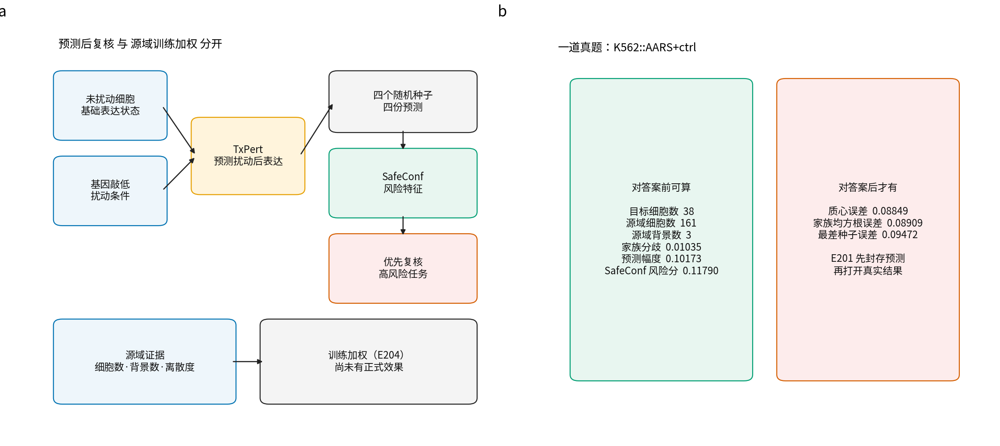
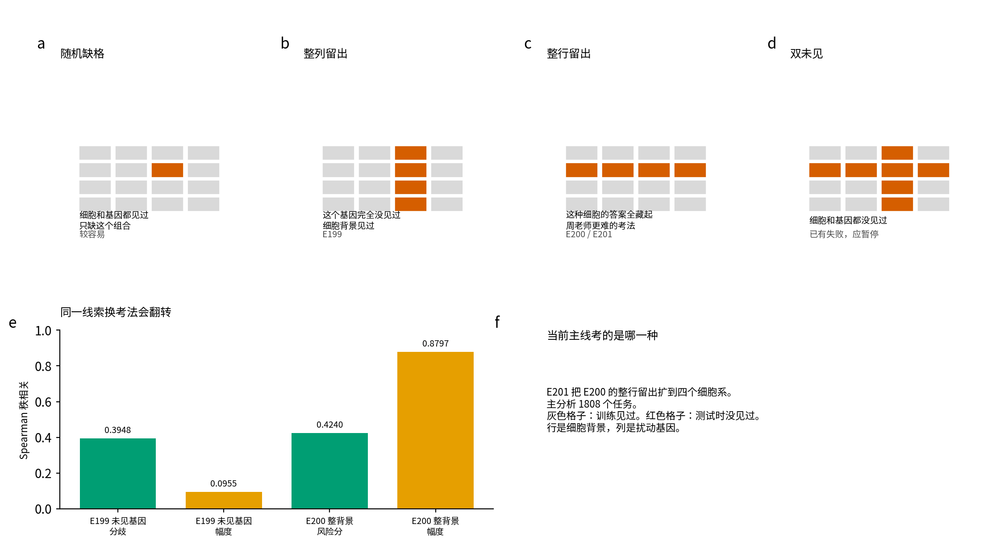
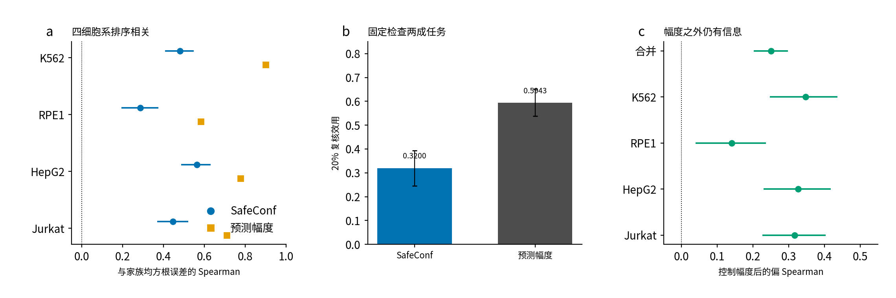

# 从零看懂当前这篇 SafeConf 研究

适合：没学过单细胞、第一次看这套结果的人。  
数字来自 `CLAIM_TABLE.json`。图由同一张表画出，不是手抄。

读图顺序：先看图 1 知道两套程序各干什么，再看图 2 知道考试有多难，最后看图 3 知道现在真正得到了什么。

---

## 1. 这篇东西在问什么

实验室可以问：把某个基因压低以后，这类细胞里几千个基因的表达会怎么变。

计算机模型一次能给出成百上千个答案。有的题它猜得还行，有的题它猜得很差。这篇研究不发明一种新的“猜表达”模型。它问：

> 在还没对答案时，能不能先把比较可能错的题标出来？

做标记的这一层叫 SafeConf。答题的那一层，当前主实验用的是 TxPert。

---

## 2. 从零需要的十个词

一个细胞可以被写成一行数字。每一列是一个基因，数字表示这个基因被读到多少。这种测量叫单细胞 RNA 测序（single-cell RNA sequencing）。当前主表里，每个细胞有 3352 个基因。

原始单细胞很吵，评价时会把同一条件下的许多细胞先平均。这个平均向量叫质心（centroid）。

人为改细胞的操作叫扰动（perturbation）。当前主线使用 CRISPR干扰（CRISPRi）：把某个基因的表达压低，再看其他基因怎么变。`AARS+ctrl` 读成：敲低 AARS，另一个位置放无效对照。

一道题叫任务（task）。它通常是：

```text
一个细胞背景  ×  一个扰动条件
```

`K562::AARS+ctrl` 就是：在 K562 这种细胞里，敲低 AARS 以后，那 3352 个基因会怎么变。

训练时允许看见扰动后答案的细胞背景叫源域（source）。测试时整套答案都藏起来的细胞背景叫目标域（target）。故意不给模型看某类数据，叫留出（holdout）。

TxPert 是答题模型。它看到目标细胞没被扰动时的状态，再加上被敲低的基因，输出扰动后的 3352 维预测。

SafeConf 不重新答题。它读取已经生成的多份预测，再结合源域里的证据，给每个任务打风险分。

几个同架构训练给出的答案互相差多少，叫家族分歧（family disagreement）。模型自己认为这次变化有多大，叫预测幅度（predicted magnitude）。风险排名和真实误差排名是否同方向，用斯皮尔曼（Spearman）秩相关来量：1 表示完全同方向，0 表示没有排序能力，小于 0 表示标得越高反而越容易对。

这十个词够读下面三张图。

---

## 3. 图 1 系统在干什么



**图 1a** 把两条路画开。上面一条是预测后复核：没被扰动的细胞和“敲低了哪个基因”进入 TxPert，四个随机种子给出四份预测，SafeConf 用这些预测打风险分，再优先复核高风险任务。下面一条是训练加权：权重只来自源域证据（该扰动在训练侧有多少细胞、覆盖几个背景、效应有多散），不经过四个随机种子，也不读取目标域预测。E204 冻结协议禁止把目标域预测写进权重。灰盒子写了“尚未有正式效果”，因为正式 80 轮还没有。

**图 1b** 打开真实的一行：`K562::AARS+ctrl`。左边是对答案前就能算的量，例如源域 161 个细胞、3 个背景、家族分歧 0.01035、预测幅度 0.10173、SafeConf 风险分 0.11790。右边是对完答案才有的误差，例如家族均方根误差 0.08909。E201 的纪律是：先把左边封存到 GitHub 和 Gitee，再打开右边。

---

## 4. 图 2 考试有四种难度



把细胞背景当成行，扰动基因当成列。灰色格子是训练见过的，红色格子是测试时没见过的。

- **图 2a 随机缺格**：这种细胞见过，这个基因也见过，只缺这个组合。比较容易。
- **图 2b 整列留出**：这个基因在训练扰动里完全没出现。对应 E199。
- **图 2c 整行留出**：这种细胞的任何扰动后答案都没给模型看过。对应 E200、E201。周老师说的更难考法，主要指这一类。
- **图 2d 双未见**：细胞和基因都没见过。现有规则在这里出现过失败，应当暂停给风险排序。

**图 2e** 用正式数字说明“同一线索换考法会翻转”。E199 未见基因时，三个公开模型的分歧 Spearman 是 0.3948，幅度只有 0.0955。E200 整个 K562 留出时，旧风险分 0.4240，幅度变成 0.8797。所以不能把一种考法上有用的标记，直接写成所有考法都有用。

**图 2f** 标明当前主线：E201 把整行留出扩到四个细胞系，主分析 1808 个任务。

E199 还要记一句：它用的是 GAT、Exphormer、Exphormer-MG 三个公开检查点，不是四个随机种子。

---

## 5. 图 3 现在真正得到的结果



**图 3a** 每个细胞系画两个点。蓝点是 SafeConf，橙点是预测幅度。四个蓝点都在 0 的右边：K562 0.4803、RPE1 0.2868、HepG2 0.5633、Jurkat 0.4453。合并 SafeConf 为 0.4082。四个橙点都更靠右，合并幅度为 0.6189。人话：风险分能把更可能错的题排到前面，但“模型自己觉得这次变化很大”是更强的单一线索。

**图 3b** 假设人力只能检查 20% 的题。效用 0 等于随机抽，1 等于已经知道谁错得最狠。SafeConf 是 0.3200，幅度是 0.5943。两个都比随机好，幅度抓错题更狠。相对幅度的效用差是 -0.2743。

**图 3c** 问：SafeConf 是不是幅度的重复？先拿掉幅度能解释的部分，剩下的偏 Spearman 合并为 0.2503，区间 [0.2021, 0.2980]，四个细胞系的区间下限都大于 0。人话：它不是最强的单一排序器，但它带了幅度解释不了的信息。

稳妥用法因此是：

```text
先看预测幅度
再用 SafeConf 补幅度解释不了的风险
不要写成 SafeConf 单独超过幅度
```

---

## 6. 还必须记住的负结果

K562 上，四种子平均预测的误差是 0.0540。官方简单规则是 0.0584。把扰动后猜成“和对照一样”是 0.0523。深度模型在 K562 上没有赢过“猜成没变化”。四个细胞系合并后深度模型整体仍优于对照，但这一条 K562 负结果要保留。

RPE1 上单独的家族分歧只有 0.0397，区间跨过 0。组合风险分仍为正，所以不能说“模型吵架”在四个细胞系上都单独稳定。

E201 有一个预先写死的几何证书门：家族均方根误差的平方，应当等于质心误差平方加分歧平方。实际最大残差 3.61e-10，高于阈值 1e-10，这扇门记为 FAIL。它更像浮点精度问题，下界违反数仍是 0。不能事后把阈值改宽再写成通过。

E202 问：控制幅度之后，源域离散度能不能解释“深度模型比简单规则多犯的错”。主偏相关 -0.0680，区间跨 0，结论 NOT SUPPORTED。

---

## 7. 训练加权现在到哪

周老师的第二个用途是：训练时更重视不容易预测对的任务。E204 用源域证据给每个训练条件一个 0.5 到 2.0 之间的权重。四个背景的一轮工程验收都通过了，训练权重回退为 0，也没有读取目标域扰动表达。

这只证明程序正确。正式 80 轮、32 个新模型还没有跑完。任何人说“加权已经让模型变准”，目前都没有正式表。

E205 还只是协议：用一个结构不同的预测家族，区分“换随机种子会吵”和“换模型结构会吵”。

---

## 8. 用自己的话检查有没有看懂

不看上文，试着讲：

1. `K562::AARS+ctrl` 为什么是一个任务（task）。
2. TxPert 和 SafeConf 谁在答题、谁在打标记。
3. 图 2 里红色整行和红色整列有什么不同。
4. 为什么 0.4082 有用，却仍不能说超过 0.6189。
5. 0.2503 在回答哪一句质疑。
6. E204 的工程验收证明了什么，没证明什么。

能讲清这六句，接着读 [04 五成分与封存流程精讲](./04_五成分与封存流程精讲.md) 和图 4：那里会说明为什么单看源域离散度是 0.4618，五成分等权之后变成 0.4082。然后再读完整教程 `docs/学习导航/00_当前项目手把手学习_20260905.md` 的第 4 节以后。
