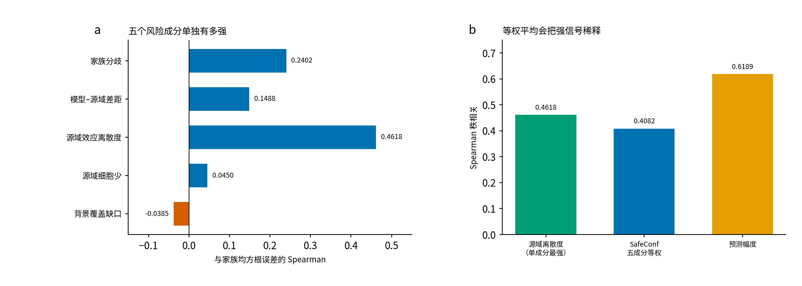

# 五成分、封存流程，以及上一轮教学为什么显得不够细

> 给已经读过图 1–图 3，还是觉得“知道结论但不会拆”的人。
>
> 数字来自 `CLAIM_TABLE.json` 的 `e201.component_display`，原始表是 `E201_DESCRIPTIVE_ASSOCIATIONS.csv`（1808 个主任务，对 `family_rms_error`）。

上一轮图 3 只告诉你：SafeConf 合并 Spearman 是 0.4082，幅度是 0.6189，控制幅度后还剩 0.2503。那三句话是对的，但没拆开 SafeConf 里面五样东西谁在干活。这一页把五样东西、封存纪律、以及 E204 为什么要单独开一条路讲完。

---

## 1. SafeConf 的风险分是怎么加出来的

对每个目标域（target）的 1808 道主任务，五个量先各自做 z 分数（z-score，标准分：减去该 target 内的均值，再除以标准差），再等权平均：

```text
R = mean[ z(分歧), z(模型–源域差距), z(源域离散度), z(细胞少), z(背景缺口) ]
```

等权的意思是：事先规定五样各占 1/5，**没有用目标域的真实误差去学权重**。好处是审得清；坏处是弱的成分会把强的成分往中间拉。

---

## 2. 图 4：五样东西单独有多强



**图 4a** 是五成分各自与真实误差的 Spearman（斯皮尔曼秩相关）。

| 成分 | 英文 | 人话 | 合并 Spearman |
| --- | --- | --- | ---: |
| 家族分歧 | family disagreement | 四个随机种子吵得有多凶 | 0.2402 |
| 模型–源域差距 | model–source gap | 深度模型和“把源域平均变化搬过来”差多少 | 0.1488 |
| 源域效应离散度 | source delta dispersion | 同一扰动在三个源域细胞里反应一不一致 | 0.4618 |
| 源域细胞少 | negative log source cells | 训练侧观测少是不是更难 | 0.0450 |
| 背景覆盖缺口 | support context deficit | 三个源域里缺了几个背景 | -0.0385 |

**图 4b** 把三件事放在一起：

- 单看源域离散度：0.4618
- 五成分等权之后的 SafeConf：0.4082
- 预测幅度（predicted magnitude）：0.6189

离散度单独已经比组合风险分高。组合分被 0.0450 和 -0.0385 两块几乎没信号的成分稀释了。这不是算错，这是等权规则的代价。E204 因此专门留了 `dispersion_only`（只用离散度加权）对照，用来问：组合是不是真比这一块强信号更有用。

四个细胞系上，分歧并不处处都强：RPE1 上单独的家族分歧只有 0.0397，区间跨 0。所以不能说“模型吵架”在每个细胞系都单独够用。K562 上幅度可以到 0.8993，SafeConf 是 0.4803——整行留出时幅度特别强。

---

## 3. 用 `K562::AARS+ctrl` 把字段拆开

主表一行：`E201_TASK_METRICS.csv`。

对答案前就能算（封存阶段）：

| 字段 | 这一行 | 它在五个成分里对应什么 |
| --- | ---: | --- |
| n_target_cells | 38 | 用来对答案的细胞数，不是风险成分 |
| n_source_cells | 161 | 细胞少：`-log(1+161)` |
| n_source_contexts | 3 | 背景缺口：`3-3=0`，这道题三个源域都有 |
| source_delta_dispersion | 0.06288 | 离散度 |
| family_disagreement | 0.01035 | 分歧 |
| predicted_magnitude | 0.10173 | 幅度，**不进**五成分等权，单独当强基线 |
| model_source_gap | 0.00855 | 模型–源域差距 |
| safeconf_e201_risk | 0.11790 | 五个 z 分数的平均 |

对答案后才有：

| 字段 | 这一行 |
| --- | ---: |
| family_centroid_rmse | 0.08849 |
| family_rms_error | 0.08909 |
| worst_seed_error | 0.09472 |

这道题源域证据并不缺（161 个细胞、3 个背景），风险分 0.11790 主要来自分歧、幅度和离散度那一侧，不是“样本太少”。家族均方根误差 0.08909，比 K562 平均 0.0543 高，说明这题比该细胞系平均更难。幅度 0.10173 也偏大：模型认为变化不小，后面误差也不小，符合“幅度大的题更容易绝对误差大”。

---

## 4. 封存是在防什么

如果先看了 0.08909 再决定哪五个成分进公式，就容易挑对自己有利的规则。E201 的顺序是：

1. 构造盲训练视图：目标域扰动表达在文件里物理缺失。
2. 4 个细胞系 × 4 个种子训练，共 16 个模型。
3. 零真值预测，算出分歧、幅度、源域特征。
4. 哈希写入 JSON，推到 GitHub 和 Gitee。
5. 两个远程和本地 HEAD 一致才打开真值。
6. 一次性正式评价。主分析 1808 题，另有 200 题细胞数较少，只作敏感性，不进主门。

几何证书门：`家族均方根误差² = 质心误差² + 分歧²`。最大残差 3.61e-10，高于事先写死的 1e-10，所以这扇门 FAIL；下界违反数仍是 0。经验路由门通过：SafeConf 相关区间下限 0.3506 > 0，20% 效用下限 0.2456 > 0。相对幅度的增量门也通过，靠的是偏相关下限 0.2021 > 0，不是效用差（效用差是 -0.2743）。封面写 SUPPORTED 时，不要读成“SafeConf 打赢了幅度”。

K562 平均质心误差 0.0540，官方简单规则 0.0584，“猜成没变化” 0.0523。这题所在的细胞系上，深度模型整体没有赢过对照。四个细胞系合并后深度模型仍优于对照，但 K562 这一条必须留着。

---

## 5. E204 为什么不能接在四个种子后面

训练加权的难度只许用来自源域的三件事：细胞数、背景数、离散度。禁止：目标域扰动表达、目标域误差、目标域预测、E201 解封后的表。所以图 1a 下面那条箭头必须从「源域证据」出发，不能从「四个随机种子」出发。

权重公式预先写死：

```text
difficulty = mean[ z(-log(1+n_cells)), z(3-n_contexts), z(dispersion) ]
w = clip(1 + 0.5 × difficulty, 0.5, 2.0)
```

对照细胞固定权重 1。三个训练组：全部为 1 的 uniform（就是 E201 那 16 个模型）、五信息组合的 risk_weighted、只用离散度的 dispersion_only。正式队列还没跑：只完成四个背景各一轮工程验收，训练权重回退 0，目标扰动表达读取 0。

---

## 6. 上一轮教学包还缺什么，这一页补了什么

| 上一轮已经有 | 当时不够细的地方 | 这一页补上 |
| --- | --- | --- |
| 图 3 的 0.4082 / 0.6189 / 0.2503 | 没拆五成分 | 图 4，离散度 0.4618 强过组合分 |
| 图 1 系统图 | 训练加权曾画在四种子后面 | 已改为源域证据单独一条 |
| GPT 会话六类误导 | 没强调 7 月“超过幅度”和 E201 不是同一合同 | 见 01；E201 效用差是 -0.2743 |
| 二区报告 | 结论对，但没解释等权稀释 | 图 4b |

读完应能用自己的话回答：为什么 SafeConf 是 0.4082，而它里面最强的一块已经是 0.4618；为什么还要把幅度 0.6189 单独拿出来比。
