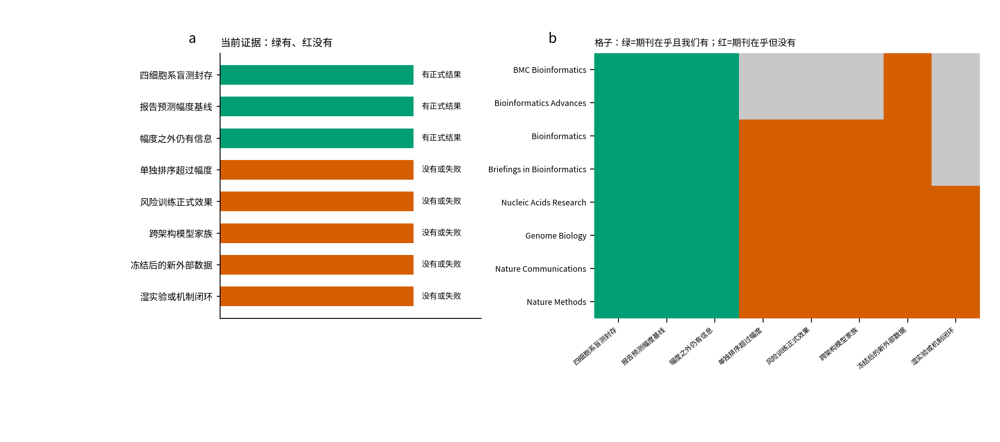

# 期刊对照：每本杂志通常要什么，我们现在有什么

本页只放大最常被点名的 8 本，而且只讲业务A（预测后路由）。完整名单和两条业务分开打标在

```text
/home/yyf/proj/docs/学习导航/20260906_论文审核与从零教学/06_全球相关期刊逐本评价.md
```

每一本都有身份表 + 八盏证据灯表，总图是 fig6 / fig7。本页不替代那一份。

分区数字会随中科院年度表和 JCR 年度表变动。下表是 2025–2026 公开检索的常用口径，**投稿前以学院指定查询系统为准**。本页不保证录用。

文件真实位置（Cursor 工作区如果开在 `/home/yyf` 而不是 `proj`，必须用这一行）：

```text
/home/yyf/proj/docs/学习导航/20260906_论文审核与从零教学/05_期刊对照表.md
/home/yyf/proj/docs/学习导航/20260906_论文审核与从零教学/04_五成分与封存流程精讲.md
```

当前证据只来自 E199–E204 正式报告。图 5 与下表同一套判定：有正式结果 / 没有或失败。



**图 5a** 是我们自己的成绩单。绿：已经有正式结果。红：没有，或主检验失败。  
**图 5b** 每一行是一本杂志。绿：这本杂志通常很在乎这一点，而我们有。红：这本杂志通常很在乎，但我们没有。灰：一般不拿这一点直接桌面拒稿。

---

## 1. 我们现在到底有什么（对照图 5a）

| 审稿人会问 | 状态 | 正式数字或文件 |
| --- | --- | --- |
| 有没有先交卷再对答案的盲测 | 有 | E201：1808 个主任务，四细胞系 |
| 风险分和误差同方向吗 | 有 | Spearman 0.4082，区间 [0.3506, 0.4621] |
| 有没有最强简单基线 | 有 | 预测幅度 0.6189，20% 效用 0.5943 vs SafeConf 0.3200 |
| 是不是幅度的重复 | 有独立信息 | 偏 Spearman 0.2503，区间下限 0.2021 |
| 单独排序有没有打赢幅度 | **失败** | 效用差 -0.2743 |
| 训练时加权有没有让模型变准 | **没有正式结果** | E204 只有工程验收 |
| 四个种子是不是四种模型 | **不能这么写** | E205 未跑，仍是同一 GAT |
| 有没有从未参与开发的新数据 | **没有** | Frangieh 等只能当旧支持 |
| 有没有湿实验或机制闭环 | **没有** | 不在当前主线 |

四细胞系 SafeConf 相关：K562 0.4803、RPE1 0.2868、HepG2 0.5633、Jurkat 0.4453。K562 深度模型质心误差 0.0540，对照 0.0523，官方简单规则 0.0584。

五成分（图 4）：离散度 0.4618 强过组合分 0.4082；细胞少 0.0450；背景缺口 -0.0385。

---

## 2. 按杂志写：他们通常要什么，现在能不能对上

### BMC Bioinformatics

中科院常见 3 区口径。要可复现方法、公开数据、和简单基线比过。不太强制湿实验。

| 他们通常要 | 我们对得上吗 |
| --- | --- |
| 方法说得清、代码和表能核 | 对得上：封存哈希、CSV、脚本链 |
| 和强基线比 | 对得上，但幅度赢了我们 |
| 多个生物背景 | 对得上：四个细胞系 |
| 新湿实验 | 通常不卡死 |

**现在能写的定位：** 单细胞扰动预测后的任务风险审计协议，诚实报告幅度更强。  
**现在不能写：** 已经改变训练、已经省湿实验预算。  
**判断：** 若把主张收成“协议 + 四背景盲测 + 负结果”，有讨论空间。不是“一定能发”。

### Bioinformatics Advances

较新的 OUP 开放获取方法刊。口味接近 Bioinformatics，但影响力和分区都还在变。

要求和 BMC 类似，更看软件/工作流是否别人能跑。当前缺独立新数据和训练效果，仍偏早。

### Bioinformatics（牛津）

中科院生物大类常见 2 区，JCR Q1。应用方法标准件。审稿人几乎必问：相对最强基线的增量、软件、可复现、失败边界。

| 他们通常要 | 我们对得上吗 |
| --- | --- |
| 新算法或新评价协议 | 协议有，算法增量未闭合 |
| 打过最强简单基线 | 打了，幅度 0.6189 > 0.4082 |
| 独立数据或独立模型 | 缺 E205 和新外部 |
| 训练/部署收益 | 缺正式 E204 |

**判断：** 这是用户说的“二区”里最常被点名的本。以当前表，**不能把二区写成一定能发**。补上 E204 正式结果，或把主文改成“幅度主排序 + SafeConf 补充”并在新数据上冻结一次，才进入“可以认真准备 Bioinformatics 投稿包”的状态。

### Briefings in Bioinformatics

2026 年 3 月新锐表常见口径：大类生物学 2 区，小类数学与计算生物学 / 生化研究方法 1 区，并标 Top；JCR Q1。学院口中的“二区 Top / 小类一区”经常指它。年发文量大，但方法稿仍要软件、教程、多数据或至少多背景、基线。

| 他们通常要 | 我们对得上吗 |
| --- | --- |
| 可复用工作流/软件 | 部分：脚本和合同有，面向外人的安装包仍薄 |
| 案例讲得清 | 对得上：K562::AARS+ctrl 和四细胞系表 |
| 基线 | 对得上，幅度是必须保留的对照 |
| 综述式广度或工具生态 | 当前不是综述，工具生态也未做成网页服务 |

**判断：** 分区上最接近“二区一定要碰”的目标刊。证据上仍缺训练收益和新外部。比 Genome Biology 现实，但不等于现在能投就中。

### Nucleic Acids Research

资源/数据库/Web server 轨道很强；方法稿要足够通用。常见 1 区或 2 区（看当年大类表）。

当前没有对外 Web 服务，也没有新资源库。不适合当主投。除非改成“可点击的风险评价服务 + 冻结数据”，那是另一条工程线。

### Genome Biology

中科院常见 1 区。要生物学问题和机制，不只是排序相关。缺湿实验、缺跨实验室、缺“改变生物学决策”的硬收益时，桌面拒稿风险很高。

**判断：** 一区门槛，现在不是冲刺对象。

### Nature Communications

中科院 1 区。完整故事：方法新、证据硬、边界清、最好有功能验证。当前主结果是审计现象，不是“方法已经改写训练和实验预算”。

**判断：** 现在不能冲。

### Nature Methods

中科院 1 区 Top。要成为领域默认用法：新原理或新评价被社区接着用。TxPert 本身已在更高影响力轨道上。SafeConf 目前是 TxPert 预测之后的风险层，单独排序还弱于幅度。

**判断：** 现在不能冲。把“一区可以冲刺”写进组会，会被问幅度和 E204。

---

## 3. 一句话总表

| 杂志 | 常见分区口径 | 现在匹配 | 缺什么才配讨论投稿 |
| --- | --- | --- | --- |
| BMC Bioinformatics | 约 3 区 | 可讨论（收窄主张） | 把幅度当主基线写进摘要 |
| Bioinformatics Advances | 新兴 | 可讨论 | 安装包和独立复现 |
| Bioinformatics | 约 2 区 / JCR Q1 | **未就绪** | E204 正式结果或冻结新数据 |
| Briefings in Bioinformatics | 大类 2 区、小类 1 区 Top 口径 | **未就绪** | 同上，外加可运行软件叙事 |
| Nucleic Acids Research | 1/2 区 | 不对轨 | Web 资源或通用服务 |
| Genome Biology | 1 区 | 不对轨 | 机制 + 外部 + 训练收益 |
| Nature Communications | 1 区 | 不对轨 | 完整故事 |
| Nature Methods | 1 区 Top | 不对轨 | 社区级方法地位 |

“未就绪”不是“永远不能投”，是 **用此刻 E201/E204 正式表，还不能说稳**。

---

## 4. 和用户目标怎么对齐

用户要：二区一定能发，一区可以冲刺。

对照上表：二区候选首先是 Bioinformatics 和 Briefings in Bioinformatics。两者都还卡在同一处：单独排序没有超过幅度 0.6189，训练正式效果没有，新外部确认没有。

一区候选 Genome Biology / Nature Communications / Nature Methods 还要机制或社区地位，更远。

下一步仍是 E204 的 32 个正式模型，不是先改期刊名单。
