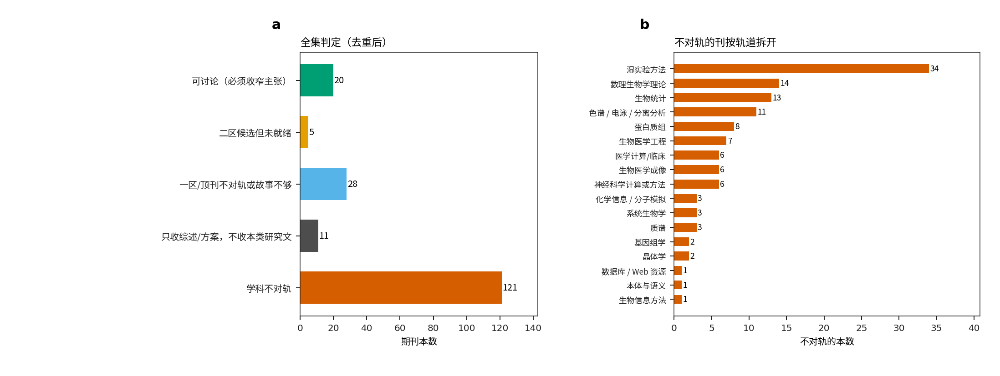
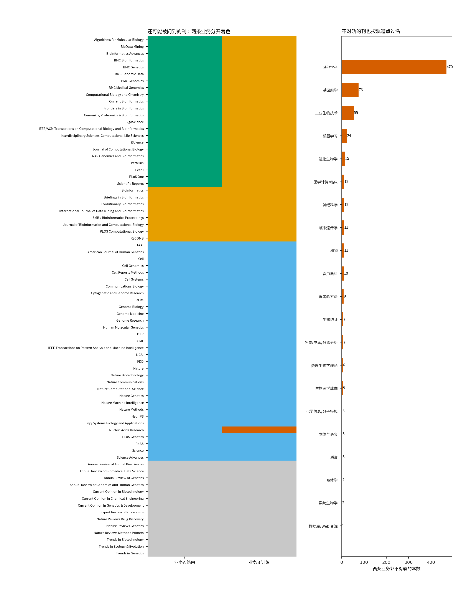

# 820 本期刊宽口径初筛（两条业务分开打标）

评价日期：2026-09-07。数字锁在 `CLAIM_TABLE.json`：SafeConf Spearman 0.4082，预测幅度 0.6189，偏相关 0.2503，20% 效用 0.3200 vs 0.5943。E204 没有 80 轮正式效果。E205 未跑。

**不能把二区写成一定能发。** 本页也不保证任何一本杂志会录用。

## 0. 两条业务必须分开，不能糊成一张总表

**业务A：预测后风险路由（SafeConf）** 是给已经做完的预测打“这题可能错”的分。E201 有正式盲测。
**业务B：风险引导训练（E204 给 TxPert 加权）** 是用源域证据给 TxPert 重新加权再训练。E204 只有工程验收，没有正式效果。

本表修正了上一版把两条业务揉成一个判定的问题。每一行都有业务A、业务B和两套证据灯；但“每行都有文字”不等于“每本期刊都查过官网”。

## 使用前先看：这是一张初筛表，不是 820 本官网精读

- 去重后共 820 个名单条目，都有规则标签。其中 **45 行**采用人工画像，其余 **775 行**是刊名和类别规则。
- 名单含历史名称、可能的更名和停刊，不是 820 本当前有效、仍在收稿的期刊。
- 规则生成行没有逐本打开官方 `Aims & Scope`（办刊范围），也没有统一核验期刊是否仍在收稿、是否更名、是否停刊。
- `publishes` 文本加入刊名后在字面上互不相同，只能证明每行能区分，不能证明 820 本都做了独立调研。
- 原始名单来自第三方分类网页的当日抓取，不是 Clarivate 官方主表快照；生物技术和人工智能小类还各缺 1 本。
- 所以它的正确用途是：宽口径排除明显不对轨的期刊，并找出需要再查官网的候选。它不能直接证明当前分区，也不能代替投稿前的逐刊核验。

## 0.1 收录了哪些分类名单（不是全部 SCI，也不是官方全集）

第三方分类页面中抓取并写入的是：

1. SCIE 数学与计算生物学 61/61（sort-699）
2. SCIE 生化研究方法 82/82（sort-615）
3. SCIE 多学科科学 85/85（sort-716）
4. SCIE 计算机科学跨学科应用 115/115（sort-636）
5. SCIE 遗传学 186/186（sort-672）
6. SCIE 生物技术与应用微生物 177/178（sort-620；分页末页少 1 本）
7. SCIE 医学信息学 32/32（sort-705）
8. SCIE 计算机科学人工智能 153/154（sort-632；分页少 1 本）
9. Nature / Cell / CCF 交叉补入（不在上述名单里的，例如 Cell Systems、NAR、NeurIPS）

去重后共 **820** 本。业务A：可讨论 22，未就绪 8，一区不够 32，综述 14，不对轨 744。业务B：可讨论 0，未就绪 30，一区不够 31，综述 14，不对轨 745。

人工画像覆盖 45 行；其余 775 行依据刊名和小类做规则初筛。重点候选仍需逐本访问期刊官网，核对当前办刊范围、文章类型、是否收稿和学院采用的当年分区。

**图 6a** 业务A和业务B的判定各有多少本。**图 6b** 业务A还可能被问到的刊，按轨道拆开。

**图 7a** 逐行显示至少一条业务未被判为“不对轨”的候选。绿=可讨论，橙=未就绪，蓝=一区不够，灰=综述，红=不对轨。**图 7b** 不是逐刊热图，而是把两条业务都不对轨的期刊按规则轨道汇总计数；完整名称仍在 CSV。

机器可读总表：[journal_universe.csv](./journal_universe.csv)。

## 1. 一览表（每一本一行，两列业务）

| 刊名 | 学科来源 | 轨道 | 业务A 路由 | 业务B 训练 | 这本杂志实际发什么（摘要） |
| --- | --- | --- | --- | --- | --- |
| Algorithms for Molecular Biology | MCB+BRM+BIOTECH | 生物信息方法 | 可讨论（必须收窄主张） | 候选但未就绪 | Algorithms for Molecular Biology 收分子生物信息里的算法，篇幅和影响力都小于牛津 Bioinformatics。幅度必须当主基线。不能写成二区一定能发。 |
| BioData Mining | MCB | 生物信息方法 | 可讨论（必须收窄主张） | 候选但未就绪 | BioData Mining 收生物数据上的挖掘方法。协议加负结果可讨论，不是二区主投。 |
| Bioinformatics Advances | GENOMICS | 生物信息方法 | 可讨论（必须收窄主张） | 候选但未就绪 | Bioinformatics Advances 是牛津 Bioinformatics 的开放获取姊妹刊，口味接近主刊，但影响力和分区都还在变。更看软件/工作流是否别人能跑。适合收窄后的协议稿，不适合当“二区保证”。 |
| BMC Bioinformatics | MCB+BRM+BIOTECH | 生物信息方法 | 可讨论（必须收窄主张） | 候选但未就绪 | BMC Bioinformatics 收可复现计算方法、公开数据和与简单基线的比较，通常不强制湿实验。口味比牛津 Bioinformatics 更宽，对“协议 + 诚实负结果”容忍度更高，但影响力也更低。它不是“一定能发”的垃圾桶：主张若写成已经省湿实验预算，一样会被拒。 |
| BMC Genetics | GENETICS | 基因组学 | 可讨论（必须收窄主张） | 候选但未就绪 | BMC Genetics 出现在本次打开的完整名单里，学科来源：遗传学。按刊名和栏目，它日常刊登的是基因组学：基因组发现或能推动基因组实验的方法。评价时必须把两条业务拆开：业务A是预测后给任务打风险分（SafeConf，E201 有 Spearman 0.4082），业务B是用源域风险给 TxPert 重新加权训练（E204 没有 80 轮正式效果）。不能用… |
| BMC Genomic Data | GENETICS | 基因组学 | 可讨论（必须收窄主张） | 候选但未就绪 | BMC Genomic Data 出现在本次打开的完整名单里，学科来源：遗传学。按刊名和栏目，它日常刊登的是基因组学：基因组发现或能推动基因组实验的方法。评价时必须把两条业务拆开：业务A是预测后给任务打风险分（SafeConf，E201 有 Spearman 0.4082），业务B是用源域风险给 TxPert 重新加权训练（E204 没有 80 轮正式效果）… |
| BMC Genomics | GENETICS+BIOTECH | 基因组学 | 可讨论（必须收窄主张） | 候选但未就绪 | BMC Genomics 主题偏基因组发现和组学数据。收窄成方法+数据可讨论，不是二区主投。 |
| BMC Medical Genomics | GENETICS | 基因组学 | 可讨论（必须收窄主张） | 候选但未就绪 | BMC Medical Genomics 出现在本次打开的完整名单里，学科来源：遗传学。按刊名和栏目，它日常刊登的是基因组学：基因组发现或能推动基因组实验的方法。评价时必须把两条业务拆开：业务A是预测后给任务打风险分（SafeConf，E201 有 Spearman 0.4082），业务B是用源域风险给 TxPert 重新加权训练（E204 没有 80 轮正… |
| Computational Biology and Chemistry | CS_IA | 生物信息方法 | 可讨论（必须收窄主张） | 候选但未就绪 | Computational Biology and Chemistry 收计算生物学和化学信息交叉，影响力低于主刊。可收窄讨论协议，不是二区主投。 |
| Current Bioinformatics | MCB+BRM | 生物信息方法 | 可讨论（必须收窄主张） | 候选但未就绪 | Current Bioinformatics 收生物信息方法，影响力明显低于 Bioinformatics / Briefings。可收窄讨论，不能当二区主目标。 |
| Frontiers in Bioinformatics | GENOMICS | 生物信息方法 | 可讨论（必须收窄主张） | 候选但未就绪 | Frontiers in Bioinformatics 是 OA 方法刊，可讨论收窄后的协议，但年发文和口碑需要自己评估。 |
| Genomics, Proteomics & Bioinformatics | GENETICS | 生物信息方法 | 可讨论（必须收窄主张） | 候选但未就绪 | GPB 收基因组、蛋白质组和生物信息交叉方法。可以收计算协议，但不是“二区一定能发”的替代刊。 |
| GigaScience | MULTI | 生物信息方法 | 可讨论（必须收窄主张） | 候选但未就绪 | GigaScience 核心是大规模数据、FAIR 和可复现。哈希、封存、CSV 合同和这本杂志的口味接近。它要的是数据包能不能被别人完整重跑，不是新生物学故事。 |
| IEEE/ACM Transactions on Computational Biology and Bioinformatics | BRM+CS_IA | 生物信息方法 | 可讨论（必须收窄主张） | 候选但未就绪 | IEEE/ACM TCBB 收算法、系统和可复现的计算生物学稿，工程味比牛津 Bioinformatics 更重。业务A可以收窄成评价系统；业务B要有训练算法增量，而不是验收脚本。 |
| Interdisciplinary Sciences-Computational Life Sciences | MCB | 生物信息方法 | 可讨论（必须收窄主张） | 候选但未就绪 | Interdisciplinary Sciences-Computational Life Sciences 出现在本次打开的完整名单里，学科来源：数学与计算生物学。按刊名和栏目，它日常刊登的是生物信息方法：可复现计算方法或评价协议、公开代码、和最强简单基线比较。评价时必须把两条业务拆开：业务A是预测后给任务打风险分（SafeConf，E201 有 Spea… |
| iScience | MULTI | 综合/方法顶刊 | 可讨论（必须收窄主张） | 候选但未就绪 | iScience 是 Cell 开源综合刊，定位散，可收计算叙事，但不是方法主刊。 |
| Journal of Computational Biology | MCB+BRM+CS_IA+BIOTECH | 生物信息方法 | 可讨论（必须收窄主张） | 候选但未就绪 | Journal of Computational Biology 偏算法和离散方法，不是湿实验，也不是临床。可讨论协议，但影响力低于 Bioinformatics / Briefings。 |
| NAR Genomics and Bioinformatics | GENOMICS | 生物信息方法 | 可讨论（必须收窄主张） | 候选但未就绪 | NAR Genomics and Bioinformatics 是 NAR 的开源计算刊，收基因组计算和生物信息方法，比 NAR 主刊更不强制 Web 资源，但仍看可复现和数据开放。 |
| Patterns | CELL | 机器学习 | 可讨论（必须收窄主张） | 候选但未就绪 | Patterns 是 Cell 的数据科学刊，收可复用的数据方法，不一定要湿实验。业务A的计算叙事可以谈；业务B要有训练方法增量。 |
| PeerJ | MULTI+GENOMICS | 生物信息方法 | 可讨论（必须收窄主张） | 候选但未就绪 | PeerJ 是 OA 综合，可收窄发计算报告，分区低，不是二区主目标。 |
| PLoS One | MULTI | 综合/方法顶刊 | 可讨论（必须收窄主张） | 候选但未就绪 | PLoS One 出现在本次打开的完整名单里，学科来源：多学科科学。按刊名和栏目，它日常刊登的是综合/方法顶刊：完整故事：方法新、证据硬、最好成为默认用法。综合 OA，什么学科都收，但不是二区方法主刊。评价时必须把两条业务拆开：业务A是预测后给任务打风险分（SafeConf，E201 有 Spearman 0.4082），业务B是用源域风险给 TxPert … |
| Scientific Reports | MULTI | 综合/方法顶刊 | 可讨论（必须收窄主张） | 候选但未就绪 | Scientific Reports 收技术报告和完整实验/计算记录，审稿看是否站得住，不看是不是“热点”。可以发业务A的技术报告，但不是二区主目标，也不能把负结果藏掉。 |
| Bioinformatics | MCB+BRM+BIOTECH | 生物信息方法 | 候选但未就绪 | 候选但未就绪 | Bioinformatics（牛津）是计算生物学方法的标准件，不发色谱、不发临床病例、也不发纯湿实验方案。它要的是：新算法或新评价协议、别人能跑的软件、公开数据、和最强简单基线的增量、以及失败边界。近年单细胞和扰动预测稿不少，但审稿人几乎必问：你比最强基线强在哪、代码能否复现、主张有没有写过头。TxPert 已经作为预测器发在 Nature Biotechn… |
| Briefings in Bioinformatics | MCB+BRM | 生物信息方法 | 候选但未就绪 | 候选但未就绪 | Briefings in Bioinformatics 年发文量大，栏目是可复用工作流、教程、工具评测和有案例的方法，不是数理证明，也不是湿实验。它比 Genome Biology 更吃“别人能跟着做”的叙事，比 BMC Bioinformatics 更看软件生态和讲解清晰度。学院口头里的“二区 Top / 小类一区”经常指它。方法稿仍要基线、多背景或至少多… |
| Evolutionary Bioinformatics | MCB | 生物信息方法 | 候选但未就绪 | 候选但未就绪 | Evolutionary Bioinformatics 出现在本次打开的完整名单里，学科来源：数学与计算生物学。按刊名和栏目，它日常刊登的是生物信息方法：可复现计算方法或评价协议、公开代码、和最强简单基线比较。评价时必须把两条业务拆开：业务A是预测后给任务打风险分（SafeConf，E201 有 Spearman 0.4082），业务B是用源域风险给 TxP… |
| International Journal of Data Mining and Bioinformatics | MCB | 生物信息方法 | 候选但未就绪 | 候选但未就绪 | International Journal of Data Mining and Bioinformatics 出现在本次打开的完整名单里，学科来源：数学与计算生物学。按刊名和栏目，它日常刊登的是生物信息方法：可复现计算方法或评价协议、公开代码、和最强简单基线比较。评价时必须把两条业务拆开：业务A是预测后给任务打风险分（SafeConf，E201 有 Spe… |
| ISMB / Bioinformatics Proceedings | CCF | 计算机会议 | 候选但未就绪 | 候选但未就绪 | ISMB 会议轨常与 Bioinformatics 绑定，证据要求和主刊类似。 |
| Journal of Bioinformatics and Computational Biology | MCB | 生物信息方法 | 候选但未就绪 | 候选但未就绪 | Journal of Bioinformatics and Computational Biology 出现在本次打开的完整名单里，学科来源：数学与计算生物学。按刊名和栏目，它日常刊登的是生物信息方法：可复现计算方法或评价协议、公开代码、和最强简单基线比较。评价时必须把两条业务拆开：业务A是预测后给任务打风险分（SafeConf，E201 有 Spearma… |
| PLOS Computational Biology | MCB+BRM | 生物信息方法 | 候选但未就绪 | 候选但未就绪 | PLOS Computational Biology 要计算方法背后的生物学洞察，不只是排序相关。审稿人会问：这个风险分有没有改变对细胞或扰动的理解，而不只是一张 Spearman 表。当前 SafeConf 是审计现象，还没有机制闭环，也没有证明复核决策真的变了。 |
| RECOMB | CCF | 计算机会议 | 候选但未就绪 | 候选但未就绪 | RECOMB 要算法新意。当前业务A是评价协议，增量不足；业务B没有正式训练算法结果。 |
| AAAI | CCF | 计算机会议 | 一区/顶刊不对轨或故事不够 | 一区/顶刊不对轨或故事不够 | AAAI 出现在本次打开的完整名单里，学科来源：CCF 会议交叉补入。按刊名和栏目，它日常刊登的是计算机会议：算法新意和相对强基线的增量。评价时必须把两条业务拆开：业务A是预测后给任务打风险分（SafeConf，E201 有 Spearman 0.4082），业务B是用源域风险给 TxPert 重新加权训练（E204 没有 80 轮正式效果）。不能用一句“生… |
| American Journal of Human Genetics | GENETICS | 基因组学 | 一区/顶刊不对轨或故事不够 | 一区/顶刊不对轨或故事不够 | American Journal of Human Genetics 出现在本次打开的完整名单里，学科来源：遗传学。按刊名和栏目，它日常刊登的是基因组学：基因组发现或能推动基因组实验的方法。评价时必须把两条业务拆开：业务A是预测后给任务打风险分（SafeConf，E201 有 Spearman 0.4082），业务B是用源域风险给 TxPert 重新加权训练… |
| Cell | CELL | 综合/方法顶刊 | 一区/顶刊不对轨或故事不够 | 一区/顶刊不对轨或故事不够 | Cell 要完整细胞生物学故事。当前两条业务都不是。 |
| Cell Genomics | CELL | 基因组学 | 一区/顶刊不对轨或故事不够 | 一区/顶刊不对轨或故事不够 | Cell Genomics 出现在本次打开的完整名单里，学科来源：Cell/Nature 家族交叉补入。按刊名和栏目，它日常刊登的是基因组学：基因组发现或能推动基因组实验的方法。评价时必须把两条业务拆开：业务A是预测后给任务打风险分（SafeConf，E201 有 Spearman 0.4082），业务B是用源域风险给 TxPert 重新加权训练（E204 … |
| Cell Reports Methods | CELL | 综合/方法顶刊 | 一区/顶刊不对轨或故事不够 | 一区/顶刊不对轨或故事不够 | Cell Reports Methods 要新实验或计算方法被实验室采用。当前是计算审计，采用证据不够。 |
| Cell Systems | CELL | 系统生物学 | 一区/顶刊不对轨或故事不够 | 一区/顶刊不对轨或故事不够 | Cell Systems 要系统生物学：网络、通路、细胞决策，最好能改变对细胞如何工作的理解。当前审计稿不对这本杂志。 |
| Communications Biology | CELL | 综合/方法顶刊 | 一区/顶刊不对轨或故事不够 | 一区/顶刊不对轨或故事不够 | Communications Biology 仍要生物学问题和完整故事，不是纯审计表。 |
| Cytogenetic and Genome Research | GENETICS | 基因组学 | 一区/顶刊不对轨或故事不够 | 一区/顶刊不对轨或故事不够 | Cytogenetic and Genome Research 出现在本次打开的完整名单里，学科来源：遗传学。按刊名和栏目，它日常刊登的是基因组学：基因组发现或能推动基因组实验的方法。评价时必须把两条业务拆开：业务A是预测后给任务打风险分（SafeConf，E201 有 Spearman 0.4082），业务B是用源域风险给 TxPert 重新加权训练（E2… |
| eLife | CELL | 综合/方法顶刊 | 一区/顶刊不对轨或故事不够 | 一区/顶刊不对轨或故事不够 | eLife 要完整生物学问题。当前审计稿不够。 |
| Genome Biology | GENETICS+BIOTECH | 基因组学 | 一区/顶刊不对轨或故事不够 | 一区/顶刊不对轨或故事不够 | Genome Biology 要基因组尺度的生物学问题或能推动基因组实验的方法，不只是排序相关。四个细胞系上的风险相关，如果讲不成“哪些扰动/背景在生物学上更难预测”，就只是一张统计表。缺湿实验、缺跨实验室、缺改变生物学决策的硬收益时，桌面拒稿风险很高。 |
| Genome Medicine | GENETICS | 基因组学 | 一区/顶刊不对轨或故事不够 | 一区/顶刊不对轨或故事不够 | Genome Medicine 出现在本次打开的完整名单里，学科来源：遗传学。按刊名和栏目，它日常刊登的是基因组学：基因组发现或能推动基因组实验的方法。评价时必须把两条业务拆开：业务A是预测后给任务打风险分（SafeConf，E201 有 Spearman 0.4082），业务B是用源域风险给 TxPert 重新加权训练（E204 没有 80 轮正式效果）。… |
| Genome Research | GENETICS+BIOTECH | 基因组学 | 一区/顶刊不对轨或故事不够 | 一区/顶刊不对轨或故事不够 | Genome Research 要新的基因组生物学发现，或能直接推动基因组实验的资源/方法。纯预测后审计、又没有新数据资源，不对这本杂志的栏目。 |
| Human Molecular Genetics | GENETICS | 基因组学 | 一区/顶刊不对轨或故事不够 | 一区/顶刊不对轨或故事不够 | Human Molecular Genetics 出现在本次打开的完整名单里，学科来源：遗传学。按刊名和栏目，它日常刊登的是基因组学：基因组发现或能推动基因组实验的方法。评价时必须把两条业务拆开：业务A是预测后给任务打风险分（SafeConf，E201 有 Spearman 0.4082），业务B是用源域风险给 TxPert 重新加权训练（E204 没有 8… |
| ICLR | CCF | 计算机会议 | 一区/顶刊不对轨或故事不够 | 一区/顶刊不对轨或故事不够 | ICLR 要表征学习或新训练方法。当前两条业务都不够。 |
| ICML | CCF | 计算机会议 | 一区/顶刊不对轨或故事不够 | 一区/顶刊不对轨或故事不够 | ICML 同样要机器学习新方法。业务A不对轨；业务B未就绪。 |
| IEEE Transactions on Pattern Analysis and Machine Intelligence | CS_AI | 机器学习 | 一区/顶刊不对轨或故事不够 | 一区/顶刊不对轨或故事不够 | IEEE Transactions on Pattern Analysis and Machine Intelligence 出现在本次打开的完整名单里，学科来源：计算机科学人工智能。按刊名和栏目，它日常刊登的是机器学习：新的学习算法或理论。评价时必须把两条业务拆开：业务A是预测后给任务打风险分（SafeConf，E201 有 Spearman 0.4082… |
| IJCAI | CCF | 计算机会议 | 一区/顶刊不对轨或故事不够 | 一区/顶刊不对轨或故事不够 | IJCAI 出现在本次打开的完整名单里，学科来源：CCF 会议交叉补入。按刊名和栏目，它日常刊登的是计算机会议：算法新意和相对强基线的增量。评价时必须把两条业务拆开：业务A是预测后给任务打风险分（SafeConf，E201 有 Spearman 0.4082），业务B是用源域风险给 TxPert 重新加权训练（E204 没有 80 轮正式效果）。不能用一句“… |
| KDD | CCF | 计算机会议 | 一区/顶刊不对轨或故事不够 | 一区/顶刊不对轨或故事不够 | KDD 出现在本次打开的完整名单里，学科来源：CCF 会议交叉补入。按刊名和栏目，它日常刊登的是计算机会议：算法新意和相对强基线的增量。评价时必须把两条业务拆开：业务A是预测后给任务打风险分（SafeConf，E201 有 Spearman 0.4082），业务B是用源域风险给 TxPert 重新加权训练（E204 没有 80 轮正式效果）。不能用一句“生信… |
| Nature | MULTI | 综合/方法顶刊 | 一区/顶刊不对轨或故事不够 | 一区/顶刊不对轨或故事不够 | Nature 要改变一个领域看法的完整发现或方法。当前两条业务都不是。 |
| Nature Biotechnology | BIOTECH | 综合/方法顶刊 | 一区/顶刊不对轨或故事不够 | 一区/顶刊不对轨或故事不够 | Nature Biotechnology 是 TxPert 本家轨道：可部署的生物技术或预测方法，能改变实验或产业决策。SafeConf 不是新预测器。把审计层再投进 TxPert 的家，主张重复而且证据更弱。业务B若真的让 TxPert 在未见背景上稳定变准，才有资格重新讨论这本；现在没有。 |
| Nature Communications | MULTI | 综合/方法顶刊 | 一区/顶刊不对轨或故事不够 | 一区/顶刊不对轨或故事不够 | Nature Communications 要完整故事：方法新、证据硬、边界清，最好有功能验证。当前主结果是审计现象，不是“方法已经改写训练和实验预算”。两条业务都还缺完整故事。 |
| Nature Computational Science | MULTI+CS_IA+CELL | 机器学习 | 一区/顶刊不对轨或故事不够 | 一区/顶刊不对轨或故事不够 | Nature Computational Science 要新计算原理，不是一次领域内评价协议。 |
| Nature Genetics | GENETICS | 基因组学 | 一区/顶刊不对轨或故事不够 | 一区/顶刊不对轨或故事不够 | Nature Genetics 出现在本次打开的完整名单里，学科来源：遗传学。按刊名和栏目，它日常刊登的是基因组学：基因组发现或能推动基因组实验的方法。评价时必须把两条业务拆开：业务A是预测后给任务打风险分（SafeConf，E201 有 Spearman 0.4082），业务B是用源域风险给 TxPert 重新加权训练（E204 没有 80 轮正式效果）。… |
| Nature Machine Intelligence | CS_IA+CS_AI | 机器学习 | 一区/顶刊不对轨或故事不够 | 一区/顶刊不对轨或故事不够 | Nature Machine Intelligence 要新的学习算法或理论，不是把已有图网络接到事后审计协议上。业务A是应用审计，不对轨。业务B如果只是加权重，也不是新学习原理。 |
| Nature Methods | BRM | 综合/方法顶刊 | 一区/顶刊不对轨或故事不够 | 一区/顶刊不对轨或故事不够 | Nature Methods 要成为领域默认用法：新原理或新评价被社区接着用，而不是一次内部审计。TxPert 本身已在更高影响力的 Nature Biotechnology 轨道上。SafeConf 目前是 TxPert 预测之后的风险层，单独排序还弱于幅度，也没有证明实验室会改复核名单或改训练流程。业务A若投这里，会被问：为什么不是幅度就够了。业务B若投… |
| NeurIPS | CCF | 计算机会议 | 一区/顶刊不对轨或故事不够 | 一区/顶刊不对轨或故事不够 | NeurIPS 要机器学习新方法。业务A是应用审计，不对轨。业务B若只是任务加权，通常也不够当主会方法。 |
| npj Systems Biology and Applications | MCB | 系统生物学 | 一区/顶刊不对轨或故事不够 | 一区/顶刊不对轨或故事不够 | npj Systems Biology and Applications 出现在本次打开的完整名单里，学科来源：数学与计算生物学。按刊名和栏目，它日常刊登的是系统生物学：网络、通路或细胞决策的机制模型。评价时必须把两条业务拆开：业务A是预测后给任务打风险分（SafeConf，E201 有 Spearman 0.4082），业务B是用源域风险给 TxPert … |
| Nucleic Acids Research | GENOMICS | 数据库/Web 资源 | 一区/顶刊不对轨或故事不够 | 学科不对轨 | Nucleic Acids Research 的方法/资源轨道很强：数据库、Web server、被很多人用的工具。当前没有对外可点击的风险评价服务，也没有新资源库。业务A若改成“可点击的风险评价服务 + 冻结数据”，才进入讨论；那是另一条工程线。业务B不是 NAR 的资源栏目。 |
| PLoS Genetics | GENETICS | 基因组学 | 一区/顶刊不对轨或故事不够 | 一区/顶刊不对轨或故事不够 | PLoS Genetics 出现在本次打开的完整名单里，学科来源：遗传学。按刊名和栏目，它日常刊登的是基因组学：基因组发现或能推动基因组实验的方法。评价时必须把两条业务拆开：业务A是预测后给任务打风险分（SafeConf，E201 有 Spearman 0.4082），业务B是用源域风险给 TxPert 重新加权训练（E204 没有 80 轮正式效果）。不能… |
| PNAS | MULTI | 综合/方法顶刊 | 一区/顶刊不对轨或故事不够 | 一区/顶刊不对轨或故事不够 | PNAS（Proceedings of the National Academy of Sciences of the United States of America）要广泛兴趣和机制。当前两条业务都缺。 |
| Science | MULTI | 综合/方法顶刊 | 一区/顶刊不对轨或故事不够 | 一区/顶刊不对轨或故事不够 | Science 同样是综合顶刊。当前两条业务都不是。 |
| Science Advances | MULTI | 综合/方法顶刊 | 一区/顶刊不对轨或故事不够 | 一区/顶刊不对轨或故事不够 | Science Advances 故事不够完整时不要投。当前两条业务都不够。 |
| Annual Review of Animal Biosciences | BIOTECH | 综述/约稿 | 只收综述/方案，不收本类研究文 | 只收综述/方案，不收本类研究文 | Annual Review of Animal Biosciences 出现在本次打开的完整名单里，学科来源：生物技术与应用微生物。按刊名和栏目，它日常刊登的是综述/约稿：编辑约稿综述、方法引物或逐步实验方案。评价时必须把两条业务拆开：业务A是预测后给任务打风险分（SafeConf，E201 有 Spearman 0.4082），业务B是用源域风险给 TxP… |
| Annual Review of Biomedical Data Science | MCB | 综述/约稿 | 只收综述/方案，不收本类研究文 | 只收综述/方案，不收本类研究文 | Annual Review of Biomedical Data Science 出现在本次打开的完整名单里，学科来源：数学与计算生物学。按刊名和栏目，它日常刊登的是综述/约稿：编辑约稿综述、方法引物或逐步实验方案。评价时必须把两条业务拆开：业务A是预测后给任务打风险分（SafeConf，E201 有 Spearman 0.4082），业务B是用源域风险给 … |
| Annual Review of Genetics | GENETICS | 综述/约稿 | 只收综述/方案，不收本类研究文 | 只收综述/方案，不收本类研究文 | Annual Review of Genetics 出现在本次打开的完整名单里，学科来源：遗传学。按刊名和栏目，它日常刊登的是综述/约稿：编辑约稿综述、方法引物或逐步实验方案。评价时必须把两条业务拆开：业务A是预测后给任务打风险分（SafeConf，E201 有 Spearman 0.4082），业务B是用源域风险给 TxPert 重新加权训练（E204 没… |
| Annual Review of Genomics and Human Genetics | GENETICS | 综述/约稿 | 只收综述/方案，不收本类研究文 | 只收综述/方案，不收本类研究文 | Annual Review of Genomics and Human Genetics 出现在本次打开的完整名单里，学科来源：遗传学。按刊名和栏目，它日常刊登的是综述/约稿：编辑约稿综述、方法引物或逐步实验方案。评价时必须把两条业务拆开：业务A是预测后给任务打风险分（SafeConf，E201 有 Spearman 0.4082），业务B是用源域风险给 T… |
| Current Opinion in Biotechnology | BRM+BIOTECH | 综述/约稿 | 只收综述/方案，不收本类研究文 | 只收综述/方案，不收本类研究文 | Current Opinion in Biotechnology 出现在本次打开的完整名单里，学科来源：生化研究方法、生物技术与应用微生物。按刊名和栏目，它日常刊登的是综述/约稿：编辑约稿综述、方法引物或逐步实验方案。评价时必须把两条业务拆开：业务A是预测后给任务打风险分（SafeConf，E201 有 Spearman 0.4082），业务B是用源域风险给… |
| Current Opinion in Chemical Engineering | BIOTECH | 综述/约稿 | 只收综述/方案，不收本类研究文 | 只收综述/方案，不收本类研究文 | Current Opinion in Chemical Engineering 出现在本次打开的完整名单里，学科来源：生物技术与应用微生物。按刊名和栏目，它日常刊登的是综述/约稿：编辑约稿综述、方法引物或逐步实验方案。评价时必须把两条业务拆开：业务A是预测后给任务打风险分（SafeConf，E201 有 Spearman 0.4082），业务B是用源域风险给… |
| Current Opinion in Genetics & Development | GENETICS | 综述/约稿 | 只收综述/方案，不收本类研究文 | 只收综述/方案，不收本类研究文 | Current Opinion in Genetics & Development 出现在本次打开的完整名单里，学科来源：遗传学。按刊名和栏目，它日常刊登的是综述/约稿：编辑约稿综述、方法引物或逐步实验方案。评价时必须把两条业务拆开：业务A是预测后给任务打风险分（SafeConf，E201 有 Spearman 0.4082），业务B是用源域风险给 TxPe… |
| Expert Review of Proteomics | BRM | 综述/约稿 | 只收综述/方案，不收本类研究文 | 只收综述/方案，不收本类研究文 | Expert Review of Proteomics 出现在本次打开的完整名单里，学科来源：生化研究方法。按刊名和栏目，它日常刊登的是综述/约稿：编辑约稿综述、方法引物或逐步实验方案。评价时必须把两条业务拆开：业务A是预测后给任务打风险分（SafeConf，E201 有 Spearman 0.4082），业务B是用源域风险给 TxPert 重新加权训练（E… |
| Nature Reviews Drug Discovery | BIOTECH | 综述/约稿 | 只收综述/方案，不收本类研究文 | 只收综述/方案，不收本类研究文 | Nature Reviews Drug Discovery 出现在本次打开的完整名单里，学科来源：生物技术与应用微生物。按刊名和栏目，它日常刊登的是综述/约稿：编辑约稿综述、方法引物或逐步实验方案。评价时必须把两条业务拆开：业务A是预测后给任务打风险分（SafeConf，E201 有 Spearman 0.4082），业务B是用源域风险给 TxPert 重新… |
| Nature Reviews Genetics | GENETICS | 综述/约稿 | 只收综述/方案，不收本类研究文 | 只收综述/方案，不收本类研究文 | Nature Reviews Genetics 出现在本次打开的完整名单里，学科来源：遗传学。按刊名和栏目，它日常刊登的是综述/约稿：编辑约稿综述、方法引物或逐步实验方案。评价时必须把两条业务拆开：业务A是预测后给任务打风险分（SafeConf，E201 有 Spearman 0.4082），业务B是用源域风险给 TxPert 重新加权训练（E204 没有 … |
| Nature Reviews Methods Primers | MULTI | 综述/约稿 | 只收综述/方案，不收本类研究文 | 只收综述/方案，不收本类研究文 | Nature Reviews Methods Primers 出现在本次打开的完整名单里，学科来源：多学科科学。按刊名和栏目，它日常刊登的是综述/约稿：编辑约稿综述、方法引物或逐步实验方案。评价时必须把两条业务拆开：业务A是预测后给任务打风险分（SafeConf，E201 有 Spearman 0.4082），业务B是用源域风险给 TxPert 重新加权训练… |
| Trends in Biotechnology | BIOTECH | 综述/约稿 | 只收综述/方案，不收本类研究文 | 只收综述/方案，不收本类研究文 | Trends in Biotechnology 出现在本次打开的完整名单里，学科来源：生物技术与应用微生物。按刊名和栏目，它日常刊登的是综述/约稿：编辑约稿综述、方法引物或逐步实验方案。评价时必须把两条业务拆开：业务A是预测后给任务打风险分（SafeConf，E201 有 Spearman 0.4082），业务B是用源域风险给 TxPert 重新加权训练（E… |
| Trends in Ecology & Evolution | GENETICS | 综述/约稿 | 只收综述/方案，不收本类研究文 | 只收综述/方案，不收本类研究文 | Trends in Ecology & Evolution 出现在本次打开的完整名单里，学科来源：遗传学。按刊名和栏目，它日常刊登的是综述/约稿：编辑约稿综述、方法引物或逐步实验方案。评价时必须把两条业务拆开：业务A是预测后给任务打风险分（SafeConf，E201 有 Spearman 0.4082），业务B是用源域风险给 TxPert 重新加权训练（E2… |
| Trends in Genetics | GENETICS | 综述/约稿 | 只收综述/方案，不收本类研究文 | 只收综述/方案，不收本类研究文 | Trends in Genetics 出现在本次打开的完整名单里，学科来源：遗传学。按刊名和栏目，它日常刊登的是综述/约稿：编辑约稿综述、方法引物或逐步实验方案。评价时必须把两条业务拆开：业务A是预测后给任务打风险分（SafeConf，E201 有 Spearman 0.4082），业务B是用源域风险给 TxPert 重新加权训练（E204 没有 80 轮正… |
| 3 Biotech | BIOTECH | 工业生物技术 | 学科不对轨 | 学科不对轨 | 3 Biotech 出现在本次打开的完整名单里，学科来源：生物技术与应用微生物。按刊名和栏目，它日常刊登的是工业生物技术：发酵、酶工程、生物燃料或菌种改造。评价时必须把两条业务拆开：业务A是预测后给任务打风险分（SafeConf，E201 有 Spearman 0.4082），业务B是用源域风险给 TxPert 重新加权训练（E204 没有 80 轮正式效果… |
| ACM Journal on Computing and Cultural Heritage | CS_IA | 其他学科 | 学科不对轨 | 学科不对轨 | ACM Journal on Computing and Cultural Heritage 出现在本次打开的完整名单里，学科来源：计算机科学跨学科应用。按刊名和栏目，它日常刊登的是其他学科：刊名和栏目都不指向单细胞扰动预测或训练加权。评价时必须把两条业务拆开：业务A是预测后给任务打风险分（SafeConf，E201 有 Spearman 0.4082），业… |
| ACM Transactions on Asian and Low-Resource Language Information Processing | CS_AI | 其他学科 | 学科不对轨 | 学科不对轨 | ACM Transactions on Asian and Low-Resource Language Information Processing 出现在本次打开的完整名单里，学科来源：计算机科学人工智能。按刊名和栏目，它日常刊登的是其他学科：刊名和栏目都不指向单细胞扰动预测或训练加权。评价时必须把两条业务拆开：业务A是预测后给任务打风险分（SafeCon… |
| ACM Transactions on Autonomous and Adaptive Systems | CS_AI | 其他学科 | 学科不对轨 | 学科不对轨 | ACM Transactions on Autonomous and Adaptive Systems 出现在本次打开的完整名单里，学科来源：计算机科学人工智能。按刊名和栏目，它日常刊登的是其他学科：刊名和栏目都不指向单细胞扰动预测或训练加权。评价时必须把两条业务拆开：业务A是预测后给任务打风险分（SafeConf，E201 有 Spearman 0.408… |
| ACM Transactions on Intelligent Systems and Technology | CS_AI | 其他学科 | 学科不对轨 | 学科不对轨 | ACM Transactions on Intelligent Systems and Technology 出现在本次打开的完整名单里，学科来源：计算机科学人工智能。按刊名和栏目，它日常刊登的是其他学科：刊名和栏目都不指向单细胞扰动预测或训练加权。评价时必须把两条业务拆开：业务A是预测后给任务打风险分（SafeConf，E201 有 Spearman 0.… |
| ACM Transactions on Interactive Intelligent Systems | CS_AI | 其他学科 | 学科不对轨 | 学科不对轨 | ACM Transactions on Interactive Intelligent Systems 出现在本次打开的完整名单里，学科来源：计算机科学人工智能。按刊名和栏目，它日常刊登的是其他学科：刊名和栏目都不指向单细胞扰动预测或训练加权。评价时必须把两条业务拆开：业务A是预测后给任务打风险分（SafeConf，E201 有 Spearman 0.408… |
| ACM Transactions on Modeling and Computer Simulation | CS_IA | 其他学科 | 学科不对轨 | 学科不对轨 | ACM Transactions on Modeling and Computer Simulation 出现在本次打开的完整名单里，学科来源：计算机科学跨学科应用。按刊名和栏目，它日常刊登的是其他学科：刊名和栏目都不指向单细胞扰动预测或训练加权。评价时必须把两条业务拆开：业务A是预测后给任务打风险分（SafeConf，E201 有 Spearman 0.4… |
| ACS Synthetic Biology | BRM | 湿实验方法 | 学科不对轨 | 学科不对轨 | ACS Synthetic Biology 出现在本次打开的完整名单里，学科来源：生化研究方法。按刊名和栏目，它日常刊登的是湿实验方法：实验室可执行的新实验方案、试剂或装置。评价时必须把两条业务拆开：业务A是预测后给任务打风险分（SafeConf，E201 有 Spearman 0.4082），业务B是用源域风险给 TxPert 重新加权训练（E204 没有… |
| Acta Biotheoretica | MCB | 数理生物学理论 | 学科不对轨 | 学科不对轨 | Acta Biotheoretica 出现在本次打开的完整名单里，学科来源：数学与计算生物学。按刊名和栏目，它日常刊登的是数理生物学理论：微分方程、随机过程或可证明的理论模型。评价时必须把两条业务拆开：业务A是预测后给任务打风险分（SafeConf，E201 有 Spearman 0.4082），业务B是用源域风险给 TxPert 重新加权训练（E204 没… |
| Acta Crystallographica Section D-Structural Biology | BRM | 晶体学 | 学科不对轨 | 学科不对轨 | Acta Crystallographica Section D-Structural Biology 出现在本次打开的完整名单里，学科来源：生化研究方法。按刊名和栏目，它日常刊登的是晶体学：蛋白质或核酸晶体结构。评价时必须把两条业务拆开：业务A是预测后给任务打风险分（SafeConf，E201 有 Spearman 0.4082），业务B是用源域风险给 T… |
| Acta Crystallographica Section F-Structural Biology Communications | BRM | 晶体学 | 学科不对轨 | 学科不对轨 | Acta Crystallographica Section F-Structural Biology Communications 出现在本次打开的完整名单里，学科来源：生化研究方法。按刊名和栏目，它日常刊登的是晶体学：蛋白质或核酸晶体结构。评价时必须把两条业务拆开：业务A是预测后给任务打风险分（SafeConf，E201 有 Spearman 0.408… |
| Acta Scientiarum-Technology | MULTI | 其他学科 | 学科不对轨 | 学科不对轨 | Acta Scientiarum-Technology 出现在本次打开的完整名单里，学科来源：多学科科学。按刊名和栏目，它日常刊登的是其他学科：刊名和栏目都不指向单细胞扰动预测或训练加权。评价时必须把两条业务拆开：业务A是预测后给任务打风险分（SafeConf，E201 有 Spearman 0.4082），业务B是用源域风险给 TxPert 重新加权训练（… |
| Adaptive Behavior | CS_AI | 其他学科 | 学科不对轨 | 学科不对轨 | Adaptive Behavior 出现在本次打开的完整名单里，学科来源：计算机科学人工智能。按刊名和栏目，它日常刊登的是其他学科：刊名和栏目都不指向单细胞扰动预测或训练加权。评价时必须把两条业务拆开：业务A是预测后给任务打风险分（SafeConf，E201 有 Spearman 0.4082），业务B是用源域风险给 TxPert 重新加权训练（E204 没… |
| Advanced Engineering Informatics | CS_AI | 其他学科 | 学科不对轨 | 学科不对轨 | Advanced Engineering Informatics 出现在本次打开的完整名单里，学科来源：计算机科学人工智能。按刊名和栏目，它日常刊登的是其他学科：刊名和栏目都不指向单细胞扰动预测或训练加权。评价时必须把两条业务拆开：业务A是预测后给任务打风险分（SafeConf，E201 有 Spearman 0.4082），业务B是用源域风险给 TxPer… |
| Advanced Intelligent Systems | CS_AI | 其他学科 | 学科不对轨 | 学科不对轨 | Advanced Intelligent Systems 出现在本次打开的完整名单里，学科来源：计算机科学人工智能。按刊名和栏目，它日常刊登的是其他学科：刊名和栏目都不指向单细胞扰动预测或训练加权。评价时必须把两条业务拆开：业务A是预测后给任务打风险分（SafeConf，E201 有 Spearman 0.4082），业务B是用源域风险给 TxPert 重新… |
| Advanced Theory and Simulations | MULTI | 其他学科 | 学科不对轨 | 学科不对轨 | Advanced Theory and Simulations 出现在本次打开的完整名单里，学科来源：多学科科学。按刊名和栏目，它日常刊登的是其他学科：刊名和栏目都不指向单细胞扰动预测或训练加权。评价时必须把两条业务拆开：业务A是预测后给任务打风险分（SafeConf，E201 有 Spearman 0.4082），业务B是用源域风险给 TxPert 重新加… |
| Advances in Applied Microbiology | BIOTECH | 其他学科 | 学科不对轨 | 学科不对轨 | Advances in Applied Microbiology 出现在本次打开的完整名单里，学科来源：生物技术与应用微生物。按刊名和栏目，它日常刊登的是其他学科：刊名和栏目都不指向单细胞扰动预测或训练加权。评价时必须把两条业务拆开：业务A是预测后给任务打风险分（SafeConf，E201 有 Spearman 0.4082），业务B是用源域风险给 TxPe… |
| Advances in Biochemical Engineering-Biotechnology | BIOTECH | 工业生物技术 | 学科不对轨 | 学科不对轨 | Advances in Biochemical Engineering-Biotechnology 出现在本次打开的完整名单里，学科来源：生物技术与应用微生物。按刊名和栏目，它日常刊登的是工业生物技术：发酵、酶工程、生物燃料或菌种改造。评价时必须把两条业务拆开：业务A是预测后给任务打风险分（SafeConf，E201 有 Spearman 0.4082），业… |
| Advances in Complex Systems | MULTI | 其他学科 | 学科不对轨 | 学科不对轨 | Advances in Complex Systems 出现在本次打开的完整名单里，学科来源：多学科科学。按刊名和栏目，它日常刊登的是其他学科：刊名和栏目都不指向单细胞扰动预测或训练加权。评价时必须把两条业务拆开：业务A是预测后给任务打风险分（SafeConf，E201 有 Spearman 0.4082），业务B是用源域风险给 TxPert 重新加权训练（… |
| Advances in Electrical and Computer Engineering | CS_AI | 其他学科 | 学科不对轨 | 学科不对轨 | Advances in Electrical and Computer Engineering 出现在本次打开的完整名单里，学科来源：计算机科学人工智能。按刊名和栏目，它日常刊登的是其他学科：刊名和栏目都不指向单细胞扰动预测或训练加权。评价时必须把两条业务拆开：业务A是预测后给任务打风险分（SafeConf，E201 有 Spearman 0.4082），业… |
| Advances in Engineering Software | CS_IA | 其他学科 | 学科不对轨 | 学科不对轨 | Advances in Engineering Software 出现在本次打开的完整名单里，学科来源：计算机科学跨学科应用。按刊名和栏目，它日常刊登的是其他学科：刊名和栏目都不指向单细胞扰动预测或训练加权。评价时必须把两条业务拆开：业务A是预测后给任务打风险分（SafeConf，E201 有 Spearman 0.4082），业务B是用源域风险给 TxPe… |
| Advances in Genetics | GENETICS | 基因组学 | 学科不对轨 | 学科不对轨 | Advances in Genetics 出现在本次打开的完整名单里，学科来源：遗传学。按刊名和栏目，它日常刊登的是基因组学：基因组发现或能推动基因组实验的方法。评价时必须把两条业务拆开：业务A是预测后给任务打风险分（SafeConf，E201 有 Spearman 0.4082），业务B是用源域风险给 TxPert 重新加权训练（E204 没有 80 轮正… |
| Agro Food Industry Hi-Tech | BIOTECH | 其他学科 | 学科不对轨 | 学科不对轨 | Agro Food Industry Hi-Tech 出现在本次打开的完整名单里，学科来源：生物技术与应用微生物。按刊名和栏目，它日常刊登的是其他学科：刊名和栏目都不指向单细胞扰动预测或训练加权。评价时必须把两条业务拆开：业务A是预测后给任务打风险分（SafeConf，E201 有 Spearman 0.4082），业务B是用源域风险给 TxPert 重新加… |
| Ai Communications | CS_AI | 其他学科 | 学科不对轨 | 学科不对轨 | Ai Communications 出现在本次打开的完整名单里，学科来源：计算机科学人工智能。按刊名和栏目，它日常刊登的是其他学科：刊名和栏目都不指向单细胞扰动预测或训练加权。评价时必须把两条业务拆开：业务A是预测后给任务打风险分（SafeConf，E201 有 Spearman 0.4082），业务B是用源域风险给 TxPert 重新加权训练（E204 没… |
| Ai Edam-Artificial Intelligence for Engineering Design Analysis and Manufacturing | CS_IA+CS_AI | 机器学习 | 学科不对轨 | 学科不对轨 | Ai Edam-Artificial Intelligence for Engineering Design Analysis and Manufacturing 出现在本次打开的完整名单里，学科来源：计算机科学跨学科应用、计算机科学人工智能。按刊名和栏目，它日常刊登的是机器学习：新的学习算法或理论。评价时必须把两条业务拆开：业务A是预测后给任务打风险分（S… |
| Ai Magazine | CS_AI | 其他学科 | 学科不对轨 | 学科不对轨 | Ai Magazine 出现在本次打开的完整名单里，学科来源：计算机科学人工智能。按刊名和栏目，它日常刊登的是其他学科：刊名和栏目都不指向单细胞扰动预测或训练加权。评价时必须把两条业务拆开：业务A是预测后给任务打风险分（SafeConf，E201 有 Spearman 0.4082），业务B是用源域风险给 TxPert 重新加权训练（E204 没有 80 轮… |
| Algal Research-Biomass Biofuels and Bioproducts | BIOTECH | 工业生物技术 | 学科不对轨 | 学科不对轨 | Algal Research-Biomass Biofuels and Bioproducts 出现在本次打开的完整名单里，学科来源：生物技术与应用微生物。按刊名和栏目，它日常刊登的是工业生物技术：发酵、酶工程、生物燃料或菌种改造。对象不是人源 K562 / RPE1 / HepG2 / Jurkat。评价时必须把两条业务拆开：业务A是预测后给任务打风险分（… |
| All Life | MULTI | 其他学科 | 学科不对轨 | 学科不对轨 | All Life 出现在本次打开的完整名单里，学科来源：多学科科学。按刊名和栏目，它日常刊登的是其他学科：刊名和栏目都不指向单细胞扰动预测或训练加权。评价时必须把两条业务拆开：业务A是预测后给任务打风险分（SafeConf，E201 有 Spearman 0.4082），业务B是用源域风险给 TxPert 重新加权训练（E204 没有 80 轮正式效果）。不… |
| AMB Express | BIOTECH | 其他学科 | 学科不对轨 | 学科不对轨 | AMB Express 出现在本次打开的完整名单里，学科来源：生物技术与应用微生物。按刊名和栏目，它日常刊登的是其他学科：刊名和栏目都不指向单细胞扰动预测或训练加权。评价时必须把两条业务拆开：业务A是预测后给任务打风险分（SafeConf，E201 有 Spearman 0.4082），业务B是用源域风险给 TxPert 重新加权训练（E204 没有 80 … |
| American Journal of Enology and Viticulture | BIOTECH | 其他学科 | 学科不对轨 | 学科不对轨 | American Journal of Enology and Viticulture 出现在本次打开的完整名单里，学科来源：生物技术与应用微生物。按刊名和栏目，它日常刊登的是其他学科：刊名和栏目都不指向单细胞扰动预测或训练加权。评价时必须把两条业务拆开：业务A是预测后给任务打风险分（SafeConf，E201 有 Spearman 0.4082），业务B是… |
| American Journal of Medical Genetics Part a | GENETICS | 临床遗传学 | 学科不对轨 | 学科不对轨 | American Journal of Medical Genetics Part a 出现在本次打开的完整名单里，学科来源：遗传学。按刊名和栏目，它日常刊登的是临床遗传学：遗传病表型、综合征、遗传咨询。人类遗传病临床表型和综合征，读者是医学遗传科医生。评价时必须把两条业务拆开：业务A是预测后给任务打风险分（SafeConf，E201 有 Spearman … |
| American Journal of Medical Genetics Part B-Neuropsychiatric Genetics | GENETICS | 临床遗传学 | 学科不对轨 | 学科不对轨 | American Journal of Medical Genetics Part B-Neuropsychiatric Genetics 出现在本次打开的完整名单里，学科来源：遗传学。按刊名和栏目，它日常刊登的是临床遗传学：遗传病表型、综合征、遗传咨询。神经精神遗传病，临床遗传，不是计算方法。评价时必须把两条业务拆开：业务A是预测后给任务打风险分（Safe… |
| American Journal of Medical Genetics Part C-Seminars in Medical Genetics | GENETICS | 临床遗传学 | 学科不对轨 | 学科不对轨 | American Journal of Medical Genetics Part C-Seminars in Medical Genetics 出现在本次打开的完整名单里，学科来源：遗传学。按刊名和栏目，它日常刊登的是临床遗传学：遗传病表型、综合征、遗传咨询。医学遗传综述/研讨会，不是研究算法文。评价时必须把两条业务拆开：业务A是预测后给任务打风险分（Sa… |
| American Scientist | MULTI | 其他学科 | 学科不对轨 | 学科不对轨 | American Scientist 出现在本次打开的完整名单里，学科来源：多学科科学。按刊名和栏目，它日常刊登的是其他学科：刊名和栏目都不指向单细胞扰动预测或训练加权。评价时必须把两条业务拆开：业务A是预测后给任务打风险分（SafeConf，E201 有 Spearman 0.4082），业务B是用源域风险给 TxPert 重新加权训练（E204 没有 8… |
| Anais Da Academia Brasileira De Ciencias | MULTI | 其他学科 | 学科不对轨 | 学科不对轨 | Anais Da Academia Brasileira De Ciencias 出现在本次打开的完整名单里，学科来源：多学科科学。按刊名和栏目，它日常刊登的是其他学科：刊名和栏目都不指向单细胞扰动预测或训练加权。评价时必须把两条业务拆开：业务A是预测后给任务打风险分（SafeConf，E201 有 Spearman 0.4082），业务B是用源域风险给 T… |
| Analytical and Bioanalytical Chemistry | BRM | 其他学科 | 学科不对轨 | 学科不对轨 | Analytical and Bioanalytical Chemistry 出现在本次打开的完整名单里，学科来源：生化研究方法。按刊名和栏目，它日常刊登的是其他学科：刊名和栏目都不指向单细胞扰动预测或训练加权。评价时必须把两条业务拆开：业务A是预测后给任务打风险分（SafeConf，E201 有 Spearman 0.4082），业务B是用源域风险给 Tx… |
| Analytical Biochemistry | BRM | 其他学科 | 学科不对轨 | 学科不对轨 | Analytical Biochemistry 出现在本次打开的完整名单里，学科来源：生化研究方法。按刊名和栏目，它日常刊登的是其他学科：刊名和栏目都不指向单细胞扰动预测或训练加权。评价时必须把两条业务拆开：业务A是预测后给任务打风险分（SafeConf，E201 有 Spearman 0.4082），业务B是用源域风险给 TxPert 重新加权训练（E20… |
| Animal Biotechnology | BIOTECH | 工业生物技术 | 学科不对轨 | 学科不对轨 | Animal Biotechnology 出现在本次打开的完整名单里，学科来源：生物技术与应用微生物。按刊名和栏目，它日常刊登的是工业生物技术：发酵、酶工程、生物燃料或菌种改造。评价时必须把两条业务拆开：业务A是预测后给任务打风险分（SafeConf，E201 有 Spearman 0.4082），业务B是用源域风险给 TxPert 重新加权训练（E204 … |
| Animal Genetics | GENETICS | 基因组学 | 学科不对轨 | 学科不对轨 | Animal Genetics 出现在本次打开的完整名单里，学科来源：遗传学。按刊名和栏目，它日常刊登的是基因组学：基因组发现或能推动基因组实验的方法。评价时必须把两条业务拆开：业务A是预测后给任务打风险分（SafeConf，E201 有 Spearman 0.4082），业务B是用源域风险给 TxPert 重新加权训练（E204 没有 80 轮正式效果）。… |
| Annals of Human Genetics | GENETICS | 基因组学 | 学科不对轨 | 学科不对轨 | Annals of Human Genetics 出现在本次打开的完整名单里，学科来源：遗传学。按刊名和栏目，它日常刊登的是基因组学：基因组发现或能推动基因组实验的方法。评价时必须把两条业务拆开：业务A是预测后给任务打风险分（SafeConf，E201 有 Spearman 0.4082），业务B是用源域风险给 TxPert 重新加权训练（E204 没有 8… |
| Annals of Mathematics and Artificial Intelligence | CS_AI | 机器学习 | 学科不对轨 | 学科不对轨 | Annals of Mathematics and Artificial Intelligence 出现在本次打开的完整名单里，学科来源：计算机科学人工智能。按刊名和栏目，它日常刊登的是机器学习：新的学习算法或理论。评价时必须把两条业务拆开：业务A是预测后给任务打风险分（SafeConf，E201 有 Spearman 0.4082），业务B是用源域风险给 … |
| Annals of Microbiology | BIOTECH | 其他学科 | 学科不对轨 | 学科不对轨 | Annals of Microbiology 出现在本次打开的完整名单里，学科来源：生物技术与应用微生物。按刊名和栏目，它日常刊登的是其他学科：刊名和栏目都不指向单细胞扰动预测或训练加权。评价时必须把两条业务拆开：业务A是预测后给任务打风险分（SafeConf，E201 有 Spearman 0.4082），业务B是用源域风险给 TxPert 重新加权训练（… |
| Annals of the New York Academy of Sciences | MULTI | 其他学科 | 学科不对轨 | 学科不对轨 | Annals of the New York Academy of Sciences 出现在本次打开的完整名单里，学科来源：多学科科学。按刊名和栏目，它日常刊登的是其他学科：刊名和栏目都不指向单细胞扰动预测或训练加权。评价时必须把两条业务拆开：业务A是预测后给任务打风险分（SafeConf，E201 有 Spearman 0.4082），业务B是用源域风险给… |
| Applicable Algebra in Engineering Communication and Computing | CS_IA | 其他学科 | 学科不对轨 | 学科不对轨 | Applicable Algebra in Engineering Communication and Computing 出现在本次打开的完整名单里，学科来源：计算机科学跨学科应用。按刊名和栏目，它日常刊登的是其他学科：刊名和栏目都不指向单细胞扰动预测或训练加权。评价时必须把两条业务拆开：业务A是预测后给任务打风险分（SafeConf，E201 有 Spe… |
| Applied and Environmental Microbiology | BIOTECH | 其他学科 | 学科不对轨 | 学科不对轨 | Applied and Environmental Microbiology 出现在本次打开的完整名单里，学科来源：生物技术与应用微生物。按刊名和栏目，它日常刊登的是其他学科：刊名和栏目都不指向单细胞扰动预测或训练加权。评价时必须把两条业务拆开：业务A是预测后给任务打风险分（SafeConf，E201 有 Spearman 0.4082），业务B是用源域风险… |
| Applied Artificial Intelligence | CS_AI | 机器学习 | 学科不对轨 | 学科不对轨 | Applied Artificial Intelligence 出现在本次打开的完整名单里，学科来源：计算机科学人工智能。按刊名和栏目，它日常刊登的是机器学习：新的学习算法或理论。评价时必须把两条业务拆开：业务A是预测后给任务打风险分（SafeConf，E201 有 Spearman 0.4082），业务B是用源域风险给 TxPert 重新加权训练（E204… |
| Applied Biochemistry and Biotechnology | BIOTECH | 工业生物技术 | 学科不对轨 | 学科不对轨 | Applied Biochemistry and Biotechnology 出现在本次打开的完整名单里，学科来源：生物技术与应用微生物。按刊名和栏目，它日常刊登的是工业生物技术：发酵、酶工程、生物燃料或菌种改造。评价时必须把两条业务拆开：业务A是预测后给任务打风险分（SafeConf，E201 有 Spearman 0.4082），业务B是用源域风险给 T… |
| Applied Biochemistry and Microbiology | BIOTECH | 其他学科 | 学科不对轨 | 学科不对轨 | Applied Biochemistry and Microbiology 出现在本次打开的完整名单里，学科来源：生物技术与应用微生物。按刊名和栏目，它日常刊登的是其他学科：刊名和栏目都不指向单细胞扰动预测或训练加权。评价时必须把两条业务拆开：业务A是预测后给任务打风险分（SafeConf，E201 有 Spearman 0.4082），业务B是用源域风险给… |
| Applied Clinical Informatics | MEDINFO | 医学计算/临床 | 学科不对轨 | 学科不对轨 | Applied Clinical Informatics 出现在本次打开的完整名单里，学科来源：医学信息学。按刊名和栏目，它日常刊登的是医学计算/临床：临床决策、病历、医学影像或健康记录。评价时必须把两条业务拆开：业务A是预测后给任务打风险分（SafeConf，E201 有 Spearman 0.4082），业务B是用源域风险给 TxPert 重新加权训练（… |
| Applied Intelligence | CS_AI | 其他学科 | 学科不对轨 | 学科不对轨 | Applied Intelligence 出现在本次打开的完整名单里，学科来源：计算机科学人工智能。按刊名和栏目，它日常刊登的是其他学科：刊名和栏目都不指向单细胞扰动预测或训练加权。评价时必须把两条业务拆开：业务A是预测后给任务打风险分（SafeConf，E201 有 Spearman 0.4082），业务B是用源域风险给 TxPert 重新加权训练（E20… |
| Applied Microbiology and Biotechnology | BIOTECH | 工业生物技术 | 学科不对轨 | 学科不对轨 | Applied Microbiology and Biotechnology 出现在本次打开的完整名单里，学科来源：生物技术与应用微生物。按刊名和栏目，它日常刊登的是工业生物技术：发酵、酶工程、生物燃料或菌种改造。评价时必须把两条业务拆开：业务A是预测后给任务打风险分（SafeConf，E201 有 Spearman 0.4082），业务B是用源域风险给 T… |
| Applied Ontology | CS_AI | 本体与语义 | 学科不对轨 | 学科不对轨 | Applied Ontology 出现在本次打开的完整名单里，学科来源：计算机科学人工智能。按刊名和栏目，它日常刊登的是本体与语义：生物医学本体或知识图谱。评价时必须把两条业务拆开：业务A是预测后给任务打风险分（SafeConf，E201 有 Spearman 0.4082），业务B是用源域风险给 TxPert 重新加权训练（E204 没有 80 轮正式效果… |
| Applied Soft Computing | CS_IA+CS_AI | 其他学科 | 学科不对轨 | 学科不对轨 | Applied Soft Computing 出现在本次打开的完整名单里，学科来源：计算机科学跨学科应用、计算机科学人工智能。按刊名和栏目，它日常刊登的是其他学科：刊名和栏目都不指向单细胞扰动预测或训练加权。评价时必须把两条业务拆开：业务A是预测后给任务打风险分（SafeConf，E201 有 Spearman 0.4082），业务B是用源域风险给 TxPe… |
| Arabian Journal for Science and Engineering | MULTI | 其他学科 | 学科不对轨 | 学科不对轨 | Arabian Journal for Science and Engineering 出现在本次打开的完整名单里，学科来源：多学科科学。按刊名和栏目，它日常刊登的是其他学科：刊名和栏目都不指向单细胞扰动预测或训练加权。评价时必须把两条业务拆开：业务A是预测后给任务打风险分（SafeConf，E201 有 Spearman 0.4082），业务B是用源域风险… |
| Archives of Computational Methods in Engineering | CS_IA | 其他学科 | 学科不对轨 | 学科不对轨 | Archives of Computational Methods in Engineering 出现在本次打开的完整名单里，学科来源：计算机科学跨学科应用。按刊名和栏目，它日常刊登的是其他学科：刊名和栏目都不指向单细胞扰动预测或训练加权。评价时必须把两条业务拆开：业务A是预测后给任务打风险分（SafeConf，E201 有 Spearman 0.4082）… |
| Artificial Cells Nanomedicine and Biotechnology | BIOTECH | 工业生物技术 | 学科不对轨 | 学科不对轨 | Artificial Cells Nanomedicine and Biotechnology 出现在本次打开的完整名单里，学科来源：生物技术与应用微生物。按刊名和栏目，它日常刊登的是工业生物技术：发酵、酶工程、生物燃料或菌种改造。评价时必须把两条业务拆开：业务A是预测后给任务打风险分（SafeConf，E201 有 Spearman 0.4082），业务B… |
| Artificial Intelligence | CS_AI | 机器学习 | 学科不对轨 | 学科不对轨 | Artificial Intelligence 出现在本次打开的完整名单里，学科来源：计算机科学人工智能。按刊名和栏目，它日常刊登的是机器学习：新的学习算法或理论。评价时必须把两条业务拆开：业务A是预测后给任务打风险分（SafeConf，E201 有 Spearman 0.4082），业务B是用源域风险给 TxPert 重新加权训练（E204 没有 80 轮… |
| Artificial Intelligence and Law | CS_IA+CS_AI | 机器学习 | 学科不对轨 | 学科不对轨 | Artificial Intelligence and Law 出现在本次打开的完整名单里，学科来源：计算机科学跨学科应用、计算机科学人工智能。按刊名和栏目，它日常刊登的是机器学习：新的学习算法或理论。评价时必须把两条业务拆开：业务A是预测后给任务打风险分（SafeConf，E201 有 Spearman 0.4082），业务B是用源域风险给 TxPert … |
| Artificial Intelligence in Agriculture | CS_AI | 机器学习 | 学科不对轨 | 学科不对轨 | Artificial Intelligence in Agriculture 出现在本次打开的完整名单里，学科来源：计算机科学人工智能。按刊名和栏目，它日常刊登的是机器学习：新的学习算法或理论。评价时必须把两条业务拆开：业务A是预测后给任务打风险分（SafeConf，E201 有 Spearman 0.4082），业务B是用源域风险给 TxPert 重新加权… |
| Artificial Intelligence in Medicine | MEDINFO+CS_AI | 机器学习 | 学科不对轨 | 学科不对轨 | Artificial Intelligence in Medicine 出现在本次打开的完整名单里，学科来源：医学信息学、计算机科学人工智能。按刊名和栏目，它日常刊登的是机器学习：新的学习算法或理论。评价时必须把两条业务拆开：业务A是预测后给任务打风险分（SafeConf，E201 有 Spearman 0.4082），业务B是用源域风险给 TxPert 重… |
| Artificial Intelligence Review | CS_AI | 机器学习 | 学科不对轨 | 学科不对轨 | Artificial Intelligence Review 出现在本次打开的完整名单里，学科来源：计算机科学人工智能。按刊名和栏目，它日常刊登的是机器学习：新的学习算法或理论。评价时必须把两条业务拆开：业务A是预测后给任务打风险分（SafeConf，E201 有 Spearman 0.4082），业务B是用源域风险给 TxPert 重新加权训练（E204 … |
| Artificial Life | CS_AI | 其他学科 | 学科不对轨 | 学科不对轨 | Artificial Life 出现在本次打开的完整名单里，学科来源：计算机科学人工智能。按刊名和栏目，它日常刊登的是其他学科：刊名和栏目都不指向单细胞扰动预测或训练加权。评价时必须把两条业务拆开：业务A是预测后给任务打风险分（SafeConf，E201 有 Spearman 0.4082），业务B是用源域风险给 TxPert 重新加权训练（E204 没有 … |
| Assay and Drug Development Technologies | BRM | 其他学科 | 学科不对轨 | 学科不对轨 | Assay and Drug Development Technologies 出现在本次打开的完整名单里，学科来源：生化研究方法。按刊名和栏目，它日常刊登的是其他学科：刊名和栏目都不指向单细胞扰动预测或训练加权。评价时必须把两条业务拆开：业务A是预测后给任务打风险分（SafeConf，E201 有 Spearman 0.4082），业务B是用源域风险给 T… |
| Astronomy and Computing | CS_IA | 其他学科 | 学科不对轨 | 学科不对轨 | Astronomy and Computing 出现在本次打开的完整名单里，学科来源：计算机科学跨学科应用。按刊名和栏目，它日常刊登的是其他学科：刊名和栏目都不指向单细胞扰动预测或训练加权。评价时必须把两条业务拆开：业务A是预测后给任务打风险分（SafeConf，E201 有 Spearman 0.4082），业务B是用源域风险给 TxPert 重新加权训练… |
| Autonomous Agents and Multi-Agent Systems | CS_AI | 其他学科 | 学科不对轨 | 学科不对轨 | Autonomous Agents and Multi-Agent Systems 出现在本次打开的完整名单里，学科来源：计算机科学人工智能。按刊名和栏目，它日常刊登的是其他学科：刊名和栏目都不指向单细胞扰动预测或训练加权。评价时必须把两条业务拆开：业务A是预测后给任务打风险分（SafeConf，E201 有 Spearman 0.4082），业务B是用源域… |
| Autonomous Robots | CS_AI | 其他学科 | 学科不对轨 | 学科不对轨 | Autonomous Robots 出现在本次打开的完整名单里，学科来源：计算机科学人工智能。按刊名和栏目，它日常刊登的是其他学科：刊名和栏目都不指向单细胞扰动预测或训练加权。评价时必须把两条业务拆开：业务A是预测后给任务打风险分（SafeConf，E201 有 Spearman 0.4082），业务B是用源域风险给 TxPert 重新加权训练（E204 没… |
| Balkan Journal of Medical Genetics | GENETICS | 临床遗传学 | 学科不对轨 | 学科不对轨 | Balkan Journal of Medical Genetics 出现在本次打开的完整名单里，学科来源：遗传学。按刊名和栏目，它日常刊登的是临床遗传学：遗传病表型、综合征、遗传咨询。评价时必须把两条业务拆开：业务A是预测后给任务打风险分（SafeConf，E201 有 Spearman 0.4082），业务B是用源域风险给 TxPert 重新加权训练（E… |
| Behavior Genetics | GENETICS | 基因组学 | 学科不对轨 | 学科不对轨 | Behavior Genetics 出现在本次打开的完整名单里，学科来源：遗传学。按刊名和栏目，它日常刊登的是基因组学：基因组发现或能推动基因组实验的方法。评价时必须把两条业务拆开：业务A是预测后给任务打风险分（SafeConf，E201 有 Spearman 0.4082），业务B是用源域风险给 TxPert 重新加权训练（E204 没有 80 轮正式效果… |
| Big Data | CS_IA | 其他学科 | 学科不对轨 | 学科不对轨 | Big Data 出现在本次打开的完整名单里，学科来源：计算机科学跨学科应用。按刊名和栏目，它日常刊登的是其他学科：刊名和栏目都不指向单细胞扰动预测或训练加权。评价时必须把两条业务拆开：业务A是预测后给任务打风险分（SafeConf，E201 有 Spearman 0.4082），业务B是用源域风险给 TxPert 重新加权训练（E204 没有 80 轮正式… |
| Big Data Research | CS_AI | 其他学科 | 学科不对轨 | 学科不对轨 | Big Data Research 出现在本次打开的完整名单里，学科来源：计算机科学人工智能。按刊名和栏目，它日常刊登的是其他学科：刊名和栏目都不指向单细胞扰动预测或训练加权。评价时必须把两条业务拆开：业务A是预测后给任务打风险分（SafeConf，E201 有 Spearman 0.4082），业务B是用源域风险给 TxPert 重新加权训练（E204 没… |
| Bioanalysis | BRM | 其他学科 | 学科不对轨 | 学科不对轨 | Bioanalysis 出现在本次打开的完整名单里，学科来源：生化研究方法。按刊名和栏目，它日常刊登的是其他学科：刊名和栏目都不指向单细胞扰动预测或训练加权。评价时必须把两条业务拆开：业务A是预测后给任务打风险分（SafeConf，E201 有 Spearman 0.4082），业务B是用源域风险给 TxPert 重新加权训练（E204 没有 80 轮正式效… |
| Biocatalysis and Biotransformation | BIOTECH | 其他学科 | 学科不对轨 | 学科不对轨 | Biocatalysis and Biotransformation 出现在本次打开的完整名单里，学科来源：生物技术与应用微生物。按刊名和栏目，它日常刊登的是其他学科：刊名和栏目都不指向单细胞扰动预测或训练加权。评价时必须把两条业务拆开：业务A是预测后给任务打风险分（SafeConf，E201 有 Spearman 0.4082），业务B是用源域风险给 Tx… |
| Biochemical Engineering Journal | BIOTECH | 其他学科 | 学科不对轨 | 学科不对轨 | Biochemical Engineering Journal 出现在本次打开的完整名单里，学科来源：生物技术与应用微生物。按刊名和栏目，它日常刊登的是其他学科：刊名和栏目都不指向单细胞扰动预测或训练加权。评价时必须把两条业务拆开：业务A是预测后给任务打风险分（SafeConf，E201 有 Spearman 0.4082），业务B是用源域风险给 TxPer… |
| Biochemical Genetics | GENETICS | 基因组学 | 学科不对轨 | 学科不对轨 | Biochemical Genetics 出现在本次打开的完整名单里，学科来源：遗传学。按刊名和栏目，它日常刊登的是基因组学：基因组发现或能推动基因组实验的方法。评价时必须把两条业务拆开：业务A是预测后给任务打风险分（SafeConf，E201 有 Spearman 0.4082），业务B是用源域风险给 TxPert 重新加权训练（E204 没有 80 轮正… |
| BioChip Journal | BRM | 其他学科 | 学科不对轨 | 学科不对轨 | BioChip Journal 出现在本次打开的完整名单里，学科来源：生化研究方法。按刊名和栏目，它日常刊登的是其他学科：刊名和栏目都不指向单细胞扰动预测或训练加权。评价时必须把两条业务拆开：业务A是预测后给任务打风险分（SafeConf，E201 有 Spearman 0.4082），业务B是用源域风险给 TxPert 重新加权训练（E204 没有 80 … |
| Bioconjugate Chemistry | BRM | 其他学科 | 学科不对轨 | 学科不对轨 | Bioconjugate Chemistry 出现在本次打开的完整名单里，学科来源：生化研究方法。按刊名和栏目，它日常刊登的是其他学科：刊名和栏目都不指向单细胞扰动预测或训练加权。评价时必须把两条业务拆开：业务A是预测后给任务打风险分（SafeConf，E201 有 Spearman 0.4082），业务B是用源域风险给 TxPert 重新加权训练（E204… |
| Biocontrol Science | BIOTECH | 工业生物技术 | 学科不对轨 | 学科不对轨 | Biocontrol Science 出现在本次打开的完整名单里，学科来源：生物技术与应用微生物。按刊名和栏目，它日常刊登的是工业生物技术：发酵、酶工程、生物燃料或菌种改造。评价时必须把两条业务拆开：业务A是预测后给任务打风险分（SafeConf，E201 有 Spearman 0.4082），业务B是用源域风险给 TxPert 重新加权训练（E204 没有… |
| Biocontrol Science and Technology | BIOTECH | 工业生物技术 | 学科不对轨 | 学科不对轨 | Biocontrol Science and Technology 出现在本次打开的完整名单里，学科来源：生物技术与应用微生物。按刊名和栏目，它日常刊登的是工业生物技术：发酵、酶工程、生物燃料或菌种改造。评价时必须把两条业务拆开：业务A是预测后给任务打风险分（SafeConf，E201 有 Spearman 0.4082），业务B是用源域风险给 TxPert… |
| Biodegradation | BIOTECH | 工业生物技术 | 学科不对轨 | 学科不对轨 | Biodegradation 出现在本次打开的完整名单里，学科来源：生物技术与应用微生物。按刊名和栏目，它日常刊登的是工业生物技术：发酵、酶工程、生物燃料或菌种改造。评价时必须把两条业务拆开：业务A是预测后给任务打风险分（SafeConf，E201 有 Spearman 0.4082），业务B是用源域风险给 TxPert 重新加权训练（E204 没有 80 … |
| Bioengineered | BIOTECH | 其他学科 | 学科不对轨 | 学科不对轨 | Bioengineered 出现在本次打开的完整名单里，学科来源：生物技术与应用微生物。按刊名和栏目，它日常刊登的是其他学科：刊名和栏目都不指向单细胞扰动预测或训练加权。评价时必须把两条业务拆开：业务A是预测后给任务打风险分（SafeConf，E201 有 Spearman 0.4082），业务B是用源域风险给 TxPert 重新加权训练（E204 没有 8… |
| Biofouling | BIOTECH | 其他学科 | 学科不对轨 | 学科不对轨 | Biofouling 出现在本次打开的完整名单里，学科来源：生物技术与应用微生物。按刊名和栏目，它日常刊登的是其他学科：刊名和栏目都不指向单细胞扰动预测或训练加权。评价时必须把两条业务拆开：业务A是预测后给任务打风险分（SafeConf，E201 有 Spearman 0.4082），业务B是用源域风险给 TxPert 重新加权训练（E204 没有 80 轮… |
| Biofuels Bioproducts & Biorefining-Biofpr | BIOTECH | 工业生物技术 | 学科不对轨 | 学科不对轨 | Biofuels Bioproducts & Biorefining-Biofpr 出现在本次打开的完整名单里，学科来源：生物技术与应用微生物。按刊名和栏目，它日常刊登的是工业生物技术：发酵、酶工程、生物燃料或菌种改造。评价时必须把两条业务拆开：业务A是预测后给任务打风险分（SafeConf，E201 有 Spearman 0.4082），业务B是用源域风险… |
| Biological Control | BIOTECH | 其他学科 | 学科不对轨 | 学科不对轨 | Biological Control 出现在本次打开的完整名单里，学科来源：生物技术与应用微生物。按刊名和栏目，它日常刊登的是其他学科：刊名和栏目都不指向单细胞扰动预测或训练加权。评价时必须把两条业务拆开：业务A是预测后给任务打风险分（SafeConf，E201 有 Spearman 0.4082），业务B是用源域风险给 TxPert 重新加权训练（E204… |
| Biological Procedures Online | BRM | 其他学科 | 学科不对轨 | 学科不对轨 | Biological Procedures Online 出现在本次打开的完整名单里，学科来源：生化研究方法。按刊名和栏目，它日常刊登的是其他学科：刊名和栏目都不指向单细胞扰动预测或训练加权。评价时必须把两条业务拆开：业务A是预测后给任务打风险分（SafeConf，E201 有 Spearman 0.4082），业务B是用源域风险给 TxPert 重新加权训… |
| Biologically Inspired Cognitive Architectures | CS_AI | 其他学科 | 学科不对轨 | 学科不对轨 | Biologically Inspired Cognitive Architectures 出现在本次打开的完整名单里，学科来源：计算机科学人工智能。按刊名和栏目，它日常刊登的是其他学科：刊名和栏目都不指向单细胞扰动预测或训练加权。评价时必须把两条业务拆开：业务A是预测后给任务打风险分（SafeConf，E201 有 Spearman 0.4082），业务B… |
| Biologicals | BRM+BIOTECH | 其他学科 | 学科不对轨 | 学科不对轨 | Biologicals 出现在本次打开的完整名单里，学科来源：生化研究方法、生物技术与应用微生物。按刊名和栏目，它日常刊登的是其他学科：刊名和栏目都不指向单细胞扰动预测或训练加权。评价时必须把两条业务拆开：业务A是预测后给任务打风险分（SafeConf，E201 有 Spearman 0.4082），业务B是用源域风险给 TxPert 重新加权训练（E204… |
| Biology of Sex Differences | GENETICS | 其他学科 | 学科不对轨 | 学科不对轨 | Biology of Sex Differences 出现在本次打开的完整名单里，学科来源：遗传学。按刊名和栏目，它日常刊登的是其他学科：刊名和栏目都不指向单细胞扰动预测或训练加权。评价时必须把两条业务拆开：业务A是预测后给任务打风险分（SafeConf，E201 有 Spearman 0.4082），业务B是用源域风险给 TxPert 重新加权训练（E20… |
| Biomarkers | BIOTECH | 其他学科 | 学科不对轨 | 学科不对轨 | Biomarkers 出现在本次打开的完整名单里，学科来源：生物技术与应用微生物。按刊名和栏目，它日常刊登的是其他学科：刊名和栏目都不指向单细胞扰动预测或训练加权。评价时必须把两条业务拆开：业务A是预测后给任务打风险分（SafeConf，E201 有 Spearman 0.4082），业务B是用源域风险给 TxPert 重新加权训练（E204 没有 80 轮… |
| Biomass & Bioenergy | BIOTECH | 其他学科 | 学科不对轨 | 学科不对轨 | Biomass & Bioenergy 出现在本次打开的完整名单里，学科来源：生物技术与应用微生物。按刊名和栏目，它日常刊登的是其他学科：刊名和栏目都不指向单细胞扰动预测或训练加权。评价时必须把两条业务拆开：业务A是预测后给任务打风险分（SafeConf，E201 有 Spearman 0.4082），业务B是用源域风险给 TxPert 重新加权训练（E20… |
| Biomed Research International | BIOTECH | 其他学科 | 学科不对轨 | 学科不对轨 | Biomed Research International 出现在本次打开的完整名单里，学科来源：生物技术与应用微生物。按刊名和栏目，它日常刊登的是其他学科：刊名和栏目都不指向单细胞扰动预测或训练加权。评价时必须把两条业务拆开：业务A是预测后给任务打风险分（SafeConf，E201 有 Spearman 0.4082），业务B是用源域风险给 TxPert … |
| Biomedical Chromatography | BRM | 色谱/电泳/分离分析 | 学科不对轨 | 学科不对轨 | Biomedical Chromatography 出现在本次打开的完整名单里，学科来源：生化研究方法。按刊名和栏目，它日常刊登的是色谱/电泳/分离分析：分离方法、定量验证、检测限。评价时必须把两条业务拆开：业务A是预测后给任务打风险分（SafeConf，E201 有 Spearman 0.4082），业务B是用源域风险给 TxPert 重新加权训练（E20… |
| Biomedical Engineering-Biomedizinische Technik | MEDINFO | 其他学科 | 学科不对轨 | 学科不对轨 | Biomedical Engineering-Biomedizinische Technik 出现在本次打开的完整名单里，学科来源：医学信息学。按刊名和栏目，它日常刊登的是其他学科：刊名和栏目都不指向单细胞扰动预测或训练加权。评价时必须把两条业务拆开：业务A是预测后给任务打风险分（SafeConf，E201 有 Spearman 0.4082），业务B是用源… |
| Biomedical Optics Express | BRM | 生物医学成像 | 学科不对轨 | 学科不对轨 | Biomedical Optics Express 出现在本次打开的完整名单里，学科来源：生化研究方法。按刊名和栏目，它日常刊登的是生物医学成像：光学、磁共振或医学影像。评价时必须把两条业务拆开：业务A是预测后给任务打风险分（SafeConf，E201 有 Spearman 0.4082），业务B是用源域风险给 TxPert 重新加权训练（E204 没有 8… |
| Biometrical Journal | MCB | 生物统计 | 学科不对轨 | 学科不对轨 | Biometrical Journal 出现在本次打开的完整名单里，学科来源：数学与计算生物学。按刊名和栏目，它日常刊登的是生物统计：新的统计估计、检验或试验设计。评价时必须把两条业务拆开：业务A是预测后给任务打风险分（SafeConf，E201 有 Spearman 0.4082），业务B是用源域风险给 TxPert 重新加权训练（E204 没有 80 轮… |
| Biometrics | MCB | 生物统计 | 学科不对轨 | 学科不对轨 | Biometrics 出现在本次打开的完整名单里，学科来源：数学与计算生物学。按刊名和栏目，它日常刊登的是生物统计：新的统计估计、检验或试验设计。评价时必须把两条业务拆开：业务A是预测后给任务打风险分（SafeConf，E201 有 Spearman 0.4082），业务B是用源域风险给 TxPert 重新加权训练（E204 没有 80 轮正式效果）。不能用… |
| Biometrika | MCB | 生物统计 | 学科不对轨 | 学科不对轨 | Biometrika 出现在本次打开的完整名单里，学科来源：数学与计算生物学。按刊名和栏目，它日常刊登的是生物统计：新的统计估计、检验或试验设计。评价时必须把两条业务拆开：业务A是预测后给任务打风险分（SafeConf，E201 有 Spearman 0.4082），业务B是用源域风险给 TxPert 重新加权训练（E204 没有 80 轮正式效果）。不能用… |
| Biomicrofluidics | BRM | 湿实验方法 | 学科不对轨 | 学科不对轨 | Biomicrofluidics 出现在本次打开的完整名单里，学科来源：生化研究方法。按刊名和栏目，它日常刊登的是湿实验方法：实验室可执行的新实验方案、试剂或装置。评价时必须把两条业务拆开：业务A是预测后给任务打风险分（SafeConf，E201 有 Spearman 0.4082），业务B是用源域风险给 TxPert 重新加权训练（E204 没有 80 轮… |
| Biopharm International | BIOTECH | 其他学科 | 学科不对轨 | 学科不对轨 | Biopharm International 出现在本次打开的完整名单里，学科来源：生物技术与应用微生物。按刊名和栏目，它日常刊登的是其他学科：刊名和栏目都不指向单细胞扰动预测或训练加权。评价时必须把两条业务拆开：业务A是预测后给任务打风险分（SafeConf，E201 有 Spearman 0.4082），业务B是用源域风险给 TxPert 重新加权训练（… |
| Bioprocess and Biosystems Engineering | BIOTECH | 其他学科 | 学科不对轨 | 学科不对轨 | Bioprocess and Biosystems Engineering 出现在本次打开的完整名单里，学科来源：生物技术与应用微生物。按刊名和栏目，它日常刊登的是其他学科：刊名和栏目都不指向单细胞扰动预测或训练加权。评价时必须把两条业务拆开：业务A是预测后给任务打风险分（SafeConf，E201 有 Spearman 0.4082），业务B是用源域风险给… |
| Bioresource Technology | BIOTECH | 其他学科 | 学科不对轨 | 学科不对轨 | Bioresource Technology 出现在本次打开的完整名单里，学科来源：生物技术与应用微生物。按刊名和栏目，它日常刊登的是其他学科：刊名和栏目都不指向单细胞扰动预测或训练加权。评价时必须把两条业务拆开：业务A是预测后给任务打风险分（SafeConf，E201 有 Spearman 0.4082），业务B是用源域风险给 TxPert 重新加权训练（… |
| Bioresources and Bioprocessing | BIOTECH | 其他学科 | 学科不对轨 | 学科不对轨 | Bioresources and Bioprocessing 出现在本次打开的完整名单里，学科来源：生物技术与应用微生物。按刊名和栏目，它日常刊登的是其他学科：刊名和栏目都不指向单细胞扰动预测或训练加权。评价时必须把两条业务拆开：业务A是预测后给任务打风险分（SafeConf，E201 有 Spearman 0.4082），业务B是用源域风险给 TxPert… |
| Bioscience Biotechnology and Biochemistry | BIOTECH | 工业生物技术 | 学科不对轨 | 学科不对轨 | Bioscience Biotechnology and Biochemistry 出现在本次打开的完整名单里，学科来源：生物技术与应用微生物。按刊名和栏目，它日常刊登的是工业生物技术：发酵、酶工程、生物燃料或菌种改造。评价时必须把两条业务拆开：业务A是预测后给任务打风险分（SafeConf，E201 有 Spearman 0.4082），业务B是用源域风险… |
| Biosensors & Bioelectronics | BIOTECH | 其他学科 | 学科不对轨 | 学科不对轨 | Biosensors & Bioelectronics 出现在本次打开的完整名单里，学科来源：生物技术与应用微生物。按刊名和栏目，它日常刊登的是其他学科：刊名和栏目都不指向单细胞扰动预测或训练加权。评价时必须把两条业务拆开：业务A是预测后给任务打风险分（SafeConf，E201 有 Spearman 0.4082），业务B是用源域风险给 TxPert 重新… |
| Biostatistics | MCB | 生物统计 | 学科不对轨 | 学科不对轨 | Biostatistics 出现在本次打开的完整名单里，学科来源：数学与计算生物学。按刊名和栏目，它日常刊登的是生物统计：新的统计估计、检验或试验设计。评价时必须把两条业务拆开：业务A是预测后给任务打风险分（SafeConf，E201 有 Spearman 0.4082），业务B是用源域风险给 TxPert 重新加权训练（E204 没有 80 轮正式效果）。… |
| Biosystems | MCB | 其他学科 | 学科不对轨 | 学科不对轨 | Biosystems 出现在本次打开的完整名单里，学科来源：数学与计算生物学。按刊名和栏目，它日常刊登的是其他学科：刊名和栏目都不指向单细胞扰动预测或训练加权。评价时必须把两条业务拆开：业务A是预测后给任务打风险分（SafeConf，E201 有 Spearman 0.4082），业务B是用源域风险给 TxPert 重新加权训练（E204 没有 80 轮正式… |
| Biotechnic & Histochemistry | BIOTECH | 工业生物技术 | 学科不对轨 | 学科不对轨 | Biotechnic & Histochemistry 出现在本次打开的完整名单里，学科来源：生物技术与应用微生物。按刊名和栏目，它日常刊登的是工业生物技术：发酵、酶工程、生物燃料或菌种改造。评价时必须把两条业务拆开：业务A是预测后给任务打风险分（SafeConf，E201 有 Spearman 0.4082），业务B是用源域风险给 TxPert 重新加权训… |
| Biotechniques | BRM | 工业生物技术 | 学科不对轨 | 学科不对轨 | Biotechniques 出现在本次打开的完整名单里，学科来源：生化研究方法。按刊名和栏目，它日常刊登的是工业生物技术：发酵、酶工程、生物燃料或菌种改造。评价时必须把两条业务拆开：业务A是预测后给任务打风险分（SafeConf，E201 有 Spearman 0.4082），业务B是用源域风险给 TxPert 重新加权训练（E204 没有 80 轮正式效果… |
| Biotechnology & Biotechnological Equipment | BIOTECH | 工业生物技术 | 学科不对轨 | 学科不对轨 | Biotechnology & Biotechnological Equipment 出现在本次打开的完整名单里，学科来源：生物技术与应用微生物。按刊名和栏目，它日常刊登的是工业生物技术：发酵、酶工程、生物燃料或菌种改造。评价时必须把两条业务拆开：业务A是预测后给任务打风险分（SafeConf，E201 有 Spearman 0.4082），业务B是用源域风… |
| Biotechnology Advances | BIOTECH | 工业生物技术 | 学科不对轨 | 学科不对轨 | Biotechnology Advances 出现在本次打开的完整名单里，学科来源：生物技术与应用微生物。按刊名和栏目，它日常刊登的是工业生物技术：发酵、酶工程、生物燃料或菌种改造。评价时必须把两条业务拆开：业务A是预测后给任务打风险分（SafeConf，E201 有 Spearman 0.4082），业务B是用源域风险给 TxPert 重新加权训练（E20… |
| Biotechnology and Applied Biochemistry | BIOTECH | 工业生物技术 | 学科不对轨 | 学科不对轨 | Biotechnology and Applied Biochemistry 出现在本次打开的完整名单里，学科来源：生物技术与应用微生物。按刊名和栏目，它日常刊登的是工业生物技术：发酵、酶工程、生物燃料或菌种改造。评价时必须把两条业务拆开：业务A是预测后给任务打风险分（SafeConf，E201 有 Spearman 0.4082），业务B是用源域风险给 T… |
| Biotechnology and Bioengineering | BIOTECH | 工业生物技术 | 学科不对轨 | 学科不对轨 | Biotechnology and Bioengineering 出现在本次打开的完整名单里，学科来源：生物技术与应用微生物。按刊名和栏目，它日常刊登的是工业生物技术：发酵、酶工程、生物燃料或菌种改造。评价时必须把两条业务拆开：业务A是预测后给任务打风险分（SafeConf，E201 有 Spearman 0.4082），业务B是用源域风险给 TxPert … |
| Biotechnology and Bioprocess Engineering | BIOTECH | 工业生物技术 | 学科不对轨 | 学科不对轨 | Biotechnology and Bioprocess Engineering 出现在本次打开的完整名单里，学科来源：生物技术与应用微生物。按刊名和栏目，它日常刊登的是工业生物技术：发酵、酶工程、生物燃料或菌种改造。评价时必须把两条业务拆开：业务A是预测后给任务打风险分（SafeConf，E201 有 Spearman 0.4082），业务B是用源域风险给… |
| Biotechnology and Genetic Engineering Reviews | GENETICS+BIOTECH | 基因组学 | 学科不对轨 | 学科不对轨 | Biotechnology and Genetic Engineering Reviews 出现在本次打开的完整名单里，学科来源：遗传学、生物技术与应用微生物。按刊名和栏目，它日常刊登的是基因组学：基因组发现或能推动基因组实验的方法。评价时必须把两条业务拆开：业务A是预测后给任务打风险分（SafeConf，E201 有 Spearman 0.4082），业务… |
| Biotechnology for Biofuels | BIOTECH | 工业生物技术 | 学科不对轨 | 学科不对轨 | Biotechnology for Biofuels 出现在本次打开的完整名单里，学科来源：生物技术与应用微生物。按刊名和栏目，它日常刊登的是工业生物技术：发酵、酶工程、生物燃料或菌种改造。评价时必须把两条业务拆开：业务A是预测后给任务打风险分（SafeConf，E201 有 Spearman 0.4082），业务B是用源域风险给 TxPert 重新加权训练… |
| Biotechnology for Biofuels and Bioproducts | BIOTECH | 工业生物技术 | 学科不对轨 | 学科不对轨 | Biotechnology for Biofuels and Bioproducts 出现在本次打开的完整名单里，学科来源：生物技术与应用微生物。按刊名和栏目，它日常刊登的是工业生物技术：发酵、酶工程、生物燃料或菌种改造。评价时必须把两条业务拆开：业务A是预测后给任务打风险分（SafeConf，E201 有 Spearman 0.4082），业务B是用源域风… |
| Biotechnology Journal | BRM+BIOTECH | 工业生物技术 | 学科不对轨 | 学科不对轨 | Biotechnology Journal 出现在本次打开的完整名单里，学科来源：生化研究方法、生物技术与应用微生物。按刊名和栏目，它日常刊登的是工业生物技术：发酵、酶工程、生物燃料或菌种改造。评价时必须把两条业务拆开：业务A是预测后给任务打风险分（SafeConf，E201 有 Spearman 0.4082），业务B是用源域风险给 TxPert 重新加权… |
| Biotechnology Law Report | BIOTECH | 工业生物技术 | 学科不对轨 | 学科不对轨 | Biotechnology Law Report 出现在本次打开的完整名单里，学科来源：生物技术与应用微生物。按刊名和栏目，它日常刊登的是工业生物技术：发酵、酶工程、生物燃料或菌种改造。评价时必须把两条业务拆开：业务A是预测后给任务打风险分（SafeConf，E201 有 Spearman 0.4082），业务B是用源域风险给 TxPert 重新加权训练（E… |
| Biotechnology Letters | BIOTECH | 工业生物技术 | 学科不对轨 | 学科不对轨 | Biotechnology Letters 出现在本次打开的完整名单里，学科来源：生物技术与应用微生物。按刊名和栏目，它日常刊登的是工业生物技术：发酵、酶工程、生物燃料或菌种改造。评价时必须把两条业务拆开：业务A是预测后给任务打风险分（SafeConf，E201 有 Spearman 0.4082），业务B是用源域风险给 TxPert 重新加权训练（E204… |
| Biotechnology Progress | BIOTECH | 工业生物技术 | 学科不对轨 | 学科不对轨 | Biotechnology Progress 出现在本次打开的完整名单里，学科来源：生物技术与应用微生物。按刊名和栏目，它日常刊登的是工业生物技术：发酵、酶工程、生物燃料或菌种改造。评价时必须把两条业务拆开：业务A是预测后给任务打风险分（SafeConf，E201 有 Spearman 0.4082），业务B是用源域风险给 TxPert 重新加权训练（E20… |
| Birth Defects Research Part B-Developmental and Reproductive Toxicology | GENETICS | 其他学科 | 学科不对轨 | 学科不对轨 | Birth Defects Research Part B-Developmental and Reproductive Toxicology 出现在本次打开的完整名单里，学科来源：遗传学。按刊名和栏目，它日常刊登的是其他学科：刊名和栏目都不指向单细胞扰动预测或训练加权。评价时必须把两条业务拆开：业务A是预测后给任务打风险分（SafeConf，E201 有 … |
| BMC Biotechnology | BIOTECH | 工业生物技术 | 学科不对轨 | 学科不对轨 | BMC Biotechnology 出现在本次打开的完整名单里，学科来源：生物技术与应用微生物。按刊名和栏目，它日常刊登的是工业生物技术：发酵、酶工程、生物燃料或菌种改造。评价时必须把两条业务拆开：业务A是预测后给任务打风险分（SafeConf，E201 有 Spearman 0.4082），业务B是用源域风险给 TxPert 重新加权训练（E204 没有 … |
| BMC Ecology and Evolution | GENETICS | 进化生物学 | 学科不对轨 | 学科不对轨 | BMC Ecology and Evolution 出现在本次打开的完整名单里，学科来源：遗传学。按刊名和栏目，它日常刊登的是进化生物学：系统发育、进化基因组或种群遗传。评价时必须把两条业务拆开：业务A是预测后给任务打风险分（SafeConf，E201 有 Spearman 0.4082），业务B是用源域风险给 TxPert 重新加权训练（E204 没有 8… |
| BMC Evolutionary Biology | GENETICS | 进化生物学 | 学科不对轨 | 学科不对轨 | BMC Evolutionary Biology 出现在本次打开的完整名单里，学科来源：遗传学。按刊名和栏目，它日常刊登的是进化生物学：系统发育、进化基因组或种群遗传。评价时必须把两条业务拆开：业务A是预测后给任务打风险分（SafeConf，E201 有 Spearman 0.4082），业务B是用源域风险给 TxPert 重新加权训练（E204 没有 80… |
| BMC Medical Genetics | GENETICS | 临床遗传学 | 学科不对轨 | 学科不对轨 | BMC Medical Genetics 出现在本次打开的完整名单里，学科来源：遗传学。按刊名和栏目，它日常刊登的是临床遗传学：遗传病表型、综合征、遗传咨询。评价时必须把两条业务拆开：业务A是预测后给任务打风险分（SafeConf，E201 有 Spearman 0.4082），业务B是用源域风险给 TxPert 重新加权训练（E204 没有 80 轮正式效… |
| BMC Medical Informatics and Decision Making | MEDINFO | 医学计算/临床 | 学科不对轨 | 学科不对轨 | BMC Medical Informatics and Decision Making 出现在本次打开的完整名单里，学科来源：医学信息学。按刊名和栏目，它日常刊登的是医学计算/临床：临床决策、病历、医学影像或健康记录。评价时必须把两条业务拆开：业务A是预测后给任务打风险分（SafeConf，E201 有 Spearman 0.4082），业务B是用源域风险给… |
| BMC Systems Biology | MCB | 系统生物学 | 学科不对轨 | 学科不对轨 | BMC Systems Biology 出现在本次打开的完整名单里，学科来源：数学与计算生物学。按刊名和栏目，它日常刊登的是系统生物学：网络、通路或细胞决策的机制模型。评价时必须把两条业务拆开：业务A是预测后给任务打风险分（SafeConf，E201 有 Spearman 0.4082），业务B是用源域风险给 TxPert 重新加权训练（E204 没有 80… |
| Briefings in Functional Genomics | GENETICS+BIOTECH | 基因组学 | 学科不对轨 | 学科不对轨 | Briefings in Functional Genomics 出现在本次打开的完整名单里，学科来源：遗传学、生物技术与应用微生物。按刊名和栏目，它日常刊登的是基因组学：基因组发现或能推动基因组实验的方法。评价时必须把两条业务拆开：业务A是预测后给任务打风险分（SafeConf，E201 有 Spearman 0.4082），业务B是用源域风险给 TxPe… |
| Bulletin of Mathematical Biology | MCB | 数理生物学理论 | 学科不对轨 | 学科不对轨 | Bulletin of Mathematical Biology 出现在本次打开的完整名单里，学科来源：数学与计算生物学。按刊名和栏目，它日常刊登的是数理生物学理论：微分方程、随机过程或可证明的理论模型。评价时必须把两条业务拆开：业务A是预测后给任务打风险分（SafeConf，E201 有 Spearman 0.4082），业务B是用源域风险给 TxPert… |
| CAAI Transactions on Intelligence Technology | CS_AI | 其他学科 | 学科不对轨 | 学科不对轨 | CAAI Transactions on Intelligence Technology 出现在本次打开的完整名单里，学科来源：计算机科学人工智能。按刊名和栏目，它日常刊登的是其他学科：刊名和栏目都不指向单细胞扰动预测或训练加权。评价时必须把两条业务拆开：业务A是预测后给任务打风险分（SafeConf，E201 有 Spearman 0.4082），业务B是… |
| Canadian Journal of Microbiology | BIOTECH | 其他学科 | 学科不对轨 | 学科不对轨 | Canadian Journal of Microbiology 出现在本次打开的完整名单里，学科来源：生物技术与应用微生物。按刊名和栏目，它日常刊登的是其他学科：刊名和栏目都不指向单细胞扰动预测或训练加权。评价时必须把两条业务拆开：业务A是预测后给任务打风险分（SafeConf，E201 有 Spearman 0.4082），业务B是用源域风险给 TxPe… |
| Cancer Gene Therapy | GENETICS+BIOTECH | 其他学科 | 学科不对轨 | 学科不对轨 | Cancer Gene Therapy 出现在本次打开的完整名单里，学科来源：遗传学、生物技术与应用微生物。按刊名和栏目，它日常刊登的是其他学科：刊名和栏目都不指向单细胞扰动预测或训练加权。评价时必须把两条业务拆开：业务A是预测后给任务打风险分（SafeConf，E201 有 Spearman 0.4082），业务B是用源域风险给 TxPert 重新加权训练… |
| Cancer Genetics | GENETICS | 基因组学 | 学科不对轨 | 学科不对轨 | Cancer Genetics 出现在本次打开的完整名单里，学科来源：遗传学。按刊名和栏目，它日常刊登的是基因组学：基因组发现或能推动基因组实验的方法。评价时必须把两条业务拆开：业务A是预测后给任务打风险分（SafeConf，E201 有 Spearman 0.4082），业务B是用源域风险给 TxPert 重新加权训练（E204 没有 80 轮正式效果）。… |
| Cancer Genomics & Proteomics | GENETICS | 蛋白质组 | 学科不对轨 | 学科不对轨 | Cancer Genomics & Proteomics 出现在本次打开的完整名单里，学科来源：遗传学。按刊名和栏目，它日常刊登的是蛋白质组：质谱蛋白质组鉴定定量。评价时必须把两条业务拆开：业务A是预测后给任务打风险分（SafeConf，E201 有 Spearman 0.4082），业务B是用源域风险给 TxPert 重新加权训练（E204 没有 80 轮… |
| Caryologia | GENETICS | 其他学科 | 学科不对轨 | 学科不对轨 | Caryologia 出现在本次打开的完整名单里，学科来源：遗传学。按刊名和栏目，它日常刊登的是其他学科：刊名和栏目都不指向单细胞扰动预测或训练加权。评价时必须把两条业务拆开：业务A是预测后给任务打风险分（SafeConf，E201 有 Spearman 0.4082），业务B是用源域风险给 TxPert 重新加权训练（E204 没有 80 轮正式效果）。不… |
| Cell Reports | CELL | 湿实验方法 | 学科不对轨 | 学科不对轨 | Cell Reports 出现在本次打开的完整名单里，学科来源：Cell/Nature 家族交叉补入。按刊名和栏目，它日常刊登的是湿实验方法：实验室可执行的新实验方案、试剂或装置。评价时必须把两条业务拆开：业务A是预测后给任务打风险分（SafeConf，E201 有 Spearman 0.4082），业务B是用源域风险给 TxPert 重新加权训练（E204… |
| Cellular Reprogramming | GENETICS+BIOTECH | 其他学科 | 学科不对轨 | 学科不对轨 | Cellular Reprogramming 出现在本次打开的完整名单里，学科来源：遗传学、生物技术与应用微生物。按刊名和栏目，它日常刊登的是其他学科：刊名和栏目都不指向单细胞扰动预测或训练加权。评价时必须把两条业务拆开：业务A是预测后给任务打风险分（SafeConf，E201 有 Spearman 0.4082），业务B是用源域风险给 TxPert 重新加… |
| Chemical and Biochemical Engineering Quarterly | BIOTECH | 其他学科 | 学科不对轨 | 学科不对轨 | Chemical and Biochemical Engineering Quarterly 出现在本次打开的完整名单里，学科来源：生物技术与应用微生物。按刊名和栏目，它日常刊登的是其他学科：刊名和栏目都不指向单细胞扰动预测或训练加权。评价时必须把两条业务拆开：业务A是预测后给任务打风险分（SafeConf，E201 有 Spearman 0.4082），业… |
| Chemometrics and Intelligent Laboratory Systems | CS_AI | 其他学科 | 学科不对轨 | 学科不对轨 | Chemometrics and Intelligent Laboratory Systems 出现在本次打开的完整名单里，学科来源：计算机科学人工智能。按刊名和栏目，它日常刊登的是其他学科：刊名和栏目都不指向单细胞扰动预测或训练加权。评价时必须把两条业务拆开：业务A是预测后给任务打风险分（SafeConf，E201 有 Spearman 0.4082），业… |
| Chiang Mai Journal of Science | MULTI | 其他学科 | 学科不对轨 | 学科不对轨 | Chiang Mai Journal of Science 出现在本次打开的完整名单里，学科来源：多学科科学。按刊名和栏目，它日常刊登的是其他学科：刊名和栏目都不指向单细胞扰动预测或训练加权。评价时必须把两条业务拆开：业务A是预测后给任务打风险分（SafeConf，E201 有 Spearman 0.4082），业务B是用源域风险给 TxPert 重新加权训… |
| Chimica Oggi-Chemistry Today | BIOTECH | 其他学科 | 学科不对轨 | 学科不对轨 | Chimica Oggi-Chemistry Today 出现在本次打开的完整名单里，学科来源：生物技术与应用微生物。按刊名和栏目，它日常刊登的是其他学科：刊名和栏目都不指向单细胞扰动预测或训练加权。评价时必须把两条业务拆开：业务A是预测后给任务打风险分（SafeConf，E201 有 Spearman 0.4082），业务B是用源域风险给 TxPert 重… |
| Chinese Science Bulletin | MULTI | 其他学科 | 学科不对轨 | 学科不对轨 | Chinese Science Bulletin 出现在本次打开的完整名单里，学科来源：多学科科学。按刊名和栏目，它日常刊登的是其他学科：刊名和栏目都不指向单细胞扰动预测或训练加权。评价时必须把两条业务拆开：业务A是预测后给任务打风险分（SafeConf，E201 有 Spearman 0.4082），业务B是用源域风险给 TxPert 重新加权训练（E20… |
| Chromatographia | BRM | 色谱/电泳/分离分析 | 学科不对轨 | 学科不对轨 | Chromatographia 发色谱分离和仪器应用短文，读者是分析化学家。SafeConf 没有保留时间、没有检测限、没有基质效应。业务A不是色谱方法，业务B也不是给色谱仪训练加权。完全不对轨。 |
| Chromosoma | GENETICS | 其他学科 | 学科不对轨 | 学科不对轨 | Chromosoma 出现在本次打开的完整名单里，学科来源：遗传学。按刊名和栏目，它日常刊登的是其他学科：刊名和栏目都不指向单细胞扰动预测或训练加权。评价时必须把两条业务拆开：业务A是预测后给任务打风险分（SafeConf，E201 有 Spearman 0.4082），业务B是用源域风险给 TxPert 重新加权训练（E204 没有 80 轮正式效果）。不… |
| Chromosome Research | GENETICS | 其他学科 | 学科不对轨 | 学科不对轨 | Chromosome Research 出现在本次打开的完整名单里，学科来源：遗传学。按刊名和栏目，它日常刊登的是其他学科：刊名和栏目都不指向单细胞扰动预测或训练加权。评价时必须把两条业务拆开：业务A是预测后给任务打风险分（SafeConf，E201 有 Spearman 0.4082），业务B是用源域风险给 TxPert 重新加权训练（E204 没有 80… |
| Cin-Computers Informatics Nursing | CS_IA+MEDINFO | 其他学科 | 学科不对轨 | 学科不对轨 | Cin-Computers Informatics Nursing 出现在本次打开的完整名单里，学科来源：计算机科学跨学科应用、医学信息学。按刊名和栏目，它日常刊登的是其他学科：刊名和栏目都不指向单细胞扰动预测或训练加权。评价时必须把两条业务拆开：业务A是预测后给任务打风险分（SafeConf，E201 有 Spearman 0.4082），业务B是用源域风… |
| Circulation-Cardiovascular Genetics | GENETICS | 基因组学 | 学科不对轨 | 学科不对轨 | Circulation-Cardiovascular Genetics 出现在本次打开的完整名单里，学科来源：遗传学。按刊名和栏目，它日常刊登的是基因组学：基因组发现或能推动基因组实验的方法。评价时必须把两条业务拆开：业务A是预测后给任务打风险分（SafeConf，E201 有 Spearman 0.4082），业务B是用源域风险给 TxPert 重新加权训… |
| Circulation-Genomic and Precision Medicine | GENETICS | 基因组学 | 学科不对轨 | 学科不对轨 | Circulation-Genomic and Precision Medicine 出现在本次打开的完整名单里，学科来源：遗传学。按刊名和栏目，它日常刊登的是基因组学：基因组发现或能推动基因组实验的方法。评价时必须把两条业务拆开：业务A是预测后给任务打风险分（SafeConf，E201 有 Spearman 0.4082），业务B是用源域风险给 TxPer… |
| Clinical Dysmorphology | GENETICS | 临床遗传学 | 学科不对轨 | 学科不对轨 | Clinical Dysmorphology 出现在本次打开的完整名单里，学科来源：遗传学。按刊名和栏目，它日常刊登的是临床遗传学：遗传病表型、综合征、遗传咨询。评价时必须把两条业务拆开：业务A是预测后给任务打风险分（SafeConf，E201 有 Spearman 0.4082），业务B是用源域风险给 TxPert 重新加权训练（E204 没有 80 轮正… |
| Clinical Epigenetics | GENETICS | 基因组学 | 学科不对轨 | 学科不对轨 | Clinical Epigenetics 出现在本次打开的完整名单里，学科来源：遗传学。按刊名和栏目，它日常刊登的是基因组学：基因组发现或能推动基因组实验的方法。评价时必须把两条业务拆开：业务A是预测后给任务打风险分（SafeConf，E201 有 Spearman 0.4082），业务B是用源域风险给 TxPert 重新加权训练（E204 没有 80 轮正… |
| Clinical Genetics | GENETICS | 基因组学 | 学科不对轨 | 学科不对轨 | Clinical Genetics 出现在本次打开的完整名单里，学科来源：遗传学。按刊名和栏目，它日常刊登的是基因组学：基因组发现或能推动基因组实验的方法。评价时必须把两条业务拆开：业务A是预测后给任务打风险分（SafeConf，E201 有 Spearman 0.4082），业务B是用源域风险给 TxPert 重新加权训练（E204 没有 80 轮正式效果… |
| Clinical Proteomics | BRM | 蛋白质组 | 学科不对轨 | 学科不对轨 | Clinical Proteomics 出现在本次打开的完整名单里，学科来源：生化研究方法。按刊名和栏目，它日常刊登的是蛋白质组：质谱蛋白质组鉴定定量。评价时必须把两条业务拆开：业务A是预测后给任务打风险分（SafeConf，E201 有 Spearman 0.4082），业务B是用源域风险给 TxPert 重新加权训练（E204 没有 80 轮正式效果）。… |
| Cognitive Computation | CS_AI | 其他学科 | 学科不对轨 | 学科不对轨 | Cognitive Computation 出现在本次打开的完整名单里，学科来源：计算机科学人工智能。按刊名和栏目，它日常刊登的是其他学科：刊名和栏目都不指向单细胞扰动预测或训练加权。评价时必须把两条业务拆开：业务A是预测后给任务打风险分（SafeConf，E201 有 Spearman 0.4082），业务B是用源域风险给 TxPert 重新加权训练（E2… |
| Cognitive Systems Research | CS_AI | 其他学科 | 学科不对轨 | 学科不对轨 | Cognitive Systems Research 出现在本次打开的完整名单里，学科来源：计算机科学人工智能。按刊名和栏目，它日常刊登的是其他学科：刊名和栏目都不指向单细胞扰动预测或训练加权。评价时必须把两条业务拆开：业务A是预测后给任务打风险分（SafeConf，E201 有 Spearman 0.4082），业务B是用源域风险给 TxPert 重新加权… |
| Combinatorial Chemistry & High Throughput Screening | BRM | 其他学科 | 学科不对轨 | 学科不对轨 | Combinatorial Chemistry & High Throughput Screening 出现在本次打开的完整名单里，学科来源：生化研究方法。按刊名和栏目，它日常刊登的是其他学科：刊名和栏目都不指向单细胞扰动预测或训练加权。评价时必须把两条业务拆开：业务A是预测后给任务打风险分（SafeConf，E201 有 Spearman 0.4082），… |
| Comparative Biochemistry and Physiology D-Genomics & Proteomics | GENETICS | 蛋白质组 | 学科不对轨 | 学科不对轨 | Comparative Biochemistry and Physiology D-Genomics & Proteomics 出现在本次打开的完整名单里，学科来源：遗传学。按刊名和栏目，它日常刊登的是蛋白质组：质谱蛋白质组鉴定定量。评价时必须把两条业务拆开：业务A是预测后给任务打风险分（SafeConf，E201 有 Spearman 0.4082），业务… |
| Comparative Cytogenetics | GENETICS | 基因组学 | 学科不对轨 | 学科不对轨 | Comparative Cytogenetics 出现在本次打开的完整名单里，学科来源：遗传学。按刊名和栏目，它日常刊登的是基因组学：基因组发现或能推动基因组实验的方法。评价时必须把两条业务拆开：业务A是预测后给任务打风险分（SafeConf，E201 有 Spearman 0.4082），业务B是用源域风险给 TxPert 重新加权训练（E204 没有 8… |
| Compel-The International Journal for Computation and Mathematics in Electrical and Electronic Engineering | CS_IA | 其他学科 | 学科不对轨 | 学科不对轨 | Compel-The International Journal for Computation and Mathematics in Electrical and Electronic Engineering 出现在本次打开的完整名单里，学科来源：计算机科学跨学科应用。按刊名和栏目，它日常刊登的是其他学科：刊名和栏目都不指向单细胞扰动预测或训练加权。评价时… |
| Complex & Intelligent Systems | CS_AI | 其他学科 | 学科不对轨 | 学科不对轨 | Complex & Intelligent Systems 出现在本次打开的完整名单里，学科来源：计算机科学人工智能。按刊名和栏目，它日常刊登的是其他学科：刊名和栏目都不指向单细胞扰动预测或训练加权。评价时必须把两条业务拆开：业务A是预测后给任务打风险分（SafeConf，E201 有 Spearman 0.4082），业务B是用源域风险给 TxPert 重… |
| Complexity | MULTI | 其他学科 | 学科不对轨 | 学科不对轨 | Complexity 出现在本次打开的完整名单里，学科来源：多学科科学。按刊名和栏目，它日常刊登的是其他学科：刊名和栏目都不指向单细胞扰动预测或训练加权。评价时必须把两条业务拆开：业务A是预测后给任务打风险分（SafeConf，E201 有 Spearman 0.4082），业务B是用源域风险给 TxPert 重新加权训练（E204 没有 80 轮正式效果）… |
| Comptes Rendus De L Academie Bulgare Des Sciences | MULTI | 其他学科 | 学科不对轨 | 学科不对轨 | Comptes Rendus De L Academie Bulgare Des Sciences 出现在本次打开的完整名单里，学科来源：多学科科学。按刊名和栏目，它日常刊登的是其他学科：刊名和栏目都不指向单细胞扰动预测或训练加权。评价时必须把两条业务拆开：业务A是预测后给任务打风险分（SafeConf，E201 有 Spearman 0.4082），业务B… |
| Computational and Mathematical Methods in Medicine | MCB | 其他学科 | 学科不对轨 | 学科不对轨 | Computational and Mathematical Methods in Medicine 出现在本次打开的完整名单里，学科来源：数学与计算生物学。按刊名和栏目，它日常刊登的是其他学科：刊名和栏目都不指向单细胞扰动预测或训练加权。评价时必须把两条业务拆开：业务A是预测后给任务打风险分（SafeConf，E201 有 Spearman 0.4082）… |
| Computational and Mathematical Organization Theory | CS_IA | 其他学科 | 学科不对轨 | 学科不对轨 | Computational and Mathematical Organization Theory 出现在本次打开的完整名单里，学科来源：计算机科学跨学科应用。按刊名和栏目，它日常刊登的是其他学科：刊名和栏目都不指向单细胞扰动预测或训练加权。评价时必须把两条业务拆开：业务A是预测后给任务打风险分（SafeConf，E201 有 Spearman 0.408… |
| Computational Geosciences | CS_IA | 其他学科 | 学科不对轨 | 学科不对轨 | Computational Geosciences 出现在本次打开的完整名单里，学科来源：计算机科学跨学科应用。按刊名和栏目，它日常刊登的是其他学科：刊名和栏目都不指向单细胞扰动预测或训练加权。评价时必须把两条业务拆开：业务A是预测后给任务打风险分（SafeConf，E201 有 Spearman 0.4082），业务B是用源域风险给 TxPert 重新加权… |
| Computational Intelligence | CS_AI | 其他学科 | 学科不对轨 | 学科不对轨 | Computational Intelligence 出现在本次打开的完整名单里，学科来源：计算机科学人工智能。按刊名和栏目，它日常刊登的是其他学科：刊名和栏目都不指向单细胞扰动预测或训练加权。评价时必须把两条业务拆开：业务A是预测后给任务打风险分（SafeConf，E201 有 Spearman 0.4082），业务B是用源域风险给 TxPert 重新加权… |
| Computational Intelligence and Neuroscience | MCB | 神经科学 | 学科不对轨 | 学科不对轨 | Computational Intelligence and Neuroscience 出现在本次打开的完整名单里，学科来源：数学与计算生物学。按刊名和栏目，它日常刊登的是神经科学：神经元、脑网络或神经实验方法。评价时必须把两条业务拆开：业务A是预测后给任务打风险分（SafeConf，E201 有 Spearman 0.4082），业务B是用源域风险给 Tx… |
| Computational Linguistics | CS_IA+CS_AI | 其他学科 | 学科不对轨 | 学科不对轨 | Computational Linguistics 出现在本次打开的完整名单里，学科来源：计算机科学跨学科应用、计算机科学人工智能。按刊名和栏目，它日常刊登的是其他学科：刊名和栏目都不指向单细胞扰动预测或训练加权。评价时必须把两条业务拆开：业务A是预测后给任务打风险分（SafeConf，E201 有 Spearman 0.4082），业务B是用源域风险给 T… |
| Computational Statistics & Data Analysis | CS_IA | 其他学科 | 学科不对轨 | 学科不对轨 | Computational Statistics & Data Analysis 出现在本次打开的完整名单里，学科来源：计算机科学跨学科应用。按刊名和栏目，它日常刊登的是其他学科：刊名和栏目都不指向单细胞扰动预测或训练加权。评价时必须把两条业务拆开：业务A是预测后给任务打风险分（SafeConf，E201 有 Spearman 0.4082），业务B是用源域… |
| Computer Applications in Engineering Education | CS_IA | 其他学科 | 学科不对轨 | 学科不对轨 | Computer Applications in Engineering Education 出现在本次打开的完整名单里，学科来源：计算机科学跨学科应用。按刊名和栏目，它日常刊登的是其他学科：刊名和栏目都不指向单细胞扰动预测或训练加权。评价时必须把两条业务拆开：业务A是预测后给任务打风险分（SafeConf，E201 有 Spearman 0.4082），业… |
| Computer Methods and Programs in Biomedicine | CS_IA+MEDINFO | 其他学科 | 学科不对轨 | 学科不对轨 | Computer Methods and Programs in Biomedicine 出现在本次打开的完整名单里，学科来源：计算机科学跨学科应用、医学信息学。按刊名和栏目，它日常刊登的是其他学科：刊名和栏目都不指向单细胞扰动预测或训练加权。生物医学程序，偏临床软件。评价时必须把两条业务拆开：业务A是预测后给任务打风险分（SafeConf，E201 有 S… |
| Computer Methods in Biomechanics and Biomedical Engineering | CS_IA | 其他学科 | 学科不对轨 | 学科不对轨 | Computer Methods in Biomechanics and Biomedical Engineering 出现在本次打开的完整名单里，学科来源：计算机科学跨学科应用。按刊名和栏目，它日常刊登的是其他学科：刊名和栏目都不指向单细胞扰动预测或训练加权。评价时必须把两条业务拆开：业务A是预测后给任务打风险分（SafeConf，E201 有 Spear… |
| Computer Music Journal | CS_IA | 其他学科 | 学科不对轨 | 学科不对轨 | Computer Music Journal 出现在本次打开的完整名单里，学科来源：计算机科学跨学科应用。按刊名和栏目，它日常刊登的是其他学科：刊名和栏目都不指向单细胞扰动预测或训练加权。评价时必须把两条业务拆开：业务A是预测后给任务打风险分（SafeConf，E201 有 Spearman 0.4082），业务B是用源域风险给 TxPert 重新加权训练（… |
| Computer Physics Communications | CS_IA | 其他学科 | 学科不对轨 | 学科不对轨 | Computer Physics Communications 出现在本次打开的完整名单里，学科来源：计算机科学跨学科应用。按刊名和栏目，它日常刊登的是其他学科：刊名和栏目都不指向单细胞扰动预测或训练加权。评价时必须把两条业务拆开：业务A是预测后给任务打风险分（SafeConf，E201 有 Spearman 0.4082），业务B是用源域风险给 TxPer… |
| Computer Speech and Language | CS_AI | 其他学科 | 学科不对轨 | 学科不对轨 | Computer Speech and Language 出现在本次打开的完整名单里，学科来源：计算机科学人工智能。按刊名和栏目，它日常刊登的是其他学科：刊名和栏目都不指向单细胞扰动预测或训练加权。评价时必须把两条业务拆开：业务A是预测后给任务打风险分（SafeConf，E201 有 Spearman 0.4082），业务B是用源域风险给 TxPert 重新… |
| Computer Supported Cooperative Work-The Journal of Collaborative Computing and Work Practices | CS_IA | 其他学科 | 学科不对轨 | 学科不对轨 | Computer Supported Cooperative Work-The Journal of Collaborative Computing and Work Practices 出现在本次打开的完整名单里，学科来源：计算机科学跨学科应用。按刊名和栏目，它日常刊登的是其他学科：刊名和栏目都不指向单细胞扰动预测或训练加权。评价时必须把两条业务拆开：业务… |
| Computer Vision and Image Understanding | CS_AI | 其他学科 | 学科不对轨 | 学科不对轨 | Computer Vision and Image Understanding 出现在本次打开的完整名单里，学科来源：计算机科学人工智能。按刊名和栏目，它日常刊登的是其他学科：刊名和栏目都不指向单细胞扰动预测或训练加权。评价时必须把两条业务拆开：业务A是预测后给任务打风险分（SafeConf，E201 有 Spearman 0.4082），业务B是用源域风险… |
| Computer-Aided Civil and Infrastructure Engineering | CS_IA | 其他学科 | 学科不对轨 | 学科不对轨 | Computer-Aided Civil and Infrastructure Engineering 出现在本次打开的完整名单里，学科来源：计算机科学跨学科应用。按刊名和栏目，它日常刊登的是其他学科：刊名和栏目都不指向单细胞扰动预测或训练加权。评价时必须把两条业务拆开：业务A是预测后给任务打风险分（SafeConf，E201 有 Spearman 0.40… |
| Computers & Chemical Engineering | CS_IA | 其他学科 | 学科不对轨 | 学科不对轨 | Computers & Chemical Engineering 出现在本次打开的完整名单里，学科来源：计算机科学跨学科应用。按刊名和栏目，它日常刊登的是其他学科：刊名和栏目都不指向单细胞扰动预测或训练加权。评价时必须把两条业务拆开：业务A是预测后给任务打风险分（SafeConf，E201 有 Spearman 0.4082），业务B是用源域风险给 TxPe… |
| Computers & Education | CS_IA | 其他学科 | 学科不对轨 | 学科不对轨 | Computers & Education 出现在本次打开的完整名单里，学科来源：计算机科学跨学科应用。按刊名和栏目，它日常刊登的是其他学科：刊名和栏目都不指向单细胞扰动预测或训练加权。评价时必须把两条业务拆开：业务A是预测后给任务打风险分（SafeConf，E201 有 Spearman 0.4082），业务B是用源域风险给 TxPert 重新加权训练（E… |
| Computers & Electrical Engineering | CS_IA | 其他学科 | 学科不对轨 | 学科不对轨 | Computers & Electrical Engineering 出现在本次打开的完整名单里，学科来源：计算机科学跨学科应用。按刊名和栏目，它日常刊登的是其他学科：刊名和栏目都不指向单细胞扰动预测或训练加权。评价时必须把两条业务拆开：业务A是预测后给任务打风险分（SafeConf，E201 有 Spearman 0.4082），业务B是用源域风险给 Tx… |
| Computers & Fluids | CS_IA | 其他学科 | 学科不对轨 | 学科不对轨 | Computers & Fluids 出现在本次打开的完整名单里，学科来源：计算机科学跨学科应用。按刊名和栏目，它日常刊登的是其他学科：刊名和栏目都不指向单细胞扰动预测或训练加权。评价时必须把两条业务拆开：业务A是预测后给任务打风险分（SafeConf，E201 有 Spearman 0.4082），业务B是用源域风险给 TxPert 重新加权训练（E204… |
| Computers & Geosciences | CS_IA | 其他学科 | 学科不对轨 | 学科不对轨 | Computers & Geosciences 出现在本次打开的完整名单里，学科来源：计算机科学跨学科应用。按刊名和栏目，它日常刊登的是其他学科：刊名和栏目都不指向单细胞扰动预测或训练加权。评价时必须把两条业务拆开：业务A是预测后给任务打风险分（SafeConf，E201 有 Spearman 0.4082），业务B是用源域风险给 TxPert 重新加权训练… |
| Computers & Industrial Engineering | CS_IA | 其他学科 | 学科不对轨 | 学科不对轨 | Computers & Industrial Engineering 出现在本次打开的完整名单里，学科来源：计算机科学跨学科应用。按刊名和栏目，它日常刊登的是其他学科：刊名和栏目都不指向单细胞扰动预测或训练加权。评价时必须把两条业务拆开：业务A是预测后给任务打风险分（SafeConf，E201 有 Spearman 0.4082），业务B是用源域风险给 Tx… |
| Computers & Operations Research | CS_IA | 其他学科 | 学科不对轨 | 学科不对轨 | Computers & Operations Research 出现在本次打开的完整名单里，学科来源：计算机科学跨学科应用。按刊名和栏目，它日常刊登的是其他学科：刊名和栏目都不指向单细胞扰动预测或训练加权。评价时必须把两条业务拆开：业务A是预测后给任务打风险分（SafeConf，E201 有 Spearman 0.4082），业务B是用源域风险给 TxPer… |
| Computers & Structures | CS_IA | 其他学科 | 学科不对轨 | 学科不对轨 | Computers & Structures 出现在本次打开的完整名单里，学科来源：计算机科学跨学科应用。按刊名和栏目，它日常刊登的是其他学科：刊名和栏目都不指向单细胞扰动预测或训练加权。评价时必须把两条业务拆开：业务A是预测后给任务打风险分（SafeConf，E201 有 Spearman 0.4082），业务B是用源域风险给 TxPert 重新加权训练（… |
| Computers and Concrete | CS_IA | 其他学科 | 学科不对轨 | 学科不对轨 | Computers and Concrete 出现在本次打开的完整名单里，学科来源：计算机科学跨学科应用。按刊名和栏目，它日常刊登的是其他学科：刊名和栏目都不指向单细胞扰动预测或训练加权。评价时必须把两条业务拆开：业务A是预测后给任务打风险分（SafeConf，E201 有 Spearman 0.4082），业务B是用源域风险给 TxPert 重新加权训练（… |
| Computers and Electronics in Agriculture | CS_IA | 其他学科 | 学科不对轨 | 学科不对轨 | Computers and Electronics in Agriculture 出现在本次打开的完整名单里，学科来源：计算机科学跨学科应用。按刊名和栏目，它日常刊登的是其他学科：刊名和栏目都不指向单细胞扰动预测或训练加权。评价时必须把两条业务拆开：业务A是预测后给任务打风险分（SafeConf，E201 有 Spearman 0.4082），业务B是用源域… |
| Computers and Geotechnics | CS_IA | 其他学科 | 学科不对轨 | 学科不对轨 | Computers and Geotechnics 出现在本次打开的完整名单里，学科来源：计算机科学跨学科应用。按刊名和栏目，它日常刊登的是其他学科：刊名和栏目都不指向单细胞扰动预测或训练加权。评价时必须把两条业务拆开：业务A是预测后给任务打风险分（SafeConf，E201 有 Spearman 0.4082），业务B是用源域风险给 TxPert 重新加权… |
| Computers in Biology and Medicine | MCB+CS_IA | 其他学科 | 学科不对轨 | 学科不对轨 | Computers in Biology and Medicine 出现在本次打开的完整名单里，学科来源：数学与计算生物学、计算机科学跨学科应用。按刊名和栏目，它日常刊登的是其他学科：刊名和栏目都不指向单细胞扰动预测或训练加权。医学数据计算，不是细胞系扰动风险。评价时必须把两条业务拆开：业务A是预测后给任务打风险分（SafeConf，E201 有 Spear… |
| Computers in Industry | CS_IA | 其他学科 | 学科不对轨 | 学科不对轨 | Computers in Industry 出现在本次打开的完整名单里，学科来源：计算机科学跨学科应用。按刊名和栏目，它日常刊登的是其他学科：刊名和栏目都不指向单细胞扰动预测或训练加权。评价时必须把两条业务拆开：业务A是预测后给任务打风险分（SafeConf，E201 有 Spearman 0.4082），业务B是用源域风险给 TxPert 重新加权训练（E… |
| Computing and Informatics | CS_AI | 其他学科 | 学科不对轨 | 学科不对轨 | Computing and Informatics 出现在本次打开的完整名单里，学科来源：计算机科学人工智能。按刊名和栏目，它日常刊登的是其他学科：刊名和栏目都不指向单细胞扰动预测或训练加权。评价时必须把两条业务拆开：业务A是预测后给任务打风险分（SafeConf，E201 有 Spearman 0.4082），业务B是用源域风险给 TxPert 重新加权训… |
| Computing in Science & Engineering | CS_IA | 其他学科 | 学科不对轨 | 学科不对轨 | Computing in Science & Engineering 出现在本次打开的完整名单里，学科来源：计算机科学跨学科应用。按刊名和栏目，它日常刊登的是其他学科：刊名和栏目都不指向单细胞扰动预测或训练加权。评价时必须把两条业务拆开：业务A是预测后给任务打风险分（SafeConf，E201 有 Spearman 0.4082），业务B是用源域风险给 Tx… |
| Concurrent Engineering-Research and Applications | CS_IA | 其他学科 | 学科不对轨 | 学科不对轨 | Concurrent Engineering-Research and Applications 出现在本次打开的完整名单里，学科来源：计算机科学跨学科应用。按刊名和栏目，它日常刊登的是其他学科：刊名和栏目都不指向单细胞扰动预测或训练加权。评价时必须把两条业务拆开：业务A是预测后给任务打风险分（SafeConf，E201 有 Spearman 0.4082）… |
| Connection Science | CS_AI | 其他学科 | 学科不对轨 | 学科不对轨 | Connection Science 出现在本次打开的完整名单里，学科来源：计算机科学人工智能。按刊名和栏目，它日常刊登的是其他学科：刊名和栏目都不指向单细胞扰动预测或训练加权。评价时必须把两条业务拆开：业务A是预测后给任务打风险分（SafeConf，E201 有 Spearman 0.4082），业务B是用源域风险给 TxPert 重新加权训练（E204 … |
| Conservation Genetics | GENETICS | 基因组学 | 学科不对轨 | 学科不对轨 | Conservation Genetics 出现在本次打开的完整名单里，学科来源：遗传学。按刊名和栏目，它日常刊登的是基因组学：基因组发现或能推动基因组实验的方法。评价时必须把两条业务拆开：业务A是预测后给任务打风险分（SafeConf，E201 有 Spearman 0.4082），业务B是用源域风险给 TxPert 重新加权训练（E204 没有 80 轮… |
| Conservation Genetics Resources | GENETICS | 基因组学 | 学科不对轨 | 学科不对轨 | Conservation Genetics Resources 出现在本次打开的完整名单里，学科来源：遗传学。按刊名和栏目，它日常刊登的是基因组学：基因组发现或能推动基因组实验的方法。评价时必须把两条业务拆开：业务A是预测后给任务打风险分（SafeConf，E201 有 Spearman 0.4082），业务B是用源域风险给 TxPert 重新加权训练（E2… |
| Constraints | CS_AI | 其他学科 | 学科不对轨 | 学科不对轨 | Constraints 出现在本次打开的完整名单里，学科来源：计算机科学人工智能。按刊名和栏目，它日常刊登的是其他学科：刊名和栏目都不指向单细胞扰动预测或训练加权。评价时必须把两条业务拆开：业务A是预测后给任务打风险分（SafeConf，E201 有 Spearman 0.4082），业务B是用源域风险给 TxPert 重新加权训练（E204 没有 80 轮… |
| CRISPR Journal | GENETICS | 其他学科 | 学科不对轨 | 学科不对轨 | CRISPR Journal 出现在本次打开的完整名单里，学科来源：遗传学。按刊名和栏目，它日常刊登的是其他学科：刊名和栏目都不指向单细胞扰动预测或训练加权。评价时必须把两条业务拆开：业务A是预测后给任务打风险分（SafeConf，E201 有 Spearman 0.4082），业务B是用源域风险给 TxPert 重新加权训练（E204 没有 80 轮正式效… |
| Critical Reviews in Biotechnology | BIOTECH | 工业生物技术 | 学科不对轨 | 学科不对轨 | Critical Reviews in Biotechnology 出现在本次打开的完整名单里，学科来源：生物技术与应用微生物。按刊名和栏目，它日常刊登的是工业生物技术：发酵、酶工程、生物燃料或菌种改造。评价时必须把两条业务拆开：业务A是预测后给任务打风险分（SafeConf，E201 有 Spearman 0.4082），业务B是用源域风险给 TxPert… |
| Critical Reviews in Eukaryotic Gene Expression | GENETICS+BIOTECH | 其他学科 | 学科不对轨 | 学科不对轨 | Critical Reviews in Eukaryotic Gene Expression 出现在本次打开的完整名单里，学科来源：遗传学、生物技术与应用微生物。按刊名和栏目，它日常刊登的是其他学科：刊名和栏目都不指向单细胞扰动预测或训练加权。评价时必须把两条业务拆开：业务A是预测后给任务打风险分（SafeConf，E201 有 Spearman 0.408… |
| Crop Breeding and Applied Biotechnology | BIOTECH | 植物 | 学科不对轨 | 学科不对轨 | Crop Breeding and Applied Biotechnology 出现在本次打开的完整名单里，学科来源：生物技术与应用微生物。按刊名和栏目，它日常刊登的是植物：植物基因组、育种或植物实验方法。对象不是人源 K562 / RPE1 / HepG2 / Jurkat。评价时必须把两条业务拆开：业务A是预测后给任务打风险分（SafeConf，E201… |
| Current Computer-Aided Drug Design | CS_IA | 其他学科 | 学科不对轨 | 学科不对轨 | Current Computer-Aided Drug Design 出现在本次打开的完整名单里，学科来源：计算机科学跨学科应用。按刊名和栏目，它日常刊登的是其他学科：刊名和栏目都不指向单细胞扰动预测或训练加权。评价时必须把两条业务拆开：业务A是预测后给任务打风险分（SafeConf，E201 有 Spearman 0.4082），业务B是用源域风险给 Tx… |
| Current Gene Therapy | GENETICS | 其他学科 | 学科不对轨 | 学科不对轨 | Current Gene Therapy 出现在本次打开的完整名单里，学科来源：遗传学。按刊名和栏目，它日常刊登的是其他学科：刊名和栏目都不指向单细胞扰动预测或训练加权。评价时必须把两条业务拆开：业务A是预测后给任务打风险分（SafeConf，E201 有 Spearman 0.4082），业务B是用源域风险给 TxPert 重新加权训练（E204 没有 8… |
| Current Genetics | GENETICS | 基因组学 | 学科不对轨 | 学科不对轨 | Current Genetics 出现在本次打开的完整名单里，学科来源：遗传学。按刊名和栏目，它日常刊登的是基因组学：基因组发现或能推动基因组实验的方法。评价时必须把两条业务拆开：业务A是预测后给任务打风险分（SafeConf，E201 有 Spearman 0.4082），业务B是用源域风险给 TxPert 重新加权训练（E204 没有 80 轮正式效果）… |
| Current Genomics | GENETICS | 基因组学 | 学科不对轨 | 学科不对轨 | Current Genomics 出现在本次打开的完整名单里，学科来源：遗传学。按刊名和栏目，它日常刊登的是基因组学：基因组发现或能推动基因组实验的方法。评价时必须把两条业务拆开：业务A是预测后给任务打风险分（SafeConf，E201 有 Spearman 0.4082），业务B是用源域风险给 TxPert 重新加权训练（E204 没有 80 轮正式效果）… |
| Current Issues in Molecular Biology | BRM | 其他学科 | 学科不对轨 | 学科不对轨 | Current Issues in Molecular Biology 出现在本次打开的完整名单里，学科来源：生化研究方法。按刊名和栏目，它日常刊登的是其他学科：刊名和栏目都不指向单细胞扰动预测或训练加权。评价时必须把两条业务拆开：业务A是预测后给任务打风险分（SafeConf，E201 有 Spearman 0.4082），业务B是用源域风险给 TxPer… |
| Current Nanoscience | BIOTECH | 其他学科 | 学科不对轨 | 学科不对轨 | Current Nanoscience 出现在本次打开的完整名单里，学科来源：生物技术与应用微生物。按刊名和栏目，它日常刊登的是其他学科：刊名和栏目都不指向单细胞扰动预测或训练加权。评价时必须把两条业务拆开：业务A是预测后给任务打风险分（SafeConf，E201 有 Spearman 0.4082），业务B是用源域风险给 TxPert 重新加权训练（E20… |
| Current Proteomics | BRM | 蛋白质组 | 学科不对轨 | 学科不对轨 | Current Proteomics 出现在本次打开的完整名单里，学科来源：生化研究方法。按刊名和栏目，它日常刊登的是蛋白质组：质谱蛋白质组鉴定定量。评价时必须把两条业务拆开：业务A是预测后给任务打风险分（SafeConf，E201 有 Spearman 0.4082），业务B是用源域风险给 TxPert 重新加权训练（E204 没有 80 轮正式效果）。不… |
| Current Science | MULTI | 其他学科 | 学科不对轨 | 学科不对轨 | Current Science 出现在本次打开的完整名单里，学科来源：多学科科学。按刊名和栏目，它日常刊登的是其他学科：刊名和栏目都不指向单细胞扰动预测或训练加权。评价时必须把两条业务拆开：业务A是预测后给任务打风险分（SafeConf，E201 有 Spearman 0.4082），业务B是用源域风险给 TxPert 重新加权训练（E204 没有 80 轮… |
| Cytologia | GENETICS | 其他学科 | 学科不对轨 | 学科不对轨 | Cytologia 出现在本次打开的完整名单里，学科来源：遗传学。按刊名和栏目，它日常刊登的是其他学科：刊名和栏目都不指向单细胞扰动预测或训练加权。评价时必须把两条业务拆开：业务A是预测后给任务打风险分（SafeConf，E201 有 Spearman 0.4082），业务B是用源域风险给 TxPert 重新加权训练（E204 没有 80 轮正式效果）。不能… |
| Cytology and Genetics | GENETICS | 基因组学 | 学科不对轨 | 学科不对轨 | Cytology and Genetics 出现在本次打开的完整名单里，学科来源：遗传学。按刊名和栏目，它日常刊登的是基因组学：基因组发现或能推动基因组实验的方法。评价时必须把两条业务拆开：业务A是预测后给任务打风险分（SafeConf，E201 有 Spearman 0.4082），业务B是用源域风险给 TxPert 重新加权训练（E204 没有 80 轮… |
| Cytometry Part a | BRM | 湿实验方法 | 学科不对轨 | 学科不对轨 | Cytometry Part a 出现在本次打开的完整名单里，学科来源：生化研究方法。按刊名和栏目，它日常刊登的是湿实验方法：实验室可执行的新实验方案、试剂或装置。评价时必须把两条业务拆开：业务A是预测后给任务打风险分（SafeConf，E201 有 Spearman 0.4082），业务B是用源域风险给 TxPert 重新加权训练（E204 没有 80 轮… |
| Cytotechnology | BIOTECH | 其他学科 | 学科不对轨 | 学科不对轨 | Cytotechnology 出现在本次打开的完整名单里，学科来源：生物技术与应用微生物。按刊名和栏目，它日常刊登的是其他学科：刊名和栏目都不指向单细胞扰动预测或训练加权。评价时必须把两条业务拆开：业务A是预测后给任务打风险分（SafeConf，E201 有 Spearman 0.4082），业务B是用源域风险给 TxPert 重新加权训练（E204 没有 … |
| Cytotherapy | BIOTECH | 其他学科 | 学科不对轨 | 学科不对轨 | Cytotherapy 出现在本次打开的完整名单里，学科来源：生物技术与应用微生物。按刊名和栏目，它日常刊登的是其他学科：刊名和栏目都不指向单细胞扰动预测或训练加权。评价时必须把两条业务拆开：业务A是预测后给任务打风险分（SafeConf，E201 有 Spearman 0.4082），业务B是用源域风险给 TxPert 重新加权训练（E204 没有 80 … |
| Data & Knowledge Engineering | CS_AI | 其他学科 | 学科不对轨 | 学科不对轨 | Data & Knowledge Engineering 出现在本次打开的完整名单里，学科来源：计算机科学人工智能。按刊名和栏目，它日常刊登的是其他学科：刊名和栏目都不指向单细胞扰动预测或训练加权。评价时必须把两条业务拆开：业务A是预测后给任务打风险分（SafeConf，E201 有 Spearman 0.4082），业务B是用源域风险给 TxPert 重新… |
| Data Mining and Knowledge Discovery | CS_AI | 其他学科 | 学科不对轨 | 学科不对轨 | Data Mining and Knowledge Discovery 出现在本次打开的完整名单里，学科来源：计算机科学人工智能。按刊名和栏目，它日常刊登的是其他学科：刊名和栏目都不指向单细胞扰动预测或训练加权。评价时必须把两条业务拆开：业务A是预测后给任务打风险分（SafeConf，E201 有 Spearman 0.4082），业务B是用源域风险给 Tx… |
| Database-The Journal of Biological Databases and Curation | MCB | 数据库/Web 资源 | 学科不对轨 | 学科不对轨 | Database-The Journal of Biological Databases and Curation 出现在本次打开的完整名单里，学科来源：数学与计算生物学。按刊名和栏目，它日常刊登的是数据库/Web 资源：可公开点击的数据库或 Web server。要可访问数据库。当前没有对外库。评价时必须把两条业务拆开：业务A是预测后给任务打风险分（Saf… |
| Decision Support Systems | CS_AI | 其他学科 | 学科不对轨 | 学科不对轨 | Decision Support Systems 出现在本次打开的完整名单里，学科来源：计算机科学人工智能。按刊名和栏目，它日常刊登的是其他学科：刊名和栏目都不指向单细胞扰动预测或训练加权。评价时必须把两条业务拆开：业务A是预测后给任务打风险分（SafeConf，E201 有 Spearman 0.4082），业务B是用源域风险给 TxPert 重新加权训练… |
| Defence Science Journal | MULTI | 其他学科 | 学科不对轨 | 学科不对轨 | Defence Science Journal 出现在本次打开的完整名单里，学科来源：多学科科学。按刊名和栏目，它日常刊登的是其他学科：刊名和栏目都不指向单细胞扰动预测或训练加权。评价时必须把两条业务拆开：业务A是预测后给任务打风险分（SafeConf，E201 有 Spearman 0.4082），业务B是用源域风险给 TxPert 重新加权训练（E204… |
| Digital Health | MEDINFO | 医学计算/临床 | 学科不对轨 | 学科不对轨 | Digital Health 出现在本次打开的完整名单里，学科来源：医学信息学。按刊名和栏目，它日常刊登的是医学计算/临床：临床决策、病历、医学影像或健康记录。评价时必须把两条业务拆开：业务A是预测后给任务打风险分（SafeConf，E201 有 Spearman 0.4082），业务B是用源域风险给 TxPert 重新加权训练（E204 没有 80 轮正式… |
| Digital Investigation | CS_IA | 其他学科 | 学科不对轨 | 学科不对轨 | Digital Investigation 出现在本次打开的完整名单里，学科来源：计算机科学跨学科应用。按刊名和栏目，它日常刊登的是其他学科：刊名和栏目都不指向单细胞扰动预测或训练加权。评价时必须把两条业务拆开：业务A是预测后给任务打风险分（SafeConf，E201 有 Spearman 0.4082），业务B是用源域风险给 TxPert 重新加权训练（E… |
| Discrete Dynamics in Nature and Society | MULTI | 其他学科 | 学科不对轨 | 学科不对轨 | Discrete Dynamics in Nature and Society 出现在本次打开的完整名单里，学科来源：多学科科学。按刊名和栏目，它日常刊登的是其他学科：刊名和栏目都不指向单细胞扰动预测或训练加权。评价时必须把两条业务拆开：业务A是预测后给任务打风险分（SafeConf，E201 有 Spearman 0.4082），业务B是用源域风险给 Tx… |
| Disease Markers | GENETICS+BIOTECH | 其他学科 | 学科不对轨 | 学科不对轨 | Disease Markers 出现在本次打开的完整名单里，学科来源：遗传学、生物技术与应用微生物。按刊名和栏目，它日常刊登的是其他学科：刊名和栏目都不指向单细胞扰动预测或训练加权。评价时必须把两条业务拆开：业务A是预测后给任务打风险分（SafeConf，E201 有 Spearman 0.4082），业务B是用源域风险给 TxPert 重新加权训练（E20… |
| Dna and Cell Biology | GENETICS | 其他学科 | 学科不对轨 | 学科不对轨 | Dna and Cell Biology 出现在本次打开的完整名单里，学科来源：遗传学。按刊名和栏目，它日常刊登的是其他学科：刊名和栏目都不指向单细胞扰动预测或训练加权。评价时必须把两条业务拆开：业务A是预测后给任务打风险分（SafeConf，E201 有 Spearman 0.4082），业务B是用源域风险给 TxPert 重新加权训练（E204 没有 8… |
| Dna Repair | GENETICS | 其他学科 | 学科不对轨 | 学科不对轨 | Dna Repair 出现在本次打开的完整名单里，学科来源：遗传学。按刊名和栏目，它日常刊登的是其他学科：刊名和栏目都不指向单细胞扰动预测或训练加权。评价时必须把两条业务拆开：业务A是预测后给任务打风险分（SafeConf，E201 有 Spearman 0.4082），业务B是用源域风险给 TxPert 重新加权训练（E204 没有 80 轮正式效果）。不… |
| Dna Research | GENETICS | 其他学科 | 学科不对轨 | 学科不对轨 | Dna Research 出现在本次打开的完整名单里，学科来源：遗传学。按刊名和栏目，它日常刊登的是其他学科：刊名和栏目都不指向单细胞扰动预测或训练加权。评价时必须把两条业务拆开：业务A是预测后给任务打风险分（SafeConf，E201 有 Spearman 0.4082），业务B是用源域风险给 TxPert 重新加权训练（E204 没有 80 轮正式效果）… |
| Drug Testing and Analysis | BRM | 其他学科 | 学科不对轨 | 学科不对轨 | Drug Testing and Analysis 出现在本次打开的完整名单里，学科来源：生化研究方法。按刊名和栏目，它日常刊登的是其他学科：刊名和栏目都不指向单细胞扰动预测或训练加权。评价时必须把两条业务拆开：业务A是预测后给任务打风险分（SafeConf，E201 有 Spearman 0.4082），业务B是用源域风险给 TxPert 重新加权训练（E… |
| Earth Science Informatics | CS_IA | 其他学科 | 学科不对轨 | 学科不对轨 | Earth Science Informatics 出现在本次打开的完整名单里，学科来源：计算机科学跨学科应用。按刊名和栏目，它日常刊登的是其他学科：刊名和栏目都不指向单细胞扰动预测或训练加权。评价时必须把两条业务拆开：业务A是预测后给任务打风险分（SafeConf，E201 有 Spearman 0.4082），业务B是用源域风险给 TxPert 重新加权… |
| Egyptian Informatics Journal | CS_AI | 其他学科 | 学科不对轨 | 学科不对轨 | Egyptian Informatics Journal 出现在本次打开的完整名单里，学科来源：计算机科学人工智能。按刊名和栏目，它日常刊登的是其他学科：刊名和栏目都不指向单细胞扰动预测或训练加权。评价时必须把两条业务拆开：业务A是预测后给任务打风险分（SafeConf，E201 有 Spearman 0.4082），业务B是用源域风险给 TxPert 重新… |
| Electronic Commerce Research and Applications | CS_IA | 其他学科 | 学科不对轨 | 学科不对轨 | Electronic Commerce Research and Applications 出现在本次打开的完整名单里，学科来源：计算机科学跨学科应用。按刊名和栏目，它日常刊登的是其他学科：刊名和栏目都不指向单细胞扰动预测或训练加权。评价时必须把两条业务拆开：业务A是预测后给任务打风险分（SafeConf，E201 有 Spearman 0.4082），业务… |
| Electronic Journal of Biotechnology | BIOTECH | 工业生物技术 | 学科不对轨 | 学科不对轨 | Electronic Journal of Biotechnology 出现在本次打开的完整名单里，学科来源：生物技术与应用微生物。按刊名和栏目，它日常刊登的是工业生物技术：发酵、酶工程、生物燃料或菌种改造。评价时必须把两条业务拆开：业务A是预测后给任务打风险分（SafeConf，E201 有 Spearman 0.4082），业务B是用源域风险给 TxPe… |
| Electrophoresis | BRM | 色谱/电泳/分离分析 | 学科不对轨 | 学科不对轨 | Electrophoresis 出现在本次打开的完整名单里，学科来源：生化研究方法。按刊名和栏目，它日常刊登的是色谱/电泳/分离分析：分离方法、定量验证、检测限。电泳分离，不是单细胞预测。评价时必须把两条业务拆开：业务A是预测后给任务打风险分（SafeConf，E201 有 Spearman 0.4082），业务B是用源域风险给 TxPert 重新加权训练（… |
| Endeavour | MULTI | 其他学科 | 学科不对轨 | 学科不对轨 | Endeavour 出现在本次打开的完整名单里，学科来源：多学科科学。按刊名和栏目，它日常刊登的是其他学科：刊名和栏目都不指向单细胞扰动预测或训练加权。评价时必须把两条业务拆开：业务A是预测后给任务打风险分（SafeConf，E201 有 Spearman 0.4082），业务B是用源域风险给 TxPert 重新加权训练（E204 没有 80 轮正式效果）。… |
| Engineering Applications of Artificial Intelligence | CS_AI | 机器学习 | 学科不对轨 | 学科不对轨 | Engineering Applications of Artificial Intelligence 出现在本次打开的完整名单里，学科来源：计算机科学人工智能。按刊名和栏目，它日常刊登的是机器学习：新的学习算法或理论。评价时必须把两条业务拆开：业务A是预测后给任务打风险分（SafeConf，E201 有 Spearman 0.4082），业务B是用源域风险… |
| Engineering Computations | CS_IA | 其他学科 | 学科不对轨 | 学科不对轨 | Engineering Computations 出现在本次打开的完整名单里，学科来源：计算机科学跨学科应用。按刊名和栏目，它日常刊登的是其他学科：刊名和栏目都不指向单细胞扰动预测或训练加权。评价时必须把两条业务拆开：业务A是预测后给任务打风险分（SafeConf，E201 有 Spearman 0.4082），业务B是用源域风险给 TxPert 重新加权训… |
| Engineering in Life Sciences | BIOTECH | 其他学科 | 学科不对轨 | 学科不对轨 | Engineering in Life Sciences 出现在本次打开的完整名单里，学科来源：生物技术与应用微生物。按刊名和栏目，它日常刊登的是其他学科：刊名和栏目都不指向单细胞扰动预测或训练加权。评价时必须把两条业务拆开：业务A是预测后给任务打风险分（SafeConf，E201 有 Spearman 0.4082），业务B是用源域风险给 TxPert 重… |
| Engineering With Computers | CS_IA | 其他学科 | 学科不对轨 | 学科不对轨 | Engineering With Computers 出现在本次打开的完整名单里，学科来源：计算机科学跨学科应用。按刊名和栏目，它日常刊登的是其他学科：刊名和栏目都不指向单细胞扰动预测或训练加权。评价时必须把两条业务拆开：业务A是预测后给任务打风险分（SafeConf，E201 有 Spearman 0.4082），业务B是用源域风险给 TxPert 重新加… |
| Entertainment Computing | CS_IA | 其他学科 | 学科不对轨 | 学科不对轨 | Entertainment Computing 出现在本次打开的完整名单里，学科来源：计算机科学跨学科应用。按刊名和栏目，它日常刊登的是其他学科：刊名和栏目都不指向单细胞扰动预测或训练加权。评价时必须把两条业务拆开：业务A是预测后给任务打风险分（SafeConf，E201 有 Spearman 0.4082），业务B是用源域风险给 TxPert 重新加权训练… |
| Environmental and Molecular Mutagenesis | GENETICS | 其他学科 | 学科不对轨 | 学科不对轨 | Environmental and Molecular Mutagenesis 出现在本次打开的完整名单里，学科来源：遗传学。按刊名和栏目，它日常刊登的是其他学科：刊名和栏目都不指向单细胞扰动预测或训练加权。评价时必须把两条业务拆开：业务A是预测后给任务打风险分（SafeConf，E201 有 Spearman 0.4082），业务B是用源域风险给 TxPe… |
| Environmental Microbiome | GENETICS | 其他学科 | 学科不对轨 | 学科不对轨 | Environmental Microbiome 出现在本次打开的完整名单里，学科来源：遗传学。按刊名和栏目，它日常刊登的是其他学科：刊名和栏目都不指向单细胞扰动预测或训练加权。评价时必须把两条业务拆开：业务A是预测后给任务打风险分（SafeConf，E201 有 Spearman 0.4082），业务B是用源域风险给 TxPert 重新加权训练（E204 … |
| Environmental Modelling & Software | CS_IA | 其他学科 | 学科不对轨 | 学科不对轨 | Environmental Modelling & Software 出现在本次打开的完整名单里，学科来源：计算机科学跨学科应用。按刊名和栏目，它日常刊登的是其他学科：刊名和栏目都不指向单细胞扰动预测或训练加权。评价时必须把两条业务拆开：业务A是预测后给任务打风险分（SafeConf，E201 有 Spearman 0.4082），业务B是用源域风险给 Tx… |
| Environmental Technology & Innovation | BIOTECH | 其他学科 | 学科不对轨 | 学科不对轨 | Environmental Technology & Innovation 出现在本次打开的完整名单里，学科来源：生物技术与应用微生物。按刊名和栏目，它日常刊登的是其他学科：刊名和栏目都不指向单细胞扰动预测或训练加权。评价时必须把两条业务拆开：业务A是预测后给任务打风险分（SafeConf，E201 有 Spearman 0.4082），业务B是用源域风险给… |
| Enzyme and Microbial Technology | BIOTECH | 工业生物技术 | 学科不对轨 | 学科不对轨 | Enzyme and Microbial Technology 出现在本次打开的完整名单里，学科来源：生物技术与应用微生物。按刊名和栏目，它日常刊登的是工业生物技术：发酵、酶工程、生物燃料或菌种改造。评价时必须把两条业务拆开：业务A是预测后给任务打风险分（SafeConf，E201 有 Spearman 0.4082），业务B是用源域风险给 TxPert 重… |
| Epigenetics | GENETICS | 基因组学 | 学科不对轨 | 学科不对轨 | Epigenetics 出现在本次打开的完整名单里，学科来源：遗传学。按刊名和栏目，它日常刊登的是基因组学：基因组发现或能推动基因组实验的方法。评价时必须把两条业务拆开：业务A是预测后给任务打风险分（SafeConf，E201 有 Spearman 0.4082），业务B是用源域风险给 TxPert 重新加权训练（E204 没有 80 轮正式效果）。不能用一… |
| Epigenetics & Chromatin | GENETICS | 基因组学 | 学科不对轨 | 学科不对轨 | Epigenetics & Chromatin 出现在本次打开的完整名单里，学科来源：遗传学。按刊名和栏目，它日常刊登的是基因组学：基因组发现或能推动基因组实验的方法。评价时必须把两条业务拆开：业务A是预测后给任务打风险分（SafeConf，E201 有 Spearman 0.4082），业务B是用源域风险给 TxPert 重新加权训练（E204 没有 80… |
| Epigenomics | GENETICS | 基因组学 | 学科不对轨 | 学科不对轨 | Epigenomics 出现在本次打开的完整名单里，学科来源：遗传学。按刊名和栏目，它日常刊登的是基因组学：基因组发现或能推动基因组实验的方法。评价时必须把两条业务拆开：业务A是预测后给任务打风险分（SafeConf，E201 有 Spearman 0.4082），业务B是用源域风险给 TxPert 重新加权训练（E204 没有 80 轮正式效果）。不能用一… |
| European Journal of Human Genetics | GENETICS | 基因组学 | 学科不对轨 | 学科不对轨 | European Journal of Human Genetics 出现在本次打开的完整名单里，学科来源：遗传学。按刊名和栏目，它日常刊登的是基因组学：基因组发现或能推动基因组实验的方法。评价时必须把两条业务拆开：业务A是预测后给任务打风险分（SafeConf，E201 有 Spearman 0.4082），业务B是用源域风险给 TxPert 重新加权训练… |
| European Journal of Medical Genetics | GENETICS | 临床遗传学 | 学科不对轨 | 学科不对轨 | European Journal of Medical Genetics 出现在本次打开的完整名单里，学科来源：遗传学。按刊名和栏目，它日常刊登的是临床遗传学：遗传病表型、综合征、遗传咨询。评价时必须把两条业务拆开：业务A是预测后给任务打风险分（SafeConf，E201 有 Spearman 0.4082），业务B是用源域风险给 TxPert 重新加权训练… |
| Evolution | GENETICS | 进化生物学 | 学科不对轨 | 学科不对轨 | Evolution 出现在本次打开的完整名单里，学科来源：遗传学。按刊名和栏目，它日常刊登的是进化生物学：系统发育、进化基因组或种群遗传。评价时必须把两条业务拆开：业务A是预测后给任务打风险分（SafeConf，E201 有 Spearman 0.4082），业务B是用源域风险给 TxPert 重新加权训练（E204 没有 80 轮正式效果）。不能用一句“生… |
| Evolution & Development | GENETICS | 进化生物学 | 学科不对轨 | 学科不对轨 | Evolution & Development 出现在本次打开的完整名单里，学科来源：遗传学。按刊名和栏目，它日常刊登的是进化生物学：系统发育、进化基因组或种群遗传。评价时必须把两条业务拆开：业务A是预测后给任务打风险分（SafeConf，E201 有 Spearman 0.4082），业务B是用源域风险给 TxPert 重新加权训练（E204 没有 80 … |
| Evolutionary Computation | CS_AI | 进化生物学 | 学科不对轨 | 学科不对轨 | Evolutionary Computation 出现在本次打开的完整名单里，学科来源：计算机科学人工智能。按刊名和栏目，它日常刊登的是进化生物学：系统发育、进化基因组或种群遗传。评价时必须把两条业务拆开：业务A是预测后给任务打风险分（SafeConf，E201 有 Spearman 0.4082），业务B是用源域风险给 TxPert 重新加权训练（E204… |
| Evolutionary Ecology | GENETICS | 进化生物学 | 学科不对轨 | 学科不对轨 | Evolutionary Ecology 出现在本次打开的完整名单里，学科来源：遗传学。按刊名和栏目，它日常刊登的是进化生物学：系统发育、进化基因组或种群遗传。评价时必须把两条业务拆开：业务A是预测后给任务打风险分（SafeConf，E201 有 Spearman 0.4082），业务B是用源域风险给 TxPert 重新加权训练（E204 没有 80 轮正式… |
| Evolutionary Ecology Research | GENETICS | 进化生物学 | 学科不对轨 | 学科不对轨 | Evolutionary Ecology Research 出现在本次打开的完整名单里，学科来源：遗传学。按刊名和栏目，它日常刊登的是进化生物学：系统发育、进化基因组或种群遗传。评价时必须把两条业务拆开：业务A是预测后给任务打风险分（SafeConf，E201 有 Spearman 0.4082），业务B是用源域风险给 TxPert 重新加权训练（E204 … |
| Evolving Systems | CS_AI | 其他学科 | 学科不对轨 | 学科不对轨 | Evolving Systems 出现在本次打开的完整名单里，学科来源：计算机科学人工智能。按刊名和栏目，它日常刊登的是其他学科：刊名和栏目都不指向单细胞扰动预测或训练加权。评价时必须把两条业务拆开：业务A是预测后给任务打风险分（SafeConf，E201 有 Spearman 0.4082），业务B是用源域风险给 TxPert 重新加权训练（E204 没有… |
| Expert Opinion on Biological Therapy | BIOTECH | 其他学科 | 学科不对轨 | 学科不对轨 | Expert Opinion on Biological Therapy 出现在本次打开的完整名单里，学科来源：生物技术与应用微生物。按刊名和栏目，它日常刊登的是其他学科：刊名和栏目都不指向单细胞扰动预测或训练加权。评价时必须把两条业务拆开：业务A是预测后给任务打风险分（SafeConf，E201 有 Spearman 0.4082），业务B是用源域风险给 … |
| Expert Systems | CS_AI | 其他学科 | 学科不对轨 | 学科不对轨 | Expert Systems 出现在本次打开的完整名单里，学科来源：计算机科学人工智能。按刊名和栏目，它日常刊登的是其他学科：刊名和栏目都不指向单细胞扰动预测或训练加权。评价时必须把两条业务拆开：业务A是预测后给任务打风险分（SafeConf，E201 有 Spearman 0.4082），业务B是用源域风险给 TxPert 重新加权训练（E204 没有 8… |
| Expert Systems With Applications | CS_AI | 其他学科 | 学科不对轨 | 学科不对轨 | Expert Systems With Applications 出现在本次打开的完整名单里，学科来源：计算机科学人工智能。按刊名和栏目，它日常刊登的是其他学科：刊名和栏目都不指向单细胞扰动预测或训练加权。评价时必须把两条业务拆开：业务A是预测后给任务打风险分（SafeConf，E201 有 Spearman 0.4082），业务B是用源域风险给 TxPer… |
| Facets | MULTI | 其他学科 | 学科不对轨 | 学科不对轨 | Facets 出现在本次打开的完整名单里，学科来源：多学科科学。按刊名和栏目，它日常刊登的是其他学科：刊名和栏目都不指向单细胞扰动预测或训练加权。评价时必须把两条业务拆开：业务A是预测后给任务打风险分（SafeConf，E201 有 Spearman 0.4082），业务B是用源域风险给 TxPert 重新加权训练（E204 没有 80 轮正式效果）。不能用… |
| Familial Cancer | GENETICS | 其他学科 | 学科不对轨 | 学科不对轨 | Familial Cancer 出现在本次打开的完整名单里，学科来源：遗传学。按刊名和栏目，它日常刊登的是其他学科：刊名和栏目都不指向单细胞扰动预测或训练加权。评价时必须把两条业务拆开：业务A是预测后给任务打风险分（SafeConf，E201 有 Spearman 0.4082），业务B是用源域风险给 TxPert 重新加权训练（E204 没有 80 轮正式… |
| Fems Yeast Research | BIOTECH | 其他学科 | 学科不对轨 | 学科不对轨 | Fems Yeast Research 出现在本次打开的完整名单里，学科来源：生物技术与应用微生物。按刊名和栏目，它日常刊登的是其他学科：刊名和栏目都不指向单细胞扰动预测或训练加权。评价时必须把两条业务拆开：业务A是预测后给任务打风险分（SafeConf，E201 有 Spearman 0.4082），业务B是用源域风险给 TxPert 重新加权训练（E20… |
| Fermentation-Basel | BIOTECH | 工业生物技术 | 学科不对轨 | 学科不对轨 | Fermentation-Basel 出现在本次打开的完整名单里，学科来源：生物技术与应用微生物。按刊名和栏目，它日常刊登的是工业生物技术：发酵、酶工程、生物燃料或菌种改造。评价时必须把两条业务拆开：业务A是预测后给任务打风险分（SafeConf，E201 有 Spearman 0.4082），业务B是用源域风险给 TxPert 重新加权训练（E204 没有… |
| Folia Microbiologica | BIOTECH | 其他学科 | 学科不对轨 | 学科不对轨 | Folia Microbiologica 出现在本次打开的完整名单里，学科来源：生物技术与应用微生物。按刊名和栏目，它日常刊登的是其他学科：刊名和栏目都不指向单细胞扰动预测或训练加权。评价时必须把两条业务拆开：业务A是预测后给任务打风险分（SafeConf，E201 有 Spearman 0.4082），业务B是用源域风险给 TxPert 重新加权训练（E2… |
| Food and Bioproducts Processing | BIOTECH | 其他学科 | 学科不对轨 | 学科不对轨 | Food and Bioproducts Processing 出现在本次打开的完整名单里，学科来源：生物技术与应用微生物。按刊名和栏目，它日常刊登的是其他学科：刊名和栏目都不指向单细胞扰动预测或训练加权。评价时必须把两条业务拆开：业务A是预测后给任务打风险分（SafeConf，E201 有 Spearman 0.4082），业务B是用源域风险给 TxPer… |
| Food Biotechnology | BIOTECH | 工业生物技术 | 学科不对轨 | 学科不对轨 | Food Biotechnology 出现在本次打开的完整名单里，学科来源：生物技术与应用微生物。按刊名和栏目，它日常刊登的是工业生物技术：发酵、酶工程、生物燃料或菌种改造。评价时必须把两条业务拆开：业务A是预测后给任务打风险分（SafeConf，E201 有 Spearman 0.4082），业务B是用源域风险给 TxPert 重新加权训练（E204 没有… |
| Food Microbiology | BIOTECH | 工业生物技术 | 学科不对轨 | 学科不对轨 | Food Microbiology 出现在本次打开的完整名单里，学科来源：生物技术与应用微生物。按刊名和栏目，它日常刊登的是工业生物技术：发酵、酶工程、生物燃料或菌种改造。评价时必须把两条业务拆开：业务A是预测后给任务打风险分（SafeConf，E201 有 Spearman 0.4082），业务B是用源域风险给 TxPert 重新加权训练（E204 没有 … |
| Food Technology and Biotechnology | BIOTECH | 工业生物技术 | 学科不对轨 | 学科不对轨 | Food Technology and Biotechnology 出现在本次打开的完整名单里，学科来源：生物技术与应用微生物。按刊名和栏目，它日常刊登的是工业生物技术：发酵、酶工程、生物燃料或菌种改造。评价时必须把两条业务拆开：业务A是预测后给任务打风险分（SafeConf，E201 有 Spearman 0.4082），业务B是用源域风险给 TxPert… |
| Forensic Science International-Digital Investigation | CS_IA | 其他学科 | 学科不对轨 | 学科不对轨 | Forensic Science International-Digital Investigation 出现在本次打开的完整名单里，学科来源：计算机科学跨学科应用。按刊名和栏目，它日常刊登的是其他学科：刊名和栏目都不指向单细胞扰动预测或训练加权。评价时必须把两条业务拆开：业务A是预测后给任务打风险分（SafeConf，E201 有 Spearman 0.4… |
| Forensic Science International-Genetics | GENETICS | 基因组学 | 学科不对轨 | 学科不对轨 | Forensic Science International-Genetics 出现在本次打开的完整名单里，学科来源：遗传学。按刊名和栏目，它日常刊登的是基因组学：基因组发现或能推动基因组实验的方法。评价时必须把两条业务拆开：业务A是预测后给任务打风险分（SafeConf，E201 有 Spearman 0.4082），业务B是用源域风险给 TxPert 重… |
| Fractals-Complex Geometry Patterns and Scaling in Nature and Society | MULTI | 其他学科 | 学科不对轨 | 学科不对轨 | Fractals-Complex Geometry Patterns and Scaling in Nature and Society 出现在本次打开的完整名单里，学科来源：多学科科学。按刊名和栏目，它日常刊登的是其他学科：刊名和栏目都不指向单细胞扰动预测或训练加权。评价时必须把两条业务拆开：业务A是预测后给任务打风险分（SafeConf，E201 有 S… |
| Frontiers in Bioengineering and Biotechnology | MULTI+BIOTECH | 工业生物技术 | 学科不对轨 | 学科不对轨 | Frontiers in Bioengineering and Biotechnology 出现在本次打开的完整名单里，学科来源：多学科科学、生物技术与应用微生物。按刊名和栏目，它日常刊登的是工业生物技术：发酵、酶工程、生物燃料或菌种改造。评价时必须把两条业务拆开：业务A是预测后给任务打风险分（SafeConf，E201 有 Spearman 0.4082）… |
| Frontiers in Computational Neuroscience | MCB | 神经科学 | 学科不对轨 | 学科不对轨 | Frontiers in Computational Neuroscience 出现在本次打开的完整名单里，学科来源：数学与计算生物学。按刊名和栏目，它日常刊登的是神经科学：神经元、脑网络或神经实验方法。评价时必须把两条业务拆开：业务A是预测后给任务打风险分（SafeConf，E201 有 Spearman 0.4082），业务B是用源域风险给 TxPert… |
| Frontiers in Genetics | GENETICS | 基因组学 | 学科不对轨 | 学科不对轨 | Frontiers in Genetics 出现在本次打开的完整名单里，学科来源：遗传学。按刊名和栏目，它日常刊登的是基因组学：基因组发现或能推动基因组实验的方法。评价时必须把两条业务拆开：业务A是预测后给任务打风险分（SafeConf，E201 有 Spearman 0.4082），业务B是用源域风险给 TxPert 重新加权训练（E204 没有 80 轮… |
| Frontiers in Life Science | MULTI | 其他学科 | 学科不对轨 | 学科不对轨 | Frontiers in Life Science 出现在本次打开的完整名单里，学科来源：多学科科学。按刊名和栏目，它日常刊登的是其他学科：刊名和栏目都不指向单细胞扰动预测或训练加权。评价时必须把两条业务拆开：业务A是预测后给任务打风险分（SafeConf，E201 有 Spearman 0.4082），业务B是用源域风险给 TxPert 重新加权训练（E2… |
| Frontiers in Neuroinformatics | MCB | 神经科学 | 学科不对轨 | 学科不对轨 | Frontiers in Neuroinformatics 出现在本次打开的完整名单里，学科来源：数学与计算生物学。按刊名和栏目，它日常刊登的是神经科学：神经元、脑网络或神经实验方法。评价时必须把两条业务拆开：业务A是预测后给任务打风险分（SafeConf，E201 有 Spearman 0.4082），业务B是用源域风险给 TxPert 重新加权训练（E2… |
| Frontiers in Neurorobotics | CS_AI | 神经科学 | 学科不对轨 | 学科不对轨 | Frontiers in Neurorobotics 出现在本次打开的完整名单里，学科来源：计算机科学人工智能。按刊名和栏目，它日常刊登的是神经科学：神经元、脑网络或神经实验方法。评价时必须把两条业务拆开：业务A是预测后给任务打风险分（SafeConf，E201 有 Spearman 0.4082），业务B是用源域风险给 TxPert 重新加权训练（E204… |
| Functional & Integrative Genomics | GENETICS | 基因组学 | 学科不对轨 | 学科不对轨 | Functional & Integrative Genomics 出现在本次打开的完整名单里，学科来源：遗传学。按刊名和栏目，它日常刊登的是基因组学：基因组发现或能推动基因组实验的方法。评价时必须把两条业务拆开：业务A是预测后给任务打风险分（SafeConf，E201 有 Spearman 0.4082），业务B是用源域风险给 TxPert 重新加权训练（… |
| Fungal Genetics and Biology | GENETICS | 基因组学 | 学科不对轨 | 学科不对轨 | Fungal Genetics and Biology 出现在本次打开的完整名单里，学科来源：遗传学。按刊名和栏目，它日常刊登的是基因组学：基因组发现或能推动基因组实验的方法。对象不是人源 K562 / RPE1 / HepG2 / Jurkat。评价时必须把两条业务拆开：业务A是预测后给任务打风险分（SafeConf，E201 有 Spearman 0.4… |
| Fuzzy Optimization and Decision Making | CS_AI | 其他学科 | 学科不对轨 | 学科不对轨 | Fuzzy Optimization and Decision Making 出现在本次打开的完整名单里，学科来源：计算机科学人工智能。按刊名和栏目，它日常刊登的是其他学科：刊名和栏目都不指向单细胞扰动预测或训练加权。评价时必须把两条业务拆开：业务A是预测后给任务打风险分（SafeConf，E201 有 Spearman 0.4082），业务B是用源域风险给… |
| G3-Genes Genomes Genetics | GENETICS | 基因组学 | 学科不对轨 | 学科不对轨 | G3-Genes Genomes Genetics 出现在本次打开的完整名单里，学科来源：遗传学。按刊名和栏目，它日常刊登的是基因组学：基因组发现或能推动基因组实验的方法。评价时必须把两条业务拆开：业务A是预测后给任务打风险分（SafeConf，E201 有 Spearman 0.4082），业务B是用源域风险给 TxPert 重新加权训练（E204 没有 … |
| Gene | GENETICS | 其他学科 | 学科不对轨 | 学科不对轨 | Gene 出现在本次打开的完整名单里，学科来源：遗传学。按刊名和栏目，它日常刊登的是其他学科：刊名和栏目都不指向单细胞扰动预测或训练加权。评价时必须把两条业务拆开：业务A是预测后给任务打风险分（SafeConf，E201 有 Spearman 0.4082），业务B是用源域风险给 TxPert 重新加权训练（E204 没有 80 轮正式效果）。不能用一句“生… |
| Gene Expression Patterns | GENETICS | 基因组学 | 学科不对轨 | 学科不对轨 | Gene Expression Patterns 出现在本次打开的完整名单里，学科来源：遗传学。按刊名和栏目，它日常刊登的是基因组学：基因组发现或能推动基因组实验的方法。评价时必须把两条业务拆开：业务A是预测后给任务打风险分（SafeConf，E201 有 Spearman 0.4082），业务B是用源域风险给 TxPert 重新加权训练（E204 没有 8… |
| Gene Therapy | GENETICS+BIOTECH | 基因组学 | 学科不对轨 | 学科不对轨 | Gene Therapy 出现在本次打开的完整名单里，学科来源：遗传学、生物技术与应用微生物。按刊名和栏目，它日常刊登的是基因组学：基因组发现或能推动基因组实验的方法。评价时必须把两条业务拆开：业务A是预测后给任务打风险分（SafeConf，E201 有 Spearman 0.4082），业务B是用源域风险给 TxPert 重新加权训练（E204 没有 80… |
| Genes | GENETICS | 其他学科 | 学科不对轨 | 学科不对轨 | Genes 出现在本次打开的完整名单里，学科来源：遗传学。按刊名和栏目，它日常刊登的是其他学科：刊名和栏目都不指向单细胞扰动预测或训练加权。评价时必须把两条业务拆开：业务A是预测后给任务打风险分（SafeConf，E201 有 Spearman 0.4082），业务B是用源域风险给 TxPert 重新加权训练（E204 没有 80 轮正式效果）。不能用一句“… |
| Genes & Development | GENETICS | 其他学科 | 学科不对轨 | 学科不对轨 | Genes & Development 出现在本次打开的完整名单里，学科来源：遗传学。按刊名和栏目，它日常刊登的是其他学科：刊名和栏目都不指向单细胞扰动预测或训练加权。评价时必须把两条业务拆开：业务A是预测后给任务打风险分（SafeConf，E201 有 Spearman 0.4082），业务B是用源域风险给 TxPert 重新加权训练（E204 没有 80… |
| Genes & Diseases | GENETICS | 其他学科 | 学科不对轨 | 学科不对轨 | Genes & Diseases 出现在本次打开的完整名单里，学科来源：遗传学。按刊名和栏目，它日常刊登的是其他学科：刊名和栏目都不指向单细胞扰动预测或训练加权。评价时必须把两条业务拆开：业务A是预测后给任务打风险分（SafeConf，E201 有 Spearman 0.4082），业务B是用源域风险给 TxPert 重新加权训练（E204 没有 80 轮正… |
| Genes & Genetic Systems | GENETICS | 基因组学 | 学科不对轨 | 学科不对轨 | Genes & Genetic Systems 出现在本次打开的完整名单里，学科来源：遗传学。按刊名和栏目，它日常刊登的是基因组学：基因组发现或能推动基因组实验的方法。评价时必须把两条业务拆开：业务A是预测后给任务打风险分（SafeConf，E201 有 Spearman 0.4082），业务B是用源域风险给 TxPert 重新加权训练（E204 没有 80… |
| Genes & Genomics | GENETICS+BIOTECH | 基因组学 | 学科不对轨 | 学科不对轨 | Genes & Genomics 出现在本次打开的完整名单里，学科来源：遗传学、生物技术与应用微生物。按刊名和栏目，它日常刊登的是基因组学：基因组发现或能推动基因组实验的方法。评价时必须把两条业务拆开：业务A是预测后给任务打风险分（SafeConf，E201 有 Spearman 0.4082），业务B是用源域风险给 TxPert 重新加权训练（E204 没… |
| Genes and Environment | GENETICS | 其他学科 | 学科不对轨 | 学科不对轨 | Genes and Environment 出现在本次打开的完整名单里，学科来源：遗传学。按刊名和栏目，它日常刊登的是其他学科：刊名和栏目都不指向单细胞扰动预测或训练加权。评价时必须把两条业务拆开：业务A是预测后给任务打风险分（SafeConf，E201 有 Spearman 0.4082），业务B是用源域风险给 TxPert 重新加权训练（E204 没有 … |
| Genes and Immunity | GENETICS | 其他学科 | 学科不对轨 | 学科不对轨 | Genes and Immunity 出现在本次打开的完整名单里，学科来源：遗传学。按刊名和栏目，它日常刊登的是其他学科：刊名和栏目都不指向单细胞扰动预测或训练加权。评价时必须把两条业务拆开：业务A是预测后给任务打风险分（SafeConf，E201 有 Spearman 0.4082），业务B是用源域风险给 TxPert 重新加权训练（E204 没有 80 … |
| Genes and Nutrition | GENETICS | 其他学科 | 学科不对轨 | 学科不对轨 | Genes and Nutrition 出现在本次打开的完整名单里，学科来源：遗传学。按刊名和栏目，它日常刊登的是其他学科：刊名和栏目都不指向单细胞扰动预测或训练加权。评价时必须把两条业务拆开：业务A是预测后给任务打风险分（SafeConf，E201 有 Spearman 0.4082），业务B是用源域风险给 TxPert 重新加权训练（E204 没有 80… |
| Genes Chromosomes & Cancer | GENETICS | 其他学科 | 学科不对轨 | 学科不对轨 | Genes Chromosomes & Cancer 出现在本次打开的完整名单里，学科来源：遗传学。按刊名和栏目，它日常刊登的是其他学科：刊名和栏目都不指向单细胞扰动预测或训练加权。评价时必须把两条业务拆开：业务A是预测后给任务打风险分（SafeConf，E201 有 Spearman 0.4082），业务B是用源域风险给 TxPert 重新加权训练（E20… |
| Genes To Cells | GENETICS | 其他学科 | 学科不对轨 | 学科不对轨 | Genes To Cells 出现在本次打开的完整名单里，学科来源：遗传学。按刊名和栏目，它日常刊登的是其他学科：刊名和栏目都不指向单细胞扰动预测或训练加权。评价时必须把两条业务拆开：业务A是预测后给任务打风险分（SafeConf，E201 有 Spearman 0.4082），业务B是用源域风险给 TxPert 重新加权训练（E204 没有 80 轮正式效… |
| Genesis | GENETICS | 其他学科 | 学科不对轨 | 学科不对轨 | Genesis 出现在本次打开的完整名单里，学科来源：遗传学。按刊名和栏目，它日常刊登的是其他学科：刊名和栏目都不指向单细胞扰动预测或训练加权。评价时必须把两条业务拆开：业务A是预测后给任务打风险分（SafeConf，E201 有 Spearman 0.4082），业务B是用源域风险给 TxPert 重新加权训练（E204 没有 80 轮正式效果）。不能用一… |
| Genetic Counseling | GENETICS+BIOTECH | 临床遗传学 | 学科不对轨 | 学科不对轨 | Genetic Counseling 出现在本次打开的完整名单里，学科来源：遗传学、生物技术与应用微生物。按刊名和栏目，它日常刊登的是临床遗传学：遗传病表型、综合征、遗传咨询。评价时必须把两条业务拆开：业务A是预测后给任务打风险分（SafeConf，E201 有 Spearman 0.4082），业务B是用源域风险给 TxPert 重新加权训练（E204 没… |
| Genetic Epidemiology | MCB+GENETICS | 基因组学 | 学科不对轨 | 学科不对轨 | Genetic Epidemiology 出现在本次打开的完整名单里，学科来源：数学与计算生物学、遗传学。按刊名和栏目，它日常刊登的是基因组学：基因组发现或能推动基因组实验的方法。评价时必须把两条业务拆开：业务A是预测后给任务打风险分（SafeConf，E201 有 Spearman 0.4082），业务B是用源域风险给 TxPert 重新加权训练（E204… |
| Genetic Programming and Evolvable Machines | CS_AI | 基因组学 | 学科不对轨 | 学科不对轨 | Genetic Programming and Evolvable Machines 出现在本次打开的完整名单里，学科来源：计算机科学人工智能。按刊名和栏目，它日常刊登的是基因组学：基因组发现或能推动基因组实验的方法。评价时必须把两条业务拆开：业务A是预测后给任务打风险分（SafeConf，E201 有 Spearman 0.4082），业务B是用源域风险给… |
| Genetic Testing and Molecular Biomarkers | GENETICS | 基因组学 | 学科不对轨 | 学科不对轨 | Genetic Testing and Molecular Biomarkers 出现在本次打开的完整名单里，学科来源：遗传学。按刊名和栏目，它日常刊登的是基因组学：基因组发现或能推动基因组实验的方法。评价时必须把两条业务拆开：业务A是预测后给任务打风险分（SafeConf，E201 有 Spearman 0.4082），业务B是用源域风险给 TxPert … |
| Genetica | GENETICS | 基因组学 | 学科不对轨 | 学科不对轨 | Genetica 出现在本次打开的完整名单里，学科来源：遗传学。按刊名和栏目，它日常刊登的是基因组学：基因组发现或能推动基因组实验的方法。评价时必须把两条业务拆开：业务A是预测后给任务打风险分（SafeConf，E201 有 Spearman 0.4082），业务B是用源域风险给 TxPert 重新加权训练（E204 没有 80 轮正式效果）。不能用一句“生… |
| Genetics | GENETICS | 基因组学 | 学科不对轨 | 学科不对轨 | Genetics 出现在本次打开的完整名单里，学科来源：遗传学。按刊名和栏目，它日常刊登的是基因组学：基因组发现或能推动基因组实验的方法。评价时必须把两条业务拆开：业务A是预测后给任务打风险分（SafeConf，E201 有 Spearman 0.4082），业务B是用源域风险给 TxPert 重新加权训练（E204 没有 80 轮正式效果）。不能用一句“生… |
| Genetics and Molecular Biology | GENETICS | 基因组学 | 学科不对轨 | 学科不对轨 | Genetics and Molecular Biology 出现在本次打开的完整名单里，学科来源：遗传学。按刊名和栏目，它日常刊登的是基因组学：基因组发现或能推动基因组实验的方法。评价时必须把两条业务拆开：业务A是预测后给任务打风险分（SafeConf，E201 有 Spearman 0.4082），业务B是用源域风险给 TxPert 重新加权训练（E20… |
| Genetics in Medicine | GENETICS | 基因组学 | 学科不对轨 | 学科不对轨 | Genetics in Medicine 出现在本次打开的完整名单里，学科来源：遗传学。按刊名和栏目，它日常刊登的是基因组学：基因组发现或能推动基因组实验的方法。评价时必须把两条业务拆开：业务A是预测后给任务打风险分（SafeConf，E201 有 Spearman 0.4082），业务B是用源域风险给 TxPert 重新加权训练（E204 没有 80 轮正… |
| Genetics Research | GENETICS | 基因组学 | 学科不对轨 | 学科不对轨 | Genetics Research 出现在本次打开的完整名单里，学科来源：遗传学。按刊名和栏目，它日常刊登的是基因组学：基因组发现或能推动基因组实验的方法。评价时必须把两条业务拆开：业务A是预测后给任务打风险分（SafeConf，E201 有 Spearman 0.4082），业务B是用源域风险给 TxPert 重新加权训练（E204 没有 80 轮正式效果… |
| Genetics Selection Evolution | GENETICS | 进化生物学 | 学科不对轨 | 学科不对轨 | Genetics Selection Evolution 出现在本次打开的完整名单里，学科来源：遗传学。按刊名和栏目，它日常刊登的是进化生物学：系统发育、进化基因组或种群遗传。评价时必须把两条业务拆开：业务A是预测后给任务打风险分（SafeConf，E201 有 Spearman 0.4082），业务B是用源域风险给 TxPert 重新加权训练（E204 没… |
| Genetika-Belgrade | GENETICS | 其他学科 | 学科不对轨 | 学科不对轨 | Genetika-Belgrade 出现在本次打开的完整名单里，学科来源：遗传学。按刊名和栏目，它日常刊登的是其他学科：刊名和栏目都不指向单细胞扰动预测或训练加权。评价时必须把两条业务拆开：业务A是预测后给任务打风险分（SafeConf，E201 有 Spearman 0.4082），业务B是用源域风险给 TxPert 重新加权训练（E204 没有 80 轮… |
| Genome | GENETICS+BIOTECH | 基因组学 | 学科不对轨 | 学科不对轨 | Genome 出现在本次打开的完整名单里，学科来源：遗传学、生物技术与应用微生物。按刊名和栏目，它日常刊登的是基因组学：基因组发现或能推动基因组实验的方法。评价时必须把两条业务拆开：业务A是预测后给任务打风险分（SafeConf，E201 有 Spearman 0.4082），业务B是用源域风险给 TxPert 重新加权训练（E204 没有 80 轮正式效果… |
| Genome Biology and Evolution | GENETICS | 进化生物学 | 学科不对轨 | 学科不对轨 | Genome Biology and Evolution 出现在本次打开的完整名单里，学科来源：遗传学。按刊名和栏目，它日常刊登的是进化生物学：系统发育、进化基因组或种群遗传。进化基因组，不是 CRISPRi 扰动预测。评价时必须把两条业务拆开：业务A是预测后给任务打风险分（SafeConf，E201 有 Spearman 0.4082），业务B是用源域风险… |
| Genomics | GENETICS+BIOTECH | 基因组学 | 学科不对轨 | 学科不对轨 | Genomics 出现在本次打开的完整名单里，学科来源：遗传学、生物技术与应用微生物。按刊名和栏目，它日常刊登的是基因组学：基因组发现或能推动基因组实验的方法。评价时必须把两条业务拆开：业务A是预测后给任务打风险分（SafeConf，E201 有 Spearman 0.4082），业务B是用源域风险给 TxPert 重新加权训练（E204 没有 80 轮正式… |
| Global Challenges | MULTI | 其他学科 | 学科不对轨 | 学科不对轨 | Global Challenges 出现在本次打开的完整名单里，学科来源：多学科科学。按刊名和栏目，它日常刊登的是其他学科：刊名和栏目都不指向单细胞扰动预测或训练加权。评价时必须把两条业务拆开：业务A是预测后给任务打风险分（SafeConf，E201 有 Spearman 0.4082），业务B是用源域风险给 TxPert 重新加权训练（E204 没有 80… |
| GM Crops & Food-Biotechnology in Agriculture and the Food Chain | BIOTECH | 工业生物技术 | 学科不对轨 | 学科不对轨 | GM Crops & Food-Biotechnology in Agriculture and the Food Chain 出现在本次打开的完整名单里，学科来源：生物技术与应用微生物。按刊名和栏目，它日常刊登的是工业生物技术：发酵、酶工程、生物燃料或菌种改造。对象不是人源 K562 / RPE1 / HepG2 / Jurkat。评价时必须把两条业务拆开… |
| Health Informatics Journal | MEDINFO | 医学计算/临床 | 学科不对轨 | 学科不对轨 | Health Informatics Journal 出现在本次打开的完整名单里，学科来源：医学信息学。按刊名和栏目，它日常刊登的是医学计算/临床：临床决策、病历、医学影像或健康记录。评价时必须把两条业务拆开：业务A是预测后给任务打风险分（SafeConf，E201 有 Spearman 0.4082），业务B是用源域风险给 TxPert 重新加权训练（E2… |
| Health Information Management Journal | MEDINFO | 其他学科 | 学科不对轨 | 学科不对轨 | Health Information Management Journal 出现在本次打开的完整名单里，学科来源：医学信息学。按刊名和栏目，它日常刊登的是其他学科：刊名和栏目都不指向单细胞扰动预测或训练加权。评价时必须把两条业务拆开：业务A是预测后给任务打风险分（SafeConf，E201 有 Spearman 0.4082），业务B是用源域风险给 TxPe… |
| Health Information Science and Systems | MEDINFO | 其他学科 | 学科不对轨 | 学科不对轨 | Health Information Science and Systems 出现在本次打开的完整名单里，学科来源：医学信息学。按刊名和栏目，它日常刊登的是其他学科：刊名和栏目都不指向单细胞扰动预测或训练加权。评价时必须把两条业务拆开：业务A是预测后给任务打风险分（SafeConf，E201 有 Spearman 0.4082），业务B是用源域风险给 TxP… |
| Heliyon | MULTI | 其他学科 | 学科不对轨 | 学科不对轨 | Heliyon 出现在本次打开的完整名单里，学科来源：多学科科学。按刊名和栏目，它日常刊登的是其他学科：刊名和栏目都不指向单细胞扰动预测或训练加权。评价时必须把两条业务拆开：业务A是预测后给任务打风险分（SafeConf，E201 有 Spearman 0.4082），业务B是用源域风险给 TxPert 重新加权训练（E204 没有 80 轮正式效果）。不能… |
| Herald of the Russian Academy of Sciences | MULTI | 其他学科 | 学科不对轨 | 学科不对轨 | Herald of the Russian Academy of Sciences 出现在本次打开的完整名单里，学科来源：多学科科学。按刊名和栏目，它日常刊登的是其他学科：刊名和栏目都不指向单细胞扰动预测或训练加权。评价时必须把两条业务拆开：业务A是预测后给任务打风险分（SafeConf，E201 有 Spearman 0.4082），业务B是用源域风险给 … |
| Hereditas | GENETICS | 其他学科 | 学科不对轨 | 学科不对轨 | Hereditas 出现在本次打开的完整名单里，学科来源：遗传学。按刊名和栏目，它日常刊登的是其他学科：刊名和栏目都不指向单细胞扰动预测或训练加权。评价时必须把两条业务拆开：业务A是预测后给任务打风险分（SafeConf，E201 有 Spearman 0.4082），业务B是用源域风险给 TxPert 重新加权训练（E204 没有 80 轮正式效果）。不能… |
| Heredity | GENETICS | 其他学科 | 学科不对轨 | 学科不对轨 | Heredity 出现在本次打开的完整名单里，学科来源：遗传学。按刊名和栏目，它日常刊登的是其他学科：刊名和栏目都不指向单细胞扰动预测或训练加权。评价时必须把两条业务拆开：业务A是预测后给任务打风险分（SafeConf，E201 有 Spearman 0.4082），业务B是用源域风险给 TxPert 重新加权训练（E204 没有 80 轮正式效果）。不能用… |
| Horticulture Research | GENETICS | 其他学科 | 学科不对轨 | 学科不对轨 | Horticulture Research 出现在本次打开的完整名单里，学科来源：遗传学。按刊名和栏目，它日常刊登的是其他学科：刊名和栏目都不指向单细胞扰动预测或训练加权。评价时必须把两条业务拆开：业务A是预测后给任务打风险分（SafeConf，E201 有 Spearman 0.4082），业务B是用源域风险给 TxPert 重新加权训练（E204 没有 … |
| Human Biology | GENETICS | 其他学科 | 学科不对轨 | 学科不对轨 | Human Biology 出现在本次打开的完整名单里，学科来源：遗传学。按刊名和栏目，它日常刊登的是其他学科：刊名和栏目都不指向单细胞扰动预测或训练加权。评价时必须把两条业务拆开：业务A是预测后给任务打风险分（SafeConf，E201 有 Spearman 0.4082），业务B是用源域风险给 TxPert 重新加权训练（E204 没有 80 轮正式效果… |
| Human Gene Therapy | GENETICS+BIOTECH | 其他学科 | 学科不对轨 | 学科不对轨 | Human Gene Therapy 出现在本次打开的完整名单里，学科来源：遗传学、生物技术与应用微生物。按刊名和栏目，它日常刊登的是其他学科：刊名和栏目都不指向单细胞扰动预测或训练加权。评价时必须把两条业务拆开：业务A是预测后给任务打风险分（SafeConf，E201 有 Spearman 0.4082），业务B是用源域风险给 TxPert 重新加权训练（… |
| Human Gene Therapy Methods | GENETICS+BIOTECH | 其他学科 | 学科不对轨 | 学科不对轨 | Human Gene Therapy Methods 出现在本次打开的完整名单里，学科来源：遗传学、生物技术与应用微生物。按刊名和栏目，它日常刊登的是其他学科：刊名和栏目都不指向单细胞扰动预测或训练加权。评价时必须把两条业务拆开：业务A是预测后给任务打风险分（SafeConf，E201 有 Spearman 0.4082），业务B是用源域风险给 TxPert… |
| Human Genetics | GENETICS | 基因组学 | 学科不对轨 | 学科不对轨 | Human Genetics 出现在本次打开的完整名单里，学科来源：遗传学。按刊名和栏目，它日常刊登的是基因组学：基因组发现或能推动基因组实验的方法。评价时必须把两条业务拆开：业务A是预测后给任务打风险分（SafeConf，E201 有 Spearman 0.4082），业务B是用源域风险给 TxPert 重新加权训练（E204 没有 80 轮正式效果）。不… |
| Human Genomics | GENETICS | 基因组学 | 学科不对轨 | 学科不对轨 | Human Genomics 出现在本次打开的完整名单里，学科来源：遗传学。按刊名和栏目，它日常刊登的是基因组学：基因组发现或能推动基因组实验的方法。人类基因组临床，不对轨。评价时必须把两条业务拆开：业务A是预测后给任务打风险分（SafeConf，E201 有 Spearman 0.4082），业务B是用源域风险给 TxPert 重新加权训练（E204 没有… |
| Human Heredity | GENETICS | 其他学科 | 学科不对轨 | 学科不对轨 | Human Heredity 出现在本次打开的完整名单里，学科来源：遗传学。按刊名和栏目，它日常刊登的是其他学科：刊名和栏目都不指向单细胞扰动预测或训练加权。评价时必须把两条业务拆开：业务A是预测后给任务打风险分（SafeConf，E201 有 Spearman 0.4082），业务B是用源域风险给 TxPert 重新加权训练（E204 没有 80 轮正式效… |
| Human Mutation | GENETICS | 其他学科 | 学科不对轨 | 学科不对轨 | Human Mutation 出现在本次打开的完整名单里，学科来源：遗传学。按刊名和栏目，它日常刊登的是其他学科：刊名和栏目都不指向单细胞扰动预测或训练加权。评价时必须把两条业务拆开：业务A是预测后给任务打风险分（SafeConf，E201 有 Spearman 0.4082），业务B是用源域风险给 TxPert 重新加权训练（E204 没有 80 轮正式效… |
| Human Vaccines & Immunotherapeutics | BIOTECH | 其他学科 | 学科不对轨 | 学科不对轨 | Human Vaccines & Immunotherapeutics 出现在本次打开的完整名单里，学科来源：生物技术与应用微生物。按刊名和栏目，它日常刊登的是其他学科：刊名和栏目都不指向单细胞扰动预测或训练加权。评价时必须把两条业务拆开：业务A是预测后给任务打风险分（SafeConf，E201 有 Spearman 0.4082），业务B是用源域风险给 T… |
| IEEE Computational Intelligence Magazine | CS_AI | 其他学科 | 学科不对轨 | 学科不对轨 | IEEE Computational Intelligence Magazine 出现在本次打开的完整名单里，学科来源：计算机科学人工智能。按刊名和栏目，它日常刊登的是其他学科：刊名和栏目都不指向单细胞扰动预测或训练加权。评价时必须把两条业务拆开：业务A是预测后给任务打风险分（SafeConf，E201 有 Spearman 0.4082），业务B是用源域风… |
| IEEE Intelligent Systems | CS_AI | 其他学科 | 学科不对轨 | 学科不对轨 | IEEE Intelligent Systems 出现在本次打开的完整名单里，学科来源：计算机科学人工智能。按刊名和栏目，它日常刊登的是其他学科：刊名和栏目都不指向单细胞扰动预测或训练加权。评价时必须把两条业务拆开：业务A是预测后给任务打风险分（SafeConf，E201 有 Spearman 0.4082），业务B是用源域风险给 TxPert 重新加权训练… |
| IEEE Journal of Biomedical and Health Informatics | MCB+CS_IA+MEDINFO | 医学计算/临床 | 学科不对轨 | 学科不对轨 | IEEE Journal of Biomedical and Health Informatics 出现在本次打开的完整名单里，学科来源：数学与计算生物学、计算机科学跨学科应用、医学信息学。按刊名和栏目，它日常刊登的是医学计算/临床：临床决策、病历、医学影像或健康记录。临床信号和健康信息，不是 K562 扰动。评价时必须把两条业务拆开：业务A是预测后给任务打… |
| IEEE Transactions on Affective Computing | CS_AI | 其他学科 | 学科不对轨 | 学科不对轨 | IEEE Transactions on Affective Computing 出现在本次打开的完整名单里，学科来源：计算机科学人工智能。按刊名和栏目，它日常刊登的是其他学科：刊名和栏目都不指向单细胞扰动预测或训练加权。评价时必须把两条业务拆开：业务A是预测后给任务打风险分（SafeConf，E201 有 Spearman 0.4082），业务B是用源域风… |
| IEEE Transactions on Autonomous Mental Development | CS_AI | 其他学科 | 学科不对轨 | 学科不对轨 | IEEE Transactions on Autonomous Mental Development 出现在本次打开的完整名单里，学科来源：计算机科学人工智能。按刊名和栏目，它日常刊登的是其他学科：刊名和栏目都不指向单细胞扰动预测或训练加权。评价时必须把两条业务拆开：业务A是预测后给任务打风险分（SafeConf，E201 有 Spearman 0.4082… |
| IEEE Transactions on Cognitive and Developmental Systems | CS_AI | 其他学科 | 学科不对轨 | 学科不对轨 | IEEE Transactions on Cognitive and Developmental Systems 出现在本次打开的完整名单里，学科来源：计算机科学人工智能。按刊名和栏目，它日常刊登的是其他学科：刊名和栏目都不指向单细胞扰动预测或训练加权。评价时必须把两条业务拆开：业务A是预测后给任务打风险分（SafeConf，E201 有 Spearman … |
| IEEE Transactions on Computational Intelligence and AI in Games | CS_AI | 其他学科 | 学科不对轨 | 学科不对轨 | IEEE Transactions on Computational Intelligence and AI in Games 出现在本次打开的完整名单里，学科来源：计算机科学人工智能。按刊名和栏目，它日常刊登的是其他学科：刊名和栏目都不指向单细胞扰动预测或训练加权。评价时必须把两条业务拆开：业务A是预测后给任务打风险分（SafeConf，E201 有 Sp… |
| IEEE Transactions on Computer-Aided Design of Integrated Circuits and Systems | CS_IA | 其他学科 | 学科不对轨 | 学科不对轨 | IEEE Transactions on Computer-Aided Design of Integrated Circuits and Systems 出现在本次打开的完整名单里，学科来源：计算机科学跨学科应用。按刊名和栏目，它日常刊登的是其他学科：刊名和栏目都不指向单细胞扰动预测或训练加权。评价时必须把两条业务拆开：业务A是预测后给任务打风险分（Saf… |
| IEEE Transactions on Cybernetics | CS_AI | 其他学科 | 学科不对轨 | 学科不对轨 | IEEE Transactions on Cybernetics 出现在本次打开的完整名单里，学科来源：计算机科学人工智能。按刊名和栏目，它日常刊登的是其他学科：刊名和栏目都不指向单细胞扰动预测或训练加权。评价时必须把两条业务拆开：业务A是预测后给任务打风险分（SafeConf，E201 有 Spearman 0.4082），业务B是用源域风险给 TxPer… |
| IEEE Transactions on Emerging Topics in Computational Intelligence | CS_AI | 其他学科 | 学科不对轨 | 学科不对轨 | IEEE Transactions on Emerging Topics in Computational Intelligence 出现在本次打开的完整名单里，学科来源：计算机科学人工智能。按刊名和栏目，它日常刊登的是其他学科：刊名和栏目都不指向单细胞扰动预测或训练加权。评价时必须把两条业务拆开：业务A是预测后给任务打风险分（SafeConf，E201 有… |
| IEEE Transactions on Evolutionary Computation | CS_AI | 进化生物学 | 学科不对轨 | 学科不对轨 | IEEE Transactions on Evolutionary Computation 出现在本次打开的完整名单里，学科来源：计算机科学人工智能。按刊名和栏目，它日常刊登的是进化生物学：系统发育、进化基因组或种群遗传。评价时必须把两条业务拆开：业务A是预测后给任务打风险分（SafeConf，E201 有 Spearman 0.4082），业务B是用源域风… |
| IEEE Transactions on Fuzzy Systems | CS_AI | 机器学习 | 学科不对轨 | 学科不对轨 | IEEE Transactions on Fuzzy Systems 出现在本次打开的完整名单里，学科来源：计算机科学人工智能。按刊名和栏目，它日常刊登的是机器学习：新的学习算法或理论。评价时必须把两条业务拆开：业务A是预测后给任务打风险分（SafeConf，E201 有 Spearman 0.4082），业务B是用源域风险给 TxPert 重新加权训练（E… |
| IEEE Transactions on Games | CS_AI | 其他学科 | 学科不对轨 | 学科不对轨 | IEEE Transactions on Games 出现在本次打开的完整名单里，学科来源：计算机科学人工智能。按刊名和栏目，它日常刊登的是其他学科：刊名和栏目都不指向单细胞扰动预测或训练加权。评价时必须把两条业务拆开：业务A是预测后给任务打风险分（SafeConf，E201 有 Spearman 0.4082），业务B是用源域风险给 TxPert 重新加权… |
| IEEE Transactions on Human-Machine Systems | CS_AI | 其他学科 | 学科不对轨 | 学科不对轨 | IEEE Transactions on Human-Machine Systems 出现在本次打开的完整名单里，学科来源：计算机科学人工智能。按刊名和栏目，它日常刊登的是其他学科：刊名和栏目都不指向单细胞扰动预测或训练加权。评价时必须把两条业务拆开：业务A是预测后给任务打风险分（SafeConf，E201 有 Spearman 0.4082），业务B是用源… |
| IEEE Transactions on Image Processing | CS_AI | 其他学科 | 学科不对轨 | 学科不对轨 | IEEE Transactions on Image Processing 出现在本次打开的完整名单里，学科来源：计算机科学人工智能。按刊名和栏目，它日常刊登的是其他学科：刊名和栏目都不指向单细胞扰动预测或训练加权。评价时必须把两条业务拆开：业务A是预测后给任务打风险分（SafeConf，E201 有 Spearman 0.4082），业务B是用源域风险给 … |
| IEEE Transactions on Industrial Informatics | CS_IA | 其他学科 | 学科不对轨 | 学科不对轨 | IEEE Transactions on Industrial Informatics 出现在本次打开的完整名单里，学科来源：计算机科学跨学科应用。按刊名和栏目，它日常刊登的是其他学科：刊名和栏目都不指向单细胞扰动预测或训练加权。评价时必须把两条业务拆开：业务A是预测后给任务打风险分（SafeConf，E201 有 Spearman 0.4082），业务B是… |
| IEEE Transactions on Intelligent Vehicles | CS_AI | 其他学科 | 学科不对轨 | 学科不对轨 | IEEE Transactions on Intelligent Vehicles 出现在本次打开的完整名单里，学科来源：计算机科学人工智能。按刊名和栏目，它日常刊登的是其他学科：刊名和栏目都不指向单细胞扰动预测或训练加权。评价时必须把两条业务拆开：业务A是预测后给任务打风险分（SafeConf，E201 有 Spearman 0.4082），业务B是用源域… |
| IEEE Transactions on Knowledge and Data Engineering | CS_AI | 其他学科 | 学科不对轨 | 学科不对轨 | IEEE Transactions on Knowledge and Data Engineering 出现在本次打开的完整名单里，学科来源：计算机科学人工智能。按刊名和栏目，它日常刊登的是其他学科：刊名和栏目都不指向单细胞扰动预测或训练加权。评价时必须把两条业务拆开：业务A是预测后给任务打风险分（SafeConf，E201 有 Spearman 0.408… |
| IEEE Transactions on Learning Technologies | CS_IA | 其他学科 | 学科不对轨 | 学科不对轨 | IEEE Transactions on Learning Technologies 出现在本次打开的完整名单里，学科来源：计算机科学跨学科应用。按刊名和栏目，它日常刊登的是其他学科：刊名和栏目都不指向单细胞扰动预测或训练加权。评价时必须把两条业务拆开：业务A是预测后给任务打风险分（SafeConf，E201 有 Spearman 0.4082），业务B是用… |
| IEEE Transactions on Medical Imaging | CS_IA | 生物医学成像 | 学科不对轨 | 学科不对轨 | IEEE Transactions on Medical Imaging 出现在本次打开的完整名单里，学科来源：计算机科学跨学科应用。按刊名和栏目，它日常刊登的是生物医学成像：光学、磁共振或医学影像。评价时必须把两条业务拆开：业务A是预测后给任务打风险分（SafeConf，E201 有 Spearman 0.4082），业务B是用源域风险给 TxPert 重… |
| IEEE Transactions on Nanobioscience | BRM | 其他学科 | 学科不对轨 | 学科不对轨 | IEEE Transactions on Nanobioscience 出现在本次打开的完整名单里，学科来源：生化研究方法。按刊名和栏目，它日常刊登的是其他学科：刊名和栏目都不指向单细胞扰动预测或训练加权。评价时必须把两条业务拆开：业务A是预测后给任务打风险分（SafeConf，E201 有 Spearman 0.4082），业务B是用源域风险给 TxPer… |
| IEEE Transactions on Neural Networks and Learning Systems | CS_AI | 机器学习 | 学科不对轨 | 学科不对轨 | IEEE Transactions on Neural Networks and Learning Systems 出现在本次打开的完整名单里，学科来源：计算机科学人工智能。按刊名和栏目，它日常刊登的是机器学习：新的学习算法或理论。评价时必须把两条业务拆开：业务A是预测后给任务打风险分（SafeConf，E201 有 Spearman 0.4082），业务B… |
| IET Biometrics | CS_AI | 生物统计 | 学科不对轨 | 学科不对轨 | IET Biometrics 出现在本次打开的完整名单里，学科来源：计算机科学人工智能。按刊名和栏目，它日常刊登的是生物统计：新的统计估计、检验或试验设计。评价时必须把两条业务拆开：业务A是预测后给任务打风险分（SafeConf，E201 有 Spearman 0.4082），业务B是用源域风险给 TxPert 重新加权训练（E204 没有 80 轮正式效果… |
| IET Computer Vision | CS_AI | 其他学科 | 学科不对轨 | 学科不对轨 | IET Computer Vision 出现在本次打开的完整名单里，学科来源：计算机科学人工智能。按刊名和栏目，它日常刊登的是其他学科：刊名和栏目都不指向单细胞扰动预测或训练加权。评价时必须把两条业务拆开：业务A是预测后给任务打风险分（SafeConf，E201 有 Spearman 0.4082），业务B是用源域风险给 TxPert 重新加权训练（E204… |
| IET Image Processing | CS_AI | 其他学科 | 学科不对轨 | 学科不对轨 | IET Image Processing 出现在本次打开的完整名单里，学科来源：计算机科学人工智能。按刊名和栏目，它日常刊登的是其他学科：刊名和栏目都不指向单细胞扰动预测或训练加权。评价时必须把两条业务拆开：业务A是预测后给任务打风险分（SafeConf，E201 有 Spearman 0.4082），业务B是用源域风险给 TxPert 重新加权训练（E20… |
| IET Nanobiotechnology | BRM | 工业生物技术 | 学科不对轨 | 学科不对轨 | IET Nanobiotechnology 出现在本次打开的完整名单里，学科来源：生化研究方法。按刊名和栏目，它日常刊登的是工业生物技术：发酵、酶工程、生物燃料或菌种改造。评价时必须把两条业务拆开：业务A是预测后给任务打风险分（SafeConf，E201 有 Spearman 0.4082），业务B是用源域风险给 TxPert 重新加权训练（E204 没有 … |
| IET Systems Biology | MCB | 系统生物学 | 学科不对轨 | 学科不对轨 | IET Systems Biology 出现在本次打开的完整名单里，学科来源：数学与计算生物学。按刊名和栏目，它日常刊登的是系统生物学：网络、通路或细胞决策的机制模型。评价时必须把两条业务拆开：业务A是预测后给任务打风险分（SafeConf，E201 有 Spearman 0.4082），业务B是用源域风险给 TxPert 重新加权训练（E204 没有 80… |
| Image and Vision Computing | CS_AI | 其他学科 | 学科不对轨 | 学科不对轨 | Image and Vision Computing 出现在本次打开的完整名单里，学科来源：计算机科学人工智能。按刊名和栏目，它日常刊登的是其他学科：刊名和栏目都不指向单细胞扰动预测或训练加权。评价时必须把两条业务拆开：业务A是预测后给任务打风险分（SafeConf，E201 有 Spearman 0.4082），业务B是用源域风险给 TxPert 重新加权… |
| Immunogenetics | GENETICS | 基因组学 | 学科不对轨 | 学科不对轨 | Immunogenetics 出现在本次打开的完整名单里，学科来源：遗传学。按刊名和栏目，它日常刊登的是基因组学：基因组发现或能推动基因组实验的方法。评价时必须把两条业务拆开：业务A是预测后给任务打风险分（SafeConf，E201 有 Spearman 0.4082），业务B是用源域风险给 TxPert 重新加权训练（E204 没有 80 轮正式效果）。不… |
| Indian Journal of Biotechnology | BIOTECH | 工业生物技术 | 学科不对轨 | 学科不对轨 | Indian Journal of Biotechnology 出现在本次打开的完整名单里，学科来源：生物技术与应用微生物。按刊名和栏目，它日常刊登的是工业生物技术：发酵、酶工程、生物燃料或菌种改造。评价时必须把两条业务拆开：业务A是预测后给任务打风险分（SafeConf，E201 有 Spearman 0.4082），业务B是用源域风险给 TxPert 重… |
| Indian Journal of Microbiology | BIOTECH | 其他学科 | 学科不对轨 | 学科不对轨 | Indian Journal of Microbiology 出现在本次打开的完整名单里，学科来源：生物技术与应用微生物。按刊名和栏目，它日常刊登的是其他学科：刊名和栏目都不指向单细胞扰动预测或训练加权。评价时必须把两条业务拆开：业务A是预测后给任务打风险分（SafeConf，E201 有 Spearman 0.4082），业务B是用源域风险给 TxPert… |
| Industrial Management & Data Systems | CS_IA | 其他学科 | 学科不对轨 | 学科不对轨 | Industrial Management & Data Systems 出现在本次打开的完整名单里，学科来源：计算机科学跨学科应用。按刊名和栏目，它日常刊登的是其他学科：刊名和栏目都不指向单细胞扰动预测或训练加权。评价时必须把两条业务拆开：业务A是预测后给任务打风险分（SafeConf，E201 有 Spearman 0.4082），业务B是用源域风险给 … |
| Informatics for Health & Social Care | MEDINFO | 其他学科 | 学科不对轨 | 学科不对轨 | Informatics for Health & Social Care 出现在本次打开的完整名单里，学科来源：医学信息学。按刊名和栏目，它日常刊登的是其他学科：刊名和栏目都不指向单细胞扰动预测或训练加权。评价时必须把两条业务拆开：业务A是预测后给任务打风险分（SafeConf，E201 有 Spearman 0.4082），业务B是用源域风险给 TxPer… |
| Information Fusion | CS_AI | 其他学科 | 学科不对轨 | 学科不对轨 | Information Fusion 出现在本次打开的完整名单里，学科来源：计算机科学人工智能。按刊名和栏目，它日常刊登的是其他学科：刊名和栏目都不指向单细胞扰动预测或训练加权。评价时必须把两条业务拆开：业务A是预测后给任务打风险分（SafeConf，E201 有 Spearman 0.4082），业务B是用源域风险给 TxPert 重新加权训练（E204 … |
| Information Processing in Agriculture | CS_IA | 其他学科 | 学科不对轨 | 学科不对轨 | Information Processing in Agriculture 出现在本次打开的完整名单里，学科来源：计算机科学跨学科应用。按刊名和栏目，它日常刊登的是其他学科：刊名和栏目都不指向单细胞扰动预测或训练加权。评价时必须把两条业务拆开：业务A是预测后给任务打风险分（SafeConf，E201 有 Spearman 0.4082），业务B是用源域风险给… |
| Information Technology and Control | CS_AI | 其他学科 | 学科不对轨 | 学科不对轨 | Information Technology and Control 出现在本次打开的完整名单里，学科来源：计算机科学人工智能。按刊名和栏目，它日常刊登的是其他学科：刊名和栏目都不指向单细胞扰动预测或训练加权。评价时必须把两条业务拆开：业务A是预测后给任务打风险分（SafeConf，E201 有 Spearman 0.4082），业务B是用源域风险给 TxP… |
| Informs Journal on Computing | CS_IA | 其他学科 | 学科不对轨 | 学科不对轨 | Informs Journal on Computing 出现在本次打开的完整名单里，学科来源：计算机科学跨学科应用。按刊名和栏目，它日常刊登的是其他学科：刊名和栏目都不指向单细胞扰动预测或训练加权。评价时必须把两条业务拆开：业务A是预测后给任务打风险分（SafeConf，E201 有 Spearman 0.4082），业务B是用源域风险给 TxPert 重… |
| Integrated Computer-Aided Engineering | CS_IA+CS_AI | 其他学科 | 学科不对轨 | 学科不对轨 | Integrated Computer-Aided Engineering 出现在本次打开的完整名单里，学科来源：计算机科学跨学科应用、计算机科学人工智能。按刊名和栏目，它日常刊登的是其他学科：刊名和栏目都不指向单细胞扰动预测或训练加权。评价时必须把两条业务拆开：业务A是预测后给任务打风险分（SafeConf，E201 有 Spearman 0.4082），… |
| Intelligent Automation and Soft Computing | CS_AI | 其他学科 | 学科不对轨 | 学科不对轨 | Intelligent Automation and Soft Computing 出现在本次打开的完整名单里，学科来源：计算机科学人工智能。按刊名和栏目，它日常刊登的是其他学科：刊名和栏目都不指向单细胞扰动预测或训练加权。评价时必须把两条业务拆开：业务A是预测后给任务打风险分（SafeConf，E201 有 Spearman 0.4082），业务B是用源域… |
| Intelligent Data Analysis | CS_AI | 其他学科 | 学科不对轨 | 学科不对轨 | Intelligent Data Analysis 出现在本次打开的完整名单里，学科来源：计算机科学人工智能。按刊名和栏目，它日常刊登的是其他学科：刊名和栏目都不指向单细胞扰动预测或训练加权。评价时必须把两条业务拆开：业务A是预测后给任务打风险分（SafeConf，E201 有 Spearman 0.4082），业务B是用源域风险给 TxPert 重新加权训… |
| Interdisciplinary Science Reviews | MULTI | 其他学科 | 学科不对轨 | 学科不对轨 | Interdisciplinary Science Reviews 出现在本次打开的完整名单里，学科来源：多学科科学。按刊名和栏目，它日常刊登的是其他学科：刊名和栏目都不指向单细胞扰动预测或训练加权。评价时必须把两条业务拆开：业务A是预测后给任务打风险分（SafeConf，E201 有 Spearman 0.4082），业务B是用源域风险给 TxPert 重… |
| International Arab Journal of Information Technology | CS_AI | 其他学科 | 学科不对轨 | 学科不对轨 | International Arab Journal of Information Technology 出现在本次打开的完整名单里，学科来源：计算机科学人工智能。按刊名和栏目，它日常刊登的是其他学科：刊名和栏目都不指向单细胞扰动预测或训练加权。评价时必须把两条业务拆开：业务A是预测后给任务打风险分（SafeConf，E201 有 Spearman 0.40… |
| International Biodeterioration & Biodegradation | BIOTECH | 工业生物技术 | 学科不对轨 | 学科不对轨 | International Biodeterioration & Biodegradation 出现在本次打开的完整名单里，学科来源：生物技术与应用微生物。按刊名和栏目，它日常刊登的是工业生物技术：发酵、酶工程、生物燃料或菌种改造。评价时必须把两条业务拆开：业务A是预测后给任务打风险分（SafeConf，E201 有 Spearman 0.4082），业务B… |
| International Journal for Numerical Methods in Biomedical Engineering | MCB | 其他学科 | 学科不对轨 | 学科不对轨 | International Journal for Numerical Methods in Biomedical Engineering 出现在本次打开的完整名单里，学科来源：数学与计算生物学。按刊名和栏目，它日常刊登的是其他学科：刊名和栏目都不指向单细胞扰动预测或训练加权。评价时必须把两条业务拆开：业务A是预测后给任务打风险分（SafeConf，E201… |
| International Journal for Numerical Methods in Fluids | CS_IA | 其他学科 | 学科不对轨 | 学科不对轨 | International Journal for Numerical Methods in Fluids 出现在本次打开的完整名单里，学科来源：计算机科学跨学科应用。按刊名和栏目，它日常刊登的是其他学科：刊名和栏目都不指向单细胞扰动预测或训练加权。评价时必须把两条业务拆开：业务A是预测后给任务打风险分（SafeConf，E201 有 Spearman 0.… |
| International Journal of Applied Mathematics and Computer Science | CS_AI | 其他学科 | 学科不对轨 | 学科不对轨 | International Journal of Applied Mathematics and Computer Science 出现在本次打开的完整名单里，学科来源：计算机科学人工智能。按刊名和栏目，它日常刊登的是其他学科：刊名和栏目都不指向单细胞扰动预测或训练加权。评价时必须把两条业务拆开：业务A是预测后给任务打风险分（SafeConf，E201 有 … |
| International Journal of Approximate Reasoning | CS_AI | 其他学科 | 学科不对轨 | 学科不对轨 | International Journal of Approximate Reasoning 出现在本次打开的完整名单里，学科来源：计算机科学人工智能。按刊名和栏目，它日常刊登的是其他学科：刊名和栏目都不指向单细胞扰动预测或训练加权。评价时必须把两条业务拆开：业务A是预测后给任务打风险分（SafeConf，E201 有 Spearman 0.4082），业务… |
| International Journal of Bifurcation and Chaos | MULTI | 其他学科 | 学科不对轨 | 学科不对轨 | International Journal of Bifurcation and Chaos 出现在本次打开的完整名单里，学科来源：多学科科学。按刊名和栏目，它日常刊登的是其他学科：刊名和栏目都不指向单细胞扰动预测或训练加权。评价时必须把两条业务拆开：业务A是预测后给任务打风险分（SafeConf，E201 有 Spearman 0.4082），业务B是用源… |
| International Journal of Bio-Inspired Computation | CS_AI | 其他学科 | 学科不对轨 | 学科不对轨 | International Journal of Bio-Inspired Computation 出现在本次打开的完整名单里，学科来源：计算机科学人工智能。按刊名和栏目，它日常刊登的是其他学科：刊名和栏目都不指向单细胞扰动预测或训练加权。评价时必须把两条业务拆开：业务A是预测后给任务打风险分（SafeConf，E201 有 Spearman 0.4082）… |
| International Journal of Biological Markers | BIOTECH | 其他学科 | 学科不对轨 | 学科不对轨 | International Journal of Biological Markers 出现在本次打开的完整名单里，学科来源：生物技术与应用微生物。按刊名和栏目，它日常刊登的是其他学科：刊名和栏目都不指向单细胞扰动预测或训练加权。评价时必须把两条业务拆开：业务A是预测后给任务打风险分（SafeConf，E201 有 Spearman 0.4082），业务B是… |
| International Journal of Biomathematics | MCB | 数理生物学理论 | 学科不对轨 | 学科不对轨 | International Journal of Biomathematics 出现在本次打开的完整名单里，学科来源：数学与计算生物学。按刊名和栏目，它日常刊登的是数理生物学理论：微分方程、随机过程或可证明的理论模型。评价时必须把两条业务拆开：业务A是预测后给任务打风险分（SafeConf，E201 有 Spearman 0.4082），业务B是用源域风险给… |
| International Journal of Biostatistics | MCB | 生物统计 | 学科不对轨 | 学科不对轨 | International Journal of Biostatistics 出现在本次打开的完整名单里，学科来源：数学与计算生物学。按刊名和栏目，它日常刊登的是生物统计：新的统计估计、检验或试验设计。评价时必须把两条业务拆开：业务A是预测后给任务打风险分（SafeConf，E201 有 Spearman 0.4082），业务B是用源域风险给 TxPert … |
| International Journal of Computational Intelligence Systems | CS_IA+CS_AI | 其他学科 | 学科不对轨 | 学科不对轨 | International Journal of Computational Intelligence Systems 出现在本次打开的完整名单里，学科来源：计算机科学跨学科应用、计算机科学人工智能。按刊名和栏目，它日常刊登的是其他学科：刊名和栏目都不指向单细胞扰动预测或训练加权。评价时必须把两条业务拆开：业务A是预测后给任务打风险分（SafeConf，E2… |
| International Journal of Computer Integrated Manufacturing | CS_IA | 其他学科 | 学科不对轨 | 学科不对轨 | International Journal of Computer Integrated Manufacturing 出现在本次打开的完整名单里，学科来源：计算机科学跨学科应用。按刊名和栏目，它日常刊登的是其他学科：刊名和栏目都不指向单细胞扰动预测或训练加权。评价时必须把两条业务拆开：业务A是预测后给任务打风险分（SafeConf，E201 有 Spearm… |
| International Journal of Computer Vision | CS_AI | 其他学科 | 学科不对轨 | 学科不对轨 | International Journal of Computer Vision 出现在本次打开的完整名单里，学科来源：计算机科学人工智能。按刊名和栏目，它日常刊登的是其他学科：刊名和栏目都不指向单细胞扰动预测或训练加权。评价时必须把两条业务拆开：业务A是预测后给任务打风险分（SafeConf，E201 有 Spearman 0.4082），业务B是用源域风… |
| International Journal of Fuzzy Systems | CS_AI | 机器学习 | 学科不对轨 | 学科不对轨 | International Journal of Fuzzy Systems 出现在本次打开的完整名单里，学科来源：计算机科学人工智能。按刊名和栏目，它日常刊登的是机器学习：新的学习算法或理论。评价时必须把两条业务拆开：业务A是预测后给任务打风险分（SafeConf，E201 有 Spearman 0.4082），业务B是用源域风险给 TxPert 重新加权… |
| International Journal of Genomics | GENETICS+BIOTECH | 基因组学 | 学科不对轨 | 学科不对轨 | International Journal of Genomics 出现在本次打开的完整名单里，学科来源：遗传学、生物技术与应用微生物。按刊名和栏目，它日常刊登的是基因组学：基因组发现或能推动基因组实验的方法。评价时必须把两条业务拆开：业务A是预测后给任务打风险分（SafeConf，E201 有 Spearman 0.4082），业务B是用源域风险给 TxP… |
| International Journal of High Performance Computing Applications | CS_IA | 其他学科 | 学科不对轨 | 学科不对轨 | International Journal of High Performance Computing Applications 出现在本次打开的完整名单里，学科来源：计算机科学跨学科应用。按刊名和栏目，它日常刊登的是其他学科：刊名和栏目都不指向单细胞扰动预测或训练加权。评价时必须把两条业务拆开：业务A是预测后给任务打风险分（SafeConf，E201 有 … |
| International Journal of Human Genetics | GENETICS | 基因组学 | 学科不对轨 | 学科不对轨 | International Journal of Human Genetics 出现在本次打开的完整名单里，学科来源：遗传学。按刊名和栏目，它日常刊登的是基因组学：基因组发现或能推动基因组实验的方法。评价时必须把两条业务拆开：业务A是预测后给任务打风险分（SafeConf，E201 有 Spearman 0.4082），业务B是用源域风险给 TxPert 重… |
| International Journal of Immunogenetics | GENETICS | 基因组学 | 学科不对轨 | 学科不对轨 | International Journal of Immunogenetics 出现在本次打开的完整名单里，学科来源：遗传学。按刊名和栏目，它日常刊登的是基因组学：基因组发现或能推动基因组实验的方法。评价时必须把两条业务拆开：业务A是预测后给任务打风险分（SafeConf，E201 有 Spearman 0.4082），业务B是用源域风险给 TxPert 重… |
| International Journal of Information Technology & Decision Making | CS_IA+CS_AI | 其他学科 | 学科不对轨 | 学科不对轨 | International Journal of Information Technology & Decision Making 出现在本次打开的完整名单里，学科来源：计算机科学跨学科应用、计算机科学人工智能。按刊名和栏目，它日常刊登的是其他学科：刊名和栏目都不指向单细胞扰动预测或训练加权。评价时必须把两条业务拆开：业务A是预测后给任务打风险分（SafeC… |
| International Journal of Intelligent Systems | CS_AI | 其他学科 | 学科不对轨 | 学科不对轨 | International Journal of Intelligent Systems 出现在本次打开的完整名单里，学科来源：计算机科学人工智能。按刊名和栏目，它日常刊登的是其他学科：刊名和栏目都不指向单细胞扰动预测或训练加权。评价时必须把两条业务拆开：业务A是预测后给任务打风险分（SafeConf，E201 有 Spearman 0.4082），业务B是… |
| International Journal of Interactive Multimedia and Artificial Intelligence | CS_IA+CS_AI | 机器学习 | 学科不对轨 | 学科不对轨 | International Journal of Interactive Multimedia and Artificial Intelligence 出现在本次打开的完整名单里，学科来源：计算机科学跨学科应用、计算机科学人工智能。按刊名和栏目，它日常刊登的是机器学习：新的学习算法或理论。评价时必须把两条业务拆开：业务A是预测后给任务打风险分（SafeCon… |
| International Journal of Machine Learning and Cybernetics | CS_AI | 其他学科 | 学科不对轨 | 学科不对轨 | International Journal of Machine Learning and Cybernetics 出现在本次打开的完整名单里，学科来源：计算机科学人工智能。按刊名和栏目，它日常刊登的是其他学科：刊名和栏目都不指向单细胞扰动预测或训练加权。评价时必须把两条业务拆开：业务A是预测后给任务打风险分（SafeConf，E201 有 Spearman… |
| International Journal of Medical Informatics | MEDINFO | 医学计算/临床 | 学科不对轨 | 学科不对轨 | International Journal of Medical Informatics 出现在本次打开的完整名单里，学科来源：医学信息学。按刊名和栏目，它日常刊登的是医学计算/临床：临床决策、病历、医学影像或健康记录。评价时必须把两条业务拆开：业务A是预测后给任务打风险分（SafeConf，E201 有 Spearman 0.4082），业务B是用源域风险… |
| International Journal of Modern Physics C | CS_IA | 其他学科 | 学科不对轨 | 学科不对轨 | International Journal of Modern Physics C 出现在本次打开的完整名单里，学科来源：计算机科学跨学科应用。按刊名和栏目，它日常刊登的是其他学科：刊名和栏目都不指向单细胞扰动预测或训练加权。评价时必须把两条业务拆开：业务A是预测后给任务打风险分（SafeConf，E201 有 Spearman 0.4082），业务B是用源… |
| International Journal of Multimedia Information Retrieval | CS_AI | 其他学科 | 学科不对轨 | 学科不对轨 | International Journal of Multimedia Information Retrieval 出现在本次打开的完整名单里，学科来源：计算机科学人工智能。按刊名和栏目，它日常刊登的是其他学科：刊名和栏目都不指向单细胞扰动预测或训练加权。评价时必须把两条业务拆开：业务A是预测后给任务打风险分（SafeConf，E201 有 Spearman… |
| International Journal of Neural Systems | CS_AI | 其他学科 | 学科不对轨 | 学科不对轨 | International Journal of Neural Systems 出现在本次打开的完整名单里，学科来源：计算机科学人工智能。按刊名和栏目，它日常刊登的是其他学科：刊名和栏目都不指向单细胞扰动预测或训练加权。评价时必须把两条业务拆开：业务A是预测后给任务打风险分（SafeConf，E201 有 Spearman 0.4082），业务B是用源域风险… |
| International Journal of Pattern Recognition and Artificial Intelligence | CS_AI | 机器学习 | 学科不对轨 | 学科不对轨 | International Journal of Pattern Recognition and Artificial Intelligence 出现在本次打开的完整名单里，学科来源：计算机科学人工智能。按刊名和栏目，它日常刊登的是机器学习：新的学习算法或理论。评价时必须把两条业务拆开：业务A是预测后给任务打风险分（SafeConf，E201 有 Spear… |
| International Journal of Rf and Microwave Computer-Aided Engineering | CS_IA | 其他学科 | 学科不对轨 | 学科不对轨 | International Journal of Rf and Microwave Computer-Aided Engineering 出现在本次打开的完整名单里，学科来源：计算机科学跨学科应用。按刊名和栏目，它日常刊登的是其他学科：刊名和栏目都不指向单细胞扰动预测或训练加权。评价时必须把两条业务拆开：业务A是预测后给任务打风险分（SafeConf，E20… |
| International Journal of Software Engineering and Knowledge Engineering | CS_AI | 其他学科 | 学科不对轨 | 学科不对轨 | International Journal of Software Engineering and Knowledge Engineering 出现在本次打开的完整名单里，学科来源：计算机科学人工智能。按刊名和栏目，它日常刊登的是其他学科：刊名和栏目都不指向单细胞扰动预测或训练加权。评价时必须把两条业务拆开：业务A是预测后给任务打风险分（SafeConf，E… |
| International Journal of Technology Assessment in Health Care | MEDINFO | 其他学科 | 学科不对轨 | 学科不对轨 | International Journal of Technology Assessment in Health Care 出现在本次打开的完整名单里，学科来源：医学信息学。按刊名和栏目，它日常刊登的是其他学科：刊名和栏目都不指向单细胞扰动预测或训练加权。评价时必须把两条业务拆开：业务A是预测后给任务打风险分（SafeConf，E201 有 Spearman… |
| International Journal of Uncertainty Fuzziness and Knowledge-Based Systems | CS_AI | 机器学习 | 学科不对轨 | 学科不对轨 | International Journal of Uncertainty Fuzziness and Knowledge-Based Systems 出现在本次打开的完整名单里，学科来源：计算机科学人工智能。按刊名和栏目，它日常刊登的是机器学习：新的学习算法或理论。评价时必须把两条业务拆开：业务A是预测后给任务打风险分（SafeConf，E201 有 Spe… |
| International Journal on Artificial Intelligence Tools | CS_IA+CS_AI | 机器学习 | 学科不对轨 | 学科不对轨 | International Journal on Artificial Intelligence Tools 出现在本次打开的完整名单里，学科来源：计算机科学跨学科应用、计算机科学人工智能。按刊名和栏目，它日常刊登的是机器学习：新的学习算法或理论。评价时必须把两条业务拆开：业务A是预测后给任务打风险分（SafeConf，E201 有 Spearman 0.4… |
| International Journal on Document Analysis and Recognition | CS_AI | 其他学科 | 学科不对轨 | 学科不对轨 | International Journal on Document Analysis and Recognition 出现在本次打开的完整名单里，学科来源：计算机科学人工智能。按刊名和栏目，它日常刊登的是其他学科：刊名和栏目都不指向单细胞扰动预测或训练加权。评价时必须把两条业务拆开：业务A是预测后给任务打风险分（SafeConf，E201 有 Spearma… |
| International Journal on Semantic Web and Information Systems | CS_AI | 其他学科 | 学科不对轨 | 学科不对轨 | International Journal on Semantic Web and Information Systems 出现在本次打开的完整名单里，学科来源：计算机科学人工智能。按刊名和栏目，它日常刊登的是其他学科：刊名和栏目都不指向单细胞扰动预测或训练加权。评价时必须把两条业务拆开：业务A是预测后给任务打风险分（SafeConf，E201 有 Spea… |
| International Microbiology | BIOTECH | 其他学科 | 学科不对轨 | 学科不对轨 | International Microbiology 出现在本次打开的完整名单里，学科来源：生物技术与应用微生物。按刊名和栏目，它日常刊登的是其他学科：刊名和栏目都不指向单细胞扰动预测或训练加权。评价时必须把两条业务拆开：业务A是预测后给任务打风险分（SafeConf，E201 有 Spearman 0.4082），业务B是用源域风险给 TxPert 重新加… |
| Internet Interventions-The Application of Information Technology in Mental and Behavioural Health | MEDINFO | 其他学科 | 学科不对轨 | 学科不对轨 | Internet Interventions-The Application of Information Technology in Mental and Behavioural Health 出现在本次打开的完整名单里，学科来源：医学信息学。按刊名和栏目，它日常刊登的是其他学科：刊名和栏目都不指向单细胞扰动预测或训练加权。评价时必须把两条业务拆开：业务A… |
| Iranian Journal of Biotechnology | BIOTECH | 工业生物技术 | 学科不对轨 | 学科不对轨 | Iranian Journal of Biotechnology 出现在本次打开的完整名单里，学科来源：生物技术与应用微生物。按刊名和栏目，它日常刊登的是工业生物技术：发酵、酶工程、生物燃料或菌种改造。评价时必须把两条业务拆开：业务A是预测后给任务打风险分（SafeConf，E201 有 Spearman 0.4082），业务B是用源域风险给 TxPert … |
| Iranian Journal of Science | MULTI | 其他学科 | 学科不对轨 | 学科不对轨 | Iranian Journal of Science 出现在本次打开的完整名单里，学科来源：多学科科学。按刊名和栏目，它日常刊登的是其他学科：刊名和栏目都不指向单细胞扰动预测或训练加权。评价时必须把两条业务拆开：业务A是预测后给任务打风险分（SafeConf，E201 有 Spearman 0.4082），业务B是用源域风险给 TxPert 重新加权训练（E… |
| Iranian Journal of Science and Technology Transaction A-Science | MULTI | 其他学科 | 学科不对轨 | 学科不对轨 | Iranian Journal of Science and Technology Transaction A-Science 出现在本次打开的完整名单里，学科来源：多学科科学。按刊名和栏目，它日常刊登的是其他学科：刊名和栏目都不指向单细胞扰动预测或训练加权。评价时必须把两条业务拆开：业务A是预测后给任务打风险分（SafeConf，E201 有 Spearm… |
| Issues in Science and Technology | MULTI | 其他学科 | 学科不对轨 | 学科不对轨 | Issues in Science and Technology 出现在本次打开的完整名单里，学科来源：多学科科学。按刊名和栏目，它日常刊登的是其他学科：刊名和栏目都不指向单细胞扰动预测或训练加权。评价时必须把两条业务拆开：业务A是预测后给任务打风险分（SafeConf，E201 有 Spearman 0.4082），业务B是用源域风险给 TxPert 重新… |
| Jala | BRM | 其他学科 | 学科不对轨 | 学科不对轨 | Jala 出现在本次打开的完整名单里，学科来源：生化研究方法。按刊名和栏目，它日常刊登的是其他学科：刊名和栏目都不指向单细胞扰动预测或训练加权。评价时必须把两条业务拆开：业务A是预测后给任务打风险分（SafeConf，E201 有 Spearman 0.4082），业务B是用源域风险给 TxPert 重新加权训练（E204 没有 80 轮正式效果）。不能用一… |
| JMIR Aging | MEDINFO | 其他学科 | 学科不对轨 | 学科不对轨 | JMIR Aging 出现在本次打开的完整名单里，学科来源：医学信息学。按刊名和栏目，它日常刊登的是其他学科：刊名和栏目都不指向单细胞扰动预测或训练加权。评价时必须把两条业务拆开：业务A是预测后给任务打风险分（SafeConf，E201 有 Spearman 0.4082），业务B是用源域风险给 TxPert 重新加权训练（E204 没有 80 轮正式效果）… |
| JMIR Medical Informatics | MEDINFO | 医学计算/临床 | 学科不对轨 | 学科不对轨 | JMIR Medical Informatics 出现在本次打开的完整名单里，学科来源：医学信息学。按刊名和栏目，它日常刊登的是医学计算/临床：临床决策、病历、医学影像或健康记录。评价时必须把两条业务拆开：业务A是预测后给任务打风险分（SafeConf，E201 有 Spearman 0.4082），业务B是用源域风险给 TxPert 重新加权训练（E204… |
| JMIR mHealth and uHealth | MEDINFO | 其他学科 | 学科不对轨 | 学科不对轨 | JMIR mHealth and uHealth 出现在本次打开的完整名单里，学科来源：医学信息学。按刊名和栏目，它日常刊登的是其他学科：刊名和栏目都不指向单细胞扰动预测或训练加权。评价时必须把两条业务拆开：业务A是预测后给任务打风险分（SafeConf，E201 有 Spearman 0.4082），业务B是用源域风险给 TxPert 重新加权训练（E20… |
| JMIR Serious Games | MEDINFO | 其他学科 | 学科不对轨 | 学科不对轨 | JMIR Serious Games 出现在本次打开的完整名单里，学科来源：医学信息学。按刊名和栏目，它日常刊登的是其他学科：刊名和栏目都不指向单细胞扰动预测或训练加权。评价时必须把两条业务拆开：业务A是预测后给任务打风险分（SafeConf，E201 有 Spearman 0.4082），业务B是用源域风险给 TxPert 重新加权训练（E204 没有 8… |
| Journal of Advanced Research | MULTI | 其他学科 | 学科不对轨 | 学科不对轨 | Journal of Advanced Research 出现在本次打开的完整名单里，学科来源：多学科科学。按刊名和栏目，它日常刊登的是其他学科：刊名和栏目都不指向单细胞扰动预测或训练加权。评价时必须把两条业务拆开：业务A是预测后给任务打风险分（SafeConf，E201 有 Spearman 0.4082），业务B是用源域风险给 TxPert 重新加权训练… |
| Journal of Agricultural Biological and Environmental Statistics | MCB | 其他学科 | 学科不对轨 | 学科不对轨 | Journal of Agricultural Biological and Environmental Statistics 出现在本次打开的完整名单里，学科来源：数学与计算生物学。按刊名和栏目，它日常刊登的是其他学科：刊名和栏目都不指向单细胞扰动预测或训练加权。评价时必须把两条业务拆开：业务A是预测后给任务打风险分（SafeConf，E201 有 Spe… |
| Journal of Ambient Intelligence and Humanized Computing | CS_AI | 其他学科 | 学科不对轨 | 学科不对轨 | Journal of Ambient Intelligence and Humanized Computing 出现在本次打开的完整名单里，学科来源：计算机科学人工智能。按刊名和栏目，它日常刊登的是其他学科：刊名和栏目都不指向单细胞扰动预测或训练加权。评价时必须把两条业务拆开：业务A是预测后给任务打风险分（SafeConf，E201 有 Spearman 0… |
| Journal of Ambient Intelligence and Smart Environments | CS_AI | 其他学科 | 学科不对轨 | 学科不对轨 | Journal of Ambient Intelligence and Smart Environments 出现在本次打开的完整名单里，学科来源：计算机科学人工智能。按刊名和栏目，它日常刊登的是其他学科：刊名和栏目都不指向单细胞扰动预测或训练加权。评价时必须把两条业务拆开：业务A是预测后给任务打风险分（SafeConf，E201 有 Spearman 0.… |
| Journal of Antibiotics | BIOTECH | 其他学科 | 学科不对轨 | 学科不对轨 | Journal of Antibiotics 出现在本次打开的完整名单里，学科来源：生物技术与应用微生物。按刊名和栏目，它日常刊登的是其他学科：刊名和栏目都不指向单细胞扰动预测或训练加权。评价时必须把两条业务拆开：业务A是预测后给任务打风险分（SafeConf，E201 有 Spearman 0.4082），业务B是用源域风险给 TxPert 重新加权训练（… |
| Journal of Applied Genetics | GENETICS+BIOTECH | 基因组学 | 学科不对轨 | 学科不对轨 | Journal of Applied Genetics 出现在本次打开的完整名单里，学科来源：遗传学、生物技术与应用微生物。按刊名和栏目，它日常刊登的是基因组学：基因组发现或能推动基因组实验的方法。评价时必须把两条业务拆开：业务A是预测后给任务打风险分（SafeConf，E201 有 Spearman 0.4082），业务B是用源域风险给 TxPert 重新… |
| Journal of Applied Logic | CS_AI | 其他学科 | 学科不对轨 | 学科不对轨 | Journal of Applied Logic 出现在本次打开的完整名单里，学科来源：计算机科学人工智能。按刊名和栏目，它日常刊登的是其他学科：刊名和栏目都不指向单细胞扰动预测或训练加权。评价时必须把两条业务拆开：业务A是预测后给任务打风险分（SafeConf，E201 有 Spearman 0.4082），业务B是用源域风险给 TxPert 重新加权训练… |
| Journal of Applied Microbiology | BIOTECH | 其他学科 | 学科不对轨 | 学科不对轨 | Journal of Applied Microbiology 出现在本次打开的完整名单里，学科来源：生物技术与应用微生物。按刊名和栏目，它日常刊登的是其他学科：刊名和栏目都不指向单细胞扰动预测或训练加权。评价时必须把两条业务拆开：业务A是预测后给任务打风险分（SafeConf，E201 有 Spearman 0.4082），业务B是用源域风险给 TxPer… |
| Journal of Applied Phycology | BIOTECH | 其他学科 | 学科不对轨 | 学科不对轨 | Journal of Applied Phycology 出现在本次打开的完整名单里，学科来源：生物技术与应用微生物。按刊名和栏目，它日常刊登的是其他学科：刊名和栏目都不指向单细胞扰动预测或训练加权。评价时必须把两条业务拆开：业务A是预测后给任务打风险分（SafeConf，E201 有 Spearman 0.4082），业务B是用源域风险给 TxPert 重… |
| Journal of Artificial Intelligence and Soft Computing Research | CS_AI | 机器学习 | 学科不对轨 | 学科不对轨 | Journal of Artificial Intelligence and Soft Computing Research 出现在本次打开的完整名单里，学科来源：计算机科学人工智能。按刊名和栏目，它日常刊登的是机器学习：新的学习算法或理论。评价时必须把两条业务拆开：业务A是预测后给任务打风险分（SafeConf，E201 有 Spearman 0.4082… |
| Journal of Artificial Intelligence Research | CS_AI | 机器学习 | 学科不对轨 | 学科不对轨 | Journal of Artificial Intelligence Research 出现在本次打开的完整名单里，学科来源：计算机科学人工智能。按刊名和栏目，它日常刊登的是机器学习：新的学习算法或理论。评价时必须把两条业务拆开：业务A是预测后给任务打风险分（SafeConf，E201 有 Spearman 0.4082），业务B是用源域风险给 TxPert… |
| Journal of Assisted Reproduction and Genetics | GENETICS | 基因组学 | 学科不对轨 | 学科不对轨 | Journal of Assisted Reproduction and Genetics 出现在本次打开的完整名单里，学科来源：遗传学。按刊名和栏目，它日常刊登的是基因组学：基因组发现或能推动基因组实验的方法。评价时必须把两条业务拆开：业务A是预测后给任务打风险分（SafeConf，E201 有 Spearman 0.4082），业务B是用源域风险给 Tx… |
| Journal of Automated Reasoning | CS_AI | 其他学科 | 学科不对轨 | 学科不对轨 | Journal of Automated Reasoning 出现在本次打开的完整名单里，学科来源：计算机科学人工智能。按刊名和栏目，它日常刊登的是其他学科：刊名和栏目都不指向单细胞扰动预测或训练加权。评价时必须把两条业务拆开：业务A是预测后给任务打风险分（SafeConf，E201 有 Spearman 0.4082），业务B是用源域风险给 TxPert … |
| Journal of Bioactive and Compatible Polymers | BIOTECH | 其他学科 | 学科不对轨 | 学科不对轨 | Journal of Bioactive and Compatible Polymers 出现在本次打开的完整名单里，学科来源：生物技术与应用微生物。按刊名和栏目，它日常刊登的是其他学科：刊名和栏目都不指向单细胞扰动预测或训练加权。评价时必须把两条业务拆开：业务A是预测后给任务打风险分（SafeConf，E201 有 Spearman 0.4082），业务B… |
| Journal of Biological Dynamics | MCB | 其他学科 | 学科不对轨 | 学科不对轨 | Journal of Biological Dynamics 出现在本次打开的完整名单里，学科来源：数学与计算生物学。按刊名和栏目，它日常刊登的是其他学科：刊名和栏目都不指向单细胞扰动预测或训练加权。评价时必须把两条业务拆开：业务A是预测后给任务打风险分（SafeConf，E201 有 Spearman 0.4082），业务B是用源域风险给 TxPert 重… |
| Journal of Biological Engineering | BRM+BIOTECH | 其他学科 | 学科不对轨 | 学科不对轨 | Journal of Biological Engineering 出现在本次打开的完整名单里，学科来源：生化研究方法、生物技术与应用微生物。按刊名和栏目，它日常刊登的是其他学科：刊名和栏目都不指向单细胞扰动预测或训练加权。评价时必须把两条业务拆开：业务A是预测后给任务打风险分（SafeConf，E201 有 Spearman 0.4082），业务B是用源域… |
| Journal of Biological Systems | MCB | 其他学科 | 学科不对轨 | 学科不对轨 | Journal of Biological Systems 出现在本次打开的完整名单里，学科来源：数学与计算生物学。按刊名和栏目，它日常刊登的是其他学科：刊名和栏目都不指向单细胞扰动预测或训练加权。评价时必须把两条业务拆开：业务A是预测后给任务打风险分（SafeConf，E201 有 Spearman 0.4082），业务B是用源域风险给 TxPert 重新… |
| Journal of Biomedical Informatics | CS_IA+MEDINFO | 医学计算/临床 | 学科不对轨 | 学科不对轨 | Journal of Biomedical Informatics 发电子病历、临床决策和生物医学信息学，不是 K562 扰动预测。两条业务都不对轨。 |
| Journal of Biomedical Optics | BRM | 生物医学成像 | 学科不对轨 | 学科不对轨 | Journal of Biomedical Optics 出现在本次打开的完整名单里，学科来源：生化研究方法。按刊名和栏目，它日常刊登的是生物医学成像：光学、磁共振或医学影像。评价时必须把两条业务拆开：业务A是预测后给任务打风险分（SafeConf，E201 有 Spearman 0.4082），业务B是用源域风险给 TxPert 重新加权训练（E204 没… |
| Journal of Biomedical Semantics | MCB | 本体与语义 | 学科不对轨 | 学科不对轨 | Journal of Biomedical Semantics 出现在本次打开的完整名单里，学科来源：数学与计算生物学。按刊名和栏目，它日常刊登的是本体与语义：生物医学本体或知识图谱。评价时必须把两条业务拆开：业务A是预测后给任务打风险分（SafeConf，E201 有 Spearman 0.4082），业务B是用源域风险给 TxPert 重新加权训练（E2… |
| Journal of Biomolecular Screening | BRM+BIOTECH | 其他学科 | 学科不对轨 | 学科不对轨 | Journal of Biomolecular Screening 出现在本次打开的完整名单里，学科来源：生化研究方法、生物技术与应用微生物。按刊名和栏目，它日常刊登的是其他学科：刊名和栏目都不指向单细胞扰动预测或训练加权。评价时必须把两条业务拆开：业务A是预测后给任务打风险分（SafeConf，E201 有 Spearman 0.4082），业务B是用源域… |
| Journal of Biophotonics | BRM | 生物医学成像 | 学科不对轨 | 学科不对轨 | Journal of Biophotonics 出现在本次打开的完整名单里，学科来源：生化研究方法。按刊名和栏目，它日常刊登的是生物医学成像：光学、磁共振或医学影像。评价时必须把两条业务拆开：业务A是预测后给任务打风险分（SafeConf，E201 有 Spearman 0.4082），业务B是用源域风险给 TxPert 重新加权训练（E204 没有 80 … |
| Journal of Bioscience and Bioengineering | BIOTECH | 其他学科 | 学科不对轨 | 学科不对轨 | Journal of Bioscience and Bioengineering 出现在本次打开的完整名单里，学科来源：生物技术与应用微生物。按刊名和栏目，它日常刊登的是其他学科：刊名和栏目都不指向单细胞扰动预测或训练加权。评价时必须把两条业务拆开：业务A是预测后给任务打风险分（SafeConf，E201 有 Spearman 0.4082），业务B是用源域… |
| Journal of Biotechnology | BIOTECH | 工业生物技术 | 学科不对轨 | 学科不对轨 | Journal of Biotechnology 出现在本次打开的完整名单里，学科来源：生物技术与应用微生物。按刊名和栏目，它日常刊登的是工业生物技术：发酵、酶工程、生物燃料或菌种改造。评价时必须把两条业务拆开：业务A是预测后给任务打风险分（SafeConf，E201 有 Spearman 0.4082），业务B是用源域风险给 TxPert 重新加权训练（E… |
| Journal of Breath Research | BRM | 其他学科 | 学科不对轨 | 学科不对轨 | Journal of Breath Research 出现在本次打开的完整名单里，学科来源：生化研究方法。按刊名和栏目，它日常刊登的是其他学科：刊名和栏目都不指向单细胞扰动预测或训练加权。评价时必须把两条业务拆开：业务A是预测后给任务打风险分（SafeConf，E201 有 Spearman 0.4082），业务B是用源域风险给 TxPert 重新加权训练（… |
| Journal of Chemical Information and Modeling | CS_IA | 其他学科 | 学科不对轨 | 学科不对轨 | Journal of Chemical Information and Modeling 出现在本次打开的完整名单里，学科来源：计算机科学跨学科应用。按刊名和栏目，它日常刊登的是其他学科：刊名和栏目都不指向单细胞扰动预测或训练加权。评价时必须把两条业务拆开：业务A是预测后给任务打风险分（SafeConf，E201 有 Spearman 0.4082），业务B… |
| Journal of Chemical Technology and Biotechnology | BIOTECH | 工业生物技术 | 学科不对轨 | 学科不对轨 | Journal of Chemical Technology and Biotechnology 出现在本次打开的完整名单里，学科来源：生物技术与应用微生物。按刊名和栏目，它日常刊登的是工业生物技术：发酵、酶工程、生物燃料或菌种改造。评价时必须把两条业务拆开：业务A是预测后给任务打风险分（SafeConf，E201 有 Spearman 0.4082），业务… |
| Journal of Cheminformatics | CS_IA | 化学信息/分子模拟 | 学科不对轨 | 学科不对轨 | Journal of Cheminformatics 出现在本次打开的完整名单里，学科来源：计算机科学跨学科应用。按刊名和栏目，它日常刊登的是化学信息/分子模拟：对接、QSAR 或小分子性质预测。评价时必须把两条业务拆开：业务A是预测后给任务打风险分（SafeConf，E201 有 Spearman 0.4082），业务B是用源域风险给 TxPert 重新加… |
| Journal of Chemometrics | CS_AI | 其他学科 | 学科不对轨 | 学科不对轨 | Journal of Chemometrics 出现在本次打开的完整名单里，学科来源：计算机科学人工智能。按刊名和栏目，它日常刊登的是其他学科：刊名和栏目都不指向单细胞扰动预测或训练加权。评价时必须把两条业务拆开：业务A是预测后给任务打风险分（SafeConf，E201 有 Spearman 0.4082），业务B是用源域风险给 TxPert 重新加权训练（… |
| Journal of Chromatographic Science | BRM | 色谱/电泳/分离分析 | 学科不对轨 | 学科不对轨 | Journal of Chromatographic Science 出现在本次打开的完整名单里，学科来源：生化研究方法。按刊名和栏目，它日常刊登的是色谱/电泳/分离分析：分离方法、定量验证、检测限。评价时必须把两条业务拆开：业务A是预测后给任务打风险分（SafeConf，E201 有 Spearman 0.4082），业务B是用源域风险给 TxPert 重… |
| Journal of Chromatography A | BRM | 色谱/电泳/分离分析 | 学科不对轨 | 学科不对轨 | Journal of Chromatography A 发分离科学本身：新固定相、保留机理、柱效。比 Chromatographia 更基础，仍然是分析化学，不是单细胞计算。 |
| Journal of Chromatography B-Analytical Technologies in the Biomedical and Life Sciences | BRM | 色谱/电泳/分离分析 | 学科不对轨 | 学科不对轨 | Journal of Chromatography B-Analytical Technologies in the Biomedical and Life Sciences 出现在本次打开的完整名单里，学科来源：生化研究方法。按刊名和栏目，它日常刊登的是色谱/电泳/分离分析：分离方法、定量验证、检测限。B 辑发生物基质定量，仍是分析化学。生物样品色谱定量。… |
| Journal of Combinatorial Optimization | CS_IA | 其他学科 | 学科不对轨 | 学科不对轨 | Journal of Combinatorial Optimization 出现在本次打开的完整名单里，学科来源：计算机科学跨学科应用。按刊名和栏目，它日常刊登的是其他学科：刊名和栏目都不指向单细胞扰动预测或训练加权。评价时必须把两条业务拆开：业务A是预测后给任务打风险分（SafeConf，E201 有 Spearman 0.4082），业务B是用源域风险给… |
| Journal of Computational Design and Engineering | CS_IA | 其他学科 | 学科不对轨 | 学科不对轨 | Journal of Computational Design and Engineering 出现在本次打开的完整名单里，学科来源：计算机科学跨学科应用。按刊名和栏目，它日常刊登的是其他学科：刊名和栏目都不指向单细胞扰动预测或训练加权。评价时必须把两条业务拆开：业务A是预测后给任务打风险分（SafeConf，E201 有 Spearman 0.4082），… |
| Journal of Computational Neuroscience | MCB | 神经科学 | 学科不对轨 | 学科不对轨 | Journal of Computational Neuroscience 出现在本次打开的完整名单里，学科来源：数学与计算生物学。按刊名和栏目，它日常刊登的是神经科学：神经元、脑网络或神经实验方法。评价时必须把两条业务拆开：业务A是预测后给任务打风险分（SafeConf，E201 有 Spearman 0.4082），业务B是用源域风险给 TxPert 重… |
| Journal of Computational Physics | CS_IA | 其他学科 | 学科不对轨 | 学科不对轨 | Journal of Computational Physics 出现在本次打开的完整名单里，学科来源：计算机科学跨学科应用。按刊名和栏目，它日常刊登的是其他学科：刊名和栏目都不指向单细胞扰动预测或训练加权。评价时必须把两条业务拆开：业务A是预测后给任务打风险分（SafeConf，E201 有 Spearman 0.4082），业务B是用源域风险给 TxPe… |
| Journal of Computational Science | CS_IA | 其他学科 | 学科不对轨 | 学科不对轨 | Journal of Computational Science 出现在本次打开的完整名单里，学科来源：计算机科学跨学科应用。按刊名和栏目，它日常刊登的是其他学科：刊名和栏目都不指向单细胞扰动预测或训练加权。评价时必须把两条业务拆开：业务A是预测后给任务打风险分（SafeConf，E201 有 Spearman 0.4082），业务B是用源域风险给 TxPe… |
| Journal of Computer and Systems Sciences International | CS_AI | 其他学科 | 学科不对轨 | 学科不对轨 | Journal of Computer and Systems Sciences International 出现在本次打开的完整名单里，学科来源：计算机科学人工智能。按刊名和栏目，它日常刊登的是其他学科：刊名和栏目都不指向单细胞扰动预测或训练加权。评价时必须把两条业务拆开：业务A是预测后给任务打风险分（SafeConf，E201 有 Spearman 0.… |
| Journal of Computer-Aided Molecular Design | CS_IA | 其他学科 | 学科不对轨 | 学科不对轨 | Journal of Computer-Aided Molecular Design 出现在本次打开的完整名单里，学科来源：计算机科学跨学科应用。按刊名和栏目，它日常刊登的是其他学科：刊名和栏目都不指向单细胞扰动预测或训练加权。评价时必须把两条业务拆开：业务A是预测后给任务打风险分（SafeConf，E201 有 Spearman 0.4082），业务B是用… |
| Journal of Computing and Information Science in Engineering | CS_IA | 其他学科 | 学科不对轨 | 学科不对轨 | Journal of Computing and Information Science in Engineering 出现在本次打开的完整名单里，学科来源：计算机科学跨学科应用。按刊名和栏目，它日常刊登的是其他学科：刊名和栏目都不指向单细胞扰动预测或训练加权。评价时必须把两条业务拆开：业务A是预测后给任务打风险分（SafeConf，E201 有 Spear… |
| Journal of Computing in Civil Engineering | CS_IA | 其他学科 | 学科不对轨 | 学科不对轨 | Journal of Computing in Civil Engineering 出现在本次打开的完整名单里，学科来源：计算机科学跨学科应用。按刊名和栏目，它日常刊登的是其他学科：刊名和栏目都不指向单细胞扰动预测或训练加权。评价时必须把两条业务拆开：业务A是预测后给任务打风险分（SafeConf，E201 有 Spearman 0.4082），业务B是用源… |
| Journal of Evaluation in Clinical Practice | MEDINFO | 其他学科 | 学科不对轨 | 学科不对轨 | Journal of Evaluation in Clinical Practice 出现在本次打开的完整名单里，学科来源：医学信息学。按刊名和栏目，它日常刊登的是其他学科：刊名和栏目都不指向单细胞扰动预测或训练加权。评价时必须把两条业务拆开：业务A是预测后给任务打风险分（SafeConf，E201 有 Spearman 0.4082），业务B是用源域风险给… |
| Journal of Evolutionary Biology | GENETICS | 进化生物学 | 学科不对轨 | 学科不对轨 | Journal of Evolutionary Biology 出现在本次打开的完整名单里，学科来源：遗传学。按刊名和栏目，它日常刊登的是进化生物学：系统发育、进化基因组或种群遗传。评价时必须把两条业务拆开：业务A是预测后给任务打风险分（SafeConf，E201 有 Spearman 0.4082），业务B是用源域风险给 TxPert 重新加权训练（E20… |
| Journal of Experimental & Theoretical Artificial Intelligence | CS_AI | 机器学习 | 学科不对轨 | 学科不对轨 | Journal of Experimental & Theoretical Artificial Intelligence 出现在本次打开的完整名单里，学科来源：计算机科学人工智能。按刊名和栏目，它日常刊登的是机器学习：新的学习算法或理论。评价时必须把两条业务拆开：业务A是预测后给任务打风险分（SafeConf，E201 有 Spearman 0.4082）… |
| Journal of Fluorescence | BRM | 其他学科 | 学科不对轨 | 学科不对轨 | Journal of Fluorescence 出现在本次打开的完整名单里，学科来源：生化研究方法。按刊名和栏目，它日常刊登的是其他学科：刊名和栏目都不指向单细胞扰动预测或训练加权。评价时必须把两条业务拆开：业务A是预测后给任务打风险分（SafeConf，E201 有 Spearman 0.4082），业务B是用源域风险给 TxPert 重新加权训练（E20… |
| Journal of Food Protection | BIOTECH | 其他学科 | 学科不对轨 | 学科不对轨 | Journal of Food Protection 出现在本次打开的完整名单里，学科来源：生物技术与应用微生物。按刊名和栏目，它日常刊登的是其他学科：刊名和栏目都不指向单细胞扰动预测或训练加权。评价时必须把两条业务拆开：业务A是预测后给任务打风险分（SafeConf，E201 有 Spearman 0.4082），业务B是用源域风险给 TxPert 重新加… |
| Journal of Food Safety | BIOTECH | 其他学科 | 学科不对轨 | 学科不对轨 | Journal of Food Safety 出现在本次打开的完整名单里，学科来源：生物技术与应用微生物。按刊名和栏目，它日常刊登的是其他学科：刊名和栏目都不指向单细胞扰动预测或训练加权。评价时必须把两条业务拆开：业务A是预测后给任务打风险分（SafeConf，E201 有 Spearman 0.4082），业务B是用源域风险给 TxPert 重新加权训练（… |
| Journal of Gene Medicine | GENETICS+BIOTECH | 其他学科 | 学科不对轨 | 学科不对轨 | Journal of Gene Medicine 出现在本次打开的完整名单里，学科来源：遗传学、生物技术与应用微生物。按刊名和栏目，它日常刊登的是其他学科：刊名和栏目都不指向单细胞扰动预测或训练加权。评价时必须把两条业务拆开：业务A是预测后给任务打风险分（SafeConf，E201 有 Spearman 0.4082），业务B是用源域风险给 TxPert 重… |
| Journal of General and Applied Microbiology | BIOTECH | 其他学科 | 学科不对轨 | 学科不对轨 | Journal of General and Applied Microbiology 出现在本次打开的完整名单里，学科来源：生物技术与应用微生物。按刊名和栏目，它日常刊登的是其他学科：刊名和栏目都不指向单细胞扰动预测或训练加权。评价时必须把两条业务拆开：业务A是预测后给任务打风险分（SafeConf，E201 有 Spearman 0.4082），业务B是… |
| Journal of General Virology | BIOTECH | 其他学科 | 学科不对轨 | 学科不对轨 | Journal of General Virology 出现在本次打开的完整名单里，学科来源：生物技术与应用微生物。按刊名和栏目，它日常刊登的是其他学科：刊名和栏目都不指向单细胞扰动预测或训练加权。评价时必须把两条业务拆开：业务A是预测后给任务打风险分（SafeConf，E201 有 Spearman 0.4082），业务B是用源域风险给 TxPert 重新… |
| Journal of Genetic Counseling | GENETICS | 临床遗传学 | 学科不对轨 | 学科不对轨 | Journal of Genetic Counseling 出现在本次打开的完整名单里，学科来源：遗传学。按刊名和栏目，它日常刊登的是临床遗传学：遗传病表型、综合征、遗传咨询。评价时必须把两条业务拆开：业务A是预测后给任务打风险分（SafeConf，E201 有 Spearman 0.4082），业务B是用源域风险给 TxPert 重新加权训练（E204 没… |
| Journal of Genetics | GENETICS | 基因组学 | 学科不对轨 | 学科不对轨 | Journal of Genetics 出现在本次打开的完整名单里，学科来源：遗传学。按刊名和栏目，它日常刊登的是基因组学：基因组发现或能推动基因组实验的方法。评价时必须把两条业务拆开：业务A是预测后给任务打风险分（SafeConf，E201 有 Spearman 0.4082），业务B是用源域风险给 TxPert 重新加权训练（E204 没有 80 轮正式… |
| Journal of Genetics and Genomics | GENETICS | 基因组学 | 学科不对轨 | 学科不对轨 | Journal of Genetics and Genomics 出现在本次打开的完整名单里，学科来源：遗传学。按刊名和栏目，它日常刊登的是基因组学：基因组发现或能推动基因组实验的方法。评价时必须把两条业务拆开：业务A是预测后给任务打风险分（SafeConf，E201 有 Spearman 0.4082），业务B是用源域风险给 TxPert 重新加权训练（E… |
| Journal of Heredity | GENETICS | 其他学科 | 学科不对轨 | 学科不对轨 | Journal of Heredity 出现在本次打开的完整名单里，学科来源：遗传学。按刊名和栏目，它日常刊登的是其他学科：刊名和栏目都不指向单细胞扰动预测或训练加权。评价时必须把两条业务拆开：业务A是预测后给任务打风险分（SafeConf，E201 有 Spearman 0.4082），业务B是用源域风险给 TxPert 重新加权训练（E204 没有 80… |
| Journal of Heuristics | CS_AI | 其他学科 | 学科不对轨 | 学科不对轨 | Journal of Heuristics 出现在本次打开的完整名单里，学科来源：计算机科学人工智能。按刊名和栏目，它日常刊登的是其他学科：刊名和栏目都不指向单细胞扰动预测或训练加权。评价时必须把两条业务拆开：业务A是预测后给任务打风险分（SafeConf，E201 有 Spearman 0.4082），业务B是用源域风险给 TxPert 重新加权训练（E2… |
| Journal of Human Genetics | GENETICS | 基因组学 | 学科不对轨 | 学科不对轨 | Journal of Human Genetics 出现在本次打开的完整名单里，学科来源：遗传学。按刊名和栏目，它日常刊登的是基因组学：基因组发现或能推动基因组实验的方法。评价时必须把两条业务拆开：业务A是预测后给任务打风险分（SafeConf，E201 有 Spearman 0.4082），业务B是用源域风险给 TxPert 重新加权训练（E204 没有 … |
| Journal of Hydroinformatics | CS_IA | 其他学科 | 学科不对轨 | 学科不对轨 | Journal of Hydroinformatics 出现在本次打开的完整名单里，学科来源：计算机科学跨学科应用。按刊名和栏目，它日常刊登的是其他学科：刊名和栏目都不指向单细胞扰动预测或训练加权。评价时必须把两条业务拆开：业务A是预测后给任务打风险分（SafeConf，E201 有 Spearman 0.4082），业务B是用源域风险给 TxPert 重新… |
| Journal of Immunological Methods | BRM | 其他学科 | 学科不对轨 | 学科不对轨 | Journal of Immunological Methods 出现在本次打开的完整名单里，学科来源：生化研究方法。按刊名和栏目，它日常刊登的是其他学科：刊名和栏目都不指向单细胞扰动预测或训练加权。评价时必须把两条业务拆开：业务A是预测后给任务打风险分（SafeConf，E201 有 Spearman 0.4082），业务B是用源域风险给 TxPert 重… |
| Journal of Industrial Information Integration | CS_IA | 其他学科 | 学科不对轨 | 学科不对轨 | Journal of Industrial Information Integration 出现在本次打开的完整名单里，学科来源：计算机科学跨学科应用。按刊名和栏目，它日常刊登的是其他学科：刊名和栏目都不指向单细胞扰动预测或训练加权。评价时必须把两条业务拆开：业务A是预测后给任务打风险分（SafeConf，E201 有 Spearman 0.4082），业务… |
| Journal of Industrial Microbiology & Biotechnology | BIOTECH | 工业生物技术 | 学科不对轨 | 学科不对轨 | Journal of Industrial Microbiology & Biotechnology 出现在本次打开的完整名单里，学科来源：生物技术与应用微生物。按刊名和栏目，它日常刊登的是工业生物技术：发酵、酶工程、生物燃料或菌种改造。评价时必须把两条业务拆开：业务A是预测后给任务打风险分（SafeConf，E201 有 Spearman 0.4082），… |
| Journal of Informetrics | CS_IA | 其他学科 | 学科不对轨 | 学科不对轨 | Journal of Informetrics 出现在本次打开的完整名单里，学科来源：计算机科学跨学科应用。按刊名和栏目，它日常刊登的是其他学科：刊名和栏目都不指向单细胞扰动预测或训练加权。评价时必须把两条业务拆开：业务A是预测后给任务打风险分（SafeConf，E201 有 Spearman 0.4082），业务B是用源域风险给 TxPert 重新加权训练… |
| Journal of Inherited Metabolic Disease | GENETICS | 其他学科 | 学科不对轨 | 学科不对轨 | Journal of Inherited Metabolic Disease 出现在本次打开的完整名单里，学科来源：遗传学。按刊名和栏目，它日常刊登的是其他学科：刊名和栏目都不指向单细胞扰动预测或训练加权。评价时必须把两条业务拆开：业务A是预测后给任务打风险分（SafeConf，E201 有 Spearman 0.4082），业务B是用源域风险给 TxPer… |
| Journal of Intelligent & Fuzzy Systems | CS_AI | 机器学习 | 学科不对轨 | 学科不对轨 | Journal of Intelligent & Fuzzy Systems 出现在本次打开的完整名单里，学科来源：计算机科学人工智能。按刊名和栏目，它日常刊登的是机器学习：新的学习算法或理论。评价时必须把两条业务拆开：业务A是预测后给任务打风险分（SafeConf，E201 有 Spearman 0.4082），业务B是用源域风险给 TxPert 重新加权… |
| Journal of Intelligent & Robotic Systems | CS_AI | 其他学科 | 学科不对轨 | 学科不对轨 | Journal of Intelligent & Robotic Systems 出现在本次打开的完整名单里，学科来源：计算机科学人工智能。按刊名和栏目，它日常刊登的是其他学科：刊名和栏目都不指向单细胞扰动预测或训练加权。评价时必须把两条业务拆开：业务A是预测后给任务打风险分（SafeConf，E201 有 Spearman 0.4082），业务B是用源域风… |
| Journal of Intelligent Information Systems | CS_AI | 其他学科 | 学科不对轨 | 学科不对轨 | Journal of Intelligent Information Systems 出现在本次打开的完整名单里，学科来源：计算机科学人工智能。按刊名和栏目，它日常刊登的是其他学科：刊名和栏目都不指向单细胞扰动预测或训练加权。评价时必须把两条业务拆开：业务A是预测后给任务打风险分（SafeConf，E201 有 Spearman 0.4082），业务B是用源… |
| Journal of Intelligent Manufacturing | CS_AI | 其他学科 | 学科不对轨 | 学科不对轨 | Journal of Intelligent Manufacturing 出现在本次打开的完整名单里，学科来源：计算机科学人工智能。按刊名和栏目，它日常刊登的是其他学科：刊名和栏目都不指向单细胞扰动预测或训练加权。评价时必须把两条业务拆开：业务A是预测后给任务打风险分（SafeConf，E201 有 Spearman 0.4082），业务B是用源域风险给 T… |
| Journal of King Saud University Science | MULTI | 其他学科 | 学科不对轨 | 学科不对轨 | Journal of King Saud University Science 出现在本次打开的完整名单里，学科来源：多学科科学。按刊名和栏目，它日常刊登的是其他学科：刊名和栏目都不指向单细胞扰动预测或训练加权。评价时必须把两条业务拆开：业务A是预测后给任务打风险分（SafeConf，E201 有 Spearman 0.4082），业务B是用源域风险给 Tx… |
| Journal of Labelled Compounds & Radiopharmaceuticals | BRM | 其他学科 | 学科不对轨 | 学科不对轨 | Journal of Labelled Compounds & Radiopharmaceuticals 出现在本次打开的完整名单里，学科来源：生化研究方法。按刊名和栏目，它日常刊登的是其他学科：刊名和栏目都不指向单细胞扰动预测或训练加权。评价时必须把两条业务拆开：业务A是预测后给任务打风险分（SafeConf，E201 有 Spearman 0.4082）… |
| Journal of Liquid Chromatography & Related Technologies | BRM | 色谱/电泳/分离分析 | 学科不对轨 | 学科不对轨 | Journal of Liquid Chromatography & Related Technologies 出现在本次打开的完整名单里，学科来源：生化研究方法。按刊名和栏目，它日常刊登的是色谱/电泳/分离分析：分离方法、定量验证、检测限。A 辑发分离机理和柱技术，不是生物医学检测应用。评价时必须把两条业务拆开：业务A是预测后给任务打风险分（SafeCon… |
| Journal of Logic Language and Information | CS_AI | 其他学科 | 学科不对轨 | 学科不对轨 | Journal of Logic Language and Information 出现在本次打开的完整名单里，学科来源：计算机科学人工智能。按刊名和栏目，它日常刊登的是其他学科：刊名和栏目都不指向单细胞扰动预测或训练加权。评价时必须把两条业务拆开：业务A是预测后给任务打风险分（SafeConf，E201 有 Spearman 0.4082），业务B是用源域… |
| Journal of Machine Learning Research | CS_AI | 其他学科 | 学科不对轨 | 学科不对轨 | Journal of Machine Learning Research 出现在本次打开的完整名单里，学科来源：计算机科学人工智能。按刊名和栏目，它日常刊登的是其他学科：刊名和栏目都不指向单细胞扰动预测或训练加权。评价时必须把两条业务拆开：业务A是预测后给任务打风险分（SafeConf，E201 有 Spearman 0.4082），业务B是用源域风险给 T… |
| Journal of Magnetic Resonance | BRM | 生物医学成像 | 学科不对轨 | 学科不对轨 | Journal of Magnetic Resonance 出现在本次打开的完整名单里，学科来源：生化研究方法。按刊名和栏目，它日常刊登的是生物医学成像：光学、磁共振或医学影像。评价时必须把两条业务拆开：业务A是预测后给任务打风险分（SafeConf，E201 有 Spearman 0.4082），业务B是用源域风险给 TxPert 重新加权训练（E204 … |
| Journal of Mass Spectrometry | BRM | 质谱 | 学科不对轨 | 学科不对轨 | Journal of Mass Spectrometry 出现在本次打开的完整名单里，学科来源：生化研究方法。按刊名和栏目，它日常刊登的是质谱：质谱仪器方法或谱图解析。评价时必须把两条业务拆开：业务A是预测后给任务打风险分（SafeConf，E201 有 Spearman 0.4082），业务B是用源域风险给 TxPert 重新加权训练（E204 没有 80… |
| Journal of Mathematical Biology | MCB | 数理生物学理论 | 学科不对轨 | 学科不对轨 | Journal of Mathematical Biology 出现在本次打开的完整名单里，学科来源：数学与计算生物学。按刊名和栏目，它日常刊登的是数理生物学理论：微分方程、随机过程或可证明的理论模型。评价时必须把两条业务拆开：业务A是预测后给任务打风险分（SafeConf，E201 有 Spearman 0.4082），业务B是用源域风险给 TxPert … |
| Journal of Mathematical Imaging and Vision | CS_AI | 其他学科 | 学科不对轨 | 学科不对轨 | Journal of Mathematical Imaging and Vision 出现在本次打开的完整名单里，学科来源：计算机科学人工智能。按刊名和栏目，它日常刊登的是其他学科：刊名和栏目都不指向单细胞扰动预测或训练加权。评价时必须把两条业务拆开：业务A是预测后给任务打风险分（SafeConf，E201 有 Spearman 0.4082），业务B是用源… |
| Journal of Mathematical Neuroscience | MCB | 神经科学 | 学科不对轨 | 学科不对轨 | Journal of Mathematical Neuroscience 出现在本次打开的完整名单里，学科来源：数学与计算生物学。按刊名和栏目，它日常刊登的是神经科学：神经元、脑网络或神经实验方法。评价时必须把两条业务拆开：业务A是预测后给任务打风险分（SafeConf，E201 有 Spearman 0.4082），业务B是用源域风险给 TxPert 重新… |
| Journal of Medical Genetics | GENETICS | 临床遗传学 | 学科不对轨 | 学科不对轨 | Journal of Medical Genetics 出现在本次打开的完整名单里，学科来源：遗传学。按刊名和栏目，它日常刊登的是临床遗传学：遗传病表型、综合征、遗传咨询。评价时必须把两条业务拆开：业务A是预测后给任务打风险分（SafeConf，E201 有 Spearman 0.4082），业务B是用源域风险给 TxPert 重新加权训练（E204 没有 … |
| Journal of Medical Imaging and Health Informatics | MCB | 医学计算/临床 | 学科不对轨 | 学科不对轨 | Journal of Medical Imaging and Health Informatics 出现在本次打开的完整名单里，学科来源：数学与计算生物学。按刊名和栏目，它日常刊登的是医学计算/临床：临床决策、病历、医学影像或健康记录。评价时必须把两条业务拆开：业务A是预测后给任务打风险分（SafeConf，E201 有 Spearman 0.4082），业… |
| Journal of Medical Internet Research | MEDINFO | 医学计算/临床 | 学科不对轨 | 学科不对轨 | Journal of Medical Internet Research 出现在本次打开的完整名单里，学科来源：医学信息学。按刊名和栏目，它日常刊登的是医学计算/临床：临床决策、病历、医学影像或健康记录。评价时必须把两条业务拆开：业务A是预测后给任务打风险分（SafeConf，E201 有 Spearman 0.4082），业务B是用源域风险给 TxPert… |
| Journal of Medical Systems | MEDINFO | 其他学科 | 学科不对轨 | 学科不对轨 | Journal of Medical Systems 出现在本次打开的完整名单里，学科来源：医学信息学。按刊名和栏目，它日常刊登的是其他学科：刊名和栏目都不指向单细胞扰动预测或训练加权。评价时必须把两条业务拆开：业务A是预测后给任务打风险分（SafeConf，E201 有 Spearman 0.4082），业务B是用源域风险给 TxPert 重新加权训练（E… |
| Journal of Microbiological Methods | BRM | 其他学科 | 学科不对轨 | 学科不对轨 | Journal of Microbiological Methods 出现在本次打开的完整名单里，学科来源：生化研究方法。按刊名和栏目，它日常刊登的是其他学科：刊名和栏目都不指向单细胞扰动预测或训练加权。评价时必须把两条业务拆开：业务A是预测后给任务打风险分（SafeConf，E201 有 Spearman 0.4082），业务B是用源域风险给 TxPert… |
| Journal of Microbiology and Biotechnology | BIOTECH | 工业生物技术 | 学科不对轨 | 学科不对轨 | Journal of Microbiology and Biotechnology 出现在本次打开的完整名单里，学科来源：生物技术与应用微生物。按刊名和栏目，它日常刊登的是工业生物技术：发酵、酶工程、生物燃料或菌种改造。评价时必须把两条业务拆开：业务A是预测后给任务打风险分（SafeConf，E201 有 Spearman 0.4082），业务B是用源域风险… |
| Journal of Microorganism Control | BIOTECH | 其他学科 | 学科不对轨 | 学科不对轨 | Journal of Microorganism Control 出现在本次打开的完整名单里，学科来源：生物技术与应用微生物。按刊名和栏目，它日常刊登的是其他学科：刊名和栏目都不指向单细胞扰动预测或训练加权。评价时必须把两条业务拆开：业务A是预测后给任务打风险分（SafeConf，E201 有 Spearman 0.4082），业务B是用源域风险给 TxPe… |
| Journal of Molecular Evolution | GENETICS | 进化生物学 | 学科不对轨 | 学科不对轨 | Journal of Molecular Evolution 出现在本次打开的完整名单里，学科来源：遗传学。按刊名和栏目，它日常刊登的是进化生物学：系统发育、进化基因组或种群遗传。评价时必须把两条业务拆开：业务A是预测后给任务打风险分（SafeConf，E201 有 Spearman 0.4082），业务B是用源域风险给 TxPert 重新加权训练（E204… |
| Journal of Molecular Graphics & Modelling | MCB+BRM+CS_IA | 化学信息/分子模拟 | 学科不对轨 | 学科不对轨 | Journal of Molecular Graphics & Modelling 出现在本次打开的完整名单里，学科来源：数学与计算生物学、生化研究方法、计算机科学跨学科应用。按刊名和栏目，它日常刊登的是化学信息/分子模拟：对接、QSAR 或小分子性质预测。评价时必须把两条业务拆开：业务A是预测后给任务打风险分（SafeConf，E201 有 Spearma… |
| Journal of Molecular Medicine-Jmm | GENETICS | 其他学科 | 学科不对轨 | 学科不对轨 | Journal of Molecular Medicine-Jmm 出现在本次打开的完整名单里，学科来源：遗传学。按刊名和栏目，它日常刊登的是其他学科：刊名和栏目都不指向单细胞扰动预测或训练加权。评价时必须把两条业务拆开：业务A是预测后给任务打风险分（SafeConf，E201 有 Spearman 0.4082），业务B是用源域风险给 TxPert 重新加… |
| Journal of Molecular Microbiology and Biotechnology | BIOTECH | 工业生物技术 | 学科不对轨 | 学科不对轨 | Journal of Molecular Microbiology and Biotechnology 出现在本次打开的完整名单里，学科来源：生物技术与应用微生物。按刊名和栏目，它日常刊登的是工业生物技术：发酵、酶工程、生物燃料或菌种改造。评价时必须把两条业务拆开：业务A是预测后给任务打风险分（SafeConf，E201 有 Spearman 0.4082）… |
| Journal of Molecular Modeling | CS_IA | 其他学科 | 学科不对轨 | 学科不对轨 | Journal of Molecular Modeling 出现在本次打开的完整名单里，学科来源：计算机科学跨学科应用。按刊名和栏目，它日常刊登的是其他学科：刊名和栏目都不指向单细胞扰动预测或训练加权。评价时必须把两条业务拆开：业务A是预测后给任务打风险分（SafeConf，E201 有 Spearman 0.4082），业务B是用源域风险给 TxPert … |
| Journal of Multiple-Valued Logic and Soft Computing | CS_AI | 其他学科 | 学科不对轨 | 学科不对轨 | Journal of Multiple-Valued Logic and Soft Computing 出现在本次打开的完整名单里，学科来源：计算机科学人工智能。按刊名和栏目，它日常刊登的是其他学科：刊名和栏目都不指向单细胞扰动预测或训练加权。评价时必须把两条业务拆开：业务A是预测后给任务打风险分（SafeConf，E201 有 Spearman 0.408… |
| Journal of Nanobiotechnology | BIOTECH | 工业生物技术 | 学科不对轨 | 学科不对轨 | Journal of Nanobiotechnology 出现在本次打开的完整名单里，学科来源：生物技术与应用微生物。按刊名和栏目，它日常刊登的是工业生物技术：发酵、酶工程、生物燃料或菌种改造。评价时必须把两条业务拆开：业务A是预测后给任务打风险分（SafeConf，E201 有 Spearman 0.4082），业务B是用源域风险给 TxPert 重新加权… |
| Journal of Network and Computer Applications | CS_IA | 其他学科 | 学科不对轨 | 学科不对轨 | Journal of Network and Computer Applications 出现在本次打开的完整名单里，学科来源：计算机科学跨学科应用。按刊名和栏目，它日常刊登的是其他学科：刊名和栏目都不指向单细胞扰动预测或训练加权。评价时必须把两条业务拆开：业务A是预测后给任务打风险分（SafeConf，E201 有 Spearman 0.4082），业务B… |
| Journal of Neurogenetics | GENETICS | 神经科学 | 学科不对轨 | 学科不对轨 | Journal of Neurogenetics 出现在本次打开的完整名单里，学科来源：遗传学。按刊名和栏目，它日常刊登的是神经科学：神经元、脑网络或神经实验方法。评价时必须把两条业务拆开：业务A是预测后给任务打风险分（SafeConf，E201 有 Spearman 0.4082），业务B是用源域风险给 TxPert 重新加权训练（E204 没有 80 轮… |
| Journal of Neuroscience Methods | BRM | 神经科学 | 学科不对轨 | 学科不对轨 | Journal of Neuroscience Methods 出现在本次打开的完整名单里，学科来源：生化研究方法。按刊名和栏目，它日常刊登的是神经科学：神经元、脑网络或神经实验方法。评价时必须把两条业务拆开：业务A是预测后给任务打风险分（SafeConf，E201 有 Spearman 0.4082），业务B是用源域风险给 TxPert 重新加权训练（E2… |
| Journal of New Music Research | CS_IA | 其他学科 | 学科不对轨 | 学科不对轨 | Journal of New Music Research 出现在本次打开的完整名单里，学科来源：计算机科学跨学科应用。按刊名和栏目，它日常刊登的是其他学科：刊名和栏目都不指向单细胞扰动预测或训练加权。评价时必须把两条业务拆开：业务A是预测后给任务打风险分（SafeConf，E201 有 Spearman 0.4082），业务B是用源域风险给 TxPert … |
| Journal of Nutrigenetics and Nutrigenomics | GENETICS | 基因组学 | 学科不对轨 | 学科不对轨 | Journal of Nutrigenetics and Nutrigenomics 出现在本次打开的完整名单里，学科来源：遗传学。按刊名和栏目，它日常刊登的是基因组学：基因组发现或能推动基因组实验的方法。评价时必须把两条业务拆开：业务A是预测后给任务打风险分（SafeConf，E201 有 Spearman 0.4082），业务B是用源域风险给 TxPer… |
| Journal of Organizational Computing and Electronic Commerce | CS_IA | 其他学科 | 学科不对轨 | 学科不对轨 | Journal of Organizational Computing and Electronic Commerce 出现在本次打开的完整名单里，学科来源：计算机科学跨学科应用。按刊名和栏目，它日常刊登的是其他学科：刊名和栏目都不指向单细胞扰动预测或训练加权。评价时必须把两条业务拆开：业务A是预测后给任务打风险分（SafeConf，E201 有 Spear… |
| Journal of Proteome Research | BRM | 蛋白质组 | 学科不对轨 | 学科不对轨 | Journal of Proteome Research 出现在本次打开的完整名单里，学科来源：生化研究方法。按刊名和栏目，它日常刊登的是蛋白质组：质谱蛋白质组鉴定定量。评价时必须把两条业务拆开：业务A是预测后给任务打风险分（SafeConf，E201 有 Spearman 0.4082），业务B是用源域风险给 TxPert 重新加权训练（E204 没有 8… |
| Journal of Proteomics | BRM | 蛋白质组 | 学科不对轨 | 学科不对轨 | Journal of Proteomics 出现在本次打开的完整名单里，学科来源：生化研究方法。按刊名和栏目，它日常刊登的是蛋白质组：质谱蛋白质组鉴定定量。评价时必须把两条业务拆开：业务A是预测后给任务打风险分（SafeConf，E201 有 Spearman 0.4082），业务B是用源域风险给 TxPert 重新加权训练（E204 没有 80 轮正式效果… |
| Journal of Radiation Research and Applied Sciences | MULTI | 其他学科 | 学科不对轨 | 学科不对轨 | Journal of Radiation Research and Applied Sciences 出现在本次打开的完整名单里，学科来源：多学科科学。按刊名和栏目，它日常刊登的是其他学科：刊名和栏目都不指向单细胞扰动预测或训练加权。评价时必须把两条业务拆开：业务A是预测后给任务打风险分（SafeConf，E201 有 Spearman 0.4082），业务… |
| Journal of Real-Time Image Processing | CS_AI | 其他学科 | 学科不对轨 | 学科不对轨 | Journal of Real-Time Image Processing 出现在本次打开的完整名单里，学科来源：计算机科学人工智能。按刊名和栏目，它日常刊登的是其他学科：刊名和栏目都不指向单细胞扰动预测或训练加权。评价时必须把两条业务拆开：业务A是预测后给任务打风险分（SafeConf，E201 有 Spearman 0.4082），业务B是用源域风险给 … |
| Journal of Simulation | CS_IA | 其他学科 | 学科不对轨 | 学科不对轨 | Journal of Simulation 出现在本次打开的完整名单里，学科来源：计算机科学跨学科应用。按刊名和栏目，它日常刊登的是其他学科：刊名和栏目都不指向单细胞扰动预测或训练加权。评价时必须把两条业务拆开：业务A是预测后给任务打风险分（SafeConf，E201 有 Spearman 0.4082），业务B是用源域风险给 TxPert 重新加权训练（E… |
| Journal of Spectroscopy | BRM | 其他学科 | 学科不对轨 | 学科不对轨 | Journal of Spectroscopy 出现在本次打开的完整名单里，学科来源：生化研究方法。按刊名和栏目，它日常刊登的是其他学科：刊名和栏目都不指向单细胞扰动预测或训练加权。评价时必须把两条业务拆开：业务A是预测后给任务打风险分（SafeConf，E201 有 Spearman 0.4082），业务B是用源域风险给 TxPert 重新加权训练（E20… |
| Journal of Statistical Computation and Simulation | CS_IA | 其他学科 | 学科不对轨 | 学科不对轨 | Journal of Statistical Computation and Simulation 出现在本次打开的完整名单里，学科来源：计算机科学跨学科应用。按刊名和栏目，它日常刊登的是其他学科：刊名和栏目都不指向单细胞扰动预测或训练加权。评价时必须把两条业务拆开：业务A是预测后给任务打风险分（SafeConf，E201 有 Spearman 0.4082… |
| Journal of Statistical Software | CS_IA | 其他学科 | 学科不对轨 | 学科不对轨 | Journal of Statistical Software 出现在本次打开的完整名单里，学科来源：计算机科学跨学科应用。按刊名和栏目，它日常刊登的是其他学科：刊名和栏目都不指向单细胞扰动预测或训练加权。评价时必须把两条业务拆开：业务A是预测后给任务打风险分（SafeConf，E201 有 Spearman 0.4082），业务B是用源域风险给 TxPer… |
| Journal of Taibah University for Science | MULTI | 其他学科 | 学科不对轨 | 学科不对轨 | Journal of Taibah University for Science 出现在本次打开的完整名单里，学科来源：多学科科学。按刊名和栏目，它日常刊登的是其他学科：刊名和栏目都不指向单细胞扰动预测或训练加权。评价时必须把两条业务拆开：业务A是预测后给任务打风险分（SafeConf，E201 有 Spearman 0.4082），业务B是用源域风险给 T… |
| Journal of the American Medical Informatics Association | CS_IA+MEDINFO | 医学计算/临床 | 学科不对轨 | 学科不对轨 | Journal of the American Medical Informatics Association 出现在本次打开的完整名单里，学科来源：计算机科学跨学科应用、医学信息学。按刊名和栏目，它日常刊登的是医学计算/临床：临床决策、病历、医学影像或健康记录。评价时必须把两条业务拆开：业务A是预测后给任务打风险分（SafeConf，E201 有 Spea… |
| Journal of the American Society for Mass Spectrometry | BRM | 质谱 | 学科不对轨 | 学科不对轨 | Journal of the American Society for Mass Spectrometry 出现在本次打开的完整名单里，学科来源：生化研究方法。按刊名和栏目，它日常刊登的是质谱：质谱仪器方法或谱图解析。评价时必须把两条业务拆开：业务A是预测后给任务打风险分（SafeConf，E201 有 Spearman 0.4082），业务B是用源域风险给… |
| Journal of the American Society of Brewing Chemists | BIOTECH | 其他学科 | 学科不对轨 | 学科不对轨 | Journal of the American Society of Brewing Chemists 出现在本次打开的完整名单里，学科来源：生物技术与应用微生物。按刊名和栏目，它日常刊登的是其他学科：刊名和栏目都不指向单细胞扰动预测或训练加权。评价时必须把两条业务拆开：业务A是预测后给任务打风险分（SafeConf，E201 有 Spearman 0.40… |
| Journal of the Indian Institute of Science | MULTI | 其他学科 | 学科不对轨 | 学科不对轨 | Journal of the Indian Institute of Science 出现在本次打开的完整名单里，学科来源：多学科科学。按刊名和栏目，它日常刊登的是其他学科：刊名和栏目都不指向单细胞扰动预测或训练加权。评价时必须把两条业务拆开：业务A是预测后给任务打风险分（SafeConf，E201 有 Spearman 0.4082），业务B是用源域风险给… |
| Journal of the National Science Foundation of Sri Lanka | MULTI | 其他学科 | 学科不对轨 | 学科不对轨 | Journal of the National Science Foundation of Sri Lanka 出现在本次打开的完整名单里，学科来源：多学科科学。按刊名和栏目，它日常刊登的是其他学科：刊名和栏目都不指向单细胞扰动预测或训练加权。评价时必须把两条业务拆开：业务A是预测后给任务打风险分（SafeConf，E201 有 Spearman 0.408… |
| Journal of the Royal Society Interface | MULTI | 其他学科 | 学科不对轨 | 学科不对轨 | Journal of the Royal Society Interface 出现在本次打开的完整名单里，学科来源：多学科科学。按刊名和栏目，它日常刊登的是其他学科：刊名和栏目都不指向单细胞扰动预测或训练加权。评价时必须把两条业务拆开：业务A是预测后给任务打风险分（SafeConf，E201 有 Spearman 0.4082），业务B是用源域风险给 TxP… |
| Journal of the Royal Society of New Zealand | MULTI | 其他学科 | 学科不对轨 | 学科不对轨 | Journal of the Royal Society of New Zealand 出现在本次打开的完整名单里，学科来源：多学科科学。按刊名和栏目，它日常刊登的是其他学科：刊名和栏目都不指向单细胞扰动预测或训练加权。评价时必须把两条业务拆开：业务A是预测后给任务打风险分（SafeConf，E201 有 Spearman 0.4082），业务B是用源域风险… |
| Journal of Theoretical Biology | MCB | 数理生物学理论 | 学科不对轨 | 学科不对轨 | Journal of Theoretical Biology 出现在本次打开的完整名单里，学科来源：数学与计算生物学。按刊名和栏目，它日常刊登的是数理生物学理论：微分方程、随机过程或可证明的理论模型。评价时必须把两条业务拆开：业务A是预测后给任务打风险分（SafeConf，E201 有 Spearman 0.4082），业务B是用源域风险给 TxPert 重… |
| Journal of Tissue Engineering and Regenerative Medicine | BIOTECH | 其他学科 | 学科不对轨 | 学科不对轨 | Journal of Tissue Engineering and Regenerative Medicine 出现在本次打开的完整名单里，学科来源：生物技术与应用微生物。按刊名和栏目，它日常刊登的是其他学科：刊名和栏目都不指向单细胞扰动预测或训练加权。评价时必须把两条业务拆开：业务A是预测后给任务打风险分（SafeConf，E201 有 Spearman … |
| Journal of Virological Methods | BRM+BIOTECH | 其他学科 | 学科不对轨 | 学科不对轨 | Journal of Virological Methods 出现在本次打开的完整名单里，学科来源：生化研究方法、生物技术与应用微生物。按刊名和栏目，它日常刊登的是其他学科：刊名和栏目都不指向单细胞扰动预测或训练加权。评价时必须把两条业务拆开：业务A是预测后给任务打风险分（SafeConf，E201 有 Spearman 0.4082），业务B是用源域风险给… |
| Journal of Visualization | CS_IA | 其他学科 | 学科不对轨 | 学科不对轨 | Journal of Visualization 出现在本次打开的完整名单里，学科来源：计算机科学跨学科应用。按刊名和栏目，它日常刊登的是其他学科：刊名和栏目都不指向单细胞扰动预测或训练加权。评价时必须把两条业务拆开：业务A是预测后给任务打风险分（SafeConf，E201 有 Spearman 0.4082），业务B是用源域风险给 TxPert 重新加权训… |
| Journal of Web Semantics | CS_AI | 本体与语义 | 学科不对轨 | 学科不对轨 | Journal of Web Semantics 出现在本次打开的完整名单里，学科来源：计算机科学人工智能。按刊名和栏目，它日常刊登的是本体与语义：生物医学本体或知识图谱。评价时必须把两条业务拆开：业务A是预测后给任务打风险分（SafeConf，E201 有 Spearman 0.4082），业务B是用源域风险给 TxPert 重新加权训练（E204 没有 … |
| Journal of Zhejiang University-SCIENCE B | BIOTECH | 其他学科 | 学科不对轨 | 学科不对轨 | Journal of Zhejiang University-SCIENCE B 出现在本次打开的完整名单里，学科来源：生物技术与应用微生物。按刊名和栏目，它日常刊登的是其他学科：刊名和栏目都不指向单细胞扰动预测或训练加权。评价时必须把两条业务拆开：业务A是预测后给任务打风险分（SafeConf，E201 有 Spearman 0.4082），业务B是用源域… |
| Journal on Multimodal User Interfaces | CS_AI | 其他学科 | 学科不对轨 | 学科不对轨 | Journal on Multimodal User Interfaces 出现在本次打开的完整名单里，学科来源：计算机科学人工智能。按刊名和栏目，它日常刊登的是其他学科：刊名和栏目都不指向单细胞扰动预测或训练加权。评价时必须把两条业务拆开：业务A是预测后给任务打风险分（SafeConf，E201 有 Spearman 0.4082），业务B是用源域风险给 … |
| Jove-Journal of Visualized Experiments | MULTI | 其他学科 | 学科不对轨 | 学科不对轨 | Jove-Journal of Visualized Experiments 出现在本次打开的完整名单里，学科来源：多学科科学。按刊名和栏目，它日常刊登的是其他学科：刊名和栏目都不指向单细胞扰动预测或训练加权。评价时必须把两条业务拆开：业务A是预测后给任务打风险分（SafeConf，E201 有 Spearman 0.4082），业务B是用源域风险给 TxP… |
| Knowledge and Information Systems | CS_AI | 其他学科 | 学科不对轨 | 学科不对轨 | Knowledge and Information Systems 出现在本次打开的完整名单里，学科来源：计算机科学人工智能。按刊名和栏目，它日常刊登的是其他学科：刊名和栏目都不指向单细胞扰动预测或训练加权。评价时必须把两条业务拆开：业务A是预测后给任务打风险分（SafeConf，E201 有 Spearman 0.4082），业务B是用源域风险给 TxPe… |
| Knowledge Engineering Review | CS_AI | 其他学科 | 学科不对轨 | 学科不对轨 | Knowledge Engineering Review 出现在本次打开的完整名单里，学科来源：计算机科学人工智能。按刊名和栏目，它日常刊登的是其他学科：刊名和栏目都不指向单细胞扰动预测或训练加权。评价时必须把两条业务拆开：业务A是预测后给任务打风险分（SafeConf，E201 有 Spearman 0.4082），业务B是用源域风险给 TxPert 重新… |
| Knowledge-Based Systems | CS_AI | 机器学习 | 学科不对轨 | 学科不对轨 | Knowledge-Based Systems 出现在本次打开的完整名单里，学科来源：计算机科学人工智能。按刊名和栏目，它日常刊登的是机器学习：新的学习算法或理论。评价时必须把两条业务拆开：业务A是预测后给任务打风险分（SafeConf，E201 有 Spearman 0.4082），业务B是用源域风险给 TxPert 重新加权训练（E204 没有 80 轮… |
| Kuwait Journal of Science | MULTI | 其他学科 | 学科不对轨 | 学科不对轨 | Kuwait Journal of Science 出现在本次打开的完整名单里，学科来源：多学科科学。按刊名和栏目，它日常刊登的是其他学科：刊名和栏目都不指向单细胞扰动预测或训练加权。评价时必须把两条业务拆开：业务A是预测后给任务打风险分（SafeConf，E201 有 Spearman 0.4082），业务B是用源域风险给 TxPert 重新加权训练（E2… |
| Lab on a Chip | BRM | 湿实验方法 | 学科不对轨 | 学科不对轨 | Lab on a Chip 出现在本次打开的完整名单里，学科来源：生化研究方法。按刊名和栏目，它日常刊登的是湿实验方法：实验室可执行的新实验方案、试剂或装置。评价时必须把两条业务拆开：业务A是预测后给任务打风险分（SafeConf，E201 有 Spearman 0.4082），业务B是用源域风险给 TxPert 重新加权训练（E204 没有 80 轮正式效… |
| Lancet Digital Health | MEDINFO | 医学计算/临床 | 学科不对轨 | 学科不对轨 | Lancet Digital Health 出现在本次打开的完整名单里，学科来源：医学信息学。按刊名和栏目，它日常刊登的是医学计算/临床：临床决策、病历、医学影像或健康记录。评价时必须把两条业务拆开：业务A是预测后给任务打风险分（SafeConf，E201 有 Spearman 0.4082），业务B是用源域风险给 TxPert 重新加权训练（E204 没有… |
| Language Resources and Evaluation | CS_IA | 其他学科 | 学科不对轨 | 学科不对轨 | Language Resources and Evaluation 出现在本次打开的完整名单里，学科来源：计算机科学跨学科应用。按刊名和栏目，它日常刊登的是其他学科：刊名和栏目都不指向单细胞扰动预测或训练加权。评价时必须把两条业务拆开：业务A是预测后给任务打风险分（SafeConf，E201 有 Spearman 0.4082），业务B是用源域风险给 TxP… |
| Letters in Applied Microbiology | BIOTECH | 其他学科 | 学科不对轨 | 学科不对轨 | Letters in Applied Microbiology 出现在本次打开的完整名单里，学科来源：生物技术与应用微生物。按刊名和栏目，它日常刊登的是其他学科：刊名和栏目都不指向单细胞扰动预测或训练加权。评价时必须把两条业务拆开：业务A是预测后给任务打风险分（SafeConf，E201 有 Spearman 0.4082），业务B是用源域风险给 TxPer… |
| Lifestyle Genomics | GENETICS | 基因组学 | 学科不对轨 | 学科不对轨 | Lifestyle Genomics 出现在本次打开的完整名单里，学科来源：遗传学。按刊名和栏目，它日常刊登的是基因组学：基因组发现或能推动基因组实验的方法。评价时必须把两条业务拆开：业务A是预测后给任务打风险分（SafeConf，E201 有 Spearman 0.4082），业务B是用源域风险给 TxPert 重新加权训练（E204 没有 80 轮正式效… |
| Machine Learning | CS_AI | 其他学科 | 学科不对轨 | 学科不对轨 | Machine Learning 出现在本次打开的完整名单里，学科来源：计算机科学人工智能。按刊名和栏目，它日常刊登的是其他学科：刊名和栏目都不指向单细胞扰动预测或训练加权。评价时必须把两条业务拆开：业务A是预测后给任务打风险分（SafeConf，E201 有 Spearman 0.4082），业务B是用源域风险给 TxPert 重新加权训练（E204 没有… |
| Machine Learning-Science and Technology | MULTI+CS_IA+CS_AI | 其他学科 | 学科不对轨 | 学科不对轨 | Machine Learning-Science and Technology 出现在本次打开的完整名单里，学科来源：多学科科学、计算机科学跨学科应用、计算机科学人工智能。按刊名和栏目，它日常刊登的是其他学科：刊名和栏目都不指向单细胞扰动预测或训练加权。评价时必须把两条业务拆开：业务A是预测后给任务打风险分（SafeConf，E201 有 Spearman … |
| Machine Vision and Applications | CS_AI | 其他学科 | 学科不对轨 | 学科不对轨 | Machine Vision and Applications 出现在本次打开的完整名单里，学科来源：计算机科学人工智能。按刊名和栏目，它日常刊登的是其他学科：刊名和栏目都不指向单细胞扰动预测或训练加权。评价时必须把两条业务拆开：业务A是预测后给任务打风险分（SafeConf，E201 有 Spearman 0.4082），业务B是用源域风险给 TxPert… |
| Maejo International Journal of Science and Technology | MULTI | 其他学科 | 学科不对轨 | 学科不对轨 | Maejo International Journal of Science and Technology 出现在本次打开的完整名单里，学科来源：多学科科学。按刊名和栏目，它日常刊登的是其他学科：刊名和栏目都不指向单细胞扰动预测或训练加权。评价时必须把两条业务拆开：业务A是预测后给任务打风险分（SafeConf，E201 有 Spearman 0.4082）… |
| Malaysian Journal of Computer Science | CS_AI | 其他学科 | 学科不对轨 | 学科不对轨 | Malaysian Journal of Computer Science 出现在本次打开的完整名单里，学科来源：计算机科学人工智能。按刊名和栏目，它日常刊登的是其他学科：刊名和栏目都不指向单细胞扰动预测或训练加权。评价时必须把两条业务拆开：业务A是预测后给任务打风险分（SafeConf，E201 有 Spearman 0.4082），业务B是用源域风险给 … |
| Mammalian Genome | GENETICS+BIOTECH | 基因组学 | 学科不对轨 | 学科不对轨 | Mammalian Genome 出现在本次打开的完整名单里，学科来源：遗传学、生物技术与应用微生物。按刊名和栏目，它日常刊登的是基因组学：基因组发现或能推动基因组实验的方法。评价时必须把两条业务拆开：业务A是预测后给任务打风险分（SafeConf，E201 有 Spearman 0.4082），业务B是用源域风险给 TxPert 重新加权训练（E204 没… |
| Marine Biotechnology | BIOTECH | 工业生物技术 | 学科不对轨 | 学科不对轨 | Marine Biotechnology 出现在本次打开的完整名单里，学科来源：生物技术与应用微生物。按刊名和栏目，它日常刊登的是工业生物技术：发酵、酶工程、生物燃料或菌种改造。评价时必须把两条业务拆开：业务A是预测后给任务打风险分（SafeConf，E201 有 Spearman 0.4082），业务B是用源域风险给 TxPert 重新加权训练（E204 … |
| Marine Genomics | GENETICS | 基因组学 | 学科不对轨 | 学科不对轨 | Marine Genomics 出现在本次打开的完整名单里，学科来源：遗传学。按刊名和栏目，它日常刊登的是基因组学：基因组发现或能推动基因组实验的方法。评价时必须把两条业务拆开：业务A是预测后给任务打风险分（SafeConf，E201 有 Spearman 0.4082），业务B是用源域风险给 TxPert 重新加权训练（E204 没有 80 轮正式效果）。… |
| Match-Communications in Mathematical and in Computer Chemistry | CS_IA | 其他学科 | 学科不对轨 | 学科不对轨 | Match-Communications in Mathematical and in Computer Chemistry 出现在本次打开的完整名单里，学科来源：计算机科学跨学科应用。按刊名和栏目，它日常刊登的是其他学科：刊名和栏目都不指向单细胞扰动预测或训练加权。评价时必须把两条业务拆开：业务A是预测后给任务打风险分（SafeConf，E201 有 Sp… |
| Mathematical and Computer Modelling of Dynamical Systems | CS_IA | 其他学科 | 学科不对轨 | 学科不对轨 | Mathematical and Computer Modelling of Dynamical Systems 出现在本次打开的完整名单里，学科来源：计算机科学跨学科应用。按刊名和栏目，它日常刊登的是其他学科：刊名和栏目都不指向单细胞扰动预测或训练加权。评价时必须把两条业务拆开：业务A是预测后给任务打风险分（SafeConf，E201 有 Spearman… |
| Mathematical Biosciences | MCB | 其他学科 | 学科不对轨 | 学科不对轨 | Mathematical Biosciences 出现在本次打开的完整名单里，学科来源：数学与计算生物学。按刊名和栏目，它日常刊登的是其他学科：刊名和栏目都不指向单细胞扰动预测或训练加权。评价时必须把两条业务拆开：业务A是预测后给任务打风险分（SafeConf，E201 有 Spearman 0.4082），业务B是用源域风险给 TxPert 重新加权训练（… |
| Mathematical Biosciences and Engineering | MCB | 其他学科 | 学科不对轨 | 学科不对轨 | Mathematical Biosciences and Engineering 出现在本次打开的完整名单里，学科来源：数学与计算生物学。按刊名和栏目，它日常刊登的是其他学科：刊名和栏目都不指向单细胞扰动预测或训练加权。评价时必须把两条业务拆开：业务A是预测后给任务打风险分（SafeConf，E201 有 Spearman 0.4082），业务B是用源域风险… |
| Mathematical Medicine and Biology-A Journal of the Ima | MCB | 其他学科 | 学科不对轨 | 学科不对轨 | Mathematical Medicine and Biology-A Journal of the Ima 出现在本次打开的完整名单里，学科来源：数学与计算生物学。按刊名和栏目，它日常刊登的是其他学科：刊名和栏目都不指向单细胞扰动预测或训练加权。评价时必须把两条业务拆开：业务A是预测后给任务打风险分（SafeConf，E201 有 Spearman 0.4… |
| Mathematical Modelling of Natural Phenomena | MCB+MULTI | 其他学科 | 学科不对轨 | 学科不对轨 | Mathematical Modelling of Natural Phenomena 出现在本次打开的完整名单里，学科来源：数学与计算生物学、多学科科学。按刊名和栏目，它日常刊登的是其他学科：刊名和栏目都不指向单细胞扰动预测或训练加权。评价时必须把两条业务拆开：业务A是预测后给任务打风险分（SafeConf，E201 有 Spearman 0.4082），… |
| Mathematics and Computers in Simulation | CS_IA | 其他学科 | 学科不对轨 | 学科不对轨 | Mathematics and Computers in Simulation 出现在本次打开的完整名单里，学科来源：计算机科学跨学科应用。按刊名和栏目，它日常刊登的是其他学科：刊名和栏目都不指向单细胞扰动预测或训练加权。评价时必须把两条业务拆开：业务A是预测后给任务打风险分（SafeConf，E201 有 Spearman 0.4082），业务B是用源域风… |
| Mechatronics | CS_AI | 其他学科 | 学科不对轨 | 学科不对轨 | Mechatronics 出现在本次打开的完整名单里，学科来源：计算机科学人工智能。按刊名和栏目，它日常刊登的是其他学科：刊名和栏目都不指向单细胞扰动预测或训练加权。评价时必须把两条业务拆开：业务A是预测后给任务打风险分（SafeConf，E201 有 Spearman 0.4082），业务B是用源域风险给 TxPert 重新加权训练（E204 没有 80 … |
| Medical & Biological Engineering & Computing | MCB+CS_IA+MEDINFO | 其他学科 | 学科不对轨 | 学科不对轨 | Medical & Biological Engineering & Computing 出现在本次打开的完整名单里，学科来源：数学与计算生物学、计算机科学跨学科应用、医学信息学。按刊名和栏目，它日常刊登的是其他学科：刊名和栏目都不指向单细胞扰动预测或训练加权。评价时必须把两条业务拆开：业务A是预测后给任务打风险分（SafeConf，E201 有 Spear… |
| Medical Decision Making | MEDINFO | 其他学科 | 学科不对轨 | 学科不对轨 | Medical Decision Making 出现在本次打开的完整名单里，学科来源：医学信息学。按刊名和栏目，它日常刊登的是其他学科：刊名和栏目都不指向单细胞扰动预测或训练加权。评价时必须把两条业务拆开：业务A是预测后给任务打风险分（SafeConf，E201 有 Spearman 0.4082），业务B是用源域风险给 TxPert 重新加权训练（E204… |
| Medical Image Analysis | CS_IA+CS_AI | 其他学科 | 学科不对轨 | 学科不对轨 | Medical Image Analysis 出现在本次打开的完整名单里，学科来源：计算机科学跨学科应用、计算机科学人工智能。按刊名和栏目，它日常刊登的是其他学科：刊名和栏目都不指向单细胞扰动预测或训练加权。评价时必须把两条业务拆开：业务A是预测后给任务打风险分（SafeConf，E201 有 Spearman 0.4082），业务B是用源域风险给 TxPe… |
| Medizinische Genetik | GENETICS | 其他学科 | 学科不对轨 | 学科不对轨 | Medizinische Genetik 出现在本次打开的完整名单里，学科来源：遗传学。按刊名和栏目，它日常刊登的是其他学科：刊名和栏目都不指向单细胞扰动预测或训练加权。评价时必须把两条业务拆开：业务A是预测后给任务打风险分（SafeConf，E201 有 Spearman 0.4082），业务B是用源域风险给 TxPert 重新加权训练（E204 没有 8… |
| Memetic Computing | CS_AI | 其他学科 | 学科不对轨 | 学科不对轨 | Memetic Computing 出现在本次打开的完整名单里，学科来源：计算机科学人工智能。按刊名和栏目，它日常刊登的是其他学科：刊名和栏目都不指向单细胞扰动预测或训练加权。评价时必须把两条业务拆开：业务A是预测后给任务打风险分（SafeConf，E201 有 Spearman 0.4082），业务B是用源域风险给 TxPert 重新加权训练（E204 没… |
| Metabolic Engineering | BIOTECH | 其他学科 | 学科不对轨 | 学科不对轨 | Metabolic Engineering 出现在本次打开的完整名单里，学科来源：生物技术与应用微生物。按刊名和栏目，它日常刊登的是其他学科：刊名和栏目都不指向单细胞扰动预测或训练加权。评价时必须把两条业务拆开：业务A是预测后给任务打风险分（SafeConf，E201 有 Spearman 0.4082），业务B是用源域风险给 TxPert 重新加权训练（E… |
| Methods | BRM | 其他学科 | 学科不对轨 | 学科不对轨 | Methods 出现在本次打开的完整名单里，学科来源：生化研究方法。按刊名和栏目，它日常刊登的是其他学科：刊名和栏目都不指向单细胞扰动预测或训练加权。评价时必须把两条业务拆开：业务A是预测后给任务打风险分（SafeConf，E201 有 Spearman 0.4082），业务B是用源域风险给 TxPert 重新加权训练（E204 没有 80 轮正式效果）。不… |
| Methods in Enzymology | BRM | 其他学科 | 学科不对轨 | 学科不对轨 | Methods in Enzymology 出现在本次打开的完整名单里，学科来源：生化研究方法。按刊名和栏目，它日常刊登的是其他学科：刊名和栏目都不指向单细胞扰动预测或训练加权。评价时必须把两条业务拆开：业务A是预测后给任务打风险分（SafeConf，E201 有 Spearman 0.4082），业务B是用源域风险给 TxPert 重新加权训练（E204 … |
| Methods in Microbiology | BRM | 其他学科 | 学科不对轨 | 学科不对轨 | Methods in Microbiology 出现在本次打开的完整名单里，学科来源：生化研究方法。按刊名和栏目，它日常刊登的是其他学科：刊名和栏目都不指向单细胞扰动预测或训练加权。评价时必须把两条业务拆开：业务A是预测后给任务打风险分（SafeConf，E201 有 Spearman 0.4082），业务B是用源域风险给 TxPert 重新加权训练（E20… |
| Methods of Information in Medicine | MEDINFO | 其他学科 | 学科不对轨 | 学科不对轨 | Methods of Information in Medicine 出现在本次打开的完整名单里，学科来源：医学信息学。按刊名和栏目，它日常刊登的是其他学科：刊名和栏目都不指向单细胞扰动预测或训练加权。评价时必须把两条业务拆开：业务A是预测后给任务打风险分（SafeConf，E201 有 Spearman 0.4082），业务B是用源域风险给 TxPert … |
| Microbes and Environments | BIOTECH | 其他学科 | 学科不对轨 | 学科不对轨 | Microbes and Environments 出现在本次打开的完整名单里，学科来源：生物技术与应用微生物。按刊名和栏目，它日常刊登的是其他学科：刊名和栏目都不指向单细胞扰动预测或训练加权。评价时必须把两条业务拆开：业务A是预测后给任务打风险分（SafeConf，E201 有 Spearman 0.4082），业务B是用源域风险给 TxPert 重新加权… |
| Microbial Biotechnology | BIOTECH | 工业生物技术 | 学科不对轨 | 学科不对轨 | Microbial Biotechnology 出现在本次打开的完整名单里，学科来源：生物技术与应用微生物。按刊名和栏目，它日常刊登的是工业生物技术：发酵、酶工程、生物燃料或菌种改造。评价时必须把两条业务拆开：业务A是预测后给任务打风险分（SafeConf，E201 有 Spearman 0.4082），业务B是用源域风险给 TxPert 重新加权训练（E2… |
| Microbial Cell Factories | BIOTECH | 其他学科 | 学科不对轨 | 学科不对轨 | Microbial Cell Factories 出现在本次打开的完整名单里，学科来源：生物技术与应用微生物。按刊名和栏目，它日常刊登的是其他学科：刊名和栏目都不指向单细胞扰动预测或训练加权。评价时必须把两条业务拆开：业务A是预测后给任务打风险分（SafeConf，E201 有 Spearman 0.4082），业务B是用源域风险给 TxPert 重新加权训… |
| Microbial Genomics | GENETICS | 基因组学 | 学科不对轨 | 学科不对轨 | Microbial Genomics 出现在本次打开的完整名单里，学科来源：遗传学。按刊名和栏目，它日常刊登的是基因组学：基因组发现或能推动基因组实验的方法。评价时必须把两条业务拆开：业务A是预测后给任务打风险分（SafeConf，E201 有 Spearman 0.4082），业务B是用源域风险给 TxPert 重新加权训练（E204 没有 80 轮正式效… |
| Microbial Physiology | BIOTECH | 其他学科 | 学科不对轨 | 学科不对轨 | Microbial Physiology 出现在本次打开的完整名单里，学科来源：生物技术与应用微生物。按刊名和栏目，它日常刊登的是其他学科：刊名和栏目都不指向单细胞扰动预测或训练加权。评价时必须把两条业务拆开：业务A是预测后给任务打风险分（SafeConf，E201 有 Spearman 0.4082），业务B是用源域风险给 TxPert 重新加权训练（E2… |
| Minds and Machines | CS_AI | 其他学科 | 学科不对轨 | 学科不对轨 | Minds and Machines 出现在本次打开的完整名单里，学科来源：计算机科学人工智能。按刊名和栏目，它日常刊登的是其他学科：刊名和栏目都不指向单细胞扰动预测或训练加权。评价时必须把两条业务拆开：业务A是预测后给任务打风险分（SafeConf，E201 有 Spearman 0.4082），业务B是用源域风险给 TxPert 重新加权训练（E204 … |
| Minerva Biotechnology and Biomolecular Research | BIOTECH | 工业生物技术 | 学科不对轨 | 学科不对轨 | Minerva Biotechnology and Biomolecular Research 出现在本次打开的完整名单里，学科来源：生物技术与应用微生物。按刊名和栏目，它日常刊登的是工业生物技术：发酵、酶工程、生物燃料或菌种改造。评价时必须把两条业务拆开：业务A是预测后给任务打风险分（SafeConf，E201 有 Spearman 0.4082），业务B… |
| Minerva Biotecnologica | BIOTECH | 其他学科 | 学科不对轨 | 学科不对轨 | Minerva Biotecnologica 出现在本次打开的完整名单里，学科来源：生物技术与应用微生物。按刊名和栏目，它日常刊登的是其他学科：刊名和栏目都不指向单细胞扰动预测或训练加权。评价时必须把两条业务拆开：业务A是预测后给任务打风险分（SafeConf，E201 有 Spearman 0.4082），业务B是用源域风险给 TxPert 重新加权训练（… |
| MIT Technology Review | MULTI | 其他学科 | 学科不对轨 | 学科不对轨 | MIT Technology Review 出现在本次打开的完整名单里，学科来源：多学科科学。按刊名和栏目，它日常刊登的是其他学科：刊名和栏目都不指向单细胞扰动预测或训练加权。评价时必须把两条业务拆开：业务A是预测后给任务打风险分（SafeConf，E201 有 Spearman 0.4082），业务B是用源域风险给 TxPert 重新加权训练（E204 没… |
| Mitochondrial DNA | GENETICS | 其他学科 | 学科不对轨 | 学科不对轨 | Mitochondrial DNA 出现在本次打开的完整名单里，学科来源：遗传学。按刊名和栏目，它日常刊登的是其他学科：刊名和栏目都不指向单细胞扰动预测或训练加权。评价时必须把两条业务拆开：业务A是预测后给任务打风险分（SafeConf，E201 有 Spearman 0.4082），业务B是用源域风险给 TxPert 重新加权训练（E204 没有 80 轮… |
| Mitochondrial DNA Part A | GENETICS | 其他学科 | 学科不对轨 | 学科不对轨 | Mitochondrial DNA Part A 出现在本次打开的完整名单里，学科来源：遗传学。按刊名和栏目，它日常刊登的是其他学科：刊名和栏目都不指向单细胞扰动预测或训练加权。评价时必须把两条业务拆开：业务A是预测后给任务打风险分（SafeConf，E201 有 Spearman 0.4082），业务B是用源域风险给 TxPert 重新加权训练（E204 … |
| Mitochondrial DNA Part B-Resources | GENETICS | 其他学科 | 学科不对轨 | 学科不对轨 | Mitochondrial DNA Part B-Resources 出现在本次打开的完整名单里，学科来源：遗传学。按刊名和栏目，它日常刊登的是其他学科：刊名和栏目都不指向单细胞扰动预测或训练加权。评价时必须把两条业务拆开：业务A是预测后给任务打风险分（SafeConf，E201 有 Spearman 0.4082），业务B是用源域风险给 TxPert 重新… |
| Mitochondrion | GENETICS | 其他学科 | 学科不对轨 | 学科不对轨 | Mitochondrion 出现在本次打开的完整名单里，学科来源：遗传学。按刊名和栏目，它日常刊登的是其他学科：刊名和栏目都不指向单细胞扰动预测或训练加权。评价时必须把两条业务拆开：业务A是预测后给任务打风险分（SafeConf，E201 有 Spearman 0.4082），业务B是用源域风险给 TxPert 重新加权训练（E204 没有 80 轮正式效果… |
| Mobile DNA | GENETICS | 其他学科 | 学科不对轨 | 学科不对轨 | Mobile DNA 出现在本次打开的完整名单里，学科来源：遗传学。按刊名和栏目，它日常刊登的是其他学科：刊名和栏目都不指向单细胞扰动预测或训练加权。评价时必须把两条业务拆开：业务A是预测后给任务打风险分（SafeConf，E201 有 Spearman 0.4082），业务B是用源域风险给 TxPert 重新加权训练（E204 没有 80 轮正式效果）。不… |
| Molecular & Cellular Proteomics | BRM | 蛋白质组 | 学科不对轨 | 学科不对轨 | Molecular & Cellular Proteomics 出现在本次打开的完整名单里，学科来源：生化研究方法。按刊名和栏目，它日常刊登的是蛋白质组：质谱蛋白质组鉴定定量。评价时必须把两条业务拆开：业务A是预测后给任务打风险分（SafeConf，E201 有 Spearman 0.4082），业务B是用源域风险给 TxPert 重新加权训练（E204 没… |
| Molecular and Cellular Probes | BRM+BIOTECH | 其他学科 | 学科不对轨 | 学科不对轨 | Molecular and Cellular Probes 出现在本次打开的完整名单里，学科来源：生化研究方法、生物技术与应用微生物。按刊名和栏目，它日常刊登的是其他学科：刊名和栏目都不指向单细胞扰动预测或训练加权。评价时必须把两条业务拆开：业务A是预测后给任务打风险分（SafeConf，E201 有 Spearman 0.4082），业务B是用源域风险给 … |
| Molecular Autism | GENETICS | 其他学科 | 学科不对轨 | 学科不对轨 | Molecular Autism 出现在本次打开的完整名单里，学科来源：遗传学。按刊名和栏目，它日常刊登的是其他学科：刊名和栏目都不指向单细胞扰动预测或训练加权。评价时必须把两条业务拆开：业务A是预测后给任务打风险分（SafeConf，E201 有 Spearman 0.4082），业务B是用源域风险给 TxPert 重新加权训练（E204 没有 80 轮正… |
| Molecular Biology and Evolution | GENETICS | 进化生物学 | 学科不对轨 | 学科不对轨 | Molecular Biology and Evolution 出现在本次打开的完整名单里，学科来源：遗传学。按刊名和栏目，它日常刊登的是进化生物学：系统发育、进化基因组或种群遗传。评价时必须把两条业务拆开：业务A是预测后给任务打风险分（SafeConf，E201 有 Spearman 0.4082），业务B是用源域风险给 TxPert 重新加权训练（E20… |
| Molecular Biotechnology | BIOTECH | 工业生物技术 | 学科不对轨 | 学科不对轨 | Molecular Biotechnology 出现在本次打开的完整名单里，学科来源：生物技术与应用微生物。按刊名和栏目，它日常刊登的是工业生物技术：发酵、酶工程、生物燃料或菌种改造。评价时必须把两条业务拆开：业务A是预测后给任务打风险分（SafeConf，E201 有 Spearman 0.4082），业务B是用源域风险给 TxPert 重新加权训练（E2… |
| Molecular Breeding | GENETICS | 其他学科 | 学科不对轨 | 学科不对轨 | Molecular Breeding 出现在本次打开的完整名单里，学科来源：遗传学。按刊名和栏目，它日常刊登的是其他学科：刊名和栏目都不指向单细胞扰动预测或训练加权。评价时必须把两条业务拆开：业务A是预测后给任务打风险分（SafeConf，E201 有 Spearman 0.4082），业务B是用源域风险给 TxPert 重新加权训练（E204 没有 80 … |
| Molecular Cytogenetics | GENETICS | 基因组学 | 学科不对轨 | 学科不对轨 | Molecular Cytogenetics 出现在本次打开的完整名单里，学科来源：遗传学。按刊名和栏目，它日常刊登的是基因组学：基因组发现或能推动基因组实验的方法。评价时必须把两条业务拆开：业务A是预测后给任务打风险分（SafeConf，E201 有 Spearman 0.4082），业务B是用源域风险给 TxPert 重新加权训练（E204 没有 80 … |
| Molecular Diagnosis & Therapy | GENETICS | 其他学科 | 学科不对轨 | 学科不对轨 | Molecular Diagnosis & Therapy 出现在本次打开的完整名单里，学科来源：遗传学。按刊名和栏目，它日常刊登的是其他学科：刊名和栏目都不指向单细胞扰动预测或训练加权。评价时必须把两条业务拆开：业务A是预测后给任务打风险分（SafeConf，E201 有 Spearman 0.4082），业务B是用源域风险给 TxPert 重新加权训练（… |
| Molecular Genetics & Genomic Medicine | GENETICS | 基因组学 | 学科不对轨 | 学科不对轨 | Molecular Genetics & Genomic Medicine 出现在本次打开的完整名单里，学科来源：遗传学。按刊名和栏目，它日常刊登的是基因组学：基因组发现或能推动基因组实验的方法。评价时必须把两条业务拆开：业务A是预测后给任务打风险分（SafeConf，E201 有 Spearman 0.4082），业务B是用源域风险给 TxPert 重新加… |
| Molecular Genetics and Genomics | GENETICS | 基因组学 | 学科不对轨 | 学科不对轨 | Molecular Genetics and Genomics 出现在本次打开的完整名单里，学科来源：遗传学。按刊名和栏目，它日常刊登的是基因组学：基因组发现或能推动基因组实验的方法。评价时必须把两条业务拆开：业务A是预测后给任务打风险分（SafeConf，E201 有 Spearman 0.4082），业务B是用源域风险给 TxPert 重新加权训练（E2… |
| Molecular Genetics and Metabolism | GENETICS | 基因组学 | 学科不对轨 | 学科不对轨 | Molecular Genetics and Metabolism 出现在本次打开的完整名单里，学科来源：遗传学。按刊名和栏目，它日常刊登的是基因组学：基因组发现或能推动基因组实验的方法。评价时必须把两条业务拆开：业务A是预测后给任务打风险分（SafeConf，E201 有 Spearman 0.4082），业务B是用源域风险给 TxPert 重新加权训练（… |
| Molecular Genetics and Metabolism Reports | GENETICS | 基因组学 | 学科不对轨 | 学科不对轨 | Molecular Genetics and Metabolism Reports 出现在本次打开的完整名单里，学科来源：遗传学。按刊名和栏目，它日常刊登的是基因组学：基因组发现或能推动基因组实验的方法。评价时必须把两条业务拆开：业务A是预测后给任务打风险分（SafeConf，E201 有 Spearman 0.4082），业务B是用源域风险给 TxPert… |
| Molecular Imaging | BRM | 其他学科 | 学科不对轨 | 学科不对轨 | Molecular Imaging 出现在本次打开的完整名单里，学科来源：生化研究方法。按刊名和栏目，它日常刊登的是其他学科：刊名和栏目都不指向单细胞扰动预测或训练加权。评价时必须把两条业务拆开：业务A是预测后给任务打风险分（SafeConf，E201 有 Spearman 0.4082），业务B是用源域风险给 TxPert 重新加权训练（E204 没有 8… |
| Molecular Informatics | MCB+CS_IA | 其他学科 | 学科不对轨 | 学科不对轨 | Molecular Informatics 出现在本次打开的完整名单里，学科来源：数学与计算生物学、计算机科学跨学科应用。按刊名和栏目，它日常刊登的是其他学科：刊名和栏目都不指向单细胞扰动预测或训练加权。评价时必须把两条业务拆开：业务A是预测后给任务打风险分（SafeConf，E201 有 Spearman 0.4082），业务B是用源域风险给 TxPert… |
| Molecular Phylogenetics and Evolution | GENETICS | 进化生物学 | 学科不对轨 | 学科不对轨 | Molecular Phylogenetics and Evolution 出现在本次打开的完整名单里，学科来源：遗传学。按刊名和栏目，它日常刊登的是进化生物学：系统发育、进化基因组或种群遗传。评价时必须把两条业务拆开：业务A是预测后给任务打风险分（SafeConf，E201 有 Spearman 0.4082），业务B是用源域风险给 TxPert 重新加权… |
| Molecular Plant-Microbe Interactions | BIOTECH | 其他学科 | 学科不对轨 | 学科不对轨 | Molecular Plant-Microbe Interactions 出现在本次打开的完整名单里，学科来源：生物技术与应用微生物。按刊名和栏目，它日常刊登的是其他学科：刊名和栏目都不指向单细胞扰动预测或训练加权。对象不是人源 K562 / RPE1 / HepG2 / Jurkat。评价时必须把两条业务拆开：业务A是预测后给任务打风险分（SafeConf… |
| Molecular Syndromology | GENETICS | 临床遗传学 | 学科不对轨 | 学科不对轨 | Molecular Syndromology 出现在本次打开的完整名单里，学科来源：遗传学。按刊名和栏目，它日常刊登的是临床遗传学：遗传病表型、综合征、遗传咨询。评价时必须把两条业务拆开：业务A是预测后给任务打风险分（SafeConf，E201 有 Spearman 0.4082），业务B是用源域风险给 TxPert 重新加权训练（E204 没有 80 轮正… |
| Molecular Therapy | GENETICS+BIOTECH | 其他学科 | 学科不对轨 | 学科不对轨 | Molecular Therapy 出现在本次打开的完整名单里，学科来源：遗传学、生物技术与应用微生物。按刊名和栏目，它日常刊登的是其他学科：刊名和栏目都不指向单细胞扰动预测或训练加权。评价时必须把两条业务拆开：业务A是预测后给任务打风险分（SafeConf，E201 有 Spearman 0.4082），业务B是用源域风险给 TxPert 重新加权训练（E… |
| Mutagenesis | GENETICS | 其他学科 | 学科不对轨 | 学科不对轨 | Mutagenesis 出现在本次打开的完整名单里，学科来源：遗传学。按刊名和栏目，它日常刊登的是其他学科：刊名和栏目都不指向单细胞扰动预测或训练加权。评价时必须把两条业务拆开：业务A是预测后给任务打风险分（SafeConf，E201 有 Spearman 0.4082），业务B是用源域风险给 TxPert 重新加权训练（E204 没有 80 轮正式效果）。… |
| Mutation Research-Fundamental and Molecular Mechanisms of Mutagenesis | GENETICS+BIOTECH | 其他学科 | 学科不对轨 | 学科不对轨 | Mutation Research-Fundamental and Molecular Mechanisms of Mutagenesis 出现在本次打开的完整名单里，学科来源：遗传学、生物技术与应用微生物。按刊名和栏目，它日常刊登的是其他学科：刊名和栏目都不指向单细胞扰动预测或训练加权。评价时必须把两条业务拆开：业务A是预测后给任务打风险分（SafeCon… |
| Mutation Research-Genetic Toxicology and Environmental Mutagenesis | GENETICS+BIOTECH | 基因组学 | 学科不对轨 | 学科不对轨 | Mutation Research-Genetic Toxicology and Environmental Mutagenesis 出现在本次打开的完整名单里，学科来源：遗传学、生物技术与应用微生物。按刊名和栏目，它日常刊登的是基因组学：基因组发现或能推动基因组实验的方法。评价时必须把两条业务拆开：业务A是预测后给任务打风险分（SafeConf，E201 … |
| Mutation Research-Reviews in Mutation Research | GENETICS+BIOTECH | 其他学科 | 学科不对轨 | 学科不对轨 | Mutation Research-Reviews in Mutation Research 出现在本次打开的完整名单里，学科来源：遗传学、生物技术与应用微生物。按刊名和栏目，它日常刊登的是其他学科：刊名和栏目都不指向单细胞扰动预测或训练加权。评价时必须把两条业务拆开：业务A是预测后给任务打风险分（SafeConf，E201 有 Spearman 0.408… |
| Nanomedicine | BIOTECH | 其他学科 | 学科不对轨 | 学科不对轨 | Nanomedicine 出现在本次打开的完整名单里，学科来源：生物技术与应用微生物。按刊名和栏目，它日常刊登的是其他学科：刊名和栏目都不指向单细胞扰动预测或训练加权。评价时必须把两条业务拆开：业务A是预测后给任务打风险分（SafeConf，E201 有 Spearman 0.4082），业务B是用源域风险给 TxPert 重新加权训练（E204 没有 80… |
| National Academy Science Letters-India | MULTI | 其他学科 | 学科不对轨 | 学科不对轨 | National Academy Science Letters-India 出现在本次打开的完整名单里，学科来源：多学科科学。按刊名和栏目，它日常刊登的是其他学科：刊名和栏目都不指向单细胞扰动预测或训练加权。评价时必须把两条业务拆开：业务A是预测后给任务打风险分（SafeConf，E201 有 Spearman 0.4082），业务B是用源域风险给 TxP… |
| National Science Review | MULTI | 其他学科 | 学科不对轨 | 学科不对轨 | National Science Review 出现在本次打开的完整名单里，学科来源：多学科科学。按刊名和栏目，它日常刊登的是其他学科：刊名和栏目都不指向单细胞扰动预测或训练加权。评价时必须把两条业务拆开：业务A是预测后给任务打风险分（SafeConf，E201 有 Spearman 0.4082），业务B是用源域风险给 TxPert 重新加权训练（E204… |
| Natural Computing | CS_AI | 其他学科 | 学科不对轨 | 学科不对轨 | Natural Computing 出现在本次打开的完整名单里，学科来源：计算机科学人工智能。按刊名和栏目，它日常刊登的是其他学科：刊名和栏目都不指向单细胞扰动预测或训练加权。评价时必须把两条业务拆开：业务A是预测后给任务打风险分（SafeConf，E201 有 Spearman 0.4082），业务B是用源域风险给 TxPert 重新加权训练（E204 没… |
| Natural Language Engineering | CS_AI | 其他学科 | 学科不对轨 | 学科不对轨 | Natural Language Engineering 出现在本次打开的完整名单里，学科来源：计算机科学人工智能。按刊名和栏目，它日常刊登的是其他学科：刊名和栏目都不指向单细胞扰动预测或训练加权。评价时必须把两条业务拆开：业务A是预测后给任务打风险分（SafeConf，E201 有 Spearman 0.4082），业务B是用源域风险给 TxPert 重新… |
| Natural Language Processing | CS_AI | 其他学科 | 学科不对轨 | 学科不对轨 | Natural Language Processing 出现在本次打开的完整名单里，学科来源：计算机科学人工智能。按刊名和栏目，它日常刊登的是其他学科：刊名和栏目都不指向单细胞扰动预测或训练加权。评价时必须把两条业务拆开：业务A是预测后给任务打风险分（SafeConf，E201 有 Spearman 0.4082），业务B是用源域风险给 TxPert 重新加… |
| Nature Cell Biology | CELL | 湿实验方法 | 学科不对轨 | 学科不对轨 | Nature Cell Biology 出现在本次打开的完整名单里，学科来源：Cell/Nature 家族交叉补入。按刊名和栏目，它日常刊登的是湿实验方法：实验室可执行的新实验方案、试剂或装置。评价时必须把两条业务拆开：业务A是预测后给任务打风险分（SafeConf，E201 有 Spearman 0.4082），业务B是用源域风险给 TxPert 重新加权… |
| Nature Human Behaviour | MULTI | 其他学科 | 学科不对轨 | 学科不对轨 | Nature Human Behaviour 出现在本次打开的完整名单里，学科来源：多学科科学。按刊名和栏目，它日常刊登的是其他学科：刊名和栏目都不指向单细胞扰动预测或训练加权。评价时必须把两条业务拆开：业务A是预测后给任务打风险分（SafeConf，E201 有 Spearman 0.4082），业务B是用源域风险给 TxPert 重新加权训练（E204 … |
| Nature Protocols | BRM | 其他学科 | 学科不对轨 | 学科不对轨 | Nature Protocols 出现在本次打开的完整名单里，学科来源：生化研究方法。按刊名和栏目，它日常刊登的是其他学科：刊名和栏目都不指向单细胞扰动预测或训练加权。逐步实验方案，不是研究论文。评价时必须把两条业务拆开：业务A是预测后给任务打风险分（SafeConf，E201 有 Spearman 0.4082），业务B是用源域风险给 TxPert 重新加… |
| Naturwissenschaften | MULTI | 其他学科 | 学科不对轨 | 学科不对轨 | Naturwissenschaften 出现在本次打开的完整名单里，学科来源：多学科科学。按刊名和栏目，它日常刊登的是其他学科：刊名和栏目都不指向单细胞扰动预测或训练加权。评价时必须把两条业务拆开：业务A是预测后给任务打风险分（SafeConf，E201 有 Spearman 0.4082），业务B是用源域风险给 TxPert 重新加权训练（E204 没有 … |
| Network-Computation in Neural Systems | CS_AI | 其他学科 | 学科不对轨 | 学科不对轨 | Network-Computation in Neural Systems 出现在本次打开的完整名单里，学科来源：计算机科学人工智能。按刊名和栏目，它日常刊登的是其他学科：刊名和栏目都不指向单细胞扰动预测或训练加权。评价时必须把两条业务拆开：业务A是预测后给任务打风险分（SafeConf，E201 有 Spearman 0.4082），业务B是用源域风险给 … |
| Neural Computation | CS_AI | 其他学科 | 学科不对轨 | 学科不对轨 | Neural Computation 出现在本次打开的完整名单里，学科来源：计算机科学人工智能。按刊名和栏目，它日常刊登的是其他学科：刊名和栏目都不指向单细胞扰动预测或训练加权。评价时必须把两条业务拆开：业务A是预测后给任务打风险分（SafeConf，E201 有 Spearman 0.4082），业务B是用源域风险给 TxPert 重新加权训练（E204 … |
| Neural Computing & Applications | CS_AI | 其他学科 | 学科不对轨 | 学科不对轨 | Neural Computing & Applications 出现在本次打开的完整名单里，学科来源：计算机科学人工智能。按刊名和栏目，它日常刊登的是其他学科：刊名和栏目都不指向单细胞扰动预测或训练加权。评价时必须把两条业务拆开：业务A是预测后给任务打风险分（SafeConf，E201 有 Spearman 0.4082），业务B是用源域风险给 TxPert… |
| Neural Network World | CS_AI | 机器学习 | 学科不对轨 | 学科不对轨 | Neural Network World 出现在本次打开的完整名单里，学科来源：计算机科学人工智能。按刊名和栏目，它日常刊登的是机器学习：新的学习算法或理论。评价时必须把两条业务拆开：业务A是预测后给任务打风险分（SafeConf，E201 有 Spearman 0.4082），业务B是用源域风险给 TxPert 重新加权训练（E204 没有 80 轮正式效… |
| Neural Networks | CS_AI | 机器学习 | 学科不对轨 | 学科不对轨 | Neural Networks 出现在本次打开的完整名单里，学科来源：计算机科学人工智能。按刊名和栏目，它日常刊登的是机器学习：新的学习算法或理论。评价时必须把两条业务拆开：业务A是预测后给任务打风险分（SafeConf，E201 有 Spearman 0.4082），业务B是用源域风险给 TxPert 重新加权训练（E204 没有 80 轮正式效果）。不能… |
| Neural Processing Letters | CS_AI | 其他学科 | 学科不对轨 | 学科不对轨 | Neural Processing Letters 出现在本次打开的完整名单里，学科来源：计算机科学人工智能。按刊名和栏目，它日常刊登的是其他学科：刊名和栏目都不指向单细胞扰动预测或训练加权。评价时必须把两条业务拆开：业务A是预测后给任务打风险分（SafeConf，E201 有 Spearman 0.4082），业务B是用源域风险给 TxPert 重新加权训… |
| Neurocomputing | CS_AI | 神经科学 | 学科不对轨 | 学科不对轨 | Neurocomputing 出现在本次打开的完整名单里，学科来源：计算机科学人工智能。按刊名和栏目，它日常刊登的是神经科学：神经元、脑网络或神经实验方法。评价时必须把两条业务拆开：业务A是预测后给任务打风险分（SafeConf，E201 有 Spearman 0.4082），业务B是用源域风险给 TxPert 重新加权训练（E204 没有 80 轮正式效果… |
| Neurogenetics | GENETICS | 神经科学 | 学科不对轨 | 学科不对轨 | Neurogenetics 出现在本次打开的完整名单里，学科来源：遗传学。按刊名和栏目，它日常刊登的是神经科学：神经元、脑网络或神经实验方法。评价时必须把两条业务拆开：业务A是预测后给任务打风险分（SafeConf，E201 有 Spearman 0.4082），业务B是用源域风险给 TxPert 重新加权训练（E204 没有 80 轮正式效果）。不能用一句… |
| Neuroinformatics | CS_IA | 神经科学 | 学科不对轨 | 学科不对轨 | Neuroinformatics 出现在本次打开的完整名单里，学科来源：计算机科学跨学科应用。按刊名和栏目，它日常刊登的是神经科学：神经元、脑网络或神经实验方法。评价时必须把两条业务拆开：业务A是预测后给任务打风险分（SafeConf，E201 有 Spearman 0.4082），业务B是用源域风险给 TxPert 重新加权训练（E204 没有 80 轮正… |
| Neurology-Genetics | GENETICS | 神经科学 | 学科不对轨 | 学科不对轨 | Neurology-Genetics 出现在本次打开的完整名单里，学科来源：遗传学。按刊名和栏目，它日常刊登的是神经科学：神经元、脑网络或神经实验方法。评价时必须把两条业务拆开：业务A是预测后给任务打风险分（SafeConf，E201 有 Spearman 0.4082），业务B是用源域风险给 TxPert 重新加权训练（E204 没有 80 轮正式效果）。… |
| New Biotechnology | BRM+BIOTECH | 工业生物技术 | 学科不对轨 | 学科不对轨 | New Biotechnology 出现在本次打开的完整名单里，学科来源：生化研究方法、生物技术与应用微生物。按刊名和栏目，它日常刊登的是工业生物技术：发酵、酶工程、生物燃料或菌种改造。评价时必须把两条业务拆开：业务A是预测后给任务打风险分（SafeConf，E201 有 Spearman 0.4082），业务B是用源域风险给 TxPert 重新加权训练（E… |
| New Genetics and Society | GENETICS+BIOTECH | 基因组学 | 学科不对轨 | 学科不对轨 | New Genetics and Society 出现在本次打开的完整名单里，学科来源：遗传学、生物技术与应用微生物。按刊名和栏目，它日常刊登的是基因组学：基因组发现或能推动基因组实验的方法。评价时必须把两条业务拆开：业务A是预测后给任务打风险分（SafeConf，E201 有 Spearman 0.4082），业务B是用源域风险给 TxPert 重新加权训… |
| New Scientist | MULTI | 其他学科 | 学科不对轨 | 学科不对轨 | New Scientist 出现在本次打开的完整名单里，学科来源：多学科科学。按刊名和栏目，它日常刊登的是其他学科：刊名和栏目都不指向单细胞扰动预测或训练加权。评价时必须把两条业务拆开：业务A是预测后给任务打风险分（SafeConf，E201 有 Spearman 0.4082），业务B是用源域风险给 TxPert 重新加权训练（E204 没有 80 轮正式… |
| npj Biofilms and Microbiomes | BIOTECH | 其他学科 | 学科不对轨 | 学科不对轨 | npj Biofilms and Microbiomes 出现在本次打开的完整名单里，学科来源：生物技术与应用微生物。按刊名和栏目，它日常刊登的是其他学科：刊名和栏目都不指向单细胞扰动预测或训练加权。评价时必须把两条业务拆开：业务A是预测后给任务打风险分（SafeConf，E201 有 Spearman 0.4082），业务B是用源域风险给 TxPert 重… |
| npj Digital Medicine | MEDINFO | 其他学科 | 学科不对轨 | 学科不对轨 | npj Digital Medicine 出现在本次打开的完整名单里，学科来源：医学信息学。按刊名和栏目，它日常刊登的是其他学科：刊名和栏目都不指向单细胞扰动预测或训练加权。评价时必须把两条业务拆开：业务A是预测后给任务打风险分（SafeConf，E201 有 Spearman 0.4082），业务B是用源域风险给 TxPert 重新加权训练（E204 没有… |
| npj Genomic Medicine | GENETICS | 基因组学 | 学科不对轨 | 学科不对轨 | npj Genomic Medicine 出现在本次打开的完整名单里，学科来源：遗传学。按刊名和栏目，它日常刊登的是基因组学：基因组发现或能推动基因组实验的方法。评价时必须把两条业务拆开：业务A是预测后给任务打风险分（SafeConf，E201 有 Spearman 0.4082），业务B是用源域风险给 TxPert 重新加权训练（E204 没有 80 轮正… |
| NPJ Microgravity | MULTI | 其他学科 | 学科不对轨 | 学科不对轨 | NPJ Microgravity 出现在本次打开的完整名单里，学科来源：多学科科学。按刊名和栏目，它日常刊登的是其他学科：刊名和栏目都不指向单细胞扰动预测或训练加权。评价时必须把两条业务拆开：业务A是预测后给任务打风险分（SafeConf，E201 有 Spearman 0.4082），业务B是用源域风险给 TxPert 重新加权训练（E204 没有 80 … |
| Omics-A Journal of Integrative Biology | GENETICS+BIOTECH | 其他学科 | 学科不对轨 | 学科不对轨 | Omics-A Journal of Integrative Biology 出现在本次打开的完整名单里，学科来源：遗传学、生物技术与应用微生物。按刊名和栏目，它日常刊登的是其他学科：刊名和栏目都不指向单细胞扰动预测或训练加权。评价时必须把两条业务拆开：业务A是预测后给任务打风险分（SafeConf，E201 有 Spearman 0.4082），业务B是用… |
| Oncogene | GENETICS | 其他学科 | 学科不对轨 | 学科不对轨 | Oncogene 出现在本次打开的完整名单里，学科来源：遗传学。按刊名和栏目，它日常刊登的是其他学科：刊名和栏目都不指向单细胞扰动预测或训练加权。评价时必须把两条业务拆开：业务A是预测后给任务打风险分（SafeConf，E201 有 Spearman 0.4082），业务B是用源域风险给 TxPert 重新加权训练（E204 没有 80 轮正式效果）。不能用… |
| OncoTargets and Therapy | BIOTECH | 其他学科 | 学科不对轨 | 学科不对轨 | OncoTargets and Therapy 出现在本次打开的完整名单里，学科来源：生物技术与应用微生物。按刊名和栏目，它日常刊登的是其他学科：刊名和栏目都不指向单细胞扰动预测或训练加权。评价时必须把两条业务拆开：业务A是预测后给任务打风险分（SafeConf，E201 有 Spearman 0.4082），业务B是用源域风险给 TxPert 重新加权训练… |
| Ophthalmic Genetics | GENETICS | 基因组学 | 学科不对轨 | 学科不对轨 | Ophthalmic Genetics 出现在本次打开的完整名单里，学科来源：遗传学。按刊名和栏目，它日常刊登的是基因组学：基因组发现或能推动基因组实验的方法。评价时必须把两条业务拆开：业务A是预测后给任务打风险分（SafeConf，E201 有 Spearman 0.4082），业务B是用源域风险给 TxPert 重新加权训练（E204 没有 80 轮正式… |
| Orphanet Journal of Rare Diseases | GENETICS | 其他学科 | 学科不对轨 | 学科不对轨 | Orphanet Journal of Rare Diseases 出现在本次打开的完整名单里，学科来源：遗传学。按刊名和栏目，它日常刊登的是其他学科：刊名和栏目都不指向单细胞扰动预测或训练加权。评价时必须把两条业务拆开：业务A是预测后给任务打风险分（SafeConf，E201 有 Spearman 0.4082），业务B是用源域风险给 TxPert 重新加… |
| Pattern Analysis and Applications | CS_AI | 机器学习 | 学科不对轨 | 学科不对轨 | Pattern Analysis and Applications 出现在本次打开的完整名单里，学科来源：计算机科学人工智能。按刊名和栏目，它日常刊登的是机器学习：新的学习算法或理论。评价时必须把两条业务拆开：业务A是预测后给任务打风险分（SafeConf，E201 有 Spearman 0.4082），业务B是用源域风险给 TxPert 重新加权训练（E2… |
| Pattern Recognition | CS_AI | 其他学科 | 学科不对轨 | 学科不对轨 | Pattern Recognition 出现在本次打开的完整名单里，学科来源：计算机科学人工智能。按刊名和栏目，它日常刊登的是其他学科：刊名和栏目都不指向单细胞扰动预测或训练加权。评价时必须把两条业务拆开：业务A是预测后给任务打风险分（SafeConf，E201 有 Spearman 0.4082），业务B是用源域风险给 TxPert 重新加权训练（E204… |
| Pattern Recognition Letters | CS_AI | 其他学科 | 学科不对轨 | 学科不对轨 | Pattern Recognition Letters 出现在本次打开的完整名单里，学科来源：计算机科学人工智能。按刊名和栏目，它日常刊登的是其他学科：刊名和栏目都不指向单细胞扰动预测或训练加权。评价时必须把两条业务拆开：业务A是预测后给任务打风险分（SafeConf，E201 有 Spearman 0.4082），业务B是用源域风险给 TxPert 重新加… |
| PeerJ Computer Science | CS_AI | 其他学科 | 学科不对轨 | 学科不对轨 | PeerJ Computer Science 出现在本次打开的完整名单里，学科来源：计算机科学人工智能。按刊名和栏目，它日常刊登的是其他学科：刊名和栏目都不指向单细胞扰动预测或训练加权。评价时必须把两条业务拆开：业务A是预测后给任务打风险分（SafeConf，E201 有 Spearman 0.4082），业务B是用源域风险给 TxPert 重新加权训练（E… |
| Pharmacogenetics and Genomics | GENETICS+BIOTECH | 基因组学 | 学科不对轨 | 学科不对轨 | Pharmacogenetics and Genomics 出现在本次打开的完整名单里，学科来源：遗传学、生物技术与应用微生物。按刊名和栏目，它日常刊登的是基因组学：基因组发现或能推动基因组实验的方法。评价时必须把两条业务拆开：业务A是预测后给任务打风险分（SafeConf，E201 有 Spearman 0.4082），业务B是用源域风险给 TxPert … |
| Pharmacogenomics Journal | GENETICS | 基因组学 | 学科不对轨 | 学科不对轨 | Pharmacogenomics Journal 出现在本次打开的完整名单里，学科来源：遗传学。按刊名和栏目，它日常刊登的是基因组学：基因组发现或能推动基因组实验的方法。评价时必须把两条业务拆开：业务A是预测后给任务打风险分（SafeConf，E201 有 Spearman 0.4082），业务B是用源域风险给 TxPert 重新加权训练（E204 没有 8… |
| Philosophical Transactions of the Royal Society A-Mathematical Physical and Engineering Sciences | MULTI | 其他学科 | 学科不对轨 | 学科不对轨 | Philosophical Transactions of the Royal Society A-Mathematical Physical and Engineering Sciences 出现在本次打开的完整名单里，学科来源：多学科科学。按刊名和栏目，它日常刊登的是其他学科：刊名和栏目都不指向单细胞扰动预测或训练加权。评价时必须把两条业务拆开：业务A是… |
| Physiological Genomics | GENETICS | 基因组学 | 学科不对轨 | 学科不对轨 | Physiological Genomics 出现在本次打开的完整名单里，学科来源：遗传学。按刊名和栏目，它日常刊登的是基因组学：基因组发现或能推动基因组实验的方法。评价时必须把两条业务拆开：业务A是预测后给任务打风险分（SafeConf，E201 有 Spearman 0.4082），业务B是用源域风险给 TxPert 重新加权训练（E204 没有 80 … |
| Phytochemical Analysis | BRM | 其他学科 | 学科不对轨 | 学科不对轨 | Phytochemical Analysis 出现在本次打开的完整名单里，学科来源：生化研究方法。按刊名和栏目，它日常刊登的是其他学科：刊名和栏目都不指向单细胞扰动预测或训练加权。评价时必须把两条业务拆开：业务A是预测后给任务打风险分（SafeConf，E201 有 Spearman 0.4082），业务B是用源域风险给 TxPert 重新加权训练（E204… |
| Plant Biotechnology | BIOTECH | 植物 | 学科不对轨 | 学科不对轨 | Plant Biotechnology 出现在本次打开的完整名单里，学科来源：生物技术与应用微生物。按刊名和栏目，它日常刊登的是植物：植物基因组、育种或植物实验方法。对象不是人源 K562 / RPE1 / HepG2 / Jurkat。评价时必须把两条业务拆开：业务A是预测后给任务打风险分（SafeConf，E201 有 Spearman 0.4082），… |
| Plant Biotechnology Journal | BIOTECH | 植物 | 学科不对轨 | 学科不对轨 | Plant Biotechnology Journal 出现在本次打开的完整名单里，学科来源：生物技术与应用微生物。按刊名和栏目，它日常刊登的是植物：植物基因组、育种或植物实验方法。对象不是人源 K562 / RPE1 / HepG2 / Jurkat。评价时必须把两条业务拆开：业务A是预测后给任务打风险分（SafeConf，E201 有 Spearman … |
| Plant Biotechnology Reports | BIOTECH | 植物 | 学科不对轨 | 学科不对轨 | Plant Biotechnology Reports 出现在本次打开的完整名单里，学科来源：生物技术与应用微生物。按刊名和栏目，它日常刊登的是植物：植物基因组、育种或植物实验方法。对象不是人源 K562 / RPE1 / HepG2 / Jurkat。评价时必须把两条业务拆开：业务A是预测后给任务打风险分（SafeConf，E201 有 Spearman … |
| Plant Breeding | BIOTECH | 植物 | 学科不对轨 | 学科不对轨 | Plant Breeding 出现在本次打开的完整名单里，学科来源：生物技术与应用微生物。按刊名和栏目，它日常刊登的是植物：植物基因组、育种或植物实验方法。对象不是人源 K562 / RPE1 / HepG2 / Jurkat。评价时必须把两条业务拆开：业务A是预测后给任务打风险分（SafeConf，E201 有 Spearman 0.4082），业务B是用… |
| Plant Cell Tissue and Organ Culture | BIOTECH | 植物 | 学科不对轨 | 学科不对轨 | Plant Cell Tissue and Organ Culture 出现在本次打开的完整名单里，学科来源：生物技术与应用微生物。按刊名和栏目，它日常刊登的是植物：植物基因组、育种或植物实验方法。对象不是人源 K562 / RPE1 / HepG2 / Jurkat。评价时必须把两条业务拆开：业务A是预测后给任务打风险分（SafeConf，E201 有 S… |
| Plant Genome | GENETICS | 植物 | 学科不对轨 | 学科不对轨 | Plant Genome 出现在本次打开的完整名单里，学科来源：遗传学。按刊名和栏目，它日常刊登的是植物：植物基因组、育种或植物实验方法。对象不是人源 K562 / RPE1 / HepG2 / Jurkat。评价时必须把两条业务拆开：业务A是预测后给任务打风险分（SafeConf，E201 有 Spearman 0.4082），业务B是用源域风险给 TxP… |
| Plant Methods | BRM | 植物 | 学科不对轨 | 学科不对轨 | Plant Methods 出现在本次打开的完整名单里，学科来源：生化研究方法。按刊名和栏目，它日常刊登的是植物：植物基因组、育种或植物实验方法。植物实验方法。当前四个细胞系是人源。对象不是人源 K562 / RPE1 / HepG2 / Jurkat。评价时必须把两条业务拆开：业务A是预测后给任务打风险分（SafeConf，E201 有 Spearman … |
| Plant Molecular Biology Reporter | BRM | 植物 | 学科不对轨 | 学科不对轨 | Plant Molecular Biology Reporter 出现在本次打开的完整名单里，学科来源：生化研究方法。按刊名和栏目，它日常刊登的是植物：植物基因组、育种或植物实验方法。对象不是人源 K562 / RPE1 / HepG2 / Jurkat。评价时必须把两条业务拆开：业务A是预测后给任务打风险分（SafeConf，E201 有 Spearman… |
| Plasmid | GENETICS | 其他学科 | 学科不对轨 | 学科不对轨 | Plasmid 出现在本次打开的完整名单里，学科来源：遗传学。按刊名和栏目，它日常刊登的是其他学科：刊名和栏目都不指向单细胞扰动预测或训练加权。评价时必须把两条业务拆开：业务A是预测后给任务打风险分（SafeConf，E201 有 Spearman 0.4082），业务B是用源域风险给 TxPert 重新加权训练（E204 没有 80 轮正式效果）。不能用一… |
| Prenatal Diagnosis | GENETICS | 其他学科 | 学科不对轨 | 学科不对轨 | Prenatal Diagnosis 出现在本次打开的完整名单里，学科来源：遗传学。按刊名和栏目，它日常刊登的是其他学科：刊名和栏目都不指向单细胞扰动预测或训练加权。评价时必须把两条业务拆开：业务A是预测后给任务打风险分（SafeConf，E201 有 Spearman 0.4082），业务B是用源域风险给 TxPert 重新加权训练（E204 没有 80 … |
| Preparative Biochemistry & Biotechnology | BRM+BIOTECH | 工业生物技术 | 学科不对轨 | 学科不对轨 | Preparative Biochemistry & Biotechnology 出现在本次打开的完整名单里，学科来源：生化研究方法、生物技术与应用微生物。按刊名和栏目，它日常刊登的是工业生物技术：发酵、酶工程、生物燃料或菌种改造。评价时必须把两条业务拆开：业务A是预测后给任务打风险分（SafeConf，E201 有 Spearman 0.4082），业务B… |
| Probiotics and Antimicrobial Proteins | BIOTECH | 其他学科 | 学科不对轨 | 学科不对轨 | Probiotics and Antimicrobial Proteins 出现在本次打开的完整名单里，学科来源：生物技术与应用微生物。按刊名和栏目，它日常刊登的是其他学科：刊名和栏目都不指向单细胞扰动预测或训练加权。评价时必须把两条业务拆开：业务A是预测后给任务打风险分（SafeConf，E201 有 Spearman 0.4082），业务B是用源域风险给… |
| Proceedings of the Estonian Academy of Sciences | MULTI | 其他学科 | 学科不对轨 | 学科不对轨 | Proceedings of the Estonian Academy of Sciences 出现在本次打开的完整名单里，学科来源：多学科科学。按刊名和栏目，它日常刊登的是其他学科：刊名和栏目都不指向单细胞扰动预测或训练加权。评价时必须把两条业务拆开：业务A是预测后给任务打风险分（SafeConf，E201 有 Spearman 0.4082），业务B是用… |
| Proceedings of the Japan Academy Series B-Physical and Biological Sciences | MULTI | 其他学科 | 学科不对轨 | 学科不对轨 | Proceedings of the Japan Academy Series B-Physical and Biological Sciences 出现在本次打开的完整名单里，学科来源：多学科科学。按刊名和栏目，它日常刊登的是其他学科：刊名和栏目都不指向单细胞扰动预测或训练加权。评价时必须把两条业务拆开：业务A是预测后给任务打风险分（SafeConf，E2… |
| Proceedings of the National Academy of Sciences India Section A-Physical Sciences | MULTI | 其他学科 | 学科不对轨 | 学科不对轨 | Proceedings of the National Academy of Sciences India Section A-Physical Sciences 出现在本次打开的完整名单里，学科来源：多学科科学。按刊名和栏目，它日常刊登的是其他学科：刊名和栏目都不指向单细胞扰动预测或训练加权。评价时必须把两条业务拆开：业务A是预测后给任务打风险分（Safe… |
| Proceedings of the Romanian Academy Series A-Mathematics Physics Technical Sciences Information Science | MULTI | 其他学科 | 学科不对轨 | 学科不对轨 | Proceedings of the Romanian Academy Series A-Mathematics Physics Technical Sciences Information Science 出现在本次打开的完整名单里，学科来源：多学科科学。按刊名和栏目，它日常刊登的是其他学科：刊名和栏目都不指向单细胞扰动预测或训练加权。评价时必须把两条业务… |
| Proceedings of the Royal Society A-Mathematical Physical and Engineering Sciences | MULTI | 其他学科 | 学科不对轨 | 学科不对轨 | Proceedings of the Royal Society A-Mathematical Physical and Engineering Sciences 出现在本次打开的完整名单里，学科来源：多学科科学。按刊名和栏目，它日常刊登的是其他学科：刊名和栏目都不指向单细胞扰动预测或训练加权。评价时必须把两条业务拆开：业务A是预测后给任务打风险分（Safe… |
| Process Biochemistry | BIOTECH | 其他学科 | 学科不对轨 | 学科不对轨 | Process Biochemistry 出现在本次打开的完整名单里，学科来源：生物技术与应用微生物。按刊名和栏目，它日常刊登的是其他学科：刊名和栏目都不指向单细胞扰动预测或训练加权。评价时必须把两条业务拆开：业务A是预测后给任务打风险分（SafeConf，E201 有 Spearman 0.4082），业务B是用源域风险给 TxPert 重新加权训练（E2… |
| Protein Engineering Design & Selection | BIOTECH | 其他学科 | 学科不对轨 | 学科不对轨 | Protein Engineering Design & Selection 出现在本次打开的完整名单里，学科来源：生物技术与应用微生物。按刊名和栏目，它日常刊登的是其他学科：刊名和栏目都不指向单细胞扰动预测或训练加权。评价时必须把两条业务拆开：业务A是预测后给任务打风险分（SafeConf，E201 有 Spearman 0.4082），业务B是用源域风险… |
| Protein Expression and Purification | BRM+BIOTECH | 湿实验方法 | 学科不对轨 | 学科不对轨 | Protein Expression and Purification 出现在本次打开的完整名单里，学科来源：生化研究方法、生物技术与应用微生物。按刊名和栏目，它日常刊登的是湿实验方法：实验室可执行的新实验方案、试剂或装置。评价时必须把两条业务拆开：业务A是预测后给任务打风险分（SafeConf，E201 有 Spearman 0.4082），业务B是用源域… |
| Proteome Science | BRM | 蛋白质组 | 学科不对轨 | 学科不对轨 | Proteome Science 出现在本次打开的完整名单里，学科来源：生化研究方法。按刊名和栏目，它日常刊登的是蛋白质组：质谱蛋白质组鉴定定量。评价时必须把两条业务拆开：业务A是预测后给任务打风险分（SafeConf，E201 有 Spearman 0.4082），业务B是用源域风险给 TxPert 重新加权训练（E204 没有 80 轮正式效果）。不能用… |
| Proteomics | BRM | 蛋白质组 | 学科不对轨 | 学科不对轨 | Proteomics 出现在本次打开的完整名单里，学科来源：生化研究方法。按刊名和栏目，它日常刊登的是蛋白质组：质谱蛋白质组鉴定定量。评价时必须把两条业务拆开：业务A是预测后给任务打风险分（SafeConf，E201 有 Spearman 0.4082），业务B是用源域风险给 TxPert 重新加权训练（E204 没有 80 轮正式效果）。不能用一句“生信刊… |
| Proteomics Clinical Applications | BRM | 蛋白质组 | 学科不对轨 | 学科不对轨 | Proteomics Clinical Applications 出现在本次打开的完整名单里，学科来源：生化研究方法。按刊名和栏目，它日常刊登的是蛋白质组：质谱蛋白质组鉴定定量。评价时必须把两条业务拆开：业务A是预测后给任务打风险分（SafeConf，E201 有 Spearman 0.4082），业务B是用源域风险给 TxPert 重新加权训练（E204 … |
| Psychiatric Genetics | GENETICS | 基因组学 | 学科不对轨 | 学科不对轨 | Psychiatric Genetics 出现在本次打开的完整名单里，学科来源：遗传学。按刊名和栏目，它日常刊登的是基因组学：基因组发现或能推动基因组实验的方法。评价时必须把两条业务拆开：业务A是预测后给任务打风险分（SafeConf，E201 有 Spearman 0.4082），业务B是用源域风险给 TxPert 重新加权训练（E204 没有 80 轮正… |
| Public Health Genomics | GENETICS | 基因组学 | 学科不对轨 | 学科不对轨 | Public Health Genomics 出现在本次打开的完整名单里，学科来源：遗传学。按刊名和栏目，它日常刊登的是基因组学：基因组发现或能推动基因组实验的方法。评价时必须把两条业务拆开：业务A是预测后给任务打风险分（SafeConf，E201 有 Spearman 0.4082），业务B是用源域风险给 TxPert 重新加权训练（E204 没有 80 … |
| Queueing Systems | CS_IA | 其他学科 | 学科不对轨 | 学科不对轨 | Queueing Systems 出现在本次打开的完整名单里，学科来源：计算机科学跨学科应用。按刊名和栏目，它日常刊登的是其他学科：刊名和栏目都不指向单细胞扰动预测或训练加权。评价时必须把两条业务拆开：业务A是预测后给任务打风险分（SafeConf，E201 有 Spearman 0.4082），业务B是用源域风险给 TxPert 重新加权训练（E204 没… |
| R Journal | CS_IA | 其他学科 | 学科不对轨 | 学科不对轨 | R Journal 出现在本次打开的完整名单里，学科来源：计算机科学跨学科应用。按刊名和栏目，它日常刊登的是其他学科：刊名和栏目都不指向单细胞扰动预测或训练加权。评价时必须把两条业务拆开：业务A是预测后给任务打风险分（SafeConf，E201 有 Spearman 0.4082），业务B是用源域风险给 TxPert 重新加权训练（E204 没有 80 轮正… |
| R&D Magazine | MULTI | 其他学科 | 学科不对轨 | 学科不对轨 | R&D Magazine 出现在本次打开的完整名单里，学科来源：多学科科学。按刊名和栏目，它日常刊登的是其他学科：刊名和栏目都不指向单细胞扰动预测或训练加权。评价时必须把两条业务拆开：业务A是预测后给任务打风险分（SafeConf，E201 有 Spearman 0.4082），业务B是用源域风险给 TxPert 重新加权训练（E204 没有 80 轮正式效… |
| Rapid Communications in Mass Spectrometry | BRM | 质谱 | 学科不对轨 | 学科不对轨 | Rapid Communications in Mass Spectrometry 出现在本次打开的完整名单里，学科来源：生化研究方法。按刊名和栏目，它日常刊登的是质谱：质谱仪器方法或谱图解析。评价时必须把两条业务拆开：业务A是预测后给任务打风险分（SafeConf，E201 有 Spearman 0.4082），业务B是用源域风险给 TxPert 重新加权… |
| Rendiconti Lincei-Scienze Fisiche E Naturali | MULTI | 其他学科 | 学科不对轨 | 学科不对轨 | Rendiconti Lincei-Scienze Fisiche E Naturali 出现在本次打开的完整名单里，学科来源：多学科科学。按刊名和栏目，它日常刊登的是其他学科：刊名和栏目都不指向单细胞扰动预测或训练加权。评价时必须把两条业务拆开：业务A是预测后给任务打风险分（SafeConf，E201 有 Spearman 0.4082），业务B是用源域风… |
| Research | MULTI | 其他学科 | 学科不对轨 | 学科不对轨 | Research 出现在本次打开的完整名单里，学科来源：多学科科学。按刊名和栏目，它日常刊登的是其他学科：刊名和栏目都不指向单细胞扰动预测或训练加权。评价时必须把两条业务拆开：业务A是预测后给任务打风险分（SafeConf，E201 有 Spearman 0.4082），业务B是用源域风险给 TxPert 重新加权训练（E204 没有 80 轮正式效果）。不… |
| Research Journal of Biotechnology | BIOTECH | 工业生物技术 | 学科不对轨 | 学科不对轨 | Research Journal of Biotechnology 出现在本次打开的完整名单里，学科来源：生物技术与应用微生物。按刊名和栏目，它日常刊登的是工业生物技术：发酵、酶工程、生物燃料或菌种改造。评价时必须把两条业务拆开：业务A是预测后给任务打风险分（SafeConf，E201 有 Spearman 0.4082），业务B是用源域风险给 TxPert… |
| Research Synthesis Methods | MCB+MULTI | 其他学科 | 学科不对轨 | 学科不对轨 | Research Synthesis Methods 出现在本次打开的完整名单里，学科来源：数学与计算生物学、多学科科学。按刊名和栏目，它日常刊登的是其他学科：刊名和栏目都不指向单细胞扰动预测或训练加权。评价时必须把两条业务拆开：业务A是预测后给任务打风险分（SafeConf，E201 有 Spearman 0.4082），业务B是用源域风险给 TxPert… |
| Reviews in Environmental Science and Bio-Technology | BIOTECH | 其他学科 | 学科不对轨 | 学科不对轨 | Reviews in Environmental Science and Bio-Technology 出现在本次打开的完整名单里，学科来源：生物技术与应用微生物。按刊名和栏目，它日常刊登的是其他学科：刊名和栏目都不指向单细胞扰动预测或训练加权。评价时必须把两条业务拆开：业务A是预测后给任务打风险分（SafeConf，E201 有 Spearman 0.40… |
| Robotics and Autonomous Systems | CS_AI | 其他学科 | 学科不对轨 | 学科不对轨 | Robotics and Autonomous Systems 出现在本次打开的完整名单里，学科来源：计算机科学人工智能。按刊名和栏目，它日常刊登的是其他学科：刊名和栏目都不指向单细胞扰动预测或训练加权。评价时必须把两条业务拆开：业务A是预测后给任务打风险分（SafeConf，E201 有 Spearman 0.4082），业务B是用源域风险给 TxPert… |
| Robotics and Computer-Integrated Manufacturing | CS_IA | 其他学科 | 学科不对轨 | 学科不对轨 | Robotics and Computer-Integrated Manufacturing 出现在本次打开的完整名单里，学科来源：计算机科学跨学科应用。按刊名和栏目，它日常刊登的是其他学科：刊名和栏目都不指向单细胞扰动预测或训练加权。评价时必须把两条业务拆开：业务A是预测后给任务打风险分（SafeConf，E201 有 Spearman 0.4082），业… |
| Romanian Biotechnological Letters | BIOTECH | 工业生物技术 | 学科不对轨 | 学科不对轨 | Romanian Biotechnological Letters 出现在本次打开的完整名单里，学科来源：生物技术与应用微生物。按刊名和栏目，它日常刊登的是工业生物技术：发酵、酶工程、生物燃料或菌种改造。评价时必须把两条业务拆开：业务A是预测后给任务打风险分（SafeConf，E201 有 Spearman 0.4082），业务B是用源域风险给 TxPert… |
| Royal Society Open Science | MULTI | 其他学科 | 学科不对轨 | 学科不对轨 | Royal Society Open Science 出现在本次打开的完整名单里，学科来源：多学科科学。按刊名和栏目，它日常刊登的是其他学科：刊名和栏目都不指向单细胞扰动预测或训练加权。评价时必须把两条业务拆开：业务A是预测后给任务打风险分（SafeConf，E201 有 Spearman 0.4082），业务B是用源域风险给 TxPert 重新加权训练（E… |
| Russian Journal of Genetics | GENETICS | 基因组学 | 学科不对轨 | 学科不对轨 | Russian Journal of Genetics 出现在本次打开的完整名单里，学科来源：遗传学。按刊名和栏目，它日常刊登的是基因组学：基因组发现或能推动基因组实验的方法。评价时必须把两条业务拆开：业务A是预测后给任务打风险分（SafeConf，E201 有 Spearman 0.4082），业务B是用源域风险给 TxPert 重新加权训练（E204 没… |
| Sains Malaysiana | MULTI | 其他学科 | 学科不对轨 | 学科不对轨 | Sains Malaysiana 出现在本次打开的完整名单里，学科来源：多学科科学。按刊名和栏目，它日常刊登的是其他学科：刊名和栏目都不指向单细胞扰动预测或训练加权。评价时必须把两条业务拆开：业务A是预测后给任务打风险分（SafeConf，E201 有 Spearman 0.4082），业务B是用源域风险给 TxPert 重新加权训练（E204 没有 80 … |
| Sar and Qsar in Environmental Research | MCB+CS_IA | 化学信息/分子模拟 | 学科不对轨 | 学科不对轨 | Sar and Qsar in Environmental Research 出现在本次打开的完整名单里，学科来源：数学与计算生物学、计算机科学跨学科应用。按刊名和栏目，它日常刊登的是化学信息/分子模拟：对接、QSAR 或小分子性质预测。评价时必须把两条业务拆开：业务A是预测后给任务打风险分（SafeConf，E201 有 Spearman 0.4082），… |
| Science and Engineering Ethics | MULTI | 其他学科 | 学科不对轨 | 学科不对轨 | Science and Engineering Ethics 出现在本次打开的完整名单里，学科来源：多学科科学。按刊名和栏目，它日常刊登的是其他学科：刊名和栏目都不指向单细胞扰动预测或训练加权。评价时必须把两条业务拆开：业务A是预测后给任务打风险分（SafeConf，E201 有 Spearman 0.4082），业务B是用源域风险给 TxPert 重新加权… |
| Science Bulletin | MULTI | 其他学科 | 学科不对轨 | 学科不对轨 | Science Bulletin 出现在本次打开的完整名单里，学科来源：多学科科学。按刊名和栏目，它日常刊登的是其他学科：刊名和栏目都不指向单细胞扰动预测或训练加权。评价时必须把两条业务拆开：业务A是预测后给任务打风险分（SafeConf，E201 有 Spearman 0.4082），业务B是用源域风险给 TxPert 重新加权训练（E204 没有 80 … |
| Science of Nature | MULTI | 其他学科 | 学科不对轨 | 学科不对轨 | Science of Nature 出现在本次打开的完整名单里，学科来源：多学科科学。按刊名和栏目，它日常刊登的是其他学科：刊名和栏目都不指向单细胞扰动预测或训练加权。评价时必须把两条业务拆开：业务A是预测后给任务打风险分（SafeConf，E201 有 Spearman 0.4082），业务B是用源域风险给 TxPert 重新加权训练（E204 没有 80… |
| Science Progress | MULTI | 其他学科 | 学科不对轨 | 学科不对轨 | Science Progress 出现在本次打开的完整名单里，学科来源：多学科科学。按刊名和栏目，它日常刊登的是其他学科：刊名和栏目都不指向单细胞扰动预测或训练加权。评价时必须把两条业务拆开：业务A是预测后给任务打风险分（SafeConf，E201 有 Spearman 0.4082），业务B是用源域风险给 TxPert 重新加权训练（E204 没有 80 … |
| Scienceasia | MULTI | 其他学科 | 学科不对轨 | 学科不对轨 | Scienceasia 出现在本次打开的完整名单里，学科来源：多学科科学。按刊名和栏目，它日常刊登的是其他学科：刊名和栏目都不指向单细胞扰动预测或训练加权。评价时必须把两条业务拆开：业务A是预测后给任务打风险分（SafeConf，E201 有 Spearman 0.4082），业务B是用源域风险给 TxPert 重新加权训练（E204 没有 80 轮正式效果… |
| Scientific American | MULTI | 其他学科 | 学科不对轨 | 学科不对轨 | Scientific American 出现在本次打开的完整名单里，学科来源：多学科科学。按刊名和栏目，它日常刊登的是其他学科：刊名和栏目都不指向单细胞扰动预测或训练加权。评价时必须把两条业务拆开：业务A是预测后给任务打风险分（SafeConf，E201 有 Spearman 0.4082），业务B是用源域风险给 TxPert 重新加权训练（E204 没有 … |
| Scientific Data | MULTI | 其他学科 | 学科不对轨 | 学科不对轨 | Scientific Data 出现在本次打开的完整名单里，学科来源：多学科科学。按刊名和栏目，它日常刊登的是其他学科：刊名和栏目都不指向单细胞扰动预测或训练加权。评价时必须把两条业务拆开：业务A是预测后给任务打风险分（SafeConf，E201 有 Spearman 0.4082），业务B是用源域风险给 TxPert 重新加权训练（E204 没有 80 轮… |
| Scientist | MULTI | 其他学科 | 学科不对轨 | 学科不对轨 | Scientist 出现在本次打开的完整名单里，学科来源：多学科科学。按刊名和栏目，它日常刊登的是其他学科：刊名和栏目都不指向单细胞扰动预测或训练加权。评价时必须把两条业务拆开：业务A是预测后给任务打风险分（SafeConf，E201 有 Spearman 0.4082），业务B是用源域风险给 TxPert 重新加权训练（E204 没有 80 轮正式效果）。… |
| Scientometrics | CS_IA | 其他学科 | 学科不对轨 | 学科不对轨 | Scientometrics 出现在本次打开的完整名单里，学科来源：计算机科学跨学科应用。按刊名和栏目，它日常刊登的是其他学科：刊名和栏目都不指向单细胞扰动预测或训练加权。评价时必须把两条业务拆开：业务A是预测后给任务打风险分（SafeConf，E201 有 Spearman 0.4082），业务B是用源域风险给 TxPert 重新加权训练（E204 没有 … |
| Semantic Web | CS_AI | 其他学科 | 学科不对轨 | 学科不对轨 | Semantic Web 出现在本次打开的完整名单里，学科来源：计算机科学人工智能。按刊名和栏目，它日常刊登的是其他学科：刊名和栏目都不指向单细胞扰动预测或训练加权。评价时必须把两条业务拆开：业务A是预测后给任务打风险分（SafeConf，E201 有 Spearman 0.4082），业务B是用源域风险给 TxPert 重新加权训练（E204 没有 80 … |
| SIAM Journal on Imaging Sciences | CS_AI | 其他学科 | 学科不对轨 | 学科不对轨 | SIAM Journal on Imaging Sciences 出现在本次打开的完整名单里，学科来源：计算机科学人工智能。按刊名和栏目，它日常刊登的是其他学科：刊名和栏目都不指向单细胞扰动预测或训练加权。评价时必须把两条业务拆开：业务A是预测后给任务打风险分（SafeConf，E201 有 Spearman 0.4082），业务B是用源域风险给 TxPer… |
| Silvae Genetica | GENETICS | 植物 | 学科不对轨 | 学科不对轨 | Silvae Genetica 出现在本次打开的完整名单里，学科来源：遗传学。按刊名和栏目，它日常刊登的是植物：植物基因组、育种或植物实验方法。评价时必须把两条业务拆开：业务A是预测后给任务打风险分（SafeConf，E201 有 Spearman 0.4082），业务B是用源域风险给 TxPert 重新加权训练（E204 没有 80 轮正式效果）。不能用一… |
| Simulation Modelling Practice and Theory | CS_IA | 其他学科 | 学科不对轨 | 学科不对轨 | Simulation Modelling Practice and Theory 出现在本次打开的完整名单里，学科来源：计算机科学跨学科应用。按刊名和栏目，它日常刊登的是其他学科：刊名和栏目都不指向单细胞扰动预测或训练加权。评价时必须把两条业务拆开：业务A是预测后给任务打风险分（SafeConf，E201 有 Spearman 0.4082），业务B是用源域… |
| Simulation-Transactions of the Society for Modeling and Simulation International | CS_IA | 其他学科 | 学科不对轨 | 学科不对轨 | Simulation-Transactions of the Society for Modeling and Simulation International 出现在本次打开的完整名单里，学科来源：计算机科学跨学科应用。按刊名和栏目，它日常刊登的是其他学科：刊名和栏目都不指向单细胞扰动预测或训练加权。评价时必须把两条业务拆开：业务A是预测后给任务打风险分（… |
| SLAS Discovery | BRM+BIOTECH | 其他学科 | 学科不对轨 | 学科不对轨 | SLAS Discovery 出现在本次打开的完整名单里，学科来源：生化研究方法、生物技术与应用微生物。按刊名和栏目，它日常刊登的是其他学科：刊名和栏目都不指向单细胞扰动预测或训练加权。评价时必须把两条业务拆开：业务A是预测后给任务打风险分（SafeConf，E201 有 Spearman 0.4082），业务B是用源域风险给 TxPert 重新加权训练（E… |
| SLAS Technology | BRM | 其他学科 | 学科不对轨 | 学科不对轨 | SLAS Technology 出现在本次打开的完整名单里，学科来源：生化研究方法。按刊名和栏目，它日常刊登的是其他学科：刊名和栏目都不指向单细胞扰动预测或训练加权。评价时必须把两条业务拆开：业务A是预测后给任务打风险分（SafeConf，E201 有 Spearman 0.4082），业务B是用源域风险给 TxPert 重新加权训练（E204 没有 80 … |
| Social Science Computer Review | CS_IA | 其他学科 | 学科不对轨 | 学科不对轨 | Social Science Computer Review 出现在本次打开的完整名单里，学科来源：计算机科学跨学科应用。按刊名和栏目，它日常刊登的是其他学科：刊名和栏目都不指向单细胞扰动预测或训练加权。评价时必须把两条业务拆开：业务A是预测后给任务打风险分（SafeConf，E201 有 Spearman 0.4082），业务B是用源域风险给 TxPert… |
| Soft Computing | CS_IA+CS_AI | 其他学科 | 学科不对轨 | 学科不对轨 | Soft Computing 出现在本次打开的完整名单里，学科来源：计算机科学跨学科应用、计算机科学人工智能。按刊名和栏目，它日常刊登的是其他学科：刊名和栏目都不指向单细胞扰动预测或训练加权。评价时必须把两条业务拆开：业务A是预测后给任务打风险分（SafeConf，E201 有 Spearman 0.4082），业务B是用源域风险给 TxPert 重新加权训… |
| South African Journal of Science | MULTI | 其他学科 | 学科不对轨 | 学科不对轨 | South African Journal of Science 出现在本次打开的完整名单里，学科来源：多学科科学。按刊名和栏目，它日常刊登的是其他学科：刊名和栏目都不指向单细胞扰动预测或训练加权。评价时必须把两条业务拆开：业务A是预测后给任务打风险分（SafeConf，E201 有 Spearman 0.4082），业务B是用源域风险给 TxPert 重新… |
| Speech Communication | CS_IA | 其他学科 | 学科不对轨 | 学科不对轨 | Speech Communication 出现在本次打开的完整名单里，学科来源：计算机科学跨学科应用。按刊名和栏目，它日常刊登的是其他学科：刊名和栏目都不指向单细胞扰动预测或训练加权。评价时必须把两条业务拆开：业务A是预测后给任务打风险分（SafeConf，E201 有 Spearman 0.4082），业务B是用源域风险给 TxPert 重新加权训练（E2… |
| SpringerPlus | MULTI | 其他学科 | 学科不对轨 | 学科不对轨 | SpringerPlus 出现在本次打开的完整名单里，学科来源：多学科科学。按刊名和栏目，它日常刊登的是其他学科：刊名和栏目都不指向单细胞扰动预测或训练加权。评价时必须把两条业务拆开：业务A是预测后给任务打风险分（SafeConf，E201 有 Spearman 0.4082），业务B是用源域风险给 TxPert 重新加权训练（E204 没有 80 轮正式效… |
| Standards in Genomic Sciences | GENETICS | 基因组学 | 学科不对轨 | 学科不对轨 | Standards in Genomic Sciences 出现在本次打开的完整名单里，学科来源：遗传学。按刊名和栏目，它日常刊登的是基因组学：基因组发现或能推动基因组实验的方法。评价时必须把两条业务拆开：业务A是预测后给任务打风险分（SafeConf，E201 有 Spearman 0.4082），业务B是用源域风险给 TxPert 重新加权训练（E204… |
| Statistical Analysis and Data Mining | CS_IA+CS_AI | 其他学科 | 学科不对轨 | 学科不对轨 | Statistical Analysis and Data Mining 出现在本次打开的完整名单里，学科来源：计算机科学跨学科应用、计算机科学人工智能。按刊名和栏目，它日常刊登的是其他学科：刊名和栏目都不指向单细胞扰动预测或训练加权。评价时必须把两条业务拆开：业务A是预测后给任务打风险分（SafeConf，E201 有 Spearman 0.4082），业… |
| Statistical Applications in Genetics and Molecular Biology | MCB | 基因组学 | 学科不对轨 | 学科不对轨 | Statistical Applications in Genetics and Molecular Biology 出现在本次打开的完整名单里，学科来源：数学与计算生物学。按刊名和栏目，它日常刊登的是基因组学：基因组发现或能推动基因组实验的方法。评价时必须把两条业务拆开：业务A是预测后给任务打风险分（SafeConf，E201 有 Spearman 0.4… |
| Statistical Methods in Medical Research | MCB+MEDINFO | 其他学科 | 学科不对轨 | 学科不对轨 | Statistical Methods in Medical Research 出现在本次打开的完整名单里，学科来源：数学与计算生物学、医学信息学。按刊名和栏目，它日常刊登的是其他学科：刊名和栏目都不指向单细胞扰动预测或训练加权。评价时必须把两条业务拆开：业务A是预测后给任务打风险分（SafeConf，E201 有 Spearman 0.4082），业务B是… |
| Statistics and Its Interface | MCB | 其他学科 | 学科不对轨 | 学科不对轨 | Statistics and Its Interface 出现在本次打开的完整名单里，学科来源：数学与计算生物学。按刊名和栏目，它日常刊登的是其他学科：刊名和栏目都不指向单细胞扰动预测或训练加权。评价时必须把两条业务拆开：业务A是预测后给任务打风险分（SafeConf，E201 有 Spearman 0.4082），业务B是用源域风险给 TxPert 重新加… |
| Statistics in Biopharmaceutical Research | MCB | 其他学科 | 学科不对轨 | 学科不对轨 | Statistics in Biopharmaceutical Research 出现在本次打开的完整名单里，学科来源：数学与计算生物学。按刊名和栏目，它日常刊登的是其他学科：刊名和栏目都不指向单细胞扰动预测或训练加权。评价时必须把两条业务拆开：业务A是预测后给任务打风险分（SafeConf，E201 有 Spearman 0.4082），业务B是用源域风险… |
| Statistics in Medicine | MCB+MEDINFO | 生物统计 | 学科不对轨 | 学科不对轨 | Statistics in Medicine 出现在本次打开的完整名单里，学科来源：数学与计算生物学、医学信息学。按刊名和栏目，它日常刊登的是生物统计：新的统计估计、检验或试验设计。临床试验和生存分析，不是扰动预测。评价时必须把两条业务拆开：业务A是预测后给任务打风险分（SafeConf，E201 有 Spearman 0.4082），业务B是用源域风险给 … |
| Stem Cell Research | BIOTECH | 其他学科 | 学科不对轨 | 学科不对轨 | Stem Cell Research 出现在本次打开的完整名单里，学科来源：生物技术与应用微生物。按刊名和栏目，它日常刊登的是其他学科：刊名和栏目都不指向单细胞扰动预测或训练加权。评价时必须把两条业务拆开：业务A是预测后给任务打风险分（SafeConf，E201 有 Spearman 0.4082），业务B是用源域风险给 TxPert 重新加权训练（E204… |
| Stem Cells | BIOTECH | 其他学科 | 学科不对轨 | 学科不对轨 | Stem Cells 出现在本次打开的完整名单里，学科来源：生物技术与应用微生物。按刊名和栏目，它日常刊登的是其他学科：刊名和栏目都不指向单细胞扰动预测或训练加权。评价时必须把两条业务拆开：业务A是预测后给任务打风险分（SafeConf，E201 有 Spearman 0.4082），业务B是用源域风险给 TxPert 重新加权训练（E204 没有 80 轮… |
| Structural and Multidisciplinary Optimization | CS_IA | 其他学科 | 学科不对轨 | 学科不对轨 | Structural and Multidisciplinary Optimization 出现在本次打开的完整名单里，学科来源：计算机科学跨学科应用。按刊名和栏目，它日常刊登的是其他学科：刊名和栏目都不指向单细胞扰动预测或训练加权。评价时必须把两条业务拆开：业务A是预测后给任务打风险分（SafeConf，E201 有 Spearman 0.4082），业务… |
| Swarm and Evolutionary Computation | CS_AI | 进化生物学 | 学科不对轨 | 学科不对轨 | Swarm and Evolutionary Computation 出现在本次打开的完整名单里，学科来源：计算机科学人工智能。按刊名和栏目，它日常刊登的是进化生物学：系统发育、进化基因组或种群遗传。评价时必须把两条业务拆开：业务A是预测后给任务打风险分（SafeConf，E201 有 Spearman 0.4082），业务B是用源域风险给 TxPert 重… |
| Swarm Intelligence | CS_AI | 其他学科 | 学科不对轨 | 学科不对轨 | Swarm Intelligence 出现在本次打开的完整名单里，学科来源：计算机科学人工智能。按刊名和栏目，它日常刊登的是其他学科：刊名和栏目都不指向单细胞扰动预测或训练加权。评价时必须把两条业务拆开：业务A是预测后给任务打风险分（SafeConf，E201 有 Spearman 0.4082），业务B是用源域风险给 TxPert 重新加权训练（E204 … |
| Symmetry-Basel | MULTI | 其他学科 | 学科不对轨 | 学科不对轨 | Symmetry-Basel 出现在本次打开的完整名单里，学科来源：多学科科学。按刊名和栏目，它日常刊登的是其他学科：刊名和栏目都不指向单细胞扰动预测或训练加权。评价时必须把两条业务拆开：业务A是预测后给任务打风险分（SafeConf，E201 有 Spearman 0.4082），业务B是用源域风险给 TxPert 重新加权训练（E204 没有 80 轮正… |
| Synthetic and Systems Biotechnology | BIOTECH | 工业生物技术 | 学科不对轨 | 学科不对轨 | Synthetic and Systems Biotechnology 出现在本次打开的完整名单里，学科来源：生物技术与应用微生物。按刊名和栏目，它日常刊登的是工业生物技术：发酵、酶工程、生物燃料或菌种改造。评价时必须把两条业务拆开：业务A是预测后给任务打风险分（SafeConf，E201 有 Spearman 0.4082），业务B是用源域风险给 TxPe… |
| Synthetic Biology | BRM+BIOTECH | 湿实验方法 | 学科不对轨 | 学科不对轨 | Synthetic Biology 出现在本次打开的完整名单里，学科来源：生化研究方法、生物技术与应用微生物。按刊名和栏目，它日常刊登的是湿实验方法：实验室可执行的新实验方案、试剂或装置。评价时必须把两条业务拆开：业务A是预测后给任务打风险分（SafeConf，E201 有 Spearman 0.4082），业务B是用源域风险给 TxPert 重新加权训练（… |
| Systematic and Applied Microbiology | BIOTECH | 其他学科 | 学科不对轨 | 学科不对轨 | Systematic and Applied Microbiology 出现在本次打开的完整名单里，学科来源：生物技术与应用微生物。按刊名和栏目，它日常刊登的是其他学科：刊名和栏目都不指向单细胞扰动预测或训练加权。评价时必须把两条业务拆开：业务A是预测后给任务打风险分（SafeConf，E201 有 Spearman 0.4082），业务B是用源域风险给 T… |
| Technology Review | MULTI | 其他学科 | 学科不对轨 | 学科不对轨 | Technology Review 出现在本次打开的完整名单里，学科来源：多学科科学。按刊名和栏目，它日常刊登的是其他学科：刊名和栏目都不指向单细胞扰动预测或训练加权。评价时必须把两条业务拆开：业务A是预测后给任务打风险分（SafeConf，E201 有 Spearman 0.4082），业务B是用源域风险给 TxPert 重新加权训练（E204 没有 80… |
| Theoretical and Applied Genetics | GENETICS | 基因组学 | 学科不对轨 | 学科不对轨 | Theoretical and Applied Genetics 出现在本次打开的完整名单里，学科来源：遗传学。按刊名和栏目，它日常刊登的是基因组学：基因组发现或能推动基因组实验的方法。评价时必须把两条业务拆开：业务A是预测后给任务打风险分（SafeConf，E201 有 Spearman 0.4082），业务B是用源域风险给 TxPert 重新加权训练（E… |
| Theoretical Biology and Medical Modelling | MCB | 数理生物学理论 | 学科不对轨 | 学科不对轨 | Theoretical Biology and Medical Modelling 出现在本次打开的完整名单里，学科来源：数学与计算生物学。按刊名和栏目，它日常刊登的是数理生物学理论：微分方程、随机过程或可证明的理论模型。评价时必须把两条业务拆开：业务A是预测后给任务打风险分（SafeConf，E201 有 Spearman 0.4082），业务B是用源域风… |
| Theoretical Population Biology | MCB+GENETICS | 其他学科 | 学科不对轨 | 学科不对轨 | Theoretical Population Biology 出现在本次打开的完整名单里，学科来源：数学与计算生物学、遗传学。按刊名和栏目，它日常刊登的是其他学科：刊名和栏目都不指向单细胞扰动预测或训练加权。评价时必须把两条业务拆开：业务A是预测后给任务打风险分（SafeConf，E201 有 Spearman 0.4082），业务B是用源域风险给 TxPe… |
| Theory in Biosciences | MCB | 其他学科 | 学科不对轨 | 学科不对轨 | Theory in Biosciences 出现在本次打开的完整名单里，学科来源：数学与计算生物学。按刊名和栏目，它日常刊登的是其他学科：刊名和栏目都不指向单细胞扰动预测或训练加权。评价时必须把两条业务拆开：业务A是预测后给任务打风险分（SafeConf，E201 有 Spearman 0.4082），业务B是用源域风险给 TxPert 重新加权训练（E20… |
| Therapeutic Innovation & Regulatory Science | MEDINFO | 其他学科 | 学科不对轨 | 学科不对轨 | Therapeutic Innovation & Regulatory Science 出现在本次打开的完整名单里，学科来源：医学信息学。按刊名和栏目，它日常刊登的是其他学科：刊名和栏目都不指向单细胞扰动预测或训练加权。评价时必须把两条业务拆开：业务A是预测后给任务打风险分（SafeConf，E201 有 Spearman 0.4082），业务B是用源域风险… |
| Tissue Engineering | BIOTECH | 其他学科 | 学科不对轨 | 学科不对轨 | Tissue Engineering 出现在本次打开的完整名单里，学科来源：生物技术与应用微生物。按刊名和栏目，它日常刊登的是其他学科：刊名和栏目都不指向单细胞扰动预测或训练加权。评价时必须把两条业务拆开：业务A是预测后给任务打风险分（SafeConf，E201 有 Spearman 0.4082），业务B是用源域风险给 TxPert 重新加权训练（E204… |
| Tissue Engineering Part A | BIOTECH | 其他学科 | 学科不对轨 | 学科不对轨 | Tissue Engineering Part A 出现在本次打开的完整名单里，学科来源：生物技术与应用微生物。按刊名和栏目，它日常刊登的是其他学科：刊名和栏目都不指向单细胞扰动预测或训练加权。评价时必须把两条业务拆开：业务A是预测后给任务打风险分（SafeConf，E201 有 Spearman 0.4082），业务B是用源域风险给 TxPert 重新加权… |
| Tissue Engineering Part B-Reviews | BIOTECH | 其他学科 | 学科不对轨 | 学科不对轨 | Tissue Engineering Part B-Reviews 出现在本次打开的完整名单里，学科来源：生物技术与应用微生物。按刊名和栏目，它日常刊登的是其他学科：刊名和栏目都不指向单细胞扰动预测或训练加权。评价时必须把两条业务拆开：业务A是预测后给任务打风险分（SafeConf，E201 有 Spearman 0.4082），业务B是用源域风险给 TxP… |
| Tissue Engineering Part C-Methods | BIOTECH | 其他学科 | 学科不对轨 | 学科不对轨 | Tissue Engineering Part C-Methods 出现在本次打开的完整名单里，学科来源：生物技术与应用微生物。按刊名和栏目，它日常刊登的是其他学科：刊名和栏目都不指向单细胞扰动预测或训练加权。评价时必须把两条业务拆开：业务A是预测后给任务打风险分（SafeConf，E201 有 Spearman 0.4082），业务B是用源域风险给 TxP… |
| Traitement du Signal | CS_AI | 其他学科 | 学科不对轨 | 学科不对轨 | Traitement du Signal 出现在本次打开的完整名单里，学科来源：计算机科学人工智能。按刊名和栏目，它日常刊登的是其他学科：刊名和栏目都不指向单细胞扰动预测或训练加权。评价时必须把两条业务拆开：业务A是预测后给任务打风险分（SafeConf，E201 有 Spearman 0.4082），业务B是用源域风险给 TxPert 重新加权训练（E20… |
| Transactions of the Association for Computational Linguistics | CS_AI | 其他学科 | 学科不对轨 | 学科不对轨 | Transactions of the Association for Computational Linguistics 出现在本次打开的完整名单里，学科来源：计算机科学人工智能。按刊名和栏目，它日常刊登的是其他学科：刊名和栏目都不指向单细胞扰动预测或训练加权。评价时必须把两条业务拆开：业务A是预测后给任务打风险分（SafeConf，E201 有 Spea… |
| Transactions of the Royal Society of South Australia | MULTI | 其他学科 | 学科不对轨 | 学科不对轨 | Transactions of the Royal Society of South Australia 出现在本次打开的完整名单里，学科来源：多学科科学。按刊名和栏目，它日常刊登的是其他学科：刊名和栏目都不指向单细胞扰动预测或训练加权。评价时必须把两条业务拆开：业务A是预测后给任务打风险分（SafeConf，E201 有 Spearman 0.4082），… |
| Transgenic Research | BRM+BIOTECH | 湿实验方法 | 学科不对轨 | 学科不对轨 | Transgenic Research 出现在本次打开的完整名单里，学科来源：生化研究方法、生物技术与应用微生物。按刊名和栏目，它日常刊登的是湿实验方法：实验室可执行的新实验方案、试剂或装置。评价时必须把两条业务拆开：业务A是预测后给任务打风险分（SafeConf，E201 有 Spearman 0.4082），业务B是用源域风险给 TxPert 重新加权训… |
| Tree Genetics & Genomes | GENETICS | 植物 | 学科不对轨 | 学科不对轨 | Tree Genetics & Genomes 出现在本次打开的完整名单里，学科来源：遗传学。按刊名和栏目，它日常刊登的是植物：植物基因组、育种或植物实验方法。对象不是人源 K562 / RPE1 / HepG2 / Jurkat。评价时必须把两条业务拆开：业务A是预测后给任务打风险分（SafeConf，E201 有 Spearman 0.4082），业务B… |
| Turkish Journal of Electrical Engineering and Computer Sciences | CS_AI | 其他学科 | 学科不对轨 | 学科不对轨 | Turkish Journal of Electrical Engineering and Computer Sciences 出现在本次打开的完整名单里，学科来源：计算机科学人工智能。按刊名和栏目，它日常刊登的是其他学科：刊名和栏目都不指向单细胞扰动预测或训练加权。评价时必须把两条业务拆开：业务A是预测后给任务打风险分（SafeConf，E201 有 Sp… |
| Twin Research and Human Genetics | GENETICS | 基因组学 | 学科不对轨 | 学科不对轨 | Twin Research and Human Genetics 出现在本次打开的完整名单里，学科来源：遗传学。按刊名和栏目，它日常刊登的是基因组学：基因组发现或能推动基因组实验的方法。评价时必须把两条业务拆开：业务A是预测后给任务打风险分（SafeConf，E201 有 Spearman 0.4082），业务B是用源域风险给 TxPert 重新加权训练（E… |
| Virtual Reality | CS_IA | 其他学科 | 学科不对轨 | 学科不对轨 | Virtual Reality 出现在本次打开的完整名单里，学科来源：计算机科学跨学科应用。按刊名和栏目，它日常刊登的是其他学科：刊名和栏目都不指向单细胞扰动预测或训练加权。评价时必须把两条业务拆开：业务A是预测后给任务打风险分（SafeConf，E201 有 Spearman 0.4082），业务B是用源域风险给 TxPert 重新加权训练（E204 没有… |
| Virus Genes | GENETICS | 其他学科 | 学科不对轨 | 学科不对轨 | Virus Genes 出现在本次打开的完整名单里，学科来源：遗传学。按刊名和栏目，它日常刊登的是其他学科：刊名和栏目都不指向单细胞扰动预测或训练加权。评价时必须把两条业务拆开：业务A是预测后给任务打风险分（SafeConf，E201 有 Spearman 0.4082），业务B是用源域风险给 TxPert 重新加权训练（E204 没有 80 轮正式效果）。… |
| Wiley Interdisciplinary Reviews-Computational Molecular Science | MCB | 其他学科 | 学科不对轨 | 学科不对轨 | Wiley Interdisciplinary Reviews-Computational Molecular Science 出现在本次打开的完整名单里，学科来源：数学与计算生物学。按刊名和栏目，它日常刊登的是其他学科：刊名和栏目都不指向单细胞扰动预测或训练加权。评价时必须把两条业务拆开：业务A是预测后给任务打风险分（SafeConf，E201 有 Spe… |
| Wiley Interdisciplinary Reviews-Data Mining and Knowledge Discovery | CS_AI | 其他学科 | 学科不对轨 | 学科不对轨 | Wiley Interdisciplinary Reviews-Data Mining and Knowledge Discovery 出现在本次打开的完整名单里，学科来源：计算机科学人工智能。按刊名和栏目，它日常刊登的是其他学科：刊名和栏目都不指向单细胞扰动预测或训练加权。评价时必须把两条业务拆开：业务A是预测后给任务打风险分（SafeConf，E201 … |
| World Journal of Microbiology & Biotechnology | BIOTECH | 工业生物技术 | 学科不对轨 | 学科不对轨 | World Journal of Microbiology & Biotechnology 出现在本次打开的完整名单里，学科来源：生物技术与应用微生物。按刊名和栏目，它日常刊登的是工业生物技术：发酵、酶工程、生物燃料或菌种改造。评价时必须把两条业务拆开：业务A是预测后给任务打风险分（SafeConf，E201 有 Spearman 0.4082），业务B是用… |
| Yeast | BIOTECH | 其他学科 | 学科不对轨 | 学科不对轨 | Yeast 出现在本次打开的完整名单里，学科来源：生物技术与应用微生物。按刊名和栏目，它日常刊登的是其他学科：刊名和栏目都不指向单细胞扰动预测或训练加权。评价时必须把两条业务拆开：业务A是预测后给任务打风险分（SafeConf，E201 有 Spearman 0.4082），业务B是用源域风险给 TxPert 重新加权训练（E204 没有 80 轮正式效果）… |

## 2. 怎么读后面的逐行表

每行三块：范围描述；业务A vs 业务B对照表；两套八盏证据灯。人工画像行可作为候选讨论的起点；规则生成行只能用于初筛。业务A的灯里，E204 不是桌面拒项（那是另一篇稿）。业务B的灯里，E204 没有正式效果就是红灯。

## 3. 业务A可讨论——逐行初筛（业务B仍可能未就绪）

这一类以业务A计 22 本。每行仍然同时给出业务B；请结合 `profile_origin` 判断是人工画像还是规则初筛。

### Algorithms for Molecular Biology

| 字段 | 内容 |
| --- | --- |
| 刊名 | Algorithms for Molecular Biology |
| 名单中的写法 | Algorithms for Molecular Biology |
| 学科来源 | 2026-09-07 打开 数学与计算生物学 完整名单；2026-09-07 打开 生化研究方法 完整名单；2026-09-07 打开 生物技术与应用微生物 完整名单 |
| 轨道 | 生物信息方法 |
| 常见分区口径 | 算法刊。 |
| 这本杂志实际发什么 | Algorithms for Molecular Biology 收分子生物信息里的算法，篇幅和影响力都小于牛津 Bioinformatics。幅度必须当主基线。不能写成二区一定能发。 |
| 读者是谁 | 算法作者 |

| 标记 | 业务A：预测后风险路由（SafeConf） | 业务B：风险引导训练（E204 给 TxPert 加权） |
| --- | --- | --- |
| 判定 | 可讨论（必须收窄主张） | 候选但未就绪 |
| 他们会问 | 算法贡献和基线。 | 训练算法是否新。 |
| 我们现在有什么 | E201：1808 个主任务、K562/RPE1/HepG2/Jurkat 先封存再解封；SafeConf Spearman 0.4082，区间 [0.3506, 0.4621]；预测幅度 0.6189；偏相关 0.2503；20% 效用 0.3200 vs 幅度 0.5943。 | E204 只有工程验收：权重覆盖正确、对照权重为 1、没有偷看目标扰动表达。没有 80 轮正式效果表，不能写模型变准。 |
| 我们现在缺什么 | 单独排序没有超过幅度（效用差 -0.2743）；E205 未跑，四个种子仍是同一 GAT；没有冻结后的新外部数据；没有湿实验。 | 缺 16 个 risk_weighted + 16 个 dispersion_only 的 80 轮正式模型，以及与 E201 的 16 个 uniform 模型按同一 target、同一 seed 成对比较。主判断已冻结：高难任务 RMSE 是否下降，全体 RMSE 恶化是否不超过 5%。 |
| 为什么这样判 | 业务A可收窄。 | 业务B未就绪。 |

**业务A 证据灯**

| 审稿人会问 | 业务A在不在乎 | 我们现在有没有 | 格子 |
| --- | --- | --- | --- |
| 四细胞系盲测封存 | 很在乎（缺了容易桌面拒） | 有：E201 主分析 1808 个任务，四细胞系先封存再解封 | 绿：杂志在乎且我们有 |
| 报告预测幅度基线 | 很在乎（缺了容易桌面拒） | 有：预测幅度 Spearman 0.6189，20% 效用 0.5943 | 绿：杂志在乎且我们有 |
| 幅度之外仍有信息 | 审稿时会问 | 有：控制幅度后偏 Spearman 0.2503，区间下限 0.2021 | 绿：杂志在乎且我们有 |
| 单独排序超过幅度 | 一般不拿这一点直接拒 | 没有：SafeConf 0.4082 / 效用 0.3200，弱于幅度；效用差 -0.2743 | 灰：一般不拿这一点桌面拒 |
| 风险训练正式效果 | 一般不拿这一点直接拒 | 没有：E204 只有工程验收，没有 80 轮正式效果 | 灰：一般不拿这一点桌面拒 |
| 跨架构模型家族 | 一般不拿这一点直接拒 | 没有：E205 未跑，四个种子仍是同一 GAT | 灰：一般不拿这一点桌面拒 |
| 冻结后的新外部数据 | 审稿时会问 | 没有：Frangieh 等不能再包装成冻结后的新外部 | 红：杂志在乎但我们没有 |
| 湿实验或机制闭环 | 一般不拿这一点直接拒 | 没有：当前主线没有湿实验或机制闭环 | 灰：一般不拿这一点桌面拒 |

**业务B 证据灯**

| 审稿人会问 | 业务B在不在乎 | 我们现在有没有 | 格子 |
| --- | --- | --- | --- |
| 四细胞系盲测封存 | 很在乎（缺了容易桌面拒） | 有：E201 主分析 1808 个任务，四细胞系先封存再解封 | 绿：杂志在乎且我们有 |
| 报告预测幅度基线 | 很在乎（缺了容易桌面拒） | 有：预测幅度 Spearman 0.6189，20% 效用 0.5943 | 绿：杂志在乎且我们有 |
| 幅度之外仍有信息 | 审稿时会问 | 有：控制幅度后偏 Spearman 0.2503，区间下限 0.2021 | 绿：杂志在乎且我们有 |
| 单独排序超过幅度 | 一般不拿这一点直接拒 | 没有：SafeConf 0.4082 / 效用 0.3200，弱于幅度；效用差 -0.2743 | 灰：一般不拿这一点桌面拒 |
| 风险训练正式效果 | 很在乎（缺了容易桌面拒） | 没有：E204 只有工程验收，没有 80 轮正式效果 | 红：杂志在乎但我们没有 |
| 跨架构模型家族 | 审稿时会问 | 没有：E205 未跑，四个种子仍是同一 GAT | 红：杂志在乎但我们没有 |
| 冻结后的新外部数据 | 很在乎（缺了容易桌面拒） | 没有：Frangieh 等不能再包装成冻结后的新外部 | 红：杂志在乎但我们没有 |
| 湿实验或机制闭环 | 一般不拿这一点直接拒 | 没有：当前主线没有湿实验或机制闭环 | 灰：一般不拿这一点桌面拒 |

### BioData Mining

| 字段 | 内容 |
| --- | --- |
| 刊名 | BioData Mining |
| 名单中的写法 | BioData Mining |
| 学科来源 | 2026-09-07 打开 数学与计算生物学 完整名单 |
| 轨道 | 生物信息方法 |
| 常见分区口径 | 数据挖掘方法刊。 |
| 这本杂志实际发什么 | BioData Mining 收生物数据上的挖掘方法。协议加负结果可讨论，不是二区主投。 |
| 读者是谁 | 生物数据挖掘作者 |

| 标记 | 业务A：预测后风险路由（SafeConf） | 业务B：风险引导训练（E204 给 TxPert 加权） |
| --- | --- | --- |
| 判定 | 可讨论（必须收窄主张） | 候选但未就绪 |
| 他们会问 | 挖掘协议和基线。 | 训练效果。 |
| 我们现在有什么 | E201：1808 个主任务、K562/RPE1/HepG2/Jurkat 先封存再解封；SafeConf Spearman 0.4082，区间 [0.3506, 0.4621]；预测幅度 0.6189；偏相关 0.2503；20% 效用 0.3200 vs 幅度 0.5943。 | E204 只有工程验收：权重覆盖正确、对照权重为 1、没有偷看目标扰动表达。没有 80 轮正式效果表，不能写模型变准。 |
| 我们现在缺什么 | 单独排序没有超过幅度（效用差 -0.2743）；E205 未跑，四个种子仍是同一 GAT；没有冻结后的新外部数据；没有湿实验。 | 缺 16 个 risk_weighted + 16 个 dispersion_only 的 80 轮正式模型，以及与 E201 的 16 个 uniform 模型按同一 target、同一 seed 成对比较。主判断已冻结：高难任务 RMSE 是否下降，全体 RMSE 恶化是否不超过 5%。 |
| 为什么这样判 | 业务A可讨论，缺新外部。 | 业务B未就绪。 |

**业务A 证据灯**

| 审稿人会问 | 业务A在不在乎 | 我们现在有没有 | 格子 |
| --- | --- | --- | --- |
| 四细胞系盲测封存 | 很在乎（缺了容易桌面拒） | 有：E201 主分析 1808 个任务，四细胞系先封存再解封 | 绿：杂志在乎且我们有 |
| 报告预测幅度基线 | 很在乎（缺了容易桌面拒） | 有：预测幅度 Spearman 0.6189，20% 效用 0.5943 | 绿：杂志在乎且我们有 |
| 幅度之外仍有信息 | 审稿时会问 | 有：控制幅度后偏 Spearman 0.2503，区间下限 0.2021 | 绿：杂志在乎且我们有 |
| 单独排序超过幅度 | 一般不拿这一点直接拒 | 没有：SafeConf 0.4082 / 效用 0.3200，弱于幅度；效用差 -0.2743 | 灰：一般不拿这一点桌面拒 |
| 风险训练正式效果 | 一般不拿这一点直接拒 | 没有：E204 只有工程验收，没有 80 轮正式效果 | 灰：一般不拿这一点桌面拒 |
| 跨架构模型家族 | 一般不拿这一点直接拒 | 没有：E205 未跑，四个种子仍是同一 GAT | 灰：一般不拿这一点桌面拒 |
| 冻结后的新外部数据 | 审稿时会问 | 没有：Frangieh 等不能再包装成冻结后的新外部 | 红：杂志在乎但我们没有 |
| 湿实验或机制闭环 | 一般不拿这一点直接拒 | 没有：当前主线没有湿实验或机制闭环 | 灰：一般不拿这一点桌面拒 |

**业务B 证据灯**

| 审稿人会问 | 业务B在不在乎 | 我们现在有没有 | 格子 |
| --- | --- | --- | --- |
| 四细胞系盲测封存 | 很在乎（缺了容易桌面拒） | 有：E201 主分析 1808 个任务，四细胞系先封存再解封 | 绿：杂志在乎且我们有 |
| 报告预测幅度基线 | 很在乎（缺了容易桌面拒） | 有：预测幅度 Spearman 0.6189，20% 效用 0.5943 | 绿：杂志在乎且我们有 |
| 幅度之外仍有信息 | 审稿时会问 | 有：控制幅度后偏 Spearman 0.2503，区间下限 0.2021 | 绿：杂志在乎且我们有 |
| 单独排序超过幅度 | 一般不拿这一点直接拒 | 没有：SafeConf 0.4082 / 效用 0.3200，弱于幅度；效用差 -0.2743 | 灰：一般不拿这一点桌面拒 |
| 风险训练正式效果 | 很在乎（缺了容易桌面拒） | 没有：E204 只有工程验收，没有 80 轮正式效果 | 红：杂志在乎但我们没有 |
| 跨架构模型家族 | 审稿时会问 | 没有：E205 未跑，四个种子仍是同一 GAT | 红：杂志在乎但我们没有 |
| 冻结后的新外部数据 | 很在乎（缺了容易桌面拒） | 没有：Frangieh 等不能再包装成冻结后的新外部 | 红：杂志在乎但我们没有 |
| 湿实验或机制闭环 | 一般不拿这一点直接拒 | 没有：当前主线没有湿实验或机制闭环 | 灰：一般不拿这一点桌面拒 |

### Bioinformatics Advances

| 字段 | 内容 |
| --- | --- |
| 刊名 | Bioinformatics Advances |
| 名单中的写法 | Bioinformatics Advances |
| 学科来源 | 基因组/方法交叉补入 |
| 轨道 | 生物信息方法 |
| 常见分区口径 | 较新刊，分区不稳定。 |
| 这本杂志实际发什么 | Bioinformatics Advances 是牛津 Bioinformatics 的开放获取姊妹刊，口味接近主刊，但影响力和分区都还在变。更看软件/工作流是否别人能跑。适合收窄后的协议稿，不适合当“二区保证”。 |
| 读者是谁 | 要发方法短文和软件的生信作者 |

| 标记 | 业务A：预测后风险路由（SafeConf） | 业务B：风险引导训练（E204 给 TxPert 加权） |
| --- | --- | --- |
| 判定 | 可讨论（必须收窄主张） | 候选但未就绪 |
| 他们会问 | 安装包、独立复现、幅度基线。 | 正式训练效果。 |
| 我们现在有什么 | E201：1808 个主任务、K562/RPE1/HepG2/Jurkat 先封存再解封；SafeConf Spearman 0.4082，区间 [0.3506, 0.4621]；预测幅度 0.6189；偏相关 0.2503；20% 效用 0.3200 vs 幅度 0.5943。 | E204 只有工程验收：权重覆盖正确、对照权重为 1、没有偷看目标扰动表达。没有 80 轮正式效果表，不能写模型变准。 |
| 我们现在缺什么 | 单独排序没有超过幅度（效用差 -0.2743）；E205 未跑，四个种子仍是同一 GAT；没有冻结后的新外部数据；没有湿实验。 | 缺 16 个 risk_weighted + 16 个 dispersion_only 的 80 轮正式模型，以及与 E201 的 16 个 uniform 模型按同一 target、同一 seed 成对比较。主判断已冻结：高难任务 RMSE 是否下降，全体 RMSE 恶化是否不超过 5%。 |
| 为什么这样判 | 业务A可收窄，分区未稳。 | 业务B未就绪。 |

**业务A 证据灯**

| 审稿人会问 | 业务A在不在乎 | 我们现在有没有 | 格子 |
| --- | --- | --- | --- |
| 四细胞系盲测封存 | 很在乎（缺了容易桌面拒） | 有：E201 主分析 1808 个任务，四细胞系先封存再解封 | 绿：杂志在乎且我们有 |
| 报告预测幅度基线 | 很在乎（缺了容易桌面拒） | 有：预测幅度 Spearman 0.6189，20% 效用 0.5943 | 绿：杂志在乎且我们有 |
| 幅度之外仍有信息 | 审稿时会问 | 有：控制幅度后偏 Spearman 0.2503，区间下限 0.2021 | 绿：杂志在乎且我们有 |
| 单独排序超过幅度 | 一般不拿这一点直接拒 | 没有：SafeConf 0.4082 / 效用 0.3200，弱于幅度；效用差 -0.2743 | 灰：一般不拿这一点桌面拒 |
| 风险训练正式效果 | 一般不拿这一点直接拒 | 没有：E204 只有工程验收，没有 80 轮正式效果 | 灰：一般不拿这一点桌面拒 |
| 跨架构模型家族 | 一般不拿这一点直接拒 | 没有：E205 未跑，四个种子仍是同一 GAT | 灰：一般不拿这一点桌面拒 |
| 冻结后的新外部数据 | 审稿时会问 | 没有：Frangieh 等不能再包装成冻结后的新外部 | 红：杂志在乎但我们没有 |
| 湿实验或机制闭环 | 一般不拿这一点直接拒 | 没有：当前主线没有湿实验或机制闭环 | 灰：一般不拿这一点桌面拒 |

**业务B 证据灯**

| 审稿人会问 | 业务B在不在乎 | 我们现在有没有 | 格子 |
| --- | --- | --- | --- |
| 四细胞系盲测封存 | 很在乎（缺了容易桌面拒） | 有：E201 主分析 1808 个任务，四细胞系先封存再解封 | 绿：杂志在乎且我们有 |
| 报告预测幅度基线 | 很在乎（缺了容易桌面拒） | 有：预测幅度 Spearman 0.6189，20% 效用 0.5943 | 绿：杂志在乎且我们有 |
| 幅度之外仍有信息 | 审稿时会问 | 有：控制幅度后偏 Spearman 0.2503，区间下限 0.2021 | 绿：杂志在乎且我们有 |
| 单独排序超过幅度 | 一般不拿这一点直接拒 | 没有：SafeConf 0.4082 / 效用 0.3200，弱于幅度；效用差 -0.2743 | 灰：一般不拿这一点桌面拒 |
| 风险训练正式效果 | 很在乎（缺了容易桌面拒） | 没有：E204 只有工程验收，没有 80 轮正式效果 | 红：杂志在乎但我们没有 |
| 跨架构模型家族 | 审稿时会问 | 没有：E205 未跑，四个种子仍是同一 GAT | 红：杂志在乎但我们没有 |
| 冻结后的新外部数据 | 很在乎（缺了容易桌面拒） | 没有：Frangieh 等不能再包装成冻结后的新外部 | 红：杂志在乎但我们没有 |
| 湿实验或机制闭环 | 一般不拿这一点直接拒 | 没有：当前主线没有湿实验或机制闭环 | 灰：一般不拿这一点桌面拒 |

### BMC Bioinformatics

| 字段 | 内容 |
| --- | --- |
| 刊名 | BMC Bioinformatics |
| 名单中的写法 | BMC BIOINFORMATICS |
| 学科来源 | 2026-09-07 打开 数学与计算生物学 完整名单；2026-09-07 打开 生化研究方法 完整名单；2026-09-07 打开 生物技术与应用微生物 完整名单 |
| 轨道 | 生物信息方法 |
| 常见分区口径 | 中科院常见 3 区；CCF-C。 |
| 这本杂志实际发什么 | BMC Bioinformatics 收可复现计算方法、公开数据和与简单基线的比较，通常不强制湿实验。口味比牛津 Bioinformatics 更宽，对“协议 + 诚实负结果”容忍度更高，但影响力也更低。它不是“一定能发”的垃圾桶：主张若写成已经省湿实验预算，一样会被拒。 |
| 读者是谁 | 方法可复现即可的计算生物学作者 |

| 标记 | 业务A：预测后风险路由（SafeConf） | 业务B：风险引导训练（E204 给 TxPert 加权） |
| --- | --- | --- |
| 判定 | 可讨论（必须收窄主张） | 候选但未就绪 |
| 他们会问 | 协议是否说清、封存哈希和 CSV 能否核、幅度是否当主基线写进摘要、四细胞系是否都报。 | 有没有正式训练对照。没有效果表就不要投业务B。 |
| 我们现在有什么 | E201：1808 个主任务、K562/RPE1/HepG2/Jurkat 先封存再解封；SafeConf Spearman 0.4082，区间 [0.3506, 0.4621]；预测幅度 0.6189；偏相关 0.2503；20% 效用 0.3200 vs 幅度 0.5943。 | E204 只有工程验收：权重覆盖正确、对照权重为 1、没有偷看目标扰动表达。没有 80 轮正式效果表，不能写模型变准。 |
| 我们现在缺什么 | 单独排序没有超过幅度（效用差 -0.2743）；E205 未跑，四个种子仍是同一 GAT；没有冻结后的新外部数据；没有湿实验。 | 缺 16 个 risk_weighted + 16 个 dispersion_only 的 80 轮正式模型，以及与 E201 的 16 个 uniform 模型按同一 target、同一 seed 成对比较。主判断已冻结：高难任务 RMSE 是否下降，全体 RMSE 恶化是否不超过 5%。 |
| 为什么这样判 | 业务A收窄成协议+四背景盲测+负结果，有讨论空间。不是一定能发。 | 业务B在这本杂志也要有效果数字。E204 未完成，不能混进业务A一起投。 |

**业务A 证据灯**

| 审稿人会问 | 业务A在不在乎 | 我们现在有没有 | 格子 |
| --- | --- | --- | --- |
| 四细胞系盲测封存 | 很在乎（缺了容易桌面拒） | 有：E201 主分析 1808 个任务，四细胞系先封存再解封 | 绿：杂志在乎且我们有 |
| 报告预测幅度基线 | 很在乎（缺了容易桌面拒） | 有：预测幅度 Spearman 0.6189，20% 效用 0.5943 | 绿：杂志在乎且我们有 |
| 幅度之外仍有信息 | 审稿时会问 | 有：控制幅度后偏 Spearman 0.2503，区间下限 0.2021 | 绿：杂志在乎且我们有 |
| 单独排序超过幅度 | 一般不拿这一点直接拒 | 没有：SafeConf 0.4082 / 效用 0.3200，弱于幅度；效用差 -0.2743 | 灰：一般不拿这一点桌面拒 |
| 风险训练正式效果 | 一般不拿这一点直接拒 | 没有：E204 只有工程验收，没有 80 轮正式效果 | 灰：一般不拿这一点桌面拒 |
| 跨架构模型家族 | 一般不拿这一点直接拒 | 没有：E205 未跑，四个种子仍是同一 GAT | 灰：一般不拿这一点桌面拒 |
| 冻结后的新外部数据 | 审稿时会问 | 没有：Frangieh 等不能再包装成冻结后的新外部 | 红：杂志在乎但我们没有 |
| 湿实验或机制闭环 | 一般不拿这一点直接拒 | 没有：当前主线没有湿实验或机制闭环 | 灰：一般不拿这一点桌面拒 |

**业务B 证据灯**

| 审稿人会问 | 业务B在不在乎 | 我们现在有没有 | 格子 |
| --- | --- | --- | --- |
| 四细胞系盲测封存 | 很在乎（缺了容易桌面拒） | 有：E201 主分析 1808 个任务，四细胞系先封存再解封 | 绿：杂志在乎且我们有 |
| 报告预测幅度基线 | 很在乎（缺了容易桌面拒） | 有：预测幅度 Spearman 0.6189，20% 效用 0.5943 | 绿：杂志在乎且我们有 |
| 幅度之外仍有信息 | 审稿时会问 | 有：控制幅度后偏 Spearman 0.2503，区间下限 0.2021 | 绿：杂志在乎且我们有 |
| 单独排序超过幅度 | 一般不拿这一点直接拒 | 没有：SafeConf 0.4082 / 效用 0.3200，弱于幅度；效用差 -0.2743 | 灰：一般不拿这一点桌面拒 |
| 风险训练正式效果 | 很在乎（缺了容易桌面拒） | 没有：E204 只有工程验收，没有 80 轮正式效果 | 红：杂志在乎但我们没有 |
| 跨架构模型家族 | 审稿时会问 | 没有：E205 未跑，四个种子仍是同一 GAT | 红：杂志在乎但我们没有 |
| 冻结后的新外部数据 | 很在乎（缺了容易桌面拒） | 没有：Frangieh 等不能再包装成冻结后的新外部 | 红：杂志在乎但我们没有 |
| 湿实验或机制闭环 | 一般不拿这一点直接拒 | 没有：当前主线没有湿实验或机制闭环 | 灰：一般不拿这一点桌面拒 |

### BMC Genetics

| 字段 | 内容 |
| --- | --- |
| 刊名 | BMC Genetics |
| 名单中的写法 | BMC GENETICS |
| 学科来源 | 2026-09-07 打开 遗传学 完整名单 |
| 轨道 | 基因组学 |
| 常见分区口径 | 本表不把分区写成录用保证。投稿前以学院指定查询系统为准。 |
| 这本杂志实际发什么 | BMC Genetics 出现在本次打开的完整名单里，学科来源：遗传学。按刊名和栏目，它日常刊登的是基因组学：基因组发现或能推动基因组实验的方法。评价时必须把两条业务拆开：业务A是预测后给任务打风险分（SafeConf，E201 有 Spearman 0.4082），业务B是用源域风险给 TxPert 重新加权训练（E204 没有 80 轮正式效果）。不能用一句“生信刊都能投”或“都不对轨”代替逐本判断。 |
| 读者是谁 | 见上栏 |

| 标记 | 业务A：预测后风险路由（SafeConf） | 业务B：风险引导训练（E204 给 TxPert 加权） |
| --- | --- | --- |
| 判定 | 可讨论（必须收窄主张） | 候选但未就绪 |
| 他们会问 | 这本杂志会不会把业务A当成自己栏目里的方法/评价稿。 | 这本杂志会不会把业务B当成训练/算法增量稿。 |
| 我们现在有什么 | E201：1808 个主任务、K562/RPE1/HepG2/Jurkat 先封存再解封；SafeConf Spearman 0.4082，区间 [0.3506, 0.4621]；预测幅度 0.6189；偏相关 0.2503；20% 效用 0.3200 vs 幅度 0.5943。 | E204 只有工程验收：权重覆盖正确、对照权重为 1、没有偷看目标扰动表达。没有 80 轮正式效果表，不能写模型变准。 |
| 我们现在缺什么 | 单独排序没有超过幅度（效用差 -0.2743）；E205 未跑，四个种子仍是同一 GAT；没有冻结后的新外部数据；没有湿实验。 | 缺 16 个 risk_weighted + 16 个 dispersion_only 的 80 轮正式模型，以及与 E201 的 16 个 uniform 模型按同一 target、同一 seed 成对比较。主判断已冻结：高难任务 RMSE 是否下降，全体 RMSE 恶化是否不超过 5%。 |
| 为什么这样判 | BMC Genetics：A=可讨论（必须收窄主张）；B=候选但未就绪 | 业务B判定：候选但未就绪。 |

**业务A 证据灯**

| 审稿人会问 | 业务A在不在乎 | 我们现在有没有 | 格子 |
| --- | --- | --- | --- |
| 四细胞系盲测封存 | 很在乎（缺了容易桌面拒） | 有：E201 主分析 1808 个任务，四细胞系先封存再解封 | 绿：杂志在乎且我们有 |
| 报告预测幅度基线 | 很在乎（缺了容易桌面拒） | 有：预测幅度 Spearman 0.6189，20% 效用 0.5943 | 绿：杂志在乎且我们有 |
| 幅度之外仍有信息 | 审稿时会问 | 有：控制幅度后偏 Spearman 0.2503，区间下限 0.2021 | 绿：杂志在乎且我们有 |
| 单独排序超过幅度 | 一般不拿这一点直接拒 | 没有：SafeConf 0.4082 / 效用 0.3200，弱于幅度；效用差 -0.2743 | 灰：一般不拿这一点桌面拒 |
| 风险训练正式效果 | 一般不拿这一点直接拒 | 没有：E204 只有工程验收，没有 80 轮正式效果 | 灰：一般不拿这一点桌面拒 |
| 跨架构模型家族 | 一般不拿这一点直接拒 | 没有：E205 未跑，四个种子仍是同一 GAT | 灰：一般不拿这一点桌面拒 |
| 冻结后的新外部数据 | 审稿时会问 | 没有：Frangieh 等不能再包装成冻结后的新外部 | 红：杂志在乎但我们没有 |
| 湿实验或机制闭环 | 一般不拿这一点直接拒 | 没有：当前主线没有湿实验或机制闭环 | 灰：一般不拿这一点桌面拒 |

**业务B 证据灯**

| 审稿人会问 | 业务B在不在乎 | 我们现在有没有 | 格子 |
| --- | --- | --- | --- |
| 四细胞系盲测封存 | 很在乎（缺了容易桌面拒） | 有：E201 主分析 1808 个任务，四细胞系先封存再解封 | 绿：杂志在乎且我们有 |
| 报告预测幅度基线 | 很在乎（缺了容易桌面拒） | 有：预测幅度 Spearman 0.6189，20% 效用 0.5943 | 绿：杂志在乎且我们有 |
| 幅度之外仍有信息 | 审稿时会问 | 有：控制幅度后偏 Spearman 0.2503，区间下限 0.2021 | 绿：杂志在乎且我们有 |
| 单独排序超过幅度 | 一般不拿这一点直接拒 | 没有：SafeConf 0.4082 / 效用 0.3200，弱于幅度；效用差 -0.2743 | 灰：一般不拿这一点桌面拒 |
| 风险训练正式效果 | 很在乎（缺了容易桌面拒） | 没有：E204 只有工程验收，没有 80 轮正式效果 | 红：杂志在乎但我们没有 |
| 跨架构模型家族 | 审稿时会问 | 没有：E205 未跑，四个种子仍是同一 GAT | 红：杂志在乎但我们没有 |
| 冻结后的新外部数据 | 很在乎（缺了容易桌面拒） | 没有：Frangieh 等不能再包装成冻结后的新外部 | 红：杂志在乎但我们没有 |
| 湿实验或机制闭环 | 一般不拿这一点直接拒 | 没有：当前主线没有湿实验或机制闭环 | 灰：一般不拿这一点桌面拒 |

### BMC Genomic Data

| 字段 | 内容 |
| --- | --- |
| 刊名 | BMC Genomic Data |
| 名单中的写法 | BMC Genomic Data |
| 学科来源 | 2026-09-07 打开 遗传学 完整名单 |
| 轨道 | 基因组学 |
| 常见分区口径 | 本表不把分区写成录用保证。投稿前以学院指定查询系统为准。 |
| 这本杂志实际发什么 | BMC Genomic Data 出现在本次打开的完整名单里，学科来源：遗传学。按刊名和栏目，它日常刊登的是基因组学：基因组发现或能推动基因组实验的方法。评价时必须把两条业务拆开：业务A是预测后给任务打风险分（SafeConf，E201 有 Spearman 0.4082），业务B是用源域风险给 TxPert 重新加权训练（E204 没有 80 轮正式效果）。不能用一句“生信刊都能投”或“都不对轨”代替逐本判断。 |
| 读者是谁 | 见上栏 |

| 标记 | 业务A：预测后风险路由（SafeConf） | 业务B：风险引导训练（E204 给 TxPert 加权） |
| --- | --- | --- |
| 判定 | 可讨论（必须收窄主张） | 候选但未就绪 |
| 他们会问 | 这本杂志会不会把业务A当成自己栏目里的方法/评价稿。 | 这本杂志会不会把业务B当成训练/算法增量稿。 |
| 我们现在有什么 | E201：1808 个主任务、K562/RPE1/HepG2/Jurkat 先封存再解封；SafeConf Spearman 0.4082，区间 [0.3506, 0.4621]；预测幅度 0.6189；偏相关 0.2503；20% 效用 0.3200 vs 幅度 0.5943。 | E204 只有工程验收：权重覆盖正确、对照权重为 1、没有偷看目标扰动表达。没有 80 轮正式效果表，不能写模型变准。 |
| 我们现在缺什么 | 单独排序没有超过幅度（效用差 -0.2743）；E205 未跑，四个种子仍是同一 GAT；没有冻结后的新外部数据；没有湿实验。 | 缺 16 个 risk_weighted + 16 个 dispersion_only 的 80 轮正式模型，以及与 E201 的 16 个 uniform 模型按同一 target、同一 seed 成对比较。主判断已冻结：高难任务 RMSE 是否下降，全体 RMSE 恶化是否不超过 5%。 |
| 为什么这样判 | BMC Genomic Data：A=可讨论（必须收窄主张）；B=候选但未就绪 | 业务B判定：候选但未就绪。 |

**业务A 证据灯**

| 审稿人会问 | 业务A在不在乎 | 我们现在有没有 | 格子 |
| --- | --- | --- | --- |
| 四细胞系盲测封存 | 很在乎（缺了容易桌面拒） | 有：E201 主分析 1808 个任务，四细胞系先封存再解封 | 绿：杂志在乎且我们有 |
| 报告预测幅度基线 | 很在乎（缺了容易桌面拒） | 有：预测幅度 Spearman 0.6189，20% 效用 0.5943 | 绿：杂志在乎且我们有 |
| 幅度之外仍有信息 | 审稿时会问 | 有：控制幅度后偏 Spearman 0.2503，区间下限 0.2021 | 绿：杂志在乎且我们有 |
| 单独排序超过幅度 | 一般不拿这一点直接拒 | 没有：SafeConf 0.4082 / 效用 0.3200，弱于幅度；效用差 -0.2743 | 灰：一般不拿这一点桌面拒 |
| 风险训练正式效果 | 一般不拿这一点直接拒 | 没有：E204 只有工程验收，没有 80 轮正式效果 | 灰：一般不拿这一点桌面拒 |
| 跨架构模型家族 | 一般不拿这一点直接拒 | 没有：E205 未跑，四个种子仍是同一 GAT | 灰：一般不拿这一点桌面拒 |
| 冻结后的新外部数据 | 审稿时会问 | 没有：Frangieh 等不能再包装成冻结后的新外部 | 红：杂志在乎但我们没有 |
| 湿实验或机制闭环 | 一般不拿这一点直接拒 | 没有：当前主线没有湿实验或机制闭环 | 灰：一般不拿这一点桌面拒 |

**业务B 证据灯**

| 审稿人会问 | 业务B在不在乎 | 我们现在有没有 | 格子 |
| --- | --- | --- | --- |
| 四细胞系盲测封存 | 很在乎（缺了容易桌面拒） | 有：E201 主分析 1808 个任务，四细胞系先封存再解封 | 绿：杂志在乎且我们有 |
| 报告预测幅度基线 | 很在乎（缺了容易桌面拒） | 有：预测幅度 Spearman 0.6189，20% 效用 0.5943 | 绿：杂志在乎且我们有 |
| 幅度之外仍有信息 | 审稿时会问 | 有：控制幅度后偏 Spearman 0.2503，区间下限 0.2021 | 绿：杂志在乎且我们有 |
| 单独排序超过幅度 | 一般不拿这一点直接拒 | 没有：SafeConf 0.4082 / 效用 0.3200，弱于幅度；效用差 -0.2743 | 灰：一般不拿这一点桌面拒 |
| 风险训练正式效果 | 很在乎（缺了容易桌面拒） | 没有：E204 只有工程验收，没有 80 轮正式效果 | 红：杂志在乎但我们没有 |
| 跨架构模型家族 | 审稿时会问 | 没有：E205 未跑，四个种子仍是同一 GAT | 红：杂志在乎但我们没有 |
| 冻结后的新外部数据 | 很在乎（缺了容易桌面拒） | 没有：Frangieh 等不能再包装成冻结后的新外部 | 红：杂志在乎但我们没有 |
| 湿实验或机制闭环 | 一般不拿这一点直接拒 | 没有：当前主线没有湿实验或机制闭环 | 灰：一般不拿这一点桌面拒 |

### BMC Genomics

| 字段 | 内容 |
| --- | --- |
| 刊名 | BMC Genomics |
| 名单中的写法 | BMC GENOMICS |
| 学科来源 | 2026-09-07 打开 遗传学 完整名单；2026-09-07 打开 生物技术与应用微生物 完整名单 |
| 轨道 | 基因组学 |
| 常见分区口径 | 基因组 OA。 |
| 这本杂志实际发什么 | BMC Genomics 主题偏基因组发现和组学数据。收窄成方法+数据可讨论，不是二区主投。 |
| 读者是谁 | 基因组 OA 读者 |

| 标记 | 业务A：预测后风险路由（SafeConf） | 业务B：风险引导训练（E204 给 TxPert 加权） |
| --- | --- | --- |
| 判定 | 可讨论（必须收窄主张） | 候选但未就绪 |
| 他们会问 | 组学数据和方法。 | 训练效果。 |
| 我们现在有什么 | E201：1808 个主任务、K562/RPE1/HepG2/Jurkat 先封存再解封；SafeConf Spearman 0.4082，区间 [0.3506, 0.4621]；预测幅度 0.6189；偏相关 0.2503；20% 效用 0.3200 vs 幅度 0.5943。 | E204 只有工程验收：权重覆盖正确、对照权重为 1、没有偷看目标扰动表达。没有 80 轮正式效果表，不能写模型变准。 |
| 我们现在缺什么 | 单独排序没有超过幅度（效用差 -0.2743）；E205 未跑，四个种子仍是同一 GAT；没有冻结后的新外部数据；没有湿实验。 | 缺 16 个 risk_weighted + 16 个 dispersion_only 的 80 轮正式模型，以及与 E201 的 16 个 uniform 模型按同一 target、同一 seed 成对比较。主判断已冻结：高难任务 RMSE 是否下降，全体 RMSE 恶化是否不超过 5%。 |
| 为什么这样判 | 业务A可收窄，不是二区主投。 | 业务B未就绪。 |

**业务A 证据灯**

| 审稿人会问 | 业务A在不在乎 | 我们现在有没有 | 格子 |
| --- | --- | --- | --- |
| 四细胞系盲测封存 | 很在乎（缺了容易桌面拒） | 有：E201 主分析 1808 个任务，四细胞系先封存再解封 | 绿：杂志在乎且我们有 |
| 报告预测幅度基线 | 很在乎（缺了容易桌面拒） | 有：预测幅度 Spearman 0.6189，20% 效用 0.5943 | 绿：杂志在乎且我们有 |
| 幅度之外仍有信息 | 审稿时会问 | 有：控制幅度后偏 Spearman 0.2503，区间下限 0.2021 | 绿：杂志在乎且我们有 |
| 单独排序超过幅度 | 一般不拿这一点直接拒 | 没有：SafeConf 0.4082 / 效用 0.3200，弱于幅度；效用差 -0.2743 | 灰：一般不拿这一点桌面拒 |
| 风险训练正式效果 | 一般不拿这一点直接拒 | 没有：E204 只有工程验收，没有 80 轮正式效果 | 灰：一般不拿这一点桌面拒 |
| 跨架构模型家族 | 一般不拿这一点直接拒 | 没有：E205 未跑，四个种子仍是同一 GAT | 灰：一般不拿这一点桌面拒 |
| 冻结后的新外部数据 | 审稿时会问 | 没有：Frangieh 等不能再包装成冻结后的新外部 | 红：杂志在乎但我们没有 |
| 湿实验或机制闭环 | 一般不拿这一点直接拒 | 没有：当前主线没有湿实验或机制闭环 | 灰：一般不拿这一点桌面拒 |

**业务B 证据灯**

| 审稿人会问 | 业务B在不在乎 | 我们现在有没有 | 格子 |
| --- | --- | --- | --- |
| 四细胞系盲测封存 | 很在乎（缺了容易桌面拒） | 有：E201 主分析 1808 个任务，四细胞系先封存再解封 | 绿：杂志在乎且我们有 |
| 报告预测幅度基线 | 很在乎（缺了容易桌面拒） | 有：预测幅度 Spearman 0.6189，20% 效用 0.5943 | 绿：杂志在乎且我们有 |
| 幅度之外仍有信息 | 审稿时会问 | 有：控制幅度后偏 Spearman 0.2503，区间下限 0.2021 | 绿：杂志在乎且我们有 |
| 单独排序超过幅度 | 一般不拿这一点直接拒 | 没有：SafeConf 0.4082 / 效用 0.3200，弱于幅度；效用差 -0.2743 | 灰：一般不拿这一点桌面拒 |
| 风险训练正式效果 | 很在乎（缺了容易桌面拒） | 没有：E204 只有工程验收，没有 80 轮正式效果 | 红：杂志在乎但我们没有 |
| 跨架构模型家族 | 审稿时会问 | 没有：E205 未跑，四个种子仍是同一 GAT | 红：杂志在乎但我们没有 |
| 冻结后的新外部数据 | 很在乎（缺了容易桌面拒） | 没有：Frangieh 等不能再包装成冻结后的新外部 | 红：杂志在乎但我们没有 |
| 湿实验或机制闭环 | 一般不拿这一点直接拒 | 没有：当前主线没有湿实验或机制闭环 | 灰：一般不拿这一点桌面拒 |

### BMC Medical Genomics

| 字段 | 内容 |
| --- | --- |
| 刊名 | BMC Medical Genomics |
| 名单中的写法 | BMC Medical Genomics |
| 学科来源 | 2026-09-07 打开 遗传学 完整名单 |
| 轨道 | 基因组学 |
| 常见分区口径 | 本表不把分区写成录用保证。投稿前以学院指定查询系统为准。 |
| 这本杂志实际发什么 | BMC Medical Genomics 出现在本次打开的完整名单里，学科来源：遗传学。按刊名和栏目，它日常刊登的是基因组学：基因组发现或能推动基因组实验的方法。评价时必须把两条业务拆开：业务A是预测后给任务打风险分（SafeConf，E201 有 Spearman 0.4082），业务B是用源域风险给 TxPert 重新加权训练（E204 没有 80 轮正式效果）。不能用一句“生信刊都能投”或“都不对轨”代替逐本判断。 |
| 读者是谁 | 见上栏 |

| 标记 | 业务A：预测后风险路由（SafeConf） | 业务B：风险引导训练（E204 给 TxPert 加权） |
| --- | --- | --- |
| 判定 | 可讨论（必须收窄主张） | 候选但未就绪 |
| 他们会问 | 这本杂志会不会把业务A当成自己栏目里的方法/评价稿。 | 这本杂志会不会把业务B当成训练/算法增量稿。 |
| 我们现在有什么 | E201：1808 个主任务、K562/RPE1/HepG2/Jurkat 先封存再解封；SafeConf Spearman 0.4082，区间 [0.3506, 0.4621]；预测幅度 0.6189；偏相关 0.2503；20% 效用 0.3200 vs 幅度 0.5943。 | E204 只有工程验收：权重覆盖正确、对照权重为 1、没有偷看目标扰动表达。没有 80 轮正式效果表，不能写模型变准。 |
| 我们现在缺什么 | 单独排序没有超过幅度（效用差 -0.2743）；E205 未跑，四个种子仍是同一 GAT；没有冻结后的新外部数据；没有湿实验。 | 缺 16 个 risk_weighted + 16 个 dispersion_only 的 80 轮正式模型，以及与 E201 的 16 个 uniform 模型按同一 target、同一 seed 成对比较。主判断已冻结：高难任务 RMSE 是否下降，全体 RMSE 恶化是否不超过 5%。 |
| 为什么这样判 | BMC Medical Genomics：A=可讨论（必须收窄主张）；B=候选但未就绪 | 业务B判定：候选但未就绪。 |

**业务A 证据灯**

| 审稿人会问 | 业务A在不在乎 | 我们现在有没有 | 格子 |
| --- | --- | --- | --- |
| 四细胞系盲测封存 | 很在乎（缺了容易桌面拒） | 有：E201 主分析 1808 个任务，四细胞系先封存再解封 | 绿：杂志在乎且我们有 |
| 报告预测幅度基线 | 很在乎（缺了容易桌面拒） | 有：预测幅度 Spearman 0.6189，20% 效用 0.5943 | 绿：杂志在乎且我们有 |
| 幅度之外仍有信息 | 审稿时会问 | 有：控制幅度后偏 Spearman 0.2503，区间下限 0.2021 | 绿：杂志在乎且我们有 |
| 单独排序超过幅度 | 一般不拿这一点直接拒 | 没有：SafeConf 0.4082 / 效用 0.3200，弱于幅度；效用差 -0.2743 | 灰：一般不拿这一点桌面拒 |
| 风险训练正式效果 | 一般不拿这一点直接拒 | 没有：E204 只有工程验收，没有 80 轮正式效果 | 灰：一般不拿这一点桌面拒 |
| 跨架构模型家族 | 一般不拿这一点直接拒 | 没有：E205 未跑，四个种子仍是同一 GAT | 灰：一般不拿这一点桌面拒 |
| 冻结后的新外部数据 | 审稿时会问 | 没有：Frangieh 等不能再包装成冻结后的新外部 | 红：杂志在乎但我们没有 |
| 湿实验或机制闭环 | 一般不拿这一点直接拒 | 没有：当前主线没有湿实验或机制闭环 | 灰：一般不拿这一点桌面拒 |

**业务B 证据灯**

| 审稿人会问 | 业务B在不在乎 | 我们现在有没有 | 格子 |
| --- | --- | --- | --- |
| 四细胞系盲测封存 | 很在乎（缺了容易桌面拒） | 有：E201 主分析 1808 个任务，四细胞系先封存再解封 | 绿：杂志在乎且我们有 |
| 报告预测幅度基线 | 很在乎（缺了容易桌面拒） | 有：预测幅度 Spearman 0.6189，20% 效用 0.5943 | 绿：杂志在乎且我们有 |
| 幅度之外仍有信息 | 审稿时会问 | 有：控制幅度后偏 Spearman 0.2503，区间下限 0.2021 | 绿：杂志在乎且我们有 |
| 单独排序超过幅度 | 一般不拿这一点直接拒 | 没有：SafeConf 0.4082 / 效用 0.3200，弱于幅度；效用差 -0.2743 | 灰：一般不拿这一点桌面拒 |
| 风险训练正式效果 | 很在乎（缺了容易桌面拒） | 没有：E204 只有工程验收，没有 80 轮正式效果 | 红：杂志在乎但我们没有 |
| 跨架构模型家族 | 审稿时会问 | 没有：E205 未跑，四个种子仍是同一 GAT | 红：杂志在乎但我们没有 |
| 冻结后的新外部数据 | 很在乎（缺了容易桌面拒） | 没有：Frangieh 等不能再包装成冻结后的新外部 | 红：杂志在乎但我们没有 |
| 湿实验或机制闭环 | 一般不拿这一点直接拒 | 没有：当前主线没有湿实验或机制闭环 | 灰：一般不拿这一点桌面拒 |

### Computational Biology and Chemistry

| 字段 | 内容 |
| --- | --- |
| 刊名 | Computational Biology and Chemistry |
| 名单中的写法 | COMPUTATIONAL BIOLOGY AND CHEMISTRY |
| 学科来源 | 2026-09-07 打开 计算机科学跨学科应用 完整名单 |
| 轨道 | 生物信息方法 |
| 常见分区口径 | 计算生物学与化学交叉。 |
| 这本杂志实际发什么 | Computational Biology and Chemistry 收计算生物学和化学信息交叉，影响力低于主刊。可收窄讨论协议，不是二区主投。 |
| 读者是谁 | 计算交叉作者 |

| 标记 | 业务A：预测后风险路由（SafeConf） | 业务B：风险引导训练（E204 给 TxPert 加权） |
| --- | --- | --- |
| 判定 | 可讨论（必须收窄主张） | 候选但未就绪 |
| 他们会问 | 计算方法。 | 训练效果。 |
| 我们现在有什么 | E201：1808 个主任务、K562/RPE1/HepG2/Jurkat 先封存再解封；SafeConf Spearman 0.4082，区间 [0.3506, 0.4621]；预测幅度 0.6189；偏相关 0.2503；20% 效用 0.3200 vs 幅度 0.5943。 | E204 只有工程验收：权重覆盖正确、对照权重为 1、没有偷看目标扰动表达。没有 80 轮正式效果表，不能写模型变准。 |
| 我们现在缺什么 | 单独排序没有超过幅度（效用差 -0.2743）；E205 未跑，四个种子仍是同一 GAT；没有冻结后的新外部数据；没有湿实验。 | 缺 16 个 risk_weighted + 16 个 dispersion_only 的 80 轮正式模型，以及与 E201 的 16 个 uniform 模型按同一 target、同一 seed 成对比较。主判断已冻结：高难任务 RMSE 是否下降，全体 RMSE 恶化是否不超过 5%。 |
| 为什么这样判 | 业务A可收窄。 | 业务B未就绪。 |

**业务A 证据灯**

| 审稿人会问 | 业务A在不在乎 | 我们现在有没有 | 格子 |
| --- | --- | --- | --- |
| 四细胞系盲测封存 | 很在乎（缺了容易桌面拒） | 有：E201 主分析 1808 个任务，四细胞系先封存再解封 | 绿：杂志在乎且我们有 |
| 报告预测幅度基线 | 很在乎（缺了容易桌面拒） | 有：预测幅度 Spearman 0.6189，20% 效用 0.5943 | 绿：杂志在乎且我们有 |
| 幅度之外仍有信息 | 审稿时会问 | 有：控制幅度后偏 Spearman 0.2503，区间下限 0.2021 | 绿：杂志在乎且我们有 |
| 单独排序超过幅度 | 一般不拿这一点直接拒 | 没有：SafeConf 0.4082 / 效用 0.3200，弱于幅度；效用差 -0.2743 | 灰：一般不拿这一点桌面拒 |
| 风险训练正式效果 | 一般不拿这一点直接拒 | 没有：E204 只有工程验收，没有 80 轮正式效果 | 灰：一般不拿这一点桌面拒 |
| 跨架构模型家族 | 一般不拿这一点直接拒 | 没有：E205 未跑，四个种子仍是同一 GAT | 灰：一般不拿这一点桌面拒 |
| 冻结后的新外部数据 | 审稿时会问 | 没有：Frangieh 等不能再包装成冻结后的新外部 | 红：杂志在乎但我们没有 |
| 湿实验或机制闭环 | 一般不拿这一点直接拒 | 没有：当前主线没有湿实验或机制闭环 | 灰：一般不拿这一点桌面拒 |

**业务B 证据灯**

| 审稿人会问 | 业务B在不在乎 | 我们现在有没有 | 格子 |
| --- | --- | --- | --- |
| 四细胞系盲测封存 | 很在乎（缺了容易桌面拒） | 有：E201 主分析 1808 个任务，四细胞系先封存再解封 | 绿：杂志在乎且我们有 |
| 报告预测幅度基线 | 很在乎（缺了容易桌面拒） | 有：预测幅度 Spearman 0.6189，20% 效用 0.5943 | 绿：杂志在乎且我们有 |
| 幅度之外仍有信息 | 审稿时会问 | 有：控制幅度后偏 Spearman 0.2503，区间下限 0.2021 | 绿：杂志在乎且我们有 |
| 单独排序超过幅度 | 一般不拿这一点直接拒 | 没有：SafeConf 0.4082 / 效用 0.3200，弱于幅度；效用差 -0.2743 | 灰：一般不拿这一点桌面拒 |
| 风险训练正式效果 | 很在乎（缺了容易桌面拒） | 没有：E204 只有工程验收，没有 80 轮正式效果 | 红：杂志在乎但我们没有 |
| 跨架构模型家族 | 审稿时会问 | 没有：E205 未跑，四个种子仍是同一 GAT | 红：杂志在乎但我们没有 |
| 冻结后的新外部数据 | 很在乎（缺了容易桌面拒） | 没有：Frangieh 等不能再包装成冻结后的新外部 | 红：杂志在乎但我们没有 |
| 湿实验或机制闭环 | 一般不拿这一点直接拒 | 没有：当前主线没有湿实验或机制闭环 | 灰：一般不拿这一点桌面拒 |

### Current Bioinformatics

| 字段 | 内容 |
| --- | --- |
| 刊名 | Current Bioinformatics |
| 名单中的写法 | Current Bioinformatics |
| 学科来源 | 2026-09-07 打开 数学与计算生物学 完整名单；2026-09-07 打开 生化研究方法 完整名单 |
| 轨道 | 生物信息方法 |
| 常见分区口径 | 影响力与二区主刊不同。 |
| 这本杂志实际发什么 | Current Bioinformatics 收生物信息方法，影响力明显低于 Bioinformatics / Briefings。可收窄讨论，不能当二区主目标。 |
| 读者是谁 | 一般生信方法作者 |

| 标记 | 业务A：预测后风险路由（SafeConf） | 业务B：风险引导训练（E204 给 TxPert 加权） |
| --- | --- | --- |
| 判定 | 可讨论（必须收窄主张） | 候选但未就绪 |
| 他们会问 | 方法是否说清。 | 训练效果。 |
| 我们现在有什么 | E201：1808 个主任务、K562/RPE1/HepG2/Jurkat 先封存再解封；SafeConf Spearman 0.4082，区间 [0.3506, 0.4621]；预测幅度 0.6189；偏相关 0.2503；20% 效用 0.3200 vs 幅度 0.5943。 | E204 只有工程验收：权重覆盖正确、对照权重为 1、没有偷看目标扰动表达。没有 80 轮正式效果表，不能写模型变准。 |
| 我们现在缺什么 | 单独排序没有超过幅度（效用差 -0.2743）；E205 未跑，四个种子仍是同一 GAT；没有冻结后的新外部数据；没有湿实验。 | 缺 16 个 risk_weighted + 16 个 dispersion_only 的 80 轮正式模型，以及与 E201 的 16 个 uniform 模型按同一 target、同一 seed 成对比较。主判断已冻结：高难任务 RMSE 是否下降，全体 RMSE 恶化是否不超过 5%。 |
| 为什么这样判 | 业务A可收窄，不是二区主目标。 | 业务B未就绪。 |

**业务A 证据灯**

| 审稿人会问 | 业务A在不在乎 | 我们现在有没有 | 格子 |
| --- | --- | --- | --- |
| 四细胞系盲测封存 | 很在乎（缺了容易桌面拒） | 有：E201 主分析 1808 个任务，四细胞系先封存再解封 | 绿：杂志在乎且我们有 |
| 报告预测幅度基线 | 很在乎（缺了容易桌面拒） | 有：预测幅度 Spearman 0.6189，20% 效用 0.5943 | 绿：杂志在乎且我们有 |
| 幅度之外仍有信息 | 审稿时会问 | 有：控制幅度后偏 Spearman 0.2503，区间下限 0.2021 | 绿：杂志在乎且我们有 |
| 单独排序超过幅度 | 一般不拿这一点直接拒 | 没有：SafeConf 0.4082 / 效用 0.3200，弱于幅度；效用差 -0.2743 | 灰：一般不拿这一点桌面拒 |
| 风险训练正式效果 | 一般不拿这一点直接拒 | 没有：E204 只有工程验收，没有 80 轮正式效果 | 灰：一般不拿这一点桌面拒 |
| 跨架构模型家族 | 一般不拿这一点直接拒 | 没有：E205 未跑，四个种子仍是同一 GAT | 灰：一般不拿这一点桌面拒 |
| 冻结后的新外部数据 | 审稿时会问 | 没有：Frangieh 等不能再包装成冻结后的新外部 | 红：杂志在乎但我们没有 |
| 湿实验或机制闭环 | 一般不拿这一点直接拒 | 没有：当前主线没有湿实验或机制闭环 | 灰：一般不拿这一点桌面拒 |

**业务B 证据灯**

| 审稿人会问 | 业务B在不在乎 | 我们现在有没有 | 格子 |
| --- | --- | --- | --- |
| 四细胞系盲测封存 | 很在乎（缺了容易桌面拒） | 有：E201 主分析 1808 个任务，四细胞系先封存再解封 | 绿：杂志在乎且我们有 |
| 报告预测幅度基线 | 很在乎（缺了容易桌面拒） | 有：预测幅度 Spearman 0.6189，20% 效用 0.5943 | 绿：杂志在乎且我们有 |
| 幅度之外仍有信息 | 审稿时会问 | 有：控制幅度后偏 Spearman 0.2503，区间下限 0.2021 | 绿：杂志在乎且我们有 |
| 单独排序超过幅度 | 一般不拿这一点直接拒 | 没有：SafeConf 0.4082 / 效用 0.3200，弱于幅度；效用差 -0.2743 | 灰：一般不拿这一点桌面拒 |
| 风险训练正式效果 | 很在乎（缺了容易桌面拒） | 没有：E204 只有工程验收，没有 80 轮正式效果 | 红：杂志在乎但我们没有 |
| 跨架构模型家族 | 审稿时会问 | 没有：E205 未跑，四个种子仍是同一 GAT | 红：杂志在乎但我们没有 |
| 冻结后的新外部数据 | 很在乎（缺了容易桌面拒） | 没有：Frangieh 等不能再包装成冻结后的新外部 | 红：杂志在乎但我们没有 |
| 湿实验或机制闭环 | 一般不拿这一点直接拒 | 没有：当前主线没有湿实验或机制闭环 | 灰：一般不拿这一点桌面拒 |

### Frontiers in Bioinformatics

| 字段 | 内容 |
| --- | --- |
| 刊名 | Frontiers in Bioinformatics |
| 名单中的写法 | Frontiers in Bioinformatics |
| 学科来源 | 基因组/方法交叉补入 |
| 轨道 | 生物信息方法 |
| 常见分区口径 | OA 前沿；注意年发文与口碑。 |
| 这本杂志实际发什么 | Frontiers in Bioinformatics 是 OA 方法刊，可讨论收窄后的协议，但年发文和口碑需要自己评估。 |
| 读者是谁 | OA 生信作者 |

| 标记 | 业务A：预测后风险路由（SafeConf） | 业务B：风险引导训练（E204 给 TxPert 加权） |
| --- | --- | --- |
| 判定 | 可讨论（必须收窄主张） | 候选但未就绪 |
| 他们会问 | 方法可复现。 | 训练效果。 |
| 我们现在有什么 | E201：1808 个主任务、K562/RPE1/HepG2/Jurkat 先封存再解封；SafeConf Spearman 0.4082，区间 [0.3506, 0.4621]；预测幅度 0.6189；偏相关 0.2503；20% 效用 0.3200 vs 幅度 0.5943。 | E204 只有工程验收：权重覆盖正确、对照权重为 1、没有偷看目标扰动表达。没有 80 轮正式效果表，不能写模型变准。 |
| 我们现在缺什么 | 单独排序没有超过幅度（效用差 -0.2743）；E205 未跑，四个种子仍是同一 GAT；没有冻结后的新外部数据；没有湿实验。 | 缺 16 个 risk_weighted + 16 个 dispersion_only 的 80 轮正式模型，以及与 E201 的 16 个 uniform 模型按同一 target、同一 seed 成对比较。主判断已冻结：高难任务 RMSE 是否下降，全体 RMSE 恶化是否不超过 5%。 |
| 为什么这样判 | 业务A可讨论。 | 业务B未就绪。 |

**业务A 证据灯**

| 审稿人会问 | 业务A在不在乎 | 我们现在有没有 | 格子 |
| --- | --- | --- | --- |
| 四细胞系盲测封存 | 很在乎（缺了容易桌面拒） | 有：E201 主分析 1808 个任务，四细胞系先封存再解封 | 绿：杂志在乎且我们有 |
| 报告预测幅度基线 | 很在乎（缺了容易桌面拒） | 有：预测幅度 Spearman 0.6189，20% 效用 0.5943 | 绿：杂志在乎且我们有 |
| 幅度之外仍有信息 | 审稿时会问 | 有：控制幅度后偏 Spearman 0.2503，区间下限 0.2021 | 绿：杂志在乎且我们有 |
| 单独排序超过幅度 | 一般不拿这一点直接拒 | 没有：SafeConf 0.4082 / 效用 0.3200，弱于幅度；效用差 -0.2743 | 灰：一般不拿这一点桌面拒 |
| 风险训练正式效果 | 一般不拿这一点直接拒 | 没有：E204 只有工程验收，没有 80 轮正式效果 | 灰：一般不拿这一点桌面拒 |
| 跨架构模型家族 | 一般不拿这一点直接拒 | 没有：E205 未跑，四个种子仍是同一 GAT | 灰：一般不拿这一点桌面拒 |
| 冻结后的新外部数据 | 审稿时会问 | 没有：Frangieh 等不能再包装成冻结后的新外部 | 红：杂志在乎但我们没有 |
| 湿实验或机制闭环 | 一般不拿这一点直接拒 | 没有：当前主线没有湿实验或机制闭环 | 灰：一般不拿这一点桌面拒 |

**业务B 证据灯**

| 审稿人会问 | 业务B在不在乎 | 我们现在有没有 | 格子 |
| --- | --- | --- | --- |
| 四细胞系盲测封存 | 很在乎（缺了容易桌面拒） | 有：E201 主分析 1808 个任务，四细胞系先封存再解封 | 绿：杂志在乎且我们有 |
| 报告预测幅度基线 | 很在乎（缺了容易桌面拒） | 有：预测幅度 Spearman 0.6189，20% 效用 0.5943 | 绿：杂志在乎且我们有 |
| 幅度之外仍有信息 | 审稿时会问 | 有：控制幅度后偏 Spearman 0.2503，区间下限 0.2021 | 绿：杂志在乎且我们有 |
| 单独排序超过幅度 | 一般不拿这一点直接拒 | 没有：SafeConf 0.4082 / 效用 0.3200，弱于幅度；效用差 -0.2743 | 灰：一般不拿这一点桌面拒 |
| 风险训练正式效果 | 很在乎（缺了容易桌面拒） | 没有：E204 只有工程验收，没有 80 轮正式效果 | 红：杂志在乎但我们没有 |
| 跨架构模型家族 | 审稿时会问 | 没有：E205 未跑，四个种子仍是同一 GAT | 红：杂志在乎但我们没有 |
| 冻结后的新外部数据 | 很在乎（缺了容易桌面拒） | 没有：Frangieh 等不能再包装成冻结后的新外部 | 红：杂志在乎但我们没有 |
| 湿实验或机制闭环 | 一般不拿这一点直接拒 | 没有：当前主线没有湿实验或机制闭环 | 灰：一般不拿这一点桌面拒 |

### Genomics, Proteomics & Bioinformatics

| 字段 | 内容 |
| --- | --- |
| 刊名 | Genomics, Proteomics & Bioinformatics |
| 名单中的写法 | GENOMICS PROTEOMICS & BIOINFORMATICS |
| 学科来源 | 2026-09-07 打开 遗传学 完整名单 |
| 轨道 | 生物信息方法 |
| 常见分区口径 | GPB。不是 CAS 保证二区。 |
| 这本杂志实际发什么 | GPB 收基因组、蛋白质组和生物信息交叉方法。可以收计算协议，但不是“二区一定能发”的替代刊。 |
| 读者是谁 | 组学计算方法作者 |

| 标记 | 业务A：预测后风险路由（SafeConf） | 业务B：风险引导训练（E204 给 TxPert 加权） |
| --- | --- | --- |
| 判定 | 可讨论（必须收窄主张） | 候选但未就绪 |
| 他们会问 | 组学计算叙事、可复现。 | 正式训练效果。 |
| 我们现在有什么 | E201：1808 个主任务、K562/RPE1/HepG2/Jurkat 先封存再解封；SafeConf Spearman 0.4082，区间 [0.3506, 0.4621]；预测幅度 0.6189；偏相关 0.2503；20% 效用 0.3200 vs 幅度 0.5943。 | E204 只有工程验收：权重覆盖正确、对照权重为 1、没有偷看目标扰动表达。没有 80 轮正式效果表，不能写模型变准。 |
| 我们现在缺什么 | 单独排序没有超过幅度（效用差 -0.2743）；E205 未跑，四个种子仍是同一 GAT；没有冻结后的新外部数据；没有湿实验。 | 缺 16 个 risk_weighted + 16 个 dispersion_only 的 80 轮正式模型，以及与 E201 的 16 个 uniform 模型按同一 target、同一 seed 成对比较。主判断已冻结：高难任务 RMSE 是否下降，全体 RMSE 恶化是否不超过 5%。 |
| 为什么这样判 | 业务A可收窄。 | 业务B未就绪。 |

**业务A 证据灯**

| 审稿人会问 | 业务A在不在乎 | 我们现在有没有 | 格子 |
| --- | --- | --- | --- |
| 四细胞系盲测封存 | 很在乎（缺了容易桌面拒） | 有：E201 主分析 1808 个任务，四细胞系先封存再解封 | 绿：杂志在乎且我们有 |
| 报告预测幅度基线 | 很在乎（缺了容易桌面拒） | 有：预测幅度 Spearman 0.6189，20% 效用 0.5943 | 绿：杂志在乎且我们有 |
| 幅度之外仍有信息 | 审稿时会问 | 有：控制幅度后偏 Spearman 0.2503，区间下限 0.2021 | 绿：杂志在乎且我们有 |
| 单独排序超过幅度 | 一般不拿这一点直接拒 | 没有：SafeConf 0.4082 / 效用 0.3200，弱于幅度；效用差 -0.2743 | 灰：一般不拿这一点桌面拒 |
| 风险训练正式效果 | 一般不拿这一点直接拒 | 没有：E204 只有工程验收，没有 80 轮正式效果 | 灰：一般不拿这一点桌面拒 |
| 跨架构模型家族 | 一般不拿这一点直接拒 | 没有：E205 未跑，四个种子仍是同一 GAT | 灰：一般不拿这一点桌面拒 |
| 冻结后的新外部数据 | 审稿时会问 | 没有：Frangieh 等不能再包装成冻结后的新外部 | 红：杂志在乎但我们没有 |
| 湿实验或机制闭环 | 一般不拿这一点直接拒 | 没有：当前主线没有湿实验或机制闭环 | 灰：一般不拿这一点桌面拒 |

**业务B 证据灯**

| 审稿人会问 | 业务B在不在乎 | 我们现在有没有 | 格子 |
| --- | --- | --- | --- |
| 四细胞系盲测封存 | 很在乎（缺了容易桌面拒） | 有：E201 主分析 1808 个任务，四细胞系先封存再解封 | 绿：杂志在乎且我们有 |
| 报告预测幅度基线 | 很在乎（缺了容易桌面拒） | 有：预测幅度 Spearman 0.6189，20% 效用 0.5943 | 绿：杂志在乎且我们有 |
| 幅度之外仍有信息 | 审稿时会问 | 有：控制幅度后偏 Spearman 0.2503，区间下限 0.2021 | 绿：杂志在乎且我们有 |
| 单独排序超过幅度 | 一般不拿这一点直接拒 | 没有：SafeConf 0.4082 / 效用 0.3200，弱于幅度；效用差 -0.2743 | 灰：一般不拿这一点桌面拒 |
| 风险训练正式效果 | 很在乎（缺了容易桌面拒） | 没有：E204 只有工程验收，没有 80 轮正式效果 | 红：杂志在乎但我们没有 |
| 跨架构模型家族 | 审稿时会问 | 没有：E205 未跑，四个种子仍是同一 GAT | 红：杂志在乎但我们没有 |
| 冻结后的新外部数据 | 很在乎（缺了容易桌面拒） | 没有：Frangieh 等不能再包装成冻结后的新外部 | 红：杂志在乎但我们没有 |
| 湿实验或机制闭环 | 一般不拿这一点直接拒 | 没有：当前主线没有湿实验或机制闭环 | 灰：一般不拿这一点桌面拒 |

### GigaScience

| 字段 | 内容 |
| --- | --- |
| 刊名 | GigaScience |
| 名单中的写法 | GigaScience |
| 学科来源 | 2026-09-07 打开 多学科科学 完整名单 |
| 轨道 | 生物信息方法 |
| 常见分区口径 | 大数据/可复现刊，分区以学院系统为准。 |
| 这本杂志实际发什么 | GigaScience 核心是大规模数据、FAIR 和可复现。哈希、封存、CSV 合同和这本杂志的口味接近。它要的是数据包能不能被别人完整重跑，不是新生物学故事。 |
| 读者是谁 | 重视可复现和数据包的计算作者 |

| 标记 | 业务A：预测后风险路由（SafeConf） | 业务B：风险引导训练（E204 给 TxPert 加权） |
| --- | --- | --- |
| 判定 | 可讨论（必须收窄主张） | 候选但未就绪 |
| 他们会问 | 完整数据包、封存哈希、复现脚本。 | 训练实验的数据包和正式效果。 |
| 我们现在有什么 | E201：1808 个主任务、K562/RPE1/HepG2/Jurkat 先封存再解封；SafeConf Spearman 0.4082，区间 [0.3506, 0.4621]；预测幅度 0.6189；偏相关 0.2503；20% 效用 0.3200 vs 幅度 0.5943。 | E204 只有工程验收：权重覆盖正确、对照权重为 1、没有偷看目标扰动表达。没有 80 轮正式效果表，不能写模型变准。 |
| 我们现在缺什么 | 单独排序没有超过幅度（效用差 -0.2743）；E205 未跑，四个种子仍是同一 GAT；没有冻结后的新外部数据；没有湿实验。 | 缺 16 个 risk_weighted + 16 个 dispersion_only 的 80 轮正式模型，以及与 E201 的 16 个 uniform 模型按同一 target、同一 seed 成对比较。主判断已冻结：高难任务 RMSE 是否下降，全体 RMSE 恶化是否不超过 5%。 |
| 为什么这样判 | 业务A可讨论，需把数据包做成别人能下的形态。 | 业务B没有正式训练结果，无包可交。 |

**业务A 证据灯**

| 审稿人会问 | 业务A在不在乎 | 我们现在有没有 | 格子 |
| --- | --- | --- | --- |
| 四细胞系盲测封存 | 很在乎（缺了容易桌面拒） | 有：E201 主分析 1808 个任务，四细胞系先封存再解封 | 绿：杂志在乎且我们有 |
| 报告预测幅度基线 | 很在乎（缺了容易桌面拒） | 有：预测幅度 Spearman 0.6189，20% 效用 0.5943 | 绿：杂志在乎且我们有 |
| 幅度之外仍有信息 | 审稿时会问 | 有：控制幅度后偏 Spearman 0.2503，区间下限 0.2021 | 绿：杂志在乎且我们有 |
| 单独排序超过幅度 | 一般不拿这一点直接拒 | 没有：SafeConf 0.4082 / 效用 0.3200，弱于幅度；效用差 -0.2743 | 灰：一般不拿这一点桌面拒 |
| 风险训练正式效果 | 一般不拿这一点直接拒 | 没有：E204 只有工程验收，没有 80 轮正式效果 | 灰：一般不拿这一点桌面拒 |
| 跨架构模型家族 | 一般不拿这一点直接拒 | 没有：E205 未跑，四个种子仍是同一 GAT | 灰：一般不拿这一点桌面拒 |
| 冻结后的新外部数据 | 审稿时会问 | 没有：Frangieh 等不能再包装成冻结后的新外部 | 红：杂志在乎但我们没有 |
| 湿实验或机制闭环 | 一般不拿这一点直接拒 | 没有：当前主线没有湿实验或机制闭环 | 灰：一般不拿这一点桌面拒 |

**业务B 证据灯**

| 审稿人会问 | 业务B在不在乎 | 我们现在有没有 | 格子 |
| --- | --- | --- | --- |
| 四细胞系盲测封存 | 很在乎（缺了容易桌面拒） | 有：E201 主分析 1808 个任务，四细胞系先封存再解封 | 绿：杂志在乎且我们有 |
| 报告预测幅度基线 | 很在乎（缺了容易桌面拒） | 有：预测幅度 Spearman 0.6189，20% 效用 0.5943 | 绿：杂志在乎且我们有 |
| 幅度之外仍有信息 | 审稿时会问 | 有：控制幅度后偏 Spearman 0.2503，区间下限 0.2021 | 绿：杂志在乎且我们有 |
| 单独排序超过幅度 | 一般不拿这一点直接拒 | 没有：SafeConf 0.4082 / 效用 0.3200，弱于幅度；效用差 -0.2743 | 灰：一般不拿这一点桌面拒 |
| 风险训练正式效果 | 很在乎（缺了容易桌面拒） | 没有：E204 只有工程验收，没有 80 轮正式效果 | 红：杂志在乎但我们没有 |
| 跨架构模型家族 | 审稿时会问 | 没有：E205 未跑，四个种子仍是同一 GAT | 红：杂志在乎但我们没有 |
| 冻结后的新外部数据 | 很在乎（缺了容易桌面拒） | 没有：Frangieh 等不能再包装成冻结后的新外部 | 红：杂志在乎但我们没有 |
| 湿实验或机制闭环 | 一般不拿这一点直接拒 | 没有：当前主线没有湿实验或机制闭环 | 灰：一般不拿这一点桌面拒 |

### IEEE/ACM Transactions on Computational Biology and Bioinformatics

| 字段 | 内容 |
| --- | --- |
| 刊名 | IEEE/ACM Transactions on Computational Biology and Bioinformatics |
| 名单中的写法 | IEEE-ACM Transactions on Computational Biology and Bioinformatics |
| 学科来源 | 2026-09-07 打开 生化研究方法 完整名单；2026-09-07 打开 计算机科学跨学科应用 完整名单 |
| 轨道 | 生物信息方法 |
| 常见分区口径 | CCF 交叉常见 B 档口径。 |
| 这本杂志实际发什么 | IEEE/ACM TCBB 收算法、系统和可复现的计算生物学稿，工程味比牛津 Bioinformatics 更重。业务A可以收窄成评价系统；业务B要有训练算法增量，而不是验收脚本。 |
| 读者是谁 | 计算系统/算法作者 |

| 标记 | 业务A：预测后风险路由（SafeConf） | 业务B：风险引导训练（E204 给 TxPert 加权） |
| --- | --- | --- |
| 判定 | 可讨论（必须收窄主张） | 候选但未就绪 |
| 他们会问 | 系统或算法是否说清、复现是否完整。 | 训练算法相对 uniform 的增量。 |
| 我们现在有什么 | E201：1808 个主任务、K562/RPE1/HepG2/Jurkat 先封存再解封；SafeConf Spearman 0.4082，区间 [0.3506, 0.4621]；预测幅度 0.6189；偏相关 0.2503；20% 效用 0.3200 vs 幅度 0.5943。 | E204 只有工程验收：权重覆盖正确、对照权重为 1、没有偷看目标扰动表达。没有 80 轮正式效果表，不能写模型变准。 |
| 我们现在缺什么 | 单独排序没有超过幅度（效用差 -0.2743）；E205 未跑，四个种子仍是同一 GAT；没有冻结后的新外部数据；没有湿实验。 | 缺 16 个 risk_weighted + 16 个 dispersion_only 的 80 轮正式模型，以及与 E201 的 16 个 uniform 模型按同一 target、同一 seed 成对比较。主判断已冻结：高难任务 RMSE 是否下降，全体 RMSE 恶化是否不超过 5%。 |
| 为什么这样判 | 业务A可收窄，不是二区主投保证。 | 业务B未就绪。 |

**业务A 证据灯**

| 审稿人会问 | 业务A在不在乎 | 我们现在有没有 | 格子 |
| --- | --- | --- | --- |
| 四细胞系盲测封存 | 很在乎（缺了容易桌面拒） | 有：E201 主分析 1808 个任务，四细胞系先封存再解封 | 绿：杂志在乎且我们有 |
| 报告预测幅度基线 | 很在乎（缺了容易桌面拒） | 有：预测幅度 Spearman 0.6189，20% 效用 0.5943 | 绿：杂志在乎且我们有 |
| 幅度之外仍有信息 | 审稿时会问 | 有：控制幅度后偏 Spearman 0.2503，区间下限 0.2021 | 绿：杂志在乎且我们有 |
| 单独排序超过幅度 | 一般不拿这一点直接拒 | 没有：SafeConf 0.4082 / 效用 0.3200，弱于幅度；效用差 -0.2743 | 灰：一般不拿这一点桌面拒 |
| 风险训练正式效果 | 一般不拿这一点直接拒 | 没有：E204 只有工程验收，没有 80 轮正式效果 | 灰：一般不拿这一点桌面拒 |
| 跨架构模型家族 | 审稿时会问 | 没有：E205 未跑，四个种子仍是同一 GAT | 红：杂志在乎但我们没有 |
| 冻结后的新外部数据 | 审稿时会问 | 没有：Frangieh 等不能再包装成冻结后的新外部 | 红：杂志在乎但我们没有 |
| 湿实验或机制闭环 | 一般不拿这一点直接拒 | 没有：当前主线没有湿实验或机制闭环 | 灰：一般不拿这一点桌面拒 |

**业务B 证据灯**

| 审稿人会问 | 业务B在不在乎 | 我们现在有没有 | 格子 |
| --- | --- | --- | --- |
| 四细胞系盲测封存 | 很在乎（缺了容易桌面拒） | 有：E201 主分析 1808 个任务，四细胞系先封存再解封 | 绿：杂志在乎且我们有 |
| 报告预测幅度基线 | 很在乎（缺了容易桌面拒） | 有：预测幅度 Spearman 0.6189，20% 效用 0.5943 | 绿：杂志在乎且我们有 |
| 幅度之外仍有信息 | 审稿时会问 | 有：控制幅度后偏 Spearman 0.2503，区间下限 0.2021 | 绿：杂志在乎且我们有 |
| 单独排序超过幅度 | 一般不拿这一点直接拒 | 没有：SafeConf 0.4082 / 效用 0.3200，弱于幅度；效用差 -0.2743 | 灰：一般不拿这一点桌面拒 |
| 风险训练正式效果 | 很在乎（缺了容易桌面拒） | 没有：E204 只有工程验收，没有 80 轮正式效果 | 红：杂志在乎但我们没有 |
| 跨架构模型家族 | 审稿时会问 | 没有：E205 未跑，四个种子仍是同一 GAT | 红：杂志在乎但我们没有 |
| 冻结后的新外部数据 | 很在乎（缺了容易桌面拒） | 没有：Frangieh 等不能再包装成冻结后的新外部 | 红：杂志在乎但我们没有 |
| 湿实验或机制闭环 | 一般不拿这一点直接拒 | 没有：当前主线没有湿实验或机制闭环 | 灰：一般不拿这一点桌面拒 |

### Interdisciplinary Sciences-Computational Life Sciences

| 字段 | 内容 |
| --- | --- |
| 刊名 | Interdisciplinary Sciences-Computational Life Sciences |
| 名单中的写法 | Interdisciplinary Sciences-Computational Life Sciences |
| 学科来源 | 2026-09-07 打开 数学与计算生物学 完整名单 |
| 轨道 | 生物信息方法 |
| 常见分区口径 | 本表不把分区写成录用保证。投稿前以学院指定查询系统为准。 |
| 这本杂志实际发什么 | Interdisciplinary Sciences-Computational Life Sciences 出现在本次打开的完整名单里，学科来源：数学与计算生物学。按刊名和栏目，它日常刊登的是生物信息方法：可复现计算方法或评价协议、公开代码、和最强简单基线比较。评价时必须把两条业务拆开：业务A是预测后给任务打风险分（SafeConf，E201 有 Spearman 0.4082），业务B是用源域风险给 TxPert 重新加权训练（E204 没有 80 轮正式效果）。不能用一句“生信刊都能投”或“都不对轨”代替逐本判断。 |
| 读者是谁 | 见上栏 |

| 标记 | 业务A：预测后风险路由（SafeConf） | 业务B：风险引导训练（E204 给 TxPert 加权） |
| --- | --- | --- |
| 判定 | 可讨论（必须收窄主张） | 候选但未就绪 |
| 他们会问 | 这本杂志会不会把业务A当成自己栏目里的方法/评价稿。 | 这本杂志会不会把业务B当成训练/算法增量稿。 |
| 我们现在有什么 | E201：1808 个主任务、K562/RPE1/HepG2/Jurkat 先封存再解封；SafeConf Spearman 0.4082，区间 [0.3506, 0.4621]；预测幅度 0.6189；偏相关 0.2503；20% 效用 0.3200 vs 幅度 0.5943。 | E204 只有工程验收：权重覆盖正确、对照权重为 1、没有偷看目标扰动表达。没有 80 轮正式效果表，不能写模型变准。 |
| 我们现在缺什么 | 单独排序没有超过幅度（效用差 -0.2743）；E205 未跑，四个种子仍是同一 GAT；没有冻结后的新外部数据；没有湿实验。 | 缺 16 个 risk_weighted + 16 个 dispersion_only 的 80 轮正式模型，以及与 E201 的 16 个 uniform 模型按同一 target、同一 seed 成对比较。主判断已冻结：高难任务 RMSE 是否下降，全体 RMSE 恶化是否不超过 5%。 |
| 为什么这样判 | Interdisciplinary Sciences-Computational Life Sciences：A=可讨论（必须收窄主张）；B=候选但未就绪 | 业务B判定：候选但未就绪。 |

**业务A 证据灯**

| 审稿人会问 | 业务A在不在乎 | 我们现在有没有 | 格子 |
| --- | --- | --- | --- |
| 四细胞系盲测封存 | 很在乎（缺了容易桌面拒） | 有：E201 主分析 1808 个任务，四细胞系先封存再解封 | 绿：杂志在乎且我们有 |
| 报告预测幅度基线 | 很在乎（缺了容易桌面拒） | 有：预测幅度 Spearman 0.6189，20% 效用 0.5943 | 绿：杂志在乎且我们有 |
| 幅度之外仍有信息 | 审稿时会问 | 有：控制幅度后偏 Spearman 0.2503，区间下限 0.2021 | 绿：杂志在乎且我们有 |
| 单独排序超过幅度 | 一般不拿这一点直接拒 | 没有：SafeConf 0.4082 / 效用 0.3200，弱于幅度；效用差 -0.2743 | 灰：一般不拿这一点桌面拒 |
| 风险训练正式效果 | 一般不拿这一点直接拒 | 没有：E204 只有工程验收，没有 80 轮正式效果 | 灰：一般不拿这一点桌面拒 |
| 跨架构模型家族 | 一般不拿这一点直接拒 | 没有：E205 未跑，四个种子仍是同一 GAT | 灰：一般不拿这一点桌面拒 |
| 冻结后的新外部数据 | 审稿时会问 | 没有：Frangieh 等不能再包装成冻结后的新外部 | 红：杂志在乎但我们没有 |
| 湿实验或机制闭环 | 一般不拿这一点直接拒 | 没有：当前主线没有湿实验或机制闭环 | 灰：一般不拿这一点桌面拒 |

**业务B 证据灯**

| 审稿人会问 | 业务B在不在乎 | 我们现在有没有 | 格子 |
| --- | --- | --- | --- |
| 四细胞系盲测封存 | 很在乎（缺了容易桌面拒） | 有：E201 主分析 1808 个任务，四细胞系先封存再解封 | 绿：杂志在乎且我们有 |
| 报告预测幅度基线 | 很在乎（缺了容易桌面拒） | 有：预测幅度 Spearman 0.6189，20% 效用 0.5943 | 绿：杂志在乎且我们有 |
| 幅度之外仍有信息 | 审稿时会问 | 有：控制幅度后偏 Spearman 0.2503，区间下限 0.2021 | 绿：杂志在乎且我们有 |
| 单独排序超过幅度 | 一般不拿这一点直接拒 | 没有：SafeConf 0.4082 / 效用 0.3200，弱于幅度；效用差 -0.2743 | 灰：一般不拿这一点桌面拒 |
| 风险训练正式效果 | 很在乎（缺了容易桌面拒） | 没有：E204 只有工程验收，没有 80 轮正式效果 | 红：杂志在乎但我们没有 |
| 跨架构模型家族 | 审稿时会问 | 没有：E205 未跑，四个种子仍是同一 GAT | 红：杂志在乎但我们没有 |
| 冻结后的新外部数据 | 很在乎（缺了容易桌面拒） | 没有：Frangieh 等不能再包装成冻结后的新外部 | 红：杂志在乎但我们没有 |
| 湿实验或机制闭环 | 一般不拿这一点直接拒 | 没有：当前主线没有湿实验或机制闭环 | 灰：一般不拿这一点桌面拒 |

### iScience

| 字段 | 内容 |
| --- | --- |
| 刊名 | iScience |
| 名单中的写法 | iScience |
| 学科来源 | 2026-09-07 打开 多学科科学 完整名单 |
| 轨道 | 综合/方法顶刊 |
| 常见分区口径 | Cell 开源综合。 |
| 这本杂志实际发什么 | iScience 是 Cell 开源综合刊，定位散，可收计算叙事，但不是方法主刊。 |
| 读者是谁 | Cell 开源综合读者 |

| 标记 | 业务A：预测后风险路由（SafeConf） | 业务B：风险引导训练（E204 给 TxPert 加权） |
| --- | --- | --- |
| 判定 | 可讨论（必须收窄主张） | 候选但未就绪 |
| 他们会问 | 故事是否完整。 | 训练效果。 |
| 我们现在有什么 | E201：1808 个主任务、K562/RPE1/HepG2/Jurkat 先封存再解封；SafeConf Spearman 0.4082，区间 [0.3506, 0.4621]；预测幅度 0.6189；偏相关 0.2503；20% 效用 0.3200 vs 幅度 0.5943。 | E204 只有工程验收：权重覆盖正确、对照权重为 1、没有偷看目标扰动表达。没有 80 轮正式效果表，不能写模型变准。 |
| 我们现在缺什么 | 单独排序没有超过幅度（效用差 -0.2743）；E205 未跑，四个种子仍是同一 GAT；没有冻结后的新外部数据；没有湿实验。 | 缺 16 个 risk_weighted + 16 个 dispersion_only 的 80 轮正式模型，以及与 E201 的 16 个 uniform 模型按同一 target、同一 seed 成对比较。主判断已冻结：高难任务 RMSE 是否下降，全体 RMSE 恶化是否不超过 5%。 |
| 为什么这样判 | 业务A可讨论但定位散。 | 业务B未就绪。 |

**业务A 证据灯**

| 审稿人会问 | 业务A在不在乎 | 我们现在有没有 | 格子 |
| --- | --- | --- | --- |
| 四细胞系盲测封存 | 很在乎（缺了容易桌面拒） | 有：E201 主分析 1808 个任务，四细胞系先封存再解封 | 绿：杂志在乎且我们有 |
| 报告预测幅度基线 | 很在乎（缺了容易桌面拒） | 有：预测幅度 Spearman 0.6189，20% 效用 0.5943 | 绿：杂志在乎且我们有 |
| 幅度之外仍有信息 | 审稿时会问 | 有：控制幅度后偏 Spearman 0.2503，区间下限 0.2021 | 绿：杂志在乎且我们有 |
| 单独排序超过幅度 | 一般不拿这一点直接拒 | 没有：SafeConf 0.4082 / 效用 0.3200，弱于幅度；效用差 -0.2743 | 灰：一般不拿这一点桌面拒 |
| 风险训练正式效果 | 一般不拿这一点直接拒 | 没有：E204 只有工程验收，没有 80 轮正式效果 | 灰：一般不拿这一点桌面拒 |
| 跨架构模型家族 | 一般不拿这一点直接拒 | 没有：E205 未跑，四个种子仍是同一 GAT | 灰：一般不拿这一点桌面拒 |
| 冻结后的新外部数据 | 审稿时会问 | 没有：Frangieh 等不能再包装成冻结后的新外部 | 红：杂志在乎但我们没有 |
| 湿实验或机制闭环 | 一般不拿这一点直接拒 | 没有：当前主线没有湿实验或机制闭环 | 灰：一般不拿这一点桌面拒 |

**业务B 证据灯**

| 审稿人会问 | 业务B在不在乎 | 我们现在有没有 | 格子 |
| --- | --- | --- | --- |
| 四细胞系盲测封存 | 很在乎（缺了容易桌面拒） | 有：E201 主分析 1808 个任务，四细胞系先封存再解封 | 绿：杂志在乎且我们有 |
| 报告预测幅度基线 | 很在乎（缺了容易桌面拒） | 有：预测幅度 Spearman 0.6189，20% 效用 0.5943 | 绿：杂志在乎且我们有 |
| 幅度之外仍有信息 | 审稿时会问 | 有：控制幅度后偏 Spearman 0.2503，区间下限 0.2021 | 绿：杂志在乎且我们有 |
| 单独排序超过幅度 | 一般不拿这一点直接拒 | 没有：SafeConf 0.4082 / 效用 0.3200，弱于幅度；效用差 -0.2743 | 灰：一般不拿这一点桌面拒 |
| 风险训练正式效果 | 很在乎（缺了容易桌面拒） | 没有：E204 只有工程验收，没有 80 轮正式效果 | 红：杂志在乎但我们没有 |
| 跨架构模型家族 | 审稿时会问 | 没有：E205 未跑，四个种子仍是同一 GAT | 红：杂志在乎但我们没有 |
| 冻结后的新外部数据 | 很在乎（缺了容易桌面拒） | 没有：Frangieh 等不能再包装成冻结后的新外部 | 红：杂志在乎但我们没有 |
| 湿实验或机制闭环 | 一般不拿这一点直接拒 | 没有：当前主线没有湿实验或机制闭环 | 灰：一般不拿这一点桌面拒 |

### Journal of Computational Biology

| 字段 | 内容 |
| --- | --- |
| 刊名 | Journal of Computational Biology |
| 名单中的写法 | JOURNAL OF COMPUTATIONAL BIOLOGY |
| 学科来源 | 2026-09-07 打开 数学与计算生物学 完整名单；2026-09-07 打开 生化研究方法 完整名单；2026-09-07 打开 计算机科学跨学科应用 完整名单；2026-09-07 打开 生物技术与应用微生物 完整名单 |
| 轨道 | 生物信息方法 |
| 常见分区口径 | 算法刊，不是中科院二区主投。 |
| 这本杂志实际发什么 | Journal of Computational Biology 偏算法和离散方法，不是湿实验，也不是临床。可讨论协议，但影响力低于 Bioinformatics / Briefings。 |
| 读者是谁 | 计算生物学算法作者 |

| 标记 | 业务A：预测后风险路由（SafeConf） | 业务B：风险引导训练（E204 给 TxPert 加权） |
| --- | --- | --- |
| 判定 | 可讨论（必须收窄主张） | 候选但未就绪 |
| 他们会问 | 算法/协议是否清楚。 | 训练算法增量。 |
| 我们现在有什么 | E201：1808 个主任务、K562/RPE1/HepG2/Jurkat 先封存再解封；SafeConf Spearman 0.4082，区间 [0.3506, 0.4621]；预测幅度 0.6189；偏相关 0.2503；20% 效用 0.3200 vs 幅度 0.5943。 | E204 只有工程验收：权重覆盖正确、对照权重为 1、没有偷看目标扰动表达。没有 80 轮正式效果表，不能写模型变准。 |
| 我们现在缺什么 | 单独排序没有超过幅度（效用差 -0.2743）；E205 未跑，四个种子仍是同一 GAT；没有冻结后的新外部数据；没有湿实验。 | 缺 16 个 risk_weighted + 16 个 dispersion_only 的 80 轮正式模型，以及与 E201 的 16 个 uniform 模型按同一 target、同一 seed 成对比较。主判断已冻结：高难任务 RMSE 是否下降，全体 RMSE 恶化是否不超过 5%。 |
| 为什么这样判 | 业务A可讨论，不是 CAS 二区主投。 | 业务B未就绪。 |

**业务A 证据灯**

| 审稿人会问 | 业务A在不在乎 | 我们现在有没有 | 格子 |
| --- | --- | --- | --- |
| 四细胞系盲测封存 | 很在乎（缺了容易桌面拒） | 有：E201 主分析 1808 个任务，四细胞系先封存再解封 | 绿：杂志在乎且我们有 |
| 报告预测幅度基线 | 很在乎（缺了容易桌面拒） | 有：预测幅度 Spearman 0.6189，20% 效用 0.5943 | 绿：杂志在乎且我们有 |
| 幅度之外仍有信息 | 审稿时会问 | 有：控制幅度后偏 Spearman 0.2503，区间下限 0.2021 | 绿：杂志在乎且我们有 |
| 单独排序超过幅度 | 一般不拿这一点直接拒 | 没有：SafeConf 0.4082 / 效用 0.3200，弱于幅度；效用差 -0.2743 | 灰：一般不拿这一点桌面拒 |
| 风险训练正式效果 | 一般不拿这一点直接拒 | 没有：E204 只有工程验收，没有 80 轮正式效果 | 灰：一般不拿这一点桌面拒 |
| 跨架构模型家族 | 一般不拿这一点直接拒 | 没有：E205 未跑，四个种子仍是同一 GAT | 灰：一般不拿这一点桌面拒 |
| 冻结后的新外部数据 | 审稿时会问 | 没有：Frangieh 等不能再包装成冻结后的新外部 | 红：杂志在乎但我们没有 |
| 湿实验或机制闭环 | 一般不拿这一点直接拒 | 没有：当前主线没有湿实验或机制闭环 | 灰：一般不拿这一点桌面拒 |

**业务B 证据灯**

| 审稿人会问 | 业务B在不在乎 | 我们现在有没有 | 格子 |
| --- | --- | --- | --- |
| 四细胞系盲测封存 | 很在乎（缺了容易桌面拒） | 有：E201 主分析 1808 个任务，四细胞系先封存再解封 | 绿：杂志在乎且我们有 |
| 报告预测幅度基线 | 很在乎（缺了容易桌面拒） | 有：预测幅度 Spearman 0.6189，20% 效用 0.5943 | 绿：杂志在乎且我们有 |
| 幅度之外仍有信息 | 审稿时会问 | 有：控制幅度后偏 Spearman 0.2503，区间下限 0.2021 | 绿：杂志在乎且我们有 |
| 单独排序超过幅度 | 一般不拿这一点直接拒 | 没有：SafeConf 0.4082 / 效用 0.3200，弱于幅度；效用差 -0.2743 | 灰：一般不拿这一点桌面拒 |
| 风险训练正式效果 | 很在乎（缺了容易桌面拒） | 没有：E204 只有工程验收，没有 80 轮正式效果 | 红：杂志在乎但我们没有 |
| 跨架构模型家族 | 审稿时会问 | 没有：E205 未跑，四个种子仍是同一 GAT | 红：杂志在乎但我们没有 |
| 冻结后的新外部数据 | 很在乎（缺了容易桌面拒） | 没有：Frangieh 等不能再包装成冻结后的新外部 | 红：杂志在乎但我们没有 |
| 湿实验或机制闭环 | 一般不拿这一点直接拒 | 没有：当前主线没有湿实验或机制闭环 | 灰：一般不拿这一点桌面拒 |

### NAR Genomics and Bioinformatics

| 字段 | 内容 |
| --- | --- |
| 刊名 | NAR Genomics and Bioinformatics |
| 名单中的写法 | NAR Genomics and Bioinformatics |
| 学科来源 | 基因组/方法交叉补入 |
| 轨道 | 生物信息方法 |
| 常见分区口径 | NAR 开源计算刊，分区未当主目标。 |
| 这本杂志实际发什么 | NAR Genomics and Bioinformatics 是 NAR 的开源计算刊，收基因组计算和生物信息方法，比 NAR 主刊更不强制 Web 资源，但仍看可复现和数据开放。 |
| 读者是谁 | 开源基因组计算方法作者 |

| 标记 | 业务A：预测后风险路由（SafeConf） | 业务B：风险引导训练（E204 给 TxPert 加权） |
| --- | --- | --- |
| 判定 | 可讨论（必须收窄主张） | 候选但未就绪 |
| 他们会问 | 开放数据、可复现协议、幅度基线。 | 正式训练效果。 |
| 我们现在有什么 | E201：1808 个主任务、K562/RPE1/HepG2/Jurkat 先封存再解封；SafeConf Spearman 0.4082，区间 [0.3506, 0.4621]；预测幅度 0.6189；偏相关 0.2503；20% 效用 0.3200 vs 幅度 0.5943。 | E204 只有工程验收：权重覆盖正确、对照权重为 1、没有偷看目标扰动表达。没有 80 轮正式效果表，不能写模型变准。 |
| 我们现在缺什么 | 单独排序没有超过幅度（效用差 -0.2743）；E205 未跑，四个种子仍是同一 GAT；没有冻结后的新外部数据；没有湿实验。 | 缺 16 个 risk_weighted + 16 个 dispersion_only 的 80 轮正式模型，以及与 E201 的 16 个 uniform 模型按同一 target、同一 seed 成对比较。主判断已冻结：高难任务 RMSE 是否下降，全体 RMSE 恶化是否不超过 5%。 |
| 为什么这样判 | 业务A可收窄讨论。 | 业务B未就绪。 |

**业务A 证据灯**

| 审稿人会问 | 业务A在不在乎 | 我们现在有没有 | 格子 |
| --- | --- | --- | --- |
| 四细胞系盲测封存 | 很在乎（缺了容易桌面拒） | 有：E201 主分析 1808 个任务，四细胞系先封存再解封 | 绿：杂志在乎且我们有 |
| 报告预测幅度基线 | 很在乎（缺了容易桌面拒） | 有：预测幅度 Spearman 0.6189，20% 效用 0.5943 | 绿：杂志在乎且我们有 |
| 幅度之外仍有信息 | 审稿时会问 | 有：控制幅度后偏 Spearman 0.2503，区间下限 0.2021 | 绿：杂志在乎且我们有 |
| 单独排序超过幅度 | 一般不拿这一点直接拒 | 没有：SafeConf 0.4082 / 效用 0.3200，弱于幅度；效用差 -0.2743 | 灰：一般不拿这一点桌面拒 |
| 风险训练正式效果 | 一般不拿这一点直接拒 | 没有：E204 只有工程验收，没有 80 轮正式效果 | 灰：一般不拿这一点桌面拒 |
| 跨架构模型家族 | 一般不拿这一点直接拒 | 没有：E205 未跑，四个种子仍是同一 GAT | 灰：一般不拿这一点桌面拒 |
| 冻结后的新外部数据 | 审稿时会问 | 没有：Frangieh 等不能再包装成冻结后的新外部 | 红：杂志在乎但我们没有 |
| 湿实验或机制闭环 | 一般不拿这一点直接拒 | 没有：当前主线没有湿实验或机制闭环 | 灰：一般不拿这一点桌面拒 |

**业务B 证据灯**

| 审稿人会问 | 业务B在不在乎 | 我们现在有没有 | 格子 |
| --- | --- | --- | --- |
| 四细胞系盲测封存 | 很在乎（缺了容易桌面拒） | 有：E201 主分析 1808 个任务，四细胞系先封存再解封 | 绿：杂志在乎且我们有 |
| 报告预测幅度基线 | 很在乎（缺了容易桌面拒） | 有：预测幅度 Spearman 0.6189，20% 效用 0.5943 | 绿：杂志在乎且我们有 |
| 幅度之外仍有信息 | 审稿时会问 | 有：控制幅度后偏 Spearman 0.2503，区间下限 0.2021 | 绿：杂志在乎且我们有 |
| 单独排序超过幅度 | 一般不拿这一点直接拒 | 没有：SafeConf 0.4082 / 效用 0.3200，弱于幅度；效用差 -0.2743 | 灰：一般不拿这一点桌面拒 |
| 风险训练正式效果 | 很在乎（缺了容易桌面拒） | 没有：E204 只有工程验收，没有 80 轮正式效果 | 红：杂志在乎但我们没有 |
| 跨架构模型家族 | 审稿时会问 | 没有：E205 未跑，四个种子仍是同一 GAT | 红：杂志在乎但我们没有 |
| 冻结后的新外部数据 | 很在乎（缺了容易桌面拒） | 没有：Frangieh 等不能再包装成冻结后的新外部 | 红：杂志在乎但我们没有 |
| 湿实验或机制闭环 | 一般不拿这一点直接拒 | 没有：当前主线没有湿实验或机制闭环 | 灰：一般不拿这一点桌面拒 |

### Patterns

| 字段 | 内容 |
| --- | --- |
| 刊名 | Patterns |
| 名单中的写法 | Patterns |
| 学科来源 | Cell/Nature 家族交叉补入 |
| 轨道 | 机器学习 |
| 常见分区口径 | Cell 数据科学刊。 |
| 这本杂志实际发什么 | Patterns 是 Cell 的数据科学刊，收可复用的数据方法，不一定要湿实验。业务A的计算叙事可以谈；业务B要有训练方法增量。 |
| 读者是谁 | 数据科学读者 |

| 标记 | 业务A：预测后风险路由（SafeConf） | 业务B：风险引导训练（E204 给 TxPert 加权） |
| --- | --- | --- |
| 判定 | 可讨论（必须收窄主张） | 候选但未就绪 |
| 他们会问 | 数据方法是否可复用。 | 训练方法是否新。 |
| 我们现在有什么 | E201：1808 个主任务、K562/RPE1/HepG2/Jurkat 先封存再解封；SafeConf Spearman 0.4082，区间 [0.3506, 0.4621]；预测幅度 0.6189；偏相关 0.2503；20% 效用 0.3200 vs 幅度 0.5943。 | E204 只有工程验收：权重覆盖正确、对照权重为 1、没有偷看目标扰动表达。没有 80 轮正式效果表，不能写模型变准。 |
| 我们现在缺什么 | 单独排序没有超过幅度（效用差 -0.2743）；E205 未跑，四个种子仍是同一 GAT；没有冻结后的新外部数据；没有湿实验。 | 缺 16 个 risk_weighted + 16 个 dispersion_only 的 80 轮正式模型，以及与 E201 的 16 个 uniform 模型按同一 target、同一 seed 成对比较。主判断已冻结：高难任务 RMSE 是否下降，全体 RMSE 恶化是否不超过 5%。 |
| 为什么这样判 | 业务A可讨论计算叙事，不是二区保证。 | 业务B未就绪。 |

**业务A 证据灯**

| 审稿人会问 | 业务A在不在乎 | 我们现在有没有 | 格子 |
| --- | --- | --- | --- |
| 四细胞系盲测封存 | 很在乎（缺了容易桌面拒） | 有：E201 主分析 1808 个任务，四细胞系先封存再解封 | 绿：杂志在乎且我们有 |
| 报告预测幅度基线 | 很在乎（缺了容易桌面拒） | 有：预测幅度 Spearman 0.6189，20% 效用 0.5943 | 绿：杂志在乎且我们有 |
| 幅度之外仍有信息 | 审稿时会问 | 有：控制幅度后偏 Spearman 0.2503，区间下限 0.2021 | 绿：杂志在乎且我们有 |
| 单独排序超过幅度 | 一般不拿这一点直接拒 | 没有：SafeConf 0.4082 / 效用 0.3200，弱于幅度；效用差 -0.2743 | 灰：一般不拿这一点桌面拒 |
| 风险训练正式效果 | 一般不拿这一点直接拒 | 没有：E204 只有工程验收，没有 80 轮正式效果 | 灰：一般不拿这一点桌面拒 |
| 跨架构模型家族 | 审稿时会问 | 没有：E205 未跑，四个种子仍是同一 GAT | 红：杂志在乎但我们没有 |
| 冻结后的新外部数据 | 审稿时会问 | 没有：Frangieh 等不能再包装成冻结后的新外部 | 红：杂志在乎但我们没有 |
| 湿实验或机制闭环 | 一般不拿这一点直接拒 | 没有：当前主线没有湿实验或机制闭环 | 灰：一般不拿这一点桌面拒 |

**业务B 证据灯**

| 审稿人会问 | 业务B在不在乎 | 我们现在有没有 | 格子 |
| --- | --- | --- | --- |
| 四细胞系盲测封存 | 很在乎（缺了容易桌面拒） | 有：E201 主分析 1808 个任务，四细胞系先封存再解封 | 绿：杂志在乎且我们有 |
| 报告预测幅度基线 | 很在乎（缺了容易桌面拒） | 有：预测幅度 Spearman 0.6189，20% 效用 0.5943 | 绿：杂志在乎且我们有 |
| 幅度之外仍有信息 | 审稿时会问 | 有：控制幅度后偏 Spearman 0.2503，区间下限 0.2021 | 绿：杂志在乎且我们有 |
| 单独排序超过幅度 | 一般不拿这一点直接拒 | 没有：SafeConf 0.4082 / 效用 0.3200，弱于幅度；效用差 -0.2743 | 灰：一般不拿这一点桌面拒 |
| 风险训练正式效果 | 很在乎（缺了容易桌面拒） | 没有：E204 只有工程验收，没有 80 轮正式效果 | 红：杂志在乎但我们没有 |
| 跨架构模型家族 | 审稿时会问 | 没有：E205 未跑，四个种子仍是同一 GAT | 红：杂志在乎但我们没有 |
| 冻结后的新外部数据 | 很在乎（缺了容易桌面拒） | 没有：Frangieh 等不能再包装成冻结后的新外部 | 红：杂志在乎但我们没有 |
| 湿实验或机制闭环 | 一般不拿这一点直接拒 | 没有：当前主线没有湿实验或机制闭环 | 灰：一般不拿这一点桌面拒 |

### PeerJ

| 字段 | 内容 |
| --- | --- |
| 刊名 | PeerJ |
| 名单中的写法 | PeerJ |
| 学科来源 | 2026-09-07 打开 多学科科学 完整名单；基因组/方法交叉补入 |
| 轨道 | 生物信息方法 |
| 常见分区口径 | OA 综合，分区低。 |
| 这本杂志实际发什么 | PeerJ 是 OA 综合，可收窄发计算报告，分区低，不是二区主目标。 |
| 读者是谁 | OA 综合读者 |

| 标记 | 业务A：预测后风险路由（SafeConf） | 业务B：风险引导训练（E204 给 TxPert 加权） |
| --- | --- | --- |
| 判定 | 可讨论（必须收窄主张） | 候选但未就绪 |
| 他们会问 | 技术是否完整。 | 训练效果。 |
| 我们现在有什么 | E201：1808 个主任务、K562/RPE1/HepG2/Jurkat 先封存再解封；SafeConf Spearman 0.4082，区间 [0.3506, 0.4621]；预测幅度 0.6189；偏相关 0.2503；20% 效用 0.3200 vs 幅度 0.5943。 | E204 只有工程验收：权重覆盖正确、对照权重为 1、没有偷看目标扰动表达。没有 80 轮正式效果表，不能写模型变准。 |
| 我们现在缺什么 | 单独排序没有超过幅度（效用差 -0.2743）；E205 未跑，四个种子仍是同一 GAT；没有冻结后的新外部数据；没有湿实验。 | 缺 16 个 risk_weighted + 16 个 dispersion_only 的 80 轮正式模型，以及与 E201 的 16 个 uniform 模型按同一 target、同一 seed 成对比较。主判断已冻结：高难任务 RMSE 是否下降，全体 RMSE 恶化是否不超过 5%。 |
| 为什么这样判 | 业务A可收窄，分区低。 | 业务B未就绪。 |

**业务A 证据灯**

| 审稿人会问 | 业务A在不在乎 | 我们现在有没有 | 格子 |
| --- | --- | --- | --- |
| 四细胞系盲测封存 | 很在乎（缺了容易桌面拒） | 有：E201 主分析 1808 个任务，四细胞系先封存再解封 | 绿：杂志在乎且我们有 |
| 报告预测幅度基线 | 很在乎（缺了容易桌面拒） | 有：预测幅度 Spearman 0.6189，20% 效用 0.5943 | 绿：杂志在乎且我们有 |
| 幅度之外仍有信息 | 审稿时会问 | 有：控制幅度后偏 Spearman 0.2503，区间下限 0.2021 | 绿：杂志在乎且我们有 |
| 单独排序超过幅度 | 一般不拿这一点直接拒 | 没有：SafeConf 0.4082 / 效用 0.3200，弱于幅度；效用差 -0.2743 | 灰：一般不拿这一点桌面拒 |
| 风险训练正式效果 | 一般不拿这一点直接拒 | 没有：E204 只有工程验收，没有 80 轮正式效果 | 灰：一般不拿这一点桌面拒 |
| 跨架构模型家族 | 一般不拿这一点直接拒 | 没有：E205 未跑，四个种子仍是同一 GAT | 灰：一般不拿这一点桌面拒 |
| 冻结后的新外部数据 | 审稿时会问 | 没有：Frangieh 等不能再包装成冻结后的新外部 | 红：杂志在乎但我们没有 |
| 湿实验或机制闭环 | 一般不拿这一点直接拒 | 没有：当前主线没有湿实验或机制闭环 | 灰：一般不拿这一点桌面拒 |

**业务B 证据灯**

| 审稿人会问 | 业务B在不在乎 | 我们现在有没有 | 格子 |
| --- | --- | --- | --- |
| 四细胞系盲测封存 | 很在乎（缺了容易桌面拒） | 有：E201 主分析 1808 个任务，四细胞系先封存再解封 | 绿：杂志在乎且我们有 |
| 报告预测幅度基线 | 很在乎（缺了容易桌面拒） | 有：预测幅度 Spearman 0.6189，20% 效用 0.5943 | 绿：杂志在乎且我们有 |
| 幅度之外仍有信息 | 审稿时会问 | 有：控制幅度后偏 Spearman 0.2503，区间下限 0.2021 | 绿：杂志在乎且我们有 |
| 单独排序超过幅度 | 一般不拿这一点直接拒 | 没有：SafeConf 0.4082 / 效用 0.3200，弱于幅度；效用差 -0.2743 | 灰：一般不拿这一点桌面拒 |
| 风险训练正式效果 | 很在乎（缺了容易桌面拒） | 没有：E204 只有工程验收，没有 80 轮正式效果 | 红：杂志在乎但我们没有 |
| 跨架构模型家族 | 审稿时会问 | 没有：E205 未跑，四个种子仍是同一 GAT | 红：杂志在乎但我们没有 |
| 冻结后的新外部数据 | 很在乎（缺了容易桌面拒） | 没有：Frangieh 等不能再包装成冻结后的新外部 | 红：杂志在乎但我们没有 |
| 湿实验或机制闭环 | 一般不拿这一点直接拒 | 没有：当前主线没有湿实验或机制闭环 | 灰：一般不拿这一点桌面拒 |

### PLoS One

| 字段 | 内容 |
| --- | --- |
| 刊名 | PLoS One |
| 名单中的写法 | PLoS One |
| 学科来源 | 2026-09-07 打开 多学科科学 完整名单 |
| 轨道 | 综合/方法顶刊 |
| 常见分区口径 | 本表不把分区写成录用保证。投稿前以学院指定查询系统为准。 |
| 这本杂志实际发什么 | PLoS One 出现在本次打开的完整名单里，学科来源：多学科科学。按刊名和栏目，它日常刊登的是综合/方法顶刊：完整故事：方法新、证据硬、最好成为默认用法。综合 OA，什么学科都收，但不是二区方法主刊。评价时必须把两条业务拆开：业务A是预测后给任务打风险分（SafeConf，E201 有 Spearman 0.4082），业务B是用源域风险给 TxPert 重新加权训练（E204 没有 80 轮正式效果）。不能用一句“生信刊都能投”或“都不对轨”代替逐本判断。 |
| 读者是谁 | 见上栏 |

| 标记 | 业务A：预测后风险路由（SafeConf） | 业务B：风险引导训练（E204 给 TxPert 加权） |
| --- | --- | --- |
| 判定 | 可讨论（必须收窄主张） | 候选但未就绪 |
| 他们会问 | 这本杂志会不会把业务A当成自己栏目里的方法/评价稿。 | 这本杂志会不会把业务B当成训练/算法增量稿。 |
| 我们现在有什么 | E201：1808 个主任务、K562/RPE1/HepG2/Jurkat 先封存再解封；SafeConf Spearman 0.4082，区间 [0.3506, 0.4621]；预测幅度 0.6189；偏相关 0.2503；20% 效用 0.3200 vs 幅度 0.5943。 | E204 只有工程验收：权重覆盖正确、对照权重为 1、没有偷看目标扰动表达。没有 80 轮正式效果表，不能写模型变准。 |
| 我们现在缺什么 | 单独排序没有超过幅度（效用差 -0.2743）；E205 未跑，四个种子仍是同一 GAT；没有冻结后的新外部数据；没有湿实验。 | 缺 16 个 risk_weighted + 16 个 dispersion_only 的 80 轮正式模型，以及与 E201 的 16 个 uniform 模型按同一 target、同一 seed 成对比较。主判断已冻结：高难任务 RMSE 是否下降，全体 RMSE 恶化是否不超过 5%。 |
| 为什么这样判 | PLoS One：A=可讨论（必须收窄主张）；B=候选但未就绪 | 业务B判定：候选但未就绪。 |

**业务A 证据灯**

| 审稿人会问 | 业务A在不在乎 | 我们现在有没有 | 格子 |
| --- | --- | --- | --- |
| 四细胞系盲测封存 | 很在乎（缺了容易桌面拒） | 有：E201 主分析 1808 个任务，四细胞系先封存再解封 | 绿：杂志在乎且我们有 |
| 报告预测幅度基线 | 很在乎（缺了容易桌面拒） | 有：预测幅度 Spearman 0.6189，20% 效用 0.5943 | 绿：杂志在乎且我们有 |
| 幅度之外仍有信息 | 审稿时会问 | 有：控制幅度后偏 Spearman 0.2503，区间下限 0.2021 | 绿：杂志在乎且我们有 |
| 单独排序超过幅度 | 一般不拿这一点直接拒 | 没有：SafeConf 0.4082 / 效用 0.3200，弱于幅度；效用差 -0.2743 | 灰：一般不拿这一点桌面拒 |
| 风险训练正式效果 | 一般不拿这一点直接拒 | 没有：E204 只有工程验收，没有 80 轮正式效果 | 灰：一般不拿这一点桌面拒 |
| 跨架构模型家族 | 一般不拿这一点直接拒 | 没有：E205 未跑，四个种子仍是同一 GAT | 灰：一般不拿这一点桌面拒 |
| 冻结后的新外部数据 | 审稿时会问 | 没有：Frangieh 等不能再包装成冻结后的新外部 | 红：杂志在乎但我们没有 |
| 湿实验或机制闭环 | 一般不拿这一点直接拒 | 没有：当前主线没有湿实验或机制闭环 | 灰：一般不拿这一点桌面拒 |

**业务B 证据灯**

| 审稿人会问 | 业务B在不在乎 | 我们现在有没有 | 格子 |
| --- | --- | --- | --- |
| 四细胞系盲测封存 | 很在乎（缺了容易桌面拒） | 有：E201 主分析 1808 个任务，四细胞系先封存再解封 | 绿：杂志在乎且我们有 |
| 报告预测幅度基线 | 很在乎（缺了容易桌面拒） | 有：预测幅度 Spearman 0.6189，20% 效用 0.5943 | 绿：杂志在乎且我们有 |
| 幅度之外仍有信息 | 审稿时会问 | 有：控制幅度后偏 Spearman 0.2503，区间下限 0.2021 | 绿：杂志在乎且我们有 |
| 单独排序超过幅度 | 一般不拿这一点直接拒 | 没有：SafeConf 0.4082 / 效用 0.3200，弱于幅度；效用差 -0.2743 | 灰：一般不拿这一点桌面拒 |
| 风险训练正式效果 | 很在乎（缺了容易桌面拒） | 没有：E204 只有工程验收，没有 80 轮正式效果 | 红：杂志在乎但我们没有 |
| 跨架构模型家族 | 审稿时会问 | 没有：E205 未跑，四个种子仍是同一 GAT | 红：杂志在乎但我们没有 |
| 冻结后的新外部数据 | 很在乎（缺了容易桌面拒） | 没有：Frangieh 等不能再包装成冻结后的新外部 | 红：杂志在乎但我们没有 |
| 湿实验或机制闭环 | 一般不拿这一点直接拒 | 没有：当前主线没有湿实验或机制闭环 | 灰：一般不拿这一点桌面拒 |

### Scientific Reports

| 字段 | 内容 |
| --- | --- |
| 刊名 | Scientific Reports |
| 名单中的写法 | Scientific Reports |
| 学科来源 | 2026-09-07 打开 多学科科学 完整名单 |
| 轨道 | 综合/方法顶刊 |
| 常见分区口径 | Nature 开源综合，不是二区主目标。 |
| 这本杂志实际发什么 | Scientific Reports 收技术报告和完整实验/计算记录，审稿看是否站得住，不看是不是“热点”。可以发业务A的技术报告，但不是二区主目标，也不能把负结果藏掉。 |
| 读者是谁 | 综合 OA 读者 |

| 标记 | 业务A：预测后风险路由（SafeConf） | 业务B：风险引导训练（E204 给 TxPert 加权） |
| --- | --- | --- |
| 判定 | 可讨论（必须收窄主张） | 候选但未就绪 |
| 他们会问 | 技术是否完整可核。 | 训练效果。 |
| 我们现在有什么 | E201：1808 个主任务、K562/RPE1/HepG2/Jurkat 先封存再解封；SafeConf Spearman 0.4082，区间 [0.3506, 0.4621]；预测幅度 0.6189；偏相关 0.2503；20% 效用 0.3200 vs 幅度 0.5943。 | E204 只有工程验收：权重覆盖正确、对照权重为 1、没有偷看目标扰动表达。没有 80 轮正式效果表，不能写模型变准。 |
| 我们现在缺什么 | 单独排序没有超过幅度（效用差 -0.2743）；E205 未跑，四个种子仍是同一 GAT；没有冻结后的新外部数据；没有湿实验。 | 缺 16 个 risk_weighted + 16 个 dispersion_only 的 80 轮正式模型，以及与 E201 的 16 个 uniform 模型按同一 target、同一 seed 成对比较。主判断已冻结：高难任务 RMSE 是否下降，全体 RMSE 恶化是否不超过 5%。 |
| 为什么这样判 | 业务A可发技术报告，不是二区主目标。 | 业务B未就绪。 |

**业务A 证据灯**

| 审稿人会问 | 业务A在不在乎 | 我们现在有没有 | 格子 |
| --- | --- | --- | --- |
| 四细胞系盲测封存 | 很在乎（缺了容易桌面拒） | 有：E201 主分析 1808 个任务，四细胞系先封存再解封 | 绿：杂志在乎且我们有 |
| 报告预测幅度基线 | 很在乎（缺了容易桌面拒） | 有：预测幅度 Spearman 0.6189，20% 效用 0.5943 | 绿：杂志在乎且我们有 |
| 幅度之外仍有信息 | 审稿时会问 | 有：控制幅度后偏 Spearman 0.2503，区间下限 0.2021 | 绿：杂志在乎且我们有 |
| 单独排序超过幅度 | 一般不拿这一点直接拒 | 没有：SafeConf 0.4082 / 效用 0.3200，弱于幅度；效用差 -0.2743 | 灰：一般不拿这一点桌面拒 |
| 风险训练正式效果 | 一般不拿这一点直接拒 | 没有：E204 只有工程验收，没有 80 轮正式效果 | 灰：一般不拿这一点桌面拒 |
| 跨架构模型家族 | 一般不拿这一点直接拒 | 没有：E205 未跑，四个种子仍是同一 GAT | 灰：一般不拿这一点桌面拒 |
| 冻结后的新外部数据 | 审稿时会问 | 没有：Frangieh 等不能再包装成冻结后的新外部 | 红：杂志在乎但我们没有 |
| 湿实验或机制闭环 | 一般不拿这一点直接拒 | 没有：当前主线没有湿实验或机制闭环 | 灰：一般不拿这一点桌面拒 |

**业务B 证据灯**

| 审稿人会问 | 业务B在不在乎 | 我们现在有没有 | 格子 |
| --- | --- | --- | --- |
| 四细胞系盲测封存 | 很在乎（缺了容易桌面拒） | 有：E201 主分析 1808 个任务，四细胞系先封存再解封 | 绿：杂志在乎且我们有 |
| 报告预测幅度基线 | 很在乎（缺了容易桌面拒） | 有：预测幅度 Spearman 0.6189，20% 效用 0.5943 | 绿：杂志在乎且我们有 |
| 幅度之外仍有信息 | 审稿时会问 | 有：控制幅度后偏 Spearman 0.2503，区间下限 0.2021 | 绿：杂志在乎且我们有 |
| 单独排序超过幅度 | 一般不拿这一点直接拒 | 没有：SafeConf 0.4082 / 效用 0.3200，弱于幅度；效用差 -0.2743 | 灰：一般不拿这一点桌面拒 |
| 风险训练正式效果 | 很在乎（缺了容易桌面拒） | 没有：E204 只有工程验收，没有 80 轮正式效果 | 红：杂志在乎但我们没有 |
| 跨架构模型家族 | 审稿时会问 | 没有：E205 未跑，四个种子仍是同一 GAT | 红：杂志在乎但我们没有 |
| 冻结后的新外部数据 | 很在乎（缺了容易桌面拒） | 没有：Frangieh 等不能再包装成冻结后的新外部 | 红：杂志在乎但我们没有 |
| 湿实验或机制闭环 | 一般不拿这一点直接拒 | 没有：当前主线没有湿实验或机制闭环 | 灰：一般不拿这一点桌面拒 |

## 4. 业务A候选但未就绪——逐行初筛

这一类以业务A计 8 本。每行仍然同时给出业务B；请结合 `profile_origin` 判断是人工画像还是规则初筛。

### Bioinformatics

| 字段 | 内容 |
| --- | --- |
| 刊名 | Bioinformatics |
| 名单中的写法 | BIOINFORMATICS |
| 学科来源 | 2026-09-07 打开 数学与计算生物学 完整名单；2026-09-07 打开 生化研究方法 完整名单；2026-09-07 打开 生物技术与应用微生物 完整名单 |
| 轨道 | 生物信息方法 |
| 常见分区口径 | 中科院生物大类常见 2 区；JCR Q1；CCF-A。投稿前以学院系统为准。 |
| 这本杂志实际发什么 | Bioinformatics（牛津）是计算生物学方法的标准件，不发色谱、不发临床病例、也不发纯湿实验方案。它要的是：新算法或新评价协议、别人能跑的软件、公开数据、和最强简单基线的增量、以及失败边界。近年单细胞和扰动预测稿不少，但审稿人几乎必问：你比最强基线强在哪、代码能否复现、主张有没有写过头。TxPert 已经作为预测器发在 Nature Biotechnology。把 SafeConf 再包装成“又一个扰动预测模型”会被直接打回。这本杂志可以收的是评价协议或训练协议，不是又一个 STRING-GAT。 |
| 读者是谁 | 生物信息方法开发者、核心实验室里写工具的人 |

| 标记 | 业务A：预测后风险路由（SafeConf） | 业务B：风险引导训练（E204 给 TxPert 加权） |
| --- | --- | --- |
| 判定 | 候选但未就绪 | 候选但未就绪 |
| 他们会问 | 新评价协议是否说清、是否打过最强简单基线、四背景是否盲测、软件能否复现、失败边界写没写。 | 加权训练有没有让模型在困难任务上变准、简单任务有没有被训坏、对照是不是同一架构同一 seed。 |
| 我们现在有什么 | E201：1808 个主任务、K562/RPE1/HepG2/Jurkat 先封存再解封；SafeConf Spearman 0.4082，区间 [0.3506, 0.4621]；预测幅度 0.6189；偏相关 0.2503；20% 效用 0.3200 vs 幅度 0.5943。 | E204 只有工程验收：权重覆盖正确、对照权重为 1、没有偷看目标扰动表达。没有 80 轮正式效果表，不能写模型变准。 |
| 我们现在缺什么 | 单独排序没有超过幅度（效用差 -0.2743）；E205 未跑，四个种子仍是同一 GAT；没有冻结后的新外部数据；没有湿实验。 | 缺 16 个 risk_weighted + 16 个 dispersion_only 的 80 轮正式模型，以及与 E201 的 16 个 uniform 模型按同一 target、同一 seed 成对比较。主判断已冻结：高难任务 RMSE 是否下降，全体 RMSE 恶化是否不超过 5%。 |
| 为什么这样判 | 业务A对得上这本杂志的栏目，但证据未闭合：幅度 0.6189 强过 SafeConf 0.4082，缺新外部。不能把二区写成一定能发。 | 业务B也是这本杂志会收的故事（用风险改训练），但 E204 没有正式 80 轮效果。现在投训练稿是空的。 |

**业务A 证据灯**

| 审稿人会问 | 业务A在不在乎 | 我们现在有没有 | 格子 |
| --- | --- | --- | --- |
| 四细胞系盲测封存 | 很在乎（缺了容易桌面拒） | 有：E201 主分析 1808 个任务，四细胞系先封存再解封 | 绿：杂志在乎且我们有 |
| 报告预测幅度基线 | 很在乎（缺了容易桌面拒） | 有：预测幅度 Spearman 0.6189，20% 效用 0.5943 | 绿：杂志在乎且我们有 |
| 幅度之外仍有信息 | 很在乎（缺了容易桌面拒） | 有：控制幅度后偏 Spearman 0.2503，区间下限 0.2021 | 绿：杂志在乎且我们有 |
| 单独排序超过幅度 | 审稿时会问 | 没有：SafeConf 0.4082 / 效用 0.3200，弱于幅度；效用差 -0.2743 | 红：杂志在乎但我们没有 |
| 风险训练正式效果 | 一般不拿这一点直接拒 | 没有：E204 只有工程验收，没有 80 轮正式效果 | 灰：一般不拿这一点桌面拒 |
| 跨架构模型家族 | 审稿时会问 | 没有：E205 未跑，四个种子仍是同一 GAT | 红：杂志在乎但我们没有 |
| 冻结后的新外部数据 | 很在乎（缺了容易桌面拒） | 没有：Frangieh 等不能再包装成冻结后的新外部 | 红：杂志在乎但我们没有 |
| 湿实验或机制闭环 | 一般不拿这一点直接拒 | 没有：当前主线没有湿实验或机制闭环 | 灰：一般不拿这一点桌面拒 |

**业务B 证据灯**

| 审稿人会问 | 业务B在不在乎 | 我们现在有没有 | 格子 |
| --- | --- | --- | --- |
| 四细胞系盲测封存 | 很在乎（缺了容易桌面拒） | 有：E201 主分析 1808 个任务，四细胞系先封存再解封 | 绿：杂志在乎且我们有 |
| 报告预测幅度基线 | 很在乎（缺了容易桌面拒） | 有：预测幅度 Spearman 0.6189，20% 效用 0.5943 | 绿：杂志在乎且我们有 |
| 幅度之外仍有信息 | 审稿时会问 | 有：控制幅度后偏 Spearman 0.2503，区间下限 0.2021 | 绿：杂志在乎且我们有 |
| 单独排序超过幅度 | 一般不拿这一点直接拒 | 没有：SafeConf 0.4082 / 效用 0.3200，弱于幅度；效用差 -0.2743 | 灰：一般不拿这一点桌面拒 |
| 风险训练正式效果 | 很在乎（缺了容易桌面拒） | 没有：E204 只有工程验收，没有 80 轮正式效果 | 红：杂志在乎但我们没有 |
| 跨架构模型家族 | 审稿时会问 | 没有：E205 未跑，四个种子仍是同一 GAT | 红：杂志在乎但我们没有 |
| 冻结后的新外部数据 | 很在乎（缺了容易桌面拒） | 没有：Frangieh 等不能再包装成冻结后的新外部 | 红：杂志在乎但我们没有 |
| 湿实验或机制闭环 | 一般不拿这一点直接拒 | 没有：当前主线没有湿实验或机制闭环 | 灰：一般不拿这一点桌面拒 |

### Briefings in Bioinformatics

| 字段 | 内容 |
| --- | --- |
| 刊名 | Briefings in Bioinformatics |
| 名单中的写法 | BRIEFINGS IN BIOINFORMATICS |
| 学科来源 | 2026-09-07 打开 数学与计算生物学 完整名单；2026-09-07 打开 生化研究方法 完整名单 |
| 轨道 | 生物信息方法 |
| 常见分区口径 | 2026 新锐表常见：大类生物 2 区、小类计算生物学 1 区 Top；JCR Q1。 |
| 这本杂志实际发什么 | Briefings in Bioinformatics 年发文量大，栏目是可复用工作流、教程、工具评测和有案例的方法，不是数理证明，也不是湿实验。它比 Genome Biology 更吃“别人能跟着做”的叙事，比 BMC Bioinformatics 更看软件生态和讲解清晰度。学院口头里的“二区 Top / 小类一区”经常指它。方法稿仍要基线、多背景或至少多案例。 |
| 读者是谁 | 要工具和教程的生信用户，不只是算法作者 |

| 标记 | 业务A：预测后风险路由（SafeConf） | 业务B：风险引导训练（E204 给 TxPert 加权） |
| --- | --- | --- |
| 判定 | 候选但未就绪 | 候选但未就绪 |
| 他们会问 | 工作流是否可复用、案例是否讲得清、幅度基线是否保留、有没有面向外人的安装包。 | 训练加权是不是一个别人能复用的训练协议，而不是一次内部调参。必须有正式效果。 |
| 我们现在有什么 | E201：1808 个主任务、K562/RPE1/HepG2/Jurkat 先封存再解封；SafeConf Spearman 0.4082，区间 [0.3506, 0.4621]；预测幅度 0.6189；偏相关 0.2503；20% 效用 0.3200 vs 幅度 0.5943。 | E204 只有工程验收：权重覆盖正确、对照权重为 1、没有偷看目标扰动表达。没有 80 轮正式效果表，不能写模型变准。 |
| 我们现在缺什么 | 单独排序没有超过幅度（效用差 -0.2743）；E205 未跑，四个种子仍是同一 GAT；没有冻结后的新外部数据；没有湿实验。 | 缺 16 个 risk_weighted + 16 个 dispersion_only 的 80 轮正式模型，以及与 E201 的 16 个 uniform 模型按同一 target、同一 seed 成对比较。主判断已冻结：高难任务 RMSE 是否下降，全体 RMSE 恶化是否不超过 5%。 |
| 为什么这样判 | 栏目匹配业务A，但缺训练收益叙事、新外部和可运行软件。比 Genome Biology 现实，不等于现在能投就中。 | 业务B需要“加权训练可复用”的软件叙事，当前连正式 RMSE 表都没有。 |

**业务A 证据灯**

| 审稿人会问 | 业务A在不在乎 | 我们现在有没有 | 格子 |
| --- | --- | --- | --- |
| 四细胞系盲测封存 | 很在乎（缺了容易桌面拒） | 有：E201 主分析 1808 个任务，四细胞系先封存再解封 | 绿：杂志在乎且我们有 |
| 报告预测幅度基线 | 很在乎（缺了容易桌面拒） | 有：预测幅度 Spearman 0.6189，20% 效用 0.5943 | 绿：杂志在乎且我们有 |
| 幅度之外仍有信息 | 很在乎（缺了容易桌面拒） | 有：控制幅度后偏 Spearman 0.2503，区间下限 0.2021 | 绿：杂志在乎且我们有 |
| 单独排序超过幅度 | 审稿时会问 | 没有：SafeConf 0.4082 / 效用 0.3200，弱于幅度；效用差 -0.2743 | 红：杂志在乎但我们没有 |
| 风险训练正式效果 | 一般不拿这一点直接拒 | 没有：E204 只有工程验收，没有 80 轮正式效果 | 灰：一般不拿这一点桌面拒 |
| 跨架构模型家族 | 审稿时会问 | 没有：E205 未跑，四个种子仍是同一 GAT | 红：杂志在乎但我们没有 |
| 冻结后的新外部数据 | 很在乎（缺了容易桌面拒） | 没有：Frangieh 等不能再包装成冻结后的新外部 | 红：杂志在乎但我们没有 |
| 湿实验或机制闭环 | 一般不拿这一点直接拒 | 没有：当前主线没有湿实验或机制闭环 | 灰：一般不拿这一点桌面拒 |

**业务B 证据灯**

| 审稿人会问 | 业务B在不在乎 | 我们现在有没有 | 格子 |
| --- | --- | --- | --- |
| 四细胞系盲测封存 | 很在乎（缺了容易桌面拒） | 有：E201 主分析 1808 个任务，四细胞系先封存再解封 | 绿：杂志在乎且我们有 |
| 报告预测幅度基线 | 很在乎（缺了容易桌面拒） | 有：预测幅度 Spearman 0.6189，20% 效用 0.5943 | 绿：杂志在乎且我们有 |
| 幅度之外仍有信息 | 审稿时会问 | 有：控制幅度后偏 Spearman 0.2503，区间下限 0.2021 | 绿：杂志在乎且我们有 |
| 单独排序超过幅度 | 一般不拿这一点直接拒 | 没有：SafeConf 0.4082 / 效用 0.3200，弱于幅度；效用差 -0.2743 | 灰：一般不拿这一点桌面拒 |
| 风险训练正式效果 | 很在乎（缺了容易桌面拒） | 没有：E204 只有工程验收，没有 80 轮正式效果 | 红：杂志在乎但我们没有 |
| 跨架构模型家族 | 审稿时会问 | 没有：E205 未跑，四个种子仍是同一 GAT | 红：杂志在乎但我们没有 |
| 冻结后的新外部数据 | 很在乎（缺了容易桌面拒） | 没有：Frangieh 等不能再包装成冻结后的新外部 | 红：杂志在乎但我们没有 |
| 湿实验或机制闭环 | 一般不拿这一点直接拒 | 没有：当前主线没有湿实验或机制闭环 | 灰：一般不拿这一点桌面拒 |

### Evolutionary Bioinformatics

| 字段 | 内容 |
| --- | --- |
| 刊名 | Evolutionary Bioinformatics |
| 名单中的写法 | Evolutionary Bioinformatics |
| 学科来源 | 2026-09-07 打开 数学与计算生物学 完整名单 |
| 轨道 | 生物信息方法 |
| 常见分区口径 | 本表不把分区写成录用保证。投稿前以学院指定查询系统为准。 |
| 这本杂志实际发什么 | Evolutionary Bioinformatics 出现在本次打开的完整名单里，学科来源：数学与计算生物学。按刊名和栏目，它日常刊登的是生物信息方法：可复现计算方法或评价协议、公开代码、和最强简单基线比较。评价时必须把两条业务拆开：业务A是预测后给任务打风险分（SafeConf，E201 有 Spearman 0.4082），业务B是用源域风险给 TxPert 重新加权训练（E204 没有 80 轮正式效果）。不能用一句“生信刊都能投”或“都不对轨”代替逐本判断。 |
| 读者是谁 | 见上栏 |

| 标记 | 业务A：预测后风险路由（SafeConf） | 业务B：风险引导训练（E204 给 TxPert 加权） |
| --- | --- | --- |
| 判定 | 候选但未就绪 | 候选但未就绪 |
| 他们会问 | 这本杂志会不会把业务A当成自己栏目里的方法/评价稿。 | 这本杂志会不会把业务B当成训练/算法增量稿。 |
| 我们现在有什么 | E201：1808 个主任务、K562/RPE1/HepG2/Jurkat 先封存再解封；SafeConf Spearman 0.4082，区间 [0.3506, 0.4621]；预测幅度 0.6189；偏相关 0.2503；20% 效用 0.3200 vs 幅度 0.5943。 | E204 只有工程验收：权重覆盖正确、对照权重为 1、没有偷看目标扰动表达。没有 80 轮正式效果表，不能写模型变准。 |
| 我们现在缺什么 | 单独排序没有超过幅度（效用差 -0.2743）；E205 未跑，四个种子仍是同一 GAT；没有冻结后的新外部数据；没有湿实验。 | 缺 16 个 risk_weighted + 16 个 dispersion_only 的 80 轮正式模型，以及与 E201 的 16 个 uniform 模型按同一 target、同一 seed 成对比较。主判断已冻结：高难任务 RMSE 是否下降，全体 RMSE 恶化是否不超过 5%。 |
| 为什么这样判 | Evolutionary Bioinformatics：A=候选但未就绪；B=候选但未就绪 | 业务B判定：候选但未就绪。 |

**业务A 证据灯**

| 审稿人会问 | 业务A在不在乎 | 我们现在有没有 | 格子 |
| --- | --- | --- | --- |
| 四细胞系盲测封存 | 很在乎（缺了容易桌面拒） | 有：E201 主分析 1808 个任务，四细胞系先封存再解封 | 绿：杂志在乎且我们有 |
| 报告预测幅度基线 | 很在乎（缺了容易桌面拒） | 有：预测幅度 Spearman 0.6189，20% 效用 0.5943 | 绿：杂志在乎且我们有 |
| 幅度之外仍有信息 | 很在乎（缺了容易桌面拒） | 有：控制幅度后偏 Spearman 0.2503，区间下限 0.2021 | 绿：杂志在乎且我们有 |
| 单独排序超过幅度 | 审稿时会问 | 没有：SafeConf 0.4082 / 效用 0.3200，弱于幅度；效用差 -0.2743 | 红：杂志在乎但我们没有 |
| 风险训练正式效果 | 一般不拿这一点直接拒 | 没有：E204 只有工程验收，没有 80 轮正式效果 | 灰：一般不拿这一点桌面拒 |
| 跨架构模型家族 | 审稿时会问 | 没有：E205 未跑，四个种子仍是同一 GAT | 红：杂志在乎但我们没有 |
| 冻结后的新外部数据 | 很在乎（缺了容易桌面拒） | 没有：Frangieh 等不能再包装成冻结后的新外部 | 红：杂志在乎但我们没有 |
| 湿实验或机制闭环 | 一般不拿这一点直接拒 | 没有：当前主线没有湿实验或机制闭环 | 灰：一般不拿这一点桌面拒 |

**业务B 证据灯**

| 审稿人会问 | 业务B在不在乎 | 我们现在有没有 | 格子 |
| --- | --- | --- | --- |
| 四细胞系盲测封存 | 很在乎（缺了容易桌面拒） | 有：E201 主分析 1808 个任务，四细胞系先封存再解封 | 绿：杂志在乎且我们有 |
| 报告预测幅度基线 | 很在乎（缺了容易桌面拒） | 有：预测幅度 Spearman 0.6189，20% 效用 0.5943 | 绿：杂志在乎且我们有 |
| 幅度之外仍有信息 | 审稿时会问 | 有：控制幅度后偏 Spearman 0.2503，区间下限 0.2021 | 绿：杂志在乎且我们有 |
| 单独排序超过幅度 | 一般不拿这一点直接拒 | 没有：SafeConf 0.4082 / 效用 0.3200，弱于幅度；效用差 -0.2743 | 灰：一般不拿这一点桌面拒 |
| 风险训练正式效果 | 很在乎（缺了容易桌面拒） | 没有：E204 只有工程验收，没有 80 轮正式效果 | 红：杂志在乎但我们没有 |
| 跨架构模型家族 | 审稿时会问 | 没有：E205 未跑，四个种子仍是同一 GAT | 红：杂志在乎但我们没有 |
| 冻结后的新外部数据 | 很在乎（缺了容易桌面拒） | 没有：Frangieh 等不能再包装成冻结后的新外部 | 红：杂志在乎但我们没有 |
| 湿实验或机制闭环 | 一般不拿这一点直接拒 | 没有：当前主线没有湿实验或机制闭环 | 灰：一般不拿这一点桌面拒 |

### International Journal of Data Mining and Bioinformatics

| 字段 | 内容 |
| --- | --- |
| 刊名 | International Journal of Data Mining and Bioinformatics |
| 名单中的写法 | International Journal of Data Mining and Bioinformatics |
| 学科来源 | 2026-09-07 打开 数学与计算生物学 完整名单 |
| 轨道 | 生物信息方法 |
| 常见分区口径 | 本表不把分区写成录用保证。投稿前以学院指定查询系统为准。 |
| 这本杂志实际发什么 | International Journal of Data Mining and Bioinformatics 出现在本次打开的完整名单里，学科来源：数学与计算生物学。按刊名和栏目，它日常刊登的是生物信息方法：可复现计算方法或评价协议、公开代码、和最强简单基线比较。评价时必须把两条业务拆开：业务A是预测后给任务打风险分（SafeConf，E201 有 Spearman 0.4082），业务B是用源域风险给 TxPert 重新加权训练（E204 没有 80 轮正式效果）。不能用一句“生信刊都能投”或“都不对轨”代替逐本判断。 |
| 读者是谁 | 见上栏 |

| 标记 | 业务A：预测后风险路由（SafeConf） | 业务B：风险引导训练（E204 给 TxPert 加权） |
| --- | --- | --- |
| 判定 | 候选但未就绪 | 候选但未就绪 |
| 他们会问 | 这本杂志会不会把业务A当成自己栏目里的方法/评价稿。 | 这本杂志会不会把业务B当成训练/算法增量稿。 |
| 我们现在有什么 | E201：1808 个主任务、K562/RPE1/HepG2/Jurkat 先封存再解封；SafeConf Spearman 0.4082，区间 [0.3506, 0.4621]；预测幅度 0.6189；偏相关 0.2503；20% 效用 0.3200 vs 幅度 0.5943。 | E204 只有工程验收：权重覆盖正确、对照权重为 1、没有偷看目标扰动表达。没有 80 轮正式效果表，不能写模型变准。 |
| 我们现在缺什么 | 单独排序没有超过幅度（效用差 -0.2743）；E205 未跑，四个种子仍是同一 GAT；没有冻结后的新外部数据；没有湿实验。 | 缺 16 个 risk_weighted + 16 个 dispersion_only 的 80 轮正式模型，以及与 E201 的 16 个 uniform 模型按同一 target、同一 seed 成对比较。主判断已冻结：高难任务 RMSE 是否下降，全体 RMSE 恶化是否不超过 5%。 |
| 为什么这样判 | International Journal of Data Mining and Bioinformatics：A=候选但未就绪；B=候选但未就绪 | 业务B判定：候选但未就绪。 |

**业务A 证据灯**

| 审稿人会问 | 业务A在不在乎 | 我们现在有没有 | 格子 |
| --- | --- | --- | --- |
| 四细胞系盲测封存 | 很在乎（缺了容易桌面拒） | 有：E201 主分析 1808 个任务，四细胞系先封存再解封 | 绿：杂志在乎且我们有 |
| 报告预测幅度基线 | 很在乎（缺了容易桌面拒） | 有：预测幅度 Spearman 0.6189，20% 效用 0.5943 | 绿：杂志在乎且我们有 |
| 幅度之外仍有信息 | 很在乎（缺了容易桌面拒） | 有：控制幅度后偏 Spearman 0.2503，区间下限 0.2021 | 绿：杂志在乎且我们有 |
| 单独排序超过幅度 | 审稿时会问 | 没有：SafeConf 0.4082 / 效用 0.3200，弱于幅度；效用差 -0.2743 | 红：杂志在乎但我们没有 |
| 风险训练正式效果 | 一般不拿这一点直接拒 | 没有：E204 只有工程验收，没有 80 轮正式效果 | 灰：一般不拿这一点桌面拒 |
| 跨架构模型家族 | 审稿时会问 | 没有：E205 未跑，四个种子仍是同一 GAT | 红：杂志在乎但我们没有 |
| 冻结后的新外部数据 | 很在乎（缺了容易桌面拒） | 没有：Frangieh 等不能再包装成冻结后的新外部 | 红：杂志在乎但我们没有 |
| 湿实验或机制闭环 | 一般不拿这一点直接拒 | 没有：当前主线没有湿实验或机制闭环 | 灰：一般不拿这一点桌面拒 |

**业务B 证据灯**

| 审稿人会问 | 业务B在不在乎 | 我们现在有没有 | 格子 |
| --- | --- | --- | --- |
| 四细胞系盲测封存 | 很在乎（缺了容易桌面拒） | 有：E201 主分析 1808 个任务，四细胞系先封存再解封 | 绿：杂志在乎且我们有 |
| 报告预测幅度基线 | 很在乎（缺了容易桌面拒） | 有：预测幅度 Spearman 0.6189，20% 效用 0.5943 | 绿：杂志在乎且我们有 |
| 幅度之外仍有信息 | 审稿时会问 | 有：控制幅度后偏 Spearman 0.2503，区间下限 0.2021 | 绿：杂志在乎且我们有 |
| 单独排序超过幅度 | 一般不拿这一点直接拒 | 没有：SafeConf 0.4082 / 效用 0.3200，弱于幅度；效用差 -0.2743 | 灰：一般不拿这一点桌面拒 |
| 风险训练正式效果 | 很在乎（缺了容易桌面拒） | 没有：E204 只有工程验收，没有 80 轮正式效果 | 红：杂志在乎但我们没有 |
| 跨架构模型家族 | 审稿时会问 | 没有：E205 未跑，四个种子仍是同一 GAT | 红：杂志在乎但我们没有 |
| 冻结后的新外部数据 | 很在乎（缺了容易桌面拒） | 没有：Frangieh 等不能再包装成冻结后的新外部 | 红：杂志在乎但我们没有 |
| 湿实验或机制闭环 | 一般不拿这一点直接拒 | 没有：当前主线没有湿实验或机制闭环 | 灰：一般不拿这一点桌面拒 |

### ISMB / Bioinformatics Proceedings

| 字段 | 内容 |
| --- | --- |
| 刊名 | ISMB / Bioinformatics Proceedings |
| 名单中的写法 | ISMB / Bioinformatics Proceedings |
| 学科来源 | CCF 会议交叉补入 |
| 轨道 | 计算机会议 |
| 常见分区口径 | 与 Bioinformatics 会议轨绑定。 |
| 这本杂志实际发什么 | ISMB 会议轨常与 Bioinformatics 绑定，证据要求和主刊类似。 |
| 读者是谁 | ISMB 社区 |

| 标记 | 业务A：预测后风险路由（SafeConf） | 业务B：风险引导训练（E204 给 TxPert 加权） |
| --- | --- | --- |
| 判定 | 候选但未就绪 | 候选但未就绪 |
| 他们会问 | 与 Bioinformatics 类似。 | 正式训练效果。 |
| 我们现在有什么 | E201：1808 个主任务、K562/RPE1/HepG2/Jurkat 先封存再解封；SafeConf Spearman 0.4082，区间 [0.3506, 0.4621]；预测幅度 0.6189；偏相关 0.2503；20% 效用 0.3200 vs 幅度 0.5943。 | E204 只有工程验收：权重覆盖正确、对照权重为 1、没有偷看目标扰动表达。没有 80 轮正式效果表，不能写模型变准。 |
| 我们现在缺什么 | 单独排序没有超过幅度（效用差 -0.2743）；E205 未跑，四个种子仍是同一 GAT；没有冻结后的新外部数据；没有湿实验。 | 缺 16 个 risk_weighted + 16 个 dispersion_only 的 80 轮正式模型，以及与 E201 的 16 个 uniform 模型按同一 target、同一 seed 成对比较。主判断已冻结：高难任务 RMSE 是否下降，全体 RMSE 恶化是否不超过 5%。 |
| 为什么这样判 | 业务A证据未闭合。 | 业务B未闭合。 |

**业务A 证据灯**

| 审稿人会问 | 业务A在不在乎 | 我们现在有没有 | 格子 |
| --- | --- | --- | --- |
| 四细胞系盲测封存 | 很在乎（缺了容易桌面拒） | 有：E201 主分析 1808 个任务，四细胞系先封存再解封 | 绿：杂志在乎且我们有 |
| 报告预测幅度基线 | 很在乎（缺了容易桌面拒） | 有：预测幅度 Spearman 0.6189，20% 效用 0.5943 | 绿：杂志在乎且我们有 |
| 幅度之外仍有信息 | 很在乎（缺了容易桌面拒） | 有：控制幅度后偏 Spearman 0.2503，区间下限 0.2021 | 绿：杂志在乎且我们有 |
| 单独排序超过幅度 | 审稿时会问 | 没有：SafeConf 0.4082 / 效用 0.3200，弱于幅度；效用差 -0.2743 | 红：杂志在乎但我们没有 |
| 风险训练正式效果 | 一般不拿这一点直接拒 | 没有：E204 只有工程验收，没有 80 轮正式效果 | 灰：一般不拿这一点桌面拒 |
| 跨架构模型家族 | 审稿时会问 | 没有：E205 未跑，四个种子仍是同一 GAT | 红：杂志在乎但我们没有 |
| 冻结后的新外部数据 | 很在乎（缺了容易桌面拒） | 没有：Frangieh 等不能再包装成冻结后的新外部 | 红：杂志在乎但我们没有 |
| 湿实验或机制闭环 | 一般不拿这一点直接拒 | 没有：当前主线没有湿实验或机制闭环 | 灰：一般不拿这一点桌面拒 |

**业务B 证据灯**

| 审稿人会问 | 业务B在不在乎 | 我们现在有没有 | 格子 |
| --- | --- | --- | --- |
| 四细胞系盲测封存 | 很在乎（缺了容易桌面拒） | 有：E201 主分析 1808 个任务，四细胞系先封存再解封 | 绿：杂志在乎且我们有 |
| 报告预测幅度基线 | 很在乎（缺了容易桌面拒） | 有：预测幅度 Spearman 0.6189，20% 效用 0.5943 | 绿：杂志在乎且我们有 |
| 幅度之外仍有信息 | 审稿时会问 | 有：控制幅度后偏 Spearman 0.2503，区间下限 0.2021 | 绿：杂志在乎且我们有 |
| 单独排序超过幅度 | 一般不拿这一点直接拒 | 没有：SafeConf 0.4082 / 效用 0.3200，弱于幅度；效用差 -0.2743 | 灰：一般不拿这一点桌面拒 |
| 风险训练正式效果 | 很在乎（缺了容易桌面拒） | 没有：E204 只有工程验收，没有 80 轮正式效果 | 红：杂志在乎但我们没有 |
| 跨架构模型家族 | 审稿时会问 | 没有：E205 未跑，四个种子仍是同一 GAT | 红：杂志在乎但我们没有 |
| 冻结后的新外部数据 | 很在乎（缺了容易桌面拒） | 没有：Frangieh 等不能再包装成冻结后的新外部 | 红：杂志在乎但我们没有 |
| 湿实验或机制闭环 | 一般不拿这一点直接拒 | 没有：当前主线没有湿实验或机制闭环 | 灰：一般不拿这一点桌面拒 |

### Journal of Bioinformatics and Computational Biology

| 字段 | 内容 |
| --- | --- |
| 刊名 | Journal of Bioinformatics and Computational Biology |
| 名单中的写法 | Journal of Bioinformatics and Computational Biology |
| 学科来源 | 2026-09-07 打开 数学与计算生物学 完整名单 |
| 轨道 | 生物信息方法 |
| 常见分区口径 | 本表不把分区写成录用保证。投稿前以学院指定查询系统为准。 |
| 这本杂志实际发什么 | Journal of Bioinformatics and Computational Biology 出现在本次打开的完整名单里，学科来源：数学与计算生物学。按刊名和栏目，它日常刊登的是生物信息方法：可复现计算方法或评价协议、公开代码、和最强简单基线比较。评价时必须把两条业务拆开：业务A是预测后给任务打风险分（SafeConf，E201 有 Spearman 0.4082），业务B是用源域风险给 TxPert 重新加权训练（E204 没有 80 轮正式效果）。不能用一句“生信刊都能投”或“都不对轨”代替逐本判断。 |
| 读者是谁 | 见上栏 |

| 标记 | 业务A：预测后风险路由（SafeConf） | 业务B：风险引导训练（E204 给 TxPert 加权） |
| --- | --- | --- |
| 判定 | 候选但未就绪 | 候选但未就绪 |
| 他们会问 | 这本杂志会不会把业务A当成自己栏目里的方法/评价稿。 | 这本杂志会不会把业务B当成训练/算法增量稿。 |
| 我们现在有什么 | E201：1808 个主任务、K562/RPE1/HepG2/Jurkat 先封存再解封；SafeConf Spearman 0.4082，区间 [0.3506, 0.4621]；预测幅度 0.6189；偏相关 0.2503；20% 效用 0.3200 vs 幅度 0.5943。 | E204 只有工程验收：权重覆盖正确、对照权重为 1、没有偷看目标扰动表达。没有 80 轮正式效果表，不能写模型变准。 |
| 我们现在缺什么 | 单独排序没有超过幅度（效用差 -0.2743）；E205 未跑，四个种子仍是同一 GAT；没有冻结后的新外部数据；没有湿实验。 | 缺 16 个 risk_weighted + 16 个 dispersion_only 的 80 轮正式模型，以及与 E201 的 16 个 uniform 模型按同一 target、同一 seed 成对比较。主判断已冻结：高难任务 RMSE 是否下降，全体 RMSE 恶化是否不超过 5%。 |
| 为什么这样判 | Journal of Bioinformatics and Computational Biology：A=候选但未就绪；B=候选但未就绪 | 业务B判定：候选但未就绪。 |

**业务A 证据灯**

| 审稿人会问 | 业务A在不在乎 | 我们现在有没有 | 格子 |
| --- | --- | --- | --- |
| 四细胞系盲测封存 | 很在乎（缺了容易桌面拒） | 有：E201 主分析 1808 个任务，四细胞系先封存再解封 | 绿：杂志在乎且我们有 |
| 报告预测幅度基线 | 很在乎（缺了容易桌面拒） | 有：预测幅度 Spearman 0.6189，20% 效用 0.5943 | 绿：杂志在乎且我们有 |
| 幅度之外仍有信息 | 很在乎（缺了容易桌面拒） | 有：控制幅度后偏 Spearman 0.2503，区间下限 0.2021 | 绿：杂志在乎且我们有 |
| 单独排序超过幅度 | 审稿时会问 | 没有：SafeConf 0.4082 / 效用 0.3200，弱于幅度；效用差 -0.2743 | 红：杂志在乎但我们没有 |
| 风险训练正式效果 | 一般不拿这一点直接拒 | 没有：E204 只有工程验收，没有 80 轮正式效果 | 灰：一般不拿这一点桌面拒 |
| 跨架构模型家族 | 审稿时会问 | 没有：E205 未跑，四个种子仍是同一 GAT | 红：杂志在乎但我们没有 |
| 冻结后的新外部数据 | 很在乎（缺了容易桌面拒） | 没有：Frangieh 等不能再包装成冻结后的新外部 | 红：杂志在乎但我们没有 |
| 湿实验或机制闭环 | 一般不拿这一点直接拒 | 没有：当前主线没有湿实验或机制闭环 | 灰：一般不拿这一点桌面拒 |

**业务B 证据灯**

| 审稿人会问 | 业务B在不在乎 | 我们现在有没有 | 格子 |
| --- | --- | --- | --- |
| 四细胞系盲测封存 | 很在乎（缺了容易桌面拒） | 有：E201 主分析 1808 个任务，四细胞系先封存再解封 | 绿：杂志在乎且我们有 |
| 报告预测幅度基线 | 很在乎（缺了容易桌面拒） | 有：预测幅度 Spearman 0.6189，20% 效用 0.5943 | 绿：杂志在乎且我们有 |
| 幅度之外仍有信息 | 审稿时会问 | 有：控制幅度后偏 Spearman 0.2503，区间下限 0.2021 | 绿：杂志在乎且我们有 |
| 单独排序超过幅度 | 一般不拿这一点直接拒 | 没有：SafeConf 0.4082 / 效用 0.3200，弱于幅度；效用差 -0.2743 | 灰：一般不拿这一点桌面拒 |
| 风险训练正式效果 | 很在乎（缺了容易桌面拒） | 没有：E204 只有工程验收，没有 80 轮正式效果 | 红：杂志在乎但我们没有 |
| 跨架构模型家族 | 审稿时会问 | 没有：E205 未跑，四个种子仍是同一 GAT | 红：杂志在乎但我们没有 |
| 冻结后的新外部数据 | 很在乎（缺了容易桌面拒） | 没有：Frangieh 等不能再包装成冻结后的新外部 | 红：杂志在乎但我们没有 |
| 湿实验或机制闭环 | 一般不拿这一点直接拒 | 没有：当前主线没有湿实验或机制闭环 | 灰：一般不拿这一点桌面拒 |

### PLOS Computational Biology

| 字段 | 内容 |
| --- | --- |
| 刊名 | PLOS Computational Biology |
| 名单中的写法 | PLoS Computational Biology |
| 学科来源 | 2026-09-07 打开 数学与计算生物学 完整名单；2026-09-07 打开 生化研究方法 完整名单 |
| 轨道 | 生物信息方法 |
| 常见分区口径 | CCF-B。分区以学院系统为准。 |
| 这本杂志实际发什么 | PLOS Computational Biology 要计算方法背后的生物学洞察，不只是排序相关。审稿人会问：这个风险分有没有改变对细胞或扰动的理解，而不只是一张 Spearman 表。当前 SafeConf 是审计现象，还没有机制闭环，也没有证明复核决策真的变了。 |
| 读者是谁 | 计算和生物学都要讲得通的读者 |

| 标记 | 业务A：预测后风险路由（SafeConf） | 业务B：风险引导训练（E204 给 TxPert 加权） |
| --- | --- | --- |
| 判定 | 候选但未就绪 | 候选但未就绪 |
| 他们会问 | 风险分是否对应可解释的生物学困难（未见背景、效应离散），还是只有相关。 | 加权训练有没有在生物学困难任务上把预测拉回来。 |
| 我们现在有什么 | E201：1808 个主任务、K562/RPE1/HepG2/Jurkat 先封存再解封；SafeConf Spearman 0.4082，区间 [0.3506, 0.4621]；预测幅度 0.6189；偏相关 0.2503；20% 效用 0.3200 vs 幅度 0.5943。 | E204 只有工程验收：权重覆盖正确、对照权重为 1、没有偷看目标扰动表达。没有 80 轮正式效果表，不能写模型变准。 |
| 我们现在缺什么 | 单独排序没有超过幅度（效用差 -0.2743）；E205 未跑，四个种子仍是同一 GAT；没有冻结后的新外部数据；没有湿实验。 | 缺 16 个 risk_weighted + 16 个 dispersion_only 的 80 轮正式模型，以及与 E201 的 16 个 uniform 模型按同一 target、同一 seed 成对比较。主判断已冻结：高难任务 RMSE 是否下降，全体 RMSE 恶化是否不超过 5%。 |
| 为什么这样判 | 栏目能收业务A，但现在缺生物学洞察和训练收益，未就绪。 | 业务B若做出困难任务变准，会比纯审计更像这本杂志；现在没有正式效果。 |

**业务A 证据灯**

| 审稿人会问 | 业务A在不在乎 | 我们现在有没有 | 格子 |
| --- | --- | --- | --- |
| 四细胞系盲测封存 | 很在乎（缺了容易桌面拒） | 有：E201 主分析 1808 个任务，四细胞系先封存再解封 | 绿：杂志在乎且我们有 |
| 报告预测幅度基线 | 很在乎（缺了容易桌面拒） | 有：预测幅度 Spearman 0.6189，20% 效用 0.5943 | 绿：杂志在乎且我们有 |
| 幅度之外仍有信息 | 很在乎（缺了容易桌面拒） | 有：控制幅度后偏 Spearman 0.2503，区间下限 0.2021 | 绿：杂志在乎且我们有 |
| 单独排序超过幅度 | 审稿时会问 | 没有：SafeConf 0.4082 / 效用 0.3200，弱于幅度；效用差 -0.2743 | 红：杂志在乎但我们没有 |
| 风险训练正式效果 | 审稿时会问 | 没有：E204 只有工程验收，没有 80 轮正式效果 | 红：杂志在乎但我们没有 |
| 跨架构模型家族 | 审稿时会问 | 没有：E205 未跑，四个种子仍是同一 GAT | 红：杂志在乎但我们没有 |
| 冻结后的新外部数据 | 很在乎（缺了容易桌面拒） | 没有：Frangieh 等不能再包装成冻结后的新外部 | 红：杂志在乎但我们没有 |
| 湿实验或机制闭环 | 审稿时会问 | 没有：当前主线没有湿实验或机制闭环 | 红：杂志在乎但我们没有 |

**业务B 证据灯**

| 审稿人会问 | 业务B在不在乎 | 我们现在有没有 | 格子 |
| --- | --- | --- | --- |
| 四细胞系盲测封存 | 很在乎（缺了容易桌面拒） | 有：E201 主分析 1808 个任务，四细胞系先封存再解封 | 绿：杂志在乎且我们有 |
| 报告预测幅度基线 | 很在乎（缺了容易桌面拒） | 有：预测幅度 Spearman 0.6189，20% 效用 0.5943 | 绿：杂志在乎且我们有 |
| 幅度之外仍有信息 | 很在乎（缺了容易桌面拒） | 有：控制幅度后偏 Spearman 0.2503，区间下限 0.2021 | 绿：杂志在乎且我们有 |
| 单独排序超过幅度 | 审稿时会问 | 没有：SafeConf 0.4082 / 效用 0.3200，弱于幅度；效用差 -0.2743 | 红：杂志在乎但我们没有 |
| 风险训练正式效果 | 很在乎（缺了容易桌面拒） | 没有：E204 只有工程验收，没有 80 轮正式效果 | 红：杂志在乎但我们没有 |
| 跨架构模型家族 | 很在乎（缺了容易桌面拒） | 没有：E205 未跑，四个种子仍是同一 GAT | 红：杂志在乎但我们没有 |
| 冻结后的新外部数据 | 很在乎（缺了容易桌面拒） | 没有：Frangieh 等不能再包装成冻结后的新外部 | 红：杂志在乎但我们没有 |
| 湿实验或机制闭环 | 很在乎（缺了容易桌面拒） | 没有：当前主线没有湿实验或机制闭环 | 红：杂志在乎但我们没有 |

### RECOMB

| 字段 | 内容 |
| --- | --- |
| 刊名 | RECOMB |
| 名单中的写法 | RECOMB |
| 学科来源 | CCF 会议交叉补入 |
| 轨道 | 计算机会议 |
| 常见分区口径 | 计算生物学会议。 |
| 这本杂志实际发什么 | RECOMB 要算法新意。当前业务A是评价协议，增量不足；业务B没有正式训练算法结果。 |
| 读者是谁 | 计算生物学会议读者 |

| 标记 | 业务A：预测后风险路由（SafeConf） | 业务B：风险引导训练（E204 给 TxPert 加权） |
| --- | --- | --- |
| 判定 | 候选但未就绪 | 候选但未就绪 |
| 他们会问 | 算法新意。 | 训练算法新意加效果。 |
| 我们现在有什么 | E201：1808 个主任务、K562/RPE1/HepG2/Jurkat 先封存再解封；SafeConf Spearman 0.4082，区间 [0.3506, 0.4621]；预测幅度 0.6189；偏相关 0.2503；20% 效用 0.3200 vs 幅度 0.5943。 | E204 只有工程验收：权重覆盖正确、对照权重为 1、没有偷看目标扰动表达。没有 80 轮正式效果表，不能写模型变准。 |
| 我们现在缺什么 | 单独排序没有超过幅度（效用差 -0.2743）；E205 未跑，四个种子仍是同一 GAT；没有冻结后的新外部数据；没有湿实验。 | 缺 16 个 risk_weighted + 16 个 dispersion_only 的 80 轮正式模型，以及与 E201 的 16 个 uniform 模型按同一 target、同一 seed 成对比较。主判断已冻结：高难任务 RMSE 是否下降，全体 RMSE 恶化是否不超过 5%。 |
| 为什么这样判 | 业务A当前增量不足。 | 业务B未闭合。 |

**业务A 证据灯**

| 审稿人会问 | 业务A在不在乎 | 我们现在有没有 | 格子 |
| --- | --- | --- | --- |
| 四细胞系盲测封存 | 很在乎（缺了容易桌面拒） | 有：E201 主分析 1808 个任务，四细胞系先封存再解封 | 绿：杂志在乎且我们有 |
| 报告预测幅度基线 | 很在乎（缺了容易桌面拒） | 有：预测幅度 Spearman 0.6189，20% 效用 0.5943 | 绿：杂志在乎且我们有 |
| 幅度之外仍有信息 | 很在乎（缺了容易桌面拒） | 有：控制幅度后偏 Spearman 0.2503，区间下限 0.2021 | 绿：杂志在乎且我们有 |
| 单独排序超过幅度 | 审稿时会问 | 没有：SafeConf 0.4082 / 效用 0.3200，弱于幅度；效用差 -0.2743 | 红：杂志在乎但我们没有 |
| 风险训练正式效果 | 一般不拿这一点直接拒 | 没有：E204 只有工程验收，没有 80 轮正式效果 | 灰：一般不拿这一点桌面拒 |
| 跨架构模型家族 | 审稿时会问 | 没有：E205 未跑，四个种子仍是同一 GAT | 红：杂志在乎但我们没有 |
| 冻结后的新外部数据 | 很在乎（缺了容易桌面拒） | 没有：Frangieh 等不能再包装成冻结后的新外部 | 红：杂志在乎但我们没有 |
| 湿实验或机制闭环 | 一般不拿这一点直接拒 | 没有：当前主线没有湿实验或机制闭环 | 灰：一般不拿这一点桌面拒 |

**业务B 证据灯**

| 审稿人会问 | 业务B在不在乎 | 我们现在有没有 | 格子 |
| --- | --- | --- | --- |
| 四细胞系盲测封存 | 很在乎（缺了容易桌面拒） | 有：E201 主分析 1808 个任务，四细胞系先封存再解封 | 绿：杂志在乎且我们有 |
| 报告预测幅度基线 | 很在乎（缺了容易桌面拒） | 有：预测幅度 Spearman 0.6189，20% 效用 0.5943 | 绿：杂志在乎且我们有 |
| 幅度之外仍有信息 | 审稿时会问 | 有：控制幅度后偏 Spearman 0.2503，区间下限 0.2021 | 绿：杂志在乎且我们有 |
| 单独排序超过幅度 | 一般不拿这一点直接拒 | 没有：SafeConf 0.4082 / 效用 0.3200，弱于幅度；效用差 -0.2743 | 灰：一般不拿这一点桌面拒 |
| 风险训练正式效果 | 很在乎（缺了容易桌面拒） | 没有：E204 只有工程验收，没有 80 轮正式效果 | 红：杂志在乎但我们没有 |
| 跨架构模型家族 | 审稿时会问 | 没有：E205 未跑，四个种子仍是同一 GAT | 红：杂志在乎但我们没有 |
| 冻结后的新外部数据 | 很在乎（缺了容易桌面拒） | 没有：Frangieh 等不能再包装成冻结后的新外部 | 红：杂志在乎但我们没有 |
| 湿实验或机制闭环 | 一般不拿这一点直接拒 | 没有：当前主线没有湿实验或机制闭环 | 灰：一般不拿这一点桌面拒 |

## 5. 业务A一区/顶刊不够——逐行初筛

这一类以业务A计 32 本。每行仍然同时给出业务B；请结合 `profile_origin` 判断是人工画像还是规则初筛。

### AAAI

| 字段 | 内容 |
| --- | --- |
| 刊名 | AAAI |
| 名单中的写法 | AAAI |
| 学科来源 | CCF 会议交叉补入 |
| 轨道 | 计算机会议 |
| 常见分区口径 | 本表不把分区写成录用保证。投稿前以学院指定查询系统为准。 |
| 这本杂志实际发什么 | AAAI 出现在本次打开的完整名单里，学科来源：CCF 会议交叉补入。按刊名和栏目，它日常刊登的是计算机会议：算法新意和相对强基线的增量。评价时必须把两条业务拆开：业务A是预测后给任务打风险分（SafeConf，E201 有 Spearman 0.4082），业务B是用源域风险给 TxPert 重新加权训练（E204 没有 80 轮正式效果）。不能用一句“生信刊都能投”或“都不对轨”代替逐本判断。 |
| 读者是谁 | 见上栏 |

| 标记 | 业务A：预测后风险路由（SafeConf） | 业务B：风险引导训练（E204 给 TxPert 加权） |
| --- | --- | --- |
| 判定 | 一区/顶刊不对轨或故事不够 | 一区/顶刊不对轨或故事不够 |
| 他们会问 | 这本杂志会不会把业务A当成自己栏目里的方法/评价稿。 | 这本杂志会不会把业务B当成训练/算法增量稿。 |
| 我们现在有什么 | E201：1808 个主任务、K562/RPE1/HepG2/Jurkat 先封存再解封；SafeConf Spearman 0.4082，区间 [0.3506, 0.4621]；预测幅度 0.6189；偏相关 0.2503；20% 效用 0.3200 vs 幅度 0.5943。 | E204 只有工程验收：权重覆盖正确、对照权重为 1、没有偷看目标扰动表达。没有 80 轮正式效果表，不能写模型变准。 |
| 我们现在缺什么 | 单独排序没有超过幅度（效用差 -0.2743）；E205 未跑，四个种子仍是同一 GAT；没有冻结后的新外部数据；没有湿实验。 | 缺 16 个 risk_weighted + 16 个 dispersion_only 的 80 轮正式模型，以及与 E201 的 16 个 uniform 模型按同一 target、同一 seed 成对比较。主判断已冻结：高难任务 RMSE 是否下降，全体 RMSE 恶化是否不超过 5%。 |
| 为什么这样判 | AAAI：A=一区/顶刊不对轨或故事不够；B=一区/顶刊不对轨或故事不够 | 业务B判定：一区/顶刊不对轨或故事不够。 |

**业务A 证据灯**

| 审稿人会问 | 业务A在不在乎 | 我们现在有没有 | 格子 |
| --- | --- | --- | --- |
| 四细胞系盲测封存 | 很在乎（缺了容易桌面拒） | 有：E201 主分析 1808 个任务，四细胞系先封存再解封 | 绿：杂志在乎且我们有 |
| 报告预测幅度基线 | 很在乎（缺了容易桌面拒） | 有：预测幅度 Spearman 0.6189，20% 效用 0.5943 | 绿：杂志在乎且我们有 |
| 幅度之外仍有信息 | 很在乎（缺了容易桌面拒） | 有：控制幅度后偏 Spearman 0.2503，区间下限 0.2021 | 绿：杂志在乎且我们有 |
| 单独排序超过幅度 | 很在乎（缺了容易桌面拒） | 没有：SafeConf 0.4082 / 效用 0.3200，弱于幅度；效用差 -0.2743 | 红：杂志在乎但我们没有 |
| 风险训练正式效果 | 审稿时会问 | 没有：E204 只有工程验收，没有 80 轮正式效果 | 红：杂志在乎但我们没有 |
| 跨架构模型家族 | 很在乎（缺了容易桌面拒） | 没有：E205 未跑，四个种子仍是同一 GAT | 红：杂志在乎但我们没有 |
| 冻结后的新外部数据 | 很在乎（缺了容易桌面拒） | 没有：Frangieh 等不能再包装成冻结后的新外部 | 红：杂志在乎但我们没有 |
| 湿实验或机制闭环 | 很在乎（缺了容易桌面拒） | 没有：当前主线没有湿实验或机制闭环 | 红：杂志在乎但我们没有 |

**业务B 证据灯**

| 审稿人会问 | 业务B在不在乎 | 我们现在有没有 | 格子 |
| --- | --- | --- | --- |
| 四细胞系盲测封存 | 很在乎（缺了容易桌面拒） | 有：E201 主分析 1808 个任务，四细胞系先封存再解封 | 绿：杂志在乎且我们有 |
| 报告预测幅度基线 | 很在乎（缺了容易桌面拒） | 有：预测幅度 Spearman 0.6189，20% 效用 0.5943 | 绿：杂志在乎且我们有 |
| 幅度之外仍有信息 | 很在乎（缺了容易桌面拒） | 有：控制幅度后偏 Spearman 0.2503，区间下限 0.2021 | 绿：杂志在乎且我们有 |
| 单独排序超过幅度 | 审稿时会问 | 没有：SafeConf 0.4082 / 效用 0.3200，弱于幅度；效用差 -0.2743 | 红：杂志在乎但我们没有 |
| 风险训练正式效果 | 很在乎（缺了容易桌面拒） | 没有：E204 只有工程验收，没有 80 轮正式效果 | 红：杂志在乎但我们没有 |
| 跨架构模型家族 | 很在乎（缺了容易桌面拒） | 没有：E205 未跑，四个种子仍是同一 GAT | 红：杂志在乎但我们没有 |
| 冻结后的新外部数据 | 很在乎（缺了容易桌面拒） | 没有：Frangieh 等不能再包装成冻结后的新外部 | 红：杂志在乎但我们没有 |
| 湿实验或机制闭环 | 很在乎（缺了容易桌面拒） | 没有：当前主线没有湿实验或机制闭环 | 红：杂志在乎但我们没有 |

### American Journal of Human Genetics

| 字段 | 内容 |
| --- | --- |
| 刊名 | American Journal of Human Genetics |
| 名单中的写法 | AMERICAN JOURNAL OF HUMAN GENETICS |
| 学科来源 | 2026-09-07 打开 遗传学 完整名单 |
| 轨道 | 基因组学 |
| 常见分区口径 | 本表不把分区写成录用保证。投稿前以学院指定查询系统为准。 |
| 这本杂志实际发什么 | American Journal of Human Genetics 出现在本次打开的完整名单里，学科来源：遗传学。按刊名和栏目，它日常刊登的是基因组学：基因组发现或能推动基因组实验的方法。评价时必须把两条业务拆开：业务A是预测后给任务打风险分（SafeConf，E201 有 Spearman 0.4082），业务B是用源域风险给 TxPert 重新加权训练（E204 没有 80 轮正式效果）。不能用一句“生信刊都能投”或“都不对轨”代替逐本判断。 |
| 读者是谁 | 见上栏 |

| 标记 | 业务A：预测后风险路由（SafeConf） | 业务B：风险引导训练（E204 给 TxPert 加权） |
| --- | --- | --- |
| 判定 | 一区/顶刊不对轨或故事不够 | 一区/顶刊不对轨或故事不够 |
| 他们会问 | 这本杂志会不会把业务A当成自己栏目里的方法/评价稿。 | 这本杂志会不会把业务B当成训练/算法增量稿。 |
| 我们现在有什么 | E201：1808 个主任务、K562/RPE1/HepG2/Jurkat 先封存再解封；SafeConf Spearman 0.4082，区间 [0.3506, 0.4621]；预测幅度 0.6189；偏相关 0.2503；20% 效用 0.3200 vs 幅度 0.5943。 | E204 只有工程验收：权重覆盖正确、对照权重为 1、没有偷看目标扰动表达。没有 80 轮正式效果表，不能写模型变准。 |
| 我们现在缺什么 | 单独排序没有超过幅度（效用差 -0.2743）；E205 未跑，四个种子仍是同一 GAT；没有冻结后的新外部数据；没有湿实验。 | 缺 16 个 risk_weighted + 16 个 dispersion_only 的 80 轮正式模型，以及与 E201 的 16 个 uniform 模型按同一 target、同一 seed 成对比较。主判断已冻结：高难任务 RMSE 是否下降，全体 RMSE 恶化是否不超过 5%。 |
| 为什么这样判 | American Journal of Human Genetics：A=一区/顶刊不对轨或故事不够；B=一区/顶刊不对轨或故事不够 | 业务B判定：一区/顶刊不对轨或故事不够。 |

**业务A 证据灯**

| 审稿人会问 | 业务A在不在乎 | 我们现在有没有 | 格子 |
| --- | --- | --- | --- |
| 四细胞系盲测封存 | 很在乎（缺了容易桌面拒） | 有：E201 主分析 1808 个任务，四细胞系先封存再解封 | 绿：杂志在乎且我们有 |
| 报告预测幅度基线 | 很在乎（缺了容易桌面拒） | 有：预测幅度 Spearman 0.6189，20% 效用 0.5943 | 绿：杂志在乎且我们有 |
| 幅度之外仍有信息 | 很在乎（缺了容易桌面拒） | 有：控制幅度后偏 Spearman 0.2503，区间下限 0.2021 | 绿：杂志在乎且我们有 |
| 单独排序超过幅度 | 很在乎（缺了容易桌面拒） | 没有：SafeConf 0.4082 / 效用 0.3200，弱于幅度；效用差 -0.2743 | 红：杂志在乎但我们没有 |
| 风险训练正式效果 | 审稿时会问 | 没有：E204 只有工程验收，没有 80 轮正式效果 | 红：杂志在乎但我们没有 |
| 跨架构模型家族 | 很在乎（缺了容易桌面拒） | 没有：E205 未跑，四个种子仍是同一 GAT | 红：杂志在乎但我们没有 |
| 冻结后的新外部数据 | 很在乎（缺了容易桌面拒） | 没有：Frangieh 等不能再包装成冻结后的新外部 | 红：杂志在乎但我们没有 |
| 湿实验或机制闭环 | 很在乎（缺了容易桌面拒） | 没有：当前主线没有湿实验或机制闭环 | 红：杂志在乎但我们没有 |

**业务B 证据灯**

| 审稿人会问 | 业务B在不在乎 | 我们现在有没有 | 格子 |
| --- | --- | --- | --- |
| 四细胞系盲测封存 | 很在乎（缺了容易桌面拒） | 有：E201 主分析 1808 个任务，四细胞系先封存再解封 | 绿：杂志在乎且我们有 |
| 报告预测幅度基线 | 很在乎（缺了容易桌面拒） | 有：预测幅度 Spearman 0.6189，20% 效用 0.5943 | 绿：杂志在乎且我们有 |
| 幅度之外仍有信息 | 很在乎（缺了容易桌面拒） | 有：控制幅度后偏 Spearman 0.2503，区间下限 0.2021 | 绿：杂志在乎且我们有 |
| 单独排序超过幅度 | 审稿时会问 | 没有：SafeConf 0.4082 / 效用 0.3200，弱于幅度；效用差 -0.2743 | 红：杂志在乎但我们没有 |
| 风险训练正式效果 | 很在乎（缺了容易桌面拒） | 没有：E204 只有工程验收，没有 80 轮正式效果 | 红：杂志在乎但我们没有 |
| 跨架构模型家族 | 很在乎（缺了容易桌面拒） | 没有：E205 未跑，四个种子仍是同一 GAT | 红：杂志在乎但我们没有 |
| 冻结后的新外部数据 | 很在乎（缺了容易桌面拒） | 没有：Frangieh 等不能再包装成冻结后的新外部 | 红：杂志在乎但我们没有 |
| 湿实验或机制闭环 | 很在乎（缺了容易桌面拒） | 没有：当前主线没有湿实验或机制闭环 | 红：杂志在乎但我们没有 |

### Cell

| 字段 | 内容 |
| --- | --- |
| 刊名 | Cell |
| 名单中的写法 | Cell |
| 学科来源 | Cell/Nature 家族交叉补入 |
| 轨道 | 综合/方法顶刊 |
| 常见分区口径 | 综合顶刊。 |
| 这本杂志实际发什么 | Cell 要完整细胞生物学故事。当前两条业务都不是。 |
| 读者是谁 | 细胞生物学读者 |

| 标记 | 业务A：预测后风险路由（SafeConf） | 业务B：风险引导训练（E204 给 TxPert 加权） |
| --- | --- | --- |
| 判定 | 一区/顶刊不对轨或故事不够 | 一区/顶刊不对轨或故事不够 |
| 他们会问 | 细胞生物学发现。 | 能改写细胞实验的方法。 |
| 我们现在有什么 | E201：1808 个主任务、K562/RPE1/HepG2/Jurkat 先封存再解封；SafeConf Spearman 0.4082，区间 [0.3506, 0.4621]；预测幅度 0.6189；偏相关 0.2503；20% 效用 0.3200 vs 幅度 0.5943。 | E204 只有工程验收：权重覆盖正确、对照权重为 1、没有偷看目标扰动表达。没有 80 轮正式效果表，不能写模型变准。 |
| 我们现在缺什么 | 单独排序没有超过幅度（效用差 -0.2743）；E205 未跑，四个种子仍是同一 GAT；没有冻结后的新外部数据；没有湿实验。 | 缺 16 个 risk_weighted + 16 个 dispersion_only 的 80 轮正式模型，以及与 E201 的 16 个 uniform 模型按同一 target、同一 seed 成对比较。主判断已冻结：高难任务 RMSE 是否下降，全体 RMSE 恶化是否不超过 5%。 |
| 为什么这样判 | 业务A不对轨。 | 业务B不对轨。 |

**业务A 证据灯**

| 审稿人会问 | 业务A在不在乎 | 我们现在有没有 | 格子 |
| --- | --- | --- | --- |
| 四细胞系盲测封存 | 很在乎（缺了容易桌面拒） | 有：E201 主分析 1808 个任务，四细胞系先封存再解封 | 绿：杂志在乎且我们有 |
| 报告预测幅度基线 | 很在乎（缺了容易桌面拒） | 有：预测幅度 Spearman 0.6189，20% 效用 0.5943 | 绿：杂志在乎且我们有 |
| 幅度之外仍有信息 | 很在乎（缺了容易桌面拒） | 有：控制幅度后偏 Spearman 0.2503，区间下限 0.2021 | 绿：杂志在乎且我们有 |
| 单独排序超过幅度 | 很在乎（缺了容易桌面拒） | 没有：SafeConf 0.4082 / 效用 0.3200，弱于幅度；效用差 -0.2743 | 红：杂志在乎但我们没有 |
| 风险训练正式效果 | 审稿时会问 | 没有：E204 只有工程验收，没有 80 轮正式效果 | 红：杂志在乎但我们没有 |
| 跨架构模型家族 | 很在乎（缺了容易桌面拒） | 没有：E205 未跑，四个种子仍是同一 GAT | 红：杂志在乎但我们没有 |
| 冻结后的新外部数据 | 很在乎（缺了容易桌面拒） | 没有：Frangieh 等不能再包装成冻结后的新外部 | 红：杂志在乎但我们没有 |
| 湿实验或机制闭环 | 很在乎（缺了容易桌面拒） | 没有：当前主线没有湿实验或机制闭环 | 红：杂志在乎但我们没有 |

**业务B 证据灯**

| 审稿人会问 | 业务B在不在乎 | 我们现在有没有 | 格子 |
| --- | --- | --- | --- |
| 四细胞系盲测封存 | 很在乎（缺了容易桌面拒） | 有：E201 主分析 1808 个任务，四细胞系先封存再解封 | 绿：杂志在乎且我们有 |
| 报告预测幅度基线 | 很在乎（缺了容易桌面拒） | 有：预测幅度 Spearman 0.6189，20% 效用 0.5943 | 绿：杂志在乎且我们有 |
| 幅度之外仍有信息 | 很在乎（缺了容易桌面拒） | 有：控制幅度后偏 Spearman 0.2503，区间下限 0.2021 | 绿：杂志在乎且我们有 |
| 单独排序超过幅度 | 审稿时会问 | 没有：SafeConf 0.4082 / 效用 0.3200，弱于幅度；效用差 -0.2743 | 红：杂志在乎但我们没有 |
| 风险训练正式效果 | 很在乎（缺了容易桌面拒） | 没有：E204 只有工程验收，没有 80 轮正式效果 | 红：杂志在乎但我们没有 |
| 跨架构模型家族 | 很在乎（缺了容易桌面拒） | 没有：E205 未跑，四个种子仍是同一 GAT | 红：杂志在乎但我们没有 |
| 冻结后的新外部数据 | 很在乎（缺了容易桌面拒） | 没有：Frangieh 等不能再包装成冻结后的新外部 | 红：杂志在乎但我们没有 |
| 湿实验或机制闭环 | 很在乎（缺了容易桌面拒） | 没有：当前主线没有湿实验或机制闭环 | 红：杂志在乎但我们没有 |

### Cell Genomics

| 字段 | 内容 |
| --- | --- |
| 刊名 | Cell Genomics |
| 名单中的写法 | Cell Genomics |
| 学科来源 | Cell/Nature 家族交叉补入 |
| 轨道 | 基因组学 |
| 常见分区口径 | 本表不把分区写成录用保证。投稿前以学院指定查询系统为准。 |
| 这本杂志实际发什么 | Cell Genomics 出现在本次打开的完整名单里，学科来源：Cell/Nature 家族交叉补入。按刊名和栏目，它日常刊登的是基因组学：基因组发现或能推动基因组实验的方法。评价时必须把两条业务拆开：业务A是预测后给任务打风险分（SafeConf，E201 有 Spearman 0.4082），业务B是用源域风险给 TxPert 重新加权训练（E204 没有 80 轮正式效果）。不能用一句“生信刊都能投”或“都不对轨”代替逐本判断。 |
| 读者是谁 | 见上栏 |

| 标记 | 业务A：预测后风险路由（SafeConf） | 业务B：风险引导训练（E204 给 TxPert 加权） |
| --- | --- | --- |
| 判定 | 一区/顶刊不对轨或故事不够 | 一区/顶刊不对轨或故事不够 |
| 他们会问 | 这本杂志会不会把业务A当成自己栏目里的方法/评价稿。 | 这本杂志会不会把业务B当成训练/算法增量稿。 |
| 我们现在有什么 | E201：1808 个主任务、K562/RPE1/HepG2/Jurkat 先封存再解封；SafeConf Spearman 0.4082，区间 [0.3506, 0.4621]；预测幅度 0.6189；偏相关 0.2503；20% 效用 0.3200 vs 幅度 0.5943。 | E204 只有工程验收：权重覆盖正确、对照权重为 1、没有偷看目标扰动表达。没有 80 轮正式效果表，不能写模型变准。 |
| 我们现在缺什么 | 单独排序没有超过幅度（效用差 -0.2743）；E205 未跑，四个种子仍是同一 GAT；没有冻结后的新外部数据；没有湿实验。 | 缺 16 个 risk_weighted + 16 个 dispersion_only 的 80 轮正式模型，以及与 E201 的 16 个 uniform 模型按同一 target、同一 seed 成对比较。主判断已冻结：高难任务 RMSE 是否下降，全体 RMSE 恶化是否不超过 5%。 |
| 为什么这样判 | Cell Genomics：A=一区/顶刊不对轨或故事不够；B=一区/顶刊不对轨或故事不够 | 业务B判定：一区/顶刊不对轨或故事不够。 |

**业务A 证据灯**

| 审稿人会问 | 业务A在不在乎 | 我们现在有没有 | 格子 |
| --- | --- | --- | --- |
| 四细胞系盲测封存 | 很在乎（缺了容易桌面拒） | 有：E201 主分析 1808 个任务，四细胞系先封存再解封 | 绿：杂志在乎且我们有 |
| 报告预测幅度基线 | 很在乎（缺了容易桌面拒） | 有：预测幅度 Spearman 0.6189，20% 效用 0.5943 | 绿：杂志在乎且我们有 |
| 幅度之外仍有信息 | 很在乎（缺了容易桌面拒） | 有：控制幅度后偏 Spearman 0.2503，区间下限 0.2021 | 绿：杂志在乎且我们有 |
| 单独排序超过幅度 | 很在乎（缺了容易桌面拒） | 没有：SafeConf 0.4082 / 效用 0.3200，弱于幅度；效用差 -0.2743 | 红：杂志在乎但我们没有 |
| 风险训练正式效果 | 审稿时会问 | 没有：E204 只有工程验收，没有 80 轮正式效果 | 红：杂志在乎但我们没有 |
| 跨架构模型家族 | 很在乎（缺了容易桌面拒） | 没有：E205 未跑，四个种子仍是同一 GAT | 红：杂志在乎但我们没有 |
| 冻结后的新外部数据 | 很在乎（缺了容易桌面拒） | 没有：Frangieh 等不能再包装成冻结后的新外部 | 红：杂志在乎但我们没有 |
| 湿实验或机制闭环 | 很在乎（缺了容易桌面拒） | 没有：当前主线没有湿实验或机制闭环 | 红：杂志在乎但我们没有 |

**业务B 证据灯**

| 审稿人会问 | 业务B在不在乎 | 我们现在有没有 | 格子 |
| --- | --- | --- | --- |
| 四细胞系盲测封存 | 很在乎（缺了容易桌面拒） | 有：E201 主分析 1808 个任务，四细胞系先封存再解封 | 绿：杂志在乎且我们有 |
| 报告预测幅度基线 | 很在乎（缺了容易桌面拒） | 有：预测幅度 Spearman 0.6189，20% 效用 0.5943 | 绿：杂志在乎且我们有 |
| 幅度之外仍有信息 | 很在乎（缺了容易桌面拒） | 有：控制幅度后偏 Spearman 0.2503，区间下限 0.2021 | 绿：杂志在乎且我们有 |
| 单独排序超过幅度 | 审稿时会问 | 没有：SafeConf 0.4082 / 效用 0.3200，弱于幅度；效用差 -0.2743 | 红：杂志在乎但我们没有 |
| 风险训练正式效果 | 很在乎（缺了容易桌面拒） | 没有：E204 只有工程验收，没有 80 轮正式效果 | 红：杂志在乎但我们没有 |
| 跨架构模型家族 | 很在乎（缺了容易桌面拒） | 没有：E205 未跑，四个种子仍是同一 GAT | 红：杂志在乎但我们没有 |
| 冻结后的新外部数据 | 很在乎（缺了容易桌面拒） | 没有：Frangieh 等不能再包装成冻结后的新外部 | 红：杂志在乎但我们没有 |
| 湿实验或机制闭环 | 很在乎（缺了容易桌面拒） | 没有：当前主线没有湿实验或机制闭环 | 红：杂志在乎但我们没有 |

### Cell Reports Methods

| 字段 | 内容 |
| --- | --- |
| 刊名 | Cell Reports Methods |
| 名单中的写法 | Cell Reports Methods |
| 学科来源 | Cell/Nature 家族交叉补入 |
| 轨道 | 综合/方法顶刊 |
| 常见分区口径 | Cell 子刊方法。 |
| 这本杂志实际发什么 | Cell Reports Methods 要新实验或计算方法被实验室采用。当前是计算审计，采用证据不够。 |
| 读者是谁 | 方法会被实验室用的人 |

| 标记 | 业务A：预测后风险路由（SafeConf） | 业务B：风险引导训练（E204 给 TxPert 加权） |
| --- | --- | --- |
| 判定 | 一区/顶刊不对轨或故事不够 | 一区/顶刊不对轨或故事不够 |
| 他们会问 | 方法是否被采用。 | 训练协议是否被采用。 |
| 我们现在有什么 | E201：1808 个主任务、K562/RPE1/HepG2/Jurkat 先封存再解封；SafeConf Spearman 0.4082，区间 [0.3506, 0.4621]；预测幅度 0.6189；偏相关 0.2503；20% 效用 0.3200 vs 幅度 0.5943。 | E204 只有工程验收：权重覆盖正确、对照权重为 1、没有偷看目标扰动表达。没有 80 轮正式效果表，不能写模型变准。 |
| 我们现在缺什么 | 单独排序没有超过幅度（效用差 -0.2743）；E205 未跑，四个种子仍是同一 GAT；没有冻结后的新外部数据；没有湿实验。 | 缺 16 个 risk_weighted + 16 个 dispersion_only 的 80 轮正式模型，以及与 E201 的 16 个 uniform 模型按同一 target、同一 seed 成对比较。主判断已冻结：高难任务 RMSE 是否下降，全体 RMSE 恶化是否不超过 5%。 |
| 为什么这样判 | 业务A不够。 | 业务B没有正式效果。 |

**业务A 证据灯**

| 审稿人会问 | 业务A在不在乎 | 我们现在有没有 | 格子 |
| --- | --- | --- | --- |
| 四细胞系盲测封存 | 很在乎（缺了容易桌面拒） | 有：E201 主分析 1808 个任务，四细胞系先封存再解封 | 绿：杂志在乎且我们有 |
| 报告预测幅度基线 | 很在乎（缺了容易桌面拒） | 有：预测幅度 Spearman 0.6189，20% 效用 0.5943 | 绿：杂志在乎且我们有 |
| 幅度之外仍有信息 | 很在乎（缺了容易桌面拒） | 有：控制幅度后偏 Spearman 0.2503，区间下限 0.2021 | 绿：杂志在乎且我们有 |
| 单独排序超过幅度 | 很在乎（缺了容易桌面拒） | 没有：SafeConf 0.4082 / 效用 0.3200，弱于幅度；效用差 -0.2743 | 红：杂志在乎但我们没有 |
| 风险训练正式效果 | 审稿时会问 | 没有：E204 只有工程验收，没有 80 轮正式效果 | 红：杂志在乎但我们没有 |
| 跨架构模型家族 | 很在乎（缺了容易桌面拒） | 没有：E205 未跑，四个种子仍是同一 GAT | 红：杂志在乎但我们没有 |
| 冻结后的新外部数据 | 很在乎（缺了容易桌面拒） | 没有：Frangieh 等不能再包装成冻结后的新外部 | 红：杂志在乎但我们没有 |
| 湿实验或机制闭环 | 很在乎（缺了容易桌面拒） | 没有：当前主线没有湿实验或机制闭环 | 红：杂志在乎但我们没有 |

**业务B 证据灯**

| 审稿人会问 | 业务B在不在乎 | 我们现在有没有 | 格子 |
| --- | --- | --- | --- |
| 四细胞系盲测封存 | 很在乎（缺了容易桌面拒） | 有：E201 主分析 1808 个任务，四细胞系先封存再解封 | 绿：杂志在乎且我们有 |
| 报告预测幅度基线 | 很在乎（缺了容易桌面拒） | 有：预测幅度 Spearman 0.6189，20% 效用 0.5943 | 绿：杂志在乎且我们有 |
| 幅度之外仍有信息 | 很在乎（缺了容易桌面拒） | 有：控制幅度后偏 Spearman 0.2503，区间下限 0.2021 | 绿：杂志在乎且我们有 |
| 单独排序超过幅度 | 审稿时会问 | 没有：SafeConf 0.4082 / 效用 0.3200，弱于幅度；效用差 -0.2743 | 红：杂志在乎但我们没有 |
| 风险训练正式效果 | 很在乎（缺了容易桌面拒） | 没有：E204 只有工程验收，没有 80 轮正式效果 | 红：杂志在乎但我们没有 |
| 跨架构模型家族 | 很在乎（缺了容易桌面拒） | 没有：E205 未跑，四个种子仍是同一 GAT | 红：杂志在乎但我们没有 |
| 冻结后的新外部数据 | 很在乎（缺了容易桌面拒） | 没有：Frangieh 等不能再包装成冻结后的新外部 | 红：杂志在乎但我们没有 |
| 湿实验或机制闭环 | 很在乎（缺了容易桌面拒） | 没有：当前主线没有湿实验或机制闭环 | 红：杂志在乎但我们没有 |

### Cell Systems

| 字段 | 内容 |
| --- | --- |
| 刊名 | Cell Systems |
| 名单中的写法 | Cell Systems |
| 学科来源 | Cell/Nature 家族交叉补入 |
| 轨道 | 系统生物学 |
| 常见分区口径 | Cell 系统生物学。 |
| 这本杂志实际发什么 | Cell Systems 要系统生物学：网络、通路、细胞决策，最好能改变对细胞如何工作的理解。当前审计稿不对这本杂志。 |
| 读者是谁 | 系统生物学读者 |

| 标记 | 业务A：预测后风险路由（SafeConf） | 业务B：风险引导训练（E204 给 TxPert 加权） |
| --- | --- | --- |
| 判定 | 一区/顶刊不对轨或故事不够 | 一区/顶刊不对轨或故事不够 |
| 他们会问 | 细胞决策机制。 | 训练是否改变系统行为预测。 |
| 我们现在有什么 | E201：1808 个主任务、K562/RPE1/HepG2/Jurkat 先封存再解封；SafeConf Spearman 0.4082，区间 [0.3506, 0.4621]；预测幅度 0.6189；偏相关 0.2503；20% 效用 0.3200 vs 幅度 0.5943。 | E204 只有工程验收：权重覆盖正确、对照权重为 1、没有偷看目标扰动表达。没有 80 轮正式效果表，不能写模型变准。 |
| 我们现在缺什么 | 单独排序没有超过幅度（效用差 -0.2743）；E205 未跑，四个种子仍是同一 GAT；没有冻结后的新外部数据；没有湿实验。 | 缺 16 个 risk_weighted + 16 个 dispersion_only 的 80 轮正式模型，以及与 E201 的 16 个 uniform 模型按同一 target、同一 seed 成对比较。主判断已冻结：高难任务 RMSE 是否下降，全体 RMSE 恶化是否不超过 5%。 |
| 为什么这样判 | 业务A不是系统生物学故事。 | 业务B没有效果，也不是系统故事。 |

**业务A 证据灯**

| 审稿人会问 | 业务A在不在乎 | 我们现在有没有 | 格子 |
| --- | --- | --- | --- |
| 四细胞系盲测封存 | 很在乎（缺了容易桌面拒） | 有：E201 主分析 1808 个任务，四细胞系先封存再解封 | 绿：杂志在乎且我们有 |
| 报告预测幅度基线 | 很在乎（缺了容易桌面拒） | 有：预测幅度 Spearman 0.6189，20% 效用 0.5943 | 绿：杂志在乎且我们有 |
| 幅度之外仍有信息 | 很在乎（缺了容易桌面拒） | 有：控制幅度后偏 Spearman 0.2503，区间下限 0.2021 | 绿：杂志在乎且我们有 |
| 单独排序超过幅度 | 很在乎（缺了容易桌面拒） | 没有：SafeConf 0.4082 / 效用 0.3200，弱于幅度；效用差 -0.2743 | 红：杂志在乎但我们没有 |
| 风险训练正式效果 | 审稿时会问 | 没有：E204 只有工程验收，没有 80 轮正式效果 | 红：杂志在乎但我们没有 |
| 跨架构模型家族 | 很在乎（缺了容易桌面拒） | 没有：E205 未跑，四个种子仍是同一 GAT | 红：杂志在乎但我们没有 |
| 冻结后的新外部数据 | 很在乎（缺了容易桌面拒） | 没有：Frangieh 等不能再包装成冻结后的新外部 | 红：杂志在乎但我们没有 |
| 湿实验或机制闭环 | 很在乎（缺了容易桌面拒） | 没有：当前主线没有湿实验或机制闭环 | 红：杂志在乎但我们没有 |

**业务B 证据灯**

| 审稿人会问 | 业务B在不在乎 | 我们现在有没有 | 格子 |
| --- | --- | --- | --- |
| 四细胞系盲测封存 | 很在乎（缺了容易桌面拒） | 有：E201 主分析 1808 个任务，四细胞系先封存再解封 | 绿：杂志在乎且我们有 |
| 报告预测幅度基线 | 很在乎（缺了容易桌面拒） | 有：预测幅度 Spearman 0.6189，20% 效用 0.5943 | 绿：杂志在乎且我们有 |
| 幅度之外仍有信息 | 很在乎（缺了容易桌面拒） | 有：控制幅度后偏 Spearman 0.2503，区间下限 0.2021 | 绿：杂志在乎且我们有 |
| 单独排序超过幅度 | 审稿时会问 | 没有：SafeConf 0.4082 / 效用 0.3200，弱于幅度；效用差 -0.2743 | 红：杂志在乎但我们没有 |
| 风险训练正式效果 | 很在乎（缺了容易桌面拒） | 没有：E204 只有工程验收，没有 80 轮正式效果 | 红：杂志在乎但我们没有 |
| 跨架构模型家族 | 很在乎（缺了容易桌面拒） | 没有：E205 未跑，四个种子仍是同一 GAT | 红：杂志在乎但我们没有 |
| 冻结后的新外部数据 | 很在乎（缺了容易桌面拒） | 没有：Frangieh 等不能再包装成冻结后的新外部 | 红：杂志在乎但我们没有 |
| 湿实验或机制闭环 | 很在乎（缺了容易桌面拒） | 没有：当前主线没有湿实验或机制闭环 | 红：杂志在乎但我们没有 |

### Communications Biology

| 字段 | 内容 |
| --- | --- |
| 刊名 | Communications Biology |
| 名单中的写法 | Communications Biology |
| 学科来源 | Cell/Nature 家族交叉补入 |
| 轨道 | 综合/方法顶刊 |
| 常见分区口径 | Nature 开源生物学。 |
| 这本杂志实际发什么 | Communications Biology 仍要生物学问题和完整故事，不是纯审计表。 |
| 读者是谁 | 生物学 OA 读者 |

| 标记 | 业务A：预测后风险路由（SafeConf） | 业务B：风险引导训练（E204 给 TxPert 加权） |
| --- | --- | --- |
| 判定 | 一区/顶刊不对轨或故事不够 | 一区/顶刊不对轨或故事不够 |
| 他们会问 | 生物学问题。 | 训练是否改善生物学预测。 |
| 我们现在有什么 | E201：1808 个主任务、K562/RPE1/HepG2/Jurkat 先封存再解封；SafeConf Spearman 0.4082，区间 [0.3506, 0.4621]；预测幅度 0.6189；偏相关 0.2503；20% 效用 0.3200 vs 幅度 0.5943。 | E204 只有工程验收：权重覆盖正确、对照权重为 1、没有偷看目标扰动表达。没有 80 轮正式效果表，不能写模型变准。 |
| 我们现在缺什么 | 单独排序没有超过幅度（效用差 -0.2743）；E205 未跑，四个种子仍是同一 GAT；没有冻结后的新外部数据；没有湿实验。 | 缺 16 个 risk_weighted + 16 个 dispersion_only 的 80 轮正式模型，以及与 E201 的 16 个 uniform 模型按同一 target、同一 seed 成对比较。主判断已冻结：高难任务 RMSE 是否下降，全体 RMSE 恶化是否不超过 5%。 |
| 为什么这样判 | 业务A故事不够。 | 业务B未就绪。 |

**业务A 证据灯**

| 审稿人会问 | 业务A在不在乎 | 我们现在有没有 | 格子 |
| --- | --- | --- | --- |
| 四细胞系盲测封存 | 很在乎（缺了容易桌面拒） | 有：E201 主分析 1808 个任务，四细胞系先封存再解封 | 绿：杂志在乎且我们有 |
| 报告预测幅度基线 | 很在乎（缺了容易桌面拒） | 有：预测幅度 Spearman 0.6189，20% 效用 0.5943 | 绿：杂志在乎且我们有 |
| 幅度之外仍有信息 | 很在乎（缺了容易桌面拒） | 有：控制幅度后偏 Spearman 0.2503，区间下限 0.2021 | 绿：杂志在乎且我们有 |
| 单独排序超过幅度 | 很在乎（缺了容易桌面拒） | 没有：SafeConf 0.4082 / 效用 0.3200，弱于幅度；效用差 -0.2743 | 红：杂志在乎但我们没有 |
| 风险训练正式效果 | 审稿时会问 | 没有：E204 只有工程验收，没有 80 轮正式效果 | 红：杂志在乎但我们没有 |
| 跨架构模型家族 | 很在乎（缺了容易桌面拒） | 没有：E205 未跑，四个种子仍是同一 GAT | 红：杂志在乎但我们没有 |
| 冻结后的新外部数据 | 很在乎（缺了容易桌面拒） | 没有：Frangieh 等不能再包装成冻结后的新外部 | 红：杂志在乎但我们没有 |
| 湿实验或机制闭环 | 很在乎（缺了容易桌面拒） | 没有：当前主线没有湿实验或机制闭环 | 红：杂志在乎但我们没有 |

**业务B 证据灯**

| 审稿人会问 | 业务B在不在乎 | 我们现在有没有 | 格子 |
| --- | --- | --- | --- |
| 四细胞系盲测封存 | 很在乎（缺了容易桌面拒） | 有：E201 主分析 1808 个任务，四细胞系先封存再解封 | 绿：杂志在乎且我们有 |
| 报告预测幅度基线 | 很在乎（缺了容易桌面拒） | 有：预测幅度 Spearman 0.6189，20% 效用 0.5943 | 绿：杂志在乎且我们有 |
| 幅度之外仍有信息 | 很在乎（缺了容易桌面拒） | 有：控制幅度后偏 Spearman 0.2503，区间下限 0.2021 | 绿：杂志在乎且我们有 |
| 单独排序超过幅度 | 审稿时会问 | 没有：SafeConf 0.4082 / 效用 0.3200，弱于幅度；效用差 -0.2743 | 红：杂志在乎但我们没有 |
| 风险训练正式效果 | 很在乎（缺了容易桌面拒） | 没有：E204 只有工程验收，没有 80 轮正式效果 | 红：杂志在乎但我们没有 |
| 跨架构模型家族 | 很在乎（缺了容易桌面拒） | 没有：E205 未跑，四个种子仍是同一 GAT | 红：杂志在乎但我们没有 |
| 冻结后的新外部数据 | 很在乎（缺了容易桌面拒） | 没有：Frangieh 等不能再包装成冻结后的新外部 | 红：杂志在乎但我们没有 |
| 湿实验或机制闭环 | 很在乎（缺了容易桌面拒） | 没有：当前主线没有湿实验或机制闭环 | 红：杂志在乎但我们没有 |

### Cytogenetic and Genome Research

| 字段 | 内容 |
| --- | --- |
| 刊名 | Cytogenetic and Genome Research |
| 名单中的写法 | CYTOGENETIC AND GENOME RESEARCH |
| 学科来源 | 2026-09-07 打开 遗传学 完整名单 |
| 轨道 | 基因组学 |
| 常见分区口径 | 本表不把分区写成录用保证。投稿前以学院指定查询系统为准。 |
| 这本杂志实际发什么 | Cytogenetic and Genome Research 出现在本次打开的完整名单里，学科来源：遗传学。按刊名和栏目，它日常刊登的是基因组学：基因组发现或能推动基因组实验的方法。评价时必须把两条业务拆开：业务A是预测后给任务打风险分（SafeConf，E201 有 Spearman 0.4082），业务B是用源域风险给 TxPert 重新加权训练（E204 没有 80 轮正式效果）。不能用一句“生信刊都能投”或“都不对轨”代替逐本判断。 |
| 读者是谁 | 见上栏 |

| 标记 | 业务A：预测后风险路由（SafeConf） | 业务B：风险引导训练（E204 给 TxPert 加权） |
| --- | --- | --- |
| 判定 | 一区/顶刊不对轨或故事不够 | 一区/顶刊不对轨或故事不够 |
| 他们会问 | 这本杂志会不会把业务A当成自己栏目里的方法/评价稿。 | 这本杂志会不会把业务B当成训练/算法增量稿。 |
| 我们现在有什么 | E201：1808 个主任务、K562/RPE1/HepG2/Jurkat 先封存再解封；SafeConf Spearman 0.4082，区间 [0.3506, 0.4621]；预测幅度 0.6189；偏相关 0.2503；20% 效用 0.3200 vs 幅度 0.5943。 | E204 只有工程验收：权重覆盖正确、对照权重为 1、没有偷看目标扰动表达。没有 80 轮正式效果表，不能写模型变准。 |
| 我们现在缺什么 | 单独排序没有超过幅度（效用差 -0.2743）；E205 未跑，四个种子仍是同一 GAT；没有冻结后的新外部数据；没有湿实验。 | 缺 16 个 risk_weighted + 16 个 dispersion_only 的 80 轮正式模型，以及与 E201 的 16 个 uniform 模型按同一 target、同一 seed 成对比较。主判断已冻结：高难任务 RMSE 是否下降，全体 RMSE 恶化是否不超过 5%。 |
| 为什么这样判 | Cytogenetic and Genome Research：A=一区/顶刊不对轨或故事不够；B=一区/顶刊不对轨或故事不够 | 业务B判定：一区/顶刊不对轨或故事不够。 |

**业务A 证据灯**

| 审稿人会问 | 业务A在不在乎 | 我们现在有没有 | 格子 |
| --- | --- | --- | --- |
| 四细胞系盲测封存 | 很在乎（缺了容易桌面拒） | 有：E201 主分析 1808 个任务，四细胞系先封存再解封 | 绿：杂志在乎且我们有 |
| 报告预测幅度基线 | 很在乎（缺了容易桌面拒） | 有：预测幅度 Spearman 0.6189，20% 效用 0.5943 | 绿：杂志在乎且我们有 |
| 幅度之外仍有信息 | 很在乎（缺了容易桌面拒） | 有：控制幅度后偏 Spearman 0.2503，区间下限 0.2021 | 绿：杂志在乎且我们有 |
| 单独排序超过幅度 | 很在乎（缺了容易桌面拒） | 没有：SafeConf 0.4082 / 效用 0.3200，弱于幅度；效用差 -0.2743 | 红：杂志在乎但我们没有 |
| 风险训练正式效果 | 审稿时会问 | 没有：E204 只有工程验收，没有 80 轮正式效果 | 红：杂志在乎但我们没有 |
| 跨架构模型家族 | 很在乎（缺了容易桌面拒） | 没有：E205 未跑，四个种子仍是同一 GAT | 红：杂志在乎但我们没有 |
| 冻结后的新外部数据 | 很在乎（缺了容易桌面拒） | 没有：Frangieh 等不能再包装成冻结后的新外部 | 红：杂志在乎但我们没有 |
| 湿实验或机制闭环 | 很在乎（缺了容易桌面拒） | 没有：当前主线没有湿实验或机制闭环 | 红：杂志在乎但我们没有 |

**业务B 证据灯**

| 审稿人会问 | 业务B在不在乎 | 我们现在有没有 | 格子 |
| --- | --- | --- | --- |
| 四细胞系盲测封存 | 很在乎（缺了容易桌面拒） | 有：E201 主分析 1808 个任务，四细胞系先封存再解封 | 绿：杂志在乎且我们有 |
| 报告预测幅度基线 | 很在乎（缺了容易桌面拒） | 有：预测幅度 Spearman 0.6189，20% 效用 0.5943 | 绿：杂志在乎且我们有 |
| 幅度之外仍有信息 | 很在乎（缺了容易桌面拒） | 有：控制幅度后偏 Spearman 0.2503，区间下限 0.2021 | 绿：杂志在乎且我们有 |
| 单独排序超过幅度 | 审稿时会问 | 没有：SafeConf 0.4082 / 效用 0.3200，弱于幅度；效用差 -0.2743 | 红：杂志在乎但我们没有 |
| 风险训练正式效果 | 很在乎（缺了容易桌面拒） | 没有：E204 只有工程验收，没有 80 轮正式效果 | 红：杂志在乎但我们没有 |
| 跨架构模型家族 | 很在乎（缺了容易桌面拒） | 没有：E205 未跑，四个种子仍是同一 GAT | 红：杂志在乎但我们没有 |
| 冻结后的新外部数据 | 很在乎（缺了容易桌面拒） | 没有：Frangieh 等不能再包装成冻结后的新外部 | 红：杂志在乎但我们没有 |
| 湿实验或机制闭环 | 很在乎（缺了容易桌面拒） | 没有：当前主线没有湿实验或机制闭环 | 红：杂志在乎但我们没有 |

### eLife

| 字段 | 内容 |
| --- | --- |
| 刊名 | eLife |
| 名单中的写法 | eLife |
| 学科来源 | Cell/Nature 家族交叉补入 |
| 轨道 | 综合/方法顶刊 |
| 常见分区口径 | 要完整生物学问题。 |
| 这本杂志实际发什么 | eLife 要完整生物学问题。当前审计稿不够。 |
| 读者是谁 | 生物学读者 |

| 标记 | 业务A：预测后风险路由（SafeConf） | 业务B：风险引导训练（E204 给 TxPert 加权） |
| --- | --- | --- |
| 判定 | 一区/顶刊不对轨或故事不够 | 一区/顶刊不对轨或故事不够 |
| 他们会问 | 完整生物学问题。 | 训练收益加生物学。 |
| 我们现在有什么 | E201：1808 个主任务、K562/RPE1/HepG2/Jurkat 先封存再解封；SafeConf Spearman 0.4082，区间 [0.3506, 0.4621]；预测幅度 0.6189；偏相关 0.2503；20% 效用 0.3200 vs 幅度 0.5943。 | E204 只有工程验收：权重覆盖正确、对照权重为 1、没有偷看目标扰动表达。没有 80 轮正式效果表，不能写模型变准。 |
| 我们现在缺什么 | 单独排序没有超过幅度（效用差 -0.2743）；E205 未跑，四个种子仍是同一 GAT；没有冻结后的新外部数据；没有湿实验。 | 缺 16 个 risk_weighted + 16 个 dispersion_only 的 80 轮正式模型，以及与 E201 的 16 个 uniform 模型按同一 target、同一 seed 成对比较。主判断已冻结：高难任务 RMSE 是否下降，全体 RMSE 恶化是否不超过 5%。 |
| 为什么这样判 | 业务A不够。 | 业务B不够。 |

**业务A 证据灯**

| 审稿人会问 | 业务A在不在乎 | 我们现在有没有 | 格子 |
| --- | --- | --- | --- |
| 四细胞系盲测封存 | 很在乎（缺了容易桌面拒） | 有：E201 主分析 1808 个任务，四细胞系先封存再解封 | 绿：杂志在乎且我们有 |
| 报告预测幅度基线 | 很在乎（缺了容易桌面拒） | 有：预测幅度 Spearman 0.6189，20% 效用 0.5943 | 绿：杂志在乎且我们有 |
| 幅度之外仍有信息 | 很在乎（缺了容易桌面拒） | 有：控制幅度后偏 Spearman 0.2503，区间下限 0.2021 | 绿：杂志在乎且我们有 |
| 单独排序超过幅度 | 很在乎（缺了容易桌面拒） | 没有：SafeConf 0.4082 / 效用 0.3200，弱于幅度；效用差 -0.2743 | 红：杂志在乎但我们没有 |
| 风险训练正式效果 | 审稿时会问 | 没有：E204 只有工程验收，没有 80 轮正式效果 | 红：杂志在乎但我们没有 |
| 跨架构模型家族 | 很在乎（缺了容易桌面拒） | 没有：E205 未跑，四个种子仍是同一 GAT | 红：杂志在乎但我们没有 |
| 冻结后的新外部数据 | 很在乎（缺了容易桌面拒） | 没有：Frangieh 等不能再包装成冻结后的新外部 | 红：杂志在乎但我们没有 |
| 湿实验或机制闭环 | 很在乎（缺了容易桌面拒） | 没有：当前主线没有湿实验或机制闭环 | 红：杂志在乎但我们没有 |

**业务B 证据灯**

| 审稿人会问 | 业务B在不在乎 | 我们现在有没有 | 格子 |
| --- | --- | --- | --- |
| 四细胞系盲测封存 | 很在乎（缺了容易桌面拒） | 有：E201 主分析 1808 个任务，四细胞系先封存再解封 | 绿：杂志在乎且我们有 |
| 报告预测幅度基线 | 很在乎（缺了容易桌面拒） | 有：预测幅度 Spearman 0.6189，20% 效用 0.5943 | 绿：杂志在乎且我们有 |
| 幅度之外仍有信息 | 很在乎（缺了容易桌面拒） | 有：控制幅度后偏 Spearman 0.2503，区间下限 0.2021 | 绿：杂志在乎且我们有 |
| 单独排序超过幅度 | 审稿时会问 | 没有：SafeConf 0.4082 / 效用 0.3200，弱于幅度；效用差 -0.2743 | 红：杂志在乎但我们没有 |
| 风险训练正式效果 | 很在乎（缺了容易桌面拒） | 没有：E204 只有工程验收，没有 80 轮正式效果 | 红：杂志在乎但我们没有 |
| 跨架构模型家族 | 很在乎（缺了容易桌面拒） | 没有：E205 未跑，四个种子仍是同一 GAT | 红：杂志在乎但我们没有 |
| 冻结后的新外部数据 | 很在乎（缺了容易桌面拒） | 没有：Frangieh 等不能再包装成冻结后的新外部 | 红：杂志在乎但我们没有 |
| 湿实验或机制闭环 | 很在乎（缺了容易桌面拒） | 没有：当前主线没有湿实验或机制闭环 | 红：杂志在乎但我们没有 |

### Genome Biology

| 字段 | 内容 |
| --- | --- |
| 刊名 | Genome Biology |
| 名单中的写法 | GENOME BIOLOGY |
| 学科来源 | 2026-09-07 打开 遗传学 完整名单；2026-09-07 打开 生物技术与应用微生物 完整名单 |
| 轨道 | 基因组学 |
| 常见分区口径 | 中科院常见 1 区。 |
| 这本杂志实际发什么 | Genome Biology 要基因组尺度的生物学问题或能推动基因组实验的方法，不只是排序相关。四个细胞系上的风险相关，如果讲不成“哪些扰动/背景在生物学上更难预测”，就只是一张统计表。缺湿实验、缺跨实验室、缺改变生物学决策的硬收益时，桌面拒稿风险很高。 |
| 读者是谁 | 基因组生物学和方法并重的读者 |

| 标记 | 业务A：预测后风险路由（SafeConf） | 业务B：风险引导训练（E204 给 TxPert 加权） |
| --- | --- | --- |
| 判定 | 一区/顶刊不对轨或故事不够 | 一区/顶刊不对轨或故事不够 |
| 他们会问 | 生物学问题、机制或至少能改变基因组实验决策。 | 训练是否让生物学困难扰动变得可预测。 |
| 我们现在有什么 | E201：1808 个主任务、K562/RPE1/HepG2/Jurkat 先封存再解封；SafeConf Spearman 0.4082，区间 [0.3506, 0.4621]；预测幅度 0.6189；偏相关 0.2503；20% 效用 0.3200 vs 幅度 0.5943。 | E204 只有工程验收：权重覆盖正确、对照权重为 1、没有偷看目标扰动表达。没有 80 轮正式效果表，不能写模型变准。 |
| 我们现在缺什么 | 单独排序没有超过幅度（效用差 -0.2743）；E205 未跑，四个种子仍是同一 GAT；没有冻结后的新外部数据；没有湿实验。 | 缺 16 个 risk_weighted + 16 个 dispersion_only 的 80 轮正式模型，以及与 E201 的 16 个 uniform 模型按同一 target、同一 seed 成对比较。主判断已冻结：高难任务 RMSE 是否下降，全体 RMSE 恶化是否不超过 5%。 |
| 为什么这样判 | 业务A现在不是冲刺对象。 | 业务B没有正式效果，更远。 |

**业务A 证据灯**

| 审稿人会问 | 业务A在不在乎 | 我们现在有没有 | 格子 |
| --- | --- | --- | --- |
| 四细胞系盲测封存 | 很在乎（缺了容易桌面拒） | 有：E201 主分析 1808 个任务，四细胞系先封存再解封 | 绿：杂志在乎且我们有 |
| 报告预测幅度基线 | 很在乎（缺了容易桌面拒） | 有：预测幅度 Spearman 0.6189，20% 效用 0.5943 | 绿：杂志在乎且我们有 |
| 幅度之外仍有信息 | 很在乎（缺了容易桌面拒） | 有：控制幅度后偏 Spearman 0.2503，区间下限 0.2021 | 绿：杂志在乎且我们有 |
| 单独排序超过幅度 | 很在乎（缺了容易桌面拒） | 没有：SafeConf 0.4082 / 效用 0.3200，弱于幅度；效用差 -0.2743 | 红：杂志在乎但我们没有 |
| 风险训练正式效果 | 审稿时会问 | 没有：E204 只有工程验收，没有 80 轮正式效果 | 红：杂志在乎但我们没有 |
| 跨架构模型家族 | 很在乎（缺了容易桌面拒） | 没有：E205 未跑，四个种子仍是同一 GAT | 红：杂志在乎但我们没有 |
| 冻结后的新外部数据 | 很在乎（缺了容易桌面拒） | 没有：Frangieh 等不能再包装成冻结后的新外部 | 红：杂志在乎但我们没有 |
| 湿实验或机制闭环 | 很在乎（缺了容易桌面拒） | 没有：当前主线没有湿实验或机制闭环 | 红：杂志在乎但我们没有 |

**业务B 证据灯**

| 审稿人会问 | 业务B在不在乎 | 我们现在有没有 | 格子 |
| --- | --- | --- | --- |
| 四细胞系盲测封存 | 很在乎（缺了容易桌面拒） | 有：E201 主分析 1808 个任务，四细胞系先封存再解封 | 绿：杂志在乎且我们有 |
| 报告预测幅度基线 | 很在乎（缺了容易桌面拒） | 有：预测幅度 Spearman 0.6189，20% 效用 0.5943 | 绿：杂志在乎且我们有 |
| 幅度之外仍有信息 | 很在乎（缺了容易桌面拒） | 有：控制幅度后偏 Spearman 0.2503，区间下限 0.2021 | 绿：杂志在乎且我们有 |
| 单独排序超过幅度 | 审稿时会问 | 没有：SafeConf 0.4082 / 效用 0.3200，弱于幅度；效用差 -0.2743 | 红：杂志在乎但我们没有 |
| 风险训练正式效果 | 很在乎（缺了容易桌面拒） | 没有：E204 只有工程验收，没有 80 轮正式效果 | 红：杂志在乎但我们没有 |
| 跨架构模型家族 | 很在乎（缺了容易桌面拒） | 没有：E205 未跑，四个种子仍是同一 GAT | 红：杂志在乎但我们没有 |
| 冻结后的新外部数据 | 很在乎（缺了容易桌面拒） | 没有：Frangieh 等不能再包装成冻结后的新外部 | 红：杂志在乎但我们没有 |
| 湿实验或机制闭环 | 很在乎（缺了容易桌面拒） | 没有：当前主线没有湿实验或机制闭环 | 红：杂志在乎但我们没有 |

### Genome Medicine

| 字段 | 内容 |
| --- | --- |
| 刊名 | Genome Medicine |
| 名单中的写法 | Genome Medicine |
| 学科来源 | 2026-09-07 打开 遗传学 完整名单 |
| 轨道 | 基因组学 |
| 常见分区口径 | 本表不把分区写成录用保证。投稿前以学院指定查询系统为准。 |
| 这本杂志实际发什么 | Genome Medicine 出现在本次打开的完整名单里，学科来源：遗传学。按刊名和栏目，它日常刊登的是基因组学：基因组发现或能推动基因组实验的方法。评价时必须把两条业务拆开：业务A是预测后给任务打风险分（SafeConf，E201 有 Spearman 0.4082），业务B是用源域风险给 TxPert 重新加权训练（E204 没有 80 轮正式效果）。不能用一句“生信刊都能投”或“都不对轨”代替逐本判断。 |
| 读者是谁 | 见上栏 |

| 标记 | 业务A：预测后风险路由（SafeConf） | 业务B：风险引导训练（E204 给 TxPert 加权） |
| --- | --- | --- |
| 判定 | 一区/顶刊不对轨或故事不够 | 一区/顶刊不对轨或故事不够 |
| 他们会问 | 这本杂志会不会把业务A当成自己栏目里的方法/评价稿。 | 这本杂志会不会把业务B当成训练/算法增量稿。 |
| 我们现在有什么 | E201：1808 个主任务、K562/RPE1/HepG2/Jurkat 先封存再解封；SafeConf Spearman 0.4082，区间 [0.3506, 0.4621]；预测幅度 0.6189；偏相关 0.2503；20% 效用 0.3200 vs 幅度 0.5943。 | E204 只有工程验收：权重覆盖正确、对照权重为 1、没有偷看目标扰动表达。没有 80 轮正式效果表，不能写模型变准。 |
| 我们现在缺什么 | 单独排序没有超过幅度（效用差 -0.2743）；E205 未跑，四个种子仍是同一 GAT；没有冻结后的新外部数据；没有湿实验。 | 缺 16 个 risk_weighted + 16 个 dispersion_only 的 80 轮正式模型，以及与 E201 的 16 个 uniform 模型按同一 target、同一 seed 成对比较。主判断已冻结：高难任务 RMSE 是否下降，全体 RMSE 恶化是否不超过 5%。 |
| 为什么这样判 | Genome Medicine：A=一区/顶刊不对轨或故事不够；B=一区/顶刊不对轨或故事不够 | 业务B判定：一区/顶刊不对轨或故事不够。 |

**业务A 证据灯**

| 审稿人会问 | 业务A在不在乎 | 我们现在有没有 | 格子 |
| --- | --- | --- | --- |
| 四细胞系盲测封存 | 很在乎（缺了容易桌面拒） | 有：E201 主分析 1808 个任务，四细胞系先封存再解封 | 绿：杂志在乎且我们有 |
| 报告预测幅度基线 | 很在乎（缺了容易桌面拒） | 有：预测幅度 Spearman 0.6189，20% 效用 0.5943 | 绿：杂志在乎且我们有 |
| 幅度之外仍有信息 | 很在乎（缺了容易桌面拒） | 有：控制幅度后偏 Spearman 0.2503，区间下限 0.2021 | 绿：杂志在乎且我们有 |
| 单独排序超过幅度 | 很在乎（缺了容易桌面拒） | 没有：SafeConf 0.4082 / 效用 0.3200，弱于幅度；效用差 -0.2743 | 红：杂志在乎但我们没有 |
| 风险训练正式效果 | 审稿时会问 | 没有：E204 只有工程验收，没有 80 轮正式效果 | 红：杂志在乎但我们没有 |
| 跨架构模型家族 | 很在乎（缺了容易桌面拒） | 没有：E205 未跑，四个种子仍是同一 GAT | 红：杂志在乎但我们没有 |
| 冻结后的新外部数据 | 很在乎（缺了容易桌面拒） | 没有：Frangieh 等不能再包装成冻结后的新外部 | 红：杂志在乎但我们没有 |
| 湿实验或机制闭环 | 很在乎（缺了容易桌面拒） | 没有：当前主线没有湿实验或机制闭环 | 红：杂志在乎但我们没有 |

**业务B 证据灯**

| 审稿人会问 | 业务B在不在乎 | 我们现在有没有 | 格子 |
| --- | --- | --- | --- |
| 四细胞系盲测封存 | 很在乎（缺了容易桌面拒） | 有：E201 主分析 1808 个任务，四细胞系先封存再解封 | 绿：杂志在乎且我们有 |
| 报告预测幅度基线 | 很在乎（缺了容易桌面拒） | 有：预测幅度 Spearman 0.6189，20% 效用 0.5943 | 绿：杂志在乎且我们有 |
| 幅度之外仍有信息 | 很在乎（缺了容易桌面拒） | 有：控制幅度后偏 Spearman 0.2503，区间下限 0.2021 | 绿：杂志在乎且我们有 |
| 单独排序超过幅度 | 审稿时会问 | 没有：SafeConf 0.4082 / 效用 0.3200，弱于幅度；效用差 -0.2743 | 红：杂志在乎但我们没有 |
| 风险训练正式效果 | 很在乎（缺了容易桌面拒） | 没有：E204 只有工程验收，没有 80 轮正式效果 | 红：杂志在乎但我们没有 |
| 跨架构模型家族 | 很在乎（缺了容易桌面拒） | 没有：E205 未跑，四个种子仍是同一 GAT | 红：杂志在乎但我们没有 |
| 冻结后的新外部数据 | 很在乎（缺了容易桌面拒） | 没有：Frangieh 等不能再包装成冻结后的新外部 | 红：杂志在乎但我们没有 |
| 湿实验或机制闭环 | 很在乎（缺了容易桌面拒） | 没有：当前主线没有湿实验或机制闭环 | 红：杂志在乎但我们没有 |

### Genome Research

| 字段 | 内容 |
| --- | --- |
| 刊名 | Genome Research |
| 名单中的写法 | GENOME RESEARCH |
| 学科来源 | 2026-09-07 打开 遗传学 完整名单；2026-09-07 打开 生物技术与应用微生物 完整名单 |
| 轨道 | 基因组学 |
| 常见分区口径 | 中科院常见 1 区口径。 |
| 这本杂志实际发什么 | Genome Research 要新的基因组生物学发现，或能直接推动基因组实验的资源/方法。纯预测后审计、又没有新数据资源，不对这本杂志的栏目。 |
| 读者是谁 | 基因组发现导向的读者 |

| 标记 | 业务A：预测后风险路由（SafeConf） | 业务B：风险引导训练（E204 给 TxPert 加权） |
| --- | --- | --- |
| 判定 | 一区/顶刊不对轨或故事不够 | 一区/顶刊不对轨或故事不够 |
| 他们会问 | 新生物学发现或新基因组资源。 | 训练是否带来新生物学可用的预测。 |
| 我们现在有什么 | E201：1808 个主任务、K562/RPE1/HepG2/Jurkat 先封存再解封；SafeConf Spearman 0.4082，区间 [0.3506, 0.4621]；预测幅度 0.6189；偏相关 0.2503；20% 效用 0.3200 vs 幅度 0.5943。 | E204 只有工程验收：权重覆盖正确、对照权重为 1、没有偷看目标扰动表达。没有 80 轮正式效果表，不能写模型变准。 |
| 我们现在缺什么 | 单独排序没有超过幅度（效用差 -0.2743）；E205 未跑，四个种子仍是同一 GAT；没有冻结后的新外部数据；没有湿实验。 | 缺 16 个 risk_weighted + 16 个 dispersion_only 的 80 轮正式模型，以及与 E201 的 16 个 uniform 模型按同一 target、同一 seed 成对比较。主判断已冻结：高难任务 RMSE 是否下降，全体 RMSE 恶化是否不超过 5%。 |
| 为什么这样判 | 业务A不是发现文。 | 业务B没有效果，也不是发现文。 |

**业务A 证据灯**

| 审稿人会问 | 业务A在不在乎 | 我们现在有没有 | 格子 |
| --- | --- | --- | --- |
| 四细胞系盲测封存 | 很在乎（缺了容易桌面拒） | 有：E201 主分析 1808 个任务，四细胞系先封存再解封 | 绿：杂志在乎且我们有 |
| 报告预测幅度基线 | 很在乎（缺了容易桌面拒） | 有：预测幅度 Spearman 0.6189，20% 效用 0.5943 | 绿：杂志在乎且我们有 |
| 幅度之外仍有信息 | 很在乎（缺了容易桌面拒） | 有：控制幅度后偏 Spearman 0.2503，区间下限 0.2021 | 绿：杂志在乎且我们有 |
| 单独排序超过幅度 | 很在乎（缺了容易桌面拒） | 没有：SafeConf 0.4082 / 效用 0.3200，弱于幅度；效用差 -0.2743 | 红：杂志在乎但我们没有 |
| 风险训练正式效果 | 审稿时会问 | 没有：E204 只有工程验收，没有 80 轮正式效果 | 红：杂志在乎但我们没有 |
| 跨架构模型家族 | 很在乎（缺了容易桌面拒） | 没有：E205 未跑，四个种子仍是同一 GAT | 红：杂志在乎但我们没有 |
| 冻结后的新外部数据 | 很在乎（缺了容易桌面拒） | 没有：Frangieh 等不能再包装成冻结后的新外部 | 红：杂志在乎但我们没有 |
| 湿实验或机制闭环 | 很在乎（缺了容易桌面拒） | 没有：当前主线没有湿实验或机制闭环 | 红：杂志在乎但我们没有 |

**业务B 证据灯**

| 审稿人会问 | 业务B在不在乎 | 我们现在有没有 | 格子 |
| --- | --- | --- | --- |
| 四细胞系盲测封存 | 很在乎（缺了容易桌面拒） | 有：E201 主分析 1808 个任务，四细胞系先封存再解封 | 绿：杂志在乎且我们有 |
| 报告预测幅度基线 | 很在乎（缺了容易桌面拒） | 有：预测幅度 Spearman 0.6189，20% 效用 0.5943 | 绿：杂志在乎且我们有 |
| 幅度之外仍有信息 | 很在乎（缺了容易桌面拒） | 有：控制幅度后偏 Spearman 0.2503，区间下限 0.2021 | 绿：杂志在乎且我们有 |
| 单独排序超过幅度 | 审稿时会问 | 没有：SafeConf 0.4082 / 效用 0.3200，弱于幅度；效用差 -0.2743 | 红：杂志在乎但我们没有 |
| 风险训练正式效果 | 很在乎（缺了容易桌面拒） | 没有：E204 只有工程验收，没有 80 轮正式效果 | 红：杂志在乎但我们没有 |
| 跨架构模型家族 | 很在乎（缺了容易桌面拒） | 没有：E205 未跑，四个种子仍是同一 GAT | 红：杂志在乎但我们没有 |
| 冻结后的新外部数据 | 很在乎（缺了容易桌面拒） | 没有：Frangieh 等不能再包装成冻结后的新外部 | 红：杂志在乎但我们没有 |
| 湿实验或机制闭环 | 很在乎（缺了容易桌面拒） | 没有：当前主线没有湿实验或机制闭环 | 红：杂志在乎但我们没有 |

### Human Molecular Genetics

| 字段 | 内容 |
| --- | --- |
| 刊名 | Human Molecular Genetics |
| 名单中的写法 | HUMAN MOLECULAR GENETICS |
| 学科来源 | 2026-09-07 打开 遗传学 完整名单 |
| 轨道 | 基因组学 |
| 常见分区口径 | 本表不把分区写成录用保证。投稿前以学院指定查询系统为准。 |
| 这本杂志实际发什么 | Human Molecular Genetics 出现在本次打开的完整名单里，学科来源：遗传学。按刊名和栏目，它日常刊登的是基因组学：基因组发现或能推动基因组实验的方法。评价时必须把两条业务拆开：业务A是预测后给任务打风险分（SafeConf，E201 有 Spearman 0.4082），业务B是用源域风险给 TxPert 重新加权训练（E204 没有 80 轮正式效果）。不能用一句“生信刊都能投”或“都不对轨”代替逐本判断。 |
| 读者是谁 | 见上栏 |

| 标记 | 业务A：预测后风险路由（SafeConf） | 业务B：风险引导训练（E204 给 TxPert 加权） |
| --- | --- | --- |
| 判定 | 一区/顶刊不对轨或故事不够 | 一区/顶刊不对轨或故事不够 |
| 他们会问 | 这本杂志会不会把业务A当成自己栏目里的方法/评价稿。 | 这本杂志会不会把业务B当成训练/算法增量稿。 |
| 我们现在有什么 | E201：1808 个主任务、K562/RPE1/HepG2/Jurkat 先封存再解封；SafeConf Spearman 0.4082，区间 [0.3506, 0.4621]；预测幅度 0.6189；偏相关 0.2503；20% 效用 0.3200 vs 幅度 0.5943。 | E204 只有工程验收：权重覆盖正确、对照权重为 1、没有偷看目标扰动表达。没有 80 轮正式效果表，不能写模型变准。 |
| 我们现在缺什么 | 单独排序没有超过幅度（效用差 -0.2743）；E205 未跑，四个种子仍是同一 GAT；没有冻结后的新外部数据；没有湿实验。 | 缺 16 个 risk_weighted + 16 个 dispersion_only 的 80 轮正式模型，以及与 E201 的 16 个 uniform 模型按同一 target、同一 seed 成对比较。主判断已冻结：高难任务 RMSE 是否下降，全体 RMSE 恶化是否不超过 5%。 |
| 为什么这样判 | Human Molecular Genetics：A=一区/顶刊不对轨或故事不够；B=一区/顶刊不对轨或故事不够 | 业务B判定：一区/顶刊不对轨或故事不够。 |

**业务A 证据灯**

| 审稿人会问 | 业务A在不在乎 | 我们现在有没有 | 格子 |
| --- | --- | --- | --- |
| 四细胞系盲测封存 | 很在乎（缺了容易桌面拒） | 有：E201 主分析 1808 个任务，四细胞系先封存再解封 | 绿：杂志在乎且我们有 |
| 报告预测幅度基线 | 很在乎（缺了容易桌面拒） | 有：预测幅度 Spearman 0.6189，20% 效用 0.5943 | 绿：杂志在乎且我们有 |
| 幅度之外仍有信息 | 很在乎（缺了容易桌面拒） | 有：控制幅度后偏 Spearman 0.2503，区间下限 0.2021 | 绿：杂志在乎且我们有 |
| 单独排序超过幅度 | 很在乎（缺了容易桌面拒） | 没有：SafeConf 0.4082 / 效用 0.3200，弱于幅度；效用差 -0.2743 | 红：杂志在乎但我们没有 |
| 风险训练正式效果 | 审稿时会问 | 没有：E204 只有工程验收，没有 80 轮正式效果 | 红：杂志在乎但我们没有 |
| 跨架构模型家族 | 很在乎（缺了容易桌面拒） | 没有：E205 未跑，四个种子仍是同一 GAT | 红：杂志在乎但我们没有 |
| 冻结后的新外部数据 | 很在乎（缺了容易桌面拒） | 没有：Frangieh 等不能再包装成冻结后的新外部 | 红：杂志在乎但我们没有 |
| 湿实验或机制闭环 | 很在乎（缺了容易桌面拒） | 没有：当前主线没有湿实验或机制闭环 | 红：杂志在乎但我们没有 |

**业务B 证据灯**

| 审稿人会问 | 业务B在不在乎 | 我们现在有没有 | 格子 |
| --- | --- | --- | --- |
| 四细胞系盲测封存 | 很在乎（缺了容易桌面拒） | 有：E201 主分析 1808 个任务，四细胞系先封存再解封 | 绿：杂志在乎且我们有 |
| 报告预测幅度基线 | 很在乎（缺了容易桌面拒） | 有：预测幅度 Spearman 0.6189，20% 效用 0.5943 | 绿：杂志在乎且我们有 |
| 幅度之外仍有信息 | 很在乎（缺了容易桌面拒） | 有：控制幅度后偏 Spearman 0.2503，区间下限 0.2021 | 绿：杂志在乎且我们有 |
| 单独排序超过幅度 | 审稿时会问 | 没有：SafeConf 0.4082 / 效用 0.3200，弱于幅度；效用差 -0.2743 | 红：杂志在乎但我们没有 |
| 风险训练正式效果 | 很在乎（缺了容易桌面拒） | 没有：E204 只有工程验收，没有 80 轮正式效果 | 红：杂志在乎但我们没有 |
| 跨架构模型家族 | 很在乎（缺了容易桌面拒） | 没有：E205 未跑，四个种子仍是同一 GAT | 红：杂志在乎但我们没有 |
| 冻结后的新外部数据 | 很在乎（缺了容易桌面拒） | 没有：Frangieh 等不能再包装成冻结后的新外部 | 红：杂志在乎但我们没有 |
| 湿实验或机制闭环 | 很在乎（缺了容易桌面拒） | 没有：当前主线没有湿实验或机制闭环 | 红：杂志在乎但我们没有 |

### ICLR

| 字段 | 内容 |
| --- | --- |
| 刊名 | ICLR |
| 名单中的写法 | ICLR |
| 学科来源 | CCF 会议交叉补入 |
| 轨道 | 计算机会议 |
| 常见分区口径 | 机器学习会议。 |
| 这本杂志实际发什么 | ICLR 要表征学习或新训练方法。当前两条业务都不够。 |
| 读者是谁 | 机器学习会议 |

| 标记 | 业务A：预测后风险路由（SafeConf） | 业务B：风险引导训练（E204 给 TxPert 加权） |
| --- | --- | --- |
| 判定 | 一区/顶刊不对轨或故事不够 | 一区/顶刊不对轨或故事不够 |
| 他们会问 | 新方法。 | 新训练方法。 |
| 我们现在有什么 | E201：1808 个主任务、K562/RPE1/HepG2/Jurkat 先封存再解封；SafeConf Spearman 0.4082，区间 [0.3506, 0.4621]；预测幅度 0.6189；偏相关 0.2503；20% 效用 0.3200 vs 幅度 0.5943。 | E204 只有工程验收：权重覆盖正确、对照权重为 1、没有偷看目标扰动表达。没有 80 轮正式效果表，不能写模型变准。 |
| 我们现在缺什么 | 单独排序没有超过幅度（效用差 -0.2743）；E205 未跑，四个种子仍是同一 GAT；没有冻结后的新外部数据；没有湿实验。 | 缺 16 个 risk_weighted + 16 个 dispersion_only 的 80 轮正式模型，以及与 E201 的 16 个 uniform 模型按同一 target、同一 seed 成对比较。主判断已冻结：高难任务 RMSE 是否下降，全体 RMSE 恶化是否不超过 5%。 |
| 为什么这样判 | 业务A不对轨。 | 业务B未就绪。 |

**业务A 证据灯**

| 审稿人会问 | 业务A在不在乎 | 我们现在有没有 | 格子 |
| --- | --- | --- | --- |
| 四细胞系盲测封存 | 很在乎（缺了容易桌面拒） | 有：E201 主分析 1808 个任务，四细胞系先封存再解封 | 绿：杂志在乎且我们有 |
| 报告预测幅度基线 | 很在乎（缺了容易桌面拒） | 有：预测幅度 Spearman 0.6189，20% 效用 0.5943 | 绿：杂志在乎且我们有 |
| 幅度之外仍有信息 | 很在乎（缺了容易桌面拒） | 有：控制幅度后偏 Spearman 0.2503，区间下限 0.2021 | 绿：杂志在乎且我们有 |
| 单独排序超过幅度 | 很在乎（缺了容易桌面拒） | 没有：SafeConf 0.4082 / 效用 0.3200，弱于幅度；效用差 -0.2743 | 红：杂志在乎但我们没有 |
| 风险训练正式效果 | 很在乎（缺了容易桌面拒） | 没有：E204 只有工程验收，没有 80 轮正式效果 | 红：杂志在乎但我们没有 |
| 跨架构模型家族 | 很在乎（缺了容易桌面拒） | 没有：E205 未跑，四个种子仍是同一 GAT | 红：杂志在乎但我们没有 |
| 冻结后的新外部数据 | 审稿时会问 | 没有：Frangieh 等不能再包装成冻结后的新外部 | 红：杂志在乎但我们没有 |
| 湿实验或机制闭环 | 一般不拿这一点直接拒 | 没有：当前主线没有湿实验或机制闭环 | 灰：一般不拿这一点桌面拒 |

**业务B 证据灯**

| 审稿人会问 | 业务B在不在乎 | 我们现在有没有 | 格子 |
| --- | --- | --- | --- |
| 四细胞系盲测封存 | 很在乎（缺了容易桌面拒） | 有：E201 主分析 1808 个任务，四细胞系先封存再解封 | 绿：杂志在乎且我们有 |
| 报告预测幅度基线 | 很在乎（缺了容易桌面拒） | 有：预测幅度 Spearman 0.6189，20% 效用 0.5943 | 绿：杂志在乎且我们有 |
| 幅度之外仍有信息 | 很在乎（缺了容易桌面拒） | 有：控制幅度后偏 Spearman 0.2503，区间下限 0.2021 | 绿：杂志在乎且我们有 |
| 单独排序超过幅度 | 审稿时会问 | 没有：SafeConf 0.4082 / 效用 0.3200，弱于幅度；效用差 -0.2743 | 红：杂志在乎但我们没有 |
| 风险训练正式效果 | 很在乎（缺了容易桌面拒） | 没有：E204 只有工程验收，没有 80 轮正式效果 | 红：杂志在乎但我们没有 |
| 跨架构模型家族 | 很在乎（缺了容易桌面拒） | 没有：E205 未跑，四个种子仍是同一 GAT | 红：杂志在乎但我们没有 |
| 冻结后的新外部数据 | 审稿时会问 | 没有：Frangieh 等不能再包装成冻结后的新外部 | 红：杂志在乎但我们没有 |
| 湿实验或机制闭环 | 一般不拿这一点直接拒 | 没有：当前主线没有湿实验或机制闭环 | 灰：一般不拿这一点桌面拒 |

### ICML

| 字段 | 内容 |
| --- | --- |
| 刊名 | ICML |
| 名单中的写法 | ICML |
| 学科来源 | CCF 会议交叉补入 |
| 轨道 | 计算机会议 |
| 常见分区口径 | CCF-A 会议。 |
| 这本杂志实际发什么 | ICML 同样要机器学习新方法。业务A不对轨；业务B未就绪。 |
| 读者是谁 | 机器学习会议 |

| 标记 | 业务A：预测后风险路由（SafeConf） | 业务B：风险引导训练（E204 给 TxPert 加权） |
| --- | --- | --- |
| 判定 | 一区/顶刊不对轨或故事不够 | 一区/顶刊不对轨或故事不够 |
| 他们会问 | ML 新方法。 | 新学习算法。 |
| 我们现在有什么 | E201：1808 个主任务、K562/RPE1/HepG2/Jurkat 先封存再解封；SafeConf Spearman 0.4082，区间 [0.3506, 0.4621]；预测幅度 0.6189；偏相关 0.2503；20% 效用 0.3200 vs 幅度 0.5943。 | E204 只有工程验收：权重覆盖正确、对照权重为 1、没有偷看目标扰动表达。没有 80 轮正式效果表，不能写模型变准。 |
| 我们现在缺什么 | 单独排序没有超过幅度（效用差 -0.2743）；E205 未跑，四个种子仍是同一 GAT；没有冻结后的新外部数据；没有湿实验。 | 缺 16 个 risk_weighted + 16 个 dispersion_only 的 80 轮正式模型，以及与 E201 的 16 个 uniform 模型按同一 target、同一 seed 成对比较。主判断已冻结：高难任务 RMSE 是否下降，全体 RMSE 恶化是否不超过 5%。 |
| 为什么这样判 | 业务A不对轨。 | 业务B未就绪。 |

**业务A 证据灯**

| 审稿人会问 | 业务A在不在乎 | 我们现在有没有 | 格子 |
| --- | --- | --- | --- |
| 四细胞系盲测封存 | 很在乎（缺了容易桌面拒） | 有：E201 主分析 1808 个任务，四细胞系先封存再解封 | 绿：杂志在乎且我们有 |
| 报告预测幅度基线 | 很在乎（缺了容易桌面拒） | 有：预测幅度 Spearman 0.6189，20% 效用 0.5943 | 绿：杂志在乎且我们有 |
| 幅度之外仍有信息 | 很在乎（缺了容易桌面拒） | 有：控制幅度后偏 Spearman 0.2503，区间下限 0.2021 | 绿：杂志在乎且我们有 |
| 单独排序超过幅度 | 很在乎（缺了容易桌面拒） | 没有：SafeConf 0.4082 / 效用 0.3200，弱于幅度；效用差 -0.2743 | 红：杂志在乎但我们没有 |
| 风险训练正式效果 | 很在乎（缺了容易桌面拒） | 没有：E204 只有工程验收，没有 80 轮正式效果 | 红：杂志在乎但我们没有 |
| 跨架构模型家族 | 很在乎（缺了容易桌面拒） | 没有：E205 未跑，四个种子仍是同一 GAT | 红：杂志在乎但我们没有 |
| 冻结后的新外部数据 | 审稿时会问 | 没有：Frangieh 等不能再包装成冻结后的新外部 | 红：杂志在乎但我们没有 |
| 湿实验或机制闭环 | 一般不拿这一点直接拒 | 没有：当前主线没有湿实验或机制闭环 | 灰：一般不拿这一点桌面拒 |

**业务B 证据灯**

| 审稿人会问 | 业务B在不在乎 | 我们现在有没有 | 格子 |
| --- | --- | --- | --- |
| 四细胞系盲测封存 | 很在乎（缺了容易桌面拒） | 有：E201 主分析 1808 个任务，四细胞系先封存再解封 | 绿：杂志在乎且我们有 |
| 报告预测幅度基线 | 很在乎（缺了容易桌面拒） | 有：预测幅度 Spearman 0.6189，20% 效用 0.5943 | 绿：杂志在乎且我们有 |
| 幅度之外仍有信息 | 很在乎（缺了容易桌面拒） | 有：控制幅度后偏 Spearman 0.2503，区间下限 0.2021 | 绿：杂志在乎且我们有 |
| 单独排序超过幅度 | 审稿时会问 | 没有：SafeConf 0.4082 / 效用 0.3200，弱于幅度；效用差 -0.2743 | 红：杂志在乎但我们没有 |
| 风险训练正式效果 | 很在乎（缺了容易桌面拒） | 没有：E204 只有工程验收，没有 80 轮正式效果 | 红：杂志在乎但我们没有 |
| 跨架构模型家族 | 很在乎（缺了容易桌面拒） | 没有：E205 未跑，四个种子仍是同一 GAT | 红：杂志在乎但我们没有 |
| 冻结后的新外部数据 | 审稿时会问 | 没有：Frangieh 等不能再包装成冻结后的新外部 | 红：杂志在乎但我们没有 |
| 湿实验或机制闭环 | 一般不拿这一点直接拒 | 没有：当前主线没有湿实验或机制闭环 | 灰：一般不拿这一点桌面拒 |

### IEEE Transactions on Pattern Analysis and Machine Intelligence

| 字段 | 内容 |
| --- | --- |
| 刊名 | IEEE Transactions on Pattern Analysis and Machine Intelligence |
| 名单中的写法 | IEEE TRANSACTIONS ON PATTERN ANALYSIS AND MACHINE INTELLIGENCE |
| 学科来源 | 2026-09-07 打开 计算机科学人工智能 完整名单 |
| 轨道 | 机器学习 |
| 常见分区口径 | 本表不把分区写成录用保证。投稿前以学院指定查询系统为准。 |
| 这本杂志实际发什么 | IEEE Transactions on Pattern Analysis and Machine Intelligence 出现在本次打开的完整名单里，学科来源：计算机科学人工智能。按刊名和栏目，它日常刊登的是机器学习：新的学习算法或理论。评价时必须把两条业务拆开：业务A是预测后给任务打风险分（SafeConf，E201 有 Spearman 0.4082），业务B是用源域风险给 TxPert 重新加权训练（E204 没有 80 轮正式效果）。不能用一句“生信刊都能投”或“都不对轨”代替逐本判断。 |
| 读者是谁 | 见上栏 |

| 标记 | 业务A：预测后风险路由（SafeConf） | 业务B：风险引导训练（E204 给 TxPert 加权） |
| --- | --- | --- |
| 判定 | 一区/顶刊不对轨或故事不够 | 一区/顶刊不对轨或故事不够 |
| 他们会问 | 这本杂志会不会把业务A当成自己栏目里的方法/评价稿。 | 这本杂志会不会把业务B当成训练/算法增量稿。 |
| 我们现在有什么 | E201：1808 个主任务、K562/RPE1/HepG2/Jurkat 先封存再解封；SafeConf Spearman 0.4082，区间 [0.3506, 0.4621]；预测幅度 0.6189；偏相关 0.2503；20% 效用 0.3200 vs 幅度 0.5943。 | E204 只有工程验收：权重覆盖正确、对照权重为 1、没有偷看目标扰动表达。没有 80 轮正式效果表，不能写模型变准。 |
| 我们现在缺什么 | 单独排序没有超过幅度（效用差 -0.2743）；E205 未跑，四个种子仍是同一 GAT；没有冻结后的新外部数据；没有湿实验。 | 缺 16 个 risk_weighted + 16 个 dispersion_only 的 80 轮正式模型，以及与 E201 的 16 个 uniform 模型按同一 target、同一 seed 成对比较。主判断已冻结：高难任务 RMSE 是否下降，全体 RMSE 恶化是否不超过 5%。 |
| 为什么这样判 | IEEE Transactions on Pattern Analysis and Machine Intelligence：A=一区/顶刊不对轨或故事不够；B=一区/顶刊不对轨或故事不够 | 业务B判定：一区/顶刊不对轨或故事不够。 |

**业务A 证据灯**

| 审稿人会问 | 业务A在不在乎 | 我们现在有没有 | 格子 |
| --- | --- | --- | --- |
| 四细胞系盲测封存 | 很在乎（缺了容易桌面拒） | 有：E201 主分析 1808 个任务，四细胞系先封存再解封 | 绿：杂志在乎且我们有 |
| 报告预测幅度基线 | 很在乎（缺了容易桌面拒） | 有：预测幅度 Spearman 0.6189，20% 效用 0.5943 | 绿：杂志在乎且我们有 |
| 幅度之外仍有信息 | 很在乎（缺了容易桌面拒） | 有：控制幅度后偏 Spearman 0.2503，区间下限 0.2021 | 绿：杂志在乎且我们有 |
| 单独排序超过幅度 | 很在乎（缺了容易桌面拒） | 没有：SafeConf 0.4082 / 效用 0.3200，弱于幅度；效用差 -0.2743 | 红：杂志在乎但我们没有 |
| 风险训练正式效果 | 审稿时会问 | 没有：E204 只有工程验收，没有 80 轮正式效果 | 红：杂志在乎但我们没有 |
| 跨架构模型家族 | 很在乎（缺了容易桌面拒） | 没有：E205 未跑，四个种子仍是同一 GAT | 红：杂志在乎但我们没有 |
| 冻结后的新外部数据 | 很在乎（缺了容易桌面拒） | 没有：Frangieh 等不能再包装成冻结后的新外部 | 红：杂志在乎但我们没有 |
| 湿实验或机制闭环 | 很在乎（缺了容易桌面拒） | 没有：当前主线没有湿实验或机制闭环 | 红：杂志在乎但我们没有 |

**业务B 证据灯**

| 审稿人会问 | 业务B在不在乎 | 我们现在有没有 | 格子 |
| --- | --- | --- | --- |
| 四细胞系盲测封存 | 很在乎（缺了容易桌面拒） | 有：E201 主分析 1808 个任务，四细胞系先封存再解封 | 绿：杂志在乎且我们有 |
| 报告预测幅度基线 | 很在乎（缺了容易桌面拒） | 有：预测幅度 Spearman 0.6189，20% 效用 0.5943 | 绿：杂志在乎且我们有 |
| 幅度之外仍有信息 | 很在乎（缺了容易桌面拒） | 有：控制幅度后偏 Spearman 0.2503，区间下限 0.2021 | 绿：杂志在乎且我们有 |
| 单独排序超过幅度 | 审稿时会问 | 没有：SafeConf 0.4082 / 效用 0.3200，弱于幅度；效用差 -0.2743 | 红：杂志在乎但我们没有 |
| 风险训练正式效果 | 很在乎（缺了容易桌面拒） | 没有：E204 只有工程验收，没有 80 轮正式效果 | 红：杂志在乎但我们没有 |
| 跨架构模型家族 | 很在乎（缺了容易桌面拒） | 没有：E205 未跑，四个种子仍是同一 GAT | 红：杂志在乎但我们没有 |
| 冻结后的新外部数据 | 很在乎（缺了容易桌面拒） | 没有：Frangieh 等不能再包装成冻结后的新外部 | 红：杂志在乎但我们没有 |
| 湿实验或机制闭环 | 很在乎（缺了容易桌面拒） | 没有：当前主线没有湿实验或机制闭环 | 红：杂志在乎但我们没有 |

### IJCAI

| 字段 | 内容 |
| --- | --- |
| 刊名 | IJCAI |
| 名单中的写法 | IJCAI |
| 学科来源 | CCF 会议交叉补入 |
| 轨道 | 计算机会议 |
| 常见分区口径 | 本表不把分区写成录用保证。投稿前以学院指定查询系统为准。 |
| 这本杂志实际发什么 | IJCAI 出现在本次打开的完整名单里，学科来源：CCF 会议交叉补入。按刊名和栏目，它日常刊登的是计算机会议：算法新意和相对强基线的增量。评价时必须把两条业务拆开：业务A是预测后给任务打风险分（SafeConf，E201 有 Spearman 0.4082），业务B是用源域风险给 TxPert 重新加权训练（E204 没有 80 轮正式效果）。不能用一句“生信刊都能投”或“都不对轨”代替逐本判断。 |
| 读者是谁 | 见上栏 |

| 标记 | 业务A：预测后风险路由（SafeConf） | 业务B：风险引导训练（E204 给 TxPert 加权） |
| --- | --- | --- |
| 判定 | 一区/顶刊不对轨或故事不够 | 一区/顶刊不对轨或故事不够 |
| 他们会问 | 这本杂志会不会把业务A当成自己栏目里的方法/评价稿。 | 这本杂志会不会把业务B当成训练/算法增量稿。 |
| 我们现在有什么 | E201：1808 个主任务、K562/RPE1/HepG2/Jurkat 先封存再解封；SafeConf Spearman 0.4082，区间 [0.3506, 0.4621]；预测幅度 0.6189；偏相关 0.2503；20% 效用 0.3200 vs 幅度 0.5943。 | E204 只有工程验收：权重覆盖正确、对照权重为 1、没有偷看目标扰动表达。没有 80 轮正式效果表，不能写模型变准。 |
| 我们现在缺什么 | 单独排序没有超过幅度（效用差 -0.2743）；E205 未跑，四个种子仍是同一 GAT；没有冻结后的新外部数据；没有湿实验。 | 缺 16 个 risk_weighted + 16 个 dispersion_only 的 80 轮正式模型，以及与 E201 的 16 个 uniform 模型按同一 target、同一 seed 成对比较。主判断已冻结：高难任务 RMSE 是否下降，全体 RMSE 恶化是否不超过 5%。 |
| 为什么这样判 | IJCAI：A=一区/顶刊不对轨或故事不够；B=一区/顶刊不对轨或故事不够 | 业务B判定：一区/顶刊不对轨或故事不够。 |

**业务A 证据灯**

| 审稿人会问 | 业务A在不在乎 | 我们现在有没有 | 格子 |
| --- | --- | --- | --- |
| 四细胞系盲测封存 | 很在乎（缺了容易桌面拒） | 有：E201 主分析 1808 个任务，四细胞系先封存再解封 | 绿：杂志在乎且我们有 |
| 报告预测幅度基线 | 很在乎（缺了容易桌面拒） | 有：预测幅度 Spearman 0.6189，20% 效用 0.5943 | 绿：杂志在乎且我们有 |
| 幅度之外仍有信息 | 很在乎（缺了容易桌面拒） | 有：控制幅度后偏 Spearman 0.2503，区间下限 0.2021 | 绿：杂志在乎且我们有 |
| 单独排序超过幅度 | 很在乎（缺了容易桌面拒） | 没有：SafeConf 0.4082 / 效用 0.3200，弱于幅度；效用差 -0.2743 | 红：杂志在乎但我们没有 |
| 风险训练正式效果 | 审稿时会问 | 没有：E204 只有工程验收，没有 80 轮正式效果 | 红：杂志在乎但我们没有 |
| 跨架构模型家族 | 很在乎（缺了容易桌面拒） | 没有：E205 未跑，四个种子仍是同一 GAT | 红：杂志在乎但我们没有 |
| 冻结后的新外部数据 | 很在乎（缺了容易桌面拒） | 没有：Frangieh 等不能再包装成冻结后的新外部 | 红：杂志在乎但我们没有 |
| 湿实验或机制闭环 | 很在乎（缺了容易桌面拒） | 没有：当前主线没有湿实验或机制闭环 | 红：杂志在乎但我们没有 |

**业务B 证据灯**

| 审稿人会问 | 业务B在不在乎 | 我们现在有没有 | 格子 |
| --- | --- | --- | --- |
| 四细胞系盲测封存 | 很在乎（缺了容易桌面拒） | 有：E201 主分析 1808 个任务，四细胞系先封存再解封 | 绿：杂志在乎且我们有 |
| 报告预测幅度基线 | 很在乎（缺了容易桌面拒） | 有：预测幅度 Spearman 0.6189，20% 效用 0.5943 | 绿：杂志在乎且我们有 |
| 幅度之外仍有信息 | 很在乎（缺了容易桌面拒） | 有：控制幅度后偏 Spearman 0.2503，区间下限 0.2021 | 绿：杂志在乎且我们有 |
| 单独排序超过幅度 | 审稿时会问 | 没有：SafeConf 0.4082 / 效用 0.3200，弱于幅度；效用差 -0.2743 | 红：杂志在乎但我们没有 |
| 风险训练正式效果 | 很在乎（缺了容易桌面拒） | 没有：E204 只有工程验收，没有 80 轮正式效果 | 红：杂志在乎但我们没有 |
| 跨架构模型家族 | 很在乎（缺了容易桌面拒） | 没有：E205 未跑，四个种子仍是同一 GAT | 红：杂志在乎但我们没有 |
| 冻结后的新外部数据 | 很在乎（缺了容易桌面拒） | 没有：Frangieh 等不能再包装成冻结后的新外部 | 红：杂志在乎但我们没有 |
| 湿实验或机制闭环 | 很在乎（缺了容易桌面拒） | 没有：当前主线没有湿实验或机制闭环 | 红：杂志在乎但我们没有 |

### KDD

| 字段 | 内容 |
| --- | --- |
| 刊名 | KDD |
| 名单中的写法 | KDD |
| 学科来源 | CCF 会议交叉补入 |
| 轨道 | 计算机会议 |
| 常见分区口径 | 本表不把分区写成录用保证。投稿前以学院指定查询系统为准。 |
| 这本杂志实际发什么 | KDD 出现在本次打开的完整名单里，学科来源：CCF 会议交叉补入。按刊名和栏目，它日常刊登的是计算机会议：算法新意和相对强基线的增量。评价时必须把两条业务拆开：业务A是预测后给任务打风险分（SafeConf，E201 有 Spearman 0.4082），业务B是用源域风险给 TxPert 重新加权训练（E204 没有 80 轮正式效果）。不能用一句“生信刊都能投”或“都不对轨”代替逐本判断。 |
| 读者是谁 | 见上栏 |

| 标记 | 业务A：预测后风险路由（SafeConf） | 业务B：风险引导训练（E204 给 TxPert 加权） |
| --- | --- | --- |
| 判定 | 一区/顶刊不对轨或故事不够 | 一区/顶刊不对轨或故事不够 |
| 他们会问 | 这本杂志会不会把业务A当成自己栏目里的方法/评价稿。 | 这本杂志会不会把业务B当成训练/算法增量稿。 |
| 我们现在有什么 | E201：1808 个主任务、K562/RPE1/HepG2/Jurkat 先封存再解封；SafeConf Spearman 0.4082，区间 [0.3506, 0.4621]；预测幅度 0.6189；偏相关 0.2503；20% 效用 0.3200 vs 幅度 0.5943。 | E204 只有工程验收：权重覆盖正确、对照权重为 1、没有偷看目标扰动表达。没有 80 轮正式效果表，不能写模型变准。 |
| 我们现在缺什么 | 单独排序没有超过幅度（效用差 -0.2743）；E205 未跑，四个种子仍是同一 GAT；没有冻结后的新外部数据；没有湿实验。 | 缺 16 个 risk_weighted + 16 个 dispersion_only 的 80 轮正式模型，以及与 E201 的 16 个 uniform 模型按同一 target、同一 seed 成对比较。主判断已冻结：高难任务 RMSE 是否下降，全体 RMSE 恶化是否不超过 5%。 |
| 为什么这样判 | KDD：A=一区/顶刊不对轨或故事不够；B=一区/顶刊不对轨或故事不够 | 业务B判定：一区/顶刊不对轨或故事不够。 |

**业务A 证据灯**

| 审稿人会问 | 业务A在不在乎 | 我们现在有没有 | 格子 |
| --- | --- | --- | --- |
| 四细胞系盲测封存 | 很在乎（缺了容易桌面拒） | 有：E201 主分析 1808 个任务，四细胞系先封存再解封 | 绿：杂志在乎且我们有 |
| 报告预测幅度基线 | 很在乎（缺了容易桌面拒） | 有：预测幅度 Spearman 0.6189，20% 效用 0.5943 | 绿：杂志在乎且我们有 |
| 幅度之外仍有信息 | 很在乎（缺了容易桌面拒） | 有：控制幅度后偏 Spearman 0.2503，区间下限 0.2021 | 绿：杂志在乎且我们有 |
| 单独排序超过幅度 | 很在乎（缺了容易桌面拒） | 没有：SafeConf 0.4082 / 效用 0.3200，弱于幅度；效用差 -0.2743 | 红：杂志在乎但我们没有 |
| 风险训练正式效果 | 审稿时会问 | 没有：E204 只有工程验收，没有 80 轮正式效果 | 红：杂志在乎但我们没有 |
| 跨架构模型家族 | 很在乎（缺了容易桌面拒） | 没有：E205 未跑，四个种子仍是同一 GAT | 红：杂志在乎但我们没有 |
| 冻结后的新外部数据 | 很在乎（缺了容易桌面拒） | 没有：Frangieh 等不能再包装成冻结后的新外部 | 红：杂志在乎但我们没有 |
| 湿实验或机制闭环 | 很在乎（缺了容易桌面拒） | 没有：当前主线没有湿实验或机制闭环 | 红：杂志在乎但我们没有 |

**业务B 证据灯**

| 审稿人会问 | 业务B在不在乎 | 我们现在有没有 | 格子 |
| --- | --- | --- | --- |
| 四细胞系盲测封存 | 很在乎（缺了容易桌面拒） | 有：E201 主分析 1808 个任务，四细胞系先封存再解封 | 绿：杂志在乎且我们有 |
| 报告预测幅度基线 | 很在乎（缺了容易桌面拒） | 有：预测幅度 Spearman 0.6189，20% 效用 0.5943 | 绿：杂志在乎且我们有 |
| 幅度之外仍有信息 | 很在乎（缺了容易桌面拒） | 有：控制幅度后偏 Spearman 0.2503，区间下限 0.2021 | 绿：杂志在乎且我们有 |
| 单独排序超过幅度 | 审稿时会问 | 没有：SafeConf 0.4082 / 效用 0.3200，弱于幅度；效用差 -0.2743 | 红：杂志在乎但我们没有 |
| 风险训练正式效果 | 很在乎（缺了容易桌面拒） | 没有：E204 只有工程验收，没有 80 轮正式效果 | 红：杂志在乎但我们没有 |
| 跨架构模型家族 | 很在乎（缺了容易桌面拒） | 没有：E205 未跑，四个种子仍是同一 GAT | 红：杂志在乎但我们没有 |
| 冻结后的新外部数据 | 很在乎（缺了容易桌面拒） | 没有：Frangieh 等不能再包装成冻结后的新外部 | 红：杂志在乎但我们没有 |
| 湿实验或机制闭环 | 很在乎（缺了容易桌面拒） | 没有：当前主线没有湿实验或机制闭环 | 红：杂志在乎但我们没有 |

### Nature

| 字段 | 内容 |
| --- | --- |
| 刊名 | Nature |
| 名单中的写法 | NATURE |
| 学科来源 | 2026-09-07 打开 多学科科学 完整名单 |
| 轨道 | 综合/方法顶刊 |
| 常见分区口径 | 综合顶刊。 |
| 这本杂志实际发什么 | Nature 要改变一个领域看法的完整发现或方法。当前两条业务都不是。 |
| 读者是谁 | 综合科学读者 |

| 标记 | 业务A：预测后风险路由（SafeConf） | 业务B：风险引导训练（E204 给 TxPert 加权） |
| --- | --- | --- |
| 判定 | 一区/顶刊不对轨或故事不够 | 一区/顶刊不对轨或故事不够 |
| 他们会问 | 领域级发现。 | 领域级方法。 |
| 我们现在有什么 | E201：1808 个主任务、K562/RPE1/HepG2/Jurkat 先封存再解封；SafeConf Spearman 0.4082，区间 [0.3506, 0.4621]；预测幅度 0.6189；偏相关 0.2503；20% 效用 0.3200 vs 幅度 0.5943。 | E204 只有工程验收：权重覆盖正确、对照权重为 1、没有偷看目标扰动表达。没有 80 轮正式效果表，不能写模型变准。 |
| 我们现在缺什么 | 单独排序没有超过幅度（效用差 -0.2743）；E205 未跑，四个种子仍是同一 GAT；没有冻结后的新外部数据；没有湿实验。 | 缺 16 个 risk_weighted + 16 个 dispersion_only 的 80 轮正式模型，以及与 E201 的 16 个 uniform 模型按同一 target、同一 seed 成对比较。主判断已冻结：高难任务 RMSE 是否下降，全体 RMSE 恶化是否不超过 5%。 |
| 为什么这样判 | 业务A不对轨。 | 业务B不对轨。 |

**业务A 证据灯**

| 审稿人会问 | 业务A在不在乎 | 我们现在有没有 | 格子 |
| --- | --- | --- | --- |
| 四细胞系盲测封存 | 很在乎（缺了容易桌面拒） | 有：E201 主分析 1808 个任务，四细胞系先封存再解封 | 绿：杂志在乎且我们有 |
| 报告预测幅度基线 | 很在乎（缺了容易桌面拒） | 有：预测幅度 Spearman 0.6189，20% 效用 0.5943 | 绿：杂志在乎且我们有 |
| 幅度之外仍有信息 | 很在乎（缺了容易桌面拒） | 有：控制幅度后偏 Spearman 0.2503，区间下限 0.2021 | 绿：杂志在乎且我们有 |
| 单独排序超过幅度 | 很在乎（缺了容易桌面拒） | 没有：SafeConf 0.4082 / 效用 0.3200，弱于幅度；效用差 -0.2743 | 红：杂志在乎但我们没有 |
| 风险训练正式效果 | 审稿时会问 | 没有：E204 只有工程验收，没有 80 轮正式效果 | 红：杂志在乎但我们没有 |
| 跨架构模型家族 | 很在乎（缺了容易桌面拒） | 没有：E205 未跑，四个种子仍是同一 GAT | 红：杂志在乎但我们没有 |
| 冻结后的新外部数据 | 很在乎（缺了容易桌面拒） | 没有：Frangieh 等不能再包装成冻结后的新外部 | 红：杂志在乎但我们没有 |
| 湿实验或机制闭环 | 很在乎（缺了容易桌面拒） | 没有：当前主线没有湿实验或机制闭环 | 红：杂志在乎但我们没有 |

**业务B 证据灯**

| 审稿人会问 | 业务B在不在乎 | 我们现在有没有 | 格子 |
| --- | --- | --- | --- |
| 四细胞系盲测封存 | 很在乎（缺了容易桌面拒） | 有：E201 主分析 1808 个任务，四细胞系先封存再解封 | 绿：杂志在乎且我们有 |
| 报告预测幅度基线 | 很在乎（缺了容易桌面拒） | 有：预测幅度 Spearman 0.6189，20% 效用 0.5943 | 绿：杂志在乎且我们有 |
| 幅度之外仍有信息 | 很在乎（缺了容易桌面拒） | 有：控制幅度后偏 Spearman 0.2503，区间下限 0.2021 | 绿：杂志在乎且我们有 |
| 单独排序超过幅度 | 审稿时会问 | 没有：SafeConf 0.4082 / 效用 0.3200，弱于幅度；效用差 -0.2743 | 红：杂志在乎但我们没有 |
| 风险训练正式效果 | 很在乎（缺了容易桌面拒） | 没有：E204 只有工程验收，没有 80 轮正式效果 | 红：杂志在乎但我们没有 |
| 跨架构模型家族 | 很在乎（缺了容易桌面拒） | 没有：E205 未跑，四个种子仍是同一 GAT | 红：杂志在乎但我们没有 |
| 冻结后的新外部数据 | 很在乎（缺了容易桌面拒） | 没有：Frangieh 等不能再包装成冻结后的新外部 | 红：杂志在乎但我们没有 |
| 湿实验或机制闭环 | 很在乎（缺了容易桌面拒） | 没有：当前主线没有湿实验或机制闭环 | 红：杂志在乎但我们没有 |

### Nature Biotechnology

| 字段 | 内容 |
| --- | --- |
| 刊名 | Nature Biotechnology |
| 名单中的写法 | NATURE BIOTECHNOLOGY |
| 学科来源 | 2026-09-07 打开 生物技术与应用微生物 完整名单 |
| 轨道 | 综合/方法顶刊 |
| 常见分区口径 | 中科院 1 区 Top 口径。 |
| 这本杂志实际发什么 | Nature Biotechnology 是 TxPert 本家轨道：可部署的生物技术或预测方法，能改变实验或产业决策。SafeConf 不是新预测器。把审计层再投进 TxPert 的家，主张重复而且证据更弱。业务B若真的让 TxPert 在未见背景上稳定变准，才有资格重新讨论这本；现在没有。 |
| 读者是谁 | 要可部署方法的生物技术读者 |

| 标记 | 业务A：预测后风险路由（SafeConf） | 业务B：风险引导训练（E204 给 TxPert 加权） |
| --- | --- | --- |
| 判定 | 一区/顶刊不对轨或故事不够 | 一区/顶刊不对轨或故事不够 |
| 他们会问 | 是不是可部署方法、是否改变实验预算。 | 训练收益是否大到能改写 TxPert 的使用方式。 |
| 我们现在有什么 | E201：1808 个主任务、K562/RPE1/HepG2/Jurkat 先封存再解封；SafeConf Spearman 0.4082，区间 [0.3506, 0.4621]；预测幅度 0.6189；偏相关 0.2503；20% 效用 0.3200 vs 幅度 0.5943。 | E204 只有工程验收：权重覆盖正确、对照权重为 1、没有偷看目标扰动表达。没有 80 轮正式效果表，不能写模型变准。 |
| 我们现在缺什么 | 单独排序没有超过幅度（效用差 -0.2743）；E205 未跑，四个种子仍是同一 GAT；没有冻结后的新外部数据；没有湿实验。 | 缺 16 个 risk_weighted + 16 个 dispersion_only 的 80 轮正式模型，以及与 E201 的 16 个 uniform 模型按同一 target、同一 seed 成对比较。主判断已冻结：高难任务 RMSE 是否下降，全体 RMSE 恶化是否不超过 5%。 |
| 为什么这样判 | 业务A不是这本杂志要的可部署预测器。 | 业务B没有正式效果，不能碰这本。 |

**业务A 证据灯**

| 审稿人会问 | 业务A在不在乎 | 我们现在有没有 | 格子 |
| --- | --- | --- | --- |
| 四细胞系盲测封存 | 很在乎（缺了容易桌面拒） | 有：E201 主分析 1808 个任务，四细胞系先封存再解封 | 绿：杂志在乎且我们有 |
| 报告预测幅度基线 | 很在乎（缺了容易桌面拒） | 有：预测幅度 Spearman 0.6189，20% 效用 0.5943 | 绿：杂志在乎且我们有 |
| 幅度之外仍有信息 | 很在乎（缺了容易桌面拒） | 有：控制幅度后偏 Spearman 0.2503，区间下限 0.2021 | 绿：杂志在乎且我们有 |
| 单独排序超过幅度 | 很在乎（缺了容易桌面拒） | 没有：SafeConf 0.4082 / 效用 0.3200，弱于幅度；效用差 -0.2743 | 红：杂志在乎但我们没有 |
| 风险训练正式效果 | 审稿时会问 | 没有：E204 只有工程验收，没有 80 轮正式效果 | 红：杂志在乎但我们没有 |
| 跨架构模型家族 | 很在乎（缺了容易桌面拒） | 没有：E205 未跑，四个种子仍是同一 GAT | 红：杂志在乎但我们没有 |
| 冻结后的新外部数据 | 很在乎（缺了容易桌面拒） | 没有：Frangieh 等不能再包装成冻结后的新外部 | 红：杂志在乎但我们没有 |
| 湿实验或机制闭环 | 很在乎（缺了容易桌面拒） | 没有：当前主线没有湿实验或机制闭环 | 红：杂志在乎但我们没有 |

**业务B 证据灯**

| 审稿人会问 | 业务B在不在乎 | 我们现在有没有 | 格子 |
| --- | --- | --- | --- |
| 四细胞系盲测封存 | 很在乎（缺了容易桌面拒） | 有：E201 主分析 1808 个任务，四细胞系先封存再解封 | 绿：杂志在乎且我们有 |
| 报告预测幅度基线 | 很在乎（缺了容易桌面拒） | 有：预测幅度 Spearman 0.6189，20% 效用 0.5943 | 绿：杂志在乎且我们有 |
| 幅度之外仍有信息 | 很在乎（缺了容易桌面拒） | 有：控制幅度后偏 Spearman 0.2503，区间下限 0.2021 | 绿：杂志在乎且我们有 |
| 单独排序超过幅度 | 审稿时会问 | 没有：SafeConf 0.4082 / 效用 0.3200，弱于幅度；效用差 -0.2743 | 红：杂志在乎但我们没有 |
| 风险训练正式效果 | 很在乎（缺了容易桌面拒） | 没有：E204 只有工程验收，没有 80 轮正式效果 | 红：杂志在乎但我们没有 |
| 跨架构模型家族 | 很在乎（缺了容易桌面拒） | 没有：E205 未跑，四个种子仍是同一 GAT | 红：杂志在乎但我们没有 |
| 冻结后的新外部数据 | 很在乎（缺了容易桌面拒） | 没有：Frangieh 等不能再包装成冻结后的新外部 | 红：杂志在乎但我们没有 |
| 湿实验或机制闭环 | 很在乎（缺了容易桌面拒） | 没有：当前主线没有湿实验或机制闭环 | 红：杂志在乎但我们没有 |

### Nature Communications

| 字段 | 内容 |
| --- | --- |
| 刊名 | Nature Communications |
| 名单中的写法 | Nature Communications |
| 学科来源 | 2026-09-07 打开 多学科科学 完整名单 |
| 轨道 | 综合/方法顶刊 |
| 常见分区口径 | 中科院 1 区。 |
| 这本杂志实际发什么 | Nature Communications 要完整故事：方法新、证据硬、边界清，最好有功能验证。当前主结果是审计现象，不是“方法已经改写训练和实验预算”。两条业务都还缺完整故事。 |
| 读者是谁 | 跨领域但要完整证据链的读者 |

| 标记 | 业务A：预测后风险路由（SafeConf） | 业务B：风险引导训练（E204 给 TxPert 加权） |
| --- | --- | --- |
| 判定 | 一区/顶刊不对轨或故事不够 | 一区/顶刊不对轨或故事不够 |
| 他们会问 | 完整故事、独立确认、失败边界。 | 正式训练收益加独立确认。 |
| 我们现在有什么 | E201：1808 个主任务、K562/RPE1/HepG2/Jurkat 先封存再解封；SafeConf Spearman 0.4082，区间 [0.3506, 0.4621]；预测幅度 0.6189；偏相关 0.2503；20% 效用 0.3200 vs 幅度 0.5943。 | E204 只有工程验收：权重覆盖正确、对照权重为 1、没有偷看目标扰动表达。没有 80 轮正式效果表，不能写模型变准。 |
| 我们现在缺什么 | 单独排序没有超过幅度（效用差 -0.2743）；E205 未跑，四个种子仍是同一 GAT；没有冻结后的新外部数据；没有湿实验。 | 缺 16 个 risk_weighted + 16 个 dispersion_only 的 80 轮正式模型，以及与 E201 的 16 个 uniform 模型按同一 target、同一 seed 成对比较。主判断已冻结：高难任务 RMSE 是否下降，全体 RMSE 恶化是否不超过 5%。 |
| 为什么这样判 | 业务A现在不能冲。 | 业务B现在不能冲。 |

**业务A 证据灯**

| 审稿人会问 | 业务A在不在乎 | 我们现在有没有 | 格子 |
| --- | --- | --- | --- |
| 四细胞系盲测封存 | 很在乎（缺了容易桌面拒） | 有：E201 主分析 1808 个任务，四细胞系先封存再解封 | 绿：杂志在乎且我们有 |
| 报告预测幅度基线 | 很在乎（缺了容易桌面拒） | 有：预测幅度 Spearman 0.6189，20% 效用 0.5943 | 绿：杂志在乎且我们有 |
| 幅度之外仍有信息 | 很在乎（缺了容易桌面拒） | 有：控制幅度后偏 Spearman 0.2503，区间下限 0.2021 | 绿：杂志在乎且我们有 |
| 单独排序超过幅度 | 很在乎（缺了容易桌面拒） | 没有：SafeConf 0.4082 / 效用 0.3200，弱于幅度；效用差 -0.2743 | 红：杂志在乎但我们没有 |
| 风险训练正式效果 | 审稿时会问 | 没有：E204 只有工程验收，没有 80 轮正式效果 | 红：杂志在乎但我们没有 |
| 跨架构模型家族 | 很在乎（缺了容易桌面拒） | 没有：E205 未跑，四个种子仍是同一 GAT | 红：杂志在乎但我们没有 |
| 冻结后的新外部数据 | 很在乎（缺了容易桌面拒） | 没有：Frangieh 等不能再包装成冻结后的新外部 | 红：杂志在乎但我们没有 |
| 湿实验或机制闭环 | 很在乎（缺了容易桌面拒） | 没有：当前主线没有湿实验或机制闭环 | 红：杂志在乎但我们没有 |

**业务B 证据灯**

| 审稿人会问 | 业务B在不在乎 | 我们现在有没有 | 格子 |
| --- | --- | --- | --- |
| 四细胞系盲测封存 | 很在乎（缺了容易桌面拒） | 有：E201 主分析 1808 个任务，四细胞系先封存再解封 | 绿：杂志在乎且我们有 |
| 报告预测幅度基线 | 很在乎（缺了容易桌面拒） | 有：预测幅度 Spearman 0.6189，20% 效用 0.5943 | 绿：杂志在乎且我们有 |
| 幅度之外仍有信息 | 很在乎（缺了容易桌面拒） | 有：控制幅度后偏 Spearman 0.2503，区间下限 0.2021 | 绿：杂志在乎且我们有 |
| 单独排序超过幅度 | 审稿时会问 | 没有：SafeConf 0.4082 / 效用 0.3200，弱于幅度；效用差 -0.2743 | 红：杂志在乎但我们没有 |
| 风险训练正式效果 | 很在乎（缺了容易桌面拒） | 没有：E204 只有工程验收，没有 80 轮正式效果 | 红：杂志在乎但我们没有 |
| 跨架构模型家族 | 很在乎（缺了容易桌面拒） | 没有：E205 未跑，四个种子仍是同一 GAT | 红：杂志在乎但我们没有 |
| 冻结后的新外部数据 | 很在乎（缺了容易桌面拒） | 没有：Frangieh 等不能再包装成冻结后的新外部 | 红：杂志在乎但我们没有 |
| 湿实验或机制闭环 | 很在乎（缺了容易桌面拒） | 没有：当前主线没有湿实验或机制闭环 | 红：杂志在乎但我们没有 |

### Nature Computational Science

| 字段 | 内容 |
| --- | --- |
| 刊名 | Nature Computational Science |
| 名单中的写法 | Nature Computational Science |
| 学科来源 | 2026-09-07 打开 多学科科学 完整名单；2026-09-07 打开 计算机科学跨学科应用 完整名单；Cell/Nature 家族交叉补入 |
| 轨道 | 机器学习 |
| 常见分区口径 | 计算科学综合。 |
| 这本杂志实际发什么 | Nature Computational Science 要新计算原理，不是一次领域内评价协议。 |
| 读者是谁 | 计算科学读者 |

| 标记 | 业务A：预测后风险路由（SafeConf） | 业务B：风险引导训练（E204 给 TxPert 加权） |
| --- | --- | --- |
| 判定 | 一区/顶刊不对轨或故事不够 | 一区/顶刊不对轨或故事不够 |
| 他们会问 | 计算原理。 | 训练算法原理。 |
| 我们现在有什么 | E201：1808 个主任务、K562/RPE1/HepG2/Jurkat 先封存再解封；SafeConf Spearman 0.4082，区间 [0.3506, 0.4621]；预测幅度 0.6189；偏相关 0.2503；20% 效用 0.3200 vs 幅度 0.5943。 | E204 只有工程验收：权重覆盖正确、对照权重为 1、没有偷看目标扰动表达。没有 80 轮正式效果表，不能写模型变准。 |
| 我们现在缺什么 | 单独排序没有超过幅度（效用差 -0.2743）；E205 未跑，四个种子仍是同一 GAT；没有冻结后的新外部数据；没有湿实验。 | 缺 16 个 risk_weighted + 16 个 dispersion_only 的 80 轮正式模型，以及与 E201 的 16 个 uniform 模型按同一 target、同一 seed 成对比较。主判断已冻结：高难任务 RMSE 是否下降，全体 RMSE 恶化是否不超过 5%。 |
| 为什么这样判 | 业务A增量是评价协议，不是新计算原理。 | 业务B未就绪。 |

**业务A 证据灯**

| 审稿人会问 | 业务A在不在乎 | 我们现在有没有 | 格子 |
| --- | --- | --- | --- |
| 四细胞系盲测封存 | 很在乎（缺了容易桌面拒） | 有：E201 主分析 1808 个任务，四细胞系先封存再解封 | 绿：杂志在乎且我们有 |
| 报告预测幅度基线 | 很在乎（缺了容易桌面拒） | 有：预测幅度 Spearman 0.6189，20% 效用 0.5943 | 绿：杂志在乎且我们有 |
| 幅度之外仍有信息 | 很在乎（缺了容易桌面拒） | 有：控制幅度后偏 Spearman 0.2503，区间下限 0.2021 | 绿：杂志在乎且我们有 |
| 单独排序超过幅度 | 很在乎（缺了容易桌面拒） | 没有：SafeConf 0.4082 / 效用 0.3200，弱于幅度；效用差 -0.2743 | 红：杂志在乎但我们没有 |
| 风险训练正式效果 | 很在乎（缺了容易桌面拒） | 没有：E204 只有工程验收，没有 80 轮正式效果 | 红：杂志在乎但我们没有 |
| 跨架构模型家族 | 很在乎（缺了容易桌面拒） | 没有：E205 未跑，四个种子仍是同一 GAT | 红：杂志在乎但我们没有 |
| 冻结后的新外部数据 | 审稿时会问 | 没有：Frangieh 等不能再包装成冻结后的新外部 | 红：杂志在乎但我们没有 |
| 湿实验或机制闭环 | 一般不拿这一点直接拒 | 没有：当前主线没有湿实验或机制闭环 | 灰：一般不拿这一点桌面拒 |

**业务B 证据灯**

| 审稿人会问 | 业务B在不在乎 | 我们现在有没有 | 格子 |
| --- | --- | --- | --- |
| 四细胞系盲测封存 | 很在乎（缺了容易桌面拒） | 有：E201 主分析 1808 个任务，四细胞系先封存再解封 | 绿：杂志在乎且我们有 |
| 报告预测幅度基线 | 很在乎（缺了容易桌面拒） | 有：预测幅度 Spearman 0.6189，20% 效用 0.5943 | 绿：杂志在乎且我们有 |
| 幅度之外仍有信息 | 很在乎（缺了容易桌面拒） | 有：控制幅度后偏 Spearman 0.2503，区间下限 0.2021 | 绿：杂志在乎且我们有 |
| 单独排序超过幅度 | 审稿时会问 | 没有：SafeConf 0.4082 / 效用 0.3200，弱于幅度；效用差 -0.2743 | 红：杂志在乎但我们没有 |
| 风险训练正式效果 | 很在乎（缺了容易桌面拒） | 没有：E204 只有工程验收，没有 80 轮正式效果 | 红：杂志在乎但我们没有 |
| 跨架构模型家族 | 很在乎（缺了容易桌面拒） | 没有：E205 未跑，四个种子仍是同一 GAT | 红：杂志在乎但我们没有 |
| 冻结后的新外部数据 | 审稿时会问 | 没有：Frangieh 等不能再包装成冻结后的新外部 | 红：杂志在乎但我们没有 |
| 湿实验或机制闭环 | 一般不拿这一点直接拒 | 没有：当前主线没有湿实验或机制闭环 | 灰：一般不拿这一点桌面拒 |

### Nature Genetics

| 字段 | 内容 |
| --- | --- |
| 刊名 | Nature Genetics |
| 名单中的写法 | NATURE GENETICS |
| 学科来源 | 2026-09-07 打开 遗传学 完整名单 |
| 轨道 | 基因组学 |
| 常见分区口径 | 本表不把分区写成录用保证。投稿前以学院指定查询系统为准。 |
| 这本杂志实际发什么 | Nature Genetics 出现在本次打开的完整名单里，学科来源：遗传学。按刊名和栏目，它日常刊登的是基因组学：基因组发现或能推动基因组实验的方法。评价时必须把两条业务拆开：业务A是预测后给任务打风险分（SafeConf，E201 有 Spearman 0.4082），业务B是用源域风险给 TxPert 重新加权训练（E204 没有 80 轮正式效果）。不能用一句“生信刊都能投”或“都不对轨”代替逐本判断。 |
| 读者是谁 | 见上栏 |

| 标记 | 业务A：预测后风险路由（SafeConf） | 业务B：风险引导训练（E204 给 TxPert 加权） |
| --- | --- | --- |
| 判定 | 一区/顶刊不对轨或故事不够 | 一区/顶刊不对轨或故事不够 |
| 他们会问 | 这本杂志会不会把业务A当成自己栏目里的方法/评价稿。 | 这本杂志会不会把业务B当成训练/算法增量稿。 |
| 我们现在有什么 | E201：1808 个主任务、K562/RPE1/HepG2/Jurkat 先封存再解封；SafeConf Spearman 0.4082，区间 [0.3506, 0.4621]；预测幅度 0.6189；偏相关 0.2503；20% 效用 0.3200 vs 幅度 0.5943。 | E204 只有工程验收：权重覆盖正确、对照权重为 1、没有偷看目标扰动表达。没有 80 轮正式效果表，不能写模型变准。 |
| 我们现在缺什么 | 单独排序没有超过幅度（效用差 -0.2743）；E205 未跑，四个种子仍是同一 GAT；没有冻结后的新外部数据；没有湿实验。 | 缺 16 个 risk_weighted + 16 个 dispersion_only 的 80 轮正式模型，以及与 E201 的 16 个 uniform 模型按同一 target、同一 seed 成对比较。主判断已冻结：高难任务 RMSE 是否下降，全体 RMSE 恶化是否不超过 5%。 |
| 为什么这样判 | Nature Genetics：A=一区/顶刊不对轨或故事不够；B=一区/顶刊不对轨或故事不够 | 业务B判定：一区/顶刊不对轨或故事不够。 |

**业务A 证据灯**

| 审稿人会问 | 业务A在不在乎 | 我们现在有没有 | 格子 |
| --- | --- | --- | --- |
| 四细胞系盲测封存 | 很在乎（缺了容易桌面拒） | 有：E201 主分析 1808 个任务，四细胞系先封存再解封 | 绿：杂志在乎且我们有 |
| 报告预测幅度基线 | 很在乎（缺了容易桌面拒） | 有：预测幅度 Spearman 0.6189，20% 效用 0.5943 | 绿：杂志在乎且我们有 |
| 幅度之外仍有信息 | 很在乎（缺了容易桌面拒） | 有：控制幅度后偏 Spearman 0.2503，区间下限 0.2021 | 绿：杂志在乎且我们有 |
| 单独排序超过幅度 | 很在乎（缺了容易桌面拒） | 没有：SafeConf 0.4082 / 效用 0.3200，弱于幅度；效用差 -0.2743 | 红：杂志在乎但我们没有 |
| 风险训练正式效果 | 审稿时会问 | 没有：E204 只有工程验收，没有 80 轮正式效果 | 红：杂志在乎但我们没有 |
| 跨架构模型家族 | 很在乎（缺了容易桌面拒） | 没有：E205 未跑，四个种子仍是同一 GAT | 红：杂志在乎但我们没有 |
| 冻结后的新外部数据 | 很在乎（缺了容易桌面拒） | 没有：Frangieh 等不能再包装成冻结后的新外部 | 红：杂志在乎但我们没有 |
| 湿实验或机制闭环 | 很在乎（缺了容易桌面拒） | 没有：当前主线没有湿实验或机制闭环 | 红：杂志在乎但我们没有 |

**业务B 证据灯**

| 审稿人会问 | 业务B在不在乎 | 我们现在有没有 | 格子 |
| --- | --- | --- | --- |
| 四细胞系盲测封存 | 很在乎（缺了容易桌面拒） | 有：E201 主分析 1808 个任务，四细胞系先封存再解封 | 绿：杂志在乎且我们有 |
| 报告预测幅度基线 | 很在乎（缺了容易桌面拒） | 有：预测幅度 Spearman 0.6189，20% 效用 0.5943 | 绿：杂志在乎且我们有 |
| 幅度之外仍有信息 | 很在乎（缺了容易桌面拒） | 有：控制幅度后偏 Spearman 0.2503，区间下限 0.2021 | 绿：杂志在乎且我们有 |
| 单独排序超过幅度 | 审稿时会问 | 没有：SafeConf 0.4082 / 效用 0.3200，弱于幅度；效用差 -0.2743 | 红：杂志在乎但我们没有 |
| 风险训练正式效果 | 很在乎（缺了容易桌面拒） | 没有：E204 只有工程验收，没有 80 轮正式效果 | 红：杂志在乎但我们没有 |
| 跨架构模型家族 | 很在乎（缺了容易桌面拒） | 没有：E205 未跑，四个种子仍是同一 GAT | 红：杂志在乎但我们没有 |
| 冻结后的新外部数据 | 很在乎（缺了容易桌面拒） | 没有：Frangieh 等不能再包装成冻结后的新外部 | 红：杂志在乎但我们没有 |
| 湿实验或机制闭环 | 很在乎（缺了容易桌面拒） | 没有：当前主线没有湿实验或机制闭环 | 红：杂志在乎但我们没有 |

### Nature Machine Intelligence

| 字段 | 内容 |
| --- | --- |
| 刊名 | Nature Machine Intelligence |
| 名单中的写法 | Nature Machine Intelligence |
| 学科来源 | 2026-09-07 打开 计算机科学跨学科应用 完整名单；2026-09-07 打开 计算机科学人工智能 完整名单 |
| 轨道 | 机器学习 |
| 常见分区口径 | 机器学习顶刊口径。 |
| 这本杂志实际发什么 | Nature Machine Intelligence 要新的学习算法或理论，不是把已有图网络接到事后审计协议上。业务A是应用审计，不对轨。业务B如果只是加权重，也不是新学习原理。 |
| 读者是谁 | 机器学习研究者 |

| 标记 | 业务A：预测后风险路由（SafeConf） | 业务B：风险引导训练（E204 给 TxPert 加权） |
| --- | --- | --- |
| 判定 | 一区/顶刊不对轨或故事不够 | 一区/顶刊不对轨或故事不够 |
| 他们会问 | 算法新意。 | 学习原理新意加硬收益。 |
| 我们现在有什么 | E201：1808 个主任务、K562/RPE1/HepG2/Jurkat 先封存再解封；SafeConf Spearman 0.4082，区间 [0.3506, 0.4621]；预测幅度 0.6189；偏相关 0.2503；20% 效用 0.3200 vs 幅度 0.5943。 | E204 只有工程验收：权重覆盖正确、对照权重为 1、没有偷看目标扰动表达。没有 80 轮正式效果表，不能写模型变准。 |
| 我们现在缺什么 | 单独排序没有超过幅度（效用差 -0.2743）；E205 未跑，四个种子仍是同一 GAT；没有冻结后的新外部数据；没有湿实验。 | 缺 16 个 risk_weighted + 16 个 dispersion_only 的 80 轮正式模型，以及与 E201 的 16 个 uniform 模型按同一 target、同一 seed 成对比较。主判断已冻结：高难任务 RMSE 是否下降，全体 RMSE 恶化是否不超过 5%。 |
| 为什么这样判 | 业务A缺方法新意与跨架构。 | 业务B没有效果，也未必有算法新意。 |

**业务A 证据灯**

| 审稿人会问 | 业务A在不在乎 | 我们现在有没有 | 格子 |
| --- | --- | --- | --- |
| 四细胞系盲测封存 | 很在乎（缺了容易桌面拒） | 有：E201 主分析 1808 个任务，四细胞系先封存再解封 | 绿：杂志在乎且我们有 |
| 报告预测幅度基线 | 很在乎（缺了容易桌面拒） | 有：预测幅度 Spearman 0.6189，20% 效用 0.5943 | 绿：杂志在乎且我们有 |
| 幅度之外仍有信息 | 很在乎（缺了容易桌面拒） | 有：控制幅度后偏 Spearman 0.2503，区间下限 0.2021 | 绿：杂志在乎且我们有 |
| 单独排序超过幅度 | 很在乎（缺了容易桌面拒） | 没有：SafeConf 0.4082 / 效用 0.3200，弱于幅度；效用差 -0.2743 | 红：杂志在乎但我们没有 |
| 风险训练正式效果 | 很在乎（缺了容易桌面拒） | 没有：E204 只有工程验收，没有 80 轮正式效果 | 红：杂志在乎但我们没有 |
| 跨架构模型家族 | 很在乎（缺了容易桌面拒） | 没有：E205 未跑，四个种子仍是同一 GAT | 红：杂志在乎但我们没有 |
| 冻结后的新外部数据 | 审稿时会问 | 没有：Frangieh 等不能再包装成冻结后的新外部 | 红：杂志在乎但我们没有 |
| 湿实验或机制闭环 | 一般不拿这一点直接拒 | 没有：当前主线没有湿实验或机制闭环 | 灰：一般不拿这一点桌面拒 |

**业务B 证据灯**

| 审稿人会问 | 业务B在不在乎 | 我们现在有没有 | 格子 |
| --- | --- | --- | --- |
| 四细胞系盲测封存 | 很在乎（缺了容易桌面拒） | 有：E201 主分析 1808 个任务，四细胞系先封存再解封 | 绿：杂志在乎且我们有 |
| 报告预测幅度基线 | 很在乎（缺了容易桌面拒） | 有：预测幅度 Spearman 0.6189，20% 效用 0.5943 | 绿：杂志在乎且我们有 |
| 幅度之外仍有信息 | 很在乎（缺了容易桌面拒） | 有：控制幅度后偏 Spearman 0.2503，区间下限 0.2021 | 绿：杂志在乎且我们有 |
| 单独排序超过幅度 | 审稿时会问 | 没有：SafeConf 0.4082 / 效用 0.3200，弱于幅度；效用差 -0.2743 | 红：杂志在乎但我们没有 |
| 风险训练正式效果 | 很在乎（缺了容易桌面拒） | 没有：E204 只有工程验收，没有 80 轮正式效果 | 红：杂志在乎但我们没有 |
| 跨架构模型家族 | 很在乎（缺了容易桌面拒） | 没有：E205 未跑，四个种子仍是同一 GAT | 红：杂志在乎但我们没有 |
| 冻结后的新外部数据 | 审稿时会问 | 没有：Frangieh 等不能再包装成冻结后的新外部 | 红：杂志在乎但我们没有 |
| 湿实验或机制闭环 | 一般不拿这一点直接拒 | 没有：当前主线没有湿实验或机制闭环 | 灰：一般不拿这一点桌面拒 |

### Nature Methods

| 字段 | 内容 |
| --- | --- |
| 刊名 | Nature Methods |
| 名单中的写法 | NATURE METHODS |
| 学科来源 | 2026-09-07 打开 生化研究方法 完整名单 |
| 轨道 | 综合/方法顶刊 |
| 常见分区口径 | 中科院 1 区 Top；JCR Q1。 |
| 这本杂志实际发什么 | Nature Methods 要成为领域默认用法：新原理或新评价被社区接着用，而不是一次内部审计。TxPert 本身已在更高影响力的 Nature Biotechnology 轨道上。SafeConf 目前是 TxPert 预测之后的风险层，单独排序还弱于幅度，也没有证明实验室会改复核名单或改训练流程。业务A若投这里，会被问：为什么不是幅度就够了。业务B若投这里，会被问：训练到底有没有变准。 |
| 读者是谁 | 方法会被很多实验室接着用的人 |

| 标记 | 业务A：预测后风险路由（SafeConf） | 业务B：风险引导训练（E204 给 TxPert 加权） |
| --- | --- | --- |
| 判定 | 一区/顶刊不对轨或故事不够 | 一区/顶刊不对轨或故事不够 |
| 他们会问 | 是不是领域默认评价、有没有独立实验室接着用、是否改变实验预算。 | 加权是不是新训练原理、是否在多个预测器上成立、有没有硬收益。 |
| 我们现在有什么 | E201：1808 个主任务、K562/RPE1/HepG2/Jurkat 先封存再解封；SafeConf Spearman 0.4082，区间 [0.3506, 0.4621]；预测幅度 0.6189；偏相关 0.2503；20% 效用 0.3200 vs 幅度 0.5943。 | E204 只有工程验收：权重覆盖正确、对照权重为 1、没有偷看目标扰动表达。没有 80 轮正式效果表，不能写模型变准。 |
| 我们现在缺什么 | 单独排序没有超过幅度（效用差 -0.2743）；E205 未跑，四个种子仍是同一 GAT；没有冻结后的新外部数据；没有湿实验。 | 缺 16 个 risk_weighted + 16 个 dispersion_only 的 80 轮正式模型，以及与 E201 的 16 个 uniform 模型按同一 target、同一 seed 成对比较。主判断已冻结：高难任务 RMSE 是否下降，全体 RMSE 恶化是否不超过 5%。 |
| 为什么这样判 | 业务A现在不能冲。把“一区可以冲刺”写进组会，会被问幅度和 E204。 | 业务B连正式效果都没有，更不能冲 Nature Methods。 |

**业务A 证据灯**

| 审稿人会问 | 业务A在不在乎 | 我们现在有没有 | 格子 |
| --- | --- | --- | --- |
| 四细胞系盲测封存 | 很在乎（缺了容易桌面拒） | 有：E201 主分析 1808 个任务，四细胞系先封存再解封 | 绿：杂志在乎且我们有 |
| 报告预测幅度基线 | 很在乎（缺了容易桌面拒） | 有：预测幅度 Spearman 0.6189，20% 效用 0.5943 | 绿：杂志在乎且我们有 |
| 幅度之外仍有信息 | 很在乎（缺了容易桌面拒） | 有：控制幅度后偏 Spearman 0.2503，区间下限 0.2021 | 绿：杂志在乎且我们有 |
| 单独排序超过幅度 | 很在乎（缺了容易桌面拒） | 没有：SafeConf 0.4082 / 效用 0.3200，弱于幅度；效用差 -0.2743 | 红：杂志在乎但我们没有 |
| 风险训练正式效果 | 审稿时会问 | 没有：E204 只有工程验收，没有 80 轮正式效果 | 红：杂志在乎但我们没有 |
| 跨架构模型家族 | 很在乎（缺了容易桌面拒） | 没有：E205 未跑，四个种子仍是同一 GAT | 红：杂志在乎但我们没有 |
| 冻结后的新外部数据 | 很在乎（缺了容易桌面拒） | 没有：Frangieh 等不能再包装成冻结后的新外部 | 红：杂志在乎但我们没有 |
| 湿实验或机制闭环 | 很在乎（缺了容易桌面拒） | 没有：当前主线没有湿实验或机制闭环 | 红：杂志在乎但我们没有 |

**业务B 证据灯**

| 审稿人会问 | 业务B在不在乎 | 我们现在有没有 | 格子 |
| --- | --- | --- | --- |
| 四细胞系盲测封存 | 很在乎（缺了容易桌面拒） | 有：E201 主分析 1808 个任务，四细胞系先封存再解封 | 绿：杂志在乎且我们有 |
| 报告预测幅度基线 | 很在乎（缺了容易桌面拒） | 有：预测幅度 Spearman 0.6189，20% 效用 0.5943 | 绿：杂志在乎且我们有 |
| 幅度之外仍有信息 | 很在乎（缺了容易桌面拒） | 有：控制幅度后偏 Spearman 0.2503，区间下限 0.2021 | 绿：杂志在乎且我们有 |
| 单独排序超过幅度 | 审稿时会问 | 没有：SafeConf 0.4082 / 效用 0.3200，弱于幅度；效用差 -0.2743 | 红：杂志在乎但我们没有 |
| 风险训练正式效果 | 很在乎（缺了容易桌面拒） | 没有：E204 只有工程验收，没有 80 轮正式效果 | 红：杂志在乎但我们没有 |
| 跨架构模型家族 | 很在乎（缺了容易桌面拒） | 没有：E205 未跑，四个种子仍是同一 GAT | 红：杂志在乎但我们没有 |
| 冻结后的新外部数据 | 很在乎（缺了容易桌面拒） | 没有：Frangieh 等不能再包装成冻结后的新外部 | 红：杂志在乎但我们没有 |
| 湿实验或机制闭环 | 很在乎（缺了容易桌面拒） | 没有：当前主线没有湿实验或机制闭环 | 红：杂志在乎但我们没有 |

### NeurIPS

| 字段 | 内容 |
| --- | --- |
| 刊名 | NeurIPS |
| 名单中的写法 | NeurIPS |
| 学科来源 | CCF 会议交叉补入 |
| 轨道 | 计算机会议 |
| 常见分区口径 | CCF-A 会议。 |
| 这本杂志实际发什么 | NeurIPS 要机器学习新方法。业务A是应用审计，不对轨。业务B若只是任务加权，通常也不够当主会方法。 |
| 读者是谁 | 机器学习会议 |

| 标记 | 业务A：预测后风险路由（SafeConf） | 业务B：风险引导训练（E204 给 TxPert 加权） |
| --- | --- | --- |
| 判定 | 一区/顶刊不对轨或故事不够 | 一区/顶刊不对轨或故事不够 |
| 他们会问 | ML 新方法。 | 新学习算法加充分实验。 |
| 我们现在有什么 | E201：1808 个主任务、K562/RPE1/HepG2/Jurkat 先封存再解封；SafeConf Spearman 0.4082，区间 [0.3506, 0.4621]；预测幅度 0.6189；偏相关 0.2503；20% 效用 0.3200 vs 幅度 0.5943。 | E204 只有工程验收：权重覆盖正确、对照权重为 1、没有偷看目标扰动表达。没有 80 轮正式效果表，不能写模型变准。 |
| 我们现在缺什么 | 单独排序没有超过幅度（效用差 -0.2743）；E205 未跑，四个种子仍是同一 GAT；没有冻结后的新外部数据；没有湿实验。 | 缺 16 个 risk_weighted + 16 个 dispersion_only 的 80 轮正式模型，以及与 E201 的 16 个 uniform 模型按同一 target、同一 seed 成对比较。主判断已冻结：高难任务 RMSE 是否下降，全体 RMSE 恶化是否不超过 5%。 |
| 为什么这样判 | 业务A是应用审计。 | 业务B没有效果，也未必有算法新意。 |

**业务A 证据灯**

| 审稿人会问 | 业务A在不在乎 | 我们现在有没有 | 格子 |
| --- | --- | --- | --- |
| 四细胞系盲测封存 | 很在乎（缺了容易桌面拒） | 有：E201 主分析 1808 个任务，四细胞系先封存再解封 | 绿：杂志在乎且我们有 |
| 报告预测幅度基线 | 很在乎（缺了容易桌面拒） | 有：预测幅度 Spearman 0.6189，20% 效用 0.5943 | 绿：杂志在乎且我们有 |
| 幅度之外仍有信息 | 很在乎（缺了容易桌面拒） | 有：控制幅度后偏 Spearman 0.2503，区间下限 0.2021 | 绿：杂志在乎且我们有 |
| 单独排序超过幅度 | 很在乎（缺了容易桌面拒） | 没有：SafeConf 0.4082 / 效用 0.3200，弱于幅度；效用差 -0.2743 | 红：杂志在乎但我们没有 |
| 风险训练正式效果 | 很在乎（缺了容易桌面拒） | 没有：E204 只有工程验收，没有 80 轮正式效果 | 红：杂志在乎但我们没有 |
| 跨架构模型家族 | 很在乎（缺了容易桌面拒） | 没有：E205 未跑，四个种子仍是同一 GAT | 红：杂志在乎但我们没有 |
| 冻结后的新外部数据 | 审稿时会问 | 没有：Frangieh 等不能再包装成冻结后的新外部 | 红：杂志在乎但我们没有 |
| 湿实验或机制闭环 | 一般不拿这一点直接拒 | 没有：当前主线没有湿实验或机制闭环 | 灰：一般不拿这一点桌面拒 |

**业务B 证据灯**

| 审稿人会问 | 业务B在不在乎 | 我们现在有没有 | 格子 |
| --- | --- | --- | --- |
| 四细胞系盲测封存 | 很在乎（缺了容易桌面拒） | 有：E201 主分析 1808 个任务，四细胞系先封存再解封 | 绿：杂志在乎且我们有 |
| 报告预测幅度基线 | 很在乎（缺了容易桌面拒） | 有：预测幅度 Spearman 0.6189，20% 效用 0.5943 | 绿：杂志在乎且我们有 |
| 幅度之外仍有信息 | 很在乎（缺了容易桌面拒） | 有：控制幅度后偏 Spearman 0.2503，区间下限 0.2021 | 绿：杂志在乎且我们有 |
| 单独排序超过幅度 | 审稿时会问 | 没有：SafeConf 0.4082 / 效用 0.3200，弱于幅度；效用差 -0.2743 | 红：杂志在乎但我们没有 |
| 风险训练正式效果 | 很在乎（缺了容易桌面拒） | 没有：E204 只有工程验收，没有 80 轮正式效果 | 红：杂志在乎但我们没有 |
| 跨架构模型家族 | 很在乎（缺了容易桌面拒） | 没有：E205 未跑，四个种子仍是同一 GAT | 红：杂志在乎但我们没有 |
| 冻结后的新外部数据 | 审稿时会问 | 没有：Frangieh 等不能再包装成冻结后的新外部 | 红：杂志在乎但我们没有 |
| 湿实验或机制闭环 | 一般不拿这一点直接拒 | 没有：当前主线没有湿实验或机制闭环 | 灰：一般不拿这一点桌面拒 |

### npj Systems Biology and Applications

| 字段 | 内容 |
| --- | --- |
| 刊名 | npj Systems Biology and Applications |
| 名单中的写法 | npj Systems Biology and Applications |
| 学科来源 | 2026-09-07 打开 数学与计算生物学 完整名单 |
| 轨道 | 系统生物学 |
| 常见分区口径 | 本表不把分区写成录用保证。投稿前以学院指定查询系统为准。 |
| 这本杂志实际发什么 | npj Systems Biology and Applications 出现在本次打开的完整名单里，学科来源：数学与计算生物学。按刊名和栏目，它日常刊登的是系统生物学：网络、通路或细胞决策的机制模型。评价时必须把两条业务拆开：业务A是预测后给任务打风险分（SafeConf，E201 有 Spearman 0.4082），业务B是用源域风险给 TxPert 重新加权训练（E204 没有 80 轮正式效果）。不能用一句“生信刊都能投”或“都不对轨”代替逐本判断。 |
| 读者是谁 | 见上栏 |

| 标记 | 业务A：预测后风险路由（SafeConf） | 业务B：风险引导训练（E204 给 TxPert 加权） |
| --- | --- | --- |
| 判定 | 一区/顶刊不对轨或故事不够 | 一区/顶刊不对轨或故事不够 |
| 他们会问 | 这本杂志会不会把业务A当成自己栏目里的方法/评价稿。 | 这本杂志会不会把业务B当成训练/算法增量稿。 |
| 我们现在有什么 | E201：1808 个主任务、K562/RPE1/HepG2/Jurkat 先封存再解封；SafeConf Spearman 0.4082，区间 [0.3506, 0.4621]；预测幅度 0.6189；偏相关 0.2503；20% 效用 0.3200 vs 幅度 0.5943。 | E204 只有工程验收：权重覆盖正确、对照权重为 1、没有偷看目标扰动表达。没有 80 轮正式效果表，不能写模型变准。 |
| 我们现在缺什么 | 单独排序没有超过幅度（效用差 -0.2743）；E205 未跑，四个种子仍是同一 GAT；没有冻结后的新外部数据；没有湿实验。 | 缺 16 个 risk_weighted + 16 个 dispersion_only 的 80 轮正式模型，以及与 E201 的 16 个 uniform 模型按同一 target、同一 seed 成对比较。主判断已冻结：高难任务 RMSE 是否下降，全体 RMSE 恶化是否不超过 5%。 |
| 为什么这样判 | npj Systems Biology and Applications：A=一区/顶刊不对轨或故事不够；B=一区/顶刊不对轨或故事不够 | 业务B判定：一区/顶刊不对轨或故事不够。 |

**业务A 证据灯**

| 审稿人会问 | 业务A在不在乎 | 我们现在有没有 | 格子 |
| --- | --- | --- | --- |
| 四细胞系盲测封存 | 很在乎（缺了容易桌面拒） | 有：E201 主分析 1808 个任务，四细胞系先封存再解封 | 绿：杂志在乎且我们有 |
| 报告预测幅度基线 | 很在乎（缺了容易桌面拒） | 有：预测幅度 Spearman 0.6189，20% 效用 0.5943 | 绿：杂志在乎且我们有 |
| 幅度之外仍有信息 | 很在乎（缺了容易桌面拒） | 有：控制幅度后偏 Spearman 0.2503，区间下限 0.2021 | 绿：杂志在乎且我们有 |
| 单独排序超过幅度 | 很在乎（缺了容易桌面拒） | 没有：SafeConf 0.4082 / 效用 0.3200，弱于幅度；效用差 -0.2743 | 红：杂志在乎但我们没有 |
| 风险训练正式效果 | 审稿时会问 | 没有：E204 只有工程验收，没有 80 轮正式效果 | 红：杂志在乎但我们没有 |
| 跨架构模型家族 | 很在乎（缺了容易桌面拒） | 没有：E205 未跑，四个种子仍是同一 GAT | 红：杂志在乎但我们没有 |
| 冻结后的新外部数据 | 很在乎（缺了容易桌面拒） | 没有：Frangieh 等不能再包装成冻结后的新外部 | 红：杂志在乎但我们没有 |
| 湿实验或机制闭环 | 很在乎（缺了容易桌面拒） | 没有：当前主线没有湿实验或机制闭环 | 红：杂志在乎但我们没有 |

**业务B 证据灯**

| 审稿人会问 | 业务B在不在乎 | 我们现在有没有 | 格子 |
| --- | --- | --- | --- |
| 四细胞系盲测封存 | 很在乎（缺了容易桌面拒） | 有：E201 主分析 1808 个任务，四细胞系先封存再解封 | 绿：杂志在乎且我们有 |
| 报告预测幅度基线 | 很在乎（缺了容易桌面拒） | 有：预测幅度 Spearman 0.6189，20% 效用 0.5943 | 绿：杂志在乎且我们有 |
| 幅度之外仍有信息 | 很在乎（缺了容易桌面拒） | 有：控制幅度后偏 Spearman 0.2503，区间下限 0.2021 | 绿：杂志在乎且我们有 |
| 单独排序超过幅度 | 审稿时会问 | 没有：SafeConf 0.4082 / 效用 0.3200，弱于幅度；效用差 -0.2743 | 红：杂志在乎但我们没有 |
| 风险训练正式效果 | 很在乎（缺了容易桌面拒） | 没有：E204 只有工程验收，没有 80 轮正式效果 | 红：杂志在乎但我们没有 |
| 跨架构模型家族 | 很在乎（缺了容易桌面拒） | 没有：E205 未跑，四个种子仍是同一 GAT | 红：杂志在乎但我们没有 |
| 冻结后的新外部数据 | 很在乎（缺了容易桌面拒） | 没有：Frangieh 等不能再包装成冻结后的新外部 | 红：杂志在乎但我们没有 |
| 湿实验或机制闭环 | 很在乎（缺了容易桌面拒） | 没有：当前主线没有湿实验或机制闭环 | 红：杂志在乎但我们没有 |

### Nucleic Acids Research

| 字段 | 内容 |
| --- | --- |
| 刊名 | Nucleic Acids Research |
| 名单中的写法 | Nucleic Acids Research |
| 学科来源 | 基因组/方法交叉补入 |
| 轨道 | 数据库/Web 资源 |
| 常见分区口径 | 中科院常见 1 区或 2 区（看当年大类表）。 |
| 这本杂志实际发什么 | Nucleic Acids Research 的方法/资源轨道很强：数据库、Web server、被很多人用的工具。当前没有对外可点击的风险评价服务，也没有新资源库。业务A若改成“可点击的风险评价服务 + 冻结数据”，才进入讨论；那是另一条工程线。业务B不是 NAR 的资源栏目。 |
| 读者是谁 | 用数据库和 Web 工具的分子生物学/生信用户 |

| 标记 | 业务A：预测后风险路由（SafeConf） | 业务B：风险引导训练（E204 给 TxPert 加权） |
| --- | --- | --- |
| 判定 | 一区/顶刊不对轨或故事不够 | 学科不对轨 |
| 他们会问 | 对外 Web 服务或广泛工具、使用说明、冻结数据。 | NAR 不靠一篇训练加权实验吃饭。 |
| 我们现在有什么 | E201：1808 个主任务、K562/RPE1/HepG2/Jurkat 先封存再解封；SafeConf Spearman 0.4082，区间 [0.3506, 0.4621]；预测幅度 0.6189；偏相关 0.2503；20% 效用 0.3200 vs 幅度 0.5943。 | 没有对口的业务B稿件。 |
| 我们现在缺什么 | 单独排序没有超过幅度（效用差 -0.2743）；E205 未跑，四个种子仍是同一 GAT；没有冻结后的新外部数据；没有湿实验。 | 学科不对轨。做出训练效果也填不上业务B。 |
| 为什么这样判 | 业务A现在没有对外服务，不对轨到资源栏目。 | 业务B不是 NAR 栏目。 |

**业务A 证据灯**

| 审稿人会问 | 业务A在不在乎 | 我们现在有没有 | 格子 |
| --- | --- | --- | --- |
| 四细胞系盲测封存 | 很在乎（缺了容易桌面拒） | 有：E201 主分析 1808 个任务，四细胞系先封存再解封 | 绿：杂志在乎且我们有 |
| 报告预测幅度基线 | 很在乎（缺了容易桌面拒） | 有：预测幅度 Spearman 0.6189，20% 效用 0.5943 | 绿：杂志在乎且我们有 |
| 幅度之外仍有信息 | 很在乎（缺了容易桌面拒） | 有：控制幅度后偏 Spearman 0.2503，区间下限 0.2021 | 绿：杂志在乎且我们有 |
| 单独排序超过幅度 | 审稿时会问 | 没有：SafeConf 0.4082 / 效用 0.3200，弱于幅度；效用差 -0.2743 | 红：杂志在乎但我们没有 |
| 风险训练正式效果 | 审稿时会问 | 没有：E204 只有工程验收，没有 80 轮正式效果 | 红：杂志在乎但我们没有 |
| 跨架构模型家族 | 很在乎（缺了容易桌面拒） | 没有：E205 未跑，四个种子仍是同一 GAT | 红：杂志在乎但我们没有 |
| 冻结后的新外部数据 | 很在乎（缺了容易桌面拒） | 没有：Frangieh 等不能再包装成冻结后的新外部 | 红：杂志在乎但我们没有 |
| 湿实验或机制闭环 | 审稿时会问 | 没有：当前主线没有湿实验或机制闭环 | 红：杂志在乎但我们没有 |

**业务B 证据灯**

| 审稿人会问 | 业务B在不在乎 | 我们现在有没有 | 格子 |
| --- | --- | --- | --- |
| 四细胞系盲测封存 | 一般不拿这一点直接拒 | 有：E201 主分析 1808 个任务，四细胞系先封存再解封 | 灰：一般不拿这一点桌面拒 |
| 报告预测幅度基线 | 一般不拿这一点直接拒 | 有：预测幅度 Spearman 0.6189，20% 效用 0.5943 | 灰：一般不拿这一点桌面拒 |
| 幅度之外仍有信息 | 一般不拿这一点直接拒 | 有：控制幅度后偏 Spearman 0.2503，区间下限 0.2021 | 灰：一般不拿这一点桌面拒 |
| 单独排序超过幅度 | 一般不拿这一点直接拒 | 没有：SafeConf 0.4082 / 效用 0.3200，弱于幅度；效用差 -0.2743 | 灰：一般不拿这一点桌面拒 |
| 风险训练正式效果 | 一般不拿这一点直接拒 | 没有：E204 只有工程验收，没有 80 轮正式效果 | 灰：一般不拿这一点桌面拒 |
| 跨架构模型家族 | 一般不拿这一点直接拒 | 没有：E205 未跑，四个种子仍是同一 GAT | 灰：一般不拿这一点桌面拒 |
| 冻结后的新外部数据 | 一般不拿这一点直接拒 | 没有：Frangieh 等不能再包装成冻结后的新外部 | 灰：一般不拿这一点桌面拒 |
| 湿实验或机制闭环 | 一般不拿这一点直接拒 | 没有：当前主线没有湿实验或机制闭环 | 灰：一般不拿这一点桌面拒 |

### PLoS Genetics

| 字段 | 内容 |
| --- | --- |
| 刊名 | PLoS Genetics |
| 名单中的写法 | PLoS Genetics |
| 学科来源 | 2026-09-07 打开 遗传学 完整名单 |
| 轨道 | 基因组学 |
| 常见分区口径 | 本表不把分区写成录用保证。投稿前以学院指定查询系统为准。 |
| 这本杂志实际发什么 | PLoS Genetics 出现在本次打开的完整名单里，学科来源：遗传学。按刊名和栏目，它日常刊登的是基因组学：基因组发现或能推动基因组实验的方法。评价时必须把两条业务拆开：业务A是预测后给任务打风险分（SafeConf，E201 有 Spearman 0.4082），业务B是用源域风险给 TxPert 重新加权训练（E204 没有 80 轮正式效果）。不能用一句“生信刊都能投”或“都不对轨”代替逐本判断。 |
| 读者是谁 | 见上栏 |

| 标记 | 业务A：预测后风险路由（SafeConf） | 业务B：风险引导训练（E204 给 TxPert 加权） |
| --- | --- | --- |
| 判定 | 一区/顶刊不对轨或故事不够 | 一区/顶刊不对轨或故事不够 |
| 他们会问 | 这本杂志会不会把业务A当成自己栏目里的方法/评价稿。 | 这本杂志会不会把业务B当成训练/算法增量稿。 |
| 我们现在有什么 | E201：1808 个主任务、K562/RPE1/HepG2/Jurkat 先封存再解封；SafeConf Spearman 0.4082，区间 [0.3506, 0.4621]；预测幅度 0.6189；偏相关 0.2503；20% 效用 0.3200 vs 幅度 0.5943。 | E204 只有工程验收：权重覆盖正确、对照权重为 1、没有偷看目标扰动表达。没有 80 轮正式效果表，不能写模型变准。 |
| 我们现在缺什么 | 单独排序没有超过幅度（效用差 -0.2743）；E205 未跑，四个种子仍是同一 GAT；没有冻结后的新外部数据；没有湿实验。 | 缺 16 个 risk_weighted + 16 个 dispersion_only 的 80 轮正式模型，以及与 E201 的 16 个 uniform 模型按同一 target、同一 seed 成对比较。主判断已冻结：高难任务 RMSE 是否下降，全体 RMSE 恶化是否不超过 5%。 |
| 为什么这样判 | PLoS Genetics：A=一区/顶刊不对轨或故事不够；B=一区/顶刊不对轨或故事不够 | 业务B判定：一区/顶刊不对轨或故事不够。 |

**业务A 证据灯**

| 审稿人会问 | 业务A在不在乎 | 我们现在有没有 | 格子 |
| --- | --- | --- | --- |
| 四细胞系盲测封存 | 很在乎（缺了容易桌面拒） | 有：E201 主分析 1808 个任务，四细胞系先封存再解封 | 绿：杂志在乎且我们有 |
| 报告预测幅度基线 | 很在乎（缺了容易桌面拒） | 有：预测幅度 Spearman 0.6189，20% 效用 0.5943 | 绿：杂志在乎且我们有 |
| 幅度之外仍有信息 | 很在乎（缺了容易桌面拒） | 有：控制幅度后偏 Spearman 0.2503，区间下限 0.2021 | 绿：杂志在乎且我们有 |
| 单独排序超过幅度 | 很在乎（缺了容易桌面拒） | 没有：SafeConf 0.4082 / 效用 0.3200，弱于幅度；效用差 -0.2743 | 红：杂志在乎但我们没有 |
| 风险训练正式效果 | 审稿时会问 | 没有：E204 只有工程验收，没有 80 轮正式效果 | 红：杂志在乎但我们没有 |
| 跨架构模型家族 | 很在乎（缺了容易桌面拒） | 没有：E205 未跑，四个种子仍是同一 GAT | 红：杂志在乎但我们没有 |
| 冻结后的新外部数据 | 很在乎（缺了容易桌面拒） | 没有：Frangieh 等不能再包装成冻结后的新外部 | 红：杂志在乎但我们没有 |
| 湿实验或机制闭环 | 很在乎（缺了容易桌面拒） | 没有：当前主线没有湿实验或机制闭环 | 红：杂志在乎但我们没有 |

**业务B 证据灯**

| 审稿人会问 | 业务B在不在乎 | 我们现在有没有 | 格子 |
| --- | --- | --- | --- |
| 四细胞系盲测封存 | 很在乎（缺了容易桌面拒） | 有：E201 主分析 1808 个任务，四细胞系先封存再解封 | 绿：杂志在乎且我们有 |
| 报告预测幅度基线 | 很在乎（缺了容易桌面拒） | 有：预测幅度 Spearman 0.6189，20% 效用 0.5943 | 绿：杂志在乎且我们有 |
| 幅度之外仍有信息 | 很在乎（缺了容易桌面拒） | 有：控制幅度后偏 Spearman 0.2503，区间下限 0.2021 | 绿：杂志在乎且我们有 |
| 单独排序超过幅度 | 审稿时会问 | 没有：SafeConf 0.4082 / 效用 0.3200，弱于幅度；效用差 -0.2743 | 红：杂志在乎但我们没有 |
| 风险训练正式效果 | 很在乎（缺了容易桌面拒） | 没有：E204 只有工程验收，没有 80 轮正式效果 | 红：杂志在乎但我们没有 |
| 跨架构模型家族 | 很在乎（缺了容易桌面拒） | 没有：E205 未跑，四个种子仍是同一 GAT | 红：杂志在乎但我们没有 |
| 冻结后的新外部数据 | 很在乎（缺了容易桌面拒） | 没有：Frangieh 等不能再包装成冻结后的新外部 | 红：杂志在乎但我们没有 |
| 湿实验或机制闭环 | 很在乎（缺了容易桌面拒） | 没有：当前主线没有湿实验或机制闭环 | 红：杂志在乎但我们没有 |

### PNAS

| 字段 | 内容 |
| --- | --- |
| 刊名 | PNAS |
| 名单中的写法 | PROCEEDINGS OF THE NATIONAL ACADEMY OF SCIENCES OF THE UNITED STATES OF AMERICA |
| 学科来源 | 2026-09-07 打开 多学科科学 完整名单 |
| 轨道 | 综合/方法顶刊 |
| 常见分区口径 | 综合。 |
| 这本杂志实际发什么 | PNAS（Proceedings of the National Academy of Sciences of the United States of America）要广泛兴趣和机制。当前两条业务都缺。 |
| 读者是谁 | 综合科学读者 |

| 标记 | 业务A：预测后风险路由（SafeConf） | 业务B：风险引导训练（E204 给 TxPert 加权） |
| --- | --- | --- |
| 判定 | 一区/顶刊不对轨或故事不够 | 一区/顶刊不对轨或故事不够 |
| 他们会问 | 广泛兴趣。 | 训练硬收益。 |
| 我们现在有什么 | E201：1808 个主任务、K562/RPE1/HepG2/Jurkat 先封存再解封；SafeConf Spearman 0.4082，区间 [0.3506, 0.4621]；预测幅度 0.6189；偏相关 0.2503；20% 效用 0.3200 vs 幅度 0.5943。 | E204 只有工程验收：权重覆盖正确、对照权重为 1、没有偷看目标扰动表达。没有 80 轮正式效果表，不能写模型变准。 |
| 我们现在缺什么 | 单独排序没有超过幅度（效用差 -0.2743）；E205 未跑，四个种子仍是同一 GAT；没有冻结后的新外部数据；没有湿实验。 | 缺 16 个 risk_weighted + 16 个 dispersion_only 的 80 轮正式模型，以及与 E201 的 16 个 uniform 模型按同一 target、同一 seed 成对比较。主判断已冻结：高难任务 RMSE 是否下降，全体 RMSE 恶化是否不超过 5%。 |
| 为什么这样判 | 业务A缺广泛兴趣和机制。 | 业务B未就绪。 |

**业务A 证据灯**

| 审稿人会问 | 业务A在不在乎 | 我们现在有没有 | 格子 |
| --- | --- | --- | --- |
| 四细胞系盲测封存 | 很在乎（缺了容易桌面拒） | 有：E201 主分析 1808 个任务，四细胞系先封存再解封 | 绿：杂志在乎且我们有 |
| 报告预测幅度基线 | 很在乎（缺了容易桌面拒） | 有：预测幅度 Spearman 0.6189，20% 效用 0.5943 | 绿：杂志在乎且我们有 |
| 幅度之外仍有信息 | 很在乎（缺了容易桌面拒） | 有：控制幅度后偏 Spearman 0.2503，区间下限 0.2021 | 绿：杂志在乎且我们有 |
| 单独排序超过幅度 | 很在乎（缺了容易桌面拒） | 没有：SafeConf 0.4082 / 效用 0.3200，弱于幅度；效用差 -0.2743 | 红：杂志在乎但我们没有 |
| 风险训练正式效果 | 审稿时会问 | 没有：E204 只有工程验收，没有 80 轮正式效果 | 红：杂志在乎但我们没有 |
| 跨架构模型家族 | 很在乎（缺了容易桌面拒） | 没有：E205 未跑，四个种子仍是同一 GAT | 红：杂志在乎但我们没有 |
| 冻结后的新外部数据 | 很在乎（缺了容易桌面拒） | 没有：Frangieh 等不能再包装成冻结后的新外部 | 红：杂志在乎但我们没有 |
| 湿实验或机制闭环 | 很在乎（缺了容易桌面拒） | 没有：当前主线没有湿实验或机制闭环 | 红：杂志在乎但我们没有 |

**业务B 证据灯**

| 审稿人会问 | 业务B在不在乎 | 我们现在有没有 | 格子 |
| --- | --- | --- | --- |
| 四细胞系盲测封存 | 很在乎（缺了容易桌面拒） | 有：E201 主分析 1808 个任务，四细胞系先封存再解封 | 绿：杂志在乎且我们有 |
| 报告预测幅度基线 | 很在乎（缺了容易桌面拒） | 有：预测幅度 Spearman 0.6189，20% 效用 0.5943 | 绿：杂志在乎且我们有 |
| 幅度之外仍有信息 | 很在乎（缺了容易桌面拒） | 有：控制幅度后偏 Spearman 0.2503，区间下限 0.2021 | 绿：杂志在乎且我们有 |
| 单独排序超过幅度 | 审稿时会问 | 没有：SafeConf 0.4082 / 效用 0.3200，弱于幅度；效用差 -0.2743 | 红：杂志在乎但我们没有 |
| 风险训练正式效果 | 很在乎（缺了容易桌面拒） | 没有：E204 只有工程验收，没有 80 轮正式效果 | 红：杂志在乎但我们没有 |
| 跨架构模型家族 | 很在乎（缺了容易桌面拒） | 没有：E205 未跑，四个种子仍是同一 GAT | 红：杂志在乎但我们没有 |
| 冻结后的新外部数据 | 很在乎（缺了容易桌面拒） | 没有：Frangieh 等不能再包装成冻结后的新外部 | 红：杂志在乎但我们没有 |
| 湿实验或机制闭环 | 很在乎（缺了容易桌面拒） | 没有：当前主线没有湿实验或机制闭环 | 红：杂志在乎但我们没有 |

### Science

| 字段 | 内容 |
| --- | --- |
| 刊名 | Science |
| 名单中的写法 | SCIENCE |
| 学科来源 | 2026-09-07 打开 多学科科学 完整名单 |
| 轨道 | 综合/方法顶刊 |
| 常见分区口径 | 综合顶刊。 |
| 这本杂志实际发什么 | Science 同样是综合顶刊。当前两条业务都不是。 |
| 读者是谁 | 综合科学读者 |

| 标记 | 业务A：预测后风险路由（SafeConf） | 业务B：风险引导训练（E204 给 TxPert 加权） |
| --- | --- | --- |
| 判定 | 一区/顶刊不对轨或故事不够 | 一区/顶刊不对轨或故事不够 |
| 他们会问 | 领域级发现。 | 领域级方法。 |
| 我们现在有什么 | E201：1808 个主任务、K562/RPE1/HepG2/Jurkat 先封存再解封；SafeConf Spearman 0.4082，区间 [0.3506, 0.4621]；预测幅度 0.6189；偏相关 0.2503；20% 效用 0.3200 vs 幅度 0.5943。 | E204 只有工程验收：权重覆盖正确、对照权重为 1、没有偷看目标扰动表达。没有 80 轮正式效果表，不能写模型变准。 |
| 我们现在缺什么 | 单独排序没有超过幅度（效用差 -0.2743）；E205 未跑，四个种子仍是同一 GAT；没有冻结后的新外部数据；没有湿实验。 | 缺 16 个 risk_weighted + 16 个 dispersion_only 的 80 轮正式模型，以及与 E201 的 16 个 uniform 模型按同一 target、同一 seed 成对比较。主判断已冻结：高难任务 RMSE 是否下降，全体 RMSE 恶化是否不超过 5%。 |
| 为什么这样判 | 业务A不对轨。 | 业务B不对轨。 |

**业务A 证据灯**

| 审稿人会问 | 业务A在不在乎 | 我们现在有没有 | 格子 |
| --- | --- | --- | --- |
| 四细胞系盲测封存 | 很在乎（缺了容易桌面拒） | 有：E201 主分析 1808 个任务，四细胞系先封存再解封 | 绿：杂志在乎且我们有 |
| 报告预测幅度基线 | 很在乎（缺了容易桌面拒） | 有：预测幅度 Spearman 0.6189，20% 效用 0.5943 | 绿：杂志在乎且我们有 |
| 幅度之外仍有信息 | 很在乎（缺了容易桌面拒） | 有：控制幅度后偏 Spearman 0.2503，区间下限 0.2021 | 绿：杂志在乎且我们有 |
| 单独排序超过幅度 | 很在乎（缺了容易桌面拒） | 没有：SafeConf 0.4082 / 效用 0.3200，弱于幅度；效用差 -0.2743 | 红：杂志在乎但我们没有 |
| 风险训练正式效果 | 审稿时会问 | 没有：E204 只有工程验收，没有 80 轮正式效果 | 红：杂志在乎但我们没有 |
| 跨架构模型家族 | 很在乎（缺了容易桌面拒） | 没有：E205 未跑，四个种子仍是同一 GAT | 红：杂志在乎但我们没有 |
| 冻结后的新外部数据 | 很在乎（缺了容易桌面拒） | 没有：Frangieh 等不能再包装成冻结后的新外部 | 红：杂志在乎但我们没有 |
| 湿实验或机制闭环 | 很在乎（缺了容易桌面拒） | 没有：当前主线没有湿实验或机制闭环 | 红：杂志在乎但我们没有 |

**业务B 证据灯**

| 审稿人会问 | 业务B在不在乎 | 我们现在有没有 | 格子 |
| --- | --- | --- | --- |
| 四细胞系盲测封存 | 很在乎（缺了容易桌面拒） | 有：E201 主分析 1808 个任务，四细胞系先封存再解封 | 绿：杂志在乎且我们有 |
| 报告预测幅度基线 | 很在乎（缺了容易桌面拒） | 有：预测幅度 Spearman 0.6189，20% 效用 0.5943 | 绿：杂志在乎且我们有 |
| 幅度之外仍有信息 | 很在乎（缺了容易桌面拒） | 有：控制幅度后偏 Spearman 0.2503，区间下限 0.2021 | 绿：杂志在乎且我们有 |
| 单独排序超过幅度 | 审稿时会问 | 没有：SafeConf 0.4082 / 效用 0.3200，弱于幅度；效用差 -0.2743 | 红：杂志在乎但我们没有 |
| 风险训练正式效果 | 很在乎（缺了容易桌面拒） | 没有：E204 只有工程验收，没有 80 轮正式效果 | 红：杂志在乎但我们没有 |
| 跨架构模型家族 | 很在乎（缺了容易桌面拒） | 没有：E205 未跑，四个种子仍是同一 GAT | 红：杂志在乎但我们没有 |
| 冻结后的新外部数据 | 很在乎（缺了容易桌面拒） | 没有：Frangieh 等不能再包装成冻结后的新外部 | 红：杂志在乎但我们没有 |
| 湿实验或机制闭环 | 很在乎（缺了容易桌面拒） | 没有：当前主线没有湿实验或机制闭环 | 红：杂志在乎但我们没有 |

### Science Advances

| 字段 | 内容 |
| --- | --- |
| 刊名 | Science Advances |
| 名单中的写法 | Science Advances |
| 学科来源 | 2026-09-07 打开 多学科科学 完整名单 |
| 轨道 | 综合/方法顶刊 |
| 常见分区口径 | Science 开源。 |
| 这本杂志实际发什么 | Science Advances 故事不够完整时不要投。当前两条业务都不够。 |
| 读者是谁 | Science 开源读者 |

| 标记 | 业务A：预测后风险路由（SafeConf） | 业务B：风险引导训练（E204 给 TxPert 加权） |
| --- | --- | --- |
| 判定 | 一区/顶刊不对轨或故事不够 | 一区/顶刊不对轨或故事不够 |
| 他们会问 | 完整故事。 | 训练硬收益。 |
| 我们现在有什么 | E201：1808 个主任务、K562/RPE1/HepG2/Jurkat 先封存再解封；SafeConf Spearman 0.4082，区间 [0.3506, 0.4621]；预测幅度 0.6189；偏相关 0.2503；20% 效用 0.3200 vs 幅度 0.5943。 | E204 只有工程验收：权重覆盖正确、对照权重为 1、没有偷看目标扰动表达。没有 80 轮正式效果表，不能写模型变准。 |
| 我们现在缺什么 | 单独排序没有超过幅度（效用差 -0.2743）；E205 未跑，四个种子仍是同一 GAT；没有冻结后的新外部数据；没有湿实验。 | 缺 16 个 risk_weighted + 16 个 dispersion_only 的 80 轮正式模型，以及与 E201 的 16 个 uniform 模型按同一 target、同一 seed 成对比较。主判断已冻结：高难任务 RMSE 是否下降，全体 RMSE 恶化是否不超过 5%。 |
| 为什么这样判 | 业务A故事不够完整。 | 业务B未就绪。 |

**业务A 证据灯**

| 审稿人会问 | 业务A在不在乎 | 我们现在有没有 | 格子 |
| --- | --- | --- | --- |
| 四细胞系盲测封存 | 很在乎（缺了容易桌面拒） | 有：E201 主分析 1808 个任务，四细胞系先封存再解封 | 绿：杂志在乎且我们有 |
| 报告预测幅度基线 | 很在乎（缺了容易桌面拒） | 有：预测幅度 Spearman 0.6189，20% 效用 0.5943 | 绿：杂志在乎且我们有 |
| 幅度之外仍有信息 | 很在乎（缺了容易桌面拒） | 有：控制幅度后偏 Spearman 0.2503，区间下限 0.2021 | 绿：杂志在乎且我们有 |
| 单独排序超过幅度 | 很在乎（缺了容易桌面拒） | 没有：SafeConf 0.4082 / 效用 0.3200，弱于幅度；效用差 -0.2743 | 红：杂志在乎但我们没有 |
| 风险训练正式效果 | 审稿时会问 | 没有：E204 只有工程验收，没有 80 轮正式效果 | 红：杂志在乎但我们没有 |
| 跨架构模型家族 | 很在乎（缺了容易桌面拒） | 没有：E205 未跑，四个种子仍是同一 GAT | 红：杂志在乎但我们没有 |
| 冻结后的新外部数据 | 很在乎（缺了容易桌面拒） | 没有：Frangieh 等不能再包装成冻结后的新外部 | 红：杂志在乎但我们没有 |
| 湿实验或机制闭环 | 很在乎（缺了容易桌面拒） | 没有：当前主线没有湿实验或机制闭环 | 红：杂志在乎但我们没有 |

**业务B 证据灯**

| 审稿人会问 | 业务B在不在乎 | 我们现在有没有 | 格子 |
| --- | --- | --- | --- |
| 四细胞系盲测封存 | 很在乎（缺了容易桌面拒） | 有：E201 主分析 1808 个任务，四细胞系先封存再解封 | 绿：杂志在乎且我们有 |
| 报告预测幅度基线 | 很在乎（缺了容易桌面拒） | 有：预测幅度 Spearman 0.6189，20% 效用 0.5943 | 绿：杂志在乎且我们有 |
| 幅度之外仍有信息 | 很在乎（缺了容易桌面拒） | 有：控制幅度后偏 Spearman 0.2503，区间下限 0.2021 | 绿：杂志在乎且我们有 |
| 单独排序超过幅度 | 审稿时会问 | 没有：SafeConf 0.4082 / 效用 0.3200，弱于幅度；效用差 -0.2743 | 红：杂志在乎但我们没有 |
| 风险训练正式效果 | 很在乎（缺了容易桌面拒） | 没有：E204 只有工程验收，没有 80 轮正式效果 | 红：杂志在乎但我们没有 |
| 跨架构模型家族 | 很在乎（缺了容易桌面拒） | 没有：E205 未跑，四个种子仍是同一 GAT | 红：杂志在乎但我们没有 |
| 冻结后的新外部数据 | 很在乎（缺了容易桌面拒） | 没有：Frangieh 等不能再包装成冻结后的新外部 | 红：杂志在乎但我们没有 |
| 湿实验或机制闭环 | 很在乎（缺了容易桌面拒） | 没有：当前主线没有湿实验或机制闭环 | 红：杂志在乎但我们没有 |

## 6. 只收综述或方案——逐行初筛

这一类以业务A计 14 本。每行仍然同时给出业务B；请结合 `profile_origin` 判断是人工画像还是规则初筛。

### Annual Review of Animal Biosciences

| 字段 | 内容 |
| --- | --- |
| 刊名 | Annual Review of Animal Biosciences |
| 名单中的写法 | Annual Review of Animal Biosciences |
| 学科来源 | 2026-09-07 打开 生物技术与应用微生物 完整名单 |
| 轨道 | 综述/约稿 |
| 常见分区口径 | 本表不把分区写成录用保证。投稿前以学院指定查询系统为准。 |
| 这本杂志实际发什么 | Annual Review of Animal Biosciences 出现在本次打开的完整名单里，学科来源：生物技术与应用微生物。按刊名和栏目，它日常刊登的是综述/约稿：编辑约稿综述、方法引物或逐步实验方案。评价时必须把两条业务拆开：业务A是预测后给任务打风险分（SafeConf，E201 有 Spearman 0.4082），业务B是用源域风险给 TxPert 重新加权训练（E204 没有 80 轮正式效果）。不能用一句“生信刊都能投”或“都不对轨”代替逐本判断。 |
| 读者是谁 | 见上栏 |

| 标记 | 业务A：预测后风险路由（SafeConf） | 业务B：风险引导训练（E204 给 TxPert 加权） |
| --- | --- | --- |
| 判定 | 只收综述/方案，不收本类研究文 | 只收综述/方案，不收本类研究文 |
| 他们会问 | 这本杂志会不会把业务A当成自己栏目里的方法/评价稿。 | 这本杂志会不会把业务B当成训练/算法增量稿。 |
| 我们现在有什么 | 没有对口的业务A稿件。 | 没有对口的业务B稿件。 |
| 我们现在缺什么 | 学科不对轨。补 E204 也填不上业务A。 | 学科不对轨。做出训练效果也填不上业务B。 |
| 为什么这样判 | Annual Review of Animal Biosciences：A=只收综述/方案，不收本类研究文；B=只收综述/方案，不收本类研究文 | 业务B判定：只收综述/方案，不收本类研究文。 |

**业务A 证据灯**

| 审稿人会问 | 业务A在不在乎 | 我们现在有没有 | 格子 |
| --- | --- | --- | --- |
| 四细胞系盲测封存 | 一般不拿这一点直接拒 | 有：E201 主分析 1808 个任务，四细胞系先封存再解封 | 灰：一般不拿这一点桌面拒 |
| 报告预测幅度基线 | 一般不拿这一点直接拒 | 有：预测幅度 Spearman 0.6189，20% 效用 0.5943 | 灰：一般不拿这一点桌面拒 |
| 幅度之外仍有信息 | 一般不拿这一点直接拒 | 有：控制幅度后偏 Spearman 0.2503，区间下限 0.2021 | 灰：一般不拿这一点桌面拒 |
| 单独排序超过幅度 | 一般不拿这一点直接拒 | 没有：SafeConf 0.4082 / 效用 0.3200，弱于幅度；效用差 -0.2743 | 灰：一般不拿这一点桌面拒 |
| 风险训练正式效果 | 一般不拿这一点直接拒 | 没有：E204 只有工程验收，没有 80 轮正式效果 | 灰：一般不拿这一点桌面拒 |
| 跨架构模型家族 | 一般不拿这一点直接拒 | 没有：E205 未跑，四个种子仍是同一 GAT | 灰：一般不拿这一点桌面拒 |
| 冻结后的新外部数据 | 一般不拿这一点直接拒 | 没有：Frangieh 等不能再包装成冻结后的新外部 | 灰：一般不拿这一点桌面拒 |
| 湿实验或机制闭环 | 一般不拿这一点直接拒 | 没有：当前主线没有湿实验或机制闭环 | 灰：一般不拿这一点桌面拒 |

**业务B 证据灯**

| 审稿人会问 | 业务B在不在乎 | 我们现在有没有 | 格子 |
| --- | --- | --- | --- |
| 四细胞系盲测封存 | 一般不拿这一点直接拒 | 有：E201 主分析 1808 个任务，四细胞系先封存再解封 | 灰：一般不拿这一点桌面拒 |
| 报告预测幅度基线 | 一般不拿这一点直接拒 | 有：预测幅度 Spearman 0.6189，20% 效用 0.5943 | 灰：一般不拿这一点桌面拒 |
| 幅度之外仍有信息 | 一般不拿这一点直接拒 | 有：控制幅度后偏 Spearman 0.2503，区间下限 0.2021 | 灰：一般不拿这一点桌面拒 |
| 单独排序超过幅度 | 一般不拿这一点直接拒 | 没有：SafeConf 0.4082 / 效用 0.3200，弱于幅度；效用差 -0.2743 | 灰：一般不拿这一点桌面拒 |
| 风险训练正式效果 | 一般不拿这一点直接拒 | 没有：E204 只有工程验收，没有 80 轮正式效果 | 灰：一般不拿这一点桌面拒 |
| 跨架构模型家族 | 一般不拿这一点直接拒 | 没有：E205 未跑，四个种子仍是同一 GAT | 灰：一般不拿这一点桌面拒 |
| 冻结后的新外部数据 | 一般不拿这一点直接拒 | 没有：Frangieh 等不能再包装成冻结后的新外部 | 灰：一般不拿这一点桌面拒 |
| 湿实验或机制闭环 | 一般不拿这一点直接拒 | 没有：当前主线没有湿实验或机制闭环 | 灰：一般不拿这一点桌面拒 |

### Annual Review of Biomedical Data Science

| 字段 | 内容 |
| --- | --- |
| 刊名 | Annual Review of Biomedical Data Science |
| 名单中的写法 | Annual Review of Biomedical Data Science |
| 学科来源 | 2026-09-07 打开 数学与计算生物学 完整名单 |
| 轨道 | 综述/约稿 |
| 常见分区口径 | 本表不把分区写成录用保证。投稿前以学院指定查询系统为准。 |
| 这本杂志实际发什么 | Annual Review of Biomedical Data Science 出现在本次打开的完整名单里，学科来源：数学与计算生物学。按刊名和栏目，它日常刊登的是综述/约稿：编辑约稿综述、方法引物或逐步实验方案。评价时必须把两条业务拆开：业务A是预测后给任务打风险分（SafeConf，E201 有 Spearman 0.4082），业务B是用源域风险给 TxPert 重新加权训练（E204 没有 80 轮正式效果）。不能用一句“生信刊都能投”或“都不对轨”代替逐本判断。 |
| 读者是谁 | 见上栏 |

| 标记 | 业务A：预测后风险路由（SafeConf） | 业务B：风险引导训练（E204 给 TxPert 加权） |
| --- | --- | --- |
| 判定 | 只收综述/方案，不收本类研究文 | 只收综述/方案，不收本类研究文 |
| 他们会问 | 这本杂志会不会把业务A当成自己栏目里的方法/评价稿。 | 这本杂志会不会把业务B当成训练/算法增量稿。 |
| 我们现在有什么 | 没有对口的业务A稿件。 | 没有对口的业务B稿件。 |
| 我们现在缺什么 | 学科不对轨。补 E204 也填不上业务A。 | 学科不对轨。做出训练效果也填不上业务B。 |
| 为什么这样判 | Annual Review of Biomedical Data Science：A=只收综述/方案，不收本类研究文；B=只收综述/方案，不收本类研究文 | 业务B判定：只收综述/方案，不收本类研究文。 |

**业务A 证据灯**

| 审稿人会问 | 业务A在不在乎 | 我们现在有没有 | 格子 |
| --- | --- | --- | --- |
| 四细胞系盲测封存 | 一般不拿这一点直接拒 | 有：E201 主分析 1808 个任务，四细胞系先封存再解封 | 灰：一般不拿这一点桌面拒 |
| 报告预测幅度基线 | 一般不拿这一点直接拒 | 有：预测幅度 Spearman 0.6189，20% 效用 0.5943 | 灰：一般不拿这一点桌面拒 |
| 幅度之外仍有信息 | 一般不拿这一点直接拒 | 有：控制幅度后偏 Spearman 0.2503，区间下限 0.2021 | 灰：一般不拿这一点桌面拒 |
| 单独排序超过幅度 | 一般不拿这一点直接拒 | 没有：SafeConf 0.4082 / 效用 0.3200，弱于幅度；效用差 -0.2743 | 灰：一般不拿这一点桌面拒 |
| 风险训练正式效果 | 一般不拿这一点直接拒 | 没有：E204 只有工程验收，没有 80 轮正式效果 | 灰：一般不拿这一点桌面拒 |
| 跨架构模型家族 | 一般不拿这一点直接拒 | 没有：E205 未跑，四个种子仍是同一 GAT | 灰：一般不拿这一点桌面拒 |
| 冻结后的新外部数据 | 一般不拿这一点直接拒 | 没有：Frangieh 等不能再包装成冻结后的新外部 | 灰：一般不拿这一点桌面拒 |
| 湿实验或机制闭环 | 一般不拿这一点直接拒 | 没有：当前主线没有湿实验或机制闭环 | 灰：一般不拿这一点桌面拒 |

**业务B 证据灯**

| 审稿人会问 | 业务B在不在乎 | 我们现在有没有 | 格子 |
| --- | --- | --- | --- |
| 四细胞系盲测封存 | 一般不拿这一点直接拒 | 有：E201 主分析 1808 个任务，四细胞系先封存再解封 | 灰：一般不拿这一点桌面拒 |
| 报告预测幅度基线 | 一般不拿这一点直接拒 | 有：预测幅度 Spearman 0.6189，20% 效用 0.5943 | 灰：一般不拿这一点桌面拒 |
| 幅度之外仍有信息 | 一般不拿这一点直接拒 | 有：控制幅度后偏 Spearman 0.2503，区间下限 0.2021 | 灰：一般不拿这一点桌面拒 |
| 单独排序超过幅度 | 一般不拿这一点直接拒 | 没有：SafeConf 0.4082 / 效用 0.3200，弱于幅度；效用差 -0.2743 | 灰：一般不拿这一点桌面拒 |
| 风险训练正式效果 | 一般不拿这一点直接拒 | 没有：E204 只有工程验收，没有 80 轮正式效果 | 灰：一般不拿这一点桌面拒 |
| 跨架构模型家族 | 一般不拿这一点直接拒 | 没有：E205 未跑，四个种子仍是同一 GAT | 灰：一般不拿这一点桌面拒 |
| 冻结后的新外部数据 | 一般不拿这一点直接拒 | 没有：Frangieh 等不能再包装成冻结后的新外部 | 灰：一般不拿这一点桌面拒 |
| 湿实验或机制闭环 | 一般不拿这一点直接拒 | 没有：当前主线没有湿实验或机制闭环 | 灰：一般不拿这一点桌面拒 |

### Annual Review of Genetics

| 字段 | 内容 |
| --- | --- |
| 刊名 | Annual Review of Genetics |
| 名单中的写法 | Annual Review of Genetics |
| 学科来源 | 2026-09-07 打开 遗传学 完整名单 |
| 轨道 | 综述/约稿 |
| 常见分区口径 | 本表不把分区写成录用保证。投稿前以学院指定查询系统为准。 |
| 这本杂志实际发什么 | Annual Review of Genetics 出现在本次打开的完整名单里，学科来源：遗传学。按刊名和栏目，它日常刊登的是综述/约稿：编辑约稿综述、方法引物或逐步实验方案。评价时必须把两条业务拆开：业务A是预测后给任务打风险分（SafeConf，E201 有 Spearman 0.4082），业务B是用源域风险给 TxPert 重新加权训练（E204 没有 80 轮正式效果）。不能用一句“生信刊都能投”或“都不对轨”代替逐本判断。 |
| 读者是谁 | 见上栏 |

| 标记 | 业务A：预测后风险路由（SafeConf） | 业务B：风险引导训练（E204 给 TxPert 加权） |
| --- | --- | --- |
| 判定 | 只收综述/方案，不收本类研究文 | 只收综述/方案，不收本类研究文 |
| 他们会问 | 这本杂志会不会把业务A当成自己栏目里的方法/评价稿。 | 这本杂志会不会把业务B当成训练/算法增量稿。 |
| 我们现在有什么 | 没有对口的业务A稿件。 | 没有对口的业务B稿件。 |
| 我们现在缺什么 | 学科不对轨。补 E204 也填不上业务A。 | 学科不对轨。做出训练效果也填不上业务B。 |
| 为什么这样判 | Annual Review of Genetics：A=只收综述/方案，不收本类研究文；B=只收综述/方案，不收本类研究文 | 业务B判定：只收综述/方案，不收本类研究文。 |

**业务A 证据灯**

| 审稿人会问 | 业务A在不在乎 | 我们现在有没有 | 格子 |
| --- | --- | --- | --- |
| 四细胞系盲测封存 | 一般不拿这一点直接拒 | 有：E201 主分析 1808 个任务，四细胞系先封存再解封 | 灰：一般不拿这一点桌面拒 |
| 报告预测幅度基线 | 一般不拿这一点直接拒 | 有：预测幅度 Spearman 0.6189，20% 效用 0.5943 | 灰：一般不拿这一点桌面拒 |
| 幅度之外仍有信息 | 一般不拿这一点直接拒 | 有：控制幅度后偏 Spearman 0.2503，区间下限 0.2021 | 灰：一般不拿这一点桌面拒 |
| 单独排序超过幅度 | 一般不拿这一点直接拒 | 没有：SafeConf 0.4082 / 效用 0.3200，弱于幅度；效用差 -0.2743 | 灰：一般不拿这一点桌面拒 |
| 风险训练正式效果 | 一般不拿这一点直接拒 | 没有：E204 只有工程验收，没有 80 轮正式效果 | 灰：一般不拿这一点桌面拒 |
| 跨架构模型家族 | 一般不拿这一点直接拒 | 没有：E205 未跑，四个种子仍是同一 GAT | 灰：一般不拿这一点桌面拒 |
| 冻结后的新外部数据 | 一般不拿这一点直接拒 | 没有：Frangieh 等不能再包装成冻结后的新外部 | 灰：一般不拿这一点桌面拒 |
| 湿实验或机制闭环 | 一般不拿这一点直接拒 | 没有：当前主线没有湿实验或机制闭环 | 灰：一般不拿这一点桌面拒 |

**业务B 证据灯**

| 审稿人会问 | 业务B在不在乎 | 我们现在有没有 | 格子 |
| --- | --- | --- | --- |
| 四细胞系盲测封存 | 一般不拿这一点直接拒 | 有：E201 主分析 1808 个任务，四细胞系先封存再解封 | 灰：一般不拿这一点桌面拒 |
| 报告预测幅度基线 | 一般不拿这一点直接拒 | 有：预测幅度 Spearman 0.6189，20% 效用 0.5943 | 灰：一般不拿这一点桌面拒 |
| 幅度之外仍有信息 | 一般不拿这一点直接拒 | 有：控制幅度后偏 Spearman 0.2503，区间下限 0.2021 | 灰：一般不拿这一点桌面拒 |
| 单独排序超过幅度 | 一般不拿这一点直接拒 | 没有：SafeConf 0.4082 / 效用 0.3200，弱于幅度；效用差 -0.2743 | 灰：一般不拿这一点桌面拒 |
| 风险训练正式效果 | 一般不拿这一点直接拒 | 没有：E204 只有工程验收，没有 80 轮正式效果 | 灰：一般不拿这一点桌面拒 |
| 跨架构模型家族 | 一般不拿这一点直接拒 | 没有：E205 未跑，四个种子仍是同一 GAT | 灰：一般不拿这一点桌面拒 |
| 冻结后的新外部数据 | 一般不拿这一点直接拒 | 没有：Frangieh 等不能再包装成冻结后的新外部 | 灰：一般不拿这一点桌面拒 |
| 湿实验或机制闭环 | 一般不拿这一点直接拒 | 没有：当前主线没有湿实验或机制闭环 | 灰：一般不拿这一点桌面拒 |

### Annual Review of Genomics and Human Genetics

| 字段 | 内容 |
| --- | --- |
| 刊名 | Annual Review of Genomics and Human Genetics |
| 名单中的写法 | Annual Review of Genomics and Human Genetics |
| 学科来源 | 2026-09-07 打开 遗传学 完整名单 |
| 轨道 | 综述/约稿 |
| 常见分区口径 | 本表不把分区写成录用保证。投稿前以学院指定查询系统为准。 |
| 这本杂志实际发什么 | Annual Review of Genomics and Human Genetics 出现在本次打开的完整名单里，学科来源：遗传学。按刊名和栏目，它日常刊登的是综述/约稿：编辑约稿综述、方法引物或逐步实验方案。评价时必须把两条业务拆开：业务A是预测后给任务打风险分（SafeConf，E201 有 Spearman 0.4082），业务B是用源域风险给 TxPert 重新加权训练（E204 没有 80 轮正式效果）。不能用一句“生信刊都能投”或“都不对轨”代替逐本判断。 |
| 读者是谁 | 见上栏 |

| 标记 | 业务A：预测后风险路由（SafeConf） | 业务B：风险引导训练（E204 给 TxPert 加权） |
| --- | --- | --- |
| 判定 | 只收综述/方案，不收本类研究文 | 只收综述/方案，不收本类研究文 |
| 他们会问 | 这本杂志会不会把业务A当成自己栏目里的方法/评价稿。 | 这本杂志会不会把业务B当成训练/算法增量稿。 |
| 我们现在有什么 | 没有对口的业务A稿件。 | 没有对口的业务B稿件。 |
| 我们现在缺什么 | 学科不对轨。补 E204 也填不上业务A。 | 学科不对轨。做出训练效果也填不上业务B。 |
| 为什么这样判 | Annual Review of Genomics and Human Genetics：A=只收综述/方案，不收本类研究文；B=只收综述/方案，不收本类研究文 | 业务B判定：只收综述/方案，不收本类研究文。 |

**业务A 证据灯**

| 审稿人会问 | 业务A在不在乎 | 我们现在有没有 | 格子 |
| --- | --- | --- | --- |
| 四细胞系盲测封存 | 一般不拿这一点直接拒 | 有：E201 主分析 1808 个任务，四细胞系先封存再解封 | 灰：一般不拿这一点桌面拒 |
| 报告预测幅度基线 | 一般不拿这一点直接拒 | 有：预测幅度 Spearman 0.6189，20% 效用 0.5943 | 灰：一般不拿这一点桌面拒 |
| 幅度之外仍有信息 | 一般不拿这一点直接拒 | 有：控制幅度后偏 Spearman 0.2503，区间下限 0.2021 | 灰：一般不拿这一点桌面拒 |
| 单独排序超过幅度 | 一般不拿这一点直接拒 | 没有：SafeConf 0.4082 / 效用 0.3200，弱于幅度；效用差 -0.2743 | 灰：一般不拿这一点桌面拒 |
| 风险训练正式效果 | 一般不拿这一点直接拒 | 没有：E204 只有工程验收，没有 80 轮正式效果 | 灰：一般不拿这一点桌面拒 |
| 跨架构模型家族 | 一般不拿这一点直接拒 | 没有：E205 未跑，四个种子仍是同一 GAT | 灰：一般不拿这一点桌面拒 |
| 冻结后的新外部数据 | 一般不拿这一点直接拒 | 没有：Frangieh 等不能再包装成冻结后的新外部 | 灰：一般不拿这一点桌面拒 |
| 湿实验或机制闭环 | 一般不拿这一点直接拒 | 没有：当前主线没有湿实验或机制闭环 | 灰：一般不拿这一点桌面拒 |

**业务B 证据灯**

| 审稿人会问 | 业务B在不在乎 | 我们现在有没有 | 格子 |
| --- | --- | --- | --- |
| 四细胞系盲测封存 | 一般不拿这一点直接拒 | 有：E201 主分析 1808 个任务，四细胞系先封存再解封 | 灰：一般不拿这一点桌面拒 |
| 报告预测幅度基线 | 一般不拿这一点直接拒 | 有：预测幅度 Spearman 0.6189，20% 效用 0.5943 | 灰：一般不拿这一点桌面拒 |
| 幅度之外仍有信息 | 一般不拿这一点直接拒 | 有：控制幅度后偏 Spearman 0.2503，区间下限 0.2021 | 灰：一般不拿这一点桌面拒 |
| 单独排序超过幅度 | 一般不拿这一点直接拒 | 没有：SafeConf 0.4082 / 效用 0.3200，弱于幅度；效用差 -0.2743 | 灰：一般不拿这一点桌面拒 |
| 风险训练正式效果 | 一般不拿这一点直接拒 | 没有：E204 只有工程验收，没有 80 轮正式效果 | 灰：一般不拿这一点桌面拒 |
| 跨架构模型家族 | 一般不拿这一点直接拒 | 没有：E205 未跑，四个种子仍是同一 GAT | 灰：一般不拿这一点桌面拒 |
| 冻结后的新外部数据 | 一般不拿这一点直接拒 | 没有：Frangieh 等不能再包装成冻结后的新外部 | 灰：一般不拿这一点桌面拒 |
| 湿实验或机制闭环 | 一般不拿这一点直接拒 | 没有：当前主线没有湿实验或机制闭环 | 灰：一般不拿这一点桌面拒 |

### Current Opinion in Biotechnology

| 字段 | 内容 |
| --- | --- |
| 刊名 | Current Opinion in Biotechnology |
| 名单中的写法 | CURRENT OPINION IN BIOTECHNOLOGY |
| 学科来源 | 2026-09-07 打开 生化研究方法 完整名单；2026-09-07 打开 生物技术与应用微生物 完整名单 |
| 轨道 | 综述/约稿 |
| 常见分区口径 | 本表不把分区写成录用保证。投稿前以学院指定查询系统为准。 |
| 这本杂志实际发什么 | Current Opinion in Biotechnology 出现在本次打开的完整名单里，学科来源：生化研究方法、生物技术与应用微生物。按刊名和栏目，它日常刊登的是综述/约稿：编辑约稿综述、方法引物或逐步实验方案。评价时必须把两条业务拆开：业务A是预测后给任务打风险分（SafeConf，E201 有 Spearman 0.4082），业务B是用源域风险给 TxPert 重新加权训练（E204 没有 80 轮正式效果）。不能用一句“生信刊都能投”或“都不对轨”代替逐本判断。 |
| 读者是谁 | 见上栏 |

| 标记 | 业务A：预测后风险路由（SafeConf） | 业务B：风险引导训练（E204 给 TxPert 加权） |
| --- | --- | --- |
| 判定 | 只收综述/方案，不收本类研究文 | 只收综述/方案，不收本类研究文 |
| 他们会问 | 这本杂志会不会把业务A当成自己栏目里的方法/评价稿。 | 这本杂志会不会把业务B当成训练/算法增量稿。 |
| 我们现在有什么 | 没有对口的业务A稿件。 | 没有对口的业务B稿件。 |
| 我们现在缺什么 | 学科不对轨。补 E204 也填不上业务A。 | 学科不对轨。做出训练效果也填不上业务B。 |
| 为什么这样判 | Current Opinion in Biotechnology：A=只收综述/方案，不收本类研究文；B=只收综述/方案，不收本类研究文 | 业务B判定：只收综述/方案，不收本类研究文。 |

**业务A 证据灯**

| 审稿人会问 | 业务A在不在乎 | 我们现在有没有 | 格子 |
| --- | --- | --- | --- |
| 四细胞系盲测封存 | 一般不拿这一点直接拒 | 有：E201 主分析 1808 个任务，四细胞系先封存再解封 | 灰：一般不拿这一点桌面拒 |
| 报告预测幅度基线 | 一般不拿这一点直接拒 | 有：预测幅度 Spearman 0.6189，20% 效用 0.5943 | 灰：一般不拿这一点桌面拒 |
| 幅度之外仍有信息 | 一般不拿这一点直接拒 | 有：控制幅度后偏 Spearman 0.2503，区间下限 0.2021 | 灰：一般不拿这一点桌面拒 |
| 单独排序超过幅度 | 一般不拿这一点直接拒 | 没有：SafeConf 0.4082 / 效用 0.3200，弱于幅度；效用差 -0.2743 | 灰：一般不拿这一点桌面拒 |
| 风险训练正式效果 | 一般不拿这一点直接拒 | 没有：E204 只有工程验收，没有 80 轮正式效果 | 灰：一般不拿这一点桌面拒 |
| 跨架构模型家族 | 一般不拿这一点直接拒 | 没有：E205 未跑，四个种子仍是同一 GAT | 灰：一般不拿这一点桌面拒 |
| 冻结后的新外部数据 | 一般不拿这一点直接拒 | 没有：Frangieh 等不能再包装成冻结后的新外部 | 灰：一般不拿这一点桌面拒 |
| 湿实验或机制闭环 | 一般不拿这一点直接拒 | 没有：当前主线没有湿实验或机制闭环 | 灰：一般不拿这一点桌面拒 |

**业务B 证据灯**

| 审稿人会问 | 业务B在不在乎 | 我们现在有没有 | 格子 |
| --- | --- | --- | --- |
| 四细胞系盲测封存 | 一般不拿这一点直接拒 | 有：E201 主分析 1808 个任务，四细胞系先封存再解封 | 灰：一般不拿这一点桌面拒 |
| 报告预测幅度基线 | 一般不拿这一点直接拒 | 有：预测幅度 Spearman 0.6189，20% 效用 0.5943 | 灰：一般不拿这一点桌面拒 |
| 幅度之外仍有信息 | 一般不拿这一点直接拒 | 有：控制幅度后偏 Spearman 0.2503，区间下限 0.2021 | 灰：一般不拿这一点桌面拒 |
| 单独排序超过幅度 | 一般不拿这一点直接拒 | 没有：SafeConf 0.4082 / 效用 0.3200，弱于幅度；效用差 -0.2743 | 灰：一般不拿这一点桌面拒 |
| 风险训练正式效果 | 一般不拿这一点直接拒 | 没有：E204 只有工程验收，没有 80 轮正式效果 | 灰：一般不拿这一点桌面拒 |
| 跨架构模型家族 | 一般不拿这一点直接拒 | 没有：E205 未跑，四个种子仍是同一 GAT | 灰：一般不拿这一点桌面拒 |
| 冻结后的新外部数据 | 一般不拿这一点直接拒 | 没有：Frangieh 等不能再包装成冻结后的新外部 | 灰：一般不拿这一点桌面拒 |
| 湿实验或机制闭环 | 一般不拿这一点直接拒 | 没有：当前主线没有湿实验或机制闭环 | 灰：一般不拿这一点桌面拒 |

### Current Opinion in Chemical Engineering

| 字段 | 内容 |
| --- | --- |
| 刊名 | Current Opinion in Chemical Engineering |
| 名单中的写法 | Current Opinion in Chemical Engineering |
| 学科来源 | 2026-09-07 打开 生物技术与应用微生物 完整名单 |
| 轨道 | 综述/约稿 |
| 常见分区口径 | 本表不把分区写成录用保证。投稿前以学院指定查询系统为准。 |
| 这本杂志实际发什么 | Current Opinion in Chemical Engineering 出现在本次打开的完整名单里，学科来源：生物技术与应用微生物。按刊名和栏目，它日常刊登的是综述/约稿：编辑约稿综述、方法引物或逐步实验方案。评价时必须把两条业务拆开：业务A是预测后给任务打风险分（SafeConf，E201 有 Spearman 0.4082），业务B是用源域风险给 TxPert 重新加权训练（E204 没有 80 轮正式效果）。不能用一句“生信刊都能投”或“都不对轨”代替逐本判断。 |
| 读者是谁 | 见上栏 |

| 标记 | 业务A：预测后风险路由（SafeConf） | 业务B：风险引导训练（E204 给 TxPert 加权） |
| --- | --- | --- |
| 判定 | 只收综述/方案，不收本类研究文 | 只收综述/方案，不收本类研究文 |
| 他们会问 | 这本杂志会不会把业务A当成自己栏目里的方法/评价稿。 | 这本杂志会不会把业务B当成训练/算法增量稿。 |
| 我们现在有什么 | 没有对口的业务A稿件。 | 没有对口的业务B稿件。 |
| 我们现在缺什么 | 学科不对轨。补 E204 也填不上业务A。 | 学科不对轨。做出训练效果也填不上业务B。 |
| 为什么这样判 | Current Opinion in Chemical Engineering：A=只收综述/方案，不收本类研究文；B=只收综述/方案，不收本类研究文 | 业务B判定：只收综述/方案，不收本类研究文。 |

**业务A 证据灯**

| 审稿人会问 | 业务A在不在乎 | 我们现在有没有 | 格子 |
| --- | --- | --- | --- |
| 四细胞系盲测封存 | 一般不拿这一点直接拒 | 有：E201 主分析 1808 个任务，四细胞系先封存再解封 | 灰：一般不拿这一点桌面拒 |
| 报告预测幅度基线 | 一般不拿这一点直接拒 | 有：预测幅度 Spearman 0.6189，20% 效用 0.5943 | 灰：一般不拿这一点桌面拒 |
| 幅度之外仍有信息 | 一般不拿这一点直接拒 | 有：控制幅度后偏 Spearman 0.2503，区间下限 0.2021 | 灰：一般不拿这一点桌面拒 |
| 单独排序超过幅度 | 一般不拿这一点直接拒 | 没有：SafeConf 0.4082 / 效用 0.3200，弱于幅度；效用差 -0.2743 | 灰：一般不拿这一点桌面拒 |
| 风险训练正式效果 | 一般不拿这一点直接拒 | 没有：E204 只有工程验收，没有 80 轮正式效果 | 灰：一般不拿这一点桌面拒 |
| 跨架构模型家族 | 一般不拿这一点直接拒 | 没有：E205 未跑，四个种子仍是同一 GAT | 灰：一般不拿这一点桌面拒 |
| 冻结后的新外部数据 | 一般不拿这一点直接拒 | 没有：Frangieh 等不能再包装成冻结后的新外部 | 灰：一般不拿这一点桌面拒 |
| 湿实验或机制闭环 | 一般不拿这一点直接拒 | 没有：当前主线没有湿实验或机制闭环 | 灰：一般不拿这一点桌面拒 |

**业务B 证据灯**

| 审稿人会问 | 业务B在不在乎 | 我们现在有没有 | 格子 |
| --- | --- | --- | --- |
| 四细胞系盲测封存 | 一般不拿这一点直接拒 | 有：E201 主分析 1808 个任务，四细胞系先封存再解封 | 灰：一般不拿这一点桌面拒 |
| 报告预测幅度基线 | 一般不拿这一点直接拒 | 有：预测幅度 Spearman 0.6189，20% 效用 0.5943 | 灰：一般不拿这一点桌面拒 |
| 幅度之外仍有信息 | 一般不拿这一点直接拒 | 有：控制幅度后偏 Spearman 0.2503，区间下限 0.2021 | 灰：一般不拿这一点桌面拒 |
| 单独排序超过幅度 | 一般不拿这一点直接拒 | 没有：SafeConf 0.4082 / 效用 0.3200，弱于幅度；效用差 -0.2743 | 灰：一般不拿这一点桌面拒 |
| 风险训练正式效果 | 一般不拿这一点直接拒 | 没有：E204 只有工程验收，没有 80 轮正式效果 | 灰：一般不拿这一点桌面拒 |
| 跨架构模型家族 | 一般不拿这一点直接拒 | 没有：E205 未跑，四个种子仍是同一 GAT | 灰：一般不拿这一点桌面拒 |
| 冻结后的新外部数据 | 一般不拿这一点直接拒 | 没有：Frangieh 等不能再包装成冻结后的新外部 | 灰：一般不拿这一点桌面拒 |
| 湿实验或机制闭环 | 一般不拿这一点直接拒 | 没有：当前主线没有湿实验或机制闭环 | 灰：一般不拿这一点桌面拒 |

### Current Opinion in Genetics & Development

| 字段 | 内容 |
| --- | --- |
| 刊名 | Current Opinion in Genetics & Development |
| 名单中的写法 | CURRENT OPINION IN GENETICS & DEVELOPMENT |
| 学科来源 | 2026-09-07 打开 遗传学 完整名单 |
| 轨道 | 综述/约稿 |
| 常见分区口径 | 本表不把分区写成录用保证。投稿前以学院指定查询系统为准。 |
| 这本杂志实际发什么 | Current Opinion in Genetics & Development 出现在本次打开的完整名单里，学科来源：遗传学。按刊名和栏目，它日常刊登的是综述/约稿：编辑约稿综述、方法引物或逐步实验方案。评价时必须把两条业务拆开：业务A是预测后给任务打风险分（SafeConf，E201 有 Spearman 0.4082），业务B是用源域风险给 TxPert 重新加权训练（E204 没有 80 轮正式效果）。不能用一句“生信刊都能投”或“都不对轨”代替逐本判断。 |
| 读者是谁 | 见上栏 |

| 标记 | 业务A：预测后风险路由（SafeConf） | 业务B：风险引导训练（E204 给 TxPert 加权） |
| --- | --- | --- |
| 判定 | 只收综述/方案，不收本类研究文 | 只收综述/方案，不收本类研究文 |
| 他们会问 | 这本杂志会不会把业务A当成自己栏目里的方法/评价稿。 | 这本杂志会不会把业务B当成训练/算法增量稿。 |
| 我们现在有什么 | 没有对口的业务A稿件。 | 没有对口的业务B稿件。 |
| 我们现在缺什么 | 学科不对轨。补 E204 也填不上业务A。 | 学科不对轨。做出训练效果也填不上业务B。 |
| 为什么这样判 | Current Opinion in Genetics & Development：A=只收综述/方案，不收本类研究文；B=只收综述/方案，不收本类研究文 | 业务B判定：只收综述/方案，不收本类研究文。 |

**业务A 证据灯**

| 审稿人会问 | 业务A在不在乎 | 我们现在有没有 | 格子 |
| --- | --- | --- | --- |
| 四细胞系盲测封存 | 一般不拿这一点直接拒 | 有：E201 主分析 1808 个任务，四细胞系先封存再解封 | 灰：一般不拿这一点桌面拒 |
| 报告预测幅度基线 | 一般不拿这一点直接拒 | 有：预测幅度 Spearman 0.6189，20% 效用 0.5943 | 灰：一般不拿这一点桌面拒 |
| 幅度之外仍有信息 | 一般不拿这一点直接拒 | 有：控制幅度后偏 Spearman 0.2503，区间下限 0.2021 | 灰：一般不拿这一点桌面拒 |
| 单独排序超过幅度 | 一般不拿这一点直接拒 | 没有：SafeConf 0.4082 / 效用 0.3200，弱于幅度；效用差 -0.2743 | 灰：一般不拿这一点桌面拒 |
| 风险训练正式效果 | 一般不拿这一点直接拒 | 没有：E204 只有工程验收，没有 80 轮正式效果 | 灰：一般不拿这一点桌面拒 |
| 跨架构模型家族 | 一般不拿这一点直接拒 | 没有：E205 未跑，四个种子仍是同一 GAT | 灰：一般不拿这一点桌面拒 |
| 冻结后的新外部数据 | 一般不拿这一点直接拒 | 没有：Frangieh 等不能再包装成冻结后的新外部 | 灰：一般不拿这一点桌面拒 |
| 湿实验或机制闭环 | 一般不拿这一点直接拒 | 没有：当前主线没有湿实验或机制闭环 | 灰：一般不拿这一点桌面拒 |

**业务B 证据灯**

| 审稿人会问 | 业务B在不在乎 | 我们现在有没有 | 格子 |
| --- | --- | --- | --- |
| 四细胞系盲测封存 | 一般不拿这一点直接拒 | 有：E201 主分析 1808 个任务，四细胞系先封存再解封 | 灰：一般不拿这一点桌面拒 |
| 报告预测幅度基线 | 一般不拿这一点直接拒 | 有：预测幅度 Spearman 0.6189，20% 效用 0.5943 | 灰：一般不拿这一点桌面拒 |
| 幅度之外仍有信息 | 一般不拿这一点直接拒 | 有：控制幅度后偏 Spearman 0.2503，区间下限 0.2021 | 灰：一般不拿这一点桌面拒 |
| 单独排序超过幅度 | 一般不拿这一点直接拒 | 没有：SafeConf 0.4082 / 效用 0.3200，弱于幅度；效用差 -0.2743 | 灰：一般不拿这一点桌面拒 |
| 风险训练正式效果 | 一般不拿这一点直接拒 | 没有：E204 只有工程验收，没有 80 轮正式效果 | 灰：一般不拿这一点桌面拒 |
| 跨架构模型家族 | 一般不拿这一点直接拒 | 没有：E205 未跑，四个种子仍是同一 GAT | 灰：一般不拿这一点桌面拒 |
| 冻结后的新外部数据 | 一般不拿这一点直接拒 | 没有：Frangieh 等不能再包装成冻结后的新外部 | 灰：一般不拿这一点桌面拒 |
| 湿实验或机制闭环 | 一般不拿这一点直接拒 | 没有：当前主线没有湿实验或机制闭环 | 灰：一般不拿这一点桌面拒 |

### Expert Review of Proteomics

| 字段 | 内容 |
| --- | --- |
| 刊名 | Expert Review of Proteomics |
| 名单中的写法 | Expert Review of Proteomics |
| 学科来源 | 2026-09-07 打开 生化研究方法 完整名单 |
| 轨道 | 综述/约稿 |
| 常见分区口径 | 本表不把分区写成录用保证。投稿前以学院指定查询系统为准。 |
| 这本杂志实际发什么 | Expert Review of Proteomics 出现在本次打开的完整名单里，学科来源：生化研究方法。按刊名和栏目，它日常刊登的是综述/约稿：编辑约稿综述、方法引物或逐步实验方案。评价时必须把两条业务拆开：业务A是预测后给任务打风险分（SafeConf，E201 有 Spearman 0.4082），业务B是用源域风险给 TxPert 重新加权训练（E204 没有 80 轮正式效果）。不能用一句“生信刊都能投”或“都不对轨”代替逐本判断。 |
| 读者是谁 | 见上栏 |

| 标记 | 业务A：预测后风险路由（SafeConf） | 业务B：风险引导训练（E204 给 TxPert 加权） |
| --- | --- | --- |
| 判定 | 只收综述/方案，不收本类研究文 | 只收综述/方案，不收本类研究文 |
| 他们会问 | 这本杂志会不会把业务A当成自己栏目里的方法/评价稿。 | 这本杂志会不会把业务B当成训练/算法增量稿。 |
| 我们现在有什么 | 没有对口的业务A稿件。 | 没有对口的业务B稿件。 |
| 我们现在缺什么 | 学科不对轨。补 E204 也填不上业务A。 | 学科不对轨。做出训练效果也填不上业务B。 |
| 为什么这样判 | Expert Review of Proteomics：A=只收综述/方案，不收本类研究文；B=只收综述/方案，不收本类研究文 | 业务B判定：只收综述/方案，不收本类研究文。 |

**业务A 证据灯**

| 审稿人会问 | 业务A在不在乎 | 我们现在有没有 | 格子 |
| --- | --- | --- | --- |
| 四细胞系盲测封存 | 一般不拿这一点直接拒 | 有：E201 主分析 1808 个任务，四细胞系先封存再解封 | 灰：一般不拿这一点桌面拒 |
| 报告预测幅度基线 | 一般不拿这一点直接拒 | 有：预测幅度 Spearman 0.6189，20% 效用 0.5943 | 灰：一般不拿这一点桌面拒 |
| 幅度之外仍有信息 | 一般不拿这一点直接拒 | 有：控制幅度后偏 Spearman 0.2503，区间下限 0.2021 | 灰：一般不拿这一点桌面拒 |
| 单独排序超过幅度 | 一般不拿这一点直接拒 | 没有：SafeConf 0.4082 / 效用 0.3200，弱于幅度；效用差 -0.2743 | 灰：一般不拿这一点桌面拒 |
| 风险训练正式效果 | 一般不拿这一点直接拒 | 没有：E204 只有工程验收，没有 80 轮正式效果 | 灰：一般不拿这一点桌面拒 |
| 跨架构模型家族 | 一般不拿这一点直接拒 | 没有：E205 未跑，四个种子仍是同一 GAT | 灰：一般不拿这一点桌面拒 |
| 冻结后的新外部数据 | 一般不拿这一点直接拒 | 没有：Frangieh 等不能再包装成冻结后的新外部 | 灰：一般不拿这一点桌面拒 |
| 湿实验或机制闭环 | 一般不拿这一点直接拒 | 没有：当前主线没有湿实验或机制闭环 | 灰：一般不拿这一点桌面拒 |

**业务B 证据灯**

| 审稿人会问 | 业务B在不在乎 | 我们现在有没有 | 格子 |
| --- | --- | --- | --- |
| 四细胞系盲测封存 | 一般不拿这一点直接拒 | 有：E201 主分析 1808 个任务，四细胞系先封存再解封 | 灰：一般不拿这一点桌面拒 |
| 报告预测幅度基线 | 一般不拿这一点直接拒 | 有：预测幅度 Spearman 0.6189，20% 效用 0.5943 | 灰：一般不拿这一点桌面拒 |
| 幅度之外仍有信息 | 一般不拿这一点直接拒 | 有：控制幅度后偏 Spearman 0.2503，区间下限 0.2021 | 灰：一般不拿这一点桌面拒 |
| 单独排序超过幅度 | 一般不拿这一点直接拒 | 没有：SafeConf 0.4082 / 效用 0.3200，弱于幅度；效用差 -0.2743 | 灰：一般不拿这一点桌面拒 |
| 风险训练正式效果 | 一般不拿这一点直接拒 | 没有：E204 只有工程验收，没有 80 轮正式效果 | 灰：一般不拿这一点桌面拒 |
| 跨架构模型家族 | 一般不拿这一点直接拒 | 没有：E205 未跑，四个种子仍是同一 GAT | 灰：一般不拿这一点桌面拒 |
| 冻结后的新外部数据 | 一般不拿这一点直接拒 | 没有：Frangieh 等不能再包装成冻结后的新外部 | 灰：一般不拿这一点桌面拒 |
| 湿实验或机制闭环 | 一般不拿这一点直接拒 | 没有：当前主线没有湿实验或机制闭环 | 灰：一般不拿这一点桌面拒 |

### Nature Reviews Drug Discovery

| 字段 | 内容 |
| --- | --- |
| 刊名 | Nature Reviews Drug Discovery |
| 名单中的写法 | NATURE REVIEWS DRUG DISCOVERY |
| 学科来源 | 2026-09-07 打开 生物技术与应用微生物 完整名单 |
| 轨道 | 综述/约稿 |
| 常见分区口径 | 本表不把分区写成录用保证。投稿前以学院指定查询系统为准。 |
| 这本杂志实际发什么 | Nature Reviews Drug Discovery 出现在本次打开的完整名单里，学科来源：生物技术与应用微生物。按刊名和栏目，它日常刊登的是综述/约稿：编辑约稿综述、方法引物或逐步实验方案。评价时必须把两条业务拆开：业务A是预测后给任务打风险分（SafeConf，E201 有 Spearman 0.4082），业务B是用源域风险给 TxPert 重新加权训练（E204 没有 80 轮正式效果）。不能用一句“生信刊都能投”或“都不对轨”代替逐本判断。 |
| 读者是谁 | 见上栏 |

| 标记 | 业务A：预测后风险路由（SafeConf） | 业务B：风险引导训练（E204 给 TxPert 加权） |
| --- | --- | --- |
| 判定 | 只收综述/方案，不收本类研究文 | 只收综述/方案，不收本类研究文 |
| 他们会问 | 这本杂志会不会把业务A当成自己栏目里的方法/评价稿。 | 这本杂志会不会把业务B当成训练/算法增量稿。 |
| 我们现在有什么 | 没有对口的业务A稿件。 | 没有对口的业务B稿件。 |
| 我们现在缺什么 | 学科不对轨。补 E204 也填不上业务A。 | 学科不对轨。做出训练效果也填不上业务B。 |
| 为什么这样判 | Nature Reviews Drug Discovery：A=只收综述/方案，不收本类研究文；B=只收综述/方案，不收本类研究文 | 业务B判定：只收综述/方案，不收本类研究文。 |

**业务A 证据灯**

| 审稿人会问 | 业务A在不在乎 | 我们现在有没有 | 格子 |
| --- | --- | --- | --- |
| 四细胞系盲测封存 | 一般不拿这一点直接拒 | 有：E201 主分析 1808 个任务，四细胞系先封存再解封 | 灰：一般不拿这一点桌面拒 |
| 报告预测幅度基线 | 一般不拿这一点直接拒 | 有：预测幅度 Spearman 0.6189，20% 效用 0.5943 | 灰：一般不拿这一点桌面拒 |
| 幅度之外仍有信息 | 一般不拿这一点直接拒 | 有：控制幅度后偏 Spearman 0.2503，区间下限 0.2021 | 灰：一般不拿这一点桌面拒 |
| 单独排序超过幅度 | 一般不拿这一点直接拒 | 没有：SafeConf 0.4082 / 效用 0.3200，弱于幅度；效用差 -0.2743 | 灰：一般不拿这一点桌面拒 |
| 风险训练正式效果 | 一般不拿这一点直接拒 | 没有：E204 只有工程验收，没有 80 轮正式效果 | 灰：一般不拿这一点桌面拒 |
| 跨架构模型家族 | 一般不拿这一点直接拒 | 没有：E205 未跑，四个种子仍是同一 GAT | 灰：一般不拿这一点桌面拒 |
| 冻结后的新外部数据 | 一般不拿这一点直接拒 | 没有：Frangieh 等不能再包装成冻结后的新外部 | 灰：一般不拿这一点桌面拒 |
| 湿实验或机制闭环 | 一般不拿这一点直接拒 | 没有：当前主线没有湿实验或机制闭环 | 灰：一般不拿这一点桌面拒 |

**业务B 证据灯**

| 审稿人会问 | 业务B在不在乎 | 我们现在有没有 | 格子 |
| --- | --- | --- | --- |
| 四细胞系盲测封存 | 一般不拿这一点直接拒 | 有：E201 主分析 1808 个任务，四细胞系先封存再解封 | 灰：一般不拿这一点桌面拒 |
| 报告预测幅度基线 | 一般不拿这一点直接拒 | 有：预测幅度 Spearman 0.6189，20% 效用 0.5943 | 灰：一般不拿这一点桌面拒 |
| 幅度之外仍有信息 | 一般不拿这一点直接拒 | 有：控制幅度后偏 Spearman 0.2503，区间下限 0.2021 | 灰：一般不拿这一点桌面拒 |
| 单独排序超过幅度 | 一般不拿这一点直接拒 | 没有：SafeConf 0.4082 / 效用 0.3200，弱于幅度；效用差 -0.2743 | 灰：一般不拿这一点桌面拒 |
| 风险训练正式效果 | 一般不拿这一点直接拒 | 没有：E204 只有工程验收，没有 80 轮正式效果 | 灰：一般不拿这一点桌面拒 |
| 跨架构模型家族 | 一般不拿这一点直接拒 | 没有：E205 未跑，四个种子仍是同一 GAT | 灰：一般不拿这一点桌面拒 |
| 冻结后的新外部数据 | 一般不拿这一点直接拒 | 没有：Frangieh 等不能再包装成冻结后的新外部 | 灰：一般不拿这一点桌面拒 |
| 湿实验或机制闭环 | 一般不拿这一点直接拒 | 没有：当前主线没有湿实验或机制闭环 | 灰：一般不拿这一点桌面拒 |

### Nature Reviews Genetics

| 字段 | 内容 |
| --- | --- |
| 刊名 | Nature Reviews Genetics |
| 名单中的写法 | NATURE REVIEWS GENETICS |
| 学科来源 | 2026-09-07 打开 遗传学 完整名单 |
| 轨道 | 综述/约稿 |
| 常见分区口径 | 本表不把分区写成录用保证。投稿前以学院指定查询系统为准。 |
| 这本杂志实际发什么 | Nature Reviews Genetics 出现在本次打开的完整名单里，学科来源：遗传学。按刊名和栏目，它日常刊登的是综述/约稿：编辑约稿综述、方法引物或逐步实验方案。评价时必须把两条业务拆开：业务A是预测后给任务打风险分（SafeConf，E201 有 Spearman 0.4082），业务B是用源域风险给 TxPert 重新加权训练（E204 没有 80 轮正式效果）。不能用一句“生信刊都能投”或“都不对轨”代替逐本判断。 |
| 读者是谁 | 见上栏 |

| 标记 | 业务A：预测后风险路由（SafeConf） | 业务B：风险引导训练（E204 给 TxPert 加权） |
| --- | --- | --- |
| 判定 | 只收综述/方案，不收本类研究文 | 只收综述/方案，不收本类研究文 |
| 他们会问 | 这本杂志会不会把业务A当成自己栏目里的方法/评价稿。 | 这本杂志会不会把业务B当成训练/算法增量稿。 |
| 我们现在有什么 | 没有对口的业务A稿件。 | 没有对口的业务B稿件。 |
| 我们现在缺什么 | 学科不对轨。补 E204 也填不上业务A。 | 学科不对轨。做出训练效果也填不上业务B。 |
| 为什么这样判 | Nature Reviews Genetics：A=只收综述/方案，不收本类研究文；B=只收综述/方案，不收本类研究文 | 业务B判定：只收综述/方案，不收本类研究文。 |

**业务A 证据灯**

| 审稿人会问 | 业务A在不在乎 | 我们现在有没有 | 格子 |
| --- | --- | --- | --- |
| 四细胞系盲测封存 | 一般不拿这一点直接拒 | 有：E201 主分析 1808 个任务，四细胞系先封存再解封 | 灰：一般不拿这一点桌面拒 |
| 报告预测幅度基线 | 一般不拿这一点直接拒 | 有：预测幅度 Spearman 0.6189，20% 效用 0.5943 | 灰：一般不拿这一点桌面拒 |
| 幅度之外仍有信息 | 一般不拿这一点直接拒 | 有：控制幅度后偏 Spearman 0.2503，区间下限 0.2021 | 灰：一般不拿这一点桌面拒 |
| 单独排序超过幅度 | 一般不拿这一点直接拒 | 没有：SafeConf 0.4082 / 效用 0.3200，弱于幅度；效用差 -0.2743 | 灰：一般不拿这一点桌面拒 |
| 风险训练正式效果 | 一般不拿这一点直接拒 | 没有：E204 只有工程验收，没有 80 轮正式效果 | 灰：一般不拿这一点桌面拒 |
| 跨架构模型家族 | 一般不拿这一点直接拒 | 没有：E205 未跑，四个种子仍是同一 GAT | 灰：一般不拿这一点桌面拒 |
| 冻结后的新外部数据 | 一般不拿这一点直接拒 | 没有：Frangieh 等不能再包装成冻结后的新外部 | 灰：一般不拿这一点桌面拒 |
| 湿实验或机制闭环 | 一般不拿这一点直接拒 | 没有：当前主线没有湿实验或机制闭环 | 灰：一般不拿这一点桌面拒 |

**业务B 证据灯**

| 审稿人会问 | 业务B在不在乎 | 我们现在有没有 | 格子 |
| --- | --- | --- | --- |
| 四细胞系盲测封存 | 一般不拿这一点直接拒 | 有：E201 主分析 1808 个任务，四细胞系先封存再解封 | 灰：一般不拿这一点桌面拒 |
| 报告预测幅度基线 | 一般不拿这一点直接拒 | 有：预测幅度 Spearman 0.6189，20% 效用 0.5943 | 灰：一般不拿这一点桌面拒 |
| 幅度之外仍有信息 | 一般不拿这一点直接拒 | 有：控制幅度后偏 Spearman 0.2503，区间下限 0.2021 | 灰：一般不拿这一点桌面拒 |
| 单独排序超过幅度 | 一般不拿这一点直接拒 | 没有：SafeConf 0.4082 / 效用 0.3200，弱于幅度；效用差 -0.2743 | 灰：一般不拿这一点桌面拒 |
| 风险训练正式效果 | 一般不拿这一点直接拒 | 没有：E204 只有工程验收，没有 80 轮正式效果 | 灰：一般不拿这一点桌面拒 |
| 跨架构模型家族 | 一般不拿这一点直接拒 | 没有：E205 未跑，四个种子仍是同一 GAT | 灰：一般不拿这一点桌面拒 |
| 冻结后的新外部数据 | 一般不拿这一点直接拒 | 没有：Frangieh 等不能再包装成冻结后的新外部 | 灰：一般不拿这一点桌面拒 |
| 湿实验或机制闭环 | 一般不拿这一点直接拒 | 没有：当前主线没有湿实验或机制闭环 | 灰：一般不拿这一点桌面拒 |

### Nature Reviews Methods Primers

| 字段 | 内容 |
| --- | --- |
| 刊名 | Nature Reviews Methods Primers |
| 名单中的写法 | Nature Reviews Methods Primers |
| 学科来源 | 2026-09-07 打开 多学科科学 完整名单 |
| 轨道 | 综述/约稿 |
| 常见分区口径 | 本表不把分区写成录用保证。投稿前以学院指定查询系统为准。 |
| 这本杂志实际发什么 | Nature Reviews Methods Primers 出现在本次打开的完整名单里，学科来源：多学科科学。按刊名和栏目，它日常刊登的是综述/约稿：编辑约稿综述、方法引物或逐步实验方案。评价时必须把两条业务拆开：业务A是预测后给任务打风险分（SafeConf，E201 有 Spearman 0.4082），业务B是用源域风险给 TxPert 重新加权训练（E204 没有 80 轮正式效果）。不能用一句“生信刊都能投”或“都不对轨”代替逐本判断。 |
| 读者是谁 | 见上栏 |

| 标记 | 业务A：预测后风险路由（SafeConf） | 业务B：风险引导训练（E204 给 TxPert 加权） |
| --- | --- | --- |
| 判定 | 只收综述/方案，不收本类研究文 | 只收综述/方案，不收本类研究文 |
| 他们会问 | 这本杂志会不会把业务A当成自己栏目里的方法/评价稿。 | 这本杂志会不会把业务B当成训练/算法增量稿。 |
| 我们现在有什么 | 没有对口的业务A稿件。 | 没有对口的业务B稿件。 |
| 我们现在缺什么 | 学科不对轨。补 E204 也填不上业务A。 | 学科不对轨。做出训练效果也填不上业务B。 |
| 为什么这样判 | Nature Reviews Methods Primers：A=只收综述/方案，不收本类研究文；B=只收综述/方案，不收本类研究文 | 业务B判定：只收综述/方案，不收本类研究文。 |

**业务A 证据灯**

| 审稿人会问 | 业务A在不在乎 | 我们现在有没有 | 格子 |
| --- | --- | --- | --- |
| 四细胞系盲测封存 | 一般不拿这一点直接拒 | 有：E201 主分析 1808 个任务，四细胞系先封存再解封 | 灰：一般不拿这一点桌面拒 |
| 报告预测幅度基线 | 一般不拿这一点直接拒 | 有：预测幅度 Spearman 0.6189，20% 效用 0.5943 | 灰：一般不拿这一点桌面拒 |
| 幅度之外仍有信息 | 一般不拿这一点直接拒 | 有：控制幅度后偏 Spearman 0.2503，区间下限 0.2021 | 灰：一般不拿这一点桌面拒 |
| 单独排序超过幅度 | 一般不拿这一点直接拒 | 没有：SafeConf 0.4082 / 效用 0.3200，弱于幅度；效用差 -0.2743 | 灰：一般不拿这一点桌面拒 |
| 风险训练正式效果 | 一般不拿这一点直接拒 | 没有：E204 只有工程验收，没有 80 轮正式效果 | 灰：一般不拿这一点桌面拒 |
| 跨架构模型家族 | 一般不拿这一点直接拒 | 没有：E205 未跑，四个种子仍是同一 GAT | 灰：一般不拿这一点桌面拒 |
| 冻结后的新外部数据 | 一般不拿这一点直接拒 | 没有：Frangieh 等不能再包装成冻结后的新外部 | 灰：一般不拿这一点桌面拒 |
| 湿实验或机制闭环 | 一般不拿这一点直接拒 | 没有：当前主线没有湿实验或机制闭环 | 灰：一般不拿这一点桌面拒 |

**业务B 证据灯**

| 审稿人会问 | 业务B在不在乎 | 我们现在有没有 | 格子 |
| --- | --- | --- | --- |
| 四细胞系盲测封存 | 一般不拿这一点直接拒 | 有：E201 主分析 1808 个任务，四细胞系先封存再解封 | 灰：一般不拿这一点桌面拒 |
| 报告预测幅度基线 | 一般不拿这一点直接拒 | 有：预测幅度 Spearman 0.6189，20% 效用 0.5943 | 灰：一般不拿这一点桌面拒 |
| 幅度之外仍有信息 | 一般不拿这一点直接拒 | 有：控制幅度后偏 Spearman 0.2503，区间下限 0.2021 | 灰：一般不拿这一点桌面拒 |
| 单独排序超过幅度 | 一般不拿这一点直接拒 | 没有：SafeConf 0.4082 / 效用 0.3200，弱于幅度；效用差 -0.2743 | 灰：一般不拿这一点桌面拒 |
| 风险训练正式效果 | 一般不拿这一点直接拒 | 没有：E204 只有工程验收，没有 80 轮正式效果 | 灰：一般不拿这一点桌面拒 |
| 跨架构模型家族 | 一般不拿这一点直接拒 | 没有：E205 未跑，四个种子仍是同一 GAT | 灰：一般不拿这一点桌面拒 |
| 冻结后的新外部数据 | 一般不拿这一点直接拒 | 没有：Frangieh 等不能再包装成冻结后的新外部 | 灰：一般不拿这一点桌面拒 |
| 湿实验或机制闭环 | 一般不拿这一点直接拒 | 没有：当前主线没有湿实验或机制闭环 | 灰：一般不拿这一点桌面拒 |

### Trends in Biotechnology

| 字段 | 内容 |
| --- | --- |
| 刊名 | Trends in Biotechnology |
| 名单中的写法 | TRENDS IN BIOTECHNOLOGY |
| 学科来源 | 2026-09-07 打开 生物技术与应用微生物 完整名单 |
| 轨道 | 综述/约稿 |
| 常见分区口径 | 本表不把分区写成录用保证。投稿前以学院指定查询系统为准。 |
| 这本杂志实际发什么 | Trends in Biotechnology 出现在本次打开的完整名单里，学科来源：生物技术与应用微生物。按刊名和栏目，它日常刊登的是综述/约稿：编辑约稿综述、方法引物或逐步实验方案。评价时必须把两条业务拆开：业务A是预测后给任务打风险分（SafeConf，E201 有 Spearman 0.4082），业务B是用源域风险给 TxPert 重新加权训练（E204 没有 80 轮正式效果）。不能用一句“生信刊都能投”或“都不对轨”代替逐本判断。 |
| 读者是谁 | 见上栏 |

| 标记 | 业务A：预测后风险路由（SafeConf） | 业务B：风险引导训练（E204 给 TxPert 加权） |
| --- | --- | --- |
| 判定 | 只收综述/方案，不收本类研究文 | 只收综述/方案，不收本类研究文 |
| 他们会问 | 这本杂志会不会把业务A当成自己栏目里的方法/评价稿。 | 这本杂志会不会把业务B当成训练/算法增量稿。 |
| 我们现在有什么 | 没有对口的业务A稿件。 | 没有对口的业务B稿件。 |
| 我们现在缺什么 | 学科不对轨。补 E204 也填不上业务A。 | 学科不对轨。做出训练效果也填不上业务B。 |
| 为什么这样判 | Trends in Biotechnology：A=只收综述/方案，不收本类研究文；B=只收综述/方案，不收本类研究文 | 业务B判定：只收综述/方案，不收本类研究文。 |

**业务A 证据灯**

| 审稿人会问 | 业务A在不在乎 | 我们现在有没有 | 格子 |
| --- | --- | --- | --- |
| 四细胞系盲测封存 | 一般不拿这一点直接拒 | 有：E201 主分析 1808 个任务，四细胞系先封存再解封 | 灰：一般不拿这一点桌面拒 |
| 报告预测幅度基线 | 一般不拿这一点直接拒 | 有：预测幅度 Spearman 0.6189，20% 效用 0.5943 | 灰：一般不拿这一点桌面拒 |
| 幅度之外仍有信息 | 一般不拿这一点直接拒 | 有：控制幅度后偏 Spearman 0.2503，区间下限 0.2021 | 灰：一般不拿这一点桌面拒 |
| 单独排序超过幅度 | 一般不拿这一点直接拒 | 没有：SafeConf 0.4082 / 效用 0.3200，弱于幅度；效用差 -0.2743 | 灰：一般不拿这一点桌面拒 |
| 风险训练正式效果 | 一般不拿这一点直接拒 | 没有：E204 只有工程验收，没有 80 轮正式效果 | 灰：一般不拿这一点桌面拒 |
| 跨架构模型家族 | 一般不拿这一点直接拒 | 没有：E205 未跑，四个种子仍是同一 GAT | 灰：一般不拿这一点桌面拒 |
| 冻结后的新外部数据 | 一般不拿这一点直接拒 | 没有：Frangieh 等不能再包装成冻结后的新外部 | 灰：一般不拿这一点桌面拒 |
| 湿实验或机制闭环 | 一般不拿这一点直接拒 | 没有：当前主线没有湿实验或机制闭环 | 灰：一般不拿这一点桌面拒 |

**业务B 证据灯**

| 审稿人会问 | 业务B在不在乎 | 我们现在有没有 | 格子 |
| --- | --- | --- | --- |
| 四细胞系盲测封存 | 一般不拿这一点直接拒 | 有：E201 主分析 1808 个任务，四细胞系先封存再解封 | 灰：一般不拿这一点桌面拒 |
| 报告预测幅度基线 | 一般不拿这一点直接拒 | 有：预测幅度 Spearman 0.6189，20% 效用 0.5943 | 灰：一般不拿这一点桌面拒 |
| 幅度之外仍有信息 | 一般不拿这一点直接拒 | 有：控制幅度后偏 Spearman 0.2503，区间下限 0.2021 | 灰：一般不拿这一点桌面拒 |
| 单独排序超过幅度 | 一般不拿这一点直接拒 | 没有：SafeConf 0.4082 / 效用 0.3200，弱于幅度；效用差 -0.2743 | 灰：一般不拿这一点桌面拒 |
| 风险训练正式效果 | 一般不拿这一点直接拒 | 没有：E204 只有工程验收，没有 80 轮正式效果 | 灰：一般不拿这一点桌面拒 |
| 跨架构模型家族 | 一般不拿这一点直接拒 | 没有：E205 未跑，四个种子仍是同一 GAT | 灰：一般不拿这一点桌面拒 |
| 冻结后的新外部数据 | 一般不拿这一点直接拒 | 没有：Frangieh 等不能再包装成冻结后的新外部 | 灰：一般不拿这一点桌面拒 |
| 湿实验或机制闭环 | 一般不拿这一点直接拒 | 没有：当前主线没有湿实验或机制闭环 | 灰：一般不拿这一点桌面拒 |

### Trends in Ecology & Evolution

| 字段 | 内容 |
| --- | --- |
| 刊名 | Trends in Ecology & Evolution |
| 名单中的写法 | TRENDS IN ECOLOGY & EVOLUTION |
| 学科来源 | 2026-09-07 打开 遗传学 完整名单 |
| 轨道 | 综述/约稿 |
| 常见分区口径 | 本表不把分区写成录用保证。投稿前以学院指定查询系统为准。 |
| 这本杂志实际发什么 | Trends in Ecology & Evolution 出现在本次打开的完整名单里，学科来源：遗传学。按刊名和栏目，它日常刊登的是综述/约稿：编辑约稿综述、方法引物或逐步实验方案。评价时必须把两条业务拆开：业务A是预测后给任务打风险分（SafeConf，E201 有 Spearman 0.4082），业务B是用源域风险给 TxPert 重新加权训练（E204 没有 80 轮正式效果）。不能用一句“生信刊都能投”或“都不对轨”代替逐本判断。 |
| 读者是谁 | 见上栏 |

| 标记 | 业务A：预测后风险路由（SafeConf） | 业务B：风险引导训练（E204 给 TxPert 加权） |
| --- | --- | --- |
| 判定 | 只收综述/方案，不收本类研究文 | 只收综述/方案，不收本类研究文 |
| 他们会问 | 这本杂志会不会把业务A当成自己栏目里的方法/评价稿。 | 这本杂志会不会把业务B当成训练/算法增量稿。 |
| 我们现在有什么 | 没有对口的业务A稿件。 | 没有对口的业务B稿件。 |
| 我们现在缺什么 | 学科不对轨。补 E204 也填不上业务A。 | 学科不对轨。做出训练效果也填不上业务B。 |
| 为什么这样判 | Trends in Ecology & Evolution：A=只收综述/方案，不收本类研究文；B=只收综述/方案，不收本类研究文 | 业务B判定：只收综述/方案，不收本类研究文。 |

**业务A 证据灯**

| 审稿人会问 | 业务A在不在乎 | 我们现在有没有 | 格子 |
| --- | --- | --- | --- |
| 四细胞系盲测封存 | 一般不拿这一点直接拒 | 有：E201 主分析 1808 个任务，四细胞系先封存再解封 | 灰：一般不拿这一点桌面拒 |
| 报告预测幅度基线 | 一般不拿这一点直接拒 | 有：预测幅度 Spearman 0.6189，20% 效用 0.5943 | 灰：一般不拿这一点桌面拒 |
| 幅度之外仍有信息 | 一般不拿这一点直接拒 | 有：控制幅度后偏 Spearman 0.2503，区间下限 0.2021 | 灰：一般不拿这一点桌面拒 |
| 单独排序超过幅度 | 一般不拿这一点直接拒 | 没有：SafeConf 0.4082 / 效用 0.3200，弱于幅度；效用差 -0.2743 | 灰：一般不拿这一点桌面拒 |
| 风险训练正式效果 | 一般不拿这一点直接拒 | 没有：E204 只有工程验收，没有 80 轮正式效果 | 灰：一般不拿这一点桌面拒 |
| 跨架构模型家族 | 一般不拿这一点直接拒 | 没有：E205 未跑，四个种子仍是同一 GAT | 灰：一般不拿这一点桌面拒 |
| 冻结后的新外部数据 | 一般不拿这一点直接拒 | 没有：Frangieh 等不能再包装成冻结后的新外部 | 灰：一般不拿这一点桌面拒 |
| 湿实验或机制闭环 | 一般不拿这一点直接拒 | 没有：当前主线没有湿实验或机制闭环 | 灰：一般不拿这一点桌面拒 |

**业务B 证据灯**

| 审稿人会问 | 业务B在不在乎 | 我们现在有没有 | 格子 |
| --- | --- | --- | --- |
| 四细胞系盲测封存 | 一般不拿这一点直接拒 | 有：E201 主分析 1808 个任务，四细胞系先封存再解封 | 灰：一般不拿这一点桌面拒 |
| 报告预测幅度基线 | 一般不拿这一点直接拒 | 有：预测幅度 Spearman 0.6189，20% 效用 0.5943 | 灰：一般不拿这一点桌面拒 |
| 幅度之外仍有信息 | 一般不拿这一点直接拒 | 有：控制幅度后偏 Spearman 0.2503，区间下限 0.2021 | 灰：一般不拿这一点桌面拒 |
| 单独排序超过幅度 | 一般不拿这一点直接拒 | 没有：SafeConf 0.4082 / 效用 0.3200，弱于幅度；效用差 -0.2743 | 灰：一般不拿这一点桌面拒 |
| 风险训练正式效果 | 一般不拿这一点直接拒 | 没有：E204 只有工程验收，没有 80 轮正式效果 | 灰：一般不拿这一点桌面拒 |
| 跨架构模型家族 | 一般不拿这一点直接拒 | 没有：E205 未跑，四个种子仍是同一 GAT | 灰：一般不拿这一点桌面拒 |
| 冻结后的新外部数据 | 一般不拿这一点直接拒 | 没有：Frangieh 等不能再包装成冻结后的新外部 | 灰：一般不拿这一点桌面拒 |
| 湿实验或机制闭环 | 一般不拿这一点直接拒 | 没有：当前主线没有湿实验或机制闭环 | 灰：一般不拿这一点桌面拒 |

### Trends in Genetics

| 字段 | 内容 |
| --- | --- |
| 刊名 | Trends in Genetics |
| 名单中的写法 | TRENDS IN GENETICS |
| 学科来源 | 2026-09-07 打开 遗传学 完整名单 |
| 轨道 | 综述/约稿 |
| 常见分区口径 | 本表不把分区写成录用保证。投稿前以学院指定查询系统为准。 |
| 这本杂志实际发什么 | Trends in Genetics 出现在本次打开的完整名单里，学科来源：遗传学。按刊名和栏目，它日常刊登的是综述/约稿：编辑约稿综述、方法引物或逐步实验方案。评价时必须把两条业务拆开：业务A是预测后给任务打风险分（SafeConf，E201 有 Spearman 0.4082），业务B是用源域风险给 TxPert 重新加权训练（E204 没有 80 轮正式效果）。不能用一句“生信刊都能投”或“都不对轨”代替逐本判断。 |
| 读者是谁 | 见上栏 |

| 标记 | 业务A：预测后风险路由（SafeConf） | 业务B：风险引导训练（E204 给 TxPert 加权） |
| --- | --- | --- |
| 判定 | 只收综述/方案，不收本类研究文 | 只收综述/方案，不收本类研究文 |
| 他们会问 | 这本杂志会不会把业务A当成自己栏目里的方法/评价稿。 | 这本杂志会不会把业务B当成训练/算法增量稿。 |
| 我们现在有什么 | 没有对口的业务A稿件。 | 没有对口的业务B稿件。 |
| 我们现在缺什么 | 学科不对轨。补 E204 也填不上业务A。 | 学科不对轨。做出训练效果也填不上业务B。 |
| 为什么这样判 | Trends in Genetics：A=只收综述/方案，不收本类研究文；B=只收综述/方案，不收本类研究文 | 业务B判定：只收综述/方案，不收本类研究文。 |

**业务A 证据灯**

| 审稿人会问 | 业务A在不在乎 | 我们现在有没有 | 格子 |
| --- | --- | --- | --- |
| 四细胞系盲测封存 | 一般不拿这一点直接拒 | 有：E201 主分析 1808 个任务，四细胞系先封存再解封 | 灰：一般不拿这一点桌面拒 |
| 报告预测幅度基线 | 一般不拿这一点直接拒 | 有：预测幅度 Spearman 0.6189，20% 效用 0.5943 | 灰：一般不拿这一点桌面拒 |
| 幅度之外仍有信息 | 一般不拿这一点直接拒 | 有：控制幅度后偏 Spearman 0.2503，区间下限 0.2021 | 灰：一般不拿这一点桌面拒 |
| 单独排序超过幅度 | 一般不拿这一点直接拒 | 没有：SafeConf 0.4082 / 效用 0.3200，弱于幅度；效用差 -0.2743 | 灰：一般不拿这一点桌面拒 |
| 风险训练正式效果 | 一般不拿这一点直接拒 | 没有：E204 只有工程验收，没有 80 轮正式效果 | 灰：一般不拿这一点桌面拒 |
| 跨架构模型家族 | 一般不拿这一点直接拒 | 没有：E205 未跑，四个种子仍是同一 GAT | 灰：一般不拿这一点桌面拒 |
| 冻结后的新外部数据 | 一般不拿这一点直接拒 | 没有：Frangieh 等不能再包装成冻结后的新外部 | 灰：一般不拿这一点桌面拒 |
| 湿实验或机制闭环 | 一般不拿这一点直接拒 | 没有：当前主线没有湿实验或机制闭环 | 灰：一般不拿这一点桌面拒 |

**业务B 证据灯**

| 审稿人会问 | 业务B在不在乎 | 我们现在有没有 | 格子 |
| --- | --- | --- | --- |
| 四细胞系盲测封存 | 一般不拿这一点直接拒 | 有：E201 主分析 1808 个任务，四细胞系先封存再解封 | 灰：一般不拿这一点桌面拒 |
| 报告预测幅度基线 | 一般不拿这一点直接拒 | 有：预测幅度 Spearman 0.6189，20% 效用 0.5943 | 灰：一般不拿这一点桌面拒 |
| 幅度之外仍有信息 | 一般不拿这一点直接拒 | 有：控制幅度后偏 Spearman 0.2503，区间下限 0.2021 | 灰：一般不拿这一点桌面拒 |
| 单独排序超过幅度 | 一般不拿这一点直接拒 | 没有：SafeConf 0.4082 / 效用 0.3200，弱于幅度；效用差 -0.2743 | 灰：一般不拿这一点桌面拒 |
| 风险训练正式效果 | 一般不拿这一点直接拒 | 没有：E204 只有工程验收，没有 80 轮正式效果 | 灰：一般不拿这一点桌面拒 |
| 跨架构模型家族 | 一般不拿这一点直接拒 | 没有：E205 未跑，四个种子仍是同一 GAT | 灰：一般不拿这一点桌面拒 |
| 冻结后的新外部数据 | 一般不拿这一点直接拒 | 没有：Frangieh 等不能再包装成冻结后的新外部 | 灰：一般不拿这一点桌面拒 |
| 湿实验或机制闭环 | 一般不拿这一点直接拒 | 没有：当前主线没有湿实验或机制闭环 | 灰：一般不拿这一点桌面拒 |

## 7. 业务A学科不对轨——逐行初筛（业务B也有规则标记）

这一类以业务A计 744 本。每行仍然同时给出业务B；请结合 `profile_origin` 判断是人工画像还是规则初筛。

### 3 Biotech

| 字段 | 内容 |
| --- | --- |
| 刊名 | 3 Biotech |
| 名单中的写法 | 3 Biotech |
| 学科来源 | 2026-09-07 打开 生物技术与应用微生物 完整名单 |
| 轨道 | 工业生物技术 |
| 常见分区口径 | 本表不把分区写成录用保证。投稿前以学院指定查询系统为准。 |
| 这本杂志实际发什么 | 3 Biotech 出现在本次打开的完整名单里，学科来源：生物技术与应用微生物。按刊名和栏目，它日常刊登的是工业生物技术：发酵、酶工程、生物燃料或菌种改造。评价时必须把两条业务拆开：业务A是预测后给任务打风险分（SafeConf，E201 有 Spearman 0.4082），业务B是用源域风险给 TxPert 重新加权训练（E204 没有 80 轮正式效果）。不能用一句“生信刊都能投”或“都不对轨”代替逐本判断。 |
| 读者是谁 | 见上栏 |

| 标记 | 业务A：预测后风险路由（SafeConf） | 业务B：风险引导训练（E204 给 TxPert 加权） |
| --- | --- | --- |
| 判定 | 学科不对轨 | 学科不对轨 |
| 他们会问 | 这本杂志会不会把业务A当成自己栏目里的方法/评价稿。 | 这本杂志会不会把业务B当成训练/算法增量稿。 |
| 我们现在有什么 | 没有对口的业务A稿件。 | 没有对口的业务B稿件。 |
| 我们现在缺什么 | 学科不对轨。补 E204 也填不上业务A。 | 学科不对轨。做出训练效果也填不上业务B。 |
| 为什么这样判 | 3 Biotech：A=学科不对轨；B=学科不对轨 | 业务B判定：学科不对轨。 |

**业务A 证据灯**

| 审稿人会问 | 业务A在不在乎 | 我们现在有没有 | 格子 |
| --- | --- | --- | --- |
| 四细胞系盲测封存 | 一般不拿这一点直接拒 | 有：E201 主分析 1808 个任务，四细胞系先封存再解封 | 灰：一般不拿这一点桌面拒 |
| 报告预测幅度基线 | 一般不拿这一点直接拒 | 有：预测幅度 Spearman 0.6189，20% 效用 0.5943 | 灰：一般不拿这一点桌面拒 |
| 幅度之外仍有信息 | 一般不拿这一点直接拒 | 有：控制幅度后偏 Spearman 0.2503，区间下限 0.2021 | 灰：一般不拿这一点桌面拒 |
| 单独排序超过幅度 | 一般不拿这一点直接拒 | 没有：SafeConf 0.4082 / 效用 0.3200，弱于幅度；效用差 -0.2743 | 灰：一般不拿这一点桌面拒 |
| 风险训练正式效果 | 一般不拿这一点直接拒 | 没有：E204 只有工程验收，没有 80 轮正式效果 | 灰：一般不拿这一点桌面拒 |
| 跨架构模型家族 | 一般不拿这一点直接拒 | 没有：E205 未跑，四个种子仍是同一 GAT | 灰：一般不拿这一点桌面拒 |
| 冻结后的新外部数据 | 一般不拿这一点直接拒 | 没有：Frangieh 等不能再包装成冻结后的新外部 | 灰：一般不拿这一点桌面拒 |
| 湿实验或机制闭环 | 一般不拿这一点直接拒 | 没有：当前主线没有湿实验或机制闭环 | 灰：一般不拿这一点桌面拒 |

**业务B 证据灯**

| 审稿人会问 | 业务B在不在乎 | 我们现在有没有 | 格子 |
| --- | --- | --- | --- |
| 四细胞系盲测封存 | 一般不拿这一点直接拒 | 有：E201 主分析 1808 个任务，四细胞系先封存再解封 | 灰：一般不拿这一点桌面拒 |
| 报告预测幅度基线 | 一般不拿这一点直接拒 | 有：预测幅度 Spearman 0.6189，20% 效用 0.5943 | 灰：一般不拿这一点桌面拒 |
| 幅度之外仍有信息 | 一般不拿这一点直接拒 | 有：控制幅度后偏 Spearman 0.2503，区间下限 0.2021 | 灰：一般不拿这一点桌面拒 |
| 单独排序超过幅度 | 一般不拿这一点直接拒 | 没有：SafeConf 0.4082 / 效用 0.3200，弱于幅度；效用差 -0.2743 | 灰：一般不拿这一点桌面拒 |
| 风险训练正式效果 | 一般不拿这一点直接拒 | 没有：E204 只有工程验收，没有 80 轮正式效果 | 灰：一般不拿这一点桌面拒 |
| 跨架构模型家族 | 一般不拿这一点直接拒 | 没有：E205 未跑，四个种子仍是同一 GAT | 灰：一般不拿这一点桌面拒 |
| 冻结后的新外部数据 | 一般不拿这一点直接拒 | 没有：Frangieh 等不能再包装成冻结后的新外部 | 灰：一般不拿这一点桌面拒 |
| 湿实验或机制闭环 | 一般不拿这一点直接拒 | 没有：当前主线没有湿实验或机制闭环 | 灰：一般不拿这一点桌面拒 |

### ACM Journal on Computing and Cultural Heritage

| 字段 | 内容 |
| --- | --- |
| 刊名 | ACM Journal on Computing and Cultural Heritage |
| 名单中的写法 | ACM Journal on Computing and Cultural Heritage |
| 学科来源 | 2026-09-07 打开 计算机科学跨学科应用 完整名单 |
| 轨道 | 其他学科 |
| 常见分区口径 | 本表不把分区写成录用保证。投稿前以学院指定查询系统为准。 |
| 这本杂志实际发什么 | ACM Journal on Computing and Cultural Heritage 出现在本次打开的完整名单里，学科来源：计算机科学跨学科应用。按刊名和栏目，它日常刊登的是其他学科：刊名和栏目都不指向单细胞扰动预测或训练加权。评价时必须把两条业务拆开：业务A是预测后给任务打风险分（SafeConf，E201 有 Spearman 0.4082），业务B是用源域风险给 TxPert 重新加权训练（E204 没有 80 轮正式效果）。不能用一句“生信刊都能投”或“都不对轨”代替逐本判断。 |
| 读者是谁 | 见上栏 |

| 标记 | 业务A：预测后风险路由（SafeConf） | 业务B：风险引导训练（E204 给 TxPert 加权） |
| --- | --- | --- |
| 判定 | 学科不对轨 | 学科不对轨 |
| 他们会问 | 这本杂志会不会把业务A当成自己栏目里的方法/评价稿。 | 这本杂志会不会把业务B当成训练/算法增量稿。 |
| 我们现在有什么 | 没有对口的业务A稿件。 | 没有对口的业务B稿件。 |
| 我们现在缺什么 | 学科不对轨。补 E204 也填不上业务A。 | 学科不对轨。做出训练效果也填不上业务B。 |
| 为什么这样判 | ACM Journal on Computing and Cultural Heritage：A=学科不对轨；B=学科不对轨 | 业务B判定：学科不对轨。 |

**业务A 证据灯**

| 审稿人会问 | 业务A在不在乎 | 我们现在有没有 | 格子 |
| --- | --- | --- | --- |
| 四细胞系盲测封存 | 一般不拿这一点直接拒 | 有：E201 主分析 1808 个任务，四细胞系先封存再解封 | 灰：一般不拿这一点桌面拒 |
| 报告预测幅度基线 | 一般不拿这一点直接拒 | 有：预测幅度 Spearman 0.6189，20% 效用 0.5943 | 灰：一般不拿这一点桌面拒 |
| 幅度之外仍有信息 | 一般不拿这一点直接拒 | 有：控制幅度后偏 Spearman 0.2503，区间下限 0.2021 | 灰：一般不拿这一点桌面拒 |
| 单独排序超过幅度 | 一般不拿这一点直接拒 | 没有：SafeConf 0.4082 / 效用 0.3200，弱于幅度；效用差 -0.2743 | 灰：一般不拿这一点桌面拒 |
| 风险训练正式效果 | 一般不拿这一点直接拒 | 没有：E204 只有工程验收，没有 80 轮正式效果 | 灰：一般不拿这一点桌面拒 |
| 跨架构模型家族 | 一般不拿这一点直接拒 | 没有：E205 未跑，四个种子仍是同一 GAT | 灰：一般不拿这一点桌面拒 |
| 冻结后的新外部数据 | 一般不拿这一点直接拒 | 没有：Frangieh 等不能再包装成冻结后的新外部 | 灰：一般不拿这一点桌面拒 |
| 湿实验或机制闭环 | 一般不拿这一点直接拒 | 没有：当前主线没有湿实验或机制闭环 | 灰：一般不拿这一点桌面拒 |

**业务B 证据灯**

| 审稿人会问 | 业务B在不在乎 | 我们现在有没有 | 格子 |
| --- | --- | --- | --- |
| 四细胞系盲测封存 | 一般不拿这一点直接拒 | 有：E201 主分析 1808 个任务，四细胞系先封存再解封 | 灰：一般不拿这一点桌面拒 |
| 报告预测幅度基线 | 一般不拿这一点直接拒 | 有：预测幅度 Spearman 0.6189，20% 效用 0.5943 | 灰：一般不拿这一点桌面拒 |
| 幅度之外仍有信息 | 一般不拿这一点直接拒 | 有：控制幅度后偏 Spearman 0.2503，区间下限 0.2021 | 灰：一般不拿这一点桌面拒 |
| 单独排序超过幅度 | 一般不拿这一点直接拒 | 没有：SafeConf 0.4082 / 效用 0.3200，弱于幅度；效用差 -0.2743 | 灰：一般不拿这一点桌面拒 |
| 风险训练正式效果 | 一般不拿这一点直接拒 | 没有：E204 只有工程验收，没有 80 轮正式效果 | 灰：一般不拿这一点桌面拒 |
| 跨架构模型家族 | 一般不拿这一点直接拒 | 没有：E205 未跑，四个种子仍是同一 GAT | 灰：一般不拿这一点桌面拒 |
| 冻结后的新外部数据 | 一般不拿这一点直接拒 | 没有：Frangieh 等不能再包装成冻结后的新外部 | 灰：一般不拿这一点桌面拒 |
| 湿实验或机制闭环 | 一般不拿这一点直接拒 | 没有：当前主线没有湿实验或机制闭环 | 灰：一般不拿这一点桌面拒 |

### ACM Transactions on Asian and Low-Resource Language Information Processing

| 字段 | 内容 |
| --- | --- |
| 刊名 | ACM Transactions on Asian and Low-Resource Language Information Processing |
| 名单中的写法 | ACM Transactions on Asian and Low-Resource Language Information Processing |
| 学科来源 | 2026-09-07 打开 计算机科学人工智能 完整名单 |
| 轨道 | 其他学科 |
| 常见分区口径 | 本表不把分区写成录用保证。投稿前以学院指定查询系统为准。 |
| 这本杂志实际发什么 | ACM Transactions on Asian and Low-Resource Language Information Processing 出现在本次打开的完整名单里，学科来源：计算机科学人工智能。按刊名和栏目，它日常刊登的是其他学科：刊名和栏目都不指向单细胞扰动预测或训练加权。评价时必须把两条业务拆开：业务A是预测后给任务打风险分（SafeConf，E201 有 Spearman 0.4082），业务B是用源域风险给 TxPert 重新加权训练（E204 没有 80 轮正式效果）。不能用一句“生信刊都能投”或“都不对轨”代替逐本判断。 |
| 读者是谁 | 见上栏 |

| 标记 | 业务A：预测后风险路由（SafeConf） | 业务B：风险引导训练（E204 给 TxPert 加权） |
| --- | --- | --- |
| 判定 | 学科不对轨 | 学科不对轨 |
| 他们会问 | 这本杂志会不会把业务A当成自己栏目里的方法/评价稿。 | 这本杂志会不会把业务B当成训练/算法增量稿。 |
| 我们现在有什么 | 没有对口的业务A稿件。 | 没有对口的业务B稿件。 |
| 我们现在缺什么 | 学科不对轨。补 E204 也填不上业务A。 | 学科不对轨。做出训练效果也填不上业务B。 |
| 为什么这样判 | ACM Transactions on Asian and Low-Resource Language Information Processing：A=学科不对轨；B=学科不对轨 | 业务B判定：学科不对轨。 |

**业务A 证据灯**

| 审稿人会问 | 业务A在不在乎 | 我们现在有没有 | 格子 |
| --- | --- | --- | --- |
| 四细胞系盲测封存 | 一般不拿这一点直接拒 | 有：E201 主分析 1808 个任务，四细胞系先封存再解封 | 灰：一般不拿这一点桌面拒 |
| 报告预测幅度基线 | 一般不拿这一点直接拒 | 有：预测幅度 Spearman 0.6189，20% 效用 0.5943 | 灰：一般不拿这一点桌面拒 |
| 幅度之外仍有信息 | 一般不拿这一点直接拒 | 有：控制幅度后偏 Spearman 0.2503，区间下限 0.2021 | 灰：一般不拿这一点桌面拒 |
| 单独排序超过幅度 | 一般不拿这一点直接拒 | 没有：SafeConf 0.4082 / 效用 0.3200，弱于幅度；效用差 -0.2743 | 灰：一般不拿这一点桌面拒 |
| 风险训练正式效果 | 一般不拿这一点直接拒 | 没有：E204 只有工程验收，没有 80 轮正式效果 | 灰：一般不拿这一点桌面拒 |
| 跨架构模型家族 | 一般不拿这一点直接拒 | 没有：E205 未跑，四个种子仍是同一 GAT | 灰：一般不拿这一点桌面拒 |
| 冻结后的新外部数据 | 一般不拿这一点直接拒 | 没有：Frangieh 等不能再包装成冻结后的新外部 | 灰：一般不拿这一点桌面拒 |
| 湿实验或机制闭环 | 一般不拿这一点直接拒 | 没有：当前主线没有湿实验或机制闭环 | 灰：一般不拿这一点桌面拒 |

**业务B 证据灯**

| 审稿人会问 | 业务B在不在乎 | 我们现在有没有 | 格子 |
| --- | --- | --- | --- |
| 四细胞系盲测封存 | 一般不拿这一点直接拒 | 有：E201 主分析 1808 个任务，四细胞系先封存再解封 | 灰：一般不拿这一点桌面拒 |
| 报告预测幅度基线 | 一般不拿这一点直接拒 | 有：预测幅度 Spearman 0.6189，20% 效用 0.5943 | 灰：一般不拿这一点桌面拒 |
| 幅度之外仍有信息 | 一般不拿这一点直接拒 | 有：控制幅度后偏 Spearman 0.2503，区间下限 0.2021 | 灰：一般不拿这一点桌面拒 |
| 单独排序超过幅度 | 一般不拿这一点直接拒 | 没有：SafeConf 0.4082 / 效用 0.3200，弱于幅度；效用差 -0.2743 | 灰：一般不拿这一点桌面拒 |
| 风险训练正式效果 | 一般不拿这一点直接拒 | 没有：E204 只有工程验收，没有 80 轮正式效果 | 灰：一般不拿这一点桌面拒 |
| 跨架构模型家族 | 一般不拿这一点直接拒 | 没有：E205 未跑，四个种子仍是同一 GAT | 灰：一般不拿这一点桌面拒 |
| 冻结后的新外部数据 | 一般不拿这一点直接拒 | 没有：Frangieh 等不能再包装成冻结后的新外部 | 灰：一般不拿这一点桌面拒 |
| 湿实验或机制闭环 | 一般不拿这一点直接拒 | 没有：当前主线没有湿实验或机制闭环 | 灰：一般不拿这一点桌面拒 |

### ACM Transactions on Autonomous and Adaptive Systems

| 字段 | 内容 |
| --- | --- |
| 刊名 | ACM Transactions on Autonomous and Adaptive Systems |
| 名单中的写法 | ACM Transactions on Autonomous and Adaptive Systems |
| 学科来源 | 2026-09-07 打开 计算机科学人工智能 完整名单 |
| 轨道 | 其他学科 |
| 常见分区口径 | 本表不把分区写成录用保证。投稿前以学院指定查询系统为准。 |
| 这本杂志实际发什么 | ACM Transactions on Autonomous and Adaptive Systems 出现在本次打开的完整名单里，学科来源：计算机科学人工智能。按刊名和栏目，它日常刊登的是其他学科：刊名和栏目都不指向单细胞扰动预测或训练加权。评价时必须把两条业务拆开：业务A是预测后给任务打风险分（SafeConf，E201 有 Spearman 0.4082），业务B是用源域风险给 TxPert 重新加权训练（E204 没有 80 轮正式效果）。不能用一句“生信刊都能投”或“都不对轨”代替逐本判断。 |
| 读者是谁 | 见上栏 |

| 标记 | 业务A：预测后风险路由（SafeConf） | 业务B：风险引导训练（E204 给 TxPert 加权） |
| --- | --- | --- |
| 判定 | 学科不对轨 | 学科不对轨 |
| 他们会问 | 这本杂志会不会把业务A当成自己栏目里的方法/评价稿。 | 这本杂志会不会把业务B当成训练/算法增量稿。 |
| 我们现在有什么 | 没有对口的业务A稿件。 | 没有对口的业务B稿件。 |
| 我们现在缺什么 | 学科不对轨。补 E204 也填不上业务A。 | 学科不对轨。做出训练效果也填不上业务B。 |
| 为什么这样判 | ACM Transactions on Autonomous and Adaptive Systems：A=学科不对轨；B=学科不对轨 | 业务B判定：学科不对轨。 |

**业务A 证据灯**

| 审稿人会问 | 业务A在不在乎 | 我们现在有没有 | 格子 |
| --- | --- | --- | --- |
| 四细胞系盲测封存 | 一般不拿这一点直接拒 | 有：E201 主分析 1808 个任务，四细胞系先封存再解封 | 灰：一般不拿这一点桌面拒 |
| 报告预测幅度基线 | 一般不拿这一点直接拒 | 有：预测幅度 Spearman 0.6189，20% 效用 0.5943 | 灰：一般不拿这一点桌面拒 |
| 幅度之外仍有信息 | 一般不拿这一点直接拒 | 有：控制幅度后偏 Spearman 0.2503，区间下限 0.2021 | 灰：一般不拿这一点桌面拒 |
| 单独排序超过幅度 | 一般不拿这一点直接拒 | 没有：SafeConf 0.4082 / 效用 0.3200，弱于幅度；效用差 -0.2743 | 灰：一般不拿这一点桌面拒 |
| 风险训练正式效果 | 一般不拿这一点直接拒 | 没有：E204 只有工程验收，没有 80 轮正式效果 | 灰：一般不拿这一点桌面拒 |
| 跨架构模型家族 | 一般不拿这一点直接拒 | 没有：E205 未跑，四个种子仍是同一 GAT | 灰：一般不拿这一点桌面拒 |
| 冻结后的新外部数据 | 一般不拿这一点直接拒 | 没有：Frangieh 等不能再包装成冻结后的新外部 | 灰：一般不拿这一点桌面拒 |
| 湿实验或机制闭环 | 一般不拿这一点直接拒 | 没有：当前主线没有湿实验或机制闭环 | 灰：一般不拿这一点桌面拒 |

**业务B 证据灯**

| 审稿人会问 | 业务B在不在乎 | 我们现在有没有 | 格子 |
| --- | --- | --- | --- |
| 四细胞系盲测封存 | 一般不拿这一点直接拒 | 有：E201 主分析 1808 个任务，四细胞系先封存再解封 | 灰：一般不拿这一点桌面拒 |
| 报告预测幅度基线 | 一般不拿这一点直接拒 | 有：预测幅度 Spearman 0.6189，20% 效用 0.5943 | 灰：一般不拿这一点桌面拒 |
| 幅度之外仍有信息 | 一般不拿这一点直接拒 | 有：控制幅度后偏 Spearman 0.2503，区间下限 0.2021 | 灰：一般不拿这一点桌面拒 |
| 单独排序超过幅度 | 一般不拿这一点直接拒 | 没有：SafeConf 0.4082 / 效用 0.3200，弱于幅度；效用差 -0.2743 | 灰：一般不拿这一点桌面拒 |
| 风险训练正式效果 | 一般不拿这一点直接拒 | 没有：E204 只有工程验收，没有 80 轮正式效果 | 灰：一般不拿这一点桌面拒 |
| 跨架构模型家族 | 一般不拿这一点直接拒 | 没有：E205 未跑，四个种子仍是同一 GAT | 灰：一般不拿这一点桌面拒 |
| 冻结后的新外部数据 | 一般不拿这一点直接拒 | 没有：Frangieh 等不能再包装成冻结后的新外部 | 灰：一般不拿这一点桌面拒 |
| 湿实验或机制闭环 | 一般不拿这一点直接拒 | 没有：当前主线没有湿实验或机制闭环 | 灰：一般不拿这一点桌面拒 |

### ACM Transactions on Intelligent Systems and Technology

| 字段 | 内容 |
| --- | --- |
| 刊名 | ACM Transactions on Intelligent Systems and Technology |
| 名单中的写法 | ACM Transactions on Intelligent Systems and Technology |
| 学科来源 | 2026-09-07 打开 计算机科学人工智能 完整名单 |
| 轨道 | 其他学科 |
| 常见分区口径 | 本表不把分区写成录用保证。投稿前以学院指定查询系统为准。 |
| 这本杂志实际发什么 | ACM Transactions on Intelligent Systems and Technology 出现在本次打开的完整名单里，学科来源：计算机科学人工智能。按刊名和栏目，它日常刊登的是其他学科：刊名和栏目都不指向单细胞扰动预测或训练加权。评价时必须把两条业务拆开：业务A是预测后给任务打风险分（SafeConf，E201 有 Spearman 0.4082），业务B是用源域风险给 TxPert 重新加权训练（E204 没有 80 轮正式效果）。不能用一句“生信刊都能投”或“都不对轨”代替逐本判断。 |
| 读者是谁 | 见上栏 |

| 标记 | 业务A：预测后风险路由（SafeConf） | 业务B：风险引导训练（E204 给 TxPert 加权） |
| --- | --- | --- |
| 判定 | 学科不对轨 | 学科不对轨 |
| 他们会问 | 这本杂志会不会把业务A当成自己栏目里的方法/评价稿。 | 这本杂志会不会把业务B当成训练/算法增量稿。 |
| 我们现在有什么 | 没有对口的业务A稿件。 | 没有对口的业务B稿件。 |
| 我们现在缺什么 | 学科不对轨。补 E204 也填不上业务A。 | 学科不对轨。做出训练效果也填不上业务B。 |
| 为什么这样判 | ACM Transactions on Intelligent Systems and Technology：A=学科不对轨；B=学科不对轨 | 业务B判定：学科不对轨。 |

**业务A 证据灯**

| 审稿人会问 | 业务A在不在乎 | 我们现在有没有 | 格子 |
| --- | --- | --- | --- |
| 四细胞系盲测封存 | 一般不拿这一点直接拒 | 有：E201 主分析 1808 个任务，四细胞系先封存再解封 | 灰：一般不拿这一点桌面拒 |
| 报告预测幅度基线 | 一般不拿这一点直接拒 | 有：预测幅度 Spearman 0.6189，20% 效用 0.5943 | 灰：一般不拿这一点桌面拒 |
| 幅度之外仍有信息 | 一般不拿这一点直接拒 | 有：控制幅度后偏 Spearman 0.2503，区间下限 0.2021 | 灰：一般不拿这一点桌面拒 |
| 单独排序超过幅度 | 一般不拿这一点直接拒 | 没有：SafeConf 0.4082 / 效用 0.3200，弱于幅度；效用差 -0.2743 | 灰：一般不拿这一点桌面拒 |
| 风险训练正式效果 | 一般不拿这一点直接拒 | 没有：E204 只有工程验收，没有 80 轮正式效果 | 灰：一般不拿这一点桌面拒 |
| 跨架构模型家族 | 一般不拿这一点直接拒 | 没有：E205 未跑，四个种子仍是同一 GAT | 灰：一般不拿这一点桌面拒 |
| 冻结后的新外部数据 | 一般不拿这一点直接拒 | 没有：Frangieh 等不能再包装成冻结后的新外部 | 灰：一般不拿这一点桌面拒 |
| 湿实验或机制闭环 | 一般不拿这一点直接拒 | 没有：当前主线没有湿实验或机制闭环 | 灰：一般不拿这一点桌面拒 |

**业务B 证据灯**

| 审稿人会问 | 业务B在不在乎 | 我们现在有没有 | 格子 |
| --- | --- | --- | --- |
| 四细胞系盲测封存 | 一般不拿这一点直接拒 | 有：E201 主分析 1808 个任务，四细胞系先封存再解封 | 灰：一般不拿这一点桌面拒 |
| 报告预测幅度基线 | 一般不拿这一点直接拒 | 有：预测幅度 Spearman 0.6189，20% 效用 0.5943 | 灰：一般不拿这一点桌面拒 |
| 幅度之外仍有信息 | 一般不拿这一点直接拒 | 有：控制幅度后偏 Spearman 0.2503，区间下限 0.2021 | 灰：一般不拿这一点桌面拒 |
| 单独排序超过幅度 | 一般不拿这一点直接拒 | 没有：SafeConf 0.4082 / 效用 0.3200，弱于幅度；效用差 -0.2743 | 灰：一般不拿这一点桌面拒 |
| 风险训练正式效果 | 一般不拿这一点直接拒 | 没有：E204 只有工程验收，没有 80 轮正式效果 | 灰：一般不拿这一点桌面拒 |
| 跨架构模型家族 | 一般不拿这一点直接拒 | 没有：E205 未跑，四个种子仍是同一 GAT | 灰：一般不拿这一点桌面拒 |
| 冻结后的新外部数据 | 一般不拿这一点直接拒 | 没有：Frangieh 等不能再包装成冻结后的新外部 | 灰：一般不拿这一点桌面拒 |
| 湿实验或机制闭环 | 一般不拿这一点直接拒 | 没有：当前主线没有湿实验或机制闭环 | 灰：一般不拿这一点桌面拒 |

### ACM Transactions on Interactive Intelligent Systems

| 字段 | 内容 |
| --- | --- |
| 刊名 | ACM Transactions on Interactive Intelligent Systems |
| 名单中的写法 | ACM Transactions on Interactive Intelligent Systems |
| 学科来源 | 2026-09-07 打开 计算机科学人工智能 完整名单 |
| 轨道 | 其他学科 |
| 常见分区口径 | 本表不把分区写成录用保证。投稿前以学院指定查询系统为准。 |
| 这本杂志实际发什么 | ACM Transactions on Interactive Intelligent Systems 出现在本次打开的完整名单里，学科来源：计算机科学人工智能。按刊名和栏目，它日常刊登的是其他学科：刊名和栏目都不指向单细胞扰动预测或训练加权。评价时必须把两条业务拆开：业务A是预测后给任务打风险分（SafeConf，E201 有 Spearman 0.4082），业务B是用源域风险给 TxPert 重新加权训练（E204 没有 80 轮正式效果）。不能用一句“生信刊都能投”或“都不对轨”代替逐本判断。 |
| 读者是谁 | 见上栏 |

| 标记 | 业务A：预测后风险路由（SafeConf） | 业务B：风险引导训练（E204 给 TxPert 加权） |
| --- | --- | --- |
| 判定 | 学科不对轨 | 学科不对轨 |
| 他们会问 | 这本杂志会不会把业务A当成自己栏目里的方法/评价稿。 | 这本杂志会不会把业务B当成训练/算法增量稿。 |
| 我们现在有什么 | 没有对口的业务A稿件。 | 没有对口的业务B稿件。 |
| 我们现在缺什么 | 学科不对轨。补 E204 也填不上业务A。 | 学科不对轨。做出训练效果也填不上业务B。 |
| 为什么这样判 | ACM Transactions on Interactive Intelligent Systems：A=学科不对轨；B=学科不对轨 | 业务B判定：学科不对轨。 |

**业务A 证据灯**

| 审稿人会问 | 业务A在不在乎 | 我们现在有没有 | 格子 |
| --- | --- | --- | --- |
| 四细胞系盲测封存 | 一般不拿这一点直接拒 | 有：E201 主分析 1808 个任务，四细胞系先封存再解封 | 灰：一般不拿这一点桌面拒 |
| 报告预测幅度基线 | 一般不拿这一点直接拒 | 有：预测幅度 Spearman 0.6189，20% 效用 0.5943 | 灰：一般不拿这一点桌面拒 |
| 幅度之外仍有信息 | 一般不拿这一点直接拒 | 有：控制幅度后偏 Spearman 0.2503，区间下限 0.2021 | 灰：一般不拿这一点桌面拒 |
| 单独排序超过幅度 | 一般不拿这一点直接拒 | 没有：SafeConf 0.4082 / 效用 0.3200，弱于幅度；效用差 -0.2743 | 灰：一般不拿这一点桌面拒 |
| 风险训练正式效果 | 一般不拿这一点直接拒 | 没有：E204 只有工程验收，没有 80 轮正式效果 | 灰：一般不拿这一点桌面拒 |
| 跨架构模型家族 | 一般不拿这一点直接拒 | 没有：E205 未跑，四个种子仍是同一 GAT | 灰：一般不拿这一点桌面拒 |
| 冻结后的新外部数据 | 一般不拿这一点直接拒 | 没有：Frangieh 等不能再包装成冻结后的新外部 | 灰：一般不拿这一点桌面拒 |
| 湿实验或机制闭环 | 一般不拿这一点直接拒 | 没有：当前主线没有湿实验或机制闭环 | 灰：一般不拿这一点桌面拒 |

**业务B 证据灯**

| 审稿人会问 | 业务B在不在乎 | 我们现在有没有 | 格子 |
| --- | --- | --- | --- |
| 四细胞系盲测封存 | 一般不拿这一点直接拒 | 有：E201 主分析 1808 个任务，四细胞系先封存再解封 | 灰：一般不拿这一点桌面拒 |
| 报告预测幅度基线 | 一般不拿这一点直接拒 | 有：预测幅度 Spearman 0.6189，20% 效用 0.5943 | 灰：一般不拿这一点桌面拒 |
| 幅度之外仍有信息 | 一般不拿这一点直接拒 | 有：控制幅度后偏 Spearman 0.2503，区间下限 0.2021 | 灰：一般不拿这一点桌面拒 |
| 单独排序超过幅度 | 一般不拿这一点直接拒 | 没有：SafeConf 0.4082 / 效用 0.3200，弱于幅度；效用差 -0.2743 | 灰：一般不拿这一点桌面拒 |
| 风险训练正式效果 | 一般不拿这一点直接拒 | 没有：E204 只有工程验收，没有 80 轮正式效果 | 灰：一般不拿这一点桌面拒 |
| 跨架构模型家族 | 一般不拿这一点直接拒 | 没有：E205 未跑，四个种子仍是同一 GAT | 灰：一般不拿这一点桌面拒 |
| 冻结后的新外部数据 | 一般不拿这一点直接拒 | 没有：Frangieh 等不能再包装成冻结后的新外部 | 灰：一般不拿这一点桌面拒 |
| 湿实验或机制闭环 | 一般不拿这一点直接拒 | 没有：当前主线没有湿实验或机制闭环 | 灰：一般不拿这一点桌面拒 |

### ACM Transactions on Modeling and Computer Simulation

| 字段 | 内容 |
| --- | --- |
| 刊名 | ACM Transactions on Modeling and Computer Simulation |
| 名单中的写法 | ACM Transactions on Modeling and Computer Simulation |
| 学科来源 | 2026-09-07 打开 计算机科学跨学科应用 完整名单 |
| 轨道 | 其他学科 |
| 常见分区口径 | 本表不把分区写成录用保证。投稿前以学院指定查询系统为准。 |
| 这本杂志实际发什么 | ACM Transactions on Modeling and Computer Simulation 出现在本次打开的完整名单里，学科来源：计算机科学跨学科应用。按刊名和栏目，它日常刊登的是其他学科：刊名和栏目都不指向单细胞扰动预测或训练加权。评价时必须把两条业务拆开：业务A是预测后给任务打风险分（SafeConf，E201 有 Spearman 0.4082），业务B是用源域风险给 TxPert 重新加权训练（E204 没有 80 轮正式效果）。不能用一句“生信刊都能投”或“都不对轨”代替逐本判断。 |
| 读者是谁 | 见上栏 |

| 标记 | 业务A：预测后风险路由（SafeConf） | 业务B：风险引导训练（E204 给 TxPert 加权） |
| --- | --- | --- |
| 判定 | 学科不对轨 | 学科不对轨 |
| 他们会问 | 这本杂志会不会把业务A当成自己栏目里的方法/评价稿。 | 这本杂志会不会把业务B当成训练/算法增量稿。 |
| 我们现在有什么 | 没有对口的业务A稿件。 | 没有对口的业务B稿件。 |
| 我们现在缺什么 | 学科不对轨。补 E204 也填不上业务A。 | 学科不对轨。做出训练效果也填不上业务B。 |
| 为什么这样判 | ACM Transactions on Modeling and Computer Simulation：A=学科不对轨；B=学科不对轨 | 业务B判定：学科不对轨。 |

**业务A 证据灯**

| 审稿人会问 | 业务A在不在乎 | 我们现在有没有 | 格子 |
| --- | --- | --- | --- |
| 四细胞系盲测封存 | 一般不拿这一点直接拒 | 有：E201 主分析 1808 个任务，四细胞系先封存再解封 | 灰：一般不拿这一点桌面拒 |
| 报告预测幅度基线 | 一般不拿这一点直接拒 | 有：预测幅度 Spearman 0.6189，20% 效用 0.5943 | 灰：一般不拿这一点桌面拒 |
| 幅度之外仍有信息 | 一般不拿这一点直接拒 | 有：控制幅度后偏 Spearman 0.2503，区间下限 0.2021 | 灰：一般不拿这一点桌面拒 |
| 单独排序超过幅度 | 一般不拿这一点直接拒 | 没有：SafeConf 0.4082 / 效用 0.3200，弱于幅度；效用差 -0.2743 | 灰：一般不拿这一点桌面拒 |
| 风险训练正式效果 | 一般不拿这一点直接拒 | 没有：E204 只有工程验收，没有 80 轮正式效果 | 灰：一般不拿这一点桌面拒 |
| 跨架构模型家族 | 一般不拿这一点直接拒 | 没有：E205 未跑，四个种子仍是同一 GAT | 灰：一般不拿这一点桌面拒 |
| 冻结后的新外部数据 | 一般不拿这一点直接拒 | 没有：Frangieh 等不能再包装成冻结后的新外部 | 灰：一般不拿这一点桌面拒 |
| 湿实验或机制闭环 | 一般不拿这一点直接拒 | 没有：当前主线没有湿实验或机制闭环 | 灰：一般不拿这一点桌面拒 |

**业务B 证据灯**

| 审稿人会问 | 业务B在不在乎 | 我们现在有没有 | 格子 |
| --- | --- | --- | --- |
| 四细胞系盲测封存 | 一般不拿这一点直接拒 | 有：E201 主分析 1808 个任务，四细胞系先封存再解封 | 灰：一般不拿这一点桌面拒 |
| 报告预测幅度基线 | 一般不拿这一点直接拒 | 有：预测幅度 Spearman 0.6189，20% 效用 0.5943 | 灰：一般不拿这一点桌面拒 |
| 幅度之外仍有信息 | 一般不拿这一点直接拒 | 有：控制幅度后偏 Spearman 0.2503，区间下限 0.2021 | 灰：一般不拿这一点桌面拒 |
| 单独排序超过幅度 | 一般不拿这一点直接拒 | 没有：SafeConf 0.4082 / 效用 0.3200，弱于幅度；效用差 -0.2743 | 灰：一般不拿这一点桌面拒 |
| 风险训练正式效果 | 一般不拿这一点直接拒 | 没有：E204 只有工程验收，没有 80 轮正式效果 | 灰：一般不拿这一点桌面拒 |
| 跨架构模型家族 | 一般不拿这一点直接拒 | 没有：E205 未跑，四个种子仍是同一 GAT | 灰：一般不拿这一点桌面拒 |
| 冻结后的新外部数据 | 一般不拿这一点直接拒 | 没有：Frangieh 等不能再包装成冻结后的新外部 | 灰：一般不拿这一点桌面拒 |
| 湿实验或机制闭环 | 一般不拿这一点直接拒 | 没有：当前主线没有湿实验或机制闭环 | 灰：一般不拿这一点桌面拒 |

### ACS Synthetic Biology

| 字段 | 内容 |
| --- | --- |
| 刊名 | ACS Synthetic Biology |
| 名单中的写法 | ACS Synthetic Biology |
| 学科来源 | 2026-09-07 打开 生化研究方法 完整名单 |
| 轨道 | 湿实验方法 |
| 常见分区口径 | 本表不把分区写成录用保证。投稿前以学院指定查询系统为准。 |
| 这本杂志实际发什么 | ACS Synthetic Biology 出现在本次打开的完整名单里，学科来源：生化研究方法。按刊名和栏目，它日常刊登的是湿实验方法：实验室可执行的新实验方案、试剂或装置。评价时必须把两条业务拆开：业务A是预测后给任务打风险分（SafeConf，E201 有 Spearman 0.4082），业务B是用源域风险给 TxPert 重新加权训练（E204 没有 80 轮正式效果）。不能用一句“生信刊都能投”或“都不对轨”代替逐本判断。 |
| 读者是谁 | 见上栏 |

| 标记 | 业务A：预测后风险路由（SafeConf） | 业务B：风险引导训练（E204 给 TxPert 加权） |
| --- | --- | --- |
| 判定 | 学科不对轨 | 学科不对轨 |
| 他们会问 | 这本杂志会不会把业务A当成自己栏目里的方法/评价稿。 | 这本杂志会不会把业务B当成训练/算法增量稿。 |
| 我们现在有什么 | 没有对口的业务A稿件。 | 没有对口的业务B稿件。 |
| 我们现在缺什么 | 学科不对轨。补 E204 也填不上业务A。 | 学科不对轨。做出训练效果也填不上业务B。 |
| 为什么这样判 | ACS Synthetic Biology：A=学科不对轨；B=学科不对轨 | 业务B判定：学科不对轨。 |

**业务A 证据灯**

| 审稿人会问 | 业务A在不在乎 | 我们现在有没有 | 格子 |
| --- | --- | --- | --- |
| 四细胞系盲测封存 | 一般不拿这一点直接拒 | 有：E201 主分析 1808 个任务，四细胞系先封存再解封 | 灰：一般不拿这一点桌面拒 |
| 报告预测幅度基线 | 一般不拿这一点直接拒 | 有：预测幅度 Spearman 0.6189，20% 效用 0.5943 | 灰：一般不拿这一点桌面拒 |
| 幅度之外仍有信息 | 一般不拿这一点直接拒 | 有：控制幅度后偏 Spearman 0.2503，区间下限 0.2021 | 灰：一般不拿这一点桌面拒 |
| 单独排序超过幅度 | 一般不拿这一点直接拒 | 没有：SafeConf 0.4082 / 效用 0.3200，弱于幅度；效用差 -0.2743 | 灰：一般不拿这一点桌面拒 |
| 风险训练正式效果 | 一般不拿这一点直接拒 | 没有：E204 只有工程验收，没有 80 轮正式效果 | 灰：一般不拿这一点桌面拒 |
| 跨架构模型家族 | 一般不拿这一点直接拒 | 没有：E205 未跑，四个种子仍是同一 GAT | 灰：一般不拿这一点桌面拒 |
| 冻结后的新外部数据 | 一般不拿这一点直接拒 | 没有：Frangieh 等不能再包装成冻结后的新外部 | 灰：一般不拿这一点桌面拒 |
| 湿实验或机制闭环 | 很在乎（缺了容易桌面拒） | 没有：当前主线没有湿实验或机制闭环 | 红：杂志在乎但我们没有 |

**业务B 证据灯**

| 审稿人会问 | 业务B在不在乎 | 我们现在有没有 | 格子 |
| --- | --- | --- | --- |
| 四细胞系盲测封存 | 一般不拿这一点直接拒 | 有：E201 主分析 1808 个任务，四细胞系先封存再解封 | 灰：一般不拿这一点桌面拒 |
| 报告预测幅度基线 | 一般不拿这一点直接拒 | 有：预测幅度 Spearman 0.6189，20% 效用 0.5943 | 灰：一般不拿这一点桌面拒 |
| 幅度之外仍有信息 | 一般不拿这一点直接拒 | 有：控制幅度后偏 Spearman 0.2503，区间下限 0.2021 | 灰：一般不拿这一点桌面拒 |
| 单独排序超过幅度 | 一般不拿这一点直接拒 | 没有：SafeConf 0.4082 / 效用 0.3200，弱于幅度；效用差 -0.2743 | 灰：一般不拿这一点桌面拒 |
| 风险训练正式效果 | 一般不拿这一点直接拒 | 没有：E204 只有工程验收，没有 80 轮正式效果 | 灰：一般不拿这一点桌面拒 |
| 跨架构模型家族 | 一般不拿这一点直接拒 | 没有：E205 未跑，四个种子仍是同一 GAT | 灰：一般不拿这一点桌面拒 |
| 冻结后的新外部数据 | 一般不拿这一点直接拒 | 没有：Frangieh 等不能再包装成冻结后的新外部 | 灰：一般不拿这一点桌面拒 |
| 湿实验或机制闭环 | 很在乎（缺了容易桌面拒） | 没有：当前主线没有湿实验或机制闭环 | 红：杂志在乎但我们没有 |

### Acta Biotheoretica

| 字段 | 内容 |
| --- | --- |
| 刊名 | Acta Biotheoretica |
| 名单中的写法 | ACTA BIOTHEORETICA |
| 学科来源 | 2026-09-07 打开 数学与计算生物学 完整名单 |
| 轨道 | 数理生物学理论 |
| 常见分区口径 | 本表不把分区写成录用保证。投稿前以学院指定查询系统为准。 |
| 这本杂志实际发什么 | Acta Biotheoretica 出现在本次打开的完整名单里，学科来源：数学与计算生物学。按刊名和栏目，它日常刊登的是数理生物学理论：微分方程、随机过程或可证明的理论模型。评价时必须把两条业务拆开：业务A是预测后给任务打风险分（SafeConf，E201 有 Spearman 0.4082），业务B是用源域风险给 TxPert 重新加权训练（E204 没有 80 轮正式效果）。不能用一句“生信刊都能投”或“都不对轨”代替逐本判断。 |
| 读者是谁 | 见上栏 |

| 标记 | 业务A：预测后风险路由（SafeConf） | 业务B：风险引导训练（E204 给 TxPert 加权） |
| --- | --- | --- |
| 判定 | 学科不对轨 | 学科不对轨 |
| 他们会问 | 这本杂志会不会把业务A当成自己栏目里的方法/评价稿。 | 这本杂志会不会把业务B当成训练/算法增量稿。 |
| 我们现在有什么 | 没有对口的业务A稿件。 | 没有对口的业务B稿件。 |
| 我们现在缺什么 | 学科不对轨。补 E204 也填不上业务A。 | 学科不对轨。做出训练效果也填不上业务B。 |
| 为什么这样判 | Acta Biotheoretica：A=学科不对轨；B=学科不对轨 | 业务B判定：学科不对轨。 |

**业务A 证据灯**

| 审稿人会问 | 业务A在不在乎 | 我们现在有没有 | 格子 |
| --- | --- | --- | --- |
| 四细胞系盲测封存 | 一般不拿这一点直接拒 | 有：E201 主分析 1808 个任务，四细胞系先封存再解封 | 灰：一般不拿这一点桌面拒 |
| 报告预测幅度基线 | 一般不拿这一点直接拒 | 有：预测幅度 Spearman 0.6189，20% 效用 0.5943 | 灰：一般不拿这一点桌面拒 |
| 幅度之外仍有信息 | 一般不拿这一点直接拒 | 有：控制幅度后偏 Spearman 0.2503，区间下限 0.2021 | 灰：一般不拿这一点桌面拒 |
| 单独排序超过幅度 | 一般不拿这一点直接拒 | 没有：SafeConf 0.4082 / 效用 0.3200，弱于幅度；效用差 -0.2743 | 灰：一般不拿这一点桌面拒 |
| 风险训练正式效果 | 一般不拿这一点直接拒 | 没有：E204 只有工程验收，没有 80 轮正式效果 | 灰：一般不拿这一点桌面拒 |
| 跨架构模型家族 | 一般不拿这一点直接拒 | 没有：E205 未跑，四个种子仍是同一 GAT | 灰：一般不拿这一点桌面拒 |
| 冻结后的新外部数据 | 一般不拿这一点直接拒 | 没有：Frangieh 等不能再包装成冻结后的新外部 | 灰：一般不拿这一点桌面拒 |
| 湿实验或机制闭环 | 一般不拿这一点直接拒 | 没有：当前主线没有湿实验或机制闭环 | 灰：一般不拿这一点桌面拒 |

**业务B 证据灯**

| 审稿人会问 | 业务B在不在乎 | 我们现在有没有 | 格子 |
| --- | --- | --- | --- |
| 四细胞系盲测封存 | 一般不拿这一点直接拒 | 有：E201 主分析 1808 个任务，四细胞系先封存再解封 | 灰：一般不拿这一点桌面拒 |
| 报告预测幅度基线 | 一般不拿这一点直接拒 | 有：预测幅度 Spearman 0.6189，20% 效用 0.5943 | 灰：一般不拿这一点桌面拒 |
| 幅度之外仍有信息 | 一般不拿这一点直接拒 | 有：控制幅度后偏 Spearman 0.2503，区间下限 0.2021 | 灰：一般不拿这一点桌面拒 |
| 单独排序超过幅度 | 一般不拿这一点直接拒 | 没有：SafeConf 0.4082 / 效用 0.3200，弱于幅度；效用差 -0.2743 | 灰：一般不拿这一点桌面拒 |
| 风险训练正式效果 | 一般不拿这一点直接拒 | 没有：E204 只有工程验收，没有 80 轮正式效果 | 灰：一般不拿这一点桌面拒 |
| 跨架构模型家族 | 一般不拿这一点直接拒 | 没有：E205 未跑，四个种子仍是同一 GAT | 灰：一般不拿这一点桌面拒 |
| 冻结后的新外部数据 | 一般不拿这一点直接拒 | 没有：Frangieh 等不能再包装成冻结后的新外部 | 灰：一般不拿这一点桌面拒 |
| 湿实验或机制闭环 | 一般不拿这一点直接拒 | 没有：当前主线没有湿实验或机制闭环 | 灰：一般不拿这一点桌面拒 |

### Acta Crystallographica Section D-Structural Biology

| 字段 | 内容 |
| --- | --- |
| 刊名 | Acta Crystallographica Section D-Structural Biology |
| 名单中的写法 | Acta Crystallographica Section D-Structural Biology |
| 学科来源 | 2026-09-07 打开 生化研究方法 完整名单 |
| 轨道 | 晶体学 |
| 常见分区口径 | 本表不把分区写成录用保证。投稿前以学院指定查询系统为准。 |
| 这本杂志实际发什么 | Acta Crystallographica Section D-Structural Biology 出现在本次打开的完整名单里，学科来源：生化研究方法。按刊名和栏目，它日常刊登的是晶体学：蛋白质或核酸晶体结构。评价时必须把两条业务拆开：业务A是预测后给任务打风险分（SafeConf，E201 有 Spearman 0.4082），业务B是用源域风险给 TxPert 重新加权训练（E204 没有 80 轮正式效果）。不能用一句“生信刊都能投”或“都不对轨”代替逐本判断。 |
| 读者是谁 | 见上栏 |

| 标记 | 业务A：预测后风险路由（SafeConf） | 业务B：风险引导训练（E204 给 TxPert 加权） |
| --- | --- | --- |
| 判定 | 学科不对轨 | 学科不对轨 |
| 他们会问 | 这本杂志会不会把业务A当成自己栏目里的方法/评价稿。 | 这本杂志会不会把业务B当成训练/算法增量稿。 |
| 我们现在有什么 | 没有对口的业务A稿件。 | 没有对口的业务B稿件。 |
| 我们现在缺什么 | 学科不对轨。补 E204 也填不上业务A。 | 学科不对轨。做出训练效果也填不上业务B。 |
| 为什么这样判 | Acta Crystallographica Section D-Structural Biology：A=学科不对轨；B=学科不对轨 | 业务B判定：学科不对轨。 |

**业务A 证据灯**

| 审稿人会问 | 业务A在不在乎 | 我们现在有没有 | 格子 |
| --- | --- | --- | --- |
| 四细胞系盲测封存 | 一般不拿这一点直接拒 | 有：E201 主分析 1808 个任务，四细胞系先封存再解封 | 灰：一般不拿这一点桌面拒 |
| 报告预测幅度基线 | 一般不拿这一点直接拒 | 有：预测幅度 Spearman 0.6189，20% 效用 0.5943 | 灰：一般不拿这一点桌面拒 |
| 幅度之外仍有信息 | 一般不拿这一点直接拒 | 有：控制幅度后偏 Spearman 0.2503，区间下限 0.2021 | 灰：一般不拿这一点桌面拒 |
| 单独排序超过幅度 | 一般不拿这一点直接拒 | 没有：SafeConf 0.4082 / 效用 0.3200，弱于幅度；效用差 -0.2743 | 灰：一般不拿这一点桌面拒 |
| 风险训练正式效果 | 一般不拿这一点直接拒 | 没有：E204 只有工程验收，没有 80 轮正式效果 | 灰：一般不拿这一点桌面拒 |
| 跨架构模型家族 | 一般不拿这一点直接拒 | 没有：E205 未跑，四个种子仍是同一 GAT | 灰：一般不拿这一点桌面拒 |
| 冻结后的新外部数据 | 一般不拿这一点直接拒 | 没有：Frangieh 等不能再包装成冻结后的新外部 | 灰：一般不拿这一点桌面拒 |
| 湿实验或机制闭环 | 很在乎（缺了容易桌面拒） | 没有：当前主线没有湿实验或机制闭环 | 红：杂志在乎但我们没有 |

**业务B 证据灯**

| 审稿人会问 | 业务B在不在乎 | 我们现在有没有 | 格子 |
| --- | --- | --- | --- |
| 四细胞系盲测封存 | 一般不拿这一点直接拒 | 有：E201 主分析 1808 个任务，四细胞系先封存再解封 | 灰：一般不拿这一点桌面拒 |
| 报告预测幅度基线 | 一般不拿这一点直接拒 | 有：预测幅度 Spearman 0.6189，20% 效用 0.5943 | 灰：一般不拿这一点桌面拒 |
| 幅度之外仍有信息 | 一般不拿这一点直接拒 | 有：控制幅度后偏 Spearman 0.2503，区间下限 0.2021 | 灰：一般不拿这一点桌面拒 |
| 单独排序超过幅度 | 一般不拿这一点直接拒 | 没有：SafeConf 0.4082 / 效用 0.3200，弱于幅度；效用差 -0.2743 | 灰：一般不拿这一点桌面拒 |
| 风险训练正式效果 | 一般不拿这一点直接拒 | 没有：E204 只有工程验收，没有 80 轮正式效果 | 灰：一般不拿这一点桌面拒 |
| 跨架构模型家族 | 一般不拿这一点直接拒 | 没有：E205 未跑，四个种子仍是同一 GAT | 灰：一般不拿这一点桌面拒 |
| 冻结后的新外部数据 | 一般不拿这一点直接拒 | 没有：Frangieh 等不能再包装成冻结后的新外部 | 灰：一般不拿这一点桌面拒 |
| 湿实验或机制闭环 | 很在乎（缺了容易桌面拒） | 没有：当前主线没有湿实验或机制闭环 | 红：杂志在乎但我们没有 |

### Acta Crystallographica Section F-Structural Biology Communications

| 字段 | 内容 |
| --- | --- |
| 刊名 | Acta Crystallographica Section F-Structural Biology Communications |
| 名单中的写法 | Acta Crystallographica Section F-Structural Biology Communications |
| 学科来源 | 2026-09-07 打开 生化研究方法 完整名单 |
| 轨道 | 晶体学 |
| 常见分区口径 | 本表不把分区写成录用保证。投稿前以学院指定查询系统为准。 |
| 这本杂志实际发什么 | Acta Crystallographica Section F-Structural Biology Communications 出现在本次打开的完整名单里，学科来源：生化研究方法。按刊名和栏目，它日常刊登的是晶体学：蛋白质或核酸晶体结构。评价时必须把两条业务拆开：业务A是预测后给任务打风险分（SafeConf，E201 有 Spearman 0.4082），业务B是用源域风险给 TxPert 重新加权训练（E204 没有 80 轮正式效果）。不能用一句“生信刊都能投”或“都不对轨”代替逐本判断。 |
| 读者是谁 | 见上栏 |

| 标记 | 业务A：预测后风险路由（SafeConf） | 业务B：风险引导训练（E204 给 TxPert 加权） |
| --- | --- | --- |
| 判定 | 学科不对轨 | 学科不对轨 |
| 他们会问 | 这本杂志会不会把业务A当成自己栏目里的方法/评价稿。 | 这本杂志会不会把业务B当成训练/算法增量稿。 |
| 我们现在有什么 | 没有对口的业务A稿件。 | 没有对口的业务B稿件。 |
| 我们现在缺什么 | 学科不对轨。补 E204 也填不上业务A。 | 学科不对轨。做出训练效果也填不上业务B。 |
| 为什么这样判 | Acta Crystallographica Section F-Structural Biology Communications：A=学科不对轨；B=学科不对轨 | 业务B判定：学科不对轨。 |

**业务A 证据灯**

| 审稿人会问 | 业务A在不在乎 | 我们现在有没有 | 格子 |
| --- | --- | --- | --- |
| 四细胞系盲测封存 | 一般不拿这一点直接拒 | 有：E201 主分析 1808 个任务，四细胞系先封存再解封 | 灰：一般不拿这一点桌面拒 |
| 报告预测幅度基线 | 一般不拿这一点直接拒 | 有：预测幅度 Spearman 0.6189，20% 效用 0.5943 | 灰：一般不拿这一点桌面拒 |
| 幅度之外仍有信息 | 一般不拿这一点直接拒 | 有：控制幅度后偏 Spearman 0.2503，区间下限 0.2021 | 灰：一般不拿这一点桌面拒 |
| 单独排序超过幅度 | 一般不拿这一点直接拒 | 没有：SafeConf 0.4082 / 效用 0.3200，弱于幅度；效用差 -0.2743 | 灰：一般不拿这一点桌面拒 |
| 风险训练正式效果 | 一般不拿这一点直接拒 | 没有：E204 只有工程验收，没有 80 轮正式效果 | 灰：一般不拿这一点桌面拒 |
| 跨架构模型家族 | 一般不拿这一点直接拒 | 没有：E205 未跑，四个种子仍是同一 GAT | 灰：一般不拿这一点桌面拒 |
| 冻结后的新外部数据 | 一般不拿这一点直接拒 | 没有：Frangieh 等不能再包装成冻结后的新外部 | 灰：一般不拿这一点桌面拒 |
| 湿实验或机制闭环 | 很在乎（缺了容易桌面拒） | 没有：当前主线没有湿实验或机制闭环 | 红：杂志在乎但我们没有 |

**业务B 证据灯**

| 审稿人会问 | 业务B在不在乎 | 我们现在有没有 | 格子 |
| --- | --- | --- | --- |
| 四细胞系盲测封存 | 一般不拿这一点直接拒 | 有：E201 主分析 1808 个任务，四细胞系先封存再解封 | 灰：一般不拿这一点桌面拒 |
| 报告预测幅度基线 | 一般不拿这一点直接拒 | 有：预测幅度 Spearman 0.6189，20% 效用 0.5943 | 灰：一般不拿这一点桌面拒 |
| 幅度之外仍有信息 | 一般不拿这一点直接拒 | 有：控制幅度后偏 Spearman 0.2503，区间下限 0.2021 | 灰：一般不拿这一点桌面拒 |
| 单独排序超过幅度 | 一般不拿这一点直接拒 | 没有：SafeConf 0.4082 / 效用 0.3200，弱于幅度；效用差 -0.2743 | 灰：一般不拿这一点桌面拒 |
| 风险训练正式效果 | 一般不拿这一点直接拒 | 没有：E204 只有工程验收，没有 80 轮正式效果 | 灰：一般不拿这一点桌面拒 |
| 跨架构模型家族 | 一般不拿这一点直接拒 | 没有：E205 未跑，四个种子仍是同一 GAT | 灰：一般不拿这一点桌面拒 |
| 冻结后的新外部数据 | 一般不拿这一点直接拒 | 没有：Frangieh 等不能再包装成冻结后的新外部 | 灰：一般不拿这一点桌面拒 |
| 湿实验或机制闭环 | 很在乎（缺了容易桌面拒） | 没有：当前主线没有湿实验或机制闭环 | 红：杂志在乎但我们没有 |

### Acta Scientiarum-Technology

| 字段 | 内容 |
| --- | --- |
| 刊名 | Acta Scientiarum-Technology |
| 名单中的写法 | ACTA SCIENTIARUM-TECHNOLOGY |
| 学科来源 | 2026-09-07 打开 多学科科学 完整名单 |
| 轨道 | 其他学科 |
| 常见分区口径 | 本表不把分区写成录用保证。投稿前以学院指定查询系统为准。 |
| 这本杂志实际发什么 | Acta Scientiarum-Technology 出现在本次打开的完整名单里，学科来源：多学科科学。按刊名和栏目，它日常刊登的是其他学科：刊名和栏目都不指向单细胞扰动预测或训练加权。评价时必须把两条业务拆开：业务A是预测后给任务打风险分（SafeConf，E201 有 Spearman 0.4082），业务B是用源域风险给 TxPert 重新加权训练（E204 没有 80 轮正式效果）。不能用一句“生信刊都能投”或“都不对轨”代替逐本判断。 |
| 读者是谁 | 见上栏 |

| 标记 | 业务A：预测后风险路由（SafeConf） | 业务B：风险引导训练（E204 给 TxPert 加权） |
| --- | --- | --- |
| 判定 | 学科不对轨 | 学科不对轨 |
| 他们会问 | 这本杂志会不会把业务A当成自己栏目里的方法/评价稿。 | 这本杂志会不会把业务B当成训练/算法增量稿。 |
| 我们现在有什么 | 没有对口的业务A稿件。 | 没有对口的业务B稿件。 |
| 我们现在缺什么 | 学科不对轨。补 E204 也填不上业务A。 | 学科不对轨。做出训练效果也填不上业务B。 |
| 为什么这样判 | Acta Scientiarum-Technology：A=学科不对轨；B=学科不对轨 | 业务B判定：学科不对轨。 |

**业务A 证据灯**

| 审稿人会问 | 业务A在不在乎 | 我们现在有没有 | 格子 |
| --- | --- | --- | --- |
| 四细胞系盲测封存 | 一般不拿这一点直接拒 | 有：E201 主分析 1808 个任务，四细胞系先封存再解封 | 灰：一般不拿这一点桌面拒 |
| 报告预测幅度基线 | 一般不拿这一点直接拒 | 有：预测幅度 Spearman 0.6189，20% 效用 0.5943 | 灰：一般不拿这一点桌面拒 |
| 幅度之外仍有信息 | 一般不拿这一点直接拒 | 有：控制幅度后偏 Spearman 0.2503，区间下限 0.2021 | 灰：一般不拿这一点桌面拒 |
| 单独排序超过幅度 | 一般不拿这一点直接拒 | 没有：SafeConf 0.4082 / 效用 0.3200，弱于幅度；效用差 -0.2743 | 灰：一般不拿这一点桌面拒 |
| 风险训练正式效果 | 一般不拿这一点直接拒 | 没有：E204 只有工程验收，没有 80 轮正式效果 | 灰：一般不拿这一点桌面拒 |
| 跨架构模型家族 | 一般不拿这一点直接拒 | 没有：E205 未跑，四个种子仍是同一 GAT | 灰：一般不拿这一点桌面拒 |
| 冻结后的新外部数据 | 一般不拿这一点直接拒 | 没有：Frangieh 等不能再包装成冻结后的新外部 | 灰：一般不拿这一点桌面拒 |
| 湿实验或机制闭环 | 一般不拿这一点直接拒 | 没有：当前主线没有湿实验或机制闭环 | 灰：一般不拿这一点桌面拒 |

**业务B 证据灯**

| 审稿人会问 | 业务B在不在乎 | 我们现在有没有 | 格子 |
| --- | --- | --- | --- |
| 四细胞系盲测封存 | 一般不拿这一点直接拒 | 有：E201 主分析 1808 个任务，四细胞系先封存再解封 | 灰：一般不拿这一点桌面拒 |
| 报告预测幅度基线 | 一般不拿这一点直接拒 | 有：预测幅度 Spearman 0.6189，20% 效用 0.5943 | 灰：一般不拿这一点桌面拒 |
| 幅度之外仍有信息 | 一般不拿这一点直接拒 | 有：控制幅度后偏 Spearman 0.2503，区间下限 0.2021 | 灰：一般不拿这一点桌面拒 |
| 单独排序超过幅度 | 一般不拿这一点直接拒 | 没有：SafeConf 0.4082 / 效用 0.3200，弱于幅度；效用差 -0.2743 | 灰：一般不拿这一点桌面拒 |
| 风险训练正式效果 | 一般不拿这一点直接拒 | 没有：E204 只有工程验收，没有 80 轮正式效果 | 灰：一般不拿这一点桌面拒 |
| 跨架构模型家族 | 一般不拿这一点直接拒 | 没有：E205 未跑，四个种子仍是同一 GAT | 灰：一般不拿这一点桌面拒 |
| 冻结后的新外部数据 | 一般不拿这一点直接拒 | 没有：Frangieh 等不能再包装成冻结后的新外部 | 灰：一般不拿这一点桌面拒 |
| 湿实验或机制闭环 | 一般不拿这一点直接拒 | 没有：当前主线没有湿实验或机制闭环 | 灰：一般不拿这一点桌面拒 |

### Adaptive Behavior

| 字段 | 内容 |
| --- | --- |
| 刊名 | Adaptive Behavior |
| 名单中的写法 | ADAPTIVE BEHAVIOR |
| 学科来源 | 2026-09-07 打开 计算机科学人工智能 完整名单 |
| 轨道 | 其他学科 |
| 常见分区口径 | 本表不把分区写成录用保证。投稿前以学院指定查询系统为准。 |
| 这本杂志实际发什么 | Adaptive Behavior 出现在本次打开的完整名单里，学科来源：计算机科学人工智能。按刊名和栏目，它日常刊登的是其他学科：刊名和栏目都不指向单细胞扰动预测或训练加权。评价时必须把两条业务拆开：业务A是预测后给任务打风险分（SafeConf，E201 有 Spearman 0.4082），业务B是用源域风险给 TxPert 重新加权训练（E204 没有 80 轮正式效果）。不能用一句“生信刊都能投”或“都不对轨”代替逐本判断。 |
| 读者是谁 | 见上栏 |

| 标记 | 业务A：预测后风险路由（SafeConf） | 业务B：风险引导训练（E204 给 TxPert 加权） |
| --- | --- | --- |
| 判定 | 学科不对轨 | 学科不对轨 |
| 他们会问 | 这本杂志会不会把业务A当成自己栏目里的方法/评价稿。 | 这本杂志会不会把业务B当成训练/算法增量稿。 |
| 我们现在有什么 | 没有对口的业务A稿件。 | 没有对口的业务B稿件。 |
| 我们现在缺什么 | 学科不对轨。补 E204 也填不上业务A。 | 学科不对轨。做出训练效果也填不上业务B。 |
| 为什么这样判 | Adaptive Behavior：A=学科不对轨；B=学科不对轨 | 业务B判定：学科不对轨。 |

**业务A 证据灯**

| 审稿人会问 | 业务A在不在乎 | 我们现在有没有 | 格子 |
| --- | --- | --- | --- |
| 四细胞系盲测封存 | 一般不拿这一点直接拒 | 有：E201 主分析 1808 个任务，四细胞系先封存再解封 | 灰：一般不拿这一点桌面拒 |
| 报告预测幅度基线 | 一般不拿这一点直接拒 | 有：预测幅度 Spearman 0.6189，20% 效用 0.5943 | 灰：一般不拿这一点桌面拒 |
| 幅度之外仍有信息 | 一般不拿这一点直接拒 | 有：控制幅度后偏 Spearman 0.2503，区间下限 0.2021 | 灰：一般不拿这一点桌面拒 |
| 单独排序超过幅度 | 一般不拿这一点直接拒 | 没有：SafeConf 0.4082 / 效用 0.3200，弱于幅度；效用差 -0.2743 | 灰：一般不拿这一点桌面拒 |
| 风险训练正式效果 | 一般不拿这一点直接拒 | 没有：E204 只有工程验收，没有 80 轮正式效果 | 灰：一般不拿这一点桌面拒 |
| 跨架构模型家族 | 一般不拿这一点直接拒 | 没有：E205 未跑，四个种子仍是同一 GAT | 灰：一般不拿这一点桌面拒 |
| 冻结后的新外部数据 | 一般不拿这一点直接拒 | 没有：Frangieh 等不能再包装成冻结后的新外部 | 灰：一般不拿这一点桌面拒 |
| 湿实验或机制闭环 | 一般不拿这一点直接拒 | 没有：当前主线没有湿实验或机制闭环 | 灰：一般不拿这一点桌面拒 |

**业务B 证据灯**

| 审稿人会问 | 业务B在不在乎 | 我们现在有没有 | 格子 |
| --- | --- | --- | --- |
| 四细胞系盲测封存 | 一般不拿这一点直接拒 | 有：E201 主分析 1808 个任务，四细胞系先封存再解封 | 灰：一般不拿这一点桌面拒 |
| 报告预测幅度基线 | 一般不拿这一点直接拒 | 有：预测幅度 Spearman 0.6189，20% 效用 0.5943 | 灰：一般不拿这一点桌面拒 |
| 幅度之外仍有信息 | 一般不拿这一点直接拒 | 有：控制幅度后偏 Spearman 0.2503，区间下限 0.2021 | 灰：一般不拿这一点桌面拒 |
| 单独排序超过幅度 | 一般不拿这一点直接拒 | 没有：SafeConf 0.4082 / 效用 0.3200，弱于幅度；效用差 -0.2743 | 灰：一般不拿这一点桌面拒 |
| 风险训练正式效果 | 一般不拿这一点直接拒 | 没有：E204 只有工程验收，没有 80 轮正式效果 | 灰：一般不拿这一点桌面拒 |
| 跨架构模型家族 | 一般不拿这一点直接拒 | 没有：E205 未跑，四个种子仍是同一 GAT | 灰：一般不拿这一点桌面拒 |
| 冻结后的新外部数据 | 一般不拿这一点直接拒 | 没有：Frangieh 等不能再包装成冻结后的新外部 | 灰：一般不拿这一点桌面拒 |
| 湿实验或机制闭环 | 一般不拿这一点直接拒 | 没有：当前主线没有湿实验或机制闭环 | 灰：一般不拿这一点桌面拒 |

### Advanced Engineering Informatics

| 字段 | 内容 |
| --- | --- |
| 刊名 | Advanced Engineering Informatics |
| 名单中的写法 | ADVANCED ENGINEERING INFORMATICS |
| 学科来源 | 2026-09-07 打开 计算机科学人工智能 完整名单 |
| 轨道 | 其他学科 |
| 常见分区口径 | 本表不把分区写成录用保证。投稿前以学院指定查询系统为准。 |
| 这本杂志实际发什么 | Advanced Engineering Informatics 出现在本次打开的完整名单里，学科来源：计算机科学人工智能。按刊名和栏目，它日常刊登的是其他学科：刊名和栏目都不指向单细胞扰动预测或训练加权。评价时必须把两条业务拆开：业务A是预测后给任务打风险分（SafeConf，E201 有 Spearman 0.4082），业务B是用源域风险给 TxPert 重新加权训练（E204 没有 80 轮正式效果）。不能用一句“生信刊都能投”或“都不对轨”代替逐本判断。 |
| 读者是谁 | 见上栏 |

| 标记 | 业务A：预测后风险路由（SafeConf） | 业务B：风险引导训练（E204 给 TxPert 加权） |
| --- | --- | --- |
| 判定 | 学科不对轨 | 学科不对轨 |
| 他们会问 | 这本杂志会不会把业务A当成自己栏目里的方法/评价稿。 | 这本杂志会不会把业务B当成训练/算法增量稿。 |
| 我们现在有什么 | 没有对口的业务A稿件。 | 没有对口的业务B稿件。 |
| 我们现在缺什么 | 学科不对轨。补 E204 也填不上业务A。 | 学科不对轨。做出训练效果也填不上业务B。 |
| 为什么这样判 | Advanced Engineering Informatics：A=学科不对轨；B=学科不对轨 | 业务B判定：学科不对轨。 |

**业务A 证据灯**

| 审稿人会问 | 业务A在不在乎 | 我们现在有没有 | 格子 |
| --- | --- | --- | --- |
| 四细胞系盲测封存 | 一般不拿这一点直接拒 | 有：E201 主分析 1808 个任务，四细胞系先封存再解封 | 灰：一般不拿这一点桌面拒 |
| 报告预测幅度基线 | 一般不拿这一点直接拒 | 有：预测幅度 Spearman 0.6189，20% 效用 0.5943 | 灰：一般不拿这一点桌面拒 |
| 幅度之外仍有信息 | 一般不拿这一点直接拒 | 有：控制幅度后偏 Spearman 0.2503，区间下限 0.2021 | 灰：一般不拿这一点桌面拒 |
| 单独排序超过幅度 | 一般不拿这一点直接拒 | 没有：SafeConf 0.4082 / 效用 0.3200，弱于幅度；效用差 -0.2743 | 灰：一般不拿这一点桌面拒 |
| 风险训练正式效果 | 一般不拿这一点直接拒 | 没有：E204 只有工程验收，没有 80 轮正式效果 | 灰：一般不拿这一点桌面拒 |
| 跨架构模型家族 | 一般不拿这一点直接拒 | 没有：E205 未跑，四个种子仍是同一 GAT | 灰：一般不拿这一点桌面拒 |
| 冻结后的新外部数据 | 一般不拿这一点直接拒 | 没有：Frangieh 等不能再包装成冻结后的新外部 | 灰：一般不拿这一点桌面拒 |
| 湿实验或机制闭环 | 一般不拿这一点直接拒 | 没有：当前主线没有湿实验或机制闭环 | 灰：一般不拿这一点桌面拒 |

**业务B 证据灯**

| 审稿人会问 | 业务B在不在乎 | 我们现在有没有 | 格子 |
| --- | --- | --- | --- |
| 四细胞系盲测封存 | 一般不拿这一点直接拒 | 有：E201 主分析 1808 个任务，四细胞系先封存再解封 | 灰：一般不拿这一点桌面拒 |
| 报告预测幅度基线 | 一般不拿这一点直接拒 | 有：预测幅度 Spearman 0.6189，20% 效用 0.5943 | 灰：一般不拿这一点桌面拒 |
| 幅度之外仍有信息 | 一般不拿这一点直接拒 | 有：控制幅度后偏 Spearman 0.2503，区间下限 0.2021 | 灰：一般不拿这一点桌面拒 |
| 单独排序超过幅度 | 一般不拿这一点直接拒 | 没有：SafeConf 0.4082 / 效用 0.3200，弱于幅度；效用差 -0.2743 | 灰：一般不拿这一点桌面拒 |
| 风险训练正式效果 | 一般不拿这一点直接拒 | 没有：E204 只有工程验收，没有 80 轮正式效果 | 灰：一般不拿这一点桌面拒 |
| 跨架构模型家族 | 一般不拿这一点直接拒 | 没有：E205 未跑，四个种子仍是同一 GAT | 灰：一般不拿这一点桌面拒 |
| 冻结后的新外部数据 | 一般不拿这一点直接拒 | 没有：Frangieh 等不能再包装成冻结后的新外部 | 灰：一般不拿这一点桌面拒 |
| 湿实验或机制闭环 | 一般不拿这一点直接拒 | 没有：当前主线没有湿实验或机制闭环 | 灰：一般不拿这一点桌面拒 |

### Advanced Intelligent Systems

| 字段 | 内容 |
| --- | --- |
| 刊名 | Advanced Intelligent Systems |
| 名单中的写法 | Advanced Intelligent Systems |
| 学科来源 | 2026-09-07 打开 计算机科学人工智能 完整名单 |
| 轨道 | 其他学科 |
| 常见分区口径 | 本表不把分区写成录用保证。投稿前以学院指定查询系统为准。 |
| 这本杂志实际发什么 | Advanced Intelligent Systems 出现在本次打开的完整名单里，学科来源：计算机科学人工智能。按刊名和栏目，它日常刊登的是其他学科：刊名和栏目都不指向单细胞扰动预测或训练加权。评价时必须把两条业务拆开：业务A是预测后给任务打风险分（SafeConf，E201 有 Spearman 0.4082），业务B是用源域风险给 TxPert 重新加权训练（E204 没有 80 轮正式效果）。不能用一句“生信刊都能投”或“都不对轨”代替逐本判断。 |
| 读者是谁 | 见上栏 |

| 标记 | 业务A：预测后风险路由（SafeConf） | 业务B：风险引导训练（E204 给 TxPert 加权） |
| --- | --- | --- |
| 判定 | 学科不对轨 | 学科不对轨 |
| 他们会问 | 这本杂志会不会把业务A当成自己栏目里的方法/评价稿。 | 这本杂志会不会把业务B当成训练/算法增量稿。 |
| 我们现在有什么 | 没有对口的业务A稿件。 | 没有对口的业务B稿件。 |
| 我们现在缺什么 | 学科不对轨。补 E204 也填不上业务A。 | 学科不对轨。做出训练效果也填不上业务B。 |
| 为什么这样判 | Advanced Intelligent Systems：A=学科不对轨；B=学科不对轨 | 业务B判定：学科不对轨。 |

**业务A 证据灯**

| 审稿人会问 | 业务A在不在乎 | 我们现在有没有 | 格子 |
| --- | --- | --- | --- |
| 四细胞系盲测封存 | 一般不拿这一点直接拒 | 有：E201 主分析 1808 个任务，四细胞系先封存再解封 | 灰：一般不拿这一点桌面拒 |
| 报告预测幅度基线 | 一般不拿这一点直接拒 | 有：预测幅度 Spearman 0.6189，20% 效用 0.5943 | 灰：一般不拿这一点桌面拒 |
| 幅度之外仍有信息 | 一般不拿这一点直接拒 | 有：控制幅度后偏 Spearman 0.2503，区间下限 0.2021 | 灰：一般不拿这一点桌面拒 |
| 单独排序超过幅度 | 一般不拿这一点直接拒 | 没有：SafeConf 0.4082 / 效用 0.3200，弱于幅度；效用差 -0.2743 | 灰：一般不拿这一点桌面拒 |
| 风险训练正式效果 | 一般不拿这一点直接拒 | 没有：E204 只有工程验收，没有 80 轮正式效果 | 灰：一般不拿这一点桌面拒 |
| 跨架构模型家族 | 一般不拿这一点直接拒 | 没有：E205 未跑，四个种子仍是同一 GAT | 灰：一般不拿这一点桌面拒 |
| 冻结后的新外部数据 | 一般不拿这一点直接拒 | 没有：Frangieh 等不能再包装成冻结后的新外部 | 灰：一般不拿这一点桌面拒 |
| 湿实验或机制闭环 | 一般不拿这一点直接拒 | 没有：当前主线没有湿实验或机制闭环 | 灰：一般不拿这一点桌面拒 |

**业务B 证据灯**

| 审稿人会问 | 业务B在不在乎 | 我们现在有没有 | 格子 |
| --- | --- | --- | --- |
| 四细胞系盲测封存 | 一般不拿这一点直接拒 | 有：E201 主分析 1808 个任务，四细胞系先封存再解封 | 灰：一般不拿这一点桌面拒 |
| 报告预测幅度基线 | 一般不拿这一点直接拒 | 有：预测幅度 Spearman 0.6189，20% 效用 0.5943 | 灰：一般不拿这一点桌面拒 |
| 幅度之外仍有信息 | 一般不拿这一点直接拒 | 有：控制幅度后偏 Spearman 0.2503，区间下限 0.2021 | 灰：一般不拿这一点桌面拒 |
| 单独排序超过幅度 | 一般不拿这一点直接拒 | 没有：SafeConf 0.4082 / 效用 0.3200，弱于幅度；效用差 -0.2743 | 灰：一般不拿这一点桌面拒 |
| 风险训练正式效果 | 一般不拿这一点直接拒 | 没有：E204 只有工程验收，没有 80 轮正式效果 | 灰：一般不拿这一点桌面拒 |
| 跨架构模型家族 | 一般不拿这一点直接拒 | 没有：E205 未跑，四个种子仍是同一 GAT | 灰：一般不拿这一点桌面拒 |
| 冻结后的新外部数据 | 一般不拿这一点直接拒 | 没有：Frangieh 等不能再包装成冻结后的新外部 | 灰：一般不拿这一点桌面拒 |
| 湿实验或机制闭环 | 一般不拿这一点直接拒 | 没有：当前主线没有湿实验或机制闭环 | 灰：一般不拿这一点桌面拒 |

### Advanced Theory and Simulations

| 字段 | 内容 |
| --- | --- |
| 刊名 | Advanced Theory and Simulations |
| 名单中的写法 | Advanced Theory and Simulations |
| 学科来源 | 2026-09-07 打开 多学科科学 完整名单 |
| 轨道 | 其他学科 |
| 常见分区口径 | 本表不把分区写成录用保证。投稿前以学院指定查询系统为准。 |
| 这本杂志实际发什么 | Advanced Theory and Simulations 出现在本次打开的完整名单里，学科来源：多学科科学。按刊名和栏目，它日常刊登的是其他学科：刊名和栏目都不指向单细胞扰动预测或训练加权。评价时必须把两条业务拆开：业务A是预测后给任务打风险分（SafeConf，E201 有 Spearman 0.4082），业务B是用源域风险给 TxPert 重新加权训练（E204 没有 80 轮正式效果）。不能用一句“生信刊都能投”或“都不对轨”代替逐本判断。 |
| 读者是谁 | 见上栏 |

| 标记 | 业务A：预测后风险路由（SafeConf） | 业务B：风险引导训练（E204 给 TxPert 加权） |
| --- | --- | --- |
| 判定 | 学科不对轨 | 学科不对轨 |
| 他们会问 | 这本杂志会不会把业务A当成自己栏目里的方法/评价稿。 | 这本杂志会不会把业务B当成训练/算法增量稿。 |
| 我们现在有什么 | 没有对口的业务A稿件。 | 没有对口的业务B稿件。 |
| 我们现在缺什么 | 学科不对轨。补 E204 也填不上业务A。 | 学科不对轨。做出训练效果也填不上业务B。 |
| 为什么这样判 | Advanced Theory and Simulations：A=学科不对轨；B=学科不对轨 | 业务B判定：学科不对轨。 |

**业务A 证据灯**

| 审稿人会问 | 业务A在不在乎 | 我们现在有没有 | 格子 |
| --- | --- | --- | --- |
| 四细胞系盲测封存 | 一般不拿这一点直接拒 | 有：E201 主分析 1808 个任务，四细胞系先封存再解封 | 灰：一般不拿这一点桌面拒 |
| 报告预测幅度基线 | 一般不拿这一点直接拒 | 有：预测幅度 Spearman 0.6189，20% 效用 0.5943 | 灰：一般不拿这一点桌面拒 |
| 幅度之外仍有信息 | 一般不拿这一点直接拒 | 有：控制幅度后偏 Spearman 0.2503，区间下限 0.2021 | 灰：一般不拿这一点桌面拒 |
| 单独排序超过幅度 | 一般不拿这一点直接拒 | 没有：SafeConf 0.4082 / 效用 0.3200，弱于幅度；效用差 -0.2743 | 灰：一般不拿这一点桌面拒 |
| 风险训练正式效果 | 一般不拿这一点直接拒 | 没有：E204 只有工程验收，没有 80 轮正式效果 | 灰：一般不拿这一点桌面拒 |
| 跨架构模型家族 | 一般不拿这一点直接拒 | 没有：E205 未跑，四个种子仍是同一 GAT | 灰：一般不拿这一点桌面拒 |
| 冻结后的新外部数据 | 一般不拿这一点直接拒 | 没有：Frangieh 等不能再包装成冻结后的新外部 | 灰：一般不拿这一点桌面拒 |
| 湿实验或机制闭环 | 一般不拿这一点直接拒 | 没有：当前主线没有湿实验或机制闭环 | 灰：一般不拿这一点桌面拒 |

**业务B 证据灯**

| 审稿人会问 | 业务B在不在乎 | 我们现在有没有 | 格子 |
| --- | --- | --- | --- |
| 四细胞系盲测封存 | 一般不拿这一点直接拒 | 有：E201 主分析 1808 个任务，四细胞系先封存再解封 | 灰：一般不拿这一点桌面拒 |
| 报告预测幅度基线 | 一般不拿这一点直接拒 | 有：预测幅度 Spearman 0.6189，20% 效用 0.5943 | 灰：一般不拿这一点桌面拒 |
| 幅度之外仍有信息 | 一般不拿这一点直接拒 | 有：控制幅度后偏 Spearman 0.2503，区间下限 0.2021 | 灰：一般不拿这一点桌面拒 |
| 单独排序超过幅度 | 一般不拿这一点直接拒 | 没有：SafeConf 0.4082 / 效用 0.3200，弱于幅度；效用差 -0.2743 | 灰：一般不拿这一点桌面拒 |
| 风险训练正式效果 | 一般不拿这一点直接拒 | 没有：E204 只有工程验收，没有 80 轮正式效果 | 灰：一般不拿这一点桌面拒 |
| 跨架构模型家族 | 一般不拿这一点直接拒 | 没有：E205 未跑，四个种子仍是同一 GAT | 灰：一般不拿这一点桌面拒 |
| 冻结后的新外部数据 | 一般不拿这一点直接拒 | 没有：Frangieh 等不能再包装成冻结后的新外部 | 灰：一般不拿这一点桌面拒 |
| 湿实验或机制闭环 | 一般不拿这一点直接拒 | 没有：当前主线没有湿实验或机制闭环 | 灰：一般不拿这一点桌面拒 |

### Advances in Applied Microbiology

| 字段 | 内容 |
| --- | --- |
| 刊名 | Advances in Applied Microbiology |
| 名单中的写法 | Advances in Applied Microbiology |
| 学科来源 | 2026-09-07 打开 生物技术与应用微生物 完整名单 |
| 轨道 | 其他学科 |
| 常见分区口径 | 本表不把分区写成录用保证。投稿前以学院指定查询系统为准。 |
| 这本杂志实际发什么 | Advances in Applied Microbiology 出现在本次打开的完整名单里，学科来源：生物技术与应用微生物。按刊名和栏目，它日常刊登的是其他学科：刊名和栏目都不指向单细胞扰动预测或训练加权。评价时必须把两条业务拆开：业务A是预测后给任务打风险分（SafeConf，E201 有 Spearman 0.4082），业务B是用源域风险给 TxPert 重新加权训练（E204 没有 80 轮正式效果）。不能用一句“生信刊都能投”或“都不对轨”代替逐本判断。 |
| 读者是谁 | 见上栏 |

| 标记 | 业务A：预测后风险路由（SafeConf） | 业务B：风险引导训练（E204 给 TxPert 加权） |
| --- | --- | --- |
| 判定 | 学科不对轨 | 学科不对轨 |
| 他们会问 | 这本杂志会不会把业务A当成自己栏目里的方法/评价稿。 | 这本杂志会不会把业务B当成训练/算法增量稿。 |
| 我们现在有什么 | 没有对口的业务A稿件。 | 没有对口的业务B稿件。 |
| 我们现在缺什么 | 学科不对轨。补 E204 也填不上业务A。 | 学科不对轨。做出训练效果也填不上业务B。 |
| 为什么这样判 | Advances in Applied Microbiology：A=学科不对轨；B=学科不对轨 | 业务B判定：学科不对轨。 |

**业务A 证据灯**

| 审稿人会问 | 业务A在不在乎 | 我们现在有没有 | 格子 |
| --- | --- | --- | --- |
| 四细胞系盲测封存 | 一般不拿这一点直接拒 | 有：E201 主分析 1808 个任务，四细胞系先封存再解封 | 灰：一般不拿这一点桌面拒 |
| 报告预测幅度基线 | 一般不拿这一点直接拒 | 有：预测幅度 Spearman 0.6189，20% 效用 0.5943 | 灰：一般不拿这一点桌面拒 |
| 幅度之外仍有信息 | 一般不拿这一点直接拒 | 有：控制幅度后偏 Spearman 0.2503，区间下限 0.2021 | 灰：一般不拿这一点桌面拒 |
| 单独排序超过幅度 | 一般不拿这一点直接拒 | 没有：SafeConf 0.4082 / 效用 0.3200，弱于幅度；效用差 -0.2743 | 灰：一般不拿这一点桌面拒 |
| 风险训练正式效果 | 一般不拿这一点直接拒 | 没有：E204 只有工程验收，没有 80 轮正式效果 | 灰：一般不拿这一点桌面拒 |
| 跨架构模型家族 | 一般不拿这一点直接拒 | 没有：E205 未跑，四个种子仍是同一 GAT | 灰：一般不拿这一点桌面拒 |
| 冻结后的新外部数据 | 一般不拿这一点直接拒 | 没有：Frangieh 等不能再包装成冻结后的新外部 | 灰：一般不拿这一点桌面拒 |
| 湿实验或机制闭环 | 一般不拿这一点直接拒 | 没有：当前主线没有湿实验或机制闭环 | 灰：一般不拿这一点桌面拒 |

**业务B 证据灯**

| 审稿人会问 | 业务B在不在乎 | 我们现在有没有 | 格子 |
| --- | --- | --- | --- |
| 四细胞系盲测封存 | 一般不拿这一点直接拒 | 有：E201 主分析 1808 个任务，四细胞系先封存再解封 | 灰：一般不拿这一点桌面拒 |
| 报告预测幅度基线 | 一般不拿这一点直接拒 | 有：预测幅度 Spearman 0.6189，20% 效用 0.5943 | 灰：一般不拿这一点桌面拒 |
| 幅度之外仍有信息 | 一般不拿这一点直接拒 | 有：控制幅度后偏 Spearman 0.2503，区间下限 0.2021 | 灰：一般不拿这一点桌面拒 |
| 单独排序超过幅度 | 一般不拿这一点直接拒 | 没有：SafeConf 0.4082 / 效用 0.3200，弱于幅度；效用差 -0.2743 | 灰：一般不拿这一点桌面拒 |
| 风险训练正式效果 | 一般不拿这一点直接拒 | 没有：E204 只有工程验收，没有 80 轮正式效果 | 灰：一般不拿这一点桌面拒 |
| 跨架构模型家族 | 一般不拿这一点直接拒 | 没有：E205 未跑，四个种子仍是同一 GAT | 灰：一般不拿这一点桌面拒 |
| 冻结后的新外部数据 | 一般不拿这一点直接拒 | 没有：Frangieh 等不能再包装成冻结后的新外部 | 灰：一般不拿这一点桌面拒 |
| 湿实验或机制闭环 | 一般不拿这一点直接拒 | 没有：当前主线没有湿实验或机制闭环 | 灰：一般不拿这一点桌面拒 |

### Advances in Biochemical Engineering-Biotechnology

| 字段 | 内容 |
| --- | --- |
| 刊名 | Advances in Biochemical Engineering-Biotechnology |
| 名单中的写法 | Advances in Biochemical Engineering-Biotechnology |
| 学科来源 | 2026-09-07 打开 生物技术与应用微生物 完整名单 |
| 轨道 | 工业生物技术 |
| 常见分区口径 | 本表不把分区写成录用保证。投稿前以学院指定查询系统为准。 |
| 这本杂志实际发什么 | Advances in Biochemical Engineering-Biotechnology 出现在本次打开的完整名单里，学科来源：生物技术与应用微生物。按刊名和栏目，它日常刊登的是工业生物技术：发酵、酶工程、生物燃料或菌种改造。评价时必须把两条业务拆开：业务A是预测后给任务打风险分（SafeConf，E201 有 Spearman 0.4082），业务B是用源域风险给 TxPert 重新加权训练（E204 没有 80 轮正式效果）。不能用一句“生信刊都能投”或“都不对轨”代替逐本判断。 |
| 读者是谁 | 见上栏 |

| 标记 | 业务A：预测后风险路由（SafeConf） | 业务B：风险引导训练（E204 给 TxPert 加权） |
| --- | --- | --- |
| 判定 | 学科不对轨 | 学科不对轨 |
| 他们会问 | 这本杂志会不会把业务A当成自己栏目里的方法/评价稿。 | 这本杂志会不会把业务B当成训练/算法增量稿。 |
| 我们现在有什么 | 没有对口的业务A稿件。 | 没有对口的业务B稿件。 |
| 我们现在缺什么 | 学科不对轨。补 E204 也填不上业务A。 | 学科不对轨。做出训练效果也填不上业务B。 |
| 为什么这样判 | Advances in Biochemical Engineering-Biotechnology：A=学科不对轨；B=学科不对轨 | 业务B判定：学科不对轨。 |

**业务A 证据灯**

| 审稿人会问 | 业务A在不在乎 | 我们现在有没有 | 格子 |
| --- | --- | --- | --- |
| 四细胞系盲测封存 | 一般不拿这一点直接拒 | 有：E201 主分析 1808 个任务，四细胞系先封存再解封 | 灰：一般不拿这一点桌面拒 |
| 报告预测幅度基线 | 一般不拿这一点直接拒 | 有：预测幅度 Spearman 0.6189，20% 效用 0.5943 | 灰：一般不拿这一点桌面拒 |
| 幅度之外仍有信息 | 一般不拿这一点直接拒 | 有：控制幅度后偏 Spearman 0.2503，区间下限 0.2021 | 灰：一般不拿这一点桌面拒 |
| 单独排序超过幅度 | 一般不拿这一点直接拒 | 没有：SafeConf 0.4082 / 效用 0.3200，弱于幅度；效用差 -0.2743 | 灰：一般不拿这一点桌面拒 |
| 风险训练正式效果 | 一般不拿这一点直接拒 | 没有：E204 只有工程验收，没有 80 轮正式效果 | 灰：一般不拿这一点桌面拒 |
| 跨架构模型家族 | 一般不拿这一点直接拒 | 没有：E205 未跑，四个种子仍是同一 GAT | 灰：一般不拿这一点桌面拒 |
| 冻结后的新外部数据 | 一般不拿这一点直接拒 | 没有：Frangieh 等不能再包装成冻结后的新外部 | 灰：一般不拿这一点桌面拒 |
| 湿实验或机制闭环 | 一般不拿这一点直接拒 | 没有：当前主线没有湿实验或机制闭环 | 灰：一般不拿这一点桌面拒 |

**业务B 证据灯**

| 审稿人会问 | 业务B在不在乎 | 我们现在有没有 | 格子 |
| --- | --- | --- | --- |
| 四细胞系盲测封存 | 一般不拿这一点直接拒 | 有：E201 主分析 1808 个任务，四细胞系先封存再解封 | 灰：一般不拿这一点桌面拒 |
| 报告预测幅度基线 | 一般不拿这一点直接拒 | 有：预测幅度 Spearman 0.6189，20% 效用 0.5943 | 灰：一般不拿这一点桌面拒 |
| 幅度之外仍有信息 | 一般不拿这一点直接拒 | 有：控制幅度后偏 Spearman 0.2503，区间下限 0.2021 | 灰：一般不拿这一点桌面拒 |
| 单独排序超过幅度 | 一般不拿这一点直接拒 | 没有：SafeConf 0.4082 / 效用 0.3200，弱于幅度；效用差 -0.2743 | 灰：一般不拿这一点桌面拒 |
| 风险训练正式效果 | 一般不拿这一点直接拒 | 没有：E204 只有工程验收，没有 80 轮正式效果 | 灰：一般不拿这一点桌面拒 |
| 跨架构模型家族 | 一般不拿这一点直接拒 | 没有：E205 未跑，四个种子仍是同一 GAT | 灰：一般不拿这一点桌面拒 |
| 冻结后的新外部数据 | 一般不拿这一点直接拒 | 没有：Frangieh 等不能再包装成冻结后的新外部 | 灰：一般不拿这一点桌面拒 |
| 湿实验或机制闭环 | 一般不拿这一点直接拒 | 没有：当前主线没有湿实验或机制闭环 | 灰：一般不拿这一点桌面拒 |

### Advances in Complex Systems

| 字段 | 内容 |
| --- | --- |
| 刊名 | Advances in Complex Systems |
| 名单中的写法 | ADVANCES IN COMPLEX SYSTEMS |
| 学科来源 | 2026-09-07 打开 多学科科学 完整名单 |
| 轨道 | 其他学科 |
| 常见分区口径 | 本表不把分区写成录用保证。投稿前以学院指定查询系统为准。 |
| 这本杂志实际发什么 | Advances in Complex Systems 出现在本次打开的完整名单里，学科来源：多学科科学。按刊名和栏目，它日常刊登的是其他学科：刊名和栏目都不指向单细胞扰动预测或训练加权。评价时必须把两条业务拆开：业务A是预测后给任务打风险分（SafeConf，E201 有 Spearman 0.4082），业务B是用源域风险给 TxPert 重新加权训练（E204 没有 80 轮正式效果）。不能用一句“生信刊都能投”或“都不对轨”代替逐本判断。 |
| 读者是谁 | 见上栏 |

| 标记 | 业务A：预测后风险路由（SafeConf） | 业务B：风险引导训练（E204 给 TxPert 加权） |
| --- | --- | --- |
| 判定 | 学科不对轨 | 学科不对轨 |
| 他们会问 | 这本杂志会不会把业务A当成自己栏目里的方法/评价稿。 | 这本杂志会不会把业务B当成训练/算法增量稿。 |
| 我们现在有什么 | 没有对口的业务A稿件。 | 没有对口的业务B稿件。 |
| 我们现在缺什么 | 学科不对轨。补 E204 也填不上业务A。 | 学科不对轨。做出训练效果也填不上业务B。 |
| 为什么这样判 | Advances in Complex Systems：A=学科不对轨；B=学科不对轨 | 业务B判定：学科不对轨。 |

**业务A 证据灯**

| 审稿人会问 | 业务A在不在乎 | 我们现在有没有 | 格子 |
| --- | --- | --- | --- |
| 四细胞系盲测封存 | 一般不拿这一点直接拒 | 有：E201 主分析 1808 个任务，四细胞系先封存再解封 | 灰：一般不拿这一点桌面拒 |
| 报告预测幅度基线 | 一般不拿这一点直接拒 | 有：预测幅度 Spearman 0.6189，20% 效用 0.5943 | 灰：一般不拿这一点桌面拒 |
| 幅度之外仍有信息 | 一般不拿这一点直接拒 | 有：控制幅度后偏 Spearman 0.2503，区间下限 0.2021 | 灰：一般不拿这一点桌面拒 |
| 单独排序超过幅度 | 一般不拿这一点直接拒 | 没有：SafeConf 0.4082 / 效用 0.3200，弱于幅度；效用差 -0.2743 | 灰：一般不拿这一点桌面拒 |
| 风险训练正式效果 | 一般不拿这一点直接拒 | 没有：E204 只有工程验收，没有 80 轮正式效果 | 灰：一般不拿这一点桌面拒 |
| 跨架构模型家族 | 一般不拿这一点直接拒 | 没有：E205 未跑，四个种子仍是同一 GAT | 灰：一般不拿这一点桌面拒 |
| 冻结后的新外部数据 | 一般不拿这一点直接拒 | 没有：Frangieh 等不能再包装成冻结后的新外部 | 灰：一般不拿这一点桌面拒 |
| 湿实验或机制闭环 | 一般不拿这一点直接拒 | 没有：当前主线没有湿实验或机制闭环 | 灰：一般不拿这一点桌面拒 |

**业务B 证据灯**

| 审稿人会问 | 业务B在不在乎 | 我们现在有没有 | 格子 |
| --- | --- | --- | --- |
| 四细胞系盲测封存 | 一般不拿这一点直接拒 | 有：E201 主分析 1808 个任务，四细胞系先封存再解封 | 灰：一般不拿这一点桌面拒 |
| 报告预测幅度基线 | 一般不拿这一点直接拒 | 有：预测幅度 Spearman 0.6189，20% 效用 0.5943 | 灰：一般不拿这一点桌面拒 |
| 幅度之外仍有信息 | 一般不拿这一点直接拒 | 有：控制幅度后偏 Spearman 0.2503，区间下限 0.2021 | 灰：一般不拿这一点桌面拒 |
| 单独排序超过幅度 | 一般不拿这一点直接拒 | 没有：SafeConf 0.4082 / 效用 0.3200，弱于幅度；效用差 -0.2743 | 灰：一般不拿这一点桌面拒 |
| 风险训练正式效果 | 一般不拿这一点直接拒 | 没有：E204 只有工程验收，没有 80 轮正式效果 | 灰：一般不拿这一点桌面拒 |
| 跨架构模型家族 | 一般不拿这一点直接拒 | 没有：E205 未跑，四个种子仍是同一 GAT | 灰：一般不拿这一点桌面拒 |
| 冻结后的新外部数据 | 一般不拿这一点直接拒 | 没有：Frangieh 等不能再包装成冻结后的新外部 | 灰：一般不拿这一点桌面拒 |
| 湿实验或机制闭环 | 一般不拿这一点直接拒 | 没有：当前主线没有湿实验或机制闭环 | 灰：一般不拿这一点桌面拒 |

### Advances in Electrical and Computer Engineering

| 字段 | 内容 |
| --- | --- |
| 刊名 | Advances in Electrical and Computer Engineering |
| 名单中的写法 | Advances in Electrical and Computer Engineering |
| 学科来源 | 2026-09-07 打开 计算机科学人工智能 完整名单 |
| 轨道 | 其他学科 |
| 常见分区口径 | 本表不把分区写成录用保证。投稿前以学院指定查询系统为准。 |
| 这本杂志实际发什么 | Advances in Electrical and Computer Engineering 出现在本次打开的完整名单里，学科来源：计算机科学人工智能。按刊名和栏目，它日常刊登的是其他学科：刊名和栏目都不指向单细胞扰动预测或训练加权。评价时必须把两条业务拆开：业务A是预测后给任务打风险分（SafeConf，E201 有 Spearman 0.4082），业务B是用源域风险给 TxPert 重新加权训练（E204 没有 80 轮正式效果）。不能用一句“生信刊都能投”或“都不对轨”代替逐本判断。 |
| 读者是谁 | 见上栏 |

| 标记 | 业务A：预测后风险路由（SafeConf） | 业务B：风险引导训练（E204 给 TxPert 加权） |
| --- | --- | --- |
| 判定 | 学科不对轨 | 学科不对轨 |
| 他们会问 | 这本杂志会不会把业务A当成自己栏目里的方法/评价稿。 | 这本杂志会不会把业务B当成训练/算法增量稿。 |
| 我们现在有什么 | 没有对口的业务A稿件。 | 没有对口的业务B稿件。 |
| 我们现在缺什么 | 学科不对轨。补 E204 也填不上业务A。 | 学科不对轨。做出训练效果也填不上业务B。 |
| 为什么这样判 | Advances in Electrical and Computer Engineering：A=学科不对轨；B=学科不对轨 | 业务B判定：学科不对轨。 |

**业务A 证据灯**

| 审稿人会问 | 业务A在不在乎 | 我们现在有没有 | 格子 |
| --- | --- | --- | --- |
| 四细胞系盲测封存 | 一般不拿这一点直接拒 | 有：E201 主分析 1808 个任务，四细胞系先封存再解封 | 灰：一般不拿这一点桌面拒 |
| 报告预测幅度基线 | 一般不拿这一点直接拒 | 有：预测幅度 Spearman 0.6189，20% 效用 0.5943 | 灰：一般不拿这一点桌面拒 |
| 幅度之外仍有信息 | 一般不拿这一点直接拒 | 有：控制幅度后偏 Spearman 0.2503，区间下限 0.2021 | 灰：一般不拿这一点桌面拒 |
| 单独排序超过幅度 | 一般不拿这一点直接拒 | 没有：SafeConf 0.4082 / 效用 0.3200，弱于幅度；效用差 -0.2743 | 灰：一般不拿这一点桌面拒 |
| 风险训练正式效果 | 一般不拿这一点直接拒 | 没有：E204 只有工程验收，没有 80 轮正式效果 | 灰：一般不拿这一点桌面拒 |
| 跨架构模型家族 | 一般不拿这一点直接拒 | 没有：E205 未跑，四个种子仍是同一 GAT | 灰：一般不拿这一点桌面拒 |
| 冻结后的新外部数据 | 一般不拿这一点直接拒 | 没有：Frangieh 等不能再包装成冻结后的新外部 | 灰：一般不拿这一点桌面拒 |
| 湿实验或机制闭环 | 一般不拿这一点直接拒 | 没有：当前主线没有湿实验或机制闭环 | 灰：一般不拿这一点桌面拒 |

**业务B 证据灯**

| 审稿人会问 | 业务B在不在乎 | 我们现在有没有 | 格子 |
| --- | --- | --- | --- |
| 四细胞系盲测封存 | 一般不拿这一点直接拒 | 有：E201 主分析 1808 个任务，四细胞系先封存再解封 | 灰：一般不拿这一点桌面拒 |
| 报告预测幅度基线 | 一般不拿这一点直接拒 | 有：预测幅度 Spearman 0.6189，20% 效用 0.5943 | 灰：一般不拿这一点桌面拒 |
| 幅度之外仍有信息 | 一般不拿这一点直接拒 | 有：控制幅度后偏 Spearman 0.2503，区间下限 0.2021 | 灰：一般不拿这一点桌面拒 |
| 单独排序超过幅度 | 一般不拿这一点直接拒 | 没有：SafeConf 0.4082 / 效用 0.3200，弱于幅度；效用差 -0.2743 | 灰：一般不拿这一点桌面拒 |
| 风险训练正式效果 | 一般不拿这一点直接拒 | 没有：E204 只有工程验收，没有 80 轮正式效果 | 灰：一般不拿这一点桌面拒 |
| 跨架构模型家族 | 一般不拿这一点直接拒 | 没有：E205 未跑，四个种子仍是同一 GAT | 灰：一般不拿这一点桌面拒 |
| 冻结后的新外部数据 | 一般不拿这一点直接拒 | 没有：Frangieh 等不能再包装成冻结后的新外部 | 灰：一般不拿这一点桌面拒 |
| 湿实验或机制闭环 | 一般不拿这一点直接拒 | 没有：当前主线没有湿实验或机制闭环 | 灰：一般不拿这一点桌面拒 |

### Advances in Engineering Software

| 字段 | 内容 |
| --- | --- |
| 刊名 | Advances in Engineering Software |
| 名单中的写法 | ADVANCES IN ENGINEERING SOFTWARE |
| 学科来源 | 2026-09-07 打开 计算机科学跨学科应用 完整名单 |
| 轨道 | 其他学科 |
| 常见分区口径 | 本表不把分区写成录用保证。投稿前以学院指定查询系统为准。 |
| 这本杂志实际发什么 | Advances in Engineering Software 出现在本次打开的完整名单里，学科来源：计算机科学跨学科应用。按刊名和栏目，它日常刊登的是其他学科：刊名和栏目都不指向单细胞扰动预测或训练加权。评价时必须把两条业务拆开：业务A是预测后给任务打风险分（SafeConf，E201 有 Spearman 0.4082），业务B是用源域风险给 TxPert 重新加权训练（E204 没有 80 轮正式效果）。不能用一句“生信刊都能投”或“都不对轨”代替逐本判断。 |
| 读者是谁 | 见上栏 |

| 标记 | 业务A：预测后风险路由（SafeConf） | 业务B：风险引导训练（E204 给 TxPert 加权） |
| --- | --- | --- |
| 判定 | 学科不对轨 | 学科不对轨 |
| 他们会问 | 这本杂志会不会把业务A当成自己栏目里的方法/评价稿。 | 这本杂志会不会把业务B当成训练/算法增量稿。 |
| 我们现在有什么 | 没有对口的业务A稿件。 | 没有对口的业务B稿件。 |
| 我们现在缺什么 | 学科不对轨。补 E204 也填不上业务A。 | 学科不对轨。做出训练效果也填不上业务B。 |
| 为什么这样判 | Advances in Engineering Software：A=学科不对轨；B=学科不对轨 | 业务B判定：学科不对轨。 |

**业务A 证据灯**

| 审稿人会问 | 业务A在不在乎 | 我们现在有没有 | 格子 |
| --- | --- | --- | --- |
| 四细胞系盲测封存 | 一般不拿这一点直接拒 | 有：E201 主分析 1808 个任务，四细胞系先封存再解封 | 灰：一般不拿这一点桌面拒 |
| 报告预测幅度基线 | 一般不拿这一点直接拒 | 有：预测幅度 Spearman 0.6189，20% 效用 0.5943 | 灰：一般不拿这一点桌面拒 |
| 幅度之外仍有信息 | 一般不拿这一点直接拒 | 有：控制幅度后偏 Spearman 0.2503，区间下限 0.2021 | 灰：一般不拿这一点桌面拒 |
| 单独排序超过幅度 | 一般不拿这一点直接拒 | 没有：SafeConf 0.4082 / 效用 0.3200，弱于幅度；效用差 -0.2743 | 灰：一般不拿这一点桌面拒 |
| 风险训练正式效果 | 一般不拿这一点直接拒 | 没有：E204 只有工程验收，没有 80 轮正式效果 | 灰：一般不拿这一点桌面拒 |
| 跨架构模型家族 | 一般不拿这一点直接拒 | 没有：E205 未跑，四个种子仍是同一 GAT | 灰：一般不拿这一点桌面拒 |
| 冻结后的新外部数据 | 一般不拿这一点直接拒 | 没有：Frangieh 等不能再包装成冻结后的新外部 | 灰：一般不拿这一点桌面拒 |
| 湿实验或机制闭环 | 一般不拿这一点直接拒 | 没有：当前主线没有湿实验或机制闭环 | 灰：一般不拿这一点桌面拒 |

**业务B 证据灯**

| 审稿人会问 | 业务B在不在乎 | 我们现在有没有 | 格子 |
| --- | --- | --- | --- |
| 四细胞系盲测封存 | 一般不拿这一点直接拒 | 有：E201 主分析 1808 个任务，四细胞系先封存再解封 | 灰：一般不拿这一点桌面拒 |
| 报告预测幅度基线 | 一般不拿这一点直接拒 | 有：预测幅度 Spearman 0.6189，20% 效用 0.5943 | 灰：一般不拿这一点桌面拒 |
| 幅度之外仍有信息 | 一般不拿这一点直接拒 | 有：控制幅度后偏 Spearman 0.2503，区间下限 0.2021 | 灰：一般不拿这一点桌面拒 |
| 单独排序超过幅度 | 一般不拿这一点直接拒 | 没有：SafeConf 0.4082 / 效用 0.3200，弱于幅度；效用差 -0.2743 | 灰：一般不拿这一点桌面拒 |
| 风险训练正式效果 | 一般不拿这一点直接拒 | 没有：E204 只有工程验收，没有 80 轮正式效果 | 灰：一般不拿这一点桌面拒 |
| 跨架构模型家族 | 一般不拿这一点直接拒 | 没有：E205 未跑，四个种子仍是同一 GAT | 灰：一般不拿这一点桌面拒 |
| 冻结后的新外部数据 | 一般不拿这一点直接拒 | 没有：Frangieh 等不能再包装成冻结后的新外部 | 灰：一般不拿这一点桌面拒 |
| 湿实验或机制闭环 | 一般不拿这一点直接拒 | 没有：当前主线没有湿实验或机制闭环 | 灰：一般不拿这一点桌面拒 |

### Advances in Genetics

| 字段 | 内容 |
| --- | --- |
| 刊名 | Advances in Genetics |
| 名单中的写法 | Advances in Genetics |
| 学科来源 | 2026-09-07 打开 遗传学 完整名单 |
| 轨道 | 基因组学 |
| 常见分区口径 | 本表不把分区写成录用保证。投稿前以学院指定查询系统为准。 |
| 这本杂志实际发什么 | Advances in Genetics 出现在本次打开的完整名单里，学科来源：遗传学。按刊名和栏目，它日常刊登的是基因组学：基因组发现或能推动基因组实验的方法。评价时必须把两条业务拆开：业务A是预测后给任务打风险分（SafeConf，E201 有 Spearman 0.4082），业务B是用源域风险给 TxPert 重新加权训练（E204 没有 80 轮正式效果）。不能用一句“生信刊都能投”或“都不对轨”代替逐本判断。 |
| 读者是谁 | 见上栏 |

| 标记 | 业务A：预测后风险路由（SafeConf） | 业务B：风险引导训练（E204 给 TxPert 加权） |
| --- | --- | --- |
| 判定 | 学科不对轨 | 学科不对轨 |
| 他们会问 | 这本杂志会不会把业务A当成自己栏目里的方法/评价稿。 | 这本杂志会不会把业务B当成训练/算法增量稿。 |
| 我们现在有什么 | 没有对口的业务A稿件。 | 没有对口的业务B稿件。 |
| 我们现在缺什么 | 学科不对轨。补 E204 也填不上业务A。 | 学科不对轨。做出训练效果也填不上业务B。 |
| 为什么这样判 | Advances in Genetics：A=学科不对轨；B=学科不对轨 | 业务B判定：学科不对轨。 |

**业务A 证据灯**

| 审稿人会问 | 业务A在不在乎 | 我们现在有没有 | 格子 |
| --- | --- | --- | --- |
| 四细胞系盲测封存 | 一般不拿这一点直接拒 | 有：E201 主分析 1808 个任务，四细胞系先封存再解封 | 灰：一般不拿这一点桌面拒 |
| 报告预测幅度基线 | 一般不拿这一点直接拒 | 有：预测幅度 Spearman 0.6189，20% 效用 0.5943 | 灰：一般不拿这一点桌面拒 |
| 幅度之外仍有信息 | 一般不拿这一点直接拒 | 有：控制幅度后偏 Spearman 0.2503，区间下限 0.2021 | 灰：一般不拿这一点桌面拒 |
| 单独排序超过幅度 | 一般不拿这一点直接拒 | 没有：SafeConf 0.4082 / 效用 0.3200，弱于幅度；效用差 -0.2743 | 灰：一般不拿这一点桌面拒 |
| 风险训练正式效果 | 一般不拿这一点直接拒 | 没有：E204 只有工程验收，没有 80 轮正式效果 | 灰：一般不拿这一点桌面拒 |
| 跨架构模型家族 | 一般不拿这一点直接拒 | 没有：E205 未跑，四个种子仍是同一 GAT | 灰：一般不拿这一点桌面拒 |
| 冻结后的新外部数据 | 一般不拿这一点直接拒 | 没有：Frangieh 等不能再包装成冻结后的新外部 | 灰：一般不拿这一点桌面拒 |
| 湿实验或机制闭环 | 一般不拿这一点直接拒 | 没有：当前主线没有湿实验或机制闭环 | 灰：一般不拿这一点桌面拒 |

**业务B 证据灯**

| 审稿人会问 | 业务B在不在乎 | 我们现在有没有 | 格子 |
| --- | --- | --- | --- |
| 四细胞系盲测封存 | 一般不拿这一点直接拒 | 有：E201 主分析 1808 个任务，四细胞系先封存再解封 | 灰：一般不拿这一点桌面拒 |
| 报告预测幅度基线 | 一般不拿这一点直接拒 | 有：预测幅度 Spearman 0.6189，20% 效用 0.5943 | 灰：一般不拿这一点桌面拒 |
| 幅度之外仍有信息 | 一般不拿这一点直接拒 | 有：控制幅度后偏 Spearman 0.2503，区间下限 0.2021 | 灰：一般不拿这一点桌面拒 |
| 单独排序超过幅度 | 一般不拿这一点直接拒 | 没有：SafeConf 0.4082 / 效用 0.3200，弱于幅度；效用差 -0.2743 | 灰：一般不拿这一点桌面拒 |
| 风险训练正式效果 | 一般不拿这一点直接拒 | 没有：E204 只有工程验收，没有 80 轮正式效果 | 灰：一般不拿这一点桌面拒 |
| 跨架构模型家族 | 一般不拿这一点直接拒 | 没有：E205 未跑，四个种子仍是同一 GAT | 灰：一般不拿这一点桌面拒 |
| 冻结后的新外部数据 | 一般不拿这一点直接拒 | 没有：Frangieh 等不能再包装成冻结后的新外部 | 灰：一般不拿这一点桌面拒 |
| 湿实验或机制闭环 | 一般不拿这一点直接拒 | 没有：当前主线没有湿实验或机制闭环 | 灰：一般不拿这一点桌面拒 |

### Agro Food Industry Hi-Tech

| 字段 | 内容 |
| --- | --- |
| 刊名 | Agro Food Industry Hi-Tech |
| 名单中的写法 | AGRO FOOD INDUSTRY HI-TECH |
| 学科来源 | 2026-09-07 打开 生物技术与应用微生物 完整名单 |
| 轨道 | 其他学科 |
| 常见分区口径 | 本表不把分区写成录用保证。投稿前以学院指定查询系统为准。 |
| 这本杂志实际发什么 | Agro Food Industry Hi-Tech 出现在本次打开的完整名单里，学科来源：生物技术与应用微生物。按刊名和栏目，它日常刊登的是其他学科：刊名和栏目都不指向单细胞扰动预测或训练加权。评价时必须把两条业务拆开：业务A是预测后给任务打风险分（SafeConf，E201 有 Spearman 0.4082），业务B是用源域风险给 TxPert 重新加权训练（E204 没有 80 轮正式效果）。不能用一句“生信刊都能投”或“都不对轨”代替逐本判断。 |
| 读者是谁 | 见上栏 |

| 标记 | 业务A：预测后风险路由（SafeConf） | 业务B：风险引导训练（E204 给 TxPert 加权） |
| --- | --- | --- |
| 判定 | 学科不对轨 | 学科不对轨 |
| 他们会问 | 这本杂志会不会把业务A当成自己栏目里的方法/评价稿。 | 这本杂志会不会把业务B当成训练/算法增量稿。 |
| 我们现在有什么 | 没有对口的业务A稿件。 | 没有对口的业务B稿件。 |
| 我们现在缺什么 | 学科不对轨。补 E204 也填不上业务A。 | 学科不对轨。做出训练效果也填不上业务B。 |
| 为什么这样判 | Agro Food Industry Hi-Tech：A=学科不对轨；B=学科不对轨 | 业务B判定：学科不对轨。 |

**业务A 证据灯**

| 审稿人会问 | 业务A在不在乎 | 我们现在有没有 | 格子 |
| --- | --- | --- | --- |
| 四细胞系盲测封存 | 一般不拿这一点直接拒 | 有：E201 主分析 1808 个任务，四细胞系先封存再解封 | 灰：一般不拿这一点桌面拒 |
| 报告预测幅度基线 | 一般不拿这一点直接拒 | 有：预测幅度 Spearman 0.6189，20% 效用 0.5943 | 灰：一般不拿这一点桌面拒 |
| 幅度之外仍有信息 | 一般不拿这一点直接拒 | 有：控制幅度后偏 Spearman 0.2503，区间下限 0.2021 | 灰：一般不拿这一点桌面拒 |
| 单独排序超过幅度 | 一般不拿这一点直接拒 | 没有：SafeConf 0.4082 / 效用 0.3200，弱于幅度；效用差 -0.2743 | 灰：一般不拿这一点桌面拒 |
| 风险训练正式效果 | 一般不拿这一点直接拒 | 没有：E204 只有工程验收，没有 80 轮正式效果 | 灰：一般不拿这一点桌面拒 |
| 跨架构模型家族 | 一般不拿这一点直接拒 | 没有：E205 未跑，四个种子仍是同一 GAT | 灰：一般不拿这一点桌面拒 |
| 冻结后的新外部数据 | 一般不拿这一点直接拒 | 没有：Frangieh 等不能再包装成冻结后的新外部 | 灰：一般不拿这一点桌面拒 |
| 湿实验或机制闭环 | 一般不拿这一点直接拒 | 没有：当前主线没有湿实验或机制闭环 | 灰：一般不拿这一点桌面拒 |

**业务B 证据灯**

| 审稿人会问 | 业务B在不在乎 | 我们现在有没有 | 格子 |
| --- | --- | --- | --- |
| 四细胞系盲测封存 | 一般不拿这一点直接拒 | 有：E201 主分析 1808 个任务，四细胞系先封存再解封 | 灰：一般不拿这一点桌面拒 |
| 报告预测幅度基线 | 一般不拿这一点直接拒 | 有：预测幅度 Spearman 0.6189，20% 效用 0.5943 | 灰：一般不拿这一点桌面拒 |
| 幅度之外仍有信息 | 一般不拿这一点直接拒 | 有：控制幅度后偏 Spearman 0.2503，区间下限 0.2021 | 灰：一般不拿这一点桌面拒 |
| 单独排序超过幅度 | 一般不拿这一点直接拒 | 没有：SafeConf 0.4082 / 效用 0.3200，弱于幅度；效用差 -0.2743 | 灰：一般不拿这一点桌面拒 |
| 风险训练正式效果 | 一般不拿这一点直接拒 | 没有：E204 只有工程验收，没有 80 轮正式效果 | 灰：一般不拿这一点桌面拒 |
| 跨架构模型家族 | 一般不拿这一点直接拒 | 没有：E205 未跑，四个种子仍是同一 GAT | 灰：一般不拿这一点桌面拒 |
| 冻结后的新外部数据 | 一般不拿这一点直接拒 | 没有：Frangieh 等不能再包装成冻结后的新外部 | 灰：一般不拿这一点桌面拒 |
| 湿实验或机制闭环 | 一般不拿这一点直接拒 | 没有：当前主线没有湿实验或机制闭环 | 灰：一般不拿这一点桌面拒 |

### Ai Communications

| 字段 | 内容 |
| --- | --- |
| 刊名 | Ai Communications |
| 名单中的写法 | AI COMMUNICATIONS |
| 学科来源 | 2026-09-07 打开 计算机科学人工智能 完整名单 |
| 轨道 | 其他学科 |
| 常见分区口径 | 本表不把分区写成录用保证。投稿前以学院指定查询系统为准。 |
| 这本杂志实际发什么 | Ai Communications 出现在本次打开的完整名单里，学科来源：计算机科学人工智能。按刊名和栏目，它日常刊登的是其他学科：刊名和栏目都不指向单细胞扰动预测或训练加权。评价时必须把两条业务拆开：业务A是预测后给任务打风险分（SafeConf，E201 有 Spearman 0.4082），业务B是用源域风险给 TxPert 重新加权训练（E204 没有 80 轮正式效果）。不能用一句“生信刊都能投”或“都不对轨”代替逐本判断。 |
| 读者是谁 | 见上栏 |

| 标记 | 业务A：预测后风险路由（SafeConf） | 业务B：风险引导训练（E204 给 TxPert 加权） |
| --- | --- | --- |
| 判定 | 学科不对轨 | 学科不对轨 |
| 他们会问 | 这本杂志会不会把业务A当成自己栏目里的方法/评价稿。 | 这本杂志会不会把业务B当成训练/算法增量稿。 |
| 我们现在有什么 | 没有对口的业务A稿件。 | 没有对口的业务B稿件。 |
| 我们现在缺什么 | 学科不对轨。补 E204 也填不上业务A。 | 学科不对轨。做出训练效果也填不上业务B。 |
| 为什么这样判 | Ai Communications：A=学科不对轨；B=学科不对轨 | 业务B判定：学科不对轨。 |

**业务A 证据灯**

| 审稿人会问 | 业务A在不在乎 | 我们现在有没有 | 格子 |
| --- | --- | --- | --- |
| 四细胞系盲测封存 | 一般不拿这一点直接拒 | 有：E201 主分析 1808 个任务，四细胞系先封存再解封 | 灰：一般不拿这一点桌面拒 |
| 报告预测幅度基线 | 一般不拿这一点直接拒 | 有：预测幅度 Spearman 0.6189，20% 效用 0.5943 | 灰：一般不拿这一点桌面拒 |
| 幅度之外仍有信息 | 一般不拿这一点直接拒 | 有：控制幅度后偏 Spearman 0.2503，区间下限 0.2021 | 灰：一般不拿这一点桌面拒 |
| 单独排序超过幅度 | 一般不拿这一点直接拒 | 没有：SafeConf 0.4082 / 效用 0.3200，弱于幅度；效用差 -0.2743 | 灰：一般不拿这一点桌面拒 |
| 风险训练正式效果 | 一般不拿这一点直接拒 | 没有：E204 只有工程验收，没有 80 轮正式效果 | 灰：一般不拿这一点桌面拒 |
| 跨架构模型家族 | 一般不拿这一点直接拒 | 没有：E205 未跑，四个种子仍是同一 GAT | 灰：一般不拿这一点桌面拒 |
| 冻结后的新外部数据 | 一般不拿这一点直接拒 | 没有：Frangieh 等不能再包装成冻结后的新外部 | 灰：一般不拿这一点桌面拒 |
| 湿实验或机制闭环 | 一般不拿这一点直接拒 | 没有：当前主线没有湿实验或机制闭环 | 灰：一般不拿这一点桌面拒 |

**业务B 证据灯**

| 审稿人会问 | 业务B在不在乎 | 我们现在有没有 | 格子 |
| --- | --- | --- | --- |
| 四细胞系盲测封存 | 一般不拿这一点直接拒 | 有：E201 主分析 1808 个任务，四细胞系先封存再解封 | 灰：一般不拿这一点桌面拒 |
| 报告预测幅度基线 | 一般不拿这一点直接拒 | 有：预测幅度 Spearman 0.6189，20% 效用 0.5943 | 灰：一般不拿这一点桌面拒 |
| 幅度之外仍有信息 | 一般不拿这一点直接拒 | 有：控制幅度后偏 Spearman 0.2503，区间下限 0.2021 | 灰：一般不拿这一点桌面拒 |
| 单独排序超过幅度 | 一般不拿这一点直接拒 | 没有：SafeConf 0.4082 / 效用 0.3200，弱于幅度；效用差 -0.2743 | 灰：一般不拿这一点桌面拒 |
| 风险训练正式效果 | 一般不拿这一点直接拒 | 没有：E204 只有工程验收，没有 80 轮正式效果 | 灰：一般不拿这一点桌面拒 |
| 跨架构模型家族 | 一般不拿这一点直接拒 | 没有：E205 未跑，四个种子仍是同一 GAT | 灰：一般不拿这一点桌面拒 |
| 冻结后的新外部数据 | 一般不拿这一点直接拒 | 没有：Frangieh 等不能再包装成冻结后的新外部 | 灰：一般不拿这一点桌面拒 |
| 湿实验或机制闭环 | 一般不拿这一点直接拒 | 没有：当前主线没有湿实验或机制闭环 | 灰：一般不拿这一点桌面拒 |

### Ai Edam-Artificial Intelligence for Engineering Design Analysis and Manufacturing

| 字段 | 内容 |
| --- | --- |
| 刊名 | Ai Edam-Artificial Intelligence for Engineering Design Analysis and Manufacturing |
| 名单中的写法 | AI EDAM-ARTIFICIAL INTELLIGENCE FOR ENGINEERING DESIGN ANALYSIS AND MANUFACTURING |
| 学科来源 | 2026-09-07 打开 计算机科学跨学科应用 完整名单；2026-09-07 打开 计算机科学人工智能 完整名单 |
| 轨道 | 机器学习 |
| 常见分区口径 | 本表不把分区写成录用保证。投稿前以学院指定查询系统为准。 |
| 这本杂志实际发什么 | Ai Edam-Artificial Intelligence for Engineering Design Analysis and Manufacturing 出现在本次打开的完整名单里，学科来源：计算机科学跨学科应用、计算机科学人工智能。按刊名和栏目，它日常刊登的是机器学习：新的学习算法或理论。评价时必须把两条业务拆开：业务A是预测后给任务打风险分（SafeConf，E201 有 Spearman 0.4082），业务B是用源域风险给 TxPert 重新加权训练（E204 没有 80 轮正式效果）。不能用一句“生信刊都能投”或“都不对轨”代替逐本判断。 |
| 读者是谁 | 见上栏 |

| 标记 | 业务A：预测后风险路由（SafeConf） | 业务B：风险引导训练（E204 给 TxPert 加权） |
| --- | --- | --- |
| 判定 | 学科不对轨 | 学科不对轨 |
| 他们会问 | 这本杂志会不会把业务A当成自己栏目里的方法/评价稿。 | 这本杂志会不会把业务B当成训练/算法增量稿。 |
| 我们现在有什么 | 没有对口的业务A稿件。 | 没有对口的业务B稿件。 |
| 我们现在缺什么 | 学科不对轨。补 E204 也填不上业务A。 | 学科不对轨。做出训练效果也填不上业务B。 |
| 为什么这样判 | Ai Edam-Artificial Intelligence for Engineering Design Analysis and Manufacturing：A=学科不对轨；B=学科不对轨 | 业务B判定：学科不对轨。 |

**业务A 证据灯**

| 审稿人会问 | 业务A在不在乎 | 我们现在有没有 | 格子 |
| --- | --- | --- | --- |
| 四细胞系盲测封存 | 一般不拿这一点直接拒 | 有：E201 主分析 1808 个任务，四细胞系先封存再解封 | 灰：一般不拿这一点桌面拒 |
| 报告预测幅度基线 | 一般不拿这一点直接拒 | 有：预测幅度 Spearman 0.6189，20% 效用 0.5943 | 灰：一般不拿这一点桌面拒 |
| 幅度之外仍有信息 | 一般不拿这一点直接拒 | 有：控制幅度后偏 Spearman 0.2503，区间下限 0.2021 | 灰：一般不拿这一点桌面拒 |
| 单独排序超过幅度 | 一般不拿这一点直接拒 | 没有：SafeConf 0.4082 / 效用 0.3200，弱于幅度；效用差 -0.2743 | 灰：一般不拿这一点桌面拒 |
| 风险训练正式效果 | 一般不拿这一点直接拒 | 没有：E204 只有工程验收，没有 80 轮正式效果 | 灰：一般不拿这一点桌面拒 |
| 跨架构模型家族 | 一般不拿这一点直接拒 | 没有：E205 未跑，四个种子仍是同一 GAT | 灰：一般不拿这一点桌面拒 |
| 冻结后的新外部数据 | 一般不拿这一点直接拒 | 没有：Frangieh 等不能再包装成冻结后的新外部 | 灰：一般不拿这一点桌面拒 |
| 湿实验或机制闭环 | 一般不拿这一点直接拒 | 没有：当前主线没有湿实验或机制闭环 | 灰：一般不拿这一点桌面拒 |

**业务B 证据灯**

| 审稿人会问 | 业务B在不在乎 | 我们现在有没有 | 格子 |
| --- | --- | --- | --- |
| 四细胞系盲测封存 | 一般不拿这一点直接拒 | 有：E201 主分析 1808 个任务，四细胞系先封存再解封 | 灰：一般不拿这一点桌面拒 |
| 报告预测幅度基线 | 一般不拿这一点直接拒 | 有：预测幅度 Spearman 0.6189，20% 效用 0.5943 | 灰：一般不拿这一点桌面拒 |
| 幅度之外仍有信息 | 一般不拿这一点直接拒 | 有：控制幅度后偏 Spearman 0.2503，区间下限 0.2021 | 灰：一般不拿这一点桌面拒 |
| 单独排序超过幅度 | 一般不拿这一点直接拒 | 没有：SafeConf 0.4082 / 效用 0.3200，弱于幅度；效用差 -0.2743 | 灰：一般不拿这一点桌面拒 |
| 风险训练正式效果 | 一般不拿这一点直接拒 | 没有：E204 只有工程验收，没有 80 轮正式效果 | 灰：一般不拿这一点桌面拒 |
| 跨架构模型家族 | 一般不拿这一点直接拒 | 没有：E205 未跑，四个种子仍是同一 GAT | 灰：一般不拿这一点桌面拒 |
| 冻结后的新外部数据 | 一般不拿这一点直接拒 | 没有：Frangieh 等不能再包装成冻结后的新外部 | 灰：一般不拿这一点桌面拒 |
| 湿实验或机制闭环 | 一般不拿这一点直接拒 | 没有：当前主线没有湿实验或机制闭环 | 灰：一般不拿这一点桌面拒 |

### Ai Magazine

| 字段 | 内容 |
| --- | --- |
| 刊名 | Ai Magazine |
| 名单中的写法 | AI MAGAZINE |
| 学科来源 | 2026-09-07 打开 计算机科学人工智能 完整名单 |
| 轨道 | 其他学科 |
| 常见分区口径 | 本表不把分区写成录用保证。投稿前以学院指定查询系统为准。 |
| 这本杂志实际发什么 | Ai Magazine 出现在本次打开的完整名单里，学科来源：计算机科学人工智能。按刊名和栏目，它日常刊登的是其他学科：刊名和栏目都不指向单细胞扰动预测或训练加权。评价时必须把两条业务拆开：业务A是预测后给任务打风险分（SafeConf，E201 有 Spearman 0.4082），业务B是用源域风险给 TxPert 重新加权训练（E204 没有 80 轮正式效果）。不能用一句“生信刊都能投”或“都不对轨”代替逐本判断。 |
| 读者是谁 | 见上栏 |

| 标记 | 业务A：预测后风险路由（SafeConf） | 业务B：风险引导训练（E204 给 TxPert 加权） |
| --- | --- | --- |
| 判定 | 学科不对轨 | 学科不对轨 |
| 他们会问 | 这本杂志会不会把业务A当成自己栏目里的方法/评价稿。 | 这本杂志会不会把业务B当成训练/算法增量稿。 |
| 我们现在有什么 | 没有对口的业务A稿件。 | 没有对口的业务B稿件。 |
| 我们现在缺什么 | 学科不对轨。补 E204 也填不上业务A。 | 学科不对轨。做出训练效果也填不上业务B。 |
| 为什么这样判 | Ai Magazine：A=学科不对轨；B=学科不对轨 | 业务B判定：学科不对轨。 |

**业务A 证据灯**

| 审稿人会问 | 业务A在不在乎 | 我们现在有没有 | 格子 |
| --- | --- | --- | --- |
| 四细胞系盲测封存 | 一般不拿这一点直接拒 | 有：E201 主分析 1808 个任务，四细胞系先封存再解封 | 灰：一般不拿这一点桌面拒 |
| 报告预测幅度基线 | 一般不拿这一点直接拒 | 有：预测幅度 Spearman 0.6189，20% 效用 0.5943 | 灰：一般不拿这一点桌面拒 |
| 幅度之外仍有信息 | 一般不拿这一点直接拒 | 有：控制幅度后偏 Spearman 0.2503，区间下限 0.2021 | 灰：一般不拿这一点桌面拒 |
| 单独排序超过幅度 | 一般不拿这一点直接拒 | 没有：SafeConf 0.4082 / 效用 0.3200，弱于幅度；效用差 -0.2743 | 灰：一般不拿这一点桌面拒 |
| 风险训练正式效果 | 一般不拿这一点直接拒 | 没有：E204 只有工程验收，没有 80 轮正式效果 | 灰：一般不拿这一点桌面拒 |
| 跨架构模型家族 | 一般不拿这一点直接拒 | 没有：E205 未跑，四个种子仍是同一 GAT | 灰：一般不拿这一点桌面拒 |
| 冻结后的新外部数据 | 一般不拿这一点直接拒 | 没有：Frangieh 等不能再包装成冻结后的新外部 | 灰：一般不拿这一点桌面拒 |
| 湿实验或机制闭环 | 一般不拿这一点直接拒 | 没有：当前主线没有湿实验或机制闭环 | 灰：一般不拿这一点桌面拒 |

**业务B 证据灯**

| 审稿人会问 | 业务B在不在乎 | 我们现在有没有 | 格子 |
| --- | --- | --- | --- |
| 四细胞系盲测封存 | 一般不拿这一点直接拒 | 有：E201 主分析 1808 个任务，四细胞系先封存再解封 | 灰：一般不拿这一点桌面拒 |
| 报告预测幅度基线 | 一般不拿这一点直接拒 | 有：预测幅度 Spearman 0.6189，20% 效用 0.5943 | 灰：一般不拿这一点桌面拒 |
| 幅度之外仍有信息 | 一般不拿这一点直接拒 | 有：控制幅度后偏 Spearman 0.2503，区间下限 0.2021 | 灰：一般不拿这一点桌面拒 |
| 单独排序超过幅度 | 一般不拿这一点直接拒 | 没有：SafeConf 0.4082 / 效用 0.3200，弱于幅度；效用差 -0.2743 | 灰：一般不拿这一点桌面拒 |
| 风险训练正式效果 | 一般不拿这一点直接拒 | 没有：E204 只有工程验收，没有 80 轮正式效果 | 灰：一般不拿这一点桌面拒 |
| 跨架构模型家族 | 一般不拿这一点直接拒 | 没有：E205 未跑，四个种子仍是同一 GAT | 灰：一般不拿这一点桌面拒 |
| 冻结后的新外部数据 | 一般不拿这一点直接拒 | 没有：Frangieh 等不能再包装成冻结后的新外部 | 灰：一般不拿这一点桌面拒 |
| 湿实验或机制闭环 | 一般不拿这一点直接拒 | 没有：当前主线没有湿实验或机制闭环 | 灰：一般不拿这一点桌面拒 |

### Algal Research-Biomass Biofuels and Bioproducts

| 字段 | 内容 |
| --- | --- |
| 刊名 | Algal Research-Biomass Biofuels and Bioproducts |
| 名单中的写法 | Algal Research-Biomass Biofuels and Bioproducts |
| 学科来源 | 2026-09-07 打开 生物技术与应用微生物 完整名单 |
| 轨道 | 工业生物技术 |
| 常见分区口径 | 本表不把分区写成录用保证。投稿前以学院指定查询系统为准。 |
| 这本杂志实际发什么 | Algal Research-Biomass Biofuels and Bioproducts 出现在本次打开的完整名单里，学科来源：生物技术与应用微生物。按刊名和栏目，它日常刊登的是工业生物技术：发酵、酶工程、生物燃料或菌种改造。对象不是人源 K562 / RPE1 / HepG2 / Jurkat。评价时必须把两条业务拆开：业务A是预测后给任务打风险分（SafeConf，E201 有 Spearman 0.4082），业务B是用源域风险给 TxPert 重新加权训练（E204 没有 80 轮正式效果）。不能用一句“生信刊都能投”或“都不对轨”代替逐本判断。 |
| 读者是谁 | 见上栏 |

| 标记 | 业务A：预测后风险路由（SafeConf） | 业务B：风险引导训练（E204 给 TxPert 加权） |
| --- | --- | --- |
| 判定 | 学科不对轨 | 学科不对轨 |
| 他们会问 | 这本杂志会不会把业务A当成自己栏目里的方法/评价稿。 | 这本杂志会不会把业务B当成训练/算法增量稿。 |
| 我们现在有什么 | 没有对口的业务A稿件。 | 没有对口的业务B稿件。 |
| 我们现在缺什么 | 学科不对轨。补 E204 也填不上业务A。 | 学科不对轨。做出训练效果也填不上业务B。 |
| 为什么这样判 | Algal Research-Biomass Biofuels and Bioproducts：A=学科不对轨；B=学科不对轨 | 业务B判定：学科不对轨。 |

**业务A 证据灯**

| 审稿人会问 | 业务A在不在乎 | 我们现在有没有 | 格子 |
| --- | --- | --- | --- |
| 四细胞系盲测封存 | 一般不拿这一点直接拒 | 有：E201 主分析 1808 个任务，四细胞系先封存再解封 | 灰：一般不拿这一点桌面拒 |
| 报告预测幅度基线 | 一般不拿这一点直接拒 | 有：预测幅度 Spearman 0.6189，20% 效用 0.5943 | 灰：一般不拿这一点桌面拒 |
| 幅度之外仍有信息 | 一般不拿这一点直接拒 | 有：控制幅度后偏 Spearman 0.2503，区间下限 0.2021 | 灰：一般不拿这一点桌面拒 |
| 单独排序超过幅度 | 一般不拿这一点直接拒 | 没有：SafeConf 0.4082 / 效用 0.3200，弱于幅度；效用差 -0.2743 | 灰：一般不拿这一点桌面拒 |
| 风险训练正式效果 | 一般不拿这一点直接拒 | 没有：E204 只有工程验收，没有 80 轮正式效果 | 灰：一般不拿这一点桌面拒 |
| 跨架构模型家族 | 一般不拿这一点直接拒 | 没有：E205 未跑，四个种子仍是同一 GAT | 灰：一般不拿这一点桌面拒 |
| 冻结后的新外部数据 | 一般不拿这一点直接拒 | 没有：Frangieh 等不能再包装成冻结后的新外部 | 灰：一般不拿这一点桌面拒 |
| 湿实验或机制闭环 | 一般不拿这一点直接拒 | 没有：当前主线没有湿实验或机制闭环 | 灰：一般不拿这一点桌面拒 |

**业务B 证据灯**

| 审稿人会问 | 业务B在不在乎 | 我们现在有没有 | 格子 |
| --- | --- | --- | --- |
| 四细胞系盲测封存 | 一般不拿这一点直接拒 | 有：E201 主分析 1808 个任务，四细胞系先封存再解封 | 灰：一般不拿这一点桌面拒 |
| 报告预测幅度基线 | 一般不拿这一点直接拒 | 有：预测幅度 Spearman 0.6189，20% 效用 0.5943 | 灰：一般不拿这一点桌面拒 |
| 幅度之外仍有信息 | 一般不拿这一点直接拒 | 有：控制幅度后偏 Spearman 0.2503，区间下限 0.2021 | 灰：一般不拿这一点桌面拒 |
| 单独排序超过幅度 | 一般不拿这一点直接拒 | 没有：SafeConf 0.4082 / 效用 0.3200，弱于幅度；效用差 -0.2743 | 灰：一般不拿这一点桌面拒 |
| 风险训练正式效果 | 一般不拿这一点直接拒 | 没有：E204 只有工程验收，没有 80 轮正式效果 | 灰：一般不拿这一点桌面拒 |
| 跨架构模型家族 | 一般不拿这一点直接拒 | 没有：E205 未跑，四个种子仍是同一 GAT | 灰：一般不拿这一点桌面拒 |
| 冻结后的新外部数据 | 一般不拿这一点直接拒 | 没有：Frangieh 等不能再包装成冻结后的新外部 | 灰：一般不拿这一点桌面拒 |
| 湿实验或机制闭环 | 一般不拿这一点直接拒 | 没有：当前主线没有湿实验或机制闭环 | 灰：一般不拿这一点桌面拒 |

### All Life

| 字段 | 内容 |
| --- | --- |
| 刊名 | All Life |
| 名单中的写法 | All Life |
| 学科来源 | 2026-09-07 打开 多学科科学 完整名单 |
| 轨道 | 其他学科 |
| 常见分区口径 | 本表不把分区写成录用保证。投稿前以学院指定查询系统为准。 |
| 这本杂志实际发什么 | All Life 出现在本次打开的完整名单里，学科来源：多学科科学。按刊名和栏目，它日常刊登的是其他学科：刊名和栏目都不指向单细胞扰动预测或训练加权。评价时必须把两条业务拆开：业务A是预测后给任务打风险分（SafeConf，E201 有 Spearman 0.4082），业务B是用源域风险给 TxPert 重新加权训练（E204 没有 80 轮正式效果）。不能用一句“生信刊都能投”或“都不对轨”代替逐本判断。 |
| 读者是谁 | 见上栏 |

| 标记 | 业务A：预测后风险路由（SafeConf） | 业务B：风险引导训练（E204 给 TxPert 加权） |
| --- | --- | --- |
| 判定 | 学科不对轨 | 学科不对轨 |
| 他们会问 | 这本杂志会不会把业务A当成自己栏目里的方法/评价稿。 | 这本杂志会不会把业务B当成训练/算法增量稿。 |
| 我们现在有什么 | 没有对口的业务A稿件。 | 没有对口的业务B稿件。 |
| 我们现在缺什么 | 学科不对轨。补 E204 也填不上业务A。 | 学科不对轨。做出训练效果也填不上业务B。 |
| 为什么这样判 | All Life：A=学科不对轨；B=学科不对轨 | 业务B判定：学科不对轨。 |

**业务A 证据灯**

| 审稿人会问 | 业务A在不在乎 | 我们现在有没有 | 格子 |
| --- | --- | --- | --- |
| 四细胞系盲测封存 | 一般不拿这一点直接拒 | 有：E201 主分析 1808 个任务，四细胞系先封存再解封 | 灰：一般不拿这一点桌面拒 |
| 报告预测幅度基线 | 一般不拿这一点直接拒 | 有：预测幅度 Spearman 0.6189，20% 效用 0.5943 | 灰：一般不拿这一点桌面拒 |
| 幅度之外仍有信息 | 一般不拿这一点直接拒 | 有：控制幅度后偏 Spearman 0.2503，区间下限 0.2021 | 灰：一般不拿这一点桌面拒 |
| 单独排序超过幅度 | 一般不拿这一点直接拒 | 没有：SafeConf 0.4082 / 效用 0.3200，弱于幅度；效用差 -0.2743 | 灰：一般不拿这一点桌面拒 |
| 风险训练正式效果 | 一般不拿这一点直接拒 | 没有：E204 只有工程验收，没有 80 轮正式效果 | 灰：一般不拿这一点桌面拒 |
| 跨架构模型家族 | 一般不拿这一点直接拒 | 没有：E205 未跑，四个种子仍是同一 GAT | 灰：一般不拿这一点桌面拒 |
| 冻结后的新外部数据 | 一般不拿这一点直接拒 | 没有：Frangieh 等不能再包装成冻结后的新外部 | 灰：一般不拿这一点桌面拒 |
| 湿实验或机制闭环 | 一般不拿这一点直接拒 | 没有：当前主线没有湿实验或机制闭环 | 灰：一般不拿这一点桌面拒 |

**业务B 证据灯**

| 审稿人会问 | 业务B在不在乎 | 我们现在有没有 | 格子 |
| --- | --- | --- | --- |
| 四细胞系盲测封存 | 一般不拿这一点直接拒 | 有：E201 主分析 1808 个任务，四细胞系先封存再解封 | 灰：一般不拿这一点桌面拒 |
| 报告预测幅度基线 | 一般不拿这一点直接拒 | 有：预测幅度 Spearman 0.6189，20% 效用 0.5943 | 灰：一般不拿这一点桌面拒 |
| 幅度之外仍有信息 | 一般不拿这一点直接拒 | 有：控制幅度后偏 Spearman 0.2503，区间下限 0.2021 | 灰：一般不拿这一点桌面拒 |
| 单独排序超过幅度 | 一般不拿这一点直接拒 | 没有：SafeConf 0.4082 / 效用 0.3200，弱于幅度；效用差 -0.2743 | 灰：一般不拿这一点桌面拒 |
| 风险训练正式效果 | 一般不拿这一点直接拒 | 没有：E204 只有工程验收，没有 80 轮正式效果 | 灰：一般不拿这一点桌面拒 |
| 跨架构模型家族 | 一般不拿这一点直接拒 | 没有：E205 未跑，四个种子仍是同一 GAT | 灰：一般不拿这一点桌面拒 |
| 冻结后的新外部数据 | 一般不拿这一点直接拒 | 没有：Frangieh 等不能再包装成冻结后的新外部 | 灰：一般不拿这一点桌面拒 |
| 湿实验或机制闭环 | 一般不拿这一点直接拒 | 没有：当前主线没有湿实验或机制闭环 | 灰：一般不拿这一点桌面拒 |

### AMB Express

| 字段 | 内容 |
| --- | --- |
| 刊名 | AMB Express |
| 名单中的写法 | AMB Express |
| 学科来源 | 2026-09-07 打开 生物技术与应用微生物 完整名单 |
| 轨道 | 其他学科 |
| 常见分区口径 | 本表不把分区写成录用保证。投稿前以学院指定查询系统为准。 |
| 这本杂志实际发什么 | AMB Express 出现在本次打开的完整名单里，学科来源：生物技术与应用微生物。按刊名和栏目，它日常刊登的是其他学科：刊名和栏目都不指向单细胞扰动预测或训练加权。评价时必须把两条业务拆开：业务A是预测后给任务打风险分（SafeConf，E201 有 Spearman 0.4082），业务B是用源域风险给 TxPert 重新加权训练（E204 没有 80 轮正式效果）。不能用一句“生信刊都能投”或“都不对轨”代替逐本判断。 |
| 读者是谁 | 见上栏 |

| 标记 | 业务A：预测后风险路由（SafeConf） | 业务B：风险引导训练（E204 给 TxPert 加权） |
| --- | --- | --- |
| 判定 | 学科不对轨 | 学科不对轨 |
| 他们会问 | 这本杂志会不会把业务A当成自己栏目里的方法/评价稿。 | 这本杂志会不会把业务B当成训练/算法增量稿。 |
| 我们现在有什么 | 没有对口的业务A稿件。 | 没有对口的业务B稿件。 |
| 我们现在缺什么 | 学科不对轨。补 E204 也填不上业务A。 | 学科不对轨。做出训练效果也填不上业务B。 |
| 为什么这样判 | AMB Express：A=学科不对轨；B=学科不对轨 | 业务B判定：学科不对轨。 |

**业务A 证据灯**

| 审稿人会问 | 业务A在不在乎 | 我们现在有没有 | 格子 |
| --- | --- | --- | --- |
| 四细胞系盲测封存 | 一般不拿这一点直接拒 | 有：E201 主分析 1808 个任务，四细胞系先封存再解封 | 灰：一般不拿这一点桌面拒 |
| 报告预测幅度基线 | 一般不拿这一点直接拒 | 有：预测幅度 Spearman 0.6189，20% 效用 0.5943 | 灰：一般不拿这一点桌面拒 |
| 幅度之外仍有信息 | 一般不拿这一点直接拒 | 有：控制幅度后偏 Spearman 0.2503，区间下限 0.2021 | 灰：一般不拿这一点桌面拒 |
| 单独排序超过幅度 | 一般不拿这一点直接拒 | 没有：SafeConf 0.4082 / 效用 0.3200，弱于幅度；效用差 -0.2743 | 灰：一般不拿这一点桌面拒 |
| 风险训练正式效果 | 一般不拿这一点直接拒 | 没有：E204 只有工程验收，没有 80 轮正式效果 | 灰：一般不拿这一点桌面拒 |
| 跨架构模型家族 | 一般不拿这一点直接拒 | 没有：E205 未跑，四个种子仍是同一 GAT | 灰：一般不拿这一点桌面拒 |
| 冻结后的新外部数据 | 一般不拿这一点直接拒 | 没有：Frangieh 等不能再包装成冻结后的新外部 | 灰：一般不拿这一点桌面拒 |
| 湿实验或机制闭环 | 一般不拿这一点直接拒 | 没有：当前主线没有湿实验或机制闭环 | 灰：一般不拿这一点桌面拒 |

**业务B 证据灯**

| 审稿人会问 | 业务B在不在乎 | 我们现在有没有 | 格子 |
| --- | --- | --- | --- |
| 四细胞系盲测封存 | 一般不拿这一点直接拒 | 有：E201 主分析 1808 个任务，四细胞系先封存再解封 | 灰：一般不拿这一点桌面拒 |
| 报告预测幅度基线 | 一般不拿这一点直接拒 | 有：预测幅度 Spearman 0.6189，20% 效用 0.5943 | 灰：一般不拿这一点桌面拒 |
| 幅度之外仍有信息 | 一般不拿这一点直接拒 | 有：控制幅度后偏 Spearman 0.2503，区间下限 0.2021 | 灰：一般不拿这一点桌面拒 |
| 单独排序超过幅度 | 一般不拿这一点直接拒 | 没有：SafeConf 0.4082 / 效用 0.3200，弱于幅度；效用差 -0.2743 | 灰：一般不拿这一点桌面拒 |
| 风险训练正式效果 | 一般不拿这一点直接拒 | 没有：E204 只有工程验收，没有 80 轮正式效果 | 灰：一般不拿这一点桌面拒 |
| 跨架构模型家族 | 一般不拿这一点直接拒 | 没有：E205 未跑，四个种子仍是同一 GAT | 灰：一般不拿这一点桌面拒 |
| 冻结后的新外部数据 | 一般不拿这一点直接拒 | 没有：Frangieh 等不能再包装成冻结后的新外部 | 灰：一般不拿这一点桌面拒 |
| 湿实验或机制闭环 | 一般不拿这一点直接拒 | 没有：当前主线没有湿实验或机制闭环 | 灰：一般不拿这一点桌面拒 |

### American Journal of Enology and Viticulture

| 字段 | 内容 |
| --- | --- |
| 刊名 | American Journal of Enology and Viticulture |
| 名单中的写法 | AMERICAN JOURNAL OF ENOLOGY AND VITICULTURE |
| 学科来源 | 2026-09-07 打开 生物技术与应用微生物 完整名单 |
| 轨道 | 其他学科 |
| 常见分区口径 | 本表不把分区写成录用保证。投稿前以学院指定查询系统为准。 |
| 这本杂志实际发什么 | American Journal of Enology and Viticulture 出现在本次打开的完整名单里，学科来源：生物技术与应用微生物。按刊名和栏目，它日常刊登的是其他学科：刊名和栏目都不指向单细胞扰动预测或训练加权。评价时必须把两条业务拆开：业务A是预测后给任务打风险分（SafeConf，E201 有 Spearman 0.4082），业务B是用源域风险给 TxPert 重新加权训练（E204 没有 80 轮正式效果）。不能用一句“生信刊都能投”或“都不对轨”代替逐本判断。 |
| 读者是谁 | 见上栏 |

| 标记 | 业务A：预测后风险路由（SafeConf） | 业务B：风险引导训练（E204 给 TxPert 加权） |
| --- | --- | --- |
| 判定 | 学科不对轨 | 学科不对轨 |
| 他们会问 | 这本杂志会不会把业务A当成自己栏目里的方法/评价稿。 | 这本杂志会不会把业务B当成训练/算法增量稿。 |
| 我们现在有什么 | 没有对口的业务A稿件。 | 没有对口的业务B稿件。 |
| 我们现在缺什么 | 学科不对轨。补 E204 也填不上业务A。 | 学科不对轨。做出训练效果也填不上业务B。 |
| 为什么这样判 | American Journal of Enology and Viticulture：A=学科不对轨；B=学科不对轨 | 业务B判定：学科不对轨。 |

**业务A 证据灯**

| 审稿人会问 | 业务A在不在乎 | 我们现在有没有 | 格子 |
| --- | --- | --- | --- |
| 四细胞系盲测封存 | 一般不拿这一点直接拒 | 有：E201 主分析 1808 个任务，四细胞系先封存再解封 | 灰：一般不拿这一点桌面拒 |
| 报告预测幅度基线 | 一般不拿这一点直接拒 | 有：预测幅度 Spearman 0.6189，20% 效用 0.5943 | 灰：一般不拿这一点桌面拒 |
| 幅度之外仍有信息 | 一般不拿这一点直接拒 | 有：控制幅度后偏 Spearman 0.2503，区间下限 0.2021 | 灰：一般不拿这一点桌面拒 |
| 单独排序超过幅度 | 一般不拿这一点直接拒 | 没有：SafeConf 0.4082 / 效用 0.3200，弱于幅度；效用差 -0.2743 | 灰：一般不拿这一点桌面拒 |
| 风险训练正式效果 | 一般不拿这一点直接拒 | 没有：E204 只有工程验收，没有 80 轮正式效果 | 灰：一般不拿这一点桌面拒 |
| 跨架构模型家族 | 一般不拿这一点直接拒 | 没有：E205 未跑，四个种子仍是同一 GAT | 灰：一般不拿这一点桌面拒 |
| 冻结后的新外部数据 | 一般不拿这一点直接拒 | 没有：Frangieh 等不能再包装成冻结后的新外部 | 灰：一般不拿这一点桌面拒 |
| 湿实验或机制闭环 | 一般不拿这一点直接拒 | 没有：当前主线没有湿实验或机制闭环 | 灰：一般不拿这一点桌面拒 |

**业务B 证据灯**

| 审稿人会问 | 业务B在不在乎 | 我们现在有没有 | 格子 |
| --- | --- | --- | --- |
| 四细胞系盲测封存 | 一般不拿这一点直接拒 | 有：E201 主分析 1808 个任务，四细胞系先封存再解封 | 灰：一般不拿这一点桌面拒 |
| 报告预测幅度基线 | 一般不拿这一点直接拒 | 有：预测幅度 Spearman 0.6189，20% 效用 0.5943 | 灰：一般不拿这一点桌面拒 |
| 幅度之外仍有信息 | 一般不拿这一点直接拒 | 有：控制幅度后偏 Spearman 0.2503，区间下限 0.2021 | 灰：一般不拿这一点桌面拒 |
| 单独排序超过幅度 | 一般不拿这一点直接拒 | 没有：SafeConf 0.4082 / 效用 0.3200，弱于幅度；效用差 -0.2743 | 灰：一般不拿这一点桌面拒 |
| 风险训练正式效果 | 一般不拿这一点直接拒 | 没有：E204 只有工程验收，没有 80 轮正式效果 | 灰：一般不拿这一点桌面拒 |
| 跨架构模型家族 | 一般不拿这一点直接拒 | 没有：E205 未跑，四个种子仍是同一 GAT | 灰：一般不拿这一点桌面拒 |
| 冻结后的新外部数据 | 一般不拿这一点直接拒 | 没有：Frangieh 等不能再包装成冻结后的新外部 | 灰：一般不拿这一点桌面拒 |
| 湿实验或机制闭环 | 一般不拿这一点直接拒 | 没有：当前主线没有湿实验或机制闭环 | 灰：一般不拿这一点桌面拒 |

### American Journal of Medical Genetics Part a

| 字段 | 内容 |
| --- | --- |
| 刊名 | American Journal of Medical Genetics Part a |
| 名单中的写法 | AMERICAN JOURNAL OF MEDICAL GENETICS PART A |
| 学科来源 | 2026-09-07 打开 遗传学 完整名单 |
| 轨道 | 临床遗传学 |
| 常见分区口径 | 本表不把分区写成录用保证。投稿前以学院指定查询系统为准。 |
| 这本杂志实际发什么 | American Journal of Medical Genetics Part a 出现在本次打开的完整名单里，学科来源：遗传学。按刊名和栏目，它日常刊登的是临床遗传学：遗传病表型、综合征、遗传咨询。人类遗传病临床表型和综合征，读者是医学遗传科医生。评价时必须把两条业务拆开：业务A是预测后给任务打风险分（SafeConf，E201 有 Spearman 0.4082），业务B是用源域风险给 TxPert 重新加权训练（E204 没有 80 轮正式效果）。不能用一句“生信刊都能投”或“都不对轨”代替逐本判断。 |
| 读者是谁 | 见上栏 |

| 标记 | 业务A：预测后风险路由（SafeConf） | 业务B：风险引导训练（E204 给 TxPert 加权） |
| --- | --- | --- |
| 判定 | 学科不对轨 | 学科不对轨 |
| 他们会问 | 这本杂志会不会把业务A当成自己栏目里的方法/评价稿。 | 这本杂志会不会把业务B当成训练/算法增量稿。 |
| 我们现在有什么 | 没有对口的业务A稿件。 | 没有对口的业务B稿件。 |
| 我们现在缺什么 | 学科不对轨。补 E204 也填不上业务A。 | 学科不对轨。做出训练效果也填不上业务B。 |
| 为什么这样判 | American Journal of Medical Genetics Part a：A=学科不对轨；B=学科不对轨 | 业务B判定：学科不对轨。 |

**业务A 证据灯**

| 审稿人会问 | 业务A在不在乎 | 我们现在有没有 | 格子 |
| --- | --- | --- | --- |
| 四细胞系盲测封存 | 一般不拿这一点直接拒 | 有：E201 主分析 1808 个任务，四细胞系先封存再解封 | 灰：一般不拿这一点桌面拒 |
| 报告预测幅度基线 | 一般不拿这一点直接拒 | 有：预测幅度 Spearman 0.6189，20% 效用 0.5943 | 灰：一般不拿这一点桌面拒 |
| 幅度之外仍有信息 | 一般不拿这一点直接拒 | 有：控制幅度后偏 Spearman 0.2503，区间下限 0.2021 | 灰：一般不拿这一点桌面拒 |
| 单独排序超过幅度 | 一般不拿这一点直接拒 | 没有：SafeConf 0.4082 / 效用 0.3200，弱于幅度；效用差 -0.2743 | 灰：一般不拿这一点桌面拒 |
| 风险训练正式效果 | 一般不拿这一点直接拒 | 没有：E204 只有工程验收，没有 80 轮正式效果 | 灰：一般不拿这一点桌面拒 |
| 跨架构模型家族 | 一般不拿这一点直接拒 | 没有：E205 未跑，四个种子仍是同一 GAT | 灰：一般不拿这一点桌面拒 |
| 冻结后的新外部数据 | 一般不拿这一点直接拒 | 没有：Frangieh 等不能再包装成冻结后的新外部 | 灰：一般不拿这一点桌面拒 |
| 湿实验或机制闭环 | 一般不拿这一点直接拒 | 没有：当前主线没有湿实验或机制闭环 | 灰：一般不拿这一点桌面拒 |

**业务B 证据灯**

| 审稿人会问 | 业务B在不在乎 | 我们现在有没有 | 格子 |
| --- | --- | --- | --- |
| 四细胞系盲测封存 | 一般不拿这一点直接拒 | 有：E201 主分析 1808 个任务，四细胞系先封存再解封 | 灰：一般不拿这一点桌面拒 |
| 报告预测幅度基线 | 一般不拿这一点直接拒 | 有：预测幅度 Spearman 0.6189，20% 效用 0.5943 | 灰：一般不拿这一点桌面拒 |
| 幅度之外仍有信息 | 一般不拿这一点直接拒 | 有：控制幅度后偏 Spearman 0.2503，区间下限 0.2021 | 灰：一般不拿这一点桌面拒 |
| 单独排序超过幅度 | 一般不拿这一点直接拒 | 没有：SafeConf 0.4082 / 效用 0.3200，弱于幅度；效用差 -0.2743 | 灰：一般不拿这一点桌面拒 |
| 风险训练正式效果 | 一般不拿这一点直接拒 | 没有：E204 只有工程验收，没有 80 轮正式效果 | 灰：一般不拿这一点桌面拒 |
| 跨架构模型家族 | 一般不拿这一点直接拒 | 没有：E205 未跑，四个种子仍是同一 GAT | 灰：一般不拿这一点桌面拒 |
| 冻结后的新外部数据 | 一般不拿这一点直接拒 | 没有：Frangieh 等不能再包装成冻结后的新外部 | 灰：一般不拿这一点桌面拒 |
| 湿实验或机制闭环 | 一般不拿这一点直接拒 | 没有：当前主线没有湿实验或机制闭环 | 灰：一般不拿这一点桌面拒 |

### American Journal of Medical Genetics Part B-Neuropsychiatric Genetics

| 字段 | 内容 |
| --- | --- |
| 刊名 | American Journal of Medical Genetics Part B-Neuropsychiatric Genetics |
| 名单中的写法 | AMERICAN JOURNAL OF MEDICAL GENETICS PART B-NEUROPSYCHIATRIC GENETICS |
| 学科来源 | 2026-09-07 打开 遗传学 完整名单 |
| 轨道 | 临床遗传学 |
| 常见分区口径 | 本表不把分区写成录用保证。投稿前以学院指定查询系统为准。 |
| 这本杂志实际发什么 | American Journal of Medical Genetics Part B-Neuropsychiatric Genetics 出现在本次打开的完整名单里，学科来源：遗传学。按刊名和栏目，它日常刊登的是临床遗传学：遗传病表型、综合征、遗传咨询。神经精神遗传病，临床遗传，不是计算方法。评价时必须把两条业务拆开：业务A是预测后给任务打风险分（SafeConf，E201 有 Spearman 0.4082），业务B是用源域风险给 TxPert 重新加权训练（E204 没有 80 轮正式效果）。不能用一句“生信刊都能投”或“都不对轨”代替逐本判断。 |
| 读者是谁 | 见上栏 |

| 标记 | 业务A：预测后风险路由（SafeConf） | 业务B：风险引导训练（E204 给 TxPert 加权） |
| --- | --- | --- |
| 判定 | 学科不对轨 | 学科不对轨 |
| 他们会问 | 这本杂志会不会把业务A当成自己栏目里的方法/评价稿。 | 这本杂志会不会把业务B当成训练/算法增量稿。 |
| 我们现在有什么 | 没有对口的业务A稿件。 | 没有对口的业务B稿件。 |
| 我们现在缺什么 | 学科不对轨。补 E204 也填不上业务A。 | 学科不对轨。做出训练效果也填不上业务B。 |
| 为什么这样判 | American Journal of Medical Genetics Part B-Neuropsychiatric Genetics：A=学科不对轨；B=学科不对轨 | 业务B判定：学科不对轨。 |

**业务A 证据灯**

| 审稿人会问 | 业务A在不在乎 | 我们现在有没有 | 格子 |
| --- | --- | --- | --- |
| 四细胞系盲测封存 | 一般不拿这一点直接拒 | 有：E201 主分析 1808 个任务，四细胞系先封存再解封 | 灰：一般不拿这一点桌面拒 |
| 报告预测幅度基线 | 一般不拿这一点直接拒 | 有：预测幅度 Spearman 0.6189，20% 效用 0.5943 | 灰：一般不拿这一点桌面拒 |
| 幅度之外仍有信息 | 一般不拿这一点直接拒 | 有：控制幅度后偏 Spearman 0.2503，区间下限 0.2021 | 灰：一般不拿这一点桌面拒 |
| 单独排序超过幅度 | 一般不拿这一点直接拒 | 没有：SafeConf 0.4082 / 效用 0.3200，弱于幅度；效用差 -0.2743 | 灰：一般不拿这一点桌面拒 |
| 风险训练正式效果 | 一般不拿这一点直接拒 | 没有：E204 只有工程验收，没有 80 轮正式效果 | 灰：一般不拿这一点桌面拒 |
| 跨架构模型家族 | 一般不拿这一点直接拒 | 没有：E205 未跑，四个种子仍是同一 GAT | 灰：一般不拿这一点桌面拒 |
| 冻结后的新外部数据 | 一般不拿这一点直接拒 | 没有：Frangieh 等不能再包装成冻结后的新外部 | 灰：一般不拿这一点桌面拒 |
| 湿实验或机制闭环 | 一般不拿这一点直接拒 | 没有：当前主线没有湿实验或机制闭环 | 灰：一般不拿这一点桌面拒 |

**业务B 证据灯**

| 审稿人会问 | 业务B在不在乎 | 我们现在有没有 | 格子 |
| --- | --- | --- | --- |
| 四细胞系盲测封存 | 一般不拿这一点直接拒 | 有：E201 主分析 1808 个任务，四细胞系先封存再解封 | 灰：一般不拿这一点桌面拒 |
| 报告预测幅度基线 | 一般不拿这一点直接拒 | 有：预测幅度 Spearman 0.6189，20% 效用 0.5943 | 灰：一般不拿这一点桌面拒 |
| 幅度之外仍有信息 | 一般不拿这一点直接拒 | 有：控制幅度后偏 Spearman 0.2503，区间下限 0.2021 | 灰：一般不拿这一点桌面拒 |
| 单独排序超过幅度 | 一般不拿这一点直接拒 | 没有：SafeConf 0.4082 / 效用 0.3200，弱于幅度；效用差 -0.2743 | 灰：一般不拿这一点桌面拒 |
| 风险训练正式效果 | 一般不拿这一点直接拒 | 没有：E204 只有工程验收，没有 80 轮正式效果 | 灰：一般不拿这一点桌面拒 |
| 跨架构模型家族 | 一般不拿这一点直接拒 | 没有：E205 未跑，四个种子仍是同一 GAT | 灰：一般不拿这一点桌面拒 |
| 冻结后的新外部数据 | 一般不拿这一点直接拒 | 没有：Frangieh 等不能再包装成冻结后的新外部 | 灰：一般不拿这一点桌面拒 |
| 湿实验或机制闭环 | 一般不拿这一点直接拒 | 没有：当前主线没有湿实验或机制闭环 | 灰：一般不拿这一点桌面拒 |

### American Journal of Medical Genetics Part C-Seminars in Medical Genetics

| 字段 | 内容 |
| --- | --- |
| 刊名 | American Journal of Medical Genetics Part C-Seminars in Medical Genetics |
| 名单中的写法 | AMERICAN JOURNAL OF MEDICAL GENETICS PART C-SEMINARS IN MEDICAL GENETICS |
| 学科来源 | 2026-09-07 打开 遗传学 完整名单 |
| 轨道 | 临床遗传学 |
| 常见分区口径 | 本表不把分区写成录用保证。投稿前以学院指定查询系统为准。 |
| 这本杂志实际发什么 | American Journal of Medical Genetics Part C-Seminars in Medical Genetics 出现在本次打开的完整名单里，学科来源：遗传学。按刊名和栏目，它日常刊登的是临床遗传学：遗传病表型、综合征、遗传咨询。医学遗传综述/研讨会，不是研究算法文。评价时必须把两条业务拆开：业务A是预测后给任务打风险分（SafeConf，E201 有 Spearman 0.4082），业务B是用源域风险给 TxPert 重新加权训练（E204 没有 80 轮正式效果）。不能用一句“生信刊都能投”或“都不对轨”代替逐本判断。 |
| 读者是谁 | 见上栏 |

| 标记 | 业务A：预测后风险路由（SafeConf） | 业务B：风险引导训练（E204 给 TxPert 加权） |
| --- | --- | --- |
| 判定 | 学科不对轨 | 学科不对轨 |
| 他们会问 | 这本杂志会不会把业务A当成自己栏目里的方法/评价稿。 | 这本杂志会不会把业务B当成训练/算法增量稿。 |
| 我们现在有什么 | 没有对口的业务A稿件。 | 没有对口的业务B稿件。 |
| 我们现在缺什么 | 学科不对轨。补 E204 也填不上业务A。 | 学科不对轨。做出训练效果也填不上业务B。 |
| 为什么这样判 | American Journal of Medical Genetics Part C-Seminars in Medical Genetics：A=学科不对轨；B=学科不对轨 | 业务B判定：学科不对轨。 |

**业务A 证据灯**

| 审稿人会问 | 业务A在不在乎 | 我们现在有没有 | 格子 |
| --- | --- | --- | --- |
| 四细胞系盲测封存 | 一般不拿这一点直接拒 | 有：E201 主分析 1808 个任务，四细胞系先封存再解封 | 灰：一般不拿这一点桌面拒 |
| 报告预测幅度基线 | 一般不拿这一点直接拒 | 有：预测幅度 Spearman 0.6189，20% 效用 0.5943 | 灰：一般不拿这一点桌面拒 |
| 幅度之外仍有信息 | 一般不拿这一点直接拒 | 有：控制幅度后偏 Spearman 0.2503，区间下限 0.2021 | 灰：一般不拿这一点桌面拒 |
| 单独排序超过幅度 | 一般不拿这一点直接拒 | 没有：SafeConf 0.4082 / 效用 0.3200，弱于幅度；效用差 -0.2743 | 灰：一般不拿这一点桌面拒 |
| 风险训练正式效果 | 一般不拿这一点直接拒 | 没有：E204 只有工程验收，没有 80 轮正式效果 | 灰：一般不拿这一点桌面拒 |
| 跨架构模型家族 | 一般不拿这一点直接拒 | 没有：E205 未跑，四个种子仍是同一 GAT | 灰：一般不拿这一点桌面拒 |
| 冻结后的新外部数据 | 一般不拿这一点直接拒 | 没有：Frangieh 等不能再包装成冻结后的新外部 | 灰：一般不拿这一点桌面拒 |
| 湿实验或机制闭环 | 一般不拿这一点直接拒 | 没有：当前主线没有湿实验或机制闭环 | 灰：一般不拿这一点桌面拒 |

**业务B 证据灯**

| 审稿人会问 | 业务B在不在乎 | 我们现在有没有 | 格子 |
| --- | --- | --- | --- |
| 四细胞系盲测封存 | 一般不拿这一点直接拒 | 有：E201 主分析 1808 个任务，四细胞系先封存再解封 | 灰：一般不拿这一点桌面拒 |
| 报告预测幅度基线 | 一般不拿这一点直接拒 | 有：预测幅度 Spearman 0.6189，20% 效用 0.5943 | 灰：一般不拿这一点桌面拒 |
| 幅度之外仍有信息 | 一般不拿这一点直接拒 | 有：控制幅度后偏 Spearman 0.2503，区间下限 0.2021 | 灰：一般不拿这一点桌面拒 |
| 单独排序超过幅度 | 一般不拿这一点直接拒 | 没有：SafeConf 0.4082 / 效用 0.3200，弱于幅度；效用差 -0.2743 | 灰：一般不拿这一点桌面拒 |
| 风险训练正式效果 | 一般不拿这一点直接拒 | 没有：E204 只有工程验收，没有 80 轮正式效果 | 灰：一般不拿这一点桌面拒 |
| 跨架构模型家族 | 一般不拿这一点直接拒 | 没有：E205 未跑，四个种子仍是同一 GAT | 灰：一般不拿这一点桌面拒 |
| 冻结后的新外部数据 | 一般不拿这一点直接拒 | 没有：Frangieh 等不能再包装成冻结后的新外部 | 灰：一般不拿这一点桌面拒 |
| 湿实验或机制闭环 | 一般不拿这一点直接拒 | 没有：当前主线没有湿实验或机制闭环 | 灰：一般不拿这一点桌面拒 |

### American Scientist

| 字段 | 内容 |
| --- | --- |
| 刊名 | American Scientist |
| 名单中的写法 | AMERICAN SCIENTIST |
| 学科来源 | 2026-09-07 打开 多学科科学 完整名单 |
| 轨道 | 其他学科 |
| 常见分区口径 | 本表不把分区写成录用保证。投稿前以学院指定查询系统为准。 |
| 这本杂志实际发什么 | American Scientist 出现在本次打开的完整名单里，学科来源：多学科科学。按刊名和栏目，它日常刊登的是其他学科：刊名和栏目都不指向单细胞扰动预测或训练加权。评价时必须把两条业务拆开：业务A是预测后给任务打风险分（SafeConf，E201 有 Spearman 0.4082），业务B是用源域风险给 TxPert 重新加权训练（E204 没有 80 轮正式效果）。不能用一句“生信刊都能投”或“都不对轨”代替逐本判断。 |
| 读者是谁 | 见上栏 |

| 标记 | 业务A：预测后风险路由（SafeConf） | 业务B：风险引导训练（E204 给 TxPert 加权） |
| --- | --- | --- |
| 判定 | 学科不对轨 | 学科不对轨 |
| 他们会问 | 这本杂志会不会把业务A当成自己栏目里的方法/评价稿。 | 这本杂志会不会把业务B当成训练/算法增量稿。 |
| 我们现在有什么 | 没有对口的业务A稿件。 | 没有对口的业务B稿件。 |
| 我们现在缺什么 | 学科不对轨。补 E204 也填不上业务A。 | 学科不对轨。做出训练效果也填不上业务B。 |
| 为什么这样判 | American Scientist：A=学科不对轨；B=学科不对轨 | 业务B判定：学科不对轨。 |

**业务A 证据灯**

| 审稿人会问 | 业务A在不在乎 | 我们现在有没有 | 格子 |
| --- | --- | --- | --- |
| 四细胞系盲测封存 | 一般不拿这一点直接拒 | 有：E201 主分析 1808 个任务，四细胞系先封存再解封 | 灰：一般不拿这一点桌面拒 |
| 报告预测幅度基线 | 一般不拿这一点直接拒 | 有：预测幅度 Spearman 0.6189，20% 效用 0.5943 | 灰：一般不拿这一点桌面拒 |
| 幅度之外仍有信息 | 一般不拿这一点直接拒 | 有：控制幅度后偏 Spearman 0.2503，区间下限 0.2021 | 灰：一般不拿这一点桌面拒 |
| 单独排序超过幅度 | 一般不拿这一点直接拒 | 没有：SafeConf 0.4082 / 效用 0.3200，弱于幅度；效用差 -0.2743 | 灰：一般不拿这一点桌面拒 |
| 风险训练正式效果 | 一般不拿这一点直接拒 | 没有：E204 只有工程验收，没有 80 轮正式效果 | 灰：一般不拿这一点桌面拒 |
| 跨架构模型家族 | 一般不拿这一点直接拒 | 没有：E205 未跑，四个种子仍是同一 GAT | 灰：一般不拿这一点桌面拒 |
| 冻结后的新外部数据 | 一般不拿这一点直接拒 | 没有：Frangieh 等不能再包装成冻结后的新外部 | 灰：一般不拿这一点桌面拒 |
| 湿实验或机制闭环 | 一般不拿这一点直接拒 | 没有：当前主线没有湿实验或机制闭环 | 灰：一般不拿这一点桌面拒 |

**业务B 证据灯**

| 审稿人会问 | 业务B在不在乎 | 我们现在有没有 | 格子 |
| --- | --- | --- | --- |
| 四细胞系盲测封存 | 一般不拿这一点直接拒 | 有：E201 主分析 1808 个任务，四细胞系先封存再解封 | 灰：一般不拿这一点桌面拒 |
| 报告预测幅度基线 | 一般不拿这一点直接拒 | 有：预测幅度 Spearman 0.6189，20% 效用 0.5943 | 灰：一般不拿这一点桌面拒 |
| 幅度之外仍有信息 | 一般不拿这一点直接拒 | 有：控制幅度后偏 Spearman 0.2503，区间下限 0.2021 | 灰：一般不拿这一点桌面拒 |
| 单独排序超过幅度 | 一般不拿这一点直接拒 | 没有：SafeConf 0.4082 / 效用 0.3200，弱于幅度；效用差 -0.2743 | 灰：一般不拿这一点桌面拒 |
| 风险训练正式效果 | 一般不拿这一点直接拒 | 没有：E204 只有工程验收，没有 80 轮正式效果 | 灰：一般不拿这一点桌面拒 |
| 跨架构模型家族 | 一般不拿这一点直接拒 | 没有：E205 未跑，四个种子仍是同一 GAT | 灰：一般不拿这一点桌面拒 |
| 冻结后的新外部数据 | 一般不拿这一点直接拒 | 没有：Frangieh 等不能再包装成冻结后的新外部 | 灰：一般不拿这一点桌面拒 |
| 湿实验或机制闭环 | 一般不拿这一点直接拒 | 没有：当前主线没有湿实验或机制闭环 | 灰：一般不拿这一点桌面拒 |

### Anais Da Academia Brasileira De Ciencias

| 字段 | 内容 |
| --- | --- |
| 刊名 | Anais Da Academia Brasileira De Ciencias |
| 名单中的写法 | ANAIS DA ACADEMIA BRASILEIRA DE CIENCIAS |
| 学科来源 | 2026-09-07 打开 多学科科学 完整名单 |
| 轨道 | 其他学科 |
| 常见分区口径 | 本表不把分区写成录用保证。投稿前以学院指定查询系统为准。 |
| 这本杂志实际发什么 | Anais Da Academia Brasileira De Ciencias 出现在本次打开的完整名单里，学科来源：多学科科学。按刊名和栏目，它日常刊登的是其他学科：刊名和栏目都不指向单细胞扰动预测或训练加权。评价时必须把两条业务拆开：业务A是预测后给任务打风险分（SafeConf，E201 有 Spearman 0.4082），业务B是用源域风险给 TxPert 重新加权训练（E204 没有 80 轮正式效果）。不能用一句“生信刊都能投”或“都不对轨”代替逐本判断。 |
| 读者是谁 | 见上栏 |

| 标记 | 业务A：预测后风险路由（SafeConf） | 业务B：风险引导训练（E204 给 TxPert 加权） |
| --- | --- | --- |
| 判定 | 学科不对轨 | 学科不对轨 |
| 他们会问 | 这本杂志会不会把业务A当成自己栏目里的方法/评价稿。 | 这本杂志会不会把业务B当成训练/算法增量稿。 |
| 我们现在有什么 | 没有对口的业务A稿件。 | 没有对口的业务B稿件。 |
| 我们现在缺什么 | 学科不对轨。补 E204 也填不上业务A。 | 学科不对轨。做出训练效果也填不上业务B。 |
| 为什么这样判 | Anais Da Academia Brasileira De Ciencias：A=学科不对轨；B=学科不对轨 | 业务B判定：学科不对轨。 |

**业务A 证据灯**

| 审稿人会问 | 业务A在不在乎 | 我们现在有没有 | 格子 |
| --- | --- | --- | --- |
| 四细胞系盲测封存 | 一般不拿这一点直接拒 | 有：E201 主分析 1808 个任务，四细胞系先封存再解封 | 灰：一般不拿这一点桌面拒 |
| 报告预测幅度基线 | 一般不拿这一点直接拒 | 有：预测幅度 Spearman 0.6189，20% 效用 0.5943 | 灰：一般不拿这一点桌面拒 |
| 幅度之外仍有信息 | 一般不拿这一点直接拒 | 有：控制幅度后偏 Spearman 0.2503，区间下限 0.2021 | 灰：一般不拿这一点桌面拒 |
| 单独排序超过幅度 | 一般不拿这一点直接拒 | 没有：SafeConf 0.4082 / 效用 0.3200，弱于幅度；效用差 -0.2743 | 灰：一般不拿这一点桌面拒 |
| 风险训练正式效果 | 一般不拿这一点直接拒 | 没有：E204 只有工程验收，没有 80 轮正式效果 | 灰：一般不拿这一点桌面拒 |
| 跨架构模型家族 | 一般不拿这一点直接拒 | 没有：E205 未跑，四个种子仍是同一 GAT | 灰：一般不拿这一点桌面拒 |
| 冻结后的新外部数据 | 一般不拿这一点直接拒 | 没有：Frangieh 等不能再包装成冻结后的新外部 | 灰：一般不拿这一点桌面拒 |
| 湿实验或机制闭环 | 一般不拿这一点直接拒 | 没有：当前主线没有湿实验或机制闭环 | 灰：一般不拿这一点桌面拒 |

**业务B 证据灯**

| 审稿人会问 | 业务B在不在乎 | 我们现在有没有 | 格子 |
| --- | --- | --- | --- |
| 四细胞系盲测封存 | 一般不拿这一点直接拒 | 有：E201 主分析 1808 个任务，四细胞系先封存再解封 | 灰：一般不拿这一点桌面拒 |
| 报告预测幅度基线 | 一般不拿这一点直接拒 | 有：预测幅度 Spearman 0.6189，20% 效用 0.5943 | 灰：一般不拿这一点桌面拒 |
| 幅度之外仍有信息 | 一般不拿这一点直接拒 | 有：控制幅度后偏 Spearman 0.2503，区间下限 0.2021 | 灰：一般不拿这一点桌面拒 |
| 单独排序超过幅度 | 一般不拿这一点直接拒 | 没有：SafeConf 0.4082 / 效用 0.3200，弱于幅度；效用差 -0.2743 | 灰：一般不拿这一点桌面拒 |
| 风险训练正式效果 | 一般不拿这一点直接拒 | 没有：E204 只有工程验收，没有 80 轮正式效果 | 灰：一般不拿这一点桌面拒 |
| 跨架构模型家族 | 一般不拿这一点直接拒 | 没有：E205 未跑，四个种子仍是同一 GAT | 灰：一般不拿这一点桌面拒 |
| 冻结后的新外部数据 | 一般不拿这一点直接拒 | 没有：Frangieh 等不能再包装成冻结后的新外部 | 灰：一般不拿这一点桌面拒 |
| 湿实验或机制闭环 | 一般不拿这一点直接拒 | 没有：当前主线没有湿实验或机制闭环 | 灰：一般不拿这一点桌面拒 |

### Analytical and Bioanalytical Chemistry

| 字段 | 内容 |
| --- | --- |
| 刊名 | Analytical and Bioanalytical Chemistry |
| 名单中的写法 | ANALYTICAL AND BIOANALYTICAL CHEMISTRY |
| 学科来源 | 2026-09-07 打开 生化研究方法 完整名单 |
| 轨道 | 其他学科 |
| 常见分区口径 | 本表不把分区写成录用保证。投稿前以学院指定查询系统为准。 |
| 这本杂志实际发什么 | Analytical and Bioanalytical Chemistry 出现在本次打开的完整名单里，学科来源：生化研究方法。按刊名和栏目，它日常刊登的是其他学科：刊名和栏目都不指向单细胞扰动预测或训练加权。评价时必须把两条业务拆开：业务A是预测后给任务打风险分（SafeConf，E201 有 Spearman 0.4082），业务B是用源域风险给 TxPert 重新加权训练（E204 没有 80 轮正式效果）。不能用一句“生信刊都能投”或“都不对轨”代替逐本判断。 |
| 读者是谁 | 见上栏 |

| 标记 | 业务A：预测后风险路由（SafeConf） | 业务B：风险引导训练（E204 给 TxPert 加权） |
| --- | --- | --- |
| 判定 | 学科不对轨 | 学科不对轨 |
| 他们会问 | 这本杂志会不会把业务A当成自己栏目里的方法/评价稿。 | 这本杂志会不会把业务B当成训练/算法增量稿。 |
| 我们现在有什么 | 没有对口的业务A稿件。 | 没有对口的业务B稿件。 |
| 我们现在缺什么 | 学科不对轨。补 E204 也填不上业务A。 | 学科不对轨。做出训练效果也填不上业务B。 |
| 为什么这样判 | Analytical and Bioanalytical Chemistry：A=学科不对轨；B=学科不对轨 | 业务B判定：学科不对轨。 |

**业务A 证据灯**

| 审稿人会问 | 业务A在不在乎 | 我们现在有没有 | 格子 |
| --- | --- | --- | --- |
| 四细胞系盲测封存 | 一般不拿这一点直接拒 | 有：E201 主分析 1808 个任务，四细胞系先封存再解封 | 灰：一般不拿这一点桌面拒 |
| 报告预测幅度基线 | 一般不拿这一点直接拒 | 有：预测幅度 Spearman 0.6189，20% 效用 0.5943 | 灰：一般不拿这一点桌面拒 |
| 幅度之外仍有信息 | 一般不拿这一点直接拒 | 有：控制幅度后偏 Spearman 0.2503，区间下限 0.2021 | 灰：一般不拿这一点桌面拒 |
| 单独排序超过幅度 | 一般不拿这一点直接拒 | 没有：SafeConf 0.4082 / 效用 0.3200，弱于幅度；效用差 -0.2743 | 灰：一般不拿这一点桌面拒 |
| 风险训练正式效果 | 一般不拿这一点直接拒 | 没有：E204 只有工程验收，没有 80 轮正式效果 | 灰：一般不拿这一点桌面拒 |
| 跨架构模型家族 | 一般不拿这一点直接拒 | 没有：E205 未跑，四个种子仍是同一 GAT | 灰：一般不拿这一点桌面拒 |
| 冻结后的新外部数据 | 一般不拿这一点直接拒 | 没有：Frangieh 等不能再包装成冻结后的新外部 | 灰：一般不拿这一点桌面拒 |
| 湿实验或机制闭环 | 一般不拿这一点直接拒 | 没有：当前主线没有湿实验或机制闭环 | 灰：一般不拿这一点桌面拒 |

**业务B 证据灯**

| 审稿人会问 | 业务B在不在乎 | 我们现在有没有 | 格子 |
| --- | --- | --- | --- |
| 四细胞系盲测封存 | 一般不拿这一点直接拒 | 有：E201 主分析 1808 个任务，四细胞系先封存再解封 | 灰：一般不拿这一点桌面拒 |
| 报告预测幅度基线 | 一般不拿这一点直接拒 | 有：预测幅度 Spearman 0.6189，20% 效用 0.5943 | 灰：一般不拿这一点桌面拒 |
| 幅度之外仍有信息 | 一般不拿这一点直接拒 | 有：控制幅度后偏 Spearman 0.2503，区间下限 0.2021 | 灰：一般不拿这一点桌面拒 |
| 单独排序超过幅度 | 一般不拿这一点直接拒 | 没有：SafeConf 0.4082 / 效用 0.3200，弱于幅度；效用差 -0.2743 | 灰：一般不拿这一点桌面拒 |
| 风险训练正式效果 | 一般不拿这一点直接拒 | 没有：E204 只有工程验收，没有 80 轮正式效果 | 灰：一般不拿这一点桌面拒 |
| 跨架构模型家族 | 一般不拿这一点直接拒 | 没有：E205 未跑，四个种子仍是同一 GAT | 灰：一般不拿这一点桌面拒 |
| 冻结后的新外部数据 | 一般不拿这一点直接拒 | 没有：Frangieh 等不能再包装成冻结后的新外部 | 灰：一般不拿这一点桌面拒 |
| 湿实验或机制闭环 | 一般不拿这一点直接拒 | 没有：当前主线没有湿实验或机制闭环 | 灰：一般不拿这一点桌面拒 |

### Analytical Biochemistry

| 字段 | 内容 |
| --- | --- |
| 刊名 | Analytical Biochemistry |
| 名单中的写法 | ANALYTICAL BIOCHEMISTRY |
| 学科来源 | 2026-09-07 打开 生化研究方法 完整名单 |
| 轨道 | 其他学科 |
| 常见分区口径 | 本表不把分区写成录用保证。投稿前以学院指定查询系统为准。 |
| 这本杂志实际发什么 | Analytical Biochemistry 出现在本次打开的完整名单里，学科来源：生化研究方法。按刊名和栏目，它日常刊登的是其他学科：刊名和栏目都不指向单细胞扰动预测或训练加权。评价时必须把两条业务拆开：业务A是预测后给任务打风险分（SafeConf，E201 有 Spearman 0.4082），业务B是用源域风险给 TxPert 重新加权训练（E204 没有 80 轮正式效果）。不能用一句“生信刊都能投”或“都不对轨”代替逐本判断。 |
| 读者是谁 | 见上栏 |

| 标记 | 业务A：预测后风险路由（SafeConf） | 业务B：风险引导训练（E204 给 TxPert 加权） |
| --- | --- | --- |
| 判定 | 学科不对轨 | 学科不对轨 |
| 他们会问 | 这本杂志会不会把业务A当成自己栏目里的方法/评价稿。 | 这本杂志会不会把业务B当成训练/算法增量稿。 |
| 我们现在有什么 | 没有对口的业务A稿件。 | 没有对口的业务B稿件。 |
| 我们现在缺什么 | 学科不对轨。补 E204 也填不上业务A。 | 学科不对轨。做出训练效果也填不上业务B。 |
| 为什么这样判 | Analytical Biochemistry：A=学科不对轨；B=学科不对轨 | 业务B判定：学科不对轨。 |

**业务A 证据灯**

| 审稿人会问 | 业务A在不在乎 | 我们现在有没有 | 格子 |
| --- | --- | --- | --- |
| 四细胞系盲测封存 | 一般不拿这一点直接拒 | 有：E201 主分析 1808 个任务，四细胞系先封存再解封 | 灰：一般不拿这一点桌面拒 |
| 报告预测幅度基线 | 一般不拿这一点直接拒 | 有：预测幅度 Spearman 0.6189，20% 效用 0.5943 | 灰：一般不拿这一点桌面拒 |
| 幅度之外仍有信息 | 一般不拿这一点直接拒 | 有：控制幅度后偏 Spearman 0.2503，区间下限 0.2021 | 灰：一般不拿这一点桌面拒 |
| 单独排序超过幅度 | 一般不拿这一点直接拒 | 没有：SafeConf 0.4082 / 效用 0.3200，弱于幅度；效用差 -0.2743 | 灰：一般不拿这一点桌面拒 |
| 风险训练正式效果 | 一般不拿这一点直接拒 | 没有：E204 只有工程验收，没有 80 轮正式效果 | 灰：一般不拿这一点桌面拒 |
| 跨架构模型家族 | 一般不拿这一点直接拒 | 没有：E205 未跑，四个种子仍是同一 GAT | 灰：一般不拿这一点桌面拒 |
| 冻结后的新外部数据 | 一般不拿这一点直接拒 | 没有：Frangieh 等不能再包装成冻结后的新外部 | 灰：一般不拿这一点桌面拒 |
| 湿实验或机制闭环 | 一般不拿这一点直接拒 | 没有：当前主线没有湿实验或机制闭环 | 灰：一般不拿这一点桌面拒 |

**业务B 证据灯**

| 审稿人会问 | 业务B在不在乎 | 我们现在有没有 | 格子 |
| --- | --- | --- | --- |
| 四细胞系盲测封存 | 一般不拿这一点直接拒 | 有：E201 主分析 1808 个任务，四细胞系先封存再解封 | 灰：一般不拿这一点桌面拒 |
| 报告预测幅度基线 | 一般不拿这一点直接拒 | 有：预测幅度 Spearman 0.6189，20% 效用 0.5943 | 灰：一般不拿这一点桌面拒 |
| 幅度之外仍有信息 | 一般不拿这一点直接拒 | 有：控制幅度后偏 Spearman 0.2503，区间下限 0.2021 | 灰：一般不拿这一点桌面拒 |
| 单独排序超过幅度 | 一般不拿这一点直接拒 | 没有：SafeConf 0.4082 / 效用 0.3200，弱于幅度；效用差 -0.2743 | 灰：一般不拿这一点桌面拒 |
| 风险训练正式效果 | 一般不拿这一点直接拒 | 没有：E204 只有工程验收，没有 80 轮正式效果 | 灰：一般不拿这一点桌面拒 |
| 跨架构模型家族 | 一般不拿这一点直接拒 | 没有：E205 未跑，四个种子仍是同一 GAT | 灰：一般不拿这一点桌面拒 |
| 冻结后的新外部数据 | 一般不拿这一点直接拒 | 没有：Frangieh 等不能再包装成冻结后的新外部 | 灰：一般不拿这一点桌面拒 |
| 湿实验或机制闭环 | 一般不拿这一点直接拒 | 没有：当前主线没有湿实验或机制闭环 | 灰：一般不拿这一点桌面拒 |

### Animal Biotechnology

| 字段 | 内容 |
| --- | --- |
| 刊名 | Animal Biotechnology |
| 名单中的写法 | ANIMAL BIOTECHNOLOGY |
| 学科来源 | 2026-09-07 打开 生物技术与应用微生物 完整名单 |
| 轨道 | 工业生物技术 |
| 常见分区口径 | 本表不把分区写成录用保证。投稿前以学院指定查询系统为准。 |
| 这本杂志实际发什么 | Animal Biotechnology 出现在本次打开的完整名单里，学科来源：生物技术与应用微生物。按刊名和栏目，它日常刊登的是工业生物技术：发酵、酶工程、生物燃料或菌种改造。评价时必须把两条业务拆开：业务A是预测后给任务打风险分（SafeConf，E201 有 Spearman 0.4082），业务B是用源域风险给 TxPert 重新加权训练（E204 没有 80 轮正式效果）。不能用一句“生信刊都能投”或“都不对轨”代替逐本判断。 |
| 读者是谁 | 见上栏 |

| 标记 | 业务A：预测后风险路由（SafeConf） | 业务B：风险引导训练（E204 给 TxPert 加权） |
| --- | --- | --- |
| 判定 | 学科不对轨 | 学科不对轨 |
| 他们会问 | 这本杂志会不会把业务A当成自己栏目里的方法/评价稿。 | 这本杂志会不会把业务B当成训练/算法增量稿。 |
| 我们现在有什么 | 没有对口的业务A稿件。 | 没有对口的业务B稿件。 |
| 我们现在缺什么 | 学科不对轨。补 E204 也填不上业务A。 | 学科不对轨。做出训练效果也填不上业务B。 |
| 为什么这样判 | Animal Biotechnology：A=学科不对轨；B=学科不对轨 | 业务B判定：学科不对轨。 |

**业务A 证据灯**

| 审稿人会问 | 业务A在不在乎 | 我们现在有没有 | 格子 |
| --- | --- | --- | --- |
| 四细胞系盲测封存 | 一般不拿这一点直接拒 | 有：E201 主分析 1808 个任务，四细胞系先封存再解封 | 灰：一般不拿这一点桌面拒 |
| 报告预测幅度基线 | 一般不拿这一点直接拒 | 有：预测幅度 Spearman 0.6189，20% 效用 0.5943 | 灰：一般不拿这一点桌面拒 |
| 幅度之外仍有信息 | 一般不拿这一点直接拒 | 有：控制幅度后偏 Spearman 0.2503，区间下限 0.2021 | 灰：一般不拿这一点桌面拒 |
| 单独排序超过幅度 | 一般不拿这一点直接拒 | 没有：SafeConf 0.4082 / 效用 0.3200，弱于幅度；效用差 -0.2743 | 灰：一般不拿这一点桌面拒 |
| 风险训练正式效果 | 一般不拿这一点直接拒 | 没有：E204 只有工程验收，没有 80 轮正式效果 | 灰：一般不拿这一点桌面拒 |
| 跨架构模型家族 | 一般不拿这一点直接拒 | 没有：E205 未跑，四个种子仍是同一 GAT | 灰：一般不拿这一点桌面拒 |
| 冻结后的新外部数据 | 一般不拿这一点直接拒 | 没有：Frangieh 等不能再包装成冻结后的新外部 | 灰：一般不拿这一点桌面拒 |
| 湿实验或机制闭环 | 一般不拿这一点直接拒 | 没有：当前主线没有湿实验或机制闭环 | 灰：一般不拿这一点桌面拒 |

**业务B 证据灯**

| 审稿人会问 | 业务B在不在乎 | 我们现在有没有 | 格子 |
| --- | --- | --- | --- |
| 四细胞系盲测封存 | 一般不拿这一点直接拒 | 有：E201 主分析 1808 个任务，四细胞系先封存再解封 | 灰：一般不拿这一点桌面拒 |
| 报告预测幅度基线 | 一般不拿这一点直接拒 | 有：预测幅度 Spearman 0.6189，20% 效用 0.5943 | 灰：一般不拿这一点桌面拒 |
| 幅度之外仍有信息 | 一般不拿这一点直接拒 | 有：控制幅度后偏 Spearman 0.2503，区间下限 0.2021 | 灰：一般不拿这一点桌面拒 |
| 单独排序超过幅度 | 一般不拿这一点直接拒 | 没有：SafeConf 0.4082 / 效用 0.3200，弱于幅度；效用差 -0.2743 | 灰：一般不拿这一点桌面拒 |
| 风险训练正式效果 | 一般不拿这一点直接拒 | 没有：E204 只有工程验收，没有 80 轮正式效果 | 灰：一般不拿这一点桌面拒 |
| 跨架构模型家族 | 一般不拿这一点直接拒 | 没有：E205 未跑，四个种子仍是同一 GAT | 灰：一般不拿这一点桌面拒 |
| 冻结后的新外部数据 | 一般不拿这一点直接拒 | 没有：Frangieh 等不能再包装成冻结后的新外部 | 灰：一般不拿这一点桌面拒 |
| 湿实验或机制闭环 | 一般不拿这一点直接拒 | 没有：当前主线没有湿实验或机制闭环 | 灰：一般不拿这一点桌面拒 |

### Animal Genetics

| 字段 | 内容 |
| --- | --- |
| 刊名 | Animal Genetics |
| 名单中的写法 | ANIMAL GENETICS |
| 学科来源 | 2026-09-07 打开 遗传学 完整名单 |
| 轨道 | 基因组学 |
| 常见分区口径 | 本表不把分区写成录用保证。投稿前以学院指定查询系统为准。 |
| 这本杂志实际发什么 | Animal Genetics 出现在本次打开的完整名单里，学科来源：遗传学。按刊名和栏目，它日常刊登的是基因组学：基因组发现或能推动基因组实验的方法。评价时必须把两条业务拆开：业务A是预测后给任务打风险分（SafeConf，E201 有 Spearman 0.4082），业务B是用源域风险给 TxPert 重新加权训练（E204 没有 80 轮正式效果）。不能用一句“生信刊都能投”或“都不对轨”代替逐本判断。 |
| 读者是谁 | 见上栏 |

| 标记 | 业务A：预测后风险路由（SafeConf） | 业务B：风险引导训练（E204 给 TxPert 加权） |
| --- | --- | --- |
| 判定 | 学科不对轨 | 学科不对轨 |
| 他们会问 | 这本杂志会不会把业务A当成自己栏目里的方法/评价稿。 | 这本杂志会不会把业务B当成训练/算法增量稿。 |
| 我们现在有什么 | 没有对口的业务A稿件。 | 没有对口的业务B稿件。 |
| 我们现在缺什么 | 学科不对轨。补 E204 也填不上业务A。 | 学科不对轨。做出训练效果也填不上业务B。 |
| 为什么这样判 | Animal Genetics：A=学科不对轨；B=学科不对轨 | 业务B判定：学科不对轨。 |

**业务A 证据灯**

| 审稿人会问 | 业务A在不在乎 | 我们现在有没有 | 格子 |
| --- | --- | --- | --- |
| 四细胞系盲测封存 | 一般不拿这一点直接拒 | 有：E201 主分析 1808 个任务，四细胞系先封存再解封 | 灰：一般不拿这一点桌面拒 |
| 报告预测幅度基线 | 一般不拿这一点直接拒 | 有：预测幅度 Spearman 0.6189，20% 效用 0.5943 | 灰：一般不拿这一点桌面拒 |
| 幅度之外仍有信息 | 一般不拿这一点直接拒 | 有：控制幅度后偏 Spearman 0.2503，区间下限 0.2021 | 灰：一般不拿这一点桌面拒 |
| 单独排序超过幅度 | 一般不拿这一点直接拒 | 没有：SafeConf 0.4082 / 效用 0.3200，弱于幅度；效用差 -0.2743 | 灰：一般不拿这一点桌面拒 |
| 风险训练正式效果 | 一般不拿这一点直接拒 | 没有：E204 只有工程验收，没有 80 轮正式效果 | 灰：一般不拿这一点桌面拒 |
| 跨架构模型家族 | 一般不拿这一点直接拒 | 没有：E205 未跑，四个种子仍是同一 GAT | 灰：一般不拿这一点桌面拒 |
| 冻结后的新外部数据 | 一般不拿这一点直接拒 | 没有：Frangieh 等不能再包装成冻结后的新外部 | 灰：一般不拿这一点桌面拒 |
| 湿实验或机制闭环 | 一般不拿这一点直接拒 | 没有：当前主线没有湿实验或机制闭环 | 灰：一般不拿这一点桌面拒 |

**业务B 证据灯**

| 审稿人会问 | 业务B在不在乎 | 我们现在有没有 | 格子 |
| --- | --- | --- | --- |
| 四细胞系盲测封存 | 一般不拿这一点直接拒 | 有：E201 主分析 1808 个任务，四细胞系先封存再解封 | 灰：一般不拿这一点桌面拒 |
| 报告预测幅度基线 | 一般不拿这一点直接拒 | 有：预测幅度 Spearman 0.6189，20% 效用 0.5943 | 灰：一般不拿这一点桌面拒 |
| 幅度之外仍有信息 | 一般不拿这一点直接拒 | 有：控制幅度后偏 Spearman 0.2503，区间下限 0.2021 | 灰：一般不拿这一点桌面拒 |
| 单独排序超过幅度 | 一般不拿这一点直接拒 | 没有：SafeConf 0.4082 / 效用 0.3200，弱于幅度；效用差 -0.2743 | 灰：一般不拿这一点桌面拒 |
| 风险训练正式效果 | 一般不拿这一点直接拒 | 没有：E204 只有工程验收，没有 80 轮正式效果 | 灰：一般不拿这一点桌面拒 |
| 跨架构模型家族 | 一般不拿这一点直接拒 | 没有：E205 未跑，四个种子仍是同一 GAT | 灰：一般不拿这一点桌面拒 |
| 冻结后的新外部数据 | 一般不拿这一点直接拒 | 没有：Frangieh 等不能再包装成冻结后的新外部 | 灰：一般不拿这一点桌面拒 |
| 湿实验或机制闭环 | 一般不拿这一点直接拒 | 没有：当前主线没有湿实验或机制闭环 | 灰：一般不拿这一点桌面拒 |

### Annals of Human Genetics

| 字段 | 内容 |
| --- | --- |
| 刊名 | Annals of Human Genetics |
| 名单中的写法 | ANNALS OF HUMAN GENETICS |
| 学科来源 | 2026-09-07 打开 遗传学 完整名单 |
| 轨道 | 基因组学 |
| 常见分区口径 | 本表不把分区写成录用保证。投稿前以学院指定查询系统为准。 |
| 这本杂志实际发什么 | Annals of Human Genetics 出现在本次打开的完整名单里，学科来源：遗传学。按刊名和栏目，它日常刊登的是基因组学：基因组发现或能推动基因组实验的方法。评价时必须把两条业务拆开：业务A是预测后给任务打风险分（SafeConf，E201 有 Spearman 0.4082），业务B是用源域风险给 TxPert 重新加权训练（E204 没有 80 轮正式效果）。不能用一句“生信刊都能投”或“都不对轨”代替逐本判断。 |
| 读者是谁 | 见上栏 |

| 标记 | 业务A：预测后风险路由（SafeConf） | 业务B：风险引导训练（E204 给 TxPert 加权） |
| --- | --- | --- |
| 判定 | 学科不对轨 | 学科不对轨 |
| 他们会问 | 这本杂志会不会把业务A当成自己栏目里的方法/评价稿。 | 这本杂志会不会把业务B当成训练/算法增量稿。 |
| 我们现在有什么 | 没有对口的业务A稿件。 | 没有对口的业务B稿件。 |
| 我们现在缺什么 | 学科不对轨。补 E204 也填不上业务A。 | 学科不对轨。做出训练效果也填不上业务B。 |
| 为什么这样判 | Annals of Human Genetics：A=学科不对轨；B=学科不对轨 | 业务B判定：学科不对轨。 |

**业务A 证据灯**

| 审稿人会问 | 业务A在不在乎 | 我们现在有没有 | 格子 |
| --- | --- | --- | --- |
| 四细胞系盲测封存 | 一般不拿这一点直接拒 | 有：E201 主分析 1808 个任务，四细胞系先封存再解封 | 灰：一般不拿这一点桌面拒 |
| 报告预测幅度基线 | 一般不拿这一点直接拒 | 有：预测幅度 Spearman 0.6189，20% 效用 0.5943 | 灰：一般不拿这一点桌面拒 |
| 幅度之外仍有信息 | 一般不拿这一点直接拒 | 有：控制幅度后偏 Spearman 0.2503，区间下限 0.2021 | 灰：一般不拿这一点桌面拒 |
| 单独排序超过幅度 | 一般不拿这一点直接拒 | 没有：SafeConf 0.4082 / 效用 0.3200，弱于幅度；效用差 -0.2743 | 灰：一般不拿这一点桌面拒 |
| 风险训练正式效果 | 一般不拿这一点直接拒 | 没有：E204 只有工程验收，没有 80 轮正式效果 | 灰：一般不拿这一点桌面拒 |
| 跨架构模型家族 | 一般不拿这一点直接拒 | 没有：E205 未跑，四个种子仍是同一 GAT | 灰：一般不拿这一点桌面拒 |
| 冻结后的新外部数据 | 一般不拿这一点直接拒 | 没有：Frangieh 等不能再包装成冻结后的新外部 | 灰：一般不拿这一点桌面拒 |
| 湿实验或机制闭环 | 一般不拿这一点直接拒 | 没有：当前主线没有湿实验或机制闭环 | 灰：一般不拿这一点桌面拒 |

**业务B 证据灯**

| 审稿人会问 | 业务B在不在乎 | 我们现在有没有 | 格子 |
| --- | --- | --- | --- |
| 四细胞系盲测封存 | 一般不拿这一点直接拒 | 有：E201 主分析 1808 个任务，四细胞系先封存再解封 | 灰：一般不拿这一点桌面拒 |
| 报告预测幅度基线 | 一般不拿这一点直接拒 | 有：预测幅度 Spearman 0.6189，20% 效用 0.5943 | 灰：一般不拿这一点桌面拒 |
| 幅度之外仍有信息 | 一般不拿这一点直接拒 | 有：控制幅度后偏 Spearman 0.2503，区间下限 0.2021 | 灰：一般不拿这一点桌面拒 |
| 单独排序超过幅度 | 一般不拿这一点直接拒 | 没有：SafeConf 0.4082 / 效用 0.3200，弱于幅度；效用差 -0.2743 | 灰：一般不拿这一点桌面拒 |
| 风险训练正式效果 | 一般不拿这一点直接拒 | 没有：E204 只有工程验收，没有 80 轮正式效果 | 灰：一般不拿这一点桌面拒 |
| 跨架构模型家族 | 一般不拿这一点直接拒 | 没有：E205 未跑，四个种子仍是同一 GAT | 灰：一般不拿这一点桌面拒 |
| 冻结后的新外部数据 | 一般不拿这一点直接拒 | 没有：Frangieh 等不能再包装成冻结后的新外部 | 灰：一般不拿这一点桌面拒 |
| 湿实验或机制闭环 | 一般不拿这一点直接拒 | 没有：当前主线没有湿实验或机制闭环 | 灰：一般不拿这一点桌面拒 |

### Annals of Mathematics and Artificial Intelligence

| 字段 | 内容 |
| --- | --- |
| 刊名 | Annals of Mathematics and Artificial Intelligence |
| 名单中的写法 | ANNALS OF MATHEMATICS AND ARTIFICIAL INTELLIGENCE |
| 学科来源 | 2026-09-07 打开 计算机科学人工智能 完整名单 |
| 轨道 | 机器学习 |
| 常见分区口径 | 本表不把分区写成录用保证。投稿前以学院指定查询系统为准。 |
| 这本杂志实际发什么 | Annals of Mathematics and Artificial Intelligence 出现在本次打开的完整名单里，学科来源：计算机科学人工智能。按刊名和栏目，它日常刊登的是机器学习：新的学习算法或理论。评价时必须把两条业务拆开：业务A是预测后给任务打风险分（SafeConf，E201 有 Spearman 0.4082），业务B是用源域风险给 TxPert 重新加权训练（E204 没有 80 轮正式效果）。不能用一句“生信刊都能投”或“都不对轨”代替逐本判断。 |
| 读者是谁 | 见上栏 |

| 标记 | 业务A：预测后风险路由（SafeConf） | 业务B：风险引导训练（E204 给 TxPert 加权） |
| --- | --- | --- |
| 判定 | 学科不对轨 | 学科不对轨 |
| 他们会问 | 这本杂志会不会把业务A当成自己栏目里的方法/评价稿。 | 这本杂志会不会把业务B当成训练/算法增量稿。 |
| 我们现在有什么 | 没有对口的业务A稿件。 | 没有对口的业务B稿件。 |
| 我们现在缺什么 | 学科不对轨。补 E204 也填不上业务A。 | 学科不对轨。做出训练效果也填不上业务B。 |
| 为什么这样判 | Annals of Mathematics and Artificial Intelligence：A=学科不对轨；B=学科不对轨 | 业务B判定：学科不对轨。 |

**业务A 证据灯**

| 审稿人会问 | 业务A在不在乎 | 我们现在有没有 | 格子 |
| --- | --- | --- | --- |
| 四细胞系盲测封存 | 一般不拿这一点直接拒 | 有：E201 主分析 1808 个任务，四细胞系先封存再解封 | 灰：一般不拿这一点桌面拒 |
| 报告预测幅度基线 | 一般不拿这一点直接拒 | 有：预测幅度 Spearman 0.6189，20% 效用 0.5943 | 灰：一般不拿这一点桌面拒 |
| 幅度之外仍有信息 | 一般不拿这一点直接拒 | 有：控制幅度后偏 Spearman 0.2503，区间下限 0.2021 | 灰：一般不拿这一点桌面拒 |
| 单独排序超过幅度 | 一般不拿这一点直接拒 | 没有：SafeConf 0.4082 / 效用 0.3200，弱于幅度；效用差 -0.2743 | 灰：一般不拿这一点桌面拒 |
| 风险训练正式效果 | 一般不拿这一点直接拒 | 没有：E204 只有工程验收，没有 80 轮正式效果 | 灰：一般不拿这一点桌面拒 |
| 跨架构模型家族 | 一般不拿这一点直接拒 | 没有：E205 未跑，四个种子仍是同一 GAT | 灰：一般不拿这一点桌面拒 |
| 冻结后的新外部数据 | 一般不拿这一点直接拒 | 没有：Frangieh 等不能再包装成冻结后的新外部 | 灰：一般不拿这一点桌面拒 |
| 湿实验或机制闭环 | 一般不拿这一点直接拒 | 没有：当前主线没有湿实验或机制闭环 | 灰：一般不拿这一点桌面拒 |

**业务B 证据灯**

| 审稿人会问 | 业务B在不在乎 | 我们现在有没有 | 格子 |
| --- | --- | --- | --- |
| 四细胞系盲测封存 | 一般不拿这一点直接拒 | 有：E201 主分析 1808 个任务，四细胞系先封存再解封 | 灰：一般不拿这一点桌面拒 |
| 报告预测幅度基线 | 一般不拿这一点直接拒 | 有：预测幅度 Spearman 0.6189，20% 效用 0.5943 | 灰：一般不拿这一点桌面拒 |
| 幅度之外仍有信息 | 一般不拿这一点直接拒 | 有：控制幅度后偏 Spearman 0.2503，区间下限 0.2021 | 灰：一般不拿这一点桌面拒 |
| 单独排序超过幅度 | 一般不拿这一点直接拒 | 没有：SafeConf 0.4082 / 效用 0.3200，弱于幅度；效用差 -0.2743 | 灰：一般不拿这一点桌面拒 |
| 风险训练正式效果 | 一般不拿这一点直接拒 | 没有：E204 只有工程验收，没有 80 轮正式效果 | 灰：一般不拿这一点桌面拒 |
| 跨架构模型家族 | 一般不拿这一点直接拒 | 没有：E205 未跑，四个种子仍是同一 GAT | 灰：一般不拿这一点桌面拒 |
| 冻结后的新外部数据 | 一般不拿这一点直接拒 | 没有：Frangieh 等不能再包装成冻结后的新外部 | 灰：一般不拿这一点桌面拒 |
| 湿实验或机制闭环 | 一般不拿这一点直接拒 | 没有：当前主线没有湿实验或机制闭环 | 灰：一般不拿这一点桌面拒 |

### Annals of Microbiology

| 字段 | 内容 |
| --- | --- |
| 刊名 | Annals of Microbiology |
| 名单中的写法 | ANNALS OF MICROBIOLOGY |
| 学科来源 | 2026-09-07 打开 生物技术与应用微生物 完整名单 |
| 轨道 | 其他学科 |
| 常见分区口径 | 本表不把分区写成录用保证。投稿前以学院指定查询系统为准。 |
| 这本杂志实际发什么 | Annals of Microbiology 出现在本次打开的完整名单里，学科来源：生物技术与应用微生物。按刊名和栏目，它日常刊登的是其他学科：刊名和栏目都不指向单细胞扰动预测或训练加权。评价时必须把两条业务拆开：业务A是预测后给任务打风险分（SafeConf，E201 有 Spearman 0.4082），业务B是用源域风险给 TxPert 重新加权训练（E204 没有 80 轮正式效果）。不能用一句“生信刊都能投”或“都不对轨”代替逐本判断。 |
| 读者是谁 | 见上栏 |

| 标记 | 业务A：预测后风险路由（SafeConf） | 业务B：风险引导训练（E204 给 TxPert 加权） |
| --- | --- | --- |
| 判定 | 学科不对轨 | 学科不对轨 |
| 他们会问 | 这本杂志会不会把业务A当成自己栏目里的方法/评价稿。 | 这本杂志会不会把业务B当成训练/算法增量稿。 |
| 我们现在有什么 | 没有对口的业务A稿件。 | 没有对口的业务B稿件。 |
| 我们现在缺什么 | 学科不对轨。补 E204 也填不上业务A。 | 学科不对轨。做出训练效果也填不上业务B。 |
| 为什么这样判 | Annals of Microbiology：A=学科不对轨；B=学科不对轨 | 业务B判定：学科不对轨。 |

**业务A 证据灯**

| 审稿人会问 | 业务A在不在乎 | 我们现在有没有 | 格子 |
| --- | --- | --- | --- |
| 四细胞系盲测封存 | 一般不拿这一点直接拒 | 有：E201 主分析 1808 个任务，四细胞系先封存再解封 | 灰：一般不拿这一点桌面拒 |
| 报告预测幅度基线 | 一般不拿这一点直接拒 | 有：预测幅度 Spearman 0.6189，20% 效用 0.5943 | 灰：一般不拿这一点桌面拒 |
| 幅度之外仍有信息 | 一般不拿这一点直接拒 | 有：控制幅度后偏 Spearman 0.2503，区间下限 0.2021 | 灰：一般不拿这一点桌面拒 |
| 单独排序超过幅度 | 一般不拿这一点直接拒 | 没有：SafeConf 0.4082 / 效用 0.3200，弱于幅度；效用差 -0.2743 | 灰：一般不拿这一点桌面拒 |
| 风险训练正式效果 | 一般不拿这一点直接拒 | 没有：E204 只有工程验收，没有 80 轮正式效果 | 灰：一般不拿这一点桌面拒 |
| 跨架构模型家族 | 一般不拿这一点直接拒 | 没有：E205 未跑，四个种子仍是同一 GAT | 灰：一般不拿这一点桌面拒 |
| 冻结后的新外部数据 | 一般不拿这一点直接拒 | 没有：Frangieh 等不能再包装成冻结后的新外部 | 灰：一般不拿这一点桌面拒 |
| 湿实验或机制闭环 | 一般不拿这一点直接拒 | 没有：当前主线没有湿实验或机制闭环 | 灰：一般不拿这一点桌面拒 |

**业务B 证据灯**

| 审稿人会问 | 业务B在不在乎 | 我们现在有没有 | 格子 |
| --- | --- | --- | --- |
| 四细胞系盲测封存 | 一般不拿这一点直接拒 | 有：E201 主分析 1808 个任务，四细胞系先封存再解封 | 灰：一般不拿这一点桌面拒 |
| 报告预测幅度基线 | 一般不拿这一点直接拒 | 有：预测幅度 Spearman 0.6189，20% 效用 0.5943 | 灰：一般不拿这一点桌面拒 |
| 幅度之外仍有信息 | 一般不拿这一点直接拒 | 有：控制幅度后偏 Spearman 0.2503，区间下限 0.2021 | 灰：一般不拿这一点桌面拒 |
| 单独排序超过幅度 | 一般不拿这一点直接拒 | 没有：SafeConf 0.4082 / 效用 0.3200，弱于幅度；效用差 -0.2743 | 灰：一般不拿这一点桌面拒 |
| 风险训练正式效果 | 一般不拿这一点直接拒 | 没有：E204 只有工程验收，没有 80 轮正式效果 | 灰：一般不拿这一点桌面拒 |
| 跨架构模型家族 | 一般不拿这一点直接拒 | 没有：E205 未跑，四个种子仍是同一 GAT | 灰：一般不拿这一点桌面拒 |
| 冻结后的新外部数据 | 一般不拿这一点直接拒 | 没有：Frangieh 等不能再包装成冻结后的新外部 | 灰：一般不拿这一点桌面拒 |
| 湿实验或机制闭环 | 一般不拿这一点直接拒 | 没有：当前主线没有湿实验或机制闭环 | 灰：一般不拿这一点桌面拒 |

### Annals of the New York Academy of Sciences

| 字段 | 内容 |
| --- | --- |
| 刊名 | Annals of the New York Academy of Sciences |
| 名单中的写法 | ANNALS OF THE NEW YORK ACADEMY OF SCIENCES |
| 学科来源 | 2026-09-07 打开 多学科科学 完整名单 |
| 轨道 | 其他学科 |
| 常见分区口径 | 本表不把分区写成录用保证。投稿前以学院指定查询系统为准。 |
| 这本杂志实际发什么 | Annals of the New York Academy of Sciences 出现在本次打开的完整名单里，学科来源：多学科科学。按刊名和栏目，它日常刊登的是其他学科：刊名和栏目都不指向单细胞扰动预测或训练加权。评价时必须把两条业务拆开：业务A是预测后给任务打风险分（SafeConf，E201 有 Spearman 0.4082），业务B是用源域风险给 TxPert 重新加权训练（E204 没有 80 轮正式效果）。不能用一句“生信刊都能投”或“都不对轨”代替逐本判断。 |
| 读者是谁 | 见上栏 |

| 标记 | 业务A：预测后风险路由（SafeConf） | 业务B：风险引导训练（E204 给 TxPert 加权） |
| --- | --- | --- |
| 判定 | 学科不对轨 | 学科不对轨 |
| 他们会问 | 这本杂志会不会把业务A当成自己栏目里的方法/评价稿。 | 这本杂志会不会把业务B当成训练/算法增量稿。 |
| 我们现在有什么 | 没有对口的业务A稿件。 | 没有对口的业务B稿件。 |
| 我们现在缺什么 | 学科不对轨。补 E204 也填不上业务A。 | 学科不对轨。做出训练效果也填不上业务B。 |
| 为什么这样判 | Annals of the New York Academy of Sciences：A=学科不对轨；B=学科不对轨 | 业务B判定：学科不对轨。 |

**业务A 证据灯**

| 审稿人会问 | 业务A在不在乎 | 我们现在有没有 | 格子 |
| --- | --- | --- | --- |
| 四细胞系盲测封存 | 一般不拿这一点直接拒 | 有：E201 主分析 1808 个任务，四细胞系先封存再解封 | 灰：一般不拿这一点桌面拒 |
| 报告预测幅度基线 | 一般不拿这一点直接拒 | 有：预测幅度 Spearman 0.6189，20% 效用 0.5943 | 灰：一般不拿这一点桌面拒 |
| 幅度之外仍有信息 | 一般不拿这一点直接拒 | 有：控制幅度后偏 Spearman 0.2503，区间下限 0.2021 | 灰：一般不拿这一点桌面拒 |
| 单独排序超过幅度 | 一般不拿这一点直接拒 | 没有：SafeConf 0.4082 / 效用 0.3200，弱于幅度；效用差 -0.2743 | 灰：一般不拿这一点桌面拒 |
| 风险训练正式效果 | 一般不拿这一点直接拒 | 没有：E204 只有工程验收，没有 80 轮正式效果 | 灰：一般不拿这一点桌面拒 |
| 跨架构模型家族 | 一般不拿这一点直接拒 | 没有：E205 未跑，四个种子仍是同一 GAT | 灰：一般不拿这一点桌面拒 |
| 冻结后的新外部数据 | 一般不拿这一点直接拒 | 没有：Frangieh 等不能再包装成冻结后的新外部 | 灰：一般不拿这一点桌面拒 |
| 湿实验或机制闭环 | 一般不拿这一点直接拒 | 没有：当前主线没有湿实验或机制闭环 | 灰：一般不拿这一点桌面拒 |

**业务B 证据灯**

| 审稿人会问 | 业务B在不在乎 | 我们现在有没有 | 格子 |
| --- | --- | --- | --- |
| 四细胞系盲测封存 | 一般不拿这一点直接拒 | 有：E201 主分析 1808 个任务，四细胞系先封存再解封 | 灰：一般不拿这一点桌面拒 |
| 报告预测幅度基线 | 一般不拿这一点直接拒 | 有：预测幅度 Spearman 0.6189，20% 效用 0.5943 | 灰：一般不拿这一点桌面拒 |
| 幅度之外仍有信息 | 一般不拿这一点直接拒 | 有：控制幅度后偏 Spearman 0.2503，区间下限 0.2021 | 灰：一般不拿这一点桌面拒 |
| 单独排序超过幅度 | 一般不拿这一点直接拒 | 没有：SafeConf 0.4082 / 效用 0.3200，弱于幅度；效用差 -0.2743 | 灰：一般不拿这一点桌面拒 |
| 风险训练正式效果 | 一般不拿这一点直接拒 | 没有：E204 只有工程验收，没有 80 轮正式效果 | 灰：一般不拿这一点桌面拒 |
| 跨架构模型家族 | 一般不拿这一点直接拒 | 没有：E205 未跑，四个种子仍是同一 GAT | 灰：一般不拿这一点桌面拒 |
| 冻结后的新外部数据 | 一般不拿这一点直接拒 | 没有：Frangieh 等不能再包装成冻结后的新外部 | 灰：一般不拿这一点桌面拒 |
| 湿实验或机制闭环 | 一般不拿这一点直接拒 | 没有：当前主线没有湿实验或机制闭环 | 灰：一般不拿这一点桌面拒 |

### Applicable Algebra in Engineering Communication and Computing

| 字段 | 内容 |
| --- | --- |
| 刊名 | Applicable Algebra in Engineering Communication and Computing |
| 名单中的写法 | APPLICABLE ALGEBRA IN ENGINEERING COMMUNICATION AND COMPUTING |
| 学科来源 | 2026-09-07 打开 计算机科学跨学科应用 完整名单 |
| 轨道 | 其他学科 |
| 常见分区口径 | 本表不把分区写成录用保证。投稿前以学院指定查询系统为准。 |
| 这本杂志实际发什么 | Applicable Algebra in Engineering Communication and Computing 出现在本次打开的完整名单里，学科来源：计算机科学跨学科应用。按刊名和栏目，它日常刊登的是其他学科：刊名和栏目都不指向单细胞扰动预测或训练加权。评价时必须把两条业务拆开：业务A是预测后给任务打风险分（SafeConf，E201 有 Spearman 0.4082），业务B是用源域风险给 TxPert 重新加权训练（E204 没有 80 轮正式效果）。不能用一句“生信刊都能投”或“都不对轨”代替逐本判断。 |
| 读者是谁 | 见上栏 |

| 标记 | 业务A：预测后风险路由（SafeConf） | 业务B：风险引导训练（E204 给 TxPert 加权） |
| --- | --- | --- |
| 判定 | 学科不对轨 | 学科不对轨 |
| 他们会问 | 这本杂志会不会把业务A当成自己栏目里的方法/评价稿。 | 这本杂志会不会把业务B当成训练/算法增量稿。 |
| 我们现在有什么 | 没有对口的业务A稿件。 | 没有对口的业务B稿件。 |
| 我们现在缺什么 | 学科不对轨。补 E204 也填不上业务A。 | 学科不对轨。做出训练效果也填不上业务B。 |
| 为什么这样判 | Applicable Algebra in Engineering Communication and Computing：A=学科不对轨；B=学科不对轨 | 业务B判定：学科不对轨。 |

**业务A 证据灯**

| 审稿人会问 | 业务A在不在乎 | 我们现在有没有 | 格子 |
| --- | --- | --- | --- |
| 四细胞系盲测封存 | 一般不拿这一点直接拒 | 有：E201 主分析 1808 个任务，四细胞系先封存再解封 | 灰：一般不拿这一点桌面拒 |
| 报告预测幅度基线 | 一般不拿这一点直接拒 | 有：预测幅度 Spearman 0.6189，20% 效用 0.5943 | 灰：一般不拿这一点桌面拒 |
| 幅度之外仍有信息 | 一般不拿这一点直接拒 | 有：控制幅度后偏 Spearman 0.2503，区间下限 0.2021 | 灰：一般不拿这一点桌面拒 |
| 单独排序超过幅度 | 一般不拿这一点直接拒 | 没有：SafeConf 0.4082 / 效用 0.3200，弱于幅度；效用差 -0.2743 | 灰：一般不拿这一点桌面拒 |
| 风险训练正式效果 | 一般不拿这一点直接拒 | 没有：E204 只有工程验收，没有 80 轮正式效果 | 灰：一般不拿这一点桌面拒 |
| 跨架构模型家族 | 一般不拿这一点直接拒 | 没有：E205 未跑，四个种子仍是同一 GAT | 灰：一般不拿这一点桌面拒 |
| 冻结后的新外部数据 | 一般不拿这一点直接拒 | 没有：Frangieh 等不能再包装成冻结后的新外部 | 灰：一般不拿这一点桌面拒 |
| 湿实验或机制闭环 | 一般不拿这一点直接拒 | 没有：当前主线没有湿实验或机制闭环 | 灰：一般不拿这一点桌面拒 |

**业务B 证据灯**

| 审稿人会问 | 业务B在不在乎 | 我们现在有没有 | 格子 |
| --- | --- | --- | --- |
| 四细胞系盲测封存 | 一般不拿这一点直接拒 | 有：E201 主分析 1808 个任务，四细胞系先封存再解封 | 灰：一般不拿这一点桌面拒 |
| 报告预测幅度基线 | 一般不拿这一点直接拒 | 有：预测幅度 Spearman 0.6189，20% 效用 0.5943 | 灰：一般不拿这一点桌面拒 |
| 幅度之外仍有信息 | 一般不拿这一点直接拒 | 有：控制幅度后偏 Spearman 0.2503，区间下限 0.2021 | 灰：一般不拿这一点桌面拒 |
| 单独排序超过幅度 | 一般不拿这一点直接拒 | 没有：SafeConf 0.4082 / 效用 0.3200，弱于幅度；效用差 -0.2743 | 灰：一般不拿这一点桌面拒 |
| 风险训练正式效果 | 一般不拿这一点直接拒 | 没有：E204 只有工程验收，没有 80 轮正式效果 | 灰：一般不拿这一点桌面拒 |
| 跨架构模型家族 | 一般不拿这一点直接拒 | 没有：E205 未跑，四个种子仍是同一 GAT | 灰：一般不拿这一点桌面拒 |
| 冻结后的新外部数据 | 一般不拿这一点直接拒 | 没有：Frangieh 等不能再包装成冻结后的新外部 | 灰：一般不拿这一点桌面拒 |
| 湿实验或机制闭环 | 一般不拿这一点直接拒 | 没有：当前主线没有湿实验或机制闭环 | 灰：一般不拿这一点桌面拒 |

### Applied and Environmental Microbiology

| 字段 | 内容 |
| --- | --- |
| 刊名 | Applied and Environmental Microbiology |
| 名单中的写法 | APPLIED AND ENVIRONMENTAL MICROBIOLOGY |
| 学科来源 | 2026-09-07 打开 生物技术与应用微生物 完整名单 |
| 轨道 | 其他学科 |
| 常见分区口径 | 本表不把分区写成录用保证。投稿前以学院指定查询系统为准。 |
| 这本杂志实际发什么 | Applied and Environmental Microbiology 出现在本次打开的完整名单里，学科来源：生物技术与应用微生物。按刊名和栏目，它日常刊登的是其他学科：刊名和栏目都不指向单细胞扰动预测或训练加权。评价时必须把两条业务拆开：业务A是预测后给任务打风险分（SafeConf，E201 有 Spearman 0.4082），业务B是用源域风险给 TxPert 重新加权训练（E204 没有 80 轮正式效果）。不能用一句“生信刊都能投”或“都不对轨”代替逐本判断。 |
| 读者是谁 | 见上栏 |

| 标记 | 业务A：预测后风险路由（SafeConf） | 业务B：风险引导训练（E204 给 TxPert 加权） |
| --- | --- | --- |
| 判定 | 学科不对轨 | 学科不对轨 |
| 他们会问 | 这本杂志会不会把业务A当成自己栏目里的方法/评价稿。 | 这本杂志会不会把业务B当成训练/算法增量稿。 |
| 我们现在有什么 | 没有对口的业务A稿件。 | 没有对口的业务B稿件。 |
| 我们现在缺什么 | 学科不对轨。补 E204 也填不上业务A。 | 学科不对轨。做出训练效果也填不上业务B。 |
| 为什么这样判 | Applied and Environmental Microbiology：A=学科不对轨；B=学科不对轨 | 业务B判定：学科不对轨。 |

**业务A 证据灯**

| 审稿人会问 | 业务A在不在乎 | 我们现在有没有 | 格子 |
| --- | --- | --- | --- |
| 四细胞系盲测封存 | 一般不拿这一点直接拒 | 有：E201 主分析 1808 个任务，四细胞系先封存再解封 | 灰：一般不拿这一点桌面拒 |
| 报告预测幅度基线 | 一般不拿这一点直接拒 | 有：预测幅度 Spearman 0.6189，20% 效用 0.5943 | 灰：一般不拿这一点桌面拒 |
| 幅度之外仍有信息 | 一般不拿这一点直接拒 | 有：控制幅度后偏 Spearman 0.2503，区间下限 0.2021 | 灰：一般不拿这一点桌面拒 |
| 单独排序超过幅度 | 一般不拿这一点直接拒 | 没有：SafeConf 0.4082 / 效用 0.3200，弱于幅度；效用差 -0.2743 | 灰：一般不拿这一点桌面拒 |
| 风险训练正式效果 | 一般不拿这一点直接拒 | 没有：E204 只有工程验收，没有 80 轮正式效果 | 灰：一般不拿这一点桌面拒 |
| 跨架构模型家族 | 一般不拿这一点直接拒 | 没有：E205 未跑，四个种子仍是同一 GAT | 灰：一般不拿这一点桌面拒 |
| 冻结后的新外部数据 | 一般不拿这一点直接拒 | 没有：Frangieh 等不能再包装成冻结后的新外部 | 灰：一般不拿这一点桌面拒 |
| 湿实验或机制闭环 | 一般不拿这一点直接拒 | 没有：当前主线没有湿实验或机制闭环 | 灰：一般不拿这一点桌面拒 |

**业务B 证据灯**

| 审稿人会问 | 业务B在不在乎 | 我们现在有没有 | 格子 |
| --- | --- | --- | --- |
| 四细胞系盲测封存 | 一般不拿这一点直接拒 | 有：E201 主分析 1808 个任务，四细胞系先封存再解封 | 灰：一般不拿这一点桌面拒 |
| 报告预测幅度基线 | 一般不拿这一点直接拒 | 有：预测幅度 Spearman 0.6189，20% 效用 0.5943 | 灰：一般不拿这一点桌面拒 |
| 幅度之外仍有信息 | 一般不拿这一点直接拒 | 有：控制幅度后偏 Spearman 0.2503，区间下限 0.2021 | 灰：一般不拿这一点桌面拒 |
| 单独排序超过幅度 | 一般不拿这一点直接拒 | 没有：SafeConf 0.4082 / 效用 0.3200，弱于幅度；效用差 -0.2743 | 灰：一般不拿这一点桌面拒 |
| 风险训练正式效果 | 一般不拿这一点直接拒 | 没有：E204 只有工程验收，没有 80 轮正式效果 | 灰：一般不拿这一点桌面拒 |
| 跨架构模型家族 | 一般不拿这一点直接拒 | 没有：E205 未跑，四个种子仍是同一 GAT | 灰：一般不拿这一点桌面拒 |
| 冻结后的新外部数据 | 一般不拿这一点直接拒 | 没有：Frangieh 等不能再包装成冻结后的新外部 | 灰：一般不拿这一点桌面拒 |
| 湿实验或机制闭环 | 一般不拿这一点直接拒 | 没有：当前主线没有湿实验或机制闭环 | 灰：一般不拿这一点桌面拒 |

### Applied Artificial Intelligence

| 字段 | 内容 |
| --- | --- |
| 刊名 | Applied Artificial Intelligence |
| 名单中的写法 | APPLIED ARTIFICIAL INTELLIGENCE |
| 学科来源 | 2026-09-07 打开 计算机科学人工智能 完整名单 |
| 轨道 | 机器学习 |
| 常见分区口径 | 本表不把分区写成录用保证。投稿前以学院指定查询系统为准。 |
| 这本杂志实际发什么 | Applied Artificial Intelligence 出现在本次打开的完整名单里，学科来源：计算机科学人工智能。按刊名和栏目，它日常刊登的是机器学习：新的学习算法或理论。评价时必须把两条业务拆开：业务A是预测后给任务打风险分（SafeConf，E201 有 Spearman 0.4082），业务B是用源域风险给 TxPert 重新加权训练（E204 没有 80 轮正式效果）。不能用一句“生信刊都能投”或“都不对轨”代替逐本判断。 |
| 读者是谁 | 见上栏 |

| 标记 | 业务A：预测后风险路由（SafeConf） | 业务B：风险引导训练（E204 给 TxPert 加权） |
| --- | --- | --- |
| 判定 | 学科不对轨 | 学科不对轨 |
| 他们会问 | 这本杂志会不会把业务A当成自己栏目里的方法/评价稿。 | 这本杂志会不会把业务B当成训练/算法增量稿。 |
| 我们现在有什么 | 没有对口的业务A稿件。 | 没有对口的业务B稿件。 |
| 我们现在缺什么 | 学科不对轨。补 E204 也填不上业务A。 | 学科不对轨。做出训练效果也填不上业务B。 |
| 为什么这样判 | Applied Artificial Intelligence：A=学科不对轨；B=学科不对轨 | 业务B判定：学科不对轨。 |

**业务A 证据灯**

| 审稿人会问 | 业务A在不在乎 | 我们现在有没有 | 格子 |
| --- | --- | --- | --- |
| 四细胞系盲测封存 | 一般不拿这一点直接拒 | 有：E201 主分析 1808 个任务，四细胞系先封存再解封 | 灰：一般不拿这一点桌面拒 |
| 报告预测幅度基线 | 一般不拿这一点直接拒 | 有：预测幅度 Spearman 0.6189，20% 效用 0.5943 | 灰：一般不拿这一点桌面拒 |
| 幅度之外仍有信息 | 一般不拿这一点直接拒 | 有：控制幅度后偏 Spearman 0.2503，区间下限 0.2021 | 灰：一般不拿这一点桌面拒 |
| 单独排序超过幅度 | 一般不拿这一点直接拒 | 没有：SafeConf 0.4082 / 效用 0.3200，弱于幅度；效用差 -0.2743 | 灰：一般不拿这一点桌面拒 |
| 风险训练正式效果 | 一般不拿这一点直接拒 | 没有：E204 只有工程验收，没有 80 轮正式效果 | 灰：一般不拿这一点桌面拒 |
| 跨架构模型家族 | 一般不拿这一点直接拒 | 没有：E205 未跑，四个种子仍是同一 GAT | 灰：一般不拿这一点桌面拒 |
| 冻结后的新外部数据 | 一般不拿这一点直接拒 | 没有：Frangieh 等不能再包装成冻结后的新外部 | 灰：一般不拿这一点桌面拒 |
| 湿实验或机制闭环 | 一般不拿这一点直接拒 | 没有：当前主线没有湿实验或机制闭环 | 灰：一般不拿这一点桌面拒 |

**业务B 证据灯**

| 审稿人会问 | 业务B在不在乎 | 我们现在有没有 | 格子 |
| --- | --- | --- | --- |
| 四细胞系盲测封存 | 一般不拿这一点直接拒 | 有：E201 主分析 1808 个任务，四细胞系先封存再解封 | 灰：一般不拿这一点桌面拒 |
| 报告预测幅度基线 | 一般不拿这一点直接拒 | 有：预测幅度 Spearman 0.6189，20% 效用 0.5943 | 灰：一般不拿这一点桌面拒 |
| 幅度之外仍有信息 | 一般不拿这一点直接拒 | 有：控制幅度后偏 Spearman 0.2503，区间下限 0.2021 | 灰：一般不拿这一点桌面拒 |
| 单独排序超过幅度 | 一般不拿这一点直接拒 | 没有：SafeConf 0.4082 / 效用 0.3200，弱于幅度；效用差 -0.2743 | 灰：一般不拿这一点桌面拒 |
| 风险训练正式效果 | 一般不拿这一点直接拒 | 没有：E204 只有工程验收，没有 80 轮正式效果 | 灰：一般不拿这一点桌面拒 |
| 跨架构模型家族 | 一般不拿这一点直接拒 | 没有：E205 未跑，四个种子仍是同一 GAT | 灰：一般不拿这一点桌面拒 |
| 冻结后的新外部数据 | 一般不拿这一点直接拒 | 没有：Frangieh 等不能再包装成冻结后的新外部 | 灰：一般不拿这一点桌面拒 |
| 湿实验或机制闭环 | 一般不拿这一点直接拒 | 没有：当前主线没有湿实验或机制闭环 | 灰：一般不拿这一点桌面拒 |

### Applied Biochemistry and Biotechnology

| 字段 | 内容 |
| --- | --- |
| 刊名 | Applied Biochemistry and Biotechnology |
| 名单中的写法 | APPLIED BIOCHEMISTRY AND BIOTECHNOLOGY |
| 学科来源 | 2026-09-07 打开 生物技术与应用微生物 完整名单 |
| 轨道 | 工业生物技术 |
| 常见分区口径 | 本表不把分区写成录用保证。投稿前以学院指定查询系统为准。 |
| 这本杂志实际发什么 | Applied Biochemistry and Biotechnology 出现在本次打开的完整名单里，学科来源：生物技术与应用微生物。按刊名和栏目，它日常刊登的是工业生物技术：发酵、酶工程、生物燃料或菌种改造。评价时必须把两条业务拆开：业务A是预测后给任务打风险分（SafeConf，E201 有 Spearman 0.4082），业务B是用源域风险给 TxPert 重新加权训练（E204 没有 80 轮正式效果）。不能用一句“生信刊都能投”或“都不对轨”代替逐本判断。 |
| 读者是谁 | 见上栏 |

| 标记 | 业务A：预测后风险路由（SafeConf） | 业务B：风险引导训练（E204 给 TxPert 加权） |
| --- | --- | --- |
| 判定 | 学科不对轨 | 学科不对轨 |
| 他们会问 | 这本杂志会不会把业务A当成自己栏目里的方法/评价稿。 | 这本杂志会不会把业务B当成训练/算法增量稿。 |
| 我们现在有什么 | 没有对口的业务A稿件。 | 没有对口的业务B稿件。 |
| 我们现在缺什么 | 学科不对轨。补 E204 也填不上业务A。 | 学科不对轨。做出训练效果也填不上业务B。 |
| 为什么这样判 | Applied Biochemistry and Biotechnology：A=学科不对轨；B=学科不对轨 | 业务B判定：学科不对轨。 |

**业务A 证据灯**

| 审稿人会问 | 业务A在不在乎 | 我们现在有没有 | 格子 |
| --- | --- | --- | --- |
| 四细胞系盲测封存 | 一般不拿这一点直接拒 | 有：E201 主分析 1808 个任务，四细胞系先封存再解封 | 灰：一般不拿这一点桌面拒 |
| 报告预测幅度基线 | 一般不拿这一点直接拒 | 有：预测幅度 Spearman 0.6189，20% 效用 0.5943 | 灰：一般不拿这一点桌面拒 |
| 幅度之外仍有信息 | 一般不拿这一点直接拒 | 有：控制幅度后偏 Spearman 0.2503，区间下限 0.2021 | 灰：一般不拿这一点桌面拒 |
| 单独排序超过幅度 | 一般不拿这一点直接拒 | 没有：SafeConf 0.4082 / 效用 0.3200，弱于幅度；效用差 -0.2743 | 灰：一般不拿这一点桌面拒 |
| 风险训练正式效果 | 一般不拿这一点直接拒 | 没有：E204 只有工程验收，没有 80 轮正式效果 | 灰：一般不拿这一点桌面拒 |
| 跨架构模型家族 | 一般不拿这一点直接拒 | 没有：E205 未跑，四个种子仍是同一 GAT | 灰：一般不拿这一点桌面拒 |
| 冻结后的新外部数据 | 一般不拿这一点直接拒 | 没有：Frangieh 等不能再包装成冻结后的新外部 | 灰：一般不拿这一点桌面拒 |
| 湿实验或机制闭环 | 一般不拿这一点直接拒 | 没有：当前主线没有湿实验或机制闭环 | 灰：一般不拿这一点桌面拒 |

**业务B 证据灯**

| 审稿人会问 | 业务B在不在乎 | 我们现在有没有 | 格子 |
| --- | --- | --- | --- |
| 四细胞系盲测封存 | 一般不拿这一点直接拒 | 有：E201 主分析 1808 个任务，四细胞系先封存再解封 | 灰：一般不拿这一点桌面拒 |
| 报告预测幅度基线 | 一般不拿这一点直接拒 | 有：预测幅度 Spearman 0.6189，20% 效用 0.5943 | 灰：一般不拿这一点桌面拒 |
| 幅度之外仍有信息 | 一般不拿这一点直接拒 | 有：控制幅度后偏 Spearman 0.2503，区间下限 0.2021 | 灰：一般不拿这一点桌面拒 |
| 单独排序超过幅度 | 一般不拿这一点直接拒 | 没有：SafeConf 0.4082 / 效用 0.3200，弱于幅度；效用差 -0.2743 | 灰：一般不拿这一点桌面拒 |
| 风险训练正式效果 | 一般不拿这一点直接拒 | 没有：E204 只有工程验收，没有 80 轮正式效果 | 灰：一般不拿这一点桌面拒 |
| 跨架构模型家族 | 一般不拿这一点直接拒 | 没有：E205 未跑，四个种子仍是同一 GAT | 灰：一般不拿这一点桌面拒 |
| 冻结后的新外部数据 | 一般不拿这一点直接拒 | 没有：Frangieh 等不能再包装成冻结后的新外部 | 灰：一般不拿这一点桌面拒 |
| 湿实验或机制闭环 | 一般不拿这一点直接拒 | 没有：当前主线没有湿实验或机制闭环 | 灰：一般不拿这一点桌面拒 |

### Applied Biochemistry and Microbiology

| 字段 | 内容 |
| --- | --- |
| 刊名 | Applied Biochemistry and Microbiology |
| 名单中的写法 | APPLIED BIOCHEMISTRY AND MICROBIOLOGY |
| 学科来源 | 2026-09-07 打开 生物技术与应用微生物 完整名单 |
| 轨道 | 其他学科 |
| 常见分区口径 | 本表不把分区写成录用保证。投稿前以学院指定查询系统为准。 |
| 这本杂志实际发什么 | Applied Biochemistry and Microbiology 出现在本次打开的完整名单里，学科来源：生物技术与应用微生物。按刊名和栏目，它日常刊登的是其他学科：刊名和栏目都不指向单细胞扰动预测或训练加权。评价时必须把两条业务拆开：业务A是预测后给任务打风险分（SafeConf，E201 有 Spearman 0.4082），业务B是用源域风险给 TxPert 重新加权训练（E204 没有 80 轮正式效果）。不能用一句“生信刊都能投”或“都不对轨”代替逐本判断。 |
| 读者是谁 | 见上栏 |

| 标记 | 业务A：预测后风险路由（SafeConf） | 业务B：风险引导训练（E204 给 TxPert 加权） |
| --- | --- | --- |
| 判定 | 学科不对轨 | 学科不对轨 |
| 他们会问 | 这本杂志会不会把业务A当成自己栏目里的方法/评价稿。 | 这本杂志会不会把业务B当成训练/算法增量稿。 |
| 我们现在有什么 | 没有对口的业务A稿件。 | 没有对口的业务B稿件。 |
| 我们现在缺什么 | 学科不对轨。补 E204 也填不上业务A。 | 学科不对轨。做出训练效果也填不上业务B。 |
| 为什么这样判 | Applied Biochemistry and Microbiology：A=学科不对轨；B=学科不对轨 | 业务B判定：学科不对轨。 |

**业务A 证据灯**

| 审稿人会问 | 业务A在不在乎 | 我们现在有没有 | 格子 |
| --- | --- | --- | --- |
| 四细胞系盲测封存 | 一般不拿这一点直接拒 | 有：E201 主分析 1808 个任务，四细胞系先封存再解封 | 灰：一般不拿这一点桌面拒 |
| 报告预测幅度基线 | 一般不拿这一点直接拒 | 有：预测幅度 Spearman 0.6189，20% 效用 0.5943 | 灰：一般不拿这一点桌面拒 |
| 幅度之外仍有信息 | 一般不拿这一点直接拒 | 有：控制幅度后偏 Spearman 0.2503，区间下限 0.2021 | 灰：一般不拿这一点桌面拒 |
| 单独排序超过幅度 | 一般不拿这一点直接拒 | 没有：SafeConf 0.4082 / 效用 0.3200，弱于幅度；效用差 -0.2743 | 灰：一般不拿这一点桌面拒 |
| 风险训练正式效果 | 一般不拿这一点直接拒 | 没有：E204 只有工程验收，没有 80 轮正式效果 | 灰：一般不拿这一点桌面拒 |
| 跨架构模型家族 | 一般不拿这一点直接拒 | 没有：E205 未跑，四个种子仍是同一 GAT | 灰：一般不拿这一点桌面拒 |
| 冻结后的新外部数据 | 一般不拿这一点直接拒 | 没有：Frangieh 等不能再包装成冻结后的新外部 | 灰：一般不拿这一点桌面拒 |
| 湿实验或机制闭环 | 一般不拿这一点直接拒 | 没有：当前主线没有湿实验或机制闭环 | 灰：一般不拿这一点桌面拒 |

**业务B 证据灯**

| 审稿人会问 | 业务B在不在乎 | 我们现在有没有 | 格子 |
| --- | --- | --- | --- |
| 四细胞系盲测封存 | 一般不拿这一点直接拒 | 有：E201 主分析 1808 个任务，四细胞系先封存再解封 | 灰：一般不拿这一点桌面拒 |
| 报告预测幅度基线 | 一般不拿这一点直接拒 | 有：预测幅度 Spearman 0.6189，20% 效用 0.5943 | 灰：一般不拿这一点桌面拒 |
| 幅度之外仍有信息 | 一般不拿这一点直接拒 | 有：控制幅度后偏 Spearman 0.2503，区间下限 0.2021 | 灰：一般不拿这一点桌面拒 |
| 单独排序超过幅度 | 一般不拿这一点直接拒 | 没有：SafeConf 0.4082 / 效用 0.3200，弱于幅度；效用差 -0.2743 | 灰：一般不拿这一点桌面拒 |
| 风险训练正式效果 | 一般不拿这一点直接拒 | 没有：E204 只有工程验收，没有 80 轮正式效果 | 灰：一般不拿这一点桌面拒 |
| 跨架构模型家族 | 一般不拿这一点直接拒 | 没有：E205 未跑，四个种子仍是同一 GAT | 灰：一般不拿这一点桌面拒 |
| 冻结后的新外部数据 | 一般不拿这一点直接拒 | 没有：Frangieh 等不能再包装成冻结后的新外部 | 灰：一般不拿这一点桌面拒 |
| 湿实验或机制闭环 | 一般不拿这一点直接拒 | 没有：当前主线没有湿实验或机制闭环 | 灰：一般不拿这一点桌面拒 |

### Applied Clinical Informatics

| 字段 | 内容 |
| --- | --- |
| 刊名 | Applied Clinical Informatics |
| 名单中的写法 | Applied Clinical Informatics |
| 学科来源 | 2026-09-07 打开 医学信息学 完整名单 |
| 轨道 | 医学计算/临床 |
| 常见分区口径 | 本表不把分区写成录用保证。投稿前以学院指定查询系统为准。 |
| 这本杂志实际发什么 | Applied Clinical Informatics 出现在本次打开的完整名单里，学科来源：医学信息学。按刊名和栏目，它日常刊登的是医学计算/临床：临床决策、病历、医学影像或健康记录。评价时必须把两条业务拆开：业务A是预测后给任务打风险分（SafeConf，E201 有 Spearman 0.4082），业务B是用源域风险给 TxPert 重新加权训练（E204 没有 80 轮正式效果）。不能用一句“生信刊都能投”或“都不对轨”代替逐本判断。 |
| 读者是谁 | 见上栏 |

| 标记 | 业务A：预测后风险路由（SafeConf） | 业务B：风险引导训练（E204 给 TxPert 加权） |
| --- | --- | --- |
| 判定 | 学科不对轨 | 学科不对轨 |
| 他们会问 | 这本杂志会不会把业务A当成自己栏目里的方法/评价稿。 | 这本杂志会不会把业务B当成训练/算法增量稿。 |
| 我们现在有什么 | 没有对口的业务A稿件。 | 没有对口的业务B稿件。 |
| 我们现在缺什么 | 学科不对轨。补 E204 也填不上业务A。 | 学科不对轨。做出训练效果也填不上业务B。 |
| 为什么这样判 | Applied Clinical Informatics：A=学科不对轨；B=学科不对轨 | 业务B判定：学科不对轨。 |

**业务A 证据灯**

| 审稿人会问 | 业务A在不在乎 | 我们现在有没有 | 格子 |
| --- | --- | --- | --- |
| 四细胞系盲测封存 | 一般不拿这一点直接拒 | 有：E201 主分析 1808 个任务，四细胞系先封存再解封 | 灰：一般不拿这一点桌面拒 |
| 报告预测幅度基线 | 一般不拿这一点直接拒 | 有：预测幅度 Spearman 0.6189，20% 效用 0.5943 | 灰：一般不拿这一点桌面拒 |
| 幅度之外仍有信息 | 一般不拿这一点直接拒 | 有：控制幅度后偏 Spearman 0.2503，区间下限 0.2021 | 灰：一般不拿这一点桌面拒 |
| 单独排序超过幅度 | 一般不拿这一点直接拒 | 没有：SafeConf 0.4082 / 效用 0.3200，弱于幅度；效用差 -0.2743 | 灰：一般不拿这一点桌面拒 |
| 风险训练正式效果 | 一般不拿这一点直接拒 | 没有：E204 只有工程验收，没有 80 轮正式效果 | 灰：一般不拿这一点桌面拒 |
| 跨架构模型家族 | 一般不拿这一点直接拒 | 没有：E205 未跑，四个种子仍是同一 GAT | 灰：一般不拿这一点桌面拒 |
| 冻结后的新外部数据 | 一般不拿这一点直接拒 | 没有：Frangieh 等不能再包装成冻结后的新外部 | 灰：一般不拿这一点桌面拒 |
| 湿实验或机制闭环 | 一般不拿这一点直接拒 | 没有：当前主线没有湿实验或机制闭环 | 灰：一般不拿这一点桌面拒 |

**业务B 证据灯**

| 审稿人会问 | 业务B在不在乎 | 我们现在有没有 | 格子 |
| --- | --- | --- | --- |
| 四细胞系盲测封存 | 一般不拿这一点直接拒 | 有：E201 主分析 1808 个任务，四细胞系先封存再解封 | 灰：一般不拿这一点桌面拒 |
| 报告预测幅度基线 | 一般不拿这一点直接拒 | 有：预测幅度 Spearman 0.6189，20% 效用 0.5943 | 灰：一般不拿这一点桌面拒 |
| 幅度之外仍有信息 | 一般不拿这一点直接拒 | 有：控制幅度后偏 Spearman 0.2503，区间下限 0.2021 | 灰：一般不拿这一点桌面拒 |
| 单独排序超过幅度 | 一般不拿这一点直接拒 | 没有：SafeConf 0.4082 / 效用 0.3200，弱于幅度；效用差 -0.2743 | 灰：一般不拿这一点桌面拒 |
| 风险训练正式效果 | 一般不拿这一点直接拒 | 没有：E204 只有工程验收，没有 80 轮正式效果 | 灰：一般不拿这一点桌面拒 |
| 跨架构模型家族 | 一般不拿这一点直接拒 | 没有：E205 未跑，四个种子仍是同一 GAT | 灰：一般不拿这一点桌面拒 |
| 冻结后的新外部数据 | 一般不拿这一点直接拒 | 没有：Frangieh 等不能再包装成冻结后的新外部 | 灰：一般不拿这一点桌面拒 |
| 湿实验或机制闭环 | 一般不拿这一点直接拒 | 没有：当前主线没有湿实验或机制闭环 | 灰：一般不拿这一点桌面拒 |

### Applied Intelligence

| 字段 | 内容 |
| --- | --- |
| 刊名 | Applied Intelligence |
| 名单中的写法 | APPLIED INTELLIGENCE |
| 学科来源 | 2026-09-07 打开 计算机科学人工智能 完整名单 |
| 轨道 | 其他学科 |
| 常见分区口径 | 本表不把分区写成录用保证。投稿前以学院指定查询系统为准。 |
| 这本杂志实际发什么 | Applied Intelligence 出现在本次打开的完整名单里，学科来源：计算机科学人工智能。按刊名和栏目，它日常刊登的是其他学科：刊名和栏目都不指向单细胞扰动预测或训练加权。评价时必须把两条业务拆开：业务A是预测后给任务打风险分（SafeConf，E201 有 Spearman 0.4082），业务B是用源域风险给 TxPert 重新加权训练（E204 没有 80 轮正式效果）。不能用一句“生信刊都能投”或“都不对轨”代替逐本判断。 |
| 读者是谁 | 见上栏 |

| 标记 | 业务A：预测后风险路由（SafeConf） | 业务B：风险引导训练（E204 给 TxPert 加权） |
| --- | --- | --- |
| 判定 | 学科不对轨 | 学科不对轨 |
| 他们会问 | 这本杂志会不会把业务A当成自己栏目里的方法/评价稿。 | 这本杂志会不会把业务B当成训练/算法增量稿。 |
| 我们现在有什么 | 没有对口的业务A稿件。 | 没有对口的业务B稿件。 |
| 我们现在缺什么 | 学科不对轨。补 E204 也填不上业务A。 | 学科不对轨。做出训练效果也填不上业务B。 |
| 为什么这样判 | Applied Intelligence：A=学科不对轨；B=学科不对轨 | 业务B判定：学科不对轨。 |

**业务A 证据灯**

| 审稿人会问 | 业务A在不在乎 | 我们现在有没有 | 格子 |
| --- | --- | --- | --- |
| 四细胞系盲测封存 | 一般不拿这一点直接拒 | 有：E201 主分析 1808 个任务，四细胞系先封存再解封 | 灰：一般不拿这一点桌面拒 |
| 报告预测幅度基线 | 一般不拿这一点直接拒 | 有：预测幅度 Spearman 0.6189，20% 效用 0.5943 | 灰：一般不拿这一点桌面拒 |
| 幅度之外仍有信息 | 一般不拿这一点直接拒 | 有：控制幅度后偏 Spearman 0.2503，区间下限 0.2021 | 灰：一般不拿这一点桌面拒 |
| 单独排序超过幅度 | 一般不拿这一点直接拒 | 没有：SafeConf 0.4082 / 效用 0.3200，弱于幅度；效用差 -0.2743 | 灰：一般不拿这一点桌面拒 |
| 风险训练正式效果 | 一般不拿这一点直接拒 | 没有：E204 只有工程验收，没有 80 轮正式效果 | 灰：一般不拿这一点桌面拒 |
| 跨架构模型家族 | 一般不拿这一点直接拒 | 没有：E205 未跑，四个种子仍是同一 GAT | 灰：一般不拿这一点桌面拒 |
| 冻结后的新外部数据 | 一般不拿这一点直接拒 | 没有：Frangieh 等不能再包装成冻结后的新外部 | 灰：一般不拿这一点桌面拒 |
| 湿实验或机制闭环 | 一般不拿这一点直接拒 | 没有：当前主线没有湿实验或机制闭环 | 灰：一般不拿这一点桌面拒 |

**业务B 证据灯**

| 审稿人会问 | 业务B在不在乎 | 我们现在有没有 | 格子 |
| --- | --- | --- | --- |
| 四细胞系盲测封存 | 一般不拿这一点直接拒 | 有：E201 主分析 1808 个任务，四细胞系先封存再解封 | 灰：一般不拿这一点桌面拒 |
| 报告预测幅度基线 | 一般不拿这一点直接拒 | 有：预测幅度 Spearman 0.6189，20% 效用 0.5943 | 灰：一般不拿这一点桌面拒 |
| 幅度之外仍有信息 | 一般不拿这一点直接拒 | 有：控制幅度后偏 Spearman 0.2503，区间下限 0.2021 | 灰：一般不拿这一点桌面拒 |
| 单独排序超过幅度 | 一般不拿这一点直接拒 | 没有：SafeConf 0.4082 / 效用 0.3200，弱于幅度；效用差 -0.2743 | 灰：一般不拿这一点桌面拒 |
| 风险训练正式效果 | 一般不拿这一点直接拒 | 没有：E204 只有工程验收，没有 80 轮正式效果 | 灰：一般不拿这一点桌面拒 |
| 跨架构模型家族 | 一般不拿这一点直接拒 | 没有：E205 未跑，四个种子仍是同一 GAT | 灰：一般不拿这一点桌面拒 |
| 冻结后的新外部数据 | 一般不拿这一点直接拒 | 没有：Frangieh 等不能再包装成冻结后的新外部 | 灰：一般不拿这一点桌面拒 |
| 湿实验或机制闭环 | 一般不拿这一点直接拒 | 没有：当前主线没有湿实验或机制闭环 | 灰：一般不拿这一点桌面拒 |

### Applied Microbiology and Biotechnology

| 字段 | 内容 |
| --- | --- |
| 刊名 | Applied Microbiology and Biotechnology |
| 名单中的写法 | APPLIED MICROBIOLOGY AND BIOTECHNOLOGY |
| 学科来源 | 2026-09-07 打开 生物技术与应用微生物 完整名单 |
| 轨道 | 工业生物技术 |
| 常见分区口径 | 本表不把分区写成录用保证。投稿前以学院指定查询系统为准。 |
| 这本杂志实际发什么 | Applied Microbiology and Biotechnology 出现在本次打开的完整名单里，学科来源：生物技术与应用微生物。按刊名和栏目，它日常刊登的是工业生物技术：发酵、酶工程、生物燃料或菌种改造。评价时必须把两条业务拆开：业务A是预测后给任务打风险分（SafeConf，E201 有 Spearman 0.4082），业务B是用源域风险给 TxPert 重新加权训练（E204 没有 80 轮正式效果）。不能用一句“生信刊都能投”或“都不对轨”代替逐本判断。 |
| 读者是谁 | 见上栏 |

| 标记 | 业务A：预测后风险路由（SafeConf） | 业务B：风险引导训练（E204 给 TxPert 加权） |
| --- | --- | --- |
| 判定 | 学科不对轨 | 学科不对轨 |
| 他们会问 | 这本杂志会不会把业务A当成自己栏目里的方法/评价稿。 | 这本杂志会不会把业务B当成训练/算法增量稿。 |
| 我们现在有什么 | 没有对口的业务A稿件。 | 没有对口的业务B稿件。 |
| 我们现在缺什么 | 学科不对轨。补 E204 也填不上业务A。 | 学科不对轨。做出训练效果也填不上业务B。 |
| 为什么这样判 | Applied Microbiology and Biotechnology：A=学科不对轨；B=学科不对轨 | 业务B判定：学科不对轨。 |

**业务A 证据灯**

| 审稿人会问 | 业务A在不在乎 | 我们现在有没有 | 格子 |
| --- | --- | --- | --- |
| 四细胞系盲测封存 | 一般不拿这一点直接拒 | 有：E201 主分析 1808 个任务，四细胞系先封存再解封 | 灰：一般不拿这一点桌面拒 |
| 报告预测幅度基线 | 一般不拿这一点直接拒 | 有：预测幅度 Spearman 0.6189，20% 效用 0.5943 | 灰：一般不拿这一点桌面拒 |
| 幅度之外仍有信息 | 一般不拿这一点直接拒 | 有：控制幅度后偏 Spearman 0.2503，区间下限 0.2021 | 灰：一般不拿这一点桌面拒 |
| 单独排序超过幅度 | 一般不拿这一点直接拒 | 没有：SafeConf 0.4082 / 效用 0.3200，弱于幅度；效用差 -0.2743 | 灰：一般不拿这一点桌面拒 |
| 风险训练正式效果 | 一般不拿这一点直接拒 | 没有：E204 只有工程验收，没有 80 轮正式效果 | 灰：一般不拿这一点桌面拒 |
| 跨架构模型家族 | 一般不拿这一点直接拒 | 没有：E205 未跑，四个种子仍是同一 GAT | 灰：一般不拿这一点桌面拒 |
| 冻结后的新外部数据 | 一般不拿这一点直接拒 | 没有：Frangieh 等不能再包装成冻结后的新外部 | 灰：一般不拿这一点桌面拒 |
| 湿实验或机制闭环 | 一般不拿这一点直接拒 | 没有：当前主线没有湿实验或机制闭环 | 灰：一般不拿这一点桌面拒 |

**业务B 证据灯**

| 审稿人会问 | 业务B在不在乎 | 我们现在有没有 | 格子 |
| --- | --- | --- | --- |
| 四细胞系盲测封存 | 一般不拿这一点直接拒 | 有：E201 主分析 1808 个任务，四细胞系先封存再解封 | 灰：一般不拿这一点桌面拒 |
| 报告预测幅度基线 | 一般不拿这一点直接拒 | 有：预测幅度 Spearman 0.6189，20% 效用 0.5943 | 灰：一般不拿这一点桌面拒 |
| 幅度之外仍有信息 | 一般不拿这一点直接拒 | 有：控制幅度后偏 Spearman 0.2503，区间下限 0.2021 | 灰：一般不拿这一点桌面拒 |
| 单独排序超过幅度 | 一般不拿这一点直接拒 | 没有：SafeConf 0.4082 / 效用 0.3200，弱于幅度；效用差 -0.2743 | 灰：一般不拿这一点桌面拒 |
| 风险训练正式效果 | 一般不拿这一点直接拒 | 没有：E204 只有工程验收，没有 80 轮正式效果 | 灰：一般不拿这一点桌面拒 |
| 跨架构模型家族 | 一般不拿这一点直接拒 | 没有：E205 未跑，四个种子仍是同一 GAT | 灰：一般不拿这一点桌面拒 |
| 冻结后的新外部数据 | 一般不拿这一点直接拒 | 没有：Frangieh 等不能再包装成冻结后的新外部 | 灰：一般不拿这一点桌面拒 |
| 湿实验或机制闭环 | 一般不拿这一点直接拒 | 没有：当前主线没有湿实验或机制闭环 | 灰：一般不拿这一点桌面拒 |

### Applied Ontology

| 字段 | 内容 |
| --- | --- |
| 刊名 | Applied Ontology |
| 名单中的写法 | Applied Ontology |
| 学科来源 | 2026-09-07 打开 计算机科学人工智能 完整名单 |
| 轨道 | 本体与语义 |
| 常见分区口径 | 本表不把分区写成录用保证。投稿前以学院指定查询系统为准。 |
| 这本杂志实际发什么 | Applied Ontology 出现在本次打开的完整名单里，学科来源：计算机科学人工智能。按刊名和栏目，它日常刊登的是本体与语义：生物医学本体或知识图谱。评价时必须把两条业务拆开：业务A是预测后给任务打风险分（SafeConf，E201 有 Spearman 0.4082），业务B是用源域风险给 TxPert 重新加权训练（E204 没有 80 轮正式效果）。不能用一句“生信刊都能投”或“都不对轨”代替逐本判断。 |
| 读者是谁 | 见上栏 |

| 标记 | 业务A：预测后风险路由（SafeConf） | 业务B：风险引导训练（E204 给 TxPert 加权） |
| --- | --- | --- |
| 判定 | 学科不对轨 | 学科不对轨 |
| 他们会问 | 这本杂志会不会把业务A当成自己栏目里的方法/评价稿。 | 这本杂志会不会把业务B当成训练/算法增量稿。 |
| 我们现在有什么 | 没有对口的业务A稿件。 | 没有对口的业务B稿件。 |
| 我们现在缺什么 | 学科不对轨。补 E204 也填不上业务A。 | 学科不对轨。做出训练效果也填不上业务B。 |
| 为什么这样判 | Applied Ontology：A=学科不对轨；B=学科不对轨 | 业务B判定：学科不对轨。 |

**业务A 证据灯**

| 审稿人会问 | 业务A在不在乎 | 我们现在有没有 | 格子 |
| --- | --- | --- | --- |
| 四细胞系盲测封存 | 一般不拿这一点直接拒 | 有：E201 主分析 1808 个任务，四细胞系先封存再解封 | 灰：一般不拿这一点桌面拒 |
| 报告预测幅度基线 | 一般不拿这一点直接拒 | 有：预测幅度 Spearman 0.6189，20% 效用 0.5943 | 灰：一般不拿这一点桌面拒 |
| 幅度之外仍有信息 | 一般不拿这一点直接拒 | 有：控制幅度后偏 Spearman 0.2503，区间下限 0.2021 | 灰：一般不拿这一点桌面拒 |
| 单独排序超过幅度 | 一般不拿这一点直接拒 | 没有：SafeConf 0.4082 / 效用 0.3200，弱于幅度；效用差 -0.2743 | 灰：一般不拿这一点桌面拒 |
| 风险训练正式效果 | 一般不拿这一点直接拒 | 没有：E204 只有工程验收，没有 80 轮正式效果 | 灰：一般不拿这一点桌面拒 |
| 跨架构模型家族 | 一般不拿这一点直接拒 | 没有：E205 未跑，四个种子仍是同一 GAT | 灰：一般不拿这一点桌面拒 |
| 冻结后的新外部数据 | 一般不拿这一点直接拒 | 没有：Frangieh 等不能再包装成冻结后的新外部 | 灰：一般不拿这一点桌面拒 |
| 湿实验或机制闭环 | 一般不拿这一点直接拒 | 没有：当前主线没有湿实验或机制闭环 | 灰：一般不拿这一点桌面拒 |

**业务B 证据灯**

| 审稿人会问 | 业务B在不在乎 | 我们现在有没有 | 格子 |
| --- | --- | --- | --- |
| 四细胞系盲测封存 | 一般不拿这一点直接拒 | 有：E201 主分析 1808 个任务，四细胞系先封存再解封 | 灰：一般不拿这一点桌面拒 |
| 报告预测幅度基线 | 一般不拿这一点直接拒 | 有：预测幅度 Spearman 0.6189，20% 效用 0.5943 | 灰：一般不拿这一点桌面拒 |
| 幅度之外仍有信息 | 一般不拿这一点直接拒 | 有：控制幅度后偏 Spearman 0.2503，区间下限 0.2021 | 灰：一般不拿这一点桌面拒 |
| 单独排序超过幅度 | 一般不拿这一点直接拒 | 没有：SafeConf 0.4082 / 效用 0.3200，弱于幅度；效用差 -0.2743 | 灰：一般不拿这一点桌面拒 |
| 风险训练正式效果 | 一般不拿这一点直接拒 | 没有：E204 只有工程验收，没有 80 轮正式效果 | 灰：一般不拿这一点桌面拒 |
| 跨架构模型家族 | 一般不拿这一点直接拒 | 没有：E205 未跑，四个种子仍是同一 GAT | 灰：一般不拿这一点桌面拒 |
| 冻结后的新外部数据 | 一般不拿这一点直接拒 | 没有：Frangieh 等不能再包装成冻结后的新外部 | 灰：一般不拿这一点桌面拒 |
| 湿实验或机制闭环 | 一般不拿这一点直接拒 | 没有：当前主线没有湿实验或机制闭环 | 灰：一般不拿这一点桌面拒 |

### Applied Soft Computing

| 字段 | 内容 |
| --- | --- |
| 刊名 | Applied Soft Computing |
| 名单中的写法 | APPLIED SOFT COMPUTING |
| 学科来源 | 2026-09-07 打开 计算机科学跨学科应用 完整名单；2026-09-07 打开 计算机科学人工智能 完整名单 |
| 轨道 | 其他学科 |
| 常见分区口径 | 本表不把分区写成录用保证。投稿前以学院指定查询系统为准。 |
| 这本杂志实际发什么 | Applied Soft Computing 出现在本次打开的完整名单里，学科来源：计算机科学跨学科应用、计算机科学人工智能。按刊名和栏目，它日常刊登的是其他学科：刊名和栏目都不指向单细胞扰动预测或训练加权。评价时必须把两条业务拆开：业务A是预测后给任务打风险分（SafeConf，E201 有 Spearman 0.4082），业务B是用源域风险给 TxPert 重新加权训练（E204 没有 80 轮正式效果）。不能用一句“生信刊都能投”或“都不对轨”代替逐本判断。 |
| 读者是谁 | 见上栏 |

| 标记 | 业务A：预测后风险路由（SafeConf） | 业务B：风险引导训练（E204 给 TxPert 加权） |
| --- | --- | --- |
| 判定 | 学科不对轨 | 学科不对轨 |
| 他们会问 | 这本杂志会不会把业务A当成自己栏目里的方法/评价稿。 | 这本杂志会不会把业务B当成训练/算法增量稿。 |
| 我们现在有什么 | 没有对口的业务A稿件。 | 没有对口的业务B稿件。 |
| 我们现在缺什么 | 学科不对轨。补 E204 也填不上业务A。 | 学科不对轨。做出训练效果也填不上业务B。 |
| 为什么这样判 | Applied Soft Computing：A=学科不对轨；B=学科不对轨 | 业务B判定：学科不对轨。 |

**业务A 证据灯**

| 审稿人会问 | 业务A在不在乎 | 我们现在有没有 | 格子 |
| --- | --- | --- | --- |
| 四细胞系盲测封存 | 一般不拿这一点直接拒 | 有：E201 主分析 1808 个任务，四细胞系先封存再解封 | 灰：一般不拿这一点桌面拒 |
| 报告预测幅度基线 | 一般不拿这一点直接拒 | 有：预测幅度 Spearman 0.6189，20% 效用 0.5943 | 灰：一般不拿这一点桌面拒 |
| 幅度之外仍有信息 | 一般不拿这一点直接拒 | 有：控制幅度后偏 Spearman 0.2503，区间下限 0.2021 | 灰：一般不拿这一点桌面拒 |
| 单独排序超过幅度 | 一般不拿这一点直接拒 | 没有：SafeConf 0.4082 / 效用 0.3200，弱于幅度；效用差 -0.2743 | 灰：一般不拿这一点桌面拒 |
| 风险训练正式效果 | 一般不拿这一点直接拒 | 没有：E204 只有工程验收，没有 80 轮正式效果 | 灰：一般不拿这一点桌面拒 |
| 跨架构模型家族 | 一般不拿这一点直接拒 | 没有：E205 未跑，四个种子仍是同一 GAT | 灰：一般不拿这一点桌面拒 |
| 冻结后的新外部数据 | 一般不拿这一点直接拒 | 没有：Frangieh 等不能再包装成冻结后的新外部 | 灰：一般不拿这一点桌面拒 |
| 湿实验或机制闭环 | 一般不拿这一点直接拒 | 没有：当前主线没有湿实验或机制闭环 | 灰：一般不拿这一点桌面拒 |

**业务B 证据灯**

| 审稿人会问 | 业务B在不在乎 | 我们现在有没有 | 格子 |
| --- | --- | --- | --- |
| 四细胞系盲测封存 | 一般不拿这一点直接拒 | 有：E201 主分析 1808 个任务，四细胞系先封存再解封 | 灰：一般不拿这一点桌面拒 |
| 报告预测幅度基线 | 一般不拿这一点直接拒 | 有：预测幅度 Spearman 0.6189，20% 效用 0.5943 | 灰：一般不拿这一点桌面拒 |
| 幅度之外仍有信息 | 一般不拿这一点直接拒 | 有：控制幅度后偏 Spearman 0.2503，区间下限 0.2021 | 灰：一般不拿这一点桌面拒 |
| 单独排序超过幅度 | 一般不拿这一点直接拒 | 没有：SafeConf 0.4082 / 效用 0.3200，弱于幅度；效用差 -0.2743 | 灰：一般不拿这一点桌面拒 |
| 风险训练正式效果 | 一般不拿这一点直接拒 | 没有：E204 只有工程验收，没有 80 轮正式效果 | 灰：一般不拿这一点桌面拒 |
| 跨架构模型家族 | 一般不拿这一点直接拒 | 没有：E205 未跑，四个种子仍是同一 GAT | 灰：一般不拿这一点桌面拒 |
| 冻结后的新外部数据 | 一般不拿这一点直接拒 | 没有：Frangieh 等不能再包装成冻结后的新外部 | 灰：一般不拿这一点桌面拒 |
| 湿实验或机制闭环 | 一般不拿这一点直接拒 | 没有：当前主线没有湿实验或机制闭环 | 灰：一般不拿这一点桌面拒 |

### Arabian Journal for Science and Engineering

| 字段 | 内容 |
| --- | --- |
| 刊名 | Arabian Journal for Science and Engineering |
| 名单中的写法 | ARABIAN JOURNAL FOR SCIENCE AND ENGINEERING |
| 学科来源 | 2026-09-07 打开 多学科科学 完整名单 |
| 轨道 | 其他学科 |
| 常见分区口径 | 本表不把分区写成录用保证。投稿前以学院指定查询系统为准。 |
| 这本杂志实际发什么 | Arabian Journal for Science and Engineering 出现在本次打开的完整名单里，学科来源：多学科科学。按刊名和栏目，它日常刊登的是其他学科：刊名和栏目都不指向单细胞扰动预测或训练加权。评价时必须把两条业务拆开：业务A是预测后给任务打风险分（SafeConf，E201 有 Spearman 0.4082），业务B是用源域风险给 TxPert 重新加权训练（E204 没有 80 轮正式效果）。不能用一句“生信刊都能投”或“都不对轨”代替逐本判断。 |
| 读者是谁 | 见上栏 |

| 标记 | 业务A：预测后风险路由（SafeConf） | 业务B：风险引导训练（E204 给 TxPert 加权） |
| --- | --- | --- |
| 判定 | 学科不对轨 | 学科不对轨 |
| 他们会问 | 这本杂志会不会把业务A当成自己栏目里的方法/评价稿。 | 这本杂志会不会把业务B当成训练/算法增量稿。 |
| 我们现在有什么 | 没有对口的业务A稿件。 | 没有对口的业务B稿件。 |
| 我们现在缺什么 | 学科不对轨。补 E204 也填不上业务A。 | 学科不对轨。做出训练效果也填不上业务B。 |
| 为什么这样判 | Arabian Journal for Science and Engineering：A=学科不对轨；B=学科不对轨 | 业务B判定：学科不对轨。 |

**业务A 证据灯**

| 审稿人会问 | 业务A在不在乎 | 我们现在有没有 | 格子 |
| --- | --- | --- | --- |
| 四细胞系盲测封存 | 一般不拿这一点直接拒 | 有：E201 主分析 1808 个任务，四细胞系先封存再解封 | 灰：一般不拿这一点桌面拒 |
| 报告预测幅度基线 | 一般不拿这一点直接拒 | 有：预测幅度 Spearman 0.6189，20% 效用 0.5943 | 灰：一般不拿这一点桌面拒 |
| 幅度之外仍有信息 | 一般不拿这一点直接拒 | 有：控制幅度后偏 Spearman 0.2503，区间下限 0.2021 | 灰：一般不拿这一点桌面拒 |
| 单独排序超过幅度 | 一般不拿这一点直接拒 | 没有：SafeConf 0.4082 / 效用 0.3200，弱于幅度；效用差 -0.2743 | 灰：一般不拿这一点桌面拒 |
| 风险训练正式效果 | 一般不拿这一点直接拒 | 没有：E204 只有工程验收，没有 80 轮正式效果 | 灰：一般不拿这一点桌面拒 |
| 跨架构模型家族 | 一般不拿这一点直接拒 | 没有：E205 未跑，四个种子仍是同一 GAT | 灰：一般不拿这一点桌面拒 |
| 冻结后的新外部数据 | 一般不拿这一点直接拒 | 没有：Frangieh 等不能再包装成冻结后的新外部 | 灰：一般不拿这一点桌面拒 |
| 湿实验或机制闭环 | 一般不拿这一点直接拒 | 没有：当前主线没有湿实验或机制闭环 | 灰：一般不拿这一点桌面拒 |

**业务B 证据灯**

| 审稿人会问 | 业务B在不在乎 | 我们现在有没有 | 格子 |
| --- | --- | --- | --- |
| 四细胞系盲测封存 | 一般不拿这一点直接拒 | 有：E201 主分析 1808 个任务，四细胞系先封存再解封 | 灰：一般不拿这一点桌面拒 |
| 报告预测幅度基线 | 一般不拿这一点直接拒 | 有：预测幅度 Spearman 0.6189，20% 效用 0.5943 | 灰：一般不拿这一点桌面拒 |
| 幅度之外仍有信息 | 一般不拿这一点直接拒 | 有：控制幅度后偏 Spearman 0.2503，区间下限 0.2021 | 灰：一般不拿这一点桌面拒 |
| 单独排序超过幅度 | 一般不拿这一点直接拒 | 没有：SafeConf 0.4082 / 效用 0.3200，弱于幅度；效用差 -0.2743 | 灰：一般不拿这一点桌面拒 |
| 风险训练正式效果 | 一般不拿这一点直接拒 | 没有：E204 只有工程验收，没有 80 轮正式效果 | 灰：一般不拿这一点桌面拒 |
| 跨架构模型家族 | 一般不拿这一点直接拒 | 没有：E205 未跑，四个种子仍是同一 GAT | 灰：一般不拿这一点桌面拒 |
| 冻结后的新外部数据 | 一般不拿这一点直接拒 | 没有：Frangieh 等不能再包装成冻结后的新外部 | 灰：一般不拿这一点桌面拒 |
| 湿实验或机制闭环 | 一般不拿这一点直接拒 | 没有：当前主线没有湿实验或机制闭环 | 灰：一般不拿这一点桌面拒 |

### Archives of Computational Methods in Engineering

| 字段 | 内容 |
| --- | --- |
| 刊名 | Archives of Computational Methods in Engineering |
| 名单中的写法 | ARCHIVES OF COMPUTATIONAL METHODS IN ENGINEERING |
| 学科来源 | 2026-09-07 打开 计算机科学跨学科应用 完整名单 |
| 轨道 | 其他学科 |
| 常见分区口径 | 本表不把分区写成录用保证。投稿前以学院指定查询系统为准。 |
| 这本杂志实际发什么 | Archives of Computational Methods in Engineering 出现在本次打开的完整名单里，学科来源：计算机科学跨学科应用。按刊名和栏目，它日常刊登的是其他学科：刊名和栏目都不指向单细胞扰动预测或训练加权。评价时必须把两条业务拆开：业务A是预测后给任务打风险分（SafeConf，E201 有 Spearman 0.4082），业务B是用源域风险给 TxPert 重新加权训练（E204 没有 80 轮正式效果）。不能用一句“生信刊都能投”或“都不对轨”代替逐本判断。 |
| 读者是谁 | 见上栏 |

| 标记 | 业务A：预测后风险路由（SafeConf） | 业务B：风险引导训练（E204 给 TxPert 加权） |
| --- | --- | --- |
| 判定 | 学科不对轨 | 学科不对轨 |
| 他们会问 | 这本杂志会不会把业务A当成自己栏目里的方法/评价稿。 | 这本杂志会不会把业务B当成训练/算法增量稿。 |
| 我们现在有什么 | 没有对口的业务A稿件。 | 没有对口的业务B稿件。 |
| 我们现在缺什么 | 学科不对轨。补 E204 也填不上业务A。 | 学科不对轨。做出训练效果也填不上业务B。 |
| 为什么这样判 | Archives of Computational Methods in Engineering：A=学科不对轨；B=学科不对轨 | 业务B判定：学科不对轨。 |

**业务A 证据灯**

| 审稿人会问 | 业务A在不在乎 | 我们现在有没有 | 格子 |
| --- | --- | --- | --- |
| 四细胞系盲测封存 | 一般不拿这一点直接拒 | 有：E201 主分析 1808 个任务，四细胞系先封存再解封 | 灰：一般不拿这一点桌面拒 |
| 报告预测幅度基线 | 一般不拿这一点直接拒 | 有：预测幅度 Spearman 0.6189，20% 效用 0.5943 | 灰：一般不拿这一点桌面拒 |
| 幅度之外仍有信息 | 一般不拿这一点直接拒 | 有：控制幅度后偏 Spearman 0.2503，区间下限 0.2021 | 灰：一般不拿这一点桌面拒 |
| 单独排序超过幅度 | 一般不拿这一点直接拒 | 没有：SafeConf 0.4082 / 效用 0.3200，弱于幅度；效用差 -0.2743 | 灰：一般不拿这一点桌面拒 |
| 风险训练正式效果 | 一般不拿这一点直接拒 | 没有：E204 只有工程验收，没有 80 轮正式效果 | 灰：一般不拿这一点桌面拒 |
| 跨架构模型家族 | 一般不拿这一点直接拒 | 没有：E205 未跑，四个种子仍是同一 GAT | 灰：一般不拿这一点桌面拒 |
| 冻结后的新外部数据 | 一般不拿这一点直接拒 | 没有：Frangieh 等不能再包装成冻结后的新外部 | 灰：一般不拿这一点桌面拒 |
| 湿实验或机制闭环 | 一般不拿这一点直接拒 | 没有：当前主线没有湿实验或机制闭环 | 灰：一般不拿这一点桌面拒 |

**业务B 证据灯**

| 审稿人会问 | 业务B在不在乎 | 我们现在有没有 | 格子 |
| --- | --- | --- | --- |
| 四细胞系盲测封存 | 一般不拿这一点直接拒 | 有：E201 主分析 1808 个任务，四细胞系先封存再解封 | 灰：一般不拿这一点桌面拒 |
| 报告预测幅度基线 | 一般不拿这一点直接拒 | 有：预测幅度 Spearman 0.6189，20% 效用 0.5943 | 灰：一般不拿这一点桌面拒 |
| 幅度之外仍有信息 | 一般不拿这一点直接拒 | 有：控制幅度后偏 Spearman 0.2503，区间下限 0.2021 | 灰：一般不拿这一点桌面拒 |
| 单独排序超过幅度 | 一般不拿这一点直接拒 | 没有：SafeConf 0.4082 / 效用 0.3200，弱于幅度；效用差 -0.2743 | 灰：一般不拿这一点桌面拒 |
| 风险训练正式效果 | 一般不拿这一点直接拒 | 没有：E204 只有工程验收，没有 80 轮正式效果 | 灰：一般不拿这一点桌面拒 |
| 跨架构模型家族 | 一般不拿这一点直接拒 | 没有：E205 未跑，四个种子仍是同一 GAT | 灰：一般不拿这一点桌面拒 |
| 冻结后的新外部数据 | 一般不拿这一点直接拒 | 没有：Frangieh 等不能再包装成冻结后的新外部 | 灰：一般不拿这一点桌面拒 |
| 湿实验或机制闭环 | 一般不拿这一点直接拒 | 没有：当前主线没有湿实验或机制闭环 | 灰：一般不拿这一点桌面拒 |

### Artificial Cells Nanomedicine and Biotechnology

| 字段 | 内容 |
| --- | --- |
| 刊名 | Artificial Cells Nanomedicine and Biotechnology |
| 名单中的写法 | Artificial Cells Nanomedicine and Biotechnology |
| 学科来源 | 2026-09-07 打开 生物技术与应用微生物 完整名单 |
| 轨道 | 工业生物技术 |
| 常见分区口径 | 本表不把分区写成录用保证。投稿前以学院指定查询系统为准。 |
| 这本杂志实际发什么 | Artificial Cells Nanomedicine and Biotechnology 出现在本次打开的完整名单里，学科来源：生物技术与应用微生物。按刊名和栏目，它日常刊登的是工业生物技术：发酵、酶工程、生物燃料或菌种改造。评价时必须把两条业务拆开：业务A是预测后给任务打风险分（SafeConf，E201 有 Spearman 0.4082），业务B是用源域风险给 TxPert 重新加权训练（E204 没有 80 轮正式效果）。不能用一句“生信刊都能投”或“都不对轨”代替逐本判断。 |
| 读者是谁 | 见上栏 |

| 标记 | 业务A：预测后风险路由（SafeConf） | 业务B：风险引导训练（E204 给 TxPert 加权） |
| --- | --- | --- |
| 判定 | 学科不对轨 | 学科不对轨 |
| 他们会问 | 这本杂志会不会把业务A当成自己栏目里的方法/评价稿。 | 这本杂志会不会把业务B当成训练/算法增量稿。 |
| 我们现在有什么 | 没有对口的业务A稿件。 | 没有对口的业务B稿件。 |
| 我们现在缺什么 | 学科不对轨。补 E204 也填不上业务A。 | 学科不对轨。做出训练效果也填不上业务B。 |
| 为什么这样判 | Artificial Cells Nanomedicine and Biotechnology：A=学科不对轨；B=学科不对轨 | 业务B判定：学科不对轨。 |

**业务A 证据灯**

| 审稿人会问 | 业务A在不在乎 | 我们现在有没有 | 格子 |
| --- | --- | --- | --- |
| 四细胞系盲测封存 | 一般不拿这一点直接拒 | 有：E201 主分析 1808 个任务，四细胞系先封存再解封 | 灰：一般不拿这一点桌面拒 |
| 报告预测幅度基线 | 一般不拿这一点直接拒 | 有：预测幅度 Spearman 0.6189，20% 效用 0.5943 | 灰：一般不拿这一点桌面拒 |
| 幅度之外仍有信息 | 一般不拿这一点直接拒 | 有：控制幅度后偏 Spearman 0.2503，区间下限 0.2021 | 灰：一般不拿这一点桌面拒 |
| 单独排序超过幅度 | 一般不拿这一点直接拒 | 没有：SafeConf 0.4082 / 效用 0.3200，弱于幅度；效用差 -0.2743 | 灰：一般不拿这一点桌面拒 |
| 风险训练正式效果 | 一般不拿这一点直接拒 | 没有：E204 只有工程验收，没有 80 轮正式效果 | 灰：一般不拿这一点桌面拒 |
| 跨架构模型家族 | 一般不拿这一点直接拒 | 没有：E205 未跑，四个种子仍是同一 GAT | 灰：一般不拿这一点桌面拒 |
| 冻结后的新外部数据 | 一般不拿这一点直接拒 | 没有：Frangieh 等不能再包装成冻结后的新外部 | 灰：一般不拿这一点桌面拒 |
| 湿实验或机制闭环 | 一般不拿这一点直接拒 | 没有：当前主线没有湿实验或机制闭环 | 灰：一般不拿这一点桌面拒 |

**业务B 证据灯**

| 审稿人会问 | 业务B在不在乎 | 我们现在有没有 | 格子 |
| --- | --- | --- | --- |
| 四细胞系盲测封存 | 一般不拿这一点直接拒 | 有：E201 主分析 1808 个任务，四细胞系先封存再解封 | 灰：一般不拿这一点桌面拒 |
| 报告预测幅度基线 | 一般不拿这一点直接拒 | 有：预测幅度 Spearman 0.6189，20% 效用 0.5943 | 灰：一般不拿这一点桌面拒 |
| 幅度之外仍有信息 | 一般不拿这一点直接拒 | 有：控制幅度后偏 Spearman 0.2503，区间下限 0.2021 | 灰：一般不拿这一点桌面拒 |
| 单独排序超过幅度 | 一般不拿这一点直接拒 | 没有：SafeConf 0.4082 / 效用 0.3200，弱于幅度；效用差 -0.2743 | 灰：一般不拿这一点桌面拒 |
| 风险训练正式效果 | 一般不拿这一点直接拒 | 没有：E204 只有工程验收，没有 80 轮正式效果 | 灰：一般不拿这一点桌面拒 |
| 跨架构模型家族 | 一般不拿这一点直接拒 | 没有：E205 未跑，四个种子仍是同一 GAT | 灰：一般不拿这一点桌面拒 |
| 冻结后的新外部数据 | 一般不拿这一点直接拒 | 没有：Frangieh 等不能再包装成冻结后的新外部 | 灰：一般不拿这一点桌面拒 |
| 湿实验或机制闭环 | 一般不拿这一点直接拒 | 没有：当前主线没有湿实验或机制闭环 | 灰：一般不拿这一点桌面拒 |

### Artificial Intelligence

| 字段 | 内容 |
| --- | --- |
| 刊名 | Artificial Intelligence |
| 名单中的写法 | ARTIFICIAL INTELLIGENCE |
| 学科来源 | 2026-09-07 打开 计算机科学人工智能 完整名单 |
| 轨道 | 机器学习 |
| 常见分区口径 | 本表不把分区写成录用保证。投稿前以学院指定查询系统为准。 |
| 这本杂志实际发什么 | Artificial Intelligence 出现在本次打开的完整名单里，学科来源：计算机科学人工智能。按刊名和栏目，它日常刊登的是机器学习：新的学习算法或理论。评价时必须把两条业务拆开：业务A是预测后给任务打风险分（SafeConf，E201 有 Spearman 0.4082），业务B是用源域风险给 TxPert 重新加权训练（E204 没有 80 轮正式效果）。不能用一句“生信刊都能投”或“都不对轨”代替逐本判断。 |
| 读者是谁 | 见上栏 |

| 标记 | 业务A：预测后风险路由（SafeConf） | 业务B：风险引导训练（E204 给 TxPert 加权） |
| --- | --- | --- |
| 判定 | 学科不对轨 | 学科不对轨 |
| 他们会问 | 这本杂志会不会把业务A当成自己栏目里的方法/评价稿。 | 这本杂志会不会把业务B当成训练/算法增量稿。 |
| 我们现在有什么 | 没有对口的业务A稿件。 | 没有对口的业务B稿件。 |
| 我们现在缺什么 | 学科不对轨。补 E204 也填不上业务A。 | 学科不对轨。做出训练效果也填不上业务B。 |
| 为什么这样判 | Artificial Intelligence：A=学科不对轨；B=学科不对轨 | 业务B判定：学科不对轨。 |

**业务A 证据灯**

| 审稿人会问 | 业务A在不在乎 | 我们现在有没有 | 格子 |
| --- | --- | --- | --- |
| 四细胞系盲测封存 | 一般不拿这一点直接拒 | 有：E201 主分析 1808 个任务，四细胞系先封存再解封 | 灰：一般不拿这一点桌面拒 |
| 报告预测幅度基线 | 一般不拿这一点直接拒 | 有：预测幅度 Spearman 0.6189，20% 效用 0.5943 | 灰：一般不拿这一点桌面拒 |
| 幅度之外仍有信息 | 一般不拿这一点直接拒 | 有：控制幅度后偏 Spearman 0.2503，区间下限 0.2021 | 灰：一般不拿这一点桌面拒 |
| 单独排序超过幅度 | 一般不拿这一点直接拒 | 没有：SafeConf 0.4082 / 效用 0.3200，弱于幅度；效用差 -0.2743 | 灰：一般不拿这一点桌面拒 |
| 风险训练正式效果 | 一般不拿这一点直接拒 | 没有：E204 只有工程验收，没有 80 轮正式效果 | 灰：一般不拿这一点桌面拒 |
| 跨架构模型家族 | 一般不拿这一点直接拒 | 没有：E205 未跑，四个种子仍是同一 GAT | 灰：一般不拿这一点桌面拒 |
| 冻结后的新外部数据 | 一般不拿这一点直接拒 | 没有：Frangieh 等不能再包装成冻结后的新外部 | 灰：一般不拿这一点桌面拒 |
| 湿实验或机制闭环 | 一般不拿这一点直接拒 | 没有：当前主线没有湿实验或机制闭环 | 灰：一般不拿这一点桌面拒 |

**业务B 证据灯**

| 审稿人会问 | 业务B在不在乎 | 我们现在有没有 | 格子 |
| --- | --- | --- | --- |
| 四细胞系盲测封存 | 一般不拿这一点直接拒 | 有：E201 主分析 1808 个任务，四细胞系先封存再解封 | 灰：一般不拿这一点桌面拒 |
| 报告预测幅度基线 | 一般不拿这一点直接拒 | 有：预测幅度 Spearman 0.6189，20% 效用 0.5943 | 灰：一般不拿这一点桌面拒 |
| 幅度之外仍有信息 | 一般不拿这一点直接拒 | 有：控制幅度后偏 Spearman 0.2503，区间下限 0.2021 | 灰：一般不拿这一点桌面拒 |
| 单独排序超过幅度 | 一般不拿这一点直接拒 | 没有：SafeConf 0.4082 / 效用 0.3200，弱于幅度；效用差 -0.2743 | 灰：一般不拿这一点桌面拒 |
| 风险训练正式效果 | 一般不拿这一点直接拒 | 没有：E204 只有工程验收，没有 80 轮正式效果 | 灰：一般不拿这一点桌面拒 |
| 跨架构模型家族 | 一般不拿这一点直接拒 | 没有：E205 未跑，四个种子仍是同一 GAT | 灰：一般不拿这一点桌面拒 |
| 冻结后的新外部数据 | 一般不拿这一点直接拒 | 没有：Frangieh 等不能再包装成冻结后的新外部 | 灰：一般不拿这一点桌面拒 |
| 湿实验或机制闭环 | 一般不拿这一点直接拒 | 没有：当前主线没有湿实验或机制闭环 | 灰：一般不拿这一点桌面拒 |

### Artificial Intelligence and Law

| 字段 | 内容 |
| --- | --- |
| 刊名 | Artificial Intelligence and Law |
| 名单中的写法 | Artificial Intelligence and Law |
| 学科来源 | 2026-09-07 打开 计算机科学跨学科应用 完整名单；2026-09-07 打开 计算机科学人工智能 完整名单 |
| 轨道 | 机器学习 |
| 常见分区口径 | 本表不把分区写成录用保证。投稿前以学院指定查询系统为准。 |
| 这本杂志实际发什么 | Artificial Intelligence and Law 出现在本次打开的完整名单里，学科来源：计算机科学跨学科应用、计算机科学人工智能。按刊名和栏目，它日常刊登的是机器学习：新的学习算法或理论。评价时必须把两条业务拆开：业务A是预测后给任务打风险分（SafeConf，E201 有 Spearman 0.4082），业务B是用源域风险给 TxPert 重新加权训练（E204 没有 80 轮正式效果）。不能用一句“生信刊都能投”或“都不对轨”代替逐本判断。 |
| 读者是谁 | 见上栏 |

| 标记 | 业务A：预测后风险路由（SafeConf） | 业务B：风险引导训练（E204 给 TxPert 加权） |
| --- | --- | --- |
| 判定 | 学科不对轨 | 学科不对轨 |
| 他们会问 | 这本杂志会不会把业务A当成自己栏目里的方法/评价稿。 | 这本杂志会不会把业务B当成训练/算法增量稿。 |
| 我们现在有什么 | 没有对口的业务A稿件。 | 没有对口的业务B稿件。 |
| 我们现在缺什么 | 学科不对轨。补 E204 也填不上业务A。 | 学科不对轨。做出训练效果也填不上业务B。 |
| 为什么这样判 | Artificial Intelligence and Law：A=学科不对轨；B=学科不对轨 | 业务B判定：学科不对轨。 |

**业务A 证据灯**

| 审稿人会问 | 业务A在不在乎 | 我们现在有没有 | 格子 |
| --- | --- | --- | --- |
| 四细胞系盲测封存 | 一般不拿这一点直接拒 | 有：E201 主分析 1808 个任务，四细胞系先封存再解封 | 灰：一般不拿这一点桌面拒 |
| 报告预测幅度基线 | 一般不拿这一点直接拒 | 有：预测幅度 Spearman 0.6189，20% 效用 0.5943 | 灰：一般不拿这一点桌面拒 |
| 幅度之外仍有信息 | 一般不拿这一点直接拒 | 有：控制幅度后偏 Spearman 0.2503，区间下限 0.2021 | 灰：一般不拿这一点桌面拒 |
| 单独排序超过幅度 | 一般不拿这一点直接拒 | 没有：SafeConf 0.4082 / 效用 0.3200，弱于幅度；效用差 -0.2743 | 灰：一般不拿这一点桌面拒 |
| 风险训练正式效果 | 一般不拿这一点直接拒 | 没有：E204 只有工程验收，没有 80 轮正式效果 | 灰：一般不拿这一点桌面拒 |
| 跨架构模型家族 | 一般不拿这一点直接拒 | 没有：E205 未跑，四个种子仍是同一 GAT | 灰：一般不拿这一点桌面拒 |
| 冻结后的新外部数据 | 一般不拿这一点直接拒 | 没有：Frangieh 等不能再包装成冻结后的新外部 | 灰：一般不拿这一点桌面拒 |
| 湿实验或机制闭环 | 一般不拿这一点直接拒 | 没有：当前主线没有湿实验或机制闭环 | 灰：一般不拿这一点桌面拒 |

**业务B 证据灯**

| 审稿人会问 | 业务B在不在乎 | 我们现在有没有 | 格子 |
| --- | --- | --- | --- |
| 四细胞系盲测封存 | 一般不拿这一点直接拒 | 有：E201 主分析 1808 个任务，四细胞系先封存再解封 | 灰：一般不拿这一点桌面拒 |
| 报告预测幅度基线 | 一般不拿这一点直接拒 | 有：预测幅度 Spearman 0.6189，20% 效用 0.5943 | 灰：一般不拿这一点桌面拒 |
| 幅度之外仍有信息 | 一般不拿这一点直接拒 | 有：控制幅度后偏 Spearman 0.2503，区间下限 0.2021 | 灰：一般不拿这一点桌面拒 |
| 单独排序超过幅度 | 一般不拿这一点直接拒 | 没有：SafeConf 0.4082 / 效用 0.3200，弱于幅度；效用差 -0.2743 | 灰：一般不拿这一点桌面拒 |
| 风险训练正式效果 | 一般不拿这一点直接拒 | 没有：E204 只有工程验收，没有 80 轮正式效果 | 灰：一般不拿这一点桌面拒 |
| 跨架构模型家族 | 一般不拿这一点直接拒 | 没有：E205 未跑，四个种子仍是同一 GAT | 灰：一般不拿这一点桌面拒 |
| 冻结后的新外部数据 | 一般不拿这一点直接拒 | 没有：Frangieh 等不能再包装成冻结后的新外部 | 灰：一般不拿这一点桌面拒 |
| 湿实验或机制闭环 | 一般不拿这一点直接拒 | 没有：当前主线没有湿实验或机制闭环 | 灰：一般不拿这一点桌面拒 |

### Artificial Intelligence in Agriculture

| 字段 | 内容 |
| --- | --- |
| 刊名 | Artificial Intelligence in Agriculture |
| 名单中的写法 | Artificial Intelligence in Agriculture |
| 学科来源 | 2026-09-07 打开 计算机科学人工智能 完整名单 |
| 轨道 | 机器学习 |
| 常见分区口径 | 本表不把分区写成录用保证。投稿前以学院指定查询系统为准。 |
| 这本杂志实际发什么 | Artificial Intelligence in Agriculture 出现在本次打开的完整名单里，学科来源：计算机科学人工智能。按刊名和栏目，它日常刊登的是机器学习：新的学习算法或理论。评价时必须把两条业务拆开：业务A是预测后给任务打风险分（SafeConf，E201 有 Spearman 0.4082），业务B是用源域风险给 TxPert 重新加权训练（E204 没有 80 轮正式效果）。不能用一句“生信刊都能投”或“都不对轨”代替逐本判断。 |
| 读者是谁 | 见上栏 |

| 标记 | 业务A：预测后风险路由（SafeConf） | 业务B：风险引导训练（E204 给 TxPert 加权） |
| --- | --- | --- |
| 判定 | 学科不对轨 | 学科不对轨 |
| 他们会问 | 这本杂志会不会把业务A当成自己栏目里的方法/评价稿。 | 这本杂志会不会把业务B当成训练/算法增量稿。 |
| 我们现在有什么 | 没有对口的业务A稿件。 | 没有对口的业务B稿件。 |
| 我们现在缺什么 | 学科不对轨。补 E204 也填不上业务A。 | 学科不对轨。做出训练效果也填不上业务B。 |
| 为什么这样判 | Artificial Intelligence in Agriculture：A=学科不对轨；B=学科不对轨 | 业务B判定：学科不对轨。 |

**业务A 证据灯**

| 审稿人会问 | 业务A在不在乎 | 我们现在有没有 | 格子 |
| --- | --- | --- | --- |
| 四细胞系盲测封存 | 一般不拿这一点直接拒 | 有：E201 主分析 1808 个任务，四细胞系先封存再解封 | 灰：一般不拿这一点桌面拒 |
| 报告预测幅度基线 | 一般不拿这一点直接拒 | 有：预测幅度 Spearman 0.6189，20% 效用 0.5943 | 灰：一般不拿这一点桌面拒 |
| 幅度之外仍有信息 | 一般不拿这一点直接拒 | 有：控制幅度后偏 Spearman 0.2503，区间下限 0.2021 | 灰：一般不拿这一点桌面拒 |
| 单独排序超过幅度 | 一般不拿这一点直接拒 | 没有：SafeConf 0.4082 / 效用 0.3200，弱于幅度；效用差 -0.2743 | 灰：一般不拿这一点桌面拒 |
| 风险训练正式效果 | 一般不拿这一点直接拒 | 没有：E204 只有工程验收，没有 80 轮正式效果 | 灰：一般不拿这一点桌面拒 |
| 跨架构模型家族 | 一般不拿这一点直接拒 | 没有：E205 未跑，四个种子仍是同一 GAT | 灰：一般不拿这一点桌面拒 |
| 冻结后的新外部数据 | 一般不拿这一点直接拒 | 没有：Frangieh 等不能再包装成冻结后的新外部 | 灰：一般不拿这一点桌面拒 |
| 湿实验或机制闭环 | 一般不拿这一点直接拒 | 没有：当前主线没有湿实验或机制闭环 | 灰：一般不拿这一点桌面拒 |

**业务B 证据灯**

| 审稿人会问 | 业务B在不在乎 | 我们现在有没有 | 格子 |
| --- | --- | --- | --- |
| 四细胞系盲测封存 | 一般不拿这一点直接拒 | 有：E201 主分析 1808 个任务，四细胞系先封存再解封 | 灰：一般不拿这一点桌面拒 |
| 报告预测幅度基线 | 一般不拿这一点直接拒 | 有：预测幅度 Spearman 0.6189，20% 效用 0.5943 | 灰：一般不拿这一点桌面拒 |
| 幅度之外仍有信息 | 一般不拿这一点直接拒 | 有：控制幅度后偏 Spearman 0.2503，区间下限 0.2021 | 灰：一般不拿这一点桌面拒 |
| 单独排序超过幅度 | 一般不拿这一点直接拒 | 没有：SafeConf 0.4082 / 效用 0.3200，弱于幅度；效用差 -0.2743 | 灰：一般不拿这一点桌面拒 |
| 风险训练正式效果 | 一般不拿这一点直接拒 | 没有：E204 只有工程验收，没有 80 轮正式效果 | 灰：一般不拿这一点桌面拒 |
| 跨架构模型家族 | 一般不拿这一点直接拒 | 没有：E205 未跑，四个种子仍是同一 GAT | 灰：一般不拿这一点桌面拒 |
| 冻结后的新外部数据 | 一般不拿这一点直接拒 | 没有：Frangieh 等不能再包装成冻结后的新外部 | 灰：一般不拿这一点桌面拒 |
| 湿实验或机制闭环 | 一般不拿这一点直接拒 | 没有：当前主线没有湿实验或机制闭环 | 灰：一般不拿这一点桌面拒 |

### Artificial Intelligence in Medicine

| 字段 | 内容 |
| --- | --- |
| 刊名 | Artificial Intelligence in Medicine |
| 名单中的写法 | Artificial Intelligence in Medicine |
| 学科来源 | 2026-09-07 打开 医学信息学 完整名单；2026-09-07 打开 计算机科学人工智能 完整名单 |
| 轨道 | 机器学习 |
| 常见分区口径 | 本表不把分区写成录用保证。投稿前以学院指定查询系统为准。 |
| 这本杂志实际发什么 | Artificial Intelligence in Medicine 出现在本次打开的完整名单里，学科来源：医学信息学、计算机科学人工智能。按刊名和栏目，它日常刊登的是机器学习：新的学习算法或理论。评价时必须把两条业务拆开：业务A是预测后给任务打风险分（SafeConf，E201 有 Spearman 0.4082），业务B是用源域风险给 TxPert 重新加权训练（E204 没有 80 轮正式效果）。不能用一句“生信刊都能投”或“都不对轨”代替逐本判断。 |
| 读者是谁 | 见上栏 |

| 标记 | 业务A：预测后风险路由（SafeConf） | 业务B：风险引导训练（E204 给 TxPert 加权） |
| --- | --- | --- |
| 判定 | 学科不对轨 | 学科不对轨 |
| 他们会问 | 这本杂志会不会把业务A当成自己栏目里的方法/评价稿。 | 这本杂志会不会把业务B当成训练/算法增量稿。 |
| 我们现在有什么 | 没有对口的业务A稿件。 | 没有对口的业务B稿件。 |
| 我们现在缺什么 | 学科不对轨。补 E204 也填不上业务A。 | 学科不对轨。做出训练效果也填不上业务B。 |
| 为什么这样判 | Artificial Intelligence in Medicine：A=学科不对轨；B=学科不对轨 | 业务B判定：学科不对轨。 |

**业务A 证据灯**

| 审稿人会问 | 业务A在不在乎 | 我们现在有没有 | 格子 |
| --- | --- | --- | --- |
| 四细胞系盲测封存 | 一般不拿这一点直接拒 | 有：E201 主分析 1808 个任务，四细胞系先封存再解封 | 灰：一般不拿这一点桌面拒 |
| 报告预测幅度基线 | 一般不拿这一点直接拒 | 有：预测幅度 Spearman 0.6189，20% 效用 0.5943 | 灰：一般不拿这一点桌面拒 |
| 幅度之外仍有信息 | 一般不拿这一点直接拒 | 有：控制幅度后偏 Spearman 0.2503，区间下限 0.2021 | 灰：一般不拿这一点桌面拒 |
| 单独排序超过幅度 | 一般不拿这一点直接拒 | 没有：SafeConf 0.4082 / 效用 0.3200，弱于幅度；效用差 -0.2743 | 灰：一般不拿这一点桌面拒 |
| 风险训练正式效果 | 一般不拿这一点直接拒 | 没有：E204 只有工程验收，没有 80 轮正式效果 | 灰：一般不拿这一点桌面拒 |
| 跨架构模型家族 | 一般不拿这一点直接拒 | 没有：E205 未跑，四个种子仍是同一 GAT | 灰：一般不拿这一点桌面拒 |
| 冻结后的新外部数据 | 一般不拿这一点直接拒 | 没有：Frangieh 等不能再包装成冻结后的新外部 | 灰：一般不拿这一点桌面拒 |
| 湿实验或机制闭环 | 一般不拿这一点直接拒 | 没有：当前主线没有湿实验或机制闭环 | 灰：一般不拿这一点桌面拒 |

**业务B 证据灯**

| 审稿人会问 | 业务B在不在乎 | 我们现在有没有 | 格子 |
| --- | --- | --- | --- |
| 四细胞系盲测封存 | 一般不拿这一点直接拒 | 有：E201 主分析 1808 个任务，四细胞系先封存再解封 | 灰：一般不拿这一点桌面拒 |
| 报告预测幅度基线 | 一般不拿这一点直接拒 | 有：预测幅度 Spearman 0.6189，20% 效用 0.5943 | 灰：一般不拿这一点桌面拒 |
| 幅度之外仍有信息 | 一般不拿这一点直接拒 | 有：控制幅度后偏 Spearman 0.2503，区间下限 0.2021 | 灰：一般不拿这一点桌面拒 |
| 单独排序超过幅度 | 一般不拿这一点直接拒 | 没有：SafeConf 0.4082 / 效用 0.3200，弱于幅度；效用差 -0.2743 | 灰：一般不拿这一点桌面拒 |
| 风险训练正式效果 | 一般不拿这一点直接拒 | 没有：E204 只有工程验收，没有 80 轮正式效果 | 灰：一般不拿这一点桌面拒 |
| 跨架构模型家族 | 一般不拿这一点直接拒 | 没有：E205 未跑，四个种子仍是同一 GAT | 灰：一般不拿这一点桌面拒 |
| 冻结后的新外部数据 | 一般不拿这一点直接拒 | 没有：Frangieh 等不能再包装成冻结后的新外部 | 灰：一般不拿这一点桌面拒 |
| 湿实验或机制闭环 | 一般不拿这一点直接拒 | 没有：当前主线没有湿实验或机制闭环 | 灰：一般不拿这一点桌面拒 |

### Artificial Intelligence Review

| 字段 | 内容 |
| --- | --- |
| 刊名 | Artificial Intelligence Review |
| 名单中的写法 | ARTIFICIAL INTELLIGENCE REVIEW |
| 学科来源 | 2026-09-07 打开 计算机科学人工智能 完整名单 |
| 轨道 | 机器学习 |
| 常见分区口径 | 本表不把分区写成录用保证。投稿前以学院指定查询系统为准。 |
| 这本杂志实际发什么 | Artificial Intelligence Review 出现在本次打开的完整名单里，学科来源：计算机科学人工智能。按刊名和栏目，它日常刊登的是机器学习：新的学习算法或理论。评价时必须把两条业务拆开：业务A是预测后给任务打风险分（SafeConf，E201 有 Spearman 0.4082），业务B是用源域风险给 TxPert 重新加权训练（E204 没有 80 轮正式效果）。不能用一句“生信刊都能投”或“都不对轨”代替逐本判断。 |
| 读者是谁 | 见上栏 |

| 标记 | 业务A：预测后风险路由（SafeConf） | 业务B：风险引导训练（E204 给 TxPert 加权） |
| --- | --- | --- |
| 判定 | 学科不对轨 | 学科不对轨 |
| 他们会问 | 这本杂志会不会把业务A当成自己栏目里的方法/评价稿。 | 这本杂志会不会把业务B当成训练/算法增量稿。 |
| 我们现在有什么 | 没有对口的业务A稿件。 | 没有对口的业务B稿件。 |
| 我们现在缺什么 | 学科不对轨。补 E204 也填不上业务A。 | 学科不对轨。做出训练效果也填不上业务B。 |
| 为什么这样判 | Artificial Intelligence Review：A=学科不对轨；B=学科不对轨 | 业务B判定：学科不对轨。 |

**业务A 证据灯**

| 审稿人会问 | 业务A在不在乎 | 我们现在有没有 | 格子 |
| --- | --- | --- | --- |
| 四细胞系盲测封存 | 一般不拿这一点直接拒 | 有：E201 主分析 1808 个任务，四细胞系先封存再解封 | 灰：一般不拿这一点桌面拒 |
| 报告预测幅度基线 | 一般不拿这一点直接拒 | 有：预测幅度 Spearman 0.6189，20% 效用 0.5943 | 灰：一般不拿这一点桌面拒 |
| 幅度之外仍有信息 | 一般不拿这一点直接拒 | 有：控制幅度后偏 Spearman 0.2503，区间下限 0.2021 | 灰：一般不拿这一点桌面拒 |
| 单独排序超过幅度 | 一般不拿这一点直接拒 | 没有：SafeConf 0.4082 / 效用 0.3200，弱于幅度；效用差 -0.2743 | 灰：一般不拿这一点桌面拒 |
| 风险训练正式效果 | 一般不拿这一点直接拒 | 没有：E204 只有工程验收，没有 80 轮正式效果 | 灰：一般不拿这一点桌面拒 |
| 跨架构模型家族 | 一般不拿这一点直接拒 | 没有：E205 未跑，四个种子仍是同一 GAT | 灰：一般不拿这一点桌面拒 |
| 冻结后的新外部数据 | 一般不拿这一点直接拒 | 没有：Frangieh 等不能再包装成冻结后的新外部 | 灰：一般不拿这一点桌面拒 |
| 湿实验或机制闭环 | 一般不拿这一点直接拒 | 没有：当前主线没有湿实验或机制闭环 | 灰：一般不拿这一点桌面拒 |

**业务B 证据灯**

| 审稿人会问 | 业务B在不在乎 | 我们现在有没有 | 格子 |
| --- | --- | --- | --- |
| 四细胞系盲测封存 | 一般不拿这一点直接拒 | 有：E201 主分析 1808 个任务，四细胞系先封存再解封 | 灰：一般不拿这一点桌面拒 |
| 报告预测幅度基线 | 一般不拿这一点直接拒 | 有：预测幅度 Spearman 0.6189，20% 效用 0.5943 | 灰：一般不拿这一点桌面拒 |
| 幅度之外仍有信息 | 一般不拿这一点直接拒 | 有：控制幅度后偏 Spearman 0.2503，区间下限 0.2021 | 灰：一般不拿这一点桌面拒 |
| 单独排序超过幅度 | 一般不拿这一点直接拒 | 没有：SafeConf 0.4082 / 效用 0.3200，弱于幅度；效用差 -0.2743 | 灰：一般不拿这一点桌面拒 |
| 风险训练正式效果 | 一般不拿这一点直接拒 | 没有：E204 只有工程验收，没有 80 轮正式效果 | 灰：一般不拿这一点桌面拒 |
| 跨架构模型家族 | 一般不拿这一点直接拒 | 没有：E205 未跑，四个种子仍是同一 GAT | 灰：一般不拿这一点桌面拒 |
| 冻结后的新外部数据 | 一般不拿这一点直接拒 | 没有：Frangieh 等不能再包装成冻结后的新外部 | 灰：一般不拿这一点桌面拒 |
| 湿实验或机制闭环 | 一般不拿这一点直接拒 | 没有：当前主线没有湿实验或机制闭环 | 灰：一般不拿这一点桌面拒 |

### Artificial Life

| 字段 | 内容 |
| --- | --- |
| 刊名 | Artificial Life |
| 名单中的写法 | ARTIFICIAL LIFE |
| 学科来源 | 2026-09-07 打开 计算机科学人工智能 完整名单 |
| 轨道 | 其他学科 |
| 常见分区口径 | 本表不把分区写成录用保证。投稿前以学院指定查询系统为准。 |
| 这本杂志实际发什么 | Artificial Life 出现在本次打开的完整名单里，学科来源：计算机科学人工智能。按刊名和栏目，它日常刊登的是其他学科：刊名和栏目都不指向单细胞扰动预测或训练加权。评价时必须把两条业务拆开：业务A是预测后给任务打风险分（SafeConf，E201 有 Spearman 0.4082），业务B是用源域风险给 TxPert 重新加权训练（E204 没有 80 轮正式效果）。不能用一句“生信刊都能投”或“都不对轨”代替逐本判断。 |
| 读者是谁 | 见上栏 |

| 标记 | 业务A：预测后风险路由（SafeConf） | 业务B：风险引导训练（E204 给 TxPert 加权） |
| --- | --- | --- |
| 判定 | 学科不对轨 | 学科不对轨 |
| 他们会问 | 这本杂志会不会把业务A当成自己栏目里的方法/评价稿。 | 这本杂志会不会把业务B当成训练/算法增量稿。 |
| 我们现在有什么 | 没有对口的业务A稿件。 | 没有对口的业务B稿件。 |
| 我们现在缺什么 | 学科不对轨。补 E204 也填不上业务A。 | 学科不对轨。做出训练效果也填不上业务B。 |
| 为什么这样判 | Artificial Life：A=学科不对轨；B=学科不对轨 | 业务B判定：学科不对轨。 |

**业务A 证据灯**

| 审稿人会问 | 业务A在不在乎 | 我们现在有没有 | 格子 |
| --- | --- | --- | --- |
| 四细胞系盲测封存 | 一般不拿这一点直接拒 | 有：E201 主分析 1808 个任务，四细胞系先封存再解封 | 灰：一般不拿这一点桌面拒 |
| 报告预测幅度基线 | 一般不拿这一点直接拒 | 有：预测幅度 Spearman 0.6189，20% 效用 0.5943 | 灰：一般不拿这一点桌面拒 |
| 幅度之外仍有信息 | 一般不拿这一点直接拒 | 有：控制幅度后偏 Spearman 0.2503，区间下限 0.2021 | 灰：一般不拿这一点桌面拒 |
| 单独排序超过幅度 | 一般不拿这一点直接拒 | 没有：SafeConf 0.4082 / 效用 0.3200，弱于幅度；效用差 -0.2743 | 灰：一般不拿这一点桌面拒 |
| 风险训练正式效果 | 一般不拿这一点直接拒 | 没有：E204 只有工程验收，没有 80 轮正式效果 | 灰：一般不拿这一点桌面拒 |
| 跨架构模型家族 | 一般不拿这一点直接拒 | 没有：E205 未跑，四个种子仍是同一 GAT | 灰：一般不拿这一点桌面拒 |
| 冻结后的新外部数据 | 一般不拿这一点直接拒 | 没有：Frangieh 等不能再包装成冻结后的新外部 | 灰：一般不拿这一点桌面拒 |
| 湿实验或机制闭环 | 一般不拿这一点直接拒 | 没有：当前主线没有湿实验或机制闭环 | 灰：一般不拿这一点桌面拒 |

**业务B 证据灯**

| 审稿人会问 | 业务B在不在乎 | 我们现在有没有 | 格子 |
| --- | --- | --- | --- |
| 四细胞系盲测封存 | 一般不拿这一点直接拒 | 有：E201 主分析 1808 个任务，四细胞系先封存再解封 | 灰：一般不拿这一点桌面拒 |
| 报告预测幅度基线 | 一般不拿这一点直接拒 | 有：预测幅度 Spearman 0.6189，20% 效用 0.5943 | 灰：一般不拿这一点桌面拒 |
| 幅度之外仍有信息 | 一般不拿这一点直接拒 | 有：控制幅度后偏 Spearman 0.2503，区间下限 0.2021 | 灰：一般不拿这一点桌面拒 |
| 单独排序超过幅度 | 一般不拿这一点直接拒 | 没有：SafeConf 0.4082 / 效用 0.3200，弱于幅度；效用差 -0.2743 | 灰：一般不拿这一点桌面拒 |
| 风险训练正式效果 | 一般不拿这一点直接拒 | 没有：E204 只有工程验收，没有 80 轮正式效果 | 灰：一般不拿这一点桌面拒 |
| 跨架构模型家族 | 一般不拿这一点直接拒 | 没有：E205 未跑，四个种子仍是同一 GAT | 灰：一般不拿这一点桌面拒 |
| 冻结后的新外部数据 | 一般不拿这一点直接拒 | 没有：Frangieh 等不能再包装成冻结后的新外部 | 灰：一般不拿这一点桌面拒 |
| 湿实验或机制闭环 | 一般不拿这一点直接拒 | 没有：当前主线没有湿实验或机制闭环 | 灰：一般不拿这一点桌面拒 |

### Assay and Drug Development Technologies

| 字段 | 内容 |
| --- | --- |
| 刊名 | Assay and Drug Development Technologies |
| 名单中的写法 | ASSAY AND DRUG DEVELOPMENT TECHNOLOGIES |
| 学科来源 | 2026-09-07 打开 生化研究方法 完整名单 |
| 轨道 | 其他学科 |
| 常见分区口径 | 本表不把分区写成录用保证。投稿前以学院指定查询系统为准。 |
| 这本杂志实际发什么 | Assay and Drug Development Technologies 出现在本次打开的完整名单里，学科来源：生化研究方法。按刊名和栏目，它日常刊登的是其他学科：刊名和栏目都不指向单细胞扰动预测或训练加权。评价时必须把两条业务拆开：业务A是预测后给任务打风险分（SafeConf，E201 有 Spearman 0.4082），业务B是用源域风险给 TxPert 重新加权训练（E204 没有 80 轮正式效果）。不能用一句“生信刊都能投”或“都不对轨”代替逐本判断。 |
| 读者是谁 | 见上栏 |

| 标记 | 业务A：预测后风险路由（SafeConf） | 业务B：风险引导训练（E204 给 TxPert 加权） |
| --- | --- | --- |
| 判定 | 学科不对轨 | 学科不对轨 |
| 他们会问 | 这本杂志会不会把业务A当成自己栏目里的方法/评价稿。 | 这本杂志会不会把业务B当成训练/算法增量稿。 |
| 我们现在有什么 | 没有对口的业务A稿件。 | 没有对口的业务B稿件。 |
| 我们现在缺什么 | 学科不对轨。补 E204 也填不上业务A。 | 学科不对轨。做出训练效果也填不上业务B。 |
| 为什么这样判 | Assay and Drug Development Technologies：A=学科不对轨；B=学科不对轨 | 业务B判定：学科不对轨。 |

**业务A 证据灯**

| 审稿人会问 | 业务A在不在乎 | 我们现在有没有 | 格子 |
| --- | --- | --- | --- |
| 四细胞系盲测封存 | 一般不拿这一点直接拒 | 有：E201 主分析 1808 个任务，四细胞系先封存再解封 | 灰：一般不拿这一点桌面拒 |
| 报告预测幅度基线 | 一般不拿这一点直接拒 | 有：预测幅度 Spearman 0.6189，20% 效用 0.5943 | 灰：一般不拿这一点桌面拒 |
| 幅度之外仍有信息 | 一般不拿这一点直接拒 | 有：控制幅度后偏 Spearman 0.2503，区间下限 0.2021 | 灰：一般不拿这一点桌面拒 |
| 单独排序超过幅度 | 一般不拿这一点直接拒 | 没有：SafeConf 0.4082 / 效用 0.3200，弱于幅度；效用差 -0.2743 | 灰：一般不拿这一点桌面拒 |
| 风险训练正式效果 | 一般不拿这一点直接拒 | 没有：E204 只有工程验收，没有 80 轮正式效果 | 灰：一般不拿这一点桌面拒 |
| 跨架构模型家族 | 一般不拿这一点直接拒 | 没有：E205 未跑，四个种子仍是同一 GAT | 灰：一般不拿这一点桌面拒 |
| 冻结后的新外部数据 | 一般不拿这一点直接拒 | 没有：Frangieh 等不能再包装成冻结后的新外部 | 灰：一般不拿这一点桌面拒 |
| 湿实验或机制闭环 | 一般不拿这一点直接拒 | 没有：当前主线没有湿实验或机制闭环 | 灰：一般不拿这一点桌面拒 |

**业务B 证据灯**

| 审稿人会问 | 业务B在不在乎 | 我们现在有没有 | 格子 |
| --- | --- | --- | --- |
| 四细胞系盲测封存 | 一般不拿这一点直接拒 | 有：E201 主分析 1808 个任务，四细胞系先封存再解封 | 灰：一般不拿这一点桌面拒 |
| 报告预测幅度基线 | 一般不拿这一点直接拒 | 有：预测幅度 Spearman 0.6189，20% 效用 0.5943 | 灰：一般不拿这一点桌面拒 |
| 幅度之外仍有信息 | 一般不拿这一点直接拒 | 有：控制幅度后偏 Spearman 0.2503，区间下限 0.2021 | 灰：一般不拿这一点桌面拒 |
| 单独排序超过幅度 | 一般不拿这一点直接拒 | 没有：SafeConf 0.4082 / 效用 0.3200，弱于幅度；效用差 -0.2743 | 灰：一般不拿这一点桌面拒 |
| 风险训练正式效果 | 一般不拿这一点直接拒 | 没有：E204 只有工程验收，没有 80 轮正式效果 | 灰：一般不拿这一点桌面拒 |
| 跨架构模型家族 | 一般不拿这一点直接拒 | 没有：E205 未跑，四个种子仍是同一 GAT | 灰：一般不拿这一点桌面拒 |
| 冻结后的新外部数据 | 一般不拿这一点直接拒 | 没有：Frangieh 等不能再包装成冻结后的新外部 | 灰：一般不拿这一点桌面拒 |
| 湿实验或机制闭环 | 一般不拿这一点直接拒 | 没有：当前主线没有湿实验或机制闭环 | 灰：一般不拿这一点桌面拒 |

### Astronomy and Computing

| 字段 | 内容 |
| --- | --- |
| 刊名 | Astronomy and Computing |
| 名单中的写法 | Astronomy and Computing |
| 学科来源 | 2026-09-07 打开 计算机科学跨学科应用 完整名单 |
| 轨道 | 其他学科 |
| 常见分区口径 | 本表不把分区写成录用保证。投稿前以学院指定查询系统为准。 |
| 这本杂志实际发什么 | Astronomy and Computing 出现在本次打开的完整名单里，学科来源：计算机科学跨学科应用。按刊名和栏目，它日常刊登的是其他学科：刊名和栏目都不指向单细胞扰动预测或训练加权。评价时必须把两条业务拆开：业务A是预测后给任务打风险分（SafeConf，E201 有 Spearman 0.4082），业务B是用源域风险给 TxPert 重新加权训练（E204 没有 80 轮正式效果）。不能用一句“生信刊都能投”或“都不对轨”代替逐本判断。 |
| 读者是谁 | 见上栏 |

| 标记 | 业务A：预测后风险路由（SafeConf） | 业务B：风险引导训练（E204 给 TxPert 加权） |
| --- | --- | --- |
| 判定 | 学科不对轨 | 学科不对轨 |
| 他们会问 | 这本杂志会不会把业务A当成自己栏目里的方法/评价稿。 | 这本杂志会不会把业务B当成训练/算法增量稿。 |
| 我们现在有什么 | 没有对口的业务A稿件。 | 没有对口的业务B稿件。 |
| 我们现在缺什么 | 学科不对轨。补 E204 也填不上业务A。 | 学科不对轨。做出训练效果也填不上业务B。 |
| 为什么这样判 | Astronomy and Computing：A=学科不对轨；B=学科不对轨 | 业务B判定：学科不对轨。 |

**业务A 证据灯**

| 审稿人会问 | 业务A在不在乎 | 我们现在有没有 | 格子 |
| --- | --- | --- | --- |
| 四细胞系盲测封存 | 一般不拿这一点直接拒 | 有：E201 主分析 1808 个任务，四细胞系先封存再解封 | 灰：一般不拿这一点桌面拒 |
| 报告预测幅度基线 | 一般不拿这一点直接拒 | 有：预测幅度 Spearman 0.6189，20% 效用 0.5943 | 灰：一般不拿这一点桌面拒 |
| 幅度之外仍有信息 | 一般不拿这一点直接拒 | 有：控制幅度后偏 Spearman 0.2503，区间下限 0.2021 | 灰：一般不拿这一点桌面拒 |
| 单独排序超过幅度 | 一般不拿这一点直接拒 | 没有：SafeConf 0.4082 / 效用 0.3200，弱于幅度；效用差 -0.2743 | 灰：一般不拿这一点桌面拒 |
| 风险训练正式效果 | 一般不拿这一点直接拒 | 没有：E204 只有工程验收，没有 80 轮正式效果 | 灰：一般不拿这一点桌面拒 |
| 跨架构模型家族 | 一般不拿这一点直接拒 | 没有：E205 未跑，四个种子仍是同一 GAT | 灰：一般不拿这一点桌面拒 |
| 冻结后的新外部数据 | 一般不拿这一点直接拒 | 没有：Frangieh 等不能再包装成冻结后的新外部 | 灰：一般不拿这一点桌面拒 |
| 湿实验或机制闭环 | 一般不拿这一点直接拒 | 没有：当前主线没有湿实验或机制闭环 | 灰：一般不拿这一点桌面拒 |

**业务B 证据灯**

| 审稿人会问 | 业务B在不在乎 | 我们现在有没有 | 格子 |
| --- | --- | --- | --- |
| 四细胞系盲测封存 | 一般不拿这一点直接拒 | 有：E201 主分析 1808 个任务，四细胞系先封存再解封 | 灰：一般不拿这一点桌面拒 |
| 报告预测幅度基线 | 一般不拿这一点直接拒 | 有：预测幅度 Spearman 0.6189，20% 效用 0.5943 | 灰：一般不拿这一点桌面拒 |
| 幅度之外仍有信息 | 一般不拿这一点直接拒 | 有：控制幅度后偏 Spearman 0.2503，区间下限 0.2021 | 灰：一般不拿这一点桌面拒 |
| 单独排序超过幅度 | 一般不拿这一点直接拒 | 没有：SafeConf 0.4082 / 效用 0.3200，弱于幅度；效用差 -0.2743 | 灰：一般不拿这一点桌面拒 |
| 风险训练正式效果 | 一般不拿这一点直接拒 | 没有：E204 只有工程验收，没有 80 轮正式效果 | 灰：一般不拿这一点桌面拒 |
| 跨架构模型家族 | 一般不拿这一点直接拒 | 没有：E205 未跑，四个种子仍是同一 GAT | 灰：一般不拿这一点桌面拒 |
| 冻结后的新外部数据 | 一般不拿这一点直接拒 | 没有：Frangieh 等不能再包装成冻结后的新外部 | 灰：一般不拿这一点桌面拒 |
| 湿实验或机制闭环 | 一般不拿这一点直接拒 | 没有：当前主线没有湿实验或机制闭环 | 灰：一般不拿这一点桌面拒 |

### Autonomous Agents and Multi-Agent Systems

| 字段 | 内容 |
| --- | --- |
| 刊名 | Autonomous Agents and Multi-Agent Systems |
| 名单中的写法 | AUTONOMOUS AGENTS AND MULTI-AGENT SYSTEMS |
| 学科来源 | 2026-09-07 打开 计算机科学人工智能 完整名单 |
| 轨道 | 其他学科 |
| 常见分区口径 | 本表不把分区写成录用保证。投稿前以学院指定查询系统为准。 |
| 这本杂志实际发什么 | Autonomous Agents and Multi-Agent Systems 出现在本次打开的完整名单里，学科来源：计算机科学人工智能。按刊名和栏目，它日常刊登的是其他学科：刊名和栏目都不指向单细胞扰动预测或训练加权。评价时必须把两条业务拆开：业务A是预测后给任务打风险分（SafeConf，E201 有 Spearman 0.4082），业务B是用源域风险给 TxPert 重新加权训练（E204 没有 80 轮正式效果）。不能用一句“生信刊都能投”或“都不对轨”代替逐本判断。 |
| 读者是谁 | 见上栏 |

| 标记 | 业务A：预测后风险路由（SafeConf） | 业务B：风险引导训练（E204 给 TxPert 加权） |
| --- | --- | --- |
| 判定 | 学科不对轨 | 学科不对轨 |
| 他们会问 | 这本杂志会不会把业务A当成自己栏目里的方法/评价稿。 | 这本杂志会不会把业务B当成训练/算法增量稿。 |
| 我们现在有什么 | 没有对口的业务A稿件。 | 没有对口的业务B稿件。 |
| 我们现在缺什么 | 学科不对轨。补 E204 也填不上业务A。 | 学科不对轨。做出训练效果也填不上业务B。 |
| 为什么这样判 | Autonomous Agents and Multi-Agent Systems：A=学科不对轨；B=学科不对轨 | 业务B判定：学科不对轨。 |

**业务A 证据灯**

| 审稿人会问 | 业务A在不在乎 | 我们现在有没有 | 格子 |
| --- | --- | --- | --- |
| 四细胞系盲测封存 | 一般不拿这一点直接拒 | 有：E201 主分析 1808 个任务，四细胞系先封存再解封 | 灰：一般不拿这一点桌面拒 |
| 报告预测幅度基线 | 一般不拿这一点直接拒 | 有：预测幅度 Spearman 0.6189，20% 效用 0.5943 | 灰：一般不拿这一点桌面拒 |
| 幅度之外仍有信息 | 一般不拿这一点直接拒 | 有：控制幅度后偏 Spearman 0.2503，区间下限 0.2021 | 灰：一般不拿这一点桌面拒 |
| 单独排序超过幅度 | 一般不拿这一点直接拒 | 没有：SafeConf 0.4082 / 效用 0.3200，弱于幅度；效用差 -0.2743 | 灰：一般不拿这一点桌面拒 |
| 风险训练正式效果 | 一般不拿这一点直接拒 | 没有：E204 只有工程验收，没有 80 轮正式效果 | 灰：一般不拿这一点桌面拒 |
| 跨架构模型家族 | 一般不拿这一点直接拒 | 没有：E205 未跑，四个种子仍是同一 GAT | 灰：一般不拿这一点桌面拒 |
| 冻结后的新外部数据 | 一般不拿这一点直接拒 | 没有：Frangieh 等不能再包装成冻结后的新外部 | 灰：一般不拿这一点桌面拒 |
| 湿实验或机制闭环 | 一般不拿这一点直接拒 | 没有：当前主线没有湿实验或机制闭环 | 灰：一般不拿这一点桌面拒 |

**业务B 证据灯**

| 审稿人会问 | 业务B在不在乎 | 我们现在有没有 | 格子 |
| --- | --- | --- | --- |
| 四细胞系盲测封存 | 一般不拿这一点直接拒 | 有：E201 主分析 1808 个任务，四细胞系先封存再解封 | 灰：一般不拿这一点桌面拒 |
| 报告预测幅度基线 | 一般不拿这一点直接拒 | 有：预测幅度 Spearman 0.6189，20% 效用 0.5943 | 灰：一般不拿这一点桌面拒 |
| 幅度之外仍有信息 | 一般不拿这一点直接拒 | 有：控制幅度后偏 Spearman 0.2503，区间下限 0.2021 | 灰：一般不拿这一点桌面拒 |
| 单独排序超过幅度 | 一般不拿这一点直接拒 | 没有：SafeConf 0.4082 / 效用 0.3200，弱于幅度；效用差 -0.2743 | 灰：一般不拿这一点桌面拒 |
| 风险训练正式效果 | 一般不拿这一点直接拒 | 没有：E204 只有工程验收，没有 80 轮正式效果 | 灰：一般不拿这一点桌面拒 |
| 跨架构模型家族 | 一般不拿这一点直接拒 | 没有：E205 未跑，四个种子仍是同一 GAT | 灰：一般不拿这一点桌面拒 |
| 冻结后的新外部数据 | 一般不拿这一点直接拒 | 没有：Frangieh 等不能再包装成冻结后的新外部 | 灰：一般不拿这一点桌面拒 |
| 湿实验或机制闭环 | 一般不拿这一点直接拒 | 没有：当前主线没有湿实验或机制闭环 | 灰：一般不拿这一点桌面拒 |

### Autonomous Robots

| 字段 | 内容 |
| --- | --- |
| 刊名 | Autonomous Robots |
| 名单中的写法 | AUTONOMOUS ROBOTS |
| 学科来源 | 2026-09-07 打开 计算机科学人工智能 完整名单 |
| 轨道 | 其他学科 |
| 常见分区口径 | 本表不把分区写成录用保证。投稿前以学院指定查询系统为准。 |
| 这本杂志实际发什么 | Autonomous Robots 出现在本次打开的完整名单里，学科来源：计算机科学人工智能。按刊名和栏目，它日常刊登的是其他学科：刊名和栏目都不指向单细胞扰动预测或训练加权。评价时必须把两条业务拆开：业务A是预测后给任务打风险分（SafeConf，E201 有 Spearman 0.4082），业务B是用源域风险给 TxPert 重新加权训练（E204 没有 80 轮正式效果）。不能用一句“生信刊都能投”或“都不对轨”代替逐本判断。 |
| 读者是谁 | 见上栏 |

| 标记 | 业务A：预测后风险路由（SafeConf） | 业务B：风险引导训练（E204 给 TxPert 加权） |
| --- | --- | --- |
| 判定 | 学科不对轨 | 学科不对轨 |
| 他们会问 | 这本杂志会不会把业务A当成自己栏目里的方法/评价稿。 | 这本杂志会不会把业务B当成训练/算法增量稿。 |
| 我们现在有什么 | 没有对口的业务A稿件。 | 没有对口的业务B稿件。 |
| 我们现在缺什么 | 学科不对轨。补 E204 也填不上业务A。 | 学科不对轨。做出训练效果也填不上业务B。 |
| 为什么这样判 | Autonomous Robots：A=学科不对轨；B=学科不对轨 | 业务B判定：学科不对轨。 |

**业务A 证据灯**

| 审稿人会问 | 业务A在不在乎 | 我们现在有没有 | 格子 |
| --- | --- | --- | --- |
| 四细胞系盲测封存 | 一般不拿这一点直接拒 | 有：E201 主分析 1808 个任务，四细胞系先封存再解封 | 灰：一般不拿这一点桌面拒 |
| 报告预测幅度基线 | 一般不拿这一点直接拒 | 有：预测幅度 Spearman 0.6189，20% 效用 0.5943 | 灰：一般不拿这一点桌面拒 |
| 幅度之外仍有信息 | 一般不拿这一点直接拒 | 有：控制幅度后偏 Spearman 0.2503，区间下限 0.2021 | 灰：一般不拿这一点桌面拒 |
| 单独排序超过幅度 | 一般不拿这一点直接拒 | 没有：SafeConf 0.4082 / 效用 0.3200，弱于幅度；效用差 -0.2743 | 灰：一般不拿这一点桌面拒 |
| 风险训练正式效果 | 一般不拿这一点直接拒 | 没有：E204 只有工程验收，没有 80 轮正式效果 | 灰：一般不拿这一点桌面拒 |
| 跨架构模型家族 | 一般不拿这一点直接拒 | 没有：E205 未跑，四个种子仍是同一 GAT | 灰：一般不拿这一点桌面拒 |
| 冻结后的新外部数据 | 一般不拿这一点直接拒 | 没有：Frangieh 等不能再包装成冻结后的新外部 | 灰：一般不拿这一点桌面拒 |
| 湿实验或机制闭环 | 一般不拿这一点直接拒 | 没有：当前主线没有湿实验或机制闭环 | 灰：一般不拿这一点桌面拒 |

**业务B 证据灯**

| 审稿人会问 | 业务B在不在乎 | 我们现在有没有 | 格子 |
| --- | --- | --- | --- |
| 四细胞系盲测封存 | 一般不拿这一点直接拒 | 有：E201 主分析 1808 个任务，四细胞系先封存再解封 | 灰：一般不拿这一点桌面拒 |
| 报告预测幅度基线 | 一般不拿这一点直接拒 | 有：预测幅度 Spearman 0.6189，20% 效用 0.5943 | 灰：一般不拿这一点桌面拒 |
| 幅度之外仍有信息 | 一般不拿这一点直接拒 | 有：控制幅度后偏 Spearman 0.2503，区间下限 0.2021 | 灰：一般不拿这一点桌面拒 |
| 单独排序超过幅度 | 一般不拿这一点直接拒 | 没有：SafeConf 0.4082 / 效用 0.3200，弱于幅度；效用差 -0.2743 | 灰：一般不拿这一点桌面拒 |
| 风险训练正式效果 | 一般不拿这一点直接拒 | 没有：E204 只有工程验收，没有 80 轮正式效果 | 灰：一般不拿这一点桌面拒 |
| 跨架构模型家族 | 一般不拿这一点直接拒 | 没有：E205 未跑，四个种子仍是同一 GAT | 灰：一般不拿这一点桌面拒 |
| 冻结后的新外部数据 | 一般不拿这一点直接拒 | 没有：Frangieh 等不能再包装成冻结后的新外部 | 灰：一般不拿这一点桌面拒 |
| 湿实验或机制闭环 | 一般不拿这一点直接拒 | 没有：当前主线没有湿实验或机制闭环 | 灰：一般不拿这一点桌面拒 |

### Balkan Journal of Medical Genetics

| 字段 | 内容 |
| --- | --- |
| 刊名 | Balkan Journal of Medical Genetics |
| 名单中的写法 | Balkan Journal of Medical Genetics |
| 学科来源 | 2026-09-07 打开 遗传学 完整名单 |
| 轨道 | 临床遗传学 |
| 常见分区口径 | 本表不把分区写成录用保证。投稿前以学院指定查询系统为准。 |
| 这本杂志实际发什么 | Balkan Journal of Medical Genetics 出现在本次打开的完整名单里，学科来源：遗传学。按刊名和栏目，它日常刊登的是临床遗传学：遗传病表型、综合征、遗传咨询。评价时必须把两条业务拆开：业务A是预测后给任务打风险分（SafeConf，E201 有 Spearman 0.4082），业务B是用源域风险给 TxPert 重新加权训练（E204 没有 80 轮正式效果）。不能用一句“生信刊都能投”或“都不对轨”代替逐本判断。 |
| 读者是谁 | 见上栏 |

| 标记 | 业务A：预测后风险路由（SafeConf） | 业务B：风险引导训练（E204 给 TxPert 加权） |
| --- | --- | --- |
| 判定 | 学科不对轨 | 学科不对轨 |
| 他们会问 | 这本杂志会不会把业务A当成自己栏目里的方法/评价稿。 | 这本杂志会不会把业务B当成训练/算法增量稿。 |
| 我们现在有什么 | 没有对口的业务A稿件。 | 没有对口的业务B稿件。 |
| 我们现在缺什么 | 学科不对轨。补 E204 也填不上业务A。 | 学科不对轨。做出训练效果也填不上业务B。 |
| 为什么这样判 | Balkan Journal of Medical Genetics：A=学科不对轨；B=学科不对轨 | 业务B判定：学科不对轨。 |

**业务A 证据灯**

| 审稿人会问 | 业务A在不在乎 | 我们现在有没有 | 格子 |
| --- | --- | --- | --- |
| 四细胞系盲测封存 | 一般不拿这一点直接拒 | 有：E201 主分析 1808 个任务，四细胞系先封存再解封 | 灰：一般不拿这一点桌面拒 |
| 报告预测幅度基线 | 一般不拿这一点直接拒 | 有：预测幅度 Spearman 0.6189，20% 效用 0.5943 | 灰：一般不拿这一点桌面拒 |
| 幅度之外仍有信息 | 一般不拿这一点直接拒 | 有：控制幅度后偏 Spearman 0.2503，区间下限 0.2021 | 灰：一般不拿这一点桌面拒 |
| 单独排序超过幅度 | 一般不拿这一点直接拒 | 没有：SafeConf 0.4082 / 效用 0.3200，弱于幅度；效用差 -0.2743 | 灰：一般不拿这一点桌面拒 |
| 风险训练正式效果 | 一般不拿这一点直接拒 | 没有：E204 只有工程验收，没有 80 轮正式效果 | 灰：一般不拿这一点桌面拒 |
| 跨架构模型家族 | 一般不拿这一点直接拒 | 没有：E205 未跑，四个种子仍是同一 GAT | 灰：一般不拿这一点桌面拒 |
| 冻结后的新外部数据 | 一般不拿这一点直接拒 | 没有：Frangieh 等不能再包装成冻结后的新外部 | 灰：一般不拿这一点桌面拒 |
| 湿实验或机制闭环 | 一般不拿这一点直接拒 | 没有：当前主线没有湿实验或机制闭环 | 灰：一般不拿这一点桌面拒 |

**业务B 证据灯**

| 审稿人会问 | 业务B在不在乎 | 我们现在有没有 | 格子 |
| --- | --- | --- | --- |
| 四细胞系盲测封存 | 一般不拿这一点直接拒 | 有：E201 主分析 1808 个任务，四细胞系先封存再解封 | 灰：一般不拿这一点桌面拒 |
| 报告预测幅度基线 | 一般不拿这一点直接拒 | 有：预测幅度 Spearman 0.6189，20% 效用 0.5943 | 灰：一般不拿这一点桌面拒 |
| 幅度之外仍有信息 | 一般不拿这一点直接拒 | 有：控制幅度后偏 Spearman 0.2503，区间下限 0.2021 | 灰：一般不拿这一点桌面拒 |
| 单独排序超过幅度 | 一般不拿这一点直接拒 | 没有：SafeConf 0.4082 / 效用 0.3200，弱于幅度；效用差 -0.2743 | 灰：一般不拿这一点桌面拒 |
| 风险训练正式效果 | 一般不拿这一点直接拒 | 没有：E204 只有工程验收，没有 80 轮正式效果 | 灰：一般不拿这一点桌面拒 |
| 跨架构模型家族 | 一般不拿这一点直接拒 | 没有：E205 未跑，四个种子仍是同一 GAT | 灰：一般不拿这一点桌面拒 |
| 冻结后的新外部数据 | 一般不拿这一点直接拒 | 没有：Frangieh 等不能再包装成冻结后的新外部 | 灰：一般不拿这一点桌面拒 |
| 湿实验或机制闭环 | 一般不拿这一点直接拒 | 没有：当前主线没有湿实验或机制闭环 | 灰：一般不拿这一点桌面拒 |

### Behavior Genetics

| 字段 | 内容 |
| --- | --- |
| 刊名 | Behavior Genetics |
| 名单中的写法 | BEHAVIOR GENETICS |
| 学科来源 | 2026-09-07 打开 遗传学 完整名单 |
| 轨道 | 基因组学 |
| 常见分区口径 | 本表不把分区写成录用保证。投稿前以学院指定查询系统为准。 |
| 这本杂志实际发什么 | Behavior Genetics 出现在本次打开的完整名单里，学科来源：遗传学。按刊名和栏目，它日常刊登的是基因组学：基因组发现或能推动基因组实验的方法。评价时必须把两条业务拆开：业务A是预测后给任务打风险分（SafeConf，E201 有 Spearman 0.4082），业务B是用源域风险给 TxPert 重新加权训练（E204 没有 80 轮正式效果）。不能用一句“生信刊都能投”或“都不对轨”代替逐本判断。 |
| 读者是谁 | 见上栏 |

| 标记 | 业务A：预测后风险路由（SafeConf） | 业务B：风险引导训练（E204 给 TxPert 加权） |
| --- | --- | --- |
| 判定 | 学科不对轨 | 学科不对轨 |
| 他们会问 | 这本杂志会不会把业务A当成自己栏目里的方法/评价稿。 | 这本杂志会不会把业务B当成训练/算法增量稿。 |
| 我们现在有什么 | 没有对口的业务A稿件。 | 没有对口的业务B稿件。 |
| 我们现在缺什么 | 学科不对轨。补 E204 也填不上业务A。 | 学科不对轨。做出训练效果也填不上业务B。 |
| 为什么这样判 | Behavior Genetics：A=学科不对轨；B=学科不对轨 | 业务B判定：学科不对轨。 |

**业务A 证据灯**

| 审稿人会问 | 业务A在不在乎 | 我们现在有没有 | 格子 |
| --- | --- | --- | --- |
| 四细胞系盲测封存 | 一般不拿这一点直接拒 | 有：E201 主分析 1808 个任务，四细胞系先封存再解封 | 灰：一般不拿这一点桌面拒 |
| 报告预测幅度基线 | 一般不拿这一点直接拒 | 有：预测幅度 Spearman 0.6189，20% 效用 0.5943 | 灰：一般不拿这一点桌面拒 |
| 幅度之外仍有信息 | 一般不拿这一点直接拒 | 有：控制幅度后偏 Spearman 0.2503，区间下限 0.2021 | 灰：一般不拿这一点桌面拒 |
| 单独排序超过幅度 | 一般不拿这一点直接拒 | 没有：SafeConf 0.4082 / 效用 0.3200，弱于幅度；效用差 -0.2743 | 灰：一般不拿这一点桌面拒 |
| 风险训练正式效果 | 一般不拿这一点直接拒 | 没有：E204 只有工程验收，没有 80 轮正式效果 | 灰：一般不拿这一点桌面拒 |
| 跨架构模型家族 | 一般不拿这一点直接拒 | 没有：E205 未跑，四个种子仍是同一 GAT | 灰：一般不拿这一点桌面拒 |
| 冻结后的新外部数据 | 一般不拿这一点直接拒 | 没有：Frangieh 等不能再包装成冻结后的新外部 | 灰：一般不拿这一点桌面拒 |
| 湿实验或机制闭环 | 一般不拿这一点直接拒 | 没有：当前主线没有湿实验或机制闭环 | 灰：一般不拿这一点桌面拒 |

**业务B 证据灯**

| 审稿人会问 | 业务B在不在乎 | 我们现在有没有 | 格子 |
| --- | --- | --- | --- |
| 四细胞系盲测封存 | 一般不拿这一点直接拒 | 有：E201 主分析 1808 个任务，四细胞系先封存再解封 | 灰：一般不拿这一点桌面拒 |
| 报告预测幅度基线 | 一般不拿这一点直接拒 | 有：预测幅度 Spearman 0.6189，20% 效用 0.5943 | 灰：一般不拿这一点桌面拒 |
| 幅度之外仍有信息 | 一般不拿这一点直接拒 | 有：控制幅度后偏 Spearman 0.2503，区间下限 0.2021 | 灰：一般不拿这一点桌面拒 |
| 单独排序超过幅度 | 一般不拿这一点直接拒 | 没有：SafeConf 0.4082 / 效用 0.3200，弱于幅度；效用差 -0.2743 | 灰：一般不拿这一点桌面拒 |
| 风险训练正式效果 | 一般不拿这一点直接拒 | 没有：E204 只有工程验收，没有 80 轮正式效果 | 灰：一般不拿这一点桌面拒 |
| 跨架构模型家族 | 一般不拿这一点直接拒 | 没有：E205 未跑，四个种子仍是同一 GAT | 灰：一般不拿这一点桌面拒 |
| 冻结后的新外部数据 | 一般不拿这一点直接拒 | 没有：Frangieh 等不能再包装成冻结后的新外部 | 灰：一般不拿这一点桌面拒 |
| 湿实验或机制闭环 | 一般不拿这一点直接拒 | 没有：当前主线没有湿实验或机制闭环 | 灰：一般不拿这一点桌面拒 |

### Big Data

| 字段 | 内容 |
| --- | --- |
| 刊名 | Big Data |
| 名单中的写法 | Big Data |
| 学科来源 | 2026-09-07 打开 计算机科学跨学科应用 完整名单 |
| 轨道 | 其他学科 |
| 常见分区口径 | 本表不把分区写成录用保证。投稿前以学院指定查询系统为准。 |
| 这本杂志实际发什么 | Big Data 出现在本次打开的完整名单里，学科来源：计算机科学跨学科应用。按刊名和栏目，它日常刊登的是其他学科：刊名和栏目都不指向单细胞扰动预测或训练加权。评价时必须把两条业务拆开：业务A是预测后给任务打风险分（SafeConf，E201 有 Spearman 0.4082），业务B是用源域风险给 TxPert 重新加权训练（E204 没有 80 轮正式效果）。不能用一句“生信刊都能投”或“都不对轨”代替逐本判断。 |
| 读者是谁 | 见上栏 |

| 标记 | 业务A：预测后风险路由（SafeConf） | 业务B：风险引导训练（E204 给 TxPert 加权） |
| --- | --- | --- |
| 判定 | 学科不对轨 | 学科不对轨 |
| 他们会问 | 这本杂志会不会把业务A当成自己栏目里的方法/评价稿。 | 这本杂志会不会把业务B当成训练/算法增量稿。 |
| 我们现在有什么 | 没有对口的业务A稿件。 | 没有对口的业务B稿件。 |
| 我们现在缺什么 | 学科不对轨。补 E204 也填不上业务A。 | 学科不对轨。做出训练效果也填不上业务B。 |
| 为什么这样判 | Big Data：A=学科不对轨；B=学科不对轨 | 业务B判定：学科不对轨。 |

**业务A 证据灯**

| 审稿人会问 | 业务A在不在乎 | 我们现在有没有 | 格子 |
| --- | --- | --- | --- |
| 四细胞系盲测封存 | 一般不拿这一点直接拒 | 有：E201 主分析 1808 个任务，四细胞系先封存再解封 | 灰：一般不拿这一点桌面拒 |
| 报告预测幅度基线 | 一般不拿这一点直接拒 | 有：预测幅度 Spearman 0.6189，20% 效用 0.5943 | 灰：一般不拿这一点桌面拒 |
| 幅度之外仍有信息 | 一般不拿这一点直接拒 | 有：控制幅度后偏 Spearman 0.2503，区间下限 0.2021 | 灰：一般不拿这一点桌面拒 |
| 单独排序超过幅度 | 一般不拿这一点直接拒 | 没有：SafeConf 0.4082 / 效用 0.3200，弱于幅度；效用差 -0.2743 | 灰：一般不拿这一点桌面拒 |
| 风险训练正式效果 | 一般不拿这一点直接拒 | 没有：E204 只有工程验收，没有 80 轮正式效果 | 灰：一般不拿这一点桌面拒 |
| 跨架构模型家族 | 一般不拿这一点直接拒 | 没有：E205 未跑，四个种子仍是同一 GAT | 灰：一般不拿这一点桌面拒 |
| 冻结后的新外部数据 | 一般不拿这一点直接拒 | 没有：Frangieh 等不能再包装成冻结后的新外部 | 灰：一般不拿这一点桌面拒 |
| 湿实验或机制闭环 | 一般不拿这一点直接拒 | 没有：当前主线没有湿实验或机制闭环 | 灰：一般不拿这一点桌面拒 |

**业务B 证据灯**

| 审稿人会问 | 业务B在不在乎 | 我们现在有没有 | 格子 |
| --- | --- | --- | --- |
| 四细胞系盲测封存 | 一般不拿这一点直接拒 | 有：E201 主分析 1808 个任务，四细胞系先封存再解封 | 灰：一般不拿这一点桌面拒 |
| 报告预测幅度基线 | 一般不拿这一点直接拒 | 有：预测幅度 Spearman 0.6189，20% 效用 0.5943 | 灰：一般不拿这一点桌面拒 |
| 幅度之外仍有信息 | 一般不拿这一点直接拒 | 有：控制幅度后偏 Spearman 0.2503，区间下限 0.2021 | 灰：一般不拿这一点桌面拒 |
| 单独排序超过幅度 | 一般不拿这一点直接拒 | 没有：SafeConf 0.4082 / 效用 0.3200，弱于幅度；效用差 -0.2743 | 灰：一般不拿这一点桌面拒 |
| 风险训练正式效果 | 一般不拿这一点直接拒 | 没有：E204 只有工程验收，没有 80 轮正式效果 | 灰：一般不拿这一点桌面拒 |
| 跨架构模型家族 | 一般不拿这一点直接拒 | 没有：E205 未跑，四个种子仍是同一 GAT | 灰：一般不拿这一点桌面拒 |
| 冻结后的新外部数据 | 一般不拿这一点直接拒 | 没有：Frangieh 等不能再包装成冻结后的新外部 | 灰：一般不拿这一点桌面拒 |
| 湿实验或机制闭环 | 一般不拿这一点直接拒 | 没有：当前主线没有湿实验或机制闭环 | 灰：一般不拿这一点桌面拒 |

### Big Data Research

| 字段 | 内容 |
| --- | --- |
| 刊名 | Big Data Research |
| 名单中的写法 | Big Data Research |
| 学科来源 | 2026-09-07 打开 计算机科学人工智能 完整名单 |
| 轨道 | 其他学科 |
| 常见分区口径 | 本表不把分区写成录用保证。投稿前以学院指定查询系统为准。 |
| 这本杂志实际发什么 | Big Data Research 出现在本次打开的完整名单里，学科来源：计算机科学人工智能。按刊名和栏目，它日常刊登的是其他学科：刊名和栏目都不指向单细胞扰动预测或训练加权。评价时必须把两条业务拆开：业务A是预测后给任务打风险分（SafeConf，E201 有 Spearman 0.4082），业务B是用源域风险给 TxPert 重新加权训练（E204 没有 80 轮正式效果）。不能用一句“生信刊都能投”或“都不对轨”代替逐本判断。 |
| 读者是谁 | 见上栏 |

| 标记 | 业务A：预测后风险路由（SafeConf） | 业务B：风险引导训练（E204 给 TxPert 加权） |
| --- | --- | --- |
| 判定 | 学科不对轨 | 学科不对轨 |
| 他们会问 | 这本杂志会不会把业务A当成自己栏目里的方法/评价稿。 | 这本杂志会不会把业务B当成训练/算法增量稿。 |
| 我们现在有什么 | 没有对口的业务A稿件。 | 没有对口的业务B稿件。 |
| 我们现在缺什么 | 学科不对轨。补 E204 也填不上业务A。 | 学科不对轨。做出训练效果也填不上业务B。 |
| 为什么这样判 | Big Data Research：A=学科不对轨；B=学科不对轨 | 业务B判定：学科不对轨。 |

**业务A 证据灯**

| 审稿人会问 | 业务A在不在乎 | 我们现在有没有 | 格子 |
| --- | --- | --- | --- |
| 四细胞系盲测封存 | 一般不拿这一点直接拒 | 有：E201 主分析 1808 个任务，四细胞系先封存再解封 | 灰：一般不拿这一点桌面拒 |
| 报告预测幅度基线 | 一般不拿这一点直接拒 | 有：预测幅度 Spearman 0.6189，20% 效用 0.5943 | 灰：一般不拿这一点桌面拒 |
| 幅度之外仍有信息 | 一般不拿这一点直接拒 | 有：控制幅度后偏 Spearman 0.2503，区间下限 0.2021 | 灰：一般不拿这一点桌面拒 |
| 单独排序超过幅度 | 一般不拿这一点直接拒 | 没有：SafeConf 0.4082 / 效用 0.3200，弱于幅度；效用差 -0.2743 | 灰：一般不拿这一点桌面拒 |
| 风险训练正式效果 | 一般不拿这一点直接拒 | 没有：E204 只有工程验收，没有 80 轮正式效果 | 灰：一般不拿这一点桌面拒 |
| 跨架构模型家族 | 一般不拿这一点直接拒 | 没有：E205 未跑，四个种子仍是同一 GAT | 灰：一般不拿这一点桌面拒 |
| 冻结后的新外部数据 | 一般不拿这一点直接拒 | 没有：Frangieh 等不能再包装成冻结后的新外部 | 灰：一般不拿这一点桌面拒 |
| 湿实验或机制闭环 | 一般不拿这一点直接拒 | 没有：当前主线没有湿实验或机制闭环 | 灰：一般不拿这一点桌面拒 |

**业务B 证据灯**

| 审稿人会问 | 业务B在不在乎 | 我们现在有没有 | 格子 |
| --- | --- | --- | --- |
| 四细胞系盲测封存 | 一般不拿这一点直接拒 | 有：E201 主分析 1808 个任务，四细胞系先封存再解封 | 灰：一般不拿这一点桌面拒 |
| 报告预测幅度基线 | 一般不拿这一点直接拒 | 有：预测幅度 Spearman 0.6189，20% 效用 0.5943 | 灰：一般不拿这一点桌面拒 |
| 幅度之外仍有信息 | 一般不拿这一点直接拒 | 有：控制幅度后偏 Spearman 0.2503，区间下限 0.2021 | 灰：一般不拿这一点桌面拒 |
| 单独排序超过幅度 | 一般不拿这一点直接拒 | 没有：SafeConf 0.4082 / 效用 0.3200，弱于幅度；效用差 -0.2743 | 灰：一般不拿这一点桌面拒 |
| 风险训练正式效果 | 一般不拿这一点直接拒 | 没有：E204 只有工程验收，没有 80 轮正式效果 | 灰：一般不拿这一点桌面拒 |
| 跨架构模型家族 | 一般不拿这一点直接拒 | 没有：E205 未跑，四个种子仍是同一 GAT | 灰：一般不拿这一点桌面拒 |
| 冻结后的新外部数据 | 一般不拿这一点直接拒 | 没有：Frangieh 等不能再包装成冻结后的新外部 | 灰：一般不拿这一点桌面拒 |
| 湿实验或机制闭环 | 一般不拿这一点直接拒 | 没有：当前主线没有湿实验或机制闭环 | 灰：一般不拿这一点桌面拒 |

### Bioanalysis

| 字段 | 内容 |
| --- | --- |
| 刊名 | Bioanalysis |
| 名单中的写法 | Bioanalysis |
| 学科来源 | 2026-09-07 打开 生化研究方法 完整名单 |
| 轨道 | 其他学科 |
| 常见分区口径 | 本表不把分区写成录用保证。投稿前以学院指定查询系统为准。 |
| 这本杂志实际发什么 | Bioanalysis 出现在本次打开的完整名单里，学科来源：生化研究方法。按刊名和栏目，它日常刊登的是其他学科：刊名和栏目都不指向单细胞扰动预测或训练加权。评价时必须把两条业务拆开：业务A是预测后给任务打风险分（SafeConf，E201 有 Spearman 0.4082），业务B是用源域风险给 TxPert 重新加权训练（E204 没有 80 轮正式效果）。不能用一句“生信刊都能投”或“都不对轨”代替逐本判断。 |
| 读者是谁 | 见上栏 |

| 标记 | 业务A：预测后风险路由（SafeConf） | 业务B：风险引导训练（E204 给 TxPert 加权） |
| --- | --- | --- |
| 判定 | 学科不对轨 | 学科不对轨 |
| 他们会问 | 这本杂志会不会把业务A当成自己栏目里的方法/评价稿。 | 这本杂志会不会把业务B当成训练/算法增量稿。 |
| 我们现在有什么 | 没有对口的业务A稿件。 | 没有对口的业务B稿件。 |
| 我们现在缺什么 | 学科不对轨。补 E204 也填不上业务A。 | 学科不对轨。做出训练效果也填不上业务B。 |
| 为什么这样判 | Bioanalysis：A=学科不对轨；B=学科不对轨 | 业务B判定：学科不对轨。 |

**业务A 证据灯**

| 审稿人会问 | 业务A在不在乎 | 我们现在有没有 | 格子 |
| --- | --- | --- | --- |
| 四细胞系盲测封存 | 一般不拿这一点直接拒 | 有：E201 主分析 1808 个任务，四细胞系先封存再解封 | 灰：一般不拿这一点桌面拒 |
| 报告预测幅度基线 | 一般不拿这一点直接拒 | 有：预测幅度 Spearman 0.6189，20% 效用 0.5943 | 灰：一般不拿这一点桌面拒 |
| 幅度之外仍有信息 | 一般不拿这一点直接拒 | 有：控制幅度后偏 Spearman 0.2503，区间下限 0.2021 | 灰：一般不拿这一点桌面拒 |
| 单独排序超过幅度 | 一般不拿这一点直接拒 | 没有：SafeConf 0.4082 / 效用 0.3200，弱于幅度；效用差 -0.2743 | 灰：一般不拿这一点桌面拒 |
| 风险训练正式效果 | 一般不拿这一点直接拒 | 没有：E204 只有工程验收，没有 80 轮正式效果 | 灰：一般不拿这一点桌面拒 |
| 跨架构模型家族 | 一般不拿这一点直接拒 | 没有：E205 未跑，四个种子仍是同一 GAT | 灰：一般不拿这一点桌面拒 |
| 冻结后的新外部数据 | 一般不拿这一点直接拒 | 没有：Frangieh 等不能再包装成冻结后的新外部 | 灰：一般不拿这一点桌面拒 |
| 湿实验或机制闭环 | 一般不拿这一点直接拒 | 没有：当前主线没有湿实验或机制闭环 | 灰：一般不拿这一点桌面拒 |

**业务B 证据灯**

| 审稿人会问 | 业务B在不在乎 | 我们现在有没有 | 格子 |
| --- | --- | --- | --- |
| 四细胞系盲测封存 | 一般不拿这一点直接拒 | 有：E201 主分析 1808 个任务，四细胞系先封存再解封 | 灰：一般不拿这一点桌面拒 |
| 报告预测幅度基线 | 一般不拿这一点直接拒 | 有：预测幅度 Spearman 0.6189，20% 效用 0.5943 | 灰：一般不拿这一点桌面拒 |
| 幅度之外仍有信息 | 一般不拿这一点直接拒 | 有：控制幅度后偏 Spearman 0.2503，区间下限 0.2021 | 灰：一般不拿这一点桌面拒 |
| 单独排序超过幅度 | 一般不拿这一点直接拒 | 没有：SafeConf 0.4082 / 效用 0.3200，弱于幅度；效用差 -0.2743 | 灰：一般不拿这一点桌面拒 |
| 风险训练正式效果 | 一般不拿这一点直接拒 | 没有：E204 只有工程验收，没有 80 轮正式效果 | 灰：一般不拿这一点桌面拒 |
| 跨架构模型家族 | 一般不拿这一点直接拒 | 没有：E205 未跑，四个种子仍是同一 GAT | 灰：一般不拿这一点桌面拒 |
| 冻结后的新外部数据 | 一般不拿这一点直接拒 | 没有：Frangieh 等不能再包装成冻结后的新外部 | 灰：一般不拿这一点桌面拒 |
| 湿实验或机制闭环 | 一般不拿这一点直接拒 | 没有：当前主线没有湿实验或机制闭环 | 灰：一般不拿这一点桌面拒 |

### Biocatalysis and Biotransformation

| 字段 | 内容 |
| --- | --- |
| 刊名 | Biocatalysis and Biotransformation |
| 名单中的写法 | BIOCATALYSIS AND BIOTRANSFORMATION |
| 学科来源 | 2026-09-07 打开 生物技术与应用微生物 完整名单 |
| 轨道 | 其他学科 |
| 常见分区口径 | 本表不把分区写成录用保证。投稿前以学院指定查询系统为准。 |
| 这本杂志实际发什么 | Biocatalysis and Biotransformation 出现在本次打开的完整名单里，学科来源：生物技术与应用微生物。按刊名和栏目，它日常刊登的是其他学科：刊名和栏目都不指向单细胞扰动预测或训练加权。评价时必须把两条业务拆开：业务A是预测后给任务打风险分（SafeConf，E201 有 Spearman 0.4082），业务B是用源域风险给 TxPert 重新加权训练（E204 没有 80 轮正式效果）。不能用一句“生信刊都能投”或“都不对轨”代替逐本判断。 |
| 读者是谁 | 见上栏 |

| 标记 | 业务A：预测后风险路由（SafeConf） | 业务B：风险引导训练（E204 给 TxPert 加权） |
| --- | --- | --- |
| 判定 | 学科不对轨 | 学科不对轨 |
| 他们会问 | 这本杂志会不会把业务A当成自己栏目里的方法/评价稿。 | 这本杂志会不会把业务B当成训练/算法增量稿。 |
| 我们现在有什么 | 没有对口的业务A稿件。 | 没有对口的业务B稿件。 |
| 我们现在缺什么 | 学科不对轨。补 E204 也填不上业务A。 | 学科不对轨。做出训练效果也填不上业务B。 |
| 为什么这样判 | Biocatalysis and Biotransformation：A=学科不对轨；B=学科不对轨 | 业务B判定：学科不对轨。 |

**业务A 证据灯**

| 审稿人会问 | 业务A在不在乎 | 我们现在有没有 | 格子 |
| --- | --- | --- | --- |
| 四细胞系盲测封存 | 一般不拿这一点直接拒 | 有：E201 主分析 1808 个任务，四细胞系先封存再解封 | 灰：一般不拿这一点桌面拒 |
| 报告预测幅度基线 | 一般不拿这一点直接拒 | 有：预测幅度 Spearman 0.6189，20% 效用 0.5943 | 灰：一般不拿这一点桌面拒 |
| 幅度之外仍有信息 | 一般不拿这一点直接拒 | 有：控制幅度后偏 Spearman 0.2503，区间下限 0.2021 | 灰：一般不拿这一点桌面拒 |
| 单独排序超过幅度 | 一般不拿这一点直接拒 | 没有：SafeConf 0.4082 / 效用 0.3200，弱于幅度；效用差 -0.2743 | 灰：一般不拿这一点桌面拒 |
| 风险训练正式效果 | 一般不拿这一点直接拒 | 没有：E204 只有工程验收，没有 80 轮正式效果 | 灰：一般不拿这一点桌面拒 |
| 跨架构模型家族 | 一般不拿这一点直接拒 | 没有：E205 未跑，四个种子仍是同一 GAT | 灰：一般不拿这一点桌面拒 |
| 冻结后的新外部数据 | 一般不拿这一点直接拒 | 没有：Frangieh 等不能再包装成冻结后的新外部 | 灰：一般不拿这一点桌面拒 |
| 湿实验或机制闭环 | 一般不拿这一点直接拒 | 没有：当前主线没有湿实验或机制闭环 | 灰：一般不拿这一点桌面拒 |

**业务B 证据灯**

| 审稿人会问 | 业务B在不在乎 | 我们现在有没有 | 格子 |
| --- | --- | --- | --- |
| 四细胞系盲测封存 | 一般不拿这一点直接拒 | 有：E201 主分析 1808 个任务，四细胞系先封存再解封 | 灰：一般不拿这一点桌面拒 |
| 报告预测幅度基线 | 一般不拿这一点直接拒 | 有：预测幅度 Spearman 0.6189，20% 效用 0.5943 | 灰：一般不拿这一点桌面拒 |
| 幅度之外仍有信息 | 一般不拿这一点直接拒 | 有：控制幅度后偏 Spearman 0.2503，区间下限 0.2021 | 灰：一般不拿这一点桌面拒 |
| 单独排序超过幅度 | 一般不拿这一点直接拒 | 没有：SafeConf 0.4082 / 效用 0.3200，弱于幅度；效用差 -0.2743 | 灰：一般不拿这一点桌面拒 |
| 风险训练正式效果 | 一般不拿这一点直接拒 | 没有：E204 只有工程验收，没有 80 轮正式效果 | 灰：一般不拿这一点桌面拒 |
| 跨架构模型家族 | 一般不拿这一点直接拒 | 没有：E205 未跑，四个种子仍是同一 GAT | 灰：一般不拿这一点桌面拒 |
| 冻结后的新外部数据 | 一般不拿这一点直接拒 | 没有：Frangieh 等不能再包装成冻结后的新外部 | 灰：一般不拿这一点桌面拒 |
| 湿实验或机制闭环 | 一般不拿这一点直接拒 | 没有：当前主线没有湿实验或机制闭环 | 灰：一般不拿这一点桌面拒 |

### Biochemical Engineering Journal

| 字段 | 内容 |
| --- | --- |
| 刊名 | Biochemical Engineering Journal |
| 名单中的写法 | Biochemical Engineering Journal |
| 学科来源 | 2026-09-07 打开 生物技术与应用微生物 完整名单 |
| 轨道 | 其他学科 |
| 常见分区口径 | 本表不把分区写成录用保证。投稿前以学院指定查询系统为准。 |
| 这本杂志实际发什么 | Biochemical Engineering Journal 出现在本次打开的完整名单里，学科来源：生物技术与应用微生物。按刊名和栏目，它日常刊登的是其他学科：刊名和栏目都不指向单细胞扰动预测或训练加权。评价时必须把两条业务拆开：业务A是预测后给任务打风险分（SafeConf，E201 有 Spearman 0.4082），业务B是用源域风险给 TxPert 重新加权训练（E204 没有 80 轮正式效果）。不能用一句“生信刊都能投”或“都不对轨”代替逐本判断。 |
| 读者是谁 | 见上栏 |

| 标记 | 业务A：预测后风险路由（SafeConf） | 业务B：风险引导训练（E204 给 TxPert 加权） |
| --- | --- | --- |
| 判定 | 学科不对轨 | 学科不对轨 |
| 他们会问 | 这本杂志会不会把业务A当成自己栏目里的方法/评价稿。 | 这本杂志会不会把业务B当成训练/算法增量稿。 |
| 我们现在有什么 | 没有对口的业务A稿件。 | 没有对口的业务B稿件。 |
| 我们现在缺什么 | 学科不对轨。补 E204 也填不上业务A。 | 学科不对轨。做出训练效果也填不上业务B。 |
| 为什么这样判 | Biochemical Engineering Journal：A=学科不对轨；B=学科不对轨 | 业务B判定：学科不对轨。 |

**业务A 证据灯**

| 审稿人会问 | 业务A在不在乎 | 我们现在有没有 | 格子 |
| --- | --- | --- | --- |
| 四细胞系盲测封存 | 一般不拿这一点直接拒 | 有：E201 主分析 1808 个任务，四细胞系先封存再解封 | 灰：一般不拿这一点桌面拒 |
| 报告预测幅度基线 | 一般不拿这一点直接拒 | 有：预测幅度 Spearman 0.6189，20% 效用 0.5943 | 灰：一般不拿这一点桌面拒 |
| 幅度之外仍有信息 | 一般不拿这一点直接拒 | 有：控制幅度后偏 Spearman 0.2503，区间下限 0.2021 | 灰：一般不拿这一点桌面拒 |
| 单独排序超过幅度 | 一般不拿这一点直接拒 | 没有：SafeConf 0.4082 / 效用 0.3200，弱于幅度；效用差 -0.2743 | 灰：一般不拿这一点桌面拒 |
| 风险训练正式效果 | 一般不拿这一点直接拒 | 没有：E204 只有工程验收，没有 80 轮正式效果 | 灰：一般不拿这一点桌面拒 |
| 跨架构模型家族 | 一般不拿这一点直接拒 | 没有：E205 未跑，四个种子仍是同一 GAT | 灰：一般不拿这一点桌面拒 |
| 冻结后的新外部数据 | 一般不拿这一点直接拒 | 没有：Frangieh 等不能再包装成冻结后的新外部 | 灰：一般不拿这一点桌面拒 |
| 湿实验或机制闭环 | 一般不拿这一点直接拒 | 没有：当前主线没有湿实验或机制闭环 | 灰：一般不拿这一点桌面拒 |

**业务B 证据灯**

| 审稿人会问 | 业务B在不在乎 | 我们现在有没有 | 格子 |
| --- | --- | --- | --- |
| 四细胞系盲测封存 | 一般不拿这一点直接拒 | 有：E201 主分析 1808 个任务，四细胞系先封存再解封 | 灰：一般不拿这一点桌面拒 |
| 报告预测幅度基线 | 一般不拿这一点直接拒 | 有：预测幅度 Spearman 0.6189，20% 效用 0.5943 | 灰：一般不拿这一点桌面拒 |
| 幅度之外仍有信息 | 一般不拿这一点直接拒 | 有：控制幅度后偏 Spearman 0.2503，区间下限 0.2021 | 灰：一般不拿这一点桌面拒 |
| 单独排序超过幅度 | 一般不拿这一点直接拒 | 没有：SafeConf 0.4082 / 效用 0.3200，弱于幅度；效用差 -0.2743 | 灰：一般不拿这一点桌面拒 |
| 风险训练正式效果 | 一般不拿这一点直接拒 | 没有：E204 只有工程验收，没有 80 轮正式效果 | 灰：一般不拿这一点桌面拒 |
| 跨架构模型家族 | 一般不拿这一点直接拒 | 没有：E205 未跑，四个种子仍是同一 GAT | 灰：一般不拿这一点桌面拒 |
| 冻结后的新外部数据 | 一般不拿这一点直接拒 | 没有：Frangieh 等不能再包装成冻结后的新外部 | 灰：一般不拿这一点桌面拒 |
| 湿实验或机制闭环 | 一般不拿这一点直接拒 | 没有：当前主线没有湿实验或机制闭环 | 灰：一般不拿这一点桌面拒 |

### Biochemical Genetics

| 字段 | 内容 |
| --- | --- |
| 刊名 | Biochemical Genetics |
| 名单中的写法 | BIOCHEMICAL GENETICS |
| 学科来源 | 2026-09-07 打开 遗传学 完整名单 |
| 轨道 | 基因组学 |
| 常见分区口径 | 本表不把分区写成录用保证。投稿前以学院指定查询系统为准。 |
| 这本杂志实际发什么 | Biochemical Genetics 出现在本次打开的完整名单里，学科来源：遗传学。按刊名和栏目，它日常刊登的是基因组学：基因组发现或能推动基因组实验的方法。评价时必须把两条业务拆开：业务A是预测后给任务打风险分（SafeConf，E201 有 Spearman 0.4082），业务B是用源域风险给 TxPert 重新加权训练（E204 没有 80 轮正式效果）。不能用一句“生信刊都能投”或“都不对轨”代替逐本判断。 |
| 读者是谁 | 见上栏 |

| 标记 | 业务A：预测后风险路由（SafeConf） | 业务B：风险引导训练（E204 给 TxPert 加权） |
| --- | --- | --- |
| 判定 | 学科不对轨 | 学科不对轨 |
| 他们会问 | 这本杂志会不会把业务A当成自己栏目里的方法/评价稿。 | 这本杂志会不会把业务B当成训练/算法增量稿。 |
| 我们现在有什么 | 没有对口的业务A稿件。 | 没有对口的业务B稿件。 |
| 我们现在缺什么 | 学科不对轨。补 E204 也填不上业务A。 | 学科不对轨。做出训练效果也填不上业务B。 |
| 为什么这样判 | Biochemical Genetics：A=学科不对轨；B=学科不对轨 | 业务B判定：学科不对轨。 |

**业务A 证据灯**

| 审稿人会问 | 业务A在不在乎 | 我们现在有没有 | 格子 |
| --- | --- | --- | --- |
| 四细胞系盲测封存 | 一般不拿这一点直接拒 | 有：E201 主分析 1808 个任务，四细胞系先封存再解封 | 灰：一般不拿这一点桌面拒 |
| 报告预测幅度基线 | 一般不拿这一点直接拒 | 有：预测幅度 Spearman 0.6189，20% 效用 0.5943 | 灰：一般不拿这一点桌面拒 |
| 幅度之外仍有信息 | 一般不拿这一点直接拒 | 有：控制幅度后偏 Spearman 0.2503，区间下限 0.2021 | 灰：一般不拿这一点桌面拒 |
| 单独排序超过幅度 | 一般不拿这一点直接拒 | 没有：SafeConf 0.4082 / 效用 0.3200，弱于幅度；效用差 -0.2743 | 灰：一般不拿这一点桌面拒 |
| 风险训练正式效果 | 一般不拿这一点直接拒 | 没有：E204 只有工程验收，没有 80 轮正式效果 | 灰：一般不拿这一点桌面拒 |
| 跨架构模型家族 | 一般不拿这一点直接拒 | 没有：E205 未跑，四个种子仍是同一 GAT | 灰：一般不拿这一点桌面拒 |
| 冻结后的新外部数据 | 一般不拿这一点直接拒 | 没有：Frangieh 等不能再包装成冻结后的新外部 | 灰：一般不拿这一点桌面拒 |
| 湿实验或机制闭环 | 一般不拿这一点直接拒 | 没有：当前主线没有湿实验或机制闭环 | 灰：一般不拿这一点桌面拒 |

**业务B 证据灯**

| 审稿人会问 | 业务B在不在乎 | 我们现在有没有 | 格子 |
| --- | --- | --- | --- |
| 四细胞系盲测封存 | 一般不拿这一点直接拒 | 有：E201 主分析 1808 个任务，四细胞系先封存再解封 | 灰：一般不拿这一点桌面拒 |
| 报告预测幅度基线 | 一般不拿这一点直接拒 | 有：预测幅度 Spearman 0.6189，20% 效用 0.5943 | 灰：一般不拿这一点桌面拒 |
| 幅度之外仍有信息 | 一般不拿这一点直接拒 | 有：控制幅度后偏 Spearman 0.2503，区间下限 0.2021 | 灰：一般不拿这一点桌面拒 |
| 单独排序超过幅度 | 一般不拿这一点直接拒 | 没有：SafeConf 0.4082 / 效用 0.3200，弱于幅度；效用差 -0.2743 | 灰：一般不拿这一点桌面拒 |
| 风险训练正式效果 | 一般不拿这一点直接拒 | 没有：E204 只有工程验收，没有 80 轮正式效果 | 灰：一般不拿这一点桌面拒 |
| 跨架构模型家族 | 一般不拿这一点直接拒 | 没有：E205 未跑，四个种子仍是同一 GAT | 灰：一般不拿这一点桌面拒 |
| 冻结后的新外部数据 | 一般不拿这一点直接拒 | 没有：Frangieh 等不能再包装成冻结后的新外部 | 灰：一般不拿这一点桌面拒 |
| 湿实验或机制闭环 | 一般不拿这一点直接拒 | 没有：当前主线没有湿实验或机制闭环 | 灰：一般不拿这一点桌面拒 |

### BioChip Journal

| 字段 | 内容 |
| --- | --- |
| 刊名 | BioChip Journal |
| 名单中的写法 | BioChip Journal |
| 学科来源 | 2026-09-07 打开 生化研究方法 完整名单 |
| 轨道 | 其他学科 |
| 常见分区口径 | 本表不把分区写成录用保证。投稿前以学院指定查询系统为准。 |
| 这本杂志实际发什么 | BioChip Journal 出现在本次打开的完整名单里，学科来源：生化研究方法。按刊名和栏目，它日常刊登的是其他学科：刊名和栏目都不指向单细胞扰动预测或训练加权。评价时必须把两条业务拆开：业务A是预测后给任务打风险分（SafeConf，E201 有 Spearman 0.4082），业务B是用源域风险给 TxPert 重新加权训练（E204 没有 80 轮正式效果）。不能用一句“生信刊都能投”或“都不对轨”代替逐本判断。 |
| 读者是谁 | 见上栏 |

| 标记 | 业务A：预测后风险路由（SafeConf） | 业务B：风险引导训练（E204 给 TxPert 加权） |
| --- | --- | --- |
| 判定 | 学科不对轨 | 学科不对轨 |
| 他们会问 | 这本杂志会不会把业务A当成自己栏目里的方法/评价稿。 | 这本杂志会不会把业务B当成训练/算法增量稿。 |
| 我们现在有什么 | 没有对口的业务A稿件。 | 没有对口的业务B稿件。 |
| 我们现在缺什么 | 学科不对轨。补 E204 也填不上业务A。 | 学科不对轨。做出训练效果也填不上业务B。 |
| 为什么这样判 | BioChip Journal：A=学科不对轨；B=学科不对轨 | 业务B判定：学科不对轨。 |

**业务A 证据灯**

| 审稿人会问 | 业务A在不在乎 | 我们现在有没有 | 格子 |
| --- | --- | --- | --- |
| 四细胞系盲测封存 | 一般不拿这一点直接拒 | 有：E201 主分析 1808 个任务，四细胞系先封存再解封 | 灰：一般不拿这一点桌面拒 |
| 报告预测幅度基线 | 一般不拿这一点直接拒 | 有：预测幅度 Spearman 0.6189，20% 效用 0.5943 | 灰：一般不拿这一点桌面拒 |
| 幅度之外仍有信息 | 一般不拿这一点直接拒 | 有：控制幅度后偏 Spearman 0.2503，区间下限 0.2021 | 灰：一般不拿这一点桌面拒 |
| 单独排序超过幅度 | 一般不拿这一点直接拒 | 没有：SafeConf 0.4082 / 效用 0.3200，弱于幅度；效用差 -0.2743 | 灰：一般不拿这一点桌面拒 |
| 风险训练正式效果 | 一般不拿这一点直接拒 | 没有：E204 只有工程验收，没有 80 轮正式效果 | 灰：一般不拿这一点桌面拒 |
| 跨架构模型家族 | 一般不拿这一点直接拒 | 没有：E205 未跑，四个种子仍是同一 GAT | 灰：一般不拿这一点桌面拒 |
| 冻结后的新外部数据 | 一般不拿这一点直接拒 | 没有：Frangieh 等不能再包装成冻结后的新外部 | 灰：一般不拿这一点桌面拒 |
| 湿实验或机制闭环 | 一般不拿这一点直接拒 | 没有：当前主线没有湿实验或机制闭环 | 灰：一般不拿这一点桌面拒 |

**业务B 证据灯**

| 审稿人会问 | 业务B在不在乎 | 我们现在有没有 | 格子 |
| --- | --- | --- | --- |
| 四细胞系盲测封存 | 一般不拿这一点直接拒 | 有：E201 主分析 1808 个任务，四细胞系先封存再解封 | 灰：一般不拿这一点桌面拒 |
| 报告预测幅度基线 | 一般不拿这一点直接拒 | 有：预测幅度 Spearman 0.6189，20% 效用 0.5943 | 灰：一般不拿这一点桌面拒 |
| 幅度之外仍有信息 | 一般不拿这一点直接拒 | 有：控制幅度后偏 Spearman 0.2503，区间下限 0.2021 | 灰：一般不拿这一点桌面拒 |
| 单独排序超过幅度 | 一般不拿这一点直接拒 | 没有：SafeConf 0.4082 / 效用 0.3200，弱于幅度；效用差 -0.2743 | 灰：一般不拿这一点桌面拒 |
| 风险训练正式效果 | 一般不拿这一点直接拒 | 没有：E204 只有工程验收，没有 80 轮正式效果 | 灰：一般不拿这一点桌面拒 |
| 跨架构模型家族 | 一般不拿这一点直接拒 | 没有：E205 未跑，四个种子仍是同一 GAT | 灰：一般不拿这一点桌面拒 |
| 冻结后的新外部数据 | 一般不拿这一点直接拒 | 没有：Frangieh 等不能再包装成冻结后的新外部 | 灰：一般不拿这一点桌面拒 |
| 湿实验或机制闭环 | 一般不拿这一点直接拒 | 没有：当前主线没有湿实验或机制闭环 | 灰：一般不拿这一点桌面拒 |

### Bioconjugate Chemistry

| 字段 | 内容 |
| --- | --- |
| 刊名 | Bioconjugate Chemistry |
| 名单中的写法 | BIOCONJUGATE CHEMISTRY |
| 学科来源 | 2026-09-07 打开 生化研究方法 完整名单 |
| 轨道 | 其他学科 |
| 常见分区口径 | 本表不把分区写成录用保证。投稿前以学院指定查询系统为准。 |
| 这本杂志实际发什么 | Bioconjugate Chemistry 出现在本次打开的完整名单里，学科来源：生化研究方法。按刊名和栏目，它日常刊登的是其他学科：刊名和栏目都不指向单细胞扰动预测或训练加权。评价时必须把两条业务拆开：业务A是预测后给任务打风险分（SafeConf，E201 有 Spearman 0.4082），业务B是用源域风险给 TxPert 重新加权训练（E204 没有 80 轮正式效果）。不能用一句“生信刊都能投”或“都不对轨”代替逐本判断。 |
| 读者是谁 | 见上栏 |

| 标记 | 业务A：预测后风险路由（SafeConf） | 业务B：风险引导训练（E204 给 TxPert 加权） |
| --- | --- | --- |
| 判定 | 学科不对轨 | 学科不对轨 |
| 他们会问 | 这本杂志会不会把业务A当成自己栏目里的方法/评价稿。 | 这本杂志会不会把业务B当成训练/算法增量稿。 |
| 我们现在有什么 | 没有对口的业务A稿件。 | 没有对口的业务B稿件。 |
| 我们现在缺什么 | 学科不对轨。补 E204 也填不上业务A。 | 学科不对轨。做出训练效果也填不上业务B。 |
| 为什么这样判 | Bioconjugate Chemistry：A=学科不对轨；B=学科不对轨 | 业务B判定：学科不对轨。 |

**业务A 证据灯**

| 审稿人会问 | 业务A在不在乎 | 我们现在有没有 | 格子 |
| --- | --- | --- | --- |
| 四细胞系盲测封存 | 一般不拿这一点直接拒 | 有：E201 主分析 1808 个任务，四细胞系先封存再解封 | 灰：一般不拿这一点桌面拒 |
| 报告预测幅度基线 | 一般不拿这一点直接拒 | 有：预测幅度 Spearman 0.6189，20% 效用 0.5943 | 灰：一般不拿这一点桌面拒 |
| 幅度之外仍有信息 | 一般不拿这一点直接拒 | 有：控制幅度后偏 Spearman 0.2503，区间下限 0.2021 | 灰：一般不拿这一点桌面拒 |
| 单独排序超过幅度 | 一般不拿这一点直接拒 | 没有：SafeConf 0.4082 / 效用 0.3200，弱于幅度；效用差 -0.2743 | 灰：一般不拿这一点桌面拒 |
| 风险训练正式效果 | 一般不拿这一点直接拒 | 没有：E204 只有工程验收，没有 80 轮正式效果 | 灰：一般不拿这一点桌面拒 |
| 跨架构模型家族 | 一般不拿这一点直接拒 | 没有：E205 未跑，四个种子仍是同一 GAT | 灰：一般不拿这一点桌面拒 |
| 冻结后的新外部数据 | 一般不拿这一点直接拒 | 没有：Frangieh 等不能再包装成冻结后的新外部 | 灰：一般不拿这一点桌面拒 |
| 湿实验或机制闭环 | 一般不拿这一点直接拒 | 没有：当前主线没有湿实验或机制闭环 | 灰：一般不拿这一点桌面拒 |

**业务B 证据灯**

| 审稿人会问 | 业务B在不在乎 | 我们现在有没有 | 格子 |
| --- | --- | --- | --- |
| 四细胞系盲测封存 | 一般不拿这一点直接拒 | 有：E201 主分析 1808 个任务，四细胞系先封存再解封 | 灰：一般不拿这一点桌面拒 |
| 报告预测幅度基线 | 一般不拿这一点直接拒 | 有：预测幅度 Spearman 0.6189，20% 效用 0.5943 | 灰：一般不拿这一点桌面拒 |
| 幅度之外仍有信息 | 一般不拿这一点直接拒 | 有：控制幅度后偏 Spearman 0.2503，区间下限 0.2021 | 灰：一般不拿这一点桌面拒 |
| 单独排序超过幅度 | 一般不拿这一点直接拒 | 没有：SafeConf 0.4082 / 效用 0.3200，弱于幅度；效用差 -0.2743 | 灰：一般不拿这一点桌面拒 |
| 风险训练正式效果 | 一般不拿这一点直接拒 | 没有：E204 只有工程验收，没有 80 轮正式效果 | 灰：一般不拿这一点桌面拒 |
| 跨架构模型家族 | 一般不拿这一点直接拒 | 没有：E205 未跑，四个种子仍是同一 GAT | 灰：一般不拿这一点桌面拒 |
| 冻结后的新外部数据 | 一般不拿这一点直接拒 | 没有：Frangieh 等不能再包装成冻结后的新外部 | 灰：一般不拿这一点桌面拒 |
| 湿实验或机制闭环 | 一般不拿这一点直接拒 | 没有：当前主线没有湿实验或机制闭环 | 灰：一般不拿这一点桌面拒 |

### Biocontrol Science

| 字段 | 内容 |
| --- | --- |
| 刊名 | Biocontrol Science |
| 名单中的写法 | BIOCONTROL SCIENCE |
| 学科来源 | 2026-09-07 打开 生物技术与应用微生物 完整名单 |
| 轨道 | 工业生物技术 |
| 常见分区口径 | 本表不把分区写成录用保证。投稿前以学院指定查询系统为准。 |
| 这本杂志实际发什么 | Biocontrol Science 出现在本次打开的完整名单里，学科来源：生物技术与应用微生物。按刊名和栏目，它日常刊登的是工业生物技术：发酵、酶工程、生物燃料或菌种改造。评价时必须把两条业务拆开：业务A是预测后给任务打风险分（SafeConf，E201 有 Spearman 0.4082），业务B是用源域风险给 TxPert 重新加权训练（E204 没有 80 轮正式效果）。不能用一句“生信刊都能投”或“都不对轨”代替逐本判断。 |
| 读者是谁 | 见上栏 |

| 标记 | 业务A：预测后风险路由（SafeConf） | 业务B：风险引导训练（E204 给 TxPert 加权） |
| --- | --- | --- |
| 判定 | 学科不对轨 | 学科不对轨 |
| 他们会问 | 这本杂志会不会把业务A当成自己栏目里的方法/评价稿。 | 这本杂志会不会把业务B当成训练/算法增量稿。 |
| 我们现在有什么 | 没有对口的业务A稿件。 | 没有对口的业务B稿件。 |
| 我们现在缺什么 | 学科不对轨。补 E204 也填不上业务A。 | 学科不对轨。做出训练效果也填不上业务B。 |
| 为什么这样判 | Biocontrol Science：A=学科不对轨；B=学科不对轨 | 业务B判定：学科不对轨。 |

**业务A 证据灯**

| 审稿人会问 | 业务A在不在乎 | 我们现在有没有 | 格子 |
| --- | --- | --- | --- |
| 四细胞系盲测封存 | 一般不拿这一点直接拒 | 有：E201 主分析 1808 个任务，四细胞系先封存再解封 | 灰：一般不拿这一点桌面拒 |
| 报告预测幅度基线 | 一般不拿这一点直接拒 | 有：预测幅度 Spearman 0.6189，20% 效用 0.5943 | 灰：一般不拿这一点桌面拒 |
| 幅度之外仍有信息 | 一般不拿这一点直接拒 | 有：控制幅度后偏 Spearman 0.2503，区间下限 0.2021 | 灰：一般不拿这一点桌面拒 |
| 单独排序超过幅度 | 一般不拿这一点直接拒 | 没有：SafeConf 0.4082 / 效用 0.3200，弱于幅度；效用差 -0.2743 | 灰：一般不拿这一点桌面拒 |
| 风险训练正式效果 | 一般不拿这一点直接拒 | 没有：E204 只有工程验收，没有 80 轮正式效果 | 灰：一般不拿这一点桌面拒 |
| 跨架构模型家族 | 一般不拿这一点直接拒 | 没有：E205 未跑，四个种子仍是同一 GAT | 灰：一般不拿这一点桌面拒 |
| 冻结后的新外部数据 | 一般不拿这一点直接拒 | 没有：Frangieh 等不能再包装成冻结后的新外部 | 灰：一般不拿这一点桌面拒 |
| 湿实验或机制闭环 | 一般不拿这一点直接拒 | 没有：当前主线没有湿实验或机制闭环 | 灰：一般不拿这一点桌面拒 |

**业务B 证据灯**

| 审稿人会问 | 业务B在不在乎 | 我们现在有没有 | 格子 |
| --- | --- | --- | --- |
| 四细胞系盲测封存 | 一般不拿这一点直接拒 | 有：E201 主分析 1808 个任务，四细胞系先封存再解封 | 灰：一般不拿这一点桌面拒 |
| 报告预测幅度基线 | 一般不拿这一点直接拒 | 有：预测幅度 Spearman 0.6189，20% 效用 0.5943 | 灰：一般不拿这一点桌面拒 |
| 幅度之外仍有信息 | 一般不拿这一点直接拒 | 有：控制幅度后偏 Spearman 0.2503，区间下限 0.2021 | 灰：一般不拿这一点桌面拒 |
| 单独排序超过幅度 | 一般不拿这一点直接拒 | 没有：SafeConf 0.4082 / 效用 0.3200，弱于幅度；效用差 -0.2743 | 灰：一般不拿这一点桌面拒 |
| 风险训练正式效果 | 一般不拿这一点直接拒 | 没有：E204 只有工程验收，没有 80 轮正式效果 | 灰：一般不拿这一点桌面拒 |
| 跨架构模型家族 | 一般不拿这一点直接拒 | 没有：E205 未跑，四个种子仍是同一 GAT | 灰：一般不拿这一点桌面拒 |
| 冻结后的新外部数据 | 一般不拿这一点直接拒 | 没有：Frangieh 等不能再包装成冻结后的新外部 | 灰：一般不拿这一点桌面拒 |
| 湿实验或机制闭环 | 一般不拿这一点直接拒 | 没有：当前主线没有湿实验或机制闭环 | 灰：一般不拿这一点桌面拒 |

### Biocontrol Science and Technology

| 字段 | 内容 |
| --- | --- |
| 刊名 | Biocontrol Science and Technology |
| 名单中的写法 | BIOCONTROL SCIENCE AND TECHNOLOGY |
| 学科来源 | 2026-09-07 打开 生物技术与应用微生物 完整名单 |
| 轨道 | 工业生物技术 |
| 常见分区口径 | 本表不把分区写成录用保证。投稿前以学院指定查询系统为准。 |
| 这本杂志实际发什么 | Biocontrol Science and Technology 出现在本次打开的完整名单里，学科来源：生物技术与应用微生物。按刊名和栏目，它日常刊登的是工业生物技术：发酵、酶工程、生物燃料或菌种改造。评价时必须把两条业务拆开：业务A是预测后给任务打风险分（SafeConf，E201 有 Spearman 0.4082），业务B是用源域风险给 TxPert 重新加权训练（E204 没有 80 轮正式效果）。不能用一句“生信刊都能投”或“都不对轨”代替逐本判断。 |
| 读者是谁 | 见上栏 |

| 标记 | 业务A：预测后风险路由（SafeConf） | 业务B：风险引导训练（E204 给 TxPert 加权） |
| --- | --- | --- |
| 判定 | 学科不对轨 | 学科不对轨 |
| 他们会问 | 这本杂志会不会把业务A当成自己栏目里的方法/评价稿。 | 这本杂志会不会把业务B当成训练/算法增量稿。 |
| 我们现在有什么 | 没有对口的业务A稿件。 | 没有对口的业务B稿件。 |
| 我们现在缺什么 | 学科不对轨。补 E204 也填不上业务A。 | 学科不对轨。做出训练效果也填不上业务B。 |
| 为什么这样判 | Biocontrol Science and Technology：A=学科不对轨；B=学科不对轨 | 业务B判定：学科不对轨。 |

**业务A 证据灯**

| 审稿人会问 | 业务A在不在乎 | 我们现在有没有 | 格子 |
| --- | --- | --- | --- |
| 四细胞系盲测封存 | 一般不拿这一点直接拒 | 有：E201 主分析 1808 个任务，四细胞系先封存再解封 | 灰：一般不拿这一点桌面拒 |
| 报告预测幅度基线 | 一般不拿这一点直接拒 | 有：预测幅度 Spearman 0.6189，20% 效用 0.5943 | 灰：一般不拿这一点桌面拒 |
| 幅度之外仍有信息 | 一般不拿这一点直接拒 | 有：控制幅度后偏 Spearman 0.2503，区间下限 0.2021 | 灰：一般不拿这一点桌面拒 |
| 单独排序超过幅度 | 一般不拿这一点直接拒 | 没有：SafeConf 0.4082 / 效用 0.3200，弱于幅度；效用差 -0.2743 | 灰：一般不拿这一点桌面拒 |
| 风险训练正式效果 | 一般不拿这一点直接拒 | 没有：E204 只有工程验收，没有 80 轮正式效果 | 灰：一般不拿这一点桌面拒 |
| 跨架构模型家族 | 一般不拿这一点直接拒 | 没有：E205 未跑，四个种子仍是同一 GAT | 灰：一般不拿这一点桌面拒 |
| 冻结后的新外部数据 | 一般不拿这一点直接拒 | 没有：Frangieh 等不能再包装成冻结后的新外部 | 灰：一般不拿这一点桌面拒 |
| 湿实验或机制闭环 | 一般不拿这一点直接拒 | 没有：当前主线没有湿实验或机制闭环 | 灰：一般不拿这一点桌面拒 |

**业务B 证据灯**

| 审稿人会问 | 业务B在不在乎 | 我们现在有没有 | 格子 |
| --- | --- | --- | --- |
| 四细胞系盲测封存 | 一般不拿这一点直接拒 | 有：E201 主分析 1808 个任务，四细胞系先封存再解封 | 灰：一般不拿这一点桌面拒 |
| 报告预测幅度基线 | 一般不拿这一点直接拒 | 有：预测幅度 Spearman 0.6189，20% 效用 0.5943 | 灰：一般不拿这一点桌面拒 |
| 幅度之外仍有信息 | 一般不拿这一点直接拒 | 有：控制幅度后偏 Spearman 0.2503，区间下限 0.2021 | 灰：一般不拿这一点桌面拒 |
| 单独排序超过幅度 | 一般不拿这一点直接拒 | 没有：SafeConf 0.4082 / 效用 0.3200，弱于幅度；效用差 -0.2743 | 灰：一般不拿这一点桌面拒 |
| 风险训练正式效果 | 一般不拿这一点直接拒 | 没有：E204 只有工程验收，没有 80 轮正式效果 | 灰：一般不拿这一点桌面拒 |
| 跨架构模型家族 | 一般不拿这一点直接拒 | 没有：E205 未跑，四个种子仍是同一 GAT | 灰：一般不拿这一点桌面拒 |
| 冻结后的新外部数据 | 一般不拿这一点直接拒 | 没有：Frangieh 等不能再包装成冻结后的新外部 | 灰：一般不拿这一点桌面拒 |
| 湿实验或机制闭环 | 一般不拿这一点直接拒 | 没有：当前主线没有湿实验或机制闭环 | 灰：一般不拿这一点桌面拒 |

### Biodegradation

| 字段 | 内容 |
| --- | --- |
| 刊名 | Biodegradation |
| 名单中的写法 | BIODEGRADATION |
| 学科来源 | 2026-09-07 打开 生物技术与应用微生物 完整名单 |
| 轨道 | 工业生物技术 |
| 常见分区口径 | 本表不把分区写成录用保证。投稿前以学院指定查询系统为准。 |
| 这本杂志实际发什么 | Biodegradation 出现在本次打开的完整名单里，学科来源：生物技术与应用微生物。按刊名和栏目，它日常刊登的是工业生物技术：发酵、酶工程、生物燃料或菌种改造。评价时必须把两条业务拆开：业务A是预测后给任务打风险分（SafeConf，E201 有 Spearman 0.4082），业务B是用源域风险给 TxPert 重新加权训练（E204 没有 80 轮正式效果）。不能用一句“生信刊都能投”或“都不对轨”代替逐本判断。 |
| 读者是谁 | 见上栏 |

| 标记 | 业务A：预测后风险路由（SafeConf） | 业务B：风险引导训练（E204 给 TxPert 加权） |
| --- | --- | --- |
| 判定 | 学科不对轨 | 学科不对轨 |
| 他们会问 | 这本杂志会不会把业务A当成自己栏目里的方法/评价稿。 | 这本杂志会不会把业务B当成训练/算法增量稿。 |
| 我们现在有什么 | 没有对口的业务A稿件。 | 没有对口的业务B稿件。 |
| 我们现在缺什么 | 学科不对轨。补 E204 也填不上业务A。 | 学科不对轨。做出训练效果也填不上业务B。 |
| 为什么这样判 | Biodegradation：A=学科不对轨；B=学科不对轨 | 业务B判定：学科不对轨。 |

**业务A 证据灯**

| 审稿人会问 | 业务A在不在乎 | 我们现在有没有 | 格子 |
| --- | --- | --- | --- |
| 四细胞系盲测封存 | 一般不拿这一点直接拒 | 有：E201 主分析 1808 个任务，四细胞系先封存再解封 | 灰：一般不拿这一点桌面拒 |
| 报告预测幅度基线 | 一般不拿这一点直接拒 | 有：预测幅度 Spearman 0.6189，20% 效用 0.5943 | 灰：一般不拿这一点桌面拒 |
| 幅度之外仍有信息 | 一般不拿这一点直接拒 | 有：控制幅度后偏 Spearman 0.2503，区间下限 0.2021 | 灰：一般不拿这一点桌面拒 |
| 单独排序超过幅度 | 一般不拿这一点直接拒 | 没有：SafeConf 0.4082 / 效用 0.3200，弱于幅度；效用差 -0.2743 | 灰：一般不拿这一点桌面拒 |
| 风险训练正式效果 | 一般不拿这一点直接拒 | 没有：E204 只有工程验收，没有 80 轮正式效果 | 灰：一般不拿这一点桌面拒 |
| 跨架构模型家族 | 一般不拿这一点直接拒 | 没有：E205 未跑，四个种子仍是同一 GAT | 灰：一般不拿这一点桌面拒 |
| 冻结后的新外部数据 | 一般不拿这一点直接拒 | 没有：Frangieh 等不能再包装成冻结后的新外部 | 灰：一般不拿这一点桌面拒 |
| 湿实验或机制闭环 | 一般不拿这一点直接拒 | 没有：当前主线没有湿实验或机制闭环 | 灰：一般不拿这一点桌面拒 |

**业务B 证据灯**

| 审稿人会问 | 业务B在不在乎 | 我们现在有没有 | 格子 |
| --- | --- | --- | --- |
| 四细胞系盲测封存 | 一般不拿这一点直接拒 | 有：E201 主分析 1808 个任务，四细胞系先封存再解封 | 灰：一般不拿这一点桌面拒 |
| 报告预测幅度基线 | 一般不拿这一点直接拒 | 有：预测幅度 Spearman 0.6189，20% 效用 0.5943 | 灰：一般不拿这一点桌面拒 |
| 幅度之外仍有信息 | 一般不拿这一点直接拒 | 有：控制幅度后偏 Spearman 0.2503，区间下限 0.2021 | 灰：一般不拿这一点桌面拒 |
| 单独排序超过幅度 | 一般不拿这一点直接拒 | 没有：SafeConf 0.4082 / 效用 0.3200，弱于幅度；效用差 -0.2743 | 灰：一般不拿这一点桌面拒 |
| 风险训练正式效果 | 一般不拿这一点直接拒 | 没有：E204 只有工程验收，没有 80 轮正式效果 | 灰：一般不拿这一点桌面拒 |
| 跨架构模型家族 | 一般不拿这一点直接拒 | 没有：E205 未跑，四个种子仍是同一 GAT | 灰：一般不拿这一点桌面拒 |
| 冻结后的新外部数据 | 一般不拿这一点直接拒 | 没有：Frangieh 等不能再包装成冻结后的新外部 | 灰：一般不拿这一点桌面拒 |
| 湿实验或机制闭环 | 一般不拿这一点直接拒 | 没有：当前主线没有湿实验或机制闭环 | 灰：一般不拿这一点桌面拒 |

### Bioengineered

| 字段 | 内容 |
| --- | --- |
| 刊名 | Bioengineered |
| 名单中的写法 | Bioengineered |
| 学科来源 | 2026-09-07 打开 生物技术与应用微生物 完整名单 |
| 轨道 | 其他学科 |
| 常见分区口径 | 本表不把分区写成录用保证。投稿前以学院指定查询系统为准。 |
| 这本杂志实际发什么 | Bioengineered 出现在本次打开的完整名单里，学科来源：生物技术与应用微生物。按刊名和栏目，它日常刊登的是其他学科：刊名和栏目都不指向单细胞扰动预测或训练加权。评价时必须把两条业务拆开：业务A是预测后给任务打风险分（SafeConf，E201 有 Spearman 0.4082），业务B是用源域风险给 TxPert 重新加权训练（E204 没有 80 轮正式效果）。不能用一句“生信刊都能投”或“都不对轨”代替逐本判断。 |
| 读者是谁 | 见上栏 |

| 标记 | 业务A：预测后风险路由（SafeConf） | 业务B：风险引导训练（E204 给 TxPert 加权） |
| --- | --- | --- |
| 判定 | 学科不对轨 | 学科不对轨 |
| 他们会问 | 这本杂志会不会把业务A当成自己栏目里的方法/评价稿。 | 这本杂志会不会把业务B当成训练/算法增量稿。 |
| 我们现在有什么 | 没有对口的业务A稿件。 | 没有对口的业务B稿件。 |
| 我们现在缺什么 | 学科不对轨。补 E204 也填不上业务A。 | 学科不对轨。做出训练效果也填不上业务B。 |
| 为什么这样判 | Bioengineered：A=学科不对轨；B=学科不对轨 | 业务B判定：学科不对轨。 |

**业务A 证据灯**

| 审稿人会问 | 业务A在不在乎 | 我们现在有没有 | 格子 |
| --- | --- | --- | --- |
| 四细胞系盲测封存 | 一般不拿这一点直接拒 | 有：E201 主分析 1808 个任务，四细胞系先封存再解封 | 灰：一般不拿这一点桌面拒 |
| 报告预测幅度基线 | 一般不拿这一点直接拒 | 有：预测幅度 Spearman 0.6189，20% 效用 0.5943 | 灰：一般不拿这一点桌面拒 |
| 幅度之外仍有信息 | 一般不拿这一点直接拒 | 有：控制幅度后偏 Spearman 0.2503，区间下限 0.2021 | 灰：一般不拿这一点桌面拒 |
| 单独排序超过幅度 | 一般不拿这一点直接拒 | 没有：SafeConf 0.4082 / 效用 0.3200，弱于幅度；效用差 -0.2743 | 灰：一般不拿这一点桌面拒 |
| 风险训练正式效果 | 一般不拿这一点直接拒 | 没有：E204 只有工程验收，没有 80 轮正式效果 | 灰：一般不拿这一点桌面拒 |
| 跨架构模型家族 | 一般不拿这一点直接拒 | 没有：E205 未跑，四个种子仍是同一 GAT | 灰：一般不拿这一点桌面拒 |
| 冻结后的新外部数据 | 一般不拿这一点直接拒 | 没有：Frangieh 等不能再包装成冻结后的新外部 | 灰：一般不拿这一点桌面拒 |
| 湿实验或机制闭环 | 一般不拿这一点直接拒 | 没有：当前主线没有湿实验或机制闭环 | 灰：一般不拿这一点桌面拒 |

**业务B 证据灯**

| 审稿人会问 | 业务B在不在乎 | 我们现在有没有 | 格子 |
| --- | --- | --- | --- |
| 四细胞系盲测封存 | 一般不拿这一点直接拒 | 有：E201 主分析 1808 个任务，四细胞系先封存再解封 | 灰：一般不拿这一点桌面拒 |
| 报告预测幅度基线 | 一般不拿这一点直接拒 | 有：预测幅度 Spearman 0.6189，20% 效用 0.5943 | 灰：一般不拿这一点桌面拒 |
| 幅度之外仍有信息 | 一般不拿这一点直接拒 | 有：控制幅度后偏 Spearman 0.2503，区间下限 0.2021 | 灰：一般不拿这一点桌面拒 |
| 单独排序超过幅度 | 一般不拿这一点直接拒 | 没有：SafeConf 0.4082 / 效用 0.3200，弱于幅度；效用差 -0.2743 | 灰：一般不拿这一点桌面拒 |
| 风险训练正式效果 | 一般不拿这一点直接拒 | 没有：E204 只有工程验收，没有 80 轮正式效果 | 灰：一般不拿这一点桌面拒 |
| 跨架构模型家族 | 一般不拿这一点直接拒 | 没有：E205 未跑，四个种子仍是同一 GAT | 灰：一般不拿这一点桌面拒 |
| 冻结后的新外部数据 | 一般不拿这一点直接拒 | 没有：Frangieh 等不能再包装成冻结后的新外部 | 灰：一般不拿这一点桌面拒 |
| 湿实验或机制闭环 | 一般不拿这一点直接拒 | 没有：当前主线没有湿实验或机制闭环 | 灰：一般不拿这一点桌面拒 |

### Biofouling

| 字段 | 内容 |
| --- | --- |
| 刊名 | Biofouling |
| 名单中的写法 | BIOFOULING |
| 学科来源 | 2026-09-07 打开 生物技术与应用微生物 完整名单 |
| 轨道 | 其他学科 |
| 常见分区口径 | 本表不把分区写成录用保证。投稿前以学院指定查询系统为准。 |
| 这本杂志实际发什么 | Biofouling 出现在本次打开的完整名单里，学科来源：生物技术与应用微生物。按刊名和栏目，它日常刊登的是其他学科：刊名和栏目都不指向单细胞扰动预测或训练加权。评价时必须把两条业务拆开：业务A是预测后给任务打风险分（SafeConf，E201 有 Spearman 0.4082），业务B是用源域风险给 TxPert 重新加权训练（E204 没有 80 轮正式效果）。不能用一句“生信刊都能投”或“都不对轨”代替逐本判断。 |
| 读者是谁 | 见上栏 |

| 标记 | 业务A：预测后风险路由（SafeConf） | 业务B：风险引导训练（E204 给 TxPert 加权） |
| --- | --- | --- |
| 判定 | 学科不对轨 | 学科不对轨 |
| 他们会问 | 这本杂志会不会把业务A当成自己栏目里的方法/评价稿。 | 这本杂志会不会把业务B当成训练/算法增量稿。 |
| 我们现在有什么 | 没有对口的业务A稿件。 | 没有对口的业务B稿件。 |
| 我们现在缺什么 | 学科不对轨。补 E204 也填不上业务A。 | 学科不对轨。做出训练效果也填不上业务B。 |
| 为什么这样判 | Biofouling：A=学科不对轨；B=学科不对轨 | 业务B判定：学科不对轨。 |

**业务A 证据灯**

| 审稿人会问 | 业务A在不在乎 | 我们现在有没有 | 格子 |
| --- | --- | --- | --- |
| 四细胞系盲测封存 | 一般不拿这一点直接拒 | 有：E201 主分析 1808 个任务，四细胞系先封存再解封 | 灰：一般不拿这一点桌面拒 |
| 报告预测幅度基线 | 一般不拿这一点直接拒 | 有：预测幅度 Spearman 0.6189，20% 效用 0.5943 | 灰：一般不拿这一点桌面拒 |
| 幅度之外仍有信息 | 一般不拿这一点直接拒 | 有：控制幅度后偏 Spearman 0.2503，区间下限 0.2021 | 灰：一般不拿这一点桌面拒 |
| 单独排序超过幅度 | 一般不拿这一点直接拒 | 没有：SafeConf 0.4082 / 效用 0.3200，弱于幅度；效用差 -0.2743 | 灰：一般不拿这一点桌面拒 |
| 风险训练正式效果 | 一般不拿这一点直接拒 | 没有：E204 只有工程验收，没有 80 轮正式效果 | 灰：一般不拿这一点桌面拒 |
| 跨架构模型家族 | 一般不拿这一点直接拒 | 没有：E205 未跑，四个种子仍是同一 GAT | 灰：一般不拿这一点桌面拒 |
| 冻结后的新外部数据 | 一般不拿这一点直接拒 | 没有：Frangieh 等不能再包装成冻结后的新外部 | 灰：一般不拿这一点桌面拒 |
| 湿实验或机制闭环 | 一般不拿这一点直接拒 | 没有：当前主线没有湿实验或机制闭环 | 灰：一般不拿这一点桌面拒 |

**业务B 证据灯**

| 审稿人会问 | 业务B在不在乎 | 我们现在有没有 | 格子 |
| --- | --- | --- | --- |
| 四细胞系盲测封存 | 一般不拿这一点直接拒 | 有：E201 主分析 1808 个任务，四细胞系先封存再解封 | 灰：一般不拿这一点桌面拒 |
| 报告预测幅度基线 | 一般不拿这一点直接拒 | 有：预测幅度 Spearman 0.6189，20% 效用 0.5943 | 灰：一般不拿这一点桌面拒 |
| 幅度之外仍有信息 | 一般不拿这一点直接拒 | 有：控制幅度后偏 Spearman 0.2503，区间下限 0.2021 | 灰：一般不拿这一点桌面拒 |
| 单独排序超过幅度 | 一般不拿这一点直接拒 | 没有：SafeConf 0.4082 / 效用 0.3200，弱于幅度；效用差 -0.2743 | 灰：一般不拿这一点桌面拒 |
| 风险训练正式效果 | 一般不拿这一点直接拒 | 没有：E204 只有工程验收，没有 80 轮正式效果 | 灰：一般不拿这一点桌面拒 |
| 跨架构模型家族 | 一般不拿这一点直接拒 | 没有：E205 未跑，四个种子仍是同一 GAT | 灰：一般不拿这一点桌面拒 |
| 冻结后的新外部数据 | 一般不拿这一点直接拒 | 没有：Frangieh 等不能再包装成冻结后的新外部 | 灰：一般不拿这一点桌面拒 |
| 湿实验或机制闭环 | 一般不拿这一点直接拒 | 没有：当前主线没有湿实验或机制闭环 | 灰：一般不拿这一点桌面拒 |

### Biofuels Bioproducts & Biorefining-Biofpr

| 字段 | 内容 |
| --- | --- |
| 刊名 | Biofuels Bioproducts & Biorefining-Biofpr |
| 名单中的写法 | Biofuels Bioproducts & Biorefining-Biofpr |
| 学科来源 | 2026-09-07 打开 生物技术与应用微生物 完整名单 |
| 轨道 | 工业生物技术 |
| 常见分区口径 | 本表不把分区写成录用保证。投稿前以学院指定查询系统为准。 |
| 这本杂志实际发什么 | Biofuels Bioproducts & Biorefining-Biofpr 出现在本次打开的完整名单里，学科来源：生物技术与应用微生物。按刊名和栏目，它日常刊登的是工业生物技术：发酵、酶工程、生物燃料或菌种改造。评价时必须把两条业务拆开：业务A是预测后给任务打风险分（SafeConf，E201 有 Spearman 0.4082），业务B是用源域风险给 TxPert 重新加权训练（E204 没有 80 轮正式效果）。不能用一句“生信刊都能投”或“都不对轨”代替逐本判断。 |
| 读者是谁 | 见上栏 |

| 标记 | 业务A：预测后风险路由（SafeConf） | 业务B：风险引导训练（E204 给 TxPert 加权） |
| --- | --- | --- |
| 判定 | 学科不对轨 | 学科不对轨 |
| 他们会问 | 这本杂志会不会把业务A当成自己栏目里的方法/评价稿。 | 这本杂志会不会把业务B当成训练/算法增量稿。 |
| 我们现在有什么 | 没有对口的业务A稿件。 | 没有对口的业务B稿件。 |
| 我们现在缺什么 | 学科不对轨。补 E204 也填不上业务A。 | 学科不对轨。做出训练效果也填不上业务B。 |
| 为什么这样判 | Biofuels Bioproducts & Biorefining-Biofpr：A=学科不对轨；B=学科不对轨 | 业务B判定：学科不对轨。 |

**业务A 证据灯**

| 审稿人会问 | 业务A在不在乎 | 我们现在有没有 | 格子 |
| --- | --- | --- | --- |
| 四细胞系盲测封存 | 一般不拿这一点直接拒 | 有：E201 主分析 1808 个任务，四细胞系先封存再解封 | 灰：一般不拿这一点桌面拒 |
| 报告预测幅度基线 | 一般不拿这一点直接拒 | 有：预测幅度 Spearman 0.6189，20% 效用 0.5943 | 灰：一般不拿这一点桌面拒 |
| 幅度之外仍有信息 | 一般不拿这一点直接拒 | 有：控制幅度后偏 Spearman 0.2503，区间下限 0.2021 | 灰：一般不拿这一点桌面拒 |
| 单独排序超过幅度 | 一般不拿这一点直接拒 | 没有：SafeConf 0.4082 / 效用 0.3200，弱于幅度；效用差 -0.2743 | 灰：一般不拿这一点桌面拒 |
| 风险训练正式效果 | 一般不拿这一点直接拒 | 没有：E204 只有工程验收，没有 80 轮正式效果 | 灰：一般不拿这一点桌面拒 |
| 跨架构模型家族 | 一般不拿这一点直接拒 | 没有：E205 未跑，四个种子仍是同一 GAT | 灰：一般不拿这一点桌面拒 |
| 冻结后的新外部数据 | 一般不拿这一点直接拒 | 没有：Frangieh 等不能再包装成冻结后的新外部 | 灰：一般不拿这一点桌面拒 |
| 湿实验或机制闭环 | 一般不拿这一点直接拒 | 没有：当前主线没有湿实验或机制闭环 | 灰：一般不拿这一点桌面拒 |

**业务B 证据灯**

| 审稿人会问 | 业务B在不在乎 | 我们现在有没有 | 格子 |
| --- | --- | --- | --- |
| 四细胞系盲测封存 | 一般不拿这一点直接拒 | 有：E201 主分析 1808 个任务，四细胞系先封存再解封 | 灰：一般不拿这一点桌面拒 |
| 报告预测幅度基线 | 一般不拿这一点直接拒 | 有：预测幅度 Spearman 0.6189，20% 效用 0.5943 | 灰：一般不拿这一点桌面拒 |
| 幅度之外仍有信息 | 一般不拿这一点直接拒 | 有：控制幅度后偏 Spearman 0.2503，区间下限 0.2021 | 灰：一般不拿这一点桌面拒 |
| 单独排序超过幅度 | 一般不拿这一点直接拒 | 没有：SafeConf 0.4082 / 效用 0.3200，弱于幅度；效用差 -0.2743 | 灰：一般不拿这一点桌面拒 |
| 风险训练正式效果 | 一般不拿这一点直接拒 | 没有：E204 只有工程验收，没有 80 轮正式效果 | 灰：一般不拿这一点桌面拒 |
| 跨架构模型家族 | 一般不拿这一点直接拒 | 没有：E205 未跑，四个种子仍是同一 GAT | 灰：一般不拿这一点桌面拒 |
| 冻结后的新外部数据 | 一般不拿这一点直接拒 | 没有：Frangieh 等不能再包装成冻结后的新外部 | 灰：一般不拿这一点桌面拒 |
| 湿实验或机制闭环 | 一般不拿这一点直接拒 | 没有：当前主线没有湿实验或机制闭环 | 灰：一般不拿这一点桌面拒 |

### Biological Control

| 字段 | 内容 |
| --- | --- |
| 刊名 | Biological Control |
| 名单中的写法 | BIOLOGICAL CONTROL |
| 学科来源 | 2026-09-07 打开 生物技术与应用微生物 完整名单 |
| 轨道 | 其他学科 |
| 常见分区口径 | 本表不把分区写成录用保证。投稿前以学院指定查询系统为准。 |
| 这本杂志实际发什么 | Biological Control 出现在本次打开的完整名单里，学科来源：生物技术与应用微生物。按刊名和栏目，它日常刊登的是其他学科：刊名和栏目都不指向单细胞扰动预测或训练加权。评价时必须把两条业务拆开：业务A是预测后给任务打风险分（SafeConf，E201 有 Spearman 0.4082），业务B是用源域风险给 TxPert 重新加权训练（E204 没有 80 轮正式效果）。不能用一句“生信刊都能投”或“都不对轨”代替逐本判断。 |
| 读者是谁 | 见上栏 |

| 标记 | 业务A：预测后风险路由（SafeConf） | 业务B：风险引导训练（E204 给 TxPert 加权） |
| --- | --- | --- |
| 判定 | 学科不对轨 | 学科不对轨 |
| 他们会问 | 这本杂志会不会把业务A当成自己栏目里的方法/评价稿。 | 这本杂志会不会把业务B当成训练/算法增量稿。 |
| 我们现在有什么 | 没有对口的业务A稿件。 | 没有对口的业务B稿件。 |
| 我们现在缺什么 | 学科不对轨。补 E204 也填不上业务A。 | 学科不对轨。做出训练效果也填不上业务B。 |
| 为什么这样判 | Biological Control：A=学科不对轨；B=学科不对轨 | 业务B判定：学科不对轨。 |

**业务A 证据灯**

| 审稿人会问 | 业务A在不在乎 | 我们现在有没有 | 格子 |
| --- | --- | --- | --- |
| 四细胞系盲测封存 | 一般不拿这一点直接拒 | 有：E201 主分析 1808 个任务，四细胞系先封存再解封 | 灰：一般不拿这一点桌面拒 |
| 报告预测幅度基线 | 一般不拿这一点直接拒 | 有：预测幅度 Spearman 0.6189，20% 效用 0.5943 | 灰：一般不拿这一点桌面拒 |
| 幅度之外仍有信息 | 一般不拿这一点直接拒 | 有：控制幅度后偏 Spearman 0.2503，区间下限 0.2021 | 灰：一般不拿这一点桌面拒 |
| 单独排序超过幅度 | 一般不拿这一点直接拒 | 没有：SafeConf 0.4082 / 效用 0.3200，弱于幅度；效用差 -0.2743 | 灰：一般不拿这一点桌面拒 |
| 风险训练正式效果 | 一般不拿这一点直接拒 | 没有：E204 只有工程验收，没有 80 轮正式效果 | 灰：一般不拿这一点桌面拒 |
| 跨架构模型家族 | 一般不拿这一点直接拒 | 没有：E205 未跑，四个种子仍是同一 GAT | 灰：一般不拿这一点桌面拒 |
| 冻结后的新外部数据 | 一般不拿这一点直接拒 | 没有：Frangieh 等不能再包装成冻结后的新外部 | 灰：一般不拿这一点桌面拒 |
| 湿实验或机制闭环 | 一般不拿这一点直接拒 | 没有：当前主线没有湿实验或机制闭环 | 灰：一般不拿这一点桌面拒 |

**业务B 证据灯**

| 审稿人会问 | 业务B在不在乎 | 我们现在有没有 | 格子 |
| --- | --- | --- | --- |
| 四细胞系盲测封存 | 一般不拿这一点直接拒 | 有：E201 主分析 1808 个任务，四细胞系先封存再解封 | 灰：一般不拿这一点桌面拒 |
| 报告预测幅度基线 | 一般不拿这一点直接拒 | 有：预测幅度 Spearman 0.6189，20% 效用 0.5943 | 灰：一般不拿这一点桌面拒 |
| 幅度之外仍有信息 | 一般不拿这一点直接拒 | 有：控制幅度后偏 Spearman 0.2503，区间下限 0.2021 | 灰：一般不拿这一点桌面拒 |
| 单独排序超过幅度 | 一般不拿这一点直接拒 | 没有：SafeConf 0.4082 / 效用 0.3200，弱于幅度；效用差 -0.2743 | 灰：一般不拿这一点桌面拒 |
| 风险训练正式效果 | 一般不拿这一点直接拒 | 没有：E204 只有工程验收，没有 80 轮正式效果 | 灰：一般不拿这一点桌面拒 |
| 跨架构模型家族 | 一般不拿这一点直接拒 | 没有：E205 未跑，四个种子仍是同一 GAT | 灰：一般不拿这一点桌面拒 |
| 冻结后的新外部数据 | 一般不拿这一点直接拒 | 没有：Frangieh 等不能再包装成冻结后的新外部 | 灰：一般不拿这一点桌面拒 |
| 湿实验或机制闭环 | 一般不拿这一点直接拒 | 没有：当前主线没有湿实验或机制闭环 | 灰：一般不拿这一点桌面拒 |

### Biological Procedures Online

| 字段 | 内容 |
| --- | --- |
| 刊名 | Biological Procedures Online |
| 名单中的写法 | BIOLOGICAL PROCEDURES ONLINE |
| 学科来源 | 2026-09-07 打开 生化研究方法 完整名单 |
| 轨道 | 其他学科 |
| 常见分区口径 | 本表不把分区写成录用保证。投稿前以学院指定查询系统为准。 |
| 这本杂志实际发什么 | Biological Procedures Online 出现在本次打开的完整名单里，学科来源：生化研究方法。按刊名和栏目，它日常刊登的是其他学科：刊名和栏目都不指向单细胞扰动预测或训练加权。评价时必须把两条业务拆开：业务A是预测后给任务打风险分（SafeConf，E201 有 Spearman 0.4082），业务B是用源域风险给 TxPert 重新加权训练（E204 没有 80 轮正式效果）。不能用一句“生信刊都能投”或“都不对轨”代替逐本判断。 |
| 读者是谁 | 见上栏 |

| 标记 | 业务A：预测后风险路由（SafeConf） | 业务B：风险引导训练（E204 给 TxPert 加权） |
| --- | --- | --- |
| 判定 | 学科不对轨 | 学科不对轨 |
| 他们会问 | 这本杂志会不会把业务A当成自己栏目里的方法/评价稿。 | 这本杂志会不会把业务B当成训练/算法增量稿。 |
| 我们现在有什么 | 没有对口的业务A稿件。 | 没有对口的业务B稿件。 |
| 我们现在缺什么 | 学科不对轨。补 E204 也填不上业务A。 | 学科不对轨。做出训练效果也填不上业务B。 |
| 为什么这样判 | Biological Procedures Online：A=学科不对轨；B=学科不对轨 | 业务B判定：学科不对轨。 |

**业务A 证据灯**

| 审稿人会问 | 业务A在不在乎 | 我们现在有没有 | 格子 |
| --- | --- | --- | --- |
| 四细胞系盲测封存 | 一般不拿这一点直接拒 | 有：E201 主分析 1808 个任务，四细胞系先封存再解封 | 灰：一般不拿这一点桌面拒 |
| 报告预测幅度基线 | 一般不拿这一点直接拒 | 有：预测幅度 Spearman 0.6189，20% 效用 0.5943 | 灰：一般不拿这一点桌面拒 |
| 幅度之外仍有信息 | 一般不拿这一点直接拒 | 有：控制幅度后偏 Spearman 0.2503，区间下限 0.2021 | 灰：一般不拿这一点桌面拒 |
| 单独排序超过幅度 | 一般不拿这一点直接拒 | 没有：SafeConf 0.4082 / 效用 0.3200，弱于幅度；效用差 -0.2743 | 灰：一般不拿这一点桌面拒 |
| 风险训练正式效果 | 一般不拿这一点直接拒 | 没有：E204 只有工程验收，没有 80 轮正式效果 | 灰：一般不拿这一点桌面拒 |
| 跨架构模型家族 | 一般不拿这一点直接拒 | 没有：E205 未跑，四个种子仍是同一 GAT | 灰：一般不拿这一点桌面拒 |
| 冻结后的新外部数据 | 一般不拿这一点直接拒 | 没有：Frangieh 等不能再包装成冻结后的新外部 | 灰：一般不拿这一点桌面拒 |
| 湿实验或机制闭环 | 一般不拿这一点直接拒 | 没有：当前主线没有湿实验或机制闭环 | 灰：一般不拿这一点桌面拒 |

**业务B 证据灯**

| 审稿人会问 | 业务B在不在乎 | 我们现在有没有 | 格子 |
| --- | --- | --- | --- |
| 四细胞系盲测封存 | 一般不拿这一点直接拒 | 有：E201 主分析 1808 个任务，四细胞系先封存再解封 | 灰：一般不拿这一点桌面拒 |
| 报告预测幅度基线 | 一般不拿这一点直接拒 | 有：预测幅度 Spearman 0.6189，20% 效用 0.5943 | 灰：一般不拿这一点桌面拒 |
| 幅度之外仍有信息 | 一般不拿这一点直接拒 | 有：控制幅度后偏 Spearman 0.2503，区间下限 0.2021 | 灰：一般不拿这一点桌面拒 |
| 单独排序超过幅度 | 一般不拿这一点直接拒 | 没有：SafeConf 0.4082 / 效用 0.3200，弱于幅度；效用差 -0.2743 | 灰：一般不拿这一点桌面拒 |
| 风险训练正式效果 | 一般不拿这一点直接拒 | 没有：E204 只有工程验收，没有 80 轮正式效果 | 灰：一般不拿这一点桌面拒 |
| 跨架构模型家族 | 一般不拿这一点直接拒 | 没有：E205 未跑，四个种子仍是同一 GAT | 灰：一般不拿这一点桌面拒 |
| 冻结后的新外部数据 | 一般不拿这一点直接拒 | 没有：Frangieh 等不能再包装成冻结后的新外部 | 灰：一般不拿这一点桌面拒 |
| 湿实验或机制闭环 | 一般不拿这一点直接拒 | 没有：当前主线没有湿实验或机制闭环 | 灰：一般不拿这一点桌面拒 |

### Biologically Inspired Cognitive Architectures

| 字段 | 内容 |
| --- | --- |
| 刊名 | Biologically Inspired Cognitive Architectures |
| 名单中的写法 | Biologically Inspired Cognitive Architectures |
| 学科来源 | 2026-09-07 打开 计算机科学人工智能 完整名单 |
| 轨道 | 其他学科 |
| 常见分区口径 | 本表不把分区写成录用保证。投稿前以学院指定查询系统为准。 |
| 这本杂志实际发什么 | Biologically Inspired Cognitive Architectures 出现在本次打开的完整名单里，学科来源：计算机科学人工智能。按刊名和栏目，它日常刊登的是其他学科：刊名和栏目都不指向单细胞扰动预测或训练加权。评价时必须把两条业务拆开：业务A是预测后给任务打风险分（SafeConf，E201 有 Spearman 0.4082），业务B是用源域风险给 TxPert 重新加权训练（E204 没有 80 轮正式效果）。不能用一句“生信刊都能投”或“都不对轨”代替逐本判断。 |
| 读者是谁 | 见上栏 |

| 标记 | 业务A：预测后风险路由（SafeConf） | 业务B：风险引导训练（E204 给 TxPert 加权） |
| --- | --- | --- |
| 判定 | 学科不对轨 | 学科不对轨 |
| 他们会问 | 这本杂志会不会把业务A当成自己栏目里的方法/评价稿。 | 这本杂志会不会把业务B当成训练/算法增量稿。 |
| 我们现在有什么 | 没有对口的业务A稿件。 | 没有对口的业务B稿件。 |
| 我们现在缺什么 | 学科不对轨。补 E204 也填不上业务A。 | 学科不对轨。做出训练效果也填不上业务B。 |
| 为什么这样判 | Biologically Inspired Cognitive Architectures：A=学科不对轨；B=学科不对轨 | 业务B判定：学科不对轨。 |

**业务A 证据灯**

| 审稿人会问 | 业务A在不在乎 | 我们现在有没有 | 格子 |
| --- | --- | --- | --- |
| 四细胞系盲测封存 | 一般不拿这一点直接拒 | 有：E201 主分析 1808 个任务，四细胞系先封存再解封 | 灰：一般不拿这一点桌面拒 |
| 报告预测幅度基线 | 一般不拿这一点直接拒 | 有：预测幅度 Spearman 0.6189，20% 效用 0.5943 | 灰：一般不拿这一点桌面拒 |
| 幅度之外仍有信息 | 一般不拿这一点直接拒 | 有：控制幅度后偏 Spearman 0.2503，区间下限 0.2021 | 灰：一般不拿这一点桌面拒 |
| 单独排序超过幅度 | 一般不拿这一点直接拒 | 没有：SafeConf 0.4082 / 效用 0.3200，弱于幅度；效用差 -0.2743 | 灰：一般不拿这一点桌面拒 |
| 风险训练正式效果 | 一般不拿这一点直接拒 | 没有：E204 只有工程验收，没有 80 轮正式效果 | 灰：一般不拿这一点桌面拒 |
| 跨架构模型家族 | 一般不拿这一点直接拒 | 没有：E205 未跑，四个种子仍是同一 GAT | 灰：一般不拿这一点桌面拒 |
| 冻结后的新外部数据 | 一般不拿这一点直接拒 | 没有：Frangieh 等不能再包装成冻结后的新外部 | 灰：一般不拿这一点桌面拒 |
| 湿实验或机制闭环 | 一般不拿这一点直接拒 | 没有：当前主线没有湿实验或机制闭环 | 灰：一般不拿这一点桌面拒 |

**业务B 证据灯**

| 审稿人会问 | 业务B在不在乎 | 我们现在有没有 | 格子 |
| --- | --- | --- | --- |
| 四细胞系盲测封存 | 一般不拿这一点直接拒 | 有：E201 主分析 1808 个任务，四细胞系先封存再解封 | 灰：一般不拿这一点桌面拒 |
| 报告预测幅度基线 | 一般不拿这一点直接拒 | 有：预测幅度 Spearman 0.6189，20% 效用 0.5943 | 灰：一般不拿这一点桌面拒 |
| 幅度之外仍有信息 | 一般不拿这一点直接拒 | 有：控制幅度后偏 Spearman 0.2503，区间下限 0.2021 | 灰：一般不拿这一点桌面拒 |
| 单独排序超过幅度 | 一般不拿这一点直接拒 | 没有：SafeConf 0.4082 / 效用 0.3200，弱于幅度；效用差 -0.2743 | 灰：一般不拿这一点桌面拒 |
| 风险训练正式效果 | 一般不拿这一点直接拒 | 没有：E204 只有工程验收，没有 80 轮正式效果 | 灰：一般不拿这一点桌面拒 |
| 跨架构模型家族 | 一般不拿这一点直接拒 | 没有：E205 未跑，四个种子仍是同一 GAT | 灰：一般不拿这一点桌面拒 |
| 冻结后的新外部数据 | 一般不拿这一点直接拒 | 没有：Frangieh 等不能再包装成冻结后的新外部 | 灰：一般不拿这一点桌面拒 |
| 湿实验或机制闭环 | 一般不拿这一点直接拒 | 没有：当前主线没有湿实验或机制闭环 | 灰：一般不拿这一点桌面拒 |

### Biologicals

| 字段 | 内容 |
| --- | --- |
| 刊名 | Biologicals |
| 名单中的写法 | BIOLOGICALS |
| 学科来源 | 2026-09-07 打开 生化研究方法 完整名单；2026-09-07 打开 生物技术与应用微生物 完整名单 |
| 轨道 | 其他学科 |
| 常见分区口径 | 本表不把分区写成录用保证。投稿前以学院指定查询系统为准。 |
| 这本杂志实际发什么 | Biologicals 出现在本次打开的完整名单里，学科来源：生化研究方法、生物技术与应用微生物。按刊名和栏目，它日常刊登的是其他学科：刊名和栏目都不指向单细胞扰动预测或训练加权。评价时必须把两条业务拆开：业务A是预测后给任务打风险分（SafeConf，E201 有 Spearman 0.4082），业务B是用源域风险给 TxPert 重新加权训练（E204 没有 80 轮正式效果）。不能用一句“生信刊都能投”或“都不对轨”代替逐本判断。 |
| 读者是谁 | 见上栏 |

| 标记 | 业务A：预测后风险路由（SafeConf） | 业务B：风险引导训练（E204 给 TxPert 加权） |
| --- | --- | --- |
| 判定 | 学科不对轨 | 学科不对轨 |
| 他们会问 | 这本杂志会不会把业务A当成自己栏目里的方法/评价稿。 | 这本杂志会不会把业务B当成训练/算法增量稿。 |
| 我们现在有什么 | 没有对口的业务A稿件。 | 没有对口的业务B稿件。 |
| 我们现在缺什么 | 学科不对轨。补 E204 也填不上业务A。 | 学科不对轨。做出训练效果也填不上业务B。 |
| 为什么这样判 | Biologicals：A=学科不对轨；B=学科不对轨 | 业务B判定：学科不对轨。 |

**业务A 证据灯**

| 审稿人会问 | 业务A在不在乎 | 我们现在有没有 | 格子 |
| --- | --- | --- | --- |
| 四细胞系盲测封存 | 一般不拿这一点直接拒 | 有：E201 主分析 1808 个任务，四细胞系先封存再解封 | 灰：一般不拿这一点桌面拒 |
| 报告预测幅度基线 | 一般不拿这一点直接拒 | 有：预测幅度 Spearman 0.6189，20% 效用 0.5943 | 灰：一般不拿这一点桌面拒 |
| 幅度之外仍有信息 | 一般不拿这一点直接拒 | 有：控制幅度后偏 Spearman 0.2503，区间下限 0.2021 | 灰：一般不拿这一点桌面拒 |
| 单独排序超过幅度 | 一般不拿这一点直接拒 | 没有：SafeConf 0.4082 / 效用 0.3200，弱于幅度；效用差 -0.2743 | 灰：一般不拿这一点桌面拒 |
| 风险训练正式效果 | 一般不拿这一点直接拒 | 没有：E204 只有工程验收，没有 80 轮正式效果 | 灰：一般不拿这一点桌面拒 |
| 跨架构模型家族 | 一般不拿这一点直接拒 | 没有：E205 未跑，四个种子仍是同一 GAT | 灰：一般不拿这一点桌面拒 |
| 冻结后的新外部数据 | 一般不拿这一点直接拒 | 没有：Frangieh 等不能再包装成冻结后的新外部 | 灰：一般不拿这一点桌面拒 |
| 湿实验或机制闭环 | 一般不拿这一点直接拒 | 没有：当前主线没有湿实验或机制闭环 | 灰：一般不拿这一点桌面拒 |

**业务B 证据灯**

| 审稿人会问 | 业务B在不在乎 | 我们现在有没有 | 格子 |
| --- | --- | --- | --- |
| 四细胞系盲测封存 | 一般不拿这一点直接拒 | 有：E201 主分析 1808 个任务，四细胞系先封存再解封 | 灰：一般不拿这一点桌面拒 |
| 报告预测幅度基线 | 一般不拿这一点直接拒 | 有：预测幅度 Spearman 0.6189，20% 效用 0.5943 | 灰：一般不拿这一点桌面拒 |
| 幅度之外仍有信息 | 一般不拿这一点直接拒 | 有：控制幅度后偏 Spearman 0.2503，区间下限 0.2021 | 灰：一般不拿这一点桌面拒 |
| 单独排序超过幅度 | 一般不拿这一点直接拒 | 没有：SafeConf 0.4082 / 效用 0.3200，弱于幅度；效用差 -0.2743 | 灰：一般不拿这一点桌面拒 |
| 风险训练正式效果 | 一般不拿这一点直接拒 | 没有：E204 只有工程验收，没有 80 轮正式效果 | 灰：一般不拿这一点桌面拒 |
| 跨架构模型家族 | 一般不拿这一点直接拒 | 没有：E205 未跑，四个种子仍是同一 GAT | 灰：一般不拿这一点桌面拒 |
| 冻结后的新外部数据 | 一般不拿这一点直接拒 | 没有：Frangieh 等不能再包装成冻结后的新外部 | 灰：一般不拿这一点桌面拒 |
| 湿实验或机制闭环 | 一般不拿这一点直接拒 | 没有：当前主线没有湿实验或机制闭环 | 灰：一般不拿这一点桌面拒 |

### Biology of Sex Differences

| 字段 | 内容 |
| --- | --- |
| 刊名 | Biology of Sex Differences |
| 名单中的写法 | Biology of Sex Differences |
| 学科来源 | 2026-09-07 打开 遗传学 完整名单 |
| 轨道 | 其他学科 |
| 常见分区口径 | 本表不把分区写成录用保证。投稿前以学院指定查询系统为准。 |
| 这本杂志实际发什么 | Biology of Sex Differences 出现在本次打开的完整名单里，学科来源：遗传学。按刊名和栏目，它日常刊登的是其他学科：刊名和栏目都不指向单细胞扰动预测或训练加权。评价时必须把两条业务拆开：业务A是预测后给任务打风险分（SafeConf，E201 有 Spearman 0.4082），业务B是用源域风险给 TxPert 重新加权训练（E204 没有 80 轮正式效果）。不能用一句“生信刊都能投”或“都不对轨”代替逐本判断。 |
| 读者是谁 | 见上栏 |

| 标记 | 业务A：预测后风险路由（SafeConf） | 业务B：风险引导训练（E204 给 TxPert 加权） |
| --- | --- | --- |
| 判定 | 学科不对轨 | 学科不对轨 |
| 他们会问 | 这本杂志会不会把业务A当成自己栏目里的方法/评价稿。 | 这本杂志会不会把业务B当成训练/算法增量稿。 |
| 我们现在有什么 | 没有对口的业务A稿件。 | 没有对口的业务B稿件。 |
| 我们现在缺什么 | 学科不对轨。补 E204 也填不上业务A。 | 学科不对轨。做出训练效果也填不上业务B。 |
| 为什么这样判 | Biology of Sex Differences：A=学科不对轨；B=学科不对轨 | 业务B判定：学科不对轨。 |

**业务A 证据灯**

| 审稿人会问 | 业务A在不在乎 | 我们现在有没有 | 格子 |
| --- | --- | --- | --- |
| 四细胞系盲测封存 | 一般不拿这一点直接拒 | 有：E201 主分析 1808 个任务，四细胞系先封存再解封 | 灰：一般不拿这一点桌面拒 |
| 报告预测幅度基线 | 一般不拿这一点直接拒 | 有：预测幅度 Spearman 0.6189，20% 效用 0.5943 | 灰：一般不拿这一点桌面拒 |
| 幅度之外仍有信息 | 一般不拿这一点直接拒 | 有：控制幅度后偏 Spearman 0.2503，区间下限 0.2021 | 灰：一般不拿这一点桌面拒 |
| 单独排序超过幅度 | 一般不拿这一点直接拒 | 没有：SafeConf 0.4082 / 效用 0.3200，弱于幅度；效用差 -0.2743 | 灰：一般不拿这一点桌面拒 |
| 风险训练正式效果 | 一般不拿这一点直接拒 | 没有：E204 只有工程验收，没有 80 轮正式效果 | 灰：一般不拿这一点桌面拒 |
| 跨架构模型家族 | 一般不拿这一点直接拒 | 没有：E205 未跑，四个种子仍是同一 GAT | 灰：一般不拿这一点桌面拒 |
| 冻结后的新外部数据 | 一般不拿这一点直接拒 | 没有：Frangieh 等不能再包装成冻结后的新外部 | 灰：一般不拿这一点桌面拒 |
| 湿实验或机制闭环 | 一般不拿这一点直接拒 | 没有：当前主线没有湿实验或机制闭环 | 灰：一般不拿这一点桌面拒 |

**业务B 证据灯**

| 审稿人会问 | 业务B在不在乎 | 我们现在有没有 | 格子 |
| --- | --- | --- | --- |
| 四细胞系盲测封存 | 一般不拿这一点直接拒 | 有：E201 主分析 1808 个任务，四细胞系先封存再解封 | 灰：一般不拿这一点桌面拒 |
| 报告预测幅度基线 | 一般不拿这一点直接拒 | 有：预测幅度 Spearman 0.6189，20% 效用 0.5943 | 灰：一般不拿这一点桌面拒 |
| 幅度之外仍有信息 | 一般不拿这一点直接拒 | 有：控制幅度后偏 Spearman 0.2503，区间下限 0.2021 | 灰：一般不拿这一点桌面拒 |
| 单独排序超过幅度 | 一般不拿这一点直接拒 | 没有：SafeConf 0.4082 / 效用 0.3200，弱于幅度；效用差 -0.2743 | 灰：一般不拿这一点桌面拒 |
| 风险训练正式效果 | 一般不拿这一点直接拒 | 没有：E204 只有工程验收，没有 80 轮正式效果 | 灰：一般不拿这一点桌面拒 |
| 跨架构模型家族 | 一般不拿这一点直接拒 | 没有：E205 未跑，四个种子仍是同一 GAT | 灰：一般不拿这一点桌面拒 |
| 冻结后的新外部数据 | 一般不拿这一点直接拒 | 没有：Frangieh 等不能再包装成冻结后的新外部 | 灰：一般不拿这一点桌面拒 |
| 湿实验或机制闭环 | 一般不拿这一点直接拒 | 没有：当前主线没有湿实验或机制闭环 | 灰：一般不拿这一点桌面拒 |

### Biomarkers

| 字段 | 内容 |
| --- | --- |
| 刊名 | Biomarkers |
| 名单中的写法 | BIOMARKERS |
| 学科来源 | 2026-09-07 打开 生物技术与应用微生物 完整名单 |
| 轨道 | 其他学科 |
| 常见分区口径 | 本表不把分区写成录用保证。投稿前以学院指定查询系统为准。 |
| 这本杂志实际发什么 | Biomarkers 出现在本次打开的完整名单里，学科来源：生物技术与应用微生物。按刊名和栏目，它日常刊登的是其他学科：刊名和栏目都不指向单细胞扰动预测或训练加权。评价时必须把两条业务拆开：业务A是预测后给任务打风险分（SafeConf，E201 有 Spearman 0.4082），业务B是用源域风险给 TxPert 重新加权训练（E204 没有 80 轮正式效果）。不能用一句“生信刊都能投”或“都不对轨”代替逐本判断。 |
| 读者是谁 | 见上栏 |

| 标记 | 业务A：预测后风险路由（SafeConf） | 业务B：风险引导训练（E204 给 TxPert 加权） |
| --- | --- | --- |
| 判定 | 学科不对轨 | 学科不对轨 |
| 他们会问 | 这本杂志会不会把业务A当成自己栏目里的方法/评价稿。 | 这本杂志会不会把业务B当成训练/算法增量稿。 |
| 我们现在有什么 | 没有对口的业务A稿件。 | 没有对口的业务B稿件。 |
| 我们现在缺什么 | 学科不对轨。补 E204 也填不上业务A。 | 学科不对轨。做出训练效果也填不上业务B。 |
| 为什么这样判 | Biomarkers：A=学科不对轨；B=学科不对轨 | 业务B判定：学科不对轨。 |

**业务A 证据灯**

| 审稿人会问 | 业务A在不在乎 | 我们现在有没有 | 格子 |
| --- | --- | --- | --- |
| 四细胞系盲测封存 | 一般不拿这一点直接拒 | 有：E201 主分析 1808 个任务，四细胞系先封存再解封 | 灰：一般不拿这一点桌面拒 |
| 报告预测幅度基线 | 一般不拿这一点直接拒 | 有：预测幅度 Spearman 0.6189，20% 效用 0.5943 | 灰：一般不拿这一点桌面拒 |
| 幅度之外仍有信息 | 一般不拿这一点直接拒 | 有：控制幅度后偏 Spearman 0.2503，区间下限 0.2021 | 灰：一般不拿这一点桌面拒 |
| 单独排序超过幅度 | 一般不拿这一点直接拒 | 没有：SafeConf 0.4082 / 效用 0.3200，弱于幅度；效用差 -0.2743 | 灰：一般不拿这一点桌面拒 |
| 风险训练正式效果 | 一般不拿这一点直接拒 | 没有：E204 只有工程验收，没有 80 轮正式效果 | 灰：一般不拿这一点桌面拒 |
| 跨架构模型家族 | 一般不拿这一点直接拒 | 没有：E205 未跑，四个种子仍是同一 GAT | 灰：一般不拿这一点桌面拒 |
| 冻结后的新外部数据 | 一般不拿这一点直接拒 | 没有：Frangieh 等不能再包装成冻结后的新外部 | 灰：一般不拿这一点桌面拒 |
| 湿实验或机制闭环 | 一般不拿这一点直接拒 | 没有：当前主线没有湿实验或机制闭环 | 灰：一般不拿这一点桌面拒 |

**业务B 证据灯**

| 审稿人会问 | 业务B在不在乎 | 我们现在有没有 | 格子 |
| --- | --- | --- | --- |
| 四细胞系盲测封存 | 一般不拿这一点直接拒 | 有：E201 主分析 1808 个任务，四细胞系先封存再解封 | 灰：一般不拿这一点桌面拒 |
| 报告预测幅度基线 | 一般不拿这一点直接拒 | 有：预测幅度 Spearman 0.6189，20% 效用 0.5943 | 灰：一般不拿这一点桌面拒 |
| 幅度之外仍有信息 | 一般不拿这一点直接拒 | 有：控制幅度后偏 Spearman 0.2503，区间下限 0.2021 | 灰：一般不拿这一点桌面拒 |
| 单独排序超过幅度 | 一般不拿这一点直接拒 | 没有：SafeConf 0.4082 / 效用 0.3200，弱于幅度；效用差 -0.2743 | 灰：一般不拿这一点桌面拒 |
| 风险训练正式效果 | 一般不拿这一点直接拒 | 没有：E204 只有工程验收，没有 80 轮正式效果 | 灰：一般不拿这一点桌面拒 |
| 跨架构模型家族 | 一般不拿这一点直接拒 | 没有：E205 未跑，四个种子仍是同一 GAT | 灰：一般不拿这一点桌面拒 |
| 冻结后的新外部数据 | 一般不拿这一点直接拒 | 没有：Frangieh 等不能再包装成冻结后的新外部 | 灰：一般不拿这一点桌面拒 |
| 湿实验或机制闭环 | 一般不拿这一点直接拒 | 没有：当前主线没有湿实验或机制闭环 | 灰：一般不拿这一点桌面拒 |

### Biomass & Bioenergy

| 字段 | 内容 |
| --- | --- |
| 刊名 | Biomass & Bioenergy |
| 名单中的写法 | BIOMASS & BIOENERGY |
| 学科来源 | 2026-09-07 打开 生物技术与应用微生物 完整名单 |
| 轨道 | 其他学科 |
| 常见分区口径 | 本表不把分区写成录用保证。投稿前以学院指定查询系统为准。 |
| 这本杂志实际发什么 | Biomass & Bioenergy 出现在本次打开的完整名单里，学科来源：生物技术与应用微生物。按刊名和栏目，它日常刊登的是其他学科：刊名和栏目都不指向单细胞扰动预测或训练加权。评价时必须把两条业务拆开：业务A是预测后给任务打风险分（SafeConf，E201 有 Spearman 0.4082），业务B是用源域风险给 TxPert 重新加权训练（E204 没有 80 轮正式效果）。不能用一句“生信刊都能投”或“都不对轨”代替逐本判断。 |
| 读者是谁 | 见上栏 |

| 标记 | 业务A：预测后风险路由（SafeConf） | 业务B：风险引导训练（E204 给 TxPert 加权） |
| --- | --- | --- |
| 判定 | 学科不对轨 | 学科不对轨 |
| 他们会问 | 这本杂志会不会把业务A当成自己栏目里的方法/评价稿。 | 这本杂志会不会把业务B当成训练/算法增量稿。 |
| 我们现在有什么 | 没有对口的业务A稿件。 | 没有对口的业务B稿件。 |
| 我们现在缺什么 | 学科不对轨。补 E204 也填不上业务A。 | 学科不对轨。做出训练效果也填不上业务B。 |
| 为什么这样判 | Biomass & Bioenergy：A=学科不对轨；B=学科不对轨 | 业务B判定：学科不对轨。 |

**业务A 证据灯**

| 审稿人会问 | 业务A在不在乎 | 我们现在有没有 | 格子 |
| --- | --- | --- | --- |
| 四细胞系盲测封存 | 一般不拿这一点直接拒 | 有：E201 主分析 1808 个任务，四细胞系先封存再解封 | 灰：一般不拿这一点桌面拒 |
| 报告预测幅度基线 | 一般不拿这一点直接拒 | 有：预测幅度 Spearman 0.6189，20% 效用 0.5943 | 灰：一般不拿这一点桌面拒 |
| 幅度之外仍有信息 | 一般不拿这一点直接拒 | 有：控制幅度后偏 Spearman 0.2503，区间下限 0.2021 | 灰：一般不拿这一点桌面拒 |
| 单独排序超过幅度 | 一般不拿这一点直接拒 | 没有：SafeConf 0.4082 / 效用 0.3200，弱于幅度；效用差 -0.2743 | 灰：一般不拿这一点桌面拒 |
| 风险训练正式效果 | 一般不拿这一点直接拒 | 没有：E204 只有工程验收，没有 80 轮正式效果 | 灰：一般不拿这一点桌面拒 |
| 跨架构模型家族 | 一般不拿这一点直接拒 | 没有：E205 未跑，四个种子仍是同一 GAT | 灰：一般不拿这一点桌面拒 |
| 冻结后的新外部数据 | 一般不拿这一点直接拒 | 没有：Frangieh 等不能再包装成冻结后的新外部 | 灰：一般不拿这一点桌面拒 |
| 湿实验或机制闭环 | 一般不拿这一点直接拒 | 没有：当前主线没有湿实验或机制闭环 | 灰：一般不拿这一点桌面拒 |

**业务B 证据灯**

| 审稿人会问 | 业务B在不在乎 | 我们现在有没有 | 格子 |
| --- | --- | --- | --- |
| 四细胞系盲测封存 | 一般不拿这一点直接拒 | 有：E201 主分析 1808 个任务，四细胞系先封存再解封 | 灰：一般不拿这一点桌面拒 |
| 报告预测幅度基线 | 一般不拿这一点直接拒 | 有：预测幅度 Spearman 0.6189，20% 效用 0.5943 | 灰：一般不拿这一点桌面拒 |
| 幅度之外仍有信息 | 一般不拿这一点直接拒 | 有：控制幅度后偏 Spearman 0.2503，区间下限 0.2021 | 灰：一般不拿这一点桌面拒 |
| 单独排序超过幅度 | 一般不拿这一点直接拒 | 没有：SafeConf 0.4082 / 效用 0.3200，弱于幅度；效用差 -0.2743 | 灰：一般不拿这一点桌面拒 |
| 风险训练正式效果 | 一般不拿这一点直接拒 | 没有：E204 只有工程验收，没有 80 轮正式效果 | 灰：一般不拿这一点桌面拒 |
| 跨架构模型家族 | 一般不拿这一点直接拒 | 没有：E205 未跑，四个种子仍是同一 GAT | 灰：一般不拿这一点桌面拒 |
| 冻结后的新外部数据 | 一般不拿这一点直接拒 | 没有：Frangieh 等不能再包装成冻结后的新外部 | 灰：一般不拿这一点桌面拒 |
| 湿实验或机制闭环 | 一般不拿这一点直接拒 | 没有：当前主线没有湿实验或机制闭环 | 灰：一般不拿这一点桌面拒 |

### Biomed Research International

| 字段 | 内容 |
| --- | --- |
| 刊名 | Biomed Research International |
| 名单中的写法 | Biomed Research International |
| 学科来源 | 2026-09-07 打开 生物技术与应用微生物 完整名单 |
| 轨道 | 其他学科 |
| 常见分区口径 | 本表不把分区写成录用保证。投稿前以学院指定查询系统为准。 |
| 这本杂志实际发什么 | Biomed Research International 出现在本次打开的完整名单里，学科来源：生物技术与应用微生物。按刊名和栏目，它日常刊登的是其他学科：刊名和栏目都不指向单细胞扰动预测或训练加权。评价时必须把两条业务拆开：业务A是预测后给任务打风险分（SafeConf，E201 有 Spearman 0.4082），业务B是用源域风险给 TxPert 重新加权训练（E204 没有 80 轮正式效果）。不能用一句“生信刊都能投”或“都不对轨”代替逐本判断。 |
| 读者是谁 | 见上栏 |

| 标记 | 业务A：预测后风险路由（SafeConf） | 业务B：风险引导训练（E204 给 TxPert 加权） |
| --- | --- | --- |
| 判定 | 学科不对轨 | 学科不对轨 |
| 他们会问 | 这本杂志会不会把业务A当成自己栏目里的方法/评价稿。 | 这本杂志会不会把业务B当成训练/算法增量稿。 |
| 我们现在有什么 | 没有对口的业务A稿件。 | 没有对口的业务B稿件。 |
| 我们现在缺什么 | 学科不对轨。补 E204 也填不上业务A。 | 学科不对轨。做出训练效果也填不上业务B。 |
| 为什么这样判 | Biomed Research International：A=学科不对轨；B=学科不对轨 | 业务B判定：学科不对轨。 |

**业务A 证据灯**

| 审稿人会问 | 业务A在不在乎 | 我们现在有没有 | 格子 |
| --- | --- | --- | --- |
| 四细胞系盲测封存 | 一般不拿这一点直接拒 | 有：E201 主分析 1808 个任务，四细胞系先封存再解封 | 灰：一般不拿这一点桌面拒 |
| 报告预测幅度基线 | 一般不拿这一点直接拒 | 有：预测幅度 Spearman 0.6189，20% 效用 0.5943 | 灰：一般不拿这一点桌面拒 |
| 幅度之外仍有信息 | 一般不拿这一点直接拒 | 有：控制幅度后偏 Spearman 0.2503，区间下限 0.2021 | 灰：一般不拿这一点桌面拒 |
| 单独排序超过幅度 | 一般不拿这一点直接拒 | 没有：SafeConf 0.4082 / 效用 0.3200，弱于幅度；效用差 -0.2743 | 灰：一般不拿这一点桌面拒 |
| 风险训练正式效果 | 一般不拿这一点直接拒 | 没有：E204 只有工程验收，没有 80 轮正式效果 | 灰：一般不拿这一点桌面拒 |
| 跨架构模型家族 | 一般不拿这一点直接拒 | 没有：E205 未跑，四个种子仍是同一 GAT | 灰：一般不拿这一点桌面拒 |
| 冻结后的新外部数据 | 一般不拿这一点直接拒 | 没有：Frangieh 等不能再包装成冻结后的新外部 | 灰：一般不拿这一点桌面拒 |
| 湿实验或机制闭环 | 一般不拿这一点直接拒 | 没有：当前主线没有湿实验或机制闭环 | 灰：一般不拿这一点桌面拒 |

**业务B 证据灯**

| 审稿人会问 | 业务B在不在乎 | 我们现在有没有 | 格子 |
| --- | --- | --- | --- |
| 四细胞系盲测封存 | 一般不拿这一点直接拒 | 有：E201 主分析 1808 个任务，四细胞系先封存再解封 | 灰：一般不拿这一点桌面拒 |
| 报告预测幅度基线 | 一般不拿这一点直接拒 | 有：预测幅度 Spearman 0.6189，20% 效用 0.5943 | 灰：一般不拿这一点桌面拒 |
| 幅度之外仍有信息 | 一般不拿这一点直接拒 | 有：控制幅度后偏 Spearman 0.2503，区间下限 0.2021 | 灰：一般不拿这一点桌面拒 |
| 单独排序超过幅度 | 一般不拿这一点直接拒 | 没有：SafeConf 0.4082 / 效用 0.3200，弱于幅度；效用差 -0.2743 | 灰：一般不拿这一点桌面拒 |
| 风险训练正式效果 | 一般不拿这一点直接拒 | 没有：E204 只有工程验收，没有 80 轮正式效果 | 灰：一般不拿这一点桌面拒 |
| 跨架构模型家族 | 一般不拿这一点直接拒 | 没有：E205 未跑，四个种子仍是同一 GAT | 灰：一般不拿这一点桌面拒 |
| 冻结后的新外部数据 | 一般不拿这一点直接拒 | 没有：Frangieh 等不能再包装成冻结后的新外部 | 灰：一般不拿这一点桌面拒 |
| 湿实验或机制闭环 | 一般不拿这一点直接拒 | 没有：当前主线没有湿实验或机制闭环 | 灰：一般不拿这一点桌面拒 |

### Biomedical Chromatography

| 字段 | 内容 |
| --- | --- |
| 刊名 | Biomedical Chromatography |
| 名单中的写法 | BIOMEDICAL CHROMATOGRAPHY |
| 学科来源 | 2026-09-07 打开 生化研究方法 完整名单 |
| 轨道 | 色谱/电泳/分离分析 |
| 常见分区口径 | 本表不把分区写成录用保证。投稿前以学院指定查询系统为准。 |
| 这本杂志实际发什么 | Biomedical Chromatography 出现在本次打开的完整名单里，学科来源：生化研究方法。按刊名和栏目，它日常刊登的是色谱/电泳/分离分析：分离方法、定量验证、检测限。评价时必须把两条业务拆开：业务A是预测后给任务打风险分（SafeConf，E201 有 Spearman 0.4082），业务B是用源域风险给 TxPert 重新加权训练（E204 没有 80 轮正式效果）。不能用一句“生信刊都能投”或“都不对轨”代替逐本判断。 |
| 读者是谁 | 见上栏 |

| 标记 | 业务A：预测后风险路由（SafeConf） | 业务B：风险引导训练（E204 给 TxPert 加权） |
| --- | --- | --- |
| 判定 | 学科不对轨 | 学科不对轨 |
| 他们会问 | 这本杂志会不会把业务A当成自己栏目里的方法/评价稿。 | 这本杂志会不会把业务B当成训练/算法增量稿。 |
| 我们现在有什么 | 没有对口的业务A稿件。 | 没有对口的业务B稿件。 |
| 我们现在缺什么 | 学科不对轨。补 E204 也填不上业务A。 | 学科不对轨。做出训练效果也填不上业务B。 |
| 为什么这样判 | Biomedical Chromatography：A=学科不对轨；B=学科不对轨 | 业务B判定：学科不对轨。 |

**业务A 证据灯**

| 审稿人会问 | 业务A在不在乎 | 我们现在有没有 | 格子 |
| --- | --- | --- | --- |
| 四细胞系盲测封存 | 一般不拿这一点直接拒 | 有：E201 主分析 1808 个任务，四细胞系先封存再解封 | 灰：一般不拿这一点桌面拒 |
| 报告预测幅度基线 | 一般不拿这一点直接拒 | 有：预测幅度 Spearman 0.6189，20% 效用 0.5943 | 灰：一般不拿这一点桌面拒 |
| 幅度之外仍有信息 | 一般不拿这一点直接拒 | 有：控制幅度后偏 Spearman 0.2503，区间下限 0.2021 | 灰：一般不拿这一点桌面拒 |
| 单独排序超过幅度 | 一般不拿这一点直接拒 | 没有：SafeConf 0.4082 / 效用 0.3200，弱于幅度；效用差 -0.2743 | 灰：一般不拿这一点桌面拒 |
| 风险训练正式效果 | 一般不拿这一点直接拒 | 没有：E204 只有工程验收，没有 80 轮正式效果 | 灰：一般不拿这一点桌面拒 |
| 跨架构模型家族 | 一般不拿这一点直接拒 | 没有：E205 未跑，四个种子仍是同一 GAT | 灰：一般不拿这一点桌面拒 |
| 冻结后的新外部数据 | 一般不拿这一点直接拒 | 没有：Frangieh 等不能再包装成冻结后的新外部 | 灰：一般不拿这一点桌面拒 |
| 湿实验或机制闭环 | 很在乎（缺了容易桌面拒） | 没有：当前主线没有湿实验或机制闭环 | 红：杂志在乎但我们没有 |

**业务B 证据灯**

| 审稿人会问 | 业务B在不在乎 | 我们现在有没有 | 格子 |
| --- | --- | --- | --- |
| 四细胞系盲测封存 | 一般不拿这一点直接拒 | 有：E201 主分析 1808 个任务，四细胞系先封存再解封 | 灰：一般不拿这一点桌面拒 |
| 报告预测幅度基线 | 一般不拿这一点直接拒 | 有：预测幅度 Spearman 0.6189，20% 效用 0.5943 | 灰：一般不拿这一点桌面拒 |
| 幅度之外仍有信息 | 一般不拿这一点直接拒 | 有：控制幅度后偏 Spearman 0.2503，区间下限 0.2021 | 灰：一般不拿这一点桌面拒 |
| 单独排序超过幅度 | 一般不拿这一点直接拒 | 没有：SafeConf 0.4082 / 效用 0.3200，弱于幅度；效用差 -0.2743 | 灰：一般不拿这一点桌面拒 |
| 风险训练正式效果 | 一般不拿这一点直接拒 | 没有：E204 只有工程验收，没有 80 轮正式效果 | 灰：一般不拿这一点桌面拒 |
| 跨架构模型家族 | 一般不拿这一点直接拒 | 没有：E205 未跑，四个种子仍是同一 GAT | 灰：一般不拿这一点桌面拒 |
| 冻结后的新外部数据 | 一般不拿这一点直接拒 | 没有：Frangieh 等不能再包装成冻结后的新外部 | 灰：一般不拿这一点桌面拒 |
| 湿实验或机制闭环 | 很在乎（缺了容易桌面拒） | 没有：当前主线没有湿实验或机制闭环 | 红：杂志在乎但我们没有 |

### Biomedical Engineering-Biomedizinische Technik

| 字段 | 内容 |
| --- | --- |
| 刊名 | Biomedical Engineering-Biomedizinische Technik |
| 名单中的写法 | Biomedical Engineering-Biomedizinische Technik |
| 学科来源 | 2026-09-07 打开 医学信息学 完整名单 |
| 轨道 | 其他学科 |
| 常见分区口径 | 本表不把分区写成录用保证。投稿前以学院指定查询系统为准。 |
| 这本杂志实际发什么 | Biomedical Engineering-Biomedizinische Technik 出现在本次打开的完整名单里，学科来源：医学信息学。按刊名和栏目，它日常刊登的是其他学科：刊名和栏目都不指向单细胞扰动预测或训练加权。评价时必须把两条业务拆开：业务A是预测后给任务打风险分（SafeConf，E201 有 Spearman 0.4082），业务B是用源域风险给 TxPert 重新加权训练（E204 没有 80 轮正式效果）。不能用一句“生信刊都能投”或“都不对轨”代替逐本判断。 |
| 读者是谁 | 见上栏 |

| 标记 | 业务A：预测后风险路由（SafeConf） | 业务B：风险引导训练（E204 给 TxPert 加权） |
| --- | --- | --- |
| 判定 | 学科不对轨 | 学科不对轨 |
| 他们会问 | 这本杂志会不会把业务A当成自己栏目里的方法/评价稿。 | 这本杂志会不会把业务B当成训练/算法增量稿。 |
| 我们现在有什么 | 没有对口的业务A稿件。 | 没有对口的业务B稿件。 |
| 我们现在缺什么 | 学科不对轨。补 E204 也填不上业务A。 | 学科不对轨。做出训练效果也填不上业务B。 |
| 为什么这样判 | Biomedical Engineering-Biomedizinische Technik：A=学科不对轨；B=学科不对轨 | 业务B判定：学科不对轨。 |

**业务A 证据灯**

| 审稿人会问 | 业务A在不在乎 | 我们现在有没有 | 格子 |
| --- | --- | --- | --- |
| 四细胞系盲测封存 | 一般不拿这一点直接拒 | 有：E201 主分析 1808 个任务，四细胞系先封存再解封 | 灰：一般不拿这一点桌面拒 |
| 报告预测幅度基线 | 一般不拿这一点直接拒 | 有：预测幅度 Spearman 0.6189，20% 效用 0.5943 | 灰：一般不拿这一点桌面拒 |
| 幅度之外仍有信息 | 一般不拿这一点直接拒 | 有：控制幅度后偏 Spearman 0.2503，区间下限 0.2021 | 灰：一般不拿这一点桌面拒 |
| 单独排序超过幅度 | 一般不拿这一点直接拒 | 没有：SafeConf 0.4082 / 效用 0.3200，弱于幅度；效用差 -0.2743 | 灰：一般不拿这一点桌面拒 |
| 风险训练正式效果 | 一般不拿这一点直接拒 | 没有：E204 只有工程验收，没有 80 轮正式效果 | 灰：一般不拿这一点桌面拒 |
| 跨架构模型家族 | 一般不拿这一点直接拒 | 没有：E205 未跑，四个种子仍是同一 GAT | 灰：一般不拿这一点桌面拒 |
| 冻结后的新外部数据 | 一般不拿这一点直接拒 | 没有：Frangieh 等不能再包装成冻结后的新外部 | 灰：一般不拿这一点桌面拒 |
| 湿实验或机制闭环 | 一般不拿这一点直接拒 | 没有：当前主线没有湿实验或机制闭环 | 灰：一般不拿这一点桌面拒 |

**业务B 证据灯**

| 审稿人会问 | 业务B在不在乎 | 我们现在有没有 | 格子 |
| --- | --- | --- | --- |
| 四细胞系盲测封存 | 一般不拿这一点直接拒 | 有：E201 主分析 1808 个任务，四细胞系先封存再解封 | 灰：一般不拿这一点桌面拒 |
| 报告预测幅度基线 | 一般不拿这一点直接拒 | 有：预测幅度 Spearman 0.6189，20% 效用 0.5943 | 灰：一般不拿这一点桌面拒 |
| 幅度之外仍有信息 | 一般不拿这一点直接拒 | 有：控制幅度后偏 Spearman 0.2503，区间下限 0.2021 | 灰：一般不拿这一点桌面拒 |
| 单独排序超过幅度 | 一般不拿这一点直接拒 | 没有：SafeConf 0.4082 / 效用 0.3200，弱于幅度；效用差 -0.2743 | 灰：一般不拿这一点桌面拒 |
| 风险训练正式效果 | 一般不拿这一点直接拒 | 没有：E204 只有工程验收，没有 80 轮正式效果 | 灰：一般不拿这一点桌面拒 |
| 跨架构模型家族 | 一般不拿这一点直接拒 | 没有：E205 未跑，四个种子仍是同一 GAT | 灰：一般不拿这一点桌面拒 |
| 冻结后的新外部数据 | 一般不拿这一点直接拒 | 没有：Frangieh 等不能再包装成冻结后的新外部 | 灰：一般不拿这一点桌面拒 |
| 湿实验或机制闭环 | 一般不拿这一点直接拒 | 没有：当前主线没有湿实验或机制闭环 | 灰：一般不拿这一点桌面拒 |

### Biomedical Optics Express

| 字段 | 内容 |
| --- | --- |
| 刊名 | Biomedical Optics Express |
| 名单中的写法 | Biomedical Optics Express |
| 学科来源 | 2026-09-07 打开 生化研究方法 完整名单 |
| 轨道 | 生物医学成像 |
| 常见分区口径 | 本表不把分区写成录用保证。投稿前以学院指定查询系统为准。 |
| 这本杂志实际发什么 | Biomedical Optics Express 出现在本次打开的完整名单里，学科来源：生化研究方法。按刊名和栏目，它日常刊登的是生物医学成像：光学、磁共振或医学影像。评价时必须把两条业务拆开：业务A是预测后给任务打风险分（SafeConf，E201 有 Spearman 0.4082），业务B是用源域风险给 TxPert 重新加权训练（E204 没有 80 轮正式效果）。不能用一句“生信刊都能投”或“都不对轨”代替逐本判断。 |
| 读者是谁 | 见上栏 |

| 标记 | 业务A：预测后风险路由（SafeConf） | 业务B：风险引导训练（E204 给 TxPert 加权） |
| --- | --- | --- |
| 判定 | 学科不对轨 | 学科不对轨 |
| 他们会问 | 这本杂志会不会把业务A当成自己栏目里的方法/评价稿。 | 这本杂志会不会把业务B当成训练/算法增量稿。 |
| 我们现在有什么 | 没有对口的业务A稿件。 | 没有对口的业务B稿件。 |
| 我们现在缺什么 | 学科不对轨。补 E204 也填不上业务A。 | 学科不对轨。做出训练效果也填不上业务B。 |
| 为什么这样判 | Biomedical Optics Express：A=学科不对轨；B=学科不对轨 | 业务B判定：学科不对轨。 |

**业务A 证据灯**

| 审稿人会问 | 业务A在不在乎 | 我们现在有没有 | 格子 |
| --- | --- | --- | --- |
| 四细胞系盲测封存 | 一般不拿这一点直接拒 | 有：E201 主分析 1808 个任务，四细胞系先封存再解封 | 灰：一般不拿这一点桌面拒 |
| 报告预测幅度基线 | 一般不拿这一点直接拒 | 有：预测幅度 Spearman 0.6189，20% 效用 0.5943 | 灰：一般不拿这一点桌面拒 |
| 幅度之外仍有信息 | 一般不拿这一点直接拒 | 有：控制幅度后偏 Spearman 0.2503，区间下限 0.2021 | 灰：一般不拿这一点桌面拒 |
| 单独排序超过幅度 | 一般不拿这一点直接拒 | 没有：SafeConf 0.4082 / 效用 0.3200，弱于幅度；效用差 -0.2743 | 灰：一般不拿这一点桌面拒 |
| 风险训练正式效果 | 一般不拿这一点直接拒 | 没有：E204 只有工程验收，没有 80 轮正式效果 | 灰：一般不拿这一点桌面拒 |
| 跨架构模型家族 | 一般不拿这一点直接拒 | 没有：E205 未跑，四个种子仍是同一 GAT | 灰：一般不拿这一点桌面拒 |
| 冻结后的新外部数据 | 一般不拿这一点直接拒 | 没有：Frangieh 等不能再包装成冻结后的新外部 | 灰：一般不拿这一点桌面拒 |
| 湿实验或机制闭环 | 很在乎（缺了容易桌面拒） | 没有：当前主线没有湿实验或机制闭环 | 红：杂志在乎但我们没有 |

**业务B 证据灯**

| 审稿人会问 | 业务B在不在乎 | 我们现在有没有 | 格子 |
| --- | --- | --- | --- |
| 四细胞系盲测封存 | 一般不拿这一点直接拒 | 有：E201 主分析 1808 个任务，四细胞系先封存再解封 | 灰：一般不拿这一点桌面拒 |
| 报告预测幅度基线 | 一般不拿这一点直接拒 | 有：预测幅度 Spearman 0.6189，20% 效用 0.5943 | 灰：一般不拿这一点桌面拒 |
| 幅度之外仍有信息 | 一般不拿这一点直接拒 | 有：控制幅度后偏 Spearman 0.2503，区间下限 0.2021 | 灰：一般不拿这一点桌面拒 |
| 单独排序超过幅度 | 一般不拿这一点直接拒 | 没有：SafeConf 0.4082 / 效用 0.3200，弱于幅度；效用差 -0.2743 | 灰：一般不拿这一点桌面拒 |
| 风险训练正式效果 | 一般不拿这一点直接拒 | 没有：E204 只有工程验收，没有 80 轮正式效果 | 灰：一般不拿这一点桌面拒 |
| 跨架构模型家族 | 一般不拿这一点直接拒 | 没有：E205 未跑，四个种子仍是同一 GAT | 灰：一般不拿这一点桌面拒 |
| 冻结后的新外部数据 | 一般不拿这一点直接拒 | 没有：Frangieh 等不能再包装成冻结后的新外部 | 灰：一般不拿这一点桌面拒 |
| 湿实验或机制闭环 | 很在乎（缺了容易桌面拒） | 没有：当前主线没有湿实验或机制闭环 | 红：杂志在乎但我们没有 |

### Biometrical Journal

| 字段 | 内容 |
| --- | --- |
| 刊名 | Biometrical Journal |
| 名单中的写法 | BIOMETRICAL JOURNAL |
| 学科来源 | 2026-09-07 打开 数学与计算生物学 完整名单 |
| 轨道 | 生物统计 |
| 常见分区口径 | 本表不把分区写成录用保证。投稿前以学院指定查询系统为准。 |
| 这本杂志实际发什么 | Biometrical Journal 出现在本次打开的完整名单里，学科来源：数学与计算生物学。按刊名和栏目，它日常刊登的是生物统计：新的统计估计、检验或试验设计。评价时必须把两条业务拆开：业务A是预测后给任务打风险分（SafeConf，E201 有 Spearman 0.4082），业务B是用源域风险给 TxPert 重新加权训练（E204 没有 80 轮正式效果）。不能用一句“生信刊都能投”或“都不对轨”代替逐本判断。 |
| 读者是谁 | 见上栏 |

| 标记 | 业务A：预测后风险路由（SafeConf） | 业务B：风险引导训练（E204 给 TxPert 加权） |
| --- | --- | --- |
| 判定 | 学科不对轨 | 学科不对轨 |
| 他们会问 | 这本杂志会不会把业务A当成自己栏目里的方法/评价稿。 | 这本杂志会不会把业务B当成训练/算法增量稿。 |
| 我们现在有什么 | 没有对口的业务A稿件。 | 没有对口的业务B稿件。 |
| 我们现在缺什么 | 学科不对轨。补 E204 也填不上业务A。 | 学科不对轨。做出训练效果也填不上业务B。 |
| 为什么这样判 | Biometrical Journal：A=学科不对轨；B=学科不对轨 | 业务B判定：学科不对轨。 |

**业务A 证据灯**

| 审稿人会问 | 业务A在不在乎 | 我们现在有没有 | 格子 |
| --- | --- | --- | --- |
| 四细胞系盲测封存 | 一般不拿这一点直接拒 | 有：E201 主分析 1808 个任务，四细胞系先封存再解封 | 灰：一般不拿这一点桌面拒 |
| 报告预测幅度基线 | 一般不拿这一点直接拒 | 有：预测幅度 Spearman 0.6189，20% 效用 0.5943 | 灰：一般不拿这一点桌面拒 |
| 幅度之外仍有信息 | 一般不拿这一点直接拒 | 有：控制幅度后偏 Spearman 0.2503，区间下限 0.2021 | 灰：一般不拿这一点桌面拒 |
| 单独排序超过幅度 | 一般不拿这一点直接拒 | 没有：SafeConf 0.4082 / 效用 0.3200，弱于幅度；效用差 -0.2743 | 灰：一般不拿这一点桌面拒 |
| 风险训练正式效果 | 一般不拿这一点直接拒 | 没有：E204 只有工程验收，没有 80 轮正式效果 | 灰：一般不拿这一点桌面拒 |
| 跨架构模型家族 | 一般不拿这一点直接拒 | 没有：E205 未跑，四个种子仍是同一 GAT | 灰：一般不拿这一点桌面拒 |
| 冻结后的新外部数据 | 一般不拿这一点直接拒 | 没有：Frangieh 等不能再包装成冻结后的新外部 | 灰：一般不拿这一点桌面拒 |
| 湿实验或机制闭环 | 一般不拿这一点直接拒 | 没有：当前主线没有湿实验或机制闭环 | 灰：一般不拿这一点桌面拒 |

**业务B 证据灯**

| 审稿人会问 | 业务B在不在乎 | 我们现在有没有 | 格子 |
| --- | --- | --- | --- |
| 四细胞系盲测封存 | 一般不拿这一点直接拒 | 有：E201 主分析 1808 个任务，四细胞系先封存再解封 | 灰：一般不拿这一点桌面拒 |
| 报告预测幅度基线 | 一般不拿这一点直接拒 | 有：预测幅度 Spearman 0.6189，20% 效用 0.5943 | 灰：一般不拿这一点桌面拒 |
| 幅度之外仍有信息 | 一般不拿这一点直接拒 | 有：控制幅度后偏 Spearman 0.2503，区间下限 0.2021 | 灰：一般不拿这一点桌面拒 |
| 单独排序超过幅度 | 一般不拿这一点直接拒 | 没有：SafeConf 0.4082 / 效用 0.3200，弱于幅度；效用差 -0.2743 | 灰：一般不拿这一点桌面拒 |
| 风险训练正式效果 | 一般不拿这一点直接拒 | 没有：E204 只有工程验收，没有 80 轮正式效果 | 灰：一般不拿这一点桌面拒 |
| 跨架构模型家族 | 一般不拿这一点直接拒 | 没有：E205 未跑，四个种子仍是同一 GAT | 灰：一般不拿这一点桌面拒 |
| 冻结后的新外部数据 | 一般不拿这一点直接拒 | 没有：Frangieh 等不能再包装成冻结后的新外部 | 灰：一般不拿这一点桌面拒 |
| 湿实验或机制闭环 | 一般不拿这一点直接拒 | 没有：当前主线没有湿实验或机制闭环 | 灰：一般不拿这一点桌面拒 |

### Biometrics

| 字段 | 内容 |
| --- | --- |
| 刊名 | Biometrics |
| 名单中的写法 | BIOMETRICS |
| 学科来源 | 2026-09-07 打开 数学与计算生物学 完整名单 |
| 轨道 | 生物统计 |
| 常见分区口径 | 本表不把分区写成录用保证。投稿前以学院指定查询系统为准。 |
| 这本杂志实际发什么 | Biometrics 出现在本次打开的完整名单里，学科来源：数学与计算生物学。按刊名和栏目，它日常刊登的是生物统计：新的统计估计、检验或试验设计。评价时必须把两条业务拆开：业务A是预测后给任务打风险分（SafeConf，E201 有 Spearman 0.4082），业务B是用源域风险给 TxPert 重新加权训练（E204 没有 80 轮正式效果）。不能用一句“生信刊都能投”或“都不对轨”代替逐本判断。 |
| 读者是谁 | 见上栏 |

| 标记 | 业务A：预测后风险路由（SafeConf） | 业务B：风险引导训练（E204 给 TxPert 加权） |
| --- | --- | --- |
| 判定 | 学科不对轨 | 学科不对轨 |
| 他们会问 | 这本杂志会不会把业务A当成自己栏目里的方法/评价稿。 | 这本杂志会不会把业务B当成训练/算法增量稿。 |
| 我们现在有什么 | 没有对口的业务A稿件。 | 没有对口的业务B稿件。 |
| 我们现在缺什么 | 学科不对轨。补 E204 也填不上业务A。 | 学科不对轨。做出训练效果也填不上业务B。 |
| 为什么这样判 | Biometrics：A=学科不对轨；B=学科不对轨 | 业务B判定：学科不对轨。 |

**业务A 证据灯**

| 审稿人会问 | 业务A在不在乎 | 我们现在有没有 | 格子 |
| --- | --- | --- | --- |
| 四细胞系盲测封存 | 一般不拿这一点直接拒 | 有：E201 主分析 1808 个任务，四细胞系先封存再解封 | 灰：一般不拿这一点桌面拒 |
| 报告预测幅度基线 | 一般不拿这一点直接拒 | 有：预测幅度 Spearman 0.6189，20% 效用 0.5943 | 灰：一般不拿这一点桌面拒 |
| 幅度之外仍有信息 | 一般不拿这一点直接拒 | 有：控制幅度后偏 Spearman 0.2503，区间下限 0.2021 | 灰：一般不拿这一点桌面拒 |
| 单独排序超过幅度 | 一般不拿这一点直接拒 | 没有：SafeConf 0.4082 / 效用 0.3200，弱于幅度；效用差 -0.2743 | 灰：一般不拿这一点桌面拒 |
| 风险训练正式效果 | 一般不拿这一点直接拒 | 没有：E204 只有工程验收，没有 80 轮正式效果 | 灰：一般不拿这一点桌面拒 |
| 跨架构模型家族 | 一般不拿这一点直接拒 | 没有：E205 未跑，四个种子仍是同一 GAT | 灰：一般不拿这一点桌面拒 |
| 冻结后的新外部数据 | 一般不拿这一点直接拒 | 没有：Frangieh 等不能再包装成冻结后的新外部 | 灰：一般不拿这一点桌面拒 |
| 湿实验或机制闭环 | 一般不拿这一点直接拒 | 没有：当前主线没有湿实验或机制闭环 | 灰：一般不拿这一点桌面拒 |

**业务B 证据灯**

| 审稿人会问 | 业务B在不在乎 | 我们现在有没有 | 格子 |
| --- | --- | --- | --- |
| 四细胞系盲测封存 | 一般不拿这一点直接拒 | 有：E201 主分析 1808 个任务，四细胞系先封存再解封 | 灰：一般不拿这一点桌面拒 |
| 报告预测幅度基线 | 一般不拿这一点直接拒 | 有：预测幅度 Spearman 0.6189，20% 效用 0.5943 | 灰：一般不拿这一点桌面拒 |
| 幅度之外仍有信息 | 一般不拿这一点直接拒 | 有：控制幅度后偏 Spearman 0.2503，区间下限 0.2021 | 灰：一般不拿这一点桌面拒 |
| 单独排序超过幅度 | 一般不拿这一点直接拒 | 没有：SafeConf 0.4082 / 效用 0.3200，弱于幅度；效用差 -0.2743 | 灰：一般不拿这一点桌面拒 |
| 风险训练正式效果 | 一般不拿这一点直接拒 | 没有：E204 只有工程验收，没有 80 轮正式效果 | 灰：一般不拿这一点桌面拒 |
| 跨架构模型家族 | 一般不拿这一点直接拒 | 没有：E205 未跑，四个种子仍是同一 GAT | 灰：一般不拿这一点桌面拒 |
| 冻结后的新外部数据 | 一般不拿这一点直接拒 | 没有：Frangieh 等不能再包装成冻结后的新外部 | 灰：一般不拿这一点桌面拒 |
| 湿实验或机制闭环 | 一般不拿这一点直接拒 | 没有：当前主线没有湿实验或机制闭环 | 灰：一般不拿这一点桌面拒 |

### Biometrika

| 字段 | 内容 |
| --- | --- |
| 刊名 | Biometrika |
| 名单中的写法 | BIOMETRIKA |
| 学科来源 | 2026-09-07 打开 数学与计算生物学 完整名单 |
| 轨道 | 生物统计 |
| 常见分区口径 | 本表不把分区写成录用保证。投稿前以学院指定查询系统为准。 |
| 这本杂志实际发什么 | Biometrika 出现在本次打开的完整名单里，学科来源：数学与计算生物学。按刊名和栏目，它日常刊登的是生物统计：新的统计估计、检验或试验设计。评价时必须把两条业务拆开：业务A是预测后给任务打风险分（SafeConf，E201 有 Spearman 0.4082），业务B是用源域风险给 TxPert 重新加权训练（E204 没有 80 轮正式效果）。不能用一句“生信刊都能投”或“都不对轨”代替逐本判断。 |
| 读者是谁 | 见上栏 |

| 标记 | 业务A：预测后风险路由（SafeConf） | 业务B：风险引导训练（E204 给 TxPert 加权） |
| --- | --- | --- |
| 判定 | 学科不对轨 | 学科不对轨 |
| 他们会问 | 这本杂志会不会把业务A当成自己栏目里的方法/评价稿。 | 这本杂志会不会把业务B当成训练/算法增量稿。 |
| 我们现在有什么 | 没有对口的业务A稿件。 | 没有对口的业务B稿件。 |
| 我们现在缺什么 | 学科不对轨。补 E204 也填不上业务A。 | 学科不对轨。做出训练效果也填不上业务B。 |
| 为什么这样判 | Biometrika：A=学科不对轨；B=学科不对轨 | 业务B判定：学科不对轨。 |

**业务A 证据灯**

| 审稿人会问 | 业务A在不在乎 | 我们现在有没有 | 格子 |
| --- | --- | --- | --- |
| 四细胞系盲测封存 | 一般不拿这一点直接拒 | 有：E201 主分析 1808 个任务，四细胞系先封存再解封 | 灰：一般不拿这一点桌面拒 |
| 报告预测幅度基线 | 一般不拿这一点直接拒 | 有：预测幅度 Spearman 0.6189，20% 效用 0.5943 | 灰：一般不拿这一点桌面拒 |
| 幅度之外仍有信息 | 一般不拿这一点直接拒 | 有：控制幅度后偏 Spearman 0.2503，区间下限 0.2021 | 灰：一般不拿这一点桌面拒 |
| 单独排序超过幅度 | 一般不拿这一点直接拒 | 没有：SafeConf 0.4082 / 效用 0.3200，弱于幅度；效用差 -0.2743 | 灰：一般不拿这一点桌面拒 |
| 风险训练正式效果 | 一般不拿这一点直接拒 | 没有：E204 只有工程验收，没有 80 轮正式效果 | 灰：一般不拿这一点桌面拒 |
| 跨架构模型家族 | 一般不拿这一点直接拒 | 没有：E205 未跑，四个种子仍是同一 GAT | 灰：一般不拿这一点桌面拒 |
| 冻结后的新外部数据 | 一般不拿这一点直接拒 | 没有：Frangieh 等不能再包装成冻结后的新外部 | 灰：一般不拿这一点桌面拒 |
| 湿实验或机制闭环 | 一般不拿这一点直接拒 | 没有：当前主线没有湿实验或机制闭环 | 灰：一般不拿这一点桌面拒 |

**业务B 证据灯**

| 审稿人会问 | 业务B在不在乎 | 我们现在有没有 | 格子 |
| --- | --- | --- | --- |
| 四细胞系盲测封存 | 一般不拿这一点直接拒 | 有：E201 主分析 1808 个任务，四细胞系先封存再解封 | 灰：一般不拿这一点桌面拒 |
| 报告预测幅度基线 | 一般不拿这一点直接拒 | 有：预测幅度 Spearman 0.6189，20% 效用 0.5943 | 灰：一般不拿这一点桌面拒 |
| 幅度之外仍有信息 | 一般不拿这一点直接拒 | 有：控制幅度后偏 Spearman 0.2503，区间下限 0.2021 | 灰：一般不拿这一点桌面拒 |
| 单独排序超过幅度 | 一般不拿这一点直接拒 | 没有：SafeConf 0.4082 / 效用 0.3200，弱于幅度；效用差 -0.2743 | 灰：一般不拿这一点桌面拒 |
| 风险训练正式效果 | 一般不拿这一点直接拒 | 没有：E204 只有工程验收，没有 80 轮正式效果 | 灰：一般不拿这一点桌面拒 |
| 跨架构模型家族 | 一般不拿这一点直接拒 | 没有：E205 未跑，四个种子仍是同一 GAT | 灰：一般不拿这一点桌面拒 |
| 冻结后的新外部数据 | 一般不拿这一点直接拒 | 没有：Frangieh 等不能再包装成冻结后的新外部 | 灰：一般不拿这一点桌面拒 |
| 湿实验或机制闭环 | 一般不拿这一点直接拒 | 没有：当前主线没有湿实验或机制闭环 | 灰：一般不拿这一点桌面拒 |

### Biomicrofluidics

| 字段 | 内容 |
| --- | --- |
| 刊名 | Biomicrofluidics |
| 名单中的写法 | Biomicrofluidics |
| 学科来源 | 2026-09-07 打开 生化研究方法 完整名单 |
| 轨道 | 湿实验方法 |
| 常见分区口径 | 本表不把分区写成录用保证。投稿前以学院指定查询系统为准。 |
| 这本杂志实际发什么 | Biomicrofluidics 出现在本次打开的完整名单里，学科来源：生化研究方法。按刊名和栏目，它日常刊登的是湿实验方法：实验室可执行的新实验方案、试剂或装置。评价时必须把两条业务拆开：业务A是预测后给任务打风险分（SafeConf，E201 有 Spearman 0.4082），业务B是用源域风险给 TxPert 重新加权训练（E204 没有 80 轮正式效果）。不能用一句“生信刊都能投”或“都不对轨”代替逐本判断。 |
| 读者是谁 | 见上栏 |

| 标记 | 业务A：预测后风险路由（SafeConf） | 业务B：风险引导训练（E204 给 TxPert 加权） |
| --- | --- | --- |
| 判定 | 学科不对轨 | 学科不对轨 |
| 他们会问 | 这本杂志会不会把业务A当成自己栏目里的方法/评价稿。 | 这本杂志会不会把业务B当成训练/算法增量稿。 |
| 我们现在有什么 | 没有对口的业务A稿件。 | 没有对口的业务B稿件。 |
| 我们现在缺什么 | 学科不对轨。补 E204 也填不上业务A。 | 学科不对轨。做出训练效果也填不上业务B。 |
| 为什么这样判 | Biomicrofluidics：A=学科不对轨；B=学科不对轨 | 业务B判定：学科不对轨。 |

**业务A 证据灯**

| 审稿人会问 | 业务A在不在乎 | 我们现在有没有 | 格子 |
| --- | --- | --- | --- |
| 四细胞系盲测封存 | 一般不拿这一点直接拒 | 有：E201 主分析 1808 个任务，四细胞系先封存再解封 | 灰：一般不拿这一点桌面拒 |
| 报告预测幅度基线 | 一般不拿这一点直接拒 | 有：预测幅度 Spearman 0.6189，20% 效用 0.5943 | 灰：一般不拿这一点桌面拒 |
| 幅度之外仍有信息 | 一般不拿这一点直接拒 | 有：控制幅度后偏 Spearman 0.2503，区间下限 0.2021 | 灰：一般不拿这一点桌面拒 |
| 单独排序超过幅度 | 一般不拿这一点直接拒 | 没有：SafeConf 0.4082 / 效用 0.3200，弱于幅度；效用差 -0.2743 | 灰：一般不拿这一点桌面拒 |
| 风险训练正式效果 | 一般不拿这一点直接拒 | 没有：E204 只有工程验收，没有 80 轮正式效果 | 灰：一般不拿这一点桌面拒 |
| 跨架构模型家族 | 一般不拿这一点直接拒 | 没有：E205 未跑，四个种子仍是同一 GAT | 灰：一般不拿这一点桌面拒 |
| 冻结后的新外部数据 | 一般不拿这一点直接拒 | 没有：Frangieh 等不能再包装成冻结后的新外部 | 灰：一般不拿这一点桌面拒 |
| 湿实验或机制闭环 | 很在乎（缺了容易桌面拒） | 没有：当前主线没有湿实验或机制闭环 | 红：杂志在乎但我们没有 |

**业务B 证据灯**

| 审稿人会问 | 业务B在不在乎 | 我们现在有没有 | 格子 |
| --- | --- | --- | --- |
| 四细胞系盲测封存 | 一般不拿这一点直接拒 | 有：E201 主分析 1808 个任务，四细胞系先封存再解封 | 灰：一般不拿这一点桌面拒 |
| 报告预测幅度基线 | 一般不拿这一点直接拒 | 有：预测幅度 Spearman 0.6189，20% 效用 0.5943 | 灰：一般不拿这一点桌面拒 |
| 幅度之外仍有信息 | 一般不拿这一点直接拒 | 有：控制幅度后偏 Spearman 0.2503，区间下限 0.2021 | 灰：一般不拿这一点桌面拒 |
| 单独排序超过幅度 | 一般不拿这一点直接拒 | 没有：SafeConf 0.4082 / 效用 0.3200，弱于幅度；效用差 -0.2743 | 灰：一般不拿这一点桌面拒 |
| 风险训练正式效果 | 一般不拿这一点直接拒 | 没有：E204 只有工程验收，没有 80 轮正式效果 | 灰：一般不拿这一点桌面拒 |
| 跨架构模型家族 | 一般不拿这一点直接拒 | 没有：E205 未跑，四个种子仍是同一 GAT | 灰：一般不拿这一点桌面拒 |
| 冻结后的新外部数据 | 一般不拿这一点直接拒 | 没有：Frangieh 等不能再包装成冻结后的新外部 | 灰：一般不拿这一点桌面拒 |
| 湿实验或机制闭环 | 很在乎（缺了容易桌面拒） | 没有：当前主线没有湿实验或机制闭环 | 红：杂志在乎但我们没有 |

### Biopharm International

| 字段 | 内容 |
| --- | --- |
| 刊名 | Biopharm International |
| 名单中的写法 | BIOPHARM INTERNATIONAL |
| 学科来源 | 2026-09-07 打开 生物技术与应用微生物 完整名单 |
| 轨道 | 其他学科 |
| 常见分区口径 | 本表不把分区写成录用保证。投稿前以学院指定查询系统为准。 |
| 这本杂志实际发什么 | Biopharm International 出现在本次打开的完整名单里，学科来源：生物技术与应用微生物。按刊名和栏目，它日常刊登的是其他学科：刊名和栏目都不指向单细胞扰动预测或训练加权。评价时必须把两条业务拆开：业务A是预测后给任务打风险分（SafeConf，E201 有 Spearman 0.4082），业务B是用源域风险给 TxPert 重新加权训练（E204 没有 80 轮正式效果）。不能用一句“生信刊都能投”或“都不对轨”代替逐本判断。 |
| 读者是谁 | 见上栏 |

| 标记 | 业务A：预测后风险路由（SafeConf） | 业务B：风险引导训练（E204 给 TxPert 加权） |
| --- | --- | --- |
| 判定 | 学科不对轨 | 学科不对轨 |
| 他们会问 | 这本杂志会不会把业务A当成自己栏目里的方法/评价稿。 | 这本杂志会不会把业务B当成训练/算法增量稿。 |
| 我们现在有什么 | 没有对口的业务A稿件。 | 没有对口的业务B稿件。 |
| 我们现在缺什么 | 学科不对轨。补 E204 也填不上业务A。 | 学科不对轨。做出训练效果也填不上业务B。 |
| 为什么这样判 | Biopharm International：A=学科不对轨；B=学科不对轨 | 业务B判定：学科不对轨。 |

**业务A 证据灯**

| 审稿人会问 | 业务A在不在乎 | 我们现在有没有 | 格子 |
| --- | --- | --- | --- |
| 四细胞系盲测封存 | 一般不拿这一点直接拒 | 有：E201 主分析 1808 个任务，四细胞系先封存再解封 | 灰：一般不拿这一点桌面拒 |
| 报告预测幅度基线 | 一般不拿这一点直接拒 | 有：预测幅度 Spearman 0.6189，20% 效用 0.5943 | 灰：一般不拿这一点桌面拒 |
| 幅度之外仍有信息 | 一般不拿这一点直接拒 | 有：控制幅度后偏 Spearman 0.2503，区间下限 0.2021 | 灰：一般不拿这一点桌面拒 |
| 单独排序超过幅度 | 一般不拿这一点直接拒 | 没有：SafeConf 0.4082 / 效用 0.3200，弱于幅度；效用差 -0.2743 | 灰：一般不拿这一点桌面拒 |
| 风险训练正式效果 | 一般不拿这一点直接拒 | 没有：E204 只有工程验收，没有 80 轮正式效果 | 灰：一般不拿这一点桌面拒 |
| 跨架构模型家族 | 一般不拿这一点直接拒 | 没有：E205 未跑，四个种子仍是同一 GAT | 灰：一般不拿这一点桌面拒 |
| 冻结后的新外部数据 | 一般不拿这一点直接拒 | 没有：Frangieh 等不能再包装成冻结后的新外部 | 灰：一般不拿这一点桌面拒 |
| 湿实验或机制闭环 | 一般不拿这一点直接拒 | 没有：当前主线没有湿实验或机制闭环 | 灰：一般不拿这一点桌面拒 |

**业务B 证据灯**

| 审稿人会问 | 业务B在不在乎 | 我们现在有没有 | 格子 |
| --- | --- | --- | --- |
| 四细胞系盲测封存 | 一般不拿这一点直接拒 | 有：E201 主分析 1808 个任务，四细胞系先封存再解封 | 灰：一般不拿这一点桌面拒 |
| 报告预测幅度基线 | 一般不拿这一点直接拒 | 有：预测幅度 Spearman 0.6189，20% 效用 0.5943 | 灰：一般不拿这一点桌面拒 |
| 幅度之外仍有信息 | 一般不拿这一点直接拒 | 有：控制幅度后偏 Spearman 0.2503，区间下限 0.2021 | 灰：一般不拿这一点桌面拒 |
| 单独排序超过幅度 | 一般不拿这一点直接拒 | 没有：SafeConf 0.4082 / 效用 0.3200，弱于幅度；效用差 -0.2743 | 灰：一般不拿这一点桌面拒 |
| 风险训练正式效果 | 一般不拿这一点直接拒 | 没有：E204 只有工程验收，没有 80 轮正式效果 | 灰：一般不拿这一点桌面拒 |
| 跨架构模型家族 | 一般不拿这一点直接拒 | 没有：E205 未跑，四个种子仍是同一 GAT | 灰：一般不拿这一点桌面拒 |
| 冻结后的新外部数据 | 一般不拿这一点直接拒 | 没有：Frangieh 等不能再包装成冻结后的新外部 | 灰：一般不拿这一点桌面拒 |
| 湿实验或机制闭环 | 一般不拿这一点直接拒 | 没有：当前主线没有湿实验或机制闭环 | 灰：一般不拿这一点桌面拒 |

### Bioprocess and Biosystems Engineering

| 字段 | 内容 |
| --- | --- |
| 刊名 | Bioprocess and Biosystems Engineering |
| 名单中的写法 | BIOPROCESS AND BIOSYSTEMS ENGINEERING |
| 学科来源 | 2026-09-07 打开 生物技术与应用微生物 完整名单 |
| 轨道 | 其他学科 |
| 常见分区口径 | 本表不把分区写成录用保证。投稿前以学院指定查询系统为准。 |
| 这本杂志实际发什么 | Bioprocess and Biosystems Engineering 出现在本次打开的完整名单里，学科来源：生物技术与应用微生物。按刊名和栏目，它日常刊登的是其他学科：刊名和栏目都不指向单细胞扰动预测或训练加权。评价时必须把两条业务拆开：业务A是预测后给任务打风险分（SafeConf，E201 有 Spearman 0.4082），业务B是用源域风险给 TxPert 重新加权训练（E204 没有 80 轮正式效果）。不能用一句“生信刊都能投”或“都不对轨”代替逐本判断。 |
| 读者是谁 | 见上栏 |

| 标记 | 业务A：预测后风险路由（SafeConf） | 业务B：风险引导训练（E204 给 TxPert 加权） |
| --- | --- | --- |
| 判定 | 学科不对轨 | 学科不对轨 |
| 他们会问 | 这本杂志会不会把业务A当成自己栏目里的方法/评价稿。 | 这本杂志会不会把业务B当成训练/算法增量稿。 |
| 我们现在有什么 | 没有对口的业务A稿件。 | 没有对口的业务B稿件。 |
| 我们现在缺什么 | 学科不对轨。补 E204 也填不上业务A。 | 学科不对轨。做出训练效果也填不上业务B。 |
| 为什么这样判 | Bioprocess and Biosystems Engineering：A=学科不对轨；B=学科不对轨 | 业务B判定：学科不对轨。 |

**业务A 证据灯**

| 审稿人会问 | 业务A在不在乎 | 我们现在有没有 | 格子 |
| --- | --- | --- | --- |
| 四细胞系盲测封存 | 一般不拿这一点直接拒 | 有：E201 主分析 1808 个任务，四细胞系先封存再解封 | 灰：一般不拿这一点桌面拒 |
| 报告预测幅度基线 | 一般不拿这一点直接拒 | 有：预测幅度 Spearman 0.6189，20% 效用 0.5943 | 灰：一般不拿这一点桌面拒 |
| 幅度之外仍有信息 | 一般不拿这一点直接拒 | 有：控制幅度后偏 Spearman 0.2503，区间下限 0.2021 | 灰：一般不拿这一点桌面拒 |
| 单独排序超过幅度 | 一般不拿这一点直接拒 | 没有：SafeConf 0.4082 / 效用 0.3200，弱于幅度；效用差 -0.2743 | 灰：一般不拿这一点桌面拒 |
| 风险训练正式效果 | 一般不拿这一点直接拒 | 没有：E204 只有工程验收，没有 80 轮正式效果 | 灰：一般不拿这一点桌面拒 |
| 跨架构模型家族 | 一般不拿这一点直接拒 | 没有：E205 未跑，四个种子仍是同一 GAT | 灰：一般不拿这一点桌面拒 |
| 冻结后的新外部数据 | 一般不拿这一点直接拒 | 没有：Frangieh 等不能再包装成冻结后的新外部 | 灰：一般不拿这一点桌面拒 |
| 湿实验或机制闭环 | 一般不拿这一点直接拒 | 没有：当前主线没有湿实验或机制闭环 | 灰：一般不拿这一点桌面拒 |

**业务B 证据灯**

| 审稿人会问 | 业务B在不在乎 | 我们现在有没有 | 格子 |
| --- | --- | --- | --- |
| 四细胞系盲测封存 | 一般不拿这一点直接拒 | 有：E201 主分析 1808 个任务，四细胞系先封存再解封 | 灰：一般不拿这一点桌面拒 |
| 报告预测幅度基线 | 一般不拿这一点直接拒 | 有：预测幅度 Spearman 0.6189，20% 效用 0.5943 | 灰：一般不拿这一点桌面拒 |
| 幅度之外仍有信息 | 一般不拿这一点直接拒 | 有：控制幅度后偏 Spearman 0.2503，区间下限 0.2021 | 灰：一般不拿这一点桌面拒 |
| 单独排序超过幅度 | 一般不拿这一点直接拒 | 没有：SafeConf 0.4082 / 效用 0.3200，弱于幅度；效用差 -0.2743 | 灰：一般不拿这一点桌面拒 |
| 风险训练正式效果 | 一般不拿这一点直接拒 | 没有：E204 只有工程验收，没有 80 轮正式效果 | 灰：一般不拿这一点桌面拒 |
| 跨架构模型家族 | 一般不拿这一点直接拒 | 没有：E205 未跑，四个种子仍是同一 GAT | 灰：一般不拿这一点桌面拒 |
| 冻结后的新外部数据 | 一般不拿这一点直接拒 | 没有：Frangieh 等不能再包装成冻结后的新外部 | 灰：一般不拿这一点桌面拒 |
| 湿实验或机制闭环 | 一般不拿这一点直接拒 | 没有：当前主线没有湿实验或机制闭环 | 灰：一般不拿这一点桌面拒 |

### Bioresource Technology

| 字段 | 内容 |
| --- | --- |
| 刊名 | Bioresource Technology |
| 名单中的写法 | BIORESOURCE TECHNOLOGY |
| 学科来源 | 2026-09-07 打开 生物技术与应用微生物 完整名单 |
| 轨道 | 其他学科 |
| 常见分区口径 | 本表不把分区写成录用保证。投稿前以学院指定查询系统为准。 |
| 这本杂志实际发什么 | Bioresource Technology 出现在本次打开的完整名单里，学科来源：生物技术与应用微生物。按刊名和栏目，它日常刊登的是其他学科：刊名和栏目都不指向单细胞扰动预测或训练加权。评价时必须把两条业务拆开：业务A是预测后给任务打风险分（SafeConf，E201 有 Spearman 0.4082），业务B是用源域风险给 TxPert 重新加权训练（E204 没有 80 轮正式效果）。不能用一句“生信刊都能投”或“都不对轨”代替逐本判断。 |
| 读者是谁 | 见上栏 |

| 标记 | 业务A：预测后风险路由（SafeConf） | 业务B：风险引导训练（E204 给 TxPert 加权） |
| --- | --- | --- |
| 判定 | 学科不对轨 | 学科不对轨 |
| 他们会问 | 这本杂志会不会把业务A当成自己栏目里的方法/评价稿。 | 这本杂志会不会把业务B当成训练/算法增量稿。 |
| 我们现在有什么 | 没有对口的业务A稿件。 | 没有对口的业务B稿件。 |
| 我们现在缺什么 | 学科不对轨。补 E204 也填不上业务A。 | 学科不对轨。做出训练效果也填不上业务B。 |
| 为什么这样判 | Bioresource Technology：A=学科不对轨；B=学科不对轨 | 业务B判定：学科不对轨。 |

**业务A 证据灯**

| 审稿人会问 | 业务A在不在乎 | 我们现在有没有 | 格子 |
| --- | --- | --- | --- |
| 四细胞系盲测封存 | 一般不拿这一点直接拒 | 有：E201 主分析 1808 个任务，四细胞系先封存再解封 | 灰：一般不拿这一点桌面拒 |
| 报告预测幅度基线 | 一般不拿这一点直接拒 | 有：预测幅度 Spearman 0.6189，20% 效用 0.5943 | 灰：一般不拿这一点桌面拒 |
| 幅度之外仍有信息 | 一般不拿这一点直接拒 | 有：控制幅度后偏 Spearman 0.2503，区间下限 0.2021 | 灰：一般不拿这一点桌面拒 |
| 单独排序超过幅度 | 一般不拿这一点直接拒 | 没有：SafeConf 0.4082 / 效用 0.3200，弱于幅度；效用差 -0.2743 | 灰：一般不拿这一点桌面拒 |
| 风险训练正式效果 | 一般不拿这一点直接拒 | 没有：E204 只有工程验收，没有 80 轮正式效果 | 灰：一般不拿这一点桌面拒 |
| 跨架构模型家族 | 一般不拿这一点直接拒 | 没有：E205 未跑，四个种子仍是同一 GAT | 灰：一般不拿这一点桌面拒 |
| 冻结后的新外部数据 | 一般不拿这一点直接拒 | 没有：Frangieh 等不能再包装成冻结后的新外部 | 灰：一般不拿这一点桌面拒 |
| 湿实验或机制闭环 | 一般不拿这一点直接拒 | 没有：当前主线没有湿实验或机制闭环 | 灰：一般不拿这一点桌面拒 |

**业务B 证据灯**

| 审稿人会问 | 业务B在不在乎 | 我们现在有没有 | 格子 |
| --- | --- | --- | --- |
| 四细胞系盲测封存 | 一般不拿这一点直接拒 | 有：E201 主分析 1808 个任务，四细胞系先封存再解封 | 灰：一般不拿这一点桌面拒 |
| 报告预测幅度基线 | 一般不拿这一点直接拒 | 有：预测幅度 Spearman 0.6189，20% 效用 0.5943 | 灰：一般不拿这一点桌面拒 |
| 幅度之外仍有信息 | 一般不拿这一点直接拒 | 有：控制幅度后偏 Spearman 0.2503，区间下限 0.2021 | 灰：一般不拿这一点桌面拒 |
| 单独排序超过幅度 | 一般不拿这一点直接拒 | 没有：SafeConf 0.4082 / 效用 0.3200，弱于幅度；效用差 -0.2743 | 灰：一般不拿这一点桌面拒 |
| 风险训练正式效果 | 一般不拿这一点直接拒 | 没有：E204 只有工程验收，没有 80 轮正式效果 | 灰：一般不拿这一点桌面拒 |
| 跨架构模型家族 | 一般不拿这一点直接拒 | 没有：E205 未跑，四个种子仍是同一 GAT | 灰：一般不拿这一点桌面拒 |
| 冻结后的新外部数据 | 一般不拿这一点直接拒 | 没有：Frangieh 等不能再包装成冻结后的新外部 | 灰：一般不拿这一点桌面拒 |
| 湿实验或机制闭环 | 一般不拿这一点直接拒 | 没有：当前主线没有湿实验或机制闭环 | 灰：一般不拿这一点桌面拒 |

### Bioresources and Bioprocessing

| 字段 | 内容 |
| --- | --- |
| 刊名 | Bioresources and Bioprocessing |
| 名单中的写法 | Bioresources and Bioprocessing |
| 学科来源 | 2026-09-07 打开 生物技术与应用微生物 完整名单 |
| 轨道 | 其他学科 |
| 常见分区口径 | 本表不把分区写成录用保证。投稿前以学院指定查询系统为准。 |
| 这本杂志实际发什么 | Bioresources and Bioprocessing 出现在本次打开的完整名单里，学科来源：生物技术与应用微生物。按刊名和栏目，它日常刊登的是其他学科：刊名和栏目都不指向单细胞扰动预测或训练加权。评价时必须把两条业务拆开：业务A是预测后给任务打风险分（SafeConf，E201 有 Spearman 0.4082），业务B是用源域风险给 TxPert 重新加权训练（E204 没有 80 轮正式效果）。不能用一句“生信刊都能投”或“都不对轨”代替逐本判断。 |
| 读者是谁 | 见上栏 |

| 标记 | 业务A：预测后风险路由（SafeConf） | 业务B：风险引导训练（E204 给 TxPert 加权） |
| --- | --- | --- |
| 判定 | 学科不对轨 | 学科不对轨 |
| 他们会问 | 这本杂志会不会把业务A当成自己栏目里的方法/评价稿。 | 这本杂志会不会把业务B当成训练/算法增量稿。 |
| 我们现在有什么 | 没有对口的业务A稿件。 | 没有对口的业务B稿件。 |
| 我们现在缺什么 | 学科不对轨。补 E204 也填不上业务A。 | 学科不对轨。做出训练效果也填不上业务B。 |
| 为什么这样判 | Bioresources and Bioprocessing：A=学科不对轨；B=学科不对轨 | 业务B判定：学科不对轨。 |

**业务A 证据灯**

| 审稿人会问 | 业务A在不在乎 | 我们现在有没有 | 格子 |
| --- | --- | --- | --- |
| 四细胞系盲测封存 | 一般不拿这一点直接拒 | 有：E201 主分析 1808 个任务，四细胞系先封存再解封 | 灰：一般不拿这一点桌面拒 |
| 报告预测幅度基线 | 一般不拿这一点直接拒 | 有：预测幅度 Spearman 0.6189，20% 效用 0.5943 | 灰：一般不拿这一点桌面拒 |
| 幅度之外仍有信息 | 一般不拿这一点直接拒 | 有：控制幅度后偏 Spearman 0.2503，区间下限 0.2021 | 灰：一般不拿这一点桌面拒 |
| 单独排序超过幅度 | 一般不拿这一点直接拒 | 没有：SafeConf 0.4082 / 效用 0.3200，弱于幅度；效用差 -0.2743 | 灰：一般不拿这一点桌面拒 |
| 风险训练正式效果 | 一般不拿这一点直接拒 | 没有：E204 只有工程验收，没有 80 轮正式效果 | 灰：一般不拿这一点桌面拒 |
| 跨架构模型家族 | 一般不拿这一点直接拒 | 没有：E205 未跑，四个种子仍是同一 GAT | 灰：一般不拿这一点桌面拒 |
| 冻结后的新外部数据 | 一般不拿这一点直接拒 | 没有：Frangieh 等不能再包装成冻结后的新外部 | 灰：一般不拿这一点桌面拒 |
| 湿实验或机制闭环 | 一般不拿这一点直接拒 | 没有：当前主线没有湿实验或机制闭环 | 灰：一般不拿这一点桌面拒 |

**业务B 证据灯**

| 审稿人会问 | 业务B在不在乎 | 我们现在有没有 | 格子 |
| --- | --- | --- | --- |
| 四细胞系盲测封存 | 一般不拿这一点直接拒 | 有：E201 主分析 1808 个任务，四细胞系先封存再解封 | 灰：一般不拿这一点桌面拒 |
| 报告预测幅度基线 | 一般不拿这一点直接拒 | 有：预测幅度 Spearman 0.6189，20% 效用 0.5943 | 灰：一般不拿这一点桌面拒 |
| 幅度之外仍有信息 | 一般不拿这一点直接拒 | 有：控制幅度后偏 Spearman 0.2503，区间下限 0.2021 | 灰：一般不拿这一点桌面拒 |
| 单独排序超过幅度 | 一般不拿这一点直接拒 | 没有：SafeConf 0.4082 / 效用 0.3200，弱于幅度；效用差 -0.2743 | 灰：一般不拿这一点桌面拒 |
| 风险训练正式效果 | 一般不拿这一点直接拒 | 没有：E204 只有工程验收，没有 80 轮正式效果 | 灰：一般不拿这一点桌面拒 |
| 跨架构模型家族 | 一般不拿这一点直接拒 | 没有：E205 未跑，四个种子仍是同一 GAT | 灰：一般不拿这一点桌面拒 |
| 冻结后的新外部数据 | 一般不拿这一点直接拒 | 没有：Frangieh 等不能再包装成冻结后的新外部 | 灰：一般不拿这一点桌面拒 |
| 湿实验或机制闭环 | 一般不拿这一点直接拒 | 没有：当前主线没有湿实验或机制闭环 | 灰：一般不拿这一点桌面拒 |

### Bioscience Biotechnology and Biochemistry

| 字段 | 内容 |
| --- | --- |
| 刊名 | Bioscience Biotechnology and Biochemistry |
| 名单中的写法 | BIOSCIENCE BIOTECHNOLOGY AND BIOCHEMISTRY |
| 学科来源 | 2026-09-07 打开 生物技术与应用微生物 完整名单 |
| 轨道 | 工业生物技术 |
| 常见分区口径 | 本表不把分区写成录用保证。投稿前以学院指定查询系统为准。 |
| 这本杂志实际发什么 | Bioscience Biotechnology and Biochemistry 出现在本次打开的完整名单里，学科来源：生物技术与应用微生物。按刊名和栏目，它日常刊登的是工业生物技术：发酵、酶工程、生物燃料或菌种改造。评价时必须把两条业务拆开：业务A是预测后给任务打风险分（SafeConf，E201 有 Spearman 0.4082），业务B是用源域风险给 TxPert 重新加权训练（E204 没有 80 轮正式效果）。不能用一句“生信刊都能投”或“都不对轨”代替逐本判断。 |
| 读者是谁 | 见上栏 |

| 标记 | 业务A：预测后风险路由（SafeConf） | 业务B：风险引导训练（E204 给 TxPert 加权） |
| --- | --- | --- |
| 判定 | 学科不对轨 | 学科不对轨 |
| 他们会问 | 这本杂志会不会把业务A当成自己栏目里的方法/评价稿。 | 这本杂志会不会把业务B当成训练/算法增量稿。 |
| 我们现在有什么 | 没有对口的业务A稿件。 | 没有对口的业务B稿件。 |
| 我们现在缺什么 | 学科不对轨。补 E204 也填不上业务A。 | 学科不对轨。做出训练效果也填不上业务B。 |
| 为什么这样判 | Bioscience Biotechnology and Biochemistry：A=学科不对轨；B=学科不对轨 | 业务B判定：学科不对轨。 |

**业务A 证据灯**

| 审稿人会问 | 业务A在不在乎 | 我们现在有没有 | 格子 |
| --- | --- | --- | --- |
| 四细胞系盲测封存 | 一般不拿这一点直接拒 | 有：E201 主分析 1808 个任务，四细胞系先封存再解封 | 灰：一般不拿这一点桌面拒 |
| 报告预测幅度基线 | 一般不拿这一点直接拒 | 有：预测幅度 Spearman 0.6189，20% 效用 0.5943 | 灰：一般不拿这一点桌面拒 |
| 幅度之外仍有信息 | 一般不拿这一点直接拒 | 有：控制幅度后偏 Spearman 0.2503，区间下限 0.2021 | 灰：一般不拿这一点桌面拒 |
| 单独排序超过幅度 | 一般不拿这一点直接拒 | 没有：SafeConf 0.4082 / 效用 0.3200，弱于幅度；效用差 -0.2743 | 灰：一般不拿这一点桌面拒 |
| 风险训练正式效果 | 一般不拿这一点直接拒 | 没有：E204 只有工程验收，没有 80 轮正式效果 | 灰：一般不拿这一点桌面拒 |
| 跨架构模型家族 | 一般不拿这一点直接拒 | 没有：E205 未跑，四个种子仍是同一 GAT | 灰：一般不拿这一点桌面拒 |
| 冻结后的新外部数据 | 一般不拿这一点直接拒 | 没有：Frangieh 等不能再包装成冻结后的新外部 | 灰：一般不拿这一点桌面拒 |
| 湿实验或机制闭环 | 一般不拿这一点直接拒 | 没有：当前主线没有湿实验或机制闭环 | 灰：一般不拿这一点桌面拒 |

**业务B 证据灯**

| 审稿人会问 | 业务B在不在乎 | 我们现在有没有 | 格子 |
| --- | --- | --- | --- |
| 四细胞系盲测封存 | 一般不拿这一点直接拒 | 有：E201 主分析 1808 个任务，四细胞系先封存再解封 | 灰：一般不拿这一点桌面拒 |
| 报告预测幅度基线 | 一般不拿这一点直接拒 | 有：预测幅度 Spearman 0.6189，20% 效用 0.5943 | 灰：一般不拿这一点桌面拒 |
| 幅度之外仍有信息 | 一般不拿这一点直接拒 | 有：控制幅度后偏 Spearman 0.2503，区间下限 0.2021 | 灰：一般不拿这一点桌面拒 |
| 单独排序超过幅度 | 一般不拿这一点直接拒 | 没有：SafeConf 0.4082 / 效用 0.3200，弱于幅度；效用差 -0.2743 | 灰：一般不拿这一点桌面拒 |
| 风险训练正式效果 | 一般不拿这一点直接拒 | 没有：E204 只有工程验收，没有 80 轮正式效果 | 灰：一般不拿这一点桌面拒 |
| 跨架构模型家族 | 一般不拿这一点直接拒 | 没有：E205 未跑，四个种子仍是同一 GAT | 灰：一般不拿这一点桌面拒 |
| 冻结后的新外部数据 | 一般不拿这一点直接拒 | 没有：Frangieh 等不能再包装成冻结后的新外部 | 灰：一般不拿这一点桌面拒 |
| 湿实验或机制闭环 | 一般不拿这一点直接拒 | 没有：当前主线没有湿实验或机制闭环 | 灰：一般不拿这一点桌面拒 |

### Biosensors & Bioelectronics

| 字段 | 内容 |
| --- | --- |
| 刊名 | Biosensors & Bioelectronics |
| 名单中的写法 | BIOSENSORS & BIOELECTRONICS |
| 学科来源 | 2026-09-07 打开 生物技术与应用微生物 完整名单 |
| 轨道 | 其他学科 |
| 常见分区口径 | 本表不把分区写成录用保证。投稿前以学院指定查询系统为准。 |
| 这本杂志实际发什么 | Biosensors & Bioelectronics 出现在本次打开的完整名单里，学科来源：生物技术与应用微生物。按刊名和栏目，它日常刊登的是其他学科：刊名和栏目都不指向单细胞扰动预测或训练加权。评价时必须把两条业务拆开：业务A是预测后给任务打风险分（SafeConf，E201 有 Spearman 0.4082），业务B是用源域风险给 TxPert 重新加权训练（E204 没有 80 轮正式效果）。不能用一句“生信刊都能投”或“都不对轨”代替逐本判断。 |
| 读者是谁 | 见上栏 |

| 标记 | 业务A：预测后风险路由（SafeConf） | 业务B：风险引导训练（E204 给 TxPert 加权） |
| --- | --- | --- |
| 判定 | 学科不对轨 | 学科不对轨 |
| 他们会问 | 这本杂志会不会把业务A当成自己栏目里的方法/评价稿。 | 这本杂志会不会把业务B当成训练/算法增量稿。 |
| 我们现在有什么 | 没有对口的业务A稿件。 | 没有对口的业务B稿件。 |
| 我们现在缺什么 | 学科不对轨。补 E204 也填不上业务A。 | 学科不对轨。做出训练效果也填不上业务B。 |
| 为什么这样判 | Biosensors & Bioelectronics：A=学科不对轨；B=学科不对轨 | 业务B判定：学科不对轨。 |

**业务A 证据灯**

| 审稿人会问 | 业务A在不在乎 | 我们现在有没有 | 格子 |
| --- | --- | --- | --- |
| 四细胞系盲测封存 | 一般不拿这一点直接拒 | 有：E201 主分析 1808 个任务，四细胞系先封存再解封 | 灰：一般不拿这一点桌面拒 |
| 报告预测幅度基线 | 一般不拿这一点直接拒 | 有：预测幅度 Spearman 0.6189，20% 效用 0.5943 | 灰：一般不拿这一点桌面拒 |
| 幅度之外仍有信息 | 一般不拿这一点直接拒 | 有：控制幅度后偏 Spearman 0.2503，区间下限 0.2021 | 灰：一般不拿这一点桌面拒 |
| 单独排序超过幅度 | 一般不拿这一点直接拒 | 没有：SafeConf 0.4082 / 效用 0.3200，弱于幅度；效用差 -0.2743 | 灰：一般不拿这一点桌面拒 |
| 风险训练正式效果 | 一般不拿这一点直接拒 | 没有：E204 只有工程验收，没有 80 轮正式效果 | 灰：一般不拿这一点桌面拒 |
| 跨架构模型家族 | 一般不拿这一点直接拒 | 没有：E205 未跑，四个种子仍是同一 GAT | 灰：一般不拿这一点桌面拒 |
| 冻结后的新外部数据 | 一般不拿这一点直接拒 | 没有：Frangieh 等不能再包装成冻结后的新外部 | 灰：一般不拿这一点桌面拒 |
| 湿实验或机制闭环 | 一般不拿这一点直接拒 | 没有：当前主线没有湿实验或机制闭环 | 灰：一般不拿这一点桌面拒 |

**业务B 证据灯**

| 审稿人会问 | 业务B在不在乎 | 我们现在有没有 | 格子 |
| --- | --- | --- | --- |
| 四细胞系盲测封存 | 一般不拿这一点直接拒 | 有：E201 主分析 1808 个任务，四细胞系先封存再解封 | 灰：一般不拿这一点桌面拒 |
| 报告预测幅度基线 | 一般不拿这一点直接拒 | 有：预测幅度 Spearman 0.6189，20% 效用 0.5943 | 灰：一般不拿这一点桌面拒 |
| 幅度之外仍有信息 | 一般不拿这一点直接拒 | 有：控制幅度后偏 Spearman 0.2503，区间下限 0.2021 | 灰：一般不拿这一点桌面拒 |
| 单独排序超过幅度 | 一般不拿这一点直接拒 | 没有：SafeConf 0.4082 / 效用 0.3200，弱于幅度；效用差 -0.2743 | 灰：一般不拿这一点桌面拒 |
| 风险训练正式效果 | 一般不拿这一点直接拒 | 没有：E204 只有工程验收，没有 80 轮正式效果 | 灰：一般不拿这一点桌面拒 |
| 跨架构模型家族 | 一般不拿这一点直接拒 | 没有：E205 未跑，四个种子仍是同一 GAT | 灰：一般不拿这一点桌面拒 |
| 冻结后的新外部数据 | 一般不拿这一点直接拒 | 没有：Frangieh 等不能再包装成冻结后的新外部 | 灰：一般不拿这一点桌面拒 |
| 湿实验或机制闭环 | 一般不拿这一点直接拒 | 没有：当前主线没有湿实验或机制闭环 | 灰：一般不拿这一点桌面拒 |

### Biostatistics

| 字段 | 内容 |
| --- | --- |
| 刊名 | Biostatistics |
| 名单中的写法 | BIOSTATISTICS |
| 学科来源 | 2026-09-07 打开 数学与计算生物学 完整名单 |
| 轨道 | 生物统计 |
| 常见分区口径 | 本表不把分区写成录用保证。投稿前以学院指定查询系统为准。 |
| 这本杂志实际发什么 | Biostatistics 出现在本次打开的完整名单里，学科来源：数学与计算生物学。按刊名和栏目，它日常刊登的是生物统计：新的统计估计、检验或试验设计。评价时必须把两条业务拆开：业务A是预测后给任务打风险分（SafeConf，E201 有 Spearman 0.4082），业务B是用源域风险给 TxPert 重新加权训练（E204 没有 80 轮正式效果）。不能用一句“生信刊都能投”或“都不对轨”代替逐本判断。 |
| 读者是谁 | 见上栏 |

| 标记 | 业务A：预测后风险路由（SafeConf） | 业务B：风险引导训练（E204 给 TxPert 加权） |
| --- | --- | --- |
| 判定 | 学科不对轨 | 学科不对轨 |
| 他们会问 | 这本杂志会不会把业务A当成自己栏目里的方法/评价稿。 | 这本杂志会不会把业务B当成训练/算法增量稿。 |
| 我们现在有什么 | 没有对口的业务A稿件。 | 没有对口的业务B稿件。 |
| 我们现在缺什么 | 学科不对轨。补 E204 也填不上业务A。 | 学科不对轨。做出训练效果也填不上业务B。 |
| 为什么这样判 | Biostatistics：A=学科不对轨；B=学科不对轨 | 业务B判定：学科不对轨。 |

**业务A 证据灯**

| 审稿人会问 | 业务A在不在乎 | 我们现在有没有 | 格子 |
| --- | --- | --- | --- |
| 四细胞系盲测封存 | 一般不拿这一点直接拒 | 有：E201 主分析 1808 个任务，四细胞系先封存再解封 | 灰：一般不拿这一点桌面拒 |
| 报告预测幅度基线 | 一般不拿这一点直接拒 | 有：预测幅度 Spearman 0.6189，20% 效用 0.5943 | 灰：一般不拿这一点桌面拒 |
| 幅度之外仍有信息 | 一般不拿这一点直接拒 | 有：控制幅度后偏 Spearman 0.2503，区间下限 0.2021 | 灰：一般不拿这一点桌面拒 |
| 单独排序超过幅度 | 一般不拿这一点直接拒 | 没有：SafeConf 0.4082 / 效用 0.3200，弱于幅度；效用差 -0.2743 | 灰：一般不拿这一点桌面拒 |
| 风险训练正式效果 | 一般不拿这一点直接拒 | 没有：E204 只有工程验收，没有 80 轮正式效果 | 灰：一般不拿这一点桌面拒 |
| 跨架构模型家族 | 一般不拿这一点直接拒 | 没有：E205 未跑，四个种子仍是同一 GAT | 灰：一般不拿这一点桌面拒 |
| 冻结后的新外部数据 | 一般不拿这一点直接拒 | 没有：Frangieh 等不能再包装成冻结后的新外部 | 灰：一般不拿这一点桌面拒 |
| 湿实验或机制闭环 | 一般不拿这一点直接拒 | 没有：当前主线没有湿实验或机制闭环 | 灰：一般不拿这一点桌面拒 |

**业务B 证据灯**

| 审稿人会问 | 业务B在不在乎 | 我们现在有没有 | 格子 |
| --- | --- | --- | --- |
| 四细胞系盲测封存 | 一般不拿这一点直接拒 | 有：E201 主分析 1808 个任务，四细胞系先封存再解封 | 灰：一般不拿这一点桌面拒 |
| 报告预测幅度基线 | 一般不拿这一点直接拒 | 有：预测幅度 Spearman 0.6189，20% 效用 0.5943 | 灰：一般不拿这一点桌面拒 |
| 幅度之外仍有信息 | 一般不拿这一点直接拒 | 有：控制幅度后偏 Spearman 0.2503，区间下限 0.2021 | 灰：一般不拿这一点桌面拒 |
| 单独排序超过幅度 | 一般不拿这一点直接拒 | 没有：SafeConf 0.4082 / 效用 0.3200，弱于幅度；效用差 -0.2743 | 灰：一般不拿这一点桌面拒 |
| 风险训练正式效果 | 一般不拿这一点直接拒 | 没有：E204 只有工程验收，没有 80 轮正式效果 | 灰：一般不拿这一点桌面拒 |
| 跨架构模型家族 | 一般不拿这一点直接拒 | 没有：E205 未跑，四个种子仍是同一 GAT | 灰：一般不拿这一点桌面拒 |
| 冻结后的新外部数据 | 一般不拿这一点直接拒 | 没有：Frangieh 等不能再包装成冻结后的新外部 | 灰：一般不拿这一点桌面拒 |
| 湿实验或机制闭环 | 一般不拿这一点直接拒 | 没有：当前主线没有湿实验或机制闭环 | 灰：一般不拿这一点桌面拒 |

### Biosystems

| 字段 | 内容 |
| --- | --- |
| 刊名 | Biosystems |
| 名单中的写法 | BIOSYSTEMS |
| 学科来源 | 2026-09-07 打开 数学与计算生物学 完整名单 |
| 轨道 | 其他学科 |
| 常见分区口径 | 本表不把分区写成录用保证。投稿前以学院指定查询系统为准。 |
| 这本杂志实际发什么 | Biosystems 出现在本次打开的完整名单里，学科来源：数学与计算生物学。按刊名和栏目，它日常刊登的是其他学科：刊名和栏目都不指向单细胞扰动预测或训练加权。评价时必须把两条业务拆开：业务A是预测后给任务打风险分（SafeConf，E201 有 Spearman 0.4082），业务B是用源域风险给 TxPert 重新加权训练（E204 没有 80 轮正式效果）。不能用一句“生信刊都能投”或“都不对轨”代替逐本判断。 |
| 读者是谁 | 见上栏 |

| 标记 | 业务A：预测后风险路由（SafeConf） | 业务B：风险引导训练（E204 给 TxPert 加权） |
| --- | --- | --- |
| 判定 | 学科不对轨 | 学科不对轨 |
| 他们会问 | 这本杂志会不会把业务A当成自己栏目里的方法/评价稿。 | 这本杂志会不会把业务B当成训练/算法增量稿。 |
| 我们现在有什么 | 没有对口的业务A稿件。 | 没有对口的业务B稿件。 |
| 我们现在缺什么 | 学科不对轨。补 E204 也填不上业务A。 | 学科不对轨。做出训练效果也填不上业务B。 |
| 为什么这样判 | Biosystems：A=学科不对轨；B=学科不对轨 | 业务B判定：学科不对轨。 |

**业务A 证据灯**

| 审稿人会问 | 业务A在不在乎 | 我们现在有没有 | 格子 |
| --- | --- | --- | --- |
| 四细胞系盲测封存 | 一般不拿这一点直接拒 | 有：E201 主分析 1808 个任务，四细胞系先封存再解封 | 灰：一般不拿这一点桌面拒 |
| 报告预测幅度基线 | 一般不拿这一点直接拒 | 有：预测幅度 Spearman 0.6189，20% 效用 0.5943 | 灰：一般不拿这一点桌面拒 |
| 幅度之外仍有信息 | 一般不拿这一点直接拒 | 有：控制幅度后偏 Spearman 0.2503，区间下限 0.2021 | 灰：一般不拿这一点桌面拒 |
| 单独排序超过幅度 | 一般不拿这一点直接拒 | 没有：SafeConf 0.4082 / 效用 0.3200，弱于幅度；效用差 -0.2743 | 灰：一般不拿这一点桌面拒 |
| 风险训练正式效果 | 一般不拿这一点直接拒 | 没有：E204 只有工程验收，没有 80 轮正式效果 | 灰：一般不拿这一点桌面拒 |
| 跨架构模型家族 | 一般不拿这一点直接拒 | 没有：E205 未跑，四个种子仍是同一 GAT | 灰：一般不拿这一点桌面拒 |
| 冻结后的新外部数据 | 一般不拿这一点直接拒 | 没有：Frangieh 等不能再包装成冻结后的新外部 | 灰：一般不拿这一点桌面拒 |
| 湿实验或机制闭环 | 一般不拿这一点直接拒 | 没有：当前主线没有湿实验或机制闭环 | 灰：一般不拿这一点桌面拒 |

**业务B 证据灯**

| 审稿人会问 | 业务B在不在乎 | 我们现在有没有 | 格子 |
| --- | --- | --- | --- |
| 四细胞系盲测封存 | 一般不拿这一点直接拒 | 有：E201 主分析 1808 个任务，四细胞系先封存再解封 | 灰：一般不拿这一点桌面拒 |
| 报告预测幅度基线 | 一般不拿这一点直接拒 | 有：预测幅度 Spearman 0.6189，20% 效用 0.5943 | 灰：一般不拿这一点桌面拒 |
| 幅度之外仍有信息 | 一般不拿这一点直接拒 | 有：控制幅度后偏 Spearman 0.2503，区间下限 0.2021 | 灰：一般不拿这一点桌面拒 |
| 单独排序超过幅度 | 一般不拿这一点直接拒 | 没有：SafeConf 0.4082 / 效用 0.3200，弱于幅度；效用差 -0.2743 | 灰：一般不拿这一点桌面拒 |
| 风险训练正式效果 | 一般不拿这一点直接拒 | 没有：E204 只有工程验收，没有 80 轮正式效果 | 灰：一般不拿这一点桌面拒 |
| 跨架构模型家族 | 一般不拿这一点直接拒 | 没有：E205 未跑，四个种子仍是同一 GAT | 灰：一般不拿这一点桌面拒 |
| 冻结后的新外部数据 | 一般不拿这一点直接拒 | 没有：Frangieh 等不能再包装成冻结后的新外部 | 灰：一般不拿这一点桌面拒 |
| 湿实验或机制闭环 | 一般不拿这一点直接拒 | 没有：当前主线没有湿实验或机制闭环 | 灰：一般不拿这一点桌面拒 |

### Biotechnic & Histochemistry

| 字段 | 内容 |
| --- | --- |
| 刊名 | Biotechnic & Histochemistry |
| 名单中的写法 | BIOTECHNIC & HISTOCHEMISTRY |
| 学科来源 | 2026-09-07 打开 生物技术与应用微生物 完整名单 |
| 轨道 | 工业生物技术 |
| 常见分区口径 | 本表不把分区写成录用保证。投稿前以学院指定查询系统为准。 |
| 这本杂志实际发什么 | Biotechnic & Histochemistry 出现在本次打开的完整名单里，学科来源：生物技术与应用微生物。按刊名和栏目，它日常刊登的是工业生物技术：发酵、酶工程、生物燃料或菌种改造。评价时必须把两条业务拆开：业务A是预测后给任务打风险分（SafeConf，E201 有 Spearman 0.4082），业务B是用源域风险给 TxPert 重新加权训练（E204 没有 80 轮正式效果）。不能用一句“生信刊都能投”或“都不对轨”代替逐本判断。 |
| 读者是谁 | 见上栏 |

| 标记 | 业务A：预测后风险路由（SafeConf） | 业务B：风险引导训练（E204 给 TxPert 加权） |
| --- | --- | --- |
| 判定 | 学科不对轨 | 学科不对轨 |
| 他们会问 | 这本杂志会不会把业务A当成自己栏目里的方法/评价稿。 | 这本杂志会不会把业务B当成训练/算法增量稿。 |
| 我们现在有什么 | 没有对口的业务A稿件。 | 没有对口的业务B稿件。 |
| 我们现在缺什么 | 学科不对轨。补 E204 也填不上业务A。 | 学科不对轨。做出训练效果也填不上业务B。 |
| 为什么这样判 | Biotechnic & Histochemistry：A=学科不对轨；B=学科不对轨 | 业务B判定：学科不对轨。 |

**业务A 证据灯**

| 审稿人会问 | 业务A在不在乎 | 我们现在有没有 | 格子 |
| --- | --- | --- | --- |
| 四细胞系盲测封存 | 一般不拿这一点直接拒 | 有：E201 主分析 1808 个任务，四细胞系先封存再解封 | 灰：一般不拿这一点桌面拒 |
| 报告预测幅度基线 | 一般不拿这一点直接拒 | 有：预测幅度 Spearman 0.6189，20% 效用 0.5943 | 灰：一般不拿这一点桌面拒 |
| 幅度之外仍有信息 | 一般不拿这一点直接拒 | 有：控制幅度后偏 Spearman 0.2503，区间下限 0.2021 | 灰：一般不拿这一点桌面拒 |
| 单独排序超过幅度 | 一般不拿这一点直接拒 | 没有：SafeConf 0.4082 / 效用 0.3200，弱于幅度；效用差 -0.2743 | 灰：一般不拿这一点桌面拒 |
| 风险训练正式效果 | 一般不拿这一点直接拒 | 没有：E204 只有工程验收，没有 80 轮正式效果 | 灰：一般不拿这一点桌面拒 |
| 跨架构模型家族 | 一般不拿这一点直接拒 | 没有：E205 未跑，四个种子仍是同一 GAT | 灰：一般不拿这一点桌面拒 |
| 冻结后的新外部数据 | 一般不拿这一点直接拒 | 没有：Frangieh 等不能再包装成冻结后的新外部 | 灰：一般不拿这一点桌面拒 |
| 湿实验或机制闭环 | 一般不拿这一点直接拒 | 没有：当前主线没有湿实验或机制闭环 | 灰：一般不拿这一点桌面拒 |

**业务B 证据灯**

| 审稿人会问 | 业务B在不在乎 | 我们现在有没有 | 格子 |
| --- | --- | --- | --- |
| 四细胞系盲测封存 | 一般不拿这一点直接拒 | 有：E201 主分析 1808 个任务，四细胞系先封存再解封 | 灰：一般不拿这一点桌面拒 |
| 报告预测幅度基线 | 一般不拿这一点直接拒 | 有：预测幅度 Spearman 0.6189，20% 效用 0.5943 | 灰：一般不拿这一点桌面拒 |
| 幅度之外仍有信息 | 一般不拿这一点直接拒 | 有：控制幅度后偏 Spearman 0.2503，区间下限 0.2021 | 灰：一般不拿这一点桌面拒 |
| 单独排序超过幅度 | 一般不拿这一点直接拒 | 没有：SafeConf 0.4082 / 效用 0.3200，弱于幅度；效用差 -0.2743 | 灰：一般不拿这一点桌面拒 |
| 风险训练正式效果 | 一般不拿这一点直接拒 | 没有：E204 只有工程验收，没有 80 轮正式效果 | 灰：一般不拿这一点桌面拒 |
| 跨架构模型家族 | 一般不拿这一点直接拒 | 没有：E205 未跑，四个种子仍是同一 GAT | 灰：一般不拿这一点桌面拒 |
| 冻结后的新外部数据 | 一般不拿这一点直接拒 | 没有：Frangieh 等不能再包装成冻结后的新外部 | 灰：一般不拿这一点桌面拒 |
| 湿实验或机制闭环 | 一般不拿这一点直接拒 | 没有：当前主线没有湿实验或机制闭环 | 灰：一般不拿这一点桌面拒 |

### Biotechniques

| 字段 | 内容 |
| --- | --- |
| 刊名 | Biotechniques |
| 名单中的写法 | BIOTECHNIQUES |
| 学科来源 | 2026-09-07 打开 生化研究方法 完整名单 |
| 轨道 | 工业生物技术 |
| 常见分区口径 | 本表不把分区写成录用保证。投稿前以学院指定查询系统为准。 |
| 这本杂志实际发什么 | Biotechniques 出现在本次打开的完整名单里，学科来源：生化研究方法。按刊名和栏目，它日常刊登的是工业生物技术：发酵、酶工程、生物燃料或菌种改造。评价时必须把两条业务拆开：业务A是预测后给任务打风险分（SafeConf，E201 有 Spearman 0.4082），业务B是用源域风险给 TxPert 重新加权训练（E204 没有 80 轮正式效果）。不能用一句“生信刊都能投”或“都不对轨”代替逐本判断。 |
| 读者是谁 | 见上栏 |

| 标记 | 业务A：预测后风险路由（SafeConf） | 业务B：风险引导训练（E204 给 TxPert 加权） |
| --- | --- | --- |
| 判定 | 学科不对轨 | 学科不对轨 |
| 他们会问 | 这本杂志会不会把业务A当成自己栏目里的方法/评价稿。 | 这本杂志会不会把业务B当成训练/算法增量稿。 |
| 我们现在有什么 | 没有对口的业务A稿件。 | 没有对口的业务B稿件。 |
| 我们现在缺什么 | 学科不对轨。补 E204 也填不上业务A。 | 学科不对轨。做出训练效果也填不上业务B。 |
| 为什么这样判 | Biotechniques：A=学科不对轨；B=学科不对轨 | 业务B判定：学科不对轨。 |

**业务A 证据灯**

| 审稿人会问 | 业务A在不在乎 | 我们现在有没有 | 格子 |
| --- | --- | --- | --- |
| 四细胞系盲测封存 | 一般不拿这一点直接拒 | 有：E201 主分析 1808 个任务，四细胞系先封存再解封 | 灰：一般不拿这一点桌面拒 |
| 报告预测幅度基线 | 一般不拿这一点直接拒 | 有：预测幅度 Spearman 0.6189，20% 效用 0.5943 | 灰：一般不拿这一点桌面拒 |
| 幅度之外仍有信息 | 一般不拿这一点直接拒 | 有：控制幅度后偏 Spearman 0.2503，区间下限 0.2021 | 灰：一般不拿这一点桌面拒 |
| 单独排序超过幅度 | 一般不拿这一点直接拒 | 没有：SafeConf 0.4082 / 效用 0.3200，弱于幅度；效用差 -0.2743 | 灰：一般不拿这一点桌面拒 |
| 风险训练正式效果 | 一般不拿这一点直接拒 | 没有：E204 只有工程验收，没有 80 轮正式效果 | 灰：一般不拿这一点桌面拒 |
| 跨架构模型家族 | 一般不拿这一点直接拒 | 没有：E205 未跑，四个种子仍是同一 GAT | 灰：一般不拿这一点桌面拒 |
| 冻结后的新外部数据 | 一般不拿这一点直接拒 | 没有：Frangieh 等不能再包装成冻结后的新外部 | 灰：一般不拿这一点桌面拒 |
| 湿实验或机制闭环 | 一般不拿这一点直接拒 | 没有：当前主线没有湿实验或机制闭环 | 灰：一般不拿这一点桌面拒 |

**业务B 证据灯**

| 审稿人会问 | 业务B在不在乎 | 我们现在有没有 | 格子 |
| --- | --- | --- | --- |
| 四细胞系盲测封存 | 一般不拿这一点直接拒 | 有：E201 主分析 1808 个任务，四细胞系先封存再解封 | 灰：一般不拿这一点桌面拒 |
| 报告预测幅度基线 | 一般不拿这一点直接拒 | 有：预测幅度 Spearman 0.6189，20% 效用 0.5943 | 灰：一般不拿这一点桌面拒 |
| 幅度之外仍有信息 | 一般不拿这一点直接拒 | 有：控制幅度后偏 Spearman 0.2503，区间下限 0.2021 | 灰：一般不拿这一点桌面拒 |
| 单独排序超过幅度 | 一般不拿这一点直接拒 | 没有：SafeConf 0.4082 / 效用 0.3200，弱于幅度；效用差 -0.2743 | 灰：一般不拿这一点桌面拒 |
| 风险训练正式效果 | 一般不拿这一点直接拒 | 没有：E204 只有工程验收，没有 80 轮正式效果 | 灰：一般不拿这一点桌面拒 |
| 跨架构模型家族 | 一般不拿这一点直接拒 | 没有：E205 未跑，四个种子仍是同一 GAT | 灰：一般不拿这一点桌面拒 |
| 冻结后的新外部数据 | 一般不拿这一点直接拒 | 没有：Frangieh 等不能再包装成冻结后的新外部 | 灰：一般不拿这一点桌面拒 |
| 湿实验或机制闭环 | 一般不拿这一点直接拒 | 没有：当前主线没有湿实验或机制闭环 | 灰：一般不拿这一点桌面拒 |

### Biotechnology & Biotechnological Equipment

| 字段 | 内容 |
| --- | --- |
| 刊名 | Biotechnology & Biotechnological Equipment |
| 名单中的写法 | BIOTECHNOLOGY & BIOTECHNOLOGICAL EQUIPMENT |
| 学科来源 | 2026-09-07 打开 生物技术与应用微生物 完整名单 |
| 轨道 | 工业生物技术 |
| 常见分区口径 | 本表不把分区写成录用保证。投稿前以学院指定查询系统为准。 |
| 这本杂志实际发什么 | Biotechnology & Biotechnological Equipment 出现在本次打开的完整名单里，学科来源：生物技术与应用微生物。按刊名和栏目，它日常刊登的是工业生物技术：发酵、酶工程、生物燃料或菌种改造。评价时必须把两条业务拆开：业务A是预测后给任务打风险分（SafeConf，E201 有 Spearman 0.4082），业务B是用源域风险给 TxPert 重新加权训练（E204 没有 80 轮正式效果）。不能用一句“生信刊都能投”或“都不对轨”代替逐本判断。 |
| 读者是谁 | 见上栏 |

| 标记 | 业务A：预测后风险路由（SafeConf） | 业务B：风险引导训练（E204 给 TxPert 加权） |
| --- | --- | --- |
| 判定 | 学科不对轨 | 学科不对轨 |
| 他们会问 | 这本杂志会不会把业务A当成自己栏目里的方法/评价稿。 | 这本杂志会不会把业务B当成训练/算法增量稿。 |
| 我们现在有什么 | 没有对口的业务A稿件。 | 没有对口的业务B稿件。 |
| 我们现在缺什么 | 学科不对轨。补 E204 也填不上业务A。 | 学科不对轨。做出训练效果也填不上业务B。 |
| 为什么这样判 | Biotechnology & Biotechnological Equipment：A=学科不对轨；B=学科不对轨 | 业务B判定：学科不对轨。 |

**业务A 证据灯**

| 审稿人会问 | 业务A在不在乎 | 我们现在有没有 | 格子 |
| --- | --- | --- | --- |
| 四细胞系盲测封存 | 一般不拿这一点直接拒 | 有：E201 主分析 1808 个任务，四细胞系先封存再解封 | 灰：一般不拿这一点桌面拒 |
| 报告预测幅度基线 | 一般不拿这一点直接拒 | 有：预测幅度 Spearman 0.6189，20% 效用 0.5943 | 灰：一般不拿这一点桌面拒 |
| 幅度之外仍有信息 | 一般不拿这一点直接拒 | 有：控制幅度后偏 Spearman 0.2503，区间下限 0.2021 | 灰：一般不拿这一点桌面拒 |
| 单独排序超过幅度 | 一般不拿这一点直接拒 | 没有：SafeConf 0.4082 / 效用 0.3200，弱于幅度；效用差 -0.2743 | 灰：一般不拿这一点桌面拒 |
| 风险训练正式效果 | 一般不拿这一点直接拒 | 没有：E204 只有工程验收，没有 80 轮正式效果 | 灰：一般不拿这一点桌面拒 |
| 跨架构模型家族 | 一般不拿这一点直接拒 | 没有：E205 未跑，四个种子仍是同一 GAT | 灰：一般不拿这一点桌面拒 |
| 冻结后的新外部数据 | 一般不拿这一点直接拒 | 没有：Frangieh 等不能再包装成冻结后的新外部 | 灰：一般不拿这一点桌面拒 |
| 湿实验或机制闭环 | 一般不拿这一点直接拒 | 没有：当前主线没有湿实验或机制闭环 | 灰：一般不拿这一点桌面拒 |

**业务B 证据灯**

| 审稿人会问 | 业务B在不在乎 | 我们现在有没有 | 格子 |
| --- | --- | --- | --- |
| 四细胞系盲测封存 | 一般不拿这一点直接拒 | 有：E201 主分析 1808 个任务，四细胞系先封存再解封 | 灰：一般不拿这一点桌面拒 |
| 报告预测幅度基线 | 一般不拿这一点直接拒 | 有：预测幅度 Spearman 0.6189，20% 效用 0.5943 | 灰：一般不拿这一点桌面拒 |
| 幅度之外仍有信息 | 一般不拿这一点直接拒 | 有：控制幅度后偏 Spearman 0.2503，区间下限 0.2021 | 灰：一般不拿这一点桌面拒 |
| 单独排序超过幅度 | 一般不拿这一点直接拒 | 没有：SafeConf 0.4082 / 效用 0.3200，弱于幅度；效用差 -0.2743 | 灰：一般不拿这一点桌面拒 |
| 风险训练正式效果 | 一般不拿这一点直接拒 | 没有：E204 只有工程验收，没有 80 轮正式效果 | 灰：一般不拿这一点桌面拒 |
| 跨架构模型家族 | 一般不拿这一点直接拒 | 没有：E205 未跑，四个种子仍是同一 GAT | 灰：一般不拿这一点桌面拒 |
| 冻结后的新外部数据 | 一般不拿这一点直接拒 | 没有：Frangieh 等不能再包装成冻结后的新外部 | 灰：一般不拿这一点桌面拒 |
| 湿实验或机制闭环 | 一般不拿这一点直接拒 | 没有：当前主线没有湿实验或机制闭环 | 灰：一般不拿这一点桌面拒 |

### Biotechnology Advances

| 字段 | 内容 |
| --- | --- |
| 刊名 | Biotechnology Advances |
| 名单中的写法 | BIOTECHNOLOGY ADVANCES |
| 学科来源 | 2026-09-07 打开 生物技术与应用微生物 完整名单 |
| 轨道 | 工业生物技术 |
| 常见分区口径 | 本表不把分区写成录用保证。投稿前以学院指定查询系统为准。 |
| 这本杂志实际发什么 | Biotechnology Advances 出现在本次打开的完整名单里，学科来源：生物技术与应用微生物。按刊名和栏目，它日常刊登的是工业生物技术：发酵、酶工程、生物燃料或菌种改造。评价时必须把两条业务拆开：业务A是预测后给任务打风险分（SafeConf，E201 有 Spearman 0.4082），业务B是用源域风险给 TxPert 重新加权训练（E204 没有 80 轮正式效果）。不能用一句“生信刊都能投”或“都不对轨”代替逐本判断。 |
| 读者是谁 | 见上栏 |

| 标记 | 业务A：预测后风险路由（SafeConf） | 业务B：风险引导训练（E204 给 TxPert 加权） |
| --- | --- | --- |
| 判定 | 学科不对轨 | 学科不对轨 |
| 他们会问 | 这本杂志会不会把业务A当成自己栏目里的方法/评价稿。 | 这本杂志会不会把业务B当成训练/算法增量稿。 |
| 我们现在有什么 | 没有对口的业务A稿件。 | 没有对口的业务B稿件。 |
| 我们现在缺什么 | 学科不对轨。补 E204 也填不上业务A。 | 学科不对轨。做出训练效果也填不上业务B。 |
| 为什么这样判 | Biotechnology Advances：A=学科不对轨；B=学科不对轨 | 业务B判定：学科不对轨。 |

**业务A 证据灯**

| 审稿人会问 | 业务A在不在乎 | 我们现在有没有 | 格子 |
| --- | --- | --- | --- |
| 四细胞系盲测封存 | 一般不拿这一点直接拒 | 有：E201 主分析 1808 个任务，四细胞系先封存再解封 | 灰：一般不拿这一点桌面拒 |
| 报告预测幅度基线 | 一般不拿这一点直接拒 | 有：预测幅度 Spearman 0.6189，20% 效用 0.5943 | 灰：一般不拿这一点桌面拒 |
| 幅度之外仍有信息 | 一般不拿这一点直接拒 | 有：控制幅度后偏 Spearman 0.2503，区间下限 0.2021 | 灰：一般不拿这一点桌面拒 |
| 单独排序超过幅度 | 一般不拿这一点直接拒 | 没有：SafeConf 0.4082 / 效用 0.3200，弱于幅度；效用差 -0.2743 | 灰：一般不拿这一点桌面拒 |
| 风险训练正式效果 | 一般不拿这一点直接拒 | 没有：E204 只有工程验收，没有 80 轮正式效果 | 灰：一般不拿这一点桌面拒 |
| 跨架构模型家族 | 一般不拿这一点直接拒 | 没有：E205 未跑，四个种子仍是同一 GAT | 灰：一般不拿这一点桌面拒 |
| 冻结后的新外部数据 | 一般不拿这一点直接拒 | 没有：Frangieh 等不能再包装成冻结后的新外部 | 灰：一般不拿这一点桌面拒 |
| 湿实验或机制闭环 | 一般不拿这一点直接拒 | 没有：当前主线没有湿实验或机制闭环 | 灰：一般不拿这一点桌面拒 |

**业务B 证据灯**

| 审稿人会问 | 业务B在不在乎 | 我们现在有没有 | 格子 |
| --- | --- | --- | --- |
| 四细胞系盲测封存 | 一般不拿这一点直接拒 | 有：E201 主分析 1808 个任务，四细胞系先封存再解封 | 灰：一般不拿这一点桌面拒 |
| 报告预测幅度基线 | 一般不拿这一点直接拒 | 有：预测幅度 Spearman 0.6189，20% 效用 0.5943 | 灰：一般不拿这一点桌面拒 |
| 幅度之外仍有信息 | 一般不拿这一点直接拒 | 有：控制幅度后偏 Spearman 0.2503，区间下限 0.2021 | 灰：一般不拿这一点桌面拒 |
| 单独排序超过幅度 | 一般不拿这一点直接拒 | 没有：SafeConf 0.4082 / 效用 0.3200，弱于幅度；效用差 -0.2743 | 灰：一般不拿这一点桌面拒 |
| 风险训练正式效果 | 一般不拿这一点直接拒 | 没有：E204 只有工程验收，没有 80 轮正式效果 | 灰：一般不拿这一点桌面拒 |
| 跨架构模型家族 | 一般不拿这一点直接拒 | 没有：E205 未跑，四个种子仍是同一 GAT | 灰：一般不拿这一点桌面拒 |
| 冻结后的新外部数据 | 一般不拿这一点直接拒 | 没有：Frangieh 等不能再包装成冻结后的新外部 | 灰：一般不拿这一点桌面拒 |
| 湿实验或机制闭环 | 一般不拿这一点直接拒 | 没有：当前主线没有湿实验或机制闭环 | 灰：一般不拿这一点桌面拒 |

### Biotechnology and Applied Biochemistry

| 字段 | 内容 |
| --- | --- |
| 刊名 | Biotechnology and Applied Biochemistry |
| 名单中的写法 | BIOTECHNOLOGY AND APPLIED BIOCHEMISTRY |
| 学科来源 | 2026-09-07 打开 生物技术与应用微生物 完整名单 |
| 轨道 | 工业生物技术 |
| 常见分区口径 | 本表不把分区写成录用保证。投稿前以学院指定查询系统为准。 |
| 这本杂志实际发什么 | Biotechnology and Applied Biochemistry 出现在本次打开的完整名单里，学科来源：生物技术与应用微生物。按刊名和栏目，它日常刊登的是工业生物技术：发酵、酶工程、生物燃料或菌种改造。评价时必须把两条业务拆开：业务A是预测后给任务打风险分（SafeConf，E201 有 Spearman 0.4082），业务B是用源域风险给 TxPert 重新加权训练（E204 没有 80 轮正式效果）。不能用一句“生信刊都能投”或“都不对轨”代替逐本判断。 |
| 读者是谁 | 见上栏 |

| 标记 | 业务A：预测后风险路由（SafeConf） | 业务B：风险引导训练（E204 给 TxPert 加权） |
| --- | --- | --- |
| 判定 | 学科不对轨 | 学科不对轨 |
| 他们会问 | 这本杂志会不会把业务A当成自己栏目里的方法/评价稿。 | 这本杂志会不会把业务B当成训练/算法增量稿。 |
| 我们现在有什么 | 没有对口的业务A稿件。 | 没有对口的业务B稿件。 |
| 我们现在缺什么 | 学科不对轨。补 E204 也填不上业务A。 | 学科不对轨。做出训练效果也填不上业务B。 |
| 为什么这样判 | Biotechnology and Applied Biochemistry：A=学科不对轨；B=学科不对轨 | 业务B判定：学科不对轨。 |

**业务A 证据灯**

| 审稿人会问 | 业务A在不在乎 | 我们现在有没有 | 格子 |
| --- | --- | --- | --- |
| 四细胞系盲测封存 | 一般不拿这一点直接拒 | 有：E201 主分析 1808 个任务，四细胞系先封存再解封 | 灰：一般不拿这一点桌面拒 |
| 报告预测幅度基线 | 一般不拿这一点直接拒 | 有：预测幅度 Spearman 0.6189，20% 效用 0.5943 | 灰：一般不拿这一点桌面拒 |
| 幅度之外仍有信息 | 一般不拿这一点直接拒 | 有：控制幅度后偏 Spearman 0.2503，区间下限 0.2021 | 灰：一般不拿这一点桌面拒 |
| 单独排序超过幅度 | 一般不拿这一点直接拒 | 没有：SafeConf 0.4082 / 效用 0.3200，弱于幅度；效用差 -0.2743 | 灰：一般不拿这一点桌面拒 |
| 风险训练正式效果 | 一般不拿这一点直接拒 | 没有：E204 只有工程验收，没有 80 轮正式效果 | 灰：一般不拿这一点桌面拒 |
| 跨架构模型家族 | 一般不拿这一点直接拒 | 没有：E205 未跑，四个种子仍是同一 GAT | 灰：一般不拿这一点桌面拒 |
| 冻结后的新外部数据 | 一般不拿这一点直接拒 | 没有：Frangieh 等不能再包装成冻结后的新外部 | 灰：一般不拿这一点桌面拒 |
| 湿实验或机制闭环 | 一般不拿这一点直接拒 | 没有：当前主线没有湿实验或机制闭环 | 灰：一般不拿这一点桌面拒 |

**业务B 证据灯**

| 审稿人会问 | 业务B在不在乎 | 我们现在有没有 | 格子 |
| --- | --- | --- | --- |
| 四细胞系盲测封存 | 一般不拿这一点直接拒 | 有：E201 主分析 1808 个任务，四细胞系先封存再解封 | 灰：一般不拿这一点桌面拒 |
| 报告预测幅度基线 | 一般不拿这一点直接拒 | 有：预测幅度 Spearman 0.6189，20% 效用 0.5943 | 灰：一般不拿这一点桌面拒 |
| 幅度之外仍有信息 | 一般不拿这一点直接拒 | 有：控制幅度后偏 Spearman 0.2503，区间下限 0.2021 | 灰：一般不拿这一点桌面拒 |
| 单独排序超过幅度 | 一般不拿这一点直接拒 | 没有：SafeConf 0.4082 / 效用 0.3200，弱于幅度；效用差 -0.2743 | 灰：一般不拿这一点桌面拒 |
| 风险训练正式效果 | 一般不拿这一点直接拒 | 没有：E204 只有工程验收，没有 80 轮正式效果 | 灰：一般不拿这一点桌面拒 |
| 跨架构模型家族 | 一般不拿这一点直接拒 | 没有：E205 未跑，四个种子仍是同一 GAT | 灰：一般不拿这一点桌面拒 |
| 冻结后的新外部数据 | 一般不拿这一点直接拒 | 没有：Frangieh 等不能再包装成冻结后的新外部 | 灰：一般不拿这一点桌面拒 |
| 湿实验或机制闭环 | 一般不拿这一点直接拒 | 没有：当前主线没有湿实验或机制闭环 | 灰：一般不拿这一点桌面拒 |

### Biotechnology and Bioengineering

| 字段 | 内容 |
| --- | --- |
| 刊名 | Biotechnology and Bioengineering |
| 名单中的写法 | BIOTECHNOLOGY AND BIOENGINEERING |
| 学科来源 | 2026-09-07 打开 生物技术与应用微生物 完整名单 |
| 轨道 | 工业生物技术 |
| 常见分区口径 | 本表不把分区写成录用保证。投稿前以学院指定查询系统为准。 |
| 这本杂志实际发什么 | Biotechnology and Bioengineering 出现在本次打开的完整名单里，学科来源：生物技术与应用微生物。按刊名和栏目，它日常刊登的是工业生物技术：发酵、酶工程、生物燃料或菌种改造。评价时必须把两条业务拆开：业务A是预测后给任务打风险分（SafeConf，E201 有 Spearman 0.4082），业务B是用源域风险给 TxPert 重新加权训练（E204 没有 80 轮正式效果）。不能用一句“生信刊都能投”或“都不对轨”代替逐本判断。 |
| 读者是谁 | 见上栏 |

| 标记 | 业务A：预测后风险路由（SafeConf） | 业务B：风险引导训练（E204 给 TxPert 加权） |
| --- | --- | --- |
| 判定 | 学科不对轨 | 学科不对轨 |
| 他们会问 | 这本杂志会不会把业务A当成自己栏目里的方法/评价稿。 | 这本杂志会不会把业务B当成训练/算法增量稿。 |
| 我们现在有什么 | 没有对口的业务A稿件。 | 没有对口的业务B稿件。 |
| 我们现在缺什么 | 学科不对轨。补 E204 也填不上业务A。 | 学科不对轨。做出训练效果也填不上业务B。 |
| 为什么这样判 | Biotechnology and Bioengineering：A=学科不对轨；B=学科不对轨 | 业务B判定：学科不对轨。 |

**业务A 证据灯**

| 审稿人会问 | 业务A在不在乎 | 我们现在有没有 | 格子 |
| --- | --- | --- | --- |
| 四细胞系盲测封存 | 一般不拿这一点直接拒 | 有：E201 主分析 1808 个任务，四细胞系先封存再解封 | 灰：一般不拿这一点桌面拒 |
| 报告预测幅度基线 | 一般不拿这一点直接拒 | 有：预测幅度 Spearman 0.6189，20% 效用 0.5943 | 灰：一般不拿这一点桌面拒 |
| 幅度之外仍有信息 | 一般不拿这一点直接拒 | 有：控制幅度后偏 Spearman 0.2503，区间下限 0.2021 | 灰：一般不拿这一点桌面拒 |
| 单独排序超过幅度 | 一般不拿这一点直接拒 | 没有：SafeConf 0.4082 / 效用 0.3200，弱于幅度；效用差 -0.2743 | 灰：一般不拿这一点桌面拒 |
| 风险训练正式效果 | 一般不拿这一点直接拒 | 没有：E204 只有工程验收，没有 80 轮正式效果 | 灰：一般不拿这一点桌面拒 |
| 跨架构模型家族 | 一般不拿这一点直接拒 | 没有：E205 未跑，四个种子仍是同一 GAT | 灰：一般不拿这一点桌面拒 |
| 冻结后的新外部数据 | 一般不拿这一点直接拒 | 没有：Frangieh 等不能再包装成冻结后的新外部 | 灰：一般不拿这一点桌面拒 |
| 湿实验或机制闭环 | 一般不拿这一点直接拒 | 没有：当前主线没有湿实验或机制闭环 | 灰：一般不拿这一点桌面拒 |

**业务B 证据灯**

| 审稿人会问 | 业务B在不在乎 | 我们现在有没有 | 格子 |
| --- | --- | --- | --- |
| 四细胞系盲测封存 | 一般不拿这一点直接拒 | 有：E201 主分析 1808 个任务，四细胞系先封存再解封 | 灰：一般不拿这一点桌面拒 |
| 报告预测幅度基线 | 一般不拿这一点直接拒 | 有：预测幅度 Spearman 0.6189，20% 效用 0.5943 | 灰：一般不拿这一点桌面拒 |
| 幅度之外仍有信息 | 一般不拿这一点直接拒 | 有：控制幅度后偏 Spearman 0.2503，区间下限 0.2021 | 灰：一般不拿这一点桌面拒 |
| 单独排序超过幅度 | 一般不拿这一点直接拒 | 没有：SafeConf 0.4082 / 效用 0.3200，弱于幅度；效用差 -0.2743 | 灰：一般不拿这一点桌面拒 |
| 风险训练正式效果 | 一般不拿这一点直接拒 | 没有：E204 只有工程验收，没有 80 轮正式效果 | 灰：一般不拿这一点桌面拒 |
| 跨架构模型家族 | 一般不拿这一点直接拒 | 没有：E205 未跑，四个种子仍是同一 GAT | 灰：一般不拿这一点桌面拒 |
| 冻结后的新外部数据 | 一般不拿这一点直接拒 | 没有：Frangieh 等不能再包装成冻结后的新外部 | 灰：一般不拿这一点桌面拒 |
| 湿实验或机制闭环 | 一般不拿这一点直接拒 | 没有：当前主线没有湿实验或机制闭环 | 灰：一般不拿这一点桌面拒 |

### Biotechnology and Bioprocess Engineering

| 字段 | 内容 |
| --- | --- |
| 刊名 | Biotechnology and Bioprocess Engineering |
| 名单中的写法 | BIOTECHNOLOGY AND BIOPROCESS ENGINEERING |
| 学科来源 | 2026-09-07 打开 生物技术与应用微生物 完整名单 |
| 轨道 | 工业生物技术 |
| 常见分区口径 | 本表不把分区写成录用保证。投稿前以学院指定查询系统为准。 |
| 这本杂志实际发什么 | Biotechnology and Bioprocess Engineering 出现在本次打开的完整名单里，学科来源：生物技术与应用微生物。按刊名和栏目，它日常刊登的是工业生物技术：发酵、酶工程、生物燃料或菌种改造。评价时必须把两条业务拆开：业务A是预测后给任务打风险分（SafeConf，E201 有 Spearman 0.4082），业务B是用源域风险给 TxPert 重新加权训练（E204 没有 80 轮正式效果）。不能用一句“生信刊都能投”或“都不对轨”代替逐本判断。 |
| 读者是谁 | 见上栏 |

| 标记 | 业务A：预测后风险路由（SafeConf） | 业务B：风险引导训练（E204 给 TxPert 加权） |
| --- | --- | --- |
| 判定 | 学科不对轨 | 学科不对轨 |
| 他们会问 | 这本杂志会不会把业务A当成自己栏目里的方法/评价稿。 | 这本杂志会不会把业务B当成训练/算法增量稿。 |
| 我们现在有什么 | 没有对口的业务A稿件。 | 没有对口的业务B稿件。 |
| 我们现在缺什么 | 学科不对轨。补 E204 也填不上业务A。 | 学科不对轨。做出训练效果也填不上业务B。 |
| 为什么这样判 | Biotechnology and Bioprocess Engineering：A=学科不对轨；B=学科不对轨 | 业务B判定：学科不对轨。 |

**业务A 证据灯**

| 审稿人会问 | 业务A在不在乎 | 我们现在有没有 | 格子 |
| --- | --- | --- | --- |
| 四细胞系盲测封存 | 一般不拿这一点直接拒 | 有：E201 主分析 1808 个任务，四细胞系先封存再解封 | 灰：一般不拿这一点桌面拒 |
| 报告预测幅度基线 | 一般不拿这一点直接拒 | 有：预测幅度 Spearman 0.6189，20% 效用 0.5943 | 灰：一般不拿这一点桌面拒 |
| 幅度之外仍有信息 | 一般不拿这一点直接拒 | 有：控制幅度后偏 Spearman 0.2503，区间下限 0.2021 | 灰：一般不拿这一点桌面拒 |
| 单独排序超过幅度 | 一般不拿这一点直接拒 | 没有：SafeConf 0.4082 / 效用 0.3200，弱于幅度；效用差 -0.2743 | 灰：一般不拿这一点桌面拒 |
| 风险训练正式效果 | 一般不拿这一点直接拒 | 没有：E204 只有工程验收，没有 80 轮正式效果 | 灰：一般不拿这一点桌面拒 |
| 跨架构模型家族 | 一般不拿这一点直接拒 | 没有：E205 未跑，四个种子仍是同一 GAT | 灰：一般不拿这一点桌面拒 |
| 冻结后的新外部数据 | 一般不拿这一点直接拒 | 没有：Frangieh 等不能再包装成冻结后的新外部 | 灰：一般不拿这一点桌面拒 |
| 湿实验或机制闭环 | 一般不拿这一点直接拒 | 没有：当前主线没有湿实验或机制闭环 | 灰：一般不拿这一点桌面拒 |

**业务B 证据灯**

| 审稿人会问 | 业务B在不在乎 | 我们现在有没有 | 格子 |
| --- | --- | --- | --- |
| 四细胞系盲测封存 | 一般不拿这一点直接拒 | 有：E201 主分析 1808 个任务，四细胞系先封存再解封 | 灰：一般不拿这一点桌面拒 |
| 报告预测幅度基线 | 一般不拿这一点直接拒 | 有：预测幅度 Spearman 0.6189，20% 效用 0.5943 | 灰：一般不拿这一点桌面拒 |
| 幅度之外仍有信息 | 一般不拿这一点直接拒 | 有：控制幅度后偏 Spearman 0.2503，区间下限 0.2021 | 灰：一般不拿这一点桌面拒 |
| 单独排序超过幅度 | 一般不拿这一点直接拒 | 没有：SafeConf 0.4082 / 效用 0.3200，弱于幅度；效用差 -0.2743 | 灰：一般不拿这一点桌面拒 |
| 风险训练正式效果 | 一般不拿这一点直接拒 | 没有：E204 只有工程验收，没有 80 轮正式效果 | 灰：一般不拿这一点桌面拒 |
| 跨架构模型家族 | 一般不拿这一点直接拒 | 没有：E205 未跑，四个种子仍是同一 GAT | 灰：一般不拿这一点桌面拒 |
| 冻结后的新外部数据 | 一般不拿这一点直接拒 | 没有：Frangieh 等不能再包装成冻结后的新外部 | 灰：一般不拿这一点桌面拒 |
| 湿实验或机制闭环 | 一般不拿这一点直接拒 | 没有：当前主线没有湿实验或机制闭环 | 灰：一般不拿这一点桌面拒 |

### Biotechnology and Genetic Engineering Reviews

| 字段 | 内容 |
| --- | --- |
| 刊名 | Biotechnology and Genetic Engineering Reviews |
| 名单中的写法 | Biotechnology and Genetic Engineering Reviews / Biotechnology & Genetic Engineering Reviews |
| 学科来源 | 2026-09-07 打开 遗传学 完整名单；2026-09-07 打开 生物技术与应用微生物 完整名单 |
| 轨道 | 基因组学 |
| 常见分区口径 | 本表不把分区写成录用保证。投稿前以学院指定查询系统为准。 |
| 这本杂志实际发什么 | Biotechnology and Genetic Engineering Reviews 出现在本次打开的完整名单里，学科来源：遗传学、生物技术与应用微生物。按刊名和栏目，它日常刊登的是基因组学：基因组发现或能推动基因组实验的方法。评价时必须把两条业务拆开：业务A是预测后给任务打风险分（SafeConf，E201 有 Spearman 0.4082），业务B是用源域风险给 TxPert 重新加权训练（E204 没有 80 轮正式效果）。不能用一句“生信刊都能投”或“都不对轨”代替逐本判断。 |
| 读者是谁 | 见上栏 |

| 标记 | 业务A：预测后风险路由（SafeConf） | 业务B：风险引导训练（E204 给 TxPert 加权） |
| --- | --- | --- |
| 判定 | 学科不对轨 | 学科不对轨 |
| 他们会问 | 这本杂志会不会把业务A当成自己栏目里的方法/评价稿。 | 这本杂志会不会把业务B当成训练/算法增量稿。 |
| 我们现在有什么 | 没有对口的业务A稿件。 | 没有对口的业务B稿件。 |
| 我们现在缺什么 | 学科不对轨。补 E204 也填不上业务A。 | 学科不对轨。做出训练效果也填不上业务B。 |
| 为什么这样判 | Biotechnology and Genetic Engineering Reviews：A=学科不对轨；B=学科不对轨 | 业务B判定：学科不对轨。 |

**业务A 证据灯**

| 审稿人会问 | 业务A在不在乎 | 我们现在有没有 | 格子 |
| --- | --- | --- | --- |
| 四细胞系盲测封存 | 一般不拿这一点直接拒 | 有：E201 主分析 1808 个任务，四细胞系先封存再解封 | 灰：一般不拿这一点桌面拒 |
| 报告预测幅度基线 | 一般不拿这一点直接拒 | 有：预测幅度 Spearman 0.6189，20% 效用 0.5943 | 灰：一般不拿这一点桌面拒 |
| 幅度之外仍有信息 | 一般不拿这一点直接拒 | 有：控制幅度后偏 Spearman 0.2503，区间下限 0.2021 | 灰：一般不拿这一点桌面拒 |
| 单独排序超过幅度 | 一般不拿这一点直接拒 | 没有：SafeConf 0.4082 / 效用 0.3200，弱于幅度；效用差 -0.2743 | 灰：一般不拿这一点桌面拒 |
| 风险训练正式效果 | 一般不拿这一点直接拒 | 没有：E204 只有工程验收，没有 80 轮正式效果 | 灰：一般不拿这一点桌面拒 |
| 跨架构模型家族 | 一般不拿这一点直接拒 | 没有：E205 未跑，四个种子仍是同一 GAT | 灰：一般不拿这一点桌面拒 |
| 冻结后的新外部数据 | 一般不拿这一点直接拒 | 没有：Frangieh 等不能再包装成冻结后的新外部 | 灰：一般不拿这一点桌面拒 |
| 湿实验或机制闭环 | 一般不拿这一点直接拒 | 没有：当前主线没有湿实验或机制闭环 | 灰：一般不拿这一点桌面拒 |

**业务B 证据灯**

| 审稿人会问 | 业务B在不在乎 | 我们现在有没有 | 格子 |
| --- | --- | --- | --- |
| 四细胞系盲测封存 | 一般不拿这一点直接拒 | 有：E201 主分析 1808 个任务，四细胞系先封存再解封 | 灰：一般不拿这一点桌面拒 |
| 报告预测幅度基线 | 一般不拿这一点直接拒 | 有：预测幅度 Spearman 0.6189，20% 效用 0.5943 | 灰：一般不拿这一点桌面拒 |
| 幅度之外仍有信息 | 一般不拿这一点直接拒 | 有：控制幅度后偏 Spearman 0.2503，区间下限 0.2021 | 灰：一般不拿这一点桌面拒 |
| 单独排序超过幅度 | 一般不拿这一点直接拒 | 没有：SafeConf 0.4082 / 效用 0.3200，弱于幅度；效用差 -0.2743 | 灰：一般不拿这一点桌面拒 |
| 风险训练正式效果 | 一般不拿这一点直接拒 | 没有：E204 只有工程验收，没有 80 轮正式效果 | 灰：一般不拿这一点桌面拒 |
| 跨架构模型家族 | 一般不拿这一点直接拒 | 没有：E205 未跑，四个种子仍是同一 GAT | 灰：一般不拿这一点桌面拒 |
| 冻结后的新外部数据 | 一般不拿这一点直接拒 | 没有：Frangieh 等不能再包装成冻结后的新外部 | 灰：一般不拿这一点桌面拒 |
| 湿实验或机制闭环 | 一般不拿这一点直接拒 | 没有：当前主线没有湿实验或机制闭环 | 灰：一般不拿这一点桌面拒 |

### Biotechnology for Biofuels

| 字段 | 内容 |
| --- | --- |
| 刊名 | Biotechnology for Biofuels |
| 名单中的写法 | Biotechnology for Biofuels |
| 学科来源 | 2026-09-07 打开 生物技术与应用微生物 完整名单 |
| 轨道 | 工业生物技术 |
| 常见分区口径 | 本表不把分区写成录用保证。投稿前以学院指定查询系统为准。 |
| 这本杂志实际发什么 | Biotechnology for Biofuels 出现在本次打开的完整名单里，学科来源：生物技术与应用微生物。按刊名和栏目，它日常刊登的是工业生物技术：发酵、酶工程、生物燃料或菌种改造。评价时必须把两条业务拆开：业务A是预测后给任务打风险分（SafeConf，E201 有 Spearman 0.4082），业务B是用源域风险给 TxPert 重新加权训练（E204 没有 80 轮正式效果）。不能用一句“生信刊都能投”或“都不对轨”代替逐本判断。 |
| 读者是谁 | 见上栏 |

| 标记 | 业务A：预测后风险路由（SafeConf） | 业务B：风险引导训练（E204 给 TxPert 加权） |
| --- | --- | --- |
| 判定 | 学科不对轨 | 学科不对轨 |
| 他们会问 | 这本杂志会不会把业务A当成自己栏目里的方法/评价稿。 | 这本杂志会不会把业务B当成训练/算法增量稿。 |
| 我们现在有什么 | 没有对口的业务A稿件。 | 没有对口的业务B稿件。 |
| 我们现在缺什么 | 学科不对轨。补 E204 也填不上业务A。 | 学科不对轨。做出训练效果也填不上业务B。 |
| 为什么这样判 | Biotechnology for Biofuels：A=学科不对轨；B=学科不对轨 | 业务B判定：学科不对轨。 |

**业务A 证据灯**

| 审稿人会问 | 业务A在不在乎 | 我们现在有没有 | 格子 |
| --- | --- | --- | --- |
| 四细胞系盲测封存 | 一般不拿这一点直接拒 | 有：E201 主分析 1808 个任务，四细胞系先封存再解封 | 灰：一般不拿这一点桌面拒 |
| 报告预测幅度基线 | 一般不拿这一点直接拒 | 有：预测幅度 Spearman 0.6189，20% 效用 0.5943 | 灰：一般不拿这一点桌面拒 |
| 幅度之外仍有信息 | 一般不拿这一点直接拒 | 有：控制幅度后偏 Spearman 0.2503，区间下限 0.2021 | 灰：一般不拿这一点桌面拒 |
| 单独排序超过幅度 | 一般不拿这一点直接拒 | 没有：SafeConf 0.4082 / 效用 0.3200，弱于幅度；效用差 -0.2743 | 灰：一般不拿这一点桌面拒 |
| 风险训练正式效果 | 一般不拿这一点直接拒 | 没有：E204 只有工程验收，没有 80 轮正式效果 | 灰：一般不拿这一点桌面拒 |
| 跨架构模型家族 | 一般不拿这一点直接拒 | 没有：E205 未跑，四个种子仍是同一 GAT | 灰：一般不拿这一点桌面拒 |
| 冻结后的新外部数据 | 一般不拿这一点直接拒 | 没有：Frangieh 等不能再包装成冻结后的新外部 | 灰：一般不拿这一点桌面拒 |
| 湿实验或机制闭环 | 一般不拿这一点直接拒 | 没有：当前主线没有湿实验或机制闭环 | 灰：一般不拿这一点桌面拒 |

**业务B 证据灯**

| 审稿人会问 | 业务B在不在乎 | 我们现在有没有 | 格子 |
| --- | --- | --- | --- |
| 四细胞系盲测封存 | 一般不拿这一点直接拒 | 有：E201 主分析 1808 个任务，四细胞系先封存再解封 | 灰：一般不拿这一点桌面拒 |
| 报告预测幅度基线 | 一般不拿这一点直接拒 | 有：预测幅度 Spearman 0.6189，20% 效用 0.5943 | 灰：一般不拿这一点桌面拒 |
| 幅度之外仍有信息 | 一般不拿这一点直接拒 | 有：控制幅度后偏 Spearman 0.2503，区间下限 0.2021 | 灰：一般不拿这一点桌面拒 |
| 单独排序超过幅度 | 一般不拿这一点直接拒 | 没有：SafeConf 0.4082 / 效用 0.3200，弱于幅度；效用差 -0.2743 | 灰：一般不拿这一点桌面拒 |
| 风险训练正式效果 | 一般不拿这一点直接拒 | 没有：E204 只有工程验收，没有 80 轮正式效果 | 灰：一般不拿这一点桌面拒 |
| 跨架构模型家族 | 一般不拿这一点直接拒 | 没有：E205 未跑，四个种子仍是同一 GAT | 灰：一般不拿这一点桌面拒 |
| 冻结后的新外部数据 | 一般不拿这一点直接拒 | 没有：Frangieh 等不能再包装成冻结后的新外部 | 灰：一般不拿这一点桌面拒 |
| 湿实验或机制闭环 | 一般不拿这一点直接拒 | 没有：当前主线没有湿实验或机制闭环 | 灰：一般不拿这一点桌面拒 |

### Biotechnology for Biofuels and Bioproducts

| 字段 | 内容 |
| --- | --- |
| 刊名 | Biotechnology for Biofuels and Bioproducts |
| 名单中的写法 | Biotechnology for Biofuels and Bioproducts |
| 学科来源 | 2026-09-07 打开 生物技术与应用微生物 完整名单 |
| 轨道 | 工业生物技术 |
| 常见分区口径 | 本表不把分区写成录用保证。投稿前以学院指定查询系统为准。 |
| 这本杂志实际发什么 | Biotechnology for Biofuels and Bioproducts 出现在本次打开的完整名单里，学科来源：生物技术与应用微生物。按刊名和栏目，它日常刊登的是工业生物技术：发酵、酶工程、生物燃料或菌种改造。评价时必须把两条业务拆开：业务A是预测后给任务打风险分（SafeConf，E201 有 Spearman 0.4082），业务B是用源域风险给 TxPert 重新加权训练（E204 没有 80 轮正式效果）。不能用一句“生信刊都能投”或“都不对轨”代替逐本判断。 |
| 读者是谁 | 见上栏 |

| 标记 | 业务A：预测后风险路由（SafeConf） | 业务B：风险引导训练（E204 给 TxPert 加权） |
| --- | --- | --- |
| 判定 | 学科不对轨 | 学科不对轨 |
| 他们会问 | 这本杂志会不会把业务A当成自己栏目里的方法/评价稿。 | 这本杂志会不会把业务B当成训练/算法增量稿。 |
| 我们现在有什么 | 没有对口的业务A稿件。 | 没有对口的业务B稿件。 |
| 我们现在缺什么 | 学科不对轨。补 E204 也填不上业务A。 | 学科不对轨。做出训练效果也填不上业务B。 |
| 为什么这样判 | Biotechnology for Biofuels and Bioproducts：A=学科不对轨；B=学科不对轨 | 业务B判定：学科不对轨。 |

**业务A 证据灯**

| 审稿人会问 | 业务A在不在乎 | 我们现在有没有 | 格子 |
| --- | --- | --- | --- |
| 四细胞系盲测封存 | 一般不拿这一点直接拒 | 有：E201 主分析 1808 个任务，四细胞系先封存再解封 | 灰：一般不拿这一点桌面拒 |
| 报告预测幅度基线 | 一般不拿这一点直接拒 | 有：预测幅度 Spearman 0.6189，20% 效用 0.5943 | 灰：一般不拿这一点桌面拒 |
| 幅度之外仍有信息 | 一般不拿这一点直接拒 | 有：控制幅度后偏 Spearman 0.2503，区间下限 0.2021 | 灰：一般不拿这一点桌面拒 |
| 单独排序超过幅度 | 一般不拿这一点直接拒 | 没有：SafeConf 0.4082 / 效用 0.3200，弱于幅度；效用差 -0.2743 | 灰：一般不拿这一点桌面拒 |
| 风险训练正式效果 | 一般不拿这一点直接拒 | 没有：E204 只有工程验收，没有 80 轮正式效果 | 灰：一般不拿这一点桌面拒 |
| 跨架构模型家族 | 一般不拿这一点直接拒 | 没有：E205 未跑，四个种子仍是同一 GAT | 灰：一般不拿这一点桌面拒 |
| 冻结后的新外部数据 | 一般不拿这一点直接拒 | 没有：Frangieh 等不能再包装成冻结后的新外部 | 灰：一般不拿这一点桌面拒 |
| 湿实验或机制闭环 | 一般不拿这一点直接拒 | 没有：当前主线没有湿实验或机制闭环 | 灰：一般不拿这一点桌面拒 |

**业务B 证据灯**

| 审稿人会问 | 业务B在不在乎 | 我们现在有没有 | 格子 |
| --- | --- | --- | --- |
| 四细胞系盲测封存 | 一般不拿这一点直接拒 | 有：E201 主分析 1808 个任务，四细胞系先封存再解封 | 灰：一般不拿这一点桌面拒 |
| 报告预测幅度基线 | 一般不拿这一点直接拒 | 有：预测幅度 Spearman 0.6189，20% 效用 0.5943 | 灰：一般不拿这一点桌面拒 |
| 幅度之外仍有信息 | 一般不拿这一点直接拒 | 有：控制幅度后偏 Spearman 0.2503，区间下限 0.2021 | 灰：一般不拿这一点桌面拒 |
| 单独排序超过幅度 | 一般不拿这一点直接拒 | 没有：SafeConf 0.4082 / 效用 0.3200，弱于幅度；效用差 -0.2743 | 灰：一般不拿这一点桌面拒 |
| 风险训练正式效果 | 一般不拿这一点直接拒 | 没有：E204 只有工程验收，没有 80 轮正式效果 | 灰：一般不拿这一点桌面拒 |
| 跨架构模型家族 | 一般不拿这一点直接拒 | 没有：E205 未跑，四个种子仍是同一 GAT | 灰：一般不拿这一点桌面拒 |
| 冻结后的新外部数据 | 一般不拿这一点直接拒 | 没有：Frangieh 等不能再包装成冻结后的新外部 | 灰：一般不拿这一点桌面拒 |
| 湿实验或机制闭环 | 一般不拿这一点直接拒 | 没有：当前主线没有湿实验或机制闭环 | 灰：一般不拿这一点桌面拒 |

### Biotechnology Journal

| 字段 | 内容 |
| --- | --- |
| 刊名 | Biotechnology Journal |
| 名单中的写法 | Biotechnology Journal |
| 学科来源 | 2026-09-07 打开 生化研究方法 完整名单；2026-09-07 打开 生物技术与应用微生物 完整名单 |
| 轨道 | 工业生物技术 |
| 常见分区口径 | 本表不把分区写成录用保证。投稿前以学院指定查询系统为准。 |
| 这本杂志实际发什么 | Biotechnology Journal 出现在本次打开的完整名单里，学科来源：生化研究方法、生物技术与应用微生物。按刊名和栏目，它日常刊登的是工业生物技术：发酵、酶工程、生物燃料或菌种改造。评价时必须把两条业务拆开：业务A是预测后给任务打风险分（SafeConf，E201 有 Spearman 0.4082），业务B是用源域风险给 TxPert 重新加权训练（E204 没有 80 轮正式效果）。不能用一句“生信刊都能投”或“都不对轨”代替逐本判断。 |
| 读者是谁 | 见上栏 |

| 标记 | 业务A：预测后风险路由（SafeConf） | 业务B：风险引导训练（E204 给 TxPert 加权） |
| --- | --- | --- |
| 判定 | 学科不对轨 | 学科不对轨 |
| 他们会问 | 这本杂志会不会把业务A当成自己栏目里的方法/评价稿。 | 这本杂志会不会把业务B当成训练/算法增量稿。 |
| 我们现在有什么 | 没有对口的业务A稿件。 | 没有对口的业务B稿件。 |
| 我们现在缺什么 | 学科不对轨。补 E204 也填不上业务A。 | 学科不对轨。做出训练效果也填不上业务B。 |
| 为什么这样判 | Biotechnology Journal：A=学科不对轨；B=学科不对轨 | 业务B判定：学科不对轨。 |

**业务A 证据灯**

| 审稿人会问 | 业务A在不在乎 | 我们现在有没有 | 格子 |
| --- | --- | --- | --- |
| 四细胞系盲测封存 | 一般不拿这一点直接拒 | 有：E201 主分析 1808 个任务，四细胞系先封存再解封 | 灰：一般不拿这一点桌面拒 |
| 报告预测幅度基线 | 一般不拿这一点直接拒 | 有：预测幅度 Spearman 0.6189，20% 效用 0.5943 | 灰：一般不拿这一点桌面拒 |
| 幅度之外仍有信息 | 一般不拿这一点直接拒 | 有：控制幅度后偏 Spearman 0.2503，区间下限 0.2021 | 灰：一般不拿这一点桌面拒 |
| 单独排序超过幅度 | 一般不拿这一点直接拒 | 没有：SafeConf 0.4082 / 效用 0.3200，弱于幅度；效用差 -0.2743 | 灰：一般不拿这一点桌面拒 |
| 风险训练正式效果 | 一般不拿这一点直接拒 | 没有：E204 只有工程验收，没有 80 轮正式效果 | 灰：一般不拿这一点桌面拒 |
| 跨架构模型家族 | 一般不拿这一点直接拒 | 没有：E205 未跑，四个种子仍是同一 GAT | 灰：一般不拿这一点桌面拒 |
| 冻结后的新外部数据 | 一般不拿这一点直接拒 | 没有：Frangieh 等不能再包装成冻结后的新外部 | 灰：一般不拿这一点桌面拒 |
| 湿实验或机制闭环 | 一般不拿这一点直接拒 | 没有：当前主线没有湿实验或机制闭环 | 灰：一般不拿这一点桌面拒 |

**业务B 证据灯**

| 审稿人会问 | 业务B在不在乎 | 我们现在有没有 | 格子 |
| --- | --- | --- | --- |
| 四细胞系盲测封存 | 一般不拿这一点直接拒 | 有：E201 主分析 1808 个任务，四细胞系先封存再解封 | 灰：一般不拿这一点桌面拒 |
| 报告预测幅度基线 | 一般不拿这一点直接拒 | 有：预测幅度 Spearman 0.6189，20% 效用 0.5943 | 灰：一般不拿这一点桌面拒 |
| 幅度之外仍有信息 | 一般不拿这一点直接拒 | 有：控制幅度后偏 Spearman 0.2503，区间下限 0.2021 | 灰：一般不拿这一点桌面拒 |
| 单独排序超过幅度 | 一般不拿这一点直接拒 | 没有：SafeConf 0.4082 / 效用 0.3200，弱于幅度；效用差 -0.2743 | 灰：一般不拿这一点桌面拒 |
| 风险训练正式效果 | 一般不拿这一点直接拒 | 没有：E204 只有工程验收，没有 80 轮正式效果 | 灰：一般不拿这一点桌面拒 |
| 跨架构模型家族 | 一般不拿这一点直接拒 | 没有：E205 未跑，四个种子仍是同一 GAT | 灰：一般不拿这一点桌面拒 |
| 冻结后的新外部数据 | 一般不拿这一点直接拒 | 没有：Frangieh 等不能再包装成冻结后的新外部 | 灰：一般不拿这一点桌面拒 |
| 湿实验或机制闭环 | 一般不拿这一点直接拒 | 没有：当前主线没有湿实验或机制闭环 | 灰：一般不拿这一点桌面拒 |

### Biotechnology Law Report

| 字段 | 内容 |
| --- | --- |
| 刊名 | Biotechnology Law Report |
| 名单中的写法 | BIOTECHNOLOGY LAW REPORT |
| 学科来源 | 2026-09-07 打开 生物技术与应用微生物 完整名单 |
| 轨道 | 工业生物技术 |
| 常见分区口径 | 本表不把分区写成录用保证。投稿前以学院指定查询系统为准。 |
| 这本杂志实际发什么 | Biotechnology Law Report 出现在本次打开的完整名单里，学科来源：生物技术与应用微生物。按刊名和栏目，它日常刊登的是工业生物技术：发酵、酶工程、生物燃料或菌种改造。评价时必须把两条业务拆开：业务A是预测后给任务打风险分（SafeConf，E201 有 Spearman 0.4082），业务B是用源域风险给 TxPert 重新加权训练（E204 没有 80 轮正式效果）。不能用一句“生信刊都能投”或“都不对轨”代替逐本判断。 |
| 读者是谁 | 见上栏 |

| 标记 | 业务A：预测后风险路由（SafeConf） | 业务B：风险引导训练（E204 给 TxPert 加权） |
| --- | --- | --- |
| 判定 | 学科不对轨 | 学科不对轨 |
| 他们会问 | 这本杂志会不会把业务A当成自己栏目里的方法/评价稿。 | 这本杂志会不会把业务B当成训练/算法增量稿。 |
| 我们现在有什么 | 没有对口的业务A稿件。 | 没有对口的业务B稿件。 |
| 我们现在缺什么 | 学科不对轨。补 E204 也填不上业务A。 | 学科不对轨。做出训练效果也填不上业务B。 |
| 为什么这样判 | Biotechnology Law Report：A=学科不对轨；B=学科不对轨 | 业务B判定：学科不对轨。 |

**业务A 证据灯**

| 审稿人会问 | 业务A在不在乎 | 我们现在有没有 | 格子 |
| --- | --- | --- | --- |
| 四细胞系盲测封存 | 一般不拿这一点直接拒 | 有：E201 主分析 1808 个任务，四细胞系先封存再解封 | 灰：一般不拿这一点桌面拒 |
| 报告预测幅度基线 | 一般不拿这一点直接拒 | 有：预测幅度 Spearman 0.6189，20% 效用 0.5943 | 灰：一般不拿这一点桌面拒 |
| 幅度之外仍有信息 | 一般不拿这一点直接拒 | 有：控制幅度后偏 Spearman 0.2503，区间下限 0.2021 | 灰：一般不拿这一点桌面拒 |
| 单独排序超过幅度 | 一般不拿这一点直接拒 | 没有：SafeConf 0.4082 / 效用 0.3200，弱于幅度；效用差 -0.2743 | 灰：一般不拿这一点桌面拒 |
| 风险训练正式效果 | 一般不拿这一点直接拒 | 没有：E204 只有工程验收，没有 80 轮正式效果 | 灰：一般不拿这一点桌面拒 |
| 跨架构模型家族 | 一般不拿这一点直接拒 | 没有：E205 未跑，四个种子仍是同一 GAT | 灰：一般不拿这一点桌面拒 |
| 冻结后的新外部数据 | 一般不拿这一点直接拒 | 没有：Frangieh 等不能再包装成冻结后的新外部 | 灰：一般不拿这一点桌面拒 |
| 湿实验或机制闭环 | 一般不拿这一点直接拒 | 没有：当前主线没有湿实验或机制闭环 | 灰：一般不拿这一点桌面拒 |

**业务B 证据灯**

| 审稿人会问 | 业务B在不在乎 | 我们现在有没有 | 格子 |
| --- | --- | --- | --- |
| 四细胞系盲测封存 | 一般不拿这一点直接拒 | 有：E201 主分析 1808 个任务，四细胞系先封存再解封 | 灰：一般不拿这一点桌面拒 |
| 报告预测幅度基线 | 一般不拿这一点直接拒 | 有：预测幅度 Spearman 0.6189，20% 效用 0.5943 | 灰：一般不拿这一点桌面拒 |
| 幅度之外仍有信息 | 一般不拿这一点直接拒 | 有：控制幅度后偏 Spearman 0.2503，区间下限 0.2021 | 灰：一般不拿这一点桌面拒 |
| 单独排序超过幅度 | 一般不拿这一点直接拒 | 没有：SafeConf 0.4082 / 效用 0.3200，弱于幅度；效用差 -0.2743 | 灰：一般不拿这一点桌面拒 |
| 风险训练正式效果 | 一般不拿这一点直接拒 | 没有：E204 只有工程验收，没有 80 轮正式效果 | 灰：一般不拿这一点桌面拒 |
| 跨架构模型家族 | 一般不拿这一点直接拒 | 没有：E205 未跑，四个种子仍是同一 GAT | 灰：一般不拿这一点桌面拒 |
| 冻结后的新外部数据 | 一般不拿这一点直接拒 | 没有：Frangieh 等不能再包装成冻结后的新外部 | 灰：一般不拿这一点桌面拒 |
| 湿实验或机制闭环 | 一般不拿这一点直接拒 | 没有：当前主线没有湿实验或机制闭环 | 灰：一般不拿这一点桌面拒 |

### Biotechnology Letters

| 字段 | 内容 |
| --- | --- |
| 刊名 | Biotechnology Letters |
| 名单中的写法 | BIOTECHNOLOGY LETTERS |
| 学科来源 | 2026-09-07 打开 生物技术与应用微生物 完整名单 |
| 轨道 | 工业生物技术 |
| 常见分区口径 | 本表不把分区写成录用保证。投稿前以学院指定查询系统为准。 |
| 这本杂志实际发什么 | Biotechnology Letters 出现在本次打开的完整名单里，学科来源：生物技术与应用微生物。按刊名和栏目，它日常刊登的是工业生物技术：发酵、酶工程、生物燃料或菌种改造。评价时必须把两条业务拆开：业务A是预测后给任务打风险分（SafeConf，E201 有 Spearman 0.4082），业务B是用源域风险给 TxPert 重新加权训练（E204 没有 80 轮正式效果）。不能用一句“生信刊都能投”或“都不对轨”代替逐本判断。 |
| 读者是谁 | 见上栏 |

| 标记 | 业务A：预测后风险路由（SafeConf） | 业务B：风险引导训练（E204 给 TxPert 加权） |
| --- | --- | --- |
| 判定 | 学科不对轨 | 学科不对轨 |
| 他们会问 | 这本杂志会不会把业务A当成自己栏目里的方法/评价稿。 | 这本杂志会不会把业务B当成训练/算法增量稿。 |
| 我们现在有什么 | 没有对口的业务A稿件。 | 没有对口的业务B稿件。 |
| 我们现在缺什么 | 学科不对轨。补 E204 也填不上业务A。 | 学科不对轨。做出训练效果也填不上业务B。 |
| 为什么这样判 | Biotechnology Letters：A=学科不对轨；B=学科不对轨 | 业务B判定：学科不对轨。 |

**业务A 证据灯**

| 审稿人会问 | 业务A在不在乎 | 我们现在有没有 | 格子 |
| --- | --- | --- | --- |
| 四细胞系盲测封存 | 一般不拿这一点直接拒 | 有：E201 主分析 1808 个任务，四细胞系先封存再解封 | 灰：一般不拿这一点桌面拒 |
| 报告预测幅度基线 | 一般不拿这一点直接拒 | 有：预测幅度 Spearman 0.6189，20% 效用 0.5943 | 灰：一般不拿这一点桌面拒 |
| 幅度之外仍有信息 | 一般不拿这一点直接拒 | 有：控制幅度后偏 Spearman 0.2503，区间下限 0.2021 | 灰：一般不拿这一点桌面拒 |
| 单独排序超过幅度 | 一般不拿这一点直接拒 | 没有：SafeConf 0.4082 / 效用 0.3200，弱于幅度；效用差 -0.2743 | 灰：一般不拿这一点桌面拒 |
| 风险训练正式效果 | 一般不拿这一点直接拒 | 没有：E204 只有工程验收，没有 80 轮正式效果 | 灰：一般不拿这一点桌面拒 |
| 跨架构模型家族 | 一般不拿这一点直接拒 | 没有：E205 未跑，四个种子仍是同一 GAT | 灰：一般不拿这一点桌面拒 |
| 冻结后的新外部数据 | 一般不拿这一点直接拒 | 没有：Frangieh 等不能再包装成冻结后的新外部 | 灰：一般不拿这一点桌面拒 |
| 湿实验或机制闭环 | 一般不拿这一点直接拒 | 没有：当前主线没有湿实验或机制闭环 | 灰：一般不拿这一点桌面拒 |

**业务B 证据灯**

| 审稿人会问 | 业务B在不在乎 | 我们现在有没有 | 格子 |
| --- | --- | --- | --- |
| 四细胞系盲测封存 | 一般不拿这一点直接拒 | 有：E201 主分析 1808 个任务，四细胞系先封存再解封 | 灰：一般不拿这一点桌面拒 |
| 报告预测幅度基线 | 一般不拿这一点直接拒 | 有：预测幅度 Spearman 0.6189，20% 效用 0.5943 | 灰：一般不拿这一点桌面拒 |
| 幅度之外仍有信息 | 一般不拿这一点直接拒 | 有：控制幅度后偏 Spearman 0.2503，区间下限 0.2021 | 灰：一般不拿这一点桌面拒 |
| 单独排序超过幅度 | 一般不拿这一点直接拒 | 没有：SafeConf 0.4082 / 效用 0.3200，弱于幅度；效用差 -0.2743 | 灰：一般不拿这一点桌面拒 |
| 风险训练正式效果 | 一般不拿这一点直接拒 | 没有：E204 只有工程验收，没有 80 轮正式效果 | 灰：一般不拿这一点桌面拒 |
| 跨架构模型家族 | 一般不拿这一点直接拒 | 没有：E205 未跑，四个种子仍是同一 GAT | 灰：一般不拿这一点桌面拒 |
| 冻结后的新外部数据 | 一般不拿这一点直接拒 | 没有：Frangieh 等不能再包装成冻结后的新外部 | 灰：一般不拿这一点桌面拒 |
| 湿实验或机制闭环 | 一般不拿这一点直接拒 | 没有：当前主线没有湿实验或机制闭环 | 灰：一般不拿这一点桌面拒 |

### Biotechnology Progress

| 字段 | 内容 |
| --- | --- |
| 刊名 | Biotechnology Progress |
| 名单中的写法 | BIOTECHNOLOGY PROGRESS |
| 学科来源 | 2026-09-07 打开 生物技术与应用微生物 完整名单 |
| 轨道 | 工业生物技术 |
| 常见分区口径 | 本表不把分区写成录用保证。投稿前以学院指定查询系统为准。 |
| 这本杂志实际发什么 | Biotechnology Progress 出现在本次打开的完整名单里，学科来源：生物技术与应用微生物。按刊名和栏目，它日常刊登的是工业生物技术：发酵、酶工程、生物燃料或菌种改造。评价时必须把两条业务拆开：业务A是预测后给任务打风险分（SafeConf，E201 有 Spearman 0.4082），业务B是用源域风险给 TxPert 重新加权训练（E204 没有 80 轮正式效果）。不能用一句“生信刊都能投”或“都不对轨”代替逐本判断。 |
| 读者是谁 | 见上栏 |

| 标记 | 业务A：预测后风险路由（SafeConf） | 业务B：风险引导训练（E204 给 TxPert 加权） |
| --- | --- | --- |
| 判定 | 学科不对轨 | 学科不对轨 |
| 他们会问 | 这本杂志会不会把业务A当成自己栏目里的方法/评价稿。 | 这本杂志会不会把业务B当成训练/算法增量稿。 |
| 我们现在有什么 | 没有对口的业务A稿件。 | 没有对口的业务B稿件。 |
| 我们现在缺什么 | 学科不对轨。补 E204 也填不上业务A。 | 学科不对轨。做出训练效果也填不上业务B。 |
| 为什么这样判 | Biotechnology Progress：A=学科不对轨；B=学科不对轨 | 业务B判定：学科不对轨。 |

**业务A 证据灯**

| 审稿人会问 | 业务A在不在乎 | 我们现在有没有 | 格子 |
| --- | --- | --- | --- |
| 四细胞系盲测封存 | 一般不拿这一点直接拒 | 有：E201 主分析 1808 个任务，四细胞系先封存再解封 | 灰：一般不拿这一点桌面拒 |
| 报告预测幅度基线 | 一般不拿这一点直接拒 | 有：预测幅度 Spearman 0.6189，20% 效用 0.5943 | 灰：一般不拿这一点桌面拒 |
| 幅度之外仍有信息 | 一般不拿这一点直接拒 | 有：控制幅度后偏 Spearman 0.2503，区间下限 0.2021 | 灰：一般不拿这一点桌面拒 |
| 单独排序超过幅度 | 一般不拿这一点直接拒 | 没有：SafeConf 0.4082 / 效用 0.3200，弱于幅度；效用差 -0.2743 | 灰：一般不拿这一点桌面拒 |
| 风险训练正式效果 | 一般不拿这一点直接拒 | 没有：E204 只有工程验收，没有 80 轮正式效果 | 灰：一般不拿这一点桌面拒 |
| 跨架构模型家族 | 一般不拿这一点直接拒 | 没有：E205 未跑，四个种子仍是同一 GAT | 灰：一般不拿这一点桌面拒 |
| 冻结后的新外部数据 | 一般不拿这一点直接拒 | 没有：Frangieh 等不能再包装成冻结后的新外部 | 灰：一般不拿这一点桌面拒 |
| 湿实验或机制闭环 | 一般不拿这一点直接拒 | 没有：当前主线没有湿实验或机制闭环 | 灰：一般不拿这一点桌面拒 |

**业务B 证据灯**

| 审稿人会问 | 业务B在不在乎 | 我们现在有没有 | 格子 |
| --- | --- | --- | --- |
| 四细胞系盲测封存 | 一般不拿这一点直接拒 | 有：E201 主分析 1808 个任务，四细胞系先封存再解封 | 灰：一般不拿这一点桌面拒 |
| 报告预测幅度基线 | 一般不拿这一点直接拒 | 有：预测幅度 Spearman 0.6189，20% 效用 0.5943 | 灰：一般不拿这一点桌面拒 |
| 幅度之外仍有信息 | 一般不拿这一点直接拒 | 有：控制幅度后偏 Spearman 0.2503，区间下限 0.2021 | 灰：一般不拿这一点桌面拒 |
| 单独排序超过幅度 | 一般不拿这一点直接拒 | 没有：SafeConf 0.4082 / 效用 0.3200，弱于幅度；效用差 -0.2743 | 灰：一般不拿这一点桌面拒 |
| 风险训练正式效果 | 一般不拿这一点直接拒 | 没有：E204 只有工程验收，没有 80 轮正式效果 | 灰：一般不拿这一点桌面拒 |
| 跨架构模型家族 | 一般不拿这一点直接拒 | 没有：E205 未跑，四个种子仍是同一 GAT | 灰：一般不拿这一点桌面拒 |
| 冻结后的新外部数据 | 一般不拿这一点直接拒 | 没有：Frangieh 等不能再包装成冻结后的新外部 | 灰：一般不拿这一点桌面拒 |
| 湿实验或机制闭环 | 一般不拿这一点直接拒 | 没有：当前主线没有湿实验或机制闭环 | 灰：一般不拿这一点桌面拒 |

### Birth Defects Research Part B-Developmental and Reproductive Toxicology

| 字段 | 内容 |
| --- | --- |
| 刊名 | Birth Defects Research Part B-Developmental and Reproductive Toxicology |
| 名单中的写法 | BIRTH DEFECTS RESEARCH PART B-DEVELOPMENTAL AND REPRODUCTIVE TOXICOLOGY |
| 学科来源 | 2026-09-07 打开 遗传学 完整名单 |
| 轨道 | 其他学科 |
| 常见分区口径 | 本表不把分区写成录用保证。投稿前以学院指定查询系统为准。 |
| 这本杂志实际发什么 | Birth Defects Research Part B-Developmental and Reproductive Toxicology 出现在本次打开的完整名单里，学科来源：遗传学。按刊名和栏目，它日常刊登的是其他学科：刊名和栏目都不指向单细胞扰动预测或训练加权。评价时必须把两条业务拆开：业务A是预测后给任务打风险分（SafeConf，E201 有 Spearman 0.4082），业务B是用源域风险给 TxPert 重新加权训练（E204 没有 80 轮正式效果）。不能用一句“生信刊都能投”或“都不对轨”代替逐本判断。 |
| 读者是谁 | 见上栏 |

| 标记 | 业务A：预测后风险路由（SafeConf） | 业务B：风险引导训练（E204 给 TxPert 加权） |
| --- | --- | --- |
| 判定 | 学科不对轨 | 学科不对轨 |
| 他们会问 | 这本杂志会不会把业务A当成自己栏目里的方法/评价稿。 | 这本杂志会不会把业务B当成训练/算法增量稿。 |
| 我们现在有什么 | 没有对口的业务A稿件。 | 没有对口的业务B稿件。 |
| 我们现在缺什么 | 学科不对轨。补 E204 也填不上业务A。 | 学科不对轨。做出训练效果也填不上业务B。 |
| 为什么这样判 | Birth Defects Research Part B-Developmental and Reproductive Toxicology：A=学科不对轨；B=学科不对轨 | 业务B判定：学科不对轨。 |

**业务A 证据灯**

| 审稿人会问 | 业务A在不在乎 | 我们现在有没有 | 格子 |
| --- | --- | --- | --- |
| 四细胞系盲测封存 | 一般不拿这一点直接拒 | 有：E201 主分析 1808 个任务，四细胞系先封存再解封 | 灰：一般不拿这一点桌面拒 |
| 报告预测幅度基线 | 一般不拿这一点直接拒 | 有：预测幅度 Spearman 0.6189，20% 效用 0.5943 | 灰：一般不拿这一点桌面拒 |
| 幅度之外仍有信息 | 一般不拿这一点直接拒 | 有：控制幅度后偏 Spearman 0.2503，区间下限 0.2021 | 灰：一般不拿这一点桌面拒 |
| 单独排序超过幅度 | 一般不拿这一点直接拒 | 没有：SafeConf 0.4082 / 效用 0.3200，弱于幅度；效用差 -0.2743 | 灰：一般不拿这一点桌面拒 |
| 风险训练正式效果 | 一般不拿这一点直接拒 | 没有：E204 只有工程验收，没有 80 轮正式效果 | 灰：一般不拿这一点桌面拒 |
| 跨架构模型家族 | 一般不拿这一点直接拒 | 没有：E205 未跑，四个种子仍是同一 GAT | 灰：一般不拿这一点桌面拒 |
| 冻结后的新外部数据 | 一般不拿这一点直接拒 | 没有：Frangieh 等不能再包装成冻结后的新外部 | 灰：一般不拿这一点桌面拒 |
| 湿实验或机制闭环 | 一般不拿这一点直接拒 | 没有：当前主线没有湿实验或机制闭环 | 灰：一般不拿这一点桌面拒 |

**业务B 证据灯**

| 审稿人会问 | 业务B在不在乎 | 我们现在有没有 | 格子 |
| --- | --- | --- | --- |
| 四细胞系盲测封存 | 一般不拿这一点直接拒 | 有：E201 主分析 1808 个任务，四细胞系先封存再解封 | 灰：一般不拿这一点桌面拒 |
| 报告预测幅度基线 | 一般不拿这一点直接拒 | 有：预测幅度 Spearman 0.6189，20% 效用 0.5943 | 灰：一般不拿这一点桌面拒 |
| 幅度之外仍有信息 | 一般不拿这一点直接拒 | 有：控制幅度后偏 Spearman 0.2503，区间下限 0.2021 | 灰：一般不拿这一点桌面拒 |
| 单独排序超过幅度 | 一般不拿这一点直接拒 | 没有：SafeConf 0.4082 / 效用 0.3200，弱于幅度；效用差 -0.2743 | 灰：一般不拿这一点桌面拒 |
| 风险训练正式效果 | 一般不拿这一点直接拒 | 没有：E204 只有工程验收，没有 80 轮正式效果 | 灰：一般不拿这一点桌面拒 |
| 跨架构模型家族 | 一般不拿这一点直接拒 | 没有：E205 未跑，四个种子仍是同一 GAT | 灰：一般不拿这一点桌面拒 |
| 冻结后的新外部数据 | 一般不拿这一点直接拒 | 没有：Frangieh 等不能再包装成冻结后的新外部 | 灰：一般不拿这一点桌面拒 |
| 湿实验或机制闭环 | 一般不拿这一点直接拒 | 没有：当前主线没有湿实验或机制闭环 | 灰：一般不拿这一点桌面拒 |

### BMC Biotechnology

| 字段 | 内容 |
| --- | --- |
| 刊名 | BMC Biotechnology |
| 名单中的写法 | BMC BIOTECHNOLOGY |
| 学科来源 | 2026-09-07 打开 生物技术与应用微生物 完整名单 |
| 轨道 | 工业生物技术 |
| 常见分区口径 | 本表不把分区写成录用保证。投稿前以学院指定查询系统为准。 |
| 这本杂志实际发什么 | BMC Biotechnology 出现在本次打开的完整名单里，学科来源：生物技术与应用微生物。按刊名和栏目，它日常刊登的是工业生物技术：发酵、酶工程、生物燃料或菌种改造。评价时必须把两条业务拆开：业务A是预测后给任务打风险分（SafeConf，E201 有 Spearman 0.4082），业务B是用源域风险给 TxPert 重新加权训练（E204 没有 80 轮正式效果）。不能用一句“生信刊都能投”或“都不对轨”代替逐本判断。 |
| 读者是谁 | 见上栏 |

| 标记 | 业务A：预测后风险路由（SafeConf） | 业务B：风险引导训练（E204 给 TxPert 加权） |
| --- | --- | --- |
| 判定 | 学科不对轨 | 学科不对轨 |
| 他们会问 | 这本杂志会不会把业务A当成自己栏目里的方法/评价稿。 | 这本杂志会不会把业务B当成训练/算法增量稿。 |
| 我们现在有什么 | 没有对口的业务A稿件。 | 没有对口的业务B稿件。 |
| 我们现在缺什么 | 学科不对轨。补 E204 也填不上业务A。 | 学科不对轨。做出训练效果也填不上业务B。 |
| 为什么这样判 | BMC Biotechnology：A=学科不对轨；B=学科不对轨 | 业务B判定：学科不对轨。 |

**业务A 证据灯**

| 审稿人会问 | 业务A在不在乎 | 我们现在有没有 | 格子 |
| --- | --- | --- | --- |
| 四细胞系盲测封存 | 一般不拿这一点直接拒 | 有：E201 主分析 1808 个任务，四细胞系先封存再解封 | 灰：一般不拿这一点桌面拒 |
| 报告预测幅度基线 | 一般不拿这一点直接拒 | 有：预测幅度 Spearman 0.6189，20% 效用 0.5943 | 灰：一般不拿这一点桌面拒 |
| 幅度之外仍有信息 | 一般不拿这一点直接拒 | 有：控制幅度后偏 Spearman 0.2503，区间下限 0.2021 | 灰：一般不拿这一点桌面拒 |
| 单独排序超过幅度 | 一般不拿这一点直接拒 | 没有：SafeConf 0.4082 / 效用 0.3200，弱于幅度；效用差 -0.2743 | 灰：一般不拿这一点桌面拒 |
| 风险训练正式效果 | 一般不拿这一点直接拒 | 没有：E204 只有工程验收，没有 80 轮正式效果 | 灰：一般不拿这一点桌面拒 |
| 跨架构模型家族 | 一般不拿这一点直接拒 | 没有：E205 未跑，四个种子仍是同一 GAT | 灰：一般不拿这一点桌面拒 |
| 冻结后的新外部数据 | 一般不拿这一点直接拒 | 没有：Frangieh 等不能再包装成冻结后的新外部 | 灰：一般不拿这一点桌面拒 |
| 湿实验或机制闭环 | 一般不拿这一点直接拒 | 没有：当前主线没有湿实验或机制闭环 | 灰：一般不拿这一点桌面拒 |

**业务B 证据灯**

| 审稿人会问 | 业务B在不在乎 | 我们现在有没有 | 格子 |
| --- | --- | --- | --- |
| 四细胞系盲测封存 | 一般不拿这一点直接拒 | 有：E201 主分析 1808 个任务，四细胞系先封存再解封 | 灰：一般不拿这一点桌面拒 |
| 报告预测幅度基线 | 一般不拿这一点直接拒 | 有：预测幅度 Spearman 0.6189，20% 效用 0.5943 | 灰：一般不拿这一点桌面拒 |
| 幅度之外仍有信息 | 一般不拿这一点直接拒 | 有：控制幅度后偏 Spearman 0.2503，区间下限 0.2021 | 灰：一般不拿这一点桌面拒 |
| 单独排序超过幅度 | 一般不拿这一点直接拒 | 没有：SafeConf 0.4082 / 效用 0.3200，弱于幅度；效用差 -0.2743 | 灰：一般不拿这一点桌面拒 |
| 风险训练正式效果 | 一般不拿这一点直接拒 | 没有：E204 只有工程验收，没有 80 轮正式效果 | 灰：一般不拿这一点桌面拒 |
| 跨架构模型家族 | 一般不拿这一点直接拒 | 没有：E205 未跑，四个种子仍是同一 GAT | 灰：一般不拿这一点桌面拒 |
| 冻结后的新外部数据 | 一般不拿这一点直接拒 | 没有：Frangieh 等不能再包装成冻结后的新外部 | 灰：一般不拿这一点桌面拒 |
| 湿实验或机制闭环 | 一般不拿这一点直接拒 | 没有：当前主线没有湿实验或机制闭环 | 灰：一般不拿这一点桌面拒 |

### BMC Ecology and Evolution

| 字段 | 内容 |
| --- | --- |
| 刊名 | BMC Ecology and Evolution |
| 名单中的写法 | BMC Ecology and Evolution |
| 学科来源 | 2026-09-07 打开 遗传学 完整名单 |
| 轨道 | 进化生物学 |
| 常见分区口径 | 本表不把分区写成录用保证。投稿前以学院指定查询系统为准。 |
| 这本杂志实际发什么 | BMC Ecology and Evolution 出现在本次打开的完整名单里，学科来源：遗传学。按刊名和栏目，它日常刊登的是进化生物学：系统发育、进化基因组或种群遗传。评价时必须把两条业务拆开：业务A是预测后给任务打风险分（SafeConf，E201 有 Spearman 0.4082），业务B是用源域风险给 TxPert 重新加权训练（E204 没有 80 轮正式效果）。不能用一句“生信刊都能投”或“都不对轨”代替逐本判断。 |
| 读者是谁 | 见上栏 |

| 标记 | 业务A：预测后风险路由（SafeConf） | 业务B：风险引导训练（E204 给 TxPert 加权） |
| --- | --- | --- |
| 判定 | 学科不对轨 | 学科不对轨 |
| 他们会问 | 这本杂志会不会把业务A当成自己栏目里的方法/评价稿。 | 这本杂志会不会把业务B当成训练/算法增量稿。 |
| 我们现在有什么 | 没有对口的业务A稿件。 | 没有对口的业务B稿件。 |
| 我们现在缺什么 | 学科不对轨。补 E204 也填不上业务A。 | 学科不对轨。做出训练效果也填不上业务B。 |
| 为什么这样判 | BMC Ecology and Evolution：A=学科不对轨；B=学科不对轨 | 业务B判定：学科不对轨。 |

**业务A 证据灯**

| 审稿人会问 | 业务A在不在乎 | 我们现在有没有 | 格子 |
| --- | --- | --- | --- |
| 四细胞系盲测封存 | 一般不拿这一点直接拒 | 有：E201 主分析 1808 个任务，四细胞系先封存再解封 | 灰：一般不拿这一点桌面拒 |
| 报告预测幅度基线 | 一般不拿这一点直接拒 | 有：预测幅度 Spearman 0.6189，20% 效用 0.5943 | 灰：一般不拿这一点桌面拒 |
| 幅度之外仍有信息 | 一般不拿这一点直接拒 | 有：控制幅度后偏 Spearman 0.2503，区间下限 0.2021 | 灰：一般不拿这一点桌面拒 |
| 单独排序超过幅度 | 一般不拿这一点直接拒 | 没有：SafeConf 0.4082 / 效用 0.3200，弱于幅度；效用差 -0.2743 | 灰：一般不拿这一点桌面拒 |
| 风险训练正式效果 | 一般不拿这一点直接拒 | 没有：E204 只有工程验收，没有 80 轮正式效果 | 灰：一般不拿这一点桌面拒 |
| 跨架构模型家族 | 一般不拿这一点直接拒 | 没有：E205 未跑，四个种子仍是同一 GAT | 灰：一般不拿这一点桌面拒 |
| 冻结后的新外部数据 | 一般不拿这一点直接拒 | 没有：Frangieh 等不能再包装成冻结后的新外部 | 灰：一般不拿这一点桌面拒 |
| 湿实验或机制闭环 | 一般不拿这一点直接拒 | 没有：当前主线没有湿实验或机制闭环 | 灰：一般不拿这一点桌面拒 |

**业务B 证据灯**

| 审稿人会问 | 业务B在不在乎 | 我们现在有没有 | 格子 |
| --- | --- | --- | --- |
| 四细胞系盲测封存 | 一般不拿这一点直接拒 | 有：E201 主分析 1808 个任务，四细胞系先封存再解封 | 灰：一般不拿这一点桌面拒 |
| 报告预测幅度基线 | 一般不拿这一点直接拒 | 有：预测幅度 Spearman 0.6189，20% 效用 0.5943 | 灰：一般不拿这一点桌面拒 |
| 幅度之外仍有信息 | 一般不拿这一点直接拒 | 有：控制幅度后偏 Spearman 0.2503，区间下限 0.2021 | 灰：一般不拿这一点桌面拒 |
| 单独排序超过幅度 | 一般不拿这一点直接拒 | 没有：SafeConf 0.4082 / 效用 0.3200，弱于幅度；效用差 -0.2743 | 灰：一般不拿这一点桌面拒 |
| 风险训练正式效果 | 一般不拿这一点直接拒 | 没有：E204 只有工程验收，没有 80 轮正式效果 | 灰：一般不拿这一点桌面拒 |
| 跨架构模型家族 | 一般不拿这一点直接拒 | 没有：E205 未跑，四个种子仍是同一 GAT | 灰：一般不拿这一点桌面拒 |
| 冻结后的新外部数据 | 一般不拿这一点直接拒 | 没有：Frangieh 等不能再包装成冻结后的新外部 | 灰：一般不拿这一点桌面拒 |
| 湿实验或机制闭环 | 一般不拿这一点直接拒 | 没有：当前主线没有湿实验或机制闭环 | 灰：一般不拿这一点桌面拒 |

### BMC Evolutionary Biology

| 字段 | 内容 |
| --- | --- |
| 刊名 | BMC Evolutionary Biology |
| 名单中的写法 | BMC EVOLUTIONARY BIOLOGY |
| 学科来源 | 2026-09-07 打开 遗传学 完整名单 |
| 轨道 | 进化生物学 |
| 常见分区口径 | 本表不把分区写成录用保证。投稿前以学院指定查询系统为准。 |
| 这本杂志实际发什么 | BMC Evolutionary Biology 出现在本次打开的完整名单里，学科来源：遗传学。按刊名和栏目，它日常刊登的是进化生物学：系统发育、进化基因组或种群遗传。评价时必须把两条业务拆开：业务A是预测后给任务打风险分（SafeConf，E201 有 Spearman 0.4082），业务B是用源域风险给 TxPert 重新加权训练（E204 没有 80 轮正式效果）。不能用一句“生信刊都能投”或“都不对轨”代替逐本判断。 |
| 读者是谁 | 见上栏 |

| 标记 | 业务A：预测后风险路由（SafeConf） | 业务B：风险引导训练（E204 给 TxPert 加权） |
| --- | --- | --- |
| 判定 | 学科不对轨 | 学科不对轨 |
| 他们会问 | 这本杂志会不会把业务A当成自己栏目里的方法/评价稿。 | 这本杂志会不会把业务B当成训练/算法增量稿。 |
| 我们现在有什么 | 没有对口的业务A稿件。 | 没有对口的业务B稿件。 |
| 我们现在缺什么 | 学科不对轨。补 E204 也填不上业务A。 | 学科不对轨。做出训练效果也填不上业务B。 |
| 为什么这样判 | BMC Evolutionary Biology：A=学科不对轨；B=学科不对轨 | 业务B判定：学科不对轨。 |

**业务A 证据灯**

| 审稿人会问 | 业务A在不在乎 | 我们现在有没有 | 格子 |
| --- | --- | --- | --- |
| 四细胞系盲测封存 | 一般不拿这一点直接拒 | 有：E201 主分析 1808 个任务，四细胞系先封存再解封 | 灰：一般不拿这一点桌面拒 |
| 报告预测幅度基线 | 一般不拿这一点直接拒 | 有：预测幅度 Spearman 0.6189，20% 效用 0.5943 | 灰：一般不拿这一点桌面拒 |
| 幅度之外仍有信息 | 一般不拿这一点直接拒 | 有：控制幅度后偏 Spearman 0.2503，区间下限 0.2021 | 灰：一般不拿这一点桌面拒 |
| 单独排序超过幅度 | 一般不拿这一点直接拒 | 没有：SafeConf 0.4082 / 效用 0.3200，弱于幅度；效用差 -0.2743 | 灰：一般不拿这一点桌面拒 |
| 风险训练正式效果 | 一般不拿这一点直接拒 | 没有：E204 只有工程验收，没有 80 轮正式效果 | 灰：一般不拿这一点桌面拒 |
| 跨架构模型家族 | 一般不拿这一点直接拒 | 没有：E205 未跑，四个种子仍是同一 GAT | 灰：一般不拿这一点桌面拒 |
| 冻结后的新外部数据 | 一般不拿这一点直接拒 | 没有：Frangieh 等不能再包装成冻结后的新外部 | 灰：一般不拿这一点桌面拒 |
| 湿实验或机制闭环 | 一般不拿这一点直接拒 | 没有：当前主线没有湿实验或机制闭环 | 灰：一般不拿这一点桌面拒 |

**业务B 证据灯**

| 审稿人会问 | 业务B在不在乎 | 我们现在有没有 | 格子 |
| --- | --- | --- | --- |
| 四细胞系盲测封存 | 一般不拿这一点直接拒 | 有：E201 主分析 1808 个任务，四细胞系先封存再解封 | 灰：一般不拿这一点桌面拒 |
| 报告预测幅度基线 | 一般不拿这一点直接拒 | 有：预测幅度 Spearman 0.6189，20% 效用 0.5943 | 灰：一般不拿这一点桌面拒 |
| 幅度之外仍有信息 | 一般不拿这一点直接拒 | 有：控制幅度后偏 Spearman 0.2503，区间下限 0.2021 | 灰：一般不拿这一点桌面拒 |
| 单独排序超过幅度 | 一般不拿这一点直接拒 | 没有：SafeConf 0.4082 / 效用 0.3200，弱于幅度；效用差 -0.2743 | 灰：一般不拿这一点桌面拒 |
| 风险训练正式效果 | 一般不拿这一点直接拒 | 没有：E204 只有工程验收，没有 80 轮正式效果 | 灰：一般不拿这一点桌面拒 |
| 跨架构模型家族 | 一般不拿这一点直接拒 | 没有：E205 未跑，四个种子仍是同一 GAT | 灰：一般不拿这一点桌面拒 |
| 冻结后的新外部数据 | 一般不拿这一点直接拒 | 没有：Frangieh 等不能再包装成冻结后的新外部 | 灰：一般不拿这一点桌面拒 |
| 湿实验或机制闭环 | 一般不拿这一点直接拒 | 没有：当前主线没有湿实验或机制闭环 | 灰：一般不拿这一点桌面拒 |

### BMC Medical Genetics

| 字段 | 内容 |
| --- | --- |
| 刊名 | BMC Medical Genetics |
| 名单中的写法 | BMC Medical Genetics |
| 学科来源 | 2026-09-07 打开 遗传学 完整名单 |
| 轨道 | 临床遗传学 |
| 常见分区口径 | 本表不把分区写成录用保证。投稿前以学院指定查询系统为准。 |
| 这本杂志实际发什么 | BMC Medical Genetics 出现在本次打开的完整名单里，学科来源：遗传学。按刊名和栏目，它日常刊登的是临床遗传学：遗传病表型、综合征、遗传咨询。评价时必须把两条业务拆开：业务A是预测后给任务打风险分（SafeConf，E201 有 Spearman 0.4082），业务B是用源域风险给 TxPert 重新加权训练（E204 没有 80 轮正式效果）。不能用一句“生信刊都能投”或“都不对轨”代替逐本判断。 |
| 读者是谁 | 见上栏 |

| 标记 | 业务A：预测后风险路由（SafeConf） | 业务B：风险引导训练（E204 给 TxPert 加权） |
| --- | --- | --- |
| 判定 | 学科不对轨 | 学科不对轨 |
| 他们会问 | 这本杂志会不会把业务A当成自己栏目里的方法/评价稿。 | 这本杂志会不会把业务B当成训练/算法增量稿。 |
| 我们现在有什么 | 没有对口的业务A稿件。 | 没有对口的业务B稿件。 |
| 我们现在缺什么 | 学科不对轨。补 E204 也填不上业务A。 | 学科不对轨。做出训练效果也填不上业务B。 |
| 为什么这样判 | BMC Medical Genetics：A=学科不对轨；B=学科不对轨 | 业务B判定：学科不对轨。 |

**业务A 证据灯**

| 审稿人会问 | 业务A在不在乎 | 我们现在有没有 | 格子 |
| --- | --- | --- | --- |
| 四细胞系盲测封存 | 一般不拿这一点直接拒 | 有：E201 主分析 1808 个任务，四细胞系先封存再解封 | 灰：一般不拿这一点桌面拒 |
| 报告预测幅度基线 | 一般不拿这一点直接拒 | 有：预测幅度 Spearman 0.6189，20% 效用 0.5943 | 灰：一般不拿这一点桌面拒 |
| 幅度之外仍有信息 | 一般不拿这一点直接拒 | 有：控制幅度后偏 Spearman 0.2503，区间下限 0.2021 | 灰：一般不拿这一点桌面拒 |
| 单独排序超过幅度 | 一般不拿这一点直接拒 | 没有：SafeConf 0.4082 / 效用 0.3200，弱于幅度；效用差 -0.2743 | 灰：一般不拿这一点桌面拒 |
| 风险训练正式效果 | 一般不拿这一点直接拒 | 没有：E204 只有工程验收，没有 80 轮正式效果 | 灰：一般不拿这一点桌面拒 |
| 跨架构模型家族 | 一般不拿这一点直接拒 | 没有：E205 未跑，四个种子仍是同一 GAT | 灰：一般不拿这一点桌面拒 |
| 冻结后的新外部数据 | 一般不拿这一点直接拒 | 没有：Frangieh 等不能再包装成冻结后的新外部 | 灰：一般不拿这一点桌面拒 |
| 湿实验或机制闭环 | 一般不拿这一点直接拒 | 没有：当前主线没有湿实验或机制闭环 | 灰：一般不拿这一点桌面拒 |

**业务B 证据灯**

| 审稿人会问 | 业务B在不在乎 | 我们现在有没有 | 格子 |
| --- | --- | --- | --- |
| 四细胞系盲测封存 | 一般不拿这一点直接拒 | 有：E201 主分析 1808 个任务，四细胞系先封存再解封 | 灰：一般不拿这一点桌面拒 |
| 报告预测幅度基线 | 一般不拿这一点直接拒 | 有：预测幅度 Spearman 0.6189，20% 效用 0.5943 | 灰：一般不拿这一点桌面拒 |
| 幅度之外仍有信息 | 一般不拿这一点直接拒 | 有：控制幅度后偏 Spearman 0.2503，区间下限 0.2021 | 灰：一般不拿这一点桌面拒 |
| 单独排序超过幅度 | 一般不拿这一点直接拒 | 没有：SafeConf 0.4082 / 效用 0.3200，弱于幅度；效用差 -0.2743 | 灰：一般不拿这一点桌面拒 |
| 风险训练正式效果 | 一般不拿这一点直接拒 | 没有：E204 只有工程验收，没有 80 轮正式效果 | 灰：一般不拿这一点桌面拒 |
| 跨架构模型家族 | 一般不拿这一点直接拒 | 没有：E205 未跑，四个种子仍是同一 GAT | 灰：一般不拿这一点桌面拒 |
| 冻结后的新外部数据 | 一般不拿这一点直接拒 | 没有：Frangieh 等不能再包装成冻结后的新外部 | 灰：一般不拿这一点桌面拒 |
| 湿实验或机制闭环 | 一般不拿这一点直接拒 | 没有：当前主线没有湿实验或机制闭环 | 灰：一般不拿这一点桌面拒 |

### BMC Medical Informatics and Decision Making

| 字段 | 内容 |
| --- | --- |
| 刊名 | BMC Medical Informatics and Decision Making |
| 名单中的写法 | BMC Medical Informatics and Decision Making |
| 学科来源 | 2026-09-07 打开 医学信息学 完整名单 |
| 轨道 | 医学计算/临床 |
| 常见分区口径 | 本表不把分区写成录用保证。投稿前以学院指定查询系统为准。 |
| 这本杂志实际发什么 | BMC Medical Informatics and Decision Making 出现在本次打开的完整名单里，学科来源：医学信息学。按刊名和栏目，它日常刊登的是医学计算/临床：临床决策、病历、医学影像或健康记录。评价时必须把两条业务拆开：业务A是预测后给任务打风险分（SafeConf，E201 有 Spearman 0.4082），业务B是用源域风险给 TxPert 重新加权训练（E204 没有 80 轮正式效果）。不能用一句“生信刊都能投”或“都不对轨”代替逐本判断。 |
| 读者是谁 | 见上栏 |

| 标记 | 业务A：预测后风险路由（SafeConf） | 业务B：风险引导训练（E204 给 TxPert 加权） |
| --- | --- | --- |
| 判定 | 学科不对轨 | 学科不对轨 |
| 他们会问 | 这本杂志会不会把业务A当成自己栏目里的方法/评价稿。 | 这本杂志会不会把业务B当成训练/算法增量稿。 |
| 我们现在有什么 | 没有对口的业务A稿件。 | 没有对口的业务B稿件。 |
| 我们现在缺什么 | 学科不对轨。补 E204 也填不上业务A。 | 学科不对轨。做出训练效果也填不上业务B。 |
| 为什么这样判 | BMC Medical Informatics and Decision Making：A=学科不对轨；B=学科不对轨 | 业务B判定：学科不对轨。 |

**业务A 证据灯**

| 审稿人会问 | 业务A在不在乎 | 我们现在有没有 | 格子 |
| --- | --- | --- | --- |
| 四细胞系盲测封存 | 一般不拿这一点直接拒 | 有：E201 主分析 1808 个任务，四细胞系先封存再解封 | 灰：一般不拿这一点桌面拒 |
| 报告预测幅度基线 | 一般不拿这一点直接拒 | 有：预测幅度 Spearman 0.6189，20% 效用 0.5943 | 灰：一般不拿这一点桌面拒 |
| 幅度之外仍有信息 | 一般不拿这一点直接拒 | 有：控制幅度后偏 Spearman 0.2503，区间下限 0.2021 | 灰：一般不拿这一点桌面拒 |
| 单独排序超过幅度 | 一般不拿这一点直接拒 | 没有：SafeConf 0.4082 / 效用 0.3200，弱于幅度；效用差 -0.2743 | 灰：一般不拿这一点桌面拒 |
| 风险训练正式效果 | 一般不拿这一点直接拒 | 没有：E204 只有工程验收，没有 80 轮正式效果 | 灰：一般不拿这一点桌面拒 |
| 跨架构模型家族 | 一般不拿这一点直接拒 | 没有：E205 未跑，四个种子仍是同一 GAT | 灰：一般不拿这一点桌面拒 |
| 冻结后的新外部数据 | 一般不拿这一点直接拒 | 没有：Frangieh 等不能再包装成冻结后的新外部 | 灰：一般不拿这一点桌面拒 |
| 湿实验或机制闭环 | 一般不拿这一点直接拒 | 没有：当前主线没有湿实验或机制闭环 | 灰：一般不拿这一点桌面拒 |

**业务B 证据灯**

| 审稿人会问 | 业务B在不在乎 | 我们现在有没有 | 格子 |
| --- | --- | --- | --- |
| 四细胞系盲测封存 | 一般不拿这一点直接拒 | 有：E201 主分析 1808 个任务，四细胞系先封存再解封 | 灰：一般不拿这一点桌面拒 |
| 报告预测幅度基线 | 一般不拿这一点直接拒 | 有：预测幅度 Spearman 0.6189，20% 效用 0.5943 | 灰：一般不拿这一点桌面拒 |
| 幅度之外仍有信息 | 一般不拿这一点直接拒 | 有：控制幅度后偏 Spearman 0.2503，区间下限 0.2021 | 灰：一般不拿这一点桌面拒 |
| 单独排序超过幅度 | 一般不拿这一点直接拒 | 没有：SafeConf 0.4082 / 效用 0.3200，弱于幅度；效用差 -0.2743 | 灰：一般不拿这一点桌面拒 |
| 风险训练正式效果 | 一般不拿这一点直接拒 | 没有：E204 只有工程验收，没有 80 轮正式效果 | 灰：一般不拿这一点桌面拒 |
| 跨架构模型家族 | 一般不拿这一点直接拒 | 没有：E205 未跑，四个种子仍是同一 GAT | 灰：一般不拿这一点桌面拒 |
| 冻结后的新外部数据 | 一般不拿这一点直接拒 | 没有：Frangieh 等不能再包装成冻结后的新外部 | 灰：一般不拿这一点桌面拒 |
| 湿实验或机制闭环 | 一般不拿这一点直接拒 | 没有：当前主线没有湿实验或机制闭环 | 灰：一般不拿这一点桌面拒 |

### BMC Systems Biology

| 字段 | 内容 |
| --- | --- |
| 刊名 | BMC Systems Biology |
| 名单中的写法 | BMC Systems Biology |
| 学科来源 | 2026-09-07 打开 数学与计算生物学 完整名单 |
| 轨道 | 系统生物学 |
| 常见分区口径 | 本表不把分区写成录用保证。投稿前以学院指定查询系统为准。 |
| 这本杂志实际发什么 | BMC Systems Biology 出现在本次打开的完整名单里，学科来源：数学与计算生物学。按刊名和栏目，它日常刊登的是系统生物学：网络、通路或细胞决策的机制模型。评价时必须把两条业务拆开：业务A是预测后给任务打风险分（SafeConf，E201 有 Spearman 0.4082），业务B是用源域风险给 TxPert 重新加权训练（E204 没有 80 轮正式效果）。不能用一句“生信刊都能投”或“都不对轨”代替逐本判断。 |
| 读者是谁 | 见上栏 |

| 标记 | 业务A：预测后风险路由（SafeConf） | 业务B：风险引导训练（E204 给 TxPert 加权） |
| --- | --- | --- |
| 判定 | 学科不对轨 | 学科不对轨 |
| 他们会问 | 这本杂志会不会把业务A当成自己栏目里的方法/评价稿。 | 这本杂志会不会把业务B当成训练/算法增量稿。 |
| 我们现在有什么 | 没有对口的业务A稿件。 | 没有对口的业务B稿件。 |
| 我们现在缺什么 | 学科不对轨。补 E204 也填不上业务A。 | 学科不对轨。做出训练效果也填不上业务B。 |
| 为什么这样判 | BMC Systems Biology：A=学科不对轨；B=学科不对轨 | 业务B判定：学科不对轨。 |

**业务A 证据灯**

| 审稿人会问 | 业务A在不在乎 | 我们现在有没有 | 格子 |
| --- | --- | --- | --- |
| 四细胞系盲测封存 | 一般不拿这一点直接拒 | 有：E201 主分析 1808 个任务，四细胞系先封存再解封 | 灰：一般不拿这一点桌面拒 |
| 报告预测幅度基线 | 一般不拿这一点直接拒 | 有：预测幅度 Spearman 0.6189，20% 效用 0.5943 | 灰：一般不拿这一点桌面拒 |
| 幅度之外仍有信息 | 一般不拿这一点直接拒 | 有：控制幅度后偏 Spearman 0.2503，区间下限 0.2021 | 灰：一般不拿这一点桌面拒 |
| 单独排序超过幅度 | 一般不拿这一点直接拒 | 没有：SafeConf 0.4082 / 效用 0.3200，弱于幅度；效用差 -0.2743 | 灰：一般不拿这一点桌面拒 |
| 风险训练正式效果 | 一般不拿这一点直接拒 | 没有：E204 只有工程验收，没有 80 轮正式效果 | 灰：一般不拿这一点桌面拒 |
| 跨架构模型家族 | 一般不拿这一点直接拒 | 没有：E205 未跑，四个种子仍是同一 GAT | 灰：一般不拿这一点桌面拒 |
| 冻结后的新外部数据 | 一般不拿这一点直接拒 | 没有：Frangieh 等不能再包装成冻结后的新外部 | 灰：一般不拿这一点桌面拒 |
| 湿实验或机制闭环 | 一般不拿这一点直接拒 | 没有：当前主线没有湿实验或机制闭环 | 灰：一般不拿这一点桌面拒 |

**业务B 证据灯**

| 审稿人会问 | 业务B在不在乎 | 我们现在有没有 | 格子 |
| --- | --- | --- | --- |
| 四细胞系盲测封存 | 一般不拿这一点直接拒 | 有：E201 主分析 1808 个任务，四细胞系先封存再解封 | 灰：一般不拿这一点桌面拒 |
| 报告预测幅度基线 | 一般不拿这一点直接拒 | 有：预测幅度 Spearman 0.6189，20% 效用 0.5943 | 灰：一般不拿这一点桌面拒 |
| 幅度之外仍有信息 | 一般不拿这一点直接拒 | 有：控制幅度后偏 Spearman 0.2503，区间下限 0.2021 | 灰：一般不拿这一点桌面拒 |
| 单独排序超过幅度 | 一般不拿这一点直接拒 | 没有：SafeConf 0.4082 / 效用 0.3200，弱于幅度；效用差 -0.2743 | 灰：一般不拿这一点桌面拒 |
| 风险训练正式效果 | 一般不拿这一点直接拒 | 没有：E204 只有工程验收，没有 80 轮正式效果 | 灰：一般不拿这一点桌面拒 |
| 跨架构模型家族 | 一般不拿这一点直接拒 | 没有：E205 未跑，四个种子仍是同一 GAT | 灰：一般不拿这一点桌面拒 |
| 冻结后的新外部数据 | 一般不拿这一点直接拒 | 没有：Frangieh 等不能再包装成冻结后的新外部 | 灰：一般不拿这一点桌面拒 |
| 湿实验或机制闭环 | 一般不拿这一点直接拒 | 没有：当前主线没有湿实验或机制闭环 | 灰：一般不拿这一点桌面拒 |

### Briefings in Functional Genomics

| 字段 | 内容 |
| --- | --- |
| 刊名 | Briefings in Functional Genomics |
| 名单中的写法 | Briefings in Functional Genomics |
| 学科来源 | 2026-09-07 打开 遗传学 完整名单；2026-09-07 打开 生物技术与应用微生物 完整名单 |
| 轨道 | 基因组学 |
| 常见分区口径 | 本表不把分区写成录用保证。投稿前以学院指定查询系统为准。 |
| 这本杂志实际发什么 | Briefings in Functional Genomics 出现在本次打开的完整名单里，学科来源：遗传学、生物技术与应用微生物。按刊名和栏目，它日常刊登的是基因组学：基因组发现或能推动基因组实验的方法。评价时必须把两条业务拆开：业务A是预测后给任务打风险分（SafeConf，E201 有 Spearman 0.4082），业务B是用源域风险给 TxPert 重新加权训练（E204 没有 80 轮正式效果）。不能用一句“生信刊都能投”或“都不对轨”代替逐本判断。 |
| 读者是谁 | 见上栏 |

| 标记 | 业务A：预测后风险路由（SafeConf） | 业务B：风险引导训练（E204 给 TxPert 加权） |
| --- | --- | --- |
| 判定 | 学科不对轨 | 学科不对轨 |
| 他们会问 | 这本杂志会不会把业务A当成自己栏目里的方法/评价稿。 | 这本杂志会不会把业务B当成训练/算法增量稿。 |
| 我们现在有什么 | 没有对口的业务A稿件。 | 没有对口的业务B稿件。 |
| 我们现在缺什么 | 学科不对轨。补 E204 也填不上业务A。 | 学科不对轨。做出训练效果也填不上业务B。 |
| 为什么这样判 | Briefings in Functional Genomics：A=学科不对轨；B=学科不对轨 | 业务B判定：学科不对轨。 |

**业务A 证据灯**

| 审稿人会问 | 业务A在不在乎 | 我们现在有没有 | 格子 |
| --- | --- | --- | --- |
| 四细胞系盲测封存 | 一般不拿这一点直接拒 | 有：E201 主分析 1808 个任务，四细胞系先封存再解封 | 灰：一般不拿这一点桌面拒 |
| 报告预测幅度基线 | 一般不拿这一点直接拒 | 有：预测幅度 Spearman 0.6189，20% 效用 0.5943 | 灰：一般不拿这一点桌面拒 |
| 幅度之外仍有信息 | 一般不拿这一点直接拒 | 有：控制幅度后偏 Spearman 0.2503，区间下限 0.2021 | 灰：一般不拿这一点桌面拒 |
| 单独排序超过幅度 | 一般不拿这一点直接拒 | 没有：SafeConf 0.4082 / 效用 0.3200，弱于幅度；效用差 -0.2743 | 灰：一般不拿这一点桌面拒 |
| 风险训练正式效果 | 一般不拿这一点直接拒 | 没有：E204 只有工程验收，没有 80 轮正式效果 | 灰：一般不拿这一点桌面拒 |
| 跨架构模型家族 | 一般不拿这一点直接拒 | 没有：E205 未跑，四个种子仍是同一 GAT | 灰：一般不拿这一点桌面拒 |
| 冻结后的新外部数据 | 一般不拿这一点直接拒 | 没有：Frangieh 等不能再包装成冻结后的新外部 | 灰：一般不拿这一点桌面拒 |
| 湿实验或机制闭环 | 一般不拿这一点直接拒 | 没有：当前主线没有湿实验或机制闭环 | 灰：一般不拿这一点桌面拒 |

**业务B 证据灯**

| 审稿人会问 | 业务B在不在乎 | 我们现在有没有 | 格子 |
| --- | --- | --- | --- |
| 四细胞系盲测封存 | 一般不拿这一点直接拒 | 有：E201 主分析 1808 个任务，四细胞系先封存再解封 | 灰：一般不拿这一点桌面拒 |
| 报告预测幅度基线 | 一般不拿这一点直接拒 | 有：预测幅度 Spearman 0.6189，20% 效用 0.5943 | 灰：一般不拿这一点桌面拒 |
| 幅度之外仍有信息 | 一般不拿这一点直接拒 | 有：控制幅度后偏 Spearman 0.2503，区间下限 0.2021 | 灰：一般不拿这一点桌面拒 |
| 单独排序超过幅度 | 一般不拿这一点直接拒 | 没有：SafeConf 0.4082 / 效用 0.3200，弱于幅度；效用差 -0.2743 | 灰：一般不拿这一点桌面拒 |
| 风险训练正式效果 | 一般不拿这一点直接拒 | 没有：E204 只有工程验收，没有 80 轮正式效果 | 灰：一般不拿这一点桌面拒 |
| 跨架构模型家族 | 一般不拿这一点直接拒 | 没有：E205 未跑，四个种子仍是同一 GAT | 灰：一般不拿这一点桌面拒 |
| 冻结后的新外部数据 | 一般不拿这一点直接拒 | 没有：Frangieh 等不能再包装成冻结后的新外部 | 灰：一般不拿这一点桌面拒 |
| 湿实验或机制闭环 | 一般不拿这一点直接拒 | 没有：当前主线没有湿实验或机制闭环 | 灰：一般不拿这一点桌面拒 |

### Bulletin of Mathematical Biology

| 字段 | 内容 |
| --- | --- |
| 刊名 | Bulletin of Mathematical Biology |
| 名单中的写法 | BULLETIN OF MATHEMATICAL BIOLOGY |
| 学科来源 | 2026-09-07 打开 数学与计算生物学 完整名单 |
| 轨道 | 数理生物学理论 |
| 常见分区口径 | 本表不把分区写成录用保证。投稿前以学院指定查询系统为准。 |
| 这本杂志实际发什么 | Bulletin of Mathematical Biology 出现在本次打开的完整名单里，学科来源：数学与计算生物学。按刊名和栏目，它日常刊登的是数理生物学理论：微分方程、随机过程或可证明的理论模型。评价时必须把两条业务拆开：业务A是预测后给任务打风险分（SafeConf，E201 有 Spearman 0.4082），业务B是用源域风险给 TxPert 重新加权训练（E204 没有 80 轮正式效果）。不能用一句“生信刊都能投”或“都不对轨”代替逐本判断。 |
| 读者是谁 | 见上栏 |

| 标记 | 业务A：预测后风险路由（SafeConf） | 业务B：风险引导训练（E204 给 TxPert 加权） |
| --- | --- | --- |
| 判定 | 学科不对轨 | 学科不对轨 |
| 他们会问 | 这本杂志会不会把业务A当成自己栏目里的方法/评价稿。 | 这本杂志会不会把业务B当成训练/算法增量稿。 |
| 我们现在有什么 | 没有对口的业务A稿件。 | 没有对口的业务B稿件。 |
| 我们现在缺什么 | 学科不对轨。补 E204 也填不上业务A。 | 学科不对轨。做出训练效果也填不上业务B。 |
| 为什么这样判 | Bulletin of Mathematical Biology：A=学科不对轨；B=学科不对轨 | 业务B判定：学科不对轨。 |

**业务A 证据灯**

| 审稿人会问 | 业务A在不在乎 | 我们现在有没有 | 格子 |
| --- | --- | --- | --- |
| 四细胞系盲测封存 | 一般不拿这一点直接拒 | 有：E201 主分析 1808 个任务，四细胞系先封存再解封 | 灰：一般不拿这一点桌面拒 |
| 报告预测幅度基线 | 一般不拿这一点直接拒 | 有：预测幅度 Spearman 0.6189，20% 效用 0.5943 | 灰：一般不拿这一点桌面拒 |
| 幅度之外仍有信息 | 一般不拿这一点直接拒 | 有：控制幅度后偏 Spearman 0.2503，区间下限 0.2021 | 灰：一般不拿这一点桌面拒 |
| 单独排序超过幅度 | 一般不拿这一点直接拒 | 没有：SafeConf 0.4082 / 效用 0.3200，弱于幅度；效用差 -0.2743 | 灰：一般不拿这一点桌面拒 |
| 风险训练正式效果 | 一般不拿这一点直接拒 | 没有：E204 只有工程验收，没有 80 轮正式效果 | 灰：一般不拿这一点桌面拒 |
| 跨架构模型家族 | 一般不拿这一点直接拒 | 没有：E205 未跑，四个种子仍是同一 GAT | 灰：一般不拿这一点桌面拒 |
| 冻结后的新外部数据 | 一般不拿这一点直接拒 | 没有：Frangieh 等不能再包装成冻结后的新外部 | 灰：一般不拿这一点桌面拒 |
| 湿实验或机制闭环 | 一般不拿这一点直接拒 | 没有：当前主线没有湿实验或机制闭环 | 灰：一般不拿这一点桌面拒 |

**业务B 证据灯**

| 审稿人会问 | 业务B在不在乎 | 我们现在有没有 | 格子 |
| --- | --- | --- | --- |
| 四细胞系盲测封存 | 一般不拿这一点直接拒 | 有：E201 主分析 1808 个任务，四细胞系先封存再解封 | 灰：一般不拿这一点桌面拒 |
| 报告预测幅度基线 | 一般不拿这一点直接拒 | 有：预测幅度 Spearman 0.6189，20% 效用 0.5943 | 灰：一般不拿这一点桌面拒 |
| 幅度之外仍有信息 | 一般不拿这一点直接拒 | 有：控制幅度后偏 Spearman 0.2503，区间下限 0.2021 | 灰：一般不拿这一点桌面拒 |
| 单独排序超过幅度 | 一般不拿这一点直接拒 | 没有：SafeConf 0.4082 / 效用 0.3200，弱于幅度；效用差 -0.2743 | 灰：一般不拿这一点桌面拒 |
| 风险训练正式效果 | 一般不拿这一点直接拒 | 没有：E204 只有工程验收，没有 80 轮正式效果 | 灰：一般不拿这一点桌面拒 |
| 跨架构模型家族 | 一般不拿这一点直接拒 | 没有：E205 未跑，四个种子仍是同一 GAT | 灰：一般不拿这一点桌面拒 |
| 冻结后的新外部数据 | 一般不拿这一点直接拒 | 没有：Frangieh 等不能再包装成冻结后的新外部 | 灰：一般不拿这一点桌面拒 |
| 湿实验或机制闭环 | 一般不拿这一点直接拒 | 没有：当前主线没有湿实验或机制闭环 | 灰：一般不拿这一点桌面拒 |

### CAAI Transactions on Intelligence Technology

| 字段 | 内容 |
| --- | --- |
| 刊名 | CAAI Transactions on Intelligence Technology |
| 名单中的写法 | CAAI Transactions on Intelligence Technology |
| 学科来源 | 2026-09-07 打开 计算机科学人工智能 完整名单 |
| 轨道 | 其他学科 |
| 常见分区口径 | 本表不把分区写成录用保证。投稿前以学院指定查询系统为准。 |
| 这本杂志实际发什么 | CAAI Transactions on Intelligence Technology 出现在本次打开的完整名单里，学科来源：计算机科学人工智能。按刊名和栏目，它日常刊登的是其他学科：刊名和栏目都不指向单细胞扰动预测或训练加权。评价时必须把两条业务拆开：业务A是预测后给任务打风险分（SafeConf，E201 有 Spearman 0.4082），业务B是用源域风险给 TxPert 重新加权训练（E204 没有 80 轮正式效果）。不能用一句“生信刊都能投”或“都不对轨”代替逐本判断。 |
| 读者是谁 | 见上栏 |

| 标记 | 业务A：预测后风险路由（SafeConf） | 业务B：风险引导训练（E204 给 TxPert 加权） |
| --- | --- | --- |
| 判定 | 学科不对轨 | 学科不对轨 |
| 他们会问 | 这本杂志会不会把业务A当成自己栏目里的方法/评价稿。 | 这本杂志会不会把业务B当成训练/算法增量稿。 |
| 我们现在有什么 | 没有对口的业务A稿件。 | 没有对口的业务B稿件。 |
| 我们现在缺什么 | 学科不对轨。补 E204 也填不上业务A。 | 学科不对轨。做出训练效果也填不上业务B。 |
| 为什么这样判 | CAAI Transactions on Intelligence Technology：A=学科不对轨；B=学科不对轨 | 业务B判定：学科不对轨。 |

**业务A 证据灯**

| 审稿人会问 | 业务A在不在乎 | 我们现在有没有 | 格子 |
| --- | --- | --- | --- |
| 四细胞系盲测封存 | 一般不拿这一点直接拒 | 有：E201 主分析 1808 个任务，四细胞系先封存再解封 | 灰：一般不拿这一点桌面拒 |
| 报告预测幅度基线 | 一般不拿这一点直接拒 | 有：预测幅度 Spearman 0.6189，20% 效用 0.5943 | 灰：一般不拿这一点桌面拒 |
| 幅度之外仍有信息 | 一般不拿这一点直接拒 | 有：控制幅度后偏 Spearman 0.2503，区间下限 0.2021 | 灰：一般不拿这一点桌面拒 |
| 单独排序超过幅度 | 一般不拿这一点直接拒 | 没有：SafeConf 0.4082 / 效用 0.3200，弱于幅度；效用差 -0.2743 | 灰：一般不拿这一点桌面拒 |
| 风险训练正式效果 | 一般不拿这一点直接拒 | 没有：E204 只有工程验收，没有 80 轮正式效果 | 灰：一般不拿这一点桌面拒 |
| 跨架构模型家族 | 一般不拿这一点直接拒 | 没有：E205 未跑，四个种子仍是同一 GAT | 灰：一般不拿这一点桌面拒 |
| 冻结后的新外部数据 | 一般不拿这一点直接拒 | 没有：Frangieh 等不能再包装成冻结后的新外部 | 灰：一般不拿这一点桌面拒 |
| 湿实验或机制闭环 | 一般不拿这一点直接拒 | 没有：当前主线没有湿实验或机制闭环 | 灰：一般不拿这一点桌面拒 |

**业务B 证据灯**

| 审稿人会问 | 业务B在不在乎 | 我们现在有没有 | 格子 |
| --- | --- | --- | --- |
| 四细胞系盲测封存 | 一般不拿这一点直接拒 | 有：E201 主分析 1808 个任务，四细胞系先封存再解封 | 灰：一般不拿这一点桌面拒 |
| 报告预测幅度基线 | 一般不拿这一点直接拒 | 有：预测幅度 Spearman 0.6189，20% 效用 0.5943 | 灰：一般不拿这一点桌面拒 |
| 幅度之外仍有信息 | 一般不拿这一点直接拒 | 有：控制幅度后偏 Spearman 0.2503，区间下限 0.2021 | 灰：一般不拿这一点桌面拒 |
| 单独排序超过幅度 | 一般不拿这一点直接拒 | 没有：SafeConf 0.4082 / 效用 0.3200，弱于幅度；效用差 -0.2743 | 灰：一般不拿这一点桌面拒 |
| 风险训练正式效果 | 一般不拿这一点直接拒 | 没有：E204 只有工程验收，没有 80 轮正式效果 | 灰：一般不拿这一点桌面拒 |
| 跨架构模型家族 | 一般不拿这一点直接拒 | 没有：E205 未跑，四个种子仍是同一 GAT | 灰：一般不拿这一点桌面拒 |
| 冻结后的新外部数据 | 一般不拿这一点直接拒 | 没有：Frangieh 等不能再包装成冻结后的新外部 | 灰：一般不拿这一点桌面拒 |
| 湿实验或机制闭环 | 一般不拿这一点直接拒 | 没有：当前主线没有湿实验或机制闭环 | 灰：一般不拿这一点桌面拒 |

### Canadian Journal of Microbiology

| 字段 | 内容 |
| --- | --- |
| 刊名 | Canadian Journal of Microbiology |
| 名单中的写法 | CANADIAN JOURNAL OF MICROBIOLOGY |
| 学科来源 | 2026-09-07 打开 生物技术与应用微生物 完整名单 |
| 轨道 | 其他学科 |
| 常见分区口径 | 本表不把分区写成录用保证。投稿前以学院指定查询系统为准。 |
| 这本杂志实际发什么 | Canadian Journal of Microbiology 出现在本次打开的完整名单里，学科来源：生物技术与应用微生物。按刊名和栏目，它日常刊登的是其他学科：刊名和栏目都不指向单细胞扰动预测或训练加权。评价时必须把两条业务拆开：业务A是预测后给任务打风险分（SafeConf，E201 有 Spearman 0.4082），业务B是用源域风险给 TxPert 重新加权训练（E204 没有 80 轮正式效果）。不能用一句“生信刊都能投”或“都不对轨”代替逐本判断。 |
| 读者是谁 | 见上栏 |

| 标记 | 业务A：预测后风险路由（SafeConf） | 业务B：风险引导训练（E204 给 TxPert 加权） |
| --- | --- | --- |
| 判定 | 学科不对轨 | 学科不对轨 |
| 他们会问 | 这本杂志会不会把业务A当成自己栏目里的方法/评价稿。 | 这本杂志会不会把业务B当成训练/算法增量稿。 |
| 我们现在有什么 | 没有对口的业务A稿件。 | 没有对口的业务B稿件。 |
| 我们现在缺什么 | 学科不对轨。补 E204 也填不上业务A。 | 学科不对轨。做出训练效果也填不上业务B。 |
| 为什么这样判 | Canadian Journal of Microbiology：A=学科不对轨；B=学科不对轨 | 业务B判定：学科不对轨。 |

**业务A 证据灯**

| 审稿人会问 | 业务A在不在乎 | 我们现在有没有 | 格子 |
| --- | --- | --- | --- |
| 四细胞系盲测封存 | 一般不拿这一点直接拒 | 有：E201 主分析 1808 个任务，四细胞系先封存再解封 | 灰：一般不拿这一点桌面拒 |
| 报告预测幅度基线 | 一般不拿这一点直接拒 | 有：预测幅度 Spearman 0.6189，20% 效用 0.5943 | 灰：一般不拿这一点桌面拒 |
| 幅度之外仍有信息 | 一般不拿这一点直接拒 | 有：控制幅度后偏 Spearman 0.2503，区间下限 0.2021 | 灰：一般不拿这一点桌面拒 |
| 单独排序超过幅度 | 一般不拿这一点直接拒 | 没有：SafeConf 0.4082 / 效用 0.3200，弱于幅度；效用差 -0.2743 | 灰：一般不拿这一点桌面拒 |
| 风险训练正式效果 | 一般不拿这一点直接拒 | 没有：E204 只有工程验收，没有 80 轮正式效果 | 灰：一般不拿这一点桌面拒 |
| 跨架构模型家族 | 一般不拿这一点直接拒 | 没有：E205 未跑，四个种子仍是同一 GAT | 灰：一般不拿这一点桌面拒 |
| 冻结后的新外部数据 | 一般不拿这一点直接拒 | 没有：Frangieh 等不能再包装成冻结后的新外部 | 灰：一般不拿这一点桌面拒 |
| 湿实验或机制闭环 | 一般不拿这一点直接拒 | 没有：当前主线没有湿实验或机制闭环 | 灰：一般不拿这一点桌面拒 |

**业务B 证据灯**

| 审稿人会问 | 业务B在不在乎 | 我们现在有没有 | 格子 |
| --- | --- | --- | --- |
| 四细胞系盲测封存 | 一般不拿这一点直接拒 | 有：E201 主分析 1808 个任务，四细胞系先封存再解封 | 灰：一般不拿这一点桌面拒 |
| 报告预测幅度基线 | 一般不拿这一点直接拒 | 有：预测幅度 Spearman 0.6189，20% 效用 0.5943 | 灰：一般不拿这一点桌面拒 |
| 幅度之外仍有信息 | 一般不拿这一点直接拒 | 有：控制幅度后偏 Spearman 0.2503，区间下限 0.2021 | 灰：一般不拿这一点桌面拒 |
| 单独排序超过幅度 | 一般不拿这一点直接拒 | 没有：SafeConf 0.4082 / 效用 0.3200，弱于幅度；效用差 -0.2743 | 灰：一般不拿这一点桌面拒 |
| 风险训练正式效果 | 一般不拿这一点直接拒 | 没有：E204 只有工程验收，没有 80 轮正式效果 | 灰：一般不拿这一点桌面拒 |
| 跨架构模型家族 | 一般不拿这一点直接拒 | 没有：E205 未跑，四个种子仍是同一 GAT | 灰：一般不拿这一点桌面拒 |
| 冻结后的新外部数据 | 一般不拿这一点直接拒 | 没有：Frangieh 等不能再包装成冻结后的新外部 | 灰：一般不拿这一点桌面拒 |
| 湿实验或机制闭环 | 一般不拿这一点直接拒 | 没有：当前主线没有湿实验或机制闭环 | 灰：一般不拿这一点桌面拒 |

### Cancer Gene Therapy

| 字段 | 内容 |
| --- | --- |
| 刊名 | Cancer Gene Therapy |
| 名单中的写法 | CANCER GENE THERAPY |
| 学科来源 | 2026-09-07 打开 遗传学 完整名单；2026-09-07 打开 生物技术与应用微生物 完整名单 |
| 轨道 | 其他学科 |
| 常见分区口径 | 本表不把分区写成录用保证。投稿前以学院指定查询系统为准。 |
| 这本杂志实际发什么 | Cancer Gene Therapy 出现在本次打开的完整名单里，学科来源：遗传学、生物技术与应用微生物。按刊名和栏目，它日常刊登的是其他学科：刊名和栏目都不指向单细胞扰动预测或训练加权。评价时必须把两条业务拆开：业务A是预测后给任务打风险分（SafeConf，E201 有 Spearman 0.4082），业务B是用源域风险给 TxPert 重新加权训练（E204 没有 80 轮正式效果）。不能用一句“生信刊都能投”或“都不对轨”代替逐本判断。 |
| 读者是谁 | 见上栏 |

| 标记 | 业务A：预测后风险路由（SafeConf） | 业务B：风险引导训练（E204 给 TxPert 加权） |
| --- | --- | --- |
| 判定 | 学科不对轨 | 学科不对轨 |
| 他们会问 | 这本杂志会不会把业务A当成自己栏目里的方法/评价稿。 | 这本杂志会不会把业务B当成训练/算法增量稿。 |
| 我们现在有什么 | 没有对口的业务A稿件。 | 没有对口的业务B稿件。 |
| 我们现在缺什么 | 学科不对轨。补 E204 也填不上业务A。 | 学科不对轨。做出训练效果也填不上业务B。 |
| 为什么这样判 | Cancer Gene Therapy：A=学科不对轨；B=学科不对轨 | 业务B判定：学科不对轨。 |

**业务A 证据灯**

| 审稿人会问 | 业务A在不在乎 | 我们现在有没有 | 格子 |
| --- | --- | --- | --- |
| 四细胞系盲测封存 | 一般不拿这一点直接拒 | 有：E201 主分析 1808 个任务，四细胞系先封存再解封 | 灰：一般不拿这一点桌面拒 |
| 报告预测幅度基线 | 一般不拿这一点直接拒 | 有：预测幅度 Spearman 0.6189，20% 效用 0.5943 | 灰：一般不拿这一点桌面拒 |
| 幅度之外仍有信息 | 一般不拿这一点直接拒 | 有：控制幅度后偏 Spearman 0.2503，区间下限 0.2021 | 灰：一般不拿这一点桌面拒 |
| 单独排序超过幅度 | 一般不拿这一点直接拒 | 没有：SafeConf 0.4082 / 效用 0.3200，弱于幅度；效用差 -0.2743 | 灰：一般不拿这一点桌面拒 |
| 风险训练正式效果 | 一般不拿这一点直接拒 | 没有：E204 只有工程验收，没有 80 轮正式效果 | 灰：一般不拿这一点桌面拒 |
| 跨架构模型家族 | 一般不拿这一点直接拒 | 没有：E205 未跑，四个种子仍是同一 GAT | 灰：一般不拿这一点桌面拒 |
| 冻结后的新外部数据 | 一般不拿这一点直接拒 | 没有：Frangieh 等不能再包装成冻结后的新外部 | 灰：一般不拿这一点桌面拒 |
| 湿实验或机制闭环 | 一般不拿这一点直接拒 | 没有：当前主线没有湿实验或机制闭环 | 灰：一般不拿这一点桌面拒 |

**业务B 证据灯**

| 审稿人会问 | 业务B在不在乎 | 我们现在有没有 | 格子 |
| --- | --- | --- | --- |
| 四细胞系盲测封存 | 一般不拿这一点直接拒 | 有：E201 主分析 1808 个任务，四细胞系先封存再解封 | 灰：一般不拿这一点桌面拒 |
| 报告预测幅度基线 | 一般不拿这一点直接拒 | 有：预测幅度 Spearman 0.6189，20% 效用 0.5943 | 灰：一般不拿这一点桌面拒 |
| 幅度之外仍有信息 | 一般不拿这一点直接拒 | 有：控制幅度后偏 Spearman 0.2503，区间下限 0.2021 | 灰：一般不拿这一点桌面拒 |
| 单独排序超过幅度 | 一般不拿这一点直接拒 | 没有：SafeConf 0.4082 / 效用 0.3200，弱于幅度；效用差 -0.2743 | 灰：一般不拿这一点桌面拒 |
| 风险训练正式效果 | 一般不拿这一点直接拒 | 没有：E204 只有工程验收，没有 80 轮正式效果 | 灰：一般不拿这一点桌面拒 |
| 跨架构模型家族 | 一般不拿这一点直接拒 | 没有：E205 未跑，四个种子仍是同一 GAT | 灰：一般不拿这一点桌面拒 |
| 冻结后的新外部数据 | 一般不拿这一点直接拒 | 没有：Frangieh 等不能再包装成冻结后的新外部 | 灰：一般不拿这一点桌面拒 |
| 湿实验或机制闭环 | 一般不拿这一点直接拒 | 没有：当前主线没有湿实验或机制闭环 | 灰：一般不拿这一点桌面拒 |

### Cancer Genetics

| 字段 | 内容 |
| --- | --- |
| 刊名 | Cancer Genetics |
| 名单中的写法 | Cancer Genetics |
| 学科来源 | 2026-09-07 打开 遗传学 完整名单 |
| 轨道 | 基因组学 |
| 常见分区口径 | 本表不把分区写成录用保证。投稿前以学院指定查询系统为准。 |
| 这本杂志实际发什么 | Cancer Genetics 出现在本次打开的完整名单里，学科来源：遗传学。按刊名和栏目，它日常刊登的是基因组学：基因组发现或能推动基因组实验的方法。评价时必须把两条业务拆开：业务A是预测后给任务打风险分（SafeConf，E201 有 Spearman 0.4082），业务B是用源域风险给 TxPert 重新加权训练（E204 没有 80 轮正式效果）。不能用一句“生信刊都能投”或“都不对轨”代替逐本判断。 |
| 读者是谁 | 见上栏 |

| 标记 | 业务A：预测后风险路由（SafeConf） | 业务B：风险引导训练（E204 给 TxPert 加权） |
| --- | --- | --- |
| 判定 | 学科不对轨 | 学科不对轨 |
| 他们会问 | 这本杂志会不会把业务A当成自己栏目里的方法/评价稿。 | 这本杂志会不会把业务B当成训练/算法增量稿。 |
| 我们现在有什么 | 没有对口的业务A稿件。 | 没有对口的业务B稿件。 |
| 我们现在缺什么 | 学科不对轨。补 E204 也填不上业务A。 | 学科不对轨。做出训练效果也填不上业务B。 |
| 为什么这样判 | Cancer Genetics：A=学科不对轨；B=学科不对轨 | 业务B判定：学科不对轨。 |

**业务A 证据灯**

| 审稿人会问 | 业务A在不在乎 | 我们现在有没有 | 格子 |
| --- | --- | --- | --- |
| 四细胞系盲测封存 | 一般不拿这一点直接拒 | 有：E201 主分析 1808 个任务，四细胞系先封存再解封 | 灰：一般不拿这一点桌面拒 |
| 报告预测幅度基线 | 一般不拿这一点直接拒 | 有：预测幅度 Spearman 0.6189，20% 效用 0.5943 | 灰：一般不拿这一点桌面拒 |
| 幅度之外仍有信息 | 一般不拿这一点直接拒 | 有：控制幅度后偏 Spearman 0.2503，区间下限 0.2021 | 灰：一般不拿这一点桌面拒 |
| 单独排序超过幅度 | 一般不拿这一点直接拒 | 没有：SafeConf 0.4082 / 效用 0.3200，弱于幅度；效用差 -0.2743 | 灰：一般不拿这一点桌面拒 |
| 风险训练正式效果 | 一般不拿这一点直接拒 | 没有：E204 只有工程验收，没有 80 轮正式效果 | 灰：一般不拿这一点桌面拒 |
| 跨架构模型家族 | 一般不拿这一点直接拒 | 没有：E205 未跑，四个种子仍是同一 GAT | 灰：一般不拿这一点桌面拒 |
| 冻结后的新外部数据 | 一般不拿这一点直接拒 | 没有：Frangieh 等不能再包装成冻结后的新外部 | 灰：一般不拿这一点桌面拒 |
| 湿实验或机制闭环 | 一般不拿这一点直接拒 | 没有：当前主线没有湿实验或机制闭环 | 灰：一般不拿这一点桌面拒 |

**业务B 证据灯**

| 审稿人会问 | 业务B在不在乎 | 我们现在有没有 | 格子 |
| --- | --- | --- | --- |
| 四细胞系盲测封存 | 一般不拿这一点直接拒 | 有：E201 主分析 1808 个任务，四细胞系先封存再解封 | 灰：一般不拿这一点桌面拒 |
| 报告预测幅度基线 | 一般不拿这一点直接拒 | 有：预测幅度 Spearman 0.6189，20% 效用 0.5943 | 灰：一般不拿这一点桌面拒 |
| 幅度之外仍有信息 | 一般不拿这一点直接拒 | 有：控制幅度后偏 Spearman 0.2503，区间下限 0.2021 | 灰：一般不拿这一点桌面拒 |
| 单独排序超过幅度 | 一般不拿这一点直接拒 | 没有：SafeConf 0.4082 / 效用 0.3200，弱于幅度；效用差 -0.2743 | 灰：一般不拿这一点桌面拒 |
| 风险训练正式效果 | 一般不拿这一点直接拒 | 没有：E204 只有工程验收，没有 80 轮正式效果 | 灰：一般不拿这一点桌面拒 |
| 跨架构模型家族 | 一般不拿这一点直接拒 | 没有：E205 未跑，四个种子仍是同一 GAT | 灰：一般不拿这一点桌面拒 |
| 冻结后的新外部数据 | 一般不拿这一点直接拒 | 没有：Frangieh 等不能再包装成冻结后的新外部 | 灰：一般不拿这一点桌面拒 |
| 湿实验或机制闭环 | 一般不拿这一点直接拒 | 没有：当前主线没有湿实验或机制闭环 | 灰：一般不拿这一点桌面拒 |

### Cancer Genomics & Proteomics

| 字段 | 内容 |
| --- | --- |
| 刊名 | Cancer Genomics & Proteomics |
| 名单中的写法 | Cancer Genomics & Proteomics |
| 学科来源 | 2026-09-07 打开 遗传学 完整名单 |
| 轨道 | 蛋白质组 |
| 常见分区口径 | 本表不把分区写成录用保证。投稿前以学院指定查询系统为准。 |
| 这本杂志实际发什么 | Cancer Genomics & Proteomics 出现在本次打开的完整名单里，学科来源：遗传学。按刊名和栏目，它日常刊登的是蛋白质组：质谱蛋白质组鉴定定量。评价时必须把两条业务拆开：业务A是预测后给任务打风险分（SafeConf，E201 有 Spearman 0.4082），业务B是用源域风险给 TxPert 重新加权训练（E204 没有 80 轮正式效果）。不能用一句“生信刊都能投”或“都不对轨”代替逐本判断。 |
| 读者是谁 | 见上栏 |

| 标记 | 业务A：预测后风险路由（SafeConf） | 业务B：风险引导训练（E204 给 TxPert 加权） |
| --- | --- | --- |
| 判定 | 学科不对轨 | 学科不对轨 |
| 他们会问 | 这本杂志会不会把业务A当成自己栏目里的方法/评价稿。 | 这本杂志会不会把业务B当成训练/算法增量稿。 |
| 我们现在有什么 | 没有对口的业务A稿件。 | 没有对口的业务B稿件。 |
| 我们现在缺什么 | 学科不对轨。补 E204 也填不上业务A。 | 学科不对轨。做出训练效果也填不上业务B。 |
| 为什么这样判 | Cancer Genomics & Proteomics：A=学科不对轨；B=学科不对轨 | 业务B判定：学科不对轨。 |

**业务A 证据灯**

| 审稿人会问 | 业务A在不在乎 | 我们现在有没有 | 格子 |
| --- | --- | --- | --- |
| 四细胞系盲测封存 | 一般不拿这一点直接拒 | 有：E201 主分析 1808 个任务，四细胞系先封存再解封 | 灰：一般不拿这一点桌面拒 |
| 报告预测幅度基线 | 一般不拿这一点直接拒 | 有：预测幅度 Spearman 0.6189，20% 效用 0.5943 | 灰：一般不拿这一点桌面拒 |
| 幅度之外仍有信息 | 一般不拿这一点直接拒 | 有：控制幅度后偏 Spearman 0.2503，区间下限 0.2021 | 灰：一般不拿这一点桌面拒 |
| 单独排序超过幅度 | 一般不拿这一点直接拒 | 没有：SafeConf 0.4082 / 效用 0.3200，弱于幅度；效用差 -0.2743 | 灰：一般不拿这一点桌面拒 |
| 风险训练正式效果 | 一般不拿这一点直接拒 | 没有：E204 只有工程验收，没有 80 轮正式效果 | 灰：一般不拿这一点桌面拒 |
| 跨架构模型家族 | 一般不拿这一点直接拒 | 没有：E205 未跑，四个种子仍是同一 GAT | 灰：一般不拿这一点桌面拒 |
| 冻结后的新外部数据 | 一般不拿这一点直接拒 | 没有：Frangieh 等不能再包装成冻结后的新外部 | 灰：一般不拿这一点桌面拒 |
| 湿实验或机制闭环 | 很在乎（缺了容易桌面拒） | 没有：当前主线没有湿实验或机制闭环 | 红：杂志在乎但我们没有 |

**业务B 证据灯**

| 审稿人会问 | 业务B在不在乎 | 我们现在有没有 | 格子 |
| --- | --- | --- | --- |
| 四细胞系盲测封存 | 一般不拿这一点直接拒 | 有：E201 主分析 1808 个任务，四细胞系先封存再解封 | 灰：一般不拿这一点桌面拒 |
| 报告预测幅度基线 | 一般不拿这一点直接拒 | 有：预测幅度 Spearman 0.6189，20% 效用 0.5943 | 灰：一般不拿这一点桌面拒 |
| 幅度之外仍有信息 | 一般不拿这一点直接拒 | 有：控制幅度后偏 Spearman 0.2503，区间下限 0.2021 | 灰：一般不拿这一点桌面拒 |
| 单独排序超过幅度 | 一般不拿这一点直接拒 | 没有：SafeConf 0.4082 / 效用 0.3200，弱于幅度；效用差 -0.2743 | 灰：一般不拿这一点桌面拒 |
| 风险训练正式效果 | 一般不拿这一点直接拒 | 没有：E204 只有工程验收，没有 80 轮正式效果 | 灰：一般不拿这一点桌面拒 |
| 跨架构模型家族 | 一般不拿这一点直接拒 | 没有：E205 未跑，四个种子仍是同一 GAT | 灰：一般不拿这一点桌面拒 |
| 冻结后的新外部数据 | 一般不拿这一点直接拒 | 没有：Frangieh 等不能再包装成冻结后的新外部 | 灰：一般不拿这一点桌面拒 |
| 湿实验或机制闭环 | 很在乎（缺了容易桌面拒） | 没有：当前主线没有湿实验或机制闭环 | 红：杂志在乎但我们没有 |

### Caryologia

| 字段 | 内容 |
| --- | --- |
| 刊名 | Caryologia |
| 名单中的写法 | CARYOLOGIA |
| 学科来源 | 2026-09-07 打开 遗传学 完整名单 |
| 轨道 | 其他学科 |
| 常见分区口径 | 本表不把分区写成录用保证。投稿前以学院指定查询系统为准。 |
| 这本杂志实际发什么 | Caryologia 出现在本次打开的完整名单里，学科来源：遗传学。按刊名和栏目，它日常刊登的是其他学科：刊名和栏目都不指向单细胞扰动预测或训练加权。评价时必须把两条业务拆开：业务A是预测后给任务打风险分（SafeConf，E201 有 Spearman 0.4082），业务B是用源域风险给 TxPert 重新加权训练（E204 没有 80 轮正式效果）。不能用一句“生信刊都能投”或“都不对轨”代替逐本判断。 |
| 读者是谁 | 见上栏 |

| 标记 | 业务A：预测后风险路由（SafeConf） | 业务B：风险引导训练（E204 给 TxPert 加权） |
| --- | --- | --- |
| 判定 | 学科不对轨 | 学科不对轨 |
| 他们会问 | 这本杂志会不会把业务A当成自己栏目里的方法/评价稿。 | 这本杂志会不会把业务B当成训练/算法增量稿。 |
| 我们现在有什么 | 没有对口的业务A稿件。 | 没有对口的业务B稿件。 |
| 我们现在缺什么 | 学科不对轨。补 E204 也填不上业务A。 | 学科不对轨。做出训练效果也填不上业务B。 |
| 为什么这样判 | Caryologia：A=学科不对轨；B=学科不对轨 | 业务B判定：学科不对轨。 |

**业务A 证据灯**

| 审稿人会问 | 业务A在不在乎 | 我们现在有没有 | 格子 |
| --- | --- | --- | --- |
| 四细胞系盲测封存 | 一般不拿这一点直接拒 | 有：E201 主分析 1808 个任务，四细胞系先封存再解封 | 灰：一般不拿这一点桌面拒 |
| 报告预测幅度基线 | 一般不拿这一点直接拒 | 有：预测幅度 Spearman 0.6189，20% 效用 0.5943 | 灰：一般不拿这一点桌面拒 |
| 幅度之外仍有信息 | 一般不拿这一点直接拒 | 有：控制幅度后偏 Spearman 0.2503，区间下限 0.2021 | 灰：一般不拿这一点桌面拒 |
| 单独排序超过幅度 | 一般不拿这一点直接拒 | 没有：SafeConf 0.4082 / 效用 0.3200，弱于幅度；效用差 -0.2743 | 灰：一般不拿这一点桌面拒 |
| 风险训练正式效果 | 一般不拿这一点直接拒 | 没有：E204 只有工程验收，没有 80 轮正式效果 | 灰：一般不拿这一点桌面拒 |
| 跨架构模型家族 | 一般不拿这一点直接拒 | 没有：E205 未跑，四个种子仍是同一 GAT | 灰：一般不拿这一点桌面拒 |
| 冻结后的新外部数据 | 一般不拿这一点直接拒 | 没有：Frangieh 等不能再包装成冻结后的新外部 | 灰：一般不拿这一点桌面拒 |
| 湿实验或机制闭环 | 一般不拿这一点直接拒 | 没有：当前主线没有湿实验或机制闭环 | 灰：一般不拿这一点桌面拒 |

**业务B 证据灯**

| 审稿人会问 | 业务B在不在乎 | 我们现在有没有 | 格子 |
| --- | --- | --- | --- |
| 四细胞系盲测封存 | 一般不拿这一点直接拒 | 有：E201 主分析 1808 个任务，四细胞系先封存再解封 | 灰：一般不拿这一点桌面拒 |
| 报告预测幅度基线 | 一般不拿这一点直接拒 | 有：预测幅度 Spearman 0.6189，20% 效用 0.5943 | 灰：一般不拿这一点桌面拒 |
| 幅度之外仍有信息 | 一般不拿这一点直接拒 | 有：控制幅度后偏 Spearman 0.2503，区间下限 0.2021 | 灰：一般不拿这一点桌面拒 |
| 单独排序超过幅度 | 一般不拿这一点直接拒 | 没有：SafeConf 0.4082 / 效用 0.3200，弱于幅度；效用差 -0.2743 | 灰：一般不拿这一点桌面拒 |
| 风险训练正式效果 | 一般不拿这一点直接拒 | 没有：E204 只有工程验收，没有 80 轮正式效果 | 灰：一般不拿这一点桌面拒 |
| 跨架构模型家族 | 一般不拿这一点直接拒 | 没有：E205 未跑，四个种子仍是同一 GAT | 灰：一般不拿这一点桌面拒 |
| 冻结后的新外部数据 | 一般不拿这一点直接拒 | 没有：Frangieh 等不能再包装成冻结后的新外部 | 灰：一般不拿这一点桌面拒 |
| 湿实验或机制闭环 | 一般不拿这一点直接拒 | 没有：当前主线没有湿实验或机制闭环 | 灰：一般不拿这一点桌面拒 |

### Cell Reports

| 字段 | 内容 |
| --- | --- |
| 刊名 | Cell Reports |
| 名单中的写法 | Cell Reports |
| 学科来源 | Cell/Nature 家族交叉补入 |
| 轨道 | 湿实验方法 |
| 常见分区口径 | 本表不把分区写成录用保证。投稿前以学院指定查询系统为准。 |
| 这本杂志实际发什么 | Cell Reports 出现在本次打开的完整名单里，学科来源：Cell/Nature 家族交叉补入。按刊名和栏目，它日常刊登的是湿实验方法：实验室可执行的新实验方案、试剂或装置。评价时必须把两条业务拆开：业务A是预测后给任务打风险分（SafeConf，E201 有 Spearman 0.4082），业务B是用源域风险给 TxPert 重新加权训练（E204 没有 80 轮正式效果）。不能用一句“生信刊都能投”或“都不对轨”代替逐本判断。 |
| 读者是谁 | 见上栏 |

| 标记 | 业务A：预测后风险路由（SafeConf） | 业务B：风险引导训练（E204 给 TxPert 加权） |
| --- | --- | --- |
| 判定 | 学科不对轨 | 学科不对轨 |
| 他们会问 | 这本杂志会不会把业务A当成自己栏目里的方法/评价稿。 | 这本杂志会不会把业务B当成训练/算法增量稿。 |
| 我们现在有什么 | 没有对口的业务A稿件。 | 没有对口的业务B稿件。 |
| 我们现在缺什么 | 学科不对轨。补 E204 也填不上业务A。 | 学科不对轨。做出训练效果也填不上业务B。 |
| 为什么这样判 | Cell Reports：A=学科不对轨；B=学科不对轨 | 业务B判定：学科不对轨。 |

**业务A 证据灯**

| 审稿人会问 | 业务A在不在乎 | 我们现在有没有 | 格子 |
| --- | --- | --- | --- |
| 四细胞系盲测封存 | 一般不拿这一点直接拒 | 有：E201 主分析 1808 个任务，四细胞系先封存再解封 | 灰：一般不拿这一点桌面拒 |
| 报告预测幅度基线 | 一般不拿这一点直接拒 | 有：预测幅度 Spearman 0.6189，20% 效用 0.5943 | 灰：一般不拿这一点桌面拒 |
| 幅度之外仍有信息 | 一般不拿这一点直接拒 | 有：控制幅度后偏 Spearman 0.2503，区间下限 0.2021 | 灰：一般不拿这一点桌面拒 |
| 单独排序超过幅度 | 一般不拿这一点直接拒 | 没有：SafeConf 0.4082 / 效用 0.3200，弱于幅度；效用差 -0.2743 | 灰：一般不拿这一点桌面拒 |
| 风险训练正式效果 | 一般不拿这一点直接拒 | 没有：E204 只有工程验收，没有 80 轮正式效果 | 灰：一般不拿这一点桌面拒 |
| 跨架构模型家族 | 一般不拿这一点直接拒 | 没有：E205 未跑，四个种子仍是同一 GAT | 灰：一般不拿这一点桌面拒 |
| 冻结后的新外部数据 | 一般不拿这一点直接拒 | 没有：Frangieh 等不能再包装成冻结后的新外部 | 灰：一般不拿这一点桌面拒 |
| 湿实验或机制闭环 | 很在乎（缺了容易桌面拒） | 没有：当前主线没有湿实验或机制闭环 | 红：杂志在乎但我们没有 |

**业务B 证据灯**

| 审稿人会问 | 业务B在不在乎 | 我们现在有没有 | 格子 |
| --- | --- | --- | --- |
| 四细胞系盲测封存 | 一般不拿这一点直接拒 | 有：E201 主分析 1808 个任务，四细胞系先封存再解封 | 灰：一般不拿这一点桌面拒 |
| 报告预测幅度基线 | 一般不拿这一点直接拒 | 有：预测幅度 Spearman 0.6189，20% 效用 0.5943 | 灰：一般不拿这一点桌面拒 |
| 幅度之外仍有信息 | 一般不拿这一点直接拒 | 有：控制幅度后偏 Spearman 0.2503，区间下限 0.2021 | 灰：一般不拿这一点桌面拒 |
| 单独排序超过幅度 | 一般不拿这一点直接拒 | 没有：SafeConf 0.4082 / 效用 0.3200，弱于幅度；效用差 -0.2743 | 灰：一般不拿这一点桌面拒 |
| 风险训练正式效果 | 一般不拿这一点直接拒 | 没有：E204 只有工程验收，没有 80 轮正式效果 | 灰：一般不拿这一点桌面拒 |
| 跨架构模型家族 | 一般不拿这一点直接拒 | 没有：E205 未跑，四个种子仍是同一 GAT | 灰：一般不拿这一点桌面拒 |
| 冻结后的新外部数据 | 一般不拿这一点直接拒 | 没有：Frangieh 等不能再包装成冻结后的新外部 | 灰：一般不拿这一点桌面拒 |
| 湿实验或机制闭环 | 很在乎（缺了容易桌面拒） | 没有：当前主线没有湿实验或机制闭环 | 红：杂志在乎但我们没有 |

### Cellular Reprogramming

| 字段 | 内容 |
| --- | --- |
| 刊名 | Cellular Reprogramming |
| 名单中的写法 | Cellular Reprogramming |
| 学科来源 | 2026-09-07 打开 遗传学 完整名单；2026-09-07 打开 生物技术与应用微生物 完整名单 |
| 轨道 | 其他学科 |
| 常见分区口径 | 本表不把分区写成录用保证。投稿前以学院指定查询系统为准。 |
| 这本杂志实际发什么 | Cellular Reprogramming 出现在本次打开的完整名单里，学科来源：遗传学、生物技术与应用微生物。按刊名和栏目，它日常刊登的是其他学科：刊名和栏目都不指向单细胞扰动预测或训练加权。评价时必须把两条业务拆开：业务A是预测后给任务打风险分（SafeConf，E201 有 Spearman 0.4082），业务B是用源域风险给 TxPert 重新加权训练（E204 没有 80 轮正式效果）。不能用一句“生信刊都能投”或“都不对轨”代替逐本判断。 |
| 读者是谁 | 见上栏 |

| 标记 | 业务A：预测后风险路由（SafeConf） | 业务B：风险引导训练（E204 给 TxPert 加权） |
| --- | --- | --- |
| 判定 | 学科不对轨 | 学科不对轨 |
| 他们会问 | 这本杂志会不会把业务A当成自己栏目里的方法/评价稿。 | 这本杂志会不会把业务B当成训练/算法增量稿。 |
| 我们现在有什么 | 没有对口的业务A稿件。 | 没有对口的业务B稿件。 |
| 我们现在缺什么 | 学科不对轨。补 E204 也填不上业务A。 | 学科不对轨。做出训练效果也填不上业务B。 |
| 为什么这样判 | Cellular Reprogramming：A=学科不对轨；B=学科不对轨 | 业务B判定：学科不对轨。 |

**业务A 证据灯**

| 审稿人会问 | 业务A在不在乎 | 我们现在有没有 | 格子 |
| --- | --- | --- | --- |
| 四细胞系盲测封存 | 一般不拿这一点直接拒 | 有：E201 主分析 1808 个任务，四细胞系先封存再解封 | 灰：一般不拿这一点桌面拒 |
| 报告预测幅度基线 | 一般不拿这一点直接拒 | 有：预测幅度 Spearman 0.6189，20% 效用 0.5943 | 灰：一般不拿这一点桌面拒 |
| 幅度之外仍有信息 | 一般不拿这一点直接拒 | 有：控制幅度后偏 Spearman 0.2503，区间下限 0.2021 | 灰：一般不拿这一点桌面拒 |
| 单独排序超过幅度 | 一般不拿这一点直接拒 | 没有：SafeConf 0.4082 / 效用 0.3200，弱于幅度；效用差 -0.2743 | 灰：一般不拿这一点桌面拒 |
| 风险训练正式效果 | 一般不拿这一点直接拒 | 没有：E204 只有工程验收，没有 80 轮正式效果 | 灰：一般不拿这一点桌面拒 |
| 跨架构模型家族 | 一般不拿这一点直接拒 | 没有：E205 未跑，四个种子仍是同一 GAT | 灰：一般不拿这一点桌面拒 |
| 冻结后的新外部数据 | 一般不拿这一点直接拒 | 没有：Frangieh 等不能再包装成冻结后的新外部 | 灰：一般不拿这一点桌面拒 |
| 湿实验或机制闭环 | 一般不拿这一点直接拒 | 没有：当前主线没有湿实验或机制闭环 | 灰：一般不拿这一点桌面拒 |

**业务B 证据灯**

| 审稿人会问 | 业务B在不在乎 | 我们现在有没有 | 格子 |
| --- | --- | --- | --- |
| 四细胞系盲测封存 | 一般不拿这一点直接拒 | 有：E201 主分析 1808 个任务，四细胞系先封存再解封 | 灰：一般不拿这一点桌面拒 |
| 报告预测幅度基线 | 一般不拿这一点直接拒 | 有：预测幅度 Spearman 0.6189，20% 效用 0.5943 | 灰：一般不拿这一点桌面拒 |
| 幅度之外仍有信息 | 一般不拿这一点直接拒 | 有：控制幅度后偏 Spearman 0.2503，区间下限 0.2021 | 灰：一般不拿这一点桌面拒 |
| 单独排序超过幅度 | 一般不拿这一点直接拒 | 没有：SafeConf 0.4082 / 效用 0.3200，弱于幅度；效用差 -0.2743 | 灰：一般不拿这一点桌面拒 |
| 风险训练正式效果 | 一般不拿这一点直接拒 | 没有：E204 只有工程验收，没有 80 轮正式效果 | 灰：一般不拿这一点桌面拒 |
| 跨架构模型家族 | 一般不拿这一点直接拒 | 没有：E205 未跑，四个种子仍是同一 GAT | 灰：一般不拿这一点桌面拒 |
| 冻结后的新外部数据 | 一般不拿这一点直接拒 | 没有：Frangieh 等不能再包装成冻结后的新外部 | 灰：一般不拿这一点桌面拒 |
| 湿实验或机制闭环 | 一般不拿这一点直接拒 | 没有：当前主线没有湿实验或机制闭环 | 灰：一般不拿这一点桌面拒 |

### Chemical and Biochemical Engineering Quarterly

| 字段 | 内容 |
| --- | --- |
| 刊名 | Chemical and Biochemical Engineering Quarterly |
| 名单中的写法 | CHEMICAL AND BIOCHEMICAL ENGINEERING QUARTERLY |
| 学科来源 | 2026-09-07 打开 生物技术与应用微生物 完整名单 |
| 轨道 | 其他学科 |
| 常见分区口径 | 本表不把分区写成录用保证。投稿前以学院指定查询系统为准。 |
| 这本杂志实际发什么 | Chemical and Biochemical Engineering Quarterly 出现在本次打开的完整名单里，学科来源：生物技术与应用微生物。按刊名和栏目，它日常刊登的是其他学科：刊名和栏目都不指向单细胞扰动预测或训练加权。评价时必须把两条业务拆开：业务A是预测后给任务打风险分（SafeConf，E201 有 Spearman 0.4082），业务B是用源域风险给 TxPert 重新加权训练（E204 没有 80 轮正式效果）。不能用一句“生信刊都能投”或“都不对轨”代替逐本判断。 |
| 读者是谁 | 见上栏 |

| 标记 | 业务A：预测后风险路由（SafeConf） | 业务B：风险引导训练（E204 给 TxPert 加权） |
| --- | --- | --- |
| 判定 | 学科不对轨 | 学科不对轨 |
| 他们会问 | 这本杂志会不会把业务A当成自己栏目里的方法/评价稿。 | 这本杂志会不会把业务B当成训练/算法增量稿。 |
| 我们现在有什么 | 没有对口的业务A稿件。 | 没有对口的业务B稿件。 |
| 我们现在缺什么 | 学科不对轨。补 E204 也填不上业务A。 | 学科不对轨。做出训练效果也填不上业务B。 |
| 为什么这样判 | Chemical and Biochemical Engineering Quarterly：A=学科不对轨；B=学科不对轨 | 业务B判定：学科不对轨。 |

**业务A 证据灯**

| 审稿人会问 | 业务A在不在乎 | 我们现在有没有 | 格子 |
| --- | --- | --- | --- |
| 四细胞系盲测封存 | 一般不拿这一点直接拒 | 有：E201 主分析 1808 个任务，四细胞系先封存再解封 | 灰：一般不拿这一点桌面拒 |
| 报告预测幅度基线 | 一般不拿这一点直接拒 | 有：预测幅度 Spearman 0.6189，20% 效用 0.5943 | 灰：一般不拿这一点桌面拒 |
| 幅度之外仍有信息 | 一般不拿这一点直接拒 | 有：控制幅度后偏 Spearman 0.2503，区间下限 0.2021 | 灰：一般不拿这一点桌面拒 |
| 单独排序超过幅度 | 一般不拿这一点直接拒 | 没有：SafeConf 0.4082 / 效用 0.3200，弱于幅度；效用差 -0.2743 | 灰：一般不拿这一点桌面拒 |
| 风险训练正式效果 | 一般不拿这一点直接拒 | 没有：E204 只有工程验收，没有 80 轮正式效果 | 灰：一般不拿这一点桌面拒 |
| 跨架构模型家族 | 一般不拿这一点直接拒 | 没有：E205 未跑，四个种子仍是同一 GAT | 灰：一般不拿这一点桌面拒 |
| 冻结后的新外部数据 | 一般不拿这一点直接拒 | 没有：Frangieh 等不能再包装成冻结后的新外部 | 灰：一般不拿这一点桌面拒 |
| 湿实验或机制闭环 | 一般不拿这一点直接拒 | 没有：当前主线没有湿实验或机制闭环 | 灰：一般不拿这一点桌面拒 |

**业务B 证据灯**

| 审稿人会问 | 业务B在不在乎 | 我们现在有没有 | 格子 |
| --- | --- | --- | --- |
| 四细胞系盲测封存 | 一般不拿这一点直接拒 | 有：E201 主分析 1808 个任务，四细胞系先封存再解封 | 灰：一般不拿这一点桌面拒 |
| 报告预测幅度基线 | 一般不拿这一点直接拒 | 有：预测幅度 Spearman 0.6189，20% 效用 0.5943 | 灰：一般不拿这一点桌面拒 |
| 幅度之外仍有信息 | 一般不拿这一点直接拒 | 有：控制幅度后偏 Spearman 0.2503，区间下限 0.2021 | 灰：一般不拿这一点桌面拒 |
| 单独排序超过幅度 | 一般不拿这一点直接拒 | 没有：SafeConf 0.4082 / 效用 0.3200，弱于幅度；效用差 -0.2743 | 灰：一般不拿这一点桌面拒 |
| 风险训练正式效果 | 一般不拿这一点直接拒 | 没有：E204 只有工程验收，没有 80 轮正式效果 | 灰：一般不拿这一点桌面拒 |
| 跨架构模型家族 | 一般不拿这一点直接拒 | 没有：E205 未跑，四个种子仍是同一 GAT | 灰：一般不拿这一点桌面拒 |
| 冻结后的新外部数据 | 一般不拿这一点直接拒 | 没有：Frangieh 等不能再包装成冻结后的新外部 | 灰：一般不拿这一点桌面拒 |
| 湿实验或机制闭环 | 一般不拿这一点直接拒 | 没有：当前主线没有湿实验或机制闭环 | 灰：一般不拿这一点桌面拒 |

### Chemometrics and Intelligent Laboratory Systems

| 字段 | 内容 |
| --- | --- |
| 刊名 | Chemometrics and Intelligent Laboratory Systems |
| 名单中的写法 | CHEMOMETRICS AND INTELLIGENT LABORATORY SYSTEMS |
| 学科来源 | 2026-09-07 打开 计算机科学人工智能 完整名单 |
| 轨道 | 其他学科 |
| 常见分区口径 | 本表不把分区写成录用保证。投稿前以学院指定查询系统为准。 |
| 这本杂志实际发什么 | Chemometrics and Intelligent Laboratory Systems 出现在本次打开的完整名单里，学科来源：计算机科学人工智能。按刊名和栏目，它日常刊登的是其他学科：刊名和栏目都不指向单细胞扰动预测或训练加权。评价时必须把两条业务拆开：业务A是预测后给任务打风险分（SafeConf，E201 有 Spearman 0.4082），业务B是用源域风险给 TxPert 重新加权训练（E204 没有 80 轮正式效果）。不能用一句“生信刊都能投”或“都不对轨”代替逐本判断。 |
| 读者是谁 | 见上栏 |

| 标记 | 业务A：预测后风险路由（SafeConf） | 业务B：风险引导训练（E204 给 TxPert 加权） |
| --- | --- | --- |
| 判定 | 学科不对轨 | 学科不对轨 |
| 他们会问 | 这本杂志会不会把业务A当成自己栏目里的方法/评价稿。 | 这本杂志会不会把业务B当成训练/算法增量稿。 |
| 我们现在有什么 | 没有对口的业务A稿件。 | 没有对口的业务B稿件。 |
| 我们现在缺什么 | 学科不对轨。补 E204 也填不上业务A。 | 学科不对轨。做出训练效果也填不上业务B。 |
| 为什么这样判 | Chemometrics and Intelligent Laboratory Systems：A=学科不对轨；B=学科不对轨 | 业务B判定：学科不对轨。 |

**业务A 证据灯**

| 审稿人会问 | 业务A在不在乎 | 我们现在有没有 | 格子 |
| --- | --- | --- | --- |
| 四细胞系盲测封存 | 一般不拿这一点直接拒 | 有：E201 主分析 1808 个任务，四细胞系先封存再解封 | 灰：一般不拿这一点桌面拒 |
| 报告预测幅度基线 | 一般不拿这一点直接拒 | 有：预测幅度 Spearman 0.6189，20% 效用 0.5943 | 灰：一般不拿这一点桌面拒 |
| 幅度之外仍有信息 | 一般不拿这一点直接拒 | 有：控制幅度后偏 Spearman 0.2503，区间下限 0.2021 | 灰：一般不拿这一点桌面拒 |
| 单独排序超过幅度 | 一般不拿这一点直接拒 | 没有：SafeConf 0.4082 / 效用 0.3200，弱于幅度；效用差 -0.2743 | 灰：一般不拿这一点桌面拒 |
| 风险训练正式效果 | 一般不拿这一点直接拒 | 没有：E204 只有工程验收，没有 80 轮正式效果 | 灰：一般不拿这一点桌面拒 |
| 跨架构模型家族 | 一般不拿这一点直接拒 | 没有：E205 未跑，四个种子仍是同一 GAT | 灰：一般不拿这一点桌面拒 |
| 冻结后的新外部数据 | 一般不拿这一点直接拒 | 没有：Frangieh 等不能再包装成冻结后的新外部 | 灰：一般不拿这一点桌面拒 |
| 湿实验或机制闭环 | 一般不拿这一点直接拒 | 没有：当前主线没有湿实验或机制闭环 | 灰：一般不拿这一点桌面拒 |

**业务B 证据灯**

| 审稿人会问 | 业务B在不在乎 | 我们现在有没有 | 格子 |
| --- | --- | --- | --- |
| 四细胞系盲测封存 | 一般不拿这一点直接拒 | 有：E201 主分析 1808 个任务，四细胞系先封存再解封 | 灰：一般不拿这一点桌面拒 |
| 报告预测幅度基线 | 一般不拿这一点直接拒 | 有：预测幅度 Spearman 0.6189，20% 效用 0.5943 | 灰：一般不拿这一点桌面拒 |
| 幅度之外仍有信息 | 一般不拿这一点直接拒 | 有：控制幅度后偏 Spearman 0.2503，区间下限 0.2021 | 灰：一般不拿这一点桌面拒 |
| 单独排序超过幅度 | 一般不拿这一点直接拒 | 没有：SafeConf 0.4082 / 效用 0.3200，弱于幅度；效用差 -0.2743 | 灰：一般不拿这一点桌面拒 |
| 风险训练正式效果 | 一般不拿这一点直接拒 | 没有：E204 只有工程验收，没有 80 轮正式效果 | 灰：一般不拿这一点桌面拒 |
| 跨架构模型家族 | 一般不拿这一点直接拒 | 没有：E205 未跑，四个种子仍是同一 GAT | 灰：一般不拿这一点桌面拒 |
| 冻结后的新外部数据 | 一般不拿这一点直接拒 | 没有：Frangieh 等不能再包装成冻结后的新外部 | 灰：一般不拿这一点桌面拒 |
| 湿实验或机制闭环 | 一般不拿这一点直接拒 | 没有：当前主线没有湿实验或机制闭环 | 灰：一般不拿这一点桌面拒 |

### Chiang Mai Journal of Science

| 字段 | 内容 |
| --- | --- |
| 刊名 | Chiang Mai Journal of Science |
| 名单中的写法 | Chiang Mai Journal of Science |
| 学科来源 | 2026-09-07 打开 多学科科学 完整名单 |
| 轨道 | 其他学科 |
| 常见分区口径 | 本表不把分区写成录用保证。投稿前以学院指定查询系统为准。 |
| 这本杂志实际发什么 | Chiang Mai Journal of Science 出现在本次打开的完整名单里，学科来源：多学科科学。按刊名和栏目，它日常刊登的是其他学科：刊名和栏目都不指向单细胞扰动预测或训练加权。评价时必须把两条业务拆开：业务A是预测后给任务打风险分（SafeConf，E201 有 Spearman 0.4082），业务B是用源域风险给 TxPert 重新加权训练（E204 没有 80 轮正式效果）。不能用一句“生信刊都能投”或“都不对轨”代替逐本判断。 |
| 读者是谁 | 见上栏 |

| 标记 | 业务A：预测后风险路由（SafeConf） | 业务B：风险引导训练（E204 给 TxPert 加权） |
| --- | --- | --- |
| 判定 | 学科不对轨 | 学科不对轨 |
| 他们会问 | 这本杂志会不会把业务A当成自己栏目里的方法/评价稿。 | 这本杂志会不会把业务B当成训练/算法增量稿。 |
| 我们现在有什么 | 没有对口的业务A稿件。 | 没有对口的业务B稿件。 |
| 我们现在缺什么 | 学科不对轨。补 E204 也填不上业务A。 | 学科不对轨。做出训练效果也填不上业务B。 |
| 为什么这样判 | Chiang Mai Journal of Science：A=学科不对轨；B=学科不对轨 | 业务B判定：学科不对轨。 |

**业务A 证据灯**

| 审稿人会问 | 业务A在不在乎 | 我们现在有没有 | 格子 |
| --- | --- | --- | --- |
| 四细胞系盲测封存 | 一般不拿这一点直接拒 | 有：E201 主分析 1808 个任务，四细胞系先封存再解封 | 灰：一般不拿这一点桌面拒 |
| 报告预测幅度基线 | 一般不拿这一点直接拒 | 有：预测幅度 Spearman 0.6189，20% 效用 0.5943 | 灰：一般不拿这一点桌面拒 |
| 幅度之外仍有信息 | 一般不拿这一点直接拒 | 有：控制幅度后偏 Spearman 0.2503，区间下限 0.2021 | 灰：一般不拿这一点桌面拒 |
| 单独排序超过幅度 | 一般不拿这一点直接拒 | 没有：SafeConf 0.4082 / 效用 0.3200，弱于幅度；效用差 -0.2743 | 灰：一般不拿这一点桌面拒 |
| 风险训练正式效果 | 一般不拿这一点直接拒 | 没有：E204 只有工程验收，没有 80 轮正式效果 | 灰：一般不拿这一点桌面拒 |
| 跨架构模型家族 | 一般不拿这一点直接拒 | 没有：E205 未跑，四个种子仍是同一 GAT | 灰：一般不拿这一点桌面拒 |
| 冻结后的新外部数据 | 一般不拿这一点直接拒 | 没有：Frangieh 等不能再包装成冻结后的新外部 | 灰：一般不拿这一点桌面拒 |
| 湿实验或机制闭环 | 一般不拿这一点直接拒 | 没有：当前主线没有湿实验或机制闭环 | 灰：一般不拿这一点桌面拒 |

**业务B 证据灯**

| 审稿人会问 | 业务B在不在乎 | 我们现在有没有 | 格子 |
| --- | --- | --- | --- |
| 四细胞系盲测封存 | 一般不拿这一点直接拒 | 有：E201 主分析 1808 个任务，四细胞系先封存再解封 | 灰：一般不拿这一点桌面拒 |
| 报告预测幅度基线 | 一般不拿这一点直接拒 | 有：预测幅度 Spearman 0.6189，20% 效用 0.5943 | 灰：一般不拿这一点桌面拒 |
| 幅度之外仍有信息 | 一般不拿这一点直接拒 | 有：控制幅度后偏 Spearman 0.2503，区间下限 0.2021 | 灰：一般不拿这一点桌面拒 |
| 单独排序超过幅度 | 一般不拿这一点直接拒 | 没有：SafeConf 0.4082 / 效用 0.3200，弱于幅度；效用差 -0.2743 | 灰：一般不拿这一点桌面拒 |
| 风险训练正式效果 | 一般不拿这一点直接拒 | 没有：E204 只有工程验收，没有 80 轮正式效果 | 灰：一般不拿这一点桌面拒 |
| 跨架构模型家族 | 一般不拿这一点直接拒 | 没有：E205 未跑，四个种子仍是同一 GAT | 灰：一般不拿这一点桌面拒 |
| 冻结后的新外部数据 | 一般不拿这一点直接拒 | 没有：Frangieh 等不能再包装成冻结后的新外部 | 灰：一般不拿这一点桌面拒 |
| 湿实验或机制闭环 | 一般不拿这一点直接拒 | 没有：当前主线没有湿实验或机制闭环 | 灰：一般不拿这一点桌面拒 |

### Chimica Oggi-Chemistry Today

| 字段 | 内容 |
| --- | --- |
| 刊名 | Chimica Oggi-Chemistry Today |
| 名单中的写法 | CHIMICA OGGI-CHEMISTRY TODAY |
| 学科来源 | 2026-09-07 打开 生物技术与应用微生物 完整名单 |
| 轨道 | 其他学科 |
| 常见分区口径 | 本表不把分区写成录用保证。投稿前以学院指定查询系统为准。 |
| 这本杂志实际发什么 | Chimica Oggi-Chemistry Today 出现在本次打开的完整名单里，学科来源：生物技术与应用微生物。按刊名和栏目，它日常刊登的是其他学科：刊名和栏目都不指向单细胞扰动预测或训练加权。评价时必须把两条业务拆开：业务A是预测后给任务打风险分（SafeConf，E201 有 Spearman 0.4082），业务B是用源域风险给 TxPert 重新加权训练（E204 没有 80 轮正式效果）。不能用一句“生信刊都能投”或“都不对轨”代替逐本判断。 |
| 读者是谁 | 见上栏 |

| 标记 | 业务A：预测后风险路由（SafeConf） | 业务B：风险引导训练（E204 给 TxPert 加权） |
| --- | --- | --- |
| 判定 | 学科不对轨 | 学科不对轨 |
| 他们会问 | 这本杂志会不会把业务A当成自己栏目里的方法/评价稿。 | 这本杂志会不会把业务B当成训练/算法增量稿。 |
| 我们现在有什么 | 没有对口的业务A稿件。 | 没有对口的业务B稿件。 |
| 我们现在缺什么 | 学科不对轨。补 E204 也填不上业务A。 | 学科不对轨。做出训练效果也填不上业务B。 |
| 为什么这样判 | Chimica Oggi-Chemistry Today：A=学科不对轨；B=学科不对轨 | 业务B判定：学科不对轨。 |

**业务A 证据灯**

| 审稿人会问 | 业务A在不在乎 | 我们现在有没有 | 格子 |
| --- | --- | --- | --- |
| 四细胞系盲测封存 | 一般不拿这一点直接拒 | 有：E201 主分析 1808 个任务，四细胞系先封存再解封 | 灰：一般不拿这一点桌面拒 |
| 报告预测幅度基线 | 一般不拿这一点直接拒 | 有：预测幅度 Spearman 0.6189，20% 效用 0.5943 | 灰：一般不拿这一点桌面拒 |
| 幅度之外仍有信息 | 一般不拿这一点直接拒 | 有：控制幅度后偏 Spearman 0.2503，区间下限 0.2021 | 灰：一般不拿这一点桌面拒 |
| 单独排序超过幅度 | 一般不拿这一点直接拒 | 没有：SafeConf 0.4082 / 效用 0.3200，弱于幅度；效用差 -0.2743 | 灰：一般不拿这一点桌面拒 |
| 风险训练正式效果 | 一般不拿这一点直接拒 | 没有：E204 只有工程验收，没有 80 轮正式效果 | 灰：一般不拿这一点桌面拒 |
| 跨架构模型家族 | 一般不拿这一点直接拒 | 没有：E205 未跑，四个种子仍是同一 GAT | 灰：一般不拿这一点桌面拒 |
| 冻结后的新外部数据 | 一般不拿这一点直接拒 | 没有：Frangieh 等不能再包装成冻结后的新外部 | 灰：一般不拿这一点桌面拒 |
| 湿实验或机制闭环 | 一般不拿这一点直接拒 | 没有：当前主线没有湿实验或机制闭环 | 灰：一般不拿这一点桌面拒 |

**业务B 证据灯**

| 审稿人会问 | 业务B在不在乎 | 我们现在有没有 | 格子 |
| --- | --- | --- | --- |
| 四细胞系盲测封存 | 一般不拿这一点直接拒 | 有：E201 主分析 1808 个任务，四细胞系先封存再解封 | 灰：一般不拿这一点桌面拒 |
| 报告预测幅度基线 | 一般不拿这一点直接拒 | 有：预测幅度 Spearman 0.6189，20% 效用 0.5943 | 灰：一般不拿这一点桌面拒 |
| 幅度之外仍有信息 | 一般不拿这一点直接拒 | 有：控制幅度后偏 Spearman 0.2503，区间下限 0.2021 | 灰：一般不拿这一点桌面拒 |
| 单独排序超过幅度 | 一般不拿这一点直接拒 | 没有：SafeConf 0.4082 / 效用 0.3200，弱于幅度；效用差 -0.2743 | 灰：一般不拿这一点桌面拒 |
| 风险训练正式效果 | 一般不拿这一点直接拒 | 没有：E204 只有工程验收，没有 80 轮正式效果 | 灰：一般不拿这一点桌面拒 |
| 跨架构模型家族 | 一般不拿这一点直接拒 | 没有：E205 未跑，四个种子仍是同一 GAT | 灰：一般不拿这一点桌面拒 |
| 冻结后的新外部数据 | 一般不拿这一点直接拒 | 没有：Frangieh 等不能再包装成冻结后的新外部 | 灰：一般不拿这一点桌面拒 |
| 湿实验或机制闭环 | 一般不拿这一点直接拒 | 没有：当前主线没有湿实验或机制闭环 | 灰：一般不拿这一点桌面拒 |

### Chinese Science Bulletin

| 字段 | 内容 |
| --- | --- |
| 刊名 | Chinese Science Bulletin |
| 名单中的写法 | CHINESE SCIENCE BULLETIN |
| 学科来源 | 2026-09-07 打开 多学科科学 完整名单 |
| 轨道 | 其他学科 |
| 常见分区口径 | 本表不把分区写成录用保证。投稿前以学院指定查询系统为准。 |
| 这本杂志实际发什么 | Chinese Science Bulletin 出现在本次打开的完整名单里，学科来源：多学科科学。按刊名和栏目，它日常刊登的是其他学科：刊名和栏目都不指向单细胞扰动预测或训练加权。评价时必须把两条业务拆开：业务A是预测后给任务打风险分（SafeConf，E201 有 Spearman 0.4082），业务B是用源域风险给 TxPert 重新加权训练（E204 没有 80 轮正式效果）。不能用一句“生信刊都能投”或“都不对轨”代替逐本判断。 |
| 读者是谁 | 见上栏 |

| 标记 | 业务A：预测后风险路由（SafeConf） | 业务B：风险引导训练（E204 给 TxPert 加权） |
| --- | --- | --- |
| 判定 | 学科不对轨 | 学科不对轨 |
| 他们会问 | 这本杂志会不会把业务A当成自己栏目里的方法/评价稿。 | 这本杂志会不会把业务B当成训练/算法增量稿。 |
| 我们现在有什么 | 没有对口的业务A稿件。 | 没有对口的业务B稿件。 |
| 我们现在缺什么 | 学科不对轨。补 E204 也填不上业务A。 | 学科不对轨。做出训练效果也填不上业务B。 |
| 为什么这样判 | Chinese Science Bulletin：A=学科不对轨；B=学科不对轨 | 业务B判定：学科不对轨。 |

**业务A 证据灯**

| 审稿人会问 | 业务A在不在乎 | 我们现在有没有 | 格子 |
| --- | --- | --- | --- |
| 四细胞系盲测封存 | 一般不拿这一点直接拒 | 有：E201 主分析 1808 个任务，四细胞系先封存再解封 | 灰：一般不拿这一点桌面拒 |
| 报告预测幅度基线 | 一般不拿这一点直接拒 | 有：预测幅度 Spearman 0.6189，20% 效用 0.5943 | 灰：一般不拿这一点桌面拒 |
| 幅度之外仍有信息 | 一般不拿这一点直接拒 | 有：控制幅度后偏 Spearman 0.2503，区间下限 0.2021 | 灰：一般不拿这一点桌面拒 |
| 单独排序超过幅度 | 一般不拿这一点直接拒 | 没有：SafeConf 0.4082 / 效用 0.3200，弱于幅度；效用差 -0.2743 | 灰：一般不拿这一点桌面拒 |
| 风险训练正式效果 | 一般不拿这一点直接拒 | 没有：E204 只有工程验收，没有 80 轮正式效果 | 灰：一般不拿这一点桌面拒 |
| 跨架构模型家族 | 一般不拿这一点直接拒 | 没有：E205 未跑，四个种子仍是同一 GAT | 灰：一般不拿这一点桌面拒 |
| 冻结后的新外部数据 | 一般不拿这一点直接拒 | 没有：Frangieh 等不能再包装成冻结后的新外部 | 灰：一般不拿这一点桌面拒 |
| 湿实验或机制闭环 | 一般不拿这一点直接拒 | 没有：当前主线没有湿实验或机制闭环 | 灰：一般不拿这一点桌面拒 |

**业务B 证据灯**

| 审稿人会问 | 业务B在不在乎 | 我们现在有没有 | 格子 |
| --- | --- | --- | --- |
| 四细胞系盲测封存 | 一般不拿这一点直接拒 | 有：E201 主分析 1808 个任务，四细胞系先封存再解封 | 灰：一般不拿这一点桌面拒 |
| 报告预测幅度基线 | 一般不拿这一点直接拒 | 有：预测幅度 Spearman 0.6189，20% 效用 0.5943 | 灰：一般不拿这一点桌面拒 |
| 幅度之外仍有信息 | 一般不拿这一点直接拒 | 有：控制幅度后偏 Spearman 0.2503，区间下限 0.2021 | 灰：一般不拿这一点桌面拒 |
| 单独排序超过幅度 | 一般不拿这一点直接拒 | 没有：SafeConf 0.4082 / 效用 0.3200，弱于幅度；效用差 -0.2743 | 灰：一般不拿这一点桌面拒 |
| 风险训练正式效果 | 一般不拿这一点直接拒 | 没有：E204 只有工程验收，没有 80 轮正式效果 | 灰：一般不拿这一点桌面拒 |
| 跨架构模型家族 | 一般不拿这一点直接拒 | 没有：E205 未跑，四个种子仍是同一 GAT | 灰：一般不拿这一点桌面拒 |
| 冻结后的新外部数据 | 一般不拿这一点直接拒 | 没有：Frangieh 等不能再包装成冻结后的新外部 | 灰：一般不拿这一点桌面拒 |
| 湿实验或机制闭环 | 一般不拿这一点直接拒 | 没有：当前主线没有湿实验或机制闭环 | 灰：一般不拿这一点桌面拒 |

### Chromatographia

| 字段 | 内容 |
| --- | --- |
| 刊名 | Chromatographia |
| 名单中的写法 | CHROMATOGRAPHIA |
| 学科来源 | 2026-09-07 打开 生化研究方法 完整名单 |
| 轨道 | 色谱/电泳/分离分析 |
| 常见分区口径 | 色谱刊，分区与本稿无关。 |
| 这本杂志实际发什么 | Chromatographia 发色谱分离和仪器应用短文，读者是分析化学家。SafeConf 没有保留时间、没有检测限、没有基质效应。业务A不是色谱方法，业务B也不是给色谱仪训练加权。完全不对轨。 |
| 读者是谁 | 色谱分析化学家 |

| 标记 | 业务A：预测后风险路由（SafeConf） | 业务B：风险引导训练（E204 给 TxPert 加权） |
| --- | --- | --- |
| 判定 | 学科不对轨 | 学科不对轨 |
| 他们会问 | 分离方法验证。 | 不收深度学习训练加权。 |
| 我们现在有什么 | 没有对口的业务A稿件。 | 没有对口的业务B稿件。 |
| 我们现在缺什么 | 学科不对轨。补 E204 也填不上业务A。 | 学科不对轨。做出训练效果也填不上业务B。 |
| 为什么这样判 | 业务A完全不对轨。 | 业务B完全不对轨。 |

**业务A 证据灯**

| 审稿人会问 | 业务A在不在乎 | 我们现在有没有 | 格子 |
| --- | --- | --- | --- |
| 四细胞系盲测封存 | 一般不拿这一点直接拒 | 有：E201 主分析 1808 个任务，四细胞系先封存再解封 | 灰：一般不拿这一点桌面拒 |
| 报告预测幅度基线 | 一般不拿这一点直接拒 | 有：预测幅度 Spearman 0.6189，20% 效用 0.5943 | 灰：一般不拿这一点桌面拒 |
| 幅度之外仍有信息 | 一般不拿这一点直接拒 | 有：控制幅度后偏 Spearman 0.2503，区间下限 0.2021 | 灰：一般不拿这一点桌面拒 |
| 单独排序超过幅度 | 一般不拿这一点直接拒 | 没有：SafeConf 0.4082 / 效用 0.3200，弱于幅度；效用差 -0.2743 | 灰：一般不拿这一点桌面拒 |
| 风险训练正式效果 | 一般不拿这一点直接拒 | 没有：E204 只有工程验收，没有 80 轮正式效果 | 灰：一般不拿这一点桌面拒 |
| 跨架构模型家族 | 一般不拿这一点直接拒 | 没有：E205 未跑，四个种子仍是同一 GAT | 灰：一般不拿这一点桌面拒 |
| 冻结后的新外部数据 | 一般不拿这一点直接拒 | 没有：Frangieh 等不能再包装成冻结后的新外部 | 灰：一般不拿这一点桌面拒 |
| 湿实验或机制闭环 | 很在乎（缺了容易桌面拒） | 没有：当前主线没有湿实验或机制闭环 | 红：杂志在乎但我们没有 |

**业务B 证据灯**

| 审稿人会问 | 业务B在不在乎 | 我们现在有没有 | 格子 |
| --- | --- | --- | --- |
| 四细胞系盲测封存 | 一般不拿这一点直接拒 | 有：E201 主分析 1808 个任务，四细胞系先封存再解封 | 灰：一般不拿这一点桌面拒 |
| 报告预测幅度基线 | 一般不拿这一点直接拒 | 有：预测幅度 Spearman 0.6189，20% 效用 0.5943 | 灰：一般不拿这一点桌面拒 |
| 幅度之外仍有信息 | 一般不拿这一点直接拒 | 有：控制幅度后偏 Spearman 0.2503，区间下限 0.2021 | 灰：一般不拿这一点桌面拒 |
| 单独排序超过幅度 | 一般不拿这一点直接拒 | 没有：SafeConf 0.4082 / 效用 0.3200，弱于幅度；效用差 -0.2743 | 灰：一般不拿这一点桌面拒 |
| 风险训练正式效果 | 一般不拿这一点直接拒 | 没有：E204 只有工程验收，没有 80 轮正式效果 | 灰：一般不拿这一点桌面拒 |
| 跨架构模型家族 | 一般不拿这一点直接拒 | 没有：E205 未跑，四个种子仍是同一 GAT | 灰：一般不拿这一点桌面拒 |
| 冻结后的新外部数据 | 一般不拿这一点直接拒 | 没有：Frangieh 等不能再包装成冻结后的新外部 | 灰：一般不拿这一点桌面拒 |
| 湿实验或机制闭环 | 很在乎（缺了容易桌面拒） | 没有：当前主线没有湿实验或机制闭环 | 红：杂志在乎但我们没有 |

### Chromosoma

| 字段 | 内容 |
| --- | --- |
| 刊名 | Chromosoma |
| 名单中的写法 | CHROMOSOMA |
| 学科来源 | 2026-09-07 打开 遗传学 完整名单 |
| 轨道 | 其他学科 |
| 常见分区口径 | 本表不把分区写成录用保证。投稿前以学院指定查询系统为准。 |
| 这本杂志实际发什么 | Chromosoma 出现在本次打开的完整名单里，学科来源：遗传学。按刊名和栏目，它日常刊登的是其他学科：刊名和栏目都不指向单细胞扰动预测或训练加权。评价时必须把两条业务拆开：业务A是预测后给任务打风险分（SafeConf，E201 有 Spearman 0.4082），业务B是用源域风险给 TxPert 重新加权训练（E204 没有 80 轮正式效果）。不能用一句“生信刊都能投”或“都不对轨”代替逐本判断。 |
| 读者是谁 | 见上栏 |

| 标记 | 业务A：预测后风险路由（SafeConf） | 业务B：风险引导训练（E204 给 TxPert 加权） |
| --- | --- | --- |
| 判定 | 学科不对轨 | 学科不对轨 |
| 他们会问 | 这本杂志会不会把业务A当成自己栏目里的方法/评价稿。 | 这本杂志会不会把业务B当成训练/算法增量稿。 |
| 我们现在有什么 | 没有对口的业务A稿件。 | 没有对口的业务B稿件。 |
| 我们现在缺什么 | 学科不对轨。补 E204 也填不上业务A。 | 学科不对轨。做出训练效果也填不上业务B。 |
| 为什么这样判 | Chromosoma：A=学科不对轨；B=学科不对轨 | 业务B判定：学科不对轨。 |

**业务A 证据灯**

| 审稿人会问 | 业务A在不在乎 | 我们现在有没有 | 格子 |
| --- | --- | --- | --- |
| 四细胞系盲测封存 | 一般不拿这一点直接拒 | 有：E201 主分析 1808 个任务，四细胞系先封存再解封 | 灰：一般不拿这一点桌面拒 |
| 报告预测幅度基线 | 一般不拿这一点直接拒 | 有：预测幅度 Spearman 0.6189，20% 效用 0.5943 | 灰：一般不拿这一点桌面拒 |
| 幅度之外仍有信息 | 一般不拿这一点直接拒 | 有：控制幅度后偏 Spearman 0.2503，区间下限 0.2021 | 灰：一般不拿这一点桌面拒 |
| 单独排序超过幅度 | 一般不拿这一点直接拒 | 没有：SafeConf 0.4082 / 效用 0.3200，弱于幅度；效用差 -0.2743 | 灰：一般不拿这一点桌面拒 |
| 风险训练正式效果 | 一般不拿这一点直接拒 | 没有：E204 只有工程验收，没有 80 轮正式效果 | 灰：一般不拿这一点桌面拒 |
| 跨架构模型家族 | 一般不拿这一点直接拒 | 没有：E205 未跑，四个种子仍是同一 GAT | 灰：一般不拿这一点桌面拒 |
| 冻结后的新外部数据 | 一般不拿这一点直接拒 | 没有：Frangieh 等不能再包装成冻结后的新外部 | 灰：一般不拿这一点桌面拒 |
| 湿实验或机制闭环 | 一般不拿这一点直接拒 | 没有：当前主线没有湿实验或机制闭环 | 灰：一般不拿这一点桌面拒 |

**业务B 证据灯**

| 审稿人会问 | 业务B在不在乎 | 我们现在有没有 | 格子 |
| --- | --- | --- | --- |
| 四细胞系盲测封存 | 一般不拿这一点直接拒 | 有：E201 主分析 1808 个任务，四细胞系先封存再解封 | 灰：一般不拿这一点桌面拒 |
| 报告预测幅度基线 | 一般不拿这一点直接拒 | 有：预测幅度 Spearman 0.6189，20% 效用 0.5943 | 灰：一般不拿这一点桌面拒 |
| 幅度之外仍有信息 | 一般不拿这一点直接拒 | 有：控制幅度后偏 Spearman 0.2503，区间下限 0.2021 | 灰：一般不拿这一点桌面拒 |
| 单独排序超过幅度 | 一般不拿这一点直接拒 | 没有：SafeConf 0.4082 / 效用 0.3200，弱于幅度；效用差 -0.2743 | 灰：一般不拿这一点桌面拒 |
| 风险训练正式效果 | 一般不拿这一点直接拒 | 没有：E204 只有工程验收，没有 80 轮正式效果 | 灰：一般不拿这一点桌面拒 |
| 跨架构模型家族 | 一般不拿这一点直接拒 | 没有：E205 未跑，四个种子仍是同一 GAT | 灰：一般不拿这一点桌面拒 |
| 冻结后的新外部数据 | 一般不拿这一点直接拒 | 没有：Frangieh 等不能再包装成冻结后的新外部 | 灰：一般不拿这一点桌面拒 |
| 湿实验或机制闭环 | 一般不拿这一点直接拒 | 没有：当前主线没有湿实验或机制闭环 | 灰：一般不拿这一点桌面拒 |

### Chromosome Research

| 字段 | 内容 |
| --- | --- |
| 刊名 | Chromosome Research |
| 名单中的写法 | CHROMOSOME RESEARCH |
| 学科来源 | 2026-09-07 打开 遗传学 完整名单 |
| 轨道 | 其他学科 |
| 常见分区口径 | 本表不把分区写成录用保证。投稿前以学院指定查询系统为准。 |
| 这本杂志实际发什么 | Chromosome Research 出现在本次打开的完整名单里，学科来源：遗传学。按刊名和栏目，它日常刊登的是其他学科：刊名和栏目都不指向单细胞扰动预测或训练加权。评价时必须把两条业务拆开：业务A是预测后给任务打风险分（SafeConf，E201 有 Spearman 0.4082），业务B是用源域风险给 TxPert 重新加权训练（E204 没有 80 轮正式效果）。不能用一句“生信刊都能投”或“都不对轨”代替逐本判断。 |
| 读者是谁 | 见上栏 |

| 标记 | 业务A：预测后风险路由（SafeConf） | 业务B：风险引导训练（E204 给 TxPert 加权） |
| --- | --- | --- |
| 判定 | 学科不对轨 | 学科不对轨 |
| 他们会问 | 这本杂志会不会把业务A当成自己栏目里的方法/评价稿。 | 这本杂志会不会把业务B当成训练/算法增量稿。 |
| 我们现在有什么 | 没有对口的业务A稿件。 | 没有对口的业务B稿件。 |
| 我们现在缺什么 | 学科不对轨。补 E204 也填不上业务A。 | 学科不对轨。做出训练效果也填不上业务B。 |
| 为什么这样判 | Chromosome Research：A=学科不对轨；B=学科不对轨 | 业务B判定：学科不对轨。 |

**业务A 证据灯**

| 审稿人会问 | 业务A在不在乎 | 我们现在有没有 | 格子 |
| --- | --- | --- | --- |
| 四细胞系盲测封存 | 一般不拿这一点直接拒 | 有：E201 主分析 1808 个任务，四细胞系先封存再解封 | 灰：一般不拿这一点桌面拒 |
| 报告预测幅度基线 | 一般不拿这一点直接拒 | 有：预测幅度 Spearman 0.6189，20% 效用 0.5943 | 灰：一般不拿这一点桌面拒 |
| 幅度之外仍有信息 | 一般不拿这一点直接拒 | 有：控制幅度后偏 Spearman 0.2503，区间下限 0.2021 | 灰：一般不拿这一点桌面拒 |
| 单独排序超过幅度 | 一般不拿这一点直接拒 | 没有：SafeConf 0.4082 / 效用 0.3200，弱于幅度；效用差 -0.2743 | 灰：一般不拿这一点桌面拒 |
| 风险训练正式效果 | 一般不拿这一点直接拒 | 没有：E204 只有工程验收，没有 80 轮正式效果 | 灰：一般不拿这一点桌面拒 |
| 跨架构模型家族 | 一般不拿这一点直接拒 | 没有：E205 未跑，四个种子仍是同一 GAT | 灰：一般不拿这一点桌面拒 |
| 冻结后的新外部数据 | 一般不拿这一点直接拒 | 没有：Frangieh 等不能再包装成冻结后的新外部 | 灰：一般不拿这一点桌面拒 |
| 湿实验或机制闭环 | 一般不拿这一点直接拒 | 没有：当前主线没有湿实验或机制闭环 | 灰：一般不拿这一点桌面拒 |

**业务B 证据灯**

| 审稿人会问 | 业务B在不在乎 | 我们现在有没有 | 格子 |
| --- | --- | --- | --- |
| 四细胞系盲测封存 | 一般不拿这一点直接拒 | 有：E201 主分析 1808 个任务，四细胞系先封存再解封 | 灰：一般不拿这一点桌面拒 |
| 报告预测幅度基线 | 一般不拿这一点直接拒 | 有：预测幅度 Spearman 0.6189，20% 效用 0.5943 | 灰：一般不拿这一点桌面拒 |
| 幅度之外仍有信息 | 一般不拿这一点直接拒 | 有：控制幅度后偏 Spearman 0.2503，区间下限 0.2021 | 灰：一般不拿这一点桌面拒 |
| 单独排序超过幅度 | 一般不拿这一点直接拒 | 没有：SafeConf 0.4082 / 效用 0.3200，弱于幅度；效用差 -0.2743 | 灰：一般不拿这一点桌面拒 |
| 风险训练正式效果 | 一般不拿这一点直接拒 | 没有：E204 只有工程验收，没有 80 轮正式效果 | 灰：一般不拿这一点桌面拒 |
| 跨架构模型家族 | 一般不拿这一点直接拒 | 没有：E205 未跑，四个种子仍是同一 GAT | 灰：一般不拿这一点桌面拒 |
| 冻结后的新外部数据 | 一般不拿这一点直接拒 | 没有：Frangieh 等不能再包装成冻结后的新外部 | 灰：一般不拿这一点桌面拒 |
| 湿实验或机制闭环 | 一般不拿这一点直接拒 | 没有：当前主线没有湿实验或机制闭环 | 灰：一般不拿这一点桌面拒 |

### Cin-Computers Informatics Nursing

| 字段 | 内容 |
| --- | --- |
| 刊名 | Cin-Computers Informatics Nursing |
| 名单中的写法 | CIN-COMPUTERS INFORMATICS NURSING |
| 学科来源 | 2026-09-07 打开 计算机科学跨学科应用 完整名单；2026-09-07 打开 医学信息学 完整名单 |
| 轨道 | 其他学科 |
| 常见分区口径 | 本表不把分区写成录用保证。投稿前以学院指定查询系统为准。 |
| 这本杂志实际发什么 | Cin-Computers Informatics Nursing 出现在本次打开的完整名单里，学科来源：计算机科学跨学科应用、医学信息学。按刊名和栏目，它日常刊登的是其他学科：刊名和栏目都不指向单细胞扰动预测或训练加权。评价时必须把两条业务拆开：业务A是预测后给任务打风险分（SafeConf，E201 有 Spearman 0.4082），业务B是用源域风险给 TxPert 重新加权训练（E204 没有 80 轮正式效果）。不能用一句“生信刊都能投”或“都不对轨”代替逐本判断。 |
| 读者是谁 | 见上栏 |

| 标记 | 业务A：预测后风险路由（SafeConf） | 业务B：风险引导训练（E204 给 TxPert 加权） |
| --- | --- | --- |
| 判定 | 学科不对轨 | 学科不对轨 |
| 他们会问 | 这本杂志会不会把业务A当成自己栏目里的方法/评价稿。 | 这本杂志会不会把业务B当成训练/算法增量稿。 |
| 我们现在有什么 | 没有对口的业务A稿件。 | 没有对口的业务B稿件。 |
| 我们现在缺什么 | 学科不对轨。补 E204 也填不上业务A。 | 学科不对轨。做出训练效果也填不上业务B。 |
| 为什么这样判 | Cin-Computers Informatics Nursing：A=学科不对轨；B=学科不对轨 | 业务B判定：学科不对轨。 |

**业务A 证据灯**

| 审稿人会问 | 业务A在不在乎 | 我们现在有没有 | 格子 |
| --- | --- | --- | --- |
| 四细胞系盲测封存 | 一般不拿这一点直接拒 | 有：E201 主分析 1808 个任务，四细胞系先封存再解封 | 灰：一般不拿这一点桌面拒 |
| 报告预测幅度基线 | 一般不拿这一点直接拒 | 有：预测幅度 Spearman 0.6189，20% 效用 0.5943 | 灰：一般不拿这一点桌面拒 |
| 幅度之外仍有信息 | 一般不拿这一点直接拒 | 有：控制幅度后偏 Spearman 0.2503，区间下限 0.2021 | 灰：一般不拿这一点桌面拒 |
| 单独排序超过幅度 | 一般不拿这一点直接拒 | 没有：SafeConf 0.4082 / 效用 0.3200，弱于幅度；效用差 -0.2743 | 灰：一般不拿这一点桌面拒 |
| 风险训练正式效果 | 一般不拿这一点直接拒 | 没有：E204 只有工程验收，没有 80 轮正式效果 | 灰：一般不拿这一点桌面拒 |
| 跨架构模型家族 | 一般不拿这一点直接拒 | 没有：E205 未跑，四个种子仍是同一 GAT | 灰：一般不拿这一点桌面拒 |
| 冻结后的新外部数据 | 一般不拿这一点直接拒 | 没有：Frangieh 等不能再包装成冻结后的新外部 | 灰：一般不拿这一点桌面拒 |
| 湿实验或机制闭环 | 一般不拿这一点直接拒 | 没有：当前主线没有湿实验或机制闭环 | 灰：一般不拿这一点桌面拒 |

**业务B 证据灯**

| 审稿人会问 | 业务B在不在乎 | 我们现在有没有 | 格子 |
| --- | --- | --- | --- |
| 四细胞系盲测封存 | 一般不拿这一点直接拒 | 有：E201 主分析 1808 个任务，四细胞系先封存再解封 | 灰：一般不拿这一点桌面拒 |
| 报告预测幅度基线 | 一般不拿这一点直接拒 | 有：预测幅度 Spearman 0.6189，20% 效用 0.5943 | 灰：一般不拿这一点桌面拒 |
| 幅度之外仍有信息 | 一般不拿这一点直接拒 | 有：控制幅度后偏 Spearman 0.2503，区间下限 0.2021 | 灰：一般不拿这一点桌面拒 |
| 单独排序超过幅度 | 一般不拿这一点直接拒 | 没有：SafeConf 0.4082 / 效用 0.3200，弱于幅度；效用差 -0.2743 | 灰：一般不拿这一点桌面拒 |
| 风险训练正式效果 | 一般不拿这一点直接拒 | 没有：E204 只有工程验收，没有 80 轮正式效果 | 灰：一般不拿这一点桌面拒 |
| 跨架构模型家族 | 一般不拿这一点直接拒 | 没有：E205 未跑，四个种子仍是同一 GAT | 灰：一般不拿这一点桌面拒 |
| 冻结后的新外部数据 | 一般不拿这一点直接拒 | 没有：Frangieh 等不能再包装成冻结后的新外部 | 灰：一般不拿这一点桌面拒 |
| 湿实验或机制闭环 | 一般不拿这一点直接拒 | 没有：当前主线没有湿实验或机制闭环 | 灰：一般不拿这一点桌面拒 |

### Circulation-Cardiovascular Genetics

| 字段 | 内容 |
| --- | --- |
| 刊名 | Circulation-Cardiovascular Genetics |
| 名单中的写法 | Circulation-Cardiovascular Genetics |
| 学科来源 | 2026-09-07 打开 遗传学 完整名单 |
| 轨道 | 基因组学 |
| 常见分区口径 | 本表不把分区写成录用保证。投稿前以学院指定查询系统为准。 |
| 这本杂志实际发什么 | Circulation-Cardiovascular Genetics 出现在本次打开的完整名单里，学科来源：遗传学。按刊名和栏目，它日常刊登的是基因组学：基因组发现或能推动基因组实验的方法。评价时必须把两条业务拆开：业务A是预测后给任务打风险分（SafeConf，E201 有 Spearman 0.4082），业务B是用源域风险给 TxPert 重新加权训练（E204 没有 80 轮正式效果）。不能用一句“生信刊都能投”或“都不对轨”代替逐本判断。 |
| 读者是谁 | 见上栏 |

| 标记 | 业务A：预测后风险路由（SafeConf） | 业务B：风险引导训练（E204 给 TxPert 加权） |
| --- | --- | --- |
| 判定 | 学科不对轨 | 学科不对轨 |
| 他们会问 | 这本杂志会不会把业务A当成自己栏目里的方法/评价稿。 | 这本杂志会不会把业务B当成训练/算法增量稿。 |
| 我们现在有什么 | 没有对口的业务A稿件。 | 没有对口的业务B稿件。 |
| 我们现在缺什么 | 学科不对轨。补 E204 也填不上业务A。 | 学科不对轨。做出训练效果也填不上业务B。 |
| 为什么这样判 | Circulation-Cardiovascular Genetics：A=学科不对轨；B=学科不对轨 | 业务B判定：学科不对轨。 |

**业务A 证据灯**

| 审稿人会问 | 业务A在不在乎 | 我们现在有没有 | 格子 |
| --- | --- | --- | --- |
| 四细胞系盲测封存 | 一般不拿这一点直接拒 | 有：E201 主分析 1808 个任务，四细胞系先封存再解封 | 灰：一般不拿这一点桌面拒 |
| 报告预测幅度基线 | 一般不拿这一点直接拒 | 有：预测幅度 Spearman 0.6189，20% 效用 0.5943 | 灰：一般不拿这一点桌面拒 |
| 幅度之外仍有信息 | 一般不拿这一点直接拒 | 有：控制幅度后偏 Spearman 0.2503，区间下限 0.2021 | 灰：一般不拿这一点桌面拒 |
| 单独排序超过幅度 | 一般不拿这一点直接拒 | 没有：SafeConf 0.4082 / 效用 0.3200，弱于幅度；效用差 -0.2743 | 灰：一般不拿这一点桌面拒 |
| 风险训练正式效果 | 一般不拿这一点直接拒 | 没有：E204 只有工程验收，没有 80 轮正式效果 | 灰：一般不拿这一点桌面拒 |
| 跨架构模型家族 | 一般不拿这一点直接拒 | 没有：E205 未跑，四个种子仍是同一 GAT | 灰：一般不拿这一点桌面拒 |
| 冻结后的新外部数据 | 一般不拿这一点直接拒 | 没有：Frangieh 等不能再包装成冻结后的新外部 | 灰：一般不拿这一点桌面拒 |
| 湿实验或机制闭环 | 一般不拿这一点直接拒 | 没有：当前主线没有湿实验或机制闭环 | 灰：一般不拿这一点桌面拒 |

**业务B 证据灯**

| 审稿人会问 | 业务B在不在乎 | 我们现在有没有 | 格子 |
| --- | --- | --- | --- |
| 四细胞系盲测封存 | 一般不拿这一点直接拒 | 有：E201 主分析 1808 个任务，四细胞系先封存再解封 | 灰：一般不拿这一点桌面拒 |
| 报告预测幅度基线 | 一般不拿这一点直接拒 | 有：预测幅度 Spearman 0.6189，20% 效用 0.5943 | 灰：一般不拿这一点桌面拒 |
| 幅度之外仍有信息 | 一般不拿这一点直接拒 | 有：控制幅度后偏 Spearman 0.2503，区间下限 0.2021 | 灰：一般不拿这一点桌面拒 |
| 单独排序超过幅度 | 一般不拿这一点直接拒 | 没有：SafeConf 0.4082 / 效用 0.3200，弱于幅度；效用差 -0.2743 | 灰：一般不拿这一点桌面拒 |
| 风险训练正式效果 | 一般不拿这一点直接拒 | 没有：E204 只有工程验收，没有 80 轮正式效果 | 灰：一般不拿这一点桌面拒 |
| 跨架构模型家族 | 一般不拿这一点直接拒 | 没有：E205 未跑，四个种子仍是同一 GAT | 灰：一般不拿这一点桌面拒 |
| 冻结后的新外部数据 | 一般不拿这一点直接拒 | 没有：Frangieh 等不能再包装成冻结后的新外部 | 灰：一般不拿这一点桌面拒 |
| 湿实验或机制闭环 | 一般不拿这一点直接拒 | 没有：当前主线没有湿实验或机制闭环 | 灰：一般不拿这一点桌面拒 |

### Circulation-Genomic and Precision Medicine

| 字段 | 内容 |
| --- | --- |
| 刊名 | Circulation-Genomic and Precision Medicine |
| 名单中的写法 | Circulation-Genomic and Precision Medicine |
| 学科来源 | 2026-09-07 打开 遗传学 完整名单 |
| 轨道 | 基因组学 |
| 常见分区口径 | 本表不把分区写成录用保证。投稿前以学院指定查询系统为准。 |
| 这本杂志实际发什么 | Circulation-Genomic and Precision Medicine 出现在本次打开的完整名单里，学科来源：遗传学。按刊名和栏目，它日常刊登的是基因组学：基因组发现或能推动基因组实验的方法。评价时必须把两条业务拆开：业务A是预测后给任务打风险分（SafeConf，E201 有 Spearman 0.4082），业务B是用源域风险给 TxPert 重新加权训练（E204 没有 80 轮正式效果）。不能用一句“生信刊都能投”或“都不对轨”代替逐本判断。 |
| 读者是谁 | 见上栏 |

| 标记 | 业务A：预测后风险路由（SafeConf） | 业务B：风险引导训练（E204 给 TxPert 加权） |
| --- | --- | --- |
| 判定 | 学科不对轨 | 学科不对轨 |
| 他们会问 | 这本杂志会不会把业务A当成自己栏目里的方法/评价稿。 | 这本杂志会不会把业务B当成训练/算法增量稿。 |
| 我们现在有什么 | 没有对口的业务A稿件。 | 没有对口的业务B稿件。 |
| 我们现在缺什么 | 学科不对轨。补 E204 也填不上业务A。 | 学科不对轨。做出训练效果也填不上业务B。 |
| 为什么这样判 | Circulation-Genomic and Precision Medicine：A=学科不对轨；B=学科不对轨 | 业务B判定：学科不对轨。 |

**业务A 证据灯**

| 审稿人会问 | 业务A在不在乎 | 我们现在有没有 | 格子 |
| --- | --- | --- | --- |
| 四细胞系盲测封存 | 一般不拿这一点直接拒 | 有：E201 主分析 1808 个任务，四细胞系先封存再解封 | 灰：一般不拿这一点桌面拒 |
| 报告预测幅度基线 | 一般不拿这一点直接拒 | 有：预测幅度 Spearman 0.6189，20% 效用 0.5943 | 灰：一般不拿这一点桌面拒 |
| 幅度之外仍有信息 | 一般不拿这一点直接拒 | 有：控制幅度后偏 Spearman 0.2503，区间下限 0.2021 | 灰：一般不拿这一点桌面拒 |
| 单独排序超过幅度 | 一般不拿这一点直接拒 | 没有：SafeConf 0.4082 / 效用 0.3200，弱于幅度；效用差 -0.2743 | 灰：一般不拿这一点桌面拒 |
| 风险训练正式效果 | 一般不拿这一点直接拒 | 没有：E204 只有工程验收，没有 80 轮正式效果 | 灰：一般不拿这一点桌面拒 |
| 跨架构模型家族 | 一般不拿这一点直接拒 | 没有：E205 未跑，四个种子仍是同一 GAT | 灰：一般不拿这一点桌面拒 |
| 冻结后的新外部数据 | 一般不拿这一点直接拒 | 没有：Frangieh 等不能再包装成冻结后的新外部 | 灰：一般不拿这一点桌面拒 |
| 湿实验或机制闭环 | 一般不拿这一点直接拒 | 没有：当前主线没有湿实验或机制闭环 | 灰：一般不拿这一点桌面拒 |

**业务B 证据灯**

| 审稿人会问 | 业务B在不在乎 | 我们现在有没有 | 格子 |
| --- | --- | --- | --- |
| 四细胞系盲测封存 | 一般不拿这一点直接拒 | 有：E201 主分析 1808 个任务，四细胞系先封存再解封 | 灰：一般不拿这一点桌面拒 |
| 报告预测幅度基线 | 一般不拿这一点直接拒 | 有：预测幅度 Spearman 0.6189，20% 效用 0.5943 | 灰：一般不拿这一点桌面拒 |
| 幅度之外仍有信息 | 一般不拿这一点直接拒 | 有：控制幅度后偏 Spearman 0.2503，区间下限 0.2021 | 灰：一般不拿这一点桌面拒 |
| 单独排序超过幅度 | 一般不拿这一点直接拒 | 没有：SafeConf 0.4082 / 效用 0.3200，弱于幅度；效用差 -0.2743 | 灰：一般不拿这一点桌面拒 |
| 风险训练正式效果 | 一般不拿这一点直接拒 | 没有：E204 只有工程验收，没有 80 轮正式效果 | 灰：一般不拿这一点桌面拒 |
| 跨架构模型家族 | 一般不拿这一点直接拒 | 没有：E205 未跑，四个种子仍是同一 GAT | 灰：一般不拿这一点桌面拒 |
| 冻结后的新外部数据 | 一般不拿这一点直接拒 | 没有：Frangieh 等不能再包装成冻结后的新外部 | 灰：一般不拿这一点桌面拒 |
| 湿实验或机制闭环 | 一般不拿这一点直接拒 | 没有：当前主线没有湿实验或机制闭环 | 灰：一般不拿这一点桌面拒 |

### Clinical Dysmorphology

| 字段 | 内容 |
| --- | --- |
| 刊名 | Clinical Dysmorphology |
| 名单中的写法 | CLINICAL DYSMORPHOLOGY |
| 学科来源 | 2026-09-07 打开 遗传学 完整名单 |
| 轨道 | 临床遗传学 |
| 常见分区口径 | 本表不把分区写成录用保证。投稿前以学院指定查询系统为准。 |
| 这本杂志实际发什么 | Clinical Dysmorphology 出现在本次打开的完整名单里，学科来源：遗传学。按刊名和栏目，它日常刊登的是临床遗传学：遗传病表型、综合征、遗传咨询。评价时必须把两条业务拆开：业务A是预测后给任务打风险分（SafeConf，E201 有 Spearman 0.4082），业务B是用源域风险给 TxPert 重新加权训练（E204 没有 80 轮正式效果）。不能用一句“生信刊都能投”或“都不对轨”代替逐本判断。 |
| 读者是谁 | 见上栏 |

| 标记 | 业务A：预测后风险路由（SafeConf） | 业务B：风险引导训练（E204 给 TxPert 加权） |
| --- | --- | --- |
| 判定 | 学科不对轨 | 学科不对轨 |
| 他们会问 | 这本杂志会不会把业务A当成自己栏目里的方法/评价稿。 | 这本杂志会不会把业务B当成训练/算法增量稿。 |
| 我们现在有什么 | 没有对口的业务A稿件。 | 没有对口的业务B稿件。 |
| 我们现在缺什么 | 学科不对轨。补 E204 也填不上业务A。 | 学科不对轨。做出训练效果也填不上业务B。 |
| 为什么这样判 | Clinical Dysmorphology：A=学科不对轨；B=学科不对轨 | 业务B判定：学科不对轨。 |

**业务A 证据灯**

| 审稿人会问 | 业务A在不在乎 | 我们现在有没有 | 格子 |
| --- | --- | --- | --- |
| 四细胞系盲测封存 | 一般不拿这一点直接拒 | 有：E201 主分析 1808 个任务，四细胞系先封存再解封 | 灰：一般不拿这一点桌面拒 |
| 报告预测幅度基线 | 一般不拿这一点直接拒 | 有：预测幅度 Spearman 0.6189，20% 效用 0.5943 | 灰：一般不拿这一点桌面拒 |
| 幅度之外仍有信息 | 一般不拿这一点直接拒 | 有：控制幅度后偏 Spearman 0.2503，区间下限 0.2021 | 灰：一般不拿这一点桌面拒 |
| 单独排序超过幅度 | 一般不拿这一点直接拒 | 没有：SafeConf 0.4082 / 效用 0.3200，弱于幅度；效用差 -0.2743 | 灰：一般不拿这一点桌面拒 |
| 风险训练正式效果 | 一般不拿这一点直接拒 | 没有：E204 只有工程验收，没有 80 轮正式效果 | 灰：一般不拿这一点桌面拒 |
| 跨架构模型家族 | 一般不拿这一点直接拒 | 没有：E205 未跑，四个种子仍是同一 GAT | 灰：一般不拿这一点桌面拒 |
| 冻结后的新外部数据 | 一般不拿这一点直接拒 | 没有：Frangieh 等不能再包装成冻结后的新外部 | 灰：一般不拿这一点桌面拒 |
| 湿实验或机制闭环 | 一般不拿这一点直接拒 | 没有：当前主线没有湿实验或机制闭环 | 灰：一般不拿这一点桌面拒 |

**业务B 证据灯**

| 审稿人会问 | 业务B在不在乎 | 我们现在有没有 | 格子 |
| --- | --- | --- | --- |
| 四细胞系盲测封存 | 一般不拿这一点直接拒 | 有：E201 主分析 1808 个任务，四细胞系先封存再解封 | 灰：一般不拿这一点桌面拒 |
| 报告预测幅度基线 | 一般不拿这一点直接拒 | 有：预测幅度 Spearman 0.6189，20% 效用 0.5943 | 灰：一般不拿这一点桌面拒 |
| 幅度之外仍有信息 | 一般不拿这一点直接拒 | 有：控制幅度后偏 Spearman 0.2503，区间下限 0.2021 | 灰：一般不拿这一点桌面拒 |
| 单独排序超过幅度 | 一般不拿这一点直接拒 | 没有：SafeConf 0.4082 / 效用 0.3200，弱于幅度；效用差 -0.2743 | 灰：一般不拿这一点桌面拒 |
| 风险训练正式效果 | 一般不拿这一点直接拒 | 没有：E204 只有工程验收，没有 80 轮正式效果 | 灰：一般不拿这一点桌面拒 |
| 跨架构模型家族 | 一般不拿这一点直接拒 | 没有：E205 未跑，四个种子仍是同一 GAT | 灰：一般不拿这一点桌面拒 |
| 冻结后的新外部数据 | 一般不拿这一点直接拒 | 没有：Frangieh 等不能再包装成冻结后的新外部 | 灰：一般不拿这一点桌面拒 |
| 湿实验或机制闭环 | 一般不拿这一点直接拒 | 没有：当前主线没有湿实验或机制闭环 | 灰：一般不拿这一点桌面拒 |

### Clinical Epigenetics

| 字段 | 内容 |
| --- | --- |
| 刊名 | Clinical Epigenetics |
| 名单中的写法 | Clinical Epigenetics |
| 学科来源 | 2026-09-07 打开 遗传学 完整名单 |
| 轨道 | 基因组学 |
| 常见分区口径 | 本表不把分区写成录用保证。投稿前以学院指定查询系统为准。 |
| 这本杂志实际发什么 | Clinical Epigenetics 出现在本次打开的完整名单里，学科来源：遗传学。按刊名和栏目，它日常刊登的是基因组学：基因组发现或能推动基因组实验的方法。评价时必须把两条业务拆开：业务A是预测后给任务打风险分（SafeConf，E201 有 Spearman 0.4082），业务B是用源域风险给 TxPert 重新加权训练（E204 没有 80 轮正式效果）。不能用一句“生信刊都能投”或“都不对轨”代替逐本判断。 |
| 读者是谁 | 见上栏 |

| 标记 | 业务A：预测后风险路由（SafeConf） | 业务B：风险引导训练（E204 给 TxPert 加权） |
| --- | --- | --- |
| 判定 | 学科不对轨 | 学科不对轨 |
| 他们会问 | 这本杂志会不会把业务A当成自己栏目里的方法/评价稿。 | 这本杂志会不会把业务B当成训练/算法增量稿。 |
| 我们现在有什么 | 没有对口的业务A稿件。 | 没有对口的业务B稿件。 |
| 我们现在缺什么 | 学科不对轨。补 E204 也填不上业务A。 | 学科不对轨。做出训练效果也填不上业务B。 |
| 为什么这样判 | Clinical Epigenetics：A=学科不对轨；B=学科不对轨 | 业务B判定：学科不对轨。 |

**业务A 证据灯**

| 审稿人会问 | 业务A在不在乎 | 我们现在有没有 | 格子 |
| --- | --- | --- | --- |
| 四细胞系盲测封存 | 一般不拿这一点直接拒 | 有：E201 主分析 1808 个任务，四细胞系先封存再解封 | 灰：一般不拿这一点桌面拒 |
| 报告预测幅度基线 | 一般不拿这一点直接拒 | 有：预测幅度 Spearman 0.6189，20% 效用 0.5943 | 灰：一般不拿这一点桌面拒 |
| 幅度之外仍有信息 | 一般不拿这一点直接拒 | 有：控制幅度后偏 Spearman 0.2503，区间下限 0.2021 | 灰：一般不拿这一点桌面拒 |
| 单独排序超过幅度 | 一般不拿这一点直接拒 | 没有：SafeConf 0.4082 / 效用 0.3200，弱于幅度；效用差 -0.2743 | 灰：一般不拿这一点桌面拒 |
| 风险训练正式效果 | 一般不拿这一点直接拒 | 没有：E204 只有工程验收，没有 80 轮正式效果 | 灰：一般不拿这一点桌面拒 |
| 跨架构模型家族 | 一般不拿这一点直接拒 | 没有：E205 未跑，四个种子仍是同一 GAT | 灰：一般不拿这一点桌面拒 |
| 冻结后的新外部数据 | 一般不拿这一点直接拒 | 没有：Frangieh 等不能再包装成冻结后的新外部 | 灰：一般不拿这一点桌面拒 |
| 湿实验或机制闭环 | 一般不拿这一点直接拒 | 没有：当前主线没有湿实验或机制闭环 | 灰：一般不拿这一点桌面拒 |

**业务B 证据灯**

| 审稿人会问 | 业务B在不在乎 | 我们现在有没有 | 格子 |
| --- | --- | --- | --- |
| 四细胞系盲测封存 | 一般不拿这一点直接拒 | 有：E201 主分析 1808 个任务，四细胞系先封存再解封 | 灰：一般不拿这一点桌面拒 |
| 报告预测幅度基线 | 一般不拿这一点直接拒 | 有：预测幅度 Spearman 0.6189，20% 效用 0.5943 | 灰：一般不拿这一点桌面拒 |
| 幅度之外仍有信息 | 一般不拿这一点直接拒 | 有：控制幅度后偏 Spearman 0.2503，区间下限 0.2021 | 灰：一般不拿这一点桌面拒 |
| 单独排序超过幅度 | 一般不拿这一点直接拒 | 没有：SafeConf 0.4082 / 效用 0.3200，弱于幅度；效用差 -0.2743 | 灰：一般不拿这一点桌面拒 |
| 风险训练正式效果 | 一般不拿这一点直接拒 | 没有：E204 只有工程验收，没有 80 轮正式效果 | 灰：一般不拿这一点桌面拒 |
| 跨架构模型家族 | 一般不拿这一点直接拒 | 没有：E205 未跑，四个种子仍是同一 GAT | 灰：一般不拿这一点桌面拒 |
| 冻结后的新外部数据 | 一般不拿这一点直接拒 | 没有：Frangieh 等不能再包装成冻结后的新外部 | 灰：一般不拿这一点桌面拒 |
| 湿实验或机制闭环 | 一般不拿这一点直接拒 | 没有：当前主线没有湿实验或机制闭环 | 灰：一般不拿这一点桌面拒 |

### Clinical Genetics

| 字段 | 内容 |
| --- | --- |
| 刊名 | Clinical Genetics |
| 名单中的写法 | CLINICAL GENETICS |
| 学科来源 | 2026-09-07 打开 遗传学 完整名单 |
| 轨道 | 基因组学 |
| 常见分区口径 | 本表不把分区写成录用保证。投稿前以学院指定查询系统为准。 |
| 这本杂志实际发什么 | Clinical Genetics 出现在本次打开的完整名单里，学科来源：遗传学。按刊名和栏目，它日常刊登的是基因组学：基因组发现或能推动基因组实验的方法。评价时必须把两条业务拆开：业务A是预测后给任务打风险分（SafeConf，E201 有 Spearman 0.4082），业务B是用源域风险给 TxPert 重新加权训练（E204 没有 80 轮正式效果）。不能用一句“生信刊都能投”或“都不对轨”代替逐本判断。 |
| 读者是谁 | 见上栏 |

| 标记 | 业务A：预测后风险路由（SafeConf） | 业务B：风险引导训练（E204 给 TxPert 加权） |
| --- | --- | --- |
| 判定 | 学科不对轨 | 学科不对轨 |
| 他们会问 | 这本杂志会不会把业务A当成自己栏目里的方法/评价稿。 | 这本杂志会不会把业务B当成训练/算法增量稿。 |
| 我们现在有什么 | 没有对口的业务A稿件。 | 没有对口的业务B稿件。 |
| 我们现在缺什么 | 学科不对轨。补 E204 也填不上业务A。 | 学科不对轨。做出训练效果也填不上业务B。 |
| 为什么这样判 | Clinical Genetics：A=学科不对轨；B=学科不对轨 | 业务B判定：学科不对轨。 |

**业务A 证据灯**

| 审稿人会问 | 业务A在不在乎 | 我们现在有没有 | 格子 |
| --- | --- | --- | --- |
| 四细胞系盲测封存 | 一般不拿这一点直接拒 | 有：E201 主分析 1808 个任务，四细胞系先封存再解封 | 灰：一般不拿这一点桌面拒 |
| 报告预测幅度基线 | 一般不拿这一点直接拒 | 有：预测幅度 Spearman 0.6189，20% 效用 0.5943 | 灰：一般不拿这一点桌面拒 |
| 幅度之外仍有信息 | 一般不拿这一点直接拒 | 有：控制幅度后偏 Spearman 0.2503，区间下限 0.2021 | 灰：一般不拿这一点桌面拒 |
| 单独排序超过幅度 | 一般不拿这一点直接拒 | 没有：SafeConf 0.4082 / 效用 0.3200，弱于幅度；效用差 -0.2743 | 灰：一般不拿这一点桌面拒 |
| 风险训练正式效果 | 一般不拿这一点直接拒 | 没有：E204 只有工程验收，没有 80 轮正式效果 | 灰：一般不拿这一点桌面拒 |
| 跨架构模型家族 | 一般不拿这一点直接拒 | 没有：E205 未跑，四个种子仍是同一 GAT | 灰：一般不拿这一点桌面拒 |
| 冻结后的新外部数据 | 一般不拿这一点直接拒 | 没有：Frangieh 等不能再包装成冻结后的新外部 | 灰：一般不拿这一点桌面拒 |
| 湿实验或机制闭环 | 一般不拿这一点直接拒 | 没有：当前主线没有湿实验或机制闭环 | 灰：一般不拿这一点桌面拒 |

**业务B 证据灯**

| 审稿人会问 | 业务B在不在乎 | 我们现在有没有 | 格子 |
| --- | --- | --- | --- |
| 四细胞系盲测封存 | 一般不拿这一点直接拒 | 有：E201 主分析 1808 个任务，四细胞系先封存再解封 | 灰：一般不拿这一点桌面拒 |
| 报告预测幅度基线 | 一般不拿这一点直接拒 | 有：预测幅度 Spearman 0.6189，20% 效用 0.5943 | 灰：一般不拿这一点桌面拒 |
| 幅度之外仍有信息 | 一般不拿这一点直接拒 | 有：控制幅度后偏 Spearman 0.2503，区间下限 0.2021 | 灰：一般不拿这一点桌面拒 |
| 单独排序超过幅度 | 一般不拿这一点直接拒 | 没有：SafeConf 0.4082 / 效用 0.3200，弱于幅度；效用差 -0.2743 | 灰：一般不拿这一点桌面拒 |
| 风险训练正式效果 | 一般不拿这一点直接拒 | 没有：E204 只有工程验收，没有 80 轮正式效果 | 灰：一般不拿这一点桌面拒 |
| 跨架构模型家族 | 一般不拿这一点直接拒 | 没有：E205 未跑，四个种子仍是同一 GAT | 灰：一般不拿这一点桌面拒 |
| 冻结后的新外部数据 | 一般不拿这一点直接拒 | 没有：Frangieh 等不能再包装成冻结后的新外部 | 灰：一般不拿这一点桌面拒 |
| 湿实验或机制闭环 | 一般不拿这一点直接拒 | 没有：当前主线没有湿实验或机制闭环 | 灰：一般不拿这一点桌面拒 |

### Clinical Proteomics

| 字段 | 内容 |
| --- | --- |
| 刊名 | Clinical Proteomics |
| 名单中的写法 | Clinical Proteomics |
| 学科来源 | 2026-09-07 打开 生化研究方法 完整名单 |
| 轨道 | 蛋白质组 |
| 常见分区口径 | 本表不把分区写成录用保证。投稿前以学院指定查询系统为准。 |
| 这本杂志实际发什么 | Clinical Proteomics 出现在本次打开的完整名单里，学科来源：生化研究方法。按刊名和栏目，它日常刊登的是蛋白质组：质谱蛋白质组鉴定定量。评价时必须把两条业务拆开：业务A是预测后给任务打风险分（SafeConf，E201 有 Spearman 0.4082），业务B是用源域风险给 TxPert 重新加权训练（E204 没有 80 轮正式效果）。不能用一句“生信刊都能投”或“都不对轨”代替逐本判断。 |
| 读者是谁 | 见上栏 |

| 标记 | 业务A：预测后风险路由（SafeConf） | 业务B：风险引导训练（E204 给 TxPert 加权） |
| --- | --- | --- |
| 判定 | 学科不对轨 | 学科不对轨 |
| 他们会问 | 这本杂志会不会把业务A当成自己栏目里的方法/评价稿。 | 这本杂志会不会把业务B当成训练/算法增量稿。 |
| 我们现在有什么 | 没有对口的业务A稿件。 | 没有对口的业务B稿件。 |
| 我们现在缺什么 | 学科不对轨。补 E204 也填不上业务A。 | 学科不对轨。做出训练效果也填不上业务B。 |
| 为什么这样判 | Clinical Proteomics：A=学科不对轨；B=学科不对轨 | 业务B判定：学科不对轨。 |

**业务A 证据灯**

| 审稿人会问 | 业务A在不在乎 | 我们现在有没有 | 格子 |
| --- | --- | --- | --- |
| 四细胞系盲测封存 | 一般不拿这一点直接拒 | 有：E201 主分析 1808 个任务，四细胞系先封存再解封 | 灰：一般不拿这一点桌面拒 |
| 报告预测幅度基线 | 一般不拿这一点直接拒 | 有：预测幅度 Spearman 0.6189，20% 效用 0.5943 | 灰：一般不拿这一点桌面拒 |
| 幅度之外仍有信息 | 一般不拿这一点直接拒 | 有：控制幅度后偏 Spearman 0.2503，区间下限 0.2021 | 灰：一般不拿这一点桌面拒 |
| 单独排序超过幅度 | 一般不拿这一点直接拒 | 没有：SafeConf 0.4082 / 效用 0.3200，弱于幅度；效用差 -0.2743 | 灰：一般不拿这一点桌面拒 |
| 风险训练正式效果 | 一般不拿这一点直接拒 | 没有：E204 只有工程验收，没有 80 轮正式效果 | 灰：一般不拿这一点桌面拒 |
| 跨架构模型家族 | 一般不拿这一点直接拒 | 没有：E205 未跑，四个种子仍是同一 GAT | 灰：一般不拿这一点桌面拒 |
| 冻结后的新外部数据 | 一般不拿这一点直接拒 | 没有：Frangieh 等不能再包装成冻结后的新外部 | 灰：一般不拿这一点桌面拒 |
| 湿实验或机制闭环 | 很在乎（缺了容易桌面拒） | 没有：当前主线没有湿实验或机制闭环 | 红：杂志在乎但我们没有 |

**业务B 证据灯**

| 审稿人会问 | 业务B在不在乎 | 我们现在有没有 | 格子 |
| --- | --- | --- | --- |
| 四细胞系盲测封存 | 一般不拿这一点直接拒 | 有：E201 主分析 1808 个任务，四细胞系先封存再解封 | 灰：一般不拿这一点桌面拒 |
| 报告预测幅度基线 | 一般不拿这一点直接拒 | 有：预测幅度 Spearman 0.6189，20% 效用 0.5943 | 灰：一般不拿这一点桌面拒 |
| 幅度之外仍有信息 | 一般不拿这一点直接拒 | 有：控制幅度后偏 Spearman 0.2503，区间下限 0.2021 | 灰：一般不拿这一点桌面拒 |
| 单独排序超过幅度 | 一般不拿这一点直接拒 | 没有：SafeConf 0.4082 / 效用 0.3200，弱于幅度；效用差 -0.2743 | 灰：一般不拿这一点桌面拒 |
| 风险训练正式效果 | 一般不拿这一点直接拒 | 没有：E204 只有工程验收，没有 80 轮正式效果 | 灰：一般不拿这一点桌面拒 |
| 跨架构模型家族 | 一般不拿这一点直接拒 | 没有：E205 未跑，四个种子仍是同一 GAT | 灰：一般不拿这一点桌面拒 |
| 冻结后的新外部数据 | 一般不拿这一点直接拒 | 没有：Frangieh 等不能再包装成冻结后的新外部 | 灰：一般不拿这一点桌面拒 |
| 湿实验或机制闭环 | 很在乎（缺了容易桌面拒） | 没有：当前主线没有湿实验或机制闭环 | 红：杂志在乎但我们没有 |

### Cognitive Computation

| 字段 | 内容 |
| --- | --- |
| 刊名 | Cognitive Computation |
| 名单中的写法 | Cognitive Computation |
| 学科来源 | 2026-09-07 打开 计算机科学人工智能 完整名单 |
| 轨道 | 其他学科 |
| 常见分区口径 | 本表不把分区写成录用保证。投稿前以学院指定查询系统为准。 |
| 这本杂志实际发什么 | Cognitive Computation 出现在本次打开的完整名单里，学科来源：计算机科学人工智能。按刊名和栏目，它日常刊登的是其他学科：刊名和栏目都不指向单细胞扰动预测或训练加权。评价时必须把两条业务拆开：业务A是预测后给任务打风险分（SafeConf，E201 有 Spearman 0.4082），业务B是用源域风险给 TxPert 重新加权训练（E204 没有 80 轮正式效果）。不能用一句“生信刊都能投”或“都不对轨”代替逐本判断。 |
| 读者是谁 | 见上栏 |

| 标记 | 业务A：预测后风险路由（SafeConf） | 业务B：风险引导训练（E204 给 TxPert 加权） |
| --- | --- | --- |
| 判定 | 学科不对轨 | 学科不对轨 |
| 他们会问 | 这本杂志会不会把业务A当成自己栏目里的方法/评价稿。 | 这本杂志会不会把业务B当成训练/算法增量稿。 |
| 我们现在有什么 | 没有对口的业务A稿件。 | 没有对口的业务B稿件。 |
| 我们现在缺什么 | 学科不对轨。补 E204 也填不上业务A。 | 学科不对轨。做出训练效果也填不上业务B。 |
| 为什么这样判 | Cognitive Computation：A=学科不对轨；B=学科不对轨 | 业务B判定：学科不对轨。 |

**业务A 证据灯**

| 审稿人会问 | 业务A在不在乎 | 我们现在有没有 | 格子 |
| --- | --- | --- | --- |
| 四细胞系盲测封存 | 一般不拿这一点直接拒 | 有：E201 主分析 1808 个任务，四细胞系先封存再解封 | 灰：一般不拿这一点桌面拒 |
| 报告预测幅度基线 | 一般不拿这一点直接拒 | 有：预测幅度 Spearman 0.6189，20% 效用 0.5943 | 灰：一般不拿这一点桌面拒 |
| 幅度之外仍有信息 | 一般不拿这一点直接拒 | 有：控制幅度后偏 Spearman 0.2503，区间下限 0.2021 | 灰：一般不拿这一点桌面拒 |
| 单独排序超过幅度 | 一般不拿这一点直接拒 | 没有：SafeConf 0.4082 / 效用 0.3200，弱于幅度；效用差 -0.2743 | 灰：一般不拿这一点桌面拒 |
| 风险训练正式效果 | 一般不拿这一点直接拒 | 没有：E204 只有工程验收，没有 80 轮正式效果 | 灰：一般不拿这一点桌面拒 |
| 跨架构模型家族 | 一般不拿这一点直接拒 | 没有：E205 未跑，四个种子仍是同一 GAT | 灰：一般不拿这一点桌面拒 |
| 冻结后的新外部数据 | 一般不拿这一点直接拒 | 没有：Frangieh 等不能再包装成冻结后的新外部 | 灰：一般不拿这一点桌面拒 |
| 湿实验或机制闭环 | 一般不拿这一点直接拒 | 没有：当前主线没有湿实验或机制闭环 | 灰：一般不拿这一点桌面拒 |

**业务B 证据灯**

| 审稿人会问 | 业务B在不在乎 | 我们现在有没有 | 格子 |
| --- | --- | --- | --- |
| 四细胞系盲测封存 | 一般不拿这一点直接拒 | 有：E201 主分析 1808 个任务，四细胞系先封存再解封 | 灰：一般不拿这一点桌面拒 |
| 报告预测幅度基线 | 一般不拿这一点直接拒 | 有：预测幅度 Spearman 0.6189，20% 效用 0.5943 | 灰：一般不拿这一点桌面拒 |
| 幅度之外仍有信息 | 一般不拿这一点直接拒 | 有：控制幅度后偏 Spearman 0.2503，区间下限 0.2021 | 灰：一般不拿这一点桌面拒 |
| 单独排序超过幅度 | 一般不拿这一点直接拒 | 没有：SafeConf 0.4082 / 效用 0.3200，弱于幅度；效用差 -0.2743 | 灰：一般不拿这一点桌面拒 |
| 风险训练正式效果 | 一般不拿这一点直接拒 | 没有：E204 只有工程验收，没有 80 轮正式效果 | 灰：一般不拿这一点桌面拒 |
| 跨架构模型家族 | 一般不拿这一点直接拒 | 没有：E205 未跑，四个种子仍是同一 GAT | 灰：一般不拿这一点桌面拒 |
| 冻结后的新外部数据 | 一般不拿这一点直接拒 | 没有：Frangieh 等不能再包装成冻结后的新外部 | 灰：一般不拿这一点桌面拒 |
| 湿实验或机制闭环 | 一般不拿这一点直接拒 | 没有：当前主线没有湿实验或机制闭环 | 灰：一般不拿这一点桌面拒 |

### Cognitive Systems Research

| 字段 | 内容 |
| --- | --- |
| 刊名 | Cognitive Systems Research |
| 名单中的写法 | Cognitive Systems Research |
| 学科来源 | 2026-09-07 打开 计算机科学人工智能 完整名单 |
| 轨道 | 其他学科 |
| 常见分区口径 | 本表不把分区写成录用保证。投稿前以学院指定查询系统为准。 |
| 这本杂志实际发什么 | Cognitive Systems Research 出现在本次打开的完整名单里，学科来源：计算机科学人工智能。按刊名和栏目，它日常刊登的是其他学科：刊名和栏目都不指向单细胞扰动预测或训练加权。评价时必须把两条业务拆开：业务A是预测后给任务打风险分（SafeConf，E201 有 Spearman 0.4082），业务B是用源域风险给 TxPert 重新加权训练（E204 没有 80 轮正式效果）。不能用一句“生信刊都能投”或“都不对轨”代替逐本判断。 |
| 读者是谁 | 见上栏 |

| 标记 | 业务A：预测后风险路由（SafeConf） | 业务B：风险引导训练（E204 给 TxPert 加权） |
| --- | --- | --- |
| 判定 | 学科不对轨 | 学科不对轨 |
| 他们会问 | 这本杂志会不会把业务A当成自己栏目里的方法/评价稿。 | 这本杂志会不会把业务B当成训练/算法增量稿。 |
| 我们现在有什么 | 没有对口的业务A稿件。 | 没有对口的业务B稿件。 |
| 我们现在缺什么 | 学科不对轨。补 E204 也填不上业务A。 | 学科不对轨。做出训练效果也填不上业务B。 |
| 为什么这样判 | Cognitive Systems Research：A=学科不对轨；B=学科不对轨 | 业务B判定：学科不对轨。 |

**业务A 证据灯**

| 审稿人会问 | 业务A在不在乎 | 我们现在有没有 | 格子 |
| --- | --- | --- | --- |
| 四细胞系盲测封存 | 一般不拿这一点直接拒 | 有：E201 主分析 1808 个任务，四细胞系先封存再解封 | 灰：一般不拿这一点桌面拒 |
| 报告预测幅度基线 | 一般不拿这一点直接拒 | 有：预测幅度 Spearman 0.6189，20% 效用 0.5943 | 灰：一般不拿这一点桌面拒 |
| 幅度之外仍有信息 | 一般不拿这一点直接拒 | 有：控制幅度后偏 Spearman 0.2503，区间下限 0.2021 | 灰：一般不拿这一点桌面拒 |
| 单独排序超过幅度 | 一般不拿这一点直接拒 | 没有：SafeConf 0.4082 / 效用 0.3200，弱于幅度；效用差 -0.2743 | 灰：一般不拿这一点桌面拒 |
| 风险训练正式效果 | 一般不拿这一点直接拒 | 没有：E204 只有工程验收，没有 80 轮正式效果 | 灰：一般不拿这一点桌面拒 |
| 跨架构模型家族 | 一般不拿这一点直接拒 | 没有：E205 未跑，四个种子仍是同一 GAT | 灰：一般不拿这一点桌面拒 |
| 冻结后的新外部数据 | 一般不拿这一点直接拒 | 没有：Frangieh 等不能再包装成冻结后的新外部 | 灰：一般不拿这一点桌面拒 |
| 湿实验或机制闭环 | 一般不拿这一点直接拒 | 没有：当前主线没有湿实验或机制闭环 | 灰：一般不拿这一点桌面拒 |

**业务B 证据灯**

| 审稿人会问 | 业务B在不在乎 | 我们现在有没有 | 格子 |
| --- | --- | --- | --- |
| 四细胞系盲测封存 | 一般不拿这一点直接拒 | 有：E201 主分析 1808 个任务，四细胞系先封存再解封 | 灰：一般不拿这一点桌面拒 |
| 报告预测幅度基线 | 一般不拿这一点直接拒 | 有：预测幅度 Spearman 0.6189，20% 效用 0.5943 | 灰：一般不拿这一点桌面拒 |
| 幅度之外仍有信息 | 一般不拿这一点直接拒 | 有：控制幅度后偏 Spearman 0.2503，区间下限 0.2021 | 灰：一般不拿这一点桌面拒 |
| 单独排序超过幅度 | 一般不拿这一点直接拒 | 没有：SafeConf 0.4082 / 效用 0.3200，弱于幅度；效用差 -0.2743 | 灰：一般不拿这一点桌面拒 |
| 风险训练正式效果 | 一般不拿这一点直接拒 | 没有：E204 只有工程验收，没有 80 轮正式效果 | 灰：一般不拿这一点桌面拒 |
| 跨架构模型家族 | 一般不拿这一点直接拒 | 没有：E205 未跑，四个种子仍是同一 GAT | 灰：一般不拿这一点桌面拒 |
| 冻结后的新外部数据 | 一般不拿这一点直接拒 | 没有：Frangieh 等不能再包装成冻结后的新外部 | 灰：一般不拿这一点桌面拒 |
| 湿实验或机制闭环 | 一般不拿这一点直接拒 | 没有：当前主线没有湿实验或机制闭环 | 灰：一般不拿这一点桌面拒 |

### Combinatorial Chemistry & High Throughput Screening

| 字段 | 内容 |
| --- | --- |
| 刊名 | Combinatorial Chemistry & High Throughput Screening |
| 名单中的写法 | COMBINATORIAL CHEMISTRY & HIGH THROUGHPUT SCREENING |
| 学科来源 | 2026-09-07 打开 生化研究方法 完整名单 |
| 轨道 | 其他学科 |
| 常见分区口径 | 本表不把分区写成录用保证。投稿前以学院指定查询系统为准。 |
| 这本杂志实际发什么 | Combinatorial Chemistry & High Throughput Screening 出现在本次打开的完整名单里，学科来源：生化研究方法。按刊名和栏目，它日常刊登的是其他学科：刊名和栏目都不指向单细胞扰动预测或训练加权。评价时必须把两条业务拆开：业务A是预测后给任务打风险分（SafeConf，E201 有 Spearman 0.4082），业务B是用源域风险给 TxPert 重新加权训练（E204 没有 80 轮正式效果）。不能用一句“生信刊都能投”或“都不对轨”代替逐本判断。 |
| 读者是谁 | 见上栏 |

| 标记 | 业务A：预测后风险路由（SafeConf） | 业务B：风险引导训练（E204 给 TxPert 加权） |
| --- | --- | --- |
| 判定 | 学科不对轨 | 学科不对轨 |
| 他们会问 | 这本杂志会不会把业务A当成自己栏目里的方法/评价稿。 | 这本杂志会不会把业务B当成训练/算法增量稿。 |
| 我们现在有什么 | 没有对口的业务A稿件。 | 没有对口的业务B稿件。 |
| 我们现在缺什么 | 学科不对轨。补 E204 也填不上业务A。 | 学科不对轨。做出训练效果也填不上业务B。 |
| 为什么这样判 | Combinatorial Chemistry & High Throughput Screening：A=学科不对轨；B=学科不对轨 | 业务B判定：学科不对轨。 |

**业务A 证据灯**

| 审稿人会问 | 业务A在不在乎 | 我们现在有没有 | 格子 |
| --- | --- | --- | --- |
| 四细胞系盲测封存 | 一般不拿这一点直接拒 | 有：E201 主分析 1808 个任务，四细胞系先封存再解封 | 灰：一般不拿这一点桌面拒 |
| 报告预测幅度基线 | 一般不拿这一点直接拒 | 有：预测幅度 Spearman 0.6189，20% 效用 0.5943 | 灰：一般不拿这一点桌面拒 |
| 幅度之外仍有信息 | 一般不拿这一点直接拒 | 有：控制幅度后偏 Spearman 0.2503，区间下限 0.2021 | 灰：一般不拿这一点桌面拒 |
| 单独排序超过幅度 | 一般不拿这一点直接拒 | 没有：SafeConf 0.4082 / 效用 0.3200，弱于幅度；效用差 -0.2743 | 灰：一般不拿这一点桌面拒 |
| 风险训练正式效果 | 一般不拿这一点直接拒 | 没有：E204 只有工程验收，没有 80 轮正式效果 | 灰：一般不拿这一点桌面拒 |
| 跨架构模型家族 | 一般不拿这一点直接拒 | 没有：E205 未跑，四个种子仍是同一 GAT | 灰：一般不拿这一点桌面拒 |
| 冻结后的新外部数据 | 一般不拿这一点直接拒 | 没有：Frangieh 等不能再包装成冻结后的新外部 | 灰：一般不拿这一点桌面拒 |
| 湿实验或机制闭环 | 一般不拿这一点直接拒 | 没有：当前主线没有湿实验或机制闭环 | 灰：一般不拿这一点桌面拒 |

**业务B 证据灯**

| 审稿人会问 | 业务B在不在乎 | 我们现在有没有 | 格子 |
| --- | --- | --- | --- |
| 四细胞系盲测封存 | 一般不拿这一点直接拒 | 有：E201 主分析 1808 个任务，四细胞系先封存再解封 | 灰：一般不拿这一点桌面拒 |
| 报告预测幅度基线 | 一般不拿这一点直接拒 | 有：预测幅度 Spearman 0.6189，20% 效用 0.5943 | 灰：一般不拿这一点桌面拒 |
| 幅度之外仍有信息 | 一般不拿这一点直接拒 | 有：控制幅度后偏 Spearman 0.2503，区间下限 0.2021 | 灰：一般不拿这一点桌面拒 |
| 单独排序超过幅度 | 一般不拿这一点直接拒 | 没有：SafeConf 0.4082 / 效用 0.3200，弱于幅度；效用差 -0.2743 | 灰：一般不拿这一点桌面拒 |
| 风险训练正式效果 | 一般不拿这一点直接拒 | 没有：E204 只有工程验收，没有 80 轮正式效果 | 灰：一般不拿这一点桌面拒 |
| 跨架构模型家族 | 一般不拿这一点直接拒 | 没有：E205 未跑，四个种子仍是同一 GAT | 灰：一般不拿这一点桌面拒 |
| 冻结后的新外部数据 | 一般不拿这一点直接拒 | 没有：Frangieh 等不能再包装成冻结后的新外部 | 灰：一般不拿这一点桌面拒 |
| 湿实验或机制闭环 | 一般不拿这一点直接拒 | 没有：当前主线没有湿实验或机制闭环 | 灰：一般不拿这一点桌面拒 |

### Comparative Biochemistry and Physiology D-Genomics & Proteomics

| 字段 | 内容 |
| --- | --- |
| 刊名 | Comparative Biochemistry and Physiology D-Genomics & Proteomics |
| 名单中的写法 | Comparative Biochemistry and Physiology D-Genomics & Proteomics |
| 学科来源 | 2026-09-07 打开 遗传学 完整名单 |
| 轨道 | 蛋白质组 |
| 常见分区口径 | 本表不把分区写成录用保证。投稿前以学院指定查询系统为准。 |
| 这本杂志实际发什么 | Comparative Biochemistry and Physiology D-Genomics & Proteomics 出现在本次打开的完整名单里，学科来源：遗传学。按刊名和栏目，它日常刊登的是蛋白质组：质谱蛋白质组鉴定定量。评价时必须把两条业务拆开：业务A是预测后给任务打风险分（SafeConf，E201 有 Spearman 0.4082），业务B是用源域风险给 TxPert 重新加权训练（E204 没有 80 轮正式效果）。不能用一句“生信刊都能投”或“都不对轨”代替逐本判断。 |
| 读者是谁 | 见上栏 |

| 标记 | 业务A：预测后风险路由（SafeConf） | 业务B：风险引导训练（E204 给 TxPert 加权） |
| --- | --- | --- |
| 判定 | 学科不对轨 | 学科不对轨 |
| 他们会问 | 这本杂志会不会把业务A当成自己栏目里的方法/评价稿。 | 这本杂志会不会把业务B当成训练/算法增量稿。 |
| 我们现在有什么 | 没有对口的业务A稿件。 | 没有对口的业务B稿件。 |
| 我们现在缺什么 | 学科不对轨。补 E204 也填不上业务A。 | 学科不对轨。做出训练效果也填不上业务B。 |
| 为什么这样判 | Comparative Biochemistry and Physiology D-Genomics & Proteomics：A=学科不对轨；B=学科不对轨 | 业务B判定：学科不对轨。 |

**业务A 证据灯**

| 审稿人会问 | 业务A在不在乎 | 我们现在有没有 | 格子 |
| --- | --- | --- | --- |
| 四细胞系盲测封存 | 一般不拿这一点直接拒 | 有：E201 主分析 1808 个任务，四细胞系先封存再解封 | 灰：一般不拿这一点桌面拒 |
| 报告预测幅度基线 | 一般不拿这一点直接拒 | 有：预测幅度 Spearman 0.6189，20% 效用 0.5943 | 灰：一般不拿这一点桌面拒 |
| 幅度之外仍有信息 | 一般不拿这一点直接拒 | 有：控制幅度后偏 Spearman 0.2503，区间下限 0.2021 | 灰：一般不拿这一点桌面拒 |
| 单独排序超过幅度 | 一般不拿这一点直接拒 | 没有：SafeConf 0.4082 / 效用 0.3200，弱于幅度；效用差 -0.2743 | 灰：一般不拿这一点桌面拒 |
| 风险训练正式效果 | 一般不拿这一点直接拒 | 没有：E204 只有工程验收，没有 80 轮正式效果 | 灰：一般不拿这一点桌面拒 |
| 跨架构模型家族 | 一般不拿这一点直接拒 | 没有：E205 未跑，四个种子仍是同一 GAT | 灰：一般不拿这一点桌面拒 |
| 冻结后的新外部数据 | 一般不拿这一点直接拒 | 没有：Frangieh 等不能再包装成冻结后的新外部 | 灰：一般不拿这一点桌面拒 |
| 湿实验或机制闭环 | 很在乎（缺了容易桌面拒） | 没有：当前主线没有湿实验或机制闭环 | 红：杂志在乎但我们没有 |

**业务B 证据灯**

| 审稿人会问 | 业务B在不在乎 | 我们现在有没有 | 格子 |
| --- | --- | --- | --- |
| 四细胞系盲测封存 | 一般不拿这一点直接拒 | 有：E201 主分析 1808 个任务，四细胞系先封存再解封 | 灰：一般不拿这一点桌面拒 |
| 报告预测幅度基线 | 一般不拿这一点直接拒 | 有：预测幅度 Spearman 0.6189，20% 效用 0.5943 | 灰：一般不拿这一点桌面拒 |
| 幅度之外仍有信息 | 一般不拿这一点直接拒 | 有：控制幅度后偏 Spearman 0.2503，区间下限 0.2021 | 灰：一般不拿这一点桌面拒 |
| 单独排序超过幅度 | 一般不拿这一点直接拒 | 没有：SafeConf 0.4082 / 效用 0.3200，弱于幅度；效用差 -0.2743 | 灰：一般不拿这一点桌面拒 |
| 风险训练正式效果 | 一般不拿这一点直接拒 | 没有：E204 只有工程验收，没有 80 轮正式效果 | 灰：一般不拿这一点桌面拒 |
| 跨架构模型家族 | 一般不拿这一点直接拒 | 没有：E205 未跑，四个种子仍是同一 GAT | 灰：一般不拿这一点桌面拒 |
| 冻结后的新外部数据 | 一般不拿这一点直接拒 | 没有：Frangieh 等不能再包装成冻结后的新外部 | 灰：一般不拿这一点桌面拒 |
| 湿实验或机制闭环 | 很在乎（缺了容易桌面拒） | 没有：当前主线没有湿实验或机制闭环 | 红：杂志在乎但我们没有 |

### Comparative Cytogenetics

| 字段 | 内容 |
| --- | --- |
| 刊名 | Comparative Cytogenetics |
| 名单中的写法 | Comparative Cytogenetics |
| 学科来源 | 2026-09-07 打开 遗传学 完整名单 |
| 轨道 | 基因组学 |
| 常见分区口径 | 本表不把分区写成录用保证。投稿前以学院指定查询系统为准。 |
| 这本杂志实际发什么 | Comparative Cytogenetics 出现在本次打开的完整名单里，学科来源：遗传学。按刊名和栏目，它日常刊登的是基因组学：基因组发现或能推动基因组实验的方法。评价时必须把两条业务拆开：业务A是预测后给任务打风险分（SafeConf，E201 有 Spearman 0.4082），业务B是用源域风险给 TxPert 重新加权训练（E204 没有 80 轮正式效果）。不能用一句“生信刊都能投”或“都不对轨”代替逐本判断。 |
| 读者是谁 | 见上栏 |

| 标记 | 业务A：预测后风险路由（SafeConf） | 业务B：风险引导训练（E204 给 TxPert 加权） |
| --- | --- | --- |
| 判定 | 学科不对轨 | 学科不对轨 |
| 他们会问 | 这本杂志会不会把业务A当成自己栏目里的方法/评价稿。 | 这本杂志会不会把业务B当成训练/算法增量稿。 |
| 我们现在有什么 | 没有对口的业务A稿件。 | 没有对口的业务B稿件。 |
| 我们现在缺什么 | 学科不对轨。补 E204 也填不上业务A。 | 学科不对轨。做出训练效果也填不上业务B。 |
| 为什么这样判 | Comparative Cytogenetics：A=学科不对轨；B=学科不对轨 | 业务B判定：学科不对轨。 |

**业务A 证据灯**

| 审稿人会问 | 业务A在不在乎 | 我们现在有没有 | 格子 |
| --- | --- | --- | --- |
| 四细胞系盲测封存 | 一般不拿这一点直接拒 | 有：E201 主分析 1808 个任务，四细胞系先封存再解封 | 灰：一般不拿这一点桌面拒 |
| 报告预测幅度基线 | 一般不拿这一点直接拒 | 有：预测幅度 Spearman 0.6189，20% 效用 0.5943 | 灰：一般不拿这一点桌面拒 |
| 幅度之外仍有信息 | 一般不拿这一点直接拒 | 有：控制幅度后偏 Spearman 0.2503，区间下限 0.2021 | 灰：一般不拿这一点桌面拒 |
| 单独排序超过幅度 | 一般不拿这一点直接拒 | 没有：SafeConf 0.4082 / 效用 0.3200，弱于幅度；效用差 -0.2743 | 灰：一般不拿这一点桌面拒 |
| 风险训练正式效果 | 一般不拿这一点直接拒 | 没有：E204 只有工程验收，没有 80 轮正式效果 | 灰：一般不拿这一点桌面拒 |
| 跨架构模型家族 | 一般不拿这一点直接拒 | 没有：E205 未跑，四个种子仍是同一 GAT | 灰：一般不拿这一点桌面拒 |
| 冻结后的新外部数据 | 一般不拿这一点直接拒 | 没有：Frangieh 等不能再包装成冻结后的新外部 | 灰：一般不拿这一点桌面拒 |
| 湿实验或机制闭环 | 一般不拿这一点直接拒 | 没有：当前主线没有湿实验或机制闭环 | 灰：一般不拿这一点桌面拒 |

**业务B 证据灯**

| 审稿人会问 | 业务B在不在乎 | 我们现在有没有 | 格子 |
| --- | --- | --- | --- |
| 四细胞系盲测封存 | 一般不拿这一点直接拒 | 有：E201 主分析 1808 个任务，四细胞系先封存再解封 | 灰：一般不拿这一点桌面拒 |
| 报告预测幅度基线 | 一般不拿这一点直接拒 | 有：预测幅度 Spearman 0.6189，20% 效用 0.5943 | 灰：一般不拿这一点桌面拒 |
| 幅度之外仍有信息 | 一般不拿这一点直接拒 | 有：控制幅度后偏 Spearman 0.2503，区间下限 0.2021 | 灰：一般不拿这一点桌面拒 |
| 单独排序超过幅度 | 一般不拿这一点直接拒 | 没有：SafeConf 0.4082 / 效用 0.3200，弱于幅度；效用差 -0.2743 | 灰：一般不拿这一点桌面拒 |
| 风险训练正式效果 | 一般不拿这一点直接拒 | 没有：E204 只有工程验收，没有 80 轮正式效果 | 灰：一般不拿这一点桌面拒 |
| 跨架构模型家族 | 一般不拿这一点直接拒 | 没有：E205 未跑，四个种子仍是同一 GAT | 灰：一般不拿这一点桌面拒 |
| 冻结后的新外部数据 | 一般不拿这一点直接拒 | 没有：Frangieh 等不能再包装成冻结后的新外部 | 灰：一般不拿这一点桌面拒 |
| 湿实验或机制闭环 | 一般不拿这一点直接拒 | 没有：当前主线没有湿实验或机制闭环 | 灰：一般不拿这一点桌面拒 |

### Compel-The International Journal for Computation and Mathematics in Electrical and Electronic Engineering

| 字段 | 内容 |
| --- | --- |
| 刊名 | Compel-The International Journal for Computation and Mathematics in Electrical and Electronic Engineering |
| 名单中的写法 | COMPEL-THE INTERNATIONAL JOURNAL FOR COMPUTATION AND MATHEMATICS IN ELECTRICAL AND ELECTRONIC ENGINEERING |
| 学科来源 | 2026-09-07 打开 计算机科学跨学科应用 完整名单 |
| 轨道 | 其他学科 |
| 常见分区口径 | 本表不把分区写成录用保证。投稿前以学院指定查询系统为准。 |
| 这本杂志实际发什么 | Compel-The International Journal for Computation and Mathematics in Electrical and Electronic Engineering 出现在本次打开的完整名单里，学科来源：计算机科学跨学科应用。按刊名和栏目，它日常刊登的是其他学科：刊名和栏目都不指向单细胞扰动预测或训练加权。评价时必须把两条业务拆开：业务A是预测后给任务打风险分（SafeConf，E201 有 Spearman 0.4082），业务B是用源域风险给 TxPert 重新加权训练（E204 没有 80 轮正式效果）。不能用一句“生信刊都能投”或“都不对轨”代替逐本判断。 |
| 读者是谁 | 见上栏 |

| 标记 | 业务A：预测后风险路由（SafeConf） | 业务B：风险引导训练（E204 给 TxPert 加权） |
| --- | --- | --- |
| 判定 | 学科不对轨 | 学科不对轨 |
| 他们会问 | 这本杂志会不会把业务A当成自己栏目里的方法/评价稿。 | 这本杂志会不会把业务B当成训练/算法增量稿。 |
| 我们现在有什么 | 没有对口的业务A稿件。 | 没有对口的业务B稿件。 |
| 我们现在缺什么 | 学科不对轨。补 E204 也填不上业务A。 | 学科不对轨。做出训练效果也填不上业务B。 |
| 为什么这样判 | Compel-The International Journal for Computation and Mathematics in Electrical and Electronic Engineering：A=学科不对轨；B=学科不对轨 | 业务B判定：学科不对轨。 |

**业务A 证据灯**

| 审稿人会问 | 业务A在不在乎 | 我们现在有没有 | 格子 |
| --- | --- | --- | --- |
| 四细胞系盲测封存 | 一般不拿这一点直接拒 | 有：E201 主分析 1808 个任务，四细胞系先封存再解封 | 灰：一般不拿这一点桌面拒 |
| 报告预测幅度基线 | 一般不拿这一点直接拒 | 有：预测幅度 Spearman 0.6189，20% 效用 0.5943 | 灰：一般不拿这一点桌面拒 |
| 幅度之外仍有信息 | 一般不拿这一点直接拒 | 有：控制幅度后偏 Spearman 0.2503，区间下限 0.2021 | 灰：一般不拿这一点桌面拒 |
| 单独排序超过幅度 | 一般不拿这一点直接拒 | 没有：SafeConf 0.4082 / 效用 0.3200，弱于幅度；效用差 -0.2743 | 灰：一般不拿这一点桌面拒 |
| 风险训练正式效果 | 一般不拿这一点直接拒 | 没有：E204 只有工程验收，没有 80 轮正式效果 | 灰：一般不拿这一点桌面拒 |
| 跨架构模型家族 | 一般不拿这一点直接拒 | 没有：E205 未跑，四个种子仍是同一 GAT | 灰：一般不拿这一点桌面拒 |
| 冻结后的新外部数据 | 一般不拿这一点直接拒 | 没有：Frangieh 等不能再包装成冻结后的新外部 | 灰：一般不拿这一点桌面拒 |
| 湿实验或机制闭环 | 一般不拿这一点直接拒 | 没有：当前主线没有湿实验或机制闭环 | 灰：一般不拿这一点桌面拒 |

**业务B 证据灯**

| 审稿人会问 | 业务B在不在乎 | 我们现在有没有 | 格子 |
| --- | --- | --- | --- |
| 四细胞系盲测封存 | 一般不拿这一点直接拒 | 有：E201 主分析 1808 个任务，四细胞系先封存再解封 | 灰：一般不拿这一点桌面拒 |
| 报告预测幅度基线 | 一般不拿这一点直接拒 | 有：预测幅度 Spearman 0.6189，20% 效用 0.5943 | 灰：一般不拿这一点桌面拒 |
| 幅度之外仍有信息 | 一般不拿这一点直接拒 | 有：控制幅度后偏 Spearman 0.2503，区间下限 0.2021 | 灰：一般不拿这一点桌面拒 |
| 单独排序超过幅度 | 一般不拿这一点直接拒 | 没有：SafeConf 0.4082 / 效用 0.3200，弱于幅度；效用差 -0.2743 | 灰：一般不拿这一点桌面拒 |
| 风险训练正式效果 | 一般不拿这一点直接拒 | 没有：E204 只有工程验收，没有 80 轮正式效果 | 灰：一般不拿这一点桌面拒 |
| 跨架构模型家族 | 一般不拿这一点直接拒 | 没有：E205 未跑，四个种子仍是同一 GAT | 灰：一般不拿这一点桌面拒 |
| 冻结后的新外部数据 | 一般不拿这一点直接拒 | 没有：Frangieh 等不能再包装成冻结后的新外部 | 灰：一般不拿这一点桌面拒 |
| 湿实验或机制闭环 | 一般不拿这一点直接拒 | 没有：当前主线没有湿实验或机制闭环 | 灰：一般不拿这一点桌面拒 |

### Complex & Intelligent Systems

| 字段 | 内容 |
| --- | --- |
| 刊名 | Complex & Intelligent Systems |
| 名单中的写法 | Complex & Intelligent Systems |
| 学科来源 | 2026-09-07 打开 计算机科学人工智能 完整名单 |
| 轨道 | 其他学科 |
| 常见分区口径 | 本表不把分区写成录用保证。投稿前以学院指定查询系统为准。 |
| 这本杂志实际发什么 | Complex & Intelligent Systems 出现在本次打开的完整名单里，学科来源：计算机科学人工智能。按刊名和栏目，它日常刊登的是其他学科：刊名和栏目都不指向单细胞扰动预测或训练加权。评价时必须把两条业务拆开：业务A是预测后给任务打风险分（SafeConf，E201 有 Spearman 0.4082），业务B是用源域风险给 TxPert 重新加权训练（E204 没有 80 轮正式效果）。不能用一句“生信刊都能投”或“都不对轨”代替逐本判断。 |
| 读者是谁 | 见上栏 |

| 标记 | 业务A：预测后风险路由（SafeConf） | 业务B：风险引导训练（E204 给 TxPert 加权） |
| --- | --- | --- |
| 判定 | 学科不对轨 | 学科不对轨 |
| 他们会问 | 这本杂志会不会把业务A当成自己栏目里的方法/评价稿。 | 这本杂志会不会把业务B当成训练/算法增量稿。 |
| 我们现在有什么 | 没有对口的业务A稿件。 | 没有对口的业务B稿件。 |
| 我们现在缺什么 | 学科不对轨。补 E204 也填不上业务A。 | 学科不对轨。做出训练效果也填不上业务B。 |
| 为什么这样判 | Complex & Intelligent Systems：A=学科不对轨；B=学科不对轨 | 业务B判定：学科不对轨。 |

**业务A 证据灯**

| 审稿人会问 | 业务A在不在乎 | 我们现在有没有 | 格子 |
| --- | --- | --- | --- |
| 四细胞系盲测封存 | 一般不拿这一点直接拒 | 有：E201 主分析 1808 个任务，四细胞系先封存再解封 | 灰：一般不拿这一点桌面拒 |
| 报告预测幅度基线 | 一般不拿这一点直接拒 | 有：预测幅度 Spearman 0.6189，20% 效用 0.5943 | 灰：一般不拿这一点桌面拒 |
| 幅度之外仍有信息 | 一般不拿这一点直接拒 | 有：控制幅度后偏 Spearman 0.2503，区间下限 0.2021 | 灰：一般不拿这一点桌面拒 |
| 单独排序超过幅度 | 一般不拿这一点直接拒 | 没有：SafeConf 0.4082 / 效用 0.3200，弱于幅度；效用差 -0.2743 | 灰：一般不拿这一点桌面拒 |
| 风险训练正式效果 | 一般不拿这一点直接拒 | 没有：E204 只有工程验收，没有 80 轮正式效果 | 灰：一般不拿这一点桌面拒 |
| 跨架构模型家族 | 一般不拿这一点直接拒 | 没有：E205 未跑，四个种子仍是同一 GAT | 灰：一般不拿这一点桌面拒 |
| 冻结后的新外部数据 | 一般不拿这一点直接拒 | 没有：Frangieh 等不能再包装成冻结后的新外部 | 灰：一般不拿这一点桌面拒 |
| 湿实验或机制闭环 | 一般不拿这一点直接拒 | 没有：当前主线没有湿实验或机制闭环 | 灰：一般不拿这一点桌面拒 |

**业务B 证据灯**

| 审稿人会问 | 业务B在不在乎 | 我们现在有没有 | 格子 |
| --- | --- | --- | --- |
| 四细胞系盲测封存 | 一般不拿这一点直接拒 | 有：E201 主分析 1808 个任务，四细胞系先封存再解封 | 灰：一般不拿这一点桌面拒 |
| 报告预测幅度基线 | 一般不拿这一点直接拒 | 有：预测幅度 Spearman 0.6189，20% 效用 0.5943 | 灰：一般不拿这一点桌面拒 |
| 幅度之外仍有信息 | 一般不拿这一点直接拒 | 有：控制幅度后偏 Spearman 0.2503，区间下限 0.2021 | 灰：一般不拿这一点桌面拒 |
| 单独排序超过幅度 | 一般不拿这一点直接拒 | 没有：SafeConf 0.4082 / 效用 0.3200，弱于幅度；效用差 -0.2743 | 灰：一般不拿这一点桌面拒 |
| 风险训练正式效果 | 一般不拿这一点直接拒 | 没有：E204 只有工程验收，没有 80 轮正式效果 | 灰：一般不拿这一点桌面拒 |
| 跨架构模型家族 | 一般不拿这一点直接拒 | 没有：E205 未跑，四个种子仍是同一 GAT | 灰：一般不拿这一点桌面拒 |
| 冻结后的新外部数据 | 一般不拿这一点直接拒 | 没有：Frangieh 等不能再包装成冻结后的新外部 | 灰：一般不拿这一点桌面拒 |
| 湿实验或机制闭环 | 一般不拿这一点直接拒 | 没有：当前主线没有湿实验或机制闭环 | 灰：一般不拿这一点桌面拒 |

### Complexity

| 字段 | 内容 |
| --- | --- |
| 刊名 | Complexity |
| 名单中的写法 | COMPLEXITY |
| 学科来源 | 2026-09-07 打开 多学科科学 完整名单 |
| 轨道 | 其他学科 |
| 常见分区口径 | 本表不把分区写成录用保证。投稿前以学院指定查询系统为准。 |
| 这本杂志实际发什么 | Complexity 出现在本次打开的完整名单里，学科来源：多学科科学。按刊名和栏目，它日常刊登的是其他学科：刊名和栏目都不指向单细胞扰动预测或训练加权。评价时必须把两条业务拆开：业务A是预测后给任务打风险分（SafeConf，E201 有 Spearman 0.4082），业务B是用源域风险给 TxPert 重新加权训练（E204 没有 80 轮正式效果）。不能用一句“生信刊都能投”或“都不对轨”代替逐本判断。 |
| 读者是谁 | 见上栏 |

| 标记 | 业务A：预测后风险路由（SafeConf） | 业务B：风险引导训练（E204 给 TxPert 加权） |
| --- | --- | --- |
| 判定 | 学科不对轨 | 学科不对轨 |
| 他们会问 | 这本杂志会不会把业务A当成自己栏目里的方法/评价稿。 | 这本杂志会不会把业务B当成训练/算法增量稿。 |
| 我们现在有什么 | 没有对口的业务A稿件。 | 没有对口的业务B稿件。 |
| 我们现在缺什么 | 学科不对轨。补 E204 也填不上业务A。 | 学科不对轨。做出训练效果也填不上业务B。 |
| 为什么这样判 | Complexity：A=学科不对轨；B=学科不对轨 | 业务B判定：学科不对轨。 |

**业务A 证据灯**

| 审稿人会问 | 业务A在不在乎 | 我们现在有没有 | 格子 |
| --- | --- | --- | --- |
| 四细胞系盲测封存 | 一般不拿这一点直接拒 | 有：E201 主分析 1808 个任务，四细胞系先封存再解封 | 灰：一般不拿这一点桌面拒 |
| 报告预测幅度基线 | 一般不拿这一点直接拒 | 有：预测幅度 Spearman 0.6189，20% 效用 0.5943 | 灰：一般不拿这一点桌面拒 |
| 幅度之外仍有信息 | 一般不拿这一点直接拒 | 有：控制幅度后偏 Spearman 0.2503，区间下限 0.2021 | 灰：一般不拿这一点桌面拒 |
| 单独排序超过幅度 | 一般不拿这一点直接拒 | 没有：SafeConf 0.4082 / 效用 0.3200，弱于幅度；效用差 -0.2743 | 灰：一般不拿这一点桌面拒 |
| 风险训练正式效果 | 一般不拿这一点直接拒 | 没有：E204 只有工程验收，没有 80 轮正式效果 | 灰：一般不拿这一点桌面拒 |
| 跨架构模型家族 | 一般不拿这一点直接拒 | 没有：E205 未跑，四个种子仍是同一 GAT | 灰：一般不拿这一点桌面拒 |
| 冻结后的新外部数据 | 一般不拿这一点直接拒 | 没有：Frangieh 等不能再包装成冻结后的新外部 | 灰：一般不拿这一点桌面拒 |
| 湿实验或机制闭环 | 一般不拿这一点直接拒 | 没有：当前主线没有湿实验或机制闭环 | 灰：一般不拿这一点桌面拒 |

**业务B 证据灯**

| 审稿人会问 | 业务B在不在乎 | 我们现在有没有 | 格子 |
| --- | --- | --- | --- |
| 四细胞系盲测封存 | 一般不拿这一点直接拒 | 有：E201 主分析 1808 个任务，四细胞系先封存再解封 | 灰：一般不拿这一点桌面拒 |
| 报告预测幅度基线 | 一般不拿这一点直接拒 | 有：预测幅度 Spearman 0.6189，20% 效用 0.5943 | 灰：一般不拿这一点桌面拒 |
| 幅度之外仍有信息 | 一般不拿这一点直接拒 | 有：控制幅度后偏 Spearman 0.2503，区间下限 0.2021 | 灰：一般不拿这一点桌面拒 |
| 单独排序超过幅度 | 一般不拿这一点直接拒 | 没有：SafeConf 0.4082 / 效用 0.3200，弱于幅度；效用差 -0.2743 | 灰：一般不拿这一点桌面拒 |
| 风险训练正式效果 | 一般不拿这一点直接拒 | 没有：E204 只有工程验收，没有 80 轮正式效果 | 灰：一般不拿这一点桌面拒 |
| 跨架构模型家族 | 一般不拿这一点直接拒 | 没有：E205 未跑，四个种子仍是同一 GAT | 灰：一般不拿这一点桌面拒 |
| 冻结后的新外部数据 | 一般不拿这一点直接拒 | 没有：Frangieh 等不能再包装成冻结后的新外部 | 灰：一般不拿这一点桌面拒 |
| 湿实验或机制闭环 | 一般不拿这一点直接拒 | 没有：当前主线没有湿实验或机制闭环 | 灰：一般不拿这一点桌面拒 |

### Comptes Rendus De L Academie Bulgare Des Sciences

| 字段 | 内容 |
| --- | --- |
| 刊名 | Comptes Rendus De L Academie Bulgare Des Sciences |
| 名单中的写法 | COMPTES RENDUS DE L ACADEMIE BULGARE DES SCIENCES |
| 学科来源 | 2026-09-07 打开 多学科科学 完整名单 |
| 轨道 | 其他学科 |
| 常见分区口径 | 本表不把分区写成录用保证。投稿前以学院指定查询系统为准。 |
| 这本杂志实际发什么 | Comptes Rendus De L Academie Bulgare Des Sciences 出现在本次打开的完整名单里，学科来源：多学科科学。按刊名和栏目，它日常刊登的是其他学科：刊名和栏目都不指向单细胞扰动预测或训练加权。评价时必须把两条业务拆开：业务A是预测后给任务打风险分（SafeConf，E201 有 Spearman 0.4082），业务B是用源域风险给 TxPert 重新加权训练（E204 没有 80 轮正式效果）。不能用一句“生信刊都能投”或“都不对轨”代替逐本判断。 |
| 读者是谁 | 见上栏 |

| 标记 | 业务A：预测后风险路由（SafeConf） | 业务B：风险引导训练（E204 给 TxPert 加权） |
| --- | --- | --- |
| 判定 | 学科不对轨 | 学科不对轨 |
| 他们会问 | 这本杂志会不会把业务A当成自己栏目里的方法/评价稿。 | 这本杂志会不会把业务B当成训练/算法增量稿。 |
| 我们现在有什么 | 没有对口的业务A稿件。 | 没有对口的业务B稿件。 |
| 我们现在缺什么 | 学科不对轨。补 E204 也填不上业务A。 | 学科不对轨。做出训练效果也填不上业务B。 |
| 为什么这样判 | Comptes Rendus De L Academie Bulgare Des Sciences：A=学科不对轨；B=学科不对轨 | 业务B判定：学科不对轨。 |

**业务A 证据灯**

| 审稿人会问 | 业务A在不在乎 | 我们现在有没有 | 格子 |
| --- | --- | --- | --- |
| 四细胞系盲测封存 | 一般不拿这一点直接拒 | 有：E201 主分析 1808 个任务，四细胞系先封存再解封 | 灰：一般不拿这一点桌面拒 |
| 报告预测幅度基线 | 一般不拿这一点直接拒 | 有：预测幅度 Spearman 0.6189，20% 效用 0.5943 | 灰：一般不拿这一点桌面拒 |
| 幅度之外仍有信息 | 一般不拿这一点直接拒 | 有：控制幅度后偏 Spearman 0.2503，区间下限 0.2021 | 灰：一般不拿这一点桌面拒 |
| 单独排序超过幅度 | 一般不拿这一点直接拒 | 没有：SafeConf 0.4082 / 效用 0.3200，弱于幅度；效用差 -0.2743 | 灰：一般不拿这一点桌面拒 |
| 风险训练正式效果 | 一般不拿这一点直接拒 | 没有：E204 只有工程验收，没有 80 轮正式效果 | 灰：一般不拿这一点桌面拒 |
| 跨架构模型家族 | 一般不拿这一点直接拒 | 没有：E205 未跑，四个种子仍是同一 GAT | 灰：一般不拿这一点桌面拒 |
| 冻结后的新外部数据 | 一般不拿这一点直接拒 | 没有：Frangieh 等不能再包装成冻结后的新外部 | 灰：一般不拿这一点桌面拒 |
| 湿实验或机制闭环 | 一般不拿这一点直接拒 | 没有：当前主线没有湿实验或机制闭环 | 灰：一般不拿这一点桌面拒 |

**业务B 证据灯**

| 审稿人会问 | 业务B在不在乎 | 我们现在有没有 | 格子 |
| --- | --- | --- | --- |
| 四细胞系盲测封存 | 一般不拿这一点直接拒 | 有：E201 主分析 1808 个任务，四细胞系先封存再解封 | 灰：一般不拿这一点桌面拒 |
| 报告预测幅度基线 | 一般不拿这一点直接拒 | 有：预测幅度 Spearman 0.6189，20% 效用 0.5943 | 灰：一般不拿这一点桌面拒 |
| 幅度之外仍有信息 | 一般不拿这一点直接拒 | 有：控制幅度后偏 Spearman 0.2503，区间下限 0.2021 | 灰：一般不拿这一点桌面拒 |
| 单独排序超过幅度 | 一般不拿这一点直接拒 | 没有：SafeConf 0.4082 / 效用 0.3200，弱于幅度；效用差 -0.2743 | 灰：一般不拿这一点桌面拒 |
| 风险训练正式效果 | 一般不拿这一点直接拒 | 没有：E204 只有工程验收，没有 80 轮正式效果 | 灰：一般不拿这一点桌面拒 |
| 跨架构模型家族 | 一般不拿这一点直接拒 | 没有：E205 未跑，四个种子仍是同一 GAT | 灰：一般不拿这一点桌面拒 |
| 冻结后的新外部数据 | 一般不拿这一点直接拒 | 没有：Frangieh 等不能再包装成冻结后的新外部 | 灰：一般不拿这一点桌面拒 |
| 湿实验或机制闭环 | 一般不拿这一点直接拒 | 没有：当前主线没有湿实验或机制闭环 | 灰：一般不拿这一点桌面拒 |

### Computational and Mathematical Methods in Medicine

| 字段 | 内容 |
| --- | --- |
| 刊名 | Computational and Mathematical Methods in Medicine |
| 名单中的写法 | Computational and Mathematical Methods in Medicine |
| 学科来源 | 2026-09-07 打开 数学与计算生物学 完整名单 |
| 轨道 | 其他学科 |
| 常见分区口径 | 本表不把分区写成录用保证。投稿前以学院指定查询系统为准。 |
| 这本杂志实际发什么 | Computational and Mathematical Methods in Medicine 出现在本次打开的完整名单里，学科来源：数学与计算生物学。按刊名和栏目，它日常刊登的是其他学科：刊名和栏目都不指向单细胞扰动预测或训练加权。评价时必须把两条业务拆开：业务A是预测后给任务打风险分（SafeConf，E201 有 Spearman 0.4082），业务B是用源域风险给 TxPert 重新加权训练（E204 没有 80 轮正式效果）。不能用一句“生信刊都能投”或“都不对轨”代替逐本判断。 |
| 读者是谁 | 见上栏 |

| 标记 | 业务A：预测后风险路由（SafeConf） | 业务B：风险引导训练（E204 给 TxPert 加权） |
| --- | --- | --- |
| 判定 | 学科不对轨 | 学科不对轨 |
| 他们会问 | 这本杂志会不会把业务A当成自己栏目里的方法/评价稿。 | 这本杂志会不会把业务B当成训练/算法增量稿。 |
| 我们现在有什么 | 没有对口的业务A稿件。 | 没有对口的业务B稿件。 |
| 我们现在缺什么 | 学科不对轨。补 E204 也填不上业务A。 | 学科不对轨。做出训练效果也填不上业务B。 |
| 为什么这样判 | Computational and Mathematical Methods in Medicine：A=学科不对轨；B=学科不对轨 | 业务B判定：学科不对轨。 |

**业务A 证据灯**

| 审稿人会问 | 业务A在不在乎 | 我们现在有没有 | 格子 |
| --- | --- | --- | --- |
| 四细胞系盲测封存 | 一般不拿这一点直接拒 | 有：E201 主分析 1808 个任务，四细胞系先封存再解封 | 灰：一般不拿这一点桌面拒 |
| 报告预测幅度基线 | 一般不拿这一点直接拒 | 有：预测幅度 Spearman 0.6189，20% 效用 0.5943 | 灰：一般不拿这一点桌面拒 |
| 幅度之外仍有信息 | 一般不拿这一点直接拒 | 有：控制幅度后偏 Spearman 0.2503，区间下限 0.2021 | 灰：一般不拿这一点桌面拒 |
| 单独排序超过幅度 | 一般不拿这一点直接拒 | 没有：SafeConf 0.4082 / 效用 0.3200，弱于幅度；效用差 -0.2743 | 灰：一般不拿这一点桌面拒 |
| 风险训练正式效果 | 一般不拿这一点直接拒 | 没有：E204 只有工程验收，没有 80 轮正式效果 | 灰：一般不拿这一点桌面拒 |
| 跨架构模型家族 | 一般不拿这一点直接拒 | 没有：E205 未跑，四个种子仍是同一 GAT | 灰：一般不拿这一点桌面拒 |
| 冻结后的新外部数据 | 一般不拿这一点直接拒 | 没有：Frangieh 等不能再包装成冻结后的新外部 | 灰：一般不拿这一点桌面拒 |
| 湿实验或机制闭环 | 一般不拿这一点直接拒 | 没有：当前主线没有湿实验或机制闭环 | 灰：一般不拿这一点桌面拒 |

**业务B 证据灯**

| 审稿人会问 | 业务B在不在乎 | 我们现在有没有 | 格子 |
| --- | --- | --- | --- |
| 四细胞系盲测封存 | 一般不拿这一点直接拒 | 有：E201 主分析 1808 个任务，四细胞系先封存再解封 | 灰：一般不拿这一点桌面拒 |
| 报告预测幅度基线 | 一般不拿这一点直接拒 | 有：预测幅度 Spearman 0.6189，20% 效用 0.5943 | 灰：一般不拿这一点桌面拒 |
| 幅度之外仍有信息 | 一般不拿这一点直接拒 | 有：控制幅度后偏 Spearman 0.2503，区间下限 0.2021 | 灰：一般不拿这一点桌面拒 |
| 单独排序超过幅度 | 一般不拿这一点直接拒 | 没有：SafeConf 0.4082 / 效用 0.3200，弱于幅度；效用差 -0.2743 | 灰：一般不拿这一点桌面拒 |
| 风险训练正式效果 | 一般不拿这一点直接拒 | 没有：E204 只有工程验收，没有 80 轮正式效果 | 灰：一般不拿这一点桌面拒 |
| 跨架构模型家族 | 一般不拿这一点直接拒 | 没有：E205 未跑，四个种子仍是同一 GAT | 灰：一般不拿这一点桌面拒 |
| 冻结后的新外部数据 | 一般不拿这一点直接拒 | 没有：Frangieh 等不能再包装成冻结后的新外部 | 灰：一般不拿这一点桌面拒 |
| 湿实验或机制闭环 | 一般不拿这一点直接拒 | 没有：当前主线没有湿实验或机制闭环 | 灰：一般不拿这一点桌面拒 |

### Computational and Mathematical Organization Theory

| 字段 | 内容 |
| --- | --- |
| 刊名 | Computational and Mathematical Organization Theory |
| 名单中的写法 | Computational and Mathematical Organization Theory |
| 学科来源 | 2026-09-07 打开 计算机科学跨学科应用 完整名单 |
| 轨道 | 其他学科 |
| 常见分区口径 | 本表不把分区写成录用保证。投稿前以学院指定查询系统为准。 |
| 这本杂志实际发什么 | Computational and Mathematical Organization Theory 出现在本次打开的完整名单里，学科来源：计算机科学跨学科应用。按刊名和栏目，它日常刊登的是其他学科：刊名和栏目都不指向单细胞扰动预测或训练加权。评价时必须把两条业务拆开：业务A是预测后给任务打风险分（SafeConf，E201 有 Spearman 0.4082），业务B是用源域风险给 TxPert 重新加权训练（E204 没有 80 轮正式效果）。不能用一句“生信刊都能投”或“都不对轨”代替逐本判断。 |
| 读者是谁 | 见上栏 |

| 标记 | 业务A：预测后风险路由（SafeConf） | 业务B：风险引导训练（E204 给 TxPert 加权） |
| --- | --- | --- |
| 判定 | 学科不对轨 | 学科不对轨 |
| 他们会问 | 这本杂志会不会把业务A当成自己栏目里的方法/评价稿。 | 这本杂志会不会把业务B当成训练/算法增量稿。 |
| 我们现在有什么 | 没有对口的业务A稿件。 | 没有对口的业务B稿件。 |
| 我们现在缺什么 | 学科不对轨。补 E204 也填不上业务A。 | 学科不对轨。做出训练效果也填不上业务B。 |
| 为什么这样判 | Computational and Mathematical Organization Theory：A=学科不对轨；B=学科不对轨 | 业务B判定：学科不对轨。 |

**业务A 证据灯**

| 审稿人会问 | 业务A在不在乎 | 我们现在有没有 | 格子 |
| --- | --- | --- | --- |
| 四细胞系盲测封存 | 一般不拿这一点直接拒 | 有：E201 主分析 1808 个任务，四细胞系先封存再解封 | 灰：一般不拿这一点桌面拒 |
| 报告预测幅度基线 | 一般不拿这一点直接拒 | 有：预测幅度 Spearman 0.6189，20% 效用 0.5943 | 灰：一般不拿这一点桌面拒 |
| 幅度之外仍有信息 | 一般不拿这一点直接拒 | 有：控制幅度后偏 Spearman 0.2503，区间下限 0.2021 | 灰：一般不拿这一点桌面拒 |
| 单独排序超过幅度 | 一般不拿这一点直接拒 | 没有：SafeConf 0.4082 / 效用 0.3200，弱于幅度；效用差 -0.2743 | 灰：一般不拿这一点桌面拒 |
| 风险训练正式效果 | 一般不拿这一点直接拒 | 没有：E204 只有工程验收，没有 80 轮正式效果 | 灰：一般不拿这一点桌面拒 |
| 跨架构模型家族 | 一般不拿这一点直接拒 | 没有：E205 未跑，四个种子仍是同一 GAT | 灰：一般不拿这一点桌面拒 |
| 冻结后的新外部数据 | 一般不拿这一点直接拒 | 没有：Frangieh 等不能再包装成冻结后的新外部 | 灰：一般不拿这一点桌面拒 |
| 湿实验或机制闭环 | 一般不拿这一点直接拒 | 没有：当前主线没有湿实验或机制闭环 | 灰：一般不拿这一点桌面拒 |

**业务B 证据灯**

| 审稿人会问 | 业务B在不在乎 | 我们现在有没有 | 格子 |
| --- | --- | --- | --- |
| 四细胞系盲测封存 | 一般不拿这一点直接拒 | 有：E201 主分析 1808 个任务，四细胞系先封存再解封 | 灰：一般不拿这一点桌面拒 |
| 报告预测幅度基线 | 一般不拿这一点直接拒 | 有：预测幅度 Spearman 0.6189，20% 效用 0.5943 | 灰：一般不拿这一点桌面拒 |
| 幅度之外仍有信息 | 一般不拿这一点直接拒 | 有：控制幅度后偏 Spearman 0.2503，区间下限 0.2021 | 灰：一般不拿这一点桌面拒 |
| 单独排序超过幅度 | 一般不拿这一点直接拒 | 没有：SafeConf 0.4082 / 效用 0.3200，弱于幅度；效用差 -0.2743 | 灰：一般不拿这一点桌面拒 |
| 风险训练正式效果 | 一般不拿这一点直接拒 | 没有：E204 只有工程验收，没有 80 轮正式效果 | 灰：一般不拿这一点桌面拒 |
| 跨架构模型家族 | 一般不拿这一点直接拒 | 没有：E205 未跑，四个种子仍是同一 GAT | 灰：一般不拿这一点桌面拒 |
| 冻结后的新外部数据 | 一般不拿这一点直接拒 | 没有：Frangieh 等不能再包装成冻结后的新外部 | 灰：一般不拿这一点桌面拒 |
| 湿实验或机制闭环 | 一般不拿这一点直接拒 | 没有：当前主线没有湿实验或机制闭环 | 灰：一般不拿这一点桌面拒 |

### Computational Geosciences

| 字段 | 内容 |
| --- | --- |
| 刊名 | Computational Geosciences |
| 名单中的写法 | COMPUTATIONAL GEOSCIENCES |
| 学科来源 | 2026-09-07 打开 计算机科学跨学科应用 完整名单 |
| 轨道 | 其他学科 |
| 常见分区口径 | 本表不把分区写成录用保证。投稿前以学院指定查询系统为准。 |
| 这本杂志实际发什么 | Computational Geosciences 出现在本次打开的完整名单里，学科来源：计算机科学跨学科应用。按刊名和栏目，它日常刊登的是其他学科：刊名和栏目都不指向单细胞扰动预测或训练加权。评价时必须把两条业务拆开：业务A是预测后给任务打风险分（SafeConf，E201 有 Spearman 0.4082），业务B是用源域风险给 TxPert 重新加权训练（E204 没有 80 轮正式效果）。不能用一句“生信刊都能投”或“都不对轨”代替逐本判断。 |
| 读者是谁 | 见上栏 |

| 标记 | 业务A：预测后风险路由（SafeConf） | 业务B：风险引导训练（E204 给 TxPert 加权） |
| --- | --- | --- |
| 判定 | 学科不对轨 | 学科不对轨 |
| 他们会问 | 这本杂志会不会把业务A当成自己栏目里的方法/评价稿。 | 这本杂志会不会把业务B当成训练/算法增量稿。 |
| 我们现在有什么 | 没有对口的业务A稿件。 | 没有对口的业务B稿件。 |
| 我们现在缺什么 | 学科不对轨。补 E204 也填不上业务A。 | 学科不对轨。做出训练效果也填不上业务B。 |
| 为什么这样判 | Computational Geosciences：A=学科不对轨；B=学科不对轨 | 业务B判定：学科不对轨。 |

**业务A 证据灯**

| 审稿人会问 | 业务A在不在乎 | 我们现在有没有 | 格子 |
| --- | --- | --- | --- |
| 四细胞系盲测封存 | 一般不拿这一点直接拒 | 有：E201 主分析 1808 个任务，四细胞系先封存再解封 | 灰：一般不拿这一点桌面拒 |
| 报告预测幅度基线 | 一般不拿这一点直接拒 | 有：预测幅度 Spearman 0.6189，20% 效用 0.5943 | 灰：一般不拿这一点桌面拒 |
| 幅度之外仍有信息 | 一般不拿这一点直接拒 | 有：控制幅度后偏 Spearman 0.2503，区间下限 0.2021 | 灰：一般不拿这一点桌面拒 |
| 单独排序超过幅度 | 一般不拿这一点直接拒 | 没有：SafeConf 0.4082 / 效用 0.3200，弱于幅度；效用差 -0.2743 | 灰：一般不拿这一点桌面拒 |
| 风险训练正式效果 | 一般不拿这一点直接拒 | 没有：E204 只有工程验收，没有 80 轮正式效果 | 灰：一般不拿这一点桌面拒 |
| 跨架构模型家族 | 一般不拿这一点直接拒 | 没有：E205 未跑，四个种子仍是同一 GAT | 灰：一般不拿这一点桌面拒 |
| 冻结后的新外部数据 | 一般不拿这一点直接拒 | 没有：Frangieh 等不能再包装成冻结后的新外部 | 灰：一般不拿这一点桌面拒 |
| 湿实验或机制闭环 | 一般不拿这一点直接拒 | 没有：当前主线没有湿实验或机制闭环 | 灰：一般不拿这一点桌面拒 |

**业务B 证据灯**

| 审稿人会问 | 业务B在不在乎 | 我们现在有没有 | 格子 |
| --- | --- | --- | --- |
| 四细胞系盲测封存 | 一般不拿这一点直接拒 | 有：E201 主分析 1808 个任务，四细胞系先封存再解封 | 灰：一般不拿这一点桌面拒 |
| 报告预测幅度基线 | 一般不拿这一点直接拒 | 有：预测幅度 Spearman 0.6189，20% 效用 0.5943 | 灰：一般不拿这一点桌面拒 |
| 幅度之外仍有信息 | 一般不拿这一点直接拒 | 有：控制幅度后偏 Spearman 0.2503，区间下限 0.2021 | 灰：一般不拿这一点桌面拒 |
| 单独排序超过幅度 | 一般不拿这一点直接拒 | 没有：SafeConf 0.4082 / 效用 0.3200，弱于幅度；效用差 -0.2743 | 灰：一般不拿这一点桌面拒 |
| 风险训练正式效果 | 一般不拿这一点直接拒 | 没有：E204 只有工程验收，没有 80 轮正式效果 | 灰：一般不拿这一点桌面拒 |
| 跨架构模型家族 | 一般不拿这一点直接拒 | 没有：E205 未跑，四个种子仍是同一 GAT | 灰：一般不拿这一点桌面拒 |
| 冻结后的新外部数据 | 一般不拿这一点直接拒 | 没有：Frangieh 等不能再包装成冻结后的新外部 | 灰：一般不拿这一点桌面拒 |
| 湿实验或机制闭环 | 一般不拿这一点直接拒 | 没有：当前主线没有湿实验或机制闭环 | 灰：一般不拿这一点桌面拒 |

### Computational Intelligence

| 字段 | 内容 |
| --- | --- |
| 刊名 | Computational Intelligence |
| 名单中的写法 | COMPUTATIONAL INTELLIGENCE |
| 学科来源 | 2026-09-07 打开 计算机科学人工智能 完整名单 |
| 轨道 | 其他学科 |
| 常见分区口径 | 本表不把分区写成录用保证。投稿前以学院指定查询系统为准。 |
| 这本杂志实际发什么 | Computational Intelligence 出现在本次打开的完整名单里，学科来源：计算机科学人工智能。按刊名和栏目，它日常刊登的是其他学科：刊名和栏目都不指向单细胞扰动预测或训练加权。评价时必须把两条业务拆开：业务A是预测后给任务打风险分（SafeConf，E201 有 Spearman 0.4082），业务B是用源域风险给 TxPert 重新加权训练（E204 没有 80 轮正式效果）。不能用一句“生信刊都能投”或“都不对轨”代替逐本判断。 |
| 读者是谁 | 见上栏 |

| 标记 | 业务A：预测后风险路由（SafeConf） | 业务B：风险引导训练（E204 给 TxPert 加权） |
| --- | --- | --- |
| 判定 | 学科不对轨 | 学科不对轨 |
| 他们会问 | 这本杂志会不会把业务A当成自己栏目里的方法/评价稿。 | 这本杂志会不会把业务B当成训练/算法增量稿。 |
| 我们现在有什么 | 没有对口的业务A稿件。 | 没有对口的业务B稿件。 |
| 我们现在缺什么 | 学科不对轨。补 E204 也填不上业务A。 | 学科不对轨。做出训练效果也填不上业务B。 |
| 为什么这样判 | Computational Intelligence：A=学科不对轨；B=学科不对轨 | 业务B判定：学科不对轨。 |

**业务A 证据灯**

| 审稿人会问 | 业务A在不在乎 | 我们现在有没有 | 格子 |
| --- | --- | --- | --- |
| 四细胞系盲测封存 | 一般不拿这一点直接拒 | 有：E201 主分析 1808 个任务，四细胞系先封存再解封 | 灰：一般不拿这一点桌面拒 |
| 报告预测幅度基线 | 一般不拿这一点直接拒 | 有：预测幅度 Spearman 0.6189，20% 效用 0.5943 | 灰：一般不拿这一点桌面拒 |
| 幅度之外仍有信息 | 一般不拿这一点直接拒 | 有：控制幅度后偏 Spearman 0.2503，区间下限 0.2021 | 灰：一般不拿这一点桌面拒 |
| 单独排序超过幅度 | 一般不拿这一点直接拒 | 没有：SafeConf 0.4082 / 效用 0.3200，弱于幅度；效用差 -0.2743 | 灰：一般不拿这一点桌面拒 |
| 风险训练正式效果 | 一般不拿这一点直接拒 | 没有：E204 只有工程验收，没有 80 轮正式效果 | 灰：一般不拿这一点桌面拒 |
| 跨架构模型家族 | 一般不拿这一点直接拒 | 没有：E205 未跑，四个种子仍是同一 GAT | 灰：一般不拿这一点桌面拒 |
| 冻结后的新外部数据 | 一般不拿这一点直接拒 | 没有：Frangieh 等不能再包装成冻结后的新外部 | 灰：一般不拿这一点桌面拒 |
| 湿实验或机制闭环 | 一般不拿这一点直接拒 | 没有：当前主线没有湿实验或机制闭环 | 灰：一般不拿这一点桌面拒 |

**业务B 证据灯**

| 审稿人会问 | 业务B在不在乎 | 我们现在有没有 | 格子 |
| --- | --- | --- | --- |
| 四细胞系盲测封存 | 一般不拿这一点直接拒 | 有：E201 主分析 1808 个任务，四细胞系先封存再解封 | 灰：一般不拿这一点桌面拒 |
| 报告预测幅度基线 | 一般不拿这一点直接拒 | 有：预测幅度 Spearman 0.6189，20% 效用 0.5943 | 灰：一般不拿这一点桌面拒 |
| 幅度之外仍有信息 | 一般不拿这一点直接拒 | 有：控制幅度后偏 Spearman 0.2503，区间下限 0.2021 | 灰：一般不拿这一点桌面拒 |
| 单独排序超过幅度 | 一般不拿这一点直接拒 | 没有：SafeConf 0.4082 / 效用 0.3200，弱于幅度；效用差 -0.2743 | 灰：一般不拿这一点桌面拒 |
| 风险训练正式效果 | 一般不拿这一点直接拒 | 没有：E204 只有工程验收，没有 80 轮正式效果 | 灰：一般不拿这一点桌面拒 |
| 跨架构模型家族 | 一般不拿这一点直接拒 | 没有：E205 未跑，四个种子仍是同一 GAT | 灰：一般不拿这一点桌面拒 |
| 冻结后的新外部数据 | 一般不拿这一点直接拒 | 没有：Frangieh 等不能再包装成冻结后的新外部 | 灰：一般不拿这一点桌面拒 |
| 湿实验或机制闭环 | 一般不拿这一点直接拒 | 没有：当前主线没有湿实验或机制闭环 | 灰：一般不拿这一点桌面拒 |

### Computational Intelligence and Neuroscience

| 字段 | 内容 |
| --- | --- |
| 刊名 | Computational Intelligence and Neuroscience |
| 名单中的写法 | Computational Intelligence and Neuroscience |
| 学科来源 | 2026-09-07 打开 数学与计算生物学 完整名单 |
| 轨道 | 神经科学 |
| 常见分区口径 | 本表不把分区写成录用保证。投稿前以学院指定查询系统为准。 |
| 这本杂志实际发什么 | Computational Intelligence and Neuroscience 出现在本次打开的完整名单里，学科来源：数学与计算生物学。按刊名和栏目，它日常刊登的是神经科学：神经元、脑网络或神经实验方法。评价时必须把两条业务拆开：业务A是预测后给任务打风险分（SafeConf，E201 有 Spearman 0.4082），业务B是用源域风险给 TxPert 重新加权训练（E204 没有 80 轮正式效果）。不能用一句“生信刊都能投”或“都不对轨”代替逐本判断。 |
| 读者是谁 | 见上栏 |

| 标记 | 业务A：预测后风险路由（SafeConf） | 业务B：风险引导训练（E204 给 TxPert 加权） |
| --- | --- | --- |
| 判定 | 学科不对轨 | 学科不对轨 |
| 他们会问 | 这本杂志会不会把业务A当成自己栏目里的方法/评价稿。 | 这本杂志会不会把业务B当成训练/算法增量稿。 |
| 我们现在有什么 | 没有对口的业务A稿件。 | 没有对口的业务B稿件。 |
| 我们现在缺什么 | 学科不对轨。补 E204 也填不上业务A。 | 学科不对轨。做出训练效果也填不上业务B。 |
| 为什么这样判 | Computational Intelligence and Neuroscience：A=学科不对轨；B=学科不对轨 | 业务B判定：学科不对轨。 |

**业务A 证据灯**

| 审稿人会问 | 业务A在不在乎 | 我们现在有没有 | 格子 |
| --- | --- | --- | --- |
| 四细胞系盲测封存 | 一般不拿这一点直接拒 | 有：E201 主分析 1808 个任务，四细胞系先封存再解封 | 灰：一般不拿这一点桌面拒 |
| 报告预测幅度基线 | 一般不拿这一点直接拒 | 有：预测幅度 Spearman 0.6189，20% 效用 0.5943 | 灰：一般不拿这一点桌面拒 |
| 幅度之外仍有信息 | 一般不拿这一点直接拒 | 有：控制幅度后偏 Spearman 0.2503，区间下限 0.2021 | 灰：一般不拿这一点桌面拒 |
| 单独排序超过幅度 | 一般不拿这一点直接拒 | 没有：SafeConf 0.4082 / 效用 0.3200，弱于幅度；效用差 -0.2743 | 灰：一般不拿这一点桌面拒 |
| 风险训练正式效果 | 一般不拿这一点直接拒 | 没有：E204 只有工程验收，没有 80 轮正式效果 | 灰：一般不拿这一点桌面拒 |
| 跨架构模型家族 | 一般不拿这一点直接拒 | 没有：E205 未跑，四个种子仍是同一 GAT | 灰：一般不拿这一点桌面拒 |
| 冻结后的新外部数据 | 一般不拿这一点直接拒 | 没有：Frangieh 等不能再包装成冻结后的新外部 | 灰：一般不拿这一点桌面拒 |
| 湿实验或机制闭环 | 一般不拿这一点直接拒 | 没有：当前主线没有湿实验或机制闭环 | 灰：一般不拿这一点桌面拒 |

**业务B 证据灯**

| 审稿人会问 | 业务B在不在乎 | 我们现在有没有 | 格子 |
| --- | --- | --- | --- |
| 四细胞系盲测封存 | 一般不拿这一点直接拒 | 有：E201 主分析 1808 个任务，四细胞系先封存再解封 | 灰：一般不拿这一点桌面拒 |
| 报告预测幅度基线 | 一般不拿这一点直接拒 | 有：预测幅度 Spearman 0.6189，20% 效用 0.5943 | 灰：一般不拿这一点桌面拒 |
| 幅度之外仍有信息 | 一般不拿这一点直接拒 | 有：控制幅度后偏 Spearman 0.2503，区间下限 0.2021 | 灰：一般不拿这一点桌面拒 |
| 单独排序超过幅度 | 一般不拿这一点直接拒 | 没有：SafeConf 0.4082 / 效用 0.3200，弱于幅度；效用差 -0.2743 | 灰：一般不拿这一点桌面拒 |
| 风险训练正式效果 | 一般不拿这一点直接拒 | 没有：E204 只有工程验收，没有 80 轮正式效果 | 灰：一般不拿这一点桌面拒 |
| 跨架构模型家族 | 一般不拿这一点直接拒 | 没有：E205 未跑，四个种子仍是同一 GAT | 灰：一般不拿这一点桌面拒 |
| 冻结后的新外部数据 | 一般不拿这一点直接拒 | 没有：Frangieh 等不能再包装成冻结后的新外部 | 灰：一般不拿这一点桌面拒 |
| 湿实验或机制闭环 | 一般不拿这一点直接拒 | 没有：当前主线没有湿实验或机制闭环 | 灰：一般不拿这一点桌面拒 |

### Computational Linguistics

| 字段 | 内容 |
| --- | --- |
| 刊名 | Computational Linguistics |
| 名单中的写法 | COMPUTATIONAL LINGUISTICS |
| 学科来源 | 2026-09-07 打开 计算机科学跨学科应用 完整名单；2026-09-07 打开 计算机科学人工智能 完整名单 |
| 轨道 | 其他学科 |
| 常见分区口径 | 本表不把分区写成录用保证。投稿前以学院指定查询系统为准。 |
| 这本杂志实际发什么 | Computational Linguistics 出现在本次打开的完整名单里，学科来源：计算机科学跨学科应用、计算机科学人工智能。按刊名和栏目，它日常刊登的是其他学科：刊名和栏目都不指向单细胞扰动预测或训练加权。评价时必须把两条业务拆开：业务A是预测后给任务打风险分（SafeConf，E201 有 Spearman 0.4082），业务B是用源域风险给 TxPert 重新加权训练（E204 没有 80 轮正式效果）。不能用一句“生信刊都能投”或“都不对轨”代替逐本判断。 |
| 读者是谁 | 见上栏 |

| 标记 | 业务A：预测后风险路由（SafeConf） | 业务B：风险引导训练（E204 给 TxPert 加权） |
| --- | --- | --- |
| 判定 | 学科不对轨 | 学科不对轨 |
| 他们会问 | 这本杂志会不会把业务A当成自己栏目里的方法/评价稿。 | 这本杂志会不会把业务B当成训练/算法增量稿。 |
| 我们现在有什么 | 没有对口的业务A稿件。 | 没有对口的业务B稿件。 |
| 我们现在缺什么 | 学科不对轨。补 E204 也填不上业务A。 | 学科不对轨。做出训练效果也填不上业务B。 |
| 为什么这样判 | Computational Linguistics：A=学科不对轨；B=学科不对轨 | 业务B判定：学科不对轨。 |

**业务A 证据灯**

| 审稿人会问 | 业务A在不在乎 | 我们现在有没有 | 格子 |
| --- | --- | --- | --- |
| 四细胞系盲测封存 | 一般不拿这一点直接拒 | 有：E201 主分析 1808 个任务，四细胞系先封存再解封 | 灰：一般不拿这一点桌面拒 |
| 报告预测幅度基线 | 一般不拿这一点直接拒 | 有：预测幅度 Spearman 0.6189，20% 效用 0.5943 | 灰：一般不拿这一点桌面拒 |
| 幅度之外仍有信息 | 一般不拿这一点直接拒 | 有：控制幅度后偏 Spearman 0.2503，区间下限 0.2021 | 灰：一般不拿这一点桌面拒 |
| 单独排序超过幅度 | 一般不拿这一点直接拒 | 没有：SafeConf 0.4082 / 效用 0.3200，弱于幅度；效用差 -0.2743 | 灰：一般不拿这一点桌面拒 |
| 风险训练正式效果 | 一般不拿这一点直接拒 | 没有：E204 只有工程验收，没有 80 轮正式效果 | 灰：一般不拿这一点桌面拒 |
| 跨架构模型家族 | 一般不拿这一点直接拒 | 没有：E205 未跑，四个种子仍是同一 GAT | 灰：一般不拿这一点桌面拒 |
| 冻结后的新外部数据 | 一般不拿这一点直接拒 | 没有：Frangieh 等不能再包装成冻结后的新外部 | 灰：一般不拿这一点桌面拒 |
| 湿实验或机制闭环 | 一般不拿这一点直接拒 | 没有：当前主线没有湿实验或机制闭环 | 灰：一般不拿这一点桌面拒 |

**业务B 证据灯**

| 审稿人会问 | 业务B在不在乎 | 我们现在有没有 | 格子 |
| --- | --- | --- | --- |
| 四细胞系盲测封存 | 一般不拿这一点直接拒 | 有：E201 主分析 1808 个任务，四细胞系先封存再解封 | 灰：一般不拿这一点桌面拒 |
| 报告预测幅度基线 | 一般不拿这一点直接拒 | 有：预测幅度 Spearman 0.6189，20% 效用 0.5943 | 灰：一般不拿这一点桌面拒 |
| 幅度之外仍有信息 | 一般不拿这一点直接拒 | 有：控制幅度后偏 Spearman 0.2503，区间下限 0.2021 | 灰：一般不拿这一点桌面拒 |
| 单独排序超过幅度 | 一般不拿这一点直接拒 | 没有：SafeConf 0.4082 / 效用 0.3200，弱于幅度；效用差 -0.2743 | 灰：一般不拿这一点桌面拒 |
| 风险训练正式效果 | 一般不拿这一点直接拒 | 没有：E204 只有工程验收，没有 80 轮正式效果 | 灰：一般不拿这一点桌面拒 |
| 跨架构模型家族 | 一般不拿这一点直接拒 | 没有：E205 未跑，四个种子仍是同一 GAT | 灰：一般不拿这一点桌面拒 |
| 冻结后的新外部数据 | 一般不拿这一点直接拒 | 没有：Frangieh 等不能再包装成冻结后的新外部 | 灰：一般不拿这一点桌面拒 |
| 湿实验或机制闭环 | 一般不拿这一点直接拒 | 没有：当前主线没有湿实验或机制闭环 | 灰：一般不拿这一点桌面拒 |

### Computational Statistics & Data Analysis

| 字段 | 内容 |
| --- | --- |
| 刊名 | Computational Statistics & Data Analysis |
| 名单中的写法 | COMPUTATIONAL STATISTICS & DATA ANALYSIS |
| 学科来源 | 2026-09-07 打开 计算机科学跨学科应用 完整名单 |
| 轨道 | 其他学科 |
| 常见分区口径 | 本表不把分区写成录用保证。投稿前以学院指定查询系统为准。 |
| 这本杂志实际发什么 | Computational Statistics & Data Analysis 出现在本次打开的完整名单里，学科来源：计算机科学跨学科应用。按刊名和栏目，它日常刊登的是其他学科：刊名和栏目都不指向单细胞扰动预测或训练加权。评价时必须把两条业务拆开：业务A是预测后给任务打风险分（SafeConf，E201 有 Spearman 0.4082），业务B是用源域风险给 TxPert 重新加权训练（E204 没有 80 轮正式效果）。不能用一句“生信刊都能投”或“都不对轨”代替逐本判断。 |
| 读者是谁 | 见上栏 |

| 标记 | 业务A：预测后风险路由（SafeConf） | 业务B：风险引导训练（E204 给 TxPert 加权） |
| --- | --- | --- |
| 判定 | 学科不对轨 | 学科不对轨 |
| 他们会问 | 这本杂志会不会把业务A当成自己栏目里的方法/评价稿。 | 这本杂志会不会把业务B当成训练/算法增量稿。 |
| 我们现在有什么 | 没有对口的业务A稿件。 | 没有对口的业务B稿件。 |
| 我们现在缺什么 | 学科不对轨。补 E204 也填不上业务A。 | 学科不对轨。做出训练效果也填不上业务B。 |
| 为什么这样判 | Computational Statistics & Data Analysis：A=学科不对轨；B=学科不对轨 | 业务B判定：学科不对轨。 |

**业务A 证据灯**

| 审稿人会问 | 业务A在不在乎 | 我们现在有没有 | 格子 |
| --- | --- | --- | --- |
| 四细胞系盲测封存 | 一般不拿这一点直接拒 | 有：E201 主分析 1808 个任务，四细胞系先封存再解封 | 灰：一般不拿这一点桌面拒 |
| 报告预测幅度基线 | 一般不拿这一点直接拒 | 有：预测幅度 Spearman 0.6189，20% 效用 0.5943 | 灰：一般不拿这一点桌面拒 |
| 幅度之外仍有信息 | 一般不拿这一点直接拒 | 有：控制幅度后偏 Spearman 0.2503，区间下限 0.2021 | 灰：一般不拿这一点桌面拒 |
| 单独排序超过幅度 | 一般不拿这一点直接拒 | 没有：SafeConf 0.4082 / 效用 0.3200，弱于幅度；效用差 -0.2743 | 灰：一般不拿这一点桌面拒 |
| 风险训练正式效果 | 一般不拿这一点直接拒 | 没有：E204 只有工程验收，没有 80 轮正式效果 | 灰：一般不拿这一点桌面拒 |
| 跨架构模型家族 | 一般不拿这一点直接拒 | 没有：E205 未跑，四个种子仍是同一 GAT | 灰：一般不拿这一点桌面拒 |
| 冻结后的新外部数据 | 一般不拿这一点直接拒 | 没有：Frangieh 等不能再包装成冻结后的新外部 | 灰：一般不拿这一点桌面拒 |
| 湿实验或机制闭环 | 一般不拿这一点直接拒 | 没有：当前主线没有湿实验或机制闭环 | 灰：一般不拿这一点桌面拒 |

**业务B 证据灯**

| 审稿人会问 | 业务B在不在乎 | 我们现在有没有 | 格子 |
| --- | --- | --- | --- |
| 四细胞系盲测封存 | 一般不拿这一点直接拒 | 有：E201 主分析 1808 个任务，四细胞系先封存再解封 | 灰：一般不拿这一点桌面拒 |
| 报告预测幅度基线 | 一般不拿这一点直接拒 | 有：预测幅度 Spearman 0.6189，20% 效用 0.5943 | 灰：一般不拿这一点桌面拒 |
| 幅度之外仍有信息 | 一般不拿这一点直接拒 | 有：控制幅度后偏 Spearman 0.2503，区间下限 0.2021 | 灰：一般不拿这一点桌面拒 |
| 单独排序超过幅度 | 一般不拿这一点直接拒 | 没有：SafeConf 0.4082 / 效用 0.3200，弱于幅度；效用差 -0.2743 | 灰：一般不拿这一点桌面拒 |
| 风险训练正式效果 | 一般不拿这一点直接拒 | 没有：E204 只有工程验收，没有 80 轮正式效果 | 灰：一般不拿这一点桌面拒 |
| 跨架构模型家族 | 一般不拿这一点直接拒 | 没有：E205 未跑，四个种子仍是同一 GAT | 灰：一般不拿这一点桌面拒 |
| 冻结后的新外部数据 | 一般不拿这一点直接拒 | 没有：Frangieh 等不能再包装成冻结后的新外部 | 灰：一般不拿这一点桌面拒 |
| 湿实验或机制闭环 | 一般不拿这一点直接拒 | 没有：当前主线没有湿实验或机制闭环 | 灰：一般不拿这一点桌面拒 |

### Computer Applications in Engineering Education

| 字段 | 内容 |
| --- | --- |
| 刊名 | Computer Applications in Engineering Education |
| 名单中的写法 | COMPUTER APPLICATIONS IN ENGINEERING EDUCATION |
| 学科来源 | 2026-09-07 打开 计算机科学跨学科应用 完整名单 |
| 轨道 | 其他学科 |
| 常见分区口径 | 本表不把分区写成录用保证。投稿前以学院指定查询系统为准。 |
| 这本杂志实际发什么 | Computer Applications in Engineering Education 出现在本次打开的完整名单里，学科来源：计算机科学跨学科应用。按刊名和栏目，它日常刊登的是其他学科：刊名和栏目都不指向单细胞扰动预测或训练加权。评价时必须把两条业务拆开：业务A是预测后给任务打风险分（SafeConf，E201 有 Spearman 0.4082），业务B是用源域风险给 TxPert 重新加权训练（E204 没有 80 轮正式效果）。不能用一句“生信刊都能投”或“都不对轨”代替逐本判断。 |
| 读者是谁 | 见上栏 |

| 标记 | 业务A：预测后风险路由（SafeConf） | 业务B：风险引导训练（E204 给 TxPert 加权） |
| --- | --- | --- |
| 判定 | 学科不对轨 | 学科不对轨 |
| 他们会问 | 这本杂志会不会把业务A当成自己栏目里的方法/评价稿。 | 这本杂志会不会把业务B当成训练/算法增量稿。 |
| 我们现在有什么 | 没有对口的业务A稿件。 | 没有对口的业务B稿件。 |
| 我们现在缺什么 | 学科不对轨。补 E204 也填不上业务A。 | 学科不对轨。做出训练效果也填不上业务B。 |
| 为什么这样判 | Computer Applications in Engineering Education：A=学科不对轨；B=学科不对轨 | 业务B判定：学科不对轨。 |

**业务A 证据灯**

| 审稿人会问 | 业务A在不在乎 | 我们现在有没有 | 格子 |
| --- | --- | --- | --- |
| 四细胞系盲测封存 | 一般不拿这一点直接拒 | 有：E201 主分析 1808 个任务，四细胞系先封存再解封 | 灰：一般不拿这一点桌面拒 |
| 报告预测幅度基线 | 一般不拿这一点直接拒 | 有：预测幅度 Spearman 0.6189，20% 效用 0.5943 | 灰：一般不拿这一点桌面拒 |
| 幅度之外仍有信息 | 一般不拿这一点直接拒 | 有：控制幅度后偏 Spearman 0.2503，区间下限 0.2021 | 灰：一般不拿这一点桌面拒 |
| 单独排序超过幅度 | 一般不拿这一点直接拒 | 没有：SafeConf 0.4082 / 效用 0.3200，弱于幅度；效用差 -0.2743 | 灰：一般不拿这一点桌面拒 |
| 风险训练正式效果 | 一般不拿这一点直接拒 | 没有：E204 只有工程验收，没有 80 轮正式效果 | 灰：一般不拿这一点桌面拒 |
| 跨架构模型家族 | 一般不拿这一点直接拒 | 没有：E205 未跑，四个种子仍是同一 GAT | 灰：一般不拿这一点桌面拒 |
| 冻结后的新外部数据 | 一般不拿这一点直接拒 | 没有：Frangieh 等不能再包装成冻结后的新外部 | 灰：一般不拿这一点桌面拒 |
| 湿实验或机制闭环 | 一般不拿这一点直接拒 | 没有：当前主线没有湿实验或机制闭环 | 灰：一般不拿这一点桌面拒 |

**业务B 证据灯**

| 审稿人会问 | 业务B在不在乎 | 我们现在有没有 | 格子 |
| --- | --- | --- | --- |
| 四细胞系盲测封存 | 一般不拿这一点直接拒 | 有：E201 主分析 1808 个任务，四细胞系先封存再解封 | 灰：一般不拿这一点桌面拒 |
| 报告预测幅度基线 | 一般不拿这一点直接拒 | 有：预测幅度 Spearman 0.6189，20% 效用 0.5943 | 灰：一般不拿这一点桌面拒 |
| 幅度之外仍有信息 | 一般不拿这一点直接拒 | 有：控制幅度后偏 Spearman 0.2503，区间下限 0.2021 | 灰：一般不拿这一点桌面拒 |
| 单独排序超过幅度 | 一般不拿这一点直接拒 | 没有：SafeConf 0.4082 / 效用 0.3200，弱于幅度；效用差 -0.2743 | 灰：一般不拿这一点桌面拒 |
| 风险训练正式效果 | 一般不拿这一点直接拒 | 没有：E204 只有工程验收，没有 80 轮正式效果 | 灰：一般不拿这一点桌面拒 |
| 跨架构模型家族 | 一般不拿这一点直接拒 | 没有：E205 未跑，四个种子仍是同一 GAT | 灰：一般不拿这一点桌面拒 |
| 冻结后的新外部数据 | 一般不拿这一点直接拒 | 没有：Frangieh 等不能再包装成冻结后的新外部 | 灰：一般不拿这一点桌面拒 |
| 湿实验或机制闭环 | 一般不拿这一点直接拒 | 没有：当前主线没有湿实验或机制闭环 | 灰：一般不拿这一点桌面拒 |

### Computer Methods and Programs in Biomedicine

| 字段 | 内容 |
| --- | --- |
| 刊名 | Computer Methods and Programs in Biomedicine |
| 名单中的写法 | Computer Methods and Programs in Biomedicine |
| 学科来源 | 2026-09-07 打开 计算机科学跨学科应用 完整名单；2026-09-07 打开 医学信息学 完整名单 |
| 轨道 | 其他学科 |
| 常见分区口径 | 本表不把分区写成录用保证。投稿前以学院指定查询系统为准。 |
| 这本杂志实际发什么 | Computer Methods and Programs in Biomedicine 出现在本次打开的完整名单里，学科来源：计算机科学跨学科应用、医学信息学。按刊名和栏目，它日常刊登的是其他学科：刊名和栏目都不指向单细胞扰动预测或训练加权。生物医学程序，偏临床软件。评价时必须把两条业务拆开：业务A是预测后给任务打风险分（SafeConf，E201 有 Spearman 0.4082），业务B是用源域风险给 TxPert 重新加权训练（E204 没有 80 轮正式效果）。不能用一句“生信刊都能投”或“都不对轨”代替逐本判断。 |
| 读者是谁 | 见上栏 |

| 标记 | 业务A：预测后风险路由（SafeConf） | 业务B：风险引导训练（E204 给 TxPert 加权） |
| --- | --- | --- |
| 判定 | 学科不对轨 | 学科不对轨 |
| 他们会问 | 这本杂志会不会把业务A当成自己栏目里的方法/评价稿。 | 这本杂志会不会把业务B当成训练/算法增量稿。 |
| 我们现在有什么 | 没有对口的业务A稿件。 | 没有对口的业务B稿件。 |
| 我们现在缺什么 | 学科不对轨。补 E204 也填不上业务A。 | 学科不对轨。做出训练效果也填不上业务B。 |
| 为什么这样判 | Computer Methods and Programs in Biomedicine：A=学科不对轨；B=学科不对轨 | 业务B判定：学科不对轨。 |

**业务A 证据灯**

| 审稿人会问 | 业务A在不在乎 | 我们现在有没有 | 格子 |
| --- | --- | --- | --- |
| 四细胞系盲测封存 | 一般不拿这一点直接拒 | 有：E201 主分析 1808 个任务，四细胞系先封存再解封 | 灰：一般不拿这一点桌面拒 |
| 报告预测幅度基线 | 一般不拿这一点直接拒 | 有：预测幅度 Spearman 0.6189，20% 效用 0.5943 | 灰：一般不拿这一点桌面拒 |
| 幅度之外仍有信息 | 一般不拿这一点直接拒 | 有：控制幅度后偏 Spearman 0.2503，区间下限 0.2021 | 灰：一般不拿这一点桌面拒 |
| 单独排序超过幅度 | 一般不拿这一点直接拒 | 没有：SafeConf 0.4082 / 效用 0.3200，弱于幅度；效用差 -0.2743 | 灰：一般不拿这一点桌面拒 |
| 风险训练正式效果 | 一般不拿这一点直接拒 | 没有：E204 只有工程验收，没有 80 轮正式效果 | 灰：一般不拿这一点桌面拒 |
| 跨架构模型家族 | 一般不拿这一点直接拒 | 没有：E205 未跑，四个种子仍是同一 GAT | 灰：一般不拿这一点桌面拒 |
| 冻结后的新外部数据 | 一般不拿这一点直接拒 | 没有：Frangieh 等不能再包装成冻结后的新外部 | 灰：一般不拿这一点桌面拒 |
| 湿实验或机制闭环 | 一般不拿这一点直接拒 | 没有：当前主线没有湿实验或机制闭环 | 灰：一般不拿这一点桌面拒 |

**业务B 证据灯**

| 审稿人会问 | 业务B在不在乎 | 我们现在有没有 | 格子 |
| --- | --- | --- | --- |
| 四细胞系盲测封存 | 一般不拿这一点直接拒 | 有：E201 主分析 1808 个任务，四细胞系先封存再解封 | 灰：一般不拿这一点桌面拒 |
| 报告预测幅度基线 | 一般不拿这一点直接拒 | 有：预测幅度 Spearman 0.6189，20% 效用 0.5943 | 灰：一般不拿这一点桌面拒 |
| 幅度之外仍有信息 | 一般不拿这一点直接拒 | 有：控制幅度后偏 Spearman 0.2503，区间下限 0.2021 | 灰：一般不拿这一点桌面拒 |
| 单独排序超过幅度 | 一般不拿这一点直接拒 | 没有：SafeConf 0.4082 / 效用 0.3200，弱于幅度；效用差 -0.2743 | 灰：一般不拿这一点桌面拒 |
| 风险训练正式效果 | 一般不拿这一点直接拒 | 没有：E204 只有工程验收，没有 80 轮正式效果 | 灰：一般不拿这一点桌面拒 |
| 跨架构模型家族 | 一般不拿这一点直接拒 | 没有：E205 未跑，四个种子仍是同一 GAT | 灰：一般不拿这一点桌面拒 |
| 冻结后的新外部数据 | 一般不拿这一点直接拒 | 没有：Frangieh 等不能再包装成冻结后的新外部 | 灰：一般不拿这一点桌面拒 |
| 湿实验或机制闭环 | 一般不拿这一点直接拒 | 没有：当前主线没有湿实验或机制闭环 | 灰：一般不拿这一点桌面拒 |

### Computer Methods in Biomechanics and Biomedical Engineering

| 字段 | 内容 |
| --- | --- |
| 刊名 | Computer Methods in Biomechanics and Biomedical Engineering |
| 名单中的写法 | COMPUTER METHODS IN BIOMECHANICS AND BIOMEDICAL ENGINEERING |
| 学科来源 | 2026-09-07 打开 计算机科学跨学科应用 完整名单 |
| 轨道 | 其他学科 |
| 常见分区口径 | 本表不把分区写成录用保证。投稿前以学院指定查询系统为准。 |
| 这本杂志实际发什么 | Computer Methods in Biomechanics and Biomedical Engineering 出现在本次打开的完整名单里，学科来源：计算机科学跨学科应用。按刊名和栏目，它日常刊登的是其他学科：刊名和栏目都不指向单细胞扰动预测或训练加权。评价时必须把两条业务拆开：业务A是预测后给任务打风险分（SafeConf，E201 有 Spearman 0.4082），业务B是用源域风险给 TxPert 重新加权训练（E204 没有 80 轮正式效果）。不能用一句“生信刊都能投”或“都不对轨”代替逐本判断。 |
| 读者是谁 | 见上栏 |

| 标记 | 业务A：预测后风险路由（SafeConf） | 业务B：风险引导训练（E204 给 TxPert 加权） |
| --- | --- | --- |
| 判定 | 学科不对轨 | 学科不对轨 |
| 他们会问 | 这本杂志会不会把业务A当成自己栏目里的方法/评价稿。 | 这本杂志会不会把业务B当成训练/算法增量稿。 |
| 我们现在有什么 | 没有对口的业务A稿件。 | 没有对口的业务B稿件。 |
| 我们现在缺什么 | 学科不对轨。补 E204 也填不上业务A。 | 学科不对轨。做出训练效果也填不上业务B。 |
| 为什么这样判 | Computer Methods in Biomechanics and Biomedical Engineering：A=学科不对轨；B=学科不对轨 | 业务B判定：学科不对轨。 |

**业务A 证据灯**

| 审稿人会问 | 业务A在不在乎 | 我们现在有没有 | 格子 |
| --- | --- | --- | --- |
| 四细胞系盲测封存 | 一般不拿这一点直接拒 | 有：E201 主分析 1808 个任务，四细胞系先封存再解封 | 灰：一般不拿这一点桌面拒 |
| 报告预测幅度基线 | 一般不拿这一点直接拒 | 有：预测幅度 Spearman 0.6189，20% 效用 0.5943 | 灰：一般不拿这一点桌面拒 |
| 幅度之外仍有信息 | 一般不拿这一点直接拒 | 有：控制幅度后偏 Spearman 0.2503，区间下限 0.2021 | 灰：一般不拿这一点桌面拒 |
| 单独排序超过幅度 | 一般不拿这一点直接拒 | 没有：SafeConf 0.4082 / 效用 0.3200，弱于幅度；效用差 -0.2743 | 灰：一般不拿这一点桌面拒 |
| 风险训练正式效果 | 一般不拿这一点直接拒 | 没有：E204 只有工程验收，没有 80 轮正式效果 | 灰：一般不拿这一点桌面拒 |
| 跨架构模型家族 | 一般不拿这一点直接拒 | 没有：E205 未跑，四个种子仍是同一 GAT | 灰：一般不拿这一点桌面拒 |
| 冻结后的新外部数据 | 一般不拿这一点直接拒 | 没有：Frangieh 等不能再包装成冻结后的新外部 | 灰：一般不拿这一点桌面拒 |
| 湿实验或机制闭环 | 一般不拿这一点直接拒 | 没有：当前主线没有湿实验或机制闭环 | 灰：一般不拿这一点桌面拒 |

**业务B 证据灯**

| 审稿人会问 | 业务B在不在乎 | 我们现在有没有 | 格子 |
| --- | --- | --- | --- |
| 四细胞系盲测封存 | 一般不拿这一点直接拒 | 有：E201 主分析 1808 个任务，四细胞系先封存再解封 | 灰：一般不拿这一点桌面拒 |
| 报告预测幅度基线 | 一般不拿这一点直接拒 | 有：预测幅度 Spearman 0.6189，20% 效用 0.5943 | 灰：一般不拿这一点桌面拒 |
| 幅度之外仍有信息 | 一般不拿这一点直接拒 | 有：控制幅度后偏 Spearman 0.2503，区间下限 0.2021 | 灰：一般不拿这一点桌面拒 |
| 单独排序超过幅度 | 一般不拿这一点直接拒 | 没有：SafeConf 0.4082 / 效用 0.3200，弱于幅度；效用差 -0.2743 | 灰：一般不拿这一点桌面拒 |
| 风险训练正式效果 | 一般不拿这一点直接拒 | 没有：E204 只有工程验收，没有 80 轮正式效果 | 灰：一般不拿这一点桌面拒 |
| 跨架构模型家族 | 一般不拿这一点直接拒 | 没有：E205 未跑，四个种子仍是同一 GAT | 灰：一般不拿这一点桌面拒 |
| 冻结后的新外部数据 | 一般不拿这一点直接拒 | 没有：Frangieh 等不能再包装成冻结后的新外部 | 灰：一般不拿这一点桌面拒 |
| 湿实验或机制闭环 | 一般不拿这一点直接拒 | 没有：当前主线没有湿实验或机制闭环 | 灰：一般不拿这一点桌面拒 |

### Computer Music Journal

| 字段 | 内容 |
| --- | --- |
| 刊名 | Computer Music Journal |
| 名单中的写法 | COMPUTER MUSIC JOURNAL |
| 学科来源 | 2026-09-07 打开 计算机科学跨学科应用 完整名单 |
| 轨道 | 其他学科 |
| 常见分区口径 | 本表不把分区写成录用保证。投稿前以学院指定查询系统为准。 |
| 这本杂志实际发什么 | Computer Music Journal 出现在本次打开的完整名单里，学科来源：计算机科学跨学科应用。按刊名和栏目，它日常刊登的是其他学科：刊名和栏目都不指向单细胞扰动预测或训练加权。评价时必须把两条业务拆开：业务A是预测后给任务打风险分（SafeConf，E201 有 Spearman 0.4082），业务B是用源域风险给 TxPert 重新加权训练（E204 没有 80 轮正式效果）。不能用一句“生信刊都能投”或“都不对轨”代替逐本判断。 |
| 读者是谁 | 见上栏 |

| 标记 | 业务A：预测后风险路由（SafeConf） | 业务B：风险引导训练（E204 给 TxPert 加权） |
| --- | --- | --- |
| 判定 | 学科不对轨 | 学科不对轨 |
| 他们会问 | 这本杂志会不会把业务A当成自己栏目里的方法/评价稿。 | 这本杂志会不会把业务B当成训练/算法增量稿。 |
| 我们现在有什么 | 没有对口的业务A稿件。 | 没有对口的业务B稿件。 |
| 我们现在缺什么 | 学科不对轨。补 E204 也填不上业务A。 | 学科不对轨。做出训练效果也填不上业务B。 |
| 为什么这样判 | Computer Music Journal：A=学科不对轨；B=学科不对轨 | 业务B判定：学科不对轨。 |

**业务A 证据灯**

| 审稿人会问 | 业务A在不在乎 | 我们现在有没有 | 格子 |
| --- | --- | --- | --- |
| 四细胞系盲测封存 | 一般不拿这一点直接拒 | 有：E201 主分析 1808 个任务，四细胞系先封存再解封 | 灰：一般不拿这一点桌面拒 |
| 报告预测幅度基线 | 一般不拿这一点直接拒 | 有：预测幅度 Spearman 0.6189，20% 效用 0.5943 | 灰：一般不拿这一点桌面拒 |
| 幅度之外仍有信息 | 一般不拿这一点直接拒 | 有：控制幅度后偏 Spearman 0.2503，区间下限 0.2021 | 灰：一般不拿这一点桌面拒 |
| 单独排序超过幅度 | 一般不拿这一点直接拒 | 没有：SafeConf 0.4082 / 效用 0.3200，弱于幅度；效用差 -0.2743 | 灰：一般不拿这一点桌面拒 |
| 风险训练正式效果 | 一般不拿这一点直接拒 | 没有：E204 只有工程验收，没有 80 轮正式效果 | 灰：一般不拿这一点桌面拒 |
| 跨架构模型家族 | 一般不拿这一点直接拒 | 没有：E205 未跑，四个种子仍是同一 GAT | 灰：一般不拿这一点桌面拒 |
| 冻结后的新外部数据 | 一般不拿这一点直接拒 | 没有：Frangieh 等不能再包装成冻结后的新外部 | 灰：一般不拿这一点桌面拒 |
| 湿实验或机制闭环 | 一般不拿这一点直接拒 | 没有：当前主线没有湿实验或机制闭环 | 灰：一般不拿这一点桌面拒 |

**业务B 证据灯**

| 审稿人会问 | 业务B在不在乎 | 我们现在有没有 | 格子 |
| --- | --- | --- | --- |
| 四细胞系盲测封存 | 一般不拿这一点直接拒 | 有：E201 主分析 1808 个任务，四细胞系先封存再解封 | 灰：一般不拿这一点桌面拒 |
| 报告预测幅度基线 | 一般不拿这一点直接拒 | 有：预测幅度 Spearman 0.6189，20% 效用 0.5943 | 灰：一般不拿这一点桌面拒 |
| 幅度之外仍有信息 | 一般不拿这一点直接拒 | 有：控制幅度后偏 Spearman 0.2503，区间下限 0.2021 | 灰：一般不拿这一点桌面拒 |
| 单独排序超过幅度 | 一般不拿这一点直接拒 | 没有：SafeConf 0.4082 / 效用 0.3200，弱于幅度；效用差 -0.2743 | 灰：一般不拿这一点桌面拒 |
| 风险训练正式效果 | 一般不拿这一点直接拒 | 没有：E204 只有工程验收，没有 80 轮正式效果 | 灰：一般不拿这一点桌面拒 |
| 跨架构模型家族 | 一般不拿这一点直接拒 | 没有：E205 未跑，四个种子仍是同一 GAT | 灰：一般不拿这一点桌面拒 |
| 冻结后的新外部数据 | 一般不拿这一点直接拒 | 没有：Frangieh 等不能再包装成冻结后的新外部 | 灰：一般不拿这一点桌面拒 |
| 湿实验或机制闭环 | 一般不拿这一点直接拒 | 没有：当前主线没有湿实验或机制闭环 | 灰：一般不拿这一点桌面拒 |

### Computer Physics Communications

| 字段 | 内容 |
| --- | --- |
| 刊名 | Computer Physics Communications |
| 名单中的写法 | COMPUTER PHYSICS COMMUNICATIONS |
| 学科来源 | 2026-09-07 打开 计算机科学跨学科应用 完整名单 |
| 轨道 | 其他学科 |
| 常见分区口径 | 本表不把分区写成录用保证。投稿前以学院指定查询系统为准。 |
| 这本杂志实际发什么 | Computer Physics Communications 出现在本次打开的完整名单里，学科来源：计算机科学跨学科应用。按刊名和栏目，它日常刊登的是其他学科：刊名和栏目都不指向单细胞扰动预测或训练加权。评价时必须把两条业务拆开：业务A是预测后给任务打风险分（SafeConf，E201 有 Spearman 0.4082），业务B是用源域风险给 TxPert 重新加权训练（E204 没有 80 轮正式效果）。不能用一句“生信刊都能投”或“都不对轨”代替逐本判断。 |
| 读者是谁 | 见上栏 |

| 标记 | 业务A：预测后风险路由（SafeConf） | 业务B：风险引导训练（E204 给 TxPert 加权） |
| --- | --- | --- |
| 判定 | 学科不对轨 | 学科不对轨 |
| 他们会问 | 这本杂志会不会把业务A当成自己栏目里的方法/评价稿。 | 这本杂志会不会把业务B当成训练/算法增量稿。 |
| 我们现在有什么 | 没有对口的业务A稿件。 | 没有对口的业务B稿件。 |
| 我们现在缺什么 | 学科不对轨。补 E204 也填不上业务A。 | 学科不对轨。做出训练效果也填不上业务B。 |
| 为什么这样判 | Computer Physics Communications：A=学科不对轨；B=学科不对轨 | 业务B判定：学科不对轨。 |

**业务A 证据灯**

| 审稿人会问 | 业务A在不在乎 | 我们现在有没有 | 格子 |
| --- | --- | --- | --- |
| 四细胞系盲测封存 | 一般不拿这一点直接拒 | 有：E201 主分析 1808 个任务，四细胞系先封存再解封 | 灰：一般不拿这一点桌面拒 |
| 报告预测幅度基线 | 一般不拿这一点直接拒 | 有：预测幅度 Spearman 0.6189，20% 效用 0.5943 | 灰：一般不拿这一点桌面拒 |
| 幅度之外仍有信息 | 一般不拿这一点直接拒 | 有：控制幅度后偏 Spearman 0.2503，区间下限 0.2021 | 灰：一般不拿这一点桌面拒 |
| 单独排序超过幅度 | 一般不拿这一点直接拒 | 没有：SafeConf 0.4082 / 效用 0.3200，弱于幅度；效用差 -0.2743 | 灰：一般不拿这一点桌面拒 |
| 风险训练正式效果 | 一般不拿这一点直接拒 | 没有：E204 只有工程验收，没有 80 轮正式效果 | 灰：一般不拿这一点桌面拒 |
| 跨架构模型家族 | 一般不拿这一点直接拒 | 没有：E205 未跑，四个种子仍是同一 GAT | 灰：一般不拿这一点桌面拒 |
| 冻结后的新外部数据 | 一般不拿这一点直接拒 | 没有：Frangieh 等不能再包装成冻结后的新外部 | 灰：一般不拿这一点桌面拒 |
| 湿实验或机制闭环 | 一般不拿这一点直接拒 | 没有：当前主线没有湿实验或机制闭环 | 灰：一般不拿这一点桌面拒 |

**业务B 证据灯**

| 审稿人会问 | 业务B在不在乎 | 我们现在有没有 | 格子 |
| --- | --- | --- | --- |
| 四细胞系盲测封存 | 一般不拿这一点直接拒 | 有：E201 主分析 1808 个任务，四细胞系先封存再解封 | 灰：一般不拿这一点桌面拒 |
| 报告预测幅度基线 | 一般不拿这一点直接拒 | 有：预测幅度 Spearman 0.6189，20% 效用 0.5943 | 灰：一般不拿这一点桌面拒 |
| 幅度之外仍有信息 | 一般不拿这一点直接拒 | 有：控制幅度后偏 Spearman 0.2503，区间下限 0.2021 | 灰：一般不拿这一点桌面拒 |
| 单独排序超过幅度 | 一般不拿这一点直接拒 | 没有：SafeConf 0.4082 / 效用 0.3200，弱于幅度；效用差 -0.2743 | 灰：一般不拿这一点桌面拒 |
| 风险训练正式效果 | 一般不拿这一点直接拒 | 没有：E204 只有工程验收，没有 80 轮正式效果 | 灰：一般不拿这一点桌面拒 |
| 跨架构模型家族 | 一般不拿这一点直接拒 | 没有：E205 未跑，四个种子仍是同一 GAT | 灰：一般不拿这一点桌面拒 |
| 冻结后的新外部数据 | 一般不拿这一点直接拒 | 没有：Frangieh 等不能再包装成冻结后的新外部 | 灰：一般不拿这一点桌面拒 |
| 湿实验或机制闭环 | 一般不拿这一点直接拒 | 没有：当前主线没有湿实验或机制闭环 | 灰：一般不拿这一点桌面拒 |

### Computer Speech and Language

| 字段 | 内容 |
| --- | --- |
| 刊名 | Computer Speech and Language |
| 名单中的写法 | COMPUTER SPEECH AND LANGUAGE |
| 学科来源 | 2026-09-07 打开 计算机科学人工智能 完整名单 |
| 轨道 | 其他学科 |
| 常见分区口径 | 本表不把分区写成录用保证。投稿前以学院指定查询系统为准。 |
| 这本杂志实际发什么 | Computer Speech and Language 出现在本次打开的完整名单里，学科来源：计算机科学人工智能。按刊名和栏目，它日常刊登的是其他学科：刊名和栏目都不指向单细胞扰动预测或训练加权。评价时必须把两条业务拆开：业务A是预测后给任务打风险分（SafeConf，E201 有 Spearman 0.4082），业务B是用源域风险给 TxPert 重新加权训练（E204 没有 80 轮正式效果）。不能用一句“生信刊都能投”或“都不对轨”代替逐本判断。 |
| 读者是谁 | 见上栏 |

| 标记 | 业务A：预测后风险路由（SafeConf） | 业务B：风险引导训练（E204 给 TxPert 加权） |
| --- | --- | --- |
| 判定 | 学科不对轨 | 学科不对轨 |
| 他们会问 | 这本杂志会不会把业务A当成自己栏目里的方法/评价稿。 | 这本杂志会不会把业务B当成训练/算法增量稿。 |
| 我们现在有什么 | 没有对口的业务A稿件。 | 没有对口的业务B稿件。 |
| 我们现在缺什么 | 学科不对轨。补 E204 也填不上业务A。 | 学科不对轨。做出训练效果也填不上业务B。 |
| 为什么这样判 | Computer Speech and Language：A=学科不对轨；B=学科不对轨 | 业务B判定：学科不对轨。 |

**业务A 证据灯**

| 审稿人会问 | 业务A在不在乎 | 我们现在有没有 | 格子 |
| --- | --- | --- | --- |
| 四细胞系盲测封存 | 一般不拿这一点直接拒 | 有：E201 主分析 1808 个任务，四细胞系先封存再解封 | 灰：一般不拿这一点桌面拒 |
| 报告预测幅度基线 | 一般不拿这一点直接拒 | 有：预测幅度 Spearman 0.6189，20% 效用 0.5943 | 灰：一般不拿这一点桌面拒 |
| 幅度之外仍有信息 | 一般不拿这一点直接拒 | 有：控制幅度后偏 Spearman 0.2503，区间下限 0.2021 | 灰：一般不拿这一点桌面拒 |
| 单独排序超过幅度 | 一般不拿这一点直接拒 | 没有：SafeConf 0.4082 / 效用 0.3200，弱于幅度；效用差 -0.2743 | 灰：一般不拿这一点桌面拒 |
| 风险训练正式效果 | 一般不拿这一点直接拒 | 没有：E204 只有工程验收，没有 80 轮正式效果 | 灰：一般不拿这一点桌面拒 |
| 跨架构模型家族 | 一般不拿这一点直接拒 | 没有：E205 未跑，四个种子仍是同一 GAT | 灰：一般不拿这一点桌面拒 |
| 冻结后的新外部数据 | 一般不拿这一点直接拒 | 没有：Frangieh 等不能再包装成冻结后的新外部 | 灰：一般不拿这一点桌面拒 |
| 湿实验或机制闭环 | 一般不拿这一点直接拒 | 没有：当前主线没有湿实验或机制闭环 | 灰：一般不拿这一点桌面拒 |

**业务B 证据灯**

| 审稿人会问 | 业务B在不在乎 | 我们现在有没有 | 格子 |
| --- | --- | --- | --- |
| 四细胞系盲测封存 | 一般不拿这一点直接拒 | 有：E201 主分析 1808 个任务，四细胞系先封存再解封 | 灰：一般不拿这一点桌面拒 |
| 报告预测幅度基线 | 一般不拿这一点直接拒 | 有：预测幅度 Spearman 0.6189，20% 效用 0.5943 | 灰：一般不拿这一点桌面拒 |
| 幅度之外仍有信息 | 一般不拿这一点直接拒 | 有：控制幅度后偏 Spearman 0.2503，区间下限 0.2021 | 灰：一般不拿这一点桌面拒 |
| 单独排序超过幅度 | 一般不拿这一点直接拒 | 没有：SafeConf 0.4082 / 效用 0.3200，弱于幅度；效用差 -0.2743 | 灰：一般不拿这一点桌面拒 |
| 风险训练正式效果 | 一般不拿这一点直接拒 | 没有：E204 只有工程验收，没有 80 轮正式效果 | 灰：一般不拿这一点桌面拒 |
| 跨架构模型家族 | 一般不拿这一点直接拒 | 没有：E205 未跑，四个种子仍是同一 GAT | 灰：一般不拿这一点桌面拒 |
| 冻结后的新外部数据 | 一般不拿这一点直接拒 | 没有：Frangieh 等不能再包装成冻结后的新外部 | 灰：一般不拿这一点桌面拒 |
| 湿实验或机制闭环 | 一般不拿这一点直接拒 | 没有：当前主线没有湿实验或机制闭环 | 灰：一般不拿这一点桌面拒 |

### Computer Supported Cooperative Work-The Journal of Collaborative Computing and Work Practices

| 字段 | 内容 |
| --- | --- |
| 刊名 | Computer Supported Cooperative Work-The Journal of Collaborative Computing and Work Practices |
| 名单中的写法 | Computer Supported Cooperative Work-The Journal of Collaborative Computing and Work Practices |
| 学科来源 | 2026-09-07 打开 计算机科学跨学科应用 完整名单 |
| 轨道 | 其他学科 |
| 常见分区口径 | 本表不把分区写成录用保证。投稿前以学院指定查询系统为准。 |
| 这本杂志实际发什么 | Computer Supported Cooperative Work-The Journal of Collaborative Computing and Work Practices 出现在本次打开的完整名单里，学科来源：计算机科学跨学科应用。按刊名和栏目，它日常刊登的是其他学科：刊名和栏目都不指向单细胞扰动预测或训练加权。评价时必须把两条业务拆开：业务A是预测后给任务打风险分（SafeConf，E201 有 Spearman 0.4082），业务B是用源域风险给 TxPert 重新加权训练（E204 没有 80 轮正式效果）。不能用一句“生信刊都能投”或“都不对轨”代替逐本判断。 |
| 读者是谁 | 见上栏 |

| 标记 | 业务A：预测后风险路由（SafeConf） | 业务B：风险引导训练（E204 给 TxPert 加权） |
| --- | --- | --- |
| 判定 | 学科不对轨 | 学科不对轨 |
| 他们会问 | 这本杂志会不会把业务A当成自己栏目里的方法/评价稿。 | 这本杂志会不会把业务B当成训练/算法增量稿。 |
| 我们现在有什么 | 没有对口的业务A稿件。 | 没有对口的业务B稿件。 |
| 我们现在缺什么 | 学科不对轨。补 E204 也填不上业务A。 | 学科不对轨。做出训练效果也填不上业务B。 |
| 为什么这样判 | Computer Supported Cooperative Work-The Journal of Collaborative Computing and Work Practices：A=学科不对轨；B=学科不对轨 | 业务B判定：学科不对轨。 |

**业务A 证据灯**

| 审稿人会问 | 业务A在不在乎 | 我们现在有没有 | 格子 |
| --- | --- | --- | --- |
| 四细胞系盲测封存 | 一般不拿这一点直接拒 | 有：E201 主分析 1808 个任务，四细胞系先封存再解封 | 灰：一般不拿这一点桌面拒 |
| 报告预测幅度基线 | 一般不拿这一点直接拒 | 有：预测幅度 Spearman 0.6189，20% 效用 0.5943 | 灰：一般不拿这一点桌面拒 |
| 幅度之外仍有信息 | 一般不拿这一点直接拒 | 有：控制幅度后偏 Spearman 0.2503，区间下限 0.2021 | 灰：一般不拿这一点桌面拒 |
| 单独排序超过幅度 | 一般不拿这一点直接拒 | 没有：SafeConf 0.4082 / 效用 0.3200，弱于幅度；效用差 -0.2743 | 灰：一般不拿这一点桌面拒 |
| 风险训练正式效果 | 一般不拿这一点直接拒 | 没有：E204 只有工程验收，没有 80 轮正式效果 | 灰：一般不拿这一点桌面拒 |
| 跨架构模型家族 | 一般不拿这一点直接拒 | 没有：E205 未跑，四个种子仍是同一 GAT | 灰：一般不拿这一点桌面拒 |
| 冻结后的新外部数据 | 一般不拿这一点直接拒 | 没有：Frangieh 等不能再包装成冻结后的新外部 | 灰：一般不拿这一点桌面拒 |
| 湿实验或机制闭环 | 一般不拿这一点直接拒 | 没有：当前主线没有湿实验或机制闭环 | 灰：一般不拿这一点桌面拒 |

**业务B 证据灯**

| 审稿人会问 | 业务B在不在乎 | 我们现在有没有 | 格子 |
| --- | --- | --- | --- |
| 四细胞系盲测封存 | 一般不拿这一点直接拒 | 有：E201 主分析 1808 个任务，四细胞系先封存再解封 | 灰：一般不拿这一点桌面拒 |
| 报告预测幅度基线 | 一般不拿这一点直接拒 | 有：预测幅度 Spearman 0.6189，20% 效用 0.5943 | 灰：一般不拿这一点桌面拒 |
| 幅度之外仍有信息 | 一般不拿这一点直接拒 | 有：控制幅度后偏 Spearman 0.2503，区间下限 0.2021 | 灰：一般不拿这一点桌面拒 |
| 单独排序超过幅度 | 一般不拿这一点直接拒 | 没有：SafeConf 0.4082 / 效用 0.3200，弱于幅度；效用差 -0.2743 | 灰：一般不拿这一点桌面拒 |
| 风险训练正式效果 | 一般不拿这一点直接拒 | 没有：E204 只有工程验收，没有 80 轮正式效果 | 灰：一般不拿这一点桌面拒 |
| 跨架构模型家族 | 一般不拿这一点直接拒 | 没有：E205 未跑，四个种子仍是同一 GAT | 灰：一般不拿这一点桌面拒 |
| 冻结后的新外部数据 | 一般不拿这一点直接拒 | 没有：Frangieh 等不能再包装成冻结后的新外部 | 灰：一般不拿这一点桌面拒 |
| 湿实验或机制闭环 | 一般不拿这一点直接拒 | 没有：当前主线没有湿实验或机制闭环 | 灰：一般不拿这一点桌面拒 |

### Computer Vision and Image Understanding

| 字段 | 内容 |
| --- | --- |
| 刊名 | Computer Vision and Image Understanding |
| 名单中的写法 | COMPUTER VISION AND IMAGE UNDERSTANDING |
| 学科来源 | 2026-09-07 打开 计算机科学人工智能 完整名单 |
| 轨道 | 其他学科 |
| 常见分区口径 | 本表不把分区写成录用保证。投稿前以学院指定查询系统为准。 |
| 这本杂志实际发什么 | Computer Vision and Image Understanding 出现在本次打开的完整名单里，学科来源：计算机科学人工智能。按刊名和栏目，它日常刊登的是其他学科：刊名和栏目都不指向单细胞扰动预测或训练加权。评价时必须把两条业务拆开：业务A是预测后给任务打风险分（SafeConf，E201 有 Spearman 0.4082），业务B是用源域风险给 TxPert 重新加权训练（E204 没有 80 轮正式效果）。不能用一句“生信刊都能投”或“都不对轨”代替逐本判断。 |
| 读者是谁 | 见上栏 |

| 标记 | 业务A：预测后风险路由（SafeConf） | 业务B：风险引导训练（E204 给 TxPert 加权） |
| --- | --- | --- |
| 判定 | 学科不对轨 | 学科不对轨 |
| 他们会问 | 这本杂志会不会把业务A当成自己栏目里的方法/评价稿。 | 这本杂志会不会把业务B当成训练/算法增量稿。 |
| 我们现在有什么 | 没有对口的业务A稿件。 | 没有对口的业务B稿件。 |
| 我们现在缺什么 | 学科不对轨。补 E204 也填不上业务A。 | 学科不对轨。做出训练效果也填不上业务B。 |
| 为什么这样判 | Computer Vision and Image Understanding：A=学科不对轨；B=学科不对轨 | 业务B判定：学科不对轨。 |

**业务A 证据灯**

| 审稿人会问 | 业务A在不在乎 | 我们现在有没有 | 格子 |
| --- | --- | --- | --- |
| 四细胞系盲测封存 | 一般不拿这一点直接拒 | 有：E201 主分析 1808 个任务，四细胞系先封存再解封 | 灰：一般不拿这一点桌面拒 |
| 报告预测幅度基线 | 一般不拿这一点直接拒 | 有：预测幅度 Spearman 0.6189，20% 效用 0.5943 | 灰：一般不拿这一点桌面拒 |
| 幅度之外仍有信息 | 一般不拿这一点直接拒 | 有：控制幅度后偏 Spearman 0.2503，区间下限 0.2021 | 灰：一般不拿这一点桌面拒 |
| 单独排序超过幅度 | 一般不拿这一点直接拒 | 没有：SafeConf 0.4082 / 效用 0.3200，弱于幅度；效用差 -0.2743 | 灰：一般不拿这一点桌面拒 |
| 风险训练正式效果 | 一般不拿这一点直接拒 | 没有：E204 只有工程验收，没有 80 轮正式效果 | 灰：一般不拿这一点桌面拒 |
| 跨架构模型家族 | 一般不拿这一点直接拒 | 没有：E205 未跑，四个种子仍是同一 GAT | 灰：一般不拿这一点桌面拒 |
| 冻结后的新外部数据 | 一般不拿这一点直接拒 | 没有：Frangieh 等不能再包装成冻结后的新外部 | 灰：一般不拿这一点桌面拒 |
| 湿实验或机制闭环 | 一般不拿这一点直接拒 | 没有：当前主线没有湿实验或机制闭环 | 灰：一般不拿这一点桌面拒 |

**业务B 证据灯**

| 审稿人会问 | 业务B在不在乎 | 我们现在有没有 | 格子 |
| --- | --- | --- | --- |
| 四细胞系盲测封存 | 一般不拿这一点直接拒 | 有：E201 主分析 1808 个任务，四细胞系先封存再解封 | 灰：一般不拿这一点桌面拒 |
| 报告预测幅度基线 | 一般不拿这一点直接拒 | 有：预测幅度 Spearman 0.6189，20% 效用 0.5943 | 灰：一般不拿这一点桌面拒 |
| 幅度之外仍有信息 | 一般不拿这一点直接拒 | 有：控制幅度后偏 Spearman 0.2503，区间下限 0.2021 | 灰：一般不拿这一点桌面拒 |
| 单独排序超过幅度 | 一般不拿这一点直接拒 | 没有：SafeConf 0.4082 / 效用 0.3200，弱于幅度；效用差 -0.2743 | 灰：一般不拿这一点桌面拒 |
| 风险训练正式效果 | 一般不拿这一点直接拒 | 没有：E204 只有工程验收，没有 80 轮正式效果 | 灰：一般不拿这一点桌面拒 |
| 跨架构模型家族 | 一般不拿这一点直接拒 | 没有：E205 未跑，四个种子仍是同一 GAT | 灰：一般不拿这一点桌面拒 |
| 冻结后的新外部数据 | 一般不拿这一点直接拒 | 没有：Frangieh 等不能再包装成冻结后的新外部 | 灰：一般不拿这一点桌面拒 |
| 湿实验或机制闭环 | 一般不拿这一点直接拒 | 没有：当前主线没有湿实验或机制闭环 | 灰：一般不拿这一点桌面拒 |

### Computer-Aided Civil and Infrastructure Engineering

| 字段 | 内容 |
| --- | --- |
| 刊名 | Computer-Aided Civil and Infrastructure Engineering |
| 名单中的写法 | COMPUTER-AIDED CIVIL AND INFRASTRUCTURE ENGINEERING |
| 学科来源 | 2026-09-07 打开 计算机科学跨学科应用 完整名单 |
| 轨道 | 其他学科 |
| 常见分区口径 | 本表不把分区写成录用保证。投稿前以学院指定查询系统为准。 |
| 这本杂志实际发什么 | Computer-Aided Civil and Infrastructure Engineering 出现在本次打开的完整名单里，学科来源：计算机科学跨学科应用。按刊名和栏目，它日常刊登的是其他学科：刊名和栏目都不指向单细胞扰动预测或训练加权。评价时必须把两条业务拆开：业务A是预测后给任务打风险分（SafeConf，E201 有 Spearman 0.4082），业务B是用源域风险给 TxPert 重新加权训练（E204 没有 80 轮正式效果）。不能用一句“生信刊都能投”或“都不对轨”代替逐本判断。 |
| 读者是谁 | 见上栏 |

| 标记 | 业务A：预测后风险路由（SafeConf） | 业务B：风险引导训练（E204 给 TxPert 加权） |
| --- | --- | --- |
| 判定 | 学科不对轨 | 学科不对轨 |
| 他们会问 | 这本杂志会不会把业务A当成自己栏目里的方法/评价稿。 | 这本杂志会不会把业务B当成训练/算法增量稿。 |
| 我们现在有什么 | 没有对口的业务A稿件。 | 没有对口的业务B稿件。 |
| 我们现在缺什么 | 学科不对轨。补 E204 也填不上业务A。 | 学科不对轨。做出训练效果也填不上业务B。 |
| 为什么这样判 | Computer-Aided Civil and Infrastructure Engineering：A=学科不对轨；B=学科不对轨 | 业务B判定：学科不对轨。 |

**业务A 证据灯**

| 审稿人会问 | 业务A在不在乎 | 我们现在有没有 | 格子 |
| --- | --- | --- | --- |
| 四细胞系盲测封存 | 一般不拿这一点直接拒 | 有：E201 主分析 1808 个任务，四细胞系先封存再解封 | 灰：一般不拿这一点桌面拒 |
| 报告预测幅度基线 | 一般不拿这一点直接拒 | 有：预测幅度 Spearman 0.6189，20% 效用 0.5943 | 灰：一般不拿这一点桌面拒 |
| 幅度之外仍有信息 | 一般不拿这一点直接拒 | 有：控制幅度后偏 Spearman 0.2503，区间下限 0.2021 | 灰：一般不拿这一点桌面拒 |
| 单独排序超过幅度 | 一般不拿这一点直接拒 | 没有：SafeConf 0.4082 / 效用 0.3200，弱于幅度；效用差 -0.2743 | 灰：一般不拿这一点桌面拒 |
| 风险训练正式效果 | 一般不拿这一点直接拒 | 没有：E204 只有工程验收，没有 80 轮正式效果 | 灰：一般不拿这一点桌面拒 |
| 跨架构模型家族 | 一般不拿这一点直接拒 | 没有：E205 未跑，四个种子仍是同一 GAT | 灰：一般不拿这一点桌面拒 |
| 冻结后的新外部数据 | 一般不拿这一点直接拒 | 没有：Frangieh 等不能再包装成冻结后的新外部 | 灰：一般不拿这一点桌面拒 |
| 湿实验或机制闭环 | 一般不拿这一点直接拒 | 没有：当前主线没有湿实验或机制闭环 | 灰：一般不拿这一点桌面拒 |

**业务B 证据灯**

| 审稿人会问 | 业务B在不在乎 | 我们现在有没有 | 格子 |
| --- | --- | --- | --- |
| 四细胞系盲测封存 | 一般不拿这一点直接拒 | 有：E201 主分析 1808 个任务，四细胞系先封存再解封 | 灰：一般不拿这一点桌面拒 |
| 报告预测幅度基线 | 一般不拿这一点直接拒 | 有：预测幅度 Spearman 0.6189，20% 效用 0.5943 | 灰：一般不拿这一点桌面拒 |
| 幅度之外仍有信息 | 一般不拿这一点直接拒 | 有：控制幅度后偏 Spearman 0.2503，区间下限 0.2021 | 灰：一般不拿这一点桌面拒 |
| 单独排序超过幅度 | 一般不拿这一点直接拒 | 没有：SafeConf 0.4082 / 效用 0.3200，弱于幅度；效用差 -0.2743 | 灰：一般不拿这一点桌面拒 |
| 风险训练正式效果 | 一般不拿这一点直接拒 | 没有：E204 只有工程验收，没有 80 轮正式效果 | 灰：一般不拿这一点桌面拒 |
| 跨架构模型家族 | 一般不拿这一点直接拒 | 没有：E205 未跑，四个种子仍是同一 GAT | 灰：一般不拿这一点桌面拒 |
| 冻结后的新外部数据 | 一般不拿这一点直接拒 | 没有：Frangieh 等不能再包装成冻结后的新外部 | 灰：一般不拿这一点桌面拒 |
| 湿实验或机制闭环 | 一般不拿这一点直接拒 | 没有：当前主线没有湿实验或机制闭环 | 灰：一般不拿这一点桌面拒 |

### Computers & Chemical Engineering

| 字段 | 内容 |
| --- | --- |
| 刊名 | Computers & Chemical Engineering |
| 名单中的写法 | COMPUTERS & CHEMICAL ENGINEERING |
| 学科来源 | 2026-09-07 打开 计算机科学跨学科应用 完整名单 |
| 轨道 | 其他学科 |
| 常见分区口径 | 本表不把分区写成录用保证。投稿前以学院指定查询系统为准。 |
| 这本杂志实际发什么 | Computers & Chemical Engineering 出现在本次打开的完整名单里，学科来源：计算机科学跨学科应用。按刊名和栏目，它日常刊登的是其他学科：刊名和栏目都不指向单细胞扰动预测或训练加权。评价时必须把两条业务拆开：业务A是预测后给任务打风险分（SafeConf，E201 有 Spearman 0.4082），业务B是用源域风险给 TxPert 重新加权训练（E204 没有 80 轮正式效果）。不能用一句“生信刊都能投”或“都不对轨”代替逐本判断。 |
| 读者是谁 | 见上栏 |

| 标记 | 业务A：预测后风险路由（SafeConf） | 业务B：风险引导训练（E204 给 TxPert 加权） |
| --- | --- | --- |
| 判定 | 学科不对轨 | 学科不对轨 |
| 他们会问 | 这本杂志会不会把业务A当成自己栏目里的方法/评价稿。 | 这本杂志会不会把业务B当成训练/算法增量稿。 |
| 我们现在有什么 | 没有对口的业务A稿件。 | 没有对口的业务B稿件。 |
| 我们现在缺什么 | 学科不对轨。补 E204 也填不上业务A。 | 学科不对轨。做出训练效果也填不上业务B。 |
| 为什么这样判 | Computers & Chemical Engineering：A=学科不对轨；B=学科不对轨 | 业务B判定：学科不对轨。 |

**业务A 证据灯**

| 审稿人会问 | 业务A在不在乎 | 我们现在有没有 | 格子 |
| --- | --- | --- | --- |
| 四细胞系盲测封存 | 一般不拿这一点直接拒 | 有：E201 主分析 1808 个任务，四细胞系先封存再解封 | 灰：一般不拿这一点桌面拒 |
| 报告预测幅度基线 | 一般不拿这一点直接拒 | 有：预测幅度 Spearman 0.6189，20% 效用 0.5943 | 灰：一般不拿这一点桌面拒 |
| 幅度之外仍有信息 | 一般不拿这一点直接拒 | 有：控制幅度后偏 Spearman 0.2503，区间下限 0.2021 | 灰：一般不拿这一点桌面拒 |
| 单独排序超过幅度 | 一般不拿这一点直接拒 | 没有：SafeConf 0.4082 / 效用 0.3200，弱于幅度；效用差 -0.2743 | 灰：一般不拿这一点桌面拒 |
| 风险训练正式效果 | 一般不拿这一点直接拒 | 没有：E204 只有工程验收，没有 80 轮正式效果 | 灰：一般不拿这一点桌面拒 |
| 跨架构模型家族 | 一般不拿这一点直接拒 | 没有：E205 未跑，四个种子仍是同一 GAT | 灰：一般不拿这一点桌面拒 |
| 冻结后的新外部数据 | 一般不拿这一点直接拒 | 没有：Frangieh 等不能再包装成冻结后的新外部 | 灰：一般不拿这一点桌面拒 |
| 湿实验或机制闭环 | 一般不拿这一点直接拒 | 没有：当前主线没有湿实验或机制闭环 | 灰：一般不拿这一点桌面拒 |

**业务B 证据灯**

| 审稿人会问 | 业务B在不在乎 | 我们现在有没有 | 格子 |
| --- | --- | --- | --- |
| 四细胞系盲测封存 | 一般不拿这一点直接拒 | 有：E201 主分析 1808 个任务，四细胞系先封存再解封 | 灰：一般不拿这一点桌面拒 |
| 报告预测幅度基线 | 一般不拿这一点直接拒 | 有：预测幅度 Spearman 0.6189，20% 效用 0.5943 | 灰：一般不拿这一点桌面拒 |
| 幅度之外仍有信息 | 一般不拿这一点直接拒 | 有：控制幅度后偏 Spearman 0.2503，区间下限 0.2021 | 灰：一般不拿这一点桌面拒 |
| 单独排序超过幅度 | 一般不拿这一点直接拒 | 没有：SafeConf 0.4082 / 效用 0.3200，弱于幅度；效用差 -0.2743 | 灰：一般不拿这一点桌面拒 |
| 风险训练正式效果 | 一般不拿这一点直接拒 | 没有：E204 只有工程验收，没有 80 轮正式效果 | 灰：一般不拿这一点桌面拒 |
| 跨架构模型家族 | 一般不拿这一点直接拒 | 没有：E205 未跑，四个种子仍是同一 GAT | 灰：一般不拿这一点桌面拒 |
| 冻结后的新外部数据 | 一般不拿这一点直接拒 | 没有：Frangieh 等不能再包装成冻结后的新外部 | 灰：一般不拿这一点桌面拒 |
| 湿实验或机制闭环 | 一般不拿这一点直接拒 | 没有：当前主线没有湿实验或机制闭环 | 灰：一般不拿这一点桌面拒 |

### Computers & Education

| 字段 | 内容 |
| --- | --- |
| 刊名 | Computers & Education |
| 名单中的写法 | COMPUTERS & EDUCATION |
| 学科来源 | 2026-09-07 打开 计算机科学跨学科应用 完整名单 |
| 轨道 | 其他学科 |
| 常见分区口径 | 本表不把分区写成录用保证。投稿前以学院指定查询系统为准。 |
| 这本杂志实际发什么 | Computers & Education 出现在本次打开的完整名单里，学科来源：计算机科学跨学科应用。按刊名和栏目，它日常刊登的是其他学科：刊名和栏目都不指向单细胞扰动预测或训练加权。评价时必须把两条业务拆开：业务A是预测后给任务打风险分（SafeConf，E201 有 Spearman 0.4082），业务B是用源域风险给 TxPert 重新加权训练（E204 没有 80 轮正式效果）。不能用一句“生信刊都能投”或“都不对轨”代替逐本判断。 |
| 读者是谁 | 见上栏 |

| 标记 | 业务A：预测后风险路由（SafeConf） | 业务B：风险引导训练（E204 给 TxPert 加权） |
| --- | --- | --- |
| 判定 | 学科不对轨 | 学科不对轨 |
| 他们会问 | 这本杂志会不会把业务A当成自己栏目里的方法/评价稿。 | 这本杂志会不会把业务B当成训练/算法增量稿。 |
| 我们现在有什么 | 没有对口的业务A稿件。 | 没有对口的业务B稿件。 |
| 我们现在缺什么 | 学科不对轨。补 E204 也填不上业务A。 | 学科不对轨。做出训练效果也填不上业务B。 |
| 为什么这样判 | Computers & Education：A=学科不对轨；B=学科不对轨 | 业务B判定：学科不对轨。 |

**业务A 证据灯**

| 审稿人会问 | 业务A在不在乎 | 我们现在有没有 | 格子 |
| --- | --- | --- | --- |
| 四细胞系盲测封存 | 一般不拿这一点直接拒 | 有：E201 主分析 1808 个任务，四细胞系先封存再解封 | 灰：一般不拿这一点桌面拒 |
| 报告预测幅度基线 | 一般不拿这一点直接拒 | 有：预测幅度 Spearman 0.6189，20% 效用 0.5943 | 灰：一般不拿这一点桌面拒 |
| 幅度之外仍有信息 | 一般不拿这一点直接拒 | 有：控制幅度后偏 Spearman 0.2503，区间下限 0.2021 | 灰：一般不拿这一点桌面拒 |
| 单独排序超过幅度 | 一般不拿这一点直接拒 | 没有：SafeConf 0.4082 / 效用 0.3200，弱于幅度；效用差 -0.2743 | 灰：一般不拿这一点桌面拒 |
| 风险训练正式效果 | 一般不拿这一点直接拒 | 没有：E204 只有工程验收，没有 80 轮正式效果 | 灰：一般不拿这一点桌面拒 |
| 跨架构模型家族 | 一般不拿这一点直接拒 | 没有：E205 未跑，四个种子仍是同一 GAT | 灰：一般不拿这一点桌面拒 |
| 冻结后的新外部数据 | 一般不拿这一点直接拒 | 没有：Frangieh 等不能再包装成冻结后的新外部 | 灰：一般不拿这一点桌面拒 |
| 湿实验或机制闭环 | 一般不拿这一点直接拒 | 没有：当前主线没有湿实验或机制闭环 | 灰：一般不拿这一点桌面拒 |

**业务B 证据灯**

| 审稿人会问 | 业务B在不在乎 | 我们现在有没有 | 格子 |
| --- | --- | --- | --- |
| 四细胞系盲测封存 | 一般不拿这一点直接拒 | 有：E201 主分析 1808 个任务，四细胞系先封存再解封 | 灰：一般不拿这一点桌面拒 |
| 报告预测幅度基线 | 一般不拿这一点直接拒 | 有：预测幅度 Spearman 0.6189，20% 效用 0.5943 | 灰：一般不拿这一点桌面拒 |
| 幅度之外仍有信息 | 一般不拿这一点直接拒 | 有：控制幅度后偏 Spearman 0.2503，区间下限 0.2021 | 灰：一般不拿这一点桌面拒 |
| 单独排序超过幅度 | 一般不拿这一点直接拒 | 没有：SafeConf 0.4082 / 效用 0.3200，弱于幅度；效用差 -0.2743 | 灰：一般不拿这一点桌面拒 |
| 风险训练正式效果 | 一般不拿这一点直接拒 | 没有：E204 只有工程验收，没有 80 轮正式效果 | 灰：一般不拿这一点桌面拒 |
| 跨架构模型家族 | 一般不拿这一点直接拒 | 没有：E205 未跑，四个种子仍是同一 GAT | 灰：一般不拿这一点桌面拒 |
| 冻结后的新外部数据 | 一般不拿这一点直接拒 | 没有：Frangieh 等不能再包装成冻结后的新外部 | 灰：一般不拿这一点桌面拒 |
| 湿实验或机制闭环 | 一般不拿这一点直接拒 | 没有：当前主线没有湿实验或机制闭环 | 灰：一般不拿这一点桌面拒 |

### Computers & Electrical Engineering

| 字段 | 内容 |
| --- | --- |
| 刊名 | Computers & Electrical Engineering |
| 名单中的写法 | COMPUTERS & ELECTRICAL ENGINEERING |
| 学科来源 | 2026-09-07 打开 计算机科学跨学科应用 完整名单 |
| 轨道 | 其他学科 |
| 常见分区口径 | 本表不把分区写成录用保证。投稿前以学院指定查询系统为准。 |
| 这本杂志实际发什么 | Computers & Electrical Engineering 出现在本次打开的完整名单里，学科来源：计算机科学跨学科应用。按刊名和栏目，它日常刊登的是其他学科：刊名和栏目都不指向单细胞扰动预测或训练加权。评价时必须把两条业务拆开：业务A是预测后给任务打风险分（SafeConf，E201 有 Spearman 0.4082），业务B是用源域风险给 TxPert 重新加权训练（E204 没有 80 轮正式效果）。不能用一句“生信刊都能投”或“都不对轨”代替逐本判断。 |
| 读者是谁 | 见上栏 |

| 标记 | 业务A：预测后风险路由（SafeConf） | 业务B：风险引导训练（E204 给 TxPert 加权） |
| --- | --- | --- |
| 判定 | 学科不对轨 | 学科不对轨 |
| 他们会问 | 这本杂志会不会把业务A当成自己栏目里的方法/评价稿。 | 这本杂志会不会把业务B当成训练/算法增量稿。 |
| 我们现在有什么 | 没有对口的业务A稿件。 | 没有对口的业务B稿件。 |
| 我们现在缺什么 | 学科不对轨。补 E204 也填不上业务A。 | 学科不对轨。做出训练效果也填不上业务B。 |
| 为什么这样判 | Computers & Electrical Engineering：A=学科不对轨；B=学科不对轨 | 业务B判定：学科不对轨。 |

**业务A 证据灯**

| 审稿人会问 | 业务A在不在乎 | 我们现在有没有 | 格子 |
| --- | --- | --- | --- |
| 四细胞系盲测封存 | 一般不拿这一点直接拒 | 有：E201 主分析 1808 个任务，四细胞系先封存再解封 | 灰：一般不拿这一点桌面拒 |
| 报告预测幅度基线 | 一般不拿这一点直接拒 | 有：预测幅度 Spearman 0.6189，20% 效用 0.5943 | 灰：一般不拿这一点桌面拒 |
| 幅度之外仍有信息 | 一般不拿这一点直接拒 | 有：控制幅度后偏 Spearman 0.2503，区间下限 0.2021 | 灰：一般不拿这一点桌面拒 |
| 单独排序超过幅度 | 一般不拿这一点直接拒 | 没有：SafeConf 0.4082 / 效用 0.3200，弱于幅度；效用差 -0.2743 | 灰：一般不拿这一点桌面拒 |
| 风险训练正式效果 | 一般不拿这一点直接拒 | 没有：E204 只有工程验收，没有 80 轮正式效果 | 灰：一般不拿这一点桌面拒 |
| 跨架构模型家族 | 一般不拿这一点直接拒 | 没有：E205 未跑，四个种子仍是同一 GAT | 灰：一般不拿这一点桌面拒 |
| 冻结后的新外部数据 | 一般不拿这一点直接拒 | 没有：Frangieh 等不能再包装成冻结后的新外部 | 灰：一般不拿这一点桌面拒 |
| 湿实验或机制闭环 | 一般不拿这一点直接拒 | 没有：当前主线没有湿实验或机制闭环 | 灰：一般不拿这一点桌面拒 |

**业务B 证据灯**

| 审稿人会问 | 业务B在不在乎 | 我们现在有没有 | 格子 |
| --- | --- | --- | --- |
| 四细胞系盲测封存 | 一般不拿这一点直接拒 | 有：E201 主分析 1808 个任务，四细胞系先封存再解封 | 灰：一般不拿这一点桌面拒 |
| 报告预测幅度基线 | 一般不拿这一点直接拒 | 有：预测幅度 Spearman 0.6189，20% 效用 0.5943 | 灰：一般不拿这一点桌面拒 |
| 幅度之外仍有信息 | 一般不拿这一点直接拒 | 有：控制幅度后偏 Spearman 0.2503，区间下限 0.2021 | 灰：一般不拿这一点桌面拒 |
| 单独排序超过幅度 | 一般不拿这一点直接拒 | 没有：SafeConf 0.4082 / 效用 0.3200，弱于幅度；效用差 -0.2743 | 灰：一般不拿这一点桌面拒 |
| 风险训练正式效果 | 一般不拿这一点直接拒 | 没有：E204 只有工程验收，没有 80 轮正式效果 | 灰：一般不拿这一点桌面拒 |
| 跨架构模型家族 | 一般不拿这一点直接拒 | 没有：E205 未跑，四个种子仍是同一 GAT | 灰：一般不拿这一点桌面拒 |
| 冻结后的新外部数据 | 一般不拿这一点直接拒 | 没有：Frangieh 等不能再包装成冻结后的新外部 | 灰：一般不拿这一点桌面拒 |
| 湿实验或机制闭环 | 一般不拿这一点直接拒 | 没有：当前主线没有湿实验或机制闭环 | 灰：一般不拿这一点桌面拒 |

### Computers & Fluids

| 字段 | 内容 |
| --- | --- |
| 刊名 | Computers & Fluids |
| 名单中的写法 | COMPUTERS & FLUIDS |
| 学科来源 | 2026-09-07 打开 计算机科学跨学科应用 完整名单 |
| 轨道 | 其他学科 |
| 常见分区口径 | 本表不把分区写成录用保证。投稿前以学院指定查询系统为准。 |
| 这本杂志实际发什么 | Computers & Fluids 出现在本次打开的完整名单里，学科来源：计算机科学跨学科应用。按刊名和栏目，它日常刊登的是其他学科：刊名和栏目都不指向单细胞扰动预测或训练加权。评价时必须把两条业务拆开：业务A是预测后给任务打风险分（SafeConf，E201 有 Spearman 0.4082），业务B是用源域风险给 TxPert 重新加权训练（E204 没有 80 轮正式效果）。不能用一句“生信刊都能投”或“都不对轨”代替逐本判断。 |
| 读者是谁 | 见上栏 |

| 标记 | 业务A：预测后风险路由（SafeConf） | 业务B：风险引导训练（E204 给 TxPert 加权） |
| --- | --- | --- |
| 判定 | 学科不对轨 | 学科不对轨 |
| 他们会问 | 这本杂志会不会把业务A当成自己栏目里的方法/评价稿。 | 这本杂志会不会把业务B当成训练/算法增量稿。 |
| 我们现在有什么 | 没有对口的业务A稿件。 | 没有对口的业务B稿件。 |
| 我们现在缺什么 | 学科不对轨。补 E204 也填不上业务A。 | 学科不对轨。做出训练效果也填不上业务B。 |
| 为什么这样判 | Computers & Fluids：A=学科不对轨；B=学科不对轨 | 业务B判定：学科不对轨。 |

**业务A 证据灯**

| 审稿人会问 | 业务A在不在乎 | 我们现在有没有 | 格子 |
| --- | --- | --- | --- |
| 四细胞系盲测封存 | 一般不拿这一点直接拒 | 有：E201 主分析 1808 个任务，四细胞系先封存再解封 | 灰：一般不拿这一点桌面拒 |
| 报告预测幅度基线 | 一般不拿这一点直接拒 | 有：预测幅度 Spearman 0.6189，20% 效用 0.5943 | 灰：一般不拿这一点桌面拒 |
| 幅度之外仍有信息 | 一般不拿这一点直接拒 | 有：控制幅度后偏 Spearman 0.2503，区间下限 0.2021 | 灰：一般不拿这一点桌面拒 |
| 单独排序超过幅度 | 一般不拿这一点直接拒 | 没有：SafeConf 0.4082 / 效用 0.3200，弱于幅度；效用差 -0.2743 | 灰：一般不拿这一点桌面拒 |
| 风险训练正式效果 | 一般不拿这一点直接拒 | 没有：E204 只有工程验收，没有 80 轮正式效果 | 灰：一般不拿这一点桌面拒 |
| 跨架构模型家族 | 一般不拿这一点直接拒 | 没有：E205 未跑，四个种子仍是同一 GAT | 灰：一般不拿这一点桌面拒 |
| 冻结后的新外部数据 | 一般不拿这一点直接拒 | 没有：Frangieh 等不能再包装成冻结后的新外部 | 灰：一般不拿这一点桌面拒 |
| 湿实验或机制闭环 | 一般不拿这一点直接拒 | 没有：当前主线没有湿实验或机制闭环 | 灰：一般不拿这一点桌面拒 |

**业务B 证据灯**

| 审稿人会问 | 业务B在不在乎 | 我们现在有没有 | 格子 |
| --- | --- | --- | --- |
| 四细胞系盲测封存 | 一般不拿这一点直接拒 | 有：E201 主分析 1808 个任务，四细胞系先封存再解封 | 灰：一般不拿这一点桌面拒 |
| 报告预测幅度基线 | 一般不拿这一点直接拒 | 有：预测幅度 Spearman 0.6189，20% 效用 0.5943 | 灰：一般不拿这一点桌面拒 |
| 幅度之外仍有信息 | 一般不拿这一点直接拒 | 有：控制幅度后偏 Spearman 0.2503，区间下限 0.2021 | 灰：一般不拿这一点桌面拒 |
| 单独排序超过幅度 | 一般不拿这一点直接拒 | 没有：SafeConf 0.4082 / 效用 0.3200，弱于幅度；效用差 -0.2743 | 灰：一般不拿这一点桌面拒 |
| 风险训练正式效果 | 一般不拿这一点直接拒 | 没有：E204 只有工程验收，没有 80 轮正式效果 | 灰：一般不拿这一点桌面拒 |
| 跨架构模型家族 | 一般不拿这一点直接拒 | 没有：E205 未跑，四个种子仍是同一 GAT | 灰：一般不拿这一点桌面拒 |
| 冻结后的新外部数据 | 一般不拿这一点直接拒 | 没有：Frangieh 等不能再包装成冻结后的新外部 | 灰：一般不拿这一点桌面拒 |
| 湿实验或机制闭环 | 一般不拿这一点直接拒 | 没有：当前主线没有湿实验或机制闭环 | 灰：一般不拿这一点桌面拒 |

### Computers & Geosciences

| 字段 | 内容 |
| --- | --- |
| 刊名 | Computers & Geosciences |
| 名单中的写法 | COMPUTERS & GEOSCIENCES |
| 学科来源 | 2026-09-07 打开 计算机科学跨学科应用 完整名单 |
| 轨道 | 其他学科 |
| 常见分区口径 | 本表不把分区写成录用保证。投稿前以学院指定查询系统为准。 |
| 这本杂志实际发什么 | Computers & Geosciences 出现在本次打开的完整名单里，学科来源：计算机科学跨学科应用。按刊名和栏目，它日常刊登的是其他学科：刊名和栏目都不指向单细胞扰动预测或训练加权。评价时必须把两条业务拆开：业务A是预测后给任务打风险分（SafeConf，E201 有 Spearman 0.4082），业务B是用源域风险给 TxPert 重新加权训练（E204 没有 80 轮正式效果）。不能用一句“生信刊都能投”或“都不对轨”代替逐本判断。 |
| 读者是谁 | 见上栏 |

| 标记 | 业务A：预测后风险路由（SafeConf） | 业务B：风险引导训练（E204 给 TxPert 加权） |
| --- | --- | --- |
| 判定 | 学科不对轨 | 学科不对轨 |
| 他们会问 | 这本杂志会不会把业务A当成自己栏目里的方法/评价稿。 | 这本杂志会不会把业务B当成训练/算法增量稿。 |
| 我们现在有什么 | 没有对口的业务A稿件。 | 没有对口的业务B稿件。 |
| 我们现在缺什么 | 学科不对轨。补 E204 也填不上业务A。 | 学科不对轨。做出训练效果也填不上业务B。 |
| 为什么这样判 | Computers & Geosciences：A=学科不对轨；B=学科不对轨 | 业务B判定：学科不对轨。 |

**业务A 证据灯**

| 审稿人会问 | 业务A在不在乎 | 我们现在有没有 | 格子 |
| --- | --- | --- | --- |
| 四细胞系盲测封存 | 一般不拿这一点直接拒 | 有：E201 主分析 1808 个任务，四细胞系先封存再解封 | 灰：一般不拿这一点桌面拒 |
| 报告预测幅度基线 | 一般不拿这一点直接拒 | 有：预测幅度 Spearman 0.6189，20% 效用 0.5943 | 灰：一般不拿这一点桌面拒 |
| 幅度之外仍有信息 | 一般不拿这一点直接拒 | 有：控制幅度后偏 Spearman 0.2503，区间下限 0.2021 | 灰：一般不拿这一点桌面拒 |
| 单独排序超过幅度 | 一般不拿这一点直接拒 | 没有：SafeConf 0.4082 / 效用 0.3200，弱于幅度；效用差 -0.2743 | 灰：一般不拿这一点桌面拒 |
| 风险训练正式效果 | 一般不拿这一点直接拒 | 没有：E204 只有工程验收，没有 80 轮正式效果 | 灰：一般不拿这一点桌面拒 |
| 跨架构模型家族 | 一般不拿这一点直接拒 | 没有：E205 未跑，四个种子仍是同一 GAT | 灰：一般不拿这一点桌面拒 |
| 冻结后的新外部数据 | 一般不拿这一点直接拒 | 没有：Frangieh 等不能再包装成冻结后的新外部 | 灰：一般不拿这一点桌面拒 |
| 湿实验或机制闭环 | 一般不拿这一点直接拒 | 没有：当前主线没有湿实验或机制闭环 | 灰：一般不拿这一点桌面拒 |

**业务B 证据灯**

| 审稿人会问 | 业务B在不在乎 | 我们现在有没有 | 格子 |
| --- | --- | --- | --- |
| 四细胞系盲测封存 | 一般不拿这一点直接拒 | 有：E201 主分析 1808 个任务，四细胞系先封存再解封 | 灰：一般不拿这一点桌面拒 |
| 报告预测幅度基线 | 一般不拿这一点直接拒 | 有：预测幅度 Spearman 0.6189，20% 效用 0.5943 | 灰：一般不拿这一点桌面拒 |
| 幅度之外仍有信息 | 一般不拿这一点直接拒 | 有：控制幅度后偏 Spearman 0.2503，区间下限 0.2021 | 灰：一般不拿这一点桌面拒 |
| 单独排序超过幅度 | 一般不拿这一点直接拒 | 没有：SafeConf 0.4082 / 效用 0.3200，弱于幅度；效用差 -0.2743 | 灰：一般不拿这一点桌面拒 |
| 风险训练正式效果 | 一般不拿这一点直接拒 | 没有：E204 只有工程验收，没有 80 轮正式效果 | 灰：一般不拿这一点桌面拒 |
| 跨架构模型家族 | 一般不拿这一点直接拒 | 没有：E205 未跑，四个种子仍是同一 GAT | 灰：一般不拿这一点桌面拒 |
| 冻结后的新外部数据 | 一般不拿这一点直接拒 | 没有：Frangieh 等不能再包装成冻结后的新外部 | 灰：一般不拿这一点桌面拒 |
| 湿实验或机制闭环 | 一般不拿这一点直接拒 | 没有：当前主线没有湿实验或机制闭环 | 灰：一般不拿这一点桌面拒 |

### Computers & Industrial Engineering

| 字段 | 内容 |
| --- | --- |
| 刊名 | Computers & Industrial Engineering |
| 名单中的写法 | Computers & Industrial Engineering |
| 学科来源 | 2026-09-07 打开 计算机科学跨学科应用 完整名单 |
| 轨道 | 其他学科 |
| 常见分区口径 | 本表不把分区写成录用保证。投稿前以学院指定查询系统为准。 |
| 这本杂志实际发什么 | Computers & Industrial Engineering 出现在本次打开的完整名单里，学科来源：计算机科学跨学科应用。按刊名和栏目，它日常刊登的是其他学科：刊名和栏目都不指向单细胞扰动预测或训练加权。评价时必须把两条业务拆开：业务A是预测后给任务打风险分（SafeConf，E201 有 Spearman 0.4082），业务B是用源域风险给 TxPert 重新加权训练（E204 没有 80 轮正式效果）。不能用一句“生信刊都能投”或“都不对轨”代替逐本判断。 |
| 读者是谁 | 见上栏 |

| 标记 | 业务A：预测后风险路由（SafeConf） | 业务B：风险引导训练（E204 给 TxPert 加权） |
| --- | --- | --- |
| 判定 | 学科不对轨 | 学科不对轨 |
| 他们会问 | 这本杂志会不会把业务A当成自己栏目里的方法/评价稿。 | 这本杂志会不会把业务B当成训练/算法增量稿。 |
| 我们现在有什么 | 没有对口的业务A稿件。 | 没有对口的业务B稿件。 |
| 我们现在缺什么 | 学科不对轨。补 E204 也填不上业务A。 | 学科不对轨。做出训练效果也填不上业务B。 |
| 为什么这样判 | Computers & Industrial Engineering：A=学科不对轨；B=学科不对轨 | 业务B判定：学科不对轨。 |

**业务A 证据灯**

| 审稿人会问 | 业务A在不在乎 | 我们现在有没有 | 格子 |
| --- | --- | --- | --- |
| 四细胞系盲测封存 | 一般不拿这一点直接拒 | 有：E201 主分析 1808 个任务，四细胞系先封存再解封 | 灰：一般不拿这一点桌面拒 |
| 报告预测幅度基线 | 一般不拿这一点直接拒 | 有：预测幅度 Spearman 0.6189，20% 效用 0.5943 | 灰：一般不拿这一点桌面拒 |
| 幅度之外仍有信息 | 一般不拿这一点直接拒 | 有：控制幅度后偏 Spearman 0.2503，区间下限 0.2021 | 灰：一般不拿这一点桌面拒 |
| 单独排序超过幅度 | 一般不拿这一点直接拒 | 没有：SafeConf 0.4082 / 效用 0.3200，弱于幅度；效用差 -0.2743 | 灰：一般不拿这一点桌面拒 |
| 风险训练正式效果 | 一般不拿这一点直接拒 | 没有：E204 只有工程验收，没有 80 轮正式效果 | 灰：一般不拿这一点桌面拒 |
| 跨架构模型家族 | 一般不拿这一点直接拒 | 没有：E205 未跑，四个种子仍是同一 GAT | 灰：一般不拿这一点桌面拒 |
| 冻结后的新外部数据 | 一般不拿这一点直接拒 | 没有：Frangieh 等不能再包装成冻结后的新外部 | 灰：一般不拿这一点桌面拒 |
| 湿实验或机制闭环 | 一般不拿这一点直接拒 | 没有：当前主线没有湿实验或机制闭环 | 灰：一般不拿这一点桌面拒 |

**业务B 证据灯**

| 审稿人会问 | 业务B在不在乎 | 我们现在有没有 | 格子 |
| --- | --- | --- | --- |
| 四细胞系盲测封存 | 一般不拿这一点直接拒 | 有：E201 主分析 1808 个任务，四细胞系先封存再解封 | 灰：一般不拿这一点桌面拒 |
| 报告预测幅度基线 | 一般不拿这一点直接拒 | 有：预测幅度 Spearman 0.6189，20% 效用 0.5943 | 灰：一般不拿这一点桌面拒 |
| 幅度之外仍有信息 | 一般不拿这一点直接拒 | 有：控制幅度后偏 Spearman 0.2503，区间下限 0.2021 | 灰：一般不拿这一点桌面拒 |
| 单独排序超过幅度 | 一般不拿这一点直接拒 | 没有：SafeConf 0.4082 / 效用 0.3200，弱于幅度；效用差 -0.2743 | 灰：一般不拿这一点桌面拒 |
| 风险训练正式效果 | 一般不拿这一点直接拒 | 没有：E204 只有工程验收，没有 80 轮正式效果 | 灰：一般不拿这一点桌面拒 |
| 跨架构模型家族 | 一般不拿这一点直接拒 | 没有：E205 未跑，四个种子仍是同一 GAT | 灰：一般不拿这一点桌面拒 |
| 冻结后的新外部数据 | 一般不拿这一点直接拒 | 没有：Frangieh 等不能再包装成冻结后的新外部 | 灰：一般不拿这一点桌面拒 |
| 湿实验或机制闭环 | 一般不拿这一点直接拒 | 没有：当前主线没有湿实验或机制闭环 | 灰：一般不拿这一点桌面拒 |

### Computers & Operations Research

| 字段 | 内容 |
| --- | --- |
| 刊名 | Computers & Operations Research |
| 名单中的写法 | COMPUTERS & OPERATIONS RESEARCH |
| 学科来源 | 2026-09-07 打开 计算机科学跨学科应用 完整名单 |
| 轨道 | 其他学科 |
| 常见分区口径 | 本表不把分区写成录用保证。投稿前以学院指定查询系统为准。 |
| 这本杂志实际发什么 | Computers & Operations Research 出现在本次打开的完整名单里，学科来源：计算机科学跨学科应用。按刊名和栏目，它日常刊登的是其他学科：刊名和栏目都不指向单细胞扰动预测或训练加权。评价时必须把两条业务拆开：业务A是预测后给任务打风险分（SafeConf，E201 有 Spearman 0.4082），业务B是用源域风险给 TxPert 重新加权训练（E204 没有 80 轮正式效果）。不能用一句“生信刊都能投”或“都不对轨”代替逐本判断。 |
| 读者是谁 | 见上栏 |

| 标记 | 业务A：预测后风险路由（SafeConf） | 业务B：风险引导训练（E204 给 TxPert 加权） |
| --- | --- | --- |
| 判定 | 学科不对轨 | 学科不对轨 |
| 他们会问 | 这本杂志会不会把业务A当成自己栏目里的方法/评价稿。 | 这本杂志会不会把业务B当成训练/算法增量稿。 |
| 我们现在有什么 | 没有对口的业务A稿件。 | 没有对口的业务B稿件。 |
| 我们现在缺什么 | 学科不对轨。补 E204 也填不上业务A。 | 学科不对轨。做出训练效果也填不上业务B。 |
| 为什么这样判 | Computers & Operations Research：A=学科不对轨；B=学科不对轨 | 业务B判定：学科不对轨。 |

**业务A 证据灯**

| 审稿人会问 | 业务A在不在乎 | 我们现在有没有 | 格子 |
| --- | --- | --- | --- |
| 四细胞系盲测封存 | 一般不拿这一点直接拒 | 有：E201 主分析 1808 个任务，四细胞系先封存再解封 | 灰：一般不拿这一点桌面拒 |
| 报告预测幅度基线 | 一般不拿这一点直接拒 | 有：预测幅度 Spearman 0.6189，20% 效用 0.5943 | 灰：一般不拿这一点桌面拒 |
| 幅度之外仍有信息 | 一般不拿这一点直接拒 | 有：控制幅度后偏 Spearman 0.2503，区间下限 0.2021 | 灰：一般不拿这一点桌面拒 |
| 单独排序超过幅度 | 一般不拿这一点直接拒 | 没有：SafeConf 0.4082 / 效用 0.3200，弱于幅度；效用差 -0.2743 | 灰：一般不拿这一点桌面拒 |
| 风险训练正式效果 | 一般不拿这一点直接拒 | 没有：E204 只有工程验收，没有 80 轮正式效果 | 灰：一般不拿这一点桌面拒 |
| 跨架构模型家族 | 一般不拿这一点直接拒 | 没有：E205 未跑，四个种子仍是同一 GAT | 灰：一般不拿这一点桌面拒 |
| 冻结后的新外部数据 | 一般不拿这一点直接拒 | 没有：Frangieh 等不能再包装成冻结后的新外部 | 灰：一般不拿这一点桌面拒 |
| 湿实验或机制闭环 | 一般不拿这一点直接拒 | 没有：当前主线没有湿实验或机制闭环 | 灰：一般不拿这一点桌面拒 |

**业务B 证据灯**

| 审稿人会问 | 业务B在不在乎 | 我们现在有没有 | 格子 |
| --- | --- | --- | --- |
| 四细胞系盲测封存 | 一般不拿这一点直接拒 | 有：E201 主分析 1808 个任务，四细胞系先封存再解封 | 灰：一般不拿这一点桌面拒 |
| 报告预测幅度基线 | 一般不拿这一点直接拒 | 有：预测幅度 Spearman 0.6189，20% 效用 0.5943 | 灰：一般不拿这一点桌面拒 |
| 幅度之外仍有信息 | 一般不拿这一点直接拒 | 有：控制幅度后偏 Spearman 0.2503，区间下限 0.2021 | 灰：一般不拿这一点桌面拒 |
| 单独排序超过幅度 | 一般不拿这一点直接拒 | 没有：SafeConf 0.4082 / 效用 0.3200，弱于幅度；效用差 -0.2743 | 灰：一般不拿这一点桌面拒 |
| 风险训练正式效果 | 一般不拿这一点直接拒 | 没有：E204 只有工程验收，没有 80 轮正式效果 | 灰：一般不拿这一点桌面拒 |
| 跨架构模型家族 | 一般不拿这一点直接拒 | 没有：E205 未跑，四个种子仍是同一 GAT | 灰：一般不拿这一点桌面拒 |
| 冻结后的新外部数据 | 一般不拿这一点直接拒 | 没有：Frangieh 等不能再包装成冻结后的新外部 | 灰：一般不拿这一点桌面拒 |
| 湿实验或机制闭环 | 一般不拿这一点直接拒 | 没有：当前主线没有湿实验或机制闭环 | 灰：一般不拿这一点桌面拒 |

### Computers & Structures

| 字段 | 内容 |
| --- | --- |
| 刊名 | Computers & Structures |
| 名单中的写法 | COMPUTERS & STRUCTURES |
| 学科来源 | 2026-09-07 打开 计算机科学跨学科应用 完整名单 |
| 轨道 | 其他学科 |
| 常见分区口径 | 本表不把分区写成录用保证。投稿前以学院指定查询系统为准。 |
| 这本杂志实际发什么 | Computers & Structures 出现在本次打开的完整名单里，学科来源：计算机科学跨学科应用。按刊名和栏目，它日常刊登的是其他学科：刊名和栏目都不指向单细胞扰动预测或训练加权。评价时必须把两条业务拆开：业务A是预测后给任务打风险分（SafeConf，E201 有 Spearman 0.4082），业务B是用源域风险给 TxPert 重新加权训练（E204 没有 80 轮正式效果）。不能用一句“生信刊都能投”或“都不对轨”代替逐本判断。 |
| 读者是谁 | 见上栏 |

| 标记 | 业务A：预测后风险路由（SafeConf） | 业务B：风险引导训练（E204 给 TxPert 加权） |
| --- | --- | --- |
| 判定 | 学科不对轨 | 学科不对轨 |
| 他们会问 | 这本杂志会不会把业务A当成自己栏目里的方法/评价稿。 | 这本杂志会不会把业务B当成训练/算法增量稿。 |
| 我们现在有什么 | 没有对口的业务A稿件。 | 没有对口的业务B稿件。 |
| 我们现在缺什么 | 学科不对轨。补 E204 也填不上业务A。 | 学科不对轨。做出训练效果也填不上业务B。 |
| 为什么这样判 | Computers & Structures：A=学科不对轨；B=学科不对轨 | 业务B判定：学科不对轨。 |

**业务A 证据灯**

| 审稿人会问 | 业务A在不在乎 | 我们现在有没有 | 格子 |
| --- | --- | --- | --- |
| 四细胞系盲测封存 | 一般不拿这一点直接拒 | 有：E201 主分析 1808 个任务，四细胞系先封存再解封 | 灰：一般不拿这一点桌面拒 |
| 报告预测幅度基线 | 一般不拿这一点直接拒 | 有：预测幅度 Spearman 0.6189，20% 效用 0.5943 | 灰：一般不拿这一点桌面拒 |
| 幅度之外仍有信息 | 一般不拿这一点直接拒 | 有：控制幅度后偏 Spearman 0.2503，区间下限 0.2021 | 灰：一般不拿这一点桌面拒 |
| 单独排序超过幅度 | 一般不拿这一点直接拒 | 没有：SafeConf 0.4082 / 效用 0.3200，弱于幅度；效用差 -0.2743 | 灰：一般不拿这一点桌面拒 |
| 风险训练正式效果 | 一般不拿这一点直接拒 | 没有：E204 只有工程验收，没有 80 轮正式效果 | 灰：一般不拿这一点桌面拒 |
| 跨架构模型家族 | 一般不拿这一点直接拒 | 没有：E205 未跑，四个种子仍是同一 GAT | 灰：一般不拿这一点桌面拒 |
| 冻结后的新外部数据 | 一般不拿这一点直接拒 | 没有：Frangieh 等不能再包装成冻结后的新外部 | 灰：一般不拿这一点桌面拒 |
| 湿实验或机制闭环 | 一般不拿这一点直接拒 | 没有：当前主线没有湿实验或机制闭环 | 灰：一般不拿这一点桌面拒 |

**业务B 证据灯**

| 审稿人会问 | 业务B在不在乎 | 我们现在有没有 | 格子 |
| --- | --- | --- | --- |
| 四细胞系盲测封存 | 一般不拿这一点直接拒 | 有：E201 主分析 1808 个任务，四细胞系先封存再解封 | 灰：一般不拿这一点桌面拒 |
| 报告预测幅度基线 | 一般不拿这一点直接拒 | 有：预测幅度 Spearman 0.6189，20% 效用 0.5943 | 灰：一般不拿这一点桌面拒 |
| 幅度之外仍有信息 | 一般不拿这一点直接拒 | 有：控制幅度后偏 Spearman 0.2503，区间下限 0.2021 | 灰：一般不拿这一点桌面拒 |
| 单独排序超过幅度 | 一般不拿这一点直接拒 | 没有：SafeConf 0.4082 / 效用 0.3200，弱于幅度；效用差 -0.2743 | 灰：一般不拿这一点桌面拒 |
| 风险训练正式效果 | 一般不拿这一点直接拒 | 没有：E204 只有工程验收，没有 80 轮正式效果 | 灰：一般不拿这一点桌面拒 |
| 跨架构模型家族 | 一般不拿这一点直接拒 | 没有：E205 未跑，四个种子仍是同一 GAT | 灰：一般不拿这一点桌面拒 |
| 冻结后的新外部数据 | 一般不拿这一点直接拒 | 没有：Frangieh 等不能再包装成冻结后的新外部 | 灰：一般不拿这一点桌面拒 |
| 湿实验或机制闭环 | 一般不拿这一点直接拒 | 没有：当前主线没有湿实验或机制闭环 | 灰：一般不拿这一点桌面拒 |

### Computers and Concrete

| 字段 | 内容 |
| --- | --- |
| 刊名 | Computers and Concrete |
| 名单中的写法 | Computers and Concrete |
| 学科来源 | 2026-09-07 打开 计算机科学跨学科应用 完整名单 |
| 轨道 | 其他学科 |
| 常见分区口径 | 本表不把分区写成录用保证。投稿前以学院指定查询系统为准。 |
| 这本杂志实际发什么 | Computers and Concrete 出现在本次打开的完整名单里，学科来源：计算机科学跨学科应用。按刊名和栏目，它日常刊登的是其他学科：刊名和栏目都不指向单细胞扰动预测或训练加权。评价时必须把两条业务拆开：业务A是预测后给任务打风险分（SafeConf，E201 有 Spearman 0.4082），业务B是用源域风险给 TxPert 重新加权训练（E204 没有 80 轮正式效果）。不能用一句“生信刊都能投”或“都不对轨”代替逐本判断。 |
| 读者是谁 | 见上栏 |

| 标记 | 业务A：预测后风险路由（SafeConf） | 业务B：风险引导训练（E204 给 TxPert 加权） |
| --- | --- | --- |
| 判定 | 学科不对轨 | 学科不对轨 |
| 他们会问 | 这本杂志会不会把业务A当成自己栏目里的方法/评价稿。 | 这本杂志会不会把业务B当成训练/算法增量稿。 |
| 我们现在有什么 | 没有对口的业务A稿件。 | 没有对口的业务B稿件。 |
| 我们现在缺什么 | 学科不对轨。补 E204 也填不上业务A。 | 学科不对轨。做出训练效果也填不上业务B。 |
| 为什么这样判 | Computers and Concrete：A=学科不对轨；B=学科不对轨 | 业务B判定：学科不对轨。 |

**业务A 证据灯**

| 审稿人会问 | 业务A在不在乎 | 我们现在有没有 | 格子 |
| --- | --- | --- | --- |
| 四细胞系盲测封存 | 一般不拿这一点直接拒 | 有：E201 主分析 1808 个任务，四细胞系先封存再解封 | 灰：一般不拿这一点桌面拒 |
| 报告预测幅度基线 | 一般不拿这一点直接拒 | 有：预测幅度 Spearman 0.6189，20% 效用 0.5943 | 灰：一般不拿这一点桌面拒 |
| 幅度之外仍有信息 | 一般不拿这一点直接拒 | 有：控制幅度后偏 Spearman 0.2503，区间下限 0.2021 | 灰：一般不拿这一点桌面拒 |
| 单独排序超过幅度 | 一般不拿这一点直接拒 | 没有：SafeConf 0.4082 / 效用 0.3200，弱于幅度；效用差 -0.2743 | 灰：一般不拿这一点桌面拒 |
| 风险训练正式效果 | 一般不拿这一点直接拒 | 没有：E204 只有工程验收，没有 80 轮正式效果 | 灰：一般不拿这一点桌面拒 |
| 跨架构模型家族 | 一般不拿这一点直接拒 | 没有：E205 未跑，四个种子仍是同一 GAT | 灰：一般不拿这一点桌面拒 |
| 冻结后的新外部数据 | 一般不拿这一点直接拒 | 没有：Frangieh 等不能再包装成冻结后的新外部 | 灰：一般不拿这一点桌面拒 |
| 湿实验或机制闭环 | 一般不拿这一点直接拒 | 没有：当前主线没有湿实验或机制闭环 | 灰：一般不拿这一点桌面拒 |

**业务B 证据灯**

| 审稿人会问 | 业务B在不在乎 | 我们现在有没有 | 格子 |
| --- | --- | --- | --- |
| 四细胞系盲测封存 | 一般不拿这一点直接拒 | 有：E201 主分析 1808 个任务，四细胞系先封存再解封 | 灰：一般不拿这一点桌面拒 |
| 报告预测幅度基线 | 一般不拿这一点直接拒 | 有：预测幅度 Spearman 0.6189，20% 效用 0.5943 | 灰：一般不拿这一点桌面拒 |
| 幅度之外仍有信息 | 一般不拿这一点直接拒 | 有：控制幅度后偏 Spearman 0.2503，区间下限 0.2021 | 灰：一般不拿这一点桌面拒 |
| 单独排序超过幅度 | 一般不拿这一点直接拒 | 没有：SafeConf 0.4082 / 效用 0.3200，弱于幅度；效用差 -0.2743 | 灰：一般不拿这一点桌面拒 |
| 风险训练正式效果 | 一般不拿这一点直接拒 | 没有：E204 只有工程验收，没有 80 轮正式效果 | 灰：一般不拿这一点桌面拒 |
| 跨架构模型家族 | 一般不拿这一点直接拒 | 没有：E205 未跑，四个种子仍是同一 GAT | 灰：一般不拿这一点桌面拒 |
| 冻结后的新外部数据 | 一般不拿这一点直接拒 | 没有：Frangieh 等不能再包装成冻结后的新外部 | 灰：一般不拿这一点桌面拒 |
| 湿实验或机制闭环 | 一般不拿这一点直接拒 | 没有：当前主线没有湿实验或机制闭环 | 灰：一般不拿这一点桌面拒 |

### Computers and Electronics in Agriculture

| 字段 | 内容 |
| --- | --- |
| 刊名 | Computers and Electronics in Agriculture |
| 名单中的写法 | COMPUTERS AND ELECTRONICS IN AGRICULTURE |
| 学科来源 | 2026-09-07 打开 计算机科学跨学科应用 完整名单 |
| 轨道 | 其他学科 |
| 常见分区口径 | 本表不把分区写成录用保证。投稿前以学院指定查询系统为准。 |
| 这本杂志实际发什么 | Computers and Electronics in Agriculture 出现在本次打开的完整名单里，学科来源：计算机科学跨学科应用。按刊名和栏目，它日常刊登的是其他学科：刊名和栏目都不指向单细胞扰动预测或训练加权。评价时必须把两条业务拆开：业务A是预测后给任务打风险分（SafeConf，E201 有 Spearman 0.4082），业务B是用源域风险给 TxPert 重新加权训练（E204 没有 80 轮正式效果）。不能用一句“生信刊都能投”或“都不对轨”代替逐本判断。 |
| 读者是谁 | 见上栏 |

| 标记 | 业务A：预测后风险路由（SafeConf） | 业务B：风险引导训练（E204 给 TxPert 加权） |
| --- | --- | --- |
| 判定 | 学科不对轨 | 学科不对轨 |
| 他们会问 | 这本杂志会不会把业务A当成自己栏目里的方法/评价稿。 | 这本杂志会不会把业务B当成训练/算法增量稿。 |
| 我们现在有什么 | 没有对口的业务A稿件。 | 没有对口的业务B稿件。 |
| 我们现在缺什么 | 学科不对轨。补 E204 也填不上业务A。 | 学科不对轨。做出训练效果也填不上业务B。 |
| 为什么这样判 | Computers and Electronics in Agriculture：A=学科不对轨；B=学科不对轨 | 业务B判定：学科不对轨。 |

**业务A 证据灯**

| 审稿人会问 | 业务A在不在乎 | 我们现在有没有 | 格子 |
| --- | --- | --- | --- |
| 四细胞系盲测封存 | 一般不拿这一点直接拒 | 有：E201 主分析 1808 个任务，四细胞系先封存再解封 | 灰：一般不拿这一点桌面拒 |
| 报告预测幅度基线 | 一般不拿这一点直接拒 | 有：预测幅度 Spearman 0.6189，20% 效用 0.5943 | 灰：一般不拿这一点桌面拒 |
| 幅度之外仍有信息 | 一般不拿这一点直接拒 | 有：控制幅度后偏 Spearman 0.2503，区间下限 0.2021 | 灰：一般不拿这一点桌面拒 |
| 单独排序超过幅度 | 一般不拿这一点直接拒 | 没有：SafeConf 0.4082 / 效用 0.3200，弱于幅度；效用差 -0.2743 | 灰：一般不拿这一点桌面拒 |
| 风险训练正式效果 | 一般不拿这一点直接拒 | 没有：E204 只有工程验收，没有 80 轮正式效果 | 灰：一般不拿这一点桌面拒 |
| 跨架构模型家族 | 一般不拿这一点直接拒 | 没有：E205 未跑，四个种子仍是同一 GAT | 灰：一般不拿这一点桌面拒 |
| 冻结后的新外部数据 | 一般不拿这一点直接拒 | 没有：Frangieh 等不能再包装成冻结后的新外部 | 灰：一般不拿这一点桌面拒 |
| 湿实验或机制闭环 | 一般不拿这一点直接拒 | 没有：当前主线没有湿实验或机制闭环 | 灰：一般不拿这一点桌面拒 |

**业务B 证据灯**

| 审稿人会问 | 业务B在不在乎 | 我们现在有没有 | 格子 |
| --- | --- | --- | --- |
| 四细胞系盲测封存 | 一般不拿这一点直接拒 | 有：E201 主分析 1808 个任务，四细胞系先封存再解封 | 灰：一般不拿这一点桌面拒 |
| 报告预测幅度基线 | 一般不拿这一点直接拒 | 有：预测幅度 Spearman 0.6189，20% 效用 0.5943 | 灰：一般不拿这一点桌面拒 |
| 幅度之外仍有信息 | 一般不拿这一点直接拒 | 有：控制幅度后偏 Spearman 0.2503，区间下限 0.2021 | 灰：一般不拿这一点桌面拒 |
| 单独排序超过幅度 | 一般不拿这一点直接拒 | 没有：SafeConf 0.4082 / 效用 0.3200，弱于幅度；效用差 -0.2743 | 灰：一般不拿这一点桌面拒 |
| 风险训练正式效果 | 一般不拿这一点直接拒 | 没有：E204 只有工程验收，没有 80 轮正式效果 | 灰：一般不拿这一点桌面拒 |
| 跨架构模型家族 | 一般不拿这一点直接拒 | 没有：E205 未跑，四个种子仍是同一 GAT | 灰：一般不拿这一点桌面拒 |
| 冻结后的新外部数据 | 一般不拿这一点直接拒 | 没有：Frangieh 等不能再包装成冻结后的新外部 | 灰：一般不拿这一点桌面拒 |
| 湿实验或机制闭环 | 一般不拿这一点直接拒 | 没有：当前主线没有湿实验或机制闭环 | 灰：一般不拿这一点桌面拒 |

### Computers and Geotechnics

| 字段 | 内容 |
| --- | --- |
| 刊名 | Computers and Geotechnics |
| 名单中的写法 | COMPUTERS AND GEOTECHNICS |
| 学科来源 | 2026-09-07 打开 计算机科学跨学科应用 完整名单 |
| 轨道 | 其他学科 |
| 常见分区口径 | 本表不把分区写成录用保证。投稿前以学院指定查询系统为准。 |
| 这本杂志实际发什么 | Computers and Geotechnics 出现在本次打开的完整名单里，学科来源：计算机科学跨学科应用。按刊名和栏目，它日常刊登的是其他学科：刊名和栏目都不指向单细胞扰动预测或训练加权。评价时必须把两条业务拆开：业务A是预测后给任务打风险分（SafeConf，E201 有 Spearman 0.4082），业务B是用源域风险给 TxPert 重新加权训练（E204 没有 80 轮正式效果）。不能用一句“生信刊都能投”或“都不对轨”代替逐本判断。 |
| 读者是谁 | 见上栏 |

| 标记 | 业务A：预测后风险路由（SafeConf） | 业务B：风险引导训练（E204 给 TxPert 加权） |
| --- | --- | --- |
| 判定 | 学科不对轨 | 学科不对轨 |
| 他们会问 | 这本杂志会不会把业务A当成自己栏目里的方法/评价稿。 | 这本杂志会不会把业务B当成训练/算法增量稿。 |
| 我们现在有什么 | 没有对口的业务A稿件。 | 没有对口的业务B稿件。 |
| 我们现在缺什么 | 学科不对轨。补 E204 也填不上业务A。 | 学科不对轨。做出训练效果也填不上业务B。 |
| 为什么这样判 | Computers and Geotechnics：A=学科不对轨；B=学科不对轨 | 业务B判定：学科不对轨。 |

**业务A 证据灯**

| 审稿人会问 | 业务A在不在乎 | 我们现在有没有 | 格子 |
| --- | --- | --- | --- |
| 四细胞系盲测封存 | 一般不拿这一点直接拒 | 有：E201 主分析 1808 个任务，四细胞系先封存再解封 | 灰：一般不拿这一点桌面拒 |
| 报告预测幅度基线 | 一般不拿这一点直接拒 | 有：预测幅度 Spearman 0.6189，20% 效用 0.5943 | 灰：一般不拿这一点桌面拒 |
| 幅度之外仍有信息 | 一般不拿这一点直接拒 | 有：控制幅度后偏 Spearman 0.2503，区间下限 0.2021 | 灰：一般不拿这一点桌面拒 |
| 单独排序超过幅度 | 一般不拿这一点直接拒 | 没有：SafeConf 0.4082 / 效用 0.3200，弱于幅度；效用差 -0.2743 | 灰：一般不拿这一点桌面拒 |
| 风险训练正式效果 | 一般不拿这一点直接拒 | 没有：E204 只有工程验收，没有 80 轮正式效果 | 灰：一般不拿这一点桌面拒 |
| 跨架构模型家族 | 一般不拿这一点直接拒 | 没有：E205 未跑，四个种子仍是同一 GAT | 灰：一般不拿这一点桌面拒 |
| 冻结后的新外部数据 | 一般不拿这一点直接拒 | 没有：Frangieh 等不能再包装成冻结后的新外部 | 灰：一般不拿这一点桌面拒 |
| 湿实验或机制闭环 | 一般不拿这一点直接拒 | 没有：当前主线没有湿实验或机制闭环 | 灰：一般不拿这一点桌面拒 |

**业务B 证据灯**

| 审稿人会问 | 业务B在不在乎 | 我们现在有没有 | 格子 |
| --- | --- | --- | --- |
| 四细胞系盲测封存 | 一般不拿这一点直接拒 | 有：E201 主分析 1808 个任务，四细胞系先封存再解封 | 灰：一般不拿这一点桌面拒 |
| 报告预测幅度基线 | 一般不拿这一点直接拒 | 有：预测幅度 Spearman 0.6189，20% 效用 0.5943 | 灰：一般不拿这一点桌面拒 |
| 幅度之外仍有信息 | 一般不拿这一点直接拒 | 有：控制幅度后偏 Spearman 0.2503，区间下限 0.2021 | 灰：一般不拿这一点桌面拒 |
| 单独排序超过幅度 | 一般不拿这一点直接拒 | 没有：SafeConf 0.4082 / 效用 0.3200，弱于幅度；效用差 -0.2743 | 灰：一般不拿这一点桌面拒 |
| 风险训练正式效果 | 一般不拿这一点直接拒 | 没有：E204 只有工程验收，没有 80 轮正式效果 | 灰：一般不拿这一点桌面拒 |
| 跨架构模型家族 | 一般不拿这一点直接拒 | 没有：E205 未跑，四个种子仍是同一 GAT | 灰：一般不拿这一点桌面拒 |
| 冻结后的新外部数据 | 一般不拿这一点直接拒 | 没有：Frangieh 等不能再包装成冻结后的新外部 | 灰：一般不拿这一点桌面拒 |
| 湿实验或机制闭环 | 一般不拿这一点直接拒 | 没有：当前主线没有湿实验或机制闭环 | 灰：一般不拿这一点桌面拒 |

### Computers in Biology and Medicine

| 字段 | 内容 |
| --- | --- |
| 刊名 | Computers in Biology and Medicine |
| 名单中的写法 | COMPUTERS IN BIOLOGY AND MEDICINE |
| 学科来源 | 2026-09-07 打开 数学与计算生物学 完整名单；2026-09-07 打开 计算机科学跨学科应用 完整名单 |
| 轨道 | 其他学科 |
| 常见分区口径 | 本表不把分区写成录用保证。投稿前以学院指定查询系统为准。 |
| 这本杂志实际发什么 | Computers in Biology and Medicine 出现在本次打开的完整名单里，学科来源：数学与计算生物学、计算机科学跨学科应用。按刊名和栏目，它日常刊登的是其他学科：刊名和栏目都不指向单细胞扰动预测或训练加权。医学数据计算，不是细胞系扰动风险。评价时必须把两条业务拆开：业务A是预测后给任务打风险分（SafeConf，E201 有 Spearman 0.4082），业务B是用源域风险给 TxPert 重新加权训练（E204 没有 80 轮正式效果）。不能用一句“生信刊都能投”或“都不对轨”代替逐本判断。 |
| 读者是谁 | 见上栏 |

| 标记 | 业务A：预测后风险路由（SafeConf） | 业务B：风险引导训练（E204 给 TxPert 加权） |
| --- | --- | --- |
| 判定 | 学科不对轨 | 学科不对轨 |
| 他们会问 | 这本杂志会不会把业务A当成自己栏目里的方法/评价稿。 | 这本杂志会不会把业务B当成训练/算法增量稿。 |
| 我们现在有什么 | 没有对口的业务A稿件。 | 没有对口的业务B稿件。 |
| 我们现在缺什么 | 学科不对轨。补 E204 也填不上业务A。 | 学科不对轨。做出训练效果也填不上业务B。 |
| 为什么这样判 | Computers in Biology and Medicine：A=学科不对轨；B=学科不对轨 | 业务B判定：学科不对轨。 |

**业务A 证据灯**

| 审稿人会问 | 业务A在不在乎 | 我们现在有没有 | 格子 |
| --- | --- | --- | --- |
| 四细胞系盲测封存 | 一般不拿这一点直接拒 | 有：E201 主分析 1808 个任务，四细胞系先封存再解封 | 灰：一般不拿这一点桌面拒 |
| 报告预测幅度基线 | 一般不拿这一点直接拒 | 有：预测幅度 Spearman 0.6189，20% 效用 0.5943 | 灰：一般不拿这一点桌面拒 |
| 幅度之外仍有信息 | 一般不拿这一点直接拒 | 有：控制幅度后偏 Spearman 0.2503，区间下限 0.2021 | 灰：一般不拿这一点桌面拒 |
| 单独排序超过幅度 | 一般不拿这一点直接拒 | 没有：SafeConf 0.4082 / 效用 0.3200，弱于幅度；效用差 -0.2743 | 灰：一般不拿这一点桌面拒 |
| 风险训练正式效果 | 一般不拿这一点直接拒 | 没有：E204 只有工程验收，没有 80 轮正式效果 | 灰：一般不拿这一点桌面拒 |
| 跨架构模型家族 | 一般不拿这一点直接拒 | 没有：E205 未跑，四个种子仍是同一 GAT | 灰：一般不拿这一点桌面拒 |
| 冻结后的新外部数据 | 一般不拿这一点直接拒 | 没有：Frangieh 等不能再包装成冻结后的新外部 | 灰：一般不拿这一点桌面拒 |
| 湿实验或机制闭环 | 一般不拿这一点直接拒 | 没有：当前主线没有湿实验或机制闭环 | 灰：一般不拿这一点桌面拒 |

**业务B 证据灯**

| 审稿人会问 | 业务B在不在乎 | 我们现在有没有 | 格子 |
| --- | --- | --- | --- |
| 四细胞系盲测封存 | 一般不拿这一点直接拒 | 有：E201 主分析 1808 个任务，四细胞系先封存再解封 | 灰：一般不拿这一点桌面拒 |
| 报告预测幅度基线 | 一般不拿这一点直接拒 | 有：预测幅度 Spearman 0.6189，20% 效用 0.5943 | 灰：一般不拿这一点桌面拒 |
| 幅度之外仍有信息 | 一般不拿这一点直接拒 | 有：控制幅度后偏 Spearman 0.2503，区间下限 0.2021 | 灰：一般不拿这一点桌面拒 |
| 单独排序超过幅度 | 一般不拿这一点直接拒 | 没有：SafeConf 0.4082 / 效用 0.3200，弱于幅度；效用差 -0.2743 | 灰：一般不拿这一点桌面拒 |
| 风险训练正式效果 | 一般不拿这一点直接拒 | 没有：E204 只有工程验收，没有 80 轮正式效果 | 灰：一般不拿这一点桌面拒 |
| 跨架构模型家族 | 一般不拿这一点直接拒 | 没有：E205 未跑，四个种子仍是同一 GAT | 灰：一般不拿这一点桌面拒 |
| 冻结后的新外部数据 | 一般不拿这一点直接拒 | 没有：Frangieh 等不能再包装成冻结后的新外部 | 灰：一般不拿这一点桌面拒 |
| 湿实验或机制闭环 | 一般不拿这一点直接拒 | 没有：当前主线没有湿实验或机制闭环 | 灰：一般不拿这一点桌面拒 |

### Computers in Industry

| 字段 | 内容 |
| --- | --- |
| 刊名 | Computers in Industry |
| 名单中的写法 | COMPUTERS IN INDUSTRY |
| 学科来源 | 2026-09-07 打开 计算机科学跨学科应用 完整名单 |
| 轨道 | 其他学科 |
| 常见分区口径 | 本表不把分区写成录用保证。投稿前以学院指定查询系统为准。 |
| 这本杂志实际发什么 | Computers in Industry 出现在本次打开的完整名单里，学科来源：计算机科学跨学科应用。按刊名和栏目，它日常刊登的是其他学科：刊名和栏目都不指向单细胞扰动预测或训练加权。评价时必须把两条业务拆开：业务A是预测后给任务打风险分（SafeConf，E201 有 Spearman 0.4082），业务B是用源域风险给 TxPert 重新加权训练（E204 没有 80 轮正式效果）。不能用一句“生信刊都能投”或“都不对轨”代替逐本判断。 |
| 读者是谁 | 见上栏 |

| 标记 | 业务A：预测后风险路由（SafeConf） | 业务B：风险引导训练（E204 给 TxPert 加权） |
| --- | --- | --- |
| 判定 | 学科不对轨 | 学科不对轨 |
| 他们会问 | 这本杂志会不会把业务A当成自己栏目里的方法/评价稿。 | 这本杂志会不会把业务B当成训练/算法增量稿。 |
| 我们现在有什么 | 没有对口的业务A稿件。 | 没有对口的业务B稿件。 |
| 我们现在缺什么 | 学科不对轨。补 E204 也填不上业务A。 | 学科不对轨。做出训练效果也填不上业务B。 |
| 为什么这样判 | Computers in Industry：A=学科不对轨；B=学科不对轨 | 业务B判定：学科不对轨。 |

**业务A 证据灯**

| 审稿人会问 | 业务A在不在乎 | 我们现在有没有 | 格子 |
| --- | --- | --- | --- |
| 四细胞系盲测封存 | 一般不拿这一点直接拒 | 有：E201 主分析 1808 个任务，四细胞系先封存再解封 | 灰：一般不拿这一点桌面拒 |
| 报告预测幅度基线 | 一般不拿这一点直接拒 | 有：预测幅度 Spearman 0.6189，20% 效用 0.5943 | 灰：一般不拿这一点桌面拒 |
| 幅度之外仍有信息 | 一般不拿这一点直接拒 | 有：控制幅度后偏 Spearman 0.2503，区间下限 0.2021 | 灰：一般不拿这一点桌面拒 |
| 单独排序超过幅度 | 一般不拿这一点直接拒 | 没有：SafeConf 0.4082 / 效用 0.3200，弱于幅度；效用差 -0.2743 | 灰：一般不拿这一点桌面拒 |
| 风险训练正式效果 | 一般不拿这一点直接拒 | 没有：E204 只有工程验收，没有 80 轮正式效果 | 灰：一般不拿这一点桌面拒 |
| 跨架构模型家族 | 一般不拿这一点直接拒 | 没有：E205 未跑，四个种子仍是同一 GAT | 灰：一般不拿这一点桌面拒 |
| 冻结后的新外部数据 | 一般不拿这一点直接拒 | 没有：Frangieh 等不能再包装成冻结后的新外部 | 灰：一般不拿这一点桌面拒 |
| 湿实验或机制闭环 | 一般不拿这一点直接拒 | 没有：当前主线没有湿实验或机制闭环 | 灰：一般不拿这一点桌面拒 |

**业务B 证据灯**

| 审稿人会问 | 业务B在不在乎 | 我们现在有没有 | 格子 |
| --- | --- | --- | --- |
| 四细胞系盲测封存 | 一般不拿这一点直接拒 | 有：E201 主分析 1808 个任务，四细胞系先封存再解封 | 灰：一般不拿这一点桌面拒 |
| 报告预测幅度基线 | 一般不拿这一点直接拒 | 有：预测幅度 Spearman 0.6189，20% 效用 0.5943 | 灰：一般不拿这一点桌面拒 |
| 幅度之外仍有信息 | 一般不拿这一点直接拒 | 有：控制幅度后偏 Spearman 0.2503，区间下限 0.2021 | 灰：一般不拿这一点桌面拒 |
| 单独排序超过幅度 | 一般不拿这一点直接拒 | 没有：SafeConf 0.4082 / 效用 0.3200，弱于幅度；效用差 -0.2743 | 灰：一般不拿这一点桌面拒 |
| 风险训练正式效果 | 一般不拿这一点直接拒 | 没有：E204 只有工程验收，没有 80 轮正式效果 | 灰：一般不拿这一点桌面拒 |
| 跨架构模型家族 | 一般不拿这一点直接拒 | 没有：E205 未跑，四个种子仍是同一 GAT | 灰：一般不拿这一点桌面拒 |
| 冻结后的新外部数据 | 一般不拿这一点直接拒 | 没有：Frangieh 等不能再包装成冻结后的新外部 | 灰：一般不拿这一点桌面拒 |
| 湿实验或机制闭环 | 一般不拿这一点直接拒 | 没有：当前主线没有湿实验或机制闭环 | 灰：一般不拿这一点桌面拒 |

### Computing and Informatics

| 字段 | 内容 |
| --- | --- |
| 刊名 | Computing and Informatics |
| 名单中的写法 | COMPUTING AND INFORMATICS |
| 学科来源 | 2026-09-07 打开 计算机科学人工智能 完整名单 |
| 轨道 | 其他学科 |
| 常见分区口径 | 本表不把分区写成录用保证。投稿前以学院指定查询系统为准。 |
| 这本杂志实际发什么 | Computing and Informatics 出现在本次打开的完整名单里，学科来源：计算机科学人工智能。按刊名和栏目，它日常刊登的是其他学科：刊名和栏目都不指向单细胞扰动预测或训练加权。评价时必须把两条业务拆开：业务A是预测后给任务打风险分（SafeConf，E201 有 Spearman 0.4082），业务B是用源域风险给 TxPert 重新加权训练（E204 没有 80 轮正式效果）。不能用一句“生信刊都能投”或“都不对轨”代替逐本判断。 |
| 读者是谁 | 见上栏 |

| 标记 | 业务A：预测后风险路由（SafeConf） | 业务B：风险引导训练（E204 给 TxPert 加权） |
| --- | --- | --- |
| 判定 | 学科不对轨 | 学科不对轨 |
| 他们会问 | 这本杂志会不会把业务A当成自己栏目里的方法/评价稿。 | 这本杂志会不会把业务B当成训练/算法增量稿。 |
| 我们现在有什么 | 没有对口的业务A稿件。 | 没有对口的业务B稿件。 |
| 我们现在缺什么 | 学科不对轨。补 E204 也填不上业务A。 | 学科不对轨。做出训练效果也填不上业务B。 |
| 为什么这样判 | Computing and Informatics：A=学科不对轨；B=学科不对轨 | 业务B判定：学科不对轨。 |

**业务A 证据灯**

| 审稿人会问 | 业务A在不在乎 | 我们现在有没有 | 格子 |
| --- | --- | --- | --- |
| 四细胞系盲测封存 | 一般不拿这一点直接拒 | 有：E201 主分析 1808 个任务，四细胞系先封存再解封 | 灰：一般不拿这一点桌面拒 |
| 报告预测幅度基线 | 一般不拿这一点直接拒 | 有：预测幅度 Spearman 0.6189，20% 效用 0.5943 | 灰：一般不拿这一点桌面拒 |
| 幅度之外仍有信息 | 一般不拿这一点直接拒 | 有：控制幅度后偏 Spearman 0.2503，区间下限 0.2021 | 灰：一般不拿这一点桌面拒 |
| 单独排序超过幅度 | 一般不拿这一点直接拒 | 没有：SafeConf 0.4082 / 效用 0.3200，弱于幅度；效用差 -0.2743 | 灰：一般不拿这一点桌面拒 |
| 风险训练正式效果 | 一般不拿这一点直接拒 | 没有：E204 只有工程验收，没有 80 轮正式效果 | 灰：一般不拿这一点桌面拒 |
| 跨架构模型家族 | 一般不拿这一点直接拒 | 没有：E205 未跑，四个种子仍是同一 GAT | 灰：一般不拿这一点桌面拒 |
| 冻结后的新外部数据 | 一般不拿这一点直接拒 | 没有：Frangieh 等不能再包装成冻结后的新外部 | 灰：一般不拿这一点桌面拒 |
| 湿实验或机制闭环 | 一般不拿这一点直接拒 | 没有：当前主线没有湿实验或机制闭环 | 灰：一般不拿这一点桌面拒 |

**业务B 证据灯**

| 审稿人会问 | 业务B在不在乎 | 我们现在有没有 | 格子 |
| --- | --- | --- | --- |
| 四细胞系盲测封存 | 一般不拿这一点直接拒 | 有：E201 主分析 1808 个任务，四细胞系先封存再解封 | 灰：一般不拿这一点桌面拒 |
| 报告预测幅度基线 | 一般不拿这一点直接拒 | 有：预测幅度 Spearman 0.6189，20% 效用 0.5943 | 灰：一般不拿这一点桌面拒 |
| 幅度之外仍有信息 | 一般不拿这一点直接拒 | 有：控制幅度后偏 Spearman 0.2503，区间下限 0.2021 | 灰：一般不拿这一点桌面拒 |
| 单独排序超过幅度 | 一般不拿这一点直接拒 | 没有：SafeConf 0.4082 / 效用 0.3200，弱于幅度；效用差 -0.2743 | 灰：一般不拿这一点桌面拒 |
| 风险训练正式效果 | 一般不拿这一点直接拒 | 没有：E204 只有工程验收，没有 80 轮正式效果 | 灰：一般不拿这一点桌面拒 |
| 跨架构模型家族 | 一般不拿这一点直接拒 | 没有：E205 未跑，四个种子仍是同一 GAT | 灰：一般不拿这一点桌面拒 |
| 冻结后的新外部数据 | 一般不拿这一点直接拒 | 没有：Frangieh 等不能再包装成冻结后的新外部 | 灰：一般不拿这一点桌面拒 |
| 湿实验或机制闭环 | 一般不拿这一点直接拒 | 没有：当前主线没有湿实验或机制闭环 | 灰：一般不拿这一点桌面拒 |

### Computing in Science & Engineering

| 字段 | 内容 |
| --- | --- |
| 刊名 | Computing in Science & Engineering |
| 名单中的写法 | COMPUTING IN SCIENCE & ENGINEERING |
| 学科来源 | 2026-09-07 打开 计算机科学跨学科应用 完整名单 |
| 轨道 | 其他学科 |
| 常见分区口径 | 本表不把分区写成录用保证。投稿前以学院指定查询系统为准。 |
| 这本杂志实际发什么 | Computing in Science & Engineering 出现在本次打开的完整名单里，学科来源：计算机科学跨学科应用。按刊名和栏目，它日常刊登的是其他学科：刊名和栏目都不指向单细胞扰动预测或训练加权。评价时必须把两条业务拆开：业务A是预测后给任务打风险分（SafeConf，E201 有 Spearman 0.4082），业务B是用源域风险给 TxPert 重新加权训练（E204 没有 80 轮正式效果）。不能用一句“生信刊都能投”或“都不对轨”代替逐本判断。 |
| 读者是谁 | 见上栏 |

| 标记 | 业务A：预测后风险路由（SafeConf） | 业务B：风险引导训练（E204 给 TxPert 加权） |
| --- | --- | --- |
| 判定 | 学科不对轨 | 学科不对轨 |
| 他们会问 | 这本杂志会不会把业务A当成自己栏目里的方法/评价稿。 | 这本杂志会不会把业务B当成训练/算法增量稿。 |
| 我们现在有什么 | 没有对口的业务A稿件。 | 没有对口的业务B稿件。 |
| 我们现在缺什么 | 学科不对轨。补 E204 也填不上业务A。 | 学科不对轨。做出训练效果也填不上业务B。 |
| 为什么这样判 | Computing in Science & Engineering：A=学科不对轨；B=学科不对轨 | 业务B判定：学科不对轨。 |

**业务A 证据灯**

| 审稿人会问 | 业务A在不在乎 | 我们现在有没有 | 格子 |
| --- | --- | --- | --- |
| 四细胞系盲测封存 | 一般不拿这一点直接拒 | 有：E201 主分析 1808 个任务，四细胞系先封存再解封 | 灰：一般不拿这一点桌面拒 |
| 报告预测幅度基线 | 一般不拿这一点直接拒 | 有：预测幅度 Spearman 0.6189，20% 效用 0.5943 | 灰：一般不拿这一点桌面拒 |
| 幅度之外仍有信息 | 一般不拿这一点直接拒 | 有：控制幅度后偏 Spearman 0.2503，区间下限 0.2021 | 灰：一般不拿这一点桌面拒 |
| 单独排序超过幅度 | 一般不拿这一点直接拒 | 没有：SafeConf 0.4082 / 效用 0.3200，弱于幅度；效用差 -0.2743 | 灰：一般不拿这一点桌面拒 |
| 风险训练正式效果 | 一般不拿这一点直接拒 | 没有：E204 只有工程验收，没有 80 轮正式效果 | 灰：一般不拿这一点桌面拒 |
| 跨架构模型家族 | 一般不拿这一点直接拒 | 没有：E205 未跑，四个种子仍是同一 GAT | 灰：一般不拿这一点桌面拒 |
| 冻结后的新外部数据 | 一般不拿这一点直接拒 | 没有：Frangieh 等不能再包装成冻结后的新外部 | 灰：一般不拿这一点桌面拒 |
| 湿实验或机制闭环 | 一般不拿这一点直接拒 | 没有：当前主线没有湿实验或机制闭环 | 灰：一般不拿这一点桌面拒 |

**业务B 证据灯**

| 审稿人会问 | 业务B在不在乎 | 我们现在有没有 | 格子 |
| --- | --- | --- | --- |
| 四细胞系盲测封存 | 一般不拿这一点直接拒 | 有：E201 主分析 1808 个任务，四细胞系先封存再解封 | 灰：一般不拿这一点桌面拒 |
| 报告预测幅度基线 | 一般不拿这一点直接拒 | 有：预测幅度 Spearman 0.6189，20% 效用 0.5943 | 灰：一般不拿这一点桌面拒 |
| 幅度之外仍有信息 | 一般不拿这一点直接拒 | 有：控制幅度后偏 Spearman 0.2503，区间下限 0.2021 | 灰：一般不拿这一点桌面拒 |
| 单独排序超过幅度 | 一般不拿这一点直接拒 | 没有：SafeConf 0.4082 / 效用 0.3200，弱于幅度；效用差 -0.2743 | 灰：一般不拿这一点桌面拒 |
| 风险训练正式效果 | 一般不拿这一点直接拒 | 没有：E204 只有工程验收，没有 80 轮正式效果 | 灰：一般不拿这一点桌面拒 |
| 跨架构模型家族 | 一般不拿这一点直接拒 | 没有：E205 未跑，四个种子仍是同一 GAT | 灰：一般不拿这一点桌面拒 |
| 冻结后的新外部数据 | 一般不拿这一点直接拒 | 没有：Frangieh 等不能再包装成冻结后的新外部 | 灰：一般不拿这一点桌面拒 |
| 湿实验或机制闭环 | 一般不拿这一点直接拒 | 没有：当前主线没有湿实验或机制闭环 | 灰：一般不拿这一点桌面拒 |

### Concurrent Engineering-Research and Applications

| 字段 | 内容 |
| --- | --- |
| 刊名 | Concurrent Engineering-Research and Applications |
| 名单中的写法 | CONCURRENT ENGINEERING-RESEARCH AND APPLICATIONS |
| 学科来源 | 2026-09-07 打开 计算机科学跨学科应用 完整名单 |
| 轨道 | 其他学科 |
| 常见分区口径 | 本表不把分区写成录用保证。投稿前以学院指定查询系统为准。 |
| 这本杂志实际发什么 | Concurrent Engineering-Research and Applications 出现在本次打开的完整名单里，学科来源：计算机科学跨学科应用。按刊名和栏目，它日常刊登的是其他学科：刊名和栏目都不指向单细胞扰动预测或训练加权。评价时必须把两条业务拆开：业务A是预测后给任务打风险分（SafeConf，E201 有 Spearman 0.4082），业务B是用源域风险给 TxPert 重新加权训练（E204 没有 80 轮正式效果）。不能用一句“生信刊都能投”或“都不对轨”代替逐本判断。 |
| 读者是谁 | 见上栏 |

| 标记 | 业务A：预测后风险路由（SafeConf） | 业务B：风险引导训练（E204 给 TxPert 加权） |
| --- | --- | --- |
| 判定 | 学科不对轨 | 学科不对轨 |
| 他们会问 | 这本杂志会不会把业务A当成自己栏目里的方法/评价稿。 | 这本杂志会不会把业务B当成训练/算法增量稿。 |
| 我们现在有什么 | 没有对口的业务A稿件。 | 没有对口的业务B稿件。 |
| 我们现在缺什么 | 学科不对轨。补 E204 也填不上业务A。 | 学科不对轨。做出训练效果也填不上业务B。 |
| 为什么这样判 | Concurrent Engineering-Research and Applications：A=学科不对轨；B=学科不对轨 | 业务B判定：学科不对轨。 |

**业务A 证据灯**

| 审稿人会问 | 业务A在不在乎 | 我们现在有没有 | 格子 |
| --- | --- | --- | --- |
| 四细胞系盲测封存 | 一般不拿这一点直接拒 | 有：E201 主分析 1808 个任务，四细胞系先封存再解封 | 灰：一般不拿这一点桌面拒 |
| 报告预测幅度基线 | 一般不拿这一点直接拒 | 有：预测幅度 Spearman 0.6189，20% 效用 0.5943 | 灰：一般不拿这一点桌面拒 |
| 幅度之外仍有信息 | 一般不拿这一点直接拒 | 有：控制幅度后偏 Spearman 0.2503，区间下限 0.2021 | 灰：一般不拿这一点桌面拒 |
| 单独排序超过幅度 | 一般不拿这一点直接拒 | 没有：SafeConf 0.4082 / 效用 0.3200，弱于幅度；效用差 -0.2743 | 灰：一般不拿这一点桌面拒 |
| 风险训练正式效果 | 一般不拿这一点直接拒 | 没有：E204 只有工程验收，没有 80 轮正式效果 | 灰：一般不拿这一点桌面拒 |
| 跨架构模型家族 | 一般不拿这一点直接拒 | 没有：E205 未跑，四个种子仍是同一 GAT | 灰：一般不拿这一点桌面拒 |
| 冻结后的新外部数据 | 一般不拿这一点直接拒 | 没有：Frangieh 等不能再包装成冻结后的新外部 | 灰：一般不拿这一点桌面拒 |
| 湿实验或机制闭环 | 一般不拿这一点直接拒 | 没有：当前主线没有湿实验或机制闭环 | 灰：一般不拿这一点桌面拒 |

**业务B 证据灯**

| 审稿人会问 | 业务B在不在乎 | 我们现在有没有 | 格子 |
| --- | --- | --- | --- |
| 四细胞系盲测封存 | 一般不拿这一点直接拒 | 有：E201 主分析 1808 个任务，四细胞系先封存再解封 | 灰：一般不拿这一点桌面拒 |
| 报告预测幅度基线 | 一般不拿这一点直接拒 | 有：预测幅度 Spearman 0.6189，20% 效用 0.5943 | 灰：一般不拿这一点桌面拒 |
| 幅度之外仍有信息 | 一般不拿这一点直接拒 | 有：控制幅度后偏 Spearman 0.2503，区间下限 0.2021 | 灰：一般不拿这一点桌面拒 |
| 单独排序超过幅度 | 一般不拿这一点直接拒 | 没有：SafeConf 0.4082 / 效用 0.3200，弱于幅度；效用差 -0.2743 | 灰：一般不拿这一点桌面拒 |
| 风险训练正式效果 | 一般不拿这一点直接拒 | 没有：E204 只有工程验收，没有 80 轮正式效果 | 灰：一般不拿这一点桌面拒 |
| 跨架构模型家族 | 一般不拿这一点直接拒 | 没有：E205 未跑，四个种子仍是同一 GAT | 灰：一般不拿这一点桌面拒 |
| 冻结后的新外部数据 | 一般不拿这一点直接拒 | 没有：Frangieh 等不能再包装成冻结后的新外部 | 灰：一般不拿这一点桌面拒 |
| 湿实验或机制闭环 | 一般不拿这一点直接拒 | 没有：当前主线没有湿实验或机制闭环 | 灰：一般不拿这一点桌面拒 |

### Connection Science

| 字段 | 内容 |
| --- | --- |
| 刊名 | Connection Science |
| 名单中的写法 | CONNECTION SCIENCE |
| 学科来源 | 2026-09-07 打开 计算机科学人工智能 完整名单 |
| 轨道 | 其他学科 |
| 常见分区口径 | 本表不把分区写成录用保证。投稿前以学院指定查询系统为准。 |
| 这本杂志实际发什么 | Connection Science 出现在本次打开的完整名单里，学科来源：计算机科学人工智能。按刊名和栏目，它日常刊登的是其他学科：刊名和栏目都不指向单细胞扰动预测或训练加权。评价时必须把两条业务拆开：业务A是预测后给任务打风险分（SafeConf，E201 有 Spearman 0.4082），业务B是用源域风险给 TxPert 重新加权训练（E204 没有 80 轮正式效果）。不能用一句“生信刊都能投”或“都不对轨”代替逐本判断。 |
| 读者是谁 | 见上栏 |

| 标记 | 业务A：预测后风险路由（SafeConf） | 业务B：风险引导训练（E204 给 TxPert 加权） |
| --- | --- | --- |
| 判定 | 学科不对轨 | 学科不对轨 |
| 他们会问 | 这本杂志会不会把业务A当成自己栏目里的方法/评价稿。 | 这本杂志会不会把业务B当成训练/算法增量稿。 |
| 我们现在有什么 | 没有对口的业务A稿件。 | 没有对口的业务B稿件。 |
| 我们现在缺什么 | 学科不对轨。补 E204 也填不上业务A。 | 学科不对轨。做出训练效果也填不上业务B。 |
| 为什么这样判 | Connection Science：A=学科不对轨；B=学科不对轨 | 业务B判定：学科不对轨。 |

**业务A 证据灯**

| 审稿人会问 | 业务A在不在乎 | 我们现在有没有 | 格子 |
| --- | --- | --- | --- |
| 四细胞系盲测封存 | 一般不拿这一点直接拒 | 有：E201 主分析 1808 个任务，四细胞系先封存再解封 | 灰：一般不拿这一点桌面拒 |
| 报告预测幅度基线 | 一般不拿这一点直接拒 | 有：预测幅度 Spearman 0.6189，20% 效用 0.5943 | 灰：一般不拿这一点桌面拒 |
| 幅度之外仍有信息 | 一般不拿这一点直接拒 | 有：控制幅度后偏 Spearman 0.2503，区间下限 0.2021 | 灰：一般不拿这一点桌面拒 |
| 单独排序超过幅度 | 一般不拿这一点直接拒 | 没有：SafeConf 0.4082 / 效用 0.3200，弱于幅度；效用差 -0.2743 | 灰：一般不拿这一点桌面拒 |
| 风险训练正式效果 | 一般不拿这一点直接拒 | 没有：E204 只有工程验收，没有 80 轮正式效果 | 灰：一般不拿这一点桌面拒 |
| 跨架构模型家族 | 一般不拿这一点直接拒 | 没有：E205 未跑，四个种子仍是同一 GAT | 灰：一般不拿这一点桌面拒 |
| 冻结后的新外部数据 | 一般不拿这一点直接拒 | 没有：Frangieh 等不能再包装成冻结后的新外部 | 灰：一般不拿这一点桌面拒 |
| 湿实验或机制闭环 | 一般不拿这一点直接拒 | 没有：当前主线没有湿实验或机制闭环 | 灰：一般不拿这一点桌面拒 |

**业务B 证据灯**

| 审稿人会问 | 业务B在不在乎 | 我们现在有没有 | 格子 |
| --- | --- | --- | --- |
| 四细胞系盲测封存 | 一般不拿这一点直接拒 | 有：E201 主分析 1808 个任务，四细胞系先封存再解封 | 灰：一般不拿这一点桌面拒 |
| 报告预测幅度基线 | 一般不拿这一点直接拒 | 有：预测幅度 Spearman 0.6189，20% 效用 0.5943 | 灰：一般不拿这一点桌面拒 |
| 幅度之外仍有信息 | 一般不拿这一点直接拒 | 有：控制幅度后偏 Spearman 0.2503，区间下限 0.2021 | 灰：一般不拿这一点桌面拒 |
| 单独排序超过幅度 | 一般不拿这一点直接拒 | 没有：SafeConf 0.4082 / 效用 0.3200，弱于幅度；效用差 -0.2743 | 灰：一般不拿这一点桌面拒 |
| 风险训练正式效果 | 一般不拿这一点直接拒 | 没有：E204 只有工程验收，没有 80 轮正式效果 | 灰：一般不拿这一点桌面拒 |
| 跨架构模型家族 | 一般不拿这一点直接拒 | 没有：E205 未跑，四个种子仍是同一 GAT | 灰：一般不拿这一点桌面拒 |
| 冻结后的新外部数据 | 一般不拿这一点直接拒 | 没有：Frangieh 等不能再包装成冻结后的新外部 | 灰：一般不拿这一点桌面拒 |
| 湿实验或机制闭环 | 一般不拿这一点直接拒 | 没有：当前主线没有湿实验或机制闭环 | 灰：一般不拿这一点桌面拒 |

### Conservation Genetics

| 字段 | 内容 |
| --- | --- |
| 刊名 | Conservation Genetics |
| 名单中的写法 | CONSERVATION GENETICS |
| 学科来源 | 2026-09-07 打开 遗传学 完整名单 |
| 轨道 | 基因组学 |
| 常见分区口径 | 本表不把分区写成录用保证。投稿前以学院指定查询系统为准。 |
| 这本杂志实际发什么 | Conservation Genetics 出现在本次打开的完整名单里，学科来源：遗传学。按刊名和栏目，它日常刊登的是基因组学：基因组发现或能推动基因组实验的方法。评价时必须把两条业务拆开：业务A是预测后给任务打风险分（SafeConf，E201 有 Spearman 0.4082），业务B是用源域风险给 TxPert 重新加权训练（E204 没有 80 轮正式效果）。不能用一句“生信刊都能投”或“都不对轨”代替逐本判断。 |
| 读者是谁 | 见上栏 |

| 标记 | 业务A：预测后风险路由（SafeConf） | 业务B：风险引导训练（E204 给 TxPert 加权） |
| --- | --- | --- |
| 判定 | 学科不对轨 | 学科不对轨 |
| 他们会问 | 这本杂志会不会把业务A当成自己栏目里的方法/评价稿。 | 这本杂志会不会把业务B当成训练/算法增量稿。 |
| 我们现在有什么 | 没有对口的业务A稿件。 | 没有对口的业务B稿件。 |
| 我们现在缺什么 | 学科不对轨。补 E204 也填不上业务A。 | 学科不对轨。做出训练效果也填不上业务B。 |
| 为什么这样判 | Conservation Genetics：A=学科不对轨；B=学科不对轨 | 业务B判定：学科不对轨。 |

**业务A 证据灯**

| 审稿人会问 | 业务A在不在乎 | 我们现在有没有 | 格子 |
| --- | --- | --- | --- |
| 四细胞系盲测封存 | 一般不拿这一点直接拒 | 有：E201 主分析 1808 个任务，四细胞系先封存再解封 | 灰：一般不拿这一点桌面拒 |
| 报告预测幅度基线 | 一般不拿这一点直接拒 | 有：预测幅度 Spearman 0.6189，20% 效用 0.5943 | 灰：一般不拿这一点桌面拒 |
| 幅度之外仍有信息 | 一般不拿这一点直接拒 | 有：控制幅度后偏 Spearman 0.2503，区间下限 0.2021 | 灰：一般不拿这一点桌面拒 |
| 单独排序超过幅度 | 一般不拿这一点直接拒 | 没有：SafeConf 0.4082 / 效用 0.3200，弱于幅度；效用差 -0.2743 | 灰：一般不拿这一点桌面拒 |
| 风险训练正式效果 | 一般不拿这一点直接拒 | 没有：E204 只有工程验收，没有 80 轮正式效果 | 灰：一般不拿这一点桌面拒 |
| 跨架构模型家族 | 一般不拿这一点直接拒 | 没有：E205 未跑，四个种子仍是同一 GAT | 灰：一般不拿这一点桌面拒 |
| 冻结后的新外部数据 | 一般不拿这一点直接拒 | 没有：Frangieh 等不能再包装成冻结后的新外部 | 灰：一般不拿这一点桌面拒 |
| 湿实验或机制闭环 | 一般不拿这一点直接拒 | 没有：当前主线没有湿实验或机制闭环 | 灰：一般不拿这一点桌面拒 |

**业务B 证据灯**

| 审稿人会问 | 业务B在不在乎 | 我们现在有没有 | 格子 |
| --- | --- | --- | --- |
| 四细胞系盲测封存 | 一般不拿这一点直接拒 | 有：E201 主分析 1808 个任务，四细胞系先封存再解封 | 灰：一般不拿这一点桌面拒 |
| 报告预测幅度基线 | 一般不拿这一点直接拒 | 有：预测幅度 Spearman 0.6189，20% 效用 0.5943 | 灰：一般不拿这一点桌面拒 |
| 幅度之外仍有信息 | 一般不拿这一点直接拒 | 有：控制幅度后偏 Spearman 0.2503，区间下限 0.2021 | 灰：一般不拿这一点桌面拒 |
| 单独排序超过幅度 | 一般不拿这一点直接拒 | 没有：SafeConf 0.4082 / 效用 0.3200，弱于幅度；效用差 -0.2743 | 灰：一般不拿这一点桌面拒 |
| 风险训练正式效果 | 一般不拿这一点直接拒 | 没有：E204 只有工程验收，没有 80 轮正式效果 | 灰：一般不拿这一点桌面拒 |
| 跨架构模型家族 | 一般不拿这一点直接拒 | 没有：E205 未跑，四个种子仍是同一 GAT | 灰：一般不拿这一点桌面拒 |
| 冻结后的新外部数据 | 一般不拿这一点直接拒 | 没有：Frangieh 等不能再包装成冻结后的新外部 | 灰：一般不拿这一点桌面拒 |
| 湿实验或机制闭环 | 一般不拿这一点直接拒 | 没有：当前主线没有湿实验或机制闭环 | 灰：一般不拿这一点桌面拒 |

### Conservation Genetics Resources

| 字段 | 内容 |
| --- | --- |
| 刊名 | Conservation Genetics Resources |
| 名单中的写法 | Conservation Genetics Resources |
| 学科来源 | 2026-09-07 打开 遗传学 完整名单 |
| 轨道 | 基因组学 |
| 常见分区口径 | 本表不把分区写成录用保证。投稿前以学院指定查询系统为准。 |
| 这本杂志实际发什么 | Conservation Genetics Resources 出现在本次打开的完整名单里，学科来源：遗传学。按刊名和栏目，它日常刊登的是基因组学：基因组发现或能推动基因组实验的方法。评价时必须把两条业务拆开：业务A是预测后给任务打风险分（SafeConf，E201 有 Spearman 0.4082），业务B是用源域风险给 TxPert 重新加权训练（E204 没有 80 轮正式效果）。不能用一句“生信刊都能投”或“都不对轨”代替逐本判断。 |
| 读者是谁 | 见上栏 |

| 标记 | 业务A：预测后风险路由（SafeConf） | 业务B：风险引导训练（E204 给 TxPert 加权） |
| --- | --- | --- |
| 判定 | 学科不对轨 | 学科不对轨 |
| 他们会问 | 这本杂志会不会把业务A当成自己栏目里的方法/评价稿。 | 这本杂志会不会把业务B当成训练/算法增量稿。 |
| 我们现在有什么 | 没有对口的业务A稿件。 | 没有对口的业务B稿件。 |
| 我们现在缺什么 | 学科不对轨。补 E204 也填不上业务A。 | 学科不对轨。做出训练效果也填不上业务B。 |
| 为什么这样判 | Conservation Genetics Resources：A=学科不对轨；B=学科不对轨 | 业务B判定：学科不对轨。 |

**业务A 证据灯**

| 审稿人会问 | 业务A在不在乎 | 我们现在有没有 | 格子 |
| --- | --- | --- | --- |
| 四细胞系盲测封存 | 一般不拿这一点直接拒 | 有：E201 主分析 1808 个任务，四细胞系先封存再解封 | 灰：一般不拿这一点桌面拒 |
| 报告预测幅度基线 | 一般不拿这一点直接拒 | 有：预测幅度 Spearman 0.6189，20% 效用 0.5943 | 灰：一般不拿这一点桌面拒 |
| 幅度之外仍有信息 | 一般不拿这一点直接拒 | 有：控制幅度后偏 Spearman 0.2503，区间下限 0.2021 | 灰：一般不拿这一点桌面拒 |
| 单独排序超过幅度 | 一般不拿这一点直接拒 | 没有：SafeConf 0.4082 / 效用 0.3200，弱于幅度；效用差 -0.2743 | 灰：一般不拿这一点桌面拒 |
| 风险训练正式效果 | 一般不拿这一点直接拒 | 没有：E204 只有工程验收，没有 80 轮正式效果 | 灰：一般不拿这一点桌面拒 |
| 跨架构模型家族 | 一般不拿这一点直接拒 | 没有：E205 未跑，四个种子仍是同一 GAT | 灰：一般不拿这一点桌面拒 |
| 冻结后的新外部数据 | 一般不拿这一点直接拒 | 没有：Frangieh 等不能再包装成冻结后的新外部 | 灰：一般不拿这一点桌面拒 |
| 湿实验或机制闭环 | 一般不拿这一点直接拒 | 没有：当前主线没有湿实验或机制闭环 | 灰：一般不拿这一点桌面拒 |

**业务B 证据灯**

| 审稿人会问 | 业务B在不在乎 | 我们现在有没有 | 格子 |
| --- | --- | --- | --- |
| 四细胞系盲测封存 | 一般不拿这一点直接拒 | 有：E201 主分析 1808 个任务，四细胞系先封存再解封 | 灰：一般不拿这一点桌面拒 |
| 报告预测幅度基线 | 一般不拿这一点直接拒 | 有：预测幅度 Spearman 0.6189，20% 效用 0.5943 | 灰：一般不拿这一点桌面拒 |
| 幅度之外仍有信息 | 一般不拿这一点直接拒 | 有：控制幅度后偏 Spearman 0.2503，区间下限 0.2021 | 灰：一般不拿这一点桌面拒 |
| 单独排序超过幅度 | 一般不拿这一点直接拒 | 没有：SafeConf 0.4082 / 效用 0.3200，弱于幅度；效用差 -0.2743 | 灰：一般不拿这一点桌面拒 |
| 风险训练正式效果 | 一般不拿这一点直接拒 | 没有：E204 只有工程验收，没有 80 轮正式效果 | 灰：一般不拿这一点桌面拒 |
| 跨架构模型家族 | 一般不拿这一点直接拒 | 没有：E205 未跑，四个种子仍是同一 GAT | 灰：一般不拿这一点桌面拒 |
| 冻结后的新外部数据 | 一般不拿这一点直接拒 | 没有：Frangieh 等不能再包装成冻结后的新外部 | 灰：一般不拿这一点桌面拒 |
| 湿实验或机制闭环 | 一般不拿这一点直接拒 | 没有：当前主线没有湿实验或机制闭环 | 灰：一般不拿这一点桌面拒 |

### Constraints

| 字段 | 内容 |
| --- | --- |
| 刊名 | Constraints |
| 名单中的写法 | CONSTRAINTS |
| 学科来源 | 2026-09-07 打开 计算机科学人工智能 完整名单 |
| 轨道 | 其他学科 |
| 常见分区口径 | 本表不把分区写成录用保证。投稿前以学院指定查询系统为准。 |
| 这本杂志实际发什么 | Constraints 出现在本次打开的完整名单里，学科来源：计算机科学人工智能。按刊名和栏目，它日常刊登的是其他学科：刊名和栏目都不指向单细胞扰动预测或训练加权。评价时必须把两条业务拆开：业务A是预测后给任务打风险分（SafeConf，E201 有 Spearman 0.4082），业务B是用源域风险给 TxPert 重新加权训练（E204 没有 80 轮正式效果）。不能用一句“生信刊都能投”或“都不对轨”代替逐本判断。 |
| 读者是谁 | 见上栏 |

| 标记 | 业务A：预测后风险路由（SafeConf） | 业务B：风险引导训练（E204 给 TxPert 加权） |
| --- | --- | --- |
| 判定 | 学科不对轨 | 学科不对轨 |
| 他们会问 | 这本杂志会不会把业务A当成自己栏目里的方法/评价稿。 | 这本杂志会不会把业务B当成训练/算法增量稿。 |
| 我们现在有什么 | 没有对口的业务A稿件。 | 没有对口的业务B稿件。 |
| 我们现在缺什么 | 学科不对轨。补 E204 也填不上业务A。 | 学科不对轨。做出训练效果也填不上业务B。 |
| 为什么这样判 | Constraints：A=学科不对轨；B=学科不对轨 | 业务B判定：学科不对轨。 |

**业务A 证据灯**

| 审稿人会问 | 业务A在不在乎 | 我们现在有没有 | 格子 |
| --- | --- | --- | --- |
| 四细胞系盲测封存 | 一般不拿这一点直接拒 | 有：E201 主分析 1808 个任务，四细胞系先封存再解封 | 灰：一般不拿这一点桌面拒 |
| 报告预测幅度基线 | 一般不拿这一点直接拒 | 有：预测幅度 Spearman 0.6189，20% 效用 0.5943 | 灰：一般不拿这一点桌面拒 |
| 幅度之外仍有信息 | 一般不拿这一点直接拒 | 有：控制幅度后偏 Spearman 0.2503，区间下限 0.2021 | 灰：一般不拿这一点桌面拒 |
| 单独排序超过幅度 | 一般不拿这一点直接拒 | 没有：SafeConf 0.4082 / 效用 0.3200，弱于幅度；效用差 -0.2743 | 灰：一般不拿这一点桌面拒 |
| 风险训练正式效果 | 一般不拿这一点直接拒 | 没有：E204 只有工程验收，没有 80 轮正式效果 | 灰：一般不拿这一点桌面拒 |
| 跨架构模型家族 | 一般不拿这一点直接拒 | 没有：E205 未跑，四个种子仍是同一 GAT | 灰：一般不拿这一点桌面拒 |
| 冻结后的新外部数据 | 一般不拿这一点直接拒 | 没有：Frangieh 等不能再包装成冻结后的新外部 | 灰：一般不拿这一点桌面拒 |
| 湿实验或机制闭环 | 一般不拿这一点直接拒 | 没有：当前主线没有湿实验或机制闭环 | 灰：一般不拿这一点桌面拒 |

**业务B 证据灯**

| 审稿人会问 | 业务B在不在乎 | 我们现在有没有 | 格子 |
| --- | --- | --- | --- |
| 四细胞系盲测封存 | 一般不拿这一点直接拒 | 有：E201 主分析 1808 个任务，四细胞系先封存再解封 | 灰：一般不拿这一点桌面拒 |
| 报告预测幅度基线 | 一般不拿这一点直接拒 | 有：预测幅度 Spearman 0.6189，20% 效用 0.5943 | 灰：一般不拿这一点桌面拒 |
| 幅度之外仍有信息 | 一般不拿这一点直接拒 | 有：控制幅度后偏 Spearman 0.2503，区间下限 0.2021 | 灰：一般不拿这一点桌面拒 |
| 单独排序超过幅度 | 一般不拿这一点直接拒 | 没有：SafeConf 0.4082 / 效用 0.3200，弱于幅度；效用差 -0.2743 | 灰：一般不拿这一点桌面拒 |
| 风险训练正式效果 | 一般不拿这一点直接拒 | 没有：E204 只有工程验收，没有 80 轮正式效果 | 灰：一般不拿这一点桌面拒 |
| 跨架构模型家族 | 一般不拿这一点直接拒 | 没有：E205 未跑，四个种子仍是同一 GAT | 灰：一般不拿这一点桌面拒 |
| 冻结后的新外部数据 | 一般不拿这一点直接拒 | 没有：Frangieh 等不能再包装成冻结后的新外部 | 灰：一般不拿这一点桌面拒 |
| 湿实验或机制闭环 | 一般不拿这一点直接拒 | 没有：当前主线没有湿实验或机制闭环 | 灰：一般不拿这一点桌面拒 |

### CRISPR Journal

| 字段 | 内容 |
| --- | --- |
| 刊名 | CRISPR Journal |
| 名单中的写法 | CRISPR Journal |
| 学科来源 | 2026-09-07 打开 遗传学 完整名单 |
| 轨道 | 其他学科 |
| 常见分区口径 | 本表不把分区写成录用保证。投稿前以学院指定查询系统为准。 |
| 这本杂志实际发什么 | CRISPR Journal 出现在本次打开的完整名单里，学科来源：遗传学。按刊名和栏目，它日常刊登的是其他学科：刊名和栏目都不指向单细胞扰动预测或训练加权。评价时必须把两条业务拆开：业务A是预测后给任务打风险分（SafeConf，E201 有 Spearman 0.4082），业务B是用源域风险给 TxPert 重新加权训练（E204 没有 80 轮正式效果）。不能用一句“生信刊都能投”或“都不对轨”代替逐本判断。 |
| 读者是谁 | 见上栏 |

| 标记 | 业务A：预测后风险路由（SafeConf） | 业务B：风险引导训练（E204 给 TxPert 加权） |
| --- | --- | --- |
| 判定 | 学科不对轨 | 学科不对轨 |
| 他们会问 | 这本杂志会不会把业务A当成自己栏目里的方法/评价稿。 | 这本杂志会不会把业务B当成训练/算法增量稿。 |
| 我们现在有什么 | 没有对口的业务A稿件。 | 没有对口的业务B稿件。 |
| 我们现在缺什么 | 学科不对轨。补 E204 也填不上业务A。 | 学科不对轨。做出训练效果也填不上业务B。 |
| 为什么这样判 | CRISPR Journal：A=学科不对轨；B=学科不对轨 | 业务B判定：学科不对轨。 |

**业务A 证据灯**

| 审稿人会问 | 业务A在不在乎 | 我们现在有没有 | 格子 |
| --- | --- | --- | --- |
| 四细胞系盲测封存 | 一般不拿这一点直接拒 | 有：E201 主分析 1808 个任务，四细胞系先封存再解封 | 灰：一般不拿这一点桌面拒 |
| 报告预测幅度基线 | 一般不拿这一点直接拒 | 有：预测幅度 Spearman 0.6189，20% 效用 0.5943 | 灰：一般不拿这一点桌面拒 |
| 幅度之外仍有信息 | 一般不拿这一点直接拒 | 有：控制幅度后偏 Spearman 0.2503，区间下限 0.2021 | 灰：一般不拿这一点桌面拒 |
| 单独排序超过幅度 | 一般不拿这一点直接拒 | 没有：SafeConf 0.4082 / 效用 0.3200，弱于幅度；效用差 -0.2743 | 灰：一般不拿这一点桌面拒 |
| 风险训练正式效果 | 一般不拿这一点直接拒 | 没有：E204 只有工程验收，没有 80 轮正式效果 | 灰：一般不拿这一点桌面拒 |
| 跨架构模型家族 | 一般不拿这一点直接拒 | 没有：E205 未跑，四个种子仍是同一 GAT | 灰：一般不拿这一点桌面拒 |
| 冻结后的新外部数据 | 一般不拿这一点直接拒 | 没有：Frangieh 等不能再包装成冻结后的新外部 | 灰：一般不拿这一点桌面拒 |
| 湿实验或机制闭环 | 一般不拿这一点直接拒 | 没有：当前主线没有湿实验或机制闭环 | 灰：一般不拿这一点桌面拒 |

**业务B 证据灯**

| 审稿人会问 | 业务B在不在乎 | 我们现在有没有 | 格子 |
| --- | --- | --- | --- |
| 四细胞系盲测封存 | 一般不拿这一点直接拒 | 有：E201 主分析 1808 个任务，四细胞系先封存再解封 | 灰：一般不拿这一点桌面拒 |
| 报告预测幅度基线 | 一般不拿这一点直接拒 | 有：预测幅度 Spearman 0.6189，20% 效用 0.5943 | 灰：一般不拿这一点桌面拒 |
| 幅度之外仍有信息 | 一般不拿这一点直接拒 | 有：控制幅度后偏 Spearman 0.2503，区间下限 0.2021 | 灰：一般不拿这一点桌面拒 |
| 单独排序超过幅度 | 一般不拿这一点直接拒 | 没有：SafeConf 0.4082 / 效用 0.3200，弱于幅度；效用差 -0.2743 | 灰：一般不拿这一点桌面拒 |
| 风险训练正式效果 | 一般不拿这一点直接拒 | 没有：E204 只有工程验收，没有 80 轮正式效果 | 灰：一般不拿这一点桌面拒 |
| 跨架构模型家族 | 一般不拿这一点直接拒 | 没有：E205 未跑，四个种子仍是同一 GAT | 灰：一般不拿这一点桌面拒 |
| 冻结后的新外部数据 | 一般不拿这一点直接拒 | 没有：Frangieh 等不能再包装成冻结后的新外部 | 灰：一般不拿这一点桌面拒 |
| 湿实验或机制闭环 | 一般不拿这一点直接拒 | 没有：当前主线没有湿实验或机制闭环 | 灰：一般不拿这一点桌面拒 |

### Critical Reviews in Biotechnology

| 字段 | 内容 |
| --- | --- |
| 刊名 | Critical Reviews in Biotechnology |
| 名单中的写法 | CRITICAL REVIEWS IN BIOTECHNOLOGY |
| 学科来源 | 2026-09-07 打开 生物技术与应用微生物 完整名单 |
| 轨道 | 工业生物技术 |
| 常见分区口径 | 本表不把分区写成录用保证。投稿前以学院指定查询系统为准。 |
| 这本杂志实际发什么 | Critical Reviews in Biotechnology 出现在本次打开的完整名单里，学科来源：生物技术与应用微生物。按刊名和栏目，它日常刊登的是工业生物技术：发酵、酶工程、生物燃料或菌种改造。评价时必须把两条业务拆开：业务A是预测后给任务打风险分（SafeConf，E201 有 Spearman 0.4082），业务B是用源域风险给 TxPert 重新加权训练（E204 没有 80 轮正式效果）。不能用一句“生信刊都能投”或“都不对轨”代替逐本判断。 |
| 读者是谁 | 见上栏 |

| 标记 | 业务A：预测后风险路由（SafeConf） | 业务B：风险引导训练（E204 给 TxPert 加权） |
| --- | --- | --- |
| 判定 | 学科不对轨 | 学科不对轨 |
| 他们会问 | 这本杂志会不会把业务A当成自己栏目里的方法/评价稿。 | 这本杂志会不会把业务B当成训练/算法增量稿。 |
| 我们现在有什么 | 没有对口的业务A稿件。 | 没有对口的业务B稿件。 |
| 我们现在缺什么 | 学科不对轨。补 E204 也填不上业务A。 | 学科不对轨。做出训练效果也填不上业务B。 |
| 为什么这样判 | Critical Reviews in Biotechnology：A=学科不对轨；B=学科不对轨 | 业务B判定：学科不对轨。 |

**业务A 证据灯**

| 审稿人会问 | 业务A在不在乎 | 我们现在有没有 | 格子 |
| --- | --- | --- | --- |
| 四细胞系盲测封存 | 一般不拿这一点直接拒 | 有：E201 主分析 1808 个任务，四细胞系先封存再解封 | 灰：一般不拿这一点桌面拒 |
| 报告预测幅度基线 | 一般不拿这一点直接拒 | 有：预测幅度 Spearman 0.6189，20% 效用 0.5943 | 灰：一般不拿这一点桌面拒 |
| 幅度之外仍有信息 | 一般不拿这一点直接拒 | 有：控制幅度后偏 Spearman 0.2503，区间下限 0.2021 | 灰：一般不拿这一点桌面拒 |
| 单独排序超过幅度 | 一般不拿这一点直接拒 | 没有：SafeConf 0.4082 / 效用 0.3200，弱于幅度；效用差 -0.2743 | 灰：一般不拿这一点桌面拒 |
| 风险训练正式效果 | 一般不拿这一点直接拒 | 没有：E204 只有工程验收，没有 80 轮正式效果 | 灰：一般不拿这一点桌面拒 |
| 跨架构模型家族 | 一般不拿这一点直接拒 | 没有：E205 未跑，四个种子仍是同一 GAT | 灰：一般不拿这一点桌面拒 |
| 冻结后的新外部数据 | 一般不拿这一点直接拒 | 没有：Frangieh 等不能再包装成冻结后的新外部 | 灰：一般不拿这一点桌面拒 |
| 湿实验或机制闭环 | 一般不拿这一点直接拒 | 没有：当前主线没有湿实验或机制闭环 | 灰：一般不拿这一点桌面拒 |

**业务B 证据灯**

| 审稿人会问 | 业务B在不在乎 | 我们现在有没有 | 格子 |
| --- | --- | --- | --- |
| 四细胞系盲测封存 | 一般不拿这一点直接拒 | 有：E201 主分析 1808 个任务，四细胞系先封存再解封 | 灰：一般不拿这一点桌面拒 |
| 报告预测幅度基线 | 一般不拿这一点直接拒 | 有：预测幅度 Spearman 0.6189，20% 效用 0.5943 | 灰：一般不拿这一点桌面拒 |
| 幅度之外仍有信息 | 一般不拿这一点直接拒 | 有：控制幅度后偏 Spearman 0.2503，区间下限 0.2021 | 灰：一般不拿这一点桌面拒 |
| 单独排序超过幅度 | 一般不拿这一点直接拒 | 没有：SafeConf 0.4082 / 效用 0.3200，弱于幅度；效用差 -0.2743 | 灰：一般不拿这一点桌面拒 |
| 风险训练正式效果 | 一般不拿这一点直接拒 | 没有：E204 只有工程验收，没有 80 轮正式效果 | 灰：一般不拿这一点桌面拒 |
| 跨架构模型家族 | 一般不拿这一点直接拒 | 没有：E205 未跑，四个种子仍是同一 GAT | 灰：一般不拿这一点桌面拒 |
| 冻结后的新外部数据 | 一般不拿这一点直接拒 | 没有：Frangieh 等不能再包装成冻结后的新外部 | 灰：一般不拿这一点桌面拒 |
| 湿实验或机制闭环 | 一般不拿这一点直接拒 | 没有：当前主线没有湿实验或机制闭环 | 灰：一般不拿这一点桌面拒 |

### Critical Reviews in Eukaryotic Gene Expression

| 字段 | 内容 |
| --- | --- |
| 刊名 | Critical Reviews in Eukaryotic Gene Expression |
| 名单中的写法 | CRITICAL REVIEWS IN EUKARYOTIC GENE EXPRESSION |
| 学科来源 | 2026-09-07 打开 遗传学 完整名单；2026-09-07 打开 生物技术与应用微生物 完整名单 |
| 轨道 | 其他学科 |
| 常见分区口径 | 本表不把分区写成录用保证。投稿前以学院指定查询系统为准。 |
| 这本杂志实际发什么 | Critical Reviews in Eukaryotic Gene Expression 出现在本次打开的完整名单里，学科来源：遗传学、生物技术与应用微生物。按刊名和栏目，它日常刊登的是其他学科：刊名和栏目都不指向单细胞扰动预测或训练加权。评价时必须把两条业务拆开：业务A是预测后给任务打风险分（SafeConf，E201 有 Spearman 0.4082），业务B是用源域风险给 TxPert 重新加权训练（E204 没有 80 轮正式效果）。不能用一句“生信刊都能投”或“都不对轨”代替逐本判断。 |
| 读者是谁 | 见上栏 |

| 标记 | 业务A：预测后风险路由（SafeConf） | 业务B：风险引导训练（E204 给 TxPert 加权） |
| --- | --- | --- |
| 判定 | 学科不对轨 | 学科不对轨 |
| 他们会问 | 这本杂志会不会把业务A当成自己栏目里的方法/评价稿。 | 这本杂志会不会把业务B当成训练/算法增量稿。 |
| 我们现在有什么 | 没有对口的业务A稿件。 | 没有对口的业务B稿件。 |
| 我们现在缺什么 | 学科不对轨。补 E204 也填不上业务A。 | 学科不对轨。做出训练效果也填不上业务B。 |
| 为什么这样判 | Critical Reviews in Eukaryotic Gene Expression：A=学科不对轨；B=学科不对轨 | 业务B判定：学科不对轨。 |

**业务A 证据灯**

| 审稿人会问 | 业务A在不在乎 | 我们现在有没有 | 格子 |
| --- | --- | --- | --- |
| 四细胞系盲测封存 | 一般不拿这一点直接拒 | 有：E201 主分析 1808 个任务，四细胞系先封存再解封 | 灰：一般不拿这一点桌面拒 |
| 报告预测幅度基线 | 一般不拿这一点直接拒 | 有：预测幅度 Spearman 0.6189，20% 效用 0.5943 | 灰：一般不拿这一点桌面拒 |
| 幅度之外仍有信息 | 一般不拿这一点直接拒 | 有：控制幅度后偏 Spearman 0.2503，区间下限 0.2021 | 灰：一般不拿这一点桌面拒 |
| 单独排序超过幅度 | 一般不拿这一点直接拒 | 没有：SafeConf 0.4082 / 效用 0.3200，弱于幅度；效用差 -0.2743 | 灰：一般不拿这一点桌面拒 |
| 风险训练正式效果 | 一般不拿这一点直接拒 | 没有：E204 只有工程验收，没有 80 轮正式效果 | 灰：一般不拿这一点桌面拒 |
| 跨架构模型家族 | 一般不拿这一点直接拒 | 没有：E205 未跑，四个种子仍是同一 GAT | 灰：一般不拿这一点桌面拒 |
| 冻结后的新外部数据 | 一般不拿这一点直接拒 | 没有：Frangieh 等不能再包装成冻结后的新外部 | 灰：一般不拿这一点桌面拒 |
| 湿实验或机制闭环 | 一般不拿这一点直接拒 | 没有：当前主线没有湿实验或机制闭环 | 灰：一般不拿这一点桌面拒 |

**业务B 证据灯**

| 审稿人会问 | 业务B在不在乎 | 我们现在有没有 | 格子 |
| --- | --- | --- | --- |
| 四细胞系盲测封存 | 一般不拿这一点直接拒 | 有：E201 主分析 1808 个任务，四细胞系先封存再解封 | 灰：一般不拿这一点桌面拒 |
| 报告预测幅度基线 | 一般不拿这一点直接拒 | 有：预测幅度 Spearman 0.6189，20% 效用 0.5943 | 灰：一般不拿这一点桌面拒 |
| 幅度之外仍有信息 | 一般不拿这一点直接拒 | 有：控制幅度后偏 Spearman 0.2503，区间下限 0.2021 | 灰：一般不拿这一点桌面拒 |
| 单独排序超过幅度 | 一般不拿这一点直接拒 | 没有：SafeConf 0.4082 / 效用 0.3200，弱于幅度；效用差 -0.2743 | 灰：一般不拿这一点桌面拒 |
| 风险训练正式效果 | 一般不拿这一点直接拒 | 没有：E204 只有工程验收，没有 80 轮正式效果 | 灰：一般不拿这一点桌面拒 |
| 跨架构模型家族 | 一般不拿这一点直接拒 | 没有：E205 未跑，四个种子仍是同一 GAT | 灰：一般不拿这一点桌面拒 |
| 冻结后的新外部数据 | 一般不拿这一点直接拒 | 没有：Frangieh 等不能再包装成冻结后的新外部 | 灰：一般不拿这一点桌面拒 |
| 湿实验或机制闭环 | 一般不拿这一点直接拒 | 没有：当前主线没有湿实验或机制闭环 | 灰：一般不拿这一点桌面拒 |

### Crop Breeding and Applied Biotechnology

| 字段 | 内容 |
| --- | --- |
| 刊名 | Crop Breeding and Applied Biotechnology |
| 名单中的写法 | Crop Breeding and Applied Biotechnology |
| 学科来源 | 2026-09-07 打开 生物技术与应用微生物 完整名单 |
| 轨道 | 植物 |
| 常见分区口径 | 本表不把分区写成录用保证。投稿前以学院指定查询系统为准。 |
| 这本杂志实际发什么 | Crop Breeding and Applied Biotechnology 出现在本次打开的完整名单里，学科来源：生物技术与应用微生物。按刊名和栏目，它日常刊登的是植物：植物基因组、育种或植物实验方法。对象不是人源 K562 / RPE1 / HepG2 / Jurkat。评价时必须把两条业务拆开：业务A是预测后给任务打风险分（SafeConf，E201 有 Spearman 0.4082），业务B是用源域风险给 TxPert 重新加权训练（E204 没有 80 轮正式效果）。不能用一句“生信刊都能投”或“都不对轨”代替逐本判断。 |
| 读者是谁 | 见上栏 |

| 标记 | 业务A：预测后风险路由（SafeConf） | 业务B：风险引导训练（E204 给 TxPert 加权） |
| --- | --- | --- |
| 判定 | 学科不对轨 | 学科不对轨 |
| 他们会问 | 这本杂志会不会把业务A当成自己栏目里的方法/评价稿。 | 这本杂志会不会把业务B当成训练/算法增量稿。 |
| 我们现在有什么 | 没有对口的业务A稿件。 | 没有对口的业务B稿件。 |
| 我们现在缺什么 | 学科不对轨。补 E204 也填不上业务A。 | 学科不对轨。做出训练效果也填不上业务B。 |
| 为什么这样判 | Crop Breeding and Applied Biotechnology：A=学科不对轨；B=学科不对轨 | 业务B判定：学科不对轨。 |

**业务A 证据灯**

| 审稿人会问 | 业务A在不在乎 | 我们现在有没有 | 格子 |
| --- | --- | --- | --- |
| 四细胞系盲测封存 | 一般不拿这一点直接拒 | 有：E201 主分析 1808 个任务，四细胞系先封存再解封 | 灰：一般不拿这一点桌面拒 |
| 报告预测幅度基线 | 一般不拿这一点直接拒 | 有：预测幅度 Spearman 0.6189，20% 效用 0.5943 | 灰：一般不拿这一点桌面拒 |
| 幅度之外仍有信息 | 一般不拿这一点直接拒 | 有：控制幅度后偏 Spearman 0.2503，区间下限 0.2021 | 灰：一般不拿这一点桌面拒 |
| 单独排序超过幅度 | 一般不拿这一点直接拒 | 没有：SafeConf 0.4082 / 效用 0.3200，弱于幅度；效用差 -0.2743 | 灰：一般不拿这一点桌面拒 |
| 风险训练正式效果 | 一般不拿这一点直接拒 | 没有：E204 只有工程验收，没有 80 轮正式效果 | 灰：一般不拿这一点桌面拒 |
| 跨架构模型家族 | 一般不拿这一点直接拒 | 没有：E205 未跑，四个种子仍是同一 GAT | 灰：一般不拿这一点桌面拒 |
| 冻结后的新外部数据 | 一般不拿这一点直接拒 | 没有：Frangieh 等不能再包装成冻结后的新外部 | 灰：一般不拿这一点桌面拒 |
| 湿实验或机制闭环 | 一般不拿这一点直接拒 | 没有：当前主线没有湿实验或机制闭环 | 灰：一般不拿这一点桌面拒 |

**业务B 证据灯**

| 审稿人会问 | 业务B在不在乎 | 我们现在有没有 | 格子 |
| --- | --- | --- | --- |
| 四细胞系盲测封存 | 一般不拿这一点直接拒 | 有：E201 主分析 1808 个任务，四细胞系先封存再解封 | 灰：一般不拿这一点桌面拒 |
| 报告预测幅度基线 | 一般不拿这一点直接拒 | 有：预测幅度 Spearman 0.6189，20% 效用 0.5943 | 灰：一般不拿这一点桌面拒 |
| 幅度之外仍有信息 | 一般不拿这一点直接拒 | 有：控制幅度后偏 Spearman 0.2503，区间下限 0.2021 | 灰：一般不拿这一点桌面拒 |
| 单独排序超过幅度 | 一般不拿这一点直接拒 | 没有：SafeConf 0.4082 / 效用 0.3200，弱于幅度；效用差 -0.2743 | 灰：一般不拿这一点桌面拒 |
| 风险训练正式效果 | 一般不拿这一点直接拒 | 没有：E204 只有工程验收，没有 80 轮正式效果 | 灰：一般不拿这一点桌面拒 |
| 跨架构模型家族 | 一般不拿这一点直接拒 | 没有：E205 未跑，四个种子仍是同一 GAT | 灰：一般不拿这一点桌面拒 |
| 冻结后的新外部数据 | 一般不拿这一点直接拒 | 没有：Frangieh 等不能再包装成冻结后的新外部 | 灰：一般不拿这一点桌面拒 |
| 湿实验或机制闭环 | 一般不拿这一点直接拒 | 没有：当前主线没有湿实验或机制闭环 | 灰：一般不拿这一点桌面拒 |

### Current Computer-Aided Drug Design

| 字段 | 内容 |
| --- | --- |
| 刊名 | Current Computer-Aided Drug Design |
| 名单中的写法 | Current Computer-Aided Drug Design |
| 学科来源 | 2026-09-07 打开 计算机科学跨学科应用 完整名单 |
| 轨道 | 其他学科 |
| 常见分区口径 | 本表不把分区写成录用保证。投稿前以学院指定查询系统为准。 |
| 这本杂志实际发什么 | Current Computer-Aided Drug Design 出现在本次打开的完整名单里，学科来源：计算机科学跨学科应用。按刊名和栏目，它日常刊登的是其他学科：刊名和栏目都不指向单细胞扰动预测或训练加权。评价时必须把两条业务拆开：业务A是预测后给任务打风险分（SafeConf，E201 有 Spearman 0.4082），业务B是用源域风险给 TxPert 重新加权训练（E204 没有 80 轮正式效果）。不能用一句“生信刊都能投”或“都不对轨”代替逐本判断。 |
| 读者是谁 | 见上栏 |

| 标记 | 业务A：预测后风险路由（SafeConf） | 业务B：风险引导训练（E204 给 TxPert 加权） |
| --- | --- | --- |
| 判定 | 学科不对轨 | 学科不对轨 |
| 他们会问 | 这本杂志会不会把业务A当成自己栏目里的方法/评价稿。 | 这本杂志会不会把业务B当成训练/算法增量稿。 |
| 我们现在有什么 | 没有对口的业务A稿件。 | 没有对口的业务B稿件。 |
| 我们现在缺什么 | 学科不对轨。补 E204 也填不上业务A。 | 学科不对轨。做出训练效果也填不上业务B。 |
| 为什么这样判 | Current Computer-Aided Drug Design：A=学科不对轨；B=学科不对轨 | 业务B判定：学科不对轨。 |

**业务A 证据灯**

| 审稿人会问 | 业务A在不在乎 | 我们现在有没有 | 格子 |
| --- | --- | --- | --- |
| 四细胞系盲测封存 | 一般不拿这一点直接拒 | 有：E201 主分析 1808 个任务，四细胞系先封存再解封 | 灰：一般不拿这一点桌面拒 |
| 报告预测幅度基线 | 一般不拿这一点直接拒 | 有：预测幅度 Spearman 0.6189，20% 效用 0.5943 | 灰：一般不拿这一点桌面拒 |
| 幅度之外仍有信息 | 一般不拿这一点直接拒 | 有：控制幅度后偏 Spearman 0.2503，区间下限 0.2021 | 灰：一般不拿这一点桌面拒 |
| 单独排序超过幅度 | 一般不拿这一点直接拒 | 没有：SafeConf 0.4082 / 效用 0.3200，弱于幅度；效用差 -0.2743 | 灰：一般不拿这一点桌面拒 |
| 风险训练正式效果 | 一般不拿这一点直接拒 | 没有：E204 只有工程验收，没有 80 轮正式效果 | 灰：一般不拿这一点桌面拒 |
| 跨架构模型家族 | 一般不拿这一点直接拒 | 没有：E205 未跑，四个种子仍是同一 GAT | 灰：一般不拿这一点桌面拒 |
| 冻结后的新外部数据 | 一般不拿这一点直接拒 | 没有：Frangieh 等不能再包装成冻结后的新外部 | 灰：一般不拿这一点桌面拒 |
| 湿实验或机制闭环 | 一般不拿这一点直接拒 | 没有：当前主线没有湿实验或机制闭环 | 灰：一般不拿这一点桌面拒 |

**业务B 证据灯**

| 审稿人会问 | 业务B在不在乎 | 我们现在有没有 | 格子 |
| --- | --- | --- | --- |
| 四细胞系盲测封存 | 一般不拿这一点直接拒 | 有：E201 主分析 1808 个任务，四细胞系先封存再解封 | 灰：一般不拿这一点桌面拒 |
| 报告预测幅度基线 | 一般不拿这一点直接拒 | 有：预测幅度 Spearman 0.6189，20% 效用 0.5943 | 灰：一般不拿这一点桌面拒 |
| 幅度之外仍有信息 | 一般不拿这一点直接拒 | 有：控制幅度后偏 Spearman 0.2503，区间下限 0.2021 | 灰：一般不拿这一点桌面拒 |
| 单独排序超过幅度 | 一般不拿这一点直接拒 | 没有：SafeConf 0.4082 / 效用 0.3200，弱于幅度；效用差 -0.2743 | 灰：一般不拿这一点桌面拒 |
| 风险训练正式效果 | 一般不拿这一点直接拒 | 没有：E204 只有工程验收，没有 80 轮正式效果 | 灰：一般不拿这一点桌面拒 |
| 跨架构模型家族 | 一般不拿这一点直接拒 | 没有：E205 未跑，四个种子仍是同一 GAT | 灰：一般不拿这一点桌面拒 |
| 冻结后的新外部数据 | 一般不拿这一点直接拒 | 没有：Frangieh 等不能再包装成冻结后的新外部 | 灰：一般不拿这一点桌面拒 |
| 湿实验或机制闭环 | 一般不拿这一点直接拒 | 没有：当前主线没有湿实验或机制闭环 | 灰：一般不拿这一点桌面拒 |

### Current Gene Therapy

| 字段 | 内容 |
| --- | --- |
| 刊名 | Current Gene Therapy |
| 名单中的写法 | CURRENT GENE THERAPY |
| 学科来源 | 2026-09-07 打开 遗传学 完整名单 |
| 轨道 | 其他学科 |
| 常见分区口径 | 本表不把分区写成录用保证。投稿前以学院指定查询系统为准。 |
| 这本杂志实际发什么 | Current Gene Therapy 出现在本次打开的完整名单里，学科来源：遗传学。按刊名和栏目，它日常刊登的是其他学科：刊名和栏目都不指向单细胞扰动预测或训练加权。评价时必须把两条业务拆开：业务A是预测后给任务打风险分（SafeConf，E201 有 Spearman 0.4082），业务B是用源域风险给 TxPert 重新加权训练（E204 没有 80 轮正式效果）。不能用一句“生信刊都能投”或“都不对轨”代替逐本判断。 |
| 读者是谁 | 见上栏 |

| 标记 | 业务A：预测后风险路由（SafeConf） | 业务B：风险引导训练（E204 给 TxPert 加权） |
| --- | --- | --- |
| 判定 | 学科不对轨 | 学科不对轨 |
| 他们会问 | 这本杂志会不会把业务A当成自己栏目里的方法/评价稿。 | 这本杂志会不会把业务B当成训练/算法增量稿。 |
| 我们现在有什么 | 没有对口的业务A稿件。 | 没有对口的业务B稿件。 |
| 我们现在缺什么 | 学科不对轨。补 E204 也填不上业务A。 | 学科不对轨。做出训练效果也填不上业务B。 |
| 为什么这样判 | Current Gene Therapy：A=学科不对轨；B=学科不对轨 | 业务B判定：学科不对轨。 |

**业务A 证据灯**

| 审稿人会问 | 业务A在不在乎 | 我们现在有没有 | 格子 |
| --- | --- | --- | --- |
| 四细胞系盲测封存 | 一般不拿这一点直接拒 | 有：E201 主分析 1808 个任务，四细胞系先封存再解封 | 灰：一般不拿这一点桌面拒 |
| 报告预测幅度基线 | 一般不拿这一点直接拒 | 有：预测幅度 Spearman 0.6189，20% 效用 0.5943 | 灰：一般不拿这一点桌面拒 |
| 幅度之外仍有信息 | 一般不拿这一点直接拒 | 有：控制幅度后偏 Spearman 0.2503，区间下限 0.2021 | 灰：一般不拿这一点桌面拒 |
| 单独排序超过幅度 | 一般不拿这一点直接拒 | 没有：SafeConf 0.4082 / 效用 0.3200，弱于幅度；效用差 -0.2743 | 灰：一般不拿这一点桌面拒 |
| 风险训练正式效果 | 一般不拿这一点直接拒 | 没有：E204 只有工程验收，没有 80 轮正式效果 | 灰：一般不拿这一点桌面拒 |
| 跨架构模型家族 | 一般不拿这一点直接拒 | 没有：E205 未跑，四个种子仍是同一 GAT | 灰：一般不拿这一点桌面拒 |
| 冻结后的新外部数据 | 一般不拿这一点直接拒 | 没有：Frangieh 等不能再包装成冻结后的新外部 | 灰：一般不拿这一点桌面拒 |
| 湿实验或机制闭环 | 一般不拿这一点直接拒 | 没有：当前主线没有湿实验或机制闭环 | 灰：一般不拿这一点桌面拒 |

**业务B 证据灯**

| 审稿人会问 | 业务B在不在乎 | 我们现在有没有 | 格子 |
| --- | --- | --- | --- |
| 四细胞系盲测封存 | 一般不拿这一点直接拒 | 有：E201 主分析 1808 个任务，四细胞系先封存再解封 | 灰：一般不拿这一点桌面拒 |
| 报告预测幅度基线 | 一般不拿这一点直接拒 | 有：预测幅度 Spearman 0.6189，20% 效用 0.5943 | 灰：一般不拿这一点桌面拒 |
| 幅度之外仍有信息 | 一般不拿这一点直接拒 | 有：控制幅度后偏 Spearman 0.2503，区间下限 0.2021 | 灰：一般不拿这一点桌面拒 |
| 单独排序超过幅度 | 一般不拿这一点直接拒 | 没有：SafeConf 0.4082 / 效用 0.3200，弱于幅度；效用差 -0.2743 | 灰：一般不拿这一点桌面拒 |
| 风险训练正式效果 | 一般不拿这一点直接拒 | 没有：E204 只有工程验收，没有 80 轮正式效果 | 灰：一般不拿这一点桌面拒 |
| 跨架构模型家族 | 一般不拿这一点直接拒 | 没有：E205 未跑，四个种子仍是同一 GAT | 灰：一般不拿这一点桌面拒 |
| 冻结后的新外部数据 | 一般不拿这一点直接拒 | 没有：Frangieh 等不能再包装成冻结后的新外部 | 灰：一般不拿这一点桌面拒 |
| 湿实验或机制闭环 | 一般不拿这一点直接拒 | 没有：当前主线没有湿实验或机制闭环 | 灰：一般不拿这一点桌面拒 |

### Current Genetics

| 字段 | 内容 |
| --- | --- |
| 刊名 | Current Genetics |
| 名单中的写法 | CURRENT GENETICS |
| 学科来源 | 2026-09-07 打开 遗传学 完整名单 |
| 轨道 | 基因组学 |
| 常见分区口径 | 本表不把分区写成录用保证。投稿前以学院指定查询系统为准。 |
| 这本杂志实际发什么 | Current Genetics 出现在本次打开的完整名单里，学科来源：遗传学。按刊名和栏目，它日常刊登的是基因组学：基因组发现或能推动基因组实验的方法。评价时必须把两条业务拆开：业务A是预测后给任务打风险分（SafeConf，E201 有 Spearman 0.4082），业务B是用源域风险给 TxPert 重新加权训练（E204 没有 80 轮正式效果）。不能用一句“生信刊都能投”或“都不对轨”代替逐本判断。 |
| 读者是谁 | 见上栏 |

| 标记 | 业务A：预测后风险路由（SafeConf） | 业务B：风险引导训练（E204 给 TxPert 加权） |
| --- | --- | --- |
| 判定 | 学科不对轨 | 学科不对轨 |
| 他们会问 | 这本杂志会不会把业务A当成自己栏目里的方法/评价稿。 | 这本杂志会不会把业务B当成训练/算法增量稿。 |
| 我们现在有什么 | 没有对口的业务A稿件。 | 没有对口的业务B稿件。 |
| 我们现在缺什么 | 学科不对轨。补 E204 也填不上业务A。 | 学科不对轨。做出训练效果也填不上业务B。 |
| 为什么这样判 | Current Genetics：A=学科不对轨；B=学科不对轨 | 业务B判定：学科不对轨。 |

**业务A 证据灯**

| 审稿人会问 | 业务A在不在乎 | 我们现在有没有 | 格子 |
| --- | --- | --- | --- |
| 四细胞系盲测封存 | 一般不拿这一点直接拒 | 有：E201 主分析 1808 个任务，四细胞系先封存再解封 | 灰：一般不拿这一点桌面拒 |
| 报告预测幅度基线 | 一般不拿这一点直接拒 | 有：预测幅度 Spearman 0.6189，20% 效用 0.5943 | 灰：一般不拿这一点桌面拒 |
| 幅度之外仍有信息 | 一般不拿这一点直接拒 | 有：控制幅度后偏 Spearman 0.2503，区间下限 0.2021 | 灰：一般不拿这一点桌面拒 |
| 单独排序超过幅度 | 一般不拿这一点直接拒 | 没有：SafeConf 0.4082 / 效用 0.3200，弱于幅度；效用差 -0.2743 | 灰：一般不拿这一点桌面拒 |
| 风险训练正式效果 | 一般不拿这一点直接拒 | 没有：E204 只有工程验收，没有 80 轮正式效果 | 灰：一般不拿这一点桌面拒 |
| 跨架构模型家族 | 一般不拿这一点直接拒 | 没有：E205 未跑，四个种子仍是同一 GAT | 灰：一般不拿这一点桌面拒 |
| 冻结后的新外部数据 | 一般不拿这一点直接拒 | 没有：Frangieh 等不能再包装成冻结后的新外部 | 灰：一般不拿这一点桌面拒 |
| 湿实验或机制闭环 | 一般不拿这一点直接拒 | 没有：当前主线没有湿实验或机制闭环 | 灰：一般不拿这一点桌面拒 |

**业务B 证据灯**

| 审稿人会问 | 业务B在不在乎 | 我们现在有没有 | 格子 |
| --- | --- | --- | --- |
| 四细胞系盲测封存 | 一般不拿这一点直接拒 | 有：E201 主分析 1808 个任务，四细胞系先封存再解封 | 灰：一般不拿这一点桌面拒 |
| 报告预测幅度基线 | 一般不拿这一点直接拒 | 有：预测幅度 Spearman 0.6189，20% 效用 0.5943 | 灰：一般不拿这一点桌面拒 |
| 幅度之外仍有信息 | 一般不拿这一点直接拒 | 有：控制幅度后偏 Spearman 0.2503，区间下限 0.2021 | 灰：一般不拿这一点桌面拒 |
| 单独排序超过幅度 | 一般不拿这一点直接拒 | 没有：SafeConf 0.4082 / 效用 0.3200，弱于幅度；效用差 -0.2743 | 灰：一般不拿这一点桌面拒 |
| 风险训练正式效果 | 一般不拿这一点直接拒 | 没有：E204 只有工程验收，没有 80 轮正式效果 | 灰：一般不拿这一点桌面拒 |
| 跨架构模型家族 | 一般不拿这一点直接拒 | 没有：E205 未跑，四个种子仍是同一 GAT | 灰：一般不拿这一点桌面拒 |
| 冻结后的新外部数据 | 一般不拿这一点直接拒 | 没有：Frangieh 等不能再包装成冻结后的新外部 | 灰：一般不拿这一点桌面拒 |
| 湿实验或机制闭环 | 一般不拿这一点直接拒 | 没有：当前主线没有湿实验或机制闭环 | 灰：一般不拿这一点桌面拒 |

### Current Genomics

| 字段 | 内容 |
| --- | --- |
| 刊名 | Current Genomics |
| 名单中的写法 | CURRENT GENOMICS |
| 学科来源 | 2026-09-07 打开 遗传学 完整名单 |
| 轨道 | 基因组学 |
| 常见分区口径 | 本表不把分区写成录用保证。投稿前以学院指定查询系统为准。 |
| 这本杂志实际发什么 | Current Genomics 出现在本次打开的完整名单里，学科来源：遗传学。按刊名和栏目，它日常刊登的是基因组学：基因组发现或能推动基因组实验的方法。评价时必须把两条业务拆开：业务A是预测后给任务打风险分（SafeConf，E201 有 Spearman 0.4082），业务B是用源域风险给 TxPert 重新加权训练（E204 没有 80 轮正式效果）。不能用一句“生信刊都能投”或“都不对轨”代替逐本判断。 |
| 读者是谁 | 见上栏 |

| 标记 | 业务A：预测后风险路由（SafeConf） | 业务B：风险引导训练（E204 给 TxPert 加权） |
| --- | --- | --- |
| 判定 | 学科不对轨 | 学科不对轨 |
| 他们会问 | 这本杂志会不会把业务A当成自己栏目里的方法/评价稿。 | 这本杂志会不会把业务B当成训练/算法增量稿。 |
| 我们现在有什么 | 没有对口的业务A稿件。 | 没有对口的业务B稿件。 |
| 我们现在缺什么 | 学科不对轨。补 E204 也填不上业务A。 | 学科不对轨。做出训练效果也填不上业务B。 |
| 为什么这样判 | Current Genomics：A=学科不对轨；B=学科不对轨 | 业务B判定：学科不对轨。 |

**业务A 证据灯**

| 审稿人会问 | 业务A在不在乎 | 我们现在有没有 | 格子 |
| --- | --- | --- | --- |
| 四细胞系盲测封存 | 一般不拿这一点直接拒 | 有：E201 主分析 1808 个任务，四细胞系先封存再解封 | 灰：一般不拿这一点桌面拒 |
| 报告预测幅度基线 | 一般不拿这一点直接拒 | 有：预测幅度 Spearman 0.6189，20% 效用 0.5943 | 灰：一般不拿这一点桌面拒 |
| 幅度之外仍有信息 | 一般不拿这一点直接拒 | 有：控制幅度后偏 Spearman 0.2503，区间下限 0.2021 | 灰：一般不拿这一点桌面拒 |
| 单独排序超过幅度 | 一般不拿这一点直接拒 | 没有：SafeConf 0.4082 / 效用 0.3200，弱于幅度；效用差 -0.2743 | 灰：一般不拿这一点桌面拒 |
| 风险训练正式效果 | 一般不拿这一点直接拒 | 没有：E204 只有工程验收，没有 80 轮正式效果 | 灰：一般不拿这一点桌面拒 |
| 跨架构模型家族 | 一般不拿这一点直接拒 | 没有：E205 未跑，四个种子仍是同一 GAT | 灰：一般不拿这一点桌面拒 |
| 冻结后的新外部数据 | 一般不拿这一点直接拒 | 没有：Frangieh 等不能再包装成冻结后的新外部 | 灰：一般不拿这一点桌面拒 |
| 湿实验或机制闭环 | 一般不拿这一点直接拒 | 没有：当前主线没有湿实验或机制闭环 | 灰：一般不拿这一点桌面拒 |

**业务B 证据灯**

| 审稿人会问 | 业务B在不在乎 | 我们现在有没有 | 格子 |
| --- | --- | --- | --- |
| 四细胞系盲测封存 | 一般不拿这一点直接拒 | 有：E201 主分析 1808 个任务，四细胞系先封存再解封 | 灰：一般不拿这一点桌面拒 |
| 报告预测幅度基线 | 一般不拿这一点直接拒 | 有：预测幅度 Spearman 0.6189，20% 效用 0.5943 | 灰：一般不拿这一点桌面拒 |
| 幅度之外仍有信息 | 一般不拿这一点直接拒 | 有：控制幅度后偏 Spearman 0.2503，区间下限 0.2021 | 灰：一般不拿这一点桌面拒 |
| 单独排序超过幅度 | 一般不拿这一点直接拒 | 没有：SafeConf 0.4082 / 效用 0.3200，弱于幅度；效用差 -0.2743 | 灰：一般不拿这一点桌面拒 |
| 风险训练正式效果 | 一般不拿这一点直接拒 | 没有：E204 只有工程验收，没有 80 轮正式效果 | 灰：一般不拿这一点桌面拒 |
| 跨架构模型家族 | 一般不拿这一点直接拒 | 没有：E205 未跑，四个种子仍是同一 GAT | 灰：一般不拿这一点桌面拒 |
| 冻结后的新外部数据 | 一般不拿这一点直接拒 | 没有：Frangieh 等不能再包装成冻结后的新外部 | 灰：一般不拿这一点桌面拒 |
| 湿实验或机制闭环 | 一般不拿这一点直接拒 | 没有：当前主线没有湿实验或机制闭环 | 灰：一般不拿这一点桌面拒 |

### Current Issues in Molecular Biology

| 字段 | 内容 |
| --- | --- |
| 刊名 | Current Issues in Molecular Biology |
| 名单中的写法 | CURRENT ISSUES IN MOLECULAR BIOLOGY |
| 学科来源 | 2026-09-07 打开 生化研究方法 完整名单 |
| 轨道 | 其他学科 |
| 常见分区口径 | 本表不把分区写成录用保证。投稿前以学院指定查询系统为准。 |
| 这本杂志实际发什么 | Current Issues in Molecular Biology 出现在本次打开的完整名单里，学科来源：生化研究方法。按刊名和栏目，它日常刊登的是其他学科：刊名和栏目都不指向单细胞扰动预测或训练加权。评价时必须把两条业务拆开：业务A是预测后给任务打风险分（SafeConf，E201 有 Spearman 0.4082），业务B是用源域风险给 TxPert 重新加权训练（E204 没有 80 轮正式效果）。不能用一句“生信刊都能投”或“都不对轨”代替逐本判断。 |
| 读者是谁 | 见上栏 |

| 标记 | 业务A：预测后风险路由（SafeConf） | 业务B：风险引导训练（E204 给 TxPert 加权） |
| --- | --- | --- |
| 判定 | 学科不对轨 | 学科不对轨 |
| 他们会问 | 这本杂志会不会把业务A当成自己栏目里的方法/评价稿。 | 这本杂志会不会把业务B当成训练/算法增量稿。 |
| 我们现在有什么 | 没有对口的业务A稿件。 | 没有对口的业务B稿件。 |
| 我们现在缺什么 | 学科不对轨。补 E204 也填不上业务A。 | 学科不对轨。做出训练效果也填不上业务B。 |
| 为什么这样判 | Current Issues in Molecular Biology：A=学科不对轨；B=学科不对轨 | 业务B判定：学科不对轨。 |

**业务A 证据灯**

| 审稿人会问 | 业务A在不在乎 | 我们现在有没有 | 格子 |
| --- | --- | --- | --- |
| 四细胞系盲测封存 | 一般不拿这一点直接拒 | 有：E201 主分析 1808 个任务，四细胞系先封存再解封 | 灰：一般不拿这一点桌面拒 |
| 报告预测幅度基线 | 一般不拿这一点直接拒 | 有：预测幅度 Spearman 0.6189，20% 效用 0.5943 | 灰：一般不拿这一点桌面拒 |
| 幅度之外仍有信息 | 一般不拿这一点直接拒 | 有：控制幅度后偏 Spearman 0.2503，区间下限 0.2021 | 灰：一般不拿这一点桌面拒 |
| 单独排序超过幅度 | 一般不拿这一点直接拒 | 没有：SafeConf 0.4082 / 效用 0.3200，弱于幅度；效用差 -0.2743 | 灰：一般不拿这一点桌面拒 |
| 风险训练正式效果 | 一般不拿这一点直接拒 | 没有：E204 只有工程验收，没有 80 轮正式效果 | 灰：一般不拿这一点桌面拒 |
| 跨架构模型家族 | 一般不拿这一点直接拒 | 没有：E205 未跑，四个种子仍是同一 GAT | 灰：一般不拿这一点桌面拒 |
| 冻结后的新外部数据 | 一般不拿这一点直接拒 | 没有：Frangieh 等不能再包装成冻结后的新外部 | 灰：一般不拿这一点桌面拒 |
| 湿实验或机制闭环 | 一般不拿这一点直接拒 | 没有：当前主线没有湿实验或机制闭环 | 灰：一般不拿这一点桌面拒 |

**业务B 证据灯**

| 审稿人会问 | 业务B在不在乎 | 我们现在有没有 | 格子 |
| --- | --- | --- | --- |
| 四细胞系盲测封存 | 一般不拿这一点直接拒 | 有：E201 主分析 1808 个任务，四细胞系先封存再解封 | 灰：一般不拿这一点桌面拒 |
| 报告预测幅度基线 | 一般不拿这一点直接拒 | 有：预测幅度 Spearman 0.6189，20% 效用 0.5943 | 灰：一般不拿这一点桌面拒 |
| 幅度之外仍有信息 | 一般不拿这一点直接拒 | 有：控制幅度后偏 Spearman 0.2503，区间下限 0.2021 | 灰：一般不拿这一点桌面拒 |
| 单独排序超过幅度 | 一般不拿这一点直接拒 | 没有：SafeConf 0.4082 / 效用 0.3200，弱于幅度；效用差 -0.2743 | 灰：一般不拿这一点桌面拒 |
| 风险训练正式效果 | 一般不拿这一点直接拒 | 没有：E204 只有工程验收，没有 80 轮正式效果 | 灰：一般不拿这一点桌面拒 |
| 跨架构模型家族 | 一般不拿这一点直接拒 | 没有：E205 未跑，四个种子仍是同一 GAT | 灰：一般不拿这一点桌面拒 |
| 冻结后的新外部数据 | 一般不拿这一点直接拒 | 没有：Frangieh 等不能再包装成冻结后的新外部 | 灰：一般不拿这一点桌面拒 |
| 湿实验或机制闭环 | 一般不拿这一点直接拒 | 没有：当前主线没有湿实验或机制闭环 | 灰：一般不拿这一点桌面拒 |

### Current Nanoscience

| 字段 | 内容 |
| --- | --- |
| 刊名 | Current Nanoscience |
| 名单中的写法 | Current Nanoscience |
| 学科来源 | 2026-09-07 打开 生物技术与应用微生物 完整名单 |
| 轨道 | 其他学科 |
| 常见分区口径 | 本表不把分区写成录用保证。投稿前以学院指定查询系统为准。 |
| 这本杂志实际发什么 | Current Nanoscience 出现在本次打开的完整名单里，学科来源：生物技术与应用微生物。按刊名和栏目，它日常刊登的是其他学科：刊名和栏目都不指向单细胞扰动预测或训练加权。评价时必须把两条业务拆开：业务A是预测后给任务打风险分（SafeConf，E201 有 Spearman 0.4082），业务B是用源域风险给 TxPert 重新加权训练（E204 没有 80 轮正式效果）。不能用一句“生信刊都能投”或“都不对轨”代替逐本判断。 |
| 读者是谁 | 见上栏 |

| 标记 | 业务A：预测后风险路由（SafeConf） | 业务B：风险引导训练（E204 给 TxPert 加权） |
| --- | --- | --- |
| 判定 | 学科不对轨 | 学科不对轨 |
| 他们会问 | 这本杂志会不会把业务A当成自己栏目里的方法/评价稿。 | 这本杂志会不会把业务B当成训练/算法增量稿。 |
| 我们现在有什么 | 没有对口的业务A稿件。 | 没有对口的业务B稿件。 |
| 我们现在缺什么 | 学科不对轨。补 E204 也填不上业务A。 | 学科不对轨。做出训练效果也填不上业务B。 |
| 为什么这样判 | Current Nanoscience：A=学科不对轨；B=学科不对轨 | 业务B判定：学科不对轨。 |

**业务A 证据灯**

| 审稿人会问 | 业务A在不在乎 | 我们现在有没有 | 格子 |
| --- | --- | --- | --- |
| 四细胞系盲测封存 | 一般不拿这一点直接拒 | 有：E201 主分析 1808 个任务，四细胞系先封存再解封 | 灰：一般不拿这一点桌面拒 |
| 报告预测幅度基线 | 一般不拿这一点直接拒 | 有：预测幅度 Spearman 0.6189，20% 效用 0.5943 | 灰：一般不拿这一点桌面拒 |
| 幅度之外仍有信息 | 一般不拿这一点直接拒 | 有：控制幅度后偏 Spearman 0.2503，区间下限 0.2021 | 灰：一般不拿这一点桌面拒 |
| 单独排序超过幅度 | 一般不拿这一点直接拒 | 没有：SafeConf 0.4082 / 效用 0.3200，弱于幅度；效用差 -0.2743 | 灰：一般不拿这一点桌面拒 |
| 风险训练正式效果 | 一般不拿这一点直接拒 | 没有：E204 只有工程验收，没有 80 轮正式效果 | 灰：一般不拿这一点桌面拒 |
| 跨架构模型家族 | 一般不拿这一点直接拒 | 没有：E205 未跑，四个种子仍是同一 GAT | 灰：一般不拿这一点桌面拒 |
| 冻结后的新外部数据 | 一般不拿这一点直接拒 | 没有：Frangieh 等不能再包装成冻结后的新外部 | 灰：一般不拿这一点桌面拒 |
| 湿实验或机制闭环 | 一般不拿这一点直接拒 | 没有：当前主线没有湿实验或机制闭环 | 灰：一般不拿这一点桌面拒 |

**业务B 证据灯**

| 审稿人会问 | 业务B在不在乎 | 我们现在有没有 | 格子 |
| --- | --- | --- | --- |
| 四细胞系盲测封存 | 一般不拿这一点直接拒 | 有：E201 主分析 1808 个任务，四细胞系先封存再解封 | 灰：一般不拿这一点桌面拒 |
| 报告预测幅度基线 | 一般不拿这一点直接拒 | 有：预测幅度 Spearman 0.6189，20% 效用 0.5943 | 灰：一般不拿这一点桌面拒 |
| 幅度之外仍有信息 | 一般不拿这一点直接拒 | 有：控制幅度后偏 Spearman 0.2503，区间下限 0.2021 | 灰：一般不拿这一点桌面拒 |
| 单独排序超过幅度 | 一般不拿这一点直接拒 | 没有：SafeConf 0.4082 / 效用 0.3200，弱于幅度；效用差 -0.2743 | 灰：一般不拿这一点桌面拒 |
| 风险训练正式效果 | 一般不拿这一点直接拒 | 没有：E204 只有工程验收，没有 80 轮正式效果 | 灰：一般不拿这一点桌面拒 |
| 跨架构模型家族 | 一般不拿这一点直接拒 | 没有：E205 未跑，四个种子仍是同一 GAT | 灰：一般不拿这一点桌面拒 |
| 冻结后的新外部数据 | 一般不拿这一点直接拒 | 没有：Frangieh 等不能再包装成冻结后的新外部 | 灰：一般不拿这一点桌面拒 |
| 湿实验或机制闭环 | 一般不拿这一点直接拒 | 没有：当前主线没有湿实验或机制闭环 | 灰：一般不拿这一点桌面拒 |

### Current Proteomics

| 字段 | 内容 |
| --- | --- |
| 刊名 | Current Proteomics |
| 名单中的写法 | Current Proteomics |
| 学科来源 | 2026-09-07 打开 生化研究方法 完整名单 |
| 轨道 | 蛋白质组 |
| 常见分区口径 | 本表不把分区写成录用保证。投稿前以学院指定查询系统为准。 |
| 这本杂志实际发什么 | Current Proteomics 出现在本次打开的完整名单里，学科来源：生化研究方法。按刊名和栏目，它日常刊登的是蛋白质组：质谱蛋白质组鉴定定量。评价时必须把两条业务拆开：业务A是预测后给任务打风险分（SafeConf，E201 有 Spearman 0.4082），业务B是用源域风险给 TxPert 重新加权训练（E204 没有 80 轮正式效果）。不能用一句“生信刊都能投”或“都不对轨”代替逐本判断。 |
| 读者是谁 | 见上栏 |

| 标记 | 业务A：预测后风险路由（SafeConf） | 业务B：风险引导训练（E204 给 TxPert 加权） |
| --- | --- | --- |
| 判定 | 学科不对轨 | 学科不对轨 |
| 他们会问 | 这本杂志会不会把业务A当成自己栏目里的方法/评价稿。 | 这本杂志会不会把业务B当成训练/算法增量稿。 |
| 我们现在有什么 | 没有对口的业务A稿件。 | 没有对口的业务B稿件。 |
| 我们现在缺什么 | 学科不对轨。补 E204 也填不上业务A。 | 学科不对轨。做出训练效果也填不上业务B。 |
| 为什么这样判 | Current Proteomics：A=学科不对轨；B=学科不对轨 | 业务B判定：学科不对轨。 |

**业务A 证据灯**

| 审稿人会问 | 业务A在不在乎 | 我们现在有没有 | 格子 |
| --- | --- | --- | --- |
| 四细胞系盲测封存 | 一般不拿这一点直接拒 | 有：E201 主分析 1808 个任务，四细胞系先封存再解封 | 灰：一般不拿这一点桌面拒 |
| 报告预测幅度基线 | 一般不拿这一点直接拒 | 有：预测幅度 Spearman 0.6189，20% 效用 0.5943 | 灰：一般不拿这一点桌面拒 |
| 幅度之外仍有信息 | 一般不拿这一点直接拒 | 有：控制幅度后偏 Spearman 0.2503，区间下限 0.2021 | 灰：一般不拿这一点桌面拒 |
| 单独排序超过幅度 | 一般不拿这一点直接拒 | 没有：SafeConf 0.4082 / 效用 0.3200，弱于幅度；效用差 -0.2743 | 灰：一般不拿这一点桌面拒 |
| 风险训练正式效果 | 一般不拿这一点直接拒 | 没有：E204 只有工程验收，没有 80 轮正式效果 | 灰：一般不拿这一点桌面拒 |
| 跨架构模型家族 | 一般不拿这一点直接拒 | 没有：E205 未跑，四个种子仍是同一 GAT | 灰：一般不拿这一点桌面拒 |
| 冻结后的新外部数据 | 一般不拿这一点直接拒 | 没有：Frangieh 等不能再包装成冻结后的新外部 | 灰：一般不拿这一点桌面拒 |
| 湿实验或机制闭环 | 很在乎（缺了容易桌面拒） | 没有：当前主线没有湿实验或机制闭环 | 红：杂志在乎但我们没有 |

**业务B 证据灯**

| 审稿人会问 | 业务B在不在乎 | 我们现在有没有 | 格子 |
| --- | --- | --- | --- |
| 四细胞系盲测封存 | 一般不拿这一点直接拒 | 有：E201 主分析 1808 个任务，四细胞系先封存再解封 | 灰：一般不拿这一点桌面拒 |
| 报告预测幅度基线 | 一般不拿这一点直接拒 | 有：预测幅度 Spearman 0.6189，20% 效用 0.5943 | 灰：一般不拿这一点桌面拒 |
| 幅度之外仍有信息 | 一般不拿这一点直接拒 | 有：控制幅度后偏 Spearman 0.2503，区间下限 0.2021 | 灰：一般不拿这一点桌面拒 |
| 单独排序超过幅度 | 一般不拿这一点直接拒 | 没有：SafeConf 0.4082 / 效用 0.3200，弱于幅度；效用差 -0.2743 | 灰：一般不拿这一点桌面拒 |
| 风险训练正式效果 | 一般不拿这一点直接拒 | 没有：E204 只有工程验收，没有 80 轮正式效果 | 灰：一般不拿这一点桌面拒 |
| 跨架构模型家族 | 一般不拿这一点直接拒 | 没有：E205 未跑，四个种子仍是同一 GAT | 灰：一般不拿这一点桌面拒 |
| 冻结后的新外部数据 | 一般不拿这一点直接拒 | 没有：Frangieh 等不能再包装成冻结后的新外部 | 灰：一般不拿这一点桌面拒 |
| 湿实验或机制闭环 | 很在乎（缺了容易桌面拒） | 没有：当前主线没有湿实验或机制闭环 | 红：杂志在乎但我们没有 |

### Current Science

| 字段 | 内容 |
| --- | --- |
| 刊名 | Current Science |
| 名单中的写法 | CURRENT SCIENCE |
| 学科来源 | 2026-09-07 打开 多学科科学 完整名单 |
| 轨道 | 其他学科 |
| 常见分区口径 | 本表不把分区写成录用保证。投稿前以学院指定查询系统为准。 |
| 这本杂志实际发什么 | Current Science 出现在本次打开的完整名单里，学科来源：多学科科学。按刊名和栏目，它日常刊登的是其他学科：刊名和栏目都不指向单细胞扰动预测或训练加权。评价时必须把两条业务拆开：业务A是预测后给任务打风险分（SafeConf，E201 有 Spearman 0.4082），业务B是用源域风险给 TxPert 重新加权训练（E204 没有 80 轮正式效果）。不能用一句“生信刊都能投”或“都不对轨”代替逐本判断。 |
| 读者是谁 | 见上栏 |

| 标记 | 业务A：预测后风险路由（SafeConf） | 业务B：风险引导训练（E204 给 TxPert 加权） |
| --- | --- | --- |
| 判定 | 学科不对轨 | 学科不对轨 |
| 他们会问 | 这本杂志会不会把业务A当成自己栏目里的方法/评价稿。 | 这本杂志会不会把业务B当成训练/算法增量稿。 |
| 我们现在有什么 | 没有对口的业务A稿件。 | 没有对口的业务B稿件。 |
| 我们现在缺什么 | 学科不对轨。补 E204 也填不上业务A。 | 学科不对轨。做出训练效果也填不上业务B。 |
| 为什么这样判 | Current Science：A=学科不对轨；B=学科不对轨 | 业务B判定：学科不对轨。 |

**业务A 证据灯**

| 审稿人会问 | 业务A在不在乎 | 我们现在有没有 | 格子 |
| --- | --- | --- | --- |
| 四细胞系盲测封存 | 一般不拿这一点直接拒 | 有：E201 主分析 1808 个任务，四细胞系先封存再解封 | 灰：一般不拿这一点桌面拒 |
| 报告预测幅度基线 | 一般不拿这一点直接拒 | 有：预测幅度 Spearman 0.6189，20% 效用 0.5943 | 灰：一般不拿这一点桌面拒 |
| 幅度之外仍有信息 | 一般不拿这一点直接拒 | 有：控制幅度后偏 Spearman 0.2503，区间下限 0.2021 | 灰：一般不拿这一点桌面拒 |
| 单独排序超过幅度 | 一般不拿这一点直接拒 | 没有：SafeConf 0.4082 / 效用 0.3200，弱于幅度；效用差 -0.2743 | 灰：一般不拿这一点桌面拒 |
| 风险训练正式效果 | 一般不拿这一点直接拒 | 没有：E204 只有工程验收，没有 80 轮正式效果 | 灰：一般不拿这一点桌面拒 |
| 跨架构模型家族 | 一般不拿这一点直接拒 | 没有：E205 未跑，四个种子仍是同一 GAT | 灰：一般不拿这一点桌面拒 |
| 冻结后的新外部数据 | 一般不拿这一点直接拒 | 没有：Frangieh 等不能再包装成冻结后的新外部 | 灰：一般不拿这一点桌面拒 |
| 湿实验或机制闭环 | 一般不拿这一点直接拒 | 没有：当前主线没有湿实验或机制闭环 | 灰：一般不拿这一点桌面拒 |

**业务B 证据灯**

| 审稿人会问 | 业务B在不在乎 | 我们现在有没有 | 格子 |
| --- | --- | --- | --- |
| 四细胞系盲测封存 | 一般不拿这一点直接拒 | 有：E201 主分析 1808 个任务，四细胞系先封存再解封 | 灰：一般不拿这一点桌面拒 |
| 报告预测幅度基线 | 一般不拿这一点直接拒 | 有：预测幅度 Spearman 0.6189，20% 效用 0.5943 | 灰：一般不拿这一点桌面拒 |
| 幅度之外仍有信息 | 一般不拿这一点直接拒 | 有：控制幅度后偏 Spearman 0.2503，区间下限 0.2021 | 灰：一般不拿这一点桌面拒 |
| 单独排序超过幅度 | 一般不拿这一点直接拒 | 没有：SafeConf 0.4082 / 效用 0.3200，弱于幅度；效用差 -0.2743 | 灰：一般不拿这一点桌面拒 |
| 风险训练正式效果 | 一般不拿这一点直接拒 | 没有：E204 只有工程验收，没有 80 轮正式效果 | 灰：一般不拿这一点桌面拒 |
| 跨架构模型家族 | 一般不拿这一点直接拒 | 没有：E205 未跑，四个种子仍是同一 GAT | 灰：一般不拿这一点桌面拒 |
| 冻结后的新外部数据 | 一般不拿这一点直接拒 | 没有：Frangieh 等不能再包装成冻结后的新外部 | 灰：一般不拿这一点桌面拒 |
| 湿实验或机制闭环 | 一般不拿这一点直接拒 | 没有：当前主线没有湿实验或机制闭环 | 灰：一般不拿这一点桌面拒 |

### Cytologia

| 字段 | 内容 |
| --- | --- |
| 刊名 | Cytologia |
| 名单中的写法 | CYTOLOGIA |
| 学科来源 | 2026-09-07 打开 遗传学 完整名单 |
| 轨道 | 其他学科 |
| 常见分区口径 | 本表不把分区写成录用保证。投稿前以学院指定查询系统为准。 |
| 这本杂志实际发什么 | Cytologia 出现在本次打开的完整名单里，学科来源：遗传学。按刊名和栏目，它日常刊登的是其他学科：刊名和栏目都不指向单细胞扰动预测或训练加权。评价时必须把两条业务拆开：业务A是预测后给任务打风险分（SafeConf，E201 有 Spearman 0.4082），业务B是用源域风险给 TxPert 重新加权训练（E204 没有 80 轮正式效果）。不能用一句“生信刊都能投”或“都不对轨”代替逐本判断。 |
| 读者是谁 | 见上栏 |

| 标记 | 业务A：预测后风险路由（SafeConf） | 业务B：风险引导训练（E204 给 TxPert 加权） |
| --- | --- | --- |
| 判定 | 学科不对轨 | 学科不对轨 |
| 他们会问 | 这本杂志会不会把业务A当成自己栏目里的方法/评价稿。 | 这本杂志会不会把业务B当成训练/算法增量稿。 |
| 我们现在有什么 | 没有对口的业务A稿件。 | 没有对口的业务B稿件。 |
| 我们现在缺什么 | 学科不对轨。补 E204 也填不上业务A。 | 学科不对轨。做出训练效果也填不上业务B。 |
| 为什么这样判 | Cytologia：A=学科不对轨；B=学科不对轨 | 业务B判定：学科不对轨。 |

**业务A 证据灯**

| 审稿人会问 | 业务A在不在乎 | 我们现在有没有 | 格子 |
| --- | --- | --- | --- |
| 四细胞系盲测封存 | 一般不拿这一点直接拒 | 有：E201 主分析 1808 个任务，四细胞系先封存再解封 | 灰：一般不拿这一点桌面拒 |
| 报告预测幅度基线 | 一般不拿这一点直接拒 | 有：预测幅度 Spearman 0.6189，20% 效用 0.5943 | 灰：一般不拿这一点桌面拒 |
| 幅度之外仍有信息 | 一般不拿这一点直接拒 | 有：控制幅度后偏 Spearman 0.2503，区间下限 0.2021 | 灰：一般不拿这一点桌面拒 |
| 单独排序超过幅度 | 一般不拿这一点直接拒 | 没有：SafeConf 0.4082 / 效用 0.3200，弱于幅度；效用差 -0.2743 | 灰：一般不拿这一点桌面拒 |
| 风险训练正式效果 | 一般不拿这一点直接拒 | 没有：E204 只有工程验收，没有 80 轮正式效果 | 灰：一般不拿这一点桌面拒 |
| 跨架构模型家族 | 一般不拿这一点直接拒 | 没有：E205 未跑，四个种子仍是同一 GAT | 灰：一般不拿这一点桌面拒 |
| 冻结后的新外部数据 | 一般不拿这一点直接拒 | 没有：Frangieh 等不能再包装成冻结后的新外部 | 灰：一般不拿这一点桌面拒 |
| 湿实验或机制闭环 | 一般不拿这一点直接拒 | 没有：当前主线没有湿实验或机制闭环 | 灰：一般不拿这一点桌面拒 |

**业务B 证据灯**

| 审稿人会问 | 业务B在不在乎 | 我们现在有没有 | 格子 |
| --- | --- | --- | --- |
| 四细胞系盲测封存 | 一般不拿这一点直接拒 | 有：E201 主分析 1808 个任务，四细胞系先封存再解封 | 灰：一般不拿这一点桌面拒 |
| 报告预测幅度基线 | 一般不拿这一点直接拒 | 有：预测幅度 Spearman 0.6189，20% 效用 0.5943 | 灰：一般不拿这一点桌面拒 |
| 幅度之外仍有信息 | 一般不拿这一点直接拒 | 有：控制幅度后偏 Spearman 0.2503，区间下限 0.2021 | 灰：一般不拿这一点桌面拒 |
| 单独排序超过幅度 | 一般不拿这一点直接拒 | 没有：SafeConf 0.4082 / 效用 0.3200，弱于幅度；效用差 -0.2743 | 灰：一般不拿这一点桌面拒 |
| 风险训练正式效果 | 一般不拿这一点直接拒 | 没有：E204 只有工程验收，没有 80 轮正式效果 | 灰：一般不拿这一点桌面拒 |
| 跨架构模型家族 | 一般不拿这一点直接拒 | 没有：E205 未跑，四个种子仍是同一 GAT | 灰：一般不拿这一点桌面拒 |
| 冻结后的新外部数据 | 一般不拿这一点直接拒 | 没有：Frangieh 等不能再包装成冻结后的新外部 | 灰：一般不拿这一点桌面拒 |
| 湿实验或机制闭环 | 一般不拿这一点直接拒 | 没有：当前主线没有湿实验或机制闭环 | 灰：一般不拿这一点桌面拒 |

### Cytology and Genetics

| 字段 | 内容 |
| --- | --- |
| 刊名 | Cytology and Genetics |
| 名单中的写法 | Cytology and Genetics |
| 学科来源 | 2026-09-07 打开 遗传学 完整名单 |
| 轨道 | 基因组学 |
| 常见分区口径 | 本表不把分区写成录用保证。投稿前以学院指定查询系统为准。 |
| 这本杂志实际发什么 | Cytology and Genetics 出现在本次打开的完整名单里，学科来源：遗传学。按刊名和栏目，它日常刊登的是基因组学：基因组发现或能推动基因组实验的方法。评价时必须把两条业务拆开：业务A是预测后给任务打风险分（SafeConf，E201 有 Spearman 0.4082），业务B是用源域风险给 TxPert 重新加权训练（E204 没有 80 轮正式效果）。不能用一句“生信刊都能投”或“都不对轨”代替逐本判断。 |
| 读者是谁 | 见上栏 |

| 标记 | 业务A：预测后风险路由（SafeConf） | 业务B：风险引导训练（E204 给 TxPert 加权） |
| --- | --- | --- |
| 判定 | 学科不对轨 | 学科不对轨 |
| 他们会问 | 这本杂志会不会把业务A当成自己栏目里的方法/评价稿。 | 这本杂志会不会把业务B当成训练/算法增量稿。 |
| 我们现在有什么 | 没有对口的业务A稿件。 | 没有对口的业务B稿件。 |
| 我们现在缺什么 | 学科不对轨。补 E204 也填不上业务A。 | 学科不对轨。做出训练效果也填不上业务B。 |
| 为什么这样判 | Cytology and Genetics：A=学科不对轨；B=学科不对轨 | 业务B判定：学科不对轨。 |

**业务A 证据灯**

| 审稿人会问 | 业务A在不在乎 | 我们现在有没有 | 格子 |
| --- | --- | --- | --- |
| 四细胞系盲测封存 | 一般不拿这一点直接拒 | 有：E201 主分析 1808 个任务，四细胞系先封存再解封 | 灰：一般不拿这一点桌面拒 |
| 报告预测幅度基线 | 一般不拿这一点直接拒 | 有：预测幅度 Spearman 0.6189，20% 效用 0.5943 | 灰：一般不拿这一点桌面拒 |
| 幅度之外仍有信息 | 一般不拿这一点直接拒 | 有：控制幅度后偏 Spearman 0.2503，区间下限 0.2021 | 灰：一般不拿这一点桌面拒 |
| 单独排序超过幅度 | 一般不拿这一点直接拒 | 没有：SafeConf 0.4082 / 效用 0.3200，弱于幅度；效用差 -0.2743 | 灰：一般不拿这一点桌面拒 |
| 风险训练正式效果 | 一般不拿这一点直接拒 | 没有：E204 只有工程验收，没有 80 轮正式效果 | 灰：一般不拿这一点桌面拒 |
| 跨架构模型家族 | 一般不拿这一点直接拒 | 没有：E205 未跑，四个种子仍是同一 GAT | 灰：一般不拿这一点桌面拒 |
| 冻结后的新外部数据 | 一般不拿这一点直接拒 | 没有：Frangieh 等不能再包装成冻结后的新外部 | 灰：一般不拿这一点桌面拒 |
| 湿实验或机制闭环 | 一般不拿这一点直接拒 | 没有：当前主线没有湿实验或机制闭环 | 灰：一般不拿这一点桌面拒 |

**业务B 证据灯**

| 审稿人会问 | 业务B在不在乎 | 我们现在有没有 | 格子 |
| --- | --- | --- | --- |
| 四细胞系盲测封存 | 一般不拿这一点直接拒 | 有：E201 主分析 1808 个任务，四细胞系先封存再解封 | 灰：一般不拿这一点桌面拒 |
| 报告预测幅度基线 | 一般不拿这一点直接拒 | 有：预测幅度 Spearman 0.6189，20% 效用 0.5943 | 灰：一般不拿这一点桌面拒 |
| 幅度之外仍有信息 | 一般不拿这一点直接拒 | 有：控制幅度后偏 Spearman 0.2503，区间下限 0.2021 | 灰：一般不拿这一点桌面拒 |
| 单独排序超过幅度 | 一般不拿这一点直接拒 | 没有：SafeConf 0.4082 / 效用 0.3200，弱于幅度；效用差 -0.2743 | 灰：一般不拿这一点桌面拒 |
| 风险训练正式效果 | 一般不拿这一点直接拒 | 没有：E204 只有工程验收，没有 80 轮正式效果 | 灰：一般不拿这一点桌面拒 |
| 跨架构模型家族 | 一般不拿这一点直接拒 | 没有：E205 未跑，四个种子仍是同一 GAT | 灰：一般不拿这一点桌面拒 |
| 冻结后的新外部数据 | 一般不拿这一点直接拒 | 没有：Frangieh 等不能再包装成冻结后的新外部 | 灰：一般不拿这一点桌面拒 |
| 湿实验或机制闭环 | 一般不拿这一点直接拒 | 没有：当前主线没有湿实验或机制闭环 | 灰：一般不拿这一点桌面拒 |

### Cytometry Part a

| 字段 | 内容 |
| --- | --- |
| 刊名 | Cytometry Part a |
| 名单中的写法 | CYTOMETRY PART A |
| 学科来源 | 2026-09-07 打开 生化研究方法 完整名单 |
| 轨道 | 湿实验方法 |
| 常见分区口径 | 本表不把分区写成录用保证。投稿前以学院指定查询系统为准。 |
| 这本杂志实际发什么 | Cytometry Part a 出现在本次打开的完整名单里，学科来源：生化研究方法。按刊名和栏目，它日常刊登的是湿实验方法：实验室可执行的新实验方案、试剂或装置。评价时必须把两条业务拆开：业务A是预测后给任务打风险分（SafeConf，E201 有 Spearman 0.4082），业务B是用源域风险给 TxPert 重新加权训练（E204 没有 80 轮正式效果）。不能用一句“生信刊都能投”或“都不对轨”代替逐本判断。 |
| 读者是谁 | 见上栏 |

| 标记 | 业务A：预测后风险路由（SafeConf） | 业务B：风险引导训练（E204 给 TxPert 加权） |
| --- | --- | --- |
| 判定 | 学科不对轨 | 学科不对轨 |
| 他们会问 | 这本杂志会不会把业务A当成自己栏目里的方法/评价稿。 | 这本杂志会不会把业务B当成训练/算法增量稿。 |
| 我们现在有什么 | 没有对口的业务A稿件。 | 没有对口的业务B稿件。 |
| 我们现在缺什么 | 学科不对轨。补 E204 也填不上业务A。 | 学科不对轨。做出训练效果也填不上业务B。 |
| 为什么这样判 | Cytometry Part a：A=学科不对轨；B=学科不对轨 | 业务B判定：学科不对轨。 |

**业务A 证据灯**

| 审稿人会问 | 业务A在不在乎 | 我们现在有没有 | 格子 |
| --- | --- | --- | --- |
| 四细胞系盲测封存 | 一般不拿这一点直接拒 | 有：E201 主分析 1808 个任务，四细胞系先封存再解封 | 灰：一般不拿这一点桌面拒 |
| 报告预测幅度基线 | 一般不拿这一点直接拒 | 有：预测幅度 Spearman 0.6189，20% 效用 0.5943 | 灰：一般不拿这一点桌面拒 |
| 幅度之外仍有信息 | 一般不拿这一点直接拒 | 有：控制幅度后偏 Spearman 0.2503，区间下限 0.2021 | 灰：一般不拿这一点桌面拒 |
| 单独排序超过幅度 | 一般不拿这一点直接拒 | 没有：SafeConf 0.4082 / 效用 0.3200，弱于幅度；效用差 -0.2743 | 灰：一般不拿这一点桌面拒 |
| 风险训练正式效果 | 一般不拿这一点直接拒 | 没有：E204 只有工程验收，没有 80 轮正式效果 | 灰：一般不拿这一点桌面拒 |
| 跨架构模型家族 | 一般不拿这一点直接拒 | 没有：E205 未跑，四个种子仍是同一 GAT | 灰：一般不拿这一点桌面拒 |
| 冻结后的新外部数据 | 一般不拿这一点直接拒 | 没有：Frangieh 等不能再包装成冻结后的新外部 | 灰：一般不拿这一点桌面拒 |
| 湿实验或机制闭环 | 很在乎（缺了容易桌面拒） | 没有：当前主线没有湿实验或机制闭环 | 红：杂志在乎但我们没有 |

**业务B 证据灯**

| 审稿人会问 | 业务B在不在乎 | 我们现在有没有 | 格子 |
| --- | --- | --- | --- |
| 四细胞系盲测封存 | 一般不拿这一点直接拒 | 有：E201 主分析 1808 个任务，四细胞系先封存再解封 | 灰：一般不拿这一点桌面拒 |
| 报告预测幅度基线 | 一般不拿这一点直接拒 | 有：预测幅度 Spearman 0.6189，20% 效用 0.5943 | 灰：一般不拿这一点桌面拒 |
| 幅度之外仍有信息 | 一般不拿这一点直接拒 | 有：控制幅度后偏 Spearman 0.2503，区间下限 0.2021 | 灰：一般不拿这一点桌面拒 |
| 单独排序超过幅度 | 一般不拿这一点直接拒 | 没有：SafeConf 0.4082 / 效用 0.3200，弱于幅度；效用差 -0.2743 | 灰：一般不拿这一点桌面拒 |
| 风险训练正式效果 | 一般不拿这一点直接拒 | 没有：E204 只有工程验收，没有 80 轮正式效果 | 灰：一般不拿这一点桌面拒 |
| 跨架构模型家族 | 一般不拿这一点直接拒 | 没有：E205 未跑，四个种子仍是同一 GAT | 灰：一般不拿这一点桌面拒 |
| 冻结后的新外部数据 | 一般不拿这一点直接拒 | 没有：Frangieh 等不能再包装成冻结后的新外部 | 灰：一般不拿这一点桌面拒 |
| 湿实验或机制闭环 | 很在乎（缺了容易桌面拒） | 没有：当前主线没有湿实验或机制闭环 | 红：杂志在乎但我们没有 |

### Cytotechnology

| 字段 | 内容 |
| --- | --- |
| 刊名 | Cytotechnology |
| 名单中的写法 | CYTOTECHNOLOGY |
| 学科来源 | 2026-09-07 打开 生物技术与应用微生物 完整名单 |
| 轨道 | 其他学科 |
| 常见分区口径 | 本表不把分区写成录用保证。投稿前以学院指定查询系统为准。 |
| 这本杂志实际发什么 | Cytotechnology 出现在本次打开的完整名单里，学科来源：生物技术与应用微生物。按刊名和栏目，它日常刊登的是其他学科：刊名和栏目都不指向单细胞扰动预测或训练加权。评价时必须把两条业务拆开：业务A是预测后给任务打风险分（SafeConf，E201 有 Spearman 0.4082），业务B是用源域风险给 TxPert 重新加权训练（E204 没有 80 轮正式效果）。不能用一句“生信刊都能投”或“都不对轨”代替逐本判断。 |
| 读者是谁 | 见上栏 |

| 标记 | 业务A：预测后风险路由（SafeConf） | 业务B：风险引导训练（E204 给 TxPert 加权） |
| --- | --- | --- |
| 判定 | 学科不对轨 | 学科不对轨 |
| 他们会问 | 这本杂志会不会把业务A当成自己栏目里的方法/评价稿。 | 这本杂志会不会把业务B当成训练/算法增量稿。 |
| 我们现在有什么 | 没有对口的业务A稿件。 | 没有对口的业务B稿件。 |
| 我们现在缺什么 | 学科不对轨。补 E204 也填不上业务A。 | 学科不对轨。做出训练效果也填不上业务B。 |
| 为什么这样判 | Cytotechnology：A=学科不对轨；B=学科不对轨 | 业务B判定：学科不对轨。 |

**业务A 证据灯**

| 审稿人会问 | 业务A在不在乎 | 我们现在有没有 | 格子 |
| --- | --- | --- | --- |
| 四细胞系盲测封存 | 一般不拿这一点直接拒 | 有：E201 主分析 1808 个任务，四细胞系先封存再解封 | 灰：一般不拿这一点桌面拒 |
| 报告预测幅度基线 | 一般不拿这一点直接拒 | 有：预测幅度 Spearman 0.6189，20% 效用 0.5943 | 灰：一般不拿这一点桌面拒 |
| 幅度之外仍有信息 | 一般不拿这一点直接拒 | 有：控制幅度后偏 Spearman 0.2503，区间下限 0.2021 | 灰：一般不拿这一点桌面拒 |
| 单独排序超过幅度 | 一般不拿这一点直接拒 | 没有：SafeConf 0.4082 / 效用 0.3200，弱于幅度；效用差 -0.2743 | 灰：一般不拿这一点桌面拒 |
| 风险训练正式效果 | 一般不拿这一点直接拒 | 没有：E204 只有工程验收，没有 80 轮正式效果 | 灰：一般不拿这一点桌面拒 |
| 跨架构模型家族 | 一般不拿这一点直接拒 | 没有：E205 未跑，四个种子仍是同一 GAT | 灰：一般不拿这一点桌面拒 |
| 冻结后的新外部数据 | 一般不拿这一点直接拒 | 没有：Frangieh 等不能再包装成冻结后的新外部 | 灰：一般不拿这一点桌面拒 |
| 湿实验或机制闭环 | 一般不拿这一点直接拒 | 没有：当前主线没有湿实验或机制闭环 | 灰：一般不拿这一点桌面拒 |

**业务B 证据灯**

| 审稿人会问 | 业务B在不在乎 | 我们现在有没有 | 格子 |
| --- | --- | --- | --- |
| 四细胞系盲测封存 | 一般不拿这一点直接拒 | 有：E201 主分析 1808 个任务，四细胞系先封存再解封 | 灰：一般不拿这一点桌面拒 |
| 报告预测幅度基线 | 一般不拿这一点直接拒 | 有：预测幅度 Spearman 0.6189，20% 效用 0.5943 | 灰：一般不拿这一点桌面拒 |
| 幅度之外仍有信息 | 一般不拿这一点直接拒 | 有：控制幅度后偏 Spearman 0.2503，区间下限 0.2021 | 灰：一般不拿这一点桌面拒 |
| 单独排序超过幅度 | 一般不拿这一点直接拒 | 没有：SafeConf 0.4082 / 效用 0.3200，弱于幅度；效用差 -0.2743 | 灰：一般不拿这一点桌面拒 |
| 风险训练正式效果 | 一般不拿这一点直接拒 | 没有：E204 只有工程验收，没有 80 轮正式效果 | 灰：一般不拿这一点桌面拒 |
| 跨架构模型家族 | 一般不拿这一点直接拒 | 没有：E205 未跑，四个种子仍是同一 GAT | 灰：一般不拿这一点桌面拒 |
| 冻结后的新外部数据 | 一般不拿这一点直接拒 | 没有：Frangieh 等不能再包装成冻结后的新外部 | 灰：一般不拿这一点桌面拒 |
| 湿实验或机制闭环 | 一般不拿这一点直接拒 | 没有：当前主线没有湿实验或机制闭环 | 灰：一般不拿这一点桌面拒 |

### Cytotherapy

| 字段 | 内容 |
| --- | --- |
| 刊名 | Cytotherapy |
| 名单中的写法 | CYTOTHERAPY |
| 学科来源 | 2026-09-07 打开 生物技术与应用微生物 完整名单 |
| 轨道 | 其他学科 |
| 常见分区口径 | 本表不把分区写成录用保证。投稿前以学院指定查询系统为准。 |
| 这本杂志实际发什么 | Cytotherapy 出现在本次打开的完整名单里，学科来源：生物技术与应用微生物。按刊名和栏目，它日常刊登的是其他学科：刊名和栏目都不指向单细胞扰动预测或训练加权。评价时必须把两条业务拆开：业务A是预测后给任务打风险分（SafeConf，E201 有 Spearman 0.4082），业务B是用源域风险给 TxPert 重新加权训练（E204 没有 80 轮正式效果）。不能用一句“生信刊都能投”或“都不对轨”代替逐本判断。 |
| 读者是谁 | 见上栏 |

| 标记 | 业务A：预测后风险路由（SafeConf） | 业务B：风险引导训练（E204 给 TxPert 加权） |
| --- | --- | --- |
| 判定 | 学科不对轨 | 学科不对轨 |
| 他们会问 | 这本杂志会不会把业务A当成自己栏目里的方法/评价稿。 | 这本杂志会不会把业务B当成训练/算法增量稿。 |
| 我们现在有什么 | 没有对口的业务A稿件。 | 没有对口的业务B稿件。 |
| 我们现在缺什么 | 学科不对轨。补 E204 也填不上业务A。 | 学科不对轨。做出训练效果也填不上业务B。 |
| 为什么这样判 | Cytotherapy：A=学科不对轨；B=学科不对轨 | 业务B判定：学科不对轨。 |

**业务A 证据灯**

| 审稿人会问 | 业务A在不在乎 | 我们现在有没有 | 格子 |
| --- | --- | --- | --- |
| 四细胞系盲测封存 | 一般不拿这一点直接拒 | 有：E201 主分析 1808 个任务，四细胞系先封存再解封 | 灰：一般不拿这一点桌面拒 |
| 报告预测幅度基线 | 一般不拿这一点直接拒 | 有：预测幅度 Spearman 0.6189，20% 效用 0.5943 | 灰：一般不拿这一点桌面拒 |
| 幅度之外仍有信息 | 一般不拿这一点直接拒 | 有：控制幅度后偏 Spearman 0.2503，区间下限 0.2021 | 灰：一般不拿这一点桌面拒 |
| 单独排序超过幅度 | 一般不拿这一点直接拒 | 没有：SafeConf 0.4082 / 效用 0.3200，弱于幅度；效用差 -0.2743 | 灰：一般不拿这一点桌面拒 |
| 风险训练正式效果 | 一般不拿这一点直接拒 | 没有：E204 只有工程验收，没有 80 轮正式效果 | 灰：一般不拿这一点桌面拒 |
| 跨架构模型家族 | 一般不拿这一点直接拒 | 没有：E205 未跑，四个种子仍是同一 GAT | 灰：一般不拿这一点桌面拒 |
| 冻结后的新外部数据 | 一般不拿这一点直接拒 | 没有：Frangieh 等不能再包装成冻结后的新外部 | 灰：一般不拿这一点桌面拒 |
| 湿实验或机制闭环 | 一般不拿这一点直接拒 | 没有：当前主线没有湿实验或机制闭环 | 灰：一般不拿这一点桌面拒 |

**业务B 证据灯**

| 审稿人会问 | 业务B在不在乎 | 我们现在有没有 | 格子 |
| --- | --- | --- | --- |
| 四细胞系盲测封存 | 一般不拿这一点直接拒 | 有：E201 主分析 1808 个任务，四细胞系先封存再解封 | 灰：一般不拿这一点桌面拒 |
| 报告预测幅度基线 | 一般不拿这一点直接拒 | 有：预测幅度 Spearman 0.6189，20% 效用 0.5943 | 灰：一般不拿这一点桌面拒 |
| 幅度之外仍有信息 | 一般不拿这一点直接拒 | 有：控制幅度后偏 Spearman 0.2503，区间下限 0.2021 | 灰：一般不拿这一点桌面拒 |
| 单独排序超过幅度 | 一般不拿这一点直接拒 | 没有：SafeConf 0.4082 / 效用 0.3200，弱于幅度；效用差 -0.2743 | 灰：一般不拿这一点桌面拒 |
| 风险训练正式效果 | 一般不拿这一点直接拒 | 没有：E204 只有工程验收，没有 80 轮正式效果 | 灰：一般不拿这一点桌面拒 |
| 跨架构模型家族 | 一般不拿这一点直接拒 | 没有：E205 未跑，四个种子仍是同一 GAT | 灰：一般不拿这一点桌面拒 |
| 冻结后的新外部数据 | 一般不拿这一点直接拒 | 没有：Frangieh 等不能再包装成冻结后的新外部 | 灰：一般不拿这一点桌面拒 |
| 湿实验或机制闭环 | 一般不拿这一点直接拒 | 没有：当前主线没有湿实验或机制闭环 | 灰：一般不拿这一点桌面拒 |

### Data & Knowledge Engineering

| 字段 | 内容 |
| --- | --- |
| 刊名 | Data & Knowledge Engineering |
| 名单中的写法 | DATA & KNOWLEDGE ENGINEERING |
| 学科来源 | 2026-09-07 打开 计算机科学人工智能 完整名单 |
| 轨道 | 其他学科 |
| 常见分区口径 | 本表不把分区写成录用保证。投稿前以学院指定查询系统为准。 |
| 这本杂志实际发什么 | Data & Knowledge Engineering 出现在本次打开的完整名单里，学科来源：计算机科学人工智能。按刊名和栏目，它日常刊登的是其他学科：刊名和栏目都不指向单细胞扰动预测或训练加权。评价时必须把两条业务拆开：业务A是预测后给任务打风险分（SafeConf，E201 有 Spearman 0.4082），业务B是用源域风险给 TxPert 重新加权训练（E204 没有 80 轮正式效果）。不能用一句“生信刊都能投”或“都不对轨”代替逐本判断。 |
| 读者是谁 | 见上栏 |

| 标记 | 业务A：预测后风险路由（SafeConf） | 业务B：风险引导训练（E204 给 TxPert 加权） |
| --- | --- | --- |
| 判定 | 学科不对轨 | 学科不对轨 |
| 他们会问 | 这本杂志会不会把业务A当成自己栏目里的方法/评价稿。 | 这本杂志会不会把业务B当成训练/算法增量稿。 |
| 我们现在有什么 | 没有对口的业务A稿件。 | 没有对口的业务B稿件。 |
| 我们现在缺什么 | 学科不对轨。补 E204 也填不上业务A。 | 学科不对轨。做出训练效果也填不上业务B。 |
| 为什么这样判 | Data & Knowledge Engineering：A=学科不对轨；B=学科不对轨 | 业务B判定：学科不对轨。 |

**业务A 证据灯**

| 审稿人会问 | 业务A在不在乎 | 我们现在有没有 | 格子 |
| --- | --- | --- | --- |
| 四细胞系盲测封存 | 一般不拿这一点直接拒 | 有：E201 主分析 1808 个任务，四细胞系先封存再解封 | 灰：一般不拿这一点桌面拒 |
| 报告预测幅度基线 | 一般不拿这一点直接拒 | 有：预测幅度 Spearman 0.6189，20% 效用 0.5943 | 灰：一般不拿这一点桌面拒 |
| 幅度之外仍有信息 | 一般不拿这一点直接拒 | 有：控制幅度后偏 Spearman 0.2503，区间下限 0.2021 | 灰：一般不拿这一点桌面拒 |
| 单独排序超过幅度 | 一般不拿这一点直接拒 | 没有：SafeConf 0.4082 / 效用 0.3200，弱于幅度；效用差 -0.2743 | 灰：一般不拿这一点桌面拒 |
| 风险训练正式效果 | 一般不拿这一点直接拒 | 没有：E204 只有工程验收，没有 80 轮正式效果 | 灰：一般不拿这一点桌面拒 |
| 跨架构模型家族 | 一般不拿这一点直接拒 | 没有：E205 未跑，四个种子仍是同一 GAT | 灰：一般不拿这一点桌面拒 |
| 冻结后的新外部数据 | 一般不拿这一点直接拒 | 没有：Frangieh 等不能再包装成冻结后的新外部 | 灰：一般不拿这一点桌面拒 |
| 湿实验或机制闭环 | 一般不拿这一点直接拒 | 没有：当前主线没有湿实验或机制闭环 | 灰：一般不拿这一点桌面拒 |

**业务B 证据灯**

| 审稿人会问 | 业务B在不在乎 | 我们现在有没有 | 格子 |
| --- | --- | --- | --- |
| 四细胞系盲测封存 | 一般不拿这一点直接拒 | 有：E201 主分析 1808 个任务，四细胞系先封存再解封 | 灰：一般不拿这一点桌面拒 |
| 报告预测幅度基线 | 一般不拿这一点直接拒 | 有：预测幅度 Spearman 0.6189，20% 效用 0.5943 | 灰：一般不拿这一点桌面拒 |
| 幅度之外仍有信息 | 一般不拿这一点直接拒 | 有：控制幅度后偏 Spearman 0.2503，区间下限 0.2021 | 灰：一般不拿这一点桌面拒 |
| 单独排序超过幅度 | 一般不拿这一点直接拒 | 没有：SafeConf 0.4082 / 效用 0.3200，弱于幅度；效用差 -0.2743 | 灰：一般不拿这一点桌面拒 |
| 风险训练正式效果 | 一般不拿这一点直接拒 | 没有：E204 只有工程验收，没有 80 轮正式效果 | 灰：一般不拿这一点桌面拒 |
| 跨架构模型家族 | 一般不拿这一点直接拒 | 没有：E205 未跑，四个种子仍是同一 GAT | 灰：一般不拿这一点桌面拒 |
| 冻结后的新外部数据 | 一般不拿这一点直接拒 | 没有：Frangieh 等不能再包装成冻结后的新外部 | 灰：一般不拿这一点桌面拒 |
| 湿实验或机制闭环 | 一般不拿这一点直接拒 | 没有：当前主线没有湿实验或机制闭环 | 灰：一般不拿这一点桌面拒 |

### Data Mining and Knowledge Discovery

| 字段 | 内容 |
| --- | --- |
| 刊名 | Data Mining and Knowledge Discovery |
| 名单中的写法 | DATA MINING AND KNOWLEDGE DISCOVERY |
| 学科来源 | 2026-09-07 打开 计算机科学人工智能 完整名单 |
| 轨道 | 其他学科 |
| 常见分区口径 | 本表不把分区写成录用保证。投稿前以学院指定查询系统为准。 |
| 这本杂志实际发什么 | Data Mining and Knowledge Discovery 出现在本次打开的完整名单里，学科来源：计算机科学人工智能。按刊名和栏目，它日常刊登的是其他学科：刊名和栏目都不指向单细胞扰动预测或训练加权。评价时必须把两条业务拆开：业务A是预测后给任务打风险分（SafeConf，E201 有 Spearman 0.4082），业务B是用源域风险给 TxPert 重新加权训练（E204 没有 80 轮正式效果）。不能用一句“生信刊都能投”或“都不对轨”代替逐本判断。 |
| 读者是谁 | 见上栏 |

| 标记 | 业务A：预测后风险路由（SafeConf） | 业务B：风险引导训练（E204 给 TxPert 加权） |
| --- | --- | --- |
| 判定 | 学科不对轨 | 学科不对轨 |
| 他们会问 | 这本杂志会不会把业务A当成自己栏目里的方法/评价稿。 | 这本杂志会不会把业务B当成训练/算法增量稿。 |
| 我们现在有什么 | 没有对口的业务A稿件。 | 没有对口的业务B稿件。 |
| 我们现在缺什么 | 学科不对轨。补 E204 也填不上业务A。 | 学科不对轨。做出训练效果也填不上业务B。 |
| 为什么这样判 | Data Mining and Knowledge Discovery：A=学科不对轨；B=学科不对轨 | 业务B判定：学科不对轨。 |

**业务A 证据灯**

| 审稿人会问 | 业务A在不在乎 | 我们现在有没有 | 格子 |
| --- | --- | --- | --- |
| 四细胞系盲测封存 | 一般不拿这一点直接拒 | 有：E201 主分析 1808 个任务，四细胞系先封存再解封 | 灰：一般不拿这一点桌面拒 |
| 报告预测幅度基线 | 一般不拿这一点直接拒 | 有：预测幅度 Spearman 0.6189，20% 效用 0.5943 | 灰：一般不拿这一点桌面拒 |
| 幅度之外仍有信息 | 一般不拿这一点直接拒 | 有：控制幅度后偏 Spearman 0.2503，区间下限 0.2021 | 灰：一般不拿这一点桌面拒 |
| 单独排序超过幅度 | 一般不拿这一点直接拒 | 没有：SafeConf 0.4082 / 效用 0.3200，弱于幅度；效用差 -0.2743 | 灰：一般不拿这一点桌面拒 |
| 风险训练正式效果 | 一般不拿这一点直接拒 | 没有：E204 只有工程验收，没有 80 轮正式效果 | 灰：一般不拿这一点桌面拒 |
| 跨架构模型家族 | 一般不拿这一点直接拒 | 没有：E205 未跑，四个种子仍是同一 GAT | 灰：一般不拿这一点桌面拒 |
| 冻结后的新外部数据 | 一般不拿这一点直接拒 | 没有：Frangieh 等不能再包装成冻结后的新外部 | 灰：一般不拿这一点桌面拒 |
| 湿实验或机制闭环 | 一般不拿这一点直接拒 | 没有：当前主线没有湿实验或机制闭环 | 灰：一般不拿这一点桌面拒 |

**业务B 证据灯**

| 审稿人会问 | 业务B在不在乎 | 我们现在有没有 | 格子 |
| --- | --- | --- | --- |
| 四细胞系盲测封存 | 一般不拿这一点直接拒 | 有：E201 主分析 1808 个任务，四细胞系先封存再解封 | 灰：一般不拿这一点桌面拒 |
| 报告预测幅度基线 | 一般不拿这一点直接拒 | 有：预测幅度 Spearman 0.6189，20% 效用 0.5943 | 灰：一般不拿这一点桌面拒 |
| 幅度之外仍有信息 | 一般不拿这一点直接拒 | 有：控制幅度后偏 Spearman 0.2503，区间下限 0.2021 | 灰：一般不拿这一点桌面拒 |
| 单独排序超过幅度 | 一般不拿这一点直接拒 | 没有：SafeConf 0.4082 / 效用 0.3200，弱于幅度；效用差 -0.2743 | 灰：一般不拿这一点桌面拒 |
| 风险训练正式效果 | 一般不拿这一点直接拒 | 没有：E204 只有工程验收，没有 80 轮正式效果 | 灰：一般不拿这一点桌面拒 |
| 跨架构模型家族 | 一般不拿这一点直接拒 | 没有：E205 未跑，四个种子仍是同一 GAT | 灰：一般不拿这一点桌面拒 |
| 冻结后的新外部数据 | 一般不拿这一点直接拒 | 没有：Frangieh 等不能再包装成冻结后的新外部 | 灰：一般不拿这一点桌面拒 |
| 湿实验或机制闭环 | 一般不拿这一点直接拒 | 没有：当前主线没有湿实验或机制闭环 | 灰：一般不拿这一点桌面拒 |

### Database-The Journal of Biological Databases and Curation

| 字段 | 内容 |
| --- | --- |
| 刊名 | Database-The Journal of Biological Databases and Curation |
| 名单中的写法 | Database-The Journal of Biological Databases and Curation |
| 学科来源 | 2026-09-07 打开 数学与计算生物学 完整名单 |
| 轨道 | 数据库/Web 资源 |
| 常见分区口径 | 本表不把分区写成录用保证。投稿前以学院指定查询系统为准。 |
| 这本杂志实际发什么 | Database-The Journal of Biological Databases and Curation 出现在本次打开的完整名单里，学科来源：数学与计算生物学。按刊名和栏目，它日常刊登的是数据库/Web 资源：可公开点击的数据库或 Web server。要可访问数据库。当前没有对外库。评价时必须把两条业务拆开：业务A是预测后给任务打风险分（SafeConf，E201 有 Spearman 0.4082），业务B是用源域风险给 TxPert 重新加权训练（E204 没有 80 轮正式效果）。不能用一句“生信刊都能投”或“都不对轨”代替逐本判断。 |
| 读者是谁 | 见上栏 |

| 标记 | 业务A：预测后风险路由（SafeConf） | 业务B：风险引导训练（E204 给 TxPert 加权） |
| --- | --- | --- |
| 判定 | 学科不对轨 | 学科不对轨 |
| 他们会问 | 这本杂志会不会把业务A当成自己栏目里的方法/评价稿。 | 这本杂志会不会把业务B当成训练/算法增量稿。 |
| 我们现在有什么 | 没有对口的业务A稿件。 | 没有对口的业务B稿件。 |
| 我们现在缺什么 | 学科不对轨。补 E204 也填不上业务A。 | 学科不对轨。做出训练效果也填不上业务B。 |
| 为什么这样判 | Database-The Journal of Biological Databases and Curation：A=学科不对轨；B=学科不对轨 | 业务B判定：学科不对轨。 |

**业务A 证据灯**

| 审稿人会问 | 业务A在不在乎 | 我们现在有没有 | 格子 |
| --- | --- | --- | --- |
| 四细胞系盲测封存 | 一般不拿这一点直接拒 | 有：E201 主分析 1808 个任务，四细胞系先封存再解封 | 灰：一般不拿这一点桌面拒 |
| 报告预测幅度基线 | 一般不拿这一点直接拒 | 有：预测幅度 Spearman 0.6189，20% 效用 0.5943 | 灰：一般不拿这一点桌面拒 |
| 幅度之外仍有信息 | 一般不拿这一点直接拒 | 有：控制幅度后偏 Spearman 0.2503，区间下限 0.2021 | 灰：一般不拿这一点桌面拒 |
| 单独排序超过幅度 | 一般不拿这一点直接拒 | 没有：SafeConf 0.4082 / 效用 0.3200，弱于幅度；效用差 -0.2743 | 灰：一般不拿这一点桌面拒 |
| 风险训练正式效果 | 一般不拿这一点直接拒 | 没有：E204 只有工程验收，没有 80 轮正式效果 | 灰：一般不拿这一点桌面拒 |
| 跨架构模型家族 | 一般不拿这一点直接拒 | 没有：E205 未跑，四个种子仍是同一 GAT | 灰：一般不拿这一点桌面拒 |
| 冻结后的新外部数据 | 一般不拿这一点直接拒 | 没有：Frangieh 等不能再包装成冻结后的新外部 | 灰：一般不拿这一点桌面拒 |
| 湿实验或机制闭环 | 一般不拿这一点直接拒 | 没有：当前主线没有湿实验或机制闭环 | 灰：一般不拿这一点桌面拒 |

**业务B 证据灯**

| 审稿人会问 | 业务B在不在乎 | 我们现在有没有 | 格子 |
| --- | --- | --- | --- |
| 四细胞系盲测封存 | 一般不拿这一点直接拒 | 有：E201 主分析 1808 个任务，四细胞系先封存再解封 | 灰：一般不拿这一点桌面拒 |
| 报告预测幅度基线 | 一般不拿这一点直接拒 | 有：预测幅度 Spearman 0.6189，20% 效用 0.5943 | 灰：一般不拿这一点桌面拒 |
| 幅度之外仍有信息 | 一般不拿这一点直接拒 | 有：控制幅度后偏 Spearman 0.2503，区间下限 0.2021 | 灰：一般不拿这一点桌面拒 |
| 单独排序超过幅度 | 一般不拿这一点直接拒 | 没有：SafeConf 0.4082 / 效用 0.3200，弱于幅度；效用差 -0.2743 | 灰：一般不拿这一点桌面拒 |
| 风险训练正式效果 | 一般不拿这一点直接拒 | 没有：E204 只有工程验收，没有 80 轮正式效果 | 灰：一般不拿这一点桌面拒 |
| 跨架构模型家族 | 一般不拿这一点直接拒 | 没有：E205 未跑，四个种子仍是同一 GAT | 灰：一般不拿这一点桌面拒 |
| 冻结后的新外部数据 | 一般不拿这一点直接拒 | 没有：Frangieh 等不能再包装成冻结后的新外部 | 灰：一般不拿这一点桌面拒 |
| 湿实验或机制闭环 | 一般不拿这一点直接拒 | 没有：当前主线没有湿实验或机制闭环 | 灰：一般不拿这一点桌面拒 |

### Decision Support Systems

| 字段 | 内容 |
| --- | --- |
| 刊名 | Decision Support Systems |
| 名单中的写法 | DECISION SUPPORT SYSTEMS |
| 学科来源 | 2026-09-07 打开 计算机科学人工智能 完整名单 |
| 轨道 | 其他学科 |
| 常见分区口径 | 本表不把分区写成录用保证。投稿前以学院指定查询系统为准。 |
| 这本杂志实际发什么 | Decision Support Systems 出现在本次打开的完整名单里，学科来源：计算机科学人工智能。按刊名和栏目，它日常刊登的是其他学科：刊名和栏目都不指向单细胞扰动预测或训练加权。评价时必须把两条业务拆开：业务A是预测后给任务打风险分（SafeConf，E201 有 Spearman 0.4082），业务B是用源域风险给 TxPert 重新加权训练（E204 没有 80 轮正式效果）。不能用一句“生信刊都能投”或“都不对轨”代替逐本判断。 |
| 读者是谁 | 见上栏 |

| 标记 | 业务A：预测后风险路由（SafeConf） | 业务B：风险引导训练（E204 给 TxPert 加权） |
| --- | --- | --- |
| 判定 | 学科不对轨 | 学科不对轨 |
| 他们会问 | 这本杂志会不会把业务A当成自己栏目里的方法/评价稿。 | 这本杂志会不会把业务B当成训练/算法增量稿。 |
| 我们现在有什么 | 没有对口的业务A稿件。 | 没有对口的业务B稿件。 |
| 我们现在缺什么 | 学科不对轨。补 E204 也填不上业务A。 | 学科不对轨。做出训练效果也填不上业务B。 |
| 为什么这样判 | Decision Support Systems：A=学科不对轨；B=学科不对轨 | 业务B判定：学科不对轨。 |

**业务A 证据灯**

| 审稿人会问 | 业务A在不在乎 | 我们现在有没有 | 格子 |
| --- | --- | --- | --- |
| 四细胞系盲测封存 | 一般不拿这一点直接拒 | 有：E201 主分析 1808 个任务，四细胞系先封存再解封 | 灰：一般不拿这一点桌面拒 |
| 报告预测幅度基线 | 一般不拿这一点直接拒 | 有：预测幅度 Spearman 0.6189，20% 效用 0.5943 | 灰：一般不拿这一点桌面拒 |
| 幅度之外仍有信息 | 一般不拿这一点直接拒 | 有：控制幅度后偏 Spearman 0.2503，区间下限 0.2021 | 灰：一般不拿这一点桌面拒 |
| 单独排序超过幅度 | 一般不拿这一点直接拒 | 没有：SafeConf 0.4082 / 效用 0.3200，弱于幅度；效用差 -0.2743 | 灰：一般不拿这一点桌面拒 |
| 风险训练正式效果 | 一般不拿这一点直接拒 | 没有：E204 只有工程验收，没有 80 轮正式效果 | 灰：一般不拿这一点桌面拒 |
| 跨架构模型家族 | 一般不拿这一点直接拒 | 没有：E205 未跑，四个种子仍是同一 GAT | 灰：一般不拿这一点桌面拒 |
| 冻结后的新外部数据 | 一般不拿这一点直接拒 | 没有：Frangieh 等不能再包装成冻结后的新外部 | 灰：一般不拿这一点桌面拒 |
| 湿实验或机制闭环 | 一般不拿这一点直接拒 | 没有：当前主线没有湿实验或机制闭环 | 灰：一般不拿这一点桌面拒 |

**业务B 证据灯**

| 审稿人会问 | 业务B在不在乎 | 我们现在有没有 | 格子 |
| --- | --- | --- | --- |
| 四细胞系盲测封存 | 一般不拿这一点直接拒 | 有：E201 主分析 1808 个任务，四细胞系先封存再解封 | 灰：一般不拿这一点桌面拒 |
| 报告预测幅度基线 | 一般不拿这一点直接拒 | 有：预测幅度 Spearman 0.6189，20% 效用 0.5943 | 灰：一般不拿这一点桌面拒 |
| 幅度之外仍有信息 | 一般不拿这一点直接拒 | 有：控制幅度后偏 Spearman 0.2503，区间下限 0.2021 | 灰：一般不拿这一点桌面拒 |
| 单独排序超过幅度 | 一般不拿这一点直接拒 | 没有：SafeConf 0.4082 / 效用 0.3200，弱于幅度；效用差 -0.2743 | 灰：一般不拿这一点桌面拒 |
| 风险训练正式效果 | 一般不拿这一点直接拒 | 没有：E204 只有工程验收，没有 80 轮正式效果 | 灰：一般不拿这一点桌面拒 |
| 跨架构模型家族 | 一般不拿这一点直接拒 | 没有：E205 未跑，四个种子仍是同一 GAT | 灰：一般不拿这一点桌面拒 |
| 冻结后的新外部数据 | 一般不拿这一点直接拒 | 没有：Frangieh 等不能再包装成冻结后的新外部 | 灰：一般不拿这一点桌面拒 |
| 湿实验或机制闭环 | 一般不拿这一点直接拒 | 没有：当前主线没有湿实验或机制闭环 | 灰：一般不拿这一点桌面拒 |

### Defence Science Journal

| 字段 | 内容 |
| --- | --- |
| 刊名 | Defence Science Journal |
| 名单中的写法 | DEFENCE SCIENCE JOURNAL |
| 学科来源 | 2026-09-07 打开 多学科科学 完整名单 |
| 轨道 | 其他学科 |
| 常见分区口径 | 本表不把分区写成录用保证。投稿前以学院指定查询系统为准。 |
| 这本杂志实际发什么 | Defence Science Journal 出现在本次打开的完整名单里，学科来源：多学科科学。按刊名和栏目，它日常刊登的是其他学科：刊名和栏目都不指向单细胞扰动预测或训练加权。评价时必须把两条业务拆开：业务A是预测后给任务打风险分（SafeConf，E201 有 Spearman 0.4082），业务B是用源域风险给 TxPert 重新加权训练（E204 没有 80 轮正式效果）。不能用一句“生信刊都能投”或“都不对轨”代替逐本判断。 |
| 读者是谁 | 见上栏 |

| 标记 | 业务A：预测后风险路由（SafeConf） | 业务B：风险引导训练（E204 给 TxPert 加权） |
| --- | --- | --- |
| 判定 | 学科不对轨 | 学科不对轨 |
| 他们会问 | 这本杂志会不会把业务A当成自己栏目里的方法/评价稿。 | 这本杂志会不会把业务B当成训练/算法增量稿。 |
| 我们现在有什么 | 没有对口的业务A稿件。 | 没有对口的业务B稿件。 |
| 我们现在缺什么 | 学科不对轨。补 E204 也填不上业务A。 | 学科不对轨。做出训练效果也填不上业务B。 |
| 为什么这样判 | Defence Science Journal：A=学科不对轨；B=学科不对轨 | 业务B判定：学科不对轨。 |

**业务A 证据灯**

| 审稿人会问 | 业务A在不在乎 | 我们现在有没有 | 格子 |
| --- | --- | --- | --- |
| 四细胞系盲测封存 | 一般不拿这一点直接拒 | 有：E201 主分析 1808 个任务，四细胞系先封存再解封 | 灰：一般不拿这一点桌面拒 |
| 报告预测幅度基线 | 一般不拿这一点直接拒 | 有：预测幅度 Spearman 0.6189，20% 效用 0.5943 | 灰：一般不拿这一点桌面拒 |
| 幅度之外仍有信息 | 一般不拿这一点直接拒 | 有：控制幅度后偏 Spearman 0.2503，区间下限 0.2021 | 灰：一般不拿这一点桌面拒 |
| 单独排序超过幅度 | 一般不拿这一点直接拒 | 没有：SafeConf 0.4082 / 效用 0.3200，弱于幅度；效用差 -0.2743 | 灰：一般不拿这一点桌面拒 |
| 风险训练正式效果 | 一般不拿这一点直接拒 | 没有：E204 只有工程验收，没有 80 轮正式效果 | 灰：一般不拿这一点桌面拒 |
| 跨架构模型家族 | 一般不拿这一点直接拒 | 没有：E205 未跑，四个种子仍是同一 GAT | 灰：一般不拿这一点桌面拒 |
| 冻结后的新外部数据 | 一般不拿这一点直接拒 | 没有：Frangieh 等不能再包装成冻结后的新外部 | 灰：一般不拿这一点桌面拒 |
| 湿实验或机制闭环 | 一般不拿这一点直接拒 | 没有：当前主线没有湿实验或机制闭环 | 灰：一般不拿这一点桌面拒 |

**业务B 证据灯**

| 审稿人会问 | 业务B在不在乎 | 我们现在有没有 | 格子 |
| --- | --- | --- | --- |
| 四细胞系盲测封存 | 一般不拿这一点直接拒 | 有：E201 主分析 1808 个任务，四细胞系先封存再解封 | 灰：一般不拿这一点桌面拒 |
| 报告预测幅度基线 | 一般不拿这一点直接拒 | 有：预测幅度 Spearman 0.6189，20% 效用 0.5943 | 灰：一般不拿这一点桌面拒 |
| 幅度之外仍有信息 | 一般不拿这一点直接拒 | 有：控制幅度后偏 Spearman 0.2503，区间下限 0.2021 | 灰：一般不拿这一点桌面拒 |
| 单独排序超过幅度 | 一般不拿这一点直接拒 | 没有：SafeConf 0.4082 / 效用 0.3200，弱于幅度；效用差 -0.2743 | 灰：一般不拿这一点桌面拒 |
| 风险训练正式效果 | 一般不拿这一点直接拒 | 没有：E204 只有工程验收，没有 80 轮正式效果 | 灰：一般不拿这一点桌面拒 |
| 跨架构模型家族 | 一般不拿这一点直接拒 | 没有：E205 未跑，四个种子仍是同一 GAT | 灰：一般不拿这一点桌面拒 |
| 冻结后的新外部数据 | 一般不拿这一点直接拒 | 没有：Frangieh 等不能再包装成冻结后的新外部 | 灰：一般不拿这一点桌面拒 |
| 湿实验或机制闭环 | 一般不拿这一点直接拒 | 没有：当前主线没有湿实验或机制闭环 | 灰：一般不拿这一点桌面拒 |

### Digital Health

| 字段 | 内容 |
| --- | --- |
| 刊名 | Digital Health |
| 名单中的写法 | Digital Health |
| 学科来源 | 2026-09-07 打开 医学信息学 完整名单 |
| 轨道 | 医学计算/临床 |
| 常见分区口径 | 本表不把分区写成录用保证。投稿前以学院指定查询系统为准。 |
| 这本杂志实际发什么 | Digital Health 出现在本次打开的完整名单里，学科来源：医学信息学。按刊名和栏目，它日常刊登的是医学计算/临床：临床决策、病历、医学影像或健康记录。评价时必须把两条业务拆开：业务A是预测后给任务打风险分（SafeConf，E201 有 Spearman 0.4082），业务B是用源域风险给 TxPert 重新加权训练（E204 没有 80 轮正式效果）。不能用一句“生信刊都能投”或“都不对轨”代替逐本判断。 |
| 读者是谁 | 见上栏 |

| 标记 | 业务A：预测后风险路由（SafeConf） | 业务B：风险引导训练（E204 给 TxPert 加权） |
| --- | --- | --- |
| 判定 | 学科不对轨 | 学科不对轨 |
| 他们会问 | 这本杂志会不会把业务A当成自己栏目里的方法/评价稿。 | 这本杂志会不会把业务B当成训练/算法增量稿。 |
| 我们现在有什么 | 没有对口的业务A稿件。 | 没有对口的业务B稿件。 |
| 我们现在缺什么 | 学科不对轨。补 E204 也填不上业务A。 | 学科不对轨。做出训练效果也填不上业务B。 |
| 为什么这样判 | Digital Health：A=学科不对轨；B=学科不对轨 | 业务B判定：学科不对轨。 |

**业务A 证据灯**

| 审稿人会问 | 业务A在不在乎 | 我们现在有没有 | 格子 |
| --- | --- | --- | --- |
| 四细胞系盲测封存 | 一般不拿这一点直接拒 | 有：E201 主分析 1808 个任务，四细胞系先封存再解封 | 灰：一般不拿这一点桌面拒 |
| 报告预测幅度基线 | 一般不拿这一点直接拒 | 有：预测幅度 Spearman 0.6189，20% 效用 0.5943 | 灰：一般不拿这一点桌面拒 |
| 幅度之外仍有信息 | 一般不拿这一点直接拒 | 有：控制幅度后偏 Spearman 0.2503，区间下限 0.2021 | 灰：一般不拿这一点桌面拒 |
| 单独排序超过幅度 | 一般不拿这一点直接拒 | 没有：SafeConf 0.4082 / 效用 0.3200，弱于幅度；效用差 -0.2743 | 灰：一般不拿这一点桌面拒 |
| 风险训练正式效果 | 一般不拿这一点直接拒 | 没有：E204 只有工程验收，没有 80 轮正式效果 | 灰：一般不拿这一点桌面拒 |
| 跨架构模型家族 | 一般不拿这一点直接拒 | 没有：E205 未跑，四个种子仍是同一 GAT | 灰：一般不拿这一点桌面拒 |
| 冻结后的新外部数据 | 一般不拿这一点直接拒 | 没有：Frangieh 等不能再包装成冻结后的新外部 | 灰：一般不拿这一点桌面拒 |
| 湿实验或机制闭环 | 一般不拿这一点直接拒 | 没有：当前主线没有湿实验或机制闭环 | 灰：一般不拿这一点桌面拒 |

**业务B 证据灯**

| 审稿人会问 | 业务B在不在乎 | 我们现在有没有 | 格子 |
| --- | --- | --- | --- |
| 四细胞系盲测封存 | 一般不拿这一点直接拒 | 有：E201 主分析 1808 个任务，四细胞系先封存再解封 | 灰：一般不拿这一点桌面拒 |
| 报告预测幅度基线 | 一般不拿这一点直接拒 | 有：预测幅度 Spearman 0.6189，20% 效用 0.5943 | 灰：一般不拿这一点桌面拒 |
| 幅度之外仍有信息 | 一般不拿这一点直接拒 | 有：控制幅度后偏 Spearman 0.2503，区间下限 0.2021 | 灰：一般不拿这一点桌面拒 |
| 单独排序超过幅度 | 一般不拿这一点直接拒 | 没有：SafeConf 0.4082 / 效用 0.3200，弱于幅度；效用差 -0.2743 | 灰：一般不拿这一点桌面拒 |
| 风险训练正式效果 | 一般不拿这一点直接拒 | 没有：E204 只有工程验收，没有 80 轮正式效果 | 灰：一般不拿这一点桌面拒 |
| 跨架构模型家族 | 一般不拿这一点直接拒 | 没有：E205 未跑，四个种子仍是同一 GAT | 灰：一般不拿这一点桌面拒 |
| 冻结后的新外部数据 | 一般不拿这一点直接拒 | 没有：Frangieh 等不能再包装成冻结后的新外部 | 灰：一般不拿这一点桌面拒 |
| 湿实验或机制闭环 | 一般不拿这一点直接拒 | 没有：当前主线没有湿实验或机制闭环 | 灰：一般不拿这一点桌面拒 |

### Digital Investigation

| 字段 | 内容 |
| --- | --- |
| 刊名 | Digital Investigation |
| 名单中的写法 | Digital Investigation |
| 学科来源 | 2026-09-07 打开 计算机科学跨学科应用 完整名单 |
| 轨道 | 其他学科 |
| 常见分区口径 | 本表不把分区写成录用保证。投稿前以学院指定查询系统为准。 |
| 这本杂志实际发什么 | Digital Investigation 出现在本次打开的完整名单里，学科来源：计算机科学跨学科应用。按刊名和栏目，它日常刊登的是其他学科：刊名和栏目都不指向单细胞扰动预测或训练加权。评价时必须把两条业务拆开：业务A是预测后给任务打风险分（SafeConf，E201 有 Spearman 0.4082），业务B是用源域风险给 TxPert 重新加权训练（E204 没有 80 轮正式效果）。不能用一句“生信刊都能投”或“都不对轨”代替逐本判断。 |
| 读者是谁 | 见上栏 |

| 标记 | 业务A：预测后风险路由（SafeConf） | 业务B：风险引导训练（E204 给 TxPert 加权） |
| --- | --- | --- |
| 判定 | 学科不对轨 | 学科不对轨 |
| 他们会问 | 这本杂志会不会把业务A当成自己栏目里的方法/评价稿。 | 这本杂志会不会把业务B当成训练/算法增量稿。 |
| 我们现在有什么 | 没有对口的业务A稿件。 | 没有对口的业务B稿件。 |
| 我们现在缺什么 | 学科不对轨。补 E204 也填不上业务A。 | 学科不对轨。做出训练效果也填不上业务B。 |
| 为什么这样判 | Digital Investigation：A=学科不对轨；B=学科不对轨 | 业务B判定：学科不对轨。 |

**业务A 证据灯**

| 审稿人会问 | 业务A在不在乎 | 我们现在有没有 | 格子 |
| --- | --- | --- | --- |
| 四细胞系盲测封存 | 一般不拿这一点直接拒 | 有：E201 主分析 1808 个任务，四细胞系先封存再解封 | 灰：一般不拿这一点桌面拒 |
| 报告预测幅度基线 | 一般不拿这一点直接拒 | 有：预测幅度 Spearman 0.6189，20% 效用 0.5943 | 灰：一般不拿这一点桌面拒 |
| 幅度之外仍有信息 | 一般不拿这一点直接拒 | 有：控制幅度后偏 Spearman 0.2503，区间下限 0.2021 | 灰：一般不拿这一点桌面拒 |
| 单独排序超过幅度 | 一般不拿这一点直接拒 | 没有：SafeConf 0.4082 / 效用 0.3200，弱于幅度；效用差 -0.2743 | 灰：一般不拿这一点桌面拒 |
| 风险训练正式效果 | 一般不拿这一点直接拒 | 没有：E204 只有工程验收，没有 80 轮正式效果 | 灰：一般不拿这一点桌面拒 |
| 跨架构模型家族 | 一般不拿这一点直接拒 | 没有：E205 未跑，四个种子仍是同一 GAT | 灰：一般不拿这一点桌面拒 |
| 冻结后的新外部数据 | 一般不拿这一点直接拒 | 没有：Frangieh 等不能再包装成冻结后的新外部 | 灰：一般不拿这一点桌面拒 |
| 湿实验或机制闭环 | 一般不拿这一点直接拒 | 没有：当前主线没有湿实验或机制闭环 | 灰：一般不拿这一点桌面拒 |

**业务B 证据灯**

| 审稿人会问 | 业务B在不在乎 | 我们现在有没有 | 格子 |
| --- | --- | --- | --- |
| 四细胞系盲测封存 | 一般不拿这一点直接拒 | 有：E201 主分析 1808 个任务，四细胞系先封存再解封 | 灰：一般不拿这一点桌面拒 |
| 报告预测幅度基线 | 一般不拿这一点直接拒 | 有：预测幅度 Spearman 0.6189，20% 效用 0.5943 | 灰：一般不拿这一点桌面拒 |
| 幅度之外仍有信息 | 一般不拿这一点直接拒 | 有：控制幅度后偏 Spearman 0.2503，区间下限 0.2021 | 灰：一般不拿这一点桌面拒 |
| 单独排序超过幅度 | 一般不拿这一点直接拒 | 没有：SafeConf 0.4082 / 效用 0.3200，弱于幅度；效用差 -0.2743 | 灰：一般不拿这一点桌面拒 |
| 风险训练正式效果 | 一般不拿这一点直接拒 | 没有：E204 只有工程验收，没有 80 轮正式效果 | 灰：一般不拿这一点桌面拒 |
| 跨架构模型家族 | 一般不拿这一点直接拒 | 没有：E205 未跑，四个种子仍是同一 GAT | 灰：一般不拿这一点桌面拒 |
| 冻结后的新外部数据 | 一般不拿这一点直接拒 | 没有：Frangieh 等不能再包装成冻结后的新外部 | 灰：一般不拿这一点桌面拒 |
| 湿实验或机制闭环 | 一般不拿这一点直接拒 | 没有：当前主线没有湿实验或机制闭环 | 灰：一般不拿这一点桌面拒 |

### Discrete Dynamics in Nature and Society

| 字段 | 内容 |
| --- | --- |
| 刊名 | Discrete Dynamics in Nature and Society |
| 名单中的写法 | DISCRETE DYNAMICS IN NATURE AND SOCIETY |
| 学科来源 | 2026-09-07 打开 多学科科学 完整名单 |
| 轨道 | 其他学科 |
| 常见分区口径 | 本表不把分区写成录用保证。投稿前以学院指定查询系统为准。 |
| 这本杂志实际发什么 | Discrete Dynamics in Nature and Society 出现在本次打开的完整名单里，学科来源：多学科科学。按刊名和栏目，它日常刊登的是其他学科：刊名和栏目都不指向单细胞扰动预测或训练加权。评价时必须把两条业务拆开：业务A是预测后给任务打风险分（SafeConf，E201 有 Spearman 0.4082），业务B是用源域风险给 TxPert 重新加权训练（E204 没有 80 轮正式效果）。不能用一句“生信刊都能投”或“都不对轨”代替逐本判断。 |
| 读者是谁 | 见上栏 |

| 标记 | 业务A：预测后风险路由（SafeConf） | 业务B：风险引导训练（E204 给 TxPert 加权） |
| --- | --- | --- |
| 判定 | 学科不对轨 | 学科不对轨 |
| 他们会问 | 这本杂志会不会把业务A当成自己栏目里的方法/评价稿。 | 这本杂志会不会把业务B当成训练/算法增量稿。 |
| 我们现在有什么 | 没有对口的业务A稿件。 | 没有对口的业务B稿件。 |
| 我们现在缺什么 | 学科不对轨。补 E204 也填不上业务A。 | 学科不对轨。做出训练效果也填不上业务B。 |
| 为什么这样判 | Discrete Dynamics in Nature and Society：A=学科不对轨；B=学科不对轨 | 业务B判定：学科不对轨。 |

**业务A 证据灯**

| 审稿人会问 | 业务A在不在乎 | 我们现在有没有 | 格子 |
| --- | --- | --- | --- |
| 四细胞系盲测封存 | 一般不拿这一点直接拒 | 有：E201 主分析 1808 个任务，四细胞系先封存再解封 | 灰：一般不拿这一点桌面拒 |
| 报告预测幅度基线 | 一般不拿这一点直接拒 | 有：预测幅度 Spearman 0.6189，20% 效用 0.5943 | 灰：一般不拿这一点桌面拒 |
| 幅度之外仍有信息 | 一般不拿这一点直接拒 | 有：控制幅度后偏 Spearman 0.2503，区间下限 0.2021 | 灰：一般不拿这一点桌面拒 |
| 单独排序超过幅度 | 一般不拿这一点直接拒 | 没有：SafeConf 0.4082 / 效用 0.3200，弱于幅度；效用差 -0.2743 | 灰：一般不拿这一点桌面拒 |
| 风险训练正式效果 | 一般不拿这一点直接拒 | 没有：E204 只有工程验收，没有 80 轮正式效果 | 灰：一般不拿这一点桌面拒 |
| 跨架构模型家族 | 一般不拿这一点直接拒 | 没有：E205 未跑，四个种子仍是同一 GAT | 灰：一般不拿这一点桌面拒 |
| 冻结后的新外部数据 | 一般不拿这一点直接拒 | 没有：Frangieh 等不能再包装成冻结后的新外部 | 灰：一般不拿这一点桌面拒 |
| 湿实验或机制闭环 | 一般不拿这一点直接拒 | 没有：当前主线没有湿实验或机制闭环 | 灰：一般不拿这一点桌面拒 |

**业务B 证据灯**

| 审稿人会问 | 业务B在不在乎 | 我们现在有没有 | 格子 |
| --- | --- | --- | --- |
| 四细胞系盲测封存 | 一般不拿这一点直接拒 | 有：E201 主分析 1808 个任务，四细胞系先封存再解封 | 灰：一般不拿这一点桌面拒 |
| 报告预测幅度基线 | 一般不拿这一点直接拒 | 有：预测幅度 Spearman 0.6189，20% 效用 0.5943 | 灰：一般不拿这一点桌面拒 |
| 幅度之外仍有信息 | 一般不拿这一点直接拒 | 有：控制幅度后偏 Spearman 0.2503，区间下限 0.2021 | 灰：一般不拿这一点桌面拒 |
| 单独排序超过幅度 | 一般不拿这一点直接拒 | 没有：SafeConf 0.4082 / 效用 0.3200，弱于幅度；效用差 -0.2743 | 灰：一般不拿这一点桌面拒 |
| 风险训练正式效果 | 一般不拿这一点直接拒 | 没有：E204 只有工程验收，没有 80 轮正式效果 | 灰：一般不拿这一点桌面拒 |
| 跨架构模型家族 | 一般不拿这一点直接拒 | 没有：E205 未跑，四个种子仍是同一 GAT | 灰：一般不拿这一点桌面拒 |
| 冻结后的新外部数据 | 一般不拿这一点直接拒 | 没有：Frangieh 等不能再包装成冻结后的新外部 | 灰：一般不拿这一点桌面拒 |
| 湿实验或机制闭环 | 一般不拿这一点直接拒 | 没有：当前主线没有湿实验或机制闭环 | 灰：一般不拿这一点桌面拒 |

### Disease Markers

| 字段 | 内容 |
| --- | --- |
| 刊名 | Disease Markers |
| 名单中的写法 | DISEASE MARKERS |
| 学科来源 | 2026-09-07 打开 遗传学 完整名单；2026-09-07 打开 生物技术与应用微生物 完整名单 |
| 轨道 | 其他学科 |
| 常见分区口径 | 本表不把分区写成录用保证。投稿前以学院指定查询系统为准。 |
| 这本杂志实际发什么 | Disease Markers 出现在本次打开的完整名单里，学科来源：遗传学、生物技术与应用微生物。按刊名和栏目，它日常刊登的是其他学科：刊名和栏目都不指向单细胞扰动预测或训练加权。评价时必须把两条业务拆开：业务A是预测后给任务打风险分（SafeConf，E201 有 Spearman 0.4082），业务B是用源域风险给 TxPert 重新加权训练（E204 没有 80 轮正式效果）。不能用一句“生信刊都能投”或“都不对轨”代替逐本判断。 |
| 读者是谁 | 见上栏 |

| 标记 | 业务A：预测后风险路由（SafeConf） | 业务B：风险引导训练（E204 给 TxPert 加权） |
| --- | --- | --- |
| 判定 | 学科不对轨 | 学科不对轨 |
| 他们会问 | 这本杂志会不会把业务A当成自己栏目里的方法/评价稿。 | 这本杂志会不会把业务B当成训练/算法增量稿。 |
| 我们现在有什么 | 没有对口的业务A稿件。 | 没有对口的业务B稿件。 |
| 我们现在缺什么 | 学科不对轨。补 E204 也填不上业务A。 | 学科不对轨。做出训练效果也填不上业务B。 |
| 为什么这样判 | Disease Markers：A=学科不对轨；B=学科不对轨 | 业务B判定：学科不对轨。 |

**业务A 证据灯**

| 审稿人会问 | 业务A在不在乎 | 我们现在有没有 | 格子 |
| --- | --- | --- | --- |
| 四细胞系盲测封存 | 一般不拿这一点直接拒 | 有：E201 主分析 1808 个任务，四细胞系先封存再解封 | 灰：一般不拿这一点桌面拒 |
| 报告预测幅度基线 | 一般不拿这一点直接拒 | 有：预测幅度 Spearman 0.6189，20% 效用 0.5943 | 灰：一般不拿这一点桌面拒 |
| 幅度之外仍有信息 | 一般不拿这一点直接拒 | 有：控制幅度后偏 Spearman 0.2503，区间下限 0.2021 | 灰：一般不拿这一点桌面拒 |
| 单独排序超过幅度 | 一般不拿这一点直接拒 | 没有：SafeConf 0.4082 / 效用 0.3200，弱于幅度；效用差 -0.2743 | 灰：一般不拿这一点桌面拒 |
| 风险训练正式效果 | 一般不拿这一点直接拒 | 没有：E204 只有工程验收，没有 80 轮正式效果 | 灰：一般不拿这一点桌面拒 |
| 跨架构模型家族 | 一般不拿这一点直接拒 | 没有：E205 未跑，四个种子仍是同一 GAT | 灰：一般不拿这一点桌面拒 |
| 冻结后的新外部数据 | 一般不拿这一点直接拒 | 没有：Frangieh 等不能再包装成冻结后的新外部 | 灰：一般不拿这一点桌面拒 |
| 湿实验或机制闭环 | 一般不拿这一点直接拒 | 没有：当前主线没有湿实验或机制闭环 | 灰：一般不拿这一点桌面拒 |

**业务B 证据灯**

| 审稿人会问 | 业务B在不在乎 | 我们现在有没有 | 格子 |
| --- | --- | --- | --- |
| 四细胞系盲测封存 | 一般不拿这一点直接拒 | 有：E201 主分析 1808 个任务，四细胞系先封存再解封 | 灰：一般不拿这一点桌面拒 |
| 报告预测幅度基线 | 一般不拿这一点直接拒 | 有：预测幅度 Spearman 0.6189，20% 效用 0.5943 | 灰：一般不拿这一点桌面拒 |
| 幅度之外仍有信息 | 一般不拿这一点直接拒 | 有：控制幅度后偏 Spearman 0.2503，区间下限 0.2021 | 灰：一般不拿这一点桌面拒 |
| 单独排序超过幅度 | 一般不拿这一点直接拒 | 没有：SafeConf 0.4082 / 效用 0.3200，弱于幅度；效用差 -0.2743 | 灰：一般不拿这一点桌面拒 |
| 风险训练正式效果 | 一般不拿这一点直接拒 | 没有：E204 只有工程验收，没有 80 轮正式效果 | 灰：一般不拿这一点桌面拒 |
| 跨架构模型家族 | 一般不拿这一点直接拒 | 没有：E205 未跑，四个种子仍是同一 GAT | 灰：一般不拿这一点桌面拒 |
| 冻结后的新外部数据 | 一般不拿这一点直接拒 | 没有：Frangieh 等不能再包装成冻结后的新外部 | 灰：一般不拿这一点桌面拒 |
| 湿实验或机制闭环 | 一般不拿这一点直接拒 | 没有：当前主线没有湿实验或机制闭环 | 灰：一般不拿这一点桌面拒 |

### Dna and Cell Biology

| 字段 | 内容 |
| --- | --- |
| 刊名 | Dna and Cell Biology |
| 名单中的写法 | DNA AND CELL BIOLOGY |
| 学科来源 | 2026-09-07 打开 遗传学 完整名单 |
| 轨道 | 其他学科 |
| 常见分区口径 | 本表不把分区写成录用保证。投稿前以学院指定查询系统为准。 |
| 这本杂志实际发什么 | Dna and Cell Biology 出现在本次打开的完整名单里，学科来源：遗传学。按刊名和栏目，它日常刊登的是其他学科：刊名和栏目都不指向单细胞扰动预测或训练加权。评价时必须把两条业务拆开：业务A是预测后给任务打风险分（SafeConf，E201 有 Spearman 0.4082），业务B是用源域风险给 TxPert 重新加权训练（E204 没有 80 轮正式效果）。不能用一句“生信刊都能投”或“都不对轨”代替逐本判断。 |
| 读者是谁 | 见上栏 |

| 标记 | 业务A：预测后风险路由（SafeConf） | 业务B：风险引导训练（E204 给 TxPert 加权） |
| --- | --- | --- |
| 判定 | 学科不对轨 | 学科不对轨 |
| 他们会问 | 这本杂志会不会把业务A当成自己栏目里的方法/评价稿。 | 这本杂志会不会把业务B当成训练/算法增量稿。 |
| 我们现在有什么 | 没有对口的业务A稿件。 | 没有对口的业务B稿件。 |
| 我们现在缺什么 | 学科不对轨。补 E204 也填不上业务A。 | 学科不对轨。做出训练效果也填不上业务B。 |
| 为什么这样判 | Dna and Cell Biology：A=学科不对轨；B=学科不对轨 | 业务B判定：学科不对轨。 |

**业务A 证据灯**

| 审稿人会问 | 业务A在不在乎 | 我们现在有没有 | 格子 |
| --- | --- | --- | --- |
| 四细胞系盲测封存 | 一般不拿这一点直接拒 | 有：E201 主分析 1808 个任务，四细胞系先封存再解封 | 灰：一般不拿这一点桌面拒 |
| 报告预测幅度基线 | 一般不拿这一点直接拒 | 有：预测幅度 Spearman 0.6189，20% 效用 0.5943 | 灰：一般不拿这一点桌面拒 |
| 幅度之外仍有信息 | 一般不拿这一点直接拒 | 有：控制幅度后偏 Spearman 0.2503，区间下限 0.2021 | 灰：一般不拿这一点桌面拒 |
| 单独排序超过幅度 | 一般不拿这一点直接拒 | 没有：SafeConf 0.4082 / 效用 0.3200，弱于幅度；效用差 -0.2743 | 灰：一般不拿这一点桌面拒 |
| 风险训练正式效果 | 一般不拿这一点直接拒 | 没有：E204 只有工程验收，没有 80 轮正式效果 | 灰：一般不拿这一点桌面拒 |
| 跨架构模型家族 | 一般不拿这一点直接拒 | 没有：E205 未跑，四个种子仍是同一 GAT | 灰：一般不拿这一点桌面拒 |
| 冻结后的新外部数据 | 一般不拿这一点直接拒 | 没有：Frangieh 等不能再包装成冻结后的新外部 | 灰：一般不拿这一点桌面拒 |
| 湿实验或机制闭环 | 一般不拿这一点直接拒 | 没有：当前主线没有湿实验或机制闭环 | 灰：一般不拿这一点桌面拒 |

**业务B 证据灯**

| 审稿人会问 | 业务B在不在乎 | 我们现在有没有 | 格子 |
| --- | --- | --- | --- |
| 四细胞系盲测封存 | 一般不拿这一点直接拒 | 有：E201 主分析 1808 个任务，四细胞系先封存再解封 | 灰：一般不拿这一点桌面拒 |
| 报告预测幅度基线 | 一般不拿这一点直接拒 | 有：预测幅度 Spearman 0.6189，20% 效用 0.5943 | 灰：一般不拿这一点桌面拒 |
| 幅度之外仍有信息 | 一般不拿这一点直接拒 | 有：控制幅度后偏 Spearman 0.2503，区间下限 0.2021 | 灰：一般不拿这一点桌面拒 |
| 单独排序超过幅度 | 一般不拿这一点直接拒 | 没有：SafeConf 0.4082 / 效用 0.3200，弱于幅度；效用差 -0.2743 | 灰：一般不拿这一点桌面拒 |
| 风险训练正式效果 | 一般不拿这一点直接拒 | 没有：E204 只有工程验收，没有 80 轮正式效果 | 灰：一般不拿这一点桌面拒 |
| 跨架构模型家族 | 一般不拿这一点直接拒 | 没有：E205 未跑，四个种子仍是同一 GAT | 灰：一般不拿这一点桌面拒 |
| 冻结后的新外部数据 | 一般不拿这一点直接拒 | 没有：Frangieh 等不能再包装成冻结后的新外部 | 灰：一般不拿这一点桌面拒 |
| 湿实验或机制闭环 | 一般不拿这一点直接拒 | 没有：当前主线没有湿实验或机制闭环 | 灰：一般不拿这一点桌面拒 |

### Dna Repair

| 字段 | 内容 |
| --- | --- |
| 刊名 | Dna Repair |
| 名单中的写法 | DNA REPAIR |
| 学科来源 | 2026-09-07 打开 遗传学 完整名单 |
| 轨道 | 其他学科 |
| 常见分区口径 | 本表不把分区写成录用保证。投稿前以学院指定查询系统为准。 |
| 这本杂志实际发什么 | Dna Repair 出现在本次打开的完整名单里，学科来源：遗传学。按刊名和栏目，它日常刊登的是其他学科：刊名和栏目都不指向单细胞扰动预测或训练加权。评价时必须把两条业务拆开：业务A是预测后给任务打风险分（SafeConf，E201 有 Spearman 0.4082），业务B是用源域风险给 TxPert 重新加权训练（E204 没有 80 轮正式效果）。不能用一句“生信刊都能投”或“都不对轨”代替逐本判断。 |
| 读者是谁 | 见上栏 |

| 标记 | 业务A：预测后风险路由（SafeConf） | 业务B：风险引导训练（E204 给 TxPert 加权） |
| --- | --- | --- |
| 判定 | 学科不对轨 | 学科不对轨 |
| 他们会问 | 这本杂志会不会把业务A当成自己栏目里的方法/评价稿。 | 这本杂志会不会把业务B当成训练/算法增量稿。 |
| 我们现在有什么 | 没有对口的业务A稿件。 | 没有对口的业务B稿件。 |
| 我们现在缺什么 | 学科不对轨。补 E204 也填不上业务A。 | 学科不对轨。做出训练效果也填不上业务B。 |
| 为什么这样判 | Dna Repair：A=学科不对轨；B=学科不对轨 | 业务B判定：学科不对轨。 |

**业务A 证据灯**

| 审稿人会问 | 业务A在不在乎 | 我们现在有没有 | 格子 |
| --- | --- | --- | --- |
| 四细胞系盲测封存 | 一般不拿这一点直接拒 | 有：E201 主分析 1808 个任务，四细胞系先封存再解封 | 灰：一般不拿这一点桌面拒 |
| 报告预测幅度基线 | 一般不拿这一点直接拒 | 有：预测幅度 Spearman 0.6189，20% 效用 0.5943 | 灰：一般不拿这一点桌面拒 |
| 幅度之外仍有信息 | 一般不拿这一点直接拒 | 有：控制幅度后偏 Spearman 0.2503，区间下限 0.2021 | 灰：一般不拿这一点桌面拒 |
| 单独排序超过幅度 | 一般不拿这一点直接拒 | 没有：SafeConf 0.4082 / 效用 0.3200，弱于幅度；效用差 -0.2743 | 灰：一般不拿这一点桌面拒 |
| 风险训练正式效果 | 一般不拿这一点直接拒 | 没有：E204 只有工程验收，没有 80 轮正式效果 | 灰：一般不拿这一点桌面拒 |
| 跨架构模型家族 | 一般不拿这一点直接拒 | 没有：E205 未跑，四个种子仍是同一 GAT | 灰：一般不拿这一点桌面拒 |
| 冻结后的新外部数据 | 一般不拿这一点直接拒 | 没有：Frangieh 等不能再包装成冻结后的新外部 | 灰：一般不拿这一点桌面拒 |
| 湿实验或机制闭环 | 一般不拿这一点直接拒 | 没有：当前主线没有湿实验或机制闭环 | 灰：一般不拿这一点桌面拒 |

**业务B 证据灯**

| 审稿人会问 | 业务B在不在乎 | 我们现在有没有 | 格子 |
| --- | --- | --- | --- |
| 四细胞系盲测封存 | 一般不拿这一点直接拒 | 有：E201 主分析 1808 个任务，四细胞系先封存再解封 | 灰：一般不拿这一点桌面拒 |
| 报告预测幅度基线 | 一般不拿这一点直接拒 | 有：预测幅度 Spearman 0.6189，20% 效用 0.5943 | 灰：一般不拿这一点桌面拒 |
| 幅度之外仍有信息 | 一般不拿这一点直接拒 | 有：控制幅度后偏 Spearman 0.2503，区间下限 0.2021 | 灰：一般不拿这一点桌面拒 |
| 单独排序超过幅度 | 一般不拿这一点直接拒 | 没有：SafeConf 0.4082 / 效用 0.3200，弱于幅度；效用差 -0.2743 | 灰：一般不拿这一点桌面拒 |
| 风险训练正式效果 | 一般不拿这一点直接拒 | 没有：E204 只有工程验收，没有 80 轮正式效果 | 灰：一般不拿这一点桌面拒 |
| 跨架构模型家族 | 一般不拿这一点直接拒 | 没有：E205 未跑，四个种子仍是同一 GAT | 灰：一般不拿这一点桌面拒 |
| 冻结后的新外部数据 | 一般不拿这一点直接拒 | 没有：Frangieh 等不能再包装成冻结后的新外部 | 灰：一般不拿这一点桌面拒 |
| 湿实验或机制闭环 | 一般不拿这一点直接拒 | 没有：当前主线没有湿实验或机制闭环 | 灰：一般不拿这一点桌面拒 |

### Dna Research

| 字段 | 内容 |
| --- | --- |
| 刊名 | Dna Research |
| 名单中的写法 | DNA RESEARCH |
| 学科来源 | 2026-09-07 打开 遗传学 完整名单 |
| 轨道 | 其他学科 |
| 常见分区口径 | 本表不把分区写成录用保证。投稿前以学院指定查询系统为准。 |
| 这本杂志实际发什么 | Dna Research 出现在本次打开的完整名单里，学科来源：遗传学。按刊名和栏目，它日常刊登的是其他学科：刊名和栏目都不指向单细胞扰动预测或训练加权。评价时必须把两条业务拆开：业务A是预测后给任务打风险分（SafeConf，E201 有 Spearman 0.4082），业务B是用源域风险给 TxPert 重新加权训练（E204 没有 80 轮正式效果）。不能用一句“生信刊都能投”或“都不对轨”代替逐本判断。 |
| 读者是谁 | 见上栏 |

| 标记 | 业务A：预测后风险路由（SafeConf） | 业务B：风险引导训练（E204 给 TxPert 加权） |
| --- | --- | --- |
| 判定 | 学科不对轨 | 学科不对轨 |
| 他们会问 | 这本杂志会不会把业务A当成自己栏目里的方法/评价稿。 | 这本杂志会不会把业务B当成训练/算法增量稿。 |
| 我们现在有什么 | 没有对口的业务A稿件。 | 没有对口的业务B稿件。 |
| 我们现在缺什么 | 学科不对轨。补 E204 也填不上业务A。 | 学科不对轨。做出训练效果也填不上业务B。 |
| 为什么这样判 | Dna Research：A=学科不对轨；B=学科不对轨 | 业务B判定：学科不对轨。 |

**业务A 证据灯**

| 审稿人会问 | 业务A在不在乎 | 我们现在有没有 | 格子 |
| --- | --- | --- | --- |
| 四细胞系盲测封存 | 一般不拿这一点直接拒 | 有：E201 主分析 1808 个任务，四细胞系先封存再解封 | 灰：一般不拿这一点桌面拒 |
| 报告预测幅度基线 | 一般不拿这一点直接拒 | 有：预测幅度 Spearman 0.6189，20% 效用 0.5943 | 灰：一般不拿这一点桌面拒 |
| 幅度之外仍有信息 | 一般不拿这一点直接拒 | 有：控制幅度后偏 Spearman 0.2503，区间下限 0.2021 | 灰：一般不拿这一点桌面拒 |
| 单独排序超过幅度 | 一般不拿这一点直接拒 | 没有：SafeConf 0.4082 / 效用 0.3200，弱于幅度；效用差 -0.2743 | 灰：一般不拿这一点桌面拒 |
| 风险训练正式效果 | 一般不拿这一点直接拒 | 没有：E204 只有工程验收，没有 80 轮正式效果 | 灰：一般不拿这一点桌面拒 |
| 跨架构模型家族 | 一般不拿这一点直接拒 | 没有：E205 未跑，四个种子仍是同一 GAT | 灰：一般不拿这一点桌面拒 |
| 冻结后的新外部数据 | 一般不拿这一点直接拒 | 没有：Frangieh 等不能再包装成冻结后的新外部 | 灰：一般不拿这一点桌面拒 |
| 湿实验或机制闭环 | 一般不拿这一点直接拒 | 没有：当前主线没有湿实验或机制闭环 | 灰：一般不拿这一点桌面拒 |

**业务B 证据灯**

| 审稿人会问 | 业务B在不在乎 | 我们现在有没有 | 格子 |
| --- | --- | --- | --- |
| 四细胞系盲测封存 | 一般不拿这一点直接拒 | 有：E201 主分析 1808 个任务，四细胞系先封存再解封 | 灰：一般不拿这一点桌面拒 |
| 报告预测幅度基线 | 一般不拿这一点直接拒 | 有：预测幅度 Spearman 0.6189，20% 效用 0.5943 | 灰：一般不拿这一点桌面拒 |
| 幅度之外仍有信息 | 一般不拿这一点直接拒 | 有：控制幅度后偏 Spearman 0.2503，区间下限 0.2021 | 灰：一般不拿这一点桌面拒 |
| 单独排序超过幅度 | 一般不拿这一点直接拒 | 没有：SafeConf 0.4082 / 效用 0.3200，弱于幅度；效用差 -0.2743 | 灰：一般不拿这一点桌面拒 |
| 风险训练正式效果 | 一般不拿这一点直接拒 | 没有：E204 只有工程验收，没有 80 轮正式效果 | 灰：一般不拿这一点桌面拒 |
| 跨架构模型家族 | 一般不拿这一点直接拒 | 没有：E205 未跑，四个种子仍是同一 GAT | 灰：一般不拿这一点桌面拒 |
| 冻结后的新外部数据 | 一般不拿这一点直接拒 | 没有：Frangieh 等不能再包装成冻结后的新外部 | 灰：一般不拿这一点桌面拒 |
| 湿实验或机制闭环 | 一般不拿这一点直接拒 | 没有：当前主线没有湿实验或机制闭环 | 灰：一般不拿这一点桌面拒 |

### Drug Testing and Analysis

| 字段 | 内容 |
| --- | --- |
| 刊名 | Drug Testing and Analysis |
| 名单中的写法 | Drug Testing and Analysis |
| 学科来源 | 2026-09-07 打开 生化研究方法 完整名单 |
| 轨道 | 其他学科 |
| 常见分区口径 | 本表不把分区写成录用保证。投稿前以学院指定查询系统为准。 |
| 这本杂志实际发什么 | Drug Testing and Analysis 出现在本次打开的完整名单里，学科来源：生化研究方法。按刊名和栏目，它日常刊登的是其他学科：刊名和栏目都不指向单细胞扰动预测或训练加权。评价时必须把两条业务拆开：业务A是预测后给任务打风险分（SafeConf，E201 有 Spearman 0.4082），业务B是用源域风险给 TxPert 重新加权训练（E204 没有 80 轮正式效果）。不能用一句“生信刊都能投”或“都不对轨”代替逐本判断。 |
| 读者是谁 | 见上栏 |

| 标记 | 业务A：预测后风险路由（SafeConf） | 业务B：风险引导训练（E204 给 TxPert 加权） |
| --- | --- | --- |
| 判定 | 学科不对轨 | 学科不对轨 |
| 他们会问 | 这本杂志会不会把业务A当成自己栏目里的方法/评价稿。 | 这本杂志会不会把业务B当成训练/算法增量稿。 |
| 我们现在有什么 | 没有对口的业务A稿件。 | 没有对口的业务B稿件。 |
| 我们现在缺什么 | 学科不对轨。补 E204 也填不上业务A。 | 学科不对轨。做出训练效果也填不上业务B。 |
| 为什么这样判 | Drug Testing and Analysis：A=学科不对轨；B=学科不对轨 | 业务B判定：学科不对轨。 |

**业务A 证据灯**

| 审稿人会问 | 业务A在不在乎 | 我们现在有没有 | 格子 |
| --- | --- | --- | --- |
| 四细胞系盲测封存 | 一般不拿这一点直接拒 | 有：E201 主分析 1808 个任务，四细胞系先封存再解封 | 灰：一般不拿这一点桌面拒 |
| 报告预测幅度基线 | 一般不拿这一点直接拒 | 有：预测幅度 Spearman 0.6189，20% 效用 0.5943 | 灰：一般不拿这一点桌面拒 |
| 幅度之外仍有信息 | 一般不拿这一点直接拒 | 有：控制幅度后偏 Spearman 0.2503，区间下限 0.2021 | 灰：一般不拿这一点桌面拒 |
| 单独排序超过幅度 | 一般不拿这一点直接拒 | 没有：SafeConf 0.4082 / 效用 0.3200，弱于幅度；效用差 -0.2743 | 灰：一般不拿这一点桌面拒 |
| 风险训练正式效果 | 一般不拿这一点直接拒 | 没有：E204 只有工程验收，没有 80 轮正式效果 | 灰：一般不拿这一点桌面拒 |
| 跨架构模型家族 | 一般不拿这一点直接拒 | 没有：E205 未跑，四个种子仍是同一 GAT | 灰：一般不拿这一点桌面拒 |
| 冻结后的新外部数据 | 一般不拿这一点直接拒 | 没有：Frangieh 等不能再包装成冻结后的新外部 | 灰：一般不拿这一点桌面拒 |
| 湿实验或机制闭环 | 一般不拿这一点直接拒 | 没有：当前主线没有湿实验或机制闭环 | 灰：一般不拿这一点桌面拒 |

**业务B 证据灯**

| 审稿人会问 | 业务B在不在乎 | 我们现在有没有 | 格子 |
| --- | --- | --- | --- |
| 四细胞系盲测封存 | 一般不拿这一点直接拒 | 有：E201 主分析 1808 个任务，四细胞系先封存再解封 | 灰：一般不拿这一点桌面拒 |
| 报告预测幅度基线 | 一般不拿这一点直接拒 | 有：预测幅度 Spearman 0.6189，20% 效用 0.5943 | 灰：一般不拿这一点桌面拒 |
| 幅度之外仍有信息 | 一般不拿这一点直接拒 | 有：控制幅度后偏 Spearman 0.2503，区间下限 0.2021 | 灰：一般不拿这一点桌面拒 |
| 单独排序超过幅度 | 一般不拿这一点直接拒 | 没有：SafeConf 0.4082 / 效用 0.3200，弱于幅度；效用差 -0.2743 | 灰：一般不拿这一点桌面拒 |
| 风险训练正式效果 | 一般不拿这一点直接拒 | 没有：E204 只有工程验收，没有 80 轮正式效果 | 灰：一般不拿这一点桌面拒 |
| 跨架构模型家族 | 一般不拿这一点直接拒 | 没有：E205 未跑，四个种子仍是同一 GAT | 灰：一般不拿这一点桌面拒 |
| 冻结后的新外部数据 | 一般不拿这一点直接拒 | 没有：Frangieh 等不能再包装成冻结后的新外部 | 灰：一般不拿这一点桌面拒 |
| 湿实验或机制闭环 | 一般不拿这一点直接拒 | 没有：当前主线没有湿实验或机制闭环 | 灰：一般不拿这一点桌面拒 |

### Earth Science Informatics

| 字段 | 内容 |
| --- | --- |
| 刊名 | Earth Science Informatics |
| 名单中的写法 | Earth Science Informatics |
| 学科来源 | 2026-09-07 打开 计算机科学跨学科应用 完整名单 |
| 轨道 | 其他学科 |
| 常见分区口径 | 本表不把分区写成录用保证。投稿前以学院指定查询系统为准。 |
| 这本杂志实际发什么 | Earth Science Informatics 出现在本次打开的完整名单里，学科来源：计算机科学跨学科应用。按刊名和栏目，它日常刊登的是其他学科：刊名和栏目都不指向单细胞扰动预测或训练加权。评价时必须把两条业务拆开：业务A是预测后给任务打风险分（SafeConf，E201 有 Spearman 0.4082），业务B是用源域风险给 TxPert 重新加权训练（E204 没有 80 轮正式效果）。不能用一句“生信刊都能投”或“都不对轨”代替逐本判断。 |
| 读者是谁 | 见上栏 |

| 标记 | 业务A：预测后风险路由（SafeConf） | 业务B：风险引导训练（E204 给 TxPert 加权） |
| --- | --- | --- |
| 判定 | 学科不对轨 | 学科不对轨 |
| 他们会问 | 这本杂志会不会把业务A当成自己栏目里的方法/评价稿。 | 这本杂志会不会把业务B当成训练/算法增量稿。 |
| 我们现在有什么 | 没有对口的业务A稿件。 | 没有对口的业务B稿件。 |
| 我们现在缺什么 | 学科不对轨。补 E204 也填不上业务A。 | 学科不对轨。做出训练效果也填不上业务B。 |
| 为什么这样判 | Earth Science Informatics：A=学科不对轨；B=学科不对轨 | 业务B判定：学科不对轨。 |

**业务A 证据灯**

| 审稿人会问 | 业务A在不在乎 | 我们现在有没有 | 格子 |
| --- | --- | --- | --- |
| 四细胞系盲测封存 | 一般不拿这一点直接拒 | 有：E201 主分析 1808 个任务，四细胞系先封存再解封 | 灰：一般不拿这一点桌面拒 |
| 报告预测幅度基线 | 一般不拿这一点直接拒 | 有：预测幅度 Spearman 0.6189，20% 效用 0.5943 | 灰：一般不拿这一点桌面拒 |
| 幅度之外仍有信息 | 一般不拿这一点直接拒 | 有：控制幅度后偏 Spearman 0.2503，区间下限 0.2021 | 灰：一般不拿这一点桌面拒 |
| 单独排序超过幅度 | 一般不拿这一点直接拒 | 没有：SafeConf 0.4082 / 效用 0.3200，弱于幅度；效用差 -0.2743 | 灰：一般不拿这一点桌面拒 |
| 风险训练正式效果 | 一般不拿这一点直接拒 | 没有：E204 只有工程验收，没有 80 轮正式效果 | 灰：一般不拿这一点桌面拒 |
| 跨架构模型家族 | 一般不拿这一点直接拒 | 没有：E205 未跑，四个种子仍是同一 GAT | 灰：一般不拿这一点桌面拒 |
| 冻结后的新外部数据 | 一般不拿这一点直接拒 | 没有：Frangieh 等不能再包装成冻结后的新外部 | 灰：一般不拿这一点桌面拒 |
| 湿实验或机制闭环 | 一般不拿这一点直接拒 | 没有：当前主线没有湿实验或机制闭环 | 灰：一般不拿这一点桌面拒 |

**业务B 证据灯**

| 审稿人会问 | 业务B在不在乎 | 我们现在有没有 | 格子 |
| --- | --- | --- | --- |
| 四细胞系盲测封存 | 一般不拿这一点直接拒 | 有：E201 主分析 1808 个任务，四细胞系先封存再解封 | 灰：一般不拿这一点桌面拒 |
| 报告预测幅度基线 | 一般不拿这一点直接拒 | 有：预测幅度 Spearman 0.6189，20% 效用 0.5943 | 灰：一般不拿这一点桌面拒 |
| 幅度之外仍有信息 | 一般不拿这一点直接拒 | 有：控制幅度后偏 Spearman 0.2503，区间下限 0.2021 | 灰：一般不拿这一点桌面拒 |
| 单独排序超过幅度 | 一般不拿这一点直接拒 | 没有：SafeConf 0.4082 / 效用 0.3200，弱于幅度；效用差 -0.2743 | 灰：一般不拿这一点桌面拒 |
| 风险训练正式效果 | 一般不拿这一点直接拒 | 没有：E204 只有工程验收，没有 80 轮正式效果 | 灰：一般不拿这一点桌面拒 |
| 跨架构模型家族 | 一般不拿这一点直接拒 | 没有：E205 未跑，四个种子仍是同一 GAT | 灰：一般不拿这一点桌面拒 |
| 冻结后的新外部数据 | 一般不拿这一点直接拒 | 没有：Frangieh 等不能再包装成冻结后的新外部 | 灰：一般不拿这一点桌面拒 |
| 湿实验或机制闭环 | 一般不拿这一点直接拒 | 没有：当前主线没有湿实验或机制闭环 | 灰：一般不拿这一点桌面拒 |

### Egyptian Informatics Journal

| 字段 | 内容 |
| --- | --- |
| 刊名 | Egyptian Informatics Journal |
| 名单中的写法 | Egyptian Informatics Journal |
| 学科来源 | 2026-09-07 打开 计算机科学人工智能 完整名单 |
| 轨道 | 其他学科 |
| 常见分区口径 | 本表不把分区写成录用保证。投稿前以学院指定查询系统为准。 |
| 这本杂志实际发什么 | Egyptian Informatics Journal 出现在本次打开的完整名单里，学科来源：计算机科学人工智能。按刊名和栏目，它日常刊登的是其他学科：刊名和栏目都不指向单细胞扰动预测或训练加权。评价时必须把两条业务拆开：业务A是预测后给任务打风险分（SafeConf，E201 有 Spearman 0.4082），业务B是用源域风险给 TxPert 重新加权训练（E204 没有 80 轮正式效果）。不能用一句“生信刊都能投”或“都不对轨”代替逐本判断。 |
| 读者是谁 | 见上栏 |

| 标记 | 业务A：预测后风险路由（SafeConf） | 业务B：风险引导训练（E204 给 TxPert 加权） |
| --- | --- | --- |
| 判定 | 学科不对轨 | 学科不对轨 |
| 他们会问 | 这本杂志会不会把业务A当成自己栏目里的方法/评价稿。 | 这本杂志会不会把业务B当成训练/算法增量稿。 |
| 我们现在有什么 | 没有对口的业务A稿件。 | 没有对口的业务B稿件。 |
| 我们现在缺什么 | 学科不对轨。补 E204 也填不上业务A。 | 学科不对轨。做出训练效果也填不上业务B。 |
| 为什么这样判 | Egyptian Informatics Journal：A=学科不对轨；B=学科不对轨 | 业务B判定：学科不对轨。 |

**业务A 证据灯**

| 审稿人会问 | 业务A在不在乎 | 我们现在有没有 | 格子 |
| --- | --- | --- | --- |
| 四细胞系盲测封存 | 一般不拿这一点直接拒 | 有：E201 主分析 1808 个任务，四细胞系先封存再解封 | 灰：一般不拿这一点桌面拒 |
| 报告预测幅度基线 | 一般不拿这一点直接拒 | 有：预测幅度 Spearman 0.6189，20% 效用 0.5943 | 灰：一般不拿这一点桌面拒 |
| 幅度之外仍有信息 | 一般不拿这一点直接拒 | 有：控制幅度后偏 Spearman 0.2503，区间下限 0.2021 | 灰：一般不拿这一点桌面拒 |
| 单独排序超过幅度 | 一般不拿这一点直接拒 | 没有：SafeConf 0.4082 / 效用 0.3200，弱于幅度；效用差 -0.2743 | 灰：一般不拿这一点桌面拒 |
| 风险训练正式效果 | 一般不拿这一点直接拒 | 没有：E204 只有工程验收，没有 80 轮正式效果 | 灰：一般不拿这一点桌面拒 |
| 跨架构模型家族 | 一般不拿这一点直接拒 | 没有：E205 未跑，四个种子仍是同一 GAT | 灰：一般不拿这一点桌面拒 |
| 冻结后的新外部数据 | 一般不拿这一点直接拒 | 没有：Frangieh 等不能再包装成冻结后的新外部 | 灰：一般不拿这一点桌面拒 |
| 湿实验或机制闭环 | 一般不拿这一点直接拒 | 没有：当前主线没有湿实验或机制闭环 | 灰：一般不拿这一点桌面拒 |

**业务B 证据灯**

| 审稿人会问 | 业务B在不在乎 | 我们现在有没有 | 格子 |
| --- | --- | --- | --- |
| 四细胞系盲测封存 | 一般不拿这一点直接拒 | 有：E201 主分析 1808 个任务，四细胞系先封存再解封 | 灰：一般不拿这一点桌面拒 |
| 报告预测幅度基线 | 一般不拿这一点直接拒 | 有：预测幅度 Spearman 0.6189，20% 效用 0.5943 | 灰：一般不拿这一点桌面拒 |
| 幅度之外仍有信息 | 一般不拿这一点直接拒 | 有：控制幅度后偏 Spearman 0.2503，区间下限 0.2021 | 灰：一般不拿这一点桌面拒 |
| 单独排序超过幅度 | 一般不拿这一点直接拒 | 没有：SafeConf 0.4082 / 效用 0.3200，弱于幅度；效用差 -0.2743 | 灰：一般不拿这一点桌面拒 |
| 风险训练正式效果 | 一般不拿这一点直接拒 | 没有：E204 只有工程验收，没有 80 轮正式效果 | 灰：一般不拿这一点桌面拒 |
| 跨架构模型家族 | 一般不拿这一点直接拒 | 没有：E205 未跑，四个种子仍是同一 GAT | 灰：一般不拿这一点桌面拒 |
| 冻结后的新外部数据 | 一般不拿这一点直接拒 | 没有：Frangieh 等不能再包装成冻结后的新外部 | 灰：一般不拿这一点桌面拒 |
| 湿实验或机制闭环 | 一般不拿这一点直接拒 | 没有：当前主线没有湿实验或机制闭环 | 灰：一般不拿这一点桌面拒 |

### Electronic Commerce Research and Applications

| 字段 | 内容 |
| --- | --- |
| 刊名 | Electronic Commerce Research and Applications |
| 名单中的写法 | Electronic Commerce Research and Applications |
| 学科来源 | 2026-09-07 打开 计算机科学跨学科应用 完整名单 |
| 轨道 | 其他学科 |
| 常见分区口径 | 本表不把分区写成录用保证。投稿前以学院指定查询系统为准。 |
| 这本杂志实际发什么 | Electronic Commerce Research and Applications 出现在本次打开的完整名单里，学科来源：计算机科学跨学科应用。按刊名和栏目，它日常刊登的是其他学科：刊名和栏目都不指向单细胞扰动预测或训练加权。评价时必须把两条业务拆开：业务A是预测后给任务打风险分（SafeConf，E201 有 Spearman 0.4082），业务B是用源域风险给 TxPert 重新加权训练（E204 没有 80 轮正式效果）。不能用一句“生信刊都能投”或“都不对轨”代替逐本判断。 |
| 读者是谁 | 见上栏 |

| 标记 | 业务A：预测后风险路由（SafeConf） | 业务B：风险引导训练（E204 给 TxPert 加权） |
| --- | --- | --- |
| 判定 | 学科不对轨 | 学科不对轨 |
| 他们会问 | 这本杂志会不会把业务A当成自己栏目里的方法/评价稿。 | 这本杂志会不会把业务B当成训练/算法增量稿。 |
| 我们现在有什么 | 没有对口的业务A稿件。 | 没有对口的业务B稿件。 |
| 我们现在缺什么 | 学科不对轨。补 E204 也填不上业务A。 | 学科不对轨。做出训练效果也填不上业务B。 |
| 为什么这样判 | Electronic Commerce Research and Applications：A=学科不对轨；B=学科不对轨 | 业务B判定：学科不对轨。 |

**业务A 证据灯**

| 审稿人会问 | 业务A在不在乎 | 我们现在有没有 | 格子 |
| --- | --- | --- | --- |
| 四细胞系盲测封存 | 一般不拿这一点直接拒 | 有：E201 主分析 1808 个任务，四细胞系先封存再解封 | 灰：一般不拿这一点桌面拒 |
| 报告预测幅度基线 | 一般不拿这一点直接拒 | 有：预测幅度 Spearman 0.6189，20% 效用 0.5943 | 灰：一般不拿这一点桌面拒 |
| 幅度之外仍有信息 | 一般不拿这一点直接拒 | 有：控制幅度后偏 Spearman 0.2503，区间下限 0.2021 | 灰：一般不拿这一点桌面拒 |
| 单独排序超过幅度 | 一般不拿这一点直接拒 | 没有：SafeConf 0.4082 / 效用 0.3200，弱于幅度；效用差 -0.2743 | 灰：一般不拿这一点桌面拒 |
| 风险训练正式效果 | 一般不拿这一点直接拒 | 没有：E204 只有工程验收，没有 80 轮正式效果 | 灰：一般不拿这一点桌面拒 |
| 跨架构模型家族 | 一般不拿这一点直接拒 | 没有：E205 未跑，四个种子仍是同一 GAT | 灰：一般不拿这一点桌面拒 |
| 冻结后的新外部数据 | 一般不拿这一点直接拒 | 没有：Frangieh 等不能再包装成冻结后的新外部 | 灰：一般不拿这一点桌面拒 |
| 湿实验或机制闭环 | 一般不拿这一点直接拒 | 没有：当前主线没有湿实验或机制闭环 | 灰：一般不拿这一点桌面拒 |

**业务B 证据灯**

| 审稿人会问 | 业务B在不在乎 | 我们现在有没有 | 格子 |
| --- | --- | --- | --- |
| 四细胞系盲测封存 | 一般不拿这一点直接拒 | 有：E201 主分析 1808 个任务，四细胞系先封存再解封 | 灰：一般不拿这一点桌面拒 |
| 报告预测幅度基线 | 一般不拿这一点直接拒 | 有：预测幅度 Spearman 0.6189，20% 效用 0.5943 | 灰：一般不拿这一点桌面拒 |
| 幅度之外仍有信息 | 一般不拿这一点直接拒 | 有：控制幅度后偏 Spearman 0.2503，区间下限 0.2021 | 灰：一般不拿这一点桌面拒 |
| 单独排序超过幅度 | 一般不拿这一点直接拒 | 没有：SafeConf 0.4082 / 效用 0.3200，弱于幅度；效用差 -0.2743 | 灰：一般不拿这一点桌面拒 |
| 风险训练正式效果 | 一般不拿这一点直接拒 | 没有：E204 只有工程验收，没有 80 轮正式效果 | 灰：一般不拿这一点桌面拒 |
| 跨架构模型家族 | 一般不拿这一点直接拒 | 没有：E205 未跑，四个种子仍是同一 GAT | 灰：一般不拿这一点桌面拒 |
| 冻结后的新外部数据 | 一般不拿这一点直接拒 | 没有：Frangieh 等不能再包装成冻结后的新外部 | 灰：一般不拿这一点桌面拒 |
| 湿实验或机制闭环 | 一般不拿这一点直接拒 | 没有：当前主线没有湿实验或机制闭环 | 灰：一般不拿这一点桌面拒 |

### Electronic Journal of Biotechnology

| 字段 | 内容 |
| --- | --- |
| 刊名 | Electronic Journal of Biotechnology |
| 名单中的写法 | ELECTRONIC JOURNAL OF BIOTECHNOLOGY |
| 学科来源 | 2026-09-07 打开 生物技术与应用微生物 完整名单 |
| 轨道 | 工业生物技术 |
| 常见分区口径 | 本表不把分区写成录用保证。投稿前以学院指定查询系统为准。 |
| 这本杂志实际发什么 | Electronic Journal of Biotechnology 出现在本次打开的完整名单里，学科来源：生物技术与应用微生物。按刊名和栏目，它日常刊登的是工业生物技术：发酵、酶工程、生物燃料或菌种改造。评价时必须把两条业务拆开：业务A是预测后给任务打风险分（SafeConf，E201 有 Spearman 0.4082），业务B是用源域风险给 TxPert 重新加权训练（E204 没有 80 轮正式效果）。不能用一句“生信刊都能投”或“都不对轨”代替逐本判断。 |
| 读者是谁 | 见上栏 |

| 标记 | 业务A：预测后风险路由（SafeConf） | 业务B：风险引导训练（E204 给 TxPert 加权） |
| --- | --- | --- |
| 判定 | 学科不对轨 | 学科不对轨 |
| 他们会问 | 这本杂志会不会把业务A当成自己栏目里的方法/评价稿。 | 这本杂志会不会把业务B当成训练/算法增量稿。 |
| 我们现在有什么 | 没有对口的业务A稿件。 | 没有对口的业务B稿件。 |
| 我们现在缺什么 | 学科不对轨。补 E204 也填不上业务A。 | 学科不对轨。做出训练效果也填不上业务B。 |
| 为什么这样判 | Electronic Journal of Biotechnology：A=学科不对轨；B=学科不对轨 | 业务B判定：学科不对轨。 |

**业务A 证据灯**

| 审稿人会问 | 业务A在不在乎 | 我们现在有没有 | 格子 |
| --- | --- | --- | --- |
| 四细胞系盲测封存 | 一般不拿这一点直接拒 | 有：E201 主分析 1808 个任务，四细胞系先封存再解封 | 灰：一般不拿这一点桌面拒 |
| 报告预测幅度基线 | 一般不拿这一点直接拒 | 有：预测幅度 Spearman 0.6189，20% 效用 0.5943 | 灰：一般不拿这一点桌面拒 |
| 幅度之外仍有信息 | 一般不拿这一点直接拒 | 有：控制幅度后偏 Spearman 0.2503，区间下限 0.2021 | 灰：一般不拿这一点桌面拒 |
| 单独排序超过幅度 | 一般不拿这一点直接拒 | 没有：SafeConf 0.4082 / 效用 0.3200，弱于幅度；效用差 -0.2743 | 灰：一般不拿这一点桌面拒 |
| 风险训练正式效果 | 一般不拿这一点直接拒 | 没有：E204 只有工程验收，没有 80 轮正式效果 | 灰：一般不拿这一点桌面拒 |
| 跨架构模型家族 | 一般不拿这一点直接拒 | 没有：E205 未跑，四个种子仍是同一 GAT | 灰：一般不拿这一点桌面拒 |
| 冻结后的新外部数据 | 一般不拿这一点直接拒 | 没有：Frangieh 等不能再包装成冻结后的新外部 | 灰：一般不拿这一点桌面拒 |
| 湿实验或机制闭环 | 一般不拿这一点直接拒 | 没有：当前主线没有湿实验或机制闭环 | 灰：一般不拿这一点桌面拒 |

**业务B 证据灯**

| 审稿人会问 | 业务B在不在乎 | 我们现在有没有 | 格子 |
| --- | --- | --- | --- |
| 四细胞系盲测封存 | 一般不拿这一点直接拒 | 有：E201 主分析 1808 个任务，四细胞系先封存再解封 | 灰：一般不拿这一点桌面拒 |
| 报告预测幅度基线 | 一般不拿这一点直接拒 | 有：预测幅度 Spearman 0.6189，20% 效用 0.5943 | 灰：一般不拿这一点桌面拒 |
| 幅度之外仍有信息 | 一般不拿这一点直接拒 | 有：控制幅度后偏 Spearman 0.2503，区间下限 0.2021 | 灰：一般不拿这一点桌面拒 |
| 单独排序超过幅度 | 一般不拿这一点直接拒 | 没有：SafeConf 0.4082 / 效用 0.3200，弱于幅度；效用差 -0.2743 | 灰：一般不拿这一点桌面拒 |
| 风险训练正式效果 | 一般不拿这一点直接拒 | 没有：E204 只有工程验收，没有 80 轮正式效果 | 灰：一般不拿这一点桌面拒 |
| 跨架构模型家族 | 一般不拿这一点直接拒 | 没有：E205 未跑，四个种子仍是同一 GAT | 灰：一般不拿这一点桌面拒 |
| 冻结后的新外部数据 | 一般不拿这一点直接拒 | 没有：Frangieh 等不能再包装成冻结后的新外部 | 灰：一般不拿这一点桌面拒 |
| 湿实验或机制闭环 | 一般不拿这一点直接拒 | 没有：当前主线没有湿实验或机制闭环 | 灰：一般不拿这一点桌面拒 |

### Electrophoresis

| 字段 | 内容 |
| --- | --- |
| 刊名 | Electrophoresis |
| 名单中的写法 | ELECTROPHORESIS |
| 学科来源 | 2026-09-07 打开 生化研究方法 完整名单 |
| 轨道 | 色谱/电泳/分离分析 |
| 常见分区口径 | 本表不把分区写成录用保证。投稿前以学院指定查询系统为准。 |
| 这本杂志实际发什么 | Electrophoresis 出现在本次打开的完整名单里，学科来源：生化研究方法。按刊名和栏目，它日常刊登的是色谱/电泳/分离分析：分离方法、定量验证、检测限。电泳分离，不是单细胞预测。评价时必须把两条业务拆开：业务A是预测后给任务打风险分（SafeConf，E201 有 Spearman 0.4082），业务B是用源域风险给 TxPert 重新加权训练（E204 没有 80 轮正式效果）。不能用一句“生信刊都能投”或“都不对轨”代替逐本判断。 |
| 读者是谁 | 见上栏 |

| 标记 | 业务A：预测后风险路由（SafeConf） | 业务B：风险引导训练（E204 给 TxPert 加权） |
| --- | --- | --- |
| 判定 | 学科不对轨 | 学科不对轨 |
| 他们会问 | 这本杂志会不会把业务A当成自己栏目里的方法/评价稿。 | 这本杂志会不会把业务B当成训练/算法增量稿。 |
| 我们现在有什么 | 没有对口的业务A稿件。 | 没有对口的业务B稿件。 |
| 我们现在缺什么 | 学科不对轨。补 E204 也填不上业务A。 | 学科不对轨。做出训练效果也填不上业务B。 |
| 为什么这样判 | Electrophoresis：A=学科不对轨；B=学科不对轨 | 业务B判定：学科不对轨。 |

**业务A 证据灯**

| 审稿人会问 | 业务A在不在乎 | 我们现在有没有 | 格子 |
| --- | --- | --- | --- |
| 四细胞系盲测封存 | 一般不拿这一点直接拒 | 有：E201 主分析 1808 个任务，四细胞系先封存再解封 | 灰：一般不拿这一点桌面拒 |
| 报告预测幅度基线 | 一般不拿这一点直接拒 | 有：预测幅度 Spearman 0.6189，20% 效用 0.5943 | 灰：一般不拿这一点桌面拒 |
| 幅度之外仍有信息 | 一般不拿这一点直接拒 | 有：控制幅度后偏 Spearman 0.2503，区间下限 0.2021 | 灰：一般不拿这一点桌面拒 |
| 单独排序超过幅度 | 一般不拿这一点直接拒 | 没有：SafeConf 0.4082 / 效用 0.3200，弱于幅度；效用差 -0.2743 | 灰：一般不拿这一点桌面拒 |
| 风险训练正式效果 | 一般不拿这一点直接拒 | 没有：E204 只有工程验收，没有 80 轮正式效果 | 灰：一般不拿这一点桌面拒 |
| 跨架构模型家族 | 一般不拿这一点直接拒 | 没有：E205 未跑，四个种子仍是同一 GAT | 灰：一般不拿这一点桌面拒 |
| 冻结后的新外部数据 | 一般不拿这一点直接拒 | 没有：Frangieh 等不能再包装成冻结后的新外部 | 灰：一般不拿这一点桌面拒 |
| 湿实验或机制闭环 | 很在乎（缺了容易桌面拒） | 没有：当前主线没有湿实验或机制闭环 | 红：杂志在乎但我们没有 |

**业务B 证据灯**

| 审稿人会问 | 业务B在不在乎 | 我们现在有没有 | 格子 |
| --- | --- | --- | --- |
| 四细胞系盲测封存 | 一般不拿这一点直接拒 | 有：E201 主分析 1808 个任务，四细胞系先封存再解封 | 灰：一般不拿这一点桌面拒 |
| 报告预测幅度基线 | 一般不拿这一点直接拒 | 有：预测幅度 Spearman 0.6189，20% 效用 0.5943 | 灰：一般不拿这一点桌面拒 |
| 幅度之外仍有信息 | 一般不拿这一点直接拒 | 有：控制幅度后偏 Spearman 0.2503，区间下限 0.2021 | 灰：一般不拿这一点桌面拒 |
| 单独排序超过幅度 | 一般不拿这一点直接拒 | 没有：SafeConf 0.4082 / 效用 0.3200，弱于幅度；效用差 -0.2743 | 灰：一般不拿这一点桌面拒 |
| 风险训练正式效果 | 一般不拿这一点直接拒 | 没有：E204 只有工程验收，没有 80 轮正式效果 | 灰：一般不拿这一点桌面拒 |
| 跨架构模型家族 | 一般不拿这一点直接拒 | 没有：E205 未跑，四个种子仍是同一 GAT | 灰：一般不拿这一点桌面拒 |
| 冻结后的新外部数据 | 一般不拿这一点直接拒 | 没有：Frangieh 等不能再包装成冻结后的新外部 | 灰：一般不拿这一点桌面拒 |
| 湿实验或机制闭环 | 很在乎（缺了容易桌面拒） | 没有：当前主线没有湿实验或机制闭环 | 红：杂志在乎但我们没有 |

### Endeavour

| 字段 | 内容 |
| --- | --- |
| 刊名 | Endeavour |
| 名单中的写法 | ENDEAVOUR |
| 学科来源 | 2026-09-07 打开 多学科科学 完整名单 |
| 轨道 | 其他学科 |
| 常见分区口径 | 本表不把分区写成录用保证。投稿前以学院指定查询系统为准。 |
| 这本杂志实际发什么 | Endeavour 出现在本次打开的完整名单里，学科来源：多学科科学。按刊名和栏目，它日常刊登的是其他学科：刊名和栏目都不指向单细胞扰动预测或训练加权。评价时必须把两条业务拆开：业务A是预测后给任务打风险分（SafeConf，E201 有 Spearman 0.4082），业务B是用源域风险给 TxPert 重新加权训练（E204 没有 80 轮正式效果）。不能用一句“生信刊都能投”或“都不对轨”代替逐本判断。 |
| 读者是谁 | 见上栏 |

| 标记 | 业务A：预测后风险路由（SafeConf） | 业务B：风险引导训练（E204 给 TxPert 加权） |
| --- | --- | --- |
| 判定 | 学科不对轨 | 学科不对轨 |
| 他们会问 | 这本杂志会不会把业务A当成自己栏目里的方法/评价稿。 | 这本杂志会不会把业务B当成训练/算法增量稿。 |
| 我们现在有什么 | 没有对口的业务A稿件。 | 没有对口的业务B稿件。 |
| 我们现在缺什么 | 学科不对轨。补 E204 也填不上业务A。 | 学科不对轨。做出训练效果也填不上业务B。 |
| 为什么这样判 | Endeavour：A=学科不对轨；B=学科不对轨 | 业务B判定：学科不对轨。 |

**业务A 证据灯**

| 审稿人会问 | 业务A在不在乎 | 我们现在有没有 | 格子 |
| --- | --- | --- | --- |
| 四细胞系盲测封存 | 一般不拿这一点直接拒 | 有：E201 主分析 1808 个任务，四细胞系先封存再解封 | 灰：一般不拿这一点桌面拒 |
| 报告预测幅度基线 | 一般不拿这一点直接拒 | 有：预测幅度 Spearman 0.6189，20% 效用 0.5943 | 灰：一般不拿这一点桌面拒 |
| 幅度之外仍有信息 | 一般不拿这一点直接拒 | 有：控制幅度后偏 Spearman 0.2503，区间下限 0.2021 | 灰：一般不拿这一点桌面拒 |
| 单独排序超过幅度 | 一般不拿这一点直接拒 | 没有：SafeConf 0.4082 / 效用 0.3200，弱于幅度；效用差 -0.2743 | 灰：一般不拿这一点桌面拒 |
| 风险训练正式效果 | 一般不拿这一点直接拒 | 没有：E204 只有工程验收，没有 80 轮正式效果 | 灰：一般不拿这一点桌面拒 |
| 跨架构模型家族 | 一般不拿这一点直接拒 | 没有：E205 未跑，四个种子仍是同一 GAT | 灰：一般不拿这一点桌面拒 |
| 冻结后的新外部数据 | 一般不拿这一点直接拒 | 没有：Frangieh 等不能再包装成冻结后的新外部 | 灰：一般不拿这一点桌面拒 |
| 湿实验或机制闭环 | 一般不拿这一点直接拒 | 没有：当前主线没有湿实验或机制闭环 | 灰：一般不拿这一点桌面拒 |

**业务B 证据灯**

| 审稿人会问 | 业务B在不在乎 | 我们现在有没有 | 格子 |
| --- | --- | --- | --- |
| 四细胞系盲测封存 | 一般不拿这一点直接拒 | 有：E201 主分析 1808 个任务，四细胞系先封存再解封 | 灰：一般不拿这一点桌面拒 |
| 报告预测幅度基线 | 一般不拿这一点直接拒 | 有：预测幅度 Spearman 0.6189，20% 效用 0.5943 | 灰：一般不拿这一点桌面拒 |
| 幅度之外仍有信息 | 一般不拿这一点直接拒 | 有：控制幅度后偏 Spearman 0.2503，区间下限 0.2021 | 灰：一般不拿这一点桌面拒 |
| 单独排序超过幅度 | 一般不拿这一点直接拒 | 没有：SafeConf 0.4082 / 效用 0.3200，弱于幅度；效用差 -0.2743 | 灰：一般不拿这一点桌面拒 |
| 风险训练正式效果 | 一般不拿这一点直接拒 | 没有：E204 只有工程验收，没有 80 轮正式效果 | 灰：一般不拿这一点桌面拒 |
| 跨架构模型家族 | 一般不拿这一点直接拒 | 没有：E205 未跑，四个种子仍是同一 GAT | 灰：一般不拿这一点桌面拒 |
| 冻结后的新外部数据 | 一般不拿这一点直接拒 | 没有：Frangieh 等不能再包装成冻结后的新外部 | 灰：一般不拿这一点桌面拒 |
| 湿实验或机制闭环 | 一般不拿这一点直接拒 | 没有：当前主线没有湿实验或机制闭环 | 灰：一般不拿这一点桌面拒 |

### Engineering Applications of Artificial Intelligence

| 字段 | 内容 |
| --- | --- |
| 刊名 | Engineering Applications of Artificial Intelligence |
| 名单中的写法 | ENGINEERING APPLICATIONS OF ARTIFICIAL INTELLIGENCE |
| 学科来源 | 2026-09-07 打开 计算机科学人工智能 完整名单 |
| 轨道 | 机器学习 |
| 常见分区口径 | 本表不把分区写成录用保证。投稿前以学院指定查询系统为准。 |
| 这本杂志实际发什么 | Engineering Applications of Artificial Intelligence 出现在本次打开的完整名单里，学科来源：计算机科学人工智能。按刊名和栏目，它日常刊登的是机器学习：新的学习算法或理论。评价时必须把两条业务拆开：业务A是预测后给任务打风险分（SafeConf，E201 有 Spearman 0.4082），业务B是用源域风险给 TxPert 重新加权训练（E204 没有 80 轮正式效果）。不能用一句“生信刊都能投”或“都不对轨”代替逐本判断。 |
| 读者是谁 | 见上栏 |

| 标记 | 业务A：预测后风险路由（SafeConf） | 业务B：风险引导训练（E204 给 TxPert 加权） |
| --- | --- | --- |
| 判定 | 学科不对轨 | 学科不对轨 |
| 他们会问 | 这本杂志会不会把业务A当成自己栏目里的方法/评价稿。 | 这本杂志会不会把业务B当成训练/算法增量稿。 |
| 我们现在有什么 | 没有对口的业务A稿件。 | 没有对口的业务B稿件。 |
| 我们现在缺什么 | 学科不对轨。补 E204 也填不上业务A。 | 学科不对轨。做出训练效果也填不上业务B。 |
| 为什么这样判 | Engineering Applications of Artificial Intelligence：A=学科不对轨；B=学科不对轨 | 业务B判定：学科不对轨。 |

**业务A 证据灯**

| 审稿人会问 | 业务A在不在乎 | 我们现在有没有 | 格子 |
| --- | --- | --- | --- |
| 四细胞系盲测封存 | 一般不拿这一点直接拒 | 有：E201 主分析 1808 个任务，四细胞系先封存再解封 | 灰：一般不拿这一点桌面拒 |
| 报告预测幅度基线 | 一般不拿这一点直接拒 | 有：预测幅度 Spearman 0.6189，20% 效用 0.5943 | 灰：一般不拿这一点桌面拒 |
| 幅度之外仍有信息 | 一般不拿这一点直接拒 | 有：控制幅度后偏 Spearman 0.2503，区间下限 0.2021 | 灰：一般不拿这一点桌面拒 |
| 单独排序超过幅度 | 一般不拿这一点直接拒 | 没有：SafeConf 0.4082 / 效用 0.3200，弱于幅度；效用差 -0.2743 | 灰：一般不拿这一点桌面拒 |
| 风险训练正式效果 | 一般不拿这一点直接拒 | 没有：E204 只有工程验收，没有 80 轮正式效果 | 灰：一般不拿这一点桌面拒 |
| 跨架构模型家族 | 一般不拿这一点直接拒 | 没有：E205 未跑，四个种子仍是同一 GAT | 灰：一般不拿这一点桌面拒 |
| 冻结后的新外部数据 | 一般不拿这一点直接拒 | 没有：Frangieh 等不能再包装成冻结后的新外部 | 灰：一般不拿这一点桌面拒 |
| 湿实验或机制闭环 | 一般不拿这一点直接拒 | 没有：当前主线没有湿实验或机制闭环 | 灰：一般不拿这一点桌面拒 |

**业务B 证据灯**

| 审稿人会问 | 业务B在不在乎 | 我们现在有没有 | 格子 |
| --- | --- | --- | --- |
| 四细胞系盲测封存 | 一般不拿这一点直接拒 | 有：E201 主分析 1808 个任务，四细胞系先封存再解封 | 灰：一般不拿这一点桌面拒 |
| 报告预测幅度基线 | 一般不拿这一点直接拒 | 有：预测幅度 Spearman 0.6189，20% 效用 0.5943 | 灰：一般不拿这一点桌面拒 |
| 幅度之外仍有信息 | 一般不拿这一点直接拒 | 有：控制幅度后偏 Spearman 0.2503，区间下限 0.2021 | 灰：一般不拿这一点桌面拒 |
| 单独排序超过幅度 | 一般不拿这一点直接拒 | 没有：SafeConf 0.4082 / 效用 0.3200，弱于幅度；效用差 -0.2743 | 灰：一般不拿这一点桌面拒 |
| 风险训练正式效果 | 一般不拿这一点直接拒 | 没有：E204 只有工程验收，没有 80 轮正式效果 | 灰：一般不拿这一点桌面拒 |
| 跨架构模型家族 | 一般不拿这一点直接拒 | 没有：E205 未跑，四个种子仍是同一 GAT | 灰：一般不拿这一点桌面拒 |
| 冻结后的新外部数据 | 一般不拿这一点直接拒 | 没有：Frangieh 等不能再包装成冻结后的新外部 | 灰：一般不拿这一点桌面拒 |
| 湿实验或机制闭环 | 一般不拿这一点直接拒 | 没有：当前主线没有湿实验或机制闭环 | 灰：一般不拿这一点桌面拒 |

### Engineering Computations

| 字段 | 内容 |
| --- | --- |
| 刊名 | Engineering Computations |
| 名单中的写法 | ENGINEERING COMPUTATIONS |
| 学科来源 | 2026-09-07 打开 计算机科学跨学科应用 完整名单 |
| 轨道 | 其他学科 |
| 常见分区口径 | 本表不把分区写成录用保证。投稿前以学院指定查询系统为准。 |
| 这本杂志实际发什么 | Engineering Computations 出现在本次打开的完整名单里，学科来源：计算机科学跨学科应用。按刊名和栏目，它日常刊登的是其他学科：刊名和栏目都不指向单细胞扰动预测或训练加权。评价时必须把两条业务拆开：业务A是预测后给任务打风险分（SafeConf，E201 有 Spearman 0.4082），业务B是用源域风险给 TxPert 重新加权训练（E204 没有 80 轮正式效果）。不能用一句“生信刊都能投”或“都不对轨”代替逐本判断。 |
| 读者是谁 | 见上栏 |

| 标记 | 业务A：预测后风险路由（SafeConf） | 业务B：风险引导训练（E204 给 TxPert 加权） |
| --- | --- | --- |
| 判定 | 学科不对轨 | 学科不对轨 |
| 他们会问 | 这本杂志会不会把业务A当成自己栏目里的方法/评价稿。 | 这本杂志会不会把业务B当成训练/算法增量稿。 |
| 我们现在有什么 | 没有对口的业务A稿件。 | 没有对口的业务B稿件。 |
| 我们现在缺什么 | 学科不对轨。补 E204 也填不上业务A。 | 学科不对轨。做出训练效果也填不上业务B。 |
| 为什么这样判 | Engineering Computations：A=学科不对轨；B=学科不对轨 | 业务B判定：学科不对轨。 |

**业务A 证据灯**

| 审稿人会问 | 业务A在不在乎 | 我们现在有没有 | 格子 |
| --- | --- | --- | --- |
| 四细胞系盲测封存 | 一般不拿这一点直接拒 | 有：E201 主分析 1808 个任务，四细胞系先封存再解封 | 灰：一般不拿这一点桌面拒 |
| 报告预测幅度基线 | 一般不拿这一点直接拒 | 有：预测幅度 Spearman 0.6189，20% 效用 0.5943 | 灰：一般不拿这一点桌面拒 |
| 幅度之外仍有信息 | 一般不拿这一点直接拒 | 有：控制幅度后偏 Spearman 0.2503，区间下限 0.2021 | 灰：一般不拿这一点桌面拒 |
| 单独排序超过幅度 | 一般不拿这一点直接拒 | 没有：SafeConf 0.4082 / 效用 0.3200，弱于幅度；效用差 -0.2743 | 灰：一般不拿这一点桌面拒 |
| 风险训练正式效果 | 一般不拿这一点直接拒 | 没有：E204 只有工程验收，没有 80 轮正式效果 | 灰：一般不拿这一点桌面拒 |
| 跨架构模型家族 | 一般不拿这一点直接拒 | 没有：E205 未跑，四个种子仍是同一 GAT | 灰：一般不拿这一点桌面拒 |
| 冻结后的新外部数据 | 一般不拿这一点直接拒 | 没有：Frangieh 等不能再包装成冻结后的新外部 | 灰：一般不拿这一点桌面拒 |
| 湿实验或机制闭环 | 一般不拿这一点直接拒 | 没有：当前主线没有湿实验或机制闭环 | 灰：一般不拿这一点桌面拒 |

**业务B 证据灯**

| 审稿人会问 | 业务B在不在乎 | 我们现在有没有 | 格子 |
| --- | --- | --- | --- |
| 四细胞系盲测封存 | 一般不拿这一点直接拒 | 有：E201 主分析 1808 个任务，四细胞系先封存再解封 | 灰：一般不拿这一点桌面拒 |
| 报告预测幅度基线 | 一般不拿这一点直接拒 | 有：预测幅度 Spearman 0.6189，20% 效用 0.5943 | 灰：一般不拿这一点桌面拒 |
| 幅度之外仍有信息 | 一般不拿这一点直接拒 | 有：控制幅度后偏 Spearman 0.2503，区间下限 0.2021 | 灰：一般不拿这一点桌面拒 |
| 单独排序超过幅度 | 一般不拿这一点直接拒 | 没有：SafeConf 0.4082 / 效用 0.3200，弱于幅度；效用差 -0.2743 | 灰：一般不拿这一点桌面拒 |
| 风险训练正式效果 | 一般不拿这一点直接拒 | 没有：E204 只有工程验收，没有 80 轮正式效果 | 灰：一般不拿这一点桌面拒 |
| 跨架构模型家族 | 一般不拿这一点直接拒 | 没有：E205 未跑，四个种子仍是同一 GAT | 灰：一般不拿这一点桌面拒 |
| 冻结后的新外部数据 | 一般不拿这一点直接拒 | 没有：Frangieh 等不能再包装成冻结后的新外部 | 灰：一般不拿这一点桌面拒 |
| 湿实验或机制闭环 | 一般不拿这一点直接拒 | 没有：当前主线没有湿实验或机制闭环 | 灰：一般不拿这一点桌面拒 |

### Engineering in Life Sciences

| 字段 | 内容 |
| --- | --- |
| 刊名 | Engineering in Life Sciences |
| 名单中的写法 | ENGINEERING IN LIFE SCIENCES |
| 学科来源 | 2026-09-07 打开 生物技术与应用微生物 完整名单 |
| 轨道 | 其他学科 |
| 常见分区口径 | 本表不把分区写成录用保证。投稿前以学院指定查询系统为准。 |
| 这本杂志实际发什么 | Engineering in Life Sciences 出现在本次打开的完整名单里，学科来源：生物技术与应用微生物。按刊名和栏目，它日常刊登的是其他学科：刊名和栏目都不指向单细胞扰动预测或训练加权。评价时必须把两条业务拆开：业务A是预测后给任务打风险分（SafeConf，E201 有 Spearman 0.4082），业务B是用源域风险给 TxPert 重新加权训练（E204 没有 80 轮正式效果）。不能用一句“生信刊都能投”或“都不对轨”代替逐本判断。 |
| 读者是谁 | 见上栏 |

| 标记 | 业务A：预测后风险路由（SafeConf） | 业务B：风险引导训练（E204 给 TxPert 加权） |
| --- | --- | --- |
| 判定 | 学科不对轨 | 学科不对轨 |
| 他们会问 | 这本杂志会不会把业务A当成自己栏目里的方法/评价稿。 | 这本杂志会不会把业务B当成训练/算法增量稿。 |
| 我们现在有什么 | 没有对口的业务A稿件。 | 没有对口的业务B稿件。 |
| 我们现在缺什么 | 学科不对轨。补 E204 也填不上业务A。 | 学科不对轨。做出训练效果也填不上业务B。 |
| 为什么这样判 | Engineering in Life Sciences：A=学科不对轨；B=学科不对轨 | 业务B判定：学科不对轨。 |

**业务A 证据灯**

| 审稿人会问 | 业务A在不在乎 | 我们现在有没有 | 格子 |
| --- | --- | --- | --- |
| 四细胞系盲测封存 | 一般不拿这一点直接拒 | 有：E201 主分析 1808 个任务，四细胞系先封存再解封 | 灰：一般不拿这一点桌面拒 |
| 报告预测幅度基线 | 一般不拿这一点直接拒 | 有：预测幅度 Spearman 0.6189，20% 效用 0.5943 | 灰：一般不拿这一点桌面拒 |
| 幅度之外仍有信息 | 一般不拿这一点直接拒 | 有：控制幅度后偏 Spearman 0.2503，区间下限 0.2021 | 灰：一般不拿这一点桌面拒 |
| 单独排序超过幅度 | 一般不拿这一点直接拒 | 没有：SafeConf 0.4082 / 效用 0.3200，弱于幅度；效用差 -0.2743 | 灰：一般不拿这一点桌面拒 |
| 风险训练正式效果 | 一般不拿这一点直接拒 | 没有：E204 只有工程验收，没有 80 轮正式效果 | 灰：一般不拿这一点桌面拒 |
| 跨架构模型家族 | 一般不拿这一点直接拒 | 没有：E205 未跑，四个种子仍是同一 GAT | 灰：一般不拿这一点桌面拒 |
| 冻结后的新外部数据 | 一般不拿这一点直接拒 | 没有：Frangieh 等不能再包装成冻结后的新外部 | 灰：一般不拿这一点桌面拒 |
| 湿实验或机制闭环 | 一般不拿这一点直接拒 | 没有：当前主线没有湿实验或机制闭环 | 灰：一般不拿这一点桌面拒 |

**业务B 证据灯**

| 审稿人会问 | 业务B在不在乎 | 我们现在有没有 | 格子 |
| --- | --- | --- | --- |
| 四细胞系盲测封存 | 一般不拿这一点直接拒 | 有：E201 主分析 1808 个任务，四细胞系先封存再解封 | 灰：一般不拿这一点桌面拒 |
| 报告预测幅度基线 | 一般不拿这一点直接拒 | 有：预测幅度 Spearman 0.6189，20% 效用 0.5943 | 灰：一般不拿这一点桌面拒 |
| 幅度之外仍有信息 | 一般不拿这一点直接拒 | 有：控制幅度后偏 Spearman 0.2503，区间下限 0.2021 | 灰：一般不拿这一点桌面拒 |
| 单独排序超过幅度 | 一般不拿这一点直接拒 | 没有：SafeConf 0.4082 / 效用 0.3200，弱于幅度；效用差 -0.2743 | 灰：一般不拿这一点桌面拒 |
| 风险训练正式效果 | 一般不拿这一点直接拒 | 没有：E204 只有工程验收，没有 80 轮正式效果 | 灰：一般不拿这一点桌面拒 |
| 跨架构模型家族 | 一般不拿这一点直接拒 | 没有：E205 未跑，四个种子仍是同一 GAT | 灰：一般不拿这一点桌面拒 |
| 冻结后的新外部数据 | 一般不拿这一点直接拒 | 没有：Frangieh 等不能再包装成冻结后的新外部 | 灰：一般不拿这一点桌面拒 |
| 湿实验或机制闭环 | 一般不拿这一点直接拒 | 没有：当前主线没有湿实验或机制闭环 | 灰：一般不拿这一点桌面拒 |

### Engineering With Computers

| 字段 | 内容 |
| --- | --- |
| 刊名 | Engineering With Computers |
| 名单中的写法 | ENGINEERING WITH COMPUTERS |
| 学科来源 | 2026-09-07 打开 计算机科学跨学科应用 完整名单 |
| 轨道 | 其他学科 |
| 常见分区口径 | 本表不把分区写成录用保证。投稿前以学院指定查询系统为准。 |
| 这本杂志实际发什么 | Engineering With Computers 出现在本次打开的完整名单里，学科来源：计算机科学跨学科应用。按刊名和栏目，它日常刊登的是其他学科：刊名和栏目都不指向单细胞扰动预测或训练加权。评价时必须把两条业务拆开：业务A是预测后给任务打风险分（SafeConf，E201 有 Spearman 0.4082），业务B是用源域风险给 TxPert 重新加权训练（E204 没有 80 轮正式效果）。不能用一句“生信刊都能投”或“都不对轨”代替逐本判断。 |
| 读者是谁 | 见上栏 |

| 标记 | 业务A：预测后风险路由（SafeConf） | 业务B：风险引导训练（E204 给 TxPert 加权） |
| --- | --- | --- |
| 判定 | 学科不对轨 | 学科不对轨 |
| 他们会问 | 这本杂志会不会把业务A当成自己栏目里的方法/评价稿。 | 这本杂志会不会把业务B当成训练/算法增量稿。 |
| 我们现在有什么 | 没有对口的业务A稿件。 | 没有对口的业务B稿件。 |
| 我们现在缺什么 | 学科不对轨。补 E204 也填不上业务A。 | 学科不对轨。做出训练效果也填不上业务B。 |
| 为什么这样判 | Engineering With Computers：A=学科不对轨；B=学科不对轨 | 业务B判定：学科不对轨。 |

**业务A 证据灯**

| 审稿人会问 | 业务A在不在乎 | 我们现在有没有 | 格子 |
| --- | --- | --- | --- |
| 四细胞系盲测封存 | 一般不拿这一点直接拒 | 有：E201 主分析 1808 个任务，四细胞系先封存再解封 | 灰：一般不拿这一点桌面拒 |
| 报告预测幅度基线 | 一般不拿这一点直接拒 | 有：预测幅度 Spearman 0.6189，20% 效用 0.5943 | 灰：一般不拿这一点桌面拒 |
| 幅度之外仍有信息 | 一般不拿这一点直接拒 | 有：控制幅度后偏 Spearman 0.2503，区间下限 0.2021 | 灰：一般不拿这一点桌面拒 |
| 单独排序超过幅度 | 一般不拿这一点直接拒 | 没有：SafeConf 0.4082 / 效用 0.3200，弱于幅度；效用差 -0.2743 | 灰：一般不拿这一点桌面拒 |
| 风险训练正式效果 | 一般不拿这一点直接拒 | 没有：E204 只有工程验收，没有 80 轮正式效果 | 灰：一般不拿这一点桌面拒 |
| 跨架构模型家族 | 一般不拿这一点直接拒 | 没有：E205 未跑，四个种子仍是同一 GAT | 灰：一般不拿这一点桌面拒 |
| 冻结后的新外部数据 | 一般不拿这一点直接拒 | 没有：Frangieh 等不能再包装成冻结后的新外部 | 灰：一般不拿这一点桌面拒 |
| 湿实验或机制闭环 | 一般不拿这一点直接拒 | 没有：当前主线没有湿实验或机制闭环 | 灰：一般不拿这一点桌面拒 |

**业务B 证据灯**

| 审稿人会问 | 业务B在不在乎 | 我们现在有没有 | 格子 |
| --- | --- | --- | --- |
| 四细胞系盲测封存 | 一般不拿这一点直接拒 | 有：E201 主分析 1808 个任务，四细胞系先封存再解封 | 灰：一般不拿这一点桌面拒 |
| 报告预测幅度基线 | 一般不拿这一点直接拒 | 有：预测幅度 Spearman 0.6189，20% 效用 0.5943 | 灰：一般不拿这一点桌面拒 |
| 幅度之外仍有信息 | 一般不拿这一点直接拒 | 有：控制幅度后偏 Spearman 0.2503，区间下限 0.2021 | 灰：一般不拿这一点桌面拒 |
| 单独排序超过幅度 | 一般不拿这一点直接拒 | 没有：SafeConf 0.4082 / 效用 0.3200，弱于幅度；效用差 -0.2743 | 灰：一般不拿这一点桌面拒 |
| 风险训练正式效果 | 一般不拿这一点直接拒 | 没有：E204 只有工程验收，没有 80 轮正式效果 | 灰：一般不拿这一点桌面拒 |
| 跨架构模型家族 | 一般不拿这一点直接拒 | 没有：E205 未跑，四个种子仍是同一 GAT | 灰：一般不拿这一点桌面拒 |
| 冻结后的新外部数据 | 一般不拿这一点直接拒 | 没有：Frangieh 等不能再包装成冻结后的新外部 | 灰：一般不拿这一点桌面拒 |
| 湿实验或机制闭环 | 一般不拿这一点直接拒 | 没有：当前主线没有湿实验或机制闭环 | 灰：一般不拿这一点桌面拒 |

### Entertainment Computing

| 字段 | 内容 |
| --- | --- |
| 刊名 | Entertainment Computing |
| 名单中的写法 | Entertainment Computing |
| 学科来源 | 2026-09-07 打开 计算机科学跨学科应用 完整名单 |
| 轨道 | 其他学科 |
| 常见分区口径 | 本表不把分区写成录用保证。投稿前以学院指定查询系统为准。 |
| 这本杂志实际发什么 | Entertainment Computing 出现在本次打开的完整名单里，学科来源：计算机科学跨学科应用。按刊名和栏目，它日常刊登的是其他学科：刊名和栏目都不指向单细胞扰动预测或训练加权。评价时必须把两条业务拆开：业务A是预测后给任务打风险分（SafeConf，E201 有 Spearman 0.4082），业务B是用源域风险给 TxPert 重新加权训练（E204 没有 80 轮正式效果）。不能用一句“生信刊都能投”或“都不对轨”代替逐本判断。 |
| 读者是谁 | 见上栏 |

| 标记 | 业务A：预测后风险路由（SafeConf） | 业务B：风险引导训练（E204 给 TxPert 加权） |
| --- | --- | --- |
| 判定 | 学科不对轨 | 学科不对轨 |
| 他们会问 | 这本杂志会不会把业务A当成自己栏目里的方法/评价稿。 | 这本杂志会不会把业务B当成训练/算法增量稿。 |
| 我们现在有什么 | 没有对口的业务A稿件。 | 没有对口的业务B稿件。 |
| 我们现在缺什么 | 学科不对轨。补 E204 也填不上业务A。 | 学科不对轨。做出训练效果也填不上业务B。 |
| 为什么这样判 | Entertainment Computing：A=学科不对轨；B=学科不对轨 | 业务B判定：学科不对轨。 |

**业务A 证据灯**

| 审稿人会问 | 业务A在不在乎 | 我们现在有没有 | 格子 |
| --- | --- | --- | --- |
| 四细胞系盲测封存 | 一般不拿这一点直接拒 | 有：E201 主分析 1808 个任务，四细胞系先封存再解封 | 灰：一般不拿这一点桌面拒 |
| 报告预测幅度基线 | 一般不拿这一点直接拒 | 有：预测幅度 Spearman 0.6189，20% 效用 0.5943 | 灰：一般不拿这一点桌面拒 |
| 幅度之外仍有信息 | 一般不拿这一点直接拒 | 有：控制幅度后偏 Spearman 0.2503，区间下限 0.2021 | 灰：一般不拿这一点桌面拒 |
| 单独排序超过幅度 | 一般不拿这一点直接拒 | 没有：SafeConf 0.4082 / 效用 0.3200，弱于幅度；效用差 -0.2743 | 灰：一般不拿这一点桌面拒 |
| 风险训练正式效果 | 一般不拿这一点直接拒 | 没有：E204 只有工程验收，没有 80 轮正式效果 | 灰：一般不拿这一点桌面拒 |
| 跨架构模型家族 | 一般不拿这一点直接拒 | 没有：E205 未跑，四个种子仍是同一 GAT | 灰：一般不拿这一点桌面拒 |
| 冻结后的新外部数据 | 一般不拿这一点直接拒 | 没有：Frangieh 等不能再包装成冻结后的新外部 | 灰：一般不拿这一点桌面拒 |
| 湿实验或机制闭环 | 一般不拿这一点直接拒 | 没有：当前主线没有湿实验或机制闭环 | 灰：一般不拿这一点桌面拒 |

**业务B 证据灯**

| 审稿人会问 | 业务B在不在乎 | 我们现在有没有 | 格子 |
| --- | --- | --- | --- |
| 四细胞系盲测封存 | 一般不拿这一点直接拒 | 有：E201 主分析 1808 个任务，四细胞系先封存再解封 | 灰：一般不拿这一点桌面拒 |
| 报告预测幅度基线 | 一般不拿这一点直接拒 | 有：预测幅度 Spearman 0.6189，20% 效用 0.5943 | 灰：一般不拿这一点桌面拒 |
| 幅度之外仍有信息 | 一般不拿这一点直接拒 | 有：控制幅度后偏 Spearman 0.2503，区间下限 0.2021 | 灰：一般不拿这一点桌面拒 |
| 单独排序超过幅度 | 一般不拿这一点直接拒 | 没有：SafeConf 0.4082 / 效用 0.3200，弱于幅度；效用差 -0.2743 | 灰：一般不拿这一点桌面拒 |
| 风险训练正式效果 | 一般不拿这一点直接拒 | 没有：E204 只有工程验收，没有 80 轮正式效果 | 灰：一般不拿这一点桌面拒 |
| 跨架构模型家族 | 一般不拿这一点直接拒 | 没有：E205 未跑，四个种子仍是同一 GAT | 灰：一般不拿这一点桌面拒 |
| 冻结后的新外部数据 | 一般不拿这一点直接拒 | 没有：Frangieh 等不能再包装成冻结后的新外部 | 灰：一般不拿这一点桌面拒 |
| 湿实验或机制闭环 | 一般不拿这一点直接拒 | 没有：当前主线没有湿实验或机制闭环 | 灰：一般不拿这一点桌面拒 |

### Environmental and Molecular Mutagenesis

| 字段 | 内容 |
| --- | --- |
| 刊名 | Environmental and Molecular Mutagenesis |
| 名单中的写法 | ENVIRONMENTAL AND MOLECULAR MUTAGENESIS |
| 学科来源 | 2026-09-07 打开 遗传学 完整名单 |
| 轨道 | 其他学科 |
| 常见分区口径 | 本表不把分区写成录用保证。投稿前以学院指定查询系统为准。 |
| 这本杂志实际发什么 | Environmental and Molecular Mutagenesis 出现在本次打开的完整名单里，学科来源：遗传学。按刊名和栏目，它日常刊登的是其他学科：刊名和栏目都不指向单细胞扰动预测或训练加权。评价时必须把两条业务拆开：业务A是预测后给任务打风险分（SafeConf，E201 有 Spearman 0.4082），业务B是用源域风险给 TxPert 重新加权训练（E204 没有 80 轮正式效果）。不能用一句“生信刊都能投”或“都不对轨”代替逐本判断。 |
| 读者是谁 | 见上栏 |

| 标记 | 业务A：预测后风险路由（SafeConf） | 业务B：风险引导训练（E204 给 TxPert 加权） |
| --- | --- | --- |
| 判定 | 学科不对轨 | 学科不对轨 |
| 他们会问 | 这本杂志会不会把业务A当成自己栏目里的方法/评价稿。 | 这本杂志会不会把业务B当成训练/算法增量稿。 |
| 我们现在有什么 | 没有对口的业务A稿件。 | 没有对口的业务B稿件。 |
| 我们现在缺什么 | 学科不对轨。补 E204 也填不上业务A。 | 学科不对轨。做出训练效果也填不上业务B。 |
| 为什么这样判 | Environmental and Molecular Mutagenesis：A=学科不对轨；B=学科不对轨 | 业务B判定：学科不对轨。 |

**业务A 证据灯**

| 审稿人会问 | 业务A在不在乎 | 我们现在有没有 | 格子 |
| --- | --- | --- | --- |
| 四细胞系盲测封存 | 一般不拿这一点直接拒 | 有：E201 主分析 1808 个任务，四细胞系先封存再解封 | 灰：一般不拿这一点桌面拒 |
| 报告预测幅度基线 | 一般不拿这一点直接拒 | 有：预测幅度 Spearman 0.6189，20% 效用 0.5943 | 灰：一般不拿这一点桌面拒 |
| 幅度之外仍有信息 | 一般不拿这一点直接拒 | 有：控制幅度后偏 Spearman 0.2503，区间下限 0.2021 | 灰：一般不拿这一点桌面拒 |
| 单独排序超过幅度 | 一般不拿这一点直接拒 | 没有：SafeConf 0.4082 / 效用 0.3200，弱于幅度；效用差 -0.2743 | 灰：一般不拿这一点桌面拒 |
| 风险训练正式效果 | 一般不拿这一点直接拒 | 没有：E204 只有工程验收，没有 80 轮正式效果 | 灰：一般不拿这一点桌面拒 |
| 跨架构模型家族 | 一般不拿这一点直接拒 | 没有：E205 未跑，四个种子仍是同一 GAT | 灰：一般不拿这一点桌面拒 |
| 冻结后的新外部数据 | 一般不拿这一点直接拒 | 没有：Frangieh 等不能再包装成冻结后的新外部 | 灰：一般不拿这一点桌面拒 |
| 湿实验或机制闭环 | 一般不拿这一点直接拒 | 没有：当前主线没有湿实验或机制闭环 | 灰：一般不拿这一点桌面拒 |

**业务B 证据灯**

| 审稿人会问 | 业务B在不在乎 | 我们现在有没有 | 格子 |
| --- | --- | --- | --- |
| 四细胞系盲测封存 | 一般不拿这一点直接拒 | 有：E201 主分析 1808 个任务，四细胞系先封存再解封 | 灰：一般不拿这一点桌面拒 |
| 报告预测幅度基线 | 一般不拿这一点直接拒 | 有：预测幅度 Spearman 0.6189，20% 效用 0.5943 | 灰：一般不拿这一点桌面拒 |
| 幅度之外仍有信息 | 一般不拿这一点直接拒 | 有：控制幅度后偏 Spearman 0.2503，区间下限 0.2021 | 灰：一般不拿这一点桌面拒 |
| 单独排序超过幅度 | 一般不拿这一点直接拒 | 没有：SafeConf 0.4082 / 效用 0.3200，弱于幅度；效用差 -0.2743 | 灰：一般不拿这一点桌面拒 |
| 风险训练正式效果 | 一般不拿这一点直接拒 | 没有：E204 只有工程验收，没有 80 轮正式效果 | 灰：一般不拿这一点桌面拒 |
| 跨架构模型家族 | 一般不拿这一点直接拒 | 没有：E205 未跑，四个种子仍是同一 GAT | 灰：一般不拿这一点桌面拒 |
| 冻结后的新外部数据 | 一般不拿这一点直接拒 | 没有：Frangieh 等不能再包装成冻结后的新外部 | 灰：一般不拿这一点桌面拒 |
| 湿实验或机制闭环 | 一般不拿这一点直接拒 | 没有：当前主线没有湿实验或机制闭环 | 灰：一般不拿这一点桌面拒 |

### Environmental Microbiome

| 字段 | 内容 |
| --- | --- |
| 刊名 | Environmental Microbiome |
| 名单中的写法 | Environmental Microbiome |
| 学科来源 | 2026-09-07 打开 遗传学 完整名单 |
| 轨道 | 其他学科 |
| 常见分区口径 | 本表不把分区写成录用保证。投稿前以学院指定查询系统为准。 |
| 这本杂志实际发什么 | Environmental Microbiome 出现在本次打开的完整名单里，学科来源：遗传学。按刊名和栏目，它日常刊登的是其他学科：刊名和栏目都不指向单细胞扰动预测或训练加权。评价时必须把两条业务拆开：业务A是预测后给任务打风险分（SafeConf，E201 有 Spearman 0.4082），业务B是用源域风险给 TxPert 重新加权训练（E204 没有 80 轮正式效果）。不能用一句“生信刊都能投”或“都不对轨”代替逐本判断。 |
| 读者是谁 | 见上栏 |

| 标记 | 业务A：预测后风险路由（SafeConf） | 业务B：风险引导训练（E204 给 TxPert 加权） |
| --- | --- | --- |
| 判定 | 学科不对轨 | 学科不对轨 |
| 他们会问 | 这本杂志会不会把业务A当成自己栏目里的方法/评价稿。 | 这本杂志会不会把业务B当成训练/算法增量稿。 |
| 我们现在有什么 | 没有对口的业务A稿件。 | 没有对口的业务B稿件。 |
| 我们现在缺什么 | 学科不对轨。补 E204 也填不上业务A。 | 学科不对轨。做出训练效果也填不上业务B。 |
| 为什么这样判 | Environmental Microbiome：A=学科不对轨；B=学科不对轨 | 业务B判定：学科不对轨。 |

**业务A 证据灯**

| 审稿人会问 | 业务A在不在乎 | 我们现在有没有 | 格子 |
| --- | --- | --- | --- |
| 四细胞系盲测封存 | 一般不拿这一点直接拒 | 有：E201 主分析 1808 个任务，四细胞系先封存再解封 | 灰：一般不拿这一点桌面拒 |
| 报告预测幅度基线 | 一般不拿这一点直接拒 | 有：预测幅度 Spearman 0.6189，20% 效用 0.5943 | 灰：一般不拿这一点桌面拒 |
| 幅度之外仍有信息 | 一般不拿这一点直接拒 | 有：控制幅度后偏 Spearman 0.2503，区间下限 0.2021 | 灰：一般不拿这一点桌面拒 |
| 单独排序超过幅度 | 一般不拿这一点直接拒 | 没有：SafeConf 0.4082 / 效用 0.3200，弱于幅度；效用差 -0.2743 | 灰：一般不拿这一点桌面拒 |
| 风险训练正式效果 | 一般不拿这一点直接拒 | 没有：E204 只有工程验收，没有 80 轮正式效果 | 灰：一般不拿这一点桌面拒 |
| 跨架构模型家族 | 一般不拿这一点直接拒 | 没有：E205 未跑，四个种子仍是同一 GAT | 灰：一般不拿这一点桌面拒 |
| 冻结后的新外部数据 | 一般不拿这一点直接拒 | 没有：Frangieh 等不能再包装成冻结后的新外部 | 灰：一般不拿这一点桌面拒 |
| 湿实验或机制闭环 | 一般不拿这一点直接拒 | 没有：当前主线没有湿实验或机制闭环 | 灰：一般不拿这一点桌面拒 |

**业务B 证据灯**

| 审稿人会问 | 业务B在不在乎 | 我们现在有没有 | 格子 |
| --- | --- | --- | --- |
| 四细胞系盲测封存 | 一般不拿这一点直接拒 | 有：E201 主分析 1808 个任务，四细胞系先封存再解封 | 灰：一般不拿这一点桌面拒 |
| 报告预测幅度基线 | 一般不拿这一点直接拒 | 有：预测幅度 Spearman 0.6189，20% 效用 0.5943 | 灰：一般不拿这一点桌面拒 |
| 幅度之外仍有信息 | 一般不拿这一点直接拒 | 有：控制幅度后偏 Spearman 0.2503，区间下限 0.2021 | 灰：一般不拿这一点桌面拒 |
| 单独排序超过幅度 | 一般不拿这一点直接拒 | 没有：SafeConf 0.4082 / 效用 0.3200，弱于幅度；效用差 -0.2743 | 灰：一般不拿这一点桌面拒 |
| 风险训练正式效果 | 一般不拿这一点直接拒 | 没有：E204 只有工程验收，没有 80 轮正式效果 | 灰：一般不拿这一点桌面拒 |
| 跨架构模型家族 | 一般不拿这一点直接拒 | 没有：E205 未跑，四个种子仍是同一 GAT | 灰：一般不拿这一点桌面拒 |
| 冻结后的新外部数据 | 一般不拿这一点直接拒 | 没有：Frangieh 等不能再包装成冻结后的新外部 | 灰：一般不拿这一点桌面拒 |
| 湿实验或机制闭环 | 一般不拿这一点直接拒 | 没有：当前主线没有湿实验或机制闭环 | 灰：一般不拿这一点桌面拒 |

### Environmental Modelling & Software

| 字段 | 内容 |
| --- | --- |
| 刊名 | Environmental Modelling & Software |
| 名单中的写法 | ENVIRONMENTAL MODELLING & SOFTWARE |
| 学科来源 | 2026-09-07 打开 计算机科学跨学科应用 完整名单 |
| 轨道 | 其他学科 |
| 常见分区口径 | 本表不把分区写成录用保证。投稿前以学院指定查询系统为准。 |
| 这本杂志实际发什么 | Environmental Modelling & Software 出现在本次打开的完整名单里，学科来源：计算机科学跨学科应用。按刊名和栏目，它日常刊登的是其他学科：刊名和栏目都不指向单细胞扰动预测或训练加权。评价时必须把两条业务拆开：业务A是预测后给任务打风险分（SafeConf，E201 有 Spearman 0.4082），业务B是用源域风险给 TxPert 重新加权训练（E204 没有 80 轮正式效果）。不能用一句“生信刊都能投”或“都不对轨”代替逐本判断。 |
| 读者是谁 | 见上栏 |

| 标记 | 业务A：预测后风险路由（SafeConf） | 业务B：风险引导训练（E204 给 TxPert 加权） |
| --- | --- | --- |
| 判定 | 学科不对轨 | 学科不对轨 |
| 他们会问 | 这本杂志会不会把业务A当成自己栏目里的方法/评价稿。 | 这本杂志会不会把业务B当成训练/算法增量稿。 |
| 我们现在有什么 | 没有对口的业务A稿件。 | 没有对口的业务B稿件。 |
| 我们现在缺什么 | 学科不对轨。补 E204 也填不上业务A。 | 学科不对轨。做出训练效果也填不上业务B。 |
| 为什么这样判 | Environmental Modelling & Software：A=学科不对轨；B=学科不对轨 | 业务B判定：学科不对轨。 |

**业务A 证据灯**

| 审稿人会问 | 业务A在不在乎 | 我们现在有没有 | 格子 |
| --- | --- | --- | --- |
| 四细胞系盲测封存 | 一般不拿这一点直接拒 | 有：E201 主分析 1808 个任务，四细胞系先封存再解封 | 灰：一般不拿这一点桌面拒 |
| 报告预测幅度基线 | 一般不拿这一点直接拒 | 有：预测幅度 Spearman 0.6189，20% 效用 0.5943 | 灰：一般不拿这一点桌面拒 |
| 幅度之外仍有信息 | 一般不拿这一点直接拒 | 有：控制幅度后偏 Spearman 0.2503，区间下限 0.2021 | 灰：一般不拿这一点桌面拒 |
| 单独排序超过幅度 | 一般不拿这一点直接拒 | 没有：SafeConf 0.4082 / 效用 0.3200，弱于幅度；效用差 -0.2743 | 灰：一般不拿这一点桌面拒 |
| 风险训练正式效果 | 一般不拿这一点直接拒 | 没有：E204 只有工程验收，没有 80 轮正式效果 | 灰：一般不拿这一点桌面拒 |
| 跨架构模型家族 | 一般不拿这一点直接拒 | 没有：E205 未跑，四个种子仍是同一 GAT | 灰：一般不拿这一点桌面拒 |
| 冻结后的新外部数据 | 一般不拿这一点直接拒 | 没有：Frangieh 等不能再包装成冻结后的新外部 | 灰：一般不拿这一点桌面拒 |
| 湿实验或机制闭环 | 一般不拿这一点直接拒 | 没有：当前主线没有湿实验或机制闭环 | 灰：一般不拿这一点桌面拒 |

**业务B 证据灯**

| 审稿人会问 | 业务B在不在乎 | 我们现在有没有 | 格子 |
| --- | --- | --- | --- |
| 四细胞系盲测封存 | 一般不拿这一点直接拒 | 有：E201 主分析 1808 个任务，四细胞系先封存再解封 | 灰：一般不拿这一点桌面拒 |
| 报告预测幅度基线 | 一般不拿这一点直接拒 | 有：预测幅度 Spearman 0.6189，20% 效用 0.5943 | 灰：一般不拿这一点桌面拒 |
| 幅度之外仍有信息 | 一般不拿这一点直接拒 | 有：控制幅度后偏 Spearman 0.2503，区间下限 0.2021 | 灰：一般不拿这一点桌面拒 |
| 单独排序超过幅度 | 一般不拿这一点直接拒 | 没有：SafeConf 0.4082 / 效用 0.3200，弱于幅度；效用差 -0.2743 | 灰：一般不拿这一点桌面拒 |
| 风险训练正式效果 | 一般不拿这一点直接拒 | 没有：E204 只有工程验收，没有 80 轮正式效果 | 灰：一般不拿这一点桌面拒 |
| 跨架构模型家族 | 一般不拿这一点直接拒 | 没有：E205 未跑，四个种子仍是同一 GAT | 灰：一般不拿这一点桌面拒 |
| 冻结后的新外部数据 | 一般不拿这一点直接拒 | 没有：Frangieh 等不能再包装成冻结后的新外部 | 灰：一般不拿这一点桌面拒 |
| 湿实验或机制闭环 | 一般不拿这一点直接拒 | 没有：当前主线没有湿实验或机制闭环 | 灰：一般不拿这一点桌面拒 |

### Environmental Technology & Innovation

| 字段 | 内容 |
| --- | --- |
| 刊名 | Environmental Technology & Innovation |
| 名单中的写法 | Environmental Technology & Innovation |
| 学科来源 | 2026-09-07 打开 生物技术与应用微生物 完整名单 |
| 轨道 | 其他学科 |
| 常见分区口径 | 本表不把分区写成录用保证。投稿前以学院指定查询系统为准。 |
| 这本杂志实际发什么 | Environmental Technology & Innovation 出现在本次打开的完整名单里，学科来源：生物技术与应用微生物。按刊名和栏目，它日常刊登的是其他学科：刊名和栏目都不指向单细胞扰动预测或训练加权。评价时必须把两条业务拆开：业务A是预测后给任务打风险分（SafeConf，E201 有 Spearman 0.4082），业务B是用源域风险给 TxPert 重新加权训练（E204 没有 80 轮正式效果）。不能用一句“生信刊都能投”或“都不对轨”代替逐本判断。 |
| 读者是谁 | 见上栏 |

| 标记 | 业务A：预测后风险路由（SafeConf） | 业务B：风险引导训练（E204 给 TxPert 加权） |
| --- | --- | --- |
| 判定 | 学科不对轨 | 学科不对轨 |
| 他们会问 | 这本杂志会不会把业务A当成自己栏目里的方法/评价稿。 | 这本杂志会不会把业务B当成训练/算法增量稿。 |
| 我们现在有什么 | 没有对口的业务A稿件。 | 没有对口的业务B稿件。 |
| 我们现在缺什么 | 学科不对轨。补 E204 也填不上业务A。 | 学科不对轨。做出训练效果也填不上业务B。 |
| 为什么这样判 | Environmental Technology & Innovation：A=学科不对轨；B=学科不对轨 | 业务B判定：学科不对轨。 |

**业务A 证据灯**

| 审稿人会问 | 业务A在不在乎 | 我们现在有没有 | 格子 |
| --- | --- | --- | --- |
| 四细胞系盲测封存 | 一般不拿这一点直接拒 | 有：E201 主分析 1808 个任务，四细胞系先封存再解封 | 灰：一般不拿这一点桌面拒 |
| 报告预测幅度基线 | 一般不拿这一点直接拒 | 有：预测幅度 Spearman 0.6189，20% 效用 0.5943 | 灰：一般不拿这一点桌面拒 |
| 幅度之外仍有信息 | 一般不拿这一点直接拒 | 有：控制幅度后偏 Spearman 0.2503，区间下限 0.2021 | 灰：一般不拿这一点桌面拒 |
| 单独排序超过幅度 | 一般不拿这一点直接拒 | 没有：SafeConf 0.4082 / 效用 0.3200，弱于幅度；效用差 -0.2743 | 灰：一般不拿这一点桌面拒 |
| 风险训练正式效果 | 一般不拿这一点直接拒 | 没有：E204 只有工程验收，没有 80 轮正式效果 | 灰：一般不拿这一点桌面拒 |
| 跨架构模型家族 | 一般不拿这一点直接拒 | 没有：E205 未跑，四个种子仍是同一 GAT | 灰：一般不拿这一点桌面拒 |
| 冻结后的新外部数据 | 一般不拿这一点直接拒 | 没有：Frangieh 等不能再包装成冻结后的新外部 | 灰：一般不拿这一点桌面拒 |
| 湿实验或机制闭环 | 一般不拿这一点直接拒 | 没有：当前主线没有湿实验或机制闭环 | 灰：一般不拿这一点桌面拒 |

**业务B 证据灯**

| 审稿人会问 | 业务B在不在乎 | 我们现在有没有 | 格子 |
| --- | --- | --- | --- |
| 四细胞系盲测封存 | 一般不拿这一点直接拒 | 有：E201 主分析 1808 个任务，四细胞系先封存再解封 | 灰：一般不拿这一点桌面拒 |
| 报告预测幅度基线 | 一般不拿这一点直接拒 | 有：预测幅度 Spearman 0.6189，20% 效用 0.5943 | 灰：一般不拿这一点桌面拒 |
| 幅度之外仍有信息 | 一般不拿这一点直接拒 | 有：控制幅度后偏 Spearman 0.2503，区间下限 0.2021 | 灰：一般不拿这一点桌面拒 |
| 单独排序超过幅度 | 一般不拿这一点直接拒 | 没有：SafeConf 0.4082 / 效用 0.3200，弱于幅度；效用差 -0.2743 | 灰：一般不拿这一点桌面拒 |
| 风险训练正式效果 | 一般不拿这一点直接拒 | 没有：E204 只有工程验收，没有 80 轮正式效果 | 灰：一般不拿这一点桌面拒 |
| 跨架构模型家族 | 一般不拿这一点直接拒 | 没有：E205 未跑，四个种子仍是同一 GAT | 灰：一般不拿这一点桌面拒 |
| 冻结后的新外部数据 | 一般不拿这一点直接拒 | 没有：Frangieh 等不能再包装成冻结后的新外部 | 灰：一般不拿这一点桌面拒 |
| 湿实验或机制闭环 | 一般不拿这一点直接拒 | 没有：当前主线没有湿实验或机制闭环 | 灰：一般不拿这一点桌面拒 |

### Enzyme and Microbial Technology

| 字段 | 内容 |
| --- | --- |
| 刊名 | Enzyme and Microbial Technology |
| 名单中的写法 | ENZYME AND MICROBIAL TECHNOLOGY |
| 学科来源 | 2026-09-07 打开 生物技术与应用微生物 完整名单 |
| 轨道 | 工业生物技术 |
| 常见分区口径 | 本表不把分区写成录用保证。投稿前以学院指定查询系统为准。 |
| 这本杂志实际发什么 | Enzyme and Microbial Technology 出现在本次打开的完整名单里，学科来源：生物技术与应用微生物。按刊名和栏目，它日常刊登的是工业生物技术：发酵、酶工程、生物燃料或菌种改造。评价时必须把两条业务拆开：业务A是预测后给任务打风险分（SafeConf，E201 有 Spearman 0.4082），业务B是用源域风险给 TxPert 重新加权训练（E204 没有 80 轮正式效果）。不能用一句“生信刊都能投”或“都不对轨”代替逐本判断。 |
| 读者是谁 | 见上栏 |

| 标记 | 业务A：预测后风险路由（SafeConf） | 业务B：风险引导训练（E204 给 TxPert 加权） |
| --- | --- | --- |
| 判定 | 学科不对轨 | 学科不对轨 |
| 他们会问 | 这本杂志会不会把业务A当成自己栏目里的方法/评价稿。 | 这本杂志会不会把业务B当成训练/算法增量稿。 |
| 我们现在有什么 | 没有对口的业务A稿件。 | 没有对口的业务B稿件。 |
| 我们现在缺什么 | 学科不对轨。补 E204 也填不上业务A。 | 学科不对轨。做出训练效果也填不上业务B。 |
| 为什么这样判 | Enzyme and Microbial Technology：A=学科不对轨；B=学科不对轨 | 业务B判定：学科不对轨。 |

**业务A 证据灯**

| 审稿人会问 | 业务A在不在乎 | 我们现在有没有 | 格子 |
| --- | --- | --- | --- |
| 四细胞系盲测封存 | 一般不拿这一点直接拒 | 有：E201 主分析 1808 个任务，四细胞系先封存再解封 | 灰：一般不拿这一点桌面拒 |
| 报告预测幅度基线 | 一般不拿这一点直接拒 | 有：预测幅度 Spearman 0.6189，20% 效用 0.5943 | 灰：一般不拿这一点桌面拒 |
| 幅度之外仍有信息 | 一般不拿这一点直接拒 | 有：控制幅度后偏 Spearman 0.2503，区间下限 0.2021 | 灰：一般不拿这一点桌面拒 |
| 单独排序超过幅度 | 一般不拿这一点直接拒 | 没有：SafeConf 0.4082 / 效用 0.3200，弱于幅度；效用差 -0.2743 | 灰：一般不拿这一点桌面拒 |
| 风险训练正式效果 | 一般不拿这一点直接拒 | 没有：E204 只有工程验收，没有 80 轮正式效果 | 灰：一般不拿这一点桌面拒 |
| 跨架构模型家族 | 一般不拿这一点直接拒 | 没有：E205 未跑，四个种子仍是同一 GAT | 灰：一般不拿这一点桌面拒 |
| 冻结后的新外部数据 | 一般不拿这一点直接拒 | 没有：Frangieh 等不能再包装成冻结后的新外部 | 灰：一般不拿这一点桌面拒 |
| 湿实验或机制闭环 | 一般不拿这一点直接拒 | 没有：当前主线没有湿实验或机制闭环 | 灰：一般不拿这一点桌面拒 |

**业务B 证据灯**

| 审稿人会问 | 业务B在不在乎 | 我们现在有没有 | 格子 |
| --- | --- | --- | --- |
| 四细胞系盲测封存 | 一般不拿这一点直接拒 | 有：E201 主分析 1808 个任务，四细胞系先封存再解封 | 灰：一般不拿这一点桌面拒 |
| 报告预测幅度基线 | 一般不拿这一点直接拒 | 有：预测幅度 Spearman 0.6189，20% 效用 0.5943 | 灰：一般不拿这一点桌面拒 |
| 幅度之外仍有信息 | 一般不拿这一点直接拒 | 有：控制幅度后偏 Spearman 0.2503，区间下限 0.2021 | 灰：一般不拿这一点桌面拒 |
| 单独排序超过幅度 | 一般不拿这一点直接拒 | 没有：SafeConf 0.4082 / 效用 0.3200，弱于幅度；效用差 -0.2743 | 灰：一般不拿这一点桌面拒 |
| 风险训练正式效果 | 一般不拿这一点直接拒 | 没有：E204 只有工程验收，没有 80 轮正式效果 | 灰：一般不拿这一点桌面拒 |
| 跨架构模型家族 | 一般不拿这一点直接拒 | 没有：E205 未跑，四个种子仍是同一 GAT | 灰：一般不拿这一点桌面拒 |
| 冻结后的新外部数据 | 一般不拿这一点直接拒 | 没有：Frangieh 等不能再包装成冻结后的新外部 | 灰：一般不拿这一点桌面拒 |
| 湿实验或机制闭环 | 一般不拿这一点直接拒 | 没有：当前主线没有湿实验或机制闭环 | 灰：一般不拿这一点桌面拒 |

### Epigenetics

| 字段 | 内容 |
| --- | --- |
| 刊名 | Epigenetics |
| 名单中的写法 | Epigenetics |
| 学科来源 | 2026-09-07 打开 遗传学 完整名单 |
| 轨道 | 基因组学 |
| 常见分区口径 | 本表不把分区写成录用保证。投稿前以学院指定查询系统为准。 |
| 这本杂志实际发什么 | Epigenetics 出现在本次打开的完整名单里，学科来源：遗传学。按刊名和栏目，它日常刊登的是基因组学：基因组发现或能推动基因组实验的方法。评价时必须把两条业务拆开：业务A是预测后给任务打风险分（SafeConf，E201 有 Spearman 0.4082），业务B是用源域风险给 TxPert 重新加权训练（E204 没有 80 轮正式效果）。不能用一句“生信刊都能投”或“都不对轨”代替逐本判断。 |
| 读者是谁 | 见上栏 |

| 标记 | 业务A：预测后风险路由（SafeConf） | 业务B：风险引导训练（E204 给 TxPert 加权） |
| --- | --- | --- |
| 判定 | 学科不对轨 | 学科不对轨 |
| 他们会问 | 这本杂志会不会把业务A当成自己栏目里的方法/评价稿。 | 这本杂志会不会把业务B当成训练/算法增量稿。 |
| 我们现在有什么 | 没有对口的业务A稿件。 | 没有对口的业务B稿件。 |
| 我们现在缺什么 | 学科不对轨。补 E204 也填不上业务A。 | 学科不对轨。做出训练效果也填不上业务B。 |
| 为什么这样判 | Epigenetics：A=学科不对轨；B=学科不对轨 | 业务B判定：学科不对轨。 |

**业务A 证据灯**

| 审稿人会问 | 业务A在不在乎 | 我们现在有没有 | 格子 |
| --- | --- | --- | --- |
| 四细胞系盲测封存 | 一般不拿这一点直接拒 | 有：E201 主分析 1808 个任务，四细胞系先封存再解封 | 灰：一般不拿这一点桌面拒 |
| 报告预测幅度基线 | 一般不拿这一点直接拒 | 有：预测幅度 Spearman 0.6189，20% 效用 0.5943 | 灰：一般不拿这一点桌面拒 |
| 幅度之外仍有信息 | 一般不拿这一点直接拒 | 有：控制幅度后偏 Spearman 0.2503，区间下限 0.2021 | 灰：一般不拿这一点桌面拒 |
| 单独排序超过幅度 | 一般不拿这一点直接拒 | 没有：SafeConf 0.4082 / 效用 0.3200，弱于幅度；效用差 -0.2743 | 灰：一般不拿这一点桌面拒 |
| 风险训练正式效果 | 一般不拿这一点直接拒 | 没有：E204 只有工程验收，没有 80 轮正式效果 | 灰：一般不拿这一点桌面拒 |
| 跨架构模型家族 | 一般不拿这一点直接拒 | 没有：E205 未跑，四个种子仍是同一 GAT | 灰：一般不拿这一点桌面拒 |
| 冻结后的新外部数据 | 一般不拿这一点直接拒 | 没有：Frangieh 等不能再包装成冻结后的新外部 | 灰：一般不拿这一点桌面拒 |
| 湿实验或机制闭环 | 一般不拿这一点直接拒 | 没有：当前主线没有湿实验或机制闭环 | 灰：一般不拿这一点桌面拒 |

**业务B 证据灯**

| 审稿人会问 | 业务B在不在乎 | 我们现在有没有 | 格子 |
| --- | --- | --- | --- |
| 四细胞系盲测封存 | 一般不拿这一点直接拒 | 有：E201 主分析 1808 个任务，四细胞系先封存再解封 | 灰：一般不拿这一点桌面拒 |
| 报告预测幅度基线 | 一般不拿这一点直接拒 | 有：预测幅度 Spearman 0.6189，20% 效用 0.5943 | 灰：一般不拿这一点桌面拒 |
| 幅度之外仍有信息 | 一般不拿这一点直接拒 | 有：控制幅度后偏 Spearman 0.2503，区间下限 0.2021 | 灰：一般不拿这一点桌面拒 |
| 单独排序超过幅度 | 一般不拿这一点直接拒 | 没有：SafeConf 0.4082 / 效用 0.3200，弱于幅度；效用差 -0.2743 | 灰：一般不拿这一点桌面拒 |
| 风险训练正式效果 | 一般不拿这一点直接拒 | 没有：E204 只有工程验收，没有 80 轮正式效果 | 灰：一般不拿这一点桌面拒 |
| 跨架构模型家族 | 一般不拿这一点直接拒 | 没有：E205 未跑，四个种子仍是同一 GAT | 灰：一般不拿这一点桌面拒 |
| 冻结后的新外部数据 | 一般不拿这一点直接拒 | 没有：Frangieh 等不能再包装成冻结后的新外部 | 灰：一般不拿这一点桌面拒 |
| 湿实验或机制闭环 | 一般不拿这一点直接拒 | 没有：当前主线没有湿实验或机制闭环 | 灰：一般不拿这一点桌面拒 |

### Epigenetics & Chromatin

| 字段 | 内容 |
| --- | --- |
| 刊名 | Epigenetics & Chromatin |
| 名单中的写法 | Epigenetics & Chromatin |
| 学科来源 | 2026-09-07 打开 遗传学 完整名单 |
| 轨道 | 基因组学 |
| 常见分区口径 | 本表不把分区写成录用保证。投稿前以学院指定查询系统为准。 |
| 这本杂志实际发什么 | Epigenetics & Chromatin 出现在本次打开的完整名单里，学科来源：遗传学。按刊名和栏目，它日常刊登的是基因组学：基因组发现或能推动基因组实验的方法。评价时必须把两条业务拆开：业务A是预测后给任务打风险分（SafeConf，E201 有 Spearman 0.4082），业务B是用源域风险给 TxPert 重新加权训练（E204 没有 80 轮正式效果）。不能用一句“生信刊都能投”或“都不对轨”代替逐本判断。 |
| 读者是谁 | 见上栏 |

| 标记 | 业务A：预测后风险路由（SafeConf） | 业务B：风险引导训练（E204 给 TxPert 加权） |
| --- | --- | --- |
| 判定 | 学科不对轨 | 学科不对轨 |
| 他们会问 | 这本杂志会不会把业务A当成自己栏目里的方法/评价稿。 | 这本杂志会不会把业务B当成训练/算法增量稿。 |
| 我们现在有什么 | 没有对口的业务A稿件。 | 没有对口的业务B稿件。 |
| 我们现在缺什么 | 学科不对轨。补 E204 也填不上业务A。 | 学科不对轨。做出训练效果也填不上业务B。 |
| 为什么这样判 | Epigenetics & Chromatin：A=学科不对轨；B=学科不对轨 | 业务B判定：学科不对轨。 |

**业务A 证据灯**

| 审稿人会问 | 业务A在不在乎 | 我们现在有没有 | 格子 |
| --- | --- | --- | --- |
| 四细胞系盲测封存 | 一般不拿这一点直接拒 | 有：E201 主分析 1808 个任务，四细胞系先封存再解封 | 灰：一般不拿这一点桌面拒 |
| 报告预测幅度基线 | 一般不拿这一点直接拒 | 有：预测幅度 Spearman 0.6189，20% 效用 0.5943 | 灰：一般不拿这一点桌面拒 |
| 幅度之外仍有信息 | 一般不拿这一点直接拒 | 有：控制幅度后偏 Spearman 0.2503，区间下限 0.2021 | 灰：一般不拿这一点桌面拒 |
| 单独排序超过幅度 | 一般不拿这一点直接拒 | 没有：SafeConf 0.4082 / 效用 0.3200，弱于幅度；效用差 -0.2743 | 灰：一般不拿这一点桌面拒 |
| 风险训练正式效果 | 一般不拿这一点直接拒 | 没有：E204 只有工程验收，没有 80 轮正式效果 | 灰：一般不拿这一点桌面拒 |
| 跨架构模型家族 | 一般不拿这一点直接拒 | 没有：E205 未跑，四个种子仍是同一 GAT | 灰：一般不拿这一点桌面拒 |
| 冻结后的新外部数据 | 一般不拿这一点直接拒 | 没有：Frangieh 等不能再包装成冻结后的新外部 | 灰：一般不拿这一点桌面拒 |
| 湿实验或机制闭环 | 一般不拿这一点直接拒 | 没有：当前主线没有湿实验或机制闭环 | 灰：一般不拿这一点桌面拒 |

**业务B 证据灯**

| 审稿人会问 | 业务B在不在乎 | 我们现在有没有 | 格子 |
| --- | --- | --- | --- |
| 四细胞系盲测封存 | 一般不拿这一点直接拒 | 有：E201 主分析 1808 个任务，四细胞系先封存再解封 | 灰：一般不拿这一点桌面拒 |
| 报告预测幅度基线 | 一般不拿这一点直接拒 | 有：预测幅度 Spearman 0.6189，20% 效用 0.5943 | 灰：一般不拿这一点桌面拒 |
| 幅度之外仍有信息 | 一般不拿这一点直接拒 | 有：控制幅度后偏 Spearman 0.2503，区间下限 0.2021 | 灰：一般不拿这一点桌面拒 |
| 单独排序超过幅度 | 一般不拿这一点直接拒 | 没有：SafeConf 0.4082 / 效用 0.3200，弱于幅度；效用差 -0.2743 | 灰：一般不拿这一点桌面拒 |
| 风险训练正式效果 | 一般不拿这一点直接拒 | 没有：E204 只有工程验收，没有 80 轮正式效果 | 灰：一般不拿这一点桌面拒 |
| 跨架构模型家族 | 一般不拿这一点直接拒 | 没有：E205 未跑，四个种子仍是同一 GAT | 灰：一般不拿这一点桌面拒 |
| 冻结后的新外部数据 | 一般不拿这一点直接拒 | 没有：Frangieh 等不能再包装成冻结后的新外部 | 灰：一般不拿这一点桌面拒 |
| 湿实验或机制闭环 | 一般不拿这一点直接拒 | 没有：当前主线没有湿实验或机制闭环 | 灰：一般不拿这一点桌面拒 |

### Epigenomics

| 字段 | 内容 |
| --- | --- |
| 刊名 | Epigenomics |
| 名单中的写法 | Epigenomics |
| 学科来源 | 2026-09-07 打开 遗传学 完整名单 |
| 轨道 | 基因组学 |
| 常见分区口径 | 本表不把分区写成录用保证。投稿前以学院指定查询系统为准。 |
| 这本杂志实际发什么 | Epigenomics 出现在本次打开的完整名单里，学科来源：遗传学。按刊名和栏目，它日常刊登的是基因组学：基因组发现或能推动基因组实验的方法。评价时必须把两条业务拆开：业务A是预测后给任务打风险分（SafeConf，E201 有 Spearman 0.4082），业务B是用源域风险给 TxPert 重新加权训练（E204 没有 80 轮正式效果）。不能用一句“生信刊都能投”或“都不对轨”代替逐本判断。 |
| 读者是谁 | 见上栏 |

| 标记 | 业务A：预测后风险路由（SafeConf） | 业务B：风险引导训练（E204 给 TxPert 加权） |
| --- | --- | --- |
| 判定 | 学科不对轨 | 学科不对轨 |
| 他们会问 | 这本杂志会不会把业务A当成自己栏目里的方法/评价稿。 | 这本杂志会不会把业务B当成训练/算法增量稿。 |
| 我们现在有什么 | 没有对口的业务A稿件。 | 没有对口的业务B稿件。 |
| 我们现在缺什么 | 学科不对轨。补 E204 也填不上业务A。 | 学科不对轨。做出训练效果也填不上业务B。 |
| 为什么这样判 | Epigenomics：A=学科不对轨；B=学科不对轨 | 业务B判定：学科不对轨。 |

**业务A 证据灯**

| 审稿人会问 | 业务A在不在乎 | 我们现在有没有 | 格子 |
| --- | --- | --- | --- |
| 四细胞系盲测封存 | 一般不拿这一点直接拒 | 有：E201 主分析 1808 个任务，四细胞系先封存再解封 | 灰：一般不拿这一点桌面拒 |
| 报告预测幅度基线 | 一般不拿这一点直接拒 | 有：预测幅度 Spearman 0.6189，20% 效用 0.5943 | 灰：一般不拿这一点桌面拒 |
| 幅度之外仍有信息 | 一般不拿这一点直接拒 | 有：控制幅度后偏 Spearman 0.2503，区间下限 0.2021 | 灰：一般不拿这一点桌面拒 |
| 单独排序超过幅度 | 一般不拿这一点直接拒 | 没有：SafeConf 0.4082 / 效用 0.3200，弱于幅度；效用差 -0.2743 | 灰：一般不拿这一点桌面拒 |
| 风险训练正式效果 | 一般不拿这一点直接拒 | 没有：E204 只有工程验收，没有 80 轮正式效果 | 灰：一般不拿这一点桌面拒 |
| 跨架构模型家族 | 一般不拿这一点直接拒 | 没有：E205 未跑，四个种子仍是同一 GAT | 灰：一般不拿这一点桌面拒 |
| 冻结后的新外部数据 | 一般不拿这一点直接拒 | 没有：Frangieh 等不能再包装成冻结后的新外部 | 灰：一般不拿这一点桌面拒 |
| 湿实验或机制闭环 | 一般不拿这一点直接拒 | 没有：当前主线没有湿实验或机制闭环 | 灰：一般不拿这一点桌面拒 |

**业务B 证据灯**

| 审稿人会问 | 业务B在不在乎 | 我们现在有没有 | 格子 |
| --- | --- | --- | --- |
| 四细胞系盲测封存 | 一般不拿这一点直接拒 | 有：E201 主分析 1808 个任务，四细胞系先封存再解封 | 灰：一般不拿这一点桌面拒 |
| 报告预测幅度基线 | 一般不拿这一点直接拒 | 有：预测幅度 Spearman 0.6189，20% 效用 0.5943 | 灰：一般不拿这一点桌面拒 |
| 幅度之外仍有信息 | 一般不拿这一点直接拒 | 有：控制幅度后偏 Spearman 0.2503，区间下限 0.2021 | 灰：一般不拿这一点桌面拒 |
| 单独排序超过幅度 | 一般不拿这一点直接拒 | 没有：SafeConf 0.4082 / 效用 0.3200，弱于幅度；效用差 -0.2743 | 灰：一般不拿这一点桌面拒 |
| 风险训练正式效果 | 一般不拿这一点直接拒 | 没有：E204 只有工程验收，没有 80 轮正式效果 | 灰：一般不拿这一点桌面拒 |
| 跨架构模型家族 | 一般不拿这一点直接拒 | 没有：E205 未跑，四个种子仍是同一 GAT | 灰：一般不拿这一点桌面拒 |
| 冻结后的新外部数据 | 一般不拿这一点直接拒 | 没有：Frangieh 等不能再包装成冻结后的新外部 | 灰：一般不拿这一点桌面拒 |
| 湿实验或机制闭环 | 一般不拿这一点直接拒 | 没有：当前主线没有湿实验或机制闭环 | 灰：一般不拿这一点桌面拒 |

### European Journal of Human Genetics

| 字段 | 内容 |
| --- | --- |
| 刊名 | European Journal of Human Genetics |
| 名单中的写法 | EUROPEAN JOURNAL OF HUMAN GENETICS |
| 学科来源 | 2026-09-07 打开 遗传学 完整名单 |
| 轨道 | 基因组学 |
| 常见分区口径 | 本表不把分区写成录用保证。投稿前以学院指定查询系统为准。 |
| 这本杂志实际发什么 | European Journal of Human Genetics 出现在本次打开的完整名单里，学科来源：遗传学。按刊名和栏目，它日常刊登的是基因组学：基因组发现或能推动基因组实验的方法。评价时必须把两条业务拆开：业务A是预测后给任务打风险分（SafeConf，E201 有 Spearman 0.4082），业务B是用源域风险给 TxPert 重新加权训练（E204 没有 80 轮正式效果）。不能用一句“生信刊都能投”或“都不对轨”代替逐本判断。 |
| 读者是谁 | 见上栏 |

| 标记 | 业务A：预测后风险路由（SafeConf） | 业务B：风险引导训练（E204 给 TxPert 加权） |
| --- | --- | --- |
| 判定 | 学科不对轨 | 学科不对轨 |
| 他们会问 | 这本杂志会不会把业务A当成自己栏目里的方法/评价稿。 | 这本杂志会不会把业务B当成训练/算法增量稿。 |
| 我们现在有什么 | 没有对口的业务A稿件。 | 没有对口的业务B稿件。 |
| 我们现在缺什么 | 学科不对轨。补 E204 也填不上业务A。 | 学科不对轨。做出训练效果也填不上业务B。 |
| 为什么这样判 | European Journal of Human Genetics：A=学科不对轨；B=学科不对轨 | 业务B判定：学科不对轨。 |

**业务A 证据灯**

| 审稿人会问 | 业务A在不在乎 | 我们现在有没有 | 格子 |
| --- | --- | --- | --- |
| 四细胞系盲测封存 | 一般不拿这一点直接拒 | 有：E201 主分析 1808 个任务，四细胞系先封存再解封 | 灰：一般不拿这一点桌面拒 |
| 报告预测幅度基线 | 一般不拿这一点直接拒 | 有：预测幅度 Spearman 0.6189，20% 效用 0.5943 | 灰：一般不拿这一点桌面拒 |
| 幅度之外仍有信息 | 一般不拿这一点直接拒 | 有：控制幅度后偏 Spearman 0.2503，区间下限 0.2021 | 灰：一般不拿这一点桌面拒 |
| 单独排序超过幅度 | 一般不拿这一点直接拒 | 没有：SafeConf 0.4082 / 效用 0.3200，弱于幅度；效用差 -0.2743 | 灰：一般不拿这一点桌面拒 |
| 风险训练正式效果 | 一般不拿这一点直接拒 | 没有：E204 只有工程验收，没有 80 轮正式效果 | 灰：一般不拿这一点桌面拒 |
| 跨架构模型家族 | 一般不拿这一点直接拒 | 没有：E205 未跑，四个种子仍是同一 GAT | 灰：一般不拿这一点桌面拒 |
| 冻结后的新外部数据 | 一般不拿这一点直接拒 | 没有：Frangieh 等不能再包装成冻结后的新外部 | 灰：一般不拿这一点桌面拒 |
| 湿实验或机制闭环 | 一般不拿这一点直接拒 | 没有：当前主线没有湿实验或机制闭环 | 灰：一般不拿这一点桌面拒 |

**业务B 证据灯**

| 审稿人会问 | 业务B在不在乎 | 我们现在有没有 | 格子 |
| --- | --- | --- | --- |
| 四细胞系盲测封存 | 一般不拿这一点直接拒 | 有：E201 主分析 1808 个任务，四细胞系先封存再解封 | 灰：一般不拿这一点桌面拒 |
| 报告预测幅度基线 | 一般不拿这一点直接拒 | 有：预测幅度 Spearman 0.6189，20% 效用 0.5943 | 灰：一般不拿这一点桌面拒 |
| 幅度之外仍有信息 | 一般不拿这一点直接拒 | 有：控制幅度后偏 Spearman 0.2503，区间下限 0.2021 | 灰：一般不拿这一点桌面拒 |
| 单独排序超过幅度 | 一般不拿这一点直接拒 | 没有：SafeConf 0.4082 / 效用 0.3200，弱于幅度；效用差 -0.2743 | 灰：一般不拿这一点桌面拒 |
| 风险训练正式效果 | 一般不拿这一点直接拒 | 没有：E204 只有工程验收，没有 80 轮正式效果 | 灰：一般不拿这一点桌面拒 |
| 跨架构模型家族 | 一般不拿这一点直接拒 | 没有：E205 未跑，四个种子仍是同一 GAT | 灰：一般不拿这一点桌面拒 |
| 冻结后的新外部数据 | 一般不拿这一点直接拒 | 没有：Frangieh 等不能再包装成冻结后的新外部 | 灰：一般不拿这一点桌面拒 |
| 湿实验或机制闭环 | 一般不拿这一点直接拒 | 没有：当前主线没有湿实验或机制闭环 | 灰：一般不拿这一点桌面拒 |

### European Journal of Medical Genetics

| 字段 | 内容 |
| --- | --- |
| 刊名 | European Journal of Medical Genetics |
| 名单中的写法 | European Journal of Medical Genetics |
| 学科来源 | 2026-09-07 打开 遗传学 完整名单 |
| 轨道 | 临床遗传学 |
| 常见分区口径 | 本表不把分区写成录用保证。投稿前以学院指定查询系统为准。 |
| 这本杂志实际发什么 | European Journal of Medical Genetics 出现在本次打开的完整名单里，学科来源：遗传学。按刊名和栏目，它日常刊登的是临床遗传学：遗传病表型、综合征、遗传咨询。评价时必须把两条业务拆开：业务A是预测后给任务打风险分（SafeConf，E201 有 Spearman 0.4082），业务B是用源域风险给 TxPert 重新加权训练（E204 没有 80 轮正式效果）。不能用一句“生信刊都能投”或“都不对轨”代替逐本判断。 |
| 读者是谁 | 见上栏 |

| 标记 | 业务A：预测后风险路由（SafeConf） | 业务B：风险引导训练（E204 给 TxPert 加权） |
| --- | --- | --- |
| 判定 | 学科不对轨 | 学科不对轨 |
| 他们会问 | 这本杂志会不会把业务A当成自己栏目里的方法/评价稿。 | 这本杂志会不会把业务B当成训练/算法增量稿。 |
| 我们现在有什么 | 没有对口的业务A稿件。 | 没有对口的业务B稿件。 |
| 我们现在缺什么 | 学科不对轨。补 E204 也填不上业务A。 | 学科不对轨。做出训练效果也填不上业务B。 |
| 为什么这样判 | European Journal of Medical Genetics：A=学科不对轨；B=学科不对轨 | 业务B判定：学科不对轨。 |

**业务A 证据灯**

| 审稿人会问 | 业务A在不在乎 | 我们现在有没有 | 格子 |
| --- | --- | --- | --- |
| 四细胞系盲测封存 | 一般不拿这一点直接拒 | 有：E201 主分析 1808 个任务，四细胞系先封存再解封 | 灰：一般不拿这一点桌面拒 |
| 报告预测幅度基线 | 一般不拿这一点直接拒 | 有：预测幅度 Spearman 0.6189，20% 效用 0.5943 | 灰：一般不拿这一点桌面拒 |
| 幅度之外仍有信息 | 一般不拿这一点直接拒 | 有：控制幅度后偏 Spearman 0.2503，区间下限 0.2021 | 灰：一般不拿这一点桌面拒 |
| 单独排序超过幅度 | 一般不拿这一点直接拒 | 没有：SafeConf 0.4082 / 效用 0.3200，弱于幅度；效用差 -0.2743 | 灰：一般不拿这一点桌面拒 |
| 风险训练正式效果 | 一般不拿这一点直接拒 | 没有：E204 只有工程验收，没有 80 轮正式效果 | 灰：一般不拿这一点桌面拒 |
| 跨架构模型家族 | 一般不拿这一点直接拒 | 没有：E205 未跑，四个种子仍是同一 GAT | 灰：一般不拿这一点桌面拒 |
| 冻结后的新外部数据 | 一般不拿这一点直接拒 | 没有：Frangieh 等不能再包装成冻结后的新外部 | 灰：一般不拿这一点桌面拒 |
| 湿实验或机制闭环 | 一般不拿这一点直接拒 | 没有：当前主线没有湿实验或机制闭环 | 灰：一般不拿这一点桌面拒 |

**业务B 证据灯**

| 审稿人会问 | 业务B在不在乎 | 我们现在有没有 | 格子 |
| --- | --- | --- | --- |
| 四细胞系盲测封存 | 一般不拿这一点直接拒 | 有：E201 主分析 1808 个任务，四细胞系先封存再解封 | 灰：一般不拿这一点桌面拒 |
| 报告预测幅度基线 | 一般不拿这一点直接拒 | 有：预测幅度 Spearman 0.6189，20% 效用 0.5943 | 灰：一般不拿这一点桌面拒 |
| 幅度之外仍有信息 | 一般不拿这一点直接拒 | 有：控制幅度后偏 Spearman 0.2503，区间下限 0.2021 | 灰：一般不拿这一点桌面拒 |
| 单独排序超过幅度 | 一般不拿这一点直接拒 | 没有：SafeConf 0.4082 / 效用 0.3200，弱于幅度；效用差 -0.2743 | 灰：一般不拿这一点桌面拒 |
| 风险训练正式效果 | 一般不拿这一点直接拒 | 没有：E204 只有工程验收，没有 80 轮正式效果 | 灰：一般不拿这一点桌面拒 |
| 跨架构模型家族 | 一般不拿这一点直接拒 | 没有：E205 未跑，四个种子仍是同一 GAT | 灰：一般不拿这一点桌面拒 |
| 冻结后的新外部数据 | 一般不拿这一点直接拒 | 没有：Frangieh 等不能再包装成冻结后的新外部 | 灰：一般不拿这一点桌面拒 |
| 湿实验或机制闭环 | 一般不拿这一点直接拒 | 没有：当前主线没有湿实验或机制闭环 | 灰：一般不拿这一点桌面拒 |

### Evolution

| 字段 | 内容 |
| --- | --- |
| 刊名 | Evolution |
| 名单中的写法 | EVOLUTION |
| 学科来源 | 2026-09-07 打开 遗传学 完整名单 |
| 轨道 | 进化生物学 |
| 常见分区口径 | 本表不把分区写成录用保证。投稿前以学院指定查询系统为准。 |
| 这本杂志实际发什么 | Evolution 出现在本次打开的完整名单里，学科来源：遗传学。按刊名和栏目，它日常刊登的是进化生物学：系统发育、进化基因组或种群遗传。评价时必须把两条业务拆开：业务A是预测后给任务打风险分（SafeConf，E201 有 Spearman 0.4082），业务B是用源域风险给 TxPert 重新加权训练（E204 没有 80 轮正式效果）。不能用一句“生信刊都能投”或“都不对轨”代替逐本判断。 |
| 读者是谁 | 见上栏 |

| 标记 | 业务A：预测后风险路由（SafeConf） | 业务B：风险引导训练（E204 给 TxPert 加权） |
| --- | --- | --- |
| 判定 | 学科不对轨 | 学科不对轨 |
| 他们会问 | 这本杂志会不会把业务A当成自己栏目里的方法/评价稿。 | 这本杂志会不会把业务B当成训练/算法增量稿。 |
| 我们现在有什么 | 没有对口的业务A稿件。 | 没有对口的业务B稿件。 |
| 我们现在缺什么 | 学科不对轨。补 E204 也填不上业务A。 | 学科不对轨。做出训练效果也填不上业务B。 |
| 为什么这样判 | Evolution：A=学科不对轨；B=学科不对轨 | 业务B判定：学科不对轨。 |

**业务A 证据灯**

| 审稿人会问 | 业务A在不在乎 | 我们现在有没有 | 格子 |
| --- | --- | --- | --- |
| 四细胞系盲测封存 | 一般不拿这一点直接拒 | 有：E201 主分析 1808 个任务，四细胞系先封存再解封 | 灰：一般不拿这一点桌面拒 |
| 报告预测幅度基线 | 一般不拿这一点直接拒 | 有：预测幅度 Spearman 0.6189，20% 效用 0.5943 | 灰：一般不拿这一点桌面拒 |
| 幅度之外仍有信息 | 一般不拿这一点直接拒 | 有：控制幅度后偏 Spearman 0.2503，区间下限 0.2021 | 灰：一般不拿这一点桌面拒 |
| 单独排序超过幅度 | 一般不拿这一点直接拒 | 没有：SafeConf 0.4082 / 效用 0.3200，弱于幅度；效用差 -0.2743 | 灰：一般不拿这一点桌面拒 |
| 风险训练正式效果 | 一般不拿这一点直接拒 | 没有：E204 只有工程验收，没有 80 轮正式效果 | 灰：一般不拿这一点桌面拒 |
| 跨架构模型家族 | 一般不拿这一点直接拒 | 没有：E205 未跑，四个种子仍是同一 GAT | 灰：一般不拿这一点桌面拒 |
| 冻结后的新外部数据 | 一般不拿这一点直接拒 | 没有：Frangieh 等不能再包装成冻结后的新外部 | 灰：一般不拿这一点桌面拒 |
| 湿实验或机制闭环 | 一般不拿这一点直接拒 | 没有：当前主线没有湿实验或机制闭环 | 灰：一般不拿这一点桌面拒 |

**业务B 证据灯**

| 审稿人会问 | 业务B在不在乎 | 我们现在有没有 | 格子 |
| --- | --- | --- | --- |
| 四细胞系盲测封存 | 一般不拿这一点直接拒 | 有：E201 主分析 1808 个任务，四细胞系先封存再解封 | 灰：一般不拿这一点桌面拒 |
| 报告预测幅度基线 | 一般不拿这一点直接拒 | 有：预测幅度 Spearman 0.6189，20% 效用 0.5943 | 灰：一般不拿这一点桌面拒 |
| 幅度之外仍有信息 | 一般不拿这一点直接拒 | 有：控制幅度后偏 Spearman 0.2503，区间下限 0.2021 | 灰：一般不拿这一点桌面拒 |
| 单独排序超过幅度 | 一般不拿这一点直接拒 | 没有：SafeConf 0.4082 / 效用 0.3200，弱于幅度；效用差 -0.2743 | 灰：一般不拿这一点桌面拒 |
| 风险训练正式效果 | 一般不拿这一点直接拒 | 没有：E204 只有工程验收，没有 80 轮正式效果 | 灰：一般不拿这一点桌面拒 |
| 跨架构模型家族 | 一般不拿这一点直接拒 | 没有：E205 未跑，四个种子仍是同一 GAT | 灰：一般不拿这一点桌面拒 |
| 冻结后的新外部数据 | 一般不拿这一点直接拒 | 没有：Frangieh 等不能再包装成冻结后的新外部 | 灰：一般不拿这一点桌面拒 |
| 湿实验或机制闭环 | 一般不拿这一点直接拒 | 没有：当前主线没有湿实验或机制闭环 | 灰：一般不拿这一点桌面拒 |

### Evolution & Development

| 字段 | 内容 |
| --- | --- |
| 刊名 | Evolution & Development |
| 名单中的写法 | EVOLUTION & DEVELOPMENT |
| 学科来源 | 2026-09-07 打开 遗传学 完整名单 |
| 轨道 | 进化生物学 |
| 常见分区口径 | 本表不把分区写成录用保证。投稿前以学院指定查询系统为准。 |
| 这本杂志实际发什么 | Evolution & Development 出现在本次打开的完整名单里，学科来源：遗传学。按刊名和栏目，它日常刊登的是进化生物学：系统发育、进化基因组或种群遗传。评价时必须把两条业务拆开：业务A是预测后给任务打风险分（SafeConf，E201 有 Spearman 0.4082），业务B是用源域风险给 TxPert 重新加权训练（E204 没有 80 轮正式效果）。不能用一句“生信刊都能投”或“都不对轨”代替逐本判断。 |
| 读者是谁 | 见上栏 |

| 标记 | 业务A：预测后风险路由（SafeConf） | 业务B：风险引导训练（E204 给 TxPert 加权） |
| --- | --- | --- |
| 判定 | 学科不对轨 | 学科不对轨 |
| 他们会问 | 这本杂志会不会把业务A当成自己栏目里的方法/评价稿。 | 这本杂志会不会把业务B当成训练/算法增量稿。 |
| 我们现在有什么 | 没有对口的业务A稿件。 | 没有对口的业务B稿件。 |
| 我们现在缺什么 | 学科不对轨。补 E204 也填不上业务A。 | 学科不对轨。做出训练效果也填不上业务B。 |
| 为什么这样判 | Evolution & Development：A=学科不对轨；B=学科不对轨 | 业务B判定：学科不对轨。 |

**业务A 证据灯**

| 审稿人会问 | 业务A在不在乎 | 我们现在有没有 | 格子 |
| --- | --- | --- | --- |
| 四细胞系盲测封存 | 一般不拿这一点直接拒 | 有：E201 主分析 1808 个任务，四细胞系先封存再解封 | 灰：一般不拿这一点桌面拒 |
| 报告预测幅度基线 | 一般不拿这一点直接拒 | 有：预测幅度 Spearman 0.6189，20% 效用 0.5943 | 灰：一般不拿这一点桌面拒 |
| 幅度之外仍有信息 | 一般不拿这一点直接拒 | 有：控制幅度后偏 Spearman 0.2503，区间下限 0.2021 | 灰：一般不拿这一点桌面拒 |
| 单独排序超过幅度 | 一般不拿这一点直接拒 | 没有：SafeConf 0.4082 / 效用 0.3200，弱于幅度；效用差 -0.2743 | 灰：一般不拿这一点桌面拒 |
| 风险训练正式效果 | 一般不拿这一点直接拒 | 没有：E204 只有工程验收，没有 80 轮正式效果 | 灰：一般不拿这一点桌面拒 |
| 跨架构模型家族 | 一般不拿这一点直接拒 | 没有：E205 未跑，四个种子仍是同一 GAT | 灰：一般不拿这一点桌面拒 |
| 冻结后的新外部数据 | 一般不拿这一点直接拒 | 没有：Frangieh 等不能再包装成冻结后的新外部 | 灰：一般不拿这一点桌面拒 |
| 湿实验或机制闭环 | 一般不拿这一点直接拒 | 没有：当前主线没有湿实验或机制闭环 | 灰：一般不拿这一点桌面拒 |

**业务B 证据灯**

| 审稿人会问 | 业务B在不在乎 | 我们现在有没有 | 格子 |
| --- | --- | --- | --- |
| 四细胞系盲测封存 | 一般不拿这一点直接拒 | 有：E201 主分析 1808 个任务，四细胞系先封存再解封 | 灰：一般不拿这一点桌面拒 |
| 报告预测幅度基线 | 一般不拿这一点直接拒 | 有：预测幅度 Spearman 0.6189，20% 效用 0.5943 | 灰：一般不拿这一点桌面拒 |
| 幅度之外仍有信息 | 一般不拿这一点直接拒 | 有：控制幅度后偏 Spearman 0.2503，区间下限 0.2021 | 灰：一般不拿这一点桌面拒 |
| 单独排序超过幅度 | 一般不拿这一点直接拒 | 没有：SafeConf 0.4082 / 效用 0.3200，弱于幅度；效用差 -0.2743 | 灰：一般不拿这一点桌面拒 |
| 风险训练正式效果 | 一般不拿这一点直接拒 | 没有：E204 只有工程验收，没有 80 轮正式效果 | 灰：一般不拿这一点桌面拒 |
| 跨架构模型家族 | 一般不拿这一点直接拒 | 没有：E205 未跑，四个种子仍是同一 GAT | 灰：一般不拿这一点桌面拒 |
| 冻结后的新外部数据 | 一般不拿这一点直接拒 | 没有：Frangieh 等不能再包装成冻结后的新外部 | 灰：一般不拿这一点桌面拒 |
| 湿实验或机制闭环 | 一般不拿这一点直接拒 | 没有：当前主线没有湿实验或机制闭环 | 灰：一般不拿这一点桌面拒 |

### Evolutionary Computation

| 字段 | 内容 |
| --- | --- |
| 刊名 | Evolutionary Computation |
| 名单中的写法 | EVOLUTIONARY COMPUTATION |
| 学科来源 | 2026-09-07 打开 计算机科学人工智能 完整名单 |
| 轨道 | 进化生物学 |
| 常见分区口径 | 本表不把分区写成录用保证。投稿前以学院指定查询系统为准。 |
| 这本杂志实际发什么 | Evolutionary Computation 出现在本次打开的完整名单里，学科来源：计算机科学人工智能。按刊名和栏目，它日常刊登的是进化生物学：系统发育、进化基因组或种群遗传。评价时必须把两条业务拆开：业务A是预测后给任务打风险分（SafeConf，E201 有 Spearman 0.4082），业务B是用源域风险给 TxPert 重新加权训练（E204 没有 80 轮正式效果）。不能用一句“生信刊都能投”或“都不对轨”代替逐本判断。 |
| 读者是谁 | 见上栏 |

| 标记 | 业务A：预测后风险路由（SafeConf） | 业务B：风险引导训练（E204 给 TxPert 加权） |
| --- | --- | --- |
| 判定 | 学科不对轨 | 学科不对轨 |
| 他们会问 | 这本杂志会不会把业务A当成自己栏目里的方法/评价稿。 | 这本杂志会不会把业务B当成训练/算法增量稿。 |
| 我们现在有什么 | 没有对口的业务A稿件。 | 没有对口的业务B稿件。 |
| 我们现在缺什么 | 学科不对轨。补 E204 也填不上业务A。 | 学科不对轨。做出训练效果也填不上业务B。 |
| 为什么这样判 | Evolutionary Computation：A=学科不对轨；B=学科不对轨 | 业务B判定：学科不对轨。 |

**业务A 证据灯**

| 审稿人会问 | 业务A在不在乎 | 我们现在有没有 | 格子 |
| --- | --- | --- | --- |
| 四细胞系盲测封存 | 一般不拿这一点直接拒 | 有：E201 主分析 1808 个任务，四细胞系先封存再解封 | 灰：一般不拿这一点桌面拒 |
| 报告预测幅度基线 | 一般不拿这一点直接拒 | 有：预测幅度 Spearman 0.6189，20% 效用 0.5943 | 灰：一般不拿这一点桌面拒 |
| 幅度之外仍有信息 | 一般不拿这一点直接拒 | 有：控制幅度后偏 Spearman 0.2503，区间下限 0.2021 | 灰：一般不拿这一点桌面拒 |
| 单独排序超过幅度 | 一般不拿这一点直接拒 | 没有：SafeConf 0.4082 / 效用 0.3200，弱于幅度；效用差 -0.2743 | 灰：一般不拿这一点桌面拒 |
| 风险训练正式效果 | 一般不拿这一点直接拒 | 没有：E204 只有工程验收，没有 80 轮正式效果 | 灰：一般不拿这一点桌面拒 |
| 跨架构模型家族 | 一般不拿这一点直接拒 | 没有：E205 未跑，四个种子仍是同一 GAT | 灰：一般不拿这一点桌面拒 |
| 冻结后的新外部数据 | 一般不拿这一点直接拒 | 没有：Frangieh 等不能再包装成冻结后的新外部 | 灰：一般不拿这一点桌面拒 |
| 湿实验或机制闭环 | 一般不拿这一点直接拒 | 没有：当前主线没有湿实验或机制闭环 | 灰：一般不拿这一点桌面拒 |

**业务B 证据灯**

| 审稿人会问 | 业务B在不在乎 | 我们现在有没有 | 格子 |
| --- | --- | --- | --- |
| 四细胞系盲测封存 | 一般不拿这一点直接拒 | 有：E201 主分析 1808 个任务，四细胞系先封存再解封 | 灰：一般不拿这一点桌面拒 |
| 报告预测幅度基线 | 一般不拿这一点直接拒 | 有：预测幅度 Spearman 0.6189，20% 效用 0.5943 | 灰：一般不拿这一点桌面拒 |
| 幅度之外仍有信息 | 一般不拿这一点直接拒 | 有：控制幅度后偏 Spearman 0.2503，区间下限 0.2021 | 灰：一般不拿这一点桌面拒 |
| 单独排序超过幅度 | 一般不拿这一点直接拒 | 没有：SafeConf 0.4082 / 效用 0.3200，弱于幅度；效用差 -0.2743 | 灰：一般不拿这一点桌面拒 |
| 风险训练正式效果 | 一般不拿这一点直接拒 | 没有：E204 只有工程验收，没有 80 轮正式效果 | 灰：一般不拿这一点桌面拒 |
| 跨架构模型家族 | 一般不拿这一点直接拒 | 没有：E205 未跑，四个种子仍是同一 GAT | 灰：一般不拿这一点桌面拒 |
| 冻结后的新外部数据 | 一般不拿这一点直接拒 | 没有：Frangieh 等不能再包装成冻结后的新外部 | 灰：一般不拿这一点桌面拒 |
| 湿实验或机制闭环 | 一般不拿这一点直接拒 | 没有：当前主线没有湿实验或机制闭环 | 灰：一般不拿这一点桌面拒 |

### Evolutionary Ecology

| 字段 | 内容 |
| --- | --- |
| 刊名 | Evolutionary Ecology |
| 名单中的写法 | EVOLUTIONARY ECOLOGY |
| 学科来源 | 2026-09-07 打开 遗传学 完整名单 |
| 轨道 | 进化生物学 |
| 常见分区口径 | 本表不把分区写成录用保证。投稿前以学院指定查询系统为准。 |
| 这本杂志实际发什么 | Evolutionary Ecology 出现在本次打开的完整名单里，学科来源：遗传学。按刊名和栏目，它日常刊登的是进化生物学：系统发育、进化基因组或种群遗传。评价时必须把两条业务拆开：业务A是预测后给任务打风险分（SafeConf，E201 有 Spearman 0.4082），业务B是用源域风险给 TxPert 重新加权训练（E204 没有 80 轮正式效果）。不能用一句“生信刊都能投”或“都不对轨”代替逐本判断。 |
| 读者是谁 | 见上栏 |

| 标记 | 业务A：预测后风险路由（SafeConf） | 业务B：风险引导训练（E204 给 TxPert 加权） |
| --- | --- | --- |
| 判定 | 学科不对轨 | 学科不对轨 |
| 他们会问 | 这本杂志会不会把业务A当成自己栏目里的方法/评价稿。 | 这本杂志会不会把业务B当成训练/算法增量稿。 |
| 我们现在有什么 | 没有对口的业务A稿件。 | 没有对口的业务B稿件。 |
| 我们现在缺什么 | 学科不对轨。补 E204 也填不上业务A。 | 学科不对轨。做出训练效果也填不上业务B。 |
| 为什么这样判 | Evolutionary Ecology：A=学科不对轨；B=学科不对轨 | 业务B判定：学科不对轨。 |

**业务A 证据灯**

| 审稿人会问 | 业务A在不在乎 | 我们现在有没有 | 格子 |
| --- | --- | --- | --- |
| 四细胞系盲测封存 | 一般不拿这一点直接拒 | 有：E201 主分析 1808 个任务，四细胞系先封存再解封 | 灰：一般不拿这一点桌面拒 |
| 报告预测幅度基线 | 一般不拿这一点直接拒 | 有：预测幅度 Spearman 0.6189，20% 效用 0.5943 | 灰：一般不拿这一点桌面拒 |
| 幅度之外仍有信息 | 一般不拿这一点直接拒 | 有：控制幅度后偏 Spearman 0.2503，区间下限 0.2021 | 灰：一般不拿这一点桌面拒 |
| 单独排序超过幅度 | 一般不拿这一点直接拒 | 没有：SafeConf 0.4082 / 效用 0.3200，弱于幅度；效用差 -0.2743 | 灰：一般不拿这一点桌面拒 |
| 风险训练正式效果 | 一般不拿这一点直接拒 | 没有：E204 只有工程验收，没有 80 轮正式效果 | 灰：一般不拿这一点桌面拒 |
| 跨架构模型家族 | 一般不拿这一点直接拒 | 没有：E205 未跑，四个种子仍是同一 GAT | 灰：一般不拿这一点桌面拒 |
| 冻结后的新外部数据 | 一般不拿这一点直接拒 | 没有：Frangieh 等不能再包装成冻结后的新外部 | 灰：一般不拿这一点桌面拒 |
| 湿实验或机制闭环 | 一般不拿这一点直接拒 | 没有：当前主线没有湿实验或机制闭环 | 灰：一般不拿这一点桌面拒 |

**业务B 证据灯**

| 审稿人会问 | 业务B在不在乎 | 我们现在有没有 | 格子 |
| --- | --- | --- | --- |
| 四细胞系盲测封存 | 一般不拿这一点直接拒 | 有：E201 主分析 1808 个任务，四细胞系先封存再解封 | 灰：一般不拿这一点桌面拒 |
| 报告预测幅度基线 | 一般不拿这一点直接拒 | 有：预测幅度 Spearman 0.6189，20% 效用 0.5943 | 灰：一般不拿这一点桌面拒 |
| 幅度之外仍有信息 | 一般不拿这一点直接拒 | 有：控制幅度后偏 Spearman 0.2503，区间下限 0.2021 | 灰：一般不拿这一点桌面拒 |
| 单独排序超过幅度 | 一般不拿这一点直接拒 | 没有：SafeConf 0.4082 / 效用 0.3200，弱于幅度；效用差 -0.2743 | 灰：一般不拿这一点桌面拒 |
| 风险训练正式效果 | 一般不拿这一点直接拒 | 没有：E204 只有工程验收，没有 80 轮正式效果 | 灰：一般不拿这一点桌面拒 |
| 跨架构模型家族 | 一般不拿这一点直接拒 | 没有：E205 未跑，四个种子仍是同一 GAT | 灰：一般不拿这一点桌面拒 |
| 冻结后的新外部数据 | 一般不拿这一点直接拒 | 没有：Frangieh 等不能再包装成冻结后的新外部 | 灰：一般不拿这一点桌面拒 |
| 湿实验或机制闭环 | 一般不拿这一点直接拒 | 没有：当前主线没有湿实验或机制闭环 | 灰：一般不拿这一点桌面拒 |

### Evolutionary Ecology Research

| 字段 | 内容 |
| --- | --- |
| 刊名 | Evolutionary Ecology Research |
| 名单中的写法 | EVOLUTIONARY ECOLOGY RESEARCH |
| 学科来源 | 2026-09-07 打开 遗传学 完整名单 |
| 轨道 | 进化生物学 |
| 常见分区口径 | 本表不把分区写成录用保证。投稿前以学院指定查询系统为准。 |
| 这本杂志实际发什么 | Evolutionary Ecology Research 出现在本次打开的完整名单里，学科来源：遗传学。按刊名和栏目，它日常刊登的是进化生物学：系统发育、进化基因组或种群遗传。评价时必须把两条业务拆开：业务A是预测后给任务打风险分（SafeConf，E201 有 Spearman 0.4082），业务B是用源域风险给 TxPert 重新加权训练（E204 没有 80 轮正式效果）。不能用一句“生信刊都能投”或“都不对轨”代替逐本判断。 |
| 读者是谁 | 见上栏 |

| 标记 | 业务A：预测后风险路由（SafeConf） | 业务B：风险引导训练（E204 给 TxPert 加权） |
| --- | --- | --- |
| 判定 | 学科不对轨 | 学科不对轨 |
| 他们会问 | 这本杂志会不会把业务A当成自己栏目里的方法/评价稿。 | 这本杂志会不会把业务B当成训练/算法增量稿。 |
| 我们现在有什么 | 没有对口的业务A稿件。 | 没有对口的业务B稿件。 |
| 我们现在缺什么 | 学科不对轨。补 E204 也填不上业务A。 | 学科不对轨。做出训练效果也填不上业务B。 |
| 为什么这样判 | Evolutionary Ecology Research：A=学科不对轨；B=学科不对轨 | 业务B判定：学科不对轨。 |

**业务A 证据灯**

| 审稿人会问 | 业务A在不在乎 | 我们现在有没有 | 格子 |
| --- | --- | --- | --- |
| 四细胞系盲测封存 | 一般不拿这一点直接拒 | 有：E201 主分析 1808 个任务，四细胞系先封存再解封 | 灰：一般不拿这一点桌面拒 |
| 报告预测幅度基线 | 一般不拿这一点直接拒 | 有：预测幅度 Spearman 0.6189，20% 效用 0.5943 | 灰：一般不拿这一点桌面拒 |
| 幅度之外仍有信息 | 一般不拿这一点直接拒 | 有：控制幅度后偏 Spearman 0.2503，区间下限 0.2021 | 灰：一般不拿这一点桌面拒 |
| 单独排序超过幅度 | 一般不拿这一点直接拒 | 没有：SafeConf 0.4082 / 效用 0.3200，弱于幅度；效用差 -0.2743 | 灰：一般不拿这一点桌面拒 |
| 风险训练正式效果 | 一般不拿这一点直接拒 | 没有：E204 只有工程验收，没有 80 轮正式效果 | 灰：一般不拿这一点桌面拒 |
| 跨架构模型家族 | 一般不拿这一点直接拒 | 没有：E205 未跑，四个种子仍是同一 GAT | 灰：一般不拿这一点桌面拒 |
| 冻结后的新外部数据 | 一般不拿这一点直接拒 | 没有：Frangieh 等不能再包装成冻结后的新外部 | 灰：一般不拿这一点桌面拒 |
| 湿实验或机制闭环 | 一般不拿这一点直接拒 | 没有：当前主线没有湿实验或机制闭环 | 灰：一般不拿这一点桌面拒 |

**业务B 证据灯**

| 审稿人会问 | 业务B在不在乎 | 我们现在有没有 | 格子 |
| --- | --- | --- | --- |
| 四细胞系盲测封存 | 一般不拿这一点直接拒 | 有：E201 主分析 1808 个任务，四细胞系先封存再解封 | 灰：一般不拿这一点桌面拒 |
| 报告预测幅度基线 | 一般不拿这一点直接拒 | 有：预测幅度 Spearman 0.6189，20% 效用 0.5943 | 灰：一般不拿这一点桌面拒 |
| 幅度之外仍有信息 | 一般不拿这一点直接拒 | 有：控制幅度后偏 Spearman 0.2503，区间下限 0.2021 | 灰：一般不拿这一点桌面拒 |
| 单独排序超过幅度 | 一般不拿这一点直接拒 | 没有：SafeConf 0.4082 / 效用 0.3200，弱于幅度；效用差 -0.2743 | 灰：一般不拿这一点桌面拒 |
| 风险训练正式效果 | 一般不拿这一点直接拒 | 没有：E204 只有工程验收，没有 80 轮正式效果 | 灰：一般不拿这一点桌面拒 |
| 跨架构模型家族 | 一般不拿这一点直接拒 | 没有：E205 未跑，四个种子仍是同一 GAT | 灰：一般不拿这一点桌面拒 |
| 冻结后的新外部数据 | 一般不拿这一点直接拒 | 没有：Frangieh 等不能再包装成冻结后的新外部 | 灰：一般不拿这一点桌面拒 |
| 湿实验或机制闭环 | 一般不拿这一点直接拒 | 没有：当前主线没有湿实验或机制闭环 | 灰：一般不拿这一点桌面拒 |

### Evolving Systems

| 字段 | 内容 |
| --- | --- |
| 刊名 | Evolving Systems |
| 名单中的写法 | Evolving Systems |
| 学科来源 | 2026-09-07 打开 计算机科学人工智能 完整名单 |
| 轨道 | 其他学科 |
| 常见分区口径 | 本表不把分区写成录用保证。投稿前以学院指定查询系统为准。 |
| 这本杂志实际发什么 | Evolving Systems 出现在本次打开的完整名单里，学科来源：计算机科学人工智能。按刊名和栏目，它日常刊登的是其他学科：刊名和栏目都不指向单细胞扰动预测或训练加权。评价时必须把两条业务拆开：业务A是预测后给任务打风险分（SafeConf，E201 有 Spearman 0.4082），业务B是用源域风险给 TxPert 重新加权训练（E204 没有 80 轮正式效果）。不能用一句“生信刊都能投”或“都不对轨”代替逐本判断。 |
| 读者是谁 | 见上栏 |

| 标记 | 业务A：预测后风险路由（SafeConf） | 业务B：风险引导训练（E204 给 TxPert 加权） |
| --- | --- | --- |
| 判定 | 学科不对轨 | 学科不对轨 |
| 他们会问 | 这本杂志会不会把业务A当成自己栏目里的方法/评价稿。 | 这本杂志会不会把业务B当成训练/算法增量稿。 |
| 我们现在有什么 | 没有对口的业务A稿件。 | 没有对口的业务B稿件。 |
| 我们现在缺什么 | 学科不对轨。补 E204 也填不上业务A。 | 学科不对轨。做出训练效果也填不上业务B。 |
| 为什么这样判 | Evolving Systems：A=学科不对轨；B=学科不对轨 | 业务B判定：学科不对轨。 |

**业务A 证据灯**

| 审稿人会问 | 业务A在不在乎 | 我们现在有没有 | 格子 |
| --- | --- | --- | --- |
| 四细胞系盲测封存 | 一般不拿这一点直接拒 | 有：E201 主分析 1808 个任务，四细胞系先封存再解封 | 灰：一般不拿这一点桌面拒 |
| 报告预测幅度基线 | 一般不拿这一点直接拒 | 有：预测幅度 Spearman 0.6189，20% 效用 0.5943 | 灰：一般不拿这一点桌面拒 |
| 幅度之外仍有信息 | 一般不拿这一点直接拒 | 有：控制幅度后偏 Spearman 0.2503，区间下限 0.2021 | 灰：一般不拿这一点桌面拒 |
| 单独排序超过幅度 | 一般不拿这一点直接拒 | 没有：SafeConf 0.4082 / 效用 0.3200，弱于幅度；效用差 -0.2743 | 灰：一般不拿这一点桌面拒 |
| 风险训练正式效果 | 一般不拿这一点直接拒 | 没有：E204 只有工程验收，没有 80 轮正式效果 | 灰：一般不拿这一点桌面拒 |
| 跨架构模型家族 | 一般不拿这一点直接拒 | 没有：E205 未跑，四个种子仍是同一 GAT | 灰：一般不拿这一点桌面拒 |
| 冻结后的新外部数据 | 一般不拿这一点直接拒 | 没有：Frangieh 等不能再包装成冻结后的新外部 | 灰：一般不拿这一点桌面拒 |
| 湿实验或机制闭环 | 一般不拿这一点直接拒 | 没有：当前主线没有湿实验或机制闭环 | 灰：一般不拿这一点桌面拒 |

**业务B 证据灯**

| 审稿人会问 | 业务B在不在乎 | 我们现在有没有 | 格子 |
| --- | --- | --- | --- |
| 四细胞系盲测封存 | 一般不拿这一点直接拒 | 有：E201 主分析 1808 个任务，四细胞系先封存再解封 | 灰：一般不拿这一点桌面拒 |
| 报告预测幅度基线 | 一般不拿这一点直接拒 | 有：预测幅度 Spearman 0.6189，20% 效用 0.5943 | 灰：一般不拿这一点桌面拒 |
| 幅度之外仍有信息 | 一般不拿这一点直接拒 | 有：控制幅度后偏 Spearman 0.2503，区间下限 0.2021 | 灰：一般不拿这一点桌面拒 |
| 单独排序超过幅度 | 一般不拿这一点直接拒 | 没有：SafeConf 0.4082 / 效用 0.3200，弱于幅度；效用差 -0.2743 | 灰：一般不拿这一点桌面拒 |
| 风险训练正式效果 | 一般不拿这一点直接拒 | 没有：E204 只有工程验收，没有 80 轮正式效果 | 灰：一般不拿这一点桌面拒 |
| 跨架构模型家族 | 一般不拿这一点直接拒 | 没有：E205 未跑，四个种子仍是同一 GAT | 灰：一般不拿这一点桌面拒 |
| 冻结后的新外部数据 | 一般不拿这一点直接拒 | 没有：Frangieh 等不能再包装成冻结后的新外部 | 灰：一般不拿这一点桌面拒 |
| 湿实验或机制闭环 | 一般不拿这一点直接拒 | 没有：当前主线没有湿实验或机制闭环 | 灰：一般不拿这一点桌面拒 |

### Expert Opinion on Biological Therapy

| 字段 | 内容 |
| --- | --- |
| 刊名 | Expert Opinion on Biological Therapy |
| 名单中的写法 | EXPERT OPINION ON BIOLOGICAL THERAPY |
| 学科来源 | 2026-09-07 打开 生物技术与应用微生物 完整名单 |
| 轨道 | 其他学科 |
| 常见分区口径 | 本表不把分区写成录用保证。投稿前以学院指定查询系统为准。 |
| 这本杂志实际发什么 | Expert Opinion on Biological Therapy 出现在本次打开的完整名单里，学科来源：生物技术与应用微生物。按刊名和栏目，它日常刊登的是其他学科：刊名和栏目都不指向单细胞扰动预测或训练加权。评价时必须把两条业务拆开：业务A是预测后给任务打风险分（SafeConf，E201 有 Spearman 0.4082），业务B是用源域风险给 TxPert 重新加权训练（E204 没有 80 轮正式效果）。不能用一句“生信刊都能投”或“都不对轨”代替逐本判断。 |
| 读者是谁 | 见上栏 |

| 标记 | 业务A：预测后风险路由（SafeConf） | 业务B：风险引导训练（E204 给 TxPert 加权） |
| --- | --- | --- |
| 判定 | 学科不对轨 | 学科不对轨 |
| 他们会问 | 这本杂志会不会把业务A当成自己栏目里的方法/评价稿。 | 这本杂志会不会把业务B当成训练/算法增量稿。 |
| 我们现在有什么 | 没有对口的业务A稿件。 | 没有对口的业务B稿件。 |
| 我们现在缺什么 | 学科不对轨。补 E204 也填不上业务A。 | 学科不对轨。做出训练效果也填不上业务B。 |
| 为什么这样判 | Expert Opinion on Biological Therapy：A=学科不对轨；B=学科不对轨 | 业务B判定：学科不对轨。 |

**业务A 证据灯**

| 审稿人会问 | 业务A在不在乎 | 我们现在有没有 | 格子 |
| --- | --- | --- | --- |
| 四细胞系盲测封存 | 一般不拿这一点直接拒 | 有：E201 主分析 1808 个任务，四细胞系先封存再解封 | 灰：一般不拿这一点桌面拒 |
| 报告预测幅度基线 | 一般不拿这一点直接拒 | 有：预测幅度 Spearman 0.6189，20% 效用 0.5943 | 灰：一般不拿这一点桌面拒 |
| 幅度之外仍有信息 | 一般不拿这一点直接拒 | 有：控制幅度后偏 Spearman 0.2503，区间下限 0.2021 | 灰：一般不拿这一点桌面拒 |
| 单独排序超过幅度 | 一般不拿这一点直接拒 | 没有：SafeConf 0.4082 / 效用 0.3200，弱于幅度；效用差 -0.2743 | 灰：一般不拿这一点桌面拒 |
| 风险训练正式效果 | 一般不拿这一点直接拒 | 没有：E204 只有工程验收，没有 80 轮正式效果 | 灰：一般不拿这一点桌面拒 |
| 跨架构模型家族 | 一般不拿这一点直接拒 | 没有：E205 未跑，四个种子仍是同一 GAT | 灰：一般不拿这一点桌面拒 |
| 冻结后的新外部数据 | 一般不拿这一点直接拒 | 没有：Frangieh 等不能再包装成冻结后的新外部 | 灰：一般不拿这一点桌面拒 |
| 湿实验或机制闭环 | 一般不拿这一点直接拒 | 没有：当前主线没有湿实验或机制闭环 | 灰：一般不拿这一点桌面拒 |

**业务B 证据灯**

| 审稿人会问 | 业务B在不在乎 | 我们现在有没有 | 格子 |
| --- | --- | --- | --- |
| 四细胞系盲测封存 | 一般不拿这一点直接拒 | 有：E201 主分析 1808 个任务，四细胞系先封存再解封 | 灰：一般不拿这一点桌面拒 |
| 报告预测幅度基线 | 一般不拿这一点直接拒 | 有：预测幅度 Spearman 0.6189，20% 效用 0.5943 | 灰：一般不拿这一点桌面拒 |
| 幅度之外仍有信息 | 一般不拿这一点直接拒 | 有：控制幅度后偏 Spearman 0.2503，区间下限 0.2021 | 灰：一般不拿这一点桌面拒 |
| 单独排序超过幅度 | 一般不拿这一点直接拒 | 没有：SafeConf 0.4082 / 效用 0.3200，弱于幅度；效用差 -0.2743 | 灰：一般不拿这一点桌面拒 |
| 风险训练正式效果 | 一般不拿这一点直接拒 | 没有：E204 只有工程验收，没有 80 轮正式效果 | 灰：一般不拿这一点桌面拒 |
| 跨架构模型家族 | 一般不拿这一点直接拒 | 没有：E205 未跑，四个种子仍是同一 GAT | 灰：一般不拿这一点桌面拒 |
| 冻结后的新外部数据 | 一般不拿这一点直接拒 | 没有：Frangieh 等不能再包装成冻结后的新外部 | 灰：一般不拿这一点桌面拒 |
| 湿实验或机制闭环 | 一般不拿这一点直接拒 | 没有：当前主线没有湿实验或机制闭环 | 灰：一般不拿这一点桌面拒 |

### Expert Systems

| 字段 | 内容 |
| --- | --- |
| 刊名 | Expert Systems |
| 名单中的写法 | EXPERT SYSTEMS |
| 学科来源 | 2026-09-07 打开 计算机科学人工智能 完整名单 |
| 轨道 | 其他学科 |
| 常见分区口径 | 本表不把分区写成录用保证。投稿前以学院指定查询系统为准。 |
| 这本杂志实际发什么 | Expert Systems 出现在本次打开的完整名单里，学科来源：计算机科学人工智能。按刊名和栏目，它日常刊登的是其他学科：刊名和栏目都不指向单细胞扰动预测或训练加权。评价时必须把两条业务拆开：业务A是预测后给任务打风险分（SafeConf，E201 有 Spearman 0.4082），业务B是用源域风险给 TxPert 重新加权训练（E204 没有 80 轮正式效果）。不能用一句“生信刊都能投”或“都不对轨”代替逐本判断。 |
| 读者是谁 | 见上栏 |

| 标记 | 业务A：预测后风险路由（SafeConf） | 业务B：风险引导训练（E204 给 TxPert 加权） |
| --- | --- | --- |
| 判定 | 学科不对轨 | 学科不对轨 |
| 他们会问 | 这本杂志会不会把业务A当成自己栏目里的方法/评价稿。 | 这本杂志会不会把业务B当成训练/算法增量稿。 |
| 我们现在有什么 | 没有对口的业务A稿件。 | 没有对口的业务B稿件。 |
| 我们现在缺什么 | 学科不对轨。补 E204 也填不上业务A。 | 学科不对轨。做出训练效果也填不上业务B。 |
| 为什么这样判 | Expert Systems：A=学科不对轨；B=学科不对轨 | 业务B判定：学科不对轨。 |

**业务A 证据灯**

| 审稿人会问 | 业务A在不在乎 | 我们现在有没有 | 格子 |
| --- | --- | --- | --- |
| 四细胞系盲测封存 | 一般不拿这一点直接拒 | 有：E201 主分析 1808 个任务，四细胞系先封存再解封 | 灰：一般不拿这一点桌面拒 |
| 报告预测幅度基线 | 一般不拿这一点直接拒 | 有：预测幅度 Spearman 0.6189，20% 效用 0.5943 | 灰：一般不拿这一点桌面拒 |
| 幅度之外仍有信息 | 一般不拿这一点直接拒 | 有：控制幅度后偏 Spearman 0.2503，区间下限 0.2021 | 灰：一般不拿这一点桌面拒 |
| 单独排序超过幅度 | 一般不拿这一点直接拒 | 没有：SafeConf 0.4082 / 效用 0.3200，弱于幅度；效用差 -0.2743 | 灰：一般不拿这一点桌面拒 |
| 风险训练正式效果 | 一般不拿这一点直接拒 | 没有：E204 只有工程验收，没有 80 轮正式效果 | 灰：一般不拿这一点桌面拒 |
| 跨架构模型家族 | 一般不拿这一点直接拒 | 没有：E205 未跑，四个种子仍是同一 GAT | 灰：一般不拿这一点桌面拒 |
| 冻结后的新外部数据 | 一般不拿这一点直接拒 | 没有：Frangieh 等不能再包装成冻结后的新外部 | 灰：一般不拿这一点桌面拒 |
| 湿实验或机制闭环 | 一般不拿这一点直接拒 | 没有：当前主线没有湿实验或机制闭环 | 灰：一般不拿这一点桌面拒 |

**业务B 证据灯**

| 审稿人会问 | 业务B在不在乎 | 我们现在有没有 | 格子 |
| --- | --- | --- | --- |
| 四细胞系盲测封存 | 一般不拿这一点直接拒 | 有：E201 主分析 1808 个任务，四细胞系先封存再解封 | 灰：一般不拿这一点桌面拒 |
| 报告预测幅度基线 | 一般不拿这一点直接拒 | 有：预测幅度 Spearman 0.6189，20% 效用 0.5943 | 灰：一般不拿这一点桌面拒 |
| 幅度之外仍有信息 | 一般不拿这一点直接拒 | 有：控制幅度后偏 Spearman 0.2503，区间下限 0.2021 | 灰：一般不拿这一点桌面拒 |
| 单独排序超过幅度 | 一般不拿这一点直接拒 | 没有：SafeConf 0.4082 / 效用 0.3200，弱于幅度；效用差 -0.2743 | 灰：一般不拿这一点桌面拒 |
| 风险训练正式效果 | 一般不拿这一点直接拒 | 没有：E204 只有工程验收，没有 80 轮正式效果 | 灰：一般不拿这一点桌面拒 |
| 跨架构模型家族 | 一般不拿这一点直接拒 | 没有：E205 未跑，四个种子仍是同一 GAT | 灰：一般不拿这一点桌面拒 |
| 冻结后的新外部数据 | 一般不拿这一点直接拒 | 没有：Frangieh 等不能再包装成冻结后的新外部 | 灰：一般不拿这一点桌面拒 |
| 湿实验或机制闭环 | 一般不拿这一点直接拒 | 没有：当前主线没有湿实验或机制闭环 | 灰：一般不拿这一点桌面拒 |

### Expert Systems With Applications

| 字段 | 内容 |
| --- | --- |
| 刊名 | Expert Systems With Applications |
| 名单中的写法 | EXPERT SYSTEMS WITH APPLICATIONS |
| 学科来源 | 2026-09-07 打开 计算机科学人工智能 完整名单 |
| 轨道 | 其他学科 |
| 常见分区口径 | 本表不把分区写成录用保证。投稿前以学院指定查询系统为准。 |
| 这本杂志实际发什么 | Expert Systems With Applications 出现在本次打开的完整名单里，学科来源：计算机科学人工智能。按刊名和栏目，它日常刊登的是其他学科：刊名和栏目都不指向单细胞扰动预测或训练加权。评价时必须把两条业务拆开：业务A是预测后给任务打风险分（SafeConf，E201 有 Spearman 0.4082），业务B是用源域风险给 TxPert 重新加权训练（E204 没有 80 轮正式效果）。不能用一句“生信刊都能投”或“都不对轨”代替逐本判断。 |
| 读者是谁 | 见上栏 |

| 标记 | 业务A：预测后风险路由（SafeConf） | 业务B：风险引导训练（E204 给 TxPert 加权） |
| --- | --- | --- |
| 判定 | 学科不对轨 | 学科不对轨 |
| 他们会问 | 这本杂志会不会把业务A当成自己栏目里的方法/评价稿。 | 这本杂志会不会把业务B当成训练/算法增量稿。 |
| 我们现在有什么 | 没有对口的业务A稿件。 | 没有对口的业务B稿件。 |
| 我们现在缺什么 | 学科不对轨。补 E204 也填不上业务A。 | 学科不对轨。做出训练效果也填不上业务B。 |
| 为什么这样判 | Expert Systems With Applications：A=学科不对轨；B=学科不对轨 | 业务B判定：学科不对轨。 |

**业务A 证据灯**

| 审稿人会问 | 业务A在不在乎 | 我们现在有没有 | 格子 |
| --- | --- | --- | --- |
| 四细胞系盲测封存 | 一般不拿这一点直接拒 | 有：E201 主分析 1808 个任务，四细胞系先封存再解封 | 灰：一般不拿这一点桌面拒 |
| 报告预测幅度基线 | 一般不拿这一点直接拒 | 有：预测幅度 Spearman 0.6189，20% 效用 0.5943 | 灰：一般不拿这一点桌面拒 |
| 幅度之外仍有信息 | 一般不拿这一点直接拒 | 有：控制幅度后偏 Spearman 0.2503，区间下限 0.2021 | 灰：一般不拿这一点桌面拒 |
| 单独排序超过幅度 | 一般不拿这一点直接拒 | 没有：SafeConf 0.4082 / 效用 0.3200，弱于幅度；效用差 -0.2743 | 灰：一般不拿这一点桌面拒 |
| 风险训练正式效果 | 一般不拿这一点直接拒 | 没有：E204 只有工程验收，没有 80 轮正式效果 | 灰：一般不拿这一点桌面拒 |
| 跨架构模型家族 | 一般不拿这一点直接拒 | 没有：E205 未跑，四个种子仍是同一 GAT | 灰：一般不拿这一点桌面拒 |
| 冻结后的新外部数据 | 一般不拿这一点直接拒 | 没有：Frangieh 等不能再包装成冻结后的新外部 | 灰：一般不拿这一点桌面拒 |
| 湿实验或机制闭环 | 一般不拿这一点直接拒 | 没有：当前主线没有湿实验或机制闭环 | 灰：一般不拿这一点桌面拒 |

**业务B 证据灯**

| 审稿人会问 | 业务B在不在乎 | 我们现在有没有 | 格子 |
| --- | --- | --- | --- |
| 四细胞系盲测封存 | 一般不拿这一点直接拒 | 有：E201 主分析 1808 个任务，四细胞系先封存再解封 | 灰：一般不拿这一点桌面拒 |
| 报告预测幅度基线 | 一般不拿这一点直接拒 | 有：预测幅度 Spearman 0.6189，20% 效用 0.5943 | 灰：一般不拿这一点桌面拒 |
| 幅度之外仍有信息 | 一般不拿这一点直接拒 | 有：控制幅度后偏 Spearman 0.2503，区间下限 0.2021 | 灰：一般不拿这一点桌面拒 |
| 单独排序超过幅度 | 一般不拿这一点直接拒 | 没有：SafeConf 0.4082 / 效用 0.3200，弱于幅度；效用差 -0.2743 | 灰：一般不拿这一点桌面拒 |
| 风险训练正式效果 | 一般不拿这一点直接拒 | 没有：E204 只有工程验收，没有 80 轮正式效果 | 灰：一般不拿这一点桌面拒 |
| 跨架构模型家族 | 一般不拿这一点直接拒 | 没有：E205 未跑，四个种子仍是同一 GAT | 灰：一般不拿这一点桌面拒 |
| 冻结后的新外部数据 | 一般不拿这一点直接拒 | 没有：Frangieh 等不能再包装成冻结后的新外部 | 灰：一般不拿这一点桌面拒 |
| 湿实验或机制闭环 | 一般不拿这一点直接拒 | 没有：当前主线没有湿实验或机制闭环 | 灰：一般不拿这一点桌面拒 |

### Facets

| 字段 | 内容 |
| --- | --- |
| 刊名 | Facets |
| 名单中的写法 | Facets |
| 学科来源 | 2026-09-07 打开 多学科科学 完整名单 |
| 轨道 | 其他学科 |
| 常见分区口径 | 本表不把分区写成录用保证。投稿前以学院指定查询系统为准。 |
| 这本杂志实际发什么 | Facets 出现在本次打开的完整名单里，学科来源：多学科科学。按刊名和栏目，它日常刊登的是其他学科：刊名和栏目都不指向单细胞扰动预测或训练加权。评价时必须把两条业务拆开：业务A是预测后给任务打风险分（SafeConf，E201 有 Spearman 0.4082），业务B是用源域风险给 TxPert 重新加权训练（E204 没有 80 轮正式效果）。不能用一句“生信刊都能投”或“都不对轨”代替逐本判断。 |
| 读者是谁 | 见上栏 |

| 标记 | 业务A：预测后风险路由（SafeConf） | 业务B：风险引导训练（E204 给 TxPert 加权） |
| --- | --- | --- |
| 判定 | 学科不对轨 | 学科不对轨 |
| 他们会问 | 这本杂志会不会把业务A当成自己栏目里的方法/评价稿。 | 这本杂志会不会把业务B当成训练/算法增量稿。 |
| 我们现在有什么 | 没有对口的业务A稿件。 | 没有对口的业务B稿件。 |
| 我们现在缺什么 | 学科不对轨。补 E204 也填不上业务A。 | 学科不对轨。做出训练效果也填不上业务B。 |
| 为什么这样判 | Facets：A=学科不对轨；B=学科不对轨 | 业务B判定：学科不对轨。 |

**业务A 证据灯**

| 审稿人会问 | 业务A在不在乎 | 我们现在有没有 | 格子 |
| --- | --- | --- | --- |
| 四细胞系盲测封存 | 一般不拿这一点直接拒 | 有：E201 主分析 1808 个任务，四细胞系先封存再解封 | 灰：一般不拿这一点桌面拒 |
| 报告预测幅度基线 | 一般不拿这一点直接拒 | 有：预测幅度 Spearman 0.6189，20% 效用 0.5943 | 灰：一般不拿这一点桌面拒 |
| 幅度之外仍有信息 | 一般不拿这一点直接拒 | 有：控制幅度后偏 Spearman 0.2503，区间下限 0.2021 | 灰：一般不拿这一点桌面拒 |
| 单独排序超过幅度 | 一般不拿这一点直接拒 | 没有：SafeConf 0.4082 / 效用 0.3200，弱于幅度；效用差 -0.2743 | 灰：一般不拿这一点桌面拒 |
| 风险训练正式效果 | 一般不拿这一点直接拒 | 没有：E204 只有工程验收，没有 80 轮正式效果 | 灰：一般不拿这一点桌面拒 |
| 跨架构模型家族 | 一般不拿这一点直接拒 | 没有：E205 未跑，四个种子仍是同一 GAT | 灰：一般不拿这一点桌面拒 |
| 冻结后的新外部数据 | 一般不拿这一点直接拒 | 没有：Frangieh 等不能再包装成冻结后的新外部 | 灰：一般不拿这一点桌面拒 |
| 湿实验或机制闭环 | 一般不拿这一点直接拒 | 没有：当前主线没有湿实验或机制闭环 | 灰：一般不拿这一点桌面拒 |

**业务B 证据灯**

| 审稿人会问 | 业务B在不在乎 | 我们现在有没有 | 格子 |
| --- | --- | --- | --- |
| 四细胞系盲测封存 | 一般不拿这一点直接拒 | 有：E201 主分析 1808 个任务，四细胞系先封存再解封 | 灰：一般不拿这一点桌面拒 |
| 报告预测幅度基线 | 一般不拿这一点直接拒 | 有：预测幅度 Spearman 0.6189，20% 效用 0.5943 | 灰：一般不拿这一点桌面拒 |
| 幅度之外仍有信息 | 一般不拿这一点直接拒 | 有：控制幅度后偏 Spearman 0.2503，区间下限 0.2021 | 灰：一般不拿这一点桌面拒 |
| 单独排序超过幅度 | 一般不拿这一点直接拒 | 没有：SafeConf 0.4082 / 效用 0.3200，弱于幅度；效用差 -0.2743 | 灰：一般不拿这一点桌面拒 |
| 风险训练正式效果 | 一般不拿这一点直接拒 | 没有：E204 只有工程验收，没有 80 轮正式效果 | 灰：一般不拿这一点桌面拒 |
| 跨架构模型家族 | 一般不拿这一点直接拒 | 没有：E205 未跑，四个种子仍是同一 GAT | 灰：一般不拿这一点桌面拒 |
| 冻结后的新外部数据 | 一般不拿这一点直接拒 | 没有：Frangieh 等不能再包装成冻结后的新外部 | 灰：一般不拿这一点桌面拒 |
| 湿实验或机制闭环 | 一般不拿这一点直接拒 | 没有：当前主线没有湿实验或机制闭环 | 灰：一般不拿这一点桌面拒 |

### Familial Cancer

| 字段 | 内容 |
| --- | --- |
| 刊名 | Familial Cancer |
| 名单中的写法 | Familial Cancer |
| 学科来源 | 2026-09-07 打开 遗传学 完整名单 |
| 轨道 | 其他学科 |
| 常见分区口径 | 本表不把分区写成录用保证。投稿前以学院指定查询系统为准。 |
| 这本杂志实际发什么 | Familial Cancer 出现在本次打开的完整名单里，学科来源：遗传学。按刊名和栏目，它日常刊登的是其他学科：刊名和栏目都不指向单细胞扰动预测或训练加权。评价时必须把两条业务拆开：业务A是预测后给任务打风险分（SafeConf，E201 有 Spearman 0.4082），业务B是用源域风险给 TxPert 重新加权训练（E204 没有 80 轮正式效果）。不能用一句“生信刊都能投”或“都不对轨”代替逐本判断。 |
| 读者是谁 | 见上栏 |

| 标记 | 业务A：预测后风险路由（SafeConf） | 业务B：风险引导训练（E204 给 TxPert 加权） |
| --- | --- | --- |
| 判定 | 学科不对轨 | 学科不对轨 |
| 他们会问 | 这本杂志会不会把业务A当成自己栏目里的方法/评价稿。 | 这本杂志会不会把业务B当成训练/算法增量稿。 |
| 我们现在有什么 | 没有对口的业务A稿件。 | 没有对口的业务B稿件。 |
| 我们现在缺什么 | 学科不对轨。补 E204 也填不上业务A。 | 学科不对轨。做出训练效果也填不上业务B。 |
| 为什么这样判 | Familial Cancer：A=学科不对轨；B=学科不对轨 | 业务B判定：学科不对轨。 |

**业务A 证据灯**

| 审稿人会问 | 业务A在不在乎 | 我们现在有没有 | 格子 |
| --- | --- | --- | --- |
| 四细胞系盲测封存 | 一般不拿这一点直接拒 | 有：E201 主分析 1808 个任务，四细胞系先封存再解封 | 灰：一般不拿这一点桌面拒 |
| 报告预测幅度基线 | 一般不拿这一点直接拒 | 有：预测幅度 Spearman 0.6189，20% 效用 0.5943 | 灰：一般不拿这一点桌面拒 |
| 幅度之外仍有信息 | 一般不拿这一点直接拒 | 有：控制幅度后偏 Spearman 0.2503，区间下限 0.2021 | 灰：一般不拿这一点桌面拒 |
| 单独排序超过幅度 | 一般不拿这一点直接拒 | 没有：SafeConf 0.4082 / 效用 0.3200，弱于幅度；效用差 -0.2743 | 灰：一般不拿这一点桌面拒 |
| 风险训练正式效果 | 一般不拿这一点直接拒 | 没有：E204 只有工程验收，没有 80 轮正式效果 | 灰：一般不拿这一点桌面拒 |
| 跨架构模型家族 | 一般不拿这一点直接拒 | 没有：E205 未跑，四个种子仍是同一 GAT | 灰：一般不拿这一点桌面拒 |
| 冻结后的新外部数据 | 一般不拿这一点直接拒 | 没有：Frangieh 等不能再包装成冻结后的新外部 | 灰：一般不拿这一点桌面拒 |
| 湿实验或机制闭环 | 一般不拿这一点直接拒 | 没有：当前主线没有湿实验或机制闭环 | 灰：一般不拿这一点桌面拒 |

**业务B 证据灯**

| 审稿人会问 | 业务B在不在乎 | 我们现在有没有 | 格子 |
| --- | --- | --- | --- |
| 四细胞系盲测封存 | 一般不拿这一点直接拒 | 有：E201 主分析 1808 个任务，四细胞系先封存再解封 | 灰：一般不拿这一点桌面拒 |
| 报告预测幅度基线 | 一般不拿这一点直接拒 | 有：预测幅度 Spearman 0.6189，20% 效用 0.5943 | 灰：一般不拿这一点桌面拒 |
| 幅度之外仍有信息 | 一般不拿这一点直接拒 | 有：控制幅度后偏 Spearman 0.2503，区间下限 0.2021 | 灰：一般不拿这一点桌面拒 |
| 单独排序超过幅度 | 一般不拿这一点直接拒 | 没有：SafeConf 0.4082 / 效用 0.3200，弱于幅度；效用差 -0.2743 | 灰：一般不拿这一点桌面拒 |
| 风险训练正式效果 | 一般不拿这一点直接拒 | 没有：E204 只有工程验收，没有 80 轮正式效果 | 灰：一般不拿这一点桌面拒 |
| 跨架构模型家族 | 一般不拿这一点直接拒 | 没有：E205 未跑，四个种子仍是同一 GAT | 灰：一般不拿这一点桌面拒 |
| 冻结后的新外部数据 | 一般不拿这一点直接拒 | 没有：Frangieh 等不能再包装成冻结后的新外部 | 灰：一般不拿这一点桌面拒 |
| 湿实验或机制闭环 | 一般不拿这一点直接拒 | 没有：当前主线没有湿实验或机制闭环 | 灰：一般不拿这一点桌面拒 |

### Fems Yeast Research

| 字段 | 内容 |
| --- | --- |
| 刊名 | Fems Yeast Research |
| 名单中的写法 | FEMS YEAST RESEARCH |
| 学科来源 | 2026-09-07 打开 生物技术与应用微生物 完整名单 |
| 轨道 | 其他学科 |
| 常见分区口径 | 本表不把分区写成录用保证。投稿前以学院指定查询系统为准。 |
| 这本杂志实际发什么 | Fems Yeast Research 出现在本次打开的完整名单里，学科来源：生物技术与应用微生物。按刊名和栏目，它日常刊登的是其他学科：刊名和栏目都不指向单细胞扰动预测或训练加权。评价时必须把两条业务拆开：业务A是预测后给任务打风险分（SafeConf，E201 有 Spearman 0.4082），业务B是用源域风险给 TxPert 重新加权训练（E204 没有 80 轮正式效果）。不能用一句“生信刊都能投”或“都不对轨”代替逐本判断。 |
| 读者是谁 | 见上栏 |

| 标记 | 业务A：预测后风险路由（SafeConf） | 业务B：风险引导训练（E204 给 TxPert 加权） |
| --- | --- | --- |
| 判定 | 学科不对轨 | 学科不对轨 |
| 他们会问 | 这本杂志会不会把业务A当成自己栏目里的方法/评价稿。 | 这本杂志会不会把业务B当成训练/算法增量稿。 |
| 我们现在有什么 | 没有对口的业务A稿件。 | 没有对口的业务B稿件。 |
| 我们现在缺什么 | 学科不对轨。补 E204 也填不上业务A。 | 学科不对轨。做出训练效果也填不上业务B。 |
| 为什么这样判 | Fems Yeast Research：A=学科不对轨；B=学科不对轨 | 业务B判定：学科不对轨。 |

**业务A 证据灯**

| 审稿人会问 | 业务A在不在乎 | 我们现在有没有 | 格子 |
| --- | --- | --- | --- |
| 四细胞系盲测封存 | 一般不拿这一点直接拒 | 有：E201 主分析 1808 个任务，四细胞系先封存再解封 | 灰：一般不拿这一点桌面拒 |
| 报告预测幅度基线 | 一般不拿这一点直接拒 | 有：预测幅度 Spearman 0.6189，20% 效用 0.5943 | 灰：一般不拿这一点桌面拒 |
| 幅度之外仍有信息 | 一般不拿这一点直接拒 | 有：控制幅度后偏 Spearman 0.2503，区间下限 0.2021 | 灰：一般不拿这一点桌面拒 |
| 单独排序超过幅度 | 一般不拿这一点直接拒 | 没有：SafeConf 0.4082 / 效用 0.3200，弱于幅度；效用差 -0.2743 | 灰：一般不拿这一点桌面拒 |
| 风险训练正式效果 | 一般不拿这一点直接拒 | 没有：E204 只有工程验收，没有 80 轮正式效果 | 灰：一般不拿这一点桌面拒 |
| 跨架构模型家族 | 一般不拿这一点直接拒 | 没有：E205 未跑，四个种子仍是同一 GAT | 灰：一般不拿这一点桌面拒 |
| 冻结后的新外部数据 | 一般不拿这一点直接拒 | 没有：Frangieh 等不能再包装成冻结后的新外部 | 灰：一般不拿这一点桌面拒 |
| 湿实验或机制闭环 | 一般不拿这一点直接拒 | 没有：当前主线没有湿实验或机制闭环 | 灰：一般不拿这一点桌面拒 |

**业务B 证据灯**

| 审稿人会问 | 业务B在不在乎 | 我们现在有没有 | 格子 |
| --- | --- | --- | --- |
| 四细胞系盲测封存 | 一般不拿这一点直接拒 | 有：E201 主分析 1808 个任务，四细胞系先封存再解封 | 灰：一般不拿这一点桌面拒 |
| 报告预测幅度基线 | 一般不拿这一点直接拒 | 有：预测幅度 Spearman 0.6189，20% 效用 0.5943 | 灰：一般不拿这一点桌面拒 |
| 幅度之外仍有信息 | 一般不拿这一点直接拒 | 有：控制幅度后偏 Spearman 0.2503，区间下限 0.2021 | 灰：一般不拿这一点桌面拒 |
| 单独排序超过幅度 | 一般不拿这一点直接拒 | 没有：SafeConf 0.4082 / 效用 0.3200，弱于幅度；效用差 -0.2743 | 灰：一般不拿这一点桌面拒 |
| 风险训练正式效果 | 一般不拿这一点直接拒 | 没有：E204 只有工程验收，没有 80 轮正式效果 | 灰：一般不拿这一点桌面拒 |
| 跨架构模型家族 | 一般不拿这一点直接拒 | 没有：E205 未跑，四个种子仍是同一 GAT | 灰：一般不拿这一点桌面拒 |
| 冻结后的新外部数据 | 一般不拿这一点直接拒 | 没有：Frangieh 等不能再包装成冻结后的新外部 | 灰：一般不拿这一点桌面拒 |
| 湿实验或机制闭环 | 一般不拿这一点直接拒 | 没有：当前主线没有湿实验或机制闭环 | 灰：一般不拿这一点桌面拒 |

### Fermentation-Basel

| 字段 | 内容 |
| --- | --- |
| 刊名 | Fermentation-Basel |
| 名单中的写法 | Fermentation-Basel |
| 学科来源 | 2026-09-07 打开 生物技术与应用微生物 完整名单 |
| 轨道 | 工业生物技术 |
| 常见分区口径 | 本表不把分区写成录用保证。投稿前以学院指定查询系统为准。 |
| 这本杂志实际发什么 | Fermentation-Basel 出现在本次打开的完整名单里，学科来源：生物技术与应用微生物。按刊名和栏目，它日常刊登的是工业生物技术：发酵、酶工程、生物燃料或菌种改造。评价时必须把两条业务拆开：业务A是预测后给任务打风险分（SafeConf，E201 有 Spearman 0.4082），业务B是用源域风险给 TxPert 重新加权训练（E204 没有 80 轮正式效果）。不能用一句“生信刊都能投”或“都不对轨”代替逐本判断。 |
| 读者是谁 | 见上栏 |

| 标记 | 业务A：预测后风险路由（SafeConf） | 业务B：风险引导训练（E204 给 TxPert 加权） |
| --- | --- | --- |
| 判定 | 学科不对轨 | 学科不对轨 |
| 他们会问 | 这本杂志会不会把业务A当成自己栏目里的方法/评价稿。 | 这本杂志会不会把业务B当成训练/算法增量稿。 |
| 我们现在有什么 | 没有对口的业务A稿件。 | 没有对口的业务B稿件。 |
| 我们现在缺什么 | 学科不对轨。补 E204 也填不上业务A。 | 学科不对轨。做出训练效果也填不上业务B。 |
| 为什么这样判 | Fermentation-Basel：A=学科不对轨；B=学科不对轨 | 业务B判定：学科不对轨。 |

**业务A 证据灯**

| 审稿人会问 | 业务A在不在乎 | 我们现在有没有 | 格子 |
| --- | --- | --- | --- |
| 四细胞系盲测封存 | 一般不拿这一点直接拒 | 有：E201 主分析 1808 个任务，四细胞系先封存再解封 | 灰：一般不拿这一点桌面拒 |
| 报告预测幅度基线 | 一般不拿这一点直接拒 | 有：预测幅度 Spearman 0.6189，20% 效用 0.5943 | 灰：一般不拿这一点桌面拒 |
| 幅度之外仍有信息 | 一般不拿这一点直接拒 | 有：控制幅度后偏 Spearman 0.2503，区间下限 0.2021 | 灰：一般不拿这一点桌面拒 |
| 单独排序超过幅度 | 一般不拿这一点直接拒 | 没有：SafeConf 0.4082 / 效用 0.3200，弱于幅度；效用差 -0.2743 | 灰：一般不拿这一点桌面拒 |
| 风险训练正式效果 | 一般不拿这一点直接拒 | 没有：E204 只有工程验收，没有 80 轮正式效果 | 灰：一般不拿这一点桌面拒 |
| 跨架构模型家族 | 一般不拿这一点直接拒 | 没有：E205 未跑，四个种子仍是同一 GAT | 灰：一般不拿这一点桌面拒 |
| 冻结后的新外部数据 | 一般不拿这一点直接拒 | 没有：Frangieh 等不能再包装成冻结后的新外部 | 灰：一般不拿这一点桌面拒 |
| 湿实验或机制闭环 | 一般不拿这一点直接拒 | 没有：当前主线没有湿实验或机制闭环 | 灰：一般不拿这一点桌面拒 |

**业务B 证据灯**

| 审稿人会问 | 业务B在不在乎 | 我们现在有没有 | 格子 |
| --- | --- | --- | --- |
| 四细胞系盲测封存 | 一般不拿这一点直接拒 | 有：E201 主分析 1808 个任务，四细胞系先封存再解封 | 灰：一般不拿这一点桌面拒 |
| 报告预测幅度基线 | 一般不拿这一点直接拒 | 有：预测幅度 Spearman 0.6189，20% 效用 0.5943 | 灰：一般不拿这一点桌面拒 |
| 幅度之外仍有信息 | 一般不拿这一点直接拒 | 有：控制幅度后偏 Spearman 0.2503，区间下限 0.2021 | 灰：一般不拿这一点桌面拒 |
| 单独排序超过幅度 | 一般不拿这一点直接拒 | 没有：SafeConf 0.4082 / 效用 0.3200，弱于幅度；效用差 -0.2743 | 灰：一般不拿这一点桌面拒 |
| 风险训练正式效果 | 一般不拿这一点直接拒 | 没有：E204 只有工程验收，没有 80 轮正式效果 | 灰：一般不拿这一点桌面拒 |
| 跨架构模型家族 | 一般不拿这一点直接拒 | 没有：E205 未跑，四个种子仍是同一 GAT | 灰：一般不拿这一点桌面拒 |
| 冻结后的新外部数据 | 一般不拿这一点直接拒 | 没有：Frangieh 等不能再包装成冻结后的新外部 | 灰：一般不拿这一点桌面拒 |
| 湿实验或机制闭环 | 一般不拿这一点直接拒 | 没有：当前主线没有湿实验或机制闭环 | 灰：一般不拿这一点桌面拒 |

### Folia Microbiologica

| 字段 | 内容 |
| --- | --- |
| 刊名 | Folia Microbiologica |
| 名单中的写法 | FOLIA MICROBIOLOGICA |
| 学科来源 | 2026-09-07 打开 生物技术与应用微生物 完整名单 |
| 轨道 | 其他学科 |
| 常见分区口径 | 本表不把分区写成录用保证。投稿前以学院指定查询系统为准。 |
| 这本杂志实际发什么 | Folia Microbiologica 出现在本次打开的完整名单里，学科来源：生物技术与应用微生物。按刊名和栏目，它日常刊登的是其他学科：刊名和栏目都不指向单细胞扰动预测或训练加权。评价时必须把两条业务拆开：业务A是预测后给任务打风险分（SafeConf，E201 有 Spearman 0.4082），业务B是用源域风险给 TxPert 重新加权训练（E204 没有 80 轮正式效果）。不能用一句“生信刊都能投”或“都不对轨”代替逐本判断。 |
| 读者是谁 | 见上栏 |

| 标记 | 业务A：预测后风险路由（SafeConf） | 业务B：风险引导训练（E204 给 TxPert 加权） |
| --- | --- | --- |
| 判定 | 学科不对轨 | 学科不对轨 |
| 他们会问 | 这本杂志会不会把业务A当成自己栏目里的方法/评价稿。 | 这本杂志会不会把业务B当成训练/算法增量稿。 |
| 我们现在有什么 | 没有对口的业务A稿件。 | 没有对口的业务B稿件。 |
| 我们现在缺什么 | 学科不对轨。补 E204 也填不上业务A。 | 学科不对轨。做出训练效果也填不上业务B。 |
| 为什么这样判 | Folia Microbiologica：A=学科不对轨；B=学科不对轨 | 业务B判定：学科不对轨。 |

**业务A 证据灯**

| 审稿人会问 | 业务A在不在乎 | 我们现在有没有 | 格子 |
| --- | --- | --- | --- |
| 四细胞系盲测封存 | 一般不拿这一点直接拒 | 有：E201 主分析 1808 个任务，四细胞系先封存再解封 | 灰：一般不拿这一点桌面拒 |
| 报告预测幅度基线 | 一般不拿这一点直接拒 | 有：预测幅度 Spearman 0.6189，20% 效用 0.5943 | 灰：一般不拿这一点桌面拒 |
| 幅度之外仍有信息 | 一般不拿这一点直接拒 | 有：控制幅度后偏 Spearman 0.2503，区间下限 0.2021 | 灰：一般不拿这一点桌面拒 |
| 单独排序超过幅度 | 一般不拿这一点直接拒 | 没有：SafeConf 0.4082 / 效用 0.3200，弱于幅度；效用差 -0.2743 | 灰：一般不拿这一点桌面拒 |
| 风险训练正式效果 | 一般不拿这一点直接拒 | 没有：E204 只有工程验收，没有 80 轮正式效果 | 灰：一般不拿这一点桌面拒 |
| 跨架构模型家族 | 一般不拿这一点直接拒 | 没有：E205 未跑，四个种子仍是同一 GAT | 灰：一般不拿这一点桌面拒 |
| 冻结后的新外部数据 | 一般不拿这一点直接拒 | 没有：Frangieh 等不能再包装成冻结后的新外部 | 灰：一般不拿这一点桌面拒 |
| 湿实验或机制闭环 | 一般不拿这一点直接拒 | 没有：当前主线没有湿实验或机制闭环 | 灰：一般不拿这一点桌面拒 |

**业务B 证据灯**

| 审稿人会问 | 业务B在不在乎 | 我们现在有没有 | 格子 |
| --- | --- | --- | --- |
| 四细胞系盲测封存 | 一般不拿这一点直接拒 | 有：E201 主分析 1808 个任务，四细胞系先封存再解封 | 灰：一般不拿这一点桌面拒 |
| 报告预测幅度基线 | 一般不拿这一点直接拒 | 有：预测幅度 Spearman 0.6189，20% 效用 0.5943 | 灰：一般不拿这一点桌面拒 |
| 幅度之外仍有信息 | 一般不拿这一点直接拒 | 有：控制幅度后偏 Spearman 0.2503，区间下限 0.2021 | 灰：一般不拿这一点桌面拒 |
| 单独排序超过幅度 | 一般不拿这一点直接拒 | 没有：SafeConf 0.4082 / 效用 0.3200，弱于幅度；效用差 -0.2743 | 灰：一般不拿这一点桌面拒 |
| 风险训练正式效果 | 一般不拿这一点直接拒 | 没有：E204 只有工程验收，没有 80 轮正式效果 | 灰：一般不拿这一点桌面拒 |
| 跨架构模型家族 | 一般不拿这一点直接拒 | 没有：E205 未跑，四个种子仍是同一 GAT | 灰：一般不拿这一点桌面拒 |
| 冻结后的新外部数据 | 一般不拿这一点直接拒 | 没有：Frangieh 等不能再包装成冻结后的新外部 | 灰：一般不拿这一点桌面拒 |
| 湿实验或机制闭环 | 一般不拿这一点直接拒 | 没有：当前主线没有湿实验或机制闭环 | 灰：一般不拿这一点桌面拒 |

### Food and Bioproducts Processing

| 字段 | 内容 |
| --- | --- |
| 刊名 | Food and Bioproducts Processing |
| 名单中的写法 | FOOD AND BIOPRODUCTS PROCESSING |
| 学科来源 | 2026-09-07 打开 生物技术与应用微生物 完整名单 |
| 轨道 | 其他学科 |
| 常见分区口径 | 本表不把分区写成录用保证。投稿前以学院指定查询系统为准。 |
| 这本杂志实际发什么 | Food and Bioproducts Processing 出现在本次打开的完整名单里，学科来源：生物技术与应用微生物。按刊名和栏目，它日常刊登的是其他学科：刊名和栏目都不指向单细胞扰动预测或训练加权。评价时必须把两条业务拆开：业务A是预测后给任务打风险分（SafeConf，E201 有 Spearman 0.4082），业务B是用源域风险给 TxPert 重新加权训练（E204 没有 80 轮正式效果）。不能用一句“生信刊都能投”或“都不对轨”代替逐本判断。 |
| 读者是谁 | 见上栏 |

| 标记 | 业务A：预测后风险路由（SafeConf） | 业务B：风险引导训练（E204 给 TxPert 加权） |
| --- | --- | --- |
| 判定 | 学科不对轨 | 学科不对轨 |
| 他们会问 | 这本杂志会不会把业务A当成自己栏目里的方法/评价稿。 | 这本杂志会不会把业务B当成训练/算法增量稿。 |
| 我们现在有什么 | 没有对口的业务A稿件。 | 没有对口的业务B稿件。 |
| 我们现在缺什么 | 学科不对轨。补 E204 也填不上业务A。 | 学科不对轨。做出训练效果也填不上业务B。 |
| 为什么这样判 | Food and Bioproducts Processing：A=学科不对轨；B=学科不对轨 | 业务B判定：学科不对轨。 |

**业务A 证据灯**

| 审稿人会问 | 业务A在不在乎 | 我们现在有没有 | 格子 |
| --- | --- | --- | --- |
| 四细胞系盲测封存 | 一般不拿这一点直接拒 | 有：E201 主分析 1808 个任务，四细胞系先封存再解封 | 灰：一般不拿这一点桌面拒 |
| 报告预测幅度基线 | 一般不拿这一点直接拒 | 有：预测幅度 Spearman 0.6189，20% 效用 0.5943 | 灰：一般不拿这一点桌面拒 |
| 幅度之外仍有信息 | 一般不拿这一点直接拒 | 有：控制幅度后偏 Spearman 0.2503，区间下限 0.2021 | 灰：一般不拿这一点桌面拒 |
| 单独排序超过幅度 | 一般不拿这一点直接拒 | 没有：SafeConf 0.4082 / 效用 0.3200，弱于幅度；效用差 -0.2743 | 灰：一般不拿这一点桌面拒 |
| 风险训练正式效果 | 一般不拿这一点直接拒 | 没有：E204 只有工程验收，没有 80 轮正式效果 | 灰：一般不拿这一点桌面拒 |
| 跨架构模型家族 | 一般不拿这一点直接拒 | 没有：E205 未跑，四个种子仍是同一 GAT | 灰：一般不拿这一点桌面拒 |
| 冻结后的新外部数据 | 一般不拿这一点直接拒 | 没有：Frangieh 等不能再包装成冻结后的新外部 | 灰：一般不拿这一点桌面拒 |
| 湿实验或机制闭环 | 一般不拿这一点直接拒 | 没有：当前主线没有湿实验或机制闭环 | 灰：一般不拿这一点桌面拒 |

**业务B 证据灯**

| 审稿人会问 | 业务B在不在乎 | 我们现在有没有 | 格子 |
| --- | --- | --- | --- |
| 四细胞系盲测封存 | 一般不拿这一点直接拒 | 有：E201 主分析 1808 个任务，四细胞系先封存再解封 | 灰：一般不拿这一点桌面拒 |
| 报告预测幅度基线 | 一般不拿这一点直接拒 | 有：预测幅度 Spearman 0.6189，20% 效用 0.5943 | 灰：一般不拿这一点桌面拒 |
| 幅度之外仍有信息 | 一般不拿这一点直接拒 | 有：控制幅度后偏 Spearman 0.2503，区间下限 0.2021 | 灰：一般不拿这一点桌面拒 |
| 单独排序超过幅度 | 一般不拿这一点直接拒 | 没有：SafeConf 0.4082 / 效用 0.3200，弱于幅度；效用差 -0.2743 | 灰：一般不拿这一点桌面拒 |
| 风险训练正式效果 | 一般不拿这一点直接拒 | 没有：E204 只有工程验收，没有 80 轮正式效果 | 灰：一般不拿这一点桌面拒 |
| 跨架构模型家族 | 一般不拿这一点直接拒 | 没有：E205 未跑，四个种子仍是同一 GAT | 灰：一般不拿这一点桌面拒 |
| 冻结后的新外部数据 | 一般不拿这一点直接拒 | 没有：Frangieh 等不能再包装成冻结后的新外部 | 灰：一般不拿这一点桌面拒 |
| 湿实验或机制闭环 | 一般不拿这一点直接拒 | 没有：当前主线没有湿实验或机制闭环 | 灰：一般不拿这一点桌面拒 |

### Food Biotechnology

| 字段 | 内容 |
| --- | --- |
| 刊名 | Food Biotechnology |
| 名单中的写法 | FOOD BIOTECHNOLOGY |
| 学科来源 | 2026-09-07 打开 生物技术与应用微生物 完整名单 |
| 轨道 | 工业生物技术 |
| 常见分区口径 | 本表不把分区写成录用保证。投稿前以学院指定查询系统为准。 |
| 这本杂志实际发什么 | Food Biotechnology 出现在本次打开的完整名单里，学科来源：生物技术与应用微生物。按刊名和栏目，它日常刊登的是工业生物技术：发酵、酶工程、生物燃料或菌种改造。评价时必须把两条业务拆开：业务A是预测后给任务打风险分（SafeConf，E201 有 Spearman 0.4082），业务B是用源域风险给 TxPert 重新加权训练（E204 没有 80 轮正式效果）。不能用一句“生信刊都能投”或“都不对轨”代替逐本判断。 |
| 读者是谁 | 见上栏 |

| 标记 | 业务A：预测后风险路由（SafeConf） | 业务B：风险引导训练（E204 给 TxPert 加权） |
| --- | --- | --- |
| 判定 | 学科不对轨 | 学科不对轨 |
| 他们会问 | 这本杂志会不会把业务A当成自己栏目里的方法/评价稿。 | 这本杂志会不会把业务B当成训练/算法增量稿。 |
| 我们现在有什么 | 没有对口的业务A稿件。 | 没有对口的业务B稿件。 |
| 我们现在缺什么 | 学科不对轨。补 E204 也填不上业务A。 | 学科不对轨。做出训练效果也填不上业务B。 |
| 为什么这样判 | Food Biotechnology：A=学科不对轨；B=学科不对轨 | 业务B判定：学科不对轨。 |

**业务A 证据灯**

| 审稿人会问 | 业务A在不在乎 | 我们现在有没有 | 格子 |
| --- | --- | --- | --- |
| 四细胞系盲测封存 | 一般不拿这一点直接拒 | 有：E201 主分析 1808 个任务，四细胞系先封存再解封 | 灰：一般不拿这一点桌面拒 |
| 报告预测幅度基线 | 一般不拿这一点直接拒 | 有：预测幅度 Spearman 0.6189，20% 效用 0.5943 | 灰：一般不拿这一点桌面拒 |
| 幅度之外仍有信息 | 一般不拿这一点直接拒 | 有：控制幅度后偏 Spearman 0.2503，区间下限 0.2021 | 灰：一般不拿这一点桌面拒 |
| 单独排序超过幅度 | 一般不拿这一点直接拒 | 没有：SafeConf 0.4082 / 效用 0.3200，弱于幅度；效用差 -0.2743 | 灰：一般不拿这一点桌面拒 |
| 风险训练正式效果 | 一般不拿这一点直接拒 | 没有：E204 只有工程验收，没有 80 轮正式效果 | 灰：一般不拿这一点桌面拒 |
| 跨架构模型家族 | 一般不拿这一点直接拒 | 没有：E205 未跑，四个种子仍是同一 GAT | 灰：一般不拿这一点桌面拒 |
| 冻结后的新外部数据 | 一般不拿这一点直接拒 | 没有：Frangieh 等不能再包装成冻结后的新外部 | 灰：一般不拿这一点桌面拒 |
| 湿实验或机制闭环 | 一般不拿这一点直接拒 | 没有：当前主线没有湿实验或机制闭环 | 灰：一般不拿这一点桌面拒 |

**业务B 证据灯**

| 审稿人会问 | 业务B在不在乎 | 我们现在有没有 | 格子 |
| --- | --- | --- | --- |
| 四细胞系盲测封存 | 一般不拿这一点直接拒 | 有：E201 主分析 1808 个任务，四细胞系先封存再解封 | 灰：一般不拿这一点桌面拒 |
| 报告预测幅度基线 | 一般不拿这一点直接拒 | 有：预测幅度 Spearman 0.6189，20% 效用 0.5943 | 灰：一般不拿这一点桌面拒 |
| 幅度之外仍有信息 | 一般不拿这一点直接拒 | 有：控制幅度后偏 Spearman 0.2503，区间下限 0.2021 | 灰：一般不拿这一点桌面拒 |
| 单独排序超过幅度 | 一般不拿这一点直接拒 | 没有：SafeConf 0.4082 / 效用 0.3200，弱于幅度；效用差 -0.2743 | 灰：一般不拿这一点桌面拒 |
| 风险训练正式效果 | 一般不拿这一点直接拒 | 没有：E204 只有工程验收，没有 80 轮正式效果 | 灰：一般不拿这一点桌面拒 |
| 跨架构模型家族 | 一般不拿这一点直接拒 | 没有：E205 未跑，四个种子仍是同一 GAT | 灰：一般不拿这一点桌面拒 |
| 冻结后的新外部数据 | 一般不拿这一点直接拒 | 没有：Frangieh 等不能再包装成冻结后的新外部 | 灰：一般不拿这一点桌面拒 |
| 湿实验或机制闭环 | 一般不拿这一点直接拒 | 没有：当前主线没有湿实验或机制闭环 | 灰：一般不拿这一点桌面拒 |

### Food Microbiology

| 字段 | 内容 |
| --- | --- |
| 刊名 | Food Microbiology |
| 名单中的写法 | FOOD MICROBIOLOGY |
| 学科来源 | 2026-09-07 打开 生物技术与应用微生物 完整名单 |
| 轨道 | 工业生物技术 |
| 常见分区口径 | 本表不把分区写成录用保证。投稿前以学院指定查询系统为准。 |
| 这本杂志实际发什么 | Food Microbiology 出现在本次打开的完整名单里，学科来源：生物技术与应用微生物。按刊名和栏目，它日常刊登的是工业生物技术：发酵、酶工程、生物燃料或菌种改造。评价时必须把两条业务拆开：业务A是预测后给任务打风险分（SafeConf，E201 有 Spearman 0.4082），业务B是用源域风险给 TxPert 重新加权训练（E204 没有 80 轮正式效果）。不能用一句“生信刊都能投”或“都不对轨”代替逐本判断。 |
| 读者是谁 | 见上栏 |

| 标记 | 业务A：预测后风险路由（SafeConf） | 业务B：风险引导训练（E204 给 TxPert 加权） |
| --- | --- | --- |
| 判定 | 学科不对轨 | 学科不对轨 |
| 他们会问 | 这本杂志会不会把业务A当成自己栏目里的方法/评价稿。 | 这本杂志会不会把业务B当成训练/算法增量稿。 |
| 我们现在有什么 | 没有对口的业务A稿件。 | 没有对口的业务B稿件。 |
| 我们现在缺什么 | 学科不对轨。补 E204 也填不上业务A。 | 学科不对轨。做出训练效果也填不上业务B。 |
| 为什么这样判 | Food Microbiology：A=学科不对轨；B=学科不对轨 | 业务B判定：学科不对轨。 |

**业务A 证据灯**

| 审稿人会问 | 业务A在不在乎 | 我们现在有没有 | 格子 |
| --- | --- | --- | --- |
| 四细胞系盲测封存 | 一般不拿这一点直接拒 | 有：E201 主分析 1808 个任务，四细胞系先封存再解封 | 灰：一般不拿这一点桌面拒 |
| 报告预测幅度基线 | 一般不拿这一点直接拒 | 有：预测幅度 Spearman 0.6189，20% 效用 0.5943 | 灰：一般不拿这一点桌面拒 |
| 幅度之外仍有信息 | 一般不拿这一点直接拒 | 有：控制幅度后偏 Spearman 0.2503，区间下限 0.2021 | 灰：一般不拿这一点桌面拒 |
| 单独排序超过幅度 | 一般不拿这一点直接拒 | 没有：SafeConf 0.4082 / 效用 0.3200，弱于幅度；效用差 -0.2743 | 灰：一般不拿这一点桌面拒 |
| 风险训练正式效果 | 一般不拿这一点直接拒 | 没有：E204 只有工程验收，没有 80 轮正式效果 | 灰：一般不拿这一点桌面拒 |
| 跨架构模型家族 | 一般不拿这一点直接拒 | 没有：E205 未跑，四个种子仍是同一 GAT | 灰：一般不拿这一点桌面拒 |
| 冻结后的新外部数据 | 一般不拿这一点直接拒 | 没有：Frangieh 等不能再包装成冻结后的新外部 | 灰：一般不拿这一点桌面拒 |
| 湿实验或机制闭环 | 一般不拿这一点直接拒 | 没有：当前主线没有湿实验或机制闭环 | 灰：一般不拿这一点桌面拒 |

**业务B 证据灯**

| 审稿人会问 | 业务B在不在乎 | 我们现在有没有 | 格子 |
| --- | --- | --- | --- |
| 四细胞系盲测封存 | 一般不拿这一点直接拒 | 有：E201 主分析 1808 个任务，四细胞系先封存再解封 | 灰：一般不拿这一点桌面拒 |
| 报告预测幅度基线 | 一般不拿这一点直接拒 | 有：预测幅度 Spearman 0.6189，20% 效用 0.5943 | 灰：一般不拿这一点桌面拒 |
| 幅度之外仍有信息 | 一般不拿这一点直接拒 | 有：控制幅度后偏 Spearman 0.2503，区间下限 0.2021 | 灰：一般不拿这一点桌面拒 |
| 单独排序超过幅度 | 一般不拿这一点直接拒 | 没有：SafeConf 0.4082 / 效用 0.3200，弱于幅度；效用差 -0.2743 | 灰：一般不拿这一点桌面拒 |
| 风险训练正式效果 | 一般不拿这一点直接拒 | 没有：E204 只有工程验收，没有 80 轮正式效果 | 灰：一般不拿这一点桌面拒 |
| 跨架构模型家族 | 一般不拿这一点直接拒 | 没有：E205 未跑，四个种子仍是同一 GAT | 灰：一般不拿这一点桌面拒 |
| 冻结后的新外部数据 | 一般不拿这一点直接拒 | 没有：Frangieh 等不能再包装成冻结后的新外部 | 灰：一般不拿这一点桌面拒 |
| 湿实验或机制闭环 | 一般不拿这一点直接拒 | 没有：当前主线没有湿实验或机制闭环 | 灰：一般不拿这一点桌面拒 |

### Food Technology and Biotechnology

| 字段 | 内容 |
| --- | --- |
| 刊名 | Food Technology and Biotechnology |
| 名单中的写法 | FOOD TECHNOLOGY AND BIOTECHNOLOGY |
| 学科来源 | 2026-09-07 打开 生物技术与应用微生物 完整名单 |
| 轨道 | 工业生物技术 |
| 常见分区口径 | 本表不把分区写成录用保证。投稿前以学院指定查询系统为准。 |
| 这本杂志实际发什么 | Food Technology and Biotechnology 出现在本次打开的完整名单里，学科来源：生物技术与应用微生物。按刊名和栏目，它日常刊登的是工业生物技术：发酵、酶工程、生物燃料或菌种改造。评价时必须把两条业务拆开：业务A是预测后给任务打风险分（SafeConf，E201 有 Spearman 0.4082），业务B是用源域风险给 TxPert 重新加权训练（E204 没有 80 轮正式效果）。不能用一句“生信刊都能投”或“都不对轨”代替逐本判断。 |
| 读者是谁 | 见上栏 |

| 标记 | 业务A：预测后风险路由（SafeConf） | 业务B：风险引导训练（E204 给 TxPert 加权） |
| --- | --- | --- |
| 判定 | 学科不对轨 | 学科不对轨 |
| 他们会问 | 这本杂志会不会把业务A当成自己栏目里的方法/评价稿。 | 这本杂志会不会把业务B当成训练/算法增量稿。 |
| 我们现在有什么 | 没有对口的业务A稿件。 | 没有对口的业务B稿件。 |
| 我们现在缺什么 | 学科不对轨。补 E204 也填不上业务A。 | 学科不对轨。做出训练效果也填不上业务B。 |
| 为什么这样判 | Food Technology and Biotechnology：A=学科不对轨；B=学科不对轨 | 业务B判定：学科不对轨。 |

**业务A 证据灯**

| 审稿人会问 | 业务A在不在乎 | 我们现在有没有 | 格子 |
| --- | --- | --- | --- |
| 四细胞系盲测封存 | 一般不拿这一点直接拒 | 有：E201 主分析 1808 个任务，四细胞系先封存再解封 | 灰：一般不拿这一点桌面拒 |
| 报告预测幅度基线 | 一般不拿这一点直接拒 | 有：预测幅度 Spearman 0.6189，20% 效用 0.5943 | 灰：一般不拿这一点桌面拒 |
| 幅度之外仍有信息 | 一般不拿这一点直接拒 | 有：控制幅度后偏 Spearman 0.2503，区间下限 0.2021 | 灰：一般不拿这一点桌面拒 |
| 单独排序超过幅度 | 一般不拿这一点直接拒 | 没有：SafeConf 0.4082 / 效用 0.3200，弱于幅度；效用差 -0.2743 | 灰：一般不拿这一点桌面拒 |
| 风险训练正式效果 | 一般不拿这一点直接拒 | 没有：E204 只有工程验收，没有 80 轮正式效果 | 灰：一般不拿这一点桌面拒 |
| 跨架构模型家族 | 一般不拿这一点直接拒 | 没有：E205 未跑，四个种子仍是同一 GAT | 灰：一般不拿这一点桌面拒 |
| 冻结后的新外部数据 | 一般不拿这一点直接拒 | 没有：Frangieh 等不能再包装成冻结后的新外部 | 灰：一般不拿这一点桌面拒 |
| 湿实验或机制闭环 | 一般不拿这一点直接拒 | 没有：当前主线没有湿实验或机制闭环 | 灰：一般不拿这一点桌面拒 |

**业务B 证据灯**

| 审稿人会问 | 业务B在不在乎 | 我们现在有没有 | 格子 |
| --- | --- | --- | --- |
| 四细胞系盲测封存 | 一般不拿这一点直接拒 | 有：E201 主分析 1808 个任务，四细胞系先封存再解封 | 灰：一般不拿这一点桌面拒 |
| 报告预测幅度基线 | 一般不拿这一点直接拒 | 有：预测幅度 Spearman 0.6189，20% 效用 0.5943 | 灰：一般不拿这一点桌面拒 |
| 幅度之外仍有信息 | 一般不拿这一点直接拒 | 有：控制幅度后偏 Spearman 0.2503，区间下限 0.2021 | 灰：一般不拿这一点桌面拒 |
| 单独排序超过幅度 | 一般不拿这一点直接拒 | 没有：SafeConf 0.4082 / 效用 0.3200，弱于幅度；效用差 -0.2743 | 灰：一般不拿这一点桌面拒 |
| 风险训练正式效果 | 一般不拿这一点直接拒 | 没有：E204 只有工程验收，没有 80 轮正式效果 | 灰：一般不拿这一点桌面拒 |
| 跨架构模型家族 | 一般不拿这一点直接拒 | 没有：E205 未跑，四个种子仍是同一 GAT | 灰：一般不拿这一点桌面拒 |
| 冻结后的新外部数据 | 一般不拿这一点直接拒 | 没有：Frangieh 等不能再包装成冻结后的新外部 | 灰：一般不拿这一点桌面拒 |
| 湿实验或机制闭环 | 一般不拿这一点直接拒 | 没有：当前主线没有湿实验或机制闭环 | 灰：一般不拿这一点桌面拒 |

### Forensic Science International-Digital Investigation

| 字段 | 内容 |
| --- | --- |
| 刊名 | Forensic Science International-Digital Investigation |
| 名单中的写法 | Forensic Science International-Digital Investigation |
| 学科来源 | 2026-09-07 打开 计算机科学跨学科应用 完整名单 |
| 轨道 | 其他学科 |
| 常见分区口径 | 本表不把分区写成录用保证。投稿前以学院指定查询系统为准。 |
| 这本杂志实际发什么 | Forensic Science International-Digital Investigation 出现在本次打开的完整名单里，学科来源：计算机科学跨学科应用。按刊名和栏目，它日常刊登的是其他学科：刊名和栏目都不指向单细胞扰动预测或训练加权。评价时必须把两条业务拆开：业务A是预测后给任务打风险分（SafeConf，E201 有 Spearman 0.4082），业务B是用源域风险给 TxPert 重新加权训练（E204 没有 80 轮正式效果）。不能用一句“生信刊都能投”或“都不对轨”代替逐本判断。 |
| 读者是谁 | 见上栏 |

| 标记 | 业务A：预测后风险路由（SafeConf） | 业务B：风险引导训练（E204 给 TxPert 加权） |
| --- | --- | --- |
| 判定 | 学科不对轨 | 学科不对轨 |
| 他们会问 | 这本杂志会不会把业务A当成自己栏目里的方法/评价稿。 | 这本杂志会不会把业务B当成训练/算法增量稿。 |
| 我们现在有什么 | 没有对口的业务A稿件。 | 没有对口的业务B稿件。 |
| 我们现在缺什么 | 学科不对轨。补 E204 也填不上业务A。 | 学科不对轨。做出训练效果也填不上业务B。 |
| 为什么这样判 | Forensic Science International-Digital Investigation：A=学科不对轨；B=学科不对轨 | 业务B判定：学科不对轨。 |

**业务A 证据灯**

| 审稿人会问 | 业务A在不在乎 | 我们现在有没有 | 格子 |
| --- | --- | --- | --- |
| 四细胞系盲测封存 | 一般不拿这一点直接拒 | 有：E201 主分析 1808 个任务，四细胞系先封存再解封 | 灰：一般不拿这一点桌面拒 |
| 报告预测幅度基线 | 一般不拿这一点直接拒 | 有：预测幅度 Spearman 0.6189，20% 效用 0.5943 | 灰：一般不拿这一点桌面拒 |
| 幅度之外仍有信息 | 一般不拿这一点直接拒 | 有：控制幅度后偏 Spearman 0.2503，区间下限 0.2021 | 灰：一般不拿这一点桌面拒 |
| 单独排序超过幅度 | 一般不拿这一点直接拒 | 没有：SafeConf 0.4082 / 效用 0.3200，弱于幅度；效用差 -0.2743 | 灰：一般不拿这一点桌面拒 |
| 风险训练正式效果 | 一般不拿这一点直接拒 | 没有：E204 只有工程验收，没有 80 轮正式效果 | 灰：一般不拿这一点桌面拒 |
| 跨架构模型家族 | 一般不拿这一点直接拒 | 没有：E205 未跑，四个种子仍是同一 GAT | 灰：一般不拿这一点桌面拒 |
| 冻结后的新外部数据 | 一般不拿这一点直接拒 | 没有：Frangieh 等不能再包装成冻结后的新外部 | 灰：一般不拿这一点桌面拒 |
| 湿实验或机制闭环 | 一般不拿这一点直接拒 | 没有：当前主线没有湿实验或机制闭环 | 灰：一般不拿这一点桌面拒 |

**业务B 证据灯**

| 审稿人会问 | 业务B在不在乎 | 我们现在有没有 | 格子 |
| --- | --- | --- | --- |
| 四细胞系盲测封存 | 一般不拿这一点直接拒 | 有：E201 主分析 1808 个任务，四细胞系先封存再解封 | 灰：一般不拿这一点桌面拒 |
| 报告预测幅度基线 | 一般不拿这一点直接拒 | 有：预测幅度 Spearman 0.6189，20% 效用 0.5943 | 灰：一般不拿这一点桌面拒 |
| 幅度之外仍有信息 | 一般不拿这一点直接拒 | 有：控制幅度后偏 Spearman 0.2503，区间下限 0.2021 | 灰：一般不拿这一点桌面拒 |
| 单独排序超过幅度 | 一般不拿这一点直接拒 | 没有：SafeConf 0.4082 / 效用 0.3200，弱于幅度；效用差 -0.2743 | 灰：一般不拿这一点桌面拒 |
| 风险训练正式效果 | 一般不拿这一点直接拒 | 没有：E204 只有工程验收，没有 80 轮正式效果 | 灰：一般不拿这一点桌面拒 |
| 跨架构模型家族 | 一般不拿这一点直接拒 | 没有：E205 未跑，四个种子仍是同一 GAT | 灰：一般不拿这一点桌面拒 |
| 冻结后的新外部数据 | 一般不拿这一点直接拒 | 没有：Frangieh 等不能再包装成冻结后的新外部 | 灰：一般不拿这一点桌面拒 |
| 湿实验或机制闭环 | 一般不拿这一点直接拒 | 没有：当前主线没有湿实验或机制闭环 | 灰：一般不拿这一点桌面拒 |

### Forensic Science International-Genetics

| 字段 | 内容 |
| --- | --- |
| 刊名 | Forensic Science International-Genetics |
| 名单中的写法 | Forensic Science International-Genetics |
| 学科来源 | 2026-09-07 打开 遗传学 完整名单 |
| 轨道 | 基因组学 |
| 常见分区口径 | 本表不把分区写成录用保证。投稿前以学院指定查询系统为准。 |
| 这本杂志实际发什么 | Forensic Science International-Genetics 出现在本次打开的完整名单里，学科来源：遗传学。按刊名和栏目，它日常刊登的是基因组学：基因组发现或能推动基因组实验的方法。评价时必须把两条业务拆开：业务A是预测后给任务打风险分（SafeConf，E201 有 Spearman 0.4082），业务B是用源域风险给 TxPert 重新加权训练（E204 没有 80 轮正式效果）。不能用一句“生信刊都能投”或“都不对轨”代替逐本判断。 |
| 读者是谁 | 见上栏 |

| 标记 | 业务A：预测后风险路由（SafeConf） | 业务B：风险引导训练（E204 给 TxPert 加权） |
| --- | --- | --- |
| 判定 | 学科不对轨 | 学科不对轨 |
| 他们会问 | 这本杂志会不会把业务A当成自己栏目里的方法/评价稿。 | 这本杂志会不会把业务B当成训练/算法增量稿。 |
| 我们现在有什么 | 没有对口的业务A稿件。 | 没有对口的业务B稿件。 |
| 我们现在缺什么 | 学科不对轨。补 E204 也填不上业务A。 | 学科不对轨。做出训练效果也填不上业务B。 |
| 为什么这样判 | Forensic Science International-Genetics：A=学科不对轨；B=学科不对轨 | 业务B判定：学科不对轨。 |

**业务A 证据灯**

| 审稿人会问 | 业务A在不在乎 | 我们现在有没有 | 格子 |
| --- | --- | --- | --- |
| 四细胞系盲测封存 | 一般不拿这一点直接拒 | 有：E201 主分析 1808 个任务，四细胞系先封存再解封 | 灰：一般不拿这一点桌面拒 |
| 报告预测幅度基线 | 一般不拿这一点直接拒 | 有：预测幅度 Spearman 0.6189，20% 效用 0.5943 | 灰：一般不拿这一点桌面拒 |
| 幅度之外仍有信息 | 一般不拿这一点直接拒 | 有：控制幅度后偏 Spearman 0.2503，区间下限 0.2021 | 灰：一般不拿这一点桌面拒 |
| 单独排序超过幅度 | 一般不拿这一点直接拒 | 没有：SafeConf 0.4082 / 效用 0.3200，弱于幅度；效用差 -0.2743 | 灰：一般不拿这一点桌面拒 |
| 风险训练正式效果 | 一般不拿这一点直接拒 | 没有：E204 只有工程验收，没有 80 轮正式效果 | 灰：一般不拿这一点桌面拒 |
| 跨架构模型家族 | 一般不拿这一点直接拒 | 没有：E205 未跑，四个种子仍是同一 GAT | 灰：一般不拿这一点桌面拒 |
| 冻结后的新外部数据 | 一般不拿这一点直接拒 | 没有：Frangieh 等不能再包装成冻结后的新外部 | 灰：一般不拿这一点桌面拒 |
| 湿实验或机制闭环 | 一般不拿这一点直接拒 | 没有：当前主线没有湿实验或机制闭环 | 灰：一般不拿这一点桌面拒 |

**业务B 证据灯**

| 审稿人会问 | 业务B在不在乎 | 我们现在有没有 | 格子 |
| --- | --- | --- | --- |
| 四细胞系盲测封存 | 一般不拿这一点直接拒 | 有：E201 主分析 1808 个任务，四细胞系先封存再解封 | 灰：一般不拿这一点桌面拒 |
| 报告预测幅度基线 | 一般不拿这一点直接拒 | 有：预测幅度 Spearman 0.6189，20% 效用 0.5943 | 灰：一般不拿这一点桌面拒 |
| 幅度之外仍有信息 | 一般不拿这一点直接拒 | 有：控制幅度后偏 Spearman 0.2503，区间下限 0.2021 | 灰：一般不拿这一点桌面拒 |
| 单独排序超过幅度 | 一般不拿这一点直接拒 | 没有：SafeConf 0.4082 / 效用 0.3200，弱于幅度；效用差 -0.2743 | 灰：一般不拿这一点桌面拒 |
| 风险训练正式效果 | 一般不拿这一点直接拒 | 没有：E204 只有工程验收，没有 80 轮正式效果 | 灰：一般不拿这一点桌面拒 |
| 跨架构模型家族 | 一般不拿这一点直接拒 | 没有：E205 未跑，四个种子仍是同一 GAT | 灰：一般不拿这一点桌面拒 |
| 冻结后的新外部数据 | 一般不拿这一点直接拒 | 没有：Frangieh 等不能再包装成冻结后的新外部 | 灰：一般不拿这一点桌面拒 |
| 湿实验或机制闭环 | 一般不拿这一点直接拒 | 没有：当前主线没有湿实验或机制闭环 | 灰：一般不拿这一点桌面拒 |

### Fractals-Complex Geometry Patterns and Scaling in Nature and Society

| 字段 | 内容 |
| --- | --- |
| 刊名 | Fractals-Complex Geometry Patterns and Scaling in Nature and Society |
| 名单中的写法 | FRACTALS-COMPLEX GEOMETRY PATTERNS AND SCALING IN NATURE AND SOCIETY |
| 学科来源 | 2026-09-07 打开 多学科科学 完整名单 |
| 轨道 | 其他学科 |
| 常见分区口径 | 本表不把分区写成录用保证。投稿前以学院指定查询系统为准。 |
| 这本杂志实际发什么 | Fractals-Complex Geometry Patterns and Scaling in Nature and Society 出现在本次打开的完整名单里，学科来源：多学科科学。按刊名和栏目，它日常刊登的是其他学科：刊名和栏目都不指向单细胞扰动预测或训练加权。评价时必须把两条业务拆开：业务A是预测后给任务打风险分（SafeConf，E201 有 Spearman 0.4082），业务B是用源域风险给 TxPert 重新加权训练（E204 没有 80 轮正式效果）。不能用一句“生信刊都能投”或“都不对轨”代替逐本判断。 |
| 读者是谁 | 见上栏 |

| 标记 | 业务A：预测后风险路由（SafeConf） | 业务B：风险引导训练（E204 给 TxPert 加权） |
| --- | --- | --- |
| 判定 | 学科不对轨 | 学科不对轨 |
| 他们会问 | 这本杂志会不会把业务A当成自己栏目里的方法/评价稿。 | 这本杂志会不会把业务B当成训练/算法增量稿。 |
| 我们现在有什么 | 没有对口的业务A稿件。 | 没有对口的业务B稿件。 |
| 我们现在缺什么 | 学科不对轨。补 E204 也填不上业务A。 | 学科不对轨。做出训练效果也填不上业务B。 |
| 为什么这样判 | Fractals-Complex Geometry Patterns and Scaling in Nature and Society：A=学科不对轨；B=学科不对轨 | 业务B判定：学科不对轨。 |

**业务A 证据灯**

| 审稿人会问 | 业务A在不在乎 | 我们现在有没有 | 格子 |
| --- | --- | --- | --- |
| 四细胞系盲测封存 | 一般不拿这一点直接拒 | 有：E201 主分析 1808 个任务，四细胞系先封存再解封 | 灰：一般不拿这一点桌面拒 |
| 报告预测幅度基线 | 一般不拿这一点直接拒 | 有：预测幅度 Spearman 0.6189，20% 效用 0.5943 | 灰：一般不拿这一点桌面拒 |
| 幅度之外仍有信息 | 一般不拿这一点直接拒 | 有：控制幅度后偏 Spearman 0.2503，区间下限 0.2021 | 灰：一般不拿这一点桌面拒 |
| 单独排序超过幅度 | 一般不拿这一点直接拒 | 没有：SafeConf 0.4082 / 效用 0.3200，弱于幅度；效用差 -0.2743 | 灰：一般不拿这一点桌面拒 |
| 风险训练正式效果 | 一般不拿这一点直接拒 | 没有：E204 只有工程验收，没有 80 轮正式效果 | 灰：一般不拿这一点桌面拒 |
| 跨架构模型家族 | 一般不拿这一点直接拒 | 没有：E205 未跑，四个种子仍是同一 GAT | 灰：一般不拿这一点桌面拒 |
| 冻结后的新外部数据 | 一般不拿这一点直接拒 | 没有：Frangieh 等不能再包装成冻结后的新外部 | 灰：一般不拿这一点桌面拒 |
| 湿实验或机制闭环 | 一般不拿这一点直接拒 | 没有：当前主线没有湿实验或机制闭环 | 灰：一般不拿这一点桌面拒 |

**业务B 证据灯**

| 审稿人会问 | 业务B在不在乎 | 我们现在有没有 | 格子 |
| --- | --- | --- | --- |
| 四细胞系盲测封存 | 一般不拿这一点直接拒 | 有：E201 主分析 1808 个任务，四细胞系先封存再解封 | 灰：一般不拿这一点桌面拒 |
| 报告预测幅度基线 | 一般不拿这一点直接拒 | 有：预测幅度 Spearman 0.6189，20% 效用 0.5943 | 灰：一般不拿这一点桌面拒 |
| 幅度之外仍有信息 | 一般不拿这一点直接拒 | 有：控制幅度后偏 Spearman 0.2503，区间下限 0.2021 | 灰：一般不拿这一点桌面拒 |
| 单独排序超过幅度 | 一般不拿这一点直接拒 | 没有：SafeConf 0.4082 / 效用 0.3200，弱于幅度；效用差 -0.2743 | 灰：一般不拿这一点桌面拒 |
| 风险训练正式效果 | 一般不拿这一点直接拒 | 没有：E204 只有工程验收，没有 80 轮正式效果 | 灰：一般不拿这一点桌面拒 |
| 跨架构模型家族 | 一般不拿这一点直接拒 | 没有：E205 未跑，四个种子仍是同一 GAT | 灰：一般不拿这一点桌面拒 |
| 冻结后的新外部数据 | 一般不拿这一点直接拒 | 没有：Frangieh 等不能再包装成冻结后的新外部 | 灰：一般不拿这一点桌面拒 |
| 湿实验或机制闭环 | 一般不拿这一点直接拒 | 没有：当前主线没有湿实验或机制闭环 | 灰：一般不拿这一点桌面拒 |

### Frontiers in Bioengineering and Biotechnology

| 字段 | 内容 |
| --- | --- |
| 刊名 | Frontiers in Bioengineering and Biotechnology |
| 名单中的写法 | Frontiers in Bioengineering and Biotechnology |
| 学科来源 | 2026-09-07 打开 多学科科学 完整名单；2026-09-07 打开 生物技术与应用微生物 完整名单 |
| 轨道 | 工业生物技术 |
| 常见分区口径 | 本表不把分区写成录用保证。投稿前以学院指定查询系统为准。 |
| 这本杂志实际发什么 | Frontiers in Bioengineering and Biotechnology 出现在本次打开的完整名单里，学科来源：多学科科学、生物技术与应用微生物。按刊名和栏目，它日常刊登的是工业生物技术：发酵、酶工程、生物燃料或菌种改造。评价时必须把两条业务拆开：业务A是预测后给任务打风险分（SafeConf，E201 有 Spearman 0.4082），业务B是用源域风险给 TxPert 重新加权训练（E204 没有 80 轮正式效果）。不能用一句“生信刊都能投”或“都不对轨”代替逐本判断。 |
| 读者是谁 | 见上栏 |

| 标记 | 业务A：预测后风险路由（SafeConf） | 业务B：风险引导训练（E204 给 TxPert 加权） |
| --- | --- | --- |
| 判定 | 学科不对轨 | 学科不对轨 |
| 他们会问 | 这本杂志会不会把业务A当成自己栏目里的方法/评价稿。 | 这本杂志会不会把业务B当成训练/算法增量稿。 |
| 我们现在有什么 | 没有对口的业务A稿件。 | 没有对口的业务B稿件。 |
| 我们现在缺什么 | 学科不对轨。补 E204 也填不上业务A。 | 学科不对轨。做出训练效果也填不上业务B。 |
| 为什么这样判 | Frontiers in Bioengineering and Biotechnology：A=学科不对轨；B=学科不对轨 | 业务B判定：学科不对轨。 |

**业务A 证据灯**

| 审稿人会问 | 业务A在不在乎 | 我们现在有没有 | 格子 |
| --- | --- | --- | --- |
| 四细胞系盲测封存 | 一般不拿这一点直接拒 | 有：E201 主分析 1808 个任务，四细胞系先封存再解封 | 灰：一般不拿这一点桌面拒 |
| 报告预测幅度基线 | 一般不拿这一点直接拒 | 有：预测幅度 Spearman 0.6189，20% 效用 0.5943 | 灰：一般不拿这一点桌面拒 |
| 幅度之外仍有信息 | 一般不拿这一点直接拒 | 有：控制幅度后偏 Spearman 0.2503，区间下限 0.2021 | 灰：一般不拿这一点桌面拒 |
| 单独排序超过幅度 | 一般不拿这一点直接拒 | 没有：SafeConf 0.4082 / 效用 0.3200，弱于幅度；效用差 -0.2743 | 灰：一般不拿这一点桌面拒 |
| 风险训练正式效果 | 一般不拿这一点直接拒 | 没有：E204 只有工程验收，没有 80 轮正式效果 | 灰：一般不拿这一点桌面拒 |
| 跨架构模型家族 | 一般不拿这一点直接拒 | 没有：E205 未跑，四个种子仍是同一 GAT | 灰：一般不拿这一点桌面拒 |
| 冻结后的新外部数据 | 一般不拿这一点直接拒 | 没有：Frangieh 等不能再包装成冻结后的新外部 | 灰：一般不拿这一点桌面拒 |
| 湿实验或机制闭环 | 一般不拿这一点直接拒 | 没有：当前主线没有湿实验或机制闭环 | 灰：一般不拿这一点桌面拒 |

**业务B 证据灯**

| 审稿人会问 | 业务B在不在乎 | 我们现在有没有 | 格子 |
| --- | --- | --- | --- |
| 四细胞系盲测封存 | 一般不拿这一点直接拒 | 有：E201 主分析 1808 个任务，四细胞系先封存再解封 | 灰：一般不拿这一点桌面拒 |
| 报告预测幅度基线 | 一般不拿这一点直接拒 | 有：预测幅度 Spearman 0.6189，20% 效用 0.5943 | 灰：一般不拿这一点桌面拒 |
| 幅度之外仍有信息 | 一般不拿这一点直接拒 | 有：控制幅度后偏 Spearman 0.2503，区间下限 0.2021 | 灰：一般不拿这一点桌面拒 |
| 单独排序超过幅度 | 一般不拿这一点直接拒 | 没有：SafeConf 0.4082 / 效用 0.3200，弱于幅度；效用差 -0.2743 | 灰：一般不拿这一点桌面拒 |
| 风险训练正式效果 | 一般不拿这一点直接拒 | 没有：E204 只有工程验收，没有 80 轮正式效果 | 灰：一般不拿这一点桌面拒 |
| 跨架构模型家族 | 一般不拿这一点直接拒 | 没有：E205 未跑，四个种子仍是同一 GAT | 灰：一般不拿这一点桌面拒 |
| 冻结后的新外部数据 | 一般不拿这一点直接拒 | 没有：Frangieh 等不能再包装成冻结后的新外部 | 灰：一般不拿这一点桌面拒 |
| 湿实验或机制闭环 | 一般不拿这一点直接拒 | 没有：当前主线没有湿实验或机制闭环 | 灰：一般不拿这一点桌面拒 |

### Frontiers in Computational Neuroscience

| 字段 | 内容 |
| --- | --- |
| 刊名 | Frontiers in Computational Neuroscience |
| 名单中的写法 | Frontiers in Computational Neuroscience |
| 学科来源 | 2026-09-07 打开 数学与计算生物学 完整名单 |
| 轨道 | 神经科学 |
| 常见分区口径 | 本表不把分区写成录用保证。投稿前以学院指定查询系统为准。 |
| 这本杂志实际发什么 | Frontiers in Computational Neuroscience 出现在本次打开的完整名单里，学科来源：数学与计算生物学。按刊名和栏目，它日常刊登的是神经科学：神经元、脑网络或神经实验方法。评价时必须把两条业务拆开：业务A是预测后给任务打风险分（SafeConf，E201 有 Spearman 0.4082），业务B是用源域风险给 TxPert 重新加权训练（E204 没有 80 轮正式效果）。不能用一句“生信刊都能投”或“都不对轨”代替逐本判断。 |
| 读者是谁 | 见上栏 |

| 标记 | 业务A：预测后风险路由（SafeConf） | 业务B：风险引导训练（E204 给 TxPert 加权） |
| --- | --- | --- |
| 判定 | 学科不对轨 | 学科不对轨 |
| 他们会问 | 这本杂志会不会把业务A当成自己栏目里的方法/评价稿。 | 这本杂志会不会把业务B当成训练/算法增量稿。 |
| 我们现在有什么 | 没有对口的业务A稿件。 | 没有对口的业务B稿件。 |
| 我们现在缺什么 | 学科不对轨。补 E204 也填不上业务A。 | 学科不对轨。做出训练效果也填不上业务B。 |
| 为什么这样判 | Frontiers in Computational Neuroscience：A=学科不对轨；B=学科不对轨 | 业务B判定：学科不对轨。 |

**业务A 证据灯**

| 审稿人会问 | 业务A在不在乎 | 我们现在有没有 | 格子 |
| --- | --- | --- | --- |
| 四细胞系盲测封存 | 一般不拿这一点直接拒 | 有：E201 主分析 1808 个任务，四细胞系先封存再解封 | 灰：一般不拿这一点桌面拒 |
| 报告预测幅度基线 | 一般不拿这一点直接拒 | 有：预测幅度 Spearman 0.6189，20% 效用 0.5943 | 灰：一般不拿这一点桌面拒 |
| 幅度之外仍有信息 | 一般不拿这一点直接拒 | 有：控制幅度后偏 Spearman 0.2503，区间下限 0.2021 | 灰：一般不拿这一点桌面拒 |
| 单独排序超过幅度 | 一般不拿这一点直接拒 | 没有：SafeConf 0.4082 / 效用 0.3200，弱于幅度；效用差 -0.2743 | 灰：一般不拿这一点桌面拒 |
| 风险训练正式效果 | 一般不拿这一点直接拒 | 没有：E204 只有工程验收，没有 80 轮正式效果 | 灰：一般不拿这一点桌面拒 |
| 跨架构模型家族 | 一般不拿这一点直接拒 | 没有：E205 未跑，四个种子仍是同一 GAT | 灰：一般不拿这一点桌面拒 |
| 冻结后的新外部数据 | 一般不拿这一点直接拒 | 没有：Frangieh 等不能再包装成冻结后的新外部 | 灰：一般不拿这一点桌面拒 |
| 湿实验或机制闭环 | 一般不拿这一点直接拒 | 没有：当前主线没有湿实验或机制闭环 | 灰：一般不拿这一点桌面拒 |

**业务B 证据灯**

| 审稿人会问 | 业务B在不在乎 | 我们现在有没有 | 格子 |
| --- | --- | --- | --- |
| 四细胞系盲测封存 | 一般不拿这一点直接拒 | 有：E201 主分析 1808 个任务，四细胞系先封存再解封 | 灰：一般不拿这一点桌面拒 |
| 报告预测幅度基线 | 一般不拿这一点直接拒 | 有：预测幅度 Spearman 0.6189，20% 效用 0.5943 | 灰：一般不拿这一点桌面拒 |
| 幅度之外仍有信息 | 一般不拿这一点直接拒 | 有：控制幅度后偏 Spearman 0.2503，区间下限 0.2021 | 灰：一般不拿这一点桌面拒 |
| 单独排序超过幅度 | 一般不拿这一点直接拒 | 没有：SafeConf 0.4082 / 效用 0.3200，弱于幅度；效用差 -0.2743 | 灰：一般不拿这一点桌面拒 |
| 风险训练正式效果 | 一般不拿这一点直接拒 | 没有：E204 只有工程验收，没有 80 轮正式效果 | 灰：一般不拿这一点桌面拒 |
| 跨架构模型家族 | 一般不拿这一点直接拒 | 没有：E205 未跑，四个种子仍是同一 GAT | 灰：一般不拿这一点桌面拒 |
| 冻结后的新外部数据 | 一般不拿这一点直接拒 | 没有：Frangieh 等不能再包装成冻结后的新外部 | 灰：一般不拿这一点桌面拒 |
| 湿实验或机制闭环 | 一般不拿这一点直接拒 | 没有：当前主线没有湿实验或机制闭环 | 灰：一般不拿这一点桌面拒 |

### Frontiers in Genetics

| 字段 | 内容 |
| --- | --- |
| 刊名 | Frontiers in Genetics |
| 名单中的写法 | Frontiers in Genetics |
| 学科来源 | 2026-09-07 打开 遗传学 完整名单 |
| 轨道 | 基因组学 |
| 常见分区口径 | 本表不把分区写成录用保证。投稿前以学院指定查询系统为准。 |
| 这本杂志实际发什么 | Frontiers in Genetics 出现在本次打开的完整名单里，学科来源：遗传学。按刊名和栏目，它日常刊登的是基因组学：基因组发现或能推动基因组实验的方法。评价时必须把两条业务拆开：业务A是预测后给任务打风险分（SafeConf，E201 有 Spearman 0.4082），业务B是用源域风险给 TxPert 重新加权训练（E204 没有 80 轮正式效果）。不能用一句“生信刊都能投”或“都不对轨”代替逐本判断。 |
| 读者是谁 | 见上栏 |

| 标记 | 业务A：预测后风险路由（SafeConf） | 业务B：风险引导训练（E204 给 TxPert 加权） |
| --- | --- | --- |
| 判定 | 学科不对轨 | 学科不对轨 |
| 他们会问 | 这本杂志会不会把业务A当成自己栏目里的方法/评价稿。 | 这本杂志会不会把业务B当成训练/算法增量稿。 |
| 我们现在有什么 | 没有对口的业务A稿件。 | 没有对口的业务B稿件。 |
| 我们现在缺什么 | 学科不对轨。补 E204 也填不上业务A。 | 学科不对轨。做出训练效果也填不上业务B。 |
| 为什么这样判 | Frontiers in Genetics：A=学科不对轨；B=学科不对轨 | 业务B判定：学科不对轨。 |

**业务A 证据灯**

| 审稿人会问 | 业务A在不在乎 | 我们现在有没有 | 格子 |
| --- | --- | --- | --- |
| 四细胞系盲测封存 | 一般不拿这一点直接拒 | 有：E201 主分析 1808 个任务，四细胞系先封存再解封 | 灰：一般不拿这一点桌面拒 |
| 报告预测幅度基线 | 一般不拿这一点直接拒 | 有：预测幅度 Spearman 0.6189，20% 效用 0.5943 | 灰：一般不拿这一点桌面拒 |
| 幅度之外仍有信息 | 一般不拿这一点直接拒 | 有：控制幅度后偏 Spearman 0.2503，区间下限 0.2021 | 灰：一般不拿这一点桌面拒 |
| 单独排序超过幅度 | 一般不拿这一点直接拒 | 没有：SafeConf 0.4082 / 效用 0.3200，弱于幅度；效用差 -0.2743 | 灰：一般不拿这一点桌面拒 |
| 风险训练正式效果 | 一般不拿这一点直接拒 | 没有：E204 只有工程验收，没有 80 轮正式效果 | 灰：一般不拿这一点桌面拒 |
| 跨架构模型家族 | 一般不拿这一点直接拒 | 没有：E205 未跑，四个种子仍是同一 GAT | 灰：一般不拿这一点桌面拒 |
| 冻结后的新外部数据 | 一般不拿这一点直接拒 | 没有：Frangieh 等不能再包装成冻结后的新外部 | 灰：一般不拿这一点桌面拒 |
| 湿实验或机制闭环 | 一般不拿这一点直接拒 | 没有：当前主线没有湿实验或机制闭环 | 灰：一般不拿这一点桌面拒 |

**业务B 证据灯**

| 审稿人会问 | 业务B在不在乎 | 我们现在有没有 | 格子 |
| --- | --- | --- | --- |
| 四细胞系盲测封存 | 一般不拿这一点直接拒 | 有：E201 主分析 1808 个任务，四细胞系先封存再解封 | 灰：一般不拿这一点桌面拒 |
| 报告预测幅度基线 | 一般不拿这一点直接拒 | 有：预测幅度 Spearman 0.6189，20% 效用 0.5943 | 灰：一般不拿这一点桌面拒 |
| 幅度之外仍有信息 | 一般不拿这一点直接拒 | 有：控制幅度后偏 Spearman 0.2503，区间下限 0.2021 | 灰：一般不拿这一点桌面拒 |
| 单独排序超过幅度 | 一般不拿这一点直接拒 | 没有：SafeConf 0.4082 / 效用 0.3200，弱于幅度；效用差 -0.2743 | 灰：一般不拿这一点桌面拒 |
| 风险训练正式效果 | 一般不拿这一点直接拒 | 没有：E204 只有工程验收，没有 80 轮正式效果 | 灰：一般不拿这一点桌面拒 |
| 跨架构模型家族 | 一般不拿这一点直接拒 | 没有：E205 未跑，四个种子仍是同一 GAT | 灰：一般不拿这一点桌面拒 |
| 冻结后的新外部数据 | 一般不拿这一点直接拒 | 没有：Frangieh 等不能再包装成冻结后的新外部 | 灰：一般不拿这一点桌面拒 |
| 湿实验或机制闭环 | 一般不拿这一点直接拒 | 没有：当前主线没有湿实验或机制闭环 | 灰：一般不拿这一点桌面拒 |

### Frontiers in Life Science

| 字段 | 内容 |
| --- | --- |
| 刊名 | Frontiers in Life Science |
| 名单中的写法 | Frontiers in Life Science |
| 学科来源 | 2026-09-07 打开 多学科科学 完整名单 |
| 轨道 | 其他学科 |
| 常见分区口径 | 本表不把分区写成录用保证。投稿前以学院指定查询系统为准。 |
| 这本杂志实际发什么 | Frontiers in Life Science 出现在本次打开的完整名单里，学科来源：多学科科学。按刊名和栏目，它日常刊登的是其他学科：刊名和栏目都不指向单细胞扰动预测或训练加权。评价时必须把两条业务拆开：业务A是预测后给任务打风险分（SafeConf，E201 有 Spearman 0.4082），业务B是用源域风险给 TxPert 重新加权训练（E204 没有 80 轮正式效果）。不能用一句“生信刊都能投”或“都不对轨”代替逐本判断。 |
| 读者是谁 | 见上栏 |

| 标记 | 业务A：预测后风险路由（SafeConf） | 业务B：风险引导训练（E204 给 TxPert 加权） |
| --- | --- | --- |
| 判定 | 学科不对轨 | 学科不对轨 |
| 他们会问 | 这本杂志会不会把业务A当成自己栏目里的方法/评价稿。 | 这本杂志会不会把业务B当成训练/算法增量稿。 |
| 我们现在有什么 | 没有对口的业务A稿件。 | 没有对口的业务B稿件。 |
| 我们现在缺什么 | 学科不对轨。补 E204 也填不上业务A。 | 学科不对轨。做出训练效果也填不上业务B。 |
| 为什么这样判 | Frontiers in Life Science：A=学科不对轨；B=学科不对轨 | 业务B判定：学科不对轨。 |

**业务A 证据灯**

| 审稿人会问 | 业务A在不在乎 | 我们现在有没有 | 格子 |
| --- | --- | --- | --- |
| 四细胞系盲测封存 | 一般不拿这一点直接拒 | 有：E201 主分析 1808 个任务，四细胞系先封存再解封 | 灰：一般不拿这一点桌面拒 |
| 报告预测幅度基线 | 一般不拿这一点直接拒 | 有：预测幅度 Spearman 0.6189，20% 效用 0.5943 | 灰：一般不拿这一点桌面拒 |
| 幅度之外仍有信息 | 一般不拿这一点直接拒 | 有：控制幅度后偏 Spearman 0.2503，区间下限 0.2021 | 灰：一般不拿这一点桌面拒 |
| 单独排序超过幅度 | 一般不拿这一点直接拒 | 没有：SafeConf 0.4082 / 效用 0.3200，弱于幅度；效用差 -0.2743 | 灰：一般不拿这一点桌面拒 |
| 风险训练正式效果 | 一般不拿这一点直接拒 | 没有：E204 只有工程验收，没有 80 轮正式效果 | 灰：一般不拿这一点桌面拒 |
| 跨架构模型家族 | 一般不拿这一点直接拒 | 没有：E205 未跑，四个种子仍是同一 GAT | 灰：一般不拿这一点桌面拒 |
| 冻结后的新外部数据 | 一般不拿这一点直接拒 | 没有：Frangieh 等不能再包装成冻结后的新外部 | 灰：一般不拿这一点桌面拒 |
| 湿实验或机制闭环 | 一般不拿这一点直接拒 | 没有：当前主线没有湿实验或机制闭环 | 灰：一般不拿这一点桌面拒 |

**业务B 证据灯**

| 审稿人会问 | 业务B在不在乎 | 我们现在有没有 | 格子 |
| --- | --- | --- | --- |
| 四细胞系盲测封存 | 一般不拿这一点直接拒 | 有：E201 主分析 1808 个任务，四细胞系先封存再解封 | 灰：一般不拿这一点桌面拒 |
| 报告预测幅度基线 | 一般不拿这一点直接拒 | 有：预测幅度 Spearman 0.6189，20% 效用 0.5943 | 灰：一般不拿这一点桌面拒 |
| 幅度之外仍有信息 | 一般不拿这一点直接拒 | 有：控制幅度后偏 Spearman 0.2503，区间下限 0.2021 | 灰：一般不拿这一点桌面拒 |
| 单独排序超过幅度 | 一般不拿这一点直接拒 | 没有：SafeConf 0.4082 / 效用 0.3200，弱于幅度；效用差 -0.2743 | 灰：一般不拿这一点桌面拒 |
| 风险训练正式效果 | 一般不拿这一点直接拒 | 没有：E204 只有工程验收，没有 80 轮正式效果 | 灰：一般不拿这一点桌面拒 |
| 跨架构模型家族 | 一般不拿这一点直接拒 | 没有：E205 未跑，四个种子仍是同一 GAT | 灰：一般不拿这一点桌面拒 |
| 冻结后的新外部数据 | 一般不拿这一点直接拒 | 没有：Frangieh 等不能再包装成冻结后的新外部 | 灰：一般不拿这一点桌面拒 |
| 湿实验或机制闭环 | 一般不拿这一点直接拒 | 没有：当前主线没有湿实验或机制闭环 | 灰：一般不拿这一点桌面拒 |

### Frontiers in Neuroinformatics

| 字段 | 内容 |
| --- | --- |
| 刊名 | Frontiers in Neuroinformatics |
| 名单中的写法 | Frontiers in Neuroinformatics |
| 学科来源 | 2026-09-07 打开 数学与计算生物学 完整名单 |
| 轨道 | 神经科学 |
| 常见分区口径 | 本表不把分区写成录用保证。投稿前以学院指定查询系统为准。 |
| 这本杂志实际发什么 | Frontiers in Neuroinformatics 出现在本次打开的完整名单里，学科来源：数学与计算生物学。按刊名和栏目，它日常刊登的是神经科学：神经元、脑网络或神经实验方法。评价时必须把两条业务拆开：业务A是预测后给任务打风险分（SafeConf，E201 有 Spearman 0.4082），业务B是用源域风险给 TxPert 重新加权训练（E204 没有 80 轮正式效果）。不能用一句“生信刊都能投”或“都不对轨”代替逐本判断。 |
| 读者是谁 | 见上栏 |

| 标记 | 业务A：预测后风险路由（SafeConf） | 业务B：风险引导训练（E204 给 TxPert 加权） |
| --- | --- | --- |
| 判定 | 学科不对轨 | 学科不对轨 |
| 他们会问 | 这本杂志会不会把业务A当成自己栏目里的方法/评价稿。 | 这本杂志会不会把业务B当成训练/算法增量稿。 |
| 我们现在有什么 | 没有对口的业务A稿件。 | 没有对口的业务B稿件。 |
| 我们现在缺什么 | 学科不对轨。补 E204 也填不上业务A。 | 学科不对轨。做出训练效果也填不上业务B。 |
| 为什么这样判 | Frontiers in Neuroinformatics：A=学科不对轨；B=学科不对轨 | 业务B判定：学科不对轨。 |

**业务A 证据灯**

| 审稿人会问 | 业务A在不在乎 | 我们现在有没有 | 格子 |
| --- | --- | --- | --- |
| 四细胞系盲测封存 | 一般不拿这一点直接拒 | 有：E201 主分析 1808 个任务，四细胞系先封存再解封 | 灰：一般不拿这一点桌面拒 |
| 报告预测幅度基线 | 一般不拿这一点直接拒 | 有：预测幅度 Spearman 0.6189，20% 效用 0.5943 | 灰：一般不拿这一点桌面拒 |
| 幅度之外仍有信息 | 一般不拿这一点直接拒 | 有：控制幅度后偏 Spearman 0.2503，区间下限 0.2021 | 灰：一般不拿这一点桌面拒 |
| 单独排序超过幅度 | 一般不拿这一点直接拒 | 没有：SafeConf 0.4082 / 效用 0.3200，弱于幅度；效用差 -0.2743 | 灰：一般不拿这一点桌面拒 |
| 风险训练正式效果 | 一般不拿这一点直接拒 | 没有：E204 只有工程验收，没有 80 轮正式效果 | 灰：一般不拿这一点桌面拒 |
| 跨架构模型家族 | 一般不拿这一点直接拒 | 没有：E205 未跑，四个种子仍是同一 GAT | 灰：一般不拿这一点桌面拒 |
| 冻结后的新外部数据 | 一般不拿这一点直接拒 | 没有：Frangieh 等不能再包装成冻结后的新外部 | 灰：一般不拿这一点桌面拒 |
| 湿实验或机制闭环 | 一般不拿这一点直接拒 | 没有：当前主线没有湿实验或机制闭环 | 灰：一般不拿这一点桌面拒 |

**业务B 证据灯**

| 审稿人会问 | 业务B在不在乎 | 我们现在有没有 | 格子 |
| --- | --- | --- | --- |
| 四细胞系盲测封存 | 一般不拿这一点直接拒 | 有：E201 主分析 1808 个任务，四细胞系先封存再解封 | 灰：一般不拿这一点桌面拒 |
| 报告预测幅度基线 | 一般不拿这一点直接拒 | 有：预测幅度 Spearman 0.6189，20% 效用 0.5943 | 灰：一般不拿这一点桌面拒 |
| 幅度之外仍有信息 | 一般不拿这一点直接拒 | 有：控制幅度后偏 Spearman 0.2503，区间下限 0.2021 | 灰：一般不拿这一点桌面拒 |
| 单独排序超过幅度 | 一般不拿这一点直接拒 | 没有：SafeConf 0.4082 / 效用 0.3200，弱于幅度；效用差 -0.2743 | 灰：一般不拿这一点桌面拒 |
| 风险训练正式效果 | 一般不拿这一点直接拒 | 没有：E204 只有工程验收，没有 80 轮正式效果 | 灰：一般不拿这一点桌面拒 |
| 跨架构模型家族 | 一般不拿这一点直接拒 | 没有：E205 未跑，四个种子仍是同一 GAT | 灰：一般不拿这一点桌面拒 |
| 冻结后的新外部数据 | 一般不拿这一点直接拒 | 没有：Frangieh 等不能再包装成冻结后的新外部 | 灰：一般不拿这一点桌面拒 |
| 湿实验或机制闭环 | 一般不拿这一点直接拒 | 没有：当前主线没有湿实验或机制闭环 | 灰：一般不拿这一点桌面拒 |

### Frontiers in Neurorobotics

| 字段 | 内容 |
| --- | --- |
| 刊名 | Frontiers in Neurorobotics |
| 名单中的写法 | Frontiers in Neurorobotics |
| 学科来源 | 2026-09-07 打开 计算机科学人工智能 完整名单 |
| 轨道 | 神经科学 |
| 常见分区口径 | 本表不把分区写成录用保证。投稿前以学院指定查询系统为准。 |
| 这本杂志实际发什么 | Frontiers in Neurorobotics 出现在本次打开的完整名单里，学科来源：计算机科学人工智能。按刊名和栏目，它日常刊登的是神经科学：神经元、脑网络或神经实验方法。评价时必须把两条业务拆开：业务A是预测后给任务打风险分（SafeConf，E201 有 Spearman 0.4082），业务B是用源域风险给 TxPert 重新加权训练（E204 没有 80 轮正式效果）。不能用一句“生信刊都能投”或“都不对轨”代替逐本判断。 |
| 读者是谁 | 见上栏 |

| 标记 | 业务A：预测后风险路由（SafeConf） | 业务B：风险引导训练（E204 给 TxPert 加权） |
| --- | --- | --- |
| 判定 | 学科不对轨 | 学科不对轨 |
| 他们会问 | 这本杂志会不会把业务A当成自己栏目里的方法/评价稿。 | 这本杂志会不会把业务B当成训练/算法增量稿。 |
| 我们现在有什么 | 没有对口的业务A稿件。 | 没有对口的业务B稿件。 |
| 我们现在缺什么 | 学科不对轨。补 E204 也填不上业务A。 | 学科不对轨。做出训练效果也填不上业务B。 |
| 为什么这样判 | Frontiers in Neurorobotics：A=学科不对轨；B=学科不对轨 | 业务B判定：学科不对轨。 |

**业务A 证据灯**

| 审稿人会问 | 业务A在不在乎 | 我们现在有没有 | 格子 |
| --- | --- | --- | --- |
| 四细胞系盲测封存 | 一般不拿这一点直接拒 | 有：E201 主分析 1808 个任务，四细胞系先封存再解封 | 灰：一般不拿这一点桌面拒 |
| 报告预测幅度基线 | 一般不拿这一点直接拒 | 有：预测幅度 Spearman 0.6189，20% 效用 0.5943 | 灰：一般不拿这一点桌面拒 |
| 幅度之外仍有信息 | 一般不拿这一点直接拒 | 有：控制幅度后偏 Spearman 0.2503，区间下限 0.2021 | 灰：一般不拿这一点桌面拒 |
| 单独排序超过幅度 | 一般不拿这一点直接拒 | 没有：SafeConf 0.4082 / 效用 0.3200，弱于幅度；效用差 -0.2743 | 灰：一般不拿这一点桌面拒 |
| 风险训练正式效果 | 一般不拿这一点直接拒 | 没有：E204 只有工程验收，没有 80 轮正式效果 | 灰：一般不拿这一点桌面拒 |
| 跨架构模型家族 | 一般不拿这一点直接拒 | 没有：E205 未跑，四个种子仍是同一 GAT | 灰：一般不拿这一点桌面拒 |
| 冻结后的新外部数据 | 一般不拿这一点直接拒 | 没有：Frangieh 等不能再包装成冻结后的新外部 | 灰：一般不拿这一点桌面拒 |
| 湿实验或机制闭环 | 一般不拿这一点直接拒 | 没有：当前主线没有湿实验或机制闭环 | 灰：一般不拿这一点桌面拒 |

**业务B 证据灯**

| 审稿人会问 | 业务B在不在乎 | 我们现在有没有 | 格子 |
| --- | --- | --- | --- |
| 四细胞系盲测封存 | 一般不拿这一点直接拒 | 有：E201 主分析 1808 个任务，四细胞系先封存再解封 | 灰：一般不拿这一点桌面拒 |
| 报告预测幅度基线 | 一般不拿这一点直接拒 | 有：预测幅度 Spearman 0.6189，20% 效用 0.5943 | 灰：一般不拿这一点桌面拒 |
| 幅度之外仍有信息 | 一般不拿这一点直接拒 | 有：控制幅度后偏 Spearman 0.2503，区间下限 0.2021 | 灰：一般不拿这一点桌面拒 |
| 单独排序超过幅度 | 一般不拿这一点直接拒 | 没有：SafeConf 0.4082 / 效用 0.3200，弱于幅度；效用差 -0.2743 | 灰：一般不拿这一点桌面拒 |
| 风险训练正式效果 | 一般不拿这一点直接拒 | 没有：E204 只有工程验收，没有 80 轮正式效果 | 灰：一般不拿这一点桌面拒 |
| 跨架构模型家族 | 一般不拿这一点直接拒 | 没有：E205 未跑，四个种子仍是同一 GAT | 灰：一般不拿这一点桌面拒 |
| 冻结后的新外部数据 | 一般不拿这一点直接拒 | 没有：Frangieh 等不能再包装成冻结后的新外部 | 灰：一般不拿这一点桌面拒 |
| 湿实验或机制闭环 | 一般不拿这一点直接拒 | 没有：当前主线没有湿实验或机制闭环 | 灰：一般不拿这一点桌面拒 |

### Functional & Integrative Genomics

| 字段 | 内容 |
| --- | --- |
| 刊名 | Functional & Integrative Genomics |
| 名单中的写法 | FUNCTIONAL & INTEGRATIVE GENOMICS |
| 学科来源 | 2026-09-07 打开 遗传学 完整名单 |
| 轨道 | 基因组学 |
| 常见分区口径 | 本表不把分区写成录用保证。投稿前以学院指定查询系统为准。 |
| 这本杂志实际发什么 | Functional & Integrative Genomics 出现在本次打开的完整名单里，学科来源：遗传学。按刊名和栏目，它日常刊登的是基因组学：基因组发现或能推动基因组实验的方法。评价时必须把两条业务拆开：业务A是预测后给任务打风险分（SafeConf，E201 有 Spearman 0.4082），业务B是用源域风险给 TxPert 重新加权训练（E204 没有 80 轮正式效果）。不能用一句“生信刊都能投”或“都不对轨”代替逐本判断。 |
| 读者是谁 | 见上栏 |

| 标记 | 业务A：预测后风险路由（SafeConf） | 业务B：风险引导训练（E204 给 TxPert 加权） |
| --- | --- | --- |
| 判定 | 学科不对轨 | 学科不对轨 |
| 他们会问 | 这本杂志会不会把业务A当成自己栏目里的方法/评价稿。 | 这本杂志会不会把业务B当成训练/算法增量稿。 |
| 我们现在有什么 | 没有对口的业务A稿件。 | 没有对口的业务B稿件。 |
| 我们现在缺什么 | 学科不对轨。补 E204 也填不上业务A。 | 学科不对轨。做出训练效果也填不上业务B。 |
| 为什么这样判 | Functional & Integrative Genomics：A=学科不对轨；B=学科不对轨 | 业务B判定：学科不对轨。 |

**业务A 证据灯**

| 审稿人会问 | 业务A在不在乎 | 我们现在有没有 | 格子 |
| --- | --- | --- | --- |
| 四细胞系盲测封存 | 一般不拿这一点直接拒 | 有：E201 主分析 1808 个任务，四细胞系先封存再解封 | 灰：一般不拿这一点桌面拒 |
| 报告预测幅度基线 | 一般不拿这一点直接拒 | 有：预测幅度 Spearman 0.6189，20% 效用 0.5943 | 灰：一般不拿这一点桌面拒 |
| 幅度之外仍有信息 | 一般不拿这一点直接拒 | 有：控制幅度后偏 Spearman 0.2503，区间下限 0.2021 | 灰：一般不拿这一点桌面拒 |
| 单独排序超过幅度 | 一般不拿这一点直接拒 | 没有：SafeConf 0.4082 / 效用 0.3200，弱于幅度；效用差 -0.2743 | 灰：一般不拿这一点桌面拒 |
| 风险训练正式效果 | 一般不拿这一点直接拒 | 没有：E204 只有工程验收，没有 80 轮正式效果 | 灰：一般不拿这一点桌面拒 |
| 跨架构模型家族 | 一般不拿这一点直接拒 | 没有：E205 未跑，四个种子仍是同一 GAT | 灰：一般不拿这一点桌面拒 |
| 冻结后的新外部数据 | 一般不拿这一点直接拒 | 没有：Frangieh 等不能再包装成冻结后的新外部 | 灰：一般不拿这一点桌面拒 |
| 湿实验或机制闭环 | 一般不拿这一点直接拒 | 没有：当前主线没有湿实验或机制闭环 | 灰：一般不拿这一点桌面拒 |

**业务B 证据灯**

| 审稿人会问 | 业务B在不在乎 | 我们现在有没有 | 格子 |
| --- | --- | --- | --- |
| 四细胞系盲测封存 | 一般不拿这一点直接拒 | 有：E201 主分析 1808 个任务，四细胞系先封存再解封 | 灰：一般不拿这一点桌面拒 |
| 报告预测幅度基线 | 一般不拿这一点直接拒 | 有：预测幅度 Spearman 0.6189，20% 效用 0.5943 | 灰：一般不拿这一点桌面拒 |
| 幅度之外仍有信息 | 一般不拿这一点直接拒 | 有：控制幅度后偏 Spearman 0.2503，区间下限 0.2021 | 灰：一般不拿这一点桌面拒 |
| 单独排序超过幅度 | 一般不拿这一点直接拒 | 没有：SafeConf 0.4082 / 效用 0.3200，弱于幅度；效用差 -0.2743 | 灰：一般不拿这一点桌面拒 |
| 风险训练正式效果 | 一般不拿这一点直接拒 | 没有：E204 只有工程验收，没有 80 轮正式效果 | 灰：一般不拿这一点桌面拒 |
| 跨架构模型家族 | 一般不拿这一点直接拒 | 没有：E205 未跑，四个种子仍是同一 GAT | 灰：一般不拿这一点桌面拒 |
| 冻结后的新外部数据 | 一般不拿这一点直接拒 | 没有：Frangieh 等不能再包装成冻结后的新外部 | 灰：一般不拿这一点桌面拒 |
| 湿实验或机制闭环 | 一般不拿这一点直接拒 | 没有：当前主线没有湿实验或机制闭环 | 灰：一般不拿这一点桌面拒 |

### Fungal Genetics and Biology

| 字段 | 内容 |
| --- | --- |
| 刊名 | Fungal Genetics and Biology |
| 名单中的写法 | FUNGAL GENETICS AND BIOLOGY |
| 学科来源 | 2026-09-07 打开 遗传学 完整名单 |
| 轨道 | 基因组学 |
| 常见分区口径 | 本表不把分区写成录用保证。投稿前以学院指定查询系统为准。 |
| 这本杂志实际发什么 | Fungal Genetics and Biology 出现在本次打开的完整名单里，学科来源：遗传学。按刊名和栏目，它日常刊登的是基因组学：基因组发现或能推动基因组实验的方法。对象不是人源 K562 / RPE1 / HepG2 / Jurkat。评价时必须把两条业务拆开：业务A是预测后给任务打风险分（SafeConf，E201 有 Spearman 0.4082），业务B是用源域风险给 TxPert 重新加权训练（E204 没有 80 轮正式效果）。不能用一句“生信刊都能投”或“都不对轨”代替逐本判断。 |
| 读者是谁 | 见上栏 |

| 标记 | 业务A：预测后风险路由（SafeConf） | 业务B：风险引导训练（E204 给 TxPert 加权） |
| --- | --- | --- |
| 判定 | 学科不对轨 | 学科不对轨 |
| 他们会问 | 这本杂志会不会把业务A当成自己栏目里的方法/评价稿。 | 这本杂志会不会把业务B当成训练/算法增量稿。 |
| 我们现在有什么 | 没有对口的业务A稿件。 | 没有对口的业务B稿件。 |
| 我们现在缺什么 | 学科不对轨。补 E204 也填不上业务A。 | 学科不对轨。做出训练效果也填不上业务B。 |
| 为什么这样判 | Fungal Genetics and Biology：A=学科不对轨；B=学科不对轨 | 业务B判定：学科不对轨。 |

**业务A 证据灯**

| 审稿人会问 | 业务A在不在乎 | 我们现在有没有 | 格子 |
| --- | --- | --- | --- |
| 四细胞系盲测封存 | 一般不拿这一点直接拒 | 有：E201 主分析 1808 个任务，四细胞系先封存再解封 | 灰：一般不拿这一点桌面拒 |
| 报告预测幅度基线 | 一般不拿这一点直接拒 | 有：预测幅度 Spearman 0.6189，20% 效用 0.5943 | 灰：一般不拿这一点桌面拒 |
| 幅度之外仍有信息 | 一般不拿这一点直接拒 | 有：控制幅度后偏 Spearman 0.2503，区间下限 0.2021 | 灰：一般不拿这一点桌面拒 |
| 单独排序超过幅度 | 一般不拿这一点直接拒 | 没有：SafeConf 0.4082 / 效用 0.3200，弱于幅度；效用差 -0.2743 | 灰：一般不拿这一点桌面拒 |
| 风险训练正式效果 | 一般不拿这一点直接拒 | 没有：E204 只有工程验收，没有 80 轮正式效果 | 灰：一般不拿这一点桌面拒 |
| 跨架构模型家族 | 一般不拿这一点直接拒 | 没有：E205 未跑，四个种子仍是同一 GAT | 灰：一般不拿这一点桌面拒 |
| 冻结后的新外部数据 | 一般不拿这一点直接拒 | 没有：Frangieh 等不能再包装成冻结后的新外部 | 灰：一般不拿这一点桌面拒 |
| 湿实验或机制闭环 | 一般不拿这一点直接拒 | 没有：当前主线没有湿实验或机制闭环 | 灰：一般不拿这一点桌面拒 |

**业务B 证据灯**

| 审稿人会问 | 业务B在不在乎 | 我们现在有没有 | 格子 |
| --- | --- | --- | --- |
| 四细胞系盲测封存 | 一般不拿这一点直接拒 | 有：E201 主分析 1808 个任务，四细胞系先封存再解封 | 灰：一般不拿这一点桌面拒 |
| 报告预测幅度基线 | 一般不拿这一点直接拒 | 有：预测幅度 Spearman 0.6189，20% 效用 0.5943 | 灰：一般不拿这一点桌面拒 |
| 幅度之外仍有信息 | 一般不拿这一点直接拒 | 有：控制幅度后偏 Spearman 0.2503，区间下限 0.2021 | 灰：一般不拿这一点桌面拒 |
| 单独排序超过幅度 | 一般不拿这一点直接拒 | 没有：SafeConf 0.4082 / 效用 0.3200，弱于幅度；效用差 -0.2743 | 灰：一般不拿这一点桌面拒 |
| 风险训练正式效果 | 一般不拿这一点直接拒 | 没有：E204 只有工程验收，没有 80 轮正式效果 | 灰：一般不拿这一点桌面拒 |
| 跨架构模型家族 | 一般不拿这一点直接拒 | 没有：E205 未跑，四个种子仍是同一 GAT | 灰：一般不拿这一点桌面拒 |
| 冻结后的新外部数据 | 一般不拿这一点直接拒 | 没有：Frangieh 等不能再包装成冻结后的新外部 | 灰：一般不拿这一点桌面拒 |
| 湿实验或机制闭环 | 一般不拿这一点直接拒 | 没有：当前主线没有湿实验或机制闭环 | 灰：一般不拿这一点桌面拒 |

### Fuzzy Optimization and Decision Making

| 字段 | 内容 |
| --- | --- |
| 刊名 | Fuzzy Optimization and Decision Making |
| 名单中的写法 | Fuzzy Optimization and Decision Making |
| 学科来源 | 2026-09-07 打开 计算机科学人工智能 完整名单 |
| 轨道 | 其他学科 |
| 常见分区口径 | 本表不把分区写成录用保证。投稿前以学院指定查询系统为准。 |
| 这本杂志实际发什么 | Fuzzy Optimization and Decision Making 出现在本次打开的完整名单里，学科来源：计算机科学人工智能。按刊名和栏目，它日常刊登的是其他学科：刊名和栏目都不指向单细胞扰动预测或训练加权。评价时必须把两条业务拆开：业务A是预测后给任务打风险分（SafeConf，E201 有 Spearman 0.4082），业务B是用源域风险给 TxPert 重新加权训练（E204 没有 80 轮正式效果）。不能用一句“生信刊都能投”或“都不对轨”代替逐本判断。 |
| 读者是谁 | 见上栏 |

| 标记 | 业务A：预测后风险路由（SafeConf） | 业务B：风险引导训练（E204 给 TxPert 加权） |
| --- | --- | --- |
| 判定 | 学科不对轨 | 学科不对轨 |
| 他们会问 | 这本杂志会不会把业务A当成自己栏目里的方法/评价稿。 | 这本杂志会不会把业务B当成训练/算法增量稿。 |
| 我们现在有什么 | 没有对口的业务A稿件。 | 没有对口的业务B稿件。 |
| 我们现在缺什么 | 学科不对轨。补 E204 也填不上业务A。 | 学科不对轨。做出训练效果也填不上业务B。 |
| 为什么这样判 | Fuzzy Optimization and Decision Making：A=学科不对轨；B=学科不对轨 | 业务B判定：学科不对轨。 |

**业务A 证据灯**

| 审稿人会问 | 业务A在不在乎 | 我们现在有没有 | 格子 |
| --- | --- | --- | --- |
| 四细胞系盲测封存 | 一般不拿这一点直接拒 | 有：E201 主分析 1808 个任务，四细胞系先封存再解封 | 灰：一般不拿这一点桌面拒 |
| 报告预测幅度基线 | 一般不拿这一点直接拒 | 有：预测幅度 Spearman 0.6189，20% 效用 0.5943 | 灰：一般不拿这一点桌面拒 |
| 幅度之外仍有信息 | 一般不拿这一点直接拒 | 有：控制幅度后偏 Spearman 0.2503，区间下限 0.2021 | 灰：一般不拿这一点桌面拒 |
| 单独排序超过幅度 | 一般不拿这一点直接拒 | 没有：SafeConf 0.4082 / 效用 0.3200，弱于幅度；效用差 -0.2743 | 灰：一般不拿这一点桌面拒 |
| 风险训练正式效果 | 一般不拿这一点直接拒 | 没有：E204 只有工程验收，没有 80 轮正式效果 | 灰：一般不拿这一点桌面拒 |
| 跨架构模型家族 | 一般不拿这一点直接拒 | 没有：E205 未跑，四个种子仍是同一 GAT | 灰：一般不拿这一点桌面拒 |
| 冻结后的新外部数据 | 一般不拿这一点直接拒 | 没有：Frangieh 等不能再包装成冻结后的新外部 | 灰：一般不拿这一点桌面拒 |
| 湿实验或机制闭环 | 一般不拿这一点直接拒 | 没有：当前主线没有湿实验或机制闭环 | 灰：一般不拿这一点桌面拒 |

**业务B 证据灯**

| 审稿人会问 | 业务B在不在乎 | 我们现在有没有 | 格子 |
| --- | --- | --- | --- |
| 四细胞系盲测封存 | 一般不拿这一点直接拒 | 有：E201 主分析 1808 个任务，四细胞系先封存再解封 | 灰：一般不拿这一点桌面拒 |
| 报告预测幅度基线 | 一般不拿这一点直接拒 | 有：预测幅度 Spearman 0.6189，20% 效用 0.5943 | 灰：一般不拿这一点桌面拒 |
| 幅度之外仍有信息 | 一般不拿这一点直接拒 | 有：控制幅度后偏 Spearman 0.2503，区间下限 0.2021 | 灰：一般不拿这一点桌面拒 |
| 单独排序超过幅度 | 一般不拿这一点直接拒 | 没有：SafeConf 0.4082 / 效用 0.3200，弱于幅度；效用差 -0.2743 | 灰：一般不拿这一点桌面拒 |
| 风险训练正式效果 | 一般不拿这一点直接拒 | 没有：E204 只有工程验收，没有 80 轮正式效果 | 灰：一般不拿这一点桌面拒 |
| 跨架构模型家族 | 一般不拿这一点直接拒 | 没有：E205 未跑，四个种子仍是同一 GAT | 灰：一般不拿这一点桌面拒 |
| 冻结后的新外部数据 | 一般不拿这一点直接拒 | 没有：Frangieh 等不能再包装成冻结后的新外部 | 灰：一般不拿这一点桌面拒 |
| 湿实验或机制闭环 | 一般不拿这一点直接拒 | 没有：当前主线没有湿实验或机制闭环 | 灰：一般不拿这一点桌面拒 |

### G3-Genes Genomes Genetics

| 字段 | 内容 |
| --- | --- |
| 刊名 | G3-Genes Genomes Genetics |
| 名单中的写法 | G3-Genes Genomes Genetics |
| 学科来源 | 2026-09-07 打开 遗传学 完整名单 |
| 轨道 | 基因组学 |
| 常见分区口径 | 本表不把分区写成录用保证。投稿前以学院指定查询系统为准。 |
| 这本杂志实际发什么 | G3-Genes Genomes Genetics 出现在本次打开的完整名单里，学科来源：遗传学。按刊名和栏目，它日常刊登的是基因组学：基因组发现或能推动基因组实验的方法。评价时必须把两条业务拆开：业务A是预测后给任务打风险分（SafeConf，E201 有 Spearman 0.4082），业务B是用源域风险给 TxPert 重新加权训练（E204 没有 80 轮正式效果）。不能用一句“生信刊都能投”或“都不对轨”代替逐本判断。 |
| 读者是谁 | 见上栏 |

| 标记 | 业务A：预测后风险路由（SafeConf） | 业务B：风险引导训练（E204 给 TxPert 加权） |
| --- | --- | --- |
| 判定 | 学科不对轨 | 学科不对轨 |
| 他们会问 | 这本杂志会不会把业务A当成自己栏目里的方法/评价稿。 | 这本杂志会不会把业务B当成训练/算法增量稿。 |
| 我们现在有什么 | 没有对口的业务A稿件。 | 没有对口的业务B稿件。 |
| 我们现在缺什么 | 学科不对轨。补 E204 也填不上业务A。 | 学科不对轨。做出训练效果也填不上业务B。 |
| 为什么这样判 | G3-Genes Genomes Genetics：A=学科不对轨；B=学科不对轨 | 业务B判定：学科不对轨。 |

**业务A 证据灯**

| 审稿人会问 | 业务A在不在乎 | 我们现在有没有 | 格子 |
| --- | --- | --- | --- |
| 四细胞系盲测封存 | 一般不拿这一点直接拒 | 有：E201 主分析 1808 个任务，四细胞系先封存再解封 | 灰：一般不拿这一点桌面拒 |
| 报告预测幅度基线 | 一般不拿这一点直接拒 | 有：预测幅度 Spearman 0.6189，20% 效用 0.5943 | 灰：一般不拿这一点桌面拒 |
| 幅度之外仍有信息 | 一般不拿这一点直接拒 | 有：控制幅度后偏 Spearman 0.2503，区间下限 0.2021 | 灰：一般不拿这一点桌面拒 |
| 单独排序超过幅度 | 一般不拿这一点直接拒 | 没有：SafeConf 0.4082 / 效用 0.3200，弱于幅度；效用差 -0.2743 | 灰：一般不拿这一点桌面拒 |
| 风险训练正式效果 | 一般不拿这一点直接拒 | 没有：E204 只有工程验收，没有 80 轮正式效果 | 灰：一般不拿这一点桌面拒 |
| 跨架构模型家族 | 一般不拿这一点直接拒 | 没有：E205 未跑，四个种子仍是同一 GAT | 灰：一般不拿这一点桌面拒 |
| 冻结后的新外部数据 | 一般不拿这一点直接拒 | 没有：Frangieh 等不能再包装成冻结后的新外部 | 灰：一般不拿这一点桌面拒 |
| 湿实验或机制闭环 | 一般不拿这一点直接拒 | 没有：当前主线没有湿实验或机制闭环 | 灰：一般不拿这一点桌面拒 |

**业务B 证据灯**

| 审稿人会问 | 业务B在不在乎 | 我们现在有没有 | 格子 |
| --- | --- | --- | --- |
| 四细胞系盲测封存 | 一般不拿这一点直接拒 | 有：E201 主分析 1808 个任务，四细胞系先封存再解封 | 灰：一般不拿这一点桌面拒 |
| 报告预测幅度基线 | 一般不拿这一点直接拒 | 有：预测幅度 Spearman 0.6189，20% 效用 0.5943 | 灰：一般不拿这一点桌面拒 |
| 幅度之外仍有信息 | 一般不拿这一点直接拒 | 有：控制幅度后偏 Spearman 0.2503，区间下限 0.2021 | 灰：一般不拿这一点桌面拒 |
| 单独排序超过幅度 | 一般不拿这一点直接拒 | 没有：SafeConf 0.4082 / 效用 0.3200，弱于幅度；效用差 -0.2743 | 灰：一般不拿这一点桌面拒 |
| 风险训练正式效果 | 一般不拿这一点直接拒 | 没有：E204 只有工程验收，没有 80 轮正式效果 | 灰：一般不拿这一点桌面拒 |
| 跨架构模型家族 | 一般不拿这一点直接拒 | 没有：E205 未跑，四个种子仍是同一 GAT | 灰：一般不拿这一点桌面拒 |
| 冻结后的新外部数据 | 一般不拿这一点直接拒 | 没有：Frangieh 等不能再包装成冻结后的新外部 | 灰：一般不拿这一点桌面拒 |
| 湿实验或机制闭环 | 一般不拿这一点直接拒 | 没有：当前主线没有湿实验或机制闭环 | 灰：一般不拿这一点桌面拒 |

### Gene

| 字段 | 内容 |
| --- | --- |
| 刊名 | Gene |
| 名单中的写法 | GENE |
| 学科来源 | 2026-09-07 打开 遗传学 完整名单 |
| 轨道 | 其他学科 |
| 常见分区口径 | 本表不把分区写成录用保证。投稿前以学院指定查询系统为准。 |
| 这本杂志实际发什么 | Gene 出现在本次打开的完整名单里，学科来源：遗传学。按刊名和栏目，它日常刊登的是其他学科：刊名和栏目都不指向单细胞扰动预测或训练加权。评价时必须把两条业务拆开：业务A是预测后给任务打风险分（SafeConf，E201 有 Spearman 0.4082），业务B是用源域风险给 TxPert 重新加权训练（E204 没有 80 轮正式效果）。不能用一句“生信刊都能投”或“都不对轨”代替逐本判断。 |
| 读者是谁 | 见上栏 |

| 标记 | 业务A：预测后风险路由（SafeConf） | 业务B：风险引导训练（E204 给 TxPert 加权） |
| --- | --- | --- |
| 判定 | 学科不对轨 | 学科不对轨 |
| 他们会问 | 这本杂志会不会把业务A当成自己栏目里的方法/评价稿。 | 这本杂志会不会把业务B当成训练/算法增量稿。 |
| 我们现在有什么 | 没有对口的业务A稿件。 | 没有对口的业务B稿件。 |
| 我们现在缺什么 | 学科不对轨。补 E204 也填不上业务A。 | 学科不对轨。做出训练效果也填不上业务B。 |
| 为什么这样判 | Gene：A=学科不对轨；B=学科不对轨 | 业务B判定：学科不对轨。 |

**业务A 证据灯**

| 审稿人会问 | 业务A在不在乎 | 我们现在有没有 | 格子 |
| --- | --- | --- | --- |
| 四细胞系盲测封存 | 一般不拿这一点直接拒 | 有：E201 主分析 1808 个任务，四细胞系先封存再解封 | 灰：一般不拿这一点桌面拒 |
| 报告预测幅度基线 | 一般不拿这一点直接拒 | 有：预测幅度 Spearman 0.6189，20% 效用 0.5943 | 灰：一般不拿这一点桌面拒 |
| 幅度之外仍有信息 | 一般不拿这一点直接拒 | 有：控制幅度后偏 Spearman 0.2503，区间下限 0.2021 | 灰：一般不拿这一点桌面拒 |
| 单独排序超过幅度 | 一般不拿这一点直接拒 | 没有：SafeConf 0.4082 / 效用 0.3200，弱于幅度；效用差 -0.2743 | 灰：一般不拿这一点桌面拒 |
| 风险训练正式效果 | 一般不拿这一点直接拒 | 没有：E204 只有工程验收，没有 80 轮正式效果 | 灰：一般不拿这一点桌面拒 |
| 跨架构模型家族 | 一般不拿这一点直接拒 | 没有：E205 未跑，四个种子仍是同一 GAT | 灰：一般不拿这一点桌面拒 |
| 冻结后的新外部数据 | 一般不拿这一点直接拒 | 没有：Frangieh 等不能再包装成冻结后的新外部 | 灰：一般不拿这一点桌面拒 |
| 湿实验或机制闭环 | 一般不拿这一点直接拒 | 没有：当前主线没有湿实验或机制闭环 | 灰：一般不拿这一点桌面拒 |

**业务B 证据灯**

| 审稿人会问 | 业务B在不在乎 | 我们现在有没有 | 格子 |
| --- | --- | --- | --- |
| 四细胞系盲测封存 | 一般不拿这一点直接拒 | 有：E201 主分析 1808 个任务，四细胞系先封存再解封 | 灰：一般不拿这一点桌面拒 |
| 报告预测幅度基线 | 一般不拿这一点直接拒 | 有：预测幅度 Spearman 0.6189，20% 效用 0.5943 | 灰：一般不拿这一点桌面拒 |
| 幅度之外仍有信息 | 一般不拿这一点直接拒 | 有：控制幅度后偏 Spearman 0.2503，区间下限 0.2021 | 灰：一般不拿这一点桌面拒 |
| 单独排序超过幅度 | 一般不拿这一点直接拒 | 没有：SafeConf 0.4082 / 效用 0.3200，弱于幅度；效用差 -0.2743 | 灰：一般不拿这一点桌面拒 |
| 风险训练正式效果 | 一般不拿这一点直接拒 | 没有：E204 只有工程验收，没有 80 轮正式效果 | 灰：一般不拿这一点桌面拒 |
| 跨架构模型家族 | 一般不拿这一点直接拒 | 没有：E205 未跑，四个种子仍是同一 GAT | 灰：一般不拿这一点桌面拒 |
| 冻结后的新外部数据 | 一般不拿这一点直接拒 | 没有：Frangieh 等不能再包装成冻结后的新外部 | 灰：一般不拿这一点桌面拒 |
| 湿实验或机制闭环 | 一般不拿这一点直接拒 | 没有：当前主线没有湿实验或机制闭环 | 灰：一般不拿这一点桌面拒 |

### Gene Expression Patterns

| 字段 | 内容 |
| --- | --- |
| 刊名 | Gene Expression Patterns |
| 名单中的写法 | GENE EXPRESSION PATTERNS |
| 学科来源 | 2026-09-07 打开 遗传学 完整名单 |
| 轨道 | 基因组学 |
| 常见分区口径 | 本表不把分区写成录用保证。投稿前以学院指定查询系统为准。 |
| 这本杂志实际发什么 | Gene Expression Patterns 出现在本次打开的完整名单里，学科来源：遗传学。按刊名和栏目，它日常刊登的是基因组学：基因组发现或能推动基因组实验的方法。评价时必须把两条业务拆开：业务A是预测后给任务打风险分（SafeConf，E201 有 Spearman 0.4082），业务B是用源域风险给 TxPert 重新加权训练（E204 没有 80 轮正式效果）。不能用一句“生信刊都能投”或“都不对轨”代替逐本判断。 |
| 读者是谁 | 见上栏 |

| 标记 | 业务A：预测后风险路由（SafeConf） | 业务B：风险引导训练（E204 给 TxPert 加权） |
| --- | --- | --- |
| 判定 | 学科不对轨 | 学科不对轨 |
| 他们会问 | 这本杂志会不会把业务A当成自己栏目里的方法/评价稿。 | 这本杂志会不会把业务B当成训练/算法增量稿。 |
| 我们现在有什么 | 没有对口的业务A稿件。 | 没有对口的业务B稿件。 |
| 我们现在缺什么 | 学科不对轨。补 E204 也填不上业务A。 | 学科不对轨。做出训练效果也填不上业务B。 |
| 为什么这样判 | Gene Expression Patterns：A=学科不对轨；B=学科不对轨 | 业务B判定：学科不对轨。 |

**业务A 证据灯**

| 审稿人会问 | 业务A在不在乎 | 我们现在有没有 | 格子 |
| --- | --- | --- | --- |
| 四细胞系盲测封存 | 一般不拿这一点直接拒 | 有：E201 主分析 1808 个任务，四细胞系先封存再解封 | 灰：一般不拿这一点桌面拒 |
| 报告预测幅度基线 | 一般不拿这一点直接拒 | 有：预测幅度 Spearman 0.6189，20% 效用 0.5943 | 灰：一般不拿这一点桌面拒 |
| 幅度之外仍有信息 | 一般不拿这一点直接拒 | 有：控制幅度后偏 Spearman 0.2503，区间下限 0.2021 | 灰：一般不拿这一点桌面拒 |
| 单独排序超过幅度 | 一般不拿这一点直接拒 | 没有：SafeConf 0.4082 / 效用 0.3200，弱于幅度；效用差 -0.2743 | 灰：一般不拿这一点桌面拒 |
| 风险训练正式效果 | 一般不拿这一点直接拒 | 没有：E204 只有工程验收，没有 80 轮正式效果 | 灰：一般不拿这一点桌面拒 |
| 跨架构模型家族 | 一般不拿这一点直接拒 | 没有：E205 未跑，四个种子仍是同一 GAT | 灰：一般不拿这一点桌面拒 |
| 冻结后的新外部数据 | 一般不拿这一点直接拒 | 没有：Frangieh 等不能再包装成冻结后的新外部 | 灰：一般不拿这一点桌面拒 |
| 湿实验或机制闭环 | 一般不拿这一点直接拒 | 没有：当前主线没有湿实验或机制闭环 | 灰：一般不拿这一点桌面拒 |

**业务B 证据灯**

| 审稿人会问 | 业务B在不在乎 | 我们现在有没有 | 格子 |
| --- | --- | --- | --- |
| 四细胞系盲测封存 | 一般不拿这一点直接拒 | 有：E201 主分析 1808 个任务，四细胞系先封存再解封 | 灰：一般不拿这一点桌面拒 |
| 报告预测幅度基线 | 一般不拿这一点直接拒 | 有：预测幅度 Spearman 0.6189，20% 效用 0.5943 | 灰：一般不拿这一点桌面拒 |
| 幅度之外仍有信息 | 一般不拿这一点直接拒 | 有：控制幅度后偏 Spearman 0.2503，区间下限 0.2021 | 灰：一般不拿这一点桌面拒 |
| 单独排序超过幅度 | 一般不拿这一点直接拒 | 没有：SafeConf 0.4082 / 效用 0.3200，弱于幅度；效用差 -0.2743 | 灰：一般不拿这一点桌面拒 |
| 风险训练正式效果 | 一般不拿这一点直接拒 | 没有：E204 只有工程验收，没有 80 轮正式效果 | 灰：一般不拿这一点桌面拒 |
| 跨架构模型家族 | 一般不拿这一点直接拒 | 没有：E205 未跑，四个种子仍是同一 GAT | 灰：一般不拿这一点桌面拒 |
| 冻结后的新外部数据 | 一般不拿这一点直接拒 | 没有：Frangieh 等不能再包装成冻结后的新外部 | 灰：一般不拿这一点桌面拒 |
| 湿实验或机制闭环 | 一般不拿这一点直接拒 | 没有：当前主线没有湿实验或机制闭环 | 灰：一般不拿这一点桌面拒 |

### Gene Therapy

| 字段 | 内容 |
| --- | --- |
| 刊名 | Gene Therapy |
| 名单中的写法 | GENE THERAPY |
| 学科来源 | 2026-09-07 打开 遗传学 完整名单；2026-09-07 打开 生物技术与应用微生物 完整名单 |
| 轨道 | 基因组学 |
| 常见分区口径 | 本表不把分区写成录用保证。投稿前以学院指定查询系统为准。 |
| 这本杂志实际发什么 | Gene Therapy 出现在本次打开的完整名单里，学科来源：遗传学、生物技术与应用微生物。按刊名和栏目，它日常刊登的是基因组学：基因组发现或能推动基因组实验的方法。评价时必须把两条业务拆开：业务A是预测后给任务打风险分（SafeConf，E201 有 Spearman 0.4082），业务B是用源域风险给 TxPert 重新加权训练（E204 没有 80 轮正式效果）。不能用一句“生信刊都能投”或“都不对轨”代替逐本判断。 |
| 读者是谁 | 见上栏 |

| 标记 | 业务A：预测后风险路由（SafeConf） | 业务B：风险引导训练（E204 给 TxPert 加权） |
| --- | --- | --- |
| 判定 | 学科不对轨 | 学科不对轨 |
| 他们会问 | 这本杂志会不会把业务A当成自己栏目里的方法/评价稿。 | 这本杂志会不会把业务B当成训练/算法增量稿。 |
| 我们现在有什么 | 没有对口的业务A稿件。 | 没有对口的业务B稿件。 |
| 我们现在缺什么 | 学科不对轨。补 E204 也填不上业务A。 | 学科不对轨。做出训练效果也填不上业务B。 |
| 为什么这样判 | Gene Therapy：A=学科不对轨；B=学科不对轨 | 业务B判定：学科不对轨。 |

**业务A 证据灯**

| 审稿人会问 | 业务A在不在乎 | 我们现在有没有 | 格子 |
| --- | --- | --- | --- |
| 四细胞系盲测封存 | 一般不拿这一点直接拒 | 有：E201 主分析 1808 个任务，四细胞系先封存再解封 | 灰：一般不拿这一点桌面拒 |
| 报告预测幅度基线 | 一般不拿这一点直接拒 | 有：预测幅度 Spearman 0.6189，20% 效用 0.5943 | 灰：一般不拿这一点桌面拒 |
| 幅度之外仍有信息 | 一般不拿这一点直接拒 | 有：控制幅度后偏 Spearman 0.2503，区间下限 0.2021 | 灰：一般不拿这一点桌面拒 |
| 单独排序超过幅度 | 一般不拿这一点直接拒 | 没有：SafeConf 0.4082 / 效用 0.3200，弱于幅度；效用差 -0.2743 | 灰：一般不拿这一点桌面拒 |
| 风险训练正式效果 | 一般不拿这一点直接拒 | 没有：E204 只有工程验收，没有 80 轮正式效果 | 灰：一般不拿这一点桌面拒 |
| 跨架构模型家族 | 一般不拿这一点直接拒 | 没有：E205 未跑，四个种子仍是同一 GAT | 灰：一般不拿这一点桌面拒 |
| 冻结后的新外部数据 | 一般不拿这一点直接拒 | 没有：Frangieh 等不能再包装成冻结后的新外部 | 灰：一般不拿这一点桌面拒 |
| 湿实验或机制闭环 | 一般不拿这一点直接拒 | 没有：当前主线没有湿实验或机制闭环 | 灰：一般不拿这一点桌面拒 |

**业务B 证据灯**

| 审稿人会问 | 业务B在不在乎 | 我们现在有没有 | 格子 |
| --- | --- | --- | --- |
| 四细胞系盲测封存 | 一般不拿这一点直接拒 | 有：E201 主分析 1808 个任务，四细胞系先封存再解封 | 灰：一般不拿这一点桌面拒 |
| 报告预测幅度基线 | 一般不拿这一点直接拒 | 有：预测幅度 Spearman 0.6189，20% 效用 0.5943 | 灰：一般不拿这一点桌面拒 |
| 幅度之外仍有信息 | 一般不拿这一点直接拒 | 有：控制幅度后偏 Spearman 0.2503，区间下限 0.2021 | 灰：一般不拿这一点桌面拒 |
| 单独排序超过幅度 | 一般不拿这一点直接拒 | 没有：SafeConf 0.4082 / 效用 0.3200，弱于幅度；效用差 -0.2743 | 灰：一般不拿这一点桌面拒 |
| 风险训练正式效果 | 一般不拿这一点直接拒 | 没有：E204 只有工程验收，没有 80 轮正式效果 | 灰：一般不拿这一点桌面拒 |
| 跨架构模型家族 | 一般不拿这一点直接拒 | 没有：E205 未跑，四个种子仍是同一 GAT | 灰：一般不拿这一点桌面拒 |
| 冻结后的新外部数据 | 一般不拿这一点直接拒 | 没有：Frangieh 等不能再包装成冻结后的新外部 | 灰：一般不拿这一点桌面拒 |
| 湿实验或机制闭环 | 一般不拿这一点直接拒 | 没有：当前主线没有湿实验或机制闭环 | 灰：一般不拿这一点桌面拒 |

### Genes

| 字段 | 内容 |
| --- | --- |
| 刊名 | Genes |
| 名单中的写法 | Genes |
| 学科来源 | 2026-09-07 打开 遗传学 完整名单 |
| 轨道 | 其他学科 |
| 常见分区口径 | 本表不把分区写成录用保证。投稿前以学院指定查询系统为准。 |
| 这本杂志实际发什么 | Genes 出现在本次打开的完整名单里，学科来源：遗传学。按刊名和栏目，它日常刊登的是其他学科：刊名和栏目都不指向单细胞扰动预测或训练加权。评价时必须把两条业务拆开：业务A是预测后给任务打风险分（SafeConf，E201 有 Spearman 0.4082），业务B是用源域风险给 TxPert 重新加权训练（E204 没有 80 轮正式效果）。不能用一句“生信刊都能投”或“都不对轨”代替逐本判断。 |
| 读者是谁 | 见上栏 |

| 标记 | 业务A：预测后风险路由（SafeConf） | 业务B：风险引导训练（E204 给 TxPert 加权） |
| --- | --- | --- |
| 判定 | 学科不对轨 | 学科不对轨 |
| 他们会问 | 这本杂志会不会把业务A当成自己栏目里的方法/评价稿。 | 这本杂志会不会把业务B当成训练/算法增量稿。 |
| 我们现在有什么 | 没有对口的业务A稿件。 | 没有对口的业务B稿件。 |
| 我们现在缺什么 | 学科不对轨。补 E204 也填不上业务A。 | 学科不对轨。做出训练效果也填不上业务B。 |
| 为什么这样判 | Genes：A=学科不对轨；B=学科不对轨 | 业务B判定：学科不对轨。 |

**业务A 证据灯**

| 审稿人会问 | 业务A在不在乎 | 我们现在有没有 | 格子 |
| --- | --- | --- | --- |
| 四细胞系盲测封存 | 一般不拿这一点直接拒 | 有：E201 主分析 1808 个任务，四细胞系先封存再解封 | 灰：一般不拿这一点桌面拒 |
| 报告预测幅度基线 | 一般不拿这一点直接拒 | 有：预测幅度 Spearman 0.6189，20% 效用 0.5943 | 灰：一般不拿这一点桌面拒 |
| 幅度之外仍有信息 | 一般不拿这一点直接拒 | 有：控制幅度后偏 Spearman 0.2503，区间下限 0.2021 | 灰：一般不拿这一点桌面拒 |
| 单独排序超过幅度 | 一般不拿这一点直接拒 | 没有：SafeConf 0.4082 / 效用 0.3200，弱于幅度；效用差 -0.2743 | 灰：一般不拿这一点桌面拒 |
| 风险训练正式效果 | 一般不拿这一点直接拒 | 没有：E204 只有工程验收，没有 80 轮正式效果 | 灰：一般不拿这一点桌面拒 |
| 跨架构模型家族 | 一般不拿这一点直接拒 | 没有：E205 未跑，四个种子仍是同一 GAT | 灰：一般不拿这一点桌面拒 |
| 冻结后的新外部数据 | 一般不拿这一点直接拒 | 没有：Frangieh 等不能再包装成冻结后的新外部 | 灰：一般不拿这一点桌面拒 |
| 湿实验或机制闭环 | 一般不拿这一点直接拒 | 没有：当前主线没有湿实验或机制闭环 | 灰：一般不拿这一点桌面拒 |

**业务B 证据灯**

| 审稿人会问 | 业务B在不在乎 | 我们现在有没有 | 格子 |
| --- | --- | --- | --- |
| 四细胞系盲测封存 | 一般不拿这一点直接拒 | 有：E201 主分析 1808 个任务，四细胞系先封存再解封 | 灰：一般不拿这一点桌面拒 |
| 报告预测幅度基线 | 一般不拿这一点直接拒 | 有：预测幅度 Spearman 0.6189，20% 效用 0.5943 | 灰：一般不拿这一点桌面拒 |
| 幅度之外仍有信息 | 一般不拿这一点直接拒 | 有：控制幅度后偏 Spearman 0.2503，区间下限 0.2021 | 灰：一般不拿这一点桌面拒 |
| 单独排序超过幅度 | 一般不拿这一点直接拒 | 没有：SafeConf 0.4082 / 效用 0.3200，弱于幅度；效用差 -0.2743 | 灰：一般不拿这一点桌面拒 |
| 风险训练正式效果 | 一般不拿这一点直接拒 | 没有：E204 只有工程验收，没有 80 轮正式效果 | 灰：一般不拿这一点桌面拒 |
| 跨架构模型家族 | 一般不拿这一点直接拒 | 没有：E205 未跑，四个种子仍是同一 GAT | 灰：一般不拿这一点桌面拒 |
| 冻结后的新外部数据 | 一般不拿这一点直接拒 | 没有：Frangieh 等不能再包装成冻结后的新外部 | 灰：一般不拿这一点桌面拒 |
| 湿实验或机制闭环 | 一般不拿这一点直接拒 | 没有：当前主线没有湿实验或机制闭环 | 灰：一般不拿这一点桌面拒 |

### Genes & Development

| 字段 | 内容 |
| --- | --- |
| 刊名 | Genes & Development |
| 名单中的写法 | GENES & DEVELOPMENT |
| 学科来源 | 2026-09-07 打开 遗传学 完整名单 |
| 轨道 | 其他学科 |
| 常见分区口径 | 本表不把分区写成录用保证。投稿前以学院指定查询系统为准。 |
| 这本杂志实际发什么 | Genes & Development 出现在本次打开的完整名单里，学科来源：遗传学。按刊名和栏目，它日常刊登的是其他学科：刊名和栏目都不指向单细胞扰动预测或训练加权。评价时必须把两条业务拆开：业务A是预测后给任务打风险分（SafeConf，E201 有 Spearman 0.4082），业务B是用源域风险给 TxPert 重新加权训练（E204 没有 80 轮正式效果）。不能用一句“生信刊都能投”或“都不对轨”代替逐本判断。 |
| 读者是谁 | 见上栏 |

| 标记 | 业务A：预测后风险路由（SafeConf） | 业务B：风险引导训练（E204 给 TxPert 加权） |
| --- | --- | --- |
| 判定 | 学科不对轨 | 学科不对轨 |
| 他们会问 | 这本杂志会不会把业务A当成自己栏目里的方法/评价稿。 | 这本杂志会不会把业务B当成训练/算法增量稿。 |
| 我们现在有什么 | 没有对口的业务A稿件。 | 没有对口的业务B稿件。 |
| 我们现在缺什么 | 学科不对轨。补 E204 也填不上业务A。 | 学科不对轨。做出训练效果也填不上业务B。 |
| 为什么这样判 | Genes & Development：A=学科不对轨；B=学科不对轨 | 业务B判定：学科不对轨。 |

**业务A 证据灯**

| 审稿人会问 | 业务A在不在乎 | 我们现在有没有 | 格子 |
| --- | --- | --- | --- |
| 四细胞系盲测封存 | 一般不拿这一点直接拒 | 有：E201 主分析 1808 个任务，四细胞系先封存再解封 | 灰：一般不拿这一点桌面拒 |
| 报告预测幅度基线 | 一般不拿这一点直接拒 | 有：预测幅度 Spearman 0.6189，20% 效用 0.5943 | 灰：一般不拿这一点桌面拒 |
| 幅度之外仍有信息 | 一般不拿这一点直接拒 | 有：控制幅度后偏 Spearman 0.2503，区间下限 0.2021 | 灰：一般不拿这一点桌面拒 |
| 单独排序超过幅度 | 一般不拿这一点直接拒 | 没有：SafeConf 0.4082 / 效用 0.3200，弱于幅度；效用差 -0.2743 | 灰：一般不拿这一点桌面拒 |
| 风险训练正式效果 | 一般不拿这一点直接拒 | 没有：E204 只有工程验收，没有 80 轮正式效果 | 灰：一般不拿这一点桌面拒 |
| 跨架构模型家族 | 一般不拿这一点直接拒 | 没有：E205 未跑，四个种子仍是同一 GAT | 灰：一般不拿这一点桌面拒 |
| 冻结后的新外部数据 | 一般不拿这一点直接拒 | 没有：Frangieh 等不能再包装成冻结后的新外部 | 灰：一般不拿这一点桌面拒 |
| 湿实验或机制闭环 | 一般不拿这一点直接拒 | 没有：当前主线没有湿实验或机制闭环 | 灰：一般不拿这一点桌面拒 |

**业务B 证据灯**

| 审稿人会问 | 业务B在不在乎 | 我们现在有没有 | 格子 |
| --- | --- | --- | --- |
| 四细胞系盲测封存 | 一般不拿这一点直接拒 | 有：E201 主分析 1808 个任务，四细胞系先封存再解封 | 灰：一般不拿这一点桌面拒 |
| 报告预测幅度基线 | 一般不拿这一点直接拒 | 有：预测幅度 Spearman 0.6189，20% 效用 0.5943 | 灰：一般不拿这一点桌面拒 |
| 幅度之外仍有信息 | 一般不拿这一点直接拒 | 有：控制幅度后偏 Spearman 0.2503，区间下限 0.2021 | 灰：一般不拿这一点桌面拒 |
| 单独排序超过幅度 | 一般不拿这一点直接拒 | 没有：SafeConf 0.4082 / 效用 0.3200，弱于幅度；效用差 -0.2743 | 灰：一般不拿这一点桌面拒 |
| 风险训练正式效果 | 一般不拿这一点直接拒 | 没有：E204 只有工程验收，没有 80 轮正式效果 | 灰：一般不拿这一点桌面拒 |
| 跨架构模型家族 | 一般不拿这一点直接拒 | 没有：E205 未跑，四个种子仍是同一 GAT | 灰：一般不拿这一点桌面拒 |
| 冻结后的新外部数据 | 一般不拿这一点直接拒 | 没有：Frangieh 等不能再包装成冻结后的新外部 | 灰：一般不拿这一点桌面拒 |
| 湿实验或机制闭环 | 一般不拿这一点直接拒 | 没有：当前主线没有湿实验或机制闭环 | 灰：一般不拿这一点桌面拒 |

### Genes & Diseases

| 字段 | 内容 |
| --- | --- |
| 刊名 | Genes & Diseases |
| 名单中的写法 | Genes & Diseases |
| 学科来源 | 2026-09-07 打开 遗传学 完整名单 |
| 轨道 | 其他学科 |
| 常见分区口径 | 本表不把分区写成录用保证。投稿前以学院指定查询系统为准。 |
| 这本杂志实际发什么 | Genes & Diseases 出现在本次打开的完整名单里，学科来源：遗传学。按刊名和栏目，它日常刊登的是其他学科：刊名和栏目都不指向单细胞扰动预测或训练加权。评价时必须把两条业务拆开：业务A是预测后给任务打风险分（SafeConf，E201 有 Spearman 0.4082），业务B是用源域风险给 TxPert 重新加权训练（E204 没有 80 轮正式效果）。不能用一句“生信刊都能投”或“都不对轨”代替逐本判断。 |
| 读者是谁 | 见上栏 |

| 标记 | 业务A：预测后风险路由（SafeConf） | 业务B：风险引导训练（E204 给 TxPert 加权） |
| --- | --- | --- |
| 判定 | 学科不对轨 | 学科不对轨 |
| 他们会问 | 这本杂志会不会把业务A当成自己栏目里的方法/评价稿。 | 这本杂志会不会把业务B当成训练/算法增量稿。 |
| 我们现在有什么 | 没有对口的业务A稿件。 | 没有对口的业务B稿件。 |
| 我们现在缺什么 | 学科不对轨。补 E204 也填不上业务A。 | 学科不对轨。做出训练效果也填不上业务B。 |
| 为什么这样判 | Genes & Diseases：A=学科不对轨；B=学科不对轨 | 业务B判定：学科不对轨。 |

**业务A 证据灯**

| 审稿人会问 | 业务A在不在乎 | 我们现在有没有 | 格子 |
| --- | --- | --- | --- |
| 四细胞系盲测封存 | 一般不拿这一点直接拒 | 有：E201 主分析 1808 个任务，四细胞系先封存再解封 | 灰：一般不拿这一点桌面拒 |
| 报告预测幅度基线 | 一般不拿这一点直接拒 | 有：预测幅度 Spearman 0.6189，20% 效用 0.5943 | 灰：一般不拿这一点桌面拒 |
| 幅度之外仍有信息 | 一般不拿这一点直接拒 | 有：控制幅度后偏 Spearman 0.2503，区间下限 0.2021 | 灰：一般不拿这一点桌面拒 |
| 单独排序超过幅度 | 一般不拿这一点直接拒 | 没有：SafeConf 0.4082 / 效用 0.3200，弱于幅度；效用差 -0.2743 | 灰：一般不拿这一点桌面拒 |
| 风险训练正式效果 | 一般不拿这一点直接拒 | 没有：E204 只有工程验收，没有 80 轮正式效果 | 灰：一般不拿这一点桌面拒 |
| 跨架构模型家族 | 一般不拿这一点直接拒 | 没有：E205 未跑，四个种子仍是同一 GAT | 灰：一般不拿这一点桌面拒 |
| 冻结后的新外部数据 | 一般不拿这一点直接拒 | 没有：Frangieh 等不能再包装成冻结后的新外部 | 灰：一般不拿这一点桌面拒 |
| 湿实验或机制闭环 | 一般不拿这一点直接拒 | 没有：当前主线没有湿实验或机制闭环 | 灰：一般不拿这一点桌面拒 |

**业务B 证据灯**

| 审稿人会问 | 业务B在不在乎 | 我们现在有没有 | 格子 |
| --- | --- | --- | --- |
| 四细胞系盲测封存 | 一般不拿这一点直接拒 | 有：E201 主分析 1808 个任务，四细胞系先封存再解封 | 灰：一般不拿这一点桌面拒 |
| 报告预测幅度基线 | 一般不拿这一点直接拒 | 有：预测幅度 Spearman 0.6189，20% 效用 0.5943 | 灰：一般不拿这一点桌面拒 |
| 幅度之外仍有信息 | 一般不拿这一点直接拒 | 有：控制幅度后偏 Spearman 0.2503，区间下限 0.2021 | 灰：一般不拿这一点桌面拒 |
| 单独排序超过幅度 | 一般不拿这一点直接拒 | 没有：SafeConf 0.4082 / 效用 0.3200，弱于幅度；效用差 -0.2743 | 灰：一般不拿这一点桌面拒 |
| 风险训练正式效果 | 一般不拿这一点直接拒 | 没有：E204 只有工程验收，没有 80 轮正式效果 | 灰：一般不拿这一点桌面拒 |
| 跨架构模型家族 | 一般不拿这一点直接拒 | 没有：E205 未跑，四个种子仍是同一 GAT | 灰：一般不拿这一点桌面拒 |
| 冻结后的新外部数据 | 一般不拿这一点直接拒 | 没有：Frangieh 等不能再包装成冻结后的新外部 | 灰：一般不拿这一点桌面拒 |
| 湿实验或机制闭环 | 一般不拿这一点直接拒 | 没有：当前主线没有湿实验或机制闭环 | 灰：一般不拿这一点桌面拒 |

### Genes & Genetic Systems

| 字段 | 内容 |
| --- | --- |
| 刊名 | Genes & Genetic Systems |
| 名单中的写法 | GENES & GENETIC SYSTEMS |
| 学科来源 | 2026-09-07 打开 遗传学 完整名单 |
| 轨道 | 基因组学 |
| 常见分区口径 | 本表不把分区写成录用保证。投稿前以学院指定查询系统为准。 |
| 这本杂志实际发什么 | Genes & Genetic Systems 出现在本次打开的完整名单里，学科来源：遗传学。按刊名和栏目，它日常刊登的是基因组学：基因组发现或能推动基因组实验的方法。评价时必须把两条业务拆开：业务A是预测后给任务打风险分（SafeConf，E201 有 Spearman 0.4082），业务B是用源域风险给 TxPert 重新加权训练（E204 没有 80 轮正式效果）。不能用一句“生信刊都能投”或“都不对轨”代替逐本判断。 |
| 读者是谁 | 见上栏 |

| 标记 | 业务A：预测后风险路由（SafeConf） | 业务B：风险引导训练（E204 给 TxPert 加权） |
| --- | --- | --- |
| 判定 | 学科不对轨 | 学科不对轨 |
| 他们会问 | 这本杂志会不会把业务A当成自己栏目里的方法/评价稿。 | 这本杂志会不会把业务B当成训练/算法增量稿。 |
| 我们现在有什么 | 没有对口的业务A稿件。 | 没有对口的业务B稿件。 |
| 我们现在缺什么 | 学科不对轨。补 E204 也填不上业务A。 | 学科不对轨。做出训练效果也填不上业务B。 |
| 为什么这样判 | Genes & Genetic Systems：A=学科不对轨；B=学科不对轨 | 业务B判定：学科不对轨。 |

**业务A 证据灯**

| 审稿人会问 | 业务A在不在乎 | 我们现在有没有 | 格子 |
| --- | --- | --- | --- |
| 四细胞系盲测封存 | 一般不拿这一点直接拒 | 有：E201 主分析 1808 个任务，四细胞系先封存再解封 | 灰：一般不拿这一点桌面拒 |
| 报告预测幅度基线 | 一般不拿这一点直接拒 | 有：预测幅度 Spearman 0.6189，20% 效用 0.5943 | 灰：一般不拿这一点桌面拒 |
| 幅度之外仍有信息 | 一般不拿这一点直接拒 | 有：控制幅度后偏 Spearman 0.2503，区间下限 0.2021 | 灰：一般不拿这一点桌面拒 |
| 单独排序超过幅度 | 一般不拿这一点直接拒 | 没有：SafeConf 0.4082 / 效用 0.3200，弱于幅度；效用差 -0.2743 | 灰：一般不拿这一点桌面拒 |
| 风险训练正式效果 | 一般不拿这一点直接拒 | 没有：E204 只有工程验收，没有 80 轮正式效果 | 灰：一般不拿这一点桌面拒 |
| 跨架构模型家族 | 一般不拿这一点直接拒 | 没有：E205 未跑，四个种子仍是同一 GAT | 灰：一般不拿这一点桌面拒 |
| 冻结后的新外部数据 | 一般不拿这一点直接拒 | 没有：Frangieh 等不能再包装成冻结后的新外部 | 灰：一般不拿这一点桌面拒 |
| 湿实验或机制闭环 | 一般不拿这一点直接拒 | 没有：当前主线没有湿实验或机制闭环 | 灰：一般不拿这一点桌面拒 |

**业务B 证据灯**

| 审稿人会问 | 业务B在不在乎 | 我们现在有没有 | 格子 |
| --- | --- | --- | --- |
| 四细胞系盲测封存 | 一般不拿这一点直接拒 | 有：E201 主分析 1808 个任务，四细胞系先封存再解封 | 灰：一般不拿这一点桌面拒 |
| 报告预测幅度基线 | 一般不拿这一点直接拒 | 有：预测幅度 Spearman 0.6189，20% 效用 0.5943 | 灰：一般不拿这一点桌面拒 |
| 幅度之外仍有信息 | 一般不拿这一点直接拒 | 有：控制幅度后偏 Spearman 0.2503，区间下限 0.2021 | 灰：一般不拿这一点桌面拒 |
| 单独排序超过幅度 | 一般不拿这一点直接拒 | 没有：SafeConf 0.4082 / 效用 0.3200，弱于幅度；效用差 -0.2743 | 灰：一般不拿这一点桌面拒 |
| 风险训练正式效果 | 一般不拿这一点直接拒 | 没有：E204 只有工程验收，没有 80 轮正式效果 | 灰：一般不拿这一点桌面拒 |
| 跨架构模型家族 | 一般不拿这一点直接拒 | 没有：E205 未跑，四个种子仍是同一 GAT | 灰：一般不拿这一点桌面拒 |
| 冻结后的新外部数据 | 一般不拿这一点直接拒 | 没有：Frangieh 等不能再包装成冻结后的新外部 | 灰：一般不拿这一点桌面拒 |
| 湿实验或机制闭环 | 一般不拿这一点直接拒 | 没有：当前主线没有湿实验或机制闭环 | 灰：一般不拿这一点桌面拒 |

### Genes & Genomics

| 字段 | 内容 |
| --- | --- |
| 刊名 | Genes & Genomics |
| 名单中的写法 | Genes & Genomics |
| 学科来源 | 2026-09-07 打开 遗传学 完整名单；2026-09-07 打开 生物技术与应用微生物 完整名单 |
| 轨道 | 基因组学 |
| 常见分区口径 | 本表不把分区写成录用保证。投稿前以学院指定查询系统为准。 |
| 这本杂志实际发什么 | Genes & Genomics 出现在本次打开的完整名单里，学科来源：遗传学、生物技术与应用微生物。按刊名和栏目，它日常刊登的是基因组学：基因组发现或能推动基因组实验的方法。评价时必须把两条业务拆开：业务A是预测后给任务打风险分（SafeConf，E201 有 Spearman 0.4082），业务B是用源域风险给 TxPert 重新加权训练（E204 没有 80 轮正式效果）。不能用一句“生信刊都能投”或“都不对轨”代替逐本判断。 |
| 读者是谁 | 见上栏 |

| 标记 | 业务A：预测后风险路由（SafeConf） | 业务B：风险引导训练（E204 给 TxPert 加权） |
| --- | --- | --- |
| 判定 | 学科不对轨 | 学科不对轨 |
| 他们会问 | 这本杂志会不会把业务A当成自己栏目里的方法/评价稿。 | 这本杂志会不会把业务B当成训练/算法增量稿。 |
| 我们现在有什么 | 没有对口的业务A稿件。 | 没有对口的业务B稿件。 |
| 我们现在缺什么 | 学科不对轨。补 E204 也填不上业务A。 | 学科不对轨。做出训练效果也填不上业务B。 |
| 为什么这样判 | Genes & Genomics：A=学科不对轨；B=学科不对轨 | 业务B判定：学科不对轨。 |

**业务A 证据灯**

| 审稿人会问 | 业务A在不在乎 | 我们现在有没有 | 格子 |
| --- | --- | --- | --- |
| 四细胞系盲测封存 | 一般不拿这一点直接拒 | 有：E201 主分析 1808 个任务，四细胞系先封存再解封 | 灰：一般不拿这一点桌面拒 |
| 报告预测幅度基线 | 一般不拿这一点直接拒 | 有：预测幅度 Spearman 0.6189，20% 效用 0.5943 | 灰：一般不拿这一点桌面拒 |
| 幅度之外仍有信息 | 一般不拿这一点直接拒 | 有：控制幅度后偏 Spearman 0.2503，区间下限 0.2021 | 灰：一般不拿这一点桌面拒 |
| 单独排序超过幅度 | 一般不拿这一点直接拒 | 没有：SafeConf 0.4082 / 效用 0.3200，弱于幅度；效用差 -0.2743 | 灰：一般不拿这一点桌面拒 |
| 风险训练正式效果 | 一般不拿这一点直接拒 | 没有：E204 只有工程验收，没有 80 轮正式效果 | 灰：一般不拿这一点桌面拒 |
| 跨架构模型家族 | 一般不拿这一点直接拒 | 没有：E205 未跑，四个种子仍是同一 GAT | 灰：一般不拿这一点桌面拒 |
| 冻结后的新外部数据 | 一般不拿这一点直接拒 | 没有：Frangieh 等不能再包装成冻结后的新外部 | 灰：一般不拿这一点桌面拒 |
| 湿实验或机制闭环 | 一般不拿这一点直接拒 | 没有：当前主线没有湿实验或机制闭环 | 灰：一般不拿这一点桌面拒 |

**业务B 证据灯**

| 审稿人会问 | 业务B在不在乎 | 我们现在有没有 | 格子 |
| --- | --- | --- | --- |
| 四细胞系盲测封存 | 一般不拿这一点直接拒 | 有：E201 主分析 1808 个任务，四细胞系先封存再解封 | 灰：一般不拿这一点桌面拒 |
| 报告预测幅度基线 | 一般不拿这一点直接拒 | 有：预测幅度 Spearman 0.6189，20% 效用 0.5943 | 灰：一般不拿这一点桌面拒 |
| 幅度之外仍有信息 | 一般不拿这一点直接拒 | 有：控制幅度后偏 Spearman 0.2503，区间下限 0.2021 | 灰：一般不拿这一点桌面拒 |
| 单独排序超过幅度 | 一般不拿这一点直接拒 | 没有：SafeConf 0.4082 / 效用 0.3200，弱于幅度；效用差 -0.2743 | 灰：一般不拿这一点桌面拒 |
| 风险训练正式效果 | 一般不拿这一点直接拒 | 没有：E204 只有工程验收，没有 80 轮正式效果 | 灰：一般不拿这一点桌面拒 |
| 跨架构模型家族 | 一般不拿这一点直接拒 | 没有：E205 未跑，四个种子仍是同一 GAT | 灰：一般不拿这一点桌面拒 |
| 冻结后的新外部数据 | 一般不拿这一点直接拒 | 没有：Frangieh 等不能再包装成冻结后的新外部 | 灰：一般不拿这一点桌面拒 |
| 湿实验或机制闭环 | 一般不拿这一点直接拒 | 没有：当前主线没有湿实验或机制闭环 | 灰：一般不拿这一点桌面拒 |

### Genes and Environment

| 字段 | 内容 |
| --- | --- |
| 刊名 | Genes and Environment |
| 名单中的写法 | Genes and Environment |
| 学科来源 | 2026-09-07 打开 遗传学 完整名单 |
| 轨道 | 其他学科 |
| 常见分区口径 | 本表不把分区写成录用保证。投稿前以学院指定查询系统为准。 |
| 这本杂志实际发什么 | Genes and Environment 出现在本次打开的完整名单里，学科来源：遗传学。按刊名和栏目，它日常刊登的是其他学科：刊名和栏目都不指向单细胞扰动预测或训练加权。评价时必须把两条业务拆开：业务A是预测后给任务打风险分（SafeConf，E201 有 Spearman 0.4082），业务B是用源域风险给 TxPert 重新加权训练（E204 没有 80 轮正式效果）。不能用一句“生信刊都能投”或“都不对轨”代替逐本判断。 |
| 读者是谁 | 见上栏 |

| 标记 | 业务A：预测后风险路由（SafeConf） | 业务B：风险引导训练（E204 给 TxPert 加权） |
| --- | --- | --- |
| 判定 | 学科不对轨 | 学科不对轨 |
| 他们会问 | 这本杂志会不会把业务A当成自己栏目里的方法/评价稿。 | 这本杂志会不会把业务B当成训练/算法增量稿。 |
| 我们现在有什么 | 没有对口的业务A稿件。 | 没有对口的业务B稿件。 |
| 我们现在缺什么 | 学科不对轨。补 E204 也填不上业务A。 | 学科不对轨。做出训练效果也填不上业务B。 |
| 为什么这样判 | Genes and Environment：A=学科不对轨；B=学科不对轨 | 业务B判定：学科不对轨。 |

**业务A 证据灯**

| 审稿人会问 | 业务A在不在乎 | 我们现在有没有 | 格子 |
| --- | --- | --- | --- |
| 四细胞系盲测封存 | 一般不拿这一点直接拒 | 有：E201 主分析 1808 个任务，四细胞系先封存再解封 | 灰：一般不拿这一点桌面拒 |
| 报告预测幅度基线 | 一般不拿这一点直接拒 | 有：预测幅度 Spearman 0.6189，20% 效用 0.5943 | 灰：一般不拿这一点桌面拒 |
| 幅度之外仍有信息 | 一般不拿这一点直接拒 | 有：控制幅度后偏 Spearman 0.2503，区间下限 0.2021 | 灰：一般不拿这一点桌面拒 |
| 单独排序超过幅度 | 一般不拿这一点直接拒 | 没有：SafeConf 0.4082 / 效用 0.3200，弱于幅度；效用差 -0.2743 | 灰：一般不拿这一点桌面拒 |
| 风险训练正式效果 | 一般不拿这一点直接拒 | 没有：E204 只有工程验收，没有 80 轮正式效果 | 灰：一般不拿这一点桌面拒 |
| 跨架构模型家族 | 一般不拿这一点直接拒 | 没有：E205 未跑，四个种子仍是同一 GAT | 灰：一般不拿这一点桌面拒 |
| 冻结后的新外部数据 | 一般不拿这一点直接拒 | 没有：Frangieh 等不能再包装成冻结后的新外部 | 灰：一般不拿这一点桌面拒 |
| 湿实验或机制闭环 | 一般不拿这一点直接拒 | 没有：当前主线没有湿实验或机制闭环 | 灰：一般不拿这一点桌面拒 |

**业务B 证据灯**

| 审稿人会问 | 业务B在不在乎 | 我们现在有没有 | 格子 |
| --- | --- | --- | --- |
| 四细胞系盲测封存 | 一般不拿这一点直接拒 | 有：E201 主分析 1808 个任务，四细胞系先封存再解封 | 灰：一般不拿这一点桌面拒 |
| 报告预测幅度基线 | 一般不拿这一点直接拒 | 有：预测幅度 Spearman 0.6189，20% 效用 0.5943 | 灰：一般不拿这一点桌面拒 |
| 幅度之外仍有信息 | 一般不拿这一点直接拒 | 有：控制幅度后偏 Spearman 0.2503，区间下限 0.2021 | 灰：一般不拿这一点桌面拒 |
| 单独排序超过幅度 | 一般不拿这一点直接拒 | 没有：SafeConf 0.4082 / 效用 0.3200，弱于幅度；效用差 -0.2743 | 灰：一般不拿这一点桌面拒 |
| 风险训练正式效果 | 一般不拿这一点直接拒 | 没有：E204 只有工程验收，没有 80 轮正式效果 | 灰：一般不拿这一点桌面拒 |
| 跨架构模型家族 | 一般不拿这一点直接拒 | 没有：E205 未跑，四个种子仍是同一 GAT | 灰：一般不拿这一点桌面拒 |
| 冻结后的新外部数据 | 一般不拿这一点直接拒 | 没有：Frangieh 等不能再包装成冻结后的新外部 | 灰：一般不拿这一点桌面拒 |
| 湿实验或机制闭环 | 一般不拿这一点直接拒 | 没有：当前主线没有湿实验或机制闭环 | 灰：一般不拿这一点桌面拒 |

### Genes and Immunity

| 字段 | 内容 |
| --- | --- |
| 刊名 | Genes and Immunity |
| 名单中的写法 | GENES AND IMMUNITY |
| 学科来源 | 2026-09-07 打开 遗传学 完整名单 |
| 轨道 | 其他学科 |
| 常见分区口径 | 本表不把分区写成录用保证。投稿前以学院指定查询系统为准。 |
| 这本杂志实际发什么 | Genes and Immunity 出现在本次打开的完整名单里，学科来源：遗传学。按刊名和栏目，它日常刊登的是其他学科：刊名和栏目都不指向单细胞扰动预测或训练加权。评价时必须把两条业务拆开：业务A是预测后给任务打风险分（SafeConf，E201 有 Spearman 0.4082），业务B是用源域风险给 TxPert 重新加权训练（E204 没有 80 轮正式效果）。不能用一句“生信刊都能投”或“都不对轨”代替逐本判断。 |
| 读者是谁 | 见上栏 |

| 标记 | 业务A：预测后风险路由（SafeConf） | 业务B：风险引导训练（E204 给 TxPert 加权） |
| --- | --- | --- |
| 判定 | 学科不对轨 | 学科不对轨 |
| 他们会问 | 这本杂志会不会把业务A当成自己栏目里的方法/评价稿。 | 这本杂志会不会把业务B当成训练/算法增量稿。 |
| 我们现在有什么 | 没有对口的业务A稿件。 | 没有对口的业务B稿件。 |
| 我们现在缺什么 | 学科不对轨。补 E204 也填不上业务A。 | 学科不对轨。做出训练效果也填不上业务B。 |
| 为什么这样判 | Genes and Immunity：A=学科不对轨；B=学科不对轨 | 业务B判定：学科不对轨。 |

**业务A 证据灯**

| 审稿人会问 | 业务A在不在乎 | 我们现在有没有 | 格子 |
| --- | --- | --- | --- |
| 四细胞系盲测封存 | 一般不拿这一点直接拒 | 有：E201 主分析 1808 个任务，四细胞系先封存再解封 | 灰：一般不拿这一点桌面拒 |
| 报告预测幅度基线 | 一般不拿这一点直接拒 | 有：预测幅度 Spearman 0.6189，20% 效用 0.5943 | 灰：一般不拿这一点桌面拒 |
| 幅度之外仍有信息 | 一般不拿这一点直接拒 | 有：控制幅度后偏 Spearman 0.2503，区间下限 0.2021 | 灰：一般不拿这一点桌面拒 |
| 单独排序超过幅度 | 一般不拿这一点直接拒 | 没有：SafeConf 0.4082 / 效用 0.3200，弱于幅度；效用差 -0.2743 | 灰：一般不拿这一点桌面拒 |
| 风险训练正式效果 | 一般不拿这一点直接拒 | 没有：E204 只有工程验收，没有 80 轮正式效果 | 灰：一般不拿这一点桌面拒 |
| 跨架构模型家族 | 一般不拿这一点直接拒 | 没有：E205 未跑，四个种子仍是同一 GAT | 灰：一般不拿这一点桌面拒 |
| 冻结后的新外部数据 | 一般不拿这一点直接拒 | 没有：Frangieh 等不能再包装成冻结后的新外部 | 灰：一般不拿这一点桌面拒 |
| 湿实验或机制闭环 | 一般不拿这一点直接拒 | 没有：当前主线没有湿实验或机制闭环 | 灰：一般不拿这一点桌面拒 |

**业务B 证据灯**

| 审稿人会问 | 业务B在不在乎 | 我们现在有没有 | 格子 |
| --- | --- | --- | --- |
| 四细胞系盲测封存 | 一般不拿这一点直接拒 | 有：E201 主分析 1808 个任务，四细胞系先封存再解封 | 灰：一般不拿这一点桌面拒 |
| 报告预测幅度基线 | 一般不拿这一点直接拒 | 有：预测幅度 Spearman 0.6189，20% 效用 0.5943 | 灰：一般不拿这一点桌面拒 |
| 幅度之外仍有信息 | 一般不拿这一点直接拒 | 有：控制幅度后偏 Spearman 0.2503，区间下限 0.2021 | 灰：一般不拿这一点桌面拒 |
| 单独排序超过幅度 | 一般不拿这一点直接拒 | 没有：SafeConf 0.4082 / 效用 0.3200，弱于幅度；效用差 -0.2743 | 灰：一般不拿这一点桌面拒 |
| 风险训练正式效果 | 一般不拿这一点直接拒 | 没有：E204 只有工程验收，没有 80 轮正式效果 | 灰：一般不拿这一点桌面拒 |
| 跨架构模型家族 | 一般不拿这一点直接拒 | 没有：E205 未跑，四个种子仍是同一 GAT | 灰：一般不拿这一点桌面拒 |
| 冻结后的新外部数据 | 一般不拿这一点直接拒 | 没有：Frangieh 等不能再包装成冻结后的新外部 | 灰：一般不拿这一点桌面拒 |
| 湿实验或机制闭环 | 一般不拿这一点直接拒 | 没有：当前主线没有湿实验或机制闭环 | 灰：一般不拿这一点桌面拒 |

### Genes and Nutrition

| 字段 | 内容 |
| --- | --- |
| 刊名 | Genes and Nutrition |
| 名单中的写法 | Genes and Nutrition |
| 学科来源 | 2026-09-07 打开 遗传学 完整名单 |
| 轨道 | 其他学科 |
| 常见分区口径 | 本表不把分区写成录用保证。投稿前以学院指定查询系统为准。 |
| 这本杂志实际发什么 | Genes and Nutrition 出现在本次打开的完整名单里，学科来源：遗传学。按刊名和栏目，它日常刊登的是其他学科：刊名和栏目都不指向单细胞扰动预测或训练加权。评价时必须把两条业务拆开：业务A是预测后给任务打风险分（SafeConf，E201 有 Spearman 0.4082），业务B是用源域风险给 TxPert 重新加权训练（E204 没有 80 轮正式效果）。不能用一句“生信刊都能投”或“都不对轨”代替逐本判断。 |
| 读者是谁 | 见上栏 |

| 标记 | 业务A：预测后风险路由（SafeConf） | 业务B：风险引导训练（E204 给 TxPert 加权） |
| --- | --- | --- |
| 判定 | 学科不对轨 | 学科不对轨 |
| 他们会问 | 这本杂志会不会把业务A当成自己栏目里的方法/评价稿。 | 这本杂志会不会把业务B当成训练/算法增量稿。 |
| 我们现在有什么 | 没有对口的业务A稿件。 | 没有对口的业务B稿件。 |
| 我们现在缺什么 | 学科不对轨。补 E204 也填不上业务A。 | 学科不对轨。做出训练效果也填不上业务B。 |
| 为什么这样判 | Genes and Nutrition：A=学科不对轨；B=学科不对轨 | 业务B判定：学科不对轨。 |

**业务A 证据灯**

| 审稿人会问 | 业务A在不在乎 | 我们现在有没有 | 格子 |
| --- | --- | --- | --- |
| 四细胞系盲测封存 | 一般不拿这一点直接拒 | 有：E201 主分析 1808 个任务，四细胞系先封存再解封 | 灰：一般不拿这一点桌面拒 |
| 报告预测幅度基线 | 一般不拿这一点直接拒 | 有：预测幅度 Spearman 0.6189，20% 效用 0.5943 | 灰：一般不拿这一点桌面拒 |
| 幅度之外仍有信息 | 一般不拿这一点直接拒 | 有：控制幅度后偏 Spearman 0.2503，区间下限 0.2021 | 灰：一般不拿这一点桌面拒 |
| 单独排序超过幅度 | 一般不拿这一点直接拒 | 没有：SafeConf 0.4082 / 效用 0.3200，弱于幅度；效用差 -0.2743 | 灰：一般不拿这一点桌面拒 |
| 风险训练正式效果 | 一般不拿这一点直接拒 | 没有：E204 只有工程验收，没有 80 轮正式效果 | 灰：一般不拿这一点桌面拒 |
| 跨架构模型家族 | 一般不拿这一点直接拒 | 没有：E205 未跑，四个种子仍是同一 GAT | 灰：一般不拿这一点桌面拒 |
| 冻结后的新外部数据 | 一般不拿这一点直接拒 | 没有：Frangieh 等不能再包装成冻结后的新外部 | 灰：一般不拿这一点桌面拒 |
| 湿实验或机制闭环 | 一般不拿这一点直接拒 | 没有：当前主线没有湿实验或机制闭环 | 灰：一般不拿这一点桌面拒 |

**业务B 证据灯**

| 审稿人会问 | 业务B在不在乎 | 我们现在有没有 | 格子 |
| --- | --- | --- | --- |
| 四细胞系盲测封存 | 一般不拿这一点直接拒 | 有：E201 主分析 1808 个任务，四细胞系先封存再解封 | 灰：一般不拿这一点桌面拒 |
| 报告预测幅度基线 | 一般不拿这一点直接拒 | 有：预测幅度 Spearman 0.6189，20% 效用 0.5943 | 灰：一般不拿这一点桌面拒 |
| 幅度之外仍有信息 | 一般不拿这一点直接拒 | 有：控制幅度后偏 Spearman 0.2503，区间下限 0.2021 | 灰：一般不拿这一点桌面拒 |
| 单独排序超过幅度 | 一般不拿这一点直接拒 | 没有：SafeConf 0.4082 / 效用 0.3200，弱于幅度；效用差 -0.2743 | 灰：一般不拿这一点桌面拒 |
| 风险训练正式效果 | 一般不拿这一点直接拒 | 没有：E204 只有工程验收，没有 80 轮正式效果 | 灰：一般不拿这一点桌面拒 |
| 跨架构模型家族 | 一般不拿这一点直接拒 | 没有：E205 未跑，四个种子仍是同一 GAT | 灰：一般不拿这一点桌面拒 |
| 冻结后的新外部数据 | 一般不拿这一点直接拒 | 没有：Frangieh 等不能再包装成冻结后的新外部 | 灰：一般不拿这一点桌面拒 |
| 湿实验或机制闭环 | 一般不拿这一点直接拒 | 没有：当前主线没有湿实验或机制闭环 | 灰：一般不拿这一点桌面拒 |

### Genes Chromosomes & Cancer

| 字段 | 内容 |
| --- | --- |
| 刊名 | Genes Chromosomes & Cancer |
| 名单中的写法 | GENES CHROMOSOMES & CANCER |
| 学科来源 | 2026-09-07 打开 遗传学 完整名单 |
| 轨道 | 其他学科 |
| 常见分区口径 | 本表不把分区写成录用保证。投稿前以学院指定查询系统为准。 |
| 这本杂志实际发什么 | Genes Chromosomes & Cancer 出现在本次打开的完整名单里，学科来源：遗传学。按刊名和栏目，它日常刊登的是其他学科：刊名和栏目都不指向单细胞扰动预测或训练加权。评价时必须把两条业务拆开：业务A是预测后给任务打风险分（SafeConf，E201 有 Spearman 0.4082），业务B是用源域风险给 TxPert 重新加权训练（E204 没有 80 轮正式效果）。不能用一句“生信刊都能投”或“都不对轨”代替逐本判断。 |
| 读者是谁 | 见上栏 |

| 标记 | 业务A：预测后风险路由（SafeConf） | 业务B：风险引导训练（E204 给 TxPert 加权） |
| --- | --- | --- |
| 判定 | 学科不对轨 | 学科不对轨 |
| 他们会问 | 这本杂志会不会把业务A当成自己栏目里的方法/评价稿。 | 这本杂志会不会把业务B当成训练/算法增量稿。 |
| 我们现在有什么 | 没有对口的业务A稿件。 | 没有对口的业务B稿件。 |
| 我们现在缺什么 | 学科不对轨。补 E204 也填不上业务A。 | 学科不对轨。做出训练效果也填不上业务B。 |
| 为什么这样判 | Genes Chromosomes & Cancer：A=学科不对轨；B=学科不对轨 | 业务B判定：学科不对轨。 |

**业务A 证据灯**

| 审稿人会问 | 业务A在不在乎 | 我们现在有没有 | 格子 |
| --- | --- | --- | --- |
| 四细胞系盲测封存 | 一般不拿这一点直接拒 | 有：E201 主分析 1808 个任务，四细胞系先封存再解封 | 灰：一般不拿这一点桌面拒 |
| 报告预测幅度基线 | 一般不拿这一点直接拒 | 有：预测幅度 Spearman 0.6189，20% 效用 0.5943 | 灰：一般不拿这一点桌面拒 |
| 幅度之外仍有信息 | 一般不拿这一点直接拒 | 有：控制幅度后偏 Spearman 0.2503，区间下限 0.2021 | 灰：一般不拿这一点桌面拒 |
| 单独排序超过幅度 | 一般不拿这一点直接拒 | 没有：SafeConf 0.4082 / 效用 0.3200，弱于幅度；效用差 -0.2743 | 灰：一般不拿这一点桌面拒 |
| 风险训练正式效果 | 一般不拿这一点直接拒 | 没有：E204 只有工程验收，没有 80 轮正式效果 | 灰：一般不拿这一点桌面拒 |
| 跨架构模型家族 | 一般不拿这一点直接拒 | 没有：E205 未跑，四个种子仍是同一 GAT | 灰：一般不拿这一点桌面拒 |
| 冻结后的新外部数据 | 一般不拿这一点直接拒 | 没有：Frangieh 等不能再包装成冻结后的新外部 | 灰：一般不拿这一点桌面拒 |
| 湿实验或机制闭环 | 一般不拿这一点直接拒 | 没有：当前主线没有湿实验或机制闭环 | 灰：一般不拿这一点桌面拒 |

**业务B 证据灯**

| 审稿人会问 | 业务B在不在乎 | 我们现在有没有 | 格子 |
| --- | --- | --- | --- |
| 四细胞系盲测封存 | 一般不拿这一点直接拒 | 有：E201 主分析 1808 个任务，四细胞系先封存再解封 | 灰：一般不拿这一点桌面拒 |
| 报告预测幅度基线 | 一般不拿这一点直接拒 | 有：预测幅度 Spearman 0.6189，20% 效用 0.5943 | 灰：一般不拿这一点桌面拒 |
| 幅度之外仍有信息 | 一般不拿这一点直接拒 | 有：控制幅度后偏 Spearman 0.2503，区间下限 0.2021 | 灰：一般不拿这一点桌面拒 |
| 单独排序超过幅度 | 一般不拿这一点直接拒 | 没有：SafeConf 0.4082 / 效用 0.3200，弱于幅度；效用差 -0.2743 | 灰：一般不拿这一点桌面拒 |
| 风险训练正式效果 | 一般不拿这一点直接拒 | 没有：E204 只有工程验收，没有 80 轮正式效果 | 灰：一般不拿这一点桌面拒 |
| 跨架构模型家族 | 一般不拿这一点直接拒 | 没有：E205 未跑，四个种子仍是同一 GAT | 灰：一般不拿这一点桌面拒 |
| 冻结后的新外部数据 | 一般不拿这一点直接拒 | 没有：Frangieh 等不能再包装成冻结后的新外部 | 灰：一般不拿这一点桌面拒 |
| 湿实验或机制闭环 | 一般不拿这一点直接拒 | 没有：当前主线没有湿实验或机制闭环 | 灰：一般不拿这一点桌面拒 |

### Genes To Cells

| 字段 | 内容 |
| --- | --- |
| 刊名 | Genes To Cells |
| 名单中的写法 | GENES TO CELLS |
| 学科来源 | 2026-09-07 打开 遗传学 完整名单 |
| 轨道 | 其他学科 |
| 常见分区口径 | 本表不把分区写成录用保证。投稿前以学院指定查询系统为准。 |
| 这本杂志实际发什么 | Genes To Cells 出现在本次打开的完整名单里，学科来源：遗传学。按刊名和栏目，它日常刊登的是其他学科：刊名和栏目都不指向单细胞扰动预测或训练加权。评价时必须把两条业务拆开：业务A是预测后给任务打风险分（SafeConf，E201 有 Spearman 0.4082），业务B是用源域风险给 TxPert 重新加权训练（E204 没有 80 轮正式效果）。不能用一句“生信刊都能投”或“都不对轨”代替逐本判断。 |
| 读者是谁 | 见上栏 |

| 标记 | 业务A：预测后风险路由（SafeConf） | 业务B：风险引导训练（E204 给 TxPert 加权） |
| --- | --- | --- |
| 判定 | 学科不对轨 | 学科不对轨 |
| 他们会问 | 这本杂志会不会把业务A当成自己栏目里的方法/评价稿。 | 这本杂志会不会把业务B当成训练/算法增量稿。 |
| 我们现在有什么 | 没有对口的业务A稿件。 | 没有对口的业务B稿件。 |
| 我们现在缺什么 | 学科不对轨。补 E204 也填不上业务A。 | 学科不对轨。做出训练效果也填不上业务B。 |
| 为什么这样判 | Genes To Cells：A=学科不对轨；B=学科不对轨 | 业务B判定：学科不对轨。 |

**业务A 证据灯**

| 审稿人会问 | 业务A在不在乎 | 我们现在有没有 | 格子 |
| --- | --- | --- | --- |
| 四细胞系盲测封存 | 一般不拿这一点直接拒 | 有：E201 主分析 1808 个任务，四细胞系先封存再解封 | 灰：一般不拿这一点桌面拒 |
| 报告预测幅度基线 | 一般不拿这一点直接拒 | 有：预测幅度 Spearman 0.6189，20% 效用 0.5943 | 灰：一般不拿这一点桌面拒 |
| 幅度之外仍有信息 | 一般不拿这一点直接拒 | 有：控制幅度后偏 Spearman 0.2503，区间下限 0.2021 | 灰：一般不拿这一点桌面拒 |
| 单独排序超过幅度 | 一般不拿这一点直接拒 | 没有：SafeConf 0.4082 / 效用 0.3200，弱于幅度；效用差 -0.2743 | 灰：一般不拿这一点桌面拒 |
| 风险训练正式效果 | 一般不拿这一点直接拒 | 没有：E204 只有工程验收，没有 80 轮正式效果 | 灰：一般不拿这一点桌面拒 |
| 跨架构模型家族 | 一般不拿这一点直接拒 | 没有：E205 未跑，四个种子仍是同一 GAT | 灰：一般不拿这一点桌面拒 |
| 冻结后的新外部数据 | 一般不拿这一点直接拒 | 没有：Frangieh 等不能再包装成冻结后的新外部 | 灰：一般不拿这一点桌面拒 |
| 湿实验或机制闭环 | 一般不拿这一点直接拒 | 没有：当前主线没有湿实验或机制闭环 | 灰：一般不拿这一点桌面拒 |

**业务B 证据灯**

| 审稿人会问 | 业务B在不在乎 | 我们现在有没有 | 格子 |
| --- | --- | --- | --- |
| 四细胞系盲测封存 | 一般不拿这一点直接拒 | 有：E201 主分析 1808 个任务，四细胞系先封存再解封 | 灰：一般不拿这一点桌面拒 |
| 报告预测幅度基线 | 一般不拿这一点直接拒 | 有：预测幅度 Spearman 0.6189，20% 效用 0.5943 | 灰：一般不拿这一点桌面拒 |
| 幅度之外仍有信息 | 一般不拿这一点直接拒 | 有：控制幅度后偏 Spearman 0.2503，区间下限 0.2021 | 灰：一般不拿这一点桌面拒 |
| 单独排序超过幅度 | 一般不拿这一点直接拒 | 没有：SafeConf 0.4082 / 效用 0.3200，弱于幅度；效用差 -0.2743 | 灰：一般不拿这一点桌面拒 |
| 风险训练正式效果 | 一般不拿这一点直接拒 | 没有：E204 只有工程验收，没有 80 轮正式效果 | 灰：一般不拿这一点桌面拒 |
| 跨架构模型家族 | 一般不拿这一点直接拒 | 没有：E205 未跑，四个种子仍是同一 GAT | 灰：一般不拿这一点桌面拒 |
| 冻结后的新外部数据 | 一般不拿这一点直接拒 | 没有：Frangieh 等不能再包装成冻结后的新外部 | 灰：一般不拿这一点桌面拒 |
| 湿实验或机制闭环 | 一般不拿这一点直接拒 | 没有：当前主线没有湿实验或机制闭环 | 灰：一般不拿这一点桌面拒 |

### Genesis

| 字段 | 内容 |
| --- | --- |
| 刊名 | Genesis |
| 名单中的写法 | GENESIS |
| 学科来源 | 2026-09-07 打开 遗传学 完整名单 |
| 轨道 | 其他学科 |
| 常见分区口径 | 本表不把分区写成录用保证。投稿前以学院指定查询系统为准。 |
| 这本杂志实际发什么 | Genesis 出现在本次打开的完整名单里，学科来源：遗传学。按刊名和栏目，它日常刊登的是其他学科：刊名和栏目都不指向单细胞扰动预测或训练加权。评价时必须把两条业务拆开：业务A是预测后给任务打风险分（SafeConf，E201 有 Spearman 0.4082），业务B是用源域风险给 TxPert 重新加权训练（E204 没有 80 轮正式效果）。不能用一句“生信刊都能投”或“都不对轨”代替逐本判断。 |
| 读者是谁 | 见上栏 |

| 标记 | 业务A：预测后风险路由（SafeConf） | 业务B：风险引导训练（E204 给 TxPert 加权） |
| --- | --- | --- |
| 判定 | 学科不对轨 | 学科不对轨 |
| 他们会问 | 这本杂志会不会把业务A当成自己栏目里的方法/评价稿。 | 这本杂志会不会把业务B当成训练/算法增量稿。 |
| 我们现在有什么 | 没有对口的业务A稿件。 | 没有对口的业务B稿件。 |
| 我们现在缺什么 | 学科不对轨。补 E204 也填不上业务A。 | 学科不对轨。做出训练效果也填不上业务B。 |
| 为什么这样判 | Genesis：A=学科不对轨；B=学科不对轨 | 业务B判定：学科不对轨。 |

**业务A 证据灯**

| 审稿人会问 | 业务A在不在乎 | 我们现在有没有 | 格子 |
| --- | --- | --- | --- |
| 四细胞系盲测封存 | 一般不拿这一点直接拒 | 有：E201 主分析 1808 个任务，四细胞系先封存再解封 | 灰：一般不拿这一点桌面拒 |
| 报告预测幅度基线 | 一般不拿这一点直接拒 | 有：预测幅度 Spearman 0.6189，20% 效用 0.5943 | 灰：一般不拿这一点桌面拒 |
| 幅度之外仍有信息 | 一般不拿这一点直接拒 | 有：控制幅度后偏 Spearman 0.2503，区间下限 0.2021 | 灰：一般不拿这一点桌面拒 |
| 单独排序超过幅度 | 一般不拿这一点直接拒 | 没有：SafeConf 0.4082 / 效用 0.3200，弱于幅度；效用差 -0.2743 | 灰：一般不拿这一点桌面拒 |
| 风险训练正式效果 | 一般不拿这一点直接拒 | 没有：E204 只有工程验收，没有 80 轮正式效果 | 灰：一般不拿这一点桌面拒 |
| 跨架构模型家族 | 一般不拿这一点直接拒 | 没有：E205 未跑，四个种子仍是同一 GAT | 灰：一般不拿这一点桌面拒 |
| 冻结后的新外部数据 | 一般不拿这一点直接拒 | 没有：Frangieh 等不能再包装成冻结后的新外部 | 灰：一般不拿这一点桌面拒 |
| 湿实验或机制闭环 | 一般不拿这一点直接拒 | 没有：当前主线没有湿实验或机制闭环 | 灰：一般不拿这一点桌面拒 |

**业务B 证据灯**

| 审稿人会问 | 业务B在不在乎 | 我们现在有没有 | 格子 |
| --- | --- | --- | --- |
| 四细胞系盲测封存 | 一般不拿这一点直接拒 | 有：E201 主分析 1808 个任务，四细胞系先封存再解封 | 灰：一般不拿这一点桌面拒 |
| 报告预测幅度基线 | 一般不拿这一点直接拒 | 有：预测幅度 Spearman 0.6189，20% 效用 0.5943 | 灰：一般不拿这一点桌面拒 |
| 幅度之外仍有信息 | 一般不拿这一点直接拒 | 有：控制幅度后偏 Spearman 0.2503，区间下限 0.2021 | 灰：一般不拿这一点桌面拒 |
| 单独排序超过幅度 | 一般不拿这一点直接拒 | 没有：SafeConf 0.4082 / 效用 0.3200，弱于幅度；效用差 -0.2743 | 灰：一般不拿这一点桌面拒 |
| 风险训练正式效果 | 一般不拿这一点直接拒 | 没有：E204 只有工程验收，没有 80 轮正式效果 | 灰：一般不拿这一点桌面拒 |
| 跨架构模型家族 | 一般不拿这一点直接拒 | 没有：E205 未跑，四个种子仍是同一 GAT | 灰：一般不拿这一点桌面拒 |
| 冻结后的新外部数据 | 一般不拿这一点直接拒 | 没有：Frangieh 等不能再包装成冻结后的新外部 | 灰：一般不拿这一点桌面拒 |
| 湿实验或机制闭环 | 一般不拿这一点直接拒 | 没有：当前主线没有湿实验或机制闭环 | 灰：一般不拿这一点桌面拒 |

### Genetic Counseling

| 字段 | 内容 |
| --- | --- |
| 刊名 | Genetic Counseling |
| 名单中的写法 | GENETIC COUNSELING |
| 学科来源 | 2026-09-07 打开 遗传学 完整名单；2026-09-07 打开 生物技术与应用微生物 完整名单 |
| 轨道 | 临床遗传学 |
| 常见分区口径 | 本表不把分区写成录用保证。投稿前以学院指定查询系统为准。 |
| 这本杂志实际发什么 | Genetic Counseling 出现在本次打开的完整名单里，学科来源：遗传学、生物技术与应用微生物。按刊名和栏目，它日常刊登的是临床遗传学：遗传病表型、综合征、遗传咨询。评价时必须把两条业务拆开：业务A是预测后给任务打风险分（SafeConf，E201 有 Spearman 0.4082），业务B是用源域风险给 TxPert 重新加权训练（E204 没有 80 轮正式效果）。不能用一句“生信刊都能投”或“都不对轨”代替逐本判断。 |
| 读者是谁 | 见上栏 |

| 标记 | 业务A：预测后风险路由（SafeConf） | 业务B：风险引导训练（E204 给 TxPert 加权） |
| --- | --- | --- |
| 判定 | 学科不对轨 | 学科不对轨 |
| 他们会问 | 这本杂志会不会把业务A当成自己栏目里的方法/评价稿。 | 这本杂志会不会把业务B当成训练/算法增量稿。 |
| 我们现在有什么 | 没有对口的业务A稿件。 | 没有对口的业务B稿件。 |
| 我们现在缺什么 | 学科不对轨。补 E204 也填不上业务A。 | 学科不对轨。做出训练效果也填不上业务B。 |
| 为什么这样判 | Genetic Counseling：A=学科不对轨；B=学科不对轨 | 业务B判定：学科不对轨。 |

**业务A 证据灯**

| 审稿人会问 | 业务A在不在乎 | 我们现在有没有 | 格子 |
| --- | --- | --- | --- |
| 四细胞系盲测封存 | 一般不拿这一点直接拒 | 有：E201 主分析 1808 个任务，四细胞系先封存再解封 | 灰：一般不拿这一点桌面拒 |
| 报告预测幅度基线 | 一般不拿这一点直接拒 | 有：预测幅度 Spearman 0.6189，20% 效用 0.5943 | 灰：一般不拿这一点桌面拒 |
| 幅度之外仍有信息 | 一般不拿这一点直接拒 | 有：控制幅度后偏 Spearman 0.2503，区间下限 0.2021 | 灰：一般不拿这一点桌面拒 |
| 单独排序超过幅度 | 一般不拿这一点直接拒 | 没有：SafeConf 0.4082 / 效用 0.3200，弱于幅度；效用差 -0.2743 | 灰：一般不拿这一点桌面拒 |
| 风险训练正式效果 | 一般不拿这一点直接拒 | 没有：E204 只有工程验收，没有 80 轮正式效果 | 灰：一般不拿这一点桌面拒 |
| 跨架构模型家族 | 一般不拿这一点直接拒 | 没有：E205 未跑，四个种子仍是同一 GAT | 灰：一般不拿这一点桌面拒 |
| 冻结后的新外部数据 | 一般不拿这一点直接拒 | 没有：Frangieh 等不能再包装成冻结后的新外部 | 灰：一般不拿这一点桌面拒 |
| 湿实验或机制闭环 | 一般不拿这一点直接拒 | 没有：当前主线没有湿实验或机制闭环 | 灰：一般不拿这一点桌面拒 |

**业务B 证据灯**

| 审稿人会问 | 业务B在不在乎 | 我们现在有没有 | 格子 |
| --- | --- | --- | --- |
| 四细胞系盲测封存 | 一般不拿这一点直接拒 | 有：E201 主分析 1808 个任务，四细胞系先封存再解封 | 灰：一般不拿这一点桌面拒 |
| 报告预测幅度基线 | 一般不拿这一点直接拒 | 有：预测幅度 Spearman 0.6189，20% 效用 0.5943 | 灰：一般不拿这一点桌面拒 |
| 幅度之外仍有信息 | 一般不拿这一点直接拒 | 有：控制幅度后偏 Spearman 0.2503，区间下限 0.2021 | 灰：一般不拿这一点桌面拒 |
| 单独排序超过幅度 | 一般不拿这一点直接拒 | 没有：SafeConf 0.4082 / 效用 0.3200，弱于幅度；效用差 -0.2743 | 灰：一般不拿这一点桌面拒 |
| 风险训练正式效果 | 一般不拿这一点直接拒 | 没有：E204 只有工程验收，没有 80 轮正式效果 | 灰：一般不拿这一点桌面拒 |
| 跨架构模型家族 | 一般不拿这一点直接拒 | 没有：E205 未跑，四个种子仍是同一 GAT | 灰：一般不拿这一点桌面拒 |
| 冻结后的新外部数据 | 一般不拿这一点直接拒 | 没有：Frangieh 等不能再包装成冻结后的新外部 | 灰：一般不拿这一点桌面拒 |
| 湿实验或机制闭环 | 一般不拿这一点直接拒 | 没有：当前主线没有湿实验或机制闭环 | 灰：一般不拿这一点桌面拒 |

### Genetic Epidemiology

| 字段 | 内容 |
| --- | --- |
| 刊名 | Genetic Epidemiology |
| 名单中的写法 | GENETIC EPIDEMIOLOGY |
| 学科来源 | 2026-09-07 打开 数学与计算生物学 完整名单；2026-09-07 打开 遗传学 完整名单 |
| 轨道 | 基因组学 |
| 常见分区口径 | 本表不把分区写成录用保证。投稿前以学院指定查询系统为准。 |
| 这本杂志实际发什么 | Genetic Epidemiology 出现在本次打开的完整名单里，学科来源：数学与计算生物学、遗传学。按刊名和栏目，它日常刊登的是基因组学：基因组发现或能推动基因组实验的方法。评价时必须把两条业务拆开：业务A是预测后给任务打风险分（SafeConf，E201 有 Spearman 0.4082），业务B是用源域风险给 TxPert 重新加权训练（E204 没有 80 轮正式效果）。不能用一句“生信刊都能投”或“都不对轨”代替逐本判断。 |
| 读者是谁 | 见上栏 |

| 标记 | 业务A：预测后风险路由（SafeConf） | 业务B：风险引导训练（E204 给 TxPert 加权） |
| --- | --- | --- |
| 判定 | 学科不对轨 | 学科不对轨 |
| 他们会问 | 这本杂志会不会把业务A当成自己栏目里的方法/评价稿。 | 这本杂志会不会把业务B当成训练/算法增量稿。 |
| 我们现在有什么 | 没有对口的业务A稿件。 | 没有对口的业务B稿件。 |
| 我们现在缺什么 | 学科不对轨。补 E204 也填不上业务A。 | 学科不对轨。做出训练效果也填不上业务B。 |
| 为什么这样判 | Genetic Epidemiology：A=学科不对轨；B=学科不对轨 | 业务B判定：学科不对轨。 |

**业务A 证据灯**

| 审稿人会问 | 业务A在不在乎 | 我们现在有没有 | 格子 |
| --- | --- | --- | --- |
| 四细胞系盲测封存 | 一般不拿这一点直接拒 | 有：E201 主分析 1808 个任务，四细胞系先封存再解封 | 灰：一般不拿这一点桌面拒 |
| 报告预测幅度基线 | 一般不拿这一点直接拒 | 有：预测幅度 Spearman 0.6189，20% 效用 0.5943 | 灰：一般不拿这一点桌面拒 |
| 幅度之外仍有信息 | 一般不拿这一点直接拒 | 有：控制幅度后偏 Spearman 0.2503，区间下限 0.2021 | 灰：一般不拿这一点桌面拒 |
| 单独排序超过幅度 | 一般不拿这一点直接拒 | 没有：SafeConf 0.4082 / 效用 0.3200，弱于幅度；效用差 -0.2743 | 灰：一般不拿这一点桌面拒 |
| 风险训练正式效果 | 一般不拿这一点直接拒 | 没有：E204 只有工程验收，没有 80 轮正式效果 | 灰：一般不拿这一点桌面拒 |
| 跨架构模型家族 | 一般不拿这一点直接拒 | 没有：E205 未跑，四个种子仍是同一 GAT | 灰：一般不拿这一点桌面拒 |
| 冻结后的新外部数据 | 一般不拿这一点直接拒 | 没有：Frangieh 等不能再包装成冻结后的新外部 | 灰：一般不拿这一点桌面拒 |
| 湿实验或机制闭环 | 一般不拿这一点直接拒 | 没有：当前主线没有湿实验或机制闭环 | 灰：一般不拿这一点桌面拒 |

**业务B 证据灯**

| 审稿人会问 | 业务B在不在乎 | 我们现在有没有 | 格子 |
| --- | --- | --- | --- |
| 四细胞系盲测封存 | 一般不拿这一点直接拒 | 有：E201 主分析 1808 个任务，四细胞系先封存再解封 | 灰：一般不拿这一点桌面拒 |
| 报告预测幅度基线 | 一般不拿这一点直接拒 | 有：预测幅度 Spearman 0.6189，20% 效用 0.5943 | 灰：一般不拿这一点桌面拒 |
| 幅度之外仍有信息 | 一般不拿这一点直接拒 | 有：控制幅度后偏 Spearman 0.2503，区间下限 0.2021 | 灰：一般不拿这一点桌面拒 |
| 单独排序超过幅度 | 一般不拿这一点直接拒 | 没有：SafeConf 0.4082 / 效用 0.3200，弱于幅度；效用差 -0.2743 | 灰：一般不拿这一点桌面拒 |
| 风险训练正式效果 | 一般不拿这一点直接拒 | 没有：E204 只有工程验收，没有 80 轮正式效果 | 灰：一般不拿这一点桌面拒 |
| 跨架构模型家族 | 一般不拿这一点直接拒 | 没有：E205 未跑，四个种子仍是同一 GAT | 灰：一般不拿这一点桌面拒 |
| 冻结后的新外部数据 | 一般不拿这一点直接拒 | 没有：Frangieh 等不能再包装成冻结后的新外部 | 灰：一般不拿这一点桌面拒 |
| 湿实验或机制闭环 | 一般不拿这一点直接拒 | 没有：当前主线没有湿实验或机制闭环 | 灰：一般不拿这一点桌面拒 |

### Genetic Programming and Evolvable Machines

| 字段 | 内容 |
| --- | --- |
| 刊名 | Genetic Programming and Evolvable Machines |
| 名单中的写法 | Genetic Programming and Evolvable Machines |
| 学科来源 | 2026-09-07 打开 计算机科学人工智能 完整名单 |
| 轨道 | 基因组学 |
| 常见分区口径 | 本表不把分区写成录用保证。投稿前以学院指定查询系统为准。 |
| 这本杂志实际发什么 | Genetic Programming and Evolvable Machines 出现在本次打开的完整名单里，学科来源：计算机科学人工智能。按刊名和栏目，它日常刊登的是基因组学：基因组发现或能推动基因组实验的方法。评价时必须把两条业务拆开：业务A是预测后给任务打风险分（SafeConf，E201 有 Spearman 0.4082），业务B是用源域风险给 TxPert 重新加权训练（E204 没有 80 轮正式效果）。不能用一句“生信刊都能投”或“都不对轨”代替逐本判断。 |
| 读者是谁 | 见上栏 |

| 标记 | 业务A：预测后风险路由（SafeConf） | 业务B：风险引导训练（E204 给 TxPert 加权） |
| --- | --- | --- |
| 判定 | 学科不对轨 | 学科不对轨 |
| 他们会问 | 这本杂志会不会把业务A当成自己栏目里的方法/评价稿。 | 这本杂志会不会把业务B当成训练/算法增量稿。 |
| 我们现在有什么 | 没有对口的业务A稿件。 | 没有对口的业务B稿件。 |
| 我们现在缺什么 | 学科不对轨。补 E204 也填不上业务A。 | 学科不对轨。做出训练效果也填不上业务B。 |
| 为什么这样判 | Genetic Programming and Evolvable Machines：A=学科不对轨；B=学科不对轨 | 业务B判定：学科不对轨。 |

**业务A 证据灯**

| 审稿人会问 | 业务A在不在乎 | 我们现在有没有 | 格子 |
| --- | --- | --- | --- |
| 四细胞系盲测封存 | 一般不拿这一点直接拒 | 有：E201 主分析 1808 个任务，四细胞系先封存再解封 | 灰：一般不拿这一点桌面拒 |
| 报告预测幅度基线 | 一般不拿这一点直接拒 | 有：预测幅度 Spearman 0.6189，20% 效用 0.5943 | 灰：一般不拿这一点桌面拒 |
| 幅度之外仍有信息 | 一般不拿这一点直接拒 | 有：控制幅度后偏 Spearman 0.2503，区间下限 0.2021 | 灰：一般不拿这一点桌面拒 |
| 单独排序超过幅度 | 一般不拿这一点直接拒 | 没有：SafeConf 0.4082 / 效用 0.3200，弱于幅度；效用差 -0.2743 | 灰：一般不拿这一点桌面拒 |
| 风险训练正式效果 | 一般不拿这一点直接拒 | 没有：E204 只有工程验收，没有 80 轮正式效果 | 灰：一般不拿这一点桌面拒 |
| 跨架构模型家族 | 一般不拿这一点直接拒 | 没有：E205 未跑，四个种子仍是同一 GAT | 灰：一般不拿这一点桌面拒 |
| 冻结后的新外部数据 | 一般不拿这一点直接拒 | 没有：Frangieh 等不能再包装成冻结后的新外部 | 灰：一般不拿这一点桌面拒 |
| 湿实验或机制闭环 | 一般不拿这一点直接拒 | 没有：当前主线没有湿实验或机制闭环 | 灰：一般不拿这一点桌面拒 |

**业务B 证据灯**

| 审稿人会问 | 业务B在不在乎 | 我们现在有没有 | 格子 |
| --- | --- | --- | --- |
| 四细胞系盲测封存 | 一般不拿这一点直接拒 | 有：E201 主分析 1808 个任务，四细胞系先封存再解封 | 灰：一般不拿这一点桌面拒 |
| 报告预测幅度基线 | 一般不拿这一点直接拒 | 有：预测幅度 Spearman 0.6189，20% 效用 0.5943 | 灰：一般不拿这一点桌面拒 |
| 幅度之外仍有信息 | 一般不拿这一点直接拒 | 有：控制幅度后偏 Spearman 0.2503，区间下限 0.2021 | 灰：一般不拿这一点桌面拒 |
| 单独排序超过幅度 | 一般不拿这一点直接拒 | 没有：SafeConf 0.4082 / 效用 0.3200，弱于幅度；效用差 -0.2743 | 灰：一般不拿这一点桌面拒 |
| 风险训练正式效果 | 一般不拿这一点直接拒 | 没有：E204 只有工程验收，没有 80 轮正式效果 | 灰：一般不拿这一点桌面拒 |
| 跨架构模型家族 | 一般不拿这一点直接拒 | 没有：E205 未跑，四个种子仍是同一 GAT | 灰：一般不拿这一点桌面拒 |
| 冻结后的新外部数据 | 一般不拿这一点直接拒 | 没有：Frangieh 等不能再包装成冻结后的新外部 | 灰：一般不拿这一点桌面拒 |
| 湿实验或机制闭环 | 一般不拿这一点直接拒 | 没有：当前主线没有湿实验或机制闭环 | 灰：一般不拿这一点桌面拒 |

### Genetic Testing and Molecular Biomarkers

| 字段 | 内容 |
| --- | --- |
| 刊名 | Genetic Testing and Molecular Biomarkers |
| 名单中的写法 | Genetic Testing and Molecular Biomarkers |
| 学科来源 | 2026-09-07 打开 遗传学 完整名单 |
| 轨道 | 基因组学 |
| 常见分区口径 | 本表不把分区写成录用保证。投稿前以学院指定查询系统为准。 |
| 这本杂志实际发什么 | Genetic Testing and Molecular Biomarkers 出现在本次打开的完整名单里，学科来源：遗传学。按刊名和栏目，它日常刊登的是基因组学：基因组发现或能推动基因组实验的方法。评价时必须把两条业务拆开：业务A是预测后给任务打风险分（SafeConf，E201 有 Spearman 0.4082），业务B是用源域风险给 TxPert 重新加权训练（E204 没有 80 轮正式效果）。不能用一句“生信刊都能投”或“都不对轨”代替逐本判断。 |
| 读者是谁 | 见上栏 |

| 标记 | 业务A：预测后风险路由（SafeConf） | 业务B：风险引导训练（E204 给 TxPert 加权） |
| --- | --- | --- |
| 判定 | 学科不对轨 | 学科不对轨 |
| 他们会问 | 这本杂志会不会把业务A当成自己栏目里的方法/评价稿。 | 这本杂志会不会把业务B当成训练/算法增量稿。 |
| 我们现在有什么 | 没有对口的业务A稿件。 | 没有对口的业务B稿件。 |
| 我们现在缺什么 | 学科不对轨。补 E204 也填不上业务A。 | 学科不对轨。做出训练效果也填不上业务B。 |
| 为什么这样判 | Genetic Testing and Molecular Biomarkers：A=学科不对轨；B=学科不对轨 | 业务B判定：学科不对轨。 |

**业务A 证据灯**

| 审稿人会问 | 业务A在不在乎 | 我们现在有没有 | 格子 |
| --- | --- | --- | --- |
| 四细胞系盲测封存 | 一般不拿这一点直接拒 | 有：E201 主分析 1808 个任务，四细胞系先封存再解封 | 灰：一般不拿这一点桌面拒 |
| 报告预测幅度基线 | 一般不拿这一点直接拒 | 有：预测幅度 Spearman 0.6189，20% 效用 0.5943 | 灰：一般不拿这一点桌面拒 |
| 幅度之外仍有信息 | 一般不拿这一点直接拒 | 有：控制幅度后偏 Spearman 0.2503，区间下限 0.2021 | 灰：一般不拿这一点桌面拒 |
| 单独排序超过幅度 | 一般不拿这一点直接拒 | 没有：SafeConf 0.4082 / 效用 0.3200，弱于幅度；效用差 -0.2743 | 灰：一般不拿这一点桌面拒 |
| 风险训练正式效果 | 一般不拿这一点直接拒 | 没有：E204 只有工程验收，没有 80 轮正式效果 | 灰：一般不拿这一点桌面拒 |
| 跨架构模型家族 | 一般不拿这一点直接拒 | 没有：E205 未跑，四个种子仍是同一 GAT | 灰：一般不拿这一点桌面拒 |
| 冻结后的新外部数据 | 一般不拿这一点直接拒 | 没有：Frangieh 等不能再包装成冻结后的新外部 | 灰：一般不拿这一点桌面拒 |
| 湿实验或机制闭环 | 一般不拿这一点直接拒 | 没有：当前主线没有湿实验或机制闭环 | 灰：一般不拿这一点桌面拒 |

**业务B 证据灯**

| 审稿人会问 | 业务B在不在乎 | 我们现在有没有 | 格子 |
| --- | --- | --- | --- |
| 四细胞系盲测封存 | 一般不拿这一点直接拒 | 有：E201 主分析 1808 个任务，四细胞系先封存再解封 | 灰：一般不拿这一点桌面拒 |
| 报告预测幅度基线 | 一般不拿这一点直接拒 | 有：预测幅度 Spearman 0.6189，20% 效用 0.5943 | 灰：一般不拿这一点桌面拒 |
| 幅度之外仍有信息 | 一般不拿这一点直接拒 | 有：控制幅度后偏 Spearman 0.2503，区间下限 0.2021 | 灰：一般不拿这一点桌面拒 |
| 单独排序超过幅度 | 一般不拿这一点直接拒 | 没有：SafeConf 0.4082 / 效用 0.3200，弱于幅度；效用差 -0.2743 | 灰：一般不拿这一点桌面拒 |
| 风险训练正式效果 | 一般不拿这一点直接拒 | 没有：E204 只有工程验收，没有 80 轮正式效果 | 灰：一般不拿这一点桌面拒 |
| 跨架构模型家族 | 一般不拿这一点直接拒 | 没有：E205 未跑，四个种子仍是同一 GAT | 灰：一般不拿这一点桌面拒 |
| 冻结后的新外部数据 | 一般不拿这一点直接拒 | 没有：Frangieh 等不能再包装成冻结后的新外部 | 灰：一般不拿这一点桌面拒 |
| 湿实验或机制闭环 | 一般不拿这一点直接拒 | 没有：当前主线没有湿实验或机制闭环 | 灰：一般不拿这一点桌面拒 |

### Genetica

| 字段 | 内容 |
| --- | --- |
| 刊名 | Genetica |
| 名单中的写法 | GENETICA |
| 学科来源 | 2026-09-07 打开 遗传学 完整名单 |
| 轨道 | 基因组学 |
| 常见分区口径 | 本表不把分区写成录用保证。投稿前以学院指定查询系统为准。 |
| 这本杂志实际发什么 | Genetica 出现在本次打开的完整名单里，学科来源：遗传学。按刊名和栏目，它日常刊登的是基因组学：基因组发现或能推动基因组实验的方法。评价时必须把两条业务拆开：业务A是预测后给任务打风险分（SafeConf，E201 有 Spearman 0.4082），业务B是用源域风险给 TxPert 重新加权训练（E204 没有 80 轮正式效果）。不能用一句“生信刊都能投”或“都不对轨”代替逐本判断。 |
| 读者是谁 | 见上栏 |

| 标记 | 业务A：预测后风险路由（SafeConf） | 业务B：风险引导训练（E204 给 TxPert 加权） |
| --- | --- | --- |
| 判定 | 学科不对轨 | 学科不对轨 |
| 他们会问 | 这本杂志会不会把业务A当成自己栏目里的方法/评价稿。 | 这本杂志会不会把业务B当成训练/算法增量稿。 |
| 我们现在有什么 | 没有对口的业务A稿件。 | 没有对口的业务B稿件。 |
| 我们现在缺什么 | 学科不对轨。补 E204 也填不上业务A。 | 学科不对轨。做出训练效果也填不上业务B。 |
| 为什么这样判 | Genetica：A=学科不对轨；B=学科不对轨 | 业务B判定：学科不对轨。 |

**业务A 证据灯**

| 审稿人会问 | 业务A在不在乎 | 我们现在有没有 | 格子 |
| --- | --- | --- | --- |
| 四细胞系盲测封存 | 一般不拿这一点直接拒 | 有：E201 主分析 1808 个任务，四细胞系先封存再解封 | 灰：一般不拿这一点桌面拒 |
| 报告预测幅度基线 | 一般不拿这一点直接拒 | 有：预测幅度 Spearman 0.6189，20% 效用 0.5943 | 灰：一般不拿这一点桌面拒 |
| 幅度之外仍有信息 | 一般不拿这一点直接拒 | 有：控制幅度后偏 Spearman 0.2503，区间下限 0.2021 | 灰：一般不拿这一点桌面拒 |
| 单独排序超过幅度 | 一般不拿这一点直接拒 | 没有：SafeConf 0.4082 / 效用 0.3200，弱于幅度；效用差 -0.2743 | 灰：一般不拿这一点桌面拒 |
| 风险训练正式效果 | 一般不拿这一点直接拒 | 没有：E204 只有工程验收，没有 80 轮正式效果 | 灰：一般不拿这一点桌面拒 |
| 跨架构模型家族 | 一般不拿这一点直接拒 | 没有：E205 未跑，四个种子仍是同一 GAT | 灰：一般不拿这一点桌面拒 |
| 冻结后的新外部数据 | 一般不拿这一点直接拒 | 没有：Frangieh 等不能再包装成冻结后的新外部 | 灰：一般不拿这一点桌面拒 |
| 湿实验或机制闭环 | 一般不拿这一点直接拒 | 没有：当前主线没有湿实验或机制闭环 | 灰：一般不拿这一点桌面拒 |

**业务B 证据灯**

| 审稿人会问 | 业务B在不在乎 | 我们现在有没有 | 格子 |
| --- | --- | --- | --- |
| 四细胞系盲测封存 | 一般不拿这一点直接拒 | 有：E201 主分析 1808 个任务，四细胞系先封存再解封 | 灰：一般不拿这一点桌面拒 |
| 报告预测幅度基线 | 一般不拿这一点直接拒 | 有：预测幅度 Spearman 0.6189，20% 效用 0.5943 | 灰：一般不拿这一点桌面拒 |
| 幅度之外仍有信息 | 一般不拿这一点直接拒 | 有：控制幅度后偏 Spearman 0.2503，区间下限 0.2021 | 灰：一般不拿这一点桌面拒 |
| 单独排序超过幅度 | 一般不拿这一点直接拒 | 没有：SafeConf 0.4082 / 效用 0.3200，弱于幅度；效用差 -0.2743 | 灰：一般不拿这一点桌面拒 |
| 风险训练正式效果 | 一般不拿这一点直接拒 | 没有：E204 只有工程验收，没有 80 轮正式效果 | 灰：一般不拿这一点桌面拒 |
| 跨架构模型家族 | 一般不拿这一点直接拒 | 没有：E205 未跑，四个种子仍是同一 GAT | 灰：一般不拿这一点桌面拒 |
| 冻结后的新外部数据 | 一般不拿这一点直接拒 | 没有：Frangieh 等不能再包装成冻结后的新外部 | 灰：一般不拿这一点桌面拒 |
| 湿实验或机制闭环 | 一般不拿这一点直接拒 | 没有：当前主线没有湿实验或机制闭环 | 灰：一般不拿这一点桌面拒 |

### Genetics

| 字段 | 内容 |
| --- | --- |
| 刊名 | Genetics |
| 名单中的写法 | GENETICS |
| 学科来源 | 2026-09-07 打开 遗传学 完整名单 |
| 轨道 | 基因组学 |
| 常见分区口径 | 本表不把分区写成录用保证。投稿前以学院指定查询系统为准。 |
| 这本杂志实际发什么 | Genetics 出现在本次打开的完整名单里，学科来源：遗传学。按刊名和栏目，它日常刊登的是基因组学：基因组发现或能推动基因组实验的方法。评价时必须把两条业务拆开：业务A是预测后给任务打风险分（SafeConf，E201 有 Spearman 0.4082），业务B是用源域风险给 TxPert 重新加权训练（E204 没有 80 轮正式效果）。不能用一句“生信刊都能投”或“都不对轨”代替逐本判断。 |
| 读者是谁 | 见上栏 |

| 标记 | 业务A：预测后风险路由（SafeConf） | 业务B：风险引导训练（E204 给 TxPert 加权） |
| --- | --- | --- |
| 判定 | 学科不对轨 | 学科不对轨 |
| 他们会问 | 这本杂志会不会把业务A当成自己栏目里的方法/评价稿。 | 这本杂志会不会把业务B当成训练/算法增量稿。 |
| 我们现在有什么 | 没有对口的业务A稿件。 | 没有对口的业务B稿件。 |
| 我们现在缺什么 | 学科不对轨。补 E204 也填不上业务A。 | 学科不对轨。做出训练效果也填不上业务B。 |
| 为什么这样判 | Genetics：A=学科不对轨；B=学科不对轨 | 业务B判定：学科不对轨。 |

**业务A 证据灯**

| 审稿人会问 | 业务A在不在乎 | 我们现在有没有 | 格子 |
| --- | --- | --- | --- |
| 四细胞系盲测封存 | 一般不拿这一点直接拒 | 有：E201 主分析 1808 个任务，四细胞系先封存再解封 | 灰：一般不拿这一点桌面拒 |
| 报告预测幅度基线 | 一般不拿这一点直接拒 | 有：预测幅度 Spearman 0.6189，20% 效用 0.5943 | 灰：一般不拿这一点桌面拒 |
| 幅度之外仍有信息 | 一般不拿这一点直接拒 | 有：控制幅度后偏 Spearman 0.2503，区间下限 0.2021 | 灰：一般不拿这一点桌面拒 |
| 单独排序超过幅度 | 一般不拿这一点直接拒 | 没有：SafeConf 0.4082 / 效用 0.3200，弱于幅度；效用差 -0.2743 | 灰：一般不拿这一点桌面拒 |
| 风险训练正式效果 | 一般不拿这一点直接拒 | 没有：E204 只有工程验收，没有 80 轮正式效果 | 灰：一般不拿这一点桌面拒 |
| 跨架构模型家族 | 一般不拿这一点直接拒 | 没有：E205 未跑，四个种子仍是同一 GAT | 灰：一般不拿这一点桌面拒 |
| 冻结后的新外部数据 | 一般不拿这一点直接拒 | 没有：Frangieh 等不能再包装成冻结后的新外部 | 灰：一般不拿这一点桌面拒 |
| 湿实验或机制闭环 | 一般不拿这一点直接拒 | 没有：当前主线没有湿实验或机制闭环 | 灰：一般不拿这一点桌面拒 |

**业务B 证据灯**

| 审稿人会问 | 业务B在不在乎 | 我们现在有没有 | 格子 |
| --- | --- | --- | --- |
| 四细胞系盲测封存 | 一般不拿这一点直接拒 | 有：E201 主分析 1808 个任务，四细胞系先封存再解封 | 灰：一般不拿这一点桌面拒 |
| 报告预测幅度基线 | 一般不拿这一点直接拒 | 有：预测幅度 Spearman 0.6189，20% 效用 0.5943 | 灰：一般不拿这一点桌面拒 |
| 幅度之外仍有信息 | 一般不拿这一点直接拒 | 有：控制幅度后偏 Spearman 0.2503，区间下限 0.2021 | 灰：一般不拿这一点桌面拒 |
| 单独排序超过幅度 | 一般不拿这一点直接拒 | 没有：SafeConf 0.4082 / 效用 0.3200，弱于幅度；效用差 -0.2743 | 灰：一般不拿这一点桌面拒 |
| 风险训练正式效果 | 一般不拿这一点直接拒 | 没有：E204 只有工程验收，没有 80 轮正式效果 | 灰：一般不拿这一点桌面拒 |
| 跨架构模型家族 | 一般不拿这一点直接拒 | 没有：E205 未跑，四个种子仍是同一 GAT | 灰：一般不拿这一点桌面拒 |
| 冻结后的新外部数据 | 一般不拿这一点直接拒 | 没有：Frangieh 等不能再包装成冻结后的新外部 | 灰：一般不拿这一点桌面拒 |
| 湿实验或机制闭环 | 一般不拿这一点直接拒 | 没有：当前主线没有湿实验或机制闭环 | 灰：一般不拿这一点桌面拒 |

### Genetics and Molecular Biology

| 字段 | 内容 |
| --- | --- |
| 刊名 | Genetics and Molecular Biology |
| 名单中的写法 | GENETICS AND MOLECULAR BIOLOGY |
| 学科来源 | 2026-09-07 打开 遗传学 完整名单 |
| 轨道 | 基因组学 |
| 常见分区口径 | 本表不把分区写成录用保证。投稿前以学院指定查询系统为准。 |
| 这本杂志实际发什么 | Genetics and Molecular Biology 出现在本次打开的完整名单里，学科来源：遗传学。按刊名和栏目，它日常刊登的是基因组学：基因组发现或能推动基因组实验的方法。评价时必须把两条业务拆开：业务A是预测后给任务打风险分（SafeConf，E201 有 Spearman 0.4082），业务B是用源域风险给 TxPert 重新加权训练（E204 没有 80 轮正式效果）。不能用一句“生信刊都能投”或“都不对轨”代替逐本判断。 |
| 读者是谁 | 见上栏 |

| 标记 | 业务A：预测后风险路由（SafeConf） | 业务B：风险引导训练（E204 给 TxPert 加权） |
| --- | --- | --- |
| 判定 | 学科不对轨 | 学科不对轨 |
| 他们会问 | 这本杂志会不会把业务A当成自己栏目里的方法/评价稿。 | 这本杂志会不会把业务B当成训练/算法增量稿。 |
| 我们现在有什么 | 没有对口的业务A稿件。 | 没有对口的业务B稿件。 |
| 我们现在缺什么 | 学科不对轨。补 E204 也填不上业务A。 | 学科不对轨。做出训练效果也填不上业务B。 |
| 为什么这样判 | Genetics and Molecular Biology：A=学科不对轨；B=学科不对轨 | 业务B判定：学科不对轨。 |

**业务A 证据灯**

| 审稿人会问 | 业务A在不在乎 | 我们现在有没有 | 格子 |
| --- | --- | --- | --- |
| 四细胞系盲测封存 | 一般不拿这一点直接拒 | 有：E201 主分析 1808 个任务，四细胞系先封存再解封 | 灰：一般不拿这一点桌面拒 |
| 报告预测幅度基线 | 一般不拿这一点直接拒 | 有：预测幅度 Spearman 0.6189，20% 效用 0.5943 | 灰：一般不拿这一点桌面拒 |
| 幅度之外仍有信息 | 一般不拿这一点直接拒 | 有：控制幅度后偏 Spearman 0.2503，区间下限 0.2021 | 灰：一般不拿这一点桌面拒 |
| 单独排序超过幅度 | 一般不拿这一点直接拒 | 没有：SafeConf 0.4082 / 效用 0.3200，弱于幅度；效用差 -0.2743 | 灰：一般不拿这一点桌面拒 |
| 风险训练正式效果 | 一般不拿这一点直接拒 | 没有：E204 只有工程验收，没有 80 轮正式效果 | 灰：一般不拿这一点桌面拒 |
| 跨架构模型家族 | 一般不拿这一点直接拒 | 没有：E205 未跑，四个种子仍是同一 GAT | 灰：一般不拿这一点桌面拒 |
| 冻结后的新外部数据 | 一般不拿这一点直接拒 | 没有：Frangieh 等不能再包装成冻结后的新外部 | 灰：一般不拿这一点桌面拒 |
| 湿实验或机制闭环 | 一般不拿这一点直接拒 | 没有：当前主线没有湿实验或机制闭环 | 灰：一般不拿这一点桌面拒 |

**业务B 证据灯**

| 审稿人会问 | 业务B在不在乎 | 我们现在有没有 | 格子 |
| --- | --- | --- | --- |
| 四细胞系盲测封存 | 一般不拿这一点直接拒 | 有：E201 主分析 1808 个任务，四细胞系先封存再解封 | 灰：一般不拿这一点桌面拒 |
| 报告预测幅度基线 | 一般不拿这一点直接拒 | 有：预测幅度 Spearman 0.6189，20% 效用 0.5943 | 灰：一般不拿这一点桌面拒 |
| 幅度之外仍有信息 | 一般不拿这一点直接拒 | 有：控制幅度后偏 Spearman 0.2503，区间下限 0.2021 | 灰：一般不拿这一点桌面拒 |
| 单独排序超过幅度 | 一般不拿这一点直接拒 | 没有：SafeConf 0.4082 / 效用 0.3200，弱于幅度；效用差 -0.2743 | 灰：一般不拿这一点桌面拒 |
| 风险训练正式效果 | 一般不拿这一点直接拒 | 没有：E204 只有工程验收，没有 80 轮正式效果 | 灰：一般不拿这一点桌面拒 |
| 跨架构模型家族 | 一般不拿这一点直接拒 | 没有：E205 未跑，四个种子仍是同一 GAT | 灰：一般不拿这一点桌面拒 |
| 冻结后的新外部数据 | 一般不拿这一点直接拒 | 没有：Frangieh 等不能再包装成冻结后的新外部 | 灰：一般不拿这一点桌面拒 |
| 湿实验或机制闭环 | 一般不拿这一点直接拒 | 没有：当前主线没有湿实验或机制闭环 | 灰：一般不拿这一点桌面拒 |

### Genetics in Medicine

| 字段 | 内容 |
| --- | --- |
| 刊名 | Genetics in Medicine |
| 名单中的写法 | GENETICS IN MEDICINE |
| 学科来源 | 2026-09-07 打开 遗传学 完整名单 |
| 轨道 | 基因组学 |
| 常见分区口径 | 本表不把分区写成录用保证。投稿前以学院指定查询系统为准。 |
| 这本杂志实际发什么 | Genetics in Medicine 出现在本次打开的完整名单里，学科来源：遗传学。按刊名和栏目，它日常刊登的是基因组学：基因组发现或能推动基因组实验的方法。评价时必须把两条业务拆开：业务A是预测后给任务打风险分（SafeConf，E201 有 Spearman 0.4082），业务B是用源域风险给 TxPert 重新加权训练（E204 没有 80 轮正式效果）。不能用一句“生信刊都能投”或“都不对轨”代替逐本判断。 |
| 读者是谁 | 见上栏 |

| 标记 | 业务A：预测后风险路由（SafeConf） | 业务B：风险引导训练（E204 给 TxPert 加权） |
| --- | --- | --- |
| 判定 | 学科不对轨 | 学科不对轨 |
| 他们会问 | 这本杂志会不会把业务A当成自己栏目里的方法/评价稿。 | 这本杂志会不会把业务B当成训练/算法增量稿。 |
| 我们现在有什么 | 没有对口的业务A稿件。 | 没有对口的业务B稿件。 |
| 我们现在缺什么 | 学科不对轨。补 E204 也填不上业务A。 | 学科不对轨。做出训练效果也填不上业务B。 |
| 为什么这样判 | Genetics in Medicine：A=学科不对轨；B=学科不对轨 | 业务B判定：学科不对轨。 |

**业务A 证据灯**

| 审稿人会问 | 业务A在不在乎 | 我们现在有没有 | 格子 |
| --- | --- | --- | --- |
| 四细胞系盲测封存 | 一般不拿这一点直接拒 | 有：E201 主分析 1808 个任务，四细胞系先封存再解封 | 灰：一般不拿这一点桌面拒 |
| 报告预测幅度基线 | 一般不拿这一点直接拒 | 有：预测幅度 Spearman 0.6189，20% 效用 0.5943 | 灰：一般不拿这一点桌面拒 |
| 幅度之外仍有信息 | 一般不拿这一点直接拒 | 有：控制幅度后偏 Spearman 0.2503，区间下限 0.2021 | 灰：一般不拿这一点桌面拒 |
| 单独排序超过幅度 | 一般不拿这一点直接拒 | 没有：SafeConf 0.4082 / 效用 0.3200，弱于幅度；效用差 -0.2743 | 灰：一般不拿这一点桌面拒 |
| 风险训练正式效果 | 一般不拿这一点直接拒 | 没有：E204 只有工程验收，没有 80 轮正式效果 | 灰：一般不拿这一点桌面拒 |
| 跨架构模型家族 | 一般不拿这一点直接拒 | 没有：E205 未跑，四个种子仍是同一 GAT | 灰：一般不拿这一点桌面拒 |
| 冻结后的新外部数据 | 一般不拿这一点直接拒 | 没有：Frangieh 等不能再包装成冻结后的新外部 | 灰：一般不拿这一点桌面拒 |
| 湿实验或机制闭环 | 一般不拿这一点直接拒 | 没有：当前主线没有湿实验或机制闭环 | 灰：一般不拿这一点桌面拒 |

**业务B 证据灯**

| 审稿人会问 | 业务B在不在乎 | 我们现在有没有 | 格子 |
| --- | --- | --- | --- |
| 四细胞系盲测封存 | 一般不拿这一点直接拒 | 有：E201 主分析 1808 个任务，四细胞系先封存再解封 | 灰：一般不拿这一点桌面拒 |
| 报告预测幅度基线 | 一般不拿这一点直接拒 | 有：预测幅度 Spearman 0.6189，20% 效用 0.5943 | 灰：一般不拿这一点桌面拒 |
| 幅度之外仍有信息 | 一般不拿这一点直接拒 | 有：控制幅度后偏 Spearman 0.2503，区间下限 0.2021 | 灰：一般不拿这一点桌面拒 |
| 单独排序超过幅度 | 一般不拿这一点直接拒 | 没有：SafeConf 0.4082 / 效用 0.3200，弱于幅度；效用差 -0.2743 | 灰：一般不拿这一点桌面拒 |
| 风险训练正式效果 | 一般不拿这一点直接拒 | 没有：E204 只有工程验收，没有 80 轮正式效果 | 灰：一般不拿这一点桌面拒 |
| 跨架构模型家族 | 一般不拿这一点直接拒 | 没有：E205 未跑，四个种子仍是同一 GAT | 灰：一般不拿这一点桌面拒 |
| 冻结后的新外部数据 | 一般不拿这一点直接拒 | 没有：Frangieh 等不能再包装成冻结后的新外部 | 灰：一般不拿这一点桌面拒 |
| 湿实验或机制闭环 | 一般不拿这一点直接拒 | 没有：当前主线没有湿实验或机制闭环 | 灰：一般不拿这一点桌面拒 |

### Genetics Research

| 字段 | 内容 |
| --- | --- |
| 刊名 | Genetics Research |
| 名单中的写法 | Genetics Research |
| 学科来源 | 2026-09-07 打开 遗传学 完整名单 |
| 轨道 | 基因组学 |
| 常见分区口径 | 本表不把分区写成录用保证。投稿前以学院指定查询系统为准。 |
| 这本杂志实际发什么 | Genetics Research 出现在本次打开的完整名单里，学科来源：遗传学。按刊名和栏目，它日常刊登的是基因组学：基因组发现或能推动基因组实验的方法。评价时必须把两条业务拆开：业务A是预测后给任务打风险分（SafeConf，E201 有 Spearman 0.4082），业务B是用源域风险给 TxPert 重新加权训练（E204 没有 80 轮正式效果）。不能用一句“生信刊都能投”或“都不对轨”代替逐本判断。 |
| 读者是谁 | 见上栏 |

| 标记 | 业务A：预测后风险路由（SafeConf） | 业务B：风险引导训练（E204 给 TxPert 加权） |
| --- | --- | --- |
| 判定 | 学科不对轨 | 学科不对轨 |
| 他们会问 | 这本杂志会不会把业务A当成自己栏目里的方法/评价稿。 | 这本杂志会不会把业务B当成训练/算法增量稿。 |
| 我们现在有什么 | 没有对口的业务A稿件。 | 没有对口的业务B稿件。 |
| 我们现在缺什么 | 学科不对轨。补 E204 也填不上业务A。 | 学科不对轨。做出训练效果也填不上业务B。 |
| 为什么这样判 | Genetics Research：A=学科不对轨；B=学科不对轨 | 业务B判定：学科不对轨。 |

**业务A 证据灯**

| 审稿人会问 | 业务A在不在乎 | 我们现在有没有 | 格子 |
| --- | --- | --- | --- |
| 四细胞系盲测封存 | 一般不拿这一点直接拒 | 有：E201 主分析 1808 个任务，四细胞系先封存再解封 | 灰：一般不拿这一点桌面拒 |
| 报告预测幅度基线 | 一般不拿这一点直接拒 | 有：预测幅度 Spearman 0.6189，20% 效用 0.5943 | 灰：一般不拿这一点桌面拒 |
| 幅度之外仍有信息 | 一般不拿这一点直接拒 | 有：控制幅度后偏 Spearman 0.2503，区间下限 0.2021 | 灰：一般不拿这一点桌面拒 |
| 单独排序超过幅度 | 一般不拿这一点直接拒 | 没有：SafeConf 0.4082 / 效用 0.3200，弱于幅度；效用差 -0.2743 | 灰：一般不拿这一点桌面拒 |
| 风险训练正式效果 | 一般不拿这一点直接拒 | 没有：E204 只有工程验收，没有 80 轮正式效果 | 灰：一般不拿这一点桌面拒 |
| 跨架构模型家族 | 一般不拿这一点直接拒 | 没有：E205 未跑，四个种子仍是同一 GAT | 灰：一般不拿这一点桌面拒 |
| 冻结后的新外部数据 | 一般不拿这一点直接拒 | 没有：Frangieh 等不能再包装成冻结后的新外部 | 灰：一般不拿这一点桌面拒 |
| 湿实验或机制闭环 | 一般不拿这一点直接拒 | 没有：当前主线没有湿实验或机制闭环 | 灰：一般不拿这一点桌面拒 |

**业务B 证据灯**

| 审稿人会问 | 业务B在不在乎 | 我们现在有没有 | 格子 |
| --- | --- | --- | --- |
| 四细胞系盲测封存 | 一般不拿这一点直接拒 | 有：E201 主分析 1808 个任务，四细胞系先封存再解封 | 灰：一般不拿这一点桌面拒 |
| 报告预测幅度基线 | 一般不拿这一点直接拒 | 有：预测幅度 Spearman 0.6189，20% 效用 0.5943 | 灰：一般不拿这一点桌面拒 |
| 幅度之外仍有信息 | 一般不拿这一点直接拒 | 有：控制幅度后偏 Spearman 0.2503，区间下限 0.2021 | 灰：一般不拿这一点桌面拒 |
| 单独排序超过幅度 | 一般不拿这一点直接拒 | 没有：SafeConf 0.4082 / 效用 0.3200，弱于幅度；效用差 -0.2743 | 灰：一般不拿这一点桌面拒 |
| 风险训练正式效果 | 一般不拿这一点直接拒 | 没有：E204 只有工程验收，没有 80 轮正式效果 | 灰：一般不拿这一点桌面拒 |
| 跨架构模型家族 | 一般不拿这一点直接拒 | 没有：E205 未跑，四个种子仍是同一 GAT | 灰：一般不拿这一点桌面拒 |
| 冻结后的新外部数据 | 一般不拿这一点直接拒 | 没有：Frangieh 等不能再包装成冻结后的新外部 | 灰：一般不拿这一点桌面拒 |
| 湿实验或机制闭环 | 一般不拿这一点直接拒 | 没有：当前主线没有湿实验或机制闭环 | 灰：一般不拿这一点桌面拒 |

### Genetics Selection Evolution

| 字段 | 内容 |
| --- | --- |
| 刊名 | Genetics Selection Evolution |
| 名单中的写法 | GENETICS SELECTION EVOLUTION |
| 学科来源 | 2026-09-07 打开 遗传学 完整名单 |
| 轨道 | 进化生物学 |
| 常见分区口径 | 本表不把分区写成录用保证。投稿前以学院指定查询系统为准。 |
| 这本杂志实际发什么 | Genetics Selection Evolution 出现在本次打开的完整名单里，学科来源：遗传学。按刊名和栏目，它日常刊登的是进化生物学：系统发育、进化基因组或种群遗传。评价时必须把两条业务拆开：业务A是预测后给任务打风险分（SafeConf，E201 有 Spearman 0.4082），业务B是用源域风险给 TxPert 重新加权训练（E204 没有 80 轮正式效果）。不能用一句“生信刊都能投”或“都不对轨”代替逐本判断。 |
| 读者是谁 | 见上栏 |

| 标记 | 业务A：预测后风险路由（SafeConf） | 业务B：风险引导训练（E204 给 TxPert 加权） |
| --- | --- | --- |
| 判定 | 学科不对轨 | 学科不对轨 |
| 他们会问 | 这本杂志会不会把业务A当成自己栏目里的方法/评价稿。 | 这本杂志会不会把业务B当成训练/算法增量稿。 |
| 我们现在有什么 | 没有对口的业务A稿件。 | 没有对口的业务B稿件。 |
| 我们现在缺什么 | 学科不对轨。补 E204 也填不上业务A。 | 学科不对轨。做出训练效果也填不上业务B。 |
| 为什么这样判 | Genetics Selection Evolution：A=学科不对轨；B=学科不对轨 | 业务B判定：学科不对轨。 |

**业务A 证据灯**

| 审稿人会问 | 业务A在不在乎 | 我们现在有没有 | 格子 |
| --- | --- | --- | --- |
| 四细胞系盲测封存 | 一般不拿这一点直接拒 | 有：E201 主分析 1808 个任务，四细胞系先封存再解封 | 灰：一般不拿这一点桌面拒 |
| 报告预测幅度基线 | 一般不拿这一点直接拒 | 有：预测幅度 Spearman 0.6189，20% 效用 0.5943 | 灰：一般不拿这一点桌面拒 |
| 幅度之外仍有信息 | 一般不拿这一点直接拒 | 有：控制幅度后偏 Spearman 0.2503，区间下限 0.2021 | 灰：一般不拿这一点桌面拒 |
| 单独排序超过幅度 | 一般不拿这一点直接拒 | 没有：SafeConf 0.4082 / 效用 0.3200，弱于幅度；效用差 -0.2743 | 灰：一般不拿这一点桌面拒 |
| 风险训练正式效果 | 一般不拿这一点直接拒 | 没有：E204 只有工程验收，没有 80 轮正式效果 | 灰：一般不拿这一点桌面拒 |
| 跨架构模型家族 | 一般不拿这一点直接拒 | 没有：E205 未跑，四个种子仍是同一 GAT | 灰：一般不拿这一点桌面拒 |
| 冻结后的新外部数据 | 一般不拿这一点直接拒 | 没有：Frangieh 等不能再包装成冻结后的新外部 | 灰：一般不拿这一点桌面拒 |
| 湿实验或机制闭环 | 一般不拿这一点直接拒 | 没有：当前主线没有湿实验或机制闭环 | 灰：一般不拿这一点桌面拒 |

**业务B 证据灯**

| 审稿人会问 | 业务B在不在乎 | 我们现在有没有 | 格子 |
| --- | --- | --- | --- |
| 四细胞系盲测封存 | 一般不拿这一点直接拒 | 有：E201 主分析 1808 个任务，四细胞系先封存再解封 | 灰：一般不拿这一点桌面拒 |
| 报告预测幅度基线 | 一般不拿这一点直接拒 | 有：预测幅度 Spearman 0.6189，20% 效用 0.5943 | 灰：一般不拿这一点桌面拒 |
| 幅度之外仍有信息 | 一般不拿这一点直接拒 | 有：控制幅度后偏 Spearman 0.2503，区间下限 0.2021 | 灰：一般不拿这一点桌面拒 |
| 单独排序超过幅度 | 一般不拿这一点直接拒 | 没有：SafeConf 0.4082 / 效用 0.3200，弱于幅度；效用差 -0.2743 | 灰：一般不拿这一点桌面拒 |
| 风险训练正式效果 | 一般不拿这一点直接拒 | 没有：E204 只有工程验收，没有 80 轮正式效果 | 灰：一般不拿这一点桌面拒 |
| 跨架构模型家族 | 一般不拿这一点直接拒 | 没有：E205 未跑，四个种子仍是同一 GAT | 灰：一般不拿这一点桌面拒 |
| 冻结后的新外部数据 | 一般不拿这一点直接拒 | 没有：Frangieh 等不能再包装成冻结后的新外部 | 灰：一般不拿这一点桌面拒 |
| 湿实验或机制闭环 | 一般不拿这一点直接拒 | 没有：当前主线没有湿实验或机制闭环 | 灰：一般不拿这一点桌面拒 |

### Genetika-Belgrade

| 字段 | 内容 |
| --- | --- |
| 刊名 | Genetika-Belgrade |
| 名单中的写法 | Genetika-Belgrade |
| 学科来源 | 2026-09-07 打开 遗传学 完整名单 |
| 轨道 | 其他学科 |
| 常见分区口径 | 本表不把分区写成录用保证。投稿前以学院指定查询系统为准。 |
| 这本杂志实际发什么 | Genetika-Belgrade 出现在本次打开的完整名单里，学科来源：遗传学。按刊名和栏目，它日常刊登的是其他学科：刊名和栏目都不指向单细胞扰动预测或训练加权。评价时必须把两条业务拆开：业务A是预测后给任务打风险分（SafeConf，E201 有 Spearman 0.4082），业务B是用源域风险给 TxPert 重新加权训练（E204 没有 80 轮正式效果）。不能用一句“生信刊都能投”或“都不对轨”代替逐本判断。 |
| 读者是谁 | 见上栏 |

| 标记 | 业务A：预测后风险路由（SafeConf） | 业务B：风险引导训练（E204 给 TxPert 加权） |
| --- | --- | --- |
| 判定 | 学科不对轨 | 学科不对轨 |
| 他们会问 | 这本杂志会不会把业务A当成自己栏目里的方法/评价稿。 | 这本杂志会不会把业务B当成训练/算法增量稿。 |
| 我们现在有什么 | 没有对口的业务A稿件。 | 没有对口的业务B稿件。 |
| 我们现在缺什么 | 学科不对轨。补 E204 也填不上业务A。 | 学科不对轨。做出训练效果也填不上业务B。 |
| 为什么这样判 | Genetika-Belgrade：A=学科不对轨；B=学科不对轨 | 业务B判定：学科不对轨。 |

**业务A 证据灯**

| 审稿人会问 | 业务A在不在乎 | 我们现在有没有 | 格子 |
| --- | --- | --- | --- |
| 四细胞系盲测封存 | 一般不拿这一点直接拒 | 有：E201 主分析 1808 个任务，四细胞系先封存再解封 | 灰：一般不拿这一点桌面拒 |
| 报告预测幅度基线 | 一般不拿这一点直接拒 | 有：预测幅度 Spearman 0.6189，20% 效用 0.5943 | 灰：一般不拿这一点桌面拒 |
| 幅度之外仍有信息 | 一般不拿这一点直接拒 | 有：控制幅度后偏 Spearman 0.2503，区间下限 0.2021 | 灰：一般不拿这一点桌面拒 |
| 单独排序超过幅度 | 一般不拿这一点直接拒 | 没有：SafeConf 0.4082 / 效用 0.3200，弱于幅度；效用差 -0.2743 | 灰：一般不拿这一点桌面拒 |
| 风险训练正式效果 | 一般不拿这一点直接拒 | 没有：E204 只有工程验收，没有 80 轮正式效果 | 灰：一般不拿这一点桌面拒 |
| 跨架构模型家族 | 一般不拿这一点直接拒 | 没有：E205 未跑，四个种子仍是同一 GAT | 灰：一般不拿这一点桌面拒 |
| 冻结后的新外部数据 | 一般不拿这一点直接拒 | 没有：Frangieh 等不能再包装成冻结后的新外部 | 灰：一般不拿这一点桌面拒 |
| 湿实验或机制闭环 | 一般不拿这一点直接拒 | 没有：当前主线没有湿实验或机制闭环 | 灰：一般不拿这一点桌面拒 |

**业务B 证据灯**

| 审稿人会问 | 业务B在不在乎 | 我们现在有没有 | 格子 |
| --- | --- | --- | --- |
| 四细胞系盲测封存 | 一般不拿这一点直接拒 | 有：E201 主分析 1808 个任务，四细胞系先封存再解封 | 灰：一般不拿这一点桌面拒 |
| 报告预测幅度基线 | 一般不拿这一点直接拒 | 有：预测幅度 Spearman 0.6189，20% 效用 0.5943 | 灰：一般不拿这一点桌面拒 |
| 幅度之外仍有信息 | 一般不拿这一点直接拒 | 有：控制幅度后偏 Spearman 0.2503，区间下限 0.2021 | 灰：一般不拿这一点桌面拒 |
| 单独排序超过幅度 | 一般不拿这一点直接拒 | 没有：SafeConf 0.4082 / 效用 0.3200，弱于幅度；效用差 -0.2743 | 灰：一般不拿这一点桌面拒 |
| 风险训练正式效果 | 一般不拿这一点直接拒 | 没有：E204 只有工程验收，没有 80 轮正式效果 | 灰：一般不拿这一点桌面拒 |
| 跨架构模型家族 | 一般不拿这一点直接拒 | 没有：E205 未跑，四个种子仍是同一 GAT | 灰：一般不拿这一点桌面拒 |
| 冻结后的新外部数据 | 一般不拿这一点直接拒 | 没有：Frangieh 等不能再包装成冻结后的新外部 | 灰：一般不拿这一点桌面拒 |
| 湿实验或机制闭环 | 一般不拿这一点直接拒 | 没有：当前主线没有湿实验或机制闭环 | 灰：一般不拿这一点桌面拒 |

### Genome

| 字段 | 内容 |
| --- | --- |
| 刊名 | Genome |
| 名单中的写法 | GENOME |
| 学科来源 | 2026-09-07 打开 遗传学 完整名单；2026-09-07 打开 生物技术与应用微生物 完整名单 |
| 轨道 | 基因组学 |
| 常见分区口径 | 本表不把分区写成录用保证。投稿前以学院指定查询系统为准。 |
| 这本杂志实际发什么 | Genome 出现在本次打开的完整名单里，学科来源：遗传学、生物技术与应用微生物。按刊名和栏目，它日常刊登的是基因组学：基因组发现或能推动基因组实验的方法。评价时必须把两条业务拆开：业务A是预测后给任务打风险分（SafeConf，E201 有 Spearman 0.4082），业务B是用源域风险给 TxPert 重新加权训练（E204 没有 80 轮正式效果）。不能用一句“生信刊都能投”或“都不对轨”代替逐本判断。 |
| 读者是谁 | 见上栏 |

| 标记 | 业务A：预测后风险路由（SafeConf） | 业务B：风险引导训练（E204 给 TxPert 加权） |
| --- | --- | --- |
| 判定 | 学科不对轨 | 学科不对轨 |
| 他们会问 | 这本杂志会不会把业务A当成自己栏目里的方法/评价稿。 | 这本杂志会不会把业务B当成训练/算法增量稿。 |
| 我们现在有什么 | 没有对口的业务A稿件。 | 没有对口的业务B稿件。 |
| 我们现在缺什么 | 学科不对轨。补 E204 也填不上业务A。 | 学科不对轨。做出训练效果也填不上业务B。 |
| 为什么这样判 | Genome：A=学科不对轨；B=学科不对轨 | 业务B判定：学科不对轨。 |

**业务A 证据灯**

| 审稿人会问 | 业务A在不在乎 | 我们现在有没有 | 格子 |
| --- | --- | --- | --- |
| 四细胞系盲测封存 | 一般不拿这一点直接拒 | 有：E201 主分析 1808 个任务，四细胞系先封存再解封 | 灰：一般不拿这一点桌面拒 |
| 报告预测幅度基线 | 一般不拿这一点直接拒 | 有：预测幅度 Spearman 0.6189，20% 效用 0.5943 | 灰：一般不拿这一点桌面拒 |
| 幅度之外仍有信息 | 一般不拿这一点直接拒 | 有：控制幅度后偏 Spearman 0.2503，区间下限 0.2021 | 灰：一般不拿这一点桌面拒 |
| 单独排序超过幅度 | 一般不拿这一点直接拒 | 没有：SafeConf 0.4082 / 效用 0.3200，弱于幅度；效用差 -0.2743 | 灰：一般不拿这一点桌面拒 |
| 风险训练正式效果 | 一般不拿这一点直接拒 | 没有：E204 只有工程验收，没有 80 轮正式效果 | 灰：一般不拿这一点桌面拒 |
| 跨架构模型家族 | 一般不拿这一点直接拒 | 没有：E205 未跑，四个种子仍是同一 GAT | 灰：一般不拿这一点桌面拒 |
| 冻结后的新外部数据 | 一般不拿这一点直接拒 | 没有：Frangieh 等不能再包装成冻结后的新外部 | 灰：一般不拿这一点桌面拒 |
| 湿实验或机制闭环 | 一般不拿这一点直接拒 | 没有：当前主线没有湿实验或机制闭环 | 灰：一般不拿这一点桌面拒 |

**业务B 证据灯**

| 审稿人会问 | 业务B在不在乎 | 我们现在有没有 | 格子 |
| --- | --- | --- | --- |
| 四细胞系盲测封存 | 一般不拿这一点直接拒 | 有：E201 主分析 1808 个任务，四细胞系先封存再解封 | 灰：一般不拿这一点桌面拒 |
| 报告预测幅度基线 | 一般不拿这一点直接拒 | 有：预测幅度 Spearman 0.6189，20% 效用 0.5943 | 灰：一般不拿这一点桌面拒 |
| 幅度之外仍有信息 | 一般不拿这一点直接拒 | 有：控制幅度后偏 Spearman 0.2503，区间下限 0.2021 | 灰：一般不拿这一点桌面拒 |
| 单独排序超过幅度 | 一般不拿这一点直接拒 | 没有：SafeConf 0.4082 / 效用 0.3200，弱于幅度；效用差 -0.2743 | 灰：一般不拿这一点桌面拒 |
| 风险训练正式效果 | 一般不拿这一点直接拒 | 没有：E204 只有工程验收，没有 80 轮正式效果 | 灰：一般不拿这一点桌面拒 |
| 跨架构模型家族 | 一般不拿这一点直接拒 | 没有：E205 未跑，四个种子仍是同一 GAT | 灰：一般不拿这一点桌面拒 |
| 冻结后的新外部数据 | 一般不拿这一点直接拒 | 没有：Frangieh 等不能再包装成冻结后的新外部 | 灰：一般不拿这一点桌面拒 |
| 湿实验或机制闭环 | 一般不拿这一点直接拒 | 没有：当前主线没有湿实验或机制闭环 | 灰：一般不拿这一点桌面拒 |

### Genome Biology and Evolution

| 字段 | 内容 |
| --- | --- |
| 刊名 | Genome Biology and Evolution |
| 名单中的写法 | Genome Biology and Evolution |
| 学科来源 | 2026-09-07 打开 遗传学 完整名单 |
| 轨道 | 进化生物学 |
| 常见分区口径 | 本表不把分区写成录用保证。投稿前以学院指定查询系统为准。 |
| 这本杂志实际发什么 | Genome Biology and Evolution 出现在本次打开的完整名单里，学科来源：遗传学。按刊名和栏目，它日常刊登的是进化生物学：系统发育、进化基因组或种群遗传。进化基因组，不是 CRISPRi 扰动预测。评价时必须把两条业务拆开：业务A是预测后给任务打风险分（SafeConf，E201 有 Spearman 0.4082），业务B是用源域风险给 TxPert 重新加权训练（E204 没有 80 轮正式效果）。不能用一句“生信刊都能投”或“都不对轨”代替逐本判断。 |
| 读者是谁 | 见上栏 |

| 标记 | 业务A：预测后风险路由（SafeConf） | 业务B：风险引导训练（E204 给 TxPert 加权） |
| --- | --- | --- |
| 判定 | 学科不对轨 | 学科不对轨 |
| 他们会问 | 这本杂志会不会把业务A当成自己栏目里的方法/评价稿。 | 这本杂志会不会把业务B当成训练/算法增量稿。 |
| 我们现在有什么 | 没有对口的业务A稿件。 | 没有对口的业务B稿件。 |
| 我们现在缺什么 | 学科不对轨。补 E204 也填不上业务A。 | 学科不对轨。做出训练效果也填不上业务B。 |
| 为什么这样判 | Genome Biology and Evolution：A=学科不对轨；B=学科不对轨 | 业务B判定：学科不对轨。 |

**业务A 证据灯**

| 审稿人会问 | 业务A在不在乎 | 我们现在有没有 | 格子 |
| --- | --- | --- | --- |
| 四细胞系盲测封存 | 一般不拿这一点直接拒 | 有：E201 主分析 1808 个任务，四细胞系先封存再解封 | 灰：一般不拿这一点桌面拒 |
| 报告预测幅度基线 | 一般不拿这一点直接拒 | 有：预测幅度 Spearman 0.6189，20% 效用 0.5943 | 灰：一般不拿这一点桌面拒 |
| 幅度之外仍有信息 | 一般不拿这一点直接拒 | 有：控制幅度后偏 Spearman 0.2503，区间下限 0.2021 | 灰：一般不拿这一点桌面拒 |
| 单独排序超过幅度 | 一般不拿这一点直接拒 | 没有：SafeConf 0.4082 / 效用 0.3200，弱于幅度；效用差 -0.2743 | 灰：一般不拿这一点桌面拒 |
| 风险训练正式效果 | 一般不拿这一点直接拒 | 没有：E204 只有工程验收，没有 80 轮正式效果 | 灰：一般不拿这一点桌面拒 |
| 跨架构模型家族 | 一般不拿这一点直接拒 | 没有：E205 未跑，四个种子仍是同一 GAT | 灰：一般不拿这一点桌面拒 |
| 冻结后的新外部数据 | 一般不拿这一点直接拒 | 没有：Frangieh 等不能再包装成冻结后的新外部 | 灰：一般不拿这一点桌面拒 |
| 湿实验或机制闭环 | 一般不拿这一点直接拒 | 没有：当前主线没有湿实验或机制闭环 | 灰：一般不拿这一点桌面拒 |

**业务B 证据灯**

| 审稿人会问 | 业务B在不在乎 | 我们现在有没有 | 格子 |
| --- | --- | --- | --- |
| 四细胞系盲测封存 | 一般不拿这一点直接拒 | 有：E201 主分析 1808 个任务，四细胞系先封存再解封 | 灰：一般不拿这一点桌面拒 |
| 报告预测幅度基线 | 一般不拿这一点直接拒 | 有：预测幅度 Spearman 0.6189，20% 效用 0.5943 | 灰：一般不拿这一点桌面拒 |
| 幅度之外仍有信息 | 一般不拿这一点直接拒 | 有：控制幅度后偏 Spearman 0.2503，区间下限 0.2021 | 灰：一般不拿这一点桌面拒 |
| 单独排序超过幅度 | 一般不拿这一点直接拒 | 没有：SafeConf 0.4082 / 效用 0.3200，弱于幅度；效用差 -0.2743 | 灰：一般不拿这一点桌面拒 |
| 风险训练正式效果 | 一般不拿这一点直接拒 | 没有：E204 只有工程验收，没有 80 轮正式效果 | 灰：一般不拿这一点桌面拒 |
| 跨架构模型家族 | 一般不拿这一点直接拒 | 没有：E205 未跑，四个种子仍是同一 GAT | 灰：一般不拿这一点桌面拒 |
| 冻结后的新外部数据 | 一般不拿这一点直接拒 | 没有：Frangieh 等不能再包装成冻结后的新外部 | 灰：一般不拿这一点桌面拒 |
| 湿实验或机制闭环 | 一般不拿这一点直接拒 | 没有：当前主线没有湿实验或机制闭环 | 灰：一般不拿这一点桌面拒 |

### Genomics

| 字段 | 内容 |
| --- | --- |
| 刊名 | Genomics |
| 名单中的写法 | GENOMICS |
| 学科来源 | 2026-09-07 打开 遗传学 完整名单；2026-09-07 打开 生物技术与应用微生物 完整名单 |
| 轨道 | 基因组学 |
| 常见分区口径 | 本表不把分区写成录用保证。投稿前以学院指定查询系统为准。 |
| 这本杂志实际发什么 | Genomics 出现在本次打开的完整名单里，学科来源：遗传学、生物技术与应用微生物。按刊名和栏目，它日常刊登的是基因组学：基因组发现或能推动基因组实验的方法。评价时必须把两条业务拆开：业务A是预测后给任务打风险分（SafeConf，E201 有 Spearman 0.4082），业务B是用源域风险给 TxPert 重新加权训练（E204 没有 80 轮正式效果）。不能用一句“生信刊都能投”或“都不对轨”代替逐本判断。 |
| 读者是谁 | 见上栏 |

| 标记 | 业务A：预测后风险路由（SafeConf） | 业务B：风险引导训练（E204 给 TxPert 加权） |
| --- | --- | --- |
| 判定 | 学科不对轨 | 学科不对轨 |
| 他们会问 | 这本杂志会不会把业务A当成自己栏目里的方法/评价稿。 | 这本杂志会不会把业务B当成训练/算法增量稿。 |
| 我们现在有什么 | 没有对口的业务A稿件。 | 没有对口的业务B稿件。 |
| 我们现在缺什么 | 学科不对轨。补 E204 也填不上业务A。 | 学科不对轨。做出训练效果也填不上业务B。 |
| 为什么这样判 | Genomics：A=学科不对轨；B=学科不对轨 | 业务B判定：学科不对轨。 |

**业务A 证据灯**

| 审稿人会问 | 业务A在不在乎 | 我们现在有没有 | 格子 |
| --- | --- | --- | --- |
| 四细胞系盲测封存 | 一般不拿这一点直接拒 | 有：E201 主分析 1808 个任务，四细胞系先封存再解封 | 灰：一般不拿这一点桌面拒 |
| 报告预测幅度基线 | 一般不拿这一点直接拒 | 有：预测幅度 Spearman 0.6189，20% 效用 0.5943 | 灰：一般不拿这一点桌面拒 |
| 幅度之外仍有信息 | 一般不拿这一点直接拒 | 有：控制幅度后偏 Spearman 0.2503，区间下限 0.2021 | 灰：一般不拿这一点桌面拒 |
| 单独排序超过幅度 | 一般不拿这一点直接拒 | 没有：SafeConf 0.4082 / 效用 0.3200，弱于幅度；效用差 -0.2743 | 灰：一般不拿这一点桌面拒 |
| 风险训练正式效果 | 一般不拿这一点直接拒 | 没有：E204 只有工程验收，没有 80 轮正式效果 | 灰：一般不拿这一点桌面拒 |
| 跨架构模型家族 | 一般不拿这一点直接拒 | 没有：E205 未跑，四个种子仍是同一 GAT | 灰：一般不拿这一点桌面拒 |
| 冻结后的新外部数据 | 一般不拿这一点直接拒 | 没有：Frangieh 等不能再包装成冻结后的新外部 | 灰：一般不拿这一点桌面拒 |
| 湿实验或机制闭环 | 一般不拿这一点直接拒 | 没有：当前主线没有湿实验或机制闭环 | 灰：一般不拿这一点桌面拒 |

**业务B 证据灯**

| 审稿人会问 | 业务B在不在乎 | 我们现在有没有 | 格子 |
| --- | --- | --- | --- |
| 四细胞系盲测封存 | 一般不拿这一点直接拒 | 有：E201 主分析 1808 个任务，四细胞系先封存再解封 | 灰：一般不拿这一点桌面拒 |
| 报告预测幅度基线 | 一般不拿这一点直接拒 | 有：预测幅度 Spearman 0.6189，20% 效用 0.5943 | 灰：一般不拿这一点桌面拒 |
| 幅度之外仍有信息 | 一般不拿这一点直接拒 | 有：控制幅度后偏 Spearman 0.2503，区间下限 0.2021 | 灰：一般不拿这一点桌面拒 |
| 单独排序超过幅度 | 一般不拿这一点直接拒 | 没有：SafeConf 0.4082 / 效用 0.3200，弱于幅度；效用差 -0.2743 | 灰：一般不拿这一点桌面拒 |
| 风险训练正式效果 | 一般不拿这一点直接拒 | 没有：E204 只有工程验收，没有 80 轮正式效果 | 灰：一般不拿这一点桌面拒 |
| 跨架构模型家族 | 一般不拿这一点直接拒 | 没有：E205 未跑，四个种子仍是同一 GAT | 灰：一般不拿这一点桌面拒 |
| 冻结后的新外部数据 | 一般不拿这一点直接拒 | 没有：Frangieh 等不能再包装成冻结后的新外部 | 灰：一般不拿这一点桌面拒 |
| 湿实验或机制闭环 | 一般不拿这一点直接拒 | 没有：当前主线没有湿实验或机制闭环 | 灰：一般不拿这一点桌面拒 |

### Global Challenges

| 字段 | 内容 |
| --- | --- |
| 刊名 | Global Challenges |
| 名单中的写法 | GLOBAL CHALLENGES |
| 学科来源 | 2026-09-07 打开 多学科科学 完整名单 |
| 轨道 | 其他学科 |
| 常见分区口径 | 本表不把分区写成录用保证。投稿前以学院指定查询系统为准。 |
| 这本杂志实际发什么 | Global Challenges 出现在本次打开的完整名单里，学科来源：多学科科学。按刊名和栏目，它日常刊登的是其他学科：刊名和栏目都不指向单细胞扰动预测或训练加权。评价时必须把两条业务拆开：业务A是预测后给任务打风险分（SafeConf，E201 有 Spearman 0.4082），业务B是用源域风险给 TxPert 重新加权训练（E204 没有 80 轮正式效果）。不能用一句“生信刊都能投”或“都不对轨”代替逐本判断。 |
| 读者是谁 | 见上栏 |

| 标记 | 业务A：预测后风险路由（SafeConf） | 业务B：风险引导训练（E204 给 TxPert 加权） |
| --- | --- | --- |
| 判定 | 学科不对轨 | 学科不对轨 |
| 他们会问 | 这本杂志会不会把业务A当成自己栏目里的方法/评价稿。 | 这本杂志会不会把业务B当成训练/算法增量稿。 |
| 我们现在有什么 | 没有对口的业务A稿件。 | 没有对口的业务B稿件。 |
| 我们现在缺什么 | 学科不对轨。补 E204 也填不上业务A。 | 学科不对轨。做出训练效果也填不上业务B。 |
| 为什么这样判 | Global Challenges：A=学科不对轨；B=学科不对轨 | 业务B判定：学科不对轨。 |

**业务A 证据灯**

| 审稿人会问 | 业务A在不在乎 | 我们现在有没有 | 格子 |
| --- | --- | --- | --- |
| 四细胞系盲测封存 | 一般不拿这一点直接拒 | 有：E201 主分析 1808 个任务，四细胞系先封存再解封 | 灰：一般不拿这一点桌面拒 |
| 报告预测幅度基线 | 一般不拿这一点直接拒 | 有：预测幅度 Spearman 0.6189，20% 效用 0.5943 | 灰：一般不拿这一点桌面拒 |
| 幅度之外仍有信息 | 一般不拿这一点直接拒 | 有：控制幅度后偏 Spearman 0.2503，区间下限 0.2021 | 灰：一般不拿这一点桌面拒 |
| 单独排序超过幅度 | 一般不拿这一点直接拒 | 没有：SafeConf 0.4082 / 效用 0.3200，弱于幅度；效用差 -0.2743 | 灰：一般不拿这一点桌面拒 |
| 风险训练正式效果 | 一般不拿这一点直接拒 | 没有：E204 只有工程验收，没有 80 轮正式效果 | 灰：一般不拿这一点桌面拒 |
| 跨架构模型家族 | 一般不拿这一点直接拒 | 没有：E205 未跑，四个种子仍是同一 GAT | 灰：一般不拿这一点桌面拒 |
| 冻结后的新外部数据 | 一般不拿这一点直接拒 | 没有：Frangieh 等不能再包装成冻结后的新外部 | 灰：一般不拿这一点桌面拒 |
| 湿实验或机制闭环 | 一般不拿这一点直接拒 | 没有：当前主线没有湿实验或机制闭环 | 灰：一般不拿这一点桌面拒 |

**业务B 证据灯**

| 审稿人会问 | 业务B在不在乎 | 我们现在有没有 | 格子 |
| --- | --- | --- | --- |
| 四细胞系盲测封存 | 一般不拿这一点直接拒 | 有：E201 主分析 1808 个任务，四细胞系先封存再解封 | 灰：一般不拿这一点桌面拒 |
| 报告预测幅度基线 | 一般不拿这一点直接拒 | 有：预测幅度 Spearman 0.6189，20% 效用 0.5943 | 灰：一般不拿这一点桌面拒 |
| 幅度之外仍有信息 | 一般不拿这一点直接拒 | 有：控制幅度后偏 Spearman 0.2503，区间下限 0.2021 | 灰：一般不拿这一点桌面拒 |
| 单独排序超过幅度 | 一般不拿这一点直接拒 | 没有：SafeConf 0.4082 / 效用 0.3200，弱于幅度；效用差 -0.2743 | 灰：一般不拿这一点桌面拒 |
| 风险训练正式效果 | 一般不拿这一点直接拒 | 没有：E204 只有工程验收，没有 80 轮正式效果 | 灰：一般不拿这一点桌面拒 |
| 跨架构模型家族 | 一般不拿这一点直接拒 | 没有：E205 未跑，四个种子仍是同一 GAT | 灰：一般不拿这一点桌面拒 |
| 冻结后的新外部数据 | 一般不拿这一点直接拒 | 没有：Frangieh 等不能再包装成冻结后的新外部 | 灰：一般不拿这一点桌面拒 |
| 湿实验或机制闭环 | 一般不拿这一点直接拒 | 没有：当前主线没有湿实验或机制闭环 | 灰：一般不拿这一点桌面拒 |

### GM Crops & Food-Biotechnology in Agriculture and the Food Chain

| 字段 | 内容 |
| --- | --- |
| 刊名 | GM Crops & Food-Biotechnology in Agriculture and the Food Chain |
| 名单中的写法 | GM Crops & Food-Biotechnology in Agriculture and the Food Chain |
| 学科来源 | 2026-09-07 打开 生物技术与应用微生物 完整名单 |
| 轨道 | 工业生物技术 |
| 常见分区口径 | 本表不把分区写成录用保证。投稿前以学院指定查询系统为准。 |
| 这本杂志实际发什么 | GM Crops & Food-Biotechnology in Agriculture and the Food Chain 出现在本次打开的完整名单里，学科来源：生物技术与应用微生物。按刊名和栏目，它日常刊登的是工业生物技术：发酵、酶工程、生物燃料或菌种改造。对象不是人源 K562 / RPE1 / HepG2 / Jurkat。评价时必须把两条业务拆开：业务A是预测后给任务打风险分（SafeConf，E201 有 Spearman 0.4082），业务B是用源域风险给 TxPert 重新加权训练（E204 没有 80 轮正式效果）。不能用一句“生信刊都能投”或“都不对轨”代替逐本判断。 |
| 读者是谁 | 见上栏 |

| 标记 | 业务A：预测后风险路由（SafeConf） | 业务B：风险引导训练（E204 给 TxPert 加权） |
| --- | --- | --- |
| 判定 | 学科不对轨 | 学科不对轨 |
| 他们会问 | 这本杂志会不会把业务A当成自己栏目里的方法/评价稿。 | 这本杂志会不会把业务B当成训练/算法增量稿。 |
| 我们现在有什么 | 没有对口的业务A稿件。 | 没有对口的业务B稿件。 |
| 我们现在缺什么 | 学科不对轨。补 E204 也填不上业务A。 | 学科不对轨。做出训练效果也填不上业务B。 |
| 为什么这样判 | GM Crops & Food-Biotechnology in Agriculture and the Food Chain：A=学科不对轨；B=学科不对轨 | 业务B判定：学科不对轨。 |

**业务A 证据灯**

| 审稿人会问 | 业务A在不在乎 | 我们现在有没有 | 格子 |
| --- | --- | --- | --- |
| 四细胞系盲测封存 | 一般不拿这一点直接拒 | 有：E201 主分析 1808 个任务，四细胞系先封存再解封 | 灰：一般不拿这一点桌面拒 |
| 报告预测幅度基线 | 一般不拿这一点直接拒 | 有：预测幅度 Spearman 0.6189，20% 效用 0.5943 | 灰：一般不拿这一点桌面拒 |
| 幅度之外仍有信息 | 一般不拿这一点直接拒 | 有：控制幅度后偏 Spearman 0.2503，区间下限 0.2021 | 灰：一般不拿这一点桌面拒 |
| 单独排序超过幅度 | 一般不拿这一点直接拒 | 没有：SafeConf 0.4082 / 效用 0.3200，弱于幅度；效用差 -0.2743 | 灰：一般不拿这一点桌面拒 |
| 风险训练正式效果 | 一般不拿这一点直接拒 | 没有：E204 只有工程验收，没有 80 轮正式效果 | 灰：一般不拿这一点桌面拒 |
| 跨架构模型家族 | 一般不拿这一点直接拒 | 没有：E205 未跑，四个种子仍是同一 GAT | 灰：一般不拿这一点桌面拒 |
| 冻结后的新外部数据 | 一般不拿这一点直接拒 | 没有：Frangieh 等不能再包装成冻结后的新外部 | 灰：一般不拿这一点桌面拒 |
| 湿实验或机制闭环 | 一般不拿这一点直接拒 | 没有：当前主线没有湿实验或机制闭环 | 灰：一般不拿这一点桌面拒 |

**业务B 证据灯**

| 审稿人会问 | 业务B在不在乎 | 我们现在有没有 | 格子 |
| --- | --- | --- | --- |
| 四细胞系盲测封存 | 一般不拿这一点直接拒 | 有：E201 主分析 1808 个任务，四细胞系先封存再解封 | 灰：一般不拿这一点桌面拒 |
| 报告预测幅度基线 | 一般不拿这一点直接拒 | 有：预测幅度 Spearman 0.6189，20% 效用 0.5943 | 灰：一般不拿这一点桌面拒 |
| 幅度之外仍有信息 | 一般不拿这一点直接拒 | 有：控制幅度后偏 Spearman 0.2503，区间下限 0.2021 | 灰：一般不拿这一点桌面拒 |
| 单独排序超过幅度 | 一般不拿这一点直接拒 | 没有：SafeConf 0.4082 / 效用 0.3200，弱于幅度；效用差 -0.2743 | 灰：一般不拿这一点桌面拒 |
| 风险训练正式效果 | 一般不拿这一点直接拒 | 没有：E204 只有工程验收，没有 80 轮正式效果 | 灰：一般不拿这一点桌面拒 |
| 跨架构模型家族 | 一般不拿这一点直接拒 | 没有：E205 未跑，四个种子仍是同一 GAT | 灰：一般不拿这一点桌面拒 |
| 冻结后的新外部数据 | 一般不拿这一点直接拒 | 没有：Frangieh 等不能再包装成冻结后的新外部 | 灰：一般不拿这一点桌面拒 |
| 湿实验或机制闭环 | 一般不拿这一点直接拒 | 没有：当前主线没有湿实验或机制闭环 | 灰：一般不拿这一点桌面拒 |

### Health Informatics Journal

| 字段 | 内容 |
| --- | --- |
| 刊名 | Health Informatics Journal |
| 名单中的写法 | Health Informatics Journal |
| 学科来源 | 2026-09-07 打开 医学信息学 完整名单 |
| 轨道 | 医学计算/临床 |
| 常见分区口径 | 本表不把分区写成录用保证。投稿前以学院指定查询系统为准。 |
| 这本杂志实际发什么 | Health Informatics Journal 出现在本次打开的完整名单里，学科来源：医学信息学。按刊名和栏目，它日常刊登的是医学计算/临床：临床决策、病历、医学影像或健康记录。评价时必须把两条业务拆开：业务A是预测后给任务打风险分（SafeConf，E201 有 Spearman 0.4082），业务B是用源域风险给 TxPert 重新加权训练（E204 没有 80 轮正式效果）。不能用一句“生信刊都能投”或“都不对轨”代替逐本判断。 |
| 读者是谁 | 见上栏 |

| 标记 | 业务A：预测后风险路由（SafeConf） | 业务B：风险引导训练（E204 给 TxPert 加权） |
| --- | --- | --- |
| 判定 | 学科不对轨 | 学科不对轨 |
| 他们会问 | 这本杂志会不会把业务A当成自己栏目里的方法/评价稿。 | 这本杂志会不会把业务B当成训练/算法增量稿。 |
| 我们现在有什么 | 没有对口的业务A稿件。 | 没有对口的业务B稿件。 |
| 我们现在缺什么 | 学科不对轨。补 E204 也填不上业务A。 | 学科不对轨。做出训练效果也填不上业务B。 |
| 为什么这样判 | Health Informatics Journal：A=学科不对轨；B=学科不对轨 | 业务B判定：学科不对轨。 |

**业务A 证据灯**

| 审稿人会问 | 业务A在不在乎 | 我们现在有没有 | 格子 |
| --- | --- | --- | --- |
| 四细胞系盲测封存 | 一般不拿这一点直接拒 | 有：E201 主分析 1808 个任务，四细胞系先封存再解封 | 灰：一般不拿这一点桌面拒 |
| 报告预测幅度基线 | 一般不拿这一点直接拒 | 有：预测幅度 Spearman 0.6189，20% 效用 0.5943 | 灰：一般不拿这一点桌面拒 |
| 幅度之外仍有信息 | 一般不拿这一点直接拒 | 有：控制幅度后偏 Spearman 0.2503，区间下限 0.2021 | 灰：一般不拿这一点桌面拒 |
| 单独排序超过幅度 | 一般不拿这一点直接拒 | 没有：SafeConf 0.4082 / 效用 0.3200，弱于幅度；效用差 -0.2743 | 灰：一般不拿这一点桌面拒 |
| 风险训练正式效果 | 一般不拿这一点直接拒 | 没有：E204 只有工程验收，没有 80 轮正式效果 | 灰：一般不拿这一点桌面拒 |
| 跨架构模型家族 | 一般不拿这一点直接拒 | 没有：E205 未跑，四个种子仍是同一 GAT | 灰：一般不拿这一点桌面拒 |
| 冻结后的新外部数据 | 一般不拿这一点直接拒 | 没有：Frangieh 等不能再包装成冻结后的新外部 | 灰：一般不拿这一点桌面拒 |
| 湿实验或机制闭环 | 一般不拿这一点直接拒 | 没有：当前主线没有湿实验或机制闭环 | 灰：一般不拿这一点桌面拒 |

**业务B 证据灯**

| 审稿人会问 | 业务B在不在乎 | 我们现在有没有 | 格子 |
| --- | --- | --- | --- |
| 四细胞系盲测封存 | 一般不拿这一点直接拒 | 有：E201 主分析 1808 个任务，四细胞系先封存再解封 | 灰：一般不拿这一点桌面拒 |
| 报告预测幅度基线 | 一般不拿这一点直接拒 | 有：预测幅度 Spearman 0.6189，20% 效用 0.5943 | 灰：一般不拿这一点桌面拒 |
| 幅度之外仍有信息 | 一般不拿这一点直接拒 | 有：控制幅度后偏 Spearman 0.2503，区间下限 0.2021 | 灰：一般不拿这一点桌面拒 |
| 单独排序超过幅度 | 一般不拿这一点直接拒 | 没有：SafeConf 0.4082 / 效用 0.3200，弱于幅度；效用差 -0.2743 | 灰：一般不拿这一点桌面拒 |
| 风险训练正式效果 | 一般不拿这一点直接拒 | 没有：E204 只有工程验收，没有 80 轮正式效果 | 灰：一般不拿这一点桌面拒 |
| 跨架构模型家族 | 一般不拿这一点直接拒 | 没有：E205 未跑，四个种子仍是同一 GAT | 灰：一般不拿这一点桌面拒 |
| 冻结后的新外部数据 | 一般不拿这一点直接拒 | 没有：Frangieh 等不能再包装成冻结后的新外部 | 灰：一般不拿这一点桌面拒 |
| 湿实验或机制闭环 | 一般不拿这一点直接拒 | 没有：当前主线没有湿实验或机制闭环 | 灰：一般不拿这一点桌面拒 |

### Health Information Management Journal

| 字段 | 内容 |
| --- | --- |
| 刊名 | Health Information Management Journal |
| 名单中的写法 | Health Information Management Journal |
| 学科来源 | 2026-09-07 打开 医学信息学 完整名单 |
| 轨道 | 其他学科 |
| 常见分区口径 | 本表不把分区写成录用保证。投稿前以学院指定查询系统为准。 |
| 这本杂志实际发什么 | Health Information Management Journal 出现在本次打开的完整名单里，学科来源：医学信息学。按刊名和栏目，它日常刊登的是其他学科：刊名和栏目都不指向单细胞扰动预测或训练加权。评价时必须把两条业务拆开：业务A是预测后给任务打风险分（SafeConf，E201 有 Spearman 0.4082），业务B是用源域风险给 TxPert 重新加权训练（E204 没有 80 轮正式效果）。不能用一句“生信刊都能投”或“都不对轨”代替逐本判断。 |
| 读者是谁 | 见上栏 |

| 标记 | 业务A：预测后风险路由（SafeConf） | 业务B：风险引导训练（E204 给 TxPert 加权） |
| --- | --- | --- |
| 判定 | 学科不对轨 | 学科不对轨 |
| 他们会问 | 这本杂志会不会把业务A当成自己栏目里的方法/评价稿。 | 这本杂志会不会把业务B当成训练/算法增量稿。 |
| 我们现在有什么 | 没有对口的业务A稿件。 | 没有对口的业务B稿件。 |
| 我们现在缺什么 | 学科不对轨。补 E204 也填不上业务A。 | 学科不对轨。做出训练效果也填不上业务B。 |
| 为什么这样判 | Health Information Management Journal：A=学科不对轨；B=学科不对轨 | 业务B判定：学科不对轨。 |

**业务A 证据灯**

| 审稿人会问 | 业务A在不在乎 | 我们现在有没有 | 格子 |
| --- | --- | --- | --- |
| 四细胞系盲测封存 | 一般不拿这一点直接拒 | 有：E201 主分析 1808 个任务，四细胞系先封存再解封 | 灰：一般不拿这一点桌面拒 |
| 报告预测幅度基线 | 一般不拿这一点直接拒 | 有：预测幅度 Spearman 0.6189，20% 效用 0.5943 | 灰：一般不拿这一点桌面拒 |
| 幅度之外仍有信息 | 一般不拿这一点直接拒 | 有：控制幅度后偏 Spearman 0.2503，区间下限 0.2021 | 灰：一般不拿这一点桌面拒 |
| 单独排序超过幅度 | 一般不拿这一点直接拒 | 没有：SafeConf 0.4082 / 效用 0.3200，弱于幅度；效用差 -0.2743 | 灰：一般不拿这一点桌面拒 |
| 风险训练正式效果 | 一般不拿这一点直接拒 | 没有：E204 只有工程验收，没有 80 轮正式效果 | 灰：一般不拿这一点桌面拒 |
| 跨架构模型家族 | 一般不拿这一点直接拒 | 没有：E205 未跑，四个种子仍是同一 GAT | 灰：一般不拿这一点桌面拒 |
| 冻结后的新外部数据 | 一般不拿这一点直接拒 | 没有：Frangieh 等不能再包装成冻结后的新外部 | 灰：一般不拿这一点桌面拒 |
| 湿实验或机制闭环 | 一般不拿这一点直接拒 | 没有：当前主线没有湿实验或机制闭环 | 灰：一般不拿这一点桌面拒 |

**业务B 证据灯**

| 审稿人会问 | 业务B在不在乎 | 我们现在有没有 | 格子 |
| --- | --- | --- | --- |
| 四细胞系盲测封存 | 一般不拿这一点直接拒 | 有：E201 主分析 1808 个任务，四细胞系先封存再解封 | 灰：一般不拿这一点桌面拒 |
| 报告预测幅度基线 | 一般不拿这一点直接拒 | 有：预测幅度 Spearman 0.6189，20% 效用 0.5943 | 灰：一般不拿这一点桌面拒 |
| 幅度之外仍有信息 | 一般不拿这一点直接拒 | 有：控制幅度后偏 Spearman 0.2503，区间下限 0.2021 | 灰：一般不拿这一点桌面拒 |
| 单独排序超过幅度 | 一般不拿这一点直接拒 | 没有：SafeConf 0.4082 / 效用 0.3200，弱于幅度；效用差 -0.2743 | 灰：一般不拿这一点桌面拒 |
| 风险训练正式效果 | 一般不拿这一点直接拒 | 没有：E204 只有工程验收，没有 80 轮正式效果 | 灰：一般不拿这一点桌面拒 |
| 跨架构模型家族 | 一般不拿这一点直接拒 | 没有：E205 未跑，四个种子仍是同一 GAT | 灰：一般不拿这一点桌面拒 |
| 冻结后的新外部数据 | 一般不拿这一点直接拒 | 没有：Frangieh 等不能再包装成冻结后的新外部 | 灰：一般不拿这一点桌面拒 |
| 湿实验或机制闭环 | 一般不拿这一点直接拒 | 没有：当前主线没有湿实验或机制闭环 | 灰：一般不拿这一点桌面拒 |

### Health Information Science and Systems

| 字段 | 内容 |
| --- | --- |
| 刊名 | Health Information Science and Systems |
| 名单中的写法 | Health Information Science and Systems |
| 学科来源 | 2026-09-07 打开 医学信息学 完整名单 |
| 轨道 | 其他学科 |
| 常见分区口径 | 本表不把分区写成录用保证。投稿前以学院指定查询系统为准。 |
| 这本杂志实际发什么 | Health Information Science and Systems 出现在本次打开的完整名单里，学科来源：医学信息学。按刊名和栏目，它日常刊登的是其他学科：刊名和栏目都不指向单细胞扰动预测或训练加权。评价时必须把两条业务拆开：业务A是预测后给任务打风险分（SafeConf，E201 有 Spearman 0.4082），业务B是用源域风险给 TxPert 重新加权训练（E204 没有 80 轮正式效果）。不能用一句“生信刊都能投”或“都不对轨”代替逐本判断。 |
| 读者是谁 | 见上栏 |

| 标记 | 业务A：预测后风险路由（SafeConf） | 业务B：风险引导训练（E204 给 TxPert 加权） |
| --- | --- | --- |
| 判定 | 学科不对轨 | 学科不对轨 |
| 他们会问 | 这本杂志会不会把业务A当成自己栏目里的方法/评价稿。 | 这本杂志会不会把业务B当成训练/算法增量稿。 |
| 我们现在有什么 | 没有对口的业务A稿件。 | 没有对口的业务B稿件。 |
| 我们现在缺什么 | 学科不对轨。补 E204 也填不上业务A。 | 学科不对轨。做出训练效果也填不上业务B。 |
| 为什么这样判 | Health Information Science and Systems：A=学科不对轨；B=学科不对轨 | 业务B判定：学科不对轨。 |

**业务A 证据灯**

| 审稿人会问 | 业务A在不在乎 | 我们现在有没有 | 格子 |
| --- | --- | --- | --- |
| 四细胞系盲测封存 | 一般不拿这一点直接拒 | 有：E201 主分析 1808 个任务，四细胞系先封存再解封 | 灰：一般不拿这一点桌面拒 |
| 报告预测幅度基线 | 一般不拿这一点直接拒 | 有：预测幅度 Spearman 0.6189，20% 效用 0.5943 | 灰：一般不拿这一点桌面拒 |
| 幅度之外仍有信息 | 一般不拿这一点直接拒 | 有：控制幅度后偏 Spearman 0.2503，区间下限 0.2021 | 灰：一般不拿这一点桌面拒 |
| 单独排序超过幅度 | 一般不拿这一点直接拒 | 没有：SafeConf 0.4082 / 效用 0.3200，弱于幅度；效用差 -0.2743 | 灰：一般不拿这一点桌面拒 |
| 风险训练正式效果 | 一般不拿这一点直接拒 | 没有：E204 只有工程验收，没有 80 轮正式效果 | 灰：一般不拿这一点桌面拒 |
| 跨架构模型家族 | 一般不拿这一点直接拒 | 没有：E205 未跑，四个种子仍是同一 GAT | 灰：一般不拿这一点桌面拒 |
| 冻结后的新外部数据 | 一般不拿这一点直接拒 | 没有：Frangieh 等不能再包装成冻结后的新外部 | 灰：一般不拿这一点桌面拒 |
| 湿实验或机制闭环 | 一般不拿这一点直接拒 | 没有：当前主线没有湿实验或机制闭环 | 灰：一般不拿这一点桌面拒 |

**业务B 证据灯**

| 审稿人会问 | 业务B在不在乎 | 我们现在有没有 | 格子 |
| --- | --- | --- | --- |
| 四细胞系盲测封存 | 一般不拿这一点直接拒 | 有：E201 主分析 1808 个任务，四细胞系先封存再解封 | 灰：一般不拿这一点桌面拒 |
| 报告预测幅度基线 | 一般不拿这一点直接拒 | 有：预测幅度 Spearman 0.6189，20% 效用 0.5943 | 灰：一般不拿这一点桌面拒 |
| 幅度之外仍有信息 | 一般不拿这一点直接拒 | 有：控制幅度后偏 Spearman 0.2503，区间下限 0.2021 | 灰：一般不拿这一点桌面拒 |
| 单独排序超过幅度 | 一般不拿这一点直接拒 | 没有：SafeConf 0.4082 / 效用 0.3200，弱于幅度；效用差 -0.2743 | 灰：一般不拿这一点桌面拒 |
| 风险训练正式效果 | 一般不拿这一点直接拒 | 没有：E204 只有工程验收，没有 80 轮正式效果 | 灰：一般不拿这一点桌面拒 |
| 跨架构模型家族 | 一般不拿这一点直接拒 | 没有：E205 未跑，四个种子仍是同一 GAT | 灰：一般不拿这一点桌面拒 |
| 冻结后的新外部数据 | 一般不拿这一点直接拒 | 没有：Frangieh 等不能再包装成冻结后的新外部 | 灰：一般不拿这一点桌面拒 |
| 湿实验或机制闭环 | 一般不拿这一点直接拒 | 没有：当前主线没有湿实验或机制闭环 | 灰：一般不拿这一点桌面拒 |

### Heliyon

| 字段 | 内容 |
| --- | --- |
| 刊名 | Heliyon |
| 名单中的写法 | Heliyon |
| 学科来源 | 2026-09-07 打开 多学科科学 完整名单 |
| 轨道 | 其他学科 |
| 常见分区口径 | 本表不把分区写成录用保证。投稿前以学院指定查询系统为准。 |
| 这本杂志实际发什么 | Heliyon 出现在本次打开的完整名单里，学科来源：多学科科学。按刊名和栏目，它日常刊登的是其他学科：刊名和栏目都不指向单细胞扰动预测或训练加权。评价时必须把两条业务拆开：业务A是预测后给任务打风险分（SafeConf，E201 有 Spearman 0.4082），业务B是用源域风险给 TxPert 重新加权训练（E204 没有 80 轮正式效果）。不能用一句“生信刊都能投”或“都不对轨”代替逐本判断。 |
| 读者是谁 | 见上栏 |

| 标记 | 业务A：预测后风险路由（SafeConf） | 业务B：风险引导训练（E204 给 TxPert 加权） |
| --- | --- | --- |
| 判定 | 学科不对轨 | 学科不对轨 |
| 他们会问 | 这本杂志会不会把业务A当成自己栏目里的方法/评价稿。 | 这本杂志会不会把业务B当成训练/算法增量稿。 |
| 我们现在有什么 | 没有对口的业务A稿件。 | 没有对口的业务B稿件。 |
| 我们现在缺什么 | 学科不对轨。补 E204 也填不上业务A。 | 学科不对轨。做出训练效果也填不上业务B。 |
| 为什么这样判 | Heliyon：A=学科不对轨；B=学科不对轨 | 业务B判定：学科不对轨。 |

**业务A 证据灯**

| 审稿人会问 | 业务A在不在乎 | 我们现在有没有 | 格子 |
| --- | --- | --- | --- |
| 四细胞系盲测封存 | 一般不拿这一点直接拒 | 有：E201 主分析 1808 个任务，四细胞系先封存再解封 | 灰：一般不拿这一点桌面拒 |
| 报告预测幅度基线 | 一般不拿这一点直接拒 | 有：预测幅度 Spearman 0.6189，20% 效用 0.5943 | 灰：一般不拿这一点桌面拒 |
| 幅度之外仍有信息 | 一般不拿这一点直接拒 | 有：控制幅度后偏 Spearman 0.2503，区间下限 0.2021 | 灰：一般不拿这一点桌面拒 |
| 单独排序超过幅度 | 一般不拿这一点直接拒 | 没有：SafeConf 0.4082 / 效用 0.3200，弱于幅度；效用差 -0.2743 | 灰：一般不拿这一点桌面拒 |
| 风险训练正式效果 | 一般不拿这一点直接拒 | 没有：E204 只有工程验收，没有 80 轮正式效果 | 灰：一般不拿这一点桌面拒 |
| 跨架构模型家族 | 一般不拿这一点直接拒 | 没有：E205 未跑，四个种子仍是同一 GAT | 灰：一般不拿这一点桌面拒 |
| 冻结后的新外部数据 | 一般不拿这一点直接拒 | 没有：Frangieh 等不能再包装成冻结后的新外部 | 灰：一般不拿这一点桌面拒 |
| 湿实验或机制闭环 | 一般不拿这一点直接拒 | 没有：当前主线没有湿实验或机制闭环 | 灰：一般不拿这一点桌面拒 |

**业务B 证据灯**

| 审稿人会问 | 业务B在不在乎 | 我们现在有没有 | 格子 |
| --- | --- | --- | --- |
| 四细胞系盲测封存 | 一般不拿这一点直接拒 | 有：E201 主分析 1808 个任务，四细胞系先封存再解封 | 灰：一般不拿这一点桌面拒 |
| 报告预测幅度基线 | 一般不拿这一点直接拒 | 有：预测幅度 Spearman 0.6189，20% 效用 0.5943 | 灰：一般不拿这一点桌面拒 |
| 幅度之外仍有信息 | 一般不拿这一点直接拒 | 有：控制幅度后偏 Spearman 0.2503，区间下限 0.2021 | 灰：一般不拿这一点桌面拒 |
| 单独排序超过幅度 | 一般不拿这一点直接拒 | 没有：SafeConf 0.4082 / 效用 0.3200，弱于幅度；效用差 -0.2743 | 灰：一般不拿这一点桌面拒 |
| 风险训练正式效果 | 一般不拿这一点直接拒 | 没有：E204 只有工程验收，没有 80 轮正式效果 | 灰：一般不拿这一点桌面拒 |
| 跨架构模型家族 | 一般不拿这一点直接拒 | 没有：E205 未跑，四个种子仍是同一 GAT | 灰：一般不拿这一点桌面拒 |
| 冻结后的新外部数据 | 一般不拿这一点直接拒 | 没有：Frangieh 等不能再包装成冻结后的新外部 | 灰：一般不拿这一点桌面拒 |
| 湿实验或机制闭环 | 一般不拿这一点直接拒 | 没有：当前主线没有湿实验或机制闭环 | 灰：一般不拿这一点桌面拒 |

### Herald of the Russian Academy of Sciences

| 字段 | 内容 |
| --- | --- |
| 刊名 | Herald of the Russian Academy of Sciences |
| 名单中的写法 | HERALD OF THE RUSSIAN ACADEMY OF SCIENCES |
| 学科来源 | 2026-09-07 打开 多学科科学 完整名单 |
| 轨道 | 其他学科 |
| 常见分区口径 | 本表不把分区写成录用保证。投稿前以学院指定查询系统为准。 |
| 这本杂志实际发什么 | Herald of the Russian Academy of Sciences 出现在本次打开的完整名单里，学科来源：多学科科学。按刊名和栏目，它日常刊登的是其他学科：刊名和栏目都不指向单细胞扰动预测或训练加权。评价时必须把两条业务拆开：业务A是预测后给任务打风险分（SafeConf，E201 有 Spearman 0.4082），业务B是用源域风险给 TxPert 重新加权训练（E204 没有 80 轮正式效果）。不能用一句“生信刊都能投”或“都不对轨”代替逐本判断。 |
| 读者是谁 | 见上栏 |

| 标记 | 业务A：预测后风险路由（SafeConf） | 业务B：风险引导训练（E204 给 TxPert 加权） |
| --- | --- | --- |
| 判定 | 学科不对轨 | 学科不对轨 |
| 他们会问 | 这本杂志会不会把业务A当成自己栏目里的方法/评价稿。 | 这本杂志会不会把业务B当成训练/算法增量稿。 |
| 我们现在有什么 | 没有对口的业务A稿件。 | 没有对口的业务B稿件。 |
| 我们现在缺什么 | 学科不对轨。补 E204 也填不上业务A。 | 学科不对轨。做出训练效果也填不上业务B。 |
| 为什么这样判 | Herald of the Russian Academy of Sciences：A=学科不对轨；B=学科不对轨 | 业务B判定：学科不对轨。 |

**业务A 证据灯**

| 审稿人会问 | 业务A在不在乎 | 我们现在有没有 | 格子 |
| --- | --- | --- | --- |
| 四细胞系盲测封存 | 一般不拿这一点直接拒 | 有：E201 主分析 1808 个任务，四细胞系先封存再解封 | 灰：一般不拿这一点桌面拒 |
| 报告预测幅度基线 | 一般不拿这一点直接拒 | 有：预测幅度 Spearman 0.6189，20% 效用 0.5943 | 灰：一般不拿这一点桌面拒 |
| 幅度之外仍有信息 | 一般不拿这一点直接拒 | 有：控制幅度后偏 Spearman 0.2503，区间下限 0.2021 | 灰：一般不拿这一点桌面拒 |
| 单独排序超过幅度 | 一般不拿这一点直接拒 | 没有：SafeConf 0.4082 / 效用 0.3200，弱于幅度；效用差 -0.2743 | 灰：一般不拿这一点桌面拒 |
| 风险训练正式效果 | 一般不拿这一点直接拒 | 没有：E204 只有工程验收，没有 80 轮正式效果 | 灰：一般不拿这一点桌面拒 |
| 跨架构模型家族 | 一般不拿这一点直接拒 | 没有：E205 未跑，四个种子仍是同一 GAT | 灰：一般不拿这一点桌面拒 |
| 冻结后的新外部数据 | 一般不拿这一点直接拒 | 没有：Frangieh 等不能再包装成冻结后的新外部 | 灰：一般不拿这一点桌面拒 |
| 湿实验或机制闭环 | 一般不拿这一点直接拒 | 没有：当前主线没有湿实验或机制闭环 | 灰：一般不拿这一点桌面拒 |

**业务B 证据灯**

| 审稿人会问 | 业务B在不在乎 | 我们现在有没有 | 格子 |
| --- | --- | --- | --- |
| 四细胞系盲测封存 | 一般不拿这一点直接拒 | 有：E201 主分析 1808 个任务，四细胞系先封存再解封 | 灰：一般不拿这一点桌面拒 |
| 报告预测幅度基线 | 一般不拿这一点直接拒 | 有：预测幅度 Spearman 0.6189，20% 效用 0.5943 | 灰：一般不拿这一点桌面拒 |
| 幅度之外仍有信息 | 一般不拿这一点直接拒 | 有：控制幅度后偏 Spearman 0.2503，区间下限 0.2021 | 灰：一般不拿这一点桌面拒 |
| 单独排序超过幅度 | 一般不拿这一点直接拒 | 没有：SafeConf 0.4082 / 效用 0.3200，弱于幅度；效用差 -0.2743 | 灰：一般不拿这一点桌面拒 |
| 风险训练正式效果 | 一般不拿这一点直接拒 | 没有：E204 只有工程验收，没有 80 轮正式效果 | 灰：一般不拿这一点桌面拒 |
| 跨架构模型家族 | 一般不拿这一点直接拒 | 没有：E205 未跑，四个种子仍是同一 GAT | 灰：一般不拿这一点桌面拒 |
| 冻结后的新外部数据 | 一般不拿这一点直接拒 | 没有：Frangieh 等不能再包装成冻结后的新外部 | 灰：一般不拿这一点桌面拒 |
| 湿实验或机制闭环 | 一般不拿这一点直接拒 | 没有：当前主线没有湿实验或机制闭环 | 灰：一般不拿这一点桌面拒 |

### Hereditas

| 字段 | 内容 |
| --- | --- |
| 刊名 | Hereditas |
| 名单中的写法 | HEREDITAS |
| 学科来源 | 2026-09-07 打开 遗传学 完整名单 |
| 轨道 | 其他学科 |
| 常见分区口径 | 本表不把分区写成录用保证。投稿前以学院指定查询系统为准。 |
| 这本杂志实际发什么 | Hereditas 出现在本次打开的完整名单里，学科来源：遗传学。按刊名和栏目，它日常刊登的是其他学科：刊名和栏目都不指向单细胞扰动预测或训练加权。评价时必须把两条业务拆开：业务A是预测后给任务打风险分（SafeConf，E201 有 Spearman 0.4082），业务B是用源域风险给 TxPert 重新加权训练（E204 没有 80 轮正式效果）。不能用一句“生信刊都能投”或“都不对轨”代替逐本判断。 |
| 读者是谁 | 见上栏 |

| 标记 | 业务A：预测后风险路由（SafeConf） | 业务B：风险引导训练（E204 给 TxPert 加权） |
| --- | --- | --- |
| 判定 | 学科不对轨 | 学科不对轨 |
| 他们会问 | 这本杂志会不会把业务A当成自己栏目里的方法/评价稿。 | 这本杂志会不会把业务B当成训练/算法增量稿。 |
| 我们现在有什么 | 没有对口的业务A稿件。 | 没有对口的业务B稿件。 |
| 我们现在缺什么 | 学科不对轨。补 E204 也填不上业务A。 | 学科不对轨。做出训练效果也填不上业务B。 |
| 为什么这样判 | Hereditas：A=学科不对轨；B=学科不对轨 | 业务B判定：学科不对轨。 |

**业务A 证据灯**

| 审稿人会问 | 业务A在不在乎 | 我们现在有没有 | 格子 |
| --- | --- | --- | --- |
| 四细胞系盲测封存 | 一般不拿这一点直接拒 | 有：E201 主分析 1808 个任务，四细胞系先封存再解封 | 灰：一般不拿这一点桌面拒 |
| 报告预测幅度基线 | 一般不拿这一点直接拒 | 有：预测幅度 Spearman 0.6189，20% 效用 0.5943 | 灰：一般不拿这一点桌面拒 |
| 幅度之外仍有信息 | 一般不拿这一点直接拒 | 有：控制幅度后偏 Spearman 0.2503，区间下限 0.2021 | 灰：一般不拿这一点桌面拒 |
| 单独排序超过幅度 | 一般不拿这一点直接拒 | 没有：SafeConf 0.4082 / 效用 0.3200，弱于幅度；效用差 -0.2743 | 灰：一般不拿这一点桌面拒 |
| 风险训练正式效果 | 一般不拿这一点直接拒 | 没有：E204 只有工程验收，没有 80 轮正式效果 | 灰：一般不拿这一点桌面拒 |
| 跨架构模型家族 | 一般不拿这一点直接拒 | 没有：E205 未跑，四个种子仍是同一 GAT | 灰：一般不拿这一点桌面拒 |
| 冻结后的新外部数据 | 一般不拿这一点直接拒 | 没有：Frangieh 等不能再包装成冻结后的新外部 | 灰：一般不拿这一点桌面拒 |
| 湿实验或机制闭环 | 一般不拿这一点直接拒 | 没有：当前主线没有湿实验或机制闭环 | 灰：一般不拿这一点桌面拒 |

**业务B 证据灯**

| 审稿人会问 | 业务B在不在乎 | 我们现在有没有 | 格子 |
| --- | --- | --- | --- |
| 四细胞系盲测封存 | 一般不拿这一点直接拒 | 有：E201 主分析 1808 个任务，四细胞系先封存再解封 | 灰：一般不拿这一点桌面拒 |
| 报告预测幅度基线 | 一般不拿这一点直接拒 | 有：预测幅度 Spearman 0.6189，20% 效用 0.5943 | 灰：一般不拿这一点桌面拒 |
| 幅度之外仍有信息 | 一般不拿这一点直接拒 | 有：控制幅度后偏 Spearman 0.2503，区间下限 0.2021 | 灰：一般不拿这一点桌面拒 |
| 单独排序超过幅度 | 一般不拿这一点直接拒 | 没有：SafeConf 0.4082 / 效用 0.3200，弱于幅度；效用差 -0.2743 | 灰：一般不拿这一点桌面拒 |
| 风险训练正式效果 | 一般不拿这一点直接拒 | 没有：E204 只有工程验收，没有 80 轮正式效果 | 灰：一般不拿这一点桌面拒 |
| 跨架构模型家族 | 一般不拿这一点直接拒 | 没有：E205 未跑，四个种子仍是同一 GAT | 灰：一般不拿这一点桌面拒 |
| 冻结后的新外部数据 | 一般不拿这一点直接拒 | 没有：Frangieh 等不能再包装成冻结后的新外部 | 灰：一般不拿这一点桌面拒 |
| 湿实验或机制闭环 | 一般不拿这一点直接拒 | 没有：当前主线没有湿实验或机制闭环 | 灰：一般不拿这一点桌面拒 |

### Heredity

| 字段 | 内容 |
| --- | --- |
| 刊名 | Heredity |
| 名单中的写法 | HEREDITY |
| 学科来源 | 2026-09-07 打开 遗传学 完整名单 |
| 轨道 | 其他学科 |
| 常见分区口径 | 本表不把分区写成录用保证。投稿前以学院指定查询系统为准。 |
| 这本杂志实际发什么 | Heredity 出现在本次打开的完整名单里，学科来源：遗传学。按刊名和栏目，它日常刊登的是其他学科：刊名和栏目都不指向单细胞扰动预测或训练加权。评价时必须把两条业务拆开：业务A是预测后给任务打风险分（SafeConf，E201 有 Spearman 0.4082），业务B是用源域风险给 TxPert 重新加权训练（E204 没有 80 轮正式效果）。不能用一句“生信刊都能投”或“都不对轨”代替逐本判断。 |
| 读者是谁 | 见上栏 |

| 标记 | 业务A：预测后风险路由（SafeConf） | 业务B：风险引导训练（E204 给 TxPert 加权） |
| --- | --- | --- |
| 判定 | 学科不对轨 | 学科不对轨 |
| 他们会问 | 这本杂志会不会把业务A当成自己栏目里的方法/评价稿。 | 这本杂志会不会把业务B当成训练/算法增量稿。 |
| 我们现在有什么 | 没有对口的业务A稿件。 | 没有对口的业务B稿件。 |
| 我们现在缺什么 | 学科不对轨。补 E204 也填不上业务A。 | 学科不对轨。做出训练效果也填不上业务B。 |
| 为什么这样判 | Heredity：A=学科不对轨；B=学科不对轨 | 业务B判定：学科不对轨。 |

**业务A 证据灯**

| 审稿人会问 | 业务A在不在乎 | 我们现在有没有 | 格子 |
| --- | --- | --- | --- |
| 四细胞系盲测封存 | 一般不拿这一点直接拒 | 有：E201 主分析 1808 个任务，四细胞系先封存再解封 | 灰：一般不拿这一点桌面拒 |
| 报告预测幅度基线 | 一般不拿这一点直接拒 | 有：预测幅度 Spearman 0.6189，20% 效用 0.5943 | 灰：一般不拿这一点桌面拒 |
| 幅度之外仍有信息 | 一般不拿这一点直接拒 | 有：控制幅度后偏 Spearman 0.2503，区间下限 0.2021 | 灰：一般不拿这一点桌面拒 |
| 单独排序超过幅度 | 一般不拿这一点直接拒 | 没有：SafeConf 0.4082 / 效用 0.3200，弱于幅度；效用差 -0.2743 | 灰：一般不拿这一点桌面拒 |
| 风险训练正式效果 | 一般不拿这一点直接拒 | 没有：E204 只有工程验收，没有 80 轮正式效果 | 灰：一般不拿这一点桌面拒 |
| 跨架构模型家族 | 一般不拿这一点直接拒 | 没有：E205 未跑，四个种子仍是同一 GAT | 灰：一般不拿这一点桌面拒 |
| 冻结后的新外部数据 | 一般不拿这一点直接拒 | 没有：Frangieh 等不能再包装成冻结后的新外部 | 灰：一般不拿这一点桌面拒 |
| 湿实验或机制闭环 | 一般不拿这一点直接拒 | 没有：当前主线没有湿实验或机制闭环 | 灰：一般不拿这一点桌面拒 |

**业务B 证据灯**

| 审稿人会问 | 业务B在不在乎 | 我们现在有没有 | 格子 |
| --- | --- | --- | --- |
| 四细胞系盲测封存 | 一般不拿这一点直接拒 | 有：E201 主分析 1808 个任务，四细胞系先封存再解封 | 灰：一般不拿这一点桌面拒 |
| 报告预测幅度基线 | 一般不拿这一点直接拒 | 有：预测幅度 Spearman 0.6189，20% 效用 0.5943 | 灰：一般不拿这一点桌面拒 |
| 幅度之外仍有信息 | 一般不拿这一点直接拒 | 有：控制幅度后偏 Spearman 0.2503，区间下限 0.2021 | 灰：一般不拿这一点桌面拒 |
| 单独排序超过幅度 | 一般不拿这一点直接拒 | 没有：SafeConf 0.4082 / 效用 0.3200，弱于幅度；效用差 -0.2743 | 灰：一般不拿这一点桌面拒 |
| 风险训练正式效果 | 一般不拿这一点直接拒 | 没有：E204 只有工程验收，没有 80 轮正式效果 | 灰：一般不拿这一点桌面拒 |
| 跨架构模型家族 | 一般不拿这一点直接拒 | 没有：E205 未跑，四个种子仍是同一 GAT | 灰：一般不拿这一点桌面拒 |
| 冻结后的新外部数据 | 一般不拿这一点直接拒 | 没有：Frangieh 等不能再包装成冻结后的新外部 | 灰：一般不拿这一点桌面拒 |
| 湿实验或机制闭环 | 一般不拿这一点直接拒 | 没有：当前主线没有湿实验或机制闭环 | 灰：一般不拿这一点桌面拒 |

### Horticulture Research

| 字段 | 内容 |
| --- | --- |
| 刊名 | Horticulture Research |
| 名单中的写法 | Horticulture Research |
| 学科来源 | 2026-09-07 打开 遗传学 完整名单 |
| 轨道 | 其他学科 |
| 常见分区口径 | 本表不把分区写成录用保证。投稿前以学院指定查询系统为准。 |
| 这本杂志实际发什么 | Horticulture Research 出现在本次打开的完整名单里，学科来源：遗传学。按刊名和栏目，它日常刊登的是其他学科：刊名和栏目都不指向单细胞扰动预测或训练加权。评价时必须把两条业务拆开：业务A是预测后给任务打风险分（SafeConf，E201 有 Spearman 0.4082），业务B是用源域风险给 TxPert 重新加权训练（E204 没有 80 轮正式效果）。不能用一句“生信刊都能投”或“都不对轨”代替逐本判断。 |
| 读者是谁 | 见上栏 |

| 标记 | 业务A：预测后风险路由（SafeConf） | 业务B：风险引导训练（E204 给 TxPert 加权） |
| --- | --- | --- |
| 判定 | 学科不对轨 | 学科不对轨 |
| 他们会问 | 这本杂志会不会把业务A当成自己栏目里的方法/评价稿。 | 这本杂志会不会把业务B当成训练/算法增量稿。 |
| 我们现在有什么 | 没有对口的业务A稿件。 | 没有对口的业务B稿件。 |
| 我们现在缺什么 | 学科不对轨。补 E204 也填不上业务A。 | 学科不对轨。做出训练效果也填不上业务B。 |
| 为什么这样判 | Horticulture Research：A=学科不对轨；B=学科不对轨 | 业务B判定：学科不对轨。 |

**业务A 证据灯**

| 审稿人会问 | 业务A在不在乎 | 我们现在有没有 | 格子 |
| --- | --- | --- | --- |
| 四细胞系盲测封存 | 一般不拿这一点直接拒 | 有：E201 主分析 1808 个任务，四细胞系先封存再解封 | 灰：一般不拿这一点桌面拒 |
| 报告预测幅度基线 | 一般不拿这一点直接拒 | 有：预测幅度 Spearman 0.6189，20% 效用 0.5943 | 灰：一般不拿这一点桌面拒 |
| 幅度之外仍有信息 | 一般不拿这一点直接拒 | 有：控制幅度后偏 Spearman 0.2503，区间下限 0.2021 | 灰：一般不拿这一点桌面拒 |
| 单独排序超过幅度 | 一般不拿这一点直接拒 | 没有：SafeConf 0.4082 / 效用 0.3200，弱于幅度；效用差 -0.2743 | 灰：一般不拿这一点桌面拒 |
| 风险训练正式效果 | 一般不拿这一点直接拒 | 没有：E204 只有工程验收，没有 80 轮正式效果 | 灰：一般不拿这一点桌面拒 |
| 跨架构模型家族 | 一般不拿这一点直接拒 | 没有：E205 未跑，四个种子仍是同一 GAT | 灰：一般不拿这一点桌面拒 |
| 冻结后的新外部数据 | 一般不拿这一点直接拒 | 没有：Frangieh 等不能再包装成冻结后的新外部 | 灰：一般不拿这一点桌面拒 |
| 湿实验或机制闭环 | 一般不拿这一点直接拒 | 没有：当前主线没有湿实验或机制闭环 | 灰：一般不拿这一点桌面拒 |

**业务B 证据灯**

| 审稿人会问 | 业务B在不在乎 | 我们现在有没有 | 格子 |
| --- | --- | --- | --- |
| 四细胞系盲测封存 | 一般不拿这一点直接拒 | 有：E201 主分析 1808 个任务，四细胞系先封存再解封 | 灰：一般不拿这一点桌面拒 |
| 报告预测幅度基线 | 一般不拿这一点直接拒 | 有：预测幅度 Spearman 0.6189，20% 效用 0.5943 | 灰：一般不拿这一点桌面拒 |
| 幅度之外仍有信息 | 一般不拿这一点直接拒 | 有：控制幅度后偏 Spearman 0.2503，区间下限 0.2021 | 灰：一般不拿这一点桌面拒 |
| 单独排序超过幅度 | 一般不拿这一点直接拒 | 没有：SafeConf 0.4082 / 效用 0.3200，弱于幅度；效用差 -0.2743 | 灰：一般不拿这一点桌面拒 |
| 风险训练正式效果 | 一般不拿这一点直接拒 | 没有：E204 只有工程验收，没有 80 轮正式效果 | 灰：一般不拿这一点桌面拒 |
| 跨架构模型家族 | 一般不拿这一点直接拒 | 没有：E205 未跑，四个种子仍是同一 GAT | 灰：一般不拿这一点桌面拒 |
| 冻结后的新外部数据 | 一般不拿这一点直接拒 | 没有：Frangieh 等不能再包装成冻结后的新外部 | 灰：一般不拿这一点桌面拒 |
| 湿实验或机制闭环 | 一般不拿这一点直接拒 | 没有：当前主线没有湿实验或机制闭环 | 灰：一般不拿这一点桌面拒 |

### Human Biology

| 字段 | 内容 |
| --- | --- |
| 刊名 | Human Biology |
| 名单中的写法 | HUMAN BIOLOGY |
| 学科来源 | 2026-09-07 打开 遗传学 完整名单 |
| 轨道 | 其他学科 |
| 常见分区口径 | 本表不把分区写成录用保证。投稿前以学院指定查询系统为准。 |
| 这本杂志实际发什么 | Human Biology 出现在本次打开的完整名单里，学科来源：遗传学。按刊名和栏目，它日常刊登的是其他学科：刊名和栏目都不指向单细胞扰动预测或训练加权。评价时必须把两条业务拆开：业务A是预测后给任务打风险分（SafeConf，E201 有 Spearman 0.4082），业务B是用源域风险给 TxPert 重新加权训练（E204 没有 80 轮正式效果）。不能用一句“生信刊都能投”或“都不对轨”代替逐本判断。 |
| 读者是谁 | 见上栏 |

| 标记 | 业务A：预测后风险路由（SafeConf） | 业务B：风险引导训练（E204 给 TxPert 加权） |
| --- | --- | --- |
| 判定 | 学科不对轨 | 学科不对轨 |
| 他们会问 | 这本杂志会不会把业务A当成自己栏目里的方法/评价稿。 | 这本杂志会不会把业务B当成训练/算法增量稿。 |
| 我们现在有什么 | 没有对口的业务A稿件。 | 没有对口的业务B稿件。 |
| 我们现在缺什么 | 学科不对轨。补 E204 也填不上业务A。 | 学科不对轨。做出训练效果也填不上业务B。 |
| 为什么这样判 | Human Biology：A=学科不对轨；B=学科不对轨 | 业务B判定：学科不对轨。 |

**业务A 证据灯**

| 审稿人会问 | 业务A在不在乎 | 我们现在有没有 | 格子 |
| --- | --- | --- | --- |
| 四细胞系盲测封存 | 一般不拿这一点直接拒 | 有：E201 主分析 1808 个任务，四细胞系先封存再解封 | 灰：一般不拿这一点桌面拒 |
| 报告预测幅度基线 | 一般不拿这一点直接拒 | 有：预测幅度 Spearman 0.6189，20% 效用 0.5943 | 灰：一般不拿这一点桌面拒 |
| 幅度之外仍有信息 | 一般不拿这一点直接拒 | 有：控制幅度后偏 Spearman 0.2503，区间下限 0.2021 | 灰：一般不拿这一点桌面拒 |
| 单独排序超过幅度 | 一般不拿这一点直接拒 | 没有：SafeConf 0.4082 / 效用 0.3200，弱于幅度；效用差 -0.2743 | 灰：一般不拿这一点桌面拒 |
| 风险训练正式效果 | 一般不拿这一点直接拒 | 没有：E204 只有工程验收，没有 80 轮正式效果 | 灰：一般不拿这一点桌面拒 |
| 跨架构模型家族 | 一般不拿这一点直接拒 | 没有：E205 未跑，四个种子仍是同一 GAT | 灰：一般不拿这一点桌面拒 |
| 冻结后的新外部数据 | 一般不拿这一点直接拒 | 没有：Frangieh 等不能再包装成冻结后的新外部 | 灰：一般不拿这一点桌面拒 |
| 湿实验或机制闭环 | 一般不拿这一点直接拒 | 没有：当前主线没有湿实验或机制闭环 | 灰：一般不拿这一点桌面拒 |

**业务B 证据灯**

| 审稿人会问 | 业务B在不在乎 | 我们现在有没有 | 格子 |
| --- | --- | --- | --- |
| 四细胞系盲测封存 | 一般不拿这一点直接拒 | 有：E201 主分析 1808 个任务，四细胞系先封存再解封 | 灰：一般不拿这一点桌面拒 |
| 报告预测幅度基线 | 一般不拿这一点直接拒 | 有：预测幅度 Spearman 0.6189，20% 效用 0.5943 | 灰：一般不拿这一点桌面拒 |
| 幅度之外仍有信息 | 一般不拿这一点直接拒 | 有：控制幅度后偏 Spearman 0.2503，区间下限 0.2021 | 灰：一般不拿这一点桌面拒 |
| 单独排序超过幅度 | 一般不拿这一点直接拒 | 没有：SafeConf 0.4082 / 效用 0.3200，弱于幅度；效用差 -0.2743 | 灰：一般不拿这一点桌面拒 |
| 风险训练正式效果 | 一般不拿这一点直接拒 | 没有：E204 只有工程验收，没有 80 轮正式效果 | 灰：一般不拿这一点桌面拒 |
| 跨架构模型家族 | 一般不拿这一点直接拒 | 没有：E205 未跑，四个种子仍是同一 GAT | 灰：一般不拿这一点桌面拒 |
| 冻结后的新外部数据 | 一般不拿这一点直接拒 | 没有：Frangieh 等不能再包装成冻结后的新外部 | 灰：一般不拿这一点桌面拒 |
| 湿实验或机制闭环 | 一般不拿这一点直接拒 | 没有：当前主线没有湿实验或机制闭环 | 灰：一般不拿这一点桌面拒 |

### Human Gene Therapy

| 字段 | 内容 |
| --- | --- |
| 刊名 | Human Gene Therapy |
| 名单中的写法 | HUMAN GENE THERAPY |
| 学科来源 | 2026-09-07 打开 遗传学 完整名单；2026-09-07 打开 生物技术与应用微生物 完整名单 |
| 轨道 | 其他学科 |
| 常见分区口径 | 本表不把分区写成录用保证。投稿前以学院指定查询系统为准。 |
| 这本杂志实际发什么 | Human Gene Therapy 出现在本次打开的完整名单里，学科来源：遗传学、生物技术与应用微生物。按刊名和栏目，它日常刊登的是其他学科：刊名和栏目都不指向单细胞扰动预测或训练加权。评价时必须把两条业务拆开：业务A是预测后给任务打风险分（SafeConf，E201 有 Spearman 0.4082），业务B是用源域风险给 TxPert 重新加权训练（E204 没有 80 轮正式效果）。不能用一句“生信刊都能投”或“都不对轨”代替逐本判断。 |
| 读者是谁 | 见上栏 |

| 标记 | 业务A：预测后风险路由（SafeConf） | 业务B：风险引导训练（E204 给 TxPert 加权） |
| --- | --- | --- |
| 判定 | 学科不对轨 | 学科不对轨 |
| 他们会问 | 这本杂志会不会把业务A当成自己栏目里的方法/评价稿。 | 这本杂志会不会把业务B当成训练/算法增量稿。 |
| 我们现在有什么 | 没有对口的业务A稿件。 | 没有对口的业务B稿件。 |
| 我们现在缺什么 | 学科不对轨。补 E204 也填不上业务A。 | 学科不对轨。做出训练效果也填不上业务B。 |
| 为什么这样判 | Human Gene Therapy：A=学科不对轨；B=学科不对轨 | 业务B判定：学科不对轨。 |

**业务A 证据灯**

| 审稿人会问 | 业务A在不在乎 | 我们现在有没有 | 格子 |
| --- | --- | --- | --- |
| 四细胞系盲测封存 | 一般不拿这一点直接拒 | 有：E201 主分析 1808 个任务，四细胞系先封存再解封 | 灰：一般不拿这一点桌面拒 |
| 报告预测幅度基线 | 一般不拿这一点直接拒 | 有：预测幅度 Spearman 0.6189，20% 效用 0.5943 | 灰：一般不拿这一点桌面拒 |
| 幅度之外仍有信息 | 一般不拿这一点直接拒 | 有：控制幅度后偏 Spearman 0.2503，区间下限 0.2021 | 灰：一般不拿这一点桌面拒 |
| 单独排序超过幅度 | 一般不拿这一点直接拒 | 没有：SafeConf 0.4082 / 效用 0.3200，弱于幅度；效用差 -0.2743 | 灰：一般不拿这一点桌面拒 |
| 风险训练正式效果 | 一般不拿这一点直接拒 | 没有：E204 只有工程验收，没有 80 轮正式效果 | 灰：一般不拿这一点桌面拒 |
| 跨架构模型家族 | 一般不拿这一点直接拒 | 没有：E205 未跑，四个种子仍是同一 GAT | 灰：一般不拿这一点桌面拒 |
| 冻结后的新外部数据 | 一般不拿这一点直接拒 | 没有：Frangieh 等不能再包装成冻结后的新外部 | 灰：一般不拿这一点桌面拒 |
| 湿实验或机制闭环 | 一般不拿这一点直接拒 | 没有：当前主线没有湿实验或机制闭环 | 灰：一般不拿这一点桌面拒 |

**业务B 证据灯**

| 审稿人会问 | 业务B在不在乎 | 我们现在有没有 | 格子 |
| --- | --- | --- | --- |
| 四细胞系盲测封存 | 一般不拿这一点直接拒 | 有：E201 主分析 1808 个任务，四细胞系先封存再解封 | 灰：一般不拿这一点桌面拒 |
| 报告预测幅度基线 | 一般不拿这一点直接拒 | 有：预测幅度 Spearman 0.6189，20% 效用 0.5943 | 灰：一般不拿这一点桌面拒 |
| 幅度之外仍有信息 | 一般不拿这一点直接拒 | 有：控制幅度后偏 Spearman 0.2503，区间下限 0.2021 | 灰：一般不拿这一点桌面拒 |
| 单独排序超过幅度 | 一般不拿这一点直接拒 | 没有：SafeConf 0.4082 / 效用 0.3200，弱于幅度；效用差 -0.2743 | 灰：一般不拿这一点桌面拒 |
| 风险训练正式效果 | 一般不拿这一点直接拒 | 没有：E204 只有工程验收，没有 80 轮正式效果 | 灰：一般不拿这一点桌面拒 |
| 跨架构模型家族 | 一般不拿这一点直接拒 | 没有：E205 未跑，四个种子仍是同一 GAT | 灰：一般不拿这一点桌面拒 |
| 冻结后的新外部数据 | 一般不拿这一点直接拒 | 没有：Frangieh 等不能再包装成冻结后的新外部 | 灰：一般不拿这一点桌面拒 |
| 湿实验或机制闭环 | 一般不拿这一点直接拒 | 没有：当前主线没有湿实验或机制闭环 | 灰：一般不拿这一点桌面拒 |

### Human Gene Therapy Methods

| 字段 | 内容 |
| --- | --- |
| 刊名 | Human Gene Therapy Methods |
| 名单中的写法 | Human Gene Therapy Methods |
| 学科来源 | 2026-09-07 打开 遗传学 完整名单；2026-09-07 打开 生物技术与应用微生物 完整名单 |
| 轨道 | 其他学科 |
| 常见分区口径 | 本表不把分区写成录用保证。投稿前以学院指定查询系统为准。 |
| 这本杂志实际发什么 | Human Gene Therapy Methods 出现在本次打开的完整名单里，学科来源：遗传学、生物技术与应用微生物。按刊名和栏目，它日常刊登的是其他学科：刊名和栏目都不指向单细胞扰动预测或训练加权。评价时必须把两条业务拆开：业务A是预测后给任务打风险分（SafeConf，E201 有 Spearman 0.4082），业务B是用源域风险给 TxPert 重新加权训练（E204 没有 80 轮正式效果）。不能用一句“生信刊都能投”或“都不对轨”代替逐本判断。 |
| 读者是谁 | 见上栏 |

| 标记 | 业务A：预测后风险路由（SafeConf） | 业务B：风险引导训练（E204 给 TxPert 加权） |
| --- | --- | --- |
| 判定 | 学科不对轨 | 学科不对轨 |
| 他们会问 | 这本杂志会不会把业务A当成自己栏目里的方法/评价稿。 | 这本杂志会不会把业务B当成训练/算法增量稿。 |
| 我们现在有什么 | 没有对口的业务A稿件。 | 没有对口的业务B稿件。 |
| 我们现在缺什么 | 学科不对轨。补 E204 也填不上业务A。 | 学科不对轨。做出训练效果也填不上业务B。 |
| 为什么这样判 | Human Gene Therapy Methods：A=学科不对轨；B=学科不对轨 | 业务B判定：学科不对轨。 |

**业务A 证据灯**

| 审稿人会问 | 业务A在不在乎 | 我们现在有没有 | 格子 |
| --- | --- | --- | --- |
| 四细胞系盲测封存 | 一般不拿这一点直接拒 | 有：E201 主分析 1808 个任务，四细胞系先封存再解封 | 灰：一般不拿这一点桌面拒 |
| 报告预测幅度基线 | 一般不拿这一点直接拒 | 有：预测幅度 Spearman 0.6189，20% 效用 0.5943 | 灰：一般不拿这一点桌面拒 |
| 幅度之外仍有信息 | 一般不拿这一点直接拒 | 有：控制幅度后偏 Spearman 0.2503，区间下限 0.2021 | 灰：一般不拿这一点桌面拒 |
| 单独排序超过幅度 | 一般不拿这一点直接拒 | 没有：SafeConf 0.4082 / 效用 0.3200，弱于幅度；效用差 -0.2743 | 灰：一般不拿这一点桌面拒 |
| 风险训练正式效果 | 一般不拿这一点直接拒 | 没有：E204 只有工程验收，没有 80 轮正式效果 | 灰：一般不拿这一点桌面拒 |
| 跨架构模型家族 | 一般不拿这一点直接拒 | 没有：E205 未跑，四个种子仍是同一 GAT | 灰：一般不拿这一点桌面拒 |
| 冻结后的新外部数据 | 一般不拿这一点直接拒 | 没有：Frangieh 等不能再包装成冻结后的新外部 | 灰：一般不拿这一点桌面拒 |
| 湿实验或机制闭环 | 一般不拿这一点直接拒 | 没有：当前主线没有湿实验或机制闭环 | 灰：一般不拿这一点桌面拒 |

**业务B 证据灯**

| 审稿人会问 | 业务B在不在乎 | 我们现在有没有 | 格子 |
| --- | --- | --- | --- |
| 四细胞系盲测封存 | 一般不拿这一点直接拒 | 有：E201 主分析 1808 个任务，四细胞系先封存再解封 | 灰：一般不拿这一点桌面拒 |
| 报告预测幅度基线 | 一般不拿这一点直接拒 | 有：预测幅度 Spearman 0.6189，20% 效用 0.5943 | 灰：一般不拿这一点桌面拒 |
| 幅度之外仍有信息 | 一般不拿这一点直接拒 | 有：控制幅度后偏 Spearman 0.2503，区间下限 0.2021 | 灰：一般不拿这一点桌面拒 |
| 单独排序超过幅度 | 一般不拿这一点直接拒 | 没有：SafeConf 0.4082 / 效用 0.3200，弱于幅度；效用差 -0.2743 | 灰：一般不拿这一点桌面拒 |
| 风险训练正式效果 | 一般不拿这一点直接拒 | 没有：E204 只有工程验收，没有 80 轮正式效果 | 灰：一般不拿这一点桌面拒 |
| 跨架构模型家族 | 一般不拿这一点直接拒 | 没有：E205 未跑，四个种子仍是同一 GAT | 灰：一般不拿这一点桌面拒 |
| 冻结后的新外部数据 | 一般不拿这一点直接拒 | 没有：Frangieh 等不能再包装成冻结后的新外部 | 灰：一般不拿这一点桌面拒 |
| 湿实验或机制闭环 | 一般不拿这一点直接拒 | 没有：当前主线没有湿实验或机制闭环 | 灰：一般不拿这一点桌面拒 |

### Human Genetics

| 字段 | 内容 |
| --- | --- |
| 刊名 | Human Genetics |
| 名单中的写法 | HUMAN GENETICS |
| 学科来源 | 2026-09-07 打开 遗传学 完整名单 |
| 轨道 | 基因组学 |
| 常见分区口径 | 本表不把分区写成录用保证。投稿前以学院指定查询系统为准。 |
| 这本杂志实际发什么 | Human Genetics 出现在本次打开的完整名单里，学科来源：遗传学。按刊名和栏目，它日常刊登的是基因组学：基因组发现或能推动基因组实验的方法。评价时必须把两条业务拆开：业务A是预测后给任务打风险分（SafeConf，E201 有 Spearman 0.4082），业务B是用源域风险给 TxPert 重新加权训练（E204 没有 80 轮正式效果）。不能用一句“生信刊都能投”或“都不对轨”代替逐本判断。 |
| 读者是谁 | 见上栏 |

| 标记 | 业务A：预测后风险路由（SafeConf） | 业务B：风险引导训练（E204 给 TxPert 加权） |
| --- | --- | --- |
| 判定 | 学科不对轨 | 学科不对轨 |
| 他们会问 | 这本杂志会不会把业务A当成自己栏目里的方法/评价稿。 | 这本杂志会不会把业务B当成训练/算法增量稿。 |
| 我们现在有什么 | 没有对口的业务A稿件。 | 没有对口的业务B稿件。 |
| 我们现在缺什么 | 学科不对轨。补 E204 也填不上业务A。 | 学科不对轨。做出训练效果也填不上业务B。 |
| 为什么这样判 | Human Genetics：A=学科不对轨；B=学科不对轨 | 业务B判定：学科不对轨。 |

**业务A 证据灯**

| 审稿人会问 | 业务A在不在乎 | 我们现在有没有 | 格子 |
| --- | --- | --- | --- |
| 四细胞系盲测封存 | 一般不拿这一点直接拒 | 有：E201 主分析 1808 个任务，四细胞系先封存再解封 | 灰：一般不拿这一点桌面拒 |
| 报告预测幅度基线 | 一般不拿这一点直接拒 | 有：预测幅度 Spearman 0.6189，20% 效用 0.5943 | 灰：一般不拿这一点桌面拒 |
| 幅度之外仍有信息 | 一般不拿这一点直接拒 | 有：控制幅度后偏 Spearman 0.2503，区间下限 0.2021 | 灰：一般不拿这一点桌面拒 |
| 单独排序超过幅度 | 一般不拿这一点直接拒 | 没有：SafeConf 0.4082 / 效用 0.3200，弱于幅度；效用差 -0.2743 | 灰：一般不拿这一点桌面拒 |
| 风险训练正式效果 | 一般不拿这一点直接拒 | 没有：E204 只有工程验收，没有 80 轮正式效果 | 灰：一般不拿这一点桌面拒 |
| 跨架构模型家族 | 一般不拿这一点直接拒 | 没有：E205 未跑，四个种子仍是同一 GAT | 灰：一般不拿这一点桌面拒 |
| 冻结后的新外部数据 | 一般不拿这一点直接拒 | 没有：Frangieh 等不能再包装成冻结后的新外部 | 灰：一般不拿这一点桌面拒 |
| 湿实验或机制闭环 | 一般不拿这一点直接拒 | 没有：当前主线没有湿实验或机制闭环 | 灰：一般不拿这一点桌面拒 |

**业务B 证据灯**

| 审稿人会问 | 业务B在不在乎 | 我们现在有没有 | 格子 |
| --- | --- | --- | --- |
| 四细胞系盲测封存 | 一般不拿这一点直接拒 | 有：E201 主分析 1808 个任务，四细胞系先封存再解封 | 灰：一般不拿这一点桌面拒 |
| 报告预测幅度基线 | 一般不拿这一点直接拒 | 有：预测幅度 Spearman 0.6189，20% 效用 0.5943 | 灰：一般不拿这一点桌面拒 |
| 幅度之外仍有信息 | 一般不拿这一点直接拒 | 有：控制幅度后偏 Spearman 0.2503，区间下限 0.2021 | 灰：一般不拿这一点桌面拒 |
| 单独排序超过幅度 | 一般不拿这一点直接拒 | 没有：SafeConf 0.4082 / 效用 0.3200，弱于幅度；效用差 -0.2743 | 灰：一般不拿这一点桌面拒 |
| 风险训练正式效果 | 一般不拿这一点直接拒 | 没有：E204 只有工程验收，没有 80 轮正式效果 | 灰：一般不拿这一点桌面拒 |
| 跨架构模型家族 | 一般不拿这一点直接拒 | 没有：E205 未跑，四个种子仍是同一 GAT | 灰：一般不拿这一点桌面拒 |
| 冻结后的新外部数据 | 一般不拿这一点直接拒 | 没有：Frangieh 等不能再包装成冻结后的新外部 | 灰：一般不拿这一点桌面拒 |
| 湿实验或机制闭环 | 一般不拿这一点直接拒 | 没有：当前主线没有湿实验或机制闭环 | 灰：一般不拿这一点桌面拒 |

### Human Genomics

| 字段 | 内容 |
| --- | --- |
| 刊名 | Human Genomics |
| 名单中的写法 | Human Genomics |
| 学科来源 | 2026-09-07 打开 遗传学 完整名单 |
| 轨道 | 基因组学 |
| 常见分区口径 | 本表不把分区写成录用保证。投稿前以学院指定查询系统为准。 |
| 这本杂志实际发什么 | Human Genomics 出现在本次打开的完整名单里，学科来源：遗传学。按刊名和栏目，它日常刊登的是基因组学：基因组发现或能推动基因组实验的方法。人类基因组临床，不对轨。评价时必须把两条业务拆开：业务A是预测后给任务打风险分（SafeConf，E201 有 Spearman 0.4082），业务B是用源域风险给 TxPert 重新加权训练（E204 没有 80 轮正式效果）。不能用一句“生信刊都能投”或“都不对轨”代替逐本判断。 |
| 读者是谁 | 见上栏 |

| 标记 | 业务A：预测后风险路由（SafeConf） | 业务B：风险引导训练（E204 给 TxPert 加权） |
| --- | --- | --- |
| 判定 | 学科不对轨 | 学科不对轨 |
| 他们会问 | 这本杂志会不会把业务A当成自己栏目里的方法/评价稿。 | 这本杂志会不会把业务B当成训练/算法增量稿。 |
| 我们现在有什么 | 没有对口的业务A稿件。 | 没有对口的业务B稿件。 |
| 我们现在缺什么 | 学科不对轨。补 E204 也填不上业务A。 | 学科不对轨。做出训练效果也填不上业务B。 |
| 为什么这样判 | Human Genomics：A=学科不对轨；B=学科不对轨 | 业务B判定：学科不对轨。 |

**业务A 证据灯**

| 审稿人会问 | 业务A在不在乎 | 我们现在有没有 | 格子 |
| --- | --- | --- | --- |
| 四细胞系盲测封存 | 一般不拿这一点直接拒 | 有：E201 主分析 1808 个任务，四细胞系先封存再解封 | 灰：一般不拿这一点桌面拒 |
| 报告预测幅度基线 | 一般不拿这一点直接拒 | 有：预测幅度 Spearman 0.6189，20% 效用 0.5943 | 灰：一般不拿这一点桌面拒 |
| 幅度之外仍有信息 | 一般不拿这一点直接拒 | 有：控制幅度后偏 Spearman 0.2503，区间下限 0.2021 | 灰：一般不拿这一点桌面拒 |
| 单独排序超过幅度 | 一般不拿这一点直接拒 | 没有：SafeConf 0.4082 / 效用 0.3200，弱于幅度；效用差 -0.2743 | 灰：一般不拿这一点桌面拒 |
| 风险训练正式效果 | 一般不拿这一点直接拒 | 没有：E204 只有工程验收，没有 80 轮正式效果 | 灰：一般不拿这一点桌面拒 |
| 跨架构模型家族 | 一般不拿这一点直接拒 | 没有：E205 未跑，四个种子仍是同一 GAT | 灰：一般不拿这一点桌面拒 |
| 冻结后的新外部数据 | 一般不拿这一点直接拒 | 没有：Frangieh 等不能再包装成冻结后的新外部 | 灰：一般不拿这一点桌面拒 |
| 湿实验或机制闭环 | 一般不拿这一点直接拒 | 没有：当前主线没有湿实验或机制闭环 | 灰：一般不拿这一点桌面拒 |

**业务B 证据灯**

| 审稿人会问 | 业务B在不在乎 | 我们现在有没有 | 格子 |
| --- | --- | --- | --- |
| 四细胞系盲测封存 | 一般不拿这一点直接拒 | 有：E201 主分析 1808 个任务，四细胞系先封存再解封 | 灰：一般不拿这一点桌面拒 |
| 报告预测幅度基线 | 一般不拿这一点直接拒 | 有：预测幅度 Spearman 0.6189，20% 效用 0.5943 | 灰：一般不拿这一点桌面拒 |
| 幅度之外仍有信息 | 一般不拿这一点直接拒 | 有：控制幅度后偏 Spearman 0.2503，区间下限 0.2021 | 灰：一般不拿这一点桌面拒 |
| 单独排序超过幅度 | 一般不拿这一点直接拒 | 没有：SafeConf 0.4082 / 效用 0.3200，弱于幅度；效用差 -0.2743 | 灰：一般不拿这一点桌面拒 |
| 风险训练正式效果 | 一般不拿这一点直接拒 | 没有：E204 只有工程验收，没有 80 轮正式效果 | 灰：一般不拿这一点桌面拒 |
| 跨架构模型家族 | 一般不拿这一点直接拒 | 没有：E205 未跑，四个种子仍是同一 GAT | 灰：一般不拿这一点桌面拒 |
| 冻结后的新外部数据 | 一般不拿这一点直接拒 | 没有：Frangieh 等不能再包装成冻结后的新外部 | 灰：一般不拿这一点桌面拒 |
| 湿实验或机制闭环 | 一般不拿这一点直接拒 | 没有：当前主线没有湿实验或机制闭环 | 灰：一般不拿这一点桌面拒 |

### Human Heredity

| 字段 | 内容 |
| --- | --- |
| 刊名 | Human Heredity |
| 名单中的写法 | HUMAN HEREDITY |
| 学科来源 | 2026-09-07 打开 遗传学 完整名单 |
| 轨道 | 其他学科 |
| 常见分区口径 | 本表不把分区写成录用保证。投稿前以学院指定查询系统为准。 |
| 这本杂志实际发什么 | Human Heredity 出现在本次打开的完整名单里，学科来源：遗传学。按刊名和栏目，它日常刊登的是其他学科：刊名和栏目都不指向单细胞扰动预测或训练加权。评价时必须把两条业务拆开：业务A是预测后给任务打风险分（SafeConf，E201 有 Spearman 0.4082），业务B是用源域风险给 TxPert 重新加权训练（E204 没有 80 轮正式效果）。不能用一句“生信刊都能投”或“都不对轨”代替逐本判断。 |
| 读者是谁 | 见上栏 |

| 标记 | 业务A：预测后风险路由（SafeConf） | 业务B：风险引导训练（E204 给 TxPert 加权） |
| --- | --- | --- |
| 判定 | 学科不对轨 | 学科不对轨 |
| 他们会问 | 这本杂志会不会把业务A当成自己栏目里的方法/评价稿。 | 这本杂志会不会把业务B当成训练/算法增量稿。 |
| 我们现在有什么 | 没有对口的业务A稿件。 | 没有对口的业务B稿件。 |
| 我们现在缺什么 | 学科不对轨。补 E204 也填不上业务A。 | 学科不对轨。做出训练效果也填不上业务B。 |
| 为什么这样判 | Human Heredity：A=学科不对轨；B=学科不对轨 | 业务B判定：学科不对轨。 |

**业务A 证据灯**

| 审稿人会问 | 业务A在不在乎 | 我们现在有没有 | 格子 |
| --- | --- | --- | --- |
| 四细胞系盲测封存 | 一般不拿这一点直接拒 | 有：E201 主分析 1808 个任务，四细胞系先封存再解封 | 灰：一般不拿这一点桌面拒 |
| 报告预测幅度基线 | 一般不拿这一点直接拒 | 有：预测幅度 Spearman 0.6189，20% 效用 0.5943 | 灰：一般不拿这一点桌面拒 |
| 幅度之外仍有信息 | 一般不拿这一点直接拒 | 有：控制幅度后偏 Spearman 0.2503，区间下限 0.2021 | 灰：一般不拿这一点桌面拒 |
| 单独排序超过幅度 | 一般不拿这一点直接拒 | 没有：SafeConf 0.4082 / 效用 0.3200，弱于幅度；效用差 -0.2743 | 灰：一般不拿这一点桌面拒 |
| 风险训练正式效果 | 一般不拿这一点直接拒 | 没有：E204 只有工程验收，没有 80 轮正式效果 | 灰：一般不拿这一点桌面拒 |
| 跨架构模型家族 | 一般不拿这一点直接拒 | 没有：E205 未跑，四个种子仍是同一 GAT | 灰：一般不拿这一点桌面拒 |
| 冻结后的新外部数据 | 一般不拿这一点直接拒 | 没有：Frangieh 等不能再包装成冻结后的新外部 | 灰：一般不拿这一点桌面拒 |
| 湿实验或机制闭环 | 一般不拿这一点直接拒 | 没有：当前主线没有湿实验或机制闭环 | 灰：一般不拿这一点桌面拒 |

**业务B 证据灯**

| 审稿人会问 | 业务B在不在乎 | 我们现在有没有 | 格子 |
| --- | --- | --- | --- |
| 四细胞系盲测封存 | 一般不拿这一点直接拒 | 有：E201 主分析 1808 个任务，四细胞系先封存再解封 | 灰：一般不拿这一点桌面拒 |
| 报告预测幅度基线 | 一般不拿这一点直接拒 | 有：预测幅度 Spearman 0.6189，20% 效用 0.5943 | 灰：一般不拿这一点桌面拒 |
| 幅度之外仍有信息 | 一般不拿这一点直接拒 | 有：控制幅度后偏 Spearman 0.2503，区间下限 0.2021 | 灰：一般不拿这一点桌面拒 |
| 单独排序超过幅度 | 一般不拿这一点直接拒 | 没有：SafeConf 0.4082 / 效用 0.3200，弱于幅度；效用差 -0.2743 | 灰：一般不拿这一点桌面拒 |
| 风险训练正式效果 | 一般不拿这一点直接拒 | 没有：E204 只有工程验收，没有 80 轮正式效果 | 灰：一般不拿这一点桌面拒 |
| 跨架构模型家族 | 一般不拿这一点直接拒 | 没有：E205 未跑，四个种子仍是同一 GAT | 灰：一般不拿这一点桌面拒 |
| 冻结后的新外部数据 | 一般不拿这一点直接拒 | 没有：Frangieh 等不能再包装成冻结后的新外部 | 灰：一般不拿这一点桌面拒 |
| 湿实验或机制闭环 | 一般不拿这一点直接拒 | 没有：当前主线没有湿实验或机制闭环 | 灰：一般不拿这一点桌面拒 |

### Human Mutation

| 字段 | 内容 |
| --- | --- |
| 刊名 | Human Mutation |
| 名单中的写法 | HUMAN MUTATION |
| 学科来源 | 2026-09-07 打开 遗传学 完整名单 |
| 轨道 | 其他学科 |
| 常见分区口径 | 本表不把分区写成录用保证。投稿前以学院指定查询系统为准。 |
| 这本杂志实际发什么 | Human Mutation 出现在本次打开的完整名单里，学科来源：遗传学。按刊名和栏目，它日常刊登的是其他学科：刊名和栏目都不指向单细胞扰动预测或训练加权。评价时必须把两条业务拆开：业务A是预测后给任务打风险分（SafeConf，E201 有 Spearman 0.4082），业务B是用源域风险给 TxPert 重新加权训练（E204 没有 80 轮正式效果）。不能用一句“生信刊都能投”或“都不对轨”代替逐本判断。 |
| 读者是谁 | 见上栏 |

| 标记 | 业务A：预测后风险路由（SafeConf） | 业务B：风险引导训练（E204 给 TxPert 加权） |
| --- | --- | --- |
| 判定 | 学科不对轨 | 学科不对轨 |
| 他们会问 | 这本杂志会不会把业务A当成自己栏目里的方法/评价稿。 | 这本杂志会不会把业务B当成训练/算法增量稿。 |
| 我们现在有什么 | 没有对口的业务A稿件。 | 没有对口的业务B稿件。 |
| 我们现在缺什么 | 学科不对轨。补 E204 也填不上业务A。 | 学科不对轨。做出训练效果也填不上业务B。 |
| 为什么这样判 | Human Mutation：A=学科不对轨；B=学科不对轨 | 业务B判定：学科不对轨。 |

**业务A 证据灯**

| 审稿人会问 | 业务A在不在乎 | 我们现在有没有 | 格子 |
| --- | --- | --- | --- |
| 四细胞系盲测封存 | 一般不拿这一点直接拒 | 有：E201 主分析 1808 个任务，四细胞系先封存再解封 | 灰：一般不拿这一点桌面拒 |
| 报告预测幅度基线 | 一般不拿这一点直接拒 | 有：预测幅度 Spearman 0.6189，20% 效用 0.5943 | 灰：一般不拿这一点桌面拒 |
| 幅度之外仍有信息 | 一般不拿这一点直接拒 | 有：控制幅度后偏 Spearman 0.2503，区间下限 0.2021 | 灰：一般不拿这一点桌面拒 |
| 单独排序超过幅度 | 一般不拿这一点直接拒 | 没有：SafeConf 0.4082 / 效用 0.3200，弱于幅度；效用差 -0.2743 | 灰：一般不拿这一点桌面拒 |
| 风险训练正式效果 | 一般不拿这一点直接拒 | 没有：E204 只有工程验收，没有 80 轮正式效果 | 灰：一般不拿这一点桌面拒 |
| 跨架构模型家族 | 一般不拿这一点直接拒 | 没有：E205 未跑，四个种子仍是同一 GAT | 灰：一般不拿这一点桌面拒 |
| 冻结后的新外部数据 | 一般不拿这一点直接拒 | 没有：Frangieh 等不能再包装成冻结后的新外部 | 灰：一般不拿这一点桌面拒 |
| 湿实验或机制闭环 | 一般不拿这一点直接拒 | 没有：当前主线没有湿实验或机制闭环 | 灰：一般不拿这一点桌面拒 |

**业务B 证据灯**

| 审稿人会问 | 业务B在不在乎 | 我们现在有没有 | 格子 |
| --- | --- | --- | --- |
| 四细胞系盲测封存 | 一般不拿这一点直接拒 | 有：E201 主分析 1808 个任务，四细胞系先封存再解封 | 灰：一般不拿这一点桌面拒 |
| 报告预测幅度基线 | 一般不拿这一点直接拒 | 有：预测幅度 Spearman 0.6189，20% 效用 0.5943 | 灰：一般不拿这一点桌面拒 |
| 幅度之外仍有信息 | 一般不拿这一点直接拒 | 有：控制幅度后偏 Spearman 0.2503，区间下限 0.2021 | 灰：一般不拿这一点桌面拒 |
| 单独排序超过幅度 | 一般不拿这一点直接拒 | 没有：SafeConf 0.4082 / 效用 0.3200，弱于幅度；效用差 -0.2743 | 灰：一般不拿这一点桌面拒 |
| 风险训练正式效果 | 一般不拿这一点直接拒 | 没有：E204 只有工程验收，没有 80 轮正式效果 | 灰：一般不拿这一点桌面拒 |
| 跨架构模型家族 | 一般不拿这一点直接拒 | 没有：E205 未跑，四个种子仍是同一 GAT | 灰：一般不拿这一点桌面拒 |
| 冻结后的新外部数据 | 一般不拿这一点直接拒 | 没有：Frangieh 等不能再包装成冻结后的新外部 | 灰：一般不拿这一点桌面拒 |
| 湿实验或机制闭环 | 一般不拿这一点直接拒 | 没有：当前主线没有湿实验或机制闭环 | 灰：一般不拿这一点桌面拒 |

### Human Vaccines & Immunotherapeutics

| 字段 | 内容 |
| --- | --- |
| 刊名 | Human Vaccines & Immunotherapeutics |
| 名单中的写法 | Human Vaccines & Immunotherapeutics |
| 学科来源 | 2026-09-07 打开 生物技术与应用微生物 完整名单 |
| 轨道 | 其他学科 |
| 常见分区口径 | 本表不把分区写成录用保证。投稿前以学院指定查询系统为准。 |
| 这本杂志实际发什么 | Human Vaccines & Immunotherapeutics 出现在本次打开的完整名单里，学科来源：生物技术与应用微生物。按刊名和栏目，它日常刊登的是其他学科：刊名和栏目都不指向单细胞扰动预测或训练加权。评价时必须把两条业务拆开：业务A是预测后给任务打风险分（SafeConf，E201 有 Spearman 0.4082），业务B是用源域风险给 TxPert 重新加权训练（E204 没有 80 轮正式效果）。不能用一句“生信刊都能投”或“都不对轨”代替逐本判断。 |
| 读者是谁 | 见上栏 |

| 标记 | 业务A：预测后风险路由（SafeConf） | 业务B：风险引导训练（E204 给 TxPert 加权） |
| --- | --- | --- |
| 判定 | 学科不对轨 | 学科不对轨 |
| 他们会问 | 这本杂志会不会把业务A当成自己栏目里的方法/评价稿。 | 这本杂志会不会把业务B当成训练/算法增量稿。 |
| 我们现在有什么 | 没有对口的业务A稿件。 | 没有对口的业务B稿件。 |
| 我们现在缺什么 | 学科不对轨。补 E204 也填不上业务A。 | 学科不对轨。做出训练效果也填不上业务B。 |
| 为什么这样判 | Human Vaccines & Immunotherapeutics：A=学科不对轨；B=学科不对轨 | 业务B判定：学科不对轨。 |

**业务A 证据灯**

| 审稿人会问 | 业务A在不在乎 | 我们现在有没有 | 格子 |
| --- | --- | --- | --- |
| 四细胞系盲测封存 | 一般不拿这一点直接拒 | 有：E201 主分析 1808 个任务，四细胞系先封存再解封 | 灰：一般不拿这一点桌面拒 |
| 报告预测幅度基线 | 一般不拿这一点直接拒 | 有：预测幅度 Spearman 0.6189，20% 效用 0.5943 | 灰：一般不拿这一点桌面拒 |
| 幅度之外仍有信息 | 一般不拿这一点直接拒 | 有：控制幅度后偏 Spearman 0.2503，区间下限 0.2021 | 灰：一般不拿这一点桌面拒 |
| 单独排序超过幅度 | 一般不拿这一点直接拒 | 没有：SafeConf 0.4082 / 效用 0.3200，弱于幅度；效用差 -0.2743 | 灰：一般不拿这一点桌面拒 |
| 风险训练正式效果 | 一般不拿这一点直接拒 | 没有：E204 只有工程验收，没有 80 轮正式效果 | 灰：一般不拿这一点桌面拒 |
| 跨架构模型家族 | 一般不拿这一点直接拒 | 没有：E205 未跑，四个种子仍是同一 GAT | 灰：一般不拿这一点桌面拒 |
| 冻结后的新外部数据 | 一般不拿这一点直接拒 | 没有：Frangieh 等不能再包装成冻结后的新外部 | 灰：一般不拿这一点桌面拒 |
| 湿实验或机制闭环 | 一般不拿这一点直接拒 | 没有：当前主线没有湿实验或机制闭环 | 灰：一般不拿这一点桌面拒 |

**业务B 证据灯**

| 审稿人会问 | 业务B在不在乎 | 我们现在有没有 | 格子 |
| --- | --- | --- | --- |
| 四细胞系盲测封存 | 一般不拿这一点直接拒 | 有：E201 主分析 1808 个任务，四细胞系先封存再解封 | 灰：一般不拿这一点桌面拒 |
| 报告预测幅度基线 | 一般不拿这一点直接拒 | 有：预测幅度 Spearman 0.6189，20% 效用 0.5943 | 灰：一般不拿这一点桌面拒 |
| 幅度之外仍有信息 | 一般不拿这一点直接拒 | 有：控制幅度后偏 Spearman 0.2503，区间下限 0.2021 | 灰：一般不拿这一点桌面拒 |
| 单独排序超过幅度 | 一般不拿这一点直接拒 | 没有：SafeConf 0.4082 / 效用 0.3200，弱于幅度；效用差 -0.2743 | 灰：一般不拿这一点桌面拒 |
| 风险训练正式效果 | 一般不拿这一点直接拒 | 没有：E204 只有工程验收，没有 80 轮正式效果 | 灰：一般不拿这一点桌面拒 |
| 跨架构模型家族 | 一般不拿这一点直接拒 | 没有：E205 未跑，四个种子仍是同一 GAT | 灰：一般不拿这一点桌面拒 |
| 冻结后的新外部数据 | 一般不拿这一点直接拒 | 没有：Frangieh 等不能再包装成冻结后的新外部 | 灰：一般不拿这一点桌面拒 |
| 湿实验或机制闭环 | 一般不拿这一点直接拒 | 没有：当前主线没有湿实验或机制闭环 | 灰：一般不拿这一点桌面拒 |

### IEEE Computational Intelligence Magazine

| 字段 | 内容 |
| --- | --- |
| 刊名 | IEEE Computational Intelligence Magazine |
| 名单中的写法 | IEEE Computational Intelligence Magazine |
| 学科来源 | 2026-09-07 打开 计算机科学人工智能 完整名单 |
| 轨道 | 其他学科 |
| 常见分区口径 | 本表不把分区写成录用保证。投稿前以学院指定查询系统为准。 |
| 这本杂志实际发什么 | IEEE Computational Intelligence Magazine 出现在本次打开的完整名单里，学科来源：计算机科学人工智能。按刊名和栏目，它日常刊登的是其他学科：刊名和栏目都不指向单细胞扰动预测或训练加权。评价时必须把两条业务拆开：业务A是预测后给任务打风险分（SafeConf，E201 有 Spearman 0.4082），业务B是用源域风险给 TxPert 重新加权训练（E204 没有 80 轮正式效果）。不能用一句“生信刊都能投”或“都不对轨”代替逐本判断。 |
| 读者是谁 | 见上栏 |

| 标记 | 业务A：预测后风险路由（SafeConf） | 业务B：风险引导训练（E204 给 TxPert 加权） |
| --- | --- | --- |
| 判定 | 学科不对轨 | 学科不对轨 |
| 他们会问 | 这本杂志会不会把业务A当成自己栏目里的方法/评价稿。 | 这本杂志会不会把业务B当成训练/算法增量稿。 |
| 我们现在有什么 | 没有对口的业务A稿件。 | 没有对口的业务B稿件。 |
| 我们现在缺什么 | 学科不对轨。补 E204 也填不上业务A。 | 学科不对轨。做出训练效果也填不上业务B。 |
| 为什么这样判 | IEEE Computational Intelligence Magazine：A=学科不对轨；B=学科不对轨 | 业务B判定：学科不对轨。 |

**业务A 证据灯**

| 审稿人会问 | 业务A在不在乎 | 我们现在有没有 | 格子 |
| --- | --- | --- | --- |
| 四细胞系盲测封存 | 一般不拿这一点直接拒 | 有：E201 主分析 1808 个任务，四细胞系先封存再解封 | 灰：一般不拿这一点桌面拒 |
| 报告预测幅度基线 | 一般不拿这一点直接拒 | 有：预测幅度 Spearman 0.6189，20% 效用 0.5943 | 灰：一般不拿这一点桌面拒 |
| 幅度之外仍有信息 | 一般不拿这一点直接拒 | 有：控制幅度后偏 Spearman 0.2503，区间下限 0.2021 | 灰：一般不拿这一点桌面拒 |
| 单独排序超过幅度 | 一般不拿这一点直接拒 | 没有：SafeConf 0.4082 / 效用 0.3200，弱于幅度；效用差 -0.2743 | 灰：一般不拿这一点桌面拒 |
| 风险训练正式效果 | 一般不拿这一点直接拒 | 没有：E204 只有工程验收，没有 80 轮正式效果 | 灰：一般不拿这一点桌面拒 |
| 跨架构模型家族 | 一般不拿这一点直接拒 | 没有：E205 未跑，四个种子仍是同一 GAT | 灰：一般不拿这一点桌面拒 |
| 冻结后的新外部数据 | 一般不拿这一点直接拒 | 没有：Frangieh 等不能再包装成冻结后的新外部 | 灰：一般不拿这一点桌面拒 |
| 湿实验或机制闭环 | 一般不拿这一点直接拒 | 没有：当前主线没有湿实验或机制闭环 | 灰：一般不拿这一点桌面拒 |

**业务B 证据灯**

| 审稿人会问 | 业务B在不在乎 | 我们现在有没有 | 格子 |
| --- | --- | --- | --- |
| 四细胞系盲测封存 | 一般不拿这一点直接拒 | 有：E201 主分析 1808 个任务，四细胞系先封存再解封 | 灰：一般不拿这一点桌面拒 |
| 报告预测幅度基线 | 一般不拿这一点直接拒 | 有：预测幅度 Spearman 0.6189，20% 效用 0.5943 | 灰：一般不拿这一点桌面拒 |
| 幅度之外仍有信息 | 一般不拿这一点直接拒 | 有：控制幅度后偏 Spearman 0.2503，区间下限 0.2021 | 灰：一般不拿这一点桌面拒 |
| 单独排序超过幅度 | 一般不拿这一点直接拒 | 没有：SafeConf 0.4082 / 效用 0.3200，弱于幅度；效用差 -0.2743 | 灰：一般不拿这一点桌面拒 |
| 风险训练正式效果 | 一般不拿这一点直接拒 | 没有：E204 只有工程验收，没有 80 轮正式效果 | 灰：一般不拿这一点桌面拒 |
| 跨架构模型家族 | 一般不拿这一点直接拒 | 没有：E205 未跑，四个种子仍是同一 GAT | 灰：一般不拿这一点桌面拒 |
| 冻结后的新外部数据 | 一般不拿这一点直接拒 | 没有：Frangieh 等不能再包装成冻结后的新外部 | 灰：一般不拿这一点桌面拒 |
| 湿实验或机制闭环 | 一般不拿这一点直接拒 | 没有：当前主线没有湿实验或机制闭环 | 灰：一般不拿这一点桌面拒 |

### IEEE Intelligent Systems

| 字段 | 内容 |
| --- | --- |
| 刊名 | IEEE Intelligent Systems |
| 名单中的写法 | IEEE INTELLIGENT SYSTEMS |
| 学科来源 | 2026-09-07 打开 计算机科学人工智能 完整名单 |
| 轨道 | 其他学科 |
| 常见分区口径 | 本表不把分区写成录用保证。投稿前以学院指定查询系统为准。 |
| 这本杂志实际发什么 | IEEE Intelligent Systems 出现在本次打开的完整名单里，学科来源：计算机科学人工智能。按刊名和栏目，它日常刊登的是其他学科：刊名和栏目都不指向单细胞扰动预测或训练加权。评价时必须把两条业务拆开：业务A是预测后给任务打风险分（SafeConf，E201 有 Spearman 0.4082），业务B是用源域风险给 TxPert 重新加权训练（E204 没有 80 轮正式效果）。不能用一句“生信刊都能投”或“都不对轨”代替逐本判断。 |
| 读者是谁 | 见上栏 |

| 标记 | 业务A：预测后风险路由（SafeConf） | 业务B：风险引导训练（E204 给 TxPert 加权） |
| --- | --- | --- |
| 判定 | 学科不对轨 | 学科不对轨 |
| 他们会问 | 这本杂志会不会把业务A当成自己栏目里的方法/评价稿。 | 这本杂志会不会把业务B当成训练/算法增量稿。 |
| 我们现在有什么 | 没有对口的业务A稿件。 | 没有对口的业务B稿件。 |
| 我们现在缺什么 | 学科不对轨。补 E204 也填不上业务A。 | 学科不对轨。做出训练效果也填不上业务B。 |
| 为什么这样判 | IEEE Intelligent Systems：A=学科不对轨；B=学科不对轨 | 业务B判定：学科不对轨。 |

**业务A 证据灯**

| 审稿人会问 | 业务A在不在乎 | 我们现在有没有 | 格子 |
| --- | --- | --- | --- |
| 四细胞系盲测封存 | 一般不拿这一点直接拒 | 有：E201 主分析 1808 个任务，四细胞系先封存再解封 | 灰：一般不拿这一点桌面拒 |
| 报告预测幅度基线 | 一般不拿这一点直接拒 | 有：预测幅度 Spearman 0.6189，20% 效用 0.5943 | 灰：一般不拿这一点桌面拒 |
| 幅度之外仍有信息 | 一般不拿这一点直接拒 | 有：控制幅度后偏 Spearman 0.2503，区间下限 0.2021 | 灰：一般不拿这一点桌面拒 |
| 单独排序超过幅度 | 一般不拿这一点直接拒 | 没有：SafeConf 0.4082 / 效用 0.3200，弱于幅度；效用差 -0.2743 | 灰：一般不拿这一点桌面拒 |
| 风险训练正式效果 | 一般不拿这一点直接拒 | 没有：E204 只有工程验收，没有 80 轮正式效果 | 灰：一般不拿这一点桌面拒 |
| 跨架构模型家族 | 一般不拿这一点直接拒 | 没有：E205 未跑，四个种子仍是同一 GAT | 灰：一般不拿这一点桌面拒 |
| 冻结后的新外部数据 | 一般不拿这一点直接拒 | 没有：Frangieh 等不能再包装成冻结后的新外部 | 灰：一般不拿这一点桌面拒 |
| 湿实验或机制闭环 | 一般不拿这一点直接拒 | 没有：当前主线没有湿实验或机制闭环 | 灰：一般不拿这一点桌面拒 |

**业务B 证据灯**

| 审稿人会问 | 业务B在不在乎 | 我们现在有没有 | 格子 |
| --- | --- | --- | --- |
| 四细胞系盲测封存 | 一般不拿这一点直接拒 | 有：E201 主分析 1808 个任务，四细胞系先封存再解封 | 灰：一般不拿这一点桌面拒 |
| 报告预测幅度基线 | 一般不拿这一点直接拒 | 有：预测幅度 Spearman 0.6189，20% 效用 0.5943 | 灰：一般不拿这一点桌面拒 |
| 幅度之外仍有信息 | 一般不拿这一点直接拒 | 有：控制幅度后偏 Spearman 0.2503，区间下限 0.2021 | 灰：一般不拿这一点桌面拒 |
| 单独排序超过幅度 | 一般不拿这一点直接拒 | 没有：SafeConf 0.4082 / 效用 0.3200，弱于幅度；效用差 -0.2743 | 灰：一般不拿这一点桌面拒 |
| 风险训练正式效果 | 一般不拿这一点直接拒 | 没有：E204 只有工程验收，没有 80 轮正式效果 | 灰：一般不拿这一点桌面拒 |
| 跨架构模型家族 | 一般不拿这一点直接拒 | 没有：E205 未跑，四个种子仍是同一 GAT | 灰：一般不拿这一点桌面拒 |
| 冻结后的新外部数据 | 一般不拿这一点直接拒 | 没有：Frangieh 等不能再包装成冻结后的新外部 | 灰：一般不拿这一点桌面拒 |
| 湿实验或机制闭环 | 一般不拿这一点直接拒 | 没有：当前主线没有湿实验或机制闭环 | 灰：一般不拿这一点桌面拒 |

### IEEE Journal of Biomedical and Health Informatics

| 字段 | 内容 |
| --- | --- |
| 刊名 | IEEE Journal of Biomedical and Health Informatics |
| 名单中的写法 | IEEE Journal of Biomedical and Health Informatics |
| 学科来源 | 2026-09-07 打开 数学与计算生物学 完整名单；2026-09-07 打开 计算机科学跨学科应用 完整名单；2026-09-07 打开 医学信息学 完整名单 |
| 轨道 | 医学计算/临床 |
| 常见分区口径 | 本表不把分区写成录用保证。投稿前以学院指定查询系统为准。 |
| 这本杂志实际发什么 | IEEE Journal of Biomedical and Health Informatics 出现在本次打开的完整名单里，学科来源：数学与计算生物学、计算机科学跨学科应用、医学信息学。按刊名和栏目，它日常刊登的是医学计算/临床：临床决策、病历、医学影像或健康记录。临床信号和健康信息，不是 K562 扰动。评价时必须把两条业务拆开：业务A是预测后给任务打风险分（SafeConf，E201 有 Spearman 0.4082），业务B是用源域风险给 TxPert 重新加权训练（E204 没有 80 轮正式效果）。不能用一句“生信刊都能投”或“都不对轨”代替逐本判断。 |
| 读者是谁 | 见上栏 |

| 标记 | 业务A：预测后风险路由（SafeConf） | 业务B：风险引导训练（E204 给 TxPert 加权） |
| --- | --- | --- |
| 判定 | 学科不对轨 | 学科不对轨 |
| 他们会问 | 这本杂志会不会把业务A当成自己栏目里的方法/评价稿。 | 这本杂志会不会把业务B当成训练/算法增量稿。 |
| 我们现在有什么 | 没有对口的业务A稿件。 | 没有对口的业务B稿件。 |
| 我们现在缺什么 | 学科不对轨。补 E204 也填不上业务A。 | 学科不对轨。做出训练效果也填不上业务B。 |
| 为什么这样判 | IEEE Journal of Biomedical and Health Informatics：A=学科不对轨；B=学科不对轨 | 业务B判定：学科不对轨。 |

**业务A 证据灯**

| 审稿人会问 | 业务A在不在乎 | 我们现在有没有 | 格子 |
| --- | --- | --- | --- |
| 四细胞系盲测封存 | 一般不拿这一点直接拒 | 有：E201 主分析 1808 个任务，四细胞系先封存再解封 | 灰：一般不拿这一点桌面拒 |
| 报告预测幅度基线 | 一般不拿这一点直接拒 | 有：预测幅度 Spearman 0.6189，20% 效用 0.5943 | 灰：一般不拿这一点桌面拒 |
| 幅度之外仍有信息 | 一般不拿这一点直接拒 | 有：控制幅度后偏 Spearman 0.2503，区间下限 0.2021 | 灰：一般不拿这一点桌面拒 |
| 单独排序超过幅度 | 一般不拿这一点直接拒 | 没有：SafeConf 0.4082 / 效用 0.3200，弱于幅度；效用差 -0.2743 | 灰：一般不拿这一点桌面拒 |
| 风险训练正式效果 | 一般不拿这一点直接拒 | 没有：E204 只有工程验收，没有 80 轮正式效果 | 灰：一般不拿这一点桌面拒 |
| 跨架构模型家族 | 一般不拿这一点直接拒 | 没有：E205 未跑，四个种子仍是同一 GAT | 灰：一般不拿这一点桌面拒 |
| 冻结后的新外部数据 | 一般不拿这一点直接拒 | 没有：Frangieh 等不能再包装成冻结后的新外部 | 灰：一般不拿这一点桌面拒 |
| 湿实验或机制闭环 | 一般不拿这一点直接拒 | 没有：当前主线没有湿实验或机制闭环 | 灰：一般不拿这一点桌面拒 |

**业务B 证据灯**

| 审稿人会问 | 业务B在不在乎 | 我们现在有没有 | 格子 |
| --- | --- | --- | --- |
| 四细胞系盲测封存 | 一般不拿这一点直接拒 | 有：E201 主分析 1808 个任务，四细胞系先封存再解封 | 灰：一般不拿这一点桌面拒 |
| 报告预测幅度基线 | 一般不拿这一点直接拒 | 有：预测幅度 Spearman 0.6189，20% 效用 0.5943 | 灰：一般不拿这一点桌面拒 |
| 幅度之外仍有信息 | 一般不拿这一点直接拒 | 有：控制幅度后偏 Spearman 0.2503，区间下限 0.2021 | 灰：一般不拿这一点桌面拒 |
| 单独排序超过幅度 | 一般不拿这一点直接拒 | 没有：SafeConf 0.4082 / 效用 0.3200，弱于幅度；效用差 -0.2743 | 灰：一般不拿这一点桌面拒 |
| 风险训练正式效果 | 一般不拿这一点直接拒 | 没有：E204 只有工程验收，没有 80 轮正式效果 | 灰：一般不拿这一点桌面拒 |
| 跨架构模型家族 | 一般不拿这一点直接拒 | 没有：E205 未跑，四个种子仍是同一 GAT | 灰：一般不拿这一点桌面拒 |
| 冻结后的新外部数据 | 一般不拿这一点直接拒 | 没有：Frangieh 等不能再包装成冻结后的新外部 | 灰：一般不拿这一点桌面拒 |
| 湿实验或机制闭环 | 一般不拿这一点直接拒 | 没有：当前主线没有湿实验或机制闭环 | 灰：一般不拿这一点桌面拒 |

### IEEE Transactions on Affective Computing

| 字段 | 内容 |
| --- | --- |
| 刊名 | IEEE Transactions on Affective Computing |
| 名单中的写法 | IEEE Transactions on Affective Computing |
| 学科来源 | 2026-09-07 打开 计算机科学人工智能 完整名单 |
| 轨道 | 其他学科 |
| 常见分区口径 | 本表不把分区写成录用保证。投稿前以学院指定查询系统为准。 |
| 这本杂志实际发什么 | IEEE Transactions on Affective Computing 出现在本次打开的完整名单里，学科来源：计算机科学人工智能。按刊名和栏目，它日常刊登的是其他学科：刊名和栏目都不指向单细胞扰动预测或训练加权。评价时必须把两条业务拆开：业务A是预测后给任务打风险分（SafeConf，E201 有 Spearman 0.4082），业务B是用源域风险给 TxPert 重新加权训练（E204 没有 80 轮正式效果）。不能用一句“生信刊都能投”或“都不对轨”代替逐本判断。 |
| 读者是谁 | 见上栏 |

| 标记 | 业务A：预测后风险路由（SafeConf） | 业务B：风险引导训练（E204 给 TxPert 加权） |
| --- | --- | --- |
| 判定 | 学科不对轨 | 学科不对轨 |
| 他们会问 | 这本杂志会不会把业务A当成自己栏目里的方法/评价稿。 | 这本杂志会不会把业务B当成训练/算法增量稿。 |
| 我们现在有什么 | 没有对口的业务A稿件。 | 没有对口的业务B稿件。 |
| 我们现在缺什么 | 学科不对轨。补 E204 也填不上业务A。 | 学科不对轨。做出训练效果也填不上业务B。 |
| 为什么这样判 | IEEE Transactions on Affective Computing：A=学科不对轨；B=学科不对轨 | 业务B判定：学科不对轨。 |

**业务A 证据灯**

| 审稿人会问 | 业务A在不在乎 | 我们现在有没有 | 格子 |
| --- | --- | --- | --- |
| 四细胞系盲测封存 | 一般不拿这一点直接拒 | 有：E201 主分析 1808 个任务，四细胞系先封存再解封 | 灰：一般不拿这一点桌面拒 |
| 报告预测幅度基线 | 一般不拿这一点直接拒 | 有：预测幅度 Spearman 0.6189，20% 效用 0.5943 | 灰：一般不拿这一点桌面拒 |
| 幅度之外仍有信息 | 一般不拿这一点直接拒 | 有：控制幅度后偏 Spearman 0.2503，区间下限 0.2021 | 灰：一般不拿这一点桌面拒 |
| 单独排序超过幅度 | 一般不拿这一点直接拒 | 没有：SafeConf 0.4082 / 效用 0.3200，弱于幅度；效用差 -0.2743 | 灰：一般不拿这一点桌面拒 |
| 风险训练正式效果 | 一般不拿这一点直接拒 | 没有：E204 只有工程验收，没有 80 轮正式效果 | 灰：一般不拿这一点桌面拒 |
| 跨架构模型家族 | 一般不拿这一点直接拒 | 没有：E205 未跑，四个种子仍是同一 GAT | 灰：一般不拿这一点桌面拒 |
| 冻结后的新外部数据 | 一般不拿这一点直接拒 | 没有：Frangieh 等不能再包装成冻结后的新外部 | 灰：一般不拿这一点桌面拒 |
| 湿实验或机制闭环 | 一般不拿这一点直接拒 | 没有：当前主线没有湿实验或机制闭环 | 灰：一般不拿这一点桌面拒 |

**业务B 证据灯**

| 审稿人会问 | 业务B在不在乎 | 我们现在有没有 | 格子 |
| --- | --- | --- | --- |
| 四细胞系盲测封存 | 一般不拿这一点直接拒 | 有：E201 主分析 1808 个任务，四细胞系先封存再解封 | 灰：一般不拿这一点桌面拒 |
| 报告预测幅度基线 | 一般不拿这一点直接拒 | 有：预测幅度 Spearman 0.6189，20% 效用 0.5943 | 灰：一般不拿这一点桌面拒 |
| 幅度之外仍有信息 | 一般不拿这一点直接拒 | 有：控制幅度后偏 Spearman 0.2503，区间下限 0.2021 | 灰：一般不拿这一点桌面拒 |
| 单独排序超过幅度 | 一般不拿这一点直接拒 | 没有：SafeConf 0.4082 / 效用 0.3200，弱于幅度；效用差 -0.2743 | 灰：一般不拿这一点桌面拒 |
| 风险训练正式效果 | 一般不拿这一点直接拒 | 没有：E204 只有工程验收，没有 80 轮正式效果 | 灰：一般不拿这一点桌面拒 |
| 跨架构模型家族 | 一般不拿这一点直接拒 | 没有：E205 未跑，四个种子仍是同一 GAT | 灰：一般不拿这一点桌面拒 |
| 冻结后的新外部数据 | 一般不拿这一点直接拒 | 没有：Frangieh 等不能再包装成冻结后的新外部 | 灰：一般不拿这一点桌面拒 |
| 湿实验或机制闭环 | 一般不拿这一点直接拒 | 没有：当前主线没有湿实验或机制闭环 | 灰：一般不拿这一点桌面拒 |

### IEEE Transactions on Autonomous Mental Development

| 字段 | 内容 |
| --- | --- |
| 刊名 | IEEE Transactions on Autonomous Mental Development |
| 名单中的写法 | IEEE Transactions on Autonomous Mental Development |
| 学科来源 | 2026-09-07 打开 计算机科学人工智能 完整名单 |
| 轨道 | 其他学科 |
| 常见分区口径 | 本表不把分区写成录用保证。投稿前以学院指定查询系统为准。 |
| 这本杂志实际发什么 | IEEE Transactions on Autonomous Mental Development 出现在本次打开的完整名单里，学科来源：计算机科学人工智能。按刊名和栏目，它日常刊登的是其他学科：刊名和栏目都不指向单细胞扰动预测或训练加权。评价时必须把两条业务拆开：业务A是预测后给任务打风险分（SafeConf，E201 有 Spearman 0.4082），业务B是用源域风险给 TxPert 重新加权训练（E204 没有 80 轮正式效果）。不能用一句“生信刊都能投”或“都不对轨”代替逐本判断。 |
| 读者是谁 | 见上栏 |

| 标记 | 业务A：预测后风险路由（SafeConf） | 业务B：风险引导训练（E204 给 TxPert 加权） |
| --- | --- | --- |
| 判定 | 学科不对轨 | 学科不对轨 |
| 他们会问 | 这本杂志会不会把业务A当成自己栏目里的方法/评价稿。 | 这本杂志会不会把业务B当成训练/算法增量稿。 |
| 我们现在有什么 | 没有对口的业务A稿件。 | 没有对口的业务B稿件。 |
| 我们现在缺什么 | 学科不对轨。补 E204 也填不上业务A。 | 学科不对轨。做出训练效果也填不上业务B。 |
| 为什么这样判 | IEEE Transactions on Autonomous Mental Development：A=学科不对轨；B=学科不对轨 | 业务B判定：学科不对轨。 |

**业务A 证据灯**

| 审稿人会问 | 业务A在不在乎 | 我们现在有没有 | 格子 |
| --- | --- | --- | --- |
| 四细胞系盲测封存 | 一般不拿这一点直接拒 | 有：E201 主分析 1808 个任务，四细胞系先封存再解封 | 灰：一般不拿这一点桌面拒 |
| 报告预测幅度基线 | 一般不拿这一点直接拒 | 有：预测幅度 Spearman 0.6189，20% 效用 0.5943 | 灰：一般不拿这一点桌面拒 |
| 幅度之外仍有信息 | 一般不拿这一点直接拒 | 有：控制幅度后偏 Spearman 0.2503，区间下限 0.2021 | 灰：一般不拿这一点桌面拒 |
| 单独排序超过幅度 | 一般不拿这一点直接拒 | 没有：SafeConf 0.4082 / 效用 0.3200，弱于幅度；效用差 -0.2743 | 灰：一般不拿这一点桌面拒 |
| 风险训练正式效果 | 一般不拿这一点直接拒 | 没有：E204 只有工程验收，没有 80 轮正式效果 | 灰：一般不拿这一点桌面拒 |
| 跨架构模型家族 | 一般不拿这一点直接拒 | 没有：E205 未跑，四个种子仍是同一 GAT | 灰：一般不拿这一点桌面拒 |
| 冻结后的新外部数据 | 一般不拿这一点直接拒 | 没有：Frangieh 等不能再包装成冻结后的新外部 | 灰：一般不拿这一点桌面拒 |
| 湿实验或机制闭环 | 一般不拿这一点直接拒 | 没有：当前主线没有湿实验或机制闭环 | 灰：一般不拿这一点桌面拒 |

**业务B 证据灯**

| 审稿人会问 | 业务B在不在乎 | 我们现在有没有 | 格子 |
| --- | --- | --- | --- |
| 四细胞系盲测封存 | 一般不拿这一点直接拒 | 有：E201 主分析 1808 个任务，四细胞系先封存再解封 | 灰：一般不拿这一点桌面拒 |
| 报告预测幅度基线 | 一般不拿这一点直接拒 | 有：预测幅度 Spearman 0.6189，20% 效用 0.5943 | 灰：一般不拿这一点桌面拒 |
| 幅度之外仍有信息 | 一般不拿这一点直接拒 | 有：控制幅度后偏 Spearman 0.2503，区间下限 0.2021 | 灰：一般不拿这一点桌面拒 |
| 单独排序超过幅度 | 一般不拿这一点直接拒 | 没有：SafeConf 0.4082 / 效用 0.3200，弱于幅度；效用差 -0.2743 | 灰：一般不拿这一点桌面拒 |
| 风险训练正式效果 | 一般不拿这一点直接拒 | 没有：E204 只有工程验收，没有 80 轮正式效果 | 灰：一般不拿这一点桌面拒 |
| 跨架构模型家族 | 一般不拿这一点直接拒 | 没有：E205 未跑，四个种子仍是同一 GAT | 灰：一般不拿这一点桌面拒 |
| 冻结后的新外部数据 | 一般不拿这一点直接拒 | 没有：Frangieh 等不能再包装成冻结后的新外部 | 灰：一般不拿这一点桌面拒 |
| 湿实验或机制闭环 | 一般不拿这一点直接拒 | 没有：当前主线没有湿实验或机制闭环 | 灰：一般不拿这一点桌面拒 |

### IEEE Transactions on Cognitive and Developmental Systems

| 字段 | 内容 |
| --- | --- |
| 刊名 | IEEE Transactions on Cognitive and Developmental Systems |
| 名单中的写法 | IEEE Transactions on Cognitive and Developmental Systems |
| 学科来源 | 2026-09-07 打开 计算机科学人工智能 完整名单 |
| 轨道 | 其他学科 |
| 常见分区口径 | 本表不把分区写成录用保证。投稿前以学院指定查询系统为准。 |
| 这本杂志实际发什么 | IEEE Transactions on Cognitive and Developmental Systems 出现在本次打开的完整名单里，学科来源：计算机科学人工智能。按刊名和栏目，它日常刊登的是其他学科：刊名和栏目都不指向单细胞扰动预测或训练加权。评价时必须把两条业务拆开：业务A是预测后给任务打风险分（SafeConf，E201 有 Spearman 0.4082），业务B是用源域风险给 TxPert 重新加权训练（E204 没有 80 轮正式效果）。不能用一句“生信刊都能投”或“都不对轨”代替逐本判断。 |
| 读者是谁 | 见上栏 |

| 标记 | 业务A：预测后风险路由（SafeConf） | 业务B：风险引导训练（E204 给 TxPert 加权） |
| --- | --- | --- |
| 判定 | 学科不对轨 | 学科不对轨 |
| 他们会问 | 这本杂志会不会把业务A当成自己栏目里的方法/评价稿。 | 这本杂志会不会把业务B当成训练/算法增量稿。 |
| 我们现在有什么 | 没有对口的业务A稿件。 | 没有对口的业务B稿件。 |
| 我们现在缺什么 | 学科不对轨。补 E204 也填不上业务A。 | 学科不对轨。做出训练效果也填不上业务B。 |
| 为什么这样判 | IEEE Transactions on Cognitive and Developmental Systems：A=学科不对轨；B=学科不对轨 | 业务B判定：学科不对轨。 |

**业务A 证据灯**

| 审稿人会问 | 业务A在不在乎 | 我们现在有没有 | 格子 |
| --- | --- | --- | --- |
| 四细胞系盲测封存 | 一般不拿这一点直接拒 | 有：E201 主分析 1808 个任务，四细胞系先封存再解封 | 灰：一般不拿这一点桌面拒 |
| 报告预测幅度基线 | 一般不拿这一点直接拒 | 有：预测幅度 Spearman 0.6189，20% 效用 0.5943 | 灰：一般不拿这一点桌面拒 |
| 幅度之外仍有信息 | 一般不拿这一点直接拒 | 有：控制幅度后偏 Spearman 0.2503，区间下限 0.2021 | 灰：一般不拿这一点桌面拒 |
| 单独排序超过幅度 | 一般不拿这一点直接拒 | 没有：SafeConf 0.4082 / 效用 0.3200，弱于幅度；效用差 -0.2743 | 灰：一般不拿这一点桌面拒 |
| 风险训练正式效果 | 一般不拿这一点直接拒 | 没有：E204 只有工程验收，没有 80 轮正式效果 | 灰：一般不拿这一点桌面拒 |
| 跨架构模型家族 | 一般不拿这一点直接拒 | 没有：E205 未跑，四个种子仍是同一 GAT | 灰：一般不拿这一点桌面拒 |
| 冻结后的新外部数据 | 一般不拿这一点直接拒 | 没有：Frangieh 等不能再包装成冻结后的新外部 | 灰：一般不拿这一点桌面拒 |
| 湿实验或机制闭环 | 一般不拿这一点直接拒 | 没有：当前主线没有湿实验或机制闭环 | 灰：一般不拿这一点桌面拒 |

**业务B 证据灯**

| 审稿人会问 | 业务B在不在乎 | 我们现在有没有 | 格子 |
| --- | --- | --- | --- |
| 四细胞系盲测封存 | 一般不拿这一点直接拒 | 有：E201 主分析 1808 个任务，四细胞系先封存再解封 | 灰：一般不拿这一点桌面拒 |
| 报告预测幅度基线 | 一般不拿这一点直接拒 | 有：预测幅度 Spearman 0.6189，20% 效用 0.5943 | 灰：一般不拿这一点桌面拒 |
| 幅度之外仍有信息 | 一般不拿这一点直接拒 | 有：控制幅度后偏 Spearman 0.2503，区间下限 0.2021 | 灰：一般不拿这一点桌面拒 |
| 单独排序超过幅度 | 一般不拿这一点直接拒 | 没有：SafeConf 0.4082 / 效用 0.3200，弱于幅度；效用差 -0.2743 | 灰：一般不拿这一点桌面拒 |
| 风险训练正式效果 | 一般不拿这一点直接拒 | 没有：E204 只有工程验收，没有 80 轮正式效果 | 灰：一般不拿这一点桌面拒 |
| 跨架构模型家族 | 一般不拿这一点直接拒 | 没有：E205 未跑，四个种子仍是同一 GAT | 灰：一般不拿这一点桌面拒 |
| 冻结后的新外部数据 | 一般不拿这一点直接拒 | 没有：Frangieh 等不能再包装成冻结后的新外部 | 灰：一般不拿这一点桌面拒 |
| 湿实验或机制闭环 | 一般不拿这一点直接拒 | 没有：当前主线没有湿实验或机制闭环 | 灰：一般不拿这一点桌面拒 |

### IEEE Transactions on Computational Intelligence and AI in Games

| 字段 | 内容 |
| --- | --- |
| 刊名 | IEEE Transactions on Computational Intelligence and AI in Games |
| 名单中的写法 | IEEE Transactions on Computational Intelligence and AI in Games |
| 学科来源 | 2026-09-07 打开 计算机科学人工智能 完整名单 |
| 轨道 | 其他学科 |
| 常见分区口径 | 本表不把分区写成录用保证。投稿前以学院指定查询系统为准。 |
| 这本杂志实际发什么 | IEEE Transactions on Computational Intelligence and AI in Games 出现在本次打开的完整名单里，学科来源：计算机科学人工智能。按刊名和栏目，它日常刊登的是其他学科：刊名和栏目都不指向单细胞扰动预测或训练加权。评价时必须把两条业务拆开：业务A是预测后给任务打风险分（SafeConf，E201 有 Spearman 0.4082），业务B是用源域风险给 TxPert 重新加权训练（E204 没有 80 轮正式效果）。不能用一句“生信刊都能投”或“都不对轨”代替逐本判断。 |
| 读者是谁 | 见上栏 |

| 标记 | 业务A：预测后风险路由（SafeConf） | 业务B：风险引导训练（E204 给 TxPert 加权） |
| --- | --- | --- |
| 判定 | 学科不对轨 | 学科不对轨 |
| 他们会问 | 这本杂志会不会把业务A当成自己栏目里的方法/评价稿。 | 这本杂志会不会把业务B当成训练/算法增量稿。 |
| 我们现在有什么 | 没有对口的业务A稿件。 | 没有对口的业务B稿件。 |
| 我们现在缺什么 | 学科不对轨。补 E204 也填不上业务A。 | 学科不对轨。做出训练效果也填不上业务B。 |
| 为什么这样判 | IEEE Transactions on Computational Intelligence and AI in Games：A=学科不对轨；B=学科不对轨 | 业务B判定：学科不对轨。 |

**业务A 证据灯**

| 审稿人会问 | 业务A在不在乎 | 我们现在有没有 | 格子 |
| --- | --- | --- | --- |
| 四细胞系盲测封存 | 一般不拿这一点直接拒 | 有：E201 主分析 1808 个任务，四细胞系先封存再解封 | 灰：一般不拿这一点桌面拒 |
| 报告预测幅度基线 | 一般不拿这一点直接拒 | 有：预测幅度 Spearman 0.6189，20% 效用 0.5943 | 灰：一般不拿这一点桌面拒 |
| 幅度之外仍有信息 | 一般不拿这一点直接拒 | 有：控制幅度后偏 Spearman 0.2503，区间下限 0.2021 | 灰：一般不拿这一点桌面拒 |
| 单独排序超过幅度 | 一般不拿这一点直接拒 | 没有：SafeConf 0.4082 / 效用 0.3200，弱于幅度；效用差 -0.2743 | 灰：一般不拿这一点桌面拒 |
| 风险训练正式效果 | 一般不拿这一点直接拒 | 没有：E204 只有工程验收，没有 80 轮正式效果 | 灰：一般不拿这一点桌面拒 |
| 跨架构模型家族 | 一般不拿这一点直接拒 | 没有：E205 未跑，四个种子仍是同一 GAT | 灰：一般不拿这一点桌面拒 |
| 冻结后的新外部数据 | 一般不拿这一点直接拒 | 没有：Frangieh 等不能再包装成冻结后的新外部 | 灰：一般不拿这一点桌面拒 |
| 湿实验或机制闭环 | 一般不拿这一点直接拒 | 没有：当前主线没有湿实验或机制闭环 | 灰：一般不拿这一点桌面拒 |

**业务B 证据灯**

| 审稿人会问 | 业务B在不在乎 | 我们现在有没有 | 格子 |
| --- | --- | --- | --- |
| 四细胞系盲测封存 | 一般不拿这一点直接拒 | 有：E201 主分析 1808 个任务，四细胞系先封存再解封 | 灰：一般不拿这一点桌面拒 |
| 报告预测幅度基线 | 一般不拿这一点直接拒 | 有：预测幅度 Spearman 0.6189，20% 效用 0.5943 | 灰：一般不拿这一点桌面拒 |
| 幅度之外仍有信息 | 一般不拿这一点直接拒 | 有：控制幅度后偏 Spearman 0.2503，区间下限 0.2021 | 灰：一般不拿这一点桌面拒 |
| 单独排序超过幅度 | 一般不拿这一点直接拒 | 没有：SafeConf 0.4082 / 效用 0.3200，弱于幅度；效用差 -0.2743 | 灰：一般不拿这一点桌面拒 |
| 风险训练正式效果 | 一般不拿这一点直接拒 | 没有：E204 只有工程验收，没有 80 轮正式效果 | 灰：一般不拿这一点桌面拒 |
| 跨架构模型家族 | 一般不拿这一点直接拒 | 没有：E205 未跑，四个种子仍是同一 GAT | 灰：一般不拿这一点桌面拒 |
| 冻结后的新外部数据 | 一般不拿这一点直接拒 | 没有：Frangieh 等不能再包装成冻结后的新外部 | 灰：一般不拿这一点桌面拒 |
| 湿实验或机制闭环 | 一般不拿这一点直接拒 | 没有：当前主线没有湿实验或机制闭环 | 灰：一般不拿这一点桌面拒 |

### IEEE Transactions on Computer-Aided Design of Integrated Circuits and Systems

| 字段 | 内容 |
| --- | --- |
| 刊名 | IEEE Transactions on Computer-Aided Design of Integrated Circuits and Systems |
| 名单中的写法 | IEEE TRANSACTIONS ON COMPUTER-AIDED DESIGN OF INTEGRATED CIRCUITS AND SYSTEMS |
| 学科来源 | 2026-09-07 打开 计算机科学跨学科应用 完整名单 |
| 轨道 | 其他学科 |
| 常见分区口径 | 本表不把分区写成录用保证。投稿前以学院指定查询系统为准。 |
| 这本杂志实际发什么 | IEEE Transactions on Computer-Aided Design of Integrated Circuits and Systems 出现在本次打开的完整名单里，学科来源：计算机科学跨学科应用。按刊名和栏目，它日常刊登的是其他学科：刊名和栏目都不指向单细胞扰动预测或训练加权。评价时必须把两条业务拆开：业务A是预测后给任务打风险分（SafeConf，E201 有 Spearman 0.4082），业务B是用源域风险给 TxPert 重新加权训练（E204 没有 80 轮正式效果）。不能用一句“生信刊都能投”或“都不对轨”代替逐本判断。 |
| 读者是谁 | 见上栏 |

| 标记 | 业务A：预测后风险路由（SafeConf） | 业务B：风险引导训练（E204 给 TxPert 加权） |
| --- | --- | --- |
| 判定 | 学科不对轨 | 学科不对轨 |
| 他们会问 | 这本杂志会不会把业务A当成自己栏目里的方法/评价稿。 | 这本杂志会不会把业务B当成训练/算法增量稿。 |
| 我们现在有什么 | 没有对口的业务A稿件。 | 没有对口的业务B稿件。 |
| 我们现在缺什么 | 学科不对轨。补 E204 也填不上业务A。 | 学科不对轨。做出训练效果也填不上业务B。 |
| 为什么这样判 | IEEE Transactions on Computer-Aided Design of Integrated Circuits and Systems：A=学科不对轨；B=学科不对轨 | 业务B判定：学科不对轨。 |

**业务A 证据灯**

| 审稿人会问 | 业务A在不在乎 | 我们现在有没有 | 格子 |
| --- | --- | --- | --- |
| 四细胞系盲测封存 | 一般不拿这一点直接拒 | 有：E201 主分析 1808 个任务，四细胞系先封存再解封 | 灰：一般不拿这一点桌面拒 |
| 报告预测幅度基线 | 一般不拿这一点直接拒 | 有：预测幅度 Spearman 0.6189，20% 效用 0.5943 | 灰：一般不拿这一点桌面拒 |
| 幅度之外仍有信息 | 一般不拿这一点直接拒 | 有：控制幅度后偏 Spearman 0.2503，区间下限 0.2021 | 灰：一般不拿这一点桌面拒 |
| 单独排序超过幅度 | 一般不拿这一点直接拒 | 没有：SafeConf 0.4082 / 效用 0.3200，弱于幅度；效用差 -0.2743 | 灰：一般不拿这一点桌面拒 |
| 风险训练正式效果 | 一般不拿这一点直接拒 | 没有：E204 只有工程验收，没有 80 轮正式效果 | 灰：一般不拿这一点桌面拒 |
| 跨架构模型家族 | 一般不拿这一点直接拒 | 没有：E205 未跑，四个种子仍是同一 GAT | 灰：一般不拿这一点桌面拒 |
| 冻结后的新外部数据 | 一般不拿这一点直接拒 | 没有：Frangieh 等不能再包装成冻结后的新外部 | 灰：一般不拿这一点桌面拒 |
| 湿实验或机制闭环 | 一般不拿这一点直接拒 | 没有：当前主线没有湿实验或机制闭环 | 灰：一般不拿这一点桌面拒 |

**业务B 证据灯**

| 审稿人会问 | 业务B在不在乎 | 我们现在有没有 | 格子 |
| --- | --- | --- | --- |
| 四细胞系盲测封存 | 一般不拿这一点直接拒 | 有：E201 主分析 1808 个任务，四细胞系先封存再解封 | 灰：一般不拿这一点桌面拒 |
| 报告预测幅度基线 | 一般不拿这一点直接拒 | 有：预测幅度 Spearman 0.6189，20% 效用 0.5943 | 灰：一般不拿这一点桌面拒 |
| 幅度之外仍有信息 | 一般不拿这一点直接拒 | 有：控制幅度后偏 Spearman 0.2503，区间下限 0.2021 | 灰：一般不拿这一点桌面拒 |
| 单独排序超过幅度 | 一般不拿这一点直接拒 | 没有：SafeConf 0.4082 / 效用 0.3200，弱于幅度；效用差 -0.2743 | 灰：一般不拿这一点桌面拒 |
| 风险训练正式效果 | 一般不拿这一点直接拒 | 没有：E204 只有工程验收，没有 80 轮正式效果 | 灰：一般不拿这一点桌面拒 |
| 跨架构模型家族 | 一般不拿这一点直接拒 | 没有：E205 未跑，四个种子仍是同一 GAT | 灰：一般不拿这一点桌面拒 |
| 冻结后的新外部数据 | 一般不拿这一点直接拒 | 没有：Frangieh 等不能再包装成冻结后的新外部 | 灰：一般不拿这一点桌面拒 |
| 湿实验或机制闭环 | 一般不拿这一点直接拒 | 没有：当前主线没有湿实验或机制闭环 | 灰：一般不拿这一点桌面拒 |

### IEEE Transactions on Cybernetics

| 字段 | 内容 |
| --- | --- |
| 刊名 | IEEE Transactions on Cybernetics |
| 名单中的写法 | IEEE Transactions on Cybernetics |
| 学科来源 | 2026-09-07 打开 计算机科学人工智能 完整名单 |
| 轨道 | 其他学科 |
| 常见分区口径 | 本表不把分区写成录用保证。投稿前以学院指定查询系统为准。 |
| 这本杂志实际发什么 | IEEE Transactions on Cybernetics 出现在本次打开的完整名单里，学科来源：计算机科学人工智能。按刊名和栏目，它日常刊登的是其他学科：刊名和栏目都不指向单细胞扰动预测或训练加权。评价时必须把两条业务拆开：业务A是预测后给任务打风险分（SafeConf，E201 有 Spearman 0.4082），业务B是用源域风险给 TxPert 重新加权训练（E204 没有 80 轮正式效果）。不能用一句“生信刊都能投”或“都不对轨”代替逐本判断。 |
| 读者是谁 | 见上栏 |

| 标记 | 业务A：预测后风险路由（SafeConf） | 业务B：风险引导训练（E204 给 TxPert 加权） |
| --- | --- | --- |
| 判定 | 学科不对轨 | 学科不对轨 |
| 他们会问 | 这本杂志会不会把业务A当成自己栏目里的方法/评价稿。 | 这本杂志会不会把业务B当成训练/算法增量稿。 |
| 我们现在有什么 | 没有对口的业务A稿件。 | 没有对口的业务B稿件。 |
| 我们现在缺什么 | 学科不对轨。补 E204 也填不上业务A。 | 学科不对轨。做出训练效果也填不上业务B。 |
| 为什么这样判 | IEEE Transactions on Cybernetics：A=学科不对轨；B=学科不对轨 | 业务B判定：学科不对轨。 |

**业务A 证据灯**

| 审稿人会问 | 业务A在不在乎 | 我们现在有没有 | 格子 |
| --- | --- | --- | --- |
| 四细胞系盲测封存 | 一般不拿这一点直接拒 | 有：E201 主分析 1808 个任务，四细胞系先封存再解封 | 灰：一般不拿这一点桌面拒 |
| 报告预测幅度基线 | 一般不拿这一点直接拒 | 有：预测幅度 Spearman 0.6189，20% 效用 0.5943 | 灰：一般不拿这一点桌面拒 |
| 幅度之外仍有信息 | 一般不拿这一点直接拒 | 有：控制幅度后偏 Spearman 0.2503，区间下限 0.2021 | 灰：一般不拿这一点桌面拒 |
| 单独排序超过幅度 | 一般不拿这一点直接拒 | 没有：SafeConf 0.4082 / 效用 0.3200，弱于幅度；效用差 -0.2743 | 灰：一般不拿这一点桌面拒 |
| 风险训练正式效果 | 一般不拿这一点直接拒 | 没有：E204 只有工程验收，没有 80 轮正式效果 | 灰：一般不拿这一点桌面拒 |
| 跨架构模型家族 | 一般不拿这一点直接拒 | 没有：E205 未跑，四个种子仍是同一 GAT | 灰：一般不拿这一点桌面拒 |
| 冻结后的新外部数据 | 一般不拿这一点直接拒 | 没有：Frangieh 等不能再包装成冻结后的新外部 | 灰：一般不拿这一点桌面拒 |
| 湿实验或机制闭环 | 一般不拿这一点直接拒 | 没有：当前主线没有湿实验或机制闭环 | 灰：一般不拿这一点桌面拒 |

**业务B 证据灯**

| 审稿人会问 | 业务B在不在乎 | 我们现在有没有 | 格子 |
| --- | --- | --- | --- |
| 四细胞系盲测封存 | 一般不拿这一点直接拒 | 有：E201 主分析 1808 个任务，四细胞系先封存再解封 | 灰：一般不拿这一点桌面拒 |
| 报告预测幅度基线 | 一般不拿这一点直接拒 | 有：预测幅度 Spearman 0.6189，20% 效用 0.5943 | 灰：一般不拿这一点桌面拒 |
| 幅度之外仍有信息 | 一般不拿这一点直接拒 | 有：控制幅度后偏 Spearman 0.2503，区间下限 0.2021 | 灰：一般不拿这一点桌面拒 |
| 单独排序超过幅度 | 一般不拿这一点直接拒 | 没有：SafeConf 0.4082 / 效用 0.3200，弱于幅度；效用差 -0.2743 | 灰：一般不拿这一点桌面拒 |
| 风险训练正式效果 | 一般不拿这一点直接拒 | 没有：E204 只有工程验收，没有 80 轮正式效果 | 灰：一般不拿这一点桌面拒 |
| 跨架构模型家族 | 一般不拿这一点直接拒 | 没有：E205 未跑，四个种子仍是同一 GAT | 灰：一般不拿这一点桌面拒 |
| 冻结后的新外部数据 | 一般不拿这一点直接拒 | 没有：Frangieh 等不能再包装成冻结后的新外部 | 灰：一般不拿这一点桌面拒 |
| 湿实验或机制闭环 | 一般不拿这一点直接拒 | 没有：当前主线没有湿实验或机制闭环 | 灰：一般不拿这一点桌面拒 |

### IEEE Transactions on Emerging Topics in Computational Intelligence

| 字段 | 内容 |
| --- | --- |
| 刊名 | IEEE Transactions on Emerging Topics in Computational Intelligence |
| 名单中的写法 | IEEE Transactions on Emerging Topics in Computational Intelligence |
| 学科来源 | 2026-09-07 打开 计算机科学人工智能 完整名单 |
| 轨道 | 其他学科 |
| 常见分区口径 | 本表不把分区写成录用保证。投稿前以学院指定查询系统为准。 |
| 这本杂志实际发什么 | IEEE Transactions on Emerging Topics in Computational Intelligence 出现在本次打开的完整名单里，学科来源：计算机科学人工智能。按刊名和栏目，它日常刊登的是其他学科：刊名和栏目都不指向单细胞扰动预测或训练加权。评价时必须把两条业务拆开：业务A是预测后给任务打风险分（SafeConf，E201 有 Spearman 0.4082），业务B是用源域风险给 TxPert 重新加权训练（E204 没有 80 轮正式效果）。不能用一句“生信刊都能投”或“都不对轨”代替逐本判断。 |
| 读者是谁 | 见上栏 |

| 标记 | 业务A：预测后风险路由（SafeConf） | 业务B：风险引导训练（E204 给 TxPert 加权） |
| --- | --- | --- |
| 判定 | 学科不对轨 | 学科不对轨 |
| 他们会问 | 这本杂志会不会把业务A当成自己栏目里的方法/评价稿。 | 这本杂志会不会把业务B当成训练/算法增量稿。 |
| 我们现在有什么 | 没有对口的业务A稿件。 | 没有对口的业务B稿件。 |
| 我们现在缺什么 | 学科不对轨。补 E204 也填不上业务A。 | 学科不对轨。做出训练效果也填不上业务B。 |
| 为什么这样判 | IEEE Transactions on Emerging Topics in Computational Intelligence：A=学科不对轨；B=学科不对轨 | 业务B判定：学科不对轨。 |

**业务A 证据灯**

| 审稿人会问 | 业务A在不在乎 | 我们现在有没有 | 格子 |
| --- | --- | --- | --- |
| 四细胞系盲测封存 | 一般不拿这一点直接拒 | 有：E201 主分析 1808 个任务，四细胞系先封存再解封 | 灰：一般不拿这一点桌面拒 |
| 报告预测幅度基线 | 一般不拿这一点直接拒 | 有：预测幅度 Spearman 0.6189，20% 效用 0.5943 | 灰：一般不拿这一点桌面拒 |
| 幅度之外仍有信息 | 一般不拿这一点直接拒 | 有：控制幅度后偏 Spearman 0.2503，区间下限 0.2021 | 灰：一般不拿这一点桌面拒 |
| 单独排序超过幅度 | 一般不拿这一点直接拒 | 没有：SafeConf 0.4082 / 效用 0.3200，弱于幅度；效用差 -0.2743 | 灰：一般不拿这一点桌面拒 |
| 风险训练正式效果 | 一般不拿这一点直接拒 | 没有：E204 只有工程验收，没有 80 轮正式效果 | 灰：一般不拿这一点桌面拒 |
| 跨架构模型家族 | 一般不拿这一点直接拒 | 没有：E205 未跑，四个种子仍是同一 GAT | 灰：一般不拿这一点桌面拒 |
| 冻结后的新外部数据 | 一般不拿这一点直接拒 | 没有：Frangieh 等不能再包装成冻结后的新外部 | 灰：一般不拿这一点桌面拒 |
| 湿实验或机制闭环 | 一般不拿这一点直接拒 | 没有：当前主线没有湿实验或机制闭环 | 灰：一般不拿这一点桌面拒 |

**业务B 证据灯**

| 审稿人会问 | 业务B在不在乎 | 我们现在有没有 | 格子 |
| --- | --- | --- | --- |
| 四细胞系盲测封存 | 一般不拿这一点直接拒 | 有：E201 主分析 1808 个任务，四细胞系先封存再解封 | 灰：一般不拿这一点桌面拒 |
| 报告预测幅度基线 | 一般不拿这一点直接拒 | 有：预测幅度 Spearman 0.6189，20% 效用 0.5943 | 灰：一般不拿这一点桌面拒 |
| 幅度之外仍有信息 | 一般不拿这一点直接拒 | 有：控制幅度后偏 Spearman 0.2503，区间下限 0.2021 | 灰：一般不拿这一点桌面拒 |
| 单独排序超过幅度 | 一般不拿这一点直接拒 | 没有：SafeConf 0.4082 / 效用 0.3200，弱于幅度；效用差 -0.2743 | 灰：一般不拿这一点桌面拒 |
| 风险训练正式效果 | 一般不拿这一点直接拒 | 没有：E204 只有工程验收，没有 80 轮正式效果 | 灰：一般不拿这一点桌面拒 |
| 跨架构模型家族 | 一般不拿这一点直接拒 | 没有：E205 未跑，四个种子仍是同一 GAT | 灰：一般不拿这一点桌面拒 |
| 冻结后的新外部数据 | 一般不拿这一点直接拒 | 没有：Frangieh 等不能再包装成冻结后的新外部 | 灰：一般不拿这一点桌面拒 |
| 湿实验或机制闭环 | 一般不拿这一点直接拒 | 没有：当前主线没有湿实验或机制闭环 | 灰：一般不拿这一点桌面拒 |

### IEEE Transactions on Evolutionary Computation

| 字段 | 内容 |
| --- | --- |
| 刊名 | IEEE Transactions on Evolutionary Computation |
| 名单中的写法 | IEEE TRANSACTIONS ON EVOLUTIONARY COMPUTATION |
| 学科来源 | 2026-09-07 打开 计算机科学人工智能 完整名单 |
| 轨道 | 进化生物学 |
| 常见分区口径 | 本表不把分区写成录用保证。投稿前以学院指定查询系统为准。 |
| 这本杂志实际发什么 | IEEE Transactions on Evolutionary Computation 出现在本次打开的完整名单里，学科来源：计算机科学人工智能。按刊名和栏目，它日常刊登的是进化生物学：系统发育、进化基因组或种群遗传。评价时必须把两条业务拆开：业务A是预测后给任务打风险分（SafeConf，E201 有 Spearman 0.4082），业务B是用源域风险给 TxPert 重新加权训练（E204 没有 80 轮正式效果）。不能用一句“生信刊都能投”或“都不对轨”代替逐本判断。 |
| 读者是谁 | 见上栏 |

| 标记 | 业务A：预测后风险路由（SafeConf） | 业务B：风险引导训练（E204 给 TxPert 加权） |
| --- | --- | --- |
| 判定 | 学科不对轨 | 学科不对轨 |
| 他们会问 | 这本杂志会不会把业务A当成自己栏目里的方法/评价稿。 | 这本杂志会不会把业务B当成训练/算法增量稿。 |
| 我们现在有什么 | 没有对口的业务A稿件。 | 没有对口的业务B稿件。 |
| 我们现在缺什么 | 学科不对轨。补 E204 也填不上业务A。 | 学科不对轨。做出训练效果也填不上业务B。 |
| 为什么这样判 | IEEE Transactions on Evolutionary Computation：A=学科不对轨；B=学科不对轨 | 业务B判定：学科不对轨。 |

**业务A 证据灯**

| 审稿人会问 | 业务A在不在乎 | 我们现在有没有 | 格子 |
| --- | --- | --- | --- |
| 四细胞系盲测封存 | 一般不拿这一点直接拒 | 有：E201 主分析 1808 个任务，四细胞系先封存再解封 | 灰：一般不拿这一点桌面拒 |
| 报告预测幅度基线 | 一般不拿这一点直接拒 | 有：预测幅度 Spearman 0.6189，20% 效用 0.5943 | 灰：一般不拿这一点桌面拒 |
| 幅度之外仍有信息 | 一般不拿这一点直接拒 | 有：控制幅度后偏 Spearman 0.2503，区间下限 0.2021 | 灰：一般不拿这一点桌面拒 |
| 单独排序超过幅度 | 一般不拿这一点直接拒 | 没有：SafeConf 0.4082 / 效用 0.3200，弱于幅度；效用差 -0.2743 | 灰：一般不拿这一点桌面拒 |
| 风险训练正式效果 | 一般不拿这一点直接拒 | 没有：E204 只有工程验收，没有 80 轮正式效果 | 灰：一般不拿这一点桌面拒 |
| 跨架构模型家族 | 一般不拿这一点直接拒 | 没有：E205 未跑，四个种子仍是同一 GAT | 灰：一般不拿这一点桌面拒 |
| 冻结后的新外部数据 | 一般不拿这一点直接拒 | 没有：Frangieh 等不能再包装成冻结后的新外部 | 灰：一般不拿这一点桌面拒 |
| 湿实验或机制闭环 | 一般不拿这一点直接拒 | 没有：当前主线没有湿实验或机制闭环 | 灰：一般不拿这一点桌面拒 |

**业务B 证据灯**

| 审稿人会问 | 业务B在不在乎 | 我们现在有没有 | 格子 |
| --- | --- | --- | --- |
| 四细胞系盲测封存 | 一般不拿这一点直接拒 | 有：E201 主分析 1808 个任务，四细胞系先封存再解封 | 灰：一般不拿这一点桌面拒 |
| 报告预测幅度基线 | 一般不拿这一点直接拒 | 有：预测幅度 Spearman 0.6189，20% 效用 0.5943 | 灰：一般不拿这一点桌面拒 |
| 幅度之外仍有信息 | 一般不拿这一点直接拒 | 有：控制幅度后偏 Spearman 0.2503，区间下限 0.2021 | 灰：一般不拿这一点桌面拒 |
| 单独排序超过幅度 | 一般不拿这一点直接拒 | 没有：SafeConf 0.4082 / 效用 0.3200，弱于幅度；效用差 -0.2743 | 灰：一般不拿这一点桌面拒 |
| 风险训练正式效果 | 一般不拿这一点直接拒 | 没有：E204 只有工程验收，没有 80 轮正式效果 | 灰：一般不拿这一点桌面拒 |
| 跨架构模型家族 | 一般不拿这一点直接拒 | 没有：E205 未跑，四个种子仍是同一 GAT | 灰：一般不拿这一点桌面拒 |
| 冻结后的新外部数据 | 一般不拿这一点直接拒 | 没有：Frangieh 等不能再包装成冻结后的新外部 | 灰：一般不拿这一点桌面拒 |
| 湿实验或机制闭环 | 一般不拿这一点直接拒 | 没有：当前主线没有湿实验或机制闭环 | 灰：一般不拿这一点桌面拒 |

### IEEE Transactions on Fuzzy Systems

| 字段 | 内容 |
| --- | --- |
| 刊名 | IEEE Transactions on Fuzzy Systems |
| 名单中的写法 | IEEE TRANSACTIONS ON FUZZY SYSTEMS |
| 学科来源 | 2026-09-07 打开 计算机科学人工智能 完整名单 |
| 轨道 | 机器学习 |
| 常见分区口径 | 本表不把分区写成录用保证。投稿前以学院指定查询系统为准。 |
| 这本杂志实际发什么 | IEEE Transactions on Fuzzy Systems 出现在本次打开的完整名单里，学科来源：计算机科学人工智能。按刊名和栏目，它日常刊登的是机器学习：新的学习算法或理论。评价时必须把两条业务拆开：业务A是预测后给任务打风险分（SafeConf，E201 有 Spearman 0.4082），业务B是用源域风险给 TxPert 重新加权训练（E204 没有 80 轮正式效果）。不能用一句“生信刊都能投”或“都不对轨”代替逐本判断。 |
| 读者是谁 | 见上栏 |

| 标记 | 业务A：预测后风险路由（SafeConf） | 业务B：风险引导训练（E204 给 TxPert 加权） |
| --- | --- | --- |
| 判定 | 学科不对轨 | 学科不对轨 |
| 他们会问 | 这本杂志会不会把业务A当成自己栏目里的方法/评价稿。 | 这本杂志会不会把业务B当成训练/算法增量稿。 |
| 我们现在有什么 | 没有对口的业务A稿件。 | 没有对口的业务B稿件。 |
| 我们现在缺什么 | 学科不对轨。补 E204 也填不上业务A。 | 学科不对轨。做出训练效果也填不上业务B。 |
| 为什么这样判 | IEEE Transactions on Fuzzy Systems：A=学科不对轨；B=学科不对轨 | 业务B判定：学科不对轨。 |

**业务A 证据灯**

| 审稿人会问 | 业务A在不在乎 | 我们现在有没有 | 格子 |
| --- | --- | --- | --- |
| 四细胞系盲测封存 | 一般不拿这一点直接拒 | 有：E201 主分析 1808 个任务，四细胞系先封存再解封 | 灰：一般不拿这一点桌面拒 |
| 报告预测幅度基线 | 一般不拿这一点直接拒 | 有：预测幅度 Spearman 0.6189，20% 效用 0.5943 | 灰：一般不拿这一点桌面拒 |
| 幅度之外仍有信息 | 一般不拿这一点直接拒 | 有：控制幅度后偏 Spearman 0.2503，区间下限 0.2021 | 灰：一般不拿这一点桌面拒 |
| 单独排序超过幅度 | 一般不拿这一点直接拒 | 没有：SafeConf 0.4082 / 效用 0.3200，弱于幅度；效用差 -0.2743 | 灰：一般不拿这一点桌面拒 |
| 风险训练正式效果 | 一般不拿这一点直接拒 | 没有：E204 只有工程验收，没有 80 轮正式效果 | 灰：一般不拿这一点桌面拒 |
| 跨架构模型家族 | 一般不拿这一点直接拒 | 没有：E205 未跑，四个种子仍是同一 GAT | 灰：一般不拿这一点桌面拒 |
| 冻结后的新外部数据 | 一般不拿这一点直接拒 | 没有：Frangieh 等不能再包装成冻结后的新外部 | 灰：一般不拿这一点桌面拒 |
| 湿实验或机制闭环 | 一般不拿这一点直接拒 | 没有：当前主线没有湿实验或机制闭环 | 灰：一般不拿这一点桌面拒 |

**业务B 证据灯**

| 审稿人会问 | 业务B在不在乎 | 我们现在有没有 | 格子 |
| --- | --- | --- | --- |
| 四细胞系盲测封存 | 一般不拿这一点直接拒 | 有：E201 主分析 1808 个任务，四细胞系先封存再解封 | 灰：一般不拿这一点桌面拒 |
| 报告预测幅度基线 | 一般不拿这一点直接拒 | 有：预测幅度 Spearman 0.6189，20% 效用 0.5943 | 灰：一般不拿这一点桌面拒 |
| 幅度之外仍有信息 | 一般不拿这一点直接拒 | 有：控制幅度后偏 Spearman 0.2503，区间下限 0.2021 | 灰：一般不拿这一点桌面拒 |
| 单独排序超过幅度 | 一般不拿这一点直接拒 | 没有：SafeConf 0.4082 / 效用 0.3200，弱于幅度；效用差 -0.2743 | 灰：一般不拿这一点桌面拒 |
| 风险训练正式效果 | 一般不拿这一点直接拒 | 没有：E204 只有工程验收，没有 80 轮正式效果 | 灰：一般不拿这一点桌面拒 |
| 跨架构模型家族 | 一般不拿这一点直接拒 | 没有：E205 未跑，四个种子仍是同一 GAT | 灰：一般不拿这一点桌面拒 |
| 冻结后的新外部数据 | 一般不拿这一点直接拒 | 没有：Frangieh 等不能再包装成冻结后的新外部 | 灰：一般不拿这一点桌面拒 |
| 湿实验或机制闭环 | 一般不拿这一点直接拒 | 没有：当前主线没有湿实验或机制闭环 | 灰：一般不拿这一点桌面拒 |

### IEEE Transactions on Games

| 字段 | 内容 |
| --- | --- |
| 刊名 | IEEE Transactions on Games |
| 名单中的写法 | IEEE Transactions on Games |
| 学科来源 | 2026-09-07 打开 计算机科学人工智能 完整名单 |
| 轨道 | 其他学科 |
| 常见分区口径 | 本表不把分区写成录用保证。投稿前以学院指定查询系统为准。 |
| 这本杂志实际发什么 | IEEE Transactions on Games 出现在本次打开的完整名单里，学科来源：计算机科学人工智能。按刊名和栏目，它日常刊登的是其他学科：刊名和栏目都不指向单细胞扰动预测或训练加权。评价时必须把两条业务拆开：业务A是预测后给任务打风险分（SafeConf，E201 有 Spearman 0.4082），业务B是用源域风险给 TxPert 重新加权训练（E204 没有 80 轮正式效果）。不能用一句“生信刊都能投”或“都不对轨”代替逐本判断。 |
| 读者是谁 | 见上栏 |

| 标记 | 业务A：预测后风险路由（SafeConf） | 业务B：风险引导训练（E204 给 TxPert 加权） |
| --- | --- | --- |
| 判定 | 学科不对轨 | 学科不对轨 |
| 他们会问 | 这本杂志会不会把业务A当成自己栏目里的方法/评价稿。 | 这本杂志会不会把业务B当成训练/算法增量稿。 |
| 我们现在有什么 | 没有对口的业务A稿件。 | 没有对口的业务B稿件。 |
| 我们现在缺什么 | 学科不对轨。补 E204 也填不上业务A。 | 学科不对轨。做出训练效果也填不上业务B。 |
| 为什么这样判 | IEEE Transactions on Games：A=学科不对轨；B=学科不对轨 | 业务B判定：学科不对轨。 |

**业务A 证据灯**

| 审稿人会问 | 业务A在不在乎 | 我们现在有没有 | 格子 |
| --- | --- | --- | --- |
| 四细胞系盲测封存 | 一般不拿这一点直接拒 | 有：E201 主分析 1808 个任务，四细胞系先封存再解封 | 灰：一般不拿这一点桌面拒 |
| 报告预测幅度基线 | 一般不拿这一点直接拒 | 有：预测幅度 Spearman 0.6189，20% 效用 0.5943 | 灰：一般不拿这一点桌面拒 |
| 幅度之外仍有信息 | 一般不拿这一点直接拒 | 有：控制幅度后偏 Spearman 0.2503，区间下限 0.2021 | 灰：一般不拿这一点桌面拒 |
| 单独排序超过幅度 | 一般不拿这一点直接拒 | 没有：SafeConf 0.4082 / 效用 0.3200，弱于幅度；效用差 -0.2743 | 灰：一般不拿这一点桌面拒 |
| 风险训练正式效果 | 一般不拿这一点直接拒 | 没有：E204 只有工程验收，没有 80 轮正式效果 | 灰：一般不拿这一点桌面拒 |
| 跨架构模型家族 | 一般不拿这一点直接拒 | 没有：E205 未跑，四个种子仍是同一 GAT | 灰：一般不拿这一点桌面拒 |
| 冻结后的新外部数据 | 一般不拿这一点直接拒 | 没有：Frangieh 等不能再包装成冻结后的新外部 | 灰：一般不拿这一点桌面拒 |
| 湿实验或机制闭环 | 一般不拿这一点直接拒 | 没有：当前主线没有湿实验或机制闭环 | 灰：一般不拿这一点桌面拒 |

**业务B 证据灯**

| 审稿人会问 | 业务B在不在乎 | 我们现在有没有 | 格子 |
| --- | --- | --- | --- |
| 四细胞系盲测封存 | 一般不拿这一点直接拒 | 有：E201 主分析 1808 个任务，四细胞系先封存再解封 | 灰：一般不拿这一点桌面拒 |
| 报告预测幅度基线 | 一般不拿这一点直接拒 | 有：预测幅度 Spearman 0.6189，20% 效用 0.5943 | 灰：一般不拿这一点桌面拒 |
| 幅度之外仍有信息 | 一般不拿这一点直接拒 | 有：控制幅度后偏 Spearman 0.2503，区间下限 0.2021 | 灰：一般不拿这一点桌面拒 |
| 单独排序超过幅度 | 一般不拿这一点直接拒 | 没有：SafeConf 0.4082 / 效用 0.3200，弱于幅度；效用差 -0.2743 | 灰：一般不拿这一点桌面拒 |
| 风险训练正式效果 | 一般不拿这一点直接拒 | 没有：E204 只有工程验收，没有 80 轮正式效果 | 灰：一般不拿这一点桌面拒 |
| 跨架构模型家族 | 一般不拿这一点直接拒 | 没有：E205 未跑，四个种子仍是同一 GAT | 灰：一般不拿这一点桌面拒 |
| 冻结后的新外部数据 | 一般不拿这一点直接拒 | 没有：Frangieh 等不能再包装成冻结后的新外部 | 灰：一般不拿这一点桌面拒 |
| 湿实验或机制闭环 | 一般不拿这一点直接拒 | 没有：当前主线没有湿实验或机制闭环 | 灰：一般不拿这一点桌面拒 |

### IEEE Transactions on Human-Machine Systems

| 字段 | 内容 |
| --- | --- |
| 刊名 | IEEE Transactions on Human-Machine Systems |
| 名单中的写法 | IEEE Transactions on Human-Machine Systems |
| 学科来源 | 2026-09-07 打开 计算机科学人工智能 完整名单 |
| 轨道 | 其他学科 |
| 常见分区口径 | 本表不把分区写成录用保证。投稿前以学院指定查询系统为准。 |
| 这本杂志实际发什么 | IEEE Transactions on Human-Machine Systems 出现在本次打开的完整名单里，学科来源：计算机科学人工智能。按刊名和栏目，它日常刊登的是其他学科：刊名和栏目都不指向单细胞扰动预测或训练加权。评价时必须把两条业务拆开：业务A是预测后给任务打风险分（SafeConf，E201 有 Spearman 0.4082），业务B是用源域风险给 TxPert 重新加权训练（E204 没有 80 轮正式效果）。不能用一句“生信刊都能投”或“都不对轨”代替逐本判断。 |
| 读者是谁 | 见上栏 |

| 标记 | 业务A：预测后风险路由（SafeConf） | 业务B：风险引导训练（E204 给 TxPert 加权） |
| --- | --- | --- |
| 判定 | 学科不对轨 | 学科不对轨 |
| 他们会问 | 这本杂志会不会把业务A当成自己栏目里的方法/评价稿。 | 这本杂志会不会把业务B当成训练/算法增量稿。 |
| 我们现在有什么 | 没有对口的业务A稿件。 | 没有对口的业务B稿件。 |
| 我们现在缺什么 | 学科不对轨。补 E204 也填不上业务A。 | 学科不对轨。做出训练效果也填不上业务B。 |
| 为什么这样判 | IEEE Transactions on Human-Machine Systems：A=学科不对轨；B=学科不对轨 | 业务B判定：学科不对轨。 |

**业务A 证据灯**

| 审稿人会问 | 业务A在不在乎 | 我们现在有没有 | 格子 |
| --- | --- | --- | --- |
| 四细胞系盲测封存 | 一般不拿这一点直接拒 | 有：E201 主分析 1808 个任务，四细胞系先封存再解封 | 灰：一般不拿这一点桌面拒 |
| 报告预测幅度基线 | 一般不拿这一点直接拒 | 有：预测幅度 Spearman 0.6189，20% 效用 0.5943 | 灰：一般不拿这一点桌面拒 |
| 幅度之外仍有信息 | 一般不拿这一点直接拒 | 有：控制幅度后偏 Spearman 0.2503，区间下限 0.2021 | 灰：一般不拿这一点桌面拒 |
| 单独排序超过幅度 | 一般不拿这一点直接拒 | 没有：SafeConf 0.4082 / 效用 0.3200，弱于幅度；效用差 -0.2743 | 灰：一般不拿这一点桌面拒 |
| 风险训练正式效果 | 一般不拿这一点直接拒 | 没有：E204 只有工程验收，没有 80 轮正式效果 | 灰：一般不拿这一点桌面拒 |
| 跨架构模型家族 | 一般不拿这一点直接拒 | 没有：E205 未跑，四个种子仍是同一 GAT | 灰：一般不拿这一点桌面拒 |
| 冻结后的新外部数据 | 一般不拿这一点直接拒 | 没有：Frangieh 等不能再包装成冻结后的新外部 | 灰：一般不拿这一点桌面拒 |
| 湿实验或机制闭环 | 一般不拿这一点直接拒 | 没有：当前主线没有湿实验或机制闭环 | 灰：一般不拿这一点桌面拒 |

**业务B 证据灯**

| 审稿人会问 | 业务B在不在乎 | 我们现在有没有 | 格子 |
| --- | --- | --- | --- |
| 四细胞系盲测封存 | 一般不拿这一点直接拒 | 有：E201 主分析 1808 个任务，四细胞系先封存再解封 | 灰：一般不拿这一点桌面拒 |
| 报告预测幅度基线 | 一般不拿这一点直接拒 | 有：预测幅度 Spearman 0.6189，20% 效用 0.5943 | 灰：一般不拿这一点桌面拒 |
| 幅度之外仍有信息 | 一般不拿这一点直接拒 | 有：控制幅度后偏 Spearman 0.2503，区间下限 0.2021 | 灰：一般不拿这一点桌面拒 |
| 单独排序超过幅度 | 一般不拿这一点直接拒 | 没有：SafeConf 0.4082 / 效用 0.3200，弱于幅度；效用差 -0.2743 | 灰：一般不拿这一点桌面拒 |
| 风险训练正式效果 | 一般不拿这一点直接拒 | 没有：E204 只有工程验收，没有 80 轮正式效果 | 灰：一般不拿这一点桌面拒 |
| 跨架构模型家族 | 一般不拿这一点直接拒 | 没有：E205 未跑，四个种子仍是同一 GAT | 灰：一般不拿这一点桌面拒 |
| 冻结后的新外部数据 | 一般不拿这一点直接拒 | 没有：Frangieh 等不能再包装成冻结后的新外部 | 灰：一般不拿这一点桌面拒 |
| 湿实验或机制闭环 | 一般不拿这一点直接拒 | 没有：当前主线没有湿实验或机制闭环 | 灰：一般不拿这一点桌面拒 |

### IEEE Transactions on Image Processing

| 字段 | 内容 |
| --- | --- |
| 刊名 | IEEE Transactions on Image Processing |
| 名单中的写法 | IEEE TRANSACTIONS ON IMAGE PROCESSING |
| 学科来源 | 2026-09-07 打开 计算机科学人工智能 完整名单 |
| 轨道 | 其他学科 |
| 常见分区口径 | 本表不把分区写成录用保证。投稿前以学院指定查询系统为准。 |
| 这本杂志实际发什么 | IEEE Transactions on Image Processing 出现在本次打开的完整名单里，学科来源：计算机科学人工智能。按刊名和栏目，它日常刊登的是其他学科：刊名和栏目都不指向单细胞扰动预测或训练加权。评价时必须把两条业务拆开：业务A是预测后给任务打风险分（SafeConf，E201 有 Spearman 0.4082），业务B是用源域风险给 TxPert 重新加权训练（E204 没有 80 轮正式效果）。不能用一句“生信刊都能投”或“都不对轨”代替逐本判断。 |
| 读者是谁 | 见上栏 |

| 标记 | 业务A：预测后风险路由（SafeConf） | 业务B：风险引导训练（E204 给 TxPert 加权） |
| --- | --- | --- |
| 判定 | 学科不对轨 | 学科不对轨 |
| 他们会问 | 这本杂志会不会把业务A当成自己栏目里的方法/评价稿。 | 这本杂志会不会把业务B当成训练/算法增量稿。 |
| 我们现在有什么 | 没有对口的业务A稿件。 | 没有对口的业务B稿件。 |
| 我们现在缺什么 | 学科不对轨。补 E204 也填不上业务A。 | 学科不对轨。做出训练效果也填不上业务B。 |
| 为什么这样判 | IEEE Transactions on Image Processing：A=学科不对轨；B=学科不对轨 | 业务B判定：学科不对轨。 |

**业务A 证据灯**

| 审稿人会问 | 业务A在不在乎 | 我们现在有没有 | 格子 |
| --- | --- | --- | --- |
| 四细胞系盲测封存 | 一般不拿这一点直接拒 | 有：E201 主分析 1808 个任务，四细胞系先封存再解封 | 灰：一般不拿这一点桌面拒 |
| 报告预测幅度基线 | 一般不拿这一点直接拒 | 有：预测幅度 Spearman 0.6189，20% 效用 0.5943 | 灰：一般不拿这一点桌面拒 |
| 幅度之外仍有信息 | 一般不拿这一点直接拒 | 有：控制幅度后偏 Spearman 0.2503，区间下限 0.2021 | 灰：一般不拿这一点桌面拒 |
| 单独排序超过幅度 | 一般不拿这一点直接拒 | 没有：SafeConf 0.4082 / 效用 0.3200，弱于幅度；效用差 -0.2743 | 灰：一般不拿这一点桌面拒 |
| 风险训练正式效果 | 一般不拿这一点直接拒 | 没有：E204 只有工程验收，没有 80 轮正式效果 | 灰：一般不拿这一点桌面拒 |
| 跨架构模型家族 | 一般不拿这一点直接拒 | 没有：E205 未跑，四个种子仍是同一 GAT | 灰：一般不拿这一点桌面拒 |
| 冻结后的新外部数据 | 一般不拿这一点直接拒 | 没有：Frangieh 等不能再包装成冻结后的新外部 | 灰：一般不拿这一点桌面拒 |
| 湿实验或机制闭环 | 一般不拿这一点直接拒 | 没有：当前主线没有湿实验或机制闭环 | 灰：一般不拿这一点桌面拒 |

**业务B 证据灯**

| 审稿人会问 | 业务B在不在乎 | 我们现在有没有 | 格子 |
| --- | --- | --- | --- |
| 四细胞系盲测封存 | 一般不拿这一点直接拒 | 有：E201 主分析 1808 个任务，四细胞系先封存再解封 | 灰：一般不拿这一点桌面拒 |
| 报告预测幅度基线 | 一般不拿这一点直接拒 | 有：预测幅度 Spearman 0.6189，20% 效用 0.5943 | 灰：一般不拿这一点桌面拒 |
| 幅度之外仍有信息 | 一般不拿这一点直接拒 | 有：控制幅度后偏 Spearman 0.2503，区间下限 0.2021 | 灰：一般不拿这一点桌面拒 |
| 单独排序超过幅度 | 一般不拿这一点直接拒 | 没有：SafeConf 0.4082 / 效用 0.3200，弱于幅度；效用差 -0.2743 | 灰：一般不拿这一点桌面拒 |
| 风险训练正式效果 | 一般不拿这一点直接拒 | 没有：E204 只有工程验收，没有 80 轮正式效果 | 灰：一般不拿这一点桌面拒 |
| 跨架构模型家族 | 一般不拿这一点直接拒 | 没有：E205 未跑，四个种子仍是同一 GAT | 灰：一般不拿这一点桌面拒 |
| 冻结后的新外部数据 | 一般不拿这一点直接拒 | 没有：Frangieh 等不能再包装成冻结后的新外部 | 灰：一般不拿这一点桌面拒 |
| 湿实验或机制闭环 | 一般不拿这一点直接拒 | 没有：当前主线没有湿实验或机制闭环 | 灰：一般不拿这一点桌面拒 |

### IEEE Transactions on Industrial Informatics

| 字段 | 内容 |
| --- | --- |
| 刊名 | IEEE Transactions on Industrial Informatics |
| 名单中的写法 | IEEE Transactions on Industrial Informatics |
| 学科来源 | 2026-09-07 打开 计算机科学跨学科应用 完整名单 |
| 轨道 | 其他学科 |
| 常见分区口径 | 本表不把分区写成录用保证。投稿前以学院指定查询系统为准。 |
| 这本杂志实际发什么 | IEEE Transactions on Industrial Informatics 出现在本次打开的完整名单里，学科来源：计算机科学跨学科应用。按刊名和栏目，它日常刊登的是其他学科：刊名和栏目都不指向单细胞扰动预测或训练加权。评价时必须把两条业务拆开：业务A是预测后给任务打风险分（SafeConf，E201 有 Spearman 0.4082），业务B是用源域风险给 TxPert 重新加权训练（E204 没有 80 轮正式效果）。不能用一句“生信刊都能投”或“都不对轨”代替逐本判断。 |
| 读者是谁 | 见上栏 |

| 标记 | 业务A：预测后风险路由（SafeConf） | 业务B：风险引导训练（E204 给 TxPert 加权） |
| --- | --- | --- |
| 判定 | 学科不对轨 | 学科不对轨 |
| 他们会问 | 这本杂志会不会把业务A当成自己栏目里的方法/评价稿。 | 这本杂志会不会把业务B当成训练/算法增量稿。 |
| 我们现在有什么 | 没有对口的业务A稿件。 | 没有对口的业务B稿件。 |
| 我们现在缺什么 | 学科不对轨。补 E204 也填不上业务A。 | 学科不对轨。做出训练效果也填不上业务B。 |
| 为什么这样判 | IEEE Transactions on Industrial Informatics：A=学科不对轨；B=学科不对轨 | 业务B判定：学科不对轨。 |

**业务A 证据灯**

| 审稿人会问 | 业务A在不在乎 | 我们现在有没有 | 格子 |
| --- | --- | --- | --- |
| 四细胞系盲测封存 | 一般不拿这一点直接拒 | 有：E201 主分析 1808 个任务，四细胞系先封存再解封 | 灰：一般不拿这一点桌面拒 |
| 报告预测幅度基线 | 一般不拿这一点直接拒 | 有：预测幅度 Spearman 0.6189，20% 效用 0.5943 | 灰：一般不拿这一点桌面拒 |
| 幅度之外仍有信息 | 一般不拿这一点直接拒 | 有：控制幅度后偏 Spearman 0.2503，区间下限 0.2021 | 灰：一般不拿这一点桌面拒 |
| 单独排序超过幅度 | 一般不拿这一点直接拒 | 没有：SafeConf 0.4082 / 效用 0.3200，弱于幅度；效用差 -0.2743 | 灰：一般不拿这一点桌面拒 |
| 风险训练正式效果 | 一般不拿这一点直接拒 | 没有：E204 只有工程验收，没有 80 轮正式效果 | 灰：一般不拿这一点桌面拒 |
| 跨架构模型家族 | 一般不拿这一点直接拒 | 没有：E205 未跑，四个种子仍是同一 GAT | 灰：一般不拿这一点桌面拒 |
| 冻结后的新外部数据 | 一般不拿这一点直接拒 | 没有：Frangieh 等不能再包装成冻结后的新外部 | 灰：一般不拿这一点桌面拒 |
| 湿实验或机制闭环 | 一般不拿这一点直接拒 | 没有：当前主线没有湿实验或机制闭环 | 灰：一般不拿这一点桌面拒 |

**业务B 证据灯**

| 审稿人会问 | 业务B在不在乎 | 我们现在有没有 | 格子 |
| --- | --- | --- | --- |
| 四细胞系盲测封存 | 一般不拿这一点直接拒 | 有：E201 主分析 1808 个任务，四细胞系先封存再解封 | 灰：一般不拿这一点桌面拒 |
| 报告预测幅度基线 | 一般不拿这一点直接拒 | 有：预测幅度 Spearman 0.6189，20% 效用 0.5943 | 灰：一般不拿这一点桌面拒 |
| 幅度之外仍有信息 | 一般不拿这一点直接拒 | 有：控制幅度后偏 Spearman 0.2503，区间下限 0.2021 | 灰：一般不拿这一点桌面拒 |
| 单独排序超过幅度 | 一般不拿这一点直接拒 | 没有：SafeConf 0.4082 / 效用 0.3200，弱于幅度；效用差 -0.2743 | 灰：一般不拿这一点桌面拒 |
| 风险训练正式效果 | 一般不拿这一点直接拒 | 没有：E204 只有工程验收，没有 80 轮正式效果 | 灰：一般不拿这一点桌面拒 |
| 跨架构模型家族 | 一般不拿这一点直接拒 | 没有：E205 未跑，四个种子仍是同一 GAT | 灰：一般不拿这一点桌面拒 |
| 冻结后的新外部数据 | 一般不拿这一点直接拒 | 没有：Frangieh 等不能再包装成冻结后的新外部 | 灰：一般不拿这一点桌面拒 |
| 湿实验或机制闭环 | 一般不拿这一点直接拒 | 没有：当前主线没有湿实验或机制闭环 | 灰：一般不拿这一点桌面拒 |

### IEEE Transactions on Intelligent Vehicles

| 字段 | 内容 |
| --- | --- |
| 刊名 | IEEE Transactions on Intelligent Vehicles |
| 名单中的写法 | IEEE Transactions on Intelligent Vehicles |
| 学科来源 | 2026-09-07 打开 计算机科学人工智能 完整名单 |
| 轨道 | 其他学科 |
| 常见分区口径 | 本表不把分区写成录用保证。投稿前以学院指定查询系统为准。 |
| 这本杂志实际发什么 | IEEE Transactions on Intelligent Vehicles 出现在本次打开的完整名单里，学科来源：计算机科学人工智能。按刊名和栏目，它日常刊登的是其他学科：刊名和栏目都不指向单细胞扰动预测或训练加权。评价时必须把两条业务拆开：业务A是预测后给任务打风险分（SafeConf，E201 有 Spearman 0.4082），业务B是用源域风险给 TxPert 重新加权训练（E204 没有 80 轮正式效果）。不能用一句“生信刊都能投”或“都不对轨”代替逐本判断。 |
| 读者是谁 | 见上栏 |

| 标记 | 业务A：预测后风险路由（SafeConf） | 业务B：风险引导训练（E204 给 TxPert 加权） |
| --- | --- | --- |
| 判定 | 学科不对轨 | 学科不对轨 |
| 他们会问 | 这本杂志会不会把业务A当成自己栏目里的方法/评价稿。 | 这本杂志会不会把业务B当成训练/算法增量稿。 |
| 我们现在有什么 | 没有对口的业务A稿件。 | 没有对口的业务B稿件。 |
| 我们现在缺什么 | 学科不对轨。补 E204 也填不上业务A。 | 学科不对轨。做出训练效果也填不上业务B。 |
| 为什么这样判 | IEEE Transactions on Intelligent Vehicles：A=学科不对轨；B=学科不对轨 | 业务B判定：学科不对轨。 |

**业务A 证据灯**

| 审稿人会问 | 业务A在不在乎 | 我们现在有没有 | 格子 |
| --- | --- | --- | --- |
| 四细胞系盲测封存 | 一般不拿这一点直接拒 | 有：E201 主分析 1808 个任务，四细胞系先封存再解封 | 灰：一般不拿这一点桌面拒 |
| 报告预测幅度基线 | 一般不拿这一点直接拒 | 有：预测幅度 Spearman 0.6189，20% 效用 0.5943 | 灰：一般不拿这一点桌面拒 |
| 幅度之外仍有信息 | 一般不拿这一点直接拒 | 有：控制幅度后偏 Spearman 0.2503，区间下限 0.2021 | 灰：一般不拿这一点桌面拒 |
| 单独排序超过幅度 | 一般不拿这一点直接拒 | 没有：SafeConf 0.4082 / 效用 0.3200，弱于幅度；效用差 -0.2743 | 灰：一般不拿这一点桌面拒 |
| 风险训练正式效果 | 一般不拿这一点直接拒 | 没有：E204 只有工程验收，没有 80 轮正式效果 | 灰：一般不拿这一点桌面拒 |
| 跨架构模型家族 | 一般不拿这一点直接拒 | 没有：E205 未跑，四个种子仍是同一 GAT | 灰：一般不拿这一点桌面拒 |
| 冻结后的新外部数据 | 一般不拿这一点直接拒 | 没有：Frangieh 等不能再包装成冻结后的新外部 | 灰：一般不拿这一点桌面拒 |
| 湿实验或机制闭环 | 一般不拿这一点直接拒 | 没有：当前主线没有湿实验或机制闭环 | 灰：一般不拿这一点桌面拒 |

**业务B 证据灯**

| 审稿人会问 | 业务B在不在乎 | 我们现在有没有 | 格子 |
| --- | --- | --- | --- |
| 四细胞系盲测封存 | 一般不拿这一点直接拒 | 有：E201 主分析 1808 个任务，四细胞系先封存再解封 | 灰：一般不拿这一点桌面拒 |
| 报告预测幅度基线 | 一般不拿这一点直接拒 | 有：预测幅度 Spearman 0.6189，20% 效用 0.5943 | 灰：一般不拿这一点桌面拒 |
| 幅度之外仍有信息 | 一般不拿这一点直接拒 | 有：控制幅度后偏 Spearman 0.2503，区间下限 0.2021 | 灰：一般不拿这一点桌面拒 |
| 单独排序超过幅度 | 一般不拿这一点直接拒 | 没有：SafeConf 0.4082 / 效用 0.3200，弱于幅度；效用差 -0.2743 | 灰：一般不拿这一点桌面拒 |
| 风险训练正式效果 | 一般不拿这一点直接拒 | 没有：E204 只有工程验收，没有 80 轮正式效果 | 灰：一般不拿这一点桌面拒 |
| 跨架构模型家族 | 一般不拿这一点直接拒 | 没有：E205 未跑，四个种子仍是同一 GAT | 灰：一般不拿这一点桌面拒 |
| 冻结后的新外部数据 | 一般不拿这一点直接拒 | 没有：Frangieh 等不能再包装成冻结后的新外部 | 灰：一般不拿这一点桌面拒 |
| 湿实验或机制闭环 | 一般不拿这一点直接拒 | 没有：当前主线没有湿实验或机制闭环 | 灰：一般不拿这一点桌面拒 |

### IEEE Transactions on Knowledge and Data Engineering

| 字段 | 内容 |
| --- | --- |
| 刊名 | IEEE Transactions on Knowledge and Data Engineering |
| 名单中的写法 | IEEE TRANSACTIONS ON KNOWLEDGE AND DATA ENGINEERING |
| 学科来源 | 2026-09-07 打开 计算机科学人工智能 完整名单 |
| 轨道 | 其他学科 |
| 常见分区口径 | 本表不把分区写成录用保证。投稿前以学院指定查询系统为准。 |
| 这本杂志实际发什么 | IEEE Transactions on Knowledge and Data Engineering 出现在本次打开的完整名单里，学科来源：计算机科学人工智能。按刊名和栏目，它日常刊登的是其他学科：刊名和栏目都不指向单细胞扰动预测或训练加权。评价时必须把两条业务拆开：业务A是预测后给任务打风险分（SafeConf，E201 有 Spearman 0.4082），业务B是用源域风险给 TxPert 重新加权训练（E204 没有 80 轮正式效果）。不能用一句“生信刊都能投”或“都不对轨”代替逐本判断。 |
| 读者是谁 | 见上栏 |

| 标记 | 业务A：预测后风险路由（SafeConf） | 业务B：风险引导训练（E204 给 TxPert 加权） |
| --- | --- | --- |
| 判定 | 学科不对轨 | 学科不对轨 |
| 他们会问 | 这本杂志会不会把业务A当成自己栏目里的方法/评价稿。 | 这本杂志会不会把业务B当成训练/算法增量稿。 |
| 我们现在有什么 | 没有对口的业务A稿件。 | 没有对口的业务B稿件。 |
| 我们现在缺什么 | 学科不对轨。补 E204 也填不上业务A。 | 学科不对轨。做出训练效果也填不上业务B。 |
| 为什么这样判 | IEEE Transactions on Knowledge and Data Engineering：A=学科不对轨；B=学科不对轨 | 业务B判定：学科不对轨。 |

**业务A 证据灯**

| 审稿人会问 | 业务A在不在乎 | 我们现在有没有 | 格子 |
| --- | --- | --- | --- |
| 四细胞系盲测封存 | 一般不拿这一点直接拒 | 有：E201 主分析 1808 个任务，四细胞系先封存再解封 | 灰：一般不拿这一点桌面拒 |
| 报告预测幅度基线 | 一般不拿这一点直接拒 | 有：预测幅度 Spearman 0.6189，20% 效用 0.5943 | 灰：一般不拿这一点桌面拒 |
| 幅度之外仍有信息 | 一般不拿这一点直接拒 | 有：控制幅度后偏 Spearman 0.2503，区间下限 0.2021 | 灰：一般不拿这一点桌面拒 |
| 单独排序超过幅度 | 一般不拿这一点直接拒 | 没有：SafeConf 0.4082 / 效用 0.3200，弱于幅度；效用差 -0.2743 | 灰：一般不拿这一点桌面拒 |
| 风险训练正式效果 | 一般不拿这一点直接拒 | 没有：E204 只有工程验收，没有 80 轮正式效果 | 灰：一般不拿这一点桌面拒 |
| 跨架构模型家族 | 一般不拿这一点直接拒 | 没有：E205 未跑，四个种子仍是同一 GAT | 灰：一般不拿这一点桌面拒 |
| 冻结后的新外部数据 | 一般不拿这一点直接拒 | 没有：Frangieh 等不能再包装成冻结后的新外部 | 灰：一般不拿这一点桌面拒 |
| 湿实验或机制闭环 | 一般不拿这一点直接拒 | 没有：当前主线没有湿实验或机制闭环 | 灰：一般不拿这一点桌面拒 |

**业务B 证据灯**

| 审稿人会问 | 业务B在不在乎 | 我们现在有没有 | 格子 |
| --- | --- | --- | --- |
| 四细胞系盲测封存 | 一般不拿这一点直接拒 | 有：E201 主分析 1808 个任务，四细胞系先封存再解封 | 灰：一般不拿这一点桌面拒 |
| 报告预测幅度基线 | 一般不拿这一点直接拒 | 有：预测幅度 Spearman 0.6189，20% 效用 0.5943 | 灰：一般不拿这一点桌面拒 |
| 幅度之外仍有信息 | 一般不拿这一点直接拒 | 有：控制幅度后偏 Spearman 0.2503，区间下限 0.2021 | 灰：一般不拿这一点桌面拒 |
| 单独排序超过幅度 | 一般不拿这一点直接拒 | 没有：SafeConf 0.4082 / 效用 0.3200，弱于幅度；效用差 -0.2743 | 灰：一般不拿这一点桌面拒 |
| 风险训练正式效果 | 一般不拿这一点直接拒 | 没有：E204 只有工程验收，没有 80 轮正式效果 | 灰：一般不拿这一点桌面拒 |
| 跨架构模型家族 | 一般不拿这一点直接拒 | 没有：E205 未跑，四个种子仍是同一 GAT | 灰：一般不拿这一点桌面拒 |
| 冻结后的新外部数据 | 一般不拿这一点直接拒 | 没有：Frangieh 等不能再包装成冻结后的新外部 | 灰：一般不拿这一点桌面拒 |
| 湿实验或机制闭环 | 一般不拿这一点直接拒 | 没有：当前主线没有湿实验或机制闭环 | 灰：一般不拿这一点桌面拒 |

### IEEE Transactions on Learning Technologies

| 字段 | 内容 |
| --- | --- |
| 刊名 | IEEE Transactions on Learning Technologies |
| 名单中的写法 | IEEE Transactions on Learning Technologies |
| 学科来源 | 2026-09-07 打开 计算机科学跨学科应用 完整名单 |
| 轨道 | 其他学科 |
| 常见分区口径 | 本表不把分区写成录用保证。投稿前以学院指定查询系统为准。 |
| 这本杂志实际发什么 | IEEE Transactions on Learning Technologies 出现在本次打开的完整名单里，学科来源：计算机科学跨学科应用。按刊名和栏目，它日常刊登的是其他学科：刊名和栏目都不指向单细胞扰动预测或训练加权。评价时必须把两条业务拆开：业务A是预测后给任务打风险分（SafeConf，E201 有 Spearman 0.4082），业务B是用源域风险给 TxPert 重新加权训练（E204 没有 80 轮正式效果）。不能用一句“生信刊都能投”或“都不对轨”代替逐本判断。 |
| 读者是谁 | 见上栏 |

| 标记 | 业务A：预测后风险路由（SafeConf） | 业务B：风险引导训练（E204 给 TxPert 加权） |
| --- | --- | --- |
| 判定 | 学科不对轨 | 学科不对轨 |
| 他们会问 | 这本杂志会不会把业务A当成自己栏目里的方法/评价稿。 | 这本杂志会不会把业务B当成训练/算法增量稿。 |
| 我们现在有什么 | 没有对口的业务A稿件。 | 没有对口的业务B稿件。 |
| 我们现在缺什么 | 学科不对轨。补 E204 也填不上业务A。 | 学科不对轨。做出训练效果也填不上业务B。 |
| 为什么这样判 | IEEE Transactions on Learning Technologies：A=学科不对轨；B=学科不对轨 | 业务B判定：学科不对轨。 |

**业务A 证据灯**

| 审稿人会问 | 业务A在不在乎 | 我们现在有没有 | 格子 |
| --- | --- | --- | --- |
| 四细胞系盲测封存 | 一般不拿这一点直接拒 | 有：E201 主分析 1808 个任务，四细胞系先封存再解封 | 灰：一般不拿这一点桌面拒 |
| 报告预测幅度基线 | 一般不拿这一点直接拒 | 有：预测幅度 Spearman 0.6189，20% 效用 0.5943 | 灰：一般不拿这一点桌面拒 |
| 幅度之外仍有信息 | 一般不拿这一点直接拒 | 有：控制幅度后偏 Spearman 0.2503，区间下限 0.2021 | 灰：一般不拿这一点桌面拒 |
| 单独排序超过幅度 | 一般不拿这一点直接拒 | 没有：SafeConf 0.4082 / 效用 0.3200，弱于幅度；效用差 -0.2743 | 灰：一般不拿这一点桌面拒 |
| 风险训练正式效果 | 一般不拿这一点直接拒 | 没有：E204 只有工程验收，没有 80 轮正式效果 | 灰：一般不拿这一点桌面拒 |
| 跨架构模型家族 | 一般不拿这一点直接拒 | 没有：E205 未跑，四个种子仍是同一 GAT | 灰：一般不拿这一点桌面拒 |
| 冻结后的新外部数据 | 一般不拿这一点直接拒 | 没有：Frangieh 等不能再包装成冻结后的新外部 | 灰：一般不拿这一点桌面拒 |
| 湿实验或机制闭环 | 一般不拿这一点直接拒 | 没有：当前主线没有湿实验或机制闭环 | 灰：一般不拿这一点桌面拒 |

**业务B 证据灯**

| 审稿人会问 | 业务B在不在乎 | 我们现在有没有 | 格子 |
| --- | --- | --- | --- |
| 四细胞系盲测封存 | 一般不拿这一点直接拒 | 有：E201 主分析 1808 个任务，四细胞系先封存再解封 | 灰：一般不拿这一点桌面拒 |
| 报告预测幅度基线 | 一般不拿这一点直接拒 | 有：预测幅度 Spearman 0.6189，20% 效用 0.5943 | 灰：一般不拿这一点桌面拒 |
| 幅度之外仍有信息 | 一般不拿这一点直接拒 | 有：控制幅度后偏 Spearman 0.2503，区间下限 0.2021 | 灰：一般不拿这一点桌面拒 |
| 单独排序超过幅度 | 一般不拿这一点直接拒 | 没有：SafeConf 0.4082 / 效用 0.3200，弱于幅度；效用差 -0.2743 | 灰：一般不拿这一点桌面拒 |
| 风险训练正式效果 | 一般不拿这一点直接拒 | 没有：E204 只有工程验收，没有 80 轮正式效果 | 灰：一般不拿这一点桌面拒 |
| 跨架构模型家族 | 一般不拿这一点直接拒 | 没有：E205 未跑，四个种子仍是同一 GAT | 灰：一般不拿这一点桌面拒 |
| 冻结后的新外部数据 | 一般不拿这一点直接拒 | 没有：Frangieh 等不能再包装成冻结后的新外部 | 灰：一般不拿这一点桌面拒 |
| 湿实验或机制闭环 | 一般不拿这一点直接拒 | 没有：当前主线没有湿实验或机制闭环 | 灰：一般不拿这一点桌面拒 |

### IEEE Transactions on Medical Imaging

| 字段 | 内容 |
| --- | --- |
| 刊名 | IEEE Transactions on Medical Imaging |
| 名单中的写法 | IEEE TRANSACTIONS ON MEDICAL IMAGING |
| 学科来源 | 2026-09-07 打开 计算机科学跨学科应用 完整名单 |
| 轨道 | 生物医学成像 |
| 常见分区口径 | 本表不把分区写成录用保证。投稿前以学院指定查询系统为准。 |
| 这本杂志实际发什么 | IEEE Transactions on Medical Imaging 出现在本次打开的完整名单里，学科来源：计算机科学跨学科应用。按刊名和栏目，它日常刊登的是生物医学成像：光学、磁共振或医学影像。评价时必须把两条业务拆开：业务A是预测后给任务打风险分（SafeConf，E201 有 Spearman 0.4082），业务B是用源域风险给 TxPert 重新加权训练（E204 没有 80 轮正式效果）。不能用一句“生信刊都能投”或“都不对轨”代替逐本判断。 |
| 读者是谁 | 见上栏 |

| 标记 | 业务A：预测后风险路由（SafeConf） | 业务B：风险引导训练（E204 给 TxPert 加权） |
| --- | --- | --- |
| 判定 | 学科不对轨 | 学科不对轨 |
| 他们会问 | 这本杂志会不会把业务A当成自己栏目里的方法/评价稿。 | 这本杂志会不会把业务B当成训练/算法增量稿。 |
| 我们现在有什么 | 没有对口的业务A稿件。 | 没有对口的业务B稿件。 |
| 我们现在缺什么 | 学科不对轨。补 E204 也填不上业务A。 | 学科不对轨。做出训练效果也填不上业务B。 |
| 为什么这样判 | IEEE Transactions on Medical Imaging：A=学科不对轨；B=学科不对轨 | 业务B判定：学科不对轨。 |

**业务A 证据灯**

| 审稿人会问 | 业务A在不在乎 | 我们现在有没有 | 格子 |
| --- | --- | --- | --- |
| 四细胞系盲测封存 | 一般不拿这一点直接拒 | 有：E201 主分析 1808 个任务，四细胞系先封存再解封 | 灰：一般不拿这一点桌面拒 |
| 报告预测幅度基线 | 一般不拿这一点直接拒 | 有：预测幅度 Spearman 0.6189，20% 效用 0.5943 | 灰：一般不拿这一点桌面拒 |
| 幅度之外仍有信息 | 一般不拿这一点直接拒 | 有：控制幅度后偏 Spearman 0.2503，区间下限 0.2021 | 灰：一般不拿这一点桌面拒 |
| 单独排序超过幅度 | 一般不拿这一点直接拒 | 没有：SafeConf 0.4082 / 效用 0.3200，弱于幅度；效用差 -0.2743 | 灰：一般不拿这一点桌面拒 |
| 风险训练正式效果 | 一般不拿这一点直接拒 | 没有：E204 只有工程验收，没有 80 轮正式效果 | 灰：一般不拿这一点桌面拒 |
| 跨架构模型家族 | 一般不拿这一点直接拒 | 没有：E205 未跑，四个种子仍是同一 GAT | 灰：一般不拿这一点桌面拒 |
| 冻结后的新外部数据 | 一般不拿这一点直接拒 | 没有：Frangieh 等不能再包装成冻结后的新外部 | 灰：一般不拿这一点桌面拒 |
| 湿实验或机制闭环 | 很在乎（缺了容易桌面拒） | 没有：当前主线没有湿实验或机制闭环 | 红：杂志在乎但我们没有 |

**业务B 证据灯**

| 审稿人会问 | 业务B在不在乎 | 我们现在有没有 | 格子 |
| --- | --- | --- | --- |
| 四细胞系盲测封存 | 一般不拿这一点直接拒 | 有：E201 主分析 1808 个任务，四细胞系先封存再解封 | 灰：一般不拿这一点桌面拒 |
| 报告预测幅度基线 | 一般不拿这一点直接拒 | 有：预测幅度 Spearman 0.6189，20% 效用 0.5943 | 灰：一般不拿这一点桌面拒 |
| 幅度之外仍有信息 | 一般不拿这一点直接拒 | 有：控制幅度后偏 Spearman 0.2503，区间下限 0.2021 | 灰：一般不拿这一点桌面拒 |
| 单独排序超过幅度 | 一般不拿这一点直接拒 | 没有：SafeConf 0.4082 / 效用 0.3200，弱于幅度；效用差 -0.2743 | 灰：一般不拿这一点桌面拒 |
| 风险训练正式效果 | 一般不拿这一点直接拒 | 没有：E204 只有工程验收，没有 80 轮正式效果 | 灰：一般不拿这一点桌面拒 |
| 跨架构模型家族 | 一般不拿这一点直接拒 | 没有：E205 未跑，四个种子仍是同一 GAT | 灰：一般不拿这一点桌面拒 |
| 冻结后的新外部数据 | 一般不拿这一点直接拒 | 没有：Frangieh 等不能再包装成冻结后的新外部 | 灰：一般不拿这一点桌面拒 |
| 湿实验或机制闭环 | 很在乎（缺了容易桌面拒） | 没有：当前主线没有湿实验或机制闭环 | 红：杂志在乎但我们没有 |

### IEEE Transactions on Nanobioscience

| 字段 | 内容 |
| --- | --- |
| 刊名 | IEEE Transactions on Nanobioscience |
| 名单中的写法 | IEEE TRANSACTIONS ON NANOBIOSCIENCE |
| 学科来源 | 2026-09-07 打开 生化研究方法 完整名单 |
| 轨道 | 其他学科 |
| 常见分区口径 | 本表不把分区写成录用保证。投稿前以学院指定查询系统为准。 |
| 这本杂志实际发什么 | IEEE Transactions on Nanobioscience 出现在本次打开的完整名单里，学科来源：生化研究方法。按刊名和栏目，它日常刊登的是其他学科：刊名和栏目都不指向单细胞扰动预测或训练加权。评价时必须把两条业务拆开：业务A是预测后给任务打风险分（SafeConf，E201 有 Spearman 0.4082），业务B是用源域风险给 TxPert 重新加权训练（E204 没有 80 轮正式效果）。不能用一句“生信刊都能投”或“都不对轨”代替逐本判断。 |
| 读者是谁 | 见上栏 |

| 标记 | 业务A：预测后风险路由（SafeConf） | 业务B：风险引导训练（E204 给 TxPert 加权） |
| --- | --- | --- |
| 判定 | 学科不对轨 | 学科不对轨 |
| 他们会问 | 这本杂志会不会把业务A当成自己栏目里的方法/评价稿。 | 这本杂志会不会把业务B当成训练/算法增量稿。 |
| 我们现在有什么 | 没有对口的业务A稿件。 | 没有对口的业务B稿件。 |
| 我们现在缺什么 | 学科不对轨。补 E204 也填不上业务A。 | 学科不对轨。做出训练效果也填不上业务B。 |
| 为什么这样判 | IEEE Transactions on Nanobioscience：A=学科不对轨；B=学科不对轨 | 业务B判定：学科不对轨。 |

**业务A 证据灯**

| 审稿人会问 | 业务A在不在乎 | 我们现在有没有 | 格子 |
| --- | --- | --- | --- |
| 四细胞系盲测封存 | 一般不拿这一点直接拒 | 有：E201 主分析 1808 个任务，四细胞系先封存再解封 | 灰：一般不拿这一点桌面拒 |
| 报告预测幅度基线 | 一般不拿这一点直接拒 | 有：预测幅度 Spearman 0.6189，20% 效用 0.5943 | 灰：一般不拿这一点桌面拒 |
| 幅度之外仍有信息 | 一般不拿这一点直接拒 | 有：控制幅度后偏 Spearman 0.2503，区间下限 0.2021 | 灰：一般不拿这一点桌面拒 |
| 单独排序超过幅度 | 一般不拿这一点直接拒 | 没有：SafeConf 0.4082 / 效用 0.3200，弱于幅度；效用差 -0.2743 | 灰：一般不拿这一点桌面拒 |
| 风险训练正式效果 | 一般不拿这一点直接拒 | 没有：E204 只有工程验收，没有 80 轮正式效果 | 灰：一般不拿这一点桌面拒 |
| 跨架构模型家族 | 一般不拿这一点直接拒 | 没有：E205 未跑，四个种子仍是同一 GAT | 灰：一般不拿这一点桌面拒 |
| 冻结后的新外部数据 | 一般不拿这一点直接拒 | 没有：Frangieh 等不能再包装成冻结后的新外部 | 灰：一般不拿这一点桌面拒 |
| 湿实验或机制闭环 | 一般不拿这一点直接拒 | 没有：当前主线没有湿实验或机制闭环 | 灰：一般不拿这一点桌面拒 |

**业务B 证据灯**

| 审稿人会问 | 业务B在不在乎 | 我们现在有没有 | 格子 |
| --- | --- | --- | --- |
| 四细胞系盲测封存 | 一般不拿这一点直接拒 | 有：E201 主分析 1808 个任务，四细胞系先封存再解封 | 灰：一般不拿这一点桌面拒 |
| 报告预测幅度基线 | 一般不拿这一点直接拒 | 有：预测幅度 Spearman 0.6189，20% 效用 0.5943 | 灰：一般不拿这一点桌面拒 |
| 幅度之外仍有信息 | 一般不拿这一点直接拒 | 有：控制幅度后偏 Spearman 0.2503，区间下限 0.2021 | 灰：一般不拿这一点桌面拒 |
| 单独排序超过幅度 | 一般不拿这一点直接拒 | 没有：SafeConf 0.4082 / 效用 0.3200，弱于幅度；效用差 -0.2743 | 灰：一般不拿这一点桌面拒 |
| 风险训练正式效果 | 一般不拿这一点直接拒 | 没有：E204 只有工程验收，没有 80 轮正式效果 | 灰：一般不拿这一点桌面拒 |
| 跨架构模型家族 | 一般不拿这一点直接拒 | 没有：E205 未跑，四个种子仍是同一 GAT | 灰：一般不拿这一点桌面拒 |
| 冻结后的新外部数据 | 一般不拿这一点直接拒 | 没有：Frangieh 等不能再包装成冻结后的新外部 | 灰：一般不拿这一点桌面拒 |
| 湿实验或机制闭环 | 一般不拿这一点直接拒 | 没有：当前主线没有湿实验或机制闭环 | 灰：一般不拿这一点桌面拒 |

### IEEE Transactions on Neural Networks and Learning Systems

| 字段 | 内容 |
| --- | --- |
| 刊名 | IEEE Transactions on Neural Networks and Learning Systems |
| 名单中的写法 | IEEE Transactions on Neural Networks and Learning Systems |
| 学科来源 | 2026-09-07 打开 计算机科学人工智能 完整名单 |
| 轨道 | 机器学习 |
| 常见分区口径 | 本表不把分区写成录用保证。投稿前以学院指定查询系统为准。 |
| 这本杂志实际发什么 | IEEE Transactions on Neural Networks and Learning Systems 出现在本次打开的完整名单里，学科来源：计算机科学人工智能。按刊名和栏目，它日常刊登的是机器学习：新的学习算法或理论。评价时必须把两条业务拆开：业务A是预测后给任务打风险分（SafeConf，E201 有 Spearman 0.4082），业务B是用源域风险给 TxPert 重新加权训练（E204 没有 80 轮正式效果）。不能用一句“生信刊都能投”或“都不对轨”代替逐本判断。 |
| 读者是谁 | 见上栏 |

| 标记 | 业务A：预测后风险路由（SafeConf） | 业务B：风险引导训练（E204 给 TxPert 加权） |
| --- | --- | --- |
| 判定 | 学科不对轨 | 学科不对轨 |
| 他们会问 | 这本杂志会不会把业务A当成自己栏目里的方法/评价稿。 | 这本杂志会不会把业务B当成训练/算法增量稿。 |
| 我们现在有什么 | 没有对口的业务A稿件。 | 没有对口的业务B稿件。 |
| 我们现在缺什么 | 学科不对轨。补 E204 也填不上业务A。 | 学科不对轨。做出训练效果也填不上业务B。 |
| 为什么这样判 | IEEE Transactions on Neural Networks and Learning Systems：A=学科不对轨；B=学科不对轨 | 业务B判定：学科不对轨。 |

**业务A 证据灯**

| 审稿人会问 | 业务A在不在乎 | 我们现在有没有 | 格子 |
| --- | --- | --- | --- |
| 四细胞系盲测封存 | 一般不拿这一点直接拒 | 有：E201 主分析 1808 个任务，四细胞系先封存再解封 | 灰：一般不拿这一点桌面拒 |
| 报告预测幅度基线 | 一般不拿这一点直接拒 | 有：预测幅度 Spearman 0.6189，20% 效用 0.5943 | 灰：一般不拿这一点桌面拒 |
| 幅度之外仍有信息 | 一般不拿这一点直接拒 | 有：控制幅度后偏 Spearman 0.2503，区间下限 0.2021 | 灰：一般不拿这一点桌面拒 |
| 单独排序超过幅度 | 一般不拿这一点直接拒 | 没有：SafeConf 0.4082 / 效用 0.3200，弱于幅度；效用差 -0.2743 | 灰：一般不拿这一点桌面拒 |
| 风险训练正式效果 | 一般不拿这一点直接拒 | 没有：E204 只有工程验收，没有 80 轮正式效果 | 灰：一般不拿这一点桌面拒 |
| 跨架构模型家族 | 一般不拿这一点直接拒 | 没有：E205 未跑，四个种子仍是同一 GAT | 灰：一般不拿这一点桌面拒 |
| 冻结后的新外部数据 | 一般不拿这一点直接拒 | 没有：Frangieh 等不能再包装成冻结后的新外部 | 灰：一般不拿这一点桌面拒 |
| 湿实验或机制闭环 | 一般不拿这一点直接拒 | 没有：当前主线没有湿实验或机制闭环 | 灰：一般不拿这一点桌面拒 |

**业务B 证据灯**

| 审稿人会问 | 业务B在不在乎 | 我们现在有没有 | 格子 |
| --- | --- | --- | --- |
| 四细胞系盲测封存 | 一般不拿这一点直接拒 | 有：E201 主分析 1808 个任务，四细胞系先封存再解封 | 灰：一般不拿这一点桌面拒 |
| 报告预测幅度基线 | 一般不拿这一点直接拒 | 有：预测幅度 Spearman 0.6189，20% 效用 0.5943 | 灰：一般不拿这一点桌面拒 |
| 幅度之外仍有信息 | 一般不拿这一点直接拒 | 有：控制幅度后偏 Spearman 0.2503，区间下限 0.2021 | 灰：一般不拿这一点桌面拒 |
| 单独排序超过幅度 | 一般不拿这一点直接拒 | 没有：SafeConf 0.4082 / 效用 0.3200，弱于幅度；效用差 -0.2743 | 灰：一般不拿这一点桌面拒 |
| 风险训练正式效果 | 一般不拿这一点直接拒 | 没有：E204 只有工程验收，没有 80 轮正式效果 | 灰：一般不拿这一点桌面拒 |
| 跨架构模型家族 | 一般不拿这一点直接拒 | 没有：E205 未跑，四个种子仍是同一 GAT | 灰：一般不拿这一点桌面拒 |
| 冻结后的新外部数据 | 一般不拿这一点直接拒 | 没有：Frangieh 等不能再包装成冻结后的新外部 | 灰：一般不拿这一点桌面拒 |
| 湿实验或机制闭环 | 一般不拿这一点直接拒 | 没有：当前主线没有湿实验或机制闭环 | 灰：一般不拿这一点桌面拒 |

### IET Biometrics

| 字段 | 内容 |
| --- | --- |
| 刊名 | IET Biometrics |
| 名单中的写法 | IET Biometrics |
| 学科来源 | 2026-09-07 打开 计算机科学人工智能 完整名单 |
| 轨道 | 生物统计 |
| 常见分区口径 | 本表不把分区写成录用保证。投稿前以学院指定查询系统为准。 |
| 这本杂志实际发什么 | IET Biometrics 出现在本次打开的完整名单里，学科来源：计算机科学人工智能。按刊名和栏目，它日常刊登的是生物统计：新的统计估计、检验或试验设计。评价时必须把两条业务拆开：业务A是预测后给任务打风险分（SafeConf，E201 有 Spearman 0.4082），业务B是用源域风险给 TxPert 重新加权训练（E204 没有 80 轮正式效果）。不能用一句“生信刊都能投”或“都不对轨”代替逐本判断。 |
| 读者是谁 | 见上栏 |

| 标记 | 业务A：预测后风险路由（SafeConf） | 业务B：风险引导训练（E204 给 TxPert 加权） |
| --- | --- | --- |
| 判定 | 学科不对轨 | 学科不对轨 |
| 他们会问 | 这本杂志会不会把业务A当成自己栏目里的方法/评价稿。 | 这本杂志会不会把业务B当成训练/算法增量稿。 |
| 我们现在有什么 | 没有对口的业务A稿件。 | 没有对口的业务B稿件。 |
| 我们现在缺什么 | 学科不对轨。补 E204 也填不上业务A。 | 学科不对轨。做出训练效果也填不上业务B。 |
| 为什么这样判 | IET Biometrics：A=学科不对轨；B=学科不对轨 | 业务B判定：学科不对轨。 |

**业务A 证据灯**

| 审稿人会问 | 业务A在不在乎 | 我们现在有没有 | 格子 |
| --- | --- | --- | --- |
| 四细胞系盲测封存 | 一般不拿这一点直接拒 | 有：E201 主分析 1808 个任务，四细胞系先封存再解封 | 灰：一般不拿这一点桌面拒 |
| 报告预测幅度基线 | 一般不拿这一点直接拒 | 有：预测幅度 Spearman 0.6189，20% 效用 0.5943 | 灰：一般不拿这一点桌面拒 |
| 幅度之外仍有信息 | 一般不拿这一点直接拒 | 有：控制幅度后偏 Spearman 0.2503，区间下限 0.2021 | 灰：一般不拿这一点桌面拒 |
| 单独排序超过幅度 | 一般不拿这一点直接拒 | 没有：SafeConf 0.4082 / 效用 0.3200，弱于幅度；效用差 -0.2743 | 灰：一般不拿这一点桌面拒 |
| 风险训练正式效果 | 一般不拿这一点直接拒 | 没有：E204 只有工程验收，没有 80 轮正式效果 | 灰：一般不拿这一点桌面拒 |
| 跨架构模型家族 | 一般不拿这一点直接拒 | 没有：E205 未跑，四个种子仍是同一 GAT | 灰：一般不拿这一点桌面拒 |
| 冻结后的新外部数据 | 一般不拿这一点直接拒 | 没有：Frangieh 等不能再包装成冻结后的新外部 | 灰：一般不拿这一点桌面拒 |
| 湿实验或机制闭环 | 一般不拿这一点直接拒 | 没有：当前主线没有湿实验或机制闭环 | 灰：一般不拿这一点桌面拒 |

**业务B 证据灯**

| 审稿人会问 | 业务B在不在乎 | 我们现在有没有 | 格子 |
| --- | --- | --- | --- |
| 四细胞系盲测封存 | 一般不拿这一点直接拒 | 有：E201 主分析 1808 个任务，四细胞系先封存再解封 | 灰：一般不拿这一点桌面拒 |
| 报告预测幅度基线 | 一般不拿这一点直接拒 | 有：预测幅度 Spearman 0.6189，20% 效用 0.5943 | 灰：一般不拿这一点桌面拒 |
| 幅度之外仍有信息 | 一般不拿这一点直接拒 | 有：控制幅度后偏 Spearman 0.2503，区间下限 0.2021 | 灰：一般不拿这一点桌面拒 |
| 单独排序超过幅度 | 一般不拿这一点直接拒 | 没有：SafeConf 0.4082 / 效用 0.3200，弱于幅度；效用差 -0.2743 | 灰：一般不拿这一点桌面拒 |
| 风险训练正式效果 | 一般不拿这一点直接拒 | 没有：E204 只有工程验收，没有 80 轮正式效果 | 灰：一般不拿这一点桌面拒 |
| 跨架构模型家族 | 一般不拿这一点直接拒 | 没有：E205 未跑，四个种子仍是同一 GAT | 灰：一般不拿这一点桌面拒 |
| 冻结后的新外部数据 | 一般不拿这一点直接拒 | 没有：Frangieh 等不能再包装成冻结后的新外部 | 灰：一般不拿这一点桌面拒 |
| 湿实验或机制闭环 | 一般不拿这一点直接拒 | 没有：当前主线没有湿实验或机制闭环 | 灰：一般不拿这一点桌面拒 |

### IET Computer Vision

| 字段 | 内容 |
| --- | --- |
| 刊名 | IET Computer Vision |
| 名单中的写法 | IET Computer Vision |
| 学科来源 | 2026-09-07 打开 计算机科学人工智能 完整名单 |
| 轨道 | 其他学科 |
| 常见分区口径 | 本表不把分区写成录用保证。投稿前以学院指定查询系统为准。 |
| 这本杂志实际发什么 | IET Computer Vision 出现在本次打开的完整名单里，学科来源：计算机科学人工智能。按刊名和栏目，它日常刊登的是其他学科：刊名和栏目都不指向单细胞扰动预测或训练加权。评价时必须把两条业务拆开：业务A是预测后给任务打风险分（SafeConf，E201 有 Spearman 0.4082），业务B是用源域风险给 TxPert 重新加权训练（E204 没有 80 轮正式效果）。不能用一句“生信刊都能投”或“都不对轨”代替逐本判断。 |
| 读者是谁 | 见上栏 |

| 标记 | 业务A：预测后风险路由（SafeConf） | 业务B：风险引导训练（E204 给 TxPert 加权） |
| --- | --- | --- |
| 判定 | 学科不对轨 | 学科不对轨 |
| 他们会问 | 这本杂志会不会把业务A当成自己栏目里的方法/评价稿。 | 这本杂志会不会把业务B当成训练/算法增量稿。 |
| 我们现在有什么 | 没有对口的业务A稿件。 | 没有对口的业务B稿件。 |
| 我们现在缺什么 | 学科不对轨。补 E204 也填不上业务A。 | 学科不对轨。做出训练效果也填不上业务B。 |
| 为什么这样判 | IET Computer Vision：A=学科不对轨；B=学科不对轨 | 业务B判定：学科不对轨。 |

**业务A 证据灯**

| 审稿人会问 | 业务A在不在乎 | 我们现在有没有 | 格子 |
| --- | --- | --- | --- |
| 四细胞系盲测封存 | 一般不拿这一点直接拒 | 有：E201 主分析 1808 个任务，四细胞系先封存再解封 | 灰：一般不拿这一点桌面拒 |
| 报告预测幅度基线 | 一般不拿这一点直接拒 | 有：预测幅度 Spearman 0.6189，20% 效用 0.5943 | 灰：一般不拿这一点桌面拒 |
| 幅度之外仍有信息 | 一般不拿这一点直接拒 | 有：控制幅度后偏 Spearman 0.2503，区间下限 0.2021 | 灰：一般不拿这一点桌面拒 |
| 单独排序超过幅度 | 一般不拿这一点直接拒 | 没有：SafeConf 0.4082 / 效用 0.3200，弱于幅度；效用差 -0.2743 | 灰：一般不拿这一点桌面拒 |
| 风险训练正式效果 | 一般不拿这一点直接拒 | 没有：E204 只有工程验收，没有 80 轮正式效果 | 灰：一般不拿这一点桌面拒 |
| 跨架构模型家族 | 一般不拿这一点直接拒 | 没有：E205 未跑，四个种子仍是同一 GAT | 灰：一般不拿这一点桌面拒 |
| 冻结后的新外部数据 | 一般不拿这一点直接拒 | 没有：Frangieh 等不能再包装成冻结后的新外部 | 灰：一般不拿这一点桌面拒 |
| 湿实验或机制闭环 | 一般不拿这一点直接拒 | 没有：当前主线没有湿实验或机制闭环 | 灰：一般不拿这一点桌面拒 |

**业务B 证据灯**

| 审稿人会问 | 业务B在不在乎 | 我们现在有没有 | 格子 |
| --- | --- | --- | --- |
| 四细胞系盲测封存 | 一般不拿这一点直接拒 | 有：E201 主分析 1808 个任务，四细胞系先封存再解封 | 灰：一般不拿这一点桌面拒 |
| 报告预测幅度基线 | 一般不拿这一点直接拒 | 有：预测幅度 Spearman 0.6189，20% 效用 0.5943 | 灰：一般不拿这一点桌面拒 |
| 幅度之外仍有信息 | 一般不拿这一点直接拒 | 有：控制幅度后偏 Spearman 0.2503，区间下限 0.2021 | 灰：一般不拿这一点桌面拒 |
| 单独排序超过幅度 | 一般不拿这一点直接拒 | 没有：SafeConf 0.4082 / 效用 0.3200，弱于幅度；效用差 -0.2743 | 灰：一般不拿这一点桌面拒 |
| 风险训练正式效果 | 一般不拿这一点直接拒 | 没有：E204 只有工程验收，没有 80 轮正式效果 | 灰：一般不拿这一点桌面拒 |
| 跨架构模型家族 | 一般不拿这一点直接拒 | 没有：E205 未跑，四个种子仍是同一 GAT | 灰：一般不拿这一点桌面拒 |
| 冻结后的新外部数据 | 一般不拿这一点直接拒 | 没有：Frangieh 等不能再包装成冻结后的新外部 | 灰：一般不拿这一点桌面拒 |
| 湿实验或机制闭环 | 一般不拿这一点直接拒 | 没有：当前主线没有湿实验或机制闭环 | 灰：一般不拿这一点桌面拒 |

### IET Image Processing

| 字段 | 内容 |
| --- | --- |
| 刊名 | IET Image Processing |
| 名单中的写法 | IET Image Processing |
| 学科来源 | 2026-09-07 打开 计算机科学人工智能 完整名单 |
| 轨道 | 其他学科 |
| 常见分区口径 | 本表不把分区写成录用保证。投稿前以学院指定查询系统为准。 |
| 这本杂志实际发什么 | IET Image Processing 出现在本次打开的完整名单里，学科来源：计算机科学人工智能。按刊名和栏目，它日常刊登的是其他学科：刊名和栏目都不指向单细胞扰动预测或训练加权。评价时必须把两条业务拆开：业务A是预测后给任务打风险分（SafeConf，E201 有 Spearman 0.4082），业务B是用源域风险给 TxPert 重新加权训练（E204 没有 80 轮正式效果）。不能用一句“生信刊都能投”或“都不对轨”代替逐本判断。 |
| 读者是谁 | 见上栏 |

| 标记 | 业务A：预测后风险路由（SafeConf） | 业务B：风险引导训练（E204 给 TxPert 加权） |
| --- | --- | --- |
| 判定 | 学科不对轨 | 学科不对轨 |
| 他们会问 | 这本杂志会不会把业务A当成自己栏目里的方法/评价稿。 | 这本杂志会不会把业务B当成训练/算法增量稿。 |
| 我们现在有什么 | 没有对口的业务A稿件。 | 没有对口的业务B稿件。 |
| 我们现在缺什么 | 学科不对轨。补 E204 也填不上业务A。 | 学科不对轨。做出训练效果也填不上业务B。 |
| 为什么这样判 | IET Image Processing：A=学科不对轨；B=学科不对轨 | 业务B判定：学科不对轨。 |

**业务A 证据灯**

| 审稿人会问 | 业务A在不在乎 | 我们现在有没有 | 格子 |
| --- | --- | --- | --- |
| 四细胞系盲测封存 | 一般不拿这一点直接拒 | 有：E201 主分析 1808 个任务，四细胞系先封存再解封 | 灰：一般不拿这一点桌面拒 |
| 报告预测幅度基线 | 一般不拿这一点直接拒 | 有：预测幅度 Spearman 0.6189，20% 效用 0.5943 | 灰：一般不拿这一点桌面拒 |
| 幅度之外仍有信息 | 一般不拿这一点直接拒 | 有：控制幅度后偏 Spearman 0.2503，区间下限 0.2021 | 灰：一般不拿这一点桌面拒 |
| 单独排序超过幅度 | 一般不拿这一点直接拒 | 没有：SafeConf 0.4082 / 效用 0.3200，弱于幅度；效用差 -0.2743 | 灰：一般不拿这一点桌面拒 |
| 风险训练正式效果 | 一般不拿这一点直接拒 | 没有：E204 只有工程验收，没有 80 轮正式效果 | 灰：一般不拿这一点桌面拒 |
| 跨架构模型家族 | 一般不拿这一点直接拒 | 没有：E205 未跑，四个种子仍是同一 GAT | 灰：一般不拿这一点桌面拒 |
| 冻结后的新外部数据 | 一般不拿这一点直接拒 | 没有：Frangieh 等不能再包装成冻结后的新外部 | 灰：一般不拿这一点桌面拒 |
| 湿实验或机制闭环 | 一般不拿这一点直接拒 | 没有：当前主线没有湿实验或机制闭环 | 灰：一般不拿这一点桌面拒 |

**业务B 证据灯**

| 审稿人会问 | 业务B在不在乎 | 我们现在有没有 | 格子 |
| --- | --- | --- | --- |
| 四细胞系盲测封存 | 一般不拿这一点直接拒 | 有：E201 主分析 1808 个任务，四细胞系先封存再解封 | 灰：一般不拿这一点桌面拒 |
| 报告预测幅度基线 | 一般不拿这一点直接拒 | 有：预测幅度 Spearman 0.6189，20% 效用 0.5943 | 灰：一般不拿这一点桌面拒 |
| 幅度之外仍有信息 | 一般不拿这一点直接拒 | 有：控制幅度后偏 Spearman 0.2503，区间下限 0.2021 | 灰：一般不拿这一点桌面拒 |
| 单独排序超过幅度 | 一般不拿这一点直接拒 | 没有：SafeConf 0.4082 / 效用 0.3200，弱于幅度；效用差 -0.2743 | 灰：一般不拿这一点桌面拒 |
| 风险训练正式效果 | 一般不拿这一点直接拒 | 没有：E204 只有工程验收，没有 80 轮正式效果 | 灰：一般不拿这一点桌面拒 |
| 跨架构模型家族 | 一般不拿这一点直接拒 | 没有：E205 未跑，四个种子仍是同一 GAT | 灰：一般不拿这一点桌面拒 |
| 冻结后的新外部数据 | 一般不拿这一点直接拒 | 没有：Frangieh 等不能再包装成冻结后的新外部 | 灰：一般不拿这一点桌面拒 |
| 湿实验或机制闭环 | 一般不拿这一点直接拒 | 没有：当前主线没有湿实验或机制闭环 | 灰：一般不拿这一点桌面拒 |

### IET Nanobiotechnology

| 字段 | 内容 |
| --- | --- |
| 刊名 | IET Nanobiotechnology |
| 名单中的写法 | IET Nanobiotechnology |
| 学科来源 | 2026-09-07 打开 生化研究方法 完整名单 |
| 轨道 | 工业生物技术 |
| 常见分区口径 | 本表不把分区写成录用保证。投稿前以学院指定查询系统为准。 |
| 这本杂志实际发什么 | IET Nanobiotechnology 出现在本次打开的完整名单里，学科来源：生化研究方法。按刊名和栏目，它日常刊登的是工业生物技术：发酵、酶工程、生物燃料或菌种改造。评价时必须把两条业务拆开：业务A是预测后给任务打风险分（SafeConf，E201 有 Spearman 0.4082），业务B是用源域风险给 TxPert 重新加权训练（E204 没有 80 轮正式效果）。不能用一句“生信刊都能投”或“都不对轨”代替逐本判断。 |
| 读者是谁 | 见上栏 |

| 标记 | 业务A：预测后风险路由（SafeConf） | 业务B：风险引导训练（E204 给 TxPert 加权） |
| --- | --- | --- |
| 判定 | 学科不对轨 | 学科不对轨 |
| 他们会问 | 这本杂志会不会把业务A当成自己栏目里的方法/评价稿。 | 这本杂志会不会把业务B当成训练/算法增量稿。 |
| 我们现在有什么 | 没有对口的业务A稿件。 | 没有对口的业务B稿件。 |
| 我们现在缺什么 | 学科不对轨。补 E204 也填不上业务A。 | 学科不对轨。做出训练效果也填不上业务B。 |
| 为什么这样判 | IET Nanobiotechnology：A=学科不对轨；B=学科不对轨 | 业务B判定：学科不对轨。 |

**业务A 证据灯**

| 审稿人会问 | 业务A在不在乎 | 我们现在有没有 | 格子 |
| --- | --- | --- | --- |
| 四细胞系盲测封存 | 一般不拿这一点直接拒 | 有：E201 主分析 1808 个任务，四细胞系先封存再解封 | 灰：一般不拿这一点桌面拒 |
| 报告预测幅度基线 | 一般不拿这一点直接拒 | 有：预测幅度 Spearman 0.6189，20% 效用 0.5943 | 灰：一般不拿这一点桌面拒 |
| 幅度之外仍有信息 | 一般不拿这一点直接拒 | 有：控制幅度后偏 Spearman 0.2503，区间下限 0.2021 | 灰：一般不拿这一点桌面拒 |
| 单独排序超过幅度 | 一般不拿这一点直接拒 | 没有：SafeConf 0.4082 / 效用 0.3200，弱于幅度；效用差 -0.2743 | 灰：一般不拿这一点桌面拒 |
| 风险训练正式效果 | 一般不拿这一点直接拒 | 没有：E204 只有工程验收，没有 80 轮正式效果 | 灰：一般不拿这一点桌面拒 |
| 跨架构模型家族 | 一般不拿这一点直接拒 | 没有：E205 未跑，四个种子仍是同一 GAT | 灰：一般不拿这一点桌面拒 |
| 冻结后的新外部数据 | 一般不拿这一点直接拒 | 没有：Frangieh 等不能再包装成冻结后的新外部 | 灰：一般不拿这一点桌面拒 |
| 湿实验或机制闭环 | 一般不拿这一点直接拒 | 没有：当前主线没有湿实验或机制闭环 | 灰：一般不拿这一点桌面拒 |

**业务B 证据灯**

| 审稿人会问 | 业务B在不在乎 | 我们现在有没有 | 格子 |
| --- | --- | --- | --- |
| 四细胞系盲测封存 | 一般不拿这一点直接拒 | 有：E201 主分析 1808 个任务，四细胞系先封存再解封 | 灰：一般不拿这一点桌面拒 |
| 报告预测幅度基线 | 一般不拿这一点直接拒 | 有：预测幅度 Spearman 0.6189，20% 效用 0.5943 | 灰：一般不拿这一点桌面拒 |
| 幅度之外仍有信息 | 一般不拿这一点直接拒 | 有：控制幅度后偏 Spearman 0.2503，区间下限 0.2021 | 灰：一般不拿这一点桌面拒 |
| 单独排序超过幅度 | 一般不拿这一点直接拒 | 没有：SafeConf 0.4082 / 效用 0.3200，弱于幅度；效用差 -0.2743 | 灰：一般不拿这一点桌面拒 |
| 风险训练正式效果 | 一般不拿这一点直接拒 | 没有：E204 只有工程验收，没有 80 轮正式效果 | 灰：一般不拿这一点桌面拒 |
| 跨架构模型家族 | 一般不拿这一点直接拒 | 没有：E205 未跑，四个种子仍是同一 GAT | 灰：一般不拿这一点桌面拒 |
| 冻结后的新外部数据 | 一般不拿这一点直接拒 | 没有：Frangieh 等不能再包装成冻结后的新外部 | 灰：一般不拿这一点桌面拒 |
| 湿实验或机制闭环 | 一般不拿这一点直接拒 | 没有：当前主线没有湿实验或机制闭环 | 灰：一般不拿这一点桌面拒 |

### IET Systems Biology

| 字段 | 内容 |
| --- | --- |
| 刊名 | IET Systems Biology |
| 名单中的写法 | IET Systems Biology |
| 学科来源 | 2026-09-07 打开 数学与计算生物学 完整名单 |
| 轨道 | 系统生物学 |
| 常见分区口径 | 本表不把分区写成录用保证。投稿前以学院指定查询系统为准。 |
| 这本杂志实际发什么 | IET Systems Biology 出现在本次打开的完整名单里，学科来源：数学与计算生物学。按刊名和栏目，它日常刊登的是系统生物学：网络、通路或细胞决策的机制模型。评价时必须把两条业务拆开：业务A是预测后给任务打风险分（SafeConf，E201 有 Spearman 0.4082），业务B是用源域风险给 TxPert 重新加权训练（E204 没有 80 轮正式效果）。不能用一句“生信刊都能投”或“都不对轨”代替逐本判断。 |
| 读者是谁 | 见上栏 |

| 标记 | 业务A：预测后风险路由（SafeConf） | 业务B：风险引导训练（E204 给 TxPert 加权） |
| --- | --- | --- |
| 判定 | 学科不对轨 | 学科不对轨 |
| 他们会问 | 这本杂志会不会把业务A当成自己栏目里的方法/评价稿。 | 这本杂志会不会把业务B当成训练/算法增量稿。 |
| 我们现在有什么 | 没有对口的业务A稿件。 | 没有对口的业务B稿件。 |
| 我们现在缺什么 | 学科不对轨。补 E204 也填不上业务A。 | 学科不对轨。做出训练效果也填不上业务B。 |
| 为什么这样判 | IET Systems Biology：A=学科不对轨；B=学科不对轨 | 业务B判定：学科不对轨。 |

**业务A 证据灯**

| 审稿人会问 | 业务A在不在乎 | 我们现在有没有 | 格子 |
| --- | --- | --- | --- |
| 四细胞系盲测封存 | 一般不拿这一点直接拒 | 有：E201 主分析 1808 个任务，四细胞系先封存再解封 | 灰：一般不拿这一点桌面拒 |
| 报告预测幅度基线 | 一般不拿这一点直接拒 | 有：预测幅度 Spearman 0.6189，20% 效用 0.5943 | 灰：一般不拿这一点桌面拒 |
| 幅度之外仍有信息 | 一般不拿这一点直接拒 | 有：控制幅度后偏 Spearman 0.2503，区间下限 0.2021 | 灰：一般不拿这一点桌面拒 |
| 单独排序超过幅度 | 一般不拿这一点直接拒 | 没有：SafeConf 0.4082 / 效用 0.3200，弱于幅度；效用差 -0.2743 | 灰：一般不拿这一点桌面拒 |
| 风险训练正式效果 | 一般不拿这一点直接拒 | 没有：E204 只有工程验收，没有 80 轮正式效果 | 灰：一般不拿这一点桌面拒 |
| 跨架构模型家族 | 一般不拿这一点直接拒 | 没有：E205 未跑，四个种子仍是同一 GAT | 灰：一般不拿这一点桌面拒 |
| 冻结后的新外部数据 | 一般不拿这一点直接拒 | 没有：Frangieh 等不能再包装成冻结后的新外部 | 灰：一般不拿这一点桌面拒 |
| 湿实验或机制闭环 | 一般不拿这一点直接拒 | 没有：当前主线没有湿实验或机制闭环 | 灰：一般不拿这一点桌面拒 |

**业务B 证据灯**

| 审稿人会问 | 业务B在不在乎 | 我们现在有没有 | 格子 |
| --- | --- | --- | --- |
| 四细胞系盲测封存 | 一般不拿这一点直接拒 | 有：E201 主分析 1808 个任务，四细胞系先封存再解封 | 灰：一般不拿这一点桌面拒 |
| 报告预测幅度基线 | 一般不拿这一点直接拒 | 有：预测幅度 Spearman 0.6189，20% 效用 0.5943 | 灰：一般不拿这一点桌面拒 |
| 幅度之外仍有信息 | 一般不拿这一点直接拒 | 有：控制幅度后偏 Spearman 0.2503，区间下限 0.2021 | 灰：一般不拿这一点桌面拒 |
| 单独排序超过幅度 | 一般不拿这一点直接拒 | 没有：SafeConf 0.4082 / 效用 0.3200，弱于幅度；效用差 -0.2743 | 灰：一般不拿这一点桌面拒 |
| 风险训练正式效果 | 一般不拿这一点直接拒 | 没有：E204 只有工程验收，没有 80 轮正式效果 | 灰：一般不拿这一点桌面拒 |
| 跨架构模型家族 | 一般不拿这一点直接拒 | 没有：E205 未跑，四个种子仍是同一 GAT | 灰：一般不拿这一点桌面拒 |
| 冻结后的新外部数据 | 一般不拿这一点直接拒 | 没有：Frangieh 等不能再包装成冻结后的新外部 | 灰：一般不拿这一点桌面拒 |
| 湿实验或机制闭环 | 一般不拿这一点直接拒 | 没有：当前主线没有湿实验或机制闭环 | 灰：一般不拿这一点桌面拒 |

### Image and Vision Computing

| 字段 | 内容 |
| --- | --- |
| 刊名 | Image and Vision Computing |
| 名单中的写法 | IMAGE AND VISION COMPUTING |
| 学科来源 | 2026-09-07 打开 计算机科学人工智能 完整名单 |
| 轨道 | 其他学科 |
| 常见分区口径 | 本表不把分区写成录用保证。投稿前以学院指定查询系统为准。 |
| 这本杂志实际发什么 | Image and Vision Computing 出现在本次打开的完整名单里，学科来源：计算机科学人工智能。按刊名和栏目，它日常刊登的是其他学科：刊名和栏目都不指向单细胞扰动预测或训练加权。评价时必须把两条业务拆开：业务A是预测后给任务打风险分（SafeConf，E201 有 Spearman 0.4082），业务B是用源域风险给 TxPert 重新加权训练（E204 没有 80 轮正式效果）。不能用一句“生信刊都能投”或“都不对轨”代替逐本判断。 |
| 读者是谁 | 见上栏 |

| 标记 | 业务A：预测后风险路由（SafeConf） | 业务B：风险引导训练（E204 给 TxPert 加权） |
| --- | --- | --- |
| 判定 | 学科不对轨 | 学科不对轨 |
| 他们会问 | 这本杂志会不会把业务A当成自己栏目里的方法/评价稿。 | 这本杂志会不会把业务B当成训练/算法增量稿。 |
| 我们现在有什么 | 没有对口的业务A稿件。 | 没有对口的业务B稿件。 |
| 我们现在缺什么 | 学科不对轨。补 E204 也填不上业务A。 | 学科不对轨。做出训练效果也填不上业务B。 |
| 为什么这样判 | Image and Vision Computing：A=学科不对轨；B=学科不对轨 | 业务B判定：学科不对轨。 |

**业务A 证据灯**

| 审稿人会问 | 业务A在不在乎 | 我们现在有没有 | 格子 |
| --- | --- | --- | --- |
| 四细胞系盲测封存 | 一般不拿这一点直接拒 | 有：E201 主分析 1808 个任务，四细胞系先封存再解封 | 灰：一般不拿这一点桌面拒 |
| 报告预测幅度基线 | 一般不拿这一点直接拒 | 有：预测幅度 Spearman 0.6189，20% 效用 0.5943 | 灰：一般不拿这一点桌面拒 |
| 幅度之外仍有信息 | 一般不拿这一点直接拒 | 有：控制幅度后偏 Spearman 0.2503，区间下限 0.2021 | 灰：一般不拿这一点桌面拒 |
| 单独排序超过幅度 | 一般不拿这一点直接拒 | 没有：SafeConf 0.4082 / 效用 0.3200，弱于幅度；效用差 -0.2743 | 灰：一般不拿这一点桌面拒 |
| 风险训练正式效果 | 一般不拿这一点直接拒 | 没有：E204 只有工程验收，没有 80 轮正式效果 | 灰：一般不拿这一点桌面拒 |
| 跨架构模型家族 | 一般不拿这一点直接拒 | 没有：E205 未跑，四个种子仍是同一 GAT | 灰：一般不拿这一点桌面拒 |
| 冻结后的新外部数据 | 一般不拿这一点直接拒 | 没有：Frangieh 等不能再包装成冻结后的新外部 | 灰：一般不拿这一点桌面拒 |
| 湿实验或机制闭环 | 一般不拿这一点直接拒 | 没有：当前主线没有湿实验或机制闭环 | 灰：一般不拿这一点桌面拒 |

**业务B 证据灯**

| 审稿人会问 | 业务B在不在乎 | 我们现在有没有 | 格子 |
| --- | --- | --- | --- |
| 四细胞系盲测封存 | 一般不拿这一点直接拒 | 有：E201 主分析 1808 个任务，四细胞系先封存再解封 | 灰：一般不拿这一点桌面拒 |
| 报告预测幅度基线 | 一般不拿这一点直接拒 | 有：预测幅度 Spearman 0.6189，20% 效用 0.5943 | 灰：一般不拿这一点桌面拒 |
| 幅度之外仍有信息 | 一般不拿这一点直接拒 | 有：控制幅度后偏 Spearman 0.2503，区间下限 0.2021 | 灰：一般不拿这一点桌面拒 |
| 单独排序超过幅度 | 一般不拿这一点直接拒 | 没有：SafeConf 0.4082 / 效用 0.3200，弱于幅度；效用差 -0.2743 | 灰：一般不拿这一点桌面拒 |
| 风险训练正式效果 | 一般不拿这一点直接拒 | 没有：E204 只有工程验收，没有 80 轮正式效果 | 灰：一般不拿这一点桌面拒 |
| 跨架构模型家族 | 一般不拿这一点直接拒 | 没有：E205 未跑，四个种子仍是同一 GAT | 灰：一般不拿这一点桌面拒 |
| 冻结后的新外部数据 | 一般不拿这一点直接拒 | 没有：Frangieh 等不能再包装成冻结后的新外部 | 灰：一般不拿这一点桌面拒 |
| 湿实验或机制闭环 | 一般不拿这一点直接拒 | 没有：当前主线没有湿实验或机制闭环 | 灰：一般不拿这一点桌面拒 |

### Immunogenetics

| 字段 | 内容 |
| --- | --- |
| 刊名 | Immunogenetics |
| 名单中的写法 | IMMUNOGENETICS |
| 学科来源 | 2026-09-07 打开 遗传学 完整名单 |
| 轨道 | 基因组学 |
| 常见分区口径 | 本表不把分区写成录用保证。投稿前以学院指定查询系统为准。 |
| 这本杂志实际发什么 | Immunogenetics 出现在本次打开的完整名单里，学科来源：遗传学。按刊名和栏目，它日常刊登的是基因组学：基因组发现或能推动基因组实验的方法。评价时必须把两条业务拆开：业务A是预测后给任务打风险分（SafeConf，E201 有 Spearman 0.4082），业务B是用源域风险给 TxPert 重新加权训练（E204 没有 80 轮正式效果）。不能用一句“生信刊都能投”或“都不对轨”代替逐本判断。 |
| 读者是谁 | 见上栏 |

| 标记 | 业务A：预测后风险路由（SafeConf） | 业务B：风险引导训练（E204 给 TxPert 加权） |
| --- | --- | --- |
| 判定 | 学科不对轨 | 学科不对轨 |
| 他们会问 | 这本杂志会不会把业务A当成自己栏目里的方法/评价稿。 | 这本杂志会不会把业务B当成训练/算法增量稿。 |
| 我们现在有什么 | 没有对口的业务A稿件。 | 没有对口的业务B稿件。 |
| 我们现在缺什么 | 学科不对轨。补 E204 也填不上业务A。 | 学科不对轨。做出训练效果也填不上业务B。 |
| 为什么这样判 | Immunogenetics：A=学科不对轨；B=学科不对轨 | 业务B判定：学科不对轨。 |

**业务A 证据灯**

| 审稿人会问 | 业务A在不在乎 | 我们现在有没有 | 格子 |
| --- | --- | --- | --- |
| 四细胞系盲测封存 | 一般不拿这一点直接拒 | 有：E201 主分析 1808 个任务，四细胞系先封存再解封 | 灰：一般不拿这一点桌面拒 |
| 报告预测幅度基线 | 一般不拿这一点直接拒 | 有：预测幅度 Spearman 0.6189，20% 效用 0.5943 | 灰：一般不拿这一点桌面拒 |
| 幅度之外仍有信息 | 一般不拿这一点直接拒 | 有：控制幅度后偏 Spearman 0.2503，区间下限 0.2021 | 灰：一般不拿这一点桌面拒 |
| 单独排序超过幅度 | 一般不拿这一点直接拒 | 没有：SafeConf 0.4082 / 效用 0.3200，弱于幅度；效用差 -0.2743 | 灰：一般不拿这一点桌面拒 |
| 风险训练正式效果 | 一般不拿这一点直接拒 | 没有：E204 只有工程验收，没有 80 轮正式效果 | 灰：一般不拿这一点桌面拒 |
| 跨架构模型家族 | 一般不拿这一点直接拒 | 没有：E205 未跑，四个种子仍是同一 GAT | 灰：一般不拿这一点桌面拒 |
| 冻结后的新外部数据 | 一般不拿这一点直接拒 | 没有：Frangieh 等不能再包装成冻结后的新外部 | 灰：一般不拿这一点桌面拒 |
| 湿实验或机制闭环 | 一般不拿这一点直接拒 | 没有：当前主线没有湿实验或机制闭环 | 灰：一般不拿这一点桌面拒 |

**业务B 证据灯**

| 审稿人会问 | 业务B在不在乎 | 我们现在有没有 | 格子 |
| --- | --- | --- | --- |
| 四细胞系盲测封存 | 一般不拿这一点直接拒 | 有：E201 主分析 1808 个任务，四细胞系先封存再解封 | 灰：一般不拿这一点桌面拒 |
| 报告预测幅度基线 | 一般不拿这一点直接拒 | 有：预测幅度 Spearman 0.6189，20% 效用 0.5943 | 灰：一般不拿这一点桌面拒 |
| 幅度之外仍有信息 | 一般不拿这一点直接拒 | 有：控制幅度后偏 Spearman 0.2503，区间下限 0.2021 | 灰：一般不拿这一点桌面拒 |
| 单独排序超过幅度 | 一般不拿这一点直接拒 | 没有：SafeConf 0.4082 / 效用 0.3200，弱于幅度；效用差 -0.2743 | 灰：一般不拿这一点桌面拒 |
| 风险训练正式效果 | 一般不拿这一点直接拒 | 没有：E204 只有工程验收，没有 80 轮正式效果 | 灰：一般不拿这一点桌面拒 |
| 跨架构模型家族 | 一般不拿这一点直接拒 | 没有：E205 未跑，四个种子仍是同一 GAT | 灰：一般不拿这一点桌面拒 |
| 冻结后的新外部数据 | 一般不拿这一点直接拒 | 没有：Frangieh 等不能再包装成冻结后的新外部 | 灰：一般不拿这一点桌面拒 |
| 湿实验或机制闭环 | 一般不拿这一点直接拒 | 没有：当前主线没有湿实验或机制闭环 | 灰：一般不拿这一点桌面拒 |

### Indian Journal of Biotechnology

| 字段 | 内容 |
| --- | --- |
| 刊名 | Indian Journal of Biotechnology |
| 名单中的写法 | INDIAN JOURNAL OF BIOTECHNOLOGY |
| 学科来源 | 2026-09-07 打开 生物技术与应用微生物 完整名单 |
| 轨道 | 工业生物技术 |
| 常见分区口径 | 本表不把分区写成录用保证。投稿前以学院指定查询系统为准。 |
| 这本杂志实际发什么 | Indian Journal of Biotechnology 出现在本次打开的完整名单里，学科来源：生物技术与应用微生物。按刊名和栏目，它日常刊登的是工业生物技术：发酵、酶工程、生物燃料或菌种改造。评价时必须把两条业务拆开：业务A是预测后给任务打风险分（SafeConf，E201 有 Spearman 0.4082），业务B是用源域风险给 TxPert 重新加权训练（E204 没有 80 轮正式效果）。不能用一句“生信刊都能投”或“都不对轨”代替逐本判断。 |
| 读者是谁 | 见上栏 |

| 标记 | 业务A：预测后风险路由（SafeConf） | 业务B：风险引导训练（E204 给 TxPert 加权） |
| --- | --- | --- |
| 判定 | 学科不对轨 | 学科不对轨 |
| 他们会问 | 这本杂志会不会把业务A当成自己栏目里的方法/评价稿。 | 这本杂志会不会把业务B当成训练/算法增量稿。 |
| 我们现在有什么 | 没有对口的业务A稿件。 | 没有对口的业务B稿件。 |
| 我们现在缺什么 | 学科不对轨。补 E204 也填不上业务A。 | 学科不对轨。做出训练效果也填不上业务B。 |
| 为什么这样判 | Indian Journal of Biotechnology：A=学科不对轨；B=学科不对轨 | 业务B判定：学科不对轨。 |

**业务A 证据灯**

| 审稿人会问 | 业务A在不在乎 | 我们现在有没有 | 格子 |
| --- | --- | --- | --- |
| 四细胞系盲测封存 | 一般不拿这一点直接拒 | 有：E201 主分析 1808 个任务，四细胞系先封存再解封 | 灰：一般不拿这一点桌面拒 |
| 报告预测幅度基线 | 一般不拿这一点直接拒 | 有：预测幅度 Spearman 0.6189，20% 效用 0.5943 | 灰：一般不拿这一点桌面拒 |
| 幅度之外仍有信息 | 一般不拿这一点直接拒 | 有：控制幅度后偏 Spearman 0.2503，区间下限 0.2021 | 灰：一般不拿这一点桌面拒 |
| 单独排序超过幅度 | 一般不拿这一点直接拒 | 没有：SafeConf 0.4082 / 效用 0.3200，弱于幅度；效用差 -0.2743 | 灰：一般不拿这一点桌面拒 |
| 风险训练正式效果 | 一般不拿这一点直接拒 | 没有：E204 只有工程验收，没有 80 轮正式效果 | 灰：一般不拿这一点桌面拒 |
| 跨架构模型家族 | 一般不拿这一点直接拒 | 没有：E205 未跑，四个种子仍是同一 GAT | 灰：一般不拿这一点桌面拒 |
| 冻结后的新外部数据 | 一般不拿这一点直接拒 | 没有：Frangieh 等不能再包装成冻结后的新外部 | 灰：一般不拿这一点桌面拒 |
| 湿实验或机制闭环 | 一般不拿这一点直接拒 | 没有：当前主线没有湿实验或机制闭环 | 灰：一般不拿这一点桌面拒 |

**业务B 证据灯**

| 审稿人会问 | 业务B在不在乎 | 我们现在有没有 | 格子 |
| --- | --- | --- | --- |
| 四细胞系盲测封存 | 一般不拿这一点直接拒 | 有：E201 主分析 1808 个任务，四细胞系先封存再解封 | 灰：一般不拿这一点桌面拒 |
| 报告预测幅度基线 | 一般不拿这一点直接拒 | 有：预测幅度 Spearman 0.6189，20% 效用 0.5943 | 灰：一般不拿这一点桌面拒 |
| 幅度之外仍有信息 | 一般不拿这一点直接拒 | 有：控制幅度后偏 Spearman 0.2503，区间下限 0.2021 | 灰：一般不拿这一点桌面拒 |
| 单独排序超过幅度 | 一般不拿这一点直接拒 | 没有：SafeConf 0.4082 / 效用 0.3200，弱于幅度；效用差 -0.2743 | 灰：一般不拿这一点桌面拒 |
| 风险训练正式效果 | 一般不拿这一点直接拒 | 没有：E204 只有工程验收，没有 80 轮正式效果 | 灰：一般不拿这一点桌面拒 |
| 跨架构模型家族 | 一般不拿这一点直接拒 | 没有：E205 未跑，四个种子仍是同一 GAT | 灰：一般不拿这一点桌面拒 |
| 冻结后的新外部数据 | 一般不拿这一点直接拒 | 没有：Frangieh 等不能再包装成冻结后的新外部 | 灰：一般不拿这一点桌面拒 |
| 湿实验或机制闭环 | 一般不拿这一点直接拒 | 没有：当前主线没有湿实验或机制闭环 | 灰：一般不拿这一点桌面拒 |

### Indian Journal of Microbiology

| 字段 | 内容 |
| --- | --- |
| 刊名 | Indian Journal of Microbiology |
| 名单中的写法 | INDIAN JOURNAL OF MICROBIOLOGY |
| 学科来源 | 2026-09-07 打开 生物技术与应用微生物 完整名单 |
| 轨道 | 其他学科 |
| 常见分区口径 | 本表不把分区写成录用保证。投稿前以学院指定查询系统为准。 |
| 这本杂志实际发什么 | Indian Journal of Microbiology 出现在本次打开的完整名单里，学科来源：生物技术与应用微生物。按刊名和栏目，它日常刊登的是其他学科：刊名和栏目都不指向单细胞扰动预测或训练加权。评价时必须把两条业务拆开：业务A是预测后给任务打风险分（SafeConf，E201 有 Spearman 0.4082），业务B是用源域风险给 TxPert 重新加权训练（E204 没有 80 轮正式效果）。不能用一句“生信刊都能投”或“都不对轨”代替逐本判断。 |
| 读者是谁 | 见上栏 |

| 标记 | 业务A：预测后风险路由（SafeConf） | 业务B：风险引导训练（E204 给 TxPert 加权） |
| --- | --- | --- |
| 判定 | 学科不对轨 | 学科不对轨 |
| 他们会问 | 这本杂志会不会把业务A当成自己栏目里的方法/评价稿。 | 这本杂志会不会把业务B当成训练/算法增量稿。 |
| 我们现在有什么 | 没有对口的业务A稿件。 | 没有对口的业务B稿件。 |
| 我们现在缺什么 | 学科不对轨。补 E204 也填不上业务A。 | 学科不对轨。做出训练效果也填不上业务B。 |
| 为什么这样判 | Indian Journal of Microbiology：A=学科不对轨；B=学科不对轨 | 业务B判定：学科不对轨。 |

**业务A 证据灯**

| 审稿人会问 | 业务A在不在乎 | 我们现在有没有 | 格子 |
| --- | --- | --- | --- |
| 四细胞系盲测封存 | 一般不拿这一点直接拒 | 有：E201 主分析 1808 个任务，四细胞系先封存再解封 | 灰：一般不拿这一点桌面拒 |
| 报告预测幅度基线 | 一般不拿这一点直接拒 | 有：预测幅度 Spearman 0.6189，20% 效用 0.5943 | 灰：一般不拿这一点桌面拒 |
| 幅度之外仍有信息 | 一般不拿这一点直接拒 | 有：控制幅度后偏 Spearman 0.2503，区间下限 0.2021 | 灰：一般不拿这一点桌面拒 |
| 单独排序超过幅度 | 一般不拿这一点直接拒 | 没有：SafeConf 0.4082 / 效用 0.3200，弱于幅度；效用差 -0.2743 | 灰：一般不拿这一点桌面拒 |
| 风险训练正式效果 | 一般不拿这一点直接拒 | 没有：E204 只有工程验收，没有 80 轮正式效果 | 灰：一般不拿这一点桌面拒 |
| 跨架构模型家族 | 一般不拿这一点直接拒 | 没有：E205 未跑，四个种子仍是同一 GAT | 灰：一般不拿这一点桌面拒 |
| 冻结后的新外部数据 | 一般不拿这一点直接拒 | 没有：Frangieh 等不能再包装成冻结后的新外部 | 灰：一般不拿这一点桌面拒 |
| 湿实验或机制闭环 | 一般不拿这一点直接拒 | 没有：当前主线没有湿实验或机制闭环 | 灰：一般不拿这一点桌面拒 |

**业务B 证据灯**

| 审稿人会问 | 业务B在不在乎 | 我们现在有没有 | 格子 |
| --- | --- | --- | --- |
| 四细胞系盲测封存 | 一般不拿这一点直接拒 | 有：E201 主分析 1808 个任务，四细胞系先封存再解封 | 灰：一般不拿这一点桌面拒 |
| 报告预测幅度基线 | 一般不拿这一点直接拒 | 有：预测幅度 Spearman 0.6189，20% 效用 0.5943 | 灰：一般不拿这一点桌面拒 |
| 幅度之外仍有信息 | 一般不拿这一点直接拒 | 有：控制幅度后偏 Spearman 0.2503，区间下限 0.2021 | 灰：一般不拿这一点桌面拒 |
| 单独排序超过幅度 | 一般不拿这一点直接拒 | 没有：SafeConf 0.4082 / 效用 0.3200，弱于幅度；效用差 -0.2743 | 灰：一般不拿这一点桌面拒 |
| 风险训练正式效果 | 一般不拿这一点直接拒 | 没有：E204 只有工程验收，没有 80 轮正式效果 | 灰：一般不拿这一点桌面拒 |
| 跨架构模型家族 | 一般不拿这一点直接拒 | 没有：E205 未跑，四个种子仍是同一 GAT | 灰：一般不拿这一点桌面拒 |
| 冻结后的新外部数据 | 一般不拿这一点直接拒 | 没有：Frangieh 等不能再包装成冻结后的新外部 | 灰：一般不拿这一点桌面拒 |
| 湿实验或机制闭环 | 一般不拿这一点直接拒 | 没有：当前主线没有湿实验或机制闭环 | 灰：一般不拿这一点桌面拒 |

### Industrial Management & Data Systems

| 字段 | 内容 |
| --- | --- |
| 刊名 | Industrial Management & Data Systems |
| 名单中的写法 | INDUSTRIAL MANAGEMENT & DATA SYSTEMS |
| 学科来源 | 2026-09-07 打开 计算机科学跨学科应用 完整名单 |
| 轨道 | 其他学科 |
| 常见分区口径 | 本表不把分区写成录用保证。投稿前以学院指定查询系统为准。 |
| 这本杂志实际发什么 | Industrial Management & Data Systems 出现在本次打开的完整名单里，学科来源：计算机科学跨学科应用。按刊名和栏目，它日常刊登的是其他学科：刊名和栏目都不指向单细胞扰动预测或训练加权。评价时必须把两条业务拆开：业务A是预测后给任务打风险分（SafeConf，E201 有 Spearman 0.4082），业务B是用源域风险给 TxPert 重新加权训练（E204 没有 80 轮正式效果）。不能用一句“生信刊都能投”或“都不对轨”代替逐本判断。 |
| 读者是谁 | 见上栏 |

| 标记 | 业务A：预测后风险路由（SafeConf） | 业务B：风险引导训练（E204 给 TxPert 加权） |
| --- | --- | --- |
| 判定 | 学科不对轨 | 学科不对轨 |
| 他们会问 | 这本杂志会不会把业务A当成自己栏目里的方法/评价稿。 | 这本杂志会不会把业务B当成训练/算法增量稿。 |
| 我们现在有什么 | 没有对口的业务A稿件。 | 没有对口的业务B稿件。 |
| 我们现在缺什么 | 学科不对轨。补 E204 也填不上业务A。 | 学科不对轨。做出训练效果也填不上业务B。 |
| 为什么这样判 | Industrial Management & Data Systems：A=学科不对轨；B=学科不对轨 | 业务B判定：学科不对轨。 |

**业务A 证据灯**

| 审稿人会问 | 业务A在不在乎 | 我们现在有没有 | 格子 |
| --- | --- | --- | --- |
| 四细胞系盲测封存 | 一般不拿这一点直接拒 | 有：E201 主分析 1808 个任务，四细胞系先封存再解封 | 灰：一般不拿这一点桌面拒 |
| 报告预测幅度基线 | 一般不拿这一点直接拒 | 有：预测幅度 Spearman 0.6189，20% 效用 0.5943 | 灰：一般不拿这一点桌面拒 |
| 幅度之外仍有信息 | 一般不拿这一点直接拒 | 有：控制幅度后偏 Spearman 0.2503，区间下限 0.2021 | 灰：一般不拿这一点桌面拒 |
| 单独排序超过幅度 | 一般不拿这一点直接拒 | 没有：SafeConf 0.4082 / 效用 0.3200，弱于幅度；效用差 -0.2743 | 灰：一般不拿这一点桌面拒 |
| 风险训练正式效果 | 一般不拿这一点直接拒 | 没有：E204 只有工程验收，没有 80 轮正式效果 | 灰：一般不拿这一点桌面拒 |
| 跨架构模型家族 | 一般不拿这一点直接拒 | 没有：E205 未跑，四个种子仍是同一 GAT | 灰：一般不拿这一点桌面拒 |
| 冻结后的新外部数据 | 一般不拿这一点直接拒 | 没有：Frangieh 等不能再包装成冻结后的新外部 | 灰：一般不拿这一点桌面拒 |
| 湿实验或机制闭环 | 一般不拿这一点直接拒 | 没有：当前主线没有湿实验或机制闭环 | 灰：一般不拿这一点桌面拒 |

**业务B 证据灯**

| 审稿人会问 | 业务B在不在乎 | 我们现在有没有 | 格子 |
| --- | --- | --- | --- |
| 四细胞系盲测封存 | 一般不拿这一点直接拒 | 有：E201 主分析 1808 个任务，四细胞系先封存再解封 | 灰：一般不拿这一点桌面拒 |
| 报告预测幅度基线 | 一般不拿这一点直接拒 | 有：预测幅度 Spearman 0.6189，20% 效用 0.5943 | 灰：一般不拿这一点桌面拒 |
| 幅度之外仍有信息 | 一般不拿这一点直接拒 | 有：控制幅度后偏 Spearman 0.2503，区间下限 0.2021 | 灰：一般不拿这一点桌面拒 |
| 单独排序超过幅度 | 一般不拿这一点直接拒 | 没有：SafeConf 0.4082 / 效用 0.3200，弱于幅度；效用差 -0.2743 | 灰：一般不拿这一点桌面拒 |
| 风险训练正式效果 | 一般不拿这一点直接拒 | 没有：E204 只有工程验收，没有 80 轮正式效果 | 灰：一般不拿这一点桌面拒 |
| 跨架构模型家族 | 一般不拿这一点直接拒 | 没有：E205 未跑，四个种子仍是同一 GAT | 灰：一般不拿这一点桌面拒 |
| 冻结后的新外部数据 | 一般不拿这一点直接拒 | 没有：Frangieh 等不能再包装成冻结后的新外部 | 灰：一般不拿这一点桌面拒 |
| 湿实验或机制闭环 | 一般不拿这一点直接拒 | 没有：当前主线没有湿实验或机制闭环 | 灰：一般不拿这一点桌面拒 |

### Informatics for Health & Social Care

| 字段 | 内容 |
| --- | --- |
| 刊名 | Informatics for Health & Social Care |
| 名单中的写法 | Informatics for Health & Social Care |
| 学科来源 | 2026-09-07 打开 医学信息学 完整名单 |
| 轨道 | 其他学科 |
| 常见分区口径 | 本表不把分区写成录用保证。投稿前以学院指定查询系统为准。 |
| 这本杂志实际发什么 | Informatics for Health & Social Care 出现在本次打开的完整名单里，学科来源：医学信息学。按刊名和栏目，它日常刊登的是其他学科：刊名和栏目都不指向单细胞扰动预测或训练加权。评价时必须把两条业务拆开：业务A是预测后给任务打风险分（SafeConf，E201 有 Spearman 0.4082），业务B是用源域风险给 TxPert 重新加权训练（E204 没有 80 轮正式效果）。不能用一句“生信刊都能投”或“都不对轨”代替逐本判断。 |
| 读者是谁 | 见上栏 |

| 标记 | 业务A：预测后风险路由（SafeConf） | 业务B：风险引导训练（E204 给 TxPert 加权） |
| --- | --- | --- |
| 判定 | 学科不对轨 | 学科不对轨 |
| 他们会问 | 这本杂志会不会把业务A当成自己栏目里的方法/评价稿。 | 这本杂志会不会把业务B当成训练/算法增量稿。 |
| 我们现在有什么 | 没有对口的业务A稿件。 | 没有对口的业务B稿件。 |
| 我们现在缺什么 | 学科不对轨。补 E204 也填不上业务A。 | 学科不对轨。做出训练效果也填不上业务B。 |
| 为什么这样判 | Informatics for Health & Social Care：A=学科不对轨；B=学科不对轨 | 业务B判定：学科不对轨。 |

**业务A 证据灯**

| 审稿人会问 | 业务A在不在乎 | 我们现在有没有 | 格子 |
| --- | --- | --- | --- |
| 四细胞系盲测封存 | 一般不拿这一点直接拒 | 有：E201 主分析 1808 个任务，四细胞系先封存再解封 | 灰：一般不拿这一点桌面拒 |
| 报告预测幅度基线 | 一般不拿这一点直接拒 | 有：预测幅度 Spearman 0.6189，20% 效用 0.5943 | 灰：一般不拿这一点桌面拒 |
| 幅度之外仍有信息 | 一般不拿这一点直接拒 | 有：控制幅度后偏 Spearman 0.2503，区间下限 0.2021 | 灰：一般不拿这一点桌面拒 |
| 单独排序超过幅度 | 一般不拿这一点直接拒 | 没有：SafeConf 0.4082 / 效用 0.3200，弱于幅度；效用差 -0.2743 | 灰：一般不拿这一点桌面拒 |
| 风险训练正式效果 | 一般不拿这一点直接拒 | 没有：E204 只有工程验收，没有 80 轮正式效果 | 灰：一般不拿这一点桌面拒 |
| 跨架构模型家族 | 一般不拿这一点直接拒 | 没有：E205 未跑，四个种子仍是同一 GAT | 灰：一般不拿这一点桌面拒 |
| 冻结后的新外部数据 | 一般不拿这一点直接拒 | 没有：Frangieh 等不能再包装成冻结后的新外部 | 灰：一般不拿这一点桌面拒 |
| 湿实验或机制闭环 | 一般不拿这一点直接拒 | 没有：当前主线没有湿实验或机制闭环 | 灰：一般不拿这一点桌面拒 |

**业务B 证据灯**

| 审稿人会问 | 业务B在不在乎 | 我们现在有没有 | 格子 |
| --- | --- | --- | --- |
| 四细胞系盲测封存 | 一般不拿这一点直接拒 | 有：E201 主分析 1808 个任务，四细胞系先封存再解封 | 灰：一般不拿这一点桌面拒 |
| 报告预测幅度基线 | 一般不拿这一点直接拒 | 有：预测幅度 Spearman 0.6189，20% 效用 0.5943 | 灰：一般不拿这一点桌面拒 |
| 幅度之外仍有信息 | 一般不拿这一点直接拒 | 有：控制幅度后偏 Spearman 0.2503，区间下限 0.2021 | 灰：一般不拿这一点桌面拒 |
| 单独排序超过幅度 | 一般不拿这一点直接拒 | 没有：SafeConf 0.4082 / 效用 0.3200，弱于幅度；效用差 -0.2743 | 灰：一般不拿这一点桌面拒 |
| 风险训练正式效果 | 一般不拿这一点直接拒 | 没有：E204 只有工程验收，没有 80 轮正式效果 | 灰：一般不拿这一点桌面拒 |
| 跨架构模型家族 | 一般不拿这一点直接拒 | 没有：E205 未跑，四个种子仍是同一 GAT | 灰：一般不拿这一点桌面拒 |
| 冻结后的新外部数据 | 一般不拿这一点直接拒 | 没有：Frangieh 等不能再包装成冻结后的新外部 | 灰：一般不拿这一点桌面拒 |
| 湿实验或机制闭环 | 一般不拿这一点直接拒 | 没有：当前主线没有湿实验或机制闭环 | 灰：一般不拿这一点桌面拒 |

### Information Fusion

| 字段 | 内容 |
| --- | --- |
| 刊名 | Information Fusion |
| 名单中的写法 | Information Fusion |
| 学科来源 | 2026-09-07 打开 计算机科学人工智能 完整名单 |
| 轨道 | 其他学科 |
| 常见分区口径 | 本表不把分区写成录用保证。投稿前以学院指定查询系统为准。 |
| 这本杂志实际发什么 | Information Fusion 出现在本次打开的完整名单里，学科来源：计算机科学人工智能。按刊名和栏目，它日常刊登的是其他学科：刊名和栏目都不指向单细胞扰动预测或训练加权。评价时必须把两条业务拆开：业务A是预测后给任务打风险分（SafeConf，E201 有 Spearman 0.4082），业务B是用源域风险给 TxPert 重新加权训练（E204 没有 80 轮正式效果）。不能用一句“生信刊都能投”或“都不对轨”代替逐本判断。 |
| 读者是谁 | 见上栏 |

| 标记 | 业务A：预测后风险路由（SafeConf） | 业务B：风险引导训练（E204 给 TxPert 加权） |
| --- | --- | --- |
| 判定 | 学科不对轨 | 学科不对轨 |
| 他们会问 | 这本杂志会不会把业务A当成自己栏目里的方法/评价稿。 | 这本杂志会不会把业务B当成训练/算法增量稿。 |
| 我们现在有什么 | 没有对口的业务A稿件。 | 没有对口的业务B稿件。 |
| 我们现在缺什么 | 学科不对轨。补 E204 也填不上业务A。 | 学科不对轨。做出训练效果也填不上业务B。 |
| 为什么这样判 | Information Fusion：A=学科不对轨；B=学科不对轨 | 业务B判定：学科不对轨。 |

**业务A 证据灯**

| 审稿人会问 | 业务A在不在乎 | 我们现在有没有 | 格子 |
| --- | --- | --- | --- |
| 四细胞系盲测封存 | 一般不拿这一点直接拒 | 有：E201 主分析 1808 个任务，四细胞系先封存再解封 | 灰：一般不拿这一点桌面拒 |
| 报告预测幅度基线 | 一般不拿这一点直接拒 | 有：预测幅度 Spearman 0.6189，20% 效用 0.5943 | 灰：一般不拿这一点桌面拒 |
| 幅度之外仍有信息 | 一般不拿这一点直接拒 | 有：控制幅度后偏 Spearman 0.2503，区间下限 0.2021 | 灰：一般不拿这一点桌面拒 |
| 单独排序超过幅度 | 一般不拿这一点直接拒 | 没有：SafeConf 0.4082 / 效用 0.3200，弱于幅度；效用差 -0.2743 | 灰：一般不拿这一点桌面拒 |
| 风险训练正式效果 | 一般不拿这一点直接拒 | 没有：E204 只有工程验收，没有 80 轮正式效果 | 灰：一般不拿这一点桌面拒 |
| 跨架构模型家族 | 一般不拿这一点直接拒 | 没有：E205 未跑，四个种子仍是同一 GAT | 灰：一般不拿这一点桌面拒 |
| 冻结后的新外部数据 | 一般不拿这一点直接拒 | 没有：Frangieh 等不能再包装成冻结后的新外部 | 灰：一般不拿这一点桌面拒 |
| 湿实验或机制闭环 | 一般不拿这一点直接拒 | 没有：当前主线没有湿实验或机制闭环 | 灰：一般不拿这一点桌面拒 |

**业务B 证据灯**

| 审稿人会问 | 业务B在不在乎 | 我们现在有没有 | 格子 |
| --- | --- | --- | --- |
| 四细胞系盲测封存 | 一般不拿这一点直接拒 | 有：E201 主分析 1808 个任务，四细胞系先封存再解封 | 灰：一般不拿这一点桌面拒 |
| 报告预测幅度基线 | 一般不拿这一点直接拒 | 有：预测幅度 Spearman 0.6189，20% 效用 0.5943 | 灰：一般不拿这一点桌面拒 |
| 幅度之外仍有信息 | 一般不拿这一点直接拒 | 有：控制幅度后偏 Spearman 0.2503，区间下限 0.2021 | 灰：一般不拿这一点桌面拒 |
| 单独排序超过幅度 | 一般不拿这一点直接拒 | 没有：SafeConf 0.4082 / 效用 0.3200，弱于幅度；效用差 -0.2743 | 灰：一般不拿这一点桌面拒 |
| 风险训练正式效果 | 一般不拿这一点直接拒 | 没有：E204 只有工程验收，没有 80 轮正式效果 | 灰：一般不拿这一点桌面拒 |
| 跨架构模型家族 | 一般不拿这一点直接拒 | 没有：E205 未跑，四个种子仍是同一 GAT | 灰：一般不拿这一点桌面拒 |
| 冻结后的新外部数据 | 一般不拿这一点直接拒 | 没有：Frangieh 等不能再包装成冻结后的新外部 | 灰：一般不拿这一点桌面拒 |
| 湿实验或机制闭环 | 一般不拿这一点直接拒 | 没有：当前主线没有湿实验或机制闭环 | 灰：一般不拿这一点桌面拒 |

### Information Processing in Agriculture

| 字段 | 内容 |
| --- | --- |
| 刊名 | Information Processing in Agriculture |
| 名单中的写法 | Information Processing in Agriculture |
| 学科来源 | 2026-09-07 打开 计算机科学跨学科应用 完整名单 |
| 轨道 | 其他学科 |
| 常见分区口径 | 本表不把分区写成录用保证。投稿前以学院指定查询系统为准。 |
| 这本杂志实际发什么 | Information Processing in Agriculture 出现在本次打开的完整名单里，学科来源：计算机科学跨学科应用。按刊名和栏目，它日常刊登的是其他学科：刊名和栏目都不指向单细胞扰动预测或训练加权。评价时必须把两条业务拆开：业务A是预测后给任务打风险分（SafeConf，E201 有 Spearman 0.4082），业务B是用源域风险给 TxPert 重新加权训练（E204 没有 80 轮正式效果）。不能用一句“生信刊都能投”或“都不对轨”代替逐本判断。 |
| 读者是谁 | 见上栏 |

| 标记 | 业务A：预测后风险路由（SafeConf） | 业务B：风险引导训练（E204 给 TxPert 加权） |
| --- | --- | --- |
| 判定 | 学科不对轨 | 学科不对轨 |
| 他们会问 | 这本杂志会不会把业务A当成自己栏目里的方法/评价稿。 | 这本杂志会不会把业务B当成训练/算法增量稿。 |
| 我们现在有什么 | 没有对口的业务A稿件。 | 没有对口的业务B稿件。 |
| 我们现在缺什么 | 学科不对轨。补 E204 也填不上业务A。 | 学科不对轨。做出训练效果也填不上业务B。 |
| 为什么这样判 | Information Processing in Agriculture：A=学科不对轨；B=学科不对轨 | 业务B判定：学科不对轨。 |

**业务A 证据灯**

| 审稿人会问 | 业务A在不在乎 | 我们现在有没有 | 格子 |
| --- | --- | --- | --- |
| 四细胞系盲测封存 | 一般不拿这一点直接拒 | 有：E201 主分析 1808 个任务，四细胞系先封存再解封 | 灰：一般不拿这一点桌面拒 |
| 报告预测幅度基线 | 一般不拿这一点直接拒 | 有：预测幅度 Spearman 0.6189，20% 效用 0.5943 | 灰：一般不拿这一点桌面拒 |
| 幅度之外仍有信息 | 一般不拿这一点直接拒 | 有：控制幅度后偏 Spearman 0.2503，区间下限 0.2021 | 灰：一般不拿这一点桌面拒 |
| 单独排序超过幅度 | 一般不拿这一点直接拒 | 没有：SafeConf 0.4082 / 效用 0.3200，弱于幅度；效用差 -0.2743 | 灰：一般不拿这一点桌面拒 |
| 风险训练正式效果 | 一般不拿这一点直接拒 | 没有：E204 只有工程验收，没有 80 轮正式效果 | 灰：一般不拿这一点桌面拒 |
| 跨架构模型家族 | 一般不拿这一点直接拒 | 没有：E205 未跑，四个种子仍是同一 GAT | 灰：一般不拿这一点桌面拒 |
| 冻结后的新外部数据 | 一般不拿这一点直接拒 | 没有：Frangieh 等不能再包装成冻结后的新外部 | 灰：一般不拿这一点桌面拒 |
| 湿实验或机制闭环 | 一般不拿这一点直接拒 | 没有：当前主线没有湿实验或机制闭环 | 灰：一般不拿这一点桌面拒 |

**业务B 证据灯**

| 审稿人会问 | 业务B在不在乎 | 我们现在有没有 | 格子 |
| --- | --- | --- | --- |
| 四细胞系盲测封存 | 一般不拿这一点直接拒 | 有：E201 主分析 1808 个任务，四细胞系先封存再解封 | 灰：一般不拿这一点桌面拒 |
| 报告预测幅度基线 | 一般不拿这一点直接拒 | 有：预测幅度 Spearman 0.6189，20% 效用 0.5943 | 灰：一般不拿这一点桌面拒 |
| 幅度之外仍有信息 | 一般不拿这一点直接拒 | 有：控制幅度后偏 Spearman 0.2503，区间下限 0.2021 | 灰：一般不拿这一点桌面拒 |
| 单独排序超过幅度 | 一般不拿这一点直接拒 | 没有：SafeConf 0.4082 / 效用 0.3200，弱于幅度；效用差 -0.2743 | 灰：一般不拿这一点桌面拒 |
| 风险训练正式效果 | 一般不拿这一点直接拒 | 没有：E204 只有工程验收，没有 80 轮正式效果 | 灰：一般不拿这一点桌面拒 |
| 跨架构模型家族 | 一般不拿这一点直接拒 | 没有：E205 未跑，四个种子仍是同一 GAT | 灰：一般不拿这一点桌面拒 |
| 冻结后的新外部数据 | 一般不拿这一点直接拒 | 没有：Frangieh 等不能再包装成冻结后的新外部 | 灰：一般不拿这一点桌面拒 |
| 湿实验或机制闭环 | 一般不拿这一点直接拒 | 没有：当前主线没有湿实验或机制闭环 | 灰：一般不拿这一点桌面拒 |

### Information Technology and Control

| 字段 | 内容 |
| --- | --- |
| 刊名 | Information Technology and Control |
| 名单中的写法 | Information Technology and Control |
| 学科来源 | 2026-09-07 打开 计算机科学人工智能 完整名单 |
| 轨道 | 其他学科 |
| 常见分区口径 | 本表不把分区写成录用保证。投稿前以学院指定查询系统为准。 |
| 这本杂志实际发什么 | Information Technology and Control 出现在本次打开的完整名单里，学科来源：计算机科学人工智能。按刊名和栏目，它日常刊登的是其他学科：刊名和栏目都不指向单细胞扰动预测或训练加权。评价时必须把两条业务拆开：业务A是预测后给任务打风险分（SafeConf，E201 有 Spearman 0.4082），业务B是用源域风险给 TxPert 重新加权训练（E204 没有 80 轮正式效果）。不能用一句“生信刊都能投”或“都不对轨”代替逐本判断。 |
| 读者是谁 | 见上栏 |

| 标记 | 业务A：预测后风险路由（SafeConf） | 业务B：风险引导训练（E204 给 TxPert 加权） |
| --- | --- | --- |
| 判定 | 学科不对轨 | 学科不对轨 |
| 他们会问 | 这本杂志会不会把业务A当成自己栏目里的方法/评价稿。 | 这本杂志会不会把业务B当成训练/算法增量稿。 |
| 我们现在有什么 | 没有对口的业务A稿件。 | 没有对口的业务B稿件。 |
| 我们现在缺什么 | 学科不对轨。补 E204 也填不上业务A。 | 学科不对轨。做出训练效果也填不上业务B。 |
| 为什么这样判 | Information Technology and Control：A=学科不对轨；B=学科不对轨 | 业务B判定：学科不对轨。 |

**业务A 证据灯**

| 审稿人会问 | 业务A在不在乎 | 我们现在有没有 | 格子 |
| --- | --- | --- | --- |
| 四细胞系盲测封存 | 一般不拿这一点直接拒 | 有：E201 主分析 1808 个任务，四细胞系先封存再解封 | 灰：一般不拿这一点桌面拒 |
| 报告预测幅度基线 | 一般不拿这一点直接拒 | 有：预测幅度 Spearman 0.6189，20% 效用 0.5943 | 灰：一般不拿这一点桌面拒 |
| 幅度之外仍有信息 | 一般不拿这一点直接拒 | 有：控制幅度后偏 Spearman 0.2503，区间下限 0.2021 | 灰：一般不拿这一点桌面拒 |
| 单独排序超过幅度 | 一般不拿这一点直接拒 | 没有：SafeConf 0.4082 / 效用 0.3200，弱于幅度；效用差 -0.2743 | 灰：一般不拿这一点桌面拒 |
| 风险训练正式效果 | 一般不拿这一点直接拒 | 没有：E204 只有工程验收，没有 80 轮正式效果 | 灰：一般不拿这一点桌面拒 |
| 跨架构模型家族 | 一般不拿这一点直接拒 | 没有：E205 未跑，四个种子仍是同一 GAT | 灰：一般不拿这一点桌面拒 |
| 冻结后的新外部数据 | 一般不拿这一点直接拒 | 没有：Frangieh 等不能再包装成冻结后的新外部 | 灰：一般不拿这一点桌面拒 |
| 湿实验或机制闭环 | 一般不拿这一点直接拒 | 没有：当前主线没有湿实验或机制闭环 | 灰：一般不拿这一点桌面拒 |

**业务B 证据灯**

| 审稿人会问 | 业务B在不在乎 | 我们现在有没有 | 格子 |
| --- | --- | --- | --- |
| 四细胞系盲测封存 | 一般不拿这一点直接拒 | 有：E201 主分析 1808 个任务，四细胞系先封存再解封 | 灰：一般不拿这一点桌面拒 |
| 报告预测幅度基线 | 一般不拿这一点直接拒 | 有：预测幅度 Spearman 0.6189，20% 效用 0.5943 | 灰：一般不拿这一点桌面拒 |
| 幅度之外仍有信息 | 一般不拿这一点直接拒 | 有：控制幅度后偏 Spearman 0.2503，区间下限 0.2021 | 灰：一般不拿这一点桌面拒 |
| 单独排序超过幅度 | 一般不拿这一点直接拒 | 没有：SafeConf 0.4082 / 效用 0.3200，弱于幅度；效用差 -0.2743 | 灰：一般不拿这一点桌面拒 |
| 风险训练正式效果 | 一般不拿这一点直接拒 | 没有：E204 只有工程验收，没有 80 轮正式效果 | 灰：一般不拿这一点桌面拒 |
| 跨架构模型家族 | 一般不拿这一点直接拒 | 没有：E205 未跑，四个种子仍是同一 GAT | 灰：一般不拿这一点桌面拒 |
| 冻结后的新外部数据 | 一般不拿这一点直接拒 | 没有：Frangieh 等不能再包装成冻结后的新外部 | 灰：一般不拿这一点桌面拒 |
| 湿实验或机制闭环 | 一般不拿这一点直接拒 | 没有：当前主线没有湿实验或机制闭环 | 灰：一般不拿这一点桌面拒 |

### Informs Journal on Computing

| 字段 | 内容 |
| --- | --- |
| 刊名 | Informs Journal on Computing |
| 名单中的写法 | INFORMS JOURNAL ON COMPUTING |
| 学科来源 | 2026-09-07 打开 计算机科学跨学科应用 完整名单 |
| 轨道 | 其他学科 |
| 常见分区口径 | 本表不把分区写成录用保证。投稿前以学院指定查询系统为准。 |
| 这本杂志实际发什么 | Informs Journal on Computing 出现在本次打开的完整名单里，学科来源：计算机科学跨学科应用。按刊名和栏目，它日常刊登的是其他学科：刊名和栏目都不指向单细胞扰动预测或训练加权。评价时必须把两条业务拆开：业务A是预测后给任务打风险分（SafeConf，E201 有 Spearman 0.4082），业务B是用源域风险给 TxPert 重新加权训练（E204 没有 80 轮正式效果）。不能用一句“生信刊都能投”或“都不对轨”代替逐本判断。 |
| 读者是谁 | 见上栏 |

| 标记 | 业务A：预测后风险路由（SafeConf） | 业务B：风险引导训练（E204 给 TxPert 加权） |
| --- | --- | --- |
| 判定 | 学科不对轨 | 学科不对轨 |
| 他们会问 | 这本杂志会不会把业务A当成自己栏目里的方法/评价稿。 | 这本杂志会不会把业务B当成训练/算法增量稿。 |
| 我们现在有什么 | 没有对口的业务A稿件。 | 没有对口的业务B稿件。 |
| 我们现在缺什么 | 学科不对轨。补 E204 也填不上业务A。 | 学科不对轨。做出训练效果也填不上业务B。 |
| 为什么这样判 | Informs Journal on Computing：A=学科不对轨；B=学科不对轨 | 业务B判定：学科不对轨。 |

**业务A 证据灯**

| 审稿人会问 | 业务A在不在乎 | 我们现在有没有 | 格子 |
| --- | --- | --- | --- |
| 四细胞系盲测封存 | 一般不拿这一点直接拒 | 有：E201 主分析 1808 个任务，四细胞系先封存再解封 | 灰：一般不拿这一点桌面拒 |
| 报告预测幅度基线 | 一般不拿这一点直接拒 | 有：预测幅度 Spearman 0.6189，20% 效用 0.5943 | 灰：一般不拿这一点桌面拒 |
| 幅度之外仍有信息 | 一般不拿这一点直接拒 | 有：控制幅度后偏 Spearman 0.2503，区间下限 0.2021 | 灰：一般不拿这一点桌面拒 |
| 单独排序超过幅度 | 一般不拿这一点直接拒 | 没有：SafeConf 0.4082 / 效用 0.3200，弱于幅度；效用差 -0.2743 | 灰：一般不拿这一点桌面拒 |
| 风险训练正式效果 | 一般不拿这一点直接拒 | 没有：E204 只有工程验收，没有 80 轮正式效果 | 灰：一般不拿这一点桌面拒 |
| 跨架构模型家族 | 一般不拿这一点直接拒 | 没有：E205 未跑，四个种子仍是同一 GAT | 灰：一般不拿这一点桌面拒 |
| 冻结后的新外部数据 | 一般不拿这一点直接拒 | 没有：Frangieh 等不能再包装成冻结后的新外部 | 灰：一般不拿这一点桌面拒 |
| 湿实验或机制闭环 | 一般不拿这一点直接拒 | 没有：当前主线没有湿实验或机制闭环 | 灰：一般不拿这一点桌面拒 |

**业务B 证据灯**

| 审稿人会问 | 业务B在不在乎 | 我们现在有没有 | 格子 |
| --- | --- | --- | --- |
| 四细胞系盲测封存 | 一般不拿这一点直接拒 | 有：E201 主分析 1808 个任务，四细胞系先封存再解封 | 灰：一般不拿这一点桌面拒 |
| 报告预测幅度基线 | 一般不拿这一点直接拒 | 有：预测幅度 Spearman 0.6189，20% 效用 0.5943 | 灰：一般不拿这一点桌面拒 |
| 幅度之外仍有信息 | 一般不拿这一点直接拒 | 有：控制幅度后偏 Spearman 0.2503，区间下限 0.2021 | 灰：一般不拿这一点桌面拒 |
| 单独排序超过幅度 | 一般不拿这一点直接拒 | 没有：SafeConf 0.4082 / 效用 0.3200，弱于幅度；效用差 -0.2743 | 灰：一般不拿这一点桌面拒 |
| 风险训练正式效果 | 一般不拿这一点直接拒 | 没有：E204 只有工程验收，没有 80 轮正式效果 | 灰：一般不拿这一点桌面拒 |
| 跨架构模型家族 | 一般不拿这一点直接拒 | 没有：E205 未跑，四个种子仍是同一 GAT | 灰：一般不拿这一点桌面拒 |
| 冻结后的新外部数据 | 一般不拿这一点直接拒 | 没有：Frangieh 等不能再包装成冻结后的新外部 | 灰：一般不拿这一点桌面拒 |
| 湿实验或机制闭环 | 一般不拿这一点直接拒 | 没有：当前主线没有湿实验或机制闭环 | 灰：一般不拿这一点桌面拒 |

### Integrated Computer-Aided Engineering

| 字段 | 内容 |
| --- | --- |
| 刊名 | Integrated Computer-Aided Engineering |
| 名单中的写法 | INTEGRATED COMPUTER-AIDED ENGINEERING |
| 学科来源 | 2026-09-07 打开 计算机科学跨学科应用 完整名单；2026-09-07 打开 计算机科学人工智能 完整名单 |
| 轨道 | 其他学科 |
| 常见分区口径 | 本表不把分区写成录用保证。投稿前以学院指定查询系统为准。 |
| 这本杂志实际发什么 | Integrated Computer-Aided Engineering 出现在本次打开的完整名单里，学科来源：计算机科学跨学科应用、计算机科学人工智能。按刊名和栏目，它日常刊登的是其他学科：刊名和栏目都不指向单细胞扰动预测或训练加权。评价时必须把两条业务拆开：业务A是预测后给任务打风险分（SafeConf，E201 有 Spearman 0.4082），业务B是用源域风险给 TxPert 重新加权训练（E204 没有 80 轮正式效果）。不能用一句“生信刊都能投”或“都不对轨”代替逐本判断。 |
| 读者是谁 | 见上栏 |

| 标记 | 业务A：预测后风险路由（SafeConf） | 业务B：风险引导训练（E204 给 TxPert 加权） |
| --- | --- | --- |
| 判定 | 学科不对轨 | 学科不对轨 |
| 他们会问 | 这本杂志会不会把业务A当成自己栏目里的方法/评价稿。 | 这本杂志会不会把业务B当成训练/算法增量稿。 |
| 我们现在有什么 | 没有对口的业务A稿件。 | 没有对口的业务B稿件。 |
| 我们现在缺什么 | 学科不对轨。补 E204 也填不上业务A。 | 学科不对轨。做出训练效果也填不上业务B。 |
| 为什么这样判 | Integrated Computer-Aided Engineering：A=学科不对轨；B=学科不对轨 | 业务B判定：学科不对轨。 |

**业务A 证据灯**

| 审稿人会问 | 业务A在不在乎 | 我们现在有没有 | 格子 |
| --- | --- | --- | --- |
| 四细胞系盲测封存 | 一般不拿这一点直接拒 | 有：E201 主分析 1808 个任务，四细胞系先封存再解封 | 灰：一般不拿这一点桌面拒 |
| 报告预测幅度基线 | 一般不拿这一点直接拒 | 有：预测幅度 Spearman 0.6189，20% 效用 0.5943 | 灰：一般不拿这一点桌面拒 |
| 幅度之外仍有信息 | 一般不拿这一点直接拒 | 有：控制幅度后偏 Spearman 0.2503，区间下限 0.2021 | 灰：一般不拿这一点桌面拒 |
| 单独排序超过幅度 | 一般不拿这一点直接拒 | 没有：SafeConf 0.4082 / 效用 0.3200，弱于幅度；效用差 -0.2743 | 灰：一般不拿这一点桌面拒 |
| 风险训练正式效果 | 一般不拿这一点直接拒 | 没有：E204 只有工程验收，没有 80 轮正式效果 | 灰：一般不拿这一点桌面拒 |
| 跨架构模型家族 | 一般不拿这一点直接拒 | 没有：E205 未跑，四个种子仍是同一 GAT | 灰：一般不拿这一点桌面拒 |
| 冻结后的新外部数据 | 一般不拿这一点直接拒 | 没有：Frangieh 等不能再包装成冻结后的新外部 | 灰：一般不拿这一点桌面拒 |
| 湿实验或机制闭环 | 一般不拿这一点直接拒 | 没有：当前主线没有湿实验或机制闭环 | 灰：一般不拿这一点桌面拒 |

**业务B 证据灯**

| 审稿人会问 | 业务B在不在乎 | 我们现在有没有 | 格子 |
| --- | --- | --- | --- |
| 四细胞系盲测封存 | 一般不拿这一点直接拒 | 有：E201 主分析 1808 个任务，四细胞系先封存再解封 | 灰：一般不拿这一点桌面拒 |
| 报告预测幅度基线 | 一般不拿这一点直接拒 | 有：预测幅度 Spearman 0.6189，20% 效用 0.5943 | 灰：一般不拿这一点桌面拒 |
| 幅度之外仍有信息 | 一般不拿这一点直接拒 | 有：控制幅度后偏 Spearman 0.2503，区间下限 0.2021 | 灰：一般不拿这一点桌面拒 |
| 单独排序超过幅度 | 一般不拿这一点直接拒 | 没有：SafeConf 0.4082 / 效用 0.3200，弱于幅度；效用差 -0.2743 | 灰：一般不拿这一点桌面拒 |
| 风险训练正式效果 | 一般不拿这一点直接拒 | 没有：E204 只有工程验收，没有 80 轮正式效果 | 灰：一般不拿这一点桌面拒 |
| 跨架构模型家族 | 一般不拿这一点直接拒 | 没有：E205 未跑，四个种子仍是同一 GAT | 灰：一般不拿这一点桌面拒 |
| 冻结后的新外部数据 | 一般不拿这一点直接拒 | 没有：Frangieh 等不能再包装成冻结后的新外部 | 灰：一般不拿这一点桌面拒 |
| 湿实验或机制闭环 | 一般不拿这一点直接拒 | 没有：当前主线没有湿实验或机制闭环 | 灰：一般不拿这一点桌面拒 |

### Intelligent Automation and Soft Computing

| 字段 | 内容 |
| --- | --- |
| 刊名 | Intelligent Automation and Soft Computing |
| 名单中的写法 | INTELLIGENT AUTOMATION AND SOFT COMPUTING |
| 学科来源 | 2026-09-07 打开 计算机科学人工智能 完整名单 |
| 轨道 | 其他学科 |
| 常见分区口径 | 本表不把分区写成录用保证。投稿前以学院指定查询系统为准。 |
| 这本杂志实际发什么 | Intelligent Automation and Soft Computing 出现在本次打开的完整名单里，学科来源：计算机科学人工智能。按刊名和栏目，它日常刊登的是其他学科：刊名和栏目都不指向单细胞扰动预测或训练加权。评价时必须把两条业务拆开：业务A是预测后给任务打风险分（SafeConf，E201 有 Spearman 0.4082），业务B是用源域风险给 TxPert 重新加权训练（E204 没有 80 轮正式效果）。不能用一句“生信刊都能投”或“都不对轨”代替逐本判断。 |
| 读者是谁 | 见上栏 |

| 标记 | 业务A：预测后风险路由（SafeConf） | 业务B：风险引导训练（E204 给 TxPert 加权） |
| --- | --- | --- |
| 判定 | 学科不对轨 | 学科不对轨 |
| 他们会问 | 这本杂志会不会把业务A当成自己栏目里的方法/评价稿。 | 这本杂志会不会把业务B当成训练/算法增量稿。 |
| 我们现在有什么 | 没有对口的业务A稿件。 | 没有对口的业务B稿件。 |
| 我们现在缺什么 | 学科不对轨。补 E204 也填不上业务A。 | 学科不对轨。做出训练效果也填不上业务B。 |
| 为什么这样判 | Intelligent Automation and Soft Computing：A=学科不对轨；B=学科不对轨 | 业务B判定：学科不对轨。 |

**业务A 证据灯**

| 审稿人会问 | 业务A在不在乎 | 我们现在有没有 | 格子 |
| --- | --- | --- | --- |
| 四细胞系盲测封存 | 一般不拿这一点直接拒 | 有：E201 主分析 1808 个任务，四细胞系先封存再解封 | 灰：一般不拿这一点桌面拒 |
| 报告预测幅度基线 | 一般不拿这一点直接拒 | 有：预测幅度 Spearman 0.6189，20% 效用 0.5943 | 灰：一般不拿这一点桌面拒 |
| 幅度之外仍有信息 | 一般不拿这一点直接拒 | 有：控制幅度后偏 Spearman 0.2503，区间下限 0.2021 | 灰：一般不拿这一点桌面拒 |
| 单独排序超过幅度 | 一般不拿这一点直接拒 | 没有：SafeConf 0.4082 / 效用 0.3200，弱于幅度；效用差 -0.2743 | 灰：一般不拿这一点桌面拒 |
| 风险训练正式效果 | 一般不拿这一点直接拒 | 没有：E204 只有工程验收，没有 80 轮正式效果 | 灰：一般不拿这一点桌面拒 |
| 跨架构模型家族 | 一般不拿这一点直接拒 | 没有：E205 未跑，四个种子仍是同一 GAT | 灰：一般不拿这一点桌面拒 |
| 冻结后的新外部数据 | 一般不拿这一点直接拒 | 没有：Frangieh 等不能再包装成冻结后的新外部 | 灰：一般不拿这一点桌面拒 |
| 湿实验或机制闭环 | 一般不拿这一点直接拒 | 没有：当前主线没有湿实验或机制闭环 | 灰：一般不拿这一点桌面拒 |

**业务B 证据灯**

| 审稿人会问 | 业务B在不在乎 | 我们现在有没有 | 格子 |
| --- | --- | --- | --- |
| 四细胞系盲测封存 | 一般不拿这一点直接拒 | 有：E201 主分析 1808 个任务，四细胞系先封存再解封 | 灰：一般不拿这一点桌面拒 |
| 报告预测幅度基线 | 一般不拿这一点直接拒 | 有：预测幅度 Spearman 0.6189，20% 效用 0.5943 | 灰：一般不拿这一点桌面拒 |
| 幅度之外仍有信息 | 一般不拿这一点直接拒 | 有：控制幅度后偏 Spearman 0.2503，区间下限 0.2021 | 灰：一般不拿这一点桌面拒 |
| 单独排序超过幅度 | 一般不拿这一点直接拒 | 没有：SafeConf 0.4082 / 效用 0.3200，弱于幅度；效用差 -0.2743 | 灰：一般不拿这一点桌面拒 |
| 风险训练正式效果 | 一般不拿这一点直接拒 | 没有：E204 只有工程验收，没有 80 轮正式效果 | 灰：一般不拿这一点桌面拒 |
| 跨架构模型家族 | 一般不拿这一点直接拒 | 没有：E205 未跑，四个种子仍是同一 GAT | 灰：一般不拿这一点桌面拒 |
| 冻结后的新外部数据 | 一般不拿这一点直接拒 | 没有：Frangieh 等不能再包装成冻结后的新外部 | 灰：一般不拿这一点桌面拒 |
| 湿实验或机制闭环 | 一般不拿这一点直接拒 | 没有：当前主线没有湿实验或机制闭环 | 灰：一般不拿这一点桌面拒 |

### Intelligent Data Analysis

| 字段 | 内容 |
| --- | --- |
| 刊名 | Intelligent Data Analysis |
| 名单中的写法 | Intelligent Data Analysis |
| 学科来源 | 2026-09-07 打开 计算机科学人工智能 完整名单 |
| 轨道 | 其他学科 |
| 常见分区口径 | 本表不把分区写成录用保证。投稿前以学院指定查询系统为准。 |
| 这本杂志实际发什么 | Intelligent Data Analysis 出现在本次打开的完整名单里，学科来源：计算机科学人工智能。按刊名和栏目，它日常刊登的是其他学科：刊名和栏目都不指向单细胞扰动预测或训练加权。评价时必须把两条业务拆开：业务A是预测后给任务打风险分（SafeConf，E201 有 Spearman 0.4082），业务B是用源域风险给 TxPert 重新加权训练（E204 没有 80 轮正式效果）。不能用一句“生信刊都能投”或“都不对轨”代替逐本判断。 |
| 读者是谁 | 见上栏 |

| 标记 | 业务A：预测后风险路由（SafeConf） | 业务B：风险引导训练（E204 给 TxPert 加权） |
| --- | --- | --- |
| 判定 | 学科不对轨 | 学科不对轨 |
| 他们会问 | 这本杂志会不会把业务A当成自己栏目里的方法/评价稿。 | 这本杂志会不会把业务B当成训练/算法增量稿。 |
| 我们现在有什么 | 没有对口的业务A稿件。 | 没有对口的业务B稿件。 |
| 我们现在缺什么 | 学科不对轨。补 E204 也填不上业务A。 | 学科不对轨。做出训练效果也填不上业务B。 |
| 为什么这样判 | Intelligent Data Analysis：A=学科不对轨；B=学科不对轨 | 业务B判定：学科不对轨。 |

**业务A 证据灯**

| 审稿人会问 | 业务A在不在乎 | 我们现在有没有 | 格子 |
| --- | --- | --- | --- |
| 四细胞系盲测封存 | 一般不拿这一点直接拒 | 有：E201 主分析 1808 个任务，四细胞系先封存再解封 | 灰：一般不拿这一点桌面拒 |
| 报告预测幅度基线 | 一般不拿这一点直接拒 | 有：预测幅度 Spearman 0.6189，20% 效用 0.5943 | 灰：一般不拿这一点桌面拒 |
| 幅度之外仍有信息 | 一般不拿这一点直接拒 | 有：控制幅度后偏 Spearman 0.2503，区间下限 0.2021 | 灰：一般不拿这一点桌面拒 |
| 单独排序超过幅度 | 一般不拿这一点直接拒 | 没有：SafeConf 0.4082 / 效用 0.3200，弱于幅度；效用差 -0.2743 | 灰：一般不拿这一点桌面拒 |
| 风险训练正式效果 | 一般不拿这一点直接拒 | 没有：E204 只有工程验收，没有 80 轮正式效果 | 灰：一般不拿这一点桌面拒 |
| 跨架构模型家族 | 一般不拿这一点直接拒 | 没有：E205 未跑，四个种子仍是同一 GAT | 灰：一般不拿这一点桌面拒 |
| 冻结后的新外部数据 | 一般不拿这一点直接拒 | 没有：Frangieh 等不能再包装成冻结后的新外部 | 灰：一般不拿这一点桌面拒 |
| 湿实验或机制闭环 | 一般不拿这一点直接拒 | 没有：当前主线没有湿实验或机制闭环 | 灰：一般不拿这一点桌面拒 |

**业务B 证据灯**

| 审稿人会问 | 业务B在不在乎 | 我们现在有没有 | 格子 |
| --- | --- | --- | --- |
| 四细胞系盲测封存 | 一般不拿这一点直接拒 | 有：E201 主分析 1808 个任务，四细胞系先封存再解封 | 灰：一般不拿这一点桌面拒 |
| 报告预测幅度基线 | 一般不拿这一点直接拒 | 有：预测幅度 Spearman 0.6189，20% 效用 0.5943 | 灰：一般不拿这一点桌面拒 |
| 幅度之外仍有信息 | 一般不拿这一点直接拒 | 有：控制幅度后偏 Spearman 0.2503，区间下限 0.2021 | 灰：一般不拿这一点桌面拒 |
| 单独排序超过幅度 | 一般不拿这一点直接拒 | 没有：SafeConf 0.4082 / 效用 0.3200，弱于幅度；效用差 -0.2743 | 灰：一般不拿这一点桌面拒 |
| 风险训练正式效果 | 一般不拿这一点直接拒 | 没有：E204 只有工程验收，没有 80 轮正式效果 | 灰：一般不拿这一点桌面拒 |
| 跨架构模型家族 | 一般不拿这一点直接拒 | 没有：E205 未跑，四个种子仍是同一 GAT | 灰：一般不拿这一点桌面拒 |
| 冻结后的新外部数据 | 一般不拿这一点直接拒 | 没有：Frangieh 等不能再包装成冻结后的新外部 | 灰：一般不拿这一点桌面拒 |
| 湿实验或机制闭环 | 一般不拿这一点直接拒 | 没有：当前主线没有湿实验或机制闭环 | 灰：一般不拿这一点桌面拒 |

### Interdisciplinary Science Reviews

| 字段 | 内容 |
| --- | --- |
| 刊名 | Interdisciplinary Science Reviews |
| 名单中的写法 | INTERDISCIPLINARY SCIENCE REVIEWS |
| 学科来源 | 2026-09-07 打开 多学科科学 完整名单 |
| 轨道 | 其他学科 |
| 常见分区口径 | 本表不把分区写成录用保证。投稿前以学院指定查询系统为准。 |
| 这本杂志实际发什么 | Interdisciplinary Science Reviews 出现在本次打开的完整名单里，学科来源：多学科科学。按刊名和栏目，它日常刊登的是其他学科：刊名和栏目都不指向单细胞扰动预测或训练加权。评价时必须把两条业务拆开：业务A是预测后给任务打风险分（SafeConf，E201 有 Spearman 0.4082），业务B是用源域风险给 TxPert 重新加权训练（E204 没有 80 轮正式效果）。不能用一句“生信刊都能投”或“都不对轨”代替逐本判断。 |
| 读者是谁 | 见上栏 |

| 标记 | 业务A：预测后风险路由（SafeConf） | 业务B：风险引导训练（E204 给 TxPert 加权） |
| --- | --- | --- |
| 判定 | 学科不对轨 | 学科不对轨 |
| 他们会问 | 这本杂志会不会把业务A当成自己栏目里的方法/评价稿。 | 这本杂志会不会把业务B当成训练/算法增量稿。 |
| 我们现在有什么 | 没有对口的业务A稿件。 | 没有对口的业务B稿件。 |
| 我们现在缺什么 | 学科不对轨。补 E204 也填不上业务A。 | 学科不对轨。做出训练效果也填不上业务B。 |
| 为什么这样判 | Interdisciplinary Science Reviews：A=学科不对轨；B=学科不对轨 | 业务B判定：学科不对轨。 |

**业务A 证据灯**

| 审稿人会问 | 业务A在不在乎 | 我们现在有没有 | 格子 |
| --- | --- | --- | --- |
| 四细胞系盲测封存 | 一般不拿这一点直接拒 | 有：E201 主分析 1808 个任务，四细胞系先封存再解封 | 灰：一般不拿这一点桌面拒 |
| 报告预测幅度基线 | 一般不拿这一点直接拒 | 有：预测幅度 Spearman 0.6189，20% 效用 0.5943 | 灰：一般不拿这一点桌面拒 |
| 幅度之外仍有信息 | 一般不拿这一点直接拒 | 有：控制幅度后偏 Spearman 0.2503，区间下限 0.2021 | 灰：一般不拿这一点桌面拒 |
| 单独排序超过幅度 | 一般不拿这一点直接拒 | 没有：SafeConf 0.4082 / 效用 0.3200，弱于幅度；效用差 -0.2743 | 灰：一般不拿这一点桌面拒 |
| 风险训练正式效果 | 一般不拿这一点直接拒 | 没有：E204 只有工程验收，没有 80 轮正式效果 | 灰：一般不拿这一点桌面拒 |
| 跨架构模型家族 | 一般不拿这一点直接拒 | 没有：E205 未跑，四个种子仍是同一 GAT | 灰：一般不拿这一点桌面拒 |
| 冻结后的新外部数据 | 一般不拿这一点直接拒 | 没有：Frangieh 等不能再包装成冻结后的新外部 | 灰：一般不拿这一点桌面拒 |
| 湿实验或机制闭环 | 一般不拿这一点直接拒 | 没有：当前主线没有湿实验或机制闭环 | 灰：一般不拿这一点桌面拒 |

**业务B 证据灯**

| 审稿人会问 | 业务B在不在乎 | 我们现在有没有 | 格子 |
| --- | --- | --- | --- |
| 四细胞系盲测封存 | 一般不拿这一点直接拒 | 有：E201 主分析 1808 个任务，四细胞系先封存再解封 | 灰：一般不拿这一点桌面拒 |
| 报告预测幅度基线 | 一般不拿这一点直接拒 | 有：预测幅度 Spearman 0.6189，20% 效用 0.5943 | 灰：一般不拿这一点桌面拒 |
| 幅度之外仍有信息 | 一般不拿这一点直接拒 | 有：控制幅度后偏 Spearman 0.2503，区间下限 0.2021 | 灰：一般不拿这一点桌面拒 |
| 单独排序超过幅度 | 一般不拿这一点直接拒 | 没有：SafeConf 0.4082 / 效用 0.3200，弱于幅度；效用差 -0.2743 | 灰：一般不拿这一点桌面拒 |
| 风险训练正式效果 | 一般不拿这一点直接拒 | 没有：E204 只有工程验收，没有 80 轮正式效果 | 灰：一般不拿这一点桌面拒 |
| 跨架构模型家族 | 一般不拿这一点直接拒 | 没有：E205 未跑，四个种子仍是同一 GAT | 灰：一般不拿这一点桌面拒 |
| 冻结后的新外部数据 | 一般不拿这一点直接拒 | 没有：Frangieh 等不能再包装成冻结后的新外部 | 灰：一般不拿这一点桌面拒 |
| 湿实验或机制闭环 | 一般不拿这一点直接拒 | 没有：当前主线没有湿实验或机制闭环 | 灰：一般不拿这一点桌面拒 |

### International Arab Journal of Information Technology

| 字段 | 内容 |
| --- | --- |
| 刊名 | International Arab Journal of Information Technology |
| 名单中的写法 | International Arab Journal of Information Technology |
| 学科来源 | 2026-09-07 打开 计算机科学人工智能 完整名单 |
| 轨道 | 其他学科 |
| 常见分区口径 | 本表不把分区写成录用保证。投稿前以学院指定查询系统为准。 |
| 这本杂志实际发什么 | International Arab Journal of Information Technology 出现在本次打开的完整名单里，学科来源：计算机科学人工智能。按刊名和栏目，它日常刊登的是其他学科：刊名和栏目都不指向单细胞扰动预测或训练加权。评价时必须把两条业务拆开：业务A是预测后给任务打风险分（SafeConf，E201 有 Spearman 0.4082），业务B是用源域风险给 TxPert 重新加权训练（E204 没有 80 轮正式效果）。不能用一句“生信刊都能投”或“都不对轨”代替逐本判断。 |
| 读者是谁 | 见上栏 |

| 标记 | 业务A：预测后风险路由（SafeConf） | 业务B：风险引导训练（E204 给 TxPert 加权） |
| --- | --- | --- |
| 判定 | 学科不对轨 | 学科不对轨 |
| 他们会问 | 这本杂志会不会把业务A当成自己栏目里的方法/评价稿。 | 这本杂志会不会把业务B当成训练/算法增量稿。 |
| 我们现在有什么 | 没有对口的业务A稿件。 | 没有对口的业务B稿件。 |
| 我们现在缺什么 | 学科不对轨。补 E204 也填不上业务A。 | 学科不对轨。做出训练效果也填不上业务B。 |
| 为什么这样判 | International Arab Journal of Information Technology：A=学科不对轨；B=学科不对轨 | 业务B判定：学科不对轨。 |

**业务A 证据灯**

| 审稿人会问 | 业务A在不在乎 | 我们现在有没有 | 格子 |
| --- | --- | --- | --- |
| 四细胞系盲测封存 | 一般不拿这一点直接拒 | 有：E201 主分析 1808 个任务，四细胞系先封存再解封 | 灰：一般不拿这一点桌面拒 |
| 报告预测幅度基线 | 一般不拿这一点直接拒 | 有：预测幅度 Spearman 0.6189，20% 效用 0.5943 | 灰：一般不拿这一点桌面拒 |
| 幅度之外仍有信息 | 一般不拿这一点直接拒 | 有：控制幅度后偏 Spearman 0.2503，区间下限 0.2021 | 灰：一般不拿这一点桌面拒 |
| 单独排序超过幅度 | 一般不拿这一点直接拒 | 没有：SafeConf 0.4082 / 效用 0.3200，弱于幅度；效用差 -0.2743 | 灰：一般不拿这一点桌面拒 |
| 风险训练正式效果 | 一般不拿这一点直接拒 | 没有：E204 只有工程验收，没有 80 轮正式效果 | 灰：一般不拿这一点桌面拒 |
| 跨架构模型家族 | 一般不拿这一点直接拒 | 没有：E205 未跑，四个种子仍是同一 GAT | 灰：一般不拿这一点桌面拒 |
| 冻结后的新外部数据 | 一般不拿这一点直接拒 | 没有：Frangieh 等不能再包装成冻结后的新外部 | 灰：一般不拿这一点桌面拒 |
| 湿实验或机制闭环 | 一般不拿这一点直接拒 | 没有：当前主线没有湿实验或机制闭环 | 灰：一般不拿这一点桌面拒 |

**业务B 证据灯**

| 审稿人会问 | 业务B在不在乎 | 我们现在有没有 | 格子 |
| --- | --- | --- | --- |
| 四细胞系盲测封存 | 一般不拿这一点直接拒 | 有：E201 主分析 1808 个任务，四细胞系先封存再解封 | 灰：一般不拿这一点桌面拒 |
| 报告预测幅度基线 | 一般不拿这一点直接拒 | 有：预测幅度 Spearman 0.6189，20% 效用 0.5943 | 灰：一般不拿这一点桌面拒 |
| 幅度之外仍有信息 | 一般不拿这一点直接拒 | 有：控制幅度后偏 Spearman 0.2503，区间下限 0.2021 | 灰：一般不拿这一点桌面拒 |
| 单独排序超过幅度 | 一般不拿这一点直接拒 | 没有：SafeConf 0.4082 / 效用 0.3200，弱于幅度；效用差 -0.2743 | 灰：一般不拿这一点桌面拒 |
| 风险训练正式效果 | 一般不拿这一点直接拒 | 没有：E204 只有工程验收，没有 80 轮正式效果 | 灰：一般不拿这一点桌面拒 |
| 跨架构模型家族 | 一般不拿这一点直接拒 | 没有：E205 未跑，四个种子仍是同一 GAT | 灰：一般不拿这一点桌面拒 |
| 冻结后的新外部数据 | 一般不拿这一点直接拒 | 没有：Frangieh 等不能再包装成冻结后的新外部 | 灰：一般不拿这一点桌面拒 |
| 湿实验或机制闭环 | 一般不拿这一点直接拒 | 没有：当前主线没有湿实验或机制闭环 | 灰：一般不拿这一点桌面拒 |

### International Biodeterioration & Biodegradation

| 字段 | 内容 |
| --- | --- |
| 刊名 | International Biodeterioration & Biodegradation |
| 名单中的写法 | INTERNATIONAL BIODETERIORATION & BIODEGRADATION |
| 学科来源 | 2026-09-07 打开 生物技术与应用微生物 完整名单 |
| 轨道 | 工业生物技术 |
| 常见分区口径 | 本表不把分区写成录用保证。投稿前以学院指定查询系统为准。 |
| 这本杂志实际发什么 | International Biodeterioration & Biodegradation 出现在本次打开的完整名单里，学科来源：生物技术与应用微生物。按刊名和栏目，它日常刊登的是工业生物技术：发酵、酶工程、生物燃料或菌种改造。评价时必须把两条业务拆开：业务A是预测后给任务打风险分（SafeConf，E201 有 Spearman 0.4082），业务B是用源域风险给 TxPert 重新加权训练（E204 没有 80 轮正式效果）。不能用一句“生信刊都能投”或“都不对轨”代替逐本判断。 |
| 读者是谁 | 见上栏 |

| 标记 | 业务A：预测后风险路由（SafeConf） | 业务B：风险引导训练（E204 给 TxPert 加权） |
| --- | --- | --- |
| 判定 | 学科不对轨 | 学科不对轨 |
| 他们会问 | 这本杂志会不会把业务A当成自己栏目里的方法/评价稿。 | 这本杂志会不会把业务B当成训练/算法增量稿。 |
| 我们现在有什么 | 没有对口的业务A稿件。 | 没有对口的业务B稿件。 |
| 我们现在缺什么 | 学科不对轨。补 E204 也填不上业务A。 | 学科不对轨。做出训练效果也填不上业务B。 |
| 为什么这样判 | International Biodeterioration & Biodegradation：A=学科不对轨；B=学科不对轨 | 业务B判定：学科不对轨。 |

**业务A 证据灯**

| 审稿人会问 | 业务A在不在乎 | 我们现在有没有 | 格子 |
| --- | --- | --- | --- |
| 四细胞系盲测封存 | 一般不拿这一点直接拒 | 有：E201 主分析 1808 个任务，四细胞系先封存再解封 | 灰：一般不拿这一点桌面拒 |
| 报告预测幅度基线 | 一般不拿这一点直接拒 | 有：预测幅度 Spearman 0.6189，20% 效用 0.5943 | 灰：一般不拿这一点桌面拒 |
| 幅度之外仍有信息 | 一般不拿这一点直接拒 | 有：控制幅度后偏 Spearman 0.2503，区间下限 0.2021 | 灰：一般不拿这一点桌面拒 |
| 单独排序超过幅度 | 一般不拿这一点直接拒 | 没有：SafeConf 0.4082 / 效用 0.3200，弱于幅度；效用差 -0.2743 | 灰：一般不拿这一点桌面拒 |
| 风险训练正式效果 | 一般不拿这一点直接拒 | 没有：E204 只有工程验收，没有 80 轮正式效果 | 灰：一般不拿这一点桌面拒 |
| 跨架构模型家族 | 一般不拿这一点直接拒 | 没有：E205 未跑，四个种子仍是同一 GAT | 灰：一般不拿这一点桌面拒 |
| 冻结后的新外部数据 | 一般不拿这一点直接拒 | 没有：Frangieh 等不能再包装成冻结后的新外部 | 灰：一般不拿这一点桌面拒 |
| 湿实验或机制闭环 | 一般不拿这一点直接拒 | 没有：当前主线没有湿实验或机制闭环 | 灰：一般不拿这一点桌面拒 |

**业务B 证据灯**

| 审稿人会问 | 业务B在不在乎 | 我们现在有没有 | 格子 |
| --- | --- | --- | --- |
| 四细胞系盲测封存 | 一般不拿这一点直接拒 | 有：E201 主分析 1808 个任务，四细胞系先封存再解封 | 灰：一般不拿这一点桌面拒 |
| 报告预测幅度基线 | 一般不拿这一点直接拒 | 有：预测幅度 Spearman 0.6189，20% 效用 0.5943 | 灰：一般不拿这一点桌面拒 |
| 幅度之外仍有信息 | 一般不拿这一点直接拒 | 有：控制幅度后偏 Spearman 0.2503，区间下限 0.2021 | 灰：一般不拿这一点桌面拒 |
| 单独排序超过幅度 | 一般不拿这一点直接拒 | 没有：SafeConf 0.4082 / 效用 0.3200，弱于幅度；效用差 -0.2743 | 灰：一般不拿这一点桌面拒 |
| 风险训练正式效果 | 一般不拿这一点直接拒 | 没有：E204 只有工程验收，没有 80 轮正式效果 | 灰：一般不拿这一点桌面拒 |
| 跨架构模型家族 | 一般不拿这一点直接拒 | 没有：E205 未跑，四个种子仍是同一 GAT | 灰：一般不拿这一点桌面拒 |
| 冻结后的新外部数据 | 一般不拿这一点直接拒 | 没有：Frangieh 等不能再包装成冻结后的新外部 | 灰：一般不拿这一点桌面拒 |
| 湿实验或机制闭环 | 一般不拿这一点直接拒 | 没有：当前主线没有湿实验或机制闭环 | 灰：一般不拿这一点桌面拒 |

### International Journal for Numerical Methods in Biomedical Engineering

| 字段 | 内容 |
| --- | --- |
| 刊名 | International Journal for Numerical Methods in Biomedical Engineering |
| 名单中的写法 | International Journal for Numerical Methods in Biomedical Engineering |
| 学科来源 | 2026-09-07 打开 数学与计算生物学 完整名单 |
| 轨道 | 其他学科 |
| 常见分区口径 | 本表不把分区写成录用保证。投稿前以学院指定查询系统为准。 |
| 这本杂志实际发什么 | International Journal for Numerical Methods in Biomedical Engineering 出现在本次打开的完整名单里，学科来源：数学与计算生物学。按刊名和栏目，它日常刊登的是其他学科：刊名和栏目都不指向单细胞扰动预测或训练加权。评价时必须把两条业务拆开：业务A是预测后给任务打风险分（SafeConf，E201 有 Spearman 0.4082），业务B是用源域风险给 TxPert 重新加权训练（E204 没有 80 轮正式效果）。不能用一句“生信刊都能投”或“都不对轨”代替逐本判断。 |
| 读者是谁 | 见上栏 |

| 标记 | 业务A：预测后风险路由（SafeConf） | 业务B：风险引导训练（E204 给 TxPert 加权） |
| --- | --- | --- |
| 判定 | 学科不对轨 | 学科不对轨 |
| 他们会问 | 这本杂志会不会把业务A当成自己栏目里的方法/评价稿。 | 这本杂志会不会把业务B当成训练/算法增量稿。 |
| 我们现在有什么 | 没有对口的业务A稿件。 | 没有对口的业务B稿件。 |
| 我们现在缺什么 | 学科不对轨。补 E204 也填不上业务A。 | 学科不对轨。做出训练效果也填不上业务B。 |
| 为什么这样判 | International Journal for Numerical Methods in Biomedical Engineering：A=学科不对轨；B=学科不对轨 | 业务B判定：学科不对轨。 |

**业务A 证据灯**

| 审稿人会问 | 业务A在不在乎 | 我们现在有没有 | 格子 |
| --- | --- | --- | --- |
| 四细胞系盲测封存 | 一般不拿这一点直接拒 | 有：E201 主分析 1808 个任务，四细胞系先封存再解封 | 灰：一般不拿这一点桌面拒 |
| 报告预测幅度基线 | 一般不拿这一点直接拒 | 有：预测幅度 Spearman 0.6189，20% 效用 0.5943 | 灰：一般不拿这一点桌面拒 |
| 幅度之外仍有信息 | 一般不拿这一点直接拒 | 有：控制幅度后偏 Spearman 0.2503，区间下限 0.2021 | 灰：一般不拿这一点桌面拒 |
| 单独排序超过幅度 | 一般不拿这一点直接拒 | 没有：SafeConf 0.4082 / 效用 0.3200，弱于幅度；效用差 -0.2743 | 灰：一般不拿这一点桌面拒 |
| 风险训练正式效果 | 一般不拿这一点直接拒 | 没有：E204 只有工程验收，没有 80 轮正式效果 | 灰：一般不拿这一点桌面拒 |
| 跨架构模型家族 | 一般不拿这一点直接拒 | 没有：E205 未跑，四个种子仍是同一 GAT | 灰：一般不拿这一点桌面拒 |
| 冻结后的新外部数据 | 一般不拿这一点直接拒 | 没有：Frangieh 等不能再包装成冻结后的新外部 | 灰：一般不拿这一点桌面拒 |
| 湿实验或机制闭环 | 一般不拿这一点直接拒 | 没有：当前主线没有湿实验或机制闭环 | 灰：一般不拿这一点桌面拒 |

**业务B 证据灯**

| 审稿人会问 | 业务B在不在乎 | 我们现在有没有 | 格子 |
| --- | --- | --- | --- |
| 四细胞系盲测封存 | 一般不拿这一点直接拒 | 有：E201 主分析 1808 个任务，四细胞系先封存再解封 | 灰：一般不拿这一点桌面拒 |
| 报告预测幅度基线 | 一般不拿这一点直接拒 | 有：预测幅度 Spearman 0.6189，20% 效用 0.5943 | 灰：一般不拿这一点桌面拒 |
| 幅度之外仍有信息 | 一般不拿这一点直接拒 | 有：控制幅度后偏 Spearman 0.2503，区间下限 0.2021 | 灰：一般不拿这一点桌面拒 |
| 单独排序超过幅度 | 一般不拿这一点直接拒 | 没有：SafeConf 0.4082 / 效用 0.3200，弱于幅度；效用差 -0.2743 | 灰：一般不拿这一点桌面拒 |
| 风险训练正式效果 | 一般不拿这一点直接拒 | 没有：E204 只有工程验收，没有 80 轮正式效果 | 灰：一般不拿这一点桌面拒 |
| 跨架构模型家族 | 一般不拿这一点直接拒 | 没有：E205 未跑，四个种子仍是同一 GAT | 灰：一般不拿这一点桌面拒 |
| 冻结后的新外部数据 | 一般不拿这一点直接拒 | 没有：Frangieh 等不能再包装成冻结后的新外部 | 灰：一般不拿这一点桌面拒 |
| 湿实验或机制闭环 | 一般不拿这一点直接拒 | 没有：当前主线没有湿实验或机制闭环 | 灰：一般不拿这一点桌面拒 |

### International Journal for Numerical Methods in Fluids

| 字段 | 内容 |
| --- | --- |
| 刊名 | International Journal for Numerical Methods in Fluids |
| 名单中的写法 | INTERNATIONAL JOURNAL FOR NUMERICAL METHODS IN FLUIDS |
| 学科来源 | 2026-09-07 打开 计算机科学跨学科应用 完整名单 |
| 轨道 | 其他学科 |
| 常见分区口径 | 本表不把分区写成录用保证。投稿前以学院指定查询系统为准。 |
| 这本杂志实际发什么 | International Journal for Numerical Methods in Fluids 出现在本次打开的完整名单里，学科来源：计算机科学跨学科应用。按刊名和栏目，它日常刊登的是其他学科：刊名和栏目都不指向单细胞扰动预测或训练加权。评价时必须把两条业务拆开：业务A是预测后给任务打风险分（SafeConf，E201 有 Spearman 0.4082），业务B是用源域风险给 TxPert 重新加权训练（E204 没有 80 轮正式效果）。不能用一句“生信刊都能投”或“都不对轨”代替逐本判断。 |
| 读者是谁 | 见上栏 |

| 标记 | 业务A：预测后风险路由（SafeConf） | 业务B：风险引导训练（E204 给 TxPert 加权） |
| --- | --- | --- |
| 判定 | 学科不对轨 | 学科不对轨 |
| 他们会问 | 这本杂志会不会把业务A当成自己栏目里的方法/评价稿。 | 这本杂志会不会把业务B当成训练/算法增量稿。 |
| 我们现在有什么 | 没有对口的业务A稿件。 | 没有对口的业务B稿件。 |
| 我们现在缺什么 | 学科不对轨。补 E204 也填不上业务A。 | 学科不对轨。做出训练效果也填不上业务B。 |
| 为什么这样判 | International Journal for Numerical Methods in Fluids：A=学科不对轨；B=学科不对轨 | 业务B判定：学科不对轨。 |

**业务A 证据灯**

| 审稿人会问 | 业务A在不在乎 | 我们现在有没有 | 格子 |
| --- | --- | --- | --- |
| 四细胞系盲测封存 | 一般不拿这一点直接拒 | 有：E201 主分析 1808 个任务，四细胞系先封存再解封 | 灰：一般不拿这一点桌面拒 |
| 报告预测幅度基线 | 一般不拿这一点直接拒 | 有：预测幅度 Spearman 0.6189，20% 效用 0.5943 | 灰：一般不拿这一点桌面拒 |
| 幅度之外仍有信息 | 一般不拿这一点直接拒 | 有：控制幅度后偏 Spearman 0.2503，区间下限 0.2021 | 灰：一般不拿这一点桌面拒 |
| 单独排序超过幅度 | 一般不拿这一点直接拒 | 没有：SafeConf 0.4082 / 效用 0.3200，弱于幅度；效用差 -0.2743 | 灰：一般不拿这一点桌面拒 |
| 风险训练正式效果 | 一般不拿这一点直接拒 | 没有：E204 只有工程验收，没有 80 轮正式效果 | 灰：一般不拿这一点桌面拒 |
| 跨架构模型家族 | 一般不拿这一点直接拒 | 没有：E205 未跑，四个种子仍是同一 GAT | 灰：一般不拿这一点桌面拒 |
| 冻结后的新外部数据 | 一般不拿这一点直接拒 | 没有：Frangieh 等不能再包装成冻结后的新外部 | 灰：一般不拿这一点桌面拒 |
| 湿实验或机制闭环 | 一般不拿这一点直接拒 | 没有：当前主线没有湿实验或机制闭环 | 灰：一般不拿这一点桌面拒 |

**业务B 证据灯**

| 审稿人会问 | 业务B在不在乎 | 我们现在有没有 | 格子 |
| --- | --- | --- | --- |
| 四细胞系盲测封存 | 一般不拿这一点直接拒 | 有：E201 主分析 1808 个任务，四细胞系先封存再解封 | 灰：一般不拿这一点桌面拒 |
| 报告预测幅度基线 | 一般不拿这一点直接拒 | 有：预测幅度 Spearman 0.6189，20% 效用 0.5943 | 灰：一般不拿这一点桌面拒 |
| 幅度之外仍有信息 | 一般不拿这一点直接拒 | 有：控制幅度后偏 Spearman 0.2503，区间下限 0.2021 | 灰：一般不拿这一点桌面拒 |
| 单独排序超过幅度 | 一般不拿这一点直接拒 | 没有：SafeConf 0.4082 / 效用 0.3200，弱于幅度；效用差 -0.2743 | 灰：一般不拿这一点桌面拒 |
| 风险训练正式效果 | 一般不拿这一点直接拒 | 没有：E204 只有工程验收，没有 80 轮正式效果 | 灰：一般不拿这一点桌面拒 |
| 跨架构模型家族 | 一般不拿这一点直接拒 | 没有：E205 未跑，四个种子仍是同一 GAT | 灰：一般不拿这一点桌面拒 |
| 冻结后的新外部数据 | 一般不拿这一点直接拒 | 没有：Frangieh 等不能再包装成冻结后的新外部 | 灰：一般不拿这一点桌面拒 |
| 湿实验或机制闭环 | 一般不拿这一点直接拒 | 没有：当前主线没有湿实验或机制闭环 | 灰：一般不拿这一点桌面拒 |

### International Journal of Applied Mathematics and Computer Science

| 字段 | 内容 |
| --- | --- |
| 刊名 | International Journal of Applied Mathematics and Computer Science |
| 名单中的写法 | International Journal of Applied Mathematics and Computer Science |
| 学科来源 | 2026-09-07 打开 计算机科学人工智能 完整名单 |
| 轨道 | 其他学科 |
| 常见分区口径 | 本表不把分区写成录用保证。投稿前以学院指定查询系统为准。 |
| 这本杂志实际发什么 | International Journal of Applied Mathematics and Computer Science 出现在本次打开的完整名单里，学科来源：计算机科学人工智能。按刊名和栏目，它日常刊登的是其他学科：刊名和栏目都不指向单细胞扰动预测或训练加权。评价时必须把两条业务拆开：业务A是预测后给任务打风险分（SafeConf，E201 有 Spearman 0.4082），业务B是用源域风险给 TxPert 重新加权训练（E204 没有 80 轮正式效果）。不能用一句“生信刊都能投”或“都不对轨”代替逐本判断。 |
| 读者是谁 | 见上栏 |

| 标记 | 业务A：预测后风险路由（SafeConf） | 业务B：风险引导训练（E204 给 TxPert 加权） |
| --- | --- | --- |
| 判定 | 学科不对轨 | 学科不对轨 |
| 他们会问 | 这本杂志会不会把业务A当成自己栏目里的方法/评价稿。 | 这本杂志会不会把业务B当成训练/算法增量稿。 |
| 我们现在有什么 | 没有对口的业务A稿件。 | 没有对口的业务B稿件。 |
| 我们现在缺什么 | 学科不对轨。补 E204 也填不上业务A。 | 学科不对轨。做出训练效果也填不上业务B。 |
| 为什么这样判 | International Journal of Applied Mathematics and Computer Science：A=学科不对轨；B=学科不对轨 | 业务B判定：学科不对轨。 |

**业务A 证据灯**

| 审稿人会问 | 业务A在不在乎 | 我们现在有没有 | 格子 |
| --- | --- | --- | --- |
| 四细胞系盲测封存 | 一般不拿这一点直接拒 | 有：E201 主分析 1808 个任务，四细胞系先封存再解封 | 灰：一般不拿这一点桌面拒 |
| 报告预测幅度基线 | 一般不拿这一点直接拒 | 有：预测幅度 Spearman 0.6189，20% 效用 0.5943 | 灰：一般不拿这一点桌面拒 |
| 幅度之外仍有信息 | 一般不拿这一点直接拒 | 有：控制幅度后偏 Spearman 0.2503，区间下限 0.2021 | 灰：一般不拿这一点桌面拒 |
| 单独排序超过幅度 | 一般不拿这一点直接拒 | 没有：SafeConf 0.4082 / 效用 0.3200，弱于幅度；效用差 -0.2743 | 灰：一般不拿这一点桌面拒 |
| 风险训练正式效果 | 一般不拿这一点直接拒 | 没有：E204 只有工程验收，没有 80 轮正式效果 | 灰：一般不拿这一点桌面拒 |
| 跨架构模型家族 | 一般不拿这一点直接拒 | 没有：E205 未跑，四个种子仍是同一 GAT | 灰：一般不拿这一点桌面拒 |
| 冻结后的新外部数据 | 一般不拿这一点直接拒 | 没有：Frangieh 等不能再包装成冻结后的新外部 | 灰：一般不拿这一点桌面拒 |
| 湿实验或机制闭环 | 一般不拿这一点直接拒 | 没有：当前主线没有湿实验或机制闭环 | 灰：一般不拿这一点桌面拒 |

**业务B 证据灯**

| 审稿人会问 | 业务B在不在乎 | 我们现在有没有 | 格子 |
| --- | --- | --- | --- |
| 四细胞系盲测封存 | 一般不拿这一点直接拒 | 有：E201 主分析 1808 个任务，四细胞系先封存再解封 | 灰：一般不拿这一点桌面拒 |
| 报告预测幅度基线 | 一般不拿这一点直接拒 | 有：预测幅度 Spearman 0.6189，20% 效用 0.5943 | 灰：一般不拿这一点桌面拒 |
| 幅度之外仍有信息 | 一般不拿这一点直接拒 | 有：控制幅度后偏 Spearman 0.2503，区间下限 0.2021 | 灰：一般不拿这一点桌面拒 |
| 单独排序超过幅度 | 一般不拿这一点直接拒 | 没有：SafeConf 0.4082 / 效用 0.3200，弱于幅度；效用差 -0.2743 | 灰：一般不拿这一点桌面拒 |
| 风险训练正式效果 | 一般不拿这一点直接拒 | 没有：E204 只有工程验收，没有 80 轮正式效果 | 灰：一般不拿这一点桌面拒 |
| 跨架构模型家族 | 一般不拿这一点直接拒 | 没有：E205 未跑，四个种子仍是同一 GAT | 灰：一般不拿这一点桌面拒 |
| 冻结后的新外部数据 | 一般不拿这一点直接拒 | 没有：Frangieh 等不能再包装成冻结后的新外部 | 灰：一般不拿这一点桌面拒 |
| 湿实验或机制闭环 | 一般不拿这一点直接拒 | 没有：当前主线没有湿实验或机制闭环 | 灰：一般不拿这一点桌面拒 |

### International Journal of Approximate Reasoning

| 字段 | 内容 |
| --- | --- |
| 刊名 | International Journal of Approximate Reasoning |
| 名单中的写法 | INTERNATIONAL JOURNAL OF APPROXIMATE REASONING |
| 学科来源 | 2026-09-07 打开 计算机科学人工智能 完整名单 |
| 轨道 | 其他学科 |
| 常见分区口径 | 本表不把分区写成录用保证。投稿前以学院指定查询系统为准。 |
| 这本杂志实际发什么 | International Journal of Approximate Reasoning 出现在本次打开的完整名单里，学科来源：计算机科学人工智能。按刊名和栏目，它日常刊登的是其他学科：刊名和栏目都不指向单细胞扰动预测或训练加权。评价时必须把两条业务拆开：业务A是预测后给任务打风险分（SafeConf，E201 有 Spearman 0.4082），业务B是用源域风险给 TxPert 重新加权训练（E204 没有 80 轮正式效果）。不能用一句“生信刊都能投”或“都不对轨”代替逐本判断。 |
| 读者是谁 | 见上栏 |

| 标记 | 业务A：预测后风险路由（SafeConf） | 业务B：风险引导训练（E204 给 TxPert 加权） |
| --- | --- | --- |
| 判定 | 学科不对轨 | 学科不对轨 |
| 他们会问 | 这本杂志会不会把业务A当成自己栏目里的方法/评价稿。 | 这本杂志会不会把业务B当成训练/算法增量稿。 |
| 我们现在有什么 | 没有对口的业务A稿件。 | 没有对口的业务B稿件。 |
| 我们现在缺什么 | 学科不对轨。补 E204 也填不上业务A。 | 学科不对轨。做出训练效果也填不上业务B。 |
| 为什么这样判 | International Journal of Approximate Reasoning：A=学科不对轨；B=学科不对轨 | 业务B判定：学科不对轨。 |

**业务A 证据灯**

| 审稿人会问 | 业务A在不在乎 | 我们现在有没有 | 格子 |
| --- | --- | --- | --- |
| 四细胞系盲测封存 | 一般不拿这一点直接拒 | 有：E201 主分析 1808 个任务，四细胞系先封存再解封 | 灰：一般不拿这一点桌面拒 |
| 报告预测幅度基线 | 一般不拿这一点直接拒 | 有：预测幅度 Spearman 0.6189，20% 效用 0.5943 | 灰：一般不拿这一点桌面拒 |
| 幅度之外仍有信息 | 一般不拿这一点直接拒 | 有：控制幅度后偏 Spearman 0.2503，区间下限 0.2021 | 灰：一般不拿这一点桌面拒 |
| 单独排序超过幅度 | 一般不拿这一点直接拒 | 没有：SafeConf 0.4082 / 效用 0.3200，弱于幅度；效用差 -0.2743 | 灰：一般不拿这一点桌面拒 |
| 风险训练正式效果 | 一般不拿这一点直接拒 | 没有：E204 只有工程验收，没有 80 轮正式效果 | 灰：一般不拿这一点桌面拒 |
| 跨架构模型家族 | 一般不拿这一点直接拒 | 没有：E205 未跑，四个种子仍是同一 GAT | 灰：一般不拿这一点桌面拒 |
| 冻结后的新外部数据 | 一般不拿这一点直接拒 | 没有：Frangieh 等不能再包装成冻结后的新外部 | 灰：一般不拿这一点桌面拒 |
| 湿实验或机制闭环 | 一般不拿这一点直接拒 | 没有：当前主线没有湿实验或机制闭环 | 灰：一般不拿这一点桌面拒 |

**业务B 证据灯**

| 审稿人会问 | 业务B在不在乎 | 我们现在有没有 | 格子 |
| --- | --- | --- | --- |
| 四细胞系盲测封存 | 一般不拿这一点直接拒 | 有：E201 主分析 1808 个任务，四细胞系先封存再解封 | 灰：一般不拿这一点桌面拒 |
| 报告预测幅度基线 | 一般不拿这一点直接拒 | 有：预测幅度 Spearman 0.6189，20% 效用 0.5943 | 灰：一般不拿这一点桌面拒 |
| 幅度之外仍有信息 | 一般不拿这一点直接拒 | 有：控制幅度后偏 Spearman 0.2503，区间下限 0.2021 | 灰：一般不拿这一点桌面拒 |
| 单独排序超过幅度 | 一般不拿这一点直接拒 | 没有：SafeConf 0.4082 / 效用 0.3200，弱于幅度；效用差 -0.2743 | 灰：一般不拿这一点桌面拒 |
| 风险训练正式效果 | 一般不拿这一点直接拒 | 没有：E204 只有工程验收，没有 80 轮正式效果 | 灰：一般不拿这一点桌面拒 |
| 跨架构模型家族 | 一般不拿这一点直接拒 | 没有：E205 未跑，四个种子仍是同一 GAT | 灰：一般不拿这一点桌面拒 |
| 冻结后的新外部数据 | 一般不拿这一点直接拒 | 没有：Frangieh 等不能再包装成冻结后的新外部 | 灰：一般不拿这一点桌面拒 |
| 湿实验或机制闭环 | 一般不拿这一点直接拒 | 没有：当前主线没有湿实验或机制闭环 | 灰：一般不拿这一点桌面拒 |

### International Journal of Bifurcation and Chaos

| 字段 | 内容 |
| --- | --- |
| 刊名 | International Journal of Bifurcation and Chaos |
| 名单中的写法 | INTERNATIONAL JOURNAL OF BIFURCATION AND CHAOS |
| 学科来源 | 2026-09-07 打开 多学科科学 完整名单 |
| 轨道 | 其他学科 |
| 常见分区口径 | 本表不把分区写成录用保证。投稿前以学院指定查询系统为准。 |
| 这本杂志实际发什么 | International Journal of Bifurcation and Chaos 出现在本次打开的完整名单里，学科来源：多学科科学。按刊名和栏目，它日常刊登的是其他学科：刊名和栏目都不指向单细胞扰动预测或训练加权。评价时必须把两条业务拆开：业务A是预测后给任务打风险分（SafeConf，E201 有 Spearman 0.4082），业务B是用源域风险给 TxPert 重新加权训练（E204 没有 80 轮正式效果）。不能用一句“生信刊都能投”或“都不对轨”代替逐本判断。 |
| 读者是谁 | 见上栏 |

| 标记 | 业务A：预测后风险路由（SafeConf） | 业务B：风险引导训练（E204 给 TxPert 加权） |
| --- | --- | --- |
| 判定 | 学科不对轨 | 学科不对轨 |
| 他们会问 | 这本杂志会不会把业务A当成自己栏目里的方法/评价稿。 | 这本杂志会不会把业务B当成训练/算法增量稿。 |
| 我们现在有什么 | 没有对口的业务A稿件。 | 没有对口的业务B稿件。 |
| 我们现在缺什么 | 学科不对轨。补 E204 也填不上业务A。 | 学科不对轨。做出训练效果也填不上业务B。 |
| 为什么这样判 | International Journal of Bifurcation and Chaos：A=学科不对轨；B=学科不对轨 | 业务B判定：学科不对轨。 |

**业务A 证据灯**

| 审稿人会问 | 业务A在不在乎 | 我们现在有没有 | 格子 |
| --- | --- | --- | --- |
| 四细胞系盲测封存 | 一般不拿这一点直接拒 | 有：E201 主分析 1808 个任务，四细胞系先封存再解封 | 灰：一般不拿这一点桌面拒 |
| 报告预测幅度基线 | 一般不拿这一点直接拒 | 有：预测幅度 Spearman 0.6189，20% 效用 0.5943 | 灰：一般不拿这一点桌面拒 |
| 幅度之外仍有信息 | 一般不拿这一点直接拒 | 有：控制幅度后偏 Spearman 0.2503，区间下限 0.2021 | 灰：一般不拿这一点桌面拒 |
| 单独排序超过幅度 | 一般不拿这一点直接拒 | 没有：SafeConf 0.4082 / 效用 0.3200，弱于幅度；效用差 -0.2743 | 灰：一般不拿这一点桌面拒 |
| 风险训练正式效果 | 一般不拿这一点直接拒 | 没有：E204 只有工程验收，没有 80 轮正式效果 | 灰：一般不拿这一点桌面拒 |
| 跨架构模型家族 | 一般不拿这一点直接拒 | 没有：E205 未跑，四个种子仍是同一 GAT | 灰：一般不拿这一点桌面拒 |
| 冻结后的新外部数据 | 一般不拿这一点直接拒 | 没有：Frangieh 等不能再包装成冻结后的新外部 | 灰：一般不拿这一点桌面拒 |
| 湿实验或机制闭环 | 一般不拿这一点直接拒 | 没有：当前主线没有湿实验或机制闭环 | 灰：一般不拿这一点桌面拒 |

**业务B 证据灯**

| 审稿人会问 | 业务B在不在乎 | 我们现在有没有 | 格子 |
| --- | --- | --- | --- |
| 四细胞系盲测封存 | 一般不拿这一点直接拒 | 有：E201 主分析 1808 个任务，四细胞系先封存再解封 | 灰：一般不拿这一点桌面拒 |
| 报告预测幅度基线 | 一般不拿这一点直接拒 | 有：预测幅度 Spearman 0.6189，20% 效用 0.5943 | 灰：一般不拿这一点桌面拒 |
| 幅度之外仍有信息 | 一般不拿这一点直接拒 | 有：控制幅度后偏 Spearman 0.2503，区间下限 0.2021 | 灰：一般不拿这一点桌面拒 |
| 单独排序超过幅度 | 一般不拿这一点直接拒 | 没有：SafeConf 0.4082 / 效用 0.3200，弱于幅度；效用差 -0.2743 | 灰：一般不拿这一点桌面拒 |
| 风险训练正式效果 | 一般不拿这一点直接拒 | 没有：E204 只有工程验收，没有 80 轮正式效果 | 灰：一般不拿这一点桌面拒 |
| 跨架构模型家族 | 一般不拿这一点直接拒 | 没有：E205 未跑，四个种子仍是同一 GAT | 灰：一般不拿这一点桌面拒 |
| 冻结后的新外部数据 | 一般不拿这一点直接拒 | 没有：Frangieh 等不能再包装成冻结后的新外部 | 灰：一般不拿这一点桌面拒 |
| 湿实验或机制闭环 | 一般不拿这一点直接拒 | 没有：当前主线没有湿实验或机制闭环 | 灰：一般不拿这一点桌面拒 |

### International Journal of Bio-Inspired Computation

| 字段 | 内容 |
| --- | --- |
| 刊名 | International Journal of Bio-Inspired Computation |
| 名单中的写法 | International Journal of Bio-Inspired Computation |
| 学科来源 | 2026-09-07 打开 计算机科学人工智能 完整名单 |
| 轨道 | 其他学科 |
| 常见分区口径 | 本表不把分区写成录用保证。投稿前以学院指定查询系统为准。 |
| 这本杂志实际发什么 | International Journal of Bio-Inspired Computation 出现在本次打开的完整名单里，学科来源：计算机科学人工智能。按刊名和栏目，它日常刊登的是其他学科：刊名和栏目都不指向单细胞扰动预测或训练加权。评价时必须把两条业务拆开：业务A是预测后给任务打风险分（SafeConf，E201 有 Spearman 0.4082），业务B是用源域风险给 TxPert 重新加权训练（E204 没有 80 轮正式效果）。不能用一句“生信刊都能投”或“都不对轨”代替逐本判断。 |
| 读者是谁 | 见上栏 |

| 标记 | 业务A：预测后风险路由（SafeConf） | 业务B：风险引导训练（E204 给 TxPert 加权） |
| --- | --- | --- |
| 判定 | 学科不对轨 | 学科不对轨 |
| 他们会问 | 这本杂志会不会把业务A当成自己栏目里的方法/评价稿。 | 这本杂志会不会把业务B当成训练/算法增量稿。 |
| 我们现在有什么 | 没有对口的业务A稿件。 | 没有对口的业务B稿件。 |
| 我们现在缺什么 | 学科不对轨。补 E204 也填不上业务A。 | 学科不对轨。做出训练效果也填不上业务B。 |
| 为什么这样判 | International Journal of Bio-Inspired Computation：A=学科不对轨；B=学科不对轨 | 业务B判定：学科不对轨。 |

**业务A 证据灯**

| 审稿人会问 | 业务A在不在乎 | 我们现在有没有 | 格子 |
| --- | --- | --- | --- |
| 四细胞系盲测封存 | 一般不拿这一点直接拒 | 有：E201 主分析 1808 个任务，四细胞系先封存再解封 | 灰：一般不拿这一点桌面拒 |
| 报告预测幅度基线 | 一般不拿这一点直接拒 | 有：预测幅度 Spearman 0.6189，20% 效用 0.5943 | 灰：一般不拿这一点桌面拒 |
| 幅度之外仍有信息 | 一般不拿这一点直接拒 | 有：控制幅度后偏 Spearman 0.2503，区间下限 0.2021 | 灰：一般不拿这一点桌面拒 |
| 单独排序超过幅度 | 一般不拿这一点直接拒 | 没有：SafeConf 0.4082 / 效用 0.3200，弱于幅度；效用差 -0.2743 | 灰：一般不拿这一点桌面拒 |
| 风险训练正式效果 | 一般不拿这一点直接拒 | 没有：E204 只有工程验收，没有 80 轮正式效果 | 灰：一般不拿这一点桌面拒 |
| 跨架构模型家族 | 一般不拿这一点直接拒 | 没有：E205 未跑，四个种子仍是同一 GAT | 灰：一般不拿这一点桌面拒 |
| 冻结后的新外部数据 | 一般不拿这一点直接拒 | 没有：Frangieh 等不能再包装成冻结后的新外部 | 灰：一般不拿这一点桌面拒 |
| 湿实验或机制闭环 | 一般不拿这一点直接拒 | 没有：当前主线没有湿实验或机制闭环 | 灰：一般不拿这一点桌面拒 |

**业务B 证据灯**

| 审稿人会问 | 业务B在不在乎 | 我们现在有没有 | 格子 |
| --- | --- | --- | --- |
| 四细胞系盲测封存 | 一般不拿这一点直接拒 | 有：E201 主分析 1808 个任务，四细胞系先封存再解封 | 灰：一般不拿这一点桌面拒 |
| 报告预测幅度基线 | 一般不拿这一点直接拒 | 有：预测幅度 Spearman 0.6189，20% 效用 0.5943 | 灰：一般不拿这一点桌面拒 |
| 幅度之外仍有信息 | 一般不拿这一点直接拒 | 有：控制幅度后偏 Spearman 0.2503，区间下限 0.2021 | 灰：一般不拿这一点桌面拒 |
| 单独排序超过幅度 | 一般不拿这一点直接拒 | 没有：SafeConf 0.4082 / 效用 0.3200，弱于幅度；效用差 -0.2743 | 灰：一般不拿这一点桌面拒 |
| 风险训练正式效果 | 一般不拿这一点直接拒 | 没有：E204 只有工程验收，没有 80 轮正式效果 | 灰：一般不拿这一点桌面拒 |
| 跨架构模型家族 | 一般不拿这一点直接拒 | 没有：E205 未跑，四个种子仍是同一 GAT | 灰：一般不拿这一点桌面拒 |
| 冻结后的新外部数据 | 一般不拿这一点直接拒 | 没有：Frangieh 等不能再包装成冻结后的新外部 | 灰：一般不拿这一点桌面拒 |
| 湿实验或机制闭环 | 一般不拿这一点直接拒 | 没有：当前主线没有湿实验或机制闭环 | 灰：一般不拿这一点桌面拒 |

### International Journal of Biological Markers

| 字段 | 内容 |
| --- | --- |
| 刊名 | International Journal of Biological Markers |
| 名单中的写法 | INTERNATIONAL JOURNAL OF BIOLOGICAL MARKERS |
| 学科来源 | 2026-09-07 打开 生物技术与应用微生物 完整名单 |
| 轨道 | 其他学科 |
| 常见分区口径 | 本表不把分区写成录用保证。投稿前以学院指定查询系统为准。 |
| 这本杂志实际发什么 | International Journal of Biological Markers 出现在本次打开的完整名单里，学科来源：生物技术与应用微生物。按刊名和栏目，它日常刊登的是其他学科：刊名和栏目都不指向单细胞扰动预测或训练加权。评价时必须把两条业务拆开：业务A是预测后给任务打风险分（SafeConf，E201 有 Spearman 0.4082），业务B是用源域风险给 TxPert 重新加权训练（E204 没有 80 轮正式效果）。不能用一句“生信刊都能投”或“都不对轨”代替逐本判断。 |
| 读者是谁 | 见上栏 |

| 标记 | 业务A：预测后风险路由（SafeConf） | 业务B：风险引导训练（E204 给 TxPert 加权） |
| --- | --- | --- |
| 判定 | 学科不对轨 | 学科不对轨 |
| 他们会问 | 这本杂志会不会把业务A当成自己栏目里的方法/评价稿。 | 这本杂志会不会把业务B当成训练/算法增量稿。 |
| 我们现在有什么 | 没有对口的业务A稿件。 | 没有对口的业务B稿件。 |
| 我们现在缺什么 | 学科不对轨。补 E204 也填不上业务A。 | 学科不对轨。做出训练效果也填不上业务B。 |
| 为什么这样判 | International Journal of Biological Markers：A=学科不对轨；B=学科不对轨 | 业务B判定：学科不对轨。 |

**业务A 证据灯**

| 审稿人会问 | 业务A在不在乎 | 我们现在有没有 | 格子 |
| --- | --- | --- | --- |
| 四细胞系盲测封存 | 一般不拿这一点直接拒 | 有：E201 主分析 1808 个任务，四细胞系先封存再解封 | 灰：一般不拿这一点桌面拒 |
| 报告预测幅度基线 | 一般不拿这一点直接拒 | 有：预测幅度 Spearman 0.6189，20% 效用 0.5943 | 灰：一般不拿这一点桌面拒 |
| 幅度之外仍有信息 | 一般不拿这一点直接拒 | 有：控制幅度后偏 Spearman 0.2503，区间下限 0.2021 | 灰：一般不拿这一点桌面拒 |
| 单独排序超过幅度 | 一般不拿这一点直接拒 | 没有：SafeConf 0.4082 / 效用 0.3200，弱于幅度；效用差 -0.2743 | 灰：一般不拿这一点桌面拒 |
| 风险训练正式效果 | 一般不拿这一点直接拒 | 没有：E204 只有工程验收，没有 80 轮正式效果 | 灰：一般不拿这一点桌面拒 |
| 跨架构模型家族 | 一般不拿这一点直接拒 | 没有：E205 未跑，四个种子仍是同一 GAT | 灰：一般不拿这一点桌面拒 |
| 冻结后的新外部数据 | 一般不拿这一点直接拒 | 没有：Frangieh 等不能再包装成冻结后的新外部 | 灰：一般不拿这一点桌面拒 |
| 湿实验或机制闭环 | 一般不拿这一点直接拒 | 没有：当前主线没有湿实验或机制闭环 | 灰：一般不拿这一点桌面拒 |

**业务B 证据灯**

| 审稿人会问 | 业务B在不在乎 | 我们现在有没有 | 格子 |
| --- | --- | --- | --- |
| 四细胞系盲测封存 | 一般不拿这一点直接拒 | 有：E201 主分析 1808 个任务，四细胞系先封存再解封 | 灰：一般不拿这一点桌面拒 |
| 报告预测幅度基线 | 一般不拿这一点直接拒 | 有：预测幅度 Spearman 0.6189，20% 效用 0.5943 | 灰：一般不拿这一点桌面拒 |
| 幅度之外仍有信息 | 一般不拿这一点直接拒 | 有：控制幅度后偏 Spearman 0.2503，区间下限 0.2021 | 灰：一般不拿这一点桌面拒 |
| 单独排序超过幅度 | 一般不拿这一点直接拒 | 没有：SafeConf 0.4082 / 效用 0.3200，弱于幅度；效用差 -0.2743 | 灰：一般不拿这一点桌面拒 |
| 风险训练正式效果 | 一般不拿这一点直接拒 | 没有：E204 只有工程验收，没有 80 轮正式效果 | 灰：一般不拿这一点桌面拒 |
| 跨架构模型家族 | 一般不拿这一点直接拒 | 没有：E205 未跑，四个种子仍是同一 GAT | 灰：一般不拿这一点桌面拒 |
| 冻结后的新外部数据 | 一般不拿这一点直接拒 | 没有：Frangieh 等不能再包装成冻结后的新外部 | 灰：一般不拿这一点桌面拒 |
| 湿实验或机制闭环 | 一般不拿这一点直接拒 | 没有：当前主线没有湿实验或机制闭环 | 灰：一般不拿这一点桌面拒 |

### International Journal of Biomathematics

| 字段 | 内容 |
| --- | --- |
| 刊名 | International Journal of Biomathematics |
| 名单中的写法 | International Journal of Biomathematics |
| 学科来源 | 2026-09-07 打开 数学与计算生物学 完整名单 |
| 轨道 | 数理生物学理论 |
| 常见分区口径 | 本表不把分区写成录用保证。投稿前以学院指定查询系统为准。 |
| 这本杂志实际发什么 | International Journal of Biomathematics 出现在本次打开的完整名单里，学科来源：数学与计算生物学。按刊名和栏目，它日常刊登的是数理生物学理论：微分方程、随机过程或可证明的理论模型。评价时必须把两条业务拆开：业务A是预测后给任务打风险分（SafeConf，E201 有 Spearman 0.4082），业务B是用源域风险给 TxPert 重新加权训练（E204 没有 80 轮正式效果）。不能用一句“生信刊都能投”或“都不对轨”代替逐本判断。 |
| 读者是谁 | 见上栏 |

| 标记 | 业务A：预测后风险路由（SafeConf） | 业务B：风险引导训练（E204 给 TxPert 加权） |
| --- | --- | --- |
| 判定 | 学科不对轨 | 学科不对轨 |
| 他们会问 | 这本杂志会不会把业务A当成自己栏目里的方法/评价稿。 | 这本杂志会不会把业务B当成训练/算法增量稿。 |
| 我们现在有什么 | 没有对口的业务A稿件。 | 没有对口的业务B稿件。 |
| 我们现在缺什么 | 学科不对轨。补 E204 也填不上业务A。 | 学科不对轨。做出训练效果也填不上业务B。 |
| 为什么这样判 | International Journal of Biomathematics：A=学科不对轨；B=学科不对轨 | 业务B判定：学科不对轨。 |

**业务A 证据灯**

| 审稿人会问 | 业务A在不在乎 | 我们现在有没有 | 格子 |
| --- | --- | --- | --- |
| 四细胞系盲测封存 | 一般不拿这一点直接拒 | 有：E201 主分析 1808 个任务，四细胞系先封存再解封 | 灰：一般不拿这一点桌面拒 |
| 报告预测幅度基线 | 一般不拿这一点直接拒 | 有：预测幅度 Spearman 0.6189，20% 效用 0.5943 | 灰：一般不拿这一点桌面拒 |
| 幅度之外仍有信息 | 一般不拿这一点直接拒 | 有：控制幅度后偏 Spearman 0.2503，区间下限 0.2021 | 灰：一般不拿这一点桌面拒 |
| 单独排序超过幅度 | 一般不拿这一点直接拒 | 没有：SafeConf 0.4082 / 效用 0.3200，弱于幅度；效用差 -0.2743 | 灰：一般不拿这一点桌面拒 |
| 风险训练正式效果 | 一般不拿这一点直接拒 | 没有：E204 只有工程验收，没有 80 轮正式效果 | 灰：一般不拿这一点桌面拒 |
| 跨架构模型家族 | 一般不拿这一点直接拒 | 没有：E205 未跑，四个种子仍是同一 GAT | 灰：一般不拿这一点桌面拒 |
| 冻结后的新外部数据 | 一般不拿这一点直接拒 | 没有：Frangieh 等不能再包装成冻结后的新外部 | 灰：一般不拿这一点桌面拒 |
| 湿实验或机制闭环 | 一般不拿这一点直接拒 | 没有：当前主线没有湿实验或机制闭环 | 灰：一般不拿这一点桌面拒 |

**业务B 证据灯**

| 审稿人会问 | 业务B在不在乎 | 我们现在有没有 | 格子 |
| --- | --- | --- | --- |
| 四细胞系盲测封存 | 一般不拿这一点直接拒 | 有：E201 主分析 1808 个任务，四细胞系先封存再解封 | 灰：一般不拿这一点桌面拒 |
| 报告预测幅度基线 | 一般不拿这一点直接拒 | 有：预测幅度 Spearman 0.6189，20% 效用 0.5943 | 灰：一般不拿这一点桌面拒 |
| 幅度之外仍有信息 | 一般不拿这一点直接拒 | 有：控制幅度后偏 Spearman 0.2503，区间下限 0.2021 | 灰：一般不拿这一点桌面拒 |
| 单独排序超过幅度 | 一般不拿这一点直接拒 | 没有：SafeConf 0.4082 / 效用 0.3200，弱于幅度；效用差 -0.2743 | 灰：一般不拿这一点桌面拒 |
| 风险训练正式效果 | 一般不拿这一点直接拒 | 没有：E204 只有工程验收，没有 80 轮正式效果 | 灰：一般不拿这一点桌面拒 |
| 跨架构模型家族 | 一般不拿这一点直接拒 | 没有：E205 未跑，四个种子仍是同一 GAT | 灰：一般不拿这一点桌面拒 |
| 冻结后的新外部数据 | 一般不拿这一点直接拒 | 没有：Frangieh 等不能再包装成冻结后的新外部 | 灰：一般不拿这一点桌面拒 |
| 湿实验或机制闭环 | 一般不拿这一点直接拒 | 没有：当前主线没有湿实验或机制闭环 | 灰：一般不拿这一点桌面拒 |

### International Journal of Biostatistics

| 字段 | 内容 |
| --- | --- |
| 刊名 | International Journal of Biostatistics |
| 名单中的写法 | International Journal of Biostatistics |
| 学科来源 | 2026-09-07 打开 数学与计算生物学 完整名单 |
| 轨道 | 生物统计 |
| 常见分区口径 | 本表不把分区写成录用保证。投稿前以学院指定查询系统为准。 |
| 这本杂志实际发什么 | International Journal of Biostatistics 出现在本次打开的完整名单里，学科来源：数学与计算生物学。按刊名和栏目，它日常刊登的是生物统计：新的统计估计、检验或试验设计。评价时必须把两条业务拆开：业务A是预测后给任务打风险分（SafeConf，E201 有 Spearman 0.4082），业务B是用源域风险给 TxPert 重新加权训练（E204 没有 80 轮正式效果）。不能用一句“生信刊都能投”或“都不对轨”代替逐本判断。 |
| 读者是谁 | 见上栏 |

| 标记 | 业务A：预测后风险路由（SafeConf） | 业务B：风险引导训练（E204 给 TxPert 加权） |
| --- | --- | --- |
| 判定 | 学科不对轨 | 学科不对轨 |
| 他们会问 | 这本杂志会不会把业务A当成自己栏目里的方法/评价稿。 | 这本杂志会不会把业务B当成训练/算法增量稿。 |
| 我们现在有什么 | 没有对口的业务A稿件。 | 没有对口的业务B稿件。 |
| 我们现在缺什么 | 学科不对轨。补 E204 也填不上业务A。 | 学科不对轨。做出训练效果也填不上业务B。 |
| 为什么这样判 | International Journal of Biostatistics：A=学科不对轨；B=学科不对轨 | 业务B判定：学科不对轨。 |

**业务A 证据灯**

| 审稿人会问 | 业务A在不在乎 | 我们现在有没有 | 格子 |
| --- | --- | --- | --- |
| 四细胞系盲测封存 | 一般不拿这一点直接拒 | 有：E201 主分析 1808 个任务，四细胞系先封存再解封 | 灰：一般不拿这一点桌面拒 |
| 报告预测幅度基线 | 一般不拿这一点直接拒 | 有：预测幅度 Spearman 0.6189，20% 效用 0.5943 | 灰：一般不拿这一点桌面拒 |
| 幅度之外仍有信息 | 一般不拿这一点直接拒 | 有：控制幅度后偏 Spearman 0.2503，区间下限 0.2021 | 灰：一般不拿这一点桌面拒 |
| 单独排序超过幅度 | 一般不拿这一点直接拒 | 没有：SafeConf 0.4082 / 效用 0.3200，弱于幅度；效用差 -0.2743 | 灰：一般不拿这一点桌面拒 |
| 风险训练正式效果 | 一般不拿这一点直接拒 | 没有：E204 只有工程验收，没有 80 轮正式效果 | 灰：一般不拿这一点桌面拒 |
| 跨架构模型家族 | 一般不拿这一点直接拒 | 没有：E205 未跑，四个种子仍是同一 GAT | 灰：一般不拿这一点桌面拒 |
| 冻结后的新外部数据 | 一般不拿这一点直接拒 | 没有：Frangieh 等不能再包装成冻结后的新外部 | 灰：一般不拿这一点桌面拒 |
| 湿实验或机制闭环 | 一般不拿这一点直接拒 | 没有：当前主线没有湿实验或机制闭环 | 灰：一般不拿这一点桌面拒 |

**业务B 证据灯**

| 审稿人会问 | 业务B在不在乎 | 我们现在有没有 | 格子 |
| --- | --- | --- | --- |
| 四细胞系盲测封存 | 一般不拿这一点直接拒 | 有：E201 主分析 1808 个任务，四细胞系先封存再解封 | 灰：一般不拿这一点桌面拒 |
| 报告预测幅度基线 | 一般不拿这一点直接拒 | 有：预测幅度 Spearman 0.6189，20% 效用 0.5943 | 灰：一般不拿这一点桌面拒 |
| 幅度之外仍有信息 | 一般不拿这一点直接拒 | 有：控制幅度后偏 Spearman 0.2503，区间下限 0.2021 | 灰：一般不拿这一点桌面拒 |
| 单独排序超过幅度 | 一般不拿这一点直接拒 | 没有：SafeConf 0.4082 / 效用 0.3200，弱于幅度；效用差 -0.2743 | 灰：一般不拿这一点桌面拒 |
| 风险训练正式效果 | 一般不拿这一点直接拒 | 没有：E204 只有工程验收，没有 80 轮正式效果 | 灰：一般不拿这一点桌面拒 |
| 跨架构模型家族 | 一般不拿这一点直接拒 | 没有：E205 未跑，四个种子仍是同一 GAT | 灰：一般不拿这一点桌面拒 |
| 冻结后的新外部数据 | 一般不拿这一点直接拒 | 没有：Frangieh 等不能再包装成冻结后的新外部 | 灰：一般不拿这一点桌面拒 |
| 湿实验或机制闭环 | 一般不拿这一点直接拒 | 没有：当前主线没有湿实验或机制闭环 | 灰：一般不拿这一点桌面拒 |

### International Journal of Computational Intelligence Systems

| 字段 | 内容 |
| --- | --- |
| 刊名 | International Journal of Computational Intelligence Systems |
| 名单中的写法 | International Journal of Computational Intelligence Systems |
| 学科来源 | 2026-09-07 打开 计算机科学跨学科应用 完整名单；2026-09-07 打开 计算机科学人工智能 完整名单 |
| 轨道 | 其他学科 |
| 常见分区口径 | 本表不把分区写成录用保证。投稿前以学院指定查询系统为准。 |
| 这本杂志实际发什么 | International Journal of Computational Intelligence Systems 出现在本次打开的完整名单里，学科来源：计算机科学跨学科应用、计算机科学人工智能。按刊名和栏目，它日常刊登的是其他学科：刊名和栏目都不指向单细胞扰动预测或训练加权。评价时必须把两条业务拆开：业务A是预测后给任务打风险分（SafeConf，E201 有 Spearman 0.4082），业务B是用源域风险给 TxPert 重新加权训练（E204 没有 80 轮正式效果）。不能用一句“生信刊都能投”或“都不对轨”代替逐本判断。 |
| 读者是谁 | 见上栏 |

| 标记 | 业务A：预测后风险路由（SafeConf） | 业务B：风险引导训练（E204 给 TxPert 加权） |
| --- | --- | --- |
| 判定 | 学科不对轨 | 学科不对轨 |
| 他们会问 | 这本杂志会不会把业务A当成自己栏目里的方法/评价稿。 | 这本杂志会不会把业务B当成训练/算法增量稿。 |
| 我们现在有什么 | 没有对口的业务A稿件。 | 没有对口的业务B稿件。 |
| 我们现在缺什么 | 学科不对轨。补 E204 也填不上业务A。 | 学科不对轨。做出训练效果也填不上业务B。 |
| 为什么这样判 | International Journal of Computational Intelligence Systems：A=学科不对轨；B=学科不对轨 | 业务B判定：学科不对轨。 |

**业务A 证据灯**

| 审稿人会问 | 业务A在不在乎 | 我们现在有没有 | 格子 |
| --- | --- | --- | --- |
| 四细胞系盲测封存 | 一般不拿这一点直接拒 | 有：E201 主分析 1808 个任务，四细胞系先封存再解封 | 灰：一般不拿这一点桌面拒 |
| 报告预测幅度基线 | 一般不拿这一点直接拒 | 有：预测幅度 Spearman 0.6189，20% 效用 0.5943 | 灰：一般不拿这一点桌面拒 |
| 幅度之外仍有信息 | 一般不拿这一点直接拒 | 有：控制幅度后偏 Spearman 0.2503，区间下限 0.2021 | 灰：一般不拿这一点桌面拒 |
| 单独排序超过幅度 | 一般不拿这一点直接拒 | 没有：SafeConf 0.4082 / 效用 0.3200，弱于幅度；效用差 -0.2743 | 灰：一般不拿这一点桌面拒 |
| 风险训练正式效果 | 一般不拿这一点直接拒 | 没有：E204 只有工程验收，没有 80 轮正式效果 | 灰：一般不拿这一点桌面拒 |
| 跨架构模型家族 | 一般不拿这一点直接拒 | 没有：E205 未跑，四个种子仍是同一 GAT | 灰：一般不拿这一点桌面拒 |
| 冻结后的新外部数据 | 一般不拿这一点直接拒 | 没有：Frangieh 等不能再包装成冻结后的新外部 | 灰：一般不拿这一点桌面拒 |
| 湿实验或机制闭环 | 一般不拿这一点直接拒 | 没有：当前主线没有湿实验或机制闭环 | 灰：一般不拿这一点桌面拒 |

**业务B 证据灯**

| 审稿人会问 | 业务B在不在乎 | 我们现在有没有 | 格子 |
| --- | --- | --- | --- |
| 四细胞系盲测封存 | 一般不拿这一点直接拒 | 有：E201 主分析 1808 个任务，四细胞系先封存再解封 | 灰：一般不拿这一点桌面拒 |
| 报告预测幅度基线 | 一般不拿这一点直接拒 | 有：预测幅度 Spearman 0.6189，20% 效用 0.5943 | 灰：一般不拿这一点桌面拒 |
| 幅度之外仍有信息 | 一般不拿这一点直接拒 | 有：控制幅度后偏 Spearman 0.2503，区间下限 0.2021 | 灰：一般不拿这一点桌面拒 |
| 单独排序超过幅度 | 一般不拿这一点直接拒 | 没有：SafeConf 0.4082 / 效用 0.3200，弱于幅度；效用差 -0.2743 | 灰：一般不拿这一点桌面拒 |
| 风险训练正式效果 | 一般不拿这一点直接拒 | 没有：E204 只有工程验收，没有 80 轮正式效果 | 灰：一般不拿这一点桌面拒 |
| 跨架构模型家族 | 一般不拿这一点直接拒 | 没有：E205 未跑，四个种子仍是同一 GAT | 灰：一般不拿这一点桌面拒 |
| 冻结后的新外部数据 | 一般不拿这一点直接拒 | 没有：Frangieh 等不能再包装成冻结后的新外部 | 灰：一般不拿这一点桌面拒 |
| 湿实验或机制闭环 | 一般不拿这一点直接拒 | 没有：当前主线没有湿实验或机制闭环 | 灰：一般不拿这一点桌面拒 |

### International Journal of Computer Integrated Manufacturing

| 字段 | 内容 |
| --- | --- |
| 刊名 | International Journal of Computer Integrated Manufacturing |
| 名单中的写法 | INTERNATIONAL JOURNAL OF COMPUTER INTEGRATED MANUFACTURING |
| 学科来源 | 2026-09-07 打开 计算机科学跨学科应用 完整名单 |
| 轨道 | 其他学科 |
| 常见分区口径 | 本表不把分区写成录用保证。投稿前以学院指定查询系统为准。 |
| 这本杂志实际发什么 | International Journal of Computer Integrated Manufacturing 出现在本次打开的完整名单里，学科来源：计算机科学跨学科应用。按刊名和栏目，它日常刊登的是其他学科：刊名和栏目都不指向单细胞扰动预测或训练加权。评价时必须把两条业务拆开：业务A是预测后给任务打风险分（SafeConf，E201 有 Spearman 0.4082），业务B是用源域风险给 TxPert 重新加权训练（E204 没有 80 轮正式效果）。不能用一句“生信刊都能投”或“都不对轨”代替逐本判断。 |
| 读者是谁 | 见上栏 |

| 标记 | 业务A：预测后风险路由（SafeConf） | 业务B：风险引导训练（E204 给 TxPert 加权） |
| --- | --- | --- |
| 判定 | 学科不对轨 | 学科不对轨 |
| 他们会问 | 这本杂志会不会把业务A当成自己栏目里的方法/评价稿。 | 这本杂志会不会把业务B当成训练/算法增量稿。 |
| 我们现在有什么 | 没有对口的业务A稿件。 | 没有对口的业务B稿件。 |
| 我们现在缺什么 | 学科不对轨。补 E204 也填不上业务A。 | 学科不对轨。做出训练效果也填不上业务B。 |
| 为什么这样判 | International Journal of Computer Integrated Manufacturing：A=学科不对轨；B=学科不对轨 | 业务B判定：学科不对轨。 |

**业务A 证据灯**

| 审稿人会问 | 业务A在不在乎 | 我们现在有没有 | 格子 |
| --- | --- | --- | --- |
| 四细胞系盲测封存 | 一般不拿这一点直接拒 | 有：E201 主分析 1808 个任务，四细胞系先封存再解封 | 灰：一般不拿这一点桌面拒 |
| 报告预测幅度基线 | 一般不拿这一点直接拒 | 有：预测幅度 Spearman 0.6189，20% 效用 0.5943 | 灰：一般不拿这一点桌面拒 |
| 幅度之外仍有信息 | 一般不拿这一点直接拒 | 有：控制幅度后偏 Spearman 0.2503，区间下限 0.2021 | 灰：一般不拿这一点桌面拒 |
| 单独排序超过幅度 | 一般不拿这一点直接拒 | 没有：SafeConf 0.4082 / 效用 0.3200，弱于幅度；效用差 -0.2743 | 灰：一般不拿这一点桌面拒 |
| 风险训练正式效果 | 一般不拿这一点直接拒 | 没有：E204 只有工程验收，没有 80 轮正式效果 | 灰：一般不拿这一点桌面拒 |
| 跨架构模型家族 | 一般不拿这一点直接拒 | 没有：E205 未跑，四个种子仍是同一 GAT | 灰：一般不拿这一点桌面拒 |
| 冻结后的新外部数据 | 一般不拿这一点直接拒 | 没有：Frangieh 等不能再包装成冻结后的新外部 | 灰：一般不拿这一点桌面拒 |
| 湿实验或机制闭环 | 一般不拿这一点直接拒 | 没有：当前主线没有湿实验或机制闭环 | 灰：一般不拿这一点桌面拒 |

**业务B 证据灯**

| 审稿人会问 | 业务B在不在乎 | 我们现在有没有 | 格子 |
| --- | --- | --- | --- |
| 四细胞系盲测封存 | 一般不拿这一点直接拒 | 有：E201 主分析 1808 个任务，四细胞系先封存再解封 | 灰：一般不拿这一点桌面拒 |
| 报告预测幅度基线 | 一般不拿这一点直接拒 | 有：预测幅度 Spearman 0.6189，20% 效用 0.5943 | 灰：一般不拿这一点桌面拒 |
| 幅度之外仍有信息 | 一般不拿这一点直接拒 | 有：控制幅度后偏 Spearman 0.2503，区间下限 0.2021 | 灰：一般不拿这一点桌面拒 |
| 单独排序超过幅度 | 一般不拿这一点直接拒 | 没有：SafeConf 0.4082 / 效用 0.3200，弱于幅度；效用差 -0.2743 | 灰：一般不拿这一点桌面拒 |
| 风险训练正式效果 | 一般不拿这一点直接拒 | 没有：E204 只有工程验收，没有 80 轮正式效果 | 灰：一般不拿这一点桌面拒 |
| 跨架构模型家族 | 一般不拿这一点直接拒 | 没有：E205 未跑，四个种子仍是同一 GAT | 灰：一般不拿这一点桌面拒 |
| 冻结后的新外部数据 | 一般不拿这一点直接拒 | 没有：Frangieh 等不能再包装成冻结后的新外部 | 灰：一般不拿这一点桌面拒 |
| 湿实验或机制闭环 | 一般不拿这一点直接拒 | 没有：当前主线没有湿实验或机制闭环 | 灰：一般不拿这一点桌面拒 |

### International Journal of Computer Vision

| 字段 | 内容 |
| --- | --- |
| 刊名 | International Journal of Computer Vision |
| 名单中的写法 | INTERNATIONAL JOURNAL OF COMPUTER VISION |
| 学科来源 | 2026-09-07 打开 计算机科学人工智能 完整名单 |
| 轨道 | 其他学科 |
| 常见分区口径 | 本表不把分区写成录用保证。投稿前以学院指定查询系统为准。 |
| 这本杂志实际发什么 | International Journal of Computer Vision 出现在本次打开的完整名单里，学科来源：计算机科学人工智能。按刊名和栏目，它日常刊登的是其他学科：刊名和栏目都不指向单细胞扰动预测或训练加权。评价时必须把两条业务拆开：业务A是预测后给任务打风险分（SafeConf，E201 有 Spearman 0.4082），业务B是用源域风险给 TxPert 重新加权训练（E204 没有 80 轮正式效果）。不能用一句“生信刊都能投”或“都不对轨”代替逐本判断。 |
| 读者是谁 | 见上栏 |

| 标记 | 业务A：预测后风险路由（SafeConf） | 业务B：风险引导训练（E204 给 TxPert 加权） |
| --- | --- | --- |
| 判定 | 学科不对轨 | 学科不对轨 |
| 他们会问 | 这本杂志会不会把业务A当成自己栏目里的方法/评价稿。 | 这本杂志会不会把业务B当成训练/算法增量稿。 |
| 我们现在有什么 | 没有对口的业务A稿件。 | 没有对口的业务B稿件。 |
| 我们现在缺什么 | 学科不对轨。补 E204 也填不上业务A。 | 学科不对轨。做出训练效果也填不上业务B。 |
| 为什么这样判 | International Journal of Computer Vision：A=学科不对轨；B=学科不对轨 | 业务B判定：学科不对轨。 |

**业务A 证据灯**

| 审稿人会问 | 业务A在不在乎 | 我们现在有没有 | 格子 |
| --- | --- | --- | --- |
| 四细胞系盲测封存 | 一般不拿这一点直接拒 | 有：E201 主分析 1808 个任务，四细胞系先封存再解封 | 灰：一般不拿这一点桌面拒 |
| 报告预测幅度基线 | 一般不拿这一点直接拒 | 有：预测幅度 Spearman 0.6189，20% 效用 0.5943 | 灰：一般不拿这一点桌面拒 |
| 幅度之外仍有信息 | 一般不拿这一点直接拒 | 有：控制幅度后偏 Spearman 0.2503，区间下限 0.2021 | 灰：一般不拿这一点桌面拒 |
| 单独排序超过幅度 | 一般不拿这一点直接拒 | 没有：SafeConf 0.4082 / 效用 0.3200，弱于幅度；效用差 -0.2743 | 灰：一般不拿这一点桌面拒 |
| 风险训练正式效果 | 一般不拿这一点直接拒 | 没有：E204 只有工程验收，没有 80 轮正式效果 | 灰：一般不拿这一点桌面拒 |
| 跨架构模型家族 | 一般不拿这一点直接拒 | 没有：E205 未跑，四个种子仍是同一 GAT | 灰：一般不拿这一点桌面拒 |
| 冻结后的新外部数据 | 一般不拿这一点直接拒 | 没有：Frangieh 等不能再包装成冻结后的新外部 | 灰：一般不拿这一点桌面拒 |
| 湿实验或机制闭环 | 一般不拿这一点直接拒 | 没有：当前主线没有湿实验或机制闭环 | 灰：一般不拿这一点桌面拒 |

**业务B 证据灯**

| 审稿人会问 | 业务B在不在乎 | 我们现在有没有 | 格子 |
| --- | --- | --- | --- |
| 四细胞系盲测封存 | 一般不拿这一点直接拒 | 有：E201 主分析 1808 个任务，四细胞系先封存再解封 | 灰：一般不拿这一点桌面拒 |
| 报告预测幅度基线 | 一般不拿这一点直接拒 | 有：预测幅度 Spearman 0.6189，20% 效用 0.5943 | 灰：一般不拿这一点桌面拒 |
| 幅度之外仍有信息 | 一般不拿这一点直接拒 | 有：控制幅度后偏 Spearman 0.2503，区间下限 0.2021 | 灰：一般不拿这一点桌面拒 |
| 单独排序超过幅度 | 一般不拿这一点直接拒 | 没有：SafeConf 0.4082 / 效用 0.3200，弱于幅度；效用差 -0.2743 | 灰：一般不拿这一点桌面拒 |
| 风险训练正式效果 | 一般不拿这一点直接拒 | 没有：E204 只有工程验收，没有 80 轮正式效果 | 灰：一般不拿这一点桌面拒 |
| 跨架构模型家族 | 一般不拿这一点直接拒 | 没有：E205 未跑，四个种子仍是同一 GAT | 灰：一般不拿这一点桌面拒 |
| 冻结后的新外部数据 | 一般不拿这一点直接拒 | 没有：Frangieh 等不能再包装成冻结后的新外部 | 灰：一般不拿这一点桌面拒 |
| 湿实验或机制闭环 | 一般不拿这一点直接拒 | 没有：当前主线没有湿实验或机制闭环 | 灰：一般不拿这一点桌面拒 |

### International Journal of Fuzzy Systems

| 字段 | 内容 |
| --- | --- |
| 刊名 | International Journal of Fuzzy Systems |
| 名单中的写法 | International Journal of Fuzzy Systems |
| 学科来源 | 2026-09-07 打开 计算机科学人工智能 完整名单 |
| 轨道 | 机器学习 |
| 常见分区口径 | 本表不把分区写成录用保证。投稿前以学院指定查询系统为准。 |
| 这本杂志实际发什么 | International Journal of Fuzzy Systems 出现在本次打开的完整名单里，学科来源：计算机科学人工智能。按刊名和栏目，它日常刊登的是机器学习：新的学习算法或理论。评价时必须把两条业务拆开：业务A是预测后给任务打风险分（SafeConf，E201 有 Spearman 0.4082），业务B是用源域风险给 TxPert 重新加权训练（E204 没有 80 轮正式效果）。不能用一句“生信刊都能投”或“都不对轨”代替逐本判断。 |
| 读者是谁 | 见上栏 |

| 标记 | 业务A：预测后风险路由（SafeConf） | 业务B：风险引导训练（E204 给 TxPert 加权） |
| --- | --- | --- |
| 判定 | 学科不对轨 | 学科不对轨 |
| 他们会问 | 这本杂志会不会把业务A当成自己栏目里的方法/评价稿。 | 这本杂志会不会把业务B当成训练/算法增量稿。 |
| 我们现在有什么 | 没有对口的业务A稿件。 | 没有对口的业务B稿件。 |
| 我们现在缺什么 | 学科不对轨。补 E204 也填不上业务A。 | 学科不对轨。做出训练效果也填不上业务B。 |
| 为什么这样判 | International Journal of Fuzzy Systems：A=学科不对轨；B=学科不对轨 | 业务B判定：学科不对轨。 |

**业务A 证据灯**

| 审稿人会问 | 业务A在不在乎 | 我们现在有没有 | 格子 |
| --- | --- | --- | --- |
| 四细胞系盲测封存 | 一般不拿这一点直接拒 | 有：E201 主分析 1808 个任务，四细胞系先封存再解封 | 灰：一般不拿这一点桌面拒 |
| 报告预测幅度基线 | 一般不拿这一点直接拒 | 有：预测幅度 Spearman 0.6189，20% 效用 0.5943 | 灰：一般不拿这一点桌面拒 |
| 幅度之外仍有信息 | 一般不拿这一点直接拒 | 有：控制幅度后偏 Spearman 0.2503，区间下限 0.2021 | 灰：一般不拿这一点桌面拒 |
| 单独排序超过幅度 | 一般不拿这一点直接拒 | 没有：SafeConf 0.4082 / 效用 0.3200，弱于幅度；效用差 -0.2743 | 灰：一般不拿这一点桌面拒 |
| 风险训练正式效果 | 一般不拿这一点直接拒 | 没有：E204 只有工程验收，没有 80 轮正式效果 | 灰：一般不拿这一点桌面拒 |
| 跨架构模型家族 | 一般不拿这一点直接拒 | 没有：E205 未跑，四个种子仍是同一 GAT | 灰：一般不拿这一点桌面拒 |
| 冻结后的新外部数据 | 一般不拿这一点直接拒 | 没有：Frangieh 等不能再包装成冻结后的新外部 | 灰：一般不拿这一点桌面拒 |
| 湿实验或机制闭环 | 一般不拿这一点直接拒 | 没有：当前主线没有湿实验或机制闭环 | 灰：一般不拿这一点桌面拒 |

**业务B 证据灯**

| 审稿人会问 | 业务B在不在乎 | 我们现在有没有 | 格子 |
| --- | --- | --- | --- |
| 四细胞系盲测封存 | 一般不拿这一点直接拒 | 有：E201 主分析 1808 个任务，四细胞系先封存再解封 | 灰：一般不拿这一点桌面拒 |
| 报告预测幅度基线 | 一般不拿这一点直接拒 | 有：预测幅度 Spearman 0.6189，20% 效用 0.5943 | 灰：一般不拿这一点桌面拒 |
| 幅度之外仍有信息 | 一般不拿这一点直接拒 | 有：控制幅度后偏 Spearman 0.2503，区间下限 0.2021 | 灰：一般不拿这一点桌面拒 |
| 单独排序超过幅度 | 一般不拿这一点直接拒 | 没有：SafeConf 0.4082 / 效用 0.3200，弱于幅度；效用差 -0.2743 | 灰：一般不拿这一点桌面拒 |
| 风险训练正式效果 | 一般不拿这一点直接拒 | 没有：E204 只有工程验收，没有 80 轮正式效果 | 灰：一般不拿这一点桌面拒 |
| 跨架构模型家族 | 一般不拿这一点直接拒 | 没有：E205 未跑，四个种子仍是同一 GAT | 灰：一般不拿这一点桌面拒 |
| 冻结后的新外部数据 | 一般不拿这一点直接拒 | 没有：Frangieh 等不能再包装成冻结后的新外部 | 灰：一般不拿这一点桌面拒 |
| 湿实验或机制闭环 | 一般不拿这一点直接拒 | 没有：当前主线没有湿实验或机制闭环 | 灰：一般不拿这一点桌面拒 |

### International Journal of Genomics

| 字段 | 内容 |
| --- | --- |
| 刊名 | International Journal of Genomics |
| 名单中的写法 | International Journal of Genomics |
| 学科来源 | 2026-09-07 打开 遗传学 完整名单；2026-09-07 打开 生物技术与应用微生物 完整名单 |
| 轨道 | 基因组学 |
| 常见分区口径 | 本表不把分区写成录用保证。投稿前以学院指定查询系统为准。 |
| 这本杂志实际发什么 | International Journal of Genomics 出现在本次打开的完整名单里，学科来源：遗传学、生物技术与应用微生物。按刊名和栏目，它日常刊登的是基因组学：基因组发现或能推动基因组实验的方法。评价时必须把两条业务拆开：业务A是预测后给任务打风险分（SafeConf，E201 有 Spearman 0.4082），业务B是用源域风险给 TxPert 重新加权训练（E204 没有 80 轮正式效果）。不能用一句“生信刊都能投”或“都不对轨”代替逐本判断。 |
| 读者是谁 | 见上栏 |

| 标记 | 业务A：预测后风险路由（SafeConf） | 业务B：风险引导训练（E204 给 TxPert 加权） |
| --- | --- | --- |
| 判定 | 学科不对轨 | 学科不对轨 |
| 他们会问 | 这本杂志会不会把业务A当成自己栏目里的方法/评价稿。 | 这本杂志会不会把业务B当成训练/算法增量稿。 |
| 我们现在有什么 | 没有对口的业务A稿件。 | 没有对口的业务B稿件。 |
| 我们现在缺什么 | 学科不对轨。补 E204 也填不上业务A。 | 学科不对轨。做出训练效果也填不上业务B。 |
| 为什么这样判 | International Journal of Genomics：A=学科不对轨；B=学科不对轨 | 业务B判定：学科不对轨。 |

**业务A 证据灯**

| 审稿人会问 | 业务A在不在乎 | 我们现在有没有 | 格子 |
| --- | --- | --- | --- |
| 四细胞系盲测封存 | 一般不拿这一点直接拒 | 有：E201 主分析 1808 个任务，四细胞系先封存再解封 | 灰：一般不拿这一点桌面拒 |
| 报告预测幅度基线 | 一般不拿这一点直接拒 | 有：预测幅度 Spearman 0.6189，20% 效用 0.5943 | 灰：一般不拿这一点桌面拒 |
| 幅度之外仍有信息 | 一般不拿这一点直接拒 | 有：控制幅度后偏 Spearman 0.2503，区间下限 0.2021 | 灰：一般不拿这一点桌面拒 |
| 单独排序超过幅度 | 一般不拿这一点直接拒 | 没有：SafeConf 0.4082 / 效用 0.3200，弱于幅度；效用差 -0.2743 | 灰：一般不拿这一点桌面拒 |
| 风险训练正式效果 | 一般不拿这一点直接拒 | 没有：E204 只有工程验收，没有 80 轮正式效果 | 灰：一般不拿这一点桌面拒 |
| 跨架构模型家族 | 一般不拿这一点直接拒 | 没有：E205 未跑，四个种子仍是同一 GAT | 灰：一般不拿这一点桌面拒 |
| 冻结后的新外部数据 | 一般不拿这一点直接拒 | 没有：Frangieh 等不能再包装成冻结后的新外部 | 灰：一般不拿这一点桌面拒 |
| 湿实验或机制闭环 | 一般不拿这一点直接拒 | 没有：当前主线没有湿实验或机制闭环 | 灰：一般不拿这一点桌面拒 |

**业务B 证据灯**

| 审稿人会问 | 业务B在不在乎 | 我们现在有没有 | 格子 |
| --- | --- | --- | --- |
| 四细胞系盲测封存 | 一般不拿这一点直接拒 | 有：E201 主分析 1808 个任务，四细胞系先封存再解封 | 灰：一般不拿这一点桌面拒 |
| 报告预测幅度基线 | 一般不拿这一点直接拒 | 有：预测幅度 Spearman 0.6189，20% 效用 0.5943 | 灰：一般不拿这一点桌面拒 |
| 幅度之外仍有信息 | 一般不拿这一点直接拒 | 有：控制幅度后偏 Spearman 0.2503，区间下限 0.2021 | 灰：一般不拿这一点桌面拒 |
| 单独排序超过幅度 | 一般不拿这一点直接拒 | 没有：SafeConf 0.4082 / 效用 0.3200，弱于幅度；效用差 -0.2743 | 灰：一般不拿这一点桌面拒 |
| 风险训练正式效果 | 一般不拿这一点直接拒 | 没有：E204 只有工程验收，没有 80 轮正式效果 | 灰：一般不拿这一点桌面拒 |
| 跨架构模型家族 | 一般不拿这一点直接拒 | 没有：E205 未跑，四个种子仍是同一 GAT | 灰：一般不拿这一点桌面拒 |
| 冻结后的新外部数据 | 一般不拿这一点直接拒 | 没有：Frangieh 等不能再包装成冻结后的新外部 | 灰：一般不拿这一点桌面拒 |
| 湿实验或机制闭环 | 一般不拿这一点直接拒 | 没有：当前主线没有湿实验或机制闭环 | 灰：一般不拿这一点桌面拒 |

### International Journal of High Performance Computing Applications

| 字段 | 内容 |
| --- | --- |
| 刊名 | International Journal of High Performance Computing Applications |
| 名单中的写法 | INTERNATIONAL JOURNAL OF HIGH PERFORMANCE COMPUTING APPLICATIONS |
| 学科来源 | 2026-09-07 打开 计算机科学跨学科应用 完整名单 |
| 轨道 | 其他学科 |
| 常见分区口径 | 本表不把分区写成录用保证。投稿前以学院指定查询系统为准。 |
| 这本杂志实际发什么 | International Journal of High Performance Computing Applications 出现在本次打开的完整名单里，学科来源：计算机科学跨学科应用。按刊名和栏目，它日常刊登的是其他学科：刊名和栏目都不指向单细胞扰动预测或训练加权。评价时必须把两条业务拆开：业务A是预测后给任务打风险分（SafeConf，E201 有 Spearman 0.4082），业务B是用源域风险给 TxPert 重新加权训练（E204 没有 80 轮正式效果）。不能用一句“生信刊都能投”或“都不对轨”代替逐本判断。 |
| 读者是谁 | 见上栏 |

| 标记 | 业务A：预测后风险路由（SafeConf） | 业务B：风险引导训练（E204 给 TxPert 加权） |
| --- | --- | --- |
| 判定 | 学科不对轨 | 学科不对轨 |
| 他们会问 | 这本杂志会不会把业务A当成自己栏目里的方法/评价稿。 | 这本杂志会不会把业务B当成训练/算法增量稿。 |
| 我们现在有什么 | 没有对口的业务A稿件。 | 没有对口的业务B稿件。 |
| 我们现在缺什么 | 学科不对轨。补 E204 也填不上业务A。 | 学科不对轨。做出训练效果也填不上业务B。 |
| 为什么这样判 | International Journal of High Performance Computing Applications：A=学科不对轨；B=学科不对轨 | 业务B判定：学科不对轨。 |

**业务A 证据灯**

| 审稿人会问 | 业务A在不在乎 | 我们现在有没有 | 格子 |
| --- | --- | --- | --- |
| 四细胞系盲测封存 | 一般不拿这一点直接拒 | 有：E201 主分析 1808 个任务，四细胞系先封存再解封 | 灰：一般不拿这一点桌面拒 |
| 报告预测幅度基线 | 一般不拿这一点直接拒 | 有：预测幅度 Spearman 0.6189，20% 效用 0.5943 | 灰：一般不拿这一点桌面拒 |
| 幅度之外仍有信息 | 一般不拿这一点直接拒 | 有：控制幅度后偏 Spearman 0.2503，区间下限 0.2021 | 灰：一般不拿这一点桌面拒 |
| 单独排序超过幅度 | 一般不拿这一点直接拒 | 没有：SafeConf 0.4082 / 效用 0.3200，弱于幅度；效用差 -0.2743 | 灰：一般不拿这一点桌面拒 |
| 风险训练正式效果 | 一般不拿这一点直接拒 | 没有：E204 只有工程验收，没有 80 轮正式效果 | 灰：一般不拿这一点桌面拒 |
| 跨架构模型家族 | 一般不拿这一点直接拒 | 没有：E205 未跑，四个种子仍是同一 GAT | 灰：一般不拿这一点桌面拒 |
| 冻结后的新外部数据 | 一般不拿这一点直接拒 | 没有：Frangieh 等不能再包装成冻结后的新外部 | 灰：一般不拿这一点桌面拒 |
| 湿实验或机制闭环 | 一般不拿这一点直接拒 | 没有：当前主线没有湿实验或机制闭环 | 灰：一般不拿这一点桌面拒 |

**业务B 证据灯**

| 审稿人会问 | 业务B在不在乎 | 我们现在有没有 | 格子 |
| --- | --- | --- | --- |
| 四细胞系盲测封存 | 一般不拿这一点直接拒 | 有：E201 主分析 1808 个任务，四细胞系先封存再解封 | 灰：一般不拿这一点桌面拒 |
| 报告预测幅度基线 | 一般不拿这一点直接拒 | 有：预测幅度 Spearman 0.6189，20% 效用 0.5943 | 灰：一般不拿这一点桌面拒 |
| 幅度之外仍有信息 | 一般不拿这一点直接拒 | 有：控制幅度后偏 Spearman 0.2503，区间下限 0.2021 | 灰：一般不拿这一点桌面拒 |
| 单独排序超过幅度 | 一般不拿这一点直接拒 | 没有：SafeConf 0.4082 / 效用 0.3200，弱于幅度；效用差 -0.2743 | 灰：一般不拿这一点桌面拒 |
| 风险训练正式效果 | 一般不拿这一点直接拒 | 没有：E204 只有工程验收，没有 80 轮正式效果 | 灰：一般不拿这一点桌面拒 |
| 跨架构模型家族 | 一般不拿这一点直接拒 | 没有：E205 未跑，四个种子仍是同一 GAT | 灰：一般不拿这一点桌面拒 |
| 冻结后的新外部数据 | 一般不拿这一点直接拒 | 没有：Frangieh 等不能再包装成冻结后的新外部 | 灰：一般不拿这一点桌面拒 |
| 湿实验或机制闭环 | 一般不拿这一点直接拒 | 没有：当前主线没有湿实验或机制闭环 | 灰：一般不拿这一点桌面拒 |

### International Journal of Human Genetics

| 字段 | 内容 |
| --- | --- |
| 刊名 | International Journal of Human Genetics |
| 名单中的写法 | INTERNATIONAL JOURNAL OF HUMAN GENETICS |
| 学科来源 | 2026-09-07 打开 遗传学 完整名单 |
| 轨道 | 基因组学 |
| 常见分区口径 | 本表不把分区写成录用保证。投稿前以学院指定查询系统为准。 |
| 这本杂志实际发什么 | International Journal of Human Genetics 出现在本次打开的完整名单里，学科来源：遗传学。按刊名和栏目，它日常刊登的是基因组学：基因组发现或能推动基因组实验的方法。评价时必须把两条业务拆开：业务A是预测后给任务打风险分（SafeConf，E201 有 Spearman 0.4082），业务B是用源域风险给 TxPert 重新加权训练（E204 没有 80 轮正式效果）。不能用一句“生信刊都能投”或“都不对轨”代替逐本判断。 |
| 读者是谁 | 见上栏 |

| 标记 | 业务A：预测后风险路由（SafeConf） | 业务B：风险引导训练（E204 给 TxPert 加权） |
| --- | --- | --- |
| 判定 | 学科不对轨 | 学科不对轨 |
| 他们会问 | 这本杂志会不会把业务A当成自己栏目里的方法/评价稿。 | 这本杂志会不会把业务B当成训练/算法增量稿。 |
| 我们现在有什么 | 没有对口的业务A稿件。 | 没有对口的业务B稿件。 |
| 我们现在缺什么 | 学科不对轨。补 E204 也填不上业务A。 | 学科不对轨。做出训练效果也填不上业务B。 |
| 为什么这样判 | International Journal of Human Genetics：A=学科不对轨；B=学科不对轨 | 业务B判定：学科不对轨。 |

**业务A 证据灯**

| 审稿人会问 | 业务A在不在乎 | 我们现在有没有 | 格子 |
| --- | --- | --- | --- |
| 四细胞系盲测封存 | 一般不拿这一点直接拒 | 有：E201 主分析 1808 个任务，四细胞系先封存再解封 | 灰：一般不拿这一点桌面拒 |
| 报告预测幅度基线 | 一般不拿这一点直接拒 | 有：预测幅度 Spearman 0.6189，20% 效用 0.5943 | 灰：一般不拿这一点桌面拒 |
| 幅度之外仍有信息 | 一般不拿这一点直接拒 | 有：控制幅度后偏 Spearman 0.2503，区间下限 0.2021 | 灰：一般不拿这一点桌面拒 |
| 单独排序超过幅度 | 一般不拿这一点直接拒 | 没有：SafeConf 0.4082 / 效用 0.3200，弱于幅度；效用差 -0.2743 | 灰：一般不拿这一点桌面拒 |
| 风险训练正式效果 | 一般不拿这一点直接拒 | 没有：E204 只有工程验收，没有 80 轮正式效果 | 灰：一般不拿这一点桌面拒 |
| 跨架构模型家族 | 一般不拿这一点直接拒 | 没有：E205 未跑，四个种子仍是同一 GAT | 灰：一般不拿这一点桌面拒 |
| 冻结后的新外部数据 | 一般不拿这一点直接拒 | 没有：Frangieh 等不能再包装成冻结后的新外部 | 灰：一般不拿这一点桌面拒 |
| 湿实验或机制闭环 | 一般不拿这一点直接拒 | 没有：当前主线没有湿实验或机制闭环 | 灰：一般不拿这一点桌面拒 |

**业务B 证据灯**

| 审稿人会问 | 业务B在不在乎 | 我们现在有没有 | 格子 |
| --- | --- | --- | --- |
| 四细胞系盲测封存 | 一般不拿这一点直接拒 | 有：E201 主分析 1808 个任务，四细胞系先封存再解封 | 灰：一般不拿这一点桌面拒 |
| 报告预测幅度基线 | 一般不拿这一点直接拒 | 有：预测幅度 Spearman 0.6189，20% 效用 0.5943 | 灰：一般不拿这一点桌面拒 |
| 幅度之外仍有信息 | 一般不拿这一点直接拒 | 有：控制幅度后偏 Spearman 0.2503，区间下限 0.2021 | 灰：一般不拿这一点桌面拒 |
| 单独排序超过幅度 | 一般不拿这一点直接拒 | 没有：SafeConf 0.4082 / 效用 0.3200，弱于幅度；效用差 -0.2743 | 灰：一般不拿这一点桌面拒 |
| 风险训练正式效果 | 一般不拿这一点直接拒 | 没有：E204 只有工程验收，没有 80 轮正式效果 | 灰：一般不拿这一点桌面拒 |
| 跨架构模型家族 | 一般不拿这一点直接拒 | 没有：E205 未跑，四个种子仍是同一 GAT | 灰：一般不拿这一点桌面拒 |
| 冻结后的新外部数据 | 一般不拿这一点直接拒 | 没有：Frangieh 等不能再包装成冻结后的新外部 | 灰：一般不拿这一点桌面拒 |
| 湿实验或机制闭环 | 一般不拿这一点直接拒 | 没有：当前主线没有湿实验或机制闭环 | 灰：一般不拿这一点桌面拒 |

### International Journal of Immunogenetics

| 字段 | 内容 |
| --- | --- |
| 刊名 | International Journal of Immunogenetics |
| 名单中的写法 | International Journal of Immunogenetics |
| 学科来源 | 2026-09-07 打开 遗传学 完整名单 |
| 轨道 | 基因组学 |
| 常见分区口径 | 本表不把分区写成录用保证。投稿前以学院指定查询系统为准。 |
| 这本杂志实际发什么 | International Journal of Immunogenetics 出现在本次打开的完整名单里，学科来源：遗传学。按刊名和栏目，它日常刊登的是基因组学：基因组发现或能推动基因组实验的方法。评价时必须把两条业务拆开：业务A是预测后给任务打风险分（SafeConf，E201 有 Spearman 0.4082），业务B是用源域风险给 TxPert 重新加权训练（E204 没有 80 轮正式效果）。不能用一句“生信刊都能投”或“都不对轨”代替逐本判断。 |
| 读者是谁 | 见上栏 |

| 标记 | 业务A：预测后风险路由（SafeConf） | 业务B：风险引导训练（E204 给 TxPert 加权） |
| --- | --- | --- |
| 判定 | 学科不对轨 | 学科不对轨 |
| 他们会问 | 这本杂志会不会把业务A当成自己栏目里的方法/评价稿。 | 这本杂志会不会把业务B当成训练/算法增量稿。 |
| 我们现在有什么 | 没有对口的业务A稿件。 | 没有对口的业务B稿件。 |
| 我们现在缺什么 | 学科不对轨。补 E204 也填不上业务A。 | 学科不对轨。做出训练效果也填不上业务B。 |
| 为什么这样判 | International Journal of Immunogenetics：A=学科不对轨；B=学科不对轨 | 业务B判定：学科不对轨。 |

**业务A 证据灯**

| 审稿人会问 | 业务A在不在乎 | 我们现在有没有 | 格子 |
| --- | --- | --- | --- |
| 四细胞系盲测封存 | 一般不拿这一点直接拒 | 有：E201 主分析 1808 个任务，四细胞系先封存再解封 | 灰：一般不拿这一点桌面拒 |
| 报告预测幅度基线 | 一般不拿这一点直接拒 | 有：预测幅度 Spearman 0.6189，20% 效用 0.5943 | 灰：一般不拿这一点桌面拒 |
| 幅度之外仍有信息 | 一般不拿这一点直接拒 | 有：控制幅度后偏 Spearman 0.2503，区间下限 0.2021 | 灰：一般不拿这一点桌面拒 |
| 单独排序超过幅度 | 一般不拿这一点直接拒 | 没有：SafeConf 0.4082 / 效用 0.3200，弱于幅度；效用差 -0.2743 | 灰：一般不拿这一点桌面拒 |
| 风险训练正式效果 | 一般不拿这一点直接拒 | 没有：E204 只有工程验收，没有 80 轮正式效果 | 灰：一般不拿这一点桌面拒 |
| 跨架构模型家族 | 一般不拿这一点直接拒 | 没有：E205 未跑，四个种子仍是同一 GAT | 灰：一般不拿这一点桌面拒 |
| 冻结后的新外部数据 | 一般不拿这一点直接拒 | 没有：Frangieh 等不能再包装成冻结后的新外部 | 灰：一般不拿这一点桌面拒 |
| 湿实验或机制闭环 | 一般不拿这一点直接拒 | 没有：当前主线没有湿实验或机制闭环 | 灰：一般不拿这一点桌面拒 |

**业务B 证据灯**

| 审稿人会问 | 业务B在不在乎 | 我们现在有没有 | 格子 |
| --- | --- | --- | --- |
| 四细胞系盲测封存 | 一般不拿这一点直接拒 | 有：E201 主分析 1808 个任务，四细胞系先封存再解封 | 灰：一般不拿这一点桌面拒 |
| 报告预测幅度基线 | 一般不拿这一点直接拒 | 有：预测幅度 Spearman 0.6189，20% 效用 0.5943 | 灰：一般不拿这一点桌面拒 |
| 幅度之外仍有信息 | 一般不拿这一点直接拒 | 有：控制幅度后偏 Spearman 0.2503，区间下限 0.2021 | 灰：一般不拿这一点桌面拒 |
| 单独排序超过幅度 | 一般不拿这一点直接拒 | 没有：SafeConf 0.4082 / 效用 0.3200，弱于幅度；效用差 -0.2743 | 灰：一般不拿这一点桌面拒 |
| 风险训练正式效果 | 一般不拿这一点直接拒 | 没有：E204 只有工程验收，没有 80 轮正式效果 | 灰：一般不拿这一点桌面拒 |
| 跨架构模型家族 | 一般不拿这一点直接拒 | 没有：E205 未跑，四个种子仍是同一 GAT | 灰：一般不拿这一点桌面拒 |
| 冻结后的新外部数据 | 一般不拿这一点直接拒 | 没有：Frangieh 等不能再包装成冻结后的新外部 | 灰：一般不拿这一点桌面拒 |
| 湿实验或机制闭环 | 一般不拿这一点直接拒 | 没有：当前主线没有湿实验或机制闭环 | 灰：一般不拿这一点桌面拒 |

### International Journal of Information Technology & Decision Making

| 字段 | 内容 |
| --- | --- |
| 刊名 | International Journal of Information Technology & Decision Making |
| 名单中的写法 | INTERNATIONAL JOURNAL OF INFORMATION TECHNOLOGY & DECISION MAKING |
| 学科来源 | 2026-09-07 打开 计算机科学跨学科应用 完整名单；2026-09-07 打开 计算机科学人工智能 完整名单 |
| 轨道 | 其他学科 |
| 常见分区口径 | 本表不把分区写成录用保证。投稿前以学院指定查询系统为准。 |
| 这本杂志实际发什么 | International Journal of Information Technology & Decision Making 出现在本次打开的完整名单里，学科来源：计算机科学跨学科应用、计算机科学人工智能。按刊名和栏目，它日常刊登的是其他学科：刊名和栏目都不指向单细胞扰动预测或训练加权。评价时必须把两条业务拆开：业务A是预测后给任务打风险分（SafeConf，E201 有 Spearman 0.4082），业务B是用源域风险给 TxPert 重新加权训练（E204 没有 80 轮正式效果）。不能用一句“生信刊都能投”或“都不对轨”代替逐本判断。 |
| 读者是谁 | 见上栏 |

| 标记 | 业务A：预测后风险路由（SafeConf） | 业务B：风险引导训练（E204 给 TxPert 加权） |
| --- | --- | --- |
| 判定 | 学科不对轨 | 学科不对轨 |
| 他们会问 | 这本杂志会不会把业务A当成自己栏目里的方法/评价稿。 | 这本杂志会不会把业务B当成训练/算法增量稿。 |
| 我们现在有什么 | 没有对口的业务A稿件。 | 没有对口的业务B稿件。 |
| 我们现在缺什么 | 学科不对轨。补 E204 也填不上业务A。 | 学科不对轨。做出训练效果也填不上业务B。 |
| 为什么这样判 | International Journal of Information Technology & Decision Making：A=学科不对轨；B=学科不对轨 | 业务B判定：学科不对轨。 |

**业务A 证据灯**

| 审稿人会问 | 业务A在不在乎 | 我们现在有没有 | 格子 |
| --- | --- | --- | --- |
| 四细胞系盲测封存 | 一般不拿这一点直接拒 | 有：E201 主分析 1808 个任务，四细胞系先封存再解封 | 灰：一般不拿这一点桌面拒 |
| 报告预测幅度基线 | 一般不拿这一点直接拒 | 有：预测幅度 Spearman 0.6189，20% 效用 0.5943 | 灰：一般不拿这一点桌面拒 |
| 幅度之外仍有信息 | 一般不拿这一点直接拒 | 有：控制幅度后偏 Spearman 0.2503，区间下限 0.2021 | 灰：一般不拿这一点桌面拒 |
| 单独排序超过幅度 | 一般不拿这一点直接拒 | 没有：SafeConf 0.4082 / 效用 0.3200，弱于幅度；效用差 -0.2743 | 灰：一般不拿这一点桌面拒 |
| 风险训练正式效果 | 一般不拿这一点直接拒 | 没有：E204 只有工程验收，没有 80 轮正式效果 | 灰：一般不拿这一点桌面拒 |
| 跨架构模型家族 | 一般不拿这一点直接拒 | 没有：E205 未跑，四个种子仍是同一 GAT | 灰：一般不拿这一点桌面拒 |
| 冻结后的新外部数据 | 一般不拿这一点直接拒 | 没有：Frangieh 等不能再包装成冻结后的新外部 | 灰：一般不拿这一点桌面拒 |
| 湿实验或机制闭环 | 一般不拿这一点直接拒 | 没有：当前主线没有湿实验或机制闭环 | 灰：一般不拿这一点桌面拒 |

**业务B 证据灯**

| 审稿人会问 | 业务B在不在乎 | 我们现在有没有 | 格子 |
| --- | --- | --- | --- |
| 四细胞系盲测封存 | 一般不拿这一点直接拒 | 有：E201 主分析 1808 个任务，四细胞系先封存再解封 | 灰：一般不拿这一点桌面拒 |
| 报告预测幅度基线 | 一般不拿这一点直接拒 | 有：预测幅度 Spearman 0.6189，20% 效用 0.5943 | 灰：一般不拿这一点桌面拒 |
| 幅度之外仍有信息 | 一般不拿这一点直接拒 | 有：控制幅度后偏 Spearman 0.2503，区间下限 0.2021 | 灰：一般不拿这一点桌面拒 |
| 单独排序超过幅度 | 一般不拿这一点直接拒 | 没有：SafeConf 0.4082 / 效用 0.3200，弱于幅度；效用差 -0.2743 | 灰：一般不拿这一点桌面拒 |
| 风险训练正式效果 | 一般不拿这一点直接拒 | 没有：E204 只有工程验收，没有 80 轮正式效果 | 灰：一般不拿这一点桌面拒 |
| 跨架构模型家族 | 一般不拿这一点直接拒 | 没有：E205 未跑，四个种子仍是同一 GAT | 灰：一般不拿这一点桌面拒 |
| 冻结后的新外部数据 | 一般不拿这一点直接拒 | 没有：Frangieh 等不能再包装成冻结后的新外部 | 灰：一般不拿这一点桌面拒 |
| 湿实验或机制闭环 | 一般不拿这一点直接拒 | 没有：当前主线没有湿实验或机制闭环 | 灰：一般不拿这一点桌面拒 |

### International Journal of Intelligent Systems

| 字段 | 内容 |
| --- | --- |
| 刊名 | International Journal of Intelligent Systems |
| 名单中的写法 | INTERNATIONAL JOURNAL OF INTELLIGENT SYSTEMS |
| 学科来源 | 2026-09-07 打开 计算机科学人工智能 完整名单 |
| 轨道 | 其他学科 |
| 常见分区口径 | 本表不把分区写成录用保证。投稿前以学院指定查询系统为准。 |
| 这本杂志实际发什么 | International Journal of Intelligent Systems 出现在本次打开的完整名单里，学科来源：计算机科学人工智能。按刊名和栏目，它日常刊登的是其他学科：刊名和栏目都不指向单细胞扰动预测或训练加权。评价时必须把两条业务拆开：业务A是预测后给任务打风险分（SafeConf，E201 有 Spearman 0.4082），业务B是用源域风险给 TxPert 重新加权训练（E204 没有 80 轮正式效果）。不能用一句“生信刊都能投”或“都不对轨”代替逐本判断。 |
| 读者是谁 | 见上栏 |

| 标记 | 业务A：预测后风险路由（SafeConf） | 业务B：风险引导训练（E204 给 TxPert 加权） |
| --- | --- | --- |
| 判定 | 学科不对轨 | 学科不对轨 |
| 他们会问 | 这本杂志会不会把业务A当成自己栏目里的方法/评价稿。 | 这本杂志会不会把业务B当成训练/算法增量稿。 |
| 我们现在有什么 | 没有对口的业务A稿件。 | 没有对口的业务B稿件。 |
| 我们现在缺什么 | 学科不对轨。补 E204 也填不上业务A。 | 学科不对轨。做出训练效果也填不上业务B。 |
| 为什么这样判 | International Journal of Intelligent Systems：A=学科不对轨；B=学科不对轨 | 业务B判定：学科不对轨。 |

**业务A 证据灯**

| 审稿人会问 | 业务A在不在乎 | 我们现在有没有 | 格子 |
| --- | --- | --- | --- |
| 四细胞系盲测封存 | 一般不拿这一点直接拒 | 有：E201 主分析 1808 个任务，四细胞系先封存再解封 | 灰：一般不拿这一点桌面拒 |
| 报告预测幅度基线 | 一般不拿这一点直接拒 | 有：预测幅度 Spearman 0.6189，20% 效用 0.5943 | 灰：一般不拿这一点桌面拒 |
| 幅度之外仍有信息 | 一般不拿这一点直接拒 | 有：控制幅度后偏 Spearman 0.2503，区间下限 0.2021 | 灰：一般不拿这一点桌面拒 |
| 单独排序超过幅度 | 一般不拿这一点直接拒 | 没有：SafeConf 0.4082 / 效用 0.3200，弱于幅度；效用差 -0.2743 | 灰：一般不拿这一点桌面拒 |
| 风险训练正式效果 | 一般不拿这一点直接拒 | 没有：E204 只有工程验收，没有 80 轮正式效果 | 灰：一般不拿这一点桌面拒 |
| 跨架构模型家族 | 一般不拿这一点直接拒 | 没有：E205 未跑，四个种子仍是同一 GAT | 灰：一般不拿这一点桌面拒 |
| 冻结后的新外部数据 | 一般不拿这一点直接拒 | 没有：Frangieh 等不能再包装成冻结后的新外部 | 灰：一般不拿这一点桌面拒 |
| 湿实验或机制闭环 | 一般不拿这一点直接拒 | 没有：当前主线没有湿实验或机制闭环 | 灰：一般不拿这一点桌面拒 |

**业务B 证据灯**

| 审稿人会问 | 业务B在不在乎 | 我们现在有没有 | 格子 |
| --- | --- | --- | --- |
| 四细胞系盲测封存 | 一般不拿这一点直接拒 | 有：E201 主分析 1808 个任务，四细胞系先封存再解封 | 灰：一般不拿这一点桌面拒 |
| 报告预测幅度基线 | 一般不拿这一点直接拒 | 有：预测幅度 Spearman 0.6189，20% 效用 0.5943 | 灰：一般不拿这一点桌面拒 |
| 幅度之外仍有信息 | 一般不拿这一点直接拒 | 有：控制幅度后偏 Spearman 0.2503，区间下限 0.2021 | 灰：一般不拿这一点桌面拒 |
| 单独排序超过幅度 | 一般不拿这一点直接拒 | 没有：SafeConf 0.4082 / 效用 0.3200，弱于幅度；效用差 -0.2743 | 灰：一般不拿这一点桌面拒 |
| 风险训练正式效果 | 一般不拿这一点直接拒 | 没有：E204 只有工程验收，没有 80 轮正式效果 | 灰：一般不拿这一点桌面拒 |
| 跨架构模型家族 | 一般不拿这一点直接拒 | 没有：E205 未跑，四个种子仍是同一 GAT | 灰：一般不拿这一点桌面拒 |
| 冻结后的新外部数据 | 一般不拿这一点直接拒 | 没有：Frangieh 等不能再包装成冻结后的新外部 | 灰：一般不拿这一点桌面拒 |
| 湿实验或机制闭环 | 一般不拿这一点直接拒 | 没有：当前主线没有湿实验或机制闭环 | 灰：一般不拿这一点桌面拒 |

### International Journal of Interactive Multimedia and Artificial Intelligence

| 字段 | 内容 |
| --- | --- |
| 刊名 | International Journal of Interactive Multimedia and Artificial Intelligence |
| 名单中的写法 | International Journal of Interactive Multimedia and Artificial Intelligence |
| 学科来源 | 2026-09-07 打开 计算机科学跨学科应用 完整名单；2026-09-07 打开 计算机科学人工智能 完整名单 |
| 轨道 | 机器学习 |
| 常见分区口径 | 本表不把分区写成录用保证。投稿前以学院指定查询系统为准。 |
| 这本杂志实际发什么 | International Journal of Interactive Multimedia and Artificial Intelligence 出现在本次打开的完整名单里，学科来源：计算机科学跨学科应用、计算机科学人工智能。按刊名和栏目，它日常刊登的是机器学习：新的学习算法或理论。评价时必须把两条业务拆开：业务A是预测后给任务打风险分（SafeConf，E201 有 Spearman 0.4082），业务B是用源域风险给 TxPert 重新加权训练（E204 没有 80 轮正式效果）。不能用一句“生信刊都能投”或“都不对轨”代替逐本判断。 |
| 读者是谁 | 见上栏 |

| 标记 | 业务A：预测后风险路由（SafeConf） | 业务B：风险引导训练（E204 给 TxPert 加权） |
| --- | --- | --- |
| 判定 | 学科不对轨 | 学科不对轨 |
| 他们会问 | 这本杂志会不会把业务A当成自己栏目里的方法/评价稿。 | 这本杂志会不会把业务B当成训练/算法增量稿。 |
| 我们现在有什么 | 没有对口的业务A稿件。 | 没有对口的业务B稿件。 |
| 我们现在缺什么 | 学科不对轨。补 E204 也填不上业务A。 | 学科不对轨。做出训练效果也填不上业务B。 |
| 为什么这样判 | International Journal of Interactive Multimedia and Artificial Intelligence：A=学科不对轨；B=学科不对轨 | 业务B判定：学科不对轨。 |

**业务A 证据灯**

| 审稿人会问 | 业务A在不在乎 | 我们现在有没有 | 格子 |
| --- | --- | --- | --- |
| 四细胞系盲测封存 | 一般不拿这一点直接拒 | 有：E201 主分析 1808 个任务，四细胞系先封存再解封 | 灰：一般不拿这一点桌面拒 |
| 报告预测幅度基线 | 一般不拿这一点直接拒 | 有：预测幅度 Spearman 0.6189，20% 效用 0.5943 | 灰：一般不拿这一点桌面拒 |
| 幅度之外仍有信息 | 一般不拿这一点直接拒 | 有：控制幅度后偏 Spearman 0.2503，区间下限 0.2021 | 灰：一般不拿这一点桌面拒 |
| 单独排序超过幅度 | 一般不拿这一点直接拒 | 没有：SafeConf 0.4082 / 效用 0.3200，弱于幅度；效用差 -0.2743 | 灰：一般不拿这一点桌面拒 |
| 风险训练正式效果 | 一般不拿这一点直接拒 | 没有：E204 只有工程验收，没有 80 轮正式效果 | 灰：一般不拿这一点桌面拒 |
| 跨架构模型家族 | 一般不拿这一点直接拒 | 没有：E205 未跑，四个种子仍是同一 GAT | 灰：一般不拿这一点桌面拒 |
| 冻结后的新外部数据 | 一般不拿这一点直接拒 | 没有：Frangieh 等不能再包装成冻结后的新外部 | 灰：一般不拿这一点桌面拒 |
| 湿实验或机制闭环 | 一般不拿这一点直接拒 | 没有：当前主线没有湿实验或机制闭环 | 灰：一般不拿这一点桌面拒 |

**业务B 证据灯**

| 审稿人会问 | 业务B在不在乎 | 我们现在有没有 | 格子 |
| --- | --- | --- | --- |
| 四细胞系盲测封存 | 一般不拿这一点直接拒 | 有：E201 主分析 1808 个任务，四细胞系先封存再解封 | 灰：一般不拿这一点桌面拒 |
| 报告预测幅度基线 | 一般不拿这一点直接拒 | 有：预测幅度 Spearman 0.6189，20% 效用 0.5943 | 灰：一般不拿这一点桌面拒 |
| 幅度之外仍有信息 | 一般不拿这一点直接拒 | 有：控制幅度后偏 Spearman 0.2503，区间下限 0.2021 | 灰：一般不拿这一点桌面拒 |
| 单独排序超过幅度 | 一般不拿这一点直接拒 | 没有：SafeConf 0.4082 / 效用 0.3200，弱于幅度；效用差 -0.2743 | 灰：一般不拿这一点桌面拒 |
| 风险训练正式效果 | 一般不拿这一点直接拒 | 没有：E204 只有工程验收，没有 80 轮正式效果 | 灰：一般不拿这一点桌面拒 |
| 跨架构模型家族 | 一般不拿这一点直接拒 | 没有：E205 未跑，四个种子仍是同一 GAT | 灰：一般不拿这一点桌面拒 |
| 冻结后的新外部数据 | 一般不拿这一点直接拒 | 没有：Frangieh 等不能再包装成冻结后的新外部 | 灰：一般不拿这一点桌面拒 |
| 湿实验或机制闭环 | 一般不拿这一点直接拒 | 没有：当前主线没有湿实验或机制闭环 | 灰：一般不拿这一点桌面拒 |

### International Journal of Machine Learning and Cybernetics

| 字段 | 内容 |
| --- | --- |
| 刊名 | International Journal of Machine Learning and Cybernetics |
| 名单中的写法 | International Journal of Machine Learning and Cybernetics |
| 学科来源 | 2026-09-07 打开 计算机科学人工智能 完整名单 |
| 轨道 | 其他学科 |
| 常见分区口径 | 本表不把分区写成录用保证。投稿前以学院指定查询系统为准。 |
| 这本杂志实际发什么 | International Journal of Machine Learning and Cybernetics 出现在本次打开的完整名单里，学科来源：计算机科学人工智能。按刊名和栏目，它日常刊登的是其他学科：刊名和栏目都不指向单细胞扰动预测或训练加权。评价时必须把两条业务拆开：业务A是预测后给任务打风险分（SafeConf，E201 有 Spearman 0.4082），业务B是用源域风险给 TxPert 重新加权训练（E204 没有 80 轮正式效果）。不能用一句“生信刊都能投”或“都不对轨”代替逐本判断。 |
| 读者是谁 | 见上栏 |

| 标记 | 业务A：预测后风险路由（SafeConf） | 业务B：风险引导训练（E204 给 TxPert 加权） |
| --- | --- | --- |
| 判定 | 学科不对轨 | 学科不对轨 |
| 他们会问 | 这本杂志会不会把业务A当成自己栏目里的方法/评价稿。 | 这本杂志会不会把业务B当成训练/算法增量稿。 |
| 我们现在有什么 | 没有对口的业务A稿件。 | 没有对口的业务B稿件。 |
| 我们现在缺什么 | 学科不对轨。补 E204 也填不上业务A。 | 学科不对轨。做出训练效果也填不上业务B。 |
| 为什么这样判 | International Journal of Machine Learning and Cybernetics：A=学科不对轨；B=学科不对轨 | 业务B判定：学科不对轨。 |

**业务A 证据灯**

| 审稿人会问 | 业务A在不在乎 | 我们现在有没有 | 格子 |
| --- | --- | --- | --- |
| 四细胞系盲测封存 | 一般不拿这一点直接拒 | 有：E201 主分析 1808 个任务，四细胞系先封存再解封 | 灰：一般不拿这一点桌面拒 |
| 报告预测幅度基线 | 一般不拿这一点直接拒 | 有：预测幅度 Spearman 0.6189，20% 效用 0.5943 | 灰：一般不拿这一点桌面拒 |
| 幅度之外仍有信息 | 一般不拿这一点直接拒 | 有：控制幅度后偏 Spearman 0.2503，区间下限 0.2021 | 灰：一般不拿这一点桌面拒 |
| 单独排序超过幅度 | 一般不拿这一点直接拒 | 没有：SafeConf 0.4082 / 效用 0.3200，弱于幅度；效用差 -0.2743 | 灰：一般不拿这一点桌面拒 |
| 风险训练正式效果 | 一般不拿这一点直接拒 | 没有：E204 只有工程验收，没有 80 轮正式效果 | 灰：一般不拿这一点桌面拒 |
| 跨架构模型家族 | 一般不拿这一点直接拒 | 没有：E205 未跑，四个种子仍是同一 GAT | 灰：一般不拿这一点桌面拒 |
| 冻结后的新外部数据 | 一般不拿这一点直接拒 | 没有：Frangieh 等不能再包装成冻结后的新外部 | 灰：一般不拿这一点桌面拒 |
| 湿实验或机制闭环 | 一般不拿这一点直接拒 | 没有：当前主线没有湿实验或机制闭环 | 灰：一般不拿这一点桌面拒 |

**业务B 证据灯**

| 审稿人会问 | 业务B在不在乎 | 我们现在有没有 | 格子 |
| --- | --- | --- | --- |
| 四细胞系盲测封存 | 一般不拿这一点直接拒 | 有：E201 主分析 1808 个任务，四细胞系先封存再解封 | 灰：一般不拿这一点桌面拒 |
| 报告预测幅度基线 | 一般不拿这一点直接拒 | 有：预测幅度 Spearman 0.6189，20% 效用 0.5943 | 灰：一般不拿这一点桌面拒 |
| 幅度之外仍有信息 | 一般不拿这一点直接拒 | 有：控制幅度后偏 Spearman 0.2503，区间下限 0.2021 | 灰：一般不拿这一点桌面拒 |
| 单独排序超过幅度 | 一般不拿这一点直接拒 | 没有：SafeConf 0.4082 / 效用 0.3200，弱于幅度；效用差 -0.2743 | 灰：一般不拿这一点桌面拒 |
| 风险训练正式效果 | 一般不拿这一点直接拒 | 没有：E204 只有工程验收，没有 80 轮正式效果 | 灰：一般不拿这一点桌面拒 |
| 跨架构模型家族 | 一般不拿这一点直接拒 | 没有：E205 未跑，四个种子仍是同一 GAT | 灰：一般不拿这一点桌面拒 |
| 冻结后的新外部数据 | 一般不拿这一点直接拒 | 没有：Frangieh 等不能再包装成冻结后的新外部 | 灰：一般不拿这一点桌面拒 |
| 湿实验或机制闭环 | 一般不拿这一点直接拒 | 没有：当前主线没有湿实验或机制闭环 | 灰：一般不拿这一点桌面拒 |

### International Journal of Medical Informatics

| 字段 | 内容 |
| --- | --- |
| 刊名 | International Journal of Medical Informatics |
| 名单中的写法 | INTERNATIONAL JOURNAL OF MEDICAL INFORMATICS |
| 学科来源 | 2026-09-07 打开 医学信息学 完整名单 |
| 轨道 | 医学计算/临床 |
| 常见分区口径 | 本表不把分区写成录用保证。投稿前以学院指定查询系统为准。 |
| 这本杂志实际发什么 | International Journal of Medical Informatics 出现在本次打开的完整名单里，学科来源：医学信息学。按刊名和栏目，它日常刊登的是医学计算/临床：临床决策、病历、医学影像或健康记录。评价时必须把两条业务拆开：业务A是预测后给任务打风险分（SafeConf，E201 有 Spearman 0.4082），业务B是用源域风险给 TxPert 重新加权训练（E204 没有 80 轮正式效果）。不能用一句“生信刊都能投”或“都不对轨”代替逐本判断。 |
| 读者是谁 | 见上栏 |

| 标记 | 业务A：预测后风险路由（SafeConf） | 业务B：风险引导训练（E204 给 TxPert 加权） |
| --- | --- | --- |
| 判定 | 学科不对轨 | 学科不对轨 |
| 他们会问 | 这本杂志会不会把业务A当成自己栏目里的方法/评价稿。 | 这本杂志会不会把业务B当成训练/算法增量稿。 |
| 我们现在有什么 | 没有对口的业务A稿件。 | 没有对口的业务B稿件。 |
| 我们现在缺什么 | 学科不对轨。补 E204 也填不上业务A。 | 学科不对轨。做出训练效果也填不上业务B。 |
| 为什么这样判 | International Journal of Medical Informatics：A=学科不对轨；B=学科不对轨 | 业务B判定：学科不对轨。 |

**业务A 证据灯**

| 审稿人会问 | 业务A在不在乎 | 我们现在有没有 | 格子 |
| --- | --- | --- | --- |
| 四细胞系盲测封存 | 一般不拿这一点直接拒 | 有：E201 主分析 1808 个任务，四细胞系先封存再解封 | 灰：一般不拿这一点桌面拒 |
| 报告预测幅度基线 | 一般不拿这一点直接拒 | 有：预测幅度 Spearman 0.6189，20% 效用 0.5943 | 灰：一般不拿这一点桌面拒 |
| 幅度之外仍有信息 | 一般不拿这一点直接拒 | 有：控制幅度后偏 Spearman 0.2503，区间下限 0.2021 | 灰：一般不拿这一点桌面拒 |
| 单独排序超过幅度 | 一般不拿这一点直接拒 | 没有：SafeConf 0.4082 / 效用 0.3200，弱于幅度；效用差 -0.2743 | 灰：一般不拿这一点桌面拒 |
| 风险训练正式效果 | 一般不拿这一点直接拒 | 没有：E204 只有工程验收，没有 80 轮正式效果 | 灰：一般不拿这一点桌面拒 |
| 跨架构模型家族 | 一般不拿这一点直接拒 | 没有：E205 未跑，四个种子仍是同一 GAT | 灰：一般不拿这一点桌面拒 |
| 冻结后的新外部数据 | 一般不拿这一点直接拒 | 没有：Frangieh 等不能再包装成冻结后的新外部 | 灰：一般不拿这一点桌面拒 |
| 湿实验或机制闭环 | 一般不拿这一点直接拒 | 没有：当前主线没有湿实验或机制闭环 | 灰：一般不拿这一点桌面拒 |

**业务B 证据灯**

| 审稿人会问 | 业务B在不在乎 | 我们现在有没有 | 格子 |
| --- | --- | --- | --- |
| 四细胞系盲测封存 | 一般不拿这一点直接拒 | 有：E201 主分析 1808 个任务，四细胞系先封存再解封 | 灰：一般不拿这一点桌面拒 |
| 报告预测幅度基线 | 一般不拿这一点直接拒 | 有：预测幅度 Spearman 0.6189，20% 效用 0.5943 | 灰：一般不拿这一点桌面拒 |
| 幅度之外仍有信息 | 一般不拿这一点直接拒 | 有：控制幅度后偏 Spearman 0.2503，区间下限 0.2021 | 灰：一般不拿这一点桌面拒 |
| 单独排序超过幅度 | 一般不拿这一点直接拒 | 没有：SafeConf 0.4082 / 效用 0.3200，弱于幅度；效用差 -0.2743 | 灰：一般不拿这一点桌面拒 |
| 风险训练正式效果 | 一般不拿这一点直接拒 | 没有：E204 只有工程验收，没有 80 轮正式效果 | 灰：一般不拿这一点桌面拒 |
| 跨架构模型家族 | 一般不拿这一点直接拒 | 没有：E205 未跑，四个种子仍是同一 GAT | 灰：一般不拿这一点桌面拒 |
| 冻结后的新外部数据 | 一般不拿这一点直接拒 | 没有：Frangieh 等不能再包装成冻结后的新外部 | 灰：一般不拿这一点桌面拒 |
| 湿实验或机制闭环 | 一般不拿这一点直接拒 | 没有：当前主线没有湿实验或机制闭环 | 灰：一般不拿这一点桌面拒 |

### International Journal of Modern Physics C

| 字段 | 内容 |
| --- | --- |
| 刊名 | International Journal of Modern Physics C |
| 名单中的写法 | INTERNATIONAL JOURNAL OF MODERN PHYSICS C |
| 学科来源 | 2026-09-07 打开 计算机科学跨学科应用 完整名单 |
| 轨道 | 其他学科 |
| 常见分区口径 | 本表不把分区写成录用保证。投稿前以学院指定查询系统为准。 |
| 这本杂志实际发什么 | International Journal of Modern Physics C 出现在本次打开的完整名单里，学科来源：计算机科学跨学科应用。按刊名和栏目，它日常刊登的是其他学科：刊名和栏目都不指向单细胞扰动预测或训练加权。评价时必须把两条业务拆开：业务A是预测后给任务打风险分（SafeConf，E201 有 Spearman 0.4082），业务B是用源域风险给 TxPert 重新加权训练（E204 没有 80 轮正式效果）。不能用一句“生信刊都能投”或“都不对轨”代替逐本判断。 |
| 读者是谁 | 见上栏 |

| 标记 | 业务A：预测后风险路由（SafeConf） | 业务B：风险引导训练（E204 给 TxPert 加权） |
| --- | --- | --- |
| 判定 | 学科不对轨 | 学科不对轨 |
| 他们会问 | 这本杂志会不会把业务A当成自己栏目里的方法/评价稿。 | 这本杂志会不会把业务B当成训练/算法增量稿。 |
| 我们现在有什么 | 没有对口的业务A稿件。 | 没有对口的业务B稿件。 |
| 我们现在缺什么 | 学科不对轨。补 E204 也填不上业务A。 | 学科不对轨。做出训练效果也填不上业务B。 |
| 为什么这样判 | International Journal of Modern Physics C：A=学科不对轨；B=学科不对轨 | 业务B判定：学科不对轨。 |

**业务A 证据灯**

| 审稿人会问 | 业务A在不在乎 | 我们现在有没有 | 格子 |
| --- | --- | --- | --- |
| 四细胞系盲测封存 | 一般不拿这一点直接拒 | 有：E201 主分析 1808 个任务，四细胞系先封存再解封 | 灰：一般不拿这一点桌面拒 |
| 报告预测幅度基线 | 一般不拿这一点直接拒 | 有：预测幅度 Spearman 0.6189，20% 效用 0.5943 | 灰：一般不拿这一点桌面拒 |
| 幅度之外仍有信息 | 一般不拿这一点直接拒 | 有：控制幅度后偏 Spearman 0.2503，区间下限 0.2021 | 灰：一般不拿这一点桌面拒 |
| 单独排序超过幅度 | 一般不拿这一点直接拒 | 没有：SafeConf 0.4082 / 效用 0.3200，弱于幅度；效用差 -0.2743 | 灰：一般不拿这一点桌面拒 |
| 风险训练正式效果 | 一般不拿这一点直接拒 | 没有：E204 只有工程验收，没有 80 轮正式效果 | 灰：一般不拿这一点桌面拒 |
| 跨架构模型家族 | 一般不拿这一点直接拒 | 没有：E205 未跑，四个种子仍是同一 GAT | 灰：一般不拿这一点桌面拒 |
| 冻结后的新外部数据 | 一般不拿这一点直接拒 | 没有：Frangieh 等不能再包装成冻结后的新外部 | 灰：一般不拿这一点桌面拒 |
| 湿实验或机制闭环 | 一般不拿这一点直接拒 | 没有：当前主线没有湿实验或机制闭环 | 灰：一般不拿这一点桌面拒 |

**业务B 证据灯**

| 审稿人会问 | 业务B在不在乎 | 我们现在有没有 | 格子 |
| --- | --- | --- | --- |
| 四细胞系盲测封存 | 一般不拿这一点直接拒 | 有：E201 主分析 1808 个任务，四细胞系先封存再解封 | 灰：一般不拿这一点桌面拒 |
| 报告预测幅度基线 | 一般不拿这一点直接拒 | 有：预测幅度 Spearman 0.6189，20% 效用 0.5943 | 灰：一般不拿这一点桌面拒 |
| 幅度之外仍有信息 | 一般不拿这一点直接拒 | 有：控制幅度后偏 Spearman 0.2503，区间下限 0.2021 | 灰：一般不拿这一点桌面拒 |
| 单独排序超过幅度 | 一般不拿这一点直接拒 | 没有：SafeConf 0.4082 / 效用 0.3200，弱于幅度；效用差 -0.2743 | 灰：一般不拿这一点桌面拒 |
| 风险训练正式效果 | 一般不拿这一点直接拒 | 没有：E204 只有工程验收，没有 80 轮正式效果 | 灰：一般不拿这一点桌面拒 |
| 跨架构模型家族 | 一般不拿这一点直接拒 | 没有：E205 未跑，四个种子仍是同一 GAT | 灰：一般不拿这一点桌面拒 |
| 冻结后的新外部数据 | 一般不拿这一点直接拒 | 没有：Frangieh 等不能再包装成冻结后的新外部 | 灰：一般不拿这一点桌面拒 |
| 湿实验或机制闭环 | 一般不拿这一点直接拒 | 没有：当前主线没有湿实验或机制闭环 | 灰：一般不拿这一点桌面拒 |

### International Journal of Multimedia Information Retrieval

| 字段 | 内容 |
| --- | --- |
| 刊名 | International Journal of Multimedia Information Retrieval |
| 名单中的写法 | International Journal of Multimedia Information Retrieval |
| 学科来源 | 2026-09-07 打开 计算机科学人工智能 完整名单 |
| 轨道 | 其他学科 |
| 常见分区口径 | 本表不把分区写成录用保证。投稿前以学院指定查询系统为准。 |
| 这本杂志实际发什么 | International Journal of Multimedia Information Retrieval 出现在本次打开的完整名单里，学科来源：计算机科学人工智能。按刊名和栏目，它日常刊登的是其他学科：刊名和栏目都不指向单细胞扰动预测或训练加权。评价时必须把两条业务拆开：业务A是预测后给任务打风险分（SafeConf，E201 有 Spearman 0.4082），业务B是用源域风险给 TxPert 重新加权训练（E204 没有 80 轮正式效果）。不能用一句“生信刊都能投”或“都不对轨”代替逐本判断。 |
| 读者是谁 | 见上栏 |

| 标记 | 业务A：预测后风险路由（SafeConf） | 业务B：风险引导训练（E204 给 TxPert 加权） |
| --- | --- | --- |
| 判定 | 学科不对轨 | 学科不对轨 |
| 他们会问 | 这本杂志会不会把业务A当成自己栏目里的方法/评价稿。 | 这本杂志会不会把业务B当成训练/算法增量稿。 |
| 我们现在有什么 | 没有对口的业务A稿件。 | 没有对口的业务B稿件。 |
| 我们现在缺什么 | 学科不对轨。补 E204 也填不上业务A。 | 学科不对轨。做出训练效果也填不上业务B。 |
| 为什么这样判 | International Journal of Multimedia Information Retrieval：A=学科不对轨；B=学科不对轨 | 业务B判定：学科不对轨。 |

**业务A 证据灯**

| 审稿人会问 | 业务A在不在乎 | 我们现在有没有 | 格子 |
| --- | --- | --- | --- |
| 四细胞系盲测封存 | 一般不拿这一点直接拒 | 有：E201 主分析 1808 个任务，四细胞系先封存再解封 | 灰：一般不拿这一点桌面拒 |
| 报告预测幅度基线 | 一般不拿这一点直接拒 | 有：预测幅度 Spearman 0.6189，20% 效用 0.5943 | 灰：一般不拿这一点桌面拒 |
| 幅度之外仍有信息 | 一般不拿这一点直接拒 | 有：控制幅度后偏 Spearman 0.2503，区间下限 0.2021 | 灰：一般不拿这一点桌面拒 |
| 单独排序超过幅度 | 一般不拿这一点直接拒 | 没有：SafeConf 0.4082 / 效用 0.3200，弱于幅度；效用差 -0.2743 | 灰：一般不拿这一点桌面拒 |
| 风险训练正式效果 | 一般不拿这一点直接拒 | 没有：E204 只有工程验收，没有 80 轮正式效果 | 灰：一般不拿这一点桌面拒 |
| 跨架构模型家族 | 一般不拿这一点直接拒 | 没有：E205 未跑，四个种子仍是同一 GAT | 灰：一般不拿这一点桌面拒 |
| 冻结后的新外部数据 | 一般不拿这一点直接拒 | 没有：Frangieh 等不能再包装成冻结后的新外部 | 灰：一般不拿这一点桌面拒 |
| 湿实验或机制闭环 | 一般不拿这一点直接拒 | 没有：当前主线没有湿实验或机制闭环 | 灰：一般不拿这一点桌面拒 |

**业务B 证据灯**

| 审稿人会问 | 业务B在不在乎 | 我们现在有没有 | 格子 |
| --- | --- | --- | --- |
| 四细胞系盲测封存 | 一般不拿这一点直接拒 | 有：E201 主分析 1808 个任务，四细胞系先封存再解封 | 灰：一般不拿这一点桌面拒 |
| 报告预测幅度基线 | 一般不拿这一点直接拒 | 有：预测幅度 Spearman 0.6189，20% 效用 0.5943 | 灰：一般不拿这一点桌面拒 |
| 幅度之外仍有信息 | 一般不拿这一点直接拒 | 有：控制幅度后偏 Spearman 0.2503，区间下限 0.2021 | 灰：一般不拿这一点桌面拒 |
| 单独排序超过幅度 | 一般不拿这一点直接拒 | 没有：SafeConf 0.4082 / 效用 0.3200，弱于幅度；效用差 -0.2743 | 灰：一般不拿这一点桌面拒 |
| 风险训练正式效果 | 一般不拿这一点直接拒 | 没有：E204 只有工程验收，没有 80 轮正式效果 | 灰：一般不拿这一点桌面拒 |
| 跨架构模型家族 | 一般不拿这一点直接拒 | 没有：E205 未跑，四个种子仍是同一 GAT | 灰：一般不拿这一点桌面拒 |
| 冻结后的新外部数据 | 一般不拿这一点直接拒 | 没有：Frangieh 等不能再包装成冻结后的新外部 | 灰：一般不拿这一点桌面拒 |
| 湿实验或机制闭环 | 一般不拿这一点直接拒 | 没有：当前主线没有湿实验或机制闭环 | 灰：一般不拿这一点桌面拒 |

### International Journal of Neural Systems

| 字段 | 内容 |
| --- | --- |
| 刊名 | International Journal of Neural Systems |
| 名单中的写法 | International Journal of Neural Systems |
| 学科来源 | 2026-09-07 打开 计算机科学人工智能 完整名单 |
| 轨道 | 其他学科 |
| 常见分区口径 | 本表不把分区写成录用保证。投稿前以学院指定查询系统为准。 |
| 这本杂志实际发什么 | International Journal of Neural Systems 出现在本次打开的完整名单里，学科来源：计算机科学人工智能。按刊名和栏目，它日常刊登的是其他学科：刊名和栏目都不指向单细胞扰动预测或训练加权。评价时必须把两条业务拆开：业务A是预测后给任务打风险分（SafeConf，E201 有 Spearman 0.4082），业务B是用源域风险给 TxPert 重新加权训练（E204 没有 80 轮正式效果）。不能用一句“生信刊都能投”或“都不对轨”代替逐本判断。 |
| 读者是谁 | 见上栏 |

| 标记 | 业务A：预测后风险路由（SafeConf） | 业务B：风险引导训练（E204 给 TxPert 加权） |
| --- | --- | --- |
| 判定 | 学科不对轨 | 学科不对轨 |
| 他们会问 | 这本杂志会不会把业务A当成自己栏目里的方法/评价稿。 | 这本杂志会不会把业务B当成训练/算法增量稿。 |
| 我们现在有什么 | 没有对口的业务A稿件。 | 没有对口的业务B稿件。 |
| 我们现在缺什么 | 学科不对轨。补 E204 也填不上业务A。 | 学科不对轨。做出训练效果也填不上业务B。 |
| 为什么这样判 | International Journal of Neural Systems：A=学科不对轨；B=学科不对轨 | 业务B判定：学科不对轨。 |

**业务A 证据灯**

| 审稿人会问 | 业务A在不在乎 | 我们现在有没有 | 格子 |
| --- | --- | --- | --- |
| 四细胞系盲测封存 | 一般不拿这一点直接拒 | 有：E201 主分析 1808 个任务，四细胞系先封存再解封 | 灰：一般不拿这一点桌面拒 |
| 报告预测幅度基线 | 一般不拿这一点直接拒 | 有：预测幅度 Spearman 0.6189，20% 效用 0.5943 | 灰：一般不拿这一点桌面拒 |
| 幅度之外仍有信息 | 一般不拿这一点直接拒 | 有：控制幅度后偏 Spearman 0.2503，区间下限 0.2021 | 灰：一般不拿这一点桌面拒 |
| 单独排序超过幅度 | 一般不拿这一点直接拒 | 没有：SafeConf 0.4082 / 效用 0.3200，弱于幅度；效用差 -0.2743 | 灰：一般不拿这一点桌面拒 |
| 风险训练正式效果 | 一般不拿这一点直接拒 | 没有：E204 只有工程验收，没有 80 轮正式效果 | 灰：一般不拿这一点桌面拒 |
| 跨架构模型家族 | 一般不拿这一点直接拒 | 没有：E205 未跑，四个种子仍是同一 GAT | 灰：一般不拿这一点桌面拒 |
| 冻结后的新外部数据 | 一般不拿这一点直接拒 | 没有：Frangieh 等不能再包装成冻结后的新外部 | 灰：一般不拿这一点桌面拒 |
| 湿实验或机制闭环 | 一般不拿这一点直接拒 | 没有：当前主线没有湿实验或机制闭环 | 灰：一般不拿这一点桌面拒 |

**业务B 证据灯**

| 审稿人会问 | 业务B在不在乎 | 我们现在有没有 | 格子 |
| --- | --- | --- | --- |
| 四细胞系盲测封存 | 一般不拿这一点直接拒 | 有：E201 主分析 1808 个任务，四细胞系先封存再解封 | 灰：一般不拿这一点桌面拒 |
| 报告预测幅度基线 | 一般不拿这一点直接拒 | 有：预测幅度 Spearman 0.6189，20% 效用 0.5943 | 灰：一般不拿这一点桌面拒 |
| 幅度之外仍有信息 | 一般不拿这一点直接拒 | 有：控制幅度后偏 Spearman 0.2503，区间下限 0.2021 | 灰：一般不拿这一点桌面拒 |
| 单独排序超过幅度 | 一般不拿这一点直接拒 | 没有：SafeConf 0.4082 / 效用 0.3200，弱于幅度；效用差 -0.2743 | 灰：一般不拿这一点桌面拒 |
| 风险训练正式效果 | 一般不拿这一点直接拒 | 没有：E204 只有工程验收，没有 80 轮正式效果 | 灰：一般不拿这一点桌面拒 |
| 跨架构模型家族 | 一般不拿这一点直接拒 | 没有：E205 未跑，四个种子仍是同一 GAT | 灰：一般不拿这一点桌面拒 |
| 冻结后的新外部数据 | 一般不拿这一点直接拒 | 没有：Frangieh 等不能再包装成冻结后的新外部 | 灰：一般不拿这一点桌面拒 |
| 湿实验或机制闭环 | 一般不拿这一点直接拒 | 没有：当前主线没有湿实验或机制闭环 | 灰：一般不拿这一点桌面拒 |

### International Journal of Pattern Recognition and Artificial Intelligence

| 字段 | 内容 |
| --- | --- |
| 刊名 | International Journal of Pattern Recognition and Artificial Intelligence |
| 名单中的写法 | INTERNATIONAL JOURNAL OF PATTERN RECOGNITION AND ARTIFICIAL INTELLIGENCE |
| 学科来源 | 2026-09-07 打开 计算机科学人工智能 完整名单 |
| 轨道 | 机器学习 |
| 常见分区口径 | 本表不把分区写成录用保证。投稿前以学院指定查询系统为准。 |
| 这本杂志实际发什么 | International Journal of Pattern Recognition and Artificial Intelligence 出现在本次打开的完整名单里，学科来源：计算机科学人工智能。按刊名和栏目，它日常刊登的是机器学习：新的学习算法或理论。评价时必须把两条业务拆开：业务A是预测后给任务打风险分（SafeConf，E201 有 Spearman 0.4082），业务B是用源域风险给 TxPert 重新加权训练（E204 没有 80 轮正式效果）。不能用一句“生信刊都能投”或“都不对轨”代替逐本判断。 |
| 读者是谁 | 见上栏 |

| 标记 | 业务A：预测后风险路由（SafeConf） | 业务B：风险引导训练（E204 给 TxPert 加权） |
| --- | --- | --- |
| 判定 | 学科不对轨 | 学科不对轨 |
| 他们会问 | 这本杂志会不会把业务A当成自己栏目里的方法/评价稿。 | 这本杂志会不会把业务B当成训练/算法增量稿。 |
| 我们现在有什么 | 没有对口的业务A稿件。 | 没有对口的业务B稿件。 |
| 我们现在缺什么 | 学科不对轨。补 E204 也填不上业务A。 | 学科不对轨。做出训练效果也填不上业务B。 |
| 为什么这样判 | International Journal of Pattern Recognition and Artificial Intelligence：A=学科不对轨；B=学科不对轨 | 业务B判定：学科不对轨。 |

**业务A 证据灯**

| 审稿人会问 | 业务A在不在乎 | 我们现在有没有 | 格子 |
| --- | --- | --- | --- |
| 四细胞系盲测封存 | 一般不拿这一点直接拒 | 有：E201 主分析 1808 个任务，四细胞系先封存再解封 | 灰：一般不拿这一点桌面拒 |
| 报告预测幅度基线 | 一般不拿这一点直接拒 | 有：预测幅度 Spearman 0.6189，20% 效用 0.5943 | 灰：一般不拿这一点桌面拒 |
| 幅度之外仍有信息 | 一般不拿这一点直接拒 | 有：控制幅度后偏 Spearman 0.2503，区间下限 0.2021 | 灰：一般不拿这一点桌面拒 |
| 单独排序超过幅度 | 一般不拿这一点直接拒 | 没有：SafeConf 0.4082 / 效用 0.3200，弱于幅度；效用差 -0.2743 | 灰：一般不拿这一点桌面拒 |
| 风险训练正式效果 | 一般不拿这一点直接拒 | 没有：E204 只有工程验收，没有 80 轮正式效果 | 灰：一般不拿这一点桌面拒 |
| 跨架构模型家族 | 一般不拿这一点直接拒 | 没有：E205 未跑，四个种子仍是同一 GAT | 灰：一般不拿这一点桌面拒 |
| 冻结后的新外部数据 | 一般不拿这一点直接拒 | 没有：Frangieh 等不能再包装成冻结后的新外部 | 灰：一般不拿这一点桌面拒 |
| 湿实验或机制闭环 | 一般不拿这一点直接拒 | 没有：当前主线没有湿实验或机制闭环 | 灰：一般不拿这一点桌面拒 |

**业务B 证据灯**

| 审稿人会问 | 业务B在不在乎 | 我们现在有没有 | 格子 |
| --- | --- | --- | --- |
| 四细胞系盲测封存 | 一般不拿这一点直接拒 | 有：E201 主分析 1808 个任务，四细胞系先封存再解封 | 灰：一般不拿这一点桌面拒 |
| 报告预测幅度基线 | 一般不拿这一点直接拒 | 有：预测幅度 Spearman 0.6189，20% 效用 0.5943 | 灰：一般不拿这一点桌面拒 |
| 幅度之外仍有信息 | 一般不拿这一点直接拒 | 有：控制幅度后偏 Spearman 0.2503，区间下限 0.2021 | 灰：一般不拿这一点桌面拒 |
| 单独排序超过幅度 | 一般不拿这一点直接拒 | 没有：SafeConf 0.4082 / 效用 0.3200，弱于幅度；效用差 -0.2743 | 灰：一般不拿这一点桌面拒 |
| 风险训练正式效果 | 一般不拿这一点直接拒 | 没有：E204 只有工程验收，没有 80 轮正式效果 | 灰：一般不拿这一点桌面拒 |
| 跨架构模型家族 | 一般不拿这一点直接拒 | 没有：E205 未跑，四个种子仍是同一 GAT | 灰：一般不拿这一点桌面拒 |
| 冻结后的新外部数据 | 一般不拿这一点直接拒 | 没有：Frangieh 等不能再包装成冻结后的新外部 | 灰：一般不拿这一点桌面拒 |
| 湿实验或机制闭环 | 一般不拿这一点直接拒 | 没有：当前主线没有湿实验或机制闭环 | 灰：一般不拿这一点桌面拒 |

### International Journal of Rf and Microwave Computer-Aided Engineering

| 字段 | 内容 |
| --- | --- |
| 刊名 | International Journal of Rf and Microwave Computer-Aided Engineering |
| 名单中的写法 | INTERNATIONAL JOURNAL OF RF AND MICROWAVE COMPUTER-AIDED ENGINEERING |
| 学科来源 | 2026-09-07 打开 计算机科学跨学科应用 完整名单 |
| 轨道 | 其他学科 |
| 常见分区口径 | 本表不把分区写成录用保证。投稿前以学院指定查询系统为准。 |
| 这本杂志实际发什么 | International Journal of Rf and Microwave Computer-Aided Engineering 出现在本次打开的完整名单里，学科来源：计算机科学跨学科应用。按刊名和栏目，它日常刊登的是其他学科：刊名和栏目都不指向单细胞扰动预测或训练加权。评价时必须把两条业务拆开：业务A是预测后给任务打风险分（SafeConf，E201 有 Spearman 0.4082），业务B是用源域风险给 TxPert 重新加权训练（E204 没有 80 轮正式效果）。不能用一句“生信刊都能投”或“都不对轨”代替逐本判断。 |
| 读者是谁 | 见上栏 |

| 标记 | 业务A：预测后风险路由（SafeConf） | 业务B：风险引导训练（E204 给 TxPert 加权） |
| --- | --- | --- |
| 判定 | 学科不对轨 | 学科不对轨 |
| 他们会问 | 这本杂志会不会把业务A当成自己栏目里的方法/评价稿。 | 这本杂志会不会把业务B当成训练/算法增量稿。 |
| 我们现在有什么 | 没有对口的业务A稿件。 | 没有对口的业务B稿件。 |
| 我们现在缺什么 | 学科不对轨。补 E204 也填不上业务A。 | 学科不对轨。做出训练效果也填不上业务B。 |
| 为什么这样判 | International Journal of Rf and Microwave Computer-Aided Engineering：A=学科不对轨；B=学科不对轨 | 业务B判定：学科不对轨。 |

**业务A 证据灯**

| 审稿人会问 | 业务A在不在乎 | 我们现在有没有 | 格子 |
| --- | --- | --- | --- |
| 四细胞系盲测封存 | 一般不拿这一点直接拒 | 有：E201 主分析 1808 个任务，四细胞系先封存再解封 | 灰：一般不拿这一点桌面拒 |
| 报告预测幅度基线 | 一般不拿这一点直接拒 | 有：预测幅度 Spearman 0.6189，20% 效用 0.5943 | 灰：一般不拿这一点桌面拒 |
| 幅度之外仍有信息 | 一般不拿这一点直接拒 | 有：控制幅度后偏 Spearman 0.2503，区间下限 0.2021 | 灰：一般不拿这一点桌面拒 |
| 单独排序超过幅度 | 一般不拿这一点直接拒 | 没有：SafeConf 0.4082 / 效用 0.3200，弱于幅度；效用差 -0.2743 | 灰：一般不拿这一点桌面拒 |
| 风险训练正式效果 | 一般不拿这一点直接拒 | 没有：E204 只有工程验收，没有 80 轮正式效果 | 灰：一般不拿这一点桌面拒 |
| 跨架构模型家族 | 一般不拿这一点直接拒 | 没有：E205 未跑，四个种子仍是同一 GAT | 灰：一般不拿这一点桌面拒 |
| 冻结后的新外部数据 | 一般不拿这一点直接拒 | 没有：Frangieh 等不能再包装成冻结后的新外部 | 灰：一般不拿这一点桌面拒 |
| 湿实验或机制闭环 | 一般不拿这一点直接拒 | 没有：当前主线没有湿实验或机制闭环 | 灰：一般不拿这一点桌面拒 |

**业务B 证据灯**

| 审稿人会问 | 业务B在不在乎 | 我们现在有没有 | 格子 |
| --- | --- | --- | --- |
| 四细胞系盲测封存 | 一般不拿这一点直接拒 | 有：E201 主分析 1808 个任务，四细胞系先封存再解封 | 灰：一般不拿这一点桌面拒 |
| 报告预测幅度基线 | 一般不拿这一点直接拒 | 有：预测幅度 Spearman 0.6189，20% 效用 0.5943 | 灰：一般不拿这一点桌面拒 |
| 幅度之外仍有信息 | 一般不拿这一点直接拒 | 有：控制幅度后偏 Spearman 0.2503，区间下限 0.2021 | 灰：一般不拿这一点桌面拒 |
| 单独排序超过幅度 | 一般不拿这一点直接拒 | 没有：SafeConf 0.4082 / 效用 0.3200，弱于幅度；效用差 -0.2743 | 灰：一般不拿这一点桌面拒 |
| 风险训练正式效果 | 一般不拿这一点直接拒 | 没有：E204 只有工程验收，没有 80 轮正式效果 | 灰：一般不拿这一点桌面拒 |
| 跨架构模型家族 | 一般不拿这一点直接拒 | 没有：E205 未跑，四个种子仍是同一 GAT | 灰：一般不拿这一点桌面拒 |
| 冻结后的新外部数据 | 一般不拿这一点直接拒 | 没有：Frangieh 等不能再包装成冻结后的新外部 | 灰：一般不拿这一点桌面拒 |
| 湿实验或机制闭环 | 一般不拿这一点直接拒 | 没有：当前主线没有湿实验或机制闭环 | 灰：一般不拿这一点桌面拒 |

### International Journal of Software Engineering and Knowledge Engineering

| 字段 | 内容 |
| --- | --- |
| 刊名 | International Journal of Software Engineering and Knowledge Engineering |
| 名单中的写法 | INTERNATIONAL JOURNAL OF SOFTWARE ENGINEERING AND KNOWLEDGE ENGINEERING |
| 学科来源 | 2026-09-07 打开 计算机科学人工智能 完整名单 |
| 轨道 | 其他学科 |
| 常见分区口径 | 本表不把分区写成录用保证。投稿前以学院指定查询系统为准。 |
| 这本杂志实际发什么 | International Journal of Software Engineering and Knowledge Engineering 出现在本次打开的完整名单里，学科来源：计算机科学人工智能。按刊名和栏目，它日常刊登的是其他学科：刊名和栏目都不指向单细胞扰动预测或训练加权。评价时必须把两条业务拆开：业务A是预测后给任务打风险分（SafeConf，E201 有 Spearman 0.4082），业务B是用源域风险给 TxPert 重新加权训练（E204 没有 80 轮正式效果）。不能用一句“生信刊都能投”或“都不对轨”代替逐本判断。 |
| 读者是谁 | 见上栏 |

| 标记 | 业务A：预测后风险路由（SafeConf） | 业务B：风险引导训练（E204 给 TxPert 加权） |
| --- | --- | --- |
| 判定 | 学科不对轨 | 学科不对轨 |
| 他们会问 | 这本杂志会不会把业务A当成自己栏目里的方法/评价稿。 | 这本杂志会不会把业务B当成训练/算法增量稿。 |
| 我们现在有什么 | 没有对口的业务A稿件。 | 没有对口的业务B稿件。 |
| 我们现在缺什么 | 学科不对轨。补 E204 也填不上业务A。 | 学科不对轨。做出训练效果也填不上业务B。 |
| 为什么这样判 | International Journal of Software Engineering and Knowledge Engineering：A=学科不对轨；B=学科不对轨 | 业务B判定：学科不对轨。 |

**业务A 证据灯**

| 审稿人会问 | 业务A在不在乎 | 我们现在有没有 | 格子 |
| --- | --- | --- | --- |
| 四细胞系盲测封存 | 一般不拿这一点直接拒 | 有：E201 主分析 1808 个任务，四细胞系先封存再解封 | 灰：一般不拿这一点桌面拒 |
| 报告预测幅度基线 | 一般不拿这一点直接拒 | 有：预测幅度 Spearman 0.6189，20% 效用 0.5943 | 灰：一般不拿这一点桌面拒 |
| 幅度之外仍有信息 | 一般不拿这一点直接拒 | 有：控制幅度后偏 Spearman 0.2503，区间下限 0.2021 | 灰：一般不拿这一点桌面拒 |
| 单独排序超过幅度 | 一般不拿这一点直接拒 | 没有：SafeConf 0.4082 / 效用 0.3200，弱于幅度；效用差 -0.2743 | 灰：一般不拿这一点桌面拒 |
| 风险训练正式效果 | 一般不拿这一点直接拒 | 没有：E204 只有工程验收，没有 80 轮正式效果 | 灰：一般不拿这一点桌面拒 |
| 跨架构模型家族 | 一般不拿这一点直接拒 | 没有：E205 未跑，四个种子仍是同一 GAT | 灰：一般不拿这一点桌面拒 |
| 冻结后的新外部数据 | 一般不拿这一点直接拒 | 没有：Frangieh 等不能再包装成冻结后的新外部 | 灰：一般不拿这一点桌面拒 |
| 湿实验或机制闭环 | 一般不拿这一点直接拒 | 没有：当前主线没有湿实验或机制闭环 | 灰：一般不拿这一点桌面拒 |

**业务B 证据灯**

| 审稿人会问 | 业务B在不在乎 | 我们现在有没有 | 格子 |
| --- | --- | --- | --- |
| 四细胞系盲测封存 | 一般不拿这一点直接拒 | 有：E201 主分析 1808 个任务，四细胞系先封存再解封 | 灰：一般不拿这一点桌面拒 |
| 报告预测幅度基线 | 一般不拿这一点直接拒 | 有：预测幅度 Spearman 0.6189，20% 效用 0.5943 | 灰：一般不拿这一点桌面拒 |
| 幅度之外仍有信息 | 一般不拿这一点直接拒 | 有：控制幅度后偏 Spearman 0.2503，区间下限 0.2021 | 灰：一般不拿这一点桌面拒 |
| 单独排序超过幅度 | 一般不拿这一点直接拒 | 没有：SafeConf 0.4082 / 效用 0.3200，弱于幅度；效用差 -0.2743 | 灰：一般不拿这一点桌面拒 |
| 风险训练正式效果 | 一般不拿这一点直接拒 | 没有：E204 只有工程验收，没有 80 轮正式效果 | 灰：一般不拿这一点桌面拒 |
| 跨架构模型家族 | 一般不拿这一点直接拒 | 没有：E205 未跑，四个种子仍是同一 GAT | 灰：一般不拿这一点桌面拒 |
| 冻结后的新外部数据 | 一般不拿这一点直接拒 | 没有：Frangieh 等不能再包装成冻结后的新外部 | 灰：一般不拿这一点桌面拒 |
| 湿实验或机制闭环 | 一般不拿这一点直接拒 | 没有：当前主线没有湿实验或机制闭环 | 灰：一般不拿这一点桌面拒 |

### International Journal of Technology Assessment in Health Care

| 字段 | 内容 |
| --- | --- |
| 刊名 | International Journal of Technology Assessment in Health Care |
| 名单中的写法 | INTERNATIONAL JOURNAL OF TECHNOLOGY ASSESSMENT IN HEALTH CARE |
| 学科来源 | 2026-09-07 打开 医学信息学 完整名单 |
| 轨道 | 其他学科 |
| 常见分区口径 | 本表不把分区写成录用保证。投稿前以学院指定查询系统为准。 |
| 这本杂志实际发什么 | International Journal of Technology Assessment in Health Care 出现在本次打开的完整名单里，学科来源：医学信息学。按刊名和栏目，它日常刊登的是其他学科：刊名和栏目都不指向单细胞扰动预测或训练加权。评价时必须把两条业务拆开：业务A是预测后给任务打风险分（SafeConf，E201 有 Spearman 0.4082），业务B是用源域风险给 TxPert 重新加权训练（E204 没有 80 轮正式效果）。不能用一句“生信刊都能投”或“都不对轨”代替逐本判断。 |
| 读者是谁 | 见上栏 |

| 标记 | 业务A：预测后风险路由（SafeConf） | 业务B：风险引导训练（E204 给 TxPert 加权） |
| --- | --- | --- |
| 判定 | 学科不对轨 | 学科不对轨 |
| 他们会问 | 这本杂志会不会把业务A当成自己栏目里的方法/评价稿。 | 这本杂志会不会把业务B当成训练/算法增量稿。 |
| 我们现在有什么 | 没有对口的业务A稿件。 | 没有对口的业务B稿件。 |
| 我们现在缺什么 | 学科不对轨。补 E204 也填不上业务A。 | 学科不对轨。做出训练效果也填不上业务B。 |
| 为什么这样判 | International Journal of Technology Assessment in Health Care：A=学科不对轨；B=学科不对轨 | 业务B判定：学科不对轨。 |

**业务A 证据灯**

| 审稿人会问 | 业务A在不在乎 | 我们现在有没有 | 格子 |
| --- | --- | --- | --- |
| 四细胞系盲测封存 | 一般不拿这一点直接拒 | 有：E201 主分析 1808 个任务，四细胞系先封存再解封 | 灰：一般不拿这一点桌面拒 |
| 报告预测幅度基线 | 一般不拿这一点直接拒 | 有：预测幅度 Spearman 0.6189，20% 效用 0.5943 | 灰：一般不拿这一点桌面拒 |
| 幅度之外仍有信息 | 一般不拿这一点直接拒 | 有：控制幅度后偏 Spearman 0.2503，区间下限 0.2021 | 灰：一般不拿这一点桌面拒 |
| 单独排序超过幅度 | 一般不拿这一点直接拒 | 没有：SafeConf 0.4082 / 效用 0.3200，弱于幅度；效用差 -0.2743 | 灰：一般不拿这一点桌面拒 |
| 风险训练正式效果 | 一般不拿这一点直接拒 | 没有：E204 只有工程验收，没有 80 轮正式效果 | 灰：一般不拿这一点桌面拒 |
| 跨架构模型家族 | 一般不拿这一点直接拒 | 没有：E205 未跑，四个种子仍是同一 GAT | 灰：一般不拿这一点桌面拒 |
| 冻结后的新外部数据 | 一般不拿这一点直接拒 | 没有：Frangieh 等不能再包装成冻结后的新外部 | 灰：一般不拿这一点桌面拒 |
| 湿实验或机制闭环 | 一般不拿这一点直接拒 | 没有：当前主线没有湿实验或机制闭环 | 灰：一般不拿这一点桌面拒 |

**业务B 证据灯**

| 审稿人会问 | 业务B在不在乎 | 我们现在有没有 | 格子 |
| --- | --- | --- | --- |
| 四细胞系盲测封存 | 一般不拿这一点直接拒 | 有：E201 主分析 1808 个任务，四细胞系先封存再解封 | 灰：一般不拿这一点桌面拒 |
| 报告预测幅度基线 | 一般不拿这一点直接拒 | 有：预测幅度 Spearman 0.6189，20% 效用 0.5943 | 灰：一般不拿这一点桌面拒 |
| 幅度之外仍有信息 | 一般不拿这一点直接拒 | 有：控制幅度后偏 Spearman 0.2503，区间下限 0.2021 | 灰：一般不拿这一点桌面拒 |
| 单独排序超过幅度 | 一般不拿这一点直接拒 | 没有：SafeConf 0.4082 / 效用 0.3200，弱于幅度；效用差 -0.2743 | 灰：一般不拿这一点桌面拒 |
| 风险训练正式效果 | 一般不拿这一点直接拒 | 没有：E204 只有工程验收，没有 80 轮正式效果 | 灰：一般不拿这一点桌面拒 |
| 跨架构模型家族 | 一般不拿这一点直接拒 | 没有：E205 未跑，四个种子仍是同一 GAT | 灰：一般不拿这一点桌面拒 |
| 冻结后的新外部数据 | 一般不拿这一点直接拒 | 没有：Frangieh 等不能再包装成冻结后的新外部 | 灰：一般不拿这一点桌面拒 |
| 湿实验或机制闭环 | 一般不拿这一点直接拒 | 没有：当前主线没有湿实验或机制闭环 | 灰：一般不拿这一点桌面拒 |

### International Journal of Uncertainty Fuzziness and Knowledge-Based Systems

| 字段 | 内容 |
| --- | --- |
| 刊名 | International Journal of Uncertainty Fuzziness and Knowledge-Based Systems |
| 名单中的写法 | INTERNATIONAL JOURNAL OF UNCERTAINTY FUZZINESS AND KNOWLEDGE-BASED SYSTEMS |
| 学科来源 | 2026-09-07 打开 计算机科学人工智能 完整名单 |
| 轨道 | 机器学习 |
| 常见分区口径 | 本表不把分区写成录用保证。投稿前以学院指定查询系统为准。 |
| 这本杂志实际发什么 | International Journal of Uncertainty Fuzziness and Knowledge-Based Systems 出现在本次打开的完整名单里，学科来源：计算机科学人工智能。按刊名和栏目，它日常刊登的是机器学习：新的学习算法或理论。评价时必须把两条业务拆开：业务A是预测后给任务打风险分（SafeConf，E201 有 Spearman 0.4082），业务B是用源域风险给 TxPert 重新加权训练（E204 没有 80 轮正式效果）。不能用一句“生信刊都能投”或“都不对轨”代替逐本判断。 |
| 读者是谁 | 见上栏 |

| 标记 | 业务A：预测后风险路由（SafeConf） | 业务B：风险引导训练（E204 给 TxPert 加权） |
| --- | --- | --- |
| 判定 | 学科不对轨 | 学科不对轨 |
| 他们会问 | 这本杂志会不会把业务A当成自己栏目里的方法/评价稿。 | 这本杂志会不会把业务B当成训练/算法增量稿。 |
| 我们现在有什么 | 没有对口的业务A稿件。 | 没有对口的业务B稿件。 |
| 我们现在缺什么 | 学科不对轨。补 E204 也填不上业务A。 | 学科不对轨。做出训练效果也填不上业务B。 |
| 为什么这样判 | International Journal of Uncertainty Fuzziness and Knowledge-Based Systems：A=学科不对轨；B=学科不对轨 | 业务B判定：学科不对轨。 |

**业务A 证据灯**

| 审稿人会问 | 业务A在不在乎 | 我们现在有没有 | 格子 |
| --- | --- | --- | --- |
| 四细胞系盲测封存 | 一般不拿这一点直接拒 | 有：E201 主分析 1808 个任务，四细胞系先封存再解封 | 灰：一般不拿这一点桌面拒 |
| 报告预测幅度基线 | 一般不拿这一点直接拒 | 有：预测幅度 Spearman 0.6189，20% 效用 0.5943 | 灰：一般不拿这一点桌面拒 |
| 幅度之外仍有信息 | 一般不拿这一点直接拒 | 有：控制幅度后偏 Spearman 0.2503，区间下限 0.2021 | 灰：一般不拿这一点桌面拒 |
| 单独排序超过幅度 | 一般不拿这一点直接拒 | 没有：SafeConf 0.4082 / 效用 0.3200，弱于幅度；效用差 -0.2743 | 灰：一般不拿这一点桌面拒 |
| 风险训练正式效果 | 一般不拿这一点直接拒 | 没有：E204 只有工程验收，没有 80 轮正式效果 | 灰：一般不拿这一点桌面拒 |
| 跨架构模型家族 | 一般不拿这一点直接拒 | 没有：E205 未跑，四个种子仍是同一 GAT | 灰：一般不拿这一点桌面拒 |
| 冻结后的新外部数据 | 一般不拿这一点直接拒 | 没有：Frangieh 等不能再包装成冻结后的新外部 | 灰：一般不拿这一点桌面拒 |
| 湿实验或机制闭环 | 一般不拿这一点直接拒 | 没有：当前主线没有湿实验或机制闭环 | 灰：一般不拿这一点桌面拒 |

**业务B 证据灯**

| 审稿人会问 | 业务B在不在乎 | 我们现在有没有 | 格子 |
| --- | --- | --- | --- |
| 四细胞系盲测封存 | 一般不拿这一点直接拒 | 有：E201 主分析 1808 个任务，四细胞系先封存再解封 | 灰：一般不拿这一点桌面拒 |
| 报告预测幅度基线 | 一般不拿这一点直接拒 | 有：预测幅度 Spearman 0.6189，20% 效用 0.5943 | 灰：一般不拿这一点桌面拒 |
| 幅度之外仍有信息 | 一般不拿这一点直接拒 | 有：控制幅度后偏 Spearman 0.2503，区间下限 0.2021 | 灰：一般不拿这一点桌面拒 |
| 单独排序超过幅度 | 一般不拿这一点直接拒 | 没有：SafeConf 0.4082 / 效用 0.3200，弱于幅度；效用差 -0.2743 | 灰：一般不拿这一点桌面拒 |
| 风险训练正式效果 | 一般不拿这一点直接拒 | 没有：E204 只有工程验收，没有 80 轮正式效果 | 灰：一般不拿这一点桌面拒 |
| 跨架构模型家族 | 一般不拿这一点直接拒 | 没有：E205 未跑，四个种子仍是同一 GAT | 灰：一般不拿这一点桌面拒 |
| 冻结后的新外部数据 | 一般不拿这一点直接拒 | 没有：Frangieh 等不能再包装成冻结后的新外部 | 灰：一般不拿这一点桌面拒 |
| 湿实验或机制闭环 | 一般不拿这一点直接拒 | 没有：当前主线没有湿实验或机制闭环 | 灰：一般不拿这一点桌面拒 |

### International Journal on Artificial Intelligence Tools

| 字段 | 内容 |
| --- | --- |
| 刊名 | International Journal on Artificial Intelligence Tools |
| 名单中的写法 | International Journal on Artificial Intelligence Tools |
| 学科来源 | 2026-09-07 打开 计算机科学跨学科应用 完整名单；2026-09-07 打开 计算机科学人工智能 完整名单 |
| 轨道 | 机器学习 |
| 常见分区口径 | 本表不把分区写成录用保证。投稿前以学院指定查询系统为准。 |
| 这本杂志实际发什么 | International Journal on Artificial Intelligence Tools 出现在本次打开的完整名单里，学科来源：计算机科学跨学科应用、计算机科学人工智能。按刊名和栏目，它日常刊登的是机器学习：新的学习算法或理论。评价时必须把两条业务拆开：业务A是预测后给任务打风险分（SafeConf，E201 有 Spearman 0.4082），业务B是用源域风险给 TxPert 重新加权训练（E204 没有 80 轮正式效果）。不能用一句“生信刊都能投”或“都不对轨”代替逐本判断。 |
| 读者是谁 | 见上栏 |

| 标记 | 业务A：预测后风险路由（SafeConf） | 业务B：风险引导训练（E204 给 TxPert 加权） |
| --- | --- | --- |
| 判定 | 学科不对轨 | 学科不对轨 |
| 他们会问 | 这本杂志会不会把业务A当成自己栏目里的方法/评价稿。 | 这本杂志会不会把业务B当成训练/算法增量稿。 |
| 我们现在有什么 | 没有对口的业务A稿件。 | 没有对口的业务B稿件。 |
| 我们现在缺什么 | 学科不对轨。补 E204 也填不上业务A。 | 学科不对轨。做出训练效果也填不上业务B。 |
| 为什么这样判 | International Journal on Artificial Intelligence Tools：A=学科不对轨；B=学科不对轨 | 业务B判定：学科不对轨。 |

**业务A 证据灯**

| 审稿人会问 | 业务A在不在乎 | 我们现在有没有 | 格子 |
| --- | --- | --- | --- |
| 四细胞系盲测封存 | 一般不拿这一点直接拒 | 有：E201 主分析 1808 个任务，四细胞系先封存再解封 | 灰：一般不拿这一点桌面拒 |
| 报告预测幅度基线 | 一般不拿这一点直接拒 | 有：预测幅度 Spearman 0.6189，20% 效用 0.5943 | 灰：一般不拿这一点桌面拒 |
| 幅度之外仍有信息 | 一般不拿这一点直接拒 | 有：控制幅度后偏 Spearman 0.2503，区间下限 0.2021 | 灰：一般不拿这一点桌面拒 |
| 单独排序超过幅度 | 一般不拿这一点直接拒 | 没有：SafeConf 0.4082 / 效用 0.3200，弱于幅度；效用差 -0.2743 | 灰：一般不拿这一点桌面拒 |
| 风险训练正式效果 | 一般不拿这一点直接拒 | 没有：E204 只有工程验收，没有 80 轮正式效果 | 灰：一般不拿这一点桌面拒 |
| 跨架构模型家族 | 一般不拿这一点直接拒 | 没有：E205 未跑，四个种子仍是同一 GAT | 灰：一般不拿这一点桌面拒 |
| 冻结后的新外部数据 | 一般不拿这一点直接拒 | 没有：Frangieh 等不能再包装成冻结后的新外部 | 灰：一般不拿这一点桌面拒 |
| 湿实验或机制闭环 | 一般不拿这一点直接拒 | 没有：当前主线没有湿实验或机制闭环 | 灰：一般不拿这一点桌面拒 |

**业务B 证据灯**

| 审稿人会问 | 业务B在不在乎 | 我们现在有没有 | 格子 |
| --- | --- | --- | --- |
| 四细胞系盲测封存 | 一般不拿这一点直接拒 | 有：E201 主分析 1808 个任务，四细胞系先封存再解封 | 灰：一般不拿这一点桌面拒 |
| 报告预测幅度基线 | 一般不拿这一点直接拒 | 有：预测幅度 Spearman 0.6189，20% 效用 0.5943 | 灰：一般不拿这一点桌面拒 |
| 幅度之外仍有信息 | 一般不拿这一点直接拒 | 有：控制幅度后偏 Spearman 0.2503，区间下限 0.2021 | 灰：一般不拿这一点桌面拒 |
| 单独排序超过幅度 | 一般不拿这一点直接拒 | 没有：SafeConf 0.4082 / 效用 0.3200，弱于幅度；效用差 -0.2743 | 灰：一般不拿这一点桌面拒 |
| 风险训练正式效果 | 一般不拿这一点直接拒 | 没有：E204 只有工程验收，没有 80 轮正式效果 | 灰：一般不拿这一点桌面拒 |
| 跨架构模型家族 | 一般不拿这一点直接拒 | 没有：E205 未跑，四个种子仍是同一 GAT | 灰：一般不拿这一点桌面拒 |
| 冻结后的新外部数据 | 一般不拿这一点直接拒 | 没有：Frangieh 等不能再包装成冻结后的新外部 | 灰：一般不拿这一点桌面拒 |
| 湿实验或机制闭环 | 一般不拿这一点直接拒 | 没有：当前主线没有湿实验或机制闭环 | 灰：一般不拿这一点桌面拒 |

### International Journal on Document Analysis and Recognition

| 字段 | 内容 |
| --- | --- |
| 刊名 | International Journal on Document Analysis and Recognition |
| 名单中的写法 | International Journal on Document Analysis and Recognition |
| 学科来源 | 2026-09-07 打开 计算机科学人工智能 完整名单 |
| 轨道 | 其他学科 |
| 常见分区口径 | 本表不把分区写成录用保证。投稿前以学院指定查询系统为准。 |
| 这本杂志实际发什么 | International Journal on Document Analysis and Recognition 出现在本次打开的完整名单里，学科来源：计算机科学人工智能。按刊名和栏目，它日常刊登的是其他学科：刊名和栏目都不指向单细胞扰动预测或训练加权。评价时必须把两条业务拆开：业务A是预测后给任务打风险分（SafeConf，E201 有 Spearman 0.4082），业务B是用源域风险给 TxPert 重新加权训练（E204 没有 80 轮正式效果）。不能用一句“生信刊都能投”或“都不对轨”代替逐本判断。 |
| 读者是谁 | 见上栏 |

| 标记 | 业务A：预测后风险路由（SafeConf） | 业务B：风险引导训练（E204 给 TxPert 加权） |
| --- | --- | --- |
| 判定 | 学科不对轨 | 学科不对轨 |
| 他们会问 | 这本杂志会不会把业务A当成自己栏目里的方法/评价稿。 | 这本杂志会不会把业务B当成训练/算法增量稿。 |
| 我们现在有什么 | 没有对口的业务A稿件。 | 没有对口的业务B稿件。 |
| 我们现在缺什么 | 学科不对轨。补 E204 也填不上业务A。 | 学科不对轨。做出训练效果也填不上业务B。 |
| 为什么这样判 | International Journal on Document Analysis and Recognition：A=学科不对轨；B=学科不对轨 | 业务B判定：学科不对轨。 |

**业务A 证据灯**

| 审稿人会问 | 业务A在不在乎 | 我们现在有没有 | 格子 |
| --- | --- | --- | --- |
| 四细胞系盲测封存 | 一般不拿这一点直接拒 | 有：E201 主分析 1808 个任务，四细胞系先封存再解封 | 灰：一般不拿这一点桌面拒 |
| 报告预测幅度基线 | 一般不拿这一点直接拒 | 有：预测幅度 Spearman 0.6189，20% 效用 0.5943 | 灰：一般不拿这一点桌面拒 |
| 幅度之外仍有信息 | 一般不拿这一点直接拒 | 有：控制幅度后偏 Spearman 0.2503，区间下限 0.2021 | 灰：一般不拿这一点桌面拒 |
| 单独排序超过幅度 | 一般不拿这一点直接拒 | 没有：SafeConf 0.4082 / 效用 0.3200，弱于幅度；效用差 -0.2743 | 灰：一般不拿这一点桌面拒 |
| 风险训练正式效果 | 一般不拿这一点直接拒 | 没有：E204 只有工程验收，没有 80 轮正式效果 | 灰：一般不拿这一点桌面拒 |
| 跨架构模型家族 | 一般不拿这一点直接拒 | 没有：E205 未跑，四个种子仍是同一 GAT | 灰：一般不拿这一点桌面拒 |
| 冻结后的新外部数据 | 一般不拿这一点直接拒 | 没有：Frangieh 等不能再包装成冻结后的新外部 | 灰：一般不拿这一点桌面拒 |
| 湿实验或机制闭环 | 一般不拿这一点直接拒 | 没有：当前主线没有湿实验或机制闭环 | 灰：一般不拿这一点桌面拒 |

**业务B 证据灯**

| 审稿人会问 | 业务B在不在乎 | 我们现在有没有 | 格子 |
| --- | --- | --- | --- |
| 四细胞系盲测封存 | 一般不拿这一点直接拒 | 有：E201 主分析 1808 个任务，四细胞系先封存再解封 | 灰：一般不拿这一点桌面拒 |
| 报告预测幅度基线 | 一般不拿这一点直接拒 | 有：预测幅度 Spearman 0.6189，20% 效用 0.5943 | 灰：一般不拿这一点桌面拒 |
| 幅度之外仍有信息 | 一般不拿这一点直接拒 | 有：控制幅度后偏 Spearman 0.2503，区间下限 0.2021 | 灰：一般不拿这一点桌面拒 |
| 单独排序超过幅度 | 一般不拿这一点直接拒 | 没有：SafeConf 0.4082 / 效用 0.3200，弱于幅度；效用差 -0.2743 | 灰：一般不拿这一点桌面拒 |
| 风险训练正式效果 | 一般不拿这一点直接拒 | 没有：E204 只有工程验收，没有 80 轮正式效果 | 灰：一般不拿这一点桌面拒 |
| 跨架构模型家族 | 一般不拿这一点直接拒 | 没有：E205 未跑，四个种子仍是同一 GAT | 灰：一般不拿这一点桌面拒 |
| 冻结后的新外部数据 | 一般不拿这一点直接拒 | 没有：Frangieh 等不能再包装成冻结后的新外部 | 灰：一般不拿这一点桌面拒 |
| 湿实验或机制闭环 | 一般不拿这一点直接拒 | 没有：当前主线没有湿实验或机制闭环 | 灰：一般不拿这一点桌面拒 |

### International Journal on Semantic Web and Information Systems

| 字段 | 内容 |
| --- | --- |
| 刊名 | International Journal on Semantic Web and Information Systems |
| 名单中的写法 | International Journal on Semantic Web and Information Systems |
| 学科来源 | 2026-09-07 打开 计算机科学人工智能 完整名单 |
| 轨道 | 其他学科 |
| 常见分区口径 | 本表不把分区写成录用保证。投稿前以学院指定查询系统为准。 |
| 这本杂志实际发什么 | International Journal on Semantic Web and Information Systems 出现在本次打开的完整名单里，学科来源：计算机科学人工智能。按刊名和栏目，它日常刊登的是其他学科：刊名和栏目都不指向单细胞扰动预测或训练加权。评价时必须把两条业务拆开：业务A是预测后给任务打风险分（SafeConf，E201 有 Spearman 0.4082），业务B是用源域风险给 TxPert 重新加权训练（E204 没有 80 轮正式效果）。不能用一句“生信刊都能投”或“都不对轨”代替逐本判断。 |
| 读者是谁 | 见上栏 |

| 标记 | 业务A：预测后风险路由（SafeConf） | 业务B：风险引导训练（E204 给 TxPert 加权） |
| --- | --- | --- |
| 判定 | 学科不对轨 | 学科不对轨 |
| 他们会问 | 这本杂志会不会把业务A当成自己栏目里的方法/评价稿。 | 这本杂志会不会把业务B当成训练/算法增量稿。 |
| 我们现在有什么 | 没有对口的业务A稿件。 | 没有对口的业务B稿件。 |
| 我们现在缺什么 | 学科不对轨。补 E204 也填不上业务A。 | 学科不对轨。做出训练效果也填不上业务B。 |
| 为什么这样判 | International Journal on Semantic Web and Information Systems：A=学科不对轨；B=学科不对轨 | 业务B判定：学科不对轨。 |

**业务A 证据灯**

| 审稿人会问 | 业务A在不在乎 | 我们现在有没有 | 格子 |
| --- | --- | --- | --- |
| 四细胞系盲测封存 | 一般不拿这一点直接拒 | 有：E201 主分析 1808 个任务，四细胞系先封存再解封 | 灰：一般不拿这一点桌面拒 |
| 报告预测幅度基线 | 一般不拿这一点直接拒 | 有：预测幅度 Spearman 0.6189，20% 效用 0.5943 | 灰：一般不拿这一点桌面拒 |
| 幅度之外仍有信息 | 一般不拿这一点直接拒 | 有：控制幅度后偏 Spearman 0.2503，区间下限 0.2021 | 灰：一般不拿这一点桌面拒 |
| 单独排序超过幅度 | 一般不拿这一点直接拒 | 没有：SafeConf 0.4082 / 效用 0.3200，弱于幅度；效用差 -0.2743 | 灰：一般不拿这一点桌面拒 |
| 风险训练正式效果 | 一般不拿这一点直接拒 | 没有：E204 只有工程验收，没有 80 轮正式效果 | 灰：一般不拿这一点桌面拒 |
| 跨架构模型家族 | 一般不拿这一点直接拒 | 没有：E205 未跑，四个种子仍是同一 GAT | 灰：一般不拿这一点桌面拒 |
| 冻结后的新外部数据 | 一般不拿这一点直接拒 | 没有：Frangieh 等不能再包装成冻结后的新外部 | 灰：一般不拿这一点桌面拒 |
| 湿实验或机制闭环 | 一般不拿这一点直接拒 | 没有：当前主线没有湿实验或机制闭环 | 灰：一般不拿这一点桌面拒 |

**业务B 证据灯**

| 审稿人会问 | 业务B在不在乎 | 我们现在有没有 | 格子 |
| --- | --- | --- | --- |
| 四细胞系盲测封存 | 一般不拿这一点直接拒 | 有：E201 主分析 1808 个任务，四细胞系先封存再解封 | 灰：一般不拿这一点桌面拒 |
| 报告预测幅度基线 | 一般不拿这一点直接拒 | 有：预测幅度 Spearman 0.6189，20% 效用 0.5943 | 灰：一般不拿这一点桌面拒 |
| 幅度之外仍有信息 | 一般不拿这一点直接拒 | 有：控制幅度后偏 Spearman 0.2503，区间下限 0.2021 | 灰：一般不拿这一点桌面拒 |
| 单独排序超过幅度 | 一般不拿这一点直接拒 | 没有：SafeConf 0.4082 / 效用 0.3200，弱于幅度；效用差 -0.2743 | 灰：一般不拿这一点桌面拒 |
| 风险训练正式效果 | 一般不拿这一点直接拒 | 没有：E204 只有工程验收，没有 80 轮正式效果 | 灰：一般不拿这一点桌面拒 |
| 跨架构模型家族 | 一般不拿这一点直接拒 | 没有：E205 未跑，四个种子仍是同一 GAT | 灰：一般不拿这一点桌面拒 |
| 冻结后的新外部数据 | 一般不拿这一点直接拒 | 没有：Frangieh 等不能再包装成冻结后的新外部 | 灰：一般不拿这一点桌面拒 |
| 湿实验或机制闭环 | 一般不拿这一点直接拒 | 没有：当前主线没有湿实验或机制闭环 | 灰：一般不拿这一点桌面拒 |

### International Microbiology

| 字段 | 内容 |
| --- | --- |
| 刊名 | International Microbiology |
| 名单中的写法 | INTERNATIONAL MICROBIOLOGY |
| 学科来源 | 2026-09-07 打开 生物技术与应用微生物 完整名单 |
| 轨道 | 其他学科 |
| 常见分区口径 | 本表不把分区写成录用保证。投稿前以学院指定查询系统为准。 |
| 这本杂志实际发什么 | International Microbiology 出现在本次打开的完整名单里，学科来源：生物技术与应用微生物。按刊名和栏目，它日常刊登的是其他学科：刊名和栏目都不指向单细胞扰动预测或训练加权。评价时必须把两条业务拆开：业务A是预测后给任务打风险分（SafeConf，E201 有 Spearman 0.4082），业务B是用源域风险给 TxPert 重新加权训练（E204 没有 80 轮正式效果）。不能用一句“生信刊都能投”或“都不对轨”代替逐本判断。 |
| 读者是谁 | 见上栏 |

| 标记 | 业务A：预测后风险路由（SafeConf） | 业务B：风险引导训练（E204 给 TxPert 加权） |
| --- | --- | --- |
| 判定 | 学科不对轨 | 学科不对轨 |
| 他们会问 | 这本杂志会不会把业务A当成自己栏目里的方法/评价稿。 | 这本杂志会不会把业务B当成训练/算法增量稿。 |
| 我们现在有什么 | 没有对口的业务A稿件。 | 没有对口的业务B稿件。 |
| 我们现在缺什么 | 学科不对轨。补 E204 也填不上业务A。 | 学科不对轨。做出训练效果也填不上业务B。 |
| 为什么这样判 | International Microbiology：A=学科不对轨；B=学科不对轨 | 业务B判定：学科不对轨。 |

**业务A 证据灯**

| 审稿人会问 | 业务A在不在乎 | 我们现在有没有 | 格子 |
| --- | --- | --- | --- |
| 四细胞系盲测封存 | 一般不拿这一点直接拒 | 有：E201 主分析 1808 个任务，四细胞系先封存再解封 | 灰：一般不拿这一点桌面拒 |
| 报告预测幅度基线 | 一般不拿这一点直接拒 | 有：预测幅度 Spearman 0.6189，20% 效用 0.5943 | 灰：一般不拿这一点桌面拒 |
| 幅度之外仍有信息 | 一般不拿这一点直接拒 | 有：控制幅度后偏 Spearman 0.2503，区间下限 0.2021 | 灰：一般不拿这一点桌面拒 |
| 单独排序超过幅度 | 一般不拿这一点直接拒 | 没有：SafeConf 0.4082 / 效用 0.3200，弱于幅度；效用差 -0.2743 | 灰：一般不拿这一点桌面拒 |
| 风险训练正式效果 | 一般不拿这一点直接拒 | 没有：E204 只有工程验收，没有 80 轮正式效果 | 灰：一般不拿这一点桌面拒 |
| 跨架构模型家族 | 一般不拿这一点直接拒 | 没有：E205 未跑，四个种子仍是同一 GAT | 灰：一般不拿这一点桌面拒 |
| 冻结后的新外部数据 | 一般不拿这一点直接拒 | 没有：Frangieh 等不能再包装成冻结后的新外部 | 灰：一般不拿这一点桌面拒 |
| 湿实验或机制闭环 | 一般不拿这一点直接拒 | 没有：当前主线没有湿实验或机制闭环 | 灰：一般不拿这一点桌面拒 |

**业务B 证据灯**

| 审稿人会问 | 业务B在不在乎 | 我们现在有没有 | 格子 |
| --- | --- | --- | --- |
| 四细胞系盲测封存 | 一般不拿这一点直接拒 | 有：E201 主分析 1808 个任务，四细胞系先封存再解封 | 灰：一般不拿这一点桌面拒 |
| 报告预测幅度基线 | 一般不拿这一点直接拒 | 有：预测幅度 Spearman 0.6189，20% 效用 0.5943 | 灰：一般不拿这一点桌面拒 |
| 幅度之外仍有信息 | 一般不拿这一点直接拒 | 有：控制幅度后偏 Spearman 0.2503，区间下限 0.2021 | 灰：一般不拿这一点桌面拒 |
| 单独排序超过幅度 | 一般不拿这一点直接拒 | 没有：SafeConf 0.4082 / 效用 0.3200，弱于幅度；效用差 -0.2743 | 灰：一般不拿这一点桌面拒 |
| 风险训练正式效果 | 一般不拿这一点直接拒 | 没有：E204 只有工程验收，没有 80 轮正式效果 | 灰：一般不拿这一点桌面拒 |
| 跨架构模型家族 | 一般不拿这一点直接拒 | 没有：E205 未跑，四个种子仍是同一 GAT | 灰：一般不拿这一点桌面拒 |
| 冻结后的新外部数据 | 一般不拿这一点直接拒 | 没有：Frangieh 等不能再包装成冻结后的新外部 | 灰：一般不拿这一点桌面拒 |
| 湿实验或机制闭环 | 一般不拿这一点直接拒 | 没有：当前主线没有湿实验或机制闭环 | 灰：一般不拿这一点桌面拒 |

### Internet Interventions-The Application of Information Technology in Mental and Behavioural Health

| 字段 | 内容 |
| --- | --- |
| 刊名 | Internet Interventions-The Application of Information Technology in Mental and Behavioural Health |
| 名单中的写法 | Internet Interventions-The Application of Information Technology in Mental and Behavioural Health |
| 学科来源 | 2026-09-07 打开 医学信息学 完整名单 |
| 轨道 | 其他学科 |
| 常见分区口径 | 本表不把分区写成录用保证。投稿前以学院指定查询系统为准。 |
| 这本杂志实际发什么 | Internet Interventions-The Application of Information Technology in Mental and Behavioural Health 出现在本次打开的完整名单里，学科来源：医学信息学。按刊名和栏目，它日常刊登的是其他学科：刊名和栏目都不指向单细胞扰动预测或训练加权。评价时必须把两条业务拆开：业务A是预测后给任务打风险分（SafeConf，E201 有 Spearman 0.4082），业务B是用源域风险给 TxPert 重新加权训练（E204 没有 80 轮正式效果）。不能用一句“生信刊都能投”或“都不对轨”代替逐本判断。 |
| 读者是谁 | 见上栏 |

| 标记 | 业务A：预测后风险路由（SafeConf） | 业务B：风险引导训练（E204 给 TxPert 加权） |
| --- | --- | --- |
| 判定 | 学科不对轨 | 学科不对轨 |
| 他们会问 | 这本杂志会不会把业务A当成自己栏目里的方法/评价稿。 | 这本杂志会不会把业务B当成训练/算法增量稿。 |
| 我们现在有什么 | 没有对口的业务A稿件。 | 没有对口的业务B稿件。 |
| 我们现在缺什么 | 学科不对轨。补 E204 也填不上业务A。 | 学科不对轨。做出训练效果也填不上业务B。 |
| 为什么这样判 | Internet Interventions-The Application of Information Technology in Mental and Behavioural Health：A=学科不对轨；B=学科不对轨 | 业务B判定：学科不对轨。 |

**业务A 证据灯**

| 审稿人会问 | 业务A在不在乎 | 我们现在有没有 | 格子 |
| --- | --- | --- | --- |
| 四细胞系盲测封存 | 一般不拿这一点直接拒 | 有：E201 主分析 1808 个任务，四细胞系先封存再解封 | 灰：一般不拿这一点桌面拒 |
| 报告预测幅度基线 | 一般不拿这一点直接拒 | 有：预测幅度 Spearman 0.6189，20% 效用 0.5943 | 灰：一般不拿这一点桌面拒 |
| 幅度之外仍有信息 | 一般不拿这一点直接拒 | 有：控制幅度后偏 Spearman 0.2503，区间下限 0.2021 | 灰：一般不拿这一点桌面拒 |
| 单独排序超过幅度 | 一般不拿这一点直接拒 | 没有：SafeConf 0.4082 / 效用 0.3200，弱于幅度；效用差 -0.2743 | 灰：一般不拿这一点桌面拒 |
| 风险训练正式效果 | 一般不拿这一点直接拒 | 没有：E204 只有工程验收，没有 80 轮正式效果 | 灰：一般不拿这一点桌面拒 |
| 跨架构模型家族 | 一般不拿这一点直接拒 | 没有：E205 未跑，四个种子仍是同一 GAT | 灰：一般不拿这一点桌面拒 |
| 冻结后的新外部数据 | 一般不拿这一点直接拒 | 没有：Frangieh 等不能再包装成冻结后的新外部 | 灰：一般不拿这一点桌面拒 |
| 湿实验或机制闭环 | 一般不拿这一点直接拒 | 没有：当前主线没有湿实验或机制闭环 | 灰：一般不拿这一点桌面拒 |

**业务B 证据灯**

| 审稿人会问 | 业务B在不在乎 | 我们现在有没有 | 格子 |
| --- | --- | --- | --- |
| 四细胞系盲测封存 | 一般不拿这一点直接拒 | 有：E201 主分析 1808 个任务，四细胞系先封存再解封 | 灰：一般不拿这一点桌面拒 |
| 报告预测幅度基线 | 一般不拿这一点直接拒 | 有：预测幅度 Spearman 0.6189，20% 效用 0.5943 | 灰：一般不拿这一点桌面拒 |
| 幅度之外仍有信息 | 一般不拿这一点直接拒 | 有：控制幅度后偏 Spearman 0.2503，区间下限 0.2021 | 灰：一般不拿这一点桌面拒 |
| 单独排序超过幅度 | 一般不拿这一点直接拒 | 没有：SafeConf 0.4082 / 效用 0.3200，弱于幅度；效用差 -0.2743 | 灰：一般不拿这一点桌面拒 |
| 风险训练正式效果 | 一般不拿这一点直接拒 | 没有：E204 只有工程验收，没有 80 轮正式效果 | 灰：一般不拿这一点桌面拒 |
| 跨架构模型家族 | 一般不拿这一点直接拒 | 没有：E205 未跑，四个种子仍是同一 GAT | 灰：一般不拿这一点桌面拒 |
| 冻结后的新外部数据 | 一般不拿这一点直接拒 | 没有：Frangieh 等不能再包装成冻结后的新外部 | 灰：一般不拿这一点桌面拒 |
| 湿实验或机制闭环 | 一般不拿这一点直接拒 | 没有：当前主线没有湿实验或机制闭环 | 灰：一般不拿这一点桌面拒 |

### Iranian Journal of Biotechnology

| 字段 | 内容 |
| --- | --- |
| 刊名 | Iranian Journal of Biotechnology |
| 名单中的写法 | Iranian Journal of Biotechnology |
| 学科来源 | 2026-09-07 打开 生物技术与应用微生物 完整名单 |
| 轨道 | 工业生物技术 |
| 常见分区口径 | 本表不把分区写成录用保证。投稿前以学院指定查询系统为准。 |
| 这本杂志实际发什么 | Iranian Journal of Biotechnology 出现在本次打开的完整名单里，学科来源：生物技术与应用微生物。按刊名和栏目，它日常刊登的是工业生物技术：发酵、酶工程、生物燃料或菌种改造。评价时必须把两条业务拆开：业务A是预测后给任务打风险分（SafeConf，E201 有 Spearman 0.4082），业务B是用源域风险给 TxPert 重新加权训练（E204 没有 80 轮正式效果）。不能用一句“生信刊都能投”或“都不对轨”代替逐本判断。 |
| 读者是谁 | 见上栏 |

| 标记 | 业务A：预测后风险路由（SafeConf） | 业务B：风险引导训练（E204 给 TxPert 加权） |
| --- | --- | --- |
| 判定 | 学科不对轨 | 学科不对轨 |
| 他们会问 | 这本杂志会不会把业务A当成自己栏目里的方法/评价稿。 | 这本杂志会不会把业务B当成训练/算法增量稿。 |
| 我们现在有什么 | 没有对口的业务A稿件。 | 没有对口的业务B稿件。 |
| 我们现在缺什么 | 学科不对轨。补 E204 也填不上业务A。 | 学科不对轨。做出训练效果也填不上业务B。 |
| 为什么这样判 | Iranian Journal of Biotechnology：A=学科不对轨；B=学科不对轨 | 业务B判定：学科不对轨。 |

**业务A 证据灯**

| 审稿人会问 | 业务A在不在乎 | 我们现在有没有 | 格子 |
| --- | --- | --- | --- |
| 四细胞系盲测封存 | 一般不拿这一点直接拒 | 有：E201 主分析 1808 个任务，四细胞系先封存再解封 | 灰：一般不拿这一点桌面拒 |
| 报告预测幅度基线 | 一般不拿这一点直接拒 | 有：预测幅度 Spearman 0.6189，20% 效用 0.5943 | 灰：一般不拿这一点桌面拒 |
| 幅度之外仍有信息 | 一般不拿这一点直接拒 | 有：控制幅度后偏 Spearman 0.2503，区间下限 0.2021 | 灰：一般不拿这一点桌面拒 |
| 单独排序超过幅度 | 一般不拿这一点直接拒 | 没有：SafeConf 0.4082 / 效用 0.3200，弱于幅度；效用差 -0.2743 | 灰：一般不拿这一点桌面拒 |
| 风险训练正式效果 | 一般不拿这一点直接拒 | 没有：E204 只有工程验收，没有 80 轮正式效果 | 灰：一般不拿这一点桌面拒 |
| 跨架构模型家族 | 一般不拿这一点直接拒 | 没有：E205 未跑，四个种子仍是同一 GAT | 灰：一般不拿这一点桌面拒 |
| 冻结后的新外部数据 | 一般不拿这一点直接拒 | 没有：Frangieh 等不能再包装成冻结后的新外部 | 灰：一般不拿这一点桌面拒 |
| 湿实验或机制闭环 | 一般不拿这一点直接拒 | 没有：当前主线没有湿实验或机制闭环 | 灰：一般不拿这一点桌面拒 |

**业务B 证据灯**

| 审稿人会问 | 业务B在不在乎 | 我们现在有没有 | 格子 |
| --- | --- | --- | --- |
| 四细胞系盲测封存 | 一般不拿这一点直接拒 | 有：E201 主分析 1808 个任务，四细胞系先封存再解封 | 灰：一般不拿这一点桌面拒 |
| 报告预测幅度基线 | 一般不拿这一点直接拒 | 有：预测幅度 Spearman 0.6189，20% 效用 0.5943 | 灰：一般不拿这一点桌面拒 |
| 幅度之外仍有信息 | 一般不拿这一点直接拒 | 有：控制幅度后偏 Spearman 0.2503，区间下限 0.2021 | 灰：一般不拿这一点桌面拒 |
| 单独排序超过幅度 | 一般不拿这一点直接拒 | 没有：SafeConf 0.4082 / 效用 0.3200，弱于幅度；效用差 -0.2743 | 灰：一般不拿这一点桌面拒 |
| 风险训练正式效果 | 一般不拿这一点直接拒 | 没有：E204 只有工程验收，没有 80 轮正式效果 | 灰：一般不拿这一点桌面拒 |
| 跨架构模型家族 | 一般不拿这一点直接拒 | 没有：E205 未跑，四个种子仍是同一 GAT | 灰：一般不拿这一点桌面拒 |
| 冻结后的新外部数据 | 一般不拿这一点直接拒 | 没有：Frangieh 等不能再包装成冻结后的新外部 | 灰：一般不拿这一点桌面拒 |
| 湿实验或机制闭环 | 一般不拿这一点直接拒 | 没有：当前主线没有湿实验或机制闭环 | 灰：一般不拿这一点桌面拒 |

### Iranian Journal of Science

| 字段 | 内容 |
| --- | --- |
| 刊名 | Iranian Journal of Science |
| 名单中的写法 | Iranian Journal of Science |
| 学科来源 | 2026-09-07 打开 多学科科学 完整名单 |
| 轨道 | 其他学科 |
| 常见分区口径 | 本表不把分区写成录用保证。投稿前以学院指定查询系统为准。 |
| 这本杂志实际发什么 | Iranian Journal of Science 出现在本次打开的完整名单里，学科来源：多学科科学。按刊名和栏目，它日常刊登的是其他学科：刊名和栏目都不指向单细胞扰动预测或训练加权。评价时必须把两条业务拆开：业务A是预测后给任务打风险分（SafeConf，E201 有 Spearman 0.4082），业务B是用源域风险给 TxPert 重新加权训练（E204 没有 80 轮正式效果）。不能用一句“生信刊都能投”或“都不对轨”代替逐本判断。 |
| 读者是谁 | 见上栏 |

| 标记 | 业务A：预测后风险路由（SafeConf） | 业务B：风险引导训练（E204 给 TxPert 加权） |
| --- | --- | --- |
| 判定 | 学科不对轨 | 学科不对轨 |
| 他们会问 | 这本杂志会不会把业务A当成自己栏目里的方法/评价稿。 | 这本杂志会不会把业务B当成训练/算法增量稿。 |
| 我们现在有什么 | 没有对口的业务A稿件。 | 没有对口的业务B稿件。 |
| 我们现在缺什么 | 学科不对轨。补 E204 也填不上业务A。 | 学科不对轨。做出训练效果也填不上业务B。 |
| 为什么这样判 | Iranian Journal of Science：A=学科不对轨；B=学科不对轨 | 业务B判定：学科不对轨。 |

**业务A 证据灯**

| 审稿人会问 | 业务A在不在乎 | 我们现在有没有 | 格子 |
| --- | --- | --- | --- |
| 四细胞系盲测封存 | 一般不拿这一点直接拒 | 有：E201 主分析 1808 个任务，四细胞系先封存再解封 | 灰：一般不拿这一点桌面拒 |
| 报告预测幅度基线 | 一般不拿这一点直接拒 | 有：预测幅度 Spearman 0.6189，20% 效用 0.5943 | 灰：一般不拿这一点桌面拒 |
| 幅度之外仍有信息 | 一般不拿这一点直接拒 | 有：控制幅度后偏 Spearman 0.2503，区间下限 0.2021 | 灰：一般不拿这一点桌面拒 |
| 单独排序超过幅度 | 一般不拿这一点直接拒 | 没有：SafeConf 0.4082 / 效用 0.3200，弱于幅度；效用差 -0.2743 | 灰：一般不拿这一点桌面拒 |
| 风险训练正式效果 | 一般不拿这一点直接拒 | 没有：E204 只有工程验收，没有 80 轮正式效果 | 灰：一般不拿这一点桌面拒 |
| 跨架构模型家族 | 一般不拿这一点直接拒 | 没有：E205 未跑，四个种子仍是同一 GAT | 灰：一般不拿这一点桌面拒 |
| 冻结后的新外部数据 | 一般不拿这一点直接拒 | 没有：Frangieh 等不能再包装成冻结后的新外部 | 灰：一般不拿这一点桌面拒 |
| 湿实验或机制闭环 | 一般不拿这一点直接拒 | 没有：当前主线没有湿实验或机制闭环 | 灰：一般不拿这一点桌面拒 |

**业务B 证据灯**

| 审稿人会问 | 业务B在不在乎 | 我们现在有没有 | 格子 |
| --- | --- | --- | --- |
| 四细胞系盲测封存 | 一般不拿这一点直接拒 | 有：E201 主分析 1808 个任务，四细胞系先封存再解封 | 灰：一般不拿这一点桌面拒 |
| 报告预测幅度基线 | 一般不拿这一点直接拒 | 有：预测幅度 Spearman 0.6189，20% 效用 0.5943 | 灰：一般不拿这一点桌面拒 |
| 幅度之外仍有信息 | 一般不拿这一点直接拒 | 有：控制幅度后偏 Spearman 0.2503，区间下限 0.2021 | 灰：一般不拿这一点桌面拒 |
| 单独排序超过幅度 | 一般不拿这一点直接拒 | 没有：SafeConf 0.4082 / 效用 0.3200，弱于幅度；效用差 -0.2743 | 灰：一般不拿这一点桌面拒 |
| 风险训练正式效果 | 一般不拿这一点直接拒 | 没有：E204 只有工程验收，没有 80 轮正式效果 | 灰：一般不拿这一点桌面拒 |
| 跨架构模型家族 | 一般不拿这一点直接拒 | 没有：E205 未跑，四个种子仍是同一 GAT | 灰：一般不拿这一点桌面拒 |
| 冻结后的新外部数据 | 一般不拿这一点直接拒 | 没有：Frangieh 等不能再包装成冻结后的新外部 | 灰：一般不拿这一点桌面拒 |
| 湿实验或机制闭环 | 一般不拿这一点直接拒 | 没有：当前主线没有湿实验或机制闭环 | 灰：一般不拿这一点桌面拒 |

### Iranian Journal of Science and Technology Transaction A-Science

| 字段 | 内容 |
| --- | --- |
| 刊名 | Iranian Journal of Science and Technology Transaction A-Science |
| 名单中的写法 | Iranian Journal of Science and Technology Transaction A-Science |
| 学科来源 | 2026-09-07 打开 多学科科学 完整名单 |
| 轨道 | 其他学科 |
| 常见分区口径 | 本表不把分区写成录用保证。投稿前以学院指定查询系统为准。 |
| 这本杂志实际发什么 | Iranian Journal of Science and Technology Transaction A-Science 出现在本次打开的完整名单里，学科来源：多学科科学。按刊名和栏目，它日常刊登的是其他学科：刊名和栏目都不指向单细胞扰动预测或训练加权。评价时必须把两条业务拆开：业务A是预测后给任务打风险分（SafeConf，E201 有 Spearman 0.4082），业务B是用源域风险给 TxPert 重新加权训练（E204 没有 80 轮正式效果）。不能用一句“生信刊都能投”或“都不对轨”代替逐本判断。 |
| 读者是谁 | 见上栏 |

| 标记 | 业务A：预测后风险路由（SafeConf） | 业务B：风险引导训练（E204 给 TxPert 加权） |
| --- | --- | --- |
| 判定 | 学科不对轨 | 学科不对轨 |
| 他们会问 | 这本杂志会不会把业务A当成自己栏目里的方法/评价稿。 | 这本杂志会不会把业务B当成训练/算法增量稿。 |
| 我们现在有什么 | 没有对口的业务A稿件。 | 没有对口的业务B稿件。 |
| 我们现在缺什么 | 学科不对轨。补 E204 也填不上业务A。 | 学科不对轨。做出训练效果也填不上业务B。 |
| 为什么这样判 | Iranian Journal of Science and Technology Transaction A-Science：A=学科不对轨；B=学科不对轨 | 业务B判定：学科不对轨。 |

**业务A 证据灯**

| 审稿人会问 | 业务A在不在乎 | 我们现在有没有 | 格子 |
| --- | --- | --- | --- |
| 四细胞系盲测封存 | 一般不拿这一点直接拒 | 有：E201 主分析 1808 个任务，四细胞系先封存再解封 | 灰：一般不拿这一点桌面拒 |
| 报告预测幅度基线 | 一般不拿这一点直接拒 | 有：预测幅度 Spearman 0.6189，20% 效用 0.5943 | 灰：一般不拿这一点桌面拒 |
| 幅度之外仍有信息 | 一般不拿这一点直接拒 | 有：控制幅度后偏 Spearman 0.2503，区间下限 0.2021 | 灰：一般不拿这一点桌面拒 |
| 单独排序超过幅度 | 一般不拿这一点直接拒 | 没有：SafeConf 0.4082 / 效用 0.3200，弱于幅度；效用差 -0.2743 | 灰：一般不拿这一点桌面拒 |
| 风险训练正式效果 | 一般不拿这一点直接拒 | 没有：E204 只有工程验收，没有 80 轮正式效果 | 灰：一般不拿这一点桌面拒 |
| 跨架构模型家族 | 一般不拿这一点直接拒 | 没有：E205 未跑，四个种子仍是同一 GAT | 灰：一般不拿这一点桌面拒 |
| 冻结后的新外部数据 | 一般不拿这一点直接拒 | 没有：Frangieh 等不能再包装成冻结后的新外部 | 灰：一般不拿这一点桌面拒 |
| 湿实验或机制闭环 | 一般不拿这一点直接拒 | 没有：当前主线没有湿实验或机制闭环 | 灰：一般不拿这一点桌面拒 |

**业务B 证据灯**

| 审稿人会问 | 业务B在不在乎 | 我们现在有没有 | 格子 |
| --- | --- | --- | --- |
| 四细胞系盲测封存 | 一般不拿这一点直接拒 | 有：E201 主分析 1808 个任务，四细胞系先封存再解封 | 灰：一般不拿这一点桌面拒 |
| 报告预测幅度基线 | 一般不拿这一点直接拒 | 有：预测幅度 Spearman 0.6189，20% 效用 0.5943 | 灰：一般不拿这一点桌面拒 |
| 幅度之外仍有信息 | 一般不拿这一点直接拒 | 有：控制幅度后偏 Spearman 0.2503，区间下限 0.2021 | 灰：一般不拿这一点桌面拒 |
| 单独排序超过幅度 | 一般不拿这一点直接拒 | 没有：SafeConf 0.4082 / 效用 0.3200，弱于幅度；效用差 -0.2743 | 灰：一般不拿这一点桌面拒 |
| 风险训练正式效果 | 一般不拿这一点直接拒 | 没有：E204 只有工程验收，没有 80 轮正式效果 | 灰：一般不拿这一点桌面拒 |
| 跨架构模型家族 | 一般不拿这一点直接拒 | 没有：E205 未跑，四个种子仍是同一 GAT | 灰：一般不拿这一点桌面拒 |
| 冻结后的新外部数据 | 一般不拿这一点直接拒 | 没有：Frangieh 等不能再包装成冻结后的新外部 | 灰：一般不拿这一点桌面拒 |
| 湿实验或机制闭环 | 一般不拿这一点直接拒 | 没有：当前主线没有湿实验或机制闭环 | 灰：一般不拿这一点桌面拒 |

### Issues in Science and Technology

| 字段 | 内容 |
| --- | --- |
| 刊名 | Issues in Science and Technology |
| 名单中的写法 | ISSUES IN SCIENCE AND TECHNOLOGY |
| 学科来源 | 2026-09-07 打开 多学科科学 完整名单 |
| 轨道 | 其他学科 |
| 常见分区口径 | 本表不把分区写成录用保证。投稿前以学院指定查询系统为准。 |
| 这本杂志实际发什么 | Issues in Science and Technology 出现在本次打开的完整名单里，学科来源：多学科科学。按刊名和栏目，它日常刊登的是其他学科：刊名和栏目都不指向单细胞扰动预测或训练加权。评价时必须把两条业务拆开：业务A是预测后给任务打风险分（SafeConf，E201 有 Spearman 0.4082），业务B是用源域风险给 TxPert 重新加权训练（E204 没有 80 轮正式效果）。不能用一句“生信刊都能投”或“都不对轨”代替逐本判断。 |
| 读者是谁 | 见上栏 |

| 标记 | 业务A：预测后风险路由（SafeConf） | 业务B：风险引导训练（E204 给 TxPert 加权） |
| --- | --- | --- |
| 判定 | 学科不对轨 | 学科不对轨 |
| 他们会问 | 这本杂志会不会把业务A当成自己栏目里的方法/评价稿。 | 这本杂志会不会把业务B当成训练/算法增量稿。 |
| 我们现在有什么 | 没有对口的业务A稿件。 | 没有对口的业务B稿件。 |
| 我们现在缺什么 | 学科不对轨。补 E204 也填不上业务A。 | 学科不对轨。做出训练效果也填不上业务B。 |
| 为什么这样判 | Issues in Science and Technology：A=学科不对轨；B=学科不对轨 | 业务B判定：学科不对轨。 |

**业务A 证据灯**

| 审稿人会问 | 业务A在不在乎 | 我们现在有没有 | 格子 |
| --- | --- | --- | --- |
| 四细胞系盲测封存 | 一般不拿这一点直接拒 | 有：E201 主分析 1808 个任务，四细胞系先封存再解封 | 灰：一般不拿这一点桌面拒 |
| 报告预测幅度基线 | 一般不拿这一点直接拒 | 有：预测幅度 Spearman 0.6189，20% 效用 0.5943 | 灰：一般不拿这一点桌面拒 |
| 幅度之外仍有信息 | 一般不拿这一点直接拒 | 有：控制幅度后偏 Spearman 0.2503，区间下限 0.2021 | 灰：一般不拿这一点桌面拒 |
| 单独排序超过幅度 | 一般不拿这一点直接拒 | 没有：SafeConf 0.4082 / 效用 0.3200，弱于幅度；效用差 -0.2743 | 灰：一般不拿这一点桌面拒 |
| 风险训练正式效果 | 一般不拿这一点直接拒 | 没有：E204 只有工程验收，没有 80 轮正式效果 | 灰：一般不拿这一点桌面拒 |
| 跨架构模型家族 | 一般不拿这一点直接拒 | 没有：E205 未跑，四个种子仍是同一 GAT | 灰：一般不拿这一点桌面拒 |
| 冻结后的新外部数据 | 一般不拿这一点直接拒 | 没有：Frangieh 等不能再包装成冻结后的新外部 | 灰：一般不拿这一点桌面拒 |
| 湿实验或机制闭环 | 一般不拿这一点直接拒 | 没有：当前主线没有湿实验或机制闭环 | 灰：一般不拿这一点桌面拒 |

**业务B 证据灯**

| 审稿人会问 | 业务B在不在乎 | 我们现在有没有 | 格子 |
| --- | --- | --- | --- |
| 四细胞系盲测封存 | 一般不拿这一点直接拒 | 有：E201 主分析 1808 个任务，四细胞系先封存再解封 | 灰：一般不拿这一点桌面拒 |
| 报告预测幅度基线 | 一般不拿这一点直接拒 | 有：预测幅度 Spearman 0.6189，20% 效用 0.5943 | 灰：一般不拿这一点桌面拒 |
| 幅度之外仍有信息 | 一般不拿这一点直接拒 | 有：控制幅度后偏 Spearman 0.2503，区间下限 0.2021 | 灰：一般不拿这一点桌面拒 |
| 单独排序超过幅度 | 一般不拿这一点直接拒 | 没有：SafeConf 0.4082 / 效用 0.3200，弱于幅度；效用差 -0.2743 | 灰：一般不拿这一点桌面拒 |
| 风险训练正式效果 | 一般不拿这一点直接拒 | 没有：E204 只有工程验收，没有 80 轮正式效果 | 灰：一般不拿这一点桌面拒 |
| 跨架构模型家族 | 一般不拿这一点直接拒 | 没有：E205 未跑，四个种子仍是同一 GAT | 灰：一般不拿这一点桌面拒 |
| 冻结后的新外部数据 | 一般不拿这一点直接拒 | 没有：Frangieh 等不能再包装成冻结后的新外部 | 灰：一般不拿这一点桌面拒 |
| 湿实验或机制闭环 | 一般不拿这一点直接拒 | 没有：当前主线没有湿实验或机制闭环 | 灰：一般不拿这一点桌面拒 |

### Jala

| 字段 | 内容 |
| --- | --- |
| 刊名 | Jala |
| 名单中的写法 | JALA |
| 学科来源 | 2026-09-07 打开 生化研究方法 完整名单 |
| 轨道 | 其他学科 |
| 常见分区口径 | 本表不把分区写成录用保证。投稿前以学院指定查询系统为准。 |
| 这本杂志实际发什么 | Jala 出现在本次打开的完整名单里，学科来源：生化研究方法。按刊名和栏目，它日常刊登的是其他学科：刊名和栏目都不指向单细胞扰动预测或训练加权。评价时必须把两条业务拆开：业务A是预测后给任务打风险分（SafeConf，E201 有 Spearman 0.4082），业务B是用源域风险给 TxPert 重新加权训练（E204 没有 80 轮正式效果）。不能用一句“生信刊都能投”或“都不对轨”代替逐本判断。 |
| 读者是谁 | 见上栏 |

| 标记 | 业务A：预测后风险路由（SafeConf） | 业务B：风险引导训练（E204 给 TxPert 加权） |
| --- | --- | --- |
| 判定 | 学科不对轨 | 学科不对轨 |
| 他们会问 | 这本杂志会不会把业务A当成自己栏目里的方法/评价稿。 | 这本杂志会不会把业务B当成训练/算法增量稿。 |
| 我们现在有什么 | 没有对口的业务A稿件。 | 没有对口的业务B稿件。 |
| 我们现在缺什么 | 学科不对轨。补 E204 也填不上业务A。 | 学科不对轨。做出训练效果也填不上业务B。 |
| 为什么这样判 | Jala：A=学科不对轨；B=学科不对轨 | 业务B判定：学科不对轨。 |

**业务A 证据灯**

| 审稿人会问 | 业务A在不在乎 | 我们现在有没有 | 格子 |
| --- | --- | --- | --- |
| 四细胞系盲测封存 | 一般不拿这一点直接拒 | 有：E201 主分析 1808 个任务，四细胞系先封存再解封 | 灰：一般不拿这一点桌面拒 |
| 报告预测幅度基线 | 一般不拿这一点直接拒 | 有：预测幅度 Spearman 0.6189，20% 效用 0.5943 | 灰：一般不拿这一点桌面拒 |
| 幅度之外仍有信息 | 一般不拿这一点直接拒 | 有：控制幅度后偏 Spearman 0.2503，区间下限 0.2021 | 灰：一般不拿这一点桌面拒 |
| 单独排序超过幅度 | 一般不拿这一点直接拒 | 没有：SafeConf 0.4082 / 效用 0.3200，弱于幅度；效用差 -0.2743 | 灰：一般不拿这一点桌面拒 |
| 风险训练正式效果 | 一般不拿这一点直接拒 | 没有：E204 只有工程验收，没有 80 轮正式效果 | 灰：一般不拿这一点桌面拒 |
| 跨架构模型家族 | 一般不拿这一点直接拒 | 没有：E205 未跑，四个种子仍是同一 GAT | 灰：一般不拿这一点桌面拒 |
| 冻结后的新外部数据 | 一般不拿这一点直接拒 | 没有：Frangieh 等不能再包装成冻结后的新外部 | 灰：一般不拿这一点桌面拒 |
| 湿实验或机制闭环 | 一般不拿这一点直接拒 | 没有：当前主线没有湿实验或机制闭环 | 灰：一般不拿这一点桌面拒 |

**业务B 证据灯**

| 审稿人会问 | 业务B在不在乎 | 我们现在有没有 | 格子 |
| --- | --- | --- | --- |
| 四细胞系盲测封存 | 一般不拿这一点直接拒 | 有：E201 主分析 1808 个任务，四细胞系先封存再解封 | 灰：一般不拿这一点桌面拒 |
| 报告预测幅度基线 | 一般不拿这一点直接拒 | 有：预测幅度 Spearman 0.6189，20% 效用 0.5943 | 灰：一般不拿这一点桌面拒 |
| 幅度之外仍有信息 | 一般不拿这一点直接拒 | 有：控制幅度后偏 Spearman 0.2503，区间下限 0.2021 | 灰：一般不拿这一点桌面拒 |
| 单独排序超过幅度 | 一般不拿这一点直接拒 | 没有：SafeConf 0.4082 / 效用 0.3200，弱于幅度；效用差 -0.2743 | 灰：一般不拿这一点桌面拒 |
| 风险训练正式效果 | 一般不拿这一点直接拒 | 没有：E204 只有工程验收，没有 80 轮正式效果 | 灰：一般不拿这一点桌面拒 |
| 跨架构模型家族 | 一般不拿这一点直接拒 | 没有：E205 未跑，四个种子仍是同一 GAT | 灰：一般不拿这一点桌面拒 |
| 冻结后的新外部数据 | 一般不拿这一点直接拒 | 没有：Frangieh 等不能再包装成冻结后的新外部 | 灰：一般不拿这一点桌面拒 |
| 湿实验或机制闭环 | 一般不拿这一点直接拒 | 没有：当前主线没有湿实验或机制闭环 | 灰：一般不拿这一点桌面拒 |

### JMIR Aging

| 字段 | 内容 |
| --- | --- |
| 刊名 | JMIR Aging |
| 名单中的写法 | JMIR Aging |
| 学科来源 | 2026-09-07 打开 医学信息学 完整名单 |
| 轨道 | 其他学科 |
| 常见分区口径 | 本表不把分区写成录用保证。投稿前以学院指定查询系统为准。 |
| 这本杂志实际发什么 | JMIR Aging 出现在本次打开的完整名单里，学科来源：医学信息学。按刊名和栏目，它日常刊登的是其他学科：刊名和栏目都不指向单细胞扰动预测或训练加权。评价时必须把两条业务拆开：业务A是预测后给任务打风险分（SafeConf，E201 有 Spearman 0.4082），业务B是用源域风险给 TxPert 重新加权训练（E204 没有 80 轮正式效果）。不能用一句“生信刊都能投”或“都不对轨”代替逐本判断。 |
| 读者是谁 | 见上栏 |

| 标记 | 业务A：预测后风险路由（SafeConf） | 业务B：风险引导训练（E204 给 TxPert 加权） |
| --- | --- | --- |
| 判定 | 学科不对轨 | 学科不对轨 |
| 他们会问 | 这本杂志会不会把业务A当成自己栏目里的方法/评价稿。 | 这本杂志会不会把业务B当成训练/算法增量稿。 |
| 我们现在有什么 | 没有对口的业务A稿件。 | 没有对口的业务B稿件。 |
| 我们现在缺什么 | 学科不对轨。补 E204 也填不上业务A。 | 学科不对轨。做出训练效果也填不上业务B。 |
| 为什么这样判 | JMIR Aging：A=学科不对轨；B=学科不对轨 | 业务B判定：学科不对轨。 |

**业务A 证据灯**

| 审稿人会问 | 业务A在不在乎 | 我们现在有没有 | 格子 |
| --- | --- | --- | --- |
| 四细胞系盲测封存 | 一般不拿这一点直接拒 | 有：E201 主分析 1808 个任务，四细胞系先封存再解封 | 灰：一般不拿这一点桌面拒 |
| 报告预测幅度基线 | 一般不拿这一点直接拒 | 有：预测幅度 Spearman 0.6189，20% 效用 0.5943 | 灰：一般不拿这一点桌面拒 |
| 幅度之外仍有信息 | 一般不拿这一点直接拒 | 有：控制幅度后偏 Spearman 0.2503，区间下限 0.2021 | 灰：一般不拿这一点桌面拒 |
| 单独排序超过幅度 | 一般不拿这一点直接拒 | 没有：SafeConf 0.4082 / 效用 0.3200，弱于幅度；效用差 -0.2743 | 灰：一般不拿这一点桌面拒 |
| 风险训练正式效果 | 一般不拿这一点直接拒 | 没有：E204 只有工程验收，没有 80 轮正式效果 | 灰：一般不拿这一点桌面拒 |
| 跨架构模型家族 | 一般不拿这一点直接拒 | 没有：E205 未跑，四个种子仍是同一 GAT | 灰：一般不拿这一点桌面拒 |
| 冻结后的新外部数据 | 一般不拿这一点直接拒 | 没有：Frangieh 等不能再包装成冻结后的新外部 | 灰：一般不拿这一点桌面拒 |
| 湿实验或机制闭环 | 一般不拿这一点直接拒 | 没有：当前主线没有湿实验或机制闭环 | 灰：一般不拿这一点桌面拒 |

**业务B 证据灯**

| 审稿人会问 | 业务B在不在乎 | 我们现在有没有 | 格子 |
| --- | --- | --- | --- |
| 四细胞系盲测封存 | 一般不拿这一点直接拒 | 有：E201 主分析 1808 个任务，四细胞系先封存再解封 | 灰：一般不拿这一点桌面拒 |
| 报告预测幅度基线 | 一般不拿这一点直接拒 | 有：预测幅度 Spearman 0.6189，20% 效用 0.5943 | 灰：一般不拿这一点桌面拒 |
| 幅度之外仍有信息 | 一般不拿这一点直接拒 | 有：控制幅度后偏 Spearman 0.2503，区间下限 0.2021 | 灰：一般不拿这一点桌面拒 |
| 单独排序超过幅度 | 一般不拿这一点直接拒 | 没有：SafeConf 0.4082 / 效用 0.3200，弱于幅度；效用差 -0.2743 | 灰：一般不拿这一点桌面拒 |
| 风险训练正式效果 | 一般不拿这一点直接拒 | 没有：E204 只有工程验收，没有 80 轮正式效果 | 灰：一般不拿这一点桌面拒 |
| 跨架构模型家族 | 一般不拿这一点直接拒 | 没有：E205 未跑，四个种子仍是同一 GAT | 灰：一般不拿这一点桌面拒 |
| 冻结后的新外部数据 | 一般不拿这一点直接拒 | 没有：Frangieh 等不能再包装成冻结后的新外部 | 灰：一般不拿这一点桌面拒 |
| 湿实验或机制闭环 | 一般不拿这一点直接拒 | 没有：当前主线没有湿实验或机制闭环 | 灰：一般不拿这一点桌面拒 |

### JMIR Medical Informatics

| 字段 | 内容 |
| --- | --- |
| 刊名 | JMIR Medical Informatics |
| 名单中的写法 | JMIR Medical Informatics |
| 学科来源 | 2026-09-07 打开 医学信息学 完整名单 |
| 轨道 | 医学计算/临床 |
| 常见分区口径 | 本表不把分区写成录用保证。投稿前以学院指定查询系统为准。 |
| 这本杂志实际发什么 | JMIR Medical Informatics 出现在本次打开的完整名单里，学科来源：医学信息学。按刊名和栏目，它日常刊登的是医学计算/临床：临床决策、病历、医学影像或健康记录。评价时必须把两条业务拆开：业务A是预测后给任务打风险分（SafeConf，E201 有 Spearman 0.4082），业务B是用源域风险给 TxPert 重新加权训练（E204 没有 80 轮正式效果）。不能用一句“生信刊都能投”或“都不对轨”代替逐本判断。 |
| 读者是谁 | 见上栏 |

| 标记 | 业务A：预测后风险路由（SafeConf） | 业务B：风险引导训练（E204 给 TxPert 加权） |
| --- | --- | --- |
| 判定 | 学科不对轨 | 学科不对轨 |
| 他们会问 | 这本杂志会不会把业务A当成自己栏目里的方法/评价稿。 | 这本杂志会不会把业务B当成训练/算法增量稿。 |
| 我们现在有什么 | 没有对口的业务A稿件。 | 没有对口的业务B稿件。 |
| 我们现在缺什么 | 学科不对轨。补 E204 也填不上业务A。 | 学科不对轨。做出训练效果也填不上业务B。 |
| 为什么这样判 | JMIR Medical Informatics：A=学科不对轨；B=学科不对轨 | 业务B判定：学科不对轨。 |

**业务A 证据灯**

| 审稿人会问 | 业务A在不在乎 | 我们现在有没有 | 格子 |
| --- | --- | --- | --- |
| 四细胞系盲测封存 | 一般不拿这一点直接拒 | 有：E201 主分析 1808 个任务，四细胞系先封存再解封 | 灰：一般不拿这一点桌面拒 |
| 报告预测幅度基线 | 一般不拿这一点直接拒 | 有：预测幅度 Spearman 0.6189，20% 效用 0.5943 | 灰：一般不拿这一点桌面拒 |
| 幅度之外仍有信息 | 一般不拿这一点直接拒 | 有：控制幅度后偏 Spearman 0.2503，区间下限 0.2021 | 灰：一般不拿这一点桌面拒 |
| 单独排序超过幅度 | 一般不拿这一点直接拒 | 没有：SafeConf 0.4082 / 效用 0.3200，弱于幅度；效用差 -0.2743 | 灰：一般不拿这一点桌面拒 |
| 风险训练正式效果 | 一般不拿这一点直接拒 | 没有：E204 只有工程验收，没有 80 轮正式效果 | 灰：一般不拿这一点桌面拒 |
| 跨架构模型家族 | 一般不拿这一点直接拒 | 没有：E205 未跑，四个种子仍是同一 GAT | 灰：一般不拿这一点桌面拒 |
| 冻结后的新外部数据 | 一般不拿这一点直接拒 | 没有：Frangieh 等不能再包装成冻结后的新外部 | 灰：一般不拿这一点桌面拒 |
| 湿实验或机制闭环 | 一般不拿这一点直接拒 | 没有：当前主线没有湿实验或机制闭环 | 灰：一般不拿这一点桌面拒 |

**业务B 证据灯**

| 审稿人会问 | 业务B在不在乎 | 我们现在有没有 | 格子 |
| --- | --- | --- | --- |
| 四细胞系盲测封存 | 一般不拿这一点直接拒 | 有：E201 主分析 1808 个任务，四细胞系先封存再解封 | 灰：一般不拿这一点桌面拒 |
| 报告预测幅度基线 | 一般不拿这一点直接拒 | 有：预测幅度 Spearman 0.6189，20% 效用 0.5943 | 灰：一般不拿这一点桌面拒 |
| 幅度之外仍有信息 | 一般不拿这一点直接拒 | 有：控制幅度后偏 Spearman 0.2503，区间下限 0.2021 | 灰：一般不拿这一点桌面拒 |
| 单独排序超过幅度 | 一般不拿这一点直接拒 | 没有：SafeConf 0.4082 / 效用 0.3200，弱于幅度；效用差 -0.2743 | 灰：一般不拿这一点桌面拒 |
| 风险训练正式效果 | 一般不拿这一点直接拒 | 没有：E204 只有工程验收，没有 80 轮正式效果 | 灰：一般不拿这一点桌面拒 |
| 跨架构模型家族 | 一般不拿这一点直接拒 | 没有：E205 未跑，四个种子仍是同一 GAT | 灰：一般不拿这一点桌面拒 |
| 冻结后的新外部数据 | 一般不拿这一点直接拒 | 没有：Frangieh 等不能再包装成冻结后的新外部 | 灰：一般不拿这一点桌面拒 |
| 湿实验或机制闭环 | 一般不拿这一点直接拒 | 没有：当前主线没有湿实验或机制闭环 | 灰：一般不拿这一点桌面拒 |

### JMIR mHealth and uHealth

| 字段 | 内容 |
| --- | --- |
| 刊名 | JMIR mHealth and uHealth |
| 名单中的写法 | JMIR mHealth and uHealth |
| 学科来源 | 2026-09-07 打开 医学信息学 完整名单 |
| 轨道 | 其他学科 |
| 常见分区口径 | 本表不把分区写成录用保证。投稿前以学院指定查询系统为准。 |
| 这本杂志实际发什么 | JMIR mHealth and uHealth 出现在本次打开的完整名单里，学科来源：医学信息学。按刊名和栏目，它日常刊登的是其他学科：刊名和栏目都不指向单细胞扰动预测或训练加权。评价时必须把两条业务拆开：业务A是预测后给任务打风险分（SafeConf，E201 有 Spearman 0.4082），业务B是用源域风险给 TxPert 重新加权训练（E204 没有 80 轮正式效果）。不能用一句“生信刊都能投”或“都不对轨”代替逐本判断。 |
| 读者是谁 | 见上栏 |

| 标记 | 业务A：预测后风险路由（SafeConf） | 业务B：风险引导训练（E204 给 TxPert 加权） |
| --- | --- | --- |
| 判定 | 学科不对轨 | 学科不对轨 |
| 他们会问 | 这本杂志会不会把业务A当成自己栏目里的方法/评价稿。 | 这本杂志会不会把业务B当成训练/算法增量稿。 |
| 我们现在有什么 | 没有对口的业务A稿件。 | 没有对口的业务B稿件。 |
| 我们现在缺什么 | 学科不对轨。补 E204 也填不上业务A。 | 学科不对轨。做出训练效果也填不上业务B。 |
| 为什么这样判 | JMIR mHealth and uHealth：A=学科不对轨；B=学科不对轨 | 业务B判定：学科不对轨。 |

**业务A 证据灯**

| 审稿人会问 | 业务A在不在乎 | 我们现在有没有 | 格子 |
| --- | --- | --- | --- |
| 四细胞系盲测封存 | 一般不拿这一点直接拒 | 有：E201 主分析 1808 个任务，四细胞系先封存再解封 | 灰：一般不拿这一点桌面拒 |
| 报告预测幅度基线 | 一般不拿这一点直接拒 | 有：预测幅度 Spearman 0.6189，20% 效用 0.5943 | 灰：一般不拿这一点桌面拒 |
| 幅度之外仍有信息 | 一般不拿这一点直接拒 | 有：控制幅度后偏 Spearman 0.2503，区间下限 0.2021 | 灰：一般不拿这一点桌面拒 |
| 单独排序超过幅度 | 一般不拿这一点直接拒 | 没有：SafeConf 0.4082 / 效用 0.3200，弱于幅度；效用差 -0.2743 | 灰：一般不拿这一点桌面拒 |
| 风险训练正式效果 | 一般不拿这一点直接拒 | 没有：E204 只有工程验收，没有 80 轮正式效果 | 灰：一般不拿这一点桌面拒 |
| 跨架构模型家族 | 一般不拿这一点直接拒 | 没有：E205 未跑，四个种子仍是同一 GAT | 灰：一般不拿这一点桌面拒 |
| 冻结后的新外部数据 | 一般不拿这一点直接拒 | 没有：Frangieh 等不能再包装成冻结后的新外部 | 灰：一般不拿这一点桌面拒 |
| 湿实验或机制闭环 | 一般不拿这一点直接拒 | 没有：当前主线没有湿实验或机制闭环 | 灰：一般不拿这一点桌面拒 |

**业务B 证据灯**

| 审稿人会问 | 业务B在不在乎 | 我们现在有没有 | 格子 |
| --- | --- | --- | --- |
| 四细胞系盲测封存 | 一般不拿这一点直接拒 | 有：E201 主分析 1808 个任务，四细胞系先封存再解封 | 灰：一般不拿这一点桌面拒 |
| 报告预测幅度基线 | 一般不拿这一点直接拒 | 有：预测幅度 Spearman 0.6189，20% 效用 0.5943 | 灰：一般不拿这一点桌面拒 |
| 幅度之外仍有信息 | 一般不拿这一点直接拒 | 有：控制幅度后偏 Spearman 0.2503，区间下限 0.2021 | 灰：一般不拿这一点桌面拒 |
| 单独排序超过幅度 | 一般不拿这一点直接拒 | 没有：SafeConf 0.4082 / 效用 0.3200，弱于幅度；效用差 -0.2743 | 灰：一般不拿这一点桌面拒 |
| 风险训练正式效果 | 一般不拿这一点直接拒 | 没有：E204 只有工程验收，没有 80 轮正式效果 | 灰：一般不拿这一点桌面拒 |
| 跨架构模型家族 | 一般不拿这一点直接拒 | 没有：E205 未跑，四个种子仍是同一 GAT | 灰：一般不拿这一点桌面拒 |
| 冻结后的新外部数据 | 一般不拿这一点直接拒 | 没有：Frangieh 等不能再包装成冻结后的新外部 | 灰：一般不拿这一点桌面拒 |
| 湿实验或机制闭环 | 一般不拿这一点直接拒 | 没有：当前主线没有湿实验或机制闭环 | 灰：一般不拿这一点桌面拒 |

### JMIR Serious Games

| 字段 | 内容 |
| --- | --- |
| 刊名 | JMIR Serious Games |
| 名单中的写法 | JMIR Serious Games |
| 学科来源 | 2026-09-07 打开 医学信息学 完整名单 |
| 轨道 | 其他学科 |
| 常见分区口径 | 本表不把分区写成录用保证。投稿前以学院指定查询系统为准。 |
| 这本杂志实际发什么 | JMIR Serious Games 出现在本次打开的完整名单里，学科来源：医学信息学。按刊名和栏目，它日常刊登的是其他学科：刊名和栏目都不指向单细胞扰动预测或训练加权。评价时必须把两条业务拆开：业务A是预测后给任务打风险分（SafeConf，E201 有 Spearman 0.4082），业务B是用源域风险给 TxPert 重新加权训练（E204 没有 80 轮正式效果）。不能用一句“生信刊都能投”或“都不对轨”代替逐本判断。 |
| 读者是谁 | 见上栏 |

| 标记 | 业务A：预测后风险路由（SafeConf） | 业务B：风险引导训练（E204 给 TxPert 加权） |
| --- | --- | --- |
| 判定 | 学科不对轨 | 学科不对轨 |
| 他们会问 | 这本杂志会不会把业务A当成自己栏目里的方法/评价稿。 | 这本杂志会不会把业务B当成训练/算法增量稿。 |
| 我们现在有什么 | 没有对口的业务A稿件。 | 没有对口的业务B稿件。 |
| 我们现在缺什么 | 学科不对轨。补 E204 也填不上业务A。 | 学科不对轨。做出训练效果也填不上业务B。 |
| 为什么这样判 | JMIR Serious Games：A=学科不对轨；B=学科不对轨 | 业务B判定：学科不对轨。 |

**业务A 证据灯**

| 审稿人会问 | 业务A在不在乎 | 我们现在有没有 | 格子 |
| --- | --- | --- | --- |
| 四细胞系盲测封存 | 一般不拿这一点直接拒 | 有：E201 主分析 1808 个任务，四细胞系先封存再解封 | 灰：一般不拿这一点桌面拒 |
| 报告预测幅度基线 | 一般不拿这一点直接拒 | 有：预测幅度 Spearman 0.6189，20% 效用 0.5943 | 灰：一般不拿这一点桌面拒 |
| 幅度之外仍有信息 | 一般不拿这一点直接拒 | 有：控制幅度后偏 Spearman 0.2503，区间下限 0.2021 | 灰：一般不拿这一点桌面拒 |
| 单独排序超过幅度 | 一般不拿这一点直接拒 | 没有：SafeConf 0.4082 / 效用 0.3200，弱于幅度；效用差 -0.2743 | 灰：一般不拿这一点桌面拒 |
| 风险训练正式效果 | 一般不拿这一点直接拒 | 没有：E204 只有工程验收，没有 80 轮正式效果 | 灰：一般不拿这一点桌面拒 |
| 跨架构模型家族 | 一般不拿这一点直接拒 | 没有：E205 未跑，四个种子仍是同一 GAT | 灰：一般不拿这一点桌面拒 |
| 冻结后的新外部数据 | 一般不拿这一点直接拒 | 没有：Frangieh 等不能再包装成冻结后的新外部 | 灰：一般不拿这一点桌面拒 |
| 湿实验或机制闭环 | 一般不拿这一点直接拒 | 没有：当前主线没有湿实验或机制闭环 | 灰：一般不拿这一点桌面拒 |

**业务B 证据灯**

| 审稿人会问 | 业务B在不在乎 | 我们现在有没有 | 格子 |
| --- | --- | --- | --- |
| 四细胞系盲测封存 | 一般不拿这一点直接拒 | 有：E201 主分析 1808 个任务，四细胞系先封存再解封 | 灰：一般不拿这一点桌面拒 |
| 报告预测幅度基线 | 一般不拿这一点直接拒 | 有：预测幅度 Spearman 0.6189，20% 效用 0.5943 | 灰：一般不拿这一点桌面拒 |
| 幅度之外仍有信息 | 一般不拿这一点直接拒 | 有：控制幅度后偏 Spearman 0.2503，区间下限 0.2021 | 灰：一般不拿这一点桌面拒 |
| 单独排序超过幅度 | 一般不拿这一点直接拒 | 没有：SafeConf 0.4082 / 效用 0.3200，弱于幅度；效用差 -0.2743 | 灰：一般不拿这一点桌面拒 |
| 风险训练正式效果 | 一般不拿这一点直接拒 | 没有：E204 只有工程验收，没有 80 轮正式效果 | 灰：一般不拿这一点桌面拒 |
| 跨架构模型家族 | 一般不拿这一点直接拒 | 没有：E205 未跑，四个种子仍是同一 GAT | 灰：一般不拿这一点桌面拒 |
| 冻结后的新外部数据 | 一般不拿这一点直接拒 | 没有：Frangieh 等不能再包装成冻结后的新外部 | 灰：一般不拿这一点桌面拒 |
| 湿实验或机制闭环 | 一般不拿这一点直接拒 | 没有：当前主线没有湿实验或机制闭环 | 灰：一般不拿这一点桌面拒 |

### Journal of Advanced Research

| 字段 | 内容 |
| --- | --- |
| 刊名 | Journal of Advanced Research |
| 名单中的写法 | Journal of Advanced Research |
| 学科来源 | 2026-09-07 打开 多学科科学 完整名单 |
| 轨道 | 其他学科 |
| 常见分区口径 | 本表不把分区写成录用保证。投稿前以学院指定查询系统为准。 |
| 这本杂志实际发什么 | Journal of Advanced Research 出现在本次打开的完整名单里，学科来源：多学科科学。按刊名和栏目，它日常刊登的是其他学科：刊名和栏目都不指向单细胞扰动预测或训练加权。评价时必须把两条业务拆开：业务A是预测后给任务打风险分（SafeConf，E201 有 Spearman 0.4082），业务B是用源域风险给 TxPert 重新加权训练（E204 没有 80 轮正式效果）。不能用一句“生信刊都能投”或“都不对轨”代替逐本判断。 |
| 读者是谁 | 见上栏 |

| 标记 | 业务A：预测后风险路由（SafeConf） | 业务B：风险引导训练（E204 给 TxPert 加权） |
| --- | --- | --- |
| 判定 | 学科不对轨 | 学科不对轨 |
| 他们会问 | 这本杂志会不会把业务A当成自己栏目里的方法/评价稿。 | 这本杂志会不会把业务B当成训练/算法增量稿。 |
| 我们现在有什么 | 没有对口的业务A稿件。 | 没有对口的业务B稿件。 |
| 我们现在缺什么 | 学科不对轨。补 E204 也填不上业务A。 | 学科不对轨。做出训练效果也填不上业务B。 |
| 为什么这样判 | Journal of Advanced Research：A=学科不对轨；B=学科不对轨 | 业务B判定：学科不对轨。 |

**业务A 证据灯**

| 审稿人会问 | 业务A在不在乎 | 我们现在有没有 | 格子 |
| --- | --- | --- | --- |
| 四细胞系盲测封存 | 一般不拿这一点直接拒 | 有：E201 主分析 1808 个任务，四细胞系先封存再解封 | 灰：一般不拿这一点桌面拒 |
| 报告预测幅度基线 | 一般不拿这一点直接拒 | 有：预测幅度 Spearman 0.6189，20% 效用 0.5943 | 灰：一般不拿这一点桌面拒 |
| 幅度之外仍有信息 | 一般不拿这一点直接拒 | 有：控制幅度后偏 Spearman 0.2503，区间下限 0.2021 | 灰：一般不拿这一点桌面拒 |
| 单独排序超过幅度 | 一般不拿这一点直接拒 | 没有：SafeConf 0.4082 / 效用 0.3200，弱于幅度；效用差 -0.2743 | 灰：一般不拿这一点桌面拒 |
| 风险训练正式效果 | 一般不拿这一点直接拒 | 没有：E204 只有工程验收，没有 80 轮正式效果 | 灰：一般不拿这一点桌面拒 |
| 跨架构模型家族 | 一般不拿这一点直接拒 | 没有：E205 未跑，四个种子仍是同一 GAT | 灰：一般不拿这一点桌面拒 |
| 冻结后的新外部数据 | 一般不拿这一点直接拒 | 没有：Frangieh 等不能再包装成冻结后的新外部 | 灰：一般不拿这一点桌面拒 |
| 湿实验或机制闭环 | 一般不拿这一点直接拒 | 没有：当前主线没有湿实验或机制闭环 | 灰：一般不拿这一点桌面拒 |

**业务B 证据灯**

| 审稿人会问 | 业务B在不在乎 | 我们现在有没有 | 格子 |
| --- | --- | --- | --- |
| 四细胞系盲测封存 | 一般不拿这一点直接拒 | 有：E201 主分析 1808 个任务，四细胞系先封存再解封 | 灰：一般不拿这一点桌面拒 |
| 报告预测幅度基线 | 一般不拿这一点直接拒 | 有：预测幅度 Spearman 0.6189，20% 效用 0.5943 | 灰：一般不拿这一点桌面拒 |
| 幅度之外仍有信息 | 一般不拿这一点直接拒 | 有：控制幅度后偏 Spearman 0.2503，区间下限 0.2021 | 灰：一般不拿这一点桌面拒 |
| 单独排序超过幅度 | 一般不拿这一点直接拒 | 没有：SafeConf 0.4082 / 效用 0.3200，弱于幅度；效用差 -0.2743 | 灰：一般不拿这一点桌面拒 |
| 风险训练正式效果 | 一般不拿这一点直接拒 | 没有：E204 只有工程验收，没有 80 轮正式效果 | 灰：一般不拿这一点桌面拒 |
| 跨架构模型家族 | 一般不拿这一点直接拒 | 没有：E205 未跑，四个种子仍是同一 GAT | 灰：一般不拿这一点桌面拒 |
| 冻结后的新外部数据 | 一般不拿这一点直接拒 | 没有：Frangieh 等不能再包装成冻结后的新外部 | 灰：一般不拿这一点桌面拒 |
| 湿实验或机制闭环 | 一般不拿这一点直接拒 | 没有：当前主线没有湿实验或机制闭环 | 灰：一般不拿这一点桌面拒 |

### Journal of Agricultural Biological and Environmental Statistics

| 字段 | 内容 |
| --- | --- |
| 刊名 | Journal of Agricultural Biological and Environmental Statistics |
| 名单中的写法 | JOURNAL OF AGRICULTURAL BIOLOGICAL AND ENVIRONMENTAL STATISTICS |
| 学科来源 | 2026-09-07 打开 数学与计算生物学 完整名单 |
| 轨道 | 其他学科 |
| 常见分区口径 | 本表不把分区写成录用保证。投稿前以学院指定查询系统为准。 |
| 这本杂志实际发什么 | Journal of Agricultural Biological and Environmental Statistics 出现在本次打开的完整名单里，学科来源：数学与计算生物学。按刊名和栏目，它日常刊登的是其他学科：刊名和栏目都不指向单细胞扰动预测或训练加权。评价时必须把两条业务拆开：业务A是预测后给任务打风险分（SafeConf，E201 有 Spearman 0.4082），业务B是用源域风险给 TxPert 重新加权训练（E204 没有 80 轮正式效果）。不能用一句“生信刊都能投”或“都不对轨”代替逐本判断。 |
| 读者是谁 | 见上栏 |

| 标记 | 业务A：预测后风险路由（SafeConf） | 业务B：风险引导训练（E204 给 TxPert 加权） |
| --- | --- | --- |
| 判定 | 学科不对轨 | 学科不对轨 |
| 他们会问 | 这本杂志会不会把业务A当成自己栏目里的方法/评价稿。 | 这本杂志会不会把业务B当成训练/算法增量稿。 |
| 我们现在有什么 | 没有对口的业务A稿件。 | 没有对口的业务B稿件。 |
| 我们现在缺什么 | 学科不对轨。补 E204 也填不上业务A。 | 学科不对轨。做出训练效果也填不上业务B。 |
| 为什么这样判 | Journal of Agricultural Biological and Environmental Statistics：A=学科不对轨；B=学科不对轨 | 业务B判定：学科不对轨。 |

**业务A 证据灯**

| 审稿人会问 | 业务A在不在乎 | 我们现在有没有 | 格子 |
| --- | --- | --- | --- |
| 四细胞系盲测封存 | 一般不拿这一点直接拒 | 有：E201 主分析 1808 个任务，四细胞系先封存再解封 | 灰：一般不拿这一点桌面拒 |
| 报告预测幅度基线 | 一般不拿这一点直接拒 | 有：预测幅度 Spearman 0.6189，20% 效用 0.5943 | 灰：一般不拿这一点桌面拒 |
| 幅度之外仍有信息 | 一般不拿这一点直接拒 | 有：控制幅度后偏 Spearman 0.2503，区间下限 0.2021 | 灰：一般不拿这一点桌面拒 |
| 单独排序超过幅度 | 一般不拿这一点直接拒 | 没有：SafeConf 0.4082 / 效用 0.3200，弱于幅度；效用差 -0.2743 | 灰：一般不拿这一点桌面拒 |
| 风险训练正式效果 | 一般不拿这一点直接拒 | 没有：E204 只有工程验收，没有 80 轮正式效果 | 灰：一般不拿这一点桌面拒 |
| 跨架构模型家族 | 一般不拿这一点直接拒 | 没有：E205 未跑，四个种子仍是同一 GAT | 灰：一般不拿这一点桌面拒 |
| 冻结后的新外部数据 | 一般不拿这一点直接拒 | 没有：Frangieh 等不能再包装成冻结后的新外部 | 灰：一般不拿这一点桌面拒 |
| 湿实验或机制闭环 | 一般不拿这一点直接拒 | 没有：当前主线没有湿实验或机制闭环 | 灰：一般不拿这一点桌面拒 |

**业务B 证据灯**

| 审稿人会问 | 业务B在不在乎 | 我们现在有没有 | 格子 |
| --- | --- | --- | --- |
| 四细胞系盲测封存 | 一般不拿这一点直接拒 | 有：E201 主分析 1808 个任务，四细胞系先封存再解封 | 灰：一般不拿这一点桌面拒 |
| 报告预测幅度基线 | 一般不拿这一点直接拒 | 有：预测幅度 Spearman 0.6189，20% 效用 0.5943 | 灰：一般不拿这一点桌面拒 |
| 幅度之外仍有信息 | 一般不拿这一点直接拒 | 有：控制幅度后偏 Spearman 0.2503，区间下限 0.2021 | 灰：一般不拿这一点桌面拒 |
| 单独排序超过幅度 | 一般不拿这一点直接拒 | 没有：SafeConf 0.4082 / 效用 0.3200，弱于幅度；效用差 -0.2743 | 灰：一般不拿这一点桌面拒 |
| 风险训练正式效果 | 一般不拿这一点直接拒 | 没有：E204 只有工程验收，没有 80 轮正式效果 | 灰：一般不拿这一点桌面拒 |
| 跨架构模型家族 | 一般不拿这一点直接拒 | 没有：E205 未跑，四个种子仍是同一 GAT | 灰：一般不拿这一点桌面拒 |
| 冻结后的新外部数据 | 一般不拿这一点直接拒 | 没有：Frangieh 等不能再包装成冻结后的新外部 | 灰：一般不拿这一点桌面拒 |
| 湿实验或机制闭环 | 一般不拿这一点直接拒 | 没有：当前主线没有湿实验或机制闭环 | 灰：一般不拿这一点桌面拒 |

### Journal of Ambient Intelligence and Humanized Computing

| 字段 | 内容 |
| --- | --- |
| 刊名 | Journal of Ambient Intelligence and Humanized Computing |
| 名单中的写法 | Journal of Ambient Intelligence and Humanized Computing |
| 学科来源 | 2026-09-07 打开 计算机科学人工智能 完整名单 |
| 轨道 | 其他学科 |
| 常见分区口径 | 本表不把分区写成录用保证。投稿前以学院指定查询系统为准。 |
| 这本杂志实际发什么 | Journal of Ambient Intelligence and Humanized Computing 出现在本次打开的完整名单里，学科来源：计算机科学人工智能。按刊名和栏目，它日常刊登的是其他学科：刊名和栏目都不指向单细胞扰动预测或训练加权。评价时必须把两条业务拆开：业务A是预测后给任务打风险分（SafeConf，E201 有 Spearman 0.4082），业务B是用源域风险给 TxPert 重新加权训练（E204 没有 80 轮正式效果）。不能用一句“生信刊都能投”或“都不对轨”代替逐本判断。 |
| 读者是谁 | 见上栏 |

| 标记 | 业务A：预测后风险路由（SafeConf） | 业务B：风险引导训练（E204 给 TxPert 加权） |
| --- | --- | --- |
| 判定 | 学科不对轨 | 学科不对轨 |
| 他们会问 | 这本杂志会不会把业务A当成自己栏目里的方法/评价稿。 | 这本杂志会不会把业务B当成训练/算法增量稿。 |
| 我们现在有什么 | 没有对口的业务A稿件。 | 没有对口的业务B稿件。 |
| 我们现在缺什么 | 学科不对轨。补 E204 也填不上业务A。 | 学科不对轨。做出训练效果也填不上业务B。 |
| 为什么这样判 | Journal of Ambient Intelligence and Humanized Computing：A=学科不对轨；B=学科不对轨 | 业务B判定：学科不对轨。 |

**业务A 证据灯**

| 审稿人会问 | 业务A在不在乎 | 我们现在有没有 | 格子 |
| --- | --- | --- | --- |
| 四细胞系盲测封存 | 一般不拿这一点直接拒 | 有：E201 主分析 1808 个任务，四细胞系先封存再解封 | 灰：一般不拿这一点桌面拒 |
| 报告预测幅度基线 | 一般不拿这一点直接拒 | 有：预测幅度 Spearman 0.6189，20% 效用 0.5943 | 灰：一般不拿这一点桌面拒 |
| 幅度之外仍有信息 | 一般不拿这一点直接拒 | 有：控制幅度后偏 Spearman 0.2503，区间下限 0.2021 | 灰：一般不拿这一点桌面拒 |
| 单独排序超过幅度 | 一般不拿这一点直接拒 | 没有：SafeConf 0.4082 / 效用 0.3200，弱于幅度；效用差 -0.2743 | 灰：一般不拿这一点桌面拒 |
| 风险训练正式效果 | 一般不拿这一点直接拒 | 没有：E204 只有工程验收，没有 80 轮正式效果 | 灰：一般不拿这一点桌面拒 |
| 跨架构模型家族 | 一般不拿这一点直接拒 | 没有：E205 未跑，四个种子仍是同一 GAT | 灰：一般不拿这一点桌面拒 |
| 冻结后的新外部数据 | 一般不拿这一点直接拒 | 没有：Frangieh 等不能再包装成冻结后的新外部 | 灰：一般不拿这一点桌面拒 |
| 湿实验或机制闭环 | 一般不拿这一点直接拒 | 没有：当前主线没有湿实验或机制闭环 | 灰：一般不拿这一点桌面拒 |

**业务B 证据灯**

| 审稿人会问 | 业务B在不在乎 | 我们现在有没有 | 格子 |
| --- | --- | --- | --- |
| 四细胞系盲测封存 | 一般不拿这一点直接拒 | 有：E201 主分析 1808 个任务，四细胞系先封存再解封 | 灰：一般不拿这一点桌面拒 |
| 报告预测幅度基线 | 一般不拿这一点直接拒 | 有：预测幅度 Spearman 0.6189，20% 效用 0.5943 | 灰：一般不拿这一点桌面拒 |
| 幅度之外仍有信息 | 一般不拿这一点直接拒 | 有：控制幅度后偏 Spearman 0.2503，区间下限 0.2021 | 灰：一般不拿这一点桌面拒 |
| 单独排序超过幅度 | 一般不拿这一点直接拒 | 没有：SafeConf 0.4082 / 效用 0.3200，弱于幅度；效用差 -0.2743 | 灰：一般不拿这一点桌面拒 |
| 风险训练正式效果 | 一般不拿这一点直接拒 | 没有：E204 只有工程验收，没有 80 轮正式效果 | 灰：一般不拿这一点桌面拒 |
| 跨架构模型家族 | 一般不拿这一点直接拒 | 没有：E205 未跑，四个种子仍是同一 GAT | 灰：一般不拿这一点桌面拒 |
| 冻结后的新外部数据 | 一般不拿这一点直接拒 | 没有：Frangieh 等不能再包装成冻结后的新外部 | 灰：一般不拿这一点桌面拒 |
| 湿实验或机制闭环 | 一般不拿这一点直接拒 | 没有：当前主线没有湿实验或机制闭环 | 灰：一般不拿这一点桌面拒 |

### Journal of Ambient Intelligence and Smart Environments

| 字段 | 内容 |
| --- | --- |
| 刊名 | Journal of Ambient Intelligence and Smart Environments |
| 名单中的写法 | Journal of Ambient Intelligence and Smart Environments |
| 学科来源 | 2026-09-07 打开 计算机科学人工智能 完整名单 |
| 轨道 | 其他学科 |
| 常见分区口径 | 本表不把分区写成录用保证。投稿前以学院指定查询系统为准。 |
| 这本杂志实际发什么 | Journal of Ambient Intelligence and Smart Environments 出现在本次打开的完整名单里，学科来源：计算机科学人工智能。按刊名和栏目，它日常刊登的是其他学科：刊名和栏目都不指向单细胞扰动预测或训练加权。评价时必须把两条业务拆开：业务A是预测后给任务打风险分（SafeConf，E201 有 Spearman 0.4082），业务B是用源域风险给 TxPert 重新加权训练（E204 没有 80 轮正式效果）。不能用一句“生信刊都能投”或“都不对轨”代替逐本判断。 |
| 读者是谁 | 见上栏 |

| 标记 | 业务A：预测后风险路由（SafeConf） | 业务B：风险引导训练（E204 给 TxPert 加权） |
| --- | --- | --- |
| 判定 | 学科不对轨 | 学科不对轨 |
| 他们会问 | 这本杂志会不会把业务A当成自己栏目里的方法/评价稿。 | 这本杂志会不会把业务B当成训练/算法增量稿。 |
| 我们现在有什么 | 没有对口的业务A稿件。 | 没有对口的业务B稿件。 |
| 我们现在缺什么 | 学科不对轨。补 E204 也填不上业务A。 | 学科不对轨。做出训练效果也填不上业务B。 |
| 为什么这样判 | Journal of Ambient Intelligence and Smart Environments：A=学科不对轨；B=学科不对轨 | 业务B判定：学科不对轨。 |

**业务A 证据灯**

| 审稿人会问 | 业务A在不在乎 | 我们现在有没有 | 格子 |
| --- | --- | --- | --- |
| 四细胞系盲测封存 | 一般不拿这一点直接拒 | 有：E201 主分析 1808 个任务，四细胞系先封存再解封 | 灰：一般不拿这一点桌面拒 |
| 报告预测幅度基线 | 一般不拿这一点直接拒 | 有：预测幅度 Spearman 0.6189，20% 效用 0.5943 | 灰：一般不拿这一点桌面拒 |
| 幅度之外仍有信息 | 一般不拿这一点直接拒 | 有：控制幅度后偏 Spearman 0.2503，区间下限 0.2021 | 灰：一般不拿这一点桌面拒 |
| 单独排序超过幅度 | 一般不拿这一点直接拒 | 没有：SafeConf 0.4082 / 效用 0.3200，弱于幅度；效用差 -0.2743 | 灰：一般不拿这一点桌面拒 |
| 风险训练正式效果 | 一般不拿这一点直接拒 | 没有：E204 只有工程验收，没有 80 轮正式效果 | 灰：一般不拿这一点桌面拒 |
| 跨架构模型家族 | 一般不拿这一点直接拒 | 没有：E205 未跑，四个种子仍是同一 GAT | 灰：一般不拿这一点桌面拒 |
| 冻结后的新外部数据 | 一般不拿这一点直接拒 | 没有：Frangieh 等不能再包装成冻结后的新外部 | 灰：一般不拿这一点桌面拒 |
| 湿实验或机制闭环 | 一般不拿这一点直接拒 | 没有：当前主线没有湿实验或机制闭环 | 灰：一般不拿这一点桌面拒 |

**业务B 证据灯**

| 审稿人会问 | 业务B在不在乎 | 我们现在有没有 | 格子 |
| --- | --- | --- | --- |
| 四细胞系盲测封存 | 一般不拿这一点直接拒 | 有：E201 主分析 1808 个任务，四细胞系先封存再解封 | 灰：一般不拿这一点桌面拒 |
| 报告预测幅度基线 | 一般不拿这一点直接拒 | 有：预测幅度 Spearman 0.6189，20% 效用 0.5943 | 灰：一般不拿这一点桌面拒 |
| 幅度之外仍有信息 | 一般不拿这一点直接拒 | 有：控制幅度后偏 Spearman 0.2503，区间下限 0.2021 | 灰：一般不拿这一点桌面拒 |
| 单独排序超过幅度 | 一般不拿这一点直接拒 | 没有：SafeConf 0.4082 / 效用 0.3200，弱于幅度；效用差 -0.2743 | 灰：一般不拿这一点桌面拒 |
| 风险训练正式效果 | 一般不拿这一点直接拒 | 没有：E204 只有工程验收，没有 80 轮正式效果 | 灰：一般不拿这一点桌面拒 |
| 跨架构模型家族 | 一般不拿这一点直接拒 | 没有：E205 未跑，四个种子仍是同一 GAT | 灰：一般不拿这一点桌面拒 |
| 冻结后的新外部数据 | 一般不拿这一点直接拒 | 没有：Frangieh 等不能再包装成冻结后的新外部 | 灰：一般不拿这一点桌面拒 |
| 湿实验或机制闭环 | 一般不拿这一点直接拒 | 没有：当前主线没有湿实验或机制闭环 | 灰：一般不拿这一点桌面拒 |

### Journal of Antibiotics

| 字段 | 内容 |
| --- | --- |
| 刊名 | Journal of Antibiotics |
| 名单中的写法 | JOURNAL OF ANTIBIOTICS |
| 学科来源 | 2026-09-07 打开 生物技术与应用微生物 完整名单 |
| 轨道 | 其他学科 |
| 常见分区口径 | 本表不把分区写成录用保证。投稿前以学院指定查询系统为准。 |
| 这本杂志实际发什么 | Journal of Antibiotics 出现在本次打开的完整名单里，学科来源：生物技术与应用微生物。按刊名和栏目，它日常刊登的是其他学科：刊名和栏目都不指向单细胞扰动预测或训练加权。评价时必须把两条业务拆开：业务A是预测后给任务打风险分（SafeConf，E201 有 Spearman 0.4082），业务B是用源域风险给 TxPert 重新加权训练（E204 没有 80 轮正式效果）。不能用一句“生信刊都能投”或“都不对轨”代替逐本判断。 |
| 读者是谁 | 见上栏 |

| 标记 | 业务A：预测后风险路由（SafeConf） | 业务B：风险引导训练（E204 给 TxPert 加权） |
| --- | --- | --- |
| 判定 | 学科不对轨 | 学科不对轨 |
| 他们会问 | 这本杂志会不会把业务A当成自己栏目里的方法/评价稿。 | 这本杂志会不会把业务B当成训练/算法增量稿。 |
| 我们现在有什么 | 没有对口的业务A稿件。 | 没有对口的业务B稿件。 |
| 我们现在缺什么 | 学科不对轨。补 E204 也填不上业务A。 | 学科不对轨。做出训练效果也填不上业务B。 |
| 为什么这样判 | Journal of Antibiotics：A=学科不对轨；B=学科不对轨 | 业务B判定：学科不对轨。 |

**业务A 证据灯**

| 审稿人会问 | 业务A在不在乎 | 我们现在有没有 | 格子 |
| --- | --- | --- | --- |
| 四细胞系盲测封存 | 一般不拿这一点直接拒 | 有：E201 主分析 1808 个任务，四细胞系先封存再解封 | 灰：一般不拿这一点桌面拒 |
| 报告预测幅度基线 | 一般不拿这一点直接拒 | 有：预测幅度 Spearman 0.6189，20% 效用 0.5943 | 灰：一般不拿这一点桌面拒 |
| 幅度之外仍有信息 | 一般不拿这一点直接拒 | 有：控制幅度后偏 Spearman 0.2503，区间下限 0.2021 | 灰：一般不拿这一点桌面拒 |
| 单独排序超过幅度 | 一般不拿这一点直接拒 | 没有：SafeConf 0.4082 / 效用 0.3200，弱于幅度；效用差 -0.2743 | 灰：一般不拿这一点桌面拒 |
| 风险训练正式效果 | 一般不拿这一点直接拒 | 没有：E204 只有工程验收，没有 80 轮正式效果 | 灰：一般不拿这一点桌面拒 |
| 跨架构模型家族 | 一般不拿这一点直接拒 | 没有：E205 未跑，四个种子仍是同一 GAT | 灰：一般不拿这一点桌面拒 |
| 冻结后的新外部数据 | 一般不拿这一点直接拒 | 没有：Frangieh 等不能再包装成冻结后的新外部 | 灰：一般不拿这一点桌面拒 |
| 湿实验或机制闭环 | 一般不拿这一点直接拒 | 没有：当前主线没有湿实验或机制闭环 | 灰：一般不拿这一点桌面拒 |

**业务B 证据灯**

| 审稿人会问 | 业务B在不在乎 | 我们现在有没有 | 格子 |
| --- | --- | --- | --- |
| 四细胞系盲测封存 | 一般不拿这一点直接拒 | 有：E201 主分析 1808 个任务，四细胞系先封存再解封 | 灰：一般不拿这一点桌面拒 |
| 报告预测幅度基线 | 一般不拿这一点直接拒 | 有：预测幅度 Spearman 0.6189，20% 效用 0.5943 | 灰：一般不拿这一点桌面拒 |
| 幅度之外仍有信息 | 一般不拿这一点直接拒 | 有：控制幅度后偏 Spearman 0.2503，区间下限 0.2021 | 灰：一般不拿这一点桌面拒 |
| 单独排序超过幅度 | 一般不拿这一点直接拒 | 没有：SafeConf 0.4082 / 效用 0.3200，弱于幅度；效用差 -0.2743 | 灰：一般不拿这一点桌面拒 |
| 风险训练正式效果 | 一般不拿这一点直接拒 | 没有：E204 只有工程验收，没有 80 轮正式效果 | 灰：一般不拿这一点桌面拒 |
| 跨架构模型家族 | 一般不拿这一点直接拒 | 没有：E205 未跑，四个种子仍是同一 GAT | 灰：一般不拿这一点桌面拒 |
| 冻结后的新外部数据 | 一般不拿这一点直接拒 | 没有：Frangieh 等不能再包装成冻结后的新外部 | 灰：一般不拿这一点桌面拒 |
| 湿实验或机制闭环 | 一般不拿这一点直接拒 | 没有：当前主线没有湿实验或机制闭环 | 灰：一般不拿这一点桌面拒 |

### Journal of Applied Genetics

| 字段 | 内容 |
| --- | --- |
| 刊名 | Journal of Applied Genetics |
| 名单中的写法 | JOURNAL OF APPLIED GENETICS |
| 学科来源 | 2026-09-07 打开 遗传学 完整名单；2026-09-07 打开 生物技术与应用微生物 完整名单 |
| 轨道 | 基因组学 |
| 常见分区口径 | 本表不把分区写成录用保证。投稿前以学院指定查询系统为准。 |
| 这本杂志实际发什么 | Journal of Applied Genetics 出现在本次打开的完整名单里，学科来源：遗传学、生物技术与应用微生物。按刊名和栏目，它日常刊登的是基因组学：基因组发现或能推动基因组实验的方法。评价时必须把两条业务拆开：业务A是预测后给任务打风险分（SafeConf，E201 有 Spearman 0.4082），业务B是用源域风险给 TxPert 重新加权训练（E204 没有 80 轮正式效果）。不能用一句“生信刊都能投”或“都不对轨”代替逐本判断。 |
| 读者是谁 | 见上栏 |

| 标记 | 业务A：预测后风险路由（SafeConf） | 业务B：风险引导训练（E204 给 TxPert 加权） |
| --- | --- | --- |
| 判定 | 学科不对轨 | 学科不对轨 |
| 他们会问 | 这本杂志会不会把业务A当成自己栏目里的方法/评价稿。 | 这本杂志会不会把业务B当成训练/算法增量稿。 |
| 我们现在有什么 | 没有对口的业务A稿件。 | 没有对口的业务B稿件。 |
| 我们现在缺什么 | 学科不对轨。补 E204 也填不上业务A。 | 学科不对轨。做出训练效果也填不上业务B。 |
| 为什么这样判 | Journal of Applied Genetics：A=学科不对轨；B=学科不对轨 | 业务B判定：学科不对轨。 |

**业务A 证据灯**

| 审稿人会问 | 业务A在不在乎 | 我们现在有没有 | 格子 |
| --- | --- | --- | --- |
| 四细胞系盲测封存 | 一般不拿这一点直接拒 | 有：E201 主分析 1808 个任务，四细胞系先封存再解封 | 灰：一般不拿这一点桌面拒 |
| 报告预测幅度基线 | 一般不拿这一点直接拒 | 有：预测幅度 Spearman 0.6189，20% 效用 0.5943 | 灰：一般不拿这一点桌面拒 |
| 幅度之外仍有信息 | 一般不拿这一点直接拒 | 有：控制幅度后偏 Spearman 0.2503，区间下限 0.2021 | 灰：一般不拿这一点桌面拒 |
| 单独排序超过幅度 | 一般不拿这一点直接拒 | 没有：SafeConf 0.4082 / 效用 0.3200，弱于幅度；效用差 -0.2743 | 灰：一般不拿这一点桌面拒 |
| 风险训练正式效果 | 一般不拿这一点直接拒 | 没有：E204 只有工程验收，没有 80 轮正式效果 | 灰：一般不拿这一点桌面拒 |
| 跨架构模型家族 | 一般不拿这一点直接拒 | 没有：E205 未跑，四个种子仍是同一 GAT | 灰：一般不拿这一点桌面拒 |
| 冻结后的新外部数据 | 一般不拿这一点直接拒 | 没有：Frangieh 等不能再包装成冻结后的新外部 | 灰：一般不拿这一点桌面拒 |
| 湿实验或机制闭环 | 一般不拿这一点直接拒 | 没有：当前主线没有湿实验或机制闭环 | 灰：一般不拿这一点桌面拒 |

**业务B 证据灯**

| 审稿人会问 | 业务B在不在乎 | 我们现在有没有 | 格子 |
| --- | --- | --- | --- |
| 四细胞系盲测封存 | 一般不拿这一点直接拒 | 有：E201 主分析 1808 个任务，四细胞系先封存再解封 | 灰：一般不拿这一点桌面拒 |
| 报告预测幅度基线 | 一般不拿这一点直接拒 | 有：预测幅度 Spearman 0.6189，20% 效用 0.5943 | 灰：一般不拿这一点桌面拒 |
| 幅度之外仍有信息 | 一般不拿这一点直接拒 | 有：控制幅度后偏 Spearman 0.2503，区间下限 0.2021 | 灰：一般不拿这一点桌面拒 |
| 单独排序超过幅度 | 一般不拿这一点直接拒 | 没有：SafeConf 0.4082 / 效用 0.3200，弱于幅度；效用差 -0.2743 | 灰：一般不拿这一点桌面拒 |
| 风险训练正式效果 | 一般不拿这一点直接拒 | 没有：E204 只有工程验收，没有 80 轮正式效果 | 灰：一般不拿这一点桌面拒 |
| 跨架构模型家族 | 一般不拿这一点直接拒 | 没有：E205 未跑，四个种子仍是同一 GAT | 灰：一般不拿这一点桌面拒 |
| 冻结后的新外部数据 | 一般不拿这一点直接拒 | 没有：Frangieh 等不能再包装成冻结后的新外部 | 灰：一般不拿这一点桌面拒 |
| 湿实验或机制闭环 | 一般不拿这一点直接拒 | 没有：当前主线没有湿实验或机制闭环 | 灰：一般不拿这一点桌面拒 |

### Journal of Applied Logic

| 字段 | 内容 |
| --- | --- |
| 刊名 | Journal of Applied Logic |
| 名单中的写法 | Journal of Applied Logic |
| 学科来源 | 2026-09-07 打开 计算机科学人工智能 完整名单 |
| 轨道 | 其他学科 |
| 常见分区口径 | 本表不把分区写成录用保证。投稿前以学院指定查询系统为准。 |
| 这本杂志实际发什么 | Journal of Applied Logic 出现在本次打开的完整名单里，学科来源：计算机科学人工智能。按刊名和栏目，它日常刊登的是其他学科：刊名和栏目都不指向单细胞扰动预测或训练加权。评价时必须把两条业务拆开：业务A是预测后给任务打风险分（SafeConf，E201 有 Spearman 0.4082），业务B是用源域风险给 TxPert 重新加权训练（E204 没有 80 轮正式效果）。不能用一句“生信刊都能投”或“都不对轨”代替逐本判断。 |
| 读者是谁 | 见上栏 |

| 标记 | 业务A：预测后风险路由（SafeConf） | 业务B：风险引导训练（E204 给 TxPert 加权） |
| --- | --- | --- |
| 判定 | 学科不对轨 | 学科不对轨 |
| 他们会问 | 这本杂志会不会把业务A当成自己栏目里的方法/评价稿。 | 这本杂志会不会把业务B当成训练/算法增量稿。 |
| 我们现在有什么 | 没有对口的业务A稿件。 | 没有对口的业务B稿件。 |
| 我们现在缺什么 | 学科不对轨。补 E204 也填不上业务A。 | 学科不对轨。做出训练效果也填不上业务B。 |
| 为什么这样判 | Journal of Applied Logic：A=学科不对轨；B=学科不对轨 | 业务B判定：学科不对轨。 |

**业务A 证据灯**

| 审稿人会问 | 业务A在不在乎 | 我们现在有没有 | 格子 |
| --- | --- | --- | --- |
| 四细胞系盲测封存 | 一般不拿这一点直接拒 | 有：E201 主分析 1808 个任务，四细胞系先封存再解封 | 灰：一般不拿这一点桌面拒 |
| 报告预测幅度基线 | 一般不拿这一点直接拒 | 有：预测幅度 Spearman 0.6189，20% 效用 0.5943 | 灰：一般不拿这一点桌面拒 |
| 幅度之外仍有信息 | 一般不拿这一点直接拒 | 有：控制幅度后偏 Spearman 0.2503，区间下限 0.2021 | 灰：一般不拿这一点桌面拒 |
| 单独排序超过幅度 | 一般不拿这一点直接拒 | 没有：SafeConf 0.4082 / 效用 0.3200，弱于幅度；效用差 -0.2743 | 灰：一般不拿这一点桌面拒 |
| 风险训练正式效果 | 一般不拿这一点直接拒 | 没有：E204 只有工程验收，没有 80 轮正式效果 | 灰：一般不拿这一点桌面拒 |
| 跨架构模型家族 | 一般不拿这一点直接拒 | 没有：E205 未跑，四个种子仍是同一 GAT | 灰：一般不拿这一点桌面拒 |
| 冻结后的新外部数据 | 一般不拿这一点直接拒 | 没有：Frangieh 等不能再包装成冻结后的新外部 | 灰：一般不拿这一点桌面拒 |
| 湿实验或机制闭环 | 一般不拿这一点直接拒 | 没有：当前主线没有湿实验或机制闭环 | 灰：一般不拿这一点桌面拒 |

**业务B 证据灯**

| 审稿人会问 | 业务B在不在乎 | 我们现在有没有 | 格子 |
| --- | --- | --- | --- |
| 四细胞系盲测封存 | 一般不拿这一点直接拒 | 有：E201 主分析 1808 个任务，四细胞系先封存再解封 | 灰：一般不拿这一点桌面拒 |
| 报告预测幅度基线 | 一般不拿这一点直接拒 | 有：预测幅度 Spearman 0.6189，20% 效用 0.5943 | 灰：一般不拿这一点桌面拒 |
| 幅度之外仍有信息 | 一般不拿这一点直接拒 | 有：控制幅度后偏 Spearman 0.2503，区间下限 0.2021 | 灰：一般不拿这一点桌面拒 |
| 单独排序超过幅度 | 一般不拿这一点直接拒 | 没有：SafeConf 0.4082 / 效用 0.3200，弱于幅度；效用差 -0.2743 | 灰：一般不拿这一点桌面拒 |
| 风险训练正式效果 | 一般不拿这一点直接拒 | 没有：E204 只有工程验收，没有 80 轮正式效果 | 灰：一般不拿这一点桌面拒 |
| 跨架构模型家族 | 一般不拿这一点直接拒 | 没有：E205 未跑，四个种子仍是同一 GAT | 灰：一般不拿这一点桌面拒 |
| 冻结后的新外部数据 | 一般不拿这一点直接拒 | 没有：Frangieh 等不能再包装成冻结后的新外部 | 灰：一般不拿这一点桌面拒 |
| 湿实验或机制闭环 | 一般不拿这一点直接拒 | 没有：当前主线没有湿实验或机制闭环 | 灰：一般不拿这一点桌面拒 |

### Journal of Applied Microbiology

| 字段 | 内容 |
| --- | --- |
| 刊名 | Journal of Applied Microbiology |
| 名单中的写法 | JOURNAL OF APPLIED MICROBIOLOGY |
| 学科来源 | 2026-09-07 打开 生物技术与应用微生物 完整名单 |
| 轨道 | 其他学科 |
| 常见分区口径 | 本表不把分区写成录用保证。投稿前以学院指定查询系统为准。 |
| 这本杂志实际发什么 | Journal of Applied Microbiology 出现在本次打开的完整名单里，学科来源：生物技术与应用微生物。按刊名和栏目，它日常刊登的是其他学科：刊名和栏目都不指向单细胞扰动预测或训练加权。评价时必须把两条业务拆开：业务A是预测后给任务打风险分（SafeConf，E201 有 Spearman 0.4082），业务B是用源域风险给 TxPert 重新加权训练（E204 没有 80 轮正式效果）。不能用一句“生信刊都能投”或“都不对轨”代替逐本判断。 |
| 读者是谁 | 见上栏 |

| 标记 | 业务A：预测后风险路由（SafeConf） | 业务B：风险引导训练（E204 给 TxPert 加权） |
| --- | --- | --- |
| 判定 | 学科不对轨 | 学科不对轨 |
| 他们会问 | 这本杂志会不会把业务A当成自己栏目里的方法/评价稿。 | 这本杂志会不会把业务B当成训练/算法增量稿。 |
| 我们现在有什么 | 没有对口的业务A稿件。 | 没有对口的业务B稿件。 |
| 我们现在缺什么 | 学科不对轨。补 E204 也填不上业务A。 | 学科不对轨。做出训练效果也填不上业务B。 |
| 为什么这样判 | Journal of Applied Microbiology：A=学科不对轨；B=学科不对轨 | 业务B判定：学科不对轨。 |

**业务A 证据灯**

| 审稿人会问 | 业务A在不在乎 | 我们现在有没有 | 格子 |
| --- | --- | --- | --- |
| 四细胞系盲测封存 | 一般不拿这一点直接拒 | 有：E201 主分析 1808 个任务，四细胞系先封存再解封 | 灰：一般不拿这一点桌面拒 |
| 报告预测幅度基线 | 一般不拿这一点直接拒 | 有：预测幅度 Spearman 0.6189，20% 效用 0.5943 | 灰：一般不拿这一点桌面拒 |
| 幅度之外仍有信息 | 一般不拿这一点直接拒 | 有：控制幅度后偏 Spearman 0.2503，区间下限 0.2021 | 灰：一般不拿这一点桌面拒 |
| 单独排序超过幅度 | 一般不拿这一点直接拒 | 没有：SafeConf 0.4082 / 效用 0.3200，弱于幅度；效用差 -0.2743 | 灰：一般不拿这一点桌面拒 |
| 风险训练正式效果 | 一般不拿这一点直接拒 | 没有：E204 只有工程验收，没有 80 轮正式效果 | 灰：一般不拿这一点桌面拒 |
| 跨架构模型家族 | 一般不拿这一点直接拒 | 没有：E205 未跑，四个种子仍是同一 GAT | 灰：一般不拿这一点桌面拒 |
| 冻结后的新外部数据 | 一般不拿这一点直接拒 | 没有：Frangieh 等不能再包装成冻结后的新外部 | 灰：一般不拿这一点桌面拒 |
| 湿实验或机制闭环 | 一般不拿这一点直接拒 | 没有：当前主线没有湿实验或机制闭环 | 灰：一般不拿这一点桌面拒 |

**业务B 证据灯**

| 审稿人会问 | 业务B在不在乎 | 我们现在有没有 | 格子 |
| --- | --- | --- | --- |
| 四细胞系盲测封存 | 一般不拿这一点直接拒 | 有：E201 主分析 1808 个任务，四细胞系先封存再解封 | 灰：一般不拿这一点桌面拒 |
| 报告预测幅度基线 | 一般不拿这一点直接拒 | 有：预测幅度 Spearman 0.6189，20% 效用 0.5943 | 灰：一般不拿这一点桌面拒 |
| 幅度之外仍有信息 | 一般不拿这一点直接拒 | 有：控制幅度后偏 Spearman 0.2503，区间下限 0.2021 | 灰：一般不拿这一点桌面拒 |
| 单独排序超过幅度 | 一般不拿这一点直接拒 | 没有：SafeConf 0.4082 / 效用 0.3200，弱于幅度；效用差 -0.2743 | 灰：一般不拿这一点桌面拒 |
| 风险训练正式效果 | 一般不拿这一点直接拒 | 没有：E204 只有工程验收，没有 80 轮正式效果 | 灰：一般不拿这一点桌面拒 |
| 跨架构模型家族 | 一般不拿这一点直接拒 | 没有：E205 未跑，四个种子仍是同一 GAT | 灰：一般不拿这一点桌面拒 |
| 冻结后的新外部数据 | 一般不拿这一点直接拒 | 没有：Frangieh 等不能再包装成冻结后的新外部 | 灰：一般不拿这一点桌面拒 |
| 湿实验或机制闭环 | 一般不拿这一点直接拒 | 没有：当前主线没有湿实验或机制闭环 | 灰：一般不拿这一点桌面拒 |

### Journal of Applied Phycology

| 字段 | 内容 |
| --- | --- |
| 刊名 | Journal of Applied Phycology |
| 名单中的写法 | JOURNAL OF APPLIED PHYCOLOGY |
| 学科来源 | 2026-09-07 打开 生物技术与应用微生物 完整名单 |
| 轨道 | 其他学科 |
| 常见分区口径 | 本表不把分区写成录用保证。投稿前以学院指定查询系统为准。 |
| 这本杂志实际发什么 | Journal of Applied Phycology 出现在本次打开的完整名单里，学科来源：生物技术与应用微生物。按刊名和栏目，它日常刊登的是其他学科：刊名和栏目都不指向单细胞扰动预测或训练加权。评价时必须把两条业务拆开：业务A是预测后给任务打风险分（SafeConf，E201 有 Spearman 0.4082），业务B是用源域风险给 TxPert 重新加权训练（E204 没有 80 轮正式效果）。不能用一句“生信刊都能投”或“都不对轨”代替逐本判断。 |
| 读者是谁 | 见上栏 |

| 标记 | 业务A：预测后风险路由（SafeConf） | 业务B：风险引导训练（E204 给 TxPert 加权） |
| --- | --- | --- |
| 判定 | 学科不对轨 | 学科不对轨 |
| 他们会问 | 这本杂志会不会把业务A当成自己栏目里的方法/评价稿。 | 这本杂志会不会把业务B当成训练/算法增量稿。 |
| 我们现在有什么 | 没有对口的业务A稿件。 | 没有对口的业务B稿件。 |
| 我们现在缺什么 | 学科不对轨。补 E204 也填不上业务A。 | 学科不对轨。做出训练效果也填不上业务B。 |
| 为什么这样判 | Journal of Applied Phycology：A=学科不对轨；B=学科不对轨 | 业务B判定：学科不对轨。 |

**业务A 证据灯**

| 审稿人会问 | 业务A在不在乎 | 我们现在有没有 | 格子 |
| --- | --- | --- | --- |
| 四细胞系盲测封存 | 一般不拿这一点直接拒 | 有：E201 主分析 1808 个任务，四细胞系先封存再解封 | 灰：一般不拿这一点桌面拒 |
| 报告预测幅度基线 | 一般不拿这一点直接拒 | 有：预测幅度 Spearman 0.6189，20% 效用 0.5943 | 灰：一般不拿这一点桌面拒 |
| 幅度之外仍有信息 | 一般不拿这一点直接拒 | 有：控制幅度后偏 Spearman 0.2503，区间下限 0.2021 | 灰：一般不拿这一点桌面拒 |
| 单独排序超过幅度 | 一般不拿这一点直接拒 | 没有：SafeConf 0.4082 / 效用 0.3200，弱于幅度；效用差 -0.2743 | 灰：一般不拿这一点桌面拒 |
| 风险训练正式效果 | 一般不拿这一点直接拒 | 没有：E204 只有工程验收，没有 80 轮正式效果 | 灰：一般不拿这一点桌面拒 |
| 跨架构模型家族 | 一般不拿这一点直接拒 | 没有：E205 未跑，四个种子仍是同一 GAT | 灰：一般不拿这一点桌面拒 |
| 冻结后的新外部数据 | 一般不拿这一点直接拒 | 没有：Frangieh 等不能再包装成冻结后的新外部 | 灰：一般不拿这一点桌面拒 |
| 湿实验或机制闭环 | 一般不拿这一点直接拒 | 没有：当前主线没有湿实验或机制闭环 | 灰：一般不拿这一点桌面拒 |

**业务B 证据灯**

| 审稿人会问 | 业务B在不在乎 | 我们现在有没有 | 格子 |
| --- | --- | --- | --- |
| 四细胞系盲测封存 | 一般不拿这一点直接拒 | 有：E201 主分析 1808 个任务，四细胞系先封存再解封 | 灰：一般不拿这一点桌面拒 |
| 报告预测幅度基线 | 一般不拿这一点直接拒 | 有：预测幅度 Spearman 0.6189，20% 效用 0.5943 | 灰：一般不拿这一点桌面拒 |
| 幅度之外仍有信息 | 一般不拿这一点直接拒 | 有：控制幅度后偏 Spearman 0.2503，区间下限 0.2021 | 灰：一般不拿这一点桌面拒 |
| 单独排序超过幅度 | 一般不拿这一点直接拒 | 没有：SafeConf 0.4082 / 效用 0.3200，弱于幅度；效用差 -0.2743 | 灰：一般不拿这一点桌面拒 |
| 风险训练正式效果 | 一般不拿这一点直接拒 | 没有：E204 只有工程验收，没有 80 轮正式效果 | 灰：一般不拿这一点桌面拒 |
| 跨架构模型家族 | 一般不拿这一点直接拒 | 没有：E205 未跑，四个种子仍是同一 GAT | 灰：一般不拿这一点桌面拒 |
| 冻结后的新外部数据 | 一般不拿这一点直接拒 | 没有：Frangieh 等不能再包装成冻结后的新外部 | 灰：一般不拿这一点桌面拒 |
| 湿实验或机制闭环 | 一般不拿这一点直接拒 | 没有：当前主线没有湿实验或机制闭环 | 灰：一般不拿这一点桌面拒 |

### Journal of Artificial Intelligence and Soft Computing Research

| 字段 | 内容 |
| --- | --- |
| 刊名 | Journal of Artificial Intelligence and Soft Computing Research |
| 名单中的写法 | Journal of Artificial Intelligence and Soft Computing Research |
| 学科来源 | 2026-09-07 打开 计算机科学人工智能 完整名单 |
| 轨道 | 机器学习 |
| 常见分区口径 | 本表不把分区写成录用保证。投稿前以学院指定查询系统为准。 |
| 这本杂志实际发什么 | Journal of Artificial Intelligence and Soft Computing Research 出现在本次打开的完整名单里，学科来源：计算机科学人工智能。按刊名和栏目，它日常刊登的是机器学习：新的学习算法或理论。评价时必须把两条业务拆开：业务A是预测后给任务打风险分（SafeConf，E201 有 Spearman 0.4082），业务B是用源域风险给 TxPert 重新加权训练（E204 没有 80 轮正式效果）。不能用一句“生信刊都能投”或“都不对轨”代替逐本判断。 |
| 读者是谁 | 见上栏 |

| 标记 | 业务A：预测后风险路由（SafeConf） | 业务B：风险引导训练（E204 给 TxPert 加权） |
| --- | --- | --- |
| 判定 | 学科不对轨 | 学科不对轨 |
| 他们会问 | 这本杂志会不会把业务A当成自己栏目里的方法/评价稿。 | 这本杂志会不会把业务B当成训练/算法增量稿。 |
| 我们现在有什么 | 没有对口的业务A稿件。 | 没有对口的业务B稿件。 |
| 我们现在缺什么 | 学科不对轨。补 E204 也填不上业务A。 | 学科不对轨。做出训练效果也填不上业务B。 |
| 为什么这样判 | Journal of Artificial Intelligence and Soft Computing Research：A=学科不对轨；B=学科不对轨 | 业务B判定：学科不对轨。 |

**业务A 证据灯**

| 审稿人会问 | 业务A在不在乎 | 我们现在有没有 | 格子 |
| --- | --- | --- | --- |
| 四细胞系盲测封存 | 一般不拿这一点直接拒 | 有：E201 主分析 1808 个任务，四细胞系先封存再解封 | 灰：一般不拿这一点桌面拒 |
| 报告预测幅度基线 | 一般不拿这一点直接拒 | 有：预测幅度 Spearman 0.6189，20% 效用 0.5943 | 灰：一般不拿这一点桌面拒 |
| 幅度之外仍有信息 | 一般不拿这一点直接拒 | 有：控制幅度后偏 Spearman 0.2503，区间下限 0.2021 | 灰：一般不拿这一点桌面拒 |
| 单独排序超过幅度 | 一般不拿这一点直接拒 | 没有：SafeConf 0.4082 / 效用 0.3200，弱于幅度；效用差 -0.2743 | 灰：一般不拿这一点桌面拒 |
| 风险训练正式效果 | 一般不拿这一点直接拒 | 没有：E204 只有工程验收，没有 80 轮正式效果 | 灰：一般不拿这一点桌面拒 |
| 跨架构模型家族 | 一般不拿这一点直接拒 | 没有：E205 未跑，四个种子仍是同一 GAT | 灰：一般不拿这一点桌面拒 |
| 冻结后的新外部数据 | 一般不拿这一点直接拒 | 没有：Frangieh 等不能再包装成冻结后的新外部 | 灰：一般不拿这一点桌面拒 |
| 湿实验或机制闭环 | 一般不拿这一点直接拒 | 没有：当前主线没有湿实验或机制闭环 | 灰：一般不拿这一点桌面拒 |

**业务B 证据灯**

| 审稿人会问 | 业务B在不在乎 | 我们现在有没有 | 格子 |
| --- | --- | --- | --- |
| 四细胞系盲测封存 | 一般不拿这一点直接拒 | 有：E201 主分析 1808 个任务，四细胞系先封存再解封 | 灰：一般不拿这一点桌面拒 |
| 报告预测幅度基线 | 一般不拿这一点直接拒 | 有：预测幅度 Spearman 0.6189，20% 效用 0.5943 | 灰：一般不拿这一点桌面拒 |
| 幅度之外仍有信息 | 一般不拿这一点直接拒 | 有：控制幅度后偏 Spearman 0.2503，区间下限 0.2021 | 灰：一般不拿这一点桌面拒 |
| 单独排序超过幅度 | 一般不拿这一点直接拒 | 没有：SafeConf 0.4082 / 效用 0.3200，弱于幅度；效用差 -0.2743 | 灰：一般不拿这一点桌面拒 |
| 风险训练正式效果 | 一般不拿这一点直接拒 | 没有：E204 只有工程验收，没有 80 轮正式效果 | 灰：一般不拿这一点桌面拒 |
| 跨架构模型家族 | 一般不拿这一点直接拒 | 没有：E205 未跑，四个种子仍是同一 GAT | 灰：一般不拿这一点桌面拒 |
| 冻结后的新外部数据 | 一般不拿这一点直接拒 | 没有：Frangieh 等不能再包装成冻结后的新外部 | 灰：一般不拿这一点桌面拒 |
| 湿实验或机制闭环 | 一般不拿这一点直接拒 | 没有：当前主线没有湿实验或机制闭环 | 灰：一般不拿这一点桌面拒 |

### Journal of Artificial Intelligence Research

| 字段 | 内容 |
| --- | --- |
| 刊名 | Journal of Artificial Intelligence Research |
| 名单中的写法 | JOURNAL OF ARTIFICIAL INTELLIGENCE RESEARCH |
| 学科来源 | 2026-09-07 打开 计算机科学人工智能 完整名单 |
| 轨道 | 机器学习 |
| 常见分区口径 | 本表不把分区写成录用保证。投稿前以学院指定查询系统为准。 |
| 这本杂志实际发什么 | Journal of Artificial Intelligence Research 出现在本次打开的完整名单里，学科来源：计算机科学人工智能。按刊名和栏目，它日常刊登的是机器学习：新的学习算法或理论。评价时必须把两条业务拆开：业务A是预测后给任务打风险分（SafeConf，E201 有 Spearman 0.4082），业务B是用源域风险给 TxPert 重新加权训练（E204 没有 80 轮正式效果）。不能用一句“生信刊都能投”或“都不对轨”代替逐本判断。 |
| 读者是谁 | 见上栏 |

| 标记 | 业务A：预测后风险路由（SafeConf） | 业务B：风险引导训练（E204 给 TxPert 加权） |
| --- | --- | --- |
| 判定 | 学科不对轨 | 学科不对轨 |
| 他们会问 | 这本杂志会不会把业务A当成自己栏目里的方法/评价稿。 | 这本杂志会不会把业务B当成训练/算法增量稿。 |
| 我们现在有什么 | 没有对口的业务A稿件。 | 没有对口的业务B稿件。 |
| 我们现在缺什么 | 学科不对轨。补 E204 也填不上业务A。 | 学科不对轨。做出训练效果也填不上业务B。 |
| 为什么这样判 | Journal of Artificial Intelligence Research：A=学科不对轨；B=学科不对轨 | 业务B判定：学科不对轨。 |

**业务A 证据灯**

| 审稿人会问 | 业务A在不在乎 | 我们现在有没有 | 格子 |
| --- | --- | --- | --- |
| 四细胞系盲测封存 | 一般不拿这一点直接拒 | 有：E201 主分析 1808 个任务，四细胞系先封存再解封 | 灰：一般不拿这一点桌面拒 |
| 报告预测幅度基线 | 一般不拿这一点直接拒 | 有：预测幅度 Spearman 0.6189，20% 效用 0.5943 | 灰：一般不拿这一点桌面拒 |
| 幅度之外仍有信息 | 一般不拿这一点直接拒 | 有：控制幅度后偏 Spearman 0.2503，区间下限 0.2021 | 灰：一般不拿这一点桌面拒 |
| 单独排序超过幅度 | 一般不拿这一点直接拒 | 没有：SafeConf 0.4082 / 效用 0.3200，弱于幅度；效用差 -0.2743 | 灰：一般不拿这一点桌面拒 |
| 风险训练正式效果 | 一般不拿这一点直接拒 | 没有：E204 只有工程验收，没有 80 轮正式效果 | 灰：一般不拿这一点桌面拒 |
| 跨架构模型家族 | 一般不拿这一点直接拒 | 没有：E205 未跑，四个种子仍是同一 GAT | 灰：一般不拿这一点桌面拒 |
| 冻结后的新外部数据 | 一般不拿这一点直接拒 | 没有：Frangieh 等不能再包装成冻结后的新外部 | 灰：一般不拿这一点桌面拒 |
| 湿实验或机制闭环 | 一般不拿这一点直接拒 | 没有：当前主线没有湿实验或机制闭环 | 灰：一般不拿这一点桌面拒 |

**业务B 证据灯**

| 审稿人会问 | 业务B在不在乎 | 我们现在有没有 | 格子 |
| --- | --- | --- | --- |
| 四细胞系盲测封存 | 一般不拿这一点直接拒 | 有：E201 主分析 1808 个任务，四细胞系先封存再解封 | 灰：一般不拿这一点桌面拒 |
| 报告预测幅度基线 | 一般不拿这一点直接拒 | 有：预测幅度 Spearman 0.6189，20% 效用 0.5943 | 灰：一般不拿这一点桌面拒 |
| 幅度之外仍有信息 | 一般不拿这一点直接拒 | 有：控制幅度后偏 Spearman 0.2503，区间下限 0.2021 | 灰：一般不拿这一点桌面拒 |
| 单独排序超过幅度 | 一般不拿这一点直接拒 | 没有：SafeConf 0.4082 / 效用 0.3200，弱于幅度；效用差 -0.2743 | 灰：一般不拿这一点桌面拒 |
| 风险训练正式效果 | 一般不拿这一点直接拒 | 没有：E204 只有工程验收，没有 80 轮正式效果 | 灰：一般不拿这一点桌面拒 |
| 跨架构模型家族 | 一般不拿这一点直接拒 | 没有：E205 未跑，四个种子仍是同一 GAT | 灰：一般不拿这一点桌面拒 |
| 冻结后的新外部数据 | 一般不拿这一点直接拒 | 没有：Frangieh 等不能再包装成冻结后的新外部 | 灰：一般不拿这一点桌面拒 |
| 湿实验或机制闭环 | 一般不拿这一点直接拒 | 没有：当前主线没有湿实验或机制闭环 | 灰：一般不拿这一点桌面拒 |

### Journal of Assisted Reproduction and Genetics

| 字段 | 内容 |
| --- | --- |
| 刊名 | Journal of Assisted Reproduction and Genetics |
| 名单中的写法 | JOURNAL OF ASSISTED REPRODUCTION AND GENETICS |
| 学科来源 | 2026-09-07 打开 遗传学 完整名单 |
| 轨道 | 基因组学 |
| 常见分区口径 | 本表不把分区写成录用保证。投稿前以学院指定查询系统为准。 |
| 这本杂志实际发什么 | Journal of Assisted Reproduction and Genetics 出现在本次打开的完整名单里，学科来源：遗传学。按刊名和栏目，它日常刊登的是基因组学：基因组发现或能推动基因组实验的方法。评价时必须把两条业务拆开：业务A是预测后给任务打风险分（SafeConf，E201 有 Spearman 0.4082），业务B是用源域风险给 TxPert 重新加权训练（E204 没有 80 轮正式效果）。不能用一句“生信刊都能投”或“都不对轨”代替逐本判断。 |
| 读者是谁 | 见上栏 |

| 标记 | 业务A：预测后风险路由（SafeConf） | 业务B：风险引导训练（E204 给 TxPert 加权） |
| --- | --- | --- |
| 判定 | 学科不对轨 | 学科不对轨 |
| 他们会问 | 这本杂志会不会把业务A当成自己栏目里的方法/评价稿。 | 这本杂志会不会把业务B当成训练/算法增量稿。 |
| 我们现在有什么 | 没有对口的业务A稿件。 | 没有对口的业务B稿件。 |
| 我们现在缺什么 | 学科不对轨。补 E204 也填不上业务A。 | 学科不对轨。做出训练效果也填不上业务B。 |
| 为什么这样判 | Journal of Assisted Reproduction and Genetics：A=学科不对轨；B=学科不对轨 | 业务B判定：学科不对轨。 |

**业务A 证据灯**

| 审稿人会问 | 业务A在不在乎 | 我们现在有没有 | 格子 |
| --- | --- | --- | --- |
| 四细胞系盲测封存 | 一般不拿这一点直接拒 | 有：E201 主分析 1808 个任务，四细胞系先封存再解封 | 灰：一般不拿这一点桌面拒 |
| 报告预测幅度基线 | 一般不拿这一点直接拒 | 有：预测幅度 Spearman 0.6189，20% 效用 0.5943 | 灰：一般不拿这一点桌面拒 |
| 幅度之外仍有信息 | 一般不拿这一点直接拒 | 有：控制幅度后偏 Spearman 0.2503，区间下限 0.2021 | 灰：一般不拿这一点桌面拒 |
| 单独排序超过幅度 | 一般不拿这一点直接拒 | 没有：SafeConf 0.4082 / 效用 0.3200，弱于幅度；效用差 -0.2743 | 灰：一般不拿这一点桌面拒 |
| 风险训练正式效果 | 一般不拿这一点直接拒 | 没有：E204 只有工程验收，没有 80 轮正式效果 | 灰：一般不拿这一点桌面拒 |
| 跨架构模型家族 | 一般不拿这一点直接拒 | 没有：E205 未跑，四个种子仍是同一 GAT | 灰：一般不拿这一点桌面拒 |
| 冻结后的新外部数据 | 一般不拿这一点直接拒 | 没有：Frangieh 等不能再包装成冻结后的新外部 | 灰：一般不拿这一点桌面拒 |
| 湿实验或机制闭环 | 一般不拿这一点直接拒 | 没有：当前主线没有湿实验或机制闭环 | 灰：一般不拿这一点桌面拒 |

**业务B 证据灯**

| 审稿人会问 | 业务B在不在乎 | 我们现在有没有 | 格子 |
| --- | --- | --- | --- |
| 四细胞系盲测封存 | 一般不拿这一点直接拒 | 有：E201 主分析 1808 个任务，四细胞系先封存再解封 | 灰：一般不拿这一点桌面拒 |
| 报告预测幅度基线 | 一般不拿这一点直接拒 | 有：预测幅度 Spearman 0.6189，20% 效用 0.5943 | 灰：一般不拿这一点桌面拒 |
| 幅度之外仍有信息 | 一般不拿这一点直接拒 | 有：控制幅度后偏 Spearman 0.2503，区间下限 0.2021 | 灰：一般不拿这一点桌面拒 |
| 单独排序超过幅度 | 一般不拿这一点直接拒 | 没有：SafeConf 0.4082 / 效用 0.3200，弱于幅度；效用差 -0.2743 | 灰：一般不拿这一点桌面拒 |
| 风险训练正式效果 | 一般不拿这一点直接拒 | 没有：E204 只有工程验收，没有 80 轮正式效果 | 灰：一般不拿这一点桌面拒 |
| 跨架构模型家族 | 一般不拿这一点直接拒 | 没有：E205 未跑，四个种子仍是同一 GAT | 灰：一般不拿这一点桌面拒 |
| 冻结后的新外部数据 | 一般不拿这一点直接拒 | 没有：Frangieh 等不能再包装成冻结后的新外部 | 灰：一般不拿这一点桌面拒 |
| 湿实验或机制闭环 | 一般不拿这一点直接拒 | 没有：当前主线没有湿实验或机制闭环 | 灰：一般不拿这一点桌面拒 |

### Journal of Automated Reasoning

| 字段 | 内容 |
| --- | --- |
| 刊名 | Journal of Automated Reasoning |
| 名单中的写法 | JOURNAL OF AUTOMATED REASONING |
| 学科来源 | 2026-09-07 打开 计算机科学人工智能 完整名单 |
| 轨道 | 其他学科 |
| 常见分区口径 | 本表不把分区写成录用保证。投稿前以学院指定查询系统为准。 |
| 这本杂志实际发什么 | Journal of Automated Reasoning 出现在本次打开的完整名单里，学科来源：计算机科学人工智能。按刊名和栏目，它日常刊登的是其他学科：刊名和栏目都不指向单细胞扰动预测或训练加权。评价时必须把两条业务拆开：业务A是预测后给任务打风险分（SafeConf，E201 有 Spearman 0.4082），业务B是用源域风险给 TxPert 重新加权训练（E204 没有 80 轮正式效果）。不能用一句“生信刊都能投”或“都不对轨”代替逐本判断。 |
| 读者是谁 | 见上栏 |

| 标记 | 业务A：预测后风险路由（SafeConf） | 业务B：风险引导训练（E204 给 TxPert 加权） |
| --- | --- | --- |
| 判定 | 学科不对轨 | 学科不对轨 |
| 他们会问 | 这本杂志会不会把业务A当成自己栏目里的方法/评价稿。 | 这本杂志会不会把业务B当成训练/算法增量稿。 |
| 我们现在有什么 | 没有对口的业务A稿件。 | 没有对口的业务B稿件。 |
| 我们现在缺什么 | 学科不对轨。补 E204 也填不上业务A。 | 学科不对轨。做出训练效果也填不上业务B。 |
| 为什么这样判 | Journal of Automated Reasoning：A=学科不对轨；B=学科不对轨 | 业务B判定：学科不对轨。 |

**业务A 证据灯**

| 审稿人会问 | 业务A在不在乎 | 我们现在有没有 | 格子 |
| --- | --- | --- | --- |
| 四细胞系盲测封存 | 一般不拿这一点直接拒 | 有：E201 主分析 1808 个任务，四细胞系先封存再解封 | 灰：一般不拿这一点桌面拒 |
| 报告预测幅度基线 | 一般不拿这一点直接拒 | 有：预测幅度 Spearman 0.6189，20% 效用 0.5943 | 灰：一般不拿这一点桌面拒 |
| 幅度之外仍有信息 | 一般不拿这一点直接拒 | 有：控制幅度后偏 Spearman 0.2503，区间下限 0.2021 | 灰：一般不拿这一点桌面拒 |
| 单独排序超过幅度 | 一般不拿这一点直接拒 | 没有：SafeConf 0.4082 / 效用 0.3200，弱于幅度；效用差 -0.2743 | 灰：一般不拿这一点桌面拒 |
| 风险训练正式效果 | 一般不拿这一点直接拒 | 没有：E204 只有工程验收，没有 80 轮正式效果 | 灰：一般不拿这一点桌面拒 |
| 跨架构模型家族 | 一般不拿这一点直接拒 | 没有：E205 未跑，四个种子仍是同一 GAT | 灰：一般不拿这一点桌面拒 |
| 冻结后的新外部数据 | 一般不拿这一点直接拒 | 没有：Frangieh 等不能再包装成冻结后的新外部 | 灰：一般不拿这一点桌面拒 |
| 湿实验或机制闭环 | 一般不拿这一点直接拒 | 没有：当前主线没有湿实验或机制闭环 | 灰：一般不拿这一点桌面拒 |

**业务B 证据灯**

| 审稿人会问 | 业务B在不在乎 | 我们现在有没有 | 格子 |
| --- | --- | --- | --- |
| 四细胞系盲测封存 | 一般不拿这一点直接拒 | 有：E201 主分析 1808 个任务，四细胞系先封存再解封 | 灰：一般不拿这一点桌面拒 |
| 报告预测幅度基线 | 一般不拿这一点直接拒 | 有：预测幅度 Spearman 0.6189，20% 效用 0.5943 | 灰：一般不拿这一点桌面拒 |
| 幅度之外仍有信息 | 一般不拿这一点直接拒 | 有：控制幅度后偏 Spearman 0.2503，区间下限 0.2021 | 灰：一般不拿这一点桌面拒 |
| 单独排序超过幅度 | 一般不拿这一点直接拒 | 没有：SafeConf 0.4082 / 效用 0.3200，弱于幅度；效用差 -0.2743 | 灰：一般不拿这一点桌面拒 |
| 风险训练正式效果 | 一般不拿这一点直接拒 | 没有：E204 只有工程验收，没有 80 轮正式效果 | 灰：一般不拿这一点桌面拒 |
| 跨架构模型家族 | 一般不拿这一点直接拒 | 没有：E205 未跑，四个种子仍是同一 GAT | 灰：一般不拿这一点桌面拒 |
| 冻结后的新外部数据 | 一般不拿这一点直接拒 | 没有：Frangieh 等不能再包装成冻结后的新外部 | 灰：一般不拿这一点桌面拒 |
| 湿实验或机制闭环 | 一般不拿这一点直接拒 | 没有：当前主线没有湿实验或机制闭环 | 灰：一般不拿这一点桌面拒 |

### Journal of Bioactive and Compatible Polymers

| 字段 | 内容 |
| --- | --- |
| 刊名 | Journal of Bioactive and Compatible Polymers |
| 名单中的写法 | JOURNAL OF BIOACTIVE AND COMPATIBLE POLYMERS |
| 学科来源 | 2026-09-07 打开 生物技术与应用微生物 完整名单 |
| 轨道 | 其他学科 |
| 常见分区口径 | 本表不把分区写成录用保证。投稿前以学院指定查询系统为准。 |
| 这本杂志实际发什么 | Journal of Bioactive and Compatible Polymers 出现在本次打开的完整名单里，学科来源：生物技术与应用微生物。按刊名和栏目，它日常刊登的是其他学科：刊名和栏目都不指向单细胞扰动预测或训练加权。评价时必须把两条业务拆开：业务A是预测后给任务打风险分（SafeConf，E201 有 Spearman 0.4082），业务B是用源域风险给 TxPert 重新加权训练（E204 没有 80 轮正式效果）。不能用一句“生信刊都能投”或“都不对轨”代替逐本判断。 |
| 读者是谁 | 见上栏 |

| 标记 | 业务A：预测后风险路由（SafeConf） | 业务B：风险引导训练（E204 给 TxPert 加权） |
| --- | --- | --- |
| 判定 | 学科不对轨 | 学科不对轨 |
| 他们会问 | 这本杂志会不会把业务A当成自己栏目里的方法/评价稿。 | 这本杂志会不会把业务B当成训练/算法增量稿。 |
| 我们现在有什么 | 没有对口的业务A稿件。 | 没有对口的业务B稿件。 |
| 我们现在缺什么 | 学科不对轨。补 E204 也填不上业务A。 | 学科不对轨。做出训练效果也填不上业务B。 |
| 为什么这样判 | Journal of Bioactive and Compatible Polymers：A=学科不对轨；B=学科不对轨 | 业务B判定：学科不对轨。 |

**业务A 证据灯**

| 审稿人会问 | 业务A在不在乎 | 我们现在有没有 | 格子 |
| --- | --- | --- | --- |
| 四细胞系盲测封存 | 一般不拿这一点直接拒 | 有：E201 主分析 1808 个任务，四细胞系先封存再解封 | 灰：一般不拿这一点桌面拒 |
| 报告预测幅度基线 | 一般不拿这一点直接拒 | 有：预测幅度 Spearman 0.6189，20% 效用 0.5943 | 灰：一般不拿这一点桌面拒 |
| 幅度之外仍有信息 | 一般不拿这一点直接拒 | 有：控制幅度后偏 Spearman 0.2503，区间下限 0.2021 | 灰：一般不拿这一点桌面拒 |
| 单独排序超过幅度 | 一般不拿这一点直接拒 | 没有：SafeConf 0.4082 / 效用 0.3200，弱于幅度；效用差 -0.2743 | 灰：一般不拿这一点桌面拒 |
| 风险训练正式效果 | 一般不拿这一点直接拒 | 没有：E204 只有工程验收，没有 80 轮正式效果 | 灰：一般不拿这一点桌面拒 |
| 跨架构模型家族 | 一般不拿这一点直接拒 | 没有：E205 未跑，四个种子仍是同一 GAT | 灰：一般不拿这一点桌面拒 |
| 冻结后的新外部数据 | 一般不拿这一点直接拒 | 没有：Frangieh 等不能再包装成冻结后的新外部 | 灰：一般不拿这一点桌面拒 |
| 湿实验或机制闭环 | 一般不拿这一点直接拒 | 没有：当前主线没有湿实验或机制闭环 | 灰：一般不拿这一点桌面拒 |

**业务B 证据灯**

| 审稿人会问 | 业务B在不在乎 | 我们现在有没有 | 格子 |
| --- | --- | --- | --- |
| 四细胞系盲测封存 | 一般不拿这一点直接拒 | 有：E201 主分析 1808 个任务，四细胞系先封存再解封 | 灰：一般不拿这一点桌面拒 |
| 报告预测幅度基线 | 一般不拿这一点直接拒 | 有：预测幅度 Spearman 0.6189，20% 效用 0.5943 | 灰：一般不拿这一点桌面拒 |
| 幅度之外仍有信息 | 一般不拿这一点直接拒 | 有：控制幅度后偏 Spearman 0.2503，区间下限 0.2021 | 灰：一般不拿这一点桌面拒 |
| 单独排序超过幅度 | 一般不拿这一点直接拒 | 没有：SafeConf 0.4082 / 效用 0.3200，弱于幅度；效用差 -0.2743 | 灰：一般不拿这一点桌面拒 |
| 风险训练正式效果 | 一般不拿这一点直接拒 | 没有：E204 只有工程验收，没有 80 轮正式效果 | 灰：一般不拿这一点桌面拒 |
| 跨架构模型家族 | 一般不拿这一点直接拒 | 没有：E205 未跑，四个种子仍是同一 GAT | 灰：一般不拿这一点桌面拒 |
| 冻结后的新外部数据 | 一般不拿这一点直接拒 | 没有：Frangieh 等不能再包装成冻结后的新外部 | 灰：一般不拿这一点桌面拒 |
| 湿实验或机制闭环 | 一般不拿这一点直接拒 | 没有：当前主线没有湿实验或机制闭环 | 灰：一般不拿这一点桌面拒 |

### Journal of Biological Dynamics

| 字段 | 内容 |
| --- | --- |
| 刊名 | Journal of Biological Dynamics |
| 名单中的写法 | Journal of Biological Dynamics |
| 学科来源 | 2026-09-07 打开 数学与计算生物学 完整名单 |
| 轨道 | 其他学科 |
| 常见分区口径 | 本表不把分区写成录用保证。投稿前以学院指定查询系统为准。 |
| 这本杂志实际发什么 | Journal of Biological Dynamics 出现在本次打开的完整名单里，学科来源：数学与计算生物学。按刊名和栏目，它日常刊登的是其他学科：刊名和栏目都不指向单细胞扰动预测或训练加权。评价时必须把两条业务拆开：业务A是预测后给任务打风险分（SafeConf，E201 有 Spearman 0.4082），业务B是用源域风险给 TxPert 重新加权训练（E204 没有 80 轮正式效果）。不能用一句“生信刊都能投”或“都不对轨”代替逐本判断。 |
| 读者是谁 | 见上栏 |

| 标记 | 业务A：预测后风险路由（SafeConf） | 业务B：风险引导训练（E204 给 TxPert 加权） |
| --- | --- | --- |
| 判定 | 学科不对轨 | 学科不对轨 |
| 他们会问 | 这本杂志会不会把业务A当成自己栏目里的方法/评价稿。 | 这本杂志会不会把业务B当成训练/算法增量稿。 |
| 我们现在有什么 | 没有对口的业务A稿件。 | 没有对口的业务B稿件。 |
| 我们现在缺什么 | 学科不对轨。补 E204 也填不上业务A。 | 学科不对轨。做出训练效果也填不上业务B。 |
| 为什么这样判 | Journal of Biological Dynamics：A=学科不对轨；B=学科不对轨 | 业务B判定：学科不对轨。 |

**业务A 证据灯**

| 审稿人会问 | 业务A在不在乎 | 我们现在有没有 | 格子 |
| --- | --- | --- | --- |
| 四细胞系盲测封存 | 一般不拿这一点直接拒 | 有：E201 主分析 1808 个任务，四细胞系先封存再解封 | 灰：一般不拿这一点桌面拒 |
| 报告预测幅度基线 | 一般不拿这一点直接拒 | 有：预测幅度 Spearman 0.6189，20% 效用 0.5943 | 灰：一般不拿这一点桌面拒 |
| 幅度之外仍有信息 | 一般不拿这一点直接拒 | 有：控制幅度后偏 Spearman 0.2503，区间下限 0.2021 | 灰：一般不拿这一点桌面拒 |
| 单独排序超过幅度 | 一般不拿这一点直接拒 | 没有：SafeConf 0.4082 / 效用 0.3200，弱于幅度；效用差 -0.2743 | 灰：一般不拿这一点桌面拒 |
| 风险训练正式效果 | 一般不拿这一点直接拒 | 没有：E204 只有工程验收，没有 80 轮正式效果 | 灰：一般不拿这一点桌面拒 |
| 跨架构模型家族 | 一般不拿这一点直接拒 | 没有：E205 未跑，四个种子仍是同一 GAT | 灰：一般不拿这一点桌面拒 |
| 冻结后的新外部数据 | 一般不拿这一点直接拒 | 没有：Frangieh 等不能再包装成冻结后的新外部 | 灰：一般不拿这一点桌面拒 |
| 湿实验或机制闭环 | 一般不拿这一点直接拒 | 没有：当前主线没有湿实验或机制闭环 | 灰：一般不拿这一点桌面拒 |

**业务B 证据灯**

| 审稿人会问 | 业务B在不在乎 | 我们现在有没有 | 格子 |
| --- | --- | --- | --- |
| 四细胞系盲测封存 | 一般不拿这一点直接拒 | 有：E201 主分析 1808 个任务，四细胞系先封存再解封 | 灰：一般不拿这一点桌面拒 |
| 报告预测幅度基线 | 一般不拿这一点直接拒 | 有：预测幅度 Spearman 0.6189，20% 效用 0.5943 | 灰：一般不拿这一点桌面拒 |
| 幅度之外仍有信息 | 一般不拿这一点直接拒 | 有：控制幅度后偏 Spearman 0.2503，区间下限 0.2021 | 灰：一般不拿这一点桌面拒 |
| 单独排序超过幅度 | 一般不拿这一点直接拒 | 没有：SafeConf 0.4082 / 效用 0.3200，弱于幅度；效用差 -0.2743 | 灰：一般不拿这一点桌面拒 |
| 风险训练正式效果 | 一般不拿这一点直接拒 | 没有：E204 只有工程验收，没有 80 轮正式效果 | 灰：一般不拿这一点桌面拒 |
| 跨架构模型家族 | 一般不拿这一点直接拒 | 没有：E205 未跑，四个种子仍是同一 GAT | 灰：一般不拿这一点桌面拒 |
| 冻结后的新外部数据 | 一般不拿这一点直接拒 | 没有：Frangieh 等不能再包装成冻结后的新外部 | 灰：一般不拿这一点桌面拒 |
| 湿实验或机制闭环 | 一般不拿这一点直接拒 | 没有：当前主线没有湿实验或机制闭环 | 灰：一般不拿这一点桌面拒 |

### Journal of Biological Engineering

| 字段 | 内容 |
| --- | --- |
| 刊名 | Journal of Biological Engineering |
| 名单中的写法 | Journal of Biological Engineering |
| 学科来源 | 2026-09-07 打开 生化研究方法 完整名单；2026-09-07 打开 生物技术与应用微生物 完整名单 |
| 轨道 | 其他学科 |
| 常见分区口径 | 本表不把分区写成录用保证。投稿前以学院指定查询系统为准。 |
| 这本杂志实际发什么 | Journal of Biological Engineering 出现在本次打开的完整名单里，学科来源：生化研究方法、生物技术与应用微生物。按刊名和栏目，它日常刊登的是其他学科：刊名和栏目都不指向单细胞扰动预测或训练加权。评价时必须把两条业务拆开：业务A是预测后给任务打风险分（SafeConf，E201 有 Spearman 0.4082），业务B是用源域风险给 TxPert 重新加权训练（E204 没有 80 轮正式效果）。不能用一句“生信刊都能投”或“都不对轨”代替逐本判断。 |
| 读者是谁 | 见上栏 |

| 标记 | 业务A：预测后风险路由（SafeConf） | 业务B：风险引导训练（E204 给 TxPert 加权） |
| --- | --- | --- |
| 判定 | 学科不对轨 | 学科不对轨 |
| 他们会问 | 这本杂志会不会把业务A当成自己栏目里的方法/评价稿。 | 这本杂志会不会把业务B当成训练/算法增量稿。 |
| 我们现在有什么 | 没有对口的业务A稿件。 | 没有对口的业务B稿件。 |
| 我们现在缺什么 | 学科不对轨。补 E204 也填不上业务A。 | 学科不对轨。做出训练效果也填不上业务B。 |
| 为什么这样判 | Journal of Biological Engineering：A=学科不对轨；B=学科不对轨 | 业务B判定：学科不对轨。 |

**业务A 证据灯**

| 审稿人会问 | 业务A在不在乎 | 我们现在有没有 | 格子 |
| --- | --- | --- | --- |
| 四细胞系盲测封存 | 一般不拿这一点直接拒 | 有：E201 主分析 1808 个任务，四细胞系先封存再解封 | 灰：一般不拿这一点桌面拒 |
| 报告预测幅度基线 | 一般不拿这一点直接拒 | 有：预测幅度 Spearman 0.6189，20% 效用 0.5943 | 灰：一般不拿这一点桌面拒 |
| 幅度之外仍有信息 | 一般不拿这一点直接拒 | 有：控制幅度后偏 Spearman 0.2503，区间下限 0.2021 | 灰：一般不拿这一点桌面拒 |
| 单独排序超过幅度 | 一般不拿这一点直接拒 | 没有：SafeConf 0.4082 / 效用 0.3200，弱于幅度；效用差 -0.2743 | 灰：一般不拿这一点桌面拒 |
| 风险训练正式效果 | 一般不拿这一点直接拒 | 没有：E204 只有工程验收，没有 80 轮正式效果 | 灰：一般不拿这一点桌面拒 |
| 跨架构模型家族 | 一般不拿这一点直接拒 | 没有：E205 未跑，四个种子仍是同一 GAT | 灰：一般不拿这一点桌面拒 |
| 冻结后的新外部数据 | 一般不拿这一点直接拒 | 没有：Frangieh 等不能再包装成冻结后的新外部 | 灰：一般不拿这一点桌面拒 |
| 湿实验或机制闭环 | 一般不拿这一点直接拒 | 没有：当前主线没有湿实验或机制闭环 | 灰：一般不拿这一点桌面拒 |

**业务B 证据灯**

| 审稿人会问 | 业务B在不在乎 | 我们现在有没有 | 格子 |
| --- | --- | --- | --- |
| 四细胞系盲测封存 | 一般不拿这一点直接拒 | 有：E201 主分析 1808 个任务，四细胞系先封存再解封 | 灰：一般不拿这一点桌面拒 |
| 报告预测幅度基线 | 一般不拿这一点直接拒 | 有：预测幅度 Spearman 0.6189，20% 效用 0.5943 | 灰：一般不拿这一点桌面拒 |
| 幅度之外仍有信息 | 一般不拿这一点直接拒 | 有：控制幅度后偏 Spearman 0.2503，区间下限 0.2021 | 灰：一般不拿这一点桌面拒 |
| 单独排序超过幅度 | 一般不拿这一点直接拒 | 没有：SafeConf 0.4082 / 效用 0.3200，弱于幅度；效用差 -0.2743 | 灰：一般不拿这一点桌面拒 |
| 风险训练正式效果 | 一般不拿这一点直接拒 | 没有：E204 只有工程验收，没有 80 轮正式效果 | 灰：一般不拿这一点桌面拒 |
| 跨架构模型家族 | 一般不拿这一点直接拒 | 没有：E205 未跑，四个种子仍是同一 GAT | 灰：一般不拿这一点桌面拒 |
| 冻结后的新外部数据 | 一般不拿这一点直接拒 | 没有：Frangieh 等不能再包装成冻结后的新外部 | 灰：一般不拿这一点桌面拒 |
| 湿实验或机制闭环 | 一般不拿这一点直接拒 | 没有：当前主线没有湿实验或机制闭环 | 灰：一般不拿这一点桌面拒 |

### Journal of Biological Systems

| 字段 | 内容 |
| --- | --- |
| 刊名 | Journal of Biological Systems |
| 名单中的写法 | JOURNAL OF BIOLOGICAL SYSTEMS |
| 学科来源 | 2026-09-07 打开 数学与计算生物学 完整名单 |
| 轨道 | 其他学科 |
| 常见分区口径 | 本表不把分区写成录用保证。投稿前以学院指定查询系统为准。 |
| 这本杂志实际发什么 | Journal of Biological Systems 出现在本次打开的完整名单里，学科来源：数学与计算生物学。按刊名和栏目，它日常刊登的是其他学科：刊名和栏目都不指向单细胞扰动预测或训练加权。评价时必须把两条业务拆开：业务A是预测后给任务打风险分（SafeConf，E201 有 Spearman 0.4082），业务B是用源域风险给 TxPert 重新加权训练（E204 没有 80 轮正式效果）。不能用一句“生信刊都能投”或“都不对轨”代替逐本判断。 |
| 读者是谁 | 见上栏 |

| 标记 | 业务A：预测后风险路由（SafeConf） | 业务B：风险引导训练（E204 给 TxPert 加权） |
| --- | --- | --- |
| 判定 | 学科不对轨 | 学科不对轨 |
| 他们会问 | 这本杂志会不会把业务A当成自己栏目里的方法/评价稿。 | 这本杂志会不会把业务B当成训练/算法增量稿。 |
| 我们现在有什么 | 没有对口的业务A稿件。 | 没有对口的业务B稿件。 |
| 我们现在缺什么 | 学科不对轨。补 E204 也填不上业务A。 | 学科不对轨。做出训练效果也填不上业务B。 |
| 为什么这样判 | Journal of Biological Systems：A=学科不对轨；B=学科不对轨 | 业务B判定：学科不对轨。 |

**业务A 证据灯**

| 审稿人会问 | 业务A在不在乎 | 我们现在有没有 | 格子 |
| --- | --- | --- | --- |
| 四细胞系盲测封存 | 一般不拿这一点直接拒 | 有：E201 主分析 1808 个任务，四细胞系先封存再解封 | 灰：一般不拿这一点桌面拒 |
| 报告预测幅度基线 | 一般不拿这一点直接拒 | 有：预测幅度 Spearman 0.6189，20% 效用 0.5943 | 灰：一般不拿这一点桌面拒 |
| 幅度之外仍有信息 | 一般不拿这一点直接拒 | 有：控制幅度后偏 Spearman 0.2503，区间下限 0.2021 | 灰：一般不拿这一点桌面拒 |
| 单独排序超过幅度 | 一般不拿这一点直接拒 | 没有：SafeConf 0.4082 / 效用 0.3200，弱于幅度；效用差 -0.2743 | 灰：一般不拿这一点桌面拒 |
| 风险训练正式效果 | 一般不拿这一点直接拒 | 没有：E204 只有工程验收，没有 80 轮正式效果 | 灰：一般不拿这一点桌面拒 |
| 跨架构模型家族 | 一般不拿这一点直接拒 | 没有：E205 未跑，四个种子仍是同一 GAT | 灰：一般不拿这一点桌面拒 |
| 冻结后的新外部数据 | 一般不拿这一点直接拒 | 没有：Frangieh 等不能再包装成冻结后的新外部 | 灰：一般不拿这一点桌面拒 |
| 湿实验或机制闭环 | 一般不拿这一点直接拒 | 没有：当前主线没有湿实验或机制闭环 | 灰：一般不拿这一点桌面拒 |

**业务B 证据灯**

| 审稿人会问 | 业务B在不在乎 | 我们现在有没有 | 格子 |
| --- | --- | --- | --- |
| 四细胞系盲测封存 | 一般不拿这一点直接拒 | 有：E201 主分析 1808 个任务，四细胞系先封存再解封 | 灰：一般不拿这一点桌面拒 |
| 报告预测幅度基线 | 一般不拿这一点直接拒 | 有：预测幅度 Spearman 0.6189，20% 效用 0.5943 | 灰：一般不拿这一点桌面拒 |
| 幅度之外仍有信息 | 一般不拿这一点直接拒 | 有：控制幅度后偏 Spearman 0.2503，区间下限 0.2021 | 灰：一般不拿这一点桌面拒 |
| 单独排序超过幅度 | 一般不拿这一点直接拒 | 没有：SafeConf 0.4082 / 效用 0.3200，弱于幅度；效用差 -0.2743 | 灰：一般不拿这一点桌面拒 |
| 风险训练正式效果 | 一般不拿这一点直接拒 | 没有：E204 只有工程验收，没有 80 轮正式效果 | 灰：一般不拿这一点桌面拒 |
| 跨架构模型家族 | 一般不拿这一点直接拒 | 没有：E205 未跑，四个种子仍是同一 GAT | 灰：一般不拿这一点桌面拒 |
| 冻结后的新外部数据 | 一般不拿这一点直接拒 | 没有：Frangieh 等不能再包装成冻结后的新外部 | 灰：一般不拿这一点桌面拒 |
| 湿实验或机制闭环 | 一般不拿这一点直接拒 | 没有：当前主线没有湿实验或机制闭环 | 灰：一般不拿这一点桌面拒 |

### Journal of Biomedical Informatics

| 字段 | 内容 |
| --- | --- |
| 刊名 | Journal of Biomedical Informatics |
| 名单中的写法 | JOURNAL OF BIOMEDICAL INFORMATICS |
| 学科来源 | 2026-09-07 打开 计算机科学跨学科应用 完整名单；2026-09-07 打开 医学信息学 完整名单 |
| 轨道 | 医学计算/临床 |
| 常见分区口径 | 医学信息，不是扰动预测主刊。 |
| 这本杂志实际发什么 | Journal of Biomedical Informatics 发电子病历、临床决策和生物医学信息学，不是 K562 扰动预测。两条业务都不对轨。 |
| 读者是谁 | 医学信息学 |

| 标记 | 业务A：预测后风险路由（SafeConf） | 业务B：风险引导训练（E204 给 TxPert 加权） |
| --- | --- | --- |
| 判定 | 学科不对轨 | 学科不对轨 |
| 他们会问 | 临床信息学问题。 | 临床模型训练。 |
| 我们现在有什么 | 没有对口的业务A稿件。 | 没有对口的业务B稿件。 |
| 我们现在缺什么 | 学科不对轨。补 E204 也填不上业务A。 | 学科不对轨。做出训练效果也填不上业务B。 |
| 为什么这样判 | 业务A不是临床信息学。 | 业务B不是临床模型。 |

**业务A 证据灯**

| 审稿人会问 | 业务A在不在乎 | 我们现在有没有 | 格子 |
| --- | --- | --- | --- |
| 四细胞系盲测封存 | 一般不拿这一点直接拒 | 有：E201 主分析 1808 个任务，四细胞系先封存再解封 | 灰：一般不拿这一点桌面拒 |
| 报告预测幅度基线 | 一般不拿这一点直接拒 | 有：预测幅度 Spearman 0.6189，20% 效用 0.5943 | 灰：一般不拿这一点桌面拒 |
| 幅度之外仍有信息 | 一般不拿这一点直接拒 | 有：控制幅度后偏 Spearman 0.2503，区间下限 0.2021 | 灰：一般不拿这一点桌面拒 |
| 单独排序超过幅度 | 一般不拿这一点直接拒 | 没有：SafeConf 0.4082 / 效用 0.3200，弱于幅度；效用差 -0.2743 | 灰：一般不拿这一点桌面拒 |
| 风险训练正式效果 | 一般不拿这一点直接拒 | 没有：E204 只有工程验收，没有 80 轮正式效果 | 灰：一般不拿这一点桌面拒 |
| 跨架构模型家族 | 一般不拿这一点直接拒 | 没有：E205 未跑，四个种子仍是同一 GAT | 灰：一般不拿这一点桌面拒 |
| 冻结后的新外部数据 | 一般不拿这一点直接拒 | 没有：Frangieh 等不能再包装成冻结后的新外部 | 灰：一般不拿这一点桌面拒 |
| 湿实验或机制闭环 | 一般不拿这一点直接拒 | 没有：当前主线没有湿实验或机制闭环 | 灰：一般不拿这一点桌面拒 |

**业务B 证据灯**

| 审稿人会问 | 业务B在不在乎 | 我们现在有没有 | 格子 |
| --- | --- | --- | --- |
| 四细胞系盲测封存 | 一般不拿这一点直接拒 | 有：E201 主分析 1808 个任务，四细胞系先封存再解封 | 灰：一般不拿这一点桌面拒 |
| 报告预测幅度基线 | 一般不拿这一点直接拒 | 有：预测幅度 Spearman 0.6189，20% 效用 0.5943 | 灰：一般不拿这一点桌面拒 |
| 幅度之外仍有信息 | 一般不拿这一点直接拒 | 有：控制幅度后偏 Spearman 0.2503，区间下限 0.2021 | 灰：一般不拿这一点桌面拒 |
| 单独排序超过幅度 | 一般不拿这一点直接拒 | 没有：SafeConf 0.4082 / 效用 0.3200，弱于幅度；效用差 -0.2743 | 灰：一般不拿这一点桌面拒 |
| 风险训练正式效果 | 一般不拿这一点直接拒 | 没有：E204 只有工程验收，没有 80 轮正式效果 | 灰：一般不拿这一点桌面拒 |
| 跨架构模型家族 | 一般不拿这一点直接拒 | 没有：E205 未跑，四个种子仍是同一 GAT | 灰：一般不拿这一点桌面拒 |
| 冻结后的新外部数据 | 一般不拿这一点直接拒 | 没有：Frangieh 等不能再包装成冻结后的新外部 | 灰：一般不拿这一点桌面拒 |
| 湿实验或机制闭环 | 一般不拿这一点直接拒 | 没有：当前主线没有湿实验或机制闭环 | 灰：一般不拿这一点桌面拒 |

### Journal of Biomedical Optics

| 字段 | 内容 |
| --- | --- |
| 刊名 | Journal of Biomedical Optics |
| 名单中的写法 | JOURNAL OF BIOMEDICAL OPTICS |
| 学科来源 | 2026-09-07 打开 生化研究方法 完整名单 |
| 轨道 | 生物医学成像 |
| 常见分区口径 | 本表不把分区写成录用保证。投稿前以学院指定查询系统为准。 |
| 这本杂志实际发什么 | Journal of Biomedical Optics 出现在本次打开的完整名单里，学科来源：生化研究方法。按刊名和栏目，它日常刊登的是生物医学成像：光学、磁共振或医学影像。评价时必须把两条业务拆开：业务A是预测后给任务打风险分（SafeConf，E201 有 Spearman 0.4082），业务B是用源域风险给 TxPert 重新加权训练（E204 没有 80 轮正式效果）。不能用一句“生信刊都能投”或“都不对轨”代替逐本判断。 |
| 读者是谁 | 见上栏 |

| 标记 | 业务A：预测后风险路由（SafeConf） | 业务B：风险引导训练（E204 给 TxPert 加权） |
| --- | --- | --- |
| 判定 | 学科不对轨 | 学科不对轨 |
| 他们会问 | 这本杂志会不会把业务A当成自己栏目里的方法/评价稿。 | 这本杂志会不会把业务B当成训练/算法增量稿。 |
| 我们现在有什么 | 没有对口的业务A稿件。 | 没有对口的业务B稿件。 |
| 我们现在缺什么 | 学科不对轨。补 E204 也填不上业务A。 | 学科不对轨。做出训练效果也填不上业务B。 |
| 为什么这样判 | Journal of Biomedical Optics：A=学科不对轨；B=学科不对轨 | 业务B判定：学科不对轨。 |

**业务A 证据灯**

| 审稿人会问 | 业务A在不在乎 | 我们现在有没有 | 格子 |
| --- | --- | --- | --- |
| 四细胞系盲测封存 | 一般不拿这一点直接拒 | 有：E201 主分析 1808 个任务，四细胞系先封存再解封 | 灰：一般不拿这一点桌面拒 |
| 报告预测幅度基线 | 一般不拿这一点直接拒 | 有：预测幅度 Spearman 0.6189，20% 效用 0.5943 | 灰：一般不拿这一点桌面拒 |
| 幅度之外仍有信息 | 一般不拿这一点直接拒 | 有：控制幅度后偏 Spearman 0.2503，区间下限 0.2021 | 灰：一般不拿这一点桌面拒 |
| 单独排序超过幅度 | 一般不拿这一点直接拒 | 没有：SafeConf 0.4082 / 效用 0.3200，弱于幅度；效用差 -0.2743 | 灰：一般不拿这一点桌面拒 |
| 风险训练正式效果 | 一般不拿这一点直接拒 | 没有：E204 只有工程验收，没有 80 轮正式效果 | 灰：一般不拿这一点桌面拒 |
| 跨架构模型家族 | 一般不拿这一点直接拒 | 没有：E205 未跑，四个种子仍是同一 GAT | 灰：一般不拿这一点桌面拒 |
| 冻结后的新外部数据 | 一般不拿这一点直接拒 | 没有：Frangieh 等不能再包装成冻结后的新外部 | 灰：一般不拿这一点桌面拒 |
| 湿实验或机制闭环 | 很在乎（缺了容易桌面拒） | 没有：当前主线没有湿实验或机制闭环 | 红：杂志在乎但我们没有 |

**业务B 证据灯**

| 审稿人会问 | 业务B在不在乎 | 我们现在有没有 | 格子 |
| --- | --- | --- | --- |
| 四细胞系盲测封存 | 一般不拿这一点直接拒 | 有：E201 主分析 1808 个任务，四细胞系先封存再解封 | 灰：一般不拿这一点桌面拒 |
| 报告预测幅度基线 | 一般不拿这一点直接拒 | 有：预测幅度 Spearman 0.6189，20% 效用 0.5943 | 灰：一般不拿这一点桌面拒 |
| 幅度之外仍有信息 | 一般不拿这一点直接拒 | 有：控制幅度后偏 Spearman 0.2503，区间下限 0.2021 | 灰：一般不拿这一点桌面拒 |
| 单独排序超过幅度 | 一般不拿这一点直接拒 | 没有：SafeConf 0.4082 / 效用 0.3200，弱于幅度；效用差 -0.2743 | 灰：一般不拿这一点桌面拒 |
| 风险训练正式效果 | 一般不拿这一点直接拒 | 没有：E204 只有工程验收，没有 80 轮正式效果 | 灰：一般不拿这一点桌面拒 |
| 跨架构模型家族 | 一般不拿这一点直接拒 | 没有：E205 未跑，四个种子仍是同一 GAT | 灰：一般不拿这一点桌面拒 |
| 冻结后的新外部数据 | 一般不拿这一点直接拒 | 没有：Frangieh 等不能再包装成冻结后的新外部 | 灰：一般不拿这一点桌面拒 |
| 湿实验或机制闭环 | 很在乎（缺了容易桌面拒） | 没有：当前主线没有湿实验或机制闭环 | 红：杂志在乎但我们没有 |

### Journal of Biomedical Semantics

| 字段 | 内容 |
| --- | --- |
| 刊名 | Journal of Biomedical Semantics |
| 名单中的写法 | Journal of Biomedical Semantics |
| 学科来源 | 2026-09-07 打开 数学与计算生物学 完整名单 |
| 轨道 | 本体与语义 |
| 常见分区口径 | 本表不把分区写成录用保证。投稿前以学院指定查询系统为准。 |
| 这本杂志实际发什么 | Journal of Biomedical Semantics 出现在本次打开的完整名单里，学科来源：数学与计算生物学。按刊名和栏目，它日常刊登的是本体与语义：生物医学本体或知识图谱。评价时必须把两条业务拆开：业务A是预测后给任务打风险分（SafeConf，E201 有 Spearman 0.4082），业务B是用源域风险给 TxPert 重新加权训练（E204 没有 80 轮正式效果）。不能用一句“生信刊都能投”或“都不对轨”代替逐本判断。 |
| 读者是谁 | 见上栏 |

| 标记 | 业务A：预测后风险路由（SafeConf） | 业务B：风险引导训练（E204 给 TxPert 加权） |
| --- | --- | --- |
| 判定 | 学科不对轨 | 学科不对轨 |
| 他们会问 | 这本杂志会不会把业务A当成自己栏目里的方法/评价稿。 | 这本杂志会不会把业务B当成训练/算法增量稿。 |
| 我们现在有什么 | 没有对口的业务A稿件。 | 没有对口的业务B稿件。 |
| 我们现在缺什么 | 学科不对轨。补 E204 也填不上业务A。 | 学科不对轨。做出训练效果也填不上业务B。 |
| 为什么这样判 | Journal of Biomedical Semantics：A=学科不对轨；B=学科不对轨 | 业务B判定：学科不对轨。 |

**业务A 证据灯**

| 审稿人会问 | 业务A在不在乎 | 我们现在有没有 | 格子 |
| --- | --- | --- | --- |
| 四细胞系盲测封存 | 一般不拿这一点直接拒 | 有：E201 主分析 1808 个任务，四细胞系先封存再解封 | 灰：一般不拿这一点桌面拒 |
| 报告预测幅度基线 | 一般不拿这一点直接拒 | 有：预测幅度 Spearman 0.6189，20% 效用 0.5943 | 灰：一般不拿这一点桌面拒 |
| 幅度之外仍有信息 | 一般不拿这一点直接拒 | 有：控制幅度后偏 Spearman 0.2503，区间下限 0.2021 | 灰：一般不拿这一点桌面拒 |
| 单独排序超过幅度 | 一般不拿这一点直接拒 | 没有：SafeConf 0.4082 / 效用 0.3200，弱于幅度；效用差 -0.2743 | 灰：一般不拿这一点桌面拒 |
| 风险训练正式效果 | 一般不拿这一点直接拒 | 没有：E204 只有工程验收，没有 80 轮正式效果 | 灰：一般不拿这一点桌面拒 |
| 跨架构模型家族 | 一般不拿这一点直接拒 | 没有：E205 未跑，四个种子仍是同一 GAT | 灰：一般不拿这一点桌面拒 |
| 冻结后的新外部数据 | 一般不拿这一点直接拒 | 没有：Frangieh 等不能再包装成冻结后的新外部 | 灰：一般不拿这一点桌面拒 |
| 湿实验或机制闭环 | 一般不拿这一点直接拒 | 没有：当前主线没有湿实验或机制闭环 | 灰：一般不拿这一点桌面拒 |

**业务B 证据灯**

| 审稿人会问 | 业务B在不在乎 | 我们现在有没有 | 格子 |
| --- | --- | --- | --- |
| 四细胞系盲测封存 | 一般不拿这一点直接拒 | 有：E201 主分析 1808 个任务，四细胞系先封存再解封 | 灰：一般不拿这一点桌面拒 |
| 报告预测幅度基线 | 一般不拿这一点直接拒 | 有：预测幅度 Spearman 0.6189，20% 效用 0.5943 | 灰：一般不拿这一点桌面拒 |
| 幅度之外仍有信息 | 一般不拿这一点直接拒 | 有：控制幅度后偏 Spearman 0.2503，区间下限 0.2021 | 灰：一般不拿这一点桌面拒 |
| 单独排序超过幅度 | 一般不拿这一点直接拒 | 没有：SafeConf 0.4082 / 效用 0.3200，弱于幅度；效用差 -0.2743 | 灰：一般不拿这一点桌面拒 |
| 风险训练正式效果 | 一般不拿这一点直接拒 | 没有：E204 只有工程验收，没有 80 轮正式效果 | 灰：一般不拿这一点桌面拒 |
| 跨架构模型家族 | 一般不拿这一点直接拒 | 没有：E205 未跑，四个种子仍是同一 GAT | 灰：一般不拿这一点桌面拒 |
| 冻结后的新外部数据 | 一般不拿这一点直接拒 | 没有：Frangieh 等不能再包装成冻结后的新外部 | 灰：一般不拿这一点桌面拒 |
| 湿实验或机制闭环 | 一般不拿这一点直接拒 | 没有：当前主线没有湿实验或机制闭环 | 灰：一般不拿这一点桌面拒 |

### Journal of Biomolecular Screening

| 字段 | 内容 |
| --- | --- |
| 刊名 | Journal of Biomolecular Screening |
| 名单中的写法 | JOURNAL OF BIOMOLECULAR SCREENING |
| 学科来源 | 2026-09-07 打开 生化研究方法 完整名单；2026-09-07 打开 生物技术与应用微生物 完整名单 |
| 轨道 | 其他学科 |
| 常见分区口径 | 本表不把分区写成录用保证。投稿前以学院指定查询系统为准。 |
| 这本杂志实际发什么 | Journal of Biomolecular Screening 出现在本次打开的完整名单里，学科来源：生化研究方法、生物技术与应用微生物。按刊名和栏目，它日常刊登的是其他学科：刊名和栏目都不指向单细胞扰动预测或训练加权。评价时必须把两条业务拆开：业务A是预测后给任务打风险分（SafeConf，E201 有 Spearman 0.4082），业务B是用源域风险给 TxPert 重新加权训练（E204 没有 80 轮正式效果）。不能用一句“生信刊都能投”或“都不对轨”代替逐本判断。 |
| 读者是谁 | 见上栏 |

| 标记 | 业务A：预测后风险路由（SafeConf） | 业务B：风险引导训练（E204 给 TxPert 加权） |
| --- | --- | --- |
| 判定 | 学科不对轨 | 学科不对轨 |
| 他们会问 | 这本杂志会不会把业务A当成自己栏目里的方法/评价稿。 | 这本杂志会不会把业务B当成训练/算法增量稿。 |
| 我们现在有什么 | 没有对口的业务A稿件。 | 没有对口的业务B稿件。 |
| 我们现在缺什么 | 学科不对轨。补 E204 也填不上业务A。 | 学科不对轨。做出训练效果也填不上业务B。 |
| 为什么这样判 | Journal of Biomolecular Screening：A=学科不对轨；B=学科不对轨 | 业务B判定：学科不对轨。 |

**业务A 证据灯**

| 审稿人会问 | 业务A在不在乎 | 我们现在有没有 | 格子 |
| --- | --- | --- | --- |
| 四细胞系盲测封存 | 一般不拿这一点直接拒 | 有：E201 主分析 1808 个任务，四细胞系先封存再解封 | 灰：一般不拿这一点桌面拒 |
| 报告预测幅度基线 | 一般不拿这一点直接拒 | 有：预测幅度 Spearman 0.6189，20% 效用 0.5943 | 灰：一般不拿这一点桌面拒 |
| 幅度之外仍有信息 | 一般不拿这一点直接拒 | 有：控制幅度后偏 Spearman 0.2503，区间下限 0.2021 | 灰：一般不拿这一点桌面拒 |
| 单独排序超过幅度 | 一般不拿这一点直接拒 | 没有：SafeConf 0.4082 / 效用 0.3200，弱于幅度；效用差 -0.2743 | 灰：一般不拿这一点桌面拒 |
| 风险训练正式效果 | 一般不拿这一点直接拒 | 没有：E204 只有工程验收，没有 80 轮正式效果 | 灰：一般不拿这一点桌面拒 |
| 跨架构模型家族 | 一般不拿这一点直接拒 | 没有：E205 未跑，四个种子仍是同一 GAT | 灰：一般不拿这一点桌面拒 |
| 冻结后的新外部数据 | 一般不拿这一点直接拒 | 没有：Frangieh 等不能再包装成冻结后的新外部 | 灰：一般不拿这一点桌面拒 |
| 湿实验或机制闭环 | 一般不拿这一点直接拒 | 没有：当前主线没有湿实验或机制闭环 | 灰：一般不拿这一点桌面拒 |

**业务B 证据灯**

| 审稿人会问 | 业务B在不在乎 | 我们现在有没有 | 格子 |
| --- | --- | --- | --- |
| 四细胞系盲测封存 | 一般不拿这一点直接拒 | 有：E201 主分析 1808 个任务，四细胞系先封存再解封 | 灰：一般不拿这一点桌面拒 |
| 报告预测幅度基线 | 一般不拿这一点直接拒 | 有：预测幅度 Spearman 0.6189，20% 效用 0.5943 | 灰：一般不拿这一点桌面拒 |
| 幅度之外仍有信息 | 一般不拿这一点直接拒 | 有：控制幅度后偏 Spearman 0.2503，区间下限 0.2021 | 灰：一般不拿这一点桌面拒 |
| 单独排序超过幅度 | 一般不拿这一点直接拒 | 没有：SafeConf 0.4082 / 效用 0.3200，弱于幅度；效用差 -0.2743 | 灰：一般不拿这一点桌面拒 |
| 风险训练正式效果 | 一般不拿这一点直接拒 | 没有：E204 只有工程验收，没有 80 轮正式效果 | 灰：一般不拿这一点桌面拒 |
| 跨架构模型家族 | 一般不拿这一点直接拒 | 没有：E205 未跑，四个种子仍是同一 GAT | 灰：一般不拿这一点桌面拒 |
| 冻结后的新外部数据 | 一般不拿这一点直接拒 | 没有：Frangieh 等不能再包装成冻结后的新外部 | 灰：一般不拿这一点桌面拒 |
| 湿实验或机制闭环 | 一般不拿这一点直接拒 | 没有：当前主线没有湿实验或机制闭环 | 灰：一般不拿这一点桌面拒 |

### Journal of Biophotonics

| 字段 | 内容 |
| --- | --- |
| 刊名 | Journal of Biophotonics |
| 名单中的写法 | Journal of Biophotonics |
| 学科来源 | 2026-09-07 打开 生化研究方法 完整名单 |
| 轨道 | 生物医学成像 |
| 常见分区口径 | 本表不把分区写成录用保证。投稿前以学院指定查询系统为准。 |
| 这本杂志实际发什么 | Journal of Biophotonics 出现在本次打开的完整名单里，学科来源：生化研究方法。按刊名和栏目，它日常刊登的是生物医学成像：光学、磁共振或医学影像。评价时必须把两条业务拆开：业务A是预测后给任务打风险分（SafeConf，E201 有 Spearman 0.4082），业务B是用源域风险给 TxPert 重新加权训练（E204 没有 80 轮正式效果）。不能用一句“生信刊都能投”或“都不对轨”代替逐本判断。 |
| 读者是谁 | 见上栏 |

| 标记 | 业务A：预测后风险路由（SafeConf） | 业务B：风险引导训练（E204 给 TxPert 加权） |
| --- | --- | --- |
| 判定 | 学科不对轨 | 学科不对轨 |
| 他们会问 | 这本杂志会不会把业务A当成自己栏目里的方法/评价稿。 | 这本杂志会不会把业务B当成训练/算法增量稿。 |
| 我们现在有什么 | 没有对口的业务A稿件。 | 没有对口的业务B稿件。 |
| 我们现在缺什么 | 学科不对轨。补 E204 也填不上业务A。 | 学科不对轨。做出训练效果也填不上业务B。 |
| 为什么这样判 | Journal of Biophotonics：A=学科不对轨；B=学科不对轨 | 业务B判定：学科不对轨。 |

**业务A 证据灯**

| 审稿人会问 | 业务A在不在乎 | 我们现在有没有 | 格子 |
| --- | --- | --- | --- |
| 四细胞系盲测封存 | 一般不拿这一点直接拒 | 有：E201 主分析 1808 个任务，四细胞系先封存再解封 | 灰：一般不拿这一点桌面拒 |
| 报告预测幅度基线 | 一般不拿这一点直接拒 | 有：预测幅度 Spearman 0.6189，20% 效用 0.5943 | 灰：一般不拿这一点桌面拒 |
| 幅度之外仍有信息 | 一般不拿这一点直接拒 | 有：控制幅度后偏 Spearman 0.2503，区间下限 0.2021 | 灰：一般不拿这一点桌面拒 |
| 单独排序超过幅度 | 一般不拿这一点直接拒 | 没有：SafeConf 0.4082 / 效用 0.3200，弱于幅度；效用差 -0.2743 | 灰：一般不拿这一点桌面拒 |
| 风险训练正式效果 | 一般不拿这一点直接拒 | 没有：E204 只有工程验收，没有 80 轮正式效果 | 灰：一般不拿这一点桌面拒 |
| 跨架构模型家族 | 一般不拿这一点直接拒 | 没有：E205 未跑，四个种子仍是同一 GAT | 灰：一般不拿这一点桌面拒 |
| 冻结后的新外部数据 | 一般不拿这一点直接拒 | 没有：Frangieh 等不能再包装成冻结后的新外部 | 灰：一般不拿这一点桌面拒 |
| 湿实验或机制闭环 | 很在乎（缺了容易桌面拒） | 没有：当前主线没有湿实验或机制闭环 | 红：杂志在乎但我们没有 |

**业务B 证据灯**

| 审稿人会问 | 业务B在不在乎 | 我们现在有没有 | 格子 |
| --- | --- | --- | --- |
| 四细胞系盲测封存 | 一般不拿这一点直接拒 | 有：E201 主分析 1808 个任务，四细胞系先封存再解封 | 灰：一般不拿这一点桌面拒 |
| 报告预测幅度基线 | 一般不拿这一点直接拒 | 有：预测幅度 Spearman 0.6189，20% 效用 0.5943 | 灰：一般不拿这一点桌面拒 |
| 幅度之外仍有信息 | 一般不拿这一点直接拒 | 有：控制幅度后偏 Spearman 0.2503，区间下限 0.2021 | 灰：一般不拿这一点桌面拒 |
| 单独排序超过幅度 | 一般不拿这一点直接拒 | 没有：SafeConf 0.4082 / 效用 0.3200，弱于幅度；效用差 -0.2743 | 灰：一般不拿这一点桌面拒 |
| 风险训练正式效果 | 一般不拿这一点直接拒 | 没有：E204 只有工程验收，没有 80 轮正式效果 | 灰：一般不拿这一点桌面拒 |
| 跨架构模型家族 | 一般不拿这一点直接拒 | 没有：E205 未跑，四个种子仍是同一 GAT | 灰：一般不拿这一点桌面拒 |
| 冻结后的新外部数据 | 一般不拿这一点直接拒 | 没有：Frangieh 等不能再包装成冻结后的新外部 | 灰：一般不拿这一点桌面拒 |
| 湿实验或机制闭环 | 很在乎（缺了容易桌面拒） | 没有：当前主线没有湿实验或机制闭环 | 红：杂志在乎但我们没有 |

### Journal of Bioscience and Bioengineering

| 字段 | 内容 |
| --- | --- |
| 刊名 | Journal of Bioscience and Bioengineering |
| 名单中的写法 | JOURNAL OF BIOSCIENCE AND BIOENGINEERING |
| 学科来源 | 2026-09-07 打开 生物技术与应用微生物 完整名单 |
| 轨道 | 其他学科 |
| 常见分区口径 | 本表不把分区写成录用保证。投稿前以学院指定查询系统为准。 |
| 这本杂志实际发什么 | Journal of Bioscience and Bioengineering 出现在本次打开的完整名单里，学科来源：生物技术与应用微生物。按刊名和栏目，它日常刊登的是其他学科：刊名和栏目都不指向单细胞扰动预测或训练加权。评价时必须把两条业务拆开：业务A是预测后给任务打风险分（SafeConf，E201 有 Spearman 0.4082），业务B是用源域风险给 TxPert 重新加权训练（E204 没有 80 轮正式效果）。不能用一句“生信刊都能投”或“都不对轨”代替逐本判断。 |
| 读者是谁 | 见上栏 |

| 标记 | 业务A：预测后风险路由（SafeConf） | 业务B：风险引导训练（E204 给 TxPert 加权） |
| --- | --- | --- |
| 判定 | 学科不对轨 | 学科不对轨 |
| 他们会问 | 这本杂志会不会把业务A当成自己栏目里的方法/评价稿。 | 这本杂志会不会把业务B当成训练/算法增量稿。 |
| 我们现在有什么 | 没有对口的业务A稿件。 | 没有对口的业务B稿件。 |
| 我们现在缺什么 | 学科不对轨。补 E204 也填不上业务A。 | 学科不对轨。做出训练效果也填不上业务B。 |
| 为什么这样判 | Journal of Bioscience and Bioengineering：A=学科不对轨；B=学科不对轨 | 业务B判定：学科不对轨。 |

**业务A 证据灯**

| 审稿人会问 | 业务A在不在乎 | 我们现在有没有 | 格子 |
| --- | --- | --- | --- |
| 四细胞系盲测封存 | 一般不拿这一点直接拒 | 有：E201 主分析 1808 个任务，四细胞系先封存再解封 | 灰：一般不拿这一点桌面拒 |
| 报告预测幅度基线 | 一般不拿这一点直接拒 | 有：预测幅度 Spearman 0.6189，20% 效用 0.5943 | 灰：一般不拿这一点桌面拒 |
| 幅度之外仍有信息 | 一般不拿这一点直接拒 | 有：控制幅度后偏 Spearman 0.2503，区间下限 0.2021 | 灰：一般不拿这一点桌面拒 |
| 单独排序超过幅度 | 一般不拿这一点直接拒 | 没有：SafeConf 0.4082 / 效用 0.3200，弱于幅度；效用差 -0.2743 | 灰：一般不拿这一点桌面拒 |
| 风险训练正式效果 | 一般不拿这一点直接拒 | 没有：E204 只有工程验收，没有 80 轮正式效果 | 灰：一般不拿这一点桌面拒 |
| 跨架构模型家族 | 一般不拿这一点直接拒 | 没有：E205 未跑，四个种子仍是同一 GAT | 灰：一般不拿这一点桌面拒 |
| 冻结后的新外部数据 | 一般不拿这一点直接拒 | 没有：Frangieh 等不能再包装成冻结后的新外部 | 灰：一般不拿这一点桌面拒 |
| 湿实验或机制闭环 | 一般不拿这一点直接拒 | 没有：当前主线没有湿实验或机制闭环 | 灰：一般不拿这一点桌面拒 |

**业务B 证据灯**

| 审稿人会问 | 业务B在不在乎 | 我们现在有没有 | 格子 |
| --- | --- | --- | --- |
| 四细胞系盲测封存 | 一般不拿这一点直接拒 | 有：E201 主分析 1808 个任务，四细胞系先封存再解封 | 灰：一般不拿这一点桌面拒 |
| 报告预测幅度基线 | 一般不拿这一点直接拒 | 有：预测幅度 Spearman 0.6189，20% 效用 0.5943 | 灰：一般不拿这一点桌面拒 |
| 幅度之外仍有信息 | 一般不拿这一点直接拒 | 有：控制幅度后偏 Spearman 0.2503，区间下限 0.2021 | 灰：一般不拿这一点桌面拒 |
| 单独排序超过幅度 | 一般不拿这一点直接拒 | 没有：SafeConf 0.4082 / 效用 0.3200，弱于幅度；效用差 -0.2743 | 灰：一般不拿这一点桌面拒 |
| 风险训练正式效果 | 一般不拿这一点直接拒 | 没有：E204 只有工程验收，没有 80 轮正式效果 | 灰：一般不拿这一点桌面拒 |
| 跨架构模型家族 | 一般不拿这一点直接拒 | 没有：E205 未跑，四个种子仍是同一 GAT | 灰：一般不拿这一点桌面拒 |
| 冻结后的新外部数据 | 一般不拿这一点直接拒 | 没有：Frangieh 等不能再包装成冻结后的新外部 | 灰：一般不拿这一点桌面拒 |
| 湿实验或机制闭环 | 一般不拿这一点直接拒 | 没有：当前主线没有湿实验或机制闭环 | 灰：一般不拿这一点桌面拒 |

### Journal of Biotechnology

| 字段 | 内容 |
| --- | --- |
| 刊名 | Journal of Biotechnology |
| 名单中的写法 | JOURNAL OF BIOTECHNOLOGY |
| 学科来源 | 2026-09-07 打开 生物技术与应用微生物 完整名单 |
| 轨道 | 工业生物技术 |
| 常见分区口径 | 本表不把分区写成录用保证。投稿前以学院指定查询系统为准。 |
| 这本杂志实际发什么 | Journal of Biotechnology 出现在本次打开的完整名单里，学科来源：生物技术与应用微生物。按刊名和栏目，它日常刊登的是工业生物技术：发酵、酶工程、生物燃料或菌种改造。评价时必须把两条业务拆开：业务A是预测后给任务打风险分（SafeConf，E201 有 Spearman 0.4082），业务B是用源域风险给 TxPert 重新加权训练（E204 没有 80 轮正式效果）。不能用一句“生信刊都能投”或“都不对轨”代替逐本判断。 |
| 读者是谁 | 见上栏 |

| 标记 | 业务A：预测后风险路由（SafeConf） | 业务B：风险引导训练（E204 给 TxPert 加权） |
| --- | --- | --- |
| 判定 | 学科不对轨 | 学科不对轨 |
| 他们会问 | 这本杂志会不会把业务A当成自己栏目里的方法/评价稿。 | 这本杂志会不会把业务B当成训练/算法增量稿。 |
| 我们现在有什么 | 没有对口的业务A稿件。 | 没有对口的业务B稿件。 |
| 我们现在缺什么 | 学科不对轨。补 E204 也填不上业务A。 | 学科不对轨。做出训练效果也填不上业务B。 |
| 为什么这样判 | Journal of Biotechnology：A=学科不对轨；B=学科不对轨 | 业务B判定：学科不对轨。 |

**业务A 证据灯**

| 审稿人会问 | 业务A在不在乎 | 我们现在有没有 | 格子 |
| --- | --- | --- | --- |
| 四细胞系盲测封存 | 一般不拿这一点直接拒 | 有：E201 主分析 1808 个任务，四细胞系先封存再解封 | 灰：一般不拿这一点桌面拒 |
| 报告预测幅度基线 | 一般不拿这一点直接拒 | 有：预测幅度 Spearman 0.6189，20% 效用 0.5943 | 灰：一般不拿这一点桌面拒 |
| 幅度之外仍有信息 | 一般不拿这一点直接拒 | 有：控制幅度后偏 Spearman 0.2503，区间下限 0.2021 | 灰：一般不拿这一点桌面拒 |
| 单独排序超过幅度 | 一般不拿这一点直接拒 | 没有：SafeConf 0.4082 / 效用 0.3200，弱于幅度；效用差 -0.2743 | 灰：一般不拿这一点桌面拒 |
| 风险训练正式效果 | 一般不拿这一点直接拒 | 没有：E204 只有工程验收，没有 80 轮正式效果 | 灰：一般不拿这一点桌面拒 |
| 跨架构模型家族 | 一般不拿这一点直接拒 | 没有：E205 未跑，四个种子仍是同一 GAT | 灰：一般不拿这一点桌面拒 |
| 冻结后的新外部数据 | 一般不拿这一点直接拒 | 没有：Frangieh 等不能再包装成冻结后的新外部 | 灰：一般不拿这一点桌面拒 |
| 湿实验或机制闭环 | 一般不拿这一点直接拒 | 没有：当前主线没有湿实验或机制闭环 | 灰：一般不拿这一点桌面拒 |

**业务B 证据灯**

| 审稿人会问 | 业务B在不在乎 | 我们现在有没有 | 格子 |
| --- | --- | --- | --- |
| 四细胞系盲测封存 | 一般不拿这一点直接拒 | 有：E201 主分析 1808 个任务，四细胞系先封存再解封 | 灰：一般不拿这一点桌面拒 |
| 报告预测幅度基线 | 一般不拿这一点直接拒 | 有：预测幅度 Spearman 0.6189，20% 效用 0.5943 | 灰：一般不拿这一点桌面拒 |
| 幅度之外仍有信息 | 一般不拿这一点直接拒 | 有：控制幅度后偏 Spearman 0.2503，区间下限 0.2021 | 灰：一般不拿这一点桌面拒 |
| 单独排序超过幅度 | 一般不拿这一点直接拒 | 没有：SafeConf 0.4082 / 效用 0.3200，弱于幅度；效用差 -0.2743 | 灰：一般不拿这一点桌面拒 |
| 风险训练正式效果 | 一般不拿这一点直接拒 | 没有：E204 只有工程验收，没有 80 轮正式效果 | 灰：一般不拿这一点桌面拒 |
| 跨架构模型家族 | 一般不拿这一点直接拒 | 没有：E205 未跑，四个种子仍是同一 GAT | 灰：一般不拿这一点桌面拒 |
| 冻结后的新外部数据 | 一般不拿这一点直接拒 | 没有：Frangieh 等不能再包装成冻结后的新外部 | 灰：一般不拿这一点桌面拒 |
| 湿实验或机制闭环 | 一般不拿这一点直接拒 | 没有：当前主线没有湿实验或机制闭环 | 灰：一般不拿这一点桌面拒 |

### Journal of Breath Research

| 字段 | 内容 |
| --- | --- |
| 刊名 | Journal of Breath Research |
| 名单中的写法 | Journal of Breath Research |
| 学科来源 | 2026-09-07 打开 生化研究方法 完整名单 |
| 轨道 | 其他学科 |
| 常见分区口径 | 本表不把分区写成录用保证。投稿前以学院指定查询系统为准。 |
| 这本杂志实际发什么 | Journal of Breath Research 出现在本次打开的完整名单里，学科来源：生化研究方法。按刊名和栏目，它日常刊登的是其他学科：刊名和栏目都不指向单细胞扰动预测或训练加权。评价时必须把两条业务拆开：业务A是预测后给任务打风险分（SafeConf，E201 有 Spearman 0.4082），业务B是用源域风险给 TxPert 重新加权训练（E204 没有 80 轮正式效果）。不能用一句“生信刊都能投”或“都不对轨”代替逐本判断。 |
| 读者是谁 | 见上栏 |

| 标记 | 业务A：预测后风险路由（SafeConf） | 业务B：风险引导训练（E204 给 TxPert 加权） |
| --- | --- | --- |
| 判定 | 学科不对轨 | 学科不对轨 |
| 他们会问 | 这本杂志会不会把业务A当成自己栏目里的方法/评价稿。 | 这本杂志会不会把业务B当成训练/算法增量稿。 |
| 我们现在有什么 | 没有对口的业务A稿件。 | 没有对口的业务B稿件。 |
| 我们现在缺什么 | 学科不对轨。补 E204 也填不上业务A。 | 学科不对轨。做出训练效果也填不上业务B。 |
| 为什么这样判 | Journal of Breath Research：A=学科不对轨；B=学科不对轨 | 业务B判定：学科不对轨。 |

**业务A 证据灯**

| 审稿人会问 | 业务A在不在乎 | 我们现在有没有 | 格子 |
| --- | --- | --- | --- |
| 四细胞系盲测封存 | 一般不拿这一点直接拒 | 有：E201 主分析 1808 个任务，四细胞系先封存再解封 | 灰：一般不拿这一点桌面拒 |
| 报告预测幅度基线 | 一般不拿这一点直接拒 | 有：预测幅度 Spearman 0.6189，20% 效用 0.5943 | 灰：一般不拿这一点桌面拒 |
| 幅度之外仍有信息 | 一般不拿这一点直接拒 | 有：控制幅度后偏 Spearman 0.2503，区间下限 0.2021 | 灰：一般不拿这一点桌面拒 |
| 单独排序超过幅度 | 一般不拿这一点直接拒 | 没有：SafeConf 0.4082 / 效用 0.3200，弱于幅度；效用差 -0.2743 | 灰：一般不拿这一点桌面拒 |
| 风险训练正式效果 | 一般不拿这一点直接拒 | 没有：E204 只有工程验收，没有 80 轮正式效果 | 灰：一般不拿这一点桌面拒 |
| 跨架构模型家族 | 一般不拿这一点直接拒 | 没有：E205 未跑，四个种子仍是同一 GAT | 灰：一般不拿这一点桌面拒 |
| 冻结后的新外部数据 | 一般不拿这一点直接拒 | 没有：Frangieh 等不能再包装成冻结后的新外部 | 灰：一般不拿这一点桌面拒 |
| 湿实验或机制闭环 | 一般不拿这一点直接拒 | 没有：当前主线没有湿实验或机制闭环 | 灰：一般不拿这一点桌面拒 |

**业务B 证据灯**

| 审稿人会问 | 业务B在不在乎 | 我们现在有没有 | 格子 |
| --- | --- | --- | --- |
| 四细胞系盲测封存 | 一般不拿这一点直接拒 | 有：E201 主分析 1808 个任务，四细胞系先封存再解封 | 灰：一般不拿这一点桌面拒 |
| 报告预测幅度基线 | 一般不拿这一点直接拒 | 有：预测幅度 Spearman 0.6189，20% 效用 0.5943 | 灰：一般不拿这一点桌面拒 |
| 幅度之外仍有信息 | 一般不拿这一点直接拒 | 有：控制幅度后偏 Spearman 0.2503，区间下限 0.2021 | 灰：一般不拿这一点桌面拒 |
| 单独排序超过幅度 | 一般不拿这一点直接拒 | 没有：SafeConf 0.4082 / 效用 0.3200，弱于幅度；效用差 -0.2743 | 灰：一般不拿这一点桌面拒 |
| 风险训练正式效果 | 一般不拿这一点直接拒 | 没有：E204 只有工程验收，没有 80 轮正式效果 | 灰：一般不拿这一点桌面拒 |
| 跨架构模型家族 | 一般不拿这一点直接拒 | 没有：E205 未跑，四个种子仍是同一 GAT | 灰：一般不拿这一点桌面拒 |
| 冻结后的新外部数据 | 一般不拿这一点直接拒 | 没有：Frangieh 等不能再包装成冻结后的新外部 | 灰：一般不拿这一点桌面拒 |
| 湿实验或机制闭环 | 一般不拿这一点直接拒 | 没有：当前主线没有湿实验或机制闭环 | 灰：一般不拿这一点桌面拒 |

### Journal of Chemical Information and Modeling

| 字段 | 内容 |
| --- | --- |
| 刊名 | Journal of Chemical Information and Modeling |
| 名单中的写法 | Journal of Chemical Information and Modeling |
| 学科来源 | 2026-09-07 打开 计算机科学跨学科应用 完整名单 |
| 轨道 | 其他学科 |
| 常见分区口径 | 本表不把分区写成录用保证。投稿前以学院指定查询系统为准。 |
| 这本杂志实际发什么 | Journal of Chemical Information and Modeling 出现在本次打开的完整名单里，学科来源：计算机科学跨学科应用。按刊名和栏目，它日常刊登的是其他学科：刊名和栏目都不指向单细胞扰动预测或训练加权。评价时必须把两条业务拆开：业务A是预测后给任务打风险分（SafeConf，E201 有 Spearman 0.4082），业务B是用源域风险给 TxPert 重新加权训练（E204 没有 80 轮正式效果）。不能用一句“生信刊都能投”或“都不对轨”代替逐本判断。 |
| 读者是谁 | 见上栏 |

| 标记 | 业务A：预测后风险路由（SafeConf） | 业务B：风险引导训练（E204 给 TxPert 加权） |
| --- | --- | --- |
| 判定 | 学科不对轨 | 学科不对轨 |
| 他们会问 | 这本杂志会不会把业务A当成自己栏目里的方法/评价稿。 | 这本杂志会不会把业务B当成训练/算法增量稿。 |
| 我们现在有什么 | 没有对口的业务A稿件。 | 没有对口的业务B稿件。 |
| 我们现在缺什么 | 学科不对轨。补 E204 也填不上业务A。 | 学科不对轨。做出训练效果也填不上业务B。 |
| 为什么这样判 | Journal of Chemical Information and Modeling：A=学科不对轨；B=学科不对轨 | 业务B判定：学科不对轨。 |

**业务A 证据灯**

| 审稿人会问 | 业务A在不在乎 | 我们现在有没有 | 格子 |
| --- | --- | --- | --- |
| 四细胞系盲测封存 | 一般不拿这一点直接拒 | 有：E201 主分析 1808 个任务，四细胞系先封存再解封 | 灰：一般不拿这一点桌面拒 |
| 报告预测幅度基线 | 一般不拿这一点直接拒 | 有：预测幅度 Spearman 0.6189，20% 效用 0.5943 | 灰：一般不拿这一点桌面拒 |
| 幅度之外仍有信息 | 一般不拿这一点直接拒 | 有：控制幅度后偏 Spearman 0.2503，区间下限 0.2021 | 灰：一般不拿这一点桌面拒 |
| 单独排序超过幅度 | 一般不拿这一点直接拒 | 没有：SafeConf 0.4082 / 效用 0.3200，弱于幅度；效用差 -0.2743 | 灰：一般不拿这一点桌面拒 |
| 风险训练正式效果 | 一般不拿这一点直接拒 | 没有：E204 只有工程验收，没有 80 轮正式效果 | 灰：一般不拿这一点桌面拒 |
| 跨架构模型家族 | 一般不拿这一点直接拒 | 没有：E205 未跑，四个种子仍是同一 GAT | 灰：一般不拿这一点桌面拒 |
| 冻结后的新外部数据 | 一般不拿这一点直接拒 | 没有：Frangieh 等不能再包装成冻结后的新外部 | 灰：一般不拿这一点桌面拒 |
| 湿实验或机制闭环 | 一般不拿这一点直接拒 | 没有：当前主线没有湿实验或机制闭环 | 灰：一般不拿这一点桌面拒 |

**业务B 证据灯**

| 审稿人会问 | 业务B在不在乎 | 我们现在有没有 | 格子 |
| --- | --- | --- | --- |
| 四细胞系盲测封存 | 一般不拿这一点直接拒 | 有：E201 主分析 1808 个任务，四细胞系先封存再解封 | 灰：一般不拿这一点桌面拒 |
| 报告预测幅度基线 | 一般不拿这一点直接拒 | 有：预测幅度 Spearman 0.6189，20% 效用 0.5943 | 灰：一般不拿这一点桌面拒 |
| 幅度之外仍有信息 | 一般不拿这一点直接拒 | 有：控制幅度后偏 Spearman 0.2503，区间下限 0.2021 | 灰：一般不拿这一点桌面拒 |
| 单独排序超过幅度 | 一般不拿这一点直接拒 | 没有：SafeConf 0.4082 / 效用 0.3200，弱于幅度；效用差 -0.2743 | 灰：一般不拿这一点桌面拒 |
| 风险训练正式效果 | 一般不拿这一点直接拒 | 没有：E204 只有工程验收，没有 80 轮正式效果 | 灰：一般不拿这一点桌面拒 |
| 跨架构模型家族 | 一般不拿这一点直接拒 | 没有：E205 未跑，四个种子仍是同一 GAT | 灰：一般不拿这一点桌面拒 |
| 冻结后的新外部数据 | 一般不拿这一点直接拒 | 没有：Frangieh 等不能再包装成冻结后的新外部 | 灰：一般不拿这一点桌面拒 |
| 湿实验或机制闭环 | 一般不拿这一点直接拒 | 没有：当前主线没有湿实验或机制闭环 | 灰：一般不拿这一点桌面拒 |

### Journal of Chemical Technology and Biotechnology

| 字段 | 内容 |
| --- | --- |
| 刊名 | Journal of Chemical Technology and Biotechnology |
| 名单中的写法 | JOURNAL OF CHEMICAL TECHNOLOGY AND BIOTECHNOLOGY |
| 学科来源 | 2026-09-07 打开 生物技术与应用微生物 完整名单 |
| 轨道 | 工业生物技术 |
| 常见分区口径 | 本表不把分区写成录用保证。投稿前以学院指定查询系统为准。 |
| 这本杂志实际发什么 | Journal of Chemical Technology and Biotechnology 出现在本次打开的完整名单里，学科来源：生物技术与应用微生物。按刊名和栏目，它日常刊登的是工业生物技术：发酵、酶工程、生物燃料或菌种改造。评价时必须把两条业务拆开：业务A是预测后给任务打风险分（SafeConf，E201 有 Spearman 0.4082），业务B是用源域风险给 TxPert 重新加权训练（E204 没有 80 轮正式效果）。不能用一句“生信刊都能投”或“都不对轨”代替逐本判断。 |
| 读者是谁 | 见上栏 |

| 标记 | 业务A：预测后风险路由（SafeConf） | 业务B：风险引导训练（E204 给 TxPert 加权） |
| --- | --- | --- |
| 判定 | 学科不对轨 | 学科不对轨 |
| 他们会问 | 这本杂志会不会把业务A当成自己栏目里的方法/评价稿。 | 这本杂志会不会把业务B当成训练/算法增量稿。 |
| 我们现在有什么 | 没有对口的业务A稿件。 | 没有对口的业务B稿件。 |
| 我们现在缺什么 | 学科不对轨。补 E204 也填不上业务A。 | 学科不对轨。做出训练效果也填不上业务B。 |
| 为什么这样判 | Journal of Chemical Technology and Biotechnology：A=学科不对轨；B=学科不对轨 | 业务B判定：学科不对轨。 |

**业务A 证据灯**

| 审稿人会问 | 业务A在不在乎 | 我们现在有没有 | 格子 |
| --- | --- | --- | --- |
| 四细胞系盲测封存 | 一般不拿这一点直接拒 | 有：E201 主分析 1808 个任务，四细胞系先封存再解封 | 灰：一般不拿这一点桌面拒 |
| 报告预测幅度基线 | 一般不拿这一点直接拒 | 有：预测幅度 Spearman 0.6189，20% 效用 0.5943 | 灰：一般不拿这一点桌面拒 |
| 幅度之外仍有信息 | 一般不拿这一点直接拒 | 有：控制幅度后偏 Spearman 0.2503，区间下限 0.2021 | 灰：一般不拿这一点桌面拒 |
| 单独排序超过幅度 | 一般不拿这一点直接拒 | 没有：SafeConf 0.4082 / 效用 0.3200，弱于幅度；效用差 -0.2743 | 灰：一般不拿这一点桌面拒 |
| 风险训练正式效果 | 一般不拿这一点直接拒 | 没有：E204 只有工程验收，没有 80 轮正式效果 | 灰：一般不拿这一点桌面拒 |
| 跨架构模型家族 | 一般不拿这一点直接拒 | 没有：E205 未跑，四个种子仍是同一 GAT | 灰：一般不拿这一点桌面拒 |
| 冻结后的新外部数据 | 一般不拿这一点直接拒 | 没有：Frangieh 等不能再包装成冻结后的新外部 | 灰：一般不拿这一点桌面拒 |
| 湿实验或机制闭环 | 一般不拿这一点直接拒 | 没有：当前主线没有湿实验或机制闭环 | 灰：一般不拿这一点桌面拒 |

**业务B 证据灯**

| 审稿人会问 | 业务B在不在乎 | 我们现在有没有 | 格子 |
| --- | --- | --- | --- |
| 四细胞系盲测封存 | 一般不拿这一点直接拒 | 有：E201 主分析 1808 个任务，四细胞系先封存再解封 | 灰：一般不拿这一点桌面拒 |
| 报告预测幅度基线 | 一般不拿这一点直接拒 | 有：预测幅度 Spearman 0.6189，20% 效用 0.5943 | 灰：一般不拿这一点桌面拒 |
| 幅度之外仍有信息 | 一般不拿这一点直接拒 | 有：控制幅度后偏 Spearman 0.2503，区间下限 0.2021 | 灰：一般不拿这一点桌面拒 |
| 单独排序超过幅度 | 一般不拿这一点直接拒 | 没有：SafeConf 0.4082 / 效用 0.3200，弱于幅度；效用差 -0.2743 | 灰：一般不拿这一点桌面拒 |
| 风险训练正式效果 | 一般不拿这一点直接拒 | 没有：E204 只有工程验收，没有 80 轮正式效果 | 灰：一般不拿这一点桌面拒 |
| 跨架构模型家族 | 一般不拿这一点直接拒 | 没有：E205 未跑，四个种子仍是同一 GAT | 灰：一般不拿这一点桌面拒 |
| 冻结后的新外部数据 | 一般不拿这一点直接拒 | 没有：Frangieh 等不能再包装成冻结后的新外部 | 灰：一般不拿这一点桌面拒 |
| 湿实验或机制闭环 | 一般不拿这一点直接拒 | 没有：当前主线没有湿实验或机制闭环 | 灰：一般不拿这一点桌面拒 |

### Journal of Cheminformatics

| 字段 | 内容 |
| --- | --- |
| 刊名 | Journal of Cheminformatics |
| 名单中的写法 | Journal of Cheminformatics |
| 学科来源 | 2026-09-07 打开 计算机科学跨学科应用 完整名单 |
| 轨道 | 化学信息/分子模拟 |
| 常见分区口径 | 本表不把分区写成录用保证。投稿前以学院指定查询系统为准。 |
| 这本杂志实际发什么 | Journal of Cheminformatics 出现在本次打开的完整名单里，学科来源：计算机科学跨学科应用。按刊名和栏目，它日常刊登的是化学信息/分子模拟：对接、QSAR 或小分子性质预测。评价时必须把两条业务拆开：业务A是预测后给任务打风险分（SafeConf，E201 有 Spearman 0.4082），业务B是用源域风险给 TxPert 重新加权训练（E204 没有 80 轮正式效果）。不能用一句“生信刊都能投”或“都不对轨”代替逐本判断。 |
| 读者是谁 | 见上栏 |

| 标记 | 业务A：预测后风险路由（SafeConf） | 业务B：风险引导训练（E204 给 TxPert 加权） |
| --- | --- | --- |
| 判定 | 学科不对轨 | 学科不对轨 |
| 他们会问 | 这本杂志会不会把业务A当成自己栏目里的方法/评价稿。 | 这本杂志会不会把业务B当成训练/算法增量稿。 |
| 我们现在有什么 | 没有对口的业务A稿件。 | 没有对口的业务B稿件。 |
| 我们现在缺什么 | 学科不对轨。补 E204 也填不上业务A。 | 学科不对轨。做出训练效果也填不上业务B。 |
| 为什么这样判 | Journal of Cheminformatics：A=学科不对轨；B=学科不对轨 | 业务B判定：学科不对轨。 |

**业务A 证据灯**

| 审稿人会问 | 业务A在不在乎 | 我们现在有没有 | 格子 |
| --- | --- | --- | --- |
| 四细胞系盲测封存 | 一般不拿这一点直接拒 | 有：E201 主分析 1808 个任务，四细胞系先封存再解封 | 灰：一般不拿这一点桌面拒 |
| 报告预测幅度基线 | 一般不拿这一点直接拒 | 有：预测幅度 Spearman 0.6189，20% 效用 0.5943 | 灰：一般不拿这一点桌面拒 |
| 幅度之外仍有信息 | 一般不拿这一点直接拒 | 有：控制幅度后偏 Spearman 0.2503，区间下限 0.2021 | 灰：一般不拿这一点桌面拒 |
| 单独排序超过幅度 | 一般不拿这一点直接拒 | 没有：SafeConf 0.4082 / 效用 0.3200，弱于幅度；效用差 -0.2743 | 灰：一般不拿这一点桌面拒 |
| 风险训练正式效果 | 一般不拿这一点直接拒 | 没有：E204 只有工程验收，没有 80 轮正式效果 | 灰：一般不拿这一点桌面拒 |
| 跨架构模型家族 | 一般不拿这一点直接拒 | 没有：E205 未跑，四个种子仍是同一 GAT | 灰：一般不拿这一点桌面拒 |
| 冻结后的新外部数据 | 一般不拿这一点直接拒 | 没有：Frangieh 等不能再包装成冻结后的新外部 | 灰：一般不拿这一点桌面拒 |
| 湿实验或机制闭环 | 一般不拿这一点直接拒 | 没有：当前主线没有湿实验或机制闭环 | 灰：一般不拿这一点桌面拒 |

**业务B 证据灯**

| 审稿人会问 | 业务B在不在乎 | 我们现在有没有 | 格子 |
| --- | --- | --- | --- |
| 四细胞系盲测封存 | 一般不拿这一点直接拒 | 有：E201 主分析 1808 个任务，四细胞系先封存再解封 | 灰：一般不拿这一点桌面拒 |
| 报告预测幅度基线 | 一般不拿这一点直接拒 | 有：预测幅度 Spearman 0.6189，20% 效用 0.5943 | 灰：一般不拿这一点桌面拒 |
| 幅度之外仍有信息 | 一般不拿这一点直接拒 | 有：控制幅度后偏 Spearman 0.2503，区间下限 0.2021 | 灰：一般不拿这一点桌面拒 |
| 单独排序超过幅度 | 一般不拿这一点直接拒 | 没有：SafeConf 0.4082 / 效用 0.3200，弱于幅度；效用差 -0.2743 | 灰：一般不拿这一点桌面拒 |
| 风险训练正式效果 | 一般不拿这一点直接拒 | 没有：E204 只有工程验收，没有 80 轮正式效果 | 灰：一般不拿这一点桌面拒 |
| 跨架构模型家族 | 一般不拿这一点直接拒 | 没有：E205 未跑，四个种子仍是同一 GAT | 灰：一般不拿这一点桌面拒 |
| 冻结后的新外部数据 | 一般不拿这一点直接拒 | 没有：Frangieh 等不能再包装成冻结后的新外部 | 灰：一般不拿这一点桌面拒 |
| 湿实验或机制闭环 | 一般不拿这一点直接拒 | 没有：当前主线没有湿实验或机制闭环 | 灰：一般不拿这一点桌面拒 |

### Journal of Chemometrics

| 字段 | 内容 |
| --- | --- |
| 刊名 | Journal of Chemometrics |
| 名单中的写法 | JOURNAL OF CHEMOMETRICS |
| 学科来源 | 2026-09-07 打开 计算机科学人工智能 完整名单 |
| 轨道 | 其他学科 |
| 常见分区口径 | 本表不把分区写成录用保证。投稿前以学院指定查询系统为准。 |
| 这本杂志实际发什么 | Journal of Chemometrics 出现在本次打开的完整名单里，学科来源：计算机科学人工智能。按刊名和栏目，它日常刊登的是其他学科：刊名和栏目都不指向单细胞扰动预测或训练加权。评价时必须把两条业务拆开：业务A是预测后给任务打风险分（SafeConf，E201 有 Spearman 0.4082），业务B是用源域风险给 TxPert 重新加权训练（E204 没有 80 轮正式效果）。不能用一句“生信刊都能投”或“都不对轨”代替逐本判断。 |
| 读者是谁 | 见上栏 |

| 标记 | 业务A：预测后风险路由（SafeConf） | 业务B：风险引导训练（E204 给 TxPert 加权） |
| --- | --- | --- |
| 判定 | 学科不对轨 | 学科不对轨 |
| 他们会问 | 这本杂志会不会把业务A当成自己栏目里的方法/评价稿。 | 这本杂志会不会把业务B当成训练/算法增量稿。 |
| 我们现在有什么 | 没有对口的业务A稿件。 | 没有对口的业务B稿件。 |
| 我们现在缺什么 | 学科不对轨。补 E204 也填不上业务A。 | 学科不对轨。做出训练效果也填不上业务B。 |
| 为什么这样判 | Journal of Chemometrics：A=学科不对轨；B=学科不对轨 | 业务B判定：学科不对轨。 |

**业务A 证据灯**

| 审稿人会问 | 业务A在不在乎 | 我们现在有没有 | 格子 |
| --- | --- | --- | --- |
| 四细胞系盲测封存 | 一般不拿这一点直接拒 | 有：E201 主分析 1808 个任务，四细胞系先封存再解封 | 灰：一般不拿这一点桌面拒 |
| 报告预测幅度基线 | 一般不拿这一点直接拒 | 有：预测幅度 Spearman 0.6189，20% 效用 0.5943 | 灰：一般不拿这一点桌面拒 |
| 幅度之外仍有信息 | 一般不拿这一点直接拒 | 有：控制幅度后偏 Spearman 0.2503，区间下限 0.2021 | 灰：一般不拿这一点桌面拒 |
| 单独排序超过幅度 | 一般不拿这一点直接拒 | 没有：SafeConf 0.4082 / 效用 0.3200，弱于幅度；效用差 -0.2743 | 灰：一般不拿这一点桌面拒 |
| 风险训练正式效果 | 一般不拿这一点直接拒 | 没有：E204 只有工程验收，没有 80 轮正式效果 | 灰：一般不拿这一点桌面拒 |
| 跨架构模型家族 | 一般不拿这一点直接拒 | 没有：E205 未跑，四个种子仍是同一 GAT | 灰：一般不拿这一点桌面拒 |
| 冻结后的新外部数据 | 一般不拿这一点直接拒 | 没有：Frangieh 等不能再包装成冻结后的新外部 | 灰：一般不拿这一点桌面拒 |
| 湿实验或机制闭环 | 一般不拿这一点直接拒 | 没有：当前主线没有湿实验或机制闭环 | 灰：一般不拿这一点桌面拒 |

**业务B 证据灯**

| 审稿人会问 | 业务B在不在乎 | 我们现在有没有 | 格子 |
| --- | --- | --- | --- |
| 四细胞系盲测封存 | 一般不拿这一点直接拒 | 有：E201 主分析 1808 个任务，四细胞系先封存再解封 | 灰：一般不拿这一点桌面拒 |
| 报告预测幅度基线 | 一般不拿这一点直接拒 | 有：预测幅度 Spearman 0.6189，20% 效用 0.5943 | 灰：一般不拿这一点桌面拒 |
| 幅度之外仍有信息 | 一般不拿这一点直接拒 | 有：控制幅度后偏 Spearman 0.2503，区间下限 0.2021 | 灰：一般不拿这一点桌面拒 |
| 单独排序超过幅度 | 一般不拿这一点直接拒 | 没有：SafeConf 0.4082 / 效用 0.3200，弱于幅度；效用差 -0.2743 | 灰：一般不拿这一点桌面拒 |
| 风险训练正式效果 | 一般不拿这一点直接拒 | 没有：E204 只有工程验收，没有 80 轮正式效果 | 灰：一般不拿这一点桌面拒 |
| 跨架构模型家族 | 一般不拿这一点直接拒 | 没有：E205 未跑，四个种子仍是同一 GAT | 灰：一般不拿这一点桌面拒 |
| 冻结后的新外部数据 | 一般不拿这一点直接拒 | 没有：Frangieh 等不能再包装成冻结后的新外部 | 灰：一般不拿这一点桌面拒 |
| 湿实验或机制闭环 | 一般不拿这一点直接拒 | 没有：当前主线没有湿实验或机制闭环 | 灰：一般不拿这一点桌面拒 |

### Journal of Chromatographic Science

| 字段 | 内容 |
| --- | --- |
| 刊名 | Journal of Chromatographic Science |
| 名单中的写法 | JOURNAL OF CHROMATOGRAPHIC SCIENCE |
| 学科来源 | 2026-09-07 打开 生化研究方法 完整名单 |
| 轨道 | 色谱/电泳/分离分析 |
| 常见分区口径 | 本表不把分区写成录用保证。投稿前以学院指定查询系统为准。 |
| 这本杂志实际发什么 | Journal of Chromatographic Science 出现在本次打开的完整名单里，学科来源：生化研究方法。按刊名和栏目，它日常刊登的是色谱/电泳/分离分析：分离方法、定量验证、检测限。评价时必须把两条业务拆开：业务A是预测后给任务打风险分（SafeConf，E201 有 Spearman 0.4082），业务B是用源域风险给 TxPert 重新加权训练（E204 没有 80 轮正式效果）。不能用一句“生信刊都能投”或“都不对轨”代替逐本判断。 |
| 读者是谁 | 见上栏 |

| 标记 | 业务A：预测后风险路由（SafeConf） | 业务B：风险引导训练（E204 给 TxPert 加权） |
| --- | --- | --- |
| 判定 | 学科不对轨 | 学科不对轨 |
| 他们会问 | 这本杂志会不会把业务A当成自己栏目里的方法/评价稿。 | 这本杂志会不会把业务B当成训练/算法增量稿。 |
| 我们现在有什么 | 没有对口的业务A稿件。 | 没有对口的业务B稿件。 |
| 我们现在缺什么 | 学科不对轨。补 E204 也填不上业务A。 | 学科不对轨。做出训练效果也填不上业务B。 |
| 为什么这样判 | Journal of Chromatographic Science：A=学科不对轨；B=学科不对轨 | 业务B判定：学科不对轨。 |

**业务A 证据灯**

| 审稿人会问 | 业务A在不在乎 | 我们现在有没有 | 格子 |
| --- | --- | --- | --- |
| 四细胞系盲测封存 | 一般不拿这一点直接拒 | 有：E201 主分析 1808 个任务，四细胞系先封存再解封 | 灰：一般不拿这一点桌面拒 |
| 报告预测幅度基线 | 一般不拿这一点直接拒 | 有：预测幅度 Spearman 0.6189，20% 效用 0.5943 | 灰：一般不拿这一点桌面拒 |
| 幅度之外仍有信息 | 一般不拿这一点直接拒 | 有：控制幅度后偏 Spearman 0.2503，区间下限 0.2021 | 灰：一般不拿这一点桌面拒 |
| 单独排序超过幅度 | 一般不拿这一点直接拒 | 没有：SafeConf 0.4082 / 效用 0.3200，弱于幅度；效用差 -0.2743 | 灰：一般不拿这一点桌面拒 |
| 风险训练正式效果 | 一般不拿这一点直接拒 | 没有：E204 只有工程验收，没有 80 轮正式效果 | 灰：一般不拿这一点桌面拒 |
| 跨架构模型家族 | 一般不拿这一点直接拒 | 没有：E205 未跑，四个种子仍是同一 GAT | 灰：一般不拿这一点桌面拒 |
| 冻结后的新外部数据 | 一般不拿这一点直接拒 | 没有：Frangieh 等不能再包装成冻结后的新外部 | 灰：一般不拿这一点桌面拒 |
| 湿实验或机制闭环 | 很在乎（缺了容易桌面拒） | 没有：当前主线没有湿实验或机制闭环 | 红：杂志在乎但我们没有 |

**业务B 证据灯**

| 审稿人会问 | 业务B在不在乎 | 我们现在有没有 | 格子 |
| --- | --- | --- | --- |
| 四细胞系盲测封存 | 一般不拿这一点直接拒 | 有：E201 主分析 1808 个任务，四细胞系先封存再解封 | 灰：一般不拿这一点桌面拒 |
| 报告预测幅度基线 | 一般不拿这一点直接拒 | 有：预测幅度 Spearman 0.6189，20% 效用 0.5943 | 灰：一般不拿这一点桌面拒 |
| 幅度之外仍有信息 | 一般不拿这一点直接拒 | 有：控制幅度后偏 Spearman 0.2503，区间下限 0.2021 | 灰：一般不拿这一点桌面拒 |
| 单独排序超过幅度 | 一般不拿这一点直接拒 | 没有：SafeConf 0.4082 / 效用 0.3200，弱于幅度；效用差 -0.2743 | 灰：一般不拿这一点桌面拒 |
| 风险训练正式效果 | 一般不拿这一点直接拒 | 没有：E204 只有工程验收，没有 80 轮正式效果 | 灰：一般不拿这一点桌面拒 |
| 跨架构模型家族 | 一般不拿这一点直接拒 | 没有：E205 未跑，四个种子仍是同一 GAT | 灰：一般不拿这一点桌面拒 |
| 冻结后的新外部数据 | 一般不拿这一点直接拒 | 没有：Frangieh 等不能再包装成冻结后的新外部 | 灰：一般不拿这一点桌面拒 |
| 湿实验或机制闭环 | 很在乎（缺了容易桌面拒） | 没有：当前主线没有湿实验或机制闭环 | 红：杂志在乎但我们没有 |

### Journal of Chromatography A

| 字段 | 内容 |
| --- | --- |
| 刊名 | Journal of Chromatography A |
| 名单中的写法 | JOURNAL OF CHROMATOGRAPHY A |
| 学科来源 | 2026-09-07 打开 生化研究方法 完整名单 |
| 轨道 | 色谱/电泳/分离分析 |
| 常见分区口径 | 色谱 A 辑。 |
| 这本杂志实际发什么 | Journal of Chromatography A 发分离科学本身：新固定相、保留机理、柱效。比 Chromatographia 更基础，仍然是分析化学，不是单细胞计算。 |
| 读者是谁 | 分离科学家 |

| 标记 | 业务A：预测后风险路由（SafeConf） | 业务B：风险引导训练（E204 给 TxPert 加权） |
| --- | --- | --- |
| 判定 | 学科不对轨 | 学科不对轨 |
| 他们会问 | 分离机理。 | 不收训练加权。 |
| 我们现在有什么 | 没有对口的业务A稿件。 | 没有对口的业务B稿件。 |
| 我们现在缺什么 | 学科不对轨。补 E204 也填不上业务A。 | 学科不对轨。做出训练效果也填不上业务B。 |
| 为什么这样判 | 业务A不对轨。 | 业务B不对轨。 |

**业务A 证据灯**

| 审稿人会问 | 业务A在不在乎 | 我们现在有没有 | 格子 |
| --- | --- | --- | --- |
| 四细胞系盲测封存 | 一般不拿这一点直接拒 | 有：E201 主分析 1808 个任务，四细胞系先封存再解封 | 灰：一般不拿这一点桌面拒 |
| 报告预测幅度基线 | 一般不拿这一点直接拒 | 有：预测幅度 Spearman 0.6189，20% 效用 0.5943 | 灰：一般不拿这一点桌面拒 |
| 幅度之外仍有信息 | 一般不拿这一点直接拒 | 有：控制幅度后偏 Spearman 0.2503，区间下限 0.2021 | 灰：一般不拿这一点桌面拒 |
| 单独排序超过幅度 | 一般不拿这一点直接拒 | 没有：SafeConf 0.4082 / 效用 0.3200，弱于幅度；效用差 -0.2743 | 灰：一般不拿这一点桌面拒 |
| 风险训练正式效果 | 一般不拿这一点直接拒 | 没有：E204 只有工程验收，没有 80 轮正式效果 | 灰：一般不拿这一点桌面拒 |
| 跨架构模型家族 | 一般不拿这一点直接拒 | 没有：E205 未跑，四个种子仍是同一 GAT | 灰：一般不拿这一点桌面拒 |
| 冻结后的新外部数据 | 一般不拿这一点直接拒 | 没有：Frangieh 等不能再包装成冻结后的新外部 | 灰：一般不拿这一点桌面拒 |
| 湿实验或机制闭环 | 很在乎（缺了容易桌面拒） | 没有：当前主线没有湿实验或机制闭环 | 红：杂志在乎但我们没有 |

**业务B 证据灯**

| 审稿人会问 | 业务B在不在乎 | 我们现在有没有 | 格子 |
| --- | --- | --- | --- |
| 四细胞系盲测封存 | 一般不拿这一点直接拒 | 有：E201 主分析 1808 个任务，四细胞系先封存再解封 | 灰：一般不拿这一点桌面拒 |
| 报告预测幅度基线 | 一般不拿这一点直接拒 | 有：预测幅度 Spearman 0.6189，20% 效用 0.5943 | 灰：一般不拿这一点桌面拒 |
| 幅度之外仍有信息 | 一般不拿这一点直接拒 | 有：控制幅度后偏 Spearman 0.2503，区间下限 0.2021 | 灰：一般不拿这一点桌面拒 |
| 单独排序超过幅度 | 一般不拿这一点直接拒 | 没有：SafeConf 0.4082 / 效用 0.3200，弱于幅度；效用差 -0.2743 | 灰：一般不拿这一点桌面拒 |
| 风险训练正式效果 | 一般不拿这一点直接拒 | 没有：E204 只有工程验收，没有 80 轮正式效果 | 灰：一般不拿这一点桌面拒 |
| 跨架构模型家族 | 一般不拿这一点直接拒 | 没有：E205 未跑，四个种子仍是同一 GAT | 灰：一般不拿这一点桌面拒 |
| 冻结后的新外部数据 | 一般不拿这一点直接拒 | 没有：Frangieh 等不能再包装成冻结后的新外部 | 灰：一般不拿这一点桌面拒 |
| 湿实验或机制闭环 | 很在乎（缺了容易桌面拒） | 没有：当前主线没有湿实验或机制闭环 | 红：杂志在乎但我们没有 |

### Journal of Chromatography B-Analytical Technologies in the Biomedical and Life Sciences

| 字段 | 内容 |
| --- | --- |
| 刊名 | Journal of Chromatography B-Analytical Technologies in the Biomedical and Life Sciences |
| 名单中的写法 | JOURNAL OF CHROMATOGRAPHY B-ANALYTICAL TECHNOLOGIES IN THE BIOMEDICAL AND LIFE SCIENCES |
| 学科来源 | 2026-09-07 打开 生化研究方法 完整名单 |
| 轨道 | 色谱/电泳/分离分析 |
| 常见分区口径 | 本表不把分区写成录用保证。投稿前以学院指定查询系统为准。 |
| 这本杂志实际发什么 | Journal of Chromatography B-Analytical Technologies in the Biomedical and Life Sciences 出现在本次打开的完整名单里，学科来源：生化研究方法。按刊名和栏目，它日常刊登的是色谱/电泳/分离分析：分离方法、定量验证、检测限。B 辑发生物基质定量，仍是分析化学。生物样品色谱定量。评价时必须把两条业务拆开：业务A是预测后给任务打风险分（SafeConf，E201 有 Spearman 0.4082），业务B是用源域风险给 TxPert 重新加权训练（E204 没有 80 轮正式效果）。不能用一句“生信刊都能投”或“都不对轨”代替逐本判断。 |
| 读者是谁 | 见上栏 |

| 标记 | 业务A：预测后风险路由（SafeConf） | 业务B：风险引导训练（E204 给 TxPert 加权） |
| --- | --- | --- |
| 判定 | 学科不对轨 | 学科不对轨 |
| 他们会问 | 这本杂志会不会把业务A当成自己栏目里的方法/评价稿。 | 这本杂志会不会把业务B当成训练/算法增量稿。 |
| 我们现在有什么 | 没有对口的业务A稿件。 | 没有对口的业务B稿件。 |
| 我们现在缺什么 | 学科不对轨。补 E204 也填不上业务A。 | 学科不对轨。做出训练效果也填不上业务B。 |
| 为什么这样判 | Journal of Chromatography B-Analytical Technologies in the Biomedical and Life Sciences：A=学科不对轨；B=学科不对轨 | 业务B判定：学科不对轨。 |

**业务A 证据灯**

| 审稿人会问 | 业务A在不在乎 | 我们现在有没有 | 格子 |
| --- | --- | --- | --- |
| 四细胞系盲测封存 | 一般不拿这一点直接拒 | 有：E201 主分析 1808 个任务，四细胞系先封存再解封 | 灰：一般不拿这一点桌面拒 |
| 报告预测幅度基线 | 一般不拿这一点直接拒 | 有：预测幅度 Spearman 0.6189，20% 效用 0.5943 | 灰：一般不拿这一点桌面拒 |
| 幅度之外仍有信息 | 一般不拿这一点直接拒 | 有：控制幅度后偏 Spearman 0.2503，区间下限 0.2021 | 灰：一般不拿这一点桌面拒 |
| 单独排序超过幅度 | 一般不拿这一点直接拒 | 没有：SafeConf 0.4082 / 效用 0.3200，弱于幅度；效用差 -0.2743 | 灰：一般不拿这一点桌面拒 |
| 风险训练正式效果 | 一般不拿这一点直接拒 | 没有：E204 只有工程验收，没有 80 轮正式效果 | 灰：一般不拿这一点桌面拒 |
| 跨架构模型家族 | 一般不拿这一点直接拒 | 没有：E205 未跑，四个种子仍是同一 GAT | 灰：一般不拿这一点桌面拒 |
| 冻结后的新外部数据 | 一般不拿这一点直接拒 | 没有：Frangieh 等不能再包装成冻结后的新外部 | 灰：一般不拿这一点桌面拒 |
| 湿实验或机制闭环 | 很在乎（缺了容易桌面拒） | 没有：当前主线没有湿实验或机制闭环 | 红：杂志在乎但我们没有 |

**业务B 证据灯**

| 审稿人会问 | 业务B在不在乎 | 我们现在有没有 | 格子 |
| --- | --- | --- | --- |
| 四细胞系盲测封存 | 一般不拿这一点直接拒 | 有：E201 主分析 1808 个任务，四细胞系先封存再解封 | 灰：一般不拿这一点桌面拒 |
| 报告预测幅度基线 | 一般不拿这一点直接拒 | 有：预测幅度 Spearman 0.6189，20% 效用 0.5943 | 灰：一般不拿这一点桌面拒 |
| 幅度之外仍有信息 | 一般不拿这一点直接拒 | 有：控制幅度后偏 Spearman 0.2503，区间下限 0.2021 | 灰：一般不拿这一点桌面拒 |
| 单独排序超过幅度 | 一般不拿这一点直接拒 | 没有：SafeConf 0.4082 / 效用 0.3200，弱于幅度；效用差 -0.2743 | 灰：一般不拿这一点桌面拒 |
| 风险训练正式效果 | 一般不拿这一点直接拒 | 没有：E204 只有工程验收，没有 80 轮正式效果 | 灰：一般不拿这一点桌面拒 |
| 跨架构模型家族 | 一般不拿这一点直接拒 | 没有：E205 未跑，四个种子仍是同一 GAT | 灰：一般不拿这一点桌面拒 |
| 冻结后的新外部数据 | 一般不拿这一点直接拒 | 没有：Frangieh 等不能再包装成冻结后的新外部 | 灰：一般不拿这一点桌面拒 |
| 湿实验或机制闭环 | 很在乎（缺了容易桌面拒） | 没有：当前主线没有湿实验或机制闭环 | 红：杂志在乎但我们没有 |

### Journal of Combinatorial Optimization

| 字段 | 内容 |
| --- | --- |
| 刊名 | Journal of Combinatorial Optimization |
| 名单中的写法 | JOURNAL OF COMBINATORIAL OPTIMIZATION |
| 学科来源 | 2026-09-07 打开 计算机科学跨学科应用 完整名单 |
| 轨道 | 其他学科 |
| 常见分区口径 | 本表不把分区写成录用保证。投稿前以学院指定查询系统为准。 |
| 这本杂志实际发什么 | Journal of Combinatorial Optimization 出现在本次打开的完整名单里，学科来源：计算机科学跨学科应用。按刊名和栏目，它日常刊登的是其他学科：刊名和栏目都不指向单细胞扰动预测或训练加权。评价时必须把两条业务拆开：业务A是预测后给任务打风险分（SafeConf，E201 有 Spearman 0.4082），业务B是用源域风险给 TxPert 重新加权训练（E204 没有 80 轮正式效果）。不能用一句“生信刊都能投”或“都不对轨”代替逐本判断。 |
| 读者是谁 | 见上栏 |

| 标记 | 业务A：预测后风险路由（SafeConf） | 业务B：风险引导训练（E204 给 TxPert 加权） |
| --- | --- | --- |
| 判定 | 学科不对轨 | 学科不对轨 |
| 他们会问 | 这本杂志会不会把业务A当成自己栏目里的方法/评价稿。 | 这本杂志会不会把业务B当成训练/算法增量稿。 |
| 我们现在有什么 | 没有对口的业务A稿件。 | 没有对口的业务B稿件。 |
| 我们现在缺什么 | 学科不对轨。补 E204 也填不上业务A。 | 学科不对轨。做出训练效果也填不上业务B。 |
| 为什么这样判 | Journal of Combinatorial Optimization：A=学科不对轨；B=学科不对轨 | 业务B判定：学科不对轨。 |

**业务A 证据灯**

| 审稿人会问 | 业务A在不在乎 | 我们现在有没有 | 格子 |
| --- | --- | --- | --- |
| 四细胞系盲测封存 | 一般不拿这一点直接拒 | 有：E201 主分析 1808 个任务，四细胞系先封存再解封 | 灰：一般不拿这一点桌面拒 |
| 报告预测幅度基线 | 一般不拿这一点直接拒 | 有：预测幅度 Spearman 0.6189，20% 效用 0.5943 | 灰：一般不拿这一点桌面拒 |
| 幅度之外仍有信息 | 一般不拿这一点直接拒 | 有：控制幅度后偏 Spearman 0.2503，区间下限 0.2021 | 灰：一般不拿这一点桌面拒 |
| 单独排序超过幅度 | 一般不拿这一点直接拒 | 没有：SafeConf 0.4082 / 效用 0.3200，弱于幅度；效用差 -0.2743 | 灰：一般不拿这一点桌面拒 |
| 风险训练正式效果 | 一般不拿这一点直接拒 | 没有：E204 只有工程验收，没有 80 轮正式效果 | 灰：一般不拿这一点桌面拒 |
| 跨架构模型家族 | 一般不拿这一点直接拒 | 没有：E205 未跑，四个种子仍是同一 GAT | 灰：一般不拿这一点桌面拒 |
| 冻结后的新外部数据 | 一般不拿这一点直接拒 | 没有：Frangieh 等不能再包装成冻结后的新外部 | 灰：一般不拿这一点桌面拒 |
| 湿实验或机制闭环 | 一般不拿这一点直接拒 | 没有：当前主线没有湿实验或机制闭环 | 灰：一般不拿这一点桌面拒 |

**业务B 证据灯**

| 审稿人会问 | 业务B在不在乎 | 我们现在有没有 | 格子 |
| --- | --- | --- | --- |
| 四细胞系盲测封存 | 一般不拿这一点直接拒 | 有：E201 主分析 1808 个任务，四细胞系先封存再解封 | 灰：一般不拿这一点桌面拒 |
| 报告预测幅度基线 | 一般不拿这一点直接拒 | 有：预测幅度 Spearman 0.6189，20% 效用 0.5943 | 灰：一般不拿这一点桌面拒 |
| 幅度之外仍有信息 | 一般不拿这一点直接拒 | 有：控制幅度后偏 Spearman 0.2503，区间下限 0.2021 | 灰：一般不拿这一点桌面拒 |
| 单独排序超过幅度 | 一般不拿这一点直接拒 | 没有：SafeConf 0.4082 / 效用 0.3200，弱于幅度；效用差 -0.2743 | 灰：一般不拿这一点桌面拒 |
| 风险训练正式效果 | 一般不拿这一点直接拒 | 没有：E204 只有工程验收，没有 80 轮正式效果 | 灰：一般不拿这一点桌面拒 |
| 跨架构模型家族 | 一般不拿这一点直接拒 | 没有：E205 未跑，四个种子仍是同一 GAT | 灰：一般不拿这一点桌面拒 |
| 冻结后的新外部数据 | 一般不拿这一点直接拒 | 没有：Frangieh 等不能再包装成冻结后的新外部 | 灰：一般不拿这一点桌面拒 |
| 湿实验或机制闭环 | 一般不拿这一点直接拒 | 没有：当前主线没有湿实验或机制闭环 | 灰：一般不拿这一点桌面拒 |

### Journal of Computational Design and Engineering

| 字段 | 内容 |
| --- | --- |
| 刊名 | Journal of Computational Design and Engineering |
| 名单中的写法 | Journal of Computational Design and Engineering |
| 学科来源 | 2026-09-07 打开 计算机科学跨学科应用 完整名单 |
| 轨道 | 其他学科 |
| 常见分区口径 | 本表不把分区写成录用保证。投稿前以学院指定查询系统为准。 |
| 这本杂志实际发什么 | Journal of Computational Design and Engineering 出现在本次打开的完整名单里，学科来源：计算机科学跨学科应用。按刊名和栏目，它日常刊登的是其他学科：刊名和栏目都不指向单细胞扰动预测或训练加权。评价时必须把两条业务拆开：业务A是预测后给任务打风险分（SafeConf，E201 有 Spearman 0.4082），业务B是用源域风险给 TxPert 重新加权训练（E204 没有 80 轮正式效果）。不能用一句“生信刊都能投”或“都不对轨”代替逐本判断。 |
| 读者是谁 | 见上栏 |

| 标记 | 业务A：预测后风险路由（SafeConf） | 业务B：风险引导训练（E204 给 TxPert 加权） |
| --- | --- | --- |
| 判定 | 学科不对轨 | 学科不对轨 |
| 他们会问 | 这本杂志会不会把业务A当成自己栏目里的方法/评价稿。 | 这本杂志会不会把业务B当成训练/算法增量稿。 |
| 我们现在有什么 | 没有对口的业务A稿件。 | 没有对口的业务B稿件。 |
| 我们现在缺什么 | 学科不对轨。补 E204 也填不上业务A。 | 学科不对轨。做出训练效果也填不上业务B。 |
| 为什么这样判 | Journal of Computational Design and Engineering：A=学科不对轨；B=学科不对轨 | 业务B判定：学科不对轨。 |

**业务A 证据灯**

| 审稿人会问 | 业务A在不在乎 | 我们现在有没有 | 格子 |
| --- | --- | --- | --- |
| 四细胞系盲测封存 | 一般不拿这一点直接拒 | 有：E201 主分析 1808 个任务，四细胞系先封存再解封 | 灰：一般不拿这一点桌面拒 |
| 报告预测幅度基线 | 一般不拿这一点直接拒 | 有：预测幅度 Spearman 0.6189，20% 效用 0.5943 | 灰：一般不拿这一点桌面拒 |
| 幅度之外仍有信息 | 一般不拿这一点直接拒 | 有：控制幅度后偏 Spearman 0.2503，区间下限 0.2021 | 灰：一般不拿这一点桌面拒 |
| 单独排序超过幅度 | 一般不拿这一点直接拒 | 没有：SafeConf 0.4082 / 效用 0.3200，弱于幅度；效用差 -0.2743 | 灰：一般不拿这一点桌面拒 |
| 风险训练正式效果 | 一般不拿这一点直接拒 | 没有：E204 只有工程验收，没有 80 轮正式效果 | 灰：一般不拿这一点桌面拒 |
| 跨架构模型家族 | 一般不拿这一点直接拒 | 没有：E205 未跑，四个种子仍是同一 GAT | 灰：一般不拿这一点桌面拒 |
| 冻结后的新外部数据 | 一般不拿这一点直接拒 | 没有：Frangieh 等不能再包装成冻结后的新外部 | 灰：一般不拿这一点桌面拒 |
| 湿实验或机制闭环 | 一般不拿这一点直接拒 | 没有：当前主线没有湿实验或机制闭环 | 灰：一般不拿这一点桌面拒 |

**业务B 证据灯**

| 审稿人会问 | 业务B在不在乎 | 我们现在有没有 | 格子 |
| --- | --- | --- | --- |
| 四细胞系盲测封存 | 一般不拿这一点直接拒 | 有：E201 主分析 1808 个任务，四细胞系先封存再解封 | 灰：一般不拿这一点桌面拒 |
| 报告预测幅度基线 | 一般不拿这一点直接拒 | 有：预测幅度 Spearman 0.6189，20% 效用 0.5943 | 灰：一般不拿这一点桌面拒 |
| 幅度之外仍有信息 | 一般不拿这一点直接拒 | 有：控制幅度后偏 Spearman 0.2503，区间下限 0.2021 | 灰：一般不拿这一点桌面拒 |
| 单独排序超过幅度 | 一般不拿这一点直接拒 | 没有：SafeConf 0.4082 / 效用 0.3200，弱于幅度；效用差 -0.2743 | 灰：一般不拿这一点桌面拒 |
| 风险训练正式效果 | 一般不拿这一点直接拒 | 没有：E204 只有工程验收，没有 80 轮正式效果 | 灰：一般不拿这一点桌面拒 |
| 跨架构模型家族 | 一般不拿这一点直接拒 | 没有：E205 未跑，四个种子仍是同一 GAT | 灰：一般不拿这一点桌面拒 |
| 冻结后的新外部数据 | 一般不拿这一点直接拒 | 没有：Frangieh 等不能再包装成冻结后的新外部 | 灰：一般不拿这一点桌面拒 |
| 湿实验或机制闭环 | 一般不拿这一点直接拒 | 没有：当前主线没有湿实验或机制闭环 | 灰：一般不拿这一点桌面拒 |

### Journal of Computational Neuroscience

| 字段 | 内容 |
| --- | --- |
| 刊名 | Journal of Computational Neuroscience |
| 名单中的写法 | JOURNAL OF COMPUTATIONAL NEUROSCIENCE |
| 学科来源 | 2026-09-07 打开 数学与计算生物学 完整名单 |
| 轨道 | 神经科学 |
| 常见分区口径 | 本表不把分区写成录用保证。投稿前以学院指定查询系统为准。 |
| 这本杂志实际发什么 | Journal of Computational Neuroscience 出现在本次打开的完整名单里，学科来源：数学与计算生物学。按刊名和栏目，它日常刊登的是神经科学：神经元、脑网络或神经实验方法。评价时必须把两条业务拆开：业务A是预测后给任务打风险分（SafeConf，E201 有 Spearman 0.4082），业务B是用源域风险给 TxPert 重新加权训练（E204 没有 80 轮正式效果）。不能用一句“生信刊都能投”或“都不对轨”代替逐本判断。 |
| 读者是谁 | 见上栏 |

| 标记 | 业务A：预测后风险路由（SafeConf） | 业务B：风险引导训练（E204 给 TxPert 加权） |
| --- | --- | --- |
| 判定 | 学科不对轨 | 学科不对轨 |
| 他们会问 | 这本杂志会不会把业务A当成自己栏目里的方法/评价稿。 | 这本杂志会不会把业务B当成训练/算法增量稿。 |
| 我们现在有什么 | 没有对口的业务A稿件。 | 没有对口的业务B稿件。 |
| 我们现在缺什么 | 学科不对轨。补 E204 也填不上业务A。 | 学科不对轨。做出训练效果也填不上业务B。 |
| 为什么这样判 | Journal of Computational Neuroscience：A=学科不对轨；B=学科不对轨 | 业务B判定：学科不对轨。 |

**业务A 证据灯**

| 审稿人会问 | 业务A在不在乎 | 我们现在有没有 | 格子 |
| --- | --- | --- | --- |
| 四细胞系盲测封存 | 一般不拿这一点直接拒 | 有：E201 主分析 1808 个任务，四细胞系先封存再解封 | 灰：一般不拿这一点桌面拒 |
| 报告预测幅度基线 | 一般不拿这一点直接拒 | 有：预测幅度 Spearman 0.6189，20% 效用 0.5943 | 灰：一般不拿这一点桌面拒 |
| 幅度之外仍有信息 | 一般不拿这一点直接拒 | 有：控制幅度后偏 Spearman 0.2503，区间下限 0.2021 | 灰：一般不拿这一点桌面拒 |
| 单独排序超过幅度 | 一般不拿这一点直接拒 | 没有：SafeConf 0.4082 / 效用 0.3200，弱于幅度；效用差 -0.2743 | 灰：一般不拿这一点桌面拒 |
| 风险训练正式效果 | 一般不拿这一点直接拒 | 没有：E204 只有工程验收，没有 80 轮正式效果 | 灰：一般不拿这一点桌面拒 |
| 跨架构模型家族 | 一般不拿这一点直接拒 | 没有：E205 未跑，四个种子仍是同一 GAT | 灰：一般不拿这一点桌面拒 |
| 冻结后的新外部数据 | 一般不拿这一点直接拒 | 没有：Frangieh 等不能再包装成冻结后的新外部 | 灰：一般不拿这一点桌面拒 |
| 湿实验或机制闭环 | 一般不拿这一点直接拒 | 没有：当前主线没有湿实验或机制闭环 | 灰：一般不拿这一点桌面拒 |

**业务B 证据灯**

| 审稿人会问 | 业务B在不在乎 | 我们现在有没有 | 格子 |
| --- | --- | --- | --- |
| 四细胞系盲测封存 | 一般不拿这一点直接拒 | 有：E201 主分析 1808 个任务，四细胞系先封存再解封 | 灰：一般不拿这一点桌面拒 |
| 报告预测幅度基线 | 一般不拿这一点直接拒 | 有：预测幅度 Spearman 0.6189，20% 效用 0.5943 | 灰：一般不拿这一点桌面拒 |
| 幅度之外仍有信息 | 一般不拿这一点直接拒 | 有：控制幅度后偏 Spearman 0.2503，区间下限 0.2021 | 灰：一般不拿这一点桌面拒 |
| 单独排序超过幅度 | 一般不拿这一点直接拒 | 没有：SafeConf 0.4082 / 效用 0.3200，弱于幅度；效用差 -0.2743 | 灰：一般不拿这一点桌面拒 |
| 风险训练正式效果 | 一般不拿这一点直接拒 | 没有：E204 只有工程验收，没有 80 轮正式效果 | 灰：一般不拿这一点桌面拒 |
| 跨架构模型家族 | 一般不拿这一点直接拒 | 没有：E205 未跑，四个种子仍是同一 GAT | 灰：一般不拿这一点桌面拒 |
| 冻结后的新外部数据 | 一般不拿这一点直接拒 | 没有：Frangieh 等不能再包装成冻结后的新外部 | 灰：一般不拿这一点桌面拒 |
| 湿实验或机制闭环 | 一般不拿这一点直接拒 | 没有：当前主线没有湿实验或机制闭环 | 灰：一般不拿这一点桌面拒 |

### Journal of Computational Physics

| 字段 | 内容 |
| --- | --- |
| 刊名 | Journal of Computational Physics |
| 名单中的写法 | JOURNAL OF COMPUTATIONAL PHYSICS |
| 学科来源 | 2026-09-07 打开 计算机科学跨学科应用 完整名单 |
| 轨道 | 其他学科 |
| 常见分区口径 | 本表不把分区写成录用保证。投稿前以学院指定查询系统为准。 |
| 这本杂志实际发什么 | Journal of Computational Physics 出现在本次打开的完整名单里，学科来源：计算机科学跨学科应用。按刊名和栏目，它日常刊登的是其他学科：刊名和栏目都不指向单细胞扰动预测或训练加权。评价时必须把两条业务拆开：业务A是预测后给任务打风险分（SafeConf，E201 有 Spearman 0.4082），业务B是用源域风险给 TxPert 重新加权训练（E204 没有 80 轮正式效果）。不能用一句“生信刊都能投”或“都不对轨”代替逐本判断。 |
| 读者是谁 | 见上栏 |

| 标记 | 业务A：预测后风险路由（SafeConf） | 业务B：风险引导训练（E204 给 TxPert 加权） |
| --- | --- | --- |
| 判定 | 学科不对轨 | 学科不对轨 |
| 他们会问 | 这本杂志会不会把业务A当成自己栏目里的方法/评价稿。 | 这本杂志会不会把业务B当成训练/算法增量稿。 |
| 我们现在有什么 | 没有对口的业务A稿件。 | 没有对口的业务B稿件。 |
| 我们现在缺什么 | 学科不对轨。补 E204 也填不上业务A。 | 学科不对轨。做出训练效果也填不上业务B。 |
| 为什么这样判 | Journal of Computational Physics：A=学科不对轨；B=学科不对轨 | 业务B判定：学科不对轨。 |

**业务A 证据灯**

| 审稿人会问 | 业务A在不在乎 | 我们现在有没有 | 格子 |
| --- | --- | --- | --- |
| 四细胞系盲测封存 | 一般不拿这一点直接拒 | 有：E201 主分析 1808 个任务，四细胞系先封存再解封 | 灰：一般不拿这一点桌面拒 |
| 报告预测幅度基线 | 一般不拿这一点直接拒 | 有：预测幅度 Spearman 0.6189，20% 效用 0.5943 | 灰：一般不拿这一点桌面拒 |
| 幅度之外仍有信息 | 一般不拿这一点直接拒 | 有：控制幅度后偏 Spearman 0.2503，区间下限 0.2021 | 灰：一般不拿这一点桌面拒 |
| 单独排序超过幅度 | 一般不拿这一点直接拒 | 没有：SafeConf 0.4082 / 效用 0.3200，弱于幅度；效用差 -0.2743 | 灰：一般不拿这一点桌面拒 |
| 风险训练正式效果 | 一般不拿这一点直接拒 | 没有：E204 只有工程验收，没有 80 轮正式效果 | 灰：一般不拿这一点桌面拒 |
| 跨架构模型家族 | 一般不拿这一点直接拒 | 没有：E205 未跑，四个种子仍是同一 GAT | 灰：一般不拿这一点桌面拒 |
| 冻结后的新外部数据 | 一般不拿这一点直接拒 | 没有：Frangieh 等不能再包装成冻结后的新外部 | 灰：一般不拿这一点桌面拒 |
| 湿实验或机制闭环 | 一般不拿这一点直接拒 | 没有：当前主线没有湿实验或机制闭环 | 灰：一般不拿这一点桌面拒 |

**业务B 证据灯**

| 审稿人会问 | 业务B在不在乎 | 我们现在有没有 | 格子 |
| --- | --- | --- | --- |
| 四细胞系盲测封存 | 一般不拿这一点直接拒 | 有：E201 主分析 1808 个任务，四细胞系先封存再解封 | 灰：一般不拿这一点桌面拒 |
| 报告预测幅度基线 | 一般不拿这一点直接拒 | 有：预测幅度 Spearman 0.6189，20% 效用 0.5943 | 灰：一般不拿这一点桌面拒 |
| 幅度之外仍有信息 | 一般不拿这一点直接拒 | 有：控制幅度后偏 Spearman 0.2503，区间下限 0.2021 | 灰：一般不拿这一点桌面拒 |
| 单独排序超过幅度 | 一般不拿这一点直接拒 | 没有：SafeConf 0.4082 / 效用 0.3200，弱于幅度；效用差 -0.2743 | 灰：一般不拿这一点桌面拒 |
| 风险训练正式效果 | 一般不拿这一点直接拒 | 没有：E204 只有工程验收，没有 80 轮正式效果 | 灰：一般不拿这一点桌面拒 |
| 跨架构模型家族 | 一般不拿这一点直接拒 | 没有：E205 未跑，四个种子仍是同一 GAT | 灰：一般不拿这一点桌面拒 |
| 冻结后的新外部数据 | 一般不拿这一点直接拒 | 没有：Frangieh 等不能再包装成冻结后的新外部 | 灰：一般不拿这一点桌面拒 |
| 湿实验或机制闭环 | 一般不拿这一点直接拒 | 没有：当前主线没有湿实验或机制闭环 | 灰：一般不拿这一点桌面拒 |

### Journal of Computational Science

| 字段 | 内容 |
| --- | --- |
| 刊名 | Journal of Computational Science |
| 名单中的写法 | Journal of Computational Science |
| 学科来源 | 2026-09-07 打开 计算机科学跨学科应用 完整名单 |
| 轨道 | 其他学科 |
| 常见分区口径 | 本表不把分区写成录用保证。投稿前以学院指定查询系统为准。 |
| 这本杂志实际发什么 | Journal of Computational Science 出现在本次打开的完整名单里，学科来源：计算机科学跨学科应用。按刊名和栏目，它日常刊登的是其他学科：刊名和栏目都不指向单细胞扰动预测或训练加权。评价时必须把两条业务拆开：业务A是预测后给任务打风险分（SafeConf，E201 有 Spearman 0.4082），业务B是用源域风险给 TxPert 重新加权训练（E204 没有 80 轮正式效果）。不能用一句“生信刊都能投”或“都不对轨”代替逐本判断。 |
| 读者是谁 | 见上栏 |

| 标记 | 业务A：预测后风险路由（SafeConf） | 业务B：风险引导训练（E204 给 TxPert 加权） |
| --- | --- | --- |
| 判定 | 学科不对轨 | 学科不对轨 |
| 他们会问 | 这本杂志会不会把业务A当成自己栏目里的方法/评价稿。 | 这本杂志会不会把业务B当成训练/算法增量稿。 |
| 我们现在有什么 | 没有对口的业务A稿件。 | 没有对口的业务B稿件。 |
| 我们现在缺什么 | 学科不对轨。补 E204 也填不上业务A。 | 学科不对轨。做出训练效果也填不上业务B。 |
| 为什么这样判 | Journal of Computational Science：A=学科不对轨；B=学科不对轨 | 业务B判定：学科不对轨。 |

**业务A 证据灯**

| 审稿人会问 | 业务A在不在乎 | 我们现在有没有 | 格子 |
| --- | --- | --- | --- |
| 四细胞系盲测封存 | 一般不拿这一点直接拒 | 有：E201 主分析 1808 个任务，四细胞系先封存再解封 | 灰：一般不拿这一点桌面拒 |
| 报告预测幅度基线 | 一般不拿这一点直接拒 | 有：预测幅度 Spearman 0.6189，20% 效用 0.5943 | 灰：一般不拿这一点桌面拒 |
| 幅度之外仍有信息 | 一般不拿这一点直接拒 | 有：控制幅度后偏 Spearman 0.2503，区间下限 0.2021 | 灰：一般不拿这一点桌面拒 |
| 单独排序超过幅度 | 一般不拿这一点直接拒 | 没有：SafeConf 0.4082 / 效用 0.3200，弱于幅度；效用差 -0.2743 | 灰：一般不拿这一点桌面拒 |
| 风险训练正式效果 | 一般不拿这一点直接拒 | 没有：E204 只有工程验收，没有 80 轮正式效果 | 灰：一般不拿这一点桌面拒 |
| 跨架构模型家族 | 一般不拿这一点直接拒 | 没有：E205 未跑，四个种子仍是同一 GAT | 灰：一般不拿这一点桌面拒 |
| 冻结后的新外部数据 | 一般不拿这一点直接拒 | 没有：Frangieh 等不能再包装成冻结后的新外部 | 灰：一般不拿这一点桌面拒 |
| 湿实验或机制闭环 | 一般不拿这一点直接拒 | 没有：当前主线没有湿实验或机制闭环 | 灰：一般不拿这一点桌面拒 |

**业务B 证据灯**

| 审稿人会问 | 业务B在不在乎 | 我们现在有没有 | 格子 |
| --- | --- | --- | --- |
| 四细胞系盲测封存 | 一般不拿这一点直接拒 | 有：E201 主分析 1808 个任务，四细胞系先封存再解封 | 灰：一般不拿这一点桌面拒 |
| 报告预测幅度基线 | 一般不拿这一点直接拒 | 有：预测幅度 Spearman 0.6189，20% 效用 0.5943 | 灰：一般不拿这一点桌面拒 |
| 幅度之外仍有信息 | 一般不拿这一点直接拒 | 有：控制幅度后偏 Spearman 0.2503，区间下限 0.2021 | 灰：一般不拿这一点桌面拒 |
| 单独排序超过幅度 | 一般不拿这一点直接拒 | 没有：SafeConf 0.4082 / 效用 0.3200，弱于幅度；效用差 -0.2743 | 灰：一般不拿这一点桌面拒 |
| 风险训练正式效果 | 一般不拿这一点直接拒 | 没有：E204 只有工程验收，没有 80 轮正式效果 | 灰：一般不拿这一点桌面拒 |
| 跨架构模型家族 | 一般不拿这一点直接拒 | 没有：E205 未跑，四个种子仍是同一 GAT | 灰：一般不拿这一点桌面拒 |
| 冻结后的新外部数据 | 一般不拿这一点直接拒 | 没有：Frangieh 等不能再包装成冻结后的新外部 | 灰：一般不拿这一点桌面拒 |
| 湿实验或机制闭环 | 一般不拿这一点直接拒 | 没有：当前主线没有湿实验或机制闭环 | 灰：一般不拿这一点桌面拒 |

### Journal of Computer and Systems Sciences International

| 字段 | 内容 |
| --- | --- |
| 刊名 | Journal of Computer and Systems Sciences International |
| 名单中的写法 | JOURNAL OF COMPUTER AND SYSTEMS SCIENCES INTERNATIONAL |
| 学科来源 | 2026-09-07 打开 计算机科学人工智能 完整名单 |
| 轨道 | 其他学科 |
| 常见分区口径 | 本表不把分区写成录用保证。投稿前以学院指定查询系统为准。 |
| 这本杂志实际发什么 | Journal of Computer and Systems Sciences International 出现在本次打开的完整名单里，学科来源：计算机科学人工智能。按刊名和栏目，它日常刊登的是其他学科：刊名和栏目都不指向单细胞扰动预测或训练加权。评价时必须把两条业务拆开：业务A是预测后给任务打风险分（SafeConf，E201 有 Spearman 0.4082），业务B是用源域风险给 TxPert 重新加权训练（E204 没有 80 轮正式效果）。不能用一句“生信刊都能投”或“都不对轨”代替逐本判断。 |
| 读者是谁 | 见上栏 |

| 标记 | 业务A：预测后风险路由（SafeConf） | 业务B：风险引导训练（E204 给 TxPert 加权） |
| --- | --- | --- |
| 判定 | 学科不对轨 | 学科不对轨 |
| 他们会问 | 这本杂志会不会把业务A当成自己栏目里的方法/评价稿。 | 这本杂志会不会把业务B当成训练/算法增量稿。 |
| 我们现在有什么 | 没有对口的业务A稿件。 | 没有对口的业务B稿件。 |
| 我们现在缺什么 | 学科不对轨。补 E204 也填不上业务A。 | 学科不对轨。做出训练效果也填不上业务B。 |
| 为什么这样判 | Journal of Computer and Systems Sciences International：A=学科不对轨；B=学科不对轨 | 业务B判定：学科不对轨。 |

**业务A 证据灯**

| 审稿人会问 | 业务A在不在乎 | 我们现在有没有 | 格子 |
| --- | --- | --- | --- |
| 四细胞系盲测封存 | 一般不拿这一点直接拒 | 有：E201 主分析 1808 个任务，四细胞系先封存再解封 | 灰：一般不拿这一点桌面拒 |
| 报告预测幅度基线 | 一般不拿这一点直接拒 | 有：预测幅度 Spearman 0.6189，20% 效用 0.5943 | 灰：一般不拿这一点桌面拒 |
| 幅度之外仍有信息 | 一般不拿这一点直接拒 | 有：控制幅度后偏 Spearman 0.2503，区间下限 0.2021 | 灰：一般不拿这一点桌面拒 |
| 单独排序超过幅度 | 一般不拿这一点直接拒 | 没有：SafeConf 0.4082 / 效用 0.3200，弱于幅度；效用差 -0.2743 | 灰：一般不拿这一点桌面拒 |
| 风险训练正式效果 | 一般不拿这一点直接拒 | 没有：E204 只有工程验收，没有 80 轮正式效果 | 灰：一般不拿这一点桌面拒 |
| 跨架构模型家族 | 一般不拿这一点直接拒 | 没有：E205 未跑，四个种子仍是同一 GAT | 灰：一般不拿这一点桌面拒 |
| 冻结后的新外部数据 | 一般不拿这一点直接拒 | 没有：Frangieh 等不能再包装成冻结后的新外部 | 灰：一般不拿这一点桌面拒 |
| 湿实验或机制闭环 | 一般不拿这一点直接拒 | 没有：当前主线没有湿实验或机制闭环 | 灰：一般不拿这一点桌面拒 |

**业务B 证据灯**

| 审稿人会问 | 业务B在不在乎 | 我们现在有没有 | 格子 |
| --- | --- | --- | --- |
| 四细胞系盲测封存 | 一般不拿这一点直接拒 | 有：E201 主分析 1808 个任务，四细胞系先封存再解封 | 灰：一般不拿这一点桌面拒 |
| 报告预测幅度基线 | 一般不拿这一点直接拒 | 有：预测幅度 Spearman 0.6189，20% 效用 0.5943 | 灰：一般不拿这一点桌面拒 |
| 幅度之外仍有信息 | 一般不拿这一点直接拒 | 有：控制幅度后偏 Spearman 0.2503，区间下限 0.2021 | 灰：一般不拿这一点桌面拒 |
| 单独排序超过幅度 | 一般不拿这一点直接拒 | 没有：SafeConf 0.4082 / 效用 0.3200，弱于幅度；效用差 -0.2743 | 灰：一般不拿这一点桌面拒 |
| 风险训练正式效果 | 一般不拿这一点直接拒 | 没有：E204 只有工程验收，没有 80 轮正式效果 | 灰：一般不拿这一点桌面拒 |
| 跨架构模型家族 | 一般不拿这一点直接拒 | 没有：E205 未跑，四个种子仍是同一 GAT | 灰：一般不拿这一点桌面拒 |
| 冻结后的新外部数据 | 一般不拿这一点直接拒 | 没有：Frangieh 等不能再包装成冻结后的新外部 | 灰：一般不拿这一点桌面拒 |
| 湿实验或机制闭环 | 一般不拿这一点直接拒 | 没有：当前主线没有湿实验或机制闭环 | 灰：一般不拿这一点桌面拒 |

### Journal of Computer-Aided Molecular Design

| 字段 | 内容 |
| --- | --- |
| 刊名 | Journal of Computer-Aided Molecular Design |
| 名单中的写法 | JOURNAL OF COMPUTER-AIDED MOLECULAR DESIGN |
| 学科来源 | 2026-09-07 打开 计算机科学跨学科应用 完整名单 |
| 轨道 | 其他学科 |
| 常见分区口径 | 本表不把分区写成录用保证。投稿前以学院指定查询系统为准。 |
| 这本杂志实际发什么 | Journal of Computer-Aided Molecular Design 出现在本次打开的完整名单里，学科来源：计算机科学跨学科应用。按刊名和栏目，它日常刊登的是其他学科：刊名和栏目都不指向单细胞扰动预测或训练加权。评价时必须把两条业务拆开：业务A是预测后给任务打风险分（SafeConf，E201 有 Spearman 0.4082），业务B是用源域风险给 TxPert 重新加权训练（E204 没有 80 轮正式效果）。不能用一句“生信刊都能投”或“都不对轨”代替逐本判断。 |
| 读者是谁 | 见上栏 |

| 标记 | 业务A：预测后风险路由（SafeConf） | 业务B：风险引导训练（E204 给 TxPert 加权） |
| --- | --- | --- |
| 判定 | 学科不对轨 | 学科不对轨 |
| 他们会问 | 这本杂志会不会把业务A当成自己栏目里的方法/评价稿。 | 这本杂志会不会把业务B当成训练/算法增量稿。 |
| 我们现在有什么 | 没有对口的业务A稿件。 | 没有对口的业务B稿件。 |
| 我们现在缺什么 | 学科不对轨。补 E204 也填不上业务A。 | 学科不对轨。做出训练效果也填不上业务B。 |
| 为什么这样判 | Journal of Computer-Aided Molecular Design：A=学科不对轨；B=学科不对轨 | 业务B判定：学科不对轨。 |

**业务A 证据灯**

| 审稿人会问 | 业务A在不在乎 | 我们现在有没有 | 格子 |
| --- | --- | --- | --- |
| 四细胞系盲测封存 | 一般不拿这一点直接拒 | 有：E201 主分析 1808 个任务，四细胞系先封存再解封 | 灰：一般不拿这一点桌面拒 |
| 报告预测幅度基线 | 一般不拿这一点直接拒 | 有：预测幅度 Spearman 0.6189，20% 效用 0.5943 | 灰：一般不拿这一点桌面拒 |
| 幅度之外仍有信息 | 一般不拿这一点直接拒 | 有：控制幅度后偏 Spearman 0.2503，区间下限 0.2021 | 灰：一般不拿这一点桌面拒 |
| 单独排序超过幅度 | 一般不拿这一点直接拒 | 没有：SafeConf 0.4082 / 效用 0.3200，弱于幅度；效用差 -0.2743 | 灰：一般不拿这一点桌面拒 |
| 风险训练正式效果 | 一般不拿这一点直接拒 | 没有：E204 只有工程验收，没有 80 轮正式效果 | 灰：一般不拿这一点桌面拒 |
| 跨架构模型家族 | 一般不拿这一点直接拒 | 没有：E205 未跑，四个种子仍是同一 GAT | 灰：一般不拿这一点桌面拒 |
| 冻结后的新外部数据 | 一般不拿这一点直接拒 | 没有：Frangieh 等不能再包装成冻结后的新外部 | 灰：一般不拿这一点桌面拒 |
| 湿实验或机制闭环 | 一般不拿这一点直接拒 | 没有：当前主线没有湿实验或机制闭环 | 灰：一般不拿这一点桌面拒 |

**业务B 证据灯**

| 审稿人会问 | 业务B在不在乎 | 我们现在有没有 | 格子 |
| --- | --- | --- | --- |
| 四细胞系盲测封存 | 一般不拿这一点直接拒 | 有：E201 主分析 1808 个任务，四细胞系先封存再解封 | 灰：一般不拿这一点桌面拒 |
| 报告预测幅度基线 | 一般不拿这一点直接拒 | 有：预测幅度 Spearman 0.6189，20% 效用 0.5943 | 灰：一般不拿这一点桌面拒 |
| 幅度之外仍有信息 | 一般不拿这一点直接拒 | 有：控制幅度后偏 Spearman 0.2503，区间下限 0.2021 | 灰：一般不拿这一点桌面拒 |
| 单独排序超过幅度 | 一般不拿这一点直接拒 | 没有：SafeConf 0.4082 / 效用 0.3200，弱于幅度；效用差 -0.2743 | 灰：一般不拿这一点桌面拒 |
| 风险训练正式效果 | 一般不拿这一点直接拒 | 没有：E204 只有工程验收，没有 80 轮正式效果 | 灰：一般不拿这一点桌面拒 |
| 跨架构模型家族 | 一般不拿这一点直接拒 | 没有：E205 未跑，四个种子仍是同一 GAT | 灰：一般不拿这一点桌面拒 |
| 冻结后的新外部数据 | 一般不拿这一点直接拒 | 没有：Frangieh 等不能再包装成冻结后的新外部 | 灰：一般不拿这一点桌面拒 |
| 湿实验或机制闭环 | 一般不拿这一点直接拒 | 没有：当前主线没有湿实验或机制闭环 | 灰：一般不拿这一点桌面拒 |

### Journal of Computing and Information Science in Engineering

| 字段 | 内容 |
| --- | --- |
| 刊名 | Journal of Computing and Information Science in Engineering |
| 名单中的写法 | JOURNAL OF COMPUTING AND INFORMATION SCIENCE IN ENGINEERING |
| 学科来源 | 2026-09-07 打开 计算机科学跨学科应用 完整名单 |
| 轨道 | 其他学科 |
| 常见分区口径 | 本表不把分区写成录用保证。投稿前以学院指定查询系统为准。 |
| 这本杂志实际发什么 | Journal of Computing and Information Science in Engineering 出现在本次打开的完整名单里，学科来源：计算机科学跨学科应用。按刊名和栏目，它日常刊登的是其他学科：刊名和栏目都不指向单细胞扰动预测或训练加权。评价时必须把两条业务拆开：业务A是预测后给任务打风险分（SafeConf，E201 有 Spearman 0.4082），业务B是用源域风险给 TxPert 重新加权训练（E204 没有 80 轮正式效果）。不能用一句“生信刊都能投”或“都不对轨”代替逐本判断。 |
| 读者是谁 | 见上栏 |

| 标记 | 业务A：预测后风险路由（SafeConf） | 业务B：风险引导训练（E204 给 TxPert 加权） |
| --- | --- | --- |
| 判定 | 学科不对轨 | 学科不对轨 |
| 他们会问 | 这本杂志会不会把业务A当成自己栏目里的方法/评价稿。 | 这本杂志会不会把业务B当成训练/算法增量稿。 |
| 我们现在有什么 | 没有对口的业务A稿件。 | 没有对口的业务B稿件。 |
| 我们现在缺什么 | 学科不对轨。补 E204 也填不上业务A。 | 学科不对轨。做出训练效果也填不上业务B。 |
| 为什么这样判 | Journal of Computing and Information Science in Engineering：A=学科不对轨；B=学科不对轨 | 业务B判定：学科不对轨。 |

**业务A 证据灯**

| 审稿人会问 | 业务A在不在乎 | 我们现在有没有 | 格子 |
| --- | --- | --- | --- |
| 四细胞系盲测封存 | 一般不拿这一点直接拒 | 有：E201 主分析 1808 个任务，四细胞系先封存再解封 | 灰：一般不拿这一点桌面拒 |
| 报告预测幅度基线 | 一般不拿这一点直接拒 | 有：预测幅度 Spearman 0.6189，20% 效用 0.5943 | 灰：一般不拿这一点桌面拒 |
| 幅度之外仍有信息 | 一般不拿这一点直接拒 | 有：控制幅度后偏 Spearman 0.2503，区间下限 0.2021 | 灰：一般不拿这一点桌面拒 |
| 单独排序超过幅度 | 一般不拿这一点直接拒 | 没有：SafeConf 0.4082 / 效用 0.3200，弱于幅度；效用差 -0.2743 | 灰：一般不拿这一点桌面拒 |
| 风险训练正式效果 | 一般不拿这一点直接拒 | 没有：E204 只有工程验收，没有 80 轮正式效果 | 灰：一般不拿这一点桌面拒 |
| 跨架构模型家族 | 一般不拿这一点直接拒 | 没有：E205 未跑，四个种子仍是同一 GAT | 灰：一般不拿这一点桌面拒 |
| 冻结后的新外部数据 | 一般不拿这一点直接拒 | 没有：Frangieh 等不能再包装成冻结后的新外部 | 灰：一般不拿这一点桌面拒 |
| 湿实验或机制闭环 | 一般不拿这一点直接拒 | 没有：当前主线没有湿实验或机制闭环 | 灰：一般不拿这一点桌面拒 |

**业务B 证据灯**

| 审稿人会问 | 业务B在不在乎 | 我们现在有没有 | 格子 |
| --- | --- | --- | --- |
| 四细胞系盲测封存 | 一般不拿这一点直接拒 | 有：E201 主分析 1808 个任务，四细胞系先封存再解封 | 灰：一般不拿这一点桌面拒 |
| 报告预测幅度基线 | 一般不拿这一点直接拒 | 有：预测幅度 Spearman 0.6189，20% 效用 0.5943 | 灰：一般不拿这一点桌面拒 |
| 幅度之外仍有信息 | 一般不拿这一点直接拒 | 有：控制幅度后偏 Spearman 0.2503，区间下限 0.2021 | 灰：一般不拿这一点桌面拒 |
| 单独排序超过幅度 | 一般不拿这一点直接拒 | 没有：SafeConf 0.4082 / 效用 0.3200，弱于幅度；效用差 -0.2743 | 灰：一般不拿这一点桌面拒 |
| 风险训练正式效果 | 一般不拿这一点直接拒 | 没有：E204 只有工程验收，没有 80 轮正式效果 | 灰：一般不拿这一点桌面拒 |
| 跨架构模型家族 | 一般不拿这一点直接拒 | 没有：E205 未跑，四个种子仍是同一 GAT | 灰：一般不拿这一点桌面拒 |
| 冻结后的新外部数据 | 一般不拿这一点直接拒 | 没有：Frangieh 等不能再包装成冻结后的新外部 | 灰：一般不拿这一点桌面拒 |
| 湿实验或机制闭环 | 一般不拿这一点直接拒 | 没有：当前主线没有湿实验或机制闭环 | 灰：一般不拿这一点桌面拒 |

### Journal of Computing in Civil Engineering

| 字段 | 内容 |
| --- | --- |
| 刊名 | Journal of Computing in Civil Engineering |
| 名单中的写法 | JOURNAL OF COMPUTING IN CIVIL ENGINEERING |
| 学科来源 | 2026-09-07 打开 计算机科学跨学科应用 完整名单 |
| 轨道 | 其他学科 |
| 常见分区口径 | 本表不把分区写成录用保证。投稿前以学院指定查询系统为准。 |
| 这本杂志实际发什么 | Journal of Computing in Civil Engineering 出现在本次打开的完整名单里，学科来源：计算机科学跨学科应用。按刊名和栏目，它日常刊登的是其他学科：刊名和栏目都不指向单细胞扰动预测或训练加权。评价时必须把两条业务拆开：业务A是预测后给任务打风险分（SafeConf，E201 有 Spearman 0.4082），业务B是用源域风险给 TxPert 重新加权训练（E204 没有 80 轮正式效果）。不能用一句“生信刊都能投”或“都不对轨”代替逐本判断。 |
| 读者是谁 | 见上栏 |

| 标记 | 业务A：预测后风险路由（SafeConf） | 业务B：风险引导训练（E204 给 TxPert 加权） |
| --- | --- | --- |
| 判定 | 学科不对轨 | 学科不对轨 |
| 他们会问 | 这本杂志会不会把业务A当成自己栏目里的方法/评价稿。 | 这本杂志会不会把业务B当成训练/算法增量稿。 |
| 我们现在有什么 | 没有对口的业务A稿件。 | 没有对口的业务B稿件。 |
| 我们现在缺什么 | 学科不对轨。补 E204 也填不上业务A。 | 学科不对轨。做出训练效果也填不上业务B。 |
| 为什么这样判 | Journal of Computing in Civil Engineering：A=学科不对轨；B=学科不对轨 | 业务B判定：学科不对轨。 |

**业务A 证据灯**

| 审稿人会问 | 业务A在不在乎 | 我们现在有没有 | 格子 |
| --- | --- | --- | --- |
| 四细胞系盲测封存 | 一般不拿这一点直接拒 | 有：E201 主分析 1808 个任务，四细胞系先封存再解封 | 灰：一般不拿这一点桌面拒 |
| 报告预测幅度基线 | 一般不拿这一点直接拒 | 有：预测幅度 Spearman 0.6189，20% 效用 0.5943 | 灰：一般不拿这一点桌面拒 |
| 幅度之外仍有信息 | 一般不拿这一点直接拒 | 有：控制幅度后偏 Spearman 0.2503，区间下限 0.2021 | 灰：一般不拿这一点桌面拒 |
| 单独排序超过幅度 | 一般不拿这一点直接拒 | 没有：SafeConf 0.4082 / 效用 0.3200，弱于幅度；效用差 -0.2743 | 灰：一般不拿这一点桌面拒 |
| 风险训练正式效果 | 一般不拿这一点直接拒 | 没有：E204 只有工程验收，没有 80 轮正式效果 | 灰：一般不拿这一点桌面拒 |
| 跨架构模型家族 | 一般不拿这一点直接拒 | 没有：E205 未跑，四个种子仍是同一 GAT | 灰：一般不拿这一点桌面拒 |
| 冻结后的新外部数据 | 一般不拿这一点直接拒 | 没有：Frangieh 等不能再包装成冻结后的新外部 | 灰：一般不拿这一点桌面拒 |
| 湿实验或机制闭环 | 一般不拿这一点直接拒 | 没有：当前主线没有湿实验或机制闭环 | 灰：一般不拿这一点桌面拒 |

**业务B 证据灯**

| 审稿人会问 | 业务B在不在乎 | 我们现在有没有 | 格子 |
| --- | --- | --- | --- |
| 四细胞系盲测封存 | 一般不拿这一点直接拒 | 有：E201 主分析 1808 个任务，四细胞系先封存再解封 | 灰：一般不拿这一点桌面拒 |
| 报告预测幅度基线 | 一般不拿这一点直接拒 | 有：预测幅度 Spearman 0.6189，20% 效用 0.5943 | 灰：一般不拿这一点桌面拒 |
| 幅度之外仍有信息 | 一般不拿这一点直接拒 | 有：控制幅度后偏 Spearman 0.2503，区间下限 0.2021 | 灰：一般不拿这一点桌面拒 |
| 单独排序超过幅度 | 一般不拿这一点直接拒 | 没有：SafeConf 0.4082 / 效用 0.3200，弱于幅度；效用差 -0.2743 | 灰：一般不拿这一点桌面拒 |
| 风险训练正式效果 | 一般不拿这一点直接拒 | 没有：E204 只有工程验收，没有 80 轮正式效果 | 灰：一般不拿这一点桌面拒 |
| 跨架构模型家族 | 一般不拿这一点直接拒 | 没有：E205 未跑，四个种子仍是同一 GAT | 灰：一般不拿这一点桌面拒 |
| 冻结后的新外部数据 | 一般不拿这一点直接拒 | 没有：Frangieh 等不能再包装成冻结后的新外部 | 灰：一般不拿这一点桌面拒 |
| 湿实验或机制闭环 | 一般不拿这一点直接拒 | 没有：当前主线没有湿实验或机制闭环 | 灰：一般不拿这一点桌面拒 |

### Journal of Evaluation in Clinical Practice

| 字段 | 内容 |
| --- | --- |
| 刊名 | Journal of Evaluation in Clinical Practice |
| 名单中的写法 | JOURNAL OF EVALUATION IN CLINICAL PRACTICE |
| 学科来源 | 2026-09-07 打开 医学信息学 完整名单 |
| 轨道 | 其他学科 |
| 常见分区口径 | 本表不把分区写成录用保证。投稿前以学院指定查询系统为准。 |
| 这本杂志实际发什么 | Journal of Evaluation in Clinical Practice 出现在本次打开的完整名单里，学科来源：医学信息学。按刊名和栏目，它日常刊登的是其他学科：刊名和栏目都不指向单细胞扰动预测或训练加权。评价时必须把两条业务拆开：业务A是预测后给任务打风险分（SafeConf，E201 有 Spearman 0.4082），业务B是用源域风险给 TxPert 重新加权训练（E204 没有 80 轮正式效果）。不能用一句“生信刊都能投”或“都不对轨”代替逐本判断。 |
| 读者是谁 | 见上栏 |

| 标记 | 业务A：预测后风险路由（SafeConf） | 业务B：风险引导训练（E204 给 TxPert 加权） |
| --- | --- | --- |
| 判定 | 学科不对轨 | 学科不对轨 |
| 他们会问 | 这本杂志会不会把业务A当成自己栏目里的方法/评价稿。 | 这本杂志会不会把业务B当成训练/算法增量稿。 |
| 我们现在有什么 | 没有对口的业务A稿件。 | 没有对口的业务B稿件。 |
| 我们现在缺什么 | 学科不对轨。补 E204 也填不上业务A。 | 学科不对轨。做出训练效果也填不上业务B。 |
| 为什么这样判 | Journal of Evaluation in Clinical Practice：A=学科不对轨；B=学科不对轨 | 业务B判定：学科不对轨。 |

**业务A 证据灯**

| 审稿人会问 | 业务A在不在乎 | 我们现在有没有 | 格子 |
| --- | --- | --- | --- |
| 四细胞系盲测封存 | 一般不拿这一点直接拒 | 有：E201 主分析 1808 个任务，四细胞系先封存再解封 | 灰：一般不拿这一点桌面拒 |
| 报告预测幅度基线 | 一般不拿这一点直接拒 | 有：预测幅度 Spearman 0.6189，20% 效用 0.5943 | 灰：一般不拿这一点桌面拒 |
| 幅度之外仍有信息 | 一般不拿这一点直接拒 | 有：控制幅度后偏 Spearman 0.2503，区间下限 0.2021 | 灰：一般不拿这一点桌面拒 |
| 单独排序超过幅度 | 一般不拿这一点直接拒 | 没有：SafeConf 0.4082 / 效用 0.3200，弱于幅度；效用差 -0.2743 | 灰：一般不拿这一点桌面拒 |
| 风险训练正式效果 | 一般不拿这一点直接拒 | 没有：E204 只有工程验收，没有 80 轮正式效果 | 灰：一般不拿这一点桌面拒 |
| 跨架构模型家族 | 一般不拿这一点直接拒 | 没有：E205 未跑，四个种子仍是同一 GAT | 灰：一般不拿这一点桌面拒 |
| 冻结后的新外部数据 | 一般不拿这一点直接拒 | 没有：Frangieh 等不能再包装成冻结后的新外部 | 灰：一般不拿这一点桌面拒 |
| 湿实验或机制闭环 | 一般不拿这一点直接拒 | 没有：当前主线没有湿实验或机制闭环 | 灰：一般不拿这一点桌面拒 |

**业务B 证据灯**

| 审稿人会问 | 业务B在不在乎 | 我们现在有没有 | 格子 |
| --- | --- | --- | --- |
| 四细胞系盲测封存 | 一般不拿这一点直接拒 | 有：E201 主分析 1808 个任务，四细胞系先封存再解封 | 灰：一般不拿这一点桌面拒 |
| 报告预测幅度基线 | 一般不拿这一点直接拒 | 有：预测幅度 Spearman 0.6189，20% 效用 0.5943 | 灰：一般不拿这一点桌面拒 |
| 幅度之外仍有信息 | 一般不拿这一点直接拒 | 有：控制幅度后偏 Spearman 0.2503，区间下限 0.2021 | 灰：一般不拿这一点桌面拒 |
| 单独排序超过幅度 | 一般不拿这一点直接拒 | 没有：SafeConf 0.4082 / 效用 0.3200，弱于幅度；效用差 -0.2743 | 灰：一般不拿这一点桌面拒 |
| 风险训练正式效果 | 一般不拿这一点直接拒 | 没有：E204 只有工程验收，没有 80 轮正式效果 | 灰：一般不拿这一点桌面拒 |
| 跨架构模型家族 | 一般不拿这一点直接拒 | 没有：E205 未跑，四个种子仍是同一 GAT | 灰：一般不拿这一点桌面拒 |
| 冻结后的新外部数据 | 一般不拿这一点直接拒 | 没有：Frangieh 等不能再包装成冻结后的新外部 | 灰：一般不拿这一点桌面拒 |
| 湿实验或机制闭环 | 一般不拿这一点直接拒 | 没有：当前主线没有湿实验或机制闭环 | 灰：一般不拿这一点桌面拒 |

### Journal of Evolutionary Biology

| 字段 | 内容 |
| --- | --- |
| 刊名 | Journal of Evolutionary Biology |
| 名单中的写法 | JOURNAL OF EVOLUTIONARY BIOLOGY |
| 学科来源 | 2026-09-07 打开 遗传学 完整名单 |
| 轨道 | 进化生物学 |
| 常见分区口径 | 本表不把分区写成录用保证。投稿前以学院指定查询系统为准。 |
| 这本杂志实际发什么 | Journal of Evolutionary Biology 出现在本次打开的完整名单里，学科来源：遗传学。按刊名和栏目，它日常刊登的是进化生物学：系统发育、进化基因组或种群遗传。评价时必须把两条业务拆开：业务A是预测后给任务打风险分（SafeConf，E201 有 Spearman 0.4082），业务B是用源域风险给 TxPert 重新加权训练（E204 没有 80 轮正式效果）。不能用一句“生信刊都能投”或“都不对轨”代替逐本判断。 |
| 读者是谁 | 见上栏 |

| 标记 | 业务A：预测后风险路由（SafeConf） | 业务B：风险引导训练（E204 给 TxPert 加权） |
| --- | --- | --- |
| 判定 | 学科不对轨 | 学科不对轨 |
| 他们会问 | 这本杂志会不会把业务A当成自己栏目里的方法/评价稿。 | 这本杂志会不会把业务B当成训练/算法增量稿。 |
| 我们现在有什么 | 没有对口的业务A稿件。 | 没有对口的业务B稿件。 |
| 我们现在缺什么 | 学科不对轨。补 E204 也填不上业务A。 | 学科不对轨。做出训练效果也填不上业务B。 |
| 为什么这样判 | Journal of Evolutionary Biology：A=学科不对轨；B=学科不对轨 | 业务B判定：学科不对轨。 |

**业务A 证据灯**

| 审稿人会问 | 业务A在不在乎 | 我们现在有没有 | 格子 |
| --- | --- | --- | --- |
| 四细胞系盲测封存 | 一般不拿这一点直接拒 | 有：E201 主分析 1808 个任务，四细胞系先封存再解封 | 灰：一般不拿这一点桌面拒 |
| 报告预测幅度基线 | 一般不拿这一点直接拒 | 有：预测幅度 Spearman 0.6189，20% 效用 0.5943 | 灰：一般不拿这一点桌面拒 |
| 幅度之外仍有信息 | 一般不拿这一点直接拒 | 有：控制幅度后偏 Spearman 0.2503，区间下限 0.2021 | 灰：一般不拿这一点桌面拒 |
| 单独排序超过幅度 | 一般不拿这一点直接拒 | 没有：SafeConf 0.4082 / 效用 0.3200，弱于幅度；效用差 -0.2743 | 灰：一般不拿这一点桌面拒 |
| 风险训练正式效果 | 一般不拿这一点直接拒 | 没有：E204 只有工程验收，没有 80 轮正式效果 | 灰：一般不拿这一点桌面拒 |
| 跨架构模型家族 | 一般不拿这一点直接拒 | 没有：E205 未跑，四个种子仍是同一 GAT | 灰：一般不拿这一点桌面拒 |
| 冻结后的新外部数据 | 一般不拿这一点直接拒 | 没有：Frangieh 等不能再包装成冻结后的新外部 | 灰：一般不拿这一点桌面拒 |
| 湿实验或机制闭环 | 一般不拿这一点直接拒 | 没有：当前主线没有湿实验或机制闭环 | 灰：一般不拿这一点桌面拒 |

**业务B 证据灯**

| 审稿人会问 | 业务B在不在乎 | 我们现在有没有 | 格子 |
| --- | --- | --- | --- |
| 四细胞系盲测封存 | 一般不拿这一点直接拒 | 有：E201 主分析 1808 个任务，四细胞系先封存再解封 | 灰：一般不拿这一点桌面拒 |
| 报告预测幅度基线 | 一般不拿这一点直接拒 | 有：预测幅度 Spearman 0.6189，20% 效用 0.5943 | 灰：一般不拿这一点桌面拒 |
| 幅度之外仍有信息 | 一般不拿这一点直接拒 | 有：控制幅度后偏 Spearman 0.2503，区间下限 0.2021 | 灰：一般不拿这一点桌面拒 |
| 单独排序超过幅度 | 一般不拿这一点直接拒 | 没有：SafeConf 0.4082 / 效用 0.3200，弱于幅度；效用差 -0.2743 | 灰：一般不拿这一点桌面拒 |
| 风险训练正式效果 | 一般不拿这一点直接拒 | 没有：E204 只有工程验收，没有 80 轮正式效果 | 灰：一般不拿这一点桌面拒 |
| 跨架构模型家族 | 一般不拿这一点直接拒 | 没有：E205 未跑，四个种子仍是同一 GAT | 灰：一般不拿这一点桌面拒 |
| 冻结后的新外部数据 | 一般不拿这一点直接拒 | 没有：Frangieh 等不能再包装成冻结后的新外部 | 灰：一般不拿这一点桌面拒 |
| 湿实验或机制闭环 | 一般不拿这一点直接拒 | 没有：当前主线没有湿实验或机制闭环 | 灰：一般不拿这一点桌面拒 |

### Journal of Experimental & Theoretical Artificial Intelligence

| 字段 | 内容 |
| --- | --- |
| 刊名 | Journal of Experimental & Theoretical Artificial Intelligence |
| 名单中的写法 | JOURNAL OF EXPERIMENTAL & THEORETICAL ARTIFICIAL INTELLIGENCE |
| 学科来源 | 2026-09-07 打开 计算机科学人工智能 完整名单 |
| 轨道 | 机器学习 |
| 常见分区口径 | 本表不把分区写成录用保证。投稿前以学院指定查询系统为准。 |
| 这本杂志实际发什么 | Journal of Experimental & Theoretical Artificial Intelligence 出现在本次打开的完整名单里，学科来源：计算机科学人工智能。按刊名和栏目，它日常刊登的是机器学习：新的学习算法或理论。评价时必须把两条业务拆开：业务A是预测后给任务打风险分（SafeConf，E201 有 Spearman 0.4082），业务B是用源域风险给 TxPert 重新加权训练（E204 没有 80 轮正式效果）。不能用一句“生信刊都能投”或“都不对轨”代替逐本判断。 |
| 读者是谁 | 见上栏 |

| 标记 | 业务A：预测后风险路由（SafeConf） | 业务B：风险引导训练（E204 给 TxPert 加权） |
| --- | --- | --- |
| 判定 | 学科不对轨 | 学科不对轨 |
| 他们会问 | 这本杂志会不会把业务A当成自己栏目里的方法/评价稿。 | 这本杂志会不会把业务B当成训练/算法增量稿。 |
| 我们现在有什么 | 没有对口的业务A稿件。 | 没有对口的业务B稿件。 |
| 我们现在缺什么 | 学科不对轨。补 E204 也填不上业务A。 | 学科不对轨。做出训练效果也填不上业务B。 |
| 为什么这样判 | Journal of Experimental & Theoretical Artificial Intelligence：A=学科不对轨；B=学科不对轨 | 业务B判定：学科不对轨。 |

**业务A 证据灯**

| 审稿人会问 | 业务A在不在乎 | 我们现在有没有 | 格子 |
| --- | --- | --- | --- |
| 四细胞系盲测封存 | 一般不拿这一点直接拒 | 有：E201 主分析 1808 个任务，四细胞系先封存再解封 | 灰：一般不拿这一点桌面拒 |
| 报告预测幅度基线 | 一般不拿这一点直接拒 | 有：预测幅度 Spearman 0.6189，20% 效用 0.5943 | 灰：一般不拿这一点桌面拒 |
| 幅度之外仍有信息 | 一般不拿这一点直接拒 | 有：控制幅度后偏 Spearman 0.2503，区间下限 0.2021 | 灰：一般不拿这一点桌面拒 |
| 单独排序超过幅度 | 一般不拿这一点直接拒 | 没有：SafeConf 0.4082 / 效用 0.3200，弱于幅度；效用差 -0.2743 | 灰：一般不拿这一点桌面拒 |
| 风险训练正式效果 | 一般不拿这一点直接拒 | 没有：E204 只有工程验收，没有 80 轮正式效果 | 灰：一般不拿这一点桌面拒 |
| 跨架构模型家族 | 一般不拿这一点直接拒 | 没有：E205 未跑，四个种子仍是同一 GAT | 灰：一般不拿这一点桌面拒 |
| 冻结后的新外部数据 | 一般不拿这一点直接拒 | 没有：Frangieh 等不能再包装成冻结后的新外部 | 灰：一般不拿这一点桌面拒 |
| 湿实验或机制闭环 | 一般不拿这一点直接拒 | 没有：当前主线没有湿实验或机制闭环 | 灰：一般不拿这一点桌面拒 |

**业务B 证据灯**

| 审稿人会问 | 业务B在不在乎 | 我们现在有没有 | 格子 |
| --- | --- | --- | --- |
| 四细胞系盲测封存 | 一般不拿这一点直接拒 | 有：E201 主分析 1808 个任务，四细胞系先封存再解封 | 灰：一般不拿这一点桌面拒 |
| 报告预测幅度基线 | 一般不拿这一点直接拒 | 有：预测幅度 Spearman 0.6189，20% 效用 0.5943 | 灰：一般不拿这一点桌面拒 |
| 幅度之外仍有信息 | 一般不拿这一点直接拒 | 有：控制幅度后偏 Spearman 0.2503，区间下限 0.2021 | 灰：一般不拿这一点桌面拒 |
| 单独排序超过幅度 | 一般不拿这一点直接拒 | 没有：SafeConf 0.4082 / 效用 0.3200，弱于幅度；效用差 -0.2743 | 灰：一般不拿这一点桌面拒 |
| 风险训练正式效果 | 一般不拿这一点直接拒 | 没有：E204 只有工程验收，没有 80 轮正式效果 | 灰：一般不拿这一点桌面拒 |
| 跨架构模型家族 | 一般不拿这一点直接拒 | 没有：E205 未跑，四个种子仍是同一 GAT | 灰：一般不拿这一点桌面拒 |
| 冻结后的新外部数据 | 一般不拿这一点直接拒 | 没有：Frangieh 等不能再包装成冻结后的新外部 | 灰：一般不拿这一点桌面拒 |
| 湿实验或机制闭环 | 一般不拿这一点直接拒 | 没有：当前主线没有湿实验或机制闭环 | 灰：一般不拿这一点桌面拒 |

### Journal of Fluorescence

| 字段 | 内容 |
| --- | --- |
| 刊名 | Journal of Fluorescence |
| 名单中的写法 | JOURNAL OF FLUORESCENCE |
| 学科来源 | 2026-09-07 打开 生化研究方法 完整名单 |
| 轨道 | 其他学科 |
| 常见分区口径 | 本表不把分区写成录用保证。投稿前以学院指定查询系统为准。 |
| 这本杂志实际发什么 | Journal of Fluorescence 出现在本次打开的完整名单里，学科来源：生化研究方法。按刊名和栏目，它日常刊登的是其他学科：刊名和栏目都不指向单细胞扰动预测或训练加权。评价时必须把两条业务拆开：业务A是预测后给任务打风险分（SafeConf，E201 有 Spearman 0.4082），业务B是用源域风险给 TxPert 重新加权训练（E204 没有 80 轮正式效果）。不能用一句“生信刊都能投”或“都不对轨”代替逐本判断。 |
| 读者是谁 | 见上栏 |

| 标记 | 业务A：预测后风险路由（SafeConf） | 业务B：风险引导训练（E204 给 TxPert 加权） |
| --- | --- | --- |
| 判定 | 学科不对轨 | 学科不对轨 |
| 他们会问 | 这本杂志会不会把业务A当成自己栏目里的方法/评价稿。 | 这本杂志会不会把业务B当成训练/算法增量稿。 |
| 我们现在有什么 | 没有对口的业务A稿件。 | 没有对口的业务B稿件。 |
| 我们现在缺什么 | 学科不对轨。补 E204 也填不上业务A。 | 学科不对轨。做出训练效果也填不上业务B。 |
| 为什么这样判 | Journal of Fluorescence：A=学科不对轨；B=学科不对轨 | 业务B判定：学科不对轨。 |

**业务A 证据灯**

| 审稿人会问 | 业务A在不在乎 | 我们现在有没有 | 格子 |
| --- | --- | --- | --- |
| 四细胞系盲测封存 | 一般不拿这一点直接拒 | 有：E201 主分析 1808 个任务，四细胞系先封存再解封 | 灰：一般不拿这一点桌面拒 |
| 报告预测幅度基线 | 一般不拿这一点直接拒 | 有：预测幅度 Spearman 0.6189，20% 效用 0.5943 | 灰：一般不拿这一点桌面拒 |
| 幅度之外仍有信息 | 一般不拿这一点直接拒 | 有：控制幅度后偏 Spearman 0.2503，区间下限 0.2021 | 灰：一般不拿这一点桌面拒 |
| 单独排序超过幅度 | 一般不拿这一点直接拒 | 没有：SafeConf 0.4082 / 效用 0.3200，弱于幅度；效用差 -0.2743 | 灰：一般不拿这一点桌面拒 |
| 风险训练正式效果 | 一般不拿这一点直接拒 | 没有：E204 只有工程验收，没有 80 轮正式效果 | 灰：一般不拿这一点桌面拒 |
| 跨架构模型家族 | 一般不拿这一点直接拒 | 没有：E205 未跑，四个种子仍是同一 GAT | 灰：一般不拿这一点桌面拒 |
| 冻结后的新外部数据 | 一般不拿这一点直接拒 | 没有：Frangieh 等不能再包装成冻结后的新外部 | 灰：一般不拿这一点桌面拒 |
| 湿实验或机制闭环 | 一般不拿这一点直接拒 | 没有：当前主线没有湿实验或机制闭环 | 灰：一般不拿这一点桌面拒 |

**业务B 证据灯**

| 审稿人会问 | 业务B在不在乎 | 我们现在有没有 | 格子 |
| --- | --- | --- | --- |
| 四细胞系盲测封存 | 一般不拿这一点直接拒 | 有：E201 主分析 1808 个任务，四细胞系先封存再解封 | 灰：一般不拿这一点桌面拒 |
| 报告预测幅度基线 | 一般不拿这一点直接拒 | 有：预测幅度 Spearman 0.6189，20% 效用 0.5943 | 灰：一般不拿这一点桌面拒 |
| 幅度之外仍有信息 | 一般不拿这一点直接拒 | 有：控制幅度后偏 Spearman 0.2503，区间下限 0.2021 | 灰：一般不拿这一点桌面拒 |
| 单独排序超过幅度 | 一般不拿这一点直接拒 | 没有：SafeConf 0.4082 / 效用 0.3200，弱于幅度；效用差 -0.2743 | 灰：一般不拿这一点桌面拒 |
| 风险训练正式效果 | 一般不拿这一点直接拒 | 没有：E204 只有工程验收，没有 80 轮正式效果 | 灰：一般不拿这一点桌面拒 |
| 跨架构模型家族 | 一般不拿这一点直接拒 | 没有：E205 未跑，四个种子仍是同一 GAT | 灰：一般不拿这一点桌面拒 |
| 冻结后的新外部数据 | 一般不拿这一点直接拒 | 没有：Frangieh 等不能再包装成冻结后的新外部 | 灰：一般不拿这一点桌面拒 |
| 湿实验或机制闭环 | 一般不拿这一点直接拒 | 没有：当前主线没有湿实验或机制闭环 | 灰：一般不拿这一点桌面拒 |

### Journal of Food Protection

| 字段 | 内容 |
| --- | --- |
| 刊名 | Journal of Food Protection |
| 名单中的写法 | JOURNAL OF FOOD PROTECTION |
| 学科来源 | 2026-09-07 打开 生物技术与应用微生物 完整名单 |
| 轨道 | 其他学科 |
| 常见分区口径 | 本表不把分区写成录用保证。投稿前以学院指定查询系统为准。 |
| 这本杂志实际发什么 | Journal of Food Protection 出现在本次打开的完整名单里，学科来源：生物技术与应用微生物。按刊名和栏目，它日常刊登的是其他学科：刊名和栏目都不指向单细胞扰动预测或训练加权。评价时必须把两条业务拆开：业务A是预测后给任务打风险分（SafeConf，E201 有 Spearman 0.4082），业务B是用源域风险给 TxPert 重新加权训练（E204 没有 80 轮正式效果）。不能用一句“生信刊都能投”或“都不对轨”代替逐本判断。 |
| 读者是谁 | 见上栏 |

| 标记 | 业务A：预测后风险路由（SafeConf） | 业务B：风险引导训练（E204 给 TxPert 加权） |
| --- | --- | --- |
| 判定 | 学科不对轨 | 学科不对轨 |
| 他们会问 | 这本杂志会不会把业务A当成自己栏目里的方法/评价稿。 | 这本杂志会不会把业务B当成训练/算法增量稿。 |
| 我们现在有什么 | 没有对口的业务A稿件。 | 没有对口的业务B稿件。 |
| 我们现在缺什么 | 学科不对轨。补 E204 也填不上业务A。 | 学科不对轨。做出训练效果也填不上业务B。 |
| 为什么这样判 | Journal of Food Protection：A=学科不对轨；B=学科不对轨 | 业务B判定：学科不对轨。 |

**业务A 证据灯**

| 审稿人会问 | 业务A在不在乎 | 我们现在有没有 | 格子 |
| --- | --- | --- | --- |
| 四细胞系盲测封存 | 一般不拿这一点直接拒 | 有：E201 主分析 1808 个任务，四细胞系先封存再解封 | 灰：一般不拿这一点桌面拒 |
| 报告预测幅度基线 | 一般不拿这一点直接拒 | 有：预测幅度 Spearman 0.6189，20% 效用 0.5943 | 灰：一般不拿这一点桌面拒 |
| 幅度之外仍有信息 | 一般不拿这一点直接拒 | 有：控制幅度后偏 Spearman 0.2503，区间下限 0.2021 | 灰：一般不拿这一点桌面拒 |
| 单独排序超过幅度 | 一般不拿这一点直接拒 | 没有：SafeConf 0.4082 / 效用 0.3200，弱于幅度；效用差 -0.2743 | 灰：一般不拿这一点桌面拒 |
| 风险训练正式效果 | 一般不拿这一点直接拒 | 没有：E204 只有工程验收，没有 80 轮正式效果 | 灰：一般不拿这一点桌面拒 |
| 跨架构模型家族 | 一般不拿这一点直接拒 | 没有：E205 未跑，四个种子仍是同一 GAT | 灰：一般不拿这一点桌面拒 |
| 冻结后的新外部数据 | 一般不拿这一点直接拒 | 没有：Frangieh 等不能再包装成冻结后的新外部 | 灰：一般不拿这一点桌面拒 |
| 湿实验或机制闭环 | 一般不拿这一点直接拒 | 没有：当前主线没有湿实验或机制闭环 | 灰：一般不拿这一点桌面拒 |

**业务B 证据灯**

| 审稿人会问 | 业务B在不在乎 | 我们现在有没有 | 格子 |
| --- | --- | --- | --- |
| 四细胞系盲测封存 | 一般不拿这一点直接拒 | 有：E201 主分析 1808 个任务，四细胞系先封存再解封 | 灰：一般不拿这一点桌面拒 |
| 报告预测幅度基线 | 一般不拿这一点直接拒 | 有：预测幅度 Spearman 0.6189，20% 效用 0.5943 | 灰：一般不拿这一点桌面拒 |
| 幅度之外仍有信息 | 一般不拿这一点直接拒 | 有：控制幅度后偏 Spearman 0.2503，区间下限 0.2021 | 灰：一般不拿这一点桌面拒 |
| 单独排序超过幅度 | 一般不拿这一点直接拒 | 没有：SafeConf 0.4082 / 效用 0.3200，弱于幅度；效用差 -0.2743 | 灰：一般不拿这一点桌面拒 |
| 风险训练正式效果 | 一般不拿这一点直接拒 | 没有：E204 只有工程验收，没有 80 轮正式效果 | 灰：一般不拿这一点桌面拒 |
| 跨架构模型家族 | 一般不拿这一点直接拒 | 没有：E205 未跑，四个种子仍是同一 GAT | 灰：一般不拿这一点桌面拒 |
| 冻结后的新外部数据 | 一般不拿这一点直接拒 | 没有：Frangieh 等不能再包装成冻结后的新外部 | 灰：一般不拿这一点桌面拒 |
| 湿实验或机制闭环 | 一般不拿这一点直接拒 | 没有：当前主线没有湿实验或机制闭环 | 灰：一般不拿这一点桌面拒 |

### Journal of Food Safety

| 字段 | 内容 |
| --- | --- |
| 刊名 | Journal of Food Safety |
| 名单中的写法 | JOURNAL OF FOOD SAFETY |
| 学科来源 | 2026-09-07 打开 生物技术与应用微生物 完整名单 |
| 轨道 | 其他学科 |
| 常见分区口径 | 本表不把分区写成录用保证。投稿前以学院指定查询系统为准。 |
| 这本杂志实际发什么 | Journal of Food Safety 出现在本次打开的完整名单里，学科来源：生物技术与应用微生物。按刊名和栏目，它日常刊登的是其他学科：刊名和栏目都不指向单细胞扰动预测或训练加权。评价时必须把两条业务拆开：业务A是预测后给任务打风险分（SafeConf，E201 有 Spearman 0.4082），业务B是用源域风险给 TxPert 重新加权训练（E204 没有 80 轮正式效果）。不能用一句“生信刊都能投”或“都不对轨”代替逐本判断。 |
| 读者是谁 | 见上栏 |

| 标记 | 业务A：预测后风险路由（SafeConf） | 业务B：风险引导训练（E204 给 TxPert 加权） |
| --- | --- | --- |
| 判定 | 学科不对轨 | 学科不对轨 |
| 他们会问 | 这本杂志会不会把业务A当成自己栏目里的方法/评价稿。 | 这本杂志会不会把业务B当成训练/算法增量稿。 |
| 我们现在有什么 | 没有对口的业务A稿件。 | 没有对口的业务B稿件。 |
| 我们现在缺什么 | 学科不对轨。补 E204 也填不上业务A。 | 学科不对轨。做出训练效果也填不上业务B。 |
| 为什么这样判 | Journal of Food Safety：A=学科不对轨；B=学科不对轨 | 业务B判定：学科不对轨。 |

**业务A 证据灯**

| 审稿人会问 | 业务A在不在乎 | 我们现在有没有 | 格子 |
| --- | --- | --- | --- |
| 四细胞系盲测封存 | 一般不拿这一点直接拒 | 有：E201 主分析 1808 个任务，四细胞系先封存再解封 | 灰：一般不拿这一点桌面拒 |
| 报告预测幅度基线 | 一般不拿这一点直接拒 | 有：预测幅度 Spearman 0.6189，20% 效用 0.5943 | 灰：一般不拿这一点桌面拒 |
| 幅度之外仍有信息 | 一般不拿这一点直接拒 | 有：控制幅度后偏 Spearman 0.2503，区间下限 0.2021 | 灰：一般不拿这一点桌面拒 |
| 单独排序超过幅度 | 一般不拿这一点直接拒 | 没有：SafeConf 0.4082 / 效用 0.3200，弱于幅度；效用差 -0.2743 | 灰：一般不拿这一点桌面拒 |
| 风险训练正式效果 | 一般不拿这一点直接拒 | 没有：E204 只有工程验收，没有 80 轮正式效果 | 灰：一般不拿这一点桌面拒 |
| 跨架构模型家族 | 一般不拿这一点直接拒 | 没有：E205 未跑，四个种子仍是同一 GAT | 灰：一般不拿这一点桌面拒 |
| 冻结后的新外部数据 | 一般不拿这一点直接拒 | 没有：Frangieh 等不能再包装成冻结后的新外部 | 灰：一般不拿这一点桌面拒 |
| 湿实验或机制闭环 | 一般不拿这一点直接拒 | 没有：当前主线没有湿实验或机制闭环 | 灰：一般不拿这一点桌面拒 |

**业务B 证据灯**

| 审稿人会问 | 业务B在不在乎 | 我们现在有没有 | 格子 |
| --- | --- | --- | --- |
| 四细胞系盲测封存 | 一般不拿这一点直接拒 | 有：E201 主分析 1808 个任务，四细胞系先封存再解封 | 灰：一般不拿这一点桌面拒 |
| 报告预测幅度基线 | 一般不拿这一点直接拒 | 有：预测幅度 Spearman 0.6189，20% 效用 0.5943 | 灰：一般不拿这一点桌面拒 |
| 幅度之外仍有信息 | 一般不拿这一点直接拒 | 有：控制幅度后偏 Spearman 0.2503，区间下限 0.2021 | 灰：一般不拿这一点桌面拒 |
| 单独排序超过幅度 | 一般不拿这一点直接拒 | 没有：SafeConf 0.4082 / 效用 0.3200，弱于幅度；效用差 -0.2743 | 灰：一般不拿这一点桌面拒 |
| 风险训练正式效果 | 一般不拿这一点直接拒 | 没有：E204 只有工程验收，没有 80 轮正式效果 | 灰：一般不拿这一点桌面拒 |
| 跨架构模型家族 | 一般不拿这一点直接拒 | 没有：E205 未跑，四个种子仍是同一 GAT | 灰：一般不拿这一点桌面拒 |
| 冻结后的新外部数据 | 一般不拿这一点直接拒 | 没有：Frangieh 等不能再包装成冻结后的新外部 | 灰：一般不拿这一点桌面拒 |
| 湿实验或机制闭环 | 一般不拿这一点直接拒 | 没有：当前主线没有湿实验或机制闭环 | 灰：一般不拿这一点桌面拒 |

### Journal of Gene Medicine

| 字段 | 内容 |
| --- | --- |
| 刊名 | Journal of Gene Medicine |
| 名单中的写法 | JOURNAL OF GENE MEDICINE |
| 学科来源 | 2026-09-07 打开 遗传学 完整名单；2026-09-07 打开 生物技术与应用微生物 完整名单 |
| 轨道 | 其他学科 |
| 常见分区口径 | 本表不把分区写成录用保证。投稿前以学院指定查询系统为准。 |
| 这本杂志实际发什么 | Journal of Gene Medicine 出现在本次打开的完整名单里，学科来源：遗传学、生物技术与应用微生物。按刊名和栏目，它日常刊登的是其他学科：刊名和栏目都不指向单细胞扰动预测或训练加权。评价时必须把两条业务拆开：业务A是预测后给任务打风险分（SafeConf，E201 有 Spearman 0.4082），业务B是用源域风险给 TxPert 重新加权训练（E204 没有 80 轮正式效果）。不能用一句“生信刊都能投”或“都不对轨”代替逐本判断。 |
| 读者是谁 | 见上栏 |

| 标记 | 业务A：预测后风险路由（SafeConf） | 业务B：风险引导训练（E204 给 TxPert 加权） |
| --- | --- | --- |
| 判定 | 学科不对轨 | 学科不对轨 |
| 他们会问 | 这本杂志会不会把业务A当成自己栏目里的方法/评价稿。 | 这本杂志会不会把业务B当成训练/算法增量稿。 |
| 我们现在有什么 | 没有对口的业务A稿件。 | 没有对口的业务B稿件。 |
| 我们现在缺什么 | 学科不对轨。补 E204 也填不上业务A。 | 学科不对轨。做出训练效果也填不上业务B。 |
| 为什么这样判 | Journal of Gene Medicine：A=学科不对轨；B=学科不对轨 | 业务B判定：学科不对轨。 |

**业务A 证据灯**

| 审稿人会问 | 业务A在不在乎 | 我们现在有没有 | 格子 |
| --- | --- | --- | --- |
| 四细胞系盲测封存 | 一般不拿这一点直接拒 | 有：E201 主分析 1808 个任务，四细胞系先封存再解封 | 灰：一般不拿这一点桌面拒 |
| 报告预测幅度基线 | 一般不拿这一点直接拒 | 有：预测幅度 Spearman 0.6189，20% 效用 0.5943 | 灰：一般不拿这一点桌面拒 |
| 幅度之外仍有信息 | 一般不拿这一点直接拒 | 有：控制幅度后偏 Spearman 0.2503，区间下限 0.2021 | 灰：一般不拿这一点桌面拒 |
| 单独排序超过幅度 | 一般不拿这一点直接拒 | 没有：SafeConf 0.4082 / 效用 0.3200，弱于幅度；效用差 -0.2743 | 灰：一般不拿这一点桌面拒 |
| 风险训练正式效果 | 一般不拿这一点直接拒 | 没有：E204 只有工程验收，没有 80 轮正式效果 | 灰：一般不拿这一点桌面拒 |
| 跨架构模型家族 | 一般不拿这一点直接拒 | 没有：E205 未跑，四个种子仍是同一 GAT | 灰：一般不拿这一点桌面拒 |
| 冻结后的新外部数据 | 一般不拿这一点直接拒 | 没有：Frangieh 等不能再包装成冻结后的新外部 | 灰：一般不拿这一点桌面拒 |
| 湿实验或机制闭环 | 一般不拿这一点直接拒 | 没有：当前主线没有湿实验或机制闭环 | 灰：一般不拿这一点桌面拒 |

**业务B 证据灯**

| 审稿人会问 | 业务B在不在乎 | 我们现在有没有 | 格子 |
| --- | --- | --- | --- |
| 四细胞系盲测封存 | 一般不拿这一点直接拒 | 有：E201 主分析 1808 个任务，四细胞系先封存再解封 | 灰：一般不拿这一点桌面拒 |
| 报告预测幅度基线 | 一般不拿这一点直接拒 | 有：预测幅度 Spearman 0.6189，20% 效用 0.5943 | 灰：一般不拿这一点桌面拒 |
| 幅度之外仍有信息 | 一般不拿这一点直接拒 | 有：控制幅度后偏 Spearman 0.2503，区间下限 0.2021 | 灰：一般不拿这一点桌面拒 |
| 单独排序超过幅度 | 一般不拿这一点直接拒 | 没有：SafeConf 0.4082 / 效用 0.3200，弱于幅度；效用差 -0.2743 | 灰：一般不拿这一点桌面拒 |
| 风险训练正式效果 | 一般不拿这一点直接拒 | 没有：E204 只有工程验收，没有 80 轮正式效果 | 灰：一般不拿这一点桌面拒 |
| 跨架构模型家族 | 一般不拿这一点直接拒 | 没有：E205 未跑，四个种子仍是同一 GAT | 灰：一般不拿这一点桌面拒 |
| 冻结后的新外部数据 | 一般不拿这一点直接拒 | 没有：Frangieh 等不能再包装成冻结后的新外部 | 灰：一般不拿这一点桌面拒 |
| 湿实验或机制闭环 | 一般不拿这一点直接拒 | 没有：当前主线没有湿实验或机制闭环 | 灰：一般不拿这一点桌面拒 |

### Journal of General and Applied Microbiology

| 字段 | 内容 |
| --- | --- |
| 刊名 | Journal of General and Applied Microbiology |
| 名单中的写法 | JOURNAL OF GENERAL AND APPLIED MICROBIOLOGY |
| 学科来源 | 2026-09-07 打开 生物技术与应用微生物 完整名单 |
| 轨道 | 其他学科 |
| 常见分区口径 | 本表不把分区写成录用保证。投稿前以学院指定查询系统为准。 |
| 这本杂志实际发什么 | Journal of General and Applied Microbiology 出现在本次打开的完整名单里，学科来源：生物技术与应用微生物。按刊名和栏目，它日常刊登的是其他学科：刊名和栏目都不指向单细胞扰动预测或训练加权。评价时必须把两条业务拆开：业务A是预测后给任务打风险分（SafeConf，E201 有 Spearman 0.4082），业务B是用源域风险给 TxPert 重新加权训练（E204 没有 80 轮正式效果）。不能用一句“生信刊都能投”或“都不对轨”代替逐本判断。 |
| 读者是谁 | 见上栏 |

| 标记 | 业务A：预测后风险路由（SafeConf） | 业务B：风险引导训练（E204 给 TxPert 加权） |
| --- | --- | --- |
| 判定 | 学科不对轨 | 学科不对轨 |
| 他们会问 | 这本杂志会不会把业务A当成自己栏目里的方法/评价稿。 | 这本杂志会不会把业务B当成训练/算法增量稿。 |
| 我们现在有什么 | 没有对口的业务A稿件。 | 没有对口的业务B稿件。 |
| 我们现在缺什么 | 学科不对轨。补 E204 也填不上业务A。 | 学科不对轨。做出训练效果也填不上业务B。 |
| 为什么这样判 | Journal of General and Applied Microbiology：A=学科不对轨；B=学科不对轨 | 业务B判定：学科不对轨。 |

**业务A 证据灯**

| 审稿人会问 | 业务A在不在乎 | 我们现在有没有 | 格子 |
| --- | --- | --- | --- |
| 四细胞系盲测封存 | 一般不拿这一点直接拒 | 有：E201 主分析 1808 个任务，四细胞系先封存再解封 | 灰：一般不拿这一点桌面拒 |
| 报告预测幅度基线 | 一般不拿这一点直接拒 | 有：预测幅度 Spearman 0.6189，20% 效用 0.5943 | 灰：一般不拿这一点桌面拒 |
| 幅度之外仍有信息 | 一般不拿这一点直接拒 | 有：控制幅度后偏 Spearman 0.2503，区间下限 0.2021 | 灰：一般不拿这一点桌面拒 |
| 单独排序超过幅度 | 一般不拿这一点直接拒 | 没有：SafeConf 0.4082 / 效用 0.3200，弱于幅度；效用差 -0.2743 | 灰：一般不拿这一点桌面拒 |
| 风险训练正式效果 | 一般不拿这一点直接拒 | 没有：E204 只有工程验收，没有 80 轮正式效果 | 灰：一般不拿这一点桌面拒 |
| 跨架构模型家族 | 一般不拿这一点直接拒 | 没有：E205 未跑，四个种子仍是同一 GAT | 灰：一般不拿这一点桌面拒 |
| 冻结后的新外部数据 | 一般不拿这一点直接拒 | 没有：Frangieh 等不能再包装成冻结后的新外部 | 灰：一般不拿这一点桌面拒 |
| 湿实验或机制闭环 | 一般不拿这一点直接拒 | 没有：当前主线没有湿实验或机制闭环 | 灰：一般不拿这一点桌面拒 |

**业务B 证据灯**

| 审稿人会问 | 业务B在不在乎 | 我们现在有没有 | 格子 |
| --- | --- | --- | --- |
| 四细胞系盲测封存 | 一般不拿这一点直接拒 | 有：E201 主分析 1808 个任务，四细胞系先封存再解封 | 灰：一般不拿这一点桌面拒 |
| 报告预测幅度基线 | 一般不拿这一点直接拒 | 有：预测幅度 Spearman 0.6189，20% 效用 0.5943 | 灰：一般不拿这一点桌面拒 |
| 幅度之外仍有信息 | 一般不拿这一点直接拒 | 有：控制幅度后偏 Spearman 0.2503，区间下限 0.2021 | 灰：一般不拿这一点桌面拒 |
| 单独排序超过幅度 | 一般不拿这一点直接拒 | 没有：SafeConf 0.4082 / 效用 0.3200，弱于幅度；效用差 -0.2743 | 灰：一般不拿这一点桌面拒 |
| 风险训练正式效果 | 一般不拿这一点直接拒 | 没有：E204 只有工程验收，没有 80 轮正式效果 | 灰：一般不拿这一点桌面拒 |
| 跨架构模型家族 | 一般不拿这一点直接拒 | 没有：E205 未跑，四个种子仍是同一 GAT | 灰：一般不拿这一点桌面拒 |
| 冻结后的新外部数据 | 一般不拿这一点直接拒 | 没有：Frangieh 等不能再包装成冻结后的新外部 | 灰：一般不拿这一点桌面拒 |
| 湿实验或机制闭环 | 一般不拿这一点直接拒 | 没有：当前主线没有湿实验或机制闭环 | 灰：一般不拿这一点桌面拒 |

### Journal of General Virology

| 字段 | 内容 |
| --- | --- |
| 刊名 | Journal of General Virology |
| 名单中的写法 | JOURNAL OF GENERAL VIROLOGY |
| 学科来源 | 2026-09-07 打开 生物技术与应用微生物 完整名单 |
| 轨道 | 其他学科 |
| 常见分区口径 | 本表不把分区写成录用保证。投稿前以学院指定查询系统为准。 |
| 这本杂志实际发什么 | Journal of General Virology 出现在本次打开的完整名单里，学科来源：生物技术与应用微生物。按刊名和栏目，它日常刊登的是其他学科：刊名和栏目都不指向单细胞扰动预测或训练加权。评价时必须把两条业务拆开：业务A是预测后给任务打风险分（SafeConf，E201 有 Spearman 0.4082），业务B是用源域风险给 TxPert 重新加权训练（E204 没有 80 轮正式效果）。不能用一句“生信刊都能投”或“都不对轨”代替逐本判断。 |
| 读者是谁 | 见上栏 |

| 标记 | 业务A：预测后风险路由（SafeConf） | 业务B：风险引导训练（E204 给 TxPert 加权） |
| --- | --- | --- |
| 判定 | 学科不对轨 | 学科不对轨 |
| 他们会问 | 这本杂志会不会把业务A当成自己栏目里的方法/评价稿。 | 这本杂志会不会把业务B当成训练/算法增量稿。 |
| 我们现在有什么 | 没有对口的业务A稿件。 | 没有对口的业务B稿件。 |
| 我们现在缺什么 | 学科不对轨。补 E204 也填不上业务A。 | 学科不对轨。做出训练效果也填不上业务B。 |
| 为什么这样判 | Journal of General Virology：A=学科不对轨；B=学科不对轨 | 业务B判定：学科不对轨。 |

**业务A 证据灯**

| 审稿人会问 | 业务A在不在乎 | 我们现在有没有 | 格子 |
| --- | --- | --- | --- |
| 四细胞系盲测封存 | 一般不拿这一点直接拒 | 有：E201 主分析 1808 个任务，四细胞系先封存再解封 | 灰：一般不拿这一点桌面拒 |
| 报告预测幅度基线 | 一般不拿这一点直接拒 | 有：预测幅度 Spearman 0.6189，20% 效用 0.5943 | 灰：一般不拿这一点桌面拒 |
| 幅度之外仍有信息 | 一般不拿这一点直接拒 | 有：控制幅度后偏 Spearman 0.2503，区间下限 0.2021 | 灰：一般不拿这一点桌面拒 |
| 单独排序超过幅度 | 一般不拿这一点直接拒 | 没有：SafeConf 0.4082 / 效用 0.3200，弱于幅度；效用差 -0.2743 | 灰：一般不拿这一点桌面拒 |
| 风险训练正式效果 | 一般不拿这一点直接拒 | 没有：E204 只有工程验收，没有 80 轮正式效果 | 灰：一般不拿这一点桌面拒 |
| 跨架构模型家族 | 一般不拿这一点直接拒 | 没有：E205 未跑，四个种子仍是同一 GAT | 灰：一般不拿这一点桌面拒 |
| 冻结后的新外部数据 | 一般不拿这一点直接拒 | 没有：Frangieh 等不能再包装成冻结后的新外部 | 灰：一般不拿这一点桌面拒 |
| 湿实验或机制闭环 | 一般不拿这一点直接拒 | 没有：当前主线没有湿实验或机制闭环 | 灰：一般不拿这一点桌面拒 |

**业务B 证据灯**

| 审稿人会问 | 业务B在不在乎 | 我们现在有没有 | 格子 |
| --- | --- | --- | --- |
| 四细胞系盲测封存 | 一般不拿这一点直接拒 | 有：E201 主分析 1808 个任务，四细胞系先封存再解封 | 灰：一般不拿这一点桌面拒 |
| 报告预测幅度基线 | 一般不拿这一点直接拒 | 有：预测幅度 Spearman 0.6189，20% 效用 0.5943 | 灰：一般不拿这一点桌面拒 |
| 幅度之外仍有信息 | 一般不拿这一点直接拒 | 有：控制幅度后偏 Spearman 0.2503，区间下限 0.2021 | 灰：一般不拿这一点桌面拒 |
| 单独排序超过幅度 | 一般不拿这一点直接拒 | 没有：SafeConf 0.4082 / 效用 0.3200，弱于幅度；效用差 -0.2743 | 灰：一般不拿这一点桌面拒 |
| 风险训练正式效果 | 一般不拿这一点直接拒 | 没有：E204 只有工程验收，没有 80 轮正式效果 | 灰：一般不拿这一点桌面拒 |
| 跨架构模型家族 | 一般不拿这一点直接拒 | 没有：E205 未跑，四个种子仍是同一 GAT | 灰：一般不拿这一点桌面拒 |
| 冻结后的新外部数据 | 一般不拿这一点直接拒 | 没有：Frangieh 等不能再包装成冻结后的新外部 | 灰：一般不拿这一点桌面拒 |
| 湿实验或机制闭环 | 一般不拿这一点直接拒 | 没有：当前主线没有湿实验或机制闭环 | 灰：一般不拿这一点桌面拒 |

### Journal of Genetic Counseling

| 字段 | 内容 |
| --- | --- |
| 刊名 | Journal of Genetic Counseling |
| 名单中的写法 | Journal of Genetic Counseling |
| 学科来源 | 2026-09-07 打开 遗传学 完整名单 |
| 轨道 | 临床遗传学 |
| 常见分区口径 | 本表不把分区写成录用保证。投稿前以学院指定查询系统为准。 |
| 这本杂志实际发什么 | Journal of Genetic Counseling 出现在本次打开的完整名单里，学科来源：遗传学。按刊名和栏目，它日常刊登的是临床遗传学：遗传病表型、综合征、遗传咨询。评价时必须把两条业务拆开：业务A是预测后给任务打风险分（SafeConf，E201 有 Spearman 0.4082），业务B是用源域风险给 TxPert 重新加权训练（E204 没有 80 轮正式效果）。不能用一句“生信刊都能投”或“都不对轨”代替逐本判断。 |
| 读者是谁 | 见上栏 |

| 标记 | 业务A：预测后风险路由（SafeConf） | 业务B：风险引导训练（E204 给 TxPert 加权） |
| --- | --- | --- |
| 判定 | 学科不对轨 | 学科不对轨 |
| 他们会问 | 这本杂志会不会把业务A当成自己栏目里的方法/评价稿。 | 这本杂志会不会把业务B当成训练/算法增量稿。 |
| 我们现在有什么 | 没有对口的业务A稿件。 | 没有对口的业务B稿件。 |
| 我们现在缺什么 | 学科不对轨。补 E204 也填不上业务A。 | 学科不对轨。做出训练效果也填不上业务B。 |
| 为什么这样判 | Journal of Genetic Counseling：A=学科不对轨；B=学科不对轨 | 业务B判定：学科不对轨。 |

**业务A 证据灯**

| 审稿人会问 | 业务A在不在乎 | 我们现在有没有 | 格子 |
| --- | --- | --- | --- |
| 四细胞系盲测封存 | 一般不拿这一点直接拒 | 有：E201 主分析 1808 个任务，四细胞系先封存再解封 | 灰：一般不拿这一点桌面拒 |
| 报告预测幅度基线 | 一般不拿这一点直接拒 | 有：预测幅度 Spearman 0.6189，20% 效用 0.5943 | 灰：一般不拿这一点桌面拒 |
| 幅度之外仍有信息 | 一般不拿这一点直接拒 | 有：控制幅度后偏 Spearman 0.2503，区间下限 0.2021 | 灰：一般不拿这一点桌面拒 |
| 单独排序超过幅度 | 一般不拿这一点直接拒 | 没有：SafeConf 0.4082 / 效用 0.3200，弱于幅度；效用差 -0.2743 | 灰：一般不拿这一点桌面拒 |
| 风险训练正式效果 | 一般不拿这一点直接拒 | 没有：E204 只有工程验收，没有 80 轮正式效果 | 灰：一般不拿这一点桌面拒 |
| 跨架构模型家族 | 一般不拿这一点直接拒 | 没有：E205 未跑，四个种子仍是同一 GAT | 灰：一般不拿这一点桌面拒 |
| 冻结后的新外部数据 | 一般不拿这一点直接拒 | 没有：Frangieh 等不能再包装成冻结后的新外部 | 灰：一般不拿这一点桌面拒 |
| 湿实验或机制闭环 | 一般不拿这一点直接拒 | 没有：当前主线没有湿实验或机制闭环 | 灰：一般不拿这一点桌面拒 |

**业务B 证据灯**

| 审稿人会问 | 业务B在不在乎 | 我们现在有没有 | 格子 |
| --- | --- | --- | --- |
| 四细胞系盲测封存 | 一般不拿这一点直接拒 | 有：E201 主分析 1808 个任务，四细胞系先封存再解封 | 灰：一般不拿这一点桌面拒 |
| 报告预测幅度基线 | 一般不拿这一点直接拒 | 有：预测幅度 Spearman 0.6189，20% 效用 0.5943 | 灰：一般不拿这一点桌面拒 |
| 幅度之外仍有信息 | 一般不拿这一点直接拒 | 有：控制幅度后偏 Spearman 0.2503，区间下限 0.2021 | 灰：一般不拿这一点桌面拒 |
| 单独排序超过幅度 | 一般不拿这一点直接拒 | 没有：SafeConf 0.4082 / 效用 0.3200，弱于幅度；效用差 -0.2743 | 灰：一般不拿这一点桌面拒 |
| 风险训练正式效果 | 一般不拿这一点直接拒 | 没有：E204 只有工程验收，没有 80 轮正式效果 | 灰：一般不拿这一点桌面拒 |
| 跨架构模型家族 | 一般不拿这一点直接拒 | 没有：E205 未跑，四个种子仍是同一 GAT | 灰：一般不拿这一点桌面拒 |
| 冻结后的新外部数据 | 一般不拿这一点直接拒 | 没有：Frangieh 等不能再包装成冻结后的新外部 | 灰：一般不拿这一点桌面拒 |
| 湿实验或机制闭环 | 一般不拿这一点直接拒 | 没有：当前主线没有湿实验或机制闭环 | 灰：一般不拿这一点桌面拒 |

### Journal of Genetics

| 字段 | 内容 |
| --- | --- |
| 刊名 | Journal of Genetics |
| 名单中的写法 | JOURNAL OF GENETICS |
| 学科来源 | 2026-09-07 打开 遗传学 完整名单 |
| 轨道 | 基因组学 |
| 常见分区口径 | 本表不把分区写成录用保证。投稿前以学院指定查询系统为准。 |
| 这本杂志实际发什么 | Journal of Genetics 出现在本次打开的完整名单里，学科来源：遗传学。按刊名和栏目，它日常刊登的是基因组学：基因组发现或能推动基因组实验的方法。评价时必须把两条业务拆开：业务A是预测后给任务打风险分（SafeConf，E201 有 Spearman 0.4082），业务B是用源域风险给 TxPert 重新加权训练（E204 没有 80 轮正式效果）。不能用一句“生信刊都能投”或“都不对轨”代替逐本判断。 |
| 读者是谁 | 见上栏 |

| 标记 | 业务A：预测后风险路由（SafeConf） | 业务B：风险引导训练（E204 给 TxPert 加权） |
| --- | --- | --- |
| 判定 | 学科不对轨 | 学科不对轨 |
| 他们会问 | 这本杂志会不会把业务A当成自己栏目里的方法/评价稿。 | 这本杂志会不会把业务B当成训练/算法增量稿。 |
| 我们现在有什么 | 没有对口的业务A稿件。 | 没有对口的业务B稿件。 |
| 我们现在缺什么 | 学科不对轨。补 E204 也填不上业务A。 | 学科不对轨。做出训练效果也填不上业务B。 |
| 为什么这样判 | Journal of Genetics：A=学科不对轨；B=学科不对轨 | 业务B判定：学科不对轨。 |

**业务A 证据灯**

| 审稿人会问 | 业务A在不在乎 | 我们现在有没有 | 格子 |
| --- | --- | --- | --- |
| 四细胞系盲测封存 | 一般不拿这一点直接拒 | 有：E201 主分析 1808 个任务，四细胞系先封存再解封 | 灰：一般不拿这一点桌面拒 |
| 报告预测幅度基线 | 一般不拿这一点直接拒 | 有：预测幅度 Spearman 0.6189，20% 效用 0.5943 | 灰：一般不拿这一点桌面拒 |
| 幅度之外仍有信息 | 一般不拿这一点直接拒 | 有：控制幅度后偏 Spearman 0.2503，区间下限 0.2021 | 灰：一般不拿这一点桌面拒 |
| 单独排序超过幅度 | 一般不拿这一点直接拒 | 没有：SafeConf 0.4082 / 效用 0.3200，弱于幅度；效用差 -0.2743 | 灰：一般不拿这一点桌面拒 |
| 风险训练正式效果 | 一般不拿这一点直接拒 | 没有：E204 只有工程验收，没有 80 轮正式效果 | 灰：一般不拿这一点桌面拒 |
| 跨架构模型家族 | 一般不拿这一点直接拒 | 没有：E205 未跑，四个种子仍是同一 GAT | 灰：一般不拿这一点桌面拒 |
| 冻结后的新外部数据 | 一般不拿这一点直接拒 | 没有：Frangieh 等不能再包装成冻结后的新外部 | 灰：一般不拿这一点桌面拒 |
| 湿实验或机制闭环 | 一般不拿这一点直接拒 | 没有：当前主线没有湿实验或机制闭环 | 灰：一般不拿这一点桌面拒 |

**业务B 证据灯**

| 审稿人会问 | 业务B在不在乎 | 我们现在有没有 | 格子 |
| --- | --- | --- | --- |
| 四细胞系盲测封存 | 一般不拿这一点直接拒 | 有：E201 主分析 1808 个任务，四细胞系先封存再解封 | 灰：一般不拿这一点桌面拒 |
| 报告预测幅度基线 | 一般不拿这一点直接拒 | 有：预测幅度 Spearman 0.6189，20% 效用 0.5943 | 灰：一般不拿这一点桌面拒 |
| 幅度之外仍有信息 | 一般不拿这一点直接拒 | 有：控制幅度后偏 Spearman 0.2503，区间下限 0.2021 | 灰：一般不拿这一点桌面拒 |
| 单独排序超过幅度 | 一般不拿这一点直接拒 | 没有：SafeConf 0.4082 / 效用 0.3200，弱于幅度；效用差 -0.2743 | 灰：一般不拿这一点桌面拒 |
| 风险训练正式效果 | 一般不拿这一点直接拒 | 没有：E204 只有工程验收，没有 80 轮正式效果 | 灰：一般不拿这一点桌面拒 |
| 跨架构模型家族 | 一般不拿这一点直接拒 | 没有：E205 未跑，四个种子仍是同一 GAT | 灰：一般不拿这一点桌面拒 |
| 冻结后的新外部数据 | 一般不拿这一点直接拒 | 没有：Frangieh 等不能再包装成冻结后的新外部 | 灰：一般不拿这一点桌面拒 |
| 湿实验或机制闭环 | 一般不拿这一点直接拒 | 没有：当前主线没有湿实验或机制闭环 | 灰：一般不拿这一点桌面拒 |

### Journal of Genetics and Genomics

| 字段 | 内容 |
| --- | --- |
| 刊名 | Journal of Genetics and Genomics |
| 名单中的写法 | Journal of Genetics and Genomics |
| 学科来源 | 2026-09-07 打开 遗传学 完整名单 |
| 轨道 | 基因组学 |
| 常见分区口径 | 本表不把分区写成录用保证。投稿前以学院指定查询系统为准。 |
| 这本杂志实际发什么 | Journal of Genetics and Genomics 出现在本次打开的完整名单里，学科来源：遗传学。按刊名和栏目，它日常刊登的是基因组学：基因组发现或能推动基因组实验的方法。评价时必须把两条业务拆开：业务A是预测后给任务打风险分（SafeConf，E201 有 Spearman 0.4082），业务B是用源域风险给 TxPert 重新加权训练（E204 没有 80 轮正式效果）。不能用一句“生信刊都能投”或“都不对轨”代替逐本判断。 |
| 读者是谁 | 见上栏 |

| 标记 | 业务A：预测后风险路由（SafeConf） | 业务B：风险引导训练（E204 给 TxPert 加权） |
| --- | --- | --- |
| 判定 | 学科不对轨 | 学科不对轨 |
| 他们会问 | 这本杂志会不会把业务A当成自己栏目里的方法/评价稿。 | 这本杂志会不会把业务B当成训练/算法增量稿。 |
| 我们现在有什么 | 没有对口的业务A稿件。 | 没有对口的业务B稿件。 |
| 我们现在缺什么 | 学科不对轨。补 E204 也填不上业务A。 | 学科不对轨。做出训练效果也填不上业务B。 |
| 为什么这样判 | Journal of Genetics and Genomics：A=学科不对轨；B=学科不对轨 | 业务B判定：学科不对轨。 |

**业务A 证据灯**

| 审稿人会问 | 业务A在不在乎 | 我们现在有没有 | 格子 |
| --- | --- | --- | --- |
| 四细胞系盲测封存 | 一般不拿这一点直接拒 | 有：E201 主分析 1808 个任务，四细胞系先封存再解封 | 灰：一般不拿这一点桌面拒 |
| 报告预测幅度基线 | 一般不拿这一点直接拒 | 有：预测幅度 Spearman 0.6189，20% 效用 0.5943 | 灰：一般不拿这一点桌面拒 |
| 幅度之外仍有信息 | 一般不拿这一点直接拒 | 有：控制幅度后偏 Spearman 0.2503，区间下限 0.2021 | 灰：一般不拿这一点桌面拒 |
| 单独排序超过幅度 | 一般不拿这一点直接拒 | 没有：SafeConf 0.4082 / 效用 0.3200，弱于幅度；效用差 -0.2743 | 灰：一般不拿这一点桌面拒 |
| 风险训练正式效果 | 一般不拿这一点直接拒 | 没有：E204 只有工程验收，没有 80 轮正式效果 | 灰：一般不拿这一点桌面拒 |
| 跨架构模型家族 | 一般不拿这一点直接拒 | 没有：E205 未跑，四个种子仍是同一 GAT | 灰：一般不拿这一点桌面拒 |
| 冻结后的新外部数据 | 一般不拿这一点直接拒 | 没有：Frangieh 等不能再包装成冻结后的新外部 | 灰：一般不拿这一点桌面拒 |
| 湿实验或机制闭环 | 一般不拿这一点直接拒 | 没有：当前主线没有湿实验或机制闭环 | 灰：一般不拿这一点桌面拒 |

**业务B 证据灯**

| 审稿人会问 | 业务B在不在乎 | 我们现在有没有 | 格子 |
| --- | --- | --- | --- |
| 四细胞系盲测封存 | 一般不拿这一点直接拒 | 有：E201 主分析 1808 个任务，四细胞系先封存再解封 | 灰：一般不拿这一点桌面拒 |
| 报告预测幅度基线 | 一般不拿这一点直接拒 | 有：预测幅度 Spearman 0.6189，20% 效用 0.5943 | 灰：一般不拿这一点桌面拒 |
| 幅度之外仍有信息 | 一般不拿这一点直接拒 | 有：控制幅度后偏 Spearman 0.2503，区间下限 0.2021 | 灰：一般不拿这一点桌面拒 |
| 单独排序超过幅度 | 一般不拿这一点直接拒 | 没有：SafeConf 0.4082 / 效用 0.3200，弱于幅度；效用差 -0.2743 | 灰：一般不拿这一点桌面拒 |
| 风险训练正式效果 | 一般不拿这一点直接拒 | 没有：E204 只有工程验收，没有 80 轮正式效果 | 灰：一般不拿这一点桌面拒 |
| 跨架构模型家族 | 一般不拿这一点直接拒 | 没有：E205 未跑，四个种子仍是同一 GAT | 灰：一般不拿这一点桌面拒 |
| 冻结后的新外部数据 | 一般不拿这一点直接拒 | 没有：Frangieh 等不能再包装成冻结后的新外部 | 灰：一般不拿这一点桌面拒 |
| 湿实验或机制闭环 | 一般不拿这一点直接拒 | 没有：当前主线没有湿实验或机制闭环 | 灰：一般不拿这一点桌面拒 |

### Journal of Heredity

| 字段 | 内容 |
| --- | --- |
| 刊名 | Journal of Heredity |
| 名单中的写法 | JOURNAL OF HEREDITY |
| 学科来源 | 2026-09-07 打开 遗传学 完整名单 |
| 轨道 | 其他学科 |
| 常见分区口径 | 本表不把分区写成录用保证。投稿前以学院指定查询系统为准。 |
| 这本杂志实际发什么 | Journal of Heredity 出现在本次打开的完整名单里，学科来源：遗传学。按刊名和栏目，它日常刊登的是其他学科：刊名和栏目都不指向单细胞扰动预测或训练加权。评价时必须把两条业务拆开：业务A是预测后给任务打风险分（SafeConf，E201 有 Spearman 0.4082），业务B是用源域风险给 TxPert 重新加权训练（E204 没有 80 轮正式效果）。不能用一句“生信刊都能投”或“都不对轨”代替逐本判断。 |
| 读者是谁 | 见上栏 |

| 标记 | 业务A：预测后风险路由（SafeConf） | 业务B：风险引导训练（E204 给 TxPert 加权） |
| --- | --- | --- |
| 判定 | 学科不对轨 | 学科不对轨 |
| 他们会问 | 这本杂志会不会把业务A当成自己栏目里的方法/评价稿。 | 这本杂志会不会把业务B当成训练/算法增量稿。 |
| 我们现在有什么 | 没有对口的业务A稿件。 | 没有对口的业务B稿件。 |
| 我们现在缺什么 | 学科不对轨。补 E204 也填不上业务A。 | 学科不对轨。做出训练效果也填不上业务B。 |
| 为什么这样判 | Journal of Heredity：A=学科不对轨；B=学科不对轨 | 业务B判定：学科不对轨。 |

**业务A 证据灯**

| 审稿人会问 | 业务A在不在乎 | 我们现在有没有 | 格子 |
| --- | --- | --- | --- |
| 四细胞系盲测封存 | 一般不拿这一点直接拒 | 有：E201 主分析 1808 个任务，四细胞系先封存再解封 | 灰：一般不拿这一点桌面拒 |
| 报告预测幅度基线 | 一般不拿这一点直接拒 | 有：预测幅度 Spearman 0.6189，20% 效用 0.5943 | 灰：一般不拿这一点桌面拒 |
| 幅度之外仍有信息 | 一般不拿这一点直接拒 | 有：控制幅度后偏 Spearman 0.2503，区间下限 0.2021 | 灰：一般不拿这一点桌面拒 |
| 单独排序超过幅度 | 一般不拿这一点直接拒 | 没有：SafeConf 0.4082 / 效用 0.3200，弱于幅度；效用差 -0.2743 | 灰：一般不拿这一点桌面拒 |
| 风险训练正式效果 | 一般不拿这一点直接拒 | 没有：E204 只有工程验收，没有 80 轮正式效果 | 灰：一般不拿这一点桌面拒 |
| 跨架构模型家族 | 一般不拿这一点直接拒 | 没有：E205 未跑，四个种子仍是同一 GAT | 灰：一般不拿这一点桌面拒 |
| 冻结后的新外部数据 | 一般不拿这一点直接拒 | 没有：Frangieh 等不能再包装成冻结后的新外部 | 灰：一般不拿这一点桌面拒 |
| 湿实验或机制闭环 | 一般不拿这一点直接拒 | 没有：当前主线没有湿实验或机制闭环 | 灰：一般不拿这一点桌面拒 |

**业务B 证据灯**

| 审稿人会问 | 业务B在不在乎 | 我们现在有没有 | 格子 |
| --- | --- | --- | --- |
| 四细胞系盲测封存 | 一般不拿这一点直接拒 | 有：E201 主分析 1808 个任务，四细胞系先封存再解封 | 灰：一般不拿这一点桌面拒 |
| 报告预测幅度基线 | 一般不拿这一点直接拒 | 有：预测幅度 Spearman 0.6189，20% 效用 0.5943 | 灰：一般不拿这一点桌面拒 |
| 幅度之外仍有信息 | 一般不拿这一点直接拒 | 有：控制幅度后偏 Spearman 0.2503，区间下限 0.2021 | 灰：一般不拿这一点桌面拒 |
| 单独排序超过幅度 | 一般不拿这一点直接拒 | 没有：SafeConf 0.4082 / 效用 0.3200，弱于幅度；效用差 -0.2743 | 灰：一般不拿这一点桌面拒 |
| 风险训练正式效果 | 一般不拿这一点直接拒 | 没有：E204 只有工程验收，没有 80 轮正式效果 | 灰：一般不拿这一点桌面拒 |
| 跨架构模型家族 | 一般不拿这一点直接拒 | 没有：E205 未跑，四个种子仍是同一 GAT | 灰：一般不拿这一点桌面拒 |
| 冻结后的新外部数据 | 一般不拿这一点直接拒 | 没有：Frangieh 等不能再包装成冻结后的新外部 | 灰：一般不拿这一点桌面拒 |
| 湿实验或机制闭环 | 一般不拿这一点直接拒 | 没有：当前主线没有湿实验或机制闭环 | 灰：一般不拿这一点桌面拒 |

### Journal of Heuristics

| 字段 | 内容 |
| --- | --- |
| 刊名 | Journal of Heuristics |
| 名单中的写法 | JOURNAL OF HEURISTICS |
| 学科来源 | 2026-09-07 打开 计算机科学人工智能 完整名单 |
| 轨道 | 其他学科 |
| 常见分区口径 | 本表不把分区写成录用保证。投稿前以学院指定查询系统为准。 |
| 这本杂志实际发什么 | Journal of Heuristics 出现在本次打开的完整名单里，学科来源：计算机科学人工智能。按刊名和栏目，它日常刊登的是其他学科：刊名和栏目都不指向单细胞扰动预测或训练加权。评价时必须把两条业务拆开：业务A是预测后给任务打风险分（SafeConf，E201 有 Spearman 0.4082），业务B是用源域风险给 TxPert 重新加权训练（E204 没有 80 轮正式效果）。不能用一句“生信刊都能投”或“都不对轨”代替逐本判断。 |
| 读者是谁 | 见上栏 |

| 标记 | 业务A：预测后风险路由（SafeConf） | 业务B：风险引导训练（E204 给 TxPert 加权） |
| --- | --- | --- |
| 判定 | 学科不对轨 | 学科不对轨 |
| 他们会问 | 这本杂志会不会把业务A当成自己栏目里的方法/评价稿。 | 这本杂志会不会把业务B当成训练/算法增量稿。 |
| 我们现在有什么 | 没有对口的业务A稿件。 | 没有对口的业务B稿件。 |
| 我们现在缺什么 | 学科不对轨。补 E204 也填不上业务A。 | 学科不对轨。做出训练效果也填不上业务B。 |
| 为什么这样判 | Journal of Heuristics：A=学科不对轨；B=学科不对轨 | 业务B判定：学科不对轨。 |

**业务A 证据灯**

| 审稿人会问 | 业务A在不在乎 | 我们现在有没有 | 格子 |
| --- | --- | --- | --- |
| 四细胞系盲测封存 | 一般不拿这一点直接拒 | 有：E201 主分析 1808 个任务，四细胞系先封存再解封 | 灰：一般不拿这一点桌面拒 |
| 报告预测幅度基线 | 一般不拿这一点直接拒 | 有：预测幅度 Spearman 0.6189，20% 效用 0.5943 | 灰：一般不拿这一点桌面拒 |
| 幅度之外仍有信息 | 一般不拿这一点直接拒 | 有：控制幅度后偏 Spearman 0.2503，区间下限 0.2021 | 灰：一般不拿这一点桌面拒 |
| 单独排序超过幅度 | 一般不拿这一点直接拒 | 没有：SafeConf 0.4082 / 效用 0.3200，弱于幅度；效用差 -0.2743 | 灰：一般不拿这一点桌面拒 |
| 风险训练正式效果 | 一般不拿这一点直接拒 | 没有：E204 只有工程验收，没有 80 轮正式效果 | 灰：一般不拿这一点桌面拒 |
| 跨架构模型家族 | 一般不拿这一点直接拒 | 没有：E205 未跑，四个种子仍是同一 GAT | 灰：一般不拿这一点桌面拒 |
| 冻结后的新外部数据 | 一般不拿这一点直接拒 | 没有：Frangieh 等不能再包装成冻结后的新外部 | 灰：一般不拿这一点桌面拒 |
| 湿实验或机制闭环 | 一般不拿这一点直接拒 | 没有：当前主线没有湿实验或机制闭环 | 灰：一般不拿这一点桌面拒 |

**业务B 证据灯**

| 审稿人会问 | 业务B在不在乎 | 我们现在有没有 | 格子 |
| --- | --- | --- | --- |
| 四细胞系盲测封存 | 一般不拿这一点直接拒 | 有：E201 主分析 1808 个任务，四细胞系先封存再解封 | 灰：一般不拿这一点桌面拒 |
| 报告预测幅度基线 | 一般不拿这一点直接拒 | 有：预测幅度 Spearman 0.6189，20% 效用 0.5943 | 灰：一般不拿这一点桌面拒 |
| 幅度之外仍有信息 | 一般不拿这一点直接拒 | 有：控制幅度后偏 Spearman 0.2503，区间下限 0.2021 | 灰：一般不拿这一点桌面拒 |
| 单独排序超过幅度 | 一般不拿这一点直接拒 | 没有：SafeConf 0.4082 / 效用 0.3200，弱于幅度；效用差 -0.2743 | 灰：一般不拿这一点桌面拒 |
| 风险训练正式效果 | 一般不拿这一点直接拒 | 没有：E204 只有工程验收，没有 80 轮正式效果 | 灰：一般不拿这一点桌面拒 |
| 跨架构模型家族 | 一般不拿这一点直接拒 | 没有：E205 未跑，四个种子仍是同一 GAT | 灰：一般不拿这一点桌面拒 |
| 冻结后的新外部数据 | 一般不拿这一点直接拒 | 没有：Frangieh 等不能再包装成冻结后的新外部 | 灰：一般不拿这一点桌面拒 |
| 湿实验或机制闭环 | 一般不拿这一点直接拒 | 没有：当前主线没有湿实验或机制闭环 | 灰：一般不拿这一点桌面拒 |

### Journal of Human Genetics

| 字段 | 内容 |
| --- | --- |
| 刊名 | Journal of Human Genetics |
| 名单中的写法 | JOURNAL OF HUMAN GENETICS |
| 学科来源 | 2026-09-07 打开 遗传学 完整名单 |
| 轨道 | 基因组学 |
| 常见分区口径 | 本表不把分区写成录用保证。投稿前以学院指定查询系统为准。 |
| 这本杂志实际发什么 | Journal of Human Genetics 出现在本次打开的完整名单里，学科来源：遗传学。按刊名和栏目，它日常刊登的是基因组学：基因组发现或能推动基因组实验的方法。评价时必须把两条业务拆开：业务A是预测后给任务打风险分（SafeConf，E201 有 Spearman 0.4082），业务B是用源域风险给 TxPert 重新加权训练（E204 没有 80 轮正式效果）。不能用一句“生信刊都能投”或“都不对轨”代替逐本判断。 |
| 读者是谁 | 见上栏 |

| 标记 | 业务A：预测后风险路由（SafeConf） | 业务B：风险引导训练（E204 给 TxPert 加权） |
| --- | --- | --- |
| 判定 | 学科不对轨 | 学科不对轨 |
| 他们会问 | 这本杂志会不会把业务A当成自己栏目里的方法/评价稿。 | 这本杂志会不会把业务B当成训练/算法增量稿。 |
| 我们现在有什么 | 没有对口的业务A稿件。 | 没有对口的业务B稿件。 |
| 我们现在缺什么 | 学科不对轨。补 E204 也填不上业务A。 | 学科不对轨。做出训练效果也填不上业务B。 |
| 为什么这样判 | Journal of Human Genetics：A=学科不对轨；B=学科不对轨 | 业务B判定：学科不对轨。 |

**业务A 证据灯**

| 审稿人会问 | 业务A在不在乎 | 我们现在有没有 | 格子 |
| --- | --- | --- | --- |
| 四细胞系盲测封存 | 一般不拿这一点直接拒 | 有：E201 主分析 1808 个任务，四细胞系先封存再解封 | 灰：一般不拿这一点桌面拒 |
| 报告预测幅度基线 | 一般不拿这一点直接拒 | 有：预测幅度 Spearman 0.6189，20% 效用 0.5943 | 灰：一般不拿这一点桌面拒 |
| 幅度之外仍有信息 | 一般不拿这一点直接拒 | 有：控制幅度后偏 Spearman 0.2503，区间下限 0.2021 | 灰：一般不拿这一点桌面拒 |
| 单独排序超过幅度 | 一般不拿这一点直接拒 | 没有：SafeConf 0.4082 / 效用 0.3200，弱于幅度；效用差 -0.2743 | 灰：一般不拿这一点桌面拒 |
| 风险训练正式效果 | 一般不拿这一点直接拒 | 没有：E204 只有工程验收，没有 80 轮正式效果 | 灰：一般不拿这一点桌面拒 |
| 跨架构模型家族 | 一般不拿这一点直接拒 | 没有：E205 未跑，四个种子仍是同一 GAT | 灰：一般不拿这一点桌面拒 |
| 冻结后的新外部数据 | 一般不拿这一点直接拒 | 没有：Frangieh 等不能再包装成冻结后的新外部 | 灰：一般不拿这一点桌面拒 |
| 湿实验或机制闭环 | 一般不拿这一点直接拒 | 没有：当前主线没有湿实验或机制闭环 | 灰：一般不拿这一点桌面拒 |

**业务B 证据灯**

| 审稿人会问 | 业务B在不在乎 | 我们现在有没有 | 格子 |
| --- | --- | --- | --- |
| 四细胞系盲测封存 | 一般不拿这一点直接拒 | 有：E201 主分析 1808 个任务，四细胞系先封存再解封 | 灰：一般不拿这一点桌面拒 |
| 报告预测幅度基线 | 一般不拿这一点直接拒 | 有：预测幅度 Spearman 0.6189，20% 效用 0.5943 | 灰：一般不拿这一点桌面拒 |
| 幅度之外仍有信息 | 一般不拿这一点直接拒 | 有：控制幅度后偏 Spearman 0.2503，区间下限 0.2021 | 灰：一般不拿这一点桌面拒 |
| 单独排序超过幅度 | 一般不拿这一点直接拒 | 没有：SafeConf 0.4082 / 效用 0.3200，弱于幅度；效用差 -0.2743 | 灰：一般不拿这一点桌面拒 |
| 风险训练正式效果 | 一般不拿这一点直接拒 | 没有：E204 只有工程验收，没有 80 轮正式效果 | 灰：一般不拿这一点桌面拒 |
| 跨架构模型家族 | 一般不拿这一点直接拒 | 没有：E205 未跑，四个种子仍是同一 GAT | 灰：一般不拿这一点桌面拒 |
| 冻结后的新外部数据 | 一般不拿这一点直接拒 | 没有：Frangieh 等不能再包装成冻结后的新外部 | 灰：一般不拿这一点桌面拒 |
| 湿实验或机制闭环 | 一般不拿这一点直接拒 | 没有：当前主线没有湿实验或机制闭环 | 灰：一般不拿这一点桌面拒 |

### Journal of Hydroinformatics

| 字段 | 内容 |
| --- | --- |
| 刊名 | Journal of Hydroinformatics |
| 名单中的写法 | JOURNAL OF HYDROINFORMATICS |
| 学科来源 | 2026-09-07 打开 计算机科学跨学科应用 完整名单 |
| 轨道 | 其他学科 |
| 常见分区口径 | 本表不把分区写成录用保证。投稿前以学院指定查询系统为准。 |
| 这本杂志实际发什么 | Journal of Hydroinformatics 出现在本次打开的完整名单里，学科来源：计算机科学跨学科应用。按刊名和栏目，它日常刊登的是其他学科：刊名和栏目都不指向单细胞扰动预测或训练加权。评价时必须把两条业务拆开：业务A是预测后给任务打风险分（SafeConf，E201 有 Spearman 0.4082），业务B是用源域风险给 TxPert 重新加权训练（E204 没有 80 轮正式效果）。不能用一句“生信刊都能投”或“都不对轨”代替逐本判断。 |
| 读者是谁 | 见上栏 |

| 标记 | 业务A：预测后风险路由（SafeConf） | 业务B：风险引导训练（E204 给 TxPert 加权） |
| --- | --- | --- |
| 判定 | 学科不对轨 | 学科不对轨 |
| 他们会问 | 这本杂志会不会把业务A当成自己栏目里的方法/评价稿。 | 这本杂志会不会把业务B当成训练/算法增量稿。 |
| 我们现在有什么 | 没有对口的业务A稿件。 | 没有对口的业务B稿件。 |
| 我们现在缺什么 | 学科不对轨。补 E204 也填不上业务A。 | 学科不对轨。做出训练效果也填不上业务B。 |
| 为什么这样判 | Journal of Hydroinformatics：A=学科不对轨；B=学科不对轨 | 业务B判定：学科不对轨。 |

**业务A 证据灯**

| 审稿人会问 | 业务A在不在乎 | 我们现在有没有 | 格子 |
| --- | --- | --- | --- |
| 四细胞系盲测封存 | 一般不拿这一点直接拒 | 有：E201 主分析 1808 个任务，四细胞系先封存再解封 | 灰：一般不拿这一点桌面拒 |
| 报告预测幅度基线 | 一般不拿这一点直接拒 | 有：预测幅度 Spearman 0.6189，20% 效用 0.5943 | 灰：一般不拿这一点桌面拒 |
| 幅度之外仍有信息 | 一般不拿这一点直接拒 | 有：控制幅度后偏 Spearman 0.2503，区间下限 0.2021 | 灰：一般不拿这一点桌面拒 |
| 单独排序超过幅度 | 一般不拿这一点直接拒 | 没有：SafeConf 0.4082 / 效用 0.3200，弱于幅度；效用差 -0.2743 | 灰：一般不拿这一点桌面拒 |
| 风险训练正式效果 | 一般不拿这一点直接拒 | 没有：E204 只有工程验收，没有 80 轮正式效果 | 灰：一般不拿这一点桌面拒 |
| 跨架构模型家族 | 一般不拿这一点直接拒 | 没有：E205 未跑，四个种子仍是同一 GAT | 灰：一般不拿这一点桌面拒 |
| 冻结后的新外部数据 | 一般不拿这一点直接拒 | 没有：Frangieh 等不能再包装成冻结后的新外部 | 灰：一般不拿这一点桌面拒 |
| 湿实验或机制闭环 | 一般不拿这一点直接拒 | 没有：当前主线没有湿实验或机制闭环 | 灰：一般不拿这一点桌面拒 |

**业务B 证据灯**

| 审稿人会问 | 业务B在不在乎 | 我们现在有没有 | 格子 |
| --- | --- | --- | --- |
| 四细胞系盲测封存 | 一般不拿这一点直接拒 | 有：E201 主分析 1808 个任务，四细胞系先封存再解封 | 灰：一般不拿这一点桌面拒 |
| 报告预测幅度基线 | 一般不拿这一点直接拒 | 有：预测幅度 Spearman 0.6189，20% 效用 0.5943 | 灰：一般不拿这一点桌面拒 |
| 幅度之外仍有信息 | 一般不拿这一点直接拒 | 有：控制幅度后偏 Spearman 0.2503，区间下限 0.2021 | 灰：一般不拿这一点桌面拒 |
| 单独排序超过幅度 | 一般不拿这一点直接拒 | 没有：SafeConf 0.4082 / 效用 0.3200，弱于幅度；效用差 -0.2743 | 灰：一般不拿这一点桌面拒 |
| 风险训练正式效果 | 一般不拿这一点直接拒 | 没有：E204 只有工程验收，没有 80 轮正式效果 | 灰：一般不拿这一点桌面拒 |
| 跨架构模型家族 | 一般不拿这一点直接拒 | 没有：E205 未跑，四个种子仍是同一 GAT | 灰：一般不拿这一点桌面拒 |
| 冻结后的新外部数据 | 一般不拿这一点直接拒 | 没有：Frangieh 等不能再包装成冻结后的新外部 | 灰：一般不拿这一点桌面拒 |
| 湿实验或机制闭环 | 一般不拿这一点直接拒 | 没有：当前主线没有湿实验或机制闭环 | 灰：一般不拿这一点桌面拒 |

### Journal of Immunological Methods

| 字段 | 内容 |
| --- | --- |
| 刊名 | Journal of Immunological Methods |
| 名单中的写法 | JOURNAL OF IMMUNOLOGICAL METHODS |
| 学科来源 | 2026-09-07 打开 生化研究方法 完整名单 |
| 轨道 | 其他学科 |
| 常见分区口径 | 本表不把分区写成录用保证。投稿前以学院指定查询系统为准。 |
| 这本杂志实际发什么 | Journal of Immunological Methods 出现在本次打开的完整名单里，学科来源：生化研究方法。按刊名和栏目，它日常刊登的是其他学科：刊名和栏目都不指向单细胞扰动预测或训练加权。评价时必须把两条业务拆开：业务A是预测后给任务打风险分（SafeConf，E201 有 Spearman 0.4082），业务B是用源域风险给 TxPert 重新加权训练（E204 没有 80 轮正式效果）。不能用一句“生信刊都能投”或“都不对轨”代替逐本判断。 |
| 读者是谁 | 见上栏 |

| 标记 | 业务A：预测后风险路由（SafeConf） | 业务B：风险引导训练（E204 给 TxPert 加权） |
| --- | --- | --- |
| 判定 | 学科不对轨 | 学科不对轨 |
| 他们会问 | 这本杂志会不会把业务A当成自己栏目里的方法/评价稿。 | 这本杂志会不会把业务B当成训练/算法增量稿。 |
| 我们现在有什么 | 没有对口的业务A稿件。 | 没有对口的业务B稿件。 |
| 我们现在缺什么 | 学科不对轨。补 E204 也填不上业务A。 | 学科不对轨。做出训练效果也填不上业务B。 |
| 为什么这样判 | Journal of Immunological Methods：A=学科不对轨；B=学科不对轨 | 业务B判定：学科不对轨。 |

**业务A 证据灯**

| 审稿人会问 | 业务A在不在乎 | 我们现在有没有 | 格子 |
| --- | --- | --- | --- |
| 四细胞系盲测封存 | 一般不拿这一点直接拒 | 有：E201 主分析 1808 个任务，四细胞系先封存再解封 | 灰：一般不拿这一点桌面拒 |
| 报告预测幅度基线 | 一般不拿这一点直接拒 | 有：预测幅度 Spearman 0.6189，20% 效用 0.5943 | 灰：一般不拿这一点桌面拒 |
| 幅度之外仍有信息 | 一般不拿这一点直接拒 | 有：控制幅度后偏 Spearman 0.2503，区间下限 0.2021 | 灰：一般不拿这一点桌面拒 |
| 单独排序超过幅度 | 一般不拿这一点直接拒 | 没有：SafeConf 0.4082 / 效用 0.3200，弱于幅度；效用差 -0.2743 | 灰：一般不拿这一点桌面拒 |
| 风险训练正式效果 | 一般不拿这一点直接拒 | 没有：E204 只有工程验收，没有 80 轮正式效果 | 灰：一般不拿这一点桌面拒 |
| 跨架构模型家族 | 一般不拿这一点直接拒 | 没有：E205 未跑，四个种子仍是同一 GAT | 灰：一般不拿这一点桌面拒 |
| 冻结后的新外部数据 | 一般不拿这一点直接拒 | 没有：Frangieh 等不能再包装成冻结后的新外部 | 灰：一般不拿这一点桌面拒 |
| 湿实验或机制闭环 | 一般不拿这一点直接拒 | 没有：当前主线没有湿实验或机制闭环 | 灰：一般不拿这一点桌面拒 |

**业务B 证据灯**

| 审稿人会问 | 业务B在不在乎 | 我们现在有没有 | 格子 |
| --- | --- | --- | --- |
| 四细胞系盲测封存 | 一般不拿这一点直接拒 | 有：E201 主分析 1808 个任务，四细胞系先封存再解封 | 灰：一般不拿这一点桌面拒 |
| 报告预测幅度基线 | 一般不拿这一点直接拒 | 有：预测幅度 Spearman 0.6189，20% 效用 0.5943 | 灰：一般不拿这一点桌面拒 |
| 幅度之外仍有信息 | 一般不拿这一点直接拒 | 有：控制幅度后偏 Spearman 0.2503，区间下限 0.2021 | 灰：一般不拿这一点桌面拒 |
| 单独排序超过幅度 | 一般不拿这一点直接拒 | 没有：SafeConf 0.4082 / 效用 0.3200，弱于幅度；效用差 -0.2743 | 灰：一般不拿这一点桌面拒 |
| 风险训练正式效果 | 一般不拿这一点直接拒 | 没有：E204 只有工程验收，没有 80 轮正式效果 | 灰：一般不拿这一点桌面拒 |
| 跨架构模型家族 | 一般不拿这一点直接拒 | 没有：E205 未跑，四个种子仍是同一 GAT | 灰：一般不拿这一点桌面拒 |
| 冻结后的新外部数据 | 一般不拿这一点直接拒 | 没有：Frangieh 等不能再包装成冻结后的新外部 | 灰：一般不拿这一点桌面拒 |
| 湿实验或机制闭环 | 一般不拿这一点直接拒 | 没有：当前主线没有湿实验或机制闭环 | 灰：一般不拿这一点桌面拒 |

### Journal of Industrial Information Integration

| 字段 | 内容 |
| --- | --- |
| 刊名 | Journal of Industrial Information Integration |
| 名单中的写法 | Journal of Industrial Information Integration |
| 学科来源 | 2026-09-07 打开 计算机科学跨学科应用 完整名单 |
| 轨道 | 其他学科 |
| 常见分区口径 | 本表不把分区写成录用保证。投稿前以学院指定查询系统为准。 |
| 这本杂志实际发什么 | Journal of Industrial Information Integration 出现在本次打开的完整名单里，学科来源：计算机科学跨学科应用。按刊名和栏目，它日常刊登的是其他学科：刊名和栏目都不指向单细胞扰动预测或训练加权。评价时必须把两条业务拆开：业务A是预测后给任务打风险分（SafeConf，E201 有 Spearman 0.4082），业务B是用源域风险给 TxPert 重新加权训练（E204 没有 80 轮正式效果）。不能用一句“生信刊都能投”或“都不对轨”代替逐本判断。 |
| 读者是谁 | 见上栏 |

| 标记 | 业务A：预测后风险路由（SafeConf） | 业务B：风险引导训练（E204 给 TxPert 加权） |
| --- | --- | --- |
| 判定 | 学科不对轨 | 学科不对轨 |
| 他们会问 | 这本杂志会不会把业务A当成自己栏目里的方法/评价稿。 | 这本杂志会不会把业务B当成训练/算法增量稿。 |
| 我们现在有什么 | 没有对口的业务A稿件。 | 没有对口的业务B稿件。 |
| 我们现在缺什么 | 学科不对轨。补 E204 也填不上业务A。 | 学科不对轨。做出训练效果也填不上业务B。 |
| 为什么这样判 | Journal of Industrial Information Integration：A=学科不对轨；B=学科不对轨 | 业务B判定：学科不对轨。 |

**业务A 证据灯**

| 审稿人会问 | 业务A在不在乎 | 我们现在有没有 | 格子 |
| --- | --- | --- | --- |
| 四细胞系盲测封存 | 一般不拿这一点直接拒 | 有：E201 主分析 1808 个任务，四细胞系先封存再解封 | 灰：一般不拿这一点桌面拒 |
| 报告预测幅度基线 | 一般不拿这一点直接拒 | 有：预测幅度 Spearman 0.6189，20% 效用 0.5943 | 灰：一般不拿这一点桌面拒 |
| 幅度之外仍有信息 | 一般不拿这一点直接拒 | 有：控制幅度后偏 Spearman 0.2503，区间下限 0.2021 | 灰：一般不拿这一点桌面拒 |
| 单独排序超过幅度 | 一般不拿这一点直接拒 | 没有：SafeConf 0.4082 / 效用 0.3200，弱于幅度；效用差 -0.2743 | 灰：一般不拿这一点桌面拒 |
| 风险训练正式效果 | 一般不拿这一点直接拒 | 没有：E204 只有工程验收，没有 80 轮正式效果 | 灰：一般不拿这一点桌面拒 |
| 跨架构模型家族 | 一般不拿这一点直接拒 | 没有：E205 未跑，四个种子仍是同一 GAT | 灰：一般不拿这一点桌面拒 |
| 冻结后的新外部数据 | 一般不拿这一点直接拒 | 没有：Frangieh 等不能再包装成冻结后的新外部 | 灰：一般不拿这一点桌面拒 |
| 湿实验或机制闭环 | 一般不拿这一点直接拒 | 没有：当前主线没有湿实验或机制闭环 | 灰：一般不拿这一点桌面拒 |

**业务B 证据灯**

| 审稿人会问 | 业务B在不在乎 | 我们现在有没有 | 格子 |
| --- | --- | --- | --- |
| 四细胞系盲测封存 | 一般不拿这一点直接拒 | 有：E201 主分析 1808 个任务，四细胞系先封存再解封 | 灰：一般不拿这一点桌面拒 |
| 报告预测幅度基线 | 一般不拿这一点直接拒 | 有：预测幅度 Spearman 0.6189，20% 效用 0.5943 | 灰：一般不拿这一点桌面拒 |
| 幅度之外仍有信息 | 一般不拿这一点直接拒 | 有：控制幅度后偏 Spearman 0.2503，区间下限 0.2021 | 灰：一般不拿这一点桌面拒 |
| 单独排序超过幅度 | 一般不拿这一点直接拒 | 没有：SafeConf 0.4082 / 效用 0.3200，弱于幅度；效用差 -0.2743 | 灰：一般不拿这一点桌面拒 |
| 风险训练正式效果 | 一般不拿这一点直接拒 | 没有：E204 只有工程验收，没有 80 轮正式效果 | 灰：一般不拿这一点桌面拒 |
| 跨架构模型家族 | 一般不拿这一点直接拒 | 没有：E205 未跑，四个种子仍是同一 GAT | 灰：一般不拿这一点桌面拒 |
| 冻结后的新外部数据 | 一般不拿这一点直接拒 | 没有：Frangieh 等不能再包装成冻结后的新外部 | 灰：一般不拿这一点桌面拒 |
| 湿实验或机制闭环 | 一般不拿这一点直接拒 | 没有：当前主线没有湿实验或机制闭环 | 灰：一般不拿这一点桌面拒 |

### Journal of Industrial Microbiology & Biotechnology

| 字段 | 内容 |
| --- | --- |
| 刊名 | Journal of Industrial Microbiology & Biotechnology |
| 名单中的写法 | JOURNAL OF INDUSTRIAL MICROBIOLOGY & BIOTECHNOLOGY |
| 学科来源 | 2026-09-07 打开 生物技术与应用微生物 完整名单 |
| 轨道 | 工业生物技术 |
| 常见分区口径 | 本表不把分区写成录用保证。投稿前以学院指定查询系统为准。 |
| 这本杂志实际发什么 | Journal of Industrial Microbiology & Biotechnology 出现在本次打开的完整名单里，学科来源：生物技术与应用微生物。按刊名和栏目，它日常刊登的是工业生物技术：发酵、酶工程、生物燃料或菌种改造。评价时必须把两条业务拆开：业务A是预测后给任务打风险分（SafeConf，E201 有 Spearman 0.4082），业务B是用源域风险给 TxPert 重新加权训练（E204 没有 80 轮正式效果）。不能用一句“生信刊都能投”或“都不对轨”代替逐本判断。 |
| 读者是谁 | 见上栏 |

| 标记 | 业务A：预测后风险路由（SafeConf） | 业务B：风险引导训练（E204 给 TxPert 加权） |
| --- | --- | --- |
| 判定 | 学科不对轨 | 学科不对轨 |
| 他们会问 | 这本杂志会不会把业务A当成自己栏目里的方法/评价稿。 | 这本杂志会不会把业务B当成训练/算法增量稿。 |
| 我们现在有什么 | 没有对口的业务A稿件。 | 没有对口的业务B稿件。 |
| 我们现在缺什么 | 学科不对轨。补 E204 也填不上业务A。 | 学科不对轨。做出训练效果也填不上业务B。 |
| 为什么这样判 | Journal of Industrial Microbiology & Biotechnology：A=学科不对轨；B=学科不对轨 | 业务B判定：学科不对轨。 |

**业务A 证据灯**

| 审稿人会问 | 业务A在不在乎 | 我们现在有没有 | 格子 |
| --- | --- | --- | --- |
| 四细胞系盲测封存 | 一般不拿这一点直接拒 | 有：E201 主分析 1808 个任务，四细胞系先封存再解封 | 灰：一般不拿这一点桌面拒 |
| 报告预测幅度基线 | 一般不拿这一点直接拒 | 有：预测幅度 Spearman 0.6189，20% 效用 0.5943 | 灰：一般不拿这一点桌面拒 |
| 幅度之外仍有信息 | 一般不拿这一点直接拒 | 有：控制幅度后偏 Spearman 0.2503，区间下限 0.2021 | 灰：一般不拿这一点桌面拒 |
| 单独排序超过幅度 | 一般不拿这一点直接拒 | 没有：SafeConf 0.4082 / 效用 0.3200，弱于幅度；效用差 -0.2743 | 灰：一般不拿这一点桌面拒 |
| 风险训练正式效果 | 一般不拿这一点直接拒 | 没有：E204 只有工程验收，没有 80 轮正式效果 | 灰：一般不拿这一点桌面拒 |
| 跨架构模型家族 | 一般不拿这一点直接拒 | 没有：E205 未跑，四个种子仍是同一 GAT | 灰：一般不拿这一点桌面拒 |
| 冻结后的新外部数据 | 一般不拿这一点直接拒 | 没有：Frangieh 等不能再包装成冻结后的新外部 | 灰：一般不拿这一点桌面拒 |
| 湿实验或机制闭环 | 一般不拿这一点直接拒 | 没有：当前主线没有湿实验或机制闭环 | 灰：一般不拿这一点桌面拒 |

**业务B 证据灯**

| 审稿人会问 | 业务B在不在乎 | 我们现在有没有 | 格子 |
| --- | --- | --- | --- |
| 四细胞系盲测封存 | 一般不拿这一点直接拒 | 有：E201 主分析 1808 个任务，四细胞系先封存再解封 | 灰：一般不拿这一点桌面拒 |
| 报告预测幅度基线 | 一般不拿这一点直接拒 | 有：预测幅度 Spearman 0.6189，20% 效用 0.5943 | 灰：一般不拿这一点桌面拒 |
| 幅度之外仍有信息 | 一般不拿这一点直接拒 | 有：控制幅度后偏 Spearman 0.2503，区间下限 0.2021 | 灰：一般不拿这一点桌面拒 |
| 单独排序超过幅度 | 一般不拿这一点直接拒 | 没有：SafeConf 0.4082 / 效用 0.3200，弱于幅度；效用差 -0.2743 | 灰：一般不拿这一点桌面拒 |
| 风险训练正式效果 | 一般不拿这一点直接拒 | 没有：E204 只有工程验收，没有 80 轮正式效果 | 灰：一般不拿这一点桌面拒 |
| 跨架构模型家族 | 一般不拿这一点直接拒 | 没有：E205 未跑，四个种子仍是同一 GAT | 灰：一般不拿这一点桌面拒 |
| 冻结后的新外部数据 | 一般不拿这一点直接拒 | 没有：Frangieh 等不能再包装成冻结后的新外部 | 灰：一般不拿这一点桌面拒 |
| 湿实验或机制闭环 | 一般不拿这一点直接拒 | 没有：当前主线没有湿实验或机制闭环 | 灰：一般不拿这一点桌面拒 |

### Journal of Informetrics

| 字段 | 内容 |
| --- | --- |
| 刊名 | Journal of Informetrics |
| 名单中的写法 | Journal of Informetrics |
| 学科来源 | 2026-09-07 打开 计算机科学跨学科应用 完整名单 |
| 轨道 | 其他学科 |
| 常见分区口径 | 本表不把分区写成录用保证。投稿前以学院指定查询系统为准。 |
| 这本杂志实际发什么 | Journal of Informetrics 出现在本次打开的完整名单里，学科来源：计算机科学跨学科应用。按刊名和栏目，它日常刊登的是其他学科：刊名和栏目都不指向单细胞扰动预测或训练加权。评价时必须把两条业务拆开：业务A是预测后给任务打风险分（SafeConf，E201 有 Spearman 0.4082），业务B是用源域风险给 TxPert 重新加权训练（E204 没有 80 轮正式效果）。不能用一句“生信刊都能投”或“都不对轨”代替逐本判断。 |
| 读者是谁 | 见上栏 |

| 标记 | 业务A：预测后风险路由（SafeConf） | 业务B：风险引导训练（E204 给 TxPert 加权） |
| --- | --- | --- |
| 判定 | 学科不对轨 | 学科不对轨 |
| 他们会问 | 这本杂志会不会把业务A当成自己栏目里的方法/评价稿。 | 这本杂志会不会把业务B当成训练/算法增量稿。 |
| 我们现在有什么 | 没有对口的业务A稿件。 | 没有对口的业务B稿件。 |
| 我们现在缺什么 | 学科不对轨。补 E204 也填不上业务A。 | 学科不对轨。做出训练效果也填不上业务B。 |
| 为什么这样判 | Journal of Informetrics：A=学科不对轨；B=学科不对轨 | 业务B判定：学科不对轨。 |

**业务A 证据灯**

| 审稿人会问 | 业务A在不在乎 | 我们现在有没有 | 格子 |
| --- | --- | --- | --- |
| 四细胞系盲测封存 | 一般不拿这一点直接拒 | 有：E201 主分析 1808 个任务，四细胞系先封存再解封 | 灰：一般不拿这一点桌面拒 |
| 报告预测幅度基线 | 一般不拿这一点直接拒 | 有：预测幅度 Spearman 0.6189，20% 效用 0.5943 | 灰：一般不拿这一点桌面拒 |
| 幅度之外仍有信息 | 一般不拿这一点直接拒 | 有：控制幅度后偏 Spearman 0.2503，区间下限 0.2021 | 灰：一般不拿这一点桌面拒 |
| 单独排序超过幅度 | 一般不拿这一点直接拒 | 没有：SafeConf 0.4082 / 效用 0.3200，弱于幅度；效用差 -0.2743 | 灰：一般不拿这一点桌面拒 |
| 风险训练正式效果 | 一般不拿这一点直接拒 | 没有：E204 只有工程验收，没有 80 轮正式效果 | 灰：一般不拿这一点桌面拒 |
| 跨架构模型家族 | 一般不拿这一点直接拒 | 没有：E205 未跑，四个种子仍是同一 GAT | 灰：一般不拿这一点桌面拒 |
| 冻结后的新外部数据 | 一般不拿这一点直接拒 | 没有：Frangieh 等不能再包装成冻结后的新外部 | 灰：一般不拿这一点桌面拒 |
| 湿实验或机制闭环 | 一般不拿这一点直接拒 | 没有：当前主线没有湿实验或机制闭环 | 灰：一般不拿这一点桌面拒 |

**业务B 证据灯**

| 审稿人会问 | 业务B在不在乎 | 我们现在有没有 | 格子 |
| --- | --- | --- | --- |
| 四细胞系盲测封存 | 一般不拿这一点直接拒 | 有：E201 主分析 1808 个任务，四细胞系先封存再解封 | 灰：一般不拿这一点桌面拒 |
| 报告预测幅度基线 | 一般不拿这一点直接拒 | 有：预测幅度 Spearman 0.6189，20% 效用 0.5943 | 灰：一般不拿这一点桌面拒 |
| 幅度之外仍有信息 | 一般不拿这一点直接拒 | 有：控制幅度后偏 Spearman 0.2503，区间下限 0.2021 | 灰：一般不拿这一点桌面拒 |
| 单独排序超过幅度 | 一般不拿这一点直接拒 | 没有：SafeConf 0.4082 / 效用 0.3200，弱于幅度；效用差 -0.2743 | 灰：一般不拿这一点桌面拒 |
| 风险训练正式效果 | 一般不拿这一点直接拒 | 没有：E204 只有工程验收，没有 80 轮正式效果 | 灰：一般不拿这一点桌面拒 |
| 跨架构模型家族 | 一般不拿这一点直接拒 | 没有：E205 未跑，四个种子仍是同一 GAT | 灰：一般不拿这一点桌面拒 |
| 冻结后的新外部数据 | 一般不拿这一点直接拒 | 没有：Frangieh 等不能再包装成冻结后的新外部 | 灰：一般不拿这一点桌面拒 |
| 湿实验或机制闭环 | 一般不拿这一点直接拒 | 没有：当前主线没有湿实验或机制闭环 | 灰：一般不拿这一点桌面拒 |

### Journal of Inherited Metabolic Disease

| 字段 | 内容 |
| --- | --- |
| 刊名 | Journal of Inherited Metabolic Disease |
| 名单中的写法 | JOURNAL OF INHERITED METABOLIC DISEASE |
| 学科来源 | 2026-09-07 打开 遗传学 完整名单 |
| 轨道 | 其他学科 |
| 常见分区口径 | 本表不把分区写成录用保证。投稿前以学院指定查询系统为准。 |
| 这本杂志实际发什么 | Journal of Inherited Metabolic Disease 出现在本次打开的完整名单里，学科来源：遗传学。按刊名和栏目，它日常刊登的是其他学科：刊名和栏目都不指向单细胞扰动预测或训练加权。评价时必须把两条业务拆开：业务A是预测后给任务打风险分（SafeConf，E201 有 Spearman 0.4082），业务B是用源域风险给 TxPert 重新加权训练（E204 没有 80 轮正式效果）。不能用一句“生信刊都能投”或“都不对轨”代替逐本判断。 |
| 读者是谁 | 见上栏 |

| 标记 | 业务A：预测后风险路由（SafeConf） | 业务B：风险引导训练（E204 给 TxPert 加权） |
| --- | --- | --- |
| 判定 | 学科不对轨 | 学科不对轨 |
| 他们会问 | 这本杂志会不会把业务A当成自己栏目里的方法/评价稿。 | 这本杂志会不会把业务B当成训练/算法增量稿。 |
| 我们现在有什么 | 没有对口的业务A稿件。 | 没有对口的业务B稿件。 |
| 我们现在缺什么 | 学科不对轨。补 E204 也填不上业务A。 | 学科不对轨。做出训练效果也填不上业务B。 |
| 为什么这样判 | Journal of Inherited Metabolic Disease：A=学科不对轨；B=学科不对轨 | 业务B判定：学科不对轨。 |

**业务A 证据灯**

| 审稿人会问 | 业务A在不在乎 | 我们现在有没有 | 格子 |
| --- | --- | --- | --- |
| 四细胞系盲测封存 | 一般不拿这一点直接拒 | 有：E201 主分析 1808 个任务，四细胞系先封存再解封 | 灰：一般不拿这一点桌面拒 |
| 报告预测幅度基线 | 一般不拿这一点直接拒 | 有：预测幅度 Spearman 0.6189，20% 效用 0.5943 | 灰：一般不拿这一点桌面拒 |
| 幅度之外仍有信息 | 一般不拿这一点直接拒 | 有：控制幅度后偏 Spearman 0.2503，区间下限 0.2021 | 灰：一般不拿这一点桌面拒 |
| 单独排序超过幅度 | 一般不拿这一点直接拒 | 没有：SafeConf 0.4082 / 效用 0.3200，弱于幅度；效用差 -0.2743 | 灰：一般不拿这一点桌面拒 |
| 风险训练正式效果 | 一般不拿这一点直接拒 | 没有：E204 只有工程验收，没有 80 轮正式效果 | 灰：一般不拿这一点桌面拒 |
| 跨架构模型家族 | 一般不拿这一点直接拒 | 没有：E205 未跑，四个种子仍是同一 GAT | 灰：一般不拿这一点桌面拒 |
| 冻结后的新外部数据 | 一般不拿这一点直接拒 | 没有：Frangieh 等不能再包装成冻结后的新外部 | 灰：一般不拿这一点桌面拒 |
| 湿实验或机制闭环 | 一般不拿这一点直接拒 | 没有：当前主线没有湿实验或机制闭环 | 灰：一般不拿这一点桌面拒 |

**业务B 证据灯**

| 审稿人会问 | 业务B在不在乎 | 我们现在有没有 | 格子 |
| --- | --- | --- | --- |
| 四细胞系盲测封存 | 一般不拿这一点直接拒 | 有：E201 主分析 1808 个任务，四细胞系先封存再解封 | 灰：一般不拿这一点桌面拒 |
| 报告预测幅度基线 | 一般不拿这一点直接拒 | 有：预测幅度 Spearman 0.6189，20% 效用 0.5943 | 灰：一般不拿这一点桌面拒 |
| 幅度之外仍有信息 | 一般不拿这一点直接拒 | 有：控制幅度后偏 Spearman 0.2503，区间下限 0.2021 | 灰：一般不拿这一点桌面拒 |
| 单独排序超过幅度 | 一般不拿这一点直接拒 | 没有：SafeConf 0.4082 / 效用 0.3200，弱于幅度；效用差 -0.2743 | 灰：一般不拿这一点桌面拒 |
| 风险训练正式效果 | 一般不拿这一点直接拒 | 没有：E204 只有工程验收，没有 80 轮正式效果 | 灰：一般不拿这一点桌面拒 |
| 跨架构模型家族 | 一般不拿这一点直接拒 | 没有：E205 未跑，四个种子仍是同一 GAT | 灰：一般不拿这一点桌面拒 |
| 冻结后的新外部数据 | 一般不拿这一点直接拒 | 没有：Frangieh 等不能再包装成冻结后的新外部 | 灰：一般不拿这一点桌面拒 |
| 湿实验或机制闭环 | 一般不拿这一点直接拒 | 没有：当前主线没有湿实验或机制闭环 | 灰：一般不拿这一点桌面拒 |

### Journal of Intelligent & Fuzzy Systems

| 字段 | 内容 |
| --- | --- |
| 刊名 | Journal of Intelligent & Fuzzy Systems |
| 名单中的写法 | JOURNAL OF INTELLIGENT & FUZZY SYSTEMS |
| 学科来源 | 2026-09-07 打开 计算机科学人工智能 完整名单 |
| 轨道 | 机器学习 |
| 常见分区口径 | 本表不把分区写成录用保证。投稿前以学院指定查询系统为准。 |
| 这本杂志实际发什么 | Journal of Intelligent & Fuzzy Systems 出现在本次打开的完整名单里，学科来源：计算机科学人工智能。按刊名和栏目，它日常刊登的是机器学习：新的学习算法或理论。评价时必须把两条业务拆开：业务A是预测后给任务打风险分（SafeConf，E201 有 Spearman 0.4082），业务B是用源域风险给 TxPert 重新加权训练（E204 没有 80 轮正式效果）。不能用一句“生信刊都能投”或“都不对轨”代替逐本判断。 |
| 读者是谁 | 见上栏 |

| 标记 | 业务A：预测后风险路由（SafeConf） | 业务B：风险引导训练（E204 给 TxPert 加权） |
| --- | --- | --- |
| 判定 | 学科不对轨 | 学科不对轨 |
| 他们会问 | 这本杂志会不会把业务A当成自己栏目里的方法/评价稿。 | 这本杂志会不会把业务B当成训练/算法增量稿。 |
| 我们现在有什么 | 没有对口的业务A稿件。 | 没有对口的业务B稿件。 |
| 我们现在缺什么 | 学科不对轨。补 E204 也填不上业务A。 | 学科不对轨。做出训练效果也填不上业务B。 |
| 为什么这样判 | Journal of Intelligent & Fuzzy Systems：A=学科不对轨；B=学科不对轨 | 业务B判定：学科不对轨。 |

**业务A 证据灯**

| 审稿人会问 | 业务A在不在乎 | 我们现在有没有 | 格子 |
| --- | --- | --- | --- |
| 四细胞系盲测封存 | 一般不拿这一点直接拒 | 有：E201 主分析 1808 个任务，四细胞系先封存再解封 | 灰：一般不拿这一点桌面拒 |
| 报告预测幅度基线 | 一般不拿这一点直接拒 | 有：预测幅度 Spearman 0.6189，20% 效用 0.5943 | 灰：一般不拿这一点桌面拒 |
| 幅度之外仍有信息 | 一般不拿这一点直接拒 | 有：控制幅度后偏 Spearman 0.2503，区间下限 0.2021 | 灰：一般不拿这一点桌面拒 |
| 单独排序超过幅度 | 一般不拿这一点直接拒 | 没有：SafeConf 0.4082 / 效用 0.3200，弱于幅度；效用差 -0.2743 | 灰：一般不拿这一点桌面拒 |
| 风险训练正式效果 | 一般不拿这一点直接拒 | 没有：E204 只有工程验收，没有 80 轮正式效果 | 灰：一般不拿这一点桌面拒 |
| 跨架构模型家族 | 一般不拿这一点直接拒 | 没有：E205 未跑，四个种子仍是同一 GAT | 灰：一般不拿这一点桌面拒 |
| 冻结后的新外部数据 | 一般不拿这一点直接拒 | 没有：Frangieh 等不能再包装成冻结后的新外部 | 灰：一般不拿这一点桌面拒 |
| 湿实验或机制闭环 | 一般不拿这一点直接拒 | 没有：当前主线没有湿实验或机制闭环 | 灰：一般不拿这一点桌面拒 |

**业务B 证据灯**

| 审稿人会问 | 业务B在不在乎 | 我们现在有没有 | 格子 |
| --- | --- | --- | --- |
| 四细胞系盲测封存 | 一般不拿这一点直接拒 | 有：E201 主分析 1808 个任务，四细胞系先封存再解封 | 灰：一般不拿这一点桌面拒 |
| 报告预测幅度基线 | 一般不拿这一点直接拒 | 有：预测幅度 Spearman 0.6189，20% 效用 0.5943 | 灰：一般不拿这一点桌面拒 |
| 幅度之外仍有信息 | 一般不拿这一点直接拒 | 有：控制幅度后偏 Spearman 0.2503，区间下限 0.2021 | 灰：一般不拿这一点桌面拒 |
| 单独排序超过幅度 | 一般不拿这一点直接拒 | 没有：SafeConf 0.4082 / 效用 0.3200，弱于幅度；效用差 -0.2743 | 灰：一般不拿这一点桌面拒 |
| 风险训练正式效果 | 一般不拿这一点直接拒 | 没有：E204 只有工程验收，没有 80 轮正式效果 | 灰：一般不拿这一点桌面拒 |
| 跨架构模型家族 | 一般不拿这一点直接拒 | 没有：E205 未跑，四个种子仍是同一 GAT | 灰：一般不拿这一点桌面拒 |
| 冻结后的新外部数据 | 一般不拿这一点直接拒 | 没有：Frangieh 等不能再包装成冻结后的新外部 | 灰：一般不拿这一点桌面拒 |
| 湿实验或机制闭环 | 一般不拿这一点直接拒 | 没有：当前主线没有湿实验或机制闭环 | 灰：一般不拿这一点桌面拒 |

### Journal of Intelligent & Robotic Systems

| 字段 | 内容 |
| --- | --- |
| 刊名 | Journal of Intelligent & Robotic Systems |
| 名单中的写法 | JOURNAL OF INTELLIGENT & ROBOTIC SYSTEMS |
| 学科来源 | 2026-09-07 打开 计算机科学人工智能 完整名单 |
| 轨道 | 其他学科 |
| 常见分区口径 | 本表不把分区写成录用保证。投稿前以学院指定查询系统为准。 |
| 这本杂志实际发什么 | Journal of Intelligent & Robotic Systems 出现在本次打开的完整名单里，学科来源：计算机科学人工智能。按刊名和栏目，它日常刊登的是其他学科：刊名和栏目都不指向单细胞扰动预测或训练加权。评价时必须把两条业务拆开：业务A是预测后给任务打风险分（SafeConf，E201 有 Spearman 0.4082），业务B是用源域风险给 TxPert 重新加权训练（E204 没有 80 轮正式效果）。不能用一句“生信刊都能投”或“都不对轨”代替逐本判断。 |
| 读者是谁 | 见上栏 |

| 标记 | 业务A：预测后风险路由（SafeConf） | 业务B：风险引导训练（E204 给 TxPert 加权） |
| --- | --- | --- |
| 判定 | 学科不对轨 | 学科不对轨 |
| 他们会问 | 这本杂志会不会把业务A当成自己栏目里的方法/评价稿。 | 这本杂志会不会把业务B当成训练/算法增量稿。 |
| 我们现在有什么 | 没有对口的业务A稿件。 | 没有对口的业务B稿件。 |
| 我们现在缺什么 | 学科不对轨。补 E204 也填不上业务A。 | 学科不对轨。做出训练效果也填不上业务B。 |
| 为什么这样判 | Journal of Intelligent & Robotic Systems：A=学科不对轨；B=学科不对轨 | 业务B判定：学科不对轨。 |

**业务A 证据灯**

| 审稿人会问 | 业务A在不在乎 | 我们现在有没有 | 格子 |
| --- | --- | --- | --- |
| 四细胞系盲测封存 | 一般不拿这一点直接拒 | 有：E201 主分析 1808 个任务，四细胞系先封存再解封 | 灰：一般不拿这一点桌面拒 |
| 报告预测幅度基线 | 一般不拿这一点直接拒 | 有：预测幅度 Spearman 0.6189，20% 效用 0.5943 | 灰：一般不拿这一点桌面拒 |
| 幅度之外仍有信息 | 一般不拿这一点直接拒 | 有：控制幅度后偏 Spearman 0.2503，区间下限 0.2021 | 灰：一般不拿这一点桌面拒 |
| 单独排序超过幅度 | 一般不拿这一点直接拒 | 没有：SafeConf 0.4082 / 效用 0.3200，弱于幅度；效用差 -0.2743 | 灰：一般不拿这一点桌面拒 |
| 风险训练正式效果 | 一般不拿这一点直接拒 | 没有：E204 只有工程验收，没有 80 轮正式效果 | 灰：一般不拿这一点桌面拒 |
| 跨架构模型家族 | 一般不拿这一点直接拒 | 没有：E205 未跑，四个种子仍是同一 GAT | 灰：一般不拿这一点桌面拒 |
| 冻结后的新外部数据 | 一般不拿这一点直接拒 | 没有：Frangieh 等不能再包装成冻结后的新外部 | 灰：一般不拿这一点桌面拒 |
| 湿实验或机制闭环 | 一般不拿这一点直接拒 | 没有：当前主线没有湿实验或机制闭环 | 灰：一般不拿这一点桌面拒 |

**业务B 证据灯**

| 审稿人会问 | 业务B在不在乎 | 我们现在有没有 | 格子 |
| --- | --- | --- | --- |
| 四细胞系盲测封存 | 一般不拿这一点直接拒 | 有：E201 主分析 1808 个任务，四细胞系先封存再解封 | 灰：一般不拿这一点桌面拒 |
| 报告预测幅度基线 | 一般不拿这一点直接拒 | 有：预测幅度 Spearman 0.6189，20% 效用 0.5943 | 灰：一般不拿这一点桌面拒 |
| 幅度之外仍有信息 | 一般不拿这一点直接拒 | 有：控制幅度后偏 Spearman 0.2503，区间下限 0.2021 | 灰：一般不拿这一点桌面拒 |
| 单独排序超过幅度 | 一般不拿这一点直接拒 | 没有：SafeConf 0.4082 / 效用 0.3200，弱于幅度；效用差 -0.2743 | 灰：一般不拿这一点桌面拒 |
| 风险训练正式效果 | 一般不拿这一点直接拒 | 没有：E204 只有工程验收，没有 80 轮正式效果 | 灰：一般不拿这一点桌面拒 |
| 跨架构模型家族 | 一般不拿这一点直接拒 | 没有：E205 未跑，四个种子仍是同一 GAT | 灰：一般不拿这一点桌面拒 |
| 冻结后的新外部数据 | 一般不拿这一点直接拒 | 没有：Frangieh 等不能再包装成冻结后的新外部 | 灰：一般不拿这一点桌面拒 |
| 湿实验或机制闭环 | 一般不拿这一点直接拒 | 没有：当前主线没有湿实验或机制闭环 | 灰：一般不拿这一点桌面拒 |

### Journal of Intelligent Information Systems

| 字段 | 内容 |
| --- | --- |
| 刊名 | Journal of Intelligent Information Systems |
| 名单中的写法 | JOURNAL OF INTELLIGENT INFORMATION SYSTEMS |
| 学科来源 | 2026-09-07 打开 计算机科学人工智能 完整名单 |
| 轨道 | 其他学科 |
| 常见分区口径 | 本表不把分区写成录用保证。投稿前以学院指定查询系统为准。 |
| 这本杂志实际发什么 | Journal of Intelligent Information Systems 出现在本次打开的完整名单里，学科来源：计算机科学人工智能。按刊名和栏目，它日常刊登的是其他学科：刊名和栏目都不指向单细胞扰动预测或训练加权。评价时必须把两条业务拆开：业务A是预测后给任务打风险分（SafeConf，E201 有 Spearman 0.4082），业务B是用源域风险给 TxPert 重新加权训练（E204 没有 80 轮正式效果）。不能用一句“生信刊都能投”或“都不对轨”代替逐本判断。 |
| 读者是谁 | 见上栏 |

| 标记 | 业务A：预测后风险路由（SafeConf） | 业务B：风险引导训练（E204 给 TxPert 加权） |
| --- | --- | --- |
| 判定 | 学科不对轨 | 学科不对轨 |
| 他们会问 | 这本杂志会不会把业务A当成自己栏目里的方法/评价稿。 | 这本杂志会不会把业务B当成训练/算法增量稿。 |
| 我们现在有什么 | 没有对口的业务A稿件。 | 没有对口的业务B稿件。 |
| 我们现在缺什么 | 学科不对轨。补 E204 也填不上业务A。 | 学科不对轨。做出训练效果也填不上业务B。 |
| 为什么这样判 | Journal of Intelligent Information Systems：A=学科不对轨；B=学科不对轨 | 业务B判定：学科不对轨。 |

**业务A 证据灯**

| 审稿人会问 | 业务A在不在乎 | 我们现在有没有 | 格子 |
| --- | --- | --- | --- |
| 四细胞系盲测封存 | 一般不拿这一点直接拒 | 有：E201 主分析 1808 个任务，四细胞系先封存再解封 | 灰：一般不拿这一点桌面拒 |
| 报告预测幅度基线 | 一般不拿这一点直接拒 | 有：预测幅度 Spearman 0.6189，20% 效用 0.5943 | 灰：一般不拿这一点桌面拒 |
| 幅度之外仍有信息 | 一般不拿这一点直接拒 | 有：控制幅度后偏 Spearman 0.2503，区间下限 0.2021 | 灰：一般不拿这一点桌面拒 |
| 单独排序超过幅度 | 一般不拿这一点直接拒 | 没有：SafeConf 0.4082 / 效用 0.3200，弱于幅度；效用差 -0.2743 | 灰：一般不拿这一点桌面拒 |
| 风险训练正式效果 | 一般不拿这一点直接拒 | 没有：E204 只有工程验收，没有 80 轮正式效果 | 灰：一般不拿这一点桌面拒 |
| 跨架构模型家族 | 一般不拿这一点直接拒 | 没有：E205 未跑，四个种子仍是同一 GAT | 灰：一般不拿这一点桌面拒 |
| 冻结后的新外部数据 | 一般不拿这一点直接拒 | 没有：Frangieh 等不能再包装成冻结后的新外部 | 灰：一般不拿这一点桌面拒 |
| 湿实验或机制闭环 | 一般不拿这一点直接拒 | 没有：当前主线没有湿实验或机制闭环 | 灰：一般不拿这一点桌面拒 |

**业务B 证据灯**

| 审稿人会问 | 业务B在不在乎 | 我们现在有没有 | 格子 |
| --- | --- | --- | --- |
| 四细胞系盲测封存 | 一般不拿这一点直接拒 | 有：E201 主分析 1808 个任务，四细胞系先封存再解封 | 灰：一般不拿这一点桌面拒 |
| 报告预测幅度基线 | 一般不拿这一点直接拒 | 有：预测幅度 Spearman 0.6189，20% 效用 0.5943 | 灰：一般不拿这一点桌面拒 |
| 幅度之外仍有信息 | 一般不拿这一点直接拒 | 有：控制幅度后偏 Spearman 0.2503，区间下限 0.2021 | 灰：一般不拿这一点桌面拒 |
| 单独排序超过幅度 | 一般不拿这一点直接拒 | 没有：SafeConf 0.4082 / 效用 0.3200，弱于幅度；效用差 -0.2743 | 灰：一般不拿这一点桌面拒 |
| 风险训练正式效果 | 一般不拿这一点直接拒 | 没有：E204 只有工程验收，没有 80 轮正式效果 | 灰：一般不拿这一点桌面拒 |
| 跨架构模型家族 | 一般不拿这一点直接拒 | 没有：E205 未跑，四个种子仍是同一 GAT | 灰：一般不拿这一点桌面拒 |
| 冻结后的新外部数据 | 一般不拿这一点直接拒 | 没有：Frangieh 等不能再包装成冻结后的新外部 | 灰：一般不拿这一点桌面拒 |
| 湿实验或机制闭环 | 一般不拿这一点直接拒 | 没有：当前主线没有湿实验或机制闭环 | 灰：一般不拿这一点桌面拒 |

### Journal of Intelligent Manufacturing

| 字段 | 内容 |
| --- | --- |
| 刊名 | Journal of Intelligent Manufacturing |
| 名单中的写法 | JOURNAL OF INTELLIGENT MANUFACTURING |
| 学科来源 | 2026-09-07 打开 计算机科学人工智能 完整名单 |
| 轨道 | 其他学科 |
| 常见分区口径 | 本表不把分区写成录用保证。投稿前以学院指定查询系统为准。 |
| 这本杂志实际发什么 | Journal of Intelligent Manufacturing 出现在本次打开的完整名单里，学科来源：计算机科学人工智能。按刊名和栏目，它日常刊登的是其他学科：刊名和栏目都不指向单细胞扰动预测或训练加权。评价时必须把两条业务拆开：业务A是预测后给任务打风险分（SafeConf，E201 有 Spearman 0.4082），业务B是用源域风险给 TxPert 重新加权训练（E204 没有 80 轮正式效果）。不能用一句“生信刊都能投”或“都不对轨”代替逐本判断。 |
| 读者是谁 | 见上栏 |

| 标记 | 业务A：预测后风险路由（SafeConf） | 业务B：风险引导训练（E204 给 TxPert 加权） |
| --- | --- | --- |
| 判定 | 学科不对轨 | 学科不对轨 |
| 他们会问 | 这本杂志会不会把业务A当成自己栏目里的方法/评价稿。 | 这本杂志会不会把业务B当成训练/算法增量稿。 |
| 我们现在有什么 | 没有对口的业务A稿件。 | 没有对口的业务B稿件。 |
| 我们现在缺什么 | 学科不对轨。补 E204 也填不上业务A。 | 学科不对轨。做出训练效果也填不上业务B。 |
| 为什么这样判 | Journal of Intelligent Manufacturing：A=学科不对轨；B=学科不对轨 | 业务B判定：学科不对轨。 |

**业务A 证据灯**

| 审稿人会问 | 业务A在不在乎 | 我们现在有没有 | 格子 |
| --- | --- | --- | --- |
| 四细胞系盲测封存 | 一般不拿这一点直接拒 | 有：E201 主分析 1808 个任务，四细胞系先封存再解封 | 灰：一般不拿这一点桌面拒 |
| 报告预测幅度基线 | 一般不拿这一点直接拒 | 有：预测幅度 Spearman 0.6189，20% 效用 0.5943 | 灰：一般不拿这一点桌面拒 |
| 幅度之外仍有信息 | 一般不拿这一点直接拒 | 有：控制幅度后偏 Spearman 0.2503，区间下限 0.2021 | 灰：一般不拿这一点桌面拒 |
| 单独排序超过幅度 | 一般不拿这一点直接拒 | 没有：SafeConf 0.4082 / 效用 0.3200，弱于幅度；效用差 -0.2743 | 灰：一般不拿这一点桌面拒 |
| 风险训练正式效果 | 一般不拿这一点直接拒 | 没有：E204 只有工程验收，没有 80 轮正式效果 | 灰：一般不拿这一点桌面拒 |
| 跨架构模型家族 | 一般不拿这一点直接拒 | 没有：E205 未跑，四个种子仍是同一 GAT | 灰：一般不拿这一点桌面拒 |
| 冻结后的新外部数据 | 一般不拿这一点直接拒 | 没有：Frangieh 等不能再包装成冻结后的新外部 | 灰：一般不拿这一点桌面拒 |
| 湿实验或机制闭环 | 一般不拿这一点直接拒 | 没有：当前主线没有湿实验或机制闭环 | 灰：一般不拿这一点桌面拒 |

**业务B 证据灯**

| 审稿人会问 | 业务B在不在乎 | 我们现在有没有 | 格子 |
| --- | --- | --- | --- |
| 四细胞系盲测封存 | 一般不拿这一点直接拒 | 有：E201 主分析 1808 个任务，四细胞系先封存再解封 | 灰：一般不拿这一点桌面拒 |
| 报告预测幅度基线 | 一般不拿这一点直接拒 | 有：预测幅度 Spearman 0.6189，20% 效用 0.5943 | 灰：一般不拿这一点桌面拒 |
| 幅度之外仍有信息 | 一般不拿这一点直接拒 | 有：控制幅度后偏 Spearman 0.2503，区间下限 0.2021 | 灰：一般不拿这一点桌面拒 |
| 单独排序超过幅度 | 一般不拿这一点直接拒 | 没有：SafeConf 0.4082 / 效用 0.3200，弱于幅度；效用差 -0.2743 | 灰：一般不拿这一点桌面拒 |
| 风险训练正式效果 | 一般不拿这一点直接拒 | 没有：E204 只有工程验收，没有 80 轮正式效果 | 灰：一般不拿这一点桌面拒 |
| 跨架构模型家族 | 一般不拿这一点直接拒 | 没有：E205 未跑，四个种子仍是同一 GAT | 灰：一般不拿这一点桌面拒 |
| 冻结后的新外部数据 | 一般不拿这一点直接拒 | 没有：Frangieh 等不能再包装成冻结后的新外部 | 灰：一般不拿这一点桌面拒 |
| 湿实验或机制闭环 | 一般不拿这一点直接拒 | 没有：当前主线没有湿实验或机制闭环 | 灰：一般不拿这一点桌面拒 |

### Journal of King Saud University Science

| 字段 | 内容 |
| --- | --- |
| 刊名 | Journal of King Saud University Science |
| 名单中的写法 | JOURNAL OF KING SAUD UNIVERSITY SCIENCE |
| 学科来源 | 2026-09-07 打开 多学科科学 完整名单 |
| 轨道 | 其他学科 |
| 常见分区口径 | 本表不把分区写成录用保证。投稿前以学院指定查询系统为准。 |
| 这本杂志实际发什么 | Journal of King Saud University Science 出现在本次打开的完整名单里，学科来源：多学科科学。按刊名和栏目，它日常刊登的是其他学科：刊名和栏目都不指向单细胞扰动预测或训练加权。评价时必须把两条业务拆开：业务A是预测后给任务打风险分（SafeConf，E201 有 Spearman 0.4082），业务B是用源域风险给 TxPert 重新加权训练（E204 没有 80 轮正式效果）。不能用一句“生信刊都能投”或“都不对轨”代替逐本判断。 |
| 读者是谁 | 见上栏 |

| 标记 | 业务A：预测后风险路由（SafeConf） | 业务B：风险引导训练（E204 给 TxPert 加权） |
| --- | --- | --- |
| 判定 | 学科不对轨 | 学科不对轨 |
| 他们会问 | 这本杂志会不会把业务A当成自己栏目里的方法/评价稿。 | 这本杂志会不会把业务B当成训练/算法增量稿。 |
| 我们现在有什么 | 没有对口的业务A稿件。 | 没有对口的业务B稿件。 |
| 我们现在缺什么 | 学科不对轨。补 E204 也填不上业务A。 | 学科不对轨。做出训练效果也填不上业务B。 |
| 为什么这样判 | Journal of King Saud University Science：A=学科不对轨；B=学科不对轨 | 业务B判定：学科不对轨。 |

**业务A 证据灯**

| 审稿人会问 | 业务A在不在乎 | 我们现在有没有 | 格子 |
| --- | --- | --- | --- |
| 四细胞系盲测封存 | 一般不拿这一点直接拒 | 有：E201 主分析 1808 个任务，四细胞系先封存再解封 | 灰：一般不拿这一点桌面拒 |
| 报告预测幅度基线 | 一般不拿这一点直接拒 | 有：预测幅度 Spearman 0.6189，20% 效用 0.5943 | 灰：一般不拿这一点桌面拒 |
| 幅度之外仍有信息 | 一般不拿这一点直接拒 | 有：控制幅度后偏 Spearman 0.2503，区间下限 0.2021 | 灰：一般不拿这一点桌面拒 |
| 单独排序超过幅度 | 一般不拿这一点直接拒 | 没有：SafeConf 0.4082 / 效用 0.3200，弱于幅度；效用差 -0.2743 | 灰：一般不拿这一点桌面拒 |
| 风险训练正式效果 | 一般不拿这一点直接拒 | 没有：E204 只有工程验收，没有 80 轮正式效果 | 灰：一般不拿这一点桌面拒 |
| 跨架构模型家族 | 一般不拿这一点直接拒 | 没有：E205 未跑，四个种子仍是同一 GAT | 灰：一般不拿这一点桌面拒 |
| 冻结后的新外部数据 | 一般不拿这一点直接拒 | 没有：Frangieh 等不能再包装成冻结后的新外部 | 灰：一般不拿这一点桌面拒 |
| 湿实验或机制闭环 | 一般不拿这一点直接拒 | 没有：当前主线没有湿实验或机制闭环 | 灰：一般不拿这一点桌面拒 |

**业务B 证据灯**

| 审稿人会问 | 业务B在不在乎 | 我们现在有没有 | 格子 |
| --- | --- | --- | --- |
| 四细胞系盲测封存 | 一般不拿这一点直接拒 | 有：E201 主分析 1808 个任务，四细胞系先封存再解封 | 灰：一般不拿这一点桌面拒 |
| 报告预测幅度基线 | 一般不拿这一点直接拒 | 有：预测幅度 Spearman 0.6189，20% 效用 0.5943 | 灰：一般不拿这一点桌面拒 |
| 幅度之外仍有信息 | 一般不拿这一点直接拒 | 有：控制幅度后偏 Spearman 0.2503，区间下限 0.2021 | 灰：一般不拿这一点桌面拒 |
| 单独排序超过幅度 | 一般不拿这一点直接拒 | 没有：SafeConf 0.4082 / 效用 0.3200，弱于幅度；效用差 -0.2743 | 灰：一般不拿这一点桌面拒 |
| 风险训练正式效果 | 一般不拿这一点直接拒 | 没有：E204 只有工程验收，没有 80 轮正式效果 | 灰：一般不拿这一点桌面拒 |
| 跨架构模型家族 | 一般不拿这一点直接拒 | 没有：E205 未跑，四个种子仍是同一 GAT | 灰：一般不拿这一点桌面拒 |
| 冻结后的新外部数据 | 一般不拿这一点直接拒 | 没有：Frangieh 等不能再包装成冻结后的新外部 | 灰：一般不拿这一点桌面拒 |
| 湿实验或机制闭环 | 一般不拿这一点直接拒 | 没有：当前主线没有湿实验或机制闭环 | 灰：一般不拿这一点桌面拒 |

### Journal of Labelled Compounds & Radiopharmaceuticals

| 字段 | 内容 |
| --- | --- |
| 刊名 | Journal of Labelled Compounds & Radiopharmaceuticals |
| 名单中的写法 | JOURNAL OF LABELLED COMPOUNDS & RADIOPHARMACEUTICALS |
| 学科来源 | 2026-09-07 打开 生化研究方法 完整名单 |
| 轨道 | 其他学科 |
| 常见分区口径 | 本表不把分区写成录用保证。投稿前以学院指定查询系统为准。 |
| 这本杂志实际发什么 | Journal of Labelled Compounds & Radiopharmaceuticals 出现在本次打开的完整名单里，学科来源：生化研究方法。按刊名和栏目，它日常刊登的是其他学科：刊名和栏目都不指向单细胞扰动预测或训练加权。评价时必须把两条业务拆开：业务A是预测后给任务打风险分（SafeConf，E201 有 Spearman 0.4082），业务B是用源域风险给 TxPert 重新加权训练（E204 没有 80 轮正式效果）。不能用一句“生信刊都能投”或“都不对轨”代替逐本判断。 |
| 读者是谁 | 见上栏 |

| 标记 | 业务A：预测后风险路由（SafeConf） | 业务B：风险引导训练（E204 给 TxPert 加权） |
| --- | --- | --- |
| 判定 | 学科不对轨 | 学科不对轨 |
| 他们会问 | 这本杂志会不会把业务A当成自己栏目里的方法/评价稿。 | 这本杂志会不会把业务B当成训练/算法增量稿。 |
| 我们现在有什么 | 没有对口的业务A稿件。 | 没有对口的业务B稿件。 |
| 我们现在缺什么 | 学科不对轨。补 E204 也填不上业务A。 | 学科不对轨。做出训练效果也填不上业务B。 |
| 为什么这样判 | Journal of Labelled Compounds & Radiopharmaceuticals：A=学科不对轨；B=学科不对轨 | 业务B判定：学科不对轨。 |

**业务A 证据灯**

| 审稿人会问 | 业务A在不在乎 | 我们现在有没有 | 格子 |
| --- | --- | --- | --- |
| 四细胞系盲测封存 | 一般不拿这一点直接拒 | 有：E201 主分析 1808 个任务，四细胞系先封存再解封 | 灰：一般不拿这一点桌面拒 |
| 报告预测幅度基线 | 一般不拿这一点直接拒 | 有：预测幅度 Spearman 0.6189，20% 效用 0.5943 | 灰：一般不拿这一点桌面拒 |
| 幅度之外仍有信息 | 一般不拿这一点直接拒 | 有：控制幅度后偏 Spearman 0.2503，区间下限 0.2021 | 灰：一般不拿这一点桌面拒 |
| 单独排序超过幅度 | 一般不拿这一点直接拒 | 没有：SafeConf 0.4082 / 效用 0.3200，弱于幅度；效用差 -0.2743 | 灰：一般不拿这一点桌面拒 |
| 风险训练正式效果 | 一般不拿这一点直接拒 | 没有：E204 只有工程验收，没有 80 轮正式效果 | 灰：一般不拿这一点桌面拒 |
| 跨架构模型家族 | 一般不拿这一点直接拒 | 没有：E205 未跑，四个种子仍是同一 GAT | 灰：一般不拿这一点桌面拒 |
| 冻结后的新外部数据 | 一般不拿这一点直接拒 | 没有：Frangieh 等不能再包装成冻结后的新外部 | 灰：一般不拿这一点桌面拒 |
| 湿实验或机制闭环 | 一般不拿这一点直接拒 | 没有：当前主线没有湿实验或机制闭环 | 灰：一般不拿这一点桌面拒 |

**业务B 证据灯**

| 审稿人会问 | 业务B在不在乎 | 我们现在有没有 | 格子 |
| --- | --- | --- | --- |
| 四细胞系盲测封存 | 一般不拿这一点直接拒 | 有：E201 主分析 1808 个任务，四细胞系先封存再解封 | 灰：一般不拿这一点桌面拒 |
| 报告预测幅度基线 | 一般不拿这一点直接拒 | 有：预测幅度 Spearman 0.6189，20% 效用 0.5943 | 灰：一般不拿这一点桌面拒 |
| 幅度之外仍有信息 | 一般不拿这一点直接拒 | 有：控制幅度后偏 Spearman 0.2503，区间下限 0.2021 | 灰：一般不拿这一点桌面拒 |
| 单独排序超过幅度 | 一般不拿这一点直接拒 | 没有：SafeConf 0.4082 / 效用 0.3200，弱于幅度；效用差 -0.2743 | 灰：一般不拿这一点桌面拒 |
| 风险训练正式效果 | 一般不拿这一点直接拒 | 没有：E204 只有工程验收，没有 80 轮正式效果 | 灰：一般不拿这一点桌面拒 |
| 跨架构模型家族 | 一般不拿这一点直接拒 | 没有：E205 未跑，四个种子仍是同一 GAT | 灰：一般不拿这一点桌面拒 |
| 冻结后的新外部数据 | 一般不拿这一点直接拒 | 没有：Frangieh 等不能再包装成冻结后的新外部 | 灰：一般不拿这一点桌面拒 |
| 湿实验或机制闭环 | 一般不拿这一点直接拒 | 没有：当前主线没有湿实验或机制闭环 | 灰：一般不拿这一点桌面拒 |

### Journal of Liquid Chromatography & Related Technologies

| 字段 | 内容 |
| --- | --- |
| 刊名 | Journal of Liquid Chromatography & Related Technologies |
| 名单中的写法 | JOURNAL OF LIQUID CHROMATOGRAPHY & RELATED TECHNOLOGIES |
| 学科来源 | 2026-09-07 打开 生化研究方法 完整名单 |
| 轨道 | 色谱/电泳/分离分析 |
| 常见分区口径 | 本表不把分区写成录用保证。投稿前以学院指定查询系统为准。 |
| 这本杂志实际发什么 | Journal of Liquid Chromatography & Related Technologies 出现在本次打开的完整名单里，学科来源：生化研究方法。按刊名和栏目，它日常刊登的是色谱/电泳/分离分析：分离方法、定量验证、检测限。A 辑发分离机理和柱技术，不是生物医学检测应用。评价时必须把两条业务拆开：业务A是预测后给任务打风险分（SafeConf，E201 有 Spearman 0.4082），业务B是用源域风险给 TxPert 重新加权训练（E204 没有 80 轮正式效果）。不能用一句“生信刊都能投”或“都不对轨”代替逐本判断。 |
| 读者是谁 | 见上栏 |

| 标记 | 业务A：预测后风险路由（SafeConf） | 业务B：风险引导训练（E204 给 TxPert 加权） |
| --- | --- | --- |
| 判定 | 学科不对轨 | 学科不对轨 |
| 他们会问 | 这本杂志会不会把业务A当成自己栏目里的方法/评价稿。 | 这本杂志会不会把业务B当成训练/算法增量稿。 |
| 我们现在有什么 | 没有对口的业务A稿件。 | 没有对口的业务B稿件。 |
| 我们现在缺什么 | 学科不对轨。补 E204 也填不上业务A。 | 学科不对轨。做出训练效果也填不上业务B。 |
| 为什么这样判 | Journal of Liquid Chromatography & Related Technologies：A=学科不对轨；B=学科不对轨 | 业务B判定：学科不对轨。 |

**业务A 证据灯**

| 审稿人会问 | 业务A在不在乎 | 我们现在有没有 | 格子 |
| --- | --- | --- | --- |
| 四细胞系盲测封存 | 一般不拿这一点直接拒 | 有：E201 主分析 1808 个任务，四细胞系先封存再解封 | 灰：一般不拿这一点桌面拒 |
| 报告预测幅度基线 | 一般不拿这一点直接拒 | 有：预测幅度 Spearman 0.6189，20% 效用 0.5943 | 灰：一般不拿这一点桌面拒 |
| 幅度之外仍有信息 | 一般不拿这一点直接拒 | 有：控制幅度后偏 Spearman 0.2503，区间下限 0.2021 | 灰：一般不拿这一点桌面拒 |
| 单独排序超过幅度 | 一般不拿这一点直接拒 | 没有：SafeConf 0.4082 / 效用 0.3200，弱于幅度；效用差 -0.2743 | 灰：一般不拿这一点桌面拒 |
| 风险训练正式效果 | 一般不拿这一点直接拒 | 没有：E204 只有工程验收，没有 80 轮正式效果 | 灰：一般不拿这一点桌面拒 |
| 跨架构模型家族 | 一般不拿这一点直接拒 | 没有：E205 未跑，四个种子仍是同一 GAT | 灰：一般不拿这一点桌面拒 |
| 冻结后的新外部数据 | 一般不拿这一点直接拒 | 没有：Frangieh 等不能再包装成冻结后的新外部 | 灰：一般不拿这一点桌面拒 |
| 湿实验或机制闭环 | 很在乎（缺了容易桌面拒） | 没有：当前主线没有湿实验或机制闭环 | 红：杂志在乎但我们没有 |

**业务B 证据灯**

| 审稿人会问 | 业务B在不在乎 | 我们现在有没有 | 格子 |
| --- | --- | --- | --- |
| 四细胞系盲测封存 | 一般不拿这一点直接拒 | 有：E201 主分析 1808 个任务，四细胞系先封存再解封 | 灰：一般不拿这一点桌面拒 |
| 报告预测幅度基线 | 一般不拿这一点直接拒 | 有：预测幅度 Spearman 0.6189，20% 效用 0.5943 | 灰：一般不拿这一点桌面拒 |
| 幅度之外仍有信息 | 一般不拿这一点直接拒 | 有：控制幅度后偏 Spearman 0.2503，区间下限 0.2021 | 灰：一般不拿这一点桌面拒 |
| 单独排序超过幅度 | 一般不拿这一点直接拒 | 没有：SafeConf 0.4082 / 效用 0.3200，弱于幅度；效用差 -0.2743 | 灰：一般不拿这一点桌面拒 |
| 风险训练正式效果 | 一般不拿这一点直接拒 | 没有：E204 只有工程验收，没有 80 轮正式效果 | 灰：一般不拿这一点桌面拒 |
| 跨架构模型家族 | 一般不拿这一点直接拒 | 没有：E205 未跑，四个种子仍是同一 GAT | 灰：一般不拿这一点桌面拒 |
| 冻结后的新外部数据 | 一般不拿这一点直接拒 | 没有：Frangieh 等不能再包装成冻结后的新外部 | 灰：一般不拿这一点桌面拒 |
| 湿实验或机制闭环 | 很在乎（缺了容易桌面拒） | 没有：当前主线没有湿实验或机制闭环 | 红：杂志在乎但我们没有 |

### Journal of Logic Language and Information

| 字段 | 内容 |
| --- | --- |
| 刊名 | Journal of Logic Language and Information |
| 名单中的写法 | Journal of Logic Language and Information |
| 学科来源 | 2026-09-07 打开 计算机科学人工智能 完整名单 |
| 轨道 | 其他学科 |
| 常见分区口径 | 本表不把分区写成录用保证。投稿前以学院指定查询系统为准。 |
| 这本杂志实际发什么 | Journal of Logic Language and Information 出现在本次打开的完整名单里，学科来源：计算机科学人工智能。按刊名和栏目，它日常刊登的是其他学科：刊名和栏目都不指向单细胞扰动预测或训练加权。评价时必须把两条业务拆开：业务A是预测后给任务打风险分（SafeConf，E201 有 Spearman 0.4082），业务B是用源域风险给 TxPert 重新加权训练（E204 没有 80 轮正式效果）。不能用一句“生信刊都能投”或“都不对轨”代替逐本判断。 |
| 读者是谁 | 见上栏 |

| 标记 | 业务A：预测后风险路由（SafeConf） | 业务B：风险引导训练（E204 给 TxPert 加权） |
| --- | --- | --- |
| 判定 | 学科不对轨 | 学科不对轨 |
| 他们会问 | 这本杂志会不会把业务A当成自己栏目里的方法/评价稿。 | 这本杂志会不会把业务B当成训练/算法增量稿。 |
| 我们现在有什么 | 没有对口的业务A稿件。 | 没有对口的业务B稿件。 |
| 我们现在缺什么 | 学科不对轨。补 E204 也填不上业务A。 | 学科不对轨。做出训练效果也填不上业务B。 |
| 为什么这样判 | Journal of Logic Language and Information：A=学科不对轨；B=学科不对轨 | 业务B判定：学科不对轨。 |

**业务A 证据灯**

| 审稿人会问 | 业务A在不在乎 | 我们现在有没有 | 格子 |
| --- | --- | --- | --- |
| 四细胞系盲测封存 | 一般不拿这一点直接拒 | 有：E201 主分析 1808 个任务，四细胞系先封存再解封 | 灰：一般不拿这一点桌面拒 |
| 报告预测幅度基线 | 一般不拿这一点直接拒 | 有：预测幅度 Spearman 0.6189，20% 效用 0.5943 | 灰：一般不拿这一点桌面拒 |
| 幅度之外仍有信息 | 一般不拿这一点直接拒 | 有：控制幅度后偏 Spearman 0.2503，区间下限 0.2021 | 灰：一般不拿这一点桌面拒 |
| 单独排序超过幅度 | 一般不拿这一点直接拒 | 没有：SafeConf 0.4082 / 效用 0.3200，弱于幅度；效用差 -0.2743 | 灰：一般不拿这一点桌面拒 |
| 风险训练正式效果 | 一般不拿这一点直接拒 | 没有：E204 只有工程验收，没有 80 轮正式效果 | 灰：一般不拿这一点桌面拒 |
| 跨架构模型家族 | 一般不拿这一点直接拒 | 没有：E205 未跑，四个种子仍是同一 GAT | 灰：一般不拿这一点桌面拒 |
| 冻结后的新外部数据 | 一般不拿这一点直接拒 | 没有：Frangieh 等不能再包装成冻结后的新外部 | 灰：一般不拿这一点桌面拒 |
| 湿实验或机制闭环 | 一般不拿这一点直接拒 | 没有：当前主线没有湿实验或机制闭环 | 灰：一般不拿这一点桌面拒 |

**业务B 证据灯**

| 审稿人会问 | 业务B在不在乎 | 我们现在有没有 | 格子 |
| --- | --- | --- | --- |
| 四细胞系盲测封存 | 一般不拿这一点直接拒 | 有：E201 主分析 1808 个任务，四细胞系先封存再解封 | 灰：一般不拿这一点桌面拒 |
| 报告预测幅度基线 | 一般不拿这一点直接拒 | 有：预测幅度 Spearman 0.6189，20% 效用 0.5943 | 灰：一般不拿这一点桌面拒 |
| 幅度之外仍有信息 | 一般不拿这一点直接拒 | 有：控制幅度后偏 Spearman 0.2503，区间下限 0.2021 | 灰：一般不拿这一点桌面拒 |
| 单独排序超过幅度 | 一般不拿这一点直接拒 | 没有：SafeConf 0.4082 / 效用 0.3200，弱于幅度；效用差 -0.2743 | 灰：一般不拿这一点桌面拒 |
| 风险训练正式效果 | 一般不拿这一点直接拒 | 没有：E204 只有工程验收，没有 80 轮正式效果 | 灰：一般不拿这一点桌面拒 |
| 跨架构模型家族 | 一般不拿这一点直接拒 | 没有：E205 未跑，四个种子仍是同一 GAT | 灰：一般不拿这一点桌面拒 |
| 冻结后的新外部数据 | 一般不拿这一点直接拒 | 没有：Frangieh 等不能再包装成冻结后的新外部 | 灰：一般不拿这一点桌面拒 |
| 湿实验或机制闭环 | 一般不拿这一点直接拒 | 没有：当前主线没有湿实验或机制闭环 | 灰：一般不拿这一点桌面拒 |

### Journal of Machine Learning Research

| 字段 | 内容 |
| --- | --- |
| 刊名 | Journal of Machine Learning Research |
| 名单中的写法 | JOURNAL OF MACHINE LEARNING RESEARCH |
| 学科来源 | 2026-09-07 打开 计算机科学人工智能 完整名单 |
| 轨道 | 其他学科 |
| 常见分区口径 | 本表不把分区写成录用保证。投稿前以学院指定查询系统为准。 |
| 这本杂志实际发什么 | Journal of Machine Learning Research 出现在本次打开的完整名单里，学科来源：计算机科学人工智能。按刊名和栏目，它日常刊登的是其他学科：刊名和栏目都不指向单细胞扰动预测或训练加权。评价时必须把两条业务拆开：业务A是预测后给任务打风险分（SafeConf，E201 有 Spearman 0.4082），业务B是用源域风险给 TxPert 重新加权训练（E204 没有 80 轮正式效果）。不能用一句“生信刊都能投”或“都不对轨”代替逐本判断。 |
| 读者是谁 | 见上栏 |

| 标记 | 业务A：预测后风险路由（SafeConf） | 业务B：风险引导训练（E204 给 TxPert 加权） |
| --- | --- | --- |
| 判定 | 学科不对轨 | 学科不对轨 |
| 他们会问 | 这本杂志会不会把业务A当成自己栏目里的方法/评价稿。 | 这本杂志会不会把业务B当成训练/算法增量稿。 |
| 我们现在有什么 | 没有对口的业务A稿件。 | 没有对口的业务B稿件。 |
| 我们现在缺什么 | 学科不对轨。补 E204 也填不上业务A。 | 学科不对轨。做出训练效果也填不上业务B。 |
| 为什么这样判 | Journal of Machine Learning Research：A=学科不对轨；B=学科不对轨 | 业务B判定：学科不对轨。 |

**业务A 证据灯**

| 审稿人会问 | 业务A在不在乎 | 我们现在有没有 | 格子 |
| --- | --- | --- | --- |
| 四细胞系盲测封存 | 一般不拿这一点直接拒 | 有：E201 主分析 1808 个任务，四细胞系先封存再解封 | 灰：一般不拿这一点桌面拒 |
| 报告预测幅度基线 | 一般不拿这一点直接拒 | 有：预测幅度 Spearman 0.6189，20% 效用 0.5943 | 灰：一般不拿这一点桌面拒 |
| 幅度之外仍有信息 | 一般不拿这一点直接拒 | 有：控制幅度后偏 Spearman 0.2503，区间下限 0.2021 | 灰：一般不拿这一点桌面拒 |
| 单独排序超过幅度 | 一般不拿这一点直接拒 | 没有：SafeConf 0.4082 / 效用 0.3200，弱于幅度；效用差 -0.2743 | 灰：一般不拿这一点桌面拒 |
| 风险训练正式效果 | 一般不拿这一点直接拒 | 没有：E204 只有工程验收，没有 80 轮正式效果 | 灰：一般不拿这一点桌面拒 |
| 跨架构模型家族 | 一般不拿这一点直接拒 | 没有：E205 未跑，四个种子仍是同一 GAT | 灰：一般不拿这一点桌面拒 |
| 冻结后的新外部数据 | 一般不拿这一点直接拒 | 没有：Frangieh 等不能再包装成冻结后的新外部 | 灰：一般不拿这一点桌面拒 |
| 湿实验或机制闭环 | 一般不拿这一点直接拒 | 没有：当前主线没有湿实验或机制闭环 | 灰：一般不拿这一点桌面拒 |

**业务B 证据灯**

| 审稿人会问 | 业务B在不在乎 | 我们现在有没有 | 格子 |
| --- | --- | --- | --- |
| 四细胞系盲测封存 | 一般不拿这一点直接拒 | 有：E201 主分析 1808 个任务，四细胞系先封存再解封 | 灰：一般不拿这一点桌面拒 |
| 报告预测幅度基线 | 一般不拿这一点直接拒 | 有：预测幅度 Spearman 0.6189，20% 效用 0.5943 | 灰：一般不拿这一点桌面拒 |
| 幅度之外仍有信息 | 一般不拿这一点直接拒 | 有：控制幅度后偏 Spearman 0.2503，区间下限 0.2021 | 灰：一般不拿这一点桌面拒 |
| 单独排序超过幅度 | 一般不拿这一点直接拒 | 没有：SafeConf 0.4082 / 效用 0.3200，弱于幅度；效用差 -0.2743 | 灰：一般不拿这一点桌面拒 |
| 风险训练正式效果 | 一般不拿这一点直接拒 | 没有：E204 只有工程验收，没有 80 轮正式效果 | 灰：一般不拿这一点桌面拒 |
| 跨架构模型家族 | 一般不拿这一点直接拒 | 没有：E205 未跑，四个种子仍是同一 GAT | 灰：一般不拿这一点桌面拒 |
| 冻结后的新外部数据 | 一般不拿这一点直接拒 | 没有：Frangieh 等不能再包装成冻结后的新外部 | 灰：一般不拿这一点桌面拒 |
| 湿实验或机制闭环 | 一般不拿这一点直接拒 | 没有：当前主线没有湿实验或机制闭环 | 灰：一般不拿这一点桌面拒 |

### Journal of Magnetic Resonance

| 字段 | 内容 |
| --- | --- |
| 刊名 | Journal of Magnetic Resonance |
| 名单中的写法 | JOURNAL OF MAGNETIC RESONANCE |
| 学科来源 | 2026-09-07 打开 生化研究方法 完整名单 |
| 轨道 | 生物医学成像 |
| 常见分区口径 | 本表不把分区写成录用保证。投稿前以学院指定查询系统为准。 |
| 这本杂志实际发什么 | Journal of Magnetic Resonance 出现在本次打开的完整名单里，学科来源：生化研究方法。按刊名和栏目，它日常刊登的是生物医学成像：光学、磁共振或医学影像。评价时必须把两条业务拆开：业务A是预测后给任务打风险分（SafeConf，E201 有 Spearman 0.4082），业务B是用源域风险给 TxPert 重新加权训练（E204 没有 80 轮正式效果）。不能用一句“生信刊都能投”或“都不对轨”代替逐本判断。 |
| 读者是谁 | 见上栏 |

| 标记 | 业务A：预测后风险路由（SafeConf） | 业务B：风险引导训练（E204 给 TxPert 加权） |
| --- | --- | --- |
| 判定 | 学科不对轨 | 学科不对轨 |
| 他们会问 | 这本杂志会不会把业务A当成自己栏目里的方法/评价稿。 | 这本杂志会不会把业务B当成训练/算法增量稿。 |
| 我们现在有什么 | 没有对口的业务A稿件。 | 没有对口的业务B稿件。 |
| 我们现在缺什么 | 学科不对轨。补 E204 也填不上业务A。 | 学科不对轨。做出训练效果也填不上业务B。 |
| 为什么这样判 | Journal of Magnetic Resonance：A=学科不对轨；B=学科不对轨 | 业务B判定：学科不对轨。 |

**业务A 证据灯**

| 审稿人会问 | 业务A在不在乎 | 我们现在有没有 | 格子 |
| --- | --- | --- | --- |
| 四细胞系盲测封存 | 一般不拿这一点直接拒 | 有：E201 主分析 1808 个任务，四细胞系先封存再解封 | 灰：一般不拿这一点桌面拒 |
| 报告预测幅度基线 | 一般不拿这一点直接拒 | 有：预测幅度 Spearman 0.6189，20% 效用 0.5943 | 灰：一般不拿这一点桌面拒 |
| 幅度之外仍有信息 | 一般不拿这一点直接拒 | 有：控制幅度后偏 Spearman 0.2503，区间下限 0.2021 | 灰：一般不拿这一点桌面拒 |
| 单独排序超过幅度 | 一般不拿这一点直接拒 | 没有：SafeConf 0.4082 / 效用 0.3200，弱于幅度；效用差 -0.2743 | 灰：一般不拿这一点桌面拒 |
| 风险训练正式效果 | 一般不拿这一点直接拒 | 没有：E204 只有工程验收，没有 80 轮正式效果 | 灰：一般不拿这一点桌面拒 |
| 跨架构模型家族 | 一般不拿这一点直接拒 | 没有：E205 未跑，四个种子仍是同一 GAT | 灰：一般不拿这一点桌面拒 |
| 冻结后的新外部数据 | 一般不拿这一点直接拒 | 没有：Frangieh 等不能再包装成冻结后的新外部 | 灰：一般不拿这一点桌面拒 |
| 湿实验或机制闭环 | 很在乎（缺了容易桌面拒） | 没有：当前主线没有湿实验或机制闭环 | 红：杂志在乎但我们没有 |

**业务B 证据灯**

| 审稿人会问 | 业务B在不在乎 | 我们现在有没有 | 格子 |
| --- | --- | --- | --- |
| 四细胞系盲测封存 | 一般不拿这一点直接拒 | 有：E201 主分析 1808 个任务，四细胞系先封存再解封 | 灰：一般不拿这一点桌面拒 |
| 报告预测幅度基线 | 一般不拿这一点直接拒 | 有：预测幅度 Spearman 0.6189，20% 效用 0.5943 | 灰：一般不拿这一点桌面拒 |
| 幅度之外仍有信息 | 一般不拿这一点直接拒 | 有：控制幅度后偏 Spearman 0.2503，区间下限 0.2021 | 灰：一般不拿这一点桌面拒 |
| 单独排序超过幅度 | 一般不拿这一点直接拒 | 没有：SafeConf 0.4082 / 效用 0.3200，弱于幅度；效用差 -0.2743 | 灰：一般不拿这一点桌面拒 |
| 风险训练正式效果 | 一般不拿这一点直接拒 | 没有：E204 只有工程验收，没有 80 轮正式效果 | 灰：一般不拿这一点桌面拒 |
| 跨架构模型家族 | 一般不拿这一点直接拒 | 没有：E205 未跑，四个种子仍是同一 GAT | 灰：一般不拿这一点桌面拒 |
| 冻结后的新外部数据 | 一般不拿这一点直接拒 | 没有：Frangieh 等不能再包装成冻结后的新外部 | 灰：一般不拿这一点桌面拒 |
| 湿实验或机制闭环 | 很在乎（缺了容易桌面拒） | 没有：当前主线没有湿实验或机制闭环 | 红：杂志在乎但我们没有 |

### Journal of Mass Spectrometry

| 字段 | 内容 |
| --- | --- |
| 刊名 | Journal of Mass Spectrometry |
| 名单中的写法 | JOURNAL OF MASS SPECTROMETRY |
| 学科来源 | 2026-09-07 打开 生化研究方法 完整名单 |
| 轨道 | 质谱 |
| 常见分区口径 | 本表不把分区写成录用保证。投稿前以学院指定查询系统为准。 |
| 这本杂志实际发什么 | Journal of Mass Spectrometry 出现在本次打开的完整名单里，学科来源：生化研究方法。按刊名和栏目，它日常刊登的是质谱：质谱仪器方法或谱图解析。评价时必须把两条业务拆开：业务A是预测后给任务打风险分（SafeConf，E201 有 Spearman 0.4082），业务B是用源域风险给 TxPert 重新加权训练（E204 没有 80 轮正式效果）。不能用一句“生信刊都能投”或“都不对轨”代替逐本判断。 |
| 读者是谁 | 见上栏 |

| 标记 | 业务A：预测后风险路由（SafeConf） | 业务B：风险引导训练（E204 给 TxPert 加权） |
| --- | --- | --- |
| 判定 | 学科不对轨 | 学科不对轨 |
| 他们会问 | 这本杂志会不会把业务A当成自己栏目里的方法/评价稿。 | 这本杂志会不会把业务B当成训练/算法增量稿。 |
| 我们现在有什么 | 没有对口的业务A稿件。 | 没有对口的业务B稿件。 |
| 我们现在缺什么 | 学科不对轨。补 E204 也填不上业务A。 | 学科不对轨。做出训练效果也填不上业务B。 |
| 为什么这样判 | Journal of Mass Spectrometry：A=学科不对轨；B=学科不对轨 | 业务B判定：学科不对轨。 |

**业务A 证据灯**

| 审稿人会问 | 业务A在不在乎 | 我们现在有没有 | 格子 |
| --- | --- | --- | --- |
| 四细胞系盲测封存 | 一般不拿这一点直接拒 | 有：E201 主分析 1808 个任务，四细胞系先封存再解封 | 灰：一般不拿这一点桌面拒 |
| 报告预测幅度基线 | 一般不拿这一点直接拒 | 有：预测幅度 Spearman 0.6189，20% 效用 0.5943 | 灰：一般不拿这一点桌面拒 |
| 幅度之外仍有信息 | 一般不拿这一点直接拒 | 有：控制幅度后偏 Spearman 0.2503，区间下限 0.2021 | 灰：一般不拿这一点桌面拒 |
| 单独排序超过幅度 | 一般不拿这一点直接拒 | 没有：SafeConf 0.4082 / 效用 0.3200，弱于幅度；效用差 -0.2743 | 灰：一般不拿这一点桌面拒 |
| 风险训练正式效果 | 一般不拿这一点直接拒 | 没有：E204 只有工程验收，没有 80 轮正式效果 | 灰：一般不拿这一点桌面拒 |
| 跨架构模型家族 | 一般不拿这一点直接拒 | 没有：E205 未跑，四个种子仍是同一 GAT | 灰：一般不拿这一点桌面拒 |
| 冻结后的新外部数据 | 一般不拿这一点直接拒 | 没有：Frangieh 等不能再包装成冻结后的新外部 | 灰：一般不拿这一点桌面拒 |
| 湿实验或机制闭环 | 很在乎（缺了容易桌面拒） | 没有：当前主线没有湿实验或机制闭环 | 红：杂志在乎但我们没有 |

**业务B 证据灯**

| 审稿人会问 | 业务B在不在乎 | 我们现在有没有 | 格子 |
| --- | --- | --- | --- |
| 四细胞系盲测封存 | 一般不拿这一点直接拒 | 有：E201 主分析 1808 个任务，四细胞系先封存再解封 | 灰：一般不拿这一点桌面拒 |
| 报告预测幅度基线 | 一般不拿这一点直接拒 | 有：预测幅度 Spearman 0.6189，20% 效用 0.5943 | 灰：一般不拿这一点桌面拒 |
| 幅度之外仍有信息 | 一般不拿这一点直接拒 | 有：控制幅度后偏 Spearman 0.2503，区间下限 0.2021 | 灰：一般不拿这一点桌面拒 |
| 单独排序超过幅度 | 一般不拿这一点直接拒 | 没有：SafeConf 0.4082 / 效用 0.3200，弱于幅度；效用差 -0.2743 | 灰：一般不拿这一点桌面拒 |
| 风险训练正式效果 | 一般不拿这一点直接拒 | 没有：E204 只有工程验收，没有 80 轮正式效果 | 灰：一般不拿这一点桌面拒 |
| 跨架构模型家族 | 一般不拿这一点直接拒 | 没有：E205 未跑，四个种子仍是同一 GAT | 灰：一般不拿这一点桌面拒 |
| 冻结后的新外部数据 | 一般不拿这一点直接拒 | 没有：Frangieh 等不能再包装成冻结后的新外部 | 灰：一般不拿这一点桌面拒 |
| 湿实验或机制闭环 | 很在乎（缺了容易桌面拒） | 没有：当前主线没有湿实验或机制闭环 | 红：杂志在乎但我们没有 |

### Journal of Mathematical Biology

| 字段 | 内容 |
| --- | --- |
| 刊名 | Journal of Mathematical Biology |
| 名单中的写法 | JOURNAL OF MATHEMATICAL BIOLOGY |
| 学科来源 | 2026-09-07 打开 数学与计算生物学 完整名单 |
| 轨道 | 数理生物学理论 |
| 常见分区口径 | 本表不把分区写成录用保证。投稿前以学院指定查询系统为准。 |
| 这本杂志实际发什么 | Journal of Mathematical Biology 出现在本次打开的完整名单里，学科来源：数学与计算生物学。按刊名和栏目，它日常刊登的是数理生物学理论：微分方程、随机过程或可证明的理论模型。评价时必须把两条业务拆开：业务A是预测后给任务打风险分（SafeConf，E201 有 Spearman 0.4082），业务B是用源域风险给 TxPert 重新加权训练（E204 没有 80 轮正式效果）。不能用一句“生信刊都能投”或“都不对轨”代替逐本判断。 |
| 读者是谁 | 见上栏 |

| 标记 | 业务A：预测后风险路由（SafeConf） | 业务B：风险引导训练（E204 给 TxPert 加权） |
| --- | --- | --- |
| 判定 | 学科不对轨 | 学科不对轨 |
| 他们会问 | 这本杂志会不会把业务A当成自己栏目里的方法/评价稿。 | 这本杂志会不会把业务B当成训练/算法增量稿。 |
| 我们现在有什么 | 没有对口的业务A稿件。 | 没有对口的业务B稿件。 |
| 我们现在缺什么 | 学科不对轨。补 E204 也填不上业务A。 | 学科不对轨。做出训练效果也填不上业务B。 |
| 为什么这样判 | Journal of Mathematical Biology：A=学科不对轨；B=学科不对轨 | 业务B判定：学科不对轨。 |

**业务A 证据灯**

| 审稿人会问 | 业务A在不在乎 | 我们现在有没有 | 格子 |
| --- | --- | --- | --- |
| 四细胞系盲测封存 | 一般不拿这一点直接拒 | 有：E201 主分析 1808 个任务，四细胞系先封存再解封 | 灰：一般不拿这一点桌面拒 |
| 报告预测幅度基线 | 一般不拿这一点直接拒 | 有：预测幅度 Spearman 0.6189，20% 效用 0.5943 | 灰：一般不拿这一点桌面拒 |
| 幅度之外仍有信息 | 一般不拿这一点直接拒 | 有：控制幅度后偏 Spearman 0.2503，区间下限 0.2021 | 灰：一般不拿这一点桌面拒 |
| 单独排序超过幅度 | 一般不拿这一点直接拒 | 没有：SafeConf 0.4082 / 效用 0.3200，弱于幅度；效用差 -0.2743 | 灰：一般不拿这一点桌面拒 |
| 风险训练正式效果 | 一般不拿这一点直接拒 | 没有：E204 只有工程验收，没有 80 轮正式效果 | 灰：一般不拿这一点桌面拒 |
| 跨架构模型家族 | 一般不拿这一点直接拒 | 没有：E205 未跑，四个种子仍是同一 GAT | 灰：一般不拿这一点桌面拒 |
| 冻结后的新外部数据 | 一般不拿这一点直接拒 | 没有：Frangieh 等不能再包装成冻结后的新外部 | 灰：一般不拿这一点桌面拒 |
| 湿实验或机制闭环 | 一般不拿这一点直接拒 | 没有：当前主线没有湿实验或机制闭环 | 灰：一般不拿这一点桌面拒 |

**业务B 证据灯**

| 审稿人会问 | 业务B在不在乎 | 我们现在有没有 | 格子 |
| --- | --- | --- | --- |
| 四细胞系盲测封存 | 一般不拿这一点直接拒 | 有：E201 主分析 1808 个任务，四细胞系先封存再解封 | 灰：一般不拿这一点桌面拒 |
| 报告预测幅度基线 | 一般不拿这一点直接拒 | 有：预测幅度 Spearman 0.6189，20% 效用 0.5943 | 灰：一般不拿这一点桌面拒 |
| 幅度之外仍有信息 | 一般不拿这一点直接拒 | 有：控制幅度后偏 Spearman 0.2503，区间下限 0.2021 | 灰：一般不拿这一点桌面拒 |
| 单独排序超过幅度 | 一般不拿这一点直接拒 | 没有：SafeConf 0.4082 / 效用 0.3200，弱于幅度；效用差 -0.2743 | 灰：一般不拿这一点桌面拒 |
| 风险训练正式效果 | 一般不拿这一点直接拒 | 没有：E204 只有工程验收，没有 80 轮正式效果 | 灰：一般不拿这一点桌面拒 |
| 跨架构模型家族 | 一般不拿这一点直接拒 | 没有：E205 未跑，四个种子仍是同一 GAT | 灰：一般不拿这一点桌面拒 |
| 冻结后的新外部数据 | 一般不拿这一点直接拒 | 没有：Frangieh 等不能再包装成冻结后的新外部 | 灰：一般不拿这一点桌面拒 |
| 湿实验或机制闭环 | 一般不拿这一点直接拒 | 没有：当前主线没有湿实验或机制闭环 | 灰：一般不拿这一点桌面拒 |

### Journal of Mathematical Imaging and Vision

| 字段 | 内容 |
| --- | --- |
| 刊名 | Journal of Mathematical Imaging and Vision |
| 名单中的写法 | JOURNAL OF MATHEMATICAL IMAGING AND VISION |
| 学科来源 | 2026-09-07 打开 计算机科学人工智能 完整名单 |
| 轨道 | 其他学科 |
| 常见分区口径 | 本表不把分区写成录用保证。投稿前以学院指定查询系统为准。 |
| 这本杂志实际发什么 | Journal of Mathematical Imaging and Vision 出现在本次打开的完整名单里，学科来源：计算机科学人工智能。按刊名和栏目，它日常刊登的是其他学科：刊名和栏目都不指向单细胞扰动预测或训练加权。评价时必须把两条业务拆开：业务A是预测后给任务打风险分（SafeConf，E201 有 Spearman 0.4082），业务B是用源域风险给 TxPert 重新加权训练（E204 没有 80 轮正式效果）。不能用一句“生信刊都能投”或“都不对轨”代替逐本判断。 |
| 读者是谁 | 见上栏 |

| 标记 | 业务A：预测后风险路由（SafeConf） | 业务B：风险引导训练（E204 给 TxPert 加权） |
| --- | --- | --- |
| 判定 | 学科不对轨 | 学科不对轨 |
| 他们会问 | 这本杂志会不会把业务A当成自己栏目里的方法/评价稿。 | 这本杂志会不会把业务B当成训练/算法增量稿。 |
| 我们现在有什么 | 没有对口的业务A稿件。 | 没有对口的业务B稿件。 |
| 我们现在缺什么 | 学科不对轨。补 E204 也填不上业务A。 | 学科不对轨。做出训练效果也填不上业务B。 |
| 为什么这样判 | Journal of Mathematical Imaging and Vision：A=学科不对轨；B=学科不对轨 | 业务B判定：学科不对轨。 |

**业务A 证据灯**

| 审稿人会问 | 业务A在不在乎 | 我们现在有没有 | 格子 |
| --- | --- | --- | --- |
| 四细胞系盲测封存 | 一般不拿这一点直接拒 | 有：E201 主分析 1808 个任务，四细胞系先封存再解封 | 灰：一般不拿这一点桌面拒 |
| 报告预测幅度基线 | 一般不拿这一点直接拒 | 有：预测幅度 Spearman 0.6189，20% 效用 0.5943 | 灰：一般不拿这一点桌面拒 |
| 幅度之外仍有信息 | 一般不拿这一点直接拒 | 有：控制幅度后偏 Spearman 0.2503，区间下限 0.2021 | 灰：一般不拿这一点桌面拒 |
| 单独排序超过幅度 | 一般不拿这一点直接拒 | 没有：SafeConf 0.4082 / 效用 0.3200，弱于幅度；效用差 -0.2743 | 灰：一般不拿这一点桌面拒 |
| 风险训练正式效果 | 一般不拿这一点直接拒 | 没有：E204 只有工程验收，没有 80 轮正式效果 | 灰：一般不拿这一点桌面拒 |
| 跨架构模型家族 | 一般不拿这一点直接拒 | 没有：E205 未跑，四个种子仍是同一 GAT | 灰：一般不拿这一点桌面拒 |
| 冻结后的新外部数据 | 一般不拿这一点直接拒 | 没有：Frangieh 等不能再包装成冻结后的新外部 | 灰：一般不拿这一点桌面拒 |
| 湿实验或机制闭环 | 一般不拿这一点直接拒 | 没有：当前主线没有湿实验或机制闭环 | 灰：一般不拿这一点桌面拒 |

**业务B 证据灯**

| 审稿人会问 | 业务B在不在乎 | 我们现在有没有 | 格子 |
| --- | --- | --- | --- |
| 四细胞系盲测封存 | 一般不拿这一点直接拒 | 有：E201 主分析 1808 个任务，四细胞系先封存再解封 | 灰：一般不拿这一点桌面拒 |
| 报告预测幅度基线 | 一般不拿这一点直接拒 | 有：预测幅度 Spearman 0.6189，20% 效用 0.5943 | 灰：一般不拿这一点桌面拒 |
| 幅度之外仍有信息 | 一般不拿这一点直接拒 | 有：控制幅度后偏 Spearman 0.2503，区间下限 0.2021 | 灰：一般不拿这一点桌面拒 |
| 单独排序超过幅度 | 一般不拿这一点直接拒 | 没有：SafeConf 0.4082 / 效用 0.3200，弱于幅度；效用差 -0.2743 | 灰：一般不拿这一点桌面拒 |
| 风险训练正式效果 | 一般不拿这一点直接拒 | 没有：E204 只有工程验收，没有 80 轮正式效果 | 灰：一般不拿这一点桌面拒 |
| 跨架构模型家族 | 一般不拿这一点直接拒 | 没有：E205 未跑，四个种子仍是同一 GAT | 灰：一般不拿这一点桌面拒 |
| 冻结后的新外部数据 | 一般不拿这一点直接拒 | 没有：Frangieh 等不能再包装成冻结后的新外部 | 灰：一般不拿这一点桌面拒 |
| 湿实验或机制闭环 | 一般不拿这一点直接拒 | 没有：当前主线没有湿实验或机制闭环 | 灰：一般不拿这一点桌面拒 |

### Journal of Mathematical Neuroscience

| 字段 | 内容 |
| --- | --- |
| 刊名 | Journal of Mathematical Neuroscience |
| 名单中的写法 | Journal of Mathematical Neuroscience |
| 学科来源 | 2026-09-07 打开 数学与计算生物学 完整名单 |
| 轨道 | 神经科学 |
| 常见分区口径 | 本表不把分区写成录用保证。投稿前以学院指定查询系统为准。 |
| 这本杂志实际发什么 | Journal of Mathematical Neuroscience 出现在本次打开的完整名单里，学科来源：数学与计算生物学。按刊名和栏目，它日常刊登的是神经科学：神经元、脑网络或神经实验方法。评价时必须把两条业务拆开：业务A是预测后给任务打风险分（SafeConf，E201 有 Spearman 0.4082），业务B是用源域风险给 TxPert 重新加权训练（E204 没有 80 轮正式效果）。不能用一句“生信刊都能投”或“都不对轨”代替逐本判断。 |
| 读者是谁 | 见上栏 |

| 标记 | 业务A：预测后风险路由（SafeConf） | 业务B：风险引导训练（E204 给 TxPert 加权） |
| --- | --- | --- |
| 判定 | 学科不对轨 | 学科不对轨 |
| 他们会问 | 这本杂志会不会把业务A当成自己栏目里的方法/评价稿。 | 这本杂志会不会把业务B当成训练/算法增量稿。 |
| 我们现在有什么 | 没有对口的业务A稿件。 | 没有对口的业务B稿件。 |
| 我们现在缺什么 | 学科不对轨。补 E204 也填不上业务A。 | 学科不对轨。做出训练效果也填不上业务B。 |
| 为什么这样判 | Journal of Mathematical Neuroscience：A=学科不对轨；B=学科不对轨 | 业务B判定：学科不对轨。 |

**业务A 证据灯**

| 审稿人会问 | 业务A在不在乎 | 我们现在有没有 | 格子 |
| --- | --- | --- | --- |
| 四细胞系盲测封存 | 一般不拿这一点直接拒 | 有：E201 主分析 1808 个任务，四细胞系先封存再解封 | 灰：一般不拿这一点桌面拒 |
| 报告预测幅度基线 | 一般不拿这一点直接拒 | 有：预测幅度 Spearman 0.6189，20% 效用 0.5943 | 灰：一般不拿这一点桌面拒 |
| 幅度之外仍有信息 | 一般不拿这一点直接拒 | 有：控制幅度后偏 Spearman 0.2503，区间下限 0.2021 | 灰：一般不拿这一点桌面拒 |
| 单独排序超过幅度 | 一般不拿这一点直接拒 | 没有：SafeConf 0.4082 / 效用 0.3200，弱于幅度；效用差 -0.2743 | 灰：一般不拿这一点桌面拒 |
| 风险训练正式效果 | 一般不拿这一点直接拒 | 没有：E204 只有工程验收，没有 80 轮正式效果 | 灰：一般不拿这一点桌面拒 |
| 跨架构模型家族 | 一般不拿这一点直接拒 | 没有：E205 未跑，四个种子仍是同一 GAT | 灰：一般不拿这一点桌面拒 |
| 冻结后的新外部数据 | 一般不拿这一点直接拒 | 没有：Frangieh 等不能再包装成冻结后的新外部 | 灰：一般不拿这一点桌面拒 |
| 湿实验或机制闭环 | 一般不拿这一点直接拒 | 没有：当前主线没有湿实验或机制闭环 | 灰：一般不拿这一点桌面拒 |

**业务B 证据灯**

| 审稿人会问 | 业务B在不在乎 | 我们现在有没有 | 格子 |
| --- | --- | --- | --- |
| 四细胞系盲测封存 | 一般不拿这一点直接拒 | 有：E201 主分析 1808 个任务，四细胞系先封存再解封 | 灰：一般不拿这一点桌面拒 |
| 报告预测幅度基线 | 一般不拿这一点直接拒 | 有：预测幅度 Spearman 0.6189，20% 效用 0.5943 | 灰：一般不拿这一点桌面拒 |
| 幅度之外仍有信息 | 一般不拿这一点直接拒 | 有：控制幅度后偏 Spearman 0.2503，区间下限 0.2021 | 灰：一般不拿这一点桌面拒 |
| 单独排序超过幅度 | 一般不拿这一点直接拒 | 没有：SafeConf 0.4082 / 效用 0.3200，弱于幅度；效用差 -0.2743 | 灰：一般不拿这一点桌面拒 |
| 风险训练正式效果 | 一般不拿这一点直接拒 | 没有：E204 只有工程验收，没有 80 轮正式效果 | 灰：一般不拿这一点桌面拒 |
| 跨架构模型家族 | 一般不拿这一点直接拒 | 没有：E205 未跑，四个种子仍是同一 GAT | 灰：一般不拿这一点桌面拒 |
| 冻结后的新外部数据 | 一般不拿这一点直接拒 | 没有：Frangieh 等不能再包装成冻结后的新外部 | 灰：一般不拿这一点桌面拒 |
| 湿实验或机制闭环 | 一般不拿这一点直接拒 | 没有：当前主线没有湿实验或机制闭环 | 灰：一般不拿这一点桌面拒 |

### Journal of Medical Genetics

| 字段 | 内容 |
| --- | --- |
| 刊名 | Journal of Medical Genetics |
| 名单中的写法 | JOURNAL OF MEDICAL GENETICS |
| 学科来源 | 2026-09-07 打开 遗传学 完整名单 |
| 轨道 | 临床遗传学 |
| 常见分区口径 | 本表不把分区写成录用保证。投稿前以学院指定查询系统为准。 |
| 这本杂志实际发什么 | Journal of Medical Genetics 出现在本次打开的完整名单里，学科来源：遗传学。按刊名和栏目，它日常刊登的是临床遗传学：遗传病表型、综合征、遗传咨询。评价时必须把两条业务拆开：业务A是预测后给任务打风险分（SafeConf，E201 有 Spearman 0.4082），业务B是用源域风险给 TxPert 重新加权训练（E204 没有 80 轮正式效果）。不能用一句“生信刊都能投”或“都不对轨”代替逐本判断。 |
| 读者是谁 | 见上栏 |

| 标记 | 业务A：预测后风险路由（SafeConf） | 业务B：风险引导训练（E204 给 TxPert 加权） |
| --- | --- | --- |
| 判定 | 学科不对轨 | 学科不对轨 |
| 他们会问 | 这本杂志会不会把业务A当成自己栏目里的方法/评价稿。 | 这本杂志会不会把业务B当成训练/算法增量稿。 |
| 我们现在有什么 | 没有对口的业务A稿件。 | 没有对口的业务B稿件。 |
| 我们现在缺什么 | 学科不对轨。补 E204 也填不上业务A。 | 学科不对轨。做出训练效果也填不上业务B。 |
| 为什么这样判 | Journal of Medical Genetics：A=学科不对轨；B=学科不对轨 | 业务B判定：学科不对轨。 |

**业务A 证据灯**

| 审稿人会问 | 业务A在不在乎 | 我们现在有没有 | 格子 |
| --- | --- | --- | --- |
| 四细胞系盲测封存 | 一般不拿这一点直接拒 | 有：E201 主分析 1808 个任务，四细胞系先封存再解封 | 灰：一般不拿这一点桌面拒 |
| 报告预测幅度基线 | 一般不拿这一点直接拒 | 有：预测幅度 Spearman 0.6189，20% 效用 0.5943 | 灰：一般不拿这一点桌面拒 |
| 幅度之外仍有信息 | 一般不拿这一点直接拒 | 有：控制幅度后偏 Spearman 0.2503，区间下限 0.2021 | 灰：一般不拿这一点桌面拒 |
| 单独排序超过幅度 | 一般不拿这一点直接拒 | 没有：SafeConf 0.4082 / 效用 0.3200，弱于幅度；效用差 -0.2743 | 灰：一般不拿这一点桌面拒 |
| 风险训练正式效果 | 一般不拿这一点直接拒 | 没有：E204 只有工程验收，没有 80 轮正式效果 | 灰：一般不拿这一点桌面拒 |
| 跨架构模型家族 | 一般不拿这一点直接拒 | 没有：E205 未跑，四个种子仍是同一 GAT | 灰：一般不拿这一点桌面拒 |
| 冻结后的新外部数据 | 一般不拿这一点直接拒 | 没有：Frangieh 等不能再包装成冻结后的新外部 | 灰：一般不拿这一点桌面拒 |
| 湿实验或机制闭环 | 一般不拿这一点直接拒 | 没有：当前主线没有湿实验或机制闭环 | 灰：一般不拿这一点桌面拒 |

**业务B 证据灯**

| 审稿人会问 | 业务B在不在乎 | 我们现在有没有 | 格子 |
| --- | --- | --- | --- |
| 四细胞系盲测封存 | 一般不拿这一点直接拒 | 有：E201 主分析 1808 个任务，四细胞系先封存再解封 | 灰：一般不拿这一点桌面拒 |
| 报告预测幅度基线 | 一般不拿这一点直接拒 | 有：预测幅度 Spearman 0.6189，20% 效用 0.5943 | 灰：一般不拿这一点桌面拒 |
| 幅度之外仍有信息 | 一般不拿这一点直接拒 | 有：控制幅度后偏 Spearman 0.2503，区间下限 0.2021 | 灰：一般不拿这一点桌面拒 |
| 单独排序超过幅度 | 一般不拿这一点直接拒 | 没有：SafeConf 0.4082 / 效用 0.3200，弱于幅度；效用差 -0.2743 | 灰：一般不拿这一点桌面拒 |
| 风险训练正式效果 | 一般不拿这一点直接拒 | 没有：E204 只有工程验收，没有 80 轮正式效果 | 灰：一般不拿这一点桌面拒 |
| 跨架构模型家族 | 一般不拿这一点直接拒 | 没有：E205 未跑，四个种子仍是同一 GAT | 灰：一般不拿这一点桌面拒 |
| 冻结后的新外部数据 | 一般不拿这一点直接拒 | 没有：Frangieh 等不能再包装成冻结后的新外部 | 灰：一般不拿这一点桌面拒 |
| 湿实验或机制闭环 | 一般不拿这一点直接拒 | 没有：当前主线没有湿实验或机制闭环 | 灰：一般不拿这一点桌面拒 |

### Journal of Medical Imaging and Health Informatics

| 字段 | 内容 |
| --- | --- |
| 刊名 | Journal of Medical Imaging and Health Informatics |
| 名单中的写法 | Journal of Medical Imaging and Health Informatics |
| 学科来源 | 2026-09-07 打开 数学与计算生物学 完整名单 |
| 轨道 | 医学计算/临床 |
| 常见分区口径 | 本表不把分区写成录用保证。投稿前以学院指定查询系统为准。 |
| 这本杂志实际发什么 | Journal of Medical Imaging and Health Informatics 出现在本次打开的完整名单里，学科来源：数学与计算生物学。按刊名和栏目，它日常刊登的是医学计算/临床：临床决策、病历、医学影像或健康记录。评价时必须把两条业务拆开：业务A是预测后给任务打风险分（SafeConf，E201 有 Spearman 0.4082），业务B是用源域风险给 TxPert 重新加权训练（E204 没有 80 轮正式效果）。不能用一句“生信刊都能投”或“都不对轨”代替逐本判断。 |
| 读者是谁 | 见上栏 |

| 标记 | 业务A：预测后风险路由（SafeConf） | 业务B：风险引导训练（E204 给 TxPert 加权） |
| --- | --- | --- |
| 判定 | 学科不对轨 | 学科不对轨 |
| 他们会问 | 这本杂志会不会把业务A当成自己栏目里的方法/评价稿。 | 这本杂志会不会把业务B当成训练/算法增量稿。 |
| 我们现在有什么 | 没有对口的业务A稿件。 | 没有对口的业务B稿件。 |
| 我们现在缺什么 | 学科不对轨。补 E204 也填不上业务A。 | 学科不对轨。做出训练效果也填不上业务B。 |
| 为什么这样判 | Journal of Medical Imaging and Health Informatics：A=学科不对轨；B=学科不对轨 | 业务B判定：学科不对轨。 |

**业务A 证据灯**

| 审稿人会问 | 业务A在不在乎 | 我们现在有没有 | 格子 |
| --- | --- | --- | --- |
| 四细胞系盲测封存 | 一般不拿这一点直接拒 | 有：E201 主分析 1808 个任务，四细胞系先封存再解封 | 灰：一般不拿这一点桌面拒 |
| 报告预测幅度基线 | 一般不拿这一点直接拒 | 有：预测幅度 Spearman 0.6189，20% 效用 0.5943 | 灰：一般不拿这一点桌面拒 |
| 幅度之外仍有信息 | 一般不拿这一点直接拒 | 有：控制幅度后偏 Spearman 0.2503，区间下限 0.2021 | 灰：一般不拿这一点桌面拒 |
| 单独排序超过幅度 | 一般不拿这一点直接拒 | 没有：SafeConf 0.4082 / 效用 0.3200，弱于幅度；效用差 -0.2743 | 灰：一般不拿这一点桌面拒 |
| 风险训练正式效果 | 一般不拿这一点直接拒 | 没有：E204 只有工程验收，没有 80 轮正式效果 | 灰：一般不拿这一点桌面拒 |
| 跨架构模型家族 | 一般不拿这一点直接拒 | 没有：E205 未跑，四个种子仍是同一 GAT | 灰：一般不拿这一点桌面拒 |
| 冻结后的新外部数据 | 一般不拿这一点直接拒 | 没有：Frangieh 等不能再包装成冻结后的新外部 | 灰：一般不拿这一点桌面拒 |
| 湿实验或机制闭环 | 一般不拿这一点直接拒 | 没有：当前主线没有湿实验或机制闭环 | 灰：一般不拿这一点桌面拒 |

**业务B 证据灯**

| 审稿人会问 | 业务B在不在乎 | 我们现在有没有 | 格子 |
| --- | --- | --- | --- |
| 四细胞系盲测封存 | 一般不拿这一点直接拒 | 有：E201 主分析 1808 个任务，四细胞系先封存再解封 | 灰：一般不拿这一点桌面拒 |
| 报告预测幅度基线 | 一般不拿这一点直接拒 | 有：预测幅度 Spearman 0.6189，20% 效用 0.5943 | 灰：一般不拿这一点桌面拒 |
| 幅度之外仍有信息 | 一般不拿这一点直接拒 | 有：控制幅度后偏 Spearman 0.2503，区间下限 0.2021 | 灰：一般不拿这一点桌面拒 |
| 单独排序超过幅度 | 一般不拿这一点直接拒 | 没有：SafeConf 0.4082 / 效用 0.3200，弱于幅度；效用差 -0.2743 | 灰：一般不拿这一点桌面拒 |
| 风险训练正式效果 | 一般不拿这一点直接拒 | 没有：E204 只有工程验收，没有 80 轮正式效果 | 灰：一般不拿这一点桌面拒 |
| 跨架构模型家族 | 一般不拿这一点直接拒 | 没有：E205 未跑，四个种子仍是同一 GAT | 灰：一般不拿这一点桌面拒 |
| 冻结后的新外部数据 | 一般不拿这一点直接拒 | 没有：Frangieh 等不能再包装成冻结后的新外部 | 灰：一般不拿这一点桌面拒 |
| 湿实验或机制闭环 | 一般不拿这一点直接拒 | 没有：当前主线没有湿实验或机制闭环 | 灰：一般不拿这一点桌面拒 |

### Journal of Medical Internet Research

| 字段 | 内容 |
| --- | --- |
| 刊名 | Journal of Medical Internet Research |
| 名单中的写法 | JOURNAL OF MEDICAL INTERNET RESEARCH |
| 学科来源 | 2026-09-07 打开 医学信息学 完整名单 |
| 轨道 | 医学计算/临床 |
| 常见分区口径 | 本表不把分区写成录用保证。投稿前以学院指定查询系统为准。 |
| 这本杂志实际发什么 | Journal of Medical Internet Research 出现在本次打开的完整名单里，学科来源：医学信息学。按刊名和栏目，它日常刊登的是医学计算/临床：临床决策、病历、医学影像或健康记录。评价时必须把两条业务拆开：业务A是预测后给任务打风险分（SafeConf，E201 有 Spearman 0.4082），业务B是用源域风险给 TxPert 重新加权训练（E204 没有 80 轮正式效果）。不能用一句“生信刊都能投”或“都不对轨”代替逐本判断。 |
| 读者是谁 | 见上栏 |

| 标记 | 业务A：预测后风险路由（SafeConf） | 业务B：风险引导训练（E204 给 TxPert 加权） |
| --- | --- | --- |
| 判定 | 学科不对轨 | 学科不对轨 |
| 他们会问 | 这本杂志会不会把业务A当成自己栏目里的方法/评价稿。 | 这本杂志会不会把业务B当成训练/算法增量稿。 |
| 我们现在有什么 | 没有对口的业务A稿件。 | 没有对口的业务B稿件。 |
| 我们现在缺什么 | 学科不对轨。补 E204 也填不上业务A。 | 学科不对轨。做出训练效果也填不上业务B。 |
| 为什么这样判 | Journal of Medical Internet Research：A=学科不对轨；B=学科不对轨 | 业务B判定：学科不对轨。 |

**业务A 证据灯**

| 审稿人会问 | 业务A在不在乎 | 我们现在有没有 | 格子 |
| --- | --- | --- | --- |
| 四细胞系盲测封存 | 一般不拿这一点直接拒 | 有：E201 主分析 1808 个任务，四细胞系先封存再解封 | 灰：一般不拿这一点桌面拒 |
| 报告预测幅度基线 | 一般不拿这一点直接拒 | 有：预测幅度 Spearman 0.6189，20% 效用 0.5943 | 灰：一般不拿这一点桌面拒 |
| 幅度之外仍有信息 | 一般不拿这一点直接拒 | 有：控制幅度后偏 Spearman 0.2503，区间下限 0.2021 | 灰：一般不拿这一点桌面拒 |
| 单独排序超过幅度 | 一般不拿这一点直接拒 | 没有：SafeConf 0.4082 / 效用 0.3200，弱于幅度；效用差 -0.2743 | 灰：一般不拿这一点桌面拒 |
| 风险训练正式效果 | 一般不拿这一点直接拒 | 没有：E204 只有工程验收，没有 80 轮正式效果 | 灰：一般不拿这一点桌面拒 |
| 跨架构模型家族 | 一般不拿这一点直接拒 | 没有：E205 未跑，四个种子仍是同一 GAT | 灰：一般不拿这一点桌面拒 |
| 冻结后的新外部数据 | 一般不拿这一点直接拒 | 没有：Frangieh 等不能再包装成冻结后的新外部 | 灰：一般不拿这一点桌面拒 |
| 湿实验或机制闭环 | 一般不拿这一点直接拒 | 没有：当前主线没有湿实验或机制闭环 | 灰：一般不拿这一点桌面拒 |

**业务B 证据灯**

| 审稿人会问 | 业务B在不在乎 | 我们现在有没有 | 格子 |
| --- | --- | --- | --- |
| 四细胞系盲测封存 | 一般不拿这一点直接拒 | 有：E201 主分析 1808 个任务，四细胞系先封存再解封 | 灰：一般不拿这一点桌面拒 |
| 报告预测幅度基线 | 一般不拿这一点直接拒 | 有：预测幅度 Spearman 0.6189，20% 效用 0.5943 | 灰：一般不拿这一点桌面拒 |
| 幅度之外仍有信息 | 一般不拿这一点直接拒 | 有：控制幅度后偏 Spearman 0.2503，区间下限 0.2021 | 灰：一般不拿这一点桌面拒 |
| 单独排序超过幅度 | 一般不拿这一点直接拒 | 没有：SafeConf 0.4082 / 效用 0.3200，弱于幅度；效用差 -0.2743 | 灰：一般不拿这一点桌面拒 |
| 风险训练正式效果 | 一般不拿这一点直接拒 | 没有：E204 只有工程验收，没有 80 轮正式效果 | 灰：一般不拿这一点桌面拒 |
| 跨架构模型家族 | 一般不拿这一点直接拒 | 没有：E205 未跑，四个种子仍是同一 GAT | 灰：一般不拿这一点桌面拒 |
| 冻结后的新外部数据 | 一般不拿这一点直接拒 | 没有：Frangieh 等不能再包装成冻结后的新外部 | 灰：一般不拿这一点桌面拒 |
| 湿实验或机制闭环 | 一般不拿这一点直接拒 | 没有：当前主线没有湿实验或机制闭环 | 灰：一般不拿这一点桌面拒 |

### Journal of Medical Systems

| 字段 | 内容 |
| --- | --- |
| 刊名 | Journal of Medical Systems |
| 名单中的写法 | JOURNAL OF MEDICAL SYSTEMS |
| 学科来源 | 2026-09-07 打开 医学信息学 完整名单 |
| 轨道 | 其他学科 |
| 常见分区口径 | 本表不把分区写成录用保证。投稿前以学院指定查询系统为准。 |
| 这本杂志实际发什么 | Journal of Medical Systems 出现在本次打开的完整名单里，学科来源：医学信息学。按刊名和栏目，它日常刊登的是其他学科：刊名和栏目都不指向单细胞扰动预测或训练加权。评价时必须把两条业务拆开：业务A是预测后给任务打风险分（SafeConf，E201 有 Spearman 0.4082），业务B是用源域风险给 TxPert 重新加权训练（E204 没有 80 轮正式效果）。不能用一句“生信刊都能投”或“都不对轨”代替逐本判断。 |
| 读者是谁 | 见上栏 |

| 标记 | 业务A：预测后风险路由（SafeConf） | 业务B：风险引导训练（E204 给 TxPert 加权） |
| --- | --- | --- |
| 判定 | 学科不对轨 | 学科不对轨 |
| 他们会问 | 这本杂志会不会把业务A当成自己栏目里的方法/评价稿。 | 这本杂志会不会把业务B当成训练/算法增量稿。 |
| 我们现在有什么 | 没有对口的业务A稿件。 | 没有对口的业务B稿件。 |
| 我们现在缺什么 | 学科不对轨。补 E204 也填不上业务A。 | 学科不对轨。做出训练效果也填不上业务B。 |
| 为什么这样判 | Journal of Medical Systems：A=学科不对轨；B=学科不对轨 | 业务B判定：学科不对轨。 |

**业务A 证据灯**

| 审稿人会问 | 业务A在不在乎 | 我们现在有没有 | 格子 |
| --- | --- | --- | --- |
| 四细胞系盲测封存 | 一般不拿这一点直接拒 | 有：E201 主分析 1808 个任务，四细胞系先封存再解封 | 灰：一般不拿这一点桌面拒 |
| 报告预测幅度基线 | 一般不拿这一点直接拒 | 有：预测幅度 Spearman 0.6189，20% 效用 0.5943 | 灰：一般不拿这一点桌面拒 |
| 幅度之外仍有信息 | 一般不拿这一点直接拒 | 有：控制幅度后偏 Spearman 0.2503，区间下限 0.2021 | 灰：一般不拿这一点桌面拒 |
| 单独排序超过幅度 | 一般不拿这一点直接拒 | 没有：SafeConf 0.4082 / 效用 0.3200，弱于幅度；效用差 -0.2743 | 灰：一般不拿这一点桌面拒 |
| 风险训练正式效果 | 一般不拿这一点直接拒 | 没有：E204 只有工程验收，没有 80 轮正式效果 | 灰：一般不拿这一点桌面拒 |
| 跨架构模型家族 | 一般不拿这一点直接拒 | 没有：E205 未跑，四个种子仍是同一 GAT | 灰：一般不拿这一点桌面拒 |
| 冻结后的新外部数据 | 一般不拿这一点直接拒 | 没有：Frangieh 等不能再包装成冻结后的新外部 | 灰：一般不拿这一点桌面拒 |
| 湿实验或机制闭环 | 一般不拿这一点直接拒 | 没有：当前主线没有湿实验或机制闭环 | 灰：一般不拿这一点桌面拒 |

**业务B 证据灯**

| 审稿人会问 | 业务B在不在乎 | 我们现在有没有 | 格子 |
| --- | --- | --- | --- |
| 四细胞系盲测封存 | 一般不拿这一点直接拒 | 有：E201 主分析 1808 个任务，四细胞系先封存再解封 | 灰：一般不拿这一点桌面拒 |
| 报告预测幅度基线 | 一般不拿这一点直接拒 | 有：预测幅度 Spearman 0.6189，20% 效用 0.5943 | 灰：一般不拿这一点桌面拒 |
| 幅度之外仍有信息 | 一般不拿这一点直接拒 | 有：控制幅度后偏 Spearman 0.2503，区间下限 0.2021 | 灰：一般不拿这一点桌面拒 |
| 单独排序超过幅度 | 一般不拿这一点直接拒 | 没有：SafeConf 0.4082 / 效用 0.3200，弱于幅度；效用差 -0.2743 | 灰：一般不拿这一点桌面拒 |
| 风险训练正式效果 | 一般不拿这一点直接拒 | 没有：E204 只有工程验收，没有 80 轮正式效果 | 灰：一般不拿这一点桌面拒 |
| 跨架构模型家族 | 一般不拿这一点直接拒 | 没有：E205 未跑，四个种子仍是同一 GAT | 灰：一般不拿这一点桌面拒 |
| 冻结后的新外部数据 | 一般不拿这一点直接拒 | 没有：Frangieh 等不能再包装成冻结后的新外部 | 灰：一般不拿这一点桌面拒 |
| 湿实验或机制闭环 | 一般不拿这一点直接拒 | 没有：当前主线没有湿实验或机制闭环 | 灰：一般不拿这一点桌面拒 |

### Journal of Microbiological Methods

| 字段 | 内容 |
| --- | --- |
| 刊名 | Journal of Microbiological Methods |
| 名单中的写法 | JOURNAL OF MICROBIOLOGICAL METHODS |
| 学科来源 | 2026-09-07 打开 生化研究方法 完整名单 |
| 轨道 | 其他学科 |
| 常见分区口径 | 本表不把分区写成录用保证。投稿前以学院指定查询系统为准。 |
| 这本杂志实际发什么 | Journal of Microbiological Methods 出现在本次打开的完整名单里，学科来源：生化研究方法。按刊名和栏目，它日常刊登的是其他学科：刊名和栏目都不指向单细胞扰动预测或训练加权。评价时必须把两条业务拆开：业务A是预测后给任务打风险分（SafeConf，E201 有 Spearman 0.4082），业务B是用源域风险给 TxPert 重新加权训练（E204 没有 80 轮正式效果）。不能用一句“生信刊都能投”或“都不对轨”代替逐本判断。 |
| 读者是谁 | 见上栏 |

| 标记 | 业务A：预测后风险路由（SafeConf） | 业务B：风险引导训练（E204 给 TxPert 加权） |
| --- | --- | --- |
| 判定 | 学科不对轨 | 学科不对轨 |
| 他们会问 | 这本杂志会不会把业务A当成自己栏目里的方法/评价稿。 | 这本杂志会不会把业务B当成训练/算法增量稿。 |
| 我们现在有什么 | 没有对口的业务A稿件。 | 没有对口的业务B稿件。 |
| 我们现在缺什么 | 学科不对轨。补 E204 也填不上业务A。 | 学科不对轨。做出训练效果也填不上业务B。 |
| 为什么这样判 | Journal of Microbiological Methods：A=学科不对轨；B=学科不对轨 | 业务B判定：学科不对轨。 |

**业务A 证据灯**

| 审稿人会问 | 业务A在不在乎 | 我们现在有没有 | 格子 |
| --- | --- | --- | --- |
| 四细胞系盲测封存 | 一般不拿这一点直接拒 | 有：E201 主分析 1808 个任务，四细胞系先封存再解封 | 灰：一般不拿这一点桌面拒 |
| 报告预测幅度基线 | 一般不拿这一点直接拒 | 有：预测幅度 Spearman 0.6189，20% 效用 0.5943 | 灰：一般不拿这一点桌面拒 |
| 幅度之外仍有信息 | 一般不拿这一点直接拒 | 有：控制幅度后偏 Spearman 0.2503，区间下限 0.2021 | 灰：一般不拿这一点桌面拒 |
| 单独排序超过幅度 | 一般不拿这一点直接拒 | 没有：SafeConf 0.4082 / 效用 0.3200，弱于幅度；效用差 -0.2743 | 灰：一般不拿这一点桌面拒 |
| 风险训练正式效果 | 一般不拿这一点直接拒 | 没有：E204 只有工程验收，没有 80 轮正式效果 | 灰：一般不拿这一点桌面拒 |
| 跨架构模型家族 | 一般不拿这一点直接拒 | 没有：E205 未跑，四个种子仍是同一 GAT | 灰：一般不拿这一点桌面拒 |
| 冻结后的新外部数据 | 一般不拿这一点直接拒 | 没有：Frangieh 等不能再包装成冻结后的新外部 | 灰：一般不拿这一点桌面拒 |
| 湿实验或机制闭环 | 一般不拿这一点直接拒 | 没有：当前主线没有湿实验或机制闭环 | 灰：一般不拿这一点桌面拒 |

**业务B 证据灯**

| 审稿人会问 | 业务B在不在乎 | 我们现在有没有 | 格子 |
| --- | --- | --- | --- |
| 四细胞系盲测封存 | 一般不拿这一点直接拒 | 有：E201 主分析 1808 个任务，四细胞系先封存再解封 | 灰：一般不拿这一点桌面拒 |
| 报告预测幅度基线 | 一般不拿这一点直接拒 | 有：预测幅度 Spearman 0.6189，20% 效用 0.5943 | 灰：一般不拿这一点桌面拒 |
| 幅度之外仍有信息 | 一般不拿这一点直接拒 | 有：控制幅度后偏 Spearman 0.2503，区间下限 0.2021 | 灰：一般不拿这一点桌面拒 |
| 单独排序超过幅度 | 一般不拿这一点直接拒 | 没有：SafeConf 0.4082 / 效用 0.3200，弱于幅度；效用差 -0.2743 | 灰：一般不拿这一点桌面拒 |
| 风险训练正式效果 | 一般不拿这一点直接拒 | 没有：E204 只有工程验收，没有 80 轮正式效果 | 灰：一般不拿这一点桌面拒 |
| 跨架构模型家族 | 一般不拿这一点直接拒 | 没有：E205 未跑，四个种子仍是同一 GAT | 灰：一般不拿这一点桌面拒 |
| 冻结后的新外部数据 | 一般不拿这一点直接拒 | 没有：Frangieh 等不能再包装成冻结后的新外部 | 灰：一般不拿这一点桌面拒 |
| 湿实验或机制闭环 | 一般不拿这一点直接拒 | 没有：当前主线没有湿实验或机制闭环 | 灰：一般不拿这一点桌面拒 |

### Journal of Microbiology and Biotechnology

| 字段 | 内容 |
| --- | --- |
| 刊名 | Journal of Microbiology and Biotechnology |
| 名单中的写法 | JOURNAL OF MICROBIOLOGY AND BIOTECHNOLOGY |
| 学科来源 | 2026-09-07 打开 生物技术与应用微生物 完整名单 |
| 轨道 | 工业生物技术 |
| 常见分区口径 | 本表不把分区写成录用保证。投稿前以学院指定查询系统为准。 |
| 这本杂志实际发什么 | Journal of Microbiology and Biotechnology 出现在本次打开的完整名单里，学科来源：生物技术与应用微生物。按刊名和栏目，它日常刊登的是工业生物技术：发酵、酶工程、生物燃料或菌种改造。评价时必须把两条业务拆开：业务A是预测后给任务打风险分（SafeConf，E201 有 Spearman 0.4082），业务B是用源域风险给 TxPert 重新加权训练（E204 没有 80 轮正式效果）。不能用一句“生信刊都能投”或“都不对轨”代替逐本判断。 |
| 读者是谁 | 见上栏 |

| 标记 | 业务A：预测后风险路由（SafeConf） | 业务B：风险引导训练（E204 给 TxPert 加权） |
| --- | --- | --- |
| 判定 | 学科不对轨 | 学科不对轨 |
| 他们会问 | 这本杂志会不会把业务A当成自己栏目里的方法/评价稿。 | 这本杂志会不会把业务B当成训练/算法增量稿。 |
| 我们现在有什么 | 没有对口的业务A稿件。 | 没有对口的业务B稿件。 |
| 我们现在缺什么 | 学科不对轨。补 E204 也填不上业务A。 | 学科不对轨。做出训练效果也填不上业务B。 |
| 为什么这样判 | Journal of Microbiology and Biotechnology：A=学科不对轨；B=学科不对轨 | 业务B判定：学科不对轨。 |

**业务A 证据灯**

| 审稿人会问 | 业务A在不在乎 | 我们现在有没有 | 格子 |
| --- | --- | --- | --- |
| 四细胞系盲测封存 | 一般不拿这一点直接拒 | 有：E201 主分析 1808 个任务，四细胞系先封存再解封 | 灰：一般不拿这一点桌面拒 |
| 报告预测幅度基线 | 一般不拿这一点直接拒 | 有：预测幅度 Spearman 0.6189，20% 效用 0.5943 | 灰：一般不拿这一点桌面拒 |
| 幅度之外仍有信息 | 一般不拿这一点直接拒 | 有：控制幅度后偏 Spearman 0.2503，区间下限 0.2021 | 灰：一般不拿这一点桌面拒 |
| 单独排序超过幅度 | 一般不拿这一点直接拒 | 没有：SafeConf 0.4082 / 效用 0.3200，弱于幅度；效用差 -0.2743 | 灰：一般不拿这一点桌面拒 |
| 风险训练正式效果 | 一般不拿这一点直接拒 | 没有：E204 只有工程验收，没有 80 轮正式效果 | 灰：一般不拿这一点桌面拒 |
| 跨架构模型家族 | 一般不拿这一点直接拒 | 没有：E205 未跑，四个种子仍是同一 GAT | 灰：一般不拿这一点桌面拒 |
| 冻结后的新外部数据 | 一般不拿这一点直接拒 | 没有：Frangieh 等不能再包装成冻结后的新外部 | 灰：一般不拿这一点桌面拒 |
| 湿实验或机制闭环 | 一般不拿这一点直接拒 | 没有：当前主线没有湿实验或机制闭环 | 灰：一般不拿这一点桌面拒 |

**业务B 证据灯**

| 审稿人会问 | 业务B在不在乎 | 我们现在有没有 | 格子 |
| --- | --- | --- | --- |
| 四细胞系盲测封存 | 一般不拿这一点直接拒 | 有：E201 主分析 1808 个任务，四细胞系先封存再解封 | 灰：一般不拿这一点桌面拒 |
| 报告预测幅度基线 | 一般不拿这一点直接拒 | 有：预测幅度 Spearman 0.6189，20% 效用 0.5943 | 灰：一般不拿这一点桌面拒 |
| 幅度之外仍有信息 | 一般不拿这一点直接拒 | 有：控制幅度后偏 Spearman 0.2503，区间下限 0.2021 | 灰：一般不拿这一点桌面拒 |
| 单独排序超过幅度 | 一般不拿这一点直接拒 | 没有：SafeConf 0.4082 / 效用 0.3200，弱于幅度；效用差 -0.2743 | 灰：一般不拿这一点桌面拒 |
| 风险训练正式效果 | 一般不拿这一点直接拒 | 没有：E204 只有工程验收，没有 80 轮正式效果 | 灰：一般不拿这一点桌面拒 |
| 跨架构模型家族 | 一般不拿这一点直接拒 | 没有：E205 未跑，四个种子仍是同一 GAT | 灰：一般不拿这一点桌面拒 |
| 冻结后的新外部数据 | 一般不拿这一点直接拒 | 没有：Frangieh 等不能再包装成冻结后的新外部 | 灰：一般不拿这一点桌面拒 |
| 湿实验或机制闭环 | 一般不拿这一点直接拒 | 没有：当前主线没有湿实验或机制闭环 | 灰：一般不拿这一点桌面拒 |

### Journal of Microorganism Control

| 字段 | 内容 |
| --- | --- |
| 刊名 | Journal of Microorganism Control |
| 名单中的写法 | Journal of Microorganism Control |
| 学科来源 | 2026-09-07 打开 生物技术与应用微生物 完整名单 |
| 轨道 | 其他学科 |
| 常见分区口径 | 本表不把分区写成录用保证。投稿前以学院指定查询系统为准。 |
| 这本杂志实际发什么 | Journal of Microorganism Control 出现在本次打开的完整名单里，学科来源：生物技术与应用微生物。按刊名和栏目，它日常刊登的是其他学科：刊名和栏目都不指向单细胞扰动预测或训练加权。评价时必须把两条业务拆开：业务A是预测后给任务打风险分（SafeConf，E201 有 Spearman 0.4082），业务B是用源域风险给 TxPert 重新加权训练（E204 没有 80 轮正式效果）。不能用一句“生信刊都能投”或“都不对轨”代替逐本判断。 |
| 读者是谁 | 见上栏 |

| 标记 | 业务A：预测后风险路由（SafeConf） | 业务B：风险引导训练（E204 给 TxPert 加权） |
| --- | --- | --- |
| 判定 | 学科不对轨 | 学科不对轨 |
| 他们会问 | 这本杂志会不会把业务A当成自己栏目里的方法/评价稿。 | 这本杂志会不会把业务B当成训练/算法增量稿。 |
| 我们现在有什么 | 没有对口的业务A稿件。 | 没有对口的业务B稿件。 |
| 我们现在缺什么 | 学科不对轨。补 E204 也填不上业务A。 | 学科不对轨。做出训练效果也填不上业务B。 |
| 为什么这样判 | Journal of Microorganism Control：A=学科不对轨；B=学科不对轨 | 业务B判定：学科不对轨。 |

**业务A 证据灯**

| 审稿人会问 | 业务A在不在乎 | 我们现在有没有 | 格子 |
| --- | --- | --- | --- |
| 四细胞系盲测封存 | 一般不拿这一点直接拒 | 有：E201 主分析 1808 个任务，四细胞系先封存再解封 | 灰：一般不拿这一点桌面拒 |
| 报告预测幅度基线 | 一般不拿这一点直接拒 | 有：预测幅度 Spearman 0.6189，20% 效用 0.5943 | 灰：一般不拿这一点桌面拒 |
| 幅度之外仍有信息 | 一般不拿这一点直接拒 | 有：控制幅度后偏 Spearman 0.2503，区间下限 0.2021 | 灰：一般不拿这一点桌面拒 |
| 单独排序超过幅度 | 一般不拿这一点直接拒 | 没有：SafeConf 0.4082 / 效用 0.3200，弱于幅度；效用差 -0.2743 | 灰：一般不拿这一点桌面拒 |
| 风险训练正式效果 | 一般不拿这一点直接拒 | 没有：E204 只有工程验收，没有 80 轮正式效果 | 灰：一般不拿这一点桌面拒 |
| 跨架构模型家族 | 一般不拿这一点直接拒 | 没有：E205 未跑，四个种子仍是同一 GAT | 灰：一般不拿这一点桌面拒 |
| 冻结后的新外部数据 | 一般不拿这一点直接拒 | 没有：Frangieh 等不能再包装成冻结后的新外部 | 灰：一般不拿这一点桌面拒 |
| 湿实验或机制闭环 | 一般不拿这一点直接拒 | 没有：当前主线没有湿实验或机制闭环 | 灰：一般不拿这一点桌面拒 |

**业务B 证据灯**

| 审稿人会问 | 业务B在不在乎 | 我们现在有没有 | 格子 |
| --- | --- | --- | --- |
| 四细胞系盲测封存 | 一般不拿这一点直接拒 | 有：E201 主分析 1808 个任务，四细胞系先封存再解封 | 灰：一般不拿这一点桌面拒 |
| 报告预测幅度基线 | 一般不拿这一点直接拒 | 有：预测幅度 Spearman 0.6189，20% 效用 0.5943 | 灰：一般不拿这一点桌面拒 |
| 幅度之外仍有信息 | 一般不拿这一点直接拒 | 有：控制幅度后偏 Spearman 0.2503，区间下限 0.2021 | 灰：一般不拿这一点桌面拒 |
| 单独排序超过幅度 | 一般不拿这一点直接拒 | 没有：SafeConf 0.4082 / 效用 0.3200，弱于幅度；效用差 -0.2743 | 灰：一般不拿这一点桌面拒 |
| 风险训练正式效果 | 一般不拿这一点直接拒 | 没有：E204 只有工程验收，没有 80 轮正式效果 | 灰：一般不拿这一点桌面拒 |
| 跨架构模型家族 | 一般不拿这一点直接拒 | 没有：E205 未跑，四个种子仍是同一 GAT | 灰：一般不拿这一点桌面拒 |
| 冻结后的新外部数据 | 一般不拿这一点直接拒 | 没有：Frangieh 等不能再包装成冻结后的新外部 | 灰：一般不拿这一点桌面拒 |
| 湿实验或机制闭环 | 一般不拿这一点直接拒 | 没有：当前主线没有湿实验或机制闭环 | 灰：一般不拿这一点桌面拒 |

### Journal of Molecular Evolution

| 字段 | 内容 |
| --- | --- |
| 刊名 | Journal of Molecular Evolution |
| 名单中的写法 | JOURNAL OF MOLECULAR EVOLUTION |
| 学科来源 | 2026-09-07 打开 遗传学 完整名单 |
| 轨道 | 进化生物学 |
| 常见分区口径 | 本表不把分区写成录用保证。投稿前以学院指定查询系统为准。 |
| 这本杂志实际发什么 | Journal of Molecular Evolution 出现在本次打开的完整名单里，学科来源：遗传学。按刊名和栏目，它日常刊登的是进化生物学：系统发育、进化基因组或种群遗传。评价时必须把两条业务拆开：业务A是预测后给任务打风险分（SafeConf，E201 有 Spearman 0.4082），业务B是用源域风险给 TxPert 重新加权训练（E204 没有 80 轮正式效果）。不能用一句“生信刊都能投”或“都不对轨”代替逐本判断。 |
| 读者是谁 | 见上栏 |

| 标记 | 业务A：预测后风险路由（SafeConf） | 业务B：风险引导训练（E204 给 TxPert 加权） |
| --- | --- | --- |
| 判定 | 学科不对轨 | 学科不对轨 |
| 他们会问 | 这本杂志会不会把业务A当成自己栏目里的方法/评价稿。 | 这本杂志会不会把业务B当成训练/算法增量稿。 |
| 我们现在有什么 | 没有对口的业务A稿件。 | 没有对口的业务B稿件。 |
| 我们现在缺什么 | 学科不对轨。补 E204 也填不上业务A。 | 学科不对轨。做出训练效果也填不上业务B。 |
| 为什么这样判 | Journal of Molecular Evolution：A=学科不对轨；B=学科不对轨 | 业务B判定：学科不对轨。 |

**业务A 证据灯**

| 审稿人会问 | 业务A在不在乎 | 我们现在有没有 | 格子 |
| --- | --- | --- | --- |
| 四细胞系盲测封存 | 一般不拿这一点直接拒 | 有：E201 主分析 1808 个任务，四细胞系先封存再解封 | 灰：一般不拿这一点桌面拒 |
| 报告预测幅度基线 | 一般不拿这一点直接拒 | 有：预测幅度 Spearman 0.6189，20% 效用 0.5943 | 灰：一般不拿这一点桌面拒 |
| 幅度之外仍有信息 | 一般不拿这一点直接拒 | 有：控制幅度后偏 Spearman 0.2503，区间下限 0.2021 | 灰：一般不拿这一点桌面拒 |
| 单独排序超过幅度 | 一般不拿这一点直接拒 | 没有：SafeConf 0.4082 / 效用 0.3200，弱于幅度；效用差 -0.2743 | 灰：一般不拿这一点桌面拒 |
| 风险训练正式效果 | 一般不拿这一点直接拒 | 没有：E204 只有工程验收，没有 80 轮正式效果 | 灰：一般不拿这一点桌面拒 |
| 跨架构模型家族 | 一般不拿这一点直接拒 | 没有：E205 未跑，四个种子仍是同一 GAT | 灰：一般不拿这一点桌面拒 |
| 冻结后的新外部数据 | 一般不拿这一点直接拒 | 没有：Frangieh 等不能再包装成冻结后的新外部 | 灰：一般不拿这一点桌面拒 |
| 湿实验或机制闭环 | 一般不拿这一点直接拒 | 没有：当前主线没有湿实验或机制闭环 | 灰：一般不拿这一点桌面拒 |

**业务B 证据灯**

| 审稿人会问 | 业务B在不在乎 | 我们现在有没有 | 格子 |
| --- | --- | --- | --- |
| 四细胞系盲测封存 | 一般不拿这一点直接拒 | 有：E201 主分析 1808 个任务，四细胞系先封存再解封 | 灰：一般不拿这一点桌面拒 |
| 报告预测幅度基线 | 一般不拿这一点直接拒 | 有：预测幅度 Spearman 0.6189，20% 效用 0.5943 | 灰：一般不拿这一点桌面拒 |
| 幅度之外仍有信息 | 一般不拿这一点直接拒 | 有：控制幅度后偏 Spearman 0.2503，区间下限 0.2021 | 灰：一般不拿这一点桌面拒 |
| 单独排序超过幅度 | 一般不拿这一点直接拒 | 没有：SafeConf 0.4082 / 效用 0.3200，弱于幅度；效用差 -0.2743 | 灰：一般不拿这一点桌面拒 |
| 风险训练正式效果 | 一般不拿这一点直接拒 | 没有：E204 只有工程验收，没有 80 轮正式效果 | 灰：一般不拿这一点桌面拒 |
| 跨架构模型家族 | 一般不拿这一点直接拒 | 没有：E205 未跑，四个种子仍是同一 GAT | 灰：一般不拿这一点桌面拒 |
| 冻结后的新外部数据 | 一般不拿这一点直接拒 | 没有：Frangieh 等不能再包装成冻结后的新外部 | 灰：一般不拿这一点桌面拒 |
| 湿实验或机制闭环 | 一般不拿这一点直接拒 | 没有：当前主线没有湿实验或机制闭环 | 灰：一般不拿这一点桌面拒 |

### Journal of Molecular Graphics & Modelling

| 字段 | 内容 |
| --- | --- |
| 刊名 | Journal of Molecular Graphics & Modelling |
| 名单中的写法 | JOURNAL OF MOLECULAR GRAPHICS & MODELLING |
| 学科来源 | 2026-09-07 打开 数学与计算生物学 完整名单；2026-09-07 打开 生化研究方法 完整名单；2026-09-07 打开 计算机科学跨学科应用 完整名单 |
| 轨道 | 化学信息/分子模拟 |
| 常见分区口径 | 本表不把分区写成录用保证。投稿前以学院指定查询系统为准。 |
| 这本杂志实际发什么 | Journal of Molecular Graphics & Modelling 出现在本次打开的完整名单里，学科来源：数学与计算生物学、生化研究方法、计算机科学跨学科应用。按刊名和栏目，它日常刊登的是化学信息/分子模拟：对接、QSAR 或小分子性质预测。评价时必须把两条业务拆开：业务A是预测后给任务打风险分（SafeConf，E201 有 Spearman 0.4082），业务B是用源域风险给 TxPert 重新加权训练（E204 没有 80 轮正式效果）。不能用一句“生信刊都能投”或“都不对轨”代替逐本判断。 |
| 读者是谁 | 见上栏 |

| 标记 | 业务A：预测后风险路由（SafeConf） | 业务B：风险引导训练（E204 给 TxPert 加权） |
| --- | --- | --- |
| 判定 | 学科不对轨 | 学科不对轨 |
| 他们会问 | 这本杂志会不会把业务A当成自己栏目里的方法/评价稿。 | 这本杂志会不会把业务B当成训练/算法增量稿。 |
| 我们现在有什么 | 没有对口的业务A稿件。 | 没有对口的业务B稿件。 |
| 我们现在缺什么 | 学科不对轨。补 E204 也填不上业务A。 | 学科不对轨。做出训练效果也填不上业务B。 |
| 为什么这样判 | Journal of Molecular Graphics & Modelling：A=学科不对轨；B=学科不对轨 | 业务B判定：学科不对轨。 |

**业务A 证据灯**

| 审稿人会问 | 业务A在不在乎 | 我们现在有没有 | 格子 |
| --- | --- | --- | --- |
| 四细胞系盲测封存 | 一般不拿这一点直接拒 | 有：E201 主分析 1808 个任务，四细胞系先封存再解封 | 灰：一般不拿这一点桌面拒 |
| 报告预测幅度基线 | 一般不拿这一点直接拒 | 有：预测幅度 Spearman 0.6189，20% 效用 0.5943 | 灰：一般不拿这一点桌面拒 |
| 幅度之外仍有信息 | 一般不拿这一点直接拒 | 有：控制幅度后偏 Spearman 0.2503，区间下限 0.2021 | 灰：一般不拿这一点桌面拒 |
| 单独排序超过幅度 | 一般不拿这一点直接拒 | 没有：SafeConf 0.4082 / 效用 0.3200，弱于幅度；效用差 -0.2743 | 灰：一般不拿这一点桌面拒 |
| 风险训练正式效果 | 一般不拿这一点直接拒 | 没有：E204 只有工程验收，没有 80 轮正式效果 | 灰：一般不拿这一点桌面拒 |
| 跨架构模型家族 | 一般不拿这一点直接拒 | 没有：E205 未跑，四个种子仍是同一 GAT | 灰：一般不拿这一点桌面拒 |
| 冻结后的新外部数据 | 一般不拿这一点直接拒 | 没有：Frangieh 等不能再包装成冻结后的新外部 | 灰：一般不拿这一点桌面拒 |
| 湿实验或机制闭环 | 一般不拿这一点直接拒 | 没有：当前主线没有湿实验或机制闭环 | 灰：一般不拿这一点桌面拒 |

**业务B 证据灯**

| 审稿人会问 | 业务B在不在乎 | 我们现在有没有 | 格子 |
| --- | --- | --- | --- |
| 四细胞系盲测封存 | 一般不拿这一点直接拒 | 有：E201 主分析 1808 个任务，四细胞系先封存再解封 | 灰：一般不拿这一点桌面拒 |
| 报告预测幅度基线 | 一般不拿这一点直接拒 | 有：预测幅度 Spearman 0.6189，20% 效用 0.5943 | 灰：一般不拿这一点桌面拒 |
| 幅度之外仍有信息 | 一般不拿这一点直接拒 | 有：控制幅度后偏 Spearman 0.2503，区间下限 0.2021 | 灰：一般不拿这一点桌面拒 |
| 单独排序超过幅度 | 一般不拿这一点直接拒 | 没有：SafeConf 0.4082 / 效用 0.3200，弱于幅度；效用差 -0.2743 | 灰：一般不拿这一点桌面拒 |
| 风险训练正式效果 | 一般不拿这一点直接拒 | 没有：E204 只有工程验收，没有 80 轮正式效果 | 灰：一般不拿这一点桌面拒 |
| 跨架构模型家族 | 一般不拿这一点直接拒 | 没有：E205 未跑，四个种子仍是同一 GAT | 灰：一般不拿这一点桌面拒 |
| 冻结后的新外部数据 | 一般不拿这一点直接拒 | 没有：Frangieh 等不能再包装成冻结后的新外部 | 灰：一般不拿这一点桌面拒 |
| 湿实验或机制闭环 | 一般不拿这一点直接拒 | 没有：当前主线没有湿实验或机制闭环 | 灰：一般不拿这一点桌面拒 |

### Journal of Molecular Medicine-Jmm

| 字段 | 内容 |
| --- | --- |
| 刊名 | Journal of Molecular Medicine-Jmm |
| 名单中的写法 | JOURNAL OF MOLECULAR MEDICINE-JMM |
| 学科来源 | 2026-09-07 打开 遗传学 完整名单 |
| 轨道 | 其他学科 |
| 常见分区口径 | 本表不把分区写成录用保证。投稿前以学院指定查询系统为准。 |
| 这本杂志实际发什么 | Journal of Molecular Medicine-Jmm 出现在本次打开的完整名单里，学科来源：遗传学。按刊名和栏目，它日常刊登的是其他学科：刊名和栏目都不指向单细胞扰动预测或训练加权。评价时必须把两条业务拆开：业务A是预测后给任务打风险分（SafeConf，E201 有 Spearman 0.4082），业务B是用源域风险给 TxPert 重新加权训练（E204 没有 80 轮正式效果）。不能用一句“生信刊都能投”或“都不对轨”代替逐本判断。 |
| 读者是谁 | 见上栏 |

| 标记 | 业务A：预测后风险路由（SafeConf） | 业务B：风险引导训练（E204 给 TxPert 加权） |
| --- | --- | --- |
| 判定 | 学科不对轨 | 学科不对轨 |
| 他们会问 | 这本杂志会不会把业务A当成自己栏目里的方法/评价稿。 | 这本杂志会不会把业务B当成训练/算法增量稿。 |
| 我们现在有什么 | 没有对口的业务A稿件。 | 没有对口的业务B稿件。 |
| 我们现在缺什么 | 学科不对轨。补 E204 也填不上业务A。 | 学科不对轨。做出训练效果也填不上业务B。 |
| 为什么这样判 | Journal of Molecular Medicine-Jmm：A=学科不对轨；B=学科不对轨 | 业务B判定：学科不对轨。 |

**业务A 证据灯**

| 审稿人会问 | 业务A在不在乎 | 我们现在有没有 | 格子 |
| --- | --- | --- | --- |
| 四细胞系盲测封存 | 一般不拿这一点直接拒 | 有：E201 主分析 1808 个任务，四细胞系先封存再解封 | 灰：一般不拿这一点桌面拒 |
| 报告预测幅度基线 | 一般不拿这一点直接拒 | 有：预测幅度 Spearman 0.6189，20% 效用 0.5943 | 灰：一般不拿这一点桌面拒 |
| 幅度之外仍有信息 | 一般不拿这一点直接拒 | 有：控制幅度后偏 Spearman 0.2503，区间下限 0.2021 | 灰：一般不拿这一点桌面拒 |
| 单独排序超过幅度 | 一般不拿这一点直接拒 | 没有：SafeConf 0.4082 / 效用 0.3200，弱于幅度；效用差 -0.2743 | 灰：一般不拿这一点桌面拒 |
| 风险训练正式效果 | 一般不拿这一点直接拒 | 没有：E204 只有工程验收，没有 80 轮正式效果 | 灰：一般不拿这一点桌面拒 |
| 跨架构模型家族 | 一般不拿这一点直接拒 | 没有：E205 未跑，四个种子仍是同一 GAT | 灰：一般不拿这一点桌面拒 |
| 冻结后的新外部数据 | 一般不拿这一点直接拒 | 没有：Frangieh 等不能再包装成冻结后的新外部 | 灰：一般不拿这一点桌面拒 |
| 湿实验或机制闭环 | 一般不拿这一点直接拒 | 没有：当前主线没有湿实验或机制闭环 | 灰：一般不拿这一点桌面拒 |

**业务B 证据灯**

| 审稿人会问 | 业务B在不在乎 | 我们现在有没有 | 格子 |
| --- | --- | --- | --- |
| 四细胞系盲测封存 | 一般不拿这一点直接拒 | 有：E201 主分析 1808 个任务，四细胞系先封存再解封 | 灰：一般不拿这一点桌面拒 |
| 报告预测幅度基线 | 一般不拿这一点直接拒 | 有：预测幅度 Spearman 0.6189，20% 效用 0.5943 | 灰：一般不拿这一点桌面拒 |
| 幅度之外仍有信息 | 一般不拿这一点直接拒 | 有：控制幅度后偏 Spearman 0.2503，区间下限 0.2021 | 灰：一般不拿这一点桌面拒 |
| 单独排序超过幅度 | 一般不拿这一点直接拒 | 没有：SafeConf 0.4082 / 效用 0.3200，弱于幅度；效用差 -0.2743 | 灰：一般不拿这一点桌面拒 |
| 风险训练正式效果 | 一般不拿这一点直接拒 | 没有：E204 只有工程验收，没有 80 轮正式效果 | 灰：一般不拿这一点桌面拒 |
| 跨架构模型家族 | 一般不拿这一点直接拒 | 没有：E205 未跑，四个种子仍是同一 GAT | 灰：一般不拿这一点桌面拒 |
| 冻结后的新外部数据 | 一般不拿这一点直接拒 | 没有：Frangieh 等不能再包装成冻结后的新外部 | 灰：一般不拿这一点桌面拒 |
| 湿实验或机制闭环 | 一般不拿这一点直接拒 | 没有：当前主线没有湿实验或机制闭环 | 灰：一般不拿这一点桌面拒 |

### Journal of Molecular Microbiology and Biotechnology

| 字段 | 内容 |
| --- | --- |
| 刊名 | Journal of Molecular Microbiology and Biotechnology |
| 名单中的写法 | JOURNAL OF MOLECULAR MICROBIOLOGY AND BIOTECHNOLOGY |
| 学科来源 | 2026-09-07 打开 生物技术与应用微生物 完整名单 |
| 轨道 | 工业生物技术 |
| 常见分区口径 | 本表不把分区写成录用保证。投稿前以学院指定查询系统为准。 |
| 这本杂志实际发什么 | Journal of Molecular Microbiology and Biotechnology 出现在本次打开的完整名单里，学科来源：生物技术与应用微生物。按刊名和栏目，它日常刊登的是工业生物技术：发酵、酶工程、生物燃料或菌种改造。评价时必须把两条业务拆开：业务A是预测后给任务打风险分（SafeConf，E201 有 Spearman 0.4082），业务B是用源域风险给 TxPert 重新加权训练（E204 没有 80 轮正式效果）。不能用一句“生信刊都能投”或“都不对轨”代替逐本判断。 |
| 读者是谁 | 见上栏 |

| 标记 | 业务A：预测后风险路由（SafeConf） | 业务B：风险引导训练（E204 给 TxPert 加权） |
| --- | --- | --- |
| 判定 | 学科不对轨 | 学科不对轨 |
| 他们会问 | 这本杂志会不会把业务A当成自己栏目里的方法/评价稿。 | 这本杂志会不会把业务B当成训练/算法增量稿。 |
| 我们现在有什么 | 没有对口的业务A稿件。 | 没有对口的业务B稿件。 |
| 我们现在缺什么 | 学科不对轨。补 E204 也填不上业务A。 | 学科不对轨。做出训练效果也填不上业务B。 |
| 为什么这样判 | Journal of Molecular Microbiology and Biotechnology：A=学科不对轨；B=学科不对轨 | 业务B判定：学科不对轨。 |

**业务A 证据灯**

| 审稿人会问 | 业务A在不在乎 | 我们现在有没有 | 格子 |
| --- | --- | --- | --- |
| 四细胞系盲测封存 | 一般不拿这一点直接拒 | 有：E201 主分析 1808 个任务，四细胞系先封存再解封 | 灰：一般不拿这一点桌面拒 |
| 报告预测幅度基线 | 一般不拿这一点直接拒 | 有：预测幅度 Spearman 0.6189，20% 效用 0.5943 | 灰：一般不拿这一点桌面拒 |
| 幅度之外仍有信息 | 一般不拿这一点直接拒 | 有：控制幅度后偏 Spearman 0.2503，区间下限 0.2021 | 灰：一般不拿这一点桌面拒 |
| 单独排序超过幅度 | 一般不拿这一点直接拒 | 没有：SafeConf 0.4082 / 效用 0.3200，弱于幅度；效用差 -0.2743 | 灰：一般不拿这一点桌面拒 |
| 风险训练正式效果 | 一般不拿这一点直接拒 | 没有：E204 只有工程验收，没有 80 轮正式效果 | 灰：一般不拿这一点桌面拒 |
| 跨架构模型家族 | 一般不拿这一点直接拒 | 没有：E205 未跑，四个种子仍是同一 GAT | 灰：一般不拿这一点桌面拒 |
| 冻结后的新外部数据 | 一般不拿这一点直接拒 | 没有：Frangieh 等不能再包装成冻结后的新外部 | 灰：一般不拿这一点桌面拒 |
| 湿实验或机制闭环 | 一般不拿这一点直接拒 | 没有：当前主线没有湿实验或机制闭环 | 灰：一般不拿这一点桌面拒 |

**业务B 证据灯**

| 审稿人会问 | 业务B在不在乎 | 我们现在有没有 | 格子 |
| --- | --- | --- | --- |
| 四细胞系盲测封存 | 一般不拿这一点直接拒 | 有：E201 主分析 1808 个任务，四细胞系先封存再解封 | 灰：一般不拿这一点桌面拒 |
| 报告预测幅度基线 | 一般不拿这一点直接拒 | 有：预测幅度 Spearman 0.6189，20% 效用 0.5943 | 灰：一般不拿这一点桌面拒 |
| 幅度之外仍有信息 | 一般不拿这一点直接拒 | 有：控制幅度后偏 Spearman 0.2503，区间下限 0.2021 | 灰：一般不拿这一点桌面拒 |
| 单独排序超过幅度 | 一般不拿这一点直接拒 | 没有：SafeConf 0.4082 / 效用 0.3200，弱于幅度；效用差 -0.2743 | 灰：一般不拿这一点桌面拒 |
| 风险训练正式效果 | 一般不拿这一点直接拒 | 没有：E204 只有工程验收，没有 80 轮正式效果 | 灰：一般不拿这一点桌面拒 |
| 跨架构模型家族 | 一般不拿这一点直接拒 | 没有：E205 未跑，四个种子仍是同一 GAT | 灰：一般不拿这一点桌面拒 |
| 冻结后的新外部数据 | 一般不拿这一点直接拒 | 没有：Frangieh 等不能再包装成冻结后的新外部 | 灰：一般不拿这一点桌面拒 |
| 湿实验或机制闭环 | 一般不拿这一点直接拒 | 没有：当前主线没有湿实验或机制闭环 | 灰：一般不拿这一点桌面拒 |

### Journal of Molecular Modeling

| 字段 | 内容 |
| --- | --- |
| 刊名 | Journal of Molecular Modeling |
| 名单中的写法 | JOURNAL OF MOLECULAR MODELING |
| 学科来源 | 2026-09-07 打开 计算机科学跨学科应用 完整名单 |
| 轨道 | 其他学科 |
| 常见分区口径 | 本表不把分区写成录用保证。投稿前以学院指定查询系统为准。 |
| 这本杂志实际发什么 | Journal of Molecular Modeling 出现在本次打开的完整名单里，学科来源：计算机科学跨学科应用。按刊名和栏目，它日常刊登的是其他学科：刊名和栏目都不指向单细胞扰动预测或训练加权。评价时必须把两条业务拆开：业务A是预测后给任务打风险分（SafeConf，E201 有 Spearman 0.4082），业务B是用源域风险给 TxPert 重新加权训练（E204 没有 80 轮正式效果）。不能用一句“生信刊都能投”或“都不对轨”代替逐本判断。 |
| 读者是谁 | 见上栏 |

| 标记 | 业务A：预测后风险路由（SafeConf） | 业务B：风险引导训练（E204 给 TxPert 加权） |
| --- | --- | --- |
| 判定 | 学科不对轨 | 学科不对轨 |
| 他们会问 | 这本杂志会不会把业务A当成自己栏目里的方法/评价稿。 | 这本杂志会不会把业务B当成训练/算法增量稿。 |
| 我们现在有什么 | 没有对口的业务A稿件。 | 没有对口的业务B稿件。 |
| 我们现在缺什么 | 学科不对轨。补 E204 也填不上业务A。 | 学科不对轨。做出训练效果也填不上业务B。 |
| 为什么这样判 | Journal of Molecular Modeling：A=学科不对轨；B=学科不对轨 | 业务B判定：学科不对轨。 |

**业务A 证据灯**

| 审稿人会问 | 业务A在不在乎 | 我们现在有没有 | 格子 |
| --- | --- | --- | --- |
| 四细胞系盲测封存 | 一般不拿这一点直接拒 | 有：E201 主分析 1808 个任务，四细胞系先封存再解封 | 灰：一般不拿这一点桌面拒 |
| 报告预测幅度基线 | 一般不拿这一点直接拒 | 有：预测幅度 Spearman 0.6189，20% 效用 0.5943 | 灰：一般不拿这一点桌面拒 |
| 幅度之外仍有信息 | 一般不拿这一点直接拒 | 有：控制幅度后偏 Spearman 0.2503，区间下限 0.2021 | 灰：一般不拿这一点桌面拒 |
| 单独排序超过幅度 | 一般不拿这一点直接拒 | 没有：SafeConf 0.4082 / 效用 0.3200，弱于幅度；效用差 -0.2743 | 灰：一般不拿这一点桌面拒 |
| 风险训练正式效果 | 一般不拿这一点直接拒 | 没有：E204 只有工程验收，没有 80 轮正式效果 | 灰：一般不拿这一点桌面拒 |
| 跨架构模型家族 | 一般不拿这一点直接拒 | 没有：E205 未跑，四个种子仍是同一 GAT | 灰：一般不拿这一点桌面拒 |
| 冻结后的新外部数据 | 一般不拿这一点直接拒 | 没有：Frangieh 等不能再包装成冻结后的新外部 | 灰：一般不拿这一点桌面拒 |
| 湿实验或机制闭环 | 一般不拿这一点直接拒 | 没有：当前主线没有湿实验或机制闭环 | 灰：一般不拿这一点桌面拒 |

**业务B 证据灯**

| 审稿人会问 | 业务B在不在乎 | 我们现在有没有 | 格子 |
| --- | --- | --- | --- |
| 四细胞系盲测封存 | 一般不拿这一点直接拒 | 有：E201 主分析 1808 个任务，四细胞系先封存再解封 | 灰：一般不拿这一点桌面拒 |
| 报告预测幅度基线 | 一般不拿这一点直接拒 | 有：预测幅度 Spearman 0.6189，20% 效用 0.5943 | 灰：一般不拿这一点桌面拒 |
| 幅度之外仍有信息 | 一般不拿这一点直接拒 | 有：控制幅度后偏 Spearman 0.2503，区间下限 0.2021 | 灰：一般不拿这一点桌面拒 |
| 单独排序超过幅度 | 一般不拿这一点直接拒 | 没有：SafeConf 0.4082 / 效用 0.3200，弱于幅度；效用差 -0.2743 | 灰：一般不拿这一点桌面拒 |
| 风险训练正式效果 | 一般不拿这一点直接拒 | 没有：E204 只有工程验收，没有 80 轮正式效果 | 灰：一般不拿这一点桌面拒 |
| 跨架构模型家族 | 一般不拿这一点直接拒 | 没有：E205 未跑，四个种子仍是同一 GAT | 灰：一般不拿这一点桌面拒 |
| 冻结后的新外部数据 | 一般不拿这一点直接拒 | 没有：Frangieh 等不能再包装成冻结后的新外部 | 灰：一般不拿这一点桌面拒 |
| 湿实验或机制闭环 | 一般不拿这一点直接拒 | 没有：当前主线没有湿实验或机制闭环 | 灰：一般不拿这一点桌面拒 |

### Journal of Multiple-Valued Logic and Soft Computing

| 字段 | 内容 |
| --- | --- |
| 刊名 | Journal of Multiple-Valued Logic and Soft Computing |
| 名单中的写法 | JOURNAL OF MULTIPLE-VALUED LOGIC AND SOFT COMPUTING |
| 学科来源 | 2026-09-07 打开 计算机科学人工智能 完整名单 |
| 轨道 | 其他学科 |
| 常见分区口径 | 本表不把分区写成录用保证。投稿前以学院指定查询系统为准。 |
| 这本杂志实际发什么 | Journal of Multiple-Valued Logic and Soft Computing 出现在本次打开的完整名单里，学科来源：计算机科学人工智能。按刊名和栏目，它日常刊登的是其他学科：刊名和栏目都不指向单细胞扰动预测或训练加权。评价时必须把两条业务拆开：业务A是预测后给任务打风险分（SafeConf，E201 有 Spearman 0.4082），业务B是用源域风险给 TxPert 重新加权训练（E204 没有 80 轮正式效果）。不能用一句“生信刊都能投”或“都不对轨”代替逐本判断。 |
| 读者是谁 | 见上栏 |

| 标记 | 业务A：预测后风险路由（SafeConf） | 业务B：风险引导训练（E204 给 TxPert 加权） |
| --- | --- | --- |
| 判定 | 学科不对轨 | 学科不对轨 |
| 他们会问 | 这本杂志会不会把业务A当成自己栏目里的方法/评价稿。 | 这本杂志会不会把业务B当成训练/算法增量稿。 |
| 我们现在有什么 | 没有对口的业务A稿件。 | 没有对口的业务B稿件。 |
| 我们现在缺什么 | 学科不对轨。补 E204 也填不上业务A。 | 学科不对轨。做出训练效果也填不上业务B。 |
| 为什么这样判 | Journal of Multiple-Valued Logic and Soft Computing：A=学科不对轨；B=学科不对轨 | 业务B判定：学科不对轨。 |

**业务A 证据灯**

| 审稿人会问 | 业务A在不在乎 | 我们现在有没有 | 格子 |
| --- | --- | --- | --- |
| 四细胞系盲测封存 | 一般不拿这一点直接拒 | 有：E201 主分析 1808 个任务，四细胞系先封存再解封 | 灰：一般不拿这一点桌面拒 |
| 报告预测幅度基线 | 一般不拿这一点直接拒 | 有：预测幅度 Spearman 0.6189，20% 效用 0.5943 | 灰：一般不拿这一点桌面拒 |
| 幅度之外仍有信息 | 一般不拿这一点直接拒 | 有：控制幅度后偏 Spearman 0.2503，区间下限 0.2021 | 灰：一般不拿这一点桌面拒 |
| 单独排序超过幅度 | 一般不拿这一点直接拒 | 没有：SafeConf 0.4082 / 效用 0.3200，弱于幅度；效用差 -0.2743 | 灰：一般不拿这一点桌面拒 |
| 风险训练正式效果 | 一般不拿这一点直接拒 | 没有：E204 只有工程验收，没有 80 轮正式效果 | 灰：一般不拿这一点桌面拒 |
| 跨架构模型家族 | 一般不拿这一点直接拒 | 没有：E205 未跑，四个种子仍是同一 GAT | 灰：一般不拿这一点桌面拒 |
| 冻结后的新外部数据 | 一般不拿这一点直接拒 | 没有：Frangieh 等不能再包装成冻结后的新外部 | 灰：一般不拿这一点桌面拒 |
| 湿实验或机制闭环 | 一般不拿这一点直接拒 | 没有：当前主线没有湿实验或机制闭环 | 灰：一般不拿这一点桌面拒 |

**业务B 证据灯**

| 审稿人会问 | 业务B在不在乎 | 我们现在有没有 | 格子 |
| --- | --- | --- | --- |
| 四细胞系盲测封存 | 一般不拿这一点直接拒 | 有：E201 主分析 1808 个任务，四细胞系先封存再解封 | 灰：一般不拿这一点桌面拒 |
| 报告预测幅度基线 | 一般不拿这一点直接拒 | 有：预测幅度 Spearman 0.6189，20% 效用 0.5943 | 灰：一般不拿这一点桌面拒 |
| 幅度之外仍有信息 | 一般不拿这一点直接拒 | 有：控制幅度后偏 Spearman 0.2503，区间下限 0.2021 | 灰：一般不拿这一点桌面拒 |
| 单独排序超过幅度 | 一般不拿这一点直接拒 | 没有：SafeConf 0.4082 / 效用 0.3200，弱于幅度；效用差 -0.2743 | 灰：一般不拿这一点桌面拒 |
| 风险训练正式效果 | 一般不拿这一点直接拒 | 没有：E204 只有工程验收，没有 80 轮正式效果 | 灰：一般不拿这一点桌面拒 |
| 跨架构模型家族 | 一般不拿这一点直接拒 | 没有：E205 未跑，四个种子仍是同一 GAT | 灰：一般不拿这一点桌面拒 |
| 冻结后的新外部数据 | 一般不拿这一点直接拒 | 没有：Frangieh 等不能再包装成冻结后的新外部 | 灰：一般不拿这一点桌面拒 |
| 湿实验或机制闭环 | 一般不拿这一点直接拒 | 没有：当前主线没有湿实验或机制闭环 | 灰：一般不拿这一点桌面拒 |

### Journal of Nanobiotechnology

| 字段 | 内容 |
| --- | --- |
| 刊名 | Journal of Nanobiotechnology |
| 名单中的写法 | JOURNAL OF NANOBIOTECHNOLOGY |
| 学科来源 | 2026-09-07 打开 生物技术与应用微生物 完整名单 |
| 轨道 | 工业生物技术 |
| 常见分区口径 | 本表不把分区写成录用保证。投稿前以学院指定查询系统为准。 |
| 这本杂志实际发什么 | Journal of Nanobiotechnology 出现在本次打开的完整名单里，学科来源：生物技术与应用微生物。按刊名和栏目，它日常刊登的是工业生物技术：发酵、酶工程、生物燃料或菌种改造。评价时必须把两条业务拆开：业务A是预测后给任务打风险分（SafeConf，E201 有 Spearman 0.4082），业务B是用源域风险给 TxPert 重新加权训练（E204 没有 80 轮正式效果）。不能用一句“生信刊都能投”或“都不对轨”代替逐本判断。 |
| 读者是谁 | 见上栏 |

| 标记 | 业务A：预测后风险路由（SafeConf） | 业务B：风险引导训练（E204 给 TxPert 加权） |
| --- | --- | --- |
| 判定 | 学科不对轨 | 学科不对轨 |
| 他们会问 | 这本杂志会不会把业务A当成自己栏目里的方法/评价稿。 | 这本杂志会不会把业务B当成训练/算法增量稿。 |
| 我们现在有什么 | 没有对口的业务A稿件。 | 没有对口的业务B稿件。 |
| 我们现在缺什么 | 学科不对轨。补 E204 也填不上业务A。 | 学科不对轨。做出训练效果也填不上业务B。 |
| 为什么这样判 | Journal of Nanobiotechnology：A=学科不对轨；B=学科不对轨 | 业务B判定：学科不对轨。 |

**业务A 证据灯**

| 审稿人会问 | 业务A在不在乎 | 我们现在有没有 | 格子 |
| --- | --- | --- | --- |
| 四细胞系盲测封存 | 一般不拿这一点直接拒 | 有：E201 主分析 1808 个任务，四细胞系先封存再解封 | 灰：一般不拿这一点桌面拒 |
| 报告预测幅度基线 | 一般不拿这一点直接拒 | 有：预测幅度 Spearman 0.6189，20% 效用 0.5943 | 灰：一般不拿这一点桌面拒 |
| 幅度之外仍有信息 | 一般不拿这一点直接拒 | 有：控制幅度后偏 Spearman 0.2503，区间下限 0.2021 | 灰：一般不拿这一点桌面拒 |
| 单独排序超过幅度 | 一般不拿这一点直接拒 | 没有：SafeConf 0.4082 / 效用 0.3200，弱于幅度；效用差 -0.2743 | 灰：一般不拿这一点桌面拒 |
| 风险训练正式效果 | 一般不拿这一点直接拒 | 没有：E204 只有工程验收，没有 80 轮正式效果 | 灰：一般不拿这一点桌面拒 |
| 跨架构模型家族 | 一般不拿这一点直接拒 | 没有：E205 未跑，四个种子仍是同一 GAT | 灰：一般不拿这一点桌面拒 |
| 冻结后的新外部数据 | 一般不拿这一点直接拒 | 没有：Frangieh 等不能再包装成冻结后的新外部 | 灰：一般不拿这一点桌面拒 |
| 湿实验或机制闭环 | 一般不拿这一点直接拒 | 没有：当前主线没有湿实验或机制闭环 | 灰：一般不拿这一点桌面拒 |

**业务B 证据灯**

| 审稿人会问 | 业务B在不在乎 | 我们现在有没有 | 格子 |
| --- | --- | --- | --- |
| 四细胞系盲测封存 | 一般不拿这一点直接拒 | 有：E201 主分析 1808 个任务，四细胞系先封存再解封 | 灰：一般不拿这一点桌面拒 |
| 报告预测幅度基线 | 一般不拿这一点直接拒 | 有：预测幅度 Spearman 0.6189，20% 效用 0.5943 | 灰：一般不拿这一点桌面拒 |
| 幅度之外仍有信息 | 一般不拿这一点直接拒 | 有：控制幅度后偏 Spearman 0.2503，区间下限 0.2021 | 灰：一般不拿这一点桌面拒 |
| 单独排序超过幅度 | 一般不拿这一点直接拒 | 没有：SafeConf 0.4082 / 效用 0.3200，弱于幅度；效用差 -0.2743 | 灰：一般不拿这一点桌面拒 |
| 风险训练正式效果 | 一般不拿这一点直接拒 | 没有：E204 只有工程验收，没有 80 轮正式效果 | 灰：一般不拿这一点桌面拒 |
| 跨架构模型家族 | 一般不拿这一点直接拒 | 没有：E205 未跑，四个种子仍是同一 GAT | 灰：一般不拿这一点桌面拒 |
| 冻结后的新外部数据 | 一般不拿这一点直接拒 | 没有：Frangieh 等不能再包装成冻结后的新外部 | 灰：一般不拿这一点桌面拒 |
| 湿实验或机制闭环 | 一般不拿这一点直接拒 | 没有：当前主线没有湿实验或机制闭环 | 灰：一般不拿这一点桌面拒 |

### Journal of Network and Computer Applications

| 字段 | 内容 |
| --- | --- |
| 刊名 | Journal of Network and Computer Applications |
| 名单中的写法 | JOURNAL OF NETWORK AND COMPUTER APPLICATIONS |
| 学科来源 | 2026-09-07 打开 计算机科学跨学科应用 完整名单 |
| 轨道 | 其他学科 |
| 常见分区口径 | 本表不把分区写成录用保证。投稿前以学院指定查询系统为准。 |
| 这本杂志实际发什么 | Journal of Network and Computer Applications 出现在本次打开的完整名单里，学科来源：计算机科学跨学科应用。按刊名和栏目，它日常刊登的是其他学科：刊名和栏目都不指向单细胞扰动预测或训练加权。评价时必须把两条业务拆开：业务A是预测后给任务打风险分（SafeConf，E201 有 Spearman 0.4082），业务B是用源域风险给 TxPert 重新加权训练（E204 没有 80 轮正式效果）。不能用一句“生信刊都能投”或“都不对轨”代替逐本判断。 |
| 读者是谁 | 见上栏 |

| 标记 | 业务A：预测后风险路由（SafeConf） | 业务B：风险引导训练（E204 给 TxPert 加权） |
| --- | --- | --- |
| 判定 | 学科不对轨 | 学科不对轨 |
| 他们会问 | 这本杂志会不会把业务A当成自己栏目里的方法/评价稿。 | 这本杂志会不会把业务B当成训练/算法增量稿。 |
| 我们现在有什么 | 没有对口的业务A稿件。 | 没有对口的业务B稿件。 |
| 我们现在缺什么 | 学科不对轨。补 E204 也填不上业务A。 | 学科不对轨。做出训练效果也填不上业务B。 |
| 为什么这样判 | Journal of Network and Computer Applications：A=学科不对轨；B=学科不对轨 | 业务B判定：学科不对轨。 |

**业务A 证据灯**

| 审稿人会问 | 业务A在不在乎 | 我们现在有没有 | 格子 |
| --- | --- | --- | --- |
| 四细胞系盲测封存 | 一般不拿这一点直接拒 | 有：E201 主分析 1808 个任务，四细胞系先封存再解封 | 灰：一般不拿这一点桌面拒 |
| 报告预测幅度基线 | 一般不拿这一点直接拒 | 有：预测幅度 Spearman 0.6189，20% 效用 0.5943 | 灰：一般不拿这一点桌面拒 |
| 幅度之外仍有信息 | 一般不拿这一点直接拒 | 有：控制幅度后偏 Spearman 0.2503，区间下限 0.2021 | 灰：一般不拿这一点桌面拒 |
| 单独排序超过幅度 | 一般不拿这一点直接拒 | 没有：SafeConf 0.4082 / 效用 0.3200，弱于幅度；效用差 -0.2743 | 灰：一般不拿这一点桌面拒 |
| 风险训练正式效果 | 一般不拿这一点直接拒 | 没有：E204 只有工程验收，没有 80 轮正式效果 | 灰：一般不拿这一点桌面拒 |
| 跨架构模型家族 | 一般不拿这一点直接拒 | 没有：E205 未跑，四个种子仍是同一 GAT | 灰：一般不拿这一点桌面拒 |
| 冻结后的新外部数据 | 一般不拿这一点直接拒 | 没有：Frangieh 等不能再包装成冻结后的新外部 | 灰：一般不拿这一点桌面拒 |
| 湿实验或机制闭环 | 一般不拿这一点直接拒 | 没有：当前主线没有湿实验或机制闭环 | 灰：一般不拿这一点桌面拒 |

**业务B 证据灯**

| 审稿人会问 | 业务B在不在乎 | 我们现在有没有 | 格子 |
| --- | --- | --- | --- |
| 四细胞系盲测封存 | 一般不拿这一点直接拒 | 有：E201 主分析 1808 个任务，四细胞系先封存再解封 | 灰：一般不拿这一点桌面拒 |
| 报告预测幅度基线 | 一般不拿这一点直接拒 | 有：预测幅度 Spearman 0.6189，20% 效用 0.5943 | 灰：一般不拿这一点桌面拒 |
| 幅度之外仍有信息 | 一般不拿这一点直接拒 | 有：控制幅度后偏 Spearman 0.2503，区间下限 0.2021 | 灰：一般不拿这一点桌面拒 |
| 单独排序超过幅度 | 一般不拿这一点直接拒 | 没有：SafeConf 0.4082 / 效用 0.3200，弱于幅度；效用差 -0.2743 | 灰：一般不拿这一点桌面拒 |
| 风险训练正式效果 | 一般不拿这一点直接拒 | 没有：E204 只有工程验收，没有 80 轮正式效果 | 灰：一般不拿这一点桌面拒 |
| 跨架构模型家族 | 一般不拿这一点直接拒 | 没有：E205 未跑，四个种子仍是同一 GAT | 灰：一般不拿这一点桌面拒 |
| 冻结后的新外部数据 | 一般不拿这一点直接拒 | 没有：Frangieh 等不能再包装成冻结后的新外部 | 灰：一般不拿这一点桌面拒 |
| 湿实验或机制闭环 | 一般不拿这一点直接拒 | 没有：当前主线没有湿实验或机制闭环 | 灰：一般不拿这一点桌面拒 |

### Journal of Neurogenetics

| 字段 | 内容 |
| --- | --- |
| 刊名 | Journal of Neurogenetics |
| 名单中的写法 | JOURNAL OF NEUROGENETICS |
| 学科来源 | 2026-09-07 打开 遗传学 完整名单 |
| 轨道 | 神经科学 |
| 常见分区口径 | 本表不把分区写成录用保证。投稿前以学院指定查询系统为准。 |
| 这本杂志实际发什么 | Journal of Neurogenetics 出现在本次打开的完整名单里，学科来源：遗传学。按刊名和栏目，它日常刊登的是神经科学：神经元、脑网络或神经实验方法。评价时必须把两条业务拆开：业务A是预测后给任务打风险分（SafeConf，E201 有 Spearman 0.4082），业务B是用源域风险给 TxPert 重新加权训练（E204 没有 80 轮正式效果）。不能用一句“生信刊都能投”或“都不对轨”代替逐本判断。 |
| 读者是谁 | 见上栏 |

| 标记 | 业务A：预测后风险路由（SafeConf） | 业务B：风险引导训练（E204 给 TxPert 加权） |
| --- | --- | --- |
| 判定 | 学科不对轨 | 学科不对轨 |
| 他们会问 | 这本杂志会不会把业务A当成自己栏目里的方法/评价稿。 | 这本杂志会不会把业务B当成训练/算法增量稿。 |
| 我们现在有什么 | 没有对口的业务A稿件。 | 没有对口的业务B稿件。 |
| 我们现在缺什么 | 学科不对轨。补 E204 也填不上业务A。 | 学科不对轨。做出训练效果也填不上业务B。 |
| 为什么这样判 | Journal of Neurogenetics：A=学科不对轨；B=学科不对轨 | 业务B判定：学科不对轨。 |

**业务A 证据灯**

| 审稿人会问 | 业务A在不在乎 | 我们现在有没有 | 格子 |
| --- | --- | --- | --- |
| 四细胞系盲测封存 | 一般不拿这一点直接拒 | 有：E201 主分析 1808 个任务，四细胞系先封存再解封 | 灰：一般不拿这一点桌面拒 |
| 报告预测幅度基线 | 一般不拿这一点直接拒 | 有：预测幅度 Spearman 0.6189，20% 效用 0.5943 | 灰：一般不拿这一点桌面拒 |
| 幅度之外仍有信息 | 一般不拿这一点直接拒 | 有：控制幅度后偏 Spearman 0.2503，区间下限 0.2021 | 灰：一般不拿这一点桌面拒 |
| 单独排序超过幅度 | 一般不拿这一点直接拒 | 没有：SafeConf 0.4082 / 效用 0.3200，弱于幅度；效用差 -0.2743 | 灰：一般不拿这一点桌面拒 |
| 风险训练正式效果 | 一般不拿这一点直接拒 | 没有：E204 只有工程验收，没有 80 轮正式效果 | 灰：一般不拿这一点桌面拒 |
| 跨架构模型家族 | 一般不拿这一点直接拒 | 没有：E205 未跑，四个种子仍是同一 GAT | 灰：一般不拿这一点桌面拒 |
| 冻结后的新外部数据 | 一般不拿这一点直接拒 | 没有：Frangieh 等不能再包装成冻结后的新外部 | 灰：一般不拿这一点桌面拒 |
| 湿实验或机制闭环 | 一般不拿这一点直接拒 | 没有：当前主线没有湿实验或机制闭环 | 灰：一般不拿这一点桌面拒 |

**业务B 证据灯**

| 审稿人会问 | 业务B在不在乎 | 我们现在有没有 | 格子 |
| --- | --- | --- | --- |
| 四细胞系盲测封存 | 一般不拿这一点直接拒 | 有：E201 主分析 1808 个任务，四细胞系先封存再解封 | 灰：一般不拿这一点桌面拒 |
| 报告预测幅度基线 | 一般不拿这一点直接拒 | 有：预测幅度 Spearman 0.6189，20% 效用 0.5943 | 灰：一般不拿这一点桌面拒 |
| 幅度之外仍有信息 | 一般不拿这一点直接拒 | 有：控制幅度后偏 Spearman 0.2503，区间下限 0.2021 | 灰：一般不拿这一点桌面拒 |
| 单独排序超过幅度 | 一般不拿这一点直接拒 | 没有：SafeConf 0.4082 / 效用 0.3200，弱于幅度；效用差 -0.2743 | 灰：一般不拿这一点桌面拒 |
| 风险训练正式效果 | 一般不拿这一点直接拒 | 没有：E204 只有工程验收，没有 80 轮正式效果 | 灰：一般不拿这一点桌面拒 |
| 跨架构模型家族 | 一般不拿这一点直接拒 | 没有：E205 未跑，四个种子仍是同一 GAT | 灰：一般不拿这一点桌面拒 |
| 冻结后的新外部数据 | 一般不拿这一点直接拒 | 没有：Frangieh 等不能再包装成冻结后的新外部 | 灰：一般不拿这一点桌面拒 |
| 湿实验或机制闭环 | 一般不拿这一点直接拒 | 没有：当前主线没有湿实验或机制闭环 | 灰：一般不拿这一点桌面拒 |

### Journal of Neuroscience Methods

| 字段 | 内容 |
| --- | --- |
| 刊名 | Journal of Neuroscience Methods |
| 名单中的写法 | JOURNAL OF NEUROSCIENCE METHODS |
| 学科来源 | 2026-09-07 打开 生化研究方法 完整名单 |
| 轨道 | 神经科学 |
| 常见分区口径 | 本表不把分区写成录用保证。投稿前以学院指定查询系统为准。 |
| 这本杂志实际发什么 | Journal of Neuroscience Methods 出现在本次打开的完整名单里，学科来源：生化研究方法。按刊名和栏目，它日常刊登的是神经科学：神经元、脑网络或神经实验方法。评价时必须把两条业务拆开：业务A是预测后给任务打风险分（SafeConf，E201 有 Spearman 0.4082），业务B是用源域风险给 TxPert 重新加权训练（E204 没有 80 轮正式效果）。不能用一句“生信刊都能投”或“都不对轨”代替逐本判断。 |
| 读者是谁 | 见上栏 |

| 标记 | 业务A：预测后风险路由（SafeConf） | 业务B：风险引导训练（E204 给 TxPert 加权） |
| --- | --- | --- |
| 判定 | 学科不对轨 | 学科不对轨 |
| 他们会问 | 这本杂志会不会把业务A当成自己栏目里的方法/评价稿。 | 这本杂志会不会把业务B当成训练/算法增量稿。 |
| 我们现在有什么 | 没有对口的业务A稿件。 | 没有对口的业务B稿件。 |
| 我们现在缺什么 | 学科不对轨。补 E204 也填不上业务A。 | 学科不对轨。做出训练效果也填不上业务B。 |
| 为什么这样判 | Journal of Neuroscience Methods：A=学科不对轨；B=学科不对轨 | 业务B判定：学科不对轨。 |

**业务A 证据灯**

| 审稿人会问 | 业务A在不在乎 | 我们现在有没有 | 格子 |
| --- | --- | --- | --- |
| 四细胞系盲测封存 | 一般不拿这一点直接拒 | 有：E201 主分析 1808 个任务，四细胞系先封存再解封 | 灰：一般不拿这一点桌面拒 |
| 报告预测幅度基线 | 一般不拿这一点直接拒 | 有：预测幅度 Spearman 0.6189，20% 效用 0.5943 | 灰：一般不拿这一点桌面拒 |
| 幅度之外仍有信息 | 一般不拿这一点直接拒 | 有：控制幅度后偏 Spearman 0.2503，区间下限 0.2021 | 灰：一般不拿这一点桌面拒 |
| 单独排序超过幅度 | 一般不拿这一点直接拒 | 没有：SafeConf 0.4082 / 效用 0.3200，弱于幅度；效用差 -0.2743 | 灰：一般不拿这一点桌面拒 |
| 风险训练正式效果 | 一般不拿这一点直接拒 | 没有：E204 只有工程验收，没有 80 轮正式效果 | 灰：一般不拿这一点桌面拒 |
| 跨架构模型家族 | 一般不拿这一点直接拒 | 没有：E205 未跑，四个种子仍是同一 GAT | 灰：一般不拿这一点桌面拒 |
| 冻结后的新外部数据 | 一般不拿这一点直接拒 | 没有：Frangieh 等不能再包装成冻结后的新外部 | 灰：一般不拿这一点桌面拒 |
| 湿实验或机制闭环 | 一般不拿这一点直接拒 | 没有：当前主线没有湿实验或机制闭环 | 灰：一般不拿这一点桌面拒 |

**业务B 证据灯**

| 审稿人会问 | 业务B在不在乎 | 我们现在有没有 | 格子 |
| --- | --- | --- | --- |
| 四细胞系盲测封存 | 一般不拿这一点直接拒 | 有：E201 主分析 1808 个任务，四细胞系先封存再解封 | 灰：一般不拿这一点桌面拒 |
| 报告预测幅度基线 | 一般不拿这一点直接拒 | 有：预测幅度 Spearman 0.6189，20% 效用 0.5943 | 灰：一般不拿这一点桌面拒 |
| 幅度之外仍有信息 | 一般不拿这一点直接拒 | 有：控制幅度后偏 Spearman 0.2503，区间下限 0.2021 | 灰：一般不拿这一点桌面拒 |
| 单独排序超过幅度 | 一般不拿这一点直接拒 | 没有：SafeConf 0.4082 / 效用 0.3200，弱于幅度；效用差 -0.2743 | 灰：一般不拿这一点桌面拒 |
| 风险训练正式效果 | 一般不拿这一点直接拒 | 没有：E204 只有工程验收，没有 80 轮正式效果 | 灰：一般不拿这一点桌面拒 |
| 跨架构模型家族 | 一般不拿这一点直接拒 | 没有：E205 未跑，四个种子仍是同一 GAT | 灰：一般不拿这一点桌面拒 |
| 冻结后的新外部数据 | 一般不拿这一点直接拒 | 没有：Frangieh 等不能再包装成冻结后的新外部 | 灰：一般不拿这一点桌面拒 |
| 湿实验或机制闭环 | 一般不拿这一点直接拒 | 没有：当前主线没有湿实验或机制闭环 | 灰：一般不拿这一点桌面拒 |

### Journal of New Music Research

| 字段 | 内容 |
| --- | --- |
| 刊名 | Journal of New Music Research |
| 名单中的写法 | JOURNAL OF NEW MUSIC RESEARCH |
| 学科来源 | 2026-09-07 打开 计算机科学跨学科应用 完整名单 |
| 轨道 | 其他学科 |
| 常见分区口径 | 本表不把分区写成录用保证。投稿前以学院指定查询系统为准。 |
| 这本杂志实际发什么 | Journal of New Music Research 出现在本次打开的完整名单里，学科来源：计算机科学跨学科应用。按刊名和栏目，它日常刊登的是其他学科：刊名和栏目都不指向单细胞扰动预测或训练加权。评价时必须把两条业务拆开：业务A是预测后给任务打风险分（SafeConf，E201 有 Spearman 0.4082），业务B是用源域风险给 TxPert 重新加权训练（E204 没有 80 轮正式效果）。不能用一句“生信刊都能投”或“都不对轨”代替逐本判断。 |
| 读者是谁 | 见上栏 |

| 标记 | 业务A：预测后风险路由（SafeConf） | 业务B：风险引导训练（E204 给 TxPert 加权） |
| --- | --- | --- |
| 判定 | 学科不对轨 | 学科不对轨 |
| 他们会问 | 这本杂志会不会把业务A当成自己栏目里的方法/评价稿。 | 这本杂志会不会把业务B当成训练/算法增量稿。 |
| 我们现在有什么 | 没有对口的业务A稿件。 | 没有对口的业务B稿件。 |
| 我们现在缺什么 | 学科不对轨。补 E204 也填不上业务A。 | 学科不对轨。做出训练效果也填不上业务B。 |
| 为什么这样判 | Journal of New Music Research：A=学科不对轨；B=学科不对轨 | 业务B判定：学科不对轨。 |

**业务A 证据灯**

| 审稿人会问 | 业务A在不在乎 | 我们现在有没有 | 格子 |
| --- | --- | --- | --- |
| 四细胞系盲测封存 | 一般不拿这一点直接拒 | 有：E201 主分析 1808 个任务，四细胞系先封存再解封 | 灰：一般不拿这一点桌面拒 |
| 报告预测幅度基线 | 一般不拿这一点直接拒 | 有：预测幅度 Spearman 0.6189，20% 效用 0.5943 | 灰：一般不拿这一点桌面拒 |
| 幅度之外仍有信息 | 一般不拿这一点直接拒 | 有：控制幅度后偏 Spearman 0.2503，区间下限 0.2021 | 灰：一般不拿这一点桌面拒 |
| 单独排序超过幅度 | 一般不拿这一点直接拒 | 没有：SafeConf 0.4082 / 效用 0.3200，弱于幅度；效用差 -0.2743 | 灰：一般不拿这一点桌面拒 |
| 风险训练正式效果 | 一般不拿这一点直接拒 | 没有：E204 只有工程验收，没有 80 轮正式效果 | 灰：一般不拿这一点桌面拒 |
| 跨架构模型家族 | 一般不拿这一点直接拒 | 没有：E205 未跑，四个种子仍是同一 GAT | 灰：一般不拿这一点桌面拒 |
| 冻结后的新外部数据 | 一般不拿这一点直接拒 | 没有：Frangieh 等不能再包装成冻结后的新外部 | 灰：一般不拿这一点桌面拒 |
| 湿实验或机制闭环 | 一般不拿这一点直接拒 | 没有：当前主线没有湿实验或机制闭环 | 灰：一般不拿这一点桌面拒 |

**业务B 证据灯**

| 审稿人会问 | 业务B在不在乎 | 我们现在有没有 | 格子 |
| --- | --- | --- | --- |
| 四细胞系盲测封存 | 一般不拿这一点直接拒 | 有：E201 主分析 1808 个任务，四细胞系先封存再解封 | 灰：一般不拿这一点桌面拒 |
| 报告预测幅度基线 | 一般不拿这一点直接拒 | 有：预测幅度 Spearman 0.6189，20% 效用 0.5943 | 灰：一般不拿这一点桌面拒 |
| 幅度之外仍有信息 | 一般不拿这一点直接拒 | 有：控制幅度后偏 Spearman 0.2503，区间下限 0.2021 | 灰：一般不拿这一点桌面拒 |
| 单独排序超过幅度 | 一般不拿这一点直接拒 | 没有：SafeConf 0.4082 / 效用 0.3200，弱于幅度；效用差 -0.2743 | 灰：一般不拿这一点桌面拒 |
| 风险训练正式效果 | 一般不拿这一点直接拒 | 没有：E204 只有工程验收，没有 80 轮正式效果 | 灰：一般不拿这一点桌面拒 |
| 跨架构模型家族 | 一般不拿这一点直接拒 | 没有：E205 未跑，四个种子仍是同一 GAT | 灰：一般不拿这一点桌面拒 |
| 冻结后的新外部数据 | 一般不拿这一点直接拒 | 没有：Frangieh 等不能再包装成冻结后的新外部 | 灰：一般不拿这一点桌面拒 |
| 湿实验或机制闭环 | 一般不拿这一点直接拒 | 没有：当前主线没有湿实验或机制闭环 | 灰：一般不拿这一点桌面拒 |

### Journal of Nutrigenetics and Nutrigenomics

| 字段 | 内容 |
| --- | --- |
| 刊名 | Journal of Nutrigenetics and Nutrigenomics |
| 名单中的写法 | Journal of Nutrigenetics and Nutrigenomics |
| 学科来源 | 2026-09-07 打开 遗传学 完整名单 |
| 轨道 | 基因组学 |
| 常见分区口径 | 本表不把分区写成录用保证。投稿前以学院指定查询系统为准。 |
| 这本杂志实际发什么 | Journal of Nutrigenetics and Nutrigenomics 出现在本次打开的完整名单里，学科来源：遗传学。按刊名和栏目，它日常刊登的是基因组学：基因组发现或能推动基因组实验的方法。评价时必须把两条业务拆开：业务A是预测后给任务打风险分（SafeConf，E201 有 Spearman 0.4082），业务B是用源域风险给 TxPert 重新加权训练（E204 没有 80 轮正式效果）。不能用一句“生信刊都能投”或“都不对轨”代替逐本判断。 |
| 读者是谁 | 见上栏 |

| 标记 | 业务A：预测后风险路由（SafeConf） | 业务B：风险引导训练（E204 给 TxPert 加权） |
| --- | --- | --- |
| 判定 | 学科不对轨 | 学科不对轨 |
| 他们会问 | 这本杂志会不会把业务A当成自己栏目里的方法/评价稿。 | 这本杂志会不会把业务B当成训练/算法增量稿。 |
| 我们现在有什么 | 没有对口的业务A稿件。 | 没有对口的业务B稿件。 |
| 我们现在缺什么 | 学科不对轨。补 E204 也填不上业务A。 | 学科不对轨。做出训练效果也填不上业务B。 |
| 为什么这样判 | Journal of Nutrigenetics and Nutrigenomics：A=学科不对轨；B=学科不对轨 | 业务B判定：学科不对轨。 |

**业务A 证据灯**

| 审稿人会问 | 业务A在不在乎 | 我们现在有没有 | 格子 |
| --- | --- | --- | --- |
| 四细胞系盲测封存 | 一般不拿这一点直接拒 | 有：E201 主分析 1808 个任务，四细胞系先封存再解封 | 灰：一般不拿这一点桌面拒 |
| 报告预测幅度基线 | 一般不拿这一点直接拒 | 有：预测幅度 Spearman 0.6189，20% 效用 0.5943 | 灰：一般不拿这一点桌面拒 |
| 幅度之外仍有信息 | 一般不拿这一点直接拒 | 有：控制幅度后偏 Spearman 0.2503，区间下限 0.2021 | 灰：一般不拿这一点桌面拒 |
| 单独排序超过幅度 | 一般不拿这一点直接拒 | 没有：SafeConf 0.4082 / 效用 0.3200，弱于幅度；效用差 -0.2743 | 灰：一般不拿这一点桌面拒 |
| 风险训练正式效果 | 一般不拿这一点直接拒 | 没有：E204 只有工程验收，没有 80 轮正式效果 | 灰：一般不拿这一点桌面拒 |
| 跨架构模型家族 | 一般不拿这一点直接拒 | 没有：E205 未跑，四个种子仍是同一 GAT | 灰：一般不拿这一点桌面拒 |
| 冻结后的新外部数据 | 一般不拿这一点直接拒 | 没有：Frangieh 等不能再包装成冻结后的新外部 | 灰：一般不拿这一点桌面拒 |
| 湿实验或机制闭环 | 一般不拿这一点直接拒 | 没有：当前主线没有湿实验或机制闭环 | 灰：一般不拿这一点桌面拒 |

**业务B 证据灯**

| 审稿人会问 | 业务B在不在乎 | 我们现在有没有 | 格子 |
| --- | --- | --- | --- |
| 四细胞系盲测封存 | 一般不拿这一点直接拒 | 有：E201 主分析 1808 个任务，四细胞系先封存再解封 | 灰：一般不拿这一点桌面拒 |
| 报告预测幅度基线 | 一般不拿这一点直接拒 | 有：预测幅度 Spearman 0.6189，20% 效用 0.5943 | 灰：一般不拿这一点桌面拒 |
| 幅度之外仍有信息 | 一般不拿这一点直接拒 | 有：控制幅度后偏 Spearman 0.2503，区间下限 0.2021 | 灰：一般不拿这一点桌面拒 |
| 单独排序超过幅度 | 一般不拿这一点直接拒 | 没有：SafeConf 0.4082 / 效用 0.3200，弱于幅度；效用差 -0.2743 | 灰：一般不拿这一点桌面拒 |
| 风险训练正式效果 | 一般不拿这一点直接拒 | 没有：E204 只有工程验收，没有 80 轮正式效果 | 灰：一般不拿这一点桌面拒 |
| 跨架构模型家族 | 一般不拿这一点直接拒 | 没有：E205 未跑，四个种子仍是同一 GAT | 灰：一般不拿这一点桌面拒 |
| 冻结后的新外部数据 | 一般不拿这一点直接拒 | 没有：Frangieh 等不能再包装成冻结后的新外部 | 灰：一般不拿这一点桌面拒 |
| 湿实验或机制闭环 | 一般不拿这一点直接拒 | 没有：当前主线没有湿实验或机制闭环 | 灰：一般不拿这一点桌面拒 |

### Journal of Organizational Computing and Electronic Commerce

| 字段 | 内容 |
| --- | --- |
| 刊名 | Journal of Organizational Computing and Electronic Commerce |
| 名单中的写法 | JOURNAL OF ORGANIZATIONAL COMPUTING AND ELECTRONIC COMMERCE |
| 学科来源 | 2026-09-07 打开 计算机科学跨学科应用 完整名单 |
| 轨道 | 其他学科 |
| 常见分区口径 | 本表不把分区写成录用保证。投稿前以学院指定查询系统为准。 |
| 这本杂志实际发什么 | Journal of Organizational Computing and Electronic Commerce 出现在本次打开的完整名单里，学科来源：计算机科学跨学科应用。按刊名和栏目，它日常刊登的是其他学科：刊名和栏目都不指向单细胞扰动预测或训练加权。评价时必须把两条业务拆开：业务A是预测后给任务打风险分（SafeConf，E201 有 Spearman 0.4082），业务B是用源域风险给 TxPert 重新加权训练（E204 没有 80 轮正式效果）。不能用一句“生信刊都能投”或“都不对轨”代替逐本判断。 |
| 读者是谁 | 见上栏 |

| 标记 | 业务A：预测后风险路由（SafeConf） | 业务B：风险引导训练（E204 给 TxPert 加权） |
| --- | --- | --- |
| 判定 | 学科不对轨 | 学科不对轨 |
| 他们会问 | 这本杂志会不会把业务A当成自己栏目里的方法/评价稿。 | 这本杂志会不会把业务B当成训练/算法增量稿。 |
| 我们现在有什么 | 没有对口的业务A稿件。 | 没有对口的业务B稿件。 |
| 我们现在缺什么 | 学科不对轨。补 E204 也填不上业务A。 | 学科不对轨。做出训练效果也填不上业务B。 |
| 为什么这样判 | Journal of Organizational Computing and Electronic Commerce：A=学科不对轨；B=学科不对轨 | 业务B判定：学科不对轨。 |

**业务A 证据灯**

| 审稿人会问 | 业务A在不在乎 | 我们现在有没有 | 格子 |
| --- | --- | --- | --- |
| 四细胞系盲测封存 | 一般不拿这一点直接拒 | 有：E201 主分析 1808 个任务，四细胞系先封存再解封 | 灰：一般不拿这一点桌面拒 |
| 报告预测幅度基线 | 一般不拿这一点直接拒 | 有：预测幅度 Spearman 0.6189，20% 效用 0.5943 | 灰：一般不拿这一点桌面拒 |
| 幅度之外仍有信息 | 一般不拿这一点直接拒 | 有：控制幅度后偏 Spearman 0.2503，区间下限 0.2021 | 灰：一般不拿这一点桌面拒 |
| 单独排序超过幅度 | 一般不拿这一点直接拒 | 没有：SafeConf 0.4082 / 效用 0.3200，弱于幅度；效用差 -0.2743 | 灰：一般不拿这一点桌面拒 |
| 风险训练正式效果 | 一般不拿这一点直接拒 | 没有：E204 只有工程验收，没有 80 轮正式效果 | 灰：一般不拿这一点桌面拒 |
| 跨架构模型家族 | 一般不拿这一点直接拒 | 没有：E205 未跑，四个种子仍是同一 GAT | 灰：一般不拿这一点桌面拒 |
| 冻结后的新外部数据 | 一般不拿这一点直接拒 | 没有：Frangieh 等不能再包装成冻结后的新外部 | 灰：一般不拿这一点桌面拒 |
| 湿实验或机制闭环 | 一般不拿这一点直接拒 | 没有：当前主线没有湿实验或机制闭环 | 灰：一般不拿这一点桌面拒 |

**业务B 证据灯**

| 审稿人会问 | 业务B在不在乎 | 我们现在有没有 | 格子 |
| --- | --- | --- | --- |
| 四细胞系盲测封存 | 一般不拿这一点直接拒 | 有：E201 主分析 1808 个任务，四细胞系先封存再解封 | 灰：一般不拿这一点桌面拒 |
| 报告预测幅度基线 | 一般不拿这一点直接拒 | 有：预测幅度 Spearman 0.6189，20% 效用 0.5943 | 灰：一般不拿这一点桌面拒 |
| 幅度之外仍有信息 | 一般不拿这一点直接拒 | 有：控制幅度后偏 Spearman 0.2503，区间下限 0.2021 | 灰：一般不拿这一点桌面拒 |
| 单独排序超过幅度 | 一般不拿这一点直接拒 | 没有：SafeConf 0.4082 / 效用 0.3200，弱于幅度；效用差 -0.2743 | 灰：一般不拿这一点桌面拒 |
| 风险训练正式效果 | 一般不拿这一点直接拒 | 没有：E204 只有工程验收，没有 80 轮正式效果 | 灰：一般不拿这一点桌面拒 |
| 跨架构模型家族 | 一般不拿这一点直接拒 | 没有：E205 未跑，四个种子仍是同一 GAT | 灰：一般不拿这一点桌面拒 |
| 冻结后的新外部数据 | 一般不拿这一点直接拒 | 没有：Frangieh 等不能再包装成冻结后的新外部 | 灰：一般不拿这一点桌面拒 |
| 湿实验或机制闭环 | 一般不拿这一点直接拒 | 没有：当前主线没有湿实验或机制闭环 | 灰：一般不拿这一点桌面拒 |

### Journal of Proteome Research

| 字段 | 内容 |
| --- | --- |
| 刊名 | Journal of Proteome Research |
| 名单中的写法 | JOURNAL OF PROTEOME RESEARCH |
| 学科来源 | 2026-09-07 打开 生化研究方法 完整名单 |
| 轨道 | 蛋白质组 |
| 常见分区口径 | 本表不把分区写成录用保证。投稿前以学院指定查询系统为准。 |
| 这本杂志实际发什么 | Journal of Proteome Research 出现在本次打开的完整名单里，学科来源：生化研究方法。按刊名和栏目，它日常刊登的是蛋白质组：质谱蛋白质组鉴定定量。评价时必须把两条业务拆开：业务A是预测后给任务打风险分（SafeConf，E201 有 Spearman 0.4082），业务B是用源域风险给 TxPert 重新加权训练（E204 没有 80 轮正式效果）。不能用一句“生信刊都能投”或“都不对轨”代替逐本判断。 |
| 读者是谁 | 见上栏 |

| 标记 | 业务A：预测后风险路由（SafeConf） | 业务B：风险引导训练（E204 给 TxPert 加权） |
| --- | --- | --- |
| 判定 | 学科不对轨 | 学科不对轨 |
| 他们会问 | 这本杂志会不会把业务A当成自己栏目里的方法/评价稿。 | 这本杂志会不会把业务B当成训练/算法增量稿。 |
| 我们现在有什么 | 没有对口的业务A稿件。 | 没有对口的业务B稿件。 |
| 我们现在缺什么 | 学科不对轨。补 E204 也填不上业务A。 | 学科不对轨。做出训练效果也填不上业务B。 |
| 为什么这样判 | Journal of Proteome Research：A=学科不对轨；B=学科不对轨 | 业务B判定：学科不对轨。 |

**业务A 证据灯**

| 审稿人会问 | 业务A在不在乎 | 我们现在有没有 | 格子 |
| --- | --- | --- | --- |
| 四细胞系盲测封存 | 一般不拿这一点直接拒 | 有：E201 主分析 1808 个任务，四细胞系先封存再解封 | 灰：一般不拿这一点桌面拒 |
| 报告预测幅度基线 | 一般不拿这一点直接拒 | 有：预测幅度 Spearman 0.6189，20% 效用 0.5943 | 灰：一般不拿这一点桌面拒 |
| 幅度之外仍有信息 | 一般不拿这一点直接拒 | 有：控制幅度后偏 Spearman 0.2503，区间下限 0.2021 | 灰：一般不拿这一点桌面拒 |
| 单独排序超过幅度 | 一般不拿这一点直接拒 | 没有：SafeConf 0.4082 / 效用 0.3200，弱于幅度；效用差 -0.2743 | 灰：一般不拿这一点桌面拒 |
| 风险训练正式效果 | 一般不拿这一点直接拒 | 没有：E204 只有工程验收，没有 80 轮正式效果 | 灰：一般不拿这一点桌面拒 |
| 跨架构模型家族 | 一般不拿这一点直接拒 | 没有：E205 未跑，四个种子仍是同一 GAT | 灰：一般不拿这一点桌面拒 |
| 冻结后的新外部数据 | 一般不拿这一点直接拒 | 没有：Frangieh 等不能再包装成冻结后的新外部 | 灰：一般不拿这一点桌面拒 |
| 湿实验或机制闭环 | 很在乎（缺了容易桌面拒） | 没有：当前主线没有湿实验或机制闭环 | 红：杂志在乎但我们没有 |

**业务B 证据灯**

| 审稿人会问 | 业务B在不在乎 | 我们现在有没有 | 格子 |
| --- | --- | --- | --- |
| 四细胞系盲测封存 | 一般不拿这一点直接拒 | 有：E201 主分析 1808 个任务，四细胞系先封存再解封 | 灰：一般不拿这一点桌面拒 |
| 报告预测幅度基线 | 一般不拿这一点直接拒 | 有：预测幅度 Spearman 0.6189，20% 效用 0.5943 | 灰：一般不拿这一点桌面拒 |
| 幅度之外仍有信息 | 一般不拿这一点直接拒 | 有：控制幅度后偏 Spearman 0.2503，区间下限 0.2021 | 灰：一般不拿这一点桌面拒 |
| 单独排序超过幅度 | 一般不拿这一点直接拒 | 没有：SafeConf 0.4082 / 效用 0.3200，弱于幅度；效用差 -0.2743 | 灰：一般不拿这一点桌面拒 |
| 风险训练正式效果 | 一般不拿这一点直接拒 | 没有：E204 只有工程验收，没有 80 轮正式效果 | 灰：一般不拿这一点桌面拒 |
| 跨架构模型家族 | 一般不拿这一点直接拒 | 没有：E205 未跑，四个种子仍是同一 GAT | 灰：一般不拿这一点桌面拒 |
| 冻结后的新外部数据 | 一般不拿这一点直接拒 | 没有：Frangieh 等不能再包装成冻结后的新外部 | 灰：一般不拿这一点桌面拒 |
| 湿实验或机制闭环 | 很在乎（缺了容易桌面拒） | 没有：当前主线没有湿实验或机制闭环 | 红：杂志在乎但我们没有 |

### Journal of Proteomics

| 字段 | 内容 |
| --- | --- |
| 刊名 | Journal of Proteomics |
| 名单中的写法 | Journal of Proteomics |
| 学科来源 | 2026-09-07 打开 生化研究方法 完整名单 |
| 轨道 | 蛋白质组 |
| 常见分区口径 | 本表不把分区写成录用保证。投稿前以学院指定查询系统为准。 |
| 这本杂志实际发什么 | Journal of Proteomics 出现在本次打开的完整名单里，学科来源：生化研究方法。按刊名和栏目，它日常刊登的是蛋白质组：质谱蛋白质组鉴定定量。评价时必须把两条业务拆开：业务A是预测后给任务打风险分（SafeConf，E201 有 Spearman 0.4082），业务B是用源域风险给 TxPert 重新加权训练（E204 没有 80 轮正式效果）。不能用一句“生信刊都能投”或“都不对轨”代替逐本判断。 |
| 读者是谁 | 见上栏 |

| 标记 | 业务A：预测后风险路由（SafeConf） | 业务B：风险引导训练（E204 给 TxPert 加权） |
| --- | --- | --- |
| 判定 | 学科不对轨 | 学科不对轨 |
| 他们会问 | 这本杂志会不会把业务A当成自己栏目里的方法/评价稿。 | 这本杂志会不会把业务B当成训练/算法增量稿。 |
| 我们现在有什么 | 没有对口的业务A稿件。 | 没有对口的业务B稿件。 |
| 我们现在缺什么 | 学科不对轨。补 E204 也填不上业务A。 | 学科不对轨。做出训练效果也填不上业务B。 |
| 为什么这样判 | Journal of Proteomics：A=学科不对轨；B=学科不对轨 | 业务B判定：学科不对轨。 |

**业务A 证据灯**

| 审稿人会问 | 业务A在不在乎 | 我们现在有没有 | 格子 |
| --- | --- | --- | --- |
| 四细胞系盲测封存 | 一般不拿这一点直接拒 | 有：E201 主分析 1808 个任务，四细胞系先封存再解封 | 灰：一般不拿这一点桌面拒 |
| 报告预测幅度基线 | 一般不拿这一点直接拒 | 有：预测幅度 Spearman 0.6189，20% 效用 0.5943 | 灰：一般不拿这一点桌面拒 |
| 幅度之外仍有信息 | 一般不拿这一点直接拒 | 有：控制幅度后偏 Spearman 0.2503，区间下限 0.2021 | 灰：一般不拿这一点桌面拒 |
| 单独排序超过幅度 | 一般不拿这一点直接拒 | 没有：SafeConf 0.4082 / 效用 0.3200，弱于幅度；效用差 -0.2743 | 灰：一般不拿这一点桌面拒 |
| 风险训练正式效果 | 一般不拿这一点直接拒 | 没有：E204 只有工程验收，没有 80 轮正式效果 | 灰：一般不拿这一点桌面拒 |
| 跨架构模型家族 | 一般不拿这一点直接拒 | 没有：E205 未跑，四个种子仍是同一 GAT | 灰：一般不拿这一点桌面拒 |
| 冻结后的新外部数据 | 一般不拿这一点直接拒 | 没有：Frangieh 等不能再包装成冻结后的新外部 | 灰：一般不拿这一点桌面拒 |
| 湿实验或机制闭环 | 很在乎（缺了容易桌面拒） | 没有：当前主线没有湿实验或机制闭环 | 红：杂志在乎但我们没有 |

**业务B 证据灯**

| 审稿人会问 | 业务B在不在乎 | 我们现在有没有 | 格子 |
| --- | --- | --- | --- |
| 四细胞系盲测封存 | 一般不拿这一点直接拒 | 有：E201 主分析 1808 个任务，四细胞系先封存再解封 | 灰：一般不拿这一点桌面拒 |
| 报告预测幅度基线 | 一般不拿这一点直接拒 | 有：预测幅度 Spearman 0.6189，20% 效用 0.5943 | 灰：一般不拿这一点桌面拒 |
| 幅度之外仍有信息 | 一般不拿这一点直接拒 | 有：控制幅度后偏 Spearman 0.2503，区间下限 0.2021 | 灰：一般不拿这一点桌面拒 |
| 单独排序超过幅度 | 一般不拿这一点直接拒 | 没有：SafeConf 0.4082 / 效用 0.3200，弱于幅度；效用差 -0.2743 | 灰：一般不拿这一点桌面拒 |
| 风险训练正式效果 | 一般不拿这一点直接拒 | 没有：E204 只有工程验收，没有 80 轮正式效果 | 灰：一般不拿这一点桌面拒 |
| 跨架构模型家族 | 一般不拿这一点直接拒 | 没有：E205 未跑，四个种子仍是同一 GAT | 灰：一般不拿这一点桌面拒 |
| 冻结后的新外部数据 | 一般不拿这一点直接拒 | 没有：Frangieh 等不能再包装成冻结后的新外部 | 灰：一般不拿这一点桌面拒 |
| 湿实验或机制闭环 | 很在乎（缺了容易桌面拒） | 没有：当前主线没有湿实验或机制闭环 | 红：杂志在乎但我们没有 |

### Journal of Radiation Research and Applied Sciences

| 字段 | 内容 |
| --- | --- |
| 刊名 | Journal of Radiation Research and Applied Sciences |
| 名单中的写法 | Journal of Radiation Research and Applied Sciences |
| 学科来源 | 2026-09-07 打开 多学科科学 完整名单 |
| 轨道 | 其他学科 |
| 常见分区口径 | 本表不把分区写成录用保证。投稿前以学院指定查询系统为准。 |
| 这本杂志实际发什么 | Journal of Radiation Research and Applied Sciences 出现在本次打开的完整名单里，学科来源：多学科科学。按刊名和栏目，它日常刊登的是其他学科：刊名和栏目都不指向单细胞扰动预测或训练加权。评价时必须把两条业务拆开：业务A是预测后给任务打风险分（SafeConf，E201 有 Spearman 0.4082），业务B是用源域风险给 TxPert 重新加权训练（E204 没有 80 轮正式效果）。不能用一句“生信刊都能投”或“都不对轨”代替逐本判断。 |
| 读者是谁 | 见上栏 |

| 标记 | 业务A：预测后风险路由（SafeConf） | 业务B：风险引导训练（E204 给 TxPert 加权） |
| --- | --- | --- |
| 判定 | 学科不对轨 | 学科不对轨 |
| 他们会问 | 这本杂志会不会把业务A当成自己栏目里的方法/评价稿。 | 这本杂志会不会把业务B当成训练/算法增量稿。 |
| 我们现在有什么 | 没有对口的业务A稿件。 | 没有对口的业务B稿件。 |
| 我们现在缺什么 | 学科不对轨。补 E204 也填不上业务A。 | 学科不对轨。做出训练效果也填不上业务B。 |
| 为什么这样判 | Journal of Radiation Research and Applied Sciences：A=学科不对轨；B=学科不对轨 | 业务B判定：学科不对轨。 |

**业务A 证据灯**

| 审稿人会问 | 业务A在不在乎 | 我们现在有没有 | 格子 |
| --- | --- | --- | --- |
| 四细胞系盲测封存 | 一般不拿这一点直接拒 | 有：E201 主分析 1808 个任务，四细胞系先封存再解封 | 灰：一般不拿这一点桌面拒 |
| 报告预测幅度基线 | 一般不拿这一点直接拒 | 有：预测幅度 Spearman 0.6189，20% 效用 0.5943 | 灰：一般不拿这一点桌面拒 |
| 幅度之外仍有信息 | 一般不拿这一点直接拒 | 有：控制幅度后偏 Spearman 0.2503，区间下限 0.2021 | 灰：一般不拿这一点桌面拒 |
| 单独排序超过幅度 | 一般不拿这一点直接拒 | 没有：SafeConf 0.4082 / 效用 0.3200，弱于幅度；效用差 -0.2743 | 灰：一般不拿这一点桌面拒 |
| 风险训练正式效果 | 一般不拿这一点直接拒 | 没有：E204 只有工程验收，没有 80 轮正式效果 | 灰：一般不拿这一点桌面拒 |
| 跨架构模型家族 | 一般不拿这一点直接拒 | 没有：E205 未跑，四个种子仍是同一 GAT | 灰：一般不拿这一点桌面拒 |
| 冻结后的新外部数据 | 一般不拿这一点直接拒 | 没有：Frangieh 等不能再包装成冻结后的新外部 | 灰：一般不拿这一点桌面拒 |
| 湿实验或机制闭环 | 一般不拿这一点直接拒 | 没有：当前主线没有湿实验或机制闭环 | 灰：一般不拿这一点桌面拒 |

**业务B 证据灯**

| 审稿人会问 | 业务B在不在乎 | 我们现在有没有 | 格子 |
| --- | --- | --- | --- |
| 四细胞系盲测封存 | 一般不拿这一点直接拒 | 有：E201 主分析 1808 个任务，四细胞系先封存再解封 | 灰：一般不拿这一点桌面拒 |
| 报告预测幅度基线 | 一般不拿这一点直接拒 | 有：预测幅度 Spearman 0.6189，20% 效用 0.5943 | 灰：一般不拿这一点桌面拒 |
| 幅度之外仍有信息 | 一般不拿这一点直接拒 | 有：控制幅度后偏 Spearman 0.2503，区间下限 0.2021 | 灰：一般不拿这一点桌面拒 |
| 单独排序超过幅度 | 一般不拿这一点直接拒 | 没有：SafeConf 0.4082 / 效用 0.3200，弱于幅度；效用差 -0.2743 | 灰：一般不拿这一点桌面拒 |
| 风险训练正式效果 | 一般不拿这一点直接拒 | 没有：E204 只有工程验收，没有 80 轮正式效果 | 灰：一般不拿这一点桌面拒 |
| 跨架构模型家族 | 一般不拿这一点直接拒 | 没有：E205 未跑，四个种子仍是同一 GAT | 灰：一般不拿这一点桌面拒 |
| 冻结后的新外部数据 | 一般不拿这一点直接拒 | 没有：Frangieh 等不能再包装成冻结后的新外部 | 灰：一般不拿这一点桌面拒 |
| 湿实验或机制闭环 | 一般不拿这一点直接拒 | 没有：当前主线没有湿实验或机制闭环 | 灰：一般不拿这一点桌面拒 |

### Journal of Real-Time Image Processing

| 字段 | 内容 |
| --- | --- |
| 刊名 | Journal of Real-Time Image Processing |
| 名单中的写法 | Journal of Real-Time Image Processing |
| 学科来源 | 2026-09-07 打开 计算机科学人工智能 完整名单 |
| 轨道 | 其他学科 |
| 常见分区口径 | 本表不把分区写成录用保证。投稿前以学院指定查询系统为准。 |
| 这本杂志实际发什么 | Journal of Real-Time Image Processing 出现在本次打开的完整名单里，学科来源：计算机科学人工智能。按刊名和栏目，它日常刊登的是其他学科：刊名和栏目都不指向单细胞扰动预测或训练加权。评价时必须把两条业务拆开：业务A是预测后给任务打风险分（SafeConf，E201 有 Spearman 0.4082），业务B是用源域风险给 TxPert 重新加权训练（E204 没有 80 轮正式效果）。不能用一句“生信刊都能投”或“都不对轨”代替逐本判断。 |
| 读者是谁 | 见上栏 |

| 标记 | 业务A：预测后风险路由（SafeConf） | 业务B：风险引导训练（E204 给 TxPert 加权） |
| --- | --- | --- |
| 判定 | 学科不对轨 | 学科不对轨 |
| 他们会问 | 这本杂志会不会把业务A当成自己栏目里的方法/评价稿。 | 这本杂志会不会把业务B当成训练/算法增量稿。 |
| 我们现在有什么 | 没有对口的业务A稿件。 | 没有对口的业务B稿件。 |
| 我们现在缺什么 | 学科不对轨。补 E204 也填不上业务A。 | 学科不对轨。做出训练效果也填不上业务B。 |
| 为什么这样判 | Journal of Real-Time Image Processing：A=学科不对轨；B=学科不对轨 | 业务B判定：学科不对轨。 |

**业务A 证据灯**

| 审稿人会问 | 业务A在不在乎 | 我们现在有没有 | 格子 |
| --- | --- | --- | --- |
| 四细胞系盲测封存 | 一般不拿这一点直接拒 | 有：E201 主分析 1808 个任务，四细胞系先封存再解封 | 灰：一般不拿这一点桌面拒 |
| 报告预测幅度基线 | 一般不拿这一点直接拒 | 有：预测幅度 Spearman 0.6189，20% 效用 0.5943 | 灰：一般不拿这一点桌面拒 |
| 幅度之外仍有信息 | 一般不拿这一点直接拒 | 有：控制幅度后偏 Spearman 0.2503，区间下限 0.2021 | 灰：一般不拿这一点桌面拒 |
| 单独排序超过幅度 | 一般不拿这一点直接拒 | 没有：SafeConf 0.4082 / 效用 0.3200，弱于幅度；效用差 -0.2743 | 灰：一般不拿这一点桌面拒 |
| 风险训练正式效果 | 一般不拿这一点直接拒 | 没有：E204 只有工程验收，没有 80 轮正式效果 | 灰：一般不拿这一点桌面拒 |
| 跨架构模型家族 | 一般不拿这一点直接拒 | 没有：E205 未跑，四个种子仍是同一 GAT | 灰：一般不拿这一点桌面拒 |
| 冻结后的新外部数据 | 一般不拿这一点直接拒 | 没有：Frangieh 等不能再包装成冻结后的新外部 | 灰：一般不拿这一点桌面拒 |
| 湿实验或机制闭环 | 一般不拿这一点直接拒 | 没有：当前主线没有湿实验或机制闭环 | 灰：一般不拿这一点桌面拒 |

**业务B 证据灯**

| 审稿人会问 | 业务B在不在乎 | 我们现在有没有 | 格子 |
| --- | --- | --- | --- |
| 四细胞系盲测封存 | 一般不拿这一点直接拒 | 有：E201 主分析 1808 个任务，四细胞系先封存再解封 | 灰：一般不拿这一点桌面拒 |
| 报告预测幅度基线 | 一般不拿这一点直接拒 | 有：预测幅度 Spearman 0.6189，20% 效用 0.5943 | 灰：一般不拿这一点桌面拒 |
| 幅度之外仍有信息 | 一般不拿这一点直接拒 | 有：控制幅度后偏 Spearman 0.2503，区间下限 0.2021 | 灰：一般不拿这一点桌面拒 |
| 单独排序超过幅度 | 一般不拿这一点直接拒 | 没有：SafeConf 0.4082 / 效用 0.3200，弱于幅度；效用差 -0.2743 | 灰：一般不拿这一点桌面拒 |
| 风险训练正式效果 | 一般不拿这一点直接拒 | 没有：E204 只有工程验收，没有 80 轮正式效果 | 灰：一般不拿这一点桌面拒 |
| 跨架构模型家族 | 一般不拿这一点直接拒 | 没有：E205 未跑，四个种子仍是同一 GAT | 灰：一般不拿这一点桌面拒 |
| 冻结后的新外部数据 | 一般不拿这一点直接拒 | 没有：Frangieh 等不能再包装成冻结后的新外部 | 灰：一般不拿这一点桌面拒 |
| 湿实验或机制闭环 | 一般不拿这一点直接拒 | 没有：当前主线没有湿实验或机制闭环 | 灰：一般不拿这一点桌面拒 |

### Journal of Simulation

| 字段 | 内容 |
| --- | --- |
| 刊名 | Journal of Simulation |
| 名单中的写法 | Journal of Simulation |
| 学科来源 | 2026-09-07 打开 计算机科学跨学科应用 完整名单 |
| 轨道 | 其他学科 |
| 常见分区口径 | 本表不把分区写成录用保证。投稿前以学院指定查询系统为准。 |
| 这本杂志实际发什么 | Journal of Simulation 出现在本次打开的完整名单里，学科来源：计算机科学跨学科应用。按刊名和栏目，它日常刊登的是其他学科：刊名和栏目都不指向单细胞扰动预测或训练加权。评价时必须把两条业务拆开：业务A是预测后给任务打风险分（SafeConf，E201 有 Spearman 0.4082），业务B是用源域风险给 TxPert 重新加权训练（E204 没有 80 轮正式效果）。不能用一句“生信刊都能投”或“都不对轨”代替逐本判断。 |
| 读者是谁 | 见上栏 |

| 标记 | 业务A：预测后风险路由（SafeConf） | 业务B：风险引导训练（E204 给 TxPert 加权） |
| --- | --- | --- |
| 判定 | 学科不对轨 | 学科不对轨 |
| 他们会问 | 这本杂志会不会把业务A当成自己栏目里的方法/评价稿。 | 这本杂志会不会把业务B当成训练/算法增量稿。 |
| 我们现在有什么 | 没有对口的业务A稿件。 | 没有对口的业务B稿件。 |
| 我们现在缺什么 | 学科不对轨。补 E204 也填不上业务A。 | 学科不对轨。做出训练效果也填不上业务B。 |
| 为什么这样判 | Journal of Simulation：A=学科不对轨；B=学科不对轨 | 业务B判定：学科不对轨。 |

**业务A 证据灯**

| 审稿人会问 | 业务A在不在乎 | 我们现在有没有 | 格子 |
| --- | --- | --- | --- |
| 四细胞系盲测封存 | 一般不拿这一点直接拒 | 有：E201 主分析 1808 个任务，四细胞系先封存再解封 | 灰：一般不拿这一点桌面拒 |
| 报告预测幅度基线 | 一般不拿这一点直接拒 | 有：预测幅度 Spearman 0.6189，20% 效用 0.5943 | 灰：一般不拿这一点桌面拒 |
| 幅度之外仍有信息 | 一般不拿这一点直接拒 | 有：控制幅度后偏 Spearman 0.2503，区间下限 0.2021 | 灰：一般不拿这一点桌面拒 |
| 单独排序超过幅度 | 一般不拿这一点直接拒 | 没有：SafeConf 0.4082 / 效用 0.3200，弱于幅度；效用差 -0.2743 | 灰：一般不拿这一点桌面拒 |
| 风险训练正式效果 | 一般不拿这一点直接拒 | 没有：E204 只有工程验收，没有 80 轮正式效果 | 灰：一般不拿这一点桌面拒 |
| 跨架构模型家族 | 一般不拿这一点直接拒 | 没有：E205 未跑，四个种子仍是同一 GAT | 灰：一般不拿这一点桌面拒 |
| 冻结后的新外部数据 | 一般不拿这一点直接拒 | 没有：Frangieh 等不能再包装成冻结后的新外部 | 灰：一般不拿这一点桌面拒 |
| 湿实验或机制闭环 | 一般不拿这一点直接拒 | 没有：当前主线没有湿实验或机制闭环 | 灰：一般不拿这一点桌面拒 |

**业务B 证据灯**

| 审稿人会问 | 业务B在不在乎 | 我们现在有没有 | 格子 |
| --- | --- | --- | --- |
| 四细胞系盲测封存 | 一般不拿这一点直接拒 | 有：E201 主分析 1808 个任务，四细胞系先封存再解封 | 灰：一般不拿这一点桌面拒 |
| 报告预测幅度基线 | 一般不拿这一点直接拒 | 有：预测幅度 Spearman 0.6189，20% 效用 0.5943 | 灰：一般不拿这一点桌面拒 |
| 幅度之外仍有信息 | 一般不拿这一点直接拒 | 有：控制幅度后偏 Spearman 0.2503，区间下限 0.2021 | 灰：一般不拿这一点桌面拒 |
| 单独排序超过幅度 | 一般不拿这一点直接拒 | 没有：SafeConf 0.4082 / 效用 0.3200，弱于幅度；效用差 -0.2743 | 灰：一般不拿这一点桌面拒 |
| 风险训练正式效果 | 一般不拿这一点直接拒 | 没有：E204 只有工程验收，没有 80 轮正式效果 | 灰：一般不拿这一点桌面拒 |
| 跨架构模型家族 | 一般不拿这一点直接拒 | 没有：E205 未跑，四个种子仍是同一 GAT | 灰：一般不拿这一点桌面拒 |
| 冻结后的新外部数据 | 一般不拿这一点直接拒 | 没有：Frangieh 等不能再包装成冻结后的新外部 | 灰：一般不拿这一点桌面拒 |
| 湿实验或机制闭环 | 一般不拿这一点直接拒 | 没有：当前主线没有湿实验或机制闭环 | 灰：一般不拿这一点桌面拒 |

### Journal of Spectroscopy

| 字段 | 内容 |
| --- | --- |
| 刊名 | Journal of Spectroscopy |
| 名单中的写法 | Journal of Spectroscopy |
| 学科来源 | 2026-09-07 打开 生化研究方法 完整名单 |
| 轨道 | 其他学科 |
| 常见分区口径 | 本表不把分区写成录用保证。投稿前以学院指定查询系统为准。 |
| 这本杂志实际发什么 | Journal of Spectroscopy 出现在本次打开的完整名单里，学科来源：生化研究方法。按刊名和栏目，它日常刊登的是其他学科：刊名和栏目都不指向单细胞扰动预测或训练加权。评价时必须把两条业务拆开：业务A是预测后给任务打风险分（SafeConf，E201 有 Spearman 0.4082），业务B是用源域风险给 TxPert 重新加权训练（E204 没有 80 轮正式效果）。不能用一句“生信刊都能投”或“都不对轨”代替逐本判断。 |
| 读者是谁 | 见上栏 |

| 标记 | 业务A：预测后风险路由（SafeConf） | 业务B：风险引导训练（E204 给 TxPert 加权） |
| --- | --- | --- |
| 判定 | 学科不对轨 | 学科不对轨 |
| 他们会问 | 这本杂志会不会把业务A当成自己栏目里的方法/评价稿。 | 这本杂志会不会把业务B当成训练/算法增量稿。 |
| 我们现在有什么 | 没有对口的业务A稿件。 | 没有对口的业务B稿件。 |
| 我们现在缺什么 | 学科不对轨。补 E204 也填不上业务A。 | 学科不对轨。做出训练效果也填不上业务B。 |
| 为什么这样判 | Journal of Spectroscopy：A=学科不对轨；B=学科不对轨 | 业务B判定：学科不对轨。 |

**业务A 证据灯**

| 审稿人会问 | 业务A在不在乎 | 我们现在有没有 | 格子 |
| --- | --- | --- | --- |
| 四细胞系盲测封存 | 一般不拿这一点直接拒 | 有：E201 主分析 1808 个任务，四细胞系先封存再解封 | 灰：一般不拿这一点桌面拒 |
| 报告预测幅度基线 | 一般不拿这一点直接拒 | 有：预测幅度 Spearman 0.6189，20% 效用 0.5943 | 灰：一般不拿这一点桌面拒 |
| 幅度之外仍有信息 | 一般不拿这一点直接拒 | 有：控制幅度后偏 Spearman 0.2503，区间下限 0.2021 | 灰：一般不拿这一点桌面拒 |
| 单独排序超过幅度 | 一般不拿这一点直接拒 | 没有：SafeConf 0.4082 / 效用 0.3200，弱于幅度；效用差 -0.2743 | 灰：一般不拿这一点桌面拒 |
| 风险训练正式效果 | 一般不拿这一点直接拒 | 没有：E204 只有工程验收，没有 80 轮正式效果 | 灰：一般不拿这一点桌面拒 |
| 跨架构模型家族 | 一般不拿这一点直接拒 | 没有：E205 未跑，四个种子仍是同一 GAT | 灰：一般不拿这一点桌面拒 |
| 冻结后的新外部数据 | 一般不拿这一点直接拒 | 没有：Frangieh 等不能再包装成冻结后的新外部 | 灰：一般不拿这一点桌面拒 |
| 湿实验或机制闭环 | 一般不拿这一点直接拒 | 没有：当前主线没有湿实验或机制闭环 | 灰：一般不拿这一点桌面拒 |

**业务B 证据灯**

| 审稿人会问 | 业务B在不在乎 | 我们现在有没有 | 格子 |
| --- | --- | --- | --- |
| 四细胞系盲测封存 | 一般不拿这一点直接拒 | 有：E201 主分析 1808 个任务，四细胞系先封存再解封 | 灰：一般不拿这一点桌面拒 |
| 报告预测幅度基线 | 一般不拿这一点直接拒 | 有：预测幅度 Spearman 0.6189，20% 效用 0.5943 | 灰：一般不拿这一点桌面拒 |
| 幅度之外仍有信息 | 一般不拿这一点直接拒 | 有：控制幅度后偏 Spearman 0.2503，区间下限 0.2021 | 灰：一般不拿这一点桌面拒 |
| 单独排序超过幅度 | 一般不拿这一点直接拒 | 没有：SafeConf 0.4082 / 效用 0.3200，弱于幅度；效用差 -0.2743 | 灰：一般不拿这一点桌面拒 |
| 风险训练正式效果 | 一般不拿这一点直接拒 | 没有：E204 只有工程验收，没有 80 轮正式效果 | 灰：一般不拿这一点桌面拒 |
| 跨架构模型家族 | 一般不拿这一点直接拒 | 没有：E205 未跑，四个种子仍是同一 GAT | 灰：一般不拿这一点桌面拒 |
| 冻结后的新外部数据 | 一般不拿这一点直接拒 | 没有：Frangieh 等不能再包装成冻结后的新外部 | 灰：一般不拿这一点桌面拒 |
| 湿实验或机制闭环 | 一般不拿这一点直接拒 | 没有：当前主线没有湿实验或机制闭环 | 灰：一般不拿这一点桌面拒 |

### Journal of Statistical Computation and Simulation

| 字段 | 内容 |
| --- | --- |
| 刊名 | Journal of Statistical Computation and Simulation |
| 名单中的写法 | JOURNAL OF STATISTICAL COMPUTATION AND SIMULATION |
| 学科来源 | 2026-09-07 打开 计算机科学跨学科应用 完整名单 |
| 轨道 | 其他学科 |
| 常见分区口径 | 本表不把分区写成录用保证。投稿前以学院指定查询系统为准。 |
| 这本杂志实际发什么 | Journal of Statistical Computation and Simulation 出现在本次打开的完整名单里，学科来源：计算机科学跨学科应用。按刊名和栏目，它日常刊登的是其他学科：刊名和栏目都不指向单细胞扰动预测或训练加权。评价时必须把两条业务拆开：业务A是预测后给任务打风险分（SafeConf，E201 有 Spearman 0.4082），业务B是用源域风险给 TxPert 重新加权训练（E204 没有 80 轮正式效果）。不能用一句“生信刊都能投”或“都不对轨”代替逐本判断。 |
| 读者是谁 | 见上栏 |

| 标记 | 业务A：预测后风险路由（SafeConf） | 业务B：风险引导训练（E204 给 TxPert 加权） |
| --- | --- | --- |
| 判定 | 学科不对轨 | 学科不对轨 |
| 他们会问 | 这本杂志会不会把业务A当成自己栏目里的方法/评价稿。 | 这本杂志会不会把业务B当成训练/算法增量稿。 |
| 我们现在有什么 | 没有对口的业务A稿件。 | 没有对口的业务B稿件。 |
| 我们现在缺什么 | 学科不对轨。补 E204 也填不上业务A。 | 学科不对轨。做出训练效果也填不上业务B。 |
| 为什么这样判 | Journal of Statistical Computation and Simulation：A=学科不对轨；B=学科不对轨 | 业务B判定：学科不对轨。 |

**业务A 证据灯**

| 审稿人会问 | 业务A在不在乎 | 我们现在有没有 | 格子 |
| --- | --- | --- | --- |
| 四细胞系盲测封存 | 一般不拿这一点直接拒 | 有：E201 主分析 1808 个任务，四细胞系先封存再解封 | 灰：一般不拿这一点桌面拒 |
| 报告预测幅度基线 | 一般不拿这一点直接拒 | 有：预测幅度 Spearman 0.6189，20% 效用 0.5943 | 灰：一般不拿这一点桌面拒 |
| 幅度之外仍有信息 | 一般不拿这一点直接拒 | 有：控制幅度后偏 Spearman 0.2503，区间下限 0.2021 | 灰：一般不拿这一点桌面拒 |
| 单独排序超过幅度 | 一般不拿这一点直接拒 | 没有：SafeConf 0.4082 / 效用 0.3200，弱于幅度；效用差 -0.2743 | 灰：一般不拿这一点桌面拒 |
| 风险训练正式效果 | 一般不拿这一点直接拒 | 没有：E204 只有工程验收，没有 80 轮正式效果 | 灰：一般不拿这一点桌面拒 |
| 跨架构模型家族 | 一般不拿这一点直接拒 | 没有：E205 未跑，四个种子仍是同一 GAT | 灰：一般不拿这一点桌面拒 |
| 冻结后的新外部数据 | 一般不拿这一点直接拒 | 没有：Frangieh 等不能再包装成冻结后的新外部 | 灰：一般不拿这一点桌面拒 |
| 湿实验或机制闭环 | 一般不拿这一点直接拒 | 没有：当前主线没有湿实验或机制闭环 | 灰：一般不拿这一点桌面拒 |

**业务B 证据灯**

| 审稿人会问 | 业务B在不在乎 | 我们现在有没有 | 格子 |
| --- | --- | --- | --- |
| 四细胞系盲测封存 | 一般不拿这一点直接拒 | 有：E201 主分析 1808 个任务，四细胞系先封存再解封 | 灰：一般不拿这一点桌面拒 |
| 报告预测幅度基线 | 一般不拿这一点直接拒 | 有：预测幅度 Spearman 0.6189，20% 效用 0.5943 | 灰：一般不拿这一点桌面拒 |
| 幅度之外仍有信息 | 一般不拿这一点直接拒 | 有：控制幅度后偏 Spearman 0.2503，区间下限 0.2021 | 灰：一般不拿这一点桌面拒 |
| 单独排序超过幅度 | 一般不拿这一点直接拒 | 没有：SafeConf 0.4082 / 效用 0.3200，弱于幅度；效用差 -0.2743 | 灰：一般不拿这一点桌面拒 |
| 风险训练正式效果 | 一般不拿这一点直接拒 | 没有：E204 只有工程验收，没有 80 轮正式效果 | 灰：一般不拿这一点桌面拒 |
| 跨架构模型家族 | 一般不拿这一点直接拒 | 没有：E205 未跑，四个种子仍是同一 GAT | 灰：一般不拿这一点桌面拒 |
| 冻结后的新外部数据 | 一般不拿这一点直接拒 | 没有：Frangieh 等不能再包装成冻结后的新外部 | 灰：一般不拿这一点桌面拒 |
| 湿实验或机制闭环 | 一般不拿这一点直接拒 | 没有：当前主线没有湿实验或机制闭环 | 灰：一般不拿这一点桌面拒 |

### Journal of Statistical Software

| 字段 | 内容 |
| --- | --- |
| 刊名 | Journal of Statistical Software |
| 名单中的写法 | Journal of Statistical Software |
| 学科来源 | 2026-09-07 打开 计算机科学跨学科应用 完整名单 |
| 轨道 | 其他学科 |
| 常见分区口径 | 本表不把分区写成录用保证。投稿前以学院指定查询系统为准。 |
| 这本杂志实际发什么 | Journal of Statistical Software 出现在本次打开的完整名单里，学科来源：计算机科学跨学科应用。按刊名和栏目，它日常刊登的是其他学科：刊名和栏目都不指向单细胞扰动预测或训练加权。评价时必须把两条业务拆开：业务A是预测后给任务打风险分（SafeConf，E201 有 Spearman 0.4082），业务B是用源域风险给 TxPert 重新加权训练（E204 没有 80 轮正式效果）。不能用一句“生信刊都能投”或“都不对轨”代替逐本判断。 |
| 读者是谁 | 见上栏 |

| 标记 | 业务A：预测后风险路由（SafeConf） | 业务B：风险引导训练（E204 给 TxPert 加权） |
| --- | --- | --- |
| 判定 | 学科不对轨 | 学科不对轨 |
| 他们会问 | 这本杂志会不会把业务A当成自己栏目里的方法/评价稿。 | 这本杂志会不会把业务B当成训练/算法增量稿。 |
| 我们现在有什么 | 没有对口的业务A稿件。 | 没有对口的业务B稿件。 |
| 我们现在缺什么 | 学科不对轨。补 E204 也填不上业务A。 | 学科不对轨。做出训练效果也填不上业务B。 |
| 为什么这样判 | Journal of Statistical Software：A=学科不对轨；B=学科不对轨 | 业务B判定：学科不对轨。 |

**业务A 证据灯**

| 审稿人会问 | 业务A在不在乎 | 我们现在有没有 | 格子 |
| --- | --- | --- | --- |
| 四细胞系盲测封存 | 一般不拿这一点直接拒 | 有：E201 主分析 1808 个任务，四细胞系先封存再解封 | 灰：一般不拿这一点桌面拒 |
| 报告预测幅度基线 | 一般不拿这一点直接拒 | 有：预测幅度 Spearman 0.6189，20% 效用 0.5943 | 灰：一般不拿这一点桌面拒 |
| 幅度之外仍有信息 | 一般不拿这一点直接拒 | 有：控制幅度后偏 Spearman 0.2503，区间下限 0.2021 | 灰：一般不拿这一点桌面拒 |
| 单独排序超过幅度 | 一般不拿这一点直接拒 | 没有：SafeConf 0.4082 / 效用 0.3200，弱于幅度；效用差 -0.2743 | 灰：一般不拿这一点桌面拒 |
| 风险训练正式效果 | 一般不拿这一点直接拒 | 没有：E204 只有工程验收，没有 80 轮正式效果 | 灰：一般不拿这一点桌面拒 |
| 跨架构模型家族 | 一般不拿这一点直接拒 | 没有：E205 未跑，四个种子仍是同一 GAT | 灰：一般不拿这一点桌面拒 |
| 冻结后的新外部数据 | 一般不拿这一点直接拒 | 没有：Frangieh 等不能再包装成冻结后的新外部 | 灰：一般不拿这一点桌面拒 |
| 湿实验或机制闭环 | 一般不拿这一点直接拒 | 没有：当前主线没有湿实验或机制闭环 | 灰：一般不拿这一点桌面拒 |

**业务B 证据灯**

| 审稿人会问 | 业务B在不在乎 | 我们现在有没有 | 格子 |
| --- | --- | --- | --- |
| 四细胞系盲测封存 | 一般不拿这一点直接拒 | 有：E201 主分析 1808 个任务，四细胞系先封存再解封 | 灰：一般不拿这一点桌面拒 |
| 报告预测幅度基线 | 一般不拿这一点直接拒 | 有：预测幅度 Spearman 0.6189，20% 效用 0.5943 | 灰：一般不拿这一点桌面拒 |
| 幅度之外仍有信息 | 一般不拿这一点直接拒 | 有：控制幅度后偏 Spearman 0.2503，区间下限 0.2021 | 灰：一般不拿这一点桌面拒 |
| 单独排序超过幅度 | 一般不拿这一点直接拒 | 没有：SafeConf 0.4082 / 效用 0.3200，弱于幅度；效用差 -0.2743 | 灰：一般不拿这一点桌面拒 |
| 风险训练正式效果 | 一般不拿这一点直接拒 | 没有：E204 只有工程验收，没有 80 轮正式效果 | 灰：一般不拿这一点桌面拒 |
| 跨架构模型家族 | 一般不拿这一点直接拒 | 没有：E205 未跑，四个种子仍是同一 GAT | 灰：一般不拿这一点桌面拒 |
| 冻结后的新外部数据 | 一般不拿这一点直接拒 | 没有：Frangieh 等不能再包装成冻结后的新外部 | 灰：一般不拿这一点桌面拒 |
| 湿实验或机制闭环 | 一般不拿这一点直接拒 | 没有：当前主线没有湿实验或机制闭环 | 灰：一般不拿这一点桌面拒 |

### Journal of Taibah University for Science

| 字段 | 内容 |
| --- | --- |
| 刊名 | Journal of Taibah University for Science |
| 名单中的写法 | Journal of Taibah University for Science |
| 学科来源 | 2026-09-07 打开 多学科科学 完整名单 |
| 轨道 | 其他学科 |
| 常见分区口径 | 本表不把分区写成录用保证。投稿前以学院指定查询系统为准。 |
| 这本杂志实际发什么 | Journal of Taibah University for Science 出现在本次打开的完整名单里，学科来源：多学科科学。按刊名和栏目，它日常刊登的是其他学科：刊名和栏目都不指向单细胞扰动预测或训练加权。评价时必须把两条业务拆开：业务A是预测后给任务打风险分（SafeConf，E201 有 Spearman 0.4082），业务B是用源域风险给 TxPert 重新加权训练（E204 没有 80 轮正式效果）。不能用一句“生信刊都能投”或“都不对轨”代替逐本判断。 |
| 读者是谁 | 见上栏 |

| 标记 | 业务A：预测后风险路由（SafeConf） | 业务B：风险引导训练（E204 给 TxPert 加权） |
| --- | --- | --- |
| 判定 | 学科不对轨 | 学科不对轨 |
| 他们会问 | 这本杂志会不会把业务A当成自己栏目里的方法/评价稿。 | 这本杂志会不会把业务B当成训练/算法增量稿。 |
| 我们现在有什么 | 没有对口的业务A稿件。 | 没有对口的业务B稿件。 |
| 我们现在缺什么 | 学科不对轨。补 E204 也填不上业务A。 | 学科不对轨。做出训练效果也填不上业务B。 |
| 为什么这样判 | Journal of Taibah University for Science：A=学科不对轨；B=学科不对轨 | 业务B判定：学科不对轨。 |

**业务A 证据灯**

| 审稿人会问 | 业务A在不在乎 | 我们现在有没有 | 格子 |
| --- | --- | --- | --- |
| 四细胞系盲测封存 | 一般不拿这一点直接拒 | 有：E201 主分析 1808 个任务，四细胞系先封存再解封 | 灰：一般不拿这一点桌面拒 |
| 报告预测幅度基线 | 一般不拿这一点直接拒 | 有：预测幅度 Spearman 0.6189，20% 效用 0.5943 | 灰：一般不拿这一点桌面拒 |
| 幅度之外仍有信息 | 一般不拿这一点直接拒 | 有：控制幅度后偏 Spearman 0.2503，区间下限 0.2021 | 灰：一般不拿这一点桌面拒 |
| 单独排序超过幅度 | 一般不拿这一点直接拒 | 没有：SafeConf 0.4082 / 效用 0.3200，弱于幅度；效用差 -0.2743 | 灰：一般不拿这一点桌面拒 |
| 风险训练正式效果 | 一般不拿这一点直接拒 | 没有：E204 只有工程验收，没有 80 轮正式效果 | 灰：一般不拿这一点桌面拒 |
| 跨架构模型家族 | 一般不拿这一点直接拒 | 没有：E205 未跑，四个种子仍是同一 GAT | 灰：一般不拿这一点桌面拒 |
| 冻结后的新外部数据 | 一般不拿这一点直接拒 | 没有：Frangieh 等不能再包装成冻结后的新外部 | 灰：一般不拿这一点桌面拒 |
| 湿实验或机制闭环 | 一般不拿这一点直接拒 | 没有：当前主线没有湿实验或机制闭环 | 灰：一般不拿这一点桌面拒 |

**业务B 证据灯**

| 审稿人会问 | 业务B在不在乎 | 我们现在有没有 | 格子 |
| --- | --- | --- | --- |
| 四细胞系盲测封存 | 一般不拿这一点直接拒 | 有：E201 主分析 1808 个任务，四细胞系先封存再解封 | 灰：一般不拿这一点桌面拒 |
| 报告预测幅度基线 | 一般不拿这一点直接拒 | 有：预测幅度 Spearman 0.6189，20% 效用 0.5943 | 灰：一般不拿这一点桌面拒 |
| 幅度之外仍有信息 | 一般不拿这一点直接拒 | 有：控制幅度后偏 Spearman 0.2503，区间下限 0.2021 | 灰：一般不拿这一点桌面拒 |
| 单独排序超过幅度 | 一般不拿这一点直接拒 | 没有：SafeConf 0.4082 / 效用 0.3200，弱于幅度；效用差 -0.2743 | 灰：一般不拿这一点桌面拒 |
| 风险训练正式效果 | 一般不拿这一点直接拒 | 没有：E204 只有工程验收，没有 80 轮正式效果 | 灰：一般不拿这一点桌面拒 |
| 跨架构模型家族 | 一般不拿这一点直接拒 | 没有：E205 未跑，四个种子仍是同一 GAT | 灰：一般不拿这一点桌面拒 |
| 冻结后的新外部数据 | 一般不拿这一点直接拒 | 没有：Frangieh 等不能再包装成冻结后的新外部 | 灰：一般不拿这一点桌面拒 |
| 湿实验或机制闭环 | 一般不拿这一点直接拒 | 没有：当前主线没有湿实验或机制闭环 | 灰：一般不拿这一点桌面拒 |

### Journal of the American Medical Informatics Association

| 字段 | 内容 |
| --- | --- |
| 刊名 | Journal of the American Medical Informatics Association |
| 名单中的写法 | JOURNAL OF THE AMERICAN MEDICAL INFORMATICS ASSOCIATION |
| 学科来源 | 2026-09-07 打开 计算机科学跨学科应用 完整名单；2026-09-07 打开 医学信息学 完整名单 |
| 轨道 | 医学计算/临床 |
| 常见分区口径 | 本表不把分区写成录用保证。投稿前以学院指定查询系统为准。 |
| 这本杂志实际发什么 | Journal of the American Medical Informatics Association 出现在本次打开的完整名单里，学科来源：计算机科学跨学科应用、医学信息学。按刊名和栏目，它日常刊登的是医学计算/临床：临床决策、病历、医学影像或健康记录。评价时必须把两条业务拆开：业务A是预测后给任务打风险分（SafeConf，E201 有 Spearman 0.4082），业务B是用源域风险给 TxPert 重新加权训练（E204 没有 80 轮正式效果）。不能用一句“生信刊都能投”或“都不对轨”代替逐本判断。 |
| 读者是谁 | 见上栏 |

| 标记 | 业务A：预测后风险路由（SafeConf） | 业务B：风险引导训练（E204 给 TxPert 加权） |
| --- | --- | --- |
| 判定 | 学科不对轨 | 学科不对轨 |
| 他们会问 | 这本杂志会不会把业务A当成自己栏目里的方法/评价稿。 | 这本杂志会不会把业务B当成训练/算法增量稿。 |
| 我们现在有什么 | 没有对口的业务A稿件。 | 没有对口的业务B稿件。 |
| 我们现在缺什么 | 学科不对轨。补 E204 也填不上业务A。 | 学科不对轨。做出训练效果也填不上业务B。 |
| 为什么这样判 | Journal of the American Medical Informatics Association：A=学科不对轨；B=学科不对轨 | 业务B判定：学科不对轨。 |

**业务A 证据灯**

| 审稿人会问 | 业务A在不在乎 | 我们现在有没有 | 格子 |
| --- | --- | --- | --- |
| 四细胞系盲测封存 | 一般不拿这一点直接拒 | 有：E201 主分析 1808 个任务，四细胞系先封存再解封 | 灰：一般不拿这一点桌面拒 |
| 报告预测幅度基线 | 一般不拿这一点直接拒 | 有：预测幅度 Spearman 0.6189，20% 效用 0.5943 | 灰：一般不拿这一点桌面拒 |
| 幅度之外仍有信息 | 一般不拿这一点直接拒 | 有：控制幅度后偏 Spearman 0.2503，区间下限 0.2021 | 灰：一般不拿这一点桌面拒 |
| 单独排序超过幅度 | 一般不拿这一点直接拒 | 没有：SafeConf 0.4082 / 效用 0.3200，弱于幅度；效用差 -0.2743 | 灰：一般不拿这一点桌面拒 |
| 风险训练正式效果 | 一般不拿这一点直接拒 | 没有：E204 只有工程验收，没有 80 轮正式效果 | 灰：一般不拿这一点桌面拒 |
| 跨架构模型家族 | 一般不拿这一点直接拒 | 没有：E205 未跑，四个种子仍是同一 GAT | 灰：一般不拿这一点桌面拒 |
| 冻结后的新外部数据 | 一般不拿这一点直接拒 | 没有：Frangieh 等不能再包装成冻结后的新外部 | 灰：一般不拿这一点桌面拒 |
| 湿实验或机制闭环 | 一般不拿这一点直接拒 | 没有：当前主线没有湿实验或机制闭环 | 灰：一般不拿这一点桌面拒 |

**业务B 证据灯**

| 审稿人会问 | 业务B在不在乎 | 我们现在有没有 | 格子 |
| --- | --- | --- | --- |
| 四细胞系盲测封存 | 一般不拿这一点直接拒 | 有：E201 主分析 1808 个任务，四细胞系先封存再解封 | 灰：一般不拿这一点桌面拒 |
| 报告预测幅度基线 | 一般不拿这一点直接拒 | 有：预测幅度 Spearman 0.6189，20% 效用 0.5943 | 灰：一般不拿这一点桌面拒 |
| 幅度之外仍有信息 | 一般不拿这一点直接拒 | 有：控制幅度后偏 Spearman 0.2503，区间下限 0.2021 | 灰：一般不拿这一点桌面拒 |
| 单独排序超过幅度 | 一般不拿这一点直接拒 | 没有：SafeConf 0.4082 / 效用 0.3200，弱于幅度；效用差 -0.2743 | 灰：一般不拿这一点桌面拒 |
| 风险训练正式效果 | 一般不拿这一点直接拒 | 没有：E204 只有工程验收，没有 80 轮正式效果 | 灰：一般不拿这一点桌面拒 |
| 跨架构模型家族 | 一般不拿这一点直接拒 | 没有：E205 未跑，四个种子仍是同一 GAT | 灰：一般不拿这一点桌面拒 |
| 冻结后的新外部数据 | 一般不拿这一点直接拒 | 没有：Frangieh 等不能再包装成冻结后的新外部 | 灰：一般不拿这一点桌面拒 |
| 湿实验或机制闭环 | 一般不拿这一点直接拒 | 没有：当前主线没有湿实验或机制闭环 | 灰：一般不拿这一点桌面拒 |

### Journal of the American Society for Mass Spectrometry

| 字段 | 内容 |
| --- | --- |
| 刊名 | Journal of the American Society for Mass Spectrometry |
| 名单中的写法 | JOURNAL OF THE AMERICAN SOCIETY FOR MASS SPECTROMETRY |
| 学科来源 | 2026-09-07 打开 生化研究方法 完整名单 |
| 轨道 | 质谱 |
| 常见分区口径 | 本表不把分区写成录用保证。投稿前以学院指定查询系统为准。 |
| 这本杂志实际发什么 | Journal of the American Society for Mass Spectrometry 出现在本次打开的完整名单里，学科来源：生化研究方法。按刊名和栏目，它日常刊登的是质谱：质谱仪器方法或谱图解析。评价时必须把两条业务拆开：业务A是预测后给任务打风险分（SafeConf，E201 有 Spearman 0.4082），业务B是用源域风险给 TxPert 重新加权训练（E204 没有 80 轮正式效果）。不能用一句“生信刊都能投”或“都不对轨”代替逐本判断。 |
| 读者是谁 | 见上栏 |

| 标记 | 业务A：预测后风险路由（SafeConf） | 业务B：风险引导训练（E204 给 TxPert 加权） |
| --- | --- | --- |
| 判定 | 学科不对轨 | 学科不对轨 |
| 他们会问 | 这本杂志会不会把业务A当成自己栏目里的方法/评价稿。 | 这本杂志会不会把业务B当成训练/算法增量稿。 |
| 我们现在有什么 | 没有对口的业务A稿件。 | 没有对口的业务B稿件。 |
| 我们现在缺什么 | 学科不对轨。补 E204 也填不上业务A。 | 学科不对轨。做出训练效果也填不上业务B。 |
| 为什么这样判 | Journal of the American Society for Mass Spectrometry：A=学科不对轨；B=学科不对轨 | 业务B判定：学科不对轨。 |

**业务A 证据灯**

| 审稿人会问 | 业务A在不在乎 | 我们现在有没有 | 格子 |
| --- | --- | --- | --- |
| 四细胞系盲测封存 | 一般不拿这一点直接拒 | 有：E201 主分析 1808 个任务，四细胞系先封存再解封 | 灰：一般不拿这一点桌面拒 |
| 报告预测幅度基线 | 一般不拿这一点直接拒 | 有：预测幅度 Spearman 0.6189，20% 效用 0.5943 | 灰：一般不拿这一点桌面拒 |
| 幅度之外仍有信息 | 一般不拿这一点直接拒 | 有：控制幅度后偏 Spearman 0.2503，区间下限 0.2021 | 灰：一般不拿这一点桌面拒 |
| 单独排序超过幅度 | 一般不拿这一点直接拒 | 没有：SafeConf 0.4082 / 效用 0.3200，弱于幅度；效用差 -0.2743 | 灰：一般不拿这一点桌面拒 |
| 风险训练正式效果 | 一般不拿这一点直接拒 | 没有：E204 只有工程验收，没有 80 轮正式效果 | 灰：一般不拿这一点桌面拒 |
| 跨架构模型家族 | 一般不拿这一点直接拒 | 没有：E205 未跑，四个种子仍是同一 GAT | 灰：一般不拿这一点桌面拒 |
| 冻结后的新外部数据 | 一般不拿这一点直接拒 | 没有：Frangieh 等不能再包装成冻结后的新外部 | 灰：一般不拿这一点桌面拒 |
| 湿实验或机制闭环 | 很在乎（缺了容易桌面拒） | 没有：当前主线没有湿实验或机制闭环 | 红：杂志在乎但我们没有 |

**业务B 证据灯**

| 审稿人会问 | 业务B在不在乎 | 我们现在有没有 | 格子 |
| --- | --- | --- | --- |
| 四细胞系盲测封存 | 一般不拿这一点直接拒 | 有：E201 主分析 1808 个任务，四细胞系先封存再解封 | 灰：一般不拿这一点桌面拒 |
| 报告预测幅度基线 | 一般不拿这一点直接拒 | 有：预测幅度 Spearman 0.6189，20% 效用 0.5943 | 灰：一般不拿这一点桌面拒 |
| 幅度之外仍有信息 | 一般不拿这一点直接拒 | 有：控制幅度后偏 Spearman 0.2503，区间下限 0.2021 | 灰：一般不拿这一点桌面拒 |
| 单独排序超过幅度 | 一般不拿这一点直接拒 | 没有：SafeConf 0.4082 / 效用 0.3200，弱于幅度；效用差 -0.2743 | 灰：一般不拿这一点桌面拒 |
| 风险训练正式效果 | 一般不拿这一点直接拒 | 没有：E204 只有工程验收，没有 80 轮正式效果 | 灰：一般不拿这一点桌面拒 |
| 跨架构模型家族 | 一般不拿这一点直接拒 | 没有：E205 未跑，四个种子仍是同一 GAT | 灰：一般不拿这一点桌面拒 |
| 冻结后的新外部数据 | 一般不拿这一点直接拒 | 没有：Frangieh 等不能再包装成冻结后的新外部 | 灰：一般不拿这一点桌面拒 |
| 湿实验或机制闭环 | 很在乎（缺了容易桌面拒） | 没有：当前主线没有湿实验或机制闭环 | 红：杂志在乎但我们没有 |

### Journal of the American Society of Brewing Chemists

| 字段 | 内容 |
| --- | --- |
| 刊名 | Journal of the American Society of Brewing Chemists |
| 名单中的写法 | JOURNAL OF THE AMERICAN SOCIETY OF BREWING CHEMISTS |
| 学科来源 | 2026-09-07 打开 生物技术与应用微生物 完整名单 |
| 轨道 | 其他学科 |
| 常见分区口径 | 本表不把分区写成录用保证。投稿前以学院指定查询系统为准。 |
| 这本杂志实际发什么 | Journal of the American Society of Brewing Chemists 出现在本次打开的完整名单里，学科来源：生物技术与应用微生物。按刊名和栏目，它日常刊登的是其他学科：刊名和栏目都不指向单细胞扰动预测或训练加权。评价时必须把两条业务拆开：业务A是预测后给任务打风险分（SafeConf，E201 有 Spearman 0.4082），业务B是用源域风险给 TxPert 重新加权训练（E204 没有 80 轮正式效果）。不能用一句“生信刊都能投”或“都不对轨”代替逐本判断。 |
| 读者是谁 | 见上栏 |

| 标记 | 业务A：预测后风险路由（SafeConf） | 业务B：风险引导训练（E204 给 TxPert 加权） |
| --- | --- | --- |
| 判定 | 学科不对轨 | 学科不对轨 |
| 他们会问 | 这本杂志会不会把业务A当成自己栏目里的方法/评价稿。 | 这本杂志会不会把业务B当成训练/算法增量稿。 |
| 我们现在有什么 | 没有对口的业务A稿件。 | 没有对口的业务B稿件。 |
| 我们现在缺什么 | 学科不对轨。补 E204 也填不上业务A。 | 学科不对轨。做出训练效果也填不上业务B。 |
| 为什么这样判 | Journal of the American Society of Brewing Chemists：A=学科不对轨；B=学科不对轨 | 业务B判定：学科不对轨。 |

**业务A 证据灯**

| 审稿人会问 | 业务A在不在乎 | 我们现在有没有 | 格子 |
| --- | --- | --- | --- |
| 四细胞系盲测封存 | 一般不拿这一点直接拒 | 有：E201 主分析 1808 个任务，四细胞系先封存再解封 | 灰：一般不拿这一点桌面拒 |
| 报告预测幅度基线 | 一般不拿这一点直接拒 | 有：预测幅度 Spearman 0.6189，20% 效用 0.5943 | 灰：一般不拿这一点桌面拒 |
| 幅度之外仍有信息 | 一般不拿这一点直接拒 | 有：控制幅度后偏 Spearman 0.2503，区间下限 0.2021 | 灰：一般不拿这一点桌面拒 |
| 单独排序超过幅度 | 一般不拿这一点直接拒 | 没有：SafeConf 0.4082 / 效用 0.3200，弱于幅度；效用差 -0.2743 | 灰：一般不拿这一点桌面拒 |
| 风险训练正式效果 | 一般不拿这一点直接拒 | 没有：E204 只有工程验收，没有 80 轮正式效果 | 灰：一般不拿这一点桌面拒 |
| 跨架构模型家族 | 一般不拿这一点直接拒 | 没有：E205 未跑，四个种子仍是同一 GAT | 灰：一般不拿这一点桌面拒 |
| 冻结后的新外部数据 | 一般不拿这一点直接拒 | 没有：Frangieh 等不能再包装成冻结后的新外部 | 灰：一般不拿这一点桌面拒 |
| 湿实验或机制闭环 | 一般不拿这一点直接拒 | 没有：当前主线没有湿实验或机制闭环 | 灰：一般不拿这一点桌面拒 |

**业务B 证据灯**

| 审稿人会问 | 业务B在不在乎 | 我们现在有没有 | 格子 |
| --- | --- | --- | --- |
| 四细胞系盲测封存 | 一般不拿这一点直接拒 | 有：E201 主分析 1808 个任务，四细胞系先封存再解封 | 灰：一般不拿这一点桌面拒 |
| 报告预测幅度基线 | 一般不拿这一点直接拒 | 有：预测幅度 Spearman 0.6189，20% 效用 0.5943 | 灰：一般不拿这一点桌面拒 |
| 幅度之外仍有信息 | 一般不拿这一点直接拒 | 有：控制幅度后偏 Spearman 0.2503，区间下限 0.2021 | 灰：一般不拿这一点桌面拒 |
| 单独排序超过幅度 | 一般不拿这一点直接拒 | 没有：SafeConf 0.4082 / 效用 0.3200，弱于幅度；效用差 -0.2743 | 灰：一般不拿这一点桌面拒 |
| 风险训练正式效果 | 一般不拿这一点直接拒 | 没有：E204 只有工程验收，没有 80 轮正式效果 | 灰：一般不拿这一点桌面拒 |
| 跨架构模型家族 | 一般不拿这一点直接拒 | 没有：E205 未跑，四个种子仍是同一 GAT | 灰：一般不拿这一点桌面拒 |
| 冻结后的新外部数据 | 一般不拿这一点直接拒 | 没有：Frangieh 等不能再包装成冻结后的新外部 | 灰：一般不拿这一点桌面拒 |
| 湿实验或机制闭环 | 一般不拿这一点直接拒 | 没有：当前主线没有湿实验或机制闭环 | 灰：一般不拿这一点桌面拒 |

### Journal of the Indian Institute of Science

| 字段 | 内容 |
| --- | --- |
| 刊名 | Journal of the Indian Institute of Science |
| 名单中的写法 | JOURNAL OF THE INDIAN INSTITUTE OF SCIENCE |
| 学科来源 | 2026-09-07 打开 多学科科学 完整名单 |
| 轨道 | 其他学科 |
| 常见分区口径 | 本表不把分区写成录用保证。投稿前以学院指定查询系统为准。 |
| 这本杂志实际发什么 | Journal of the Indian Institute of Science 出现在本次打开的完整名单里，学科来源：多学科科学。按刊名和栏目，它日常刊登的是其他学科：刊名和栏目都不指向单细胞扰动预测或训练加权。评价时必须把两条业务拆开：业务A是预测后给任务打风险分（SafeConf，E201 有 Spearman 0.4082），业务B是用源域风险给 TxPert 重新加权训练（E204 没有 80 轮正式效果）。不能用一句“生信刊都能投”或“都不对轨”代替逐本判断。 |
| 读者是谁 | 见上栏 |

| 标记 | 业务A：预测后风险路由（SafeConf） | 业务B：风险引导训练（E204 给 TxPert 加权） |
| --- | --- | --- |
| 判定 | 学科不对轨 | 学科不对轨 |
| 他们会问 | 这本杂志会不会把业务A当成自己栏目里的方法/评价稿。 | 这本杂志会不会把业务B当成训练/算法增量稿。 |
| 我们现在有什么 | 没有对口的业务A稿件。 | 没有对口的业务B稿件。 |
| 我们现在缺什么 | 学科不对轨。补 E204 也填不上业务A。 | 学科不对轨。做出训练效果也填不上业务B。 |
| 为什么这样判 | Journal of the Indian Institute of Science：A=学科不对轨；B=学科不对轨 | 业务B判定：学科不对轨。 |

**业务A 证据灯**

| 审稿人会问 | 业务A在不在乎 | 我们现在有没有 | 格子 |
| --- | --- | --- | --- |
| 四细胞系盲测封存 | 一般不拿这一点直接拒 | 有：E201 主分析 1808 个任务，四细胞系先封存再解封 | 灰：一般不拿这一点桌面拒 |
| 报告预测幅度基线 | 一般不拿这一点直接拒 | 有：预测幅度 Spearman 0.6189，20% 效用 0.5943 | 灰：一般不拿这一点桌面拒 |
| 幅度之外仍有信息 | 一般不拿这一点直接拒 | 有：控制幅度后偏 Spearman 0.2503，区间下限 0.2021 | 灰：一般不拿这一点桌面拒 |
| 单独排序超过幅度 | 一般不拿这一点直接拒 | 没有：SafeConf 0.4082 / 效用 0.3200，弱于幅度；效用差 -0.2743 | 灰：一般不拿这一点桌面拒 |
| 风险训练正式效果 | 一般不拿这一点直接拒 | 没有：E204 只有工程验收，没有 80 轮正式效果 | 灰：一般不拿这一点桌面拒 |
| 跨架构模型家族 | 一般不拿这一点直接拒 | 没有：E205 未跑，四个种子仍是同一 GAT | 灰：一般不拿这一点桌面拒 |
| 冻结后的新外部数据 | 一般不拿这一点直接拒 | 没有：Frangieh 等不能再包装成冻结后的新外部 | 灰：一般不拿这一点桌面拒 |
| 湿实验或机制闭环 | 一般不拿这一点直接拒 | 没有：当前主线没有湿实验或机制闭环 | 灰：一般不拿这一点桌面拒 |

**业务B 证据灯**

| 审稿人会问 | 业务B在不在乎 | 我们现在有没有 | 格子 |
| --- | --- | --- | --- |
| 四细胞系盲测封存 | 一般不拿这一点直接拒 | 有：E201 主分析 1808 个任务，四细胞系先封存再解封 | 灰：一般不拿这一点桌面拒 |
| 报告预测幅度基线 | 一般不拿这一点直接拒 | 有：预测幅度 Spearman 0.6189，20% 效用 0.5943 | 灰：一般不拿这一点桌面拒 |
| 幅度之外仍有信息 | 一般不拿这一点直接拒 | 有：控制幅度后偏 Spearman 0.2503，区间下限 0.2021 | 灰：一般不拿这一点桌面拒 |
| 单独排序超过幅度 | 一般不拿这一点直接拒 | 没有：SafeConf 0.4082 / 效用 0.3200，弱于幅度；效用差 -0.2743 | 灰：一般不拿这一点桌面拒 |
| 风险训练正式效果 | 一般不拿这一点直接拒 | 没有：E204 只有工程验收，没有 80 轮正式效果 | 灰：一般不拿这一点桌面拒 |
| 跨架构模型家族 | 一般不拿这一点直接拒 | 没有：E205 未跑，四个种子仍是同一 GAT | 灰：一般不拿这一点桌面拒 |
| 冻结后的新外部数据 | 一般不拿这一点直接拒 | 没有：Frangieh 等不能再包装成冻结后的新外部 | 灰：一般不拿这一点桌面拒 |
| 湿实验或机制闭环 | 一般不拿这一点直接拒 | 没有：当前主线没有湿实验或机制闭环 | 灰：一般不拿这一点桌面拒 |

### Journal of the National Science Foundation of Sri Lanka

| 字段 | 内容 |
| --- | --- |
| 刊名 | Journal of the National Science Foundation of Sri Lanka |
| 名单中的写法 | JOURNAL OF THE NATIONAL SCIENCE FOUNDATION OF SRI LANKA |
| 学科来源 | 2026-09-07 打开 多学科科学 完整名单 |
| 轨道 | 其他学科 |
| 常见分区口径 | 本表不把分区写成录用保证。投稿前以学院指定查询系统为准。 |
| 这本杂志实际发什么 | Journal of the National Science Foundation of Sri Lanka 出现在本次打开的完整名单里，学科来源：多学科科学。按刊名和栏目，它日常刊登的是其他学科：刊名和栏目都不指向单细胞扰动预测或训练加权。评价时必须把两条业务拆开：业务A是预测后给任务打风险分（SafeConf，E201 有 Spearman 0.4082），业务B是用源域风险给 TxPert 重新加权训练（E204 没有 80 轮正式效果）。不能用一句“生信刊都能投”或“都不对轨”代替逐本判断。 |
| 读者是谁 | 见上栏 |

| 标记 | 业务A：预测后风险路由（SafeConf） | 业务B：风险引导训练（E204 给 TxPert 加权） |
| --- | --- | --- |
| 判定 | 学科不对轨 | 学科不对轨 |
| 他们会问 | 这本杂志会不会把业务A当成自己栏目里的方法/评价稿。 | 这本杂志会不会把业务B当成训练/算法增量稿。 |
| 我们现在有什么 | 没有对口的业务A稿件。 | 没有对口的业务B稿件。 |
| 我们现在缺什么 | 学科不对轨。补 E204 也填不上业务A。 | 学科不对轨。做出训练效果也填不上业务B。 |
| 为什么这样判 | Journal of the National Science Foundation of Sri Lanka：A=学科不对轨；B=学科不对轨 | 业务B判定：学科不对轨。 |

**业务A 证据灯**

| 审稿人会问 | 业务A在不在乎 | 我们现在有没有 | 格子 |
| --- | --- | --- | --- |
| 四细胞系盲测封存 | 一般不拿这一点直接拒 | 有：E201 主分析 1808 个任务，四细胞系先封存再解封 | 灰：一般不拿这一点桌面拒 |
| 报告预测幅度基线 | 一般不拿这一点直接拒 | 有：预测幅度 Spearman 0.6189，20% 效用 0.5943 | 灰：一般不拿这一点桌面拒 |
| 幅度之外仍有信息 | 一般不拿这一点直接拒 | 有：控制幅度后偏 Spearman 0.2503，区间下限 0.2021 | 灰：一般不拿这一点桌面拒 |
| 单独排序超过幅度 | 一般不拿这一点直接拒 | 没有：SafeConf 0.4082 / 效用 0.3200，弱于幅度；效用差 -0.2743 | 灰：一般不拿这一点桌面拒 |
| 风险训练正式效果 | 一般不拿这一点直接拒 | 没有：E204 只有工程验收，没有 80 轮正式效果 | 灰：一般不拿这一点桌面拒 |
| 跨架构模型家族 | 一般不拿这一点直接拒 | 没有：E205 未跑，四个种子仍是同一 GAT | 灰：一般不拿这一点桌面拒 |
| 冻结后的新外部数据 | 一般不拿这一点直接拒 | 没有：Frangieh 等不能再包装成冻结后的新外部 | 灰：一般不拿这一点桌面拒 |
| 湿实验或机制闭环 | 一般不拿这一点直接拒 | 没有：当前主线没有湿实验或机制闭环 | 灰：一般不拿这一点桌面拒 |

**业务B 证据灯**

| 审稿人会问 | 业务B在不在乎 | 我们现在有没有 | 格子 |
| --- | --- | --- | --- |
| 四细胞系盲测封存 | 一般不拿这一点直接拒 | 有：E201 主分析 1808 个任务，四细胞系先封存再解封 | 灰：一般不拿这一点桌面拒 |
| 报告预测幅度基线 | 一般不拿这一点直接拒 | 有：预测幅度 Spearman 0.6189，20% 效用 0.5943 | 灰：一般不拿这一点桌面拒 |
| 幅度之外仍有信息 | 一般不拿这一点直接拒 | 有：控制幅度后偏 Spearman 0.2503，区间下限 0.2021 | 灰：一般不拿这一点桌面拒 |
| 单独排序超过幅度 | 一般不拿这一点直接拒 | 没有：SafeConf 0.4082 / 效用 0.3200，弱于幅度；效用差 -0.2743 | 灰：一般不拿这一点桌面拒 |
| 风险训练正式效果 | 一般不拿这一点直接拒 | 没有：E204 只有工程验收，没有 80 轮正式效果 | 灰：一般不拿这一点桌面拒 |
| 跨架构模型家族 | 一般不拿这一点直接拒 | 没有：E205 未跑，四个种子仍是同一 GAT | 灰：一般不拿这一点桌面拒 |
| 冻结后的新外部数据 | 一般不拿这一点直接拒 | 没有：Frangieh 等不能再包装成冻结后的新外部 | 灰：一般不拿这一点桌面拒 |
| 湿实验或机制闭环 | 一般不拿这一点直接拒 | 没有：当前主线没有湿实验或机制闭环 | 灰：一般不拿这一点桌面拒 |

### Journal of the Royal Society Interface

| 字段 | 内容 |
| --- | --- |
| 刊名 | Journal of the Royal Society Interface |
| 名单中的写法 | Journal of the Royal Society Interface |
| 学科来源 | 2026-09-07 打开 多学科科学 完整名单 |
| 轨道 | 其他学科 |
| 常见分区口径 | 本表不把分区写成录用保证。投稿前以学院指定查询系统为准。 |
| 这本杂志实际发什么 | Journal of the Royal Society Interface 出现在本次打开的完整名单里，学科来源：多学科科学。按刊名和栏目，它日常刊登的是其他学科：刊名和栏目都不指向单细胞扰动预测或训练加权。评价时必须把两条业务拆开：业务A是预测后给任务打风险分（SafeConf，E201 有 Spearman 0.4082），业务B是用源域风险给 TxPert 重新加权训练（E204 没有 80 轮正式效果）。不能用一句“生信刊都能投”或“都不对轨”代替逐本判断。 |
| 读者是谁 | 见上栏 |

| 标记 | 业务A：预测后风险路由（SafeConf） | 业务B：风险引导训练（E204 给 TxPert 加权） |
| --- | --- | --- |
| 判定 | 学科不对轨 | 学科不对轨 |
| 他们会问 | 这本杂志会不会把业务A当成自己栏目里的方法/评价稿。 | 这本杂志会不会把业务B当成训练/算法增量稿。 |
| 我们现在有什么 | 没有对口的业务A稿件。 | 没有对口的业务B稿件。 |
| 我们现在缺什么 | 学科不对轨。补 E204 也填不上业务A。 | 学科不对轨。做出训练效果也填不上业务B。 |
| 为什么这样判 | Journal of the Royal Society Interface：A=学科不对轨；B=学科不对轨 | 业务B判定：学科不对轨。 |

**业务A 证据灯**

| 审稿人会问 | 业务A在不在乎 | 我们现在有没有 | 格子 |
| --- | --- | --- | --- |
| 四细胞系盲测封存 | 一般不拿这一点直接拒 | 有：E201 主分析 1808 个任务，四细胞系先封存再解封 | 灰：一般不拿这一点桌面拒 |
| 报告预测幅度基线 | 一般不拿这一点直接拒 | 有：预测幅度 Spearman 0.6189，20% 效用 0.5943 | 灰：一般不拿这一点桌面拒 |
| 幅度之外仍有信息 | 一般不拿这一点直接拒 | 有：控制幅度后偏 Spearman 0.2503，区间下限 0.2021 | 灰：一般不拿这一点桌面拒 |
| 单独排序超过幅度 | 一般不拿这一点直接拒 | 没有：SafeConf 0.4082 / 效用 0.3200，弱于幅度；效用差 -0.2743 | 灰：一般不拿这一点桌面拒 |
| 风险训练正式效果 | 一般不拿这一点直接拒 | 没有：E204 只有工程验收，没有 80 轮正式效果 | 灰：一般不拿这一点桌面拒 |
| 跨架构模型家族 | 一般不拿这一点直接拒 | 没有：E205 未跑，四个种子仍是同一 GAT | 灰：一般不拿这一点桌面拒 |
| 冻结后的新外部数据 | 一般不拿这一点直接拒 | 没有：Frangieh 等不能再包装成冻结后的新外部 | 灰：一般不拿这一点桌面拒 |
| 湿实验或机制闭环 | 一般不拿这一点直接拒 | 没有：当前主线没有湿实验或机制闭环 | 灰：一般不拿这一点桌面拒 |

**业务B 证据灯**

| 审稿人会问 | 业务B在不在乎 | 我们现在有没有 | 格子 |
| --- | --- | --- | --- |
| 四细胞系盲测封存 | 一般不拿这一点直接拒 | 有：E201 主分析 1808 个任务，四细胞系先封存再解封 | 灰：一般不拿这一点桌面拒 |
| 报告预测幅度基线 | 一般不拿这一点直接拒 | 有：预测幅度 Spearman 0.6189，20% 效用 0.5943 | 灰：一般不拿这一点桌面拒 |
| 幅度之外仍有信息 | 一般不拿这一点直接拒 | 有：控制幅度后偏 Spearman 0.2503，区间下限 0.2021 | 灰：一般不拿这一点桌面拒 |
| 单独排序超过幅度 | 一般不拿这一点直接拒 | 没有：SafeConf 0.4082 / 效用 0.3200，弱于幅度；效用差 -0.2743 | 灰：一般不拿这一点桌面拒 |
| 风险训练正式效果 | 一般不拿这一点直接拒 | 没有：E204 只有工程验收，没有 80 轮正式效果 | 灰：一般不拿这一点桌面拒 |
| 跨架构模型家族 | 一般不拿这一点直接拒 | 没有：E205 未跑，四个种子仍是同一 GAT | 灰：一般不拿这一点桌面拒 |
| 冻结后的新外部数据 | 一般不拿这一点直接拒 | 没有：Frangieh 等不能再包装成冻结后的新外部 | 灰：一般不拿这一点桌面拒 |
| 湿实验或机制闭环 | 一般不拿这一点直接拒 | 没有：当前主线没有湿实验或机制闭环 | 灰：一般不拿这一点桌面拒 |

### Journal of the Royal Society of New Zealand

| 字段 | 内容 |
| --- | --- |
| 刊名 | Journal of the Royal Society of New Zealand |
| 名单中的写法 | JOURNAL OF THE ROYAL SOCIETY OF NEW ZEALAND |
| 学科来源 | 2026-09-07 打开 多学科科学 完整名单 |
| 轨道 | 其他学科 |
| 常见分区口径 | 本表不把分区写成录用保证。投稿前以学院指定查询系统为准。 |
| 这本杂志实际发什么 | Journal of the Royal Society of New Zealand 出现在本次打开的完整名单里，学科来源：多学科科学。按刊名和栏目，它日常刊登的是其他学科：刊名和栏目都不指向单细胞扰动预测或训练加权。评价时必须把两条业务拆开：业务A是预测后给任务打风险分（SafeConf，E201 有 Spearman 0.4082），业务B是用源域风险给 TxPert 重新加权训练（E204 没有 80 轮正式效果）。不能用一句“生信刊都能投”或“都不对轨”代替逐本判断。 |
| 读者是谁 | 见上栏 |

| 标记 | 业务A：预测后风险路由（SafeConf） | 业务B：风险引导训练（E204 给 TxPert 加权） |
| --- | --- | --- |
| 判定 | 学科不对轨 | 学科不对轨 |
| 他们会问 | 这本杂志会不会把业务A当成自己栏目里的方法/评价稿。 | 这本杂志会不会把业务B当成训练/算法增量稿。 |
| 我们现在有什么 | 没有对口的业务A稿件。 | 没有对口的业务B稿件。 |
| 我们现在缺什么 | 学科不对轨。补 E204 也填不上业务A。 | 学科不对轨。做出训练效果也填不上业务B。 |
| 为什么这样判 | Journal of the Royal Society of New Zealand：A=学科不对轨；B=学科不对轨 | 业务B判定：学科不对轨。 |

**业务A 证据灯**

| 审稿人会问 | 业务A在不在乎 | 我们现在有没有 | 格子 |
| --- | --- | --- | --- |
| 四细胞系盲测封存 | 一般不拿这一点直接拒 | 有：E201 主分析 1808 个任务，四细胞系先封存再解封 | 灰：一般不拿这一点桌面拒 |
| 报告预测幅度基线 | 一般不拿这一点直接拒 | 有：预测幅度 Spearman 0.6189，20% 效用 0.5943 | 灰：一般不拿这一点桌面拒 |
| 幅度之外仍有信息 | 一般不拿这一点直接拒 | 有：控制幅度后偏 Spearman 0.2503，区间下限 0.2021 | 灰：一般不拿这一点桌面拒 |
| 单独排序超过幅度 | 一般不拿这一点直接拒 | 没有：SafeConf 0.4082 / 效用 0.3200，弱于幅度；效用差 -0.2743 | 灰：一般不拿这一点桌面拒 |
| 风险训练正式效果 | 一般不拿这一点直接拒 | 没有：E204 只有工程验收，没有 80 轮正式效果 | 灰：一般不拿这一点桌面拒 |
| 跨架构模型家族 | 一般不拿这一点直接拒 | 没有：E205 未跑，四个种子仍是同一 GAT | 灰：一般不拿这一点桌面拒 |
| 冻结后的新外部数据 | 一般不拿这一点直接拒 | 没有：Frangieh 等不能再包装成冻结后的新外部 | 灰：一般不拿这一点桌面拒 |
| 湿实验或机制闭环 | 一般不拿这一点直接拒 | 没有：当前主线没有湿实验或机制闭环 | 灰：一般不拿这一点桌面拒 |

**业务B 证据灯**

| 审稿人会问 | 业务B在不在乎 | 我们现在有没有 | 格子 |
| --- | --- | --- | --- |
| 四细胞系盲测封存 | 一般不拿这一点直接拒 | 有：E201 主分析 1808 个任务，四细胞系先封存再解封 | 灰：一般不拿这一点桌面拒 |
| 报告预测幅度基线 | 一般不拿这一点直接拒 | 有：预测幅度 Spearman 0.6189，20% 效用 0.5943 | 灰：一般不拿这一点桌面拒 |
| 幅度之外仍有信息 | 一般不拿这一点直接拒 | 有：控制幅度后偏 Spearman 0.2503，区间下限 0.2021 | 灰：一般不拿这一点桌面拒 |
| 单独排序超过幅度 | 一般不拿这一点直接拒 | 没有：SafeConf 0.4082 / 效用 0.3200，弱于幅度；效用差 -0.2743 | 灰：一般不拿这一点桌面拒 |
| 风险训练正式效果 | 一般不拿这一点直接拒 | 没有：E204 只有工程验收，没有 80 轮正式效果 | 灰：一般不拿这一点桌面拒 |
| 跨架构模型家族 | 一般不拿这一点直接拒 | 没有：E205 未跑，四个种子仍是同一 GAT | 灰：一般不拿这一点桌面拒 |
| 冻结后的新外部数据 | 一般不拿这一点直接拒 | 没有：Frangieh 等不能再包装成冻结后的新外部 | 灰：一般不拿这一点桌面拒 |
| 湿实验或机制闭环 | 一般不拿这一点直接拒 | 没有：当前主线没有湿实验或机制闭环 | 灰：一般不拿这一点桌面拒 |

### Journal of Theoretical Biology

| 字段 | 内容 |
| --- | --- |
| 刊名 | Journal of Theoretical Biology |
| 名单中的写法 | JOURNAL OF THEORETICAL BIOLOGY |
| 学科来源 | 2026-09-07 打开 数学与计算生物学 完整名单 |
| 轨道 | 数理生物学理论 |
| 常见分区口径 | 本表不把分区写成录用保证。投稿前以学院指定查询系统为准。 |
| 这本杂志实际发什么 | Journal of Theoretical Biology 出现在本次打开的完整名单里，学科来源：数学与计算生物学。按刊名和栏目，它日常刊登的是数理生物学理论：微分方程、随机过程或可证明的理论模型。评价时必须把两条业务拆开：业务A是预测后给任务打风险分（SafeConf，E201 有 Spearman 0.4082），业务B是用源域风险给 TxPert 重新加权训练（E204 没有 80 轮正式效果）。不能用一句“生信刊都能投”或“都不对轨”代替逐本判断。 |
| 读者是谁 | 见上栏 |

| 标记 | 业务A：预测后风险路由（SafeConf） | 业务B：风险引导训练（E204 给 TxPert 加权） |
| --- | --- | --- |
| 判定 | 学科不对轨 | 学科不对轨 |
| 他们会问 | 这本杂志会不会把业务A当成自己栏目里的方法/评价稿。 | 这本杂志会不会把业务B当成训练/算法增量稿。 |
| 我们现在有什么 | 没有对口的业务A稿件。 | 没有对口的业务B稿件。 |
| 我们现在缺什么 | 学科不对轨。补 E204 也填不上业务A。 | 学科不对轨。做出训练效果也填不上业务B。 |
| 为什么这样判 | Journal of Theoretical Biology：A=学科不对轨；B=学科不对轨 | 业务B判定：学科不对轨。 |

**业务A 证据灯**

| 审稿人会问 | 业务A在不在乎 | 我们现在有没有 | 格子 |
| --- | --- | --- | --- |
| 四细胞系盲测封存 | 一般不拿这一点直接拒 | 有：E201 主分析 1808 个任务，四细胞系先封存再解封 | 灰：一般不拿这一点桌面拒 |
| 报告预测幅度基线 | 一般不拿这一点直接拒 | 有：预测幅度 Spearman 0.6189，20% 效用 0.5943 | 灰：一般不拿这一点桌面拒 |
| 幅度之外仍有信息 | 一般不拿这一点直接拒 | 有：控制幅度后偏 Spearman 0.2503，区间下限 0.2021 | 灰：一般不拿这一点桌面拒 |
| 单独排序超过幅度 | 一般不拿这一点直接拒 | 没有：SafeConf 0.4082 / 效用 0.3200，弱于幅度；效用差 -0.2743 | 灰：一般不拿这一点桌面拒 |
| 风险训练正式效果 | 一般不拿这一点直接拒 | 没有：E204 只有工程验收，没有 80 轮正式效果 | 灰：一般不拿这一点桌面拒 |
| 跨架构模型家族 | 一般不拿这一点直接拒 | 没有：E205 未跑，四个种子仍是同一 GAT | 灰：一般不拿这一点桌面拒 |
| 冻结后的新外部数据 | 一般不拿这一点直接拒 | 没有：Frangieh 等不能再包装成冻结后的新外部 | 灰：一般不拿这一点桌面拒 |
| 湿实验或机制闭环 | 一般不拿这一点直接拒 | 没有：当前主线没有湿实验或机制闭环 | 灰：一般不拿这一点桌面拒 |

**业务B 证据灯**

| 审稿人会问 | 业务B在不在乎 | 我们现在有没有 | 格子 |
| --- | --- | --- | --- |
| 四细胞系盲测封存 | 一般不拿这一点直接拒 | 有：E201 主分析 1808 个任务，四细胞系先封存再解封 | 灰：一般不拿这一点桌面拒 |
| 报告预测幅度基线 | 一般不拿这一点直接拒 | 有：预测幅度 Spearman 0.6189，20% 效用 0.5943 | 灰：一般不拿这一点桌面拒 |
| 幅度之外仍有信息 | 一般不拿这一点直接拒 | 有：控制幅度后偏 Spearman 0.2503，区间下限 0.2021 | 灰：一般不拿这一点桌面拒 |
| 单独排序超过幅度 | 一般不拿这一点直接拒 | 没有：SafeConf 0.4082 / 效用 0.3200，弱于幅度；效用差 -0.2743 | 灰：一般不拿这一点桌面拒 |
| 风险训练正式效果 | 一般不拿这一点直接拒 | 没有：E204 只有工程验收，没有 80 轮正式效果 | 灰：一般不拿这一点桌面拒 |
| 跨架构模型家族 | 一般不拿这一点直接拒 | 没有：E205 未跑，四个种子仍是同一 GAT | 灰：一般不拿这一点桌面拒 |
| 冻结后的新外部数据 | 一般不拿这一点直接拒 | 没有：Frangieh 等不能再包装成冻结后的新外部 | 灰：一般不拿这一点桌面拒 |
| 湿实验或机制闭环 | 一般不拿这一点直接拒 | 没有：当前主线没有湿实验或机制闭环 | 灰：一般不拿这一点桌面拒 |

### Journal of Tissue Engineering and Regenerative Medicine

| 字段 | 内容 |
| --- | --- |
| 刊名 | Journal of Tissue Engineering and Regenerative Medicine |
| 名单中的写法 | Journal of Tissue Engineering and Regenerative Medicine |
| 学科来源 | 2026-09-07 打开 生物技术与应用微生物 完整名单 |
| 轨道 | 其他学科 |
| 常见分区口径 | 本表不把分区写成录用保证。投稿前以学院指定查询系统为准。 |
| 这本杂志实际发什么 | Journal of Tissue Engineering and Regenerative Medicine 出现在本次打开的完整名单里，学科来源：生物技术与应用微生物。按刊名和栏目，它日常刊登的是其他学科：刊名和栏目都不指向单细胞扰动预测或训练加权。评价时必须把两条业务拆开：业务A是预测后给任务打风险分（SafeConf，E201 有 Spearman 0.4082），业务B是用源域风险给 TxPert 重新加权训练（E204 没有 80 轮正式效果）。不能用一句“生信刊都能投”或“都不对轨”代替逐本判断。 |
| 读者是谁 | 见上栏 |

| 标记 | 业务A：预测后风险路由（SafeConf） | 业务B：风险引导训练（E204 给 TxPert 加权） |
| --- | --- | --- |
| 判定 | 学科不对轨 | 学科不对轨 |
| 他们会问 | 这本杂志会不会把业务A当成自己栏目里的方法/评价稿。 | 这本杂志会不会把业务B当成训练/算法增量稿。 |
| 我们现在有什么 | 没有对口的业务A稿件。 | 没有对口的业务B稿件。 |
| 我们现在缺什么 | 学科不对轨。补 E204 也填不上业务A。 | 学科不对轨。做出训练效果也填不上业务B。 |
| 为什么这样判 | Journal of Tissue Engineering and Regenerative Medicine：A=学科不对轨；B=学科不对轨 | 业务B判定：学科不对轨。 |

**业务A 证据灯**

| 审稿人会问 | 业务A在不在乎 | 我们现在有没有 | 格子 |
| --- | --- | --- | --- |
| 四细胞系盲测封存 | 一般不拿这一点直接拒 | 有：E201 主分析 1808 个任务，四细胞系先封存再解封 | 灰：一般不拿这一点桌面拒 |
| 报告预测幅度基线 | 一般不拿这一点直接拒 | 有：预测幅度 Spearman 0.6189，20% 效用 0.5943 | 灰：一般不拿这一点桌面拒 |
| 幅度之外仍有信息 | 一般不拿这一点直接拒 | 有：控制幅度后偏 Spearman 0.2503，区间下限 0.2021 | 灰：一般不拿这一点桌面拒 |
| 单独排序超过幅度 | 一般不拿这一点直接拒 | 没有：SafeConf 0.4082 / 效用 0.3200，弱于幅度；效用差 -0.2743 | 灰：一般不拿这一点桌面拒 |
| 风险训练正式效果 | 一般不拿这一点直接拒 | 没有：E204 只有工程验收，没有 80 轮正式效果 | 灰：一般不拿这一点桌面拒 |
| 跨架构模型家族 | 一般不拿这一点直接拒 | 没有：E205 未跑，四个种子仍是同一 GAT | 灰：一般不拿这一点桌面拒 |
| 冻结后的新外部数据 | 一般不拿这一点直接拒 | 没有：Frangieh 等不能再包装成冻结后的新外部 | 灰：一般不拿这一点桌面拒 |
| 湿实验或机制闭环 | 一般不拿这一点直接拒 | 没有：当前主线没有湿实验或机制闭环 | 灰：一般不拿这一点桌面拒 |

**业务B 证据灯**

| 审稿人会问 | 业务B在不在乎 | 我们现在有没有 | 格子 |
| --- | --- | --- | --- |
| 四细胞系盲测封存 | 一般不拿这一点直接拒 | 有：E201 主分析 1808 个任务，四细胞系先封存再解封 | 灰：一般不拿这一点桌面拒 |
| 报告预测幅度基线 | 一般不拿这一点直接拒 | 有：预测幅度 Spearman 0.6189，20% 效用 0.5943 | 灰：一般不拿这一点桌面拒 |
| 幅度之外仍有信息 | 一般不拿这一点直接拒 | 有：控制幅度后偏 Spearman 0.2503，区间下限 0.2021 | 灰：一般不拿这一点桌面拒 |
| 单独排序超过幅度 | 一般不拿这一点直接拒 | 没有：SafeConf 0.4082 / 效用 0.3200，弱于幅度；效用差 -0.2743 | 灰：一般不拿这一点桌面拒 |
| 风险训练正式效果 | 一般不拿这一点直接拒 | 没有：E204 只有工程验收，没有 80 轮正式效果 | 灰：一般不拿这一点桌面拒 |
| 跨架构模型家族 | 一般不拿这一点直接拒 | 没有：E205 未跑，四个种子仍是同一 GAT | 灰：一般不拿这一点桌面拒 |
| 冻结后的新外部数据 | 一般不拿这一点直接拒 | 没有：Frangieh 等不能再包装成冻结后的新外部 | 灰：一般不拿这一点桌面拒 |
| 湿实验或机制闭环 | 一般不拿这一点直接拒 | 没有：当前主线没有湿实验或机制闭环 | 灰：一般不拿这一点桌面拒 |

### Journal of Virological Methods

| 字段 | 内容 |
| --- | --- |
| 刊名 | Journal of Virological Methods |
| 名单中的写法 | JOURNAL OF VIROLOGICAL METHODS |
| 学科来源 | 2026-09-07 打开 生化研究方法 完整名单；2026-09-07 打开 生物技术与应用微生物 完整名单 |
| 轨道 | 其他学科 |
| 常见分区口径 | 本表不把分区写成录用保证。投稿前以学院指定查询系统为准。 |
| 这本杂志实际发什么 | Journal of Virological Methods 出现在本次打开的完整名单里，学科来源：生化研究方法、生物技术与应用微生物。按刊名和栏目，它日常刊登的是其他学科：刊名和栏目都不指向单细胞扰动预测或训练加权。评价时必须把两条业务拆开：业务A是预测后给任务打风险分（SafeConf，E201 有 Spearman 0.4082），业务B是用源域风险给 TxPert 重新加权训练（E204 没有 80 轮正式效果）。不能用一句“生信刊都能投”或“都不对轨”代替逐本判断。 |
| 读者是谁 | 见上栏 |

| 标记 | 业务A：预测后风险路由（SafeConf） | 业务B：风险引导训练（E204 给 TxPert 加权） |
| --- | --- | --- |
| 判定 | 学科不对轨 | 学科不对轨 |
| 他们会问 | 这本杂志会不会把业务A当成自己栏目里的方法/评价稿。 | 这本杂志会不会把业务B当成训练/算法增量稿。 |
| 我们现在有什么 | 没有对口的业务A稿件。 | 没有对口的业务B稿件。 |
| 我们现在缺什么 | 学科不对轨。补 E204 也填不上业务A。 | 学科不对轨。做出训练效果也填不上业务B。 |
| 为什么这样判 | Journal of Virological Methods：A=学科不对轨；B=学科不对轨 | 业务B判定：学科不对轨。 |

**业务A 证据灯**

| 审稿人会问 | 业务A在不在乎 | 我们现在有没有 | 格子 |
| --- | --- | --- | --- |
| 四细胞系盲测封存 | 一般不拿这一点直接拒 | 有：E201 主分析 1808 个任务，四细胞系先封存再解封 | 灰：一般不拿这一点桌面拒 |
| 报告预测幅度基线 | 一般不拿这一点直接拒 | 有：预测幅度 Spearman 0.6189，20% 效用 0.5943 | 灰：一般不拿这一点桌面拒 |
| 幅度之外仍有信息 | 一般不拿这一点直接拒 | 有：控制幅度后偏 Spearman 0.2503，区间下限 0.2021 | 灰：一般不拿这一点桌面拒 |
| 单独排序超过幅度 | 一般不拿这一点直接拒 | 没有：SafeConf 0.4082 / 效用 0.3200，弱于幅度；效用差 -0.2743 | 灰：一般不拿这一点桌面拒 |
| 风险训练正式效果 | 一般不拿这一点直接拒 | 没有：E204 只有工程验收，没有 80 轮正式效果 | 灰：一般不拿这一点桌面拒 |
| 跨架构模型家族 | 一般不拿这一点直接拒 | 没有：E205 未跑，四个种子仍是同一 GAT | 灰：一般不拿这一点桌面拒 |
| 冻结后的新外部数据 | 一般不拿这一点直接拒 | 没有：Frangieh 等不能再包装成冻结后的新外部 | 灰：一般不拿这一点桌面拒 |
| 湿实验或机制闭环 | 一般不拿这一点直接拒 | 没有：当前主线没有湿实验或机制闭环 | 灰：一般不拿这一点桌面拒 |

**业务B 证据灯**

| 审稿人会问 | 业务B在不在乎 | 我们现在有没有 | 格子 |
| --- | --- | --- | --- |
| 四细胞系盲测封存 | 一般不拿这一点直接拒 | 有：E201 主分析 1808 个任务，四细胞系先封存再解封 | 灰：一般不拿这一点桌面拒 |
| 报告预测幅度基线 | 一般不拿这一点直接拒 | 有：预测幅度 Spearman 0.6189，20% 效用 0.5943 | 灰：一般不拿这一点桌面拒 |
| 幅度之外仍有信息 | 一般不拿这一点直接拒 | 有：控制幅度后偏 Spearman 0.2503，区间下限 0.2021 | 灰：一般不拿这一点桌面拒 |
| 单独排序超过幅度 | 一般不拿这一点直接拒 | 没有：SafeConf 0.4082 / 效用 0.3200，弱于幅度；效用差 -0.2743 | 灰：一般不拿这一点桌面拒 |
| 风险训练正式效果 | 一般不拿这一点直接拒 | 没有：E204 只有工程验收，没有 80 轮正式效果 | 灰：一般不拿这一点桌面拒 |
| 跨架构模型家族 | 一般不拿这一点直接拒 | 没有：E205 未跑，四个种子仍是同一 GAT | 灰：一般不拿这一点桌面拒 |
| 冻结后的新外部数据 | 一般不拿这一点直接拒 | 没有：Frangieh 等不能再包装成冻结后的新外部 | 灰：一般不拿这一点桌面拒 |
| 湿实验或机制闭环 | 一般不拿这一点直接拒 | 没有：当前主线没有湿实验或机制闭环 | 灰：一般不拿这一点桌面拒 |

### Journal of Visualization

| 字段 | 内容 |
| --- | --- |
| 刊名 | Journal of Visualization |
| 名单中的写法 | JOURNAL OF VISUALIZATION |
| 学科来源 | 2026-09-07 打开 计算机科学跨学科应用 完整名单 |
| 轨道 | 其他学科 |
| 常见分区口径 | 本表不把分区写成录用保证。投稿前以学院指定查询系统为准。 |
| 这本杂志实际发什么 | Journal of Visualization 出现在本次打开的完整名单里，学科来源：计算机科学跨学科应用。按刊名和栏目，它日常刊登的是其他学科：刊名和栏目都不指向单细胞扰动预测或训练加权。评价时必须把两条业务拆开：业务A是预测后给任务打风险分（SafeConf，E201 有 Spearman 0.4082），业务B是用源域风险给 TxPert 重新加权训练（E204 没有 80 轮正式效果）。不能用一句“生信刊都能投”或“都不对轨”代替逐本判断。 |
| 读者是谁 | 见上栏 |

| 标记 | 业务A：预测后风险路由（SafeConf） | 业务B：风险引导训练（E204 给 TxPert 加权） |
| --- | --- | --- |
| 判定 | 学科不对轨 | 学科不对轨 |
| 他们会问 | 这本杂志会不会把业务A当成自己栏目里的方法/评价稿。 | 这本杂志会不会把业务B当成训练/算法增量稿。 |
| 我们现在有什么 | 没有对口的业务A稿件。 | 没有对口的业务B稿件。 |
| 我们现在缺什么 | 学科不对轨。补 E204 也填不上业务A。 | 学科不对轨。做出训练效果也填不上业务B。 |
| 为什么这样判 | Journal of Visualization：A=学科不对轨；B=学科不对轨 | 业务B判定：学科不对轨。 |

**业务A 证据灯**

| 审稿人会问 | 业务A在不在乎 | 我们现在有没有 | 格子 |
| --- | --- | --- | --- |
| 四细胞系盲测封存 | 一般不拿这一点直接拒 | 有：E201 主分析 1808 个任务，四细胞系先封存再解封 | 灰：一般不拿这一点桌面拒 |
| 报告预测幅度基线 | 一般不拿这一点直接拒 | 有：预测幅度 Spearman 0.6189，20% 效用 0.5943 | 灰：一般不拿这一点桌面拒 |
| 幅度之外仍有信息 | 一般不拿这一点直接拒 | 有：控制幅度后偏 Spearman 0.2503，区间下限 0.2021 | 灰：一般不拿这一点桌面拒 |
| 单独排序超过幅度 | 一般不拿这一点直接拒 | 没有：SafeConf 0.4082 / 效用 0.3200，弱于幅度；效用差 -0.2743 | 灰：一般不拿这一点桌面拒 |
| 风险训练正式效果 | 一般不拿这一点直接拒 | 没有：E204 只有工程验收，没有 80 轮正式效果 | 灰：一般不拿这一点桌面拒 |
| 跨架构模型家族 | 一般不拿这一点直接拒 | 没有：E205 未跑，四个种子仍是同一 GAT | 灰：一般不拿这一点桌面拒 |
| 冻结后的新外部数据 | 一般不拿这一点直接拒 | 没有：Frangieh 等不能再包装成冻结后的新外部 | 灰：一般不拿这一点桌面拒 |
| 湿实验或机制闭环 | 一般不拿这一点直接拒 | 没有：当前主线没有湿实验或机制闭环 | 灰：一般不拿这一点桌面拒 |

**业务B 证据灯**

| 审稿人会问 | 业务B在不在乎 | 我们现在有没有 | 格子 |
| --- | --- | --- | --- |
| 四细胞系盲测封存 | 一般不拿这一点直接拒 | 有：E201 主分析 1808 个任务，四细胞系先封存再解封 | 灰：一般不拿这一点桌面拒 |
| 报告预测幅度基线 | 一般不拿这一点直接拒 | 有：预测幅度 Spearman 0.6189，20% 效用 0.5943 | 灰：一般不拿这一点桌面拒 |
| 幅度之外仍有信息 | 一般不拿这一点直接拒 | 有：控制幅度后偏 Spearman 0.2503，区间下限 0.2021 | 灰：一般不拿这一点桌面拒 |
| 单独排序超过幅度 | 一般不拿这一点直接拒 | 没有：SafeConf 0.4082 / 效用 0.3200，弱于幅度；效用差 -0.2743 | 灰：一般不拿这一点桌面拒 |
| 风险训练正式效果 | 一般不拿这一点直接拒 | 没有：E204 只有工程验收，没有 80 轮正式效果 | 灰：一般不拿这一点桌面拒 |
| 跨架构模型家族 | 一般不拿这一点直接拒 | 没有：E205 未跑，四个种子仍是同一 GAT | 灰：一般不拿这一点桌面拒 |
| 冻结后的新外部数据 | 一般不拿这一点直接拒 | 没有：Frangieh 等不能再包装成冻结后的新外部 | 灰：一般不拿这一点桌面拒 |
| 湿实验或机制闭环 | 一般不拿这一点直接拒 | 没有：当前主线没有湿实验或机制闭环 | 灰：一般不拿这一点桌面拒 |

### Journal of Web Semantics

| 字段 | 内容 |
| --- | --- |
| 刊名 | Journal of Web Semantics |
| 名单中的写法 | Journal of Web Semantics |
| 学科来源 | 2026-09-07 打开 计算机科学人工智能 完整名单 |
| 轨道 | 本体与语义 |
| 常见分区口径 | 本表不把分区写成录用保证。投稿前以学院指定查询系统为准。 |
| 这本杂志实际发什么 | Journal of Web Semantics 出现在本次打开的完整名单里，学科来源：计算机科学人工智能。按刊名和栏目，它日常刊登的是本体与语义：生物医学本体或知识图谱。评价时必须把两条业务拆开：业务A是预测后给任务打风险分（SafeConf，E201 有 Spearman 0.4082），业务B是用源域风险给 TxPert 重新加权训练（E204 没有 80 轮正式效果）。不能用一句“生信刊都能投”或“都不对轨”代替逐本判断。 |
| 读者是谁 | 见上栏 |

| 标记 | 业务A：预测后风险路由（SafeConf） | 业务B：风险引导训练（E204 给 TxPert 加权） |
| --- | --- | --- |
| 判定 | 学科不对轨 | 学科不对轨 |
| 他们会问 | 这本杂志会不会把业务A当成自己栏目里的方法/评价稿。 | 这本杂志会不会把业务B当成训练/算法增量稿。 |
| 我们现在有什么 | 没有对口的业务A稿件。 | 没有对口的业务B稿件。 |
| 我们现在缺什么 | 学科不对轨。补 E204 也填不上业务A。 | 学科不对轨。做出训练效果也填不上业务B。 |
| 为什么这样判 | Journal of Web Semantics：A=学科不对轨；B=学科不对轨 | 业务B判定：学科不对轨。 |

**业务A 证据灯**

| 审稿人会问 | 业务A在不在乎 | 我们现在有没有 | 格子 |
| --- | --- | --- | --- |
| 四细胞系盲测封存 | 一般不拿这一点直接拒 | 有：E201 主分析 1808 个任务，四细胞系先封存再解封 | 灰：一般不拿这一点桌面拒 |
| 报告预测幅度基线 | 一般不拿这一点直接拒 | 有：预测幅度 Spearman 0.6189，20% 效用 0.5943 | 灰：一般不拿这一点桌面拒 |
| 幅度之外仍有信息 | 一般不拿这一点直接拒 | 有：控制幅度后偏 Spearman 0.2503，区间下限 0.2021 | 灰：一般不拿这一点桌面拒 |
| 单独排序超过幅度 | 一般不拿这一点直接拒 | 没有：SafeConf 0.4082 / 效用 0.3200，弱于幅度；效用差 -0.2743 | 灰：一般不拿这一点桌面拒 |
| 风险训练正式效果 | 一般不拿这一点直接拒 | 没有：E204 只有工程验收，没有 80 轮正式效果 | 灰：一般不拿这一点桌面拒 |
| 跨架构模型家族 | 一般不拿这一点直接拒 | 没有：E205 未跑，四个种子仍是同一 GAT | 灰：一般不拿这一点桌面拒 |
| 冻结后的新外部数据 | 一般不拿这一点直接拒 | 没有：Frangieh 等不能再包装成冻结后的新外部 | 灰：一般不拿这一点桌面拒 |
| 湿实验或机制闭环 | 一般不拿这一点直接拒 | 没有：当前主线没有湿实验或机制闭环 | 灰：一般不拿这一点桌面拒 |

**业务B 证据灯**

| 审稿人会问 | 业务B在不在乎 | 我们现在有没有 | 格子 |
| --- | --- | --- | --- |
| 四细胞系盲测封存 | 一般不拿这一点直接拒 | 有：E201 主分析 1808 个任务，四细胞系先封存再解封 | 灰：一般不拿这一点桌面拒 |
| 报告预测幅度基线 | 一般不拿这一点直接拒 | 有：预测幅度 Spearman 0.6189，20% 效用 0.5943 | 灰：一般不拿这一点桌面拒 |
| 幅度之外仍有信息 | 一般不拿这一点直接拒 | 有：控制幅度后偏 Spearman 0.2503，区间下限 0.2021 | 灰：一般不拿这一点桌面拒 |
| 单独排序超过幅度 | 一般不拿这一点直接拒 | 没有：SafeConf 0.4082 / 效用 0.3200，弱于幅度；效用差 -0.2743 | 灰：一般不拿这一点桌面拒 |
| 风险训练正式效果 | 一般不拿这一点直接拒 | 没有：E204 只有工程验收，没有 80 轮正式效果 | 灰：一般不拿这一点桌面拒 |
| 跨架构模型家族 | 一般不拿这一点直接拒 | 没有：E205 未跑，四个种子仍是同一 GAT | 灰：一般不拿这一点桌面拒 |
| 冻结后的新外部数据 | 一般不拿这一点直接拒 | 没有：Frangieh 等不能再包装成冻结后的新外部 | 灰：一般不拿这一点桌面拒 |
| 湿实验或机制闭环 | 一般不拿这一点直接拒 | 没有：当前主线没有湿实验或机制闭环 | 灰：一般不拿这一点桌面拒 |

### Journal of Zhejiang University-SCIENCE B

| 字段 | 内容 |
| --- | --- |
| 刊名 | Journal of Zhejiang University-SCIENCE B |
| 名单中的写法 | Journal of Zhejiang University-SCIENCE B |
| 学科来源 | 2026-09-07 打开 生物技术与应用微生物 完整名单 |
| 轨道 | 其他学科 |
| 常见分区口径 | 本表不把分区写成录用保证。投稿前以学院指定查询系统为准。 |
| 这本杂志实际发什么 | Journal of Zhejiang University-SCIENCE B 出现在本次打开的完整名单里，学科来源：生物技术与应用微生物。按刊名和栏目，它日常刊登的是其他学科：刊名和栏目都不指向单细胞扰动预测或训练加权。评价时必须把两条业务拆开：业务A是预测后给任务打风险分（SafeConf，E201 有 Spearman 0.4082），业务B是用源域风险给 TxPert 重新加权训练（E204 没有 80 轮正式效果）。不能用一句“生信刊都能投”或“都不对轨”代替逐本判断。 |
| 读者是谁 | 见上栏 |

| 标记 | 业务A：预测后风险路由（SafeConf） | 业务B：风险引导训练（E204 给 TxPert 加权） |
| --- | --- | --- |
| 判定 | 学科不对轨 | 学科不对轨 |
| 他们会问 | 这本杂志会不会把业务A当成自己栏目里的方法/评价稿。 | 这本杂志会不会把业务B当成训练/算法增量稿。 |
| 我们现在有什么 | 没有对口的业务A稿件。 | 没有对口的业务B稿件。 |
| 我们现在缺什么 | 学科不对轨。补 E204 也填不上业务A。 | 学科不对轨。做出训练效果也填不上业务B。 |
| 为什么这样判 | Journal of Zhejiang University-SCIENCE B：A=学科不对轨；B=学科不对轨 | 业务B判定：学科不对轨。 |

**业务A 证据灯**

| 审稿人会问 | 业务A在不在乎 | 我们现在有没有 | 格子 |
| --- | --- | --- | --- |
| 四细胞系盲测封存 | 一般不拿这一点直接拒 | 有：E201 主分析 1808 个任务，四细胞系先封存再解封 | 灰：一般不拿这一点桌面拒 |
| 报告预测幅度基线 | 一般不拿这一点直接拒 | 有：预测幅度 Spearman 0.6189，20% 效用 0.5943 | 灰：一般不拿这一点桌面拒 |
| 幅度之外仍有信息 | 一般不拿这一点直接拒 | 有：控制幅度后偏 Spearman 0.2503，区间下限 0.2021 | 灰：一般不拿这一点桌面拒 |
| 单独排序超过幅度 | 一般不拿这一点直接拒 | 没有：SafeConf 0.4082 / 效用 0.3200，弱于幅度；效用差 -0.2743 | 灰：一般不拿这一点桌面拒 |
| 风险训练正式效果 | 一般不拿这一点直接拒 | 没有：E204 只有工程验收，没有 80 轮正式效果 | 灰：一般不拿这一点桌面拒 |
| 跨架构模型家族 | 一般不拿这一点直接拒 | 没有：E205 未跑，四个种子仍是同一 GAT | 灰：一般不拿这一点桌面拒 |
| 冻结后的新外部数据 | 一般不拿这一点直接拒 | 没有：Frangieh 等不能再包装成冻结后的新外部 | 灰：一般不拿这一点桌面拒 |
| 湿实验或机制闭环 | 一般不拿这一点直接拒 | 没有：当前主线没有湿实验或机制闭环 | 灰：一般不拿这一点桌面拒 |

**业务B 证据灯**

| 审稿人会问 | 业务B在不在乎 | 我们现在有没有 | 格子 |
| --- | --- | --- | --- |
| 四细胞系盲测封存 | 一般不拿这一点直接拒 | 有：E201 主分析 1808 个任务，四细胞系先封存再解封 | 灰：一般不拿这一点桌面拒 |
| 报告预测幅度基线 | 一般不拿这一点直接拒 | 有：预测幅度 Spearman 0.6189，20% 效用 0.5943 | 灰：一般不拿这一点桌面拒 |
| 幅度之外仍有信息 | 一般不拿这一点直接拒 | 有：控制幅度后偏 Spearman 0.2503，区间下限 0.2021 | 灰：一般不拿这一点桌面拒 |
| 单独排序超过幅度 | 一般不拿这一点直接拒 | 没有：SafeConf 0.4082 / 效用 0.3200，弱于幅度；效用差 -0.2743 | 灰：一般不拿这一点桌面拒 |
| 风险训练正式效果 | 一般不拿这一点直接拒 | 没有：E204 只有工程验收，没有 80 轮正式效果 | 灰：一般不拿这一点桌面拒 |
| 跨架构模型家族 | 一般不拿这一点直接拒 | 没有：E205 未跑，四个种子仍是同一 GAT | 灰：一般不拿这一点桌面拒 |
| 冻结后的新外部数据 | 一般不拿这一点直接拒 | 没有：Frangieh 等不能再包装成冻结后的新外部 | 灰：一般不拿这一点桌面拒 |
| 湿实验或机制闭环 | 一般不拿这一点直接拒 | 没有：当前主线没有湿实验或机制闭环 | 灰：一般不拿这一点桌面拒 |

### Journal on Multimodal User Interfaces

| 字段 | 内容 |
| --- | --- |
| 刊名 | Journal on Multimodal User Interfaces |
| 名单中的写法 | Journal on Multimodal User Interfaces |
| 学科来源 | 2026-09-07 打开 计算机科学人工智能 完整名单 |
| 轨道 | 其他学科 |
| 常见分区口径 | 本表不把分区写成录用保证。投稿前以学院指定查询系统为准。 |
| 这本杂志实际发什么 | Journal on Multimodal User Interfaces 出现在本次打开的完整名单里，学科来源：计算机科学人工智能。按刊名和栏目，它日常刊登的是其他学科：刊名和栏目都不指向单细胞扰动预测或训练加权。评价时必须把两条业务拆开：业务A是预测后给任务打风险分（SafeConf，E201 有 Spearman 0.4082），业务B是用源域风险给 TxPert 重新加权训练（E204 没有 80 轮正式效果）。不能用一句“生信刊都能投”或“都不对轨”代替逐本判断。 |
| 读者是谁 | 见上栏 |

| 标记 | 业务A：预测后风险路由（SafeConf） | 业务B：风险引导训练（E204 给 TxPert 加权） |
| --- | --- | --- |
| 判定 | 学科不对轨 | 学科不对轨 |
| 他们会问 | 这本杂志会不会把业务A当成自己栏目里的方法/评价稿。 | 这本杂志会不会把业务B当成训练/算法增量稿。 |
| 我们现在有什么 | 没有对口的业务A稿件。 | 没有对口的业务B稿件。 |
| 我们现在缺什么 | 学科不对轨。补 E204 也填不上业务A。 | 学科不对轨。做出训练效果也填不上业务B。 |
| 为什么这样判 | Journal on Multimodal User Interfaces：A=学科不对轨；B=学科不对轨 | 业务B判定：学科不对轨。 |

**业务A 证据灯**

| 审稿人会问 | 业务A在不在乎 | 我们现在有没有 | 格子 |
| --- | --- | --- | --- |
| 四细胞系盲测封存 | 一般不拿这一点直接拒 | 有：E201 主分析 1808 个任务，四细胞系先封存再解封 | 灰：一般不拿这一点桌面拒 |
| 报告预测幅度基线 | 一般不拿这一点直接拒 | 有：预测幅度 Spearman 0.6189，20% 效用 0.5943 | 灰：一般不拿这一点桌面拒 |
| 幅度之外仍有信息 | 一般不拿这一点直接拒 | 有：控制幅度后偏 Spearman 0.2503，区间下限 0.2021 | 灰：一般不拿这一点桌面拒 |
| 单独排序超过幅度 | 一般不拿这一点直接拒 | 没有：SafeConf 0.4082 / 效用 0.3200，弱于幅度；效用差 -0.2743 | 灰：一般不拿这一点桌面拒 |
| 风险训练正式效果 | 一般不拿这一点直接拒 | 没有：E204 只有工程验收，没有 80 轮正式效果 | 灰：一般不拿这一点桌面拒 |
| 跨架构模型家族 | 一般不拿这一点直接拒 | 没有：E205 未跑，四个种子仍是同一 GAT | 灰：一般不拿这一点桌面拒 |
| 冻结后的新外部数据 | 一般不拿这一点直接拒 | 没有：Frangieh 等不能再包装成冻结后的新外部 | 灰：一般不拿这一点桌面拒 |
| 湿实验或机制闭环 | 一般不拿这一点直接拒 | 没有：当前主线没有湿实验或机制闭环 | 灰：一般不拿这一点桌面拒 |

**业务B 证据灯**

| 审稿人会问 | 业务B在不在乎 | 我们现在有没有 | 格子 |
| --- | --- | --- | --- |
| 四细胞系盲测封存 | 一般不拿这一点直接拒 | 有：E201 主分析 1808 个任务，四细胞系先封存再解封 | 灰：一般不拿这一点桌面拒 |
| 报告预测幅度基线 | 一般不拿这一点直接拒 | 有：预测幅度 Spearman 0.6189，20% 效用 0.5943 | 灰：一般不拿这一点桌面拒 |
| 幅度之外仍有信息 | 一般不拿这一点直接拒 | 有：控制幅度后偏 Spearman 0.2503，区间下限 0.2021 | 灰：一般不拿这一点桌面拒 |
| 单独排序超过幅度 | 一般不拿这一点直接拒 | 没有：SafeConf 0.4082 / 效用 0.3200，弱于幅度；效用差 -0.2743 | 灰：一般不拿这一点桌面拒 |
| 风险训练正式效果 | 一般不拿这一点直接拒 | 没有：E204 只有工程验收，没有 80 轮正式效果 | 灰：一般不拿这一点桌面拒 |
| 跨架构模型家族 | 一般不拿这一点直接拒 | 没有：E205 未跑，四个种子仍是同一 GAT | 灰：一般不拿这一点桌面拒 |
| 冻结后的新外部数据 | 一般不拿这一点直接拒 | 没有：Frangieh 等不能再包装成冻结后的新外部 | 灰：一般不拿这一点桌面拒 |
| 湿实验或机制闭环 | 一般不拿这一点直接拒 | 没有：当前主线没有湿实验或机制闭环 | 灰：一般不拿这一点桌面拒 |

### Jove-Journal of Visualized Experiments

| 字段 | 内容 |
| --- | --- |
| 刊名 | Jove-Journal of Visualized Experiments |
| 名单中的写法 | Jove-Journal of Visualized Experiments |
| 学科来源 | 2026-09-07 打开 多学科科学 完整名单 |
| 轨道 | 其他学科 |
| 常见分区口径 | 本表不把分区写成录用保证。投稿前以学院指定查询系统为准。 |
| 这本杂志实际发什么 | Jove-Journal of Visualized Experiments 出现在本次打开的完整名单里，学科来源：多学科科学。按刊名和栏目，它日常刊登的是其他学科：刊名和栏目都不指向单细胞扰动预测或训练加权。评价时必须把两条业务拆开：业务A是预测后给任务打风险分（SafeConf，E201 有 Spearman 0.4082），业务B是用源域风险给 TxPert 重新加权训练（E204 没有 80 轮正式效果）。不能用一句“生信刊都能投”或“都不对轨”代替逐本判断。 |
| 读者是谁 | 见上栏 |

| 标记 | 业务A：预测后风险路由（SafeConf） | 业务B：风险引导训练（E204 给 TxPert 加权） |
| --- | --- | --- |
| 判定 | 学科不对轨 | 学科不对轨 |
| 他们会问 | 这本杂志会不会把业务A当成自己栏目里的方法/评价稿。 | 这本杂志会不会把业务B当成训练/算法增量稿。 |
| 我们现在有什么 | 没有对口的业务A稿件。 | 没有对口的业务B稿件。 |
| 我们现在缺什么 | 学科不对轨。补 E204 也填不上业务A。 | 学科不对轨。做出训练效果也填不上业务B。 |
| 为什么这样判 | Jove-Journal of Visualized Experiments：A=学科不对轨；B=学科不对轨 | 业务B判定：学科不对轨。 |

**业务A 证据灯**

| 审稿人会问 | 业务A在不在乎 | 我们现在有没有 | 格子 |
| --- | --- | --- | --- |
| 四细胞系盲测封存 | 一般不拿这一点直接拒 | 有：E201 主分析 1808 个任务，四细胞系先封存再解封 | 灰：一般不拿这一点桌面拒 |
| 报告预测幅度基线 | 一般不拿这一点直接拒 | 有：预测幅度 Spearman 0.6189，20% 效用 0.5943 | 灰：一般不拿这一点桌面拒 |
| 幅度之外仍有信息 | 一般不拿这一点直接拒 | 有：控制幅度后偏 Spearman 0.2503，区间下限 0.2021 | 灰：一般不拿这一点桌面拒 |
| 单独排序超过幅度 | 一般不拿这一点直接拒 | 没有：SafeConf 0.4082 / 效用 0.3200，弱于幅度；效用差 -0.2743 | 灰：一般不拿这一点桌面拒 |
| 风险训练正式效果 | 一般不拿这一点直接拒 | 没有：E204 只有工程验收，没有 80 轮正式效果 | 灰：一般不拿这一点桌面拒 |
| 跨架构模型家族 | 一般不拿这一点直接拒 | 没有：E205 未跑，四个种子仍是同一 GAT | 灰：一般不拿这一点桌面拒 |
| 冻结后的新外部数据 | 一般不拿这一点直接拒 | 没有：Frangieh 等不能再包装成冻结后的新外部 | 灰：一般不拿这一点桌面拒 |
| 湿实验或机制闭环 | 一般不拿这一点直接拒 | 没有：当前主线没有湿实验或机制闭环 | 灰：一般不拿这一点桌面拒 |

**业务B 证据灯**

| 审稿人会问 | 业务B在不在乎 | 我们现在有没有 | 格子 |
| --- | --- | --- | --- |
| 四细胞系盲测封存 | 一般不拿这一点直接拒 | 有：E201 主分析 1808 个任务，四细胞系先封存再解封 | 灰：一般不拿这一点桌面拒 |
| 报告预测幅度基线 | 一般不拿这一点直接拒 | 有：预测幅度 Spearman 0.6189，20% 效用 0.5943 | 灰：一般不拿这一点桌面拒 |
| 幅度之外仍有信息 | 一般不拿这一点直接拒 | 有：控制幅度后偏 Spearman 0.2503，区间下限 0.2021 | 灰：一般不拿这一点桌面拒 |
| 单独排序超过幅度 | 一般不拿这一点直接拒 | 没有：SafeConf 0.4082 / 效用 0.3200，弱于幅度；效用差 -0.2743 | 灰：一般不拿这一点桌面拒 |
| 风险训练正式效果 | 一般不拿这一点直接拒 | 没有：E204 只有工程验收，没有 80 轮正式效果 | 灰：一般不拿这一点桌面拒 |
| 跨架构模型家族 | 一般不拿这一点直接拒 | 没有：E205 未跑，四个种子仍是同一 GAT | 灰：一般不拿这一点桌面拒 |
| 冻结后的新外部数据 | 一般不拿这一点直接拒 | 没有：Frangieh 等不能再包装成冻结后的新外部 | 灰：一般不拿这一点桌面拒 |
| 湿实验或机制闭环 | 一般不拿这一点直接拒 | 没有：当前主线没有湿实验或机制闭环 | 灰：一般不拿这一点桌面拒 |

### Knowledge and Information Systems

| 字段 | 内容 |
| --- | --- |
| 刊名 | Knowledge and Information Systems |
| 名单中的写法 | KNOWLEDGE AND INFORMATION SYSTEMS |
| 学科来源 | 2026-09-07 打开 计算机科学人工智能 完整名单 |
| 轨道 | 其他学科 |
| 常见分区口径 | 本表不把分区写成录用保证。投稿前以学院指定查询系统为准。 |
| 这本杂志实际发什么 | Knowledge and Information Systems 出现在本次打开的完整名单里，学科来源：计算机科学人工智能。按刊名和栏目，它日常刊登的是其他学科：刊名和栏目都不指向单细胞扰动预测或训练加权。评价时必须把两条业务拆开：业务A是预测后给任务打风险分（SafeConf，E201 有 Spearman 0.4082），业务B是用源域风险给 TxPert 重新加权训练（E204 没有 80 轮正式效果）。不能用一句“生信刊都能投”或“都不对轨”代替逐本判断。 |
| 读者是谁 | 见上栏 |

| 标记 | 业务A：预测后风险路由（SafeConf） | 业务B：风险引导训练（E204 给 TxPert 加权） |
| --- | --- | --- |
| 判定 | 学科不对轨 | 学科不对轨 |
| 他们会问 | 这本杂志会不会把业务A当成自己栏目里的方法/评价稿。 | 这本杂志会不会把业务B当成训练/算法增量稿。 |
| 我们现在有什么 | 没有对口的业务A稿件。 | 没有对口的业务B稿件。 |
| 我们现在缺什么 | 学科不对轨。补 E204 也填不上业务A。 | 学科不对轨。做出训练效果也填不上业务B。 |
| 为什么这样判 | Knowledge and Information Systems：A=学科不对轨；B=学科不对轨 | 业务B判定：学科不对轨。 |

**业务A 证据灯**

| 审稿人会问 | 业务A在不在乎 | 我们现在有没有 | 格子 |
| --- | --- | --- | --- |
| 四细胞系盲测封存 | 一般不拿这一点直接拒 | 有：E201 主分析 1808 个任务，四细胞系先封存再解封 | 灰：一般不拿这一点桌面拒 |
| 报告预测幅度基线 | 一般不拿这一点直接拒 | 有：预测幅度 Spearman 0.6189，20% 效用 0.5943 | 灰：一般不拿这一点桌面拒 |
| 幅度之外仍有信息 | 一般不拿这一点直接拒 | 有：控制幅度后偏 Spearman 0.2503，区间下限 0.2021 | 灰：一般不拿这一点桌面拒 |
| 单独排序超过幅度 | 一般不拿这一点直接拒 | 没有：SafeConf 0.4082 / 效用 0.3200，弱于幅度；效用差 -0.2743 | 灰：一般不拿这一点桌面拒 |
| 风险训练正式效果 | 一般不拿这一点直接拒 | 没有：E204 只有工程验收，没有 80 轮正式效果 | 灰：一般不拿这一点桌面拒 |
| 跨架构模型家族 | 一般不拿这一点直接拒 | 没有：E205 未跑，四个种子仍是同一 GAT | 灰：一般不拿这一点桌面拒 |
| 冻结后的新外部数据 | 一般不拿这一点直接拒 | 没有：Frangieh 等不能再包装成冻结后的新外部 | 灰：一般不拿这一点桌面拒 |
| 湿实验或机制闭环 | 一般不拿这一点直接拒 | 没有：当前主线没有湿实验或机制闭环 | 灰：一般不拿这一点桌面拒 |

**业务B 证据灯**

| 审稿人会问 | 业务B在不在乎 | 我们现在有没有 | 格子 |
| --- | --- | --- | --- |
| 四细胞系盲测封存 | 一般不拿这一点直接拒 | 有：E201 主分析 1808 个任务，四细胞系先封存再解封 | 灰：一般不拿这一点桌面拒 |
| 报告预测幅度基线 | 一般不拿这一点直接拒 | 有：预测幅度 Spearman 0.6189，20% 效用 0.5943 | 灰：一般不拿这一点桌面拒 |
| 幅度之外仍有信息 | 一般不拿这一点直接拒 | 有：控制幅度后偏 Spearman 0.2503，区间下限 0.2021 | 灰：一般不拿这一点桌面拒 |
| 单独排序超过幅度 | 一般不拿这一点直接拒 | 没有：SafeConf 0.4082 / 效用 0.3200，弱于幅度；效用差 -0.2743 | 灰：一般不拿这一点桌面拒 |
| 风险训练正式效果 | 一般不拿这一点直接拒 | 没有：E204 只有工程验收，没有 80 轮正式效果 | 灰：一般不拿这一点桌面拒 |
| 跨架构模型家族 | 一般不拿这一点直接拒 | 没有：E205 未跑，四个种子仍是同一 GAT | 灰：一般不拿这一点桌面拒 |
| 冻结后的新外部数据 | 一般不拿这一点直接拒 | 没有：Frangieh 等不能再包装成冻结后的新外部 | 灰：一般不拿这一点桌面拒 |
| 湿实验或机制闭环 | 一般不拿这一点直接拒 | 没有：当前主线没有湿实验或机制闭环 | 灰：一般不拿这一点桌面拒 |

### Knowledge Engineering Review

| 字段 | 内容 |
| --- | --- |
| 刊名 | Knowledge Engineering Review |
| 名单中的写法 | KNOWLEDGE ENGINEERING REVIEW |
| 学科来源 | 2026-09-07 打开 计算机科学人工智能 完整名单 |
| 轨道 | 其他学科 |
| 常见分区口径 | 本表不把分区写成录用保证。投稿前以学院指定查询系统为准。 |
| 这本杂志实际发什么 | Knowledge Engineering Review 出现在本次打开的完整名单里，学科来源：计算机科学人工智能。按刊名和栏目，它日常刊登的是其他学科：刊名和栏目都不指向单细胞扰动预测或训练加权。评价时必须把两条业务拆开：业务A是预测后给任务打风险分（SafeConf，E201 有 Spearman 0.4082），业务B是用源域风险给 TxPert 重新加权训练（E204 没有 80 轮正式效果）。不能用一句“生信刊都能投”或“都不对轨”代替逐本判断。 |
| 读者是谁 | 见上栏 |

| 标记 | 业务A：预测后风险路由（SafeConf） | 业务B：风险引导训练（E204 给 TxPert 加权） |
| --- | --- | --- |
| 判定 | 学科不对轨 | 学科不对轨 |
| 他们会问 | 这本杂志会不会把业务A当成自己栏目里的方法/评价稿。 | 这本杂志会不会把业务B当成训练/算法增量稿。 |
| 我们现在有什么 | 没有对口的业务A稿件。 | 没有对口的业务B稿件。 |
| 我们现在缺什么 | 学科不对轨。补 E204 也填不上业务A。 | 学科不对轨。做出训练效果也填不上业务B。 |
| 为什么这样判 | Knowledge Engineering Review：A=学科不对轨；B=学科不对轨 | 业务B判定：学科不对轨。 |

**业务A 证据灯**

| 审稿人会问 | 业务A在不在乎 | 我们现在有没有 | 格子 |
| --- | --- | --- | --- |
| 四细胞系盲测封存 | 一般不拿这一点直接拒 | 有：E201 主分析 1808 个任务，四细胞系先封存再解封 | 灰：一般不拿这一点桌面拒 |
| 报告预测幅度基线 | 一般不拿这一点直接拒 | 有：预测幅度 Spearman 0.6189，20% 效用 0.5943 | 灰：一般不拿这一点桌面拒 |
| 幅度之外仍有信息 | 一般不拿这一点直接拒 | 有：控制幅度后偏 Spearman 0.2503，区间下限 0.2021 | 灰：一般不拿这一点桌面拒 |
| 单独排序超过幅度 | 一般不拿这一点直接拒 | 没有：SafeConf 0.4082 / 效用 0.3200，弱于幅度；效用差 -0.2743 | 灰：一般不拿这一点桌面拒 |
| 风险训练正式效果 | 一般不拿这一点直接拒 | 没有：E204 只有工程验收，没有 80 轮正式效果 | 灰：一般不拿这一点桌面拒 |
| 跨架构模型家族 | 一般不拿这一点直接拒 | 没有：E205 未跑，四个种子仍是同一 GAT | 灰：一般不拿这一点桌面拒 |
| 冻结后的新外部数据 | 一般不拿这一点直接拒 | 没有：Frangieh 等不能再包装成冻结后的新外部 | 灰：一般不拿这一点桌面拒 |
| 湿实验或机制闭环 | 一般不拿这一点直接拒 | 没有：当前主线没有湿实验或机制闭环 | 灰：一般不拿这一点桌面拒 |

**业务B 证据灯**

| 审稿人会问 | 业务B在不在乎 | 我们现在有没有 | 格子 |
| --- | --- | --- | --- |
| 四细胞系盲测封存 | 一般不拿这一点直接拒 | 有：E201 主分析 1808 个任务，四细胞系先封存再解封 | 灰：一般不拿这一点桌面拒 |
| 报告预测幅度基线 | 一般不拿这一点直接拒 | 有：预测幅度 Spearman 0.6189，20% 效用 0.5943 | 灰：一般不拿这一点桌面拒 |
| 幅度之外仍有信息 | 一般不拿这一点直接拒 | 有：控制幅度后偏 Spearman 0.2503，区间下限 0.2021 | 灰：一般不拿这一点桌面拒 |
| 单独排序超过幅度 | 一般不拿这一点直接拒 | 没有：SafeConf 0.4082 / 效用 0.3200，弱于幅度；效用差 -0.2743 | 灰：一般不拿这一点桌面拒 |
| 风险训练正式效果 | 一般不拿这一点直接拒 | 没有：E204 只有工程验收，没有 80 轮正式效果 | 灰：一般不拿这一点桌面拒 |
| 跨架构模型家族 | 一般不拿这一点直接拒 | 没有：E205 未跑，四个种子仍是同一 GAT | 灰：一般不拿这一点桌面拒 |
| 冻结后的新外部数据 | 一般不拿这一点直接拒 | 没有：Frangieh 等不能再包装成冻结后的新外部 | 灰：一般不拿这一点桌面拒 |
| 湿实验或机制闭环 | 一般不拿这一点直接拒 | 没有：当前主线没有湿实验或机制闭环 | 灰：一般不拿这一点桌面拒 |

### Knowledge-Based Systems

| 字段 | 内容 |
| --- | --- |
| 刊名 | Knowledge-Based Systems |
| 名单中的写法 | KNOWLEDGE-BASED SYSTEMS |
| 学科来源 | 2026-09-07 打开 计算机科学人工智能 完整名单 |
| 轨道 | 机器学习 |
| 常见分区口径 | 本表不把分区写成录用保证。投稿前以学院指定查询系统为准。 |
| 这本杂志实际发什么 | Knowledge-Based Systems 出现在本次打开的完整名单里，学科来源：计算机科学人工智能。按刊名和栏目，它日常刊登的是机器学习：新的学习算法或理论。评价时必须把两条业务拆开：业务A是预测后给任务打风险分（SafeConf，E201 有 Spearman 0.4082），业务B是用源域风险给 TxPert 重新加权训练（E204 没有 80 轮正式效果）。不能用一句“生信刊都能投”或“都不对轨”代替逐本判断。 |
| 读者是谁 | 见上栏 |

| 标记 | 业务A：预测后风险路由（SafeConf） | 业务B：风险引导训练（E204 给 TxPert 加权） |
| --- | --- | --- |
| 判定 | 学科不对轨 | 学科不对轨 |
| 他们会问 | 这本杂志会不会把业务A当成自己栏目里的方法/评价稿。 | 这本杂志会不会把业务B当成训练/算法增量稿。 |
| 我们现在有什么 | 没有对口的业务A稿件。 | 没有对口的业务B稿件。 |
| 我们现在缺什么 | 学科不对轨。补 E204 也填不上业务A。 | 学科不对轨。做出训练效果也填不上业务B。 |
| 为什么这样判 | Knowledge-Based Systems：A=学科不对轨；B=学科不对轨 | 业务B判定：学科不对轨。 |

**业务A 证据灯**

| 审稿人会问 | 业务A在不在乎 | 我们现在有没有 | 格子 |
| --- | --- | --- | --- |
| 四细胞系盲测封存 | 一般不拿这一点直接拒 | 有：E201 主分析 1808 个任务，四细胞系先封存再解封 | 灰：一般不拿这一点桌面拒 |
| 报告预测幅度基线 | 一般不拿这一点直接拒 | 有：预测幅度 Spearman 0.6189，20% 效用 0.5943 | 灰：一般不拿这一点桌面拒 |
| 幅度之外仍有信息 | 一般不拿这一点直接拒 | 有：控制幅度后偏 Spearman 0.2503，区间下限 0.2021 | 灰：一般不拿这一点桌面拒 |
| 单独排序超过幅度 | 一般不拿这一点直接拒 | 没有：SafeConf 0.4082 / 效用 0.3200，弱于幅度；效用差 -0.2743 | 灰：一般不拿这一点桌面拒 |
| 风险训练正式效果 | 一般不拿这一点直接拒 | 没有：E204 只有工程验收，没有 80 轮正式效果 | 灰：一般不拿这一点桌面拒 |
| 跨架构模型家族 | 一般不拿这一点直接拒 | 没有：E205 未跑，四个种子仍是同一 GAT | 灰：一般不拿这一点桌面拒 |
| 冻结后的新外部数据 | 一般不拿这一点直接拒 | 没有：Frangieh 等不能再包装成冻结后的新外部 | 灰：一般不拿这一点桌面拒 |
| 湿实验或机制闭环 | 一般不拿这一点直接拒 | 没有：当前主线没有湿实验或机制闭环 | 灰：一般不拿这一点桌面拒 |

**业务B 证据灯**

| 审稿人会问 | 业务B在不在乎 | 我们现在有没有 | 格子 |
| --- | --- | --- | --- |
| 四细胞系盲测封存 | 一般不拿这一点直接拒 | 有：E201 主分析 1808 个任务，四细胞系先封存再解封 | 灰：一般不拿这一点桌面拒 |
| 报告预测幅度基线 | 一般不拿这一点直接拒 | 有：预测幅度 Spearman 0.6189，20% 效用 0.5943 | 灰：一般不拿这一点桌面拒 |
| 幅度之外仍有信息 | 一般不拿这一点直接拒 | 有：控制幅度后偏 Spearman 0.2503，区间下限 0.2021 | 灰：一般不拿这一点桌面拒 |
| 单独排序超过幅度 | 一般不拿这一点直接拒 | 没有：SafeConf 0.4082 / 效用 0.3200，弱于幅度；效用差 -0.2743 | 灰：一般不拿这一点桌面拒 |
| 风险训练正式效果 | 一般不拿这一点直接拒 | 没有：E204 只有工程验收，没有 80 轮正式效果 | 灰：一般不拿这一点桌面拒 |
| 跨架构模型家族 | 一般不拿这一点直接拒 | 没有：E205 未跑，四个种子仍是同一 GAT | 灰：一般不拿这一点桌面拒 |
| 冻结后的新外部数据 | 一般不拿这一点直接拒 | 没有：Frangieh 等不能再包装成冻结后的新外部 | 灰：一般不拿这一点桌面拒 |
| 湿实验或机制闭环 | 一般不拿这一点直接拒 | 没有：当前主线没有湿实验或机制闭环 | 灰：一般不拿这一点桌面拒 |

### Kuwait Journal of Science

| 字段 | 内容 |
| --- | --- |
| 刊名 | Kuwait Journal of Science |
| 名单中的写法 | Kuwait Journal of Science |
| 学科来源 | 2026-09-07 打开 多学科科学 完整名单 |
| 轨道 | 其他学科 |
| 常见分区口径 | 本表不把分区写成录用保证。投稿前以学院指定查询系统为准。 |
| 这本杂志实际发什么 | Kuwait Journal of Science 出现在本次打开的完整名单里，学科来源：多学科科学。按刊名和栏目，它日常刊登的是其他学科：刊名和栏目都不指向单细胞扰动预测或训练加权。评价时必须把两条业务拆开：业务A是预测后给任务打风险分（SafeConf，E201 有 Spearman 0.4082），业务B是用源域风险给 TxPert 重新加权训练（E204 没有 80 轮正式效果）。不能用一句“生信刊都能投”或“都不对轨”代替逐本判断。 |
| 读者是谁 | 见上栏 |

| 标记 | 业务A：预测后风险路由（SafeConf） | 业务B：风险引导训练（E204 给 TxPert 加权） |
| --- | --- | --- |
| 判定 | 学科不对轨 | 学科不对轨 |
| 他们会问 | 这本杂志会不会把业务A当成自己栏目里的方法/评价稿。 | 这本杂志会不会把业务B当成训练/算法增量稿。 |
| 我们现在有什么 | 没有对口的业务A稿件。 | 没有对口的业务B稿件。 |
| 我们现在缺什么 | 学科不对轨。补 E204 也填不上业务A。 | 学科不对轨。做出训练效果也填不上业务B。 |
| 为什么这样判 | Kuwait Journal of Science：A=学科不对轨；B=学科不对轨 | 业务B判定：学科不对轨。 |

**业务A 证据灯**

| 审稿人会问 | 业务A在不在乎 | 我们现在有没有 | 格子 |
| --- | --- | --- | --- |
| 四细胞系盲测封存 | 一般不拿这一点直接拒 | 有：E201 主分析 1808 个任务，四细胞系先封存再解封 | 灰：一般不拿这一点桌面拒 |
| 报告预测幅度基线 | 一般不拿这一点直接拒 | 有：预测幅度 Spearman 0.6189，20% 效用 0.5943 | 灰：一般不拿这一点桌面拒 |
| 幅度之外仍有信息 | 一般不拿这一点直接拒 | 有：控制幅度后偏 Spearman 0.2503，区间下限 0.2021 | 灰：一般不拿这一点桌面拒 |
| 单独排序超过幅度 | 一般不拿这一点直接拒 | 没有：SafeConf 0.4082 / 效用 0.3200，弱于幅度；效用差 -0.2743 | 灰：一般不拿这一点桌面拒 |
| 风险训练正式效果 | 一般不拿这一点直接拒 | 没有：E204 只有工程验收，没有 80 轮正式效果 | 灰：一般不拿这一点桌面拒 |
| 跨架构模型家族 | 一般不拿这一点直接拒 | 没有：E205 未跑，四个种子仍是同一 GAT | 灰：一般不拿这一点桌面拒 |
| 冻结后的新外部数据 | 一般不拿这一点直接拒 | 没有：Frangieh 等不能再包装成冻结后的新外部 | 灰：一般不拿这一点桌面拒 |
| 湿实验或机制闭环 | 一般不拿这一点直接拒 | 没有：当前主线没有湿实验或机制闭环 | 灰：一般不拿这一点桌面拒 |

**业务B 证据灯**

| 审稿人会问 | 业务B在不在乎 | 我们现在有没有 | 格子 |
| --- | --- | --- | --- |
| 四细胞系盲测封存 | 一般不拿这一点直接拒 | 有：E201 主分析 1808 个任务，四细胞系先封存再解封 | 灰：一般不拿这一点桌面拒 |
| 报告预测幅度基线 | 一般不拿这一点直接拒 | 有：预测幅度 Spearman 0.6189，20% 效用 0.5943 | 灰：一般不拿这一点桌面拒 |
| 幅度之外仍有信息 | 一般不拿这一点直接拒 | 有：控制幅度后偏 Spearman 0.2503，区间下限 0.2021 | 灰：一般不拿这一点桌面拒 |
| 单独排序超过幅度 | 一般不拿这一点直接拒 | 没有：SafeConf 0.4082 / 效用 0.3200，弱于幅度；效用差 -0.2743 | 灰：一般不拿这一点桌面拒 |
| 风险训练正式效果 | 一般不拿这一点直接拒 | 没有：E204 只有工程验收，没有 80 轮正式效果 | 灰：一般不拿这一点桌面拒 |
| 跨架构模型家族 | 一般不拿这一点直接拒 | 没有：E205 未跑，四个种子仍是同一 GAT | 灰：一般不拿这一点桌面拒 |
| 冻结后的新外部数据 | 一般不拿这一点直接拒 | 没有：Frangieh 等不能再包装成冻结后的新外部 | 灰：一般不拿这一点桌面拒 |
| 湿实验或机制闭环 | 一般不拿这一点直接拒 | 没有：当前主线没有湿实验或机制闭环 | 灰：一般不拿这一点桌面拒 |

### Lab on a Chip

| 字段 | 内容 |
| --- | --- |
| 刊名 | Lab on a Chip |
| 名单中的写法 | LAB ON A CHIP |
| 学科来源 | 2026-09-07 打开 生化研究方法 完整名单 |
| 轨道 | 湿实验方法 |
| 常见分区口径 | 本表不把分区写成录用保证。投稿前以学院指定查询系统为准。 |
| 这本杂志实际发什么 | Lab on a Chip 出现在本次打开的完整名单里，学科来源：生化研究方法。按刊名和栏目，它日常刊登的是湿实验方法：实验室可执行的新实验方案、试剂或装置。评价时必须把两条业务拆开：业务A是预测后给任务打风险分（SafeConf，E201 有 Spearman 0.4082），业务B是用源域风险给 TxPert 重新加权训练（E204 没有 80 轮正式效果）。不能用一句“生信刊都能投”或“都不对轨”代替逐本判断。 |
| 读者是谁 | 见上栏 |

| 标记 | 业务A：预测后风险路由（SafeConf） | 业务B：风险引导训练（E204 给 TxPert 加权） |
| --- | --- | --- |
| 判定 | 学科不对轨 | 学科不对轨 |
| 他们会问 | 这本杂志会不会把业务A当成自己栏目里的方法/评价稿。 | 这本杂志会不会把业务B当成训练/算法增量稿。 |
| 我们现在有什么 | 没有对口的业务A稿件。 | 没有对口的业务B稿件。 |
| 我们现在缺什么 | 学科不对轨。补 E204 也填不上业务A。 | 学科不对轨。做出训练效果也填不上业务B。 |
| 为什么这样判 | Lab on a Chip：A=学科不对轨；B=学科不对轨 | 业务B判定：学科不对轨。 |

**业务A 证据灯**

| 审稿人会问 | 业务A在不在乎 | 我们现在有没有 | 格子 |
| --- | --- | --- | --- |
| 四细胞系盲测封存 | 一般不拿这一点直接拒 | 有：E201 主分析 1808 个任务，四细胞系先封存再解封 | 灰：一般不拿这一点桌面拒 |
| 报告预测幅度基线 | 一般不拿这一点直接拒 | 有：预测幅度 Spearman 0.6189，20% 效用 0.5943 | 灰：一般不拿这一点桌面拒 |
| 幅度之外仍有信息 | 一般不拿这一点直接拒 | 有：控制幅度后偏 Spearman 0.2503，区间下限 0.2021 | 灰：一般不拿这一点桌面拒 |
| 单独排序超过幅度 | 一般不拿这一点直接拒 | 没有：SafeConf 0.4082 / 效用 0.3200，弱于幅度；效用差 -0.2743 | 灰：一般不拿这一点桌面拒 |
| 风险训练正式效果 | 一般不拿这一点直接拒 | 没有：E204 只有工程验收，没有 80 轮正式效果 | 灰：一般不拿这一点桌面拒 |
| 跨架构模型家族 | 一般不拿这一点直接拒 | 没有：E205 未跑，四个种子仍是同一 GAT | 灰：一般不拿这一点桌面拒 |
| 冻结后的新外部数据 | 一般不拿这一点直接拒 | 没有：Frangieh 等不能再包装成冻结后的新外部 | 灰：一般不拿这一点桌面拒 |
| 湿实验或机制闭环 | 很在乎（缺了容易桌面拒） | 没有：当前主线没有湿实验或机制闭环 | 红：杂志在乎但我们没有 |

**业务B 证据灯**

| 审稿人会问 | 业务B在不在乎 | 我们现在有没有 | 格子 |
| --- | --- | --- | --- |
| 四细胞系盲测封存 | 一般不拿这一点直接拒 | 有：E201 主分析 1808 个任务，四细胞系先封存再解封 | 灰：一般不拿这一点桌面拒 |
| 报告预测幅度基线 | 一般不拿这一点直接拒 | 有：预测幅度 Spearman 0.6189，20% 效用 0.5943 | 灰：一般不拿这一点桌面拒 |
| 幅度之外仍有信息 | 一般不拿这一点直接拒 | 有：控制幅度后偏 Spearman 0.2503，区间下限 0.2021 | 灰：一般不拿这一点桌面拒 |
| 单独排序超过幅度 | 一般不拿这一点直接拒 | 没有：SafeConf 0.4082 / 效用 0.3200，弱于幅度；效用差 -0.2743 | 灰：一般不拿这一点桌面拒 |
| 风险训练正式效果 | 一般不拿这一点直接拒 | 没有：E204 只有工程验收，没有 80 轮正式效果 | 灰：一般不拿这一点桌面拒 |
| 跨架构模型家族 | 一般不拿这一点直接拒 | 没有：E205 未跑，四个种子仍是同一 GAT | 灰：一般不拿这一点桌面拒 |
| 冻结后的新外部数据 | 一般不拿这一点直接拒 | 没有：Frangieh 等不能再包装成冻结后的新外部 | 灰：一般不拿这一点桌面拒 |
| 湿实验或机制闭环 | 很在乎（缺了容易桌面拒） | 没有：当前主线没有湿实验或机制闭环 | 红：杂志在乎但我们没有 |

### Lancet Digital Health

| 字段 | 内容 |
| --- | --- |
| 刊名 | Lancet Digital Health |
| 名单中的写法 | Lancet Digital Health |
| 学科来源 | 2026-09-07 打开 医学信息学 完整名单 |
| 轨道 | 医学计算/临床 |
| 常见分区口径 | 本表不把分区写成录用保证。投稿前以学院指定查询系统为准。 |
| 这本杂志实际发什么 | Lancet Digital Health 出现在本次打开的完整名单里，学科来源：医学信息学。按刊名和栏目，它日常刊登的是医学计算/临床：临床决策、病历、医学影像或健康记录。评价时必须把两条业务拆开：业务A是预测后给任务打风险分（SafeConf，E201 有 Spearman 0.4082），业务B是用源域风险给 TxPert 重新加权训练（E204 没有 80 轮正式效果）。不能用一句“生信刊都能投”或“都不对轨”代替逐本判断。 |
| 读者是谁 | 见上栏 |

| 标记 | 业务A：预测后风险路由（SafeConf） | 业务B：风险引导训练（E204 给 TxPert 加权） |
| --- | --- | --- |
| 判定 | 学科不对轨 | 学科不对轨 |
| 他们会问 | 这本杂志会不会把业务A当成自己栏目里的方法/评价稿。 | 这本杂志会不会把业务B当成训练/算法增量稿。 |
| 我们现在有什么 | 没有对口的业务A稿件。 | 没有对口的业务B稿件。 |
| 我们现在缺什么 | 学科不对轨。补 E204 也填不上业务A。 | 学科不对轨。做出训练效果也填不上业务B。 |
| 为什么这样判 | Lancet Digital Health：A=学科不对轨；B=学科不对轨 | 业务B判定：学科不对轨。 |

**业务A 证据灯**

| 审稿人会问 | 业务A在不在乎 | 我们现在有没有 | 格子 |
| --- | --- | --- | --- |
| 四细胞系盲测封存 | 一般不拿这一点直接拒 | 有：E201 主分析 1808 个任务，四细胞系先封存再解封 | 灰：一般不拿这一点桌面拒 |
| 报告预测幅度基线 | 一般不拿这一点直接拒 | 有：预测幅度 Spearman 0.6189，20% 效用 0.5943 | 灰：一般不拿这一点桌面拒 |
| 幅度之外仍有信息 | 一般不拿这一点直接拒 | 有：控制幅度后偏 Spearman 0.2503，区间下限 0.2021 | 灰：一般不拿这一点桌面拒 |
| 单独排序超过幅度 | 一般不拿这一点直接拒 | 没有：SafeConf 0.4082 / 效用 0.3200，弱于幅度；效用差 -0.2743 | 灰：一般不拿这一点桌面拒 |
| 风险训练正式效果 | 一般不拿这一点直接拒 | 没有：E204 只有工程验收，没有 80 轮正式效果 | 灰：一般不拿这一点桌面拒 |
| 跨架构模型家族 | 一般不拿这一点直接拒 | 没有：E205 未跑，四个种子仍是同一 GAT | 灰：一般不拿这一点桌面拒 |
| 冻结后的新外部数据 | 一般不拿这一点直接拒 | 没有：Frangieh 等不能再包装成冻结后的新外部 | 灰：一般不拿这一点桌面拒 |
| 湿实验或机制闭环 | 一般不拿这一点直接拒 | 没有：当前主线没有湿实验或机制闭环 | 灰：一般不拿这一点桌面拒 |

**业务B 证据灯**

| 审稿人会问 | 业务B在不在乎 | 我们现在有没有 | 格子 |
| --- | --- | --- | --- |
| 四细胞系盲测封存 | 一般不拿这一点直接拒 | 有：E201 主分析 1808 个任务，四细胞系先封存再解封 | 灰：一般不拿这一点桌面拒 |
| 报告预测幅度基线 | 一般不拿这一点直接拒 | 有：预测幅度 Spearman 0.6189，20% 效用 0.5943 | 灰：一般不拿这一点桌面拒 |
| 幅度之外仍有信息 | 一般不拿这一点直接拒 | 有：控制幅度后偏 Spearman 0.2503，区间下限 0.2021 | 灰：一般不拿这一点桌面拒 |
| 单独排序超过幅度 | 一般不拿这一点直接拒 | 没有：SafeConf 0.4082 / 效用 0.3200，弱于幅度；效用差 -0.2743 | 灰：一般不拿这一点桌面拒 |
| 风险训练正式效果 | 一般不拿这一点直接拒 | 没有：E204 只有工程验收，没有 80 轮正式效果 | 灰：一般不拿这一点桌面拒 |
| 跨架构模型家族 | 一般不拿这一点直接拒 | 没有：E205 未跑，四个种子仍是同一 GAT | 灰：一般不拿这一点桌面拒 |
| 冻结后的新外部数据 | 一般不拿这一点直接拒 | 没有：Frangieh 等不能再包装成冻结后的新外部 | 灰：一般不拿这一点桌面拒 |
| 湿实验或机制闭环 | 一般不拿这一点直接拒 | 没有：当前主线没有湿实验或机制闭环 | 灰：一般不拿这一点桌面拒 |

### Language Resources and Evaluation

| 字段 | 内容 |
| --- | --- |
| 刊名 | Language Resources and Evaluation |
| 名单中的写法 | Language Resources and Evaluation |
| 学科来源 | 2026-09-07 打开 计算机科学跨学科应用 完整名单 |
| 轨道 | 其他学科 |
| 常见分区口径 | 本表不把分区写成录用保证。投稿前以学院指定查询系统为准。 |
| 这本杂志实际发什么 | Language Resources and Evaluation 出现在本次打开的完整名单里，学科来源：计算机科学跨学科应用。按刊名和栏目，它日常刊登的是其他学科：刊名和栏目都不指向单细胞扰动预测或训练加权。评价时必须把两条业务拆开：业务A是预测后给任务打风险分（SafeConf，E201 有 Spearman 0.4082），业务B是用源域风险给 TxPert 重新加权训练（E204 没有 80 轮正式效果）。不能用一句“生信刊都能投”或“都不对轨”代替逐本判断。 |
| 读者是谁 | 见上栏 |

| 标记 | 业务A：预测后风险路由（SafeConf） | 业务B：风险引导训练（E204 给 TxPert 加权） |
| --- | --- | --- |
| 判定 | 学科不对轨 | 学科不对轨 |
| 他们会问 | 这本杂志会不会把业务A当成自己栏目里的方法/评价稿。 | 这本杂志会不会把业务B当成训练/算法增量稿。 |
| 我们现在有什么 | 没有对口的业务A稿件。 | 没有对口的业务B稿件。 |
| 我们现在缺什么 | 学科不对轨。补 E204 也填不上业务A。 | 学科不对轨。做出训练效果也填不上业务B。 |
| 为什么这样判 | Language Resources and Evaluation：A=学科不对轨；B=学科不对轨 | 业务B判定：学科不对轨。 |

**业务A 证据灯**

| 审稿人会问 | 业务A在不在乎 | 我们现在有没有 | 格子 |
| --- | --- | --- | --- |
| 四细胞系盲测封存 | 一般不拿这一点直接拒 | 有：E201 主分析 1808 个任务，四细胞系先封存再解封 | 灰：一般不拿这一点桌面拒 |
| 报告预测幅度基线 | 一般不拿这一点直接拒 | 有：预测幅度 Spearman 0.6189，20% 效用 0.5943 | 灰：一般不拿这一点桌面拒 |
| 幅度之外仍有信息 | 一般不拿这一点直接拒 | 有：控制幅度后偏 Spearman 0.2503，区间下限 0.2021 | 灰：一般不拿这一点桌面拒 |
| 单独排序超过幅度 | 一般不拿这一点直接拒 | 没有：SafeConf 0.4082 / 效用 0.3200，弱于幅度；效用差 -0.2743 | 灰：一般不拿这一点桌面拒 |
| 风险训练正式效果 | 一般不拿这一点直接拒 | 没有：E204 只有工程验收，没有 80 轮正式效果 | 灰：一般不拿这一点桌面拒 |
| 跨架构模型家族 | 一般不拿这一点直接拒 | 没有：E205 未跑，四个种子仍是同一 GAT | 灰：一般不拿这一点桌面拒 |
| 冻结后的新外部数据 | 一般不拿这一点直接拒 | 没有：Frangieh 等不能再包装成冻结后的新外部 | 灰：一般不拿这一点桌面拒 |
| 湿实验或机制闭环 | 一般不拿这一点直接拒 | 没有：当前主线没有湿实验或机制闭环 | 灰：一般不拿这一点桌面拒 |

**业务B 证据灯**

| 审稿人会问 | 业务B在不在乎 | 我们现在有没有 | 格子 |
| --- | --- | --- | --- |
| 四细胞系盲测封存 | 一般不拿这一点直接拒 | 有：E201 主分析 1808 个任务，四细胞系先封存再解封 | 灰：一般不拿这一点桌面拒 |
| 报告预测幅度基线 | 一般不拿这一点直接拒 | 有：预测幅度 Spearman 0.6189，20% 效用 0.5943 | 灰：一般不拿这一点桌面拒 |
| 幅度之外仍有信息 | 一般不拿这一点直接拒 | 有：控制幅度后偏 Spearman 0.2503，区间下限 0.2021 | 灰：一般不拿这一点桌面拒 |
| 单独排序超过幅度 | 一般不拿这一点直接拒 | 没有：SafeConf 0.4082 / 效用 0.3200，弱于幅度；效用差 -0.2743 | 灰：一般不拿这一点桌面拒 |
| 风险训练正式效果 | 一般不拿这一点直接拒 | 没有：E204 只有工程验收，没有 80 轮正式效果 | 灰：一般不拿这一点桌面拒 |
| 跨架构模型家族 | 一般不拿这一点直接拒 | 没有：E205 未跑，四个种子仍是同一 GAT | 灰：一般不拿这一点桌面拒 |
| 冻结后的新外部数据 | 一般不拿这一点直接拒 | 没有：Frangieh 等不能再包装成冻结后的新外部 | 灰：一般不拿这一点桌面拒 |
| 湿实验或机制闭环 | 一般不拿这一点直接拒 | 没有：当前主线没有湿实验或机制闭环 | 灰：一般不拿这一点桌面拒 |

### Letters in Applied Microbiology

| 字段 | 内容 |
| --- | --- |
| 刊名 | Letters in Applied Microbiology |
| 名单中的写法 | LETTERS IN APPLIED MICROBIOLOGY |
| 学科来源 | 2026-09-07 打开 生物技术与应用微生物 完整名单 |
| 轨道 | 其他学科 |
| 常见分区口径 | 本表不把分区写成录用保证。投稿前以学院指定查询系统为准。 |
| 这本杂志实际发什么 | Letters in Applied Microbiology 出现在本次打开的完整名单里，学科来源：生物技术与应用微生物。按刊名和栏目，它日常刊登的是其他学科：刊名和栏目都不指向单细胞扰动预测或训练加权。评价时必须把两条业务拆开：业务A是预测后给任务打风险分（SafeConf，E201 有 Spearman 0.4082），业务B是用源域风险给 TxPert 重新加权训练（E204 没有 80 轮正式效果）。不能用一句“生信刊都能投”或“都不对轨”代替逐本判断。 |
| 读者是谁 | 见上栏 |

| 标记 | 业务A：预测后风险路由（SafeConf） | 业务B：风险引导训练（E204 给 TxPert 加权） |
| --- | --- | --- |
| 判定 | 学科不对轨 | 学科不对轨 |
| 他们会问 | 这本杂志会不会把业务A当成自己栏目里的方法/评价稿。 | 这本杂志会不会把业务B当成训练/算法增量稿。 |
| 我们现在有什么 | 没有对口的业务A稿件。 | 没有对口的业务B稿件。 |
| 我们现在缺什么 | 学科不对轨。补 E204 也填不上业务A。 | 学科不对轨。做出训练效果也填不上业务B。 |
| 为什么这样判 | Letters in Applied Microbiology：A=学科不对轨；B=学科不对轨 | 业务B判定：学科不对轨。 |

**业务A 证据灯**

| 审稿人会问 | 业务A在不在乎 | 我们现在有没有 | 格子 |
| --- | --- | --- | --- |
| 四细胞系盲测封存 | 一般不拿这一点直接拒 | 有：E201 主分析 1808 个任务，四细胞系先封存再解封 | 灰：一般不拿这一点桌面拒 |
| 报告预测幅度基线 | 一般不拿这一点直接拒 | 有：预测幅度 Spearman 0.6189，20% 效用 0.5943 | 灰：一般不拿这一点桌面拒 |
| 幅度之外仍有信息 | 一般不拿这一点直接拒 | 有：控制幅度后偏 Spearman 0.2503，区间下限 0.2021 | 灰：一般不拿这一点桌面拒 |
| 单独排序超过幅度 | 一般不拿这一点直接拒 | 没有：SafeConf 0.4082 / 效用 0.3200，弱于幅度；效用差 -0.2743 | 灰：一般不拿这一点桌面拒 |
| 风险训练正式效果 | 一般不拿这一点直接拒 | 没有：E204 只有工程验收，没有 80 轮正式效果 | 灰：一般不拿这一点桌面拒 |
| 跨架构模型家族 | 一般不拿这一点直接拒 | 没有：E205 未跑，四个种子仍是同一 GAT | 灰：一般不拿这一点桌面拒 |
| 冻结后的新外部数据 | 一般不拿这一点直接拒 | 没有：Frangieh 等不能再包装成冻结后的新外部 | 灰：一般不拿这一点桌面拒 |
| 湿实验或机制闭环 | 一般不拿这一点直接拒 | 没有：当前主线没有湿实验或机制闭环 | 灰：一般不拿这一点桌面拒 |

**业务B 证据灯**

| 审稿人会问 | 业务B在不在乎 | 我们现在有没有 | 格子 |
| --- | --- | --- | --- |
| 四细胞系盲测封存 | 一般不拿这一点直接拒 | 有：E201 主分析 1808 个任务，四细胞系先封存再解封 | 灰：一般不拿这一点桌面拒 |
| 报告预测幅度基线 | 一般不拿这一点直接拒 | 有：预测幅度 Spearman 0.6189，20% 效用 0.5943 | 灰：一般不拿这一点桌面拒 |
| 幅度之外仍有信息 | 一般不拿这一点直接拒 | 有：控制幅度后偏 Spearman 0.2503，区间下限 0.2021 | 灰：一般不拿这一点桌面拒 |
| 单独排序超过幅度 | 一般不拿这一点直接拒 | 没有：SafeConf 0.4082 / 效用 0.3200，弱于幅度；效用差 -0.2743 | 灰：一般不拿这一点桌面拒 |
| 风险训练正式效果 | 一般不拿这一点直接拒 | 没有：E204 只有工程验收，没有 80 轮正式效果 | 灰：一般不拿这一点桌面拒 |
| 跨架构模型家族 | 一般不拿这一点直接拒 | 没有：E205 未跑，四个种子仍是同一 GAT | 灰：一般不拿这一点桌面拒 |
| 冻结后的新外部数据 | 一般不拿这一点直接拒 | 没有：Frangieh 等不能再包装成冻结后的新外部 | 灰：一般不拿这一点桌面拒 |
| 湿实验或机制闭环 | 一般不拿这一点直接拒 | 没有：当前主线没有湿实验或机制闭环 | 灰：一般不拿这一点桌面拒 |

### Lifestyle Genomics

| 字段 | 内容 |
| --- | --- |
| 刊名 | Lifestyle Genomics |
| 名单中的写法 | Lifestyle Genomics |
| 学科来源 | 2026-09-07 打开 遗传学 完整名单 |
| 轨道 | 基因组学 |
| 常见分区口径 | 本表不把分区写成录用保证。投稿前以学院指定查询系统为准。 |
| 这本杂志实际发什么 | Lifestyle Genomics 出现在本次打开的完整名单里，学科来源：遗传学。按刊名和栏目，它日常刊登的是基因组学：基因组发现或能推动基因组实验的方法。评价时必须把两条业务拆开：业务A是预测后给任务打风险分（SafeConf，E201 有 Spearman 0.4082），业务B是用源域风险给 TxPert 重新加权训练（E204 没有 80 轮正式效果）。不能用一句“生信刊都能投”或“都不对轨”代替逐本判断。 |
| 读者是谁 | 见上栏 |

| 标记 | 业务A：预测后风险路由（SafeConf） | 业务B：风险引导训练（E204 给 TxPert 加权） |
| --- | --- | --- |
| 判定 | 学科不对轨 | 学科不对轨 |
| 他们会问 | 这本杂志会不会把业务A当成自己栏目里的方法/评价稿。 | 这本杂志会不会把业务B当成训练/算法增量稿。 |
| 我们现在有什么 | 没有对口的业务A稿件。 | 没有对口的业务B稿件。 |
| 我们现在缺什么 | 学科不对轨。补 E204 也填不上业务A。 | 学科不对轨。做出训练效果也填不上业务B。 |
| 为什么这样判 | Lifestyle Genomics：A=学科不对轨；B=学科不对轨 | 业务B判定：学科不对轨。 |

**业务A 证据灯**

| 审稿人会问 | 业务A在不在乎 | 我们现在有没有 | 格子 |
| --- | --- | --- | --- |
| 四细胞系盲测封存 | 一般不拿这一点直接拒 | 有：E201 主分析 1808 个任务，四细胞系先封存再解封 | 灰：一般不拿这一点桌面拒 |
| 报告预测幅度基线 | 一般不拿这一点直接拒 | 有：预测幅度 Spearman 0.6189，20% 效用 0.5943 | 灰：一般不拿这一点桌面拒 |
| 幅度之外仍有信息 | 一般不拿这一点直接拒 | 有：控制幅度后偏 Spearman 0.2503，区间下限 0.2021 | 灰：一般不拿这一点桌面拒 |
| 单独排序超过幅度 | 一般不拿这一点直接拒 | 没有：SafeConf 0.4082 / 效用 0.3200，弱于幅度；效用差 -0.2743 | 灰：一般不拿这一点桌面拒 |
| 风险训练正式效果 | 一般不拿这一点直接拒 | 没有：E204 只有工程验收，没有 80 轮正式效果 | 灰：一般不拿这一点桌面拒 |
| 跨架构模型家族 | 一般不拿这一点直接拒 | 没有：E205 未跑，四个种子仍是同一 GAT | 灰：一般不拿这一点桌面拒 |
| 冻结后的新外部数据 | 一般不拿这一点直接拒 | 没有：Frangieh 等不能再包装成冻结后的新外部 | 灰：一般不拿这一点桌面拒 |
| 湿实验或机制闭环 | 一般不拿这一点直接拒 | 没有：当前主线没有湿实验或机制闭环 | 灰：一般不拿这一点桌面拒 |

**业务B 证据灯**

| 审稿人会问 | 业务B在不在乎 | 我们现在有没有 | 格子 |
| --- | --- | --- | --- |
| 四细胞系盲测封存 | 一般不拿这一点直接拒 | 有：E201 主分析 1808 个任务，四细胞系先封存再解封 | 灰：一般不拿这一点桌面拒 |
| 报告预测幅度基线 | 一般不拿这一点直接拒 | 有：预测幅度 Spearman 0.6189，20% 效用 0.5943 | 灰：一般不拿这一点桌面拒 |
| 幅度之外仍有信息 | 一般不拿这一点直接拒 | 有：控制幅度后偏 Spearman 0.2503，区间下限 0.2021 | 灰：一般不拿这一点桌面拒 |
| 单独排序超过幅度 | 一般不拿这一点直接拒 | 没有：SafeConf 0.4082 / 效用 0.3200，弱于幅度；效用差 -0.2743 | 灰：一般不拿这一点桌面拒 |
| 风险训练正式效果 | 一般不拿这一点直接拒 | 没有：E204 只有工程验收，没有 80 轮正式效果 | 灰：一般不拿这一点桌面拒 |
| 跨架构模型家族 | 一般不拿这一点直接拒 | 没有：E205 未跑，四个种子仍是同一 GAT | 灰：一般不拿这一点桌面拒 |
| 冻结后的新外部数据 | 一般不拿这一点直接拒 | 没有：Frangieh 等不能再包装成冻结后的新外部 | 灰：一般不拿这一点桌面拒 |
| 湿实验或机制闭环 | 一般不拿这一点直接拒 | 没有：当前主线没有湿实验或机制闭环 | 灰：一般不拿这一点桌面拒 |

### Machine Learning

| 字段 | 内容 |
| --- | --- |
| 刊名 | Machine Learning |
| 名单中的写法 | MACHINE LEARNING |
| 学科来源 | 2026-09-07 打开 计算机科学人工智能 完整名单 |
| 轨道 | 其他学科 |
| 常见分区口径 | 本表不把分区写成录用保证。投稿前以学院指定查询系统为准。 |
| 这本杂志实际发什么 | Machine Learning 出现在本次打开的完整名单里，学科来源：计算机科学人工智能。按刊名和栏目，它日常刊登的是其他学科：刊名和栏目都不指向单细胞扰动预测或训练加权。评价时必须把两条业务拆开：业务A是预测后给任务打风险分（SafeConf，E201 有 Spearman 0.4082），业务B是用源域风险给 TxPert 重新加权训练（E204 没有 80 轮正式效果）。不能用一句“生信刊都能投”或“都不对轨”代替逐本判断。 |
| 读者是谁 | 见上栏 |

| 标记 | 业务A：预测后风险路由（SafeConf） | 业务B：风险引导训练（E204 给 TxPert 加权） |
| --- | --- | --- |
| 判定 | 学科不对轨 | 学科不对轨 |
| 他们会问 | 这本杂志会不会把业务A当成自己栏目里的方法/评价稿。 | 这本杂志会不会把业务B当成训练/算法增量稿。 |
| 我们现在有什么 | 没有对口的业务A稿件。 | 没有对口的业务B稿件。 |
| 我们现在缺什么 | 学科不对轨。补 E204 也填不上业务A。 | 学科不对轨。做出训练效果也填不上业务B。 |
| 为什么这样判 | Machine Learning：A=学科不对轨；B=学科不对轨 | 业务B判定：学科不对轨。 |

**业务A 证据灯**

| 审稿人会问 | 业务A在不在乎 | 我们现在有没有 | 格子 |
| --- | --- | --- | --- |
| 四细胞系盲测封存 | 一般不拿这一点直接拒 | 有：E201 主分析 1808 个任务，四细胞系先封存再解封 | 灰：一般不拿这一点桌面拒 |
| 报告预测幅度基线 | 一般不拿这一点直接拒 | 有：预测幅度 Spearman 0.6189，20% 效用 0.5943 | 灰：一般不拿这一点桌面拒 |
| 幅度之外仍有信息 | 一般不拿这一点直接拒 | 有：控制幅度后偏 Spearman 0.2503，区间下限 0.2021 | 灰：一般不拿这一点桌面拒 |
| 单独排序超过幅度 | 一般不拿这一点直接拒 | 没有：SafeConf 0.4082 / 效用 0.3200，弱于幅度；效用差 -0.2743 | 灰：一般不拿这一点桌面拒 |
| 风险训练正式效果 | 一般不拿这一点直接拒 | 没有：E204 只有工程验收，没有 80 轮正式效果 | 灰：一般不拿这一点桌面拒 |
| 跨架构模型家族 | 一般不拿这一点直接拒 | 没有：E205 未跑，四个种子仍是同一 GAT | 灰：一般不拿这一点桌面拒 |
| 冻结后的新外部数据 | 一般不拿这一点直接拒 | 没有：Frangieh 等不能再包装成冻结后的新外部 | 灰：一般不拿这一点桌面拒 |
| 湿实验或机制闭环 | 一般不拿这一点直接拒 | 没有：当前主线没有湿实验或机制闭环 | 灰：一般不拿这一点桌面拒 |

**业务B 证据灯**

| 审稿人会问 | 业务B在不在乎 | 我们现在有没有 | 格子 |
| --- | --- | --- | --- |
| 四细胞系盲测封存 | 一般不拿这一点直接拒 | 有：E201 主分析 1808 个任务，四细胞系先封存再解封 | 灰：一般不拿这一点桌面拒 |
| 报告预测幅度基线 | 一般不拿这一点直接拒 | 有：预测幅度 Spearman 0.6189，20% 效用 0.5943 | 灰：一般不拿这一点桌面拒 |
| 幅度之外仍有信息 | 一般不拿这一点直接拒 | 有：控制幅度后偏 Spearman 0.2503，区间下限 0.2021 | 灰：一般不拿这一点桌面拒 |
| 单独排序超过幅度 | 一般不拿这一点直接拒 | 没有：SafeConf 0.4082 / 效用 0.3200，弱于幅度；效用差 -0.2743 | 灰：一般不拿这一点桌面拒 |
| 风险训练正式效果 | 一般不拿这一点直接拒 | 没有：E204 只有工程验收，没有 80 轮正式效果 | 灰：一般不拿这一点桌面拒 |
| 跨架构模型家族 | 一般不拿这一点直接拒 | 没有：E205 未跑，四个种子仍是同一 GAT | 灰：一般不拿这一点桌面拒 |
| 冻结后的新外部数据 | 一般不拿这一点直接拒 | 没有：Frangieh 等不能再包装成冻结后的新外部 | 灰：一般不拿这一点桌面拒 |
| 湿实验或机制闭环 | 一般不拿这一点直接拒 | 没有：当前主线没有湿实验或机制闭环 | 灰：一般不拿这一点桌面拒 |

### Machine Learning-Science and Technology

| 字段 | 内容 |
| --- | --- |
| 刊名 | Machine Learning-Science and Technology |
| 名单中的写法 | Machine Learning-Science and Technology |
| 学科来源 | 2026-09-07 打开 多学科科学 完整名单；2026-09-07 打开 计算机科学跨学科应用 完整名单；2026-09-07 打开 计算机科学人工智能 完整名单 |
| 轨道 | 其他学科 |
| 常见分区口径 | 本表不把分区写成录用保证。投稿前以学院指定查询系统为准。 |
| 这本杂志实际发什么 | Machine Learning-Science and Technology 出现在本次打开的完整名单里，学科来源：多学科科学、计算机科学跨学科应用、计算机科学人工智能。按刊名和栏目，它日常刊登的是其他学科：刊名和栏目都不指向单细胞扰动预测或训练加权。评价时必须把两条业务拆开：业务A是预测后给任务打风险分（SafeConf，E201 有 Spearman 0.4082），业务B是用源域风险给 TxPert 重新加权训练（E204 没有 80 轮正式效果）。不能用一句“生信刊都能投”或“都不对轨”代替逐本判断。 |
| 读者是谁 | 见上栏 |

| 标记 | 业务A：预测后风险路由（SafeConf） | 业务B：风险引导训练（E204 给 TxPert 加权） |
| --- | --- | --- |
| 判定 | 学科不对轨 | 学科不对轨 |
| 他们会问 | 这本杂志会不会把业务A当成自己栏目里的方法/评价稿。 | 这本杂志会不会把业务B当成训练/算法增量稿。 |
| 我们现在有什么 | 没有对口的业务A稿件。 | 没有对口的业务B稿件。 |
| 我们现在缺什么 | 学科不对轨。补 E204 也填不上业务A。 | 学科不对轨。做出训练效果也填不上业务B。 |
| 为什么这样判 | Machine Learning-Science and Technology：A=学科不对轨；B=学科不对轨 | 业务B判定：学科不对轨。 |

**业务A 证据灯**

| 审稿人会问 | 业务A在不在乎 | 我们现在有没有 | 格子 |
| --- | --- | --- | --- |
| 四细胞系盲测封存 | 一般不拿这一点直接拒 | 有：E201 主分析 1808 个任务，四细胞系先封存再解封 | 灰：一般不拿这一点桌面拒 |
| 报告预测幅度基线 | 一般不拿这一点直接拒 | 有：预测幅度 Spearman 0.6189，20% 效用 0.5943 | 灰：一般不拿这一点桌面拒 |
| 幅度之外仍有信息 | 一般不拿这一点直接拒 | 有：控制幅度后偏 Spearman 0.2503，区间下限 0.2021 | 灰：一般不拿这一点桌面拒 |
| 单独排序超过幅度 | 一般不拿这一点直接拒 | 没有：SafeConf 0.4082 / 效用 0.3200，弱于幅度；效用差 -0.2743 | 灰：一般不拿这一点桌面拒 |
| 风险训练正式效果 | 一般不拿这一点直接拒 | 没有：E204 只有工程验收，没有 80 轮正式效果 | 灰：一般不拿这一点桌面拒 |
| 跨架构模型家族 | 一般不拿这一点直接拒 | 没有：E205 未跑，四个种子仍是同一 GAT | 灰：一般不拿这一点桌面拒 |
| 冻结后的新外部数据 | 一般不拿这一点直接拒 | 没有：Frangieh 等不能再包装成冻结后的新外部 | 灰：一般不拿这一点桌面拒 |
| 湿实验或机制闭环 | 一般不拿这一点直接拒 | 没有：当前主线没有湿实验或机制闭环 | 灰：一般不拿这一点桌面拒 |

**业务B 证据灯**

| 审稿人会问 | 业务B在不在乎 | 我们现在有没有 | 格子 |
| --- | --- | --- | --- |
| 四细胞系盲测封存 | 一般不拿这一点直接拒 | 有：E201 主分析 1808 个任务，四细胞系先封存再解封 | 灰：一般不拿这一点桌面拒 |
| 报告预测幅度基线 | 一般不拿这一点直接拒 | 有：预测幅度 Spearman 0.6189，20% 效用 0.5943 | 灰：一般不拿这一点桌面拒 |
| 幅度之外仍有信息 | 一般不拿这一点直接拒 | 有：控制幅度后偏 Spearman 0.2503，区间下限 0.2021 | 灰：一般不拿这一点桌面拒 |
| 单独排序超过幅度 | 一般不拿这一点直接拒 | 没有：SafeConf 0.4082 / 效用 0.3200，弱于幅度；效用差 -0.2743 | 灰：一般不拿这一点桌面拒 |
| 风险训练正式效果 | 一般不拿这一点直接拒 | 没有：E204 只有工程验收，没有 80 轮正式效果 | 灰：一般不拿这一点桌面拒 |
| 跨架构模型家族 | 一般不拿这一点直接拒 | 没有：E205 未跑，四个种子仍是同一 GAT | 灰：一般不拿这一点桌面拒 |
| 冻结后的新外部数据 | 一般不拿这一点直接拒 | 没有：Frangieh 等不能再包装成冻结后的新外部 | 灰：一般不拿这一点桌面拒 |
| 湿实验或机制闭环 | 一般不拿这一点直接拒 | 没有：当前主线没有湿实验或机制闭环 | 灰：一般不拿这一点桌面拒 |

### Machine Vision and Applications

| 字段 | 内容 |
| --- | --- |
| 刊名 | Machine Vision and Applications |
| 名单中的写法 | MACHINE VISION AND APPLICATIONS |
| 学科来源 | 2026-09-07 打开 计算机科学人工智能 完整名单 |
| 轨道 | 其他学科 |
| 常见分区口径 | 本表不把分区写成录用保证。投稿前以学院指定查询系统为准。 |
| 这本杂志实际发什么 | Machine Vision and Applications 出现在本次打开的完整名单里，学科来源：计算机科学人工智能。按刊名和栏目，它日常刊登的是其他学科：刊名和栏目都不指向单细胞扰动预测或训练加权。评价时必须把两条业务拆开：业务A是预测后给任务打风险分（SafeConf，E201 有 Spearman 0.4082），业务B是用源域风险给 TxPert 重新加权训练（E204 没有 80 轮正式效果）。不能用一句“生信刊都能投”或“都不对轨”代替逐本判断。 |
| 读者是谁 | 见上栏 |

| 标记 | 业务A：预测后风险路由（SafeConf） | 业务B：风险引导训练（E204 给 TxPert 加权） |
| --- | --- | --- |
| 判定 | 学科不对轨 | 学科不对轨 |
| 他们会问 | 这本杂志会不会把业务A当成自己栏目里的方法/评价稿。 | 这本杂志会不会把业务B当成训练/算法增量稿。 |
| 我们现在有什么 | 没有对口的业务A稿件。 | 没有对口的业务B稿件。 |
| 我们现在缺什么 | 学科不对轨。补 E204 也填不上业务A。 | 学科不对轨。做出训练效果也填不上业务B。 |
| 为什么这样判 | Machine Vision and Applications：A=学科不对轨；B=学科不对轨 | 业务B判定：学科不对轨。 |

**业务A 证据灯**

| 审稿人会问 | 业务A在不在乎 | 我们现在有没有 | 格子 |
| --- | --- | --- | --- |
| 四细胞系盲测封存 | 一般不拿这一点直接拒 | 有：E201 主分析 1808 个任务，四细胞系先封存再解封 | 灰：一般不拿这一点桌面拒 |
| 报告预测幅度基线 | 一般不拿这一点直接拒 | 有：预测幅度 Spearman 0.6189，20% 效用 0.5943 | 灰：一般不拿这一点桌面拒 |
| 幅度之外仍有信息 | 一般不拿这一点直接拒 | 有：控制幅度后偏 Spearman 0.2503，区间下限 0.2021 | 灰：一般不拿这一点桌面拒 |
| 单独排序超过幅度 | 一般不拿这一点直接拒 | 没有：SafeConf 0.4082 / 效用 0.3200，弱于幅度；效用差 -0.2743 | 灰：一般不拿这一点桌面拒 |
| 风险训练正式效果 | 一般不拿这一点直接拒 | 没有：E204 只有工程验收，没有 80 轮正式效果 | 灰：一般不拿这一点桌面拒 |
| 跨架构模型家族 | 一般不拿这一点直接拒 | 没有：E205 未跑，四个种子仍是同一 GAT | 灰：一般不拿这一点桌面拒 |
| 冻结后的新外部数据 | 一般不拿这一点直接拒 | 没有：Frangieh 等不能再包装成冻结后的新外部 | 灰：一般不拿这一点桌面拒 |
| 湿实验或机制闭环 | 一般不拿这一点直接拒 | 没有：当前主线没有湿实验或机制闭环 | 灰：一般不拿这一点桌面拒 |

**业务B 证据灯**

| 审稿人会问 | 业务B在不在乎 | 我们现在有没有 | 格子 |
| --- | --- | --- | --- |
| 四细胞系盲测封存 | 一般不拿这一点直接拒 | 有：E201 主分析 1808 个任务，四细胞系先封存再解封 | 灰：一般不拿这一点桌面拒 |
| 报告预测幅度基线 | 一般不拿这一点直接拒 | 有：预测幅度 Spearman 0.6189，20% 效用 0.5943 | 灰：一般不拿这一点桌面拒 |
| 幅度之外仍有信息 | 一般不拿这一点直接拒 | 有：控制幅度后偏 Spearman 0.2503，区间下限 0.2021 | 灰：一般不拿这一点桌面拒 |
| 单独排序超过幅度 | 一般不拿这一点直接拒 | 没有：SafeConf 0.4082 / 效用 0.3200，弱于幅度；效用差 -0.2743 | 灰：一般不拿这一点桌面拒 |
| 风险训练正式效果 | 一般不拿这一点直接拒 | 没有：E204 只有工程验收，没有 80 轮正式效果 | 灰：一般不拿这一点桌面拒 |
| 跨架构模型家族 | 一般不拿这一点直接拒 | 没有：E205 未跑，四个种子仍是同一 GAT | 灰：一般不拿这一点桌面拒 |
| 冻结后的新外部数据 | 一般不拿这一点直接拒 | 没有：Frangieh 等不能再包装成冻结后的新外部 | 灰：一般不拿这一点桌面拒 |
| 湿实验或机制闭环 | 一般不拿这一点直接拒 | 没有：当前主线没有湿实验或机制闭环 | 灰：一般不拿这一点桌面拒 |

### Maejo International Journal of Science and Technology

| 字段 | 内容 |
| --- | --- |
| 刊名 | Maejo International Journal of Science and Technology |
| 名单中的写法 | Maejo International Journal of Science and Technology |
| 学科来源 | 2026-09-07 打开 多学科科学 完整名单 |
| 轨道 | 其他学科 |
| 常见分区口径 | 本表不把分区写成录用保证。投稿前以学院指定查询系统为准。 |
| 这本杂志实际发什么 | Maejo International Journal of Science and Technology 出现在本次打开的完整名单里，学科来源：多学科科学。按刊名和栏目，它日常刊登的是其他学科：刊名和栏目都不指向单细胞扰动预测或训练加权。评价时必须把两条业务拆开：业务A是预测后给任务打风险分（SafeConf，E201 有 Spearman 0.4082），业务B是用源域风险给 TxPert 重新加权训练（E204 没有 80 轮正式效果）。不能用一句“生信刊都能投”或“都不对轨”代替逐本判断。 |
| 读者是谁 | 见上栏 |

| 标记 | 业务A：预测后风险路由（SafeConf） | 业务B：风险引导训练（E204 给 TxPert 加权） |
| --- | --- | --- |
| 判定 | 学科不对轨 | 学科不对轨 |
| 他们会问 | 这本杂志会不会把业务A当成自己栏目里的方法/评价稿。 | 这本杂志会不会把业务B当成训练/算法增量稿。 |
| 我们现在有什么 | 没有对口的业务A稿件。 | 没有对口的业务B稿件。 |
| 我们现在缺什么 | 学科不对轨。补 E204 也填不上业务A。 | 学科不对轨。做出训练效果也填不上业务B。 |
| 为什么这样判 | Maejo International Journal of Science and Technology：A=学科不对轨；B=学科不对轨 | 业务B判定：学科不对轨。 |

**业务A 证据灯**

| 审稿人会问 | 业务A在不在乎 | 我们现在有没有 | 格子 |
| --- | --- | --- | --- |
| 四细胞系盲测封存 | 一般不拿这一点直接拒 | 有：E201 主分析 1808 个任务，四细胞系先封存再解封 | 灰：一般不拿这一点桌面拒 |
| 报告预测幅度基线 | 一般不拿这一点直接拒 | 有：预测幅度 Spearman 0.6189，20% 效用 0.5943 | 灰：一般不拿这一点桌面拒 |
| 幅度之外仍有信息 | 一般不拿这一点直接拒 | 有：控制幅度后偏 Spearman 0.2503，区间下限 0.2021 | 灰：一般不拿这一点桌面拒 |
| 单独排序超过幅度 | 一般不拿这一点直接拒 | 没有：SafeConf 0.4082 / 效用 0.3200，弱于幅度；效用差 -0.2743 | 灰：一般不拿这一点桌面拒 |
| 风险训练正式效果 | 一般不拿这一点直接拒 | 没有：E204 只有工程验收，没有 80 轮正式效果 | 灰：一般不拿这一点桌面拒 |
| 跨架构模型家族 | 一般不拿这一点直接拒 | 没有：E205 未跑，四个种子仍是同一 GAT | 灰：一般不拿这一点桌面拒 |
| 冻结后的新外部数据 | 一般不拿这一点直接拒 | 没有：Frangieh 等不能再包装成冻结后的新外部 | 灰：一般不拿这一点桌面拒 |
| 湿实验或机制闭环 | 一般不拿这一点直接拒 | 没有：当前主线没有湿实验或机制闭环 | 灰：一般不拿这一点桌面拒 |

**业务B 证据灯**

| 审稿人会问 | 业务B在不在乎 | 我们现在有没有 | 格子 |
| --- | --- | --- | --- |
| 四细胞系盲测封存 | 一般不拿这一点直接拒 | 有：E201 主分析 1808 个任务，四细胞系先封存再解封 | 灰：一般不拿这一点桌面拒 |
| 报告预测幅度基线 | 一般不拿这一点直接拒 | 有：预测幅度 Spearman 0.6189，20% 效用 0.5943 | 灰：一般不拿这一点桌面拒 |
| 幅度之外仍有信息 | 一般不拿这一点直接拒 | 有：控制幅度后偏 Spearman 0.2503，区间下限 0.2021 | 灰：一般不拿这一点桌面拒 |
| 单独排序超过幅度 | 一般不拿这一点直接拒 | 没有：SafeConf 0.4082 / 效用 0.3200，弱于幅度；效用差 -0.2743 | 灰：一般不拿这一点桌面拒 |
| 风险训练正式效果 | 一般不拿这一点直接拒 | 没有：E204 只有工程验收，没有 80 轮正式效果 | 灰：一般不拿这一点桌面拒 |
| 跨架构模型家族 | 一般不拿这一点直接拒 | 没有：E205 未跑，四个种子仍是同一 GAT | 灰：一般不拿这一点桌面拒 |
| 冻结后的新外部数据 | 一般不拿这一点直接拒 | 没有：Frangieh 等不能再包装成冻结后的新外部 | 灰：一般不拿这一点桌面拒 |
| 湿实验或机制闭环 | 一般不拿这一点直接拒 | 没有：当前主线没有湿实验或机制闭环 | 灰：一般不拿这一点桌面拒 |

### Malaysian Journal of Computer Science

| 字段 | 内容 |
| --- | --- |
| 刊名 | Malaysian Journal of Computer Science |
| 名单中的写法 | Malaysian Journal of Computer Science |
| 学科来源 | 2026-09-07 打开 计算机科学人工智能 完整名单 |
| 轨道 | 其他学科 |
| 常见分区口径 | 本表不把分区写成录用保证。投稿前以学院指定查询系统为准。 |
| 这本杂志实际发什么 | Malaysian Journal of Computer Science 出现在本次打开的完整名单里，学科来源：计算机科学人工智能。按刊名和栏目，它日常刊登的是其他学科：刊名和栏目都不指向单细胞扰动预测或训练加权。评价时必须把两条业务拆开：业务A是预测后给任务打风险分（SafeConf，E201 有 Spearman 0.4082），业务B是用源域风险给 TxPert 重新加权训练（E204 没有 80 轮正式效果）。不能用一句“生信刊都能投”或“都不对轨”代替逐本判断。 |
| 读者是谁 | 见上栏 |

| 标记 | 业务A：预测后风险路由（SafeConf） | 业务B：风险引导训练（E204 给 TxPert 加权） |
| --- | --- | --- |
| 判定 | 学科不对轨 | 学科不对轨 |
| 他们会问 | 这本杂志会不会把业务A当成自己栏目里的方法/评价稿。 | 这本杂志会不会把业务B当成训练/算法增量稿。 |
| 我们现在有什么 | 没有对口的业务A稿件。 | 没有对口的业务B稿件。 |
| 我们现在缺什么 | 学科不对轨。补 E204 也填不上业务A。 | 学科不对轨。做出训练效果也填不上业务B。 |
| 为什么这样判 | Malaysian Journal of Computer Science：A=学科不对轨；B=学科不对轨 | 业务B判定：学科不对轨。 |

**业务A 证据灯**

| 审稿人会问 | 业务A在不在乎 | 我们现在有没有 | 格子 |
| --- | --- | --- | --- |
| 四细胞系盲测封存 | 一般不拿这一点直接拒 | 有：E201 主分析 1808 个任务，四细胞系先封存再解封 | 灰：一般不拿这一点桌面拒 |
| 报告预测幅度基线 | 一般不拿这一点直接拒 | 有：预测幅度 Spearman 0.6189，20% 效用 0.5943 | 灰：一般不拿这一点桌面拒 |
| 幅度之外仍有信息 | 一般不拿这一点直接拒 | 有：控制幅度后偏 Spearman 0.2503，区间下限 0.2021 | 灰：一般不拿这一点桌面拒 |
| 单独排序超过幅度 | 一般不拿这一点直接拒 | 没有：SafeConf 0.4082 / 效用 0.3200，弱于幅度；效用差 -0.2743 | 灰：一般不拿这一点桌面拒 |
| 风险训练正式效果 | 一般不拿这一点直接拒 | 没有：E204 只有工程验收，没有 80 轮正式效果 | 灰：一般不拿这一点桌面拒 |
| 跨架构模型家族 | 一般不拿这一点直接拒 | 没有：E205 未跑，四个种子仍是同一 GAT | 灰：一般不拿这一点桌面拒 |
| 冻结后的新外部数据 | 一般不拿这一点直接拒 | 没有：Frangieh 等不能再包装成冻结后的新外部 | 灰：一般不拿这一点桌面拒 |
| 湿实验或机制闭环 | 一般不拿这一点直接拒 | 没有：当前主线没有湿实验或机制闭环 | 灰：一般不拿这一点桌面拒 |

**业务B 证据灯**

| 审稿人会问 | 业务B在不在乎 | 我们现在有没有 | 格子 |
| --- | --- | --- | --- |
| 四细胞系盲测封存 | 一般不拿这一点直接拒 | 有：E201 主分析 1808 个任务，四细胞系先封存再解封 | 灰：一般不拿这一点桌面拒 |
| 报告预测幅度基线 | 一般不拿这一点直接拒 | 有：预测幅度 Spearman 0.6189，20% 效用 0.5943 | 灰：一般不拿这一点桌面拒 |
| 幅度之外仍有信息 | 一般不拿这一点直接拒 | 有：控制幅度后偏 Spearman 0.2503，区间下限 0.2021 | 灰：一般不拿这一点桌面拒 |
| 单独排序超过幅度 | 一般不拿这一点直接拒 | 没有：SafeConf 0.4082 / 效用 0.3200，弱于幅度；效用差 -0.2743 | 灰：一般不拿这一点桌面拒 |
| 风险训练正式效果 | 一般不拿这一点直接拒 | 没有：E204 只有工程验收，没有 80 轮正式效果 | 灰：一般不拿这一点桌面拒 |
| 跨架构模型家族 | 一般不拿这一点直接拒 | 没有：E205 未跑，四个种子仍是同一 GAT | 灰：一般不拿这一点桌面拒 |
| 冻结后的新外部数据 | 一般不拿这一点直接拒 | 没有：Frangieh 等不能再包装成冻结后的新外部 | 灰：一般不拿这一点桌面拒 |
| 湿实验或机制闭环 | 一般不拿这一点直接拒 | 没有：当前主线没有湿实验或机制闭环 | 灰：一般不拿这一点桌面拒 |

### Mammalian Genome

| 字段 | 内容 |
| --- | --- |
| 刊名 | Mammalian Genome |
| 名单中的写法 | MAMMALIAN GENOME |
| 学科来源 | 2026-09-07 打开 遗传学 完整名单；2026-09-07 打开 生物技术与应用微生物 完整名单 |
| 轨道 | 基因组学 |
| 常见分区口径 | 本表不把分区写成录用保证。投稿前以学院指定查询系统为准。 |
| 这本杂志实际发什么 | Mammalian Genome 出现在本次打开的完整名单里，学科来源：遗传学、生物技术与应用微生物。按刊名和栏目，它日常刊登的是基因组学：基因组发现或能推动基因组实验的方法。评价时必须把两条业务拆开：业务A是预测后给任务打风险分（SafeConf，E201 有 Spearman 0.4082），业务B是用源域风险给 TxPert 重新加权训练（E204 没有 80 轮正式效果）。不能用一句“生信刊都能投”或“都不对轨”代替逐本判断。 |
| 读者是谁 | 见上栏 |

| 标记 | 业务A：预测后风险路由（SafeConf） | 业务B：风险引导训练（E204 给 TxPert 加权） |
| --- | --- | --- |
| 判定 | 学科不对轨 | 学科不对轨 |
| 他们会问 | 这本杂志会不会把业务A当成自己栏目里的方法/评价稿。 | 这本杂志会不会把业务B当成训练/算法增量稿。 |
| 我们现在有什么 | 没有对口的业务A稿件。 | 没有对口的业务B稿件。 |
| 我们现在缺什么 | 学科不对轨。补 E204 也填不上业务A。 | 学科不对轨。做出训练效果也填不上业务B。 |
| 为什么这样判 | Mammalian Genome：A=学科不对轨；B=学科不对轨 | 业务B判定：学科不对轨。 |

**业务A 证据灯**

| 审稿人会问 | 业务A在不在乎 | 我们现在有没有 | 格子 |
| --- | --- | --- | --- |
| 四细胞系盲测封存 | 一般不拿这一点直接拒 | 有：E201 主分析 1808 个任务，四细胞系先封存再解封 | 灰：一般不拿这一点桌面拒 |
| 报告预测幅度基线 | 一般不拿这一点直接拒 | 有：预测幅度 Spearman 0.6189，20% 效用 0.5943 | 灰：一般不拿这一点桌面拒 |
| 幅度之外仍有信息 | 一般不拿这一点直接拒 | 有：控制幅度后偏 Spearman 0.2503，区间下限 0.2021 | 灰：一般不拿这一点桌面拒 |
| 单独排序超过幅度 | 一般不拿这一点直接拒 | 没有：SafeConf 0.4082 / 效用 0.3200，弱于幅度；效用差 -0.2743 | 灰：一般不拿这一点桌面拒 |
| 风险训练正式效果 | 一般不拿这一点直接拒 | 没有：E204 只有工程验收，没有 80 轮正式效果 | 灰：一般不拿这一点桌面拒 |
| 跨架构模型家族 | 一般不拿这一点直接拒 | 没有：E205 未跑，四个种子仍是同一 GAT | 灰：一般不拿这一点桌面拒 |
| 冻结后的新外部数据 | 一般不拿这一点直接拒 | 没有：Frangieh 等不能再包装成冻结后的新外部 | 灰：一般不拿这一点桌面拒 |
| 湿实验或机制闭环 | 一般不拿这一点直接拒 | 没有：当前主线没有湿实验或机制闭环 | 灰：一般不拿这一点桌面拒 |

**业务B 证据灯**

| 审稿人会问 | 业务B在不在乎 | 我们现在有没有 | 格子 |
| --- | --- | --- | --- |
| 四细胞系盲测封存 | 一般不拿这一点直接拒 | 有：E201 主分析 1808 个任务，四细胞系先封存再解封 | 灰：一般不拿这一点桌面拒 |
| 报告预测幅度基线 | 一般不拿这一点直接拒 | 有：预测幅度 Spearman 0.6189，20% 效用 0.5943 | 灰：一般不拿这一点桌面拒 |
| 幅度之外仍有信息 | 一般不拿这一点直接拒 | 有：控制幅度后偏 Spearman 0.2503，区间下限 0.2021 | 灰：一般不拿这一点桌面拒 |
| 单独排序超过幅度 | 一般不拿这一点直接拒 | 没有：SafeConf 0.4082 / 效用 0.3200，弱于幅度；效用差 -0.2743 | 灰：一般不拿这一点桌面拒 |
| 风险训练正式效果 | 一般不拿这一点直接拒 | 没有：E204 只有工程验收，没有 80 轮正式效果 | 灰：一般不拿这一点桌面拒 |
| 跨架构模型家族 | 一般不拿这一点直接拒 | 没有：E205 未跑，四个种子仍是同一 GAT | 灰：一般不拿这一点桌面拒 |
| 冻结后的新外部数据 | 一般不拿这一点直接拒 | 没有：Frangieh 等不能再包装成冻结后的新外部 | 灰：一般不拿这一点桌面拒 |
| 湿实验或机制闭环 | 一般不拿这一点直接拒 | 没有：当前主线没有湿实验或机制闭环 | 灰：一般不拿这一点桌面拒 |

### Marine Biotechnology

| 字段 | 内容 |
| --- | --- |
| 刊名 | Marine Biotechnology |
| 名单中的写法 | MARINE BIOTECHNOLOGY |
| 学科来源 | 2026-09-07 打开 生物技术与应用微生物 完整名单 |
| 轨道 | 工业生物技术 |
| 常见分区口径 | 本表不把分区写成录用保证。投稿前以学院指定查询系统为准。 |
| 这本杂志实际发什么 | Marine Biotechnology 出现在本次打开的完整名单里，学科来源：生物技术与应用微生物。按刊名和栏目，它日常刊登的是工业生物技术：发酵、酶工程、生物燃料或菌种改造。评价时必须把两条业务拆开：业务A是预测后给任务打风险分（SafeConf，E201 有 Spearman 0.4082），业务B是用源域风险给 TxPert 重新加权训练（E204 没有 80 轮正式效果）。不能用一句“生信刊都能投”或“都不对轨”代替逐本判断。 |
| 读者是谁 | 见上栏 |

| 标记 | 业务A：预测后风险路由（SafeConf） | 业务B：风险引导训练（E204 给 TxPert 加权） |
| --- | --- | --- |
| 判定 | 学科不对轨 | 学科不对轨 |
| 他们会问 | 这本杂志会不会把业务A当成自己栏目里的方法/评价稿。 | 这本杂志会不会把业务B当成训练/算法增量稿。 |
| 我们现在有什么 | 没有对口的业务A稿件。 | 没有对口的业务B稿件。 |
| 我们现在缺什么 | 学科不对轨。补 E204 也填不上业务A。 | 学科不对轨。做出训练效果也填不上业务B。 |
| 为什么这样判 | Marine Biotechnology：A=学科不对轨；B=学科不对轨 | 业务B判定：学科不对轨。 |

**业务A 证据灯**

| 审稿人会问 | 业务A在不在乎 | 我们现在有没有 | 格子 |
| --- | --- | --- | --- |
| 四细胞系盲测封存 | 一般不拿这一点直接拒 | 有：E201 主分析 1808 个任务，四细胞系先封存再解封 | 灰：一般不拿这一点桌面拒 |
| 报告预测幅度基线 | 一般不拿这一点直接拒 | 有：预测幅度 Spearman 0.6189，20% 效用 0.5943 | 灰：一般不拿这一点桌面拒 |
| 幅度之外仍有信息 | 一般不拿这一点直接拒 | 有：控制幅度后偏 Spearman 0.2503，区间下限 0.2021 | 灰：一般不拿这一点桌面拒 |
| 单独排序超过幅度 | 一般不拿这一点直接拒 | 没有：SafeConf 0.4082 / 效用 0.3200，弱于幅度；效用差 -0.2743 | 灰：一般不拿这一点桌面拒 |
| 风险训练正式效果 | 一般不拿这一点直接拒 | 没有：E204 只有工程验收，没有 80 轮正式效果 | 灰：一般不拿这一点桌面拒 |
| 跨架构模型家族 | 一般不拿这一点直接拒 | 没有：E205 未跑，四个种子仍是同一 GAT | 灰：一般不拿这一点桌面拒 |
| 冻结后的新外部数据 | 一般不拿这一点直接拒 | 没有：Frangieh 等不能再包装成冻结后的新外部 | 灰：一般不拿这一点桌面拒 |
| 湿实验或机制闭环 | 一般不拿这一点直接拒 | 没有：当前主线没有湿实验或机制闭环 | 灰：一般不拿这一点桌面拒 |

**业务B 证据灯**

| 审稿人会问 | 业务B在不在乎 | 我们现在有没有 | 格子 |
| --- | --- | --- | --- |
| 四细胞系盲测封存 | 一般不拿这一点直接拒 | 有：E201 主分析 1808 个任务，四细胞系先封存再解封 | 灰：一般不拿这一点桌面拒 |
| 报告预测幅度基线 | 一般不拿这一点直接拒 | 有：预测幅度 Spearman 0.6189，20% 效用 0.5943 | 灰：一般不拿这一点桌面拒 |
| 幅度之外仍有信息 | 一般不拿这一点直接拒 | 有：控制幅度后偏 Spearman 0.2503，区间下限 0.2021 | 灰：一般不拿这一点桌面拒 |
| 单独排序超过幅度 | 一般不拿这一点直接拒 | 没有：SafeConf 0.4082 / 效用 0.3200，弱于幅度；效用差 -0.2743 | 灰：一般不拿这一点桌面拒 |
| 风险训练正式效果 | 一般不拿这一点直接拒 | 没有：E204 只有工程验收，没有 80 轮正式效果 | 灰：一般不拿这一点桌面拒 |
| 跨架构模型家族 | 一般不拿这一点直接拒 | 没有：E205 未跑，四个种子仍是同一 GAT | 灰：一般不拿这一点桌面拒 |
| 冻结后的新外部数据 | 一般不拿这一点直接拒 | 没有：Frangieh 等不能再包装成冻结后的新外部 | 灰：一般不拿这一点桌面拒 |
| 湿实验或机制闭环 | 一般不拿这一点直接拒 | 没有：当前主线没有湿实验或机制闭环 | 灰：一般不拿这一点桌面拒 |

### Marine Genomics

| 字段 | 内容 |
| --- | --- |
| 刊名 | Marine Genomics |
| 名单中的写法 | Marine Genomics |
| 学科来源 | 2026-09-07 打开 遗传学 完整名单 |
| 轨道 | 基因组学 |
| 常见分区口径 | 本表不把分区写成录用保证。投稿前以学院指定查询系统为准。 |
| 这本杂志实际发什么 | Marine Genomics 出现在本次打开的完整名单里，学科来源：遗传学。按刊名和栏目，它日常刊登的是基因组学：基因组发现或能推动基因组实验的方法。评价时必须把两条业务拆开：业务A是预测后给任务打风险分（SafeConf，E201 有 Spearman 0.4082），业务B是用源域风险给 TxPert 重新加权训练（E204 没有 80 轮正式效果）。不能用一句“生信刊都能投”或“都不对轨”代替逐本判断。 |
| 读者是谁 | 见上栏 |

| 标记 | 业务A：预测后风险路由（SafeConf） | 业务B：风险引导训练（E204 给 TxPert 加权） |
| --- | --- | --- |
| 判定 | 学科不对轨 | 学科不对轨 |
| 他们会问 | 这本杂志会不会把业务A当成自己栏目里的方法/评价稿。 | 这本杂志会不会把业务B当成训练/算法增量稿。 |
| 我们现在有什么 | 没有对口的业务A稿件。 | 没有对口的业务B稿件。 |
| 我们现在缺什么 | 学科不对轨。补 E204 也填不上业务A。 | 学科不对轨。做出训练效果也填不上业务B。 |
| 为什么这样判 | Marine Genomics：A=学科不对轨；B=学科不对轨 | 业务B判定：学科不对轨。 |

**业务A 证据灯**

| 审稿人会问 | 业务A在不在乎 | 我们现在有没有 | 格子 |
| --- | --- | --- | --- |
| 四细胞系盲测封存 | 一般不拿这一点直接拒 | 有：E201 主分析 1808 个任务，四细胞系先封存再解封 | 灰：一般不拿这一点桌面拒 |
| 报告预测幅度基线 | 一般不拿这一点直接拒 | 有：预测幅度 Spearman 0.6189，20% 效用 0.5943 | 灰：一般不拿这一点桌面拒 |
| 幅度之外仍有信息 | 一般不拿这一点直接拒 | 有：控制幅度后偏 Spearman 0.2503，区间下限 0.2021 | 灰：一般不拿这一点桌面拒 |
| 单独排序超过幅度 | 一般不拿这一点直接拒 | 没有：SafeConf 0.4082 / 效用 0.3200，弱于幅度；效用差 -0.2743 | 灰：一般不拿这一点桌面拒 |
| 风险训练正式效果 | 一般不拿这一点直接拒 | 没有：E204 只有工程验收，没有 80 轮正式效果 | 灰：一般不拿这一点桌面拒 |
| 跨架构模型家族 | 一般不拿这一点直接拒 | 没有：E205 未跑，四个种子仍是同一 GAT | 灰：一般不拿这一点桌面拒 |
| 冻结后的新外部数据 | 一般不拿这一点直接拒 | 没有：Frangieh 等不能再包装成冻结后的新外部 | 灰：一般不拿这一点桌面拒 |
| 湿实验或机制闭环 | 一般不拿这一点直接拒 | 没有：当前主线没有湿实验或机制闭环 | 灰：一般不拿这一点桌面拒 |

**业务B 证据灯**

| 审稿人会问 | 业务B在不在乎 | 我们现在有没有 | 格子 |
| --- | --- | --- | --- |
| 四细胞系盲测封存 | 一般不拿这一点直接拒 | 有：E201 主分析 1808 个任务，四细胞系先封存再解封 | 灰：一般不拿这一点桌面拒 |
| 报告预测幅度基线 | 一般不拿这一点直接拒 | 有：预测幅度 Spearman 0.6189，20% 效用 0.5943 | 灰：一般不拿这一点桌面拒 |
| 幅度之外仍有信息 | 一般不拿这一点直接拒 | 有：控制幅度后偏 Spearman 0.2503，区间下限 0.2021 | 灰：一般不拿这一点桌面拒 |
| 单独排序超过幅度 | 一般不拿这一点直接拒 | 没有：SafeConf 0.4082 / 效用 0.3200，弱于幅度；效用差 -0.2743 | 灰：一般不拿这一点桌面拒 |
| 风险训练正式效果 | 一般不拿这一点直接拒 | 没有：E204 只有工程验收，没有 80 轮正式效果 | 灰：一般不拿这一点桌面拒 |
| 跨架构模型家族 | 一般不拿这一点直接拒 | 没有：E205 未跑，四个种子仍是同一 GAT | 灰：一般不拿这一点桌面拒 |
| 冻结后的新外部数据 | 一般不拿这一点直接拒 | 没有：Frangieh 等不能再包装成冻结后的新外部 | 灰：一般不拿这一点桌面拒 |
| 湿实验或机制闭环 | 一般不拿这一点直接拒 | 没有：当前主线没有湿实验或机制闭环 | 灰：一般不拿这一点桌面拒 |

### Match-Communications in Mathematical and in Computer Chemistry

| 字段 | 内容 |
| --- | --- |
| 刊名 | Match-Communications in Mathematical and in Computer Chemistry |
| 名单中的写法 | MATCH-COMMUNICATIONS IN MATHEMATICAL AND IN COMPUTER CHEMISTRY |
| 学科来源 | 2026-09-07 打开 计算机科学跨学科应用 完整名单 |
| 轨道 | 其他学科 |
| 常见分区口径 | 本表不把分区写成录用保证。投稿前以学院指定查询系统为准。 |
| 这本杂志实际发什么 | Match-Communications in Mathematical and in Computer Chemistry 出现在本次打开的完整名单里，学科来源：计算机科学跨学科应用。按刊名和栏目，它日常刊登的是其他学科：刊名和栏目都不指向单细胞扰动预测或训练加权。评价时必须把两条业务拆开：业务A是预测后给任务打风险分（SafeConf，E201 有 Spearman 0.4082），业务B是用源域风险给 TxPert 重新加权训练（E204 没有 80 轮正式效果）。不能用一句“生信刊都能投”或“都不对轨”代替逐本判断。 |
| 读者是谁 | 见上栏 |

| 标记 | 业务A：预测后风险路由（SafeConf） | 业务B：风险引导训练（E204 给 TxPert 加权） |
| --- | --- | --- |
| 判定 | 学科不对轨 | 学科不对轨 |
| 他们会问 | 这本杂志会不会把业务A当成自己栏目里的方法/评价稿。 | 这本杂志会不会把业务B当成训练/算法增量稿。 |
| 我们现在有什么 | 没有对口的业务A稿件。 | 没有对口的业务B稿件。 |
| 我们现在缺什么 | 学科不对轨。补 E204 也填不上业务A。 | 学科不对轨。做出训练效果也填不上业务B。 |
| 为什么这样判 | Match-Communications in Mathematical and in Computer Chemistry：A=学科不对轨；B=学科不对轨 | 业务B判定：学科不对轨。 |

**业务A 证据灯**

| 审稿人会问 | 业务A在不在乎 | 我们现在有没有 | 格子 |
| --- | --- | --- | --- |
| 四细胞系盲测封存 | 一般不拿这一点直接拒 | 有：E201 主分析 1808 个任务，四细胞系先封存再解封 | 灰：一般不拿这一点桌面拒 |
| 报告预测幅度基线 | 一般不拿这一点直接拒 | 有：预测幅度 Spearman 0.6189，20% 效用 0.5943 | 灰：一般不拿这一点桌面拒 |
| 幅度之外仍有信息 | 一般不拿这一点直接拒 | 有：控制幅度后偏 Spearman 0.2503，区间下限 0.2021 | 灰：一般不拿这一点桌面拒 |
| 单独排序超过幅度 | 一般不拿这一点直接拒 | 没有：SafeConf 0.4082 / 效用 0.3200，弱于幅度；效用差 -0.2743 | 灰：一般不拿这一点桌面拒 |
| 风险训练正式效果 | 一般不拿这一点直接拒 | 没有：E204 只有工程验收，没有 80 轮正式效果 | 灰：一般不拿这一点桌面拒 |
| 跨架构模型家族 | 一般不拿这一点直接拒 | 没有：E205 未跑，四个种子仍是同一 GAT | 灰：一般不拿这一点桌面拒 |
| 冻结后的新外部数据 | 一般不拿这一点直接拒 | 没有：Frangieh 等不能再包装成冻结后的新外部 | 灰：一般不拿这一点桌面拒 |
| 湿实验或机制闭环 | 一般不拿这一点直接拒 | 没有：当前主线没有湿实验或机制闭环 | 灰：一般不拿这一点桌面拒 |

**业务B 证据灯**

| 审稿人会问 | 业务B在不在乎 | 我们现在有没有 | 格子 |
| --- | --- | --- | --- |
| 四细胞系盲测封存 | 一般不拿这一点直接拒 | 有：E201 主分析 1808 个任务，四细胞系先封存再解封 | 灰：一般不拿这一点桌面拒 |
| 报告预测幅度基线 | 一般不拿这一点直接拒 | 有：预测幅度 Spearman 0.6189，20% 效用 0.5943 | 灰：一般不拿这一点桌面拒 |
| 幅度之外仍有信息 | 一般不拿这一点直接拒 | 有：控制幅度后偏 Spearman 0.2503，区间下限 0.2021 | 灰：一般不拿这一点桌面拒 |
| 单独排序超过幅度 | 一般不拿这一点直接拒 | 没有：SafeConf 0.4082 / 效用 0.3200，弱于幅度；效用差 -0.2743 | 灰：一般不拿这一点桌面拒 |
| 风险训练正式效果 | 一般不拿这一点直接拒 | 没有：E204 只有工程验收，没有 80 轮正式效果 | 灰：一般不拿这一点桌面拒 |
| 跨架构模型家族 | 一般不拿这一点直接拒 | 没有：E205 未跑，四个种子仍是同一 GAT | 灰：一般不拿这一点桌面拒 |
| 冻结后的新外部数据 | 一般不拿这一点直接拒 | 没有：Frangieh 等不能再包装成冻结后的新外部 | 灰：一般不拿这一点桌面拒 |
| 湿实验或机制闭环 | 一般不拿这一点直接拒 | 没有：当前主线没有湿实验或机制闭环 | 灰：一般不拿这一点桌面拒 |

### Mathematical and Computer Modelling of Dynamical Systems

| 字段 | 内容 |
| --- | --- |
| 刊名 | Mathematical and Computer Modelling of Dynamical Systems |
| 名单中的写法 | MATHEMATICAL AND COMPUTER MODELLING OF DYNAMICAL SYSTEMS |
| 学科来源 | 2026-09-07 打开 计算机科学跨学科应用 完整名单 |
| 轨道 | 其他学科 |
| 常见分区口径 | 本表不把分区写成录用保证。投稿前以学院指定查询系统为准。 |
| 这本杂志实际发什么 | Mathematical and Computer Modelling of Dynamical Systems 出现在本次打开的完整名单里，学科来源：计算机科学跨学科应用。按刊名和栏目，它日常刊登的是其他学科：刊名和栏目都不指向单细胞扰动预测或训练加权。评价时必须把两条业务拆开：业务A是预测后给任务打风险分（SafeConf，E201 有 Spearman 0.4082），业务B是用源域风险给 TxPert 重新加权训练（E204 没有 80 轮正式效果）。不能用一句“生信刊都能投”或“都不对轨”代替逐本判断。 |
| 读者是谁 | 见上栏 |

| 标记 | 业务A：预测后风险路由（SafeConf） | 业务B：风险引导训练（E204 给 TxPert 加权） |
| --- | --- | --- |
| 判定 | 学科不对轨 | 学科不对轨 |
| 他们会问 | 这本杂志会不会把业务A当成自己栏目里的方法/评价稿。 | 这本杂志会不会把业务B当成训练/算法增量稿。 |
| 我们现在有什么 | 没有对口的业务A稿件。 | 没有对口的业务B稿件。 |
| 我们现在缺什么 | 学科不对轨。补 E204 也填不上业务A。 | 学科不对轨。做出训练效果也填不上业务B。 |
| 为什么这样判 | Mathematical and Computer Modelling of Dynamical Systems：A=学科不对轨；B=学科不对轨 | 业务B判定：学科不对轨。 |

**业务A 证据灯**

| 审稿人会问 | 业务A在不在乎 | 我们现在有没有 | 格子 |
| --- | --- | --- | --- |
| 四细胞系盲测封存 | 一般不拿这一点直接拒 | 有：E201 主分析 1808 个任务，四细胞系先封存再解封 | 灰：一般不拿这一点桌面拒 |
| 报告预测幅度基线 | 一般不拿这一点直接拒 | 有：预测幅度 Spearman 0.6189，20% 效用 0.5943 | 灰：一般不拿这一点桌面拒 |
| 幅度之外仍有信息 | 一般不拿这一点直接拒 | 有：控制幅度后偏 Spearman 0.2503，区间下限 0.2021 | 灰：一般不拿这一点桌面拒 |
| 单独排序超过幅度 | 一般不拿这一点直接拒 | 没有：SafeConf 0.4082 / 效用 0.3200，弱于幅度；效用差 -0.2743 | 灰：一般不拿这一点桌面拒 |
| 风险训练正式效果 | 一般不拿这一点直接拒 | 没有：E204 只有工程验收，没有 80 轮正式效果 | 灰：一般不拿这一点桌面拒 |
| 跨架构模型家族 | 一般不拿这一点直接拒 | 没有：E205 未跑，四个种子仍是同一 GAT | 灰：一般不拿这一点桌面拒 |
| 冻结后的新外部数据 | 一般不拿这一点直接拒 | 没有：Frangieh 等不能再包装成冻结后的新外部 | 灰：一般不拿这一点桌面拒 |
| 湿实验或机制闭环 | 一般不拿这一点直接拒 | 没有：当前主线没有湿实验或机制闭环 | 灰：一般不拿这一点桌面拒 |

**业务B 证据灯**

| 审稿人会问 | 业务B在不在乎 | 我们现在有没有 | 格子 |
| --- | --- | --- | --- |
| 四细胞系盲测封存 | 一般不拿这一点直接拒 | 有：E201 主分析 1808 个任务，四细胞系先封存再解封 | 灰：一般不拿这一点桌面拒 |
| 报告预测幅度基线 | 一般不拿这一点直接拒 | 有：预测幅度 Spearman 0.6189，20% 效用 0.5943 | 灰：一般不拿这一点桌面拒 |
| 幅度之外仍有信息 | 一般不拿这一点直接拒 | 有：控制幅度后偏 Spearman 0.2503，区间下限 0.2021 | 灰：一般不拿这一点桌面拒 |
| 单独排序超过幅度 | 一般不拿这一点直接拒 | 没有：SafeConf 0.4082 / 效用 0.3200，弱于幅度；效用差 -0.2743 | 灰：一般不拿这一点桌面拒 |
| 风险训练正式效果 | 一般不拿这一点直接拒 | 没有：E204 只有工程验收，没有 80 轮正式效果 | 灰：一般不拿这一点桌面拒 |
| 跨架构模型家族 | 一般不拿这一点直接拒 | 没有：E205 未跑，四个种子仍是同一 GAT | 灰：一般不拿这一点桌面拒 |
| 冻结后的新外部数据 | 一般不拿这一点直接拒 | 没有：Frangieh 等不能再包装成冻结后的新外部 | 灰：一般不拿这一点桌面拒 |
| 湿实验或机制闭环 | 一般不拿这一点直接拒 | 没有：当前主线没有湿实验或机制闭环 | 灰：一般不拿这一点桌面拒 |

### Mathematical Biosciences

| 字段 | 内容 |
| --- | --- |
| 刊名 | Mathematical Biosciences |
| 名单中的写法 | MATHEMATICAL BIOSCIENCES |
| 学科来源 | 2026-09-07 打开 数学与计算生物学 完整名单 |
| 轨道 | 其他学科 |
| 常见分区口径 | 本表不把分区写成录用保证。投稿前以学院指定查询系统为准。 |
| 这本杂志实际发什么 | Mathematical Biosciences 出现在本次打开的完整名单里，学科来源：数学与计算生物学。按刊名和栏目，它日常刊登的是其他学科：刊名和栏目都不指向单细胞扰动预测或训练加权。评价时必须把两条业务拆开：业务A是预测后给任务打风险分（SafeConf，E201 有 Spearman 0.4082），业务B是用源域风险给 TxPert 重新加权训练（E204 没有 80 轮正式效果）。不能用一句“生信刊都能投”或“都不对轨”代替逐本判断。 |
| 读者是谁 | 见上栏 |

| 标记 | 业务A：预测后风险路由（SafeConf） | 业务B：风险引导训练（E204 给 TxPert 加权） |
| --- | --- | --- |
| 判定 | 学科不对轨 | 学科不对轨 |
| 他们会问 | 这本杂志会不会把业务A当成自己栏目里的方法/评价稿。 | 这本杂志会不会把业务B当成训练/算法增量稿。 |
| 我们现在有什么 | 没有对口的业务A稿件。 | 没有对口的业务B稿件。 |
| 我们现在缺什么 | 学科不对轨。补 E204 也填不上业务A。 | 学科不对轨。做出训练效果也填不上业务B。 |
| 为什么这样判 | Mathematical Biosciences：A=学科不对轨；B=学科不对轨 | 业务B判定：学科不对轨。 |

**业务A 证据灯**

| 审稿人会问 | 业务A在不在乎 | 我们现在有没有 | 格子 |
| --- | --- | --- | --- |
| 四细胞系盲测封存 | 一般不拿这一点直接拒 | 有：E201 主分析 1808 个任务，四细胞系先封存再解封 | 灰：一般不拿这一点桌面拒 |
| 报告预测幅度基线 | 一般不拿这一点直接拒 | 有：预测幅度 Spearman 0.6189，20% 效用 0.5943 | 灰：一般不拿这一点桌面拒 |
| 幅度之外仍有信息 | 一般不拿这一点直接拒 | 有：控制幅度后偏 Spearman 0.2503，区间下限 0.2021 | 灰：一般不拿这一点桌面拒 |
| 单独排序超过幅度 | 一般不拿这一点直接拒 | 没有：SafeConf 0.4082 / 效用 0.3200，弱于幅度；效用差 -0.2743 | 灰：一般不拿这一点桌面拒 |
| 风险训练正式效果 | 一般不拿这一点直接拒 | 没有：E204 只有工程验收，没有 80 轮正式效果 | 灰：一般不拿这一点桌面拒 |
| 跨架构模型家族 | 一般不拿这一点直接拒 | 没有：E205 未跑，四个种子仍是同一 GAT | 灰：一般不拿这一点桌面拒 |
| 冻结后的新外部数据 | 一般不拿这一点直接拒 | 没有：Frangieh 等不能再包装成冻结后的新外部 | 灰：一般不拿这一点桌面拒 |
| 湿实验或机制闭环 | 一般不拿这一点直接拒 | 没有：当前主线没有湿实验或机制闭环 | 灰：一般不拿这一点桌面拒 |

**业务B 证据灯**

| 审稿人会问 | 业务B在不在乎 | 我们现在有没有 | 格子 |
| --- | --- | --- | --- |
| 四细胞系盲测封存 | 一般不拿这一点直接拒 | 有：E201 主分析 1808 个任务，四细胞系先封存再解封 | 灰：一般不拿这一点桌面拒 |
| 报告预测幅度基线 | 一般不拿这一点直接拒 | 有：预测幅度 Spearman 0.6189，20% 效用 0.5943 | 灰：一般不拿这一点桌面拒 |
| 幅度之外仍有信息 | 一般不拿这一点直接拒 | 有：控制幅度后偏 Spearman 0.2503，区间下限 0.2021 | 灰：一般不拿这一点桌面拒 |
| 单独排序超过幅度 | 一般不拿这一点直接拒 | 没有：SafeConf 0.4082 / 效用 0.3200，弱于幅度；效用差 -0.2743 | 灰：一般不拿这一点桌面拒 |
| 风险训练正式效果 | 一般不拿这一点直接拒 | 没有：E204 只有工程验收，没有 80 轮正式效果 | 灰：一般不拿这一点桌面拒 |
| 跨架构模型家族 | 一般不拿这一点直接拒 | 没有：E205 未跑，四个种子仍是同一 GAT | 灰：一般不拿这一点桌面拒 |
| 冻结后的新外部数据 | 一般不拿这一点直接拒 | 没有：Frangieh 等不能再包装成冻结后的新外部 | 灰：一般不拿这一点桌面拒 |
| 湿实验或机制闭环 | 一般不拿这一点直接拒 | 没有：当前主线没有湿实验或机制闭环 | 灰：一般不拿这一点桌面拒 |

### Mathematical Biosciences and Engineering

| 字段 | 内容 |
| --- | --- |
| 刊名 | Mathematical Biosciences and Engineering |
| 名单中的写法 | Mathematical Biosciences and Engineering |
| 学科来源 | 2026-09-07 打开 数学与计算生物学 完整名单 |
| 轨道 | 其他学科 |
| 常见分区口径 | 本表不把分区写成录用保证。投稿前以学院指定查询系统为准。 |
| 这本杂志实际发什么 | Mathematical Biosciences and Engineering 出现在本次打开的完整名单里，学科来源：数学与计算生物学。按刊名和栏目，它日常刊登的是其他学科：刊名和栏目都不指向单细胞扰动预测或训练加权。评价时必须把两条业务拆开：业务A是预测后给任务打风险分（SafeConf，E201 有 Spearman 0.4082），业务B是用源域风险给 TxPert 重新加权训练（E204 没有 80 轮正式效果）。不能用一句“生信刊都能投”或“都不对轨”代替逐本判断。 |
| 读者是谁 | 见上栏 |

| 标记 | 业务A：预测后风险路由（SafeConf） | 业务B：风险引导训练（E204 给 TxPert 加权） |
| --- | --- | --- |
| 判定 | 学科不对轨 | 学科不对轨 |
| 他们会问 | 这本杂志会不会把业务A当成自己栏目里的方法/评价稿。 | 这本杂志会不会把业务B当成训练/算法增量稿。 |
| 我们现在有什么 | 没有对口的业务A稿件。 | 没有对口的业务B稿件。 |
| 我们现在缺什么 | 学科不对轨。补 E204 也填不上业务A。 | 学科不对轨。做出训练效果也填不上业务B。 |
| 为什么这样判 | Mathematical Biosciences and Engineering：A=学科不对轨；B=学科不对轨 | 业务B判定：学科不对轨。 |

**业务A 证据灯**

| 审稿人会问 | 业务A在不在乎 | 我们现在有没有 | 格子 |
| --- | --- | --- | --- |
| 四细胞系盲测封存 | 一般不拿这一点直接拒 | 有：E201 主分析 1808 个任务，四细胞系先封存再解封 | 灰：一般不拿这一点桌面拒 |
| 报告预测幅度基线 | 一般不拿这一点直接拒 | 有：预测幅度 Spearman 0.6189，20% 效用 0.5943 | 灰：一般不拿这一点桌面拒 |
| 幅度之外仍有信息 | 一般不拿这一点直接拒 | 有：控制幅度后偏 Spearman 0.2503，区间下限 0.2021 | 灰：一般不拿这一点桌面拒 |
| 单独排序超过幅度 | 一般不拿这一点直接拒 | 没有：SafeConf 0.4082 / 效用 0.3200，弱于幅度；效用差 -0.2743 | 灰：一般不拿这一点桌面拒 |
| 风险训练正式效果 | 一般不拿这一点直接拒 | 没有：E204 只有工程验收，没有 80 轮正式效果 | 灰：一般不拿这一点桌面拒 |
| 跨架构模型家族 | 一般不拿这一点直接拒 | 没有：E205 未跑，四个种子仍是同一 GAT | 灰：一般不拿这一点桌面拒 |
| 冻结后的新外部数据 | 一般不拿这一点直接拒 | 没有：Frangieh 等不能再包装成冻结后的新外部 | 灰：一般不拿这一点桌面拒 |
| 湿实验或机制闭环 | 一般不拿这一点直接拒 | 没有：当前主线没有湿实验或机制闭环 | 灰：一般不拿这一点桌面拒 |

**业务B 证据灯**

| 审稿人会问 | 业务B在不在乎 | 我们现在有没有 | 格子 |
| --- | --- | --- | --- |
| 四细胞系盲测封存 | 一般不拿这一点直接拒 | 有：E201 主分析 1808 个任务，四细胞系先封存再解封 | 灰：一般不拿这一点桌面拒 |
| 报告预测幅度基线 | 一般不拿这一点直接拒 | 有：预测幅度 Spearman 0.6189，20% 效用 0.5943 | 灰：一般不拿这一点桌面拒 |
| 幅度之外仍有信息 | 一般不拿这一点直接拒 | 有：控制幅度后偏 Spearman 0.2503，区间下限 0.2021 | 灰：一般不拿这一点桌面拒 |
| 单独排序超过幅度 | 一般不拿这一点直接拒 | 没有：SafeConf 0.4082 / 效用 0.3200，弱于幅度；效用差 -0.2743 | 灰：一般不拿这一点桌面拒 |
| 风险训练正式效果 | 一般不拿这一点直接拒 | 没有：E204 只有工程验收，没有 80 轮正式效果 | 灰：一般不拿这一点桌面拒 |
| 跨架构模型家族 | 一般不拿这一点直接拒 | 没有：E205 未跑，四个种子仍是同一 GAT | 灰：一般不拿这一点桌面拒 |
| 冻结后的新外部数据 | 一般不拿这一点直接拒 | 没有：Frangieh 等不能再包装成冻结后的新外部 | 灰：一般不拿这一点桌面拒 |
| 湿实验或机制闭环 | 一般不拿这一点直接拒 | 没有：当前主线没有湿实验或机制闭环 | 灰：一般不拿这一点桌面拒 |

### Mathematical Medicine and Biology-A Journal of the Ima

| 字段 | 内容 |
| --- | --- |
| 刊名 | Mathematical Medicine and Biology-A Journal of the Ima |
| 名单中的写法 | MATHEMATICAL MEDICINE AND BIOLOGY-A JOURNAL OF THE IMA |
| 学科来源 | 2026-09-07 打开 数学与计算生物学 完整名单 |
| 轨道 | 其他学科 |
| 常见分区口径 | 本表不把分区写成录用保证。投稿前以学院指定查询系统为准。 |
| 这本杂志实际发什么 | Mathematical Medicine and Biology-A Journal of the Ima 出现在本次打开的完整名单里，学科来源：数学与计算生物学。按刊名和栏目，它日常刊登的是其他学科：刊名和栏目都不指向单细胞扰动预测或训练加权。评价时必须把两条业务拆开：业务A是预测后给任务打风险分（SafeConf，E201 有 Spearman 0.4082），业务B是用源域风险给 TxPert 重新加权训练（E204 没有 80 轮正式效果）。不能用一句“生信刊都能投”或“都不对轨”代替逐本判断。 |
| 读者是谁 | 见上栏 |

| 标记 | 业务A：预测后风险路由（SafeConf） | 业务B：风险引导训练（E204 给 TxPert 加权） |
| --- | --- | --- |
| 判定 | 学科不对轨 | 学科不对轨 |
| 他们会问 | 这本杂志会不会把业务A当成自己栏目里的方法/评价稿。 | 这本杂志会不会把业务B当成训练/算法增量稿。 |
| 我们现在有什么 | 没有对口的业务A稿件。 | 没有对口的业务B稿件。 |
| 我们现在缺什么 | 学科不对轨。补 E204 也填不上业务A。 | 学科不对轨。做出训练效果也填不上业务B。 |
| 为什么这样判 | Mathematical Medicine and Biology-A Journal of the Ima：A=学科不对轨；B=学科不对轨 | 业务B判定：学科不对轨。 |

**业务A 证据灯**

| 审稿人会问 | 业务A在不在乎 | 我们现在有没有 | 格子 |
| --- | --- | --- | --- |
| 四细胞系盲测封存 | 一般不拿这一点直接拒 | 有：E201 主分析 1808 个任务，四细胞系先封存再解封 | 灰：一般不拿这一点桌面拒 |
| 报告预测幅度基线 | 一般不拿这一点直接拒 | 有：预测幅度 Spearman 0.6189，20% 效用 0.5943 | 灰：一般不拿这一点桌面拒 |
| 幅度之外仍有信息 | 一般不拿这一点直接拒 | 有：控制幅度后偏 Spearman 0.2503，区间下限 0.2021 | 灰：一般不拿这一点桌面拒 |
| 单独排序超过幅度 | 一般不拿这一点直接拒 | 没有：SafeConf 0.4082 / 效用 0.3200，弱于幅度；效用差 -0.2743 | 灰：一般不拿这一点桌面拒 |
| 风险训练正式效果 | 一般不拿这一点直接拒 | 没有：E204 只有工程验收，没有 80 轮正式效果 | 灰：一般不拿这一点桌面拒 |
| 跨架构模型家族 | 一般不拿这一点直接拒 | 没有：E205 未跑，四个种子仍是同一 GAT | 灰：一般不拿这一点桌面拒 |
| 冻结后的新外部数据 | 一般不拿这一点直接拒 | 没有：Frangieh 等不能再包装成冻结后的新外部 | 灰：一般不拿这一点桌面拒 |
| 湿实验或机制闭环 | 一般不拿这一点直接拒 | 没有：当前主线没有湿实验或机制闭环 | 灰：一般不拿这一点桌面拒 |

**业务B 证据灯**

| 审稿人会问 | 业务B在不在乎 | 我们现在有没有 | 格子 |
| --- | --- | --- | --- |
| 四细胞系盲测封存 | 一般不拿这一点直接拒 | 有：E201 主分析 1808 个任务，四细胞系先封存再解封 | 灰：一般不拿这一点桌面拒 |
| 报告预测幅度基线 | 一般不拿这一点直接拒 | 有：预测幅度 Spearman 0.6189，20% 效用 0.5943 | 灰：一般不拿这一点桌面拒 |
| 幅度之外仍有信息 | 一般不拿这一点直接拒 | 有：控制幅度后偏 Spearman 0.2503，区间下限 0.2021 | 灰：一般不拿这一点桌面拒 |
| 单独排序超过幅度 | 一般不拿这一点直接拒 | 没有：SafeConf 0.4082 / 效用 0.3200，弱于幅度；效用差 -0.2743 | 灰：一般不拿这一点桌面拒 |
| 风险训练正式效果 | 一般不拿这一点直接拒 | 没有：E204 只有工程验收，没有 80 轮正式效果 | 灰：一般不拿这一点桌面拒 |
| 跨架构模型家族 | 一般不拿这一点直接拒 | 没有：E205 未跑，四个种子仍是同一 GAT | 灰：一般不拿这一点桌面拒 |
| 冻结后的新外部数据 | 一般不拿这一点直接拒 | 没有：Frangieh 等不能再包装成冻结后的新外部 | 灰：一般不拿这一点桌面拒 |
| 湿实验或机制闭环 | 一般不拿这一点直接拒 | 没有：当前主线没有湿实验或机制闭环 | 灰：一般不拿这一点桌面拒 |

### Mathematical Modelling of Natural Phenomena

| 字段 | 内容 |
| --- | --- |
| 刊名 | Mathematical Modelling of Natural Phenomena |
| 名单中的写法 | Mathematical Modelling of Natural Phenomena |
| 学科来源 | 2026-09-07 打开 数学与计算生物学 完整名单；2026-09-07 打开 多学科科学 完整名单 |
| 轨道 | 其他学科 |
| 常见分区口径 | 本表不把分区写成录用保证。投稿前以学院指定查询系统为准。 |
| 这本杂志实际发什么 | Mathematical Modelling of Natural Phenomena 出现在本次打开的完整名单里，学科来源：数学与计算生物学、多学科科学。按刊名和栏目，它日常刊登的是其他学科：刊名和栏目都不指向单细胞扰动预测或训练加权。评价时必须把两条业务拆开：业务A是预测后给任务打风险分（SafeConf，E201 有 Spearman 0.4082），业务B是用源域风险给 TxPert 重新加权训练（E204 没有 80 轮正式效果）。不能用一句“生信刊都能投”或“都不对轨”代替逐本判断。 |
| 读者是谁 | 见上栏 |

| 标记 | 业务A：预测后风险路由（SafeConf） | 业务B：风险引导训练（E204 给 TxPert 加权） |
| --- | --- | --- |
| 判定 | 学科不对轨 | 学科不对轨 |
| 他们会问 | 这本杂志会不会把业务A当成自己栏目里的方法/评价稿。 | 这本杂志会不会把业务B当成训练/算法增量稿。 |
| 我们现在有什么 | 没有对口的业务A稿件。 | 没有对口的业务B稿件。 |
| 我们现在缺什么 | 学科不对轨。补 E204 也填不上业务A。 | 学科不对轨。做出训练效果也填不上业务B。 |
| 为什么这样判 | Mathematical Modelling of Natural Phenomena：A=学科不对轨；B=学科不对轨 | 业务B判定：学科不对轨。 |

**业务A 证据灯**

| 审稿人会问 | 业务A在不在乎 | 我们现在有没有 | 格子 |
| --- | --- | --- | --- |
| 四细胞系盲测封存 | 一般不拿这一点直接拒 | 有：E201 主分析 1808 个任务，四细胞系先封存再解封 | 灰：一般不拿这一点桌面拒 |
| 报告预测幅度基线 | 一般不拿这一点直接拒 | 有：预测幅度 Spearman 0.6189，20% 效用 0.5943 | 灰：一般不拿这一点桌面拒 |
| 幅度之外仍有信息 | 一般不拿这一点直接拒 | 有：控制幅度后偏 Spearman 0.2503，区间下限 0.2021 | 灰：一般不拿这一点桌面拒 |
| 单独排序超过幅度 | 一般不拿这一点直接拒 | 没有：SafeConf 0.4082 / 效用 0.3200，弱于幅度；效用差 -0.2743 | 灰：一般不拿这一点桌面拒 |
| 风险训练正式效果 | 一般不拿这一点直接拒 | 没有：E204 只有工程验收，没有 80 轮正式效果 | 灰：一般不拿这一点桌面拒 |
| 跨架构模型家族 | 一般不拿这一点直接拒 | 没有：E205 未跑，四个种子仍是同一 GAT | 灰：一般不拿这一点桌面拒 |
| 冻结后的新外部数据 | 一般不拿这一点直接拒 | 没有：Frangieh 等不能再包装成冻结后的新外部 | 灰：一般不拿这一点桌面拒 |
| 湿实验或机制闭环 | 一般不拿这一点直接拒 | 没有：当前主线没有湿实验或机制闭环 | 灰：一般不拿这一点桌面拒 |

**业务B 证据灯**

| 审稿人会问 | 业务B在不在乎 | 我们现在有没有 | 格子 |
| --- | --- | --- | --- |
| 四细胞系盲测封存 | 一般不拿这一点直接拒 | 有：E201 主分析 1808 个任务，四细胞系先封存再解封 | 灰：一般不拿这一点桌面拒 |
| 报告预测幅度基线 | 一般不拿这一点直接拒 | 有：预测幅度 Spearman 0.6189，20% 效用 0.5943 | 灰：一般不拿这一点桌面拒 |
| 幅度之外仍有信息 | 一般不拿这一点直接拒 | 有：控制幅度后偏 Spearman 0.2503，区间下限 0.2021 | 灰：一般不拿这一点桌面拒 |
| 单独排序超过幅度 | 一般不拿这一点直接拒 | 没有：SafeConf 0.4082 / 效用 0.3200，弱于幅度；效用差 -0.2743 | 灰：一般不拿这一点桌面拒 |
| 风险训练正式效果 | 一般不拿这一点直接拒 | 没有：E204 只有工程验收，没有 80 轮正式效果 | 灰：一般不拿这一点桌面拒 |
| 跨架构模型家族 | 一般不拿这一点直接拒 | 没有：E205 未跑，四个种子仍是同一 GAT | 灰：一般不拿这一点桌面拒 |
| 冻结后的新外部数据 | 一般不拿这一点直接拒 | 没有：Frangieh 等不能再包装成冻结后的新外部 | 灰：一般不拿这一点桌面拒 |
| 湿实验或机制闭环 | 一般不拿这一点直接拒 | 没有：当前主线没有湿实验或机制闭环 | 灰：一般不拿这一点桌面拒 |

### Mathematics and Computers in Simulation

| 字段 | 内容 |
| --- | --- |
| 刊名 | Mathematics and Computers in Simulation |
| 名单中的写法 | MATHEMATICS AND COMPUTERS IN SIMULATION |
| 学科来源 | 2026-09-07 打开 计算机科学跨学科应用 完整名单 |
| 轨道 | 其他学科 |
| 常见分区口径 | 本表不把分区写成录用保证。投稿前以学院指定查询系统为准。 |
| 这本杂志实际发什么 | Mathematics and Computers in Simulation 出现在本次打开的完整名单里，学科来源：计算机科学跨学科应用。按刊名和栏目，它日常刊登的是其他学科：刊名和栏目都不指向单细胞扰动预测或训练加权。评价时必须把两条业务拆开：业务A是预测后给任务打风险分（SafeConf，E201 有 Spearman 0.4082），业务B是用源域风险给 TxPert 重新加权训练（E204 没有 80 轮正式效果）。不能用一句“生信刊都能投”或“都不对轨”代替逐本判断。 |
| 读者是谁 | 见上栏 |

| 标记 | 业务A：预测后风险路由（SafeConf） | 业务B：风险引导训练（E204 给 TxPert 加权） |
| --- | --- | --- |
| 判定 | 学科不对轨 | 学科不对轨 |
| 他们会问 | 这本杂志会不会把业务A当成自己栏目里的方法/评价稿。 | 这本杂志会不会把业务B当成训练/算法增量稿。 |
| 我们现在有什么 | 没有对口的业务A稿件。 | 没有对口的业务B稿件。 |
| 我们现在缺什么 | 学科不对轨。补 E204 也填不上业务A。 | 学科不对轨。做出训练效果也填不上业务B。 |
| 为什么这样判 | Mathematics and Computers in Simulation：A=学科不对轨；B=学科不对轨 | 业务B判定：学科不对轨。 |

**业务A 证据灯**

| 审稿人会问 | 业务A在不在乎 | 我们现在有没有 | 格子 |
| --- | --- | --- | --- |
| 四细胞系盲测封存 | 一般不拿这一点直接拒 | 有：E201 主分析 1808 个任务，四细胞系先封存再解封 | 灰：一般不拿这一点桌面拒 |
| 报告预测幅度基线 | 一般不拿这一点直接拒 | 有：预测幅度 Spearman 0.6189，20% 效用 0.5943 | 灰：一般不拿这一点桌面拒 |
| 幅度之外仍有信息 | 一般不拿这一点直接拒 | 有：控制幅度后偏 Spearman 0.2503，区间下限 0.2021 | 灰：一般不拿这一点桌面拒 |
| 单独排序超过幅度 | 一般不拿这一点直接拒 | 没有：SafeConf 0.4082 / 效用 0.3200，弱于幅度；效用差 -0.2743 | 灰：一般不拿这一点桌面拒 |
| 风险训练正式效果 | 一般不拿这一点直接拒 | 没有：E204 只有工程验收，没有 80 轮正式效果 | 灰：一般不拿这一点桌面拒 |
| 跨架构模型家族 | 一般不拿这一点直接拒 | 没有：E205 未跑，四个种子仍是同一 GAT | 灰：一般不拿这一点桌面拒 |
| 冻结后的新外部数据 | 一般不拿这一点直接拒 | 没有：Frangieh 等不能再包装成冻结后的新外部 | 灰：一般不拿这一点桌面拒 |
| 湿实验或机制闭环 | 一般不拿这一点直接拒 | 没有：当前主线没有湿实验或机制闭环 | 灰：一般不拿这一点桌面拒 |

**业务B 证据灯**

| 审稿人会问 | 业务B在不在乎 | 我们现在有没有 | 格子 |
| --- | --- | --- | --- |
| 四细胞系盲测封存 | 一般不拿这一点直接拒 | 有：E201 主分析 1808 个任务，四细胞系先封存再解封 | 灰：一般不拿这一点桌面拒 |
| 报告预测幅度基线 | 一般不拿这一点直接拒 | 有：预测幅度 Spearman 0.6189，20% 效用 0.5943 | 灰：一般不拿这一点桌面拒 |
| 幅度之外仍有信息 | 一般不拿这一点直接拒 | 有：控制幅度后偏 Spearman 0.2503，区间下限 0.2021 | 灰：一般不拿这一点桌面拒 |
| 单独排序超过幅度 | 一般不拿这一点直接拒 | 没有：SafeConf 0.4082 / 效用 0.3200，弱于幅度；效用差 -0.2743 | 灰：一般不拿这一点桌面拒 |
| 风险训练正式效果 | 一般不拿这一点直接拒 | 没有：E204 只有工程验收，没有 80 轮正式效果 | 灰：一般不拿这一点桌面拒 |
| 跨架构模型家族 | 一般不拿这一点直接拒 | 没有：E205 未跑，四个种子仍是同一 GAT | 灰：一般不拿这一点桌面拒 |
| 冻结后的新外部数据 | 一般不拿这一点直接拒 | 没有：Frangieh 等不能再包装成冻结后的新外部 | 灰：一般不拿这一点桌面拒 |
| 湿实验或机制闭环 | 一般不拿这一点直接拒 | 没有：当前主线没有湿实验或机制闭环 | 灰：一般不拿这一点桌面拒 |

### Mechatronics

| 字段 | 内容 |
| --- | --- |
| 刊名 | Mechatronics |
| 名单中的写法 | MECHATRONICS |
| 学科来源 | 2026-09-07 打开 计算机科学人工智能 完整名单 |
| 轨道 | 其他学科 |
| 常见分区口径 | 本表不把分区写成录用保证。投稿前以学院指定查询系统为准。 |
| 这本杂志实际发什么 | Mechatronics 出现在本次打开的完整名单里，学科来源：计算机科学人工智能。按刊名和栏目，它日常刊登的是其他学科：刊名和栏目都不指向单细胞扰动预测或训练加权。评价时必须把两条业务拆开：业务A是预测后给任务打风险分（SafeConf，E201 有 Spearman 0.4082），业务B是用源域风险给 TxPert 重新加权训练（E204 没有 80 轮正式效果）。不能用一句“生信刊都能投”或“都不对轨”代替逐本判断。 |
| 读者是谁 | 见上栏 |

| 标记 | 业务A：预测后风险路由（SafeConf） | 业务B：风险引导训练（E204 给 TxPert 加权） |
| --- | --- | --- |
| 判定 | 学科不对轨 | 学科不对轨 |
| 他们会问 | 这本杂志会不会把业务A当成自己栏目里的方法/评价稿。 | 这本杂志会不会把业务B当成训练/算法增量稿。 |
| 我们现在有什么 | 没有对口的业务A稿件。 | 没有对口的业务B稿件。 |
| 我们现在缺什么 | 学科不对轨。补 E204 也填不上业务A。 | 学科不对轨。做出训练效果也填不上业务B。 |
| 为什么这样判 | Mechatronics：A=学科不对轨；B=学科不对轨 | 业务B判定：学科不对轨。 |

**业务A 证据灯**

| 审稿人会问 | 业务A在不在乎 | 我们现在有没有 | 格子 |
| --- | --- | --- | --- |
| 四细胞系盲测封存 | 一般不拿这一点直接拒 | 有：E201 主分析 1808 个任务，四细胞系先封存再解封 | 灰：一般不拿这一点桌面拒 |
| 报告预测幅度基线 | 一般不拿这一点直接拒 | 有：预测幅度 Spearman 0.6189，20% 效用 0.5943 | 灰：一般不拿这一点桌面拒 |
| 幅度之外仍有信息 | 一般不拿这一点直接拒 | 有：控制幅度后偏 Spearman 0.2503，区间下限 0.2021 | 灰：一般不拿这一点桌面拒 |
| 单独排序超过幅度 | 一般不拿这一点直接拒 | 没有：SafeConf 0.4082 / 效用 0.3200，弱于幅度；效用差 -0.2743 | 灰：一般不拿这一点桌面拒 |
| 风险训练正式效果 | 一般不拿这一点直接拒 | 没有：E204 只有工程验收，没有 80 轮正式效果 | 灰：一般不拿这一点桌面拒 |
| 跨架构模型家族 | 一般不拿这一点直接拒 | 没有：E205 未跑，四个种子仍是同一 GAT | 灰：一般不拿这一点桌面拒 |
| 冻结后的新外部数据 | 一般不拿这一点直接拒 | 没有：Frangieh 等不能再包装成冻结后的新外部 | 灰：一般不拿这一点桌面拒 |
| 湿实验或机制闭环 | 一般不拿这一点直接拒 | 没有：当前主线没有湿实验或机制闭环 | 灰：一般不拿这一点桌面拒 |

**业务B 证据灯**

| 审稿人会问 | 业务B在不在乎 | 我们现在有没有 | 格子 |
| --- | --- | --- | --- |
| 四细胞系盲测封存 | 一般不拿这一点直接拒 | 有：E201 主分析 1808 个任务，四细胞系先封存再解封 | 灰：一般不拿这一点桌面拒 |
| 报告预测幅度基线 | 一般不拿这一点直接拒 | 有：预测幅度 Spearman 0.6189，20% 效用 0.5943 | 灰：一般不拿这一点桌面拒 |
| 幅度之外仍有信息 | 一般不拿这一点直接拒 | 有：控制幅度后偏 Spearman 0.2503，区间下限 0.2021 | 灰：一般不拿这一点桌面拒 |
| 单独排序超过幅度 | 一般不拿这一点直接拒 | 没有：SafeConf 0.4082 / 效用 0.3200，弱于幅度；效用差 -0.2743 | 灰：一般不拿这一点桌面拒 |
| 风险训练正式效果 | 一般不拿这一点直接拒 | 没有：E204 只有工程验收，没有 80 轮正式效果 | 灰：一般不拿这一点桌面拒 |
| 跨架构模型家族 | 一般不拿这一点直接拒 | 没有：E205 未跑，四个种子仍是同一 GAT | 灰：一般不拿这一点桌面拒 |
| 冻结后的新外部数据 | 一般不拿这一点直接拒 | 没有：Frangieh 等不能再包装成冻结后的新外部 | 灰：一般不拿这一点桌面拒 |
| 湿实验或机制闭环 | 一般不拿这一点直接拒 | 没有：当前主线没有湿实验或机制闭环 | 灰：一般不拿这一点桌面拒 |

### Medical & Biological Engineering & Computing

| 字段 | 内容 |
| --- | --- |
| 刊名 | Medical & Biological Engineering & Computing |
| 名单中的写法 | MEDICAL & BIOLOGICAL ENGINEERING & COMPUTING |
| 学科来源 | 2026-09-07 打开 数学与计算生物学 完整名单；2026-09-07 打开 计算机科学跨学科应用 完整名单；2026-09-07 打开 医学信息学 完整名单 |
| 轨道 | 其他学科 |
| 常见分区口径 | 本表不把分区写成录用保证。投稿前以学院指定查询系统为准。 |
| 这本杂志实际发什么 | Medical & Biological Engineering & Computing 出现在本次打开的完整名单里，学科来源：数学与计算生物学、计算机科学跨学科应用、医学信息学。按刊名和栏目，它日常刊登的是其他学科：刊名和栏目都不指向单细胞扰动预测或训练加权。评价时必须把两条业务拆开：业务A是预测后给任务打风险分（SafeConf，E201 有 Spearman 0.4082），业务B是用源域风险给 TxPert 重新加权训练（E204 没有 80 轮正式效果）。不能用一句“生信刊都能投”或“都不对轨”代替逐本判断。 |
| 读者是谁 | 见上栏 |

| 标记 | 业务A：预测后风险路由（SafeConf） | 业务B：风险引导训练（E204 给 TxPert 加权） |
| --- | --- | --- |
| 判定 | 学科不对轨 | 学科不对轨 |
| 他们会问 | 这本杂志会不会把业务A当成自己栏目里的方法/评价稿。 | 这本杂志会不会把业务B当成训练/算法增量稿。 |
| 我们现在有什么 | 没有对口的业务A稿件。 | 没有对口的业务B稿件。 |
| 我们现在缺什么 | 学科不对轨。补 E204 也填不上业务A。 | 学科不对轨。做出训练效果也填不上业务B。 |
| 为什么这样判 | Medical & Biological Engineering & Computing：A=学科不对轨；B=学科不对轨 | 业务B判定：学科不对轨。 |

**业务A 证据灯**

| 审稿人会问 | 业务A在不在乎 | 我们现在有没有 | 格子 |
| --- | --- | --- | --- |
| 四细胞系盲测封存 | 一般不拿这一点直接拒 | 有：E201 主分析 1808 个任务，四细胞系先封存再解封 | 灰：一般不拿这一点桌面拒 |
| 报告预测幅度基线 | 一般不拿这一点直接拒 | 有：预测幅度 Spearman 0.6189，20% 效用 0.5943 | 灰：一般不拿这一点桌面拒 |
| 幅度之外仍有信息 | 一般不拿这一点直接拒 | 有：控制幅度后偏 Spearman 0.2503，区间下限 0.2021 | 灰：一般不拿这一点桌面拒 |
| 单独排序超过幅度 | 一般不拿这一点直接拒 | 没有：SafeConf 0.4082 / 效用 0.3200，弱于幅度；效用差 -0.2743 | 灰：一般不拿这一点桌面拒 |
| 风险训练正式效果 | 一般不拿这一点直接拒 | 没有：E204 只有工程验收，没有 80 轮正式效果 | 灰：一般不拿这一点桌面拒 |
| 跨架构模型家族 | 一般不拿这一点直接拒 | 没有：E205 未跑，四个种子仍是同一 GAT | 灰：一般不拿这一点桌面拒 |
| 冻结后的新外部数据 | 一般不拿这一点直接拒 | 没有：Frangieh 等不能再包装成冻结后的新外部 | 灰：一般不拿这一点桌面拒 |
| 湿实验或机制闭环 | 一般不拿这一点直接拒 | 没有：当前主线没有湿实验或机制闭环 | 灰：一般不拿这一点桌面拒 |

**业务B 证据灯**

| 审稿人会问 | 业务B在不在乎 | 我们现在有没有 | 格子 |
| --- | --- | --- | --- |
| 四细胞系盲测封存 | 一般不拿这一点直接拒 | 有：E201 主分析 1808 个任务，四细胞系先封存再解封 | 灰：一般不拿这一点桌面拒 |
| 报告预测幅度基线 | 一般不拿这一点直接拒 | 有：预测幅度 Spearman 0.6189，20% 效用 0.5943 | 灰：一般不拿这一点桌面拒 |
| 幅度之外仍有信息 | 一般不拿这一点直接拒 | 有：控制幅度后偏 Spearman 0.2503，区间下限 0.2021 | 灰：一般不拿这一点桌面拒 |
| 单独排序超过幅度 | 一般不拿这一点直接拒 | 没有：SafeConf 0.4082 / 效用 0.3200，弱于幅度；效用差 -0.2743 | 灰：一般不拿这一点桌面拒 |
| 风险训练正式效果 | 一般不拿这一点直接拒 | 没有：E204 只有工程验收，没有 80 轮正式效果 | 灰：一般不拿这一点桌面拒 |
| 跨架构模型家族 | 一般不拿这一点直接拒 | 没有：E205 未跑，四个种子仍是同一 GAT | 灰：一般不拿这一点桌面拒 |
| 冻结后的新外部数据 | 一般不拿这一点直接拒 | 没有：Frangieh 等不能再包装成冻结后的新外部 | 灰：一般不拿这一点桌面拒 |
| 湿实验或机制闭环 | 一般不拿这一点直接拒 | 没有：当前主线没有湿实验或机制闭环 | 灰：一般不拿这一点桌面拒 |

### Medical Decision Making

| 字段 | 内容 |
| --- | --- |
| 刊名 | Medical Decision Making |
| 名单中的写法 | MEDICAL DECISION MAKING |
| 学科来源 | 2026-09-07 打开 医学信息学 完整名单 |
| 轨道 | 其他学科 |
| 常见分区口径 | 本表不把分区写成录用保证。投稿前以学院指定查询系统为准。 |
| 这本杂志实际发什么 | Medical Decision Making 出现在本次打开的完整名单里，学科来源：医学信息学。按刊名和栏目，它日常刊登的是其他学科：刊名和栏目都不指向单细胞扰动预测或训练加权。评价时必须把两条业务拆开：业务A是预测后给任务打风险分（SafeConf，E201 有 Spearman 0.4082），业务B是用源域风险给 TxPert 重新加权训练（E204 没有 80 轮正式效果）。不能用一句“生信刊都能投”或“都不对轨”代替逐本判断。 |
| 读者是谁 | 见上栏 |

| 标记 | 业务A：预测后风险路由（SafeConf） | 业务B：风险引导训练（E204 给 TxPert 加权） |
| --- | --- | --- |
| 判定 | 学科不对轨 | 学科不对轨 |
| 他们会问 | 这本杂志会不会把业务A当成自己栏目里的方法/评价稿。 | 这本杂志会不会把业务B当成训练/算法增量稿。 |
| 我们现在有什么 | 没有对口的业务A稿件。 | 没有对口的业务B稿件。 |
| 我们现在缺什么 | 学科不对轨。补 E204 也填不上业务A。 | 学科不对轨。做出训练效果也填不上业务B。 |
| 为什么这样判 | Medical Decision Making：A=学科不对轨；B=学科不对轨 | 业务B判定：学科不对轨。 |

**业务A 证据灯**

| 审稿人会问 | 业务A在不在乎 | 我们现在有没有 | 格子 |
| --- | --- | --- | --- |
| 四细胞系盲测封存 | 一般不拿这一点直接拒 | 有：E201 主分析 1808 个任务，四细胞系先封存再解封 | 灰：一般不拿这一点桌面拒 |
| 报告预测幅度基线 | 一般不拿这一点直接拒 | 有：预测幅度 Spearman 0.6189，20% 效用 0.5943 | 灰：一般不拿这一点桌面拒 |
| 幅度之外仍有信息 | 一般不拿这一点直接拒 | 有：控制幅度后偏 Spearman 0.2503，区间下限 0.2021 | 灰：一般不拿这一点桌面拒 |
| 单独排序超过幅度 | 一般不拿这一点直接拒 | 没有：SafeConf 0.4082 / 效用 0.3200，弱于幅度；效用差 -0.2743 | 灰：一般不拿这一点桌面拒 |
| 风险训练正式效果 | 一般不拿这一点直接拒 | 没有：E204 只有工程验收，没有 80 轮正式效果 | 灰：一般不拿这一点桌面拒 |
| 跨架构模型家族 | 一般不拿这一点直接拒 | 没有：E205 未跑，四个种子仍是同一 GAT | 灰：一般不拿这一点桌面拒 |
| 冻结后的新外部数据 | 一般不拿这一点直接拒 | 没有：Frangieh 等不能再包装成冻结后的新外部 | 灰：一般不拿这一点桌面拒 |
| 湿实验或机制闭环 | 一般不拿这一点直接拒 | 没有：当前主线没有湿实验或机制闭环 | 灰：一般不拿这一点桌面拒 |

**业务B 证据灯**

| 审稿人会问 | 业务B在不在乎 | 我们现在有没有 | 格子 |
| --- | --- | --- | --- |
| 四细胞系盲测封存 | 一般不拿这一点直接拒 | 有：E201 主分析 1808 个任务，四细胞系先封存再解封 | 灰：一般不拿这一点桌面拒 |
| 报告预测幅度基线 | 一般不拿这一点直接拒 | 有：预测幅度 Spearman 0.6189，20% 效用 0.5943 | 灰：一般不拿这一点桌面拒 |
| 幅度之外仍有信息 | 一般不拿这一点直接拒 | 有：控制幅度后偏 Spearman 0.2503，区间下限 0.2021 | 灰：一般不拿这一点桌面拒 |
| 单独排序超过幅度 | 一般不拿这一点直接拒 | 没有：SafeConf 0.4082 / 效用 0.3200，弱于幅度；效用差 -0.2743 | 灰：一般不拿这一点桌面拒 |
| 风险训练正式效果 | 一般不拿这一点直接拒 | 没有：E204 只有工程验收，没有 80 轮正式效果 | 灰：一般不拿这一点桌面拒 |
| 跨架构模型家族 | 一般不拿这一点直接拒 | 没有：E205 未跑，四个种子仍是同一 GAT | 灰：一般不拿这一点桌面拒 |
| 冻结后的新外部数据 | 一般不拿这一点直接拒 | 没有：Frangieh 等不能再包装成冻结后的新外部 | 灰：一般不拿这一点桌面拒 |
| 湿实验或机制闭环 | 一般不拿这一点直接拒 | 没有：当前主线没有湿实验或机制闭环 | 灰：一般不拿这一点桌面拒 |

### Medical Image Analysis

| 字段 | 内容 |
| --- | --- |
| 刊名 | Medical Image Analysis |
| 名单中的写法 | MEDICAL IMAGE ANALYSIS |
| 学科来源 | 2026-09-07 打开 计算机科学跨学科应用 完整名单；2026-09-07 打开 计算机科学人工智能 完整名单 |
| 轨道 | 其他学科 |
| 常见分区口径 | 本表不把分区写成录用保证。投稿前以学院指定查询系统为准。 |
| 这本杂志实际发什么 | Medical Image Analysis 出现在本次打开的完整名单里，学科来源：计算机科学跨学科应用、计算机科学人工智能。按刊名和栏目，它日常刊登的是其他学科：刊名和栏目都不指向单细胞扰动预测或训练加权。评价时必须把两条业务拆开：业务A是预测后给任务打风险分（SafeConf，E201 有 Spearman 0.4082），业务B是用源域风险给 TxPert 重新加权训练（E204 没有 80 轮正式效果）。不能用一句“生信刊都能投”或“都不对轨”代替逐本判断。 |
| 读者是谁 | 见上栏 |

| 标记 | 业务A：预测后风险路由（SafeConf） | 业务B：风险引导训练（E204 给 TxPert 加权） |
| --- | --- | --- |
| 判定 | 学科不对轨 | 学科不对轨 |
| 他们会问 | 这本杂志会不会把业务A当成自己栏目里的方法/评价稿。 | 这本杂志会不会把业务B当成训练/算法增量稿。 |
| 我们现在有什么 | 没有对口的业务A稿件。 | 没有对口的业务B稿件。 |
| 我们现在缺什么 | 学科不对轨。补 E204 也填不上业务A。 | 学科不对轨。做出训练效果也填不上业务B。 |
| 为什么这样判 | Medical Image Analysis：A=学科不对轨；B=学科不对轨 | 业务B判定：学科不对轨。 |

**业务A 证据灯**

| 审稿人会问 | 业务A在不在乎 | 我们现在有没有 | 格子 |
| --- | --- | --- | --- |
| 四细胞系盲测封存 | 一般不拿这一点直接拒 | 有：E201 主分析 1808 个任务，四细胞系先封存再解封 | 灰：一般不拿这一点桌面拒 |
| 报告预测幅度基线 | 一般不拿这一点直接拒 | 有：预测幅度 Spearman 0.6189，20% 效用 0.5943 | 灰：一般不拿这一点桌面拒 |
| 幅度之外仍有信息 | 一般不拿这一点直接拒 | 有：控制幅度后偏 Spearman 0.2503，区间下限 0.2021 | 灰：一般不拿这一点桌面拒 |
| 单独排序超过幅度 | 一般不拿这一点直接拒 | 没有：SafeConf 0.4082 / 效用 0.3200，弱于幅度；效用差 -0.2743 | 灰：一般不拿这一点桌面拒 |
| 风险训练正式效果 | 一般不拿这一点直接拒 | 没有：E204 只有工程验收，没有 80 轮正式效果 | 灰：一般不拿这一点桌面拒 |
| 跨架构模型家族 | 一般不拿这一点直接拒 | 没有：E205 未跑，四个种子仍是同一 GAT | 灰：一般不拿这一点桌面拒 |
| 冻结后的新外部数据 | 一般不拿这一点直接拒 | 没有：Frangieh 等不能再包装成冻结后的新外部 | 灰：一般不拿这一点桌面拒 |
| 湿实验或机制闭环 | 一般不拿这一点直接拒 | 没有：当前主线没有湿实验或机制闭环 | 灰：一般不拿这一点桌面拒 |

**业务B 证据灯**

| 审稿人会问 | 业务B在不在乎 | 我们现在有没有 | 格子 |
| --- | --- | --- | --- |
| 四细胞系盲测封存 | 一般不拿这一点直接拒 | 有：E201 主分析 1808 个任务，四细胞系先封存再解封 | 灰：一般不拿这一点桌面拒 |
| 报告预测幅度基线 | 一般不拿这一点直接拒 | 有：预测幅度 Spearman 0.6189，20% 效用 0.5943 | 灰：一般不拿这一点桌面拒 |
| 幅度之外仍有信息 | 一般不拿这一点直接拒 | 有：控制幅度后偏 Spearman 0.2503，区间下限 0.2021 | 灰：一般不拿这一点桌面拒 |
| 单独排序超过幅度 | 一般不拿这一点直接拒 | 没有：SafeConf 0.4082 / 效用 0.3200，弱于幅度；效用差 -0.2743 | 灰：一般不拿这一点桌面拒 |
| 风险训练正式效果 | 一般不拿这一点直接拒 | 没有：E204 只有工程验收，没有 80 轮正式效果 | 灰：一般不拿这一点桌面拒 |
| 跨架构模型家族 | 一般不拿这一点直接拒 | 没有：E205 未跑，四个种子仍是同一 GAT | 灰：一般不拿这一点桌面拒 |
| 冻结后的新外部数据 | 一般不拿这一点直接拒 | 没有：Frangieh 等不能再包装成冻结后的新外部 | 灰：一般不拿这一点桌面拒 |
| 湿实验或机制闭环 | 一般不拿这一点直接拒 | 没有：当前主线没有湿实验或机制闭环 | 灰：一般不拿这一点桌面拒 |

### Medizinische Genetik

| 字段 | 内容 |
| --- | --- |
| 刊名 | Medizinische Genetik |
| 名单中的写法 | Medizinische Genetik |
| 学科来源 | 2026-09-07 打开 遗传学 完整名单 |
| 轨道 | 其他学科 |
| 常见分区口径 | 本表不把分区写成录用保证。投稿前以学院指定查询系统为准。 |
| 这本杂志实际发什么 | Medizinische Genetik 出现在本次打开的完整名单里，学科来源：遗传学。按刊名和栏目，它日常刊登的是其他学科：刊名和栏目都不指向单细胞扰动预测或训练加权。评价时必须把两条业务拆开：业务A是预测后给任务打风险分（SafeConf，E201 有 Spearman 0.4082），业务B是用源域风险给 TxPert 重新加权训练（E204 没有 80 轮正式效果）。不能用一句“生信刊都能投”或“都不对轨”代替逐本判断。 |
| 读者是谁 | 见上栏 |

| 标记 | 业务A：预测后风险路由（SafeConf） | 业务B：风险引导训练（E204 给 TxPert 加权） |
| --- | --- | --- |
| 判定 | 学科不对轨 | 学科不对轨 |
| 他们会问 | 这本杂志会不会把业务A当成自己栏目里的方法/评价稿。 | 这本杂志会不会把业务B当成训练/算法增量稿。 |
| 我们现在有什么 | 没有对口的业务A稿件。 | 没有对口的业务B稿件。 |
| 我们现在缺什么 | 学科不对轨。补 E204 也填不上业务A。 | 学科不对轨。做出训练效果也填不上业务B。 |
| 为什么这样判 | Medizinische Genetik：A=学科不对轨；B=学科不对轨 | 业务B判定：学科不对轨。 |

**业务A 证据灯**

| 审稿人会问 | 业务A在不在乎 | 我们现在有没有 | 格子 |
| --- | --- | --- | --- |
| 四细胞系盲测封存 | 一般不拿这一点直接拒 | 有：E201 主分析 1808 个任务，四细胞系先封存再解封 | 灰：一般不拿这一点桌面拒 |
| 报告预测幅度基线 | 一般不拿这一点直接拒 | 有：预测幅度 Spearman 0.6189，20% 效用 0.5943 | 灰：一般不拿这一点桌面拒 |
| 幅度之外仍有信息 | 一般不拿这一点直接拒 | 有：控制幅度后偏 Spearman 0.2503，区间下限 0.2021 | 灰：一般不拿这一点桌面拒 |
| 单独排序超过幅度 | 一般不拿这一点直接拒 | 没有：SafeConf 0.4082 / 效用 0.3200，弱于幅度；效用差 -0.2743 | 灰：一般不拿这一点桌面拒 |
| 风险训练正式效果 | 一般不拿这一点直接拒 | 没有：E204 只有工程验收，没有 80 轮正式效果 | 灰：一般不拿这一点桌面拒 |
| 跨架构模型家族 | 一般不拿这一点直接拒 | 没有：E205 未跑，四个种子仍是同一 GAT | 灰：一般不拿这一点桌面拒 |
| 冻结后的新外部数据 | 一般不拿这一点直接拒 | 没有：Frangieh 等不能再包装成冻结后的新外部 | 灰：一般不拿这一点桌面拒 |
| 湿实验或机制闭环 | 一般不拿这一点直接拒 | 没有：当前主线没有湿实验或机制闭环 | 灰：一般不拿这一点桌面拒 |

**业务B 证据灯**

| 审稿人会问 | 业务B在不在乎 | 我们现在有没有 | 格子 |
| --- | --- | --- | --- |
| 四细胞系盲测封存 | 一般不拿这一点直接拒 | 有：E201 主分析 1808 个任务，四细胞系先封存再解封 | 灰：一般不拿这一点桌面拒 |
| 报告预测幅度基线 | 一般不拿这一点直接拒 | 有：预测幅度 Spearman 0.6189，20% 效用 0.5943 | 灰：一般不拿这一点桌面拒 |
| 幅度之外仍有信息 | 一般不拿这一点直接拒 | 有：控制幅度后偏 Spearman 0.2503，区间下限 0.2021 | 灰：一般不拿这一点桌面拒 |
| 单独排序超过幅度 | 一般不拿这一点直接拒 | 没有：SafeConf 0.4082 / 效用 0.3200，弱于幅度；效用差 -0.2743 | 灰：一般不拿这一点桌面拒 |
| 风险训练正式效果 | 一般不拿这一点直接拒 | 没有：E204 只有工程验收，没有 80 轮正式效果 | 灰：一般不拿这一点桌面拒 |
| 跨架构模型家族 | 一般不拿这一点直接拒 | 没有：E205 未跑，四个种子仍是同一 GAT | 灰：一般不拿这一点桌面拒 |
| 冻结后的新外部数据 | 一般不拿这一点直接拒 | 没有：Frangieh 等不能再包装成冻结后的新外部 | 灰：一般不拿这一点桌面拒 |
| 湿实验或机制闭环 | 一般不拿这一点直接拒 | 没有：当前主线没有湿实验或机制闭环 | 灰：一般不拿这一点桌面拒 |

### Memetic Computing

| 字段 | 内容 |
| --- | --- |
| 刊名 | Memetic Computing |
| 名单中的写法 | Memetic Computing |
| 学科来源 | 2026-09-07 打开 计算机科学人工智能 完整名单 |
| 轨道 | 其他学科 |
| 常见分区口径 | 本表不把分区写成录用保证。投稿前以学院指定查询系统为准。 |
| 这本杂志实际发什么 | Memetic Computing 出现在本次打开的完整名单里，学科来源：计算机科学人工智能。按刊名和栏目，它日常刊登的是其他学科：刊名和栏目都不指向单细胞扰动预测或训练加权。评价时必须把两条业务拆开：业务A是预测后给任务打风险分（SafeConf，E201 有 Spearman 0.4082），业务B是用源域风险给 TxPert 重新加权训练（E204 没有 80 轮正式效果）。不能用一句“生信刊都能投”或“都不对轨”代替逐本判断。 |
| 读者是谁 | 见上栏 |

| 标记 | 业务A：预测后风险路由（SafeConf） | 业务B：风险引导训练（E204 给 TxPert 加权） |
| --- | --- | --- |
| 判定 | 学科不对轨 | 学科不对轨 |
| 他们会问 | 这本杂志会不会把业务A当成自己栏目里的方法/评价稿。 | 这本杂志会不会把业务B当成训练/算法增量稿。 |
| 我们现在有什么 | 没有对口的业务A稿件。 | 没有对口的业务B稿件。 |
| 我们现在缺什么 | 学科不对轨。补 E204 也填不上业务A。 | 学科不对轨。做出训练效果也填不上业务B。 |
| 为什么这样判 | Memetic Computing：A=学科不对轨；B=学科不对轨 | 业务B判定：学科不对轨。 |

**业务A 证据灯**

| 审稿人会问 | 业务A在不在乎 | 我们现在有没有 | 格子 |
| --- | --- | --- | --- |
| 四细胞系盲测封存 | 一般不拿这一点直接拒 | 有：E201 主分析 1808 个任务，四细胞系先封存再解封 | 灰：一般不拿这一点桌面拒 |
| 报告预测幅度基线 | 一般不拿这一点直接拒 | 有：预测幅度 Spearman 0.6189，20% 效用 0.5943 | 灰：一般不拿这一点桌面拒 |
| 幅度之外仍有信息 | 一般不拿这一点直接拒 | 有：控制幅度后偏 Spearman 0.2503，区间下限 0.2021 | 灰：一般不拿这一点桌面拒 |
| 单独排序超过幅度 | 一般不拿这一点直接拒 | 没有：SafeConf 0.4082 / 效用 0.3200，弱于幅度；效用差 -0.2743 | 灰：一般不拿这一点桌面拒 |
| 风险训练正式效果 | 一般不拿这一点直接拒 | 没有：E204 只有工程验收，没有 80 轮正式效果 | 灰：一般不拿这一点桌面拒 |
| 跨架构模型家族 | 一般不拿这一点直接拒 | 没有：E205 未跑，四个种子仍是同一 GAT | 灰：一般不拿这一点桌面拒 |
| 冻结后的新外部数据 | 一般不拿这一点直接拒 | 没有：Frangieh 等不能再包装成冻结后的新外部 | 灰：一般不拿这一点桌面拒 |
| 湿实验或机制闭环 | 一般不拿这一点直接拒 | 没有：当前主线没有湿实验或机制闭环 | 灰：一般不拿这一点桌面拒 |

**业务B 证据灯**

| 审稿人会问 | 业务B在不在乎 | 我们现在有没有 | 格子 |
| --- | --- | --- | --- |
| 四细胞系盲测封存 | 一般不拿这一点直接拒 | 有：E201 主分析 1808 个任务，四细胞系先封存再解封 | 灰：一般不拿这一点桌面拒 |
| 报告预测幅度基线 | 一般不拿这一点直接拒 | 有：预测幅度 Spearman 0.6189，20% 效用 0.5943 | 灰：一般不拿这一点桌面拒 |
| 幅度之外仍有信息 | 一般不拿这一点直接拒 | 有：控制幅度后偏 Spearman 0.2503，区间下限 0.2021 | 灰：一般不拿这一点桌面拒 |
| 单独排序超过幅度 | 一般不拿这一点直接拒 | 没有：SafeConf 0.4082 / 效用 0.3200，弱于幅度；效用差 -0.2743 | 灰：一般不拿这一点桌面拒 |
| 风险训练正式效果 | 一般不拿这一点直接拒 | 没有：E204 只有工程验收，没有 80 轮正式效果 | 灰：一般不拿这一点桌面拒 |
| 跨架构模型家族 | 一般不拿这一点直接拒 | 没有：E205 未跑，四个种子仍是同一 GAT | 灰：一般不拿这一点桌面拒 |
| 冻结后的新外部数据 | 一般不拿这一点直接拒 | 没有：Frangieh 等不能再包装成冻结后的新外部 | 灰：一般不拿这一点桌面拒 |
| 湿实验或机制闭环 | 一般不拿这一点直接拒 | 没有：当前主线没有湿实验或机制闭环 | 灰：一般不拿这一点桌面拒 |

### Metabolic Engineering

| 字段 | 内容 |
| --- | --- |
| 刊名 | Metabolic Engineering |
| 名单中的写法 | METABOLIC ENGINEERING |
| 学科来源 | 2026-09-07 打开 生物技术与应用微生物 完整名单 |
| 轨道 | 其他学科 |
| 常见分区口径 | 本表不把分区写成录用保证。投稿前以学院指定查询系统为准。 |
| 这本杂志实际发什么 | Metabolic Engineering 出现在本次打开的完整名单里，学科来源：生物技术与应用微生物。按刊名和栏目，它日常刊登的是其他学科：刊名和栏目都不指向单细胞扰动预测或训练加权。评价时必须把两条业务拆开：业务A是预测后给任务打风险分（SafeConf，E201 有 Spearman 0.4082），业务B是用源域风险给 TxPert 重新加权训练（E204 没有 80 轮正式效果）。不能用一句“生信刊都能投”或“都不对轨”代替逐本判断。 |
| 读者是谁 | 见上栏 |

| 标记 | 业务A：预测后风险路由（SafeConf） | 业务B：风险引导训练（E204 给 TxPert 加权） |
| --- | --- | --- |
| 判定 | 学科不对轨 | 学科不对轨 |
| 他们会问 | 这本杂志会不会把业务A当成自己栏目里的方法/评价稿。 | 这本杂志会不会把业务B当成训练/算法增量稿。 |
| 我们现在有什么 | 没有对口的业务A稿件。 | 没有对口的业务B稿件。 |
| 我们现在缺什么 | 学科不对轨。补 E204 也填不上业务A。 | 学科不对轨。做出训练效果也填不上业务B。 |
| 为什么这样判 | Metabolic Engineering：A=学科不对轨；B=学科不对轨 | 业务B判定：学科不对轨。 |

**业务A 证据灯**

| 审稿人会问 | 业务A在不在乎 | 我们现在有没有 | 格子 |
| --- | --- | --- | --- |
| 四细胞系盲测封存 | 一般不拿这一点直接拒 | 有：E201 主分析 1808 个任务，四细胞系先封存再解封 | 灰：一般不拿这一点桌面拒 |
| 报告预测幅度基线 | 一般不拿这一点直接拒 | 有：预测幅度 Spearman 0.6189，20% 效用 0.5943 | 灰：一般不拿这一点桌面拒 |
| 幅度之外仍有信息 | 一般不拿这一点直接拒 | 有：控制幅度后偏 Spearman 0.2503，区间下限 0.2021 | 灰：一般不拿这一点桌面拒 |
| 单独排序超过幅度 | 一般不拿这一点直接拒 | 没有：SafeConf 0.4082 / 效用 0.3200，弱于幅度；效用差 -0.2743 | 灰：一般不拿这一点桌面拒 |
| 风险训练正式效果 | 一般不拿这一点直接拒 | 没有：E204 只有工程验收，没有 80 轮正式效果 | 灰：一般不拿这一点桌面拒 |
| 跨架构模型家族 | 一般不拿这一点直接拒 | 没有：E205 未跑，四个种子仍是同一 GAT | 灰：一般不拿这一点桌面拒 |
| 冻结后的新外部数据 | 一般不拿这一点直接拒 | 没有：Frangieh 等不能再包装成冻结后的新外部 | 灰：一般不拿这一点桌面拒 |
| 湿实验或机制闭环 | 一般不拿这一点直接拒 | 没有：当前主线没有湿实验或机制闭环 | 灰：一般不拿这一点桌面拒 |

**业务B 证据灯**

| 审稿人会问 | 业务B在不在乎 | 我们现在有没有 | 格子 |
| --- | --- | --- | --- |
| 四细胞系盲测封存 | 一般不拿这一点直接拒 | 有：E201 主分析 1808 个任务，四细胞系先封存再解封 | 灰：一般不拿这一点桌面拒 |
| 报告预测幅度基线 | 一般不拿这一点直接拒 | 有：预测幅度 Spearman 0.6189，20% 效用 0.5943 | 灰：一般不拿这一点桌面拒 |
| 幅度之外仍有信息 | 一般不拿这一点直接拒 | 有：控制幅度后偏 Spearman 0.2503，区间下限 0.2021 | 灰：一般不拿这一点桌面拒 |
| 单独排序超过幅度 | 一般不拿这一点直接拒 | 没有：SafeConf 0.4082 / 效用 0.3200，弱于幅度；效用差 -0.2743 | 灰：一般不拿这一点桌面拒 |
| 风险训练正式效果 | 一般不拿这一点直接拒 | 没有：E204 只有工程验收，没有 80 轮正式效果 | 灰：一般不拿这一点桌面拒 |
| 跨架构模型家族 | 一般不拿这一点直接拒 | 没有：E205 未跑，四个种子仍是同一 GAT | 灰：一般不拿这一点桌面拒 |
| 冻结后的新外部数据 | 一般不拿这一点直接拒 | 没有：Frangieh 等不能再包装成冻结后的新外部 | 灰：一般不拿这一点桌面拒 |
| 湿实验或机制闭环 | 一般不拿这一点直接拒 | 没有：当前主线没有湿实验或机制闭环 | 灰：一般不拿这一点桌面拒 |

### Methods

| 字段 | 内容 |
| --- | --- |
| 刊名 | Methods |
| 名单中的写法 | METHODS |
| 学科来源 | 2026-09-07 打开 生化研究方法 完整名单 |
| 轨道 | 其他学科 |
| 常见分区口径 | 本表不把分区写成录用保证。投稿前以学院指定查询系统为准。 |
| 这本杂志实际发什么 | Methods 出现在本次打开的完整名单里，学科来源：生化研究方法。按刊名和栏目，它日常刊登的是其他学科：刊名和栏目都不指向单细胞扰动预测或训练加权。评价时必须把两条业务拆开：业务A是预测后给任务打风险分（SafeConf，E201 有 Spearman 0.4082），业务B是用源域风险给 TxPert 重新加权训练（E204 没有 80 轮正式效果）。不能用一句“生信刊都能投”或“都不对轨”代替逐本判断。 |
| 读者是谁 | 见上栏 |

| 标记 | 业务A：预测后风险路由（SafeConf） | 业务B：风险引导训练（E204 给 TxPert 加权） |
| --- | --- | --- |
| 判定 | 学科不对轨 | 学科不对轨 |
| 他们会问 | 这本杂志会不会把业务A当成自己栏目里的方法/评价稿。 | 这本杂志会不会把业务B当成训练/算法增量稿。 |
| 我们现在有什么 | 没有对口的业务A稿件。 | 没有对口的业务B稿件。 |
| 我们现在缺什么 | 学科不对轨。补 E204 也填不上业务A。 | 学科不对轨。做出训练效果也填不上业务B。 |
| 为什么这样判 | Methods：A=学科不对轨；B=学科不对轨 | 业务B判定：学科不对轨。 |

**业务A 证据灯**

| 审稿人会问 | 业务A在不在乎 | 我们现在有没有 | 格子 |
| --- | --- | --- | --- |
| 四细胞系盲测封存 | 一般不拿这一点直接拒 | 有：E201 主分析 1808 个任务，四细胞系先封存再解封 | 灰：一般不拿这一点桌面拒 |
| 报告预测幅度基线 | 一般不拿这一点直接拒 | 有：预测幅度 Spearman 0.6189，20% 效用 0.5943 | 灰：一般不拿这一点桌面拒 |
| 幅度之外仍有信息 | 一般不拿这一点直接拒 | 有：控制幅度后偏 Spearman 0.2503，区间下限 0.2021 | 灰：一般不拿这一点桌面拒 |
| 单独排序超过幅度 | 一般不拿这一点直接拒 | 没有：SafeConf 0.4082 / 效用 0.3200，弱于幅度；效用差 -0.2743 | 灰：一般不拿这一点桌面拒 |
| 风险训练正式效果 | 一般不拿这一点直接拒 | 没有：E204 只有工程验收，没有 80 轮正式效果 | 灰：一般不拿这一点桌面拒 |
| 跨架构模型家族 | 一般不拿这一点直接拒 | 没有：E205 未跑，四个种子仍是同一 GAT | 灰：一般不拿这一点桌面拒 |
| 冻结后的新外部数据 | 一般不拿这一点直接拒 | 没有：Frangieh 等不能再包装成冻结后的新外部 | 灰：一般不拿这一点桌面拒 |
| 湿实验或机制闭环 | 一般不拿这一点直接拒 | 没有：当前主线没有湿实验或机制闭环 | 灰：一般不拿这一点桌面拒 |

**业务B 证据灯**

| 审稿人会问 | 业务B在不在乎 | 我们现在有没有 | 格子 |
| --- | --- | --- | --- |
| 四细胞系盲测封存 | 一般不拿这一点直接拒 | 有：E201 主分析 1808 个任务，四细胞系先封存再解封 | 灰：一般不拿这一点桌面拒 |
| 报告预测幅度基线 | 一般不拿这一点直接拒 | 有：预测幅度 Spearman 0.6189，20% 效用 0.5943 | 灰：一般不拿这一点桌面拒 |
| 幅度之外仍有信息 | 一般不拿这一点直接拒 | 有：控制幅度后偏 Spearman 0.2503，区间下限 0.2021 | 灰：一般不拿这一点桌面拒 |
| 单独排序超过幅度 | 一般不拿这一点直接拒 | 没有：SafeConf 0.4082 / 效用 0.3200，弱于幅度；效用差 -0.2743 | 灰：一般不拿这一点桌面拒 |
| 风险训练正式效果 | 一般不拿这一点直接拒 | 没有：E204 只有工程验收，没有 80 轮正式效果 | 灰：一般不拿这一点桌面拒 |
| 跨架构模型家族 | 一般不拿这一点直接拒 | 没有：E205 未跑，四个种子仍是同一 GAT | 灰：一般不拿这一点桌面拒 |
| 冻结后的新外部数据 | 一般不拿这一点直接拒 | 没有：Frangieh 等不能再包装成冻结后的新外部 | 灰：一般不拿这一点桌面拒 |
| 湿实验或机制闭环 | 一般不拿这一点直接拒 | 没有：当前主线没有湿实验或机制闭环 | 灰：一般不拿这一点桌面拒 |

### Methods in Enzymology

| 字段 | 内容 |
| --- | --- |
| 刊名 | Methods in Enzymology |
| 名单中的写法 | Methods in Enzymology |
| 学科来源 | 2026-09-07 打开 生化研究方法 完整名单 |
| 轨道 | 其他学科 |
| 常见分区口径 | 本表不把分区写成录用保证。投稿前以学院指定查询系统为准。 |
| 这本杂志实际发什么 | Methods in Enzymology 出现在本次打开的完整名单里，学科来源：生化研究方法。按刊名和栏目，它日常刊登的是其他学科：刊名和栏目都不指向单细胞扰动预测或训练加权。评价时必须把两条业务拆开：业务A是预测后给任务打风险分（SafeConf，E201 有 Spearman 0.4082），业务B是用源域风险给 TxPert 重新加权训练（E204 没有 80 轮正式效果）。不能用一句“生信刊都能投”或“都不对轨”代替逐本判断。 |
| 读者是谁 | 见上栏 |

| 标记 | 业务A：预测后风险路由（SafeConf） | 业务B：风险引导训练（E204 给 TxPert 加权） |
| --- | --- | --- |
| 判定 | 学科不对轨 | 学科不对轨 |
| 他们会问 | 这本杂志会不会把业务A当成自己栏目里的方法/评价稿。 | 这本杂志会不会把业务B当成训练/算法增量稿。 |
| 我们现在有什么 | 没有对口的业务A稿件。 | 没有对口的业务B稿件。 |
| 我们现在缺什么 | 学科不对轨。补 E204 也填不上业务A。 | 学科不对轨。做出训练效果也填不上业务B。 |
| 为什么这样判 | Methods in Enzymology：A=学科不对轨；B=学科不对轨 | 业务B判定：学科不对轨。 |

**业务A 证据灯**

| 审稿人会问 | 业务A在不在乎 | 我们现在有没有 | 格子 |
| --- | --- | --- | --- |
| 四细胞系盲测封存 | 一般不拿这一点直接拒 | 有：E201 主分析 1808 个任务，四细胞系先封存再解封 | 灰：一般不拿这一点桌面拒 |
| 报告预测幅度基线 | 一般不拿这一点直接拒 | 有：预测幅度 Spearman 0.6189，20% 效用 0.5943 | 灰：一般不拿这一点桌面拒 |
| 幅度之外仍有信息 | 一般不拿这一点直接拒 | 有：控制幅度后偏 Spearman 0.2503，区间下限 0.2021 | 灰：一般不拿这一点桌面拒 |
| 单独排序超过幅度 | 一般不拿这一点直接拒 | 没有：SafeConf 0.4082 / 效用 0.3200，弱于幅度；效用差 -0.2743 | 灰：一般不拿这一点桌面拒 |
| 风险训练正式效果 | 一般不拿这一点直接拒 | 没有：E204 只有工程验收，没有 80 轮正式效果 | 灰：一般不拿这一点桌面拒 |
| 跨架构模型家族 | 一般不拿这一点直接拒 | 没有：E205 未跑，四个种子仍是同一 GAT | 灰：一般不拿这一点桌面拒 |
| 冻结后的新外部数据 | 一般不拿这一点直接拒 | 没有：Frangieh 等不能再包装成冻结后的新外部 | 灰：一般不拿这一点桌面拒 |
| 湿实验或机制闭环 | 一般不拿这一点直接拒 | 没有：当前主线没有湿实验或机制闭环 | 灰：一般不拿这一点桌面拒 |

**业务B 证据灯**

| 审稿人会问 | 业务B在不在乎 | 我们现在有没有 | 格子 |
| --- | --- | --- | --- |
| 四细胞系盲测封存 | 一般不拿这一点直接拒 | 有：E201 主分析 1808 个任务，四细胞系先封存再解封 | 灰：一般不拿这一点桌面拒 |
| 报告预测幅度基线 | 一般不拿这一点直接拒 | 有：预测幅度 Spearman 0.6189，20% 效用 0.5943 | 灰：一般不拿这一点桌面拒 |
| 幅度之外仍有信息 | 一般不拿这一点直接拒 | 有：控制幅度后偏 Spearman 0.2503，区间下限 0.2021 | 灰：一般不拿这一点桌面拒 |
| 单独排序超过幅度 | 一般不拿这一点直接拒 | 没有：SafeConf 0.4082 / 效用 0.3200，弱于幅度；效用差 -0.2743 | 灰：一般不拿这一点桌面拒 |
| 风险训练正式效果 | 一般不拿这一点直接拒 | 没有：E204 只有工程验收，没有 80 轮正式效果 | 灰：一般不拿这一点桌面拒 |
| 跨架构模型家族 | 一般不拿这一点直接拒 | 没有：E205 未跑，四个种子仍是同一 GAT | 灰：一般不拿这一点桌面拒 |
| 冻结后的新外部数据 | 一般不拿这一点直接拒 | 没有：Frangieh 等不能再包装成冻结后的新外部 | 灰：一般不拿这一点桌面拒 |
| 湿实验或机制闭环 | 一般不拿这一点直接拒 | 没有：当前主线没有湿实验或机制闭环 | 灰：一般不拿这一点桌面拒 |

### Methods in Microbiology

| 字段 | 内容 |
| --- | --- |
| 刊名 | Methods in Microbiology |
| 名单中的写法 | Methods in Microbiology |
| 学科来源 | 2026-09-07 打开 生化研究方法 完整名单 |
| 轨道 | 其他学科 |
| 常见分区口径 | 本表不把分区写成录用保证。投稿前以学院指定查询系统为准。 |
| 这本杂志实际发什么 | Methods in Microbiology 出现在本次打开的完整名单里，学科来源：生化研究方法。按刊名和栏目，它日常刊登的是其他学科：刊名和栏目都不指向单细胞扰动预测或训练加权。评价时必须把两条业务拆开：业务A是预测后给任务打风险分（SafeConf，E201 有 Spearman 0.4082），业务B是用源域风险给 TxPert 重新加权训练（E204 没有 80 轮正式效果）。不能用一句“生信刊都能投”或“都不对轨”代替逐本判断。 |
| 读者是谁 | 见上栏 |

| 标记 | 业务A：预测后风险路由（SafeConf） | 业务B：风险引导训练（E204 给 TxPert 加权） |
| --- | --- | --- |
| 判定 | 学科不对轨 | 学科不对轨 |
| 他们会问 | 这本杂志会不会把业务A当成自己栏目里的方法/评价稿。 | 这本杂志会不会把业务B当成训练/算法增量稿。 |
| 我们现在有什么 | 没有对口的业务A稿件。 | 没有对口的业务B稿件。 |
| 我们现在缺什么 | 学科不对轨。补 E204 也填不上业务A。 | 学科不对轨。做出训练效果也填不上业务B。 |
| 为什么这样判 | Methods in Microbiology：A=学科不对轨；B=学科不对轨 | 业务B判定：学科不对轨。 |

**业务A 证据灯**

| 审稿人会问 | 业务A在不在乎 | 我们现在有没有 | 格子 |
| --- | --- | --- | --- |
| 四细胞系盲测封存 | 一般不拿这一点直接拒 | 有：E201 主分析 1808 个任务，四细胞系先封存再解封 | 灰：一般不拿这一点桌面拒 |
| 报告预测幅度基线 | 一般不拿这一点直接拒 | 有：预测幅度 Spearman 0.6189，20% 效用 0.5943 | 灰：一般不拿这一点桌面拒 |
| 幅度之外仍有信息 | 一般不拿这一点直接拒 | 有：控制幅度后偏 Spearman 0.2503，区间下限 0.2021 | 灰：一般不拿这一点桌面拒 |
| 单独排序超过幅度 | 一般不拿这一点直接拒 | 没有：SafeConf 0.4082 / 效用 0.3200，弱于幅度；效用差 -0.2743 | 灰：一般不拿这一点桌面拒 |
| 风险训练正式效果 | 一般不拿这一点直接拒 | 没有：E204 只有工程验收，没有 80 轮正式效果 | 灰：一般不拿这一点桌面拒 |
| 跨架构模型家族 | 一般不拿这一点直接拒 | 没有：E205 未跑，四个种子仍是同一 GAT | 灰：一般不拿这一点桌面拒 |
| 冻结后的新外部数据 | 一般不拿这一点直接拒 | 没有：Frangieh 等不能再包装成冻结后的新外部 | 灰：一般不拿这一点桌面拒 |
| 湿实验或机制闭环 | 一般不拿这一点直接拒 | 没有：当前主线没有湿实验或机制闭环 | 灰：一般不拿这一点桌面拒 |

**业务B 证据灯**

| 审稿人会问 | 业务B在不在乎 | 我们现在有没有 | 格子 |
| --- | --- | --- | --- |
| 四细胞系盲测封存 | 一般不拿这一点直接拒 | 有：E201 主分析 1808 个任务，四细胞系先封存再解封 | 灰：一般不拿这一点桌面拒 |
| 报告预测幅度基线 | 一般不拿这一点直接拒 | 有：预测幅度 Spearman 0.6189，20% 效用 0.5943 | 灰：一般不拿这一点桌面拒 |
| 幅度之外仍有信息 | 一般不拿这一点直接拒 | 有：控制幅度后偏 Spearman 0.2503，区间下限 0.2021 | 灰：一般不拿这一点桌面拒 |
| 单独排序超过幅度 | 一般不拿这一点直接拒 | 没有：SafeConf 0.4082 / 效用 0.3200，弱于幅度；效用差 -0.2743 | 灰：一般不拿这一点桌面拒 |
| 风险训练正式效果 | 一般不拿这一点直接拒 | 没有：E204 只有工程验收，没有 80 轮正式效果 | 灰：一般不拿这一点桌面拒 |
| 跨架构模型家族 | 一般不拿这一点直接拒 | 没有：E205 未跑，四个种子仍是同一 GAT | 灰：一般不拿这一点桌面拒 |
| 冻结后的新外部数据 | 一般不拿这一点直接拒 | 没有：Frangieh 等不能再包装成冻结后的新外部 | 灰：一般不拿这一点桌面拒 |
| 湿实验或机制闭环 | 一般不拿这一点直接拒 | 没有：当前主线没有湿实验或机制闭环 | 灰：一般不拿这一点桌面拒 |

### Methods of Information in Medicine

| 字段 | 内容 |
| --- | --- |
| 刊名 | Methods of Information in Medicine |
| 名单中的写法 | METHODS OF INFORMATION IN MEDICINE |
| 学科来源 | 2026-09-07 打开 医学信息学 完整名单 |
| 轨道 | 其他学科 |
| 常见分区口径 | 本表不把分区写成录用保证。投稿前以学院指定查询系统为准。 |
| 这本杂志实际发什么 | Methods of Information in Medicine 出现在本次打开的完整名单里，学科来源：医学信息学。按刊名和栏目，它日常刊登的是其他学科：刊名和栏目都不指向单细胞扰动预测或训练加权。评价时必须把两条业务拆开：业务A是预测后给任务打风险分（SafeConf，E201 有 Spearman 0.4082），业务B是用源域风险给 TxPert 重新加权训练（E204 没有 80 轮正式效果）。不能用一句“生信刊都能投”或“都不对轨”代替逐本判断。 |
| 读者是谁 | 见上栏 |

| 标记 | 业务A：预测后风险路由（SafeConf） | 业务B：风险引导训练（E204 给 TxPert 加权） |
| --- | --- | --- |
| 判定 | 学科不对轨 | 学科不对轨 |
| 他们会问 | 这本杂志会不会把业务A当成自己栏目里的方法/评价稿。 | 这本杂志会不会把业务B当成训练/算法增量稿。 |
| 我们现在有什么 | 没有对口的业务A稿件。 | 没有对口的业务B稿件。 |
| 我们现在缺什么 | 学科不对轨。补 E204 也填不上业务A。 | 学科不对轨。做出训练效果也填不上业务B。 |
| 为什么这样判 | Methods of Information in Medicine：A=学科不对轨；B=学科不对轨 | 业务B判定：学科不对轨。 |

**业务A 证据灯**

| 审稿人会问 | 业务A在不在乎 | 我们现在有没有 | 格子 |
| --- | --- | --- | --- |
| 四细胞系盲测封存 | 一般不拿这一点直接拒 | 有：E201 主分析 1808 个任务，四细胞系先封存再解封 | 灰：一般不拿这一点桌面拒 |
| 报告预测幅度基线 | 一般不拿这一点直接拒 | 有：预测幅度 Spearman 0.6189，20% 效用 0.5943 | 灰：一般不拿这一点桌面拒 |
| 幅度之外仍有信息 | 一般不拿这一点直接拒 | 有：控制幅度后偏 Spearman 0.2503，区间下限 0.2021 | 灰：一般不拿这一点桌面拒 |
| 单独排序超过幅度 | 一般不拿这一点直接拒 | 没有：SafeConf 0.4082 / 效用 0.3200，弱于幅度；效用差 -0.2743 | 灰：一般不拿这一点桌面拒 |
| 风险训练正式效果 | 一般不拿这一点直接拒 | 没有：E204 只有工程验收，没有 80 轮正式效果 | 灰：一般不拿这一点桌面拒 |
| 跨架构模型家族 | 一般不拿这一点直接拒 | 没有：E205 未跑，四个种子仍是同一 GAT | 灰：一般不拿这一点桌面拒 |
| 冻结后的新外部数据 | 一般不拿这一点直接拒 | 没有：Frangieh 等不能再包装成冻结后的新外部 | 灰：一般不拿这一点桌面拒 |
| 湿实验或机制闭环 | 一般不拿这一点直接拒 | 没有：当前主线没有湿实验或机制闭环 | 灰：一般不拿这一点桌面拒 |

**业务B 证据灯**

| 审稿人会问 | 业务B在不在乎 | 我们现在有没有 | 格子 |
| --- | --- | --- | --- |
| 四细胞系盲测封存 | 一般不拿这一点直接拒 | 有：E201 主分析 1808 个任务，四细胞系先封存再解封 | 灰：一般不拿这一点桌面拒 |
| 报告预测幅度基线 | 一般不拿这一点直接拒 | 有：预测幅度 Spearman 0.6189，20% 效用 0.5943 | 灰：一般不拿这一点桌面拒 |
| 幅度之外仍有信息 | 一般不拿这一点直接拒 | 有：控制幅度后偏 Spearman 0.2503，区间下限 0.2021 | 灰：一般不拿这一点桌面拒 |
| 单独排序超过幅度 | 一般不拿这一点直接拒 | 没有：SafeConf 0.4082 / 效用 0.3200，弱于幅度；效用差 -0.2743 | 灰：一般不拿这一点桌面拒 |
| 风险训练正式效果 | 一般不拿这一点直接拒 | 没有：E204 只有工程验收，没有 80 轮正式效果 | 灰：一般不拿这一点桌面拒 |
| 跨架构模型家族 | 一般不拿这一点直接拒 | 没有：E205 未跑，四个种子仍是同一 GAT | 灰：一般不拿这一点桌面拒 |
| 冻结后的新外部数据 | 一般不拿这一点直接拒 | 没有：Frangieh 等不能再包装成冻结后的新外部 | 灰：一般不拿这一点桌面拒 |
| 湿实验或机制闭环 | 一般不拿这一点直接拒 | 没有：当前主线没有湿实验或机制闭环 | 灰：一般不拿这一点桌面拒 |

### Microbes and Environments

| 字段 | 内容 |
| --- | --- |
| 刊名 | Microbes and Environments |
| 名单中的写法 | MICROBES AND ENVIRONMENTS |
| 学科来源 | 2026-09-07 打开 生物技术与应用微生物 完整名单 |
| 轨道 | 其他学科 |
| 常见分区口径 | 本表不把分区写成录用保证。投稿前以学院指定查询系统为准。 |
| 这本杂志实际发什么 | Microbes and Environments 出现在本次打开的完整名单里，学科来源：生物技术与应用微生物。按刊名和栏目，它日常刊登的是其他学科：刊名和栏目都不指向单细胞扰动预测或训练加权。评价时必须把两条业务拆开：业务A是预测后给任务打风险分（SafeConf，E201 有 Spearman 0.4082），业务B是用源域风险给 TxPert 重新加权训练（E204 没有 80 轮正式效果）。不能用一句“生信刊都能投”或“都不对轨”代替逐本判断。 |
| 读者是谁 | 见上栏 |

| 标记 | 业务A：预测后风险路由（SafeConf） | 业务B：风险引导训练（E204 给 TxPert 加权） |
| --- | --- | --- |
| 判定 | 学科不对轨 | 学科不对轨 |
| 他们会问 | 这本杂志会不会把业务A当成自己栏目里的方法/评价稿。 | 这本杂志会不会把业务B当成训练/算法增量稿。 |
| 我们现在有什么 | 没有对口的业务A稿件。 | 没有对口的业务B稿件。 |
| 我们现在缺什么 | 学科不对轨。补 E204 也填不上业务A。 | 学科不对轨。做出训练效果也填不上业务B。 |
| 为什么这样判 | Microbes and Environments：A=学科不对轨；B=学科不对轨 | 业务B判定：学科不对轨。 |

**业务A 证据灯**

| 审稿人会问 | 业务A在不在乎 | 我们现在有没有 | 格子 |
| --- | --- | --- | --- |
| 四细胞系盲测封存 | 一般不拿这一点直接拒 | 有：E201 主分析 1808 个任务，四细胞系先封存再解封 | 灰：一般不拿这一点桌面拒 |
| 报告预测幅度基线 | 一般不拿这一点直接拒 | 有：预测幅度 Spearman 0.6189，20% 效用 0.5943 | 灰：一般不拿这一点桌面拒 |
| 幅度之外仍有信息 | 一般不拿这一点直接拒 | 有：控制幅度后偏 Spearman 0.2503，区间下限 0.2021 | 灰：一般不拿这一点桌面拒 |
| 单独排序超过幅度 | 一般不拿这一点直接拒 | 没有：SafeConf 0.4082 / 效用 0.3200，弱于幅度；效用差 -0.2743 | 灰：一般不拿这一点桌面拒 |
| 风险训练正式效果 | 一般不拿这一点直接拒 | 没有：E204 只有工程验收，没有 80 轮正式效果 | 灰：一般不拿这一点桌面拒 |
| 跨架构模型家族 | 一般不拿这一点直接拒 | 没有：E205 未跑，四个种子仍是同一 GAT | 灰：一般不拿这一点桌面拒 |
| 冻结后的新外部数据 | 一般不拿这一点直接拒 | 没有：Frangieh 等不能再包装成冻结后的新外部 | 灰：一般不拿这一点桌面拒 |
| 湿实验或机制闭环 | 一般不拿这一点直接拒 | 没有：当前主线没有湿实验或机制闭环 | 灰：一般不拿这一点桌面拒 |

**业务B 证据灯**

| 审稿人会问 | 业务B在不在乎 | 我们现在有没有 | 格子 |
| --- | --- | --- | --- |
| 四细胞系盲测封存 | 一般不拿这一点直接拒 | 有：E201 主分析 1808 个任务，四细胞系先封存再解封 | 灰：一般不拿这一点桌面拒 |
| 报告预测幅度基线 | 一般不拿这一点直接拒 | 有：预测幅度 Spearman 0.6189，20% 效用 0.5943 | 灰：一般不拿这一点桌面拒 |
| 幅度之外仍有信息 | 一般不拿这一点直接拒 | 有：控制幅度后偏 Spearman 0.2503，区间下限 0.2021 | 灰：一般不拿这一点桌面拒 |
| 单独排序超过幅度 | 一般不拿这一点直接拒 | 没有：SafeConf 0.4082 / 效用 0.3200，弱于幅度；效用差 -0.2743 | 灰：一般不拿这一点桌面拒 |
| 风险训练正式效果 | 一般不拿这一点直接拒 | 没有：E204 只有工程验收，没有 80 轮正式效果 | 灰：一般不拿这一点桌面拒 |
| 跨架构模型家族 | 一般不拿这一点直接拒 | 没有：E205 未跑，四个种子仍是同一 GAT | 灰：一般不拿这一点桌面拒 |
| 冻结后的新外部数据 | 一般不拿这一点直接拒 | 没有：Frangieh 等不能再包装成冻结后的新外部 | 灰：一般不拿这一点桌面拒 |
| 湿实验或机制闭环 | 一般不拿这一点直接拒 | 没有：当前主线没有湿实验或机制闭环 | 灰：一般不拿这一点桌面拒 |

### Microbial Biotechnology

| 字段 | 内容 |
| --- | --- |
| 刊名 | Microbial Biotechnology |
| 名单中的写法 | Microbial Biotechnology |
| 学科来源 | 2026-09-07 打开 生物技术与应用微生物 完整名单 |
| 轨道 | 工业生物技术 |
| 常见分区口径 | 本表不把分区写成录用保证。投稿前以学院指定查询系统为准。 |
| 这本杂志实际发什么 | Microbial Biotechnology 出现在本次打开的完整名单里，学科来源：生物技术与应用微生物。按刊名和栏目，它日常刊登的是工业生物技术：发酵、酶工程、生物燃料或菌种改造。评价时必须把两条业务拆开：业务A是预测后给任务打风险分（SafeConf，E201 有 Spearman 0.4082），业务B是用源域风险给 TxPert 重新加权训练（E204 没有 80 轮正式效果）。不能用一句“生信刊都能投”或“都不对轨”代替逐本判断。 |
| 读者是谁 | 见上栏 |

| 标记 | 业务A：预测后风险路由（SafeConf） | 业务B：风险引导训练（E204 给 TxPert 加权） |
| --- | --- | --- |
| 判定 | 学科不对轨 | 学科不对轨 |
| 他们会问 | 这本杂志会不会把业务A当成自己栏目里的方法/评价稿。 | 这本杂志会不会把业务B当成训练/算法增量稿。 |
| 我们现在有什么 | 没有对口的业务A稿件。 | 没有对口的业务B稿件。 |
| 我们现在缺什么 | 学科不对轨。补 E204 也填不上业务A。 | 学科不对轨。做出训练效果也填不上业务B。 |
| 为什么这样判 | Microbial Biotechnology：A=学科不对轨；B=学科不对轨 | 业务B判定：学科不对轨。 |

**业务A 证据灯**

| 审稿人会问 | 业务A在不在乎 | 我们现在有没有 | 格子 |
| --- | --- | --- | --- |
| 四细胞系盲测封存 | 一般不拿这一点直接拒 | 有：E201 主分析 1808 个任务，四细胞系先封存再解封 | 灰：一般不拿这一点桌面拒 |
| 报告预测幅度基线 | 一般不拿这一点直接拒 | 有：预测幅度 Spearman 0.6189，20% 效用 0.5943 | 灰：一般不拿这一点桌面拒 |
| 幅度之外仍有信息 | 一般不拿这一点直接拒 | 有：控制幅度后偏 Spearman 0.2503，区间下限 0.2021 | 灰：一般不拿这一点桌面拒 |
| 单独排序超过幅度 | 一般不拿这一点直接拒 | 没有：SafeConf 0.4082 / 效用 0.3200，弱于幅度；效用差 -0.2743 | 灰：一般不拿这一点桌面拒 |
| 风险训练正式效果 | 一般不拿这一点直接拒 | 没有：E204 只有工程验收，没有 80 轮正式效果 | 灰：一般不拿这一点桌面拒 |
| 跨架构模型家族 | 一般不拿这一点直接拒 | 没有：E205 未跑，四个种子仍是同一 GAT | 灰：一般不拿这一点桌面拒 |
| 冻结后的新外部数据 | 一般不拿这一点直接拒 | 没有：Frangieh 等不能再包装成冻结后的新外部 | 灰：一般不拿这一点桌面拒 |
| 湿实验或机制闭环 | 一般不拿这一点直接拒 | 没有：当前主线没有湿实验或机制闭环 | 灰：一般不拿这一点桌面拒 |

**业务B 证据灯**

| 审稿人会问 | 业务B在不在乎 | 我们现在有没有 | 格子 |
| --- | --- | --- | --- |
| 四细胞系盲测封存 | 一般不拿这一点直接拒 | 有：E201 主分析 1808 个任务，四细胞系先封存再解封 | 灰：一般不拿这一点桌面拒 |
| 报告预测幅度基线 | 一般不拿这一点直接拒 | 有：预测幅度 Spearman 0.6189，20% 效用 0.5943 | 灰：一般不拿这一点桌面拒 |
| 幅度之外仍有信息 | 一般不拿这一点直接拒 | 有：控制幅度后偏 Spearman 0.2503，区间下限 0.2021 | 灰：一般不拿这一点桌面拒 |
| 单独排序超过幅度 | 一般不拿这一点直接拒 | 没有：SafeConf 0.4082 / 效用 0.3200，弱于幅度；效用差 -0.2743 | 灰：一般不拿这一点桌面拒 |
| 风险训练正式效果 | 一般不拿这一点直接拒 | 没有：E204 只有工程验收，没有 80 轮正式效果 | 灰：一般不拿这一点桌面拒 |
| 跨架构模型家族 | 一般不拿这一点直接拒 | 没有：E205 未跑，四个种子仍是同一 GAT | 灰：一般不拿这一点桌面拒 |
| 冻结后的新外部数据 | 一般不拿这一点直接拒 | 没有：Frangieh 等不能再包装成冻结后的新外部 | 灰：一般不拿这一点桌面拒 |
| 湿实验或机制闭环 | 一般不拿这一点直接拒 | 没有：当前主线没有湿实验或机制闭环 | 灰：一般不拿这一点桌面拒 |

### Microbial Cell Factories

| 字段 | 内容 |
| --- | --- |
| 刊名 | Microbial Cell Factories |
| 名单中的写法 | Microbial Cell Factories |
| 学科来源 | 2026-09-07 打开 生物技术与应用微生物 完整名单 |
| 轨道 | 其他学科 |
| 常见分区口径 | 本表不把分区写成录用保证。投稿前以学院指定查询系统为准。 |
| 这本杂志实际发什么 | Microbial Cell Factories 出现在本次打开的完整名单里，学科来源：生物技术与应用微生物。按刊名和栏目，它日常刊登的是其他学科：刊名和栏目都不指向单细胞扰动预测或训练加权。评价时必须把两条业务拆开：业务A是预测后给任务打风险分（SafeConf，E201 有 Spearman 0.4082），业务B是用源域风险给 TxPert 重新加权训练（E204 没有 80 轮正式效果）。不能用一句“生信刊都能投”或“都不对轨”代替逐本判断。 |
| 读者是谁 | 见上栏 |

| 标记 | 业务A：预测后风险路由（SafeConf） | 业务B：风险引导训练（E204 给 TxPert 加权） |
| --- | --- | --- |
| 判定 | 学科不对轨 | 学科不对轨 |
| 他们会问 | 这本杂志会不会把业务A当成自己栏目里的方法/评价稿。 | 这本杂志会不会把业务B当成训练/算法增量稿。 |
| 我们现在有什么 | 没有对口的业务A稿件。 | 没有对口的业务B稿件。 |
| 我们现在缺什么 | 学科不对轨。补 E204 也填不上业务A。 | 学科不对轨。做出训练效果也填不上业务B。 |
| 为什么这样判 | Microbial Cell Factories：A=学科不对轨；B=学科不对轨 | 业务B判定：学科不对轨。 |

**业务A 证据灯**

| 审稿人会问 | 业务A在不在乎 | 我们现在有没有 | 格子 |
| --- | --- | --- | --- |
| 四细胞系盲测封存 | 一般不拿这一点直接拒 | 有：E201 主分析 1808 个任务，四细胞系先封存再解封 | 灰：一般不拿这一点桌面拒 |
| 报告预测幅度基线 | 一般不拿这一点直接拒 | 有：预测幅度 Spearman 0.6189，20% 效用 0.5943 | 灰：一般不拿这一点桌面拒 |
| 幅度之外仍有信息 | 一般不拿这一点直接拒 | 有：控制幅度后偏 Spearman 0.2503，区间下限 0.2021 | 灰：一般不拿这一点桌面拒 |
| 单独排序超过幅度 | 一般不拿这一点直接拒 | 没有：SafeConf 0.4082 / 效用 0.3200，弱于幅度；效用差 -0.2743 | 灰：一般不拿这一点桌面拒 |
| 风险训练正式效果 | 一般不拿这一点直接拒 | 没有：E204 只有工程验收，没有 80 轮正式效果 | 灰：一般不拿这一点桌面拒 |
| 跨架构模型家族 | 一般不拿这一点直接拒 | 没有：E205 未跑，四个种子仍是同一 GAT | 灰：一般不拿这一点桌面拒 |
| 冻结后的新外部数据 | 一般不拿这一点直接拒 | 没有：Frangieh 等不能再包装成冻结后的新外部 | 灰：一般不拿这一点桌面拒 |
| 湿实验或机制闭环 | 一般不拿这一点直接拒 | 没有：当前主线没有湿实验或机制闭环 | 灰：一般不拿这一点桌面拒 |

**业务B 证据灯**

| 审稿人会问 | 业务B在不在乎 | 我们现在有没有 | 格子 |
| --- | --- | --- | --- |
| 四细胞系盲测封存 | 一般不拿这一点直接拒 | 有：E201 主分析 1808 个任务，四细胞系先封存再解封 | 灰：一般不拿这一点桌面拒 |
| 报告预测幅度基线 | 一般不拿这一点直接拒 | 有：预测幅度 Spearman 0.6189，20% 效用 0.5943 | 灰：一般不拿这一点桌面拒 |
| 幅度之外仍有信息 | 一般不拿这一点直接拒 | 有：控制幅度后偏 Spearman 0.2503，区间下限 0.2021 | 灰：一般不拿这一点桌面拒 |
| 单独排序超过幅度 | 一般不拿这一点直接拒 | 没有：SafeConf 0.4082 / 效用 0.3200，弱于幅度；效用差 -0.2743 | 灰：一般不拿这一点桌面拒 |
| 风险训练正式效果 | 一般不拿这一点直接拒 | 没有：E204 只有工程验收，没有 80 轮正式效果 | 灰：一般不拿这一点桌面拒 |
| 跨架构模型家族 | 一般不拿这一点直接拒 | 没有：E205 未跑，四个种子仍是同一 GAT | 灰：一般不拿这一点桌面拒 |
| 冻结后的新外部数据 | 一般不拿这一点直接拒 | 没有：Frangieh 等不能再包装成冻结后的新外部 | 灰：一般不拿这一点桌面拒 |
| 湿实验或机制闭环 | 一般不拿这一点直接拒 | 没有：当前主线没有湿实验或机制闭环 | 灰：一般不拿这一点桌面拒 |

### Microbial Genomics

| 字段 | 内容 |
| --- | --- |
| 刊名 | Microbial Genomics |
| 名单中的写法 | Microbial Genomics |
| 学科来源 | 2026-09-07 打开 遗传学 完整名单 |
| 轨道 | 基因组学 |
| 常见分区口径 | 本表不把分区写成录用保证。投稿前以学院指定查询系统为准。 |
| 这本杂志实际发什么 | Microbial Genomics 出现在本次打开的完整名单里，学科来源：遗传学。按刊名和栏目，它日常刊登的是基因组学：基因组发现或能推动基因组实验的方法。评价时必须把两条业务拆开：业务A是预测后给任务打风险分（SafeConf，E201 有 Spearman 0.4082），业务B是用源域风险给 TxPert 重新加权训练（E204 没有 80 轮正式效果）。不能用一句“生信刊都能投”或“都不对轨”代替逐本判断。 |
| 读者是谁 | 见上栏 |

| 标记 | 业务A：预测后风险路由（SafeConf） | 业务B：风险引导训练（E204 给 TxPert 加权） |
| --- | --- | --- |
| 判定 | 学科不对轨 | 学科不对轨 |
| 他们会问 | 这本杂志会不会把业务A当成自己栏目里的方法/评价稿。 | 这本杂志会不会把业务B当成训练/算法增量稿。 |
| 我们现在有什么 | 没有对口的业务A稿件。 | 没有对口的业务B稿件。 |
| 我们现在缺什么 | 学科不对轨。补 E204 也填不上业务A。 | 学科不对轨。做出训练效果也填不上业务B。 |
| 为什么这样判 | Microbial Genomics：A=学科不对轨；B=学科不对轨 | 业务B判定：学科不对轨。 |

**业务A 证据灯**

| 审稿人会问 | 业务A在不在乎 | 我们现在有没有 | 格子 |
| --- | --- | --- | --- |
| 四细胞系盲测封存 | 一般不拿这一点直接拒 | 有：E201 主分析 1808 个任务，四细胞系先封存再解封 | 灰：一般不拿这一点桌面拒 |
| 报告预测幅度基线 | 一般不拿这一点直接拒 | 有：预测幅度 Spearman 0.6189，20% 效用 0.5943 | 灰：一般不拿这一点桌面拒 |
| 幅度之外仍有信息 | 一般不拿这一点直接拒 | 有：控制幅度后偏 Spearman 0.2503，区间下限 0.2021 | 灰：一般不拿这一点桌面拒 |
| 单独排序超过幅度 | 一般不拿这一点直接拒 | 没有：SafeConf 0.4082 / 效用 0.3200，弱于幅度；效用差 -0.2743 | 灰：一般不拿这一点桌面拒 |
| 风险训练正式效果 | 一般不拿这一点直接拒 | 没有：E204 只有工程验收，没有 80 轮正式效果 | 灰：一般不拿这一点桌面拒 |
| 跨架构模型家族 | 一般不拿这一点直接拒 | 没有：E205 未跑，四个种子仍是同一 GAT | 灰：一般不拿这一点桌面拒 |
| 冻结后的新外部数据 | 一般不拿这一点直接拒 | 没有：Frangieh 等不能再包装成冻结后的新外部 | 灰：一般不拿这一点桌面拒 |
| 湿实验或机制闭环 | 一般不拿这一点直接拒 | 没有：当前主线没有湿实验或机制闭环 | 灰：一般不拿这一点桌面拒 |

**业务B 证据灯**

| 审稿人会问 | 业务B在不在乎 | 我们现在有没有 | 格子 |
| --- | --- | --- | --- |
| 四细胞系盲测封存 | 一般不拿这一点直接拒 | 有：E201 主分析 1808 个任务，四细胞系先封存再解封 | 灰：一般不拿这一点桌面拒 |
| 报告预测幅度基线 | 一般不拿这一点直接拒 | 有：预测幅度 Spearman 0.6189，20% 效用 0.5943 | 灰：一般不拿这一点桌面拒 |
| 幅度之外仍有信息 | 一般不拿这一点直接拒 | 有：控制幅度后偏 Spearman 0.2503，区间下限 0.2021 | 灰：一般不拿这一点桌面拒 |
| 单独排序超过幅度 | 一般不拿这一点直接拒 | 没有：SafeConf 0.4082 / 效用 0.3200，弱于幅度；效用差 -0.2743 | 灰：一般不拿这一点桌面拒 |
| 风险训练正式效果 | 一般不拿这一点直接拒 | 没有：E204 只有工程验收，没有 80 轮正式效果 | 灰：一般不拿这一点桌面拒 |
| 跨架构模型家族 | 一般不拿这一点直接拒 | 没有：E205 未跑，四个种子仍是同一 GAT | 灰：一般不拿这一点桌面拒 |
| 冻结后的新外部数据 | 一般不拿这一点直接拒 | 没有：Frangieh 等不能再包装成冻结后的新外部 | 灰：一般不拿这一点桌面拒 |
| 湿实验或机制闭环 | 一般不拿这一点直接拒 | 没有：当前主线没有湿实验或机制闭环 | 灰：一般不拿这一点桌面拒 |

### Microbial Physiology

| 字段 | 内容 |
| --- | --- |
| 刊名 | Microbial Physiology |
| 名单中的写法 | Microbial Physiology |
| 学科来源 | 2026-09-07 打开 生物技术与应用微生物 完整名单 |
| 轨道 | 其他学科 |
| 常见分区口径 | 本表不把分区写成录用保证。投稿前以学院指定查询系统为准。 |
| 这本杂志实际发什么 | Microbial Physiology 出现在本次打开的完整名单里，学科来源：生物技术与应用微生物。按刊名和栏目，它日常刊登的是其他学科：刊名和栏目都不指向单细胞扰动预测或训练加权。评价时必须把两条业务拆开：业务A是预测后给任务打风险分（SafeConf，E201 有 Spearman 0.4082），业务B是用源域风险给 TxPert 重新加权训练（E204 没有 80 轮正式效果）。不能用一句“生信刊都能投”或“都不对轨”代替逐本判断。 |
| 读者是谁 | 见上栏 |

| 标记 | 业务A：预测后风险路由（SafeConf） | 业务B：风险引导训练（E204 给 TxPert 加权） |
| --- | --- | --- |
| 判定 | 学科不对轨 | 学科不对轨 |
| 他们会问 | 这本杂志会不会把业务A当成自己栏目里的方法/评价稿。 | 这本杂志会不会把业务B当成训练/算法增量稿。 |
| 我们现在有什么 | 没有对口的业务A稿件。 | 没有对口的业务B稿件。 |
| 我们现在缺什么 | 学科不对轨。补 E204 也填不上业务A。 | 学科不对轨。做出训练效果也填不上业务B。 |
| 为什么这样判 | Microbial Physiology：A=学科不对轨；B=学科不对轨 | 业务B判定：学科不对轨。 |

**业务A 证据灯**

| 审稿人会问 | 业务A在不在乎 | 我们现在有没有 | 格子 |
| --- | --- | --- | --- |
| 四细胞系盲测封存 | 一般不拿这一点直接拒 | 有：E201 主分析 1808 个任务，四细胞系先封存再解封 | 灰：一般不拿这一点桌面拒 |
| 报告预测幅度基线 | 一般不拿这一点直接拒 | 有：预测幅度 Spearman 0.6189，20% 效用 0.5943 | 灰：一般不拿这一点桌面拒 |
| 幅度之外仍有信息 | 一般不拿这一点直接拒 | 有：控制幅度后偏 Spearman 0.2503，区间下限 0.2021 | 灰：一般不拿这一点桌面拒 |
| 单独排序超过幅度 | 一般不拿这一点直接拒 | 没有：SafeConf 0.4082 / 效用 0.3200，弱于幅度；效用差 -0.2743 | 灰：一般不拿这一点桌面拒 |
| 风险训练正式效果 | 一般不拿这一点直接拒 | 没有：E204 只有工程验收，没有 80 轮正式效果 | 灰：一般不拿这一点桌面拒 |
| 跨架构模型家族 | 一般不拿这一点直接拒 | 没有：E205 未跑，四个种子仍是同一 GAT | 灰：一般不拿这一点桌面拒 |
| 冻结后的新外部数据 | 一般不拿这一点直接拒 | 没有：Frangieh 等不能再包装成冻结后的新外部 | 灰：一般不拿这一点桌面拒 |
| 湿实验或机制闭环 | 一般不拿这一点直接拒 | 没有：当前主线没有湿实验或机制闭环 | 灰：一般不拿这一点桌面拒 |

**业务B 证据灯**

| 审稿人会问 | 业务B在不在乎 | 我们现在有没有 | 格子 |
| --- | --- | --- | --- |
| 四细胞系盲测封存 | 一般不拿这一点直接拒 | 有：E201 主分析 1808 个任务，四细胞系先封存再解封 | 灰：一般不拿这一点桌面拒 |
| 报告预测幅度基线 | 一般不拿这一点直接拒 | 有：预测幅度 Spearman 0.6189，20% 效用 0.5943 | 灰：一般不拿这一点桌面拒 |
| 幅度之外仍有信息 | 一般不拿这一点直接拒 | 有：控制幅度后偏 Spearman 0.2503，区间下限 0.2021 | 灰：一般不拿这一点桌面拒 |
| 单独排序超过幅度 | 一般不拿这一点直接拒 | 没有：SafeConf 0.4082 / 效用 0.3200，弱于幅度；效用差 -0.2743 | 灰：一般不拿这一点桌面拒 |
| 风险训练正式效果 | 一般不拿这一点直接拒 | 没有：E204 只有工程验收，没有 80 轮正式效果 | 灰：一般不拿这一点桌面拒 |
| 跨架构模型家族 | 一般不拿这一点直接拒 | 没有：E205 未跑，四个种子仍是同一 GAT | 灰：一般不拿这一点桌面拒 |
| 冻结后的新外部数据 | 一般不拿这一点直接拒 | 没有：Frangieh 等不能再包装成冻结后的新外部 | 灰：一般不拿这一点桌面拒 |
| 湿实验或机制闭环 | 一般不拿这一点直接拒 | 没有：当前主线没有湿实验或机制闭环 | 灰：一般不拿这一点桌面拒 |

### Minds and Machines

| 字段 | 内容 |
| --- | --- |
| 刊名 | Minds and Machines |
| 名单中的写法 | MINDS AND MACHINES |
| 学科来源 | 2026-09-07 打开 计算机科学人工智能 完整名单 |
| 轨道 | 其他学科 |
| 常见分区口径 | 本表不把分区写成录用保证。投稿前以学院指定查询系统为准。 |
| 这本杂志实际发什么 | Minds and Machines 出现在本次打开的完整名单里，学科来源：计算机科学人工智能。按刊名和栏目，它日常刊登的是其他学科：刊名和栏目都不指向单细胞扰动预测或训练加权。评价时必须把两条业务拆开：业务A是预测后给任务打风险分（SafeConf，E201 有 Spearman 0.4082），业务B是用源域风险给 TxPert 重新加权训练（E204 没有 80 轮正式效果）。不能用一句“生信刊都能投”或“都不对轨”代替逐本判断。 |
| 读者是谁 | 见上栏 |

| 标记 | 业务A：预测后风险路由（SafeConf） | 业务B：风险引导训练（E204 给 TxPert 加权） |
| --- | --- | --- |
| 判定 | 学科不对轨 | 学科不对轨 |
| 他们会问 | 这本杂志会不会把业务A当成自己栏目里的方法/评价稿。 | 这本杂志会不会把业务B当成训练/算法增量稿。 |
| 我们现在有什么 | 没有对口的业务A稿件。 | 没有对口的业务B稿件。 |
| 我们现在缺什么 | 学科不对轨。补 E204 也填不上业务A。 | 学科不对轨。做出训练效果也填不上业务B。 |
| 为什么这样判 | Minds and Machines：A=学科不对轨；B=学科不对轨 | 业务B判定：学科不对轨。 |

**业务A 证据灯**

| 审稿人会问 | 业务A在不在乎 | 我们现在有没有 | 格子 |
| --- | --- | --- | --- |
| 四细胞系盲测封存 | 一般不拿这一点直接拒 | 有：E201 主分析 1808 个任务，四细胞系先封存再解封 | 灰：一般不拿这一点桌面拒 |
| 报告预测幅度基线 | 一般不拿这一点直接拒 | 有：预测幅度 Spearman 0.6189，20% 效用 0.5943 | 灰：一般不拿这一点桌面拒 |
| 幅度之外仍有信息 | 一般不拿这一点直接拒 | 有：控制幅度后偏 Spearman 0.2503，区间下限 0.2021 | 灰：一般不拿这一点桌面拒 |
| 单独排序超过幅度 | 一般不拿这一点直接拒 | 没有：SafeConf 0.4082 / 效用 0.3200，弱于幅度；效用差 -0.2743 | 灰：一般不拿这一点桌面拒 |
| 风险训练正式效果 | 一般不拿这一点直接拒 | 没有：E204 只有工程验收，没有 80 轮正式效果 | 灰：一般不拿这一点桌面拒 |
| 跨架构模型家族 | 一般不拿这一点直接拒 | 没有：E205 未跑，四个种子仍是同一 GAT | 灰：一般不拿这一点桌面拒 |
| 冻结后的新外部数据 | 一般不拿这一点直接拒 | 没有：Frangieh 等不能再包装成冻结后的新外部 | 灰：一般不拿这一点桌面拒 |
| 湿实验或机制闭环 | 一般不拿这一点直接拒 | 没有：当前主线没有湿实验或机制闭环 | 灰：一般不拿这一点桌面拒 |

**业务B 证据灯**

| 审稿人会问 | 业务B在不在乎 | 我们现在有没有 | 格子 |
| --- | --- | --- | --- |
| 四细胞系盲测封存 | 一般不拿这一点直接拒 | 有：E201 主分析 1808 个任务，四细胞系先封存再解封 | 灰：一般不拿这一点桌面拒 |
| 报告预测幅度基线 | 一般不拿这一点直接拒 | 有：预测幅度 Spearman 0.6189，20% 效用 0.5943 | 灰：一般不拿这一点桌面拒 |
| 幅度之外仍有信息 | 一般不拿这一点直接拒 | 有：控制幅度后偏 Spearman 0.2503，区间下限 0.2021 | 灰：一般不拿这一点桌面拒 |
| 单独排序超过幅度 | 一般不拿这一点直接拒 | 没有：SafeConf 0.4082 / 效用 0.3200，弱于幅度；效用差 -0.2743 | 灰：一般不拿这一点桌面拒 |
| 风险训练正式效果 | 一般不拿这一点直接拒 | 没有：E204 只有工程验收，没有 80 轮正式效果 | 灰：一般不拿这一点桌面拒 |
| 跨架构模型家族 | 一般不拿这一点直接拒 | 没有：E205 未跑，四个种子仍是同一 GAT | 灰：一般不拿这一点桌面拒 |
| 冻结后的新外部数据 | 一般不拿这一点直接拒 | 没有：Frangieh 等不能再包装成冻结后的新外部 | 灰：一般不拿这一点桌面拒 |
| 湿实验或机制闭环 | 一般不拿这一点直接拒 | 没有：当前主线没有湿实验或机制闭环 | 灰：一般不拿这一点桌面拒 |

### Minerva Biotechnology and Biomolecular Research

| 字段 | 内容 |
| --- | --- |
| 刊名 | Minerva Biotechnology and Biomolecular Research |
| 名单中的写法 | Minerva Biotechnology and Biomolecular Research |
| 学科来源 | 2026-09-07 打开 生物技术与应用微生物 完整名单 |
| 轨道 | 工业生物技术 |
| 常见分区口径 | 本表不把分区写成录用保证。投稿前以学院指定查询系统为准。 |
| 这本杂志实际发什么 | Minerva Biotechnology and Biomolecular Research 出现在本次打开的完整名单里，学科来源：生物技术与应用微生物。按刊名和栏目，它日常刊登的是工业生物技术：发酵、酶工程、生物燃料或菌种改造。评价时必须把两条业务拆开：业务A是预测后给任务打风险分（SafeConf，E201 有 Spearman 0.4082），业务B是用源域风险给 TxPert 重新加权训练（E204 没有 80 轮正式效果）。不能用一句“生信刊都能投”或“都不对轨”代替逐本判断。 |
| 读者是谁 | 见上栏 |

| 标记 | 业务A：预测后风险路由（SafeConf） | 业务B：风险引导训练（E204 给 TxPert 加权） |
| --- | --- | --- |
| 判定 | 学科不对轨 | 学科不对轨 |
| 他们会问 | 这本杂志会不会把业务A当成自己栏目里的方法/评价稿。 | 这本杂志会不会把业务B当成训练/算法增量稿。 |
| 我们现在有什么 | 没有对口的业务A稿件。 | 没有对口的业务B稿件。 |
| 我们现在缺什么 | 学科不对轨。补 E204 也填不上业务A。 | 学科不对轨。做出训练效果也填不上业务B。 |
| 为什么这样判 | Minerva Biotechnology and Biomolecular Research：A=学科不对轨；B=学科不对轨 | 业务B判定：学科不对轨。 |

**业务A 证据灯**

| 审稿人会问 | 业务A在不在乎 | 我们现在有没有 | 格子 |
| --- | --- | --- | --- |
| 四细胞系盲测封存 | 一般不拿这一点直接拒 | 有：E201 主分析 1808 个任务，四细胞系先封存再解封 | 灰：一般不拿这一点桌面拒 |
| 报告预测幅度基线 | 一般不拿这一点直接拒 | 有：预测幅度 Spearman 0.6189，20% 效用 0.5943 | 灰：一般不拿这一点桌面拒 |
| 幅度之外仍有信息 | 一般不拿这一点直接拒 | 有：控制幅度后偏 Spearman 0.2503，区间下限 0.2021 | 灰：一般不拿这一点桌面拒 |
| 单独排序超过幅度 | 一般不拿这一点直接拒 | 没有：SafeConf 0.4082 / 效用 0.3200，弱于幅度；效用差 -0.2743 | 灰：一般不拿这一点桌面拒 |
| 风险训练正式效果 | 一般不拿这一点直接拒 | 没有：E204 只有工程验收，没有 80 轮正式效果 | 灰：一般不拿这一点桌面拒 |
| 跨架构模型家族 | 一般不拿这一点直接拒 | 没有：E205 未跑，四个种子仍是同一 GAT | 灰：一般不拿这一点桌面拒 |
| 冻结后的新外部数据 | 一般不拿这一点直接拒 | 没有：Frangieh 等不能再包装成冻结后的新外部 | 灰：一般不拿这一点桌面拒 |
| 湿实验或机制闭环 | 一般不拿这一点直接拒 | 没有：当前主线没有湿实验或机制闭环 | 灰：一般不拿这一点桌面拒 |

**业务B 证据灯**

| 审稿人会问 | 业务B在不在乎 | 我们现在有没有 | 格子 |
| --- | --- | --- | --- |
| 四细胞系盲测封存 | 一般不拿这一点直接拒 | 有：E201 主分析 1808 个任务，四细胞系先封存再解封 | 灰：一般不拿这一点桌面拒 |
| 报告预测幅度基线 | 一般不拿这一点直接拒 | 有：预测幅度 Spearman 0.6189，20% 效用 0.5943 | 灰：一般不拿这一点桌面拒 |
| 幅度之外仍有信息 | 一般不拿这一点直接拒 | 有：控制幅度后偏 Spearman 0.2503，区间下限 0.2021 | 灰：一般不拿这一点桌面拒 |
| 单独排序超过幅度 | 一般不拿这一点直接拒 | 没有：SafeConf 0.4082 / 效用 0.3200，弱于幅度；效用差 -0.2743 | 灰：一般不拿这一点桌面拒 |
| 风险训练正式效果 | 一般不拿这一点直接拒 | 没有：E204 只有工程验收，没有 80 轮正式效果 | 灰：一般不拿这一点桌面拒 |
| 跨架构模型家族 | 一般不拿这一点直接拒 | 没有：E205 未跑，四个种子仍是同一 GAT | 灰：一般不拿这一点桌面拒 |
| 冻结后的新外部数据 | 一般不拿这一点直接拒 | 没有：Frangieh 等不能再包装成冻结后的新外部 | 灰：一般不拿这一点桌面拒 |
| 湿实验或机制闭环 | 一般不拿这一点直接拒 | 没有：当前主线没有湿实验或机制闭环 | 灰：一般不拿这一点桌面拒 |

### Minerva Biotecnologica

| 字段 | 内容 |
| --- | --- |
| 刊名 | Minerva Biotecnologica |
| 名单中的写法 | MINERVA BIOTECNOLOGICA |
| 学科来源 | 2026-09-07 打开 生物技术与应用微生物 完整名单 |
| 轨道 | 其他学科 |
| 常见分区口径 | 本表不把分区写成录用保证。投稿前以学院指定查询系统为准。 |
| 这本杂志实际发什么 | Minerva Biotecnologica 出现在本次打开的完整名单里，学科来源：生物技术与应用微生物。按刊名和栏目，它日常刊登的是其他学科：刊名和栏目都不指向单细胞扰动预测或训练加权。评价时必须把两条业务拆开：业务A是预测后给任务打风险分（SafeConf，E201 有 Spearman 0.4082），业务B是用源域风险给 TxPert 重新加权训练（E204 没有 80 轮正式效果）。不能用一句“生信刊都能投”或“都不对轨”代替逐本判断。 |
| 读者是谁 | 见上栏 |

| 标记 | 业务A：预测后风险路由（SafeConf） | 业务B：风险引导训练（E204 给 TxPert 加权） |
| --- | --- | --- |
| 判定 | 学科不对轨 | 学科不对轨 |
| 他们会问 | 这本杂志会不会把业务A当成自己栏目里的方法/评价稿。 | 这本杂志会不会把业务B当成训练/算法增量稿。 |
| 我们现在有什么 | 没有对口的业务A稿件。 | 没有对口的业务B稿件。 |
| 我们现在缺什么 | 学科不对轨。补 E204 也填不上业务A。 | 学科不对轨。做出训练效果也填不上业务B。 |
| 为什么这样判 | Minerva Biotecnologica：A=学科不对轨；B=学科不对轨 | 业务B判定：学科不对轨。 |

**业务A 证据灯**

| 审稿人会问 | 业务A在不在乎 | 我们现在有没有 | 格子 |
| --- | --- | --- | --- |
| 四细胞系盲测封存 | 一般不拿这一点直接拒 | 有：E201 主分析 1808 个任务，四细胞系先封存再解封 | 灰：一般不拿这一点桌面拒 |
| 报告预测幅度基线 | 一般不拿这一点直接拒 | 有：预测幅度 Spearman 0.6189，20% 效用 0.5943 | 灰：一般不拿这一点桌面拒 |
| 幅度之外仍有信息 | 一般不拿这一点直接拒 | 有：控制幅度后偏 Spearman 0.2503，区间下限 0.2021 | 灰：一般不拿这一点桌面拒 |
| 单独排序超过幅度 | 一般不拿这一点直接拒 | 没有：SafeConf 0.4082 / 效用 0.3200，弱于幅度；效用差 -0.2743 | 灰：一般不拿这一点桌面拒 |
| 风险训练正式效果 | 一般不拿这一点直接拒 | 没有：E204 只有工程验收，没有 80 轮正式效果 | 灰：一般不拿这一点桌面拒 |
| 跨架构模型家族 | 一般不拿这一点直接拒 | 没有：E205 未跑，四个种子仍是同一 GAT | 灰：一般不拿这一点桌面拒 |
| 冻结后的新外部数据 | 一般不拿这一点直接拒 | 没有：Frangieh 等不能再包装成冻结后的新外部 | 灰：一般不拿这一点桌面拒 |
| 湿实验或机制闭环 | 一般不拿这一点直接拒 | 没有：当前主线没有湿实验或机制闭环 | 灰：一般不拿这一点桌面拒 |

**业务B 证据灯**

| 审稿人会问 | 业务B在不在乎 | 我们现在有没有 | 格子 |
| --- | --- | --- | --- |
| 四细胞系盲测封存 | 一般不拿这一点直接拒 | 有：E201 主分析 1808 个任务，四细胞系先封存再解封 | 灰：一般不拿这一点桌面拒 |
| 报告预测幅度基线 | 一般不拿这一点直接拒 | 有：预测幅度 Spearman 0.6189，20% 效用 0.5943 | 灰：一般不拿这一点桌面拒 |
| 幅度之外仍有信息 | 一般不拿这一点直接拒 | 有：控制幅度后偏 Spearman 0.2503，区间下限 0.2021 | 灰：一般不拿这一点桌面拒 |
| 单独排序超过幅度 | 一般不拿这一点直接拒 | 没有：SafeConf 0.4082 / 效用 0.3200，弱于幅度；效用差 -0.2743 | 灰：一般不拿这一点桌面拒 |
| 风险训练正式效果 | 一般不拿这一点直接拒 | 没有：E204 只有工程验收，没有 80 轮正式效果 | 灰：一般不拿这一点桌面拒 |
| 跨架构模型家族 | 一般不拿这一点直接拒 | 没有：E205 未跑，四个种子仍是同一 GAT | 灰：一般不拿这一点桌面拒 |
| 冻结后的新外部数据 | 一般不拿这一点直接拒 | 没有：Frangieh 等不能再包装成冻结后的新外部 | 灰：一般不拿这一点桌面拒 |
| 湿实验或机制闭环 | 一般不拿这一点直接拒 | 没有：当前主线没有湿实验或机制闭环 | 灰：一般不拿这一点桌面拒 |

### MIT Technology Review

| 字段 | 内容 |
| --- | --- |
| 刊名 | MIT Technology Review |
| 名单中的写法 | MIT Technology Review |
| 学科来源 | 2026-09-07 打开 多学科科学 完整名单 |
| 轨道 | 其他学科 |
| 常见分区口径 | 本表不把分区写成录用保证。投稿前以学院指定查询系统为准。 |
| 这本杂志实际发什么 | MIT Technology Review 出现在本次打开的完整名单里，学科来源：多学科科学。按刊名和栏目，它日常刊登的是其他学科：刊名和栏目都不指向单细胞扰动预测或训练加权。评价时必须把两条业务拆开：业务A是预测后给任务打风险分（SafeConf，E201 有 Spearman 0.4082），业务B是用源域风险给 TxPert 重新加权训练（E204 没有 80 轮正式效果）。不能用一句“生信刊都能投”或“都不对轨”代替逐本判断。 |
| 读者是谁 | 见上栏 |

| 标记 | 业务A：预测后风险路由（SafeConf） | 业务B：风险引导训练（E204 给 TxPert 加权） |
| --- | --- | --- |
| 判定 | 学科不对轨 | 学科不对轨 |
| 他们会问 | 这本杂志会不会把业务A当成自己栏目里的方法/评价稿。 | 这本杂志会不会把业务B当成训练/算法增量稿。 |
| 我们现在有什么 | 没有对口的业务A稿件。 | 没有对口的业务B稿件。 |
| 我们现在缺什么 | 学科不对轨。补 E204 也填不上业务A。 | 学科不对轨。做出训练效果也填不上业务B。 |
| 为什么这样判 | MIT Technology Review：A=学科不对轨；B=学科不对轨 | 业务B判定：学科不对轨。 |

**业务A 证据灯**

| 审稿人会问 | 业务A在不在乎 | 我们现在有没有 | 格子 |
| --- | --- | --- | --- |
| 四细胞系盲测封存 | 一般不拿这一点直接拒 | 有：E201 主分析 1808 个任务，四细胞系先封存再解封 | 灰：一般不拿这一点桌面拒 |
| 报告预测幅度基线 | 一般不拿这一点直接拒 | 有：预测幅度 Spearman 0.6189，20% 效用 0.5943 | 灰：一般不拿这一点桌面拒 |
| 幅度之外仍有信息 | 一般不拿这一点直接拒 | 有：控制幅度后偏 Spearman 0.2503，区间下限 0.2021 | 灰：一般不拿这一点桌面拒 |
| 单独排序超过幅度 | 一般不拿这一点直接拒 | 没有：SafeConf 0.4082 / 效用 0.3200，弱于幅度；效用差 -0.2743 | 灰：一般不拿这一点桌面拒 |
| 风险训练正式效果 | 一般不拿这一点直接拒 | 没有：E204 只有工程验收，没有 80 轮正式效果 | 灰：一般不拿这一点桌面拒 |
| 跨架构模型家族 | 一般不拿这一点直接拒 | 没有：E205 未跑，四个种子仍是同一 GAT | 灰：一般不拿这一点桌面拒 |
| 冻结后的新外部数据 | 一般不拿这一点直接拒 | 没有：Frangieh 等不能再包装成冻结后的新外部 | 灰：一般不拿这一点桌面拒 |
| 湿实验或机制闭环 | 一般不拿这一点直接拒 | 没有：当前主线没有湿实验或机制闭环 | 灰：一般不拿这一点桌面拒 |

**业务B 证据灯**

| 审稿人会问 | 业务B在不在乎 | 我们现在有没有 | 格子 |
| --- | --- | --- | --- |
| 四细胞系盲测封存 | 一般不拿这一点直接拒 | 有：E201 主分析 1808 个任务，四细胞系先封存再解封 | 灰：一般不拿这一点桌面拒 |
| 报告预测幅度基线 | 一般不拿这一点直接拒 | 有：预测幅度 Spearman 0.6189，20% 效用 0.5943 | 灰：一般不拿这一点桌面拒 |
| 幅度之外仍有信息 | 一般不拿这一点直接拒 | 有：控制幅度后偏 Spearman 0.2503，区间下限 0.2021 | 灰：一般不拿这一点桌面拒 |
| 单独排序超过幅度 | 一般不拿这一点直接拒 | 没有：SafeConf 0.4082 / 效用 0.3200，弱于幅度；效用差 -0.2743 | 灰：一般不拿这一点桌面拒 |
| 风险训练正式效果 | 一般不拿这一点直接拒 | 没有：E204 只有工程验收，没有 80 轮正式效果 | 灰：一般不拿这一点桌面拒 |
| 跨架构模型家族 | 一般不拿这一点直接拒 | 没有：E205 未跑，四个种子仍是同一 GAT | 灰：一般不拿这一点桌面拒 |
| 冻结后的新外部数据 | 一般不拿这一点直接拒 | 没有：Frangieh 等不能再包装成冻结后的新外部 | 灰：一般不拿这一点桌面拒 |
| 湿实验或机制闭环 | 一般不拿这一点直接拒 | 没有：当前主线没有湿实验或机制闭环 | 灰：一般不拿这一点桌面拒 |

### Mitochondrial DNA

| 字段 | 内容 |
| --- | --- |
| 刊名 | Mitochondrial DNA |
| 名单中的写法 | Mitochondrial DNA |
| 学科来源 | 2026-09-07 打开 遗传学 完整名单 |
| 轨道 | 其他学科 |
| 常见分区口径 | 本表不把分区写成录用保证。投稿前以学院指定查询系统为准。 |
| 这本杂志实际发什么 | Mitochondrial DNA 出现在本次打开的完整名单里，学科来源：遗传学。按刊名和栏目，它日常刊登的是其他学科：刊名和栏目都不指向单细胞扰动预测或训练加权。评价时必须把两条业务拆开：业务A是预测后给任务打风险分（SafeConf，E201 有 Spearman 0.4082），业务B是用源域风险给 TxPert 重新加权训练（E204 没有 80 轮正式效果）。不能用一句“生信刊都能投”或“都不对轨”代替逐本判断。 |
| 读者是谁 | 见上栏 |

| 标记 | 业务A：预测后风险路由（SafeConf） | 业务B：风险引导训练（E204 给 TxPert 加权） |
| --- | --- | --- |
| 判定 | 学科不对轨 | 学科不对轨 |
| 他们会问 | 这本杂志会不会把业务A当成自己栏目里的方法/评价稿。 | 这本杂志会不会把业务B当成训练/算法增量稿。 |
| 我们现在有什么 | 没有对口的业务A稿件。 | 没有对口的业务B稿件。 |
| 我们现在缺什么 | 学科不对轨。补 E204 也填不上业务A。 | 学科不对轨。做出训练效果也填不上业务B。 |
| 为什么这样判 | Mitochondrial DNA：A=学科不对轨；B=学科不对轨 | 业务B判定：学科不对轨。 |

**业务A 证据灯**

| 审稿人会问 | 业务A在不在乎 | 我们现在有没有 | 格子 |
| --- | --- | --- | --- |
| 四细胞系盲测封存 | 一般不拿这一点直接拒 | 有：E201 主分析 1808 个任务，四细胞系先封存再解封 | 灰：一般不拿这一点桌面拒 |
| 报告预测幅度基线 | 一般不拿这一点直接拒 | 有：预测幅度 Spearman 0.6189，20% 效用 0.5943 | 灰：一般不拿这一点桌面拒 |
| 幅度之外仍有信息 | 一般不拿这一点直接拒 | 有：控制幅度后偏 Spearman 0.2503，区间下限 0.2021 | 灰：一般不拿这一点桌面拒 |
| 单独排序超过幅度 | 一般不拿这一点直接拒 | 没有：SafeConf 0.4082 / 效用 0.3200，弱于幅度；效用差 -0.2743 | 灰：一般不拿这一点桌面拒 |
| 风险训练正式效果 | 一般不拿这一点直接拒 | 没有：E204 只有工程验收，没有 80 轮正式效果 | 灰：一般不拿这一点桌面拒 |
| 跨架构模型家族 | 一般不拿这一点直接拒 | 没有：E205 未跑，四个种子仍是同一 GAT | 灰：一般不拿这一点桌面拒 |
| 冻结后的新外部数据 | 一般不拿这一点直接拒 | 没有：Frangieh 等不能再包装成冻结后的新外部 | 灰：一般不拿这一点桌面拒 |
| 湿实验或机制闭环 | 一般不拿这一点直接拒 | 没有：当前主线没有湿实验或机制闭环 | 灰：一般不拿这一点桌面拒 |

**业务B 证据灯**

| 审稿人会问 | 业务B在不在乎 | 我们现在有没有 | 格子 |
| --- | --- | --- | --- |
| 四细胞系盲测封存 | 一般不拿这一点直接拒 | 有：E201 主分析 1808 个任务，四细胞系先封存再解封 | 灰：一般不拿这一点桌面拒 |
| 报告预测幅度基线 | 一般不拿这一点直接拒 | 有：预测幅度 Spearman 0.6189，20% 效用 0.5943 | 灰：一般不拿这一点桌面拒 |
| 幅度之外仍有信息 | 一般不拿这一点直接拒 | 有：控制幅度后偏 Spearman 0.2503，区间下限 0.2021 | 灰：一般不拿这一点桌面拒 |
| 单独排序超过幅度 | 一般不拿这一点直接拒 | 没有：SafeConf 0.4082 / 效用 0.3200，弱于幅度；效用差 -0.2743 | 灰：一般不拿这一点桌面拒 |
| 风险训练正式效果 | 一般不拿这一点直接拒 | 没有：E204 只有工程验收，没有 80 轮正式效果 | 灰：一般不拿这一点桌面拒 |
| 跨架构模型家族 | 一般不拿这一点直接拒 | 没有：E205 未跑，四个种子仍是同一 GAT | 灰：一般不拿这一点桌面拒 |
| 冻结后的新外部数据 | 一般不拿这一点直接拒 | 没有：Frangieh 等不能再包装成冻结后的新外部 | 灰：一般不拿这一点桌面拒 |
| 湿实验或机制闭环 | 一般不拿这一点直接拒 | 没有：当前主线没有湿实验或机制闭环 | 灰：一般不拿这一点桌面拒 |

### Mitochondrial DNA Part A

| 字段 | 内容 |
| --- | --- |
| 刊名 | Mitochondrial DNA Part A |
| 名单中的写法 | Mitochondrial DNA Part A |
| 学科来源 | 2026-09-07 打开 遗传学 完整名单 |
| 轨道 | 其他学科 |
| 常见分区口径 | 本表不把分区写成录用保证。投稿前以学院指定查询系统为准。 |
| 这本杂志实际发什么 | Mitochondrial DNA Part A 出现在本次打开的完整名单里，学科来源：遗传学。按刊名和栏目，它日常刊登的是其他学科：刊名和栏目都不指向单细胞扰动预测或训练加权。评价时必须把两条业务拆开：业务A是预测后给任务打风险分（SafeConf，E201 有 Spearman 0.4082），业务B是用源域风险给 TxPert 重新加权训练（E204 没有 80 轮正式效果）。不能用一句“生信刊都能投”或“都不对轨”代替逐本判断。 |
| 读者是谁 | 见上栏 |

| 标记 | 业务A：预测后风险路由（SafeConf） | 业务B：风险引导训练（E204 给 TxPert 加权） |
| --- | --- | --- |
| 判定 | 学科不对轨 | 学科不对轨 |
| 他们会问 | 这本杂志会不会把业务A当成自己栏目里的方法/评价稿。 | 这本杂志会不会把业务B当成训练/算法增量稿。 |
| 我们现在有什么 | 没有对口的业务A稿件。 | 没有对口的业务B稿件。 |
| 我们现在缺什么 | 学科不对轨。补 E204 也填不上业务A。 | 学科不对轨。做出训练效果也填不上业务B。 |
| 为什么这样判 | Mitochondrial DNA Part A：A=学科不对轨；B=学科不对轨 | 业务B判定：学科不对轨。 |

**业务A 证据灯**

| 审稿人会问 | 业务A在不在乎 | 我们现在有没有 | 格子 |
| --- | --- | --- | --- |
| 四细胞系盲测封存 | 一般不拿这一点直接拒 | 有：E201 主分析 1808 个任务，四细胞系先封存再解封 | 灰：一般不拿这一点桌面拒 |
| 报告预测幅度基线 | 一般不拿这一点直接拒 | 有：预测幅度 Spearman 0.6189，20% 效用 0.5943 | 灰：一般不拿这一点桌面拒 |
| 幅度之外仍有信息 | 一般不拿这一点直接拒 | 有：控制幅度后偏 Spearman 0.2503，区间下限 0.2021 | 灰：一般不拿这一点桌面拒 |
| 单独排序超过幅度 | 一般不拿这一点直接拒 | 没有：SafeConf 0.4082 / 效用 0.3200，弱于幅度；效用差 -0.2743 | 灰：一般不拿这一点桌面拒 |
| 风险训练正式效果 | 一般不拿这一点直接拒 | 没有：E204 只有工程验收，没有 80 轮正式效果 | 灰：一般不拿这一点桌面拒 |
| 跨架构模型家族 | 一般不拿这一点直接拒 | 没有：E205 未跑，四个种子仍是同一 GAT | 灰：一般不拿这一点桌面拒 |
| 冻结后的新外部数据 | 一般不拿这一点直接拒 | 没有：Frangieh 等不能再包装成冻结后的新外部 | 灰：一般不拿这一点桌面拒 |
| 湿实验或机制闭环 | 一般不拿这一点直接拒 | 没有：当前主线没有湿实验或机制闭环 | 灰：一般不拿这一点桌面拒 |

**业务B 证据灯**

| 审稿人会问 | 业务B在不在乎 | 我们现在有没有 | 格子 |
| --- | --- | --- | --- |
| 四细胞系盲测封存 | 一般不拿这一点直接拒 | 有：E201 主分析 1808 个任务，四细胞系先封存再解封 | 灰：一般不拿这一点桌面拒 |
| 报告预测幅度基线 | 一般不拿这一点直接拒 | 有：预测幅度 Spearman 0.6189，20% 效用 0.5943 | 灰：一般不拿这一点桌面拒 |
| 幅度之外仍有信息 | 一般不拿这一点直接拒 | 有：控制幅度后偏 Spearman 0.2503，区间下限 0.2021 | 灰：一般不拿这一点桌面拒 |
| 单独排序超过幅度 | 一般不拿这一点直接拒 | 没有：SafeConf 0.4082 / 效用 0.3200，弱于幅度；效用差 -0.2743 | 灰：一般不拿这一点桌面拒 |
| 风险训练正式效果 | 一般不拿这一点直接拒 | 没有：E204 只有工程验收，没有 80 轮正式效果 | 灰：一般不拿这一点桌面拒 |
| 跨架构模型家族 | 一般不拿这一点直接拒 | 没有：E205 未跑，四个种子仍是同一 GAT | 灰：一般不拿这一点桌面拒 |
| 冻结后的新外部数据 | 一般不拿这一点直接拒 | 没有：Frangieh 等不能再包装成冻结后的新外部 | 灰：一般不拿这一点桌面拒 |
| 湿实验或机制闭环 | 一般不拿这一点直接拒 | 没有：当前主线没有湿实验或机制闭环 | 灰：一般不拿这一点桌面拒 |

### Mitochondrial DNA Part B-Resources

| 字段 | 内容 |
| --- | --- |
| 刊名 | Mitochondrial DNA Part B-Resources |
| 名单中的写法 | Mitochondrial DNA Part B-Resources |
| 学科来源 | 2026-09-07 打开 遗传学 完整名单 |
| 轨道 | 其他学科 |
| 常见分区口径 | 本表不把分区写成录用保证。投稿前以学院指定查询系统为准。 |
| 这本杂志实际发什么 | Mitochondrial DNA Part B-Resources 出现在本次打开的完整名单里，学科来源：遗传学。按刊名和栏目，它日常刊登的是其他学科：刊名和栏目都不指向单细胞扰动预测或训练加权。评价时必须把两条业务拆开：业务A是预测后给任务打风险分（SafeConf，E201 有 Spearman 0.4082），业务B是用源域风险给 TxPert 重新加权训练（E204 没有 80 轮正式效果）。不能用一句“生信刊都能投”或“都不对轨”代替逐本判断。 |
| 读者是谁 | 见上栏 |

| 标记 | 业务A：预测后风险路由（SafeConf） | 业务B：风险引导训练（E204 给 TxPert 加权） |
| --- | --- | --- |
| 判定 | 学科不对轨 | 学科不对轨 |
| 他们会问 | 这本杂志会不会把业务A当成自己栏目里的方法/评价稿。 | 这本杂志会不会把业务B当成训练/算法增量稿。 |
| 我们现在有什么 | 没有对口的业务A稿件。 | 没有对口的业务B稿件。 |
| 我们现在缺什么 | 学科不对轨。补 E204 也填不上业务A。 | 学科不对轨。做出训练效果也填不上业务B。 |
| 为什么这样判 | Mitochondrial DNA Part B-Resources：A=学科不对轨；B=学科不对轨 | 业务B判定：学科不对轨。 |

**业务A 证据灯**

| 审稿人会问 | 业务A在不在乎 | 我们现在有没有 | 格子 |
| --- | --- | --- | --- |
| 四细胞系盲测封存 | 一般不拿这一点直接拒 | 有：E201 主分析 1808 个任务，四细胞系先封存再解封 | 灰：一般不拿这一点桌面拒 |
| 报告预测幅度基线 | 一般不拿这一点直接拒 | 有：预测幅度 Spearman 0.6189，20% 效用 0.5943 | 灰：一般不拿这一点桌面拒 |
| 幅度之外仍有信息 | 一般不拿这一点直接拒 | 有：控制幅度后偏 Spearman 0.2503，区间下限 0.2021 | 灰：一般不拿这一点桌面拒 |
| 单独排序超过幅度 | 一般不拿这一点直接拒 | 没有：SafeConf 0.4082 / 效用 0.3200，弱于幅度；效用差 -0.2743 | 灰：一般不拿这一点桌面拒 |
| 风险训练正式效果 | 一般不拿这一点直接拒 | 没有：E204 只有工程验收，没有 80 轮正式效果 | 灰：一般不拿这一点桌面拒 |
| 跨架构模型家族 | 一般不拿这一点直接拒 | 没有：E205 未跑，四个种子仍是同一 GAT | 灰：一般不拿这一点桌面拒 |
| 冻结后的新外部数据 | 一般不拿这一点直接拒 | 没有：Frangieh 等不能再包装成冻结后的新外部 | 灰：一般不拿这一点桌面拒 |
| 湿实验或机制闭环 | 一般不拿这一点直接拒 | 没有：当前主线没有湿实验或机制闭环 | 灰：一般不拿这一点桌面拒 |

**业务B 证据灯**

| 审稿人会问 | 业务B在不在乎 | 我们现在有没有 | 格子 |
| --- | --- | --- | --- |
| 四细胞系盲测封存 | 一般不拿这一点直接拒 | 有：E201 主分析 1808 个任务，四细胞系先封存再解封 | 灰：一般不拿这一点桌面拒 |
| 报告预测幅度基线 | 一般不拿这一点直接拒 | 有：预测幅度 Spearman 0.6189，20% 效用 0.5943 | 灰：一般不拿这一点桌面拒 |
| 幅度之外仍有信息 | 一般不拿这一点直接拒 | 有：控制幅度后偏 Spearman 0.2503，区间下限 0.2021 | 灰：一般不拿这一点桌面拒 |
| 单独排序超过幅度 | 一般不拿这一点直接拒 | 没有：SafeConf 0.4082 / 效用 0.3200，弱于幅度；效用差 -0.2743 | 灰：一般不拿这一点桌面拒 |
| 风险训练正式效果 | 一般不拿这一点直接拒 | 没有：E204 只有工程验收，没有 80 轮正式效果 | 灰：一般不拿这一点桌面拒 |
| 跨架构模型家族 | 一般不拿这一点直接拒 | 没有：E205 未跑，四个种子仍是同一 GAT | 灰：一般不拿这一点桌面拒 |
| 冻结后的新外部数据 | 一般不拿这一点直接拒 | 没有：Frangieh 等不能再包装成冻结后的新外部 | 灰：一般不拿这一点桌面拒 |
| 湿实验或机制闭环 | 一般不拿这一点直接拒 | 没有：当前主线没有湿实验或机制闭环 | 灰：一般不拿这一点桌面拒 |

### Mitochondrion

| 字段 | 内容 |
| --- | --- |
| 刊名 | Mitochondrion |
| 名单中的写法 | MITOCHONDRION |
| 学科来源 | 2026-09-07 打开 遗传学 完整名单 |
| 轨道 | 其他学科 |
| 常见分区口径 | 本表不把分区写成录用保证。投稿前以学院指定查询系统为准。 |
| 这本杂志实际发什么 | Mitochondrion 出现在本次打开的完整名单里，学科来源：遗传学。按刊名和栏目，它日常刊登的是其他学科：刊名和栏目都不指向单细胞扰动预测或训练加权。评价时必须把两条业务拆开：业务A是预测后给任务打风险分（SafeConf，E201 有 Spearman 0.4082），业务B是用源域风险给 TxPert 重新加权训练（E204 没有 80 轮正式效果）。不能用一句“生信刊都能投”或“都不对轨”代替逐本判断。 |
| 读者是谁 | 见上栏 |

| 标记 | 业务A：预测后风险路由（SafeConf） | 业务B：风险引导训练（E204 给 TxPert 加权） |
| --- | --- | --- |
| 判定 | 学科不对轨 | 学科不对轨 |
| 他们会问 | 这本杂志会不会把业务A当成自己栏目里的方法/评价稿。 | 这本杂志会不会把业务B当成训练/算法增量稿。 |
| 我们现在有什么 | 没有对口的业务A稿件。 | 没有对口的业务B稿件。 |
| 我们现在缺什么 | 学科不对轨。补 E204 也填不上业务A。 | 学科不对轨。做出训练效果也填不上业务B。 |
| 为什么这样判 | Mitochondrion：A=学科不对轨；B=学科不对轨 | 业务B判定：学科不对轨。 |

**业务A 证据灯**

| 审稿人会问 | 业务A在不在乎 | 我们现在有没有 | 格子 |
| --- | --- | --- | --- |
| 四细胞系盲测封存 | 一般不拿这一点直接拒 | 有：E201 主分析 1808 个任务，四细胞系先封存再解封 | 灰：一般不拿这一点桌面拒 |
| 报告预测幅度基线 | 一般不拿这一点直接拒 | 有：预测幅度 Spearman 0.6189，20% 效用 0.5943 | 灰：一般不拿这一点桌面拒 |
| 幅度之外仍有信息 | 一般不拿这一点直接拒 | 有：控制幅度后偏 Spearman 0.2503，区间下限 0.2021 | 灰：一般不拿这一点桌面拒 |
| 单独排序超过幅度 | 一般不拿这一点直接拒 | 没有：SafeConf 0.4082 / 效用 0.3200，弱于幅度；效用差 -0.2743 | 灰：一般不拿这一点桌面拒 |
| 风险训练正式效果 | 一般不拿这一点直接拒 | 没有：E204 只有工程验收，没有 80 轮正式效果 | 灰：一般不拿这一点桌面拒 |
| 跨架构模型家族 | 一般不拿这一点直接拒 | 没有：E205 未跑，四个种子仍是同一 GAT | 灰：一般不拿这一点桌面拒 |
| 冻结后的新外部数据 | 一般不拿这一点直接拒 | 没有：Frangieh 等不能再包装成冻结后的新外部 | 灰：一般不拿这一点桌面拒 |
| 湿实验或机制闭环 | 一般不拿这一点直接拒 | 没有：当前主线没有湿实验或机制闭环 | 灰：一般不拿这一点桌面拒 |

**业务B 证据灯**

| 审稿人会问 | 业务B在不在乎 | 我们现在有没有 | 格子 |
| --- | --- | --- | --- |
| 四细胞系盲测封存 | 一般不拿这一点直接拒 | 有：E201 主分析 1808 个任务，四细胞系先封存再解封 | 灰：一般不拿这一点桌面拒 |
| 报告预测幅度基线 | 一般不拿这一点直接拒 | 有：预测幅度 Spearman 0.6189，20% 效用 0.5943 | 灰：一般不拿这一点桌面拒 |
| 幅度之外仍有信息 | 一般不拿这一点直接拒 | 有：控制幅度后偏 Spearman 0.2503，区间下限 0.2021 | 灰：一般不拿这一点桌面拒 |
| 单独排序超过幅度 | 一般不拿这一点直接拒 | 没有：SafeConf 0.4082 / 效用 0.3200，弱于幅度；效用差 -0.2743 | 灰：一般不拿这一点桌面拒 |
| 风险训练正式效果 | 一般不拿这一点直接拒 | 没有：E204 只有工程验收，没有 80 轮正式效果 | 灰：一般不拿这一点桌面拒 |
| 跨架构模型家族 | 一般不拿这一点直接拒 | 没有：E205 未跑，四个种子仍是同一 GAT | 灰：一般不拿这一点桌面拒 |
| 冻结后的新外部数据 | 一般不拿这一点直接拒 | 没有：Frangieh 等不能再包装成冻结后的新外部 | 灰：一般不拿这一点桌面拒 |
| 湿实验或机制闭环 | 一般不拿这一点直接拒 | 没有：当前主线没有湿实验或机制闭环 | 灰：一般不拿这一点桌面拒 |

### Mobile DNA

| 字段 | 内容 |
| --- | --- |
| 刊名 | Mobile DNA |
| 名单中的写法 | Mobile DNA |
| 学科来源 | 2026-09-07 打开 遗传学 完整名单 |
| 轨道 | 其他学科 |
| 常见分区口径 | 本表不把分区写成录用保证。投稿前以学院指定查询系统为准。 |
| 这本杂志实际发什么 | Mobile DNA 出现在本次打开的完整名单里，学科来源：遗传学。按刊名和栏目，它日常刊登的是其他学科：刊名和栏目都不指向单细胞扰动预测或训练加权。评价时必须把两条业务拆开：业务A是预测后给任务打风险分（SafeConf，E201 有 Spearman 0.4082），业务B是用源域风险给 TxPert 重新加权训练（E204 没有 80 轮正式效果）。不能用一句“生信刊都能投”或“都不对轨”代替逐本判断。 |
| 读者是谁 | 见上栏 |

| 标记 | 业务A：预测后风险路由（SafeConf） | 业务B：风险引导训练（E204 给 TxPert 加权） |
| --- | --- | --- |
| 判定 | 学科不对轨 | 学科不对轨 |
| 他们会问 | 这本杂志会不会把业务A当成自己栏目里的方法/评价稿。 | 这本杂志会不会把业务B当成训练/算法增量稿。 |
| 我们现在有什么 | 没有对口的业务A稿件。 | 没有对口的业务B稿件。 |
| 我们现在缺什么 | 学科不对轨。补 E204 也填不上业务A。 | 学科不对轨。做出训练效果也填不上业务B。 |
| 为什么这样判 | Mobile DNA：A=学科不对轨；B=学科不对轨 | 业务B判定：学科不对轨。 |

**业务A 证据灯**

| 审稿人会问 | 业务A在不在乎 | 我们现在有没有 | 格子 |
| --- | --- | --- | --- |
| 四细胞系盲测封存 | 一般不拿这一点直接拒 | 有：E201 主分析 1808 个任务，四细胞系先封存再解封 | 灰：一般不拿这一点桌面拒 |
| 报告预测幅度基线 | 一般不拿这一点直接拒 | 有：预测幅度 Spearman 0.6189，20% 效用 0.5943 | 灰：一般不拿这一点桌面拒 |
| 幅度之外仍有信息 | 一般不拿这一点直接拒 | 有：控制幅度后偏 Spearman 0.2503，区间下限 0.2021 | 灰：一般不拿这一点桌面拒 |
| 单独排序超过幅度 | 一般不拿这一点直接拒 | 没有：SafeConf 0.4082 / 效用 0.3200，弱于幅度；效用差 -0.2743 | 灰：一般不拿这一点桌面拒 |
| 风险训练正式效果 | 一般不拿这一点直接拒 | 没有：E204 只有工程验收，没有 80 轮正式效果 | 灰：一般不拿这一点桌面拒 |
| 跨架构模型家族 | 一般不拿这一点直接拒 | 没有：E205 未跑，四个种子仍是同一 GAT | 灰：一般不拿这一点桌面拒 |
| 冻结后的新外部数据 | 一般不拿这一点直接拒 | 没有：Frangieh 等不能再包装成冻结后的新外部 | 灰：一般不拿这一点桌面拒 |
| 湿实验或机制闭环 | 一般不拿这一点直接拒 | 没有：当前主线没有湿实验或机制闭环 | 灰：一般不拿这一点桌面拒 |

**业务B 证据灯**

| 审稿人会问 | 业务B在不在乎 | 我们现在有没有 | 格子 |
| --- | --- | --- | --- |
| 四细胞系盲测封存 | 一般不拿这一点直接拒 | 有：E201 主分析 1808 个任务，四细胞系先封存再解封 | 灰：一般不拿这一点桌面拒 |
| 报告预测幅度基线 | 一般不拿这一点直接拒 | 有：预测幅度 Spearman 0.6189，20% 效用 0.5943 | 灰：一般不拿这一点桌面拒 |
| 幅度之外仍有信息 | 一般不拿这一点直接拒 | 有：控制幅度后偏 Spearman 0.2503，区间下限 0.2021 | 灰：一般不拿这一点桌面拒 |
| 单独排序超过幅度 | 一般不拿这一点直接拒 | 没有：SafeConf 0.4082 / 效用 0.3200，弱于幅度；效用差 -0.2743 | 灰：一般不拿这一点桌面拒 |
| 风险训练正式效果 | 一般不拿这一点直接拒 | 没有：E204 只有工程验收，没有 80 轮正式效果 | 灰：一般不拿这一点桌面拒 |
| 跨架构模型家族 | 一般不拿这一点直接拒 | 没有：E205 未跑，四个种子仍是同一 GAT | 灰：一般不拿这一点桌面拒 |
| 冻结后的新外部数据 | 一般不拿这一点直接拒 | 没有：Frangieh 等不能再包装成冻结后的新外部 | 灰：一般不拿这一点桌面拒 |
| 湿实验或机制闭环 | 一般不拿这一点直接拒 | 没有：当前主线没有湿实验或机制闭环 | 灰：一般不拿这一点桌面拒 |

### Molecular & Cellular Proteomics

| 字段 | 内容 |
| --- | --- |
| 刊名 | Molecular & Cellular Proteomics |
| 名单中的写法 | MOLECULAR & CELLULAR PROTEOMICS |
| 学科来源 | 2026-09-07 打开 生化研究方法 完整名单 |
| 轨道 | 蛋白质组 |
| 常见分区口径 | 本表不把分区写成录用保证。投稿前以学院指定查询系统为准。 |
| 这本杂志实际发什么 | Molecular & Cellular Proteomics 出现在本次打开的完整名单里，学科来源：生化研究方法。按刊名和栏目，它日常刊登的是蛋白质组：质谱蛋白质组鉴定定量。评价时必须把两条业务拆开：业务A是预测后给任务打风险分（SafeConf，E201 有 Spearman 0.4082），业务B是用源域风险给 TxPert 重新加权训练（E204 没有 80 轮正式效果）。不能用一句“生信刊都能投”或“都不对轨”代替逐本判断。 |
| 读者是谁 | 见上栏 |

| 标记 | 业务A：预测后风险路由（SafeConf） | 业务B：风险引导训练（E204 给 TxPert 加权） |
| --- | --- | --- |
| 判定 | 学科不对轨 | 学科不对轨 |
| 他们会问 | 这本杂志会不会把业务A当成自己栏目里的方法/评价稿。 | 这本杂志会不会把业务B当成训练/算法增量稿。 |
| 我们现在有什么 | 没有对口的业务A稿件。 | 没有对口的业务B稿件。 |
| 我们现在缺什么 | 学科不对轨。补 E204 也填不上业务A。 | 学科不对轨。做出训练效果也填不上业务B。 |
| 为什么这样判 | Molecular & Cellular Proteomics：A=学科不对轨；B=学科不对轨 | 业务B判定：学科不对轨。 |

**业务A 证据灯**

| 审稿人会问 | 业务A在不在乎 | 我们现在有没有 | 格子 |
| --- | --- | --- | --- |
| 四细胞系盲测封存 | 一般不拿这一点直接拒 | 有：E201 主分析 1808 个任务，四细胞系先封存再解封 | 灰：一般不拿这一点桌面拒 |
| 报告预测幅度基线 | 一般不拿这一点直接拒 | 有：预测幅度 Spearman 0.6189，20% 效用 0.5943 | 灰：一般不拿这一点桌面拒 |
| 幅度之外仍有信息 | 一般不拿这一点直接拒 | 有：控制幅度后偏 Spearman 0.2503，区间下限 0.2021 | 灰：一般不拿这一点桌面拒 |
| 单独排序超过幅度 | 一般不拿这一点直接拒 | 没有：SafeConf 0.4082 / 效用 0.3200，弱于幅度；效用差 -0.2743 | 灰：一般不拿这一点桌面拒 |
| 风险训练正式效果 | 一般不拿这一点直接拒 | 没有：E204 只有工程验收，没有 80 轮正式效果 | 灰：一般不拿这一点桌面拒 |
| 跨架构模型家族 | 一般不拿这一点直接拒 | 没有：E205 未跑，四个种子仍是同一 GAT | 灰：一般不拿这一点桌面拒 |
| 冻结后的新外部数据 | 一般不拿这一点直接拒 | 没有：Frangieh 等不能再包装成冻结后的新外部 | 灰：一般不拿这一点桌面拒 |
| 湿实验或机制闭环 | 很在乎（缺了容易桌面拒） | 没有：当前主线没有湿实验或机制闭环 | 红：杂志在乎但我们没有 |

**业务B 证据灯**

| 审稿人会问 | 业务B在不在乎 | 我们现在有没有 | 格子 |
| --- | --- | --- | --- |
| 四细胞系盲测封存 | 一般不拿这一点直接拒 | 有：E201 主分析 1808 个任务，四细胞系先封存再解封 | 灰：一般不拿这一点桌面拒 |
| 报告预测幅度基线 | 一般不拿这一点直接拒 | 有：预测幅度 Spearman 0.6189，20% 效用 0.5943 | 灰：一般不拿这一点桌面拒 |
| 幅度之外仍有信息 | 一般不拿这一点直接拒 | 有：控制幅度后偏 Spearman 0.2503，区间下限 0.2021 | 灰：一般不拿这一点桌面拒 |
| 单独排序超过幅度 | 一般不拿这一点直接拒 | 没有：SafeConf 0.4082 / 效用 0.3200，弱于幅度；效用差 -0.2743 | 灰：一般不拿这一点桌面拒 |
| 风险训练正式效果 | 一般不拿这一点直接拒 | 没有：E204 只有工程验收，没有 80 轮正式效果 | 灰：一般不拿这一点桌面拒 |
| 跨架构模型家族 | 一般不拿这一点直接拒 | 没有：E205 未跑，四个种子仍是同一 GAT | 灰：一般不拿这一点桌面拒 |
| 冻结后的新外部数据 | 一般不拿这一点直接拒 | 没有：Frangieh 等不能再包装成冻结后的新外部 | 灰：一般不拿这一点桌面拒 |
| 湿实验或机制闭环 | 很在乎（缺了容易桌面拒） | 没有：当前主线没有湿实验或机制闭环 | 红：杂志在乎但我们没有 |

### Molecular and Cellular Probes

| 字段 | 内容 |
| --- | --- |
| 刊名 | Molecular and Cellular Probes |
| 名单中的写法 | MOLECULAR AND CELLULAR PROBES |
| 学科来源 | 2026-09-07 打开 生化研究方法 完整名单；2026-09-07 打开 生物技术与应用微生物 完整名单 |
| 轨道 | 其他学科 |
| 常见分区口径 | 本表不把分区写成录用保证。投稿前以学院指定查询系统为准。 |
| 这本杂志实际发什么 | Molecular and Cellular Probes 出现在本次打开的完整名单里，学科来源：生化研究方法、生物技术与应用微生物。按刊名和栏目，它日常刊登的是其他学科：刊名和栏目都不指向单细胞扰动预测或训练加权。评价时必须把两条业务拆开：业务A是预测后给任务打风险分（SafeConf，E201 有 Spearman 0.4082），业务B是用源域风险给 TxPert 重新加权训练（E204 没有 80 轮正式效果）。不能用一句“生信刊都能投”或“都不对轨”代替逐本判断。 |
| 读者是谁 | 见上栏 |

| 标记 | 业务A：预测后风险路由（SafeConf） | 业务B：风险引导训练（E204 给 TxPert 加权） |
| --- | --- | --- |
| 判定 | 学科不对轨 | 学科不对轨 |
| 他们会问 | 这本杂志会不会把业务A当成自己栏目里的方法/评价稿。 | 这本杂志会不会把业务B当成训练/算法增量稿。 |
| 我们现在有什么 | 没有对口的业务A稿件。 | 没有对口的业务B稿件。 |
| 我们现在缺什么 | 学科不对轨。补 E204 也填不上业务A。 | 学科不对轨。做出训练效果也填不上业务B。 |
| 为什么这样判 | Molecular and Cellular Probes：A=学科不对轨；B=学科不对轨 | 业务B判定：学科不对轨。 |

**业务A 证据灯**

| 审稿人会问 | 业务A在不在乎 | 我们现在有没有 | 格子 |
| --- | --- | --- | --- |
| 四细胞系盲测封存 | 一般不拿这一点直接拒 | 有：E201 主分析 1808 个任务，四细胞系先封存再解封 | 灰：一般不拿这一点桌面拒 |
| 报告预测幅度基线 | 一般不拿这一点直接拒 | 有：预测幅度 Spearman 0.6189，20% 效用 0.5943 | 灰：一般不拿这一点桌面拒 |
| 幅度之外仍有信息 | 一般不拿这一点直接拒 | 有：控制幅度后偏 Spearman 0.2503，区间下限 0.2021 | 灰：一般不拿这一点桌面拒 |
| 单独排序超过幅度 | 一般不拿这一点直接拒 | 没有：SafeConf 0.4082 / 效用 0.3200，弱于幅度；效用差 -0.2743 | 灰：一般不拿这一点桌面拒 |
| 风险训练正式效果 | 一般不拿这一点直接拒 | 没有：E204 只有工程验收，没有 80 轮正式效果 | 灰：一般不拿这一点桌面拒 |
| 跨架构模型家族 | 一般不拿这一点直接拒 | 没有：E205 未跑，四个种子仍是同一 GAT | 灰：一般不拿这一点桌面拒 |
| 冻结后的新外部数据 | 一般不拿这一点直接拒 | 没有：Frangieh 等不能再包装成冻结后的新外部 | 灰：一般不拿这一点桌面拒 |
| 湿实验或机制闭环 | 一般不拿这一点直接拒 | 没有：当前主线没有湿实验或机制闭环 | 灰：一般不拿这一点桌面拒 |

**业务B 证据灯**

| 审稿人会问 | 业务B在不在乎 | 我们现在有没有 | 格子 |
| --- | --- | --- | --- |
| 四细胞系盲测封存 | 一般不拿这一点直接拒 | 有：E201 主分析 1808 个任务，四细胞系先封存再解封 | 灰：一般不拿这一点桌面拒 |
| 报告预测幅度基线 | 一般不拿这一点直接拒 | 有：预测幅度 Spearman 0.6189，20% 效用 0.5943 | 灰：一般不拿这一点桌面拒 |
| 幅度之外仍有信息 | 一般不拿这一点直接拒 | 有：控制幅度后偏 Spearman 0.2503，区间下限 0.2021 | 灰：一般不拿这一点桌面拒 |
| 单独排序超过幅度 | 一般不拿这一点直接拒 | 没有：SafeConf 0.4082 / 效用 0.3200，弱于幅度；效用差 -0.2743 | 灰：一般不拿这一点桌面拒 |
| 风险训练正式效果 | 一般不拿这一点直接拒 | 没有：E204 只有工程验收，没有 80 轮正式效果 | 灰：一般不拿这一点桌面拒 |
| 跨架构模型家族 | 一般不拿这一点直接拒 | 没有：E205 未跑，四个种子仍是同一 GAT | 灰：一般不拿这一点桌面拒 |
| 冻结后的新外部数据 | 一般不拿这一点直接拒 | 没有：Frangieh 等不能再包装成冻结后的新外部 | 灰：一般不拿这一点桌面拒 |
| 湿实验或机制闭环 | 一般不拿这一点直接拒 | 没有：当前主线没有湿实验或机制闭环 | 灰：一般不拿这一点桌面拒 |

### Molecular Autism

| 字段 | 内容 |
| --- | --- |
| 刊名 | Molecular Autism |
| 名单中的写法 | Molecular Autism |
| 学科来源 | 2026-09-07 打开 遗传学 完整名单 |
| 轨道 | 其他学科 |
| 常见分区口径 | 本表不把分区写成录用保证。投稿前以学院指定查询系统为准。 |
| 这本杂志实际发什么 | Molecular Autism 出现在本次打开的完整名单里，学科来源：遗传学。按刊名和栏目，它日常刊登的是其他学科：刊名和栏目都不指向单细胞扰动预测或训练加权。评价时必须把两条业务拆开：业务A是预测后给任务打风险分（SafeConf，E201 有 Spearman 0.4082），业务B是用源域风险给 TxPert 重新加权训练（E204 没有 80 轮正式效果）。不能用一句“生信刊都能投”或“都不对轨”代替逐本判断。 |
| 读者是谁 | 见上栏 |

| 标记 | 业务A：预测后风险路由（SafeConf） | 业务B：风险引导训练（E204 给 TxPert 加权） |
| --- | --- | --- |
| 判定 | 学科不对轨 | 学科不对轨 |
| 他们会问 | 这本杂志会不会把业务A当成自己栏目里的方法/评价稿。 | 这本杂志会不会把业务B当成训练/算法增量稿。 |
| 我们现在有什么 | 没有对口的业务A稿件。 | 没有对口的业务B稿件。 |
| 我们现在缺什么 | 学科不对轨。补 E204 也填不上业务A。 | 学科不对轨。做出训练效果也填不上业务B。 |
| 为什么这样判 | Molecular Autism：A=学科不对轨；B=学科不对轨 | 业务B判定：学科不对轨。 |

**业务A 证据灯**

| 审稿人会问 | 业务A在不在乎 | 我们现在有没有 | 格子 |
| --- | --- | --- | --- |
| 四细胞系盲测封存 | 一般不拿这一点直接拒 | 有：E201 主分析 1808 个任务，四细胞系先封存再解封 | 灰：一般不拿这一点桌面拒 |
| 报告预测幅度基线 | 一般不拿这一点直接拒 | 有：预测幅度 Spearman 0.6189，20% 效用 0.5943 | 灰：一般不拿这一点桌面拒 |
| 幅度之外仍有信息 | 一般不拿这一点直接拒 | 有：控制幅度后偏 Spearman 0.2503，区间下限 0.2021 | 灰：一般不拿这一点桌面拒 |
| 单独排序超过幅度 | 一般不拿这一点直接拒 | 没有：SafeConf 0.4082 / 效用 0.3200，弱于幅度；效用差 -0.2743 | 灰：一般不拿这一点桌面拒 |
| 风险训练正式效果 | 一般不拿这一点直接拒 | 没有：E204 只有工程验收，没有 80 轮正式效果 | 灰：一般不拿这一点桌面拒 |
| 跨架构模型家族 | 一般不拿这一点直接拒 | 没有：E205 未跑，四个种子仍是同一 GAT | 灰：一般不拿这一点桌面拒 |
| 冻结后的新外部数据 | 一般不拿这一点直接拒 | 没有：Frangieh 等不能再包装成冻结后的新外部 | 灰：一般不拿这一点桌面拒 |
| 湿实验或机制闭环 | 一般不拿这一点直接拒 | 没有：当前主线没有湿实验或机制闭环 | 灰：一般不拿这一点桌面拒 |

**业务B 证据灯**

| 审稿人会问 | 业务B在不在乎 | 我们现在有没有 | 格子 |
| --- | --- | --- | --- |
| 四细胞系盲测封存 | 一般不拿这一点直接拒 | 有：E201 主分析 1808 个任务，四细胞系先封存再解封 | 灰：一般不拿这一点桌面拒 |
| 报告预测幅度基线 | 一般不拿这一点直接拒 | 有：预测幅度 Spearman 0.6189，20% 效用 0.5943 | 灰：一般不拿这一点桌面拒 |
| 幅度之外仍有信息 | 一般不拿这一点直接拒 | 有：控制幅度后偏 Spearman 0.2503，区间下限 0.2021 | 灰：一般不拿这一点桌面拒 |
| 单独排序超过幅度 | 一般不拿这一点直接拒 | 没有：SafeConf 0.4082 / 效用 0.3200，弱于幅度；效用差 -0.2743 | 灰：一般不拿这一点桌面拒 |
| 风险训练正式效果 | 一般不拿这一点直接拒 | 没有：E204 只有工程验收，没有 80 轮正式效果 | 灰：一般不拿这一点桌面拒 |
| 跨架构模型家族 | 一般不拿这一点直接拒 | 没有：E205 未跑，四个种子仍是同一 GAT | 灰：一般不拿这一点桌面拒 |
| 冻结后的新外部数据 | 一般不拿这一点直接拒 | 没有：Frangieh 等不能再包装成冻结后的新外部 | 灰：一般不拿这一点桌面拒 |
| 湿实验或机制闭环 | 一般不拿这一点直接拒 | 没有：当前主线没有湿实验或机制闭环 | 灰：一般不拿这一点桌面拒 |

### Molecular Biology and Evolution

| 字段 | 内容 |
| --- | --- |
| 刊名 | Molecular Biology and Evolution |
| 名单中的写法 | MOLECULAR BIOLOGY AND EVOLUTION |
| 学科来源 | 2026-09-07 打开 遗传学 完整名单 |
| 轨道 | 进化生物学 |
| 常见分区口径 | 本表不把分区写成录用保证。投稿前以学院指定查询系统为准。 |
| 这本杂志实际发什么 | Molecular Biology and Evolution 出现在本次打开的完整名单里，学科来源：遗传学。按刊名和栏目，它日常刊登的是进化生物学：系统发育、进化基因组或种群遗传。评价时必须把两条业务拆开：业务A是预测后给任务打风险分（SafeConf，E201 有 Spearman 0.4082），业务B是用源域风险给 TxPert 重新加权训练（E204 没有 80 轮正式效果）。不能用一句“生信刊都能投”或“都不对轨”代替逐本判断。 |
| 读者是谁 | 见上栏 |

| 标记 | 业务A：预测后风险路由（SafeConf） | 业务B：风险引导训练（E204 给 TxPert 加权） |
| --- | --- | --- |
| 判定 | 学科不对轨 | 学科不对轨 |
| 他们会问 | 这本杂志会不会把业务A当成自己栏目里的方法/评价稿。 | 这本杂志会不会把业务B当成训练/算法增量稿。 |
| 我们现在有什么 | 没有对口的业务A稿件。 | 没有对口的业务B稿件。 |
| 我们现在缺什么 | 学科不对轨。补 E204 也填不上业务A。 | 学科不对轨。做出训练效果也填不上业务B。 |
| 为什么这样判 | Molecular Biology and Evolution：A=学科不对轨；B=学科不对轨 | 业务B判定：学科不对轨。 |

**业务A 证据灯**

| 审稿人会问 | 业务A在不在乎 | 我们现在有没有 | 格子 |
| --- | --- | --- | --- |
| 四细胞系盲测封存 | 一般不拿这一点直接拒 | 有：E201 主分析 1808 个任务，四细胞系先封存再解封 | 灰：一般不拿这一点桌面拒 |
| 报告预测幅度基线 | 一般不拿这一点直接拒 | 有：预测幅度 Spearman 0.6189，20% 效用 0.5943 | 灰：一般不拿这一点桌面拒 |
| 幅度之外仍有信息 | 一般不拿这一点直接拒 | 有：控制幅度后偏 Spearman 0.2503，区间下限 0.2021 | 灰：一般不拿这一点桌面拒 |
| 单独排序超过幅度 | 一般不拿这一点直接拒 | 没有：SafeConf 0.4082 / 效用 0.3200，弱于幅度；效用差 -0.2743 | 灰：一般不拿这一点桌面拒 |
| 风险训练正式效果 | 一般不拿这一点直接拒 | 没有：E204 只有工程验收，没有 80 轮正式效果 | 灰：一般不拿这一点桌面拒 |
| 跨架构模型家族 | 一般不拿这一点直接拒 | 没有：E205 未跑，四个种子仍是同一 GAT | 灰：一般不拿这一点桌面拒 |
| 冻结后的新外部数据 | 一般不拿这一点直接拒 | 没有：Frangieh 等不能再包装成冻结后的新外部 | 灰：一般不拿这一点桌面拒 |
| 湿实验或机制闭环 | 一般不拿这一点直接拒 | 没有：当前主线没有湿实验或机制闭环 | 灰：一般不拿这一点桌面拒 |

**业务B 证据灯**

| 审稿人会问 | 业务B在不在乎 | 我们现在有没有 | 格子 |
| --- | --- | --- | --- |
| 四细胞系盲测封存 | 一般不拿这一点直接拒 | 有：E201 主分析 1808 个任务，四细胞系先封存再解封 | 灰：一般不拿这一点桌面拒 |
| 报告预测幅度基线 | 一般不拿这一点直接拒 | 有：预测幅度 Spearman 0.6189，20% 效用 0.5943 | 灰：一般不拿这一点桌面拒 |
| 幅度之外仍有信息 | 一般不拿这一点直接拒 | 有：控制幅度后偏 Spearman 0.2503，区间下限 0.2021 | 灰：一般不拿这一点桌面拒 |
| 单独排序超过幅度 | 一般不拿这一点直接拒 | 没有：SafeConf 0.4082 / 效用 0.3200，弱于幅度；效用差 -0.2743 | 灰：一般不拿这一点桌面拒 |
| 风险训练正式效果 | 一般不拿这一点直接拒 | 没有：E204 只有工程验收，没有 80 轮正式效果 | 灰：一般不拿这一点桌面拒 |
| 跨架构模型家族 | 一般不拿这一点直接拒 | 没有：E205 未跑，四个种子仍是同一 GAT | 灰：一般不拿这一点桌面拒 |
| 冻结后的新外部数据 | 一般不拿这一点直接拒 | 没有：Frangieh 等不能再包装成冻结后的新外部 | 灰：一般不拿这一点桌面拒 |
| 湿实验或机制闭环 | 一般不拿这一点直接拒 | 没有：当前主线没有湿实验或机制闭环 | 灰：一般不拿这一点桌面拒 |

### Molecular Biotechnology

| 字段 | 内容 |
| --- | --- |
| 刊名 | Molecular Biotechnology |
| 名单中的写法 | MOLECULAR BIOTECHNOLOGY |
| 学科来源 | 2026-09-07 打开 生物技术与应用微生物 完整名单 |
| 轨道 | 工业生物技术 |
| 常见分区口径 | 本表不把分区写成录用保证。投稿前以学院指定查询系统为准。 |
| 这本杂志实际发什么 | Molecular Biotechnology 出现在本次打开的完整名单里，学科来源：生物技术与应用微生物。按刊名和栏目，它日常刊登的是工业生物技术：发酵、酶工程、生物燃料或菌种改造。评价时必须把两条业务拆开：业务A是预测后给任务打风险分（SafeConf，E201 有 Spearman 0.4082），业务B是用源域风险给 TxPert 重新加权训练（E204 没有 80 轮正式效果）。不能用一句“生信刊都能投”或“都不对轨”代替逐本判断。 |
| 读者是谁 | 见上栏 |

| 标记 | 业务A：预测后风险路由（SafeConf） | 业务B：风险引导训练（E204 给 TxPert 加权） |
| --- | --- | --- |
| 判定 | 学科不对轨 | 学科不对轨 |
| 他们会问 | 这本杂志会不会把业务A当成自己栏目里的方法/评价稿。 | 这本杂志会不会把业务B当成训练/算法增量稿。 |
| 我们现在有什么 | 没有对口的业务A稿件。 | 没有对口的业务B稿件。 |
| 我们现在缺什么 | 学科不对轨。补 E204 也填不上业务A。 | 学科不对轨。做出训练效果也填不上业务B。 |
| 为什么这样判 | Molecular Biotechnology：A=学科不对轨；B=学科不对轨 | 业务B判定：学科不对轨。 |

**业务A 证据灯**

| 审稿人会问 | 业务A在不在乎 | 我们现在有没有 | 格子 |
| --- | --- | --- | --- |
| 四细胞系盲测封存 | 一般不拿这一点直接拒 | 有：E201 主分析 1808 个任务，四细胞系先封存再解封 | 灰：一般不拿这一点桌面拒 |
| 报告预测幅度基线 | 一般不拿这一点直接拒 | 有：预测幅度 Spearman 0.6189，20% 效用 0.5943 | 灰：一般不拿这一点桌面拒 |
| 幅度之外仍有信息 | 一般不拿这一点直接拒 | 有：控制幅度后偏 Spearman 0.2503，区间下限 0.2021 | 灰：一般不拿这一点桌面拒 |
| 单独排序超过幅度 | 一般不拿这一点直接拒 | 没有：SafeConf 0.4082 / 效用 0.3200，弱于幅度；效用差 -0.2743 | 灰：一般不拿这一点桌面拒 |
| 风险训练正式效果 | 一般不拿这一点直接拒 | 没有：E204 只有工程验收，没有 80 轮正式效果 | 灰：一般不拿这一点桌面拒 |
| 跨架构模型家族 | 一般不拿这一点直接拒 | 没有：E205 未跑，四个种子仍是同一 GAT | 灰：一般不拿这一点桌面拒 |
| 冻结后的新外部数据 | 一般不拿这一点直接拒 | 没有：Frangieh 等不能再包装成冻结后的新外部 | 灰：一般不拿这一点桌面拒 |
| 湿实验或机制闭环 | 一般不拿这一点直接拒 | 没有：当前主线没有湿实验或机制闭环 | 灰：一般不拿这一点桌面拒 |

**业务B 证据灯**

| 审稿人会问 | 业务B在不在乎 | 我们现在有没有 | 格子 |
| --- | --- | --- | --- |
| 四细胞系盲测封存 | 一般不拿这一点直接拒 | 有：E201 主分析 1808 个任务，四细胞系先封存再解封 | 灰：一般不拿这一点桌面拒 |
| 报告预测幅度基线 | 一般不拿这一点直接拒 | 有：预测幅度 Spearman 0.6189，20% 效用 0.5943 | 灰：一般不拿这一点桌面拒 |
| 幅度之外仍有信息 | 一般不拿这一点直接拒 | 有：控制幅度后偏 Spearman 0.2503，区间下限 0.2021 | 灰：一般不拿这一点桌面拒 |
| 单独排序超过幅度 | 一般不拿这一点直接拒 | 没有：SafeConf 0.4082 / 效用 0.3200，弱于幅度；效用差 -0.2743 | 灰：一般不拿这一点桌面拒 |
| 风险训练正式效果 | 一般不拿这一点直接拒 | 没有：E204 只有工程验收，没有 80 轮正式效果 | 灰：一般不拿这一点桌面拒 |
| 跨架构模型家族 | 一般不拿这一点直接拒 | 没有：E205 未跑，四个种子仍是同一 GAT | 灰：一般不拿这一点桌面拒 |
| 冻结后的新外部数据 | 一般不拿这一点直接拒 | 没有：Frangieh 等不能再包装成冻结后的新外部 | 灰：一般不拿这一点桌面拒 |
| 湿实验或机制闭环 | 一般不拿这一点直接拒 | 没有：当前主线没有湿实验或机制闭环 | 灰：一般不拿这一点桌面拒 |

### Molecular Breeding

| 字段 | 内容 |
| --- | --- |
| 刊名 | Molecular Breeding |
| 名单中的写法 | MOLECULAR BREEDING |
| 学科来源 | 2026-09-07 打开 遗传学 完整名单 |
| 轨道 | 其他学科 |
| 常见分区口径 | 本表不把分区写成录用保证。投稿前以学院指定查询系统为准。 |
| 这本杂志实际发什么 | Molecular Breeding 出现在本次打开的完整名单里，学科来源：遗传学。按刊名和栏目，它日常刊登的是其他学科：刊名和栏目都不指向单细胞扰动预测或训练加权。评价时必须把两条业务拆开：业务A是预测后给任务打风险分（SafeConf，E201 有 Spearman 0.4082），业务B是用源域风险给 TxPert 重新加权训练（E204 没有 80 轮正式效果）。不能用一句“生信刊都能投”或“都不对轨”代替逐本判断。 |
| 读者是谁 | 见上栏 |

| 标记 | 业务A：预测后风险路由（SafeConf） | 业务B：风险引导训练（E204 给 TxPert 加权） |
| --- | --- | --- |
| 判定 | 学科不对轨 | 学科不对轨 |
| 他们会问 | 这本杂志会不会把业务A当成自己栏目里的方法/评价稿。 | 这本杂志会不会把业务B当成训练/算法增量稿。 |
| 我们现在有什么 | 没有对口的业务A稿件。 | 没有对口的业务B稿件。 |
| 我们现在缺什么 | 学科不对轨。补 E204 也填不上业务A。 | 学科不对轨。做出训练效果也填不上业务B。 |
| 为什么这样判 | Molecular Breeding：A=学科不对轨；B=学科不对轨 | 业务B判定：学科不对轨。 |

**业务A 证据灯**

| 审稿人会问 | 业务A在不在乎 | 我们现在有没有 | 格子 |
| --- | --- | --- | --- |
| 四细胞系盲测封存 | 一般不拿这一点直接拒 | 有：E201 主分析 1808 个任务，四细胞系先封存再解封 | 灰：一般不拿这一点桌面拒 |
| 报告预测幅度基线 | 一般不拿这一点直接拒 | 有：预测幅度 Spearman 0.6189，20% 效用 0.5943 | 灰：一般不拿这一点桌面拒 |
| 幅度之外仍有信息 | 一般不拿这一点直接拒 | 有：控制幅度后偏 Spearman 0.2503，区间下限 0.2021 | 灰：一般不拿这一点桌面拒 |
| 单独排序超过幅度 | 一般不拿这一点直接拒 | 没有：SafeConf 0.4082 / 效用 0.3200，弱于幅度；效用差 -0.2743 | 灰：一般不拿这一点桌面拒 |
| 风险训练正式效果 | 一般不拿这一点直接拒 | 没有：E204 只有工程验收，没有 80 轮正式效果 | 灰：一般不拿这一点桌面拒 |
| 跨架构模型家族 | 一般不拿这一点直接拒 | 没有：E205 未跑，四个种子仍是同一 GAT | 灰：一般不拿这一点桌面拒 |
| 冻结后的新外部数据 | 一般不拿这一点直接拒 | 没有：Frangieh 等不能再包装成冻结后的新外部 | 灰：一般不拿这一点桌面拒 |
| 湿实验或机制闭环 | 一般不拿这一点直接拒 | 没有：当前主线没有湿实验或机制闭环 | 灰：一般不拿这一点桌面拒 |

**业务B 证据灯**

| 审稿人会问 | 业务B在不在乎 | 我们现在有没有 | 格子 |
| --- | --- | --- | --- |
| 四细胞系盲测封存 | 一般不拿这一点直接拒 | 有：E201 主分析 1808 个任务，四细胞系先封存再解封 | 灰：一般不拿这一点桌面拒 |
| 报告预测幅度基线 | 一般不拿这一点直接拒 | 有：预测幅度 Spearman 0.6189，20% 效用 0.5943 | 灰：一般不拿这一点桌面拒 |
| 幅度之外仍有信息 | 一般不拿这一点直接拒 | 有：控制幅度后偏 Spearman 0.2503，区间下限 0.2021 | 灰：一般不拿这一点桌面拒 |
| 单独排序超过幅度 | 一般不拿这一点直接拒 | 没有：SafeConf 0.4082 / 效用 0.3200，弱于幅度；效用差 -0.2743 | 灰：一般不拿这一点桌面拒 |
| 风险训练正式效果 | 一般不拿这一点直接拒 | 没有：E204 只有工程验收，没有 80 轮正式效果 | 灰：一般不拿这一点桌面拒 |
| 跨架构模型家族 | 一般不拿这一点直接拒 | 没有：E205 未跑，四个种子仍是同一 GAT | 灰：一般不拿这一点桌面拒 |
| 冻结后的新外部数据 | 一般不拿这一点直接拒 | 没有：Frangieh 等不能再包装成冻结后的新外部 | 灰：一般不拿这一点桌面拒 |
| 湿实验或机制闭环 | 一般不拿这一点直接拒 | 没有：当前主线没有湿实验或机制闭环 | 灰：一般不拿这一点桌面拒 |

### Molecular Cytogenetics

| 字段 | 内容 |
| --- | --- |
| 刊名 | Molecular Cytogenetics |
| 名单中的写法 | Molecular Cytogenetics |
| 学科来源 | 2026-09-07 打开 遗传学 完整名单 |
| 轨道 | 基因组学 |
| 常见分区口径 | 本表不把分区写成录用保证。投稿前以学院指定查询系统为准。 |
| 这本杂志实际发什么 | Molecular Cytogenetics 出现在本次打开的完整名单里，学科来源：遗传学。按刊名和栏目，它日常刊登的是基因组学：基因组发现或能推动基因组实验的方法。评价时必须把两条业务拆开：业务A是预测后给任务打风险分（SafeConf，E201 有 Spearman 0.4082），业务B是用源域风险给 TxPert 重新加权训练（E204 没有 80 轮正式效果）。不能用一句“生信刊都能投”或“都不对轨”代替逐本判断。 |
| 读者是谁 | 见上栏 |

| 标记 | 业务A：预测后风险路由（SafeConf） | 业务B：风险引导训练（E204 给 TxPert 加权） |
| --- | --- | --- |
| 判定 | 学科不对轨 | 学科不对轨 |
| 他们会问 | 这本杂志会不会把业务A当成自己栏目里的方法/评价稿。 | 这本杂志会不会把业务B当成训练/算法增量稿。 |
| 我们现在有什么 | 没有对口的业务A稿件。 | 没有对口的业务B稿件。 |
| 我们现在缺什么 | 学科不对轨。补 E204 也填不上业务A。 | 学科不对轨。做出训练效果也填不上业务B。 |
| 为什么这样判 | Molecular Cytogenetics：A=学科不对轨；B=学科不对轨 | 业务B判定：学科不对轨。 |

**业务A 证据灯**

| 审稿人会问 | 业务A在不在乎 | 我们现在有没有 | 格子 |
| --- | --- | --- | --- |
| 四细胞系盲测封存 | 一般不拿这一点直接拒 | 有：E201 主分析 1808 个任务，四细胞系先封存再解封 | 灰：一般不拿这一点桌面拒 |
| 报告预测幅度基线 | 一般不拿这一点直接拒 | 有：预测幅度 Spearman 0.6189，20% 效用 0.5943 | 灰：一般不拿这一点桌面拒 |
| 幅度之外仍有信息 | 一般不拿这一点直接拒 | 有：控制幅度后偏 Spearman 0.2503，区间下限 0.2021 | 灰：一般不拿这一点桌面拒 |
| 单独排序超过幅度 | 一般不拿这一点直接拒 | 没有：SafeConf 0.4082 / 效用 0.3200，弱于幅度；效用差 -0.2743 | 灰：一般不拿这一点桌面拒 |
| 风险训练正式效果 | 一般不拿这一点直接拒 | 没有：E204 只有工程验收，没有 80 轮正式效果 | 灰：一般不拿这一点桌面拒 |
| 跨架构模型家族 | 一般不拿这一点直接拒 | 没有：E205 未跑，四个种子仍是同一 GAT | 灰：一般不拿这一点桌面拒 |
| 冻结后的新外部数据 | 一般不拿这一点直接拒 | 没有：Frangieh 等不能再包装成冻结后的新外部 | 灰：一般不拿这一点桌面拒 |
| 湿实验或机制闭环 | 一般不拿这一点直接拒 | 没有：当前主线没有湿实验或机制闭环 | 灰：一般不拿这一点桌面拒 |

**业务B 证据灯**

| 审稿人会问 | 业务B在不在乎 | 我们现在有没有 | 格子 |
| --- | --- | --- | --- |
| 四细胞系盲测封存 | 一般不拿这一点直接拒 | 有：E201 主分析 1808 个任务，四细胞系先封存再解封 | 灰：一般不拿这一点桌面拒 |
| 报告预测幅度基线 | 一般不拿这一点直接拒 | 有：预测幅度 Spearman 0.6189，20% 效用 0.5943 | 灰：一般不拿这一点桌面拒 |
| 幅度之外仍有信息 | 一般不拿这一点直接拒 | 有：控制幅度后偏 Spearman 0.2503，区间下限 0.2021 | 灰：一般不拿这一点桌面拒 |
| 单独排序超过幅度 | 一般不拿这一点直接拒 | 没有：SafeConf 0.4082 / 效用 0.3200，弱于幅度；效用差 -0.2743 | 灰：一般不拿这一点桌面拒 |
| 风险训练正式效果 | 一般不拿这一点直接拒 | 没有：E204 只有工程验收，没有 80 轮正式效果 | 灰：一般不拿这一点桌面拒 |
| 跨架构模型家族 | 一般不拿这一点直接拒 | 没有：E205 未跑，四个种子仍是同一 GAT | 灰：一般不拿这一点桌面拒 |
| 冻结后的新外部数据 | 一般不拿这一点直接拒 | 没有：Frangieh 等不能再包装成冻结后的新外部 | 灰：一般不拿这一点桌面拒 |
| 湿实验或机制闭环 | 一般不拿这一点直接拒 | 没有：当前主线没有湿实验或机制闭环 | 灰：一般不拿这一点桌面拒 |

### Molecular Diagnosis & Therapy

| 字段 | 内容 |
| --- | --- |
| 刊名 | Molecular Diagnosis & Therapy |
| 名单中的写法 | Molecular Diagnosis & Therapy |
| 学科来源 | 2026-09-07 打开 遗传学 完整名单 |
| 轨道 | 其他学科 |
| 常见分区口径 | 本表不把分区写成录用保证。投稿前以学院指定查询系统为准。 |
| 这本杂志实际发什么 | Molecular Diagnosis & Therapy 出现在本次打开的完整名单里，学科来源：遗传学。按刊名和栏目，它日常刊登的是其他学科：刊名和栏目都不指向单细胞扰动预测或训练加权。评价时必须把两条业务拆开：业务A是预测后给任务打风险分（SafeConf，E201 有 Spearman 0.4082），业务B是用源域风险给 TxPert 重新加权训练（E204 没有 80 轮正式效果）。不能用一句“生信刊都能投”或“都不对轨”代替逐本判断。 |
| 读者是谁 | 见上栏 |

| 标记 | 业务A：预测后风险路由（SafeConf） | 业务B：风险引导训练（E204 给 TxPert 加权） |
| --- | --- | --- |
| 判定 | 学科不对轨 | 学科不对轨 |
| 他们会问 | 这本杂志会不会把业务A当成自己栏目里的方法/评价稿。 | 这本杂志会不会把业务B当成训练/算法增量稿。 |
| 我们现在有什么 | 没有对口的业务A稿件。 | 没有对口的业务B稿件。 |
| 我们现在缺什么 | 学科不对轨。补 E204 也填不上业务A。 | 学科不对轨。做出训练效果也填不上业务B。 |
| 为什么这样判 | Molecular Diagnosis & Therapy：A=学科不对轨；B=学科不对轨 | 业务B判定：学科不对轨。 |

**业务A 证据灯**

| 审稿人会问 | 业务A在不在乎 | 我们现在有没有 | 格子 |
| --- | --- | --- | --- |
| 四细胞系盲测封存 | 一般不拿这一点直接拒 | 有：E201 主分析 1808 个任务，四细胞系先封存再解封 | 灰：一般不拿这一点桌面拒 |
| 报告预测幅度基线 | 一般不拿这一点直接拒 | 有：预测幅度 Spearman 0.6189，20% 效用 0.5943 | 灰：一般不拿这一点桌面拒 |
| 幅度之外仍有信息 | 一般不拿这一点直接拒 | 有：控制幅度后偏 Spearman 0.2503，区间下限 0.2021 | 灰：一般不拿这一点桌面拒 |
| 单独排序超过幅度 | 一般不拿这一点直接拒 | 没有：SafeConf 0.4082 / 效用 0.3200，弱于幅度；效用差 -0.2743 | 灰：一般不拿这一点桌面拒 |
| 风险训练正式效果 | 一般不拿这一点直接拒 | 没有：E204 只有工程验收，没有 80 轮正式效果 | 灰：一般不拿这一点桌面拒 |
| 跨架构模型家族 | 一般不拿这一点直接拒 | 没有：E205 未跑，四个种子仍是同一 GAT | 灰：一般不拿这一点桌面拒 |
| 冻结后的新外部数据 | 一般不拿这一点直接拒 | 没有：Frangieh 等不能再包装成冻结后的新外部 | 灰：一般不拿这一点桌面拒 |
| 湿实验或机制闭环 | 一般不拿这一点直接拒 | 没有：当前主线没有湿实验或机制闭环 | 灰：一般不拿这一点桌面拒 |

**业务B 证据灯**

| 审稿人会问 | 业务B在不在乎 | 我们现在有没有 | 格子 |
| --- | --- | --- | --- |
| 四细胞系盲测封存 | 一般不拿这一点直接拒 | 有：E201 主分析 1808 个任务，四细胞系先封存再解封 | 灰：一般不拿这一点桌面拒 |
| 报告预测幅度基线 | 一般不拿这一点直接拒 | 有：预测幅度 Spearman 0.6189，20% 效用 0.5943 | 灰：一般不拿这一点桌面拒 |
| 幅度之外仍有信息 | 一般不拿这一点直接拒 | 有：控制幅度后偏 Spearman 0.2503，区间下限 0.2021 | 灰：一般不拿这一点桌面拒 |
| 单独排序超过幅度 | 一般不拿这一点直接拒 | 没有：SafeConf 0.4082 / 效用 0.3200，弱于幅度；效用差 -0.2743 | 灰：一般不拿这一点桌面拒 |
| 风险训练正式效果 | 一般不拿这一点直接拒 | 没有：E204 只有工程验收，没有 80 轮正式效果 | 灰：一般不拿这一点桌面拒 |
| 跨架构模型家族 | 一般不拿这一点直接拒 | 没有：E205 未跑，四个种子仍是同一 GAT | 灰：一般不拿这一点桌面拒 |
| 冻结后的新外部数据 | 一般不拿这一点直接拒 | 没有：Frangieh 等不能再包装成冻结后的新外部 | 灰：一般不拿这一点桌面拒 |
| 湿实验或机制闭环 | 一般不拿这一点直接拒 | 没有：当前主线没有湿实验或机制闭环 | 灰：一般不拿这一点桌面拒 |

### Molecular Genetics & Genomic Medicine

| 字段 | 内容 |
| --- | --- |
| 刊名 | Molecular Genetics & Genomic Medicine |
| 名单中的写法 | Molecular Genetics & Genomic Medicine |
| 学科来源 | 2026-09-07 打开 遗传学 完整名单 |
| 轨道 | 基因组学 |
| 常见分区口径 | 本表不把分区写成录用保证。投稿前以学院指定查询系统为准。 |
| 这本杂志实际发什么 | Molecular Genetics & Genomic Medicine 出现在本次打开的完整名单里，学科来源：遗传学。按刊名和栏目，它日常刊登的是基因组学：基因组发现或能推动基因组实验的方法。评价时必须把两条业务拆开：业务A是预测后给任务打风险分（SafeConf，E201 有 Spearman 0.4082），业务B是用源域风险给 TxPert 重新加权训练（E204 没有 80 轮正式效果）。不能用一句“生信刊都能投”或“都不对轨”代替逐本判断。 |
| 读者是谁 | 见上栏 |

| 标记 | 业务A：预测后风险路由（SafeConf） | 业务B：风险引导训练（E204 给 TxPert 加权） |
| --- | --- | --- |
| 判定 | 学科不对轨 | 学科不对轨 |
| 他们会问 | 这本杂志会不会把业务A当成自己栏目里的方法/评价稿。 | 这本杂志会不会把业务B当成训练/算法增量稿。 |
| 我们现在有什么 | 没有对口的业务A稿件。 | 没有对口的业务B稿件。 |
| 我们现在缺什么 | 学科不对轨。补 E204 也填不上业务A。 | 学科不对轨。做出训练效果也填不上业务B。 |
| 为什么这样判 | Molecular Genetics & Genomic Medicine：A=学科不对轨；B=学科不对轨 | 业务B判定：学科不对轨。 |

**业务A 证据灯**

| 审稿人会问 | 业务A在不在乎 | 我们现在有没有 | 格子 |
| --- | --- | --- | --- |
| 四细胞系盲测封存 | 一般不拿这一点直接拒 | 有：E201 主分析 1808 个任务，四细胞系先封存再解封 | 灰：一般不拿这一点桌面拒 |
| 报告预测幅度基线 | 一般不拿这一点直接拒 | 有：预测幅度 Spearman 0.6189，20% 效用 0.5943 | 灰：一般不拿这一点桌面拒 |
| 幅度之外仍有信息 | 一般不拿这一点直接拒 | 有：控制幅度后偏 Spearman 0.2503，区间下限 0.2021 | 灰：一般不拿这一点桌面拒 |
| 单独排序超过幅度 | 一般不拿这一点直接拒 | 没有：SafeConf 0.4082 / 效用 0.3200，弱于幅度；效用差 -0.2743 | 灰：一般不拿这一点桌面拒 |
| 风险训练正式效果 | 一般不拿这一点直接拒 | 没有：E204 只有工程验收，没有 80 轮正式效果 | 灰：一般不拿这一点桌面拒 |
| 跨架构模型家族 | 一般不拿这一点直接拒 | 没有：E205 未跑，四个种子仍是同一 GAT | 灰：一般不拿这一点桌面拒 |
| 冻结后的新外部数据 | 一般不拿这一点直接拒 | 没有：Frangieh 等不能再包装成冻结后的新外部 | 灰：一般不拿这一点桌面拒 |
| 湿实验或机制闭环 | 一般不拿这一点直接拒 | 没有：当前主线没有湿实验或机制闭环 | 灰：一般不拿这一点桌面拒 |

**业务B 证据灯**

| 审稿人会问 | 业务B在不在乎 | 我们现在有没有 | 格子 |
| --- | --- | --- | --- |
| 四细胞系盲测封存 | 一般不拿这一点直接拒 | 有：E201 主分析 1808 个任务，四细胞系先封存再解封 | 灰：一般不拿这一点桌面拒 |
| 报告预测幅度基线 | 一般不拿这一点直接拒 | 有：预测幅度 Spearman 0.6189，20% 效用 0.5943 | 灰：一般不拿这一点桌面拒 |
| 幅度之外仍有信息 | 一般不拿这一点直接拒 | 有：控制幅度后偏 Spearman 0.2503，区间下限 0.2021 | 灰：一般不拿这一点桌面拒 |
| 单独排序超过幅度 | 一般不拿这一点直接拒 | 没有：SafeConf 0.4082 / 效用 0.3200，弱于幅度；效用差 -0.2743 | 灰：一般不拿这一点桌面拒 |
| 风险训练正式效果 | 一般不拿这一点直接拒 | 没有：E204 只有工程验收，没有 80 轮正式效果 | 灰：一般不拿这一点桌面拒 |
| 跨架构模型家族 | 一般不拿这一点直接拒 | 没有：E205 未跑，四个种子仍是同一 GAT | 灰：一般不拿这一点桌面拒 |
| 冻结后的新外部数据 | 一般不拿这一点直接拒 | 没有：Frangieh 等不能再包装成冻结后的新外部 | 灰：一般不拿这一点桌面拒 |
| 湿实验或机制闭环 | 一般不拿这一点直接拒 | 没有：当前主线没有湿实验或机制闭环 | 灰：一般不拿这一点桌面拒 |

### Molecular Genetics and Genomics

| 字段 | 内容 |
| --- | --- |
| 刊名 | Molecular Genetics and Genomics |
| 名单中的写法 | MOLECULAR GENETICS AND GENOMICS |
| 学科来源 | 2026-09-07 打开 遗传学 完整名单 |
| 轨道 | 基因组学 |
| 常见分区口径 | 本表不把分区写成录用保证。投稿前以学院指定查询系统为准。 |
| 这本杂志实际发什么 | Molecular Genetics and Genomics 出现在本次打开的完整名单里，学科来源：遗传学。按刊名和栏目，它日常刊登的是基因组学：基因组发现或能推动基因组实验的方法。评价时必须把两条业务拆开：业务A是预测后给任务打风险分（SafeConf，E201 有 Spearman 0.4082），业务B是用源域风险给 TxPert 重新加权训练（E204 没有 80 轮正式效果）。不能用一句“生信刊都能投”或“都不对轨”代替逐本判断。 |
| 读者是谁 | 见上栏 |

| 标记 | 业务A：预测后风险路由（SafeConf） | 业务B：风险引导训练（E204 给 TxPert 加权） |
| --- | --- | --- |
| 判定 | 学科不对轨 | 学科不对轨 |
| 他们会问 | 这本杂志会不会把业务A当成自己栏目里的方法/评价稿。 | 这本杂志会不会把业务B当成训练/算法增量稿。 |
| 我们现在有什么 | 没有对口的业务A稿件。 | 没有对口的业务B稿件。 |
| 我们现在缺什么 | 学科不对轨。补 E204 也填不上业务A。 | 学科不对轨。做出训练效果也填不上业务B。 |
| 为什么这样判 | Molecular Genetics and Genomics：A=学科不对轨；B=学科不对轨 | 业务B判定：学科不对轨。 |

**业务A 证据灯**

| 审稿人会问 | 业务A在不在乎 | 我们现在有没有 | 格子 |
| --- | --- | --- | --- |
| 四细胞系盲测封存 | 一般不拿这一点直接拒 | 有：E201 主分析 1808 个任务，四细胞系先封存再解封 | 灰：一般不拿这一点桌面拒 |
| 报告预测幅度基线 | 一般不拿这一点直接拒 | 有：预测幅度 Spearman 0.6189，20% 效用 0.5943 | 灰：一般不拿这一点桌面拒 |
| 幅度之外仍有信息 | 一般不拿这一点直接拒 | 有：控制幅度后偏 Spearman 0.2503，区间下限 0.2021 | 灰：一般不拿这一点桌面拒 |
| 单独排序超过幅度 | 一般不拿这一点直接拒 | 没有：SafeConf 0.4082 / 效用 0.3200，弱于幅度；效用差 -0.2743 | 灰：一般不拿这一点桌面拒 |
| 风险训练正式效果 | 一般不拿这一点直接拒 | 没有：E204 只有工程验收，没有 80 轮正式效果 | 灰：一般不拿这一点桌面拒 |
| 跨架构模型家族 | 一般不拿这一点直接拒 | 没有：E205 未跑，四个种子仍是同一 GAT | 灰：一般不拿这一点桌面拒 |
| 冻结后的新外部数据 | 一般不拿这一点直接拒 | 没有：Frangieh 等不能再包装成冻结后的新外部 | 灰：一般不拿这一点桌面拒 |
| 湿实验或机制闭环 | 一般不拿这一点直接拒 | 没有：当前主线没有湿实验或机制闭环 | 灰：一般不拿这一点桌面拒 |

**业务B 证据灯**

| 审稿人会问 | 业务B在不在乎 | 我们现在有没有 | 格子 |
| --- | --- | --- | --- |
| 四细胞系盲测封存 | 一般不拿这一点直接拒 | 有：E201 主分析 1808 个任务，四细胞系先封存再解封 | 灰：一般不拿这一点桌面拒 |
| 报告预测幅度基线 | 一般不拿这一点直接拒 | 有：预测幅度 Spearman 0.6189，20% 效用 0.5943 | 灰：一般不拿这一点桌面拒 |
| 幅度之外仍有信息 | 一般不拿这一点直接拒 | 有：控制幅度后偏 Spearman 0.2503，区间下限 0.2021 | 灰：一般不拿这一点桌面拒 |
| 单独排序超过幅度 | 一般不拿这一点直接拒 | 没有：SafeConf 0.4082 / 效用 0.3200，弱于幅度；效用差 -0.2743 | 灰：一般不拿这一点桌面拒 |
| 风险训练正式效果 | 一般不拿这一点直接拒 | 没有：E204 只有工程验收，没有 80 轮正式效果 | 灰：一般不拿这一点桌面拒 |
| 跨架构模型家族 | 一般不拿这一点直接拒 | 没有：E205 未跑，四个种子仍是同一 GAT | 灰：一般不拿这一点桌面拒 |
| 冻结后的新外部数据 | 一般不拿这一点直接拒 | 没有：Frangieh 等不能再包装成冻结后的新外部 | 灰：一般不拿这一点桌面拒 |
| 湿实验或机制闭环 | 一般不拿这一点直接拒 | 没有：当前主线没有湿实验或机制闭环 | 灰：一般不拿这一点桌面拒 |

### Molecular Genetics and Metabolism

| 字段 | 内容 |
| --- | --- |
| 刊名 | Molecular Genetics and Metabolism |
| 名单中的写法 | MOLECULAR GENETICS AND METABOLISM |
| 学科来源 | 2026-09-07 打开 遗传学 完整名单 |
| 轨道 | 基因组学 |
| 常见分区口径 | 本表不把分区写成录用保证。投稿前以学院指定查询系统为准。 |
| 这本杂志实际发什么 | Molecular Genetics and Metabolism 出现在本次打开的完整名单里，学科来源：遗传学。按刊名和栏目，它日常刊登的是基因组学：基因组发现或能推动基因组实验的方法。评价时必须把两条业务拆开：业务A是预测后给任务打风险分（SafeConf，E201 有 Spearman 0.4082），业务B是用源域风险给 TxPert 重新加权训练（E204 没有 80 轮正式效果）。不能用一句“生信刊都能投”或“都不对轨”代替逐本判断。 |
| 读者是谁 | 见上栏 |

| 标记 | 业务A：预测后风险路由（SafeConf） | 业务B：风险引导训练（E204 给 TxPert 加权） |
| --- | --- | --- |
| 判定 | 学科不对轨 | 学科不对轨 |
| 他们会问 | 这本杂志会不会把业务A当成自己栏目里的方法/评价稿。 | 这本杂志会不会把业务B当成训练/算法增量稿。 |
| 我们现在有什么 | 没有对口的业务A稿件。 | 没有对口的业务B稿件。 |
| 我们现在缺什么 | 学科不对轨。补 E204 也填不上业务A。 | 学科不对轨。做出训练效果也填不上业务B。 |
| 为什么这样判 | Molecular Genetics and Metabolism：A=学科不对轨；B=学科不对轨 | 业务B判定：学科不对轨。 |

**业务A 证据灯**

| 审稿人会问 | 业务A在不在乎 | 我们现在有没有 | 格子 |
| --- | --- | --- | --- |
| 四细胞系盲测封存 | 一般不拿这一点直接拒 | 有：E201 主分析 1808 个任务，四细胞系先封存再解封 | 灰：一般不拿这一点桌面拒 |
| 报告预测幅度基线 | 一般不拿这一点直接拒 | 有：预测幅度 Spearman 0.6189，20% 效用 0.5943 | 灰：一般不拿这一点桌面拒 |
| 幅度之外仍有信息 | 一般不拿这一点直接拒 | 有：控制幅度后偏 Spearman 0.2503，区间下限 0.2021 | 灰：一般不拿这一点桌面拒 |
| 单独排序超过幅度 | 一般不拿这一点直接拒 | 没有：SafeConf 0.4082 / 效用 0.3200，弱于幅度；效用差 -0.2743 | 灰：一般不拿这一点桌面拒 |
| 风险训练正式效果 | 一般不拿这一点直接拒 | 没有：E204 只有工程验收，没有 80 轮正式效果 | 灰：一般不拿这一点桌面拒 |
| 跨架构模型家族 | 一般不拿这一点直接拒 | 没有：E205 未跑，四个种子仍是同一 GAT | 灰：一般不拿这一点桌面拒 |
| 冻结后的新外部数据 | 一般不拿这一点直接拒 | 没有：Frangieh 等不能再包装成冻结后的新外部 | 灰：一般不拿这一点桌面拒 |
| 湿实验或机制闭环 | 一般不拿这一点直接拒 | 没有：当前主线没有湿实验或机制闭环 | 灰：一般不拿这一点桌面拒 |

**业务B 证据灯**

| 审稿人会问 | 业务B在不在乎 | 我们现在有没有 | 格子 |
| --- | --- | --- | --- |
| 四细胞系盲测封存 | 一般不拿这一点直接拒 | 有：E201 主分析 1808 个任务，四细胞系先封存再解封 | 灰：一般不拿这一点桌面拒 |
| 报告预测幅度基线 | 一般不拿这一点直接拒 | 有：预测幅度 Spearman 0.6189，20% 效用 0.5943 | 灰：一般不拿这一点桌面拒 |
| 幅度之外仍有信息 | 一般不拿这一点直接拒 | 有：控制幅度后偏 Spearman 0.2503，区间下限 0.2021 | 灰：一般不拿这一点桌面拒 |
| 单独排序超过幅度 | 一般不拿这一点直接拒 | 没有：SafeConf 0.4082 / 效用 0.3200，弱于幅度；效用差 -0.2743 | 灰：一般不拿这一点桌面拒 |
| 风险训练正式效果 | 一般不拿这一点直接拒 | 没有：E204 只有工程验收，没有 80 轮正式效果 | 灰：一般不拿这一点桌面拒 |
| 跨架构模型家族 | 一般不拿这一点直接拒 | 没有：E205 未跑，四个种子仍是同一 GAT | 灰：一般不拿这一点桌面拒 |
| 冻结后的新外部数据 | 一般不拿这一点直接拒 | 没有：Frangieh 等不能再包装成冻结后的新外部 | 灰：一般不拿这一点桌面拒 |
| 湿实验或机制闭环 | 一般不拿这一点直接拒 | 没有：当前主线没有湿实验或机制闭环 | 灰：一般不拿这一点桌面拒 |

### Molecular Genetics and Metabolism Reports

| 字段 | 内容 |
| --- | --- |
| 刊名 | Molecular Genetics and Metabolism Reports |
| 名单中的写法 | Molecular Genetics and Metabolism Reports |
| 学科来源 | 2026-09-07 打开 遗传学 完整名单 |
| 轨道 | 基因组学 |
| 常见分区口径 | 本表不把分区写成录用保证。投稿前以学院指定查询系统为准。 |
| 这本杂志实际发什么 | Molecular Genetics and Metabolism Reports 出现在本次打开的完整名单里，学科来源：遗传学。按刊名和栏目，它日常刊登的是基因组学：基因组发现或能推动基因组实验的方法。评价时必须把两条业务拆开：业务A是预测后给任务打风险分（SafeConf，E201 有 Spearman 0.4082），业务B是用源域风险给 TxPert 重新加权训练（E204 没有 80 轮正式效果）。不能用一句“生信刊都能投”或“都不对轨”代替逐本判断。 |
| 读者是谁 | 见上栏 |

| 标记 | 业务A：预测后风险路由（SafeConf） | 业务B：风险引导训练（E204 给 TxPert 加权） |
| --- | --- | --- |
| 判定 | 学科不对轨 | 学科不对轨 |
| 他们会问 | 这本杂志会不会把业务A当成自己栏目里的方法/评价稿。 | 这本杂志会不会把业务B当成训练/算法增量稿。 |
| 我们现在有什么 | 没有对口的业务A稿件。 | 没有对口的业务B稿件。 |
| 我们现在缺什么 | 学科不对轨。补 E204 也填不上业务A。 | 学科不对轨。做出训练效果也填不上业务B。 |
| 为什么这样判 | Molecular Genetics and Metabolism Reports：A=学科不对轨；B=学科不对轨 | 业务B判定：学科不对轨。 |

**业务A 证据灯**

| 审稿人会问 | 业务A在不在乎 | 我们现在有没有 | 格子 |
| --- | --- | --- | --- |
| 四细胞系盲测封存 | 一般不拿这一点直接拒 | 有：E201 主分析 1808 个任务，四细胞系先封存再解封 | 灰：一般不拿这一点桌面拒 |
| 报告预测幅度基线 | 一般不拿这一点直接拒 | 有：预测幅度 Spearman 0.6189，20% 效用 0.5943 | 灰：一般不拿这一点桌面拒 |
| 幅度之外仍有信息 | 一般不拿这一点直接拒 | 有：控制幅度后偏 Spearman 0.2503，区间下限 0.2021 | 灰：一般不拿这一点桌面拒 |
| 单独排序超过幅度 | 一般不拿这一点直接拒 | 没有：SafeConf 0.4082 / 效用 0.3200，弱于幅度；效用差 -0.2743 | 灰：一般不拿这一点桌面拒 |
| 风险训练正式效果 | 一般不拿这一点直接拒 | 没有：E204 只有工程验收，没有 80 轮正式效果 | 灰：一般不拿这一点桌面拒 |
| 跨架构模型家族 | 一般不拿这一点直接拒 | 没有：E205 未跑，四个种子仍是同一 GAT | 灰：一般不拿这一点桌面拒 |
| 冻结后的新外部数据 | 一般不拿这一点直接拒 | 没有：Frangieh 等不能再包装成冻结后的新外部 | 灰：一般不拿这一点桌面拒 |
| 湿实验或机制闭环 | 一般不拿这一点直接拒 | 没有：当前主线没有湿实验或机制闭环 | 灰：一般不拿这一点桌面拒 |

**业务B 证据灯**

| 审稿人会问 | 业务B在不在乎 | 我们现在有没有 | 格子 |
| --- | --- | --- | --- |
| 四细胞系盲测封存 | 一般不拿这一点直接拒 | 有：E201 主分析 1808 个任务，四细胞系先封存再解封 | 灰：一般不拿这一点桌面拒 |
| 报告预测幅度基线 | 一般不拿这一点直接拒 | 有：预测幅度 Spearman 0.6189，20% 效用 0.5943 | 灰：一般不拿这一点桌面拒 |
| 幅度之外仍有信息 | 一般不拿这一点直接拒 | 有：控制幅度后偏 Spearman 0.2503，区间下限 0.2021 | 灰：一般不拿这一点桌面拒 |
| 单独排序超过幅度 | 一般不拿这一点直接拒 | 没有：SafeConf 0.4082 / 效用 0.3200，弱于幅度；效用差 -0.2743 | 灰：一般不拿这一点桌面拒 |
| 风险训练正式效果 | 一般不拿这一点直接拒 | 没有：E204 只有工程验收，没有 80 轮正式效果 | 灰：一般不拿这一点桌面拒 |
| 跨架构模型家族 | 一般不拿这一点直接拒 | 没有：E205 未跑，四个种子仍是同一 GAT | 灰：一般不拿这一点桌面拒 |
| 冻结后的新外部数据 | 一般不拿这一点直接拒 | 没有：Frangieh 等不能再包装成冻结后的新外部 | 灰：一般不拿这一点桌面拒 |
| 湿实验或机制闭环 | 一般不拿这一点直接拒 | 没有：当前主线没有湿实验或机制闭环 | 灰：一般不拿这一点桌面拒 |

### Molecular Imaging

| 字段 | 内容 |
| --- | --- |
| 刊名 | Molecular Imaging |
| 名单中的写法 | Molecular Imaging |
| 学科来源 | 2026-09-07 打开 生化研究方法 完整名单 |
| 轨道 | 其他学科 |
| 常见分区口径 | 本表不把分区写成录用保证。投稿前以学院指定查询系统为准。 |
| 这本杂志实际发什么 | Molecular Imaging 出现在本次打开的完整名单里，学科来源：生化研究方法。按刊名和栏目，它日常刊登的是其他学科：刊名和栏目都不指向单细胞扰动预测或训练加权。评价时必须把两条业务拆开：业务A是预测后给任务打风险分（SafeConf，E201 有 Spearman 0.4082），业务B是用源域风险给 TxPert 重新加权训练（E204 没有 80 轮正式效果）。不能用一句“生信刊都能投”或“都不对轨”代替逐本判断。 |
| 读者是谁 | 见上栏 |

| 标记 | 业务A：预测后风险路由（SafeConf） | 业务B：风险引导训练（E204 给 TxPert 加权） |
| --- | --- | --- |
| 判定 | 学科不对轨 | 学科不对轨 |
| 他们会问 | 这本杂志会不会把业务A当成自己栏目里的方法/评价稿。 | 这本杂志会不会把业务B当成训练/算法增量稿。 |
| 我们现在有什么 | 没有对口的业务A稿件。 | 没有对口的业务B稿件。 |
| 我们现在缺什么 | 学科不对轨。补 E204 也填不上业务A。 | 学科不对轨。做出训练效果也填不上业务B。 |
| 为什么这样判 | Molecular Imaging：A=学科不对轨；B=学科不对轨 | 业务B判定：学科不对轨。 |

**业务A 证据灯**

| 审稿人会问 | 业务A在不在乎 | 我们现在有没有 | 格子 |
| --- | --- | --- | --- |
| 四细胞系盲测封存 | 一般不拿这一点直接拒 | 有：E201 主分析 1808 个任务，四细胞系先封存再解封 | 灰：一般不拿这一点桌面拒 |
| 报告预测幅度基线 | 一般不拿这一点直接拒 | 有：预测幅度 Spearman 0.6189，20% 效用 0.5943 | 灰：一般不拿这一点桌面拒 |
| 幅度之外仍有信息 | 一般不拿这一点直接拒 | 有：控制幅度后偏 Spearman 0.2503，区间下限 0.2021 | 灰：一般不拿这一点桌面拒 |
| 单独排序超过幅度 | 一般不拿这一点直接拒 | 没有：SafeConf 0.4082 / 效用 0.3200，弱于幅度；效用差 -0.2743 | 灰：一般不拿这一点桌面拒 |
| 风险训练正式效果 | 一般不拿这一点直接拒 | 没有：E204 只有工程验收，没有 80 轮正式效果 | 灰：一般不拿这一点桌面拒 |
| 跨架构模型家族 | 一般不拿这一点直接拒 | 没有：E205 未跑，四个种子仍是同一 GAT | 灰：一般不拿这一点桌面拒 |
| 冻结后的新外部数据 | 一般不拿这一点直接拒 | 没有：Frangieh 等不能再包装成冻结后的新外部 | 灰：一般不拿这一点桌面拒 |
| 湿实验或机制闭环 | 一般不拿这一点直接拒 | 没有：当前主线没有湿实验或机制闭环 | 灰：一般不拿这一点桌面拒 |

**业务B 证据灯**

| 审稿人会问 | 业务B在不在乎 | 我们现在有没有 | 格子 |
| --- | --- | --- | --- |
| 四细胞系盲测封存 | 一般不拿这一点直接拒 | 有：E201 主分析 1808 个任务，四细胞系先封存再解封 | 灰：一般不拿这一点桌面拒 |
| 报告预测幅度基线 | 一般不拿这一点直接拒 | 有：预测幅度 Spearman 0.6189，20% 效用 0.5943 | 灰：一般不拿这一点桌面拒 |
| 幅度之外仍有信息 | 一般不拿这一点直接拒 | 有：控制幅度后偏 Spearman 0.2503，区间下限 0.2021 | 灰：一般不拿这一点桌面拒 |
| 单独排序超过幅度 | 一般不拿这一点直接拒 | 没有：SafeConf 0.4082 / 效用 0.3200，弱于幅度；效用差 -0.2743 | 灰：一般不拿这一点桌面拒 |
| 风险训练正式效果 | 一般不拿这一点直接拒 | 没有：E204 只有工程验收，没有 80 轮正式效果 | 灰：一般不拿这一点桌面拒 |
| 跨架构模型家族 | 一般不拿这一点直接拒 | 没有：E205 未跑，四个种子仍是同一 GAT | 灰：一般不拿这一点桌面拒 |
| 冻结后的新外部数据 | 一般不拿这一点直接拒 | 没有：Frangieh 等不能再包装成冻结后的新外部 | 灰：一般不拿这一点桌面拒 |
| 湿实验或机制闭环 | 一般不拿这一点直接拒 | 没有：当前主线没有湿实验或机制闭环 | 灰：一般不拿这一点桌面拒 |

### Molecular Informatics

| 字段 | 内容 |
| --- | --- |
| 刊名 | Molecular Informatics |
| 名单中的写法 | Molecular Informatics |
| 学科来源 | 2026-09-07 打开 数学与计算生物学 完整名单；2026-09-07 打开 计算机科学跨学科应用 完整名单 |
| 轨道 | 其他学科 |
| 常见分区口径 | 本表不把分区写成录用保证。投稿前以学院指定查询系统为准。 |
| 这本杂志实际发什么 | Molecular Informatics 出现在本次打开的完整名单里，学科来源：数学与计算生物学、计算机科学跨学科应用。按刊名和栏目，它日常刊登的是其他学科：刊名和栏目都不指向单细胞扰动预测或训练加权。评价时必须把两条业务拆开：业务A是预测后给任务打风险分（SafeConf，E201 有 Spearman 0.4082），业务B是用源域风险给 TxPert 重新加权训练（E204 没有 80 轮正式效果）。不能用一句“生信刊都能投”或“都不对轨”代替逐本判断。 |
| 读者是谁 | 见上栏 |

| 标记 | 业务A：预测后风险路由（SafeConf） | 业务B：风险引导训练（E204 给 TxPert 加权） |
| --- | --- | --- |
| 判定 | 学科不对轨 | 学科不对轨 |
| 他们会问 | 这本杂志会不会把业务A当成自己栏目里的方法/评价稿。 | 这本杂志会不会把业务B当成训练/算法增量稿。 |
| 我们现在有什么 | 没有对口的业务A稿件。 | 没有对口的业务B稿件。 |
| 我们现在缺什么 | 学科不对轨。补 E204 也填不上业务A。 | 学科不对轨。做出训练效果也填不上业务B。 |
| 为什么这样判 | Molecular Informatics：A=学科不对轨；B=学科不对轨 | 业务B判定：学科不对轨。 |

**业务A 证据灯**

| 审稿人会问 | 业务A在不在乎 | 我们现在有没有 | 格子 |
| --- | --- | --- | --- |
| 四细胞系盲测封存 | 一般不拿这一点直接拒 | 有：E201 主分析 1808 个任务，四细胞系先封存再解封 | 灰：一般不拿这一点桌面拒 |
| 报告预测幅度基线 | 一般不拿这一点直接拒 | 有：预测幅度 Spearman 0.6189，20% 效用 0.5943 | 灰：一般不拿这一点桌面拒 |
| 幅度之外仍有信息 | 一般不拿这一点直接拒 | 有：控制幅度后偏 Spearman 0.2503，区间下限 0.2021 | 灰：一般不拿这一点桌面拒 |
| 单独排序超过幅度 | 一般不拿这一点直接拒 | 没有：SafeConf 0.4082 / 效用 0.3200，弱于幅度；效用差 -0.2743 | 灰：一般不拿这一点桌面拒 |
| 风险训练正式效果 | 一般不拿这一点直接拒 | 没有：E204 只有工程验收，没有 80 轮正式效果 | 灰：一般不拿这一点桌面拒 |
| 跨架构模型家族 | 一般不拿这一点直接拒 | 没有：E205 未跑，四个种子仍是同一 GAT | 灰：一般不拿这一点桌面拒 |
| 冻结后的新外部数据 | 一般不拿这一点直接拒 | 没有：Frangieh 等不能再包装成冻结后的新外部 | 灰：一般不拿这一点桌面拒 |
| 湿实验或机制闭环 | 一般不拿这一点直接拒 | 没有：当前主线没有湿实验或机制闭环 | 灰：一般不拿这一点桌面拒 |

**业务B 证据灯**

| 审稿人会问 | 业务B在不在乎 | 我们现在有没有 | 格子 |
| --- | --- | --- | --- |
| 四细胞系盲测封存 | 一般不拿这一点直接拒 | 有：E201 主分析 1808 个任务，四细胞系先封存再解封 | 灰：一般不拿这一点桌面拒 |
| 报告预测幅度基线 | 一般不拿这一点直接拒 | 有：预测幅度 Spearman 0.6189，20% 效用 0.5943 | 灰：一般不拿这一点桌面拒 |
| 幅度之外仍有信息 | 一般不拿这一点直接拒 | 有：控制幅度后偏 Spearman 0.2503，区间下限 0.2021 | 灰：一般不拿这一点桌面拒 |
| 单独排序超过幅度 | 一般不拿这一点直接拒 | 没有：SafeConf 0.4082 / 效用 0.3200，弱于幅度；效用差 -0.2743 | 灰：一般不拿这一点桌面拒 |
| 风险训练正式效果 | 一般不拿这一点直接拒 | 没有：E204 只有工程验收，没有 80 轮正式效果 | 灰：一般不拿这一点桌面拒 |
| 跨架构模型家族 | 一般不拿这一点直接拒 | 没有：E205 未跑，四个种子仍是同一 GAT | 灰：一般不拿这一点桌面拒 |
| 冻结后的新外部数据 | 一般不拿这一点直接拒 | 没有：Frangieh 等不能再包装成冻结后的新外部 | 灰：一般不拿这一点桌面拒 |
| 湿实验或机制闭环 | 一般不拿这一点直接拒 | 没有：当前主线没有湿实验或机制闭环 | 灰：一般不拿这一点桌面拒 |

### Molecular Phylogenetics and Evolution

| 字段 | 内容 |
| --- | --- |
| 刊名 | Molecular Phylogenetics and Evolution |
| 名单中的写法 | MOLECULAR PHYLOGENETICS AND EVOLUTION |
| 学科来源 | 2026-09-07 打开 遗传学 完整名单 |
| 轨道 | 进化生物学 |
| 常见分区口径 | 本表不把分区写成录用保证。投稿前以学院指定查询系统为准。 |
| 这本杂志实际发什么 | Molecular Phylogenetics and Evolution 出现在本次打开的完整名单里，学科来源：遗传学。按刊名和栏目，它日常刊登的是进化生物学：系统发育、进化基因组或种群遗传。评价时必须把两条业务拆开：业务A是预测后给任务打风险分（SafeConf，E201 有 Spearman 0.4082），业务B是用源域风险给 TxPert 重新加权训练（E204 没有 80 轮正式效果）。不能用一句“生信刊都能投”或“都不对轨”代替逐本判断。 |
| 读者是谁 | 见上栏 |

| 标记 | 业务A：预测后风险路由（SafeConf） | 业务B：风险引导训练（E204 给 TxPert 加权） |
| --- | --- | --- |
| 判定 | 学科不对轨 | 学科不对轨 |
| 他们会问 | 这本杂志会不会把业务A当成自己栏目里的方法/评价稿。 | 这本杂志会不会把业务B当成训练/算法增量稿。 |
| 我们现在有什么 | 没有对口的业务A稿件。 | 没有对口的业务B稿件。 |
| 我们现在缺什么 | 学科不对轨。补 E204 也填不上业务A。 | 学科不对轨。做出训练效果也填不上业务B。 |
| 为什么这样判 | Molecular Phylogenetics and Evolution：A=学科不对轨；B=学科不对轨 | 业务B判定：学科不对轨。 |

**业务A 证据灯**

| 审稿人会问 | 业务A在不在乎 | 我们现在有没有 | 格子 |
| --- | --- | --- | --- |
| 四细胞系盲测封存 | 一般不拿这一点直接拒 | 有：E201 主分析 1808 个任务，四细胞系先封存再解封 | 灰：一般不拿这一点桌面拒 |
| 报告预测幅度基线 | 一般不拿这一点直接拒 | 有：预测幅度 Spearman 0.6189，20% 效用 0.5943 | 灰：一般不拿这一点桌面拒 |
| 幅度之外仍有信息 | 一般不拿这一点直接拒 | 有：控制幅度后偏 Spearman 0.2503，区间下限 0.2021 | 灰：一般不拿这一点桌面拒 |
| 单独排序超过幅度 | 一般不拿这一点直接拒 | 没有：SafeConf 0.4082 / 效用 0.3200，弱于幅度；效用差 -0.2743 | 灰：一般不拿这一点桌面拒 |
| 风险训练正式效果 | 一般不拿这一点直接拒 | 没有：E204 只有工程验收，没有 80 轮正式效果 | 灰：一般不拿这一点桌面拒 |
| 跨架构模型家族 | 一般不拿这一点直接拒 | 没有：E205 未跑，四个种子仍是同一 GAT | 灰：一般不拿这一点桌面拒 |
| 冻结后的新外部数据 | 一般不拿这一点直接拒 | 没有：Frangieh 等不能再包装成冻结后的新外部 | 灰：一般不拿这一点桌面拒 |
| 湿实验或机制闭环 | 一般不拿这一点直接拒 | 没有：当前主线没有湿实验或机制闭环 | 灰：一般不拿这一点桌面拒 |

**业务B 证据灯**

| 审稿人会问 | 业务B在不在乎 | 我们现在有没有 | 格子 |
| --- | --- | --- | --- |
| 四细胞系盲测封存 | 一般不拿这一点直接拒 | 有：E201 主分析 1808 个任务，四细胞系先封存再解封 | 灰：一般不拿这一点桌面拒 |
| 报告预测幅度基线 | 一般不拿这一点直接拒 | 有：预测幅度 Spearman 0.6189，20% 效用 0.5943 | 灰：一般不拿这一点桌面拒 |
| 幅度之外仍有信息 | 一般不拿这一点直接拒 | 有：控制幅度后偏 Spearman 0.2503，区间下限 0.2021 | 灰：一般不拿这一点桌面拒 |
| 单独排序超过幅度 | 一般不拿这一点直接拒 | 没有：SafeConf 0.4082 / 效用 0.3200，弱于幅度；效用差 -0.2743 | 灰：一般不拿这一点桌面拒 |
| 风险训练正式效果 | 一般不拿这一点直接拒 | 没有：E204 只有工程验收，没有 80 轮正式效果 | 灰：一般不拿这一点桌面拒 |
| 跨架构模型家族 | 一般不拿这一点直接拒 | 没有：E205 未跑，四个种子仍是同一 GAT | 灰：一般不拿这一点桌面拒 |
| 冻结后的新外部数据 | 一般不拿这一点直接拒 | 没有：Frangieh 等不能再包装成冻结后的新外部 | 灰：一般不拿这一点桌面拒 |
| 湿实验或机制闭环 | 一般不拿这一点直接拒 | 没有：当前主线没有湿实验或机制闭环 | 灰：一般不拿这一点桌面拒 |

### Molecular Plant-Microbe Interactions

| 字段 | 内容 |
| --- | --- |
| 刊名 | Molecular Plant-Microbe Interactions |
| 名单中的写法 | MOLECULAR PLANT-MICROBE INTERACTIONS |
| 学科来源 | 2026-09-07 打开 生物技术与应用微生物 完整名单 |
| 轨道 | 其他学科 |
| 常见分区口径 | 本表不把分区写成录用保证。投稿前以学院指定查询系统为准。 |
| 这本杂志实际发什么 | Molecular Plant-Microbe Interactions 出现在本次打开的完整名单里，学科来源：生物技术与应用微生物。按刊名和栏目，它日常刊登的是其他学科：刊名和栏目都不指向单细胞扰动预测或训练加权。对象不是人源 K562 / RPE1 / HepG2 / Jurkat。评价时必须把两条业务拆开：业务A是预测后给任务打风险分（SafeConf，E201 有 Spearman 0.4082），业务B是用源域风险给 TxPert 重新加权训练（E204 没有 80 轮正式效果）。不能用一句“生信刊都能投”或“都不对轨”代替逐本判断。 |
| 读者是谁 | 见上栏 |

| 标记 | 业务A：预测后风险路由（SafeConf） | 业务B：风险引导训练（E204 给 TxPert 加权） |
| --- | --- | --- |
| 判定 | 学科不对轨 | 学科不对轨 |
| 他们会问 | 这本杂志会不会把业务A当成自己栏目里的方法/评价稿。 | 这本杂志会不会把业务B当成训练/算法增量稿。 |
| 我们现在有什么 | 没有对口的业务A稿件。 | 没有对口的业务B稿件。 |
| 我们现在缺什么 | 学科不对轨。补 E204 也填不上业务A。 | 学科不对轨。做出训练效果也填不上业务B。 |
| 为什么这样判 | Molecular Plant-Microbe Interactions：A=学科不对轨；B=学科不对轨 | 业务B判定：学科不对轨。 |

**业务A 证据灯**

| 审稿人会问 | 业务A在不在乎 | 我们现在有没有 | 格子 |
| --- | --- | --- | --- |
| 四细胞系盲测封存 | 一般不拿这一点直接拒 | 有：E201 主分析 1808 个任务，四细胞系先封存再解封 | 灰：一般不拿这一点桌面拒 |
| 报告预测幅度基线 | 一般不拿这一点直接拒 | 有：预测幅度 Spearman 0.6189，20% 效用 0.5943 | 灰：一般不拿这一点桌面拒 |
| 幅度之外仍有信息 | 一般不拿这一点直接拒 | 有：控制幅度后偏 Spearman 0.2503，区间下限 0.2021 | 灰：一般不拿这一点桌面拒 |
| 单独排序超过幅度 | 一般不拿这一点直接拒 | 没有：SafeConf 0.4082 / 效用 0.3200，弱于幅度；效用差 -0.2743 | 灰：一般不拿这一点桌面拒 |
| 风险训练正式效果 | 一般不拿这一点直接拒 | 没有：E204 只有工程验收，没有 80 轮正式效果 | 灰：一般不拿这一点桌面拒 |
| 跨架构模型家族 | 一般不拿这一点直接拒 | 没有：E205 未跑，四个种子仍是同一 GAT | 灰：一般不拿这一点桌面拒 |
| 冻结后的新外部数据 | 一般不拿这一点直接拒 | 没有：Frangieh 等不能再包装成冻结后的新外部 | 灰：一般不拿这一点桌面拒 |
| 湿实验或机制闭环 | 一般不拿这一点直接拒 | 没有：当前主线没有湿实验或机制闭环 | 灰：一般不拿这一点桌面拒 |

**业务B 证据灯**

| 审稿人会问 | 业务B在不在乎 | 我们现在有没有 | 格子 |
| --- | --- | --- | --- |
| 四细胞系盲测封存 | 一般不拿这一点直接拒 | 有：E201 主分析 1808 个任务，四细胞系先封存再解封 | 灰：一般不拿这一点桌面拒 |
| 报告预测幅度基线 | 一般不拿这一点直接拒 | 有：预测幅度 Spearman 0.6189，20% 效用 0.5943 | 灰：一般不拿这一点桌面拒 |
| 幅度之外仍有信息 | 一般不拿这一点直接拒 | 有：控制幅度后偏 Spearman 0.2503，区间下限 0.2021 | 灰：一般不拿这一点桌面拒 |
| 单独排序超过幅度 | 一般不拿这一点直接拒 | 没有：SafeConf 0.4082 / 效用 0.3200，弱于幅度；效用差 -0.2743 | 灰：一般不拿这一点桌面拒 |
| 风险训练正式效果 | 一般不拿这一点直接拒 | 没有：E204 只有工程验收，没有 80 轮正式效果 | 灰：一般不拿这一点桌面拒 |
| 跨架构模型家族 | 一般不拿这一点直接拒 | 没有：E205 未跑，四个种子仍是同一 GAT | 灰：一般不拿这一点桌面拒 |
| 冻结后的新外部数据 | 一般不拿这一点直接拒 | 没有：Frangieh 等不能再包装成冻结后的新外部 | 灰：一般不拿这一点桌面拒 |
| 湿实验或机制闭环 | 一般不拿这一点直接拒 | 没有：当前主线没有湿实验或机制闭环 | 灰：一般不拿这一点桌面拒 |

### Molecular Syndromology

| 字段 | 内容 |
| --- | --- |
| 刊名 | Molecular Syndromology |
| 名单中的写法 | Molecular Syndromology |
| 学科来源 | 2026-09-07 打开 遗传学 完整名单 |
| 轨道 | 临床遗传学 |
| 常见分区口径 | 本表不把分区写成录用保证。投稿前以学院指定查询系统为准。 |
| 这本杂志实际发什么 | Molecular Syndromology 出现在本次打开的完整名单里，学科来源：遗传学。按刊名和栏目，它日常刊登的是临床遗传学：遗传病表型、综合征、遗传咨询。评价时必须把两条业务拆开：业务A是预测后给任务打风险分（SafeConf，E201 有 Spearman 0.4082），业务B是用源域风险给 TxPert 重新加权训练（E204 没有 80 轮正式效果）。不能用一句“生信刊都能投”或“都不对轨”代替逐本判断。 |
| 读者是谁 | 见上栏 |

| 标记 | 业务A：预测后风险路由（SafeConf） | 业务B：风险引导训练（E204 给 TxPert 加权） |
| --- | --- | --- |
| 判定 | 学科不对轨 | 学科不对轨 |
| 他们会问 | 这本杂志会不会把业务A当成自己栏目里的方法/评价稿。 | 这本杂志会不会把业务B当成训练/算法增量稿。 |
| 我们现在有什么 | 没有对口的业务A稿件。 | 没有对口的业务B稿件。 |
| 我们现在缺什么 | 学科不对轨。补 E204 也填不上业务A。 | 学科不对轨。做出训练效果也填不上业务B。 |
| 为什么这样判 | Molecular Syndromology：A=学科不对轨；B=学科不对轨 | 业务B判定：学科不对轨。 |

**业务A 证据灯**

| 审稿人会问 | 业务A在不在乎 | 我们现在有没有 | 格子 |
| --- | --- | --- | --- |
| 四细胞系盲测封存 | 一般不拿这一点直接拒 | 有：E201 主分析 1808 个任务，四细胞系先封存再解封 | 灰：一般不拿这一点桌面拒 |
| 报告预测幅度基线 | 一般不拿这一点直接拒 | 有：预测幅度 Spearman 0.6189，20% 效用 0.5943 | 灰：一般不拿这一点桌面拒 |
| 幅度之外仍有信息 | 一般不拿这一点直接拒 | 有：控制幅度后偏 Spearman 0.2503，区间下限 0.2021 | 灰：一般不拿这一点桌面拒 |
| 单独排序超过幅度 | 一般不拿这一点直接拒 | 没有：SafeConf 0.4082 / 效用 0.3200，弱于幅度；效用差 -0.2743 | 灰：一般不拿这一点桌面拒 |
| 风险训练正式效果 | 一般不拿这一点直接拒 | 没有：E204 只有工程验收，没有 80 轮正式效果 | 灰：一般不拿这一点桌面拒 |
| 跨架构模型家族 | 一般不拿这一点直接拒 | 没有：E205 未跑，四个种子仍是同一 GAT | 灰：一般不拿这一点桌面拒 |
| 冻结后的新外部数据 | 一般不拿这一点直接拒 | 没有：Frangieh 等不能再包装成冻结后的新外部 | 灰：一般不拿这一点桌面拒 |
| 湿实验或机制闭环 | 一般不拿这一点直接拒 | 没有：当前主线没有湿实验或机制闭环 | 灰：一般不拿这一点桌面拒 |

**业务B 证据灯**

| 审稿人会问 | 业务B在不在乎 | 我们现在有没有 | 格子 |
| --- | --- | --- | --- |
| 四细胞系盲测封存 | 一般不拿这一点直接拒 | 有：E201 主分析 1808 个任务，四细胞系先封存再解封 | 灰：一般不拿这一点桌面拒 |
| 报告预测幅度基线 | 一般不拿这一点直接拒 | 有：预测幅度 Spearman 0.6189，20% 效用 0.5943 | 灰：一般不拿这一点桌面拒 |
| 幅度之外仍有信息 | 一般不拿这一点直接拒 | 有：控制幅度后偏 Spearman 0.2503，区间下限 0.2021 | 灰：一般不拿这一点桌面拒 |
| 单独排序超过幅度 | 一般不拿这一点直接拒 | 没有：SafeConf 0.4082 / 效用 0.3200，弱于幅度；效用差 -0.2743 | 灰：一般不拿这一点桌面拒 |
| 风险训练正式效果 | 一般不拿这一点直接拒 | 没有：E204 只有工程验收，没有 80 轮正式效果 | 灰：一般不拿这一点桌面拒 |
| 跨架构模型家族 | 一般不拿这一点直接拒 | 没有：E205 未跑，四个种子仍是同一 GAT | 灰：一般不拿这一点桌面拒 |
| 冻结后的新外部数据 | 一般不拿这一点直接拒 | 没有：Frangieh 等不能再包装成冻结后的新外部 | 灰：一般不拿这一点桌面拒 |
| 湿实验或机制闭环 | 一般不拿这一点直接拒 | 没有：当前主线没有湿实验或机制闭环 | 灰：一般不拿这一点桌面拒 |

### Molecular Therapy

| 字段 | 内容 |
| --- | --- |
| 刊名 | Molecular Therapy |
| 名单中的写法 | MOLECULAR THERAPY |
| 学科来源 | 2026-09-07 打开 遗传学 完整名单；2026-09-07 打开 生物技术与应用微生物 完整名单 |
| 轨道 | 其他学科 |
| 常见分区口径 | 本表不把分区写成录用保证。投稿前以学院指定查询系统为准。 |
| 这本杂志实际发什么 | Molecular Therapy 出现在本次打开的完整名单里，学科来源：遗传学、生物技术与应用微生物。按刊名和栏目，它日常刊登的是其他学科：刊名和栏目都不指向单细胞扰动预测或训练加权。评价时必须把两条业务拆开：业务A是预测后给任务打风险分（SafeConf，E201 有 Spearman 0.4082），业务B是用源域风险给 TxPert 重新加权训练（E204 没有 80 轮正式效果）。不能用一句“生信刊都能投”或“都不对轨”代替逐本判断。 |
| 读者是谁 | 见上栏 |

| 标记 | 业务A：预测后风险路由（SafeConf） | 业务B：风险引导训练（E204 给 TxPert 加权） |
| --- | --- | --- |
| 判定 | 学科不对轨 | 学科不对轨 |
| 他们会问 | 这本杂志会不会把业务A当成自己栏目里的方法/评价稿。 | 这本杂志会不会把业务B当成训练/算法增量稿。 |
| 我们现在有什么 | 没有对口的业务A稿件。 | 没有对口的业务B稿件。 |
| 我们现在缺什么 | 学科不对轨。补 E204 也填不上业务A。 | 学科不对轨。做出训练效果也填不上业务B。 |
| 为什么这样判 | Molecular Therapy：A=学科不对轨；B=学科不对轨 | 业务B判定：学科不对轨。 |

**业务A 证据灯**

| 审稿人会问 | 业务A在不在乎 | 我们现在有没有 | 格子 |
| --- | --- | --- | --- |
| 四细胞系盲测封存 | 一般不拿这一点直接拒 | 有：E201 主分析 1808 个任务，四细胞系先封存再解封 | 灰：一般不拿这一点桌面拒 |
| 报告预测幅度基线 | 一般不拿这一点直接拒 | 有：预测幅度 Spearman 0.6189，20% 效用 0.5943 | 灰：一般不拿这一点桌面拒 |
| 幅度之外仍有信息 | 一般不拿这一点直接拒 | 有：控制幅度后偏 Spearman 0.2503，区间下限 0.2021 | 灰：一般不拿这一点桌面拒 |
| 单独排序超过幅度 | 一般不拿这一点直接拒 | 没有：SafeConf 0.4082 / 效用 0.3200，弱于幅度；效用差 -0.2743 | 灰：一般不拿这一点桌面拒 |
| 风险训练正式效果 | 一般不拿这一点直接拒 | 没有：E204 只有工程验收，没有 80 轮正式效果 | 灰：一般不拿这一点桌面拒 |
| 跨架构模型家族 | 一般不拿这一点直接拒 | 没有：E205 未跑，四个种子仍是同一 GAT | 灰：一般不拿这一点桌面拒 |
| 冻结后的新外部数据 | 一般不拿这一点直接拒 | 没有：Frangieh 等不能再包装成冻结后的新外部 | 灰：一般不拿这一点桌面拒 |
| 湿实验或机制闭环 | 一般不拿这一点直接拒 | 没有：当前主线没有湿实验或机制闭环 | 灰：一般不拿这一点桌面拒 |

**业务B 证据灯**

| 审稿人会问 | 业务B在不在乎 | 我们现在有没有 | 格子 |
| --- | --- | --- | --- |
| 四细胞系盲测封存 | 一般不拿这一点直接拒 | 有：E201 主分析 1808 个任务，四细胞系先封存再解封 | 灰：一般不拿这一点桌面拒 |
| 报告预测幅度基线 | 一般不拿这一点直接拒 | 有：预测幅度 Spearman 0.6189，20% 效用 0.5943 | 灰：一般不拿这一点桌面拒 |
| 幅度之外仍有信息 | 一般不拿这一点直接拒 | 有：控制幅度后偏 Spearman 0.2503，区间下限 0.2021 | 灰：一般不拿这一点桌面拒 |
| 单独排序超过幅度 | 一般不拿这一点直接拒 | 没有：SafeConf 0.4082 / 效用 0.3200，弱于幅度；效用差 -0.2743 | 灰：一般不拿这一点桌面拒 |
| 风险训练正式效果 | 一般不拿这一点直接拒 | 没有：E204 只有工程验收，没有 80 轮正式效果 | 灰：一般不拿这一点桌面拒 |
| 跨架构模型家族 | 一般不拿这一点直接拒 | 没有：E205 未跑，四个种子仍是同一 GAT | 灰：一般不拿这一点桌面拒 |
| 冻结后的新外部数据 | 一般不拿这一点直接拒 | 没有：Frangieh 等不能再包装成冻结后的新外部 | 灰：一般不拿这一点桌面拒 |
| 湿实验或机制闭环 | 一般不拿这一点直接拒 | 没有：当前主线没有湿实验或机制闭环 | 灰：一般不拿这一点桌面拒 |

### Mutagenesis

| 字段 | 内容 |
| --- | --- |
| 刊名 | Mutagenesis |
| 名单中的写法 | MUTAGENESIS |
| 学科来源 | 2026-09-07 打开 遗传学 完整名单 |
| 轨道 | 其他学科 |
| 常见分区口径 | 本表不把分区写成录用保证。投稿前以学院指定查询系统为准。 |
| 这本杂志实际发什么 | Mutagenesis 出现在本次打开的完整名单里，学科来源：遗传学。按刊名和栏目，它日常刊登的是其他学科：刊名和栏目都不指向单细胞扰动预测或训练加权。评价时必须把两条业务拆开：业务A是预测后给任务打风险分（SafeConf，E201 有 Spearman 0.4082），业务B是用源域风险给 TxPert 重新加权训练（E204 没有 80 轮正式效果）。不能用一句“生信刊都能投”或“都不对轨”代替逐本判断。 |
| 读者是谁 | 见上栏 |

| 标记 | 业务A：预测后风险路由（SafeConf） | 业务B：风险引导训练（E204 给 TxPert 加权） |
| --- | --- | --- |
| 判定 | 学科不对轨 | 学科不对轨 |
| 他们会问 | 这本杂志会不会把业务A当成自己栏目里的方法/评价稿。 | 这本杂志会不会把业务B当成训练/算法增量稿。 |
| 我们现在有什么 | 没有对口的业务A稿件。 | 没有对口的业务B稿件。 |
| 我们现在缺什么 | 学科不对轨。补 E204 也填不上业务A。 | 学科不对轨。做出训练效果也填不上业务B。 |
| 为什么这样判 | Mutagenesis：A=学科不对轨；B=学科不对轨 | 业务B判定：学科不对轨。 |

**业务A 证据灯**

| 审稿人会问 | 业务A在不在乎 | 我们现在有没有 | 格子 |
| --- | --- | --- | --- |
| 四细胞系盲测封存 | 一般不拿这一点直接拒 | 有：E201 主分析 1808 个任务，四细胞系先封存再解封 | 灰：一般不拿这一点桌面拒 |
| 报告预测幅度基线 | 一般不拿这一点直接拒 | 有：预测幅度 Spearman 0.6189，20% 效用 0.5943 | 灰：一般不拿这一点桌面拒 |
| 幅度之外仍有信息 | 一般不拿这一点直接拒 | 有：控制幅度后偏 Spearman 0.2503，区间下限 0.2021 | 灰：一般不拿这一点桌面拒 |
| 单独排序超过幅度 | 一般不拿这一点直接拒 | 没有：SafeConf 0.4082 / 效用 0.3200，弱于幅度；效用差 -0.2743 | 灰：一般不拿这一点桌面拒 |
| 风险训练正式效果 | 一般不拿这一点直接拒 | 没有：E204 只有工程验收，没有 80 轮正式效果 | 灰：一般不拿这一点桌面拒 |
| 跨架构模型家族 | 一般不拿这一点直接拒 | 没有：E205 未跑，四个种子仍是同一 GAT | 灰：一般不拿这一点桌面拒 |
| 冻结后的新外部数据 | 一般不拿这一点直接拒 | 没有：Frangieh 等不能再包装成冻结后的新外部 | 灰：一般不拿这一点桌面拒 |
| 湿实验或机制闭环 | 一般不拿这一点直接拒 | 没有：当前主线没有湿实验或机制闭环 | 灰：一般不拿这一点桌面拒 |

**业务B 证据灯**

| 审稿人会问 | 业务B在不在乎 | 我们现在有没有 | 格子 |
| --- | --- | --- | --- |
| 四细胞系盲测封存 | 一般不拿这一点直接拒 | 有：E201 主分析 1808 个任务，四细胞系先封存再解封 | 灰：一般不拿这一点桌面拒 |
| 报告预测幅度基线 | 一般不拿这一点直接拒 | 有：预测幅度 Spearman 0.6189，20% 效用 0.5943 | 灰：一般不拿这一点桌面拒 |
| 幅度之外仍有信息 | 一般不拿这一点直接拒 | 有：控制幅度后偏 Spearman 0.2503，区间下限 0.2021 | 灰：一般不拿这一点桌面拒 |
| 单独排序超过幅度 | 一般不拿这一点直接拒 | 没有：SafeConf 0.4082 / 效用 0.3200，弱于幅度；效用差 -0.2743 | 灰：一般不拿这一点桌面拒 |
| 风险训练正式效果 | 一般不拿这一点直接拒 | 没有：E204 只有工程验收，没有 80 轮正式效果 | 灰：一般不拿这一点桌面拒 |
| 跨架构模型家族 | 一般不拿这一点直接拒 | 没有：E205 未跑，四个种子仍是同一 GAT | 灰：一般不拿这一点桌面拒 |
| 冻结后的新外部数据 | 一般不拿这一点直接拒 | 没有：Frangieh 等不能再包装成冻结后的新外部 | 灰：一般不拿这一点桌面拒 |
| 湿实验或机制闭环 | 一般不拿这一点直接拒 | 没有：当前主线没有湿实验或机制闭环 | 灰：一般不拿这一点桌面拒 |

### Mutation Research-Fundamental and Molecular Mechanisms of Mutagenesis

| 字段 | 内容 |
| --- | --- |
| 刊名 | Mutation Research-Fundamental and Molecular Mechanisms of Mutagenesis |
| 名单中的写法 | MUTATION RESEARCH-FUNDAMENTAL AND MOLECULAR MECHANISMS OF MUTAGENESIS |
| 学科来源 | 2026-09-07 打开 遗传学 完整名单；2026-09-07 打开 生物技术与应用微生物 完整名单 |
| 轨道 | 其他学科 |
| 常见分区口径 | 本表不把分区写成录用保证。投稿前以学院指定查询系统为准。 |
| 这本杂志实际发什么 | Mutation Research-Fundamental and Molecular Mechanisms of Mutagenesis 出现在本次打开的完整名单里，学科来源：遗传学、生物技术与应用微生物。按刊名和栏目，它日常刊登的是其他学科：刊名和栏目都不指向单细胞扰动预测或训练加权。评价时必须把两条业务拆开：业务A是预测后给任务打风险分（SafeConf，E201 有 Spearman 0.4082），业务B是用源域风险给 TxPert 重新加权训练（E204 没有 80 轮正式效果）。不能用一句“生信刊都能投”或“都不对轨”代替逐本判断。 |
| 读者是谁 | 见上栏 |

| 标记 | 业务A：预测后风险路由（SafeConf） | 业务B：风险引导训练（E204 给 TxPert 加权） |
| --- | --- | --- |
| 判定 | 学科不对轨 | 学科不对轨 |
| 他们会问 | 这本杂志会不会把业务A当成自己栏目里的方法/评价稿。 | 这本杂志会不会把业务B当成训练/算法增量稿。 |
| 我们现在有什么 | 没有对口的业务A稿件。 | 没有对口的业务B稿件。 |
| 我们现在缺什么 | 学科不对轨。补 E204 也填不上业务A。 | 学科不对轨。做出训练效果也填不上业务B。 |
| 为什么这样判 | Mutation Research-Fundamental and Molecular Mechanisms of Mutagenesis：A=学科不对轨；B=学科不对轨 | 业务B判定：学科不对轨。 |

**业务A 证据灯**

| 审稿人会问 | 业务A在不在乎 | 我们现在有没有 | 格子 |
| --- | --- | --- | --- |
| 四细胞系盲测封存 | 一般不拿这一点直接拒 | 有：E201 主分析 1808 个任务，四细胞系先封存再解封 | 灰：一般不拿这一点桌面拒 |
| 报告预测幅度基线 | 一般不拿这一点直接拒 | 有：预测幅度 Spearman 0.6189，20% 效用 0.5943 | 灰：一般不拿这一点桌面拒 |
| 幅度之外仍有信息 | 一般不拿这一点直接拒 | 有：控制幅度后偏 Spearman 0.2503，区间下限 0.2021 | 灰：一般不拿这一点桌面拒 |
| 单独排序超过幅度 | 一般不拿这一点直接拒 | 没有：SafeConf 0.4082 / 效用 0.3200，弱于幅度；效用差 -0.2743 | 灰：一般不拿这一点桌面拒 |
| 风险训练正式效果 | 一般不拿这一点直接拒 | 没有：E204 只有工程验收，没有 80 轮正式效果 | 灰：一般不拿这一点桌面拒 |
| 跨架构模型家族 | 一般不拿这一点直接拒 | 没有：E205 未跑，四个种子仍是同一 GAT | 灰：一般不拿这一点桌面拒 |
| 冻结后的新外部数据 | 一般不拿这一点直接拒 | 没有：Frangieh 等不能再包装成冻结后的新外部 | 灰：一般不拿这一点桌面拒 |
| 湿实验或机制闭环 | 一般不拿这一点直接拒 | 没有：当前主线没有湿实验或机制闭环 | 灰：一般不拿这一点桌面拒 |

**业务B 证据灯**

| 审稿人会问 | 业务B在不在乎 | 我们现在有没有 | 格子 |
| --- | --- | --- | --- |
| 四细胞系盲测封存 | 一般不拿这一点直接拒 | 有：E201 主分析 1808 个任务，四细胞系先封存再解封 | 灰：一般不拿这一点桌面拒 |
| 报告预测幅度基线 | 一般不拿这一点直接拒 | 有：预测幅度 Spearman 0.6189，20% 效用 0.5943 | 灰：一般不拿这一点桌面拒 |
| 幅度之外仍有信息 | 一般不拿这一点直接拒 | 有：控制幅度后偏 Spearman 0.2503，区间下限 0.2021 | 灰：一般不拿这一点桌面拒 |
| 单独排序超过幅度 | 一般不拿这一点直接拒 | 没有：SafeConf 0.4082 / 效用 0.3200，弱于幅度；效用差 -0.2743 | 灰：一般不拿这一点桌面拒 |
| 风险训练正式效果 | 一般不拿这一点直接拒 | 没有：E204 只有工程验收，没有 80 轮正式效果 | 灰：一般不拿这一点桌面拒 |
| 跨架构模型家族 | 一般不拿这一点直接拒 | 没有：E205 未跑，四个种子仍是同一 GAT | 灰：一般不拿这一点桌面拒 |
| 冻结后的新外部数据 | 一般不拿这一点直接拒 | 没有：Frangieh 等不能再包装成冻结后的新外部 | 灰：一般不拿这一点桌面拒 |
| 湿实验或机制闭环 | 一般不拿这一点直接拒 | 没有：当前主线没有湿实验或机制闭环 | 灰：一般不拿这一点桌面拒 |

### Mutation Research-Genetic Toxicology and Environmental Mutagenesis

| 字段 | 内容 |
| --- | --- |
| 刊名 | Mutation Research-Genetic Toxicology and Environmental Mutagenesis |
| 名单中的写法 | MUTATION RESEARCH-GENETIC TOXICOLOGY AND ENVIRONMENTAL MUTAGENESIS |
| 学科来源 | 2026-09-07 打开 遗传学 完整名单；2026-09-07 打开 生物技术与应用微生物 完整名单 |
| 轨道 | 基因组学 |
| 常见分区口径 | 本表不把分区写成录用保证。投稿前以学院指定查询系统为准。 |
| 这本杂志实际发什么 | Mutation Research-Genetic Toxicology and Environmental Mutagenesis 出现在本次打开的完整名单里，学科来源：遗传学、生物技术与应用微生物。按刊名和栏目，它日常刊登的是基因组学：基因组发现或能推动基因组实验的方法。评价时必须把两条业务拆开：业务A是预测后给任务打风险分（SafeConf，E201 有 Spearman 0.4082），业务B是用源域风险给 TxPert 重新加权训练（E204 没有 80 轮正式效果）。不能用一句“生信刊都能投”或“都不对轨”代替逐本判断。 |
| 读者是谁 | 见上栏 |

| 标记 | 业务A：预测后风险路由（SafeConf） | 业务B：风险引导训练（E204 给 TxPert 加权） |
| --- | --- | --- |
| 判定 | 学科不对轨 | 学科不对轨 |
| 他们会问 | 这本杂志会不会把业务A当成自己栏目里的方法/评价稿。 | 这本杂志会不会把业务B当成训练/算法增量稿。 |
| 我们现在有什么 | 没有对口的业务A稿件。 | 没有对口的业务B稿件。 |
| 我们现在缺什么 | 学科不对轨。补 E204 也填不上业务A。 | 学科不对轨。做出训练效果也填不上业务B。 |
| 为什么这样判 | Mutation Research-Genetic Toxicology and Environmental Mutagenesis：A=学科不对轨；B=学科不对轨 | 业务B判定：学科不对轨。 |

**业务A 证据灯**

| 审稿人会问 | 业务A在不在乎 | 我们现在有没有 | 格子 |
| --- | --- | --- | --- |
| 四细胞系盲测封存 | 一般不拿这一点直接拒 | 有：E201 主分析 1808 个任务，四细胞系先封存再解封 | 灰：一般不拿这一点桌面拒 |
| 报告预测幅度基线 | 一般不拿这一点直接拒 | 有：预测幅度 Spearman 0.6189，20% 效用 0.5943 | 灰：一般不拿这一点桌面拒 |
| 幅度之外仍有信息 | 一般不拿这一点直接拒 | 有：控制幅度后偏 Spearman 0.2503，区间下限 0.2021 | 灰：一般不拿这一点桌面拒 |
| 单独排序超过幅度 | 一般不拿这一点直接拒 | 没有：SafeConf 0.4082 / 效用 0.3200，弱于幅度；效用差 -0.2743 | 灰：一般不拿这一点桌面拒 |
| 风险训练正式效果 | 一般不拿这一点直接拒 | 没有：E204 只有工程验收，没有 80 轮正式效果 | 灰：一般不拿这一点桌面拒 |
| 跨架构模型家族 | 一般不拿这一点直接拒 | 没有：E205 未跑，四个种子仍是同一 GAT | 灰：一般不拿这一点桌面拒 |
| 冻结后的新外部数据 | 一般不拿这一点直接拒 | 没有：Frangieh 等不能再包装成冻结后的新外部 | 灰：一般不拿这一点桌面拒 |
| 湿实验或机制闭环 | 一般不拿这一点直接拒 | 没有：当前主线没有湿实验或机制闭环 | 灰：一般不拿这一点桌面拒 |

**业务B 证据灯**

| 审稿人会问 | 业务B在不在乎 | 我们现在有没有 | 格子 |
| --- | --- | --- | --- |
| 四细胞系盲测封存 | 一般不拿这一点直接拒 | 有：E201 主分析 1808 个任务，四细胞系先封存再解封 | 灰：一般不拿这一点桌面拒 |
| 报告预测幅度基线 | 一般不拿这一点直接拒 | 有：预测幅度 Spearman 0.6189，20% 效用 0.5943 | 灰：一般不拿这一点桌面拒 |
| 幅度之外仍有信息 | 一般不拿这一点直接拒 | 有：控制幅度后偏 Spearman 0.2503，区间下限 0.2021 | 灰：一般不拿这一点桌面拒 |
| 单独排序超过幅度 | 一般不拿这一点直接拒 | 没有：SafeConf 0.4082 / 效用 0.3200，弱于幅度；效用差 -0.2743 | 灰：一般不拿这一点桌面拒 |
| 风险训练正式效果 | 一般不拿这一点直接拒 | 没有：E204 只有工程验收，没有 80 轮正式效果 | 灰：一般不拿这一点桌面拒 |
| 跨架构模型家族 | 一般不拿这一点直接拒 | 没有：E205 未跑，四个种子仍是同一 GAT | 灰：一般不拿这一点桌面拒 |
| 冻结后的新外部数据 | 一般不拿这一点直接拒 | 没有：Frangieh 等不能再包装成冻结后的新外部 | 灰：一般不拿这一点桌面拒 |
| 湿实验或机制闭环 | 一般不拿这一点直接拒 | 没有：当前主线没有湿实验或机制闭环 | 灰：一般不拿这一点桌面拒 |

### Mutation Research-Reviews in Mutation Research

| 字段 | 内容 |
| --- | --- |
| 刊名 | Mutation Research-Reviews in Mutation Research |
| 名单中的写法 | MUTATION RESEARCH-REVIEWS IN MUTATION RESEARCH |
| 学科来源 | 2026-09-07 打开 遗传学 完整名单；2026-09-07 打开 生物技术与应用微生物 完整名单 |
| 轨道 | 其他学科 |
| 常见分区口径 | 本表不把分区写成录用保证。投稿前以学院指定查询系统为准。 |
| 这本杂志实际发什么 | Mutation Research-Reviews in Mutation Research 出现在本次打开的完整名单里，学科来源：遗传学、生物技术与应用微生物。按刊名和栏目，它日常刊登的是其他学科：刊名和栏目都不指向单细胞扰动预测或训练加权。评价时必须把两条业务拆开：业务A是预测后给任务打风险分（SafeConf，E201 有 Spearman 0.4082），业务B是用源域风险给 TxPert 重新加权训练（E204 没有 80 轮正式效果）。不能用一句“生信刊都能投”或“都不对轨”代替逐本判断。 |
| 读者是谁 | 见上栏 |

| 标记 | 业务A：预测后风险路由（SafeConf） | 业务B：风险引导训练（E204 给 TxPert 加权） |
| --- | --- | --- |
| 判定 | 学科不对轨 | 学科不对轨 |
| 他们会问 | 这本杂志会不会把业务A当成自己栏目里的方法/评价稿。 | 这本杂志会不会把业务B当成训练/算法增量稿。 |
| 我们现在有什么 | 没有对口的业务A稿件。 | 没有对口的业务B稿件。 |
| 我们现在缺什么 | 学科不对轨。补 E204 也填不上业务A。 | 学科不对轨。做出训练效果也填不上业务B。 |
| 为什么这样判 | Mutation Research-Reviews in Mutation Research：A=学科不对轨；B=学科不对轨 | 业务B判定：学科不对轨。 |

**业务A 证据灯**

| 审稿人会问 | 业务A在不在乎 | 我们现在有没有 | 格子 |
| --- | --- | --- | --- |
| 四细胞系盲测封存 | 一般不拿这一点直接拒 | 有：E201 主分析 1808 个任务，四细胞系先封存再解封 | 灰：一般不拿这一点桌面拒 |
| 报告预测幅度基线 | 一般不拿这一点直接拒 | 有：预测幅度 Spearman 0.6189，20% 效用 0.5943 | 灰：一般不拿这一点桌面拒 |
| 幅度之外仍有信息 | 一般不拿这一点直接拒 | 有：控制幅度后偏 Spearman 0.2503，区间下限 0.2021 | 灰：一般不拿这一点桌面拒 |
| 单独排序超过幅度 | 一般不拿这一点直接拒 | 没有：SafeConf 0.4082 / 效用 0.3200，弱于幅度；效用差 -0.2743 | 灰：一般不拿这一点桌面拒 |
| 风险训练正式效果 | 一般不拿这一点直接拒 | 没有：E204 只有工程验收，没有 80 轮正式效果 | 灰：一般不拿这一点桌面拒 |
| 跨架构模型家族 | 一般不拿这一点直接拒 | 没有：E205 未跑，四个种子仍是同一 GAT | 灰：一般不拿这一点桌面拒 |
| 冻结后的新外部数据 | 一般不拿这一点直接拒 | 没有：Frangieh 等不能再包装成冻结后的新外部 | 灰：一般不拿这一点桌面拒 |
| 湿实验或机制闭环 | 一般不拿这一点直接拒 | 没有：当前主线没有湿实验或机制闭环 | 灰：一般不拿这一点桌面拒 |

**业务B 证据灯**

| 审稿人会问 | 业务B在不在乎 | 我们现在有没有 | 格子 |
| --- | --- | --- | --- |
| 四细胞系盲测封存 | 一般不拿这一点直接拒 | 有：E201 主分析 1808 个任务，四细胞系先封存再解封 | 灰：一般不拿这一点桌面拒 |
| 报告预测幅度基线 | 一般不拿这一点直接拒 | 有：预测幅度 Spearman 0.6189，20% 效用 0.5943 | 灰：一般不拿这一点桌面拒 |
| 幅度之外仍有信息 | 一般不拿这一点直接拒 | 有：控制幅度后偏 Spearman 0.2503，区间下限 0.2021 | 灰：一般不拿这一点桌面拒 |
| 单独排序超过幅度 | 一般不拿这一点直接拒 | 没有：SafeConf 0.4082 / 效用 0.3200，弱于幅度；效用差 -0.2743 | 灰：一般不拿这一点桌面拒 |
| 风险训练正式效果 | 一般不拿这一点直接拒 | 没有：E204 只有工程验收，没有 80 轮正式效果 | 灰：一般不拿这一点桌面拒 |
| 跨架构模型家族 | 一般不拿这一点直接拒 | 没有：E205 未跑，四个种子仍是同一 GAT | 灰：一般不拿这一点桌面拒 |
| 冻结后的新外部数据 | 一般不拿这一点直接拒 | 没有：Frangieh 等不能再包装成冻结后的新外部 | 灰：一般不拿这一点桌面拒 |
| 湿实验或机制闭环 | 一般不拿这一点直接拒 | 没有：当前主线没有湿实验或机制闭环 | 灰：一般不拿这一点桌面拒 |

### Nanomedicine

| 字段 | 内容 |
| --- | --- |
| 刊名 | Nanomedicine |
| 名单中的写法 | Nanomedicine |
| 学科来源 | 2026-09-07 打开 生物技术与应用微生物 完整名单 |
| 轨道 | 其他学科 |
| 常见分区口径 | 本表不把分区写成录用保证。投稿前以学院指定查询系统为准。 |
| 这本杂志实际发什么 | Nanomedicine 出现在本次打开的完整名单里，学科来源：生物技术与应用微生物。按刊名和栏目，它日常刊登的是其他学科：刊名和栏目都不指向单细胞扰动预测或训练加权。评价时必须把两条业务拆开：业务A是预测后给任务打风险分（SafeConf，E201 有 Spearman 0.4082），业务B是用源域风险给 TxPert 重新加权训练（E204 没有 80 轮正式效果）。不能用一句“生信刊都能投”或“都不对轨”代替逐本判断。 |
| 读者是谁 | 见上栏 |

| 标记 | 业务A：预测后风险路由（SafeConf） | 业务B：风险引导训练（E204 给 TxPert 加权） |
| --- | --- | --- |
| 判定 | 学科不对轨 | 学科不对轨 |
| 他们会问 | 这本杂志会不会把业务A当成自己栏目里的方法/评价稿。 | 这本杂志会不会把业务B当成训练/算法增量稿。 |
| 我们现在有什么 | 没有对口的业务A稿件。 | 没有对口的业务B稿件。 |
| 我们现在缺什么 | 学科不对轨。补 E204 也填不上业务A。 | 学科不对轨。做出训练效果也填不上业务B。 |
| 为什么这样判 | Nanomedicine：A=学科不对轨；B=学科不对轨 | 业务B判定：学科不对轨。 |

**业务A 证据灯**

| 审稿人会问 | 业务A在不在乎 | 我们现在有没有 | 格子 |
| --- | --- | --- | --- |
| 四细胞系盲测封存 | 一般不拿这一点直接拒 | 有：E201 主分析 1808 个任务，四细胞系先封存再解封 | 灰：一般不拿这一点桌面拒 |
| 报告预测幅度基线 | 一般不拿这一点直接拒 | 有：预测幅度 Spearman 0.6189，20% 效用 0.5943 | 灰：一般不拿这一点桌面拒 |
| 幅度之外仍有信息 | 一般不拿这一点直接拒 | 有：控制幅度后偏 Spearman 0.2503，区间下限 0.2021 | 灰：一般不拿这一点桌面拒 |
| 单独排序超过幅度 | 一般不拿这一点直接拒 | 没有：SafeConf 0.4082 / 效用 0.3200，弱于幅度；效用差 -0.2743 | 灰：一般不拿这一点桌面拒 |
| 风险训练正式效果 | 一般不拿这一点直接拒 | 没有：E204 只有工程验收，没有 80 轮正式效果 | 灰：一般不拿这一点桌面拒 |
| 跨架构模型家族 | 一般不拿这一点直接拒 | 没有：E205 未跑，四个种子仍是同一 GAT | 灰：一般不拿这一点桌面拒 |
| 冻结后的新外部数据 | 一般不拿这一点直接拒 | 没有：Frangieh 等不能再包装成冻结后的新外部 | 灰：一般不拿这一点桌面拒 |
| 湿实验或机制闭环 | 一般不拿这一点直接拒 | 没有：当前主线没有湿实验或机制闭环 | 灰：一般不拿这一点桌面拒 |

**业务B 证据灯**

| 审稿人会问 | 业务B在不在乎 | 我们现在有没有 | 格子 |
| --- | --- | --- | --- |
| 四细胞系盲测封存 | 一般不拿这一点直接拒 | 有：E201 主分析 1808 个任务，四细胞系先封存再解封 | 灰：一般不拿这一点桌面拒 |
| 报告预测幅度基线 | 一般不拿这一点直接拒 | 有：预测幅度 Spearman 0.6189，20% 效用 0.5943 | 灰：一般不拿这一点桌面拒 |
| 幅度之外仍有信息 | 一般不拿这一点直接拒 | 有：控制幅度后偏 Spearman 0.2503，区间下限 0.2021 | 灰：一般不拿这一点桌面拒 |
| 单独排序超过幅度 | 一般不拿这一点直接拒 | 没有：SafeConf 0.4082 / 效用 0.3200，弱于幅度；效用差 -0.2743 | 灰：一般不拿这一点桌面拒 |
| 风险训练正式效果 | 一般不拿这一点直接拒 | 没有：E204 只有工程验收，没有 80 轮正式效果 | 灰：一般不拿这一点桌面拒 |
| 跨架构模型家族 | 一般不拿这一点直接拒 | 没有：E205 未跑，四个种子仍是同一 GAT | 灰：一般不拿这一点桌面拒 |
| 冻结后的新外部数据 | 一般不拿这一点直接拒 | 没有：Frangieh 等不能再包装成冻结后的新外部 | 灰：一般不拿这一点桌面拒 |
| 湿实验或机制闭环 | 一般不拿这一点直接拒 | 没有：当前主线没有湿实验或机制闭环 | 灰：一般不拿这一点桌面拒 |

### National Academy Science Letters-India

| 字段 | 内容 |
| --- | --- |
| 刊名 | National Academy Science Letters-India |
| 名单中的写法 | NATIONAL ACADEMY SCIENCE LETTERS-INDIA |
| 学科来源 | 2026-09-07 打开 多学科科学 完整名单 |
| 轨道 | 其他学科 |
| 常见分区口径 | 本表不把分区写成录用保证。投稿前以学院指定查询系统为准。 |
| 这本杂志实际发什么 | National Academy Science Letters-India 出现在本次打开的完整名单里，学科来源：多学科科学。按刊名和栏目，它日常刊登的是其他学科：刊名和栏目都不指向单细胞扰动预测或训练加权。评价时必须把两条业务拆开：业务A是预测后给任务打风险分（SafeConf，E201 有 Spearman 0.4082），业务B是用源域风险给 TxPert 重新加权训练（E204 没有 80 轮正式效果）。不能用一句“生信刊都能投”或“都不对轨”代替逐本判断。 |
| 读者是谁 | 见上栏 |

| 标记 | 业务A：预测后风险路由（SafeConf） | 业务B：风险引导训练（E204 给 TxPert 加权） |
| --- | --- | --- |
| 判定 | 学科不对轨 | 学科不对轨 |
| 他们会问 | 这本杂志会不会把业务A当成自己栏目里的方法/评价稿。 | 这本杂志会不会把业务B当成训练/算法增量稿。 |
| 我们现在有什么 | 没有对口的业务A稿件。 | 没有对口的业务B稿件。 |
| 我们现在缺什么 | 学科不对轨。补 E204 也填不上业务A。 | 学科不对轨。做出训练效果也填不上业务B。 |
| 为什么这样判 | National Academy Science Letters-India：A=学科不对轨；B=学科不对轨 | 业务B判定：学科不对轨。 |

**业务A 证据灯**

| 审稿人会问 | 业务A在不在乎 | 我们现在有没有 | 格子 |
| --- | --- | --- | --- |
| 四细胞系盲测封存 | 一般不拿这一点直接拒 | 有：E201 主分析 1808 个任务，四细胞系先封存再解封 | 灰：一般不拿这一点桌面拒 |
| 报告预测幅度基线 | 一般不拿这一点直接拒 | 有：预测幅度 Spearman 0.6189，20% 效用 0.5943 | 灰：一般不拿这一点桌面拒 |
| 幅度之外仍有信息 | 一般不拿这一点直接拒 | 有：控制幅度后偏 Spearman 0.2503，区间下限 0.2021 | 灰：一般不拿这一点桌面拒 |
| 单独排序超过幅度 | 一般不拿这一点直接拒 | 没有：SafeConf 0.4082 / 效用 0.3200，弱于幅度；效用差 -0.2743 | 灰：一般不拿这一点桌面拒 |
| 风险训练正式效果 | 一般不拿这一点直接拒 | 没有：E204 只有工程验收，没有 80 轮正式效果 | 灰：一般不拿这一点桌面拒 |
| 跨架构模型家族 | 一般不拿这一点直接拒 | 没有：E205 未跑，四个种子仍是同一 GAT | 灰：一般不拿这一点桌面拒 |
| 冻结后的新外部数据 | 一般不拿这一点直接拒 | 没有：Frangieh 等不能再包装成冻结后的新外部 | 灰：一般不拿这一点桌面拒 |
| 湿实验或机制闭环 | 一般不拿这一点直接拒 | 没有：当前主线没有湿实验或机制闭环 | 灰：一般不拿这一点桌面拒 |

**业务B 证据灯**

| 审稿人会问 | 业务B在不在乎 | 我们现在有没有 | 格子 |
| --- | --- | --- | --- |
| 四细胞系盲测封存 | 一般不拿这一点直接拒 | 有：E201 主分析 1808 个任务，四细胞系先封存再解封 | 灰：一般不拿这一点桌面拒 |
| 报告预测幅度基线 | 一般不拿这一点直接拒 | 有：预测幅度 Spearman 0.6189，20% 效用 0.5943 | 灰：一般不拿这一点桌面拒 |
| 幅度之外仍有信息 | 一般不拿这一点直接拒 | 有：控制幅度后偏 Spearman 0.2503，区间下限 0.2021 | 灰：一般不拿这一点桌面拒 |
| 单独排序超过幅度 | 一般不拿这一点直接拒 | 没有：SafeConf 0.4082 / 效用 0.3200，弱于幅度；效用差 -0.2743 | 灰：一般不拿这一点桌面拒 |
| 风险训练正式效果 | 一般不拿这一点直接拒 | 没有：E204 只有工程验收，没有 80 轮正式效果 | 灰：一般不拿这一点桌面拒 |
| 跨架构模型家族 | 一般不拿这一点直接拒 | 没有：E205 未跑，四个种子仍是同一 GAT | 灰：一般不拿这一点桌面拒 |
| 冻结后的新外部数据 | 一般不拿这一点直接拒 | 没有：Frangieh 等不能再包装成冻结后的新外部 | 灰：一般不拿这一点桌面拒 |
| 湿实验或机制闭环 | 一般不拿这一点直接拒 | 没有：当前主线没有湿实验或机制闭环 | 灰：一般不拿这一点桌面拒 |

### National Science Review

| 字段 | 内容 |
| --- | --- |
| 刊名 | National Science Review |
| 名单中的写法 | National Science Review |
| 学科来源 | 2026-09-07 打开 多学科科学 完整名单 |
| 轨道 | 其他学科 |
| 常见分区口径 | 本表不把分区写成录用保证。投稿前以学院指定查询系统为准。 |
| 这本杂志实际发什么 | National Science Review 出现在本次打开的完整名单里，学科来源：多学科科学。按刊名和栏目，它日常刊登的是其他学科：刊名和栏目都不指向单细胞扰动预测或训练加权。评价时必须把两条业务拆开：业务A是预测后给任务打风险分（SafeConf，E201 有 Spearman 0.4082），业务B是用源域风险给 TxPert 重新加权训练（E204 没有 80 轮正式效果）。不能用一句“生信刊都能投”或“都不对轨”代替逐本判断。 |
| 读者是谁 | 见上栏 |

| 标记 | 业务A：预测后风险路由（SafeConf） | 业务B：风险引导训练（E204 给 TxPert 加权） |
| --- | --- | --- |
| 判定 | 学科不对轨 | 学科不对轨 |
| 他们会问 | 这本杂志会不会把业务A当成自己栏目里的方法/评价稿。 | 这本杂志会不会把业务B当成训练/算法增量稿。 |
| 我们现在有什么 | 没有对口的业务A稿件。 | 没有对口的业务B稿件。 |
| 我们现在缺什么 | 学科不对轨。补 E204 也填不上业务A。 | 学科不对轨。做出训练效果也填不上业务B。 |
| 为什么这样判 | National Science Review：A=学科不对轨；B=学科不对轨 | 业务B判定：学科不对轨。 |

**业务A 证据灯**

| 审稿人会问 | 业务A在不在乎 | 我们现在有没有 | 格子 |
| --- | --- | --- | --- |
| 四细胞系盲测封存 | 一般不拿这一点直接拒 | 有：E201 主分析 1808 个任务，四细胞系先封存再解封 | 灰：一般不拿这一点桌面拒 |
| 报告预测幅度基线 | 一般不拿这一点直接拒 | 有：预测幅度 Spearman 0.6189，20% 效用 0.5943 | 灰：一般不拿这一点桌面拒 |
| 幅度之外仍有信息 | 一般不拿这一点直接拒 | 有：控制幅度后偏 Spearman 0.2503，区间下限 0.2021 | 灰：一般不拿这一点桌面拒 |
| 单独排序超过幅度 | 一般不拿这一点直接拒 | 没有：SafeConf 0.4082 / 效用 0.3200，弱于幅度；效用差 -0.2743 | 灰：一般不拿这一点桌面拒 |
| 风险训练正式效果 | 一般不拿这一点直接拒 | 没有：E204 只有工程验收，没有 80 轮正式效果 | 灰：一般不拿这一点桌面拒 |
| 跨架构模型家族 | 一般不拿这一点直接拒 | 没有：E205 未跑，四个种子仍是同一 GAT | 灰：一般不拿这一点桌面拒 |
| 冻结后的新外部数据 | 一般不拿这一点直接拒 | 没有：Frangieh 等不能再包装成冻结后的新外部 | 灰：一般不拿这一点桌面拒 |
| 湿实验或机制闭环 | 一般不拿这一点直接拒 | 没有：当前主线没有湿实验或机制闭环 | 灰：一般不拿这一点桌面拒 |

**业务B 证据灯**

| 审稿人会问 | 业务B在不在乎 | 我们现在有没有 | 格子 |
| --- | --- | --- | --- |
| 四细胞系盲测封存 | 一般不拿这一点直接拒 | 有：E201 主分析 1808 个任务，四细胞系先封存再解封 | 灰：一般不拿这一点桌面拒 |
| 报告预测幅度基线 | 一般不拿这一点直接拒 | 有：预测幅度 Spearman 0.6189，20% 效用 0.5943 | 灰：一般不拿这一点桌面拒 |
| 幅度之外仍有信息 | 一般不拿这一点直接拒 | 有：控制幅度后偏 Spearman 0.2503，区间下限 0.2021 | 灰：一般不拿这一点桌面拒 |
| 单独排序超过幅度 | 一般不拿这一点直接拒 | 没有：SafeConf 0.4082 / 效用 0.3200，弱于幅度；效用差 -0.2743 | 灰：一般不拿这一点桌面拒 |
| 风险训练正式效果 | 一般不拿这一点直接拒 | 没有：E204 只有工程验收，没有 80 轮正式效果 | 灰：一般不拿这一点桌面拒 |
| 跨架构模型家族 | 一般不拿这一点直接拒 | 没有：E205 未跑，四个种子仍是同一 GAT | 灰：一般不拿这一点桌面拒 |
| 冻结后的新外部数据 | 一般不拿这一点直接拒 | 没有：Frangieh 等不能再包装成冻结后的新外部 | 灰：一般不拿这一点桌面拒 |
| 湿实验或机制闭环 | 一般不拿这一点直接拒 | 没有：当前主线没有湿实验或机制闭环 | 灰：一般不拿这一点桌面拒 |

### Natural Computing

| 字段 | 内容 |
| --- | --- |
| 刊名 | Natural Computing |
| 名单中的写法 | Natural Computing |
| 学科来源 | 2026-09-07 打开 计算机科学人工智能 完整名单 |
| 轨道 | 其他学科 |
| 常见分区口径 | 本表不把分区写成录用保证。投稿前以学院指定查询系统为准。 |
| 这本杂志实际发什么 | Natural Computing 出现在本次打开的完整名单里，学科来源：计算机科学人工智能。按刊名和栏目，它日常刊登的是其他学科：刊名和栏目都不指向单细胞扰动预测或训练加权。评价时必须把两条业务拆开：业务A是预测后给任务打风险分（SafeConf，E201 有 Spearman 0.4082），业务B是用源域风险给 TxPert 重新加权训练（E204 没有 80 轮正式效果）。不能用一句“生信刊都能投”或“都不对轨”代替逐本判断。 |
| 读者是谁 | 见上栏 |

| 标记 | 业务A：预测后风险路由（SafeConf） | 业务B：风险引导训练（E204 给 TxPert 加权） |
| --- | --- | --- |
| 判定 | 学科不对轨 | 学科不对轨 |
| 他们会问 | 这本杂志会不会把业务A当成自己栏目里的方法/评价稿。 | 这本杂志会不会把业务B当成训练/算法增量稿。 |
| 我们现在有什么 | 没有对口的业务A稿件。 | 没有对口的业务B稿件。 |
| 我们现在缺什么 | 学科不对轨。补 E204 也填不上业务A。 | 学科不对轨。做出训练效果也填不上业务B。 |
| 为什么这样判 | Natural Computing：A=学科不对轨；B=学科不对轨 | 业务B判定：学科不对轨。 |

**业务A 证据灯**

| 审稿人会问 | 业务A在不在乎 | 我们现在有没有 | 格子 |
| --- | --- | --- | --- |
| 四细胞系盲测封存 | 一般不拿这一点直接拒 | 有：E201 主分析 1808 个任务，四细胞系先封存再解封 | 灰：一般不拿这一点桌面拒 |
| 报告预测幅度基线 | 一般不拿这一点直接拒 | 有：预测幅度 Spearman 0.6189，20% 效用 0.5943 | 灰：一般不拿这一点桌面拒 |
| 幅度之外仍有信息 | 一般不拿这一点直接拒 | 有：控制幅度后偏 Spearman 0.2503，区间下限 0.2021 | 灰：一般不拿这一点桌面拒 |
| 单独排序超过幅度 | 一般不拿这一点直接拒 | 没有：SafeConf 0.4082 / 效用 0.3200，弱于幅度；效用差 -0.2743 | 灰：一般不拿这一点桌面拒 |
| 风险训练正式效果 | 一般不拿这一点直接拒 | 没有：E204 只有工程验收，没有 80 轮正式效果 | 灰：一般不拿这一点桌面拒 |
| 跨架构模型家族 | 一般不拿这一点直接拒 | 没有：E205 未跑，四个种子仍是同一 GAT | 灰：一般不拿这一点桌面拒 |
| 冻结后的新外部数据 | 一般不拿这一点直接拒 | 没有：Frangieh 等不能再包装成冻结后的新外部 | 灰：一般不拿这一点桌面拒 |
| 湿实验或机制闭环 | 一般不拿这一点直接拒 | 没有：当前主线没有湿实验或机制闭环 | 灰：一般不拿这一点桌面拒 |

**业务B 证据灯**

| 审稿人会问 | 业务B在不在乎 | 我们现在有没有 | 格子 |
| --- | --- | --- | --- |
| 四细胞系盲测封存 | 一般不拿这一点直接拒 | 有：E201 主分析 1808 个任务，四细胞系先封存再解封 | 灰：一般不拿这一点桌面拒 |
| 报告预测幅度基线 | 一般不拿这一点直接拒 | 有：预测幅度 Spearman 0.6189，20% 效用 0.5943 | 灰：一般不拿这一点桌面拒 |
| 幅度之外仍有信息 | 一般不拿这一点直接拒 | 有：控制幅度后偏 Spearman 0.2503，区间下限 0.2021 | 灰：一般不拿这一点桌面拒 |
| 单独排序超过幅度 | 一般不拿这一点直接拒 | 没有：SafeConf 0.4082 / 效用 0.3200，弱于幅度；效用差 -0.2743 | 灰：一般不拿这一点桌面拒 |
| 风险训练正式效果 | 一般不拿这一点直接拒 | 没有：E204 只有工程验收，没有 80 轮正式效果 | 灰：一般不拿这一点桌面拒 |
| 跨架构模型家族 | 一般不拿这一点直接拒 | 没有：E205 未跑，四个种子仍是同一 GAT | 灰：一般不拿这一点桌面拒 |
| 冻结后的新外部数据 | 一般不拿这一点直接拒 | 没有：Frangieh 等不能再包装成冻结后的新外部 | 灰：一般不拿这一点桌面拒 |
| 湿实验或机制闭环 | 一般不拿这一点直接拒 | 没有：当前主线没有湿实验或机制闭环 | 灰：一般不拿这一点桌面拒 |

### Natural Language Engineering

| 字段 | 内容 |
| --- | --- |
| 刊名 | Natural Language Engineering |
| 名单中的写法 | Natural Language Engineering |
| 学科来源 | 2026-09-07 打开 计算机科学人工智能 完整名单 |
| 轨道 | 其他学科 |
| 常见分区口径 | 本表不把分区写成录用保证。投稿前以学院指定查询系统为准。 |
| 这本杂志实际发什么 | Natural Language Engineering 出现在本次打开的完整名单里，学科来源：计算机科学人工智能。按刊名和栏目，它日常刊登的是其他学科：刊名和栏目都不指向单细胞扰动预测或训练加权。评价时必须把两条业务拆开：业务A是预测后给任务打风险分（SafeConf，E201 有 Spearman 0.4082），业务B是用源域风险给 TxPert 重新加权训练（E204 没有 80 轮正式效果）。不能用一句“生信刊都能投”或“都不对轨”代替逐本判断。 |
| 读者是谁 | 见上栏 |

| 标记 | 业务A：预测后风险路由（SafeConf） | 业务B：风险引导训练（E204 给 TxPert 加权） |
| --- | --- | --- |
| 判定 | 学科不对轨 | 学科不对轨 |
| 他们会问 | 这本杂志会不会把业务A当成自己栏目里的方法/评价稿。 | 这本杂志会不会把业务B当成训练/算法增量稿。 |
| 我们现在有什么 | 没有对口的业务A稿件。 | 没有对口的业务B稿件。 |
| 我们现在缺什么 | 学科不对轨。补 E204 也填不上业务A。 | 学科不对轨。做出训练效果也填不上业务B。 |
| 为什么这样判 | Natural Language Engineering：A=学科不对轨；B=学科不对轨 | 业务B判定：学科不对轨。 |

**业务A 证据灯**

| 审稿人会问 | 业务A在不在乎 | 我们现在有没有 | 格子 |
| --- | --- | --- | --- |
| 四细胞系盲测封存 | 一般不拿这一点直接拒 | 有：E201 主分析 1808 个任务，四细胞系先封存再解封 | 灰：一般不拿这一点桌面拒 |
| 报告预测幅度基线 | 一般不拿这一点直接拒 | 有：预测幅度 Spearman 0.6189，20% 效用 0.5943 | 灰：一般不拿这一点桌面拒 |
| 幅度之外仍有信息 | 一般不拿这一点直接拒 | 有：控制幅度后偏 Spearman 0.2503，区间下限 0.2021 | 灰：一般不拿这一点桌面拒 |
| 单独排序超过幅度 | 一般不拿这一点直接拒 | 没有：SafeConf 0.4082 / 效用 0.3200，弱于幅度；效用差 -0.2743 | 灰：一般不拿这一点桌面拒 |
| 风险训练正式效果 | 一般不拿这一点直接拒 | 没有：E204 只有工程验收，没有 80 轮正式效果 | 灰：一般不拿这一点桌面拒 |
| 跨架构模型家族 | 一般不拿这一点直接拒 | 没有：E205 未跑，四个种子仍是同一 GAT | 灰：一般不拿这一点桌面拒 |
| 冻结后的新外部数据 | 一般不拿这一点直接拒 | 没有：Frangieh 等不能再包装成冻结后的新外部 | 灰：一般不拿这一点桌面拒 |
| 湿实验或机制闭环 | 一般不拿这一点直接拒 | 没有：当前主线没有湿实验或机制闭环 | 灰：一般不拿这一点桌面拒 |

**业务B 证据灯**

| 审稿人会问 | 业务B在不在乎 | 我们现在有没有 | 格子 |
| --- | --- | --- | --- |
| 四细胞系盲测封存 | 一般不拿这一点直接拒 | 有：E201 主分析 1808 个任务，四细胞系先封存再解封 | 灰：一般不拿这一点桌面拒 |
| 报告预测幅度基线 | 一般不拿这一点直接拒 | 有：预测幅度 Spearman 0.6189，20% 效用 0.5943 | 灰：一般不拿这一点桌面拒 |
| 幅度之外仍有信息 | 一般不拿这一点直接拒 | 有：控制幅度后偏 Spearman 0.2503，区间下限 0.2021 | 灰：一般不拿这一点桌面拒 |
| 单独排序超过幅度 | 一般不拿这一点直接拒 | 没有：SafeConf 0.4082 / 效用 0.3200，弱于幅度；效用差 -0.2743 | 灰：一般不拿这一点桌面拒 |
| 风险训练正式效果 | 一般不拿这一点直接拒 | 没有：E204 只有工程验收，没有 80 轮正式效果 | 灰：一般不拿这一点桌面拒 |
| 跨架构模型家族 | 一般不拿这一点直接拒 | 没有：E205 未跑，四个种子仍是同一 GAT | 灰：一般不拿这一点桌面拒 |
| 冻结后的新外部数据 | 一般不拿这一点直接拒 | 没有：Frangieh 等不能再包装成冻结后的新外部 | 灰：一般不拿这一点桌面拒 |
| 湿实验或机制闭环 | 一般不拿这一点直接拒 | 没有：当前主线没有湿实验或机制闭环 | 灰：一般不拿这一点桌面拒 |

### Natural Language Processing

| 字段 | 内容 |
| --- | --- |
| 刊名 | Natural Language Processing |
| 名单中的写法 | Natural Language Processing |
| 学科来源 | 2026-09-07 打开 计算机科学人工智能 完整名单 |
| 轨道 | 其他学科 |
| 常见分区口径 | 本表不把分区写成录用保证。投稿前以学院指定查询系统为准。 |
| 这本杂志实际发什么 | Natural Language Processing 出现在本次打开的完整名单里，学科来源：计算机科学人工智能。按刊名和栏目，它日常刊登的是其他学科：刊名和栏目都不指向单细胞扰动预测或训练加权。评价时必须把两条业务拆开：业务A是预测后给任务打风险分（SafeConf，E201 有 Spearman 0.4082），业务B是用源域风险给 TxPert 重新加权训练（E204 没有 80 轮正式效果）。不能用一句“生信刊都能投”或“都不对轨”代替逐本判断。 |
| 读者是谁 | 见上栏 |

| 标记 | 业务A：预测后风险路由（SafeConf） | 业务B：风险引导训练（E204 给 TxPert 加权） |
| --- | --- | --- |
| 判定 | 学科不对轨 | 学科不对轨 |
| 他们会问 | 这本杂志会不会把业务A当成自己栏目里的方法/评价稿。 | 这本杂志会不会把业务B当成训练/算法增量稿。 |
| 我们现在有什么 | 没有对口的业务A稿件。 | 没有对口的业务B稿件。 |
| 我们现在缺什么 | 学科不对轨。补 E204 也填不上业务A。 | 学科不对轨。做出训练效果也填不上业务B。 |
| 为什么这样判 | Natural Language Processing：A=学科不对轨；B=学科不对轨 | 业务B判定：学科不对轨。 |

**业务A 证据灯**

| 审稿人会问 | 业务A在不在乎 | 我们现在有没有 | 格子 |
| --- | --- | --- | --- |
| 四细胞系盲测封存 | 一般不拿这一点直接拒 | 有：E201 主分析 1808 个任务，四细胞系先封存再解封 | 灰：一般不拿这一点桌面拒 |
| 报告预测幅度基线 | 一般不拿这一点直接拒 | 有：预测幅度 Spearman 0.6189，20% 效用 0.5943 | 灰：一般不拿这一点桌面拒 |
| 幅度之外仍有信息 | 一般不拿这一点直接拒 | 有：控制幅度后偏 Spearman 0.2503，区间下限 0.2021 | 灰：一般不拿这一点桌面拒 |
| 单独排序超过幅度 | 一般不拿这一点直接拒 | 没有：SafeConf 0.4082 / 效用 0.3200，弱于幅度；效用差 -0.2743 | 灰：一般不拿这一点桌面拒 |
| 风险训练正式效果 | 一般不拿这一点直接拒 | 没有：E204 只有工程验收，没有 80 轮正式效果 | 灰：一般不拿这一点桌面拒 |
| 跨架构模型家族 | 一般不拿这一点直接拒 | 没有：E205 未跑，四个种子仍是同一 GAT | 灰：一般不拿这一点桌面拒 |
| 冻结后的新外部数据 | 一般不拿这一点直接拒 | 没有：Frangieh 等不能再包装成冻结后的新外部 | 灰：一般不拿这一点桌面拒 |
| 湿实验或机制闭环 | 一般不拿这一点直接拒 | 没有：当前主线没有湿实验或机制闭环 | 灰：一般不拿这一点桌面拒 |

**业务B 证据灯**

| 审稿人会问 | 业务B在不在乎 | 我们现在有没有 | 格子 |
| --- | --- | --- | --- |
| 四细胞系盲测封存 | 一般不拿这一点直接拒 | 有：E201 主分析 1808 个任务，四细胞系先封存再解封 | 灰：一般不拿这一点桌面拒 |
| 报告预测幅度基线 | 一般不拿这一点直接拒 | 有：预测幅度 Spearman 0.6189，20% 效用 0.5943 | 灰：一般不拿这一点桌面拒 |
| 幅度之外仍有信息 | 一般不拿这一点直接拒 | 有：控制幅度后偏 Spearman 0.2503，区间下限 0.2021 | 灰：一般不拿这一点桌面拒 |
| 单独排序超过幅度 | 一般不拿这一点直接拒 | 没有：SafeConf 0.4082 / 效用 0.3200，弱于幅度；效用差 -0.2743 | 灰：一般不拿这一点桌面拒 |
| 风险训练正式效果 | 一般不拿这一点直接拒 | 没有：E204 只有工程验收，没有 80 轮正式效果 | 灰：一般不拿这一点桌面拒 |
| 跨架构模型家族 | 一般不拿这一点直接拒 | 没有：E205 未跑，四个种子仍是同一 GAT | 灰：一般不拿这一点桌面拒 |
| 冻结后的新外部数据 | 一般不拿这一点直接拒 | 没有：Frangieh 等不能再包装成冻结后的新外部 | 灰：一般不拿这一点桌面拒 |
| 湿实验或机制闭环 | 一般不拿这一点直接拒 | 没有：当前主线没有湿实验或机制闭环 | 灰：一般不拿这一点桌面拒 |

### Nature Cell Biology

| 字段 | 内容 |
| --- | --- |
| 刊名 | Nature Cell Biology |
| 名单中的写法 | Nature Cell Biology |
| 学科来源 | Cell/Nature 家族交叉补入 |
| 轨道 | 湿实验方法 |
| 常见分区口径 | 本表不把分区写成录用保证。投稿前以学院指定查询系统为准。 |
| 这本杂志实际发什么 | Nature Cell Biology 出现在本次打开的完整名单里，学科来源：Cell/Nature 家族交叉补入。按刊名和栏目，它日常刊登的是湿实验方法：实验室可执行的新实验方案、试剂或装置。评价时必须把两条业务拆开：业务A是预测后给任务打风险分（SafeConf，E201 有 Spearman 0.4082），业务B是用源域风险给 TxPert 重新加权训练（E204 没有 80 轮正式效果）。不能用一句“生信刊都能投”或“都不对轨”代替逐本判断。 |
| 读者是谁 | 见上栏 |

| 标记 | 业务A：预测后风险路由（SafeConf） | 业务B：风险引导训练（E204 给 TxPert 加权） |
| --- | --- | --- |
| 判定 | 学科不对轨 | 学科不对轨 |
| 他们会问 | 这本杂志会不会把业务A当成自己栏目里的方法/评价稿。 | 这本杂志会不会把业务B当成训练/算法增量稿。 |
| 我们现在有什么 | 没有对口的业务A稿件。 | 没有对口的业务B稿件。 |
| 我们现在缺什么 | 学科不对轨。补 E204 也填不上业务A。 | 学科不对轨。做出训练效果也填不上业务B。 |
| 为什么这样判 | Nature Cell Biology：A=学科不对轨；B=学科不对轨 | 业务B判定：学科不对轨。 |

**业务A 证据灯**

| 审稿人会问 | 业务A在不在乎 | 我们现在有没有 | 格子 |
| --- | --- | --- | --- |
| 四细胞系盲测封存 | 一般不拿这一点直接拒 | 有：E201 主分析 1808 个任务，四细胞系先封存再解封 | 灰：一般不拿这一点桌面拒 |
| 报告预测幅度基线 | 一般不拿这一点直接拒 | 有：预测幅度 Spearman 0.6189，20% 效用 0.5943 | 灰：一般不拿这一点桌面拒 |
| 幅度之外仍有信息 | 一般不拿这一点直接拒 | 有：控制幅度后偏 Spearman 0.2503，区间下限 0.2021 | 灰：一般不拿这一点桌面拒 |
| 单独排序超过幅度 | 一般不拿这一点直接拒 | 没有：SafeConf 0.4082 / 效用 0.3200，弱于幅度；效用差 -0.2743 | 灰：一般不拿这一点桌面拒 |
| 风险训练正式效果 | 一般不拿这一点直接拒 | 没有：E204 只有工程验收，没有 80 轮正式效果 | 灰：一般不拿这一点桌面拒 |
| 跨架构模型家族 | 一般不拿这一点直接拒 | 没有：E205 未跑，四个种子仍是同一 GAT | 灰：一般不拿这一点桌面拒 |
| 冻结后的新外部数据 | 一般不拿这一点直接拒 | 没有：Frangieh 等不能再包装成冻结后的新外部 | 灰：一般不拿这一点桌面拒 |
| 湿实验或机制闭环 | 很在乎（缺了容易桌面拒） | 没有：当前主线没有湿实验或机制闭环 | 红：杂志在乎但我们没有 |

**业务B 证据灯**

| 审稿人会问 | 业务B在不在乎 | 我们现在有没有 | 格子 |
| --- | --- | --- | --- |
| 四细胞系盲测封存 | 一般不拿这一点直接拒 | 有：E201 主分析 1808 个任务，四细胞系先封存再解封 | 灰：一般不拿这一点桌面拒 |
| 报告预测幅度基线 | 一般不拿这一点直接拒 | 有：预测幅度 Spearman 0.6189，20% 效用 0.5943 | 灰：一般不拿这一点桌面拒 |
| 幅度之外仍有信息 | 一般不拿这一点直接拒 | 有：控制幅度后偏 Spearman 0.2503，区间下限 0.2021 | 灰：一般不拿这一点桌面拒 |
| 单独排序超过幅度 | 一般不拿这一点直接拒 | 没有：SafeConf 0.4082 / 效用 0.3200，弱于幅度；效用差 -0.2743 | 灰：一般不拿这一点桌面拒 |
| 风险训练正式效果 | 一般不拿这一点直接拒 | 没有：E204 只有工程验收，没有 80 轮正式效果 | 灰：一般不拿这一点桌面拒 |
| 跨架构模型家族 | 一般不拿这一点直接拒 | 没有：E205 未跑，四个种子仍是同一 GAT | 灰：一般不拿这一点桌面拒 |
| 冻结后的新外部数据 | 一般不拿这一点直接拒 | 没有：Frangieh 等不能再包装成冻结后的新外部 | 灰：一般不拿这一点桌面拒 |
| 湿实验或机制闭环 | 很在乎（缺了容易桌面拒） | 没有：当前主线没有湿实验或机制闭环 | 红：杂志在乎但我们没有 |

### Nature Human Behaviour

| 字段 | 内容 |
| --- | --- |
| 刊名 | Nature Human Behaviour |
| 名单中的写法 | Nature Human Behaviour |
| 学科来源 | 2026-09-07 打开 多学科科学 完整名单 |
| 轨道 | 其他学科 |
| 常见分区口径 | 本表不把分区写成录用保证。投稿前以学院指定查询系统为准。 |
| 这本杂志实际发什么 | Nature Human Behaviour 出现在本次打开的完整名单里，学科来源：多学科科学。按刊名和栏目，它日常刊登的是其他学科：刊名和栏目都不指向单细胞扰动预测或训练加权。评价时必须把两条业务拆开：业务A是预测后给任务打风险分（SafeConf，E201 有 Spearman 0.4082），业务B是用源域风险给 TxPert 重新加权训练（E204 没有 80 轮正式效果）。不能用一句“生信刊都能投”或“都不对轨”代替逐本判断。 |
| 读者是谁 | 见上栏 |

| 标记 | 业务A：预测后风险路由（SafeConf） | 业务B：风险引导训练（E204 给 TxPert 加权） |
| --- | --- | --- |
| 判定 | 学科不对轨 | 学科不对轨 |
| 他们会问 | 这本杂志会不会把业务A当成自己栏目里的方法/评价稿。 | 这本杂志会不会把业务B当成训练/算法增量稿。 |
| 我们现在有什么 | 没有对口的业务A稿件。 | 没有对口的业务B稿件。 |
| 我们现在缺什么 | 学科不对轨。补 E204 也填不上业务A。 | 学科不对轨。做出训练效果也填不上业务B。 |
| 为什么这样判 | Nature Human Behaviour：A=学科不对轨；B=学科不对轨 | 业务B判定：学科不对轨。 |

**业务A 证据灯**

| 审稿人会问 | 业务A在不在乎 | 我们现在有没有 | 格子 |
| --- | --- | --- | --- |
| 四细胞系盲测封存 | 一般不拿这一点直接拒 | 有：E201 主分析 1808 个任务，四细胞系先封存再解封 | 灰：一般不拿这一点桌面拒 |
| 报告预测幅度基线 | 一般不拿这一点直接拒 | 有：预测幅度 Spearman 0.6189，20% 效用 0.5943 | 灰：一般不拿这一点桌面拒 |
| 幅度之外仍有信息 | 一般不拿这一点直接拒 | 有：控制幅度后偏 Spearman 0.2503，区间下限 0.2021 | 灰：一般不拿这一点桌面拒 |
| 单独排序超过幅度 | 一般不拿这一点直接拒 | 没有：SafeConf 0.4082 / 效用 0.3200，弱于幅度；效用差 -0.2743 | 灰：一般不拿这一点桌面拒 |
| 风险训练正式效果 | 一般不拿这一点直接拒 | 没有：E204 只有工程验收，没有 80 轮正式效果 | 灰：一般不拿这一点桌面拒 |
| 跨架构模型家族 | 一般不拿这一点直接拒 | 没有：E205 未跑，四个种子仍是同一 GAT | 灰：一般不拿这一点桌面拒 |
| 冻结后的新外部数据 | 一般不拿这一点直接拒 | 没有：Frangieh 等不能再包装成冻结后的新外部 | 灰：一般不拿这一点桌面拒 |
| 湿实验或机制闭环 | 一般不拿这一点直接拒 | 没有：当前主线没有湿实验或机制闭环 | 灰：一般不拿这一点桌面拒 |

**业务B 证据灯**

| 审稿人会问 | 业务B在不在乎 | 我们现在有没有 | 格子 |
| --- | --- | --- | --- |
| 四细胞系盲测封存 | 一般不拿这一点直接拒 | 有：E201 主分析 1808 个任务，四细胞系先封存再解封 | 灰：一般不拿这一点桌面拒 |
| 报告预测幅度基线 | 一般不拿这一点直接拒 | 有：预测幅度 Spearman 0.6189，20% 效用 0.5943 | 灰：一般不拿这一点桌面拒 |
| 幅度之外仍有信息 | 一般不拿这一点直接拒 | 有：控制幅度后偏 Spearman 0.2503，区间下限 0.2021 | 灰：一般不拿这一点桌面拒 |
| 单独排序超过幅度 | 一般不拿这一点直接拒 | 没有：SafeConf 0.4082 / 效用 0.3200，弱于幅度；效用差 -0.2743 | 灰：一般不拿这一点桌面拒 |
| 风险训练正式效果 | 一般不拿这一点直接拒 | 没有：E204 只有工程验收，没有 80 轮正式效果 | 灰：一般不拿这一点桌面拒 |
| 跨架构模型家族 | 一般不拿这一点直接拒 | 没有：E205 未跑，四个种子仍是同一 GAT | 灰：一般不拿这一点桌面拒 |
| 冻结后的新外部数据 | 一般不拿这一点直接拒 | 没有：Frangieh 等不能再包装成冻结后的新外部 | 灰：一般不拿这一点桌面拒 |
| 湿实验或机制闭环 | 一般不拿这一点直接拒 | 没有：当前主线没有湿实验或机制闭环 | 灰：一般不拿这一点桌面拒 |

### Nature Protocols

| 字段 | 内容 |
| --- | --- |
| 刊名 | Nature Protocols |
| 名单中的写法 | Nature Protocols |
| 学科来源 | 2026-09-07 打开 生化研究方法 完整名单 |
| 轨道 | 其他学科 |
| 常见分区口径 | 本表不把分区写成录用保证。投稿前以学院指定查询系统为准。 |
| 这本杂志实际发什么 | Nature Protocols 出现在本次打开的完整名单里，学科来源：生化研究方法。按刊名和栏目，它日常刊登的是其他学科：刊名和栏目都不指向单细胞扰动预测或训练加权。逐步实验方案，不是研究论文。评价时必须把两条业务拆开：业务A是预测后给任务打风险分（SafeConf，E201 有 Spearman 0.4082），业务B是用源域风险给 TxPert 重新加权训练（E204 没有 80 轮正式效果）。不能用一句“生信刊都能投”或“都不对轨”代替逐本判断。 |
| 读者是谁 | 见上栏 |

| 标记 | 业务A：预测后风险路由（SafeConf） | 业务B：风险引导训练（E204 给 TxPert 加权） |
| --- | --- | --- |
| 判定 | 学科不对轨 | 学科不对轨 |
| 他们会问 | 这本杂志会不会把业务A当成自己栏目里的方法/评价稿。 | 这本杂志会不会把业务B当成训练/算法增量稿。 |
| 我们现在有什么 | 没有对口的业务A稿件。 | 没有对口的业务B稿件。 |
| 我们现在缺什么 | 学科不对轨。补 E204 也填不上业务A。 | 学科不对轨。做出训练效果也填不上业务B。 |
| 为什么这样判 | Nature Protocols：A=学科不对轨；B=学科不对轨 | 业务B判定：学科不对轨。 |

**业务A 证据灯**

| 审稿人会问 | 业务A在不在乎 | 我们现在有没有 | 格子 |
| --- | --- | --- | --- |
| 四细胞系盲测封存 | 一般不拿这一点直接拒 | 有：E201 主分析 1808 个任务，四细胞系先封存再解封 | 灰：一般不拿这一点桌面拒 |
| 报告预测幅度基线 | 一般不拿这一点直接拒 | 有：预测幅度 Spearman 0.6189，20% 效用 0.5943 | 灰：一般不拿这一点桌面拒 |
| 幅度之外仍有信息 | 一般不拿这一点直接拒 | 有：控制幅度后偏 Spearman 0.2503，区间下限 0.2021 | 灰：一般不拿这一点桌面拒 |
| 单独排序超过幅度 | 一般不拿这一点直接拒 | 没有：SafeConf 0.4082 / 效用 0.3200，弱于幅度；效用差 -0.2743 | 灰：一般不拿这一点桌面拒 |
| 风险训练正式效果 | 一般不拿这一点直接拒 | 没有：E204 只有工程验收，没有 80 轮正式效果 | 灰：一般不拿这一点桌面拒 |
| 跨架构模型家族 | 一般不拿这一点直接拒 | 没有：E205 未跑，四个种子仍是同一 GAT | 灰：一般不拿这一点桌面拒 |
| 冻结后的新外部数据 | 一般不拿这一点直接拒 | 没有：Frangieh 等不能再包装成冻结后的新外部 | 灰：一般不拿这一点桌面拒 |
| 湿实验或机制闭环 | 一般不拿这一点直接拒 | 没有：当前主线没有湿实验或机制闭环 | 灰：一般不拿这一点桌面拒 |

**业务B 证据灯**

| 审稿人会问 | 业务B在不在乎 | 我们现在有没有 | 格子 |
| --- | --- | --- | --- |
| 四细胞系盲测封存 | 一般不拿这一点直接拒 | 有：E201 主分析 1808 个任务，四细胞系先封存再解封 | 灰：一般不拿这一点桌面拒 |
| 报告预测幅度基线 | 一般不拿这一点直接拒 | 有：预测幅度 Spearman 0.6189，20% 效用 0.5943 | 灰：一般不拿这一点桌面拒 |
| 幅度之外仍有信息 | 一般不拿这一点直接拒 | 有：控制幅度后偏 Spearman 0.2503，区间下限 0.2021 | 灰：一般不拿这一点桌面拒 |
| 单独排序超过幅度 | 一般不拿这一点直接拒 | 没有：SafeConf 0.4082 / 效用 0.3200，弱于幅度；效用差 -0.2743 | 灰：一般不拿这一点桌面拒 |
| 风险训练正式效果 | 一般不拿这一点直接拒 | 没有：E204 只有工程验收，没有 80 轮正式效果 | 灰：一般不拿这一点桌面拒 |
| 跨架构模型家族 | 一般不拿这一点直接拒 | 没有：E205 未跑，四个种子仍是同一 GAT | 灰：一般不拿这一点桌面拒 |
| 冻结后的新外部数据 | 一般不拿这一点直接拒 | 没有：Frangieh 等不能再包装成冻结后的新外部 | 灰：一般不拿这一点桌面拒 |
| 湿实验或机制闭环 | 一般不拿这一点直接拒 | 没有：当前主线没有湿实验或机制闭环 | 灰：一般不拿这一点桌面拒 |

### Naturwissenschaften

| 字段 | 内容 |
| --- | --- |
| 刊名 | Naturwissenschaften |
| 名单中的写法 | NATURWISSENSCHAFTEN |
| 学科来源 | 2026-09-07 打开 多学科科学 完整名单 |
| 轨道 | 其他学科 |
| 常见分区口径 | 本表不把分区写成录用保证。投稿前以学院指定查询系统为准。 |
| 这本杂志实际发什么 | Naturwissenschaften 出现在本次打开的完整名单里，学科来源：多学科科学。按刊名和栏目，它日常刊登的是其他学科：刊名和栏目都不指向单细胞扰动预测或训练加权。评价时必须把两条业务拆开：业务A是预测后给任务打风险分（SafeConf，E201 有 Spearman 0.4082），业务B是用源域风险给 TxPert 重新加权训练（E204 没有 80 轮正式效果）。不能用一句“生信刊都能投”或“都不对轨”代替逐本判断。 |
| 读者是谁 | 见上栏 |

| 标记 | 业务A：预测后风险路由（SafeConf） | 业务B：风险引导训练（E204 给 TxPert 加权） |
| --- | --- | --- |
| 判定 | 学科不对轨 | 学科不对轨 |
| 他们会问 | 这本杂志会不会把业务A当成自己栏目里的方法/评价稿。 | 这本杂志会不会把业务B当成训练/算法增量稿。 |
| 我们现在有什么 | 没有对口的业务A稿件。 | 没有对口的业务B稿件。 |
| 我们现在缺什么 | 学科不对轨。补 E204 也填不上业务A。 | 学科不对轨。做出训练效果也填不上业务B。 |
| 为什么这样判 | Naturwissenschaften：A=学科不对轨；B=学科不对轨 | 业务B判定：学科不对轨。 |

**业务A 证据灯**

| 审稿人会问 | 业务A在不在乎 | 我们现在有没有 | 格子 |
| --- | --- | --- | --- |
| 四细胞系盲测封存 | 一般不拿这一点直接拒 | 有：E201 主分析 1808 个任务，四细胞系先封存再解封 | 灰：一般不拿这一点桌面拒 |
| 报告预测幅度基线 | 一般不拿这一点直接拒 | 有：预测幅度 Spearman 0.6189，20% 效用 0.5943 | 灰：一般不拿这一点桌面拒 |
| 幅度之外仍有信息 | 一般不拿这一点直接拒 | 有：控制幅度后偏 Spearman 0.2503，区间下限 0.2021 | 灰：一般不拿这一点桌面拒 |
| 单独排序超过幅度 | 一般不拿这一点直接拒 | 没有：SafeConf 0.4082 / 效用 0.3200，弱于幅度；效用差 -0.2743 | 灰：一般不拿这一点桌面拒 |
| 风险训练正式效果 | 一般不拿这一点直接拒 | 没有：E204 只有工程验收，没有 80 轮正式效果 | 灰：一般不拿这一点桌面拒 |
| 跨架构模型家族 | 一般不拿这一点直接拒 | 没有：E205 未跑，四个种子仍是同一 GAT | 灰：一般不拿这一点桌面拒 |
| 冻结后的新外部数据 | 一般不拿这一点直接拒 | 没有：Frangieh 等不能再包装成冻结后的新外部 | 灰：一般不拿这一点桌面拒 |
| 湿实验或机制闭环 | 一般不拿这一点直接拒 | 没有：当前主线没有湿实验或机制闭环 | 灰：一般不拿这一点桌面拒 |

**业务B 证据灯**

| 审稿人会问 | 业务B在不在乎 | 我们现在有没有 | 格子 |
| --- | --- | --- | --- |
| 四细胞系盲测封存 | 一般不拿这一点直接拒 | 有：E201 主分析 1808 个任务，四细胞系先封存再解封 | 灰：一般不拿这一点桌面拒 |
| 报告预测幅度基线 | 一般不拿这一点直接拒 | 有：预测幅度 Spearman 0.6189，20% 效用 0.5943 | 灰：一般不拿这一点桌面拒 |
| 幅度之外仍有信息 | 一般不拿这一点直接拒 | 有：控制幅度后偏 Spearman 0.2503，区间下限 0.2021 | 灰：一般不拿这一点桌面拒 |
| 单独排序超过幅度 | 一般不拿这一点直接拒 | 没有：SafeConf 0.4082 / 效用 0.3200，弱于幅度；效用差 -0.2743 | 灰：一般不拿这一点桌面拒 |
| 风险训练正式效果 | 一般不拿这一点直接拒 | 没有：E204 只有工程验收，没有 80 轮正式效果 | 灰：一般不拿这一点桌面拒 |
| 跨架构模型家族 | 一般不拿这一点直接拒 | 没有：E205 未跑，四个种子仍是同一 GAT | 灰：一般不拿这一点桌面拒 |
| 冻结后的新外部数据 | 一般不拿这一点直接拒 | 没有：Frangieh 等不能再包装成冻结后的新外部 | 灰：一般不拿这一点桌面拒 |
| 湿实验或机制闭环 | 一般不拿这一点直接拒 | 没有：当前主线没有湿实验或机制闭环 | 灰：一般不拿这一点桌面拒 |

### Network-Computation in Neural Systems

| 字段 | 内容 |
| --- | --- |
| 刊名 | Network-Computation in Neural Systems |
| 名单中的写法 | NETWORK-COMPUTATION IN NEURAL SYSTEMS |
| 学科来源 | 2026-09-07 打开 计算机科学人工智能 完整名单 |
| 轨道 | 其他学科 |
| 常见分区口径 | 本表不把分区写成录用保证。投稿前以学院指定查询系统为准。 |
| 这本杂志实际发什么 | Network-Computation in Neural Systems 出现在本次打开的完整名单里，学科来源：计算机科学人工智能。按刊名和栏目，它日常刊登的是其他学科：刊名和栏目都不指向单细胞扰动预测或训练加权。评价时必须把两条业务拆开：业务A是预测后给任务打风险分（SafeConf，E201 有 Spearman 0.4082），业务B是用源域风险给 TxPert 重新加权训练（E204 没有 80 轮正式效果）。不能用一句“生信刊都能投”或“都不对轨”代替逐本判断。 |
| 读者是谁 | 见上栏 |

| 标记 | 业务A：预测后风险路由（SafeConf） | 业务B：风险引导训练（E204 给 TxPert 加权） |
| --- | --- | --- |
| 判定 | 学科不对轨 | 学科不对轨 |
| 他们会问 | 这本杂志会不会把业务A当成自己栏目里的方法/评价稿。 | 这本杂志会不会把业务B当成训练/算法增量稿。 |
| 我们现在有什么 | 没有对口的业务A稿件。 | 没有对口的业务B稿件。 |
| 我们现在缺什么 | 学科不对轨。补 E204 也填不上业务A。 | 学科不对轨。做出训练效果也填不上业务B。 |
| 为什么这样判 | Network-Computation in Neural Systems：A=学科不对轨；B=学科不对轨 | 业务B判定：学科不对轨。 |

**业务A 证据灯**

| 审稿人会问 | 业务A在不在乎 | 我们现在有没有 | 格子 |
| --- | --- | --- | --- |
| 四细胞系盲测封存 | 一般不拿这一点直接拒 | 有：E201 主分析 1808 个任务，四细胞系先封存再解封 | 灰：一般不拿这一点桌面拒 |
| 报告预测幅度基线 | 一般不拿这一点直接拒 | 有：预测幅度 Spearman 0.6189，20% 效用 0.5943 | 灰：一般不拿这一点桌面拒 |
| 幅度之外仍有信息 | 一般不拿这一点直接拒 | 有：控制幅度后偏 Spearman 0.2503，区间下限 0.2021 | 灰：一般不拿这一点桌面拒 |
| 单独排序超过幅度 | 一般不拿这一点直接拒 | 没有：SafeConf 0.4082 / 效用 0.3200，弱于幅度；效用差 -0.2743 | 灰：一般不拿这一点桌面拒 |
| 风险训练正式效果 | 一般不拿这一点直接拒 | 没有：E204 只有工程验收，没有 80 轮正式效果 | 灰：一般不拿这一点桌面拒 |
| 跨架构模型家族 | 一般不拿这一点直接拒 | 没有：E205 未跑，四个种子仍是同一 GAT | 灰：一般不拿这一点桌面拒 |
| 冻结后的新外部数据 | 一般不拿这一点直接拒 | 没有：Frangieh 等不能再包装成冻结后的新外部 | 灰：一般不拿这一点桌面拒 |
| 湿实验或机制闭环 | 一般不拿这一点直接拒 | 没有：当前主线没有湿实验或机制闭环 | 灰：一般不拿这一点桌面拒 |

**业务B 证据灯**

| 审稿人会问 | 业务B在不在乎 | 我们现在有没有 | 格子 |
| --- | --- | --- | --- |
| 四细胞系盲测封存 | 一般不拿这一点直接拒 | 有：E201 主分析 1808 个任务，四细胞系先封存再解封 | 灰：一般不拿这一点桌面拒 |
| 报告预测幅度基线 | 一般不拿这一点直接拒 | 有：预测幅度 Spearman 0.6189，20% 效用 0.5943 | 灰：一般不拿这一点桌面拒 |
| 幅度之外仍有信息 | 一般不拿这一点直接拒 | 有：控制幅度后偏 Spearman 0.2503，区间下限 0.2021 | 灰：一般不拿这一点桌面拒 |
| 单独排序超过幅度 | 一般不拿这一点直接拒 | 没有：SafeConf 0.4082 / 效用 0.3200，弱于幅度；效用差 -0.2743 | 灰：一般不拿这一点桌面拒 |
| 风险训练正式效果 | 一般不拿这一点直接拒 | 没有：E204 只有工程验收，没有 80 轮正式效果 | 灰：一般不拿这一点桌面拒 |
| 跨架构模型家族 | 一般不拿这一点直接拒 | 没有：E205 未跑，四个种子仍是同一 GAT | 灰：一般不拿这一点桌面拒 |
| 冻结后的新外部数据 | 一般不拿这一点直接拒 | 没有：Frangieh 等不能再包装成冻结后的新外部 | 灰：一般不拿这一点桌面拒 |
| 湿实验或机制闭环 | 一般不拿这一点直接拒 | 没有：当前主线没有湿实验或机制闭环 | 灰：一般不拿这一点桌面拒 |

### Neural Computation

| 字段 | 内容 |
| --- | --- |
| 刊名 | Neural Computation |
| 名单中的写法 | NEURAL COMPUTATION |
| 学科来源 | 2026-09-07 打开 计算机科学人工智能 完整名单 |
| 轨道 | 其他学科 |
| 常见分区口径 | 本表不把分区写成录用保证。投稿前以学院指定查询系统为准。 |
| 这本杂志实际发什么 | Neural Computation 出现在本次打开的完整名单里，学科来源：计算机科学人工智能。按刊名和栏目，它日常刊登的是其他学科：刊名和栏目都不指向单细胞扰动预测或训练加权。评价时必须把两条业务拆开：业务A是预测后给任务打风险分（SafeConf，E201 有 Spearman 0.4082），业务B是用源域风险给 TxPert 重新加权训练（E204 没有 80 轮正式效果）。不能用一句“生信刊都能投”或“都不对轨”代替逐本判断。 |
| 读者是谁 | 见上栏 |

| 标记 | 业务A：预测后风险路由（SafeConf） | 业务B：风险引导训练（E204 给 TxPert 加权） |
| --- | --- | --- |
| 判定 | 学科不对轨 | 学科不对轨 |
| 他们会问 | 这本杂志会不会把业务A当成自己栏目里的方法/评价稿。 | 这本杂志会不会把业务B当成训练/算法增量稿。 |
| 我们现在有什么 | 没有对口的业务A稿件。 | 没有对口的业务B稿件。 |
| 我们现在缺什么 | 学科不对轨。补 E204 也填不上业务A。 | 学科不对轨。做出训练效果也填不上业务B。 |
| 为什么这样判 | Neural Computation：A=学科不对轨；B=学科不对轨 | 业务B判定：学科不对轨。 |

**业务A 证据灯**

| 审稿人会问 | 业务A在不在乎 | 我们现在有没有 | 格子 |
| --- | --- | --- | --- |
| 四细胞系盲测封存 | 一般不拿这一点直接拒 | 有：E201 主分析 1808 个任务，四细胞系先封存再解封 | 灰：一般不拿这一点桌面拒 |
| 报告预测幅度基线 | 一般不拿这一点直接拒 | 有：预测幅度 Spearman 0.6189，20% 效用 0.5943 | 灰：一般不拿这一点桌面拒 |
| 幅度之外仍有信息 | 一般不拿这一点直接拒 | 有：控制幅度后偏 Spearman 0.2503，区间下限 0.2021 | 灰：一般不拿这一点桌面拒 |
| 单独排序超过幅度 | 一般不拿这一点直接拒 | 没有：SafeConf 0.4082 / 效用 0.3200，弱于幅度；效用差 -0.2743 | 灰：一般不拿这一点桌面拒 |
| 风险训练正式效果 | 一般不拿这一点直接拒 | 没有：E204 只有工程验收，没有 80 轮正式效果 | 灰：一般不拿这一点桌面拒 |
| 跨架构模型家族 | 一般不拿这一点直接拒 | 没有：E205 未跑，四个种子仍是同一 GAT | 灰：一般不拿这一点桌面拒 |
| 冻结后的新外部数据 | 一般不拿这一点直接拒 | 没有：Frangieh 等不能再包装成冻结后的新外部 | 灰：一般不拿这一点桌面拒 |
| 湿实验或机制闭环 | 一般不拿这一点直接拒 | 没有：当前主线没有湿实验或机制闭环 | 灰：一般不拿这一点桌面拒 |

**业务B 证据灯**

| 审稿人会问 | 业务B在不在乎 | 我们现在有没有 | 格子 |
| --- | --- | --- | --- |
| 四细胞系盲测封存 | 一般不拿这一点直接拒 | 有：E201 主分析 1808 个任务，四细胞系先封存再解封 | 灰：一般不拿这一点桌面拒 |
| 报告预测幅度基线 | 一般不拿这一点直接拒 | 有：预测幅度 Spearman 0.6189，20% 效用 0.5943 | 灰：一般不拿这一点桌面拒 |
| 幅度之外仍有信息 | 一般不拿这一点直接拒 | 有：控制幅度后偏 Spearman 0.2503，区间下限 0.2021 | 灰：一般不拿这一点桌面拒 |
| 单独排序超过幅度 | 一般不拿这一点直接拒 | 没有：SafeConf 0.4082 / 效用 0.3200，弱于幅度；效用差 -0.2743 | 灰：一般不拿这一点桌面拒 |
| 风险训练正式效果 | 一般不拿这一点直接拒 | 没有：E204 只有工程验收，没有 80 轮正式效果 | 灰：一般不拿这一点桌面拒 |
| 跨架构模型家族 | 一般不拿这一点直接拒 | 没有：E205 未跑，四个种子仍是同一 GAT | 灰：一般不拿这一点桌面拒 |
| 冻结后的新外部数据 | 一般不拿这一点直接拒 | 没有：Frangieh 等不能再包装成冻结后的新外部 | 灰：一般不拿这一点桌面拒 |
| 湿实验或机制闭环 | 一般不拿这一点直接拒 | 没有：当前主线没有湿实验或机制闭环 | 灰：一般不拿这一点桌面拒 |

### Neural Computing & Applications

| 字段 | 内容 |
| --- | --- |
| 刊名 | Neural Computing & Applications |
| 名单中的写法 | NEURAL COMPUTING & APPLICATIONS |
| 学科来源 | 2026-09-07 打开 计算机科学人工智能 完整名单 |
| 轨道 | 其他学科 |
| 常见分区口径 | 本表不把分区写成录用保证。投稿前以学院指定查询系统为准。 |
| 这本杂志实际发什么 | Neural Computing & Applications 出现在本次打开的完整名单里，学科来源：计算机科学人工智能。按刊名和栏目，它日常刊登的是其他学科：刊名和栏目都不指向单细胞扰动预测或训练加权。评价时必须把两条业务拆开：业务A是预测后给任务打风险分（SafeConf，E201 有 Spearman 0.4082），业务B是用源域风险给 TxPert 重新加权训练（E204 没有 80 轮正式效果）。不能用一句“生信刊都能投”或“都不对轨”代替逐本判断。 |
| 读者是谁 | 见上栏 |

| 标记 | 业务A：预测后风险路由（SafeConf） | 业务B：风险引导训练（E204 给 TxPert 加权） |
| --- | --- | --- |
| 判定 | 学科不对轨 | 学科不对轨 |
| 他们会问 | 这本杂志会不会把业务A当成自己栏目里的方法/评价稿。 | 这本杂志会不会把业务B当成训练/算法增量稿。 |
| 我们现在有什么 | 没有对口的业务A稿件。 | 没有对口的业务B稿件。 |
| 我们现在缺什么 | 学科不对轨。补 E204 也填不上业务A。 | 学科不对轨。做出训练效果也填不上业务B。 |
| 为什么这样判 | Neural Computing & Applications：A=学科不对轨；B=学科不对轨 | 业务B判定：学科不对轨。 |

**业务A 证据灯**

| 审稿人会问 | 业务A在不在乎 | 我们现在有没有 | 格子 |
| --- | --- | --- | --- |
| 四细胞系盲测封存 | 一般不拿这一点直接拒 | 有：E201 主分析 1808 个任务，四细胞系先封存再解封 | 灰：一般不拿这一点桌面拒 |
| 报告预测幅度基线 | 一般不拿这一点直接拒 | 有：预测幅度 Spearman 0.6189，20% 效用 0.5943 | 灰：一般不拿这一点桌面拒 |
| 幅度之外仍有信息 | 一般不拿这一点直接拒 | 有：控制幅度后偏 Spearman 0.2503，区间下限 0.2021 | 灰：一般不拿这一点桌面拒 |
| 单独排序超过幅度 | 一般不拿这一点直接拒 | 没有：SafeConf 0.4082 / 效用 0.3200，弱于幅度；效用差 -0.2743 | 灰：一般不拿这一点桌面拒 |
| 风险训练正式效果 | 一般不拿这一点直接拒 | 没有：E204 只有工程验收，没有 80 轮正式效果 | 灰：一般不拿这一点桌面拒 |
| 跨架构模型家族 | 一般不拿这一点直接拒 | 没有：E205 未跑，四个种子仍是同一 GAT | 灰：一般不拿这一点桌面拒 |
| 冻结后的新外部数据 | 一般不拿这一点直接拒 | 没有：Frangieh 等不能再包装成冻结后的新外部 | 灰：一般不拿这一点桌面拒 |
| 湿实验或机制闭环 | 一般不拿这一点直接拒 | 没有：当前主线没有湿实验或机制闭环 | 灰：一般不拿这一点桌面拒 |

**业务B 证据灯**

| 审稿人会问 | 业务B在不在乎 | 我们现在有没有 | 格子 |
| --- | --- | --- | --- |
| 四细胞系盲测封存 | 一般不拿这一点直接拒 | 有：E201 主分析 1808 个任务，四细胞系先封存再解封 | 灰：一般不拿这一点桌面拒 |
| 报告预测幅度基线 | 一般不拿这一点直接拒 | 有：预测幅度 Spearman 0.6189，20% 效用 0.5943 | 灰：一般不拿这一点桌面拒 |
| 幅度之外仍有信息 | 一般不拿这一点直接拒 | 有：控制幅度后偏 Spearman 0.2503，区间下限 0.2021 | 灰：一般不拿这一点桌面拒 |
| 单独排序超过幅度 | 一般不拿这一点直接拒 | 没有：SafeConf 0.4082 / 效用 0.3200，弱于幅度；效用差 -0.2743 | 灰：一般不拿这一点桌面拒 |
| 风险训练正式效果 | 一般不拿这一点直接拒 | 没有：E204 只有工程验收，没有 80 轮正式效果 | 灰：一般不拿这一点桌面拒 |
| 跨架构模型家族 | 一般不拿这一点直接拒 | 没有：E205 未跑，四个种子仍是同一 GAT | 灰：一般不拿这一点桌面拒 |
| 冻结后的新外部数据 | 一般不拿这一点直接拒 | 没有：Frangieh 等不能再包装成冻结后的新外部 | 灰：一般不拿这一点桌面拒 |
| 湿实验或机制闭环 | 一般不拿这一点直接拒 | 没有：当前主线没有湿实验或机制闭环 | 灰：一般不拿这一点桌面拒 |

### Neural Network World

| 字段 | 内容 |
| --- | --- |
| 刊名 | Neural Network World |
| 名单中的写法 | Neural Network World |
| 学科来源 | 2026-09-07 打开 计算机科学人工智能 完整名单 |
| 轨道 | 机器学习 |
| 常见分区口径 | 本表不把分区写成录用保证。投稿前以学院指定查询系统为准。 |
| 这本杂志实际发什么 | Neural Network World 出现在本次打开的完整名单里，学科来源：计算机科学人工智能。按刊名和栏目，它日常刊登的是机器学习：新的学习算法或理论。评价时必须把两条业务拆开：业务A是预测后给任务打风险分（SafeConf，E201 有 Spearman 0.4082），业务B是用源域风险给 TxPert 重新加权训练（E204 没有 80 轮正式效果）。不能用一句“生信刊都能投”或“都不对轨”代替逐本判断。 |
| 读者是谁 | 见上栏 |

| 标记 | 业务A：预测后风险路由（SafeConf） | 业务B：风险引导训练（E204 给 TxPert 加权） |
| --- | --- | --- |
| 判定 | 学科不对轨 | 学科不对轨 |
| 他们会问 | 这本杂志会不会把业务A当成自己栏目里的方法/评价稿。 | 这本杂志会不会把业务B当成训练/算法增量稿。 |
| 我们现在有什么 | 没有对口的业务A稿件。 | 没有对口的业务B稿件。 |
| 我们现在缺什么 | 学科不对轨。补 E204 也填不上业务A。 | 学科不对轨。做出训练效果也填不上业务B。 |
| 为什么这样判 | Neural Network World：A=学科不对轨；B=学科不对轨 | 业务B判定：学科不对轨。 |

**业务A 证据灯**

| 审稿人会问 | 业务A在不在乎 | 我们现在有没有 | 格子 |
| --- | --- | --- | --- |
| 四细胞系盲测封存 | 一般不拿这一点直接拒 | 有：E201 主分析 1808 个任务，四细胞系先封存再解封 | 灰：一般不拿这一点桌面拒 |
| 报告预测幅度基线 | 一般不拿这一点直接拒 | 有：预测幅度 Spearman 0.6189，20% 效用 0.5943 | 灰：一般不拿这一点桌面拒 |
| 幅度之外仍有信息 | 一般不拿这一点直接拒 | 有：控制幅度后偏 Spearman 0.2503，区间下限 0.2021 | 灰：一般不拿这一点桌面拒 |
| 单独排序超过幅度 | 一般不拿这一点直接拒 | 没有：SafeConf 0.4082 / 效用 0.3200，弱于幅度；效用差 -0.2743 | 灰：一般不拿这一点桌面拒 |
| 风险训练正式效果 | 一般不拿这一点直接拒 | 没有：E204 只有工程验收，没有 80 轮正式效果 | 灰：一般不拿这一点桌面拒 |
| 跨架构模型家族 | 一般不拿这一点直接拒 | 没有：E205 未跑，四个种子仍是同一 GAT | 灰：一般不拿这一点桌面拒 |
| 冻结后的新外部数据 | 一般不拿这一点直接拒 | 没有：Frangieh 等不能再包装成冻结后的新外部 | 灰：一般不拿这一点桌面拒 |
| 湿实验或机制闭环 | 一般不拿这一点直接拒 | 没有：当前主线没有湿实验或机制闭环 | 灰：一般不拿这一点桌面拒 |

**业务B 证据灯**

| 审稿人会问 | 业务B在不在乎 | 我们现在有没有 | 格子 |
| --- | --- | --- | --- |
| 四细胞系盲测封存 | 一般不拿这一点直接拒 | 有：E201 主分析 1808 个任务，四细胞系先封存再解封 | 灰：一般不拿这一点桌面拒 |
| 报告预测幅度基线 | 一般不拿这一点直接拒 | 有：预测幅度 Spearman 0.6189，20% 效用 0.5943 | 灰：一般不拿这一点桌面拒 |
| 幅度之外仍有信息 | 一般不拿这一点直接拒 | 有：控制幅度后偏 Spearman 0.2503，区间下限 0.2021 | 灰：一般不拿这一点桌面拒 |
| 单独排序超过幅度 | 一般不拿这一点直接拒 | 没有：SafeConf 0.4082 / 效用 0.3200，弱于幅度；效用差 -0.2743 | 灰：一般不拿这一点桌面拒 |
| 风险训练正式效果 | 一般不拿这一点直接拒 | 没有：E204 只有工程验收，没有 80 轮正式效果 | 灰：一般不拿这一点桌面拒 |
| 跨架构模型家族 | 一般不拿这一点直接拒 | 没有：E205 未跑，四个种子仍是同一 GAT | 灰：一般不拿这一点桌面拒 |
| 冻结后的新外部数据 | 一般不拿这一点直接拒 | 没有：Frangieh 等不能再包装成冻结后的新外部 | 灰：一般不拿这一点桌面拒 |
| 湿实验或机制闭环 | 一般不拿这一点直接拒 | 没有：当前主线没有湿实验或机制闭环 | 灰：一般不拿这一点桌面拒 |

### Neural Networks

| 字段 | 内容 |
| --- | --- |
| 刊名 | Neural Networks |
| 名单中的写法 | NEURAL NETWORKS |
| 学科来源 | 2026-09-07 打开 计算机科学人工智能 完整名单 |
| 轨道 | 机器学习 |
| 常见分区口径 | 本表不把分区写成录用保证。投稿前以学院指定查询系统为准。 |
| 这本杂志实际发什么 | Neural Networks 出现在本次打开的完整名单里，学科来源：计算机科学人工智能。按刊名和栏目，它日常刊登的是机器学习：新的学习算法或理论。评价时必须把两条业务拆开：业务A是预测后给任务打风险分（SafeConf，E201 有 Spearman 0.4082），业务B是用源域风险给 TxPert 重新加权训练（E204 没有 80 轮正式效果）。不能用一句“生信刊都能投”或“都不对轨”代替逐本判断。 |
| 读者是谁 | 见上栏 |

| 标记 | 业务A：预测后风险路由（SafeConf） | 业务B：风险引导训练（E204 给 TxPert 加权） |
| --- | --- | --- |
| 判定 | 学科不对轨 | 学科不对轨 |
| 他们会问 | 这本杂志会不会把业务A当成自己栏目里的方法/评价稿。 | 这本杂志会不会把业务B当成训练/算法增量稿。 |
| 我们现在有什么 | 没有对口的业务A稿件。 | 没有对口的业务B稿件。 |
| 我们现在缺什么 | 学科不对轨。补 E204 也填不上业务A。 | 学科不对轨。做出训练效果也填不上业务B。 |
| 为什么这样判 | Neural Networks：A=学科不对轨；B=学科不对轨 | 业务B判定：学科不对轨。 |

**业务A 证据灯**

| 审稿人会问 | 业务A在不在乎 | 我们现在有没有 | 格子 |
| --- | --- | --- | --- |
| 四细胞系盲测封存 | 一般不拿这一点直接拒 | 有：E201 主分析 1808 个任务，四细胞系先封存再解封 | 灰：一般不拿这一点桌面拒 |
| 报告预测幅度基线 | 一般不拿这一点直接拒 | 有：预测幅度 Spearman 0.6189，20% 效用 0.5943 | 灰：一般不拿这一点桌面拒 |
| 幅度之外仍有信息 | 一般不拿这一点直接拒 | 有：控制幅度后偏 Spearman 0.2503，区间下限 0.2021 | 灰：一般不拿这一点桌面拒 |
| 单独排序超过幅度 | 一般不拿这一点直接拒 | 没有：SafeConf 0.4082 / 效用 0.3200，弱于幅度；效用差 -0.2743 | 灰：一般不拿这一点桌面拒 |
| 风险训练正式效果 | 一般不拿这一点直接拒 | 没有：E204 只有工程验收，没有 80 轮正式效果 | 灰：一般不拿这一点桌面拒 |
| 跨架构模型家族 | 一般不拿这一点直接拒 | 没有：E205 未跑，四个种子仍是同一 GAT | 灰：一般不拿这一点桌面拒 |
| 冻结后的新外部数据 | 一般不拿这一点直接拒 | 没有：Frangieh 等不能再包装成冻结后的新外部 | 灰：一般不拿这一点桌面拒 |
| 湿实验或机制闭环 | 一般不拿这一点直接拒 | 没有：当前主线没有湿实验或机制闭环 | 灰：一般不拿这一点桌面拒 |

**业务B 证据灯**

| 审稿人会问 | 业务B在不在乎 | 我们现在有没有 | 格子 |
| --- | --- | --- | --- |
| 四细胞系盲测封存 | 一般不拿这一点直接拒 | 有：E201 主分析 1808 个任务，四细胞系先封存再解封 | 灰：一般不拿这一点桌面拒 |
| 报告预测幅度基线 | 一般不拿这一点直接拒 | 有：预测幅度 Spearman 0.6189，20% 效用 0.5943 | 灰：一般不拿这一点桌面拒 |
| 幅度之外仍有信息 | 一般不拿这一点直接拒 | 有：控制幅度后偏 Spearman 0.2503，区间下限 0.2021 | 灰：一般不拿这一点桌面拒 |
| 单独排序超过幅度 | 一般不拿这一点直接拒 | 没有：SafeConf 0.4082 / 效用 0.3200，弱于幅度；效用差 -0.2743 | 灰：一般不拿这一点桌面拒 |
| 风险训练正式效果 | 一般不拿这一点直接拒 | 没有：E204 只有工程验收，没有 80 轮正式效果 | 灰：一般不拿这一点桌面拒 |
| 跨架构模型家族 | 一般不拿这一点直接拒 | 没有：E205 未跑，四个种子仍是同一 GAT | 灰：一般不拿这一点桌面拒 |
| 冻结后的新外部数据 | 一般不拿这一点直接拒 | 没有：Frangieh 等不能再包装成冻结后的新外部 | 灰：一般不拿这一点桌面拒 |
| 湿实验或机制闭环 | 一般不拿这一点直接拒 | 没有：当前主线没有湿实验或机制闭环 | 灰：一般不拿这一点桌面拒 |

### Neural Processing Letters

| 字段 | 内容 |
| --- | --- |
| 刊名 | Neural Processing Letters |
| 名单中的写法 | NEURAL PROCESSING LETTERS |
| 学科来源 | 2026-09-07 打开 计算机科学人工智能 完整名单 |
| 轨道 | 其他学科 |
| 常见分区口径 | 本表不把分区写成录用保证。投稿前以学院指定查询系统为准。 |
| 这本杂志实际发什么 | Neural Processing Letters 出现在本次打开的完整名单里，学科来源：计算机科学人工智能。按刊名和栏目，它日常刊登的是其他学科：刊名和栏目都不指向单细胞扰动预测或训练加权。评价时必须把两条业务拆开：业务A是预测后给任务打风险分（SafeConf，E201 有 Spearman 0.4082），业务B是用源域风险给 TxPert 重新加权训练（E204 没有 80 轮正式效果）。不能用一句“生信刊都能投”或“都不对轨”代替逐本判断。 |
| 读者是谁 | 见上栏 |

| 标记 | 业务A：预测后风险路由（SafeConf） | 业务B：风险引导训练（E204 给 TxPert 加权） |
| --- | --- | --- |
| 判定 | 学科不对轨 | 学科不对轨 |
| 他们会问 | 这本杂志会不会把业务A当成自己栏目里的方法/评价稿。 | 这本杂志会不会把业务B当成训练/算法增量稿。 |
| 我们现在有什么 | 没有对口的业务A稿件。 | 没有对口的业务B稿件。 |
| 我们现在缺什么 | 学科不对轨。补 E204 也填不上业务A。 | 学科不对轨。做出训练效果也填不上业务B。 |
| 为什么这样判 | Neural Processing Letters：A=学科不对轨；B=学科不对轨 | 业务B判定：学科不对轨。 |

**业务A 证据灯**

| 审稿人会问 | 业务A在不在乎 | 我们现在有没有 | 格子 |
| --- | --- | --- | --- |
| 四细胞系盲测封存 | 一般不拿这一点直接拒 | 有：E201 主分析 1808 个任务，四细胞系先封存再解封 | 灰：一般不拿这一点桌面拒 |
| 报告预测幅度基线 | 一般不拿这一点直接拒 | 有：预测幅度 Spearman 0.6189，20% 效用 0.5943 | 灰：一般不拿这一点桌面拒 |
| 幅度之外仍有信息 | 一般不拿这一点直接拒 | 有：控制幅度后偏 Spearman 0.2503，区间下限 0.2021 | 灰：一般不拿这一点桌面拒 |
| 单独排序超过幅度 | 一般不拿这一点直接拒 | 没有：SafeConf 0.4082 / 效用 0.3200，弱于幅度；效用差 -0.2743 | 灰：一般不拿这一点桌面拒 |
| 风险训练正式效果 | 一般不拿这一点直接拒 | 没有：E204 只有工程验收，没有 80 轮正式效果 | 灰：一般不拿这一点桌面拒 |
| 跨架构模型家族 | 一般不拿这一点直接拒 | 没有：E205 未跑，四个种子仍是同一 GAT | 灰：一般不拿这一点桌面拒 |
| 冻结后的新外部数据 | 一般不拿这一点直接拒 | 没有：Frangieh 等不能再包装成冻结后的新外部 | 灰：一般不拿这一点桌面拒 |
| 湿实验或机制闭环 | 一般不拿这一点直接拒 | 没有：当前主线没有湿实验或机制闭环 | 灰：一般不拿这一点桌面拒 |

**业务B 证据灯**

| 审稿人会问 | 业务B在不在乎 | 我们现在有没有 | 格子 |
| --- | --- | --- | --- |
| 四细胞系盲测封存 | 一般不拿这一点直接拒 | 有：E201 主分析 1808 个任务，四细胞系先封存再解封 | 灰：一般不拿这一点桌面拒 |
| 报告预测幅度基线 | 一般不拿这一点直接拒 | 有：预测幅度 Spearman 0.6189，20% 效用 0.5943 | 灰：一般不拿这一点桌面拒 |
| 幅度之外仍有信息 | 一般不拿这一点直接拒 | 有：控制幅度后偏 Spearman 0.2503，区间下限 0.2021 | 灰：一般不拿这一点桌面拒 |
| 单独排序超过幅度 | 一般不拿这一点直接拒 | 没有：SafeConf 0.4082 / 效用 0.3200，弱于幅度；效用差 -0.2743 | 灰：一般不拿这一点桌面拒 |
| 风险训练正式效果 | 一般不拿这一点直接拒 | 没有：E204 只有工程验收，没有 80 轮正式效果 | 灰：一般不拿这一点桌面拒 |
| 跨架构模型家族 | 一般不拿这一点直接拒 | 没有：E205 未跑，四个种子仍是同一 GAT | 灰：一般不拿这一点桌面拒 |
| 冻结后的新外部数据 | 一般不拿这一点直接拒 | 没有：Frangieh 等不能再包装成冻结后的新外部 | 灰：一般不拿这一点桌面拒 |
| 湿实验或机制闭环 | 一般不拿这一点直接拒 | 没有：当前主线没有湿实验或机制闭环 | 灰：一般不拿这一点桌面拒 |

### Neurocomputing

| 字段 | 内容 |
| --- | --- |
| 刊名 | Neurocomputing |
| 名单中的写法 | NEUROCOMPUTING |
| 学科来源 | 2026-09-07 打开 计算机科学人工智能 完整名单 |
| 轨道 | 神经科学 |
| 常见分区口径 | 本表不把分区写成录用保证。投稿前以学院指定查询系统为准。 |
| 这本杂志实际发什么 | Neurocomputing 出现在本次打开的完整名单里，学科来源：计算机科学人工智能。按刊名和栏目，它日常刊登的是神经科学：神经元、脑网络或神经实验方法。评价时必须把两条业务拆开：业务A是预测后给任务打风险分（SafeConf，E201 有 Spearman 0.4082），业务B是用源域风险给 TxPert 重新加权训练（E204 没有 80 轮正式效果）。不能用一句“生信刊都能投”或“都不对轨”代替逐本判断。 |
| 读者是谁 | 见上栏 |

| 标记 | 业务A：预测后风险路由（SafeConf） | 业务B：风险引导训练（E204 给 TxPert 加权） |
| --- | --- | --- |
| 判定 | 学科不对轨 | 学科不对轨 |
| 他们会问 | 这本杂志会不会把业务A当成自己栏目里的方法/评价稿。 | 这本杂志会不会把业务B当成训练/算法增量稿。 |
| 我们现在有什么 | 没有对口的业务A稿件。 | 没有对口的业务B稿件。 |
| 我们现在缺什么 | 学科不对轨。补 E204 也填不上业务A。 | 学科不对轨。做出训练效果也填不上业务B。 |
| 为什么这样判 | Neurocomputing：A=学科不对轨；B=学科不对轨 | 业务B判定：学科不对轨。 |

**业务A 证据灯**

| 审稿人会问 | 业务A在不在乎 | 我们现在有没有 | 格子 |
| --- | --- | --- | --- |
| 四细胞系盲测封存 | 一般不拿这一点直接拒 | 有：E201 主分析 1808 个任务，四细胞系先封存再解封 | 灰：一般不拿这一点桌面拒 |
| 报告预测幅度基线 | 一般不拿这一点直接拒 | 有：预测幅度 Spearman 0.6189，20% 效用 0.5943 | 灰：一般不拿这一点桌面拒 |
| 幅度之外仍有信息 | 一般不拿这一点直接拒 | 有：控制幅度后偏 Spearman 0.2503，区间下限 0.2021 | 灰：一般不拿这一点桌面拒 |
| 单独排序超过幅度 | 一般不拿这一点直接拒 | 没有：SafeConf 0.4082 / 效用 0.3200，弱于幅度；效用差 -0.2743 | 灰：一般不拿这一点桌面拒 |
| 风险训练正式效果 | 一般不拿这一点直接拒 | 没有：E204 只有工程验收，没有 80 轮正式效果 | 灰：一般不拿这一点桌面拒 |
| 跨架构模型家族 | 一般不拿这一点直接拒 | 没有：E205 未跑，四个种子仍是同一 GAT | 灰：一般不拿这一点桌面拒 |
| 冻结后的新外部数据 | 一般不拿这一点直接拒 | 没有：Frangieh 等不能再包装成冻结后的新外部 | 灰：一般不拿这一点桌面拒 |
| 湿实验或机制闭环 | 一般不拿这一点直接拒 | 没有：当前主线没有湿实验或机制闭环 | 灰：一般不拿这一点桌面拒 |

**业务B 证据灯**

| 审稿人会问 | 业务B在不在乎 | 我们现在有没有 | 格子 |
| --- | --- | --- | --- |
| 四细胞系盲测封存 | 一般不拿这一点直接拒 | 有：E201 主分析 1808 个任务，四细胞系先封存再解封 | 灰：一般不拿这一点桌面拒 |
| 报告预测幅度基线 | 一般不拿这一点直接拒 | 有：预测幅度 Spearman 0.6189，20% 效用 0.5943 | 灰：一般不拿这一点桌面拒 |
| 幅度之外仍有信息 | 一般不拿这一点直接拒 | 有：控制幅度后偏 Spearman 0.2503，区间下限 0.2021 | 灰：一般不拿这一点桌面拒 |
| 单独排序超过幅度 | 一般不拿这一点直接拒 | 没有：SafeConf 0.4082 / 效用 0.3200，弱于幅度；效用差 -0.2743 | 灰：一般不拿这一点桌面拒 |
| 风险训练正式效果 | 一般不拿这一点直接拒 | 没有：E204 只有工程验收，没有 80 轮正式效果 | 灰：一般不拿这一点桌面拒 |
| 跨架构模型家族 | 一般不拿这一点直接拒 | 没有：E205 未跑，四个种子仍是同一 GAT | 灰：一般不拿这一点桌面拒 |
| 冻结后的新外部数据 | 一般不拿这一点直接拒 | 没有：Frangieh 等不能再包装成冻结后的新外部 | 灰：一般不拿这一点桌面拒 |
| 湿实验或机制闭环 | 一般不拿这一点直接拒 | 没有：当前主线没有湿实验或机制闭环 | 灰：一般不拿这一点桌面拒 |

### Neurogenetics

| 字段 | 内容 |
| --- | --- |
| 刊名 | Neurogenetics |
| 名单中的写法 | NEUROGENETICS |
| 学科来源 | 2026-09-07 打开 遗传学 完整名单 |
| 轨道 | 神经科学 |
| 常见分区口径 | 本表不把分区写成录用保证。投稿前以学院指定查询系统为准。 |
| 这本杂志实际发什么 | Neurogenetics 出现在本次打开的完整名单里，学科来源：遗传学。按刊名和栏目，它日常刊登的是神经科学：神经元、脑网络或神经实验方法。评价时必须把两条业务拆开：业务A是预测后给任务打风险分（SafeConf，E201 有 Spearman 0.4082），业务B是用源域风险给 TxPert 重新加权训练（E204 没有 80 轮正式效果）。不能用一句“生信刊都能投”或“都不对轨”代替逐本判断。 |
| 读者是谁 | 见上栏 |

| 标记 | 业务A：预测后风险路由（SafeConf） | 业务B：风险引导训练（E204 给 TxPert 加权） |
| --- | --- | --- |
| 判定 | 学科不对轨 | 学科不对轨 |
| 他们会问 | 这本杂志会不会把业务A当成自己栏目里的方法/评价稿。 | 这本杂志会不会把业务B当成训练/算法增量稿。 |
| 我们现在有什么 | 没有对口的业务A稿件。 | 没有对口的业务B稿件。 |
| 我们现在缺什么 | 学科不对轨。补 E204 也填不上业务A。 | 学科不对轨。做出训练效果也填不上业务B。 |
| 为什么这样判 | Neurogenetics：A=学科不对轨；B=学科不对轨 | 业务B判定：学科不对轨。 |

**业务A 证据灯**

| 审稿人会问 | 业务A在不在乎 | 我们现在有没有 | 格子 |
| --- | --- | --- | --- |
| 四细胞系盲测封存 | 一般不拿这一点直接拒 | 有：E201 主分析 1808 个任务，四细胞系先封存再解封 | 灰：一般不拿这一点桌面拒 |
| 报告预测幅度基线 | 一般不拿这一点直接拒 | 有：预测幅度 Spearman 0.6189，20% 效用 0.5943 | 灰：一般不拿这一点桌面拒 |
| 幅度之外仍有信息 | 一般不拿这一点直接拒 | 有：控制幅度后偏 Spearman 0.2503，区间下限 0.2021 | 灰：一般不拿这一点桌面拒 |
| 单独排序超过幅度 | 一般不拿这一点直接拒 | 没有：SafeConf 0.4082 / 效用 0.3200，弱于幅度；效用差 -0.2743 | 灰：一般不拿这一点桌面拒 |
| 风险训练正式效果 | 一般不拿这一点直接拒 | 没有：E204 只有工程验收，没有 80 轮正式效果 | 灰：一般不拿这一点桌面拒 |
| 跨架构模型家族 | 一般不拿这一点直接拒 | 没有：E205 未跑，四个种子仍是同一 GAT | 灰：一般不拿这一点桌面拒 |
| 冻结后的新外部数据 | 一般不拿这一点直接拒 | 没有：Frangieh 等不能再包装成冻结后的新外部 | 灰：一般不拿这一点桌面拒 |
| 湿实验或机制闭环 | 一般不拿这一点直接拒 | 没有：当前主线没有湿实验或机制闭环 | 灰：一般不拿这一点桌面拒 |

**业务B 证据灯**

| 审稿人会问 | 业务B在不在乎 | 我们现在有没有 | 格子 |
| --- | --- | --- | --- |
| 四细胞系盲测封存 | 一般不拿这一点直接拒 | 有：E201 主分析 1808 个任务，四细胞系先封存再解封 | 灰：一般不拿这一点桌面拒 |
| 报告预测幅度基线 | 一般不拿这一点直接拒 | 有：预测幅度 Spearman 0.6189，20% 效用 0.5943 | 灰：一般不拿这一点桌面拒 |
| 幅度之外仍有信息 | 一般不拿这一点直接拒 | 有：控制幅度后偏 Spearman 0.2503，区间下限 0.2021 | 灰：一般不拿这一点桌面拒 |
| 单独排序超过幅度 | 一般不拿这一点直接拒 | 没有：SafeConf 0.4082 / 效用 0.3200，弱于幅度；效用差 -0.2743 | 灰：一般不拿这一点桌面拒 |
| 风险训练正式效果 | 一般不拿这一点直接拒 | 没有：E204 只有工程验收，没有 80 轮正式效果 | 灰：一般不拿这一点桌面拒 |
| 跨架构模型家族 | 一般不拿这一点直接拒 | 没有：E205 未跑，四个种子仍是同一 GAT | 灰：一般不拿这一点桌面拒 |
| 冻结后的新外部数据 | 一般不拿这一点直接拒 | 没有：Frangieh 等不能再包装成冻结后的新外部 | 灰：一般不拿这一点桌面拒 |
| 湿实验或机制闭环 | 一般不拿这一点直接拒 | 没有：当前主线没有湿实验或机制闭环 | 灰：一般不拿这一点桌面拒 |

### Neuroinformatics

| 字段 | 内容 |
| --- | --- |
| 刊名 | Neuroinformatics |
| 名单中的写法 | NEUROINFORMATICS |
| 学科来源 | 2026-09-07 打开 计算机科学跨学科应用 完整名单 |
| 轨道 | 神经科学 |
| 常见分区口径 | 本表不把分区写成录用保证。投稿前以学院指定查询系统为准。 |
| 这本杂志实际发什么 | Neuroinformatics 出现在本次打开的完整名单里，学科来源：计算机科学跨学科应用。按刊名和栏目，它日常刊登的是神经科学：神经元、脑网络或神经实验方法。评价时必须把两条业务拆开：业务A是预测后给任务打风险分（SafeConf，E201 有 Spearman 0.4082），业务B是用源域风险给 TxPert 重新加权训练（E204 没有 80 轮正式效果）。不能用一句“生信刊都能投”或“都不对轨”代替逐本判断。 |
| 读者是谁 | 见上栏 |

| 标记 | 业务A：预测后风险路由（SafeConf） | 业务B：风险引导训练（E204 给 TxPert 加权） |
| --- | --- | --- |
| 判定 | 学科不对轨 | 学科不对轨 |
| 他们会问 | 这本杂志会不会把业务A当成自己栏目里的方法/评价稿。 | 这本杂志会不会把业务B当成训练/算法增量稿。 |
| 我们现在有什么 | 没有对口的业务A稿件。 | 没有对口的业务B稿件。 |
| 我们现在缺什么 | 学科不对轨。补 E204 也填不上业务A。 | 学科不对轨。做出训练效果也填不上业务B。 |
| 为什么这样判 | Neuroinformatics：A=学科不对轨；B=学科不对轨 | 业务B判定：学科不对轨。 |

**业务A 证据灯**

| 审稿人会问 | 业务A在不在乎 | 我们现在有没有 | 格子 |
| --- | --- | --- | --- |
| 四细胞系盲测封存 | 一般不拿这一点直接拒 | 有：E201 主分析 1808 个任务，四细胞系先封存再解封 | 灰：一般不拿这一点桌面拒 |
| 报告预测幅度基线 | 一般不拿这一点直接拒 | 有：预测幅度 Spearman 0.6189，20% 效用 0.5943 | 灰：一般不拿这一点桌面拒 |
| 幅度之外仍有信息 | 一般不拿这一点直接拒 | 有：控制幅度后偏 Spearman 0.2503，区间下限 0.2021 | 灰：一般不拿这一点桌面拒 |
| 单独排序超过幅度 | 一般不拿这一点直接拒 | 没有：SafeConf 0.4082 / 效用 0.3200，弱于幅度；效用差 -0.2743 | 灰：一般不拿这一点桌面拒 |
| 风险训练正式效果 | 一般不拿这一点直接拒 | 没有：E204 只有工程验收，没有 80 轮正式效果 | 灰：一般不拿这一点桌面拒 |
| 跨架构模型家族 | 一般不拿这一点直接拒 | 没有：E205 未跑，四个种子仍是同一 GAT | 灰：一般不拿这一点桌面拒 |
| 冻结后的新外部数据 | 一般不拿这一点直接拒 | 没有：Frangieh 等不能再包装成冻结后的新外部 | 灰：一般不拿这一点桌面拒 |
| 湿实验或机制闭环 | 一般不拿这一点直接拒 | 没有：当前主线没有湿实验或机制闭环 | 灰：一般不拿这一点桌面拒 |

**业务B 证据灯**

| 审稿人会问 | 业务B在不在乎 | 我们现在有没有 | 格子 |
| --- | --- | --- | --- |
| 四细胞系盲测封存 | 一般不拿这一点直接拒 | 有：E201 主分析 1808 个任务，四细胞系先封存再解封 | 灰：一般不拿这一点桌面拒 |
| 报告预测幅度基线 | 一般不拿这一点直接拒 | 有：预测幅度 Spearman 0.6189，20% 效用 0.5943 | 灰：一般不拿这一点桌面拒 |
| 幅度之外仍有信息 | 一般不拿这一点直接拒 | 有：控制幅度后偏 Spearman 0.2503，区间下限 0.2021 | 灰：一般不拿这一点桌面拒 |
| 单独排序超过幅度 | 一般不拿这一点直接拒 | 没有：SafeConf 0.4082 / 效用 0.3200，弱于幅度；效用差 -0.2743 | 灰：一般不拿这一点桌面拒 |
| 风险训练正式效果 | 一般不拿这一点直接拒 | 没有：E204 只有工程验收，没有 80 轮正式效果 | 灰：一般不拿这一点桌面拒 |
| 跨架构模型家族 | 一般不拿这一点直接拒 | 没有：E205 未跑，四个种子仍是同一 GAT | 灰：一般不拿这一点桌面拒 |
| 冻结后的新外部数据 | 一般不拿这一点直接拒 | 没有：Frangieh 等不能再包装成冻结后的新外部 | 灰：一般不拿这一点桌面拒 |
| 湿实验或机制闭环 | 一般不拿这一点直接拒 | 没有：当前主线没有湿实验或机制闭环 | 灰：一般不拿这一点桌面拒 |

### Neurology-Genetics

| 字段 | 内容 |
| --- | --- |
| 刊名 | Neurology-Genetics |
| 名单中的写法 | Neurology-Genetics |
| 学科来源 | 2026-09-07 打开 遗传学 完整名单 |
| 轨道 | 神经科学 |
| 常见分区口径 | 本表不把分区写成录用保证。投稿前以学院指定查询系统为准。 |
| 这本杂志实际发什么 | Neurology-Genetics 出现在本次打开的完整名单里，学科来源：遗传学。按刊名和栏目，它日常刊登的是神经科学：神经元、脑网络或神经实验方法。评价时必须把两条业务拆开：业务A是预测后给任务打风险分（SafeConf，E201 有 Spearman 0.4082），业务B是用源域风险给 TxPert 重新加权训练（E204 没有 80 轮正式效果）。不能用一句“生信刊都能投”或“都不对轨”代替逐本判断。 |
| 读者是谁 | 见上栏 |

| 标记 | 业务A：预测后风险路由（SafeConf） | 业务B：风险引导训练（E204 给 TxPert 加权） |
| --- | --- | --- |
| 判定 | 学科不对轨 | 学科不对轨 |
| 他们会问 | 这本杂志会不会把业务A当成自己栏目里的方法/评价稿。 | 这本杂志会不会把业务B当成训练/算法增量稿。 |
| 我们现在有什么 | 没有对口的业务A稿件。 | 没有对口的业务B稿件。 |
| 我们现在缺什么 | 学科不对轨。补 E204 也填不上业务A。 | 学科不对轨。做出训练效果也填不上业务B。 |
| 为什么这样判 | Neurology-Genetics：A=学科不对轨；B=学科不对轨 | 业务B判定：学科不对轨。 |

**业务A 证据灯**

| 审稿人会问 | 业务A在不在乎 | 我们现在有没有 | 格子 |
| --- | --- | --- | --- |
| 四细胞系盲测封存 | 一般不拿这一点直接拒 | 有：E201 主分析 1808 个任务，四细胞系先封存再解封 | 灰：一般不拿这一点桌面拒 |
| 报告预测幅度基线 | 一般不拿这一点直接拒 | 有：预测幅度 Spearman 0.6189，20% 效用 0.5943 | 灰：一般不拿这一点桌面拒 |
| 幅度之外仍有信息 | 一般不拿这一点直接拒 | 有：控制幅度后偏 Spearman 0.2503，区间下限 0.2021 | 灰：一般不拿这一点桌面拒 |
| 单独排序超过幅度 | 一般不拿这一点直接拒 | 没有：SafeConf 0.4082 / 效用 0.3200，弱于幅度；效用差 -0.2743 | 灰：一般不拿这一点桌面拒 |
| 风险训练正式效果 | 一般不拿这一点直接拒 | 没有：E204 只有工程验收，没有 80 轮正式效果 | 灰：一般不拿这一点桌面拒 |
| 跨架构模型家族 | 一般不拿这一点直接拒 | 没有：E205 未跑，四个种子仍是同一 GAT | 灰：一般不拿这一点桌面拒 |
| 冻结后的新外部数据 | 一般不拿这一点直接拒 | 没有：Frangieh 等不能再包装成冻结后的新外部 | 灰：一般不拿这一点桌面拒 |
| 湿实验或机制闭环 | 一般不拿这一点直接拒 | 没有：当前主线没有湿实验或机制闭环 | 灰：一般不拿这一点桌面拒 |

**业务B 证据灯**

| 审稿人会问 | 业务B在不在乎 | 我们现在有没有 | 格子 |
| --- | --- | --- | --- |
| 四细胞系盲测封存 | 一般不拿这一点直接拒 | 有：E201 主分析 1808 个任务，四细胞系先封存再解封 | 灰：一般不拿这一点桌面拒 |
| 报告预测幅度基线 | 一般不拿这一点直接拒 | 有：预测幅度 Spearman 0.6189，20% 效用 0.5943 | 灰：一般不拿这一点桌面拒 |
| 幅度之外仍有信息 | 一般不拿这一点直接拒 | 有：控制幅度后偏 Spearman 0.2503，区间下限 0.2021 | 灰：一般不拿这一点桌面拒 |
| 单独排序超过幅度 | 一般不拿这一点直接拒 | 没有：SafeConf 0.4082 / 效用 0.3200，弱于幅度；效用差 -0.2743 | 灰：一般不拿这一点桌面拒 |
| 风险训练正式效果 | 一般不拿这一点直接拒 | 没有：E204 只有工程验收，没有 80 轮正式效果 | 灰：一般不拿这一点桌面拒 |
| 跨架构模型家族 | 一般不拿这一点直接拒 | 没有：E205 未跑，四个种子仍是同一 GAT | 灰：一般不拿这一点桌面拒 |
| 冻结后的新外部数据 | 一般不拿这一点直接拒 | 没有：Frangieh 等不能再包装成冻结后的新外部 | 灰：一般不拿这一点桌面拒 |
| 湿实验或机制闭环 | 一般不拿这一点直接拒 | 没有：当前主线没有湿实验或机制闭环 | 灰：一般不拿这一点桌面拒 |

### New Biotechnology

| 字段 | 内容 |
| --- | --- |
| 刊名 | New Biotechnology |
| 名单中的写法 | New Biotechnology |
| 学科来源 | 2026-09-07 打开 生化研究方法 完整名单；2026-09-07 打开 生物技术与应用微生物 完整名单 |
| 轨道 | 工业生物技术 |
| 常见分区口径 | 本表不把分区写成录用保证。投稿前以学院指定查询系统为准。 |
| 这本杂志实际发什么 | New Biotechnology 出现在本次打开的完整名单里，学科来源：生化研究方法、生物技术与应用微生物。按刊名和栏目，它日常刊登的是工业生物技术：发酵、酶工程、生物燃料或菌种改造。评价时必须把两条业务拆开：业务A是预测后给任务打风险分（SafeConf，E201 有 Spearman 0.4082），业务B是用源域风险给 TxPert 重新加权训练（E204 没有 80 轮正式效果）。不能用一句“生信刊都能投”或“都不对轨”代替逐本判断。 |
| 读者是谁 | 见上栏 |

| 标记 | 业务A：预测后风险路由（SafeConf） | 业务B：风险引导训练（E204 给 TxPert 加权） |
| --- | --- | --- |
| 判定 | 学科不对轨 | 学科不对轨 |
| 他们会问 | 这本杂志会不会把业务A当成自己栏目里的方法/评价稿。 | 这本杂志会不会把业务B当成训练/算法增量稿。 |
| 我们现在有什么 | 没有对口的业务A稿件。 | 没有对口的业务B稿件。 |
| 我们现在缺什么 | 学科不对轨。补 E204 也填不上业务A。 | 学科不对轨。做出训练效果也填不上业务B。 |
| 为什么这样判 | New Biotechnology：A=学科不对轨；B=学科不对轨 | 业务B判定：学科不对轨。 |

**业务A 证据灯**

| 审稿人会问 | 业务A在不在乎 | 我们现在有没有 | 格子 |
| --- | --- | --- | --- |
| 四细胞系盲测封存 | 一般不拿这一点直接拒 | 有：E201 主分析 1808 个任务，四细胞系先封存再解封 | 灰：一般不拿这一点桌面拒 |
| 报告预测幅度基线 | 一般不拿这一点直接拒 | 有：预测幅度 Spearman 0.6189，20% 效用 0.5943 | 灰：一般不拿这一点桌面拒 |
| 幅度之外仍有信息 | 一般不拿这一点直接拒 | 有：控制幅度后偏 Spearman 0.2503，区间下限 0.2021 | 灰：一般不拿这一点桌面拒 |
| 单独排序超过幅度 | 一般不拿这一点直接拒 | 没有：SafeConf 0.4082 / 效用 0.3200，弱于幅度；效用差 -0.2743 | 灰：一般不拿这一点桌面拒 |
| 风险训练正式效果 | 一般不拿这一点直接拒 | 没有：E204 只有工程验收，没有 80 轮正式效果 | 灰：一般不拿这一点桌面拒 |
| 跨架构模型家族 | 一般不拿这一点直接拒 | 没有：E205 未跑，四个种子仍是同一 GAT | 灰：一般不拿这一点桌面拒 |
| 冻结后的新外部数据 | 一般不拿这一点直接拒 | 没有：Frangieh 等不能再包装成冻结后的新外部 | 灰：一般不拿这一点桌面拒 |
| 湿实验或机制闭环 | 一般不拿这一点直接拒 | 没有：当前主线没有湿实验或机制闭环 | 灰：一般不拿这一点桌面拒 |

**业务B 证据灯**

| 审稿人会问 | 业务B在不在乎 | 我们现在有没有 | 格子 |
| --- | --- | --- | --- |
| 四细胞系盲测封存 | 一般不拿这一点直接拒 | 有：E201 主分析 1808 个任务，四细胞系先封存再解封 | 灰：一般不拿这一点桌面拒 |
| 报告预测幅度基线 | 一般不拿这一点直接拒 | 有：预测幅度 Spearman 0.6189，20% 效用 0.5943 | 灰：一般不拿这一点桌面拒 |
| 幅度之外仍有信息 | 一般不拿这一点直接拒 | 有：控制幅度后偏 Spearman 0.2503，区间下限 0.2021 | 灰：一般不拿这一点桌面拒 |
| 单独排序超过幅度 | 一般不拿这一点直接拒 | 没有：SafeConf 0.4082 / 效用 0.3200，弱于幅度；效用差 -0.2743 | 灰：一般不拿这一点桌面拒 |
| 风险训练正式效果 | 一般不拿这一点直接拒 | 没有：E204 只有工程验收，没有 80 轮正式效果 | 灰：一般不拿这一点桌面拒 |
| 跨架构模型家族 | 一般不拿这一点直接拒 | 没有：E205 未跑，四个种子仍是同一 GAT | 灰：一般不拿这一点桌面拒 |
| 冻结后的新外部数据 | 一般不拿这一点直接拒 | 没有：Frangieh 等不能再包装成冻结后的新外部 | 灰：一般不拿这一点桌面拒 |
| 湿实验或机制闭环 | 一般不拿这一点直接拒 | 没有：当前主线没有湿实验或机制闭环 | 灰：一般不拿这一点桌面拒 |

### New Genetics and Society

| 字段 | 内容 |
| --- | --- |
| 刊名 | New Genetics and Society |
| 名单中的写法 | NEW GENETICS AND SOCIETY |
| 学科来源 | 2026-09-07 打开 遗传学 完整名单；2026-09-07 打开 生物技术与应用微生物 完整名单 |
| 轨道 | 基因组学 |
| 常见分区口径 | 本表不把分区写成录用保证。投稿前以学院指定查询系统为准。 |
| 这本杂志实际发什么 | New Genetics and Society 出现在本次打开的完整名单里，学科来源：遗传学、生物技术与应用微生物。按刊名和栏目，它日常刊登的是基因组学：基因组发现或能推动基因组实验的方法。评价时必须把两条业务拆开：业务A是预测后给任务打风险分（SafeConf，E201 有 Spearman 0.4082），业务B是用源域风险给 TxPert 重新加权训练（E204 没有 80 轮正式效果）。不能用一句“生信刊都能投”或“都不对轨”代替逐本判断。 |
| 读者是谁 | 见上栏 |

| 标记 | 业务A：预测后风险路由（SafeConf） | 业务B：风险引导训练（E204 给 TxPert 加权） |
| --- | --- | --- |
| 判定 | 学科不对轨 | 学科不对轨 |
| 他们会问 | 这本杂志会不会把业务A当成自己栏目里的方法/评价稿。 | 这本杂志会不会把业务B当成训练/算法增量稿。 |
| 我们现在有什么 | 没有对口的业务A稿件。 | 没有对口的业务B稿件。 |
| 我们现在缺什么 | 学科不对轨。补 E204 也填不上业务A。 | 学科不对轨。做出训练效果也填不上业务B。 |
| 为什么这样判 | New Genetics and Society：A=学科不对轨；B=学科不对轨 | 业务B判定：学科不对轨。 |

**业务A 证据灯**

| 审稿人会问 | 业务A在不在乎 | 我们现在有没有 | 格子 |
| --- | --- | --- | --- |
| 四细胞系盲测封存 | 一般不拿这一点直接拒 | 有：E201 主分析 1808 个任务，四细胞系先封存再解封 | 灰：一般不拿这一点桌面拒 |
| 报告预测幅度基线 | 一般不拿这一点直接拒 | 有：预测幅度 Spearman 0.6189，20% 效用 0.5943 | 灰：一般不拿这一点桌面拒 |
| 幅度之外仍有信息 | 一般不拿这一点直接拒 | 有：控制幅度后偏 Spearman 0.2503，区间下限 0.2021 | 灰：一般不拿这一点桌面拒 |
| 单独排序超过幅度 | 一般不拿这一点直接拒 | 没有：SafeConf 0.4082 / 效用 0.3200，弱于幅度；效用差 -0.2743 | 灰：一般不拿这一点桌面拒 |
| 风险训练正式效果 | 一般不拿这一点直接拒 | 没有：E204 只有工程验收，没有 80 轮正式效果 | 灰：一般不拿这一点桌面拒 |
| 跨架构模型家族 | 一般不拿这一点直接拒 | 没有：E205 未跑，四个种子仍是同一 GAT | 灰：一般不拿这一点桌面拒 |
| 冻结后的新外部数据 | 一般不拿这一点直接拒 | 没有：Frangieh 等不能再包装成冻结后的新外部 | 灰：一般不拿这一点桌面拒 |
| 湿实验或机制闭环 | 一般不拿这一点直接拒 | 没有：当前主线没有湿实验或机制闭环 | 灰：一般不拿这一点桌面拒 |

**业务B 证据灯**

| 审稿人会问 | 业务B在不在乎 | 我们现在有没有 | 格子 |
| --- | --- | --- | --- |
| 四细胞系盲测封存 | 一般不拿这一点直接拒 | 有：E201 主分析 1808 个任务，四细胞系先封存再解封 | 灰：一般不拿这一点桌面拒 |
| 报告预测幅度基线 | 一般不拿这一点直接拒 | 有：预测幅度 Spearman 0.6189，20% 效用 0.5943 | 灰：一般不拿这一点桌面拒 |
| 幅度之外仍有信息 | 一般不拿这一点直接拒 | 有：控制幅度后偏 Spearman 0.2503，区间下限 0.2021 | 灰：一般不拿这一点桌面拒 |
| 单独排序超过幅度 | 一般不拿这一点直接拒 | 没有：SafeConf 0.4082 / 效用 0.3200，弱于幅度；效用差 -0.2743 | 灰：一般不拿这一点桌面拒 |
| 风险训练正式效果 | 一般不拿这一点直接拒 | 没有：E204 只有工程验收，没有 80 轮正式效果 | 灰：一般不拿这一点桌面拒 |
| 跨架构模型家族 | 一般不拿这一点直接拒 | 没有：E205 未跑，四个种子仍是同一 GAT | 灰：一般不拿这一点桌面拒 |
| 冻结后的新外部数据 | 一般不拿这一点直接拒 | 没有：Frangieh 等不能再包装成冻结后的新外部 | 灰：一般不拿这一点桌面拒 |
| 湿实验或机制闭环 | 一般不拿这一点直接拒 | 没有：当前主线没有湿实验或机制闭环 | 灰：一般不拿这一点桌面拒 |

### New Scientist

| 字段 | 内容 |
| --- | --- |
| 刊名 | New Scientist |
| 名单中的写法 | NEW SCIENTIST |
| 学科来源 | 2026-09-07 打开 多学科科学 完整名单 |
| 轨道 | 其他学科 |
| 常见分区口径 | 本表不把分区写成录用保证。投稿前以学院指定查询系统为准。 |
| 这本杂志实际发什么 | New Scientist 出现在本次打开的完整名单里，学科来源：多学科科学。按刊名和栏目，它日常刊登的是其他学科：刊名和栏目都不指向单细胞扰动预测或训练加权。评价时必须把两条业务拆开：业务A是预测后给任务打风险分（SafeConf，E201 有 Spearman 0.4082），业务B是用源域风险给 TxPert 重新加权训练（E204 没有 80 轮正式效果）。不能用一句“生信刊都能投”或“都不对轨”代替逐本判断。 |
| 读者是谁 | 见上栏 |

| 标记 | 业务A：预测后风险路由（SafeConf） | 业务B：风险引导训练（E204 给 TxPert 加权） |
| --- | --- | --- |
| 判定 | 学科不对轨 | 学科不对轨 |
| 他们会问 | 这本杂志会不会把业务A当成自己栏目里的方法/评价稿。 | 这本杂志会不会把业务B当成训练/算法增量稿。 |
| 我们现在有什么 | 没有对口的业务A稿件。 | 没有对口的业务B稿件。 |
| 我们现在缺什么 | 学科不对轨。补 E204 也填不上业务A。 | 学科不对轨。做出训练效果也填不上业务B。 |
| 为什么这样判 | New Scientist：A=学科不对轨；B=学科不对轨 | 业务B判定：学科不对轨。 |

**业务A 证据灯**

| 审稿人会问 | 业务A在不在乎 | 我们现在有没有 | 格子 |
| --- | --- | --- | --- |
| 四细胞系盲测封存 | 一般不拿这一点直接拒 | 有：E201 主分析 1808 个任务，四细胞系先封存再解封 | 灰：一般不拿这一点桌面拒 |
| 报告预测幅度基线 | 一般不拿这一点直接拒 | 有：预测幅度 Spearman 0.6189，20% 效用 0.5943 | 灰：一般不拿这一点桌面拒 |
| 幅度之外仍有信息 | 一般不拿这一点直接拒 | 有：控制幅度后偏 Spearman 0.2503，区间下限 0.2021 | 灰：一般不拿这一点桌面拒 |
| 单独排序超过幅度 | 一般不拿这一点直接拒 | 没有：SafeConf 0.4082 / 效用 0.3200，弱于幅度；效用差 -0.2743 | 灰：一般不拿这一点桌面拒 |
| 风险训练正式效果 | 一般不拿这一点直接拒 | 没有：E204 只有工程验收，没有 80 轮正式效果 | 灰：一般不拿这一点桌面拒 |
| 跨架构模型家族 | 一般不拿这一点直接拒 | 没有：E205 未跑，四个种子仍是同一 GAT | 灰：一般不拿这一点桌面拒 |
| 冻结后的新外部数据 | 一般不拿这一点直接拒 | 没有：Frangieh 等不能再包装成冻结后的新外部 | 灰：一般不拿这一点桌面拒 |
| 湿实验或机制闭环 | 一般不拿这一点直接拒 | 没有：当前主线没有湿实验或机制闭环 | 灰：一般不拿这一点桌面拒 |

**业务B 证据灯**

| 审稿人会问 | 业务B在不在乎 | 我们现在有没有 | 格子 |
| --- | --- | --- | --- |
| 四细胞系盲测封存 | 一般不拿这一点直接拒 | 有：E201 主分析 1808 个任务，四细胞系先封存再解封 | 灰：一般不拿这一点桌面拒 |
| 报告预测幅度基线 | 一般不拿这一点直接拒 | 有：预测幅度 Spearman 0.6189，20% 效用 0.5943 | 灰：一般不拿这一点桌面拒 |
| 幅度之外仍有信息 | 一般不拿这一点直接拒 | 有：控制幅度后偏 Spearman 0.2503，区间下限 0.2021 | 灰：一般不拿这一点桌面拒 |
| 单独排序超过幅度 | 一般不拿这一点直接拒 | 没有：SafeConf 0.4082 / 效用 0.3200，弱于幅度；效用差 -0.2743 | 灰：一般不拿这一点桌面拒 |
| 风险训练正式效果 | 一般不拿这一点直接拒 | 没有：E204 只有工程验收，没有 80 轮正式效果 | 灰：一般不拿这一点桌面拒 |
| 跨架构模型家族 | 一般不拿这一点直接拒 | 没有：E205 未跑，四个种子仍是同一 GAT | 灰：一般不拿这一点桌面拒 |
| 冻结后的新外部数据 | 一般不拿这一点直接拒 | 没有：Frangieh 等不能再包装成冻结后的新外部 | 灰：一般不拿这一点桌面拒 |
| 湿实验或机制闭环 | 一般不拿这一点直接拒 | 没有：当前主线没有湿实验或机制闭环 | 灰：一般不拿这一点桌面拒 |

### npj Biofilms and Microbiomes

| 字段 | 内容 |
| --- | --- |
| 刊名 | npj Biofilms and Microbiomes |
| 名单中的写法 | npj Biofilms and Microbiomes |
| 学科来源 | 2026-09-07 打开 生物技术与应用微生物 完整名单 |
| 轨道 | 其他学科 |
| 常见分区口径 | 本表不把分区写成录用保证。投稿前以学院指定查询系统为准。 |
| 这本杂志实际发什么 | npj Biofilms and Microbiomes 出现在本次打开的完整名单里，学科来源：生物技术与应用微生物。按刊名和栏目，它日常刊登的是其他学科：刊名和栏目都不指向单细胞扰动预测或训练加权。评价时必须把两条业务拆开：业务A是预测后给任务打风险分（SafeConf，E201 有 Spearman 0.4082），业务B是用源域风险给 TxPert 重新加权训练（E204 没有 80 轮正式效果）。不能用一句“生信刊都能投”或“都不对轨”代替逐本判断。 |
| 读者是谁 | 见上栏 |

| 标记 | 业务A：预测后风险路由（SafeConf） | 业务B：风险引导训练（E204 给 TxPert 加权） |
| --- | --- | --- |
| 判定 | 学科不对轨 | 学科不对轨 |
| 他们会问 | 这本杂志会不会把业务A当成自己栏目里的方法/评价稿。 | 这本杂志会不会把业务B当成训练/算法增量稿。 |
| 我们现在有什么 | 没有对口的业务A稿件。 | 没有对口的业务B稿件。 |
| 我们现在缺什么 | 学科不对轨。补 E204 也填不上业务A。 | 学科不对轨。做出训练效果也填不上业务B。 |
| 为什么这样判 | npj Biofilms and Microbiomes：A=学科不对轨；B=学科不对轨 | 业务B判定：学科不对轨。 |

**业务A 证据灯**

| 审稿人会问 | 业务A在不在乎 | 我们现在有没有 | 格子 |
| --- | --- | --- | --- |
| 四细胞系盲测封存 | 一般不拿这一点直接拒 | 有：E201 主分析 1808 个任务，四细胞系先封存再解封 | 灰：一般不拿这一点桌面拒 |
| 报告预测幅度基线 | 一般不拿这一点直接拒 | 有：预测幅度 Spearman 0.6189，20% 效用 0.5943 | 灰：一般不拿这一点桌面拒 |
| 幅度之外仍有信息 | 一般不拿这一点直接拒 | 有：控制幅度后偏 Spearman 0.2503，区间下限 0.2021 | 灰：一般不拿这一点桌面拒 |
| 单独排序超过幅度 | 一般不拿这一点直接拒 | 没有：SafeConf 0.4082 / 效用 0.3200，弱于幅度；效用差 -0.2743 | 灰：一般不拿这一点桌面拒 |
| 风险训练正式效果 | 一般不拿这一点直接拒 | 没有：E204 只有工程验收，没有 80 轮正式效果 | 灰：一般不拿这一点桌面拒 |
| 跨架构模型家族 | 一般不拿这一点直接拒 | 没有：E205 未跑，四个种子仍是同一 GAT | 灰：一般不拿这一点桌面拒 |
| 冻结后的新外部数据 | 一般不拿这一点直接拒 | 没有：Frangieh 等不能再包装成冻结后的新外部 | 灰：一般不拿这一点桌面拒 |
| 湿实验或机制闭环 | 一般不拿这一点直接拒 | 没有：当前主线没有湿实验或机制闭环 | 灰：一般不拿这一点桌面拒 |

**业务B 证据灯**

| 审稿人会问 | 业务B在不在乎 | 我们现在有没有 | 格子 |
| --- | --- | --- | --- |
| 四细胞系盲测封存 | 一般不拿这一点直接拒 | 有：E201 主分析 1808 个任务，四细胞系先封存再解封 | 灰：一般不拿这一点桌面拒 |
| 报告预测幅度基线 | 一般不拿这一点直接拒 | 有：预测幅度 Spearman 0.6189，20% 效用 0.5943 | 灰：一般不拿这一点桌面拒 |
| 幅度之外仍有信息 | 一般不拿这一点直接拒 | 有：控制幅度后偏 Spearman 0.2503，区间下限 0.2021 | 灰：一般不拿这一点桌面拒 |
| 单独排序超过幅度 | 一般不拿这一点直接拒 | 没有：SafeConf 0.4082 / 效用 0.3200，弱于幅度；效用差 -0.2743 | 灰：一般不拿这一点桌面拒 |
| 风险训练正式效果 | 一般不拿这一点直接拒 | 没有：E204 只有工程验收，没有 80 轮正式效果 | 灰：一般不拿这一点桌面拒 |
| 跨架构模型家族 | 一般不拿这一点直接拒 | 没有：E205 未跑，四个种子仍是同一 GAT | 灰：一般不拿这一点桌面拒 |
| 冻结后的新外部数据 | 一般不拿这一点直接拒 | 没有：Frangieh 等不能再包装成冻结后的新外部 | 灰：一般不拿这一点桌面拒 |
| 湿实验或机制闭环 | 一般不拿这一点直接拒 | 没有：当前主线没有湿实验或机制闭环 | 灰：一般不拿这一点桌面拒 |

### npj Digital Medicine

| 字段 | 内容 |
| --- | --- |
| 刊名 | npj Digital Medicine |
| 名单中的写法 | npj Digital Medicine |
| 学科来源 | 2026-09-07 打开 医学信息学 完整名单 |
| 轨道 | 其他学科 |
| 常见分区口径 | 本表不把分区写成录用保证。投稿前以学院指定查询系统为准。 |
| 这本杂志实际发什么 | npj Digital Medicine 出现在本次打开的完整名单里，学科来源：医学信息学。按刊名和栏目，它日常刊登的是其他学科：刊名和栏目都不指向单细胞扰动预测或训练加权。评价时必须把两条业务拆开：业务A是预测后给任务打风险分（SafeConf，E201 有 Spearman 0.4082），业务B是用源域风险给 TxPert 重新加权训练（E204 没有 80 轮正式效果）。不能用一句“生信刊都能投”或“都不对轨”代替逐本判断。 |
| 读者是谁 | 见上栏 |

| 标记 | 业务A：预测后风险路由（SafeConf） | 业务B：风险引导训练（E204 给 TxPert 加权） |
| --- | --- | --- |
| 判定 | 学科不对轨 | 学科不对轨 |
| 他们会问 | 这本杂志会不会把业务A当成自己栏目里的方法/评价稿。 | 这本杂志会不会把业务B当成训练/算法增量稿。 |
| 我们现在有什么 | 没有对口的业务A稿件。 | 没有对口的业务B稿件。 |
| 我们现在缺什么 | 学科不对轨。补 E204 也填不上业务A。 | 学科不对轨。做出训练效果也填不上业务B。 |
| 为什么这样判 | npj Digital Medicine：A=学科不对轨；B=学科不对轨 | 业务B判定：学科不对轨。 |

**业务A 证据灯**

| 审稿人会问 | 业务A在不在乎 | 我们现在有没有 | 格子 |
| --- | --- | --- | --- |
| 四细胞系盲测封存 | 一般不拿这一点直接拒 | 有：E201 主分析 1808 个任务，四细胞系先封存再解封 | 灰：一般不拿这一点桌面拒 |
| 报告预测幅度基线 | 一般不拿这一点直接拒 | 有：预测幅度 Spearman 0.6189，20% 效用 0.5943 | 灰：一般不拿这一点桌面拒 |
| 幅度之外仍有信息 | 一般不拿这一点直接拒 | 有：控制幅度后偏 Spearman 0.2503，区间下限 0.2021 | 灰：一般不拿这一点桌面拒 |
| 单独排序超过幅度 | 一般不拿这一点直接拒 | 没有：SafeConf 0.4082 / 效用 0.3200，弱于幅度；效用差 -0.2743 | 灰：一般不拿这一点桌面拒 |
| 风险训练正式效果 | 一般不拿这一点直接拒 | 没有：E204 只有工程验收，没有 80 轮正式效果 | 灰：一般不拿这一点桌面拒 |
| 跨架构模型家族 | 一般不拿这一点直接拒 | 没有：E205 未跑，四个种子仍是同一 GAT | 灰：一般不拿这一点桌面拒 |
| 冻结后的新外部数据 | 一般不拿这一点直接拒 | 没有：Frangieh 等不能再包装成冻结后的新外部 | 灰：一般不拿这一点桌面拒 |
| 湿实验或机制闭环 | 一般不拿这一点直接拒 | 没有：当前主线没有湿实验或机制闭环 | 灰：一般不拿这一点桌面拒 |

**业务B 证据灯**

| 审稿人会问 | 业务B在不在乎 | 我们现在有没有 | 格子 |
| --- | --- | --- | --- |
| 四细胞系盲测封存 | 一般不拿这一点直接拒 | 有：E201 主分析 1808 个任务，四细胞系先封存再解封 | 灰：一般不拿这一点桌面拒 |
| 报告预测幅度基线 | 一般不拿这一点直接拒 | 有：预测幅度 Spearman 0.6189，20% 效用 0.5943 | 灰：一般不拿这一点桌面拒 |
| 幅度之外仍有信息 | 一般不拿这一点直接拒 | 有：控制幅度后偏 Spearman 0.2503，区间下限 0.2021 | 灰：一般不拿这一点桌面拒 |
| 单独排序超过幅度 | 一般不拿这一点直接拒 | 没有：SafeConf 0.4082 / 效用 0.3200，弱于幅度；效用差 -0.2743 | 灰：一般不拿这一点桌面拒 |
| 风险训练正式效果 | 一般不拿这一点直接拒 | 没有：E204 只有工程验收，没有 80 轮正式效果 | 灰：一般不拿这一点桌面拒 |
| 跨架构模型家族 | 一般不拿这一点直接拒 | 没有：E205 未跑，四个种子仍是同一 GAT | 灰：一般不拿这一点桌面拒 |
| 冻结后的新外部数据 | 一般不拿这一点直接拒 | 没有：Frangieh 等不能再包装成冻结后的新外部 | 灰：一般不拿这一点桌面拒 |
| 湿实验或机制闭环 | 一般不拿这一点直接拒 | 没有：当前主线没有湿实验或机制闭环 | 灰：一般不拿这一点桌面拒 |

### npj Genomic Medicine

| 字段 | 内容 |
| --- | --- |
| 刊名 | npj Genomic Medicine |
| 名单中的写法 | npj Genomic Medicine |
| 学科来源 | 2026-09-07 打开 遗传学 完整名单 |
| 轨道 | 基因组学 |
| 常见分区口径 | 本表不把分区写成录用保证。投稿前以学院指定查询系统为准。 |
| 这本杂志实际发什么 | npj Genomic Medicine 出现在本次打开的完整名单里，学科来源：遗传学。按刊名和栏目，它日常刊登的是基因组学：基因组发现或能推动基因组实验的方法。评价时必须把两条业务拆开：业务A是预测后给任务打风险分（SafeConf，E201 有 Spearman 0.4082），业务B是用源域风险给 TxPert 重新加权训练（E204 没有 80 轮正式效果）。不能用一句“生信刊都能投”或“都不对轨”代替逐本判断。 |
| 读者是谁 | 见上栏 |

| 标记 | 业务A：预测后风险路由（SafeConf） | 业务B：风险引导训练（E204 给 TxPert 加权） |
| --- | --- | --- |
| 判定 | 学科不对轨 | 学科不对轨 |
| 他们会问 | 这本杂志会不会把业务A当成自己栏目里的方法/评价稿。 | 这本杂志会不会把业务B当成训练/算法增量稿。 |
| 我们现在有什么 | 没有对口的业务A稿件。 | 没有对口的业务B稿件。 |
| 我们现在缺什么 | 学科不对轨。补 E204 也填不上业务A。 | 学科不对轨。做出训练效果也填不上业务B。 |
| 为什么这样判 | npj Genomic Medicine：A=学科不对轨；B=学科不对轨 | 业务B判定：学科不对轨。 |

**业务A 证据灯**

| 审稿人会问 | 业务A在不在乎 | 我们现在有没有 | 格子 |
| --- | --- | --- | --- |
| 四细胞系盲测封存 | 一般不拿这一点直接拒 | 有：E201 主分析 1808 个任务，四细胞系先封存再解封 | 灰：一般不拿这一点桌面拒 |
| 报告预测幅度基线 | 一般不拿这一点直接拒 | 有：预测幅度 Spearman 0.6189，20% 效用 0.5943 | 灰：一般不拿这一点桌面拒 |
| 幅度之外仍有信息 | 一般不拿这一点直接拒 | 有：控制幅度后偏 Spearman 0.2503，区间下限 0.2021 | 灰：一般不拿这一点桌面拒 |
| 单独排序超过幅度 | 一般不拿这一点直接拒 | 没有：SafeConf 0.4082 / 效用 0.3200，弱于幅度；效用差 -0.2743 | 灰：一般不拿这一点桌面拒 |
| 风险训练正式效果 | 一般不拿这一点直接拒 | 没有：E204 只有工程验收，没有 80 轮正式效果 | 灰：一般不拿这一点桌面拒 |
| 跨架构模型家族 | 一般不拿这一点直接拒 | 没有：E205 未跑，四个种子仍是同一 GAT | 灰：一般不拿这一点桌面拒 |
| 冻结后的新外部数据 | 一般不拿这一点直接拒 | 没有：Frangieh 等不能再包装成冻结后的新外部 | 灰：一般不拿这一点桌面拒 |
| 湿实验或机制闭环 | 一般不拿这一点直接拒 | 没有：当前主线没有湿实验或机制闭环 | 灰：一般不拿这一点桌面拒 |

**业务B 证据灯**

| 审稿人会问 | 业务B在不在乎 | 我们现在有没有 | 格子 |
| --- | --- | --- | --- |
| 四细胞系盲测封存 | 一般不拿这一点直接拒 | 有：E201 主分析 1808 个任务，四细胞系先封存再解封 | 灰：一般不拿这一点桌面拒 |
| 报告预测幅度基线 | 一般不拿这一点直接拒 | 有：预测幅度 Spearman 0.6189，20% 效用 0.5943 | 灰：一般不拿这一点桌面拒 |
| 幅度之外仍有信息 | 一般不拿这一点直接拒 | 有：控制幅度后偏 Spearman 0.2503，区间下限 0.2021 | 灰：一般不拿这一点桌面拒 |
| 单独排序超过幅度 | 一般不拿这一点直接拒 | 没有：SafeConf 0.4082 / 效用 0.3200，弱于幅度；效用差 -0.2743 | 灰：一般不拿这一点桌面拒 |
| 风险训练正式效果 | 一般不拿这一点直接拒 | 没有：E204 只有工程验收，没有 80 轮正式效果 | 灰：一般不拿这一点桌面拒 |
| 跨架构模型家族 | 一般不拿这一点直接拒 | 没有：E205 未跑，四个种子仍是同一 GAT | 灰：一般不拿这一点桌面拒 |
| 冻结后的新外部数据 | 一般不拿这一点直接拒 | 没有：Frangieh 等不能再包装成冻结后的新外部 | 灰：一般不拿这一点桌面拒 |
| 湿实验或机制闭环 | 一般不拿这一点直接拒 | 没有：当前主线没有湿实验或机制闭环 | 灰：一般不拿这一点桌面拒 |

### NPJ Microgravity

| 字段 | 内容 |
| --- | --- |
| 刊名 | NPJ Microgravity |
| 名单中的写法 | NPJ Microgravity |
| 学科来源 | 2026-09-07 打开 多学科科学 完整名单 |
| 轨道 | 其他学科 |
| 常见分区口径 | 本表不把分区写成录用保证。投稿前以学院指定查询系统为准。 |
| 这本杂志实际发什么 | NPJ Microgravity 出现在本次打开的完整名单里，学科来源：多学科科学。按刊名和栏目，它日常刊登的是其他学科：刊名和栏目都不指向单细胞扰动预测或训练加权。评价时必须把两条业务拆开：业务A是预测后给任务打风险分（SafeConf，E201 有 Spearman 0.4082），业务B是用源域风险给 TxPert 重新加权训练（E204 没有 80 轮正式效果）。不能用一句“生信刊都能投”或“都不对轨”代替逐本判断。 |
| 读者是谁 | 见上栏 |

| 标记 | 业务A：预测后风险路由（SafeConf） | 业务B：风险引导训练（E204 给 TxPert 加权） |
| --- | --- | --- |
| 判定 | 学科不对轨 | 学科不对轨 |
| 他们会问 | 这本杂志会不会把业务A当成自己栏目里的方法/评价稿。 | 这本杂志会不会把业务B当成训练/算法增量稿。 |
| 我们现在有什么 | 没有对口的业务A稿件。 | 没有对口的业务B稿件。 |
| 我们现在缺什么 | 学科不对轨。补 E204 也填不上业务A。 | 学科不对轨。做出训练效果也填不上业务B。 |
| 为什么这样判 | NPJ Microgravity：A=学科不对轨；B=学科不对轨 | 业务B判定：学科不对轨。 |

**业务A 证据灯**

| 审稿人会问 | 业务A在不在乎 | 我们现在有没有 | 格子 |
| --- | --- | --- | --- |
| 四细胞系盲测封存 | 一般不拿这一点直接拒 | 有：E201 主分析 1808 个任务，四细胞系先封存再解封 | 灰：一般不拿这一点桌面拒 |
| 报告预测幅度基线 | 一般不拿这一点直接拒 | 有：预测幅度 Spearman 0.6189，20% 效用 0.5943 | 灰：一般不拿这一点桌面拒 |
| 幅度之外仍有信息 | 一般不拿这一点直接拒 | 有：控制幅度后偏 Spearman 0.2503，区间下限 0.2021 | 灰：一般不拿这一点桌面拒 |
| 单独排序超过幅度 | 一般不拿这一点直接拒 | 没有：SafeConf 0.4082 / 效用 0.3200，弱于幅度；效用差 -0.2743 | 灰：一般不拿这一点桌面拒 |
| 风险训练正式效果 | 一般不拿这一点直接拒 | 没有：E204 只有工程验收，没有 80 轮正式效果 | 灰：一般不拿这一点桌面拒 |
| 跨架构模型家族 | 一般不拿这一点直接拒 | 没有：E205 未跑，四个种子仍是同一 GAT | 灰：一般不拿这一点桌面拒 |
| 冻结后的新外部数据 | 一般不拿这一点直接拒 | 没有：Frangieh 等不能再包装成冻结后的新外部 | 灰：一般不拿这一点桌面拒 |
| 湿实验或机制闭环 | 一般不拿这一点直接拒 | 没有：当前主线没有湿实验或机制闭环 | 灰：一般不拿这一点桌面拒 |

**业务B 证据灯**

| 审稿人会问 | 业务B在不在乎 | 我们现在有没有 | 格子 |
| --- | --- | --- | --- |
| 四细胞系盲测封存 | 一般不拿这一点直接拒 | 有：E201 主分析 1808 个任务，四细胞系先封存再解封 | 灰：一般不拿这一点桌面拒 |
| 报告预测幅度基线 | 一般不拿这一点直接拒 | 有：预测幅度 Spearman 0.6189，20% 效用 0.5943 | 灰：一般不拿这一点桌面拒 |
| 幅度之外仍有信息 | 一般不拿这一点直接拒 | 有：控制幅度后偏 Spearman 0.2503，区间下限 0.2021 | 灰：一般不拿这一点桌面拒 |
| 单独排序超过幅度 | 一般不拿这一点直接拒 | 没有：SafeConf 0.4082 / 效用 0.3200，弱于幅度；效用差 -0.2743 | 灰：一般不拿这一点桌面拒 |
| 风险训练正式效果 | 一般不拿这一点直接拒 | 没有：E204 只有工程验收，没有 80 轮正式效果 | 灰：一般不拿这一点桌面拒 |
| 跨架构模型家族 | 一般不拿这一点直接拒 | 没有：E205 未跑，四个种子仍是同一 GAT | 灰：一般不拿这一点桌面拒 |
| 冻结后的新外部数据 | 一般不拿这一点直接拒 | 没有：Frangieh 等不能再包装成冻结后的新外部 | 灰：一般不拿这一点桌面拒 |
| 湿实验或机制闭环 | 一般不拿这一点直接拒 | 没有：当前主线没有湿实验或机制闭环 | 灰：一般不拿这一点桌面拒 |

### Omics-A Journal of Integrative Biology

| 字段 | 内容 |
| --- | --- |
| 刊名 | Omics-A Journal of Integrative Biology |
| 名单中的写法 | OMICS-A JOURNAL OF INTEGRATIVE BIOLOGY |
| 学科来源 | 2026-09-07 打开 遗传学 完整名单；2026-09-07 打开 生物技术与应用微生物 完整名单 |
| 轨道 | 其他学科 |
| 常见分区口径 | 本表不把分区写成录用保证。投稿前以学院指定查询系统为准。 |
| 这本杂志实际发什么 | Omics-A Journal of Integrative Biology 出现在本次打开的完整名单里，学科来源：遗传学、生物技术与应用微生物。按刊名和栏目，它日常刊登的是其他学科：刊名和栏目都不指向单细胞扰动预测或训练加权。评价时必须把两条业务拆开：业务A是预测后给任务打风险分（SafeConf，E201 有 Spearman 0.4082），业务B是用源域风险给 TxPert 重新加权训练（E204 没有 80 轮正式效果）。不能用一句“生信刊都能投”或“都不对轨”代替逐本判断。 |
| 读者是谁 | 见上栏 |

| 标记 | 业务A：预测后风险路由（SafeConf） | 业务B：风险引导训练（E204 给 TxPert 加权） |
| --- | --- | --- |
| 判定 | 学科不对轨 | 学科不对轨 |
| 他们会问 | 这本杂志会不会把业务A当成自己栏目里的方法/评价稿。 | 这本杂志会不会把业务B当成训练/算法增量稿。 |
| 我们现在有什么 | 没有对口的业务A稿件。 | 没有对口的业务B稿件。 |
| 我们现在缺什么 | 学科不对轨。补 E204 也填不上业务A。 | 学科不对轨。做出训练效果也填不上业务B。 |
| 为什么这样判 | Omics-A Journal of Integrative Biology：A=学科不对轨；B=学科不对轨 | 业务B判定：学科不对轨。 |

**业务A 证据灯**

| 审稿人会问 | 业务A在不在乎 | 我们现在有没有 | 格子 |
| --- | --- | --- | --- |
| 四细胞系盲测封存 | 一般不拿这一点直接拒 | 有：E201 主分析 1808 个任务，四细胞系先封存再解封 | 灰：一般不拿这一点桌面拒 |
| 报告预测幅度基线 | 一般不拿这一点直接拒 | 有：预测幅度 Spearman 0.6189，20% 效用 0.5943 | 灰：一般不拿这一点桌面拒 |
| 幅度之外仍有信息 | 一般不拿这一点直接拒 | 有：控制幅度后偏 Spearman 0.2503，区间下限 0.2021 | 灰：一般不拿这一点桌面拒 |
| 单独排序超过幅度 | 一般不拿这一点直接拒 | 没有：SafeConf 0.4082 / 效用 0.3200，弱于幅度；效用差 -0.2743 | 灰：一般不拿这一点桌面拒 |
| 风险训练正式效果 | 一般不拿这一点直接拒 | 没有：E204 只有工程验收，没有 80 轮正式效果 | 灰：一般不拿这一点桌面拒 |
| 跨架构模型家族 | 一般不拿这一点直接拒 | 没有：E205 未跑，四个种子仍是同一 GAT | 灰：一般不拿这一点桌面拒 |
| 冻结后的新外部数据 | 一般不拿这一点直接拒 | 没有：Frangieh 等不能再包装成冻结后的新外部 | 灰：一般不拿这一点桌面拒 |
| 湿实验或机制闭环 | 一般不拿这一点直接拒 | 没有：当前主线没有湿实验或机制闭环 | 灰：一般不拿这一点桌面拒 |

**业务B 证据灯**

| 审稿人会问 | 业务B在不在乎 | 我们现在有没有 | 格子 |
| --- | --- | --- | --- |
| 四细胞系盲测封存 | 一般不拿这一点直接拒 | 有：E201 主分析 1808 个任务，四细胞系先封存再解封 | 灰：一般不拿这一点桌面拒 |
| 报告预测幅度基线 | 一般不拿这一点直接拒 | 有：预测幅度 Spearman 0.6189，20% 效用 0.5943 | 灰：一般不拿这一点桌面拒 |
| 幅度之外仍有信息 | 一般不拿这一点直接拒 | 有：控制幅度后偏 Spearman 0.2503，区间下限 0.2021 | 灰：一般不拿这一点桌面拒 |
| 单独排序超过幅度 | 一般不拿这一点直接拒 | 没有：SafeConf 0.4082 / 效用 0.3200，弱于幅度；效用差 -0.2743 | 灰：一般不拿这一点桌面拒 |
| 风险训练正式效果 | 一般不拿这一点直接拒 | 没有：E204 只有工程验收，没有 80 轮正式效果 | 灰：一般不拿这一点桌面拒 |
| 跨架构模型家族 | 一般不拿这一点直接拒 | 没有：E205 未跑，四个种子仍是同一 GAT | 灰：一般不拿这一点桌面拒 |
| 冻结后的新外部数据 | 一般不拿这一点直接拒 | 没有：Frangieh 等不能再包装成冻结后的新外部 | 灰：一般不拿这一点桌面拒 |
| 湿实验或机制闭环 | 一般不拿这一点直接拒 | 没有：当前主线没有湿实验或机制闭环 | 灰：一般不拿这一点桌面拒 |

### Oncogene

| 字段 | 内容 |
| --- | --- |
| 刊名 | Oncogene |
| 名单中的写法 | ONCOGENE |
| 学科来源 | 2026-09-07 打开 遗传学 完整名单 |
| 轨道 | 其他学科 |
| 常见分区口径 | 本表不把分区写成录用保证。投稿前以学院指定查询系统为准。 |
| 这本杂志实际发什么 | Oncogene 出现在本次打开的完整名单里，学科来源：遗传学。按刊名和栏目，它日常刊登的是其他学科：刊名和栏目都不指向单细胞扰动预测或训练加权。评价时必须把两条业务拆开：业务A是预测后给任务打风险分（SafeConf，E201 有 Spearman 0.4082），业务B是用源域风险给 TxPert 重新加权训练（E204 没有 80 轮正式效果）。不能用一句“生信刊都能投”或“都不对轨”代替逐本判断。 |
| 读者是谁 | 见上栏 |

| 标记 | 业务A：预测后风险路由（SafeConf） | 业务B：风险引导训练（E204 给 TxPert 加权） |
| --- | --- | --- |
| 判定 | 学科不对轨 | 学科不对轨 |
| 他们会问 | 这本杂志会不会把业务A当成自己栏目里的方法/评价稿。 | 这本杂志会不会把业务B当成训练/算法增量稿。 |
| 我们现在有什么 | 没有对口的业务A稿件。 | 没有对口的业务B稿件。 |
| 我们现在缺什么 | 学科不对轨。补 E204 也填不上业务A。 | 学科不对轨。做出训练效果也填不上业务B。 |
| 为什么这样判 | Oncogene：A=学科不对轨；B=学科不对轨 | 业务B判定：学科不对轨。 |

**业务A 证据灯**

| 审稿人会问 | 业务A在不在乎 | 我们现在有没有 | 格子 |
| --- | --- | --- | --- |
| 四细胞系盲测封存 | 一般不拿这一点直接拒 | 有：E201 主分析 1808 个任务，四细胞系先封存再解封 | 灰：一般不拿这一点桌面拒 |
| 报告预测幅度基线 | 一般不拿这一点直接拒 | 有：预测幅度 Spearman 0.6189，20% 效用 0.5943 | 灰：一般不拿这一点桌面拒 |
| 幅度之外仍有信息 | 一般不拿这一点直接拒 | 有：控制幅度后偏 Spearman 0.2503，区间下限 0.2021 | 灰：一般不拿这一点桌面拒 |
| 单独排序超过幅度 | 一般不拿这一点直接拒 | 没有：SafeConf 0.4082 / 效用 0.3200，弱于幅度；效用差 -0.2743 | 灰：一般不拿这一点桌面拒 |
| 风险训练正式效果 | 一般不拿这一点直接拒 | 没有：E204 只有工程验收，没有 80 轮正式效果 | 灰：一般不拿这一点桌面拒 |
| 跨架构模型家族 | 一般不拿这一点直接拒 | 没有：E205 未跑，四个种子仍是同一 GAT | 灰：一般不拿这一点桌面拒 |
| 冻结后的新外部数据 | 一般不拿这一点直接拒 | 没有：Frangieh 等不能再包装成冻结后的新外部 | 灰：一般不拿这一点桌面拒 |
| 湿实验或机制闭环 | 一般不拿这一点直接拒 | 没有：当前主线没有湿实验或机制闭环 | 灰：一般不拿这一点桌面拒 |

**业务B 证据灯**

| 审稿人会问 | 业务B在不在乎 | 我们现在有没有 | 格子 |
| --- | --- | --- | --- |
| 四细胞系盲测封存 | 一般不拿这一点直接拒 | 有：E201 主分析 1808 个任务，四细胞系先封存再解封 | 灰：一般不拿这一点桌面拒 |
| 报告预测幅度基线 | 一般不拿这一点直接拒 | 有：预测幅度 Spearman 0.6189，20% 效用 0.5943 | 灰：一般不拿这一点桌面拒 |
| 幅度之外仍有信息 | 一般不拿这一点直接拒 | 有：控制幅度后偏 Spearman 0.2503，区间下限 0.2021 | 灰：一般不拿这一点桌面拒 |
| 单独排序超过幅度 | 一般不拿这一点直接拒 | 没有：SafeConf 0.4082 / 效用 0.3200，弱于幅度；效用差 -0.2743 | 灰：一般不拿这一点桌面拒 |
| 风险训练正式效果 | 一般不拿这一点直接拒 | 没有：E204 只有工程验收，没有 80 轮正式效果 | 灰：一般不拿这一点桌面拒 |
| 跨架构模型家族 | 一般不拿这一点直接拒 | 没有：E205 未跑，四个种子仍是同一 GAT | 灰：一般不拿这一点桌面拒 |
| 冻结后的新外部数据 | 一般不拿这一点直接拒 | 没有：Frangieh 等不能再包装成冻结后的新外部 | 灰：一般不拿这一点桌面拒 |
| 湿实验或机制闭环 | 一般不拿这一点直接拒 | 没有：当前主线没有湿实验或机制闭环 | 灰：一般不拿这一点桌面拒 |

### OncoTargets and Therapy

| 字段 | 内容 |
| --- | --- |
| 刊名 | OncoTargets and Therapy |
| 名单中的写法 | OncoTargets and Therapy |
| 学科来源 | 2026-09-07 打开 生物技术与应用微生物 完整名单 |
| 轨道 | 其他学科 |
| 常见分区口径 | 本表不把分区写成录用保证。投稿前以学院指定查询系统为准。 |
| 这本杂志实际发什么 | OncoTargets and Therapy 出现在本次打开的完整名单里，学科来源：生物技术与应用微生物。按刊名和栏目，它日常刊登的是其他学科：刊名和栏目都不指向单细胞扰动预测或训练加权。评价时必须把两条业务拆开：业务A是预测后给任务打风险分（SafeConf，E201 有 Spearman 0.4082），业务B是用源域风险给 TxPert 重新加权训练（E204 没有 80 轮正式效果）。不能用一句“生信刊都能投”或“都不对轨”代替逐本判断。 |
| 读者是谁 | 见上栏 |

| 标记 | 业务A：预测后风险路由（SafeConf） | 业务B：风险引导训练（E204 给 TxPert 加权） |
| --- | --- | --- |
| 判定 | 学科不对轨 | 学科不对轨 |
| 他们会问 | 这本杂志会不会把业务A当成自己栏目里的方法/评价稿。 | 这本杂志会不会把业务B当成训练/算法增量稿。 |
| 我们现在有什么 | 没有对口的业务A稿件。 | 没有对口的业务B稿件。 |
| 我们现在缺什么 | 学科不对轨。补 E204 也填不上业务A。 | 学科不对轨。做出训练效果也填不上业务B。 |
| 为什么这样判 | OncoTargets and Therapy：A=学科不对轨；B=学科不对轨 | 业务B判定：学科不对轨。 |

**业务A 证据灯**

| 审稿人会问 | 业务A在不在乎 | 我们现在有没有 | 格子 |
| --- | --- | --- | --- |
| 四细胞系盲测封存 | 一般不拿这一点直接拒 | 有：E201 主分析 1808 个任务，四细胞系先封存再解封 | 灰：一般不拿这一点桌面拒 |
| 报告预测幅度基线 | 一般不拿这一点直接拒 | 有：预测幅度 Spearman 0.6189，20% 效用 0.5943 | 灰：一般不拿这一点桌面拒 |
| 幅度之外仍有信息 | 一般不拿这一点直接拒 | 有：控制幅度后偏 Spearman 0.2503，区间下限 0.2021 | 灰：一般不拿这一点桌面拒 |
| 单独排序超过幅度 | 一般不拿这一点直接拒 | 没有：SafeConf 0.4082 / 效用 0.3200，弱于幅度；效用差 -0.2743 | 灰：一般不拿这一点桌面拒 |
| 风险训练正式效果 | 一般不拿这一点直接拒 | 没有：E204 只有工程验收，没有 80 轮正式效果 | 灰：一般不拿这一点桌面拒 |
| 跨架构模型家族 | 一般不拿这一点直接拒 | 没有：E205 未跑，四个种子仍是同一 GAT | 灰：一般不拿这一点桌面拒 |
| 冻结后的新外部数据 | 一般不拿这一点直接拒 | 没有：Frangieh 等不能再包装成冻结后的新外部 | 灰：一般不拿这一点桌面拒 |
| 湿实验或机制闭环 | 一般不拿这一点直接拒 | 没有：当前主线没有湿实验或机制闭环 | 灰：一般不拿这一点桌面拒 |

**业务B 证据灯**

| 审稿人会问 | 业务B在不在乎 | 我们现在有没有 | 格子 |
| --- | --- | --- | --- |
| 四细胞系盲测封存 | 一般不拿这一点直接拒 | 有：E201 主分析 1808 个任务，四细胞系先封存再解封 | 灰：一般不拿这一点桌面拒 |
| 报告预测幅度基线 | 一般不拿这一点直接拒 | 有：预测幅度 Spearman 0.6189，20% 效用 0.5943 | 灰：一般不拿这一点桌面拒 |
| 幅度之外仍有信息 | 一般不拿这一点直接拒 | 有：控制幅度后偏 Spearman 0.2503，区间下限 0.2021 | 灰：一般不拿这一点桌面拒 |
| 单独排序超过幅度 | 一般不拿这一点直接拒 | 没有：SafeConf 0.4082 / 效用 0.3200，弱于幅度；效用差 -0.2743 | 灰：一般不拿这一点桌面拒 |
| 风险训练正式效果 | 一般不拿这一点直接拒 | 没有：E204 只有工程验收，没有 80 轮正式效果 | 灰：一般不拿这一点桌面拒 |
| 跨架构模型家族 | 一般不拿这一点直接拒 | 没有：E205 未跑，四个种子仍是同一 GAT | 灰：一般不拿这一点桌面拒 |
| 冻结后的新外部数据 | 一般不拿这一点直接拒 | 没有：Frangieh 等不能再包装成冻结后的新外部 | 灰：一般不拿这一点桌面拒 |
| 湿实验或机制闭环 | 一般不拿这一点直接拒 | 没有：当前主线没有湿实验或机制闭环 | 灰：一般不拿这一点桌面拒 |

### Ophthalmic Genetics

| 字段 | 内容 |
| --- | --- |
| 刊名 | Ophthalmic Genetics |
| 名单中的写法 | OPHTHALMIC GENETICS |
| 学科来源 | 2026-09-07 打开 遗传学 完整名单 |
| 轨道 | 基因组学 |
| 常见分区口径 | 本表不把分区写成录用保证。投稿前以学院指定查询系统为准。 |
| 这本杂志实际发什么 | Ophthalmic Genetics 出现在本次打开的完整名单里，学科来源：遗传学。按刊名和栏目，它日常刊登的是基因组学：基因组发现或能推动基因组实验的方法。评价时必须把两条业务拆开：业务A是预测后给任务打风险分（SafeConf，E201 有 Spearman 0.4082），业务B是用源域风险给 TxPert 重新加权训练（E204 没有 80 轮正式效果）。不能用一句“生信刊都能投”或“都不对轨”代替逐本判断。 |
| 读者是谁 | 见上栏 |

| 标记 | 业务A：预测后风险路由（SafeConf） | 业务B：风险引导训练（E204 给 TxPert 加权） |
| --- | --- | --- |
| 判定 | 学科不对轨 | 学科不对轨 |
| 他们会问 | 这本杂志会不会把业务A当成自己栏目里的方法/评价稿。 | 这本杂志会不会把业务B当成训练/算法增量稿。 |
| 我们现在有什么 | 没有对口的业务A稿件。 | 没有对口的业务B稿件。 |
| 我们现在缺什么 | 学科不对轨。补 E204 也填不上业务A。 | 学科不对轨。做出训练效果也填不上业务B。 |
| 为什么这样判 | Ophthalmic Genetics：A=学科不对轨；B=学科不对轨 | 业务B判定：学科不对轨。 |

**业务A 证据灯**

| 审稿人会问 | 业务A在不在乎 | 我们现在有没有 | 格子 |
| --- | --- | --- | --- |
| 四细胞系盲测封存 | 一般不拿这一点直接拒 | 有：E201 主分析 1808 个任务，四细胞系先封存再解封 | 灰：一般不拿这一点桌面拒 |
| 报告预测幅度基线 | 一般不拿这一点直接拒 | 有：预测幅度 Spearman 0.6189，20% 效用 0.5943 | 灰：一般不拿这一点桌面拒 |
| 幅度之外仍有信息 | 一般不拿这一点直接拒 | 有：控制幅度后偏 Spearman 0.2503，区间下限 0.2021 | 灰：一般不拿这一点桌面拒 |
| 单独排序超过幅度 | 一般不拿这一点直接拒 | 没有：SafeConf 0.4082 / 效用 0.3200，弱于幅度；效用差 -0.2743 | 灰：一般不拿这一点桌面拒 |
| 风险训练正式效果 | 一般不拿这一点直接拒 | 没有：E204 只有工程验收，没有 80 轮正式效果 | 灰：一般不拿这一点桌面拒 |
| 跨架构模型家族 | 一般不拿这一点直接拒 | 没有：E205 未跑，四个种子仍是同一 GAT | 灰：一般不拿这一点桌面拒 |
| 冻结后的新外部数据 | 一般不拿这一点直接拒 | 没有：Frangieh 等不能再包装成冻结后的新外部 | 灰：一般不拿这一点桌面拒 |
| 湿实验或机制闭环 | 一般不拿这一点直接拒 | 没有：当前主线没有湿实验或机制闭环 | 灰：一般不拿这一点桌面拒 |

**业务B 证据灯**

| 审稿人会问 | 业务B在不在乎 | 我们现在有没有 | 格子 |
| --- | --- | --- | --- |
| 四细胞系盲测封存 | 一般不拿这一点直接拒 | 有：E201 主分析 1808 个任务，四细胞系先封存再解封 | 灰：一般不拿这一点桌面拒 |
| 报告预测幅度基线 | 一般不拿这一点直接拒 | 有：预测幅度 Spearman 0.6189，20% 效用 0.5943 | 灰：一般不拿这一点桌面拒 |
| 幅度之外仍有信息 | 一般不拿这一点直接拒 | 有：控制幅度后偏 Spearman 0.2503，区间下限 0.2021 | 灰：一般不拿这一点桌面拒 |
| 单独排序超过幅度 | 一般不拿这一点直接拒 | 没有：SafeConf 0.4082 / 效用 0.3200，弱于幅度；效用差 -0.2743 | 灰：一般不拿这一点桌面拒 |
| 风险训练正式效果 | 一般不拿这一点直接拒 | 没有：E204 只有工程验收，没有 80 轮正式效果 | 灰：一般不拿这一点桌面拒 |
| 跨架构模型家族 | 一般不拿这一点直接拒 | 没有：E205 未跑，四个种子仍是同一 GAT | 灰：一般不拿这一点桌面拒 |
| 冻结后的新外部数据 | 一般不拿这一点直接拒 | 没有：Frangieh 等不能再包装成冻结后的新外部 | 灰：一般不拿这一点桌面拒 |
| 湿实验或机制闭环 | 一般不拿这一点直接拒 | 没有：当前主线没有湿实验或机制闭环 | 灰：一般不拿这一点桌面拒 |

### Orphanet Journal of Rare Diseases

| 字段 | 内容 |
| --- | --- |
| 刊名 | Orphanet Journal of Rare Diseases |
| 名单中的写法 | Orphanet Journal of Rare Diseases |
| 学科来源 | 2026-09-07 打开 遗传学 完整名单 |
| 轨道 | 其他学科 |
| 常见分区口径 | 本表不把分区写成录用保证。投稿前以学院指定查询系统为准。 |
| 这本杂志实际发什么 | Orphanet Journal of Rare Diseases 出现在本次打开的完整名单里，学科来源：遗传学。按刊名和栏目，它日常刊登的是其他学科：刊名和栏目都不指向单细胞扰动预测或训练加权。评价时必须把两条业务拆开：业务A是预测后给任务打风险分（SafeConf，E201 有 Spearman 0.4082），业务B是用源域风险给 TxPert 重新加权训练（E204 没有 80 轮正式效果）。不能用一句“生信刊都能投”或“都不对轨”代替逐本判断。 |
| 读者是谁 | 见上栏 |

| 标记 | 业务A：预测后风险路由（SafeConf） | 业务B：风险引导训练（E204 给 TxPert 加权） |
| --- | --- | --- |
| 判定 | 学科不对轨 | 学科不对轨 |
| 他们会问 | 这本杂志会不会把业务A当成自己栏目里的方法/评价稿。 | 这本杂志会不会把业务B当成训练/算法增量稿。 |
| 我们现在有什么 | 没有对口的业务A稿件。 | 没有对口的业务B稿件。 |
| 我们现在缺什么 | 学科不对轨。补 E204 也填不上业务A。 | 学科不对轨。做出训练效果也填不上业务B。 |
| 为什么这样判 | Orphanet Journal of Rare Diseases：A=学科不对轨；B=学科不对轨 | 业务B判定：学科不对轨。 |

**业务A 证据灯**

| 审稿人会问 | 业务A在不在乎 | 我们现在有没有 | 格子 |
| --- | --- | --- | --- |
| 四细胞系盲测封存 | 一般不拿这一点直接拒 | 有：E201 主分析 1808 个任务，四细胞系先封存再解封 | 灰：一般不拿这一点桌面拒 |
| 报告预测幅度基线 | 一般不拿这一点直接拒 | 有：预测幅度 Spearman 0.6189，20% 效用 0.5943 | 灰：一般不拿这一点桌面拒 |
| 幅度之外仍有信息 | 一般不拿这一点直接拒 | 有：控制幅度后偏 Spearman 0.2503，区间下限 0.2021 | 灰：一般不拿这一点桌面拒 |
| 单独排序超过幅度 | 一般不拿这一点直接拒 | 没有：SafeConf 0.4082 / 效用 0.3200，弱于幅度；效用差 -0.2743 | 灰：一般不拿这一点桌面拒 |
| 风险训练正式效果 | 一般不拿这一点直接拒 | 没有：E204 只有工程验收，没有 80 轮正式效果 | 灰：一般不拿这一点桌面拒 |
| 跨架构模型家族 | 一般不拿这一点直接拒 | 没有：E205 未跑，四个种子仍是同一 GAT | 灰：一般不拿这一点桌面拒 |
| 冻结后的新外部数据 | 一般不拿这一点直接拒 | 没有：Frangieh 等不能再包装成冻结后的新外部 | 灰：一般不拿这一点桌面拒 |
| 湿实验或机制闭环 | 一般不拿这一点直接拒 | 没有：当前主线没有湿实验或机制闭环 | 灰：一般不拿这一点桌面拒 |

**业务B 证据灯**

| 审稿人会问 | 业务B在不在乎 | 我们现在有没有 | 格子 |
| --- | --- | --- | --- |
| 四细胞系盲测封存 | 一般不拿这一点直接拒 | 有：E201 主分析 1808 个任务，四细胞系先封存再解封 | 灰：一般不拿这一点桌面拒 |
| 报告预测幅度基线 | 一般不拿这一点直接拒 | 有：预测幅度 Spearman 0.6189，20% 效用 0.5943 | 灰：一般不拿这一点桌面拒 |
| 幅度之外仍有信息 | 一般不拿这一点直接拒 | 有：控制幅度后偏 Spearman 0.2503，区间下限 0.2021 | 灰：一般不拿这一点桌面拒 |
| 单独排序超过幅度 | 一般不拿这一点直接拒 | 没有：SafeConf 0.4082 / 效用 0.3200，弱于幅度；效用差 -0.2743 | 灰：一般不拿这一点桌面拒 |
| 风险训练正式效果 | 一般不拿这一点直接拒 | 没有：E204 只有工程验收，没有 80 轮正式效果 | 灰：一般不拿这一点桌面拒 |
| 跨架构模型家族 | 一般不拿这一点直接拒 | 没有：E205 未跑，四个种子仍是同一 GAT | 灰：一般不拿这一点桌面拒 |
| 冻结后的新外部数据 | 一般不拿这一点直接拒 | 没有：Frangieh 等不能再包装成冻结后的新外部 | 灰：一般不拿这一点桌面拒 |
| 湿实验或机制闭环 | 一般不拿这一点直接拒 | 没有：当前主线没有湿实验或机制闭环 | 灰：一般不拿这一点桌面拒 |

### Pattern Analysis and Applications

| 字段 | 内容 |
| --- | --- |
| 刊名 | Pattern Analysis and Applications |
| 名单中的写法 | PATTERN ANALYSIS AND APPLICATIONS |
| 学科来源 | 2026-09-07 打开 计算机科学人工智能 完整名单 |
| 轨道 | 机器学习 |
| 常见分区口径 | 本表不把分区写成录用保证。投稿前以学院指定查询系统为准。 |
| 这本杂志实际发什么 | Pattern Analysis and Applications 出现在本次打开的完整名单里，学科来源：计算机科学人工智能。按刊名和栏目，它日常刊登的是机器学习：新的学习算法或理论。评价时必须把两条业务拆开：业务A是预测后给任务打风险分（SafeConf，E201 有 Spearman 0.4082），业务B是用源域风险给 TxPert 重新加权训练（E204 没有 80 轮正式效果）。不能用一句“生信刊都能投”或“都不对轨”代替逐本判断。 |
| 读者是谁 | 见上栏 |

| 标记 | 业务A：预测后风险路由（SafeConf） | 业务B：风险引导训练（E204 给 TxPert 加权） |
| --- | --- | --- |
| 判定 | 学科不对轨 | 学科不对轨 |
| 他们会问 | 这本杂志会不会把业务A当成自己栏目里的方法/评价稿。 | 这本杂志会不会把业务B当成训练/算法增量稿。 |
| 我们现在有什么 | 没有对口的业务A稿件。 | 没有对口的业务B稿件。 |
| 我们现在缺什么 | 学科不对轨。补 E204 也填不上业务A。 | 学科不对轨。做出训练效果也填不上业务B。 |
| 为什么这样判 | Pattern Analysis and Applications：A=学科不对轨；B=学科不对轨 | 业务B判定：学科不对轨。 |

**业务A 证据灯**

| 审稿人会问 | 业务A在不在乎 | 我们现在有没有 | 格子 |
| --- | --- | --- | --- |
| 四细胞系盲测封存 | 一般不拿这一点直接拒 | 有：E201 主分析 1808 个任务，四细胞系先封存再解封 | 灰：一般不拿这一点桌面拒 |
| 报告预测幅度基线 | 一般不拿这一点直接拒 | 有：预测幅度 Spearman 0.6189，20% 效用 0.5943 | 灰：一般不拿这一点桌面拒 |
| 幅度之外仍有信息 | 一般不拿这一点直接拒 | 有：控制幅度后偏 Spearman 0.2503，区间下限 0.2021 | 灰：一般不拿这一点桌面拒 |
| 单独排序超过幅度 | 一般不拿这一点直接拒 | 没有：SafeConf 0.4082 / 效用 0.3200，弱于幅度；效用差 -0.2743 | 灰：一般不拿这一点桌面拒 |
| 风险训练正式效果 | 一般不拿这一点直接拒 | 没有：E204 只有工程验收，没有 80 轮正式效果 | 灰：一般不拿这一点桌面拒 |
| 跨架构模型家族 | 一般不拿这一点直接拒 | 没有：E205 未跑，四个种子仍是同一 GAT | 灰：一般不拿这一点桌面拒 |
| 冻结后的新外部数据 | 一般不拿这一点直接拒 | 没有：Frangieh 等不能再包装成冻结后的新外部 | 灰：一般不拿这一点桌面拒 |
| 湿实验或机制闭环 | 一般不拿这一点直接拒 | 没有：当前主线没有湿实验或机制闭环 | 灰：一般不拿这一点桌面拒 |

**业务B 证据灯**

| 审稿人会问 | 业务B在不在乎 | 我们现在有没有 | 格子 |
| --- | --- | --- | --- |
| 四细胞系盲测封存 | 一般不拿这一点直接拒 | 有：E201 主分析 1808 个任务，四细胞系先封存再解封 | 灰：一般不拿这一点桌面拒 |
| 报告预测幅度基线 | 一般不拿这一点直接拒 | 有：预测幅度 Spearman 0.6189，20% 效用 0.5943 | 灰：一般不拿这一点桌面拒 |
| 幅度之外仍有信息 | 一般不拿这一点直接拒 | 有：控制幅度后偏 Spearman 0.2503，区间下限 0.2021 | 灰：一般不拿这一点桌面拒 |
| 单独排序超过幅度 | 一般不拿这一点直接拒 | 没有：SafeConf 0.4082 / 效用 0.3200，弱于幅度；效用差 -0.2743 | 灰：一般不拿这一点桌面拒 |
| 风险训练正式效果 | 一般不拿这一点直接拒 | 没有：E204 只有工程验收，没有 80 轮正式效果 | 灰：一般不拿这一点桌面拒 |
| 跨架构模型家族 | 一般不拿这一点直接拒 | 没有：E205 未跑，四个种子仍是同一 GAT | 灰：一般不拿这一点桌面拒 |
| 冻结后的新外部数据 | 一般不拿这一点直接拒 | 没有：Frangieh 等不能再包装成冻结后的新外部 | 灰：一般不拿这一点桌面拒 |
| 湿实验或机制闭环 | 一般不拿这一点直接拒 | 没有：当前主线没有湿实验或机制闭环 | 灰：一般不拿这一点桌面拒 |

### Pattern Recognition

| 字段 | 内容 |
| --- | --- |
| 刊名 | Pattern Recognition |
| 名单中的写法 | PATTERN RECOGNITION |
| 学科来源 | 2026-09-07 打开 计算机科学人工智能 完整名单 |
| 轨道 | 其他学科 |
| 常见分区口径 | 本表不把分区写成录用保证。投稿前以学院指定查询系统为准。 |
| 这本杂志实际发什么 | Pattern Recognition 出现在本次打开的完整名单里，学科来源：计算机科学人工智能。按刊名和栏目，它日常刊登的是其他学科：刊名和栏目都不指向单细胞扰动预测或训练加权。评价时必须把两条业务拆开：业务A是预测后给任务打风险分（SafeConf，E201 有 Spearman 0.4082），业务B是用源域风险给 TxPert 重新加权训练（E204 没有 80 轮正式效果）。不能用一句“生信刊都能投”或“都不对轨”代替逐本判断。 |
| 读者是谁 | 见上栏 |

| 标记 | 业务A：预测后风险路由（SafeConf） | 业务B：风险引导训练（E204 给 TxPert 加权） |
| --- | --- | --- |
| 判定 | 学科不对轨 | 学科不对轨 |
| 他们会问 | 这本杂志会不会把业务A当成自己栏目里的方法/评价稿。 | 这本杂志会不会把业务B当成训练/算法增量稿。 |
| 我们现在有什么 | 没有对口的业务A稿件。 | 没有对口的业务B稿件。 |
| 我们现在缺什么 | 学科不对轨。补 E204 也填不上业务A。 | 学科不对轨。做出训练效果也填不上业务B。 |
| 为什么这样判 | Pattern Recognition：A=学科不对轨；B=学科不对轨 | 业务B判定：学科不对轨。 |

**业务A 证据灯**

| 审稿人会问 | 业务A在不在乎 | 我们现在有没有 | 格子 |
| --- | --- | --- | --- |
| 四细胞系盲测封存 | 一般不拿这一点直接拒 | 有：E201 主分析 1808 个任务，四细胞系先封存再解封 | 灰：一般不拿这一点桌面拒 |
| 报告预测幅度基线 | 一般不拿这一点直接拒 | 有：预测幅度 Spearman 0.6189，20% 效用 0.5943 | 灰：一般不拿这一点桌面拒 |
| 幅度之外仍有信息 | 一般不拿这一点直接拒 | 有：控制幅度后偏 Spearman 0.2503，区间下限 0.2021 | 灰：一般不拿这一点桌面拒 |
| 单独排序超过幅度 | 一般不拿这一点直接拒 | 没有：SafeConf 0.4082 / 效用 0.3200，弱于幅度；效用差 -0.2743 | 灰：一般不拿这一点桌面拒 |
| 风险训练正式效果 | 一般不拿这一点直接拒 | 没有：E204 只有工程验收，没有 80 轮正式效果 | 灰：一般不拿这一点桌面拒 |
| 跨架构模型家族 | 一般不拿这一点直接拒 | 没有：E205 未跑，四个种子仍是同一 GAT | 灰：一般不拿这一点桌面拒 |
| 冻结后的新外部数据 | 一般不拿这一点直接拒 | 没有：Frangieh 等不能再包装成冻结后的新外部 | 灰：一般不拿这一点桌面拒 |
| 湿实验或机制闭环 | 一般不拿这一点直接拒 | 没有：当前主线没有湿实验或机制闭环 | 灰：一般不拿这一点桌面拒 |

**业务B 证据灯**

| 审稿人会问 | 业务B在不在乎 | 我们现在有没有 | 格子 |
| --- | --- | --- | --- |
| 四细胞系盲测封存 | 一般不拿这一点直接拒 | 有：E201 主分析 1808 个任务，四细胞系先封存再解封 | 灰：一般不拿这一点桌面拒 |
| 报告预测幅度基线 | 一般不拿这一点直接拒 | 有：预测幅度 Spearman 0.6189，20% 效用 0.5943 | 灰：一般不拿这一点桌面拒 |
| 幅度之外仍有信息 | 一般不拿这一点直接拒 | 有：控制幅度后偏 Spearman 0.2503，区间下限 0.2021 | 灰：一般不拿这一点桌面拒 |
| 单独排序超过幅度 | 一般不拿这一点直接拒 | 没有：SafeConf 0.4082 / 效用 0.3200，弱于幅度；效用差 -0.2743 | 灰：一般不拿这一点桌面拒 |
| 风险训练正式效果 | 一般不拿这一点直接拒 | 没有：E204 只有工程验收，没有 80 轮正式效果 | 灰：一般不拿这一点桌面拒 |
| 跨架构模型家族 | 一般不拿这一点直接拒 | 没有：E205 未跑，四个种子仍是同一 GAT | 灰：一般不拿这一点桌面拒 |
| 冻结后的新外部数据 | 一般不拿这一点直接拒 | 没有：Frangieh 等不能再包装成冻结后的新外部 | 灰：一般不拿这一点桌面拒 |
| 湿实验或机制闭环 | 一般不拿这一点直接拒 | 没有：当前主线没有湿实验或机制闭环 | 灰：一般不拿这一点桌面拒 |

### Pattern Recognition Letters

| 字段 | 内容 |
| --- | --- |
| 刊名 | Pattern Recognition Letters |
| 名单中的写法 | PATTERN RECOGNITION LETTERS |
| 学科来源 | 2026-09-07 打开 计算机科学人工智能 完整名单 |
| 轨道 | 其他学科 |
| 常见分区口径 | 本表不把分区写成录用保证。投稿前以学院指定查询系统为准。 |
| 这本杂志实际发什么 | Pattern Recognition Letters 出现在本次打开的完整名单里，学科来源：计算机科学人工智能。按刊名和栏目，它日常刊登的是其他学科：刊名和栏目都不指向单细胞扰动预测或训练加权。评价时必须把两条业务拆开：业务A是预测后给任务打风险分（SafeConf，E201 有 Spearman 0.4082），业务B是用源域风险给 TxPert 重新加权训练（E204 没有 80 轮正式效果）。不能用一句“生信刊都能投”或“都不对轨”代替逐本判断。 |
| 读者是谁 | 见上栏 |

| 标记 | 业务A：预测后风险路由（SafeConf） | 业务B：风险引导训练（E204 给 TxPert 加权） |
| --- | --- | --- |
| 判定 | 学科不对轨 | 学科不对轨 |
| 他们会问 | 这本杂志会不会把业务A当成自己栏目里的方法/评价稿。 | 这本杂志会不会把业务B当成训练/算法增量稿。 |
| 我们现在有什么 | 没有对口的业务A稿件。 | 没有对口的业务B稿件。 |
| 我们现在缺什么 | 学科不对轨。补 E204 也填不上业务A。 | 学科不对轨。做出训练效果也填不上业务B。 |
| 为什么这样判 | Pattern Recognition Letters：A=学科不对轨；B=学科不对轨 | 业务B判定：学科不对轨。 |

**业务A 证据灯**

| 审稿人会问 | 业务A在不在乎 | 我们现在有没有 | 格子 |
| --- | --- | --- | --- |
| 四细胞系盲测封存 | 一般不拿这一点直接拒 | 有：E201 主分析 1808 个任务，四细胞系先封存再解封 | 灰：一般不拿这一点桌面拒 |
| 报告预测幅度基线 | 一般不拿这一点直接拒 | 有：预测幅度 Spearman 0.6189，20% 效用 0.5943 | 灰：一般不拿这一点桌面拒 |
| 幅度之外仍有信息 | 一般不拿这一点直接拒 | 有：控制幅度后偏 Spearman 0.2503，区间下限 0.2021 | 灰：一般不拿这一点桌面拒 |
| 单独排序超过幅度 | 一般不拿这一点直接拒 | 没有：SafeConf 0.4082 / 效用 0.3200，弱于幅度；效用差 -0.2743 | 灰：一般不拿这一点桌面拒 |
| 风险训练正式效果 | 一般不拿这一点直接拒 | 没有：E204 只有工程验收，没有 80 轮正式效果 | 灰：一般不拿这一点桌面拒 |
| 跨架构模型家族 | 一般不拿这一点直接拒 | 没有：E205 未跑，四个种子仍是同一 GAT | 灰：一般不拿这一点桌面拒 |
| 冻结后的新外部数据 | 一般不拿这一点直接拒 | 没有：Frangieh 等不能再包装成冻结后的新外部 | 灰：一般不拿这一点桌面拒 |
| 湿实验或机制闭环 | 一般不拿这一点直接拒 | 没有：当前主线没有湿实验或机制闭环 | 灰：一般不拿这一点桌面拒 |

**业务B 证据灯**

| 审稿人会问 | 业务B在不在乎 | 我们现在有没有 | 格子 |
| --- | --- | --- | --- |
| 四细胞系盲测封存 | 一般不拿这一点直接拒 | 有：E201 主分析 1808 个任务，四细胞系先封存再解封 | 灰：一般不拿这一点桌面拒 |
| 报告预测幅度基线 | 一般不拿这一点直接拒 | 有：预测幅度 Spearman 0.6189，20% 效用 0.5943 | 灰：一般不拿这一点桌面拒 |
| 幅度之外仍有信息 | 一般不拿这一点直接拒 | 有：控制幅度后偏 Spearman 0.2503，区间下限 0.2021 | 灰：一般不拿这一点桌面拒 |
| 单独排序超过幅度 | 一般不拿这一点直接拒 | 没有：SafeConf 0.4082 / 效用 0.3200，弱于幅度；效用差 -0.2743 | 灰：一般不拿这一点桌面拒 |
| 风险训练正式效果 | 一般不拿这一点直接拒 | 没有：E204 只有工程验收，没有 80 轮正式效果 | 灰：一般不拿这一点桌面拒 |
| 跨架构模型家族 | 一般不拿这一点直接拒 | 没有：E205 未跑，四个种子仍是同一 GAT | 灰：一般不拿这一点桌面拒 |
| 冻结后的新外部数据 | 一般不拿这一点直接拒 | 没有：Frangieh 等不能再包装成冻结后的新外部 | 灰：一般不拿这一点桌面拒 |
| 湿实验或机制闭环 | 一般不拿这一点直接拒 | 没有：当前主线没有湿实验或机制闭环 | 灰：一般不拿这一点桌面拒 |

### PeerJ Computer Science

| 字段 | 内容 |
| --- | --- |
| 刊名 | PeerJ Computer Science |
| 名单中的写法 | PeerJ Computer Science |
| 学科来源 | 2026-09-07 打开 计算机科学人工智能 完整名单 |
| 轨道 | 其他学科 |
| 常见分区口径 | 本表不把分区写成录用保证。投稿前以学院指定查询系统为准。 |
| 这本杂志实际发什么 | PeerJ Computer Science 出现在本次打开的完整名单里，学科来源：计算机科学人工智能。按刊名和栏目，它日常刊登的是其他学科：刊名和栏目都不指向单细胞扰动预测或训练加权。评价时必须把两条业务拆开：业务A是预测后给任务打风险分（SafeConf，E201 有 Spearman 0.4082），业务B是用源域风险给 TxPert 重新加权训练（E204 没有 80 轮正式效果）。不能用一句“生信刊都能投”或“都不对轨”代替逐本判断。 |
| 读者是谁 | 见上栏 |

| 标记 | 业务A：预测后风险路由（SafeConf） | 业务B：风险引导训练（E204 给 TxPert 加权） |
| --- | --- | --- |
| 判定 | 学科不对轨 | 学科不对轨 |
| 他们会问 | 这本杂志会不会把业务A当成自己栏目里的方法/评价稿。 | 这本杂志会不会把业务B当成训练/算法增量稿。 |
| 我们现在有什么 | 没有对口的业务A稿件。 | 没有对口的业务B稿件。 |
| 我们现在缺什么 | 学科不对轨。补 E204 也填不上业务A。 | 学科不对轨。做出训练效果也填不上业务B。 |
| 为什么这样判 | PeerJ Computer Science：A=学科不对轨；B=学科不对轨 | 业务B判定：学科不对轨。 |

**业务A 证据灯**

| 审稿人会问 | 业务A在不在乎 | 我们现在有没有 | 格子 |
| --- | --- | --- | --- |
| 四细胞系盲测封存 | 一般不拿这一点直接拒 | 有：E201 主分析 1808 个任务，四细胞系先封存再解封 | 灰：一般不拿这一点桌面拒 |
| 报告预测幅度基线 | 一般不拿这一点直接拒 | 有：预测幅度 Spearman 0.6189，20% 效用 0.5943 | 灰：一般不拿这一点桌面拒 |
| 幅度之外仍有信息 | 一般不拿这一点直接拒 | 有：控制幅度后偏 Spearman 0.2503，区间下限 0.2021 | 灰：一般不拿这一点桌面拒 |
| 单独排序超过幅度 | 一般不拿这一点直接拒 | 没有：SafeConf 0.4082 / 效用 0.3200，弱于幅度；效用差 -0.2743 | 灰：一般不拿这一点桌面拒 |
| 风险训练正式效果 | 一般不拿这一点直接拒 | 没有：E204 只有工程验收，没有 80 轮正式效果 | 灰：一般不拿这一点桌面拒 |
| 跨架构模型家族 | 一般不拿这一点直接拒 | 没有：E205 未跑，四个种子仍是同一 GAT | 灰：一般不拿这一点桌面拒 |
| 冻结后的新外部数据 | 一般不拿这一点直接拒 | 没有：Frangieh 等不能再包装成冻结后的新外部 | 灰：一般不拿这一点桌面拒 |
| 湿实验或机制闭环 | 一般不拿这一点直接拒 | 没有：当前主线没有湿实验或机制闭环 | 灰：一般不拿这一点桌面拒 |

**业务B 证据灯**

| 审稿人会问 | 业务B在不在乎 | 我们现在有没有 | 格子 |
| --- | --- | --- | --- |
| 四细胞系盲测封存 | 一般不拿这一点直接拒 | 有：E201 主分析 1808 个任务，四细胞系先封存再解封 | 灰：一般不拿这一点桌面拒 |
| 报告预测幅度基线 | 一般不拿这一点直接拒 | 有：预测幅度 Spearman 0.6189，20% 效用 0.5943 | 灰：一般不拿这一点桌面拒 |
| 幅度之外仍有信息 | 一般不拿这一点直接拒 | 有：控制幅度后偏 Spearman 0.2503，区间下限 0.2021 | 灰：一般不拿这一点桌面拒 |
| 单独排序超过幅度 | 一般不拿这一点直接拒 | 没有：SafeConf 0.4082 / 效用 0.3200，弱于幅度；效用差 -0.2743 | 灰：一般不拿这一点桌面拒 |
| 风险训练正式效果 | 一般不拿这一点直接拒 | 没有：E204 只有工程验收，没有 80 轮正式效果 | 灰：一般不拿这一点桌面拒 |
| 跨架构模型家族 | 一般不拿这一点直接拒 | 没有：E205 未跑，四个种子仍是同一 GAT | 灰：一般不拿这一点桌面拒 |
| 冻结后的新外部数据 | 一般不拿这一点直接拒 | 没有：Frangieh 等不能再包装成冻结后的新外部 | 灰：一般不拿这一点桌面拒 |
| 湿实验或机制闭环 | 一般不拿这一点直接拒 | 没有：当前主线没有湿实验或机制闭环 | 灰：一般不拿这一点桌面拒 |

### Pharmacogenetics and Genomics

| 字段 | 内容 |
| --- | --- |
| 刊名 | Pharmacogenetics and Genomics |
| 名单中的写法 | Pharmacogenetics and Genomics |
| 学科来源 | 2026-09-07 打开 遗传学 完整名单；2026-09-07 打开 生物技术与应用微生物 完整名单 |
| 轨道 | 基因组学 |
| 常见分区口径 | 本表不把分区写成录用保证。投稿前以学院指定查询系统为准。 |
| 这本杂志实际发什么 | Pharmacogenetics and Genomics 出现在本次打开的完整名单里，学科来源：遗传学、生物技术与应用微生物。按刊名和栏目，它日常刊登的是基因组学：基因组发现或能推动基因组实验的方法。评价时必须把两条业务拆开：业务A是预测后给任务打风险分（SafeConf，E201 有 Spearman 0.4082），业务B是用源域风险给 TxPert 重新加权训练（E204 没有 80 轮正式效果）。不能用一句“生信刊都能投”或“都不对轨”代替逐本判断。 |
| 读者是谁 | 见上栏 |

| 标记 | 业务A：预测后风险路由（SafeConf） | 业务B：风险引导训练（E204 给 TxPert 加权） |
| --- | --- | --- |
| 判定 | 学科不对轨 | 学科不对轨 |
| 他们会问 | 这本杂志会不会把业务A当成自己栏目里的方法/评价稿。 | 这本杂志会不会把业务B当成训练/算法增量稿。 |
| 我们现在有什么 | 没有对口的业务A稿件。 | 没有对口的业务B稿件。 |
| 我们现在缺什么 | 学科不对轨。补 E204 也填不上业务A。 | 学科不对轨。做出训练效果也填不上业务B。 |
| 为什么这样判 | Pharmacogenetics and Genomics：A=学科不对轨；B=学科不对轨 | 业务B判定：学科不对轨。 |

**业务A 证据灯**

| 审稿人会问 | 业务A在不在乎 | 我们现在有没有 | 格子 |
| --- | --- | --- | --- |
| 四细胞系盲测封存 | 一般不拿这一点直接拒 | 有：E201 主分析 1808 个任务，四细胞系先封存再解封 | 灰：一般不拿这一点桌面拒 |
| 报告预测幅度基线 | 一般不拿这一点直接拒 | 有：预测幅度 Spearman 0.6189，20% 效用 0.5943 | 灰：一般不拿这一点桌面拒 |
| 幅度之外仍有信息 | 一般不拿这一点直接拒 | 有：控制幅度后偏 Spearman 0.2503，区间下限 0.2021 | 灰：一般不拿这一点桌面拒 |
| 单独排序超过幅度 | 一般不拿这一点直接拒 | 没有：SafeConf 0.4082 / 效用 0.3200，弱于幅度；效用差 -0.2743 | 灰：一般不拿这一点桌面拒 |
| 风险训练正式效果 | 一般不拿这一点直接拒 | 没有：E204 只有工程验收，没有 80 轮正式效果 | 灰：一般不拿这一点桌面拒 |
| 跨架构模型家族 | 一般不拿这一点直接拒 | 没有：E205 未跑，四个种子仍是同一 GAT | 灰：一般不拿这一点桌面拒 |
| 冻结后的新外部数据 | 一般不拿这一点直接拒 | 没有：Frangieh 等不能再包装成冻结后的新外部 | 灰：一般不拿这一点桌面拒 |
| 湿实验或机制闭环 | 一般不拿这一点直接拒 | 没有：当前主线没有湿实验或机制闭环 | 灰：一般不拿这一点桌面拒 |

**业务B 证据灯**

| 审稿人会问 | 业务B在不在乎 | 我们现在有没有 | 格子 |
| --- | --- | --- | --- |
| 四细胞系盲测封存 | 一般不拿这一点直接拒 | 有：E201 主分析 1808 个任务，四细胞系先封存再解封 | 灰：一般不拿这一点桌面拒 |
| 报告预测幅度基线 | 一般不拿这一点直接拒 | 有：预测幅度 Spearman 0.6189，20% 效用 0.5943 | 灰：一般不拿这一点桌面拒 |
| 幅度之外仍有信息 | 一般不拿这一点直接拒 | 有：控制幅度后偏 Spearman 0.2503，区间下限 0.2021 | 灰：一般不拿这一点桌面拒 |
| 单独排序超过幅度 | 一般不拿这一点直接拒 | 没有：SafeConf 0.4082 / 效用 0.3200，弱于幅度；效用差 -0.2743 | 灰：一般不拿这一点桌面拒 |
| 风险训练正式效果 | 一般不拿这一点直接拒 | 没有：E204 只有工程验收，没有 80 轮正式效果 | 灰：一般不拿这一点桌面拒 |
| 跨架构模型家族 | 一般不拿这一点直接拒 | 没有：E205 未跑，四个种子仍是同一 GAT | 灰：一般不拿这一点桌面拒 |
| 冻结后的新外部数据 | 一般不拿这一点直接拒 | 没有：Frangieh 等不能再包装成冻结后的新外部 | 灰：一般不拿这一点桌面拒 |
| 湿实验或机制闭环 | 一般不拿这一点直接拒 | 没有：当前主线没有湿实验或机制闭环 | 灰：一般不拿这一点桌面拒 |

### Pharmacogenomics Journal

| 字段 | 内容 |
| --- | --- |
| 刊名 | Pharmacogenomics Journal |
| 名单中的写法 | PHARMACOGENOMICS JOURNAL |
| 学科来源 | 2026-09-07 打开 遗传学 完整名单 |
| 轨道 | 基因组学 |
| 常见分区口径 | 本表不把分区写成录用保证。投稿前以学院指定查询系统为准。 |
| 这本杂志实际发什么 | Pharmacogenomics Journal 出现在本次打开的完整名单里，学科来源：遗传学。按刊名和栏目，它日常刊登的是基因组学：基因组发现或能推动基因组实验的方法。评价时必须把两条业务拆开：业务A是预测后给任务打风险分（SafeConf，E201 有 Spearman 0.4082），业务B是用源域风险给 TxPert 重新加权训练（E204 没有 80 轮正式效果）。不能用一句“生信刊都能投”或“都不对轨”代替逐本判断。 |
| 读者是谁 | 见上栏 |

| 标记 | 业务A：预测后风险路由（SafeConf） | 业务B：风险引导训练（E204 给 TxPert 加权） |
| --- | --- | --- |
| 判定 | 学科不对轨 | 学科不对轨 |
| 他们会问 | 这本杂志会不会把业务A当成自己栏目里的方法/评价稿。 | 这本杂志会不会把业务B当成训练/算法增量稿。 |
| 我们现在有什么 | 没有对口的业务A稿件。 | 没有对口的业务B稿件。 |
| 我们现在缺什么 | 学科不对轨。补 E204 也填不上业务A。 | 学科不对轨。做出训练效果也填不上业务B。 |
| 为什么这样判 | Pharmacogenomics Journal：A=学科不对轨；B=学科不对轨 | 业务B判定：学科不对轨。 |

**业务A 证据灯**

| 审稿人会问 | 业务A在不在乎 | 我们现在有没有 | 格子 |
| --- | --- | --- | --- |
| 四细胞系盲测封存 | 一般不拿这一点直接拒 | 有：E201 主分析 1808 个任务，四细胞系先封存再解封 | 灰：一般不拿这一点桌面拒 |
| 报告预测幅度基线 | 一般不拿这一点直接拒 | 有：预测幅度 Spearman 0.6189，20% 效用 0.5943 | 灰：一般不拿这一点桌面拒 |
| 幅度之外仍有信息 | 一般不拿这一点直接拒 | 有：控制幅度后偏 Spearman 0.2503，区间下限 0.2021 | 灰：一般不拿这一点桌面拒 |
| 单独排序超过幅度 | 一般不拿这一点直接拒 | 没有：SafeConf 0.4082 / 效用 0.3200，弱于幅度；效用差 -0.2743 | 灰：一般不拿这一点桌面拒 |
| 风险训练正式效果 | 一般不拿这一点直接拒 | 没有：E204 只有工程验收，没有 80 轮正式效果 | 灰：一般不拿这一点桌面拒 |
| 跨架构模型家族 | 一般不拿这一点直接拒 | 没有：E205 未跑，四个种子仍是同一 GAT | 灰：一般不拿这一点桌面拒 |
| 冻结后的新外部数据 | 一般不拿这一点直接拒 | 没有：Frangieh 等不能再包装成冻结后的新外部 | 灰：一般不拿这一点桌面拒 |
| 湿实验或机制闭环 | 一般不拿这一点直接拒 | 没有：当前主线没有湿实验或机制闭环 | 灰：一般不拿这一点桌面拒 |

**业务B 证据灯**

| 审稿人会问 | 业务B在不在乎 | 我们现在有没有 | 格子 |
| --- | --- | --- | --- |
| 四细胞系盲测封存 | 一般不拿这一点直接拒 | 有：E201 主分析 1808 个任务，四细胞系先封存再解封 | 灰：一般不拿这一点桌面拒 |
| 报告预测幅度基线 | 一般不拿这一点直接拒 | 有：预测幅度 Spearman 0.6189，20% 效用 0.5943 | 灰：一般不拿这一点桌面拒 |
| 幅度之外仍有信息 | 一般不拿这一点直接拒 | 有：控制幅度后偏 Spearman 0.2503，区间下限 0.2021 | 灰：一般不拿这一点桌面拒 |
| 单独排序超过幅度 | 一般不拿这一点直接拒 | 没有：SafeConf 0.4082 / 效用 0.3200，弱于幅度；效用差 -0.2743 | 灰：一般不拿这一点桌面拒 |
| 风险训练正式效果 | 一般不拿这一点直接拒 | 没有：E204 只有工程验收，没有 80 轮正式效果 | 灰：一般不拿这一点桌面拒 |
| 跨架构模型家族 | 一般不拿这一点直接拒 | 没有：E205 未跑，四个种子仍是同一 GAT | 灰：一般不拿这一点桌面拒 |
| 冻结后的新外部数据 | 一般不拿这一点直接拒 | 没有：Frangieh 等不能再包装成冻结后的新外部 | 灰：一般不拿这一点桌面拒 |
| 湿实验或机制闭环 | 一般不拿这一点直接拒 | 没有：当前主线没有湿实验或机制闭环 | 灰：一般不拿这一点桌面拒 |

### Philosophical Transactions of the Royal Society A-Mathematical Physical and Engineering Sciences

| 字段 | 内容 |
| --- | --- |
| 刊名 | Philosophical Transactions of the Royal Society A-Mathematical Physical and Engineering Sciences |
| 名单中的写法 | PHILOSOPHICAL TRANSACTIONS OF THE ROYAL SOCIETY A-MATHEMATICAL PHYSICAL AND ENGINEERING SCIENCES |
| 学科来源 | 2026-09-07 打开 多学科科学 完整名单 |
| 轨道 | 其他学科 |
| 常见分区口径 | 本表不把分区写成录用保证。投稿前以学院指定查询系统为准。 |
| 这本杂志实际发什么 | Philosophical Transactions of the Royal Society A-Mathematical Physical and Engineering Sciences 出现在本次打开的完整名单里，学科来源：多学科科学。按刊名和栏目，它日常刊登的是其他学科：刊名和栏目都不指向单细胞扰动预测或训练加权。评价时必须把两条业务拆开：业务A是预测后给任务打风险分（SafeConf，E201 有 Spearman 0.4082），业务B是用源域风险给 TxPert 重新加权训练（E204 没有 80 轮正式效果）。不能用一句“生信刊都能投”或“都不对轨”代替逐本判断。 |
| 读者是谁 | 见上栏 |

| 标记 | 业务A：预测后风险路由（SafeConf） | 业务B：风险引导训练（E204 给 TxPert 加权） |
| --- | --- | --- |
| 判定 | 学科不对轨 | 学科不对轨 |
| 他们会问 | 这本杂志会不会把业务A当成自己栏目里的方法/评价稿。 | 这本杂志会不会把业务B当成训练/算法增量稿。 |
| 我们现在有什么 | 没有对口的业务A稿件。 | 没有对口的业务B稿件。 |
| 我们现在缺什么 | 学科不对轨。补 E204 也填不上业务A。 | 学科不对轨。做出训练效果也填不上业务B。 |
| 为什么这样判 | Philosophical Transactions of the Royal Society A-Mathematical Physical and Engineering Sciences：A=学科不对轨；B=学科不对轨 | 业务B判定：学科不对轨。 |

**业务A 证据灯**

| 审稿人会问 | 业务A在不在乎 | 我们现在有没有 | 格子 |
| --- | --- | --- | --- |
| 四细胞系盲测封存 | 一般不拿这一点直接拒 | 有：E201 主分析 1808 个任务，四细胞系先封存再解封 | 灰：一般不拿这一点桌面拒 |
| 报告预测幅度基线 | 一般不拿这一点直接拒 | 有：预测幅度 Spearman 0.6189，20% 效用 0.5943 | 灰：一般不拿这一点桌面拒 |
| 幅度之外仍有信息 | 一般不拿这一点直接拒 | 有：控制幅度后偏 Spearman 0.2503，区间下限 0.2021 | 灰：一般不拿这一点桌面拒 |
| 单独排序超过幅度 | 一般不拿这一点直接拒 | 没有：SafeConf 0.4082 / 效用 0.3200，弱于幅度；效用差 -0.2743 | 灰：一般不拿这一点桌面拒 |
| 风险训练正式效果 | 一般不拿这一点直接拒 | 没有：E204 只有工程验收，没有 80 轮正式效果 | 灰：一般不拿这一点桌面拒 |
| 跨架构模型家族 | 一般不拿这一点直接拒 | 没有：E205 未跑，四个种子仍是同一 GAT | 灰：一般不拿这一点桌面拒 |
| 冻结后的新外部数据 | 一般不拿这一点直接拒 | 没有：Frangieh 等不能再包装成冻结后的新外部 | 灰：一般不拿这一点桌面拒 |
| 湿实验或机制闭环 | 一般不拿这一点直接拒 | 没有：当前主线没有湿实验或机制闭环 | 灰：一般不拿这一点桌面拒 |

**业务B 证据灯**

| 审稿人会问 | 业务B在不在乎 | 我们现在有没有 | 格子 |
| --- | --- | --- | --- |
| 四细胞系盲测封存 | 一般不拿这一点直接拒 | 有：E201 主分析 1808 个任务，四细胞系先封存再解封 | 灰：一般不拿这一点桌面拒 |
| 报告预测幅度基线 | 一般不拿这一点直接拒 | 有：预测幅度 Spearman 0.6189，20% 效用 0.5943 | 灰：一般不拿这一点桌面拒 |
| 幅度之外仍有信息 | 一般不拿这一点直接拒 | 有：控制幅度后偏 Spearman 0.2503，区间下限 0.2021 | 灰：一般不拿这一点桌面拒 |
| 单独排序超过幅度 | 一般不拿这一点直接拒 | 没有：SafeConf 0.4082 / 效用 0.3200，弱于幅度；效用差 -0.2743 | 灰：一般不拿这一点桌面拒 |
| 风险训练正式效果 | 一般不拿这一点直接拒 | 没有：E204 只有工程验收，没有 80 轮正式效果 | 灰：一般不拿这一点桌面拒 |
| 跨架构模型家族 | 一般不拿这一点直接拒 | 没有：E205 未跑，四个种子仍是同一 GAT | 灰：一般不拿这一点桌面拒 |
| 冻结后的新外部数据 | 一般不拿这一点直接拒 | 没有：Frangieh 等不能再包装成冻结后的新外部 | 灰：一般不拿这一点桌面拒 |
| 湿实验或机制闭环 | 一般不拿这一点直接拒 | 没有：当前主线没有湿实验或机制闭环 | 灰：一般不拿这一点桌面拒 |

### Physiological Genomics

| 字段 | 内容 |
| --- | --- |
| 刊名 | Physiological Genomics |
| 名单中的写法 | Physiological Genomics |
| 学科来源 | 2026-09-07 打开 遗传学 完整名单 |
| 轨道 | 基因组学 |
| 常见分区口径 | 本表不把分区写成录用保证。投稿前以学院指定查询系统为准。 |
| 这本杂志实际发什么 | Physiological Genomics 出现在本次打开的完整名单里，学科来源：遗传学。按刊名和栏目，它日常刊登的是基因组学：基因组发现或能推动基因组实验的方法。评价时必须把两条业务拆开：业务A是预测后给任务打风险分（SafeConf，E201 有 Spearman 0.4082），业务B是用源域风险给 TxPert 重新加权训练（E204 没有 80 轮正式效果）。不能用一句“生信刊都能投”或“都不对轨”代替逐本判断。 |
| 读者是谁 | 见上栏 |

| 标记 | 业务A：预测后风险路由（SafeConf） | 业务B：风险引导训练（E204 给 TxPert 加权） |
| --- | --- | --- |
| 判定 | 学科不对轨 | 学科不对轨 |
| 他们会问 | 这本杂志会不会把业务A当成自己栏目里的方法/评价稿。 | 这本杂志会不会把业务B当成训练/算法增量稿。 |
| 我们现在有什么 | 没有对口的业务A稿件。 | 没有对口的业务B稿件。 |
| 我们现在缺什么 | 学科不对轨。补 E204 也填不上业务A。 | 学科不对轨。做出训练效果也填不上业务B。 |
| 为什么这样判 | Physiological Genomics：A=学科不对轨；B=学科不对轨 | 业务B判定：学科不对轨。 |

**业务A 证据灯**

| 审稿人会问 | 业务A在不在乎 | 我们现在有没有 | 格子 |
| --- | --- | --- | --- |
| 四细胞系盲测封存 | 一般不拿这一点直接拒 | 有：E201 主分析 1808 个任务，四细胞系先封存再解封 | 灰：一般不拿这一点桌面拒 |
| 报告预测幅度基线 | 一般不拿这一点直接拒 | 有：预测幅度 Spearman 0.6189，20% 效用 0.5943 | 灰：一般不拿这一点桌面拒 |
| 幅度之外仍有信息 | 一般不拿这一点直接拒 | 有：控制幅度后偏 Spearman 0.2503，区间下限 0.2021 | 灰：一般不拿这一点桌面拒 |
| 单独排序超过幅度 | 一般不拿这一点直接拒 | 没有：SafeConf 0.4082 / 效用 0.3200，弱于幅度；效用差 -0.2743 | 灰：一般不拿这一点桌面拒 |
| 风险训练正式效果 | 一般不拿这一点直接拒 | 没有：E204 只有工程验收，没有 80 轮正式效果 | 灰：一般不拿这一点桌面拒 |
| 跨架构模型家族 | 一般不拿这一点直接拒 | 没有：E205 未跑，四个种子仍是同一 GAT | 灰：一般不拿这一点桌面拒 |
| 冻结后的新外部数据 | 一般不拿这一点直接拒 | 没有：Frangieh 等不能再包装成冻结后的新外部 | 灰：一般不拿这一点桌面拒 |
| 湿实验或机制闭环 | 一般不拿这一点直接拒 | 没有：当前主线没有湿实验或机制闭环 | 灰：一般不拿这一点桌面拒 |

**业务B 证据灯**

| 审稿人会问 | 业务B在不在乎 | 我们现在有没有 | 格子 |
| --- | --- | --- | --- |
| 四细胞系盲测封存 | 一般不拿这一点直接拒 | 有：E201 主分析 1808 个任务，四细胞系先封存再解封 | 灰：一般不拿这一点桌面拒 |
| 报告预测幅度基线 | 一般不拿这一点直接拒 | 有：预测幅度 Spearman 0.6189，20% 效用 0.5943 | 灰：一般不拿这一点桌面拒 |
| 幅度之外仍有信息 | 一般不拿这一点直接拒 | 有：控制幅度后偏 Spearman 0.2503，区间下限 0.2021 | 灰：一般不拿这一点桌面拒 |
| 单独排序超过幅度 | 一般不拿这一点直接拒 | 没有：SafeConf 0.4082 / 效用 0.3200，弱于幅度；效用差 -0.2743 | 灰：一般不拿这一点桌面拒 |
| 风险训练正式效果 | 一般不拿这一点直接拒 | 没有：E204 只有工程验收，没有 80 轮正式效果 | 灰：一般不拿这一点桌面拒 |
| 跨架构模型家族 | 一般不拿这一点直接拒 | 没有：E205 未跑，四个种子仍是同一 GAT | 灰：一般不拿这一点桌面拒 |
| 冻结后的新外部数据 | 一般不拿这一点直接拒 | 没有：Frangieh 等不能再包装成冻结后的新外部 | 灰：一般不拿这一点桌面拒 |
| 湿实验或机制闭环 | 一般不拿这一点直接拒 | 没有：当前主线没有湿实验或机制闭环 | 灰：一般不拿这一点桌面拒 |

### Phytochemical Analysis

| 字段 | 内容 |
| --- | --- |
| 刊名 | Phytochemical Analysis |
| 名单中的写法 | PHYTOCHEMICAL ANALYSIS |
| 学科来源 | 2026-09-07 打开 生化研究方法 完整名单 |
| 轨道 | 其他学科 |
| 常见分区口径 | 本表不把分区写成录用保证。投稿前以学院指定查询系统为准。 |
| 这本杂志实际发什么 | Phytochemical Analysis 出现在本次打开的完整名单里，学科来源：生化研究方法。按刊名和栏目，它日常刊登的是其他学科：刊名和栏目都不指向单细胞扰动预测或训练加权。评价时必须把两条业务拆开：业务A是预测后给任务打风险分（SafeConf，E201 有 Spearman 0.4082），业务B是用源域风险给 TxPert 重新加权训练（E204 没有 80 轮正式效果）。不能用一句“生信刊都能投”或“都不对轨”代替逐本判断。 |
| 读者是谁 | 见上栏 |

| 标记 | 业务A：预测后风险路由（SafeConf） | 业务B：风险引导训练（E204 给 TxPert 加权） |
| --- | --- | --- |
| 判定 | 学科不对轨 | 学科不对轨 |
| 他们会问 | 这本杂志会不会把业务A当成自己栏目里的方法/评价稿。 | 这本杂志会不会把业务B当成训练/算法增量稿。 |
| 我们现在有什么 | 没有对口的业务A稿件。 | 没有对口的业务B稿件。 |
| 我们现在缺什么 | 学科不对轨。补 E204 也填不上业务A。 | 学科不对轨。做出训练效果也填不上业务B。 |
| 为什么这样判 | Phytochemical Analysis：A=学科不对轨；B=学科不对轨 | 业务B判定：学科不对轨。 |

**业务A 证据灯**

| 审稿人会问 | 业务A在不在乎 | 我们现在有没有 | 格子 |
| --- | --- | --- | --- |
| 四细胞系盲测封存 | 一般不拿这一点直接拒 | 有：E201 主分析 1808 个任务，四细胞系先封存再解封 | 灰：一般不拿这一点桌面拒 |
| 报告预测幅度基线 | 一般不拿这一点直接拒 | 有：预测幅度 Spearman 0.6189，20% 效用 0.5943 | 灰：一般不拿这一点桌面拒 |
| 幅度之外仍有信息 | 一般不拿这一点直接拒 | 有：控制幅度后偏 Spearman 0.2503，区间下限 0.2021 | 灰：一般不拿这一点桌面拒 |
| 单独排序超过幅度 | 一般不拿这一点直接拒 | 没有：SafeConf 0.4082 / 效用 0.3200，弱于幅度；效用差 -0.2743 | 灰：一般不拿这一点桌面拒 |
| 风险训练正式效果 | 一般不拿这一点直接拒 | 没有：E204 只有工程验收，没有 80 轮正式效果 | 灰：一般不拿这一点桌面拒 |
| 跨架构模型家族 | 一般不拿这一点直接拒 | 没有：E205 未跑，四个种子仍是同一 GAT | 灰：一般不拿这一点桌面拒 |
| 冻结后的新外部数据 | 一般不拿这一点直接拒 | 没有：Frangieh 等不能再包装成冻结后的新外部 | 灰：一般不拿这一点桌面拒 |
| 湿实验或机制闭环 | 一般不拿这一点直接拒 | 没有：当前主线没有湿实验或机制闭环 | 灰：一般不拿这一点桌面拒 |

**业务B 证据灯**

| 审稿人会问 | 业务B在不在乎 | 我们现在有没有 | 格子 |
| --- | --- | --- | --- |
| 四细胞系盲测封存 | 一般不拿这一点直接拒 | 有：E201 主分析 1808 个任务，四细胞系先封存再解封 | 灰：一般不拿这一点桌面拒 |
| 报告预测幅度基线 | 一般不拿这一点直接拒 | 有：预测幅度 Spearman 0.6189，20% 效用 0.5943 | 灰：一般不拿这一点桌面拒 |
| 幅度之外仍有信息 | 一般不拿这一点直接拒 | 有：控制幅度后偏 Spearman 0.2503，区间下限 0.2021 | 灰：一般不拿这一点桌面拒 |
| 单独排序超过幅度 | 一般不拿这一点直接拒 | 没有：SafeConf 0.4082 / 效用 0.3200，弱于幅度；效用差 -0.2743 | 灰：一般不拿这一点桌面拒 |
| 风险训练正式效果 | 一般不拿这一点直接拒 | 没有：E204 只有工程验收，没有 80 轮正式效果 | 灰：一般不拿这一点桌面拒 |
| 跨架构模型家族 | 一般不拿这一点直接拒 | 没有：E205 未跑，四个种子仍是同一 GAT | 灰：一般不拿这一点桌面拒 |
| 冻结后的新外部数据 | 一般不拿这一点直接拒 | 没有：Frangieh 等不能再包装成冻结后的新外部 | 灰：一般不拿这一点桌面拒 |
| 湿实验或机制闭环 | 一般不拿这一点直接拒 | 没有：当前主线没有湿实验或机制闭环 | 灰：一般不拿这一点桌面拒 |

### Plant Biotechnology

| 字段 | 内容 |
| --- | --- |
| 刊名 | Plant Biotechnology |
| 名单中的写法 | Plant Biotechnology |
| 学科来源 | 2026-09-07 打开 生物技术与应用微生物 完整名单 |
| 轨道 | 植物 |
| 常见分区口径 | 本表不把分区写成录用保证。投稿前以学院指定查询系统为准。 |
| 这本杂志实际发什么 | Plant Biotechnology 出现在本次打开的完整名单里，学科来源：生物技术与应用微生物。按刊名和栏目，它日常刊登的是植物：植物基因组、育种或植物实验方法。对象不是人源 K562 / RPE1 / HepG2 / Jurkat。评价时必须把两条业务拆开：业务A是预测后给任务打风险分（SafeConf，E201 有 Spearman 0.4082），业务B是用源域风险给 TxPert 重新加权训练（E204 没有 80 轮正式效果）。不能用一句“生信刊都能投”或“都不对轨”代替逐本判断。 |
| 读者是谁 | 见上栏 |

| 标记 | 业务A：预测后风险路由（SafeConf） | 业务B：风险引导训练（E204 给 TxPert 加权） |
| --- | --- | --- |
| 判定 | 学科不对轨 | 学科不对轨 |
| 他们会问 | 这本杂志会不会把业务A当成自己栏目里的方法/评价稿。 | 这本杂志会不会把业务B当成训练/算法增量稿。 |
| 我们现在有什么 | 没有对口的业务A稿件。 | 没有对口的业务B稿件。 |
| 我们现在缺什么 | 学科不对轨。补 E204 也填不上业务A。 | 学科不对轨。做出训练效果也填不上业务B。 |
| 为什么这样判 | Plant Biotechnology：A=学科不对轨；B=学科不对轨 | 业务B判定：学科不对轨。 |

**业务A 证据灯**

| 审稿人会问 | 业务A在不在乎 | 我们现在有没有 | 格子 |
| --- | --- | --- | --- |
| 四细胞系盲测封存 | 一般不拿这一点直接拒 | 有：E201 主分析 1808 个任务，四细胞系先封存再解封 | 灰：一般不拿这一点桌面拒 |
| 报告预测幅度基线 | 一般不拿这一点直接拒 | 有：预测幅度 Spearman 0.6189，20% 效用 0.5943 | 灰：一般不拿这一点桌面拒 |
| 幅度之外仍有信息 | 一般不拿这一点直接拒 | 有：控制幅度后偏 Spearman 0.2503，区间下限 0.2021 | 灰：一般不拿这一点桌面拒 |
| 单独排序超过幅度 | 一般不拿这一点直接拒 | 没有：SafeConf 0.4082 / 效用 0.3200，弱于幅度；效用差 -0.2743 | 灰：一般不拿这一点桌面拒 |
| 风险训练正式效果 | 一般不拿这一点直接拒 | 没有：E204 只有工程验收，没有 80 轮正式效果 | 灰：一般不拿这一点桌面拒 |
| 跨架构模型家族 | 一般不拿这一点直接拒 | 没有：E205 未跑，四个种子仍是同一 GAT | 灰：一般不拿这一点桌面拒 |
| 冻结后的新外部数据 | 一般不拿这一点直接拒 | 没有：Frangieh 等不能再包装成冻结后的新外部 | 灰：一般不拿这一点桌面拒 |
| 湿实验或机制闭环 | 一般不拿这一点直接拒 | 没有：当前主线没有湿实验或机制闭环 | 灰：一般不拿这一点桌面拒 |

**业务B 证据灯**

| 审稿人会问 | 业务B在不在乎 | 我们现在有没有 | 格子 |
| --- | --- | --- | --- |
| 四细胞系盲测封存 | 一般不拿这一点直接拒 | 有：E201 主分析 1808 个任务，四细胞系先封存再解封 | 灰：一般不拿这一点桌面拒 |
| 报告预测幅度基线 | 一般不拿这一点直接拒 | 有：预测幅度 Spearman 0.6189，20% 效用 0.5943 | 灰：一般不拿这一点桌面拒 |
| 幅度之外仍有信息 | 一般不拿这一点直接拒 | 有：控制幅度后偏 Spearman 0.2503，区间下限 0.2021 | 灰：一般不拿这一点桌面拒 |
| 单独排序超过幅度 | 一般不拿这一点直接拒 | 没有：SafeConf 0.4082 / 效用 0.3200，弱于幅度；效用差 -0.2743 | 灰：一般不拿这一点桌面拒 |
| 风险训练正式效果 | 一般不拿这一点直接拒 | 没有：E204 只有工程验收，没有 80 轮正式效果 | 灰：一般不拿这一点桌面拒 |
| 跨架构模型家族 | 一般不拿这一点直接拒 | 没有：E205 未跑，四个种子仍是同一 GAT | 灰：一般不拿这一点桌面拒 |
| 冻结后的新外部数据 | 一般不拿这一点直接拒 | 没有：Frangieh 等不能再包装成冻结后的新外部 | 灰：一般不拿这一点桌面拒 |
| 湿实验或机制闭环 | 一般不拿这一点直接拒 | 没有：当前主线没有湿实验或机制闭环 | 灰：一般不拿这一点桌面拒 |

### Plant Biotechnology Journal

| 字段 | 内容 |
| --- | --- |
| 刊名 | Plant Biotechnology Journal |
| 名单中的写法 | PLANT BIOTECHNOLOGY JOURNAL |
| 学科来源 | 2026-09-07 打开 生物技术与应用微生物 完整名单 |
| 轨道 | 植物 |
| 常见分区口径 | 本表不把分区写成录用保证。投稿前以学院指定查询系统为准。 |
| 这本杂志实际发什么 | Plant Biotechnology Journal 出现在本次打开的完整名单里，学科来源：生物技术与应用微生物。按刊名和栏目，它日常刊登的是植物：植物基因组、育种或植物实验方法。对象不是人源 K562 / RPE1 / HepG2 / Jurkat。评价时必须把两条业务拆开：业务A是预测后给任务打风险分（SafeConf，E201 有 Spearman 0.4082），业务B是用源域风险给 TxPert 重新加权训练（E204 没有 80 轮正式效果）。不能用一句“生信刊都能投”或“都不对轨”代替逐本判断。 |
| 读者是谁 | 见上栏 |

| 标记 | 业务A：预测后风险路由（SafeConf） | 业务B：风险引导训练（E204 给 TxPert 加权） |
| --- | --- | --- |
| 判定 | 学科不对轨 | 学科不对轨 |
| 他们会问 | 这本杂志会不会把业务A当成自己栏目里的方法/评价稿。 | 这本杂志会不会把业务B当成训练/算法增量稿。 |
| 我们现在有什么 | 没有对口的业务A稿件。 | 没有对口的业务B稿件。 |
| 我们现在缺什么 | 学科不对轨。补 E204 也填不上业务A。 | 学科不对轨。做出训练效果也填不上业务B。 |
| 为什么这样判 | Plant Biotechnology Journal：A=学科不对轨；B=学科不对轨 | 业务B判定：学科不对轨。 |

**业务A 证据灯**

| 审稿人会问 | 业务A在不在乎 | 我们现在有没有 | 格子 |
| --- | --- | --- | --- |
| 四细胞系盲测封存 | 一般不拿这一点直接拒 | 有：E201 主分析 1808 个任务，四细胞系先封存再解封 | 灰：一般不拿这一点桌面拒 |
| 报告预测幅度基线 | 一般不拿这一点直接拒 | 有：预测幅度 Spearman 0.6189，20% 效用 0.5943 | 灰：一般不拿这一点桌面拒 |
| 幅度之外仍有信息 | 一般不拿这一点直接拒 | 有：控制幅度后偏 Spearman 0.2503，区间下限 0.2021 | 灰：一般不拿这一点桌面拒 |
| 单独排序超过幅度 | 一般不拿这一点直接拒 | 没有：SafeConf 0.4082 / 效用 0.3200，弱于幅度；效用差 -0.2743 | 灰：一般不拿这一点桌面拒 |
| 风险训练正式效果 | 一般不拿这一点直接拒 | 没有：E204 只有工程验收，没有 80 轮正式效果 | 灰：一般不拿这一点桌面拒 |
| 跨架构模型家族 | 一般不拿这一点直接拒 | 没有：E205 未跑，四个种子仍是同一 GAT | 灰：一般不拿这一点桌面拒 |
| 冻结后的新外部数据 | 一般不拿这一点直接拒 | 没有：Frangieh 等不能再包装成冻结后的新外部 | 灰：一般不拿这一点桌面拒 |
| 湿实验或机制闭环 | 一般不拿这一点直接拒 | 没有：当前主线没有湿实验或机制闭环 | 灰：一般不拿这一点桌面拒 |

**业务B 证据灯**

| 审稿人会问 | 业务B在不在乎 | 我们现在有没有 | 格子 |
| --- | --- | --- | --- |
| 四细胞系盲测封存 | 一般不拿这一点直接拒 | 有：E201 主分析 1808 个任务，四细胞系先封存再解封 | 灰：一般不拿这一点桌面拒 |
| 报告预测幅度基线 | 一般不拿这一点直接拒 | 有：预测幅度 Spearman 0.6189，20% 效用 0.5943 | 灰：一般不拿这一点桌面拒 |
| 幅度之外仍有信息 | 一般不拿这一点直接拒 | 有：控制幅度后偏 Spearman 0.2503，区间下限 0.2021 | 灰：一般不拿这一点桌面拒 |
| 单独排序超过幅度 | 一般不拿这一点直接拒 | 没有：SafeConf 0.4082 / 效用 0.3200，弱于幅度；效用差 -0.2743 | 灰：一般不拿这一点桌面拒 |
| 风险训练正式效果 | 一般不拿这一点直接拒 | 没有：E204 只有工程验收，没有 80 轮正式效果 | 灰：一般不拿这一点桌面拒 |
| 跨架构模型家族 | 一般不拿这一点直接拒 | 没有：E205 未跑，四个种子仍是同一 GAT | 灰：一般不拿这一点桌面拒 |
| 冻结后的新外部数据 | 一般不拿这一点直接拒 | 没有：Frangieh 等不能再包装成冻结后的新外部 | 灰：一般不拿这一点桌面拒 |
| 湿实验或机制闭环 | 一般不拿这一点直接拒 | 没有：当前主线没有湿实验或机制闭环 | 灰：一般不拿这一点桌面拒 |

### Plant Biotechnology Reports

| 字段 | 内容 |
| --- | --- |
| 刊名 | Plant Biotechnology Reports |
| 名单中的写法 | Plant Biotechnology Reports |
| 学科来源 | 2026-09-07 打开 生物技术与应用微生物 完整名单 |
| 轨道 | 植物 |
| 常见分区口径 | 本表不把分区写成录用保证。投稿前以学院指定查询系统为准。 |
| 这本杂志实际发什么 | Plant Biotechnology Reports 出现在本次打开的完整名单里，学科来源：生物技术与应用微生物。按刊名和栏目，它日常刊登的是植物：植物基因组、育种或植物实验方法。对象不是人源 K562 / RPE1 / HepG2 / Jurkat。评价时必须把两条业务拆开：业务A是预测后给任务打风险分（SafeConf，E201 有 Spearman 0.4082），业务B是用源域风险给 TxPert 重新加权训练（E204 没有 80 轮正式效果）。不能用一句“生信刊都能投”或“都不对轨”代替逐本判断。 |
| 读者是谁 | 见上栏 |

| 标记 | 业务A：预测后风险路由（SafeConf） | 业务B：风险引导训练（E204 给 TxPert 加权） |
| --- | --- | --- |
| 判定 | 学科不对轨 | 学科不对轨 |
| 他们会问 | 这本杂志会不会把业务A当成自己栏目里的方法/评价稿。 | 这本杂志会不会把业务B当成训练/算法增量稿。 |
| 我们现在有什么 | 没有对口的业务A稿件。 | 没有对口的业务B稿件。 |
| 我们现在缺什么 | 学科不对轨。补 E204 也填不上业务A。 | 学科不对轨。做出训练效果也填不上业务B。 |
| 为什么这样判 | Plant Biotechnology Reports：A=学科不对轨；B=学科不对轨 | 业务B判定：学科不对轨。 |

**业务A 证据灯**

| 审稿人会问 | 业务A在不在乎 | 我们现在有没有 | 格子 |
| --- | --- | --- | --- |
| 四细胞系盲测封存 | 一般不拿这一点直接拒 | 有：E201 主分析 1808 个任务，四细胞系先封存再解封 | 灰：一般不拿这一点桌面拒 |
| 报告预测幅度基线 | 一般不拿这一点直接拒 | 有：预测幅度 Spearman 0.6189，20% 效用 0.5943 | 灰：一般不拿这一点桌面拒 |
| 幅度之外仍有信息 | 一般不拿这一点直接拒 | 有：控制幅度后偏 Spearman 0.2503，区间下限 0.2021 | 灰：一般不拿这一点桌面拒 |
| 单独排序超过幅度 | 一般不拿这一点直接拒 | 没有：SafeConf 0.4082 / 效用 0.3200，弱于幅度；效用差 -0.2743 | 灰：一般不拿这一点桌面拒 |
| 风险训练正式效果 | 一般不拿这一点直接拒 | 没有：E204 只有工程验收，没有 80 轮正式效果 | 灰：一般不拿这一点桌面拒 |
| 跨架构模型家族 | 一般不拿这一点直接拒 | 没有：E205 未跑，四个种子仍是同一 GAT | 灰：一般不拿这一点桌面拒 |
| 冻结后的新外部数据 | 一般不拿这一点直接拒 | 没有：Frangieh 等不能再包装成冻结后的新外部 | 灰：一般不拿这一点桌面拒 |
| 湿实验或机制闭环 | 一般不拿这一点直接拒 | 没有：当前主线没有湿实验或机制闭环 | 灰：一般不拿这一点桌面拒 |

**业务B 证据灯**

| 审稿人会问 | 业务B在不在乎 | 我们现在有没有 | 格子 |
| --- | --- | --- | --- |
| 四细胞系盲测封存 | 一般不拿这一点直接拒 | 有：E201 主分析 1808 个任务，四细胞系先封存再解封 | 灰：一般不拿这一点桌面拒 |
| 报告预测幅度基线 | 一般不拿这一点直接拒 | 有：预测幅度 Spearman 0.6189，20% 效用 0.5943 | 灰：一般不拿这一点桌面拒 |
| 幅度之外仍有信息 | 一般不拿这一点直接拒 | 有：控制幅度后偏 Spearman 0.2503，区间下限 0.2021 | 灰：一般不拿这一点桌面拒 |
| 单独排序超过幅度 | 一般不拿这一点直接拒 | 没有：SafeConf 0.4082 / 效用 0.3200，弱于幅度；效用差 -0.2743 | 灰：一般不拿这一点桌面拒 |
| 风险训练正式效果 | 一般不拿这一点直接拒 | 没有：E204 只有工程验收，没有 80 轮正式效果 | 灰：一般不拿这一点桌面拒 |
| 跨架构模型家族 | 一般不拿这一点直接拒 | 没有：E205 未跑，四个种子仍是同一 GAT | 灰：一般不拿这一点桌面拒 |
| 冻结后的新外部数据 | 一般不拿这一点直接拒 | 没有：Frangieh 等不能再包装成冻结后的新外部 | 灰：一般不拿这一点桌面拒 |
| 湿实验或机制闭环 | 一般不拿这一点直接拒 | 没有：当前主线没有湿实验或机制闭环 | 灰：一般不拿这一点桌面拒 |

### Plant Breeding

| 字段 | 内容 |
| --- | --- |
| 刊名 | Plant Breeding |
| 名单中的写法 | PLANT BREEDING |
| 学科来源 | 2026-09-07 打开 生物技术与应用微生物 完整名单 |
| 轨道 | 植物 |
| 常见分区口径 | 本表不把分区写成录用保证。投稿前以学院指定查询系统为准。 |
| 这本杂志实际发什么 | Plant Breeding 出现在本次打开的完整名单里，学科来源：生物技术与应用微生物。按刊名和栏目，它日常刊登的是植物：植物基因组、育种或植物实验方法。对象不是人源 K562 / RPE1 / HepG2 / Jurkat。评价时必须把两条业务拆开：业务A是预测后给任务打风险分（SafeConf，E201 有 Spearman 0.4082），业务B是用源域风险给 TxPert 重新加权训练（E204 没有 80 轮正式效果）。不能用一句“生信刊都能投”或“都不对轨”代替逐本判断。 |
| 读者是谁 | 见上栏 |

| 标记 | 业务A：预测后风险路由（SafeConf） | 业务B：风险引导训练（E204 给 TxPert 加权） |
| --- | --- | --- |
| 判定 | 学科不对轨 | 学科不对轨 |
| 他们会问 | 这本杂志会不会把业务A当成自己栏目里的方法/评价稿。 | 这本杂志会不会把业务B当成训练/算法增量稿。 |
| 我们现在有什么 | 没有对口的业务A稿件。 | 没有对口的业务B稿件。 |
| 我们现在缺什么 | 学科不对轨。补 E204 也填不上业务A。 | 学科不对轨。做出训练效果也填不上业务B。 |
| 为什么这样判 | Plant Breeding：A=学科不对轨；B=学科不对轨 | 业务B判定：学科不对轨。 |

**业务A 证据灯**

| 审稿人会问 | 业务A在不在乎 | 我们现在有没有 | 格子 |
| --- | --- | --- | --- |
| 四细胞系盲测封存 | 一般不拿这一点直接拒 | 有：E201 主分析 1808 个任务，四细胞系先封存再解封 | 灰：一般不拿这一点桌面拒 |
| 报告预测幅度基线 | 一般不拿这一点直接拒 | 有：预测幅度 Spearman 0.6189，20% 效用 0.5943 | 灰：一般不拿这一点桌面拒 |
| 幅度之外仍有信息 | 一般不拿这一点直接拒 | 有：控制幅度后偏 Spearman 0.2503，区间下限 0.2021 | 灰：一般不拿这一点桌面拒 |
| 单独排序超过幅度 | 一般不拿这一点直接拒 | 没有：SafeConf 0.4082 / 效用 0.3200，弱于幅度；效用差 -0.2743 | 灰：一般不拿这一点桌面拒 |
| 风险训练正式效果 | 一般不拿这一点直接拒 | 没有：E204 只有工程验收，没有 80 轮正式效果 | 灰：一般不拿这一点桌面拒 |
| 跨架构模型家族 | 一般不拿这一点直接拒 | 没有：E205 未跑，四个种子仍是同一 GAT | 灰：一般不拿这一点桌面拒 |
| 冻结后的新外部数据 | 一般不拿这一点直接拒 | 没有：Frangieh 等不能再包装成冻结后的新外部 | 灰：一般不拿这一点桌面拒 |
| 湿实验或机制闭环 | 一般不拿这一点直接拒 | 没有：当前主线没有湿实验或机制闭环 | 灰：一般不拿这一点桌面拒 |

**业务B 证据灯**

| 审稿人会问 | 业务B在不在乎 | 我们现在有没有 | 格子 |
| --- | --- | --- | --- |
| 四细胞系盲测封存 | 一般不拿这一点直接拒 | 有：E201 主分析 1808 个任务，四细胞系先封存再解封 | 灰：一般不拿这一点桌面拒 |
| 报告预测幅度基线 | 一般不拿这一点直接拒 | 有：预测幅度 Spearman 0.6189，20% 效用 0.5943 | 灰：一般不拿这一点桌面拒 |
| 幅度之外仍有信息 | 一般不拿这一点直接拒 | 有：控制幅度后偏 Spearman 0.2503，区间下限 0.2021 | 灰：一般不拿这一点桌面拒 |
| 单独排序超过幅度 | 一般不拿这一点直接拒 | 没有：SafeConf 0.4082 / 效用 0.3200，弱于幅度；效用差 -0.2743 | 灰：一般不拿这一点桌面拒 |
| 风险训练正式效果 | 一般不拿这一点直接拒 | 没有：E204 只有工程验收，没有 80 轮正式效果 | 灰：一般不拿这一点桌面拒 |
| 跨架构模型家族 | 一般不拿这一点直接拒 | 没有：E205 未跑，四个种子仍是同一 GAT | 灰：一般不拿这一点桌面拒 |
| 冻结后的新外部数据 | 一般不拿这一点直接拒 | 没有：Frangieh 等不能再包装成冻结后的新外部 | 灰：一般不拿这一点桌面拒 |
| 湿实验或机制闭环 | 一般不拿这一点直接拒 | 没有：当前主线没有湿实验或机制闭环 | 灰：一般不拿这一点桌面拒 |

### Plant Cell Tissue and Organ Culture

| 字段 | 内容 |
| --- | --- |
| 刊名 | Plant Cell Tissue and Organ Culture |
| 名单中的写法 | PLANT CELL TISSUE AND ORGAN CULTURE |
| 学科来源 | 2026-09-07 打开 生物技术与应用微生物 完整名单 |
| 轨道 | 植物 |
| 常见分区口径 | 本表不把分区写成录用保证。投稿前以学院指定查询系统为准。 |
| 这本杂志实际发什么 | Plant Cell Tissue and Organ Culture 出现在本次打开的完整名单里，学科来源：生物技术与应用微生物。按刊名和栏目，它日常刊登的是植物：植物基因组、育种或植物实验方法。对象不是人源 K562 / RPE1 / HepG2 / Jurkat。评价时必须把两条业务拆开：业务A是预测后给任务打风险分（SafeConf，E201 有 Spearman 0.4082），业务B是用源域风险给 TxPert 重新加权训练（E204 没有 80 轮正式效果）。不能用一句“生信刊都能投”或“都不对轨”代替逐本判断。 |
| 读者是谁 | 见上栏 |

| 标记 | 业务A：预测后风险路由（SafeConf） | 业务B：风险引导训练（E204 给 TxPert 加权） |
| --- | --- | --- |
| 判定 | 学科不对轨 | 学科不对轨 |
| 他们会问 | 这本杂志会不会把业务A当成自己栏目里的方法/评价稿。 | 这本杂志会不会把业务B当成训练/算法增量稿。 |
| 我们现在有什么 | 没有对口的业务A稿件。 | 没有对口的业务B稿件。 |
| 我们现在缺什么 | 学科不对轨。补 E204 也填不上业务A。 | 学科不对轨。做出训练效果也填不上业务B。 |
| 为什么这样判 | Plant Cell Tissue and Organ Culture：A=学科不对轨；B=学科不对轨 | 业务B判定：学科不对轨。 |

**业务A 证据灯**

| 审稿人会问 | 业务A在不在乎 | 我们现在有没有 | 格子 |
| --- | --- | --- | --- |
| 四细胞系盲测封存 | 一般不拿这一点直接拒 | 有：E201 主分析 1808 个任务，四细胞系先封存再解封 | 灰：一般不拿这一点桌面拒 |
| 报告预测幅度基线 | 一般不拿这一点直接拒 | 有：预测幅度 Spearman 0.6189，20% 效用 0.5943 | 灰：一般不拿这一点桌面拒 |
| 幅度之外仍有信息 | 一般不拿这一点直接拒 | 有：控制幅度后偏 Spearman 0.2503，区间下限 0.2021 | 灰：一般不拿这一点桌面拒 |
| 单独排序超过幅度 | 一般不拿这一点直接拒 | 没有：SafeConf 0.4082 / 效用 0.3200，弱于幅度；效用差 -0.2743 | 灰：一般不拿这一点桌面拒 |
| 风险训练正式效果 | 一般不拿这一点直接拒 | 没有：E204 只有工程验收，没有 80 轮正式效果 | 灰：一般不拿这一点桌面拒 |
| 跨架构模型家族 | 一般不拿这一点直接拒 | 没有：E205 未跑，四个种子仍是同一 GAT | 灰：一般不拿这一点桌面拒 |
| 冻结后的新外部数据 | 一般不拿这一点直接拒 | 没有：Frangieh 等不能再包装成冻结后的新外部 | 灰：一般不拿这一点桌面拒 |
| 湿实验或机制闭环 | 一般不拿这一点直接拒 | 没有：当前主线没有湿实验或机制闭环 | 灰：一般不拿这一点桌面拒 |

**业务B 证据灯**

| 审稿人会问 | 业务B在不在乎 | 我们现在有没有 | 格子 |
| --- | --- | --- | --- |
| 四细胞系盲测封存 | 一般不拿这一点直接拒 | 有：E201 主分析 1808 个任务，四细胞系先封存再解封 | 灰：一般不拿这一点桌面拒 |
| 报告预测幅度基线 | 一般不拿这一点直接拒 | 有：预测幅度 Spearman 0.6189，20% 效用 0.5943 | 灰：一般不拿这一点桌面拒 |
| 幅度之外仍有信息 | 一般不拿这一点直接拒 | 有：控制幅度后偏 Spearman 0.2503，区间下限 0.2021 | 灰：一般不拿这一点桌面拒 |
| 单独排序超过幅度 | 一般不拿这一点直接拒 | 没有：SafeConf 0.4082 / 效用 0.3200，弱于幅度；效用差 -0.2743 | 灰：一般不拿这一点桌面拒 |
| 风险训练正式效果 | 一般不拿这一点直接拒 | 没有：E204 只有工程验收，没有 80 轮正式效果 | 灰：一般不拿这一点桌面拒 |
| 跨架构模型家族 | 一般不拿这一点直接拒 | 没有：E205 未跑，四个种子仍是同一 GAT | 灰：一般不拿这一点桌面拒 |
| 冻结后的新外部数据 | 一般不拿这一点直接拒 | 没有：Frangieh 等不能再包装成冻结后的新外部 | 灰：一般不拿这一点桌面拒 |
| 湿实验或机制闭环 | 一般不拿这一点直接拒 | 没有：当前主线没有湿实验或机制闭环 | 灰：一般不拿这一点桌面拒 |

### Plant Genome

| 字段 | 内容 |
| --- | --- |
| 刊名 | Plant Genome |
| 名单中的写法 | Plant Genome |
| 学科来源 | 2026-09-07 打开 遗传学 完整名单 |
| 轨道 | 植物 |
| 常见分区口径 | 本表不把分区写成录用保证。投稿前以学院指定查询系统为准。 |
| 这本杂志实际发什么 | Plant Genome 出现在本次打开的完整名单里，学科来源：遗传学。按刊名和栏目，它日常刊登的是植物：植物基因组、育种或植物实验方法。对象不是人源 K562 / RPE1 / HepG2 / Jurkat。评价时必须把两条业务拆开：业务A是预测后给任务打风险分（SafeConf，E201 有 Spearman 0.4082），业务B是用源域风险给 TxPert 重新加权训练（E204 没有 80 轮正式效果）。不能用一句“生信刊都能投”或“都不对轨”代替逐本判断。 |
| 读者是谁 | 见上栏 |

| 标记 | 业务A：预测后风险路由（SafeConf） | 业务B：风险引导训练（E204 给 TxPert 加权） |
| --- | --- | --- |
| 判定 | 学科不对轨 | 学科不对轨 |
| 他们会问 | 这本杂志会不会把业务A当成自己栏目里的方法/评价稿。 | 这本杂志会不会把业务B当成训练/算法增量稿。 |
| 我们现在有什么 | 没有对口的业务A稿件。 | 没有对口的业务B稿件。 |
| 我们现在缺什么 | 学科不对轨。补 E204 也填不上业务A。 | 学科不对轨。做出训练效果也填不上业务B。 |
| 为什么这样判 | Plant Genome：A=学科不对轨；B=学科不对轨 | 业务B判定：学科不对轨。 |

**业务A 证据灯**

| 审稿人会问 | 业务A在不在乎 | 我们现在有没有 | 格子 |
| --- | --- | --- | --- |
| 四细胞系盲测封存 | 一般不拿这一点直接拒 | 有：E201 主分析 1808 个任务，四细胞系先封存再解封 | 灰：一般不拿这一点桌面拒 |
| 报告预测幅度基线 | 一般不拿这一点直接拒 | 有：预测幅度 Spearman 0.6189，20% 效用 0.5943 | 灰：一般不拿这一点桌面拒 |
| 幅度之外仍有信息 | 一般不拿这一点直接拒 | 有：控制幅度后偏 Spearman 0.2503，区间下限 0.2021 | 灰：一般不拿这一点桌面拒 |
| 单独排序超过幅度 | 一般不拿这一点直接拒 | 没有：SafeConf 0.4082 / 效用 0.3200，弱于幅度；效用差 -0.2743 | 灰：一般不拿这一点桌面拒 |
| 风险训练正式效果 | 一般不拿这一点直接拒 | 没有：E204 只有工程验收，没有 80 轮正式效果 | 灰：一般不拿这一点桌面拒 |
| 跨架构模型家族 | 一般不拿这一点直接拒 | 没有：E205 未跑，四个种子仍是同一 GAT | 灰：一般不拿这一点桌面拒 |
| 冻结后的新外部数据 | 一般不拿这一点直接拒 | 没有：Frangieh 等不能再包装成冻结后的新外部 | 灰：一般不拿这一点桌面拒 |
| 湿实验或机制闭环 | 一般不拿这一点直接拒 | 没有：当前主线没有湿实验或机制闭环 | 灰：一般不拿这一点桌面拒 |

**业务B 证据灯**

| 审稿人会问 | 业务B在不在乎 | 我们现在有没有 | 格子 |
| --- | --- | --- | --- |
| 四细胞系盲测封存 | 一般不拿这一点直接拒 | 有：E201 主分析 1808 个任务，四细胞系先封存再解封 | 灰：一般不拿这一点桌面拒 |
| 报告预测幅度基线 | 一般不拿这一点直接拒 | 有：预测幅度 Spearman 0.6189，20% 效用 0.5943 | 灰：一般不拿这一点桌面拒 |
| 幅度之外仍有信息 | 一般不拿这一点直接拒 | 有：控制幅度后偏 Spearman 0.2503，区间下限 0.2021 | 灰：一般不拿这一点桌面拒 |
| 单独排序超过幅度 | 一般不拿这一点直接拒 | 没有：SafeConf 0.4082 / 效用 0.3200，弱于幅度；效用差 -0.2743 | 灰：一般不拿这一点桌面拒 |
| 风险训练正式效果 | 一般不拿这一点直接拒 | 没有：E204 只有工程验收，没有 80 轮正式效果 | 灰：一般不拿这一点桌面拒 |
| 跨架构模型家族 | 一般不拿这一点直接拒 | 没有：E205 未跑，四个种子仍是同一 GAT | 灰：一般不拿这一点桌面拒 |
| 冻结后的新外部数据 | 一般不拿这一点直接拒 | 没有：Frangieh 等不能再包装成冻结后的新外部 | 灰：一般不拿这一点桌面拒 |
| 湿实验或机制闭环 | 一般不拿这一点直接拒 | 没有：当前主线没有湿实验或机制闭环 | 灰：一般不拿这一点桌面拒 |

### Plant Methods

| 字段 | 内容 |
| --- | --- |
| 刊名 | Plant Methods |
| 名单中的写法 | Plant Methods |
| 学科来源 | 2026-09-07 打开 生化研究方法 完整名单 |
| 轨道 | 植物 |
| 常见分区口径 | 本表不把分区写成录用保证。投稿前以学院指定查询系统为准。 |
| 这本杂志实际发什么 | Plant Methods 出现在本次打开的完整名单里，学科来源：生化研究方法。按刊名和栏目，它日常刊登的是植物：植物基因组、育种或植物实验方法。植物实验方法。当前四个细胞系是人源。对象不是人源 K562 / RPE1 / HepG2 / Jurkat。评价时必须把两条业务拆开：业务A是预测后给任务打风险分（SafeConf，E201 有 Spearman 0.4082），业务B是用源域风险给 TxPert 重新加权训练（E204 没有 80 轮正式效果）。不能用一句“生信刊都能投”或“都不对轨”代替逐本判断。 |
| 读者是谁 | 见上栏 |

| 标记 | 业务A：预测后风险路由（SafeConf） | 业务B：风险引导训练（E204 给 TxPert 加权） |
| --- | --- | --- |
| 判定 | 学科不对轨 | 学科不对轨 |
| 他们会问 | 这本杂志会不会把业务A当成自己栏目里的方法/评价稿。 | 这本杂志会不会把业务B当成训练/算法增量稿。 |
| 我们现在有什么 | 没有对口的业务A稿件。 | 没有对口的业务B稿件。 |
| 我们现在缺什么 | 学科不对轨。补 E204 也填不上业务A。 | 学科不对轨。做出训练效果也填不上业务B。 |
| 为什么这样判 | Plant Methods：A=学科不对轨；B=学科不对轨 | 业务B判定：学科不对轨。 |

**业务A 证据灯**

| 审稿人会问 | 业务A在不在乎 | 我们现在有没有 | 格子 |
| --- | --- | --- | --- |
| 四细胞系盲测封存 | 一般不拿这一点直接拒 | 有：E201 主分析 1808 个任务，四细胞系先封存再解封 | 灰：一般不拿这一点桌面拒 |
| 报告预测幅度基线 | 一般不拿这一点直接拒 | 有：预测幅度 Spearman 0.6189，20% 效用 0.5943 | 灰：一般不拿这一点桌面拒 |
| 幅度之外仍有信息 | 一般不拿这一点直接拒 | 有：控制幅度后偏 Spearman 0.2503，区间下限 0.2021 | 灰：一般不拿这一点桌面拒 |
| 单独排序超过幅度 | 一般不拿这一点直接拒 | 没有：SafeConf 0.4082 / 效用 0.3200，弱于幅度；效用差 -0.2743 | 灰：一般不拿这一点桌面拒 |
| 风险训练正式效果 | 一般不拿这一点直接拒 | 没有：E204 只有工程验收，没有 80 轮正式效果 | 灰：一般不拿这一点桌面拒 |
| 跨架构模型家族 | 一般不拿这一点直接拒 | 没有：E205 未跑，四个种子仍是同一 GAT | 灰：一般不拿这一点桌面拒 |
| 冻结后的新外部数据 | 一般不拿这一点直接拒 | 没有：Frangieh 等不能再包装成冻结后的新外部 | 灰：一般不拿这一点桌面拒 |
| 湿实验或机制闭环 | 一般不拿这一点直接拒 | 没有：当前主线没有湿实验或机制闭环 | 灰：一般不拿这一点桌面拒 |

**业务B 证据灯**

| 审稿人会问 | 业务B在不在乎 | 我们现在有没有 | 格子 |
| --- | --- | --- | --- |
| 四细胞系盲测封存 | 一般不拿这一点直接拒 | 有：E201 主分析 1808 个任务，四细胞系先封存再解封 | 灰：一般不拿这一点桌面拒 |
| 报告预测幅度基线 | 一般不拿这一点直接拒 | 有：预测幅度 Spearman 0.6189，20% 效用 0.5943 | 灰：一般不拿这一点桌面拒 |
| 幅度之外仍有信息 | 一般不拿这一点直接拒 | 有：控制幅度后偏 Spearman 0.2503，区间下限 0.2021 | 灰：一般不拿这一点桌面拒 |
| 单独排序超过幅度 | 一般不拿这一点直接拒 | 没有：SafeConf 0.4082 / 效用 0.3200，弱于幅度；效用差 -0.2743 | 灰：一般不拿这一点桌面拒 |
| 风险训练正式效果 | 一般不拿这一点直接拒 | 没有：E204 只有工程验收，没有 80 轮正式效果 | 灰：一般不拿这一点桌面拒 |
| 跨架构模型家族 | 一般不拿这一点直接拒 | 没有：E205 未跑，四个种子仍是同一 GAT | 灰：一般不拿这一点桌面拒 |
| 冻结后的新外部数据 | 一般不拿这一点直接拒 | 没有：Frangieh 等不能再包装成冻结后的新外部 | 灰：一般不拿这一点桌面拒 |
| 湿实验或机制闭环 | 一般不拿这一点直接拒 | 没有：当前主线没有湿实验或机制闭环 | 灰：一般不拿这一点桌面拒 |

### Plant Molecular Biology Reporter

| 字段 | 内容 |
| --- | --- |
| 刊名 | Plant Molecular Biology Reporter |
| 名单中的写法 | PLANT MOLECULAR BIOLOGY REPORTER |
| 学科来源 | 2026-09-07 打开 生化研究方法 完整名单 |
| 轨道 | 植物 |
| 常见分区口径 | 本表不把分区写成录用保证。投稿前以学院指定查询系统为准。 |
| 这本杂志实际发什么 | Plant Molecular Biology Reporter 出现在本次打开的完整名单里，学科来源：生化研究方法。按刊名和栏目，它日常刊登的是植物：植物基因组、育种或植物实验方法。对象不是人源 K562 / RPE1 / HepG2 / Jurkat。评价时必须把两条业务拆开：业务A是预测后给任务打风险分（SafeConf，E201 有 Spearman 0.4082），业务B是用源域风险给 TxPert 重新加权训练（E204 没有 80 轮正式效果）。不能用一句“生信刊都能投”或“都不对轨”代替逐本判断。 |
| 读者是谁 | 见上栏 |

| 标记 | 业务A：预测后风险路由（SafeConf） | 业务B：风险引导训练（E204 给 TxPert 加权） |
| --- | --- | --- |
| 判定 | 学科不对轨 | 学科不对轨 |
| 他们会问 | 这本杂志会不会把业务A当成自己栏目里的方法/评价稿。 | 这本杂志会不会把业务B当成训练/算法增量稿。 |
| 我们现在有什么 | 没有对口的业务A稿件。 | 没有对口的业务B稿件。 |
| 我们现在缺什么 | 学科不对轨。补 E204 也填不上业务A。 | 学科不对轨。做出训练效果也填不上业务B。 |
| 为什么这样判 | Plant Molecular Biology Reporter：A=学科不对轨；B=学科不对轨 | 业务B判定：学科不对轨。 |

**业务A 证据灯**

| 审稿人会问 | 业务A在不在乎 | 我们现在有没有 | 格子 |
| --- | --- | --- | --- |
| 四细胞系盲测封存 | 一般不拿这一点直接拒 | 有：E201 主分析 1808 个任务，四细胞系先封存再解封 | 灰：一般不拿这一点桌面拒 |
| 报告预测幅度基线 | 一般不拿这一点直接拒 | 有：预测幅度 Spearman 0.6189，20% 效用 0.5943 | 灰：一般不拿这一点桌面拒 |
| 幅度之外仍有信息 | 一般不拿这一点直接拒 | 有：控制幅度后偏 Spearman 0.2503，区间下限 0.2021 | 灰：一般不拿这一点桌面拒 |
| 单独排序超过幅度 | 一般不拿这一点直接拒 | 没有：SafeConf 0.4082 / 效用 0.3200，弱于幅度；效用差 -0.2743 | 灰：一般不拿这一点桌面拒 |
| 风险训练正式效果 | 一般不拿这一点直接拒 | 没有：E204 只有工程验收，没有 80 轮正式效果 | 灰：一般不拿这一点桌面拒 |
| 跨架构模型家族 | 一般不拿这一点直接拒 | 没有：E205 未跑，四个种子仍是同一 GAT | 灰：一般不拿这一点桌面拒 |
| 冻结后的新外部数据 | 一般不拿这一点直接拒 | 没有：Frangieh 等不能再包装成冻结后的新外部 | 灰：一般不拿这一点桌面拒 |
| 湿实验或机制闭环 | 一般不拿这一点直接拒 | 没有：当前主线没有湿实验或机制闭环 | 灰：一般不拿这一点桌面拒 |

**业务B 证据灯**

| 审稿人会问 | 业务B在不在乎 | 我们现在有没有 | 格子 |
| --- | --- | --- | --- |
| 四细胞系盲测封存 | 一般不拿这一点直接拒 | 有：E201 主分析 1808 个任务，四细胞系先封存再解封 | 灰：一般不拿这一点桌面拒 |
| 报告预测幅度基线 | 一般不拿这一点直接拒 | 有：预测幅度 Spearman 0.6189，20% 效用 0.5943 | 灰：一般不拿这一点桌面拒 |
| 幅度之外仍有信息 | 一般不拿这一点直接拒 | 有：控制幅度后偏 Spearman 0.2503，区间下限 0.2021 | 灰：一般不拿这一点桌面拒 |
| 单独排序超过幅度 | 一般不拿这一点直接拒 | 没有：SafeConf 0.4082 / 效用 0.3200，弱于幅度；效用差 -0.2743 | 灰：一般不拿这一点桌面拒 |
| 风险训练正式效果 | 一般不拿这一点直接拒 | 没有：E204 只有工程验收，没有 80 轮正式效果 | 灰：一般不拿这一点桌面拒 |
| 跨架构模型家族 | 一般不拿这一点直接拒 | 没有：E205 未跑，四个种子仍是同一 GAT | 灰：一般不拿这一点桌面拒 |
| 冻结后的新外部数据 | 一般不拿这一点直接拒 | 没有：Frangieh 等不能再包装成冻结后的新外部 | 灰：一般不拿这一点桌面拒 |
| 湿实验或机制闭环 | 一般不拿这一点直接拒 | 没有：当前主线没有湿实验或机制闭环 | 灰：一般不拿这一点桌面拒 |

### Plasmid

| 字段 | 内容 |
| --- | --- |
| 刊名 | Plasmid |
| 名单中的写法 | PLASMID |
| 学科来源 | 2026-09-07 打开 遗传学 完整名单 |
| 轨道 | 其他学科 |
| 常见分区口径 | 本表不把分区写成录用保证。投稿前以学院指定查询系统为准。 |
| 这本杂志实际发什么 | Plasmid 出现在本次打开的完整名单里，学科来源：遗传学。按刊名和栏目，它日常刊登的是其他学科：刊名和栏目都不指向单细胞扰动预测或训练加权。评价时必须把两条业务拆开：业务A是预测后给任务打风险分（SafeConf，E201 有 Spearman 0.4082），业务B是用源域风险给 TxPert 重新加权训练（E204 没有 80 轮正式效果）。不能用一句“生信刊都能投”或“都不对轨”代替逐本判断。 |
| 读者是谁 | 见上栏 |

| 标记 | 业务A：预测后风险路由（SafeConf） | 业务B：风险引导训练（E204 给 TxPert 加权） |
| --- | --- | --- |
| 判定 | 学科不对轨 | 学科不对轨 |
| 他们会问 | 这本杂志会不会把业务A当成自己栏目里的方法/评价稿。 | 这本杂志会不会把业务B当成训练/算法增量稿。 |
| 我们现在有什么 | 没有对口的业务A稿件。 | 没有对口的业务B稿件。 |
| 我们现在缺什么 | 学科不对轨。补 E204 也填不上业务A。 | 学科不对轨。做出训练效果也填不上业务B。 |
| 为什么这样判 | Plasmid：A=学科不对轨；B=学科不对轨 | 业务B判定：学科不对轨。 |

**业务A 证据灯**

| 审稿人会问 | 业务A在不在乎 | 我们现在有没有 | 格子 |
| --- | --- | --- | --- |
| 四细胞系盲测封存 | 一般不拿这一点直接拒 | 有：E201 主分析 1808 个任务，四细胞系先封存再解封 | 灰：一般不拿这一点桌面拒 |
| 报告预测幅度基线 | 一般不拿这一点直接拒 | 有：预测幅度 Spearman 0.6189，20% 效用 0.5943 | 灰：一般不拿这一点桌面拒 |
| 幅度之外仍有信息 | 一般不拿这一点直接拒 | 有：控制幅度后偏 Spearman 0.2503，区间下限 0.2021 | 灰：一般不拿这一点桌面拒 |
| 单独排序超过幅度 | 一般不拿这一点直接拒 | 没有：SafeConf 0.4082 / 效用 0.3200，弱于幅度；效用差 -0.2743 | 灰：一般不拿这一点桌面拒 |
| 风险训练正式效果 | 一般不拿这一点直接拒 | 没有：E204 只有工程验收，没有 80 轮正式效果 | 灰：一般不拿这一点桌面拒 |
| 跨架构模型家族 | 一般不拿这一点直接拒 | 没有：E205 未跑，四个种子仍是同一 GAT | 灰：一般不拿这一点桌面拒 |
| 冻结后的新外部数据 | 一般不拿这一点直接拒 | 没有：Frangieh 等不能再包装成冻结后的新外部 | 灰：一般不拿这一点桌面拒 |
| 湿实验或机制闭环 | 一般不拿这一点直接拒 | 没有：当前主线没有湿实验或机制闭环 | 灰：一般不拿这一点桌面拒 |

**业务B 证据灯**

| 审稿人会问 | 业务B在不在乎 | 我们现在有没有 | 格子 |
| --- | --- | --- | --- |
| 四细胞系盲测封存 | 一般不拿这一点直接拒 | 有：E201 主分析 1808 个任务，四细胞系先封存再解封 | 灰：一般不拿这一点桌面拒 |
| 报告预测幅度基线 | 一般不拿这一点直接拒 | 有：预测幅度 Spearman 0.6189，20% 效用 0.5943 | 灰：一般不拿这一点桌面拒 |
| 幅度之外仍有信息 | 一般不拿这一点直接拒 | 有：控制幅度后偏 Spearman 0.2503，区间下限 0.2021 | 灰：一般不拿这一点桌面拒 |
| 单独排序超过幅度 | 一般不拿这一点直接拒 | 没有：SafeConf 0.4082 / 效用 0.3200，弱于幅度；效用差 -0.2743 | 灰：一般不拿这一点桌面拒 |
| 风险训练正式效果 | 一般不拿这一点直接拒 | 没有：E204 只有工程验收，没有 80 轮正式效果 | 灰：一般不拿这一点桌面拒 |
| 跨架构模型家族 | 一般不拿这一点直接拒 | 没有：E205 未跑，四个种子仍是同一 GAT | 灰：一般不拿这一点桌面拒 |
| 冻结后的新外部数据 | 一般不拿这一点直接拒 | 没有：Frangieh 等不能再包装成冻结后的新外部 | 灰：一般不拿这一点桌面拒 |
| 湿实验或机制闭环 | 一般不拿这一点直接拒 | 没有：当前主线没有湿实验或机制闭环 | 灰：一般不拿这一点桌面拒 |

### Prenatal Diagnosis

| 字段 | 内容 |
| --- | --- |
| 刊名 | Prenatal Diagnosis |
| 名单中的写法 | PRENATAL DIAGNOSIS |
| 学科来源 | 2026-09-07 打开 遗传学 完整名单 |
| 轨道 | 其他学科 |
| 常见分区口径 | 本表不把分区写成录用保证。投稿前以学院指定查询系统为准。 |
| 这本杂志实际发什么 | Prenatal Diagnosis 出现在本次打开的完整名单里，学科来源：遗传学。按刊名和栏目，它日常刊登的是其他学科：刊名和栏目都不指向单细胞扰动预测或训练加权。评价时必须把两条业务拆开：业务A是预测后给任务打风险分（SafeConf，E201 有 Spearman 0.4082），业务B是用源域风险给 TxPert 重新加权训练（E204 没有 80 轮正式效果）。不能用一句“生信刊都能投”或“都不对轨”代替逐本判断。 |
| 读者是谁 | 见上栏 |

| 标记 | 业务A：预测后风险路由（SafeConf） | 业务B：风险引导训练（E204 给 TxPert 加权） |
| --- | --- | --- |
| 判定 | 学科不对轨 | 学科不对轨 |
| 他们会问 | 这本杂志会不会把业务A当成自己栏目里的方法/评价稿。 | 这本杂志会不会把业务B当成训练/算法增量稿。 |
| 我们现在有什么 | 没有对口的业务A稿件。 | 没有对口的业务B稿件。 |
| 我们现在缺什么 | 学科不对轨。补 E204 也填不上业务A。 | 学科不对轨。做出训练效果也填不上业务B。 |
| 为什么这样判 | Prenatal Diagnosis：A=学科不对轨；B=学科不对轨 | 业务B判定：学科不对轨。 |

**业务A 证据灯**

| 审稿人会问 | 业务A在不在乎 | 我们现在有没有 | 格子 |
| --- | --- | --- | --- |
| 四细胞系盲测封存 | 一般不拿这一点直接拒 | 有：E201 主分析 1808 个任务，四细胞系先封存再解封 | 灰：一般不拿这一点桌面拒 |
| 报告预测幅度基线 | 一般不拿这一点直接拒 | 有：预测幅度 Spearman 0.6189，20% 效用 0.5943 | 灰：一般不拿这一点桌面拒 |
| 幅度之外仍有信息 | 一般不拿这一点直接拒 | 有：控制幅度后偏 Spearman 0.2503，区间下限 0.2021 | 灰：一般不拿这一点桌面拒 |
| 单独排序超过幅度 | 一般不拿这一点直接拒 | 没有：SafeConf 0.4082 / 效用 0.3200，弱于幅度；效用差 -0.2743 | 灰：一般不拿这一点桌面拒 |
| 风险训练正式效果 | 一般不拿这一点直接拒 | 没有：E204 只有工程验收，没有 80 轮正式效果 | 灰：一般不拿这一点桌面拒 |
| 跨架构模型家族 | 一般不拿这一点直接拒 | 没有：E205 未跑，四个种子仍是同一 GAT | 灰：一般不拿这一点桌面拒 |
| 冻结后的新外部数据 | 一般不拿这一点直接拒 | 没有：Frangieh 等不能再包装成冻结后的新外部 | 灰：一般不拿这一点桌面拒 |
| 湿实验或机制闭环 | 一般不拿这一点直接拒 | 没有：当前主线没有湿实验或机制闭环 | 灰：一般不拿这一点桌面拒 |

**业务B 证据灯**

| 审稿人会问 | 业务B在不在乎 | 我们现在有没有 | 格子 |
| --- | --- | --- | --- |
| 四细胞系盲测封存 | 一般不拿这一点直接拒 | 有：E201 主分析 1808 个任务，四细胞系先封存再解封 | 灰：一般不拿这一点桌面拒 |
| 报告预测幅度基线 | 一般不拿这一点直接拒 | 有：预测幅度 Spearman 0.6189，20% 效用 0.5943 | 灰：一般不拿这一点桌面拒 |
| 幅度之外仍有信息 | 一般不拿这一点直接拒 | 有：控制幅度后偏 Spearman 0.2503，区间下限 0.2021 | 灰：一般不拿这一点桌面拒 |
| 单独排序超过幅度 | 一般不拿这一点直接拒 | 没有：SafeConf 0.4082 / 效用 0.3200，弱于幅度；效用差 -0.2743 | 灰：一般不拿这一点桌面拒 |
| 风险训练正式效果 | 一般不拿这一点直接拒 | 没有：E204 只有工程验收，没有 80 轮正式效果 | 灰：一般不拿这一点桌面拒 |
| 跨架构模型家族 | 一般不拿这一点直接拒 | 没有：E205 未跑，四个种子仍是同一 GAT | 灰：一般不拿这一点桌面拒 |
| 冻结后的新外部数据 | 一般不拿这一点直接拒 | 没有：Frangieh 等不能再包装成冻结后的新外部 | 灰：一般不拿这一点桌面拒 |
| 湿实验或机制闭环 | 一般不拿这一点直接拒 | 没有：当前主线没有湿实验或机制闭环 | 灰：一般不拿这一点桌面拒 |

### Preparative Biochemistry & Biotechnology

| 字段 | 内容 |
| --- | --- |
| 刊名 | Preparative Biochemistry & Biotechnology |
| 名单中的写法 | PREPARATIVE BIOCHEMISTRY & BIOTECHNOLOGY |
| 学科来源 | 2026-09-07 打开 生化研究方法 完整名单；2026-09-07 打开 生物技术与应用微生物 完整名单 |
| 轨道 | 工业生物技术 |
| 常见分区口径 | 本表不把分区写成录用保证。投稿前以学院指定查询系统为准。 |
| 这本杂志实际发什么 | Preparative Biochemistry & Biotechnology 出现在本次打开的完整名单里，学科来源：生化研究方法、生物技术与应用微生物。按刊名和栏目，它日常刊登的是工业生物技术：发酵、酶工程、生物燃料或菌种改造。评价时必须把两条业务拆开：业务A是预测后给任务打风险分（SafeConf，E201 有 Spearman 0.4082），业务B是用源域风险给 TxPert 重新加权训练（E204 没有 80 轮正式效果）。不能用一句“生信刊都能投”或“都不对轨”代替逐本判断。 |
| 读者是谁 | 见上栏 |

| 标记 | 业务A：预测后风险路由（SafeConf） | 业务B：风险引导训练（E204 给 TxPert 加权） |
| --- | --- | --- |
| 判定 | 学科不对轨 | 学科不对轨 |
| 他们会问 | 这本杂志会不会把业务A当成自己栏目里的方法/评价稿。 | 这本杂志会不会把业务B当成训练/算法增量稿。 |
| 我们现在有什么 | 没有对口的业务A稿件。 | 没有对口的业务B稿件。 |
| 我们现在缺什么 | 学科不对轨。补 E204 也填不上业务A。 | 学科不对轨。做出训练效果也填不上业务B。 |
| 为什么这样判 | Preparative Biochemistry & Biotechnology：A=学科不对轨；B=学科不对轨 | 业务B判定：学科不对轨。 |

**业务A 证据灯**

| 审稿人会问 | 业务A在不在乎 | 我们现在有没有 | 格子 |
| --- | --- | --- | --- |
| 四细胞系盲测封存 | 一般不拿这一点直接拒 | 有：E201 主分析 1808 个任务，四细胞系先封存再解封 | 灰：一般不拿这一点桌面拒 |
| 报告预测幅度基线 | 一般不拿这一点直接拒 | 有：预测幅度 Spearman 0.6189，20% 效用 0.5943 | 灰：一般不拿这一点桌面拒 |
| 幅度之外仍有信息 | 一般不拿这一点直接拒 | 有：控制幅度后偏 Spearman 0.2503，区间下限 0.2021 | 灰：一般不拿这一点桌面拒 |
| 单独排序超过幅度 | 一般不拿这一点直接拒 | 没有：SafeConf 0.4082 / 效用 0.3200，弱于幅度；效用差 -0.2743 | 灰：一般不拿这一点桌面拒 |
| 风险训练正式效果 | 一般不拿这一点直接拒 | 没有：E204 只有工程验收，没有 80 轮正式效果 | 灰：一般不拿这一点桌面拒 |
| 跨架构模型家族 | 一般不拿这一点直接拒 | 没有：E205 未跑，四个种子仍是同一 GAT | 灰：一般不拿这一点桌面拒 |
| 冻结后的新外部数据 | 一般不拿这一点直接拒 | 没有：Frangieh 等不能再包装成冻结后的新外部 | 灰：一般不拿这一点桌面拒 |
| 湿实验或机制闭环 | 一般不拿这一点直接拒 | 没有：当前主线没有湿实验或机制闭环 | 灰：一般不拿这一点桌面拒 |

**业务B 证据灯**

| 审稿人会问 | 业务B在不在乎 | 我们现在有没有 | 格子 |
| --- | --- | --- | --- |
| 四细胞系盲测封存 | 一般不拿这一点直接拒 | 有：E201 主分析 1808 个任务，四细胞系先封存再解封 | 灰：一般不拿这一点桌面拒 |
| 报告预测幅度基线 | 一般不拿这一点直接拒 | 有：预测幅度 Spearman 0.6189，20% 效用 0.5943 | 灰：一般不拿这一点桌面拒 |
| 幅度之外仍有信息 | 一般不拿这一点直接拒 | 有：控制幅度后偏 Spearman 0.2503，区间下限 0.2021 | 灰：一般不拿这一点桌面拒 |
| 单独排序超过幅度 | 一般不拿这一点直接拒 | 没有：SafeConf 0.4082 / 效用 0.3200，弱于幅度；效用差 -0.2743 | 灰：一般不拿这一点桌面拒 |
| 风险训练正式效果 | 一般不拿这一点直接拒 | 没有：E204 只有工程验收，没有 80 轮正式效果 | 灰：一般不拿这一点桌面拒 |
| 跨架构模型家族 | 一般不拿这一点直接拒 | 没有：E205 未跑，四个种子仍是同一 GAT | 灰：一般不拿这一点桌面拒 |
| 冻结后的新外部数据 | 一般不拿这一点直接拒 | 没有：Frangieh 等不能再包装成冻结后的新外部 | 灰：一般不拿这一点桌面拒 |
| 湿实验或机制闭环 | 一般不拿这一点直接拒 | 没有：当前主线没有湿实验或机制闭环 | 灰：一般不拿这一点桌面拒 |

### Probiotics and Antimicrobial Proteins

| 字段 | 内容 |
| --- | --- |
| 刊名 | Probiotics and Antimicrobial Proteins |
| 名单中的写法 | Probiotics and Antimicrobial Proteins |
| 学科来源 | 2026-09-07 打开 生物技术与应用微生物 完整名单 |
| 轨道 | 其他学科 |
| 常见分区口径 | 本表不把分区写成录用保证。投稿前以学院指定查询系统为准。 |
| 这本杂志实际发什么 | Probiotics and Antimicrobial Proteins 出现在本次打开的完整名单里，学科来源：生物技术与应用微生物。按刊名和栏目，它日常刊登的是其他学科：刊名和栏目都不指向单细胞扰动预测或训练加权。评价时必须把两条业务拆开：业务A是预测后给任务打风险分（SafeConf，E201 有 Spearman 0.4082），业务B是用源域风险给 TxPert 重新加权训练（E204 没有 80 轮正式效果）。不能用一句“生信刊都能投”或“都不对轨”代替逐本判断。 |
| 读者是谁 | 见上栏 |

| 标记 | 业务A：预测后风险路由（SafeConf） | 业务B：风险引导训练（E204 给 TxPert 加权） |
| --- | --- | --- |
| 判定 | 学科不对轨 | 学科不对轨 |
| 他们会问 | 这本杂志会不会把业务A当成自己栏目里的方法/评价稿。 | 这本杂志会不会把业务B当成训练/算法增量稿。 |
| 我们现在有什么 | 没有对口的业务A稿件。 | 没有对口的业务B稿件。 |
| 我们现在缺什么 | 学科不对轨。补 E204 也填不上业务A。 | 学科不对轨。做出训练效果也填不上业务B。 |
| 为什么这样判 | Probiotics and Antimicrobial Proteins：A=学科不对轨；B=学科不对轨 | 业务B判定：学科不对轨。 |

**业务A 证据灯**

| 审稿人会问 | 业务A在不在乎 | 我们现在有没有 | 格子 |
| --- | --- | --- | --- |
| 四细胞系盲测封存 | 一般不拿这一点直接拒 | 有：E201 主分析 1808 个任务，四细胞系先封存再解封 | 灰：一般不拿这一点桌面拒 |
| 报告预测幅度基线 | 一般不拿这一点直接拒 | 有：预测幅度 Spearman 0.6189，20% 效用 0.5943 | 灰：一般不拿这一点桌面拒 |
| 幅度之外仍有信息 | 一般不拿这一点直接拒 | 有：控制幅度后偏 Spearman 0.2503，区间下限 0.2021 | 灰：一般不拿这一点桌面拒 |
| 单独排序超过幅度 | 一般不拿这一点直接拒 | 没有：SafeConf 0.4082 / 效用 0.3200，弱于幅度；效用差 -0.2743 | 灰：一般不拿这一点桌面拒 |
| 风险训练正式效果 | 一般不拿这一点直接拒 | 没有：E204 只有工程验收，没有 80 轮正式效果 | 灰：一般不拿这一点桌面拒 |
| 跨架构模型家族 | 一般不拿这一点直接拒 | 没有：E205 未跑，四个种子仍是同一 GAT | 灰：一般不拿这一点桌面拒 |
| 冻结后的新外部数据 | 一般不拿这一点直接拒 | 没有：Frangieh 等不能再包装成冻结后的新外部 | 灰：一般不拿这一点桌面拒 |
| 湿实验或机制闭环 | 一般不拿这一点直接拒 | 没有：当前主线没有湿实验或机制闭环 | 灰：一般不拿这一点桌面拒 |

**业务B 证据灯**

| 审稿人会问 | 业务B在不在乎 | 我们现在有没有 | 格子 |
| --- | --- | --- | --- |
| 四细胞系盲测封存 | 一般不拿这一点直接拒 | 有：E201 主分析 1808 个任务，四细胞系先封存再解封 | 灰：一般不拿这一点桌面拒 |
| 报告预测幅度基线 | 一般不拿这一点直接拒 | 有：预测幅度 Spearman 0.6189，20% 效用 0.5943 | 灰：一般不拿这一点桌面拒 |
| 幅度之外仍有信息 | 一般不拿这一点直接拒 | 有：控制幅度后偏 Spearman 0.2503，区间下限 0.2021 | 灰：一般不拿这一点桌面拒 |
| 单独排序超过幅度 | 一般不拿这一点直接拒 | 没有：SafeConf 0.4082 / 效用 0.3200，弱于幅度；效用差 -0.2743 | 灰：一般不拿这一点桌面拒 |
| 风险训练正式效果 | 一般不拿这一点直接拒 | 没有：E204 只有工程验收，没有 80 轮正式效果 | 灰：一般不拿这一点桌面拒 |
| 跨架构模型家族 | 一般不拿这一点直接拒 | 没有：E205 未跑，四个种子仍是同一 GAT | 灰：一般不拿这一点桌面拒 |
| 冻结后的新外部数据 | 一般不拿这一点直接拒 | 没有：Frangieh 等不能再包装成冻结后的新外部 | 灰：一般不拿这一点桌面拒 |
| 湿实验或机制闭环 | 一般不拿这一点直接拒 | 没有：当前主线没有湿实验或机制闭环 | 灰：一般不拿这一点桌面拒 |

### Proceedings of the Estonian Academy of Sciences

| 字段 | 内容 |
| --- | --- |
| 刊名 | Proceedings of the Estonian Academy of Sciences |
| 名单中的写法 | Proceedings of the Estonian Academy of Sciences |
| 学科来源 | 2026-09-07 打开 多学科科学 完整名单 |
| 轨道 | 其他学科 |
| 常见分区口径 | 本表不把分区写成录用保证。投稿前以学院指定查询系统为准。 |
| 这本杂志实际发什么 | Proceedings of the Estonian Academy of Sciences 出现在本次打开的完整名单里，学科来源：多学科科学。按刊名和栏目，它日常刊登的是其他学科：刊名和栏目都不指向单细胞扰动预测或训练加权。评价时必须把两条业务拆开：业务A是预测后给任务打风险分（SafeConf，E201 有 Spearman 0.4082），业务B是用源域风险给 TxPert 重新加权训练（E204 没有 80 轮正式效果）。不能用一句“生信刊都能投”或“都不对轨”代替逐本判断。 |
| 读者是谁 | 见上栏 |

| 标记 | 业务A：预测后风险路由（SafeConf） | 业务B：风险引导训练（E204 给 TxPert 加权） |
| --- | --- | --- |
| 判定 | 学科不对轨 | 学科不对轨 |
| 他们会问 | 这本杂志会不会把业务A当成自己栏目里的方法/评价稿。 | 这本杂志会不会把业务B当成训练/算法增量稿。 |
| 我们现在有什么 | 没有对口的业务A稿件。 | 没有对口的业务B稿件。 |
| 我们现在缺什么 | 学科不对轨。补 E204 也填不上业务A。 | 学科不对轨。做出训练效果也填不上业务B。 |
| 为什么这样判 | Proceedings of the Estonian Academy of Sciences：A=学科不对轨；B=学科不对轨 | 业务B判定：学科不对轨。 |

**业务A 证据灯**

| 审稿人会问 | 业务A在不在乎 | 我们现在有没有 | 格子 |
| --- | --- | --- | --- |
| 四细胞系盲测封存 | 一般不拿这一点直接拒 | 有：E201 主分析 1808 个任务，四细胞系先封存再解封 | 灰：一般不拿这一点桌面拒 |
| 报告预测幅度基线 | 一般不拿这一点直接拒 | 有：预测幅度 Spearman 0.6189，20% 效用 0.5943 | 灰：一般不拿这一点桌面拒 |
| 幅度之外仍有信息 | 一般不拿这一点直接拒 | 有：控制幅度后偏 Spearman 0.2503，区间下限 0.2021 | 灰：一般不拿这一点桌面拒 |
| 单独排序超过幅度 | 一般不拿这一点直接拒 | 没有：SafeConf 0.4082 / 效用 0.3200，弱于幅度；效用差 -0.2743 | 灰：一般不拿这一点桌面拒 |
| 风险训练正式效果 | 一般不拿这一点直接拒 | 没有：E204 只有工程验收，没有 80 轮正式效果 | 灰：一般不拿这一点桌面拒 |
| 跨架构模型家族 | 一般不拿这一点直接拒 | 没有：E205 未跑，四个种子仍是同一 GAT | 灰：一般不拿这一点桌面拒 |
| 冻结后的新外部数据 | 一般不拿这一点直接拒 | 没有：Frangieh 等不能再包装成冻结后的新外部 | 灰：一般不拿这一点桌面拒 |
| 湿实验或机制闭环 | 一般不拿这一点直接拒 | 没有：当前主线没有湿实验或机制闭环 | 灰：一般不拿这一点桌面拒 |

**业务B 证据灯**

| 审稿人会问 | 业务B在不在乎 | 我们现在有没有 | 格子 |
| --- | --- | --- | --- |
| 四细胞系盲测封存 | 一般不拿这一点直接拒 | 有：E201 主分析 1808 个任务，四细胞系先封存再解封 | 灰：一般不拿这一点桌面拒 |
| 报告预测幅度基线 | 一般不拿这一点直接拒 | 有：预测幅度 Spearman 0.6189，20% 效用 0.5943 | 灰：一般不拿这一点桌面拒 |
| 幅度之外仍有信息 | 一般不拿这一点直接拒 | 有：控制幅度后偏 Spearman 0.2503，区间下限 0.2021 | 灰：一般不拿这一点桌面拒 |
| 单独排序超过幅度 | 一般不拿这一点直接拒 | 没有：SafeConf 0.4082 / 效用 0.3200，弱于幅度；效用差 -0.2743 | 灰：一般不拿这一点桌面拒 |
| 风险训练正式效果 | 一般不拿这一点直接拒 | 没有：E204 只有工程验收，没有 80 轮正式效果 | 灰：一般不拿这一点桌面拒 |
| 跨架构模型家族 | 一般不拿这一点直接拒 | 没有：E205 未跑，四个种子仍是同一 GAT | 灰：一般不拿这一点桌面拒 |
| 冻结后的新外部数据 | 一般不拿这一点直接拒 | 没有：Frangieh 等不能再包装成冻结后的新外部 | 灰：一般不拿这一点桌面拒 |
| 湿实验或机制闭环 | 一般不拿这一点直接拒 | 没有：当前主线没有湿实验或机制闭环 | 灰：一般不拿这一点桌面拒 |

### Proceedings of the Japan Academy Series B-Physical and Biological Sciences

| 字段 | 内容 |
| --- | --- |
| 刊名 | Proceedings of the Japan Academy Series B-Physical and Biological Sciences |
| 名单中的写法 | PROCEEDINGS OF THE JAPAN ACADEMY SERIES B-PHYSICAL AND BIOLOGICAL SCIENCES |
| 学科来源 | 2026-09-07 打开 多学科科学 完整名单 |
| 轨道 | 其他学科 |
| 常见分区口径 | 本表不把分区写成录用保证。投稿前以学院指定查询系统为准。 |
| 这本杂志实际发什么 | Proceedings of the Japan Academy Series B-Physical and Biological Sciences 出现在本次打开的完整名单里，学科来源：多学科科学。按刊名和栏目，它日常刊登的是其他学科：刊名和栏目都不指向单细胞扰动预测或训练加权。评价时必须把两条业务拆开：业务A是预测后给任务打风险分（SafeConf，E201 有 Spearman 0.4082），业务B是用源域风险给 TxPert 重新加权训练（E204 没有 80 轮正式效果）。不能用一句“生信刊都能投”或“都不对轨”代替逐本判断。 |
| 读者是谁 | 见上栏 |

| 标记 | 业务A：预测后风险路由（SafeConf） | 业务B：风险引导训练（E204 给 TxPert 加权） |
| --- | --- | --- |
| 判定 | 学科不对轨 | 学科不对轨 |
| 他们会问 | 这本杂志会不会把业务A当成自己栏目里的方法/评价稿。 | 这本杂志会不会把业务B当成训练/算法增量稿。 |
| 我们现在有什么 | 没有对口的业务A稿件。 | 没有对口的业务B稿件。 |
| 我们现在缺什么 | 学科不对轨。补 E204 也填不上业务A。 | 学科不对轨。做出训练效果也填不上业务B。 |
| 为什么这样判 | Proceedings of the Japan Academy Series B-Physical and Biological Sciences：A=学科不对轨；B=学科不对轨 | 业务B判定：学科不对轨。 |

**业务A 证据灯**

| 审稿人会问 | 业务A在不在乎 | 我们现在有没有 | 格子 |
| --- | --- | --- | --- |
| 四细胞系盲测封存 | 一般不拿这一点直接拒 | 有：E201 主分析 1808 个任务，四细胞系先封存再解封 | 灰：一般不拿这一点桌面拒 |
| 报告预测幅度基线 | 一般不拿这一点直接拒 | 有：预测幅度 Spearman 0.6189，20% 效用 0.5943 | 灰：一般不拿这一点桌面拒 |
| 幅度之外仍有信息 | 一般不拿这一点直接拒 | 有：控制幅度后偏 Spearman 0.2503，区间下限 0.2021 | 灰：一般不拿这一点桌面拒 |
| 单独排序超过幅度 | 一般不拿这一点直接拒 | 没有：SafeConf 0.4082 / 效用 0.3200，弱于幅度；效用差 -0.2743 | 灰：一般不拿这一点桌面拒 |
| 风险训练正式效果 | 一般不拿这一点直接拒 | 没有：E204 只有工程验收，没有 80 轮正式效果 | 灰：一般不拿这一点桌面拒 |
| 跨架构模型家族 | 一般不拿这一点直接拒 | 没有：E205 未跑，四个种子仍是同一 GAT | 灰：一般不拿这一点桌面拒 |
| 冻结后的新外部数据 | 一般不拿这一点直接拒 | 没有：Frangieh 等不能再包装成冻结后的新外部 | 灰：一般不拿这一点桌面拒 |
| 湿实验或机制闭环 | 一般不拿这一点直接拒 | 没有：当前主线没有湿实验或机制闭环 | 灰：一般不拿这一点桌面拒 |

**业务B 证据灯**

| 审稿人会问 | 业务B在不在乎 | 我们现在有没有 | 格子 |
| --- | --- | --- | --- |
| 四细胞系盲测封存 | 一般不拿这一点直接拒 | 有：E201 主分析 1808 个任务，四细胞系先封存再解封 | 灰：一般不拿这一点桌面拒 |
| 报告预测幅度基线 | 一般不拿这一点直接拒 | 有：预测幅度 Spearman 0.6189，20% 效用 0.5943 | 灰：一般不拿这一点桌面拒 |
| 幅度之外仍有信息 | 一般不拿这一点直接拒 | 有：控制幅度后偏 Spearman 0.2503，区间下限 0.2021 | 灰：一般不拿这一点桌面拒 |
| 单独排序超过幅度 | 一般不拿这一点直接拒 | 没有：SafeConf 0.4082 / 效用 0.3200，弱于幅度；效用差 -0.2743 | 灰：一般不拿这一点桌面拒 |
| 风险训练正式效果 | 一般不拿这一点直接拒 | 没有：E204 只有工程验收，没有 80 轮正式效果 | 灰：一般不拿这一点桌面拒 |
| 跨架构模型家族 | 一般不拿这一点直接拒 | 没有：E205 未跑，四个种子仍是同一 GAT | 灰：一般不拿这一点桌面拒 |
| 冻结后的新外部数据 | 一般不拿这一点直接拒 | 没有：Frangieh 等不能再包装成冻结后的新外部 | 灰：一般不拿这一点桌面拒 |
| 湿实验或机制闭环 | 一般不拿这一点直接拒 | 没有：当前主线没有湿实验或机制闭环 | 灰：一般不拿这一点桌面拒 |

### Proceedings of the National Academy of Sciences India Section A-Physical Sciences

| 字段 | 内容 |
| --- | --- |
| 刊名 | Proceedings of the National Academy of Sciences India Section A-Physical Sciences |
| 名单中的写法 | PROCEEDINGS OF THE NATIONAL ACADEMY OF SCIENCES INDIA SECTION A-PHYSICAL SCIENCES |
| 学科来源 | 2026-09-07 打开 多学科科学 完整名单 |
| 轨道 | 其他学科 |
| 常见分区口径 | 本表不把分区写成录用保证。投稿前以学院指定查询系统为准。 |
| 这本杂志实际发什么 | Proceedings of the National Academy of Sciences India Section A-Physical Sciences 出现在本次打开的完整名单里，学科来源：多学科科学。按刊名和栏目，它日常刊登的是其他学科：刊名和栏目都不指向单细胞扰动预测或训练加权。评价时必须把两条业务拆开：业务A是预测后给任务打风险分（SafeConf，E201 有 Spearman 0.4082），业务B是用源域风险给 TxPert 重新加权训练（E204 没有 80 轮正式效果）。不能用一句“生信刊都能投”或“都不对轨”代替逐本判断。 |
| 读者是谁 | 见上栏 |

| 标记 | 业务A：预测后风险路由（SafeConf） | 业务B：风险引导训练（E204 给 TxPert 加权） |
| --- | --- | --- |
| 判定 | 学科不对轨 | 学科不对轨 |
| 他们会问 | 这本杂志会不会把业务A当成自己栏目里的方法/评价稿。 | 这本杂志会不会把业务B当成训练/算法增量稿。 |
| 我们现在有什么 | 没有对口的业务A稿件。 | 没有对口的业务B稿件。 |
| 我们现在缺什么 | 学科不对轨。补 E204 也填不上业务A。 | 学科不对轨。做出训练效果也填不上业务B。 |
| 为什么这样判 | Proceedings of the National Academy of Sciences India Section A-Physical Sciences：A=学科不对轨；B=学科不对轨 | 业务B判定：学科不对轨。 |

**业务A 证据灯**

| 审稿人会问 | 业务A在不在乎 | 我们现在有没有 | 格子 |
| --- | --- | --- | --- |
| 四细胞系盲测封存 | 一般不拿这一点直接拒 | 有：E201 主分析 1808 个任务，四细胞系先封存再解封 | 灰：一般不拿这一点桌面拒 |
| 报告预测幅度基线 | 一般不拿这一点直接拒 | 有：预测幅度 Spearman 0.6189，20% 效用 0.5943 | 灰：一般不拿这一点桌面拒 |
| 幅度之外仍有信息 | 一般不拿这一点直接拒 | 有：控制幅度后偏 Spearman 0.2503，区间下限 0.2021 | 灰：一般不拿这一点桌面拒 |
| 单独排序超过幅度 | 一般不拿这一点直接拒 | 没有：SafeConf 0.4082 / 效用 0.3200，弱于幅度；效用差 -0.2743 | 灰：一般不拿这一点桌面拒 |
| 风险训练正式效果 | 一般不拿这一点直接拒 | 没有：E204 只有工程验收，没有 80 轮正式效果 | 灰：一般不拿这一点桌面拒 |
| 跨架构模型家族 | 一般不拿这一点直接拒 | 没有：E205 未跑，四个种子仍是同一 GAT | 灰：一般不拿这一点桌面拒 |
| 冻结后的新外部数据 | 一般不拿这一点直接拒 | 没有：Frangieh 等不能再包装成冻结后的新外部 | 灰：一般不拿这一点桌面拒 |
| 湿实验或机制闭环 | 一般不拿这一点直接拒 | 没有：当前主线没有湿实验或机制闭环 | 灰：一般不拿这一点桌面拒 |

**业务B 证据灯**

| 审稿人会问 | 业务B在不在乎 | 我们现在有没有 | 格子 |
| --- | --- | --- | --- |
| 四细胞系盲测封存 | 一般不拿这一点直接拒 | 有：E201 主分析 1808 个任务，四细胞系先封存再解封 | 灰：一般不拿这一点桌面拒 |
| 报告预测幅度基线 | 一般不拿这一点直接拒 | 有：预测幅度 Spearman 0.6189，20% 效用 0.5943 | 灰：一般不拿这一点桌面拒 |
| 幅度之外仍有信息 | 一般不拿这一点直接拒 | 有：控制幅度后偏 Spearman 0.2503，区间下限 0.2021 | 灰：一般不拿这一点桌面拒 |
| 单独排序超过幅度 | 一般不拿这一点直接拒 | 没有：SafeConf 0.4082 / 效用 0.3200，弱于幅度；效用差 -0.2743 | 灰：一般不拿这一点桌面拒 |
| 风险训练正式效果 | 一般不拿这一点直接拒 | 没有：E204 只有工程验收，没有 80 轮正式效果 | 灰：一般不拿这一点桌面拒 |
| 跨架构模型家族 | 一般不拿这一点直接拒 | 没有：E205 未跑，四个种子仍是同一 GAT | 灰：一般不拿这一点桌面拒 |
| 冻结后的新外部数据 | 一般不拿这一点直接拒 | 没有：Frangieh 等不能再包装成冻结后的新外部 | 灰：一般不拿这一点桌面拒 |
| 湿实验或机制闭环 | 一般不拿这一点直接拒 | 没有：当前主线没有湿实验或机制闭环 | 灰：一般不拿这一点桌面拒 |

### Proceedings of the Romanian Academy Series A-Mathematics Physics Technical Sciences Information Science

| 字段 | 内容 |
| --- | --- |
| 刊名 | Proceedings of the Romanian Academy Series A-Mathematics Physics Technical Sciences Information Science |
| 名单中的写法 | Proceedings of the Romanian Academy Series A-Mathematics Physics Technical Sciences Information Science |
| 学科来源 | 2026-09-07 打开 多学科科学 完整名单 |
| 轨道 | 其他学科 |
| 常见分区口径 | 本表不把分区写成录用保证。投稿前以学院指定查询系统为准。 |
| 这本杂志实际发什么 | Proceedings of the Romanian Academy Series A-Mathematics Physics Technical Sciences Information Science 出现在本次打开的完整名单里，学科来源：多学科科学。按刊名和栏目，它日常刊登的是其他学科：刊名和栏目都不指向单细胞扰动预测或训练加权。评价时必须把两条业务拆开：业务A是预测后给任务打风险分（SafeConf，E201 有 Spearman 0.4082），业务B是用源域风险给 TxPert 重新加权训练（E204 没有 80 轮正式效果）。不能用一句“生信刊都能投”或“都不对轨”代替逐本判断。 |
| 读者是谁 | 见上栏 |

| 标记 | 业务A：预测后风险路由（SafeConf） | 业务B：风险引导训练（E204 给 TxPert 加权） |
| --- | --- | --- |
| 判定 | 学科不对轨 | 学科不对轨 |
| 他们会问 | 这本杂志会不会把业务A当成自己栏目里的方法/评价稿。 | 这本杂志会不会把业务B当成训练/算法增量稿。 |
| 我们现在有什么 | 没有对口的业务A稿件。 | 没有对口的业务B稿件。 |
| 我们现在缺什么 | 学科不对轨。补 E204 也填不上业务A。 | 学科不对轨。做出训练效果也填不上业务B。 |
| 为什么这样判 | Proceedings of the Romanian Academy Series A-Mathematics Physics Technical Sciences Information Science：A=学科不对轨；B=学科不对轨 | 业务B判定：学科不对轨。 |

**业务A 证据灯**

| 审稿人会问 | 业务A在不在乎 | 我们现在有没有 | 格子 |
| --- | --- | --- | --- |
| 四细胞系盲测封存 | 一般不拿这一点直接拒 | 有：E201 主分析 1808 个任务，四细胞系先封存再解封 | 灰：一般不拿这一点桌面拒 |
| 报告预测幅度基线 | 一般不拿这一点直接拒 | 有：预测幅度 Spearman 0.6189，20% 效用 0.5943 | 灰：一般不拿这一点桌面拒 |
| 幅度之外仍有信息 | 一般不拿这一点直接拒 | 有：控制幅度后偏 Spearman 0.2503，区间下限 0.2021 | 灰：一般不拿这一点桌面拒 |
| 单独排序超过幅度 | 一般不拿这一点直接拒 | 没有：SafeConf 0.4082 / 效用 0.3200，弱于幅度；效用差 -0.2743 | 灰：一般不拿这一点桌面拒 |
| 风险训练正式效果 | 一般不拿这一点直接拒 | 没有：E204 只有工程验收，没有 80 轮正式效果 | 灰：一般不拿这一点桌面拒 |
| 跨架构模型家族 | 一般不拿这一点直接拒 | 没有：E205 未跑，四个种子仍是同一 GAT | 灰：一般不拿这一点桌面拒 |
| 冻结后的新外部数据 | 一般不拿这一点直接拒 | 没有：Frangieh 等不能再包装成冻结后的新外部 | 灰：一般不拿这一点桌面拒 |
| 湿实验或机制闭环 | 一般不拿这一点直接拒 | 没有：当前主线没有湿实验或机制闭环 | 灰：一般不拿这一点桌面拒 |

**业务B 证据灯**

| 审稿人会问 | 业务B在不在乎 | 我们现在有没有 | 格子 |
| --- | --- | --- | --- |
| 四细胞系盲测封存 | 一般不拿这一点直接拒 | 有：E201 主分析 1808 个任务，四细胞系先封存再解封 | 灰：一般不拿这一点桌面拒 |
| 报告预测幅度基线 | 一般不拿这一点直接拒 | 有：预测幅度 Spearman 0.6189，20% 效用 0.5943 | 灰：一般不拿这一点桌面拒 |
| 幅度之外仍有信息 | 一般不拿这一点直接拒 | 有：控制幅度后偏 Spearman 0.2503，区间下限 0.2021 | 灰：一般不拿这一点桌面拒 |
| 单独排序超过幅度 | 一般不拿这一点直接拒 | 没有：SafeConf 0.4082 / 效用 0.3200，弱于幅度；效用差 -0.2743 | 灰：一般不拿这一点桌面拒 |
| 风险训练正式效果 | 一般不拿这一点直接拒 | 没有：E204 只有工程验收，没有 80 轮正式效果 | 灰：一般不拿这一点桌面拒 |
| 跨架构模型家族 | 一般不拿这一点直接拒 | 没有：E205 未跑，四个种子仍是同一 GAT | 灰：一般不拿这一点桌面拒 |
| 冻结后的新外部数据 | 一般不拿这一点直接拒 | 没有：Frangieh 等不能再包装成冻结后的新外部 | 灰：一般不拿这一点桌面拒 |
| 湿实验或机制闭环 | 一般不拿这一点直接拒 | 没有：当前主线没有湿实验或机制闭环 | 灰：一般不拿这一点桌面拒 |

### Proceedings of the Royal Society A-Mathematical Physical and Engineering Sciences

| 字段 | 内容 |
| --- | --- |
| 刊名 | Proceedings of the Royal Society A-Mathematical Physical and Engineering Sciences |
| 名单中的写法 | PROCEEDINGS OF THE ROYAL SOCIETY A-MATHEMATICAL PHYSICAL AND ENGINEERING SCIENCES |
| 学科来源 | 2026-09-07 打开 多学科科学 完整名单 |
| 轨道 | 其他学科 |
| 常见分区口径 | 本表不把分区写成录用保证。投稿前以学院指定查询系统为准。 |
| 这本杂志实际发什么 | Proceedings of the Royal Society A-Mathematical Physical and Engineering Sciences 出现在本次打开的完整名单里，学科来源：多学科科学。按刊名和栏目，它日常刊登的是其他学科：刊名和栏目都不指向单细胞扰动预测或训练加权。评价时必须把两条业务拆开：业务A是预测后给任务打风险分（SafeConf，E201 有 Spearman 0.4082），业务B是用源域风险给 TxPert 重新加权训练（E204 没有 80 轮正式效果）。不能用一句“生信刊都能投”或“都不对轨”代替逐本判断。 |
| 读者是谁 | 见上栏 |

| 标记 | 业务A：预测后风险路由（SafeConf） | 业务B：风险引导训练（E204 给 TxPert 加权） |
| --- | --- | --- |
| 判定 | 学科不对轨 | 学科不对轨 |
| 他们会问 | 这本杂志会不会把业务A当成自己栏目里的方法/评价稿。 | 这本杂志会不会把业务B当成训练/算法增量稿。 |
| 我们现在有什么 | 没有对口的业务A稿件。 | 没有对口的业务B稿件。 |
| 我们现在缺什么 | 学科不对轨。补 E204 也填不上业务A。 | 学科不对轨。做出训练效果也填不上业务B。 |
| 为什么这样判 | Proceedings of the Royal Society A-Mathematical Physical and Engineering Sciences：A=学科不对轨；B=学科不对轨 | 业务B判定：学科不对轨。 |

**业务A 证据灯**

| 审稿人会问 | 业务A在不在乎 | 我们现在有没有 | 格子 |
| --- | --- | --- | --- |
| 四细胞系盲测封存 | 一般不拿这一点直接拒 | 有：E201 主分析 1808 个任务，四细胞系先封存再解封 | 灰：一般不拿这一点桌面拒 |
| 报告预测幅度基线 | 一般不拿这一点直接拒 | 有：预测幅度 Spearman 0.6189，20% 效用 0.5943 | 灰：一般不拿这一点桌面拒 |
| 幅度之外仍有信息 | 一般不拿这一点直接拒 | 有：控制幅度后偏 Spearman 0.2503，区间下限 0.2021 | 灰：一般不拿这一点桌面拒 |
| 单独排序超过幅度 | 一般不拿这一点直接拒 | 没有：SafeConf 0.4082 / 效用 0.3200，弱于幅度；效用差 -0.2743 | 灰：一般不拿这一点桌面拒 |
| 风险训练正式效果 | 一般不拿这一点直接拒 | 没有：E204 只有工程验收，没有 80 轮正式效果 | 灰：一般不拿这一点桌面拒 |
| 跨架构模型家族 | 一般不拿这一点直接拒 | 没有：E205 未跑，四个种子仍是同一 GAT | 灰：一般不拿这一点桌面拒 |
| 冻结后的新外部数据 | 一般不拿这一点直接拒 | 没有：Frangieh 等不能再包装成冻结后的新外部 | 灰：一般不拿这一点桌面拒 |
| 湿实验或机制闭环 | 一般不拿这一点直接拒 | 没有：当前主线没有湿实验或机制闭环 | 灰：一般不拿这一点桌面拒 |

**业务B 证据灯**

| 审稿人会问 | 业务B在不在乎 | 我们现在有没有 | 格子 |
| --- | --- | --- | --- |
| 四细胞系盲测封存 | 一般不拿这一点直接拒 | 有：E201 主分析 1808 个任务，四细胞系先封存再解封 | 灰：一般不拿这一点桌面拒 |
| 报告预测幅度基线 | 一般不拿这一点直接拒 | 有：预测幅度 Spearman 0.6189，20% 效用 0.5943 | 灰：一般不拿这一点桌面拒 |
| 幅度之外仍有信息 | 一般不拿这一点直接拒 | 有：控制幅度后偏 Spearman 0.2503，区间下限 0.2021 | 灰：一般不拿这一点桌面拒 |
| 单独排序超过幅度 | 一般不拿这一点直接拒 | 没有：SafeConf 0.4082 / 效用 0.3200，弱于幅度；效用差 -0.2743 | 灰：一般不拿这一点桌面拒 |
| 风险训练正式效果 | 一般不拿这一点直接拒 | 没有：E204 只有工程验收，没有 80 轮正式效果 | 灰：一般不拿这一点桌面拒 |
| 跨架构模型家族 | 一般不拿这一点直接拒 | 没有：E205 未跑，四个种子仍是同一 GAT | 灰：一般不拿这一点桌面拒 |
| 冻结后的新外部数据 | 一般不拿这一点直接拒 | 没有：Frangieh 等不能再包装成冻结后的新外部 | 灰：一般不拿这一点桌面拒 |
| 湿实验或机制闭环 | 一般不拿这一点直接拒 | 没有：当前主线没有湿实验或机制闭环 | 灰：一般不拿这一点桌面拒 |

### Process Biochemistry

| 字段 | 内容 |
| --- | --- |
| 刊名 | Process Biochemistry |
| 名单中的写法 | PROCESS BIOCHEMISTRY |
| 学科来源 | 2026-09-07 打开 生物技术与应用微生物 完整名单 |
| 轨道 | 其他学科 |
| 常见分区口径 | 本表不把分区写成录用保证。投稿前以学院指定查询系统为准。 |
| 这本杂志实际发什么 | Process Biochemistry 出现在本次打开的完整名单里，学科来源：生物技术与应用微生物。按刊名和栏目，它日常刊登的是其他学科：刊名和栏目都不指向单细胞扰动预测或训练加权。评价时必须把两条业务拆开：业务A是预测后给任务打风险分（SafeConf，E201 有 Spearman 0.4082），业务B是用源域风险给 TxPert 重新加权训练（E204 没有 80 轮正式效果）。不能用一句“生信刊都能投”或“都不对轨”代替逐本判断。 |
| 读者是谁 | 见上栏 |

| 标记 | 业务A：预测后风险路由（SafeConf） | 业务B：风险引导训练（E204 给 TxPert 加权） |
| --- | --- | --- |
| 判定 | 学科不对轨 | 学科不对轨 |
| 他们会问 | 这本杂志会不会把业务A当成自己栏目里的方法/评价稿。 | 这本杂志会不会把业务B当成训练/算法增量稿。 |
| 我们现在有什么 | 没有对口的业务A稿件。 | 没有对口的业务B稿件。 |
| 我们现在缺什么 | 学科不对轨。补 E204 也填不上业务A。 | 学科不对轨。做出训练效果也填不上业务B。 |
| 为什么这样判 | Process Biochemistry：A=学科不对轨；B=学科不对轨 | 业务B判定：学科不对轨。 |

**业务A 证据灯**

| 审稿人会问 | 业务A在不在乎 | 我们现在有没有 | 格子 |
| --- | --- | --- | --- |
| 四细胞系盲测封存 | 一般不拿这一点直接拒 | 有：E201 主分析 1808 个任务，四细胞系先封存再解封 | 灰：一般不拿这一点桌面拒 |
| 报告预测幅度基线 | 一般不拿这一点直接拒 | 有：预测幅度 Spearman 0.6189，20% 效用 0.5943 | 灰：一般不拿这一点桌面拒 |
| 幅度之外仍有信息 | 一般不拿这一点直接拒 | 有：控制幅度后偏 Spearman 0.2503，区间下限 0.2021 | 灰：一般不拿这一点桌面拒 |
| 单独排序超过幅度 | 一般不拿这一点直接拒 | 没有：SafeConf 0.4082 / 效用 0.3200，弱于幅度；效用差 -0.2743 | 灰：一般不拿这一点桌面拒 |
| 风险训练正式效果 | 一般不拿这一点直接拒 | 没有：E204 只有工程验收，没有 80 轮正式效果 | 灰：一般不拿这一点桌面拒 |
| 跨架构模型家族 | 一般不拿这一点直接拒 | 没有：E205 未跑，四个种子仍是同一 GAT | 灰：一般不拿这一点桌面拒 |
| 冻结后的新外部数据 | 一般不拿这一点直接拒 | 没有：Frangieh 等不能再包装成冻结后的新外部 | 灰：一般不拿这一点桌面拒 |
| 湿实验或机制闭环 | 一般不拿这一点直接拒 | 没有：当前主线没有湿实验或机制闭环 | 灰：一般不拿这一点桌面拒 |

**业务B 证据灯**

| 审稿人会问 | 业务B在不在乎 | 我们现在有没有 | 格子 |
| --- | --- | --- | --- |
| 四细胞系盲测封存 | 一般不拿这一点直接拒 | 有：E201 主分析 1808 个任务，四细胞系先封存再解封 | 灰：一般不拿这一点桌面拒 |
| 报告预测幅度基线 | 一般不拿这一点直接拒 | 有：预测幅度 Spearman 0.6189，20% 效用 0.5943 | 灰：一般不拿这一点桌面拒 |
| 幅度之外仍有信息 | 一般不拿这一点直接拒 | 有：控制幅度后偏 Spearman 0.2503，区间下限 0.2021 | 灰：一般不拿这一点桌面拒 |
| 单独排序超过幅度 | 一般不拿这一点直接拒 | 没有：SafeConf 0.4082 / 效用 0.3200，弱于幅度；效用差 -0.2743 | 灰：一般不拿这一点桌面拒 |
| 风险训练正式效果 | 一般不拿这一点直接拒 | 没有：E204 只有工程验收，没有 80 轮正式效果 | 灰：一般不拿这一点桌面拒 |
| 跨架构模型家族 | 一般不拿这一点直接拒 | 没有：E205 未跑，四个种子仍是同一 GAT | 灰：一般不拿这一点桌面拒 |
| 冻结后的新外部数据 | 一般不拿这一点直接拒 | 没有：Frangieh 等不能再包装成冻结后的新外部 | 灰：一般不拿这一点桌面拒 |
| 湿实验或机制闭环 | 一般不拿这一点直接拒 | 没有：当前主线没有湿实验或机制闭环 | 灰：一般不拿这一点桌面拒 |

### Protein Engineering Design & Selection

| 字段 | 内容 |
| --- | --- |
| 刊名 | Protein Engineering Design & Selection |
| 名单中的写法 | PROTEIN ENGINEERING DESIGN & SELECTION |
| 学科来源 | 2026-09-07 打开 生物技术与应用微生物 完整名单 |
| 轨道 | 其他学科 |
| 常见分区口径 | 本表不把分区写成录用保证。投稿前以学院指定查询系统为准。 |
| 这本杂志实际发什么 | Protein Engineering Design & Selection 出现在本次打开的完整名单里，学科来源：生物技术与应用微生物。按刊名和栏目，它日常刊登的是其他学科：刊名和栏目都不指向单细胞扰动预测或训练加权。评价时必须把两条业务拆开：业务A是预测后给任务打风险分（SafeConf，E201 有 Spearman 0.4082），业务B是用源域风险给 TxPert 重新加权训练（E204 没有 80 轮正式效果）。不能用一句“生信刊都能投”或“都不对轨”代替逐本判断。 |
| 读者是谁 | 见上栏 |

| 标记 | 业务A：预测后风险路由（SafeConf） | 业务B：风险引导训练（E204 给 TxPert 加权） |
| --- | --- | --- |
| 判定 | 学科不对轨 | 学科不对轨 |
| 他们会问 | 这本杂志会不会把业务A当成自己栏目里的方法/评价稿。 | 这本杂志会不会把业务B当成训练/算法增量稿。 |
| 我们现在有什么 | 没有对口的业务A稿件。 | 没有对口的业务B稿件。 |
| 我们现在缺什么 | 学科不对轨。补 E204 也填不上业务A。 | 学科不对轨。做出训练效果也填不上业务B。 |
| 为什么这样判 | Protein Engineering Design & Selection：A=学科不对轨；B=学科不对轨 | 业务B判定：学科不对轨。 |

**业务A 证据灯**

| 审稿人会问 | 业务A在不在乎 | 我们现在有没有 | 格子 |
| --- | --- | --- | --- |
| 四细胞系盲测封存 | 一般不拿这一点直接拒 | 有：E201 主分析 1808 个任务，四细胞系先封存再解封 | 灰：一般不拿这一点桌面拒 |
| 报告预测幅度基线 | 一般不拿这一点直接拒 | 有：预测幅度 Spearman 0.6189，20% 效用 0.5943 | 灰：一般不拿这一点桌面拒 |
| 幅度之外仍有信息 | 一般不拿这一点直接拒 | 有：控制幅度后偏 Spearman 0.2503，区间下限 0.2021 | 灰：一般不拿这一点桌面拒 |
| 单独排序超过幅度 | 一般不拿这一点直接拒 | 没有：SafeConf 0.4082 / 效用 0.3200，弱于幅度；效用差 -0.2743 | 灰：一般不拿这一点桌面拒 |
| 风险训练正式效果 | 一般不拿这一点直接拒 | 没有：E204 只有工程验收，没有 80 轮正式效果 | 灰：一般不拿这一点桌面拒 |
| 跨架构模型家族 | 一般不拿这一点直接拒 | 没有：E205 未跑，四个种子仍是同一 GAT | 灰：一般不拿这一点桌面拒 |
| 冻结后的新外部数据 | 一般不拿这一点直接拒 | 没有：Frangieh 等不能再包装成冻结后的新外部 | 灰：一般不拿这一点桌面拒 |
| 湿实验或机制闭环 | 一般不拿这一点直接拒 | 没有：当前主线没有湿实验或机制闭环 | 灰：一般不拿这一点桌面拒 |

**业务B 证据灯**

| 审稿人会问 | 业务B在不在乎 | 我们现在有没有 | 格子 |
| --- | --- | --- | --- |
| 四细胞系盲测封存 | 一般不拿这一点直接拒 | 有：E201 主分析 1808 个任务，四细胞系先封存再解封 | 灰：一般不拿这一点桌面拒 |
| 报告预测幅度基线 | 一般不拿这一点直接拒 | 有：预测幅度 Spearman 0.6189，20% 效用 0.5943 | 灰：一般不拿这一点桌面拒 |
| 幅度之外仍有信息 | 一般不拿这一点直接拒 | 有：控制幅度后偏 Spearman 0.2503，区间下限 0.2021 | 灰：一般不拿这一点桌面拒 |
| 单独排序超过幅度 | 一般不拿这一点直接拒 | 没有：SafeConf 0.4082 / 效用 0.3200，弱于幅度；效用差 -0.2743 | 灰：一般不拿这一点桌面拒 |
| 风险训练正式效果 | 一般不拿这一点直接拒 | 没有：E204 只有工程验收，没有 80 轮正式效果 | 灰：一般不拿这一点桌面拒 |
| 跨架构模型家族 | 一般不拿这一点直接拒 | 没有：E205 未跑，四个种子仍是同一 GAT | 灰：一般不拿这一点桌面拒 |
| 冻结后的新外部数据 | 一般不拿这一点直接拒 | 没有：Frangieh 等不能再包装成冻结后的新外部 | 灰：一般不拿这一点桌面拒 |
| 湿实验或机制闭环 | 一般不拿这一点直接拒 | 没有：当前主线没有湿实验或机制闭环 | 灰：一般不拿这一点桌面拒 |

### Protein Expression and Purification

| 字段 | 内容 |
| --- | --- |
| 刊名 | Protein Expression and Purification |
| 名单中的写法 | PROTEIN EXPRESSION AND PURIFICATION |
| 学科来源 | 2026-09-07 打开 生化研究方法 完整名单；2026-09-07 打开 生物技术与应用微生物 完整名单 |
| 轨道 | 湿实验方法 |
| 常见分区口径 | 本表不把分区写成录用保证。投稿前以学院指定查询系统为准。 |
| 这本杂志实际发什么 | Protein Expression and Purification 出现在本次打开的完整名单里，学科来源：生化研究方法、生物技术与应用微生物。按刊名和栏目，它日常刊登的是湿实验方法：实验室可执行的新实验方案、试剂或装置。评价时必须把两条业务拆开：业务A是预测后给任务打风险分（SafeConf，E201 有 Spearman 0.4082），业务B是用源域风险给 TxPert 重新加权训练（E204 没有 80 轮正式效果）。不能用一句“生信刊都能投”或“都不对轨”代替逐本判断。 |
| 读者是谁 | 见上栏 |

| 标记 | 业务A：预测后风险路由（SafeConf） | 业务B：风险引导训练（E204 给 TxPert 加权） |
| --- | --- | --- |
| 判定 | 学科不对轨 | 学科不对轨 |
| 他们会问 | 这本杂志会不会把业务A当成自己栏目里的方法/评价稿。 | 这本杂志会不会把业务B当成训练/算法增量稿。 |
| 我们现在有什么 | 没有对口的业务A稿件。 | 没有对口的业务B稿件。 |
| 我们现在缺什么 | 学科不对轨。补 E204 也填不上业务A。 | 学科不对轨。做出训练效果也填不上业务B。 |
| 为什么这样判 | Protein Expression and Purification：A=学科不对轨；B=学科不对轨 | 业务B判定：学科不对轨。 |

**业务A 证据灯**

| 审稿人会问 | 业务A在不在乎 | 我们现在有没有 | 格子 |
| --- | --- | --- | --- |
| 四细胞系盲测封存 | 一般不拿这一点直接拒 | 有：E201 主分析 1808 个任务，四细胞系先封存再解封 | 灰：一般不拿这一点桌面拒 |
| 报告预测幅度基线 | 一般不拿这一点直接拒 | 有：预测幅度 Spearman 0.6189，20% 效用 0.5943 | 灰：一般不拿这一点桌面拒 |
| 幅度之外仍有信息 | 一般不拿这一点直接拒 | 有：控制幅度后偏 Spearman 0.2503，区间下限 0.2021 | 灰：一般不拿这一点桌面拒 |
| 单独排序超过幅度 | 一般不拿这一点直接拒 | 没有：SafeConf 0.4082 / 效用 0.3200，弱于幅度；效用差 -0.2743 | 灰：一般不拿这一点桌面拒 |
| 风险训练正式效果 | 一般不拿这一点直接拒 | 没有：E204 只有工程验收，没有 80 轮正式效果 | 灰：一般不拿这一点桌面拒 |
| 跨架构模型家族 | 一般不拿这一点直接拒 | 没有：E205 未跑，四个种子仍是同一 GAT | 灰：一般不拿这一点桌面拒 |
| 冻结后的新外部数据 | 一般不拿这一点直接拒 | 没有：Frangieh 等不能再包装成冻结后的新外部 | 灰：一般不拿这一点桌面拒 |
| 湿实验或机制闭环 | 很在乎（缺了容易桌面拒） | 没有：当前主线没有湿实验或机制闭环 | 红：杂志在乎但我们没有 |

**业务B 证据灯**

| 审稿人会问 | 业务B在不在乎 | 我们现在有没有 | 格子 |
| --- | --- | --- | --- |
| 四细胞系盲测封存 | 一般不拿这一点直接拒 | 有：E201 主分析 1808 个任务，四细胞系先封存再解封 | 灰：一般不拿这一点桌面拒 |
| 报告预测幅度基线 | 一般不拿这一点直接拒 | 有：预测幅度 Spearman 0.6189，20% 效用 0.5943 | 灰：一般不拿这一点桌面拒 |
| 幅度之外仍有信息 | 一般不拿这一点直接拒 | 有：控制幅度后偏 Spearman 0.2503，区间下限 0.2021 | 灰：一般不拿这一点桌面拒 |
| 单独排序超过幅度 | 一般不拿这一点直接拒 | 没有：SafeConf 0.4082 / 效用 0.3200，弱于幅度；效用差 -0.2743 | 灰：一般不拿这一点桌面拒 |
| 风险训练正式效果 | 一般不拿这一点直接拒 | 没有：E204 只有工程验收，没有 80 轮正式效果 | 灰：一般不拿这一点桌面拒 |
| 跨架构模型家族 | 一般不拿这一点直接拒 | 没有：E205 未跑，四个种子仍是同一 GAT | 灰：一般不拿这一点桌面拒 |
| 冻结后的新外部数据 | 一般不拿这一点直接拒 | 没有：Frangieh 等不能再包装成冻结后的新外部 | 灰：一般不拿这一点桌面拒 |
| 湿实验或机制闭环 | 很在乎（缺了容易桌面拒） | 没有：当前主线没有湿实验或机制闭环 | 红：杂志在乎但我们没有 |

### Proteome Science

| 字段 | 内容 |
| --- | --- |
| 刊名 | Proteome Science |
| 名单中的写法 | Proteome Science |
| 学科来源 | 2026-09-07 打开 生化研究方法 完整名单 |
| 轨道 | 蛋白质组 |
| 常见分区口径 | 本表不把分区写成录用保证。投稿前以学院指定查询系统为准。 |
| 这本杂志实际发什么 | Proteome Science 出现在本次打开的完整名单里，学科来源：生化研究方法。按刊名和栏目，它日常刊登的是蛋白质组：质谱蛋白质组鉴定定量。评价时必须把两条业务拆开：业务A是预测后给任务打风险分（SafeConf，E201 有 Spearman 0.4082），业务B是用源域风险给 TxPert 重新加权训练（E204 没有 80 轮正式效果）。不能用一句“生信刊都能投”或“都不对轨”代替逐本判断。 |
| 读者是谁 | 见上栏 |

| 标记 | 业务A：预测后风险路由（SafeConf） | 业务B：风险引导训练（E204 给 TxPert 加权） |
| --- | --- | --- |
| 判定 | 学科不对轨 | 学科不对轨 |
| 他们会问 | 这本杂志会不会把业务A当成自己栏目里的方法/评价稿。 | 这本杂志会不会把业务B当成训练/算法增量稿。 |
| 我们现在有什么 | 没有对口的业务A稿件。 | 没有对口的业务B稿件。 |
| 我们现在缺什么 | 学科不对轨。补 E204 也填不上业务A。 | 学科不对轨。做出训练效果也填不上业务B。 |
| 为什么这样判 | Proteome Science：A=学科不对轨；B=学科不对轨 | 业务B判定：学科不对轨。 |

**业务A 证据灯**

| 审稿人会问 | 业务A在不在乎 | 我们现在有没有 | 格子 |
| --- | --- | --- | --- |
| 四细胞系盲测封存 | 一般不拿这一点直接拒 | 有：E201 主分析 1808 个任务，四细胞系先封存再解封 | 灰：一般不拿这一点桌面拒 |
| 报告预测幅度基线 | 一般不拿这一点直接拒 | 有：预测幅度 Spearman 0.6189，20% 效用 0.5943 | 灰：一般不拿这一点桌面拒 |
| 幅度之外仍有信息 | 一般不拿这一点直接拒 | 有：控制幅度后偏 Spearman 0.2503，区间下限 0.2021 | 灰：一般不拿这一点桌面拒 |
| 单独排序超过幅度 | 一般不拿这一点直接拒 | 没有：SafeConf 0.4082 / 效用 0.3200，弱于幅度；效用差 -0.2743 | 灰：一般不拿这一点桌面拒 |
| 风险训练正式效果 | 一般不拿这一点直接拒 | 没有：E204 只有工程验收，没有 80 轮正式效果 | 灰：一般不拿这一点桌面拒 |
| 跨架构模型家族 | 一般不拿这一点直接拒 | 没有：E205 未跑，四个种子仍是同一 GAT | 灰：一般不拿这一点桌面拒 |
| 冻结后的新外部数据 | 一般不拿这一点直接拒 | 没有：Frangieh 等不能再包装成冻结后的新外部 | 灰：一般不拿这一点桌面拒 |
| 湿实验或机制闭环 | 很在乎（缺了容易桌面拒） | 没有：当前主线没有湿实验或机制闭环 | 红：杂志在乎但我们没有 |

**业务B 证据灯**

| 审稿人会问 | 业务B在不在乎 | 我们现在有没有 | 格子 |
| --- | --- | --- | --- |
| 四细胞系盲测封存 | 一般不拿这一点直接拒 | 有：E201 主分析 1808 个任务，四细胞系先封存再解封 | 灰：一般不拿这一点桌面拒 |
| 报告预测幅度基线 | 一般不拿这一点直接拒 | 有：预测幅度 Spearman 0.6189，20% 效用 0.5943 | 灰：一般不拿这一点桌面拒 |
| 幅度之外仍有信息 | 一般不拿这一点直接拒 | 有：控制幅度后偏 Spearman 0.2503，区间下限 0.2021 | 灰：一般不拿这一点桌面拒 |
| 单独排序超过幅度 | 一般不拿这一点直接拒 | 没有：SafeConf 0.4082 / 效用 0.3200，弱于幅度；效用差 -0.2743 | 灰：一般不拿这一点桌面拒 |
| 风险训练正式效果 | 一般不拿这一点直接拒 | 没有：E204 只有工程验收，没有 80 轮正式效果 | 灰：一般不拿这一点桌面拒 |
| 跨架构模型家族 | 一般不拿这一点直接拒 | 没有：E205 未跑，四个种子仍是同一 GAT | 灰：一般不拿这一点桌面拒 |
| 冻结后的新外部数据 | 一般不拿这一点直接拒 | 没有：Frangieh 等不能再包装成冻结后的新外部 | 灰：一般不拿这一点桌面拒 |
| 湿实验或机制闭环 | 很在乎（缺了容易桌面拒） | 没有：当前主线没有湿实验或机制闭环 | 红：杂志在乎但我们没有 |

### Proteomics

| 字段 | 内容 |
| --- | --- |
| 刊名 | Proteomics |
| 名单中的写法 | PROTEOMICS |
| 学科来源 | 2026-09-07 打开 生化研究方法 完整名单 |
| 轨道 | 蛋白质组 |
| 常见分区口径 | 本表不把分区写成录用保证。投稿前以学院指定查询系统为准。 |
| 这本杂志实际发什么 | Proteomics 出现在本次打开的完整名单里，学科来源：生化研究方法。按刊名和栏目，它日常刊登的是蛋白质组：质谱蛋白质组鉴定定量。评价时必须把两条业务拆开：业务A是预测后给任务打风险分（SafeConf，E201 有 Spearman 0.4082），业务B是用源域风险给 TxPert 重新加权训练（E204 没有 80 轮正式效果）。不能用一句“生信刊都能投”或“都不对轨”代替逐本判断。 |
| 读者是谁 | 见上栏 |

| 标记 | 业务A：预测后风险路由（SafeConf） | 业务B：风险引导训练（E204 给 TxPert 加权） |
| --- | --- | --- |
| 判定 | 学科不对轨 | 学科不对轨 |
| 他们会问 | 这本杂志会不会把业务A当成自己栏目里的方法/评价稿。 | 这本杂志会不会把业务B当成训练/算法增量稿。 |
| 我们现在有什么 | 没有对口的业务A稿件。 | 没有对口的业务B稿件。 |
| 我们现在缺什么 | 学科不对轨。补 E204 也填不上业务A。 | 学科不对轨。做出训练效果也填不上业务B。 |
| 为什么这样判 | Proteomics：A=学科不对轨；B=学科不对轨 | 业务B判定：学科不对轨。 |

**业务A 证据灯**

| 审稿人会问 | 业务A在不在乎 | 我们现在有没有 | 格子 |
| --- | --- | --- | --- |
| 四细胞系盲测封存 | 一般不拿这一点直接拒 | 有：E201 主分析 1808 个任务，四细胞系先封存再解封 | 灰：一般不拿这一点桌面拒 |
| 报告预测幅度基线 | 一般不拿这一点直接拒 | 有：预测幅度 Spearman 0.6189，20% 效用 0.5943 | 灰：一般不拿这一点桌面拒 |
| 幅度之外仍有信息 | 一般不拿这一点直接拒 | 有：控制幅度后偏 Spearman 0.2503，区间下限 0.2021 | 灰：一般不拿这一点桌面拒 |
| 单独排序超过幅度 | 一般不拿这一点直接拒 | 没有：SafeConf 0.4082 / 效用 0.3200，弱于幅度；效用差 -0.2743 | 灰：一般不拿这一点桌面拒 |
| 风险训练正式效果 | 一般不拿这一点直接拒 | 没有：E204 只有工程验收，没有 80 轮正式效果 | 灰：一般不拿这一点桌面拒 |
| 跨架构模型家族 | 一般不拿这一点直接拒 | 没有：E205 未跑，四个种子仍是同一 GAT | 灰：一般不拿这一点桌面拒 |
| 冻结后的新外部数据 | 一般不拿这一点直接拒 | 没有：Frangieh 等不能再包装成冻结后的新外部 | 灰：一般不拿这一点桌面拒 |
| 湿实验或机制闭环 | 很在乎（缺了容易桌面拒） | 没有：当前主线没有湿实验或机制闭环 | 红：杂志在乎但我们没有 |

**业务B 证据灯**

| 审稿人会问 | 业务B在不在乎 | 我们现在有没有 | 格子 |
| --- | --- | --- | --- |
| 四细胞系盲测封存 | 一般不拿这一点直接拒 | 有：E201 主分析 1808 个任务，四细胞系先封存再解封 | 灰：一般不拿这一点桌面拒 |
| 报告预测幅度基线 | 一般不拿这一点直接拒 | 有：预测幅度 Spearman 0.6189，20% 效用 0.5943 | 灰：一般不拿这一点桌面拒 |
| 幅度之外仍有信息 | 一般不拿这一点直接拒 | 有：控制幅度后偏 Spearman 0.2503，区间下限 0.2021 | 灰：一般不拿这一点桌面拒 |
| 单独排序超过幅度 | 一般不拿这一点直接拒 | 没有：SafeConf 0.4082 / 效用 0.3200，弱于幅度；效用差 -0.2743 | 灰：一般不拿这一点桌面拒 |
| 风险训练正式效果 | 一般不拿这一点直接拒 | 没有：E204 只有工程验收，没有 80 轮正式效果 | 灰：一般不拿这一点桌面拒 |
| 跨架构模型家族 | 一般不拿这一点直接拒 | 没有：E205 未跑，四个种子仍是同一 GAT | 灰：一般不拿这一点桌面拒 |
| 冻结后的新外部数据 | 一般不拿这一点直接拒 | 没有：Frangieh 等不能再包装成冻结后的新外部 | 灰：一般不拿这一点桌面拒 |
| 湿实验或机制闭环 | 很在乎（缺了容易桌面拒） | 没有：当前主线没有湿实验或机制闭环 | 红：杂志在乎但我们没有 |

### Proteomics Clinical Applications

| 字段 | 内容 |
| --- | --- |
| 刊名 | Proteomics Clinical Applications |
| 名单中的写法 | Proteomics Clinical Applications |
| 学科来源 | 2026-09-07 打开 生化研究方法 完整名单 |
| 轨道 | 蛋白质组 |
| 常见分区口径 | 本表不把分区写成录用保证。投稿前以学院指定查询系统为准。 |
| 这本杂志实际发什么 | Proteomics Clinical Applications 出现在本次打开的完整名单里，学科来源：生化研究方法。按刊名和栏目，它日常刊登的是蛋白质组：质谱蛋白质组鉴定定量。评价时必须把两条业务拆开：业务A是预测后给任务打风险分（SafeConf，E201 有 Spearman 0.4082），业务B是用源域风险给 TxPert 重新加权训练（E204 没有 80 轮正式效果）。不能用一句“生信刊都能投”或“都不对轨”代替逐本判断。 |
| 读者是谁 | 见上栏 |

| 标记 | 业务A：预测后风险路由（SafeConf） | 业务B：风险引导训练（E204 给 TxPert 加权） |
| --- | --- | --- |
| 判定 | 学科不对轨 | 学科不对轨 |
| 他们会问 | 这本杂志会不会把业务A当成自己栏目里的方法/评价稿。 | 这本杂志会不会把业务B当成训练/算法增量稿。 |
| 我们现在有什么 | 没有对口的业务A稿件。 | 没有对口的业务B稿件。 |
| 我们现在缺什么 | 学科不对轨。补 E204 也填不上业务A。 | 学科不对轨。做出训练效果也填不上业务B。 |
| 为什么这样判 | Proteomics Clinical Applications：A=学科不对轨；B=学科不对轨 | 业务B判定：学科不对轨。 |

**业务A 证据灯**

| 审稿人会问 | 业务A在不在乎 | 我们现在有没有 | 格子 |
| --- | --- | --- | --- |
| 四细胞系盲测封存 | 一般不拿这一点直接拒 | 有：E201 主分析 1808 个任务，四细胞系先封存再解封 | 灰：一般不拿这一点桌面拒 |
| 报告预测幅度基线 | 一般不拿这一点直接拒 | 有：预测幅度 Spearman 0.6189，20% 效用 0.5943 | 灰：一般不拿这一点桌面拒 |
| 幅度之外仍有信息 | 一般不拿这一点直接拒 | 有：控制幅度后偏 Spearman 0.2503，区间下限 0.2021 | 灰：一般不拿这一点桌面拒 |
| 单独排序超过幅度 | 一般不拿这一点直接拒 | 没有：SafeConf 0.4082 / 效用 0.3200，弱于幅度；效用差 -0.2743 | 灰：一般不拿这一点桌面拒 |
| 风险训练正式效果 | 一般不拿这一点直接拒 | 没有：E204 只有工程验收，没有 80 轮正式效果 | 灰：一般不拿这一点桌面拒 |
| 跨架构模型家族 | 一般不拿这一点直接拒 | 没有：E205 未跑，四个种子仍是同一 GAT | 灰：一般不拿这一点桌面拒 |
| 冻结后的新外部数据 | 一般不拿这一点直接拒 | 没有：Frangieh 等不能再包装成冻结后的新外部 | 灰：一般不拿这一点桌面拒 |
| 湿实验或机制闭环 | 很在乎（缺了容易桌面拒） | 没有：当前主线没有湿实验或机制闭环 | 红：杂志在乎但我们没有 |

**业务B 证据灯**

| 审稿人会问 | 业务B在不在乎 | 我们现在有没有 | 格子 |
| --- | --- | --- | --- |
| 四细胞系盲测封存 | 一般不拿这一点直接拒 | 有：E201 主分析 1808 个任务，四细胞系先封存再解封 | 灰：一般不拿这一点桌面拒 |
| 报告预测幅度基线 | 一般不拿这一点直接拒 | 有：预测幅度 Spearman 0.6189，20% 效用 0.5943 | 灰：一般不拿这一点桌面拒 |
| 幅度之外仍有信息 | 一般不拿这一点直接拒 | 有：控制幅度后偏 Spearman 0.2503，区间下限 0.2021 | 灰：一般不拿这一点桌面拒 |
| 单独排序超过幅度 | 一般不拿这一点直接拒 | 没有：SafeConf 0.4082 / 效用 0.3200，弱于幅度；效用差 -0.2743 | 灰：一般不拿这一点桌面拒 |
| 风险训练正式效果 | 一般不拿这一点直接拒 | 没有：E204 只有工程验收，没有 80 轮正式效果 | 灰：一般不拿这一点桌面拒 |
| 跨架构模型家族 | 一般不拿这一点直接拒 | 没有：E205 未跑，四个种子仍是同一 GAT | 灰：一般不拿这一点桌面拒 |
| 冻结后的新外部数据 | 一般不拿这一点直接拒 | 没有：Frangieh 等不能再包装成冻结后的新外部 | 灰：一般不拿这一点桌面拒 |
| 湿实验或机制闭环 | 很在乎（缺了容易桌面拒） | 没有：当前主线没有湿实验或机制闭环 | 红：杂志在乎但我们没有 |

### Psychiatric Genetics

| 字段 | 内容 |
| --- | --- |
| 刊名 | Psychiatric Genetics |
| 名单中的写法 | PSYCHIATRIC GENETICS |
| 学科来源 | 2026-09-07 打开 遗传学 完整名单 |
| 轨道 | 基因组学 |
| 常见分区口径 | 本表不把分区写成录用保证。投稿前以学院指定查询系统为准。 |
| 这本杂志实际发什么 | Psychiatric Genetics 出现在本次打开的完整名单里，学科来源：遗传学。按刊名和栏目，它日常刊登的是基因组学：基因组发现或能推动基因组实验的方法。评价时必须把两条业务拆开：业务A是预测后给任务打风险分（SafeConf，E201 有 Spearman 0.4082），业务B是用源域风险给 TxPert 重新加权训练（E204 没有 80 轮正式效果）。不能用一句“生信刊都能投”或“都不对轨”代替逐本判断。 |
| 读者是谁 | 见上栏 |

| 标记 | 业务A：预测后风险路由（SafeConf） | 业务B：风险引导训练（E204 给 TxPert 加权） |
| --- | --- | --- |
| 判定 | 学科不对轨 | 学科不对轨 |
| 他们会问 | 这本杂志会不会把业务A当成自己栏目里的方法/评价稿。 | 这本杂志会不会把业务B当成训练/算法增量稿。 |
| 我们现在有什么 | 没有对口的业务A稿件。 | 没有对口的业务B稿件。 |
| 我们现在缺什么 | 学科不对轨。补 E204 也填不上业务A。 | 学科不对轨。做出训练效果也填不上业务B。 |
| 为什么这样判 | Psychiatric Genetics：A=学科不对轨；B=学科不对轨 | 业务B判定：学科不对轨。 |

**业务A 证据灯**

| 审稿人会问 | 业务A在不在乎 | 我们现在有没有 | 格子 |
| --- | --- | --- | --- |
| 四细胞系盲测封存 | 一般不拿这一点直接拒 | 有：E201 主分析 1808 个任务，四细胞系先封存再解封 | 灰：一般不拿这一点桌面拒 |
| 报告预测幅度基线 | 一般不拿这一点直接拒 | 有：预测幅度 Spearman 0.6189，20% 效用 0.5943 | 灰：一般不拿这一点桌面拒 |
| 幅度之外仍有信息 | 一般不拿这一点直接拒 | 有：控制幅度后偏 Spearman 0.2503，区间下限 0.2021 | 灰：一般不拿这一点桌面拒 |
| 单独排序超过幅度 | 一般不拿这一点直接拒 | 没有：SafeConf 0.4082 / 效用 0.3200，弱于幅度；效用差 -0.2743 | 灰：一般不拿这一点桌面拒 |
| 风险训练正式效果 | 一般不拿这一点直接拒 | 没有：E204 只有工程验收，没有 80 轮正式效果 | 灰：一般不拿这一点桌面拒 |
| 跨架构模型家族 | 一般不拿这一点直接拒 | 没有：E205 未跑，四个种子仍是同一 GAT | 灰：一般不拿这一点桌面拒 |
| 冻结后的新外部数据 | 一般不拿这一点直接拒 | 没有：Frangieh 等不能再包装成冻结后的新外部 | 灰：一般不拿这一点桌面拒 |
| 湿实验或机制闭环 | 一般不拿这一点直接拒 | 没有：当前主线没有湿实验或机制闭环 | 灰：一般不拿这一点桌面拒 |

**业务B 证据灯**

| 审稿人会问 | 业务B在不在乎 | 我们现在有没有 | 格子 |
| --- | --- | --- | --- |
| 四细胞系盲测封存 | 一般不拿这一点直接拒 | 有：E201 主分析 1808 个任务，四细胞系先封存再解封 | 灰：一般不拿这一点桌面拒 |
| 报告预测幅度基线 | 一般不拿这一点直接拒 | 有：预测幅度 Spearman 0.6189，20% 效用 0.5943 | 灰：一般不拿这一点桌面拒 |
| 幅度之外仍有信息 | 一般不拿这一点直接拒 | 有：控制幅度后偏 Spearman 0.2503，区间下限 0.2021 | 灰：一般不拿这一点桌面拒 |
| 单独排序超过幅度 | 一般不拿这一点直接拒 | 没有：SafeConf 0.4082 / 效用 0.3200，弱于幅度；效用差 -0.2743 | 灰：一般不拿这一点桌面拒 |
| 风险训练正式效果 | 一般不拿这一点直接拒 | 没有：E204 只有工程验收，没有 80 轮正式效果 | 灰：一般不拿这一点桌面拒 |
| 跨架构模型家族 | 一般不拿这一点直接拒 | 没有：E205 未跑，四个种子仍是同一 GAT | 灰：一般不拿这一点桌面拒 |
| 冻结后的新外部数据 | 一般不拿这一点直接拒 | 没有：Frangieh 等不能再包装成冻结后的新外部 | 灰：一般不拿这一点桌面拒 |
| 湿实验或机制闭环 | 一般不拿这一点直接拒 | 没有：当前主线没有湿实验或机制闭环 | 灰：一般不拿这一点桌面拒 |

### Public Health Genomics

| 字段 | 内容 |
| --- | --- |
| 刊名 | Public Health Genomics |
| 名单中的写法 | Public Health Genomics |
| 学科来源 | 2026-09-07 打开 遗传学 完整名单 |
| 轨道 | 基因组学 |
| 常见分区口径 | 本表不把分区写成录用保证。投稿前以学院指定查询系统为准。 |
| 这本杂志实际发什么 | Public Health Genomics 出现在本次打开的完整名单里，学科来源：遗传学。按刊名和栏目，它日常刊登的是基因组学：基因组发现或能推动基因组实验的方法。评价时必须把两条业务拆开：业务A是预测后给任务打风险分（SafeConf，E201 有 Spearman 0.4082），业务B是用源域风险给 TxPert 重新加权训练（E204 没有 80 轮正式效果）。不能用一句“生信刊都能投”或“都不对轨”代替逐本判断。 |
| 读者是谁 | 见上栏 |

| 标记 | 业务A：预测后风险路由（SafeConf） | 业务B：风险引导训练（E204 给 TxPert 加权） |
| --- | --- | --- |
| 判定 | 学科不对轨 | 学科不对轨 |
| 他们会问 | 这本杂志会不会把业务A当成自己栏目里的方法/评价稿。 | 这本杂志会不会把业务B当成训练/算法增量稿。 |
| 我们现在有什么 | 没有对口的业务A稿件。 | 没有对口的业务B稿件。 |
| 我们现在缺什么 | 学科不对轨。补 E204 也填不上业务A。 | 学科不对轨。做出训练效果也填不上业务B。 |
| 为什么这样判 | Public Health Genomics：A=学科不对轨；B=学科不对轨 | 业务B判定：学科不对轨。 |

**业务A 证据灯**

| 审稿人会问 | 业务A在不在乎 | 我们现在有没有 | 格子 |
| --- | --- | --- | --- |
| 四细胞系盲测封存 | 一般不拿这一点直接拒 | 有：E201 主分析 1808 个任务，四细胞系先封存再解封 | 灰：一般不拿这一点桌面拒 |
| 报告预测幅度基线 | 一般不拿这一点直接拒 | 有：预测幅度 Spearman 0.6189，20% 效用 0.5943 | 灰：一般不拿这一点桌面拒 |
| 幅度之外仍有信息 | 一般不拿这一点直接拒 | 有：控制幅度后偏 Spearman 0.2503，区间下限 0.2021 | 灰：一般不拿这一点桌面拒 |
| 单独排序超过幅度 | 一般不拿这一点直接拒 | 没有：SafeConf 0.4082 / 效用 0.3200，弱于幅度；效用差 -0.2743 | 灰：一般不拿这一点桌面拒 |
| 风险训练正式效果 | 一般不拿这一点直接拒 | 没有：E204 只有工程验收，没有 80 轮正式效果 | 灰：一般不拿这一点桌面拒 |
| 跨架构模型家族 | 一般不拿这一点直接拒 | 没有：E205 未跑，四个种子仍是同一 GAT | 灰：一般不拿这一点桌面拒 |
| 冻结后的新外部数据 | 一般不拿这一点直接拒 | 没有：Frangieh 等不能再包装成冻结后的新外部 | 灰：一般不拿这一点桌面拒 |
| 湿实验或机制闭环 | 一般不拿这一点直接拒 | 没有：当前主线没有湿实验或机制闭环 | 灰：一般不拿这一点桌面拒 |

**业务B 证据灯**

| 审稿人会问 | 业务B在不在乎 | 我们现在有没有 | 格子 |
| --- | --- | --- | --- |
| 四细胞系盲测封存 | 一般不拿这一点直接拒 | 有：E201 主分析 1808 个任务，四细胞系先封存再解封 | 灰：一般不拿这一点桌面拒 |
| 报告预测幅度基线 | 一般不拿这一点直接拒 | 有：预测幅度 Spearman 0.6189，20% 效用 0.5943 | 灰：一般不拿这一点桌面拒 |
| 幅度之外仍有信息 | 一般不拿这一点直接拒 | 有：控制幅度后偏 Spearman 0.2503，区间下限 0.2021 | 灰：一般不拿这一点桌面拒 |
| 单独排序超过幅度 | 一般不拿这一点直接拒 | 没有：SafeConf 0.4082 / 效用 0.3200，弱于幅度；效用差 -0.2743 | 灰：一般不拿这一点桌面拒 |
| 风险训练正式效果 | 一般不拿这一点直接拒 | 没有：E204 只有工程验收，没有 80 轮正式效果 | 灰：一般不拿这一点桌面拒 |
| 跨架构模型家族 | 一般不拿这一点直接拒 | 没有：E205 未跑，四个种子仍是同一 GAT | 灰：一般不拿这一点桌面拒 |
| 冻结后的新外部数据 | 一般不拿这一点直接拒 | 没有：Frangieh 等不能再包装成冻结后的新外部 | 灰：一般不拿这一点桌面拒 |
| 湿实验或机制闭环 | 一般不拿这一点直接拒 | 没有：当前主线没有湿实验或机制闭环 | 灰：一般不拿这一点桌面拒 |

### Queueing Systems

| 字段 | 内容 |
| --- | --- |
| 刊名 | Queueing Systems |
| 名单中的写法 | QUEUEING SYSTEMS |
| 学科来源 | 2026-09-07 打开 计算机科学跨学科应用 完整名单 |
| 轨道 | 其他学科 |
| 常见分区口径 | 本表不把分区写成录用保证。投稿前以学院指定查询系统为准。 |
| 这本杂志实际发什么 | Queueing Systems 出现在本次打开的完整名单里，学科来源：计算机科学跨学科应用。按刊名和栏目，它日常刊登的是其他学科：刊名和栏目都不指向单细胞扰动预测或训练加权。评价时必须把两条业务拆开：业务A是预测后给任务打风险分（SafeConf，E201 有 Spearman 0.4082），业务B是用源域风险给 TxPert 重新加权训练（E204 没有 80 轮正式效果）。不能用一句“生信刊都能投”或“都不对轨”代替逐本判断。 |
| 读者是谁 | 见上栏 |

| 标记 | 业务A：预测后风险路由（SafeConf） | 业务B：风险引导训练（E204 给 TxPert 加权） |
| --- | --- | --- |
| 判定 | 学科不对轨 | 学科不对轨 |
| 他们会问 | 这本杂志会不会把业务A当成自己栏目里的方法/评价稿。 | 这本杂志会不会把业务B当成训练/算法增量稿。 |
| 我们现在有什么 | 没有对口的业务A稿件。 | 没有对口的业务B稿件。 |
| 我们现在缺什么 | 学科不对轨。补 E204 也填不上业务A。 | 学科不对轨。做出训练效果也填不上业务B。 |
| 为什么这样判 | Queueing Systems：A=学科不对轨；B=学科不对轨 | 业务B判定：学科不对轨。 |

**业务A 证据灯**

| 审稿人会问 | 业务A在不在乎 | 我们现在有没有 | 格子 |
| --- | --- | --- | --- |
| 四细胞系盲测封存 | 一般不拿这一点直接拒 | 有：E201 主分析 1808 个任务，四细胞系先封存再解封 | 灰：一般不拿这一点桌面拒 |
| 报告预测幅度基线 | 一般不拿这一点直接拒 | 有：预测幅度 Spearman 0.6189，20% 效用 0.5943 | 灰：一般不拿这一点桌面拒 |
| 幅度之外仍有信息 | 一般不拿这一点直接拒 | 有：控制幅度后偏 Spearman 0.2503，区间下限 0.2021 | 灰：一般不拿这一点桌面拒 |
| 单独排序超过幅度 | 一般不拿这一点直接拒 | 没有：SafeConf 0.4082 / 效用 0.3200，弱于幅度；效用差 -0.2743 | 灰：一般不拿这一点桌面拒 |
| 风险训练正式效果 | 一般不拿这一点直接拒 | 没有：E204 只有工程验收，没有 80 轮正式效果 | 灰：一般不拿这一点桌面拒 |
| 跨架构模型家族 | 一般不拿这一点直接拒 | 没有：E205 未跑，四个种子仍是同一 GAT | 灰：一般不拿这一点桌面拒 |
| 冻结后的新外部数据 | 一般不拿这一点直接拒 | 没有：Frangieh 等不能再包装成冻结后的新外部 | 灰：一般不拿这一点桌面拒 |
| 湿实验或机制闭环 | 一般不拿这一点直接拒 | 没有：当前主线没有湿实验或机制闭环 | 灰：一般不拿这一点桌面拒 |

**业务B 证据灯**

| 审稿人会问 | 业务B在不在乎 | 我们现在有没有 | 格子 |
| --- | --- | --- | --- |
| 四细胞系盲测封存 | 一般不拿这一点直接拒 | 有：E201 主分析 1808 个任务，四细胞系先封存再解封 | 灰：一般不拿这一点桌面拒 |
| 报告预测幅度基线 | 一般不拿这一点直接拒 | 有：预测幅度 Spearman 0.6189，20% 效用 0.5943 | 灰：一般不拿这一点桌面拒 |
| 幅度之外仍有信息 | 一般不拿这一点直接拒 | 有：控制幅度后偏 Spearman 0.2503，区间下限 0.2021 | 灰：一般不拿这一点桌面拒 |
| 单独排序超过幅度 | 一般不拿这一点直接拒 | 没有：SafeConf 0.4082 / 效用 0.3200，弱于幅度；效用差 -0.2743 | 灰：一般不拿这一点桌面拒 |
| 风险训练正式效果 | 一般不拿这一点直接拒 | 没有：E204 只有工程验收，没有 80 轮正式效果 | 灰：一般不拿这一点桌面拒 |
| 跨架构模型家族 | 一般不拿这一点直接拒 | 没有：E205 未跑，四个种子仍是同一 GAT | 灰：一般不拿这一点桌面拒 |
| 冻结后的新外部数据 | 一般不拿这一点直接拒 | 没有：Frangieh 等不能再包装成冻结后的新外部 | 灰：一般不拿这一点桌面拒 |
| 湿实验或机制闭环 | 一般不拿这一点直接拒 | 没有：当前主线没有湿实验或机制闭环 | 灰：一般不拿这一点桌面拒 |

### R Journal

| 字段 | 内容 |
| --- | --- |
| 刊名 | R Journal |
| 名单中的写法 | R Journal |
| 学科来源 | 2026-09-07 打开 计算机科学跨学科应用 完整名单 |
| 轨道 | 其他学科 |
| 常见分区口径 | 本表不把分区写成录用保证。投稿前以学院指定查询系统为准。 |
| 这本杂志实际发什么 | R Journal 出现在本次打开的完整名单里，学科来源：计算机科学跨学科应用。按刊名和栏目，它日常刊登的是其他学科：刊名和栏目都不指向单细胞扰动预测或训练加权。评价时必须把两条业务拆开：业务A是预测后给任务打风险分（SafeConf，E201 有 Spearman 0.4082），业务B是用源域风险给 TxPert 重新加权训练（E204 没有 80 轮正式效果）。不能用一句“生信刊都能投”或“都不对轨”代替逐本判断。 |
| 读者是谁 | 见上栏 |

| 标记 | 业务A：预测后风险路由（SafeConf） | 业务B：风险引导训练（E204 给 TxPert 加权） |
| --- | --- | --- |
| 判定 | 学科不对轨 | 学科不对轨 |
| 他们会问 | 这本杂志会不会把业务A当成自己栏目里的方法/评价稿。 | 这本杂志会不会把业务B当成训练/算法增量稿。 |
| 我们现在有什么 | 没有对口的业务A稿件。 | 没有对口的业务B稿件。 |
| 我们现在缺什么 | 学科不对轨。补 E204 也填不上业务A。 | 学科不对轨。做出训练效果也填不上业务B。 |
| 为什么这样判 | R Journal：A=学科不对轨；B=学科不对轨 | 业务B判定：学科不对轨。 |

**业务A 证据灯**

| 审稿人会问 | 业务A在不在乎 | 我们现在有没有 | 格子 |
| --- | --- | --- | --- |
| 四细胞系盲测封存 | 一般不拿这一点直接拒 | 有：E201 主分析 1808 个任务，四细胞系先封存再解封 | 灰：一般不拿这一点桌面拒 |
| 报告预测幅度基线 | 一般不拿这一点直接拒 | 有：预测幅度 Spearman 0.6189，20% 效用 0.5943 | 灰：一般不拿这一点桌面拒 |
| 幅度之外仍有信息 | 一般不拿这一点直接拒 | 有：控制幅度后偏 Spearman 0.2503，区间下限 0.2021 | 灰：一般不拿这一点桌面拒 |
| 单独排序超过幅度 | 一般不拿这一点直接拒 | 没有：SafeConf 0.4082 / 效用 0.3200，弱于幅度；效用差 -0.2743 | 灰：一般不拿这一点桌面拒 |
| 风险训练正式效果 | 一般不拿这一点直接拒 | 没有：E204 只有工程验收，没有 80 轮正式效果 | 灰：一般不拿这一点桌面拒 |
| 跨架构模型家族 | 一般不拿这一点直接拒 | 没有：E205 未跑，四个种子仍是同一 GAT | 灰：一般不拿这一点桌面拒 |
| 冻结后的新外部数据 | 一般不拿这一点直接拒 | 没有：Frangieh 等不能再包装成冻结后的新外部 | 灰：一般不拿这一点桌面拒 |
| 湿实验或机制闭环 | 一般不拿这一点直接拒 | 没有：当前主线没有湿实验或机制闭环 | 灰：一般不拿这一点桌面拒 |

**业务B 证据灯**

| 审稿人会问 | 业务B在不在乎 | 我们现在有没有 | 格子 |
| --- | --- | --- | --- |
| 四细胞系盲测封存 | 一般不拿这一点直接拒 | 有：E201 主分析 1808 个任务，四细胞系先封存再解封 | 灰：一般不拿这一点桌面拒 |
| 报告预测幅度基线 | 一般不拿这一点直接拒 | 有：预测幅度 Spearman 0.6189，20% 效用 0.5943 | 灰：一般不拿这一点桌面拒 |
| 幅度之外仍有信息 | 一般不拿这一点直接拒 | 有：控制幅度后偏 Spearman 0.2503，区间下限 0.2021 | 灰：一般不拿这一点桌面拒 |
| 单独排序超过幅度 | 一般不拿这一点直接拒 | 没有：SafeConf 0.4082 / 效用 0.3200，弱于幅度；效用差 -0.2743 | 灰：一般不拿这一点桌面拒 |
| 风险训练正式效果 | 一般不拿这一点直接拒 | 没有：E204 只有工程验收，没有 80 轮正式效果 | 灰：一般不拿这一点桌面拒 |
| 跨架构模型家族 | 一般不拿这一点直接拒 | 没有：E205 未跑，四个种子仍是同一 GAT | 灰：一般不拿这一点桌面拒 |
| 冻结后的新外部数据 | 一般不拿这一点直接拒 | 没有：Frangieh 等不能再包装成冻结后的新外部 | 灰：一般不拿这一点桌面拒 |
| 湿实验或机制闭环 | 一般不拿这一点直接拒 | 没有：当前主线没有湿实验或机制闭环 | 灰：一般不拿这一点桌面拒 |

### R&D Magazine

| 字段 | 内容 |
| --- | --- |
| 刊名 | R&D Magazine |
| 名单中的写法 | R&D MAGAZINE |
| 学科来源 | 2026-09-07 打开 多学科科学 完整名单 |
| 轨道 | 其他学科 |
| 常见分区口径 | 本表不把分区写成录用保证。投稿前以学院指定查询系统为准。 |
| 这本杂志实际发什么 | R&D Magazine 出现在本次打开的完整名单里，学科来源：多学科科学。按刊名和栏目，它日常刊登的是其他学科：刊名和栏目都不指向单细胞扰动预测或训练加权。评价时必须把两条业务拆开：业务A是预测后给任务打风险分（SafeConf，E201 有 Spearman 0.4082），业务B是用源域风险给 TxPert 重新加权训练（E204 没有 80 轮正式效果）。不能用一句“生信刊都能投”或“都不对轨”代替逐本判断。 |
| 读者是谁 | 见上栏 |

| 标记 | 业务A：预测后风险路由（SafeConf） | 业务B：风险引导训练（E204 给 TxPert 加权） |
| --- | --- | --- |
| 判定 | 学科不对轨 | 学科不对轨 |
| 他们会问 | 这本杂志会不会把业务A当成自己栏目里的方法/评价稿。 | 这本杂志会不会把业务B当成训练/算法增量稿。 |
| 我们现在有什么 | 没有对口的业务A稿件。 | 没有对口的业务B稿件。 |
| 我们现在缺什么 | 学科不对轨。补 E204 也填不上业务A。 | 学科不对轨。做出训练效果也填不上业务B。 |
| 为什么这样判 | R&D Magazine：A=学科不对轨；B=学科不对轨 | 业务B判定：学科不对轨。 |

**业务A 证据灯**

| 审稿人会问 | 业务A在不在乎 | 我们现在有没有 | 格子 |
| --- | --- | --- | --- |
| 四细胞系盲测封存 | 一般不拿这一点直接拒 | 有：E201 主分析 1808 个任务，四细胞系先封存再解封 | 灰：一般不拿这一点桌面拒 |
| 报告预测幅度基线 | 一般不拿这一点直接拒 | 有：预测幅度 Spearman 0.6189，20% 效用 0.5943 | 灰：一般不拿这一点桌面拒 |
| 幅度之外仍有信息 | 一般不拿这一点直接拒 | 有：控制幅度后偏 Spearman 0.2503，区间下限 0.2021 | 灰：一般不拿这一点桌面拒 |
| 单独排序超过幅度 | 一般不拿这一点直接拒 | 没有：SafeConf 0.4082 / 效用 0.3200，弱于幅度；效用差 -0.2743 | 灰：一般不拿这一点桌面拒 |
| 风险训练正式效果 | 一般不拿这一点直接拒 | 没有：E204 只有工程验收，没有 80 轮正式效果 | 灰：一般不拿这一点桌面拒 |
| 跨架构模型家族 | 一般不拿这一点直接拒 | 没有：E205 未跑，四个种子仍是同一 GAT | 灰：一般不拿这一点桌面拒 |
| 冻结后的新外部数据 | 一般不拿这一点直接拒 | 没有：Frangieh 等不能再包装成冻结后的新外部 | 灰：一般不拿这一点桌面拒 |
| 湿实验或机制闭环 | 一般不拿这一点直接拒 | 没有：当前主线没有湿实验或机制闭环 | 灰：一般不拿这一点桌面拒 |

**业务B 证据灯**

| 审稿人会问 | 业务B在不在乎 | 我们现在有没有 | 格子 |
| --- | --- | --- | --- |
| 四细胞系盲测封存 | 一般不拿这一点直接拒 | 有：E201 主分析 1808 个任务，四细胞系先封存再解封 | 灰：一般不拿这一点桌面拒 |
| 报告预测幅度基线 | 一般不拿这一点直接拒 | 有：预测幅度 Spearman 0.6189，20% 效用 0.5943 | 灰：一般不拿这一点桌面拒 |
| 幅度之外仍有信息 | 一般不拿这一点直接拒 | 有：控制幅度后偏 Spearman 0.2503，区间下限 0.2021 | 灰：一般不拿这一点桌面拒 |
| 单独排序超过幅度 | 一般不拿这一点直接拒 | 没有：SafeConf 0.4082 / 效用 0.3200，弱于幅度；效用差 -0.2743 | 灰：一般不拿这一点桌面拒 |
| 风险训练正式效果 | 一般不拿这一点直接拒 | 没有：E204 只有工程验收，没有 80 轮正式效果 | 灰：一般不拿这一点桌面拒 |
| 跨架构模型家族 | 一般不拿这一点直接拒 | 没有：E205 未跑，四个种子仍是同一 GAT | 灰：一般不拿这一点桌面拒 |
| 冻结后的新外部数据 | 一般不拿这一点直接拒 | 没有：Frangieh 等不能再包装成冻结后的新外部 | 灰：一般不拿这一点桌面拒 |
| 湿实验或机制闭环 | 一般不拿这一点直接拒 | 没有：当前主线没有湿实验或机制闭环 | 灰：一般不拿这一点桌面拒 |

### Rapid Communications in Mass Spectrometry

| 字段 | 内容 |
| --- | --- |
| 刊名 | Rapid Communications in Mass Spectrometry |
| 名单中的写法 | RAPID COMMUNICATIONS IN MASS SPECTROMETRY |
| 学科来源 | 2026-09-07 打开 生化研究方法 完整名单 |
| 轨道 | 质谱 |
| 常见分区口径 | 本表不把分区写成录用保证。投稿前以学院指定查询系统为准。 |
| 这本杂志实际发什么 | Rapid Communications in Mass Spectrometry 出现在本次打开的完整名单里，学科来源：生化研究方法。按刊名和栏目，它日常刊登的是质谱：质谱仪器方法或谱图解析。评价时必须把两条业务拆开：业务A是预测后给任务打风险分（SafeConf，E201 有 Spearman 0.4082），业务B是用源域风险给 TxPert 重新加权训练（E204 没有 80 轮正式效果）。不能用一句“生信刊都能投”或“都不对轨”代替逐本判断。 |
| 读者是谁 | 见上栏 |

| 标记 | 业务A：预测后风险路由（SafeConf） | 业务B：风险引导训练（E204 给 TxPert 加权） |
| --- | --- | --- |
| 判定 | 学科不对轨 | 学科不对轨 |
| 他们会问 | 这本杂志会不会把业务A当成自己栏目里的方法/评价稿。 | 这本杂志会不会把业务B当成训练/算法增量稿。 |
| 我们现在有什么 | 没有对口的业务A稿件。 | 没有对口的业务B稿件。 |
| 我们现在缺什么 | 学科不对轨。补 E204 也填不上业务A。 | 学科不对轨。做出训练效果也填不上业务B。 |
| 为什么这样判 | Rapid Communications in Mass Spectrometry：A=学科不对轨；B=学科不对轨 | 业务B判定：学科不对轨。 |

**业务A 证据灯**

| 审稿人会问 | 业务A在不在乎 | 我们现在有没有 | 格子 |
| --- | --- | --- | --- |
| 四细胞系盲测封存 | 一般不拿这一点直接拒 | 有：E201 主分析 1808 个任务，四细胞系先封存再解封 | 灰：一般不拿这一点桌面拒 |
| 报告预测幅度基线 | 一般不拿这一点直接拒 | 有：预测幅度 Spearman 0.6189，20% 效用 0.5943 | 灰：一般不拿这一点桌面拒 |
| 幅度之外仍有信息 | 一般不拿这一点直接拒 | 有：控制幅度后偏 Spearman 0.2503，区间下限 0.2021 | 灰：一般不拿这一点桌面拒 |
| 单独排序超过幅度 | 一般不拿这一点直接拒 | 没有：SafeConf 0.4082 / 效用 0.3200，弱于幅度；效用差 -0.2743 | 灰：一般不拿这一点桌面拒 |
| 风险训练正式效果 | 一般不拿这一点直接拒 | 没有：E204 只有工程验收，没有 80 轮正式效果 | 灰：一般不拿这一点桌面拒 |
| 跨架构模型家族 | 一般不拿这一点直接拒 | 没有：E205 未跑，四个种子仍是同一 GAT | 灰：一般不拿这一点桌面拒 |
| 冻结后的新外部数据 | 一般不拿这一点直接拒 | 没有：Frangieh 等不能再包装成冻结后的新外部 | 灰：一般不拿这一点桌面拒 |
| 湿实验或机制闭环 | 很在乎（缺了容易桌面拒） | 没有：当前主线没有湿实验或机制闭环 | 红：杂志在乎但我们没有 |

**业务B 证据灯**

| 审稿人会问 | 业务B在不在乎 | 我们现在有没有 | 格子 |
| --- | --- | --- | --- |
| 四细胞系盲测封存 | 一般不拿这一点直接拒 | 有：E201 主分析 1808 个任务，四细胞系先封存再解封 | 灰：一般不拿这一点桌面拒 |
| 报告预测幅度基线 | 一般不拿这一点直接拒 | 有：预测幅度 Spearman 0.6189，20% 效用 0.5943 | 灰：一般不拿这一点桌面拒 |
| 幅度之外仍有信息 | 一般不拿这一点直接拒 | 有：控制幅度后偏 Spearman 0.2503，区间下限 0.2021 | 灰：一般不拿这一点桌面拒 |
| 单独排序超过幅度 | 一般不拿这一点直接拒 | 没有：SafeConf 0.4082 / 效用 0.3200，弱于幅度；效用差 -0.2743 | 灰：一般不拿这一点桌面拒 |
| 风险训练正式效果 | 一般不拿这一点直接拒 | 没有：E204 只有工程验收，没有 80 轮正式效果 | 灰：一般不拿这一点桌面拒 |
| 跨架构模型家族 | 一般不拿这一点直接拒 | 没有：E205 未跑，四个种子仍是同一 GAT | 灰：一般不拿这一点桌面拒 |
| 冻结后的新外部数据 | 一般不拿这一点直接拒 | 没有：Frangieh 等不能再包装成冻结后的新外部 | 灰：一般不拿这一点桌面拒 |
| 湿实验或机制闭环 | 很在乎（缺了容易桌面拒） | 没有：当前主线没有湿实验或机制闭环 | 红：杂志在乎但我们没有 |

### Rendiconti Lincei-Scienze Fisiche E Naturali

| 字段 | 内容 |
| --- | --- |
| 刊名 | Rendiconti Lincei-Scienze Fisiche E Naturali |
| 名单中的写法 | RENDICONTI LINCEI-SCIENZE FISICHE E NATURALI |
| 学科来源 | 2026-09-07 打开 多学科科学 完整名单 |
| 轨道 | 其他学科 |
| 常见分区口径 | 本表不把分区写成录用保证。投稿前以学院指定查询系统为准。 |
| 这本杂志实际发什么 | Rendiconti Lincei-Scienze Fisiche E Naturali 出现在本次打开的完整名单里，学科来源：多学科科学。按刊名和栏目，它日常刊登的是其他学科：刊名和栏目都不指向单细胞扰动预测或训练加权。评价时必须把两条业务拆开：业务A是预测后给任务打风险分（SafeConf，E201 有 Spearman 0.4082），业务B是用源域风险给 TxPert 重新加权训练（E204 没有 80 轮正式效果）。不能用一句“生信刊都能投”或“都不对轨”代替逐本判断。 |
| 读者是谁 | 见上栏 |

| 标记 | 业务A：预测后风险路由（SafeConf） | 业务B：风险引导训练（E204 给 TxPert 加权） |
| --- | --- | --- |
| 判定 | 学科不对轨 | 学科不对轨 |
| 他们会问 | 这本杂志会不会把业务A当成自己栏目里的方法/评价稿。 | 这本杂志会不会把业务B当成训练/算法增量稿。 |
| 我们现在有什么 | 没有对口的业务A稿件。 | 没有对口的业务B稿件。 |
| 我们现在缺什么 | 学科不对轨。补 E204 也填不上业务A。 | 学科不对轨。做出训练效果也填不上业务B。 |
| 为什么这样判 | Rendiconti Lincei-Scienze Fisiche E Naturali：A=学科不对轨；B=学科不对轨 | 业务B判定：学科不对轨。 |

**业务A 证据灯**

| 审稿人会问 | 业务A在不在乎 | 我们现在有没有 | 格子 |
| --- | --- | --- | --- |
| 四细胞系盲测封存 | 一般不拿这一点直接拒 | 有：E201 主分析 1808 个任务，四细胞系先封存再解封 | 灰：一般不拿这一点桌面拒 |
| 报告预测幅度基线 | 一般不拿这一点直接拒 | 有：预测幅度 Spearman 0.6189，20% 效用 0.5943 | 灰：一般不拿这一点桌面拒 |
| 幅度之外仍有信息 | 一般不拿这一点直接拒 | 有：控制幅度后偏 Spearman 0.2503，区间下限 0.2021 | 灰：一般不拿这一点桌面拒 |
| 单独排序超过幅度 | 一般不拿这一点直接拒 | 没有：SafeConf 0.4082 / 效用 0.3200，弱于幅度；效用差 -0.2743 | 灰：一般不拿这一点桌面拒 |
| 风险训练正式效果 | 一般不拿这一点直接拒 | 没有：E204 只有工程验收，没有 80 轮正式效果 | 灰：一般不拿这一点桌面拒 |
| 跨架构模型家族 | 一般不拿这一点直接拒 | 没有：E205 未跑，四个种子仍是同一 GAT | 灰：一般不拿这一点桌面拒 |
| 冻结后的新外部数据 | 一般不拿这一点直接拒 | 没有：Frangieh 等不能再包装成冻结后的新外部 | 灰：一般不拿这一点桌面拒 |
| 湿实验或机制闭环 | 一般不拿这一点直接拒 | 没有：当前主线没有湿实验或机制闭环 | 灰：一般不拿这一点桌面拒 |

**业务B 证据灯**

| 审稿人会问 | 业务B在不在乎 | 我们现在有没有 | 格子 |
| --- | --- | --- | --- |
| 四细胞系盲测封存 | 一般不拿这一点直接拒 | 有：E201 主分析 1808 个任务，四细胞系先封存再解封 | 灰：一般不拿这一点桌面拒 |
| 报告预测幅度基线 | 一般不拿这一点直接拒 | 有：预测幅度 Spearman 0.6189，20% 效用 0.5943 | 灰：一般不拿这一点桌面拒 |
| 幅度之外仍有信息 | 一般不拿这一点直接拒 | 有：控制幅度后偏 Spearman 0.2503，区间下限 0.2021 | 灰：一般不拿这一点桌面拒 |
| 单独排序超过幅度 | 一般不拿这一点直接拒 | 没有：SafeConf 0.4082 / 效用 0.3200，弱于幅度；效用差 -0.2743 | 灰：一般不拿这一点桌面拒 |
| 风险训练正式效果 | 一般不拿这一点直接拒 | 没有：E204 只有工程验收，没有 80 轮正式效果 | 灰：一般不拿这一点桌面拒 |
| 跨架构模型家族 | 一般不拿这一点直接拒 | 没有：E205 未跑，四个种子仍是同一 GAT | 灰：一般不拿这一点桌面拒 |
| 冻结后的新外部数据 | 一般不拿这一点直接拒 | 没有：Frangieh 等不能再包装成冻结后的新外部 | 灰：一般不拿这一点桌面拒 |
| 湿实验或机制闭环 | 一般不拿这一点直接拒 | 没有：当前主线没有湿实验或机制闭环 | 灰：一般不拿这一点桌面拒 |

### Research

| 字段 | 内容 |
| --- | --- |
| 刊名 | Research |
| 名单中的写法 | Research |
| 学科来源 | 2026-09-07 打开 多学科科学 完整名单 |
| 轨道 | 其他学科 |
| 常见分区口径 | 本表不把分区写成录用保证。投稿前以学院指定查询系统为准。 |
| 这本杂志实际发什么 | Research 出现在本次打开的完整名单里，学科来源：多学科科学。按刊名和栏目，它日常刊登的是其他学科：刊名和栏目都不指向单细胞扰动预测或训练加权。评价时必须把两条业务拆开：业务A是预测后给任务打风险分（SafeConf，E201 有 Spearman 0.4082），业务B是用源域风险给 TxPert 重新加权训练（E204 没有 80 轮正式效果）。不能用一句“生信刊都能投”或“都不对轨”代替逐本判断。 |
| 读者是谁 | 见上栏 |

| 标记 | 业务A：预测后风险路由（SafeConf） | 业务B：风险引导训练（E204 给 TxPert 加权） |
| --- | --- | --- |
| 判定 | 学科不对轨 | 学科不对轨 |
| 他们会问 | 这本杂志会不会把业务A当成自己栏目里的方法/评价稿。 | 这本杂志会不会把业务B当成训练/算法增量稿。 |
| 我们现在有什么 | 没有对口的业务A稿件。 | 没有对口的业务B稿件。 |
| 我们现在缺什么 | 学科不对轨。补 E204 也填不上业务A。 | 学科不对轨。做出训练效果也填不上业务B。 |
| 为什么这样判 | Research：A=学科不对轨；B=学科不对轨 | 业务B判定：学科不对轨。 |

**业务A 证据灯**

| 审稿人会问 | 业务A在不在乎 | 我们现在有没有 | 格子 |
| --- | --- | --- | --- |
| 四细胞系盲测封存 | 一般不拿这一点直接拒 | 有：E201 主分析 1808 个任务，四细胞系先封存再解封 | 灰：一般不拿这一点桌面拒 |
| 报告预测幅度基线 | 一般不拿这一点直接拒 | 有：预测幅度 Spearman 0.6189，20% 效用 0.5943 | 灰：一般不拿这一点桌面拒 |
| 幅度之外仍有信息 | 一般不拿这一点直接拒 | 有：控制幅度后偏 Spearman 0.2503，区间下限 0.2021 | 灰：一般不拿这一点桌面拒 |
| 单独排序超过幅度 | 一般不拿这一点直接拒 | 没有：SafeConf 0.4082 / 效用 0.3200，弱于幅度；效用差 -0.2743 | 灰：一般不拿这一点桌面拒 |
| 风险训练正式效果 | 一般不拿这一点直接拒 | 没有：E204 只有工程验收，没有 80 轮正式效果 | 灰：一般不拿这一点桌面拒 |
| 跨架构模型家族 | 一般不拿这一点直接拒 | 没有：E205 未跑，四个种子仍是同一 GAT | 灰：一般不拿这一点桌面拒 |
| 冻结后的新外部数据 | 一般不拿这一点直接拒 | 没有：Frangieh 等不能再包装成冻结后的新外部 | 灰：一般不拿这一点桌面拒 |
| 湿实验或机制闭环 | 一般不拿这一点直接拒 | 没有：当前主线没有湿实验或机制闭环 | 灰：一般不拿这一点桌面拒 |

**业务B 证据灯**

| 审稿人会问 | 业务B在不在乎 | 我们现在有没有 | 格子 |
| --- | --- | --- | --- |
| 四细胞系盲测封存 | 一般不拿这一点直接拒 | 有：E201 主分析 1808 个任务，四细胞系先封存再解封 | 灰：一般不拿这一点桌面拒 |
| 报告预测幅度基线 | 一般不拿这一点直接拒 | 有：预测幅度 Spearman 0.6189，20% 效用 0.5943 | 灰：一般不拿这一点桌面拒 |
| 幅度之外仍有信息 | 一般不拿这一点直接拒 | 有：控制幅度后偏 Spearman 0.2503，区间下限 0.2021 | 灰：一般不拿这一点桌面拒 |
| 单独排序超过幅度 | 一般不拿这一点直接拒 | 没有：SafeConf 0.4082 / 效用 0.3200，弱于幅度；效用差 -0.2743 | 灰：一般不拿这一点桌面拒 |
| 风险训练正式效果 | 一般不拿这一点直接拒 | 没有：E204 只有工程验收，没有 80 轮正式效果 | 灰：一般不拿这一点桌面拒 |
| 跨架构模型家族 | 一般不拿这一点直接拒 | 没有：E205 未跑，四个种子仍是同一 GAT | 灰：一般不拿这一点桌面拒 |
| 冻结后的新外部数据 | 一般不拿这一点直接拒 | 没有：Frangieh 等不能再包装成冻结后的新外部 | 灰：一般不拿这一点桌面拒 |
| 湿实验或机制闭环 | 一般不拿这一点直接拒 | 没有：当前主线没有湿实验或机制闭环 | 灰：一般不拿这一点桌面拒 |

### Research Journal of Biotechnology

| 字段 | 内容 |
| --- | --- |
| 刊名 | Research Journal of Biotechnology |
| 名单中的写法 | Research Journal of Biotechnology |
| 学科来源 | 2026-09-07 打开 生物技术与应用微生物 完整名单 |
| 轨道 | 工业生物技术 |
| 常见分区口径 | 本表不把分区写成录用保证。投稿前以学院指定查询系统为准。 |
| 这本杂志实际发什么 | Research Journal of Biotechnology 出现在本次打开的完整名单里，学科来源：生物技术与应用微生物。按刊名和栏目，它日常刊登的是工业生物技术：发酵、酶工程、生物燃料或菌种改造。评价时必须把两条业务拆开：业务A是预测后给任务打风险分（SafeConf，E201 有 Spearman 0.4082），业务B是用源域风险给 TxPert 重新加权训练（E204 没有 80 轮正式效果）。不能用一句“生信刊都能投”或“都不对轨”代替逐本判断。 |
| 读者是谁 | 见上栏 |

| 标记 | 业务A：预测后风险路由（SafeConf） | 业务B：风险引导训练（E204 给 TxPert 加权） |
| --- | --- | --- |
| 判定 | 学科不对轨 | 学科不对轨 |
| 他们会问 | 这本杂志会不会把业务A当成自己栏目里的方法/评价稿。 | 这本杂志会不会把业务B当成训练/算法增量稿。 |
| 我们现在有什么 | 没有对口的业务A稿件。 | 没有对口的业务B稿件。 |
| 我们现在缺什么 | 学科不对轨。补 E204 也填不上业务A。 | 学科不对轨。做出训练效果也填不上业务B。 |
| 为什么这样判 | Research Journal of Biotechnology：A=学科不对轨；B=学科不对轨 | 业务B判定：学科不对轨。 |

**业务A 证据灯**

| 审稿人会问 | 业务A在不在乎 | 我们现在有没有 | 格子 |
| --- | --- | --- | --- |
| 四细胞系盲测封存 | 一般不拿这一点直接拒 | 有：E201 主分析 1808 个任务，四细胞系先封存再解封 | 灰：一般不拿这一点桌面拒 |
| 报告预测幅度基线 | 一般不拿这一点直接拒 | 有：预测幅度 Spearman 0.6189，20% 效用 0.5943 | 灰：一般不拿这一点桌面拒 |
| 幅度之外仍有信息 | 一般不拿这一点直接拒 | 有：控制幅度后偏 Spearman 0.2503，区间下限 0.2021 | 灰：一般不拿这一点桌面拒 |
| 单独排序超过幅度 | 一般不拿这一点直接拒 | 没有：SafeConf 0.4082 / 效用 0.3200，弱于幅度；效用差 -0.2743 | 灰：一般不拿这一点桌面拒 |
| 风险训练正式效果 | 一般不拿这一点直接拒 | 没有：E204 只有工程验收，没有 80 轮正式效果 | 灰：一般不拿这一点桌面拒 |
| 跨架构模型家族 | 一般不拿这一点直接拒 | 没有：E205 未跑，四个种子仍是同一 GAT | 灰：一般不拿这一点桌面拒 |
| 冻结后的新外部数据 | 一般不拿这一点直接拒 | 没有：Frangieh 等不能再包装成冻结后的新外部 | 灰：一般不拿这一点桌面拒 |
| 湿实验或机制闭环 | 一般不拿这一点直接拒 | 没有：当前主线没有湿实验或机制闭环 | 灰：一般不拿这一点桌面拒 |

**业务B 证据灯**

| 审稿人会问 | 业务B在不在乎 | 我们现在有没有 | 格子 |
| --- | --- | --- | --- |
| 四细胞系盲测封存 | 一般不拿这一点直接拒 | 有：E201 主分析 1808 个任务，四细胞系先封存再解封 | 灰：一般不拿这一点桌面拒 |
| 报告预测幅度基线 | 一般不拿这一点直接拒 | 有：预测幅度 Spearman 0.6189，20% 效用 0.5943 | 灰：一般不拿这一点桌面拒 |
| 幅度之外仍有信息 | 一般不拿这一点直接拒 | 有：控制幅度后偏 Spearman 0.2503，区间下限 0.2021 | 灰：一般不拿这一点桌面拒 |
| 单独排序超过幅度 | 一般不拿这一点直接拒 | 没有：SafeConf 0.4082 / 效用 0.3200，弱于幅度；效用差 -0.2743 | 灰：一般不拿这一点桌面拒 |
| 风险训练正式效果 | 一般不拿这一点直接拒 | 没有：E204 只有工程验收，没有 80 轮正式效果 | 灰：一般不拿这一点桌面拒 |
| 跨架构模型家族 | 一般不拿这一点直接拒 | 没有：E205 未跑，四个种子仍是同一 GAT | 灰：一般不拿这一点桌面拒 |
| 冻结后的新外部数据 | 一般不拿这一点直接拒 | 没有：Frangieh 等不能再包装成冻结后的新外部 | 灰：一般不拿这一点桌面拒 |
| 湿实验或机制闭环 | 一般不拿这一点直接拒 | 没有：当前主线没有湿实验或机制闭环 | 灰：一般不拿这一点桌面拒 |

### Research Synthesis Methods

| 字段 | 内容 |
| --- | --- |
| 刊名 | Research Synthesis Methods |
| 名单中的写法 | Research Synthesis Methods |
| 学科来源 | 2026-09-07 打开 数学与计算生物学 完整名单；2026-09-07 打开 多学科科学 完整名单 |
| 轨道 | 其他学科 |
| 常见分区口径 | 本表不把分区写成录用保证。投稿前以学院指定查询系统为准。 |
| 这本杂志实际发什么 | Research Synthesis Methods 出现在本次打开的完整名单里，学科来源：数学与计算生物学、多学科科学。按刊名和栏目，它日常刊登的是其他学科：刊名和栏目都不指向单细胞扰动预测或训练加权。评价时必须把两条业务拆开：业务A是预测后给任务打风险分（SafeConf，E201 有 Spearman 0.4082），业务B是用源域风险给 TxPert 重新加权训练（E204 没有 80 轮正式效果）。不能用一句“生信刊都能投”或“都不对轨”代替逐本判断。 |
| 读者是谁 | 见上栏 |

| 标记 | 业务A：预测后风险路由（SafeConf） | 业务B：风险引导训练（E204 给 TxPert 加权） |
| --- | --- | --- |
| 判定 | 学科不对轨 | 学科不对轨 |
| 他们会问 | 这本杂志会不会把业务A当成自己栏目里的方法/评价稿。 | 这本杂志会不会把业务B当成训练/算法增量稿。 |
| 我们现在有什么 | 没有对口的业务A稿件。 | 没有对口的业务B稿件。 |
| 我们现在缺什么 | 学科不对轨。补 E204 也填不上业务A。 | 学科不对轨。做出训练效果也填不上业务B。 |
| 为什么这样判 | Research Synthesis Methods：A=学科不对轨；B=学科不对轨 | 业务B判定：学科不对轨。 |

**业务A 证据灯**

| 审稿人会问 | 业务A在不在乎 | 我们现在有没有 | 格子 |
| --- | --- | --- | --- |
| 四细胞系盲测封存 | 一般不拿这一点直接拒 | 有：E201 主分析 1808 个任务，四细胞系先封存再解封 | 灰：一般不拿这一点桌面拒 |
| 报告预测幅度基线 | 一般不拿这一点直接拒 | 有：预测幅度 Spearman 0.6189，20% 效用 0.5943 | 灰：一般不拿这一点桌面拒 |
| 幅度之外仍有信息 | 一般不拿这一点直接拒 | 有：控制幅度后偏 Spearman 0.2503，区间下限 0.2021 | 灰：一般不拿这一点桌面拒 |
| 单独排序超过幅度 | 一般不拿这一点直接拒 | 没有：SafeConf 0.4082 / 效用 0.3200，弱于幅度；效用差 -0.2743 | 灰：一般不拿这一点桌面拒 |
| 风险训练正式效果 | 一般不拿这一点直接拒 | 没有：E204 只有工程验收，没有 80 轮正式效果 | 灰：一般不拿这一点桌面拒 |
| 跨架构模型家族 | 一般不拿这一点直接拒 | 没有：E205 未跑，四个种子仍是同一 GAT | 灰：一般不拿这一点桌面拒 |
| 冻结后的新外部数据 | 一般不拿这一点直接拒 | 没有：Frangieh 等不能再包装成冻结后的新外部 | 灰：一般不拿这一点桌面拒 |
| 湿实验或机制闭环 | 一般不拿这一点直接拒 | 没有：当前主线没有湿实验或机制闭环 | 灰：一般不拿这一点桌面拒 |

**业务B 证据灯**

| 审稿人会问 | 业务B在不在乎 | 我们现在有没有 | 格子 |
| --- | --- | --- | --- |
| 四细胞系盲测封存 | 一般不拿这一点直接拒 | 有：E201 主分析 1808 个任务，四细胞系先封存再解封 | 灰：一般不拿这一点桌面拒 |
| 报告预测幅度基线 | 一般不拿这一点直接拒 | 有：预测幅度 Spearman 0.6189，20% 效用 0.5943 | 灰：一般不拿这一点桌面拒 |
| 幅度之外仍有信息 | 一般不拿这一点直接拒 | 有：控制幅度后偏 Spearman 0.2503，区间下限 0.2021 | 灰：一般不拿这一点桌面拒 |
| 单独排序超过幅度 | 一般不拿这一点直接拒 | 没有：SafeConf 0.4082 / 效用 0.3200，弱于幅度；效用差 -0.2743 | 灰：一般不拿这一点桌面拒 |
| 风险训练正式效果 | 一般不拿这一点直接拒 | 没有：E204 只有工程验收，没有 80 轮正式效果 | 灰：一般不拿这一点桌面拒 |
| 跨架构模型家族 | 一般不拿这一点直接拒 | 没有：E205 未跑，四个种子仍是同一 GAT | 灰：一般不拿这一点桌面拒 |
| 冻结后的新外部数据 | 一般不拿这一点直接拒 | 没有：Frangieh 等不能再包装成冻结后的新外部 | 灰：一般不拿这一点桌面拒 |
| 湿实验或机制闭环 | 一般不拿这一点直接拒 | 没有：当前主线没有湿实验或机制闭环 | 灰：一般不拿这一点桌面拒 |

### Reviews in Environmental Science and Bio-Technology

| 字段 | 内容 |
| --- | --- |
| 刊名 | Reviews in Environmental Science and Bio-Technology |
| 名单中的写法 | REVIEWS IN ENVIRONMENTAL SCIENCE AND BIO-TECHNOLOGY |
| 学科来源 | 2026-09-07 打开 生物技术与应用微生物 完整名单 |
| 轨道 | 其他学科 |
| 常见分区口径 | 本表不把分区写成录用保证。投稿前以学院指定查询系统为准。 |
| 这本杂志实际发什么 | Reviews in Environmental Science and Bio-Technology 出现在本次打开的完整名单里，学科来源：生物技术与应用微生物。按刊名和栏目，它日常刊登的是其他学科：刊名和栏目都不指向单细胞扰动预测或训练加权。评价时必须把两条业务拆开：业务A是预测后给任务打风险分（SafeConf，E201 有 Spearman 0.4082），业务B是用源域风险给 TxPert 重新加权训练（E204 没有 80 轮正式效果）。不能用一句“生信刊都能投”或“都不对轨”代替逐本判断。 |
| 读者是谁 | 见上栏 |

| 标记 | 业务A：预测后风险路由（SafeConf） | 业务B：风险引导训练（E204 给 TxPert 加权） |
| --- | --- | --- |
| 判定 | 学科不对轨 | 学科不对轨 |
| 他们会问 | 这本杂志会不会把业务A当成自己栏目里的方法/评价稿。 | 这本杂志会不会把业务B当成训练/算法增量稿。 |
| 我们现在有什么 | 没有对口的业务A稿件。 | 没有对口的业务B稿件。 |
| 我们现在缺什么 | 学科不对轨。补 E204 也填不上业务A。 | 学科不对轨。做出训练效果也填不上业务B。 |
| 为什么这样判 | Reviews in Environmental Science and Bio-Technology：A=学科不对轨；B=学科不对轨 | 业务B判定：学科不对轨。 |

**业务A 证据灯**

| 审稿人会问 | 业务A在不在乎 | 我们现在有没有 | 格子 |
| --- | --- | --- | --- |
| 四细胞系盲测封存 | 一般不拿这一点直接拒 | 有：E201 主分析 1808 个任务，四细胞系先封存再解封 | 灰：一般不拿这一点桌面拒 |
| 报告预测幅度基线 | 一般不拿这一点直接拒 | 有：预测幅度 Spearman 0.6189，20% 效用 0.5943 | 灰：一般不拿这一点桌面拒 |
| 幅度之外仍有信息 | 一般不拿这一点直接拒 | 有：控制幅度后偏 Spearman 0.2503，区间下限 0.2021 | 灰：一般不拿这一点桌面拒 |
| 单独排序超过幅度 | 一般不拿这一点直接拒 | 没有：SafeConf 0.4082 / 效用 0.3200，弱于幅度；效用差 -0.2743 | 灰：一般不拿这一点桌面拒 |
| 风险训练正式效果 | 一般不拿这一点直接拒 | 没有：E204 只有工程验收，没有 80 轮正式效果 | 灰：一般不拿这一点桌面拒 |
| 跨架构模型家族 | 一般不拿这一点直接拒 | 没有：E205 未跑，四个种子仍是同一 GAT | 灰：一般不拿这一点桌面拒 |
| 冻结后的新外部数据 | 一般不拿这一点直接拒 | 没有：Frangieh 等不能再包装成冻结后的新外部 | 灰：一般不拿这一点桌面拒 |
| 湿实验或机制闭环 | 一般不拿这一点直接拒 | 没有：当前主线没有湿实验或机制闭环 | 灰：一般不拿这一点桌面拒 |

**业务B 证据灯**

| 审稿人会问 | 业务B在不在乎 | 我们现在有没有 | 格子 |
| --- | --- | --- | --- |
| 四细胞系盲测封存 | 一般不拿这一点直接拒 | 有：E201 主分析 1808 个任务，四细胞系先封存再解封 | 灰：一般不拿这一点桌面拒 |
| 报告预测幅度基线 | 一般不拿这一点直接拒 | 有：预测幅度 Spearman 0.6189，20% 效用 0.5943 | 灰：一般不拿这一点桌面拒 |
| 幅度之外仍有信息 | 一般不拿这一点直接拒 | 有：控制幅度后偏 Spearman 0.2503，区间下限 0.2021 | 灰：一般不拿这一点桌面拒 |
| 单独排序超过幅度 | 一般不拿这一点直接拒 | 没有：SafeConf 0.4082 / 效用 0.3200，弱于幅度；效用差 -0.2743 | 灰：一般不拿这一点桌面拒 |
| 风险训练正式效果 | 一般不拿这一点直接拒 | 没有：E204 只有工程验收，没有 80 轮正式效果 | 灰：一般不拿这一点桌面拒 |
| 跨架构模型家族 | 一般不拿这一点直接拒 | 没有：E205 未跑，四个种子仍是同一 GAT | 灰：一般不拿这一点桌面拒 |
| 冻结后的新外部数据 | 一般不拿这一点直接拒 | 没有：Frangieh 等不能再包装成冻结后的新外部 | 灰：一般不拿这一点桌面拒 |
| 湿实验或机制闭环 | 一般不拿这一点直接拒 | 没有：当前主线没有湿实验或机制闭环 | 灰：一般不拿这一点桌面拒 |

### Robotics and Autonomous Systems

| 字段 | 内容 |
| --- | --- |
| 刊名 | Robotics and Autonomous Systems |
| 名单中的写法 | ROBOTICS AND AUTONOMOUS SYSTEMS |
| 学科来源 | 2026-09-07 打开 计算机科学人工智能 完整名单 |
| 轨道 | 其他学科 |
| 常见分区口径 | 本表不把分区写成录用保证。投稿前以学院指定查询系统为准。 |
| 这本杂志实际发什么 | Robotics and Autonomous Systems 出现在本次打开的完整名单里，学科来源：计算机科学人工智能。按刊名和栏目，它日常刊登的是其他学科：刊名和栏目都不指向单细胞扰动预测或训练加权。评价时必须把两条业务拆开：业务A是预测后给任务打风险分（SafeConf，E201 有 Spearman 0.4082），业务B是用源域风险给 TxPert 重新加权训练（E204 没有 80 轮正式效果）。不能用一句“生信刊都能投”或“都不对轨”代替逐本判断。 |
| 读者是谁 | 见上栏 |

| 标记 | 业务A：预测后风险路由（SafeConf） | 业务B：风险引导训练（E204 给 TxPert 加权） |
| --- | --- | --- |
| 判定 | 学科不对轨 | 学科不对轨 |
| 他们会问 | 这本杂志会不会把业务A当成自己栏目里的方法/评价稿。 | 这本杂志会不会把业务B当成训练/算法增量稿。 |
| 我们现在有什么 | 没有对口的业务A稿件。 | 没有对口的业务B稿件。 |
| 我们现在缺什么 | 学科不对轨。补 E204 也填不上业务A。 | 学科不对轨。做出训练效果也填不上业务B。 |
| 为什么这样判 | Robotics and Autonomous Systems：A=学科不对轨；B=学科不对轨 | 业务B判定：学科不对轨。 |

**业务A 证据灯**

| 审稿人会问 | 业务A在不在乎 | 我们现在有没有 | 格子 |
| --- | --- | --- | --- |
| 四细胞系盲测封存 | 一般不拿这一点直接拒 | 有：E201 主分析 1808 个任务，四细胞系先封存再解封 | 灰：一般不拿这一点桌面拒 |
| 报告预测幅度基线 | 一般不拿这一点直接拒 | 有：预测幅度 Spearman 0.6189，20% 效用 0.5943 | 灰：一般不拿这一点桌面拒 |
| 幅度之外仍有信息 | 一般不拿这一点直接拒 | 有：控制幅度后偏 Spearman 0.2503，区间下限 0.2021 | 灰：一般不拿这一点桌面拒 |
| 单独排序超过幅度 | 一般不拿这一点直接拒 | 没有：SafeConf 0.4082 / 效用 0.3200，弱于幅度；效用差 -0.2743 | 灰：一般不拿这一点桌面拒 |
| 风险训练正式效果 | 一般不拿这一点直接拒 | 没有：E204 只有工程验收，没有 80 轮正式效果 | 灰：一般不拿这一点桌面拒 |
| 跨架构模型家族 | 一般不拿这一点直接拒 | 没有：E205 未跑，四个种子仍是同一 GAT | 灰：一般不拿这一点桌面拒 |
| 冻结后的新外部数据 | 一般不拿这一点直接拒 | 没有：Frangieh 等不能再包装成冻结后的新外部 | 灰：一般不拿这一点桌面拒 |
| 湿实验或机制闭环 | 一般不拿这一点直接拒 | 没有：当前主线没有湿实验或机制闭环 | 灰：一般不拿这一点桌面拒 |

**业务B 证据灯**

| 审稿人会问 | 业务B在不在乎 | 我们现在有没有 | 格子 |
| --- | --- | --- | --- |
| 四细胞系盲测封存 | 一般不拿这一点直接拒 | 有：E201 主分析 1808 个任务，四细胞系先封存再解封 | 灰：一般不拿这一点桌面拒 |
| 报告预测幅度基线 | 一般不拿这一点直接拒 | 有：预测幅度 Spearman 0.6189，20% 效用 0.5943 | 灰：一般不拿这一点桌面拒 |
| 幅度之外仍有信息 | 一般不拿这一点直接拒 | 有：控制幅度后偏 Spearman 0.2503，区间下限 0.2021 | 灰：一般不拿这一点桌面拒 |
| 单独排序超过幅度 | 一般不拿这一点直接拒 | 没有：SafeConf 0.4082 / 效用 0.3200，弱于幅度；效用差 -0.2743 | 灰：一般不拿这一点桌面拒 |
| 风险训练正式效果 | 一般不拿这一点直接拒 | 没有：E204 只有工程验收，没有 80 轮正式效果 | 灰：一般不拿这一点桌面拒 |
| 跨架构模型家族 | 一般不拿这一点直接拒 | 没有：E205 未跑，四个种子仍是同一 GAT | 灰：一般不拿这一点桌面拒 |
| 冻结后的新外部数据 | 一般不拿这一点直接拒 | 没有：Frangieh 等不能再包装成冻结后的新外部 | 灰：一般不拿这一点桌面拒 |
| 湿实验或机制闭环 | 一般不拿这一点直接拒 | 没有：当前主线没有湿实验或机制闭环 | 灰：一般不拿这一点桌面拒 |

### Robotics and Computer-Integrated Manufacturing

| 字段 | 内容 |
| --- | --- |
| 刊名 | Robotics and Computer-Integrated Manufacturing |
| 名单中的写法 | ROBOTICS AND COMPUTER-INTEGRATED MANUFACTURING |
| 学科来源 | 2026-09-07 打开 计算机科学跨学科应用 完整名单 |
| 轨道 | 其他学科 |
| 常见分区口径 | 本表不把分区写成录用保证。投稿前以学院指定查询系统为准。 |
| 这本杂志实际发什么 | Robotics and Computer-Integrated Manufacturing 出现在本次打开的完整名单里，学科来源：计算机科学跨学科应用。按刊名和栏目，它日常刊登的是其他学科：刊名和栏目都不指向单细胞扰动预测或训练加权。评价时必须把两条业务拆开：业务A是预测后给任务打风险分（SafeConf，E201 有 Spearman 0.4082），业务B是用源域风险给 TxPert 重新加权训练（E204 没有 80 轮正式效果）。不能用一句“生信刊都能投”或“都不对轨”代替逐本判断。 |
| 读者是谁 | 见上栏 |

| 标记 | 业务A：预测后风险路由（SafeConf） | 业务B：风险引导训练（E204 给 TxPert 加权） |
| --- | --- | --- |
| 判定 | 学科不对轨 | 学科不对轨 |
| 他们会问 | 这本杂志会不会把业务A当成自己栏目里的方法/评价稿。 | 这本杂志会不会把业务B当成训练/算法增量稿。 |
| 我们现在有什么 | 没有对口的业务A稿件。 | 没有对口的业务B稿件。 |
| 我们现在缺什么 | 学科不对轨。补 E204 也填不上业务A。 | 学科不对轨。做出训练效果也填不上业务B。 |
| 为什么这样判 | Robotics and Computer-Integrated Manufacturing：A=学科不对轨；B=学科不对轨 | 业务B判定：学科不对轨。 |

**业务A 证据灯**

| 审稿人会问 | 业务A在不在乎 | 我们现在有没有 | 格子 |
| --- | --- | --- | --- |
| 四细胞系盲测封存 | 一般不拿这一点直接拒 | 有：E201 主分析 1808 个任务，四细胞系先封存再解封 | 灰：一般不拿这一点桌面拒 |
| 报告预测幅度基线 | 一般不拿这一点直接拒 | 有：预测幅度 Spearman 0.6189，20% 效用 0.5943 | 灰：一般不拿这一点桌面拒 |
| 幅度之外仍有信息 | 一般不拿这一点直接拒 | 有：控制幅度后偏 Spearman 0.2503，区间下限 0.2021 | 灰：一般不拿这一点桌面拒 |
| 单独排序超过幅度 | 一般不拿这一点直接拒 | 没有：SafeConf 0.4082 / 效用 0.3200，弱于幅度；效用差 -0.2743 | 灰：一般不拿这一点桌面拒 |
| 风险训练正式效果 | 一般不拿这一点直接拒 | 没有：E204 只有工程验收，没有 80 轮正式效果 | 灰：一般不拿这一点桌面拒 |
| 跨架构模型家族 | 一般不拿这一点直接拒 | 没有：E205 未跑，四个种子仍是同一 GAT | 灰：一般不拿这一点桌面拒 |
| 冻结后的新外部数据 | 一般不拿这一点直接拒 | 没有：Frangieh 等不能再包装成冻结后的新外部 | 灰：一般不拿这一点桌面拒 |
| 湿实验或机制闭环 | 一般不拿这一点直接拒 | 没有：当前主线没有湿实验或机制闭环 | 灰：一般不拿这一点桌面拒 |

**业务B 证据灯**

| 审稿人会问 | 业务B在不在乎 | 我们现在有没有 | 格子 |
| --- | --- | --- | --- |
| 四细胞系盲测封存 | 一般不拿这一点直接拒 | 有：E201 主分析 1808 个任务，四细胞系先封存再解封 | 灰：一般不拿这一点桌面拒 |
| 报告预测幅度基线 | 一般不拿这一点直接拒 | 有：预测幅度 Spearman 0.6189，20% 效用 0.5943 | 灰：一般不拿这一点桌面拒 |
| 幅度之外仍有信息 | 一般不拿这一点直接拒 | 有：控制幅度后偏 Spearman 0.2503，区间下限 0.2021 | 灰：一般不拿这一点桌面拒 |
| 单独排序超过幅度 | 一般不拿这一点直接拒 | 没有：SafeConf 0.4082 / 效用 0.3200，弱于幅度；效用差 -0.2743 | 灰：一般不拿这一点桌面拒 |
| 风险训练正式效果 | 一般不拿这一点直接拒 | 没有：E204 只有工程验收，没有 80 轮正式效果 | 灰：一般不拿这一点桌面拒 |
| 跨架构模型家族 | 一般不拿这一点直接拒 | 没有：E205 未跑，四个种子仍是同一 GAT | 灰：一般不拿这一点桌面拒 |
| 冻结后的新外部数据 | 一般不拿这一点直接拒 | 没有：Frangieh 等不能再包装成冻结后的新外部 | 灰：一般不拿这一点桌面拒 |
| 湿实验或机制闭环 | 一般不拿这一点直接拒 | 没有：当前主线没有湿实验或机制闭环 | 灰：一般不拿这一点桌面拒 |

### Romanian Biotechnological Letters

| 字段 | 内容 |
| --- | --- |
| 刊名 | Romanian Biotechnological Letters |
| 名单中的写法 | Romanian Biotechnological Letters |
| 学科来源 | 2026-09-07 打开 生物技术与应用微生物 完整名单 |
| 轨道 | 工业生物技术 |
| 常见分区口径 | 本表不把分区写成录用保证。投稿前以学院指定查询系统为准。 |
| 这本杂志实际发什么 | Romanian Biotechnological Letters 出现在本次打开的完整名单里，学科来源：生物技术与应用微生物。按刊名和栏目，它日常刊登的是工业生物技术：发酵、酶工程、生物燃料或菌种改造。评价时必须把两条业务拆开：业务A是预测后给任务打风险分（SafeConf，E201 有 Spearman 0.4082），业务B是用源域风险给 TxPert 重新加权训练（E204 没有 80 轮正式效果）。不能用一句“生信刊都能投”或“都不对轨”代替逐本判断。 |
| 读者是谁 | 见上栏 |

| 标记 | 业务A：预测后风险路由（SafeConf） | 业务B：风险引导训练（E204 给 TxPert 加权） |
| --- | --- | --- |
| 判定 | 学科不对轨 | 学科不对轨 |
| 他们会问 | 这本杂志会不会把业务A当成自己栏目里的方法/评价稿。 | 这本杂志会不会把业务B当成训练/算法增量稿。 |
| 我们现在有什么 | 没有对口的业务A稿件。 | 没有对口的业务B稿件。 |
| 我们现在缺什么 | 学科不对轨。补 E204 也填不上业务A。 | 学科不对轨。做出训练效果也填不上业务B。 |
| 为什么这样判 | Romanian Biotechnological Letters：A=学科不对轨；B=学科不对轨 | 业务B判定：学科不对轨。 |

**业务A 证据灯**

| 审稿人会问 | 业务A在不在乎 | 我们现在有没有 | 格子 |
| --- | --- | --- | --- |
| 四细胞系盲测封存 | 一般不拿这一点直接拒 | 有：E201 主分析 1808 个任务，四细胞系先封存再解封 | 灰：一般不拿这一点桌面拒 |
| 报告预测幅度基线 | 一般不拿这一点直接拒 | 有：预测幅度 Spearman 0.6189，20% 效用 0.5943 | 灰：一般不拿这一点桌面拒 |
| 幅度之外仍有信息 | 一般不拿这一点直接拒 | 有：控制幅度后偏 Spearman 0.2503，区间下限 0.2021 | 灰：一般不拿这一点桌面拒 |
| 单独排序超过幅度 | 一般不拿这一点直接拒 | 没有：SafeConf 0.4082 / 效用 0.3200，弱于幅度；效用差 -0.2743 | 灰：一般不拿这一点桌面拒 |
| 风险训练正式效果 | 一般不拿这一点直接拒 | 没有：E204 只有工程验收，没有 80 轮正式效果 | 灰：一般不拿这一点桌面拒 |
| 跨架构模型家族 | 一般不拿这一点直接拒 | 没有：E205 未跑，四个种子仍是同一 GAT | 灰：一般不拿这一点桌面拒 |
| 冻结后的新外部数据 | 一般不拿这一点直接拒 | 没有：Frangieh 等不能再包装成冻结后的新外部 | 灰：一般不拿这一点桌面拒 |
| 湿实验或机制闭环 | 一般不拿这一点直接拒 | 没有：当前主线没有湿实验或机制闭环 | 灰：一般不拿这一点桌面拒 |

**业务B 证据灯**

| 审稿人会问 | 业务B在不在乎 | 我们现在有没有 | 格子 |
| --- | --- | --- | --- |
| 四细胞系盲测封存 | 一般不拿这一点直接拒 | 有：E201 主分析 1808 个任务，四细胞系先封存再解封 | 灰：一般不拿这一点桌面拒 |
| 报告预测幅度基线 | 一般不拿这一点直接拒 | 有：预测幅度 Spearman 0.6189，20% 效用 0.5943 | 灰：一般不拿这一点桌面拒 |
| 幅度之外仍有信息 | 一般不拿这一点直接拒 | 有：控制幅度后偏 Spearman 0.2503，区间下限 0.2021 | 灰：一般不拿这一点桌面拒 |
| 单独排序超过幅度 | 一般不拿这一点直接拒 | 没有：SafeConf 0.4082 / 效用 0.3200，弱于幅度；效用差 -0.2743 | 灰：一般不拿这一点桌面拒 |
| 风险训练正式效果 | 一般不拿这一点直接拒 | 没有：E204 只有工程验收，没有 80 轮正式效果 | 灰：一般不拿这一点桌面拒 |
| 跨架构模型家族 | 一般不拿这一点直接拒 | 没有：E205 未跑，四个种子仍是同一 GAT | 灰：一般不拿这一点桌面拒 |
| 冻结后的新外部数据 | 一般不拿这一点直接拒 | 没有：Frangieh 等不能再包装成冻结后的新外部 | 灰：一般不拿这一点桌面拒 |
| 湿实验或机制闭环 | 一般不拿这一点直接拒 | 没有：当前主线没有湿实验或机制闭环 | 灰：一般不拿这一点桌面拒 |

### Royal Society Open Science

| 字段 | 内容 |
| --- | --- |
| 刊名 | Royal Society Open Science |
| 名单中的写法 | Royal Society Open Science |
| 学科来源 | 2026-09-07 打开 多学科科学 完整名单 |
| 轨道 | 其他学科 |
| 常见分区口径 | 本表不把分区写成录用保证。投稿前以学院指定查询系统为准。 |
| 这本杂志实际发什么 | Royal Society Open Science 出现在本次打开的完整名单里，学科来源：多学科科学。按刊名和栏目，它日常刊登的是其他学科：刊名和栏目都不指向单细胞扰动预测或训练加权。评价时必须把两条业务拆开：业务A是预测后给任务打风险分（SafeConf，E201 有 Spearman 0.4082），业务B是用源域风险给 TxPert 重新加权训练（E204 没有 80 轮正式效果）。不能用一句“生信刊都能投”或“都不对轨”代替逐本判断。 |
| 读者是谁 | 见上栏 |

| 标记 | 业务A：预测后风险路由（SafeConf） | 业务B：风险引导训练（E204 给 TxPert 加权） |
| --- | --- | --- |
| 判定 | 学科不对轨 | 学科不对轨 |
| 他们会问 | 这本杂志会不会把业务A当成自己栏目里的方法/评价稿。 | 这本杂志会不会把业务B当成训练/算法增量稿。 |
| 我们现在有什么 | 没有对口的业务A稿件。 | 没有对口的业务B稿件。 |
| 我们现在缺什么 | 学科不对轨。补 E204 也填不上业务A。 | 学科不对轨。做出训练效果也填不上业务B。 |
| 为什么这样判 | Royal Society Open Science：A=学科不对轨；B=学科不对轨 | 业务B判定：学科不对轨。 |

**业务A 证据灯**

| 审稿人会问 | 业务A在不在乎 | 我们现在有没有 | 格子 |
| --- | --- | --- | --- |
| 四细胞系盲测封存 | 一般不拿这一点直接拒 | 有：E201 主分析 1808 个任务，四细胞系先封存再解封 | 灰：一般不拿这一点桌面拒 |
| 报告预测幅度基线 | 一般不拿这一点直接拒 | 有：预测幅度 Spearman 0.6189，20% 效用 0.5943 | 灰：一般不拿这一点桌面拒 |
| 幅度之外仍有信息 | 一般不拿这一点直接拒 | 有：控制幅度后偏 Spearman 0.2503，区间下限 0.2021 | 灰：一般不拿这一点桌面拒 |
| 单独排序超过幅度 | 一般不拿这一点直接拒 | 没有：SafeConf 0.4082 / 效用 0.3200，弱于幅度；效用差 -0.2743 | 灰：一般不拿这一点桌面拒 |
| 风险训练正式效果 | 一般不拿这一点直接拒 | 没有：E204 只有工程验收，没有 80 轮正式效果 | 灰：一般不拿这一点桌面拒 |
| 跨架构模型家族 | 一般不拿这一点直接拒 | 没有：E205 未跑，四个种子仍是同一 GAT | 灰：一般不拿这一点桌面拒 |
| 冻结后的新外部数据 | 一般不拿这一点直接拒 | 没有：Frangieh 等不能再包装成冻结后的新外部 | 灰：一般不拿这一点桌面拒 |
| 湿实验或机制闭环 | 一般不拿这一点直接拒 | 没有：当前主线没有湿实验或机制闭环 | 灰：一般不拿这一点桌面拒 |

**业务B 证据灯**

| 审稿人会问 | 业务B在不在乎 | 我们现在有没有 | 格子 |
| --- | --- | --- | --- |
| 四细胞系盲测封存 | 一般不拿这一点直接拒 | 有：E201 主分析 1808 个任务，四细胞系先封存再解封 | 灰：一般不拿这一点桌面拒 |
| 报告预测幅度基线 | 一般不拿这一点直接拒 | 有：预测幅度 Spearman 0.6189，20% 效用 0.5943 | 灰：一般不拿这一点桌面拒 |
| 幅度之外仍有信息 | 一般不拿这一点直接拒 | 有：控制幅度后偏 Spearman 0.2503，区间下限 0.2021 | 灰：一般不拿这一点桌面拒 |
| 单独排序超过幅度 | 一般不拿这一点直接拒 | 没有：SafeConf 0.4082 / 效用 0.3200，弱于幅度；效用差 -0.2743 | 灰：一般不拿这一点桌面拒 |
| 风险训练正式效果 | 一般不拿这一点直接拒 | 没有：E204 只有工程验收，没有 80 轮正式效果 | 灰：一般不拿这一点桌面拒 |
| 跨架构模型家族 | 一般不拿这一点直接拒 | 没有：E205 未跑，四个种子仍是同一 GAT | 灰：一般不拿这一点桌面拒 |
| 冻结后的新外部数据 | 一般不拿这一点直接拒 | 没有：Frangieh 等不能再包装成冻结后的新外部 | 灰：一般不拿这一点桌面拒 |
| 湿实验或机制闭环 | 一般不拿这一点直接拒 | 没有：当前主线没有湿实验或机制闭环 | 灰：一般不拿这一点桌面拒 |

### Russian Journal of Genetics

| 字段 | 内容 |
| --- | --- |
| 刊名 | Russian Journal of Genetics |
| 名单中的写法 | RUSSIAN JOURNAL OF GENETICS |
| 学科来源 | 2026-09-07 打开 遗传学 完整名单 |
| 轨道 | 基因组学 |
| 常见分区口径 | 本表不把分区写成录用保证。投稿前以学院指定查询系统为准。 |
| 这本杂志实际发什么 | Russian Journal of Genetics 出现在本次打开的完整名单里，学科来源：遗传学。按刊名和栏目，它日常刊登的是基因组学：基因组发现或能推动基因组实验的方法。评价时必须把两条业务拆开：业务A是预测后给任务打风险分（SafeConf，E201 有 Spearman 0.4082），业务B是用源域风险给 TxPert 重新加权训练（E204 没有 80 轮正式效果）。不能用一句“生信刊都能投”或“都不对轨”代替逐本判断。 |
| 读者是谁 | 见上栏 |

| 标记 | 业务A：预测后风险路由（SafeConf） | 业务B：风险引导训练（E204 给 TxPert 加权） |
| --- | --- | --- |
| 判定 | 学科不对轨 | 学科不对轨 |
| 他们会问 | 这本杂志会不会把业务A当成自己栏目里的方法/评价稿。 | 这本杂志会不会把业务B当成训练/算法增量稿。 |
| 我们现在有什么 | 没有对口的业务A稿件。 | 没有对口的业务B稿件。 |
| 我们现在缺什么 | 学科不对轨。补 E204 也填不上业务A。 | 学科不对轨。做出训练效果也填不上业务B。 |
| 为什么这样判 | Russian Journal of Genetics：A=学科不对轨；B=学科不对轨 | 业务B判定：学科不对轨。 |

**业务A 证据灯**

| 审稿人会问 | 业务A在不在乎 | 我们现在有没有 | 格子 |
| --- | --- | --- | --- |
| 四细胞系盲测封存 | 一般不拿这一点直接拒 | 有：E201 主分析 1808 个任务，四细胞系先封存再解封 | 灰：一般不拿这一点桌面拒 |
| 报告预测幅度基线 | 一般不拿这一点直接拒 | 有：预测幅度 Spearman 0.6189，20% 效用 0.5943 | 灰：一般不拿这一点桌面拒 |
| 幅度之外仍有信息 | 一般不拿这一点直接拒 | 有：控制幅度后偏 Spearman 0.2503，区间下限 0.2021 | 灰：一般不拿这一点桌面拒 |
| 单独排序超过幅度 | 一般不拿这一点直接拒 | 没有：SafeConf 0.4082 / 效用 0.3200，弱于幅度；效用差 -0.2743 | 灰：一般不拿这一点桌面拒 |
| 风险训练正式效果 | 一般不拿这一点直接拒 | 没有：E204 只有工程验收，没有 80 轮正式效果 | 灰：一般不拿这一点桌面拒 |
| 跨架构模型家族 | 一般不拿这一点直接拒 | 没有：E205 未跑，四个种子仍是同一 GAT | 灰：一般不拿这一点桌面拒 |
| 冻结后的新外部数据 | 一般不拿这一点直接拒 | 没有：Frangieh 等不能再包装成冻结后的新外部 | 灰：一般不拿这一点桌面拒 |
| 湿实验或机制闭环 | 一般不拿这一点直接拒 | 没有：当前主线没有湿实验或机制闭环 | 灰：一般不拿这一点桌面拒 |

**业务B 证据灯**

| 审稿人会问 | 业务B在不在乎 | 我们现在有没有 | 格子 |
| --- | --- | --- | --- |
| 四细胞系盲测封存 | 一般不拿这一点直接拒 | 有：E201 主分析 1808 个任务，四细胞系先封存再解封 | 灰：一般不拿这一点桌面拒 |
| 报告预测幅度基线 | 一般不拿这一点直接拒 | 有：预测幅度 Spearman 0.6189，20% 效用 0.5943 | 灰：一般不拿这一点桌面拒 |
| 幅度之外仍有信息 | 一般不拿这一点直接拒 | 有：控制幅度后偏 Spearman 0.2503，区间下限 0.2021 | 灰：一般不拿这一点桌面拒 |
| 单独排序超过幅度 | 一般不拿这一点直接拒 | 没有：SafeConf 0.4082 / 效用 0.3200，弱于幅度；效用差 -0.2743 | 灰：一般不拿这一点桌面拒 |
| 风险训练正式效果 | 一般不拿这一点直接拒 | 没有：E204 只有工程验收，没有 80 轮正式效果 | 灰：一般不拿这一点桌面拒 |
| 跨架构模型家族 | 一般不拿这一点直接拒 | 没有：E205 未跑，四个种子仍是同一 GAT | 灰：一般不拿这一点桌面拒 |
| 冻结后的新外部数据 | 一般不拿这一点直接拒 | 没有：Frangieh 等不能再包装成冻结后的新外部 | 灰：一般不拿这一点桌面拒 |
| 湿实验或机制闭环 | 一般不拿这一点直接拒 | 没有：当前主线没有湿实验或机制闭环 | 灰：一般不拿这一点桌面拒 |

### Sains Malaysiana

| 字段 | 内容 |
| --- | --- |
| 刊名 | Sains Malaysiana |
| 名单中的写法 | Sains Malaysiana |
| 学科来源 | 2026-09-07 打开 多学科科学 完整名单 |
| 轨道 | 其他学科 |
| 常见分区口径 | 本表不把分区写成录用保证。投稿前以学院指定查询系统为准。 |
| 这本杂志实际发什么 | Sains Malaysiana 出现在本次打开的完整名单里，学科来源：多学科科学。按刊名和栏目，它日常刊登的是其他学科：刊名和栏目都不指向单细胞扰动预测或训练加权。评价时必须把两条业务拆开：业务A是预测后给任务打风险分（SafeConf，E201 有 Spearman 0.4082），业务B是用源域风险给 TxPert 重新加权训练（E204 没有 80 轮正式效果）。不能用一句“生信刊都能投”或“都不对轨”代替逐本判断。 |
| 读者是谁 | 见上栏 |

| 标记 | 业务A：预测后风险路由（SafeConf） | 业务B：风险引导训练（E204 给 TxPert 加权） |
| --- | --- | --- |
| 判定 | 学科不对轨 | 学科不对轨 |
| 他们会问 | 这本杂志会不会把业务A当成自己栏目里的方法/评价稿。 | 这本杂志会不会把业务B当成训练/算法增量稿。 |
| 我们现在有什么 | 没有对口的业务A稿件。 | 没有对口的业务B稿件。 |
| 我们现在缺什么 | 学科不对轨。补 E204 也填不上业务A。 | 学科不对轨。做出训练效果也填不上业务B。 |
| 为什么这样判 | Sains Malaysiana：A=学科不对轨；B=学科不对轨 | 业务B判定：学科不对轨。 |

**业务A 证据灯**

| 审稿人会问 | 业务A在不在乎 | 我们现在有没有 | 格子 |
| --- | --- | --- | --- |
| 四细胞系盲测封存 | 一般不拿这一点直接拒 | 有：E201 主分析 1808 个任务，四细胞系先封存再解封 | 灰：一般不拿这一点桌面拒 |
| 报告预测幅度基线 | 一般不拿这一点直接拒 | 有：预测幅度 Spearman 0.6189，20% 效用 0.5943 | 灰：一般不拿这一点桌面拒 |
| 幅度之外仍有信息 | 一般不拿这一点直接拒 | 有：控制幅度后偏 Spearman 0.2503，区间下限 0.2021 | 灰：一般不拿这一点桌面拒 |
| 单独排序超过幅度 | 一般不拿这一点直接拒 | 没有：SafeConf 0.4082 / 效用 0.3200，弱于幅度；效用差 -0.2743 | 灰：一般不拿这一点桌面拒 |
| 风险训练正式效果 | 一般不拿这一点直接拒 | 没有：E204 只有工程验收，没有 80 轮正式效果 | 灰：一般不拿这一点桌面拒 |
| 跨架构模型家族 | 一般不拿这一点直接拒 | 没有：E205 未跑，四个种子仍是同一 GAT | 灰：一般不拿这一点桌面拒 |
| 冻结后的新外部数据 | 一般不拿这一点直接拒 | 没有：Frangieh 等不能再包装成冻结后的新外部 | 灰：一般不拿这一点桌面拒 |
| 湿实验或机制闭环 | 一般不拿这一点直接拒 | 没有：当前主线没有湿实验或机制闭环 | 灰：一般不拿这一点桌面拒 |

**业务B 证据灯**

| 审稿人会问 | 业务B在不在乎 | 我们现在有没有 | 格子 |
| --- | --- | --- | --- |
| 四细胞系盲测封存 | 一般不拿这一点直接拒 | 有：E201 主分析 1808 个任务，四细胞系先封存再解封 | 灰：一般不拿这一点桌面拒 |
| 报告预测幅度基线 | 一般不拿这一点直接拒 | 有：预测幅度 Spearman 0.6189，20% 效用 0.5943 | 灰：一般不拿这一点桌面拒 |
| 幅度之外仍有信息 | 一般不拿这一点直接拒 | 有：控制幅度后偏 Spearman 0.2503，区间下限 0.2021 | 灰：一般不拿这一点桌面拒 |
| 单独排序超过幅度 | 一般不拿这一点直接拒 | 没有：SafeConf 0.4082 / 效用 0.3200，弱于幅度；效用差 -0.2743 | 灰：一般不拿这一点桌面拒 |
| 风险训练正式效果 | 一般不拿这一点直接拒 | 没有：E204 只有工程验收，没有 80 轮正式效果 | 灰：一般不拿这一点桌面拒 |
| 跨架构模型家族 | 一般不拿这一点直接拒 | 没有：E205 未跑，四个种子仍是同一 GAT | 灰：一般不拿这一点桌面拒 |
| 冻结后的新外部数据 | 一般不拿这一点直接拒 | 没有：Frangieh 等不能再包装成冻结后的新外部 | 灰：一般不拿这一点桌面拒 |
| 湿实验或机制闭环 | 一般不拿这一点直接拒 | 没有：当前主线没有湿实验或机制闭环 | 灰：一般不拿这一点桌面拒 |

### Sar and Qsar in Environmental Research

| 字段 | 内容 |
| --- | --- |
| 刊名 | Sar and Qsar in Environmental Research |
| 名单中的写法 | SAR AND QSAR IN ENVIRONMENTAL RESEARCH |
| 学科来源 | 2026-09-07 打开 数学与计算生物学 完整名单；2026-09-07 打开 计算机科学跨学科应用 完整名单 |
| 轨道 | 化学信息/分子模拟 |
| 常见分区口径 | 本表不把分区写成录用保证。投稿前以学院指定查询系统为准。 |
| 这本杂志实际发什么 | Sar and Qsar in Environmental Research 出现在本次打开的完整名单里，学科来源：数学与计算生物学、计算机科学跨学科应用。按刊名和栏目，它日常刊登的是化学信息/分子模拟：对接、QSAR 或小分子性质预测。评价时必须把两条业务拆开：业务A是预测后给任务打风险分（SafeConf，E201 有 Spearman 0.4082），业务B是用源域风险给 TxPert 重新加权训练（E204 没有 80 轮正式效果）。不能用一句“生信刊都能投”或“都不对轨”代替逐本判断。 |
| 读者是谁 | 见上栏 |

| 标记 | 业务A：预测后风险路由（SafeConf） | 业务B：风险引导训练（E204 给 TxPert 加权） |
| --- | --- | --- |
| 判定 | 学科不对轨 | 学科不对轨 |
| 他们会问 | 这本杂志会不会把业务A当成自己栏目里的方法/评价稿。 | 这本杂志会不会把业务B当成训练/算法增量稿。 |
| 我们现在有什么 | 没有对口的业务A稿件。 | 没有对口的业务B稿件。 |
| 我们现在缺什么 | 学科不对轨。补 E204 也填不上业务A。 | 学科不对轨。做出训练效果也填不上业务B。 |
| 为什么这样判 | Sar and Qsar in Environmental Research：A=学科不对轨；B=学科不对轨 | 业务B判定：学科不对轨。 |

**业务A 证据灯**

| 审稿人会问 | 业务A在不在乎 | 我们现在有没有 | 格子 |
| --- | --- | --- | --- |
| 四细胞系盲测封存 | 一般不拿这一点直接拒 | 有：E201 主分析 1808 个任务，四细胞系先封存再解封 | 灰：一般不拿这一点桌面拒 |
| 报告预测幅度基线 | 一般不拿这一点直接拒 | 有：预测幅度 Spearman 0.6189，20% 效用 0.5943 | 灰：一般不拿这一点桌面拒 |
| 幅度之外仍有信息 | 一般不拿这一点直接拒 | 有：控制幅度后偏 Spearman 0.2503，区间下限 0.2021 | 灰：一般不拿这一点桌面拒 |
| 单独排序超过幅度 | 一般不拿这一点直接拒 | 没有：SafeConf 0.4082 / 效用 0.3200，弱于幅度；效用差 -0.2743 | 灰：一般不拿这一点桌面拒 |
| 风险训练正式效果 | 一般不拿这一点直接拒 | 没有：E204 只有工程验收，没有 80 轮正式效果 | 灰：一般不拿这一点桌面拒 |
| 跨架构模型家族 | 一般不拿这一点直接拒 | 没有：E205 未跑，四个种子仍是同一 GAT | 灰：一般不拿这一点桌面拒 |
| 冻结后的新外部数据 | 一般不拿这一点直接拒 | 没有：Frangieh 等不能再包装成冻结后的新外部 | 灰：一般不拿这一点桌面拒 |
| 湿实验或机制闭环 | 一般不拿这一点直接拒 | 没有：当前主线没有湿实验或机制闭环 | 灰：一般不拿这一点桌面拒 |

**业务B 证据灯**

| 审稿人会问 | 业务B在不在乎 | 我们现在有没有 | 格子 |
| --- | --- | --- | --- |
| 四细胞系盲测封存 | 一般不拿这一点直接拒 | 有：E201 主分析 1808 个任务，四细胞系先封存再解封 | 灰：一般不拿这一点桌面拒 |
| 报告预测幅度基线 | 一般不拿这一点直接拒 | 有：预测幅度 Spearman 0.6189，20% 效用 0.5943 | 灰：一般不拿这一点桌面拒 |
| 幅度之外仍有信息 | 一般不拿这一点直接拒 | 有：控制幅度后偏 Spearman 0.2503，区间下限 0.2021 | 灰：一般不拿这一点桌面拒 |
| 单独排序超过幅度 | 一般不拿这一点直接拒 | 没有：SafeConf 0.4082 / 效用 0.3200，弱于幅度；效用差 -0.2743 | 灰：一般不拿这一点桌面拒 |
| 风险训练正式效果 | 一般不拿这一点直接拒 | 没有：E204 只有工程验收，没有 80 轮正式效果 | 灰：一般不拿这一点桌面拒 |
| 跨架构模型家族 | 一般不拿这一点直接拒 | 没有：E205 未跑，四个种子仍是同一 GAT | 灰：一般不拿这一点桌面拒 |
| 冻结后的新外部数据 | 一般不拿这一点直接拒 | 没有：Frangieh 等不能再包装成冻结后的新外部 | 灰：一般不拿这一点桌面拒 |
| 湿实验或机制闭环 | 一般不拿这一点直接拒 | 没有：当前主线没有湿实验或机制闭环 | 灰：一般不拿这一点桌面拒 |

### Science and Engineering Ethics

| 字段 | 内容 |
| --- | --- |
| 刊名 | Science and Engineering Ethics |
| 名单中的写法 | SCIENCE AND ENGINEERING ETHICS |
| 学科来源 | 2026-09-07 打开 多学科科学 完整名单 |
| 轨道 | 其他学科 |
| 常见分区口径 | 本表不把分区写成录用保证。投稿前以学院指定查询系统为准。 |
| 这本杂志实际发什么 | Science and Engineering Ethics 出现在本次打开的完整名单里，学科来源：多学科科学。按刊名和栏目，它日常刊登的是其他学科：刊名和栏目都不指向单细胞扰动预测或训练加权。评价时必须把两条业务拆开：业务A是预测后给任务打风险分（SafeConf，E201 有 Spearman 0.4082），业务B是用源域风险给 TxPert 重新加权训练（E204 没有 80 轮正式效果）。不能用一句“生信刊都能投”或“都不对轨”代替逐本判断。 |
| 读者是谁 | 见上栏 |

| 标记 | 业务A：预测后风险路由（SafeConf） | 业务B：风险引导训练（E204 给 TxPert 加权） |
| --- | --- | --- |
| 判定 | 学科不对轨 | 学科不对轨 |
| 他们会问 | 这本杂志会不会把业务A当成自己栏目里的方法/评价稿。 | 这本杂志会不会把业务B当成训练/算法增量稿。 |
| 我们现在有什么 | 没有对口的业务A稿件。 | 没有对口的业务B稿件。 |
| 我们现在缺什么 | 学科不对轨。补 E204 也填不上业务A。 | 学科不对轨。做出训练效果也填不上业务B。 |
| 为什么这样判 | Science and Engineering Ethics：A=学科不对轨；B=学科不对轨 | 业务B判定：学科不对轨。 |

**业务A 证据灯**

| 审稿人会问 | 业务A在不在乎 | 我们现在有没有 | 格子 |
| --- | --- | --- | --- |
| 四细胞系盲测封存 | 一般不拿这一点直接拒 | 有：E201 主分析 1808 个任务，四细胞系先封存再解封 | 灰：一般不拿这一点桌面拒 |
| 报告预测幅度基线 | 一般不拿这一点直接拒 | 有：预测幅度 Spearman 0.6189，20% 效用 0.5943 | 灰：一般不拿这一点桌面拒 |
| 幅度之外仍有信息 | 一般不拿这一点直接拒 | 有：控制幅度后偏 Spearman 0.2503，区间下限 0.2021 | 灰：一般不拿这一点桌面拒 |
| 单独排序超过幅度 | 一般不拿这一点直接拒 | 没有：SafeConf 0.4082 / 效用 0.3200，弱于幅度；效用差 -0.2743 | 灰：一般不拿这一点桌面拒 |
| 风险训练正式效果 | 一般不拿这一点直接拒 | 没有：E204 只有工程验收，没有 80 轮正式效果 | 灰：一般不拿这一点桌面拒 |
| 跨架构模型家族 | 一般不拿这一点直接拒 | 没有：E205 未跑，四个种子仍是同一 GAT | 灰：一般不拿这一点桌面拒 |
| 冻结后的新外部数据 | 一般不拿这一点直接拒 | 没有：Frangieh 等不能再包装成冻结后的新外部 | 灰：一般不拿这一点桌面拒 |
| 湿实验或机制闭环 | 一般不拿这一点直接拒 | 没有：当前主线没有湿实验或机制闭环 | 灰：一般不拿这一点桌面拒 |

**业务B 证据灯**

| 审稿人会问 | 业务B在不在乎 | 我们现在有没有 | 格子 |
| --- | --- | --- | --- |
| 四细胞系盲测封存 | 一般不拿这一点直接拒 | 有：E201 主分析 1808 个任务，四细胞系先封存再解封 | 灰：一般不拿这一点桌面拒 |
| 报告预测幅度基线 | 一般不拿这一点直接拒 | 有：预测幅度 Spearman 0.6189，20% 效用 0.5943 | 灰：一般不拿这一点桌面拒 |
| 幅度之外仍有信息 | 一般不拿这一点直接拒 | 有：控制幅度后偏 Spearman 0.2503，区间下限 0.2021 | 灰：一般不拿这一点桌面拒 |
| 单独排序超过幅度 | 一般不拿这一点直接拒 | 没有：SafeConf 0.4082 / 效用 0.3200，弱于幅度；效用差 -0.2743 | 灰：一般不拿这一点桌面拒 |
| 风险训练正式效果 | 一般不拿这一点直接拒 | 没有：E204 只有工程验收，没有 80 轮正式效果 | 灰：一般不拿这一点桌面拒 |
| 跨架构模型家族 | 一般不拿这一点直接拒 | 没有：E205 未跑，四个种子仍是同一 GAT | 灰：一般不拿这一点桌面拒 |
| 冻结后的新外部数据 | 一般不拿这一点直接拒 | 没有：Frangieh 等不能再包装成冻结后的新外部 | 灰：一般不拿这一点桌面拒 |
| 湿实验或机制闭环 | 一般不拿这一点直接拒 | 没有：当前主线没有湿实验或机制闭环 | 灰：一般不拿这一点桌面拒 |

### Science Bulletin

| 字段 | 内容 |
| --- | --- |
| 刊名 | Science Bulletin |
| 名单中的写法 | Science Bulletin |
| 学科来源 | 2026-09-07 打开 多学科科学 完整名单 |
| 轨道 | 其他学科 |
| 常见分区口径 | 本表不把分区写成录用保证。投稿前以学院指定查询系统为准。 |
| 这本杂志实际发什么 | Science Bulletin 出现在本次打开的完整名单里，学科来源：多学科科学。按刊名和栏目，它日常刊登的是其他学科：刊名和栏目都不指向单细胞扰动预测或训练加权。评价时必须把两条业务拆开：业务A是预测后给任务打风险分（SafeConf，E201 有 Spearman 0.4082），业务B是用源域风险给 TxPert 重新加权训练（E204 没有 80 轮正式效果）。不能用一句“生信刊都能投”或“都不对轨”代替逐本判断。 |
| 读者是谁 | 见上栏 |

| 标记 | 业务A：预测后风险路由（SafeConf） | 业务B：风险引导训练（E204 给 TxPert 加权） |
| --- | --- | --- |
| 判定 | 学科不对轨 | 学科不对轨 |
| 他们会问 | 这本杂志会不会把业务A当成自己栏目里的方法/评价稿。 | 这本杂志会不会把业务B当成训练/算法增量稿。 |
| 我们现在有什么 | 没有对口的业务A稿件。 | 没有对口的业务B稿件。 |
| 我们现在缺什么 | 学科不对轨。补 E204 也填不上业务A。 | 学科不对轨。做出训练效果也填不上业务B。 |
| 为什么这样判 | Science Bulletin：A=学科不对轨；B=学科不对轨 | 业务B判定：学科不对轨。 |

**业务A 证据灯**

| 审稿人会问 | 业务A在不在乎 | 我们现在有没有 | 格子 |
| --- | --- | --- | --- |
| 四细胞系盲测封存 | 一般不拿这一点直接拒 | 有：E201 主分析 1808 个任务，四细胞系先封存再解封 | 灰：一般不拿这一点桌面拒 |
| 报告预测幅度基线 | 一般不拿这一点直接拒 | 有：预测幅度 Spearman 0.6189，20% 效用 0.5943 | 灰：一般不拿这一点桌面拒 |
| 幅度之外仍有信息 | 一般不拿这一点直接拒 | 有：控制幅度后偏 Spearman 0.2503，区间下限 0.2021 | 灰：一般不拿这一点桌面拒 |
| 单独排序超过幅度 | 一般不拿这一点直接拒 | 没有：SafeConf 0.4082 / 效用 0.3200，弱于幅度；效用差 -0.2743 | 灰：一般不拿这一点桌面拒 |
| 风险训练正式效果 | 一般不拿这一点直接拒 | 没有：E204 只有工程验收，没有 80 轮正式效果 | 灰：一般不拿这一点桌面拒 |
| 跨架构模型家族 | 一般不拿这一点直接拒 | 没有：E205 未跑，四个种子仍是同一 GAT | 灰：一般不拿这一点桌面拒 |
| 冻结后的新外部数据 | 一般不拿这一点直接拒 | 没有：Frangieh 等不能再包装成冻结后的新外部 | 灰：一般不拿这一点桌面拒 |
| 湿实验或机制闭环 | 一般不拿这一点直接拒 | 没有：当前主线没有湿实验或机制闭环 | 灰：一般不拿这一点桌面拒 |

**业务B 证据灯**

| 审稿人会问 | 业务B在不在乎 | 我们现在有没有 | 格子 |
| --- | --- | --- | --- |
| 四细胞系盲测封存 | 一般不拿这一点直接拒 | 有：E201 主分析 1808 个任务，四细胞系先封存再解封 | 灰：一般不拿这一点桌面拒 |
| 报告预测幅度基线 | 一般不拿这一点直接拒 | 有：预测幅度 Spearman 0.6189，20% 效用 0.5943 | 灰：一般不拿这一点桌面拒 |
| 幅度之外仍有信息 | 一般不拿这一点直接拒 | 有：控制幅度后偏 Spearman 0.2503，区间下限 0.2021 | 灰：一般不拿这一点桌面拒 |
| 单独排序超过幅度 | 一般不拿这一点直接拒 | 没有：SafeConf 0.4082 / 效用 0.3200，弱于幅度；效用差 -0.2743 | 灰：一般不拿这一点桌面拒 |
| 风险训练正式效果 | 一般不拿这一点直接拒 | 没有：E204 只有工程验收，没有 80 轮正式效果 | 灰：一般不拿这一点桌面拒 |
| 跨架构模型家族 | 一般不拿这一点直接拒 | 没有：E205 未跑，四个种子仍是同一 GAT | 灰：一般不拿这一点桌面拒 |
| 冻结后的新外部数据 | 一般不拿这一点直接拒 | 没有：Frangieh 等不能再包装成冻结后的新外部 | 灰：一般不拿这一点桌面拒 |
| 湿实验或机制闭环 | 一般不拿这一点直接拒 | 没有：当前主线没有湿实验或机制闭环 | 灰：一般不拿这一点桌面拒 |

### Science of Nature

| 字段 | 内容 |
| --- | --- |
| 刊名 | Science of Nature |
| 名单中的写法 | Science of Nature |
| 学科来源 | 2026-09-07 打开 多学科科学 完整名单 |
| 轨道 | 其他学科 |
| 常见分区口径 | 本表不把分区写成录用保证。投稿前以学院指定查询系统为准。 |
| 这本杂志实际发什么 | Science of Nature 出现在本次打开的完整名单里，学科来源：多学科科学。按刊名和栏目，它日常刊登的是其他学科：刊名和栏目都不指向单细胞扰动预测或训练加权。评价时必须把两条业务拆开：业务A是预测后给任务打风险分（SafeConf，E201 有 Spearman 0.4082），业务B是用源域风险给 TxPert 重新加权训练（E204 没有 80 轮正式效果）。不能用一句“生信刊都能投”或“都不对轨”代替逐本判断。 |
| 读者是谁 | 见上栏 |

| 标记 | 业务A：预测后风险路由（SafeConf） | 业务B：风险引导训练（E204 给 TxPert 加权） |
| --- | --- | --- |
| 判定 | 学科不对轨 | 学科不对轨 |
| 他们会问 | 这本杂志会不会把业务A当成自己栏目里的方法/评价稿。 | 这本杂志会不会把业务B当成训练/算法增量稿。 |
| 我们现在有什么 | 没有对口的业务A稿件。 | 没有对口的业务B稿件。 |
| 我们现在缺什么 | 学科不对轨。补 E204 也填不上业务A。 | 学科不对轨。做出训练效果也填不上业务B。 |
| 为什么这样判 | Science of Nature：A=学科不对轨；B=学科不对轨 | 业务B判定：学科不对轨。 |

**业务A 证据灯**

| 审稿人会问 | 业务A在不在乎 | 我们现在有没有 | 格子 |
| --- | --- | --- | --- |
| 四细胞系盲测封存 | 一般不拿这一点直接拒 | 有：E201 主分析 1808 个任务，四细胞系先封存再解封 | 灰：一般不拿这一点桌面拒 |
| 报告预测幅度基线 | 一般不拿这一点直接拒 | 有：预测幅度 Spearman 0.6189，20% 效用 0.5943 | 灰：一般不拿这一点桌面拒 |
| 幅度之外仍有信息 | 一般不拿这一点直接拒 | 有：控制幅度后偏 Spearman 0.2503，区间下限 0.2021 | 灰：一般不拿这一点桌面拒 |
| 单独排序超过幅度 | 一般不拿这一点直接拒 | 没有：SafeConf 0.4082 / 效用 0.3200，弱于幅度；效用差 -0.2743 | 灰：一般不拿这一点桌面拒 |
| 风险训练正式效果 | 一般不拿这一点直接拒 | 没有：E204 只有工程验收，没有 80 轮正式效果 | 灰：一般不拿这一点桌面拒 |
| 跨架构模型家族 | 一般不拿这一点直接拒 | 没有：E205 未跑，四个种子仍是同一 GAT | 灰：一般不拿这一点桌面拒 |
| 冻结后的新外部数据 | 一般不拿这一点直接拒 | 没有：Frangieh 等不能再包装成冻结后的新外部 | 灰：一般不拿这一点桌面拒 |
| 湿实验或机制闭环 | 一般不拿这一点直接拒 | 没有：当前主线没有湿实验或机制闭环 | 灰：一般不拿这一点桌面拒 |

**业务B 证据灯**

| 审稿人会问 | 业务B在不在乎 | 我们现在有没有 | 格子 |
| --- | --- | --- | --- |
| 四细胞系盲测封存 | 一般不拿这一点直接拒 | 有：E201 主分析 1808 个任务，四细胞系先封存再解封 | 灰：一般不拿这一点桌面拒 |
| 报告预测幅度基线 | 一般不拿这一点直接拒 | 有：预测幅度 Spearman 0.6189，20% 效用 0.5943 | 灰：一般不拿这一点桌面拒 |
| 幅度之外仍有信息 | 一般不拿这一点直接拒 | 有：控制幅度后偏 Spearman 0.2503，区间下限 0.2021 | 灰：一般不拿这一点桌面拒 |
| 单独排序超过幅度 | 一般不拿这一点直接拒 | 没有：SafeConf 0.4082 / 效用 0.3200，弱于幅度；效用差 -0.2743 | 灰：一般不拿这一点桌面拒 |
| 风险训练正式效果 | 一般不拿这一点直接拒 | 没有：E204 只有工程验收，没有 80 轮正式效果 | 灰：一般不拿这一点桌面拒 |
| 跨架构模型家族 | 一般不拿这一点直接拒 | 没有：E205 未跑，四个种子仍是同一 GAT | 灰：一般不拿这一点桌面拒 |
| 冻结后的新外部数据 | 一般不拿这一点直接拒 | 没有：Frangieh 等不能再包装成冻结后的新外部 | 灰：一般不拿这一点桌面拒 |
| 湿实验或机制闭环 | 一般不拿这一点直接拒 | 没有：当前主线没有湿实验或机制闭环 | 灰：一般不拿这一点桌面拒 |

### Science Progress

| 字段 | 内容 |
| --- | --- |
| 刊名 | Science Progress |
| 名单中的写法 | SCIENCE PROGRESS |
| 学科来源 | 2026-09-07 打开 多学科科学 完整名单 |
| 轨道 | 其他学科 |
| 常见分区口径 | 本表不把分区写成录用保证。投稿前以学院指定查询系统为准。 |
| 这本杂志实际发什么 | Science Progress 出现在本次打开的完整名单里，学科来源：多学科科学。按刊名和栏目，它日常刊登的是其他学科：刊名和栏目都不指向单细胞扰动预测或训练加权。评价时必须把两条业务拆开：业务A是预测后给任务打风险分（SafeConf，E201 有 Spearman 0.4082），业务B是用源域风险给 TxPert 重新加权训练（E204 没有 80 轮正式效果）。不能用一句“生信刊都能投”或“都不对轨”代替逐本判断。 |
| 读者是谁 | 见上栏 |

| 标记 | 业务A：预测后风险路由（SafeConf） | 业务B：风险引导训练（E204 给 TxPert 加权） |
| --- | --- | --- |
| 判定 | 学科不对轨 | 学科不对轨 |
| 他们会问 | 这本杂志会不会把业务A当成自己栏目里的方法/评价稿。 | 这本杂志会不会把业务B当成训练/算法增量稿。 |
| 我们现在有什么 | 没有对口的业务A稿件。 | 没有对口的业务B稿件。 |
| 我们现在缺什么 | 学科不对轨。补 E204 也填不上业务A。 | 学科不对轨。做出训练效果也填不上业务B。 |
| 为什么这样判 | Science Progress：A=学科不对轨；B=学科不对轨 | 业务B判定：学科不对轨。 |

**业务A 证据灯**

| 审稿人会问 | 业务A在不在乎 | 我们现在有没有 | 格子 |
| --- | --- | --- | --- |
| 四细胞系盲测封存 | 一般不拿这一点直接拒 | 有：E201 主分析 1808 个任务，四细胞系先封存再解封 | 灰：一般不拿这一点桌面拒 |
| 报告预测幅度基线 | 一般不拿这一点直接拒 | 有：预测幅度 Spearman 0.6189，20% 效用 0.5943 | 灰：一般不拿这一点桌面拒 |
| 幅度之外仍有信息 | 一般不拿这一点直接拒 | 有：控制幅度后偏 Spearman 0.2503，区间下限 0.2021 | 灰：一般不拿这一点桌面拒 |
| 单独排序超过幅度 | 一般不拿这一点直接拒 | 没有：SafeConf 0.4082 / 效用 0.3200，弱于幅度；效用差 -0.2743 | 灰：一般不拿这一点桌面拒 |
| 风险训练正式效果 | 一般不拿这一点直接拒 | 没有：E204 只有工程验收，没有 80 轮正式效果 | 灰：一般不拿这一点桌面拒 |
| 跨架构模型家族 | 一般不拿这一点直接拒 | 没有：E205 未跑，四个种子仍是同一 GAT | 灰：一般不拿这一点桌面拒 |
| 冻结后的新外部数据 | 一般不拿这一点直接拒 | 没有：Frangieh 等不能再包装成冻结后的新外部 | 灰：一般不拿这一点桌面拒 |
| 湿实验或机制闭环 | 一般不拿这一点直接拒 | 没有：当前主线没有湿实验或机制闭环 | 灰：一般不拿这一点桌面拒 |

**业务B 证据灯**

| 审稿人会问 | 业务B在不在乎 | 我们现在有没有 | 格子 |
| --- | --- | --- | --- |
| 四细胞系盲测封存 | 一般不拿这一点直接拒 | 有：E201 主分析 1808 个任务，四细胞系先封存再解封 | 灰：一般不拿这一点桌面拒 |
| 报告预测幅度基线 | 一般不拿这一点直接拒 | 有：预测幅度 Spearman 0.6189，20% 效用 0.5943 | 灰：一般不拿这一点桌面拒 |
| 幅度之外仍有信息 | 一般不拿这一点直接拒 | 有：控制幅度后偏 Spearman 0.2503，区间下限 0.2021 | 灰：一般不拿这一点桌面拒 |
| 单独排序超过幅度 | 一般不拿这一点直接拒 | 没有：SafeConf 0.4082 / 效用 0.3200，弱于幅度；效用差 -0.2743 | 灰：一般不拿这一点桌面拒 |
| 风险训练正式效果 | 一般不拿这一点直接拒 | 没有：E204 只有工程验收，没有 80 轮正式效果 | 灰：一般不拿这一点桌面拒 |
| 跨架构模型家族 | 一般不拿这一点直接拒 | 没有：E205 未跑，四个种子仍是同一 GAT | 灰：一般不拿这一点桌面拒 |
| 冻结后的新外部数据 | 一般不拿这一点直接拒 | 没有：Frangieh 等不能再包装成冻结后的新外部 | 灰：一般不拿这一点桌面拒 |
| 湿实验或机制闭环 | 一般不拿这一点直接拒 | 没有：当前主线没有湿实验或机制闭环 | 灰：一般不拿这一点桌面拒 |

### Scienceasia

| 字段 | 内容 |
| --- | --- |
| 刊名 | Scienceasia |
| 名单中的写法 | SCIENCEASIA |
| 学科来源 | 2026-09-07 打开 多学科科学 完整名单 |
| 轨道 | 其他学科 |
| 常见分区口径 | 本表不把分区写成录用保证。投稿前以学院指定查询系统为准。 |
| 这本杂志实际发什么 | Scienceasia 出现在本次打开的完整名单里，学科来源：多学科科学。按刊名和栏目，它日常刊登的是其他学科：刊名和栏目都不指向单细胞扰动预测或训练加权。评价时必须把两条业务拆开：业务A是预测后给任务打风险分（SafeConf，E201 有 Spearman 0.4082），业务B是用源域风险给 TxPert 重新加权训练（E204 没有 80 轮正式效果）。不能用一句“生信刊都能投”或“都不对轨”代替逐本判断。 |
| 读者是谁 | 见上栏 |

| 标记 | 业务A：预测后风险路由（SafeConf） | 业务B：风险引导训练（E204 给 TxPert 加权） |
| --- | --- | --- |
| 判定 | 学科不对轨 | 学科不对轨 |
| 他们会问 | 这本杂志会不会把业务A当成自己栏目里的方法/评价稿。 | 这本杂志会不会把业务B当成训练/算法增量稿。 |
| 我们现在有什么 | 没有对口的业务A稿件。 | 没有对口的业务B稿件。 |
| 我们现在缺什么 | 学科不对轨。补 E204 也填不上业务A。 | 学科不对轨。做出训练效果也填不上业务B。 |
| 为什么这样判 | Scienceasia：A=学科不对轨；B=学科不对轨 | 业务B判定：学科不对轨。 |

**业务A 证据灯**

| 审稿人会问 | 业务A在不在乎 | 我们现在有没有 | 格子 |
| --- | --- | --- | --- |
| 四细胞系盲测封存 | 一般不拿这一点直接拒 | 有：E201 主分析 1808 个任务，四细胞系先封存再解封 | 灰：一般不拿这一点桌面拒 |
| 报告预测幅度基线 | 一般不拿这一点直接拒 | 有：预测幅度 Spearman 0.6189，20% 效用 0.5943 | 灰：一般不拿这一点桌面拒 |
| 幅度之外仍有信息 | 一般不拿这一点直接拒 | 有：控制幅度后偏 Spearman 0.2503，区间下限 0.2021 | 灰：一般不拿这一点桌面拒 |
| 单独排序超过幅度 | 一般不拿这一点直接拒 | 没有：SafeConf 0.4082 / 效用 0.3200，弱于幅度；效用差 -0.2743 | 灰：一般不拿这一点桌面拒 |
| 风险训练正式效果 | 一般不拿这一点直接拒 | 没有：E204 只有工程验收，没有 80 轮正式效果 | 灰：一般不拿这一点桌面拒 |
| 跨架构模型家族 | 一般不拿这一点直接拒 | 没有：E205 未跑，四个种子仍是同一 GAT | 灰：一般不拿这一点桌面拒 |
| 冻结后的新外部数据 | 一般不拿这一点直接拒 | 没有：Frangieh 等不能再包装成冻结后的新外部 | 灰：一般不拿这一点桌面拒 |
| 湿实验或机制闭环 | 一般不拿这一点直接拒 | 没有：当前主线没有湿实验或机制闭环 | 灰：一般不拿这一点桌面拒 |

**业务B 证据灯**

| 审稿人会问 | 业务B在不在乎 | 我们现在有没有 | 格子 |
| --- | --- | --- | --- |
| 四细胞系盲测封存 | 一般不拿这一点直接拒 | 有：E201 主分析 1808 个任务，四细胞系先封存再解封 | 灰：一般不拿这一点桌面拒 |
| 报告预测幅度基线 | 一般不拿这一点直接拒 | 有：预测幅度 Spearman 0.6189，20% 效用 0.5943 | 灰：一般不拿这一点桌面拒 |
| 幅度之外仍有信息 | 一般不拿这一点直接拒 | 有：控制幅度后偏 Spearman 0.2503，区间下限 0.2021 | 灰：一般不拿这一点桌面拒 |
| 单独排序超过幅度 | 一般不拿这一点直接拒 | 没有：SafeConf 0.4082 / 效用 0.3200，弱于幅度；效用差 -0.2743 | 灰：一般不拿这一点桌面拒 |
| 风险训练正式效果 | 一般不拿这一点直接拒 | 没有：E204 只有工程验收，没有 80 轮正式效果 | 灰：一般不拿这一点桌面拒 |
| 跨架构模型家族 | 一般不拿这一点直接拒 | 没有：E205 未跑，四个种子仍是同一 GAT | 灰：一般不拿这一点桌面拒 |
| 冻结后的新外部数据 | 一般不拿这一点直接拒 | 没有：Frangieh 等不能再包装成冻结后的新外部 | 灰：一般不拿这一点桌面拒 |
| 湿实验或机制闭环 | 一般不拿这一点直接拒 | 没有：当前主线没有湿实验或机制闭环 | 灰：一般不拿这一点桌面拒 |

### Scientific American

| 字段 | 内容 |
| --- | --- |
| 刊名 | Scientific American |
| 名单中的写法 | SCIENTIFIC AMERICAN |
| 学科来源 | 2026-09-07 打开 多学科科学 完整名单 |
| 轨道 | 其他学科 |
| 常见分区口径 | 本表不把分区写成录用保证。投稿前以学院指定查询系统为准。 |
| 这本杂志实际发什么 | Scientific American 出现在本次打开的完整名单里，学科来源：多学科科学。按刊名和栏目，它日常刊登的是其他学科：刊名和栏目都不指向单细胞扰动预测或训练加权。评价时必须把两条业务拆开：业务A是预测后给任务打风险分（SafeConf，E201 有 Spearman 0.4082），业务B是用源域风险给 TxPert 重新加权训练（E204 没有 80 轮正式效果）。不能用一句“生信刊都能投”或“都不对轨”代替逐本判断。 |
| 读者是谁 | 见上栏 |

| 标记 | 业务A：预测后风险路由（SafeConf） | 业务B：风险引导训练（E204 给 TxPert 加权） |
| --- | --- | --- |
| 判定 | 学科不对轨 | 学科不对轨 |
| 他们会问 | 这本杂志会不会把业务A当成自己栏目里的方法/评价稿。 | 这本杂志会不会把业务B当成训练/算法增量稿。 |
| 我们现在有什么 | 没有对口的业务A稿件。 | 没有对口的业务B稿件。 |
| 我们现在缺什么 | 学科不对轨。补 E204 也填不上业务A。 | 学科不对轨。做出训练效果也填不上业务B。 |
| 为什么这样判 | Scientific American：A=学科不对轨；B=学科不对轨 | 业务B判定：学科不对轨。 |

**业务A 证据灯**

| 审稿人会问 | 业务A在不在乎 | 我们现在有没有 | 格子 |
| --- | --- | --- | --- |
| 四细胞系盲测封存 | 一般不拿这一点直接拒 | 有：E201 主分析 1808 个任务，四细胞系先封存再解封 | 灰：一般不拿这一点桌面拒 |
| 报告预测幅度基线 | 一般不拿这一点直接拒 | 有：预测幅度 Spearman 0.6189，20% 效用 0.5943 | 灰：一般不拿这一点桌面拒 |
| 幅度之外仍有信息 | 一般不拿这一点直接拒 | 有：控制幅度后偏 Spearman 0.2503，区间下限 0.2021 | 灰：一般不拿这一点桌面拒 |
| 单独排序超过幅度 | 一般不拿这一点直接拒 | 没有：SafeConf 0.4082 / 效用 0.3200，弱于幅度；效用差 -0.2743 | 灰：一般不拿这一点桌面拒 |
| 风险训练正式效果 | 一般不拿这一点直接拒 | 没有：E204 只有工程验收，没有 80 轮正式效果 | 灰：一般不拿这一点桌面拒 |
| 跨架构模型家族 | 一般不拿这一点直接拒 | 没有：E205 未跑，四个种子仍是同一 GAT | 灰：一般不拿这一点桌面拒 |
| 冻结后的新外部数据 | 一般不拿这一点直接拒 | 没有：Frangieh 等不能再包装成冻结后的新外部 | 灰：一般不拿这一点桌面拒 |
| 湿实验或机制闭环 | 一般不拿这一点直接拒 | 没有：当前主线没有湿实验或机制闭环 | 灰：一般不拿这一点桌面拒 |

**业务B 证据灯**

| 审稿人会问 | 业务B在不在乎 | 我们现在有没有 | 格子 |
| --- | --- | --- | --- |
| 四细胞系盲测封存 | 一般不拿这一点直接拒 | 有：E201 主分析 1808 个任务，四细胞系先封存再解封 | 灰：一般不拿这一点桌面拒 |
| 报告预测幅度基线 | 一般不拿这一点直接拒 | 有：预测幅度 Spearman 0.6189，20% 效用 0.5943 | 灰：一般不拿这一点桌面拒 |
| 幅度之外仍有信息 | 一般不拿这一点直接拒 | 有：控制幅度后偏 Spearman 0.2503，区间下限 0.2021 | 灰：一般不拿这一点桌面拒 |
| 单独排序超过幅度 | 一般不拿这一点直接拒 | 没有：SafeConf 0.4082 / 效用 0.3200，弱于幅度；效用差 -0.2743 | 灰：一般不拿这一点桌面拒 |
| 风险训练正式效果 | 一般不拿这一点直接拒 | 没有：E204 只有工程验收，没有 80 轮正式效果 | 灰：一般不拿这一点桌面拒 |
| 跨架构模型家族 | 一般不拿这一点直接拒 | 没有：E205 未跑，四个种子仍是同一 GAT | 灰：一般不拿这一点桌面拒 |
| 冻结后的新外部数据 | 一般不拿这一点直接拒 | 没有：Frangieh 等不能再包装成冻结后的新外部 | 灰：一般不拿这一点桌面拒 |
| 湿实验或机制闭环 | 一般不拿这一点直接拒 | 没有：当前主线没有湿实验或机制闭环 | 灰：一般不拿这一点桌面拒 |

### Scientific Data

| 字段 | 内容 |
| --- | --- |
| 刊名 | Scientific Data |
| 名单中的写法 | Scientific Data |
| 学科来源 | 2026-09-07 打开 多学科科学 完整名单 |
| 轨道 | 其他学科 |
| 常见分区口径 | 本表不把分区写成录用保证。投稿前以学院指定查询系统为准。 |
| 这本杂志实际发什么 | Scientific Data 出现在本次打开的完整名单里，学科来源：多学科科学。按刊名和栏目，它日常刊登的是其他学科：刊名和栏目都不指向单细胞扰动预测或训练加权。评价时必须把两条业务拆开：业务A是预测后给任务打风险分（SafeConf，E201 有 Spearman 0.4082），业务B是用源域风险给 TxPert 重新加权训练（E204 没有 80 轮正式效果）。不能用一句“生信刊都能投”或“都不对轨”代替逐本判断。 |
| 读者是谁 | 见上栏 |

| 标记 | 业务A：预测后风险路由（SafeConf） | 业务B：风险引导训练（E204 给 TxPert 加权） |
| --- | --- | --- |
| 判定 | 学科不对轨 | 学科不对轨 |
| 他们会问 | 这本杂志会不会把业务A当成自己栏目里的方法/评价稿。 | 这本杂志会不会把业务B当成训练/算法增量稿。 |
| 我们现在有什么 | 没有对口的业务A稿件。 | 没有对口的业务B稿件。 |
| 我们现在缺什么 | 学科不对轨。补 E204 也填不上业务A。 | 学科不对轨。做出训练效果也填不上业务B。 |
| 为什么这样判 | Scientific Data：A=学科不对轨；B=学科不对轨 | 业务B判定：学科不对轨。 |

**业务A 证据灯**

| 审稿人会问 | 业务A在不在乎 | 我们现在有没有 | 格子 |
| --- | --- | --- | --- |
| 四细胞系盲测封存 | 一般不拿这一点直接拒 | 有：E201 主分析 1808 个任务，四细胞系先封存再解封 | 灰：一般不拿这一点桌面拒 |
| 报告预测幅度基线 | 一般不拿这一点直接拒 | 有：预测幅度 Spearman 0.6189，20% 效用 0.5943 | 灰：一般不拿这一点桌面拒 |
| 幅度之外仍有信息 | 一般不拿这一点直接拒 | 有：控制幅度后偏 Spearman 0.2503，区间下限 0.2021 | 灰：一般不拿这一点桌面拒 |
| 单独排序超过幅度 | 一般不拿这一点直接拒 | 没有：SafeConf 0.4082 / 效用 0.3200，弱于幅度；效用差 -0.2743 | 灰：一般不拿这一点桌面拒 |
| 风险训练正式效果 | 一般不拿这一点直接拒 | 没有：E204 只有工程验收，没有 80 轮正式效果 | 灰：一般不拿这一点桌面拒 |
| 跨架构模型家族 | 一般不拿这一点直接拒 | 没有：E205 未跑，四个种子仍是同一 GAT | 灰：一般不拿这一点桌面拒 |
| 冻结后的新外部数据 | 一般不拿这一点直接拒 | 没有：Frangieh 等不能再包装成冻结后的新外部 | 灰：一般不拿这一点桌面拒 |
| 湿实验或机制闭环 | 一般不拿这一点直接拒 | 没有：当前主线没有湿实验或机制闭环 | 灰：一般不拿这一点桌面拒 |

**业务B 证据灯**

| 审稿人会问 | 业务B在不在乎 | 我们现在有没有 | 格子 |
| --- | --- | --- | --- |
| 四细胞系盲测封存 | 一般不拿这一点直接拒 | 有：E201 主分析 1808 个任务，四细胞系先封存再解封 | 灰：一般不拿这一点桌面拒 |
| 报告预测幅度基线 | 一般不拿这一点直接拒 | 有：预测幅度 Spearman 0.6189，20% 效用 0.5943 | 灰：一般不拿这一点桌面拒 |
| 幅度之外仍有信息 | 一般不拿这一点直接拒 | 有：控制幅度后偏 Spearman 0.2503，区间下限 0.2021 | 灰：一般不拿这一点桌面拒 |
| 单独排序超过幅度 | 一般不拿这一点直接拒 | 没有：SafeConf 0.4082 / 效用 0.3200，弱于幅度；效用差 -0.2743 | 灰：一般不拿这一点桌面拒 |
| 风险训练正式效果 | 一般不拿这一点直接拒 | 没有：E204 只有工程验收，没有 80 轮正式效果 | 灰：一般不拿这一点桌面拒 |
| 跨架构模型家族 | 一般不拿这一点直接拒 | 没有：E205 未跑，四个种子仍是同一 GAT | 灰：一般不拿这一点桌面拒 |
| 冻结后的新外部数据 | 一般不拿这一点直接拒 | 没有：Frangieh 等不能再包装成冻结后的新外部 | 灰：一般不拿这一点桌面拒 |
| 湿实验或机制闭环 | 一般不拿这一点直接拒 | 没有：当前主线没有湿实验或机制闭环 | 灰：一般不拿这一点桌面拒 |

### Scientist

| 字段 | 内容 |
| --- | --- |
| 刊名 | Scientist |
| 名单中的写法 | SCIENTIST |
| 学科来源 | 2026-09-07 打开 多学科科学 完整名单 |
| 轨道 | 其他学科 |
| 常见分区口径 | 本表不把分区写成录用保证。投稿前以学院指定查询系统为准。 |
| 这本杂志实际发什么 | Scientist 出现在本次打开的完整名单里，学科来源：多学科科学。按刊名和栏目，它日常刊登的是其他学科：刊名和栏目都不指向单细胞扰动预测或训练加权。评价时必须把两条业务拆开：业务A是预测后给任务打风险分（SafeConf，E201 有 Spearman 0.4082），业务B是用源域风险给 TxPert 重新加权训练（E204 没有 80 轮正式效果）。不能用一句“生信刊都能投”或“都不对轨”代替逐本判断。 |
| 读者是谁 | 见上栏 |

| 标记 | 业务A：预测后风险路由（SafeConf） | 业务B：风险引导训练（E204 给 TxPert 加权） |
| --- | --- | --- |
| 判定 | 学科不对轨 | 学科不对轨 |
| 他们会问 | 这本杂志会不会把业务A当成自己栏目里的方法/评价稿。 | 这本杂志会不会把业务B当成训练/算法增量稿。 |
| 我们现在有什么 | 没有对口的业务A稿件。 | 没有对口的业务B稿件。 |
| 我们现在缺什么 | 学科不对轨。补 E204 也填不上业务A。 | 学科不对轨。做出训练效果也填不上业务B。 |
| 为什么这样判 | Scientist：A=学科不对轨；B=学科不对轨 | 业务B判定：学科不对轨。 |

**业务A 证据灯**

| 审稿人会问 | 业务A在不在乎 | 我们现在有没有 | 格子 |
| --- | --- | --- | --- |
| 四细胞系盲测封存 | 一般不拿这一点直接拒 | 有：E201 主分析 1808 个任务，四细胞系先封存再解封 | 灰：一般不拿这一点桌面拒 |
| 报告预测幅度基线 | 一般不拿这一点直接拒 | 有：预测幅度 Spearman 0.6189，20% 效用 0.5943 | 灰：一般不拿这一点桌面拒 |
| 幅度之外仍有信息 | 一般不拿这一点直接拒 | 有：控制幅度后偏 Spearman 0.2503，区间下限 0.2021 | 灰：一般不拿这一点桌面拒 |
| 单独排序超过幅度 | 一般不拿这一点直接拒 | 没有：SafeConf 0.4082 / 效用 0.3200，弱于幅度；效用差 -0.2743 | 灰：一般不拿这一点桌面拒 |
| 风险训练正式效果 | 一般不拿这一点直接拒 | 没有：E204 只有工程验收，没有 80 轮正式效果 | 灰：一般不拿这一点桌面拒 |
| 跨架构模型家族 | 一般不拿这一点直接拒 | 没有：E205 未跑，四个种子仍是同一 GAT | 灰：一般不拿这一点桌面拒 |
| 冻结后的新外部数据 | 一般不拿这一点直接拒 | 没有：Frangieh 等不能再包装成冻结后的新外部 | 灰：一般不拿这一点桌面拒 |
| 湿实验或机制闭环 | 一般不拿这一点直接拒 | 没有：当前主线没有湿实验或机制闭环 | 灰：一般不拿这一点桌面拒 |

**业务B 证据灯**

| 审稿人会问 | 业务B在不在乎 | 我们现在有没有 | 格子 |
| --- | --- | --- | --- |
| 四细胞系盲测封存 | 一般不拿这一点直接拒 | 有：E201 主分析 1808 个任务，四细胞系先封存再解封 | 灰：一般不拿这一点桌面拒 |
| 报告预测幅度基线 | 一般不拿这一点直接拒 | 有：预测幅度 Spearman 0.6189，20% 效用 0.5943 | 灰：一般不拿这一点桌面拒 |
| 幅度之外仍有信息 | 一般不拿这一点直接拒 | 有：控制幅度后偏 Spearman 0.2503，区间下限 0.2021 | 灰：一般不拿这一点桌面拒 |
| 单独排序超过幅度 | 一般不拿这一点直接拒 | 没有：SafeConf 0.4082 / 效用 0.3200，弱于幅度；效用差 -0.2743 | 灰：一般不拿这一点桌面拒 |
| 风险训练正式效果 | 一般不拿这一点直接拒 | 没有：E204 只有工程验收，没有 80 轮正式效果 | 灰：一般不拿这一点桌面拒 |
| 跨架构模型家族 | 一般不拿这一点直接拒 | 没有：E205 未跑，四个种子仍是同一 GAT | 灰：一般不拿这一点桌面拒 |
| 冻结后的新外部数据 | 一般不拿这一点直接拒 | 没有：Frangieh 等不能再包装成冻结后的新外部 | 灰：一般不拿这一点桌面拒 |
| 湿实验或机制闭环 | 一般不拿这一点直接拒 | 没有：当前主线没有湿实验或机制闭环 | 灰：一般不拿这一点桌面拒 |

### Scientometrics

| 字段 | 内容 |
| --- | --- |
| 刊名 | Scientometrics |
| 名单中的写法 | SCIENTOMETRICS |
| 学科来源 | 2026-09-07 打开 计算机科学跨学科应用 完整名单 |
| 轨道 | 其他学科 |
| 常见分区口径 | 本表不把分区写成录用保证。投稿前以学院指定查询系统为准。 |
| 这本杂志实际发什么 | Scientometrics 出现在本次打开的完整名单里，学科来源：计算机科学跨学科应用。按刊名和栏目，它日常刊登的是其他学科：刊名和栏目都不指向单细胞扰动预测或训练加权。评价时必须把两条业务拆开：业务A是预测后给任务打风险分（SafeConf，E201 有 Spearman 0.4082），业务B是用源域风险给 TxPert 重新加权训练（E204 没有 80 轮正式效果）。不能用一句“生信刊都能投”或“都不对轨”代替逐本判断。 |
| 读者是谁 | 见上栏 |

| 标记 | 业务A：预测后风险路由（SafeConf） | 业务B：风险引导训练（E204 给 TxPert 加权） |
| --- | --- | --- |
| 判定 | 学科不对轨 | 学科不对轨 |
| 他们会问 | 这本杂志会不会把业务A当成自己栏目里的方法/评价稿。 | 这本杂志会不会把业务B当成训练/算法增量稿。 |
| 我们现在有什么 | 没有对口的业务A稿件。 | 没有对口的业务B稿件。 |
| 我们现在缺什么 | 学科不对轨。补 E204 也填不上业务A。 | 学科不对轨。做出训练效果也填不上业务B。 |
| 为什么这样判 | Scientometrics：A=学科不对轨；B=学科不对轨 | 业务B判定：学科不对轨。 |

**业务A 证据灯**

| 审稿人会问 | 业务A在不在乎 | 我们现在有没有 | 格子 |
| --- | --- | --- | --- |
| 四细胞系盲测封存 | 一般不拿这一点直接拒 | 有：E201 主分析 1808 个任务，四细胞系先封存再解封 | 灰：一般不拿这一点桌面拒 |
| 报告预测幅度基线 | 一般不拿这一点直接拒 | 有：预测幅度 Spearman 0.6189，20% 效用 0.5943 | 灰：一般不拿这一点桌面拒 |
| 幅度之外仍有信息 | 一般不拿这一点直接拒 | 有：控制幅度后偏 Spearman 0.2503，区间下限 0.2021 | 灰：一般不拿这一点桌面拒 |
| 单独排序超过幅度 | 一般不拿这一点直接拒 | 没有：SafeConf 0.4082 / 效用 0.3200，弱于幅度；效用差 -0.2743 | 灰：一般不拿这一点桌面拒 |
| 风险训练正式效果 | 一般不拿这一点直接拒 | 没有：E204 只有工程验收，没有 80 轮正式效果 | 灰：一般不拿这一点桌面拒 |
| 跨架构模型家族 | 一般不拿这一点直接拒 | 没有：E205 未跑，四个种子仍是同一 GAT | 灰：一般不拿这一点桌面拒 |
| 冻结后的新外部数据 | 一般不拿这一点直接拒 | 没有：Frangieh 等不能再包装成冻结后的新外部 | 灰：一般不拿这一点桌面拒 |
| 湿实验或机制闭环 | 一般不拿这一点直接拒 | 没有：当前主线没有湿实验或机制闭环 | 灰：一般不拿这一点桌面拒 |

**业务B 证据灯**

| 审稿人会问 | 业务B在不在乎 | 我们现在有没有 | 格子 |
| --- | --- | --- | --- |
| 四细胞系盲测封存 | 一般不拿这一点直接拒 | 有：E201 主分析 1808 个任务，四细胞系先封存再解封 | 灰：一般不拿这一点桌面拒 |
| 报告预测幅度基线 | 一般不拿这一点直接拒 | 有：预测幅度 Spearman 0.6189，20% 效用 0.5943 | 灰：一般不拿这一点桌面拒 |
| 幅度之外仍有信息 | 一般不拿这一点直接拒 | 有：控制幅度后偏 Spearman 0.2503，区间下限 0.2021 | 灰：一般不拿这一点桌面拒 |
| 单独排序超过幅度 | 一般不拿这一点直接拒 | 没有：SafeConf 0.4082 / 效用 0.3200，弱于幅度；效用差 -0.2743 | 灰：一般不拿这一点桌面拒 |
| 风险训练正式效果 | 一般不拿这一点直接拒 | 没有：E204 只有工程验收，没有 80 轮正式效果 | 灰：一般不拿这一点桌面拒 |
| 跨架构模型家族 | 一般不拿这一点直接拒 | 没有：E205 未跑，四个种子仍是同一 GAT | 灰：一般不拿这一点桌面拒 |
| 冻结后的新外部数据 | 一般不拿这一点直接拒 | 没有：Frangieh 等不能再包装成冻结后的新外部 | 灰：一般不拿这一点桌面拒 |
| 湿实验或机制闭环 | 一般不拿这一点直接拒 | 没有：当前主线没有湿实验或机制闭环 | 灰：一般不拿这一点桌面拒 |

### Semantic Web

| 字段 | 内容 |
| --- | --- |
| 刊名 | Semantic Web |
| 名单中的写法 | Semantic Web |
| 学科来源 | 2026-09-07 打开 计算机科学人工智能 完整名单 |
| 轨道 | 其他学科 |
| 常见分区口径 | 本表不把分区写成录用保证。投稿前以学院指定查询系统为准。 |
| 这本杂志实际发什么 | Semantic Web 出现在本次打开的完整名单里，学科来源：计算机科学人工智能。按刊名和栏目，它日常刊登的是其他学科：刊名和栏目都不指向单细胞扰动预测或训练加权。评价时必须把两条业务拆开：业务A是预测后给任务打风险分（SafeConf，E201 有 Spearman 0.4082），业务B是用源域风险给 TxPert 重新加权训练（E204 没有 80 轮正式效果）。不能用一句“生信刊都能投”或“都不对轨”代替逐本判断。 |
| 读者是谁 | 见上栏 |

| 标记 | 业务A：预测后风险路由（SafeConf） | 业务B：风险引导训练（E204 给 TxPert 加权） |
| --- | --- | --- |
| 判定 | 学科不对轨 | 学科不对轨 |
| 他们会问 | 这本杂志会不会把业务A当成自己栏目里的方法/评价稿。 | 这本杂志会不会把业务B当成训练/算法增量稿。 |
| 我们现在有什么 | 没有对口的业务A稿件。 | 没有对口的业务B稿件。 |
| 我们现在缺什么 | 学科不对轨。补 E204 也填不上业务A。 | 学科不对轨。做出训练效果也填不上业务B。 |
| 为什么这样判 | Semantic Web：A=学科不对轨；B=学科不对轨 | 业务B判定：学科不对轨。 |

**业务A 证据灯**

| 审稿人会问 | 业务A在不在乎 | 我们现在有没有 | 格子 |
| --- | --- | --- | --- |
| 四细胞系盲测封存 | 一般不拿这一点直接拒 | 有：E201 主分析 1808 个任务，四细胞系先封存再解封 | 灰：一般不拿这一点桌面拒 |
| 报告预测幅度基线 | 一般不拿这一点直接拒 | 有：预测幅度 Spearman 0.6189，20% 效用 0.5943 | 灰：一般不拿这一点桌面拒 |
| 幅度之外仍有信息 | 一般不拿这一点直接拒 | 有：控制幅度后偏 Spearman 0.2503，区间下限 0.2021 | 灰：一般不拿这一点桌面拒 |
| 单独排序超过幅度 | 一般不拿这一点直接拒 | 没有：SafeConf 0.4082 / 效用 0.3200，弱于幅度；效用差 -0.2743 | 灰：一般不拿这一点桌面拒 |
| 风险训练正式效果 | 一般不拿这一点直接拒 | 没有：E204 只有工程验收，没有 80 轮正式效果 | 灰：一般不拿这一点桌面拒 |
| 跨架构模型家族 | 一般不拿这一点直接拒 | 没有：E205 未跑，四个种子仍是同一 GAT | 灰：一般不拿这一点桌面拒 |
| 冻结后的新外部数据 | 一般不拿这一点直接拒 | 没有：Frangieh 等不能再包装成冻结后的新外部 | 灰：一般不拿这一点桌面拒 |
| 湿实验或机制闭环 | 一般不拿这一点直接拒 | 没有：当前主线没有湿实验或机制闭环 | 灰：一般不拿这一点桌面拒 |

**业务B 证据灯**

| 审稿人会问 | 业务B在不在乎 | 我们现在有没有 | 格子 |
| --- | --- | --- | --- |
| 四细胞系盲测封存 | 一般不拿这一点直接拒 | 有：E201 主分析 1808 个任务，四细胞系先封存再解封 | 灰：一般不拿这一点桌面拒 |
| 报告预测幅度基线 | 一般不拿这一点直接拒 | 有：预测幅度 Spearman 0.6189，20% 效用 0.5943 | 灰：一般不拿这一点桌面拒 |
| 幅度之外仍有信息 | 一般不拿这一点直接拒 | 有：控制幅度后偏 Spearman 0.2503，区间下限 0.2021 | 灰：一般不拿这一点桌面拒 |
| 单独排序超过幅度 | 一般不拿这一点直接拒 | 没有：SafeConf 0.4082 / 效用 0.3200，弱于幅度；效用差 -0.2743 | 灰：一般不拿这一点桌面拒 |
| 风险训练正式效果 | 一般不拿这一点直接拒 | 没有：E204 只有工程验收，没有 80 轮正式效果 | 灰：一般不拿这一点桌面拒 |
| 跨架构模型家族 | 一般不拿这一点直接拒 | 没有：E205 未跑，四个种子仍是同一 GAT | 灰：一般不拿这一点桌面拒 |
| 冻结后的新外部数据 | 一般不拿这一点直接拒 | 没有：Frangieh 等不能再包装成冻结后的新外部 | 灰：一般不拿这一点桌面拒 |
| 湿实验或机制闭环 | 一般不拿这一点直接拒 | 没有：当前主线没有湿实验或机制闭环 | 灰：一般不拿这一点桌面拒 |

### SIAM Journal on Imaging Sciences

| 字段 | 内容 |
| --- | --- |
| 刊名 | SIAM Journal on Imaging Sciences |
| 名单中的写法 | SIAM Journal on Imaging Sciences |
| 学科来源 | 2026-09-07 打开 计算机科学人工智能 完整名单 |
| 轨道 | 其他学科 |
| 常见分区口径 | 本表不把分区写成录用保证。投稿前以学院指定查询系统为准。 |
| 这本杂志实际发什么 | SIAM Journal on Imaging Sciences 出现在本次打开的完整名单里，学科来源：计算机科学人工智能。按刊名和栏目，它日常刊登的是其他学科：刊名和栏目都不指向单细胞扰动预测或训练加权。评价时必须把两条业务拆开：业务A是预测后给任务打风险分（SafeConf，E201 有 Spearman 0.4082），业务B是用源域风险给 TxPert 重新加权训练（E204 没有 80 轮正式效果）。不能用一句“生信刊都能投”或“都不对轨”代替逐本判断。 |
| 读者是谁 | 见上栏 |

| 标记 | 业务A：预测后风险路由（SafeConf） | 业务B：风险引导训练（E204 给 TxPert 加权） |
| --- | --- | --- |
| 判定 | 学科不对轨 | 学科不对轨 |
| 他们会问 | 这本杂志会不会把业务A当成自己栏目里的方法/评价稿。 | 这本杂志会不会把业务B当成训练/算法增量稿。 |
| 我们现在有什么 | 没有对口的业务A稿件。 | 没有对口的业务B稿件。 |
| 我们现在缺什么 | 学科不对轨。补 E204 也填不上业务A。 | 学科不对轨。做出训练效果也填不上业务B。 |
| 为什么这样判 | SIAM Journal on Imaging Sciences：A=学科不对轨；B=学科不对轨 | 业务B判定：学科不对轨。 |

**业务A 证据灯**

| 审稿人会问 | 业务A在不在乎 | 我们现在有没有 | 格子 |
| --- | --- | --- | --- |
| 四细胞系盲测封存 | 一般不拿这一点直接拒 | 有：E201 主分析 1808 个任务，四细胞系先封存再解封 | 灰：一般不拿这一点桌面拒 |
| 报告预测幅度基线 | 一般不拿这一点直接拒 | 有：预测幅度 Spearman 0.6189，20% 效用 0.5943 | 灰：一般不拿这一点桌面拒 |
| 幅度之外仍有信息 | 一般不拿这一点直接拒 | 有：控制幅度后偏 Spearman 0.2503，区间下限 0.2021 | 灰：一般不拿这一点桌面拒 |
| 单独排序超过幅度 | 一般不拿这一点直接拒 | 没有：SafeConf 0.4082 / 效用 0.3200，弱于幅度；效用差 -0.2743 | 灰：一般不拿这一点桌面拒 |
| 风险训练正式效果 | 一般不拿这一点直接拒 | 没有：E204 只有工程验收，没有 80 轮正式效果 | 灰：一般不拿这一点桌面拒 |
| 跨架构模型家族 | 一般不拿这一点直接拒 | 没有：E205 未跑，四个种子仍是同一 GAT | 灰：一般不拿这一点桌面拒 |
| 冻结后的新外部数据 | 一般不拿这一点直接拒 | 没有：Frangieh 等不能再包装成冻结后的新外部 | 灰：一般不拿这一点桌面拒 |
| 湿实验或机制闭环 | 一般不拿这一点直接拒 | 没有：当前主线没有湿实验或机制闭环 | 灰：一般不拿这一点桌面拒 |

**业务B 证据灯**

| 审稿人会问 | 业务B在不在乎 | 我们现在有没有 | 格子 |
| --- | --- | --- | --- |
| 四细胞系盲测封存 | 一般不拿这一点直接拒 | 有：E201 主分析 1808 个任务，四细胞系先封存再解封 | 灰：一般不拿这一点桌面拒 |
| 报告预测幅度基线 | 一般不拿这一点直接拒 | 有：预测幅度 Spearman 0.6189，20% 效用 0.5943 | 灰：一般不拿这一点桌面拒 |
| 幅度之外仍有信息 | 一般不拿这一点直接拒 | 有：控制幅度后偏 Spearman 0.2503，区间下限 0.2021 | 灰：一般不拿这一点桌面拒 |
| 单独排序超过幅度 | 一般不拿这一点直接拒 | 没有：SafeConf 0.4082 / 效用 0.3200，弱于幅度；效用差 -0.2743 | 灰：一般不拿这一点桌面拒 |
| 风险训练正式效果 | 一般不拿这一点直接拒 | 没有：E204 只有工程验收，没有 80 轮正式效果 | 灰：一般不拿这一点桌面拒 |
| 跨架构模型家族 | 一般不拿这一点直接拒 | 没有：E205 未跑，四个种子仍是同一 GAT | 灰：一般不拿这一点桌面拒 |
| 冻结后的新外部数据 | 一般不拿这一点直接拒 | 没有：Frangieh 等不能再包装成冻结后的新外部 | 灰：一般不拿这一点桌面拒 |
| 湿实验或机制闭环 | 一般不拿这一点直接拒 | 没有：当前主线没有湿实验或机制闭环 | 灰：一般不拿这一点桌面拒 |

### Silvae Genetica

| 字段 | 内容 |
| --- | --- |
| 刊名 | Silvae Genetica |
| 名单中的写法 | SILVAE GENETICA |
| 学科来源 | 2026-09-07 打开 遗传学 完整名单 |
| 轨道 | 植物 |
| 常见分区口径 | 本表不把分区写成录用保证。投稿前以学院指定查询系统为准。 |
| 这本杂志实际发什么 | Silvae Genetica 出现在本次打开的完整名单里，学科来源：遗传学。按刊名和栏目，它日常刊登的是植物：植物基因组、育种或植物实验方法。评价时必须把两条业务拆开：业务A是预测后给任务打风险分（SafeConf，E201 有 Spearman 0.4082），业务B是用源域风险给 TxPert 重新加权训练（E204 没有 80 轮正式效果）。不能用一句“生信刊都能投”或“都不对轨”代替逐本判断。 |
| 读者是谁 | 见上栏 |

| 标记 | 业务A：预测后风险路由（SafeConf） | 业务B：风险引导训练（E204 给 TxPert 加权） |
| --- | --- | --- |
| 判定 | 学科不对轨 | 学科不对轨 |
| 他们会问 | 这本杂志会不会把业务A当成自己栏目里的方法/评价稿。 | 这本杂志会不会把业务B当成训练/算法增量稿。 |
| 我们现在有什么 | 没有对口的业务A稿件。 | 没有对口的业务B稿件。 |
| 我们现在缺什么 | 学科不对轨。补 E204 也填不上业务A。 | 学科不对轨。做出训练效果也填不上业务B。 |
| 为什么这样判 | Silvae Genetica：A=学科不对轨；B=学科不对轨 | 业务B判定：学科不对轨。 |

**业务A 证据灯**

| 审稿人会问 | 业务A在不在乎 | 我们现在有没有 | 格子 |
| --- | --- | --- | --- |
| 四细胞系盲测封存 | 一般不拿这一点直接拒 | 有：E201 主分析 1808 个任务，四细胞系先封存再解封 | 灰：一般不拿这一点桌面拒 |
| 报告预测幅度基线 | 一般不拿这一点直接拒 | 有：预测幅度 Spearman 0.6189，20% 效用 0.5943 | 灰：一般不拿这一点桌面拒 |
| 幅度之外仍有信息 | 一般不拿这一点直接拒 | 有：控制幅度后偏 Spearman 0.2503，区间下限 0.2021 | 灰：一般不拿这一点桌面拒 |
| 单独排序超过幅度 | 一般不拿这一点直接拒 | 没有：SafeConf 0.4082 / 效用 0.3200，弱于幅度；效用差 -0.2743 | 灰：一般不拿这一点桌面拒 |
| 风险训练正式效果 | 一般不拿这一点直接拒 | 没有：E204 只有工程验收，没有 80 轮正式效果 | 灰：一般不拿这一点桌面拒 |
| 跨架构模型家族 | 一般不拿这一点直接拒 | 没有：E205 未跑，四个种子仍是同一 GAT | 灰：一般不拿这一点桌面拒 |
| 冻结后的新外部数据 | 一般不拿这一点直接拒 | 没有：Frangieh 等不能再包装成冻结后的新外部 | 灰：一般不拿这一点桌面拒 |
| 湿实验或机制闭环 | 一般不拿这一点直接拒 | 没有：当前主线没有湿实验或机制闭环 | 灰：一般不拿这一点桌面拒 |

**业务B 证据灯**

| 审稿人会问 | 业务B在不在乎 | 我们现在有没有 | 格子 |
| --- | --- | --- | --- |
| 四细胞系盲测封存 | 一般不拿这一点直接拒 | 有：E201 主分析 1808 个任务，四细胞系先封存再解封 | 灰：一般不拿这一点桌面拒 |
| 报告预测幅度基线 | 一般不拿这一点直接拒 | 有：预测幅度 Spearman 0.6189，20% 效用 0.5943 | 灰：一般不拿这一点桌面拒 |
| 幅度之外仍有信息 | 一般不拿这一点直接拒 | 有：控制幅度后偏 Spearman 0.2503，区间下限 0.2021 | 灰：一般不拿这一点桌面拒 |
| 单独排序超过幅度 | 一般不拿这一点直接拒 | 没有：SafeConf 0.4082 / 效用 0.3200，弱于幅度；效用差 -0.2743 | 灰：一般不拿这一点桌面拒 |
| 风险训练正式效果 | 一般不拿这一点直接拒 | 没有：E204 只有工程验收，没有 80 轮正式效果 | 灰：一般不拿这一点桌面拒 |
| 跨架构模型家族 | 一般不拿这一点直接拒 | 没有：E205 未跑，四个种子仍是同一 GAT | 灰：一般不拿这一点桌面拒 |
| 冻结后的新外部数据 | 一般不拿这一点直接拒 | 没有：Frangieh 等不能再包装成冻结后的新外部 | 灰：一般不拿这一点桌面拒 |
| 湿实验或机制闭环 | 一般不拿这一点直接拒 | 没有：当前主线没有湿实验或机制闭环 | 灰：一般不拿这一点桌面拒 |

### Simulation Modelling Practice and Theory

| 字段 | 内容 |
| --- | --- |
| 刊名 | Simulation Modelling Practice and Theory |
| 名单中的写法 | SIMULATION MODELLING PRACTICE AND THEORY |
| 学科来源 | 2026-09-07 打开 计算机科学跨学科应用 完整名单 |
| 轨道 | 其他学科 |
| 常见分区口径 | 本表不把分区写成录用保证。投稿前以学院指定查询系统为准。 |
| 这本杂志实际发什么 | Simulation Modelling Practice and Theory 出现在本次打开的完整名单里，学科来源：计算机科学跨学科应用。按刊名和栏目，它日常刊登的是其他学科：刊名和栏目都不指向单细胞扰动预测或训练加权。评价时必须把两条业务拆开：业务A是预测后给任务打风险分（SafeConf，E201 有 Spearman 0.4082），业务B是用源域风险给 TxPert 重新加权训练（E204 没有 80 轮正式效果）。不能用一句“生信刊都能投”或“都不对轨”代替逐本判断。 |
| 读者是谁 | 见上栏 |

| 标记 | 业务A：预测后风险路由（SafeConf） | 业务B：风险引导训练（E204 给 TxPert 加权） |
| --- | --- | --- |
| 判定 | 学科不对轨 | 学科不对轨 |
| 他们会问 | 这本杂志会不会把业务A当成自己栏目里的方法/评价稿。 | 这本杂志会不会把业务B当成训练/算法增量稿。 |
| 我们现在有什么 | 没有对口的业务A稿件。 | 没有对口的业务B稿件。 |
| 我们现在缺什么 | 学科不对轨。补 E204 也填不上业务A。 | 学科不对轨。做出训练效果也填不上业务B。 |
| 为什么这样判 | Simulation Modelling Practice and Theory：A=学科不对轨；B=学科不对轨 | 业务B判定：学科不对轨。 |

**业务A 证据灯**

| 审稿人会问 | 业务A在不在乎 | 我们现在有没有 | 格子 |
| --- | --- | --- | --- |
| 四细胞系盲测封存 | 一般不拿这一点直接拒 | 有：E201 主分析 1808 个任务，四细胞系先封存再解封 | 灰：一般不拿这一点桌面拒 |
| 报告预测幅度基线 | 一般不拿这一点直接拒 | 有：预测幅度 Spearman 0.6189，20% 效用 0.5943 | 灰：一般不拿这一点桌面拒 |
| 幅度之外仍有信息 | 一般不拿这一点直接拒 | 有：控制幅度后偏 Spearman 0.2503，区间下限 0.2021 | 灰：一般不拿这一点桌面拒 |
| 单独排序超过幅度 | 一般不拿这一点直接拒 | 没有：SafeConf 0.4082 / 效用 0.3200，弱于幅度；效用差 -0.2743 | 灰：一般不拿这一点桌面拒 |
| 风险训练正式效果 | 一般不拿这一点直接拒 | 没有：E204 只有工程验收，没有 80 轮正式效果 | 灰：一般不拿这一点桌面拒 |
| 跨架构模型家族 | 一般不拿这一点直接拒 | 没有：E205 未跑，四个种子仍是同一 GAT | 灰：一般不拿这一点桌面拒 |
| 冻结后的新外部数据 | 一般不拿这一点直接拒 | 没有：Frangieh 等不能再包装成冻结后的新外部 | 灰：一般不拿这一点桌面拒 |
| 湿实验或机制闭环 | 一般不拿这一点直接拒 | 没有：当前主线没有湿实验或机制闭环 | 灰：一般不拿这一点桌面拒 |

**业务B 证据灯**

| 审稿人会问 | 业务B在不在乎 | 我们现在有没有 | 格子 |
| --- | --- | --- | --- |
| 四细胞系盲测封存 | 一般不拿这一点直接拒 | 有：E201 主分析 1808 个任务，四细胞系先封存再解封 | 灰：一般不拿这一点桌面拒 |
| 报告预测幅度基线 | 一般不拿这一点直接拒 | 有：预测幅度 Spearman 0.6189，20% 效用 0.5943 | 灰：一般不拿这一点桌面拒 |
| 幅度之外仍有信息 | 一般不拿这一点直接拒 | 有：控制幅度后偏 Spearman 0.2503，区间下限 0.2021 | 灰：一般不拿这一点桌面拒 |
| 单独排序超过幅度 | 一般不拿这一点直接拒 | 没有：SafeConf 0.4082 / 效用 0.3200，弱于幅度；效用差 -0.2743 | 灰：一般不拿这一点桌面拒 |
| 风险训练正式效果 | 一般不拿这一点直接拒 | 没有：E204 只有工程验收，没有 80 轮正式效果 | 灰：一般不拿这一点桌面拒 |
| 跨架构模型家族 | 一般不拿这一点直接拒 | 没有：E205 未跑，四个种子仍是同一 GAT | 灰：一般不拿这一点桌面拒 |
| 冻结后的新外部数据 | 一般不拿这一点直接拒 | 没有：Frangieh 等不能再包装成冻结后的新外部 | 灰：一般不拿这一点桌面拒 |
| 湿实验或机制闭环 | 一般不拿这一点直接拒 | 没有：当前主线没有湿实验或机制闭环 | 灰：一般不拿这一点桌面拒 |

### Simulation-Transactions of the Society for Modeling and Simulation International

| 字段 | 内容 |
| --- | --- |
| 刊名 | Simulation-Transactions of the Society for Modeling and Simulation International |
| 名单中的写法 | SIMULATION-TRANSACTIONS OF THE SOCIETY FOR MODELING AND SIMULATION INTERNATIONAL |
| 学科来源 | 2026-09-07 打开 计算机科学跨学科应用 完整名单 |
| 轨道 | 其他学科 |
| 常见分区口径 | 本表不把分区写成录用保证。投稿前以学院指定查询系统为准。 |
| 这本杂志实际发什么 | Simulation-Transactions of the Society for Modeling and Simulation International 出现在本次打开的完整名单里，学科来源：计算机科学跨学科应用。按刊名和栏目，它日常刊登的是其他学科：刊名和栏目都不指向单细胞扰动预测或训练加权。评价时必须把两条业务拆开：业务A是预测后给任务打风险分（SafeConf，E201 有 Spearman 0.4082），业务B是用源域风险给 TxPert 重新加权训练（E204 没有 80 轮正式效果）。不能用一句“生信刊都能投”或“都不对轨”代替逐本判断。 |
| 读者是谁 | 见上栏 |

| 标记 | 业务A：预测后风险路由（SafeConf） | 业务B：风险引导训练（E204 给 TxPert 加权） |
| --- | --- | --- |
| 判定 | 学科不对轨 | 学科不对轨 |
| 他们会问 | 这本杂志会不会把业务A当成自己栏目里的方法/评价稿。 | 这本杂志会不会把业务B当成训练/算法增量稿。 |
| 我们现在有什么 | 没有对口的业务A稿件。 | 没有对口的业务B稿件。 |
| 我们现在缺什么 | 学科不对轨。补 E204 也填不上业务A。 | 学科不对轨。做出训练效果也填不上业务B。 |
| 为什么这样判 | Simulation-Transactions of the Society for Modeling and Simulation International：A=学科不对轨；B=学科不对轨 | 业务B判定：学科不对轨。 |

**业务A 证据灯**

| 审稿人会问 | 业务A在不在乎 | 我们现在有没有 | 格子 |
| --- | --- | --- | --- |
| 四细胞系盲测封存 | 一般不拿这一点直接拒 | 有：E201 主分析 1808 个任务，四细胞系先封存再解封 | 灰：一般不拿这一点桌面拒 |
| 报告预测幅度基线 | 一般不拿这一点直接拒 | 有：预测幅度 Spearman 0.6189，20% 效用 0.5943 | 灰：一般不拿这一点桌面拒 |
| 幅度之外仍有信息 | 一般不拿这一点直接拒 | 有：控制幅度后偏 Spearman 0.2503，区间下限 0.2021 | 灰：一般不拿这一点桌面拒 |
| 单独排序超过幅度 | 一般不拿这一点直接拒 | 没有：SafeConf 0.4082 / 效用 0.3200，弱于幅度；效用差 -0.2743 | 灰：一般不拿这一点桌面拒 |
| 风险训练正式效果 | 一般不拿这一点直接拒 | 没有：E204 只有工程验收，没有 80 轮正式效果 | 灰：一般不拿这一点桌面拒 |
| 跨架构模型家族 | 一般不拿这一点直接拒 | 没有：E205 未跑，四个种子仍是同一 GAT | 灰：一般不拿这一点桌面拒 |
| 冻结后的新外部数据 | 一般不拿这一点直接拒 | 没有：Frangieh 等不能再包装成冻结后的新外部 | 灰：一般不拿这一点桌面拒 |
| 湿实验或机制闭环 | 一般不拿这一点直接拒 | 没有：当前主线没有湿实验或机制闭环 | 灰：一般不拿这一点桌面拒 |

**业务B 证据灯**

| 审稿人会问 | 业务B在不在乎 | 我们现在有没有 | 格子 |
| --- | --- | --- | --- |
| 四细胞系盲测封存 | 一般不拿这一点直接拒 | 有：E201 主分析 1808 个任务，四细胞系先封存再解封 | 灰：一般不拿这一点桌面拒 |
| 报告预测幅度基线 | 一般不拿这一点直接拒 | 有：预测幅度 Spearman 0.6189，20% 效用 0.5943 | 灰：一般不拿这一点桌面拒 |
| 幅度之外仍有信息 | 一般不拿这一点直接拒 | 有：控制幅度后偏 Spearman 0.2503，区间下限 0.2021 | 灰：一般不拿这一点桌面拒 |
| 单独排序超过幅度 | 一般不拿这一点直接拒 | 没有：SafeConf 0.4082 / 效用 0.3200，弱于幅度；效用差 -0.2743 | 灰：一般不拿这一点桌面拒 |
| 风险训练正式效果 | 一般不拿这一点直接拒 | 没有：E204 只有工程验收，没有 80 轮正式效果 | 灰：一般不拿这一点桌面拒 |
| 跨架构模型家族 | 一般不拿这一点直接拒 | 没有：E205 未跑，四个种子仍是同一 GAT | 灰：一般不拿这一点桌面拒 |
| 冻结后的新外部数据 | 一般不拿这一点直接拒 | 没有：Frangieh 等不能再包装成冻结后的新外部 | 灰：一般不拿这一点桌面拒 |
| 湿实验或机制闭环 | 一般不拿这一点直接拒 | 没有：当前主线没有湿实验或机制闭环 | 灰：一般不拿这一点桌面拒 |

### SLAS Discovery

| 字段 | 内容 |
| --- | --- |
| 刊名 | SLAS Discovery |
| 名单中的写法 | SLAS Discovery |
| 学科来源 | 2026-09-07 打开 生化研究方法 完整名单；2026-09-07 打开 生物技术与应用微生物 完整名单 |
| 轨道 | 其他学科 |
| 常见分区口径 | 本表不把分区写成录用保证。投稿前以学院指定查询系统为准。 |
| 这本杂志实际发什么 | SLAS Discovery 出现在本次打开的完整名单里，学科来源：生化研究方法、生物技术与应用微生物。按刊名和栏目，它日常刊登的是其他学科：刊名和栏目都不指向单细胞扰动预测或训练加权。评价时必须把两条业务拆开：业务A是预测后给任务打风险分（SafeConf，E201 有 Spearman 0.4082），业务B是用源域风险给 TxPert 重新加权训练（E204 没有 80 轮正式效果）。不能用一句“生信刊都能投”或“都不对轨”代替逐本判断。 |
| 读者是谁 | 见上栏 |

| 标记 | 业务A：预测后风险路由（SafeConf） | 业务B：风险引导训练（E204 给 TxPert 加权） |
| --- | --- | --- |
| 判定 | 学科不对轨 | 学科不对轨 |
| 他们会问 | 这本杂志会不会把业务A当成自己栏目里的方法/评价稿。 | 这本杂志会不会把业务B当成训练/算法增量稿。 |
| 我们现在有什么 | 没有对口的业务A稿件。 | 没有对口的业务B稿件。 |
| 我们现在缺什么 | 学科不对轨。补 E204 也填不上业务A。 | 学科不对轨。做出训练效果也填不上业务B。 |
| 为什么这样判 | SLAS Discovery：A=学科不对轨；B=学科不对轨 | 业务B判定：学科不对轨。 |

**业务A 证据灯**

| 审稿人会问 | 业务A在不在乎 | 我们现在有没有 | 格子 |
| --- | --- | --- | --- |
| 四细胞系盲测封存 | 一般不拿这一点直接拒 | 有：E201 主分析 1808 个任务，四细胞系先封存再解封 | 灰：一般不拿这一点桌面拒 |
| 报告预测幅度基线 | 一般不拿这一点直接拒 | 有：预测幅度 Spearman 0.6189，20% 效用 0.5943 | 灰：一般不拿这一点桌面拒 |
| 幅度之外仍有信息 | 一般不拿这一点直接拒 | 有：控制幅度后偏 Spearman 0.2503，区间下限 0.2021 | 灰：一般不拿这一点桌面拒 |
| 单独排序超过幅度 | 一般不拿这一点直接拒 | 没有：SafeConf 0.4082 / 效用 0.3200，弱于幅度；效用差 -0.2743 | 灰：一般不拿这一点桌面拒 |
| 风险训练正式效果 | 一般不拿这一点直接拒 | 没有：E204 只有工程验收，没有 80 轮正式效果 | 灰：一般不拿这一点桌面拒 |
| 跨架构模型家族 | 一般不拿这一点直接拒 | 没有：E205 未跑，四个种子仍是同一 GAT | 灰：一般不拿这一点桌面拒 |
| 冻结后的新外部数据 | 一般不拿这一点直接拒 | 没有：Frangieh 等不能再包装成冻结后的新外部 | 灰：一般不拿这一点桌面拒 |
| 湿实验或机制闭环 | 一般不拿这一点直接拒 | 没有：当前主线没有湿实验或机制闭环 | 灰：一般不拿这一点桌面拒 |

**业务B 证据灯**

| 审稿人会问 | 业务B在不在乎 | 我们现在有没有 | 格子 |
| --- | --- | --- | --- |
| 四细胞系盲测封存 | 一般不拿这一点直接拒 | 有：E201 主分析 1808 个任务，四细胞系先封存再解封 | 灰：一般不拿这一点桌面拒 |
| 报告预测幅度基线 | 一般不拿这一点直接拒 | 有：预测幅度 Spearman 0.6189，20% 效用 0.5943 | 灰：一般不拿这一点桌面拒 |
| 幅度之外仍有信息 | 一般不拿这一点直接拒 | 有：控制幅度后偏 Spearman 0.2503，区间下限 0.2021 | 灰：一般不拿这一点桌面拒 |
| 单独排序超过幅度 | 一般不拿这一点直接拒 | 没有：SafeConf 0.4082 / 效用 0.3200，弱于幅度；效用差 -0.2743 | 灰：一般不拿这一点桌面拒 |
| 风险训练正式效果 | 一般不拿这一点直接拒 | 没有：E204 只有工程验收，没有 80 轮正式效果 | 灰：一般不拿这一点桌面拒 |
| 跨架构模型家族 | 一般不拿这一点直接拒 | 没有：E205 未跑，四个种子仍是同一 GAT | 灰：一般不拿这一点桌面拒 |
| 冻结后的新外部数据 | 一般不拿这一点直接拒 | 没有：Frangieh 等不能再包装成冻结后的新外部 | 灰：一般不拿这一点桌面拒 |
| 湿实验或机制闭环 | 一般不拿这一点直接拒 | 没有：当前主线没有湿实验或机制闭环 | 灰：一般不拿这一点桌面拒 |

### SLAS Technology

| 字段 | 内容 |
| --- | --- |
| 刊名 | SLAS Technology |
| 名单中的写法 | SLAS Technology |
| 学科来源 | 2026-09-07 打开 生化研究方法 完整名单 |
| 轨道 | 其他学科 |
| 常见分区口径 | 本表不把分区写成录用保证。投稿前以学院指定查询系统为准。 |
| 这本杂志实际发什么 | SLAS Technology 出现在本次打开的完整名单里，学科来源：生化研究方法。按刊名和栏目，它日常刊登的是其他学科：刊名和栏目都不指向单细胞扰动预测或训练加权。评价时必须把两条业务拆开：业务A是预测后给任务打风险分（SafeConf，E201 有 Spearman 0.4082），业务B是用源域风险给 TxPert 重新加权训练（E204 没有 80 轮正式效果）。不能用一句“生信刊都能投”或“都不对轨”代替逐本判断。 |
| 读者是谁 | 见上栏 |

| 标记 | 业务A：预测后风险路由（SafeConf） | 业务B：风险引导训练（E204 给 TxPert 加权） |
| --- | --- | --- |
| 判定 | 学科不对轨 | 学科不对轨 |
| 他们会问 | 这本杂志会不会把业务A当成自己栏目里的方法/评价稿。 | 这本杂志会不会把业务B当成训练/算法增量稿。 |
| 我们现在有什么 | 没有对口的业务A稿件。 | 没有对口的业务B稿件。 |
| 我们现在缺什么 | 学科不对轨。补 E204 也填不上业务A。 | 学科不对轨。做出训练效果也填不上业务B。 |
| 为什么这样判 | SLAS Technology：A=学科不对轨；B=学科不对轨 | 业务B判定：学科不对轨。 |

**业务A 证据灯**

| 审稿人会问 | 业务A在不在乎 | 我们现在有没有 | 格子 |
| --- | --- | --- | --- |
| 四细胞系盲测封存 | 一般不拿这一点直接拒 | 有：E201 主分析 1808 个任务，四细胞系先封存再解封 | 灰：一般不拿这一点桌面拒 |
| 报告预测幅度基线 | 一般不拿这一点直接拒 | 有：预测幅度 Spearman 0.6189，20% 效用 0.5943 | 灰：一般不拿这一点桌面拒 |
| 幅度之外仍有信息 | 一般不拿这一点直接拒 | 有：控制幅度后偏 Spearman 0.2503，区间下限 0.2021 | 灰：一般不拿这一点桌面拒 |
| 单独排序超过幅度 | 一般不拿这一点直接拒 | 没有：SafeConf 0.4082 / 效用 0.3200，弱于幅度；效用差 -0.2743 | 灰：一般不拿这一点桌面拒 |
| 风险训练正式效果 | 一般不拿这一点直接拒 | 没有：E204 只有工程验收，没有 80 轮正式效果 | 灰：一般不拿这一点桌面拒 |
| 跨架构模型家族 | 一般不拿这一点直接拒 | 没有：E205 未跑，四个种子仍是同一 GAT | 灰：一般不拿这一点桌面拒 |
| 冻结后的新外部数据 | 一般不拿这一点直接拒 | 没有：Frangieh 等不能再包装成冻结后的新外部 | 灰：一般不拿这一点桌面拒 |
| 湿实验或机制闭环 | 一般不拿这一点直接拒 | 没有：当前主线没有湿实验或机制闭环 | 灰：一般不拿这一点桌面拒 |

**业务B 证据灯**

| 审稿人会问 | 业务B在不在乎 | 我们现在有没有 | 格子 |
| --- | --- | --- | --- |
| 四细胞系盲测封存 | 一般不拿这一点直接拒 | 有：E201 主分析 1808 个任务，四细胞系先封存再解封 | 灰：一般不拿这一点桌面拒 |
| 报告预测幅度基线 | 一般不拿这一点直接拒 | 有：预测幅度 Spearman 0.6189，20% 效用 0.5943 | 灰：一般不拿这一点桌面拒 |
| 幅度之外仍有信息 | 一般不拿这一点直接拒 | 有：控制幅度后偏 Spearman 0.2503，区间下限 0.2021 | 灰：一般不拿这一点桌面拒 |
| 单独排序超过幅度 | 一般不拿这一点直接拒 | 没有：SafeConf 0.4082 / 效用 0.3200，弱于幅度；效用差 -0.2743 | 灰：一般不拿这一点桌面拒 |
| 风险训练正式效果 | 一般不拿这一点直接拒 | 没有：E204 只有工程验收，没有 80 轮正式效果 | 灰：一般不拿这一点桌面拒 |
| 跨架构模型家族 | 一般不拿这一点直接拒 | 没有：E205 未跑，四个种子仍是同一 GAT | 灰：一般不拿这一点桌面拒 |
| 冻结后的新外部数据 | 一般不拿这一点直接拒 | 没有：Frangieh 等不能再包装成冻结后的新外部 | 灰：一般不拿这一点桌面拒 |
| 湿实验或机制闭环 | 一般不拿这一点直接拒 | 没有：当前主线没有湿实验或机制闭环 | 灰：一般不拿这一点桌面拒 |

### Social Science Computer Review

| 字段 | 内容 |
| --- | --- |
| 刊名 | Social Science Computer Review |
| 名单中的写法 | SOCIAL SCIENCE COMPUTER REVIEW |
| 学科来源 | 2026-09-07 打开 计算机科学跨学科应用 完整名单 |
| 轨道 | 其他学科 |
| 常见分区口径 | 本表不把分区写成录用保证。投稿前以学院指定查询系统为准。 |
| 这本杂志实际发什么 | Social Science Computer Review 出现在本次打开的完整名单里，学科来源：计算机科学跨学科应用。按刊名和栏目，它日常刊登的是其他学科：刊名和栏目都不指向单细胞扰动预测或训练加权。评价时必须把两条业务拆开：业务A是预测后给任务打风险分（SafeConf，E201 有 Spearman 0.4082），业务B是用源域风险给 TxPert 重新加权训练（E204 没有 80 轮正式效果）。不能用一句“生信刊都能投”或“都不对轨”代替逐本判断。 |
| 读者是谁 | 见上栏 |

| 标记 | 业务A：预测后风险路由（SafeConf） | 业务B：风险引导训练（E204 给 TxPert 加权） |
| --- | --- | --- |
| 判定 | 学科不对轨 | 学科不对轨 |
| 他们会问 | 这本杂志会不会把业务A当成自己栏目里的方法/评价稿。 | 这本杂志会不会把业务B当成训练/算法增量稿。 |
| 我们现在有什么 | 没有对口的业务A稿件。 | 没有对口的业务B稿件。 |
| 我们现在缺什么 | 学科不对轨。补 E204 也填不上业务A。 | 学科不对轨。做出训练效果也填不上业务B。 |
| 为什么这样判 | Social Science Computer Review：A=学科不对轨；B=学科不对轨 | 业务B判定：学科不对轨。 |

**业务A 证据灯**

| 审稿人会问 | 业务A在不在乎 | 我们现在有没有 | 格子 |
| --- | --- | --- | --- |
| 四细胞系盲测封存 | 一般不拿这一点直接拒 | 有：E201 主分析 1808 个任务，四细胞系先封存再解封 | 灰：一般不拿这一点桌面拒 |
| 报告预测幅度基线 | 一般不拿这一点直接拒 | 有：预测幅度 Spearman 0.6189，20% 效用 0.5943 | 灰：一般不拿这一点桌面拒 |
| 幅度之外仍有信息 | 一般不拿这一点直接拒 | 有：控制幅度后偏 Spearman 0.2503，区间下限 0.2021 | 灰：一般不拿这一点桌面拒 |
| 单独排序超过幅度 | 一般不拿这一点直接拒 | 没有：SafeConf 0.4082 / 效用 0.3200，弱于幅度；效用差 -0.2743 | 灰：一般不拿这一点桌面拒 |
| 风险训练正式效果 | 一般不拿这一点直接拒 | 没有：E204 只有工程验收，没有 80 轮正式效果 | 灰：一般不拿这一点桌面拒 |
| 跨架构模型家族 | 一般不拿这一点直接拒 | 没有：E205 未跑，四个种子仍是同一 GAT | 灰：一般不拿这一点桌面拒 |
| 冻结后的新外部数据 | 一般不拿这一点直接拒 | 没有：Frangieh 等不能再包装成冻结后的新外部 | 灰：一般不拿这一点桌面拒 |
| 湿实验或机制闭环 | 一般不拿这一点直接拒 | 没有：当前主线没有湿实验或机制闭环 | 灰：一般不拿这一点桌面拒 |

**业务B 证据灯**

| 审稿人会问 | 业务B在不在乎 | 我们现在有没有 | 格子 |
| --- | --- | --- | --- |
| 四细胞系盲测封存 | 一般不拿这一点直接拒 | 有：E201 主分析 1808 个任务，四细胞系先封存再解封 | 灰：一般不拿这一点桌面拒 |
| 报告预测幅度基线 | 一般不拿这一点直接拒 | 有：预测幅度 Spearman 0.6189，20% 效用 0.5943 | 灰：一般不拿这一点桌面拒 |
| 幅度之外仍有信息 | 一般不拿这一点直接拒 | 有：控制幅度后偏 Spearman 0.2503，区间下限 0.2021 | 灰：一般不拿这一点桌面拒 |
| 单独排序超过幅度 | 一般不拿这一点直接拒 | 没有：SafeConf 0.4082 / 效用 0.3200，弱于幅度；效用差 -0.2743 | 灰：一般不拿这一点桌面拒 |
| 风险训练正式效果 | 一般不拿这一点直接拒 | 没有：E204 只有工程验收，没有 80 轮正式效果 | 灰：一般不拿这一点桌面拒 |
| 跨架构模型家族 | 一般不拿这一点直接拒 | 没有：E205 未跑，四个种子仍是同一 GAT | 灰：一般不拿这一点桌面拒 |
| 冻结后的新外部数据 | 一般不拿这一点直接拒 | 没有：Frangieh 等不能再包装成冻结后的新外部 | 灰：一般不拿这一点桌面拒 |
| 湿实验或机制闭环 | 一般不拿这一点直接拒 | 没有：当前主线没有湿实验或机制闭环 | 灰：一般不拿这一点桌面拒 |

### Soft Computing

| 字段 | 内容 |
| --- | --- |
| 刊名 | Soft Computing |
| 名单中的写法 | SOFT COMPUTING |
| 学科来源 | 2026-09-07 打开 计算机科学跨学科应用 完整名单；2026-09-07 打开 计算机科学人工智能 完整名单 |
| 轨道 | 其他学科 |
| 常见分区口径 | 本表不把分区写成录用保证。投稿前以学院指定查询系统为准。 |
| 这本杂志实际发什么 | Soft Computing 出现在本次打开的完整名单里，学科来源：计算机科学跨学科应用、计算机科学人工智能。按刊名和栏目，它日常刊登的是其他学科：刊名和栏目都不指向单细胞扰动预测或训练加权。评价时必须把两条业务拆开：业务A是预测后给任务打风险分（SafeConf，E201 有 Spearman 0.4082），业务B是用源域风险给 TxPert 重新加权训练（E204 没有 80 轮正式效果）。不能用一句“生信刊都能投”或“都不对轨”代替逐本判断。 |
| 读者是谁 | 见上栏 |

| 标记 | 业务A：预测后风险路由（SafeConf） | 业务B：风险引导训练（E204 给 TxPert 加权） |
| --- | --- | --- |
| 判定 | 学科不对轨 | 学科不对轨 |
| 他们会问 | 这本杂志会不会把业务A当成自己栏目里的方法/评价稿。 | 这本杂志会不会把业务B当成训练/算法增量稿。 |
| 我们现在有什么 | 没有对口的业务A稿件。 | 没有对口的业务B稿件。 |
| 我们现在缺什么 | 学科不对轨。补 E204 也填不上业务A。 | 学科不对轨。做出训练效果也填不上业务B。 |
| 为什么这样判 | Soft Computing：A=学科不对轨；B=学科不对轨 | 业务B判定：学科不对轨。 |

**业务A 证据灯**

| 审稿人会问 | 业务A在不在乎 | 我们现在有没有 | 格子 |
| --- | --- | --- | --- |
| 四细胞系盲测封存 | 一般不拿这一点直接拒 | 有：E201 主分析 1808 个任务，四细胞系先封存再解封 | 灰：一般不拿这一点桌面拒 |
| 报告预测幅度基线 | 一般不拿这一点直接拒 | 有：预测幅度 Spearman 0.6189，20% 效用 0.5943 | 灰：一般不拿这一点桌面拒 |
| 幅度之外仍有信息 | 一般不拿这一点直接拒 | 有：控制幅度后偏 Spearman 0.2503，区间下限 0.2021 | 灰：一般不拿这一点桌面拒 |
| 单独排序超过幅度 | 一般不拿这一点直接拒 | 没有：SafeConf 0.4082 / 效用 0.3200，弱于幅度；效用差 -0.2743 | 灰：一般不拿这一点桌面拒 |
| 风险训练正式效果 | 一般不拿这一点直接拒 | 没有：E204 只有工程验收，没有 80 轮正式效果 | 灰：一般不拿这一点桌面拒 |
| 跨架构模型家族 | 一般不拿这一点直接拒 | 没有：E205 未跑，四个种子仍是同一 GAT | 灰：一般不拿这一点桌面拒 |
| 冻结后的新外部数据 | 一般不拿这一点直接拒 | 没有：Frangieh 等不能再包装成冻结后的新外部 | 灰：一般不拿这一点桌面拒 |
| 湿实验或机制闭环 | 一般不拿这一点直接拒 | 没有：当前主线没有湿实验或机制闭环 | 灰：一般不拿这一点桌面拒 |

**业务B 证据灯**

| 审稿人会问 | 业务B在不在乎 | 我们现在有没有 | 格子 |
| --- | --- | --- | --- |
| 四细胞系盲测封存 | 一般不拿这一点直接拒 | 有：E201 主分析 1808 个任务，四细胞系先封存再解封 | 灰：一般不拿这一点桌面拒 |
| 报告预测幅度基线 | 一般不拿这一点直接拒 | 有：预测幅度 Spearman 0.6189，20% 效用 0.5943 | 灰：一般不拿这一点桌面拒 |
| 幅度之外仍有信息 | 一般不拿这一点直接拒 | 有：控制幅度后偏 Spearman 0.2503，区间下限 0.2021 | 灰：一般不拿这一点桌面拒 |
| 单独排序超过幅度 | 一般不拿这一点直接拒 | 没有：SafeConf 0.4082 / 效用 0.3200，弱于幅度；效用差 -0.2743 | 灰：一般不拿这一点桌面拒 |
| 风险训练正式效果 | 一般不拿这一点直接拒 | 没有：E204 只有工程验收，没有 80 轮正式效果 | 灰：一般不拿这一点桌面拒 |
| 跨架构模型家族 | 一般不拿这一点直接拒 | 没有：E205 未跑，四个种子仍是同一 GAT | 灰：一般不拿这一点桌面拒 |
| 冻结后的新外部数据 | 一般不拿这一点直接拒 | 没有：Frangieh 等不能再包装成冻结后的新外部 | 灰：一般不拿这一点桌面拒 |
| 湿实验或机制闭环 | 一般不拿这一点直接拒 | 没有：当前主线没有湿实验或机制闭环 | 灰：一般不拿这一点桌面拒 |

### South African Journal of Science

| 字段 | 内容 |
| --- | --- |
| 刊名 | South African Journal of Science |
| 名单中的写法 | SOUTH AFRICAN JOURNAL OF SCIENCE |
| 学科来源 | 2026-09-07 打开 多学科科学 完整名单 |
| 轨道 | 其他学科 |
| 常见分区口径 | 本表不把分区写成录用保证。投稿前以学院指定查询系统为准。 |
| 这本杂志实际发什么 | South African Journal of Science 出现在本次打开的完整名单里，学科来源：多学科科学。按刊名和栏目，它日常刊登的是其他学科：刊名和栏目都不指向单细胞扰动预测或训练加权。评价时必须把两条业务拆开：业务A是预测后给任务打风险分（SafeConf，E201 有 Spearman 0.4082），业务B是用源域风险给 TxPert 重新加权训练（E204 没有 80 轮正式效果）。不能用一句“生信刊都能投”或“都不对轨”代替逐本判断。 |
| 读者是谁 | 见上栏 |

| 标记 | 业务A：预测后风险路由（SafeConf） | 业务B：风险引导训练（E204 给 TxPert 加权） |
| --- | --- | --- |
| 判定 | 学科不对轨 | 学科不对轨 |
| 他们会问 | 这本杂志会不会把业务A当成自己栏目里的方法/评价稿。 | 这本杂志会不会把业务B当成训练/算法增量稿。 |
| 我们现在有什么 | 没有对口的业务A稿件。 | 没有对口的业务B稿件。 |
| 我们现在缺什么 | 学科不对轨。补 E204 也填不上业务A。 | 学科不对轨。做出训练效果也填不上业务B。 |
| 为什么这样判 | South African Journal of Science：A=学科不对轨；B=学科不对轨 | 业务B判定：学科不对轨。 |

**业务A 证据灯**

| 审稿人会问 | 业务A在不在乎 | 我们现在有没有 | 格子 |
| --- | --- | --- | --- |
| 四细胞系盲测封存 | 一般不拿这一点直接拒 | 有：E201 主分析 1808 个任务，四细胞系先封存再解封 | 灰：一般不拿这一点桌面拒 |
| 报告预测幅度基线 | 一般不拿这一点直接拒 | 有：预测幅度 Spearman 0.6189，20% 效用 0.5943 | 灰：一般不拿这一点桌面拒 |
| 幅度之外仍有信息 | 一般不拿这一点直接拒 | 有：控制幅度后偏 Spearman 0.2503，区间下限 0.2021 | 灰：一般不拿这一点桌面拒 |
| 单独排序超过幅度 | 一般不拿这一点直接拒 | 没有：SafeConf 0.4082 / 效用 0.3200，弱于幅度；效用差 -0.2743 | 灰：一般不拿这一点桌面拒 |
| 风险训练正式效果 | 一般不拿这一点直接拒 | 没有：E204 只有工程验收，没有 80 轮正式效果 | 灰：一般不拿这一点桌面拒 |
| 跨架构模型家族 | 一般不拿这一点直接拒 | 没有：E205 未跑，四个种子仍是同一 GAT | 灰：一般不拿这一点桌面拒 |
| 冻结后的新外部数据 | 一般不拿这一点直接拒 | 没有：Frangieh 等不能再包装成冻结后的新外部 | 灰：一般不拿这一点桌面拒 |
| 湿实验或机制闭环 | 一般不拿这一点直接拒 | 没有：当前主线没有湿实验或机制闭环 | 灰：一般不拿这一点桌面拒 |

**业务B 证据灯**

| 审稿人会问 | 业务B在不在乎 | 我们现在有没有 | 格子 |
| --- | --- | --- | --- |
| 四细胞系盲测封存 | 一般不拿这一点直接拒 | 有：E201 主分析 1808 个任务，四细胞系先封存再解封 | 灰：一般不拿这一点桌面拒 |
| 报告预测幅度基线 | 一般不拿这一点直接拒 | 有：预测幅度 Spearman 0.6189，20% 效用 0.5943 | 灰：一般不拿这一点桌面拒 |
| 幅度之外仍有信息 | 一般不拿这一点直接拒 | 有：控制幅度后偏 Spearman 0.2503，区间下限 0.2021 | 灰：一般不拿这一点桌面拒 |
| 单独排序超过幅度 | 一般不拿这一点直接拒 | 没有：SafeConf 0.4082 / 效用 0.3200，弱于幅度；效用差 -0.2743 | 灰：一般不拿这一点桌面拒 |
| 风险训练正式效果 | 一般不拿这一点直接拒 | 没有：E204 只有工程验收，没有 80 轮正式效果 | 灰：一般不拿这一点桌面拒 |
| 跨架构模型家族 | 一般不拿这一点直接拒 | 没有：E205 未跑，四个种子仍是同一 GAT | 灰：一般不拿这一点桌面拒 |
| 冻结后的新外部数据 | 一般不拿这一点直接拒 | 没有：Frangieh 等不能再包装成冻结后的新外部 | 灰：一般不拿这一点桌面拒 |
| 湿实验或机制闭环 | 一般不拿这一点直接拒 | 没有：当前主线没有湿实验或机制闭环 | 灰：一般不拿这一点桌面拒 |

### Speech Communication

| 字段 | 内容 |
| --- | --- |
| 刊名 | Speech Communication |
| 名单中的写法 | SPEECH COMMUNICATION |
| 学科来源 | 2026-09-07 打开 计算机科学跨学科应用 完整名单 |
| 轨道 | 其他学科 |
| 常见分区口径 | 本表不把分区写成录用保证。投稿前以学院指定查询系统为准。 |
| 这本杂志实际发什么 | Speech Communication 出现在本次打开的完整名单里，学科来源：计算机科学跨学科应用。按刊名和栏目，它日常刊登的是其他学科：刊名和栏目都不指向单细胞扰动预测或训练加权。评价时必须把两条业务拆开：业务A是预测后给任务打风险分（SafeConf，E201 有 Spearman 0.4082），业务B是用源域风险给 TxPert 重新加权训练（E204 没有 80 轮正式效果）。不能用一句“生信刊都能投”或“都不对轨”代替逐本判断。 |
| 读者是谁 | 见上栏 |

| 标记 | 业务A：预测后风险路由（SafeConf） | 业务B：风险引导训练（E204 给 TxPert 加权） |
| --- | --- | --- |
| 判定 | 学科不对轨 | 学科不对轨 |
| 他们会问 | 这本杂志会不会把业务A当成自己栏目里的方法/评价稿。 | 这本杂志会不会把业务B当成训练/算法增量稿。 |
| 我们现在有什么 | 没有对口的业务A稿件。 | 没有对口的业务B稿件。 |
| 我们现在缺什么 | 学科不对轨。补 E204 也填不上业务A。 | 学科不对轨。做出训练效果也填不上业务B。 |
| 为什么这样判 | Speech Communication：A=学科不对轨；B=学科不对轨 | 业务B判定：学科不对轨。 |

**业务A 证据灯**

| 审稿人会问 | 业务A在不在乎 | 我们现在有没有 | 格子 |
| --- | --- | --- | --- |
| 四细胞系盲测封存 | 一般不拿这一点直接拒 | 有：E201 主分析 1808 个任务，四细胞系先封存再解封 | 灰：一般不拿这一点桌面拒 |
| 报告预测幅度基线 | 一般不拿这一点直接拒 | 有：预测幅度 Spearman 0.6189，20% 效用 0.5943 | 灰：一般不拿这一点桌面拒 |
| 幅度之外仍有信息 | 一般不拿这一点直接拒 | 有：控制幅度后偏 Spearman 0.2503，区间下限 0.2021 | 灰：一般不拿这一点桌面拒 |
| 单独排序超过幅度 | 一般不拿这一点直接拒 | 没有：SafeConf 0.4082 / 效用 0.3200，弱于幅度；效用差 -0.2743 | 灰：一般不拿这一点桌面拒 |
| 风险训练正式效果 | 一般不拿这一点直接拒 | 没有：E204 只有工程验收，没有 80 轮正式效果 | 灰：一般不拿这一点桌面拒 |
| 跨架构模型家族 | 一般不拿这一点直接拒 | 没有：E205 未跑，四个种子仍是同一 GAT | 灰：一般不拿这一点桌面拒 |
| 冻结后的新外部数据 | 一般不拿这一点直接拒 | 没有：Frangieh 等不能再包装成冻结后的新外部 | 灰：一般不拿这一点桌面拒 |
| 湿实验或机制闭环 | 一般不拿这一点直接拒 | 没有：当前主线没有湿实验或机制闭环 | 灰：一般不拿这一点桌面拒 |

**业务B 证据灯**

| 审稿人会问 | 业务B在不在乎 | 我们现在有没有 | 格子 |
| --- | --- | --- | --- |
| 四细胞系盲测封存 | 一般不拿这一点直接拒 | 有：E201 主分析 1808 个任务，四细胞系先封存再解封 | 灰：一般不拿这一点桌面拒 |
| 报告预测幅度基线 | 一般不拿这一点直接拒 | 有：预测幅度 Spearman 0.6189，20% 效用 0.5943 | 灰：一般不拿这一点桌面拒 |
| 幅度之外仍有信息 | 一般不拿这一点直接拒 | 有：控制幅度后偏 Spearman 0.2503，区间下限 0.2021 | 灰：一般不拿这一点桌面拒 |
| 单独排序超过幅度 | 一般不拿这一点直接拒 | 没有：SafeConf 0.4082 / 效用 0.3200，弱于幅度；效用差 -0.2743 | 灰：一般不拿这一点桌面拒 |
| 风险训练正式效果 | 一般不拿这一点直接拒 | 没有：E204 只有工程验收，没有 80 轮正式效果 | 灰：一般不拿这一点桌面拒 |
| 跨架构模型家族 | 一般不拿这一点直接拒 | 没有：E205 未跑，四个种子仍是同一 GAT | 灰：一般不拿这一点桌面拒 |
| 冻结后的新外部数据 | 一般不拿这一点直接拒 | 没有：Frangieh 等不能再包装成冻结后的新外部 | 灰：一般不拿这一点桌面拒 |
| 湿实验或机制闭环 | 一般不拿这一点直接拒 | 没有：当前主线没有湿实验或机制闭环 | 灰：一般不拿这一点桌面拒 |

### SpringerPlus

| 字段 | 内容 |
| --- | --- |
| 刊名 | SpringerPlus |
| 名单中的写法 | SpringerPlus |
| 学科来源 | 2026-09-07 打开 多学科科学 完整名单 |
| 轨道 | 其他学科 |
| 常见分区口径 | 本表不把分区写成录用保证。投稿前以学院指定查询系统为准。 |
| 这本杂志实际发什么 | SpringerPlus 出现在本次打开的完整名单里，学科来源：多学科科学。按刊名和栏目，它日常刊登的是其他学科：刊名和栏目都不指向单细胞扰动预测或训练加权。评价时必须把两条业务拆开：业务A是预测后给任务打风险分（SafeConf，E201 有 Spearman 0.4082），业务B是用源域风险给 TxPert 重新加权训练（E204 没有 80 轮正式效果）。不能用一句“生信刊都能投”或“都不对轨”代替逐本判断。 |
| 读者是谁 | 见上栏 |

| 标记 | 业务A：预测后风险路由（SafeConf） | 业务B：风险引导训练（E204 给 TxPert 加权） |
| --- | --- | --- |
| 判定 | 学科不对轨 | 学科不对轨 |
| 他们会问 | 这本杂志会不会把业务A当成自己栏目里的方法/评价稿。 | 这本杂志会不会把业务B当成训练/算法增量稿。 |
| 我们现在有什么 | 没有对口的业务A稿件。 | 没有对口的业务B稿件。 |
| 我们现在缺什么 | 学科不对轨。补 E204 也填不上业务A。 | 学科不对轨。做出训练效果也填不上业务B。 |
| 为什么这样判 | SpringerPlus：A=学科不对轨；B=学科不对轨 | 业务B判定：学科不对轨。 |

**业务A 证据灯**

| 审稿人会问 | 业务A在不在乎 | 我们现在有没有 | 格子 |
| --- | --- | --- | --- |
| 四细胞系盲测封存 | 一般不拿这一点直接拒 | 有：E201 主分析 1808 个任务，四细胞系先封存再解封 | 灰：一般不拿这一点桌面拒 |
| 报告预测幅度基线 | 一般不拿这一点直接拒 | 有：预测幅度 Spearman 0.6189，20% 效用 0.5943 | 灰：一般不拿这一点桌面拒 |
| 幅度之外仍有信息 | 一般不拿这一点直接拒 | 有：控制幅度后偏 Spearman 0.2503，区间下限 0.2021 | 灰：一般不拿这一点桌面拒 |
| 单独排序超过幅度 | 一般不拿这一点直接拒 | 没有：SafeConf 0.4082 / 效用 0.3200，弱于幅度；效用差 -0.2743 | 灰：一般不拿这一点桌面拒 |
| 风险训练正式效果 | 一般不拿这一点直接拒 | 没有：E204 只有工程验收，没有 80 轮正式效果 | 灰：一般不拿这一点桌面拒 |
| 跨架构模型家族 | 一般不拿这一点直接拒 | 没有：E205 未跑，四个种子仍是同一 GAT | 灰：一般不拿这一点桌面拒 |
| 冻结后的新外部数据 | 一般不拿这一点直接拒 | 没有：Frangieh 等不能再包装成冻结后的新外部 | 灰：一般不拿这一点桌面拒 |
| 湿实验或机制闭环 | 一般不拿这一点直接拒 | 没有：当前主线没有湿实验或机制闭环 | 灰：一般不拿这一点桌面拒 |

**业务B 证据灯**

| 审稿人会问 | 业务B在不在乎 | 我们现在有没有 | 格子 |
| --- | --- | --- | --- |
| 四细胞系盲测封存 | 一般不拿这一点直接拒 | 有：E201 主分析 1808 个任务，四细胞系先封存再解封 | 灰：一般不拿这一点桌面拒 |
| 报告预测幅度基线 | 一般不拿这一点直接拒 | 有：预测幅度 Spearman 0.6189，20% 效用 0.5943 | 灰：一般不拿这一点桌面拒 |
| 幅度之外仍有信息 | 一般不拿这一点直接拒 | 有：控制幅度后偏 Spearman 0.2503，区间下限 0.2021 | 灰：一般不拿这一点桌面拒 |
| 单独排序超过幅度 | 一般不拿这一点直接拒 | 没有：SafeConf 0.4082 / 效用 0.3200，弱于幅度；效用差 -0.2743 | 灰：一般不拿这一点桌面拒 |
| 风险训练正式效果 | 一般不拿这一点直接拒 | 没有：E204 只有工程验收，没有 80 轮正式效果 | 灰：一般不拿这一点桌面拒 |
| 跨架构模型家族 | 一般不拿这一点直接拒 | 没有：E205 未跑，四个种子仍是同一 GAT | 灰：一般不拿这一点桌面拒 |
| 冻结后的新外部数据 | 一般不拿这一点直接拒 | 没有：Frangieh 等不能再包装成冻结后的新外部 | 灰：一般不拿这一点桌面拒 |
| 湿实验或机制闭环 | 一般不拿这一点直接拒 | 没有：当前主线没有湿实验或机制闭环 | 灰：一般不拿这一点桌面拒 |

### Standards in Genomic Sciences

| 字段 | 内容 |
| --- | --- |
| 刊名 | Standards in Genomic Sciences |
| 名单中的写法 | Standards in Genomic Sciences |
| 学科来源 | 2026-09-07 打开 遗传学 完整名单 |
| 轨道 | 基因组学 |
| 常见分区口径 | 本表不把分区写成录用保证。投稿前以学院指定查询系统为准。 |
| 这本杂志实际发什么 | Standards in Genomic Sciences 出现在本次打开的完整名单里，学科来源：遗传学。按刊名和栏目，它日常刊登的是基因组学：基因组发现或能推动基因组实验的方法。评价时必须把两条业务拆开：业务A是预测后给任务打风险分（SafeConf，E201 有 Spearman 0.4082），业务B是用源域风险给 TxPert 重新加权训练（E204 没有 80 轮正式效果）。不能用一句“生信刊都能投”或“都不对轨”代替逐本判断。 |
| 读者是谁 | 见上栏 |

| 标记 | 业务A：预测后风险路由（SafeConf） | 业务B：风险引导训练（E204 给 TxPert 加权） |
| --- | --- | --- |
| 判定 | 学科不对轨 | 学科不对轨 |
| 他们会问 | 这本杂志会不会把业务A当成自己栏目里的方法/评价稿。 | 这本杂志会不会把业务B当成训练/算法增量稿。 |
| 我们现在有什么 | 没有对口的业务A稿件。 | 没有对口的业务B稿件。 |
| 我们现在缺什么 | 学科不对轨。补 E204 也填不上业务A。 | 学科不对轨。做出训练效果也填不上业务B。 |
| 为什么这样判 | Standards in Genomic Sciences：A=学科不对轨；B=学科不对轨 | 业务B判定：学科不对轨。 |

**业务A 证据灯**

| 审稿人会问 | 业务A在不在乎 | 我们现在有没有 | 格子 |
| --- | --- | --- | --- |
| 四细胞系盲测封存 | 一般不拿这一点直接拒 | 有：E201 主分析 1808 个任务，四细胞系先封存再解封 | 灰：一般不拿这一点桌面拒 |
| 报告预测幅度基线 | 一般不拿这一点直接拒 | 有：预测幅度 Spearman 0.6189，20% 效用 0.5943 | 灰：一般不拿这一点桌面拒 |
| 幅度之外仍有信息 | 一般不拿这一点直接拒 | 有：控制幅度后偏 Spearman 0.2503，区间下限 0.2021 | 灰：一般不拿这一点桌面拒 |
| 单独排序超过幅度 | 一般不拿这一点直接拒 | 没有：SafeConf 0.4082 / 效用 0.3200，弱于幅度；效用差 -0.2743 | 灰：一般不拿这一点桌面拒 |
| 风险训练正式效果 | 一般不拿这一点直接拒 | 没有：E204 只有工程验收，没有 80 轮正式效果 | 灰：一般不拿这一点桌面拒 |
| 跨架构模型家族 | 一般不拿这一点直接拒 | 没有：E205 未跑，四个种子仍是同一 GAT | 灰：一般不拿这一点桌面拒 |
| 冻结后的新外部数据 | 一般不拿这一点直接拒 | 没有：Frangieh 等不能再包装成冻结后的新外部 | 灰：一般不拿这一点桌面拒 |
| 湿实验或机制闭环 | 一般不拿这一点直接拒 | 没有：当前主线没有湿实验或机制闭环 | 灰：一般不拿这一点桌面拒 |

**业务B 证据灯**

| 审稿人会问 | 业务B在不在乎 | 我们现在有没有 | 格子 |
| --- | --- | --- | --- |
| 四细胞系盲测封存 | 一般不拿这一点直接拒 | 有：E201 主分析 1808 个任务，四细胞系先封存再解封 | 灰：一般不拿这一点桌面拒 |
| 报告预测幅度基线 | 一般不拿这一点直接拒 | 有：预测幅度 Spearman 0.6189，20% 效用 0.5943 | 灰：一般不拿这一点桌面拒 |
| 幅度之外仍有信息 | 一般不拿这一点直接拒 | 有：控制幅度后偏 Spearman 0.2503，区间下限 0.2021 | 灰：一般不拿这一点桌面拒 |
| 单独排序超过幅度 | 一般不拿这一点直接拒 | 没有：SafeConf 0.4082 / 效用 0.3200，弱于幅度；效用差 -0.2743 | 灰：一般不拿这一点桌面拒 |
| 风险训练正式效果 | 一般不拿这一点直接拒 | 没有：E204 只有工程验收，没有 80 轮正式效果 | 灰：一般不拿这一点桌面拒 |
| 跨架构模型家族 | 一般不拿这一点直接拒 | 没有：E205 未跑，四个种子仍是同一 GAT | 灰：一般不拿这一点桌面拒 |
| 冻结后的新外部数据 | 一般不拿这一点直接拒 | 没有：Frangieh 等不能再包装成冻结后的新外部 | 灰：一般不拿这一点桌面拒 |
| 湿实验或机制闭环 | 一般不拿这一点直接拒 | 没有：当前主线没有湿实验或机制闭环 | 灰：一般不拿这一点桌面拒 |

### Statistical Analysis and Data Mining

| 字段 | 内容 |
| --- | --- |
| 刊名 | Statistical Analysis and Data Mining |
| 名单中的写法 | Statistical Analysis and Data Mining |
| 学科来源 | 2026-09-07 打开 计算机科学跨学科应用 完整名单；2026-09-07 打开 计算机科学人工智能 完整名单 |
| 轨道 | 其他学科 |
| 常见分区口径 | 本表不把分区写成录用保证。投稿前以学院指定查询系统为准。 |
| 这本杂志实际发什么 | Statistical Analysis and Data Mining 出现在本次打开的完整名单里，学科来源：计算机科学跨学科应用、计算机科学人工智能。按刊名和栏目，它日常刊登的是其他学科：刊名和栏目都不指向单细胞扰动预测或训练加权。评价时必须把两条业务拆开：业务A是预测后给任务打风险分（SafeConf，E201 有 Spearman 0.4082），业务B是用源域风险给 TxPert 重新加权训练（E204 没有 80 轮正式效果）。不能用一句“生信刊都能投”或“都不对轨”代替逐本判断。 |
| 读者是谁 | 见上栏 |

| 标记 | 业务A：预测后风险路由（SafeConf） | 业务B：风险引导训练（E204 给 TxPert 加权） |
| --- | --- | --- |
| 判定 | 学科不对轨 | 学科不对轨 |
| 他们会问 | 这本杂志会不会把业务A当成自己栏目里的方法/评价稿。 | 这本杂志会不会把业务B当成训练/算法增量稿。 |
| 我们现在有什么 | 没有对口的业务A稿件。 | 没有对口的业务B稿件。 |
| 我们现在缺什么 | 学科不对轨。补 E204 也填不上业务A。 | 学科不对轨。做出训练效果也填不上业务B。 |
| 为什么这样判 | Statistical Analysis and Data Mining：A=学科不对轨；B=学科不对轨 | 业务B判定：学科不对轨。 |

**业务A 证据灯**

| 审稿人会问 | 业务A在不在乎 | 我们现在有没有 | 格子 |
| --- | --- | --- | --- |
| 四细胞系盲测封存 | 一般不拿这一点直接拒 | 有：E201 主分析 1808 个任务，四细胞系先封存再解封 | 灰：一般不拿这一点桌面拒 |
| 报告预测幅度基线 | 一般不拿这一点直接拒 | 有：预测幅度 Spearman 0.6189，20% 效用 0.5943 | 灰：一般不拿这一点桌面拒 |
| 幅度之外仍有信息 | 一般不拿这一点直接拒 | 有：控制幅度后偏 Spearman 0.2503，区间下限 0.2021 | 灰：一般不拿这一点桌面拒 |
| 单独排序超过幅度 | 一般不拿这一点直接拒 | 没有：SafeConf 0.4082 / 效用 0.3200，弱于幅度；效用差 -0.2743 | 灰：一般不拿这一点桌面拒 |
| 风险训练正式效果 | 一般不拿这一点直接拒 | 没有：E204 只有工程验收，没有 80 轮正式效果 | 灰：一般不拿这一点桌面拒 |
| 跨架构模型家族 | 一般不拿这一点直接拒 | 没有：E205 未跑，四个种子仍是同一 GAT | 灰：一般不拿这一点桌面拒 |
| 冻结后的新外部数据 | 一般不拿这一点直接拒 | 没有：Frangieh 等不能再包装成冻结后的新外部 | 灰：一般不拿这一点桌面拒 |
| 湿实验或机制闭环 | 一般不拿这一点直接拒 | 没有：当前主线没有湿实验或机制闭环 | 灰：一般不拿这一点桌面拒 |

**业务B 证据灯**

| 审稿人会问 | 业务B在不在乎 | 我们现在有没有 | 格子 |
| --- | --- | --- | --- |
| 四细胞系盲测封存 | 一般不拿这一点直接拒 | 有：E201 主分析 1808 个任务，四细胞系先封存再解封 | 灰：一般不拿这一点桌面拒 |
| 报告预测幅度基线 | 一般不拿这一点直接拒 | 有：预测幅度 Spearman 0.6189，20% 效用 0.5943 | 灰：一般不拿这一点桌面拒 |
| 幅度之外仍有信息 | 一般不拿这一点直接拒 | 有：控制幅度后偏 Spearman 0.2503，区间下限 0.2021 | 灰：一般不拿这一点桌面拒 |
| 单独排序超过幅度 | 一般不拿这一点直接拒 | 没有：SafeConf 0.4082 / 效用 0.3200，弱于幅度；效用差 -0.2743 | 灰：一般不拿这一点桌面拒 |
| 风险训练正式效果 | 一般不拿这一点直接拒 | 没有：E204 只有工程验收，没有 80 轮正式效果 | 灰：一般不拿这一点桌面拒 |
| 跨架构模型家族 | 一般不拿这一点直接拒 | 没有：E205 未跑，四个种子仍是同一 GAT | 灰：一般不拿这一点桌面拒 |
| 冻结后的新外部数据 | 一般不拿这一点直接拒 | 没有：Frangieh 等不能再包装成冻结后的新外部 | 灰：一般不拿这一点桌面拒 |
| 湿实验或机制闭环 | 一般不拿这一点直接拒 | 没有：当前主线没有湿实验或机制闭环 | 灰：一般不拿这一点桌面拒 |

### Statistical Applications in Genetics and Molecular Biology

| 字段 | 内容 |
| --- | --- |
| 刊名 | Statistical Applications in Genetics and Molecular Biology |
| 名单中的写法 | Statistical Applications in Genetics and Molecular Biology |
| 学科来源 | 2026-09-07 打开 数学与计算生物学 完整名单 |
| 轨道 | 基因组学 |
| 常见分区口径 | 本表不把分区写成录用保证。投稿前以学院指定查询系统为准。 |
| 这本杂志实际发什么 | Statistical Applications in Genetics and Molecular Biology 出现在本次打开的完整名单里，学科来源：数学与计算生物学。按刊名和栏目，它日常刊登的是基因组学：基因组发现或能推动基因组实验的方法。评价时必须把两条业务拆开：业务A是预测后给任务打风险分（SafeConf，E201 有 Spearman 0.4082），业务B是用源域风险给 TxPert 重新加权训练（E204 没有 80 轮正式效果）。不能用一句“生信刊都能投”或“都不对轨”代替逐本判断。 |
| 读者是谁 | 见上栏 |

| 标记 | 业务A：预测后风险路由（SafeConf） | 业务B：风险引导训练（E204 给 TxPert 加权） |
| --- | --- | --- |
| 判定 | 学科不对轨 | 学科不对轨 |
| 他们会问 | 这本杂志会不会把业务A当成自己栏目里的方法/评价稿。 | 这本杂志会不会把业务B当成训练/算法增量稿。 |
| 我们现在有什么 | 没有对口的业务A稿件。 | 没有对口的业务B稿件。 |
| 我们现在缺什么 | 学科不对轨。补 E204 也填不上业务A。 | 学科不对轨。做出训练效果也填不上业务B。 |
| 为什么这样判 | Statistical Applications in Genetics and Molecular Biology：A=学科不对轨；B=学科不对轨 | 业务B判定：学科不对轨。 |

**业务A 证据灯**

| 审稿人会问 | 业务A在不在乎 | 我们现在有没有 | 格子 |
| --- | --- | --- | --- |
| 四细胞系盲测封存 | 一般不拿这一点直接拒 | 有：E201 主分析 1808 个任务，四细胞系先封存再解封 | 灰：一般不拿这一点桌面拒 |
| 报告预测幅度基线 | 一般不拿这一点直接拒 | 有：预测幅度 Spearman 0.6189，20% 效用 0.5943 | 灰：一般不拿这一点桌面拒 |
| 幅度之外仍有信息 | 一般不拿这一点直接拒 | 有：控制幅度后偏 Spearman 0.2503，区间下限 0.2021 | 灰：一般不拿这一点桌面拒 |
| 单独排序超过幅度 | 一般不拿这一点直接拒 | 没有：SafeConf 0.4082 / 效用 0.3200，弱于幅度；效用差 -0.2743 | 灰：一般不拿这一点桌面拒 |
| 风险训练正式效果 | 一般不拿这一点直接拒 | 没有：E204 只有工程验收，没有 80 轮正式效果 | 灰：一般不拿这一点桌面拒 |
| 跨架构模型家族 | 一般不拿这一点直接拒 | 没有：E205 未跑，四个种子仍是同一 GAT | 灰：一般不拿这一点桌面拒 |
| 冻结后的新外部数据 | 一般不拿这一点直接拒 | 没有：Frangieh 等不能再包装成冻结后的新外部 | 灰：一般不拿这一点桌面拒 |
| 湿实验或机制闭环 | 一般不拿这一点直接拒 | 没有：当前主线没有湿实验或机制闭环 | 灰：一般不拿这一点桌面拒 |

**业务B 证据灯**

| 审稿人会问 | 业务B在不在乎 | 我们现在有没有 | 格子 |
| --- | --- | --- | --- |
| 四细胞系盲测封存 | 一般不拿这一点直接拒 | 有：E201 主分析 1808 个任务，四细胞系先封存再解封 | 灰：一般不拿这一点桌面拒 |
| 报告预测幅度基线 | 一般不拿这一点直接拒 | 有：预测幅度 Spearman 0.6189，20% 效用 0.5943 | 灰：一般不拿这一点桌面拒 |
| 幅度之外仍有信息 | 一般不拿这一点直接拒 | 有：控制幅度后偏 Spearman 0.2503，区间下限 0.2021 | 灰：一般不拿这一点桌面拒 |
| 单独排序超过幅度 | 一般不拿这一点直接拒 | 没有：SafeConf 0.4082 / 效用 0.3200，弱于幅度；效用差 -0.2743 | 灰：一般不拿这一点桌面拒 |
| 风险训练正式效果 | 一般不拿这一点直接拒 | 没有：E204 只有工程验收，没有 80 轮正式效果 | 灰：一般不拿这一点桌面拒 |
| 跨架构模型家族 | 一般不拿这一点直接拒 | 没有：E205 未跑，四个种子仍是同一 GAT | 灰：一般不拿这一点桌面拒 |
| 冻结后的新外部数据 | 一般不拿这一点直接拒 | 没有：Frangieh 等不能再包装成冻结后的新外部 | 灰：一般不拿这一点桌面拒 |
| 湿实验或机制闭环 | 一般不拿这一点直接拒 | 没有：当前主线没有湿实验或机制闭环 | 灰：一般不拿这一点桌面拒 |

### Statistical Methods in Medical Research

| 字段 | 内容 |
| --- | --- |
| 刊名 | Statistical Methods in Medical Research |
| 名单中的写法 | STATISTICAL METHODS IN MEDICAL RESEARCH |
| 学科来源 | 2026-09-07 打开 数学与计算生物学 完整名单；2026-09-07 打开 医学信息学 完整名单 |
| 轨道 | 其他学科 |
| 常见分区口径 | 本表不把分区写成录用保证。投稿前以学院指定查询系统为准。 |
| 这本杂志实际发什么 | Statistical Methods in Medical Research 出现在本次打开的完整名单里，学科来源：数学与计算生物学、医学信息学。按刊名和栏目，它日常刊登的是其他学科：刊名和栏目都不指向单细胞扰动预测或训练加权。评价时必须把两条业务拆开：业务A是预测后给任务打风险分（SafeConf，E201 有 Spearman 0.4082），业务B是用源域风险给 TxPert 重新加权训练（E204 没有 80 轮正式效果）。不能用一句“生信刊都能投”或“都不对轨”代替逐本判断。 |
| 读者是谁 | 见上栏 |

| 标记 | 业务A：预测后风险路由（SafeConf） | 业务B：风险引导训练（E204 给 TxPert 加权） |
| --- | --- | --- |
| 判定 | 学科不对轨 | 学科不对轨 |
| 他们会问 | 这本杂志会不会把业务A当成自己栏目里的方法/评价稿。 | 这本杂志会不会把业务B当成训练/算法增量稿。 |
| 我们现在有什么 | 没有对口的业务A稿件。 | 没有对口的业务B稿件。 |
| 我们现在缺什么 | 学科不对轨。补 E204 也填不上业务A。 | 学科不对轨。做出训练效果也填不上业务B。 |
| 为什么这样判 | Statistical Methods in Medical Research：A=学科不对轨；B=学科不对轨 | 业务B判定：学科不对轨。 |

**业务A 证据灯**

| 审稿人会问 | 业务A在不在乎 | 我们现在有没有 | 格子 |
| --- | --- | --- | --- |
| 四细胞系盲测封存 | 一般不拿这一点直接拒 | 有：E201 主分析 1808 个任务，四细胞系先封存再解封 | 灰：一般不拿这一点桌面拒 |
| 报告预测幅度基线 | 一般不拿这一点直接拒 | 有：预测幅度 Spearman 0.6189，20% 效用 0.5943 | 灰：一般不拿这一点桌面拒 |
| 幅度之外仍有信息 | 一般不拿这一点直接拒 | 有：控制幅度后偏 Spearman 0.2503，区间下限 0.2021 | 灰：一般不拿这一点桌面拒 |
| 单独排序超过幅度 | 一般不拿这一点直接拒 | 没有：SafeConf 0.4082 / 效用 0.3200，弱于幅度；效用差 -0.2743 | 灰：一般不拿这一点桌面拒 |
| 风险训练正式效果 | 一般不拿这一点直接拒 | 没有：E204 只有工程验收，没有 80 轮正式效果 | 灰：一般不拿这一点桌面拒 |
| 跨架构模型家族 | 一般不拿这一点直接拒 | 没有：E205 未跑，四个种子仍是同一 GAT | 灰：一般不拿这一点桌面拒 |
| 冻结后的新外部数据 | 一般不拿这一点直接拒 | 没有：Frangieh 等不能再包装成冻结后的新外部 | 灰：一般不拿这一点桌面拒 |
| 湿实验或机制闭环 | 一般不拿这一点直接拒 | 没有：当前主线没有湿实验或机制闭环 | 灰：一般不拿这一点桌面拒 |

**业务B 证据灯**

| 审稿人会问 | 业务B在不在乎 | 我们现在有没有 | 格子 |
| --- | --- | --- | --- |
| 四细胞系盲测封存 | 一般不拿这一点直接拒 | 有：E201 主分析 1808 个任务，四细胞系先封存再解封 | 灰：一般不拿这一点桌面拒 |
| 报告预测幅度基线 | 一般不拿这一点直接拒 | 有：预测幅度 Spearman 0.6189，20% 效用 0.5943 | 灰：一般不拿这一点桌面拒 |
| 幅度之外仍有信息 | 一般不拿这一点直接拒 | 有：控制幅度后偏 Spearman 0.2503，区间下限 0.2021 | 灰：一般不拿这一点桌面拒 |
| 单独排序超过幅度 | 一般不拿这一点直接拒 | 没有：SafeConf 0.4082 / 效用 0.3200，弱于幅度；效用差 -0.2743 | 灰：一般不拿这一点桌面拒 |
| 风险训练正式效果 | 一般不拿这一点直接拒 | 没有：E204 只有工程验收，没有 80 轮正式效果 | 灰：一般不拿这一点桌面拒 |
| 跨架构模型家族 | 一般不拿这一点直接拒 | 没有：E205 未跑，四个种子仍是同一 GAT | 灰：一般不拿这一点桌面拒 |
| 冻结后的新外部数据 | 一般不拿这一点直接拒 | 没有：Frangieh 等不能再包装成冻结后的新外部 | 灰：一般不拿这一点桌面拒 |
| 湿实验或机制闭环 | 一般不拿这一点直接拒 | 没有：当前主线没有湿实验或机制闭环 | 灰：一般不拿这一点桌面拒 |

### Statistics and Its Interface

| 字段 | 内容 |
| --- | --- |
| 刊名 | Statistics and Its Interface |
| 名单中的写法 | Statistics and Its Interface |
| 学科来源 | 2026-09-07 打开 数学与计算生物学 完整名单 |
| 轨道 | 其他学科 |
| 常见分区口径 | 本表不把分区写成录用保证。投稿前以学院指定查询系统为准。 |
| 这本杂志实际发什么 | Statistics and Its Interface 出现在本次打开的完整名单里，学科来源：数学与计算生物学。按刊名和栏目，它日常刊登的是其他学科：刊名和栏目都不指向单细胞扰动预测或训练加权。评价时必须把两条业务拆开：业务A是预测后给任务打风险分（SafeConf，E201 有 Spearman 0.4082），业务B是用源域风险给 TxPert 重新加权训练（E204 没有 80 轮正式效果）。不能用一句“生信刊都能投”或“都不对轨”代替逐本判断。 |
| 读者是谁 | 见上栏 |

| 标记 | 业务A：预测后风险路由（SafeConf） | 业务B：风险引导训练（E204 给 TxPert 加权） |
| --- | --- | --- |
| 判定 | 学科不对轨 | 学科不对轨 |
| 他们会问 | 这本杂志会不会把业务A当成自己栏目里的方法/评价稿。 | 这本杂志会不会把业务B当成训练/算法增量稿。 |
| 我们现在有什么 | 没有对口的业务A稿件。 | 没有对口的业务B稿件。 |
| 我们现在缺什么 | 学科不对轨。补 E204 也填不上业务A。 | 学科不对轨。做出训练效果也填不上业务B。 |
| 为什么这样判 | Statistics and Its Interface：A=学科不对轨；B=学科不对轨 | 业务B判定：学科不对轨。 |

**业务A 证据灯**

| 审稿人会问 | 业务A在不在乎 | 我们现在有没有 | 格子 |
| --- | --- | --- | --- |
| 四细胞系盲测封存 | 一般不拿这一点直接拒 | 有：E201 主分析 1808 个任务，四细胞系先封存再解封 | 灰：一般不拿这一点桌面拒 |
| 报告预测幅度基线 | 一般不拿这一点直接拒 | 有：预测幅度 Spearman 0.6189，20% 效用 0.5943 | 灰：一般不拿这一点桌面拒 |
| 幅度之外仍有信息 | 一般不拿这一点直接拒 | 有：控制幅度后偏 Spearman 0.2503，区间下限 0.2021 | 灰：一般不拿这一点桌面拒 |
| 单独排序超过幅度 | 一般不拿这一点直接拒 | 没有：SafeConf 0.4082 / 效用 0.3200，弱于幅度；效用差 -0.2743 | 灰：一般不拿这一点桌面拒 |
| 风险训练正式效果 | 一般不拿这一点直接拒 | 没有：E204 只有工程验收，没有 80 轮正式效果 | 灰：一般不拿这一点桌面拒 |
| 跨架构模型家族 | 一般不拿这一点直接拒 | 没有：E205 未跑，四个种子仍是同一 GAT | 灰：一般不拿这一点桌面拒 |
| 冻结后的新外部数据 | 一般不拿这一点直接拒 | 没有：Frangieh 等不能再包装成冻结后的新外部 | 灰：一般不拿这一点桌面拒 |
| 湿实验或机制闭环 | 一般不拿这一点直接拒 | 没有：当前主线没有湿实验或机制闭环 | 灰：一般不拿这一点桌面拒 |

**业务B 证据灯**

| 审稿人会问 | 业务B在不在乎 | 我们现在有没有 | 格子 |
| --- | --- | --- | --- |
| 四细胞系盲测封存 | 一般不拿这一点直接拒 | 有：E201 主分析 1808 个任务，四细胞系先封存再解封 | 灰：一般不拿这一点桌面拒 |
| 报告预测幅度基线 | 一般不拿这一点直接拒 | 有：预测幅度 Spearman 0.6189，20% 效用 0.5943 | 灰：一般不拿这一点桌面拒 |
| 幅度之外仍有信息 | 一般不拿这一点直接拒 | 有：控制幅度后偏 Spearman 0.2503，区间下限 0.2021 | 灰：一般不拿这一点桌面拒 |
| 单独排序超过幅度 | 一般不拿这一点直接拒 | 没有：SafeConf 0.4082 / 效用 0.3200，弱于幅度；效用差 -0.2743 | 灰：一般不拿这一点桌面拒 |
| 风险训练正式效果 | 一般不拿这一点直接拒 | 没有：E204 只有工程验收，没有 80 轮正式效果 | 灰：一般不拿这一点桌面拒 |
| 跨架构模型家族 | 一般不拿这一点直接拒 | 没有：E205 未跑，四个种子仍是同一 GAT | 灰：一般不拿这一点桌面拒 |
| 冻结后的新外部数据 | 一般不拿这一点直接拒 | 没有：Frangieh 等不能再包装成冻结后的新外部 | 灰：一般不拿这一点桌面拒 |
| 湿实验或机制闭环 | 一般不拿这一点直接拒 | 没有：当前主线没有湿实验或机制闭环 | 灰：一般不拿这一点桌面拒 |

### Statistics in Biopharmaceutical Research

| 字段 | 内容 |
| --- | --- |
| 刊名 | Statistics in Biopharmaceutical Research |
| 名单中的写法 | Statistics in Biopharmaceutical Research |
| 学科来源 | 2026-09-07 打开 数学与计算生物学 完整名单 |
| 轨道 | 其他学科 |
| 常见分区口径 | 本表不把分区写成录用保证。投稿前以学院指定查询系统为准。 |
| 这本杂志实际发什么 | Statistics in Biopharmaceutical Research 出现在本次打开的完整名单里，学科来源：数学与计算生物学。按刊名和栏目，它日常刊登的是其他学科：刊名和栏目都不指向单细胞扰动预测或训练加权。评价时必须把两条业务拆开：业务A是预测后给任务打风险分（SafeConf，E201 有 Spearman 0.4082），业务B是用源域风险给 TxPert 重新加权训练（E204 没有 80 轮正式效果）。不能用一句“生信刊都能投”或“都不对轨”代替逐本判断。 |
| 读者是谁 | 见上栏 |

| 标记 | 业务A：预测后风险路由（SafeConf） | 业务B：风险引导训练（E204 给 TxPert 加权） |
| --- | --- | --- |
| 判定 | 学科不对轨 | 学科不对轨 |
| 他们会问 | 这本杂志会不会把业务A当成自己栏目里的方法/评价稿。 | 这本杂志会不会把业务B当成训练/算法增量稿。 |
| 我们现在有什么 | 没有对口的业务A稿件。 | 没有对口的业务B稿件。 |
| 我们现在缺什么 | 学科不对轨。补 E204 也填不上业务A。 | 学科不对轨。做出训练效果也填不上业务B。 |
| 为什么这样判 | Statistics in Biopharmaceutical Research：A=学科不对轨；B=学科不对轨 | 业务B判定：学科不对轨。 |

**业务A 证据灯**

| 审稿人会问 | 业务A在不在乎 | 我们现在有没有 | 格子 |
| --- | --- | --- | --- |
| 四细胞系盲测封存 | 一般不拿这一点直接拒 | 有：E201 主分析 1808 个任务，四细胞系先封存再解封 | 灰：一般不拿这一点桌面拒 |
| 报告预测幅度基线 | 一般不拿这一点直接拒 | 有：预测幅度 Spearman 0.6189，20% 效用 0.5943 | 灰：一般不拿这一点桌面拒 |
| 幅度之外仍有信息 | 一般不拿这一点直接拒 | 有：控制幅度后偏 Spearman 0.2503，区间下限 0.2021 | 灰：一般不拿这一点桌面拒 |
| 单独排序超过幅度 | 一般不拿这一点直接拒 | 没有：SafeConf 0.4082 / 效用 0.3200，弱于幅度；效用差 -0.2743 | 灰：一般不拿这一点桌面拒 |
| 风险训练正式效果 | 一般不拿这一点直接拒 | 没有：E204 只有工程验收，没有 80 轮正式效果 | 灰：一般不拿这一点桌面拒 |
| 跨架构模型家族 | 一般不拿这一点直接拒 | 没有：E205 未跑，四个种子仍是同一 GAT | 灰：一般不拿这一点桌面拒 |
| 冻结后的新外部数据 | 一般不拿这一点直接拒 | 没有：Frangieh 等不能再包装成冻结后的新外部 | 灰：一般不拿这一点桌面拒 |
| 湿实验或机制闭环 | 一般不拿这一点直接拒 | 没有：当前主线没有湿实验或机制闭环 | 灰：一般不拿这一点桌面拒 |

**业务B 证据灯**

| 审稿人会问 | 业务B在不在乎 | 我们现在有没有 | 格子 |
| --- | --- | --- | --- |
| 四细胞系盲测封存 | 一般不拿这一点直接拒 | 有：E201 主分析 1808 个任务，四细胞系先封存再解封 | 灰：一般不拿这一点桌面拒 |
| 报告预测幅度基线 | 一般不拿这一点直接拒 | 有：预测幅度 Spearman 0.6189，20% 效用 0.5943 | 灰：一般不拿这一点桌面拒 |
| 幅度之外仍有信息 | 一般不拿这一点直接拒 | 有：控制幅度后偏 Spearman 0.2503，区间下限 0.2021 | 灰：一般不拿这一点桌面拒 |
| 单独排序超过幅度 | 一般不拿这一点直接拒 | 没有：SafeConf 0.4082 / 效用 0.3200，弱于幅度；效用差 -0.2743 | 灰：一般不拿这一点桌面拒 |
| 风险训练正式效果 | 一般不拿这一点直接拒 | 没有：E204 只有工程验收，没有 80 轮正式效果 | 灰：一般不拿这一点桌面拒 |
| 跨架构模型家族 | 一般不拿这一点直接拒 | 没有：E205 未跑，四个种子仍是同一 GAT | 灰：一般不拿这一点桌面拒 |
| 冻结后的新外部数据 | 一般不拿这一点直接拒 | 没有：Frangieh 等不能再包装成冻结后的新外部 | 灰：一般不拿这一点桌面拒 |
| 湿实验或机制闭环 | 一般不拿这一点直接拒 | 没有：当前主线没有湿实验或机制闭环 | 灰：一般不拿这一点桌面拒 |

### Statistics in Medicine

| 字段 | 内容 |
| --- | --- |
| 刊名 | Statistics in Medicine |
| 名单中的写法 | STATISTICS IN MEDICINE |
| 学科来源 | 2026-09-07 打开 数学与计算生物学 完整名单；2026-09-07 打开 医学信息学 完整名单 |
| 轨道 | 生物统计 |
| 常见分区口径 | 本表不把分区写成录用保证。投稿前以学院指定查询系统为准。 |
| 这本杂志实际发什么 | Statistics in Medicine 出现在本次打开的完整名单里，学科来源：数学与计算生物学、医学信息学。按刊名和栏目，它日常刊登的是生物统计：新的统计估计、检验或试验设计。临床试验和生存分析，不是扰动预测。评价时必须把两条业务拆开：业务A是预测后给任务打风险分（SafeConf，E201 有 Spearman 0.4082），业务B是用源域风险给 TxPert 重新加权训练（E204 没有 80 轮正式效果）。不能用一句“生信刊都能投”或“都不对轨”代替逐本判断。 |
| 读者是谁 | 见上栏 |

| 标记 | 业务A：预测后风险路由（SafeConf） | 业务B：风险引导训练（E204 给 TxPert 加权） |
| --- | --- | --- |
| 判定 | 学科不对轨 | 学科不对轨 |
| 他们会问 | 这本杂志会不会把业务A当成自己栏目里的方法/评价稿。 | 这本杂志会不会把业务B当成训练/算法增量稿。 |
| 我们现在有什么 | 没有对口的业务A稿件。 | 没有对口的业务B稿件。 |
| 我们现在缺什么 | 学科不对轨。补 E204 也填不上业务A。 | 学科不对轨。做出训练效果也填不上业务B。 |
| 为什么这样判 | Statistics in Medicine：A=学科不对轨；B=学科不对轨 | 业务B判定：学科不对轨。 |

**业务A 证据灯**

| 审稿人会问 | 业务A在不在乎 | 我们现在有没有 | 格子 |
| --- | --- | --- | --- |
| 四细胞系盲测封存 | 一般不拿这一点直接拒 | 有：E201 主分析 1808 个任务，四细胞系先封存再解封 | 灰：一般不拿这一点桌面拒 |
| 报告预测幅度基线 | 一般不拿这一点直接拒 | 有：预测幅度 Spearman 0.6189，20% 效用 0.5943 | 灰：一般不拿这一点桌面拒 |
| 幅度之外仍有信息 | 一般不拿这一点直接拒 | 有：控制幅度后偏 Spearman 0.2503，区间下限 0.2021 | 灰：一般不拿这一点桌面拒 |
| 单独排序超过幅度 | 一般不拿这一点直接拒 | 没有：SafeConf 0.4082 / 效用 0.3200，弱于幅度；效用差 -0.2743 | 灰：一般不拿这一点桌面拒 |
| 风险训练正式效果 | 一般不拿这一点直接拒 | 没有：E204 只有工程验收，没有 80 轮正式效果 | 灰：一般不拿这一点桌面拒 |
| 跨架构模型家族 | 一般不拿这一点直接拒 | 没有：E205 未跑，四个种子仍是同一 GAT | 灰：一般不拿这一点桌面拒 |
| 冻结后的新外部数据 | 一般不拿这一点直接拒 | 没有：Frangieh 等不能再包装成冻结后的新外部 | 灰：一般不拿这一点桌面拒 |
| 湿实验或机制闭环 | 一般不拿这一点直接拒 | 没有：当前主线没有湿实验或机制闭环 | 灰：一般不拿这一点桌面拒 |

**业务B 证据灯**

| 审稿人会问 | 业务B在不在乎 | 我们现在有没有 | 格子 |
| --- | --- | --- | --- |
| 四细胞系盲测封存 | 一般不拿这一点直接拒 | 有：E201 主分析 1808 个任务，四细胞系先封存再解封 | 灰：一般不拿这一点桌面拒 |
| 报告预测幅度基线 | 一般不拿这一点直接拒 | 有：预测幅度 Spearman 0.6189，20% 效用 0.5943 | 灰：一般不拿这一点桌面拒 |
| 幅度之外仍有信息 | 一般不拿这一点直接拒 | 有：控制幅度后偏 Spearman 0.2503，区间下限 0.2021 | 灰：一般不拿这一点桌面拒 |
| 单独排序超过幅度 | 一般不拿这一点直接拒 | 没有：SafeConf 0.4082 / 效用 0.3200，弱于幅度；效用差 -0.2743 | 灰：一般不拿这一点桌面拒 |
| 风险训练正式效果 | 一般不拿这一点直接拒 | 没有：E204 只有工程验收，没有 80 轮正式效果 | 灰：一般不拿这一点桌面拒 |
| 跨架构模型家族 | 一般不拿这一点直接拒 | 没有：E205 未跑，四个种子仍是同一 GAT | 灰：一般不拿这一点桌面拒 |
| 冻结后的新外部数据 | 一般不拿这一点直接拒 | 没有：Frangieh 等不能再包装成冻结后的新外部 | 灰：一般不拿这一点桌面拒 |
| 湿实验或机制闭环 | 一般不拿这一点直接拒 | 没有：当前主线没有湿实验或机制闭环 | 灰：一般不拿这一点桌面拒 |

### Stem Cell Research

| 字段 | 内容 |
| --- | --- |
| 刊名 | Stem Cell Research |
| 名单中的写法 | Stem Cell Research |
| 学科来源 | 2026-09-07 打开 生物技术与应用微生物 完整名单 |
| 轨道 | 其他学科 |
| 常见分区口径 | 本表不把分区写成录用保证。投稿前以学院指定查询系统为准。 |
| 这本杂志实际发什么 | Stem Cell Research 出现在本次打开的完整名单里，学科来源：生物技术与应用微生物。按刊名和栏目，它日常刊登的是其他学科：刊名和栏目都不指向单细胞扰动预测或训练加权。评价时必须把两条业务拆开：业务A是预测后给任务打风险分（SafeConf，E201 有 Spearman 0.4082），业务B是用源域风险给 TxPert 重新加权训练（E204 没有 80 轮正式效果）。不能用一句“生信刊都能投”或“都不对轨”代替逐本判断。 |
| 读者是谁 | 见上栏 |

| 标记 | 业务A：预测后风险路由（SafeConf） | 业务B：风险引导训练（E204 给 TxPert 加权） |
| --- | --- | --- |
| 判定 | 学科不对轨 | 学科不对轨 |
| 他们会问 | 这本杂志会不会把业务A当成自己栏目里的方法/评价稿。 | 这本杂志会不会把业务B当成训练/算法增量稿。 |
| 我们现在有什么 | 没有对口的业务A稿件。 | 没有对口的业务B稿件。 |
| 我们现在缺什么 | 学科不对轨。补 E204 也填不上业务A。 | 学科不对轨。做出训练效果也填不上业务B。 |
| 为什么这样判 | Stem Cell Research：A=学科不对轨；B=学科不对轨 | 业务B判定：学科不对轨。 |

**业务A 证据灯**

| 审稿人会问 | 业务A在不在乎 | 我们现在有没有 | 格子 |
| --- | --- | --- | --- |
| 四细胞系盲测封存 | 一般不拿这一点直接拒 | 有：E201 主分析 1808 个任务，四细胞系先封存再解封 | 灰：一般不拿这一点桌面拒 |
| 报告预测幅度基线 | 一般不拿这一点直接拒 | 有：预测幅度 Spearman 0.6189，20% 效用 0.5943 | 灰：一般不拿这一点桌面拒 |
| 幅度之外仍有信息 | 一般不拿这一点直接拒 | 有：控制幅度后偏 Spearman 0.2503，区间下限 0.2021 | 灰：一般不拿这一点桌面拒 |
| 单独排序超过幅度 | 一般不拿这一点直接拒 | 没有：SafeConf 0.4082 / 效用 0.3200，弱于幅度；效用差 -0.2743 | 灰：一般不拿这一点桌面拒 |
| 风险训练正式效果 | 一般不拿这一点直接拒 | 没有：E204 只有工程验收，没有 80 轮正式效果 | 灰：一般不拿这一点桌面拒 |
| 跨架构模型家族 | 一般不拿这一点直接拒 | 没有：E205 未跑，四个种子仍是同一 GAT | 灰：一般不拿这一点桌面拒 |
| 冻结后的新外部数据 | 一般不拿这一点直接拒 | 没有：Frangieh 等不能再包装成冻结后的新外部 | 灰：一般不拿这一点桌面拒 |
| 湿实验或机制闭环 | 一般不拿这一点直接拒 | 没有：当前主线没有湿实验或机制闭环 | 灰：一般不拿这一点桌面拒 |

**业务B 证据灯**

| 审稿人会问 | 业务B在不在乎 | 我们现在有没有 | 格子 |
| --- | --- | --- | --- |
| 四细胞系盲测封存 | 一般不拿这一点直接拒 | 有：E201 主分析 1808 个任务，四细胞系先封存再解封 | 灰：一般不拿这一点桌面拒 |
| 报告预测幅度基线 | 一般不拿这一点直接拒 | 有：预测幅度 Spearman 0.6189，20% 效用 0.5943 | 灰：一般不拿这一点桌面拒 |
| 幅度之外仍有信息 | 一般不拿这一点直接拒 | 有：控制幅度后偏 Spearman 0.2503，区间下限 0.2021 | 灰：一般不拿这一点桌面拒 |
| 单独排序超过幅度 | 一般不拿这一点直接拒 | 没有：SafeConf 0.4082 / 效用 0.3200，弱于幅度；效用差 -0.2743 | 灰：一般不拿这一点桌面拒 |
| 风险训练正式效果 | 一般不拿这一点直接拒 | 没有：E204 只有工程验收，没有 80 轮正式效果 | 灰：一般不拿这一点桌面拒 |
| 跨架构模型家族 | 一般不拿这一点直接拒 | 没有：E205 未跑，四个种子仍是同一 GAT | 灰：一般不拿这一点桌面拒 |
| 冻结后的新外部数据 | 一般不拿这一点直接拒 | 没有：Frangieh 等不能再包装成冻结后的新外部 | 灰：一般不拿这一点桌面拒 |
| 湿实验或机制闭环 | 一般不拿这一点直接拒 | 没有：当前主线没有湿实验或机制闭环 | 灰：一般不拿这一点桌面拒 |

### Stem Cells

| 字段 | 内容 |
| --- | --- |
| 刊名 | Stem Cells |
| 名单中的写法 | STEM CELLS |
| 学科来源 | 2026-09-07 打开 生物技术与应用微生物 完整名单 |
| 轨道 | 其他学科 |
| 常见分区口径 | 本表不把分区写成录用保证。投稿前以学院指定查询系统为准。 |
| 这本杂志实际发什么 | Stem Cells 出现在本次打开的完整名单里，学科来源：生物技术与应用微生物。按刊名和栏目，它日常刊登的是其他学科：刊名和栏目都不指向单细胞扰动预测或训练加权。评价时必须把两条业务拆开：业务A是预测后给任务打风险分（SafeConf，E201 有 Spearman 0.4082），业务B是用源域风险给 TxPert 重新加权训练（E204 没有 80 轮正式效果）。不能用一句“生信刊都能投”或“都不对轨”代替逐本判断。 |
| 读者是谁 | 见上栏 |

| 标记 | 业务A：预测后风险路由（SafeConf） | 业务B：风险引导训练（E204 给 TxPert 加权） |
| --- | --- | --- |
| 判定 | 学科不对轨 | 学科不对轨 |
| 他们会问 | 这本杂志会不会把业务A当成自己栏目里的方法/评价稿。 | 这本杂志会不会把业务B当成训练/算法增量稿。 |
| 我们现在有什么 | 没有对口的业务A稿件。 | 没有对口的业务B稿件。 |
| 我们现在缺什么 | 学科不对轨。补 E204 也填不上业务A。 | 学科不对轨。做出训练效果也填不上业务B。 |
| 为什么这样判 | Stem Cells：A=学科不对轨；B=学科不对轨 | 业务B判定：学科不对轨。 |

**业务A 证据灯**

| 审稿人会问 | 业务A在不在乎 | 我们现在有没有 | 格子 |
| --- | --- | --- | --- |
| 四细胞系盲测封存 | 一般不拿这一点直接拒 | 有：E201 主分析 1808 个任务，四细胞系先封存再解封 | 灰：一般不拿这一点桌面拒 |
| 报告预测幅度基线 | 一般不拿这一点直接拒 | 有：预测幅度 Spearman 0.6189，20% 效用 0.5943 | 灰：一般不拿这一点桌面拒 |
| 幅度之外仍有信息 | 一般不拿这一点直接拒 | 有：控制幅度后偏 Spearman 0.2503，区间下限 0.2021 | 灰：一般不拿这一点桌面拒 |
| 单独排序超过幅度 | 一般不拿这一点直接拒 | 没有：SafeConf 0.4082 / 效用 0.3200，弱于幅度；效用差 -0.2743 | 灰：一般不拿这一点桌面拒 |
| 风险训练正式效果 | 一般不拿这一点直接拒 | 没有：E204 只有工程验收，没有 80 轮正式效果 | 灰：一般不拿这一点桌面拒 |
| 跨架构模型家族 | 一般不拿这一点直接拒 | 没有：E205 未跑，四个种子仍是同一 GAT | 灰：一般不拿这一点桌面拒 |
| 冻结后的新外部数据 | 一般不拿这一点直接拒 | 没有：Frangieh 等不能再包装成冻结后的新外部 | 灰：一般不拿这一点桌面拒 |
| 湿实验或机制闭环 | 一般不拿这一点直接拒 | 没有：当前主线没有湿实验或机制闭环 | 灰：一般不拿这一点桌面拒 |

**业务B 证据灯**

| 审稿人会问 | 业务B在不在乎 | 我们现在有没有 | 格子 |
| --- | --- | --- | --- |
| 四细胞系盲测封存 | 一般不拿这一点直接拒 | 有：E201 主分析 1808 个任务，四细胞系先封存再解封 | 灰：一般不拿这一点桌面拒 |
| 报告预测幅度基线 | 一般不拿这一点直接拒 | 有：预测幅度 Spearman 0.6189，20% 效用 0.5943 | 灰：一般不拿这一点桌面拒 |
| 幅度之外仍有信息 | 一般不拿这一点直接拒 | 有：控制幅度后偏 Spearman 0.2503，区间下限 0.2021 | 灰：一般不拿这一点桌面拒 |
| 单独排序超过幅度 | 一般不拿这一点直接拒 | 没有：SafeConf 0.4082 / 效用 0.3200，弱于幅度；效用差 -0.2743 | 灰：一般不拿这一点桌面拒 |
| 风险训练正式效果 | 一般不拿这一点直接拒 | 没有：E204 只有工程验收，没有 80 轮正式效果 | 灰：一般不拿这一点桌面拒 |
| 跨架构模型家族 | 一般不拿这一点直接拒 | 没有：E205 未跑，四个种子仍是同一 GAT | 灰：一般不拿这一点桌面拒 |
| 冻结后的新外部数据 | 一般不拿这一点直接拒 | 没有：Frangieh 等不能再包装成冻结后的新外部 | 灰：一般不拿这一点桌面拒 |
| 湿实验或机制闭环 | 一般不拿这一点直接拒 | 没有：当前主线没有湿实验或机制闭环 | 灰：一般不拿这一点桌面拒 |

### Structural and Multidisciplinary Optimization

| 字段 | 内容 |
| --- | --- |
| 刊名 | Structural and Multidisciplinary Optimization |
| 名单中的写法 | STRUCTURAL AND MULTIDISCIPLINARY OPTIMIZATION |
| 学科来源 | 2026-09-07 打开 计算机科学跨学科应用 完整名单 |
| 轨道 | 其他学科 |
| 常见分区口径 | 本表不把分区写成录用保证。投稿前以学院指定查询系统为准。 |
| 这本杂志实际发什么 | Structural and Multidisciplinary Optimization 出现在本次打开的完整名单里，学科来源：计算机科学跨学科应用。按刊名和栏目，它日常刊登的是其他学科：刊名和栏目都不指向单细胞扰动预测或训练加权。评价时必须把两条业务拆开：业务A是预测后给任务打风险分（SafeConf，E201 有 Spearman 0.4082），业务B是用源域风险给 TxPert 重新加权训练（E204 没有 80 轮正式效果）。不能用一句“生信刊都能投”或“都不对轨”代替逐本判断。 |
| 读者是谁 | 见上栏 |

| 标记 | 业务A：预测后风险路由（SafeConf） | 业务B：风险引导训练（E204 给 TxPert 加权） |
| --- | --- | --- |
| 判定 | 学科不对轨 | 学科不对轨 |
| 他们会问 | 这本杂志会不会把业务A当成自己栏目里的方法/评价稿。 | 这本杂志会不会把业务B当成训练/算法增量稿。 |
| 我们现在有什么 | 没有对口的业务A稿件。 | 没有对口的业务B稿件。 |
| 我们现在缺什么 | 学科不对轨。补 E204 也填不上业务A。 | 学科不对轨。做出训练效果也填不上业务B。 |
| 为什么这样判 | Structural and Multidisciplinary Optimization：A=学科不对轨；B=学科不对轨 | 业务B判定：学科不对轨。 |

**业务A 证据灯**

| 审稿人会问 | 业务A在不在乎 | 我们现在有没有 | 格子 |
| --- | --- | --- | --- |
| 四细胞系盲测封存 | 一般不拿这一点直接拒 | 有：E201 主分析 1808 个任务，四细胞系先封存再解封 | 灰：一般不拿这一点桌面拒 |
| 报告预测幅度基线 | 一般不拿这一点直接拒 | 有：预测幅度 Spearman 0.6189，20% 效用 0.5943 | 灰：一般不拿这一点桌面拒 |
| 幅度之外仍有信息 | 一般不拿这一点直接拒 | 有：控制幅度后偏 Spearman 0.2503，区间下限 0.2021 | 灰：一般不拿这一点桌面拒 |
| 单独排序超过幅度 | 一般不拿这一点直接拒 | 没有：SafeConf 0.4082 / 效用 0.3200，弱于幅度；效用差 -0.2743 | 灰：一般不拿这一点桌面拒 |
| 风险训练正式效果 | 一般不拿这一点直接拒 | 没有：E204 只有工程验收，没有 80 轮正式效果 | 灰：一般不拿这一点桌面拒 |
| 跨架构模型家族 | 一般不拿这一点直接拒 | 没有：E205 未跑，四个种子仍是同一 GAT | 灰：一般不拿这一点桌面拒 |
| 冻结后的新外部数据 | 一般不拿这一点直接拒 | 没有：Frangieh 等不能再包装成冻结后的新外部 | 灰：一般不拿这一点桌面拒 |
| 湿实验或机制闭环 | 一般不拿这一点直接拒 | 没有：当前主线没有湿实验或机制闭环 | 灰：一般不拿这一点桌面拒 |

**业务B 证据灯**

| 审稿人会问 | 业务B在不在乎 | 我们现在有没有 | 格子 |
| --- | --- | --- | --- |
| 四细胞系盲测封存 | 一般不拿这一点直接拒 | 有：E201 主分析 1808 个任务，四细胞系先封存再解封 | 灰：一般不拿这一点桌面拒 |
| 报告预测幅度基线 | 一般不拿这一点直接拒 | 有：预测幅度 Spearman 0.6189，20% 效用 0.5943 | 灰：一般不拿这一点桌面拒 |
| 幅度之外仍有信息 | 一般不拿这一点直接拒 | 有：控制幅度后偏 Spearman 0.2503，区间下限 0.2021 | 灰：一般不拿这一点桌面拒 |
| 单独排序超过幅度 | 一般不拿这一点直接拒 | 没有：SafeConf 0.4082 / 效用 0.3200，弱于幅度；效用差 -0.2743 | 灰：一般不拿这一点桌面拒 |
| 风险训练正式效果 | 一般不拿这一点直接拒 | 没有：E204 只有工程验收，没有 80 轮正式效果 | 灰：一般不拿这一点桌面拒 |
| 跨架构模型家族 | 一般不拿这一点直接拒 | 没有：E205 未跑，四个种子仍是同一 GAT | 灰：一般不拿这一点桌面拒 |
| 冻结后的新外部数据 | 一般不拿这一点直接拒 | 没有：Frangieh 等不能再包装成冻结后的新外部 | 灰：一般不拿这一点桌面拒 |
| 湿实验或机制闭环 | 一般不拿这一点直接拒 | 没有：当前主线没有湿实验或机制闭环 | 灰：一般不拿这一点桌面拒 |

### Swarm and Evolutionary Computation

| 字段 | 内容 |
| --- | --- |
| 刊名 | Swarm and Evolutionary Computation |
| 名单中的写法 | Swarm and Evolutionary Computation |
| 学科来源 | 2026-09-07 打开 计算机科学人工智能 完整名单 |
| 轨道 | 进化生物学 |
| 常见分区口径 | 本表不把分区写成录用保证。投稿前以学院指定查询系统为准。 |
| 这本杂志实际发什么 | Swarm and Evolutionary Computation 出现在本次打开的完整名单里，学科来源：计算机科学人工智能。按刊名和栏目，它日常刊登的是进化生物学：系统发育、进化基因组或种群遗传。评价时必须把两条业务拆开：业务A是预测后给任务打风险分（SafeConf，E201 有 Spearman 0.4082），业务B是用源域风险给 TxPert 重新加权训练（E204 没有 80 轮正式效果）。不能用一句“生信刊都能投”或“都不对轨”代替逐本判断。 |
| 读者是谁 | 见上栏 |

| 标记 | 业务A：预测后风险路由（SafeConf） | 业务B：风险引导训练（E204 给 TxPert 加权） |
| --- | --- | --- |
| 判定 | 学科不对轨 | 学科不对轨 |
| 他们会问 | 这本杂志会不会把业务A当成自己栏目里的方法/评价稿。 | 这本杂志会不会把业务B当成训练/算法增量稿。 |
| 我们现在有什么 | 没有对口的业务A稿件。 | 没有对口的业务B稿件。 |
| 我们现在缺什么 | 学科不对轨。补 E204 也填不上业务A。 | 学科不对轨。做出训练效果也填不上业务B。 |
| 为什么这样判 | Swarm and Evolutionary Computation：A=学科不对轨；B=学科不对轨 | 业务B判定：学科不对轨。 |

**业务A 证据灯**

| 审稿人会问 | 业务A在不在乎 | 我们现在有没有 | 格子 |
| --- | --- | --- | --- |
| 四细胞系盲测封存 | 一般不拿这一点直接拒 | 有：E201 主分析 1808 个任务，四细胞系先封存再解封 | 灰：一般不拿这一点桌面拒 |
| 报告预测幅度基线 | 一般不拿这一点直接拒 | 有：预测幅度 Spearman 0.6189，20% 效用 0.5943 | 灰：一般不拿这一点桌面拒 |
| 幅度之外仍有信息 | 一般不拿这一点直接拒 | 有：控制幅度后偏 Spearman 0.2503，区间下限 0.2021 | 灰：一般不拿这一点桌面拒 |
| 单独排序超过幅度 | 一般不拿这一点直接拒 | 没有：SafeConf 0.4082 / 效用 0.3200，弱于幅度；效用差 -0.2743 | 灰：一般不拿这一点桌面拒 |
| 风险训练正式效果 | 一般不拿这一点直接拒 | 没有：E204 只有工程验收，没有 80 轮正式效果 | 灰：一般不拿这一点桌面拒 |
| 跨架构模型家族 | 一般不拿这一点直接拒 | 没有：E205 未跑，四个种子仍是同一 GAT | 灰：一般不拿这一点桌面拒 |
| 冻结后的新外部数据 | 一般不拿这一点直接拒 | 没有：Frangieh 等不能再包装成冻结后的新外部 | 灰：一般不拿这一点桌面拒 |
| 湿实验或机制闭环 | 一般不拿这一点直接拒 | 没有：当前主线没有湿实验或机制闭环 | 灰：一般不拿这一点桌面拒 |

**业务B 证据灯**

| 审稿人会问 | 业务B在不在乎 | 我们现在有没有 | 格子 |
| --- | --- | --- | --- |
| 四细胞系盲测封存 | 一般不拿这一点直接拒 | 有：E201 主分析 1808 个任务，四细胞系先封存再解封 | 灰：一般不拿这一点桌面拒 |
| 报告预测幅度基线 | 一般不拿这一点直接拒 | 有：预测幅度 Spearman 0.6189，20% 效用 0.5943 | 灰：一般不拿这一点桌面拒 |
| 幅度之外仍有信息 | 一般不拿这一点直接拒 | 有：控制幅度后偏 Spearman 0.2503，区间下限 0.2021 | 灰：一般不拿这一点桌面拒 |
| 单独排序超过幅度 | 一般不拿这一点直接拒 | 没有：SafeConf 0.4082 / 效用 0.3200，弱于幅度；效用差 -0.2743 | 灰：一般不拿这一点桌面拒 |
| 风险训练正式效果 | 一般不拿这一点直接拒 | 没有：E204 只有工程验收，没有 80 轮正式效果 | 灰：一般不拿这一点桌面拒 |
| 跨架构模型家族 | 一般不拿这一点直接拒 | 没有：E205 未跑，四个种子仍是同一 GAT | 灰：一般不拿这一点桌面拒 |
| 冻结后的新外部数据 | 一般不拿这一点直接拒 | 没有：Frangieh 等不能再包装成冻结后的新外部 | 灰：一般不拿这一点桌面拒 |
| 湿实验或机制闭环 | 一般不拿这一点直接拒 | 没有：当前主线没有湿实验或机制闭环 | 灰：一般不拿这一点桌面拒 |

### Swarm Intelligence

| 字段 | 内容 |
| --- | --- |
| 刊名 | Swarm Intelligence |
| 名单中的写法 | Swarm Intelligence |
| 学科来源 | 2026-09-07 打开 计算机科学人工智能 完整名单 |
| 轨道 | 其他学科 |
| 常见分区口径 | 本表不把分区写成录用保证。投稿前以学院指定查询系统为准。 |
| 这本杂志实际发什么 | Swarm Intelligence 出现在本次打开的完整名单里，学科来源：计算机科学人工智能。按刊名和栏目，它日常刊登的是其他学科：刊名和栏目都不指向单细胞扰动预测或训练加权。评价时必须把两条业务拆开：业务A是预测后给任务打风险分（SafeConf，E201 有 Spearman 0.4082），业务B是用源域风险给 TxPert 重新加权训练（E204 没有 80 轮正式效果）。不能用一句“生信刊都能投”或“都不对轨”代替逐本判断。 |
| 读者是谁 | 见上栏 |

| 标记 | 业务A：预测后风险路由（SafeConf） | 业务B：风险引导训练（E204 给 TxPert 加权） |
| --- | --- | --- |
| 判定 | 学科不对轨 | 学科不对轨 |
| 他们会问 | 这本杂志会不会把业务A当成自己栏目里的方法/评价稿。 | 这本杂志会不会把业务B当成训练/算法增量稿。 |
| 我们现在有什么 | 没有对口的业务A稿件。 | 没有对口的业务B稿件。 |
| 我们现在缺什么 | 学科不对轨。补 E204 也填不上业务A。 | 学科不对轨。做出训练效果也填不上业务B。 |
| 为什么这样判 | Swarm Intelligence：A=学科不对轨；B=学科不对轨 | 业务B判定：学科不对轨。 |

**业务A 证据灯**

| 审稿人会问 | 业务A在不在乎 | 我们现在有没有 | 格子 |
| --- | --- | --- | --- |
| 四细胞系盲测封存 | 一般不拿这一点直接拒 | 有：E201 主分析 1808 个任务，四细胞系先封存再解封 | 灰：一般不拿这一点桌面拒 |
| 报告预测幅度基线 | 一般不拿这一点直接拒 | 有：预测幅度 Spearman 0.6189，20% 效用 0.5943 | 灰：一般不拿这一点桌面拒 |
| 幅度之外仍有信息 | 一般不拿这一点直接拒 | 有：控制幅度后偏 Spearman 0.2503，区间下限 0.2021 | 灰：一般不拿这一点桌面拒 |
| 单独排序超过幅度 | 一般不拿这一点直接拒 | 没有：SafeConf 0.4082 / 效用 0.3200，弱于幅度；效用差 -0.2743 | 灰：一般不拿这一点桌面拒 |
| 风险训练正式效果 | 一般不拿这一点直接拒 | 没有：E204 只有工程验收，没有 80 轮正式效果 | 灰：一般不拿这一点桌面拒 |
| 跨架构模型家族 | 一般不拿这一点直接拒 | 没有：E205 未跑，四个种子仍是同一 GAT | 灰：一般不拿这一点桌面拒 |
| 冻结后的新外部数据 | 一般不拿这一点直接拒 | 没有：Frangieh 等不能再包装成冻结后的新外部 | 灰：一般不拿这一点桌面拒 |
| 湿实验或机制闭环 | 一般不拿这一点直接拒 | 没有：当前主线没有湿实验或机制闭环 | 灰：一般不拿这一点桌面拒 |

**业务B 证据灯**

| 审稿人会问 | 业务B在不在乎 | 我们现在有没有 | 格子 |
| --- | --- | --- | --- |
| 四细胞系盲测封存 | 一般不拿这一点直接拒 | 有：E201 主分析 1808 个任务，四细胞系先封存再解封 | 灰：一般不拿这一点桌面拒 |
| 报告预测幅度基线 | 一般不拿这一点直接拒 | 有：预测幅度 Spearman 0.6189，20% 效用 0.5943 | 灰：一般不拿这一点桌面拒 |
| 幅度之外仍有信息 | 一般不拿这一点直接拒 | 有：控制幅度后偏 Spearman 0.2503，区间下限 0.2021 | 灰：一般不拿这一点桌面拒 |
| 单独排序超过幅度 | 一般不拿这一点直接拒 | 没有：SafeConf 0.4082 / 效用 0.3200，弱于幅度；效用差 -0.2743 | 灰：一般不拿这一点桌面拒 |
| 风险训练正式效果 | 一般不拿这一点直接拒 | 没有：E204 只有工程验收，没有 80 轮正式效果 | 灰：一般不拿这一点桌面拒 |
| 跨架构模型家族 | 一般不拿这一点直接拒 | 没有：E205 未跑，四个种子仍是同一 GAT | 灰：一般不拿这一点桌面拒 |
| 冻结后的新外部数据 | 一般不拿这一点直接拒 | 没有：Frangieh 等不能再包装成冻结后的新外部 | 灰：一般不拿这一点桌面拒 |
| 湿实验或机制闭环 | 一般不拿这一点直接拒 | 没有：当前主线没有湿实验或机制闭环 | 灰：一般不拿这一点桌面拒 |

### Symmetry-Basel

| 字段 | 内容 |
| --- | --- |
| 刊名 | Symmetry-Basel |
| 名单中的写法 | Symmetry-Basel |
| 学科来源 | 2026-09-07 打开 多学科科学 完整名单 |
| 轨道 | 其他学科 |
| 常见分区口径 | 本表不把分区写成录用保证。投稿前以学院指定查询系统为准。 |
| 这本杂志实际发什么 | Symmetry-Basel 出现在本次打开的完整名单里，学科来源：多学科科学。按刊名和栏目，它日常刊登的是其他学科：刊名和栏目都不指向单细胞扰动预测或训练加权。评价时必须把两条业务拆开：业务A是预测后给任务打风险分（SafeConf，E201 有 Spearman 0.4082），业务B是用源域风险给 TxPert 重新加权训练（E204 没有 80 轮正式效果）。不能用一句“生信刊都能投”或“都不对轨”代替逐本判断。 |
| 读者是谁 | 见上栏 |

| 标记 | 业务A：预测后风险路由（SafeConf） | 业务B：风险引导训练（E204 给 TxPert 加权） |
| --- | --- | --- |
| 判定 | 学科不对轨 | 学科不对轨 |
| 他们会问 | 这本杂志会不会把业务A当成自己栏目里的方法/评价稿。 | 这本杂志会不会把业务B当成训练/算法增量稿。 |
| 我们现在有什么 | 没有对口的业务A稿件。 | 没有对口的业务B稿件。 |
| 我们现在缺什么 | 学科不对轨。补 E204 也填不上业务A。 | 学科不对轨。做出训练效果也填不上业务B。 |
| 为什么这样判 | Symmetry-Basel：A=学科不对轨；B=学科不对轨 | 业务B判定：学科不对轨。 |

**业务A 证据灯**

| 审稿人会问 | 业务A在不在乎 | 我们现在有没有 | 格子 |
| --- | --- | --- | --- |
| 四细胞系盲测封存 | 一般不拿这一点直接拒 | 有：E201 主分析 1808 个任务，四细胞系先封存再解封 | 灰：一般不拿这一点桌面拒 |
| 报告预测幅度基线 | 一般不拿这一点直接拒 | 有：预测幅度 Spearman 0.6189，20% 效用 0.5943 | 灰：一般不拿这一点桌面拒 |
| 幅度之外仍有信息 | 一般不拿这一点直接拒 | 有：控制幅度后偏 Spearman 0.2503，区间下限 0.2021 | 灰：一般不拿这一点桌面拒 |
| 单独排序超过幅度 | 一般不拿这一点直接拒 | 没有：SafeConf 0.4082 / 效用 0.3200，弱于幅度；效用差 -0.2743 | 灰：一般不拿这一点桌面拒 |
| 风险训练正式效果 | 一般不拿这一点直接拒 | 没有：E204 只有工程验收，没有 80 轮正式效果 | 灰：一般不拿这一点桌面拒 |
| 跨架构模型家族 | 一般不拿这一点直接拒 | 没有：E205 未跑，四个种子仍是同一 GAT | 灰：一般不拿这一点桌面拒 |
| 冻结后的新外部数据 | 一般不拿这一点直接拒 | 没有：Frangieh 等不能再包装成冻结后的新外部 | 灰：一般不拿这一点桌面拒 |
| 湿实验或机制闭环 | 一般不拿这一点直接拒 | 没有：当前主线没有湿实验或机制闭环 | 灰：一般不拿这一点桌面拒 |

**业务B 证据灯**

| 审稿人会问 | 业务B在不在乎 | 我们现在有没有 | 格子 |
| --- | --- | --- | --- |
| 四细胞系盲测封存 | 一般不拿这一点直接拒 | 有：E201 主分析 1808 个任务，四细胞系先封存再解封 | 灰：一般不拿这一点桌面拒 |
| 报告预测幅度基线 | 一般不拿这一点直接拒 | 有：预测幅度 Spearman 0.6189，20% 效用 0.5943 | 灰：一般不拿这一点桌面拒 |
| 幅度之外仍有信息 | 一般不拿这一点直接拒 | 有：控制幅度后偏 Spearman 0.2503，区间下限 0.2021 | 灰：一般不拿这一点桌面拒 |
| 单独排序超过幅度 | 一般不拿这一点直接拒 | 没有：SafeConf 0.4082 / 效用 0.3200，弱于幅度；效用差 -0.2743 | 灰：一般不拿这一点桌面拒 |
| 风险训练正式效果 | 一般不拿这一点直接拒 | 没有：E204 只有工程验收，没有 80 轮正式效果 | 灰：一般不拿这一点桌面拒 |
| 跨架构模型家族 | 一般不拿这一点直接拒 | 没有：E205 未跑，四个种子仍是同一 GAT | 灰：一般不拿这一点桌面拒 |
| 冻结后的新外部数据 | 一般不拿这一点直接拒 | 没有：Frangieh 等不能再包装成冻结后的新外部 | 灰：一般不拿这一点桌面拒 |
| 湿实验或机制闭环 | 一般不拿这一点直接拒 | 没有：当前主线没有湿实验或机制闭环 | 灰：一般不拿这一点桌面拒 |

### Synthetic and Systems Biotechnology

| 字段 | 内容 |
| --- | --- |
| 刊名 | Synthetic and Systems Biotechnology |
| 名单中的写法 | Synthetic and Systems Biotechnology |
| 学科来源 | 2026-09-07 打开 生物技术与应用微生物 完整名单 |
| 轨道 | 工业生物技术 |
| 常见分区口径 | 本表不把分区写成录用保证。投稿前以学院指定查询系统为准。 |
| 这本杂志实际发什么 | Synthetic and Systems Biotechnology 出现在本次打开的完整名单里，学科来源：生物技术与应用微生物。按刊名和栏目，它日常刊登的是工业生物技术：发酵、酶工程、生物燃料或菌种改造。评价时必须把两条业务拆开：业务A是预测后给任务打风险分（SafeConf，E201 有 Spearman 0.4082），业务B是用源域风险给 TxPert 重新加权训练（E204 没有 80 轮正式效果）。不能用一句“生信刊都能投”或“都不对轨”代替逐本判断。 |
| 读者是谁 | 见上栏 |

| 标记 | 业务A：预测后风险路由（SafeConf） | 业务B：风险引导训练（E204 给 TxPert 加权） |
| --- | --- | --- |
| 判定 | 学科不对轨 | 学科不对轨 |
| 他们会问 | 这本杂志会不会把业务A当成自己栏目里的方法/评价稿。 | 这本杂志会不会把业务B当成训练/算法增量稿。 |
| 我们现在有什么 | 没有对口的业务A稿件。 | 没有对口的业务B稿件。 |
| 我们现在缺什么 | 学科不对轨。补 E204 也填不上业务A。 | 学科不对轨。做出训练效果也填不上业务B。 |
| 为什么这样判 | Synthetic and Systems Biotechnology：A=学科不对轨；B=学科不对轨 | 业务B判定：学科不对轨。 |

**业务A 证据灯**

| 审稿人会问 | 业务A在不在乎 | 我们现在有没有 | 格子 |
| --- | --- | --- | --- |
| 四细胞系盲测封存 | 一般不拿这一点直接拒 | 有：E201 主分析 1808 个任务，四细胞系先封存再解封 | 灰：一般不拿这一点桌面拒 |
| 报告预测幅度基线 | 一般不拿这一点直接拒 | 有：预测幅度 Spearman 0.6189，20% 效用 0.5943 | 灰：一般不拿这一点桌面拒 |
| 幅度之外仍有信息 | 一般不拿这一点直接拒 | 有：控制幅度后偏 Spearman 0.2503，区间下限 0.2021 | 灰：一般不拿这一点桌面拒 |
| 单独排序超过幅度 | 一般不拿这一点直接拒 | 没有：SafeConf 0.4082 / 效用 0.3200，弱于幅度；效用差 -0.2743 | 灰：一般不拿这一点桌面拒 |
| 风险训练正式效果 | 一般不拿这一点直接拒 | 没有：E204 只有工程验收，没有 80 轮正式效果 | 灰：一般不拿这一点桌面拒 |
| 跨架构模型家族 | 一般不拿这一点直接拒 | 没有：E205 未跑，四个种子仍是同一 GAT | 灰：一般不拿这一点桌面拒 |
| 冻结后的新外部数据 | 一般不拿这一点直接拒 | 没有：Frangieh 等不能再包装成冻结后的新外部 | 灰：一般不拿这一点桌面拒 |
| 湿实验或机制闭环 | 一般不拿这一点直接拒 | 没有：当前主线没有湿实验或机制闭环 | 灰：一般不拿这一点桌面拒 |

**业务B 证据灯**

| 审稿人会问 | 业务B在不在乎 | 我们现在有没有 | 格子 |
| --- | --- | --- | --- |
| 四细胞系盲测封存 | 一般不拿这一点直接拒 | 有：E201 主分析 1808 个任务，四细胞系先封存再解封 | 灰：一般不拿这一点桌面拒 |
| 报告预测幅度基线 | 一般不拿这一点直接拒 | 有：预测幅度 Spearman 0.6189，20% 效用 0.5943 | 灰：一般不拿这一点桌面拒 |
| 幅度之外仍有信息 | 一般不拿这一点直接拒 | 有：控制幅度后偏 Spearman 0.2503，区间下限 0.2021 | 灰：一般不拿这一点桌面拒 |
| 单独排序超过幅度 | 一般不拿这一点直接拒 | 没有：SafeConf 0.4082 / 效用 0.3200，弱于幅度；效用差 -0.2743 | 灰：一般不拿这一点桌面拒 |
| 风险训练正式效果 | 一般不拿这一点直接拒 | 没有：E204 只有工程验收，没有 80 轮正式效果 | 灰：一般不拿这一点桌面拒 |
| 跨架构模型家族 | 一般不拿这一点直接拒 | 没有：E205 未跑，四个种子仍是同一 GAT | 灰：一般不拿这一点桌面拒 |
| 冻结后的新外部数据 | 一般不拿这一点直接拒 | 没有：Frangieh 等不能再包装成冻结后的新外部 | 灰：一般不拿这一点桌面拒 |
| 湿实验或机制闭环 | 一般不拿这一点直接拒 | 没有：当前主线没有湿实验或机制闭环 | 灰：一般不拿这一点桌面拒 |

### Synthetic Biology

| 字段 | 内容 |
| --- | --- |
| 刊名 | Synthetic Biology |
| 名单中的写法 | Synthetic Biology |
| 学科来源 | 2026-09-07 打开 生化研究方法 完整名单；2026-09-07 打开 生物技术与应用微生物 完整名单 |
| 轨道 | 湿实验方法 |
| 常见分区口径 | 本表不把分区写成录用保证。投稿前以学院指定查询系统为准。 |
| 这本杂志实际发什么 | Synthetic Biology 出现在本次打开的完整名单里，学科来源：生化研究方法、生物技术与应用微生物。按刊名和栏目，它日常刊登的是湿实验方法：实验室可执行的新实验方案、试剂或装置。评价时必须把两条业务拆开：业务A是预测后给任务打风险分（SafeConf，E201 有 Spearman 0.4082），业务B是用源域风险给 TxPert 重新加权训练（E204 没有 80 轮正式效果）。不能用一句“生信刊都能投”或“都不对轨”代替逐本判断。 |
| 读者是谁 | 见上栏 |

| 标记 | 业务A：预测后风险路由（SafeConf） | 业务B：风险引导训练（E204 给 TxPert 加权） |
| --- | --- | --- |
| 判定 | 学科不对轨 | 学科不对轨 |
| 他们会问 | 这本杂志会不会把业务A当成自己栏目里的方法/评价稿。 | 这本杂志会不会把业务B当成训练/算法增量稿。 |
| 我们现在有什么 | 没有对口的业务A稿件。 | 没有对口的业务B稿件。 |
| 我们现在缺什么 | 学科不对轨。补 E204 也填不上业务A。 | 学科不对轨。做出训练效果也填不上业务B。 |
| 为什么这样判 | Synthetic Biology：A=学科不对轨；B=学科不对轨 | 业务B判定：学科不对轨。 |

**业务A 证据灯**

| 审稿人会问 | 业务A在不在乎 | 我们现在有没有 | 格子 |
| --- | --- | --- | --- |
| 四细胞系盲测封存 | 一般不拿这一点直接拒 | 有：E201 主分析 1808 个任务，四细胞系先封存再解封 | 灰：一般不拿这一点桌面拒 |
| 报告预测幅度基线 | 一般不拿这一点直接拒 | 有：预测幅度 Spearman 0.6189，20% 效用 0.5943 | 灰：一般不拿这一点桌面拒 |
| 幅度之外仍有信息 | 一般不拿这一点直接拒 | 有：控制幅度后偏 Spearman 0.2503，区间下限 0.2021 | 灰：一般不拿这一点桌面拒 |
| 单独排序超过幅度 | 一般不拿这一点直接拒 | 没有：SafeConf 0.4082 / 效用 0.3200，弱于幅度；效用差 -0.2743 | 灰：一般不拿这一点桌面拒 |
| 风险训练正式效果 | 一般不拿这一点直接拒 | 没有：E204 只有工程验收，没有 80 轮正式效果 | 灰：一般不拿这一点桌面拒 |
| 跨架构模型家族 | 一般不拿这一点直接拒 | 没有：E205 未跑，四个种子仍是同一 GAT | 灰：一般不拿这一点桌面拒 |
| 冻结后的新外部数据 | 一般不拿这一点直接拒 | 没有：Frangieh 等不能再包装成冻结后的新外部 | 灰：一般不拿这一点桌面拒 |
| 湿实验或机制闭环 | 很在乎（缺了容易桌面拒） | 没有：当前主线没有湿实验或机制闭环 | 红：杂志在乎但我们没有 |

**业务B 证据灯**

| 审稿人会问 | 业务B在不在乎 | 我们现在有没有 | 格子 |
| --- | --- | --- | --- |
| 四细胞系盲测封存 | 一般不拿这一点直接拒 | 有：E201 主分析 1808 个任务，四细胞系先封存再解封 | 灰：一般不拿这一点桌面拒 |
| 报告预测幅度基线 | 一般不拿这一点直接拒 | 有：预测幅度 Spearman 0.6189，20% 效用 0.5943 | 灰：一般不拿这一点桌面拒 |
| 幅度之外仍有信息 | 一般不拿这一点直接拒 | 有：控制幅度后偏 Spearman 0.2503，区间下限 0.2021 | 灰：一般不拿这一点桌面拒 |
| 单独排序超过幅度 | 一般不拿这一点直接拒 | 没有：SafeConf 0.4082 / 效用 0.3200，弱于幅度；效用差 -0.2743 | 灰：一般不拿这一点桌面拒 |
| 风险训练正式效果 | 一般不拿这一点直接拒 | 没有：E204 只有工程验收，没有 80 轮正式效果 | 灰：一般不拿这一点桌面拒 |
| 跨架构模型家族 | 一般不拿这一点直接拒 | 没有：E205 未跑，四个种子仍是同一 GAT | 灰：一般不拿这一点桌面拒 |
| 冻结后的新外部数据 | 一般不拿这一点直接拒 | 没有：Frangieh 等不能再包装成冻结后的新外部 | 灰：一般不拿这一点桌面拒 |
| 湿实验或机制闭环 | 很在乎（缺了容易桌面拒） | 没有：当前主线没有湿实验或机制闭环 | 红：杂志在乎但我们没有 |

### Systematic and Applied Microbiology

| 字段 | 内容 |
| --- | --- |
| 刊名 | Systematic and Applied Microbiology |
| 名单中的写法 | SYSTEMATIC AND APPLIED MICROBIOLOGY |
| 学科来源 | 2026-09-07 打开 生物技术与应用微生物 完整名单 |
| 轨道 | 其他学科 |
| 常见分区口径 | 本表不把分区写成录用保证。投稿前以学院指定查询系统为准。 |
| 这本杂志实际发什么 | Systematic and Applied Microbiology 出现在本次打开的完整名单里，学科来源：生物技术与应用微生物。按刊名和栏目，它日常刊登的是其他学科：刊名和栏目都不指向单细胞扰动预测或训练加权。评价时必须把两条业务拆开：业务A是预测后给任务打风险分（SafeConf，E201 有 Spearman 0.4082），业务B是用源域风险给 TxPert 重新加权训练（E204 没有 80 轮正式效果）。不能用一句“生信刊都能投”或“都不对轨”代替逐本判断。 |
| 读者是谁 | 见上栏 |

| 标记 | 业务A：预测后风险路由（SafeConf） | 业务B：风险引导训练（E204 给 TxPert 加权） |
| --- | --- | --- |
| 判定 | 学科不对轨 | 学科不对轨 |
| 他们会问 | 这本杂志会不会把业务A当成自己栏目里的方法/评价稿。 | 这本杂志会不会把业务B当成训练/算法增量稿。 |
| 我们现在有什么 | 没有对口的业务A稿件。 | 没有对口的业务B稿件。 |
| 我们现在缺什么 | 学科不对轨。补 E204 也填不上业务A。 | 学科不对轨。做出训练效果也填不上业务B。 |
| 为什么这样判 | Systematic and Applied Microbiology：A=学科不对轨；B=学科不对轨 | 业务B判定：学科不对轨。 |

**业务A 证据灯**

| 审稿人会问 | 业务A在不在乎 | 我们现在有没有 | 格子 |
| --- | --- | --- | --- |
| 四细胞系盲测封存 | 一般不拿这一点直接拒 | 有：E201 主分析 1808 个任务，四细胞系先封存再解封 | 灰：一般不拿这一点桌面拒 |
| 报告预测幅度基线 | 一般不拿这一点直接拒 | 有：预测幅度 Spearman 0.6189，20% 效用 0.5943 | 灰：一般不拿这一点桌面拒 |
| 幅度之外仍有信息 | 一般不拿这一点直接拒 | 有：控制幅度后偏 Spearman 0.2503，区间下限 0.2021 | 灰：一般不拿这一点桌面拒 |
| 单独排序超过幅度 | 一般不拿这一点直接拒 | 没有：SafeConf 0.4082 / 效用 0.3200，弱于幅度；效用差 -0.2743 | 灰：一般不拿这一点桌面拒 |
| 风险训练正式效果 | 一般不拿这一点直接拒 | 没有：E204 只有工程验收，没有 80 轮正式效果 | 灰：一般不拿这一点桌面拒 |
| 跨架构模型家族 | 一般不拿这一点直接拒 | 没有：E205 未跑，四个种子仍是同一 GAT | 灰：一般不拿这一点桌面拒 |
| 冻结后的新外部数据 | 一般不拿这一点直接拒 | 没有：Frangieh 等不能再包装成冻结后的新外部 | 灰：一般不拿这一点桌面拒 |
| 湿实验或机制闭环 | 一般不拿这一点直接拒 | 没有：当前主线没有湿实验或机制闭环 | 灰：一般不拿这一点桌面拒 |

**业务B 证据灯**

| 审稿人会问 | 业务B在不在乎 | 我们现在有没有 | 格子 |
| --- | --- | --- | --- |
| 四细胞系盲测封存 | 一般不拿这一点直接拒 | 有：E201 主分析 1808 个任务，四细胞系先封存再解封 | 灰：一般不拿这一点桌面拒 |
| 报告预测幅度基线 | 一般不拿这一点直接拒 | 有：预测幅度 Spearman 0.6189，20% 效用 0.5943 | 灰：一般不拿这一点桌面拒 |
| 幅度之外仍有信息 | 一般不拿这一点直接拒 | 有：控制幅度后偏 Spearman 0.2503，区间下限 0.2021 | 灰：一般不拿这一点桌面拒 |
| 单独排序超过幅度 | 一般不拿这一点直接拒 | 没有：SafeConf 0.4082 / 效用 0.3200，弱于幅度；效用差 -0.2743 | 灰：一般不拿这一点桌面拒 |
| 风险训练正式效果 | 一般不拿这一点直接拒 | 没有：E204 只有工程验收，没有 80 轮正式效果 | 灰：一般不拿这一点桌面拒 |
| 跨架构模型家族 | 一般不拿这一点直接拒 | 没有：E205 未跑，四个种子仍是同一 GAT | 灰：一般不拿这一点桌面拒 |
| 冻结后的新外部数据 | 一般不拿这一点直接拒 | 没有：Frangieh 等不能再包装成冻结后的新外部 | 灰：一般不拿这一点桌面拒 |
| 湿实验或机制闭环 | 一般不拿这一点直接拒 | 没有：当前主线没有湿实验或机制闭环 | 灰：一般不拿这一点桌面拒 |

### Technology Review

| 字段 | 内容 |
| --- | --- |
| 刊名 | Technology Review |
| 名单中的写法 | TECHNOLOGY REVIEW |
| 学科来源 | 2026-09-07 打开 多学科科学 完整名单 |
| 轨道 | 其他学科 |
| 常见分区口径 | 本表不把分区写成录用保证。投稿前以学院指定查询系统为准。 |
| 这本杂志实际发什么 | Technology Review 出现在本次打开的完整名单里，学科来源：多学科科学。按刊名和栏目，它日常刊登的是其他学科：刊名和栏目都不指向单细胞扰动预测或训练加权。评价时必须把两条业务拆开：业务A是预测后给任务打风险分（SafeConf，E201 有 Spearman 0.4082），业务B是用源域风险给 TxPert 重新加权训练（E204 没有 80 轮正式效果）。不能用一句“生信刊都能投”或“都不对轨”代替逐本判断。 |
| 读者是谁 | 见上栏 |

| 标记 | 业务A：预测后风险路由（SafeConf） | 业务B：风险引导训练（E204 给 TxPert 加权） |
| --- | --- | --- |
| 判定 | 学科不对轨 | 学科不对轨 |
| 他们会问 | 这本杂志会不会把业务A当成自己栏目里的方法/评价稿。 | 这本杂志会不会把业务B当成训练/算法增量稿。 |
| 我们现在有什么 | 没有对口的业务A稿件。 | 没有对口的业务B稿件。 |
| 我们现在缺什么 | 学科不对轨。补 E204 也填不上业务A。 | 学科不对轨。做出训练效果也填不上业务B。 |
| 为什么这样判 | Technology Review：A=学科不对轨；B=学科不对轨 | 业务B判定：学科不对轨。 |

**业务A 证据灯**

| 审稿人会问 | 业务A在不在乎 | 我们现在有没有 | 格子 |
| --- | --- | --- | --- |
| 四细胞系盲测封存 | 一般不拿这一点直接拒 | 有：E201 主分析 1808 个任务，四细胞系先封存再解封 | 灰：一般不拿这一点桌面拒 |
| 报告预测幅度基线 | 一般不拿这一点直接拒 | 有：预测幅度 Spearman 0.6189，20% 效用 0.5943 | 灰：一般不拿这一点桌面拒 |
| 幅度之外仍有信息 | 一般不拿这一点直接拒 | 有：控制幅度后偏 Spearman 0.2503，区间下限 0.2021 | 灰：一般不拿这一点桌面拒 |
| 单独排序超过幅度 | 一般不拿这一点直接拒 | 没有：SafeConf 0.4082 / 效用 0.3200，弱于幅度；效用差 -0.2743 | 灰：一般不拿这一点桌面拒 |
| 风险训练正式效果 | 一般不拿这一点直接拒 | 没有：E204 只有工程验收，没有 80 轮正式效果 | 灰：一般不拿这一点桌面拒 |
| 跨架构模型家族 | 一般不拿这一点直接拒 | 没有：E205 未跑，四个种子仍是同一 GAT | 灰：一般不拿这一点桌面拒 |
| 冻结后的新外部数据 | 一般不拿这一点直接拒 | 没有：Frangieh 等不能再包装成冻结后的新外部 | 灰：一般不拿这一点桌面拒 |
| 湿实验或机制闭环 | 一般不拿这一点直接拒 | 没有：当前主线没有湿实验或机制闭环 | 灰：一般不拿这一点桌面拒 |

**业务B 证据灯**

| 审稿人会问 | 业务B在不在乎 | 我们现在有没有 | 格子 |
| --- | --- | --- | --- |
| 四细胞系盲测封存 | 一般不拿这一点直接拒 | 有：E201 主分析 1808 个任务，四细胞系先封存再解封 | 灰：一般不拿这一点桌面拒 |
| 报告预测幅度基线 | 一般不拿这一点直接拒 | 有：预测幅度 Spearman 0.6189，20% 效用 0.5943 | 灰：一般不拿这一点桌面拒 |
| 幅度之外仍有信息 | 一般不拿这一点直接拒 | 有：控制幅度后偏 Spearman 0.2503，区间下限 0.2021 | 灰：一般不拿这一点桌面拒 |
| 单独排序超过幅度 | 一般不拿这一点直接拒 | 没有：SafeConf 0.4082 / 效用 0.3200，弱于幅度；效用差 -0.2743 | 灰：一般不拿这一点桌面拒 |
| 风险训练正式效果 | 一般不拿这一点直接拒 | 没有：E204 只有工程验收，没有 80 轮正式效果 | 灰：一般不拿这一点桌面拒 |
| 跨架构模型家族 | 一般不拿这一点直接拒 | 没有：E205 未跑，四个种子仍是同一 GAT | 灰：一般不拿这一点桌面拒 |
| 冻结后的新外部数据 | 一般不拿这一点直接拒 | 没有：Frangieh 等不能再包装成冻结后的新外部 | 灰：一般不拿这一点桌面拒 |
| 湿实验或机制闭环 | 一般不拿这一点直接拒 | 没有：当前主线没有湿实验或机制闭环 | 灰：一般不拿这一点桌面拒 |

### Theoretical and Applied Genetics

| 字段 | 内容 |
| --- | --- |
| 刊名 | Theoretical and Applied Genetics |
| 名单中的写法 | THEORETICAL AND APPLIED GENETICS |
| 学科来源 | 2026-09-07 打开 遗传学 完整名单 |
| 轨道 | 基因组学 |
| 常见分区口径 | 本表不把分区写成录用保证。投稿前以学院指定查询系统为准。 |
| 这本杂志实际发什么 | Theoretical and Applied Genetics 出现在本次打开的完整名单里，学科来源：遗传学。按刊名和栏目，它日常刊登的是基因组学：基因组发现或能推动基因组实验的方法。评价时必须把两条业务拆开：业务A是预测后给任务打风险分（SafeConf，E201 有 Spearman 0.4082），业务B是用源域风险给 TxPert 重新加权训练（E204 没有 80 轮正式效果）。不能用一句“生信刊都能投”或“都不对轨”代替逐本判断。 |
| 读者是谁 | 见上栏 |

| 标记 | 业务A：预测后风险路由（SafeConf） | 业务B：风险引导训练（E204 给 TxPert 加权） |
| --- | --- | --- |
| 判定 | 学科不对轨 | 学科不对轨 |
| 他们会问 | 这本杂志会不会把业务A当成自己栏目里的方法/评价稿。 | 这本杂志会不会把业务B当成训练/算法增量稿。 |
| 我们现在有什么 | 没有对口的业务A稿件。 | 没有对口的业务B稿件。 |
| 我们现在缺什么 | 学科不对轨。补 E204 也填不上业务A。 | 学科不对轨。做出训练效果也填不上业务B。 |
| 为什么这样判 | Theoretical and Applied Genetics：A=学科不对轨；B=学科不对轨 | 业务B判定：学科不对轨。 |

**业务A 证据灯**

| 审稿人会问 | 业务A在不在乎 | 我们现在有没有 | 格子 |
| --- | --- | --- | --- |
| 四细胞系盲测封存 | 一般不拿这一点直接拒 | 有：E201 主分析 1808 个任务，四细胞系先封存再解封 | 灰：一般不拿这一点桌面拒 |
| 报告预测幅度基线 | 一般不拿这一点直接拒 | 有：预测幅度 Spearman 0.6189，20% 效用 0.5943 | 灰：一般不拿这一点桌面拒 |
| 幅度之外仍有信息 | 一般不拿这一点直接拒 | 有：控制幅度后偏 Spearman 0.2503，区间下限 0.2021 | 灰：一般不拿这一点桌面拒 |
| 单独排序超过幅度 | 一般不拿这一点直接拒 | 没有：SafeConf 0.4082 / 效用 0.3200，弱于幅度；效用差 -0.2743 | 灰：一般不拿这一点桌面拒 |
| 风险训练正式效果 | 一般不拿这一点直接拒 | 没有：E204 只有工程验收，没有 80 轮正式效果 | 灰：一般不拿这一点桌面拒 |
| 跨架构模型家族 | 一般不拿这一点直接拒 | 没有：E205 未跑，四个种子仍是同一 GAT | 灰：一般不拿这一点桌面拒 |
| 冻结后的新外部数据 | 一般不拿这一点直接拒 | 没有：Frangieh 等不能再包装成冻结后的新外部 | 灰：一般不拿这一点桌面拒 |
| 湿实验或机制闭环 | 一般不拿这一点直接拒 | 没有：当前主线没有湿实验或机制闭环 | 灰：一般不拿这一点桌面拒 |

**业务B 证据灯**

| 审稿人会问 | 业务B在不在乎 | 我们现在有没有 | 格子 |
| --- | --- | --- | --- |
| 四细胞系盲测封存 | 一般不拿这一点直接拒 | 有：E201 主分析 1808 个任务，四细胞系先封存再解封 | 灰：一般不拿这一点桌面拒 |
| 报告预测幅度基线 | 一般不拿这一点直接拒 | 有：预测幅度 Spearman 0.6189，20% 效用 0.5943 | 灰：一般不拿这一点桌面拒 |
| 幅度之外仍有信息 | 一般不拿这一点直接拒 | 有：控制幅度后偏 Spearman 0.2503，区间下限 0.2021 | 灰：一般不拿这一点桌面拒 |
| 单独排序超过幅度 | 一般不拿这一点直接拒 | 没有：SafeConf 0.4082 / 效用 0.3200，弱于幅度；效用差 -0.2743 | 灰：一般不拿这一点桌面拒 |
| 风险训练正式效果 | 一般不拿这一点直接拒 | 没有：E204 只有工程验收，没有 80 轮正式效果 | 灰：一般不拿这一点桌面拒 |
| 跨架构模型家族 | 一般不拿这一点直接拒 | 没有：E205 未跑，四个种子仍是同一 GAT | 灰：一般不拿这一点桌面拒 |
| 冻结后的新外部数据 | 一般不拿这一点直接拒 | 没有：Frangieh 等不能再包装成冻结后的新外部 | 灰：一般不拿这一点桌面拒 |
| 湿实验或机制闭环 | 一般不拿这一点直接拒 | 没有：当前主线没有湿实验或机制闭环 | 灰：一般不拿这一点桌面拒 |

### Theoretical Biology and Medical Modelling

| 字段 | 内容 |
| --- | --- |
| 刊名 | Theoretical Biology and Medical Modelling |
| 名单中的写法 | Theoretical Biology and Medical Modelling |
| 学科来源 | 2026-09-07 打开 数学与计算生物学 完整名单 |
| 轨道 | 数理生物学理论 |
| 常见分区口径 | 本表不把分区写成录用保证。投稿前以学院指定查询系统为准。 |
| 这本杂志实际发什么 | Theoretical Biology and Medical Modelling 出现在本次打开的完整名单里，学科来源：数学与计算生物学。按刊名和栏目，它日常刊登的是数理生物学理论：微分方程、随机过程或可证明的理论模型。评价时必须把两条业务拆开：业务A是预测后给任务打风险分（SafeConf，E201 有 Spearman 0.4082），业务B是用源域风险给 TxPert 重新加权训练（E204 没有 80 轮正式效果）。不能用一句“生信刊都能投”或“都不对轨”代替逐本判断。 |
| 读者是谁 | 见上栏 |

| 标记 | 业务A：预测后风险路由（SafeConf） | 业务B：风险引导训练（E204 给 TxPert 加权） |
| --- | --- | --- |
| 判定 | 学科不对轨 | 学科不对轨 |
| 他们会问 | 这本杂志会不会把业务A当成自己栏目里的方法/评价稿。 | 这本杂志会不会把业务B当成训练/算法增量稿。 |
| 我们现在有什么 | 没有对口的业务A稿件。 | 没有对口的业务B稿件。 |
| 我们现在缺什么 | 学科不对轨。补 E204 也填不上业务A。 | 学科不对轨。做出训练效果也填不上业务B。 |
| 为什么这样判 | Theoretical Biology and Medical Modelling：A=学科不对轨；B=学科不对轨 | 业务B判定：学科不对轨。 |

**业务A 证据灯**

| 审稿人会问 | 业务A在不在乎 | 我们现在有没有 | 格子 |
| --- | --- | --- | --- |
| 四细胞系盲测封存 | 一般不拿这一点直接拒 | 有：E201 主分析 1808 个任务，四细胞系先封存再解封 | 灰：一般不拿这一点桌面拒 |
| 报告预测幅度基线 | 一般不拿这一点直接拒 | 有：预测幅度 Spearman 0.6189，20% 效用 0.5943 | 灰：一般不拿这一点桌面拒 |
| 幅度之外仍有信息 | 一般不拿这一点直接拒 | 有：控制幅度后偏 Spearman 0.2503，区间下限 0.2021 | 灰：一般不拿这一点桌面拒 |
| 单独排序超过幅度 | 一般不拿这一点直接拒 | 没有：SafeConf 0.4082 / 效用 0.3200，弱于幅度；效用差 -0.2743 | 灰：一般不拿这一点桌面拒 |
| 风险训练正式效果 | 一般不拿这一点直接拒 | 没有：E204 只有工程验收，没有 80 轮正式效果 | 灰：一般不拿这一点桌面拒 |
| 跨架构模型家族 | 一般不拿这一点直接拒 | 没有：E205 未跑，四个种子仍是同一 GAT | 灰：一般不拿这一点桌面拒 |
| 冻结后的新外部数据 | 一般不拿这一点直接拒 | 没有：Frangieh 等不能再包装成冻结后的新外部 | 灰：一般不拿这一点桌面拒 |
| 湿实验或机制闭环 | 一般不拿这一点直接拒 | 没有：当前主线没有湿实验或机制闭环 | 灰：一般不拿这一点桌面拒 |

**业务B 证据灯**

| 审稿人会问 | 业务B在不在乎 | 我们现在有没有 | 格子 |
| --- | --- | --- | --- |
| 四细胞系盲测封存 | 一般不拿这一点直接拒 | 有：E201 主分析 1808 个任务，四细胞系先封存再解封 | 灰：一般不拿这一点桌面拒 |
| 报告预测幅度基线 | 一般不拿这一点直接拒 | 有：预测幅度 Spearman 0.6189，20% 效用 0.5943 | 灰：一般不拿这一点桌面拒 |
| 幅度之外仍有信息 | 一般不拿这一点直接拒 | 有：控制幅度后偏 Spearman 0.2503，区间下限 0.2021 | 灰：一般不拿这一点桌面拒 |
| 单独排序超过幅度 | 一般不拿这一点直接拒 | 没有：SafeConf 0.4082 / 效用 0.3200，弱于幅度；效用差 -0.2743 | 灰：一般不拿这一点桌面拒 |
| 风险训练正式效果 | 一般不拿这一点直接拒 | 没有：E204 只有工程验收，没有 80 轮正式效果 | 灰：一般不拿这一点桌面拒 |
| 跨架构模型家族 | 一般不拿这一点直接拒 | 没有：E205 未跑，四个种子仍是同一 GAT | 灰：一般不拿这一点桌面拒 |
| 冻结后的新外部数据 | 一般不拿这一点直接拒 | 没有：Frangieh 等不能再包装成冻结后的新外部 | 灰：一般不拿这一点桌面拒 |
| 湿实验或机制闭环 | 一般不拿这一点直接拒 | 没有：当前主线没有湿实验或机制闭环 | 灰：一般不拿这一点桌面拒 |

### Theoretical Population Biology

| 字段 | 内容 |
| --- | --- |
| 刊名 | Theoretical Population Biology |
| 名单中的写法 | THEORETICAL POPULATION BIOLOGY |
| 学科来源 | 2026-09-07 打开 数学与计算生物学 完整名单；2026-09-07 打开 遗传学 完整名单 |
| 轨道 | 其他学科 |
| 常见分区口径 | 本表不把分区写成录用保证。投稿前以学院指定查询系统为准。 |
| 这本杂志实际发什么 | Theoretical Population Biology 出现在本次打开的完整名单里，学科来源：数学与计算生物学、遗传学。按刊名和栏目，它日常刊登的是其他学科：刊名和栏目都不指向单细胞扰动预测或训练加权。评价时必须把两条业务拆开：业务A是预测后给任务打风险分（SafeConf，E201 有 Spearman 0.4082），业务B是用源域风险给 TxPert 重新加权训练（E204 没有 80 轮正式效果）。不能用一句“生信刊都能投”或“都不对轨”代替逐本判断。 |
| 读者是谁 | 见上栏 |

| 标记 | 业务A：预测后风险路由（SafeConf） | 业务B：风险引导训练（E204 给 TxPert 加权） |
| --- | --- | --- |
| 判定 | 学科不对轨 | 学科不对轨 |
| 他们会问 | 这本杂志会不会把业务A当成自己栏目里的方法/评价稿。 | 这本杂志会不会把业务B当成训练/算法增量稿。 |
| 我们现在有什么 | 没有对口的业务A稿件。 | 没有对口的业务B稿件。 |
| 我们现在缺什么 | 学科不对轨。补 E204 也填不上业务A。 | 学科不对轨。做出训练效果也填不上业务B。 |
| 为什么这样判 | Theoretical Population Biology：A=学科不对轨；B=学科不对轨 | 业务B判定：学科不对轨。 |

**业务A 证据灯**

| 审稿人会问 | 业务A在不在乎 | 我们现在有没有 | 格子 |
| --- | --- | --- | --- |
| 四细胞系盲测封存 | 一般不拿这一点直接拒 | 有：E201 主分析 1808 个任务，四细胞系先封存再解封 | 灰：一般不拿这一点桌面拒 |
| 报告预测幅度基线 | 一般不拿这一点直接拒 | 有：预测幅度 Spearman 0.6189，20% 效用 0.5943 | 灰：一般不拿这一点桌面拒 |
| 幅度之外仍有信息 | 一般不拿这一点直接拒 | 有：控制幅度后偏 Spearman 0.2503，区间下限 0.2021 | 灰：一般不拿这一点桌面拒 |
| 单独排序超过幅度 | 一般不拿这一点直接拒 | 没有：SafeConf 0.4082 / 效用 0.3200，弱于幅度；效用差 -0.2743 | 灰：一般不拿这一点桌面拒 |
| 风险训练正式效果 | 一般不拿这一点直接拒 | 没有：E204 只有工程验收，没有 80 轮正式效果 | 灰：一般不拿这一点桌面拒 |
| 跨架构模型家族 | 一般不拿这一点直接拒 | 没有：E205 未跑，四个种子仍是同一 GAT | 灰：一般不拿这一点桌面拒 |
| 冻结后的新外部数据 | 一般不拿这一点直接拒 | 没有：Frangieh 等不能再包装成冻结后的新外部 | 灰：一般不拿这一点桌面拒 |
| 湿实验或机制闭环 | 一般不拿这一点直接拒 | 没有：当前主线没有湿实验或机制闭环 | 灰：一般不拿这一点桌面拒 |

**业务B 证据灯**

| 审稿人会问 | 业务B在不在乎 | 我们现在有没有 | 格子 |
| --- | --- | --- | --- |
| 四细胞系盲测封存 | 一般不拿这一点直接拒 | 有：E201 主分析 1808 个任务，四细胞系先封存再解封 | 灰：一般不拿这一点桌面拒 |
| 报告预测幅度基线 | 一般不拿这一点直接拒 | 有：预测幅度 Spearman 0.6189，20% 效用 0.5943 | 灰：一般不拿这一点桌面拒 |
| 幅度之外仍有信息 | 一般不拿这一点直接拒 | 有：控制幅度后偏 Spearman 0.2503，区间下限 0.2021 | 灰：一般不拿这一点桌面拒 |
| 单独排序超过幅度 | 一般不拿这一点直接拒 | 没有：SafeConf 0.4082 / 效用 0.3200，弱于幅度；效用差 -0.2743 | 灰：一般不拿这一点桌面拒 |
| 风险训练正式效果 | 一般不拿这一点直接拒 | 没有：E204 只有工程验收，没有 80 轮正式效果 | 灰：一般不拿这一点桌面拒 |
| 跨架构模型家族 | 一般不拿这一点直接拒 | 没有：E205 未跑，四个种子仍是同一 GAT | 灰：一般不拿这一点桌面拒 |
| 冻结后的新外部数据 | 一般不拿这一点直接拒 | 没有：Frangieh 等不能再包装成冻结后的新外部 | 灰：一般不拿这一点桌面拒 |
| 湿实验或机制闭环 | 一般不拿这一点直接拒 | 没有：当前主线没有湿实验或机制闭环 | 灰：一般不拿这一点桌面拒 |

### Theory in Biosciences

| 字段 | 内容 |
| --- | --- |
| 刊名 | Theory in Biosciences |
| 名单中的写法 | THEORY IN BIOSCIENCES |
| 学科来源 | 2026-09-07 打开 数学与计算生物学 完整名单 |
| 轨道 | 其他学科 |
| 常见分区口径 | 本表不把分区写成录用保证。投稿前以学院指定查询系统为准。 |
| 这本杂志实际发什么 | Theory in Biosciences 出现在本次打开的完整名单里，学科来源：数学与计算生物学。按刊名和栏目，它日常刊登的是其他学科：刊名和栏目都不指向单细胞扰动预测或训练加权。评价时必须把两条业务拆开：业务A是预测后给任务打风险分（SafeConf，E201 有 Spearman 0.4082），业务B是用源域风险给 TxPert 重新加权训练（E204 没有 80 轮正式效果）。不能用一句“生信刊都能投”或“都不对轨”代替逐本判断。 |
| 读者是谁 | 见上栏 |

| 标记 | 业务A：预测后风险路由（SafeConf） | 业务B：风险引导训练（E204 给 TxPert 加权） |
| --- | --- | --- |
| 判定 | 学科不对轨 | 学科不对轨 |
| 他们会问 | 这本杂志会不会把业务A当成自己栏目里的方法/评价稿。 | 这本杂志会不会把业务B当成训练/算法增量稿。 |
| 我们现在有什么 | 没有对口的业务A稿件。 | 没有对口的业务B稿件。 |
| 我们现在缺什么 | 学科不对轨。补 E204 也填不上业务A。 | 学科不对轨。做出训练效果也填不上业务B。 |
| 为什么这样判 | Theory in Biosciences：A=学科不对轨；B=学科不对轨 | 业务B判定：学科不对轨。 |

**业务A 证据灯**

| 审稿人会问 | 业务A在不在乎 | 我们现在有没有 | 格子 |
| --- | --- | --- | --- |
| 四细胞系盲测封存 | 一般不拿这一点直接拒 | 有：E201 主分析 1808 个任务，四细胞系先封存再解封 | 灰：一般不拿这一点桌面拒 |
| 报告预测幅度基线 | 一般不拿这一点直接拒 | 有：预测幅度 Spearman 0.6189，20% 效用 0.5943 | 灰：一般不拿这一点桌面拒 |
| 幅度之外仍有信息 | 一般不拿这一点直接拒 | 有：控制幅度后偏 Spearman 0.2503，区间下限 0.2021 | 灰：一般不拿这一点桌面拒 |
| 单独排序超过幅度 | 一般不拿这一点直接拒 | 没有：SafeConf 0.4082 / 效用 0.3200，弱于幅度；效用差 -0.2743 | 灰：一般不拿这一点桌面拒 |
| 风险训练正式效果 | 一般不拿这一点直接拒 | 没有：E204 只有工程验收，没有 80 轮正式效果 | 灰：一般不拿这一点桌面拒 |
| 跨架构模型家族 | 一般不拿这一点直接拒 | 没有：E205 未跑，四个种子仍是同一 GAT | 灰：一般不拿这一点桌面拒 |
| 冻结后的新外部数据 | 一般不拿这一点直接拒 | 没有：Frangieh 等不能再包装成冻结后的新外部 | 灰：一般不拿这一点桌面拒 |
| 湿实验或机制闭环 | 一般不拿这一点直接拒 | 没有：当前主线没有湿实验或机制闭环 | 灰：一般不拿这一点桌面拒 |

**业务B 证据灯**

| 审稿人会问 | 业务B在不在乎 | 我们现在有没有 | 格子 |
| --- | --- | --- | --- |
| 四细胞系盲测封存 | 一般不拿这一点直接拒 | 有：E201 主分析 1808 个任务，四细胞系先封存再解封 | 灰：一般不拿这一点桌面拒 |
| 报告预测幅度基线 | 一般不拿这一点直接拒 | 有：预测幅度 Spearman 0.6189，20% 效用 0.5943 | 灰：一般不拿这一点桌面拒 |
| 幅度之外仍有信息 | 一般不拿这一点直接拒 | 有：控制幅度后偏 Spearman 0.2503，区间下限 0.2021 | 灰：一般不拿这一点桌面拒 |
| 单独排序超过幅度 | 一般不拿这一点直接拒 | 没有：SafeConf 0.4082 / 效用 0.3200，弱于幅度；效用差 -0.2743 | 灰：一般不拿这一点桌面拒 |
| 风险训练正式效果 | 一般不拿这一点直接拒 | 没有：E204 只有工程验收，没有 80 轮正式效果 | 灰：一般不拿这一点桌面拒 |
| 跨架构模型家族 | 一般不拿这一点直接拒 | 没有：E205 未跑，四个种子仍是同一 GAT | 灰：一般不拿这一点桌面拒 |
| 冻结后的新外部数据 | 一般不拿这一点直接拒 | 没有：Frangieh 等不能再包装成冻结后的新外部 | 灰：一般不拿这一点桌面拒 |
| 湿实验或机制闭环 | 一般不拿这一点直接拒 | 没有：当前主线没有湿实验或机制闭环 | 灰：一般不拿这一点桌面拒 |

### Therapeutic Innovation & Regulatory Science

| 字段 | 内容 |
| --- | --- |
| 刊名 | Therapeutic Innovation & Regulatory Science |
| 名单中的写法 | Therapeutic Innovation & Regulatory Science |
| 学科来源 | 2026-09-07 打开 医学信息学 完整名单 |
| 轨道 | 其他学科 |
| 常见分区口径 | 本表不把分区写成录用保证。投稿前以学院指定查询系统为准。 |
| 这本杂志实际发什么 | Therapeutic Innovation & Regulatory Science 出现在本次打开的完整名单里，学科来源：医学信息学。按刊名和栏目，它日常刊登的是其他学科：刊名和栏目都不指向单细胞扰动预测或训练加权。评价时必须把两条业务拆开：业务A是预测后给任务打风险分（SafeConf，E201 有 Spearman 0.4082），业务B是用源域风险给 TxPert 重新加权训练（E204 没有 80 轮正式效果）。不能用一句“生信刊都能投”或“都不对轨”代替逐本判断。 |
| 读者是谁 | 见上栏 |

| 标记 | 业务A：预测后风险路由（SafeConf） | 业务B：风险引导训练（E204 给 TxPert 加权） |
| --- | --- | --- |
| 判定 | 学科不对轨 | 学科不对轨 |
| 他们会问 | 这本杂志会不会把业务A当成自己栏目里的方法/评价稿。 | 这本杂志会不会把业务B当成训练/算法增量稿。 |
| 我们现在有什么 | 没有对口的业务A稿件。 | 没有对口的业务B稿件。 |
| 我们现在缺什么 | 学科不对轨。补 E204 也填不上业务A。 | 学科不对轨。做出训练效果也填不上业务B。 |
| 为什么这样判 | Therapeutic Innovation & Regulatory Science：A=学科不对轨；B=学科不对轨 | 业务B判定：学科不对轨。 |

**业务A 证据灯**

| 审稿人会问 | 业务A在不在乎 | 我们现在有没有 | 格子 |
| --- | --- | --- | --- |
| 四细胞系盲测封存 | 一般不拿这一点直接拒 | 有：E201 主分析 1808 个任务，四细胞系先封存再解封 | 灰：一般不拿这一点桌面拒 |
| 报告预测幅度基线 | 一般不拿这一点直接拒 | 有：预测幅度 Spearman 0.6189，20% 效用 0.5943 | 灰：一般不拿这一点桌面拒 |
| 幅度之外仍有信息 | 一般不拿这一点直接拒 | 有：控制幅度后偏 Spearman 0.2503，区间下限 0.2021 | 灰：一般不拿这一点桌面拒 |
| 单独排序超过幅度 | 一般不拿这一点直接拒 | 没有：SafeConf 0.4082 / 效用 0.3200，弱于幅度；效用差 -0.2743 | 灰：一般不拿这一点桌面拒 |
| 风险训练正式效果 | 一般不拿这一点直接拒 | 没有：E204 只有工程验收，没有 80 轮正式效果 | 灰：一般不拿这一点桌面拒 |
| 跨架构模型家族 | 一般不拿这一点直接拒 | 没有：E205 未跑，四个种子仍是同一 GAT | 灰：一般不拿这一点桌面拒 |
| 冻结后的新外部数据 | 一般不拿这一点直接拒 | 没有：Frangieh 等不能再包装成冻结后的新外部 | 灰：一般不拿这一点桌面拒 |
| 湿实验或机制闭环 | 一般不拿这一点直接拒 | 没有：当前主线没有湿实验或机制闭环 | 灰：一般不拿这一点桌面拒 |

**业务B 证据灯**

| 审稿人会问 | 业务B在不在乎 | 我们现在有没有 | 格子 |
| --- | --- | --- | --- |
| 四细胞系盲测封存 | 一般不拿这一点直接拒 | 有：E201 主分析 1808 个任务，四细胞系先封存再解封 | 灰：一般不拿这一点桌面拒 |
| 报告预测幅度基线 | 一般不拿这一点直接拒 | 有：预测幅度 Spearman 0.6189，20% 效用 0.5943 | 灰：一般不拿这一点桌面拒 |
| 幅度之外仍有信息 | 一般不拿这一点直接拒 | 有：控制幅度后偏 Spearman 0.2503，区间下限 0.2021 | 灰：一般不拿这一点桌面拒 |
| 单独排序超过幅度 | 一般不拿这一点直接拒 | 没有：SafeConf 0.4082 / 效用 0.3200，弱于幅度；效用差 -0.2743 | 灰：一般不拿这一点桌面拒 |
| 风险训练正式效果 | 一般不拿这一点直接拒 | 没有：E204 只有工程验收，没有 80 轮正式效果 | 灰：一般不拿这一点桌面拒 |
| 跨架构模型家族 | 一般不拿这一点直接拒 | 没有：E205 未跑，四个种子仍是同一 GAT | 灰：一般不拿这一点桌面拒 |
| 冻结后的新外部数据 | 一般不拿这一点直接拒 | 没有：Frangieh 等不能再包装成冻结后的新外部 | 灰：一般不拿这一点桌面拒 |
| 湿实验或机制闭环 | 一般不拿这一点直接拒 | 没有：当前主线没有湿实验或机制闭环 | 灰：一般不拿这一点桌面拒 |

### Tissue Engineering

| 字段 | 内容 |
| --- | --- |
| 刊名 | Tissue Engineering |
| 名单中的写法 | TISSUE ENGINEERING |
| 学科来源 | 2026-09-07 打开 生物技术与应用微生物 完整名单 |
| 轨道 | 其他学科 |
| 常见分区口径 | 本表不把分区写成录用保证。投稿前以学院指定查询系统为准。 |
| 这本杂志实际发什么 | Tissue Engineering 出现在本次打开的完整名单里，学科来源：生物技术与应用微生物。按刊名和栏目，它日常刊登的是其他学科：刊名和栏目都不指向单细胞扰动预测或训练加权。评价时必须把两条业务拆开：业务A是预测后给任务打风险分（SafeConf，E201 有 Spearman 0.4082），业务B是用源域风险给 TxPert 重新加权训练（E204 没有 80 轮正式效果）。不能用一句“生信刊都能投”或“都不对轨”代替逐本判断。 |
| 读者是谁 | 见上栏 |

| 标记 | 业务A：预测后风险路由（SafeConf） | 业务B：风险引导训练（E204 给 TxPert 加权） |
| --- | --- | --- |
| 判定 | 学科不对轨 | 学科不对轨 |
| 他们会问 | 这本杂志会不会把业务A当成自己栏目里的方法/评价稿。 | 这本杂志会不会把业务B当成训练/算法增量稿。 |
| 我们现在有什么 | 没有对口的业务A稿件。 | 没有对口的业务B稿件。 |
| 我们现在缺什么 | 学科不对轨。补 E204 也填不上业务A。 | 学科不对轨。做出训练效果也填不上业务B。 |
| 为什么这样判 | Tissue Engineering：A=学科不对轨；B=学科不对轨 | 业务B判定：学科不对轨。 |

**业务A 证据灯**

| 审稿人会问 | 业务A在不在乎 | 我们现在有没有 | 格子 |
| --- | --- | --- | --- |
| 四细胞系盲测封存 | 一般不拿这一点直接拒 | 有：E201 主分析 1808 个任务，四细胞系先封存再解封 | 灰：一般不拿这一点桌面拒 |
| 报告预测幅度基线 | 一般不拿这一点直接拒 | 有：预测幅度 Spearman 0.6189，20% 效用 0.5943 | 灰：一般不拿这一点桌面拒 |
| 幅度之外仍有信息 | 一般不拿这一点直接拒 | 有：控制幅度后偏 Spearman 0.2503，区间下限 0.2021 | 灰：一般不拿这一点桌面拒 |
| 单独排序超过幅度 | 一般不拿这一点直接拒 | 没有：SafeConf 0.4082 / 效用 0.3200，弱于幅度；效用差 -0.2743 | 灰：一般不拿这一点桌面拒 |
| 风险训练正式效果 | 一般不拿这一点直接拒 | 没有：E204 只有工程验收，没有 80 轮正式效果 | 灰：一般不拿这一点桌面拒 |
| 跨架构模型家族 | 一般不拿这一点直接拒 | 没有：E205 未跑，四个种子仍是同一 GAT | 灰：一般不拿这一点桌面拒 |
| 冻结后的新外部数据 | 一般不拿这一点直接拒 | 没有：Frangieh 等不能再包装成冻结后的新外部 | 灰：一般不拿这一点桌面拒 |
| 湿实验或机制闭环 | 一般不拿这一点直接拒 | 没有：当前主线没有湿实验或机制闭环 | 灰：一般不拿这一点桌面拒 |

**业务B 证据灯**

| 审稿人会问 | 业务B在不在乎 | 我们现在有没有 | 格子 |
| --- | --- | --- | --- |
| 四细胞系盲测封存 | 一般不拿这一点直接拒 | 有：E201 主分析 1808 个任务，四细胞系先封存再解封 | 灰：一般不拿这一点桌面拒 |
| 报告预测幅度基线 | 一般不拿这一点直接拒 | 有：预测幅度 Spearman 0.6189，20% 效用 0.5943 | 灰：一般不拿这一点桌面拒 |
| 幅度之外仍有信息 | 一般不拿这一点直接拒 | 有：控制幅度后偏 Spearman 0.2503，区间下限 0.2021 | 灰：一般不拿这一点桌面拒 |
| 单独排序超过幅度 | 一般不拿这一点直接拒 | 没有：SafeConf 0.4082 / 效用 0.3200，弱于幅度；效用差 -0.2743 | 灰：一般不拿这一点桌面拒 |
| 风险训练正式效果 | 一般不拿这一点直接拒 | 没有：E204 只有工程验收，没有 80 轮正式效果 | 灰：一般不拿这一点桌面拒 |
| 跨架构模型家族 | 一般不拿这一点直接拒 | 没有：E205 未跑，四个种子仍是同一 GAT | 灰：一般不拿这一点桌面拒 |
| 冻结后的新外部数据 | 一般不拿这一点直接拒 | 没有：Frangieh 等不能再包装成冻结后的新外部 | 灰：一般不拿这一点桌面拒 |
| 湿实验或机制闭环 | 一般不拿这一点直接拒 | 没有：当前主线没有湿实验或机制闭环 | 灰：一般不拿这一点桌面拒 |

### Tissue Engineering Part A

| 字段 | 内容 |
| --- | --- |
| 刊名 | Tissue Engineering Part A |
| 名单中的写法 | Tissue Engineering Part A |
| 学科来源 | 2026-09-07 打开 生物技术与应用微生物 完整名单 |
| 轨道 | 其他学科 |
| 常见分区口径 | 本表不把分区写成录用保证。投稿前以学院指定查询系统为准。 |
| 这本杂志实际发什么 | Tissue Engineering Part A 出现在本次打开的完整名单里，学科来源：生物技术与应用微生物。按刊名和栏目，它日常刊登的是其他学科：刊名和栏目都不指向单细胞扰动预测或训练加权。评价时必须把两条业务拆开：业务A是预测后给任务打风险分（SafeConf，E201 有 Spearman 0.4082），业务B是用源域风险给 TxPert 重新加权训练（E204 没有 80 轮正式效果）。不能用一句“生信刊都能投”或“都不对轨”代替逐本判断。 |
| 读者是谁 | 见上栏 |

| 标记 | 业务A：预测后风险路由（SafeConf） | 业务B：风险引导训练（E204 给 TxPert 加权） |
| --- | --- | --- |
| 判定 | 学科不对轨 | 学科不对轨 |
| 他们会问 | 这本杂志会不会把业务A当成自己栏目里的方法/评价稿。 | 这本杂志会不会把业务B当成训练/算法增量稿。 |
| 我们现在有什么 | 没有对口的业务A稿件。 | 没有对口的业务B稿件。 |
| 我们现在缺什么 | 学科不对轨。补 E204 也填不上业务A。 | 学科不对轨。做出训练效果也填不上业务B。 |
| 为什么这样判 | Tissue Engineering Part A：A=学科不对轨；B=学科不对轨 | 业务B判定：学科不对轨。 |

**业务A 证据灯**

| 审稿人会问 | 业务A在不在乎 | 我们现在有没有 | 格子 |
| --- | --- | --- | --- |
| 四细胞系盲测封存 | 一般不拿这一点直接拒 | 有：E201 主分析 1808 个任务，四细胞系先封存再解封 | 灰：一般不拿这一点桌面拒 |
| 报告预测幅度基线 | 一般不拿这一点直接拒 | 有：预测幅度 Spearman 0.6189，20% 效用 0.5943 | 灰：一般不拿这一点桌面拒 |
| 幅度之外仍有信息 | 一般不拿这一点直接拒 | 有：控制幅度后偏 Spearman 0.2503，区间下限 0.2021 | 灰：一般不拿这一点桌面拒 |
| 单独排序超过幅度 | 一般不拿这一点直接拒 | 没有：SafeConf 0.4082 / 效用 0.3200，弱于幅度；效用差 -0.2743 | 灰：一般不拿这一点桌面拒 |
| 风险训练正式效果 | 一般不拿这一点直接拒 | 没有：E204 只有工程验收，没有 80 轮正式效果 | 灰：一般不拿这一点桌面拒 |
| 跨架构模型家族 | 一般不拿这一点直接拒 | 没有：E205 未跑，四个种子仍是同一 GAT | 灰：一般不拿这一点桌面拒 |
| 冻结后的新外部数据 | 一般不拿这一点直接拒 | 没有：Frangieh 等不能再包装成冻结后的新外部 | 灰：一般不拿这一点桌面拒 |
| 湿实验或机制闭环 | 一般不拿这一点直接拒 | 没有：当前主线没有湿实验或机制闭环 | 灰：一般不拿这一点桌面拒 |

**业务B 证据灯**

| 审稿人会问 | 业务B在不在乎 | 我们现在有没有 | 格子 |
| --- | --- | --- | --- |
| 四细胞系盲测封存 | 一般不拿这一点直接拒 | 有：E201 主分析 1808 个任务，四细胞系先封存再解封 | 灰：一般不拿这一点桌面拒 |
| 报告预测幅度基线 | 一般不拿这一点直接拒 | 有：预测幅度 Spearman 0.6189，20% 效用 0.5943 | 灰：一般不拿这一点桌面拒 |
| 幅度之外仍有信息 | 一般不拿这一点直接拒 | 有：控制幅度后偏 Spearman 0.2503，区间下限 0.2021 | 灰：一般不拿这一点桌面拒 |
| 单独排序超过幅度 | 一般不拿这一点直接拒 | 没有：SafeConf 0.4082 / 效用 0.3200，弱于幅度；效用差 -0.2743 | 灰：一般不拿这一点桌面拒 |
| 风险训练正式效果 | 一般不拿这一点直接拒 | 没有：E204 只有工程验收，没有 80 轮正式效果 | 灰：一般不拿这一点桌面拒 |
| 跨架构模型家族 | 一般不拿这一点直接拒 | 没有：E205 未跑，四个种子仍是同一 GAT | 灰：一般不拿这一点桌面拒 |
| 冻结后的新外部数据 | 一般不拿这一点直接拒 | 没有：Frangieh 等不能再包装成冻结后的新外部 | 灰：一般不拿这一点桌面拒 |
| 湿实验或机制闭环 | 一般不拿这一点直接拒 | 没有：当前主线没有湿实验或机制闭环 | 灰：一般不拿这一点桌面拒 |

### Tissue Engineering Part B-Reviews

| 字段 | 内容 |
| --- | --- |
| 刊名 | Tissue Engineering Part B-Reviews |
| 名单中的写法 | Tissue Engineering Part B-Reviews |
| 学科来源 | 2026-09-07 打开 生物技术与应用微生物 完整名单 |
| 轨道 | 其他学科 |
| 常见分区口径 | 本表不把分区写成录用保证。投稿前以学院指定查询系统为准。 |
| 这本杂志实际发什么 | Tissue Engineering Part B-Reviews 出现在本次打开的完整名单里，学科来源：生物技术与应用微生物。按刊名和栏目，它日常刊登的是其他学科：刊名和栏目都不指向单细胞扰动预测或训练加权。评价时必须把两条业务拆开：业务A是预测后给任务打风险分（SafeConf，E201 有 Spearman 0.4082），业务B是用源域风险给 TxPert 重新加权训练（E204 没有 80 轮正式效果）。不能用一句“生信刊都能投”或“都不对轨”代替逐本判断。 |
| 读者是谁 | 见上栏 |

| 标记 | 业务A：预测后风险路由（SafeConf） | 业务B：风险引导训练（E204 给 TxPert 加权） |
| --- | --- | --- |
| 判定 | 学科不对轨 | 学科不对轨 |
| 他们会问 | 这本杂志会不会把业务A当成自己栏目里的方法/评价稿。 | 这本杂志会不会把业务B当成训练/算法增量稿。 |
| 我们现在有什么 | 没有对口的业务A稿件。 | 没有对口的业务B稿件。 |
| 我们现在缺什么 | 学科不对轨。补 E204 也填不上业务A。 | 学科不对轨。做出训练效果也填不上业务B。 |
| 为什么这样判 | Tissue Engineering Part B-Reviews：A=学科不对轨；B=学科不对轨 | 业务B判定：学科不对轨。 |

**业务A 证据灯**

| 审稿人会问 | 业务A在不在乎 | 我们现在有没有 | 格子 |
| --- | --- | --- | --- |
| 四细胞系盲测封存 | 一般不拿这一点直接拒 | 有：E201 主分析 1808 个任务，四细胞系先封存再解封 | 灰：一般不拿这一点桌面拒 |
| 报告预测幅度基线 | 一般不拿这一点直接拒 | 有：预测幅度 Spearman 0.6189，20% 效用 0.5943 | 灰：一般不拿这一点桌面拒 |
| 幅度之外仍有信息 | 一般不拿这一点直接拒 | 有：控制幅度后偏 Spearman 0.2503，区间下限 0.2021 | 灰：一般不拿这一点桌面拒 |
| 单独排序超过幅度 | 一般不拿这一点直接拒 | 没有：SafeConf 0.4082 / 效用 0.3200，弱于幅度；效用差 -0.2743 | 灰：一般不拿这一点桌面拒 |
| 风险训练正式效果 | 一般不拿这一点直接拒 | 没有：E204 只有工程验收，没有 80 轮正式效果 | 灰：一般不拿这一点桌面拒 |
| 跨架构模型家族 | 一般不拿这一点直接拒 | 没有：E205 未跑，四个种子仍是同一 GAT | 灰：一般不拿这一点桌面拒 |
| 冻结后的新外部数据 | 一般不拿这一点直接拒 | 没有：Frangieh 等不能再包装成冻结后的新外部 | 灰：一般不拿这一点桌面拒 |
| 湿实验或机制闭环 | 一般不拿这一点直接拒 | 没有：当前主线没有湿实验或机制闭环 | 灰：一般不拿这一点桌面拒 |

**业务B 证据灯**

| 审稿人会问 | 业务B在不在乎 | 我们现在有没有 | 格子 |
| --- | --- | --- | --- |
| 四细胞系盲测封存 | 一般不拿这一点直接拒 | 有：E201 主分析 1808 个任务，四细胞系先封存再解封 | 灰：一般不拿这一点桌面拒 |
| 报告预测幅度基线 | 一般不拿这一点直接拒 | 有：预测幅度 Spearman 0.6189，20% 效用 0.5943 | 灰：一般不拿这一点桌面拒 |
| 幅度之外仍有信息 | 一般不拿这一点直接拒 | 有：控制幅度后偏 Spearman 0.2503，区间下限 0.2021 | 灰：一般不拿这一点桌面拒 |
| 单独排序超过幅度 | 一般不拿这一点直接拒 | 没有：SafeConf 0.4082 / 效用 0.3200，弱于幅度；效用差 -0.2743 | 灰：一般不拿这一点桌面拒 |
| 风险训练正式效果 | 一般不拿这一点直接拒 | 没有：E204 只有工程验收，没有 80 轮正式效果 | 灰：一般不拿这一点桌面拒 |
| 跨架构模型家族 | 一般不拿这一点直接拒 | 没有：E205 未跑，四个种子仍是同一 GAT | 灰：一般不拿这一点桌面拒 |
| 冻结后的新外部数据 | 一般不拿这一点直接拒 | 没有：Frangieh 等不能再包装成冻结后的新外部 | 灰：一般不拿这一点桌面拒 |
| 湿实验或机制闭环 | 一般不拿这一点直接拒 | 没有：当前主线没有湿实验或机制闭环 | 灰：一般不拿这一点桌面拒 |

### Tissue Engineering Part C-Methods

| 字段 | 内容 |
| --- | --- |
| 刊名 | Tissue Engineering Part C-Methods |
| 名单中的写法 | Tissue Engineering Part C-Methods |
| 学科来源 | 2026-09-07 打开 生物技术与应用微生物 完整名单 |
| 轨道 | 其他学科 |
| 常见分区口径 | 本表不把分区写成录用保证。投稿前以学院指定查询系统为准。 |
| 这本杂志实际发什么 | Tissue Engineering Part C-Methods 出现在本次打开的完整名单里，学科来源：生物技术与应用微生物。按刊名和栏目，它日常刊登的是其他学科：刊名和栏目都不指向单细胞扰动预测或训练加权。评价时必须把两条业务拆开：业务A是预测后给任务打风险分（SafeConf，E201 有 Spearman 0.4082），业务B是用源域风险给 TxPert 重新加权训练（E204 没有 80 轮正式效果）。不能用一句“生信刊都能投”或“都不对轨”代替逐本判断。 |
| 读者是谁 | 见上栏 |

| 标记 | 业务A：预测后风险路由（SafeConf） | 业务B：风险引导训练（E204 给 TxPert 加权） |
| --- | --- | --- |
| 判定 | 学科不对轨 | 学科不对轨 |
| 他们会问 | 这本杂志会不会把业务A当成自己栏目里的方法/评价稿。 | 这本杂志会不会把业务B当成训练/算法增量稿。 |
| 我们现在有什么 | 没有对口的业务A稿件。 | 没有对口的业务B稿件。 |
| 我们现在缺什么 | 学科不对轨。补 E204 也填不上业务A。 | 学科不对轨。做出训练效果也填不上业务B。 |
| 为什么这样判 | Tissue Engineering Part C-Methods：A=学科不对轨；B=学科不对轨 | 业务B判定：学科不对轨。 |

**业务A 证据灯**

| 审稿人会问 | 业务A在不在乎 | 我们现在有没有 | 格子 |
| --- | --- | --- | --- |
| 四细胞系盲测封存 | 一般不拿这一点直接拒 | 有：E201 主分析 1808 个任务，四细胞系先封存再解封 | 灰：一般不拿这一点桌面拒 |
| 报告预测幅度基线 | 一般不拿这一点直接拒 | 有：预测幅度 Spearman 0.6189，20% 效用 0.5943 | 灰：一般不拿这一点桌面拒 |
| 幅度之外仍有信息 | 一般不拿这一点直接拒 | 有：控制幅度后偏 Spearman 0.2503，区间下限 0.2021 | 灰：一般不拿这一点桌面拒 |
| 单独排序超过幅度 | 一般不拿这一点直接拒 | 没有：SafeConf 0.4082 / 效用 0.3200，弱于幅度；效用差 -0.2743 | 灰：一般不拿这一点桌面拒 |
| 风险训练正式效果 | 一般不拿这一点直接拒 | 没有：E204 只有工程验收，没有 80 轮正式效果 | 灰：一般不拿这一点桌面拒 |
| 跨架构模型家族 | 一般不拿这一点直接拒 | 没有：E205 未跑，四个种子仍是同一 GAT | 灰：一般不拿这一点桌面拒 |
| 冻结后的新外部数据 | 一般不拿这一点直接拒 | 没有：Frangieh 等不能再包装成冻结后的新外部 | 灰：一般不拿这一点桌面拒 |
| 湿实验或机制闭环 | 一般不拿这一点直接拒 | 没有：当前主线没有湿实验或机制闭环 | 灰：一般不拿这一点桌面拒 |

**业务B 证据灯**

| 审稿人会问 | 业务B在不在乎 | 我们现在有没有 | 格子 |
| --- | --- | --- | --- |
| 四细胞系盲测封存 | 一般不拿这一点直接拒 | 有：E201 主分析 1808 个任务，四细胞系先封存再解封 | 灰：一般不拿这一点桌面拒 |
| 报告预测幅度基线 | 一般不拿这一点直接拒 | 有：预测幅度 Spearman 0.6189，20% 效用 0.5943 | 灰：一般不拿这一点桌面拒 |
| 幅度之外仍有信息 | 一般不拿这一点直接拒 | 有：控制幅度后偏 Spearman 0.2503，区间下限 0.2021 | 灰：一般不拿这一点桌面拒 |
| 单独排序超过幅度 | 一般不拿这一点直接拒 | 没有：SafeConf 0.4082 / 效用 0.3200，弱于幅度；效用差 -0.2743 | 灰：一般不拿这一点桌面拒 |
| 风险训练正式效果 | 一般不拿这一点直接拒 | 没有：E204 只有工程验收，没有 80 轮正式效果 | 灰：一般不拿这一点桌面拒 |
| 跨架构模型家族 | 一般不拿这一点直接拒 | 没有：E205 未跑，四个种子仍是同一 GAT | 灰：一般不拿这一点桌面拒 |
| 冻结后的新外部数据 | 一般不拿这一点直接拒 | 没有：Frangieh 等不能再包装成冻结后的新外部 | 灰：一般不拿这一点桌面拒 |
| 湿实验或机制闭环 | 一般不拿这一点直接拒 | 没有：当前主线没有湿实验或机制闭环 | 灰：一般不拿这一点桌面拒 |

### Traitement du Signal

| 字段 | 内容 |
| --- | --- |
| 刊名 | Traitement du Signal |
| 名单中的写法 | Traitement du Signal |
| 学科来源 | 2026-09-07 打开 计算机科学人工智能 完整名单 |
| 轨道 | 其他学科 |
| 常见分区口径 | 本表不把分区写成录用保证。投稿前以学院指定查询系统为准。 |
| 这本杂志实际发什么 | Traitement du Signal 出现在本次打开的完整名单里，学科来源：计算机科学人工智能。按刊名和栏目，它日常刊登的是其他学科：刊名和栏目都不指向单细胞扰动预测或训练加权。评价时必须把两条业务拆开：业务A是预测后给任务打风险分（SafeConf，E201 有 Spearman 0.4082），业务B是用源域风险给 TxPert 重新加权训练（E204 没有 80 轮正式效果）。不能用一句“生信刊都能投”或“都不对轨”代替逐本判断。 |
| 读者是谁 | 见上栏 |

| 标记 | 业务A：预测后风险路由（SafeConf） | 业务B：风险引导训练（E204 给 TxPert 加权） |
| --- | --- | --- |
| 判定 | 学科不对轨 | 学科不对轨 |
| 他们会问 | 这本杂志会不会把业务A当成自己栏目里的方法/评价稿。 | 这本杂志会不会把业务B当成训练/算法增量稿。 |
| 我们现在有什么 | 没有对口的业务A稿件。 | 没有对口的业务B稿件。 |
| 我们现在缺什么 | 学科不对轨。补 E204 也填不上业务A。 | 学科不对轨。做出训练效果也填不上业务B。 |
| 为什么这样判 | Traitement du Signal：A=学科不对轨；B=学科不对轨 | 业务B判定：学科不对轨。 |

**业务A 证据灯**

| 审稿人会问 | 业务A在不在乎 | 我们现在有没有 | 格子 |
| --- | --- | --- | --- |
| 四细胞系盲测封存 | 一般不拿这一点直接拒 | 有：E201 主分析 1808 个任务，四细胞系先封存再解封 | 灰：一般不拿这一点桌面拒 |
| 报告预测幅度基线 | 一般不拿这一点直接拒 | 有：预测幅度 Spearman 0.6189，20% 效用 0.5943 | 灰：一般不拿这一点桌面拒 |
| 幅度之外仍有信息 | 一般不拿这一点直接拒 | 有：控制幅度后偏 Spearman 0.2503，区间下限 0.2021 | 灰：一般不拿这一点桌面拒 |
| 单独排序超过幅度 | 一般不拿这一点直接拒 | 没有：SafeConf 0.4082 / 效用 0.3200，弱于幅度；效用差 -0.2743 | 灰：一般不拿这一点桌面拒 |
| 风险训练正式效果 | 一般不拿这一点直接拒 | 没有：E204 只有工程验收，没有 80 轮正式效果 | 灰：一般不拿这一点桌面拒 |
| 跨架构模型家族 | 一般不拿这一点直接拒 | 没有：E205 未跑，四个种子仍是同一 GAT | 灰：一般不拿这一点桌面拒 |
| 冻结后的新外部数据 | 一般不拿这一点直接拒 | 没有：Frangieh 等不能再包装成冻结后的新外部 | 灰：一般不拿这一点桌面拒 |
| 湿实验或机制闭环 | 一般不拿这一点直接拒 | 没有：当前主线没有湿实验或机制闭环 | 灰：一般不拿这一点桌面拒 |

**业务B 证据灯**

| 审稿人会问 | 业务B在不在乎 | 我们现在有没有 | 格子 |
| --- | --- | --- | --- |
| 四细胞系盲测封存 | 一般不拿这一点直接拒 | 有：E201 主分析 1808 个任务，四细胞系先封存再解封 | 灰：一般不拿这一点桌面拒 |
| 报告预测幅度基线 | 一般不拿这一点直接拒 | 有：预测幅度 Spearman 0.6189，20% 效用 0.5943 | 灰：一般不拿这一点桌面拒 |
| 幅度之外仍有信息 | 一般不拿这一点直接拒 | 有：控制幅度后偏 Spearman 0.2503，区间下限 0.2021 | 灰：一般不拿这一点桌面拒 |
| 单独排序超过幅度 | 一般不拿这一点直接拒 | 没有：SafeConf 0.4082 / 效用 0.3200，弱于幅度；效用差 -0.2743 | 灰：一般不拿这一点桌面拒 |
| 风险训练正式效果 | 一般不拿这一点直接拒 | 没有：E204 只有工程验收，没有 80 轮正式效果 | 灰：一般不拿这一点桌面拒 |
| 跨架构模型家族 | 一般不拿这一点直接拒 | 没有：E205 未跑，四个种子仍是同一 GAT | 灰：一般不拿这一点桌面拒 |
| 冻结后的新外部数据 | 一般不拿这一点直接拒 | 没有：Frangieh 等不能再包装成冻结后的新外部 | 灰：一般不拿这一点桌面拒 |
| 湿实验或机制闭环 | 一般不拿这一点直接拒 | 没有：当前主线没有湿实验或机制闭环 | 灰：一般不拿这一点桌面拒 |

### Transactions of the Association for Computational Linguistics

| 字段 | 内容 |
| --- | --- |
| 刊名 | Transactions of the Association for Computational Linguistics |
| 名单中的写法 | Transactions of the Association for Computational Linguistics |
| 学科来源 | 2026-09-07 打开 计算机科学人工智能 完整名单 |
| 轨道 | 其他学科 |
| 常见分区口径 | 本表不把分区写成录用保证。投稿前以学院指定查询系统为准。 |
| 这本杂志实际发什么 | Transactions of the Association for Computational Linguistics 出现在本次打开的完整名单里，学科来源：计算机科学人工智能。按刊名和栏目，它日常刊登的是其他学科：刊名和栏目都不指向单细胞扰动预测或训练加权。评价时必须把两条业务拆开：业务A是预测后给任务打风险分（SafeConf，E201 有 Spearman 0.4082），业务B是用源域风险给 TxPert 重新加权训练（E204 没有 80 轮正式效果）。不能用一句“生信刊都能投”或“都不对轨”代替逐本判断。 |
| 读者是谁 | 见上栏 |

| 标记 | 业务A：预测后风险路由（SafeConf） | 业务B：风险引导训练（E204 给 TxPert 加权） |
| --- | --- | --- |
| 判定 | 学科不对轨 | 学科不对轨 |
| 他们会问 | 这本杂志会不会把业务A当成自己栏目里的方法/评价稿。 | 这本杂志会不会把业务B当成训练/算法增量稿。 |
| 我们现在有什么 | 没有对口的业务A稿件。 | 没有对口的业务B稿件。 |
| 我们现在缺什么 | 学科不对轨。补 E204 也填不上业务A。 | 学科不对轨。做出训练效果也填不上业务B。 |
| 为什么这样判 | Transactions of the Association for Computational Linguistics：A=学科不对轨；B=学科不对轨 | 业务B判定：学科不对轨。 |

**业务A 证据灯**

| 审稿人会问 | 业务A在不在乎 | 我们现在有没有 | 格子 |
| --- | --- | --- | --- |
| 四细胞系盲测封存 | 一般不拿这一点直接拒 | 有：E201 主分析 1808 个任务，四细胞系先封存再解封 | 灰：一般不拿这一点桌面拒 |
| 报告预测幅度基线 | 一般不拿这一点直接拒 | 有：预测幅度 Spearman 0.6189，20% 效用 0.5943 | 灰：一般不拿这一点桌面拒 |
| 幅度之外仍有信息 | 一般不拿这一点直接拒 | 有：控制幅度后偏 Spearman 0.2503，区间下限 0.2021 | 灰：一般不拿这一点桌面拒 |
| 单独排序超过幅度 | 一般不拿这一点直接拒 | 没有：SafeConf 0.4082 / 效用 0.3200，弱于幅度；效用差 -0.2743 | 灰：一般不拿这一点桌面拒 |
| 风险训练正式效果 | 一般不拿这一点直接拒 | 没有：E204 只有工程验收，没有 80 轮正式效果 | 灰：一般不拿这一点桌面拒 |
| 跨架构模型家族 | 一般不拿这一点直接拒 | 没有：E205 未跑，四个种子仍是同一 GAT | 灰：一般不拿这一点桌面拒 |
| 冻结后的新外部数据 | 一般不拿这一点直接拒 | 没有：Frangieh 等不能再包装成冻结后的新外部 | 灰：一般不拿这一点桌面拒 |
| 湿实验或机制闭环 | 一般不拿这一点直接拒 | 没有：当前主线没有湿实验或机制闭环 | 灰：一般不拿这一点桌面拒 |

**业务B 证据灯**

| 审稿人会问 | 业务B在不在乎 | 我们现在有没有 | 格子 |
| --- | --- | --- | --- |
| 四细胞系盲测封存 | 一般不拿这一点直接拒 | 有：E201 主分析 1808 个任务，四细胞系先封存再解封 | 灰：一般不拿这一点桌面拒 |
| 报告预测幅度基线 | 一般不拿这一点直接拒 | 有：预测幅度 Spearman 0.6189，20% 效用 0.5943 | 灰：一般不拿这一点桌面拒 |
| 幅度之外仍有信息 | 一般不拿这一点直接拒 | 有：控制幅度后偏 Spearman 0.2503，区间下限 0.2021 | 灰：一般不拿这一点桌面拒 |
| 单独排序超过幅度 | 一般不拿这一点直接拒 | 没有：SafeConf 0.4082 / 效用 0.3200，弱于幅度；效用差 -0.2743 | 灰：一般不拿这一点桌面拒 |
| 风险训练正式效果 | 一般不拿这一点直接拒 | 没有：E204 只有工程验收，没有 80 轮正式效果 | 灰：一般不拿这一点桌面拒 |
| 跨架构模型家族 | 一般不拿这一点直接拒 | 没有：E205 未跑，四个种子仍是同一 GAT | 灰：一般不拿这一点桌面拒 |
| 冻结后的新外部数据 | 一般不拿这一点直接拒 | 没有：Frangieh 等不能再包装成冻结后的新外部 | 灰：一般不拿这一点桌面拒 |
| 湿实验或机制闭环 | 一般不拿这一点直接拒 | 没有：当前主线没有湿实验或机制闭环 | 灰：一般不拿这一点桌面拒 |

### Transactions of the Royal Society of South Australia

| 字段 | 内容 |
| --- | --- |
| 刊名 | Transactions of the Royal Society of South Australia |
| 名单中的写法 | TRANSACTIONS OF THE ROYAL SOCIETY OF SOUTH AUSTRALIA |
| 学科来源 | 2026-09-07 打开 多学科科学 完整名单 |
| 轨道 | 其他学科 |
| 常见分区口径 | 本表不把分区写成录用保证。投稿前以学院指定查询系统为准。 |
| 这本杂志实际发什么 | Transactions of the Royal Society of South Australia 出现在本次打开的完整名单里，学科来源：多学科科学。按刊名和栏目，它日常刊登的是其他学科：刊名和栏目都不指向单细胞扰动预测或训练加权。评价时必须把两条业务拆开：业务A是预测后给任务打风险分（SafeConf，E201 有 Spearman 0.4082），业务B是用源域风险给 TxPert 重新加权训练（E204 没有 80 轮正式效果）。不能用一句“生信刊都能投”或“都不对轨”代替逐本判断。 |
| 读者是谁 | 见上栏 |

| 标记 | 业务A：预测后风险路由（SafeConf） | 业务B：风险引导训练（E204 给 TxPert 加权） |
| --- | --- | --- |
| 判定 | 学科不对轨 | 学科不对轨 |
| 他们会问 | 这本杂志会不会把业务A当成自己栏目里的方法/评价稿。 | 这本杂志会不会把业务B当成训练/算法增量稿。 |
| 我们现在有什么 | 没有对口的业务A稿件。 | 没有对口的业务B稿件。 |
| 我们现在缺什么 | 学科不对轨。补 E204 也填不上业务A。 | 学科不对轨。做出训练效果也填不上业务B。 |
| 为什么这样判 | Transactions of the Royal Society of South Australia：A=学科不对轨；B=学科不对轨 | 业务B判定：学科不对轨。 |

**业务A 证据灯**

| 审稿人会问 | 业务A在不在乎 | 我们现在有没有 | 格子 |
| --- | --- | --- | --- |
| 四细胞系盲测封存 | 一般不拿这一点直接拒 | 有：E201 主分析 1808 个任务，四细胞系先封存再解封 | 灰：一般不拿这一点桌面拒 |
| 报告预测幅度基线 | 一般不拿这一点直接拒 | 有：预测幅度 Spearman 0.6189，20% 效用 0.5943 | 灰：一般不拿这一点桌面拒 |
| 幅度之外仍有信息 | 一般不拿这一点直接拒 | 有：控制幅度后偏 Spearman 0.2503，区间下限 0.2021 | 灰：一般不拿这一点桌面拒 |
| 单独排序超过幅度 | 一般不拿这一点直接拒 | 没有：SafeConf 0.4082 / 效用 0.3200，弱于幅度；效用差 -0.2743 | 灰：一般不拿这一点桌面拒 |
| 风险训练正式效果 | 一般不拿这一点直接拒 | 没有：E204 只有工程验收，没有 80 轮正式效果 | 灰：一般不拿这一点桌面拒 |
| 跨架构模型家族 | 一般不拿这一点直接拒 | 没有：E205 未跑，四个种子仍是同一 GAT | 灰：一般不拿这一点桌面拒 |
| 冻结后的新外部数据 | 一般不拿这一点直接拒 | 没有：Frangieh 等不能再包装成冻结后的新外部 | 灰：一般不拿这一点桌面拒 |
| 湿实验或机制闭环 | 一般不拿这一点直接拒 | 没有：当前主线没有湿实验或机制闭环 | 灰：一般不拿这一点桌面拒 |

**业务B 证据灯**

| 审稿人会问 | 业务B在不在乎 | 我们现在有没有 | 格子 |
| --- | --- | --- | --- |
| 四细胞系盲测封存 | 一般不拿这一点直接拒 | 有：E201 主分析 1808 个任务，四细胞系先封存再解封 | 灰：一般不拿这一点桌面拒 |
| 报告预测幅度基线 | 一般不拿这一点直接拒 | 有：预测幅度 Spearman 0.6189，20% 效用 0.5943 | 灰：一般不拿这一点桌面拒 |
| 幅度之外仍有信息 | 一般不拿这一点直接拒 | 有：控制幅度后偏 Spearman 0.2503，区间下限 0.2021 | 灰：一般不拿这一点桌面拒 |
| 单独排序超过幅度 | 一般不拿这一点直接拒 | 没有：SafeConf 0.4082 / 效用 0.3200，弱于幅度；效用差 -0.2743 | 灰：一般不拿这一点桌面拒 |
| 风险训练正式效果 | 一般不拿这一点直接拒 | 没有：E204 只有工程验收，没有 80 轮正式效果 | 灰：一般不拿这一点桌面拒 |
| 跨架构模型家族 | 一般不拿这一点直接拒 | 没有：E205 未跑，四个种子仍是同一 GAT | 灰：一般不拿这一点桌面拒 |
| 冻结后的新外部数据 | 一般不拿这一点直接拒 | 没有：Frangieh 等不能再包装成冻结后的新外部 | 灰：一般不拿这一点桌面拒 |
| 湿实验或机制闭环 | 一般不拿这一点直接拒 | 没有：当前主线没有湿实验或机制闭环 | 灰：一般不拿这一点桌面拒 |

### Transgenic Research

| 字段 | 内容 |
| --- | --- |
| 刊名 | Transgenic Research |
| 名单中的写法 | TRANSGENIC RESEARCH |
| 学科来源 | 2026-09-07 打开 生化研究方法 完整名单；2026-09-07 打开 生物技术与应用微生物 完整名单 |
| 轨道 | 湿实验方法 |
| 常见分区口径 | 本表不把分区写成录用保证。投稿前以学院指定查询系统为准。 |
| 这本杂志实际发什么 | Transgenic Research 出现在本次打开的完整名单里，学科来源：生化研究方法、生物技术与应用微生物。按刊名和栏目，它日常刊登的是湿实验方法：实验室可执行的新实验方案、试剂或装置。评价时必须把两条业务拆开：业务A是预测后给任务打风险分（SafeConf，E201 有 Spearman 0.4082），业务B是用源域风险给 TxPert 重新加权训练（E204 没有 80 轮正式效果）。不能用一句“生信刊都能投”或“都不对轨”代替逐本判断。 |
| 读者是谁 | 见上栏 |

| 标记 | 业务A：预测后风险路由（SafeConf） | 业务B：风险引导训练（E204 给 TxPert 加权） |
| --- | --- | --- |
| 判定 | 学科不对轨 | 学科不对轨 |
| 他们会问 | 这本杂志会不会把业务A当成自己栏目里的方法/评价稿。 | 这本杂志会不会把业务B当成训练/算法增量稿。 |
| 我们现在有什么 | 没有对口的业务A稿件。 | 没有对口的业务B稿件。 |
| 我们现在缺什么 | 学科不对轨。补 E204 也填不上业务A。 | 学科不对轨。做出训练效果也填不上业务B。 |
| 为什么这样判 | Transgenic Research：A=学科不对轨；B=学科不对轨 | 业务B判定：学科不对轨。 |

**业务A 证据灯**

| 审稿人会问 | 业务A在不在乎 | 我们现在有没有 | 格子 |
| --- | --- | --- | --- |
| 四细胞系盲测封存 | 一般不拿这一点直接拒 | 有：E201 主分析 1808 个任务，四细胞系先封存再解封 | 灰：一般不拿这一点桌面拒 |
| 报告预测幅度基线 | 一般不拿这一点直接拒 | 有：预测幅度 Spearman 0.6189，20% 效用 0.5943 | 灰：一般不拿这一点桌面拒 |
| 幅度之外仍有信息 | 一般不拿这一点直接拒 | 有：控制幅度后偏 Spearman 0.2503，区间下限 0.2021 | 灰：一般不拿这一点桌面拒 |
| 单独排序超过幅度 | 一般不拿这一点直接拒 | 没有：SafeConf 0.4082 / 效用 0.3200，弱于幅度；效用差 -0.2743 | 灰：一般不拿这一点桌面拒 |
| 风险训练正式效果 | 一般不拿这一点直接拒 | 没有：E204 只有工程验收，没有 80 轮正式效果 | 灰：一般不拿这一点桌面拒 |
| 跨架构模型家族 | 一般不拿这一点直接拒 | 没有：E205 未跑，四个种子仍是同一 GAT | 灰：一般不拿这一点桌面拒 |
| 冻结后的新外部数据 | 一般不拿这一点直接拒 | 没有：Frangieh 等不能再包装成冻结后的新外部 | 灰：一般不拿这一点桌面拒 |
| 湿实验或机制闭环 | 很在乎（缺了容易桌面拒） | 没有：当前主线没有湿实验或机制闭环 | 红：杂志在乎但我们没有 |

**业务B 证据灯**

| 审稿人会问 | 业务B在不在乎 | 我们现在有没有 | 格子 |
| --- | --- | --- | --- |
| 四细胞系盲测封存 | 一般不拿这一点直接拒 | 有：E201 主分析 1808 个任务，四细胞系先封存再解封 | 灰：一般不拿这一点桌面拒 |
| 报告预测幅度基线 | 一般不拿这一点直接拒 | 有：预测幅度 Spearman 0.6189，20% 效用 0.5943 | 灰：一般不拿这一点桌面拒 |
| 幅度之外仍有信息 | 一般不拿这一点直接拒 | 有：控制幅度后偏 Spearman 0.2503，区间下限 0.2021 | 灰：一般不拿这一点桌面拒 |
| 单独排序超过幅度 | 一般不拿这一点直接拒 | 没有：SafeConf 0.4082 / 效用 0.3200，弱于幅度；效用差 -0.2743 | 灰：一般不拿这一点桌面拒 |
| 风险训练正式效果 | 一般不拿这一点直接拒 | 没有：E204 只有工程验收，没有 80 轮正式效果 | 灰：一般不拿这一点桌面拒 |
| 跨架构模型家族 | 一般不拿这一点直接拒 | 没有：E205 未跑，四个种子仍是同一 GAT | 灰：一般不拿这一点桌面拒 |
| 冻结后的新外部数据 | 一般不拿这一点直接拒 | 没有：Frangieh 等不能再包装成冻结后的新外部 | 灰：一般不拿这一点桌面拒 |
| 湿实验或机制闭环 | 很在乎（缺了容易桌面拒） | 没有：当前主线没有湿实验或机制闭环 | 红：杂志在乎但我们没有 |

### Tree Genetics & Genomes

| 字段 | 内容 |
| --- | --- |
| 刊名 | Tree Genetics & Genomes |
| 名单中的写法 | Tree Genetics & Genomes |
| 学科来源 | 2026-09-07 打开 遗传学 完整名单 |
| 轨道 | 植物 |
| 常见分区口径 | 本表不把分区写成录用保证。投稿前以学院指定查询系统为准。 |
| 这本杂志实际发什么 | Tree Genetics & Genomes 出现在本次打开的完整名单里，学科来源：遗传学。按刊名和栏目，它日常刊登的是植物：植物基因组、育种或植物实验方法。对象不是人源 K562 / RPE1 / HepG2 / Jurkat。评价时必须把两条业务拆开：业务A是预测后给任务打风险分（SafeConf，E201 有 Spearman 0.4082），业务B是用源域风险给 TxPert 重新加权训练（E204 没有 80 轮正式效果）。不能用一句“生信刊都能投”或“都不对轨”代替逐本判断。 |
| 读者是谁 | 见上栏 |

| 标记 | 业务A：预测后风险路由（SafeConf） | 业务B：风险引导训练（E204 给 TxPert 加权） |
| --- | --- | --- |
| 判定 | 学科不对轨 | 学科不对轨 |
| 他们会问 | 这本杂志会不会把业务A当成自己栏目里的方法/评价稿。 | 这本杂志会不会把业务B当成训练/算法增量稿。 |
| 我们现在有什么 | 没有对口的业务A稿件。 | 没有对口的业务B稿件。 |
| 我们现在缺什么 | 学科不对轨。补 E204 也填不上业务A。 | 学科不对轨。做出训练效果也填不上业务B。 |
| 为什么这样判 | Tree Genetics & Genomes：A=学科不对轨；B=学科不对轨 | 业务B判定：学科不对轨。 |

**业务A 证据灯**

| 审稿人会问 | 业务A在不在乎 | 我们现在有没有 | 格子 |
| --- | --- | --- | --- |
| 四细胞系盲测封存 | 一般不拿这一点直接拒 | 有：E201 主分析 1808 个任务，四细胞系先封存再解封 | 灰：一般不拿这一点桌面拒 |
| 报告预测幅度基线 | 一般不拿这一点直接拒 | 有：预测幅度 Spearman 0.6189，20% 效用 0.5943 | 灰：一般不拿这一点桌面拒 |
| 幅度之外仍有信息 | 一般不拿这一点直接拒 | 有：控制幅度后偏 Spearman 0.2503，区间下限 0.2021 | 灰：一般不拿这一点桌面拒 |
| 单独排序超过幅度 | 一般不拿这一点直接拒 | 没有：SafeConf 0.4082 / 效用 0.3200，弱于幅度；效用差 -0.2743 | 灰：一般不拿这一点桌面拒 |
| 风险训练正式效果 | 一般不拿这一点直接拒 | 没有：E204 只有工程验收，没有 80 轮正式效果 | 灰：一般不拿这一点桌面拒 |
| 跨架构模型家族 | 一般不拿这一点直接拒 | 没有：E205 未跑，四个种子仍是同一 GAT | 灰：一般不拿这一点桌面拒 |
| 冻结后的新外部数据 | 一般不拿这一点直接拒 | 没有：Frangieh 等不能再包装成冻结后的新外部 | 灰：一般不拿这一点桌面拒 |
| 湿实验或机制闭环 | 一般不拿这一点直接拒 | 没有：当前主线没有湿实验或机制闭环 | 灰：一般不拿这一点桌面拒 |

**业务B 证据灯**

| 审稿人会问 | 业务B在不在乎 | 我们现在有没有 | 格子 |
| --- | --- | --- | --- |
| 四细胞系盲测封存 | 一般不拿这一点直接拒 | 有：E201 主分析 1808 个任务，四细胞系先封存再解封 | 灰：一般不拿这一点桌面拒 |
| 报告预测幅度基线 | 一般不拿这一点直接拒 | 有：预测幅度 Spearman 0.6189，20% 效用 0.5943 | 灰：一般不拿这一点桌面拒 |
| 幅度之外仍有信息 | 一般不拿这一点直接拒 | 有：控制幅度后偏 Spearman 0.2503，区间下限 0.2021 | 灰：一般不拿这一点桌面拒 |
| 单独排序超过幅度 | 一般不拿这一点直接拒 | 没有：SafeConf 0.4082 / 效用 0.3200，弱于幅度；效用差 -0.2743 | 灰：一般不拿这一点桌面拒 |
| 风险训练正式效果 | 一般不拿这一点直接拒 | 没有：E204 只有工程验收，没有 80 轮正式效果 | 灰：一般不拿这一点桌面拒 |
| 跨架构模型家族 | 一般不拿这一点直接拒 | 没有：E205 未跑，四个种子仍是同一 GAT | 灰：一般不拿这一点桌面拒 |
| 冻结后的新外部数据 | 一般不拿这一点直接拒 | 没有：Frangieh 等不能再包装成冻结后的新外部 | 灰：一般不拿这一点桌面拒 |
| 湿实验或机制闭环 | 一般不拿这一点直接拒 | 没有：当前主线没有湿实验或机制闭环 | 灰：一般不拿这一点桌面拒 |

### Turkish Journal of Electrical Engineering and Computer Sciences

| 字段 | 内容 |
| --- | --- |
| 刊名 | Turkish Journal of Electrical Engineering and Computer Sciences |
| 名单中的写法 | Turkish Journal of Electrical Engineering and Computer Sciences |
| 学科来源 | 2026-09-07 打开 计算机科学人工智能 完整名单 |
| 轨道 | 其他学科 |
| 常见分区口径 | 本表不把分区写成录用保证。投稿前以学院指定查询系统为准。 |
| 这本杂志实际发什么 | Turkish Journal of Electrical Engineering and Computer Sciences 出现在本次打开的完整名单里，学科来源：计算机科学人工智能。按刊名和栏目，它日常刊登的是其他学科：刊名和栏目都不指向单细胞扰动预测或训练加权。评价时必须把两条业务拆开：业务A是预测后给任务打风险分（SafeConf，E201 有 Spearman 0.4082），业务B是用源域风险给 TxPert 重新加权训练（E204 没有 80 轮正式效果）。不能用一句“生信刊都能投”或“都不对轨”代替逐本判断。 |
| 读者是谁 | 见上栏 |

| 标记 | 业务A：预测后风险路由（SafeConf） | 业务B：风险引导训练（E204 给 TxPert 加权） |
| --- | --- | --- |
| 判定 | 学科不对轨 | 学科不对轨 |
| 他们会问 | 这本杂志会不会把业务A当成自己栏目里的方法/评价稿。 | 这本杂志会不会把业务B当成训练/算法增量稿。 |
| 我们现在有什么 | 没有对口的业务A稿件。 | 没有对口的业务B稿件。 |
| 我们现在缺什么 | 学科不对轨。补 E204 也填不上业务A。 | 学科不对轨。做出训练效果也填不上业务B。 |
| 为什么这样判 | Turkish Journal of Electrical Engineering and Computer Sciences：A=学科不对轨；B=学科不对轨 | 业务B判定：学科不对轨。 |

**业务A 证据灯**

| 审稿人会问 | 业务A在不在乎 | 我们现在有没有 | 格子 |
| --- | --- | --- | --- |
| 四细胞系盲测封存 | 一般不拿这一点直接拒 | 有：E201 主分析 1808 个任务，四细胞系先封存再解封 | 灰：一般不拿这一点桌面拒 |
| 报告预测幅度基线 | 一般不拿这一点直接拒 | 有：预测幅度 Spearman 0.6189，20% 效用 0.5943 | 灰：一般不拿这一点桌面拒 |
| 幅度之外仍有信息 | 一般不拿这一点直接拒 | 有：控制幅度后偏 Spearman 0.2503，区间下限 0.2021 | 灰：一般不拿这一点桌面拒 |
| 单独排序超过幅度 | 一般不拿这一点直接拒 | 没有：SafeConf 0.4082 / 效用 0.3200，弱于幅度；效用差 -0.2743 | 灰：一般不拿这一点桌面拒 |
| 风险训练正式效果 | 一般不拿这一点直接拒 | 没有：E204 只有工程验收，没有 80 轮正式效果 | 灰：一般不拿这一点桌面拒 |
| 跨架构模型家族 | 一般不拿这一点直接拒 | 没有：E205 未跑，四个种子仍是同一 GAT | 灰：一般不拿这一点桌面拒 |
| 冻结后的新外部数据 | 一般不拿这一点直接拒 | 没有：Frangieh 等不能再包装成冻结后的新外部 | 灰：一般不拿这一点桌面拒 |
| 湿实验或机制闭环 | 一般不拿这一点直接拒 | 没有：当前主线没有湿实验或机制闭环 | 灰：一般不拿这一点桌面拒 |

**业务B 证据灯**

| 审稿人会问 | 业务B在不在乎 | 我们现在有没有 | 格子 |
| --- | --- | --- | --- |
| 四细胞系盲测封存 | 一般不拿这一点直接拒 | 有：E201 主分析 1808 个任务，四细胞系先封存再解封 | 灰：一般不拿这一点桌面拒 |
| 报告预测幅度基线 | 一般不拿这一点直接拒 | 有：预测幅度 Spearman 0.6189，20% 效用 0.5943 | 灰：一般不拿这一点桌面拒 |
| 幅度之外仍有信息 | 一般不拿这一点直接拒 | 有：控制幅度后偏 Spearman 0.2503，区间下限 0.2021 | 灰：一般不拿这一点桌面拒 |
| 单独排序超过幅度 | 一般不拿这一点直接拒 | 没有：SafeConf 0.4082 / 效用 0.3200，弱于幅度；效用差 -0.2743 | 灰：一般不拿这一点桌面拒 |
| 风险训练正式效果 | 一般不拿这一点直接拒 | 没有：E204 只有工程验收，没有 80 轮正式效果 | 灰：一般不拿这一点桌面拒 |
| 跨架构模型家族 | 一般不拿这一点直接拒 | 没有：E205 未跑，四个种子仍是同一 GAT | 灰：一般不拿这一点桌面拒 |
| 冻结后的新外部数据 | 一般不拿这一点直接拒 | 没有：Frangieh 等不能再包装成冻结后的新外部 | 灰：一般不拿这一点桌面拒 |
| 湿实验或机制闭环 | 一般不拿这一点直接拒 | 没有：当前主线没有湿实验或机制闭环 | 灰：一般不拿这一点桌面拒 |

### Twin Research and Human Genetics

| 字段 | 内容 |
| --- | --- |
| 刊名 | Twin Research and Human Genetics |
| 名单中的写法 | Twin Research and Human Genetics |
| 学科来源 | 2026-09-07 打开 遗传学 完整名单 |
| 轨道 | 基因组学 |
| 常见分区口径 | 本表不把分区写成录用保证。投稿前以学院指定查询系统为准。 |
| 这本杂志实际发什么 | Twin Research and Human Genetics 出现在本次打开的完整名单里，学科来源：遗传学。按刊名和栏目，它日常刊登的是基因组学：基因组发现或能推动基因组实验的方法。评价时必须把两条业务拆开：业务A是预测后给任务打风险分（SafeConf，E201 有 Spearman 0.4082），业务B是用源域风险给 TxPert 重新加权训练（E204 没有 80 轮正式效果）。不能用一句“生信刊都能投”或“都不对轨”代替逐本判断。 |
| 读者是谁 | 见上栏 |

| 标记 | 业务A：预测后风险路由（SafeConf） | 业务B：风险引导训练（E204 给 TxPert 加权） |
| --- | --- | --- |
| 判定 | 学科不对轨 | 学科不对轨 |
| 他们会问 | 这本杂志会不会把业务A当成自己栏目里的方法/评价稿。 | 这本杂志会不会把业务B当成训练/算法增量稿。 |
| 我们现在有什么 | 没有对口的业务A稿件。 | 没有对口的业务B稿件。 |
| 我们现在缺什么 | 学科不对轨。补 E204 也填不上业务A。 | 学科不对轨。做出训练效果也填不上业务B。 |
| 为什么这样判 | Twin Research and Human Genetics：A=学科不对轨；B=学科不对轨 | 业务B判定：学科不对轨。 |

**业务A 证据灯**

| 审稿人会问 | 业务A在不在乎 | 我们现在有没有 | 格子 |
| --- | --- | --- | --- |
| 四细胞系盲测封存 | 一般不拿这一点直接拒 | 有：E201 主分析 1808 个任务，四细胞系先封存再解封 | 灰：一般不拿这一点桌面拒 |
| 报告预测幅度基线 | 一般不拿这一点直接拒 | 有：预测幅度 Spearman 0.6189，20% 效用 0.5943 | 灰：一般不拿这一点桌面拒 |
| 幅度之外仍有信息 | 一般不拿这一点直接拒 | 有：控制幅度后偏 Spearman 0.2503，区间下限 0.2021 | 灰：一般不拿这一点桌面拒 |
| 单独排序超过幅度 | 一般不拿这一点直接拒 | 没有：SafeConf 0.4082 / 效用 0.3200，弱于幅度；效用差 -0.2743 | 灰：一般不拿这一点桌面拒 |
| 风险训练正式效果 | 一般不拿这一点直接拒 | 没有：E204 只有工程验收，没有 80 轮正式效果 | 灰：一般不拿这一点桌面拒 |
| 跨架构模型家族 | 一般不拿这一点直接拒 | 没有：E205 未跑，四个种子仍是同一 GAT | 灰：一般不拿这一点桌面拒 |
| 冻结后的新外部数据 | 一般不拿这一点直接拒 | 没有：Frangieh 等不能再包装成冻结后的新外部 | 灰：一般不拿这一点桌面拒 |
| 湿实验或机制闭环 | 一般不拿这一点直接拒 | 没有：当前主线没有湿实验或机制闭环 | 灰：一般不拿这一点桌面拒 |

**业务B 证据灯**

| 审稿人会问 | 业务B在不在乎 | 我们现在有没有 | 格子 |
| --- | --- | --- | --- |
| 四细胞系盲测封存 | 一般不拿这一点直接拒 | 有：E201 主分析 1808 个任务，四细胞系先封存再解封 | 灰：一般不拿这一点桌面拒 |
| 报告预测幅度基线 | 一般不拿这一点直接拒 | 有：预测幅度 Spearman 0.6189，20% 效用 0.5943 | 灰：一般不拿这一点桌面拒 |
| 幅度之外仍有信息 | 一般不拿这一点直接拒 | 有：控制幅度后偏 Spearman 0.2503，区间下限 0.2021 | 灰：一般不拿这一点桌面拒 |
| 单独排序超过幅度 | 一般不拿这一点直接拒 | 没有：SafeConf 0.4082 / 效用 0.3200，弱于幅度；效用差 -0.2743 | 灰：一般不拿这一点桌面拒 |
| 风险训练正式效果 | 一般不拿这一点直接拒 | 没有：E204 只有工程验收，没有 80 轮正式效果 | 灰：一般不拿这一点桌面拒 |
| 跨架构模型家族 | 一般不拿这一点直接拒 | 没有：E205 未跑，四个种子仍是同一 GAT | 灰：一般不拿这一点桌面拒 |
| 冻结后的新外部数据 | 一般不拿这一点直接拒 | 没有：Frangieh 等不能再包装成冻结后的新外部 | 灰：一般不拿这一点桌面拒 |
| 湿实验或机制闭环 | 一般不拿这一点直接拒 | 没有：当前主线没有湿实验或机制闭环 | 灰：一般不拿这一点桌面拒 |

### Virtual Reality

| 字段 | 内容 |
| --- | --- |
| 刊名 | Virtual Reality |
| 名单中的写法 | VIRTUAL REALITY |
| 学科来源 | 2026-09-07 打开 计算机科学跨学科应用 完整名单 |
| 轨道 | 其他学科 |
| 常见分区口径 | 本表不把分区写成录用保证。投稿前以学院指定查询系统为准。 |
| 这本杂志实际发什么 | Virtual Reality 出现在本次打开的完整名单里，学科来源：计算机科学跨学科应用。按刊名和栏目，它日常刊登的是其他学科：刊名和栏目都不指向单细胞扰动预测或训练加权。评价时必须把两条业务拆开：业务A是预测后给任务打风险分（SafeConf，E201 有 Spearman 0.4082），业务B是用源域风险给 TxPert 重新加权训练（E204 没有 80 轮正式效果）。不能用一句“生信刊都能投”或“都不对轨”代替逐本判断。 |
| 读者是谁 | 见上栏 |

| 标记 | 业务A：预测后风险路由（SafeConf） | 业务B：风险引导训练（E204 给 TxPert 加权） |
| --- | --- | --- |
| 判定 | 学科不对轨 | 学科不对轨 |
| 他们会问 | 这本杂志会不会把业务A当成自己栏目里的方法/评价稿。 | 这本杂志会不会把业务B当成训练/算法增量稿。 |
| 我们现在有什么 | 没有对口的业务A稿件。 | 没有对口的业务B稿件。 |
| 我们现在缺什么 | 学科不对轨。补 E204 也填不上业务A。 | 学科不对轨。做出训练效果也填不上业务B。 |
| 为什么这样判 | Virtual Reality：A=学科不对轨；B=学科不对轨 | 业务B判定：学科不对轨。 |

**业务A 证据灯**

| 审稿人会问 | 业务A在不在乎 | 我们现在有没有 | 格子 |
| --- | --- | --- | --- |
| 四细胞系盲测封存 | 一般不拿这一点直接拒 | 有：E201 主分析 1808 个任务，四细胞系先封存再解封 | 灰：一般不拿这一点桌面拒 |
| 报告预测幅度基线 | 一般不拿这一点直接拒 | 有：预测幅度 Spearman 0.6189，20% 效用 0.5943 | 灰：一般不拿这一点桌面拒 |
| 幅度之外仍有信息 | 一般不拿这一点直接拒 | 有：控制幅度后偏 Spearman 0.2503，区间下限 0.2021 | 灰：一般不拿这一点桌面拒 |
| 单独排序超过幅度 | 一般不拿这一点直接拒 | 没有：SafeConf 0.4082 / 效用 0.3200，弱于幅度；效用差 -0.2743 | 灰：一般不拿这一点桌面拒 |
| 风险训练正式效果 | 一般不拿这一点直接拒 | 没有：E204 只有工程验收，没有 80 轮正式效果 | 灰：一般不拿这一点桌面拒 |
| 跨架构模型家族 | 一般不拿这一点直接拒 | 没有：E205 未跑，四个种子仍是同一 GAT | 灰：一般不拿这一点桌面拒 |
| 冻结后的新外部数据 | 一般不拿这一点直接拒 | 没有：Frangieh 等不能再包装成冻结后的新外部 | 灰：一般不拿这一点桌面拒 |
| 湿实验或机制闭环 | 一般不拿这一点直接拒 | 没有：当前主线没有湿实验或机制闭环 | 灰：一般不拿这一点桌面拒 |

**业务B 证据灯**

| 审稿人会问 | 业务B在不在乎 | 我们现在有没有 | 格子 |
| --- | --- | --- | --- |
| 四细胞系盲测封存 | 一般不拿这一点直接拒 | 有：E201 主分析 1808 个任务，四细胞系先封存再解封 | 灰：一般不拿这一点桌面拒 |
| 报告预测幅度基线 | 一般不拿这一点直接拒 | 有：预测幅度 Spearman 0.6189，20% 效用 0.5943 | 灰：一般不拿这一点桌面拒 |
| 幅度之外仍有信息 | 一般不拿这一点直接拒 | 有：控制幅度后偏 Spearman 0.2503，区间下限 0.2021 | 灰：一般不拿这一点桌面拒 |
| 单独排序超过幅度 | 一般不拿这一点直接拒 | 没有：SafeConf 0.4082 / 效用 0.3200，弱于幅度；效用差 -0.2743 | 灰：一般不拿这一点桌面拒 |
| 风险训练正式效果 | 一般不拿这一点直接拒 | 没有：E204 只有工程验收，没有 80 轮正式效果 | 灰：一般不拿这一点桌面拒 |
| 跨架构模型家族 | 一般不拿这一点直接拒 | 没有：E205 未跑，四个种子仍是同一 GAT | 灰：一般不拿这一点桌面拒 |
| 冻结后的新外部数据 | 一般不拿这一点直接拒 | 没有：Frangieh 等不能再包装成冻结后的新外部 | 灰：一般不拿这一点桌面拒 |
| 湿实验或机制闭环 | 一般不拿这一点直接拒 | 没有：当前主线没有湿实验或机制闭环 | 灰：一般不拿这一点桌面拒 |

### Virus Genes

| 字段 | 内容 |
| --- | --- |
| 刊名 | Virus Genes |
| 名单中的写法 | VIRUS GENES |
| 学科来源 | 2026-09-07 打开 遗传学 完整名单 |
| 轨道 | 其他学科 |
| 常见分区口径 | 本表不把分区写成录用保证。投稿前以学院指定查询系统为准。 |
| 这本杂志实际发什么 | Virus Genes 出现在本次打开的完整名单里，学科来源：遗传学。按刊名和栏目，它日常刊登的是其他学科：刊名和栏目都不指向单细胞扰动预测或训练加权。评价时必须把两条业务拆开：业务A是预测后给任务打风险分（SafeConf，E201 有 Spearman 0.4082），业务B是用源域风险给 TxPert 重新加权训练（E204 没有 80 轮正式效果）。不能用一句“生信刊都能投”或“都不对轨”代替逐本判断。 |
| 读者是谁 | 见上栏 |

| 标记 | 业务A：预测后风险路由（SafeConf） | 业务B：风险引导训练（E204 给 TxPert 加权） |
| --- | --- | --- |
| 判定 | 学科不对轨 | 学科不对轨 |
| 他们会问 | 这本杂志会不会把业务A当成自己栏目里的方法/评价稿。 | 这本杂志会不会把业务B当成训练/算法增量稿。 |
| 我们现在有什么 | 没有对口的业务A稿件。 | 没有对口的业务B稿件。 |
| 我们现在缺什么 | 学科不对轨。补 E204 也填不上业务A。 | 学科不对轨。做出训练效果也填不上业务B。 |
| 为什么这样判 | Virus Genes：A=学科不对轨；B=学科不对轨 | 业务B判定：学科不对轨。 |

**业务A 证据灯**

| 审稿人会问 | 业务A在不在乎 | 我们现在有没有 | 格子 |
| --- | --- | --- | --- |
| 四细胞系盲测封存 | 一般不拿这一点直接拒 | 有：E201 主分析 1808 个任务，四细胞系先封存再解封 | 灰：一般不拿这一点桌面拒 |
| 报告预测幅度基线 | 一般不拿这一点直接拒 | 有：预测幅度 Spearman 0.6189，20% 效用 0.5943 | 灰：一般不拿这一点桌面拒 |
| 幅度之外仍有信息 | 一般不拿这一点直接拒 | 有：控制幅度后偏 Spearman 0.2503，区间下限 0.2021 | 灰：一般不拿这一点桌面拒 |
| 单独排序超过幅度 | 一般不拿这一点直接拒 | 没有：SafeConf 0.4082 / 效用 0.3200，弱于幅度；效用差 -0.2743 | 灰：一般不拿这一点桌面拒 |
| 风险训练正式效果 | 一般不拿这一点直接拒 | 没有：E204 只有工程验收，没有 80 轮正式效果 | 灰：一般不拿这一点桌面拒 |
| 跨架构模型家族 | 一般不拿这一点直接拒 | 没有：E205 未跑，四个种子仍是同一 GAT | 灰：一般不拿这一点桌面拒 |
| 冻结后的新外部数据 | 一般不拿这一点直接拒 | 没有：Frangieh 等不能再包装成冻结后的新外部 | 灰：一般不拿这一点桌面拒 |
| 湿实验或机制闭环 | 一般不拿这一点直接拒 | 没有：当前主线没有湿实验或机制闭环 | 灰：一般不拿这一点桌面拒 |

**业务B 证据灯**

| 审稿人会问 | 业务B在不在乎 | 我们现在有没有 | 格子 |
| --- | --- | --- | --- |
| 四细胞系盲测封存 | 一般不拿这一点直接拒 | 有：E201 主分析 1808 个任务，四细胞系先封存再解封 | 灰：一般不拿这一点桌面拒 |
| 报告预测幅度基线 | 一般不拿这一点直接拒 | 有：预测幅度 Spearman 0.6189，20% 效用 0.5943 | 灰：一般不拿这一点桌面拒 |
| 幅度之外仍有信息 | 一般不拿这一点直接拒 | 有：控制幅度后偏 Spearman 0.2503，区间下限 0.2021 | 灰：一般不拿这一点桌面拒 |
| 单独排序超过幅度 | 一般不拿这一点直接拒 | 没有：SafeConf 0.4082 / 效用 0.3200，弱于幅度；效用差 -0.2743 | 灰：一般不拿这一点桌面拒 |
| 风险训练正式效果 | 一般不拿这一点直接拒 | 没有：E204 只有工程验收，没有 80 轮正式效果 | 灰：一般不拿这一点桌面拒 |
| 跨架构模型家族 | 一般不拿这一点直接拒 | 没有：E205 未跑，四个种子仍是同一 GAT | 灰：一般不拿这一点桌面拒 |
| 冻结后的新外部数据 | 一般不拿这一点直接拒 | 没有：Frangieh 等不能再包装成冻结后的新外部 | 灰：一般不拿这一点桌面拒 |
| 湿实验或机制闭环 | 一般不拿这一点直接拒 | 没有：当前主线没有湿实验或机制闭环 | 灰：一般不拿这一点桌面拒 |

### Wiley Interdisciplinary Reviews-Computational Molecular Science

| 字段 | 内容 |
| --- | --- |
| 刊名 | Wiley Interdisciplinary Reviews-Computational Molecular Science |
| 名单中的写法 | Wiley Interdisciplinary Reviews-Computational Molecular Science |
| 学科来源 | 2026-09-07 打开 数学与计算生物学 完整名单 |
| 轨道 | 其他学科 |
| 常见分区口径 | 本表不把分区写成录用保证。投稿前以学院指定查询系统为准。 |
| 这本杂志实际发什么 | Wiley Interdisciplinary Reviews-Computational Molecular Science 出现在本次打开的完整名单里，学科来源：数学与计算生物学。按刊名和栏目，它日常刊登的是其他学科：刊名和栏目都不指向单细胞扰动预测或训练加权。评价时必须把两条业务拆开：业务A是预测后给任务打风险分（SafeConf，E201 有 Spearman 0.4082），业务B是用源域风险给 TxPert 重新加权训练（E204 没有 80 轮正式效果）。不能用一句“生信刊都能投”或“都不对轨”代替逐本判断。 |
| 读者是谁 | 见上栏 |

| 标记 | 业务A：预测后风险路由（SafeConf） | 业务B：风险引导训练（E204 给 TxPert 加权） |
| --- | --- | --- |
| 判定 | 学科不对轨 | 学科不对轨 |
| 他们会问 | 这本杂志会不会把业务A当成自己栏目里的方法/评价稿。 | 这本杂志会不会把业务B当成训练/算法增量稿。 |
| 我们现在有什么 | 没有对口的业务A稿件。 | 没有对口的业务B稿件。 |
| 我们现在缺什么 | 学科不对轨。补 E204 也填不上业务A。 | 学科不对轨。做出训练效果也填不上业务B。 |
| 为什么这样判 | Wiley Interdisciplinary Reviews-Computational Molecular Science：A=学科不对轨；B=学科不对轨 | 业务B判定：学科不对轨。 |

**业务A 证据灯**

| 审稿人会问 | 业务A在不在乎 | 我们现在有没有 | 格子 |
| --- | --- | --- | --- |
| 四细胞系盲测封存 | 一般不拿这一点直接拒 | 有：E201 主分析 1808 个任务，四细胞系先封存再解封 | 灰：一般不拿这一点桌面拒 |
| 报告预测幅度基线 | 一般不拿这一点直接拒 | 有：预测幅度 Spearman 0.6189，20% 效用 0.5943 | 灰：一般不拿这一点桌面拒 |
| 幅度之外仍有信息 | 一般不拿这一点直接拒 | 有：控制幅度后偏 Spearman 0.2503，区间下限 0.2021 | 灰：一般不拿这一点桌面拒 |
| 单独排序超过幅度 | 一般不拿这一点直接拒 | 没有：SafeConf 0.4082 / 效用 0.3200，弱于幅度；效用差 -0.2743 | 灰：一般不拿这一点桌面拒 |
| 风险训练正式效果 | 一般不拿这一点直接拒 | 没有：E204 只有工程验收，没有 80 轮正式效果 | 灰：一般不拿这一点桌面拒 |
| 跨架构模型家族 | 一般不拿这一点直接拒 | 没有：E205 未跑，四个种子仍是同一 GAT | 灰：一般不拿这一点桌面拒 |
| 冻结后的新外部数据 | 一般不拿这一点直接拒 | 没有：Frangieh 等不能再包装成冻结后的新外部 | 灰：一般不拿这一点桌面拒 |
| 湿实验或机制闭环 | 一般不拿这一点直接拒 | 没有：当前主线没有湿实验或机制闭环 | 灰：一般不拿这一点桌面拒 |

**业务B 证据灯**

| 审稿人会问 | 业务B在不在乎 | 我们现在有没有 | 格子 |
| --- | --- | --- | --- |
| 四细胞系盲测封存 | 一般不拿这一点直接拒 | 有：E201 主分析 1808 个任务，四细胞系先封存再解封 | 灰：一般不拿这一点桌面拒 |
| 报告预测幅度基线 | 一般不拿这一点直接拒 | 有：预测幅度 Spearman 0.6189，20% 效用 0.5943 | 灰：一般不拿这一点桌面拒 |
| 幅度之外仍有信息 | 一般不拿这一点直接拒 | 有：控制幅度后偏 Spearman 0.2503，区间下限 0.2021 | 灰：一般不拿这一点桌面拒 |
| 单独排序超过幅度 | 一般不拿这一点直接拒 | 没有：SafeConf 0.4082 / 效用 0.3200，弱于幅度；效用差 -0.2743 | 灰：一般不拿这一点桌面拒 |
| 风险训练正式效果 | 一般不拿这一点直接拒 | 没有：E204 只有工程验收，没有 80 轮正式效果 | 灰：一般不拿这一点桌面拒 |
| 跨架构模型家族 | 一般不拿这一点直接拒 | 没有：E205 未跑，四个种子仍是同一 GAT | 灰：一般不拿这一点桌面拒 |
| 冻结后的新外部数据 | 一般不拿这一点直接拒 | 没有：Frangieh 等不能再包装成冻结后的新外部 | 灰：一般不拿这一点桌面拒 |
| 湿实验或机制闭环 | 一般不拿这一点直接拒 | 没有：当前主线没有湿实验或机制闭环 | 灰：一般不拿这一点桌面拒 |

### Wiley Interdisciplinary Reviews-Data Mining and Knowledge Discovery

| 字段 | 内容 |
| --- | --- |
| 刊名 | Wiley Interdisciplinary Reviews-Data Mining and Knowledge Discovery |
| 名单中的写法 | Wiley Interdisciplinary Reviews-Data Mining and Knowledge Discovery |
| 学科来源 | 2026-09-07 打开 计算机科学人工智能 完整名单 |
| 轨道 | 其他学科 |
| 常见分区口径 | 本表不把分区写成录用保证。投稿前以学院指定查询系统为准。 |
| 这本杂志实际发什么 | Wiley Interdisciplinary Reviews-Data Mining and Knowledge Discovery 出现在本次打开的完整名单里，学科来源：计算机科学人工智能。按刊名和栏目，它日常刊登的是其他学科：刊名和栏目都不指向单细胞扰动预测或训练加权。评价时必须把两条业务拆开：业务A是预测后给任务打风险分（SafeConf，E201 有 Spearman 0.4082），业务B是用源域风险给 TxPert 重新加权训练（E204 没有 80 轮正式效果）。不能用一句“生信刊都能投”或“都不对轨”代替逐本判断。 |
| 读者是谁 | 见上栏 |

| 标记 | 业务A：预测后风险路由（SafeConf） | 业务B：风险引导训练（E204 给 TxPert 加权） |
| --- | --- | --- |
| 判定 | 学科不对轨 | 学科不对轨 |
| 他们会问 | 这本杂志会不会把业务A当成自己栏目里的方法/评价稿。 | 这本杂志会不会把业务B当成训练/算法增量稿。 |
| 我们现在有什么 | 没有对口的业务A稿件。 | 没有对口的业务B稿件。 |
| 我们现在缺什么 | 学科不对轨。补 E204 也填不上业务A。 | 学科不对轨。做出训练效果也填不上业务B。 |
| 为什么这样判 | Wiley Interdisciplinary Reviews-Data Mining and Knowledge Discovery：A=学科不对轨；B=学科不对轨 | 业务B判定：学科不对轨。 |

**业务A 证据灯**

| 审稿人会问 | 业务A在不在乎 | 我们现在有没有 | 格子 |
| --- | --- | --- | --- |
| 四细胞系盲测封存 | 一般不拿这一点直接拒 | 有：E201 主分析 1808 个任务，四细胞系先封存再解封 | 灰：一般不拿这一点桌面拒 |
| 报告预测幅度基线 | 一般不拿这一点直接拒 | 有：预测幅度 Spearman 0.6189，20% 效用 0.5943 | 灰：一般不拿这一点桌面拒 |
| 幅度之外仍有信息 | 一般不拿这一点直接拒 | 有：控制幅度后偏 Spearman 0.2503，区间下限 0.2021 | 灰：一般不拿这一点桌面拒 |
| 单独排序超过幅度 | 一般不拿这一点直接拒 | 没有：SafeConf 0.4082 / 效用 0.3200，弱于幅度；效用差 -0.2743 | 灰：一般不拿这一点桌面拒 |
| 风险训练正式效果 | 一般不拿这一点直接拒 | 没有：E204 只有工程验收，没有 80 轮正式效果 | 灰：一般不拿这一点桌面拒 |
| 跨架构模型家族 | 一般不拿这一点直接拒 | 没有：E205 未跑，四个种子仍是同一 GAT | 灰：一般不拿这一点桌面拒 |
| 冻结后的新外部数据 | 一般不拿这一点直接拒 | 没有：Frangieh 等不能再包装成冻结后的新外部 | 灰：一般不拿这一点桌面拒 |
| 湿实验或机制闭环 | 一般不拿这一点直接拒 | 没有：当前主线没有湿实验或机制闭环 | 灰：一般不拿这一点桌面拒 |

**业务B 证据灯**

| 审稿人会问 | 业务B在不在乎 | 我们现在有没有 | 格子 |
| --- | --- | --- | --- |
| 四细胞系盲测封存 | 一般不拿这一点直接拒 | 有：E201 主分析 1808 个任务，四细胞系先封存再解封 | 灰：一般不拿这一点桌面拒 |
| 报告预测幅度基线 | 一般不拿这一点直接拒 | 有：预测幅度 Spearman 0.6189，20% 效用 0.5943 | 灰：一般不拿这一点桌面拒 |
| 幅度之外仍有信息 | 一般不拿这一点直接拒 | 有：控制幅度后偏 Spearman 0.2503，区间下限 0.2021 | 灰：一般不拿这一点桌面拒 |
| 单独排序超过幅度 | 一般不拿这一点直接拒 | 没有：SafeConf 0.4082 / 效用 0.3200，弱于幅度；效用差 -0.2743 | 灰：一般不拿这一点桌面拒 |
| 风险训练正式效果 | 一般不拿这一点直接拒 | 没有：E204 只有工程验收，没有 80 轮正式效果 | 灰：一般不拿这一点桌面拒 |
| 跨架构模型家族 | 一般不拿这一点直接拒 | 没有：E205 未跑，四个种子仍是同一 GAT | 灰：一般不拿这一点桌面拒 |
| 冻结后的新外部数据 | 一般不拿这一点直接拒 | 没有：Frangieh 等不能再包装成冻结后的新外部 | 灰：一般不拿这一点桌面拒 |
| 湿实验或机制闭环 | 一般不拿这一点直接拒 | 没有：当前主线没有湿实验或机制闭环 | 灰：一般不拿这一点桌面拒 |

### World Journal of Microbiology & Biotechnology

| 字段 | 内容 |
| --- | --- |
| 刊名 | World Journal of Microbiology & Biotechnology |
| 名单中的写法 | WORLD JOURNAL OF MICROBIOLOGY & BIOTECHNOLOGY |
| 学科来源 | 2026-09-07 打开 生物技术与应用微生物 完整名单 |
| 轨道 | 工业生物技术 |
| 常见分区口径 | 本表不把分区写成录用保证。投稿前以学院指定查询系统为准。 |
| 这本杂志实际发什么 | World Journal of Microbiology & Biotechnology 出现在本次打开的完整名单里，学科来源：生物技术与应用微生物。按刊名和栏目，它日常刊登的是工业生物技术：发酵、酶工程、生物燃料或菌种改造。评价时必须把两条业务拆开：业务A是预测后给任务打风险分（SafeConf，E201 有 Spearman 0.4082），业务B是用源域风险给 TxPert 重新加权训练（E204 没有 80 轮正式效果）。不能用一句“生信刊都能投”或“都不对轨”代替逐本判断。 |
| 读者是谁 | 见上栏 |

| 标记 | 业务A：预测后风险路由（SafeConf） | 业务B：风险引导训练（E204 给 TxPert 加权） |
| --- | --- | --- |
| 判定 | 学科不对轨 | 学科不对轨 |
| 他们会问 | 这本杂志会不会把业务A当成自己栏目里的方法/评价稿。 | 这本杂志会不会把业务B当成训练/算法增量稿。 |
| 我们现在有什么 | 没有对口的业务A稿件。 | 没有对口的业务B稿件。 |
| 我们现在缺什么 | 学科不对轨。补 E204 也填不上业务A。 | 学科不对轨。做出训练效果也填不上业务B。 |
| 为什么这样判 | World Journal of Microbiology & Biotechnology：A=学科不对轨；B=学科不对轨 | 业务B判定：学科不对轨。 |

**业务A 证据灯**

| 审稿人会问 | 业务A在不在乎 | 我们现在有没有 | 格子 |
| --- | --- | --- | --- |
| 四细胞系盲测封存 | 一般不拿这一点直接拒 | 有：E201 主分析 1808 个任务，四细胞系先封存再解封 | 灰：一般不拿这一点桌面拒 |
| 报告预测幅度基线 | 一般不拿这一点直接拒 | 有：预测幅度 Spearman 0.6189，20% 效用 0.5943 | 灰：一般不拿这一点桌面拒 |
| 幅度之外仍有信息 | 一般不拿这一点直接拒 | 有：控制幅度后偏 Spearman 0.2503，区间下限 0.2021 | 灰：一般不拿这一点桌面拒 |
| 单独排序超过幅度 | 一般不拿这一点直接拒 | 没有：SafeConf 0.4082 / 效用 0.3200，弱于幅度；效用差 -0.2743 | 灰：一般不拿这一点桌面拒 |
| 风险训练正式效果 | 一般不拿这一点直接拒 | 没有：E204 只有工程验收，没有 80 轮正式效果 | 灰：一般不拿这一点桌面拒 |
| 跨架构模型家族 | 一般不拿这一点直接拒 | 没有：E205 未跑，四个种子仍是同一 GAT | 灰：一般不拿这一点桌面拒 |
| 冻结后的新外部数据 | 一般不拿这一点直接拒 | 没有：Frangieh 等不能再包装成冻结后的新外部 | 灰：一般不拿这一点桌面拒 |
| 湿实验或机制闭环 | 一般不拿这一点直接拒 | 没有：当前主线没有湿实验或机制闭环 | 灰：一般不拿这一点桌面拒 |

**业务B 证据灯**

| 审稿人会问 | 业务B在不在乎 | 我们现在有没有 | 格子 |
| --- | --- | --- | --- |
| 四细胞系盲测封存 | 一般不拿这一点直接拒 | 有：E201 主分析 1808 个任务，四细胞系先封存再解封 | 灰：一般不拿这一点桌面拒 |
| 报告预测幅度基线 | 一般不拿这一点直接拒 | 有：预测幅度 Spearman 0.6189，20% 效用 0.5943 | 灰：一般不拿这一点桌面拒 |
| 幅度之外仍有信息 | 一般不拿这一点直接拒 | 有：控制幅度后偏 Spearman 0.2503，区间下限 0.2021 | 灰：一般不拿这一点桌面拒 |
| 单独排序超过幅度 | 一般不拿这一点直接拒 | 没有：SafeConf 0.4082 / 效用 0.3200，弱于幅度；效用差 -0.2743 | 灰：一般不拿这一点桌面拒 |
| 风险训练正式效果 | 一般不拿这一点直接拒 | 没有：E204 只有工程验收，没有 80 轮正式效果 | 灰：一般不拿这一点桌面拒 |
| 跨架构模型家族 | 一般不拿这一点直接拒 | 没有：E205 未跑，四个种子仍是同一 GAT | 灰：一般不拿这一点桌面拒 |
| 冻结后的新外部数据 | 一般不拿这一点直接拒 | 没有：Frangieh 等不能再包装成冻结后的新外部 | 灰：一般不拿这一点桌面拒 |
| 湿实验或机制闭环 | 一般不拿这一点直接拒 | 没有：当前主线没有湿实验或机制闭环 | 灰：一般不拿这一点桌面拒 |

### Yeast

| 字段 | 内容 |
| --- | --- |
| 刊名 | Yeast |
| 名单中的写法 | YEAST |
| 学科来源 | 2026-09-07 打开 生物技术与应用微生物 完整名单 |
| 轨道 | 其他学科 |
| 常见分区口径 | 本表不把分区写成录用保证。投稿前以学院指定查询系统为准。 |
| 这本杂志实际发什么 | Yeast 出现在本次打开的完整名单里，学科来源：生物技术与应用微生物。按刊名和栏目，它日常刊登的是其他学科：刊名和栏目都不指向单细胞扰动预测或训练加权。评价时必须把两条业务拆开：业务A是预测后给任务打风险分（SafeConf，E201 有 Spearman 0.4082），业务B是用源域风险给 TxPert 重新加权训练（E204 没有 80 轮正式效果）。不能用一句“生信刊都能投”或“都不对轨”代替逐本判断。 |
| 读者是谁 | 见上栏 |

| 标记 | 业务A：预测后风险路由（SafeConf） | 业务B：风险引导训练（E204 给 TxPert 加权） |
| --- | --- | --- |
| 判定 | 学科不对轨 | 学科不对轨 |
| 他们会问 | 这本杂志会不会把业务A当成自己栏目里的方法/评价稿。 | 这本杂志会不会把业务B当成训练/算法增量稿。 |
| 我们现在有什么 | 没有对口的业务A稿件。 | 没有对口的业务B稿件。 |
| 我们现在缺什么 | 学科不对轨。补 E204 也填不上业务A。 | 学科不对轨。做出训练效果也填不上业务B。 |
| 为什么这样判 | Yeast：A=学科不对轨；B=学科不对轨 | 业务B判定：学科不对轨。 |

**业务A 证据灯**

| 审稿人会问 | 业务A在不在乎 | 我们现在有没有 | 格子 |
| --- | --- | --- | --- |
| 四细胞系盲测封存 | 一般不拿这一点直接拒 | 有：E201 主分析 1808 个任务，四细胞系先封存再解封 | 灰：一般不拿这一点桌面拒 |
| 报告预测幅度基线 | 一般不拿这一点直接拒 | 有：预测幅度 Spearman 0.6189，20% 效用 0.5943 | 灰：一般不拿这一点桌面拒 |
| 幅度之外仍有信息 | 一般不拿这一点直接拒 | 有：控制幅度后偏 Spearman 0.2503，区间下限 0.2021 | 灰：一般不拿这一点桌面拒 |
| 单独排序超过幅度 | 一般不拿这一点直接拒 | 没有：SafeConf 0.4082 / 效用 0.3200，弱于幅度；效用差 -0.2743 | 灰：一般不拿这一点桌面拒 |
| 风险训练正式效果 | 一般不拿这一点直接拒 | 没有：E204 只有工程验收，没有 80 轮正式效果 | 灰：一般不拿这一点桌面拒 |
| 跨架构模型家族 | 一般不拿这一点直接拒 | 没有：E205 未跑，四个种子仍是同一 GAT | 灰：一般不拿这一点桌面拒 |
| 冻结后的新外部数据 | 一般不拿这一点直接拒 | 没有：Frangieh 等不能再包装成冻结后的新外部 | 灰：一般不拿这一点桌面拒 |
| 湿实验或机制闭环 | 一般不拿这一点直接拒 | 没有：当前主线没有湿实验或机制闭环 | 灰：一般不拿这一点桌面拒 |

**业务B 证据灯**

| 审稿人会问 | 业务B在不在乎 | 我们现在有没有 | 格子 |
| --- | --- | --- | --- |
| 四细胞系盲测封存 | 一般不拿这一点直接拒 | 有：E201 主分析 1808 个任务，四细胞系先封存再解封 | 灰：一般不拿这一点桌面拒 |
| 报告预测幅度基线 | 一般不拿这一点直接拒 | 有：预测幅度 Spearman 0.6189，20% 效用 0.5943 | 灰：一般不拿这一点桌面拒 |
| 幅度之外仍有信息 | 一般不拿这一点直接拒 | 有：控制幅度后偏 Spearman 0.2503，区间下限 0.2021 | 灰：一般不拿这一点桌面拒 |
| 单独排序超过幅度 | 一般不拿这一点直接拒 | 没有：SafeConf 0.4082 / 效用 0.3200，弱于幅度；效用差 -0.2743 | 灰：一般不拿这一点桌面拒 |
| 风险训练正式效果 | 一般不拿这一点直接拒 | 没有：E204 只有工程验收，没有 80 轮正式效果 | 灰：一般不拿这一点桌面拒 |
| 跨架构模型家族 | 一般不拿这一点直接拒 | 没有：E205 未跑，四个种子仍是同一 GAT | 灰：一般不拿这一点桌面拒 |
| 冻结后的新外部数据 | 一般不拿这一点直接拒 | 没有：Frangieh 等不能再包装成冻结后的新外部 | 灰：一般不拿这一点桌面拒 |
| 湿实验或机制闭环 | 一般不拿这一点直接拒 | 没有：当前主线没有湿实验或机制闭环 | 灰：一般不拿这一点桌面拒 |

## 8. 和「二区一定能发、一区可以冲刺」怎么对齐

用户要：二区一定能发，一区可以冲刺。两条业务分开看：

- 业务A（路由）：二区里最常被点名的是 Bioinformatics、Briefings in Bioinformatics、PLOS Computational Biology。全部是未就绪。卡住的是幅度 0.6189 更强、没有新外部。BMC Bioinformatics 可以收窄讨论，不是一定能发。
- 业务B（训练）：所有方法刊目前都未就绪，因为 E204 没有 80 轮正式效果。不存在“先投训练稿、路由稿后补”的捷径。
- 一区 Nature Methods / Genome Biology / Nature Communications：两条业务现在都不能冲。
- Chromatographia、色谱 A/B、临床遗传、发酵生物技术：两条业务都是学科不对轨。

下一步不要写成只有一件事。业务 B 的下一步是 E204 的 32 个正式模型；业务 A 还缺组合效用、E205 和新外部。都不是先改期刊名单。

