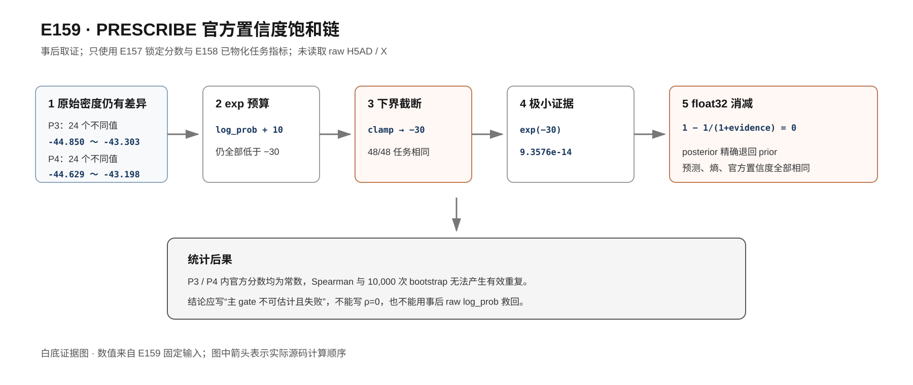

# E159 PRESCRIBE 饱和取证报告

生成时间：2026-07-14T20:53:16+08:00  
分析性质：**测试真值解封后的取证分析，不是预注册验证**

## 一、结论

E158 `attempt_001` 的主 gate **不可估计且已经失败**。失败不是 Spearman 或 bootstrap 程序把相关系数算错，而是 P3、P4 面板内所有预注册评分都没有任务间方差。未定义的相关系数在本报告中保留为空值并标记 `undefined_constant_score`，没有写成 0。

P3/P4 不能通过改用 raw `log_prob`、修改 clamp、增加微小抖动或改变终点来“救回”。这些操作发生在测试真值解封之后，只能形成下一项实验的新假设。

## 二、只读边界

本次程序只读取：

1. E157 两个面板已经锁定的 label-only 分数表；
2. E158 `attempt_001` 已经物化的任务指标、运行状态与解封事件；
3. 五个固定 PRESCRIBE 源码文件。

程序没有打开任何 `.h5ad`、HDF5、Zarr 或 Loom 文件，没有读取 raw H5AD，也没有物化任何表达矩阵 `X`。E158 状态原文显示：`phase=failed_after_irreversible_test_unseal_preserve_attempt`、`test_data_unsealed=True`、`test_X_rows_materialized=True`。这些是对 E158 已发生事件的读取，不是 E159 再次访问测试数据。

## 三、每个面板的分数动态范围

| Panel | 分数 | min | max | 标准差(ddof=0) | 不同值数 |
|---|---|---:|---:|---:|---:|
| Norman_P3 | raw log_prob | -44.8504562378 | -43.30286026 | 0.378217558184 | 24 |
| Norman_P3 | epistemic | 10 | 10 | 0 | 1 |
| Norman_P3 | aleatoric | -21.7459926605 | -21.7459926605 | 0 | 1 |
| Norman_P3 | official combined | -1.74599266052 | -1.74599266052 | 0 | 1 |
| Norman_P3 | predicted magnitude | 0.0117729045451 | 0.0117729045451 | 0 | 1 |
| Norman_P4 | raw log_prob | -44.6292572021 | -43.1983299255 | 0.31347181132 | 24 |
| Norman_P4 | epistemic | 10 | 10 | 0 | 1 |
| Norman_P4 | aleatoric | -21.7459926605 | -21.7459926605 | 0 | 1 |
| Norman_P4 | official combined | -1.74599266052 | -1.74599266052 | 0 | 1 |
| Norman_P4 | predicted magnitude | 0.0117729045451 | 0.0117729045451 | 0 | 1 |

两面板的 raw `log_prob` 各有24个不同值；epistemic、aleatoric、official combined 和 predicted magnitude 在各面板均只有1个值。十个预测 PCA 坐标是否全部为常数：**True**。

## 四、饱和计算链

E157 固定配置为 `certainty_budget=exp`、`output_dim=10`、`bound=30`。固定源码执行以下计算：

```text
raw log_prob
  → log_prob + 10
  → clamp(lower=-30, upper=30)
  → exp(log_evidence)
  → prior_proportion = 1 / (1 + evidence)
  → evidence_proportion = 1 - prior_proportion
  → epistemic = 10 × evidence_proportion + 10
```

两个面板的 `log_prob + 10` 仍全部小于 −30，截断比例是否为100%：**True**。截断后每个任务都是 −30，float32 的 `exp(-30)` 约为 `9.3576229122198373e-14`。源码写法 `1 - 1/(1+evidence)` 在 float32 中得到精确的 0，posterior 因而退回 prior。

采用数值上更稳定的 `evidence/(1+evidence)` 可以保留约 `9.36e-14` 的极小量，但它不能恢复已被 clamp 抹掉的任务顺序，也不足以把 E158 变成有效的前瞻验证。若修改公式，必须作为新模型版本另行冻结和验证。



## 五、raw log_prob 的事后探索

下表全部是 **post-hoc、hypothesis-generating only**：

| 终点 | P3 ρ | P4 ρ | 等权 macro ρ |
|---|---:|---:|---:|
| PCA主accuracy | 0.177 | 0.290 | 0.234 |
| PCA主direction | 0.137 | 0.410 | 0.273 |
| PCA主RMSE | -0.165 | -0.308 | -0.237 |
| raw sensitivity: Pearson accuracy | -0.273 | -0.500 | -0.387 |
| raw sensitivity: direction | -0.084 | 0.017 | -0.033 |
| raw sensitivity: RMSE | -0.241 | -0.299 | -0.270 |

这些弱到中等的相关趋势只说明 raw density 值得在完全独立、尚未解封的数据上重新预注册。它们不能计入 E158 主结果，不能表述成 P3/P4 外部验证成功。raw sensitivity 的 Pearson 指标还呈相反方向，更不能选择性报告有利终点。

## 六、E158 的正式处理口径

- `attempt_001` 保持原样，不删除、不覆盖。
- 主结果写作：**官方 PRESCRIBE 分数在严格未见基因 OOD 区间完全退化，主关联统计不可估计，预注册 gate 失败。**
- 不把未定义写成 `ρ=0`。
- 不运行内容相同的 `attempt_002`。
- P3/P4 只允许作为新分数设计的开发证据；下一次确认性检验必须使用新的未解封数据和预先冻结的非退化门槛。

## 七、可复核文件

- `tables/E159_SCORE_SUMMARY.csv`：每个面板、每个分数的 min/max/std/nunique。
- `tables/E159_PCA_PREDICTION_SUMMARY.csv`：十个预测 PCA 坐标的退化检查。
- `tables/E159_SCALER_CHAIN_TASKS.csv`：逐任务 float32 计算链。
- `tables/E159_SCALER_CHAIN_SUMMARY.csv`：逐面板截断摘要。
- `tables/E159_PREREGISTERED_ESTIMABILITY.csv`：未定义相关显式留空。
- `tables/E159_POSTHOC_SPEARMAN.csv`：事后 Spearman，含 P3、P4、pooled 与等权 macro。
- `tables/E159_POSTHOC_JOINED_TASKS.csv`：锁定分数与已物化任务指标的一对一连接。
- `tables/E159_JOIN_AUDIT.csv`：E157 与 E158 携带分数的一致性检查。
- `INPUT_MANIFEST.csv`、`OUTPUT_MANIFEST.csv`：输入、输出 SHA-256。
- `RUN_STATUS.json`：边界、状态和关键判定。

## 八、输入 SHA-256

- `E157_locked_scores_P3`：`4f782745606d677d85e1b62c3e21da9e83521d14179b856701a2298cc815ee33`
- `E157_locked_scores_P4`：`731bd52f61eb944f339995e31cc952ee58dcaee817e7956bfc75d88a9ed4bba7`
- `E158_materialized_task_metrics`：`a8a15f04f3ea02ab81309a986e9ca178cb1fda41f8f1bb6fc81314e8f79e9a3f`
- `E158_attempt_status`：`11f5dc76c45b674b560fd7e5f55f782f504c8ee2b70264cc88f348445aa7c6de`
- `E158_unseal_event`：`40b1418002c8f32d0dbac67bd0260ed47d23645ff92f60c25c97d4ef38322f08`
- `PRESCRIBE_evidence_scaler_source`：`acabb0cbd4bb43332b0b37030f77ef4babdc1d375efd402ddd20888ac89c54cc`
- `PRESCRIBE_model_source`：`0e8046492a639b63afe2e75eec1eda834d1a5581dfe68bb77f3e7af0651174e8`
- `PRESCRIBE_posterior_update_source`：`899b18ddb93b6c1af12fca4be59fa07dc23af3b66c7dc5c9337c6d2edf054929`
- `PRESCRIBE_confidence_source`：`5add09fb0ca49dd43f9caac892140c3d8a31add3bdd492aef2ea4668b0acb3cd`
- `PRESCRIBE_encoder_source`：`7bf52e6a453a4d7311036ce5429da83c95afb152359fea185881c1cb988db9d3`
