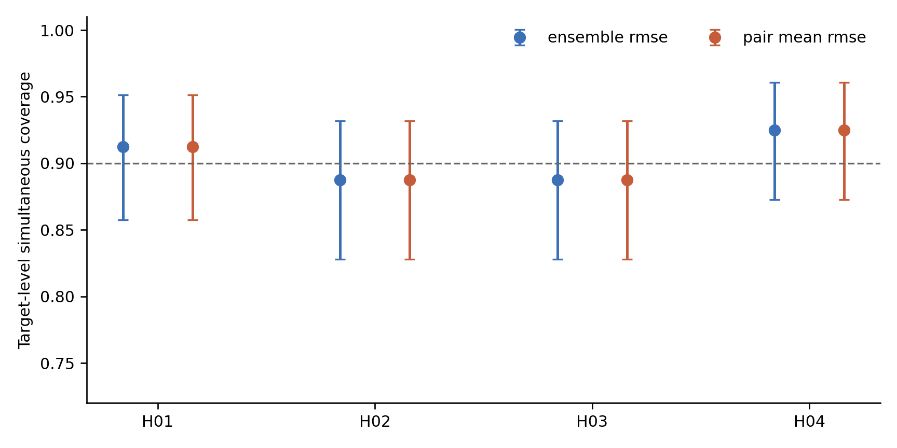
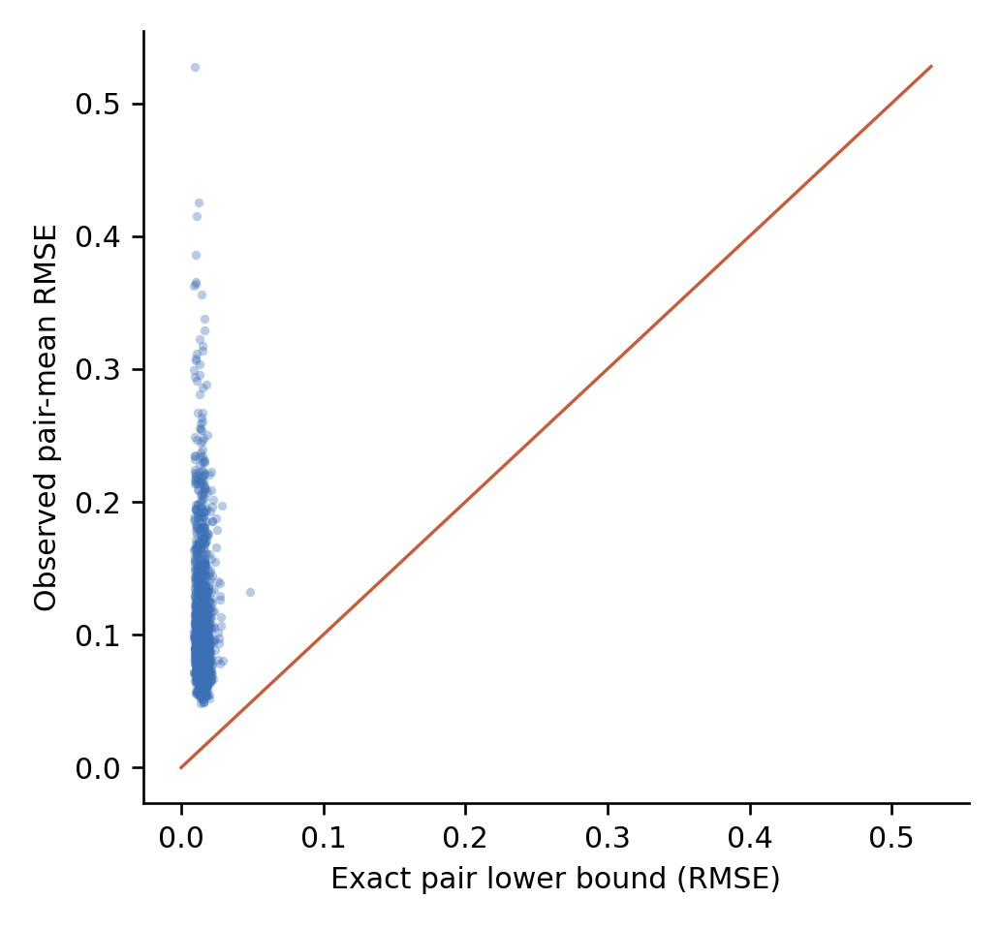
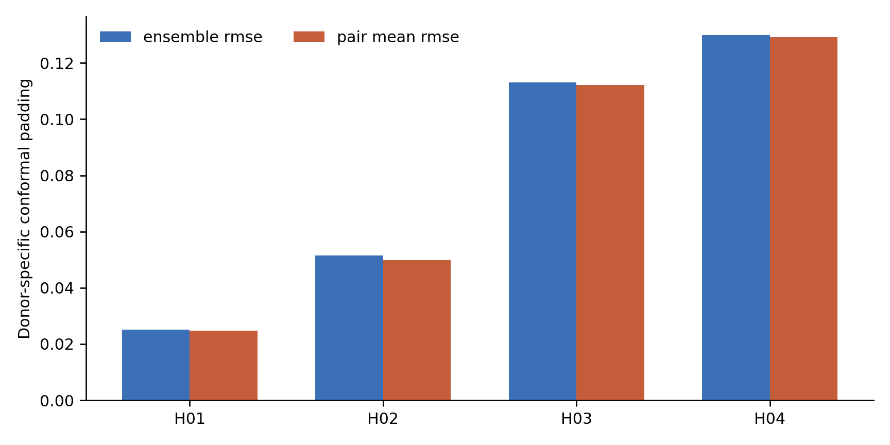
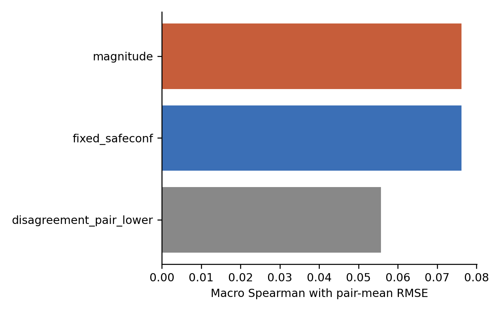

# E176 最终说明：四供体全新靶点确认

完成时间：2026-07-19

正式状态：`CERTIFICATE_AND_EMPIRICAL_COVERAGE_AUDIT_PASS`

## 先看结论

E176 在 4 位完整留出供体、640 个全新评价靶点和 1,920 个隐藏评价任务上确认了两件事：

1. 两个预测模型的距离除以 2，确实是模型对平均 RMSE 和最大 RMSE 的确定性下界；两类下界违例均为 0。
2. 以每位供体各自的 40 个校准靶点计算 split-conformal 上界后，640 个评价靶点中有 578 个在 Rest、Stim8hr、Stim48hr 三个状态下同时被覆盖，经验覆盖率为 90.31%，达到预设的 90% 目标。

旧的 fixed SafeConf 排序优势没有得到支持。pair-mean RMSE 上，fixed SafeConf 与 magnitude 的宏平均 Spearman 几乎相同；AURC 反而是 magnitude 略好。E176 支持“可证明的下界、经校准的上界和失败时停止宣传增量”，不支持“SafeConf 稳定超过 magnitude”。

## 实验是怎样锁住真值的


四位供体轮流承担测试角色；每一轮另有一位验证供体和两位训练供体。每个靶点包含三个状态，因此 640 个评价靶点对应 1,920 个任务。160 个校准靶点不进入主要评价。

真值解封前，scGPT 和 GEARS 分别运行 seeds 3407–3411。五种 leave-one-seed-out 家族均值之间的排序稳定性在 24 个预注册单元中全部通过；最小 median pairwise Spearman 为 0.851，最小 bootstrap 95% CI 下界为 0.814。评价真值没有参与模型选择，也没有用于重新调整 conformal 分位数。

## 核心数字

| 检查项 | 结果 | 含义 |
|---|---:|---|
| 全新冻结靶点 | 800 | 160 个校准，640 个最终评价 |
| 隐藏评价任务 | 1,920 | 640 靶点 × 3 状态 |
| 完整留出供体 | 4 | 每位供体各评价 160 个靶点 |
| pretruth 稳定性门 | 24/24 通过 | 五 seed 模型家族在开真值前足够稳定 |
| pair-mean 下界违例 | 0 | `d(p1,p2)/2` 从未超过两模型平均 RMSE |
| pair-max 下界违例 | 0 | `d(p1,p2)/2` 从未超过两模型最大 RMSE |
| 平方误差恒等式最大残差 | 9.81×10⁻¹¹ | 数值实现与解析恒等式一致 |
| target-level 三状态同时覆盖 | 90.31% | 578/640；95% CI 87.75%–92.49% |
| task-level 边际覆盖 | 95.05% | 1,825/1,920 个任务被覆盖 |
| 下界紧度中位数 | 15.18% | 下界正确但通常较松，不能当作精确误差估计 |

四位供体的 target-level 同时覆盖率分别为 91.25%、88.75%、88.75% 和 92.50%。两个 88.75% 的点估计低于 90%，其精确二项区间均包含 90%；因此这里报告总体经验通过和逐供体不确定性，不声称每位供体都单独达到 90%。

## 四张可直接用于汇报的白底图

### 1. 四位供体的经验覆盖率



[SVG 矢量图](./final_evaluation/figures/F1_donor_specific_coverage.svg) · [原始覆盖率表](./final_evaluation/tables/CONFORMAL_COVERAGE_EFFICIENCY.csv)

### 2. 模型对下界证书



[SVG 矢量图](./final_evaluation/figures/F2_pair_lower_certificate.svg) · [证书审计表](./final_evaluation/tables/CERTIFICATE_AUDIT.csv)

### 3. 各供体需要的校准余量



[SVG 矢量图](./final_evaluation/figures/F3_calibration_padding.svg) · [冻结校准规则](./calibration_release/tables/CALIBRATION_RULES.csv)

### 4. 排序诊断



[SVG 矢量图](./final_evaluation/figures/F4_ranking_diagnostic.svg) · [Spearman 表](./final_evaluation/tables/RANKING_SPEARMAN.csv) · [AURC 表](./final_evaluation/tables/LEGACY_AURC_DIAGNOSTIC.csv)

## 下界与上界分别解决什么

设两个模型的预测向量为 `p1`、`p2`，未知真值为 `y`，距离采用 RMSE。三角不等式给出：

```text
d(p1, p2) / 2 ≤ [d(p1, y) + d(p2, y)] / 2
d(p1, p2) / 2 ≤ max{d(p1, y), d(p2, y)}
```

因此，只要两个模型相差足够大，就能在不知道目标真值时证明“模型对的平均误差不可能很小”以及“至少一个模型的误差不可能很小”。小分歧不代表安全；两个模型可能一起犯同样的错误。

上界来自校准数据。E176 先用 predicted magnitude 给出基础误差估计，再按供体计算 90% split-conformal 余量。它回答“误差大概率不超过多少”，代价是区间较宽。pair-mean RMSE 的平均上界为 0.203，平均高出确定性下界 0.188。

## 排序结果为什么必须单独说

证书是否正确，与它能否把任务从难到易排好，是两个问题。E176 的确定性下界完全正确，但 pair-lower 与实际 pair-mean RMSE 的宏平均 Spearman 只有 0.055，95% CI 为 -0.014 到 0.124。fixed SafeConf、magnitude、pair-lower 的宏平均 Spearman 分别为 0.0762、0.0762 和 0.0558；宏平均 AURC 分别为 0.11088、0.11048 和 0.11138，数值越小越好。

这说明 E176 的主要贡献是给风险判断加上可核验的安全边界，而不是得到一个更强的任务排序器。旧 fixed SafeConf 相对 magnitude 的增量主张应当停止。

## 给老师汇报时可以这样说

“前两次全新靶点确认都没有证明固定 SafeConf 能稳定超过预测幅度，所以这次没有继续改权重救排序，而是把系统收缩成可证伪的可靠性审计。我们先用两个模型的分歧构造无真值也成立的误差下界，再用每位供体自己的 40 个校准靶点构造 90% conformal 上界。四位供体共 640 个隐藏评价靶点上，下界零违例，三状态同时覆盖率为 90.31%。这说明证书和校准流程成立；但排序仍然很弱，magnitude 略优，因此不会再把固定 SafeConf 写成稳定优于强基线。”

## 当前能写与不能写

可以写：

- scGPT–GEARS 模型对距离给出 pair mean 和 pair max RMSE 的确定性下界；
- 五 seed、四供体轮换和分阶段真值解封均通过预注册审计；
- 供体专属 split-conformal 在本研究的 640 个隐藏靶点上达到 90.31% 的三状态同时覆盖；
- 系统在增量门不通过时会停止排序优势主张，保留证书与参考基线。

不能写：

- fixed SafeConf 稳定优于 predicted magnitude；
- E176 是独立研究或跨队列外部验证；
- 小模型分歧意味着预测安全；
- 当前上界已经足够紧，可直接指导湿实验或临床决策；
- 论文已经能够保证一区或二区录用。

## 对投稿的实际影响

E176 让项目从单纯的经验风险排序，转向“确定性下界、经校准上界、真值访问审计和失败即停止”的可靠性框架，证据结构更完整。但它仍来自同一 Primary CD4 研究，确定性下界本身也来自基础几何关系。下一项最有价值的工作是换一项独立研究复现完整证书与覆盖流程，并推进 E143 的新背景湿实验；继续在同一研究内增加靶点，新增信息已经有限。

## 可复核文件

- [正式报告](./final_evaluation/reports/E176_FINAL_REPORT.md)
- [最终状态](./final_evaluation/RUN_STATUS.json)
- [预注册分析计划](./PREREG_ANALYSIS_PLAN.md)
- [联合 pretruth 稳定性报告](./pretruth_joint/reports/E176_JOINT_PRETRUTH_REPORT.md)
- [校准报告](./calibration_release/reports/E176_CALIBRATION_REPORT.md)
- [实现修复说明](./POSTTRUTH_IMPLEMENTATION_REPAIR.md)
- [最终文件哈希](./final_evaluation/MANIFEST.sha256)
