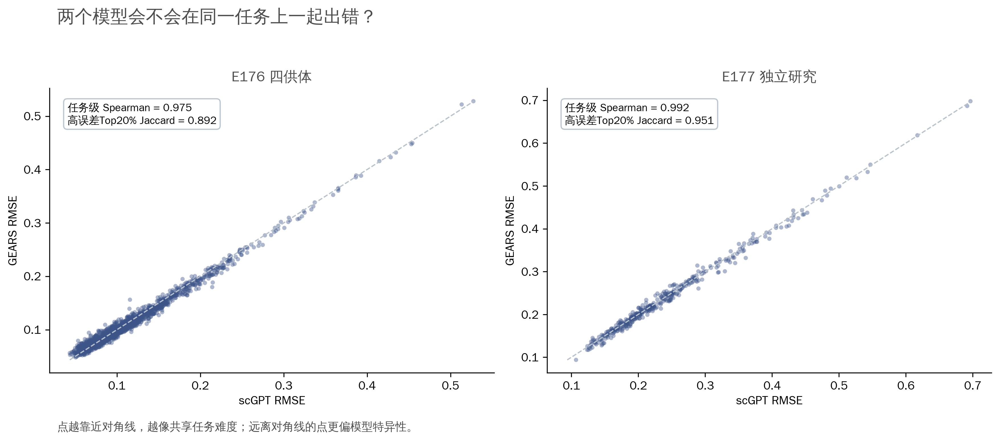
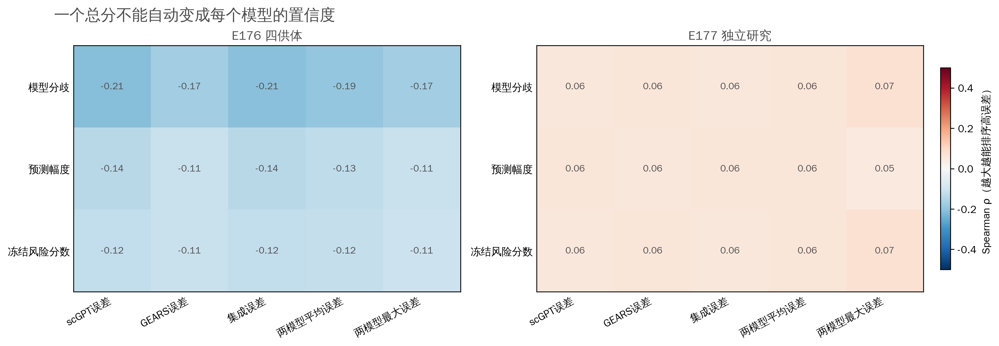
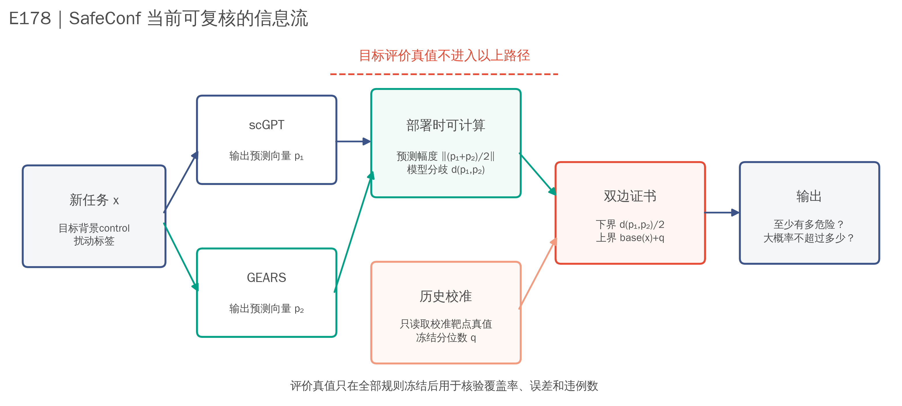
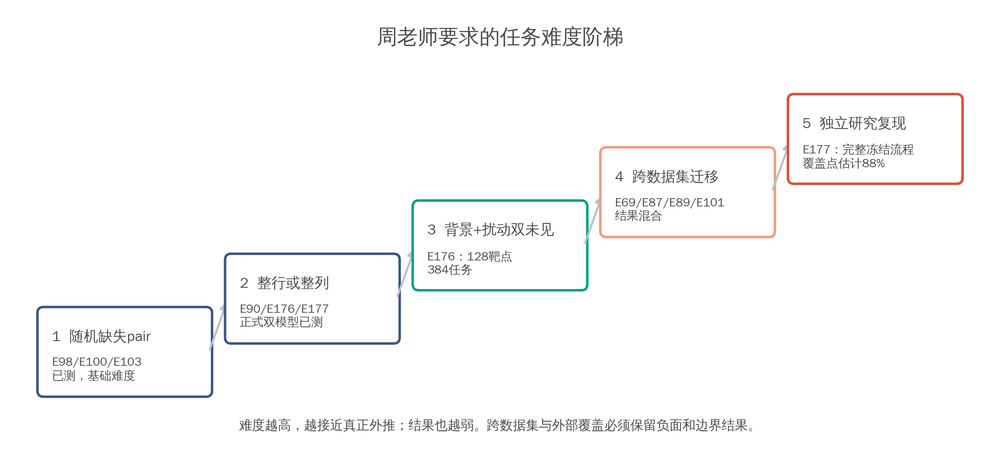
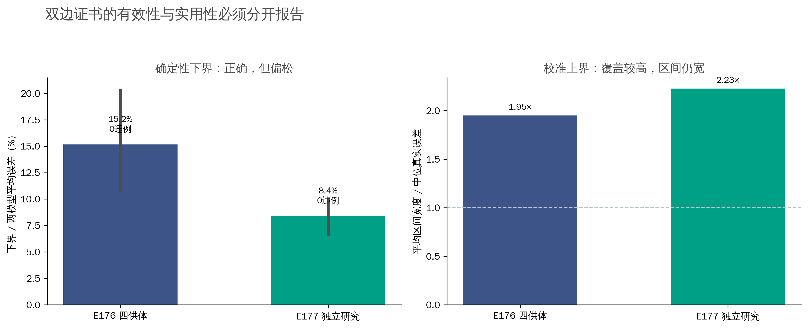
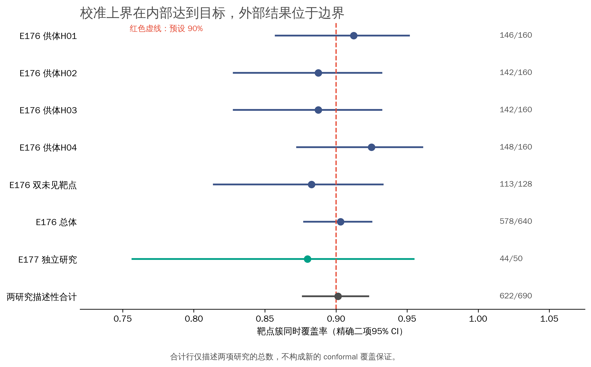

# E178｜跨研究双边证书与模型特异性审计

完成时间：2026-07-22
性质：**冻结结果的描述性综合，不是新的确认集，也没有根据评价真值修改模型、权重、分位数或阈值。**

## 结论

E176 与 E177 合计包含 690 个评价靶点簇、2,320 个任务。两个模型的距离除以 2 在两项研究中对 pair-mean 和 pair-max RMSE 均为零违例。E176 的靶点簇覆盖为 578/640=90.31%，E177 为 44/50=88.00%。两项研究各自校准后的描述性合计是 90.14%，但这不是新的 conformal 保证。

老师问“这个分数针对某个模型，还是说明任务总体难”。现在可以给出定量回答：scGPT 与 GEARS 的误差相关在 E176 为 ρ=0.975，E177 为 ρ=0.992；高误差 Top-20% 集合的 Jaccard 分别为 0.892 和 0.951。两模型确有共享难度，但并非总在同一任务上失败。模型分歧与 scGPT/GEARS 误差的相关在 E176 分别为 -0.211/-0.174，E177 分别为 0.059/0.059。因此当前 SafeConf 应称为**模型对层面的任务风险证书**，不能称为某个单模型的置信度。

## 老师的问题逐项回答

### 1. 最后和什么做相关？真实错误来自哪个模型？

真实错误是预测效应向量与冻结评价真值之间的 RMSE。E176/E177 分别报告 scGPT RMSE、GEARS RMSE、两模型集成 RMSE、两模型平均 RMSE和最大 RMSE。排序分数对每一种误差分别计算，不能只写一个含糊的“预测误差”。主证书关注 pair mean 与 pair max；单模型结果作为模型特异性诊断保留。

### 2. 模型分歧说明任务难，还是说明某个模型错？

分歧 `d(p1,p2)` 是对称量。它能证明 `d(p1,p2)/2 ≤ pair mean RMSE` 且 `d(p1,p2)/2 ≤ pair max RMSE`，所以分歧大时至少有一个模型不能很准；它不能指出是哪一个模型错。两项研究的下界违例均为 0，但中位紧度只有 15.18% 和 8.41%。小分歧仍可能是两个模型一起犯错。

### 3. 预测幅度是不是要先做完目标实验才能计算？

不需要。当前 `predicted_magnitude` 是预测效应向量相对零向量的 RMSE，只读取 scGPT/GEARS 的预测输出。目标扰动后的实测表达仅用于最后计算真实误差。E176 的 1,920 个评价任务全部标记为 `QUERY_ONLY`；E177 在 pretruth 阶段保留 640 个无 y 查询任务，并在校准分位数冻结后才读取 400 个评价任务真值。

### 4. 随机留点、整行整列、双未见和跨数据集是否都做了？

已经形成从随机缺失 pair 到独立研究复现的难度阶梯。E176 首次用正式 scGPT–GEARS 在完整留出供体上完成 640 个靶点评价，其中 128 个靶点在训练供体中也没有支持，构成 384 个双未见任务；该分层的靶点簇覆盖为 113/128=88.28%。跨数据集直接迁移已有 E69/E87/E89/E101，结果并不普遍为正。E177 是独立研究内重新冻结、重新校准、最终评价，不应冒充“把 E176 的校准器直接搬过去”。

## 双边证书结果

| 研究 | 评价任务 | 下界违例 | 下界中位紧度 | pair-mean平均区间宽度/中位误差 |
|---|---:|---:|---:|---:|
| E176 四供体 | 1,920 | 0 | 15.18% | 1.95× |
| E177 独立研究 | 400 | 0 | 8.41% | 2.23× |

下界的逻辑保证很强，紧度较弱；上界的覆盖率较高，宽度仍大。二者共同限定风险范围，但当前还不足以授权真实实验或临床决策。

## 覆盖率

E176 总体点估计达到预设 90%；E177 点估计低 2 个百分点，精确二项 95% CI 仍包含 90%。两研究覆盖率差为 2.31%，Fisher 精确检验 p=0.620。这只能说明目前没有足够证据认定两项研究的覆盖率不同，不能把“不显著”解释成二者相同，也不能把 E177 写成强阳性。

## 当前论文主张

可以保留：

- 正式 scGPT–GEARS 预测记录、五随机种子和分阶段真值访问审计；
- 模型对距离给出的确定性 pair-mean/pair-max 误差下界；
- 同一研究四供体上的供体专属 conformal 覆盖，以及独立研究的边界复现；
- 随机留点、整行、整列、双未见、跨数据集和多扰动模态的结果矩阵；
- 当排序增量门失败时自动停止“优于 magnitude”的主张。

不能保留：

- fixed SafeConf 稳定超过 predicted magnitude；
- 模型分歧是某一个模型的置信度；
- 小分歧代表预测安全；
- E177 的技术组等同于供体、患者或生物学背景；
- 当前上下界已经足够紧，可直接替代真实实验。

## 投稿判断

E178 把周老师的问题、E176 内部确认和 E177 外部边界结果统一到了同一个可复核框架中。它提升的是论证完整性，不会凭空提高方法新颖性。当前稿件最可信的题目方向是“单细胞扰动预测的模型对双边误差证书与失败关闭审计”，经验排序降为次要诊断。较强期刊仍会追问：上界能否更窄、与现有 uncertainty/conformal 方法相比是否有增量、能否在新的真正生物背景复现。录用概率不能通过继续堆同类靶点变成百分之百。

## 文件

- [模型特异性相关](../tables/E178_MODEL_SPECIFICITY.csv)
- [共享难度诊断](../tables/E178_SHARED_DIFFICULTY.csv)
- [证书审计](../tables/E178_CERTIFICATE_SUMMARY.csv)
- [覆盖率汇总](../tables/E178_COVERAGE_SUMMARY.csv)
- [区间效率](../tables/E178_INTERVAL_EFFICIENCY.csv)
- [部署输入来源](../tables/E178_INPUT_PROVENANCE.csv)
- [任务难度与证据](../tables/E178_DIFFICULTY_EVIDENCE.csv)
- [输入哈希](../tables/INPUT_HASHES.csv)
