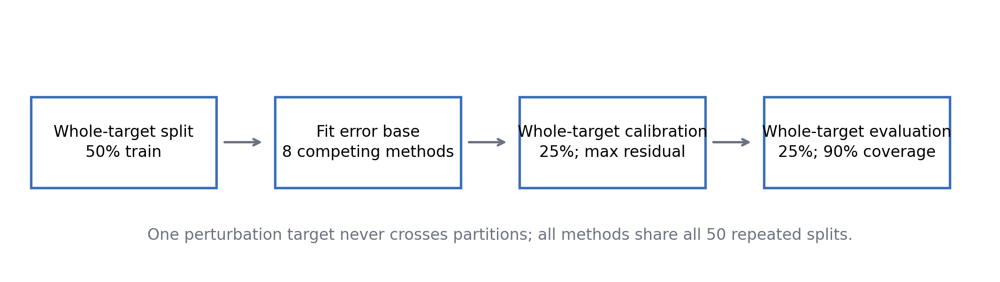
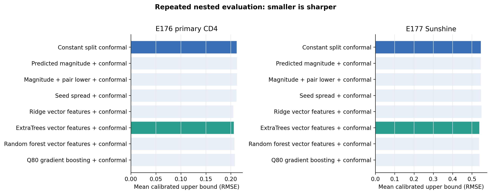
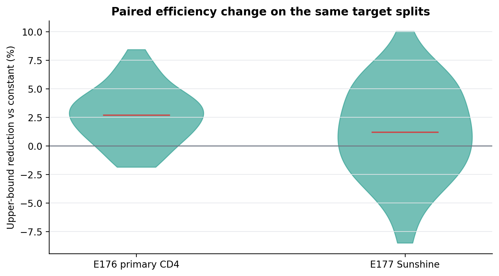
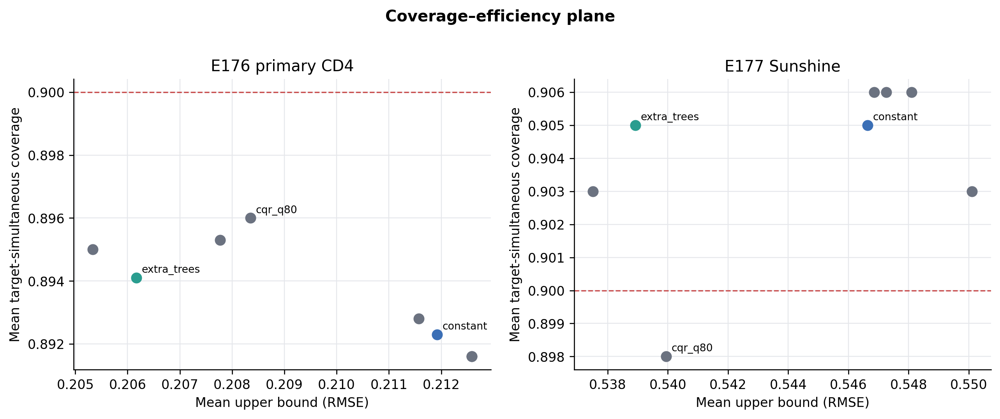
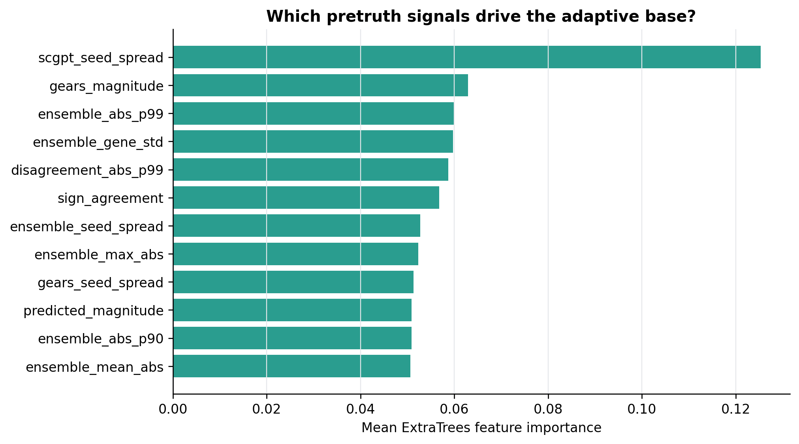

# E179：靶点级嵌套不确定性基线比较

## 结论

E179 把上界收窄问题变成了一个可复现的基线比较，而不是继续修改 SafeConf 排名分数。两个研究均按完整扰动靶点分组，重复 50 次 train/calibration/evaluation 划分；同一靶点的不同状态或技术组不会跨分区。

- **E176_primary_CD4**：800 个靶点、2400 个任务；ExtraTrees 自适应基线的平均靶点同时覆盖率为 0.894，平均上界为 0.2062 RMSE，较常数 split conformal 平均缩短 2.72%；50 个配对划分的缩短率 2.5%–97.5% 分位区间为 -1.52%–7.39%。
- **E177_Sunshine**：80 个靶点、640 个任务；ExtraTrees 自适应基线的平均靶点同时覆盖率为 0.905，平均上界为 0.5389 RMSE，较常数 split conformal 平均缩短 1.41%；50 个配对划分的缩短率 2.5%–97.5% 分位区间为 -6.60%–7.72%。

这项收益不大，但方向一致且来自合法的 pretruth 特征：预测幅度、模型间距离、向量形状、方向一致性和五个随机种子的波动。E179 是方法开发证据，不把历史真值包装成新的外部确认。`extra_trees_vector` 现作为下一套新数据的冻结候选；真正的确认结论只允许来自冻结后的新数据。

## 比较对象

1. 常数 split conformal；
2. 预测幅度加 conformal 修正；
3. `max(预测幅度, 两模型距离/2)` 加 conformal 修正；
4. 五随机种子波动加 conformal 修正；
5. Ridge、ExtraTrees、随机森林和 0.80 分位数梯度提升，统一使用 18 个 pretruth 特征；
6. 每一种学习方法都只在 train 靶点拟合，在 calibration 靶点上对“同一靶点所有任务的最大残差”取有限样本分位数，最后在 evaluation 靶点上检查同时覆盖。

## 为什么按靶点分组

一个基因在多个状态或技术组中会产生多条任务记录。随机拆任务会让同一基因同时出现在拟合和评价中，覆盖率会偏乐观。E179 始终移动完整靶点簇；评价事件是该靶点的全部任务都被上界覆盖。

## 图

## 解释边界

- 重复划分相互重叠，所以重复间分布只描述稳定性，不当作 50 个独立试验计算显著性。
- E177 的 `technical_group` 仍只是技术组，不改称生物学背景。
- ExtraTrees 的选择发生在已解封历史数据上；下一次确认必须先锁定代码、特征、超参数、分组单位和统计门槛，再读取新评价真值。
- 确定性下界 `||p_scGPT-p_GEARS||/2` 保持独立：它不依赖校准真值，且只下界两模型平均/最大误差，不冒充任一单模型的置信度。

## 可复现文件

- `../tables/E179_REPEAT_RESULTS.csv`：每个研究、重复和方法的完整结果。
- `../tables/E179_METHOD_SUMMARY.csv`：方法汇总。
- `../tables/E179_PAIRED_REDUCTIONS.csv`：相同划分上的配对效率差。
- `../tables/E179_PRIMARY_FEATURE_IMPORTANCE.csv`：ExtraTrees 特征重要性。
- `../tables/E179_INPUT_HASHES.csv`：输入文件哈希。
- `../../../../tools/scripts/run_e179_nested_uq_baseline_benchmark.py`：唯一运行脚本。
