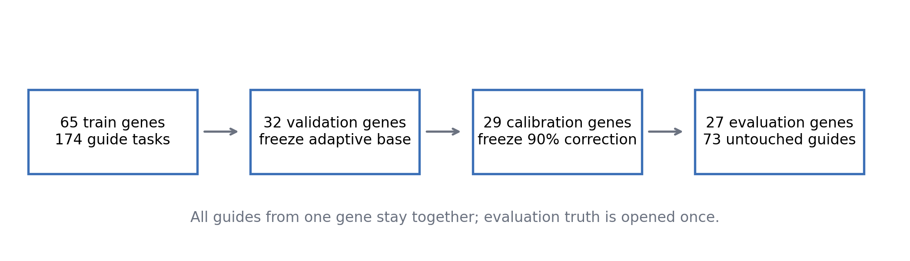
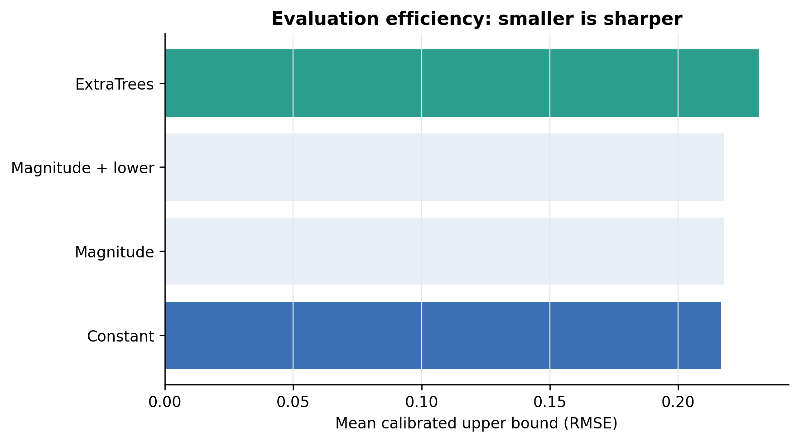
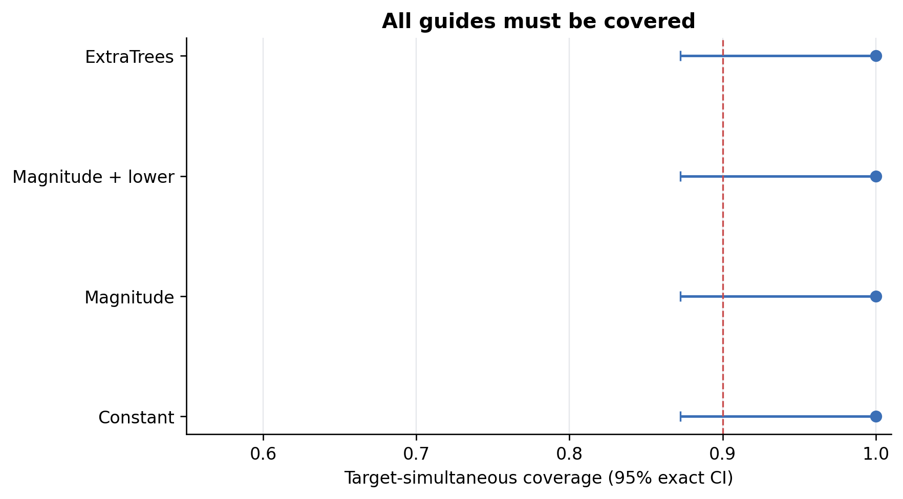
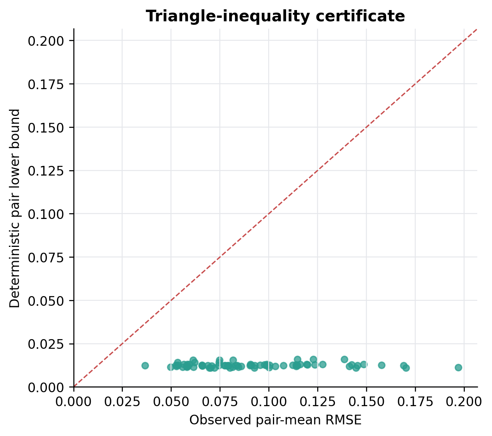
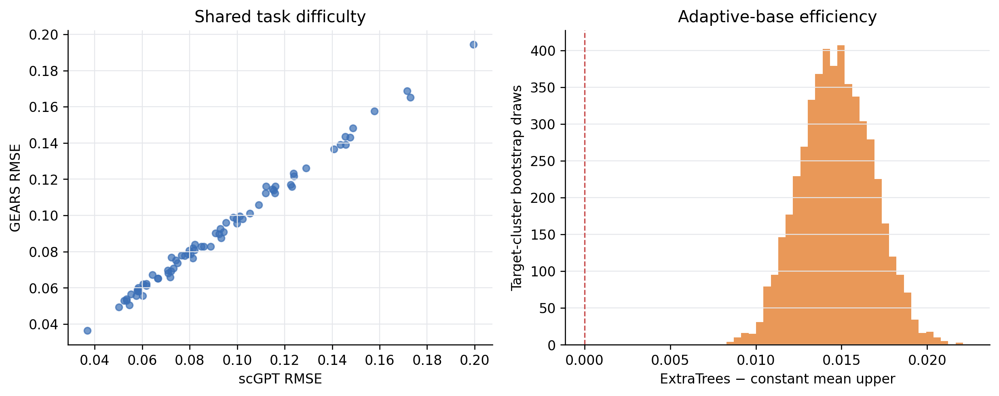

# E180 XuCao2023 新研究最终评价

## 结论

E180 在 27 个从未用于训练或校准的基因、73 个 guide 任务上完成了一次性评价。确定性两模型证书继续保持 **0 个违例**；scGPT 与 GEARS 的任务误差 Spearman 为 **0.996**，再次说明共享任务难度强于单纯模型分歧排序。

主 ExtraTrees 上界的靶点同时覆盖率为 **1.000**，常数 split conformal 为 **1.000**。主方法平均上界为 **0.2315**，常数上界为 **0.2168**，差值为 **+0.0147 RMSE**；靶点簇 bootstrap 的 95% 区间为 **[+0.0107, +0.0188]**。

预注册总状态：**FAIL**。该状态由四个冻结门槛共同决定，失败项不会在本实验编号内通过换模型或换靶点修补。

## 证据表

- [任务级结果](../tables/EVALUATION_TASK_RESULTS.csv)
- [靶点级结果](../tables/EVALUATION_TARGET_RESULTS.csv)
- [覆盖与效率](../tables/COVERAGE_EFFICIENCY.csv)
- [最终摘要](../E180_FINAL_SUMMARY.json)

## 图

## 解释

确定性下界回答“两个预测器不可能同时都比它更准”，不依赖校准数据。上界回答“在与 calibration 靶点可交换的前提下，新的完整基因簇有多大概率被覆盖”。两者分别承担不可违背的几何证书和带条件的统计覆盖，不能互相替代。
