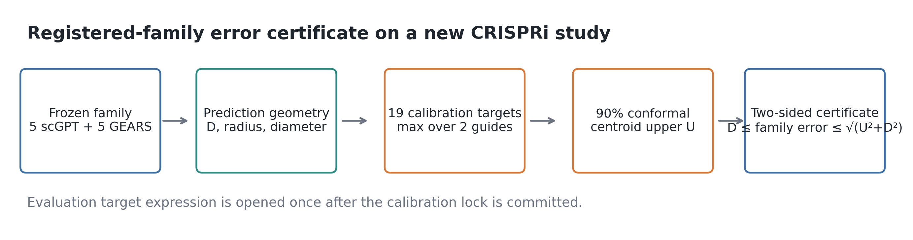
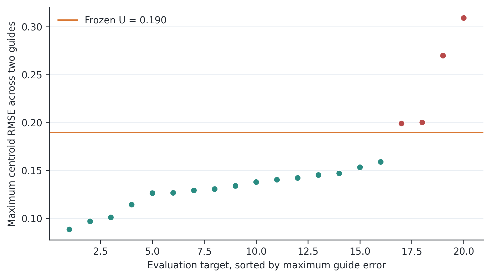
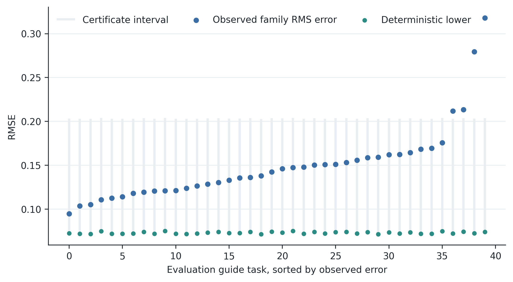
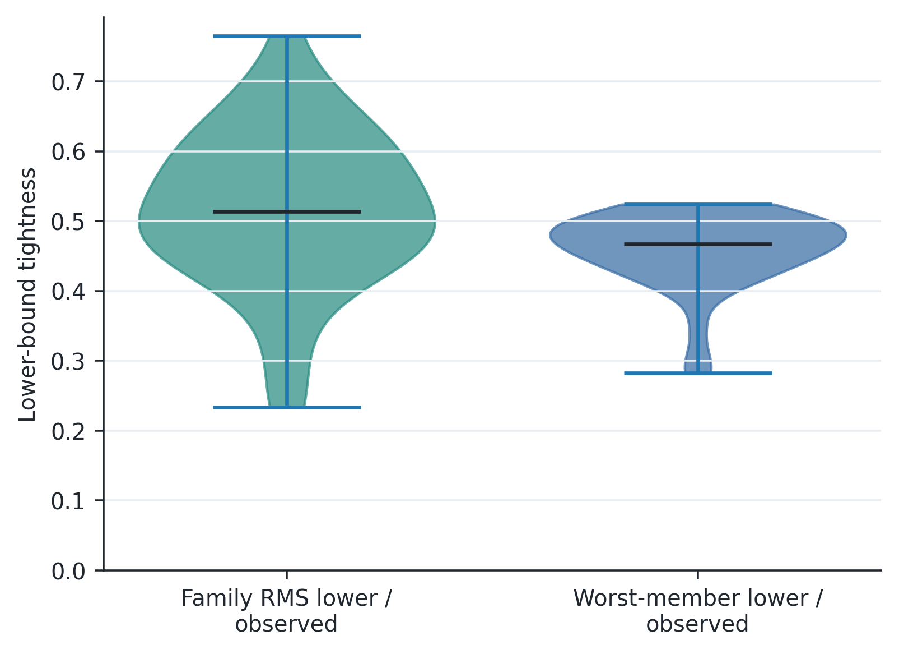
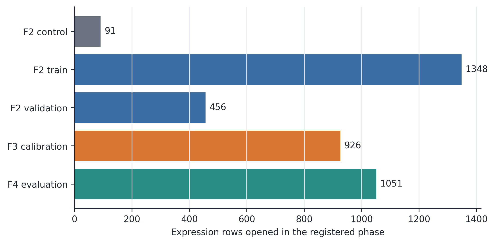

# E182 GSE225807 最终评价

## 结论

E182 在此前未进入项目结果的人源 K562 CRISPRi 研究 GSE225807 上，完成了靶基因级事前划分和一次性最终评价。最终评价包含 20 个新靶基因、40 条 guide 任务。

- 10 模型家族 RMS 误差的确定性下界：**0 个违反**；
- 最坏家族成员误差的确定性下界：**0 个违反**；
- Hilbert 恒等式最大绝对残差：`2.255e-17`；
- 冻结质心上界：**0.1898 RMSE**；
- 两条 guide 同时覆盖：**16/20 = 80.0%**，Clopper–Pearson 95% 区间 **[56.3%, 94.3%]**；
- 家族 RMS 下界紧致度中位数：**0.513**；
- 最坏成员下界紧致度中位数：**0.467**。

E182 没有训练或选择学习型上界。校准阶段只用 19 个靶基因冻结一个常数 target-cluster conformal 阈值；20 个评价靶基因的表达值在阈值提交并双远端留存后只打开一次。

## 图

