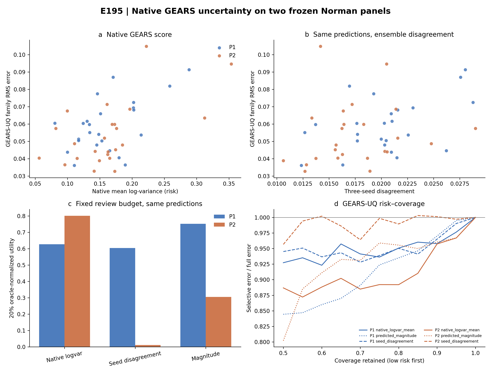

# E195｜GEARS 原生学习型误差代理直接复现

运行状态：**COMPLETE**。

E195 在两个事先固定的 Norman 面板上重新训练 3 个 GEARS-UQ 成员。每个成员先写入 prediction、native logvar 和 magnitude 的哈希锁，随后才读取测试真值。原生分数、seed 分歧和 magnitude 因而评价的是同一批 GEARS-UQ预测对自身误差的排序能力。

## 同预测 family 结果

| panel | score_name | spearman | ci95_lower | ci95_upper |
| --- | --- | --- | --- | --- |
| P1 | native_logvar_mean | 0.4122 | -0.0463 | 0.7312 |
| P1 | predicted_magnitude | 0.6870 | 0.3546 | 0.8960 |
| P1 | seed_disagreement | 0.3609 | -0.1193 | 0.7348 |
| P2 | native_logvar_mean | 0.4539 | 0.0289 | 0.7624 |
| P2 | predicted_magnitude | 0.6800 | 0.3984 | 0.8180 |
| P2 | seed_disagreement | 0.3322 | -0.1135 | 0.6828 |

Native logvar 在 P1/P2 都有中等正相关；magnitude 的点相关更高。这两个点估计本身不能证明差异，配对 bootstrap 结果如下。

| panel | score_a | score_b | paired_spearman_delta_a_minus_b | delta_ci95_lower | delta_ci95_upper | paired_utility20_delta_a_minus_b | utility_delta_ci95_lower | utility_delta_ci95_upper |
| --- | --- | --- | --- | --- | --- | --- | --- | --- |
| P1 | native_logvar_mean | seed_disagreement | 0.0513 | -0.4137 | 0.5468 | 0.0239 | -0.6966 | 0.7415 |
| P2 | native_logvar_mean | seed_disagreement | 0.1217 | -0.4853 | 0.6954 | 0.7892 | -0.1191 | 1.1728 |
| P1 | native_logvar_mean | predicted_magnitude | -0.2748 | -0.7254 | 0.1441 | -0.1247 | -0.9084 | 0.3065 |
| P2 | native_logvar_mean | predicted_magnitude | -0.2261 | -0.6667 | 0.1837 | 0.4956 | -0.3558 | 0.9672 |

## 初始化稳定性

| panel | seed | score_name | spearman | ci95_lower | ci95_upper |
| --- | --- | --- | --- | --- | --- |
| P1 | 11 | native_logvar | 0.4817 | 0.0853 | 0.7406 |
| P1 | 11 | predicted_magnitude | 0.6174 | 0.1876 | 0.8964 |
| P1 | 22 | native_logvar | 0.5435 | 0.0930 | 0.8472 |
| P1 | 22 | predicted_magnitude | 0.6904 | 0.3617 | 0.8523 |
| P1 | 33 | native_logvar | 0.2748 | -0.1754 | 0.6408 |
| P1 | 33 | predicted_magnitude | 0.7287 | 0.3826 | 0.9254 |
| P2 | 11 | native_logvar | 0.2983 | -0.1537 | 0.6692 |
| P2 | 11 | predicted_magnitude | 0.5687 | 0.2454 | 0.7648 |
| P2 | 22 | native_logvar | 0.5974 | 0.2360 | 0.8193 |
| P2 | 22 | predicted_magnitude | 0.5348 | 0.0973 | 0.7937 |
| P2 | 33 | native_logvar | 0.1704 | -0.3144 | 0.5671 |
| P2 | 33 | predicted_magnitude | 0.5235 | 0.2032 | 0.7469 |

Native logvar 的六个单 seed 相关波动更大，部分区间跨 0；magnitude 的六个点估计均为正且区间下界均高于 0。这里仍是每个面板 24 个任务的小样本结果，不能写成普遍优势。

## 20% 复核预算

| panel | score_name | oracle_normalized_utility | utility_ci95_lower | utility_ci95_upper |
| --- | --- | --- | --- | --- |
| P1 | native_logvar_mean | 0.6271 | -0.1089 | 1.0000 |
| P1 | predicted_magnitude | 0.7518 | 0.4969 | 1.0000 |
| P1 | seed_disagreement | 0.6033 | -0.0782 | 1.0000 |
| P2 | native_logvar_mean | 0.8004 | 0.1858 | 1.0000 |
| P2 | predicted_magnitude | 0.3047 | -0.0958 | 0.9064 |
| P2 | seed_disagreement | 0.0112 | -0.3045 | 0.6246 |

单分数区间用于描述各自效用；分数间结论只看上面的共享任务重采样配对差。Native、magnitude 与 seed disagreement 的相对次序在 P1/P2 发生变化，不能依据两面板 macro 点估计宣布稳定胜负。

## 留出语义

| panel | exact_single_leaks | tasks_with_double_history | n_tasks | double_history_conditions |
| --- | --- | --- | --- | --- |
| P1 | 0 | 20 | 24 | 73 |
| P2 | 0 | 12 | 24 | 37 |

Exact single condition 没有进入 train/validation，但部分目标基因曾以双扰动形式出现。因此 E195 是 condition holdout，不是 perturbation-gene cold start。

## PRESCRIBE 终点敏感性

| panel | arm | score_name | outcome_name | spearman | ci95_lower | ci95_upper |
| --- | --- | --- | --- | --- | --- | --- |
| P1 | paper_effect_pearson_primary | combined_confidence | one_minus_pearson_effect_accuracy | 0.0496 | -0.3984 | 0.4745 |
| P1 | paper_effect_pearson_primary | predicted_magnitude | one_minus_pearson_effect_accuracy | 0.0470 | -0.4017 | 0.4728 |
| P1 | rmse_sensitivity | predicted_magnitude | rmse_mean_profile | 0.0339 | -0.3701 | 0.4444 |
| P1 | rmse_sensitivity | risk_combined | rmse_mean_profile | -0.0270 | -0.4390 | 0.3764 |
| P2 | paper_effect_pearson_primary | combined_confidence | one_minus_pearson_effect_accuracy | 0.5843 | 0.2056 | 0.8401 |
| P2 | paper_effect_pearson_primary | predicted_magnitude | one_minus_pearson_effect_accuracy | 0.5739 | 0.2133 | 0.8301 |
| P2 | rmse_sensitivity | predicted_magnitude | rmse_mean_profile | 0.0843 | -0.3847 | 0.5184 |
| P2 | rmse_sensitivity | risk_combined | rmse_mean_profile | -0.0852 | -0.5549 | 0.3960 |

| panel | arm | score_a | score_b | score_score_spearman | paired_spearman_delta_a_minus_b | delta_ci95_lower | delta_ci95_upper |
| --- | --- | --- | --- | --- | --- | --- | --- |
| P1 | paper_effect_pearson_primary | combined_confidence | predicted_magnitude | 0.9965 | 0.0026 | -0.0341 | 0.0500 |
| P2 | paper_effect_pearson_primary | combined_confidence | predicted_magnitude | 0.9939 | 0.0104 | -0.0563 | 0.0927 |
| P1 | rmse_sensitivity | risk_combined | predicted_magnitude | -0.9965 | -0.0609 | -0.8607 | 0.7263 |
| P2 | rmse_sensitivity | risk_combined | predicted_magnitude | -0.9939 | -0.1696 | -1.0490 | 0.8021 |

PRESCRIBE 的 combined confidence 与 magnitude 几乎同序，配对增量很小；RMSE 敏感性臂的方向又不同。该结果应写成分数高度冗余且依赖评价终点。

## 解释边界

- GEARS 的 uncertainty loss 不是完整高斯负对数似然；这里称为 native log-variance score，不称校准预测方差。
- GEARS-UQ、GEARS-scGPT pair 和 PRESCRIBE 的预测器及误差终点不同；跨系统只比较排序、coverage 和复核效用，不比较原始误差大小。
- P1/P2 已在旧实验中打开真值，E195 是 post-truth direct-competitor replication，不是新的盲测。
- Seed disagreement 是 family RMS 平方恒等式的一部分；其经验相关较弱，不能包装成独立误差保证。
- 原生分数若为常数或 NaN，按冻结合同保留并标为 NON_ESTIMABLE；相关为负不会被当作工程失败。

