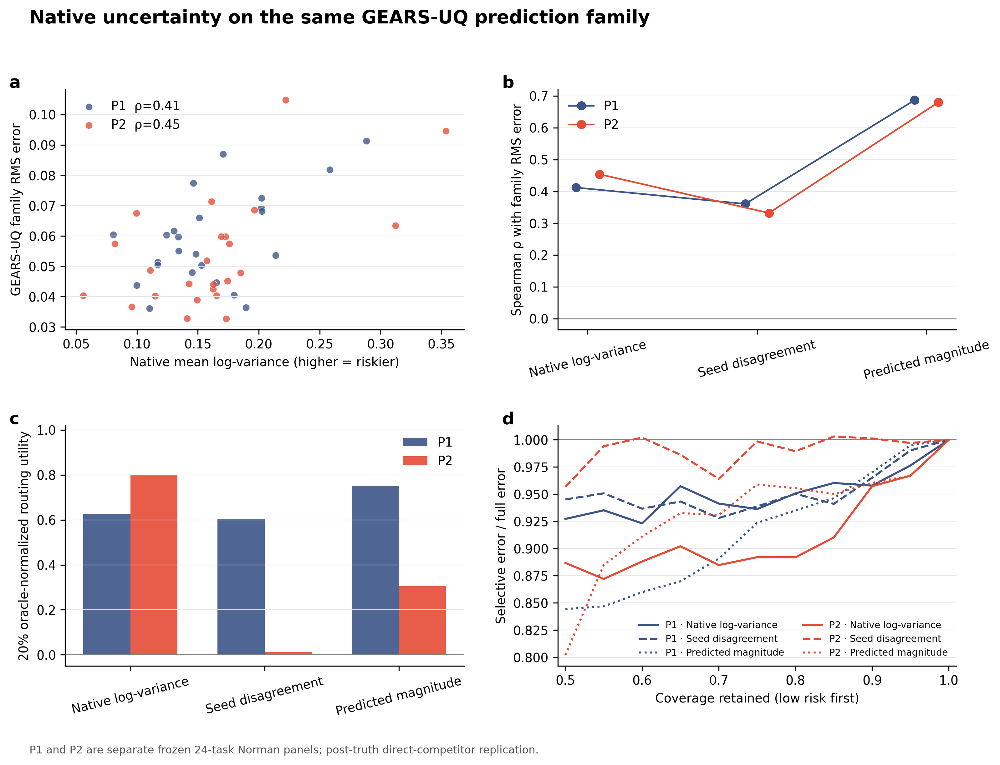

# E195 结果结论

E195 已完整结束，所有实现门均通过。两个 Norman 面板各 24 个任务，每个面板训练
3 个 GEARS-UQ 成员，共得到 144 条单成员任务记录和 48 条三成员 family 记录。
测试条件未进入实际 train/validation；六个预测锁都早于真值解锁；checkpoint、
split、coexpression 缓存、预测数组和真值数组的哈希全部匹配。三 seed 真值最大
差为 0，family 平方恒等式最大残差为 \(2.20\times10^{-18}\)。

## 同一批预测上的比较

GEARS 原生 log-variance 与 family RMS error 呈中等正相关：

- P1：Spearman \(\rho=0.412\)，95% bootstrap CI \([-0.046, 0.731]\)；
- P2：Spearman \(\rho=0.454\)，95% bootstrap CI \([0.029, 0.762]\)。

这说明原生学习型误差代理具有风险排序信息，但 P1 的区间仍跨 0。三 seed 分歧的
相关为 0.361、0.332；预测幅度的相关为 0.687、0.680，是两个面板上最高的点估计。
原生 log-variance 相对 magnitude 的 paired Spearman 差为 -0.275、-0.226，
两个区间都跨 0，因此当前 24-task 面板不能证明两者存在稳定差异。

20% 复核预算下，native log-variance 的 oracle-normalized utility 为 P1 0.627、
P2 0.800；magnitude 为 0.752、0.305；seed disagreement 为 0.603、0.011。
相关排序与固定预算路由排序并不相同，而且 P1/P2 的相对表现有变化。当前结果支持
“这些分数都可能提供信息，效果取决于任务面板和决策终点”，不支持宣布一个分数
在所有设置中占优。

使用完全相同的 5,000 组任务重采样后，native 相对 magnitude 的 20% utility
配对差为 P1 -0.125（95% CI -0.908–0.307）、P2 0.496
（-0.356–0.967）；两个区间均跨 0。Native 的六个单 seed 相关范围为
0.170–0.597，其中三个区间跨 0；magnitude 为 0.523–0.729，六个区间下界均大于
0。这里能说 magnitude 在当前面板上更稳定，仍不能外推成普遍或显著优势。

实际 split 中没有精确单基因条件泄漏，但 P1 有 20/24、P2 有 12/24 个目标基因
曾以双扰动形式出现，分别涉及 73、37 个 train/validation 双扰动条件。因此这是
condition holdout，不是 perturbation-gene cold start。PRESCRIBE 主臂中 combined
confidence 与 magnitude 的排序相关为 0.997、0.994，配对 Spearman 增量仅
0.003、0.010且区间跨 0；RMSE 敏感性结果方向又不同，说明该比较高度冗余且依赖
评价终点。

## 对 SafeConf 的影响

E195 补上了原生学习型不确定性竞品。结果表明，GEARS 的 native log-variance
确实不是空分数，同时也没有稳定超过简单 magnitude。SafeConf 后续不能把
“存在一个风险分数”本身当作主要创新；更有区分度的对象仍是事先注册的预测
family、确定性误差证书、跨设置治理和验证失败时的 ABSTAIN 规则。

GEARS-UQ、GEARS–scGPT pair 和 PRESCRIBE 使用不同预测器及误差终点，系统并列表
只能比较各自内部的排序与路由量，不能据此宣称共同结果变量上的全面胜负。P1/P2
真值此前已经打开，E195 属于事后直接竞品复现，不是新的外部盲测，也不改变
E192 的 ABSTAIN 结论。

对应数据：
[association](../tables/E195_ASSOCIATION.csv)、
[routing](../tables/E195_ROUTING_METRICS.csv)、
[paired deltas](../tables/E195_PAIRED_SCORE_DELTAS.csv)、
[integrity status](../E195_STATUS.json)。
