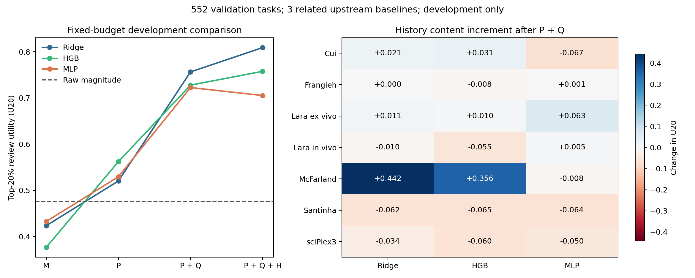

# SafeConf 第一批模型决策结果

**日期：2026-09-28｜已完成结果｜开发实验，非独立确认**

## 1. 已经做完什么、现在的判断

第一批已完整结束：7 个数据组、3 个相关上游基线、552 个去重任务、1656 条预测记录、63 个外层比较单元。主比较共 945 次小模型拟合，另有 252 次幅度基础回归（含内部交叉拟合），得到 1071 行评价；训练用时约 **3 分 56 秒**。CPU 运行 Ridge/树，现有 cu124 环境在一张 RTX 6000 上运行小 MLP。**批次结束已停止，没有追加第二批、重训上游或扩大网络。**

事前协议提交：`eea1bfc`。输入、标签、分组、模型配置、种子和调参预算没有按中途结果改变。运行中仅更正文字事实：旧目录存在，缺的是部分运行脚本/独立审计清单。详见 [模型决策](../../../SAFECONF_MODEL_DECISION.md) 与 [运行状态](RUN_STATUS.json)。

我的判断是：**可以继续做冻结上游模型的下游风险方法。当前最明确的信号来自历史支持/相关程度；公共历史内容的增量很不均匀。显式幅度锚定和更复杂网络都没有成为必需结构。**

这支持继续构造计算方法，但还不支持宣布统一 SafeConf 已完成，或已经达到二区/CCF-B 的录用水平。当前已有方法证据和实验资产足以组织开题；最终论文还需要成熟上游、来源闭合和独立确认。

## 2. 三个 upstream predictor 到底是什么

| 上游预测器 | 实际规则 | 输出 | 本轮角色 |
|---|---|---|---|
| PertMeanPredictor | 原始上游训练库内，同扰动的真实效应取平均；无同扰动时用全局平均。生成 train 预测时排除自身任务 | 按基因排列的平均表达变化向量 | 均值转移基线 |
| ContextSimBaseline | 优先取同扰动、其他背景的历史效应；按对照状态余弦相似度 softmax 加权；没有来源时回退 | 同样的基因效应向量 | 背景相似性转移基线 |
| V0StrongBaseline | 有目标背景时，`0.85 × 同扰动平均效应 + 0.15 × 该背景平均效应`；缺失项用相应回退 | 同样的基因效应向量 | 固定混合基线 |

它们共享相近的历史转移机制；名称含 Strong 不等于已经证明强于现代上游。**这三者不是 GEARS、scGPT、CPA，也不是三种基础大模型。** 本轮学习的是这些预测的任务级 RMSE 风险。已有 GEARS/CPA/TxPert 等旧结果未在本轮重新训练，也未在未对齐输出空间时直接合并。

源码：[两种原始基线](../../../code/20260426_154505_perturb_transport_final_push/03_code/transport_models.py)、[PertMean 及表生成](../../../code/20260426_154505_perturb_transport_final_push/safetrans_confidence/cli/run_lopo_third_predictor.py)。

## 3. 552 个任务如何分布，它们是不是全部论文数据

| 数据组 | 类型 | 去重任务 | 每种上游记录 | 三上游合计 |
|---|---|---:|---:|---:|
| Cui | 基因 | 150 | 150 | 450 |
| Frangieh | 基因 | 76 | 76 | 228 |
| Lara ex vivo | 基因 | 38 | 38 | 114 |
| Lara in vivo | 基因 | 46 | 46 | 138 |
| Santinha | 基因 | 34 | 34 | 102 |
| McFarland | 化学 | 140 | 140 | 420 |
| sciPlex3 | 化学 | 68 | 68 | 204 |
| 合计 | 基因 344 / 化学 208 | **552** | **552** | **1656** |

552 是不同任务键的数量，不代表 552 个独立同分布观测：同一扰动、背景与研究内存在相关性；同一任务的三种预测不能算三次独立生物实验。两个 Lara 分组也不能当两项完全独立研究。

这是当前避开已定位的原始 train 回流问题的开发子集，**不是未来论文总数据量，也不是已完成全流程血缘认证的最终干净测试集**。逐行旧产物与原始模型状态仍需核实。每个数据组/上游单独三折按扰动分组，fit 为 22–100 条，eval 为 11–50 条。外层任务、扰动均无交集，三上游使用相同任务折。未把它写成上游从没见过该扰动；上游训练库可以存在同扰动的其他背景。

## 4. 相同输入下，幅度锚定有没有必要

U20 表示：按风险最高的 20% 任务优先复核时，获得多少经完美排序归一化的收益。随机排序期望为 0，完美排序为 1；**0.8091 不是 80.91% 预测准确率，也不是发表概率**。

下表都先折平均，再预测器平均，再数据组等权；不按细胞数或表格行数加权。

| 风险模型 | 总体 U20 | 基因 U20 | 化学 U20 |
|---|---:|---:|---:|
| 原始幅度直接排序 | 0.4759 | 0.4670 | 0.4980 |
| 仅幅度的非负线性基础风险 | 0.4398 | 0.4670 | 0.3718 |
| 直接 Ridge，P+Q+H | **0.8091** | **0.8552** | **0.6938** |
| 幅度锚定残差 Ridge，同样 P+Q+H | 0.7740 | 0.8413 | 0.6057 |
| 直接梯度提升树，同样 P+Q+H | 0.7577 | 0.8047 | 0.6402 |
| 幅度锚定残差树，同样 P+Q+H | 0.7739 | 0.8273 | 0.6404 |
| 直接小 MLP，同样 P+Q+H | 0.7053 | 0.7873 | 0.5004 |
| 幅度锚定残差 MLP，同样 P+Q+H | 0.6710 | 0.7395 | 0.4997 |

同信息锚定的配对增量：Ridge **−0.0351**、树 **+0.0162**、MLP **−0.0343**。树有 4/7 数据组正向，Ridge 没有正向组（按数值容差，6 负、1 平），MLP 2/7 正向。

因此这批不支持“幅度必须是一个冻结残差分支”。幅度应继续作为核心基线和显式可见输入；**它信号强，不等于先拟合再相加的结构必然优于直接学习**。基础风险也未必优于原始幅度排序：有限样本中的零斜率或折间估计会造成退化。

## 5. 历史支持与历史内容各增加多少

本轮使用三个信息源中的前两个：

- 当前预测 P：幅度、绝对均值、两种预测间分歧，4 项。
- 公共历史 Q：背景相似度最大/均值、同扰动支持背景数，3 项；反映相关程度和覆盖，缺少完整细胞数与重复质量。
- 公共历史 H：历史参考幅度比较 2 项、跨背景真实效应稳定性/方差 2 项、固定历史均值转移残差 1 项，共 5 项。Q 与 H 同属公共实验历史。
- 模型错误记忆 E：本轮未训练，来源资格未通过，不能把它的增量填成零或用旧 E 代理替代。

| 同算法逐步加信息 | Ridge ΔU20 | 树 ΔU20 | 小 MLP ΔU20 |
|---|---:|---:|---:|
| 学习 M → 纯 P | +0.0967 | +0.1854 | +0.0968 |
| P → P+Q | **+0.2362** | **+0.1657** | **+0.1931** |
| P+Q → P+Q+H | +0.0527 | +0.0299 | −0.0172 |

第一行使用各算法自己的 M-only 学习器，不能误读为都比“原始幅度排序”增加同样多。相对原始幅度，直接 P 的增量分别为 Ridge +0.0444、树 +0.0863、MLP +0.0536。完整表见 [RESULT_TABLE.md](RESULT_TABLE.md)。

**Q 的方向较一致：三种算法各有 6/7 数据组正向。** 但这只能称“支持/相关程度代理有效”，不能直接称测量质量因果效应。

**H 的总体均值掩盖很强异质性：**

- Ridge 的基因平均增量 **−0.0080**，化学平均 **+0.2044**。
- 主要正增量来自 McFarland（Ridge **+0.4423**）；另一化学组 sciPlex3 为 **−0.0335**。
- 仅作描述，剔除 McFarland 后其余六组 Ridge 平均为 **−0.0123**。主结果始终保留全部七组；不能据此挑选数据。
- Ridge 和树的 H 都只有 3/7 数据组正向。因此既不能宣布“公共历史普遍有效”，也不能宣布“公共历史无用”。

尤其要注意：H 还不是我们最终想要的公共历史表达。两个历史幅度字段与 M 存在确定性关系；标准化后的幅度比在同一源 fold 内可以成为 M 的重复缩放，加入 Ridge 还可能改变有效正则强度。旧稳定性/方差又混合生物异质性与测量误差。**本批 H 增量不能直接解释为独立生物历史内容增量。** 这正是下一阶段必须先重新定义字段的原因。

### 后续应怎样定义干净

| 信息 | 应包含 | 应避免混入 |
|---|---|---|
| 当前预测 | 固定基因空间中的预测 RMS、形状、稀疏度、可获得的分歧 | 历史真实幅度归一化、当前真实响应 |
| 公共历史质量/支持 | 来源数、细胞数、重复数、相容背景/条件覆盖、split-half/重复一致性与缺失标记 | 把效应方向相似或方差全部解释成技术质量 |
| 公共历史真实内容 | 来源实验真实效应方向、强度、通路变化、预测与来源效应的差异；另标历史尺度参考 | 当前任务 treated truth；任意上游自己的错误 |
| 模型错误记忆 | 同一冻结模型对既有未训练任务的误差/交叉拟合剩余误差 | 生物历史均值转移误差冒充某模型反馈 |

公共历史内容可进一步区分“历史尺度参考”和“生物响应内容”，二者仍是同一个信息源的子类。先去重复、补完整 Q，再估计 H 的条件增量，才有资格决定它在最终模型中的作用。此处是字段设计与后续建议，本轮没有重构原始矩阵或追加训练。

## 6. Ridge、树、小 MLP 哪个更稳定；第一版究竟选什么

同 P+Q+H 条件下，Ridge 总体比树 +0.0514、比 MLP +0.1038，两个比较各有 5/7 数据组正向。63 个折/预测器比较单元中，Ridge 对树为 24 正/23 负/16 平，对 MLP 为 25 正/10 负/28 平；这些单元相关，不能作为独立样本做显著性宣传。

本批只有一个固定随机种子和配置，**没有证明训练随机性稳定或全调参空间最优**。我们能说的是：当前很小的样本下，增加非线性容量没有带来一致收益，Ridge 的总体结果更好。

- **当前开发参考实现：直接 Ridge，P+Q+H，24 维输入（12 值+12 缺失标记）、25 个系数/截距参数。** 它是本批参考成绩，不是最终 SafeConf 定型。
- P+Q 的 Ridge（14 维输入、15 参数）必须保留为强而简单的对照，因基因线路加旧 H 后平均退化。不能事后按哪种类型胜出就部署两套，而不再验证这种选择规则。
- 小 MLP 为 24→16→8→1、545 参数；锚定版连同基础风险 547 参数。当前没有证据要求十万参数、Transformer 或复杂门控。
- 显式锚定继续保留为方法假设/负结果，不写成已验证创新。若最终统一模型成立，应由跨数据、跨成熟上游的冻结验证支持。

论文真正可研究的对象是“哪些历史能在控制当前预测和支持后改进风险，何时应退回简单预测信息”；残差分支只是其中一种可被否定的实现。**单独的 Ridge 第一名不等于已经贡献了一篇新的计算方法论文。**

## 7. 哪些旧结果或说法需要撤回

| 旧结果/解释 | 本轮处置 | 不应扩大解释为 |
|---|---|---|
| E273/E274 的新风险折完全未见，因此上游也未见任务 | 撤回。源表 train 被上游用于拟合；重切风险折没有撤销该使用 | 所有历史实验全无价值 |
| E273 的六项 P 完全不含公共历史 | 撤回。幅度比/偏离使用了历史真实效应尺度 | 预测向量自身不能做风险 |
| 旧 train 行的 H/E 是正式无泄漏泛化证据 | 不可继续用于这个主张。全局历史统计可能包含该 train 任务，自身标签排除也未证明上游 OOF | 已观察的数值被修改或删除 |
| E274 E=0 等于零目标模型错误标签；曲线说明只更新记忆即可 | 撤回。每档仍用全部 fit 标签重训 | 记忆机制已被证明无效 |
| 7 个数据组都是基因扰动或七项独立研究 | 纠正为 5 个基因分组、2 个化学分组，Lara 两分支相关 | 基因+化学覆盖不存在 |
| E201 幅度很强；E258/E259 完整 Q 后旧 H 弱化 | 本轮没有推翻这些结论，保留原证据级别与负结果 | 新 552 子集替代全部正式研究 |

应撤回的是“正式无泄漏泛化”“完全预测侧”“合法反馈”等不成立解释；原始文件、参数、旧分数和失败门继续保留供审计。不应拿本批 0.8091 与旧 0.7413/0.7493 相减：来源、样本、特征分类、标签目标和汇总方式已经不同。

## 8. 3668 个任务最多能恢复多少

只读取 `dataset/task_key/predictor/fold/split` 元数据，未读取其他折的标签或表达，也没有重新生成预测。

| 数据组 | 当前任务 | 所有折 val 去重候选 | 可新增 val 候选 | 包含其他折 test 角色的理论候选上限 |
|---|---:|---:|---:|---:|
| Cui | 150 | 493 | 343 | 1002 |
| Frangieh | 76 | 231 | 155 | 507 |
| Lara ex vivo | 38 | 127 | 89 | 259 |
| Lara in vivo | 46 | 144 | 98 | 301 |
| McFarland | 140 | 456 | 316 | 930 |
| Santinha | 34 | 107 | 73 | 218 |
| sciPlex3 | 68 | 206 | 138 | 451 |
| 合计 | **552** | **1764** | **1212** | **3668** |

因此：

1. **优先恢复空间是 1764 个任务，其中比本批多 1212 个。** 它们已经有 val 角色记录，可优先核对现有产物，无需先重训大模型。
2. 在这 3668 个任务范围内，元数据层面每个任务在某个折都有 held-out 角色；另外 **1904 个**只在 test 角色中补齐。**3668 是候选上限，不是已恢复合法数量。** 看到 test 元数据不等于允许使用封存真值；已经公开的旧测试材料也不能再称未见最终确认集。
3. 不同原始折对应不同上游训练集合/模型状态，不能全拼成一个冻结模型的 Error Memory。应保留模型版本和原始折，并在风险切分中对同任务、同扰动及相关研究隔离。其他折模型可能训练过当前目标任务，也需按用途审计。
4. 当前本轮额外确认的**正式合法任务仍为 0**；1764/3668 是待审计候选。公开旧表最多能扩开发集，不能靠重新命名变成新的独立确认集。
5. 如果状态血缘无法恢复，才考虑用已有任务级效应缓存重建小基线 OOF；是否需要重训 GEARS/CPA 取决于它们实际的训练日志与预测产物。本轮没有启动。

计数见 [RECOVERABLE_TASKS.csv](RECOVERABLE_TASKS.csv)、[RECOVERY_STATUS.json](RECOVERY_STATUS.json)；候选任务键已另存压缩表，不包含误差标签。

## 9. 什么时候能交付，9 月 30 日能讲到哪里

**本批计算、结果表、模型决策和恢复数量分析现已完成。** 已有 [完整进展与开题材料](../../方法设计/20260928_证据驱动开题/README.md)；本报告是应补充进去的最新结果，不能用之前报告中的预期代替它。

后续若启动下一阶段，我对工作量的估计是：现有产物的恢复审计约 2–4 小时；可恢复旧基线的来源与字段整理再需半天左右，若必须重建预测则需先小样计时。这是工作量估计，**不是已经启动的后台任务，也不能保证这些候选全部通过审核**。强上游验证与独立确认不能承诺在 9 月 30 日前闭合。

9 月 30 日进展/开题可完整交代：问题定义、三类信息来源、已有正负证据、这批同条件对照、旧结论修正、可恢复数据量、后续可证伪路线。可以展示方法假设与实证推导，不应宣称已经完成投稿论文的全部有效性验证。

目标刊可继续参考 TCBB：CCF 官方目录将其列入 B 类，期刊范围覆盖生物问题驱动的算法、数学和统计方法；这说明方向契合，不说明当前工作已满足录用要求。“二区”还需按学校使用的具体分区体系与年份核对，本报告不把它与 CCF-B 画等号。[CCF 目录](https://www.ccf.org.cn/Academic_Evaluation/Cross_Compre_Emerging/)、[TCBB 官方范围](https://www.computer.org/digital-library/journals/bb/cfp-computational-biology-bioinformatics)。

## 10. 复现与停止记录

- 运行脚本：[run_safeconf_model_decision.py](../../../tools/scripts/run_safeconf_model_decision.py)。已完成目录拒绝覆盖，复现应使用单独 checkout/输出位置，避免抹掉本批记录。
- 结果文件：[RESULTS.csv](RESULTS.csv)、[DATASET_RESULTS.csv](DATASET_RESULTS.csv)、[PAIRED_COMPARISONS.csv](PAIRED_COMPARISONS.csv)、[完整数值表](RESULT_TABLE.md)。任务级输出为 `PREDICTIONS.csv.gz`；各折来源和任务哈希均保存。
- 回归 RMSE 只在同数据组、同折、同上游内比较；CSV 中跨数据组原始 RMSE 的简单平均不是统一生物尺度。原始幅度不是预计误差，所以其回归 RMSE 为空。
- 4 项实现检查通过：不解析禁止行标签；query 真值不能改变特征/基础风险；内部交叉拟合排除自身扰动标签；并列风险的随机期望效用正确。另核对 63 个单元的样本一致性与三上游折一致性。
- 输入与运行脚本哈希、软件版本、GPU、运行时间和终态在 `RUN_STATUS.json`；结果汇总核对在 `SUMMARY_AUDIT.json`。当前文档有事实更正，运行时协议哈希对应事前提交 `eea1bfc`。
- 新上游训练：0；最终测试标签使用：0；新增大规模预处理：0；完成后追加训练：0。停止状态：`COMPLETE_STOPPED_AFTER_FIRST_BATCH`。
