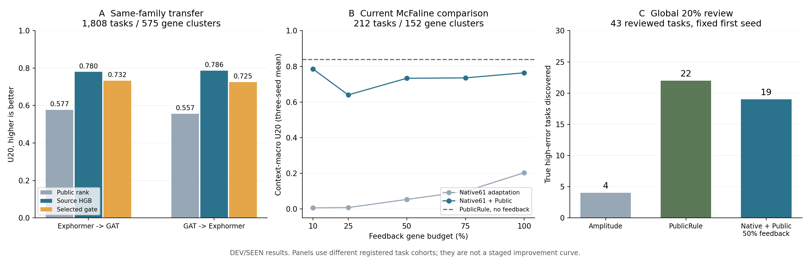

# SafeConf：10月8日汇报摘要

## 当前结论

公共真实实验是目前最稳的风险参照；旧模型错误在同体系预测器之间提供明确增量；加入公共信息能增强较完整的PertEMA特征适配。跨研究仍存在迁移边界，目标反馈目前保留为候选。当前默认继续采用PublicRule。

## 一、上次三项修复的真实状态

- Source：已完成通道训练侧经验秩变换与整簇标签置乱，两个方向、五个置乱种子均有结果；整簇移动率记录在FIT_AUDIT。
- Jackknife：删除多余平均项，另修正McFaline历史聚合合同；现在J、V及缓存预测距离对应同一参照，且验证了方差一致性。
- PertEMA：本次已补Native61与Native61＋Public，五个预算、三个种子、3-fold gene OOF，30个配置、120个XGBoost拟合，主种子配对5000次gene bootstrap。
- 交接事实：10月5日两项重算已落盘，之后没有持续SafeConf训练，第三项未及时完成；本次补齐并更新Git，不把上次阶段标记当成投稿目标完成。

## 二、修正后的Source比较

| 方向 | 任务／gene clusters | 公共秩通道U20 | 全Source U20 | 条件切换U20 |
|---|---:|---:|---:|---:|
| TxPert_Exphormer → TxPert_GAT | 1808／575 | 0.577 | 0.780 | 0.732 |
| TxPert_GAT → TxPert_Exphormer | 1808／575 | 0.557 | 0.786 | 0.725 |

这是完整外层gene留出的同family跨预测器实验。真实Source模型超过五个整簇置乱对照。条件切换低于始终Source，因此gate没有额外算法价值。公共分数为各外层训练侧转换后的通道，和旧原始距离值分开记录。

## 三、PertEMA适配加入Public的实际增量

以下为同一212任务、152个gene clusters、同一反馈记录、同一官方树配方。表格为三个种子的U20均值；原始每次结果与主种子CI分别保存。

| 反馈gene预算 | Native61 | Native61＋Public | 无反馈PublicRule |
|---|---:|---:|---:|
| 10% | 0.006 | 0.785 | 0.838 |
| 25% | 0.008 | 0.640 | 0.838 |
| 50% | 0.053 | 0.733 | 0.838 |
| 75% | 0.099 | 0.735 | 0.838 |
| 100% | 0.203 | 0.764 | 0.838 |

五个预算中，主种子Native61＋Public相对Native61的配对CI均为正。PublicRule仍是更强起点，不因反馈学习器使用了标签就自动替换它。

实现另落实两项公平条件：native_prediction_abs_mean重算自当前冻结预测；原来全缺失的training similarity在每个训练分区内重建。两个输入版本都使用相同gene等权。CD4特征转为McFaline控制特征、donor variance替换plate proxy、Pearson目标替换RMSE/CDF等仍是适配；本次没有复现完整官方conformal流程。

## 四、固定复核20%的实际用途

当前212任务，全局复核43项：PublicRule发现真实最高误差任务22项，幅度基线4项，多发现18项。排除后剩余平均误差相对幅度降低7.07%。

U20主表按context等权汇总；上述收益为全部任务统一排序。两种评价单列，避免把context内筛选与全局复核混为同一个数字。2,993任务混合历史队列的旧冻结回顾另保留：公共方法相对幅度多发现33项严重错误。

## 五、可靠性和独立研究边界

E258的1,530个合法验证记录用于独立donor参照偏差诊断。修正J仍与偏差正相关，但与历史分散度V的Spearman约0.9998；因此没有把它包装成新可靠性核心。McFaline候选按正确效应聚合重新计算。

E182有36/40任务、18/20 genes可评分，公共规则没有稳定超过幅度；SAMS已完成不同预测机制检验，但Source尚未稳定超过强公共规则。这些结果用于定位迁移条件；当前没有取得新的未见研究正向确认。

## 六、建议明天口头汇报

> 我们研究的是：一个新扰动预测器尚无自身错误记录时，能否借助公共真实实验和旧模型错误，在有限复核预算下发现严重错误。目前公共参照在McFaline上有明确实际收益；加入公共历史能显著增强现有错误学习器；真实旧模型错误在GAT与Exphormer双向迁移中超过公共和置乱对照。当前采用公共规则作为默认，Source和Target按场景验证后启用。下一步集中补不同family／研究的迁移条件和冻结后确认，不再堆新网络。

## 七、下一项具体工作

1. 将已完成SAMS同任务结果与修正Source证据绑定，明确同family和跨family两种证据层级。
2. 从已登记资产中锁定一个预测能力合格且信息合同闭合的外研究迁移验证；无新大型训练。
3. 先登记任务、Public来源、Source错误与采用门，再评分；保留E182负结果。
4. 正文和PDF继续暂停。

## 复现

```bash
OMP_NUM_THREADS=4 OPENBLAS_NUM_THREADS=4 MKL_NUM_THREADS=4 /home/miniconda/bin/python tools/scripts/run_safeconf_native_public_current_v1.py --output /home/yyf/runtime_artifacts/safeconf_impl_20261004_v1/native_public_current_reproduce_v1
OMP_NUM_THREADS=4 OPENBLAS_NUM_THREADS=4 MKL_NUM_THREADS=4 /home/miniconda/bin/python tools/scripts/build_safeconf_meeting_receipt_20261008.py
/home/miniconda/bin/python -m unittest tools.tests.test_safeconf_review_repair -v
```

## 汇报图



用tools/scripts/plot_safeconf_meeting_results_v1.py重画；SVG可直接放入演示文稿。
