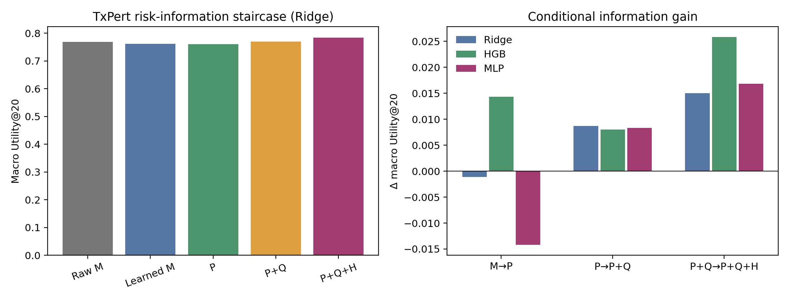

# SafeConf｜TxPert 成熟上游第一版主结果

**完成时间：2026-09-28｜1808 个主任务｜4 个整细胞背景留出｜240 次风险模型拟合｜2000 次扰动基因聚类重采样**

## 结论

在成熟 TxPert STRING-GAT 上，当前最佳方法是 **Ridge P+Q+H**。它以 15 个原始特征及 15 个缺失标记为输入，共 31 个参数；不需要复杂网络，也不需要强制幅度残差结构。

| 方法 | 四背景宏 U20 | 四背景宏 Spearman | 风险 RMSE |
|---|---:|---:|---:|
| 原始预测幅度 M | 0.7682 | 0.7420 | — |
| Ridge，仅学习 M | 0.7616 | 0.7393 | 0.01400 |
| Ridge，当前预测 P | 0.7605 | 0.7520 | 0.01370 |
| Ridge，P + 历史支持 Q | 0.7692 | 0.7623 | 0.01346 |
| **Ridge，P + Q + 历史内容 H** | **0.7842** | **0.7709** | **0.01329** |
| HGB，P+Q+H | 0.7727 | 0.7556 | 0.01346 |
| 小 MLP，P+Q+H | 0.7745 | 0.7610 | 0.01347 |

最终 Ridge 相对原始幅度：

- U20：`+0.01598`，四个背景全部正向；按扰动基因聚类重采样的 95% 区间 `[-0.02630, +0.05860]`；
- Spearman：`+0.02897`，95% 区间 `[+0.01183, +0.04797]`；
- 各背景 U20 增量：K562 `+0.00534`、RPE1 `+0.00536`、HepG2 `+0.02167`、Jurkat `+0.03154`。

因此，当前最强结论是：**SafeConf 的预测信息与公共历史在四个观察背景上稳定提高了任务风险排序；固定 20% 复核预算的点估计也在四背景全部提高，但区间仍需要更多独立背景缩窄。**

## 信息增量

| 同一 Ridge 的递增比较 | ΔU20 | ΔSpearman | U20 正向背景 |
|---|---:|---:|---:|
| 学习 M → 当前预测 P | −0.00109 | +0.01269 `[+0.00348,+0.02330]` | 3/4 |
| P → P+历史支持 Q | +0.00869 | +0.01031 `[+0.00195,+0.01881]` | 3/4 |
| P+Q → P+Q+历史内容 H | +0.01499 | +0.00864 `[−0.00123,+0.01798]` | 3/4 |

非线性对照给出互补证据：HGB 加 Q 时四背景 U20 全部正向（宏 `+0.00800`），继续加 H 时仍四背景全正向（宏 `+0.02581`）。小 MLP 没有超过 Ridge，故不升级网络规模。

## 第一版方法定义

- `P`（当前预测）：预测 RMS 幅度、四种子分歧和半径、预测效应的绝对均值、有符号均值、标准差和绝对值 95% 分位数。
- `Q`（公共历史支持）：来源扰动细胞数、来源背景数、来源 batch 总数、单个来源背景的最少细胞数。
- `H`（公共历史内容）：来源真实效应幅度、来源间效应离散度、预测与来源平均效应的距离、预测与来源效应的余弦一致性。
- 学习器：Ridge `alpha=10`；缺失值由训练折中位数填补并带缺失标记；在每个冻结目标上按扰动基因做五折风险学习。
- 输出：目标任务的预期 RMSE 风险；按风险排序后用于固定预算人工复核或实验优先级安排。

本批每个目标的上游和公共历史均在目标真值释放前冻结；向量复算与归档值的最大差小于 `3.5e-9`。风险学习使用同一目标内其他折的已发布错误标签，因此它对应“上游部署后已有历史反馈”的监督场景。Error Memory 没有作为单独输入进入。

## 下一步已经由结果决定

1. 固定 Ridge P+Q+H 为第一版主候选，P+Q 为关键消融，原始幅度为强基线；HGB 保留为非线性对照，小 MLP 停止扩容。
2. 在 TxPert Exphormer 上原样复现，检验结构变化后增量是否保持；不改变输入、切分、模型或预算。
3. 化学线上先使用能力门筛选上游。现有 CPA 版本不进入正向主表；继续搜索可复用的合格化学预测，失败版本保留为压力测试。
4. 后续冷启动实验需要跨目标训练或新背景；当前四个目标上不能把同目标五折监督结果改称零标签冷启动。

## 复现文件

- 执行合同：`../TXPERT_RISK_BATCH_CONTRACT.md`
- 汇总：`SUMMARY.csv`、`TARGET_RESULTS.csv`、`INCREMENTAL_RESULTS.csv`
- 完整折外分数：`OOF_PREDICTIONS.csv.gz`
- 输入和切分：`FEATURE_TABLE.csv.gz`、`SPLIT_MANIFEST.csv.gz`
- 状态、环境和哈希：`RUN_STATUS.json`
- 运行脚本：`tools/scripts/run_stage2_txpert_risk_batch.py`

