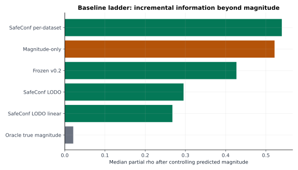
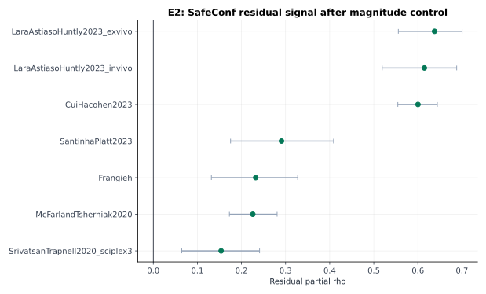
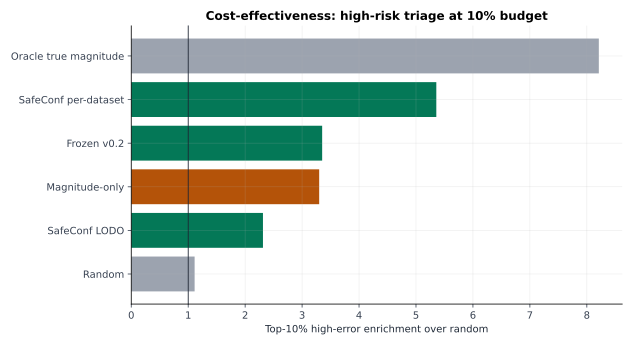
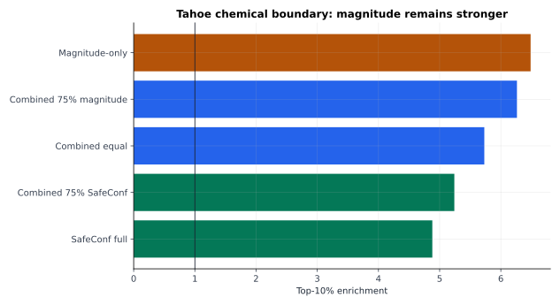
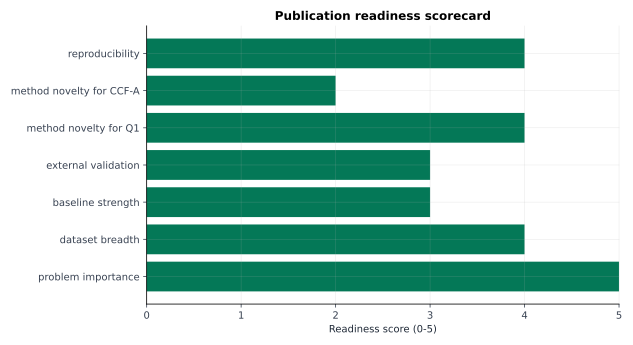

# SafeConf 一区 / CCF-A 投稿升级审计报告

生成时间：2026-07-07 05:55

## 1. 当前判断

SafeConf 现在适合按一区生信方法论文推进，暂不适合直接按 CCF-A 主会版本硬投。核心原因很清楚：现有证据能支持“预测后风险审计”和“实验复核优先级排序”，但还不足以支持“通用新预测模型”或“稳定击败所有强基线”。

当前最稳的论文主张：

> SafeConf is a task-level risk auditing framework for single-cell perturbation prediction. It identifies predictions likely to fail and supports selective verification under limited experimental budget.

中文表达：SafeConf 的职责是给已有扰动预测结果做风险审计，告诉研究者哪些预测更可能错、哪些结果值得优先复核。

## 2. 现有证据中最能打的部分

- 七主数据集：formal corrected 结果支持 SafeConf 风险信号在多数数据集中为正。
- E2 magnitude residual：7/7 个数据集在控制 predicted magnitude 后仍为正，说明 SafeConf 并非只是在重复“扰动幅度越大越容易错”。
- 成本有效性：top-risk triage 能把有限复核预算集中到高错误任务上，适合讲“湿实验资源有限时如何决策”。
- Tahoe chemical：SafeConf 能筛高错误任务，但 magnitude 更强。这一结果应作为边界写入论文，而不是藏起来。
- E8b 外部证据：已有外部 benchmark 关联证据，但还需要任务级冻结外部验证来提高一区安全性。

## 3. 最危险的问题

1. Tahoe chemical 中 magnitude top-10 enrichment = 6.49，SafeConf full = 4.88。如果论文写成“SafeConf 全面更强”，会被审稿人直接打穿。
2. 当前外部验证偏聚合关联，缺少冻结任务级独立验证。
3. CCF-A 需要更强方法学形式。当前 SafeConf 是优秀的可靠性工程框架，但还需要 selective prediction / conformal risk control 才更像 AI 方法论文。

## 4. 投稿路线

优先路线：Bioinformatics / Briefings in Bioinformatics / PLOS Computational Biology。  
高风险冲刺：Genome Biology / Cell Systems，需要补生物案例。  
CCF-A 路线：AAAI / IJCAI / NeurIPS/ICML 风格，需要把 SafeConf 升级为可控风险选择性预测方法。

## 5. 下一轮实验优先级

| priority | gap | why_it_matters | action | deliverable | status |
| --- | --- | --- | --- | --- | --- |
| 1 | SafeConf vs magnitude 的边界仍会被审稿人追问 | Tahoe chemical 中 magnitude 更强；必须把边界变成可信叙事，而不是让审稿人觉得我们回避。 | 新增统一强基线审计：报告 SafeConf、magnitude、support、context、disagreement、combined；按 gene / chemical / cross-context 分层。 | E9_STRONG_BASELINE_AUDIT.csv + Fig: baseline ladder by domain | next experiment |
| 2 | 外部验证仍偏聚合层面 | E8b 说明外部 aggregate association，但一区审稿人会想看冻结外部任务级验证。 | 接入一个冻结 benchmark：优先 scPerturBench 可落地子集；失败也要形成资源审计和可复现实验日志。 | E10_EXTERNAL_TASK_VALIDATION/ | next experiment |
| 3 | 方法学贡献需要从打分推进到可控风险 | CCF-A/更高一区需要更像 ML 方法，而不只是经验特征组合。 | 已生成 retrospective selective prediction audit；下一步补 calibration split 与 risk-control guarantee。 | E11_selective_prediction_audit_20260707/；formal conformal guarantee 待补 | audit generated; guarantee pending |
| 4 | 生物学故事仍偏方法验证 | Genome Biology/Cell Systems 等更看重一个可解释 biological case。 | 选择 2–3 个高风险任务做案例：预测器分歧、历史支持、细胞背景、通路/marker 是否解释错误。 | E12_BIOLOGICAL_CASE_STUDIES/ | paper narrative |
| 5 | 代码与结果虽然多，但投稿时需要一键复现边界 | 审稿人和编辑会把可复现性当作加分项；也能保护自己不被质疑挑结果。 | 建立 paper/ 级别 manifest：每张主图对应源 CSV、脚本、commit、运行命令。 | PAPER_REPRODUCIBILITY_MANIFEST.md | engineering |

## 6. 自动生成文件

- HTML 工作台：`Q1_PUBLICATION_WORKBENCH.html`
- 强基线阶梯：`tables/TABLE_Q1_BASELINE_LADDER_SUMMARY.csv`
- E2 增量价值：`tables/TABLE_INCREMENTAL_VALUE_E2.csv`
- Tahoe chemical 边界：`tables/TABLE_TAHOE_CHEMICAL_BOUNDARY.csv`
- 投稿路线：`tables/TABLE_TARGET_VENUE_STRATEGY.csv`
- 补实验清单：`tables/TABLE_Q1_GAP_AND_ACTIONS.csv`

## 7. 图

- 
- 
- 
- 
- 
