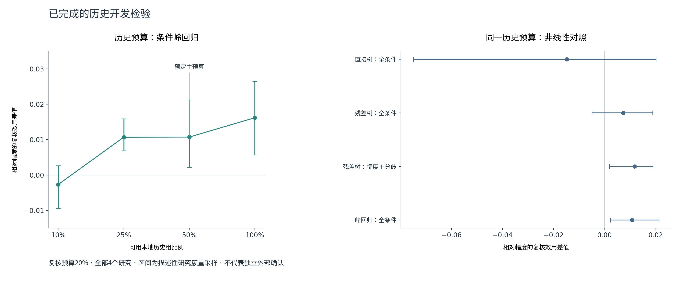

# 优化实验：每个改动对应一个可回答的问题

## 已完成的三轮

三轮先登记再执行，本轮主结果不因表现差而删除。使用相同历史开发资料；8196条重复评估记录、1083个去重研究–背景–扰动条件、4个研究。所有区间为研究簇重采样的描述性区间；4个研究不足以构成广泛外推保证。

| 实验 | 改动 | 主要候选相对幅度的20%复核效用差值 | 描述性95%区间 | 预定开发门 |
|---|---|---:|---|---|
| E225，160次拟合 | 不用目标研究误差训练评分器，比较4组原始特征 | −0.000685 | [−0.033003, +0.018641] | 未通过 |
| E226，960次拟合 | 允许本地其他扰动组的已知误差，用50%可用历史组校准 | +0.010737 | [+0.002222, +0.021261] | 未通过：未达到0.02，且未稳定超过MD/MDH |
| E227，720次拟合 | 同样历史预算下，改用直接预测风险的非线性树 | −0.014885 | [−0.075011, +0.020086] | 未通过 |
| E228，12次拟合 | E201四个目标背景轮流留出，只用其余背景的已知误差 | +0.017608 | [−0.015783, +0.054148] | 未通过：2/4目标正向 |

效用是相对随机复核和理想复核的归一化指标。+0.010737不等于预测准确率提高1.07%，也不是已证明节省湿实验。

四组特征：M只用幅度，MD增加分歧，MDH再加背景新颖度与支持稀缺，MDH_condition再加场景条件。这里方法缩写中的H是历史字段集合，**不同于E201单项跨背景离散度H**。E225/E226/E227尚未实现概念图全部G_src、离散度和细胞计数特征。

结果入口：[E225报告](../../实验结果/E225_raw_evidence_residual_ranker_20260922/REPORT.md)、[E226报告](../../实验结果/E226_local_history_calibration_20260922/REPORT.md)、[E227报告](../../实验结果/E227_local_nonlinear_ranker_20260922/REPORT.md)、[E228报告](../../实验结果/E228_target_holdout_history_ablation_20260922/REPORT.md)。每个目录都有执行前协议、状态、汇总CSV；大分块表用无损压缩留存。

## 从真实结果得到的优化线索

1. **本地误差资料值得继续验证。** E226在固定主预算下相对幅度有改善，但比MD多出的效用为+0.00720，区间[−0.00405,+0.02014]；比MDH多+0.00620，区间[−0.00491,+0.01958]。现有结果不能把收益全部归给历史信息或条件项。
2. **保留幅度、学习补充部分，比直接替换排序更有希望。** E227直接预测树在Santinha的效用从幅度0.47715降至0.37238；同一全特征残差树为0.46528，岭回归条件模型为0.47715。其他研究也完整显示在CSV。这里不删除Santinha，也不把残差一定更强写成定理。
3. **更复杂并未自动更好。** E227辅助臂“残差树＋幅度/分歧”相对幅度+0.01170，而加全部条件字段为+0.00726。前者只是辅助开发发现，不更换本轮主要候选，也不证明历史信息永远无用。
4. **需要隔离两种历史库作用。** E226增加的是可供评分器学习的已知误差任务，不是向生物学参考库补入更多细胞。这两个实验不能互相替代。
5. **目标背景留出给出方向但没有稳定性。** E228的历史字段在K562/RPE1/hepg2/jurkat轮留出中只在2个目标上超过幅度；+0.017608的点估计不能替代独立外部确认。历史特征可能需要目标域可比的来源条件，不能直接宣称跨细胞背景通用。



[SVG](./figures/04_history_and_models.svg) · [PDF](./figures/04_history_and_models.pdf)

E226历史预算10%/25%/50%/100%时，条件岭回归相对幅度的效用依次−0.00268/+0.01071/+0.01074/+0.01620。每个比例指**可用校准组**的比例；外层20%扰动组始终用于测试。因此100%仍约是全部组的80%，不是把测试答案全部用于训练。不能看见25%为4/4正向后再改主预算。

## 数字审计

[复算审计](./RESULT_AUDIT.json)重新从全部分块表计算三轮研究汇总与区间；E226与E227相同岭回归臂复算一致。240个校准划分记录均核查了训练/测试扰动组不重叠。E225预测文件不含误差字段，哈希与原运行记录一致。

E226固定一种方法、一个随机种子、一个历史比例和一个复核预算，有1376个测试块，188块仅有1个任务。单任务块无法判断排序优劣，效用保留缺失；统计不拿它们填0或1。REPORT的33840是跨预算/方法/种子重复记录后的缺失行总数，不是33840个真实独立任务。新增修复显式处理“已复核全部任务、没有剩余任务”的指标，避免除0告警；原主要效用不变，原运行SHA保留。

## 为什么现在改这些

| 问题 | 本轮操作 | 判断方式 |
|---|---|---|
| 幅度已经很强 | 给幅度单项同等学习与调参预算 | 完整模型要超过这个强对照，而不只是原始幅度 |
| 场景硬门可能过拟合历史结果 | 场景与特征交互由内层研究学习 | 比较全局与条件模型，外层研究全部报告 |
| 历史分数已经含幅度与目标验证标签 | 输入改为原始预测与支持字段 | 不把旧校准信息误称独立历史贡献 |
| max融合存在大量同分 | 主评价使用等概率同分抽取的精确期望 | 避免任务ID/CSV排序制造增益 |
| 记录重复且来自少量研究 | 外层按研究分开，区间按研究聚类 | 不把8196行当作8196次独立证据 |

## 原则明确的后续，不根据测试结果随意换数据

### 历史库容量与多样性

保持上游预测和目标任务完全相同，仅改变允许的来源参考库：1/2/3背景，以及每背景固定比例细胞。每一档只用来源数据抽样，保留缺失标记，重算历史均值/离散度/覆盖特征。比较幅度、无历史模型、加历史模型。

这是下一项独立开发协议，**本轮尚未运行**。E187的25%/50%/75%/100%同时改变上游训练条件，不能冒充纯历史库容量实验；不能把降低特征数或打乱历史项说成真实增加数据。

优先在已有E201来源底表和固定预测上实施，逐目标排除目标扰动结果；按来源背景数与每背景细胞数分别改变。E228已经完成目标背景外层留出，但没有通过门。若缺少逐来源效应和细胞级统计，先建立可追溯底表，不能靠手工缩放G_src/H/N/C制造“扩库”。已有数据够做开发，是否足以支持跨研究结论仍取决于独立来源和冻结后的确认。

### 近邻方法对照

固定PertEMA软件提交、许可证、输入特征与训练协议。首先判断能否适配当前误差对象；适配不成立时报告原因，不填造分数。PRESCRIBE的联合预测不确定性与外挂评分不同，比较需同任务同误差，模型训练成本单独报告。

**本轮文献和README核查已完成，完整软件复现未运行。** E225不能改名成PertEMA对照。

### 外部确认

E208保持原固定模型和原评分规则。训练完成→预测与评分封存→完整性检查→按既有协议解封评价。
不得把新E225公式偷偷替换E208主方法；若添加新规则，必须单独写增补协议和时间戳，且只能在未读取其测试标签的条件下登记为次要分析。全新研究最适合确认开发后选择的唯一候选。

## 对“100%发”的执行答复

没有一个实验数、效用阈值或框架图能产生100%录用保证。可落实的交付是：唯一可运行方法、同合同强基线、完整数据与失败边界、独立评价和可复算图表。
本项目当前尚未闭合这条证据链；本轮给出四轮实际结果，不以“后面一定能发”替代结果。某个消融失败就保留记录、在下一轮按证据简化模块；重新提出的假设继续属于开发，不能无限使用同一测试集直到显著。

## 复算与文件

从仓库根目录执行。原始输入是E187的`tables/E187_CARTESIAN_TASK_CERTIFICATES.csv`，SHA-256见各实验状态。若本机没有原始大表，可以直接用已提交的压缩分块表复算摘要：

```bash
python tools/scripts/audit_e225_e227_results.py
python -m unittest discover -s tools/tests -p 'test_e22[567]*.py' -v
python tools/scripts/build_safeconf_design_figures_20260922.py
python tools/scripts/run_e228_target_holdout_history_ablation.py \
  --input /path/to/E201_TASK_METRICS.csv \
  --output docs/实验结果/E228_target_holdout_history_ablation_20260922
```

需要从输入重新训练时，运行对应`run_e225_raw_evidence_residual_ranker.py`、`run_e226_local_history_calibration.py`、`run_e227_local_nonlinear_ranker.py`，传入`--input 输入CSV --output 新结果目录 --workers 4`。程序拒绝覆盖已有完成结果。Python和依赖实际版本在审计JSON；完整结果用无损`.csv.gz`留存，每份有原文件与压缩文件SHA，不把几十MB重复CSV直接加入Git。
