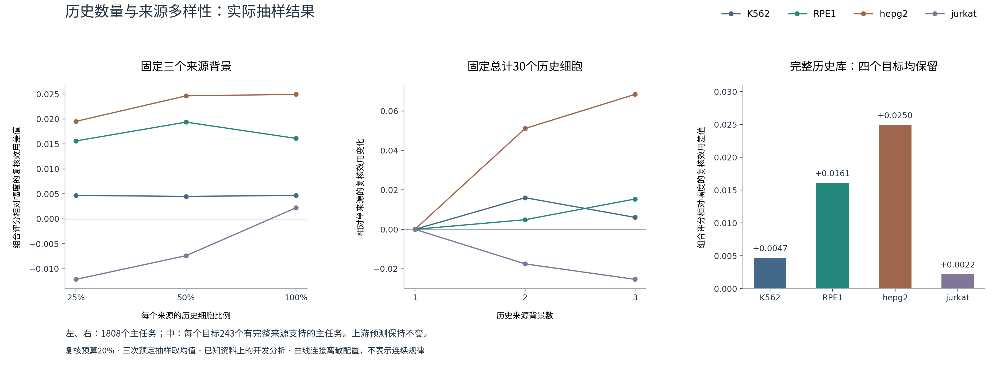

# Jev、历史数据库与SafeConf：这次讨论的完整答复

更新：2026-09-22。建议先读本文，再看[完整架构与公式](./README.md)。本文同时记录已完成结果、审计更正和后续实验，不是论文正文。

## 1. 你对项目的理解，哪里准确

“上游模型预测扰动结果，SafeConf利用模型输出和历史资料，对这些预测的风险排序”，这个理解准确。

需要补清两点：

- **排序的对象是任务。** 例如“某细胞背景中的某个基因受到干预”是一项任务，上游给出一整列基因的预测变化，SafeConf为这一项任务产生一个风险分。这个分数不是逐个基因的表达值。
- **当前估计的是误差大小的相对次序。** 一个任务排在前面，表示按当前规则应优先检查；不表示已经知道它错了，更不表示它有80%的错误概率。若要报概率，需要先定义“多大误差算错误”，再单独校准。

评分也必须说明对应谁的误差：某个模型、多个预测的平均值，或一个注册模型家族，是三个不同对象。E201使用家族均方根误差；不能把这个结论自动转给任意单个模型。

这里有两条可以独立建设的产品能力：无需重训上游的风险排序，以及在明确条件下的误差边界/停止放行。前者靠实际排序效果评价，后者要证明所约束的误差对象和假设。不能用经典下界公式代替排序增益。

## 2. 你说的Jev找到了，可以借鉴什么

确认是Diogo Almeida团队在2026年9月15日发布的TypeSafe Jev，不是JEPA。官方把它定位为输出结构化决策和概率的模型，强调受约束输出与效率。其工作流对照使用大模型输出作参考，并非本项目中的真实扰动测量；官方的类型正确性保证也不能推出决策永不出错。[官方发布说明](https://typesafe.ai/blog/introducing-system-one-models-and-jev)。

| 要比较的地方 | Jev发布内容 | SafeConf应落实的内容 |
|---|---|---|
| 输出 | 结构化选择及相应概率 | 风险分、适用范围、来源缺口和复核顺序 |
| 如何评价 | 官方定义的软件工作流与参考答案 | 固定任务上的真实误差、同预算复核效果 |
| 可靠性 | 官方提出校准目标 | 需要自己测“报出的风险是否可信”，不能照搬承诺 |
| 效率 | 软件调用时间与费用 | 记录评分耗时、历史检索耗时、内存与复核预算 |

对本项目最有用的启发是把输出接口、决策目标和成本指标写清楚。没有必要为了借鉴Jev，把单细胞表达向量改成文字再调用语言模型。Jev也不构成SafeConf算法新颖性的证据。

## 3. 历史资料越多，为什么未必越好

先区分两种资料：

1. **历史生物实验。** 某背景中某个扰动的真实表达、匹配对照、来源批次和细胞数。它们用于建立参考效应和覆盖信息。
2. **历史预测误差。** 过去任务的预测、预测时可用的特征，以及后来测得的误差。它们用于训练或校准风险评分器。

前一种更多，并不自动等价于后一种评分器更准。E226增加的是第二种资料；刚完成的E230才是在实际改变第一种资料。

历史实验有四个要分别检查的方面：

| 方面 | 增加后可能带来的帮助 | 仍可能存在的问题 |
|---|---|---|
| 同条件细胞数量 | 参考平均效应估计更精确 | 多数细胞来自同一背景，外推范围并未增加 |
| 来源背景覆盖 | 了解不同背景下响应是否一致 | 新来源与目标差异大，简单平均可能引入偏差 |
| 扰动条件覆盖 | 更多目标任务有可检索的历史 | 同名基因不等于同剂量、同时间、同实验处理 |
| 独立研究与质量 | 检查跨批次、跨平台的可重复性 | 需要对齐表达尺度、对照和误差定义 |

在一个非常简化的均值估计例子中，均方误差约等于“方差/样本量＋偏差平方”。增加样本主要减少第一项；来源不匹配造成的偏差不会因此消失。这个例子帮助理解数据问题，不是SafeConf已证明的泛化定理。

目前E201有2008个任务，主分析1808个；来源覆盖为1/2/3个背景的任务分别为150/486/1372。规模足以做下面的容量实验，但只有这些背景还不足以代表所有单细胞研究。下一批数据的选择应服务于未覆盖条件和独立验证，不只追求文件总大小。

## 4. 已经实际跑完的验证

### 4.1 这次怎样检验历史库

E230保持所有上游预测不变，只改变允许使用的来源数据：

- 历史细胞取25%、50%、100%，使用固定的嵌套抽样（少量样本是大量样本的一部分）。
- 历史来源取1、2、3个背景，来源顺序由事先固定的种子决定，不能按结果选。
- 另外固定总共30个来源细胞，比较来自1/2/3个背景的区别。这个子分析只覆盖三个来源各至少有30个细胞的条件，四个目标各有243个主任务符合条件；其余任务仍留在全任务分析中。
- 每个目标只读取其他背景的扰动表达。目标真实误差在特征和评分封存后才用于计算指标。

方案与代码先提交到双远程`116cc9f`，再运行。E201此前已解封，因此这仍是开发分析，不能称为新的独立盲测。

### 4.2 本轮公式很简单

五项风险分：

\[
S=\frac{Z(D)+Z(G_{src})+Z(H)+Z[-\log(1+N)]+Z(C)}{5}.
\]

其中D是预测分歧，G_src是预测效应与历史平均效应的差异，H是历史响应跨背景的离散程度，N是来源扰动细胞数，C是来源背景覆盖缺口。Z表示在该目标配置的主任务内减均值、除标准差；常数项记0。

固定组合为：

\[
R=0.8\operatorname{rank}(M)+0.2\operatorname{rank}(S).
\]

M是预测变化幅度；rank表示同目标批次中的百分位次序。这样两部分处于相同数值尺度。没有历史支持时回退到幅度，缺失信息保留。80%/20%在执行前固定，没有从本轮网格里挑选最佳权重，也不宣称它是最优权重。

这正面回答了你的问题：**幅度可以进入公式，而且本轮已经作为主要部分实际验证。** 不是继续把幅度只当外部对照。

### 4.3 结果是多少

主指标是“复核排名前20%的任务，找到大误差的效果”。0接近随机复核，1对应理想的误差排序；不是表达预测准确率。

| 目标背景 | 只看幅度 | 固定组合 | 差值 |
|---|---:|---:|---:|
| K562 | 0.933770 | 0.938456 | +0.004686 |
| RPE1 | 0.608450 | 0.624569 | +0.016120 |
| HepG2 | 0.796280 | 0.821230 | +0.024950 |
| Jurkat | 0.736746 | 0.738968 | +0.002223 |

四目标等权平均差值为**+0.011995**，描述性95%区间[+0.003454,+0.020535]。相比同样固定比例的“幅度＋分歧”，差值为+0.029657，四个目标也都为正；这是辅助对照，不能替换更强的主对照幅度。

**增加历史细胞数量确实有小幅帮助。** 固定三个来源，从25%增加到100%细胞，组合分数的效用平均增加+0.005070，四个目标同方向。

**增加背景数量没有同样一致的效果。** 固定总30细胞，三个来源相对一个来源平均+0.016115；HepG2改善较大，Jurkat下降−0.025362。这个差异说明来源处理值得研究，尚不能判定下降就是某个具体生物机制导致。

[下载PNG](./figures/05_real_history_capacity.png) · [SVG](./figures/05_real_history_capacity.svg) · [PDF](./figures/05_real_history_capacity.pdf)

本轮预定门要求完整历史组合至少超过幅度0.02，实际为0.011995，因此保持“未通过”。0.02是本轮内部开发标准，不是期刊统一门槛。这个结果有可用的正向信息，但四个已知背景上的小幅提升不能直接换成外部普遍有效或录用结论。

### 4.4 从结果反推，应该改哪里

现在能支持的改动顺序是：

1. **保留幅度基础排序，检验历史带来的校正。** 本轮组合有正向结果；单独五项风险并不比幅度强。E227直接用复杂模型替换排序曾平均变差，不能只靠加大模型解决。
2. **检查参考信息的可靠程度。** 样本多但来源偏、单来源却填入离散度中位数，这些情形应在输入中区分。它们不能都被当成同等可靠的历史证据。
3. **把数量和多样性分开。** 本轮已用固定30细胞实验做到这一步。下一次来源选择只能依靠预测前可用的信息，例如对照表达相似性和批次质量，不能用目标真实误差选来源。
4. **再考虑学习权重。** 权重允许调整；应在开发资料内部按研究或扰动分组选择，并与同等调参预算的幅度小模型比较。选定之后用未参与选择的数据评价，不能把选参数和报最终效果放在同一批答案上。

还有一个公式层面的具体问题：当N比较大时，所有任务的N都乘同一个比例，−log(N)主要只增加一个常数；随后按当前批次重新标准化，这个常数会被消掉。因此当前的数量项主要表达“相对稀缺”，很难单独表达“所有任务的参考估计都变精确了”。这是该特征变换的数学性质，不是本轮已经证明的性能下降原因。后续应比较绝对数量/均值估计精度的表达方式，并保留原公式作对照。

## 5. 别人是否已经做过，三项贡献从哪里来

“对扰动预测做事后误差评估”已有高度接近的公开工作。PertEMA软件提供事后误差小模型、校准和风险覆盖分析；其README说明换研究需重新拟合，目前没有配套论文。它必须作为近邻方法核对，不能忽略。[作者仓库](https://github.com/OfficialBishal/PertEMA)。

PRESCRIBE已在NeurIPS 2025研究单细胞扰动预测与不确定性；因此“给扰动预测附加置信度”也不能写成无人做过的新问题。[正式论文入口](https://papers.nips.cc/paper_files/paper/2025/hash/d6383e7643415842b48a5077a1b09c98-Abstract-Conference.html)。

这不等于SafeConf没有发表空间，但最普通的“幅度＋分歧＋小模型”本身不够区分现有方法。三条值得继续建立的贡献线如下，**目前不能把它们全部列成已证明的创新点**：

| 候选贡献 | 需要具体新增什么 | 与普通做法区分的证据 | 现在做到哪 |
|---|---|---|---|
| 可控来源的历史证据建模 | 区分来源覆盖、估计精度和背景不匹配；处理缺失 | 同数量不同来源、同来源不同数量；完整隔离；超过等权历史汇总 | E230容量干预已完成，来源质量模型待做 |
| 幅度基础上的条件风险校正 | 学习什么时候、修正多少；显式保留幅度强基线 | 相比同预算M、MD及近邻误差模型有稳定增量；固定方法跨场景验证 | 固定80/20有开发增益，通用条件模型未完成 |
| 可核对的风险决策与适用边界 | 对指定误差对象给出排序、阈值或边界，记录成本 | 固定复核预算、校准表现、独立研究和失败场景；逐模块消融 | 排序评价和证书原型已有，完整外部链未闭合 |

这三项不是把一个公式拆成三项就算创新。来源方法要优于简单来源平均；风险校正要优于强小模型；决策层要有实际可测增量。来源清单、日志和复现包是科研质量要求，单独通常不能充当核心方法贡献。经典集成误差分解也不能重新包装为新定理。

## 6. 本次审计还解决了什么

E228把四个目标表拼接后训练误差评分器，看似按目标留出；但训练特征的历史参考仍用到了外层目标的实验表达。例如留出K562时，其余1428个训练任务的来源均包含K562。**这只能算评分器层诊断，不能作为完整流程的未见背景验证。**

已经更正入口和报告，保留全部原数字；E229不再允许沿用这个输入继续跑“跨背景无泄漏”实验。E230没有拟合跨目标误差评分器，逐目标使用物理排除自身扰动的来源数据。其来源哈希、固定预测、固定数量、63720行特征、全部指标均完成复算，原满容量特征误差最大约3.9×10⁻⁹。

这也明确了下一步学习模型的必需条件：在每个外层目标的允许来源范围内，重新生成上游折外预测和风险特征，然后训练评分器；不能继续直接拼接现成E201表，声称完整流程隔离。

## 7. 接下来做什么，怎样避免继续无效调参

### 下一轮开发：来源质量与公式表达

在固定预测、固定任务和历史预算下，比较：原等权历史、按来源估计精度加权、按目标对照相似性加权。两类权重都只使用允许的来源和目标对照信息；来源少、估计方差大时保留缺失/低支持标记。分别比较原批内标准化数量项与训练阶段固定尺度的数量/精度项。

先做这个受控对照，再决定是否训练完整条件门。相似性未必能代表扰动响应相似，估计方差小也不代表偏差小，所以它们是待检验方案，不直接给结论。不能读完新测试结果再决定报告哪一种。

### 同合同强对照

幅度本身、幅度校准器、幅度＋分歧小模型、历史小模型、PertEMA适配版。数据划分、目标误差、可用校准标签、调参次数和复核预算必须一致。软件仍需固定版本、检查许可证和输入要求；目前没有把自己写的树模型冒充PertEMA复现。

### 外部确认

E208原方案继续运行，未被新开发公式替换。截至本次检查，5个正式训练任务中4个完成，最后一个仍在训练；测试扰动真实表达读取为0。训练进程确实存在且轮次在增加，不能把监管脚本的0%CPU误判为训练停止。

新候选若使用E208，需要在读取测试结果之前单独登记，并证明其训练资料与来源隔离；否则继续使用新的独立研究确认。外部数据不能在被反复用于选择方案之后仍被称为独立确认。

## 8. 对发表目标的直接判断

当前状态是“有意义的问题、已有实现、找到了小幅一致的开发增益，同时还存在近邻方法和独立验证缺口”。E230让“历史能不能帮助”多了一项直接实验，而不是只靠相关系数推测。它还没有完成“新增方法优于近邻方法，且在新研究复现”的关键证明。

按计算机方法论文组织，真正要提交的是一套固定可运行的方法、明确区别于已有工作的技术、公平对照和可复算的有效性证据；不需要为了凑三项而编三项创新。CCF分类与期刊分区是不同体系，学院认定仍需按具体刊物和当年要求核对。没有内部阈值能保证录用；后续工作应围绕关闭上述具体证据缺口，而非反复改口给出保证。

### 文件与复现

- [完整输入输出与公式](./README.md)
- [文献核查](./RELATED_WORK.md)
- [所有开发实验入口](./EXPERIMENTS.md)
- [E230执行报告](../../实验结果/E230_history_capacity_20260922/REPORT.md)
- [E230复算审计](../../实验结果/E230_history_capacity_20260922/RESULT_AUDIT.json)
- [E228来源复查](../../实验结果/E229_quality_gated_history_router_20260922/PROVENANCE_AUDIT.json)
- [本轮提交说明](./CHANGELOG.md)
