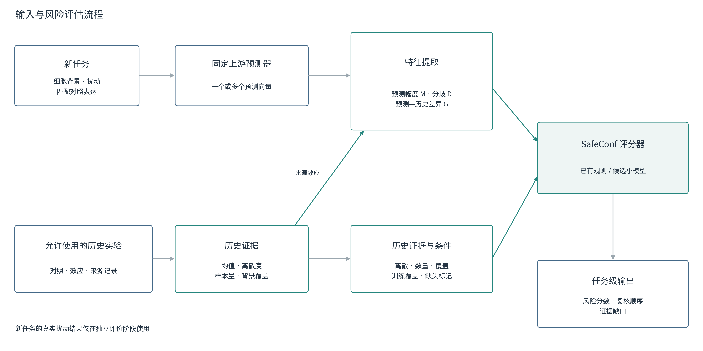
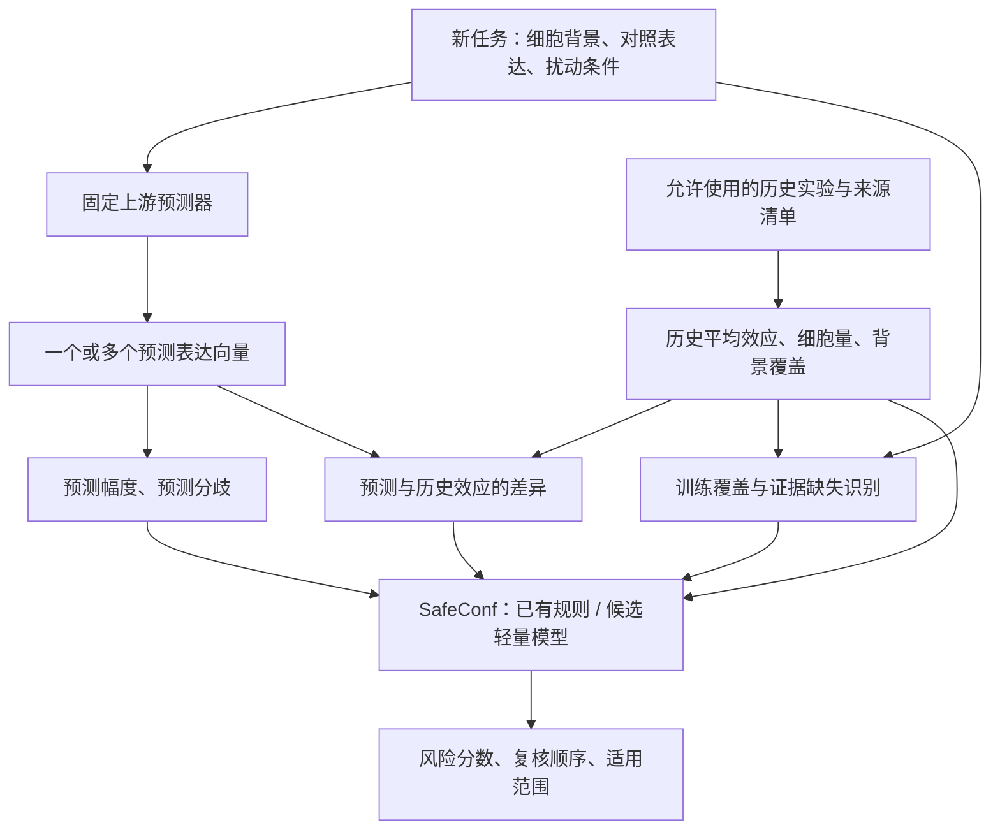
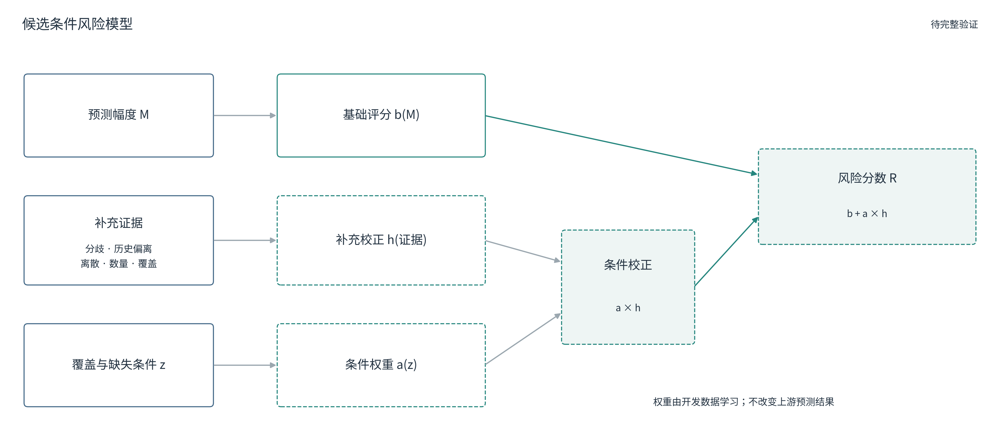
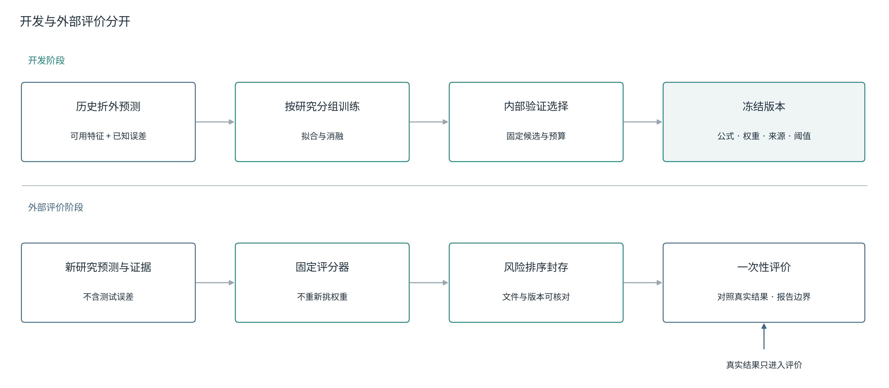

# SafeConf：输入、历史证据、条件风险模型与目前能成立的结论

更新：2026-09-22。这里保存本次讨论的完整设计。**架构、代码实现、开发结果、外部确认分开标注**。这是研究设计与学习记录，不是论文正文，不宣称已经录用或已证明全场景优越。

## 先从这里读

1. 本文：输入到输出、历史数据、小模型、公式和理论。
2. [已有工作与新颖性核查](./RELATED_WORK.md)：谁已做过、重合在哪里、什么差异仍待验证。
3. [实验执行与验收](./EXPERIMENTS.md)：针对当前问题的对照、停止条件和结果入口。
4. 图可以直接放入汇报：下方PNG、同目录SVG/PDF；生成代码在[绘图脚本](../../../tools/scripts/build_safeconf_design_figures_20260922.py)。所有图为自绘，白底、统一字体，没有复制论文图片。
5. [这次讨论的直接答复：Jev、历史库和三条方法贡献](./JEV_AND_RESEARCH_REVIEW.md)：包含真实历史细胞抽样的最新结果，以及由结果支持的下一步。

**晚间审计更新：E228只隔离了评分器的误差标签，未隔离其训练特征的整个来源链，不能作为全流程未见背景的证据。E229已停止沿用该输入；E230改为固定预测、真实抽样来源细胞，已完成并复算。**

## 一、现在究竟属于哪一种状态

“有人做过就不能发”与“有人做过所以没有意义”不能划等号。预测可靠性已有大量方法；后续工作需要给出可辨认的新方法、条件、证据或用途。

当前的准确判断是：**问题有价值；已有原型和真实实验；完整的条件小模型仍在开发；还没有完成足以证明相对最接近方法之独立优势的证据链。**

| 层面 | 已核对的状态 | 不应混成什么 |
|---|---|---|
| 科学问题 | 扰动预测结果的可靠性差异值得研究，已有论文与软件正面处理 | 不能说问题首次提出 |
| SafeConf 基础实现 | 预测特征、历史支持、评分、冻结与评价已有代码 | 不能说只有一个想法 |
| 当前五特征分数 | E201已完成，原分数弱于幅度，控制幅度后仍有剩余关联 | 剩余关联不等于组合有实际收益 |
| 条件化方法 | E225跨研究、E226本地校准、E227非线性对照已完成；E228数值保留但撤回全流程目标隔离解释；E230历史库干预已完成 | 不能称已验证的通用自适应系统 |
| 投稿资格判断 | 需要原创增量、公平对照、独立确认和清楚边界 | 实现程序或内部PASS都不等于录用 |

不重新给项目换一个“必发”名称。本记录细化经验风险排序模块，**不自动取消既有家族误差证书分支，也不把证书当作新小模型的性能保证**。

## 二、完整流程

[矢量SVG](./figures/01_overview.svg) · [PDF](./figures/01_overview.pdf)

原讨论流程保留为可编辑图：

### 1. 输入到底是什么

一个任务记为 \(x=(c,p,x_0)\)：\(c\)是细胞背景（细胞系或细胞类型等），\(p\)是扰动条件，\(x_0\)是匹配的未扰动对照表达。药物任务还可能需要剂量和时间，但不能因为接口允许就声称这些场景已经验证。

**未见细胞背景不一定代表连对照细胞也不存在。** E201的协议允许目标背景对照，封存的是目标扰动后的表达；论文必须说清“未见”的对象。上游模型预训练见过的资料、任务训练见过的资料和SafeConf参考库覆盖是三个不同范围。

上游输出 \(\hat y^{(k)}\in\mathbb R^G\)：G个基因的预测表达；k表示模型成员。在E201中k是同一种TxPert结构的四个随机种子，不是四类模型。

若输出已经是变化向量，就直接使用；若输出是表达量，先减去同一表达尺度上的对照。基因顺序、归一化、单位必须一致，否则幅度和分歧都没有可比性。

### 2. 预测特征怎么来

定义平均预测 \(\bar y=K^{-1}\sum_k\hat y^{(k)}\)，变化向量 \(\hat\Delta=\bar y-x_0\)。

\[
M=\sqrt{G^{-1}\sum_g\hat\Delta_g^2},\qquad
D=\sqrt{(KG)^{-1}\sum_{k,g}(\hat y_g^{(k)}-\bar y_g)^2}.
\]

- M（预测幅度）：预测变化的整体大小。绝不等于已观察到的真实误差。
- D（预测分歧）：这些预测相互不一致的程度。只有一个确定性输出时无法估计集成分歧；不能把缺失的D写成“已知零不确定性”。
- E187的旧双预测器分歧是两者之间的RMSE；E201的D是成员围绕均值的均方根偏离。两成员时这两个量相差2倍，不能直接混用。

代码证据：[E201预测特征](../../../tools/scripts/run_e201_pretruth_risk_features.py)。

### 3. 两种历史资料，各做不同的事

**生物学参考库**保存历史真实实验：来源研究、细胞背景、扰动、对照、效应向量、细胞数量、批次等。它回答“这个任务有哪些可用参考”。

**误差训练表**保存过去未参与上游训练的任务预测、当时可用的风险特征、实际预测误差。它回答“哪些特征组合容易对应较大的误差”。这个表用于训练小评分器。

两者不能混成一个始终包含所有数据的“历史数据库”。每个外层实验都要重建允许来源清单；测试扰动结果不能流入参考效应、标准化、阈值或权重。

### 4. E201目前的参考库长什么样

预测K562时，来源取RPE1、HepG2、Jurkat；预测另一个目标时，相应更换来源。每个目标排除自己的扰动结果。

| 条目 | 已核对数量/定义 |
|---|---|
| 任务行 | 2008，含1808主任务和200敏感性任务 |
| 来源背景–扰动支持行 | 5238；不同目标的来源清单会重复引用历史条件，不能当作5238个独立实验 |
| 平均效应数组 | 2008×3352；行为任务、列为对齐基因 |
| 1个/2个/3个来源背景 | 150 / 486 / 1372个任务 |
| 跨背景离散度缺失 | 150个单来源任务无法实测，用预定中位数填补并保留标记 |

来源：[任务底表报告](../../实验结果/E201_txpert_multitarget_retraining_20260802/PRETRUTH_TASK_BASE_REPORT.md)、[构建脚本](../../../tools/scripts/build_e201_pretruth_task_base.py)。

对应历史特征为：\(G_{src}=\operatorname{RMSE}(\hat\Delta,\mu_p)\)（预测和历史平均效应的差异），H（历史效应跨背景离散），N（来源扰动细胞总量），C（背景覆盖缺口）。G_src必须同时用预测和历史，不能标成纯预测侧输入。

N很多不代表细胞背景覆盖充分；大量重复测量改善均值精度，不一定改善跨背景外推。H缺失也不能解释为H小。新数据应优先补独立背景、来源研究和缺少的扰动条件，再检查剂量/时间/平台是否可比。

### 5. 输出到底是什么

输出是任务风险分数、在指定复核预算下的顺序、可用特征和缺失信息。风险高低只对应注册误差对象，不直接等于生物学重要性、实验价值、疾病相关性或药效。

分数未校准时不能读成错误概率；先复核高风险预测，也不等于已经证明节省湿实验成本。停止放行需要有验证过的阈值或独立证书规则，不能仅凭分数超过0.8。

## 三、可以做成小模型吗

可以，称为**预测后轻量风险估计器**。它学的是误差/复核优先级，上游预测器继续负责表达预测。它属于后处理模型、元模型一类，并非这个分类本身有新颖性。

[矢量SVG](./figures/02_candidate_model.svg) · [PDF](./figures/02_candidate_model.pdf)

上一轮讨论的候选表达式保留：

\[
R_\theta(x)=b_\theta(M)+a_\theta(z)\,h_\theta(D,G_{src},H,N,C).
\]

| 符号 | 通俗解释 | 实现状态 |
|---|---|---|
| b | 只根据预测幅度给出的基础风险 | 幅度基线和轻量拟合已有 |
| h | 其他证据给出的补充校正 | E222有简化拟合；全部原始历史特征版本待实现 |
| z | 来源覆盖、是否未见背景/扰动、缺失标记等 | 旧实验有部分字段；部署需由训练清单计算 |
| a | 根据z决定补充部分的权重 | E224是手工门；完整可学习门未完成 |
| θ | 开发数据里拟合得到的权重 | 必须记录来源与选择过程 |

a可限制在[0,1]；h可为正或负。限制为非负只保证校正不降低数值，不保证更好的排序。b是否单调也是待验证的归纳偏好，不是由“幅度通常强”自动推导出的定理。

这个分解不唯一：对a和h作相反比例缩放可能给出相同R。若解释每个模块的“贡献”，需固定尺度、约束结构并作消融；不可直接把权重解释成生物机制或因果贡献。

当前更小、可以直接检验的实例是E225：\(R=m+\lambda h_\theta(m,d,\text{背景新颖度},\text{支持稀缺},z)\)。m、d是部署批次内百分位，h用开发研究拟合，lambda从内层研究选择。它只覆盖完整概念图的一部分，**不谎称已实现G_src/H/N/C全功能门控模型**。

## 四、三个历史版本必须分开

| 版本 | 实际输入/训练方式 | 当前解释 |
|---|---|---|
| E201五特征 | D、G_src、H、−log(1+N)、背景缺口的标准化均值 | M已计算但当时不进入五特征均值；没有训练这个等权评分器 |
| E187旧校准分数→E223/E224 | 旧分数先用该研究验证误差拟合“幅度+分歧”，再加结构新颖度 | 已含M且使用验证标签；不能称完全免校准的跨研究迁移 |
| E222轻量拟合 | 幅度、旧分数、分歧→岭回归/梯度提升树 | 原实验未通过；也不能忽略旧分数的上游校准来源 |
| E225原始证据拟合 | 幅度、分歧、历史覆盖原始特征，不输入旧校准分数 | 直接检验历史与场景项；开发结果见实验入口 |
| E226本地历史误差校准 | 用同研究其他扰动组训练轻量评分器，测试扰动组隔离 | 相对幅度有小幅改善；历史与条件项的独立贡献未通过 |
| E227通用非线性对照 | 与E226相同的主要历史预算，比较直接预测和残差式梯度提升树 | 直接预测主候选平均变差；复杂度本身没有解决问题 |
| E228评分器层目标留出 | 误差标签按目标分开，但训练特征仍引用外层目标的历史表达 | 原+0.01761保留；不能解释为全流程跨背景无泄漏验证 |
| E230真实历史库干预 | 固定上游预测，实际抽取来源细胞；无跨目标误差拟合 | 预定80%幅度＋20%五项风险相对幅度+0.011995，4/4正向；开发门仍未通过 |

E187/E223/E224中8196条记录是重复划分和不同训练比例的评估记录。按研究、背景、扰动去重为1083组条件，不能当成8196个独立条件，也不能当成TxPert四目标的新增盲测。

## 五、理论能支持什么

### 1. 目标可以明确写成条件风险

固定被审核预测器F、误差函数L和特征 \(\phi(x)\)：

\[
r^*(\phi)=\mathbb E[L(F(x),Y)\mid\phi(x)].
\]

F可以是一个指定模型、固定平均预测，或注册模型家族，但必须选定一个。E201家族RMS、E187两个RMSE的均值与平均预测误差是不同标签，不得合并解释。

在每个任务复核成本相同、目标是找出误差总量最多的固定k个任务时，按真实条件期望风险排序是最优的：若选中任务的风险低于未选任务，交换两者会增加期望捕获误差。这个交换论证是基本决策原理，不是新发现。真实湿实验价值还受成本、科学意义、可操作性影响，不能直接套用。

### 2. 更多信息在理想情况下有价值，但估计器可能学坏

对平方损失而言，在理想的精确条件期望层面，使用(M,H)的最优误差估计器的均方损失不会高于只使用M：旧函数属于新函数类的一部分。这依赖总体最优解，不保证有限样本训练器跨研究更好，更不直接保证top-k效用提高。

因此必须比较：同等调参预算的幅度学习器、增加预测分歧的学习器、增加历史证据的学习器、再加条件项的学习器。只超过原始幅度，不足以把增益归给历史证据。

### 3. 分歧下界与排序是两类结论

对同一真实向量y、固定非负和为1的成员权重w，有经典均方分解：

\[
\sum_k w_k\|\hat y_k-y\|^2/G
=\|\bar y-y\|^2/G+\sum_k w_k\|\hat y_k-\bar y\|^2/G.
\]

因此分歧下界的是家族均方根误差，不是平均预测的误差，更不能定位每个成员谁错。平均预测可能恰好抵消偏差。理论分解已有长期文献，项目的新意不能写成“首次发现分歧可下界误差”。

经典来源：[Krogh与Vedelsby，Neural Network Ensembles, Cross Validation, and Active Learning，NIPS 1994](https://papers.nips.cc/paper_files/paper/1994/hash/b8c37e33defde51cf91e1e03e51657da-Abstract.html)。本处是有限个向量的同一几何分解，不是复现该论文全部学习算法。

### 4. “分情况使用”不是天然保证

\(R=\max(m,s)\)确保R不小于m，但可能把一个低误差任务错误地排到前面。E224的规则来自看过E223结果后的探索，外层留出计算无法擦掉候选设计已经受这些研究结果启发的事实。四研究区间不能当成独立确认或普遍规律。

## 六、怎样优化才有判别力

[矢量SVG](./figures/03_development_validation.svg) · [PDF](./figures/03_development_validation.pdf)

1. 固定误差对象和部署输入，先回答“分数究竟审核谁”。
2. 用开发研究的折外预测建立误差训练表；上游训练样本的误差不能冒充新任务误差。
3. 同预算消融M、MD、MDH、条件模型。排除目标误差校准的旧分数，检查增益来源。
4. 同分处理和指标尺度统一。尤其max融合会产生同分，不能让CSV行序决定谁进入前20%。
5. 历史库扩展需固定上游预测，再单独改变参考背景/样本量；与同时减少上游训练数据的难度实验分开。
6. 冻结唯一候选，再用未参与设计的研究确认；新方法不覆盖E208原方案，也不把E208完成训练当成外部得分。

## 七、词语对照

- 特征：输入数字，如幅度或支持数。参数：学习出的权重。二者不可混称。
- 校准：用独立的已知误差资料调整分数或区间。使用校准标签需要明确允许范围。
- 折外预测：某任务由没有用它训练的上游模型预测。
- 场景门控：根据事先可知的条件决定某部分信息的权重。
- 残差：基础评分未解释的部分；此处是风险排序校正，不是修改生物学真实表达。
- 消融：移除一个模块，其余条件相同，用差异检验模块贡献。
- 复核效用：复核固定比例任务时找到的误差相对随机选择与理想选择的位置。提高0.02不等于预测准确率提高2%，也不等于节省2%湿实验。
- 训练免费：只能用于确实没有拟合的评分版本；轻量模型宜说“无需重训上游预测器”。

## 八、文档状态与来源

本包对前文的过度确定表述作了明确纠正：门控尚未确证；旧s已含幅度和验证误差校准；记录量不等于独立任务量；增加小模型不是自动的新颖性。没有修改任何原始数值、任务选择或E208运行协议。

网页来源及检索范围在[RELATED_WORK](./RELATED_WORK.md)，逐项实验计划与最新结果在[EXPERIMENTS](./EXPERIMENTS.md)。重要科研数字以对应正式CSV/状态文件为准。

本次已完成1852次轻量拟合（160+960+720+12），最后12次E228存在上述来源隔离限制；这些不是1852组独立生物实验。随后E230不拟合误差模型，重算63720行历史容量配置特征；真实任务仍为2008个（主分析1808个），不把配置行数算成样本量。完整可下载图、相对路径、公式说明与复现命令集中在本包；[本次工作记录](./CHANGELOG.md)列出更正原因和Git内容。
