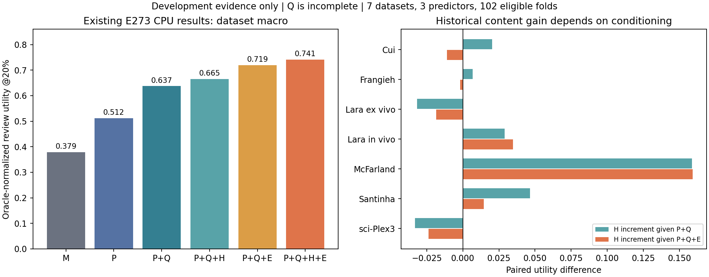

# SafeConf：9 月 30 日开题与进展汇报入口

日期：2026-09-28。交付对象：导师/学校的完整研究进展和开题报告；论文初稿与正式投稿后续推进。

**直接阅读/编辑**：[Word 底稿](SafeConf_开题报告与进展_20260928.docx)｜[6 页 PDF](SafeConf_开题报告与进展_20260928.pdf)。两份文件及 Markdown 阅读版已放桌面；尚未套用学校指定模板。

## 当前建议

课题题目：**面向单细胞扰动预测的幅度锚定与证据增量风险评估方法研究**。

一句话：先估计预测幅度对应的基础误差，再检验测量质量、公共实验历史与模型反馈分别还能解释多少剩余误差；只保留能在独立评价中带来增量的修正。

推荐模型的工作名称为 **SafeConf 幅度锚定条件风险模型**。公共历史和错误记忆都是待验证的证据来源，最终保留几个分支由实验决定。

## 阅读顺序

1. [开题报告与进展正文](开题报告与进展.md)：可直接作为学校模板的内容底稿。
2. [从实验到方法的数学推导](方法推导.md)：误差几何、条件风险分解、反馈收缩、训练算法与理论边界。
3. [最小决定性实验和投稿路线](实验与投稿路线.md)：先补什么、比较什么、怎样才构成方法贡献。
4. [12 页汇报提纲与答辩问答](汇报提纲.md)：讲给导师听的顺序。
5. [本轮复算结果](复算结果/ADJACENT_INCREMENT_SUMMARY.csv)：来自已有 E273 逐折表的配对汇总。



图中结果是既有开发数据的重新汇总。Q 尚不完整；没有新增训练、没有解封任何最终测试。

## 这次形成的实质判断

- E201：幅度是优先锚点，旧 SafeConf 还有幅度之外的关联，但旧排序弱于幅度。
- E230/E234：存在历史修正的开发线索，复杂历史结构尚未超过简单方法。
- E258/E259：公共历史要拆为测量质量 Q 与效应内容 H；H 的独立增量尚未建立。
- E273：Q、H、E 的增量不同；H 在已有 E 后只在 3/7 数据集组正向，提示冗余和异质性。
- E274：记忆特征可用率曲线有开发信号，但每个预算都用全部 fit 标签重训风险器，不能解释为零反馈冷启动或仅更新 memory 的效果。

**开题可行性判断：已有结果足够支持一个明确、可证伪的研究方案；正式方法论文还需要证明结构相对同信息、同标签预算简单模型的额外价值。**

## 与旧版本的关系

本目录是根据用户 2026-09-28 的纠正形成的开题主线，替代根目录 9 月 27–28 日广综述文档作为本次汇报入口。已有证书路线及所有旧实验结论原样保留。单模型的风险估计与注册家族的误差下界使用不同误差对象，不能相互充当性能证明。

本轮也纠正了旧设计中的三个口径：E273 的七个数据集组包含化学数据；其 Q 是支持/相似度代理；其学习目标是误差秩而非原始 expected error。新模型在本文中标记为“拟研究”，不能把 E273 的成绩直接贴到新模型上。

## 复现本轮复算

```bash
python tools/scripts/summarize_e273_evidence_for_proposal.py --output /tmp/safeconf_proposal_reaudit
```

使用新的空目录。脚本只读取已归档的 E273 CPU 评价表；配对结果、图及源文件哈希见 [AUDIT.json](复算结果/AUDIT.json)。

Word 从正文 Markdown 生成：

```bash
python tools/scripts/build_safeconf_proposal_docx.py --source docs/方法设计/20260928_证据驱动开题/开题报告与进展.md --output /tmp/SafeConf_proposal.docx
```

验收：配对均值与原 E273 宏表一致；代码编译、内部链接、CSV 与 DOCX 结构检查通过；Word 经 LibreOffice 导出 6 页 PDF，检查了首页、正文、表格和图形的显示。新模型尚未运行。
