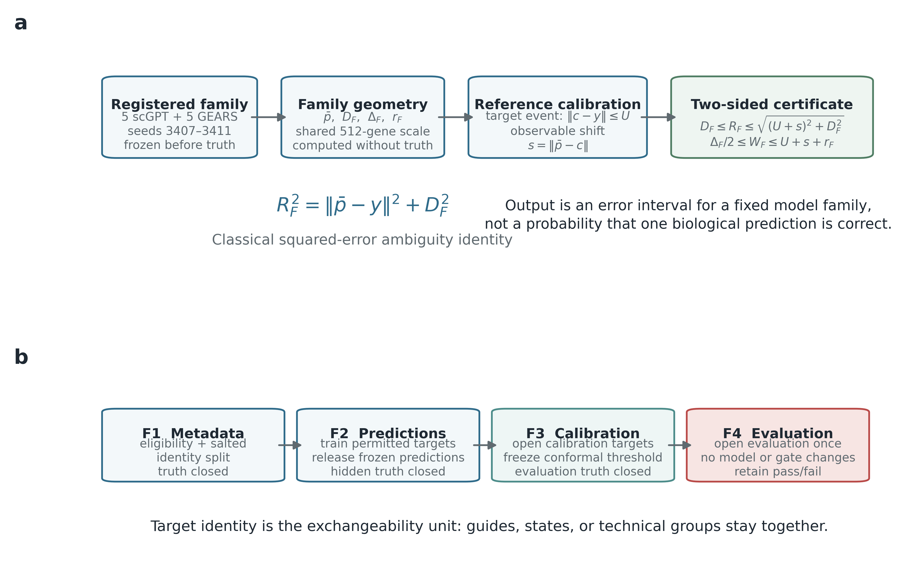
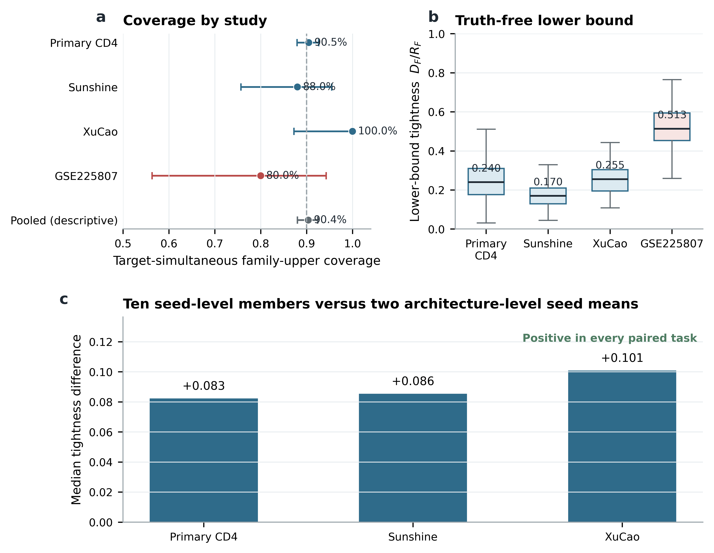
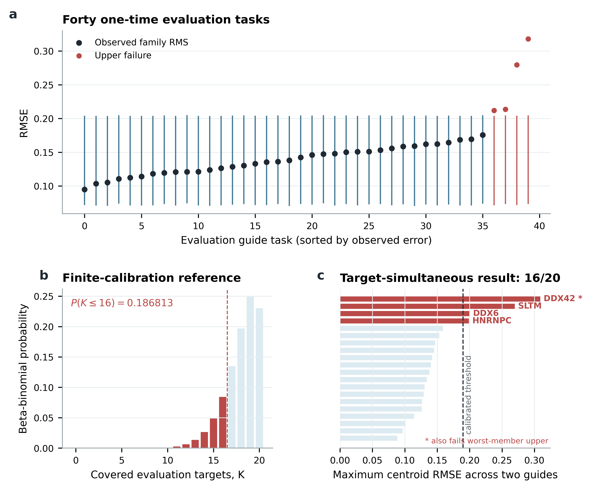
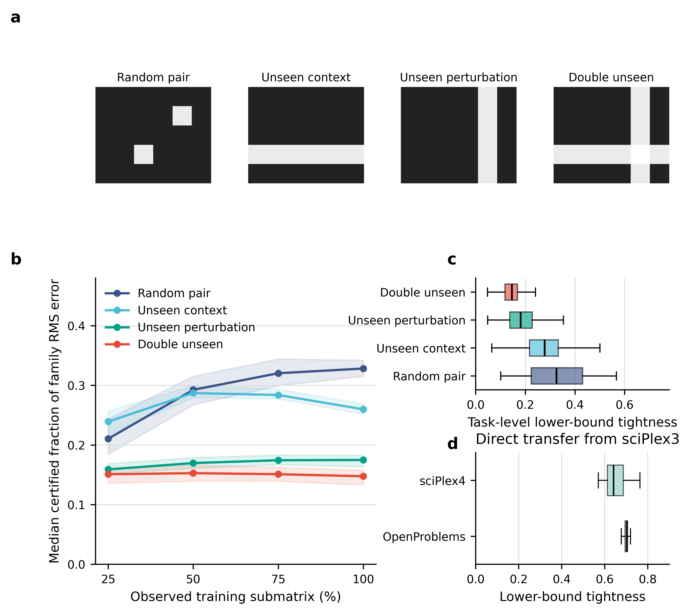
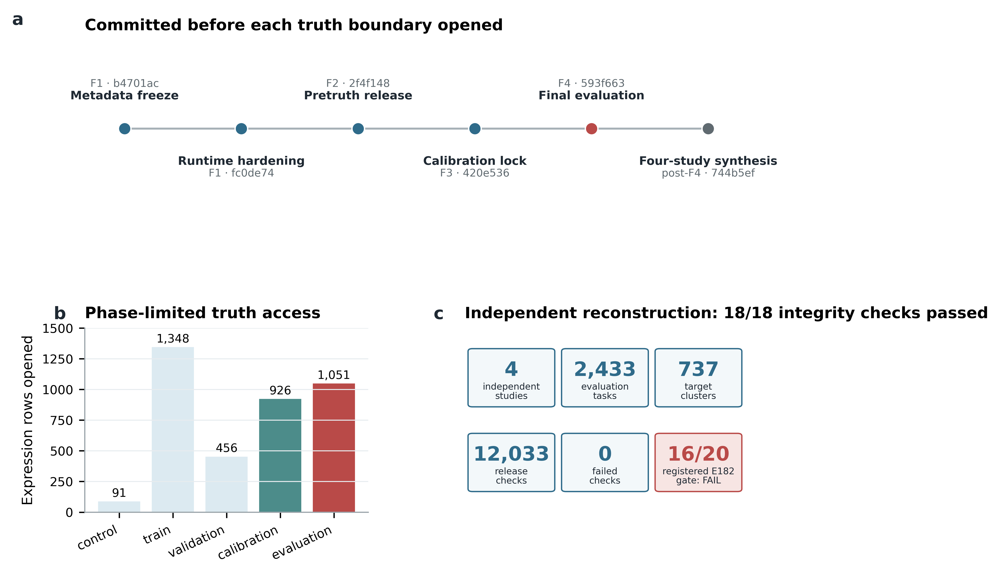

# SafeConf: registered-family error certificates for auditable single-cell perturbation prediction {.unnumbered}

**Yifan Yang¹**

¹ School of Computer and Information Engineering, Henan University, Kaifeng, Henan, China<br>
Co-authors, author order, and corresponding author: **[to be confirmed with the supervisor before submission]**<br>
Correspondence: **[name and email to be confirmed]**

# Abstract

**Background:** Single-cell perturbation models can generate thousands of counterfactual transcriptomic predictions, but a prediction vector alone does not indicate how inaccurate a frozen collection of models may be on a new perturbation. Existing uncertainty methods are commonly tied to one predictor and do not provide a post-hoc error certificate for a heterogeneous family of already trained models.

**Results:** We formulate reliability auditing as a registered-family error-certificate problem and implement it in SafeConf. For a frozen family of prediction vectors, the classical squared-error ambiguity decomposition gives a truth-free deterministic lower bound on family root-mean-square (RMS) error. The family diameter gives a second lower bound on the error of the worst member. An independently calibrated split-conformal upper bound for a reference centroid is transferred to the registered family through an explicit centroid-shift penalty. Repeated guide or context measurements are kept within target clusters during calibration and evaluation. We evaluated a family containing five scGPT and five GEARS fits in four human CRISPR perturbation studies comprising 2,433 held-out tasks and 737 target clusters. Both deterministic lower bounds had zero numerical violations, with a maximum decomposition residual of 9.68 × 10⁻¹⁷. Median family lower-bound tightness ranged from 0.170 to 0.513 across studies. Family upper bounds covered 2,331/2,433 tasks and all tasks within 666/737 targets; the pooled 90.37% target coverage is descriptive rather than a new conformal guarantee. In a fully preregistered K562 RNA-binding-protein study, coverage was 16/20 targets, below the registered 17/20 success rule. This failure was retained without threshold or target modification. A separate retrospective stress test of 8,777 task instances covered four missingness patterns, four training-submatrix fractions, and two direct cross-dataset transfers. The deterministic lower certificate again had no violations, while tightness fell in double-unseen settings and no upper-coverage claim was transported across datasets.

**Conclusions:** SafeConf converts frozen multi-model predictions into auditable two-sided error information without claiming that disagreement is a probability of correctness. Its principal value is the combination of deterministic family geometry, cluster-level conformal calibration, and a fail-closed release protocol. The results support post-hoc auditing of single-cell perturbation predictors while showing that finite calibration samples and exchangeability remain important limits.

**Keywords:** single-cell perturbation; uncertainty quantification; conformal prediction; model ensemble; Perturb-seq

# Background

Perturb-seq and related assays combine pooled genetic perturbation with single-cell molecular readouts, allowing gene function and regulatory programs to be studied at a scale that is difficult to achieve with serial experiments [@dixit2016perturbseq; @replogle2022genome]. Computational models attempt to fill the much larger unmeasured intervention space. GEARS uses gene co-expression and Gene Ontology graphs to predict responses to unseen single- and multi-gene perturbations [@roohani2024gears]. Foundation models such as scGPT and scFoundation use large pretraining corpora to learn reusable single-cell representations [@cui2024scgpt; @hao2024scfoundation]. These methods make it practical to generate large panels of predicted effects, but they do not remove the need to decide which predictions require experimental or manual review.

Recent benchmarks have made that distinction more urgent. Simple linear or mean-based baselines can match complex models under commonly used metrics, and systematic variation can make perturbation prediction appear easier than recovery of perturbation-specific biology [@ahlmann2025linear; @vinas2026systema]. A broader benchmark of 27 methods across 29 datasets likewise found that generalization depends strongly on the cellular and perturbational setting [@wei2026benchmark]. PertAdapt illustrates continuing progress in foundation-model adaptation across seven genetic-perturbation datasets [@bai2026pertadapt], but stronger average prediction does not by itself attach an error statement to a new task. Model accuracy therefore cannot be treated as a fixed property that transfers automatically to every deployment setting.

Uncertainty estimates for perturbation models address related but different questions. GEARS can learn a gene-wise variance head as an internal error proxy [@roohani2024gears]. PRESCRIBE uses evidential regression to quantify epistemic and aleatoric confidence for its own predictions [@cheng2025prescribe], while GPerturb represents uncertainty in gene-level effects through a Gaussian-process posterior [@xing2025gperturb]. These are useful predictor-specific outputs. They do not, however, answer the following deployment question: given a frozen heterogeneous family of prediction vectors, what error can be certified before the new target truth is opened?

SafeConf addresses that narrower problem. It does not attempt to assign a probability that a prediction is biologically correct, and it does not introduce a new ensemble decomposition or a new conformal theorem. The mathematical components are classical: squared-error ambiguity decomposition [@krogh1994ambiguity], triangle inequalities, and split conformal calibration [@lei2018conformal]. The contribution is to combine these components into a registered-family certificate for single-cell perturbation prediction, calibrate repeated measurements at the biological target level, and enforce a staged truth-access protocol that makes post-hoc repair visible.

The evaluation was organized around five deployment questions: which error object is certified; whether disagreement is model-specific or shared across predictors; whether any score uses the unseen response; how certificate informativeness changes from random missing pairs to unseen contexts and perturbations; and which statements survive direct dataset transfer. This organization separates exact geometric validity from empirical tightness and from conformal coverage.

# Methods

## Problem definition

For one perturbation task, let \(p_i\in\mathbb{R}^{G}\) be the predicted expression-effect vector from registered family member \(i\), \(i=1,\ldots,m\), and let \(y\in\mathbb{R}^{G}\) be the experimental effect vector. We use the gene-normalized Euclidean norm

\[
\lVert v\rVert=\sqrt{\frac{1}{G}\sum_{g=1}^{G}v_g^2},
\]

so \(\lVert p_i-y\rVert\) is the task-level RMSE. The family is fixed before evaluation truth is accessed. Its centroid is

\[
\bar p=\frac{1}{m}\sum_{i=1}^{m}p_i.
\]

SafeConf reports certificates for two quantities:

\[
R_F(y)=\sqrt{\frac{1}{m}\sum_{i=1}^{m}\lVert p_i-y\rVert^2},
\]

the RMS error across family members, and

\[
W_F(y)=\max_i\lVert p_i-y\rVert,
\]

the error of the worst family member. The first summarizes average squared risk across the registered family; the second guards against one poorly performing member.

## Deterministic lower certificates

Define family diversity around the centroid as

\[
D_F=\sqrt{\frac{1}{m}\sum_{i=1}^{m}\lVert p_i-\bar p\rVert^2}.
\]

The squared-error ambiguity identity gives

\[
R_F(y)^2=\lVert\bar p-y\rVert^2+D_F^2.
\]

Consequently,

\[
D_F\le R_F(y)
\]

for every possible \(y\). The lower bound requires predictions but not target truth or calibration data. It is exact when the centroid matches the truth and becomes tighter as between-member variation accounts for a larger fraction of family error.

For the worst member, let

\[
\Delta_F=\max_{i,j}\lVert p_i-p_j\rVert.
\]

For any pair attaining the diameter, the triangle inequality implies

\[
\frac{\Delta_F}{2}\le W_F(y).
\]

We treat these relations as classical geometric facts, not new theorems. Their role in SafeConf is operational: they define quantities that can be computed from an immutable prediction release and audited row by row.

## Transfer of a calibrated centroid upper bound

Suppose an independent calibration set provides an upper bound \(U(x)\) for the error of a reference prediction \(c(x)\). The reference can be a constant or feature-dependent base plus a split-conformal correction. Let

\[
s(x)=\lVert\bar p(x)-c(x)\rVert
\]

be the observable shift from the reference to the registered-family centroid. On the event \(\lVert c-y\rVert\le U\), the triangle inequality gives

\[
\lVert\bar p-y\rVert\le U+s.
\]

Combining this event with the ambiguity identity produces the family upper certificate

\[
R_F(y)\le \sqrt{(U+s)^2+D_F^2}.
\]

Let \(r_F=\max_i\lVert p_i-\bar p\rVert\). The corresponding worst-member upper certificate is

\[
W_F(y)\le U+s+r_F.
\]

The deterministic lower bounds hold without distributional assumptions. The upper bounds inherit the coverage event and assumptions of the reference conformal procedure. Adding or removing a family member can change \(D_F\), \(r_F\), and \(\bar p\); any centroid change is therefore paid through \(s\). Family composition was registered before the relevant evaluation release.

{width=6.5in}

**Figure 1. SafeConf method and truth-access protocol.** **a**, A frozen family supplies truth-free geometric quantities. An independently calibrated reference-centroid upper bound is transported to the registered centroid through the observable shift \(s\), giving certificates for family RMS and worst-member error. **b**, The fail-closed sequence separates metadata selection, prediction release, conformal calibration, and one-time evaluation. Hidden target expression is not exposed to model fitting or method selection.

## Target-cluster split conformal calibration

Guide-level or context-level measurements from the same perturbed gene are not treated as independent calibration examples. For a target cluster \(j\) with tasks \(t\in\mathcal{T}_j\), a frozen reference base \(b(x_t)\), and observed reference-centroid errors \(e_t\), the nonconformity score is

\[
S_j=\max_{t\in\mathcal{T}_j}\{e_t-b(x_t)\}.
\]

With \(n\) calibration targets and desired coverage \(1-\alpha=0.90\), the correction is the \(k\)-th ordered score, where

\[
k=\operatorname{ceil}\big((n+1)(1-\alpha)\big).
\]

The task upper bound is \(U(x)=b(x)+S_{(k)}\). A target is counted as covered only when every registered task within that target is covered. This construction targets simultaneous within-target coverage under exchangeability of target clusters. It does not imply conditional coverage for every gene or guarantee transport under arbitrary dataset shift.

The Primary CD4 analysis used donor-specific magnitude bases frozen before evaluation; the Sunshine analysis used predicted magnitude and model disagreement in a base fixed before calibration. The XuCao comparison evaluated constant, magnitude-based, and ExtraTrees bases under the same target-cluster correction. After the ExtraTrees base failed its registered efficiency criterion, the fully preregistered GSE225807 study used only a constant centroid upper bound.

## Predictor family and expression effects

The registered family contained ten prediction vectors: five scGPT fits and five GEARS fits with random seeds 3407–3411. scGPT was initialized from the whole-human pretrained checkpoint; 129 compatible parameter tensors were loaded before supervised fine-tuning. GEARS used a 64-dimensional hidden representation, one Gene Ontology graph layer, one co-expression graph layer, and a 16-dimensional decoder hidden layer. Co-expression edges were built only from allowed training and control data. Model checkpoints were selected by validation MSE with early stopping.

All certificate calculations used a frozen panel of 512 genes shared by the expression axis and the scGPT vocabulary. For each guide or donor-context task, the truth vector was the mean log1p-normalized perturbed expression minus the corresponding pooled control mean. Model output was represented on the same effect scale. The family centroid was the arithmetic mean of the ten seed-level effect predictions. The centroid of the ten-member family agreed with the mean of the two five-seed architecture means to within 1.89 × 10⁻⁹ RMSE in the retrospective studies.

## Datasets and frozen splits

We used four human CRISPR perturbation studies (Table 1). The source datasets were independently generated and publicly released; this study did not generate new wet-laboratory data.

**Table 1. Evaluation studies and frozen certificate units.**

| Study | Biological system | Calibration targets | Evaluation targets | Evaluation tasks | Cluster content |
|---|---|---:|---:|---:|---|
| Primary CD4 | Four donors; three states | 40 per donor | 640 | 1920 | Three states |
| Sunshine | Calu-3 CRISPRi | 30 | 50 | 400 | Eight technical groups |
| XuCao | PerturbSci-Kinetics | 29 | 27 | 73 | All eligible guides |
| GSE225807 | K562 RBP CRISPRi | 19 | 20 | 40 | Two guides |

The first three studies are registered-family reformulations of prospectively frozen prediction releases. GSE225807 is the fully preregistered registered-family confirmation. Primary CD4 used 40 calibration targets in each of four donor rotations.

### Primary human CD4 T-cell Perturb-seq

The Primary CD4 dataset contains genome-scale perturbations in 22 million cells from four donors under resting, 8-h stimulation, and 48-h stimulation conditions [@zhu2025cd4; @czicd4]. Each donor served once as the held-out donor in a four-way rotation. After excluding targets used in earlier development, 800 new targets were assigned across panels. Each panel used 40 calibration targets and 160 evaluation targets. The three state-specific tasks for one target formed one cluster, yielding 640 evaluation targets and 1,920 evaluation tasks. This is a multi-donor confirmation within one study, not four independent studies.

### Sunshine Perturb-seq

The Sunshine dataset profiled CRISPRi perturbations in human Calu-3 lung carcinoma cells in a SARS-CoV-2 study [@sunshine2023host], obtained through the harmonized scPerturb release [@peidli2024scperturb]. Targets were split by identity into 54 training, 10 validation, 30 calibration, and 50 evaluation genes. Each target was evaluated across eight `gem_group` labels. These labels were treated as technical groups, not donors or biological contexts. The final evaluation contained 400 tasks.

### XuCao PerturbSci-Kinetics

The XuCao dataset measured whole and nascent transcriptomes together with guide identities in a pooled CRISPR screen [@xu2023kinetics], using the scPerturb processed release. Eligible genes had at least two guides with at least 20 cells per guide and were split by target identity into 65 training, 32 validation, 29 calibration, and 27 evaluation targets. The final evaluation contained 73 guide-level tasks. Cell-cycle phase was a post-perturbation annotation and was not used as a pre-perturbation context.

### GSE225807 RBP CRISPRi

GSE225807 is a K562 Perturb-seq study of RNA-binding-protein (RBP) knockdown [@khoroshkin2024rbp; @gse225807]. It had not appeared in prior project results when the formal split was frozen. Eligible targets had exactly two assigned guides, at least five cells per guide, at least 20 cells across both guides, and coverage on the expression and vocabulary axes. Within cell-count strata, salted SHA-256 identities assigned 28 targets to training, 9 to validation, 19 to calibration, and 20 to evaluation. The registered 90% upper bound was the 18th ordered maximum centroid RMSE among 19 calibration targets. The frozen threshold was 0.189785678 RMSE. Success required both deterministic bounds to have zero violations, numerical identity residual at most 10⁻¹⁰, no access violation, and simultaneous family upper coverage for at least 17 of 20 evaluation targets.

## Fail-closed release and access audit

Each study used four logical phases:

1. **F1—metadata freeze:** target eligibility and identity-level partitions were fixed without decoding hidden expression values;
2. **F2—pretruth prediction:** models were trained on allowed targets, predictions for calibration and evaluation queries were released, and query graphs were checked to contain no response vector;
3. **F3—calibration:** only calibration expression was opened and the conformal correction was frozen;
4. **F4—evaluation:** evaluation expression was opened once and could not modify targets, family members, seeds, endpoints, or thresholds.

Source files, scripts, checkpoints, prediction arrays, tables, and release artifacts were recorded with SHA-256 hashes. The GSE225807 sequence was additionally preserved in Git on both GitHub and Gitee before each truth-opening step.

## Model specificity, difficulty ladder, and direct transfer

We distinguished a certificate for a registered family from confidence in one member. In Primary CD4 and Sunshine, the five-seed scGPT and GEARS predictions were first averaged within architecture. We then measured the Spearman association between their task errors, overlap of their highest-error quintiles, and association of their prediction distance with each architecture's RMSE. Perturbation identity was the resampling unit. These diagnostics use target truth and are therefore evaluation analyses; they are not inputs to the pretruth certificate.

A separate retrospective audit used prediction records frozen before the present analysis from four multi-context matrices in the scPerturb collection: Frangieh genetic perturbations, Lara ex vivo genetic perturbations, Santinha genetic perturbations, and Cui cytokine stimulation [@peidli2024scperturb]. Two inductive reference predictors were evaluated under four held-out structures: random missing context–perturbation pairs, an unseen context row, an unseen perturbation column, and simultaneous unseen context and perturbation. Each structure was repeated with 25%, 50%, 75%, and 100% of the permitted training submatrix, giving 8,196 task instances. For a two-member family, both the family-RMS and worst-member lower certificate equal half the RMSE distance between prediction vectors. The same formula was then applied to 553 frozen sciPlex3-to-OpenProblems tasks and 28 sciPlex3-to-sciPlex4 tasks, for 581 direct-transfer tasks. Target responses were used only after prediction to measure errors and tightness. Because no target-domain calibration population was available, direct-transfer analyses report only deterministic lower certificates, not conformal upper coverage.

## Comparator and adaptive-upper analyses

The upper-bound efficiency study was nested within complete perturbation-target splits. Fifty grouped repeats in Primary CD4 and Sunshine compared a constant split-conformal base with predicted magnitude, magnitude plus the pair lower bound, seed spread, ridge regression, ExtraTrees, random forest, and 0.80-quantile gradient boosting. All adaptive methods received the same 18 prediction-derived pretruth features and the same target-cluster conformal correction. The ExtraTrees configuration chosen from this development audit was then tested without modification in XuCao.

PRESCRIBE was also run and evaluated at its native paper endpoint [@cheng2025prescribe]. Its combined evidential confidence was associated with prediction–truth Pearson accuracy in two Norman panels and compared with predicted magnitude under paired task bootstrap. This is a contextual comparator, not a head-to-head SafeConf benchmark: PRESCRIBE supplies predictor-specific confidence and was evaluated on its own predictions, whereas SafeConf supplies bounds on the RMS and worst-member error of a frozen family.

## Statistical analysis

For each task, we recomputed \(D_F\), \(\Delta_F/2\), \(R_F\), \(W_F\), the two upper bounds, and the ambiguity-identity residual in 64-bit arithmetic. A deterministic violation was recorded when a lower bound exceeded its corresponding observed error by more than 10⁻¹⁰. Target coverage required all tasks in a `(study, target)` cluster to be covered.

Lower-bound tightness was defined as lower bound divided by observed error. Study medians and 95% cluster-bootstrap intervals used target-level resampling with 10,000 draws where applicable. Target coverage confidence intervals were exact Clopper–Pearson intervals. The pooled four-study interval is descriptive because studies and target structures are heterogeneous. In the difficulty ladder, 5,000 bootstrap draws resampled perturbation identities within each dataset and then averaged dataset-specific medians, so repeated folds and training fractions were not treated as independent experiments.

For the GSE225807 finite-calibration analysis, the 18th order statistic among 19 exchangeable continuous calibration scores has conditional coverage probability distributed as \(\mathrm{Beta}(18,2)\). Integrating a binomial count of 20 future targets over this distribution gives a beta-binomial reference probability of 0.186813 for observing at most 16 covered targets. This calculation was specified as an explanation of finite-calibration variability after the failed gate; it did not change the gate.

## Software and computing environment

Training used Python 3.9.25, PyTorch 2.1.2 with CUDA 11.8, PyTorch Geometric 2.6.1, NumPy 1.26.4, Pandas 2.3.3, and SciPy 1.13.1 on a Linux server with two NVIDIA Quadro RTX 6000 GPUs (24 GB each). The released main-number validator uses only the Python standard library and was tested under Python 3.9.25 and 3.12.4.

# Results

## Registered-family geometry supplied nonzero truth-free lower bounds

Across the four studies, the frozen ten-member family produced 2,433 evaluation certificates for 737 target clusters. The ambiguity identity held to numerical precision: the largest absolute residual was 9.68 × 10⁻¹⁷. Neither \(D_F\le R_F\) nor \(\Delta_F/2\le W_F\) was violated in any task. These zero counts confirm implementation consistency; they are not an empirical discovery because both inequalities are deterministic under the registered definitions.

The empirical question is whether the lower bounds are informative. Median \(D_F/R_F\) was 0.240 in Primary CD4 (95% cluster-bootstrap interval 0.231–0.248), 0.170 in Sunshine (0.153–0.183), 0.255 in XuCao (0.219–0.292), and 0.513 in GSE225807. Thus, model-family geometry accounted for a median of 17.0%–51.3% of observed family RMS error, depending on the study (Figure 2b). The worst-member lower bound showed similar behavior, with study medians of 0.244, 0.206, 0.262, and 0.467.

The ten seed-level members yielded tighter family lower bounds than a family containing only the two architecture-level seed means for every task in Primary CD4, Sunshine, and XuCao. Median tightness increased by 0.083, 0.086, and 0.101, respectively. This does not mean that arbitrary enlargement is beneficial. Adding a no-change prediction after evaluation changed the centroid and produced no tightness improvement in any XuCao task; in all studies it also incurred a nonzero centroid-shift penalty. Registered composition prevents such post-hoc family engineering.

{width=6.5in}

**Figure 2. Cross-study certificate results.** **a**, Exact target-simultaneous family-upper coverage with 95% Clopper–Pearson intervals. The dashed line is the nominal 90% target. The pooled estimate is descriptive. **b**, Task-level tightness of the deterministic family RMS lower bound by study. Boxes show interquartile ranges and median; whiskers extend to 1.5 interquartile ranges. **c**, Registered ten-member families compared with two architecture means. Points show the study-level median increase in lower-bound tightness.

## scGPT and GEARS shared task difficulty, but their distance was not a single-model confidence score

The architecture-mean scGPT and GEARS errors were strongly concordant: task-level Spearman correlations were 0.975 in Primary CD4 and 0.992 in Sunshine. Their highest-error quintiles had Jaccard overlaps of 0.892 and 0.951, respectively. Most tasks were therefore easy or difficult for both architectures rather than uniquely difficult for one.

Their prediction distance did not identify which architecture was wrong. Its Spearman association with scGPT and GEARS RMSE was −0.211 and −0.174 in Primary CD4, and 0.059 and 0.059 in Sunshine. These results answer two different questions. The observed scGPT–GEARS distance is a valid lower certificate for the two-member family's mean and worst error, regardless of its correlation with truth. It is not a calibrated confidence score for scGPT or GEARS separately, and a small distance cannot rule out shared error.

## Upper certificates were near nominal coverage across the combined audit but varied by study

Family upper bounds covered 1,829/1,920 Primary CD4 tasks, 393/400 Sunshine tasks, 73/73 XuCao tasks, and 36/40 GSE225807 tasks. At the target-simultaneous level, the corresponding counts were 579/640 (90.47%), 44/50 (88.0%), 27/27 (100%), and 16/20 (80.0%) (Figure 2a).

Across all studies, 2,331/2,433 tasks (95.81%) and 666/737 targets (90.37%; descriptive exact 95% interval 88.00%–92.40%) were covered by the family upper bound. The worst-member upper bound covered all tasks within 688/737 targets (93.35%). Because the pooled analysis was performed after the GSE225807 outcome was known and combines heterogeneous designs, 90.37% is a descriptive summary rather than a recalibrated guarantee or a replacement for individual-study outcomes.

## Adaptive upper bases produced small development gains that did not confirm

In 50 complete-target resplits of Primary CD4, ExtraTrees achieved mean target-simultaneous coverage of 0.894 and a mean upper bound of 0.2062 RMSE, compared with 0.2119 for the constant split-conformal base. The mean relative reduction was 2.72%, while its paired 2.5%–97.5% repeat quantiles ranged from −1.52% to 7.39%. In Sunshine, the corresponding coverage was 0.905, with mean bounds of 0.5389 and 0.5466, a 1.41% reduction whose repeat quantiles ranged from −6.60% to 7.72%. These overlapping resplits are a development stability analysis, not 50 independent confirmations.

In XuCao, an ExtraTrees base used 18 prediction-derived features and validation-target errors before receiving the same target-cluster conformal correction as the constant comparator. Both methods covered all 27 evaluation targets. The ExtraTrees mean upper bound was 0.2315 RMSE, compared with 0.2168 for the constant method, a difference of +0.0147 (target-cluster bootstrap 95% interval +0.0107 to +0.0188). The prespecified efficiency gate therefore failed. Predicted magnitude and magnitude-plus-lower bases were also slightly wider than the constant bound.

This result changed the subsequent design: GSE225807 did not fit or select an adaptive upper model. Ranking scores were retained as diagnostics only. In XuCao, Spearman correlations with pair-mean RMSE were 0.122 for the pair lower bound, 0.026 for predicted magnitude, and 0.143 for the ExtraTrees base. SafeConf therefore uses model disagreement as a deterministic lower certificate rather than presenting it as a reliable cross-study ranking of task difficulty.

At PRESCRIBE's native endpoint, its combined evidential confidence had a two-panel macro Spearman association of 0.317 with prediction–truth Pearson accuracy (bootstrap 95% interval 0.032–0.567) [@cheng2025prescribe]. Predicted magnitude reached 0.310 on the same tasks. The paired difference was 0.0065 (−0.0317 to 0.0534), and the confidence score was almost rank-equivalent to predicted magnitude (\(\rho=0.995\), 0.975–1.000). This comparator shows that predictor-specific confidence can carry signal while adding little ordering information beyond a simple baseline in this small native-endpoint audit. It does not test SafeConf's family-error certificates, which have a different estimand.

## The fully preregistered GSE225807 confirmation retained a failed upper-coverage gate

The GSE225807 analysis froze 76 target identities before hidden expression access and released all ten model predictions before calibration. The constant centroid threshold from 19 calibration targets was 0.1898 RMSE. In the 20 evaluation targets, the family upper certificate simultaneously covered both guides for 16 targets (80.0%; exact 95% interval 56.3%–94.3%), below the registered requirement of 17. The failed targets were **HNRNPC, DDX6, SLTM, and DDX42**. The worst-member upper certificate covered 19/20 targets.

All deterministic and integrity gates passed: there were no family or worst-member lower-bound violations, the maximum identity residual was 2.26 × 10⁻¹⁷, no adaptive upper model was used, and the access audit found no target-split or premature truth read. The registered overall status nevertheless remained `FAIL` because the upper-coverage criterion was not met.

The calibration set was small. Under the continuous exchangeable-score reference, the probability of observing 16 or fewer covered targets among 20 is 18.68% (Figure 3b). This makes the result compatible with finite calibration variability, but it does not convert the experiment into a success. A larger calibration set would stabilize the selected order statistic; it would not solve arbitrary distribution shift.

{width=6.5in}

**Figure 3. Fully preregistered GSE225807 confirmation.** **a**, Family RMS lower and upper certificates for 40 guide tasks, sorted by observed family RMS error. Four tasks exceeded the upper certificate; lower certificates remained below observed errors. **b**, Beta-binomial reference distribution for covered targets when a 90% threshold is selected as the 18th score among 19 calibration targets. The red region is \(K\le16\). **c**, Target-level evaluation. Four targets failed simultaneous two-guide family coverage; only DDX42 also failed the worst-member upper certificate.

## A missingness ladder separated exact validity from empirical informativeness

The retrospective difficulty audit evaluated 8,196 task instances across four multi-context datasets, four permitted training fractions, and four missingness patterns. Neither two-member lower certificate had a numerical violation. At the 100% training fraction, the across-dataset median family-RMS tightness was 0.328 for random missing pairs (95% perturbation-bootstrap interval 0.315–0.342), 0.260 for an unseen context (0.252–0.269), 0.175 for an unseen perturbation (0.163–0.183), and 0.148 when both context and perturbation were unseen (0.133–0.158) (Figure 4a–c). The lower certificate remained valid as the task became harder, but it explained a smaller fraction of the observed family error when prediction failures became more shared.

Direct transfer added 553 sciPlex3-to-OpenProblems tasks and 28 sciPlex3-to-sciPlex4 tasks. Both lower certificates again had zero violations, with median family-RMS tightness of 0.703 and 0.641 (Figure 4d). These high ratios do not indicate accurate transfer: neither reference predictor outperformed the zero-effect baseline on any OpenProblems task. They indicate that the two predictors failed differently. Because there was no target-domain calibration population, no conformal upper statement was made for either transfer.

{width=6.5in}

**Figure 4. Difficulty ladder and direct-transfer stress tests.** **a**, The four held-out structures, from a random missing context–perturbation pair to simultaneous unseen context and perturbation. **b**, Across-dataset median tightness over permitted training fractions; ribbons show perturbation-cluster bootstrap intervals. **c**, Full-fraction within-study distributions. **d**, Direct cross-dataset lower-certificate tightness. All panels report deterministic lower certificates; panel d carries no upper-coverage claim.

## Versioned releases made the negative result independently auditable

The GSE225807 Git history recorded metadata freeze, implementation hardening, pretruth predictions, calibration, final evaluation, and only then the retrospective four-study synthesis. Each stage was present on both remotes before the next truth boundary opened. The current release validator independently re-aggregates all 2,433 task rows into 737 targets, verifies source hashes, recomputes both lower bounds and coverage flags, checks that GSE225807 remains 16/20 and `FAIL`, and reproduces the beta-binomial probability. It completed 12,033 checks with zero failures under Python 3.9 and 3.12.

{width=6.5in}

**Figure 5. Reproducible evidence chain.** **a**, Versioned GSE225807 truth-access chronology. **b**, Logical expression rows opened at each phase; calibration and evaluation rows were absent from the pretruth interface. **c**, Minimal-release validation reconstructs task and target counts, lower-bound violations, coverage counts, and the retained failed gate from committed tables and hashes.

# Discussion

SafeConf changes the output of post-hoc perturbation reliability analysis from an unconstrained score into a registered error object. A disagreement score can be high or low without a fixed interpretation. In contrast, \(D_F\) and \(\Delta_F/2\) have exact meanings for the registered family under squared error: one lower-bounds the family RMS error and the other lower-bounds the worst member. Split conformal calibration supplies the complementary upper event. The explicit shift \(s\) prevents a calibrated reference from being silently replaced by a different family centroid.

This framing is intentionally different from predictor-specific uncertainty. GEARS uncertainty, PRESCRIBE, and GPerturb estimate internal variance, evidential confidence, or posterior uncertainty for the model that generates the prediction [@roohani2024gears; @cheng2025prescribe; @xing2025gperturb]. SafeConf can be attached after predictions have been frozen, but it requires all member vectors to share a defined outcome space, gene panel, normalization, and task contract. It does not compare favorably or unfavorably with those methods on a single scalar leaderboard because the outputs are not equivalent.

The lower-bound results also need careful interpretation. Zero violations are guaranteed by geometry and chiefly test the implementation. Scientific usefulness depends on tightness. The observed 0.170–0.513 medians show that family diversity can rule out a nontrivial portion of the actual error, particularly in GSE225807, but the lower bound can still be loose when all models make similar mistakes. Shared bias is visible in the centroid error and cannot be recovered from disagreement alone.

The model-specific and difficulty analyses make that boundary concrete. scGPT and GEARS errors were highly concordant even when their prediction distance had weak or negative association with each member's error. The distance can therefore certify that at least some family error exists without locating it in one member. Under unseen perturbations and double-unseen matrix cells, tightness decreased because more error was shared. Conversely, direct-transfer tightness was high when two inaccurate predictors diverged. Tightness is the fraction of observed family error ruled out by geometry, not prediction accuracy or biological utility.

The upper results show the complementary limitation. Three studies were near or above the nominal target, while the preregistered GSE225807 analysis missed its success rule. The exact interval was wide because only 20 evaluation targets were available. The 18.68% reference probability indicates that such a count is not exceptional under a 19-target conformal calibration, yet the single-study failure remains the correct registered conclusion. Future confirmation should enlarge the calibration population before changing model complexity, and should use additional biological studies to probe exchangeability rather than pooling more guides from the same targets as if they were independent.

SafeConf currently certifies expression-vector RMSE on a 512-gene panel. RMSE does not capture pathway relevance, direction-specific errors, distributional heterogeneity between cells, or downstream experimental utility. The present studies are secondary analyses of public CRISPR datasets; there is no wet-laboratory or clinical validation. Primary CD4 supplies donor heterogeneity but remains one study. Sunshine technical groups are not biological replicates. The missingness ladder uses two inductive reference predictors and is a secondary stress test, not another scGPT–GEARS confirmation. Dataset-specific normalization and pseudobulk or guide averaging can alter the error scale, so bounds should not be numerically compared across studies without qualification.

The registered-family definition also creates an incentive issue. A deliberately poor or highly variable member can increase a lower bound while harming the family. The shift and radius terms penalize some such changes, but the decisive protection is procedural: member identities, seeds, gene panel, aggregation, and calibration rule must be fixed before evaluation truth. Our no-change-member stress test showed that arbitrary enlargement did not consistently improve tightness. Future work should formalize admissible family construction independently of evaluation outcomes.

Two extensions are most useful. First, richer bases such as conformalized quantile models may improve upper-bound efficiency when validation and calibration targets are sufficiently large [@romano2019cqr]. The failed ExtraTrees comparison warns against assuming that adaptivity will help in small biological datasets. Second, random-effects or hierarchical conformal methods may better represent repeated guides, donors, and studies [@dunn2020random]. Any extension should retain identity-level splitting and a truth-access record.

# Conclusions

SafeConf provides an auditable two-sided description of error for a frozen family of single-cell perturbation predictors. Classical family geometry supplies deterministic lower certificates; target-cluster split conformal calibration supplies marginal upper-coverage events under target-cluster exchangeability; an explicit centroid-shift term connects the two without hiding family changes. Across four registered-family studies, the lower certificates were numerically exact and often informative, while the upper results exposed both near-nominal aggregate behavior and a retained prospective failure. A separate 8,777-instance stress audit showed that deterministic validity survives harder missingness and direct transfer, although informativeness changes and upper coverage cannot be transported without target-domain calibration. These properties make SafeConf suitable as a quality-control layer for prioritizing review and validation, not as proof that an individual biological prediction is correct.

# Additional files

- **Additional file 1 — `SafeConf_supplement.pdf`:** supplementary methods, derivations, frozen study designs, model-specific diagnostics, difficulty and transfer audits, comparator analyses, GSE225807 gate details, and reproducibility chronology.
- **Additional file 2 — `SafeConf_source_data.zip`:** machine-readable CSV files underlying the main certificates, GSE225807 results, missingness ladder, direct-transfer analysis, model-specific diagnostics, nested upper baselines, and PRESCRIBE comparator.

# Declarations

## Ethics approval and consent to participate

Not applicable to this secondary computational analysis. The study used publicly available, de-identified processed data and did not recruit participants, collect new specimens, or perform new interventions. Ethical approvals and consent procedures for the source data are reported in the original studies.

## Consent for publication

Not applicable.

## Availability of data and materials

The source datasets are available from the CZI Virtual Cells Platform (Primary human CD4 T-cell Perturb-seq), the scPerturb Zenodo collection (SunshineHein2023 and XuCao2023), and NCBI GEO accession GSE225807. Accession links and source citations are provided in the references.

Task-level certificates, target summaries, source locks, access audits, hash manifests, figures, and validation scripts are available in the frozen SafeConf analysis release [@yang2026safeconf]:

- GitHub: `https://github.com/1298020005/SafeConf`
- Gitee: `https://gitee.com/librety/safe-conf`

The preregistered main-certificate release is rooted at Git commit `57391ab9aa7f331af9d174d49da0e0391fe9ad5e`. The submission package, secondary difficulty audit, and their source tables are fixed by the repository tag `safeconf-submission-20260726`. The minimal validator is platform-independent Python; model training was performed on Linux as described in Methods.

The current release can be checked with:

```bash
python tools/scripts/validate_current_certificate_release.py
```

The validator uses only the Python standard library and does not require raw expression matrices, GPUs, or model checkpoints.

## Competing interests

The authors declare that they have no competing interests. **[All authors must confirm before submission.]**

## Funding

**[Insert the complete funding agency names and grant numbers, or state “This research received no specific grant from any funding agency.”]**

## Authors' contributions

**[Confirm after the author list is frozen.]** Draft CRediT statement: Y.Y. contributed to conceptualization, methodology, software, validation, formal analysis, data curation, visualization, and writing of the original draft. **[Supervisor/co-author initials]** contributed to supervision, scientific interpretation, and writing—review and editing. All authors must read and approve the submitted manuscript.

## Acknowledgements

The authors thank the investigators who generated and released the public perturbation datasets used in this study. During manuscript preparation, OpenAI Codex was used to assist with code auditing, numerical cross-checking, document organization, and language drafting. The human authors reviewed the source evidence, edited the manuscript, verified the citations and reported numbers, and retain full responsibility for the final content.
