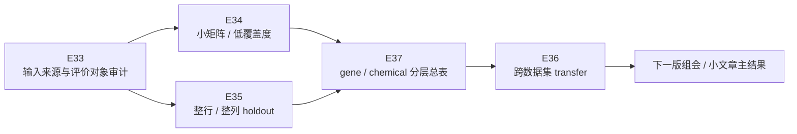
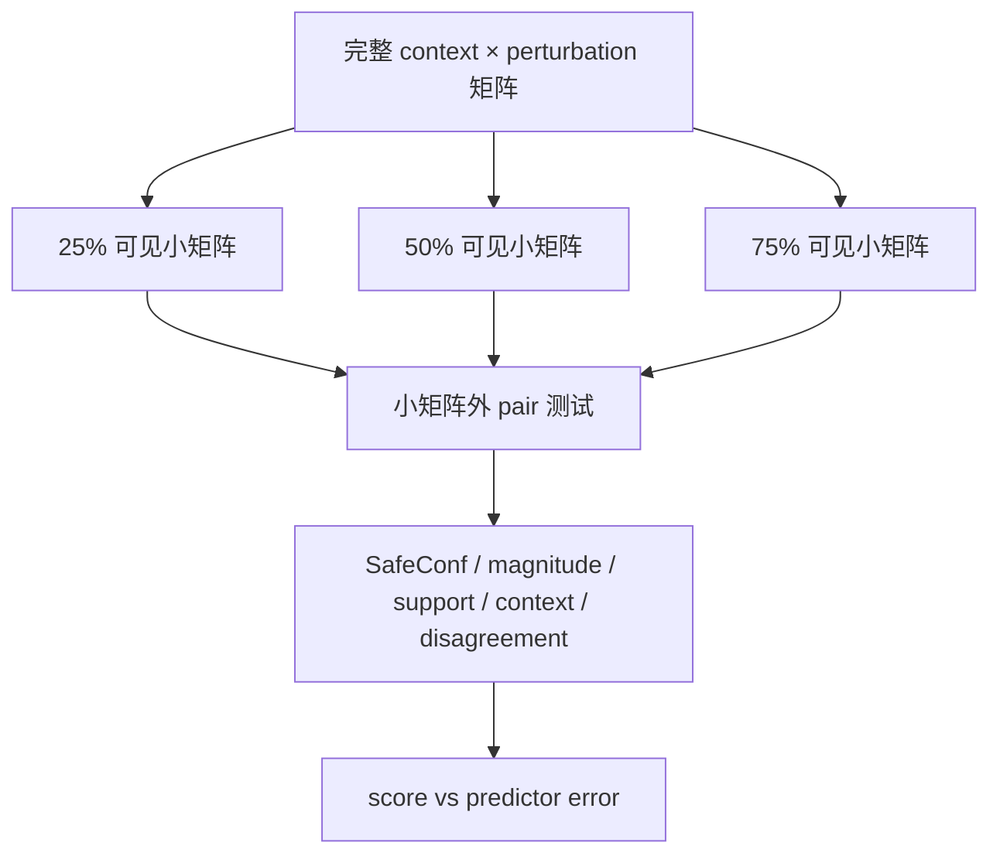
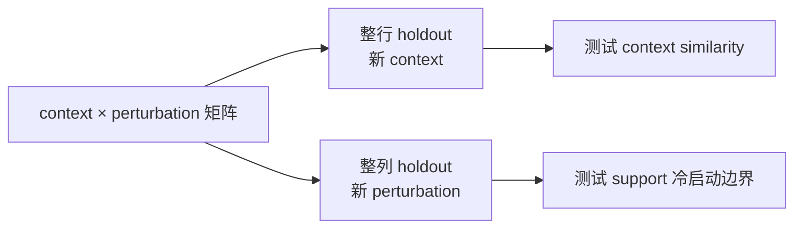
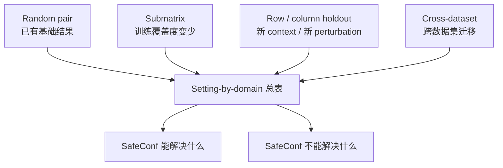

# 后续实验执行安排：按周老师要求排队

这份安排接在周老师聊天记录之后使用。它不是论文提纲，也不是旧结果汇总，只管接下来实验怎么排、每一步回答老师哪个问题、跑完后拿什么汇报。

## 1. 实验队列总览

优先级：

| 优先级 | 实验 | 时间 | 作用 |
|---|---|---|---|
| P0 | E33 输入来源与评价对象审计 | 立刻做 | 回答“分数怎么来的、错误来自哪个模型、有没有用测试真值” |
| P1 | E34 小矩阵 / 低覆盖度 | 第一批跑 | 回答“只给矩阵里的一个小块” |
| P1 | E35 整行 / 整列 holdout | 第一批跑 | 回答“整行整列 holdout” |
| P2 | E37 gene / chemical 分层总表 | 跟着 E34/E35 更新 | 回答“不同类型都看看” |
| P2 | E36 跨数据集 transfer | 第二批跑 | 回答“一个数据集到另一个数据集” |
| P3 | E38 GEARS/scGPT/CPA 模型级可靠性 | 后置 | 回答“同一道任务上哪个模型更可靠” |

## 2. E33：输入来源与评价对象审计

### 2.1 回答老师哪个问题

周老师问：

> 衡量好坏的时候是跟什么 correlate 的？  
> 实际预测错误的，他用的是什么模型？  
> 最后一个值是怎么算的？  
> 你要保证输入的东西是你没见过的东西。

E33 专门回答这些问题。

### 2.2 要查什么

| 检查项 | 要落表的字段 |
|---|---|
| 每个 score 的输入来源 | train fold / control expression / predictor output / held-out truth |
| 每个 error 的来源 | predictor name、true effect、error metric |
| magnitude 拆分 | true effect magnitude、predicted magnitude 分开 |
| disagreement 来源 | 哪些 predictor 参与，是否能在测试真值出现前计算 |
| 防泄漏状态 | deployable / retrospective control / forbidden for scoring |

### 2.3 输入文件

| 文件 | 用途 |
|---|---|
| `docs/实验结果/Formal_main_20260604/tables/FORMAL_INPUT_STATUS.csv` | 旧主表输入状态 |
| `docs/实验结果/Formal_main_20260604/tables/FORMAL_PER_PREDICTOR_RHO.csv` | predictor 级别相关 |
| `docs/实验结果/E9_strong_baseline_audit_20260707/tables/E9_DEPLOYABLE_BASELINE_LADDER.csv` | deployable baseline 对照 |
| `docs/实验结果/E29_gears_scgpt_shared_adamson_risk_audit_20260708/tables/PREDICTION_RECORDS.csv` | 严格 PredictionRecord 样例 |
| `docs/实验结果/Tahoe_D1_300_shard_20260624/tables/TAHOE_D1_FORMAL_SUMMARY.csv` | Tahoe chemical 现有证据 |

### 2.4 输出文件

| 输出 | 内容 |
|---|---|
| `E33_FEATURE_PROVENANCE.csv` | 每个风险特征的输入来源和可部署状态 |
| `E33_ERROR_SOURCE_MAP.csv` | 每个误差指标来自哪个 predictor |
| `E33_MAGNITUDE_SPLIT_TABLE.csv` | true magnitude / predicted magnitude 拆分 |
| `E33_LEAKAGE_CHECKLIST.csv` | 是否存在 held-out truth 被用于前置打分 |
| `E33_ADVISOR_QA.md` | 给老师看的自然语言回答 |

### 2.5 通过标准

| 情况 | 处理 |
|---|---|
| prospective score 没有使用 held-out true effect | 通过 |
| true effect magnitude 被用作前置 score | 立刻改名为 retrospective control，不进入 deployable score |
| 某些 score 来源说不清 | 暂时从主结果移到补充或待复核 |
| predictor_name 缺失 | 必须补齐，不能继续只说“预测错误” |

E33 不需要大规模重算模型，是今天最该先做的。

## 3. E34：小矩阵 / 低覆盖度实验

### 3.1 回答老师哪个问题

周老师说：

> 你现在是 random 的，在这个矩阵上选一些东西。  
> 可以算一些不同难度的 task。  
> 只给这个矩阵的其中一个小矩阵。

E34 把 random pair 变成训练信息越来越少的难度梯度。

### 3.2 实验设计

| 项目 | 安排 |
|---|---|
| split | 选 context 子集 × perturbation 子集作为可见小矩阵 |
| coverage | 25%、50%、75% |
| seeds | 0、1、2 |
| gene smoke | 优先 Cui；它 context 和 perturbation 较均衡 |
| chemical smoke | 优先 Tahoe sampled；如果计算太重，先用 McFarland/Srivatsan 做可行性 |
| baselines | random、support-only、context-only、disagreement-only、predicted magnitude、SafeConf |
| metrics | Spearman、top-k enrichment、AURC、risk-coverage |

### 3.3 输出文件

| 输出 | 内容 |
|---|---|
| `E34_SPLIT_MANIFEST.csv` | 每个 coverage/seed 的训练块和测试块 |
| `E34_SUBMATRIX_SCORE_TABLE.csv` | 每个测试任务的 score 和 error |
| `E34_SUBMATRIX_SUMMARY.csv` | 分 coverage、dataset、family 的指标 |
| `E34_FAILURE_CASES.csv` | 低覆盖度下失败的任务 |
| `E34_REPORT.md` | 汇报用解释 |

### 3.4 结果怎么判

| 结果 | 解释 |
|---|---|
| coverage 下降后 SafeConf 仍为正 | 说明它不只适用于轻松 random pair |
| coverage 下降后只有 magnitude 有效 | chemical 或大幅度扰动里 magnitude 主导，写成边界 |
| support-only 崩掉，context 仍有信号 | 新扰动支持不足时，细胞背景仍可提供线索 |
| 全部信号变弱 | 当前方法依赖训练覆盖度，后续需要 gene/chemical 表征 |

## 4. E35：整行 / 整列 holdout

### 4.1 回答老师哪个问题

周老师说：

> 有整行整列的 hold out。

E35 要拆成两个子实验，不能混在一起。

### 4.2 实验设计

| 子实验 | 留出对象 | 生物含义 | 关键风险 |
|---|---|---|---|
| E35a row holdout | 整个 context / cell line | 新细胞背景 | control 表达相似度是否足够 |
| E35b column holdout | 整个 perturbation / gene / drug | 新扰动 | support 变成 0，冷启动困难 |

### 4.3 数据优先级

| 数据类型 | 优先数据 | 原因 |
|---|---|---|
| gene | Cui、Lara in vivo/ex vivo | context 数量和 perturbation 数量相对可用 |
| chemical | Tahoe、McFarland | Tahoe 大；McFarland context 多但 drug 少，可专门看边界 |
| 不优先 | 只有 3 个 context 的数据 | 做 row holdout 不稳 |

### 4.4 输出文件

| 输出 | 内容 |
|---|---|
| `E35_ROW_HOLDOUT_SUMMARY.csv` | 每个 held-out context 的结果 |
| `E35_COLUMN_HOLDOUT_SUMMARY.csv` | 每个 held-out perturbation 的结果 |
| `E35_COLD_START_FEATURE_STATUS.csv` | support/context/disagreement 在冷启动下是否可计算 |
| `E35_ROW_COLUMN_COMPARISON.csv` | row 和 column 难度对比 |
| `E35_REPORT.md` | 汇报用解释 |

### 4.5 结果怎么判

| 结果 | 解释 |
|---|---|
| row holdout 有效 | SafeConf 可处理新细胞背景 |
| column holdout 弱 | 说明新扰动需要 gene embedding / chemical fingerprint |
| gene 比 chemical 稳 | gene perturbation 的结构/功能信息可能更适合扩展 |
| chemical 里 magnitude 占优 | 保留为边界，别硬包装 |

## 5. E36：跨数据集 transfer

### 5.1 回答老师哪个问题

周老师说：

> 一个数据集上，比如所有都见过了，但是在另一个数据集上来预测。

E36 做跨数据集，不一开始跨类型混做。

### 5.2 实验设计

| 方向 | 第一批安排 | 原因 |
|---|---|---|
| gene → gene | Cui / Frangieh / Lara 之间 leave-one-dataset-out | 任务类型一致 |
| chemical → chemical | Tahoe / Srivatsan / McFarland 之间 | chemical 场景单独闭环 |
| gene → chemical | 暂缓 | 机制差异大，第一批结果不好解释 |

### 5.3 输出文件

| 输出 | 内容 |
|---|---|
| `E36_TRANSFER_MATRIX.csv` | train dataset × test dataset 的结果 |
| `E36_NORMALIZATION_STATUS.csv` | 跨数据集标准化和特征可比性 |
| `E36_DOMAIN_SHIFT_CASES.csv` | 迁移失败样例 |
| `E36_REPORT.md` | 汇报用解释 |

### 5.4 结果怎么判

| 结果 | 解释 |
|---|---|
| 同类型 transfer 为正 | SafeConf 有跨数据集泛化潜力 |
| 只在 chemical 内弱 | chemical 需要结构特征补强 |
| transfer 全弱 | 当前方法更适合作为 dataset-internal triage，文章主张要收窄 |

## 6. E37：gene / chemical 分层总表

E37 不是新计算，主要把 E33–E36 汇总成老师和论文都能看懂的主表。

### 6.1 输出主表

| 表 | 内容 |
|---|---|
| `E37_SETTING_BY_DOMAIN_SUMMARY.csv` | setting × gene/chemical × metric |
| `E37_WHAT_WORKS_WHERE.csv` | 哪个特征在哪类任务有效 |
| `E37_BOUNDARY_TABLE.csv` | McFarland、Tahoe magnitude、column holdout 等边界 |
| `E37_MAIN_FIGURE_PLAN.md` | 下一版组会图和论文图安排 |

### 6.2 最终要形成的主图

## 7. 本周执行顺序

### 今晚到明天汇报前

1. 做 E33 的输入来源审计；
2. 生成 `E33_FEATURE_PROVENANCE.csv` 和 `E33_ADVISOR_QA.md`；
3. 明天跟老师说清楚：先把输入来源查干净，再跑新 setting。

### 老师确认后 1–2 天

1. 先跑 E34 smoke：Cui + Tahoe/McFarland；
2. 同时准备 E35 split manifest；
3. 如果 row/column split 代码能复用，先跑 E35a row holdout。

### 3–5 天

1. 扩 E34 到 3 seeds × 3 coverage；
2. 扩 E35 到 row + column；
3. 生成 E37 第一版 setting-by-domain 总表。

### 第一轮稳定后

1. 做 E36 同类型跨数据集；
2. 更新汇报图；
3. 决定文章主张是“dataset-internal risk triage”还是能写到“cross-setting generalization”。

## 8. 明天给老师的任务安排说法

可以直接这样讲：

> 老师，我下一步先不继续调公式。第一步我先做输入来源审计，把每个 score 到底用了训练 fold、control 表达、预测输出还是真值列清楚，也把 error 绑定到具体 predictor。  
>   
> 然后我按您说的补两个核心 setting：一个是小矩阵，也就是只给一部分 context 和 perturbation 组合；另一个是整行整列 holdout，分别模拟新细胞背景和新扰动。  
>   
> 这两类跑完以后，我再把 gene 和 chemical 分开汇总。如果结果还可以，再做同类型跨数据集 transfer。

## 9. 哪些事情暂时后置

| 内容 | 原因 |
|---|---|
| GEARS 3-seed formal | 它回答模型自身不稳定性，不是周老师这次最后布置的主线 |
| GEARS/scGPT/CPA 大规模比较 | 工程重，先等 E33–E35 把 task setting 打牢 |
| gene → chemical transfer | 第一轮结果很可能难解释 |
| 继续调 SafeConf 权重 | 容易变成 test-set tuning，现阶段价值低 |

## 10. 最小可交付成果

如果时间很紧，至少交付这三件：

1. `E33_FEATURE_PROVENANCE.csv`：把老师最担心的输入来源说清楚；
2. `E34_SUBMATRIX_SUMMARY.csv`：证明不只 random pair；
3. `E35_ROW_COLUMN_COMPARISON.csv`：回应整行整列 holdout。

这三件比继续堆一堆普通相关性结果更能回应这次沟通。
