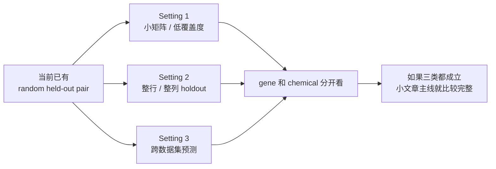
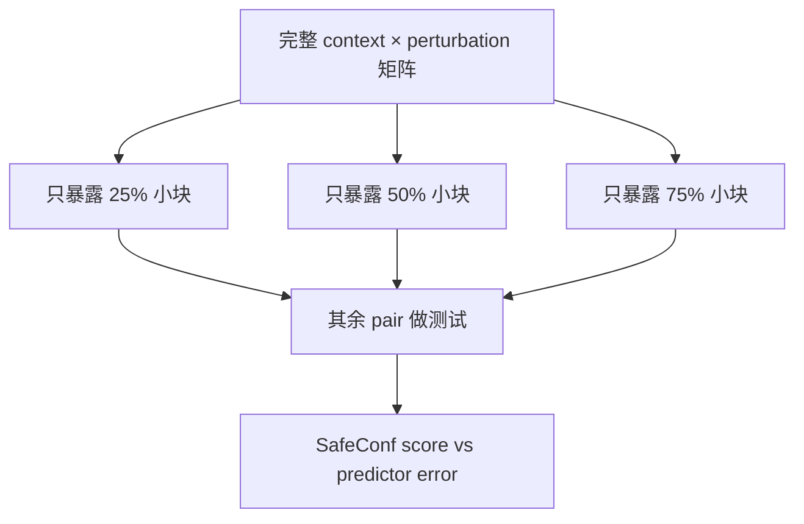
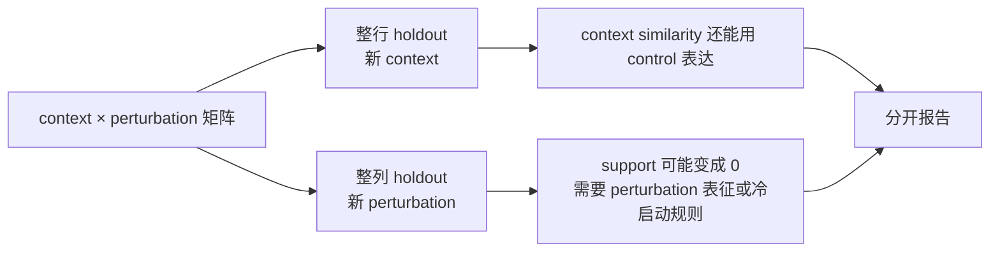
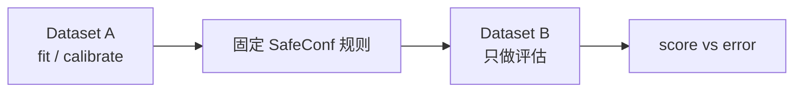

# 周老师聊天记录：真实要求拆解与下一步实验设计

来源：`/home/yyf/.codex/attachments/3d36bc69-c573-44c2-821b-6795c42ac3fc/pasted-text.txt`

这份记录只按这次聊天内容来拆，不沿用之前那套“老师六问”。前面我把重点拆偏了，真正要抓的是周老师后半段反复追的几件事：

1. SafeConf 分数最后跟什么错误相关；
2. 这个错误来自哪个预测模型；
3. disagreement 和 magnitude 这些输入有没有偷看测试真值；
4. 现在的 random held-out pair 太简单，还要补更难的实验 setting；
5. gene perturbation、chemical perturbation、跨数据集都要看。

## 1. 老师实际问了什么

| 老师追问 | 我的理解 | 汇报时要补的回答 |
|---|---|---|
| “衡量好坏的时候是跟什么 correlate 的？” | 他要知道 SafeConf 分数到底和哪个真实错误做相关 | 明确写出：score vs prediction RMSE；RMSE 来自哪一个 predictor，不能只说“预测错误” |
| “实际预测错误的，他用的是什么模型？” | 评价目标是模型相关的。GEARS、scGPT、CPA、reference predictor 的错误不是同一件事 | 结果表里拆成 `predictor_name / error_metric / score_metric / split_setting` |
| “第三个指标其实跑了一些 model，看他们之间的区别” | disagreement 本身用到了模型输出 | 只把它说成 task-level difficulty 线索，不直接说它能判断某个模型靠不靠谱 |
| “这个分数相当于不是针对每个 model 来说的” | 现阶段 SafeConf 更像任务难度分数 | model-specific reliability 可以做补充，但别抢主线 |
| “最后一个值是怎么算的” | 他担心 magnitude / effect-size baseline 是否用了 holdout 真值 | 必须查清每个特征的输入来源：训练 fold、control 数据、预测输出、测试真值 |
| “你要保证输入的东西是你没见过的东西” | 这是防泄漏要求 | 任何 prospective risk score 不能用 held-out pair 的真实表达变化 |
| “你现在是 random 的，在这个矩阵上选一些东西” | 当前 held-out pair 是较简单的随机组合留出 | 要补更难的 split setting |
| “只给这个矩阵的其中一个小矩阵” | 做小矩阵/低覆盖度 setting，看训练信息少时还能不能排序风险 | 设计 submatrix difficulty ladder |
| “有整行整列的 hold out” | 整个 context 或整个 perturbation 留出 | 分开做 held-out context、held-out perturbation |
| “在一个数据集上……在另一个数据集上来预测” | 跨数据集迁移 | 做 cross-dataset setting，先在可对齐的数据族里试 |
| “在不同的上面都看看” | 不只看一个数据类型 | gene perturbation 和 chemical perturbation 都要覆盖 |

## 2. 明天汇报可以这样开头

> 老师，我回去以后重新看了一下上次您问的点。现在我觉得核心不在继续调公式，而是要把 SafeConf 放到不同难度的任务设置里看。  
>   
> 目前我这套分数更准确地说是 task-level risk：它判断某个 context-perturbation 组合整体是不是难预测。它还没有充分解决“同一道任务上 GEARS、scGPT、CPA 哪个模型更可靠”这个问题。  
>   
> 所以下一步我准备先补三个 setting：一个是只给矩阵里的一个小块，模拟训练信息更少；一个是整行或整列 hold out，看完全新 context 或完全新 perturbation；最后是跨数据集预测。每个 setting 里都把 gene 和 chemical 尽量分开看，同时把每个特征的输入来源标清楚，避免用了测试真值。

这段比继续讲一堆历史结果更稳。老师已经说框架做得可以，他现在要的是实验设置更硬。

## 3. 需要当场补清楚的三个技术口径

### 3.1 “跟哪个错误相关”

不能再笼统说“和预测错误相关”。推荐统一成下面这张表：

| 字段 | 含义 |
|---|---|
| `split_setting` | random pair / submatrix / held-out context / held-out perturbation / cross-dataset |
| `dataset_name` | Cui、Frangieh、Tahoe、Srivatsan 等 |
| `perturbation_family` | gene / chemical |
| `predictor_name` | reference predictor、GEARS、scGPT、CPA、baseline |
| `risk_score_name` | SafeConf frozen、support-only、context-only、disagreement-only、predicted-magnitude |
| `error_metric` | RMSE 或 top-gene RMSE |
| `association_metric` | Spearman、partial Spearman、top-k enrichment、AURC |

这样老师再问“用的什么模型”，就能直接指到 `predictor_name`。

### 3.2 “disagreement 用了模型输出”

这个要承认，别绕。

可以这样讲：

> disagreement 这一项确实来自多个预测器的输出。它不是一个完全不依赖模型的生物学特征。我的处理是把它定义成任务难度线索：如果几个固定预测器对同一任务分歧很大，这道任务大概率更难。  
>   
> 所以当前主张放在 task-risk triage，不写成 per-model reliability。模型级可靠性后面可以用 GEARS/scGPT/CPA 的同任务真实预测来单独做。

### 3.3 “magnitude / effect size 有没有泄漏”

这是最容易被打断的地方。现有材料里有两个词要分开：

| 名称 | 能不能用于前置风险打分 | 用途 |
|---|---|---|
| `true effect magnitude` | 不能 | 只能做事后控制混杂，说明 SafeConf 不是单纯重复真实扰动幅度 |
| `predicted magnitude` | 可以 | 如果只来自预测器输出，可作为 deployable baseline |

明天要说得很干净：

> 我会把 magnitude 拆成两类。true effect magnitude 只作为 retrospective control，不放进可部署风险分数；predicted magnitude 才能作为前置 baseline。下一步我会把每个 score 的输入来源列出来，避免把这两类混在一起。

## 4. 周老师最后真正布置的实验

老师最后给的不是“继续多跑几个 seed”。他给的是不同任务难度 setting。

### Setting 0：当前 random held-out pair

这部分已有结果可以保留，作用是基线 setting。

| 内容 | 说明 |
|---|---|
| 任务 | 随机留出 `(context, perturbation)` pair |
| 难度 | 相对简单 |
| 原因 | 每个 context 往往见过一些 perturbation，每个 perturbation 也见过一些 context |
| 用途 | 作为后面更难 setting 的参照 |

汇报时不要把它包装成“最真实场景”。老师已经指出它更简单。

### Setting 1：小矩阵 / 低覆盖度

对应老师说的“只给这个矩阵的其中一个小矩阵”。

建议设计：

| 项目 | 设计 |
|---|---|
| 训练可见区域 | 选一个 context 子集 × perturbation 子集 |
| 难度梯度 | 25%、50%、75% 可见小矩阵 |
| 测试区域 | 小矩阵外的 pair |
| 看什么 | 训练信息越少，SafeConf 是否还能把高错误任务排前面 |
| 报告 | 每个 coverage 下 Spearman、top-k enrichment、AURC |

这项最接近老师说的“不同难度的 task”。

### Setting 2：整行 / 整列 holdout

对应老师说的“整行整列的 hold out”。

建议分成两个子实验：

| 子实验 | 留出什么 | 主要考验 |
|---|---|---|
| Held-out context | 留出整个细胞背景 / cell line | control 表达相似度能不能支持新背景 |
| Held-out perturbation | 留出整个基因或药物 | support 为 0 时，SafeConf 怎样处理冷启动扰动 |

这项会暴露方法边界。尤其整列 holdout 时，如果没有 gene embedding、chemical fingerprint 或 perturbation similarity，support 线索会变弱。这个边界要主动讲。

### Setting 3：跨数据集预测

对应老师说的“一个数据集上所有都见过了，但是在另一个数据集上来预测”。

建议先按同类数据做：

| 方向 | 可行性 | 说明 |
|---|---|---|
| gene → gene | 较优先 | gene perturbation 数据之间概念更接近 |
| chemical → chemical | 较优先 | Tahoe / Srivatsan / McFarland 可形成 chemical 线 |
| gene → chemical | 暂不作为第一批 | 机制差异太大，容易变成负结果，先别抢主线 |

跨数据集这里不要一口吃太大。先做同族 transfer，能解释清楚即可。

## 5. 下一步实验编号建议

把旧的 E33 seed reliability 降级为备选，不放在第一优先级。

| 编号 | 名称 | 优先级 | 作用 |
|---|---|---:|---|
| E33 | feature provenance & error-source audit | P0 | 回答老师“输入是什么、错误来自哪个模型、有没有看测试真值” |
| E34 | submatrix difficulty ladder | P1 | 回答“小矩阵 / 不同难度 task” |
| E35 | row-column holdout audit | P1 | 回答“整行整列 holdout” |
| E36 | cross-dataset transfer audit | P2 | 回答“一个数据集到另一个数据集” |
| E37 | gene/chemical domain-stratified summary | P2 | 回答“不同类型都看看” |
| E38 | GEARS/scGPT/CPA model-specific reliability | P3 | 处理 per-model reliability，先不抢主线 |

## 6. 明天可直接问老师的版本

> 老师，我现在准备把下一步拆成三类 setting。  
>   
> 第一类是小矩阵，只给一部分 context 和 perturbation 组合，看训练覆盖变少以后，SafeConf 还能不能排出高错误任务。  
>   
> 第二类是整行整列 holdout，分别模拟新细胞背景和新扰动。这个会比较直接地暴露冷启动边界。  
>   
> 第三类是跨数据集，比如在一个 gene perturbation 数据集上固定规则，再到另一个 gene 数据集上评估；chemical 也单独做。  
>   
> 在这之前我会先补一个输入来源审计，把每个 score 到底用了训练 fold、control、预测输出还是真值写清楚。尤其 true effect magnitude 只能作为事后控制，不能作为前置风险打分。  
>   
> 如果您认可这个顺序，我下一阶段就先做 E33 到 E35，把随机 pair 之外的两个核心 setting 跑出来，再补跨数据集。

## 7. 这次汇报材料该怎么改

主 Markdown 不要再围绕“老师六问”。建议改成四段：

1. 我上次没答清的地方：error source、model dependence、magnitude 输入；
2. 当前结果能支持什么：task-risk triage，有边界；
3. 周老师建议的三个新 setting：小矩阵、整行整列、跨数据集；
4. 本周要落地什么：先做 E33 输入审计，再跑 E34/E35。

旧材料里的这些内容要弱化：

| 旧内容 | 处理 |
|---|---|
| “老师六问” | 改成“周老师追问点” |
| E33 GEARS fixed-test seed reliability | 放到备选或附录 |
| SafeConf vs magnitude 谁更强 | 保留边界，不作为主战场 |
| 大量历史实验堆叠 | 只留能支撑当前 setting 的结果 |

## 8. 判断

周老师并没有否定 SafeConf。他说“框架做得挺好”，后面给的是验证路线。当前最危险的不是结果不够多，而是实验 setting 和输入来源讲不清。

下一阶段抓两件事：

1. 把每个分数的输入来源查干净；
2. 把 random held-out pair 扩成小矩阵、整行整列、跨数据集。

这两件做完，比继续堆普通相关性结果更有用。
