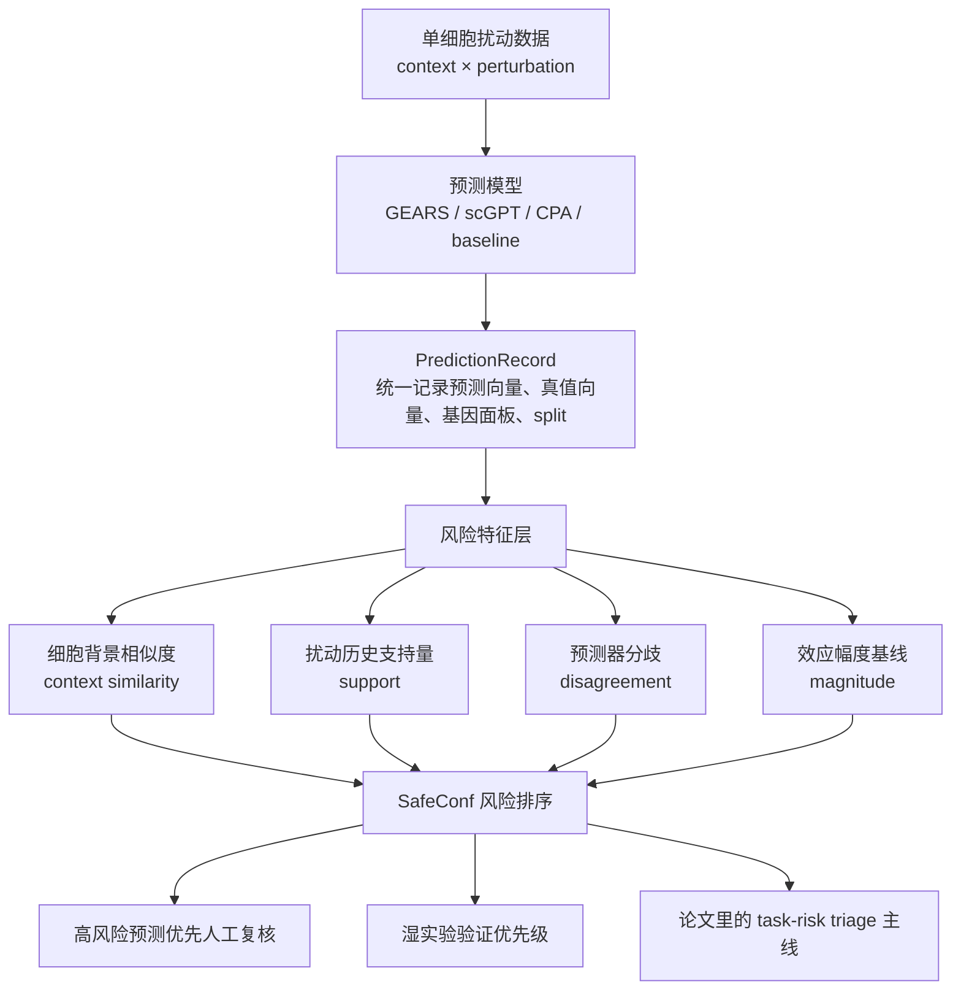
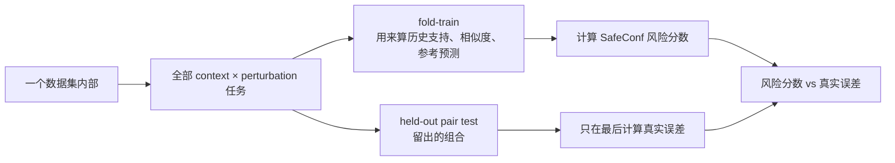
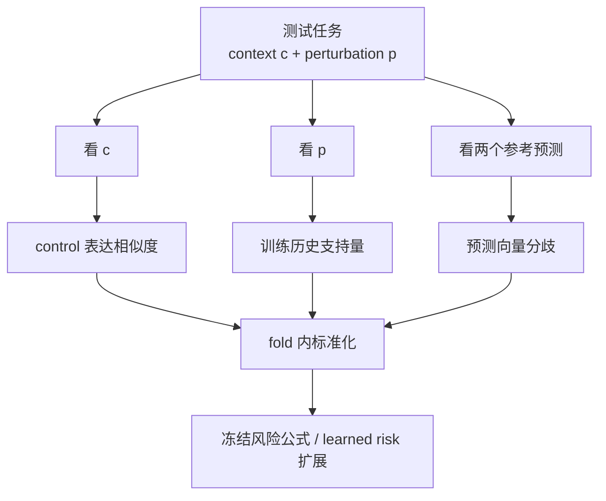
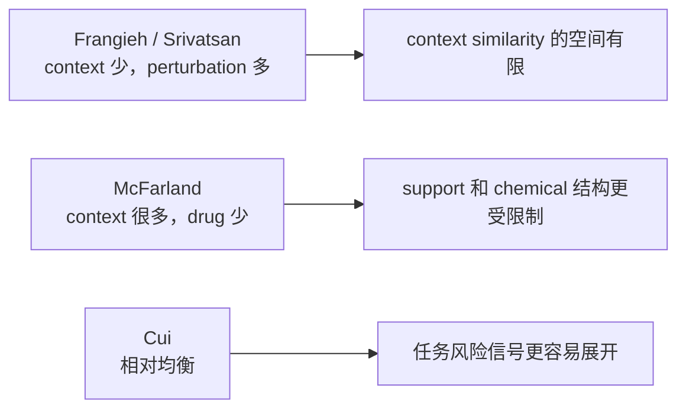
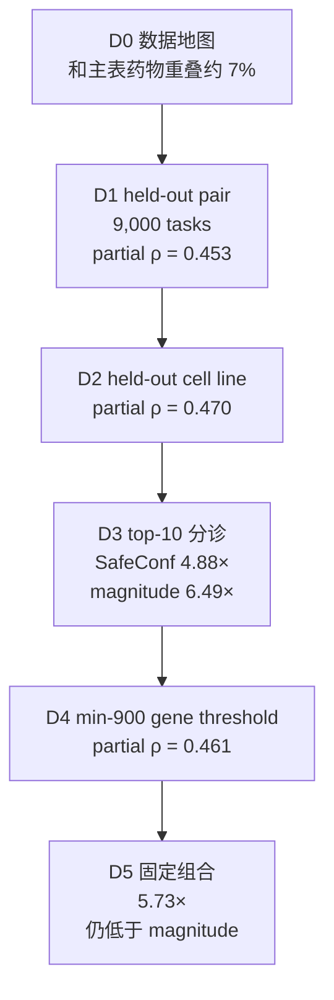
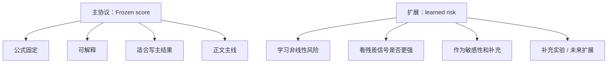
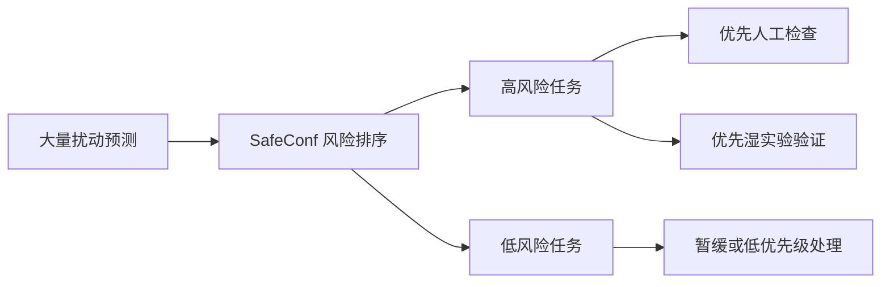
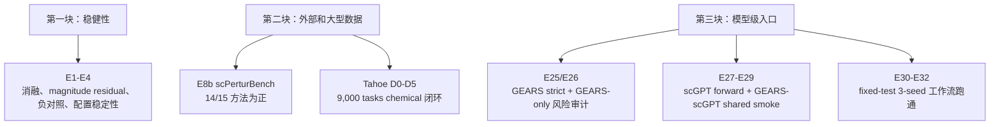
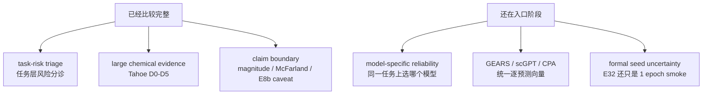
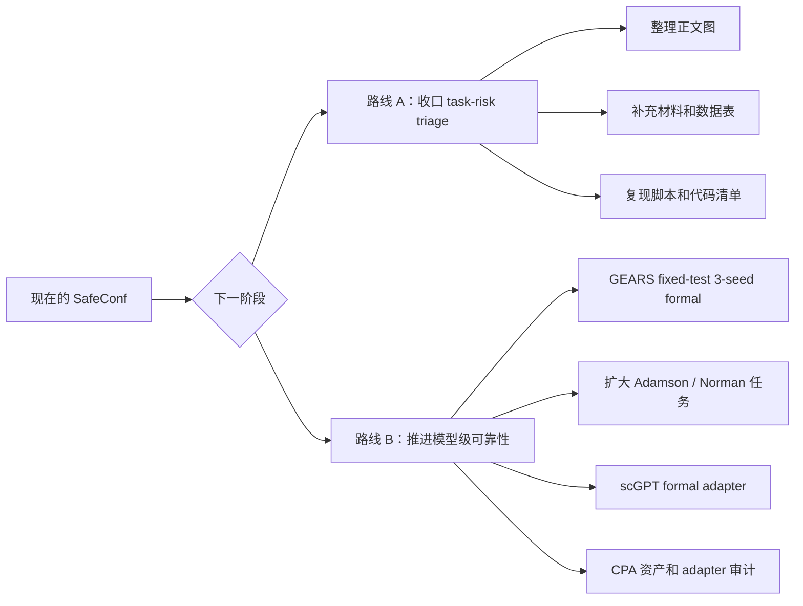

# 2026-07-09 导师组会汇报稿：按上次问题逐项回答

配套截图页：`SafeConf_主线汇报_术语跳转增强版_20260709.html`

老师，我这次把内容按您上次问的问题整理。先讲我现在做的东西，再逐条回答您上次提到的几个点，最后说最近新增了什么、现在到什么阶段、下一步我想请您帮我定哪条路。

## 1. 我现在做的东西

我现在的主线是 SafeConf。它放在单细胞扰动预测之后，做预测结果的风险质检。

GEARS、scGPT、CPA 或简单基线先给出扰动后的表达变化预测；SafeConf 再看这一条预测对应的任务风险高不高。它输出的是复核优先级：哪些任务更容易出错，哪些结果更值得先查。

我想讲清楚的一点是：这不是“再训练一个更大的扰动预测模型”。我现在处理的是预测之后的可靠性问题。真实科研里，预测结果会很多，湿实验和人工复核资源有限，所以需要一个排序。

## 2. 上次问题 1：数据到底怎么切？

您上次问得比较关键：数据是不是跨数据集切，测试集到底是什么。

我现在的回答是：七个主数据集没有混在一起做跨数据集切分。每个数据集在自己内部做 held-out pair。也就是留出一部分 `(context, perturbation)` 组合做测试，训练部分只包含其余组合。

所有风险特征只看 fold-train。测试任务的真实误差只在最后评价时使用。

这部分我会这样跟老师说：

> 我没有把七个数据集合在一起随机切。每个数据集内部留出没有见过的 context-perturbation 组合。SafeConf 的特征只用训练 fold 计算，测试 fold 的真值只在最后评价风险排序时用。

这个回答主要解决防泄漏问题：SafeConf 先给风险分数，测试任务真值只留到最后评价。

## 3. 上次问题 2：三个指标具体怎么算？

我把核心线索固定成三类，后面再把 magnitude 当成必须并列报告的强基线。

| 线索 | 怎么算 | 我汇报时怎么解释 |
|---|---|---|
| 细胞背景相似度 | 测试 context 的 control 表达，与训练 context 的 control 表达做最大余弦相似度 | 这个细胞背景像不像训练里见过的背景 |
| 扰动历史支持量 | 训练 fold 里同一 perturbation 有多少有效历史任务 | 这个扰动以前有没有足够参考 |
| 预测器分歧 | 两个固定参考预测器的效应向量 RMSE 差异 | 不同预测器对这道题有没有共识 |
| magnitude | 效应幅度或预测幅度相关的强基线 | 真实变化大时，任务本身常常更难 |

这里我会强调两层：

1. Frozen 公式是主协议，固定、可解释、不会在测试集上调权重。
2. learned risk 是扩展实验，用来检查还有没有更强的风险信号。

我不会把 learned 结果拿来改写 Frozen 的失败数据集。

## 4. 上次问题 3：context 和 perturbation 各有多少？

这一问我准备直接放数据地图。七个主数据集结构差异很大，所以结果不能只看总任务数。

| Dataset | Family | Contexts | Perturbations | Tasks | 结构特点 |
|---|---:|---:|---:|---:|---|
| Cui | gene | 15 | 86 | 1,253 | 背景与扰动较均衡 |
| Frangieh | gene | 3 | 211 | 633 | 背景数有限 |
| Lara ex vivo | gene | 8 | 42 | 323 | 中等规模 |
| Lara in vivo | gene | 15 | 39 | 375 | 背景多、扰动较少 |
| McFarland | chemical | 170 | 13 | 1,163 | 背景很多、药物很少 |
| Santinha | gene | 10 | 29 | 273 | 规模较小 |
| Srivatsan | chemical | 3 | 188 | 564 | 背景数有限 |

我会这样讲：

> 这张表主要解释为什么不同数据集里的特征贡献不会完全一样。比如 McFarland 有 170 个 context，但只有 13 个药物；Frangieh 和 Srivatsan 只有 3 个 context。这个结构差异本身就是结果边界的一部分。

## 5. 上次问题 4：有没有用现成大型数据？

用了。Tahoe 是这次最大的 chemical 补强。

我对 Tahoe 做的是 D0–D5，一条链跑完：

Tahoe 的关键信息：

| 项目 | 数字 |
|---|---:|
| contexts | 25 |
| drug-dose perturbations | 1,028 |
| sampled tasks | 9,000 |
| PredictionRecords | 80,812 |
| D1 partial ρ | 0.453 |
| D2 partial ρ | 0.470 |
| SafeConf top-10 enrichment | 4.88× |
| magnitude top-10 enrichment | 6.49× |

我会这样讲：

> Tahoe 支持 task-risk 信号。pair holdout 和 held-out cell line 都是正的。但 Tahoe 也提醒我，magnitude 是很强的基线，尤其 top-10 高错误检索里 magnitude 更强。所以 Tahoe 不能写成 SafeConf 全面胜出，它更适合作为大型 chemical 场景里的正信号加边界。

## 6. 上次问题 5：用公式还是用模型？

我现在把它分成两层讲。

Frozen 的作用是给出一个稳定、可解释的协议。它在七主数据集里 6/7 控制 magnitude 后为正，McFarland 是失败边界。

learned risk 的作用是看任务风险信号是否还能通过学习型模型进一步捕获。它可以作为扩展，但不能把 McFarland 的 Frozen 失败改写成成功。

我会这样说：

> 我现在不把公式和模型混在一起讲。Frozen 是主协议，learned 是扩展。Frozen 失败的地方就保留失败，这样论文边界更清楚。

## 7. 上次问题 6：任务难度有什么用？

这其实是整篇论文最重要的问题。

任务难度的用途是分诊。模型给出很多预测之后，我用 SafeConf 把高风险任务排出来，让人工复核和湿实验优先看这些任务。

现有证据支持这个用途：

| 场景 | 结果 |
|---|---|
| 七主数据集 | Frozen top-10 macro enrichment = 3.35× |
| Tahoe chemical | SafeConf top-10 enrichment = 4.88× |
| E2 magnitude-residual | 7/7 数据集在控制 magnitude 后仍有残差信号 |
| E11 risk-coverage | 80% coverage 下 7/7 数据集平均 RMSE 下降 |

我会跟老师说：

> 任务难度的价值现在主要在任务层：哪些预测更值得先查。模型层还没有完全解决。比如同一道任务上 GEARS、scGPT、CPA 哪个更可靠，还需要真实多模型逐预测向量验证。

## 8. 最近我具体补了什么

最近的工作可以分成三块。

我准备重点讲这几件：

| 阶段 | 我补的内容 | 现在的意义 |
|---|---|---|
| E1–E4 | 修正泄漏，做消融、残差、负对照、稳定性 | 说明主信号不只是泄漏或 magnitude |
| E8b | Frangieh 外部 benchmark，15 methods | 说明任务风险和外部方法误差有关，但只是聚合关联 |
| Tahoe D0–D5 | 大型 chemical sampled validation | 回答“大型现成数据”问题，也给出 magnitude 边界 |
| E25–E32 | GEARS/scGPT/seed 工作流 | 把真实模型级验证入口打通，但还没有正式多模型结论 |

## 9. 现在到什么阶段

我现在会把阶段分成两层。

现在可以稳妥写的内容：

| 可以写 | 具体说法 |
|---|---|
| task-risk triage | SafeConf 能对单细胞扰动预测任务进行风险排序 |
| residual signal | 控制 magnitude 后仍有任务风险残差信号 |
| practical triage | 高风险排序能富集高错误预测 |
| boundary | McFarland 失败、Tahoe magnitude 更强、E8b 是聚合关联 |

我会避开的说法：

| 避开的说法 | 原因 |
|---|---|
| SafeConf 在 7/7 主数据集都成功 | McFarland 是 Frozen 失败边界 |
| SafeConf 全面超过 magnitude | Tahoe top-10 中 magnitude 更强 |
| E8b 等于完整多模型验证 | E8b 缺逐预测向量，只是聚合方法误差关联 |
| E32 是正式 GEARS uncertainty 结果 | E32 是 7 tasks、1 epoch smoke |
| 已经能正式比较 GEARS/scGPT/CPA | CPA 逐预测向量 adapter 还没完成 |

## 10. 下一阶段我想请老师定的事

我现在不想继续临时加 Tahoe shard，也不想继续调 Frozen 公式。Tahoe 已经回答了该回答的问题，再扫参数容易变成 test-set 调参。

我想请老师定两条路线中的一条。

我准备这样问老师：

> 老师，现在 task-risk triage 这条线证据已经比较完整，但 model-specific reliability 还在入口阶段。接下来我想请您定一下：如果您觉得任务风险分诊这条线可以收口，我就把正文图、补充材料和复现代码整理起来；如果您觉得还需要模型层证据，我就把 E32 的 fixed-test 3-seed 从 smoke 升级成 formal，并扩到更多任务或第二个模型。

## 11. 我准备的开场

> 老师，我这次按您上次问的问题来讲。您当时主要问了数据怎么切、指标怎么算、context 和 perturbation 规模、有没有用大型现成数据、公式和模型怎么取舍、任务难度到底有什么用。我这次逐条回答。整体进展是：任务层风险分诊已经有比较完整的证据链，Tahoe 也补了大型 chemical 场景；模型层可靠性刚打通入口，还没到正式结论。

## 12. 我准备的结尾

> 我现在的判断是，SafeConf 作为 task-risk triage 已经比较清楚：它能帮助排序哪些扰动预测更值得先复核。但边界也要写清楚，magnitude 很强，McFarland 失败，E32 还只是 smoke。下一步我想听老师意见：先把任务风险分诊这条线收口，还是继续补真实多模型可靠性。

## 13. 我实际做 PPT 时的顺序

如果只做 8–10 页，我会这样排：

| 页 | 内容 | 作用 |
|---:|---|---|
| 1 | 今天按上次问题逐条回答 | 把汇报拉回老师关心的问题 |
| 2 | SafeConf 架构图 | 讲清楚我到底做什么 |
| 3 | Q1：split 和防泄漏 | 回答数据怎么切 |
| 4 | Q2：三个风险线索 | 回答指标怎么算 |
| 5 | Q3：七数据集 data map | 回答 context / perturbation 规模 |
| 6 | Q4：Tahoe D0–D5 | 回答大型数据 |
| 7 | Q5：Frozen vs learned | 回答公式和模型取舍 |
| 8 | Q6：任务难度用途 | 回答实际意义 |
| 9 | 最近进展和当前阶段 | 讲 E1–E32 到哪了 |
| 10 | 下一阶段请老师定路线 | 收口或模型级扩展 |
