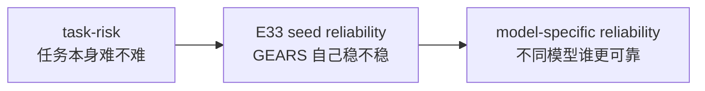
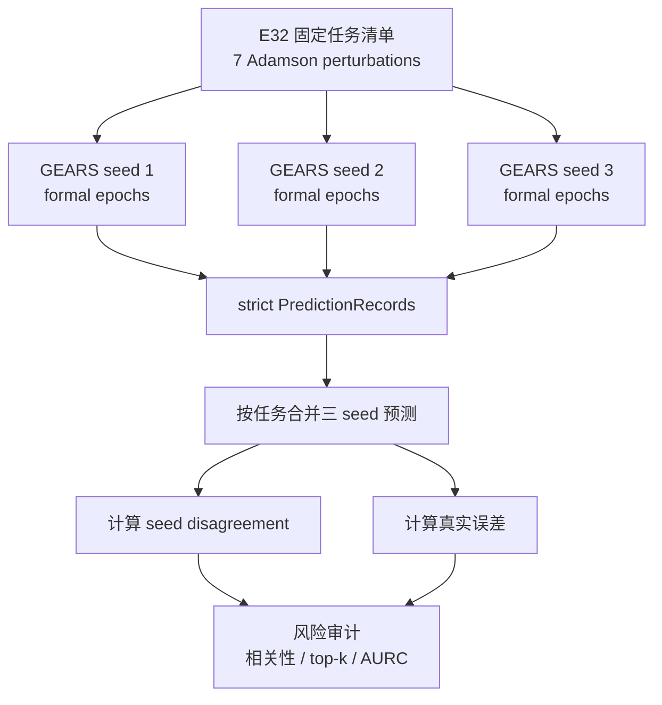
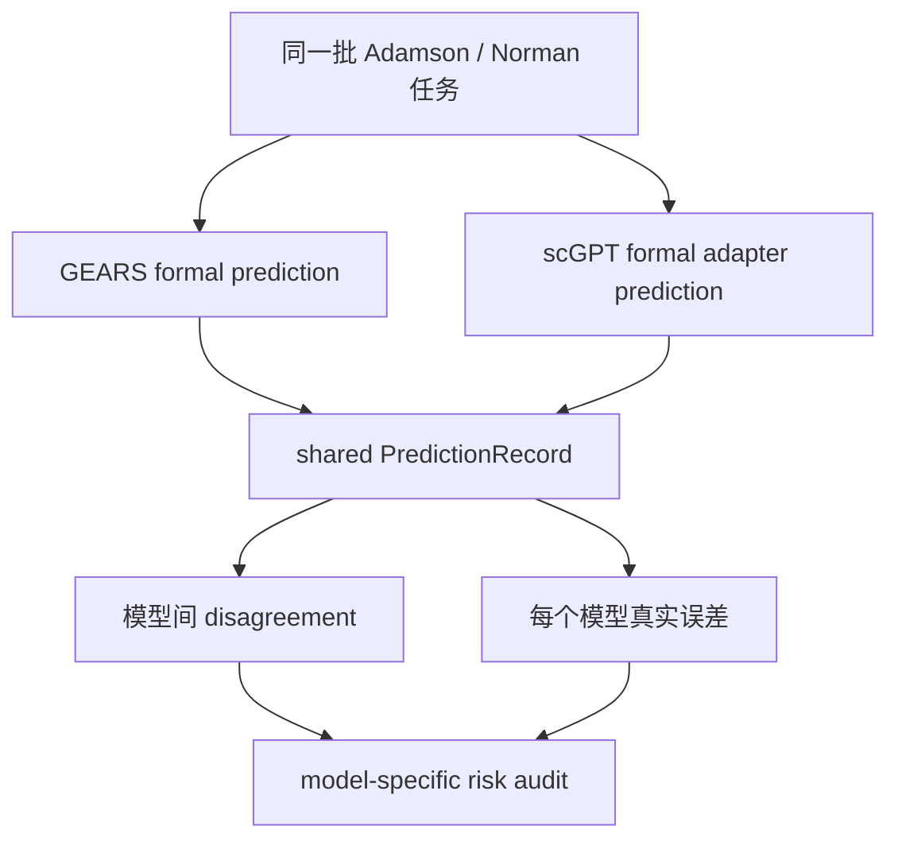
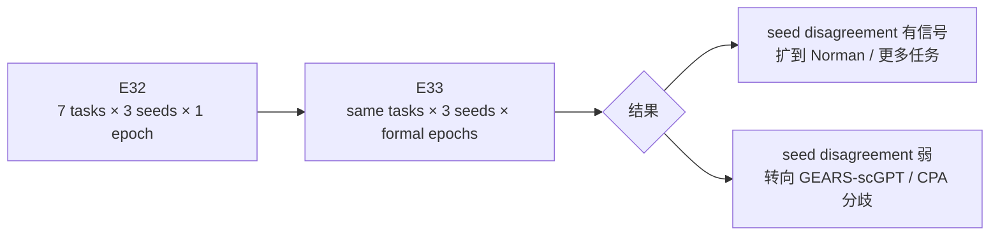

# 2026-07-09 组会后实验设计与下一步记录

前置提交：`ad93c6e843ab241c0c0d94302df8c0d9cc1138b7`
关联汇报稿：`导师组会_问题驱动汇报逻辑_20260709.md`
关联截图页：`SafeConf_主线汇报_术语跳转增强版_20260709.html`

这份记录只做三件事：

1. 记录最新组会稿里已经讲到哪里；
2. 给出下一步实验设计；
3. 说明下一版汇报材料该怎么改。

## 1. 我看完最新组会稿后的判断

目前这份汇报稿已经能讲清楚 SafeConf 的基本定位：

```text
预测模型先给出扰动后的表达变化；
SafeConf 在预测之后做风险排序；
高风险任务优先人工复核或湿实验验证。
```

稿子里已经覆盖了这些内容：

| 模块 | 已经有 | 还缺什么 |
|---|---|---|
| SafeConf 定位 | 有，能说明它是预测后的质检层 | 可以少讲定义，多讲实际科研场景 |
| 数据切分 | 有，held-out pair 和 fold-train 防泄漏讲清楚了 | PPT 里配一张 split 图 |
| 三个核心线索 | 有，context similarity / support / disagreement | magnitude 要明确作为强基线，不能暗示 SafeConf 一定压过它 |
| Frozen vs learned | 有，主协议和扩展分开了 | 需要继续强调 McFarland 失败保留 |
| 任务难度用途 | 有，分诊逻辑成立 | 需要接到下一步 model-specific reliability |
| 最近进展 | 有，E1–E4 / E8b / Tahoe / E25–E32 都提到了 | 需要把下一步实验说得更具体 |

所以，下一版汇报不需要继续加概念解释。现在最需要补的是：老师如果问“那下一步具体怎么做”，我们要能拿出一个实验方案。

## 2. 下一步主实验：E33 GEARS fixed-test formal seed reliability

我建议下一步主实验命名为：

```text
E33 GEARS fixed-test formal seed reliability
```

它承接 E31/E32。

- E31 已经证明 GEARS exporter 可以固定 test perturbations；
- E32 已经在 Adamson 7 个固定任务上跑通 3 seeds × 1 epoch；
- E33 要把这个 smoke 升级成 formal setting。

### 2.1 这个实验回答什么

这个实验只回答一个清楚的问题：

```text
同一批测试任务上，GEARS 不同随机种子的预测分歧，
能不能作为模型自身不稳定性和错误风险的信号？
```

这和前面的 task-risk 不完全一样。

| 层次 | 问题 |
|---|---|
| task-risk | 这道任务本身难不难 |
| seed reliability | GEARS 对这道任务稳不稳 |
| model-specific reliability | 同一道任务上，不同模型谁更可靠 |

E33 只能往第二层推进，还不能直接证明完整第三层。



### 2.2 实验设计

| 项目 | 设计 |
|---|---|
| 数据集 | Adamson |
| 测试任务 | 沿用 E32 的 7 个 fixed test perturbations |
| 模型 | GEARS |
| seeds | 1、2、3，必要时扩到 5 个 seeds |
| epochs | 从 1 epoch smoke 升级到 formal epochs；先按 GEARS 当前 formal 设置跑，不在 test set 上调 |
| gene panel | 沿用 E31/E32 的 GEARS gene panel |
| 输出格式 | strict PredictionRecord |
| 主指标 | seed disagreement vs true error |
| 辅助指标 | AURC、top-k enrichment、risk-coverage、Spearman、Pearson |
| 关键校验 | 同一 test perturbation、同一 gene order、同一 true effect、strict issue_count = 0 |



### 2.3 输出表应该长什么样

E33 至少要输出三张表：

| 表 | 作用 |
|---|---|
| `E33_RUN_SUMMARY.csv` | 每个 seed 是否跑通、epochs、records 数、strict 问题数 |
| `E33_TASK_SEED_RELIABILITY.csv` | 每个任务的 seed disagreement、mean RMSE、max RMSE、true consistency |
| `E33_RISK_AUDIT_SUMMARY.csv` | seed disagreement 与真实错误的 Spearman、AURC、top-k enrichment |

核心字段建议：

```text
task_key
perturbation
n_seeds
seed_ids
seed_rmse_mean
seed_rmse_std
seed_rmse_max
seed_pairwise_pred_rmse_mean
seed_disagreement_rmse
true_max_abs_diff_across_seeds
risk_rank
error_rank
```

### 2.4 成功和失败怎么判

不要把这个实验设计成“必须成功”。它本来就是用来确认 GEARS seed uncertainty 是否有用。

| 结果 | 解释 | 下一步 |
|---|---|---|
| seed disagreement 与 error 明显正相关 | GEARS seed 不稳定性可以作为 model-specific 风险线索 | 扩到更多任务或 Norman |
| 相关性弱，但 strict 和 fixed-test 成立 | 工程入口成立，seed uncertainty 本身可能不够强 | 加入 scGPT / CPA，做模型间分歧 |
| strict 不通过或 true effect 不一致 | 不能进入性能解释 | 先修 PredictionRecord 合同 |
| 7 任务样本太小，方向不稳定 | 不能写 formal conclusion | 扩任务数优先于继续调公式 |

我建议汇报时这样讲：

> 下一步我不想再调 Frozen 公式。更关键的是把 E32 的 fixed-test 3-seed smoke 升级成 formal。它能回答 GEARS 自身稳定性是不是能预测错误。如果这个信号成立，就继续扩到 Norman 或加入 scGPT；如果不成立，也能说明 seed uncertainty 不是足够强的模型层风险信号。

## 3. 备选实验：E34 GEARS–scGPT shared formal adapter

E34 不建议立刻和 E33 同时大规模展开。它适合在两种情况下启动：

1. 老师明确要求“同一任务上不同模型谁更可靠”；
2. E33 显示 seed uncertainty 不够，需要模型间分歧。

E34 的核心问题是：

```text
在同一任务、同一 split、同一 gene panel 下，
GEARS 和 scGPT 的预测分歧能否预测平均错误或模型选择错误？
```



E34 的输出重点：

| 输出 | 说明 |
|---|---|
| shared PredictionRecords | GEARS 和 scGPT 同任务、同 gene panel |
| model disagreement | 两个模型预测效应向量的 RMSE |
| per-model error | GEARS error、scGPT error |
| model-selection regret | 如果根据风险选择模型，比 oracle 差多少 |

这一步比 E33 更接近 model-specific reliability，但工程风险也更高。

## 4. 下一版汇报材料怎么改

你最新这份组会稿已经能讲“我现在做什么”。下一版建议只改三处。

### 4.1 把“当前阶段”后面接上实验设计

现在稿子在“当前阶段”这里停住了。建议后面直接加：

```text
下一步我建议先做 E33。
E33 不再改 SafeConf 公式，也不再继续扫 Tahoe 参数。
它把 E32 的 GEARS fixed-test 3-seed smoke 升级为 formal，
目的是看 GEARS 自身 seed disagreement 能不能预测真实误差。
```

### 4.2 PPT 里加一页“下一步实验设计”

这一页建议画成下面这样：



页面标题可以写：

```text
下一步：把 smoke 变成 formal，暂停调公式
```

### 4.3 结尾不要泛泛问“下一步怎么办”

结尾建议问得具体一点：

```text
老师，下一步我建议先做 E33：
固定 Adamson 这批 test perturbations，
把 GEARS 3 seeds 从 1 epoch smoke 升级到 formal epochs，
看 seed disagreement 是否能解释真实误差。

如果您觉得模型间比较更重要，
我再把 scGPT formal adapter 和 CPA 审计放到 E34。
```

这样老师更容易给方向。

## 5. 留存记录

### 5.1 本次输入材料的状态

用户提供的最新组会进展稿已经覆盖：

- SafeConf 是预测后的风险质检层；
- held-out pair split；
- 三类核心风险线索；
- Frozen vs learned 分层；
- 任务难度的分诊用途；
- E1–E4、E8b、Tahoe D0–D5、E25–E32；
- 当前阶段：task-risk triage 较完整，model-specific reliability 仍在入口阶段。

本记录在此基础上新增：

- E33 GEARS fixed-test formal seed reliability 设计；
- E34 GEARS–scGPT shared formal adapter 备选设计；
- 下一版汇报材料的修改方式；
- 会后可追溯的实验决策记录。

### 5.2 当前建议

```text
优先做 E33。
暂不继续调 Frozen 公式。
暂不继续加 Tahoe shard。
E32 smoke 仍按 smoke 记录，不写成 formal benchmark。
E33 如果方向成立，再扩到 Norman 或进入 GEARS–scGPT formal adapter。
```

### 5.3 下一步行动清单

| 顺序 | 动作 | 产物 |
|---:|---|---|
| 1 | 在汇报稿“当前阶段”后加入 E33 设计 | 一页下一步实验图 |
| 2 | 组会时请老师确认 E33 / E34 优先级 | 老师决策 |
| 3 | 若确认 E33，冻结 test perturbation 文件、seeds、epochs | E33 prereg note |
| 4 | 跑 GEARS fixed-test formal seeds | strict PredictionRecords |
| 5 | 做 seed reliability audit | E33 report |
| 6 | 根据结果决定是否扩 Norman / scGPT / CPA | E34 or E35 |
