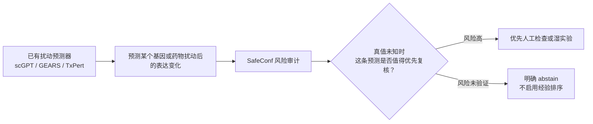
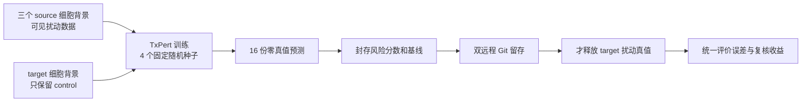

# SafeConf 组会汇报主稿

日期：2026-08-13

建议时长：8–10 分钟
目标：请老师判断论文问题是否成立，以及 E201 后还需要补什么。
贴图：先打开本目录 `figures/`，按 01→02→03→07→08→04→05 的顺序贴。

## 0. 开场：我今天想确认什么（30 秒）

> 老师，我这次没有再去调原来的分数，也没有把新训练中的中间数当结果。上次您问的
> 是：分数到底对应谁的误差、打分时有没有用到真值、在小矩阵、整行整列和跨数据集
> 这些更难的情况下还能不能用。现在这些问题我已经分别拆开做了；同时接入了公开的
> TxPert 图模型，正在做四个细胞背景的严格留出。今天想请您判断：这条“预测后风险
> 审计”的问题能不能作为论文主线，E201 完成后还缺哪一块关键验证。

## 1. 我现在做的到底是什么（1 分钟）

> 我的工作不是再训练一个预测器，而是在预测之后做质检。核心不是保证所有任务都能
> 排对，而是把“能用”“不能用”“应该停止使用”写清楚。这里的真值指真实做完扰动实验
> 后的表达变化；在预测要上线或决定是否做湿实验时，它本来就是未知的。

## 2. 先回答上次的三个问题（2 分钟）

| 老师的问题 | 我现在的回答 | 证据 |
|---|---|---|
| 分数和谁的误差比较？ | 每条结果都绑定具体预测器、任务和误差定义。模型分歧对应一组事前冻结模型的 family 风险，不能说某一个模型一定错。 | E189–E197、E194 |
| predicted magnitude 看了真值吗？ | 没有。它只计算“冻结预测出的变化有多大”；真实实验表达只在预测和打分留存后才打开。它也是必须保留的强基线。 | E190、E192 的 prediction-first 合同 |
| 一个完全没见过的任务怎么打分？ | 目标背景的 control、训练历史支持、冻结模型预测和模型间差异可以用；没有可用表征时应返回未验证，不伪装成低风险。 | E189、E192；E201 进一步检验整背景留出 |

> 所以现在我能明确区分：什么是事前可算的风险输入，什么只能事后评价；分数说的是
> 哪个预测器家族的风险，而不是模糊地说“模型置信度”。

## 3. 更难的 setting 已经跑出的结论（2 分钟）

| setting | 已有结论 | 应该怎样理解 |
|---|---|---|
| 小训练矩阵 | E189：训练中能看到的背景变少时，误差随支持量变化 | 支持量是任务难度的一部分 |
| random / 行 / 列 / 双未见 | random 最容易；整行较弱；双未见时经验排序可为负 | 随机拆分不能代替真实使用场景 |
| 跨研究 | E190、E192：流程和防泄漏成立；RPE1 按事前规则返回 `ABSTAIN` | 不能把跨研究中的弱信号包装成成功 |
| chemical | E84/E87/E89：能做，但多处是 predicted magnitude 更强 | chemical 是边界章节，不和 gene 合并宣称普适 |

> 这部分对论文反而是重要的：我不是只报告随机拆分上的相关性。结果说明风险审计
> 有 setting 依赖性，因此系统需要“未验证就不启用”的开关。

## 4. 为什么又接入 TxPert，新增了什么（1.5 分钟）

> 您上次还提到，基因侧不能只靠简单统计；对没见过的基因扰动，应该利用基因之间的
> 关系信息。所以我接入了公开的 TxPert 图模型。它用基因关系图来帮助预测扰动效应，
> 更接近您说的“未见扰动也要有可用输入”。

| 新实验 | 已有结果 | 不能夸大的地方 |
|---|---|---|
| E198：评价协议校准 | 先固定单细胞评价指标，12 个协议全部通过完整性门 | 不是模型效果实验 |
| E199：K562 未见基因扰动 | 263 个任务中，模型家族分歧与误差相关 0.395，95% 区间 [0.284, 0.497]；20% 高风险复核收益为正 | 只有 K562 内部未见扰动 |
| E200：K562 整个背景留出 | 566 个任务；图模型优于 general baseline，但 predicted magnitude 比 transfer risk 更会抓高错误任务 | 一个 target 背景不能代表普遍跨背景 |

> E199 说明这个图模型下确实存在可用的任务风险信号；E200 同时提醒我，换成整背景
> 留出后，幅度这个简单基线仍然很强。所以 E201 不会只报告一个最好看的数字，而是
> 让四个背景、四个种子一起接受同一套比较。

## 5. E201 正在做什么，为什么现在不能下结论（1.5 分钟）

> E201 是把 K562、RPE1、HepG2、Jurkat 轮流完全留出。现在 7 个模型已经训练满 80
> 轮，第 8 个 Jurkat seed 2 已到约第 79/80 轮，后面 8 个已经固定排队。最关键的是，
> 到现在 target 扰动真值读取是 0 行。这样训练中看到的 source validation 高低不会
> 影响种子、任务或评分规则。对应白底图：`figures/04_E201盲测协议.png`。

> 所以今天我只能汇报“训练和盲测合同已经落实”，不能汇报 E201 成功或失败。16 个
> 模型完成后，会先封存预测、风险分数和基线并推送 Git，再统一打开真值评价。

## 6. 我对论文可能性的判断，以及想请老师拍板的事（2 分钟）

> 我现在更适合把文章收成“单细胞扰动预测后的风险审计：在困难留出条件下，哪些
> 信息可以在真值未知时使用，哪些 setting 可以路由，哪些 setting 必须 abstain”。
> 这和“做一个永远优于 magnitude 的统一分数”不同，后者目前的证据不支持。

> 已有的基础是：小矩阵、行列留出、跨研究、gene 与 chemical 的边界都已经留档；
> 新的公开图模型有 K562 内未见扰动和一项完整背景留出的真实结果；E201 正在把完整
> 背景留出扩到四个背景和四个种子。

> 我想请您帮我定三件事：第一，这个“风险审计 + 困难 setting + abstain”的问题能否
> 作为论文主线；第二，E201 跑完后是直接开始组织正文，还是必须再加一套独立数据；
> 第三，chemical 是否只保留为边界和讨论，不再硬塞进 gene 的主结论。

## 备用：老师若直接问“现在能发吗？”（20 秒）

> 现在我不想把它说成已经可以投稿。原因是最关键的多背景盲测 E201 还没有开真值。
> 但问题、协议和已有结果已经可以支持开始搭文章结构。等 E201 按冻结流程评价完，
> 我希望根据四个背景的一致性和失败边界，请您决定是进入写作还是再加一个独立验证。
