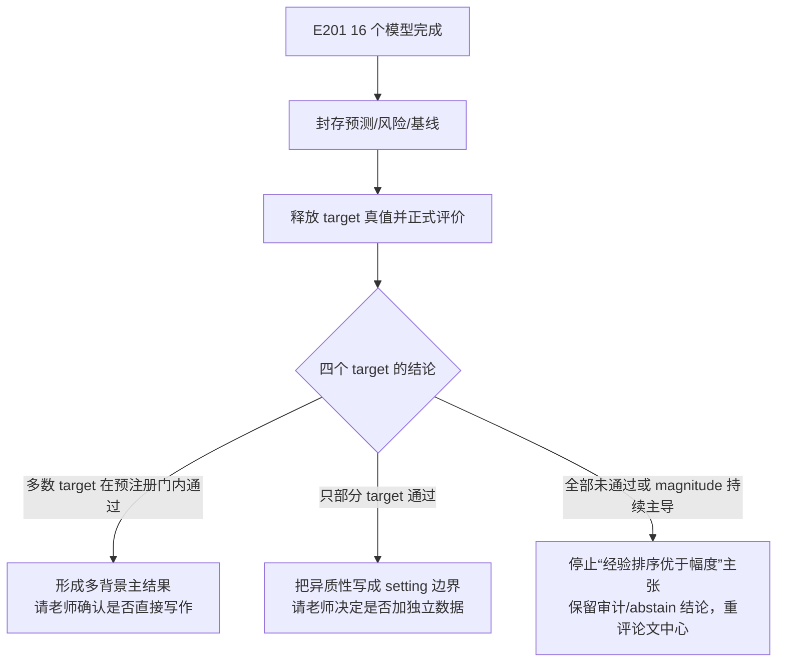

# 组会附录：证据、缺口与发表判断

这份文件用于老师追问，不建议从头照读。

## A. 今天可以贴进 PPT 的图

讲解图在本目录 `figures/`，结果图也已复制到同一处：

| 图 | 用途 | 文件 |
|---|---|---|
| 系统定位 | 预测后质检，不是新预测器 | `figures/01_系统定位.png` |
| 老师三问 | 误差对象、magnitude 是否泄漏、未见任务怎么打分 | `figures/02_老师三问.png` |
| 三个更难 setting | 老师原话对应的三档实验：能算，但不都更好 | `figures/03_三个更难setting.png` |
| E201 盲测协议 | 16 个模型做到哪、为什么今天没有结论 | `figures/04_E201盲测协议.png` |
| 论文判断 | 现在不能投稿；请老师拍板三件事 | `figures/05_论文判断与请老师拍板.png` |
| E198 协议校准 | 说明不是随意换评价指标 | `figures/06_E198_protocol_calibration.png` |
| E199 K562 图模型未见扰动 | 公开图模型下有真实的 risk signal | `figures/07_E199_txpert_public_k562.png` |
| E200 K562 完整背景留出 | 图模型优于 general baseline，但 magnitude 更强 | `figures/08_E200_cross_context_audit.png` |

这些图都是白底 PNG/PDF，可直接贴进 PPT。E201 暂无正式结果图，不能用训练曲线冒充
测试效果。

## B. 发表判断：不是“能不能”，而是“写什么主张”

| 候选主张 | 现有证据是否支持 | 原因 |
|---|---|---|
| “SafeConf 普遍优于 predicted magnitude” | 不支持 | E200、E192、chemical 等有 magnitude 更强或不稳定的结果 |
| “模型分歧就是某一个模型的置信度” | 不支持 | 分歧属于被冻结 family 的几何关系，不能定位到某一成员 |
| “预测后风险审计可在已验证 setting 中辅助复核，未验证 setting 应 abstain” | 有基础，但须完成 E201 | E189–E200 已有正负边界；E201 决定多背景完整留出的证据力度 |
| “公开图模型在单细胞扰动中能利用基因关系处理未见扰动” | 有局部证据 | E199 K562 内未见扰动；E200 K562 背景留出；仍需 E201 多背景结果 |
| “gene 与 chemical 一套规则普适” | 不支持 | 两个模态、预测器和优势基线不同，应分开报告 |

如果老师认可第三行，E201 后的论文最小结构可以是：

```text
问题：预测已给出、真值未知时，怎样审计任务风险？
方法：预测前输入合同 + 预注册 family / 图模型风险量 + fail-closed 决策
评价：小矩阵、行列缺失、跨研究、公开图模型、四背景盲测
结果：哪些 setting 有收益；哪些 setting magnitude 更强；何时 abstain
```

## C. E201 后的决策树



无论结果如何，不可做的事：删掉不利 target、改种子、改风险公式、只报最好的一个
背景，或把 source validation 写成 target 测试表现。

## D. 中午汇报的材料是否齐全

| 项目 | 状态 | 说明 |
|---|---|---|
| 老师问题逐项回答 | 齐 | `docs/实验结果/周老师问题_证据矩阵_20260801.md` |
| 历史困难 setting 与阴性边界 | 齐 | E189–E197、当前状态总账 |
| 新图模型和评价协议 | 齐 | E198–E200 的报告、表格、白底图 |
| E201 训练可追溯性 | 齐 | 训练冻结、盲视图审计、队列恢复、执行检查点均已提交 |
| E201 的正式科学结果 | 未完成 | 必须等 16 个模型、封存和真值释放后才能产生 |
| 今天可贴的白底讲解图 | 齐 | `workspace/group_meeting_20260813/figures/`，含系统定位、三问、三档 setting、E201、论文判断 |
| 论文题目、摘要、正文 | 不应今天定稿 | 需要老师先确认文章主问题和 E201 后的最小验证要求 |
| Git 留存 | 齐至本次汇报材料 | 上一版 `f8200f4` 已在 GitHub/Gitee；本轮补图与入口修正后会再提交同一分支 |

## E. 老师可能的追问

### “为什么还要跑 16 个模型，不是一个就够了吗？”

> 一个模型只能说明一次训练的表现。E201 留出不同细胞背景后，训练初始化本身可能带来
> 波动。4 个背景乘 4 个种子可以把“某个 seed 恰好好或坏”与“背景改变造成的差异”分开。

### “为什么不用训练过程的验证分数先判断？”

> 那个分数来自三个 source 背景，不能说明没见过的 target 背景。若据此删种子或调整
> 规则，就会把训练过程变成对 target 结果的间接挑选，所以只用它检查训练是否正常。

### “E200 都显示 magnitude 更强，为什么还继续？”

> 这正是继续 E201 的理由。E200 只有 K562 一个 target，不能把一个背景的结果推广到
> 全部背景。E201 的目的不是证明 SafeConf 一定赢，而是判断这个差异是不是随背景稳定，
> 最终决定风险审计应该怎样定位。

### “如果 E201 还是 magnitude 更强呢？”

> 就不能再以“排序超过 magnitude”为主张。仍可以保留严格的预测前审计、模型 family
> 证书和 fail-closed 设计，但文章需要收缩为可靠性合同和失败边界；是否值得继续由您
> 根据完整结果判断。
